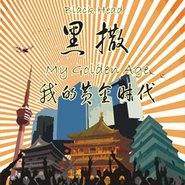

我的黄金时代
============================

|  |  |
| :--: | :-- |
| [ 我的黄金时代](https://emumo.xiami.com/album/334196) | **艺人**: [黑撒](../index.md) **语种**: 国语 **唱片公司**: 时音唱片 **发行时间**: 2009年05月01日 **专辑类别**: 录音室专辑 **专辑风格**:  **播放数**: 1081192 **收藏数**: 945 **评论数**: 88  |

## 简介

陕西本土乐队“黑撒”，继首张专辑《起的比鸡还早》之后，历时十八个月，精心创作打造全新专辑唱片《我的黄金时代》。在这个浮躁的年代，能够坚持沉淀自己，创作内心真实的艺术，是音乐人难得的品质。如果你希望享受一份态度真诚又值得聆听的音乐，这张专辑，就是黑撒带来的最好的礼物。

## 曲目

## 评论

|  |  |  |
| :-- | :-- | :-- |
|  [虾米用户](https://emumo.xiami.com/u/43492923) 行到水穷我才开始害怕，夕... 2019-06-19 12:10 赞(0) 踩(0) | 
。
 |
|  [虾米用户](https://emumo.xiami.com/u/3661951) 累 2018-06-20 11:54 赞(0) 踩(0) | 
这张专辑 不知道是否借鉴了许多杰伦歌曲的元素呢
 |
| ⇒ |  [虾米用户](https://emumo.xiami.com/u/244155073) 亲吻你的鹅头~ 2018-07-21 16:15 赞(0) 踩(0) | 
说话来点证据
 |
| ⇒ |  [虾米用户](https://emumo.xiami.com/u/373792064)  2018-11-01 12:49 赞(0) 踩(0) | 
那周杰伦又借鉴了谁的元素呢？还是你只知道周杰伦，再举不出其他例子来了。
 |
|  [虾米用户](https://emumo.xiami.com/u/2538868) 得到的都是侥幸 2017-10-30 10:03 赞(0) 踩(0) | 
西安方言的Rap，在入耳的那一瞬间就击垮了我。那座城即便离开多年，在心里最柔软的地方一直念念不忘。我很想念那座城市，想念那城市里和我认识还有不认识的男男女女。
 |
|  [虾米用户](https://emumo.xiami.com/u/428161)  2017-10-28 00:35 赞(0) 踩(0) | 
西安净出人才
 |
|  [虾米用户](https://emumo.xiami.com/u/221795114)  2016-12-14 14:35 赞(0) 踩(0) | 
真的是一张用心做的黄金专辑。这个古城 ZTM碉堡了
 |
|  [虾米用户](https://emumo.xiami.com/u/51882256)  2015-11-15 13:05 赞(0) 踩(0) | 
好？！！
 |
|  [虾米用户](https://emumo.xiami.com/u/1582817) 若收藏精选集已删除，请用... 2014-10-01 11:52 赞(0) 踩(0) | 
太侉了 ＞＿＜．．．
 |
|  [虾米用户](https://emumo.xiami.com/u/14370724)  2014-06-29 23:01 赞(0) 踩(0) | 
喜欢黑撒的心停不下来
 |
|  [虾米用户](https://emumo.xiami.com/u/1609946) 一即一切 2014-03-09 11:40 赞(0) 踩(0) | 
心 境不二
 |
|  [虾米用户](https://emumo.xiami.com/u/6507607) 请把我的尸体埋在音乐里。 2014-02-09 17:09 赞(0) 踩(0) | 
调子到很不错。
 |
|  [虾米用户](https://emumo.xiami.com/u/4421922)  2013-11-11 09:00 赞(0) 踩(0) | 
嗷嗷好听
 |
|  [虾米用户](https://emumo.xiami.com/u/12565491) 我还没想好要写什么... 2013-10-06 22:17 赞(0) 踩(0) | 
真实
 |
|  [虾米用户](https://emumo.xiami.com/u/4192536)  2013-09-26 15:59 赞(0) 踩(0) | 
给力
 |
|  [虾米用户](https://emumo.xiami.com/u/20878129)  2013-09-01 18:47 赞(0) 踩(0) | 
嘹咂咧
 |
|  [虾米用户](https://emumo.xiami.com/u/13487125) wzw232323 2013-08-17 10:55 赞(0) 踩(0) | 
好听
 |
|  [虾米用户](https://emumo.xiami.com/u/15480548) 找伴！ 2013-07-20 22:53 赞(0) 踩(0) | 
有节奏的方言说唱！
 |
|  [虾米用户](https://emumo.xiami.com/u/15480548) 找伴！ 2013-07-20 22:49 赞(0) 踩(0) | 
有节奏的方言说唱！！不一样的感受
 |
|  [虾米用户](https://emumo.xiami.com/u/8579932)  2013-06-20 01:27 赞(0) 踩(0) | 
加油 期待新作品
 |
|  [虾米用户](https://emumo.xiami.com/u/3205477) 菩提本无树 明镜亦非台 2013-05-03 23:29 赞(0) 踩(0) | 
陕西本土乐队，力挺！
 |
|  [虾米用户](https://emumo.xiami.com/u/1494961)  2013-05-02 16:09 赞(0) 踩(0) | 
挺好的
 |
|  [虾米用户](https://emumo.xiami.com/u/1848672)  2013-02-23 08:48 赞(0) 踩(0) | 
ok
 |
|  [虾米用户](https://emumo.xiami.com/u/10468601) 行者无疆 2013-02-14 15:37 赞(0) 踩(0) | 
内心的沉淀…………
 |
|  [虾米用户](https://emumo.xiami.com/u/2971389) 幸福=效用／欲望 2013-02-08 22:55 赞(0) 踩(0) | 
醉长安~
 |
|  [虾米用户](https://emumo.xiami.com/u/1582817) 若收藏精选集已删除，请用... 2013-01-15 12:36 赞(0) 踩(0) | 
都是陕西方言……
 |
|  [虾米用户](https://emumo.xiami.com/u/11239012)  2012-12-21 16:15 赞(0) 踩(0) | 
黑撒 方言 聊咋咧！
 |
|  [虾米用户](https://emumo.xiami.com/u/9022838)  2012-11-13 20:44 赞(0) 踩(0) | 
qingxin
 |
|  [虾米用户](https://emumo.xiami.com/u/10670983) 周日，让跳跃的暖意包裹着... 2012-11-09 13:15 赞(0) 踩(0) | 
黑
 |
|  [虾米用户](https://emumo.xiami.com/u/6607451)  2012-10-11 12:59 赞(0) 踩(0) | 
西安摇滚
 |
|  [虾米用户](https://emumo.xiami.com/u/10685636) 子曰他爹 2012-09-28 23:21 赞(0) 踩(0) | 
西安女娃！
 |
|  [虾米用户](https://emumo.xiami.com/u/9411939)  2012-09-28 01:46 赞(0) 踩(0) | 
老乡
 |
|  [虾米用户](https://emumo.xiami.com/u/4313085) 一切淡淡的就好… 2012-07-03 15:36 赞(0) 踩(0) | 
没理由就是理由。
 |
|  [虾米用户](https://emumo.xiami.com/u/647248)   2012-06-03 23:17 赞(0) 踩(0) | 
听了第一首歌的第一句，一点没犹豫，收藏+分享
 |
|  [虾米用户](https://emumo.xiami.com/u/1939037)   2012-05-06 17:53 赞(0) 踩(0) | 
“西安女娃 她们都很伟大 长得漂亮不说 还都挺有文化 ”
 |
|  [虾米用户](https://emumo.xiami.com/u/7637119)  2012-05-02 13:38 赞(0) 踩(0) | 
水准很高，加上亲切的西安方言，应该给11分。
 |
|  [虾米用户](https://emumo.xiami.com/u/3983650)  2012-04-06 19:53 赞(0) 踩(0) | 
有意思 虽然不是我喜欢的风格 但值得细品
 |
|  [虾米用户](https://emumo.xiami.com/u/8043130)  2012-03-28 16:14 赞(0) 踩(0) | 
西安女娃
 |
|  [虾米用户](https://emumo.xiami.com/u/8224770) 暂无签名~ 2012-03-07 21:06 赞(0) 踩(0) | 
好
 |
|  [虾米用户](https://emumo.xiami.com/u/7915927)  2012-02-04 21:18 赞(0) 踩(0) | 
rock night
 |
|  [虾米用户](https://emumo.xiami.com/u/1235923)  2012-02-04 11:00 赞(0) 踩(0) | 
黑撒乐队足以制造了方言摇滚乐的神话
 |
|  [虾米用户](https://emumo.xiami.com/u/7343768)  2012-01-19 23:15 赞(0) 踩(0) | 
很有意思~
 |
|  [虾米用户](https://emumo.xiami.com/u/7247940)  2012-01-18 15:31 赞(0) 踩(0) | 
哈啊哈...得到了久违的听音乐的快乐....
 |
|  [虾米用户](https://emumo.xiami.com/u/6868765)  2012-01-08 00:54 赞(0) 踩(0) | 
纯爷们！
 |
|  [虾米用户](https://emumo.xiami.com/u/7447014)  2011-12-28 23:22 赞(0) 踩(0) | 
我喜欢
 |
|  [虾米用户](https://emumo.xiami.com/u/7447014)  2011-12-28 23:21 赞(0) 踩(0) | 
我喜欢
 |
|  [虾米用户](https://emumo.xiami.com/u/7447014)  2011-12-28 23:19 赞(0) 踩(0) | 
我喜欢
 |
|  [虾米用户](https://emumo.xiami.com/u/7355950)  2011-12-22 14:36 赞(0) 踩(0) | 
来自陕西的好乐队！ 希望他们走向全国！推荐我们的黄金时代。
 |
|  [虾米用户](https://emumo.xiami.com/u/7221655)  2011-12-13 11:14 赞(0) 踩(0) | 
听着很爽
 |
|  [虾米用户](https://emumo.xiami.com/u/3752854)  2011-12-02 07:52 赞(0) 踩(0) | 
陕西人自己的音乐，非常喜欢，收藏了
 |
|  [虾米用户](https://emumo.xiami.com/u/3685708)  2011-11-17 20:51 赞(0) 踩(0) | 
喜欢骂老师的。。哈哈
 |
|  [虾米用户](https://emumo.xiami.com/u/6494147)  2011-11-14 21:33 赞(0) 踩(0) | 
喜欢有地方特色的。
 |
|  [虾米用户](https://emumo.xiami.com/u/6251250)  2011-10-31 20:38 赞(0) 踩(0) | 
各位大侠，谁有黑撒给前浐灞写的队歌，五年前看中场中场加油听到过，也百度搜到过，后来就怎么也找不到了，有的能给小弟传一首不？不胜感激！
 |
|  [虾米用户](https://emumo.xiami.com/u/6390833)  2011-10-29 14:54 赞(0) 踩(0) | 
西安本土歌曲，喜欢！
 |
|  [虾米用户](https://emumo.xiami.com/u/6365780)  2011-10-22 21:25 赞(0) 踩(0) | 
喜欢，差不多3年了  还是喜欢。。不解释啊不解释
 |
|  [虾米用户](https://emumo.xiami.com/u/6183404)  2011-10-20 16:44 赞(0) 踩(0) | 
西安女娃，都长的忒色！！！！
 |
|  [虾米用户](https://emumo.xiami.com/u/4025887)  2011-10-13 22:03 赞(0) 踩(0) | 
支持
 |
|  [虾米用户](https://emumo.xiami.com/u/2398951)  2011-10-02 03:24 赞(0) 踩(0) | 
美美美
 |
|  [虾米用户](https://emumo.xiami.com/u/5207067)  2011-08-28 21:40 赞(0) 踩(0) | 
真的很好听，支持黑撒
 |
|  [虾米用户](https://emumo.xiami.com/u/5148928)  2011-08-27 21:34 赞(0) 踩(0) | 
嘹咂咧！！！
 |
|  [虾米用户](https://emumo.xiami.com/u/5119542)  2011-08-17 17:14 赞(0) 踩(0) | 
美地狠
 |
|  [虾米用户](https://emumo.xiami.com/u/3842149) 这个世界会好吗 2011-08-06 13:03 赞(0) 踩(0) | 
与众不同
 |
|  [虾米用户](https://emumo.xiami.com/u/3615244)  2011-08-02 08:53 赞(0) 踩(0) | 
这样民族的rap喜欢.
 |
|  [虾米用户](https://emumo.xiami.com/u/4987342)  2011-07-23 15:03 赞(0) 踩(0) | 
花钱准备下载整张专辑，结果发现上当了，虾米网竟然坑蒙拐骗~~~
 |
|  [虾米用户](https://emumo.xiami.com/u/4716580)  2011-07-15 23:28 赞(0) 踩(0) | 
黑撒就在你我的身边
 |
|  [虾米用户](https://emumo.xiami.com/u/4716580)  2011-07-15 23:21 赞(0) 踩(0) | 
黑撒还是这么棒！
 |
|  [虾米用户](https://emumo.xiami.com/u/4716580)  2011-07-15 22:59 赞(0) 踩(0) | 
来自生活，感受深刻~
 |
|  [虾米用户](https://emumo.xiami.com/u/3971910)  2011-05-23 22:58 赞(0) 踩(0) | 
太有范，有着浓厚的陕西风味
 |
|  [虾米用户](https://emumo.xiami.com/u/3996781) 暂无签名~ 2011-05-21 01:05 赞(0) 踩(0) | 
离开西安，时不时地，就会有这个念头：“我想西安了……”我想西安……一直在想
 |
|  [虾米用户](https://emumo.xiami.com/u/3416923)   2011-04-29 22:10 赞(0) 踩(0) | 
哈哈，我在班里面唱过那首西安女娃，当时差点紧张死，歌词好多呀
 |
|  [虾米用户](https://emumo.xiami.com/u/3400048) Spotify ID: ... 2011-04-28 11:06 赞(0) 踩(0) | 
黑撒新砖~比起上一张次了些，不过还是喜欢！黑撒加油
 |
|  [虾米用户](https://emumo.xiami.com/u/690537)  2011-04-20 11:19 赞(0) 踩(0) | 
不赖
 |
|  [虾米用户](https://emumo.xiami.com/u/3484576) 30000m up 2011-04-05 19:25 赞(0) 踩(0) | 
陕西风味阿
 |
|  [虾米用户](https://emumo.xiami.com/u/3484576) 30000m up 2011-04-05 19:22 赞(0) 踩(0) | 
陕西风味
 |
|  [虾米用户](https://emumo.xiami.com/u/3016971)  2011-03-19 22:55 赞(0) 踩(0) | 
哈哈，陕西话，听听看
 |
|  [虾米用户](https://emumo.xiami.com/u/1660395)  2011-02-05 19:01 赞(0) 踩(0) | 
好听，特别 特别好听
 |
|  [虾米用户](https://emumo.xiami.com/u/2609155)  2011-01-25 09:50 赞(0) 踩(0) | 
很亲切
 |
|  [虾米用户](https://emumo.xiami.com/u/267467)  2010-10-25 10:54 赞(0) 踩(0) | 
作为一个有山西血统的南方人，我很喜欢陕西的黑撒～
 |
|  [虾米用户](https://emumo.xiami.com/u/1528784)  2010-10-16 21:20 赞(0) 踩(0) | 
我表示。西安什么的最有爱了。
 |
|  [虾米用户](https://emumo.xiami.com/u/928576) 　　　　　　　　　 2010-09-26 18:06 赞(0) 踩(0) | 
喔哈哈……
 |
|  [虾米用户](https://emumo.xiami.com/u/725994)  2010-03-14 07:07 赞(0) 踩(0) | 
歌词里面出现太多 宝马 了， 有时颠覆等于宣传啊。
 |
| ⇒ |  [虾米用户](https://emumo.xiami.com/u/1894684)  2010-11-18 18:21 赞(0) 踩(0) | 
关你屁事！
 |
|  [虾米用户](https://emumo.xiami.com/u/636310)  2010-01-25 08:16 赞(0) 踩(0) | 
应该好好宣传 希望成功
 |
|  [虾米用户](https://emumo.xiami.com/u/182636)  2009-10-16 17:03 赞(0) 踩(0) | 
真诚地音乐，很喜欢
 |
|  [虾米用户](https://emumo.xiami.com/u/337099)  2009-09-13 22:32 赞(0) 踩(0) | 
比起第一张，多了更加个人的东西，加入了更多的元素。多了嬉笑怒骂，多了对现代社会生活的心酸！
 |
|  [虾米用户](https://emumo.xiami.com/u/18298) 暂无签名~ 2009-07-12 22:46 赞(0) 踩(0) | 
作为南方人很奇怪自己会喜欢这些年轻的北方老家伙 O(∩_∩)O哈哈~
 |
|  [虾米用户](https://emumo.xiami.com/u/18298) 暂无签名~ 2009-07-12 22:43 赞(0) 踩(0) | 
作为南方人很奇怪自己会喜欢这些北方老家伙  O(∩_∩)O哈哈~
 |
|  [虾米用户](https://emumo.xiami.com/u/8584) 温柔其心，敦厚其行。 2009-07-09 08:51 赞(0) 踩(0) | 
特滴狠！
 |
