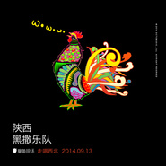

走唱·西北 陕西黑撒乐队专场章鱼现场“走唱·西北”系列演出 第一场
============================

|  |  |
| :--: | :-- |
| [ 走唱·西北 陕西黑撒乐队专场章鱼现场“走唱·西北”系列演出 第一场](https://emumo.xiami.com/album/514392028) | **艺人**: [黑撒](../index.md) **语种**: 其他 **唱片公司**: 章鱼现场, 时音唱片 **发行时间**: 2014年09月13日 **专辑类别**: 现场专辑 **专辑风格**: 说唱摇滚 Rap Rock, 当代民谣 Contemporary Folk **播放数**: 307329 **收藏数**: 354 **评论数**: 17  |

## 简介

IIIIIIIIIIIIIIIIIIIIIIIIIIIIIIIIIIIIIIIIIIIIIIIIIIIIIIIIIIII 虾米音乐人·独家首发 IIIIIIIIIIIIIIIIIIIIIIIIIIIIIIIIIIIIIIIIIIIIIIIIIIIIIIIIIIII  
  
『章鱼现场』走唱·西北第一场——陕西黑撒专场   
时间：2014年9月13日   
地点：麻雀瓦舍   
  
「走唱·西北」   
每一个西北人的心中，都有一座西北的城。   
  
粗犷，辽阔，苍凉。   
戈壁，黄土，烈日。   
那是别人的西北。   
  
热情，朴实，家乡话。   
风烈，酒浓，人情厚。   
这是西北人的西北。   
  
西北人的西北，没有鳞次栉比的摩天大楼，只有清晨出门时吆喝问好的老街坊。   
西北人的西北，没有满街开店的老马拉面，只有楼下香气四溢馋死人的牛肉面。   
西北人的西北，没有帝都魔都的光速运转，只有凌晨两点还喝酒吃肉的自由心。   
  
走，让真正的西北人带你领略纯正的西北风情。   
唱，让醉人的西北歌帮离乡的你找回西北味道。   
  
「走唱·西北」   
西北城，西北人，西北歌。   
属于每个人的西北。  
  
［黑撒］   
成军七年，歌迷翘首企盼！   
章鱼现场携手黑撒乐队，带来首个北京专场！在现场和黑撒一起体验纯正的陕西风情！  
9月13日，黑撒乐队将在北京麻雀瓦舍参加「章鱼现场」举办的「走唱·西北」系列的首场演出。乐队将为北京的歌迷带来整晚精彩的演出，唱尽经典歌曲，让你把陕西话一次听到爽！  
  
黑撒，是西北秦腔的一个分支。   
黑撒，是古城西安一支特立独行的陕西话乐队。   
从《起的比鸡还早》，到《流川枫与苍井空》，黑撒坚持用陕西话唱着他们的歌，将老祖宗秦始皇的口音带到了大江南北。他们的音乐融合了嘻哈、蓝调、雷鬼、爵士等多种音乐风格，歌词质朴温暖，透着一股浓浓的陕西味儿。   
听黑撒的音乐，不用去陕西，就能让你饱览古城风土，尝尽陕西美味。  
  
「章鱼现场」是国内一个新生代主办方，将会专注在为歌迷提供更优秀的独立音乐现场体验，让演出不再仅仅只是「去现场听歌」，而是「在现场体验音乐 的全方位魅力」。「走唱·西北」系列将持续整整5个月，邀请陕西、内蒙、新疆、宁夏、甘肃五省的知名独立音乐人，为喜爱独立音乐的你，带来纯正的西北风情。

## 曲目

## 评论

|  |  |  |  |
| :-- | :-- | :-- | :-- |
|  [虾米用户](https://emumo.xiami.com/u/435438832)  2020-04-16 12:12 赞(0) 踩(0) | 
章鱼现场 走唱&amp;middot;西北 系列演出之陕西主题&amp;mdash;&amp;mdash;第一场 黑撒专场【时间】2014年09月13日【地点】北京&amp;middot;麻雀瓦舍【全场高清视频】<a href="http://www.letv.com/ptv/vplay/20830320.html" target="_blank" rel="nofollow noreferrer noopener">http://www.letv.com/ptv/vplay/20830320.html</a>
 |
|  [虾米用户](https://emumo.xiami.com/u/435438832)  2020-02-26 22:02 赞(0) 踩(0) | 
去麻雀瓦舍看了现场，进门的时候还和曹石哥撞了个满怀～超绅士让我先进。
 |
|  [虾米用户](https://emumo.xiami.com/u/28249588) 来自1998 2015-11-21 16:14 赞(2) 踩(0) | 
内容已删除
 |
| ⇒ |  [虾米用户](https://emumo.xiami.com/u/28249588) 来自1998 2017-12-16 23:16 赞(0) 踩(0) | 
<q><b>说：</b></q>
 |
|  [虾米用户](https://emumo.xiami.com/u/1497621)  2015-11-04 12:41 赞(0) 踩(0) | 
喜欢这感觉，这味道
 |
|  [虾米用户](https://emumo.xiami.com/u/10774217)  2015-07-02 17:23 赞(0) 踩(0) | 
作为东北人虽然听他们口音很累，不过真的很喜欢黑撒
 |
|  [虾米用户](https://emumo.xiami.com/u/34970827)  2015-05-03 11:10 赞(0) 踩(0) | 
太棒！
 |
|  [虾米用户](https://emumo.xiami.com/u/5604577) killthegod 2015-03-30 06:07 赞(0) 踩(0) | 
麻雀瓦舍确实不错
 |
|  [虾米用户](https://emumo.xiami.com/u/10898495)  2015-03-14 14:47 赞(0) 踩(0) | 
现场民谣
 |
|  [虾米用户](https://emumo.xiami.com/u/40843045) 做不一样的现场演出 2014-12-24 14:20 赞(4) 踩(0) | 
章鱼现场「走唱·西北」系列演出之陕西主题——黑撒乐队专场【时间】2014年9月13日【地点】北京·麻雀瓦舍【全场高清视频】<a href="http://www.letv.com/ptv/vplay/20830320.html" target="_blank" rel="nofollow noreferrer noopener">http://www.letv.com/ptv/vplay/20830320.html</a>
 |
|  [虾米用户](https://emumo.xiami.com/u/1851561)  2014-12-10 18:20 赞(1) 踩(0) | 
哥跟陕西有缘。。。。
 |
|  [虾米用户](https://emumo.xiami.com/u/6754967)  2014-11-25 08:47 赞(1) 踩(0) | 
真是牛逼的现场，下次在北京再有现场一定到现场支持
 |
|  [虾米用户](https://emumo.xiami.com/u/11156530)   2014-11-24 15:36 赞(0) 踩(0) | 
真走心的现场
 |
|  [虾米用户](https://emumo.xiami.com/u/492722) 小强 2014-11-03 13:37 赞(0) 踩(0) | 
牛逼的章鱼现场
 |
|  [虾米用户](https://emumo.xiami.com/u/35512747)  2014-10-29 16:19 赞(0) 踩(0) | 
再喜欢不过
 |
|  [虾米用户](https://emumo.xiami.com/u/4923144)  2014-10-28 15:13 赞(0) 踩(0) | 
cool
 |
|  [虾米用户](https://emumo.xiami.com/u/267638) 情感创作是人工智能无法替... 2014-10-28 14:27 赞(0) 踩(0) | 
大家一起听黑撒
 |
|  [虾米用户](https://emumo.xiami.com/u/1353919) goodnight 2014-10-28 11:59 赞(0) 踩(0) | 
「章鱼现场」出品
 |
