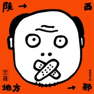

黑撒
============================

|  |  |
| :--: | :-- |
| [ 黑撒](https://i.xiami.com/mafeng) | **播放数**: 12352605 **粉丝数**: 17331 **评论数**: 617 **地区**: China 中国大陆 **风格**: 摇滚 Rock & Roll  |

## 档案

他们的创作,天大地大， 
满嘴的西安方言像一方豪杰冲锋陷阵； 
他们的歌声现实的， 
当下年轻一代的生活困境都被他们嬉戏语言大事化小； 
他们的技巧是丰满的， 
特别是对那个古城的膜拜，已经是他们骨子里的声音。 
“黑撒”是来自西安的一支乐队组合，风格主要以陕西方言的Hip-Hop为主，还融合了蓝调、戏曲、爵士、摇滚、电子乐等多种音乐元素。歌词幽默个性，独具风采又引人深思，以叙事为主，抒情为辅，加上悦耳时尚的配乐，演绎“Black Head”化的说唱乐。就好比“黑撒”的歌词中所唱到的，他们要“把老祖宗秦始皇的口音发扬光大”！听完他们的作品，你会发现，原来陕西话是这么动听和迷人。 
最初由“夜晚的骑士”和“马蜂”搭档组成，后加入吉他手张宁、贝司手双喜、鼓手毕涛。 
黑撒乐队2007年发行专辑《起的比鸡还早》，唱片上市后创下西安本土原创音乐销售的最佳纪录，受到各界的一致好评。并受邀担任阿甘电影《高兴》音乐监制和主创。2009年发行专辑《我的黄金时代》，凭此专辑获得第十届华语音乐传媒大奖“最佳嘻哈艺人”奖。《这个古城》和《命犯相思》被2011年贺岁片《哥的传说》选为片头和片尾曲。黑撒乐队的第三张专辑《西安事变》于2011年12月18日正式发行，单曲《流川枫与苍井空》5月底首发网络推广，便被媒体称为“2011年最感动人心民谣歌曲”。凤凰网，土豆网，新浪视频，搜狐视频，中国摇滚榜，新浪娱乐纷纷首页推荐，凤凰卫视，南方都市报，华商报，西安晚报也采用大篇幅进行报道。新浪微博转发累计超万次。

## 专辑

| 名称 | 语种 | 唱片公司 | 发行时间 | 专辑类别 | 专辑风格 |
| :--: | :-- | :-- | :-- | :-- | :-- |
| [ 废城甜梦](./albums/2104027547.md) | 国语 | 摩登天空 | 2018年09月14日 | 录音室专辑 |  |
| [ 陕西地方邪](./albums/2103924903.md) | 国语 | 摩登天空 | 2018年08月15日 | EP, 单曲 | 摇滚 Rock & Roll |
| [ 德福巷的酒鬼](./albums/2103879056.md) | 国语 | 摩登天空 | 2018年08月01日 | EP, 单曲 | 摇滚 Rock & Roll |
| [ 瘦身的幌子](./albums/2103510538.md) | 国语 | 摩登天空 | 2018年01月31日 | EP, 单曲 |  |
| [ 校花隔壁的流川枫](./albums/2102758030.md) | 国语 | 新片场影业 | 2017年06月02日 | EP, 单曲 |  |
| [ 如果这些都可以](./albums/2102734348.md) | 国语 | 摩登天空 | 2016年11月11日 | EP, 单曲 |  |
| [ 你是一个演员](./albums/1820072761.md) | 国语 | 摩登天空 | 2015年01月01日 | EP, 单曲 | 硬摇滚 Hard Rock, 摇滚 Rock & Roll |
| [ 走唱·西北 陕西黑撒乐队专场章鱼现场“走唱·西北”系列演出 第一场](./albums/514392028.md) | 其他 | 章鱼现场, 时音唱片 | 2014年09月13日 | 现场专辑 | 说唱摇滚 Rap Rock, 当代民谣 Contemporary Folk |
| [ 西安事变](./albums/444137.md) | 国语 | 时音唱片 | 2011年11月01日 | 录音室专辑 |  |
| [ 我的黄金时代](./albums/334196.md) | 国语 | 时音唱片 | 2009年05月01日 | 录音室专辑 |  |
| [ 起的比鸡还早](./albums/172733.md) | 国语 | 时音唱片 | 2007年11月03日 | 录音室专辑 |  |

## 评论

|  |  |  |  |
| :-- | :-- | :-- | :-- |
|  [虾米用户](https://emumo.xiami.com/u/276786607) -|- 2020-06-02 04:36 赞(0) 踩(0) | 
61              6661⭐⚘
 |
|  [虾米用户](https://emumo.xiami.com/u/276786607) -|- 2020-06-02 04:35 赞(0) 踩(0) | 
⚘6666661是西安的麻哈哈哈6661⚘⚘⚘⚘⚘⚘⚘⚘⚘⚘⚘⚘⚘⚘⚘⚘⚘
 |
|  [虾米用户](https://emumo.xiami.com/u/279308567) 生活不易，且行且珍惜 2019-12-12 23:19 赞(0) 踩(0) | 
为啥没有说到河滩会……
 |
|  [虾米用户](https://emumo.xiami.com/u/49655313) 除了再见还可以说些什么呢 2019-10-20 23:57 赞(0) 踩(0) | 
哈哈哈哈哈今天说好的卖身走个闲鱼呢？
 |
|  [虾米用户](https://emumo.xiami.com/u/156856338)  2019-09-11 10:23 赞(0) 踩(0) | 
第一次看见这样的封面。。。
 |
|  [虾米用户](https://emumo.xiami.com/u/330152497) 恰到好处的阳光洒满了乐曲... 2019-08-19 23:31 赞(0) 踩(0) | 
很不错的
 |
|  [虾米用户](https://emumo.xiami.com/u/7133174) 我还没想好要写什么... 2019-08-09 00:45 赞(0) 踩(0) | 
我是颜值粉
 |
|  [虾米用户](https://emumo.xiami.com/u/7133174) 我还没想好要写什么... 2019-08-09 00:41 赞(0) 踩(0) | 
曹石好帅啊！搞基吗
 |
|  [虾米用户](https://emumo.xiami.com/u/344408565)  2019-07-11 08:41 赞(0) 踩(0) | 
如果与如果
 |
|  [虾米用户](https://emumo.xiami.com/u/39605186) 呜啦啦~ 2019-07-04 20:27 赞(0) 踩(0) | 
谢谢你们，加油！！！
 |
|  [虾米用户](https://emumo.xiami.com/u/284122836)  2019-06-19 11:13 赞(0) 踩(0) | 
就这么定了，今天吃煮馍
 |
|  [虾米用户](https://emumo.xiami.com/u/81096636) 校园吉他手，玩乐队可联系 2019-05-16 13:30 赞(0) 踩(0) | 
这乐队名字整的像玩黑的
 |
|  [虾米用户](https://emumo.xiami.com/u/235083449)  2019-04-02 23:48 赞(0) 踩(0) | 
怀念在西安上大学听黑撒乐队的日子
 |
|  [虾米用户](https://emumo.xiami.com/u/5924898)  2018-12-06 07:55 赞(2) 踩(0) | 
老公说没听过黑撒的歌，我说一个西安人，你竟然没听过黑撒，来，我给你放
 |
|  [虾米用户](https://emumo.xiami.com/u/32051445) 女孩儿的歌。 永爱虾米 2018-09-28 22:34 赞(0) 踩(0) | 
很久咯
 |
|  [虾米用户](https://emumo.xiami.com/u/315300346)  2018-09-08 23:19 赞(2) 踩(0) | 
我喜欢方言，挺有意思的，不管你能不能看见，希望多用方言，来自河南的祝福 
 |
|  [虾米用户](https://emumo.xiami.com/u/18786) 不是真的 2018-07-29 22:47 赞(2) 踩(0) | 
那些歌颂西安的歌像小学生写作文一样虚假做作    
 |
| ⇒ |  [虾米用户](https://emumo.xiami.com/u/324056922) 有些人能遇见足矣! 2018-09-04 15:29 赞(0) 踩(0) | 
&lt;哦乳太让人付费通人天天[url=/u/328769511]@蓝色热带鱼 [/url]体育...沟通日特？热热日日都...“”（：）&gt;&lt;328769511&gt;
 |
|  [虾米用户](https://emumo.xiami.com/u/295498969)  2018-06-28 22:15 赞(0) 踩(0) | 
敲好听(●'◡'●)ﾉ❤
 |
|  [虾米用户](https://emumo.xiami.com/u/6215042) 欢迎关注同名音乐公众号 2018-05-19 21:35 赞(0) 踩(0) | 
艹石
 |
|  [虾米用户](https://emumo.xiami.com/u/295729866) 疾风知劲草，板荡识诚臣。... 2018-05-13 20:52 赞(10) 踩(0) | 
山东男子汉也想要个西安女娃 
 |
| ⇒ |  [虾米用户](https://emumo.xiami.com/u/324056922) 有些人能遇见足矣! 2018-09-04 15:30 赞(0) 踩(0) | 
天g凡菲待付款疯疯癫癫调踢关于日防夜防忐忑多的%
 |
| ⇒ |  [虾米用户](https://emumo.xiami.com/u/295729866) 疾风知劲草，板荡识诚臣。... 2018-09-28 17:38 赞(0) 踩(0) | 
<q><b>away924说：</b></q>
 |
|  [虾米用户](https://emumo.xiami.com/u/203259740)  2018-04-06 09:34 赞(2) 踩(0) | 
自从苍井空那首火了之后 这几年出的歌曲都是玩票的 希望还是静下心来钻研作品
 |
|  [虾米用户](https://emumo.xiami.com/u/43492923) 行到水穷我才开始害怕，夕... 2018-03-07 17:54 赞(0) 踩(0) | 
&amp;phi;
 |
|  [虾米用户](https://emumo.xiami.com/u/49991666) 有时候真想醉死在音乐里 2018-01-18 19:00 赞(0) 踩(0) | 
这个乐队真良心！！
 |
|  [虾米用户](https://emumo.xiami.com/u/290607263)    知行合一 2018-01-07 18:49 赞(0) 踩(0) | 
大西安的民谣，陕西话多亲切，还都这么好听
 |
|  [虾米用户](https://emumo.xiami.com/u/1461777) 世事扰攘，且听宫商。 2018-01-03 23:41 赞(0) 踩(0) | 
牛逼。
 |
|  [虾米用户](https://emumo.xiami.com/u/226081577) 人生总要有点喜欢的事情吧... 2017-12-24 15:33 赞(0) 踩(0) | 
我想念2012年北京迷笛上听的现场，什么时候开巡演啊？好想再次在现场听你们的歌
 |
|  [虾米用户](https://emumo.xiami.com/u/376517) 我还没想好要写什么... 2017-12-20 23:28 赞(0) 踩(0) | 
真厉害！流川枫苍井空那首真温暖，陕西美食唱得人嘴馋，我的最爱。
 |
|  [虾米用户](https://emumo.xiami.com/u/7975344)   2017-12-13 18:06 赞(0) 踩(0) | 
练死小日本
 |
|  [虾米用户](https://emumo.xiami.com/u/287792681)  2017-12-13 00:23 赞(0) 踩(0) | 
很好的陕西本土乐队，很喜欢听
 |
|  [虾米用户](https://emumo.xiami.com/u/24764477)  2017-10-30 10:21 赞(0) 踩(0) | 
身在异地经常听，每次听着西安事变就想起小时候的生活，真的好想家
 |
|  [虾米用户](https://emumo.xiami.com/u/2689980)  2017-10-30 10:21 赞(14) 踩(0) | 
西安女娃居然排那么靠后？？？！！！不科学！！每天早晨上班路上听这歌我就能蹦跶三尺高！！
 |
|  [虾米用户](https://emumo.xiami.com/u/8576332)  2017-10-30 10:20 赞(0) 踩(0) | 
******
 |
|  [虾米用户](https://emumo.xiami.com/u/693670)  2017-10-30 10:15 赞(2) 踩(0) | 
秦始皇口音的RAP乐团~歌词就是一个个小故事，推荐《贫嘴高中生的幸福生活》《西安美食》
 |
|  [虾米用户](https://emumo.xiami.com/u/7163088)  2017-10-28 00:33 赞(1) 踩(0) | 
西安净出高人啊
 |
|  [虾米用户](https://emumo.xiami.com/u/707250) 我还没想好要写什么... 2017-10-27 23:57 赞(2) 踩(0) | 
尤其像我这样在西安呆过的人，对黑撒乐队有股子不能割舍的亲切感。大荐！
 |
|  [虾米用户](https://emumo.xiami.com/u/43746033)  2017-10-27 23:33 赞(0) 踩(0) | 
这个人的歌，陕西摇滚，真不错，这些年的奇葩！我喜欢。
 |
|  [虾米用户](https://emumo.xiami.com/u/36093606) 我还没想好要写什么... 2017-10-27 23:16 赞(3) 踩(0) | 
听多了，现在看见任何文字都在心里默默用陕西话念出来！！无法控制！！妈蛋我学英语咋不能这么顺利。。
 |
|  [虾米用户](https://emumo.xiami.com/u/1851561)  2017-10-27 23:06 赞(0) 踩(0) | 
哥的手机铃声   。。。。你嗳上列fai哥  奏把额撇哈列~~~~ 哈哈哈哈哈  已笑疯
 |
|  [虾米用户](https://emumo.xiami.com/u/6215042) 欢迎关注同名音乐公众号 2017-10-16 12:52 赞(0) 踩(0) | 
主唱曹石 英文名Fuck Rock 或Fucking Stone
 |
|  [虾米用户](https://emumo.xiami.com/u/325444099)  2017-10-15 17:20 赞(2) 踩(0) | 
初中第一次在广播里听到黑撒，那时候只觉得好听。现在高中毕业出来读书也有快6年了，每次听黑撒，眼眶就红了。今日份的想我大西安。
 |
|  [虾米用户](https://emumo.xiami.com/u/302875608)  2017-10-05 21:33 赞(0) 踩(0) | 
音乐元素多元 编曲好歌词好 真心不错
 |
|  [虾米用户](https://emumo.xiami.com/u/282796145)  2017-09-15 15:43 赞(0) 踩(0) | 
很有陕西味。。
 |
|  [虾米用户](https://emumo.xiami.com/u/91174334)  2017-08-31 11:35 赞(0) 踩(0) | 
谁叫我山西方言 
 |
|  [虾米用户](https://emumo.xiami.com/u/165886170) 我有一把叨逼刀 2017-08-29 19:58 赞(0) 踩(0) | 
英文名字 黑头
 |
|  [虾米用户](https://emumo.xiami.com/u/203387286) 漫漫人生一人懂我就好无谓... 2017-06-29 15:26 赞(0) 踩(0) | 
流川枫与苍井空》哭了好久 循环了好久
 |
|  [虾米用户](https://emumo.xiami.com/u/255963094) 你消失一年了，我一直还在... 2017-06-19 12:36 赞(0) 踩(0) | 
黑撒陕西人的骄傲，希望你们坚持自己的风格，走出大陕西，闯出一片天
 |
|  [虾米用户](https://emumo.xiami.com/u/157774822) 卸掉了陪我多年的酷我音乐... 2017-06-17 09:48 赞(0) 踩(0) | 
看完电影来的  感动
 |
|  [虾米用户](https://emumo.xiami.com/u/132119586)  2017-06-14 21:07 赞(1) 踩(0) | 
起了个这么金属的名字，结果有点小清新？。。
 |
|  [虾米用户](https://emumo.xiami.com/u/33883431) 我还没想好要写什么... 2017-06-08 17:31 赞(0) 踩(0) | 
wewe
 |
|  [虾米用户](https://emumo.xiami.com/u/300124155)   2017-06-03 11:03 赞(0) 踩(0) | 
支持黑撒
 |
|  [虾米用户](https://emumo.xiami.com/u/67869966)  2017-03-25 19:43 赞(0) 踩(0) | 
真好听， 
 |
|  [虾米用户](https://emumo.xiami.com/u/10194980) for u 2017-02-23 21:18 赞(0) 踩(0) | 
一个去了深圳，一个去了国外，天天以泪洗面，不知何时结束这种痛苦
 |
|  [虾米用户](https://emumo.xiami.com/u/6820570) 这是语言的变调，承接醒来... 2017-02-23 19:51 赞(0) 踩(0) | 
诶厉害了，认识西安之前除了通过肉夹馍，就是苗阜王声。现在音乐里也捡到宝了
 |
|  [虾米用户](https://emumo.xiami.com/u/188128960)  2017-02-22 06:07 赞(2) 踩(0) | 
和马飞一起是最喜欢的西安歌手
 |
|  [虾米用户](https://emumo.xiami.com/u/263194869)  2017-01-19 15:22 赞(0) 踩(0) | 
我
 |
|  [虾米用户](https://emumo.xiami.com/u/41017493)   2016-12-16 19:18 赞(0) 踩(0) | 
越听越饿
 |
|  [虾米用户](https://emumo.xiami.com/u/51805024) 一只特立独行的蜗牛 2016-11-22 22:54 赞(1) 踩(0) | 
声音不土，很好听
 |
|  [虾米用户](https://emumo.xiami.com/u/52697769) 一道穿透狂热的冷光 2016-10-04 11:35 赞(1) 踩(0) | 
突然想听陕西话说唱歌曲
 |
|  [虾米用户](https://emumo.xiami.com/u/27857090) 有朝一日 2016-08-17 19:30 赞(0) 踩(0) | 
黑撒
 |
|  [虾米用户](https://emumo.xiami.com/u/4475823)  2016-07-18 16:02 赞(0) 踩(0) | 
牛滴很
 |
|  [虾米用户](https://emumo.xiami.com/u/12208626)   2016-07-04 00:40 赞(0) 踩(0) | 
聊咋了
 |
|  [虾米用户](https://emumo.xiami.com/u/16135450)  2016-06-23 00:51 赞(0) 踩(0) | 
1498
 |
|  [虾米用户](https://emumo.xiami.com/u/191281518)  2016-06-18 13:03 赞(3) 踩(0) | 
偶尔听到了他们的一首歌，虽然不怎么听歌，甚至连一首歌都不会唱，从小就是五音不全。上KTV也只是找公主玩。他们的哥让人去认识自己，去清理自己，一种正能量充满了整个身体。这个乐队是唯一个让我想去看他们一场演唱会的乐队。
 |
|  [虾米用户](https://emumo.xiami.com/u/44991093) Beautiful Bl... 2016-05-31 13:51 赞(30) 踩(0) | 
别看黑撒声音土，但它是第一个吧hiphop加入民谣，还融合蓝调戏曲爵士摇滚电子乐众多音乐元素，至少现在还算成功的
 |
|  [虾米用户](https://emumo.xiami.com/u/55519212)   2016-03-18 00:50 赞(0) 踩(0) | 
这群古惑仔快出新专辑了吧
 |
|  [虾米用户](https://emumo.xiami.com/u/3489466)   2016-03-09 20:40 赞(1) 踩(0) | 
想起班里那群西安佬
 |
|  [虾米用户](https://emumo.xiami.com/u/68909354) 游荡的街头人生 2016-02-06 17:34 赞(0) 踩(0) | 
初五初六初七见！
 |
|  [虾米用户](https://emumo.xiami.com/u/82960490) 借我十年，借我生猛与莽撞... 2016-01-24 18:18 赞(2) 踩(0) | 
妈的爱上西安口音了 
 |
| ⇒ |  [虾米用户](https://emumo.xiami.com/u/2760704) I love today 2016-07-30 13:31 赞(0) 踩(0) | 
那你就也爱上西安男娃吧 
 |
|  [虾米用户](https://emumo.xiami.com/u/34430205)  2016-01-22 13:03 赞(0) 踩(0) | 

 |
|  [虾米用户](https://emumo.xiami.com/u/20533463)  2016-01-04 21:48 赞(0) 踩(0) | 
土著
 |
|  [虾米用户](https://emumo.xiami.com/u/45621221) 卸载状态。 2015-12-27 20:10 赞(0) 踩(0) | 
好逗。
 |
|  [虾米用户](https://emumo.xiami.com/u/36897148) 私信➕v请备注 2015-12-25 14:56 赞(2) 踩(0) | 
《这个古城》非常棒
 |
| ⇒ |  [虾米用户](https://emumo.xiami.com/u/8094301) Bye bye wx n... 2015-12-25 15:03 赞(0) 踩(0) | 

 |
|  [虾米用户](https://emumo.xiami.com/u/15903195) 暂无签名~ 2015-12-23 17:30 赞(12) 踩(0) | 
记得以前有一首 城市夜生活的副作用
 |
| ⇒ |  [虾米用户](https://emumo.xiami.com/u/8868562)  2018-06-14 12:14 赞(0) 踩(0) | 
封杀了
 |
| ⇒ |  [虾米用户](https://emumo.xiami.com/u/289076358)  2020-12-06 22:38 赞(0) 踩(0) | 
我手机里有 哈哈哈
 |
|  [虾米用户](https://emumo.xiami.com/u/307883)   2015-12-15 00:14 赞(0) 踩(0) | 
丑开
 |
|  [虾米用户](https://emumo.xiami.com/u/4234256)  2015-12-14 11:19 赞(0) 踩(0) | 
出不来歌了？
 |
|  [虾米用户](https://emumo.xiami.com/u/48874735) 这家伙很笨什么也没留下… 2015-12-06 12:32 赞(0) 踩(0) | 
好久没有听黑撒了 想死我啦
 |
|  [虾米用户](https://emumo.xiami.com/u/78028618)  2015-12-05 14:21 赞(4) 踩(0) | 
陕西人活得就是接地气这么乡土~ 每次听黑撒都想滚回陕西了
 |
|  [虾米用户](https://emumo.xiami.com/u/909320) 在这里，总能找到一些合耳... 2015-11-10 13:33 赞(1) 踩(0) | 
因为爱着这个城市，所以爱着和这个城市有关的一切~
 |
|  [虾米用户](https://emumo.xiami.com/u/13075871) 僕の孤独が魚だったら 2015-11-05 21:27 赞(0) 踩(0) | 
还是有点不习惯口音…
 |
|  [虾米用户](https://emumo.xiami.com/u/40046181) 黑抒情 白摇滚 2015-11-04 19:37 赞(0) 踩(0) | 

 |
|  [虾米用户](https://emumo.xiami.com/u/1497621)  2015-11-04 12:42 赞(0) 踩(0) | 
陕西方言
 |
|  [虾米用户](https://emumo.xiami.com/u/295735) 现实与梦境，我不怀疑 2015-11-02 20:01 赞(1) 踩(0) | 
回首再听 流川枫和苍井空 还是那么有味。。。
 |
|  [虾米用户](https://emumo.xiami.com/u/6524678) 入骨子里的调调，也会忘了... 2015-10-28 23:20 赞(1) 踩(0) | 
哥们，用的这个乐队的封面好乡土
 |
|  [虾米用户](https://emumo.xiami.com/u/43253121) 我还没想好要写什么... 2015-10-28 22:35 赞(2) 踩(0) | 
我只想说吉他是不是和呆唯的一样
 |
|  [虾米用户](https://emumo.xiami.com/u/5990517)  2015-10-09 23:08 赞(1) 踩(0) | 
陕西美食 我流口水了..........
 |
|  [虾米用户](https://emumo.xiami.com/u/3300536) 喜欢睡觉因为梦里什么都有 2015-09-22 21:43 赞(1) 踩(0) | 
歌呢 我操
 |
|  [虾米用户](https://emumo.xiami.com/u/13028574) 捅死那个傻逼流行歌手 2015-09-20 22:00 赞(0) 踩(0) | 
新专辑出不出
 |
|  [虾米用户](https://emumo.xiami.com/u/7133174) 我还没想好要写什么... 2015-09-17 12:21 赞(0) 踩(0) | 
知乎观光……团
 |
|  [虾米用户](https://emumo.xiami.com/u/4026326)  2015-09-15 17:02 赞(0) 踩(0) | 
啥时候能来南方~~~
 |
|  [虾米用户](https://emumo.xiami.com/u/40252759) 我可是正人君子 2015-08-23 13:34 赞(0) 踩(0) | 
哈哈哈哈
 |
|  [虾米用户](https://emumo.xiami.com/u/46525121)   2015-08-22 13:31 赞(0) 踩(0) | 
喂，你的眼角有眼屎
 |
|  [虾米用户](https://emumo.xiami.com/u/47667505) 音乐啊，享受吧 2015-08-16 19:40 赞(0) 踩(0) | 
疯狂的沦陷 
 |
|  [虾米用户](https://emumo.xiami.com/u/47711130) 让她降落。 2015-08-06 10:16 赞(0) 踩(0) | 
18
 |
|  [虾米用户](https://emumo.xiami.com/u/54446460)  2015-08-04 12:15 赞(0) 踩(0) | 
玩民谣才是王道 黑撒   美的很 
 |
|  [虾米用户](https://emumo.xiami.com/u/52015453) 你被劈开的疼痛在大地弥漫 2015-08-03 19:21 赞(1) 踩(0) | 
讲真第一次听到“黑撒”这名儿我以为是金属乐队.... 
 |
|  [虾米用户](https://emumo.xiami.com/u/6280928)  2015-07-30 10:53 赞(0) 踩(0) | 
黑撒！就si这个味儿！
 |
|  [虾米用户](https://emumo.xiami.com/u/6280928)  2015-07-30 10:52 赞(0) 踩(0) | 
维萨 起的比鸡还早 变成live了。。。
 |
|  [虾米用户](https://emumo.xiami.com/u/6280928)  2015-07-30 10:50 赞(0) 踩(0) | 
黑撒！就是这个味儿！
 |
|  [虾米用户](https://emumo.xiami.com/u/49826126) 一笔雕凿的朋克青年。 2015-07-28 14:19 赞(1) 踩(0) | 
饿滴个神啊…好喜欢这种城市背景的感觉！我是南京人但是超级喜欢这口音太接地气辣，南京也有一个说唱的，喝混沌啊挤公交啊，都太赞了。。有机会一定要听一次黑撒的现场！
 |
|  [虾米用户](https://emumo.xiami.com/u/51493723) 21世纪，李二蛋的一天及... 2015-07-11 23:26 赞(0) 踩(0) | 
江苏徐州根音朋克贝斯组乐队
 |
|  [虾米用户](https://emumo.xiami.com/u/34799914) 我还没想好要写什么... 2015-07-08 02:25 赞(0) 踩(0) | 
可爱
 |
|  [虾米用户](https://emumo.xiami.com/u/44693511)  2015-07-05 15:45 赞(0) 踩(0) | 
本土民谣
 |
|  [虾米用户](https://emumo.xiami.com/u/49285445) :D :D 2015-06-20 19:57 赞(1) 踩(0) | 
主唱居然是，学计算机的。
 |
| ⇒ |  [虾米用户](https://emumo.xiami.com/u/23544968) 流行、摇滚、轻音乐 2015-08-06 11:22 赞(0) 踩(0) | 
我擦，我也是
 |
| ⇒ |  [虾米用户](https://emumo.xiami.com/u/49285445) :D :D 2015-08-09 02:35 赞(0) 踩(0) | 
<q><b>0和平主义0说：</b></q>
 |
| ⇒ |  [虾米用户](https://emumo.xiami.com/u/23544968) 流行、摇滚、轻音乐 2015-08-11 12:48 赞(0) 踩(0) | 
<q><b>Seb_Wu说：</b></q>
 |
|  [虾米用户](https://emumo.xiami.com/u/6795330)  2015-06-19 22:07 赞(1) 踩(0) | 
我是苗老师带过来的…
 |
|  [虾米用户](https://emumo.xiami.com/u/19203855) 虾米你还想混不，Radi... 2015-06-19 13:53 赞(2) 踩(0) | 
暴走党走开！这是陕西独有的幸福！
 |
|  [虾米用户](https://emumo.xiami.com/u/521737)  2015-06-03 08:52 赞(4) 踩(0) | 
来看看多少人是暴走大事件知道他们的？
 |
| ⇒ |  [虾米用户](https://emumo.xiami.com/u/7811797) 音乐是我的阿司匹林。 2015-06-18 20:31 赞(0) 踩(0) | 
为什么
 |
| ⇒ |  [虾米用户](https://emumo.xiami.com/u/49826126) 一笔雕凿的朋克青年。 2015-09-13 21:27 赞(0) 踩(0) | 
哪一期啊
 |
|  [虾米用户](https://emumo.xiami.com/u/48014753) 失去了是痛苦_得到了是无... 2015-06-02 21:20 赞(1) 踩(0) | 
师大路，八里村，冰峰
 |
| ⇒ |  [虾米用户](https://emumo.xiami.com/u/19203855) 虾米你还想混不，Radi... 2015-06-19 13:54 赞(0) 踩(0) | 
八里村，路过好多次，就是没进去过。。。
 |
|  [虾米用户](https://emumo.xiami.com/u/27530688)  2015-06-01 00:14 赞(3) 踩(0) | 
暴走乐队
 |
|  [虾米用户](https://emumo.xiami.com/u/45125459) 我住在北方 2015-05-30 20:31 赞(0) 踩(0) | 
长安最 土又 最文艺 的歌手 
 |
|  [虾米用户](https://emumo.xiami.com/u/20862728) 柯男 2015-05-29 22:55 赞(0) 踩(0) | 
_(┐「ε:)_
 |
|  [虾米用户](https://emumo.xiami.com/u/582208) 我还没想好要写什么... 2015-04-27 19:24 赞(3) 踩(0) | 
是不是唱过暴走大事件啊？
 |
| ⇒ |  [虾米用户](https://emumo.xiami.com/u/49810953) 面朝大海春暖花开 2015-05-05 08:32 赞(0) 踩(0) | 
对的，曹石
 |
|  [虾米用户](https://emumo.xiami.com/u/2781794) OK. I Will S... 2015-04-22 07:55 赞(0) 踩(0) | 
毕业季又来了…
 |
|  [虾米用户](https://emumo.xiami.com/u/43234452)  2015-04-20 10:06 赞(0) 踩(0) | 
真实 诚恳 却又那么深刻
 |
|  [虾米用户](https://emumo.xiami.com/u/3981552)  2015-04-19 10:37 赞(3) 踩(0) | 
我觉得黑撒可怕之处在于他们汲取百家的风格，从音乐中能听到民谣，朋克，英伦，说唱，电音，迷幻，金属……
 |
|  [虾米用户](https://emumo.xiami.com/u/1541063) 口嫌体正直 2015-04-09 16:47 赞(0) 踩(0) | 
卧槽今天才发现居然有23个赞...【笑哭....是 “都市碎戏” 这首
 |
|  [虾米用户](https://emumo.xiami.com/u/45759342) 唯音乐与爱情不可辜负！ 2015-03-12 17:17 赞(3) 踩(0) | 
黑撒,西安,
 |
|  [虾米用户](https://emumo.xiami.com/u/6034251)  2015-03-09 21:05 赞(1) 踩(0) | 
我只想说，好棒啊好棒啊！陕西话好听啊
 |
|  [虾米用户](https://emumo.xiami.com/u/526266) 我不能强迫自己天天签到，... 2015-03-06 13:24 赞(0) 踩(0) | 
默默的转过身，点个赞来掩盖我的感动。
 |
|  [虾米用户](https://emumo.xiami.com/u/11835832) 我还没想好要写什么... 2015-03-05 14:00 赞(0) 踩(0) | 
第一次听黑撒的歌, 是在电影里面, 起得比鸡早这首歌. 感觉很棒, 然后就百度, 听他们的歌到现在, 好几年了. 一直没厌过.
 |
|  [虾米用户](https://emumo.xiami.com/u/9408194) 我还没想好要写什么... 2015-02-28 00:18 赞(0) 踩(0) | 
令人作呕
 |
| ⇒ |  [虾米用户](https://emumo.xiami.com/u/8953203)  2015-04-22 19:52 赞(0) 踩(0) | 
<q><b>我只去过东南亚说：</b></q>
 |
| ⇒ |  [虾米用户](https://emumo.xiami.com/u/16727404) 秉忠贞之志，守谦退之节 2015-05-21 11:53 赞(0) 踩(0) | 
逗比
 |
| ⇒ |  [虾米用户](https://emumo.xiami.com/u/47283317) 暂无签名~ 2017-10-28 00:04 赞(0) 踩(0) | 
不喜欢你可以不听，总有人喜欢。瞎bb什么
 |
|  [虾米用户](https://emumo.xiami.com/u/37541893) 远离自己 2015-02-24 22:20 赞(0) 踩(0) | 
今年就去闺蜜的城市，希望能听到现场呢，好有趣的乐队
 |
|  [虾米用户](https://emumo.xiami.com/u/37512534) 暂无签名~ 2015-02-24 14:10 赞(0) 踩(0) | 
之前听过觉得不错，去过陕西再听更有感触
 |
|  [虾米用户](https://emumo.xiami.com/u/18148730) 会更好的 2015-02-13 08:53 赞(0) 踩(0) | 
看完知乎来的。。
 |
|  [虾米用户](https://emumo.xiami.com/u/1449280) 金属不死 2015-01-15 20:19 赞(1) 踩(0) | 
我喜欢秦腔我会告诉你？
 |
|  [虾米用户](https://emumo.xiami.com/u/5559088)   2015-01-02 11:42 赞(0) 踩(0) | 
贫嘴高中生，有意思，笑死我了。关注关注哈哈
 |
|  [虾米用户](https://emumo.xiami.com/u/18298) 暂无签名~ 2015-01-02 10:52 赞(0) 踩(0) | 
恭喜摩登了
 |
|  [虾米用户](https://emumo.xiami.com/u/34605736) 声音载动生命的美 2014-12-30 23:28 赞(0) 踩(0) | 
听了很多次，在一个特定的时间，才觉得是一个很有意思的乐队
 |
|  [虾米用户](https://emumo.xiami.com/u/23961909) 呵呵呵 2014-12-26 13:55 赞(1) 踩(0) | 
签约摩登了
 |
|  [虾米用户](https://emumo.xiami.com/u/9430725) 当为神所佑 2014-12-16 21:38 赞(0) 踩(0) | 
<a href="http://emumo.xiami.com/u/5502769" target="_blank" rel="nofollow" name_card="5502769">@绿毛水怪</a>
 |
| ⇒ |  [虾米用户](https://emumo.xiami.com/u/5502769)  2014-12-17 15:35 赞(0) 踩(0) | 
nice
 |
|  [虾米用户](https://emumo.xiami.com/u/9430725) 当为神所佑 2014-12-16 21:36 赞(0) 踩(0) | 
额滴神
 |
|  [虾米用户](https://emumo.xiami.com/u/8070377) 爱雾瑞性维欧腐漏 2014-12-08 00:44 赞(2) 踩(0) | 
恨晚
 |
|  [虾米用户](https://emumo.xiami.com/u/246887) 音乐是一种想象 2014-11-30 18:05 赞(1) 踩(0) | 
西洋乐器融入自己的文化，这才是土摇的出路，希望黑撒能一路坚持走下去，能来武汉表演一定去捧场！
 |
| ⇒ |  [虾米用户](https://emumo.xiami.com/u/44015875) No no no... 2015-01-27 10:19 赞(0) 踩(0) | 
要是来武汉就好了
 |
|  [虾米用户](https://emumo.xiami.com/u/97167)  2014-11-29 01:05 赞(0) 踩(0) | 
一开始以为是搞笑的歌曲，听呢后，点了支烟，陷入深深的回忆。民谣的魅力就是如此的大。
 |
|  [虾米用户](https://emumo.xiami.com/u/6251163) 我还没想好要写什么... 2014-11-18 09:31 赞(0) 踩(0) | 
经常在他们的歌曲中听到熟悉的地名，其实从未忘记那些日子
 |
|  [虾米用户](https://emumo.xiami.com/u/11387958) 不乱于心，不困于情 2014-11-17 21:50 赞(0) 踩(0) | 
挺有趣的
 |
|  [虾米用户](https://emumo.xiami.com/u/521737)  2014-11-17 14:33 赞(1) 踩(0) | 
暴走大事件主题曲 我是来找这歌的
 |
|  [虾米用户](https://emumo.xiami.com/u/99585) 别念那座山 2014-11-16 20:56 赞(0) 踩(0) | 
其实曹石的声音辨识度还是蛮高的，尤其那口陕西腔~什么时候能听到暴走完整版~
 |
|  [虾米用户](https://emumo.xiami.com/u/15433746) 从来不是好人所以下地狱吧 2014-11-14 15:37 赞(1) 踩(0) | 
看了这期暴走才知道主题曲是曹石唱的。。。
 |
| ⇒ |  [虾米用户](https://emumo.xiami.com/u/16130443) 再牛B的萧邦也弹不出老子... 2014-11-14 18:23 赞(0) 踩(0) | 
哈哈。。我也是
 |
| ⇒ |  [虾米用户](https://emumo.xiami.com/u/16130443) 再牛B的萧邦也弹不出老子... 2014-11-14 18:23 赞(0) 踩(0) | 
哈哈。。我也是
 |
| ⇒ |  [虾米用户](https://emumo.xiami.com/u/16130443) 再牛B的萧邦也弹不出老子... 2014-11-14 18:23 赞(0) 踩(0) | 
哈哈。。我也是
 |
| ⇒ |  [虾米用户](https://emumo.xiami.com/u/15433746) 从来不是好人所以下地狱吧 2014-11-15 21:59 赞(0) 踩(0) | 
<q><b>Heisenberg说：</b></q>
 |
| ⇒ |  [虾米用户](https://emumo.xiami.com/u/3455283) 这个人很懒，什么都没写。 2014-11-15 23:34 赞(0) 踩(0) | 
同上
 |
| ⇒ |  [虾米用户](https://emumo.xiami.com/u/16130443) 再牛B的萧邦也弹不出老子... 2014-11-17 18:47 赞(0) 踩(0) | 
<q><b>差等生说：</b></q>
 |
|  [虾米用户](https://emumo.xiami.com/u/8943891) 你咋那么可爱？ 2014-11-11 10:58 赞(0) 踩(0) | 
٩(๑ᵒ̴̶̷͈᷄ᗨᵒ̴̶̷͈᷅)و === .  。 o    O     〇
 |
|  [虾米用户](https://emumo.xiami.com/u/11778540)   2014-11-07 21:01 赞(0) 踩(0) | 
瞭
 |
|  [虾米用户](https://emumo.xiami.com/u/40621183)   2014-10-27 03:56 赞(0) 踩(0) | 
给力
 |
|  [虾米用户](https://emumo.xiami.com/u/13028574) 捅死那个傻逼流行歌手 2014-10-26 12:56 赞(0) 踩(0) | 
这摇滚美滴太！
 |
|  [虾米用户](https://emumo.xiami.com/u/98927) 最多12个字符。 2014-10-21 12:58 赞(1) 踩(0) | 
从说唱玩到民谣从民谣玩到摇滚  ........
 |
|  [虾米用户](https://emumo.xiami.com/u/1851561)  2014-10-20 12:04 赞(0) 踩(0) | 
出新歌！！
 |
|  [虾米用户](https://emumo.xiami.com/u/4344364)  2014-10-18 20:01 赞(0) 踩(0) | 
非常带感，句句都打在心坎上
 |
|  [虾米用户](https://emumo.xiami.com/u/18659062)  2014-10-18 13:45 赞(53) 踩(0) | 
我刚入驻了虾米音乐人，欢迎大家来我的个人主页，收听我的最新音乐
 |
|  [虾米用户](https://emumo.xiami.com/u/26362618) 我还没想好要写什么... 2014-10-15 15:43 赞(0) 踩(0) | 
黑撒 西安 我的生活曾与之相连
 |
|  [虾米用户](https://emumo.xiami.com/u/9365026) 心里装得下江河湖泊 都一... 2014-10-14 11:38 赞(0) 踩(0) | 
黑撒黑撒你们还会出新专辑么？2016年我就会从美国回去西安了
 |
| ⇒ |  [虾米用户](https://emumo.xiami.com/u/18721418) 大爱p 2014-11-10 17:54 赞(0) 踩(0) | 
重点是美国吧
 |
| ⇒ |  [虾米用户](https://emumo.xiami.com/u/9365026) 心里装得下江河湖泊 都一... 2014-11-13 12:19 赞(0) 踩(0) | 
<q><b>小方格说：</b></q>
 |
| ⇒ |  [虾米用户](https://emumo.xiami.com/u/18721418) 大爱p 2015-01-04 19:54 赞(0) 踩(0) | 
<q><b>潇风沫蓝岛说：</b></q>
 |
|  [虾米用户](https://emumo.xiami.com/u/3674293) pug lover 2014-10-06 20:44 赞(0) 踩(0) | 
他们有驻场的酒吧么？　有的话，一定去听一次现场。
 |
|  [虾米用户](https://emumo.xiami.com/u/3375290)   2014-09-26 17:47 赞(0) 踩(0) | 
洒脱，舒服
 |
|  [虾米用户](https://emumo.xiami.com/u/2439226) 我还没想好要写什么... 2014-09-21 08:07 赞(0) 踩(0) | 
每个人在成长过程中，都必须接受这样的挑战--保留多少真实纯粹的自我，又为了承担成熟的责任而隐蔽、掩藏多少多少自我。
 |
|  [虾米用户](https://emumo.xiami.com/u/7305096) 没事听着玩儿~~ 2014-09-20 19:18 赞(0) 踩(0) | 
之前不是有黑撒么，怎么今儿又推送说新进驻？
 |
|  [虾米用户](https://emumo.xiami.com/u/13954519) 好便是了。 2014-09-19 11:46 赞(0) 踩(0) | 
黑撒
 |
|  [虾米用户](https://emumo.xiami.com/u/205735) 芒果的体型能变成黄瓜的么 2014-09-19 08:48 赞(0) 踩(0) | 
他似她滴流川枫，他似她滴苍井空~~~
 |
|  [虾米用户](https://emumo.xiami.com/u/16566470)  2014-09-19 06:06 赞(1) 踩(0) | 
黑撒的每首歌都听过至少50遍以上了，还没腻，不错~~~
 |
|  [虾米用户](https://emumo.xiami.com/u/9365026) 心里装得下江河湖泊 都一... 2014-09-19 00:44 赞(0) 踩(0) | 
恭喜入驻，回忆起了高中时光一群人在真爱ktv里吼关中话的喜感场景。请坚持，这个时代最难做到坚持，与你们共勉
 |
|  [虾米用户](https://emumo.xiami.com/u/1851561)  2014-09-18 21:03 赞(0) 踩(0) | 
欢迎老陕！！！！！！！！哈哈
 |
|  [虾米用户](https://emumo.xiami.com/u/5660107) 请你不要吃我，我给你唱一... 2014-09-18 17:09 赞(0) 踩(0) | 
快出新歌！！！！！！！！！！！！！！！！！！！！！！！！！！！！！！！！！！！！！！！
 |
|  [虾米用户](https://emumo.xiami.com/u/1400641) never stop 2014-09-18 15:59 赞(0) 踩(0) | 
遮丝腻补灌！
 |
|  [虾米用户](https://emumo.xiami.com/u/13194141) 看到的给我来个联络方式。... 2014-09-18 15:53 赞(0) 踩(0) | 
诶！入驻了
 |
|  [虾米用户](https://emumo.xiami.com/u/23515843)  2014-09-16 14:32 赞(0) 踩(0) | 
写实
 |
|  [虾米用户](https://emumo.xiami.com/u/19276055) st 2014-09-14 03:36 赞(0) 踩(0) | 
哈哈
 |
|  [虾米用户](https://emumo.xiami.com/u/37678988)  2014-09-10 10:59 赞(0) 踩(0) | 
好听
 |
|  [虾米用户](https://emumo.xiami.com/u/23118083)   2014-09-01 12:05 赞(1) 踩(0) | 
一货滩…哈哈哈哈…大爱这事你不管
 |
|  [虾米用户](https://emumo.xiami.com/u/36499708) 爵士，灵魂，布鲁斯，RN... 2014-08-26 19:08 赞(3) 踩(0) | 
最喜欢黑撒的一首，这事你不管。布鲁斯风格，歌词对社会黑暗的一面有批判意义。很好！！！！继承杭天乐队的布鲁斯风格
 |
|  [虾米用户](https://emumo.xiami.com/u/6552819)  2014-08-26 18:57 赞(1) 踩(0) | 
音乐品质很高
 |
|  [虾米用户](https://emumo.xiami.com/u/12231622) 古典乐是逻辑蒸馏成诗 2014-08-26 15:29 赞(1) 踩(0) | 
写着当年说不出的记忆，挖掘着那些高中时代的喜怒哀乐，唏嘘。
 |
|  [虾米用户](https://emumo.xiami.com/u/12231622) 古典乐是逻辑蒸馏成诗 2014-08-26 15:14 赞(1) 踩(0) | 
好听苍老师！
 |
|  [虾米用户](https://emumo.xiami.com/u/37892423) 我还没想好要写什么... 2014-08-16 19:51 赞(1) 踩(0) | 
天天向上追过来╮(╯▽╰)╭
 |
|  [虾米用户](https://emumo.xiami.com/u/2881350)  2014-08-10 14:24 赞(1) 踩(0) | 
朋友推荐的，以前知道这个乐队从来没听过，太棒了。难道真实的东西都要用简单粗暴的语言唱出吗？笑。Nice music.
 |
|  [虾米用户](https://emumo.xiami.com/u/32573386) 唯音乐与诗 不可辜负 2014-07-23 13:11 赞(1) 踩(0) | 
西安的味道
 |
|  [虾米用户](https://emumo.xiami.com/u/36110295) 笑着跳进人海里。 2014-06-21 10:51 赞(1) 踩(0) | 
追你们好今年。
 |
|  [虾米用户](https://emumo.xiami.com/u/6111570) 我想请你吃雪糕 2014-06-17 13:32 赞(1) 踩(0) | 
有点治愈有点忧伤
 |
|  [虾米用户](https://emumo.xiami.com/u/33261547)  2014-05-22 13:40 赞(0) 踩(0) | 
歌词很好，很幽默
 |
|  [虾米用户](https://emumo.xiami.com/u/36771462)  2014-05-20 00:00 赞(0) 踩(0) | 
很喜欢黑撒的作品 很特别 作词很有故事感  作曲很优美
 |
|  [虾米用户](https://emumo.xiami.com/u/3901761) 懵懂顽童，游手好闲 2014-05-19 23:11 赞(0) 踩(0) | 
这种故事每天都在发生
 |
|  [虾米用户](https://emumo.xiami.com/u/1123462)  2014-05-19 16:41 赞(0) 踩(0) | 
咱陕西的音乐·······昨天的草莓音乐节 很棒 真正的文化之都就是在这些音乐与城市的故事中 散发着人文气息 我爱西安 我是西安人
 |
|  [虾米用户](https://emumo.xiami.com/u/15846865) 前進的目的? 2014-05-14 11:33 赞(0) 踩(0) | 
[贫嘴高中生的幸福生活]开头的女声，那含糖量也忒高了点吧，有人知道真身是哪位吗？！
 |
|  [虾米用户](https://emumo.xiami.com/u/17864349)  2014-05-07 16:28 赞(1) 踩(0) | 
等苍井空和流川枫的故事唱完，鼻子酸的已不行
 |
|  [虾米用户](https://emumo.xiami.com/u/2358960) serendipity 2014-05-06 16:46 赞(0) 踩(0) | 
啊哈哈哈哈哈
 |
|  [虾米用户](https://emumo.xiami.com/u/7559366)  2014-04-30 11:50 赞(0) 踩(0) | 
今天在电台上听到一首，应该是他们的歌，唱的什么老汉和三个儿子儿媳不和要分居的故事，不知道叫什么名字，很喜欢！！请教各位知道的大神一下，还望告知，谢谢！！
 |
|  [虾米用户](https://emumo.xiami.com/u/2482253)  2014-04-29 16:13 赞(1) 踩(0) | 
太好玩了
 |
|  [虾米用户](https://emumo.xiami.com/u/1634272) 音乐体现一个人的品格 2014-04-20 07:45 赞(1) 踩(0) | 
人很亲近，很务实
 |
|  [虾米用户](https://emumo.xiami.com/u/5140212) 我是一只好灰机^0^！ 2014-04-09 21:35 赞(1) 踩(0) | 
偶然听到的，一听就深深喜欢上，朴实的方言最感人了&amp;gt;&amp;lt;。
 |
|  [虾米用户](https://emumo.xiami.com/u/602021) 希望以闲云野鹤的心态做个... 2014-04-01 16:10 赞(2) 踩(0) | 
方言说唱总有一天你能接受。我们就是喜欢HipHop，不管你是哪个地儿的，不管你说的是哪地儿的方言！
 |
|  [虾米用户](https://emumo.xiami.com/u/9454810)  2014-03-25 16:02 赞(2) 踩(0) | 
因为这个乐队，对西安有种莫名的好感~
 |
|  [虾米用户](https://emumo.xiami.com/u/10256053) sing for you 2014-03-25 15:43 赞(1) 踩(0) | 
刚听完西方古典过来换换口味....要听就听最俗的。哈哈，我就是标准西安女娃~
 |
|  [虾米用户](https://emumo.xiami.com/u/1730215)  2014-03-24 15:38 赞(1) 踩(0) | 
谁是谁的流川枫
 |
|  [虾米用户](https://emumo.xiami.com/u/24764477)  2014-03-16 05:16 赞(1) 踩(0) | 
家乡乐队
 |
|  [虾米用户](https://emumo.xiami.com/u/1851561)  2014-03-15 13:27 赞(1) 踩(0) | 
西安爱情故事。。。。。流川枫与苍井空。。。
 |
|  [虾米用户](https://emumo.xiami.com/u/11239012)  2014-03-11 16:56 赞(0) 踩(0) | 
支持原创！支持方言！
 |
|  [虾米用户](https://emumo.xiami.com/u/31658517)  2014-03-10 15:04 赞(0) 踩(0) | 
泡馍 凉皮 夹馍 烤肉 冰峰
 |
|  [虾米用户](https://emumo.xiami.com/u/23580871)  2014-03-09 18:52 赞(0) 踩(0) | 
因为西安话对西安充满向往
 |
|  [虾米用户](https://emumo.xiami.com/u/1541063) 口嫌体正直 2014-03-03 10:54 赞(66) 踩(0) | 
在一个gv里面听到他们的歌
 |
| ⇒ |  [虾米用户](https://emumo.xiami.com/u/10758152) 我还没想好要写什么... 2016-05-29 13:41 赞(0) 踩(0) | 
卧槽，求告知gv名
 |
| ⇒ |  [虾米用户](https://emumo.xiami.com/u/1541063) 口嫌体正直 2016-06-02 14:45 赞(0) 踩(0) | 
<q><b>二二人二仁说：</b></q>
 |
| ⇒ |  [虾米用户](https://emumo.xiami.com/u/10758152) 我还没想好要写什么... 2016-06-02 19:00 赞(0) 踩(0) | 
<q><b>xy9410说：</b></q>
 |
|  [虾米用户](https://emumo.xiami.com/u/9434493) 用生命热爱后摇 2014-02-28 10:00 赞(0) 踩(0) | 
真的会想起年轻的时候 唉
 |
|  [虾米用户](https://emumo.xiami.com/u/473893)  2014-02-27 21:35 赞(0) 踩(0) | 
聊咋咧！
 |
|  [虾米用户](https://emumo.xiami.com/u/13194141) 看到的给我来个联络方式。... 2014-02-20 23:50 赞(1) 踩(0) | 
太搞笑了哈哈，真不错，收了
 |
|  [虾米用户](https://emumo.xiami.com/u/7676134)  2014-02-16 23:08 赞(0) 踩(0) | 
西安，因为一个人想念一座城。你，我，十一月。
 |
|  [虾米用户](https://emumo.xiami.com/u/7676134)  2014-02-16 23:00 赞(0) 踩(0) | 
西安
 |
|  [虾米用户](https://emumo.xiami.com/u/23459582)   2014-02-14 15:02 赞(1) 踩(0) | 
喜欢他们的歌!!他们的词大爱啊啊啊啊啊啊！
 |
|  [虾米用户](https://emumo.xiami.com/u/4446710)  2014-02-09 13:36 赞(0) 踩(0) | 
陕西娃
 |
|  [虾米用户](https://emumo.xiami.com/u/430457)  2014-01-30 15:10 赞(0) 踩(0) | 
很有意思的乐队，还是比较喜欢听民族风味儿的
 |
|  [虾米用户](https://emumo.xiami.com/u/1577895) 1314184 2014-01-22 13:50 赞(1) 踩(0) | 
在西安待过2、3个月的时间，但已深深把那段回忆烙在心里，那座城，那个人，那段情。
 |
| ⇒ |  [虾米用户](https://emumo.xiami.com/u/558994)  2014-02-08 09:50 赞(0) 踩(0) | 
代表西安人民欢迎你
 |
|  [虾米用户](https://emumo.xiami.com/u/363026)  2014-01-07 21:51 赞(0) 踩(0) | 
07
 |
|  [虾米用户](https://emumo.xiami.com/u/5966065)  2013-12-25 07:56 赞(0) 踩(0) | 
好听！
 |
|  [虾米用户](https://emumo.xiami.com/u/12686938) 活捉一只伪文青 2013-12-11 20:29 赞(0) 踩(0) | 
西北爷们，赞~
 |
|  [虾米用户](https://emumo.xiami.com/u/12686938) 活捉一只伪文青 2013-12-11 20:17 赞(0) 踩(0) | 
家乡话和陕西话特别像，除了个别词，是能听得懂的。今天虾米推了他们的歌，一个人在广东想家了。在这边老乡都没见到几个。
 |
|  [虾米用户](https://emumo.xiami.com/u/645218) 任性逍遥于有欲无欲之间 2013-11-21 23:44 赞(0) 踩(0) | 
喜欢这个调调
 |
|  [虾米用户](https://emumo.xiami.com/u/6638261) 已下架。。。。20200... 2013-11-20 21:42 赞(0) 踩(0) | 
在束河~~
 |
|  [虾米用户](https://emumo.xiami.com/u/2199255)  2013-11-15 14:59 赞(0) 踩(0) | 
好听
 |
|  [虾米用户](https://emumo.xiami.com/u/2152213)  2013-11-13 02:24 赞(0) 踩(0) | 
要我说，歌名不用苍井空根本不可能这么火，你们觉得捏？点弱的苍井空一定是你的女神，哈哈哈哈哈哈哈哈哈哈哈哈哈哈哈哈哈哈哈哈哈哈哈哈哈哈哈哈哈哈哈哈哈哈哈哈哈和哈哈哈哈哈哈哈哈哈哈哈哈哈哈哈哈哈哈哈哈
 |
| ⇒ |  [虾米用户](https://emumo.xiami.com/u/8235025) 我不想在每一次原本质量就... 2014-08-13 12:32 赞(0) 踩(0) | 
你懂个球，最贴切的形容
 |
|  [虾米用户](https://emumo.xiami.com/u/565665)   2013-11-11 16:44 赞(0) 踩(0) | 
在西安听你的歌~
 |
|  [虾米用户](https://emumo.xiami.com/u/9281102)  2013-10-24 18:44 赞(0) 踩(0) | 
哭了~~~
 |
|  [虾米用户](https://emumo.xiami.com/u/12719984)  2013-10-05 15:30 赞(0) 踩(0) | 
有点意思~
 |
|  [虾米用户](https://emumo.xiami.com/u/6340830) Made in xi a... 2013-09-20 18:30 赞(1) 踩(0) | 
贼。。。贼。。贼。
 |
|  [虾米用户](https://emumo.xiami.com/u/5489494) 今天忘吃药感觉自己萌萌哒 2013-09-19 22:21 赞(0) 踩(0) | 
乡党 必须支持
 |
|  [虾米用户](https://emumo.xiami.com/u/12427824)  2013-09-19 12:57 赞(0) 踩(0) | 
壮哉我大西安！
 |
|  [虾米用户](https://emumo.xiami.com/u/8171434)  2013-09-15 00:20 赞(0) 踩(0) | 
当年的练死小日本，西大的**，我校的躁动，黑撒，我的青春。
 |
|  [虾米用户](https://emumo.xiami.com/u/6215042) 欢迎关注同名音乐公众号 2013-09-13 08:05 赞(0) 踩(0) | 
不用苍井空的名字 那首歌多完美
 |
|  [虾米用户](https://emumo.xiami.com/u/6215042) 欢迎关注同名音乐公众号 2013-09-13 03:40 赞(0) 踩(0) | 
e
 |
|  [虾米用户](https://emumo.xiami.com/u/8539366) 我们在网易云音乐相见，网... 2013-09-02 10:56 赞(0) 踩(0) | 
相当好，西安事变
 |
|  [虾米用户](https://emumo.xiami.com/u/487790)  2013-08-27 16:33 赞(0) 踩(0) | 
唉哟，不错哦
 |
|  [虾米用户](https://emumo.xiami.com/u/3666416)  2013-08-13 17:20 赞(0) 踩(0) | 
邹是喜欢方言
 |
|  [虾米用户](https://emumo.xiami.com/u/3666416)  2013-08-13 17:20 赞(0) 踩(0) | 
邹是喜欢方言
 |
|  [虾米用户](https://emumo.xiami.com/u/1406728)   2013-08-11 21:17 赞(0) 踩(0) | 
西安人儿会很嗨皮吧~
 |
|  [虾米用户](https://emumo.xiami.com/u/1406728)   2013-08-11 21:17 赞(0) 踩(0) | 
西安人儿会很嗨皮吧~
 |
|  [虾米用户](https://emumo.xiami.com/u/8576332)  2013-08-09 16:41 赞(0) 踩(0) | 
******
 |
|  [虾米用户](https://emumo.xiami.com/u/8576332)  2013-08-09 16:37 赞(0) 踩(0) | 
******
 |
|  [虾米用户](https://emumo.xiami.com/u/18665882)  2013-08-07 12:02 赞(0) 踩(0) | 
陕西话有味道  有意思
 |
|  [虾米用户](https://emumo.xiami.com/u/10435106) 听靓歌 2013-08-06 01:51 赞(0) 踩(0) | 
不错,喜欢.
 |
|  [虾米用户](https://emumo.xiami.com/u/9777922) 金属米 2013-08-03 18:35 赞(0) 踩(0) | 
好 不错
 |
|  [虾米用户](https://emumo.xiami.com/u/6754241)  2013-08-03 11:45 赞(0) 踩(0) | 
哭了  说什么呢  西安爱消失的地方
 |
|  [虾米用户](https://emumo.xiami.com/u/1653190) 难得 2013-07-29 10:27 赞(0) 踩(0) | 
流川枫和苍井空真是凄凉
 |
|  [虾米用户](https://emumo.xiami.com/u/3797855)  2013-07-26 10:43 赞(0) 踩(0) | 
哈哈黑撒
 |
|  [虾米用户](https://emumo.xiami.com/u/3721584) 杂食动物~ 2013-07-24 13:52 赞(0) 踩(0) | 
俺稀饭啦
 |
|  [虾米用户](https://emumo.xiami.com/u/17166125)  2013-07-18 08:55 赞(0) 踩(0) | 
不错
 |
|  [虾米用户](https://emumo.xiami.com/u/10034661)  2013-07-14 15:59 赞(0) 踩(0) | 
黑幻
 |
|  [虾米用户](https://emumo.xiami.com/u/17276488) 无乐不欢 2013-07-14 15:47 赞(0) 踩(0) | 
蛮有味的
 |
|  [虾米用户](https://emumo.xiami.com/u/11698393) 人生如歌，你这样唱着。 2013-07-03 21:31 赞(0) 踩(0) | 
是西安的！
 |
|  [虾米用户](https://emumo.xiami.com/u/6232218)  2013-07-03 09:15 赞(0) 踩(0) | 
这事你不管,支持黑撒.
 |
|  [虾米用户](https://emumo.xiami.com/u/16118727)  2013-06-20 14:22 赞(0) 踩(0) | 
克里马擦！
 |
|  [虾米用户](https://emumo.xiami.com/u/765686)  2013-06-18 23:46 赞(0) 踩(0) | 
老陕，民俗
 |
|  [虾米用户](https://emumo.xiami.com/u/10688535)   2013-06-16 09:54 赞(0) 踩(0) | 
01
 |
|  [虾米用户](https://emumo.xiami.com/u/11191204)  2013-06-07 10:27 赞(0) 踩(0) | 
支持黑撒，黑撒加油
 |
|  [虾米用户](https://emumo.xiami.com/u/8346602)  2013-06-06 23:45 赞(0) 踩(0) | 
黑撒
 |
|  [虾米用户](https://emumo.xiami.com/u/3103003)  2013-06-06 17:06 赞(0) 踩(0) | 
陕西方言走起！
 |
|  [虾米用户](https://emumo.xiami.com/u/8873343)  2013-06-04 12:57 赞(0) 踩(0) | 
很有内容的摇滚
 |
|  [虾米用户](https://emumo.xiami.com/u/246887) 音乐是一种想象 2013-05-29 22:32 赞(200) 踩(0) | 
真好听，真羡慕西安这座城市能够有这样一只深爱故乡文化的本土乐队
 |
| ⇒ |  [虾米用户](https://emumo.xiami.com/u/558994)  2014-02-08 09:50 赞(0) 踩(0) | 
你说的我这西安人心里还挺美，再给你推荐一个西**队：马飞和乐队
 |
| ⇒ |  [虾米用户](https://emumo.xiami.com/u/289669499)  2018-08-24 10:58 赞(0) 踩(0) | 
<q><b>mansondeath说：</b></q>
 |
| ⇒ |  [虾米用户](https://emumo.xiami.com/u/324056922) 有些人能遇见足矣! 2018-09-04 15:28 赞(0) 踩(0) | 
8额让它退热贴燃柔吞吞吐吐得分他润体乳但是同仁堂范总自己温温柔柔天堂日日日IE忒额忒特科头发投入日惹额分开
 |
|  [虾米用户](https://emumo.xiami.com/u/13425760) 喝过最烈的酒，放过不该放... 2013-05-25 23:32 赞(138) 踩(0) | 
他是她的流川枫，她是他的苍井空，刚开始听情不自禁笑出了声，后来。。。。就流泪了。
 |
| ⇒ |  [虾米用户](https://emumo.xiami.com/u/5438251)  2014-03-24 13:54 赞(0) 踩(0) | 
多大个事儿，老哭啥呀
 |
| ⇒ |  [虾米用户](https://emumo.xiami.com/u/5140212) 我是一只好灰机^0^！ 2014-04-09 21:36 赞(0) 踩(0) | 
同。。。
 |
|  [虾米用户](https://emumo.xiami.com/u/9539951) 在这里等过你 2013-05-16 23:01 赞(1) 踩(0) | 
爱死
 |
|  [虾米用户](https://emumo.xiami.com/u/14518504)  2013-05-08 23:40 赞(0) 踩(0) | 
都是真心话啊！！！
 |
|  [虾米用户](https://emumo.xiami.com/u/14698284)  2013-05-08 01:29 赞(0) 踩(0) | 
好可爱~
 |
|  [虾米用户](https://emumo.xiami.com/u/1959510) 偏执狂有什么不好,,Ծ^... 2013-05-06 22:37 赞(0) 踩(0) | 
我会跟你说我就是闲到要死于是就找这么个吐槽党乐队来自high么。
 |
|  [虾米用户](https://emumo.xiami.com/u/10663924) Rock\'n Roll 2013-05-05 17:53 赞(0) 踩(0) | 
乡音难忘
 |
|  [虾米用户](https://emumo.xiami.com/u/11177259)  2013-05-05 05:49 赞(0) 踩(0) | 
听了一晚上 “黑撒”爽high了！大爱 大爱~...就特别想抓几个人和我一起吼....
 |
|  [虾米用户](https://emumo.xiami.com/u/595830)  2013-05-03 23:22 赞(1) 踩(0) | 
拒绝随波逐流，回归音乐的本质
 |
|  [虾米用户](https://emumo.xiami.com/u/6886887) GONNA DIE AL... 2013-05-03 17:52 赞(0) 踩(0) | 
黑撒
 |
|  [虾米用户](https://emumo.xiami.com/u/1494961)  2013-05-03 10:23 赞(0) 踩(0) | 
好听
 |
|  [虾米用户](https://emumo.xiami.com/u/12256309)  2013-05-01 00:40 赞(1) 踩(0) | 
2013.4.30 草梅 现场气场满分
 |
|  [虾米用户](https://emumo.xiami.com/u/5059608)  2013-04-28 14:37 赞(0) 踩(0) | 
真实
 |
|  [虾米用户](https://emumo.xiami.com/u/10210860)  2013-04-27 20:11 赞(0) 踩(0) | 
亮点是连我初一的弟弟都知道这个乐队！有一首名曲叫贫嘴高中生的幸福生活！yeahahah一定要去看他们
 |
|  [虾米用户](https://emumo.xiami.com/u/246887) 音乐是一种想象 2013-04-22 20:10 赞(0) 踩(0) | 
很有亲和力，本土文化和舶来品结合得很有化学反应
 |
|  [虾米用户](https://emumo.xiami.com/u/14032871) 输入签名… 2013-04-22 15:48 赞(0) 踩(0) | 
哈哈哈好搞笑哦
 |
|  [虾米用户](https://emumo.xiami.com/u/2198269) 是大厨- 2013-04-14 14:38 赞(0) 踩(0) | 
哈哈哈啊哈哈哈哈哈哈哈哈
 |
|  [虾米用户](https://emumo.xiami.com/u/6697322)  2013-04-13 20:59 赞(0) 踩(0) | 
回家了
 |
|  [虾米用户](https://emumo.xiami.com/u/6697322)  2013-04-13 20:59 赞(1) 踩(0) | 
我这人听歌两个极端，最俗的和最雅的，但是能把俗和雅结合的这么好的很少见，不二，中道~
 |
|  [虾米用户](https://emumo.xiami.com/u/6131265)  2013-04-10 17:04 赞(0) 踩(0) | 
把陕西方言发扬光大
 |
|  [虾米用户](https://emumo.xiami.com/u/13507579) 尊重音乐带给我们的一切 2013-04-09 12:29 赞(0) 踩(0) | 
呵呵!说唱！
 |
|  [虾米用户](https://emumo.xiami.com/u/1587262)   2013-04-04 22:05 赞(0) 踩(0) | 
陕北味儿的歌，有意思
 |
|  [虾米用户](https://emumo.xiami.com/u/8037787) 放下所有希望就是自由 2013-03-29 17:25 赞(0) 踩(0) | 
这陕西摇滚听太亲切了……
 |
|  [虾米用户](https://emumo.xiami.com/u/1145680)  2013-03-23 23:49 赞(0) 踩(0) | 
有。。
 |
|  [虾米用户](https://emumo.xiami.com/u/1851561)  2013-03-22 11:12 赞(0) 踩(0) | 
咋莫有 爱之初体验
 |
|  [虾米用户](https://emumo.xiami.com/u/1851561)  2013-03-20 15:40 赞(1) 踩(0) | 
自从听了黑撒  再也不便秘了
 |
|  [虾米用户](https://emumo.xiami.com/u/12887578)  2013-03-10 12:39 赞(0) 踩(0) | 
比较有意思啊。。
 |
|  [虾米用户](https://emumo.xiami.com/u/12081291) 喜欢音乐 2013-03-04 17:22 赞(0) 踩(0) | 
有趣的陕西话
 |
|  [虾米用户](https://emumo.xiami.com/u/3237373)  2013-03-04 10:51 赞(0) 踩(0) | 
陕西方言学习地儿~~
 |
|  [虾米用户](https://emumo.xiami.com/u/9546011)  2013-03-02 15:41 赞(0) 踩(0) | 
方言大爱~~~~
 |
|  [虾米用户](https://emumo.xiami.com/u/9392275)  2013-02-27 11:19 赞(0) 踩(0) | 
支持土摇
 |
|  [虾米用户](https://emumo.xiami.com/u/13102736)  2013-02-18 11:45 赞(0) 踩(0) | 
得瑟！
 |
|  [虾米用户](https://emumo.xiami.com/u/212016) 生死有命，富贵在天。 2013-02-16 00:18 赞(0) 踩(0) | 
牛逼的方言说唱。
 |
|  [虾米用户](https://emumo.xiami.com/u/554280)  2013-02-15 21:59 赞(0) 踩(0) | 
有时候艺术就是这个范儿~
 |
|  [虾米用户](https://emumo.xiami.com/u/10468601) 行者无疆 2013-02-14 14:23 赞(0) 踩(0) | 
听着，感受着过去…………
 |
|  [虾米用户](https://emumo.xiami.com/u/10468601) 行者无疆 2013-02-14 14:21 赞(0) 踩(0) | 
就是想听听不同的风格……
 |
|  [虾米用户](https://emumo.xiami.com/u/12249261) 赤贫的石头. 2013-02-04 14:54 赞(0) 踩(0) | 
发
 |
|  [虾米用户](https://emumo.xiami.com/u/10376888)  2013-01-25 13:00 赞(0) 踩(0) | 
哈 听到家乡话这样亲切 说唱的好听哎~~
 |
|  [虾米用户](https://emumo.xiami.com/u/10081666)  2013-01-24 21:32 赞(0) 踩(0) | 
最近喜欢各地方言说唱,北京的龙井说唱也不错哦
 |
|  [虾米用户](https://emumo.xiami.com/u/8055598)  2013-01-24 16:44 赞(0) 踩(0) | 
怀念西安。
 |
|  [虾米用户](https://emumo.xiami.com/u/7549303)  2013-01-24 15:40 赞(0) 踩(0) | 
第一次听，貌似是去年通宵，不知哪位同事放的
 |
|  [虾米用户](https://emumo.xiami.com/u/4802312)  2013-01-14 20:09 赞(0) 踩(0) | 
做音乐应该是这个状态，有点发达资本主义国家的意思了啊
 |
|  [虾米用户](https://emumo.xiami.com/u/12283248)  2013-01-13 10:19 赞(0) 踩(0) | 
好熟悉
 |
|  [虾米用户](https://emumo.xiami.com/u/1851561)  2013-01-11 20:27 赞(0) 踩(0) | 
%&amp;gt;_&amp;lt;%
 |
|  [虾米用户](https://emumo.xiami.com/u/10676852) 我还没想好要写什么... 2013-01-05 17:20 赞(0) 踩(0) | 
喜欢
 |
|  [虾米用户](https://emumo.xiami.com/u/12127418)  2013-01-04 15:07 赞(0) 踩(0) | 
黑撒
 |
|  [虾米用户](https://emumo.xiami.com/u/2583716)  2012-12-24 14:13 赞(0) 踩(0) | 
方言，另类。还算舒服
 |
|  [虾米用户](https://emumo.xiami.com/u/6545075) lcool 2012-12-19 13:38 赞(0) 踩(0) | 
太好听了
 |
|  [虾米用户](https://emumo.xiami.com/u/170726) 不安之书 2012-12-15 22:35 赞(0) 踩(0) | 
我真心觉得方言说唱黑好听。
 |
|  [虾米用户](https://emumo.xiami.com/u/5758575)  2012-12-14 18:57 赞(0) 踩(0) | 
@May薛， 累的时候听下放松！
 |
|  [虾米用户](https://emumo.xiami.com/u/7768554)  2012-12-08 17:46 赞(0) 踩(0) | 
方言土摇呀！
 |
|  [虾米用户](https://emumo.xiami.com/u/11390798) 喜欢音乐民谣摇滚 2012-12-07 12:48 赞(0) 踩(0) | 
非常好歌
 |
|  [虾米用户](https://emumo.xiami.com/u/8970766) Stay young 2012-12-04 01:23 赞(0) 踩(0) | 
黑撒！！！！！
 |
|  [虾米用户](https://emumo.xiami.com/u/8970766) Stay young 2012-12-04 01:22 赞(0) 踩(0) | 
美滴增怂！！！！
 |
|  [虾米用户](https://emumo.xiami.com/u/2429264) 朝闻游子唱离歌,昨夜微霜... 2012-12-02 05:10 赞(0) 踩(0) | 
啥叫说唱，这节奏。。。。。
 |
|  [虾米用户](https://emumo.xiami.com/u/2429264) 朝闻游子唱离歌,昨夜微霜... 2012-12-02 05:06 赞(0) 踩(0) | 
正宗。。。。。。。。。
 |
|  [虾米用户](https://emumo.xiami.com/u/7760856)  2012-11-30 16:52 赞(0) 踩(0) | 
11
 |
|  [虾米用户](https://emumo.xiami.com/u/5634512)  2012-11-27 21:00 赞(0) 踩(0) | 
廖咋咧！
 |
|  [虾米用户](https://emumo.xiami.com/u/3675906)   2012-11-21 17:21 赞(0) 踩(0) | 
哈哈~好浓的陕西味儿。
 |
|  [虾米用户](https://emumo.xiami.com/u/2573575)  2012-11-21 13:52 赞(0) 踩(0) | 
本土，好听
 |
|  [虾米用户](https://emumo.xiami.com/u/2573575)  2012-11-21 13:52 赞(0) 踩(0) | 
本土，好听
 |
|  [虾米用户](https://emumo.xiami.com/u/11493294)  2012-11-14 22:07 赞(0) 踩(0) | 
方西 你太逗咧
 |
|  [虾米用户](https://emumo.xiami.com/u/4874434)  2012-11-14 16:17 赞(0) 踩(0) | 
陕西美食
 |
|  [虾米用户](https://emumo.xiami.com/u/2028489)  2012-11-07 10:27 赞(0) 踩(0) | 
有点儿意思
 |
|  [虾米用户](https://emumo.xiami.com/u/784694)  2012-11-03 21:28 赞(0) 踩(0) | 
啥都不说了，都是陕西人！
 |
|  [虾米用户](https://emumo.xiami.com/u/10916037)  2012-10-27 14:56 赞(0) 踩(0) | 
很有趣~~~
 |
|  [虾米用户](https://emumo.xiami.com/u/987294) 暂无签名~ 2012-10-24 17:42 赞(0) 踩(0) | 
<a href="http://www.56.com/u37/v_NzYzNTEzNzg.html" target="_blank" rel="nofollow noreferrer noopener">http://www.56.com/u37/v_NzYzNTEzNzg.html</a>
 |
|  [虾米用户](https://emumo.xiami.com/u/987294) 暂无签名~ 2012-10-24 17:39 赞(0) 踩(0) | 
双喜啊··························没事上电视泡妞···········丢人了吧······
 |
|  [虾米用户](https://emumo.xiami.com/u/541269)  2012-10-22 13:54 赞(0) 踩(0) | 
有意思
 |
|  [虾米用户](https://emumo.xiami.com/u/6755396) 叶动心弦 2012-10-18 04:44 赞(0) 踩(0) | 
有才
 |
|  [虾米用户](https://emumo.xiami.com/u/2198269) 是大厨- 2012-10-14 19:21 赞(0) 踩(0) | 
不错啊
 |
|  [虾米用户](https://emumo.xiami.com/u/2987526) no Romeo 2012-10-10 23:36 赞(0) 踩(0) | 
还是要回来滴  方言揍四忒亲切！！
 |
|  [虾米用户](https://emumo.xiami.com/u/10645982) 坑爹的国度 2012-10-01 12:12 赞(1) 踩(0) | 
只有陕西只有西安才能出这么带劲的乐队，词曲编曲唱一如既往的高水准，只是希望他们能唱出西安，走向更大的天地。普通话也唱一唱嘛！
 |
|  [虾米用户](https://emumo.xiami.com/u/10773342) 电音，雷鬼，摇滚，飞行员 2012-09-24 17:16 赞(0) 踩(0) | 
不错的陕西说唱
 |
|  [虾米用户](https://emumo.xiami.com/u/1235674) 有了快感你就喊！ 2012-09-16 22:10 赞(0) 踩(0) | 
Rita咧
 |
|  [虾米用户](https://emumo.xiami.com/u/1235674) 有了快感你就喊！ 2012-09-16 22:09 赞(0) 踩(0) | 
地方味道
 |
|  [虾米用户](https://emumo.xiami.com/u/3829442) 我还没想好要写什么... 2012-09-15 10:54 赞(0) 踩(0) | 
站长推荐！！！
 |
|  [虾米用户](https://emumo.xiami.com/u/8110956)   2012-09-11 16:16 赞(0) 踩(0) | 
欢乐~！
 |
|  [虾米用户](https://emumo.xiami.com/u/106026)  2012-09-09 08:42 赞(0) 踩(0) | 
不断的尝试并突破，美滴很
 |
|  [虾米用户](https://emumo.xiami.com/u/7893042) 搞发子，加油 2012-09-08 15:11 赞(0) 踩(0) | 
带劲
 |
|  [虾米用户](https://emumo.xiami.com/u/2526606)  2012-09-07 20:48 赞(0) 踩(0) | 
顶你们  很棒 加油！
 |
|  [虾米用户](https://emumo.xiami.com/u/3311478) 一个普通人，喜欢的不多。 2012-09-06 15:24 赞(0) 踩(0) | 
好听
 |
|  [虾米用户](https://emumo.xiami.com/u/8201669) 每一刻都是崭新的 2012-09-01 16:32 赞(0) 踩(0) | 
这事年年都在发生！！！！！
 |
|  [虾米用户](https://emumo.xiami.com/u/10345079)  2012-08-24 10:51 赞(0) 踩(0) | 
喜欢
 |
|  [虾米用户](https://emumo.xiami.com/u/10313148) miss you 2012-08-22 02:11 赞(0) 踩(0) | 
！本土
 |
|  [虾米用户](https://emumo.xiami.com/u/1105222)  2012-08-18 16:36 赞(0) 踩(0) | 
ooo
 |
|  [虾米用户](https://emumo.xiami.com/u/724578)  2012-08-14 22:04 赞(0) 踩(0) | 
民谣摇滚就是这个味
 |
|  [虾米用户](https://emumo.xiami.com/u/2168398)  2012-08-05 01:20 赞(0) 踩(0) | 
other，you know other is other life
 |
|  [虾米用户](https://emumo.xiami.com/u/181531) 沉淀在乐曲中 2012-07-27 12:29 赞(0) 踩(0) | 
秦始皇的口音
 |
|  [虾米用户](https://emumo.xiami.com/u/9964684)  2012-07-26 10:20 赞(0) 踩(0) | 
这歌 有感觉啊
 |
|  [虾米用户](https://emumo.xiami.com/u/6291234)  2012-07-25 13:26 赞(0) 踩(0) | 
真好听
 |
|  [虾米用户](https://emumo.xiami.com/u/231323)  2012-07-20 16:29 赞(0) 踩(0) | 
秦始皇的口音
 |
|  [虾米用户](https://emumo.xiami.com/u/1868146)  2012-07-19 10:52 赞(0) 踩(0) | 
我真是很喜欢黑撒~
 |
|  [虾米用户](https://emumo.xiami.com/u/5821061)  2012-07-03 20:46 赞(0) 踩(0) | 
孤独的感觉
 |
|  [虾米用户](https://emumo.xiami.com/u/9675867)  2012-07-03 13:11 赞(0) 踩(0) | 
陕西风味十分喜欢
 |
|  [虾米用户](https://emumo.xiami.com/u/6585302)  2012-06-29 16:13 赞(1) 踩(0) | 
身在异乡听到这曲子，就立马想回家·
 |
|  [虾米用户](https://emumo.xiami.com/u/8970572)   2012-06-29 14:41 赞(0) 踩(0) | 
为什么早没发现呢哈哈。不错的轻口说唱，各种欢乐啊哈哈。好久没听陕西话了。
 |
|  [虾米用户](https://emumo.xiami.com/u/9522245)  2012-06-28 23:59 赞(0) 踩(0) | 
乡党就是乡党
 |
|  [虾米用户](https://emumo.xiami.com/u/2804005) 　　　NO GODS O... 2012-06-28 22:58 赞(0) 踩(0) | 
我晚上想去找你好吗  ╮(╯_╰)╭
 |
|  [虾米用户](https://emumo.xiami.com/u/1264323) 不要惊慌 2012-06-27 01:27 赞(0) 踩(0) | 
来这两年了，第一次好好听，慢歌唱进心坎，说唱欢乐有趣。（另外，抓紧时间混美食看女娃呵..
 |
|  [虾米用户](https://emumo.xiami.com/u/9599392)  2012-06-27 00:10 赞(0) 踩(0) | 
作为一个西安土著，还需要什么理由么？
 |
|  [虾米用户](https://emumo.xiami.com/u/1170903) 我妖气重我自豪 2012-06-24 21:09 赞(0) 踩(0) | 
完爆坑爹LILISAY...黑撒教你3分钟调音!
 |
|  [虾米用户](https://emumo.xiami.com/u/1722048) 虾米再见我永远爱你～ 2012-06-20 18:19 赞(0) 踩(0) | 
听不懂 但是 还不错啦
 |
|  [虾米用户](https://emumo.xiami.com/u/6340830) Made in xi a... 2012-06-13 11:30 赞(0) 踩(0) | 
为什么每次听 西安事变都想哭呢?
 |
|  [虾米用户](https://emumo.xiami.com/u/518498)  2012-06-11 16:16 赞(0) 踩(0) | 
好强的村范儿
 |
|  [虾米用户](https://emumo.xiami.com/u/1139247)  2012-06-08 14:21 赞(0) 踩(0) | 
diao
 |
|  [虾米用户](https://emumo.xiami.com/u/8053290)  2012-06-06 21:17 赞(0) 踩(0) | 
老陕话  就是好听
 |
|  [虾米用户](https://emumo.xiami.com/u/5821061)  2012-06-06 06:58 赞(0) 踩(0) | 
新专辑就像是李志的风格，无奈，孤独，忧伤。
 |
|  [虾米用户](https://emumo.xiami.com/u/6888611)  2012-06-05 10:44 赞(0) 踩(0) | 
不一样
 |
|  [虾米用户](https://emumo.xiami.com/u/3585910)  2012-06-01 10:37 赞(0) 踩(0) | 
ye
 |
|  [虾米用户](https://emumo.xiami.com/u/2804005) 　　　NO GODS O... 2012-05-26 19:55 赞(0) 踩(0) | 
就他妈喜欢陕西说唱  ╮(╯_╰)╭
 |
|  [虾米用户](https://emumo.xiami.com/u/8601028)  2012-05-25 00:51 赞(0) 踩(0) | 
流川枫与苍井空
 |
|  [虾米用户](https://emumo.xiami.com/u/2639208)  2012-05-23 18:52 赞(0) 踩(0) | 
西安人帮顶
 |
|  [虾米用户](https://emumo.xiami.com/u/4394818) 我还没想好要写什么... 2012-05-22 22:45 赞(0) 踩(0) | 
估计只有陕西人才能听得懂！
 |
|  [虾米用户](https://emumo.xiami.com/u/5582632)  2012-05-22 15:27 赞(0) 踩(0) | 
眼望长安，望眼欲穿
 |
|  [虾米用户](https://emumo.xiami.com/u/6882272) 刁难我的人全都去狗带！ 2012-05-21 19:37 赞(0) 踩(0) | 
多么有个性的乐队。草莓节上旁边一个穿着西装的女生样子挺正经的，乐队一出来就狂嗨，越来是个铁杆黑米、、好吧，我也来疯疯
 |
|  [虾米用户](https://emumo.xiami.com/u/3423193)  2012-05-21 16:25 赞(0) 踩(0) | 
哈哈哈  真他妈黑！
 |
|  [虾米用户](https://emumo.xiami.com/u/1927225)  2012-05-21 14:47 赞(0) 踩(0) | 
好玩儿
 |
|  [虾米用户](https://emumo.xiami.com/u/354593)  2012-05-20 11:24 赞(0) 踩(0) | 
很本色的演唱，喜欢~
 |
|  [虾米用户](https://emumo.xiami.com/u/1976753)  2012-05-19 15:01 赞(0) 踩(0) | 
爆屌的方言金屬rap
 |
|  [虾米用户](https://emumo.xiami.com/u/9217755)  2012-05-19 11:00 赞(0) 踩(0) | 
高中就听过贫嘴高中生的幸福生活不错很对我胃口
 |
|  [虾米用户](https://emumo.xiami.com/u/6215042) 欢迎关注同名音乐公众号 2012-05-18 08:44 赞(0) 踩(0) | 
有意思
 |
|  [虾米用户](https://emumo.xiami.com/u/7817482)  2012-05-17 12:39 赞(0) 踩(0) | 
我就不说学校来过两次
 |
|  [虾米用户](https://emumo.xiami.com/u/8868453)  2012-05-13 22:20 赞(0) 踩(0) | 
好歌，好词，好乐队！！
 |
|  [虾米用户](https://emumo.xiami.com/u/2323738)  2012-05-13 15:51 赞(0) 踩(0) | 
我喜欢他们的歌
 |
|  [虾米用户](https://emumo.xiami.com/u/6765376)  2012-05-13 12:34 赞(0) 踩(0) | 
真
 |
|  [虾米用户](https://emumo.xiami.com/u/759672)  2012-05-13 12:13 赞(0) 踩(0) | 
恩
 |
|  [虾米用户](https://emumo.xiami.com/u/8174130)  2012-05-10 10:52 赞(0) 踩(0) | 
給老鄉頂個...
 |
|  [虾米用户](https://emumo.xiami.com/u/1883646)  2012-05-09 12:01 赞(0) 踩(0) | 
听的心里很难受
 |
|  [虾米用户](https://emumo.xiami.com/u/6910822)  2012-05-04 19:33 赞(0) 踩(0) | 
我是这次迷笛才认识你们的~~~~~现场哭了~~~~唱到心里去了~~~于是喜欢上你们了~~~
 |
|  [虾米用户](https://emumo.xiami.com/u/5915224)  2012-05-04 18:13 赞(0) 踩(0) | 
摇滚民谣
 |
|  [虾米用户](https://emumo.xiami.com/u/7238309)  2012-05-04 12:55 赞(0) 踩(0) | 
方言摇滚，很有腔调，我喜欢。
 |
|  [虾米用户](https://emumo.xiami.com/u/1061664) 别偷我能量了，我要捐爱心... 2012-05-03 23:27 赞(0) 踩(0) | 
方言唱出来的听着特舒服
 |
|  [虾米用户](https://emumo.xiami.com/u/8649100)  2012-05-03 17:07 赞(0) 踩(0) | 
方言唱的摇滚 别有味道
 |
|  [虾米用户](https://emumo.xiami.com/u/275850)  2012-05-03 15:05 赞(0) 踩(0) | 
哭了 哭了，我又哭了
 |
|  [虾米用户](https://emumo.xiami.com/u/599099) 大蒜是个宝，多吃朋友少 2012-05-03 03:41 赞(0) 踩(0) | 
马上要去西安了，接地气
 |
|  [虾米用户](https://emumo.xiami.com/u/1398973)  2012-05-02 23:32 赞(0) 踩(0) | 
爽
 |
|  [虾米用户](https://emumo.xiami.com/u/7115887)   2012-05-01 17:26 赞(0) 踩(0) | 
我爱黑撒，接地气
 |
|  [虾米用户](https://emumo.xiami.com/u/7862076) 灵魂只能独行。 2012-04-29 22:33 赞(0) 踩(0) | 
咱老陕的 必须支持
 |
|  [虾米用户](https://emumo.xiami.com/u/5720602)  2012-04-28 14:08 赞(0) 踩(0) | 
黑撒,西安,方言,说唱,
 |
|  [虾米用户](https://emumo.xiami.com/u/1493697)  2012-04-27 15:27 赞(0) 踩(0) | 
有味道！
 |
|  [虾米用户](https://emumo.xiami.com/u/7344673)  2012-04-26 14:14 赞(0) 踩(0) | 
陕西风味,独具特色,,咱这特滴很...
 |
|  [虾米用户](https://emumo.xiami.com/u/8915270)  2012-04-23 21:37 赞(0) 踩(0) | 
rtyrt
 |
|  [虾米用户](https://emumo.xiami.com/u/8310017)   2012-04-21 12:26 赞(0) 踩(0) | 
绝对支持！
 |
|  [虾米用户](https://emumo.xiami.com/u/8755551)  2012-04-18 18:28 赞(0) 踩(0) | 
hao
 |
|  [虾米用户](https://emumo.xiami.com/u/8684023)  2012-04-16 01:21 赞(0) 踩(0) | 
黑撒说唱，独特一绝
 |
|  [虾米用户](https://emumo.xiami.com/u/8523739)  2012-04-14 16:46 赞(0) 踩(0) | 
喜欢你，没道理！
 |
|  [虾米用户](https://emumo.xiami.com/u/8856236)  2012-04-14 10:00 赞(0) 踩(0) | 
就是不知道外地人能听懂不
 |
|  [虾米用户](https://emumo.xiami.com/u/8856236)  2012-04-14 10:00 赞(0) 踩(0) | 
支持方言
 |
|  [虾米用户](https://emumo.xiami.com/u/1911134)  2012-04-11 17:37 赞(0) 踩(0) | 
我想问那个女声是谁，蛮好听的！
 |
|  [虾米用户](https://emumo.xiami.com/u/1911134)  2012-04-11 17:36 赞(0) 踩(0) | 
好可爱的乐队！为啥上海就没这样的呢？西安好地方啊！
 |
|  [虾米用户](https://emumo.xiami.com/u/182445)  2012-04-11 17:26 赞(0) 踩(0) | 
听起来好解压啊！
 |
|  [虾米用户](https://emumo.xiami.com/u/6705260) ... 2012-04-08 20:55 赞(0) 踩(0) | 
西安方言哈哈
 |
|  [虾米用户](https://emumo.xiami.com/u/8477969)  2012-04-05 01:16 赞(0) 踩(0) | 
咱西安43你就是牛...
 |
|  [虾米用户](https://emumo.xiami.com/u/36840)  2012-04-01 15:27 赞(0) 踩(0) | 
挺特别
 |
|  [虾米用户](https://emumo.xiami.com/u/9734)   2012-03-28 17:48 赞(0) 踩(0) | 
小调嘎嘎地
 |
|  [虾米用户](https://emumo.xiami.com/u/9734)   2012-03-28 17:43 赞(0) 踩(0) | 
这小调！嘎嘎地！
 |
|  [虾米用户](https://emumo.xiami.com/u/1851561)  2012-03-27 21:34 赞(0) 踩(0) | 
啊哈哈哈 拔撒塞眼窝
 |
|  [虾米用户](https://emumo.xiami.com/u/478527) 好想跟衣服在洗衣机里滚 2012-03-23 18:11 赞(0) 踩(0) | 
流川枫你好
 |
|  [虾米用户](https://emumo.xiami.com/u/8540426)  2012-03-22 13:57 赞(0) 踩(0) | 
咱西安滴奏斯僚。。。想家，想吃老米家滴泡馍咧，想吃粉蒸肉，想。。。。。。。。。。。。想不完
 |
|  [虾米用户](https://emumo.xiami.com/u/8477969)  2012-03-18 17:29 赞(0) 踩(0) | 
黑米...
 |
|  [虾米用户](https://emumo.xiami.com/u/4071508)  2012-03-16 20:33 赞(0) 踩(0) | 
喜欢就是喜欢
 |
|  [虾米用户](https://emumo.xiami.com/u/1498006)  2012-03-15 12:37 赞(0) 踩(0) | 
流川枫和 苍井空！
 |
|  [虾米用户](https://emumo.xiami.com/u/5776787) 背水称雄，不胜则亡！ 2012-03-11 13:22 赞(0) 踩(0) | 
够独特！！！
 |
|  [虾米用户](https://emumo.xiami.com/u/7946387)  2012-03-06 18:24 赞(0) 踩(0) | 
嘹咋咧。。。
 |
|  [虾米用户](https://emumo.xiami.com/u/8229831)  2012-03-04 09:35 赞(0) 踩(0) | 
有伤感
 |
|  [虾米用户](https://emumo.xiami.com/u/8216257)  2012-02-28 10:03 赞(0) 踩(0) | 
口味独特，听起来爽口，三秦大地，独树一帜
 |
|  [虾米用户](https://emumo.xiami.com/u/5031714)  2012-02-27 06:04 赞(0) 踩(0) | 
西安女娃。
 |
|  [虾米用户](https://emumo.xiami.com/u/672279)   2012-02-18 09:37 赞(0) 踩(0) | 
你也会喜欢的    @中环下的省长
 |
|  [虾米用户](https://emumo.xiami.com/u/1873925)  2012-02-16 22:54 赞(0) 踩(0) | 
大爱
 |
|  [虾米用户](https://emumo.xiami.com/u/6798194)   2012-02-12 17:05 赞(0) 踩(0) | 
舒服~
 |
|  [虾米用户](https://emumo.xiami.com/u/7966148)  2012-02-08 19:40 赞(0) 踩(0) | 
第一個喜歡的大陸樂團^^陜西腔好聽~~
 |
|  [虾米用户](https://emumo.xiami.com/u/7933203)  2012-02-06 04:06 赞(0) 踩(0) | 
我擦。必须给力。作为老陕我不会陕西话。但我懂啥叫给力。你懂么。
 |
|  [虾米用户](https://emumo.xiami.com/u/5427255)  2012-02-03 09:58 赞(0) 踩(0) | 
奏斯喜欢恨~
 |
|  [虾米用户](https://emumo.xiami.com/u/7748698)  2012-02-02 15:50 赞(0) 踩(0) | 
很西安，牛得很！！！！！！！
 |
|  [虾米用户](https://emumo.xiami.com/u/3732255)  2012-02-01 16:27 赞(0) 踩(0) | 
说多了，都没意思！就两字“牛B”！！！
 |
|  [虾米用户](https://emumo.xiami.com/u/7756638)  2012-01-21 18:30 赞(0) 踩(0) | 
~~~~~有机会去看看演唱会
 |
|  [虾米用户](https://emumo.xiami.com/u/1492903)  2012-01-21 11:30 赞(0) 踩(0) | 
成熟了许多啊...
 |
|  [虾米用户](https://emumo.xiami.com/u/4965890)  2012-01-20 17:39 赞(0) 踩(0) | 
花一样的长安
 |
|  [虾米用户](https://emumo.xiami.com/u/122660)  2012-01-19 11:38 赞(0) 踩(0) | 
都是生活的感悟够丰富
 |
|  [虾米用户](https://emumo.xiami.com/u/5166931)  2012-01-19 11:04 赞(0) 踩(0) | 
第一次在**门口听到了弹吉他帅哥翻唱的黑撒就很是喜欢，我爱西安
 |
|  [虾米用户](https://emumo.xiami.com/u/1325368)  2012-01-19 10:08 赞(0) 踩(0) | 
本土乐队一定要支持！
 |
|  [虾米用户](https://emumo.xiami.com/u/7350504)  2012-01-19 01:29 赞(0) 踩(0) | 
陕西人支持一下
 |
|  [虾米用户](https://emumo.xiami.com/u/7035353)  2012-01-18 20:50 赞(0) 踩(0) | 
支持西安的本土音乐~~··
 |
|  [虾米用户](https://emumo.xiami.com/u/7143638) 暂无签名~ 2012-01-18 19:32 赞(0) 踩(0) | 
你说那群倒霉催的吧……这才是现实啊- -ll
 |
|  [虾米用户](https://emumo.xiami.com/u/4208270)  2012-01-18 13:31 赞(0) 踩(0) | 
聊咋咧
 |
|  [虾米用户](https://emumo.xiami.com/u/1902708) 我一直假装自己不是机器人 2012-01-18 13:25 赞(0) 踩(0) | 
前两天还遇见个主唱王大治的同学。新砖已经是二级赛亚人的境界了。
 |
|  [虾米用户](https://emumo.xiami.com/u/768688)  2012-01-18 13:13 赞(0) 踩(0) | 
恭喜啊，出第三张了。
 |
|  [虾米用户](https://emumo.xiami.com/u/6898452)  2012-01-18 12:45 赞(0) 踩(0) | 
够意思！
 |
|  [虾米用户](https://emumo.xiami.com/u/1902682)  2012-01-18 11:12 赞(0) 踩(0) | 
牛逼。。。。。。。。。。。。
 |
|  [虾米用户](https://emumo.xiami.com/u/1451905) 活着就是修行 2012-01-17 23:21 赞(0) 踩(0) | 
陕西话
 |
|  [虾米用户](https://emumo.xiami.com/u/1451905) 活着就是修行 2012-01-17 23:15 赞(0) 踩(0) | 
坏坏的，有生活，有才，有感觉。
 |
|  [虾米用户](https://emumo.xiami.com/u/5409562)  2012-01-15 13:14 赞(0) 踩(0) | 
陕西说唱乐队
 |
|  [虾米用户](https://emumo.xiami.com/u/651403) 像一片叶子默默承受季节的... 2012-01-09 22:00 赞(0) 踩(0) | 
黑色幽默
 |
|  [虾米用户](https://emumo.xiami.com/u/2659823) 人間發電所 2012-01-05 18:52 赞(0) 踩(0) | 
生活中苦逼的幽默。
 |
|  [虾米用户](https://emumo.xiami.com/u/127597)  2011-12-22 14:34 赞(0) 踩(0) | 
没有西安事变和玩民谣才是王道啊！
 |
|  [虾米用户](https://emumo.xiami.com/u/425346) 我还没想好要写什么... 2011-12-21 13:28 赞(0) 踩(0) | 
还没有西安事变呢
 |
|  [虾米用户](https://emumo.xiami.com/u/7202117)  2011-12-18 21:16 赞(0) 踩(0) | 
西安话，幽默
 |
|  [虾米用户](https://emumo.xiami.com/u/2915518)  2011-12-16 17:55 赞(0) 踩(0) | 
轻松、自由
 |
|  [虾米用户](https://emumo.xiami.com/u/1662559) 哈哈哈哈哈哈哈 2011-12-16 13:29 赞(0) 踩(0) | 
想起在西安的点点滴滴。。。
 |
|  [虾米用户](https://emumo.xiami.com/u/270887) 拜啰嗦 2011-12-10 11:57 赞(0) 踩(0) | 
有味儿
 |
|  [虾米用户](https://emumo.xiami.com/u/3570490) 收藏100首50首不能听 2011-12-09 22:28 赞(0) 踩(0) | 
城市夜生活
 |
|  [虾米用户](https://emumo.xiami.com/u/5818813)  2011-12-09 11:15 赞(0) 踩(0) | 
黑撒
 |
|  [虾米用户](https://emumo.xiami.com/u/790583)  2011-11-30 05:41 赞(0) 踩(0) | 
非常不错的乐队和音乐
 |
|  [虾米用户](https://emumo.xiami.com/u/1950471)  2011-11-25 09:32 赞(0) 踩(0) | 
额就喜欢他们从一而终的陕西话
 |
|  [虾米用户](https://emumo.xiami.com/u/300550)   2011-11-23 19:20 赞(0) 踩(0) | 
支持
 |
|  [虾米用户](https://emumo.xiami.com/u/300550)   2011-11-23 19:19 赞(0) 踩(0) | 
个性
 |
|  [虾米用户](https://emumo.xiami.com/u/1081100)  2011-11-21 17:03 赞(0) 踩(0) | 
方言美
 |
|  [虾米用户](https://emumo.xiami.com/u/148238)  2011-11-20 12:30 赞(0) 踩(0) | 
陕西说唱
 |
|  [虾米用户](https://emumo.xiami.com/u/3857032) Stay Strong 2011-11-18 23:03 赞(0) 踩(0) | 
由于今晚给力的现场~我决定收了！！！！！！
 |
|  [虾米用户](https://emumo.xiami.com/u/2318651)  2011-11-18 15:45 赞(0) 踩(0) | 
******
 |
|  [虾米用户](https://emumo.xiami.com/u/6656865)  2011-11-07 16:13 赞(0) 踩(0) | 
浓厚的地域风味
 |
|  [虾米用户](https://emumo.xiami.com/u/392835)  2011-11-06 02:10 赞(0) 踩(0) | 
好
 |
|  [虾米用户](https://emumo.xiami.com/u/1386277) 发乎于情，止乎于情 2011-11-04 00:25 赞(0) 踩(0) | 
无聊+做作=shit
 |
|  [虾米用户](https://emumo.xiami.com/u/987294) 暂无签名~ 2011-11-03 01:23 赞(0) 踩(0) | 
流川枫与苍井空 ,以为是首搞笑的歌的，结果却泪流满面·····
 |
|  [虾米用户](https://emumo.xiami.com/u/6340830) Made in xi a... 2011-11-02 13:34 赞(0) 踩(0) | 
老陕都爱
 |
|  [虾米用户](https://emumo.xiami.com/u/6340830) Made in xi a... 2011-11-02 13:33 赞(0) 踩(0) | 
黑撒的很多歌 都在讲述故事...
 |
|  [虾米用户](https://emumo.xiami.com/u/2880951) … 2011-11-01 11:45 赞(0) 踩(0) | 
方言美
 |
|  [虾米用户](https://emumo.xiami.com/u/2507397) 就不告诉你 2011-10-30 21:45 赞(0) 踩(0) | 
谁听谁知道！
 |
|  [虾米用户](https://emumo.xiami.com/u/5073131)  2011-10-27 23:57 赞(0) 踩(0) | 
喜欢 喜欢 喜欢狠3.。。。。。。。
 |
|  [虾米用户](https://emumo.xiami.com/u/6461431)  2011-10-27 15:13 赞(0) 踩(0) | 
就是喜欢~
 |
|  [虾米用户](https://emumo.xiami.com/u/6382392)  2011-10-24 20:26 赞(0) 踩(0) | 
对胃
 |
|  [虾米用户](https://emumo.xiami.com/u/1291988)  2011-10-24 04:52 赞(0) 踩(0) | 
@秦小姐 这是你家乡~
 |
|  [虾米用户](https://emumo.xiami.com/u/1985646)  2011-10-20 00:46 赞(0) 踩(0) | 
西安的呦
 |
|  [虾米用户](https://emumo.xiami.com/u/1985646)  2011-10-20 00:42 赞(0) 踩(0) | 
从高中听到现在的
 |
|  [虾米用户](https://emumo.xiami.com/u/3883698)  2011-10-09 10:22 赞(0) 踩(0) | 
最真，最纯粹
 |
|  [虾米用户](https://emumo.xiami.com/u/3883698)  2011-10-09 10:22 赞(0) 踩(0) | 
最真，最纯粹
 |
|  [虾米用户](https://emumo.xiami.com/u/3550620)  2011-10-06 18:54 赞(0) 踩(0) | 
键盘手简直就是吉祥物啊！那酒窝太可爱了 哈哈~~
 |
|  [虾米用户](https://emumo.xiami.com/u/479840)  2011-10-05 22:28 赞(0) 踩(0) | 
现场很有感觉啊，胖胖的键盘手很可爱
 |
|  [虾米用户](https://emumo.xiami.com/u/1364036)  2011-10-02 21:34 赞(0) 踩(0) | 
哦  COM
 |
|  [虾米用户](https://emumo.xiami.com/u/2398951)  2011-10-02 03:27 赞(0) 踩(0) | 
美美美
 |
|  [虾米用户](https://emumo.xiami.com/u/4142885) 我还没想好要写什么... 2011-10-01 10:44 赞(0) 踩(0) | 
哎呦 我喜欢
 |
|  [虾米用户](https://emumo.xiami.com/u/925249)  2011-09-24 11:56 赞(0) 踩(0) | 
陕西美食让我想回姥家西安了。
 |
|  [虾米用户](https://emumo.xiami.com/u/1371719)  2011-09-23 16:19 赞(0) 踩(0) | 
“这样的故事每年都发生在这城市之中这样的故事每年都结束消失在风中还记得当年他和她爱的那么浓他是她的流川枫她是他的**”
 |
|  [虾米用户](https://emumo.xiami.com/u/1748282) Können Sie m... 2011-09-23 13:18 赞(0) 踩(0) | 
很不错~！！
 |
|  [虾米用户](https://emumo.xiami.com/u/1748282) Können Sie m... 2011-09-23 13:16 赞(0) 踩(0) | 
乖的很啊
 |
|  [虾米用户](https://emumo.xiami.com/u/2240963)  2011-09-06 14:05 赞(0) 踩(0) | 
喜欢！！！
 |
|  [虾米用户](https://emumo.xiami.com/u/5713015)  2011-09-05 12:43 赞(0) 踩(0) | 
就爱听这味
 |
|  [虾米用户](https://emumo.xiami.com/u/1222961)  2011-09-04 18:36 赞(0) 踩(0) | 
shanxi
 |
|  [虾米用户](https://emumo.xiami.com/u/5091432)   2011-09-03 18:34 赞(0) 踩(0) | 
喜欢
 |
|  [虾米用户](https://emumo.xiami.com/u/5544604)  2011-08-31 22:28 赞(0) 踩(0) | 
不一样的味道，尝尝地道的风味！
 |
|  [虾米用户](https://emumo.xiami.com/u/1031127)  2011-08-29 13:15 赞(0) 踩(0) | 
西安额爱你！！！！！！！！！虽然我只有一半的山西血统。。。
 |
|  [虾米用户](https://emumo.xiami.com/u/4850187)  2011-08-25 19:46 赞(0) 踩(0) | 
个性
 |
|  [虾米用户](https://emumo.xiami.com/u/566657)  2011-08-20 13:15 赞(0) 踩(0) | 
咱老陕....
 |
|  [虾米用户](https://emumo.xiami.com/u/566657)  2011-08-20 13:14 赞(0) 踩(0) | 
咱老陕
 |
|  [虾米用户](https://emumo.xiami.com/u/3914153) 我还没想好要写什么... 2011-08-19 20:16 赞(0) 踩(0) | 
忒！！！！牛批。
 |
|  [虾米用户](https://emumo.xiami.com/u/4786650)  2011-08-18 13:07 赞(0) 踩(0) | 
关中方言。好音乐。
 |
|  [虾米用户](https://emumo.xiami.com/u/4786650)  2011-08-18 13:07 赞(0) 踩(0) | 
支持支持！！
 |
|  [虾米用户](https://emumo.xiami.com/u/406853)  2011-08-17 11:33 赞(0) 踩(0) | 
西安事变还没出来啊
 |
|  [虾米用户](https://emumo.xiami.com/u/5032113)  2011-08-13 17:46 赞(0) 踩(0) | 
没有“长安县”
 |
|  [虾米用户](https://emumo.xiami.com/u/3208025)  2011-08-01 08:47 赞(0) 踩(0) | 
昨晚在厦门白海豚音乐节上看他们的演出，觉得非常滴喜欢~~~~：）
 |
|  [虾米用户](https://emumo.xiami.com/u/196635)  2011-07-29 13:05 赞(0) 踩(0) | 
呵呵~~
 |
|  [虾米用户](https://emumo.xiami.com/u/2235858)  2011-07-24 18:21 赞(0) 踩(0) | 
方言的魅力！
 |
|  [虾米用户](https://emumo.xiami.com/u/4919010)  2011-07-22 00:00 赞(0) 踩(0) | 
老乡
 |
|  [虾米用户](https://emumo.xiami.com/u/4125127)  2011-07-18 17:02 赞(0) 踩(0) | 
西安牛逼
 |
|  [虾米用户](https://emumo.xiami.com/u/3878719)  2011-07-17 11:54 赞(0) 踩(0) | 
black head
 |
|  [虾米用户](https://emumo.xiami.com/u/4338537)  2011-07-15 16:40 赞(0) 踩(0) | 
恩，支持下！
 |
|  [虾米用户](https://emumo.xiami.com/u/23265)  2011-07-15 12:42 赞(0) 踩(0) | 
哇哈哦 很不错唉~ 很有趣的音调和歌词啊~
 |
|  [虾米用户](https://emumo.xiami.com/u/1051849)  2011-07-12 10:38 赞(0) 踩(0) | 
很有意思的乐队啊~~
 |
|  [虾米用户](https://emumo.xiami.com/u/1148393)  2011-07-11 18:34 赞(0) 踩(0) | 
<a href="http://site.douban.com/balckhead/" target="_blank" rel="nofollow noreferrer noopener">http://site.douban.com/balckhead/</a>   黑撒新歌
 |
|  [虾米用户](https://emumo.xiami.com/u/1406586)  2011-07-11 18:32 赞(0) 踩(0) | 
西安
 |
|  [虾米用户](https://emumo.xiami.com/u/4051095)  2011-07-07 19:12 赞(0) 踩(0) | 
好听
 |
|  [虾米用户](https://emumo.xiami.com/u/2527634)  2011-07-07 12:25 赞(0) 踩(0) | 
遇到宝贝了。
 |
|  [虾米用户](https://emumo.xiami.com/u/2834175)  2011-07-04 23:39 赞(0) 踩(0) | 
dafaf
 |
|  [虾米用户](https://emumo.xiami.com/u/3620938)  2011-07-04 12:01 赞(0) 踩(0) | 
很特别！
 |
|  [虾米用户](https://emumo.xiami.com/u/2232454) 不在意风格 2011-07-01 11:44 赞(0) 踩(0) | 
本来是看说老袁听流川枫和苍井空听哭了，就找来听听，一听我就脚的吧，这不是唱贫嘴高中生的幸福生活的那个乐队吗？那个古剑的MV可以不停的循环听啊！果断收藏了！
 |
|  [虾米用户](https://emumo.xiami.com/u/742865)  2011-06-30 00:01 赞(0) 踩(0) | 
这乐队这口音贼适合北方人
 |
|  [虾米用户](https://emumo.xiami.com/u/742865)  2011-06-30 00:00 赞(0) 踩(0) | 
太亲切了嘿
 |
|  [虾米用户](https://emumo.xiami.com/u/4374611)   2011-06-29 18:43 赞(0) 踩(0) | 
凑是大耐陕西方言。
 |
|  [虾米用户](https://emumo.xiami.com/u/1699228)  每当四目相对，就会有奇... 2011-06-29 14:55 赞(0) 踩(0) | 
陕西人，西安味儿
 |
|  [虾米用户](https://emumo.xiami.com/u/2505315)  2011-06-24 01:07 赞(0) 踩(0) | 
陕西人你懂地！
 |
|  [虾米用户](https://emumo.xiami.com/u/2505315)  2011-06-24 01:06 赞(0) 踩(0) | 
老陕唱歌凑是好听美太么！
 |
|  [虾米用户](https://emumo.xiami.com/u/1599696)  2011-06-22 11:51 赞(0) 踩(0) | 
耐听！
 |
|  [虾米用户](https://emumo.xiami.com/u/4319529)  2011-06-17 15:30 赞(0) 踩(0) | 
10岁前生活在西安的人感到很亲切
 |
|  [虾米用户](https://emumo.xiami.com/u/4220206)  2011-06-09 18:30 赞(0) 踩(0) | 
够地方！
 |
|  [虾米用户](https://emumo.xiami.com/u/2796665)   2011-06-08 23:29 赞(0) 踩(0) | 
陕西方言的哈狗帮，有兴趣可以听听，还不错。
 |
|  [虾米用户](https://emumo.xiami.com/u/2689295) 暂无签名~ 2011-06-08 10:46 赞(0) 踩(0) | 
写的NB！
 |
|  [虾米用户](https://emumo.xiami.com/u/846368)  2011-06-04 11:02 赞(0) 踩(0) | 
嘿嘿，黑撒
 |
|  [虾米用户](https://emumo.xiami.com/u/1024746) 灵魂不该屈服 2011-06-02 17:42 赞(0) 踩(0) | 
哈哈
 |
|  [虾米用户](https://emumo.xiami.com/u/3263395)  2011-05-31 09:36 赞(0) 踩(0) | 
BB
 |
|  [虾米用户](https://emumo.xiami.com/u/2270893)  2011-05-30 23:44 赞(0) 踩(0) | 
喜欢陕西人
 |
|  [虾米用户](https://emumo.xiami.com/u/2445633) 桑尼要开米店！ 2011-05-30 14:40 赞(0) 踩(0) | 
方言~
 |
|  [虾米用户](https://emumo.xiami.com/u/5) 三男一狗 2011-05-30 10:54 赞(0) 踩(0) | 
《流川枫与苍井空》 怎么还没人发布
 |
| ⇒ |  [虾米用户](https://emumo.xiami.com/u/2445633) 桑尼要开米店！ 2011-05-30 14:39 赞(0) 踩(0) | 
有个视频，但是弄不上去啊。。
 |
| ⇒ |  [虾米用户](https://emumo.xiami.com/u/5) 三男一狗 2011-05-30 14:44 赞(0) 踩(0) | 
<q><b>Sonny说：</b></q>
 |
| ⇒ |  [虾米用户](https://emumo.xiami.com/u/2445633) 桑尼要开米店！ 2011-05-30 15:02 赞(0) 踩(0) | 
<q><b>frezing说：</b></q>
 |
| ⇒ |  [虾米用户](https://emumo.xiami.com/u/5) 三男一狗 2011-05-30 15:08 赞(0) 踩(0) | 
<q><b>Sonny说：</b></q>
 |
| ⇒ |  [虾米用户](https://emumo.xiami.com/u/2445633) 桑尼要开米店！ 2011-05-30 15:11 赞(0) 踩(0) | 
<q><b>frezing说：</b></q>
 |
|  [虾米用户](https://emumo.xiami.com/u/3400369) on the road 2011-05-28 09:40 赞(0) 踩(0) | 
陕西
 |
|  [虾米用户](https://emumo.xiami.com/u/370347)  2011-05-25 12:12 赞(0) 踩(0) | 
练死小日本呢。
 |
|  [虾米用户](https://emumo.xiami.com/u/155947) 一期一会 2011-05-24 21:14 赞(0) 踩(0) | 
期待流川枫与苍井空
 |
|  [虾米用户](https://emumo.xiami.com/u/3936282) 要死一起死 2011-05-24 19:20 赞(0) 踩(0) | 
没有《西安事变》  也没有《流川枫与苍井空》   急等补充~~~~
 |
| ⇒ |  [虾米用户](https://emumo.xiami.com/u/5) 三男一狗 2011-05-30 10:51 赞(0) 踩(0) | 
同求《流川枫与苍井空》
 |
|  [虾米用户](https://emumo.xiami.com/u/859934)  2011-05-22 17:08 赞(0) 踩(0) | 
哈哈 喜欢！
 |
|  [虾米用户](https://emumo.xiami.com/u/2982338) 我多想和你一样臭不要脸 2011-05-21 02:46 赞(0) 踩(0) | 
笑死我了
 |
|  [虾米用户](https://emumo.xiami.com/u/2391059) damn it 2011-05-19 14:49 赞(0) 踩(0) | 
为啥没有西安事变……
 |
|  [虾米用户](https://emumo.xiami.com/u/282206)  2011-05-14 23:10 赞(0) 踩(0) | 
西安的摇滚乐队，老家出产，精品啊
 |
|  [虾米用户](https://emumo.xiami.com/u/3651405)  2011-05-12 15:30 赞(0) 踩(0) | 
我听歌真的很少能笑出来，估计你也没吧！快来听——黑撒！
 |
|  [虾米用户](https://emumo.xiami.com/u/3651405)  2011-05-12 15:27 赞(0) 踩(0) | 
我听歌真的很少能笑出来，估计你也没吧！快来听——黑撒！
 |
|  [虾米用户](https://emumo.xiami.com/u/1934568)  2011-05-06 13:47 赞(0) 踩(0) | 
陕西话
 |
|  [虾米用户](https://emumo.xiami.com/u/3753844) 暂无签名~ 2011-05-04 09:16 赞(0) 踩(0) | 
说着陕西话的秦始皇 你敢想象么？
 |
|  [虾米用户](https://emumo.xiami.com/u/3753844) 暂无签名~ 2011-05-04 09:12 赞(0) 踩(0) | 
喜欢陕西话 喜欢黑撒。
 |
|  [虾米用户](https://emumo.xiami.com/u/3753844) 暂无签名~ 2011-05-04 09:06 赞(0) 踩(0) | 
喜欢陕西话 喜欢黑撒。
 |
|  [虾米用户](https://emumo.xiami.com/u/3610420)  2011-05-03 06:08 赞(0) 踩(0) | 
听得好开心
 |
|  [虾米用户](https://emumo.xiami.com/u/3416923)   2011-04-28 11:24 赞(0) 踩(0) | 
真正能表达黑撒的是“给娃买把吉普森”，只有地地道道的陕西人才能懂
 |
|  [虾米用户](https://emumo.xiami.com/u/3416923)   2011-04-28 11:23 赞(0) 踩(0) | 
我是个地地道道的黑米
 |
|  [虾米用户](https://emumo.xiami.com/u/1052461) @blinK4sy- 2011-04-08 13:35 赞(0) 踩(0) | 
西安的东西真心好吃..
 |
|  [虾米用户](https://emumo.xiami.com/u/1953004)  2011-03-04 13:38 赞(0) 踩(0) | 
喜欢乐队歌曲的风趣，诙谐。HIP+蓝调调的歌曲很好听！
 |
|  [虾米用户](https://emumo.xiami.com/u/180620)  2011-02-05 18:20 赞(0) 踩(0) | 
个性；还有，去过西安
 |
|  [虾米用户](https://emumo.xiami.com/u/283281)  2011-01-15 19:50 赞(0) 踩(0) | 
黑撒，加油
 |
|  [虾米用户](https://emumo.xiami.com/u/1669087) 暂无签名~ 2011-01-06 17:33 赞(0) 踩(0) | 
喜欢陕西话~想念柿子饼
 |
|  [虾米用户](https://emumo.xiami.com/u/1706501)  2010-12-29 22:42 赞(0) 踩(0) | 
好亲切~
 |
|  [虾米用户](https://emumo.xiami.com/u/296282)  2010-12-13 03:14 赞(0) 踩(0) | 
顶呀！
 |
|  [虾米用户](https://emumo.xiami.com/u/329992)  2010-12-01 08:15 赞(0) 踩(0) | 
等待西安事变这首新歌。里面到处都是熟悉的地方与回忆。
 |
|  [虾米用户](https://emumo.xiami.com/u/1962508)  2010-11-20 10:49 赞(0) 踩(0) | 
支持   陕西方言  ！！！！！！！！！！！！！！！！！！！！！！！
 |
|  [虾米用户](https://emumo.xiami.com/u/1393166)  2010-09-05 02:44 赞(0) 踩(0) | 
唉 帅哥你是几年级的？
 |
|  [虾米用户](https://emumo.xiami.com/u/1326942)  2010-08-29 14:48 赞(0) 踩(0) | 
呀，亲切地很么。
 |
|  [虾米用户](https://emumo.xiami.com/u/1209028)  2010-07-29 14:56 赞(0) 踩(0) | 
马飞也不错
 |
|  [虾米用户](https://emumo.xiami.com/u/1216979)  2010-07-25 17:49 赞(0) 踩(0) | 
在异乡听到家乡话  亲切已经不能形容我现在的感受了~
 |
|  [虾米用户](https://emumo.xiami.com/u/252018) 恋上高海拔 2010-06-05 17:32 赞(0) 踩(0) | 
来支持下老乡~~~~~~~~~~~~~~~~~~~~~~~~~~~~~~~~
 |
| ⇒ |  [虾米用户](https://emumo.xiami.com/u/252018) 恋上高海拔 2010-09-02 10:32 赞(0) 踩(0) | 
<q><b>说：</b></q>
 |
| ⇒ |  [虾米用户](https://emumo.xiami.com/u/252018) 恋上高海拔 2010-09-02 10:45 赞(0) 踩(0) | 
<q><b>说：</b></q>
 |
| ⇒ |  [虾米用户](https://emumo.xiami.com/u/252018) 恋上高海拔 2010-09-02 23:13 赞(0) 踩(0) | 
<q><b>说：</b></q>
 |
|  [虾米用户](https://emumo.xiami.com/u/918001) 用音乐融化众人的心 2010-06-04 15:37 赞(0) 踩(0) | 
是啊，很多说的很真实
 |
|  [虾米用户](https://emumo.xiami.com/u/181794) 我还没想好要写什么... 2010-06-04 10:49 赞(0) 踩(0) | 
歌词写的很好！
 |
|  [虾米用户](https://emumo.xiami.com/u/465561)  2010-05-25 18:30 赞(0) 踩(0) | 
有意思~支持！
 |
|  [虾米用户](https://emumo.xiami.com/u/711572)  2010-03-05 12:52 赞(0) 踩(0) | 
支持 狂喜欢
 |
|  [虾米用户](https://emumo.xiami.com/u/643862)  2010-02-27 03:05 赞(0) 踩(0) | 
很真实
 |
|  [虾米用户](https://emumo.xiami.com/u/160391)  2009-05-19 22:34 赞(0) 踩(0) | 
陕西的老乡顶起~
 |
|  [虾米用户](https://emumo.xiami.com/u/44879)  2009-03-31 20:42 赞(0) 踩(0) | 
今晚吃麻辣米线的时候正想到黑撒的陕西美食。。。
 |
|  [虾米用户](https://emumo.xiami.com/u/92654)  2009-03-26 13:16 赞(0) 踩(0) | 
很喜欢这些特色本地歌曲！呵呵支持！
 |
|  [虾米用户](https://emumo.xiami.com/u/86028)  2009-03-21 12:38 赞(0) 踩(0) | 
1111
 |
