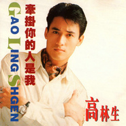

牵挂你的人是我
============================

|  |  |
| :--: | :-- |
| [ 牵挂你的人是我](https://emumo.xiami.com/album/1057) | **艺人**: [高林生](../index.md) **语种**: 国语 **唱片公司**: 白天鹅音像 **发行时间**: 1993年12月01日 **专辑类别**: 录音室专辑 **专辑风格**: 国语流行 Mandarin Pop **播放数**: 7838919 **收藏数**: 230 **评论数**: 25  |

## 简介

1993年12月，高林生推出首张国语大碟《牵挂你的人是我》。发行量节节攀升，一举轰动全国，同名主打曲《牵挂你的人是我》唱至大街小巷，妇孺皆知，甚至连歌名都成为风靡一时的都市流行语。  
  
93年度：“广东创作歌曲大赛”十大金曲；“岭南新歌榜”十大金曲；并获得“最具潜质男歌手奖”；“广东新音乐”十大金曲亚军；并获得“最有希望男歌手奖”；“爱人杯”原创十大金曲；并获得“最佳新人男歌手奖”；广东流行歌坛“新人奖”；上海电视台“欢乐在世界——明日之星”奖，上海东方电台“群星耀东方第一届大陆十大金曲”。 

## 曲目

- [牵挂你的人是我MV](./1057/6FF4f229.md)
- [对你的爱](./1057/bwH4ed66b.md)
- [走近你就是我的问候](./1057/WGBb071f.md)
- [过眼云烟也留情MV](./1057/6FI6a1e2.md)
- [你是天、我是地](./1057/WGDb7036.md)
- [有了你小田和正《突然发生的爱情故事》国语版](./1057/WGEcb738.md)
- [挥手的际遇(粤)《过眼云烟也留情》粤语版](./1057/6FL7117d.md)
- [面对世界](./1057/cCKs349fe.md)
- [也许](./1057/6FN9244a.md)
- [牵挂你的人是我(卡拉OK)MV](./1057/6FO6e7ab.md)

## 评论

|  |  |  |
| :-- | :-- | :-- |
|  [虾米用户](https://emumo.xiami.com/u/284140951) 我还没想好要写什么... 2019-06-17 15:38 赞(0) 踩(0) | 
93年。突然发现当初的歌手都是大叔了。我这个93年的娃娃也快30了
 |
|  [虾米用户](https://emumo.xiami.com/u/235143156) 工欲善其事必先利其器。 2019-04-25 11:41 赞(0) 踩(0) | 
第一次听 歌比我还大 好巧同姓
 |
|  [虾米用户](https://emumo.xiami.com/u/120433652)  2019-02-09 22:29 赞(0) 踩(0) | 
少了一首《无花的春天》，我最喜欢的一首歌。
 |
| ⇒ |  [虾米用户](https://emumo.xiami.com/u/403217064)  2019-12-14 01:35 赞(0) 踩(0) | 
东京爱情故事
 |
|  [虾米用户](https://emumo.xiami.com/u/371093885)  2019-02-04 02:32 赞(0) 踩(0) | 
小时候好流行的歌
 |
|  [虾米用户](https://emumo.xiami.com/u/281457015)  2017-07-15 04:58 赞(1) 踩(0) | 
小时候的记忆
 |
|  [虾米用户](https://emumo.xiami.com/u/284911994)  2017-05-14 10:02 赞(1) 踩(0) | 
******
 |
|  [虾米用户](https://emumo.xiami.com/u/10930466) 再见了虾米，还有虾米上上... 2016-11-02 11:11 赞(1) 踩(0) | 
那时候我才11岁啊！多想回到那个时候
 |
|  [虾米用户](https://emumo.xiami.com/u/2511298)  2016-04-01 19:59 赞(0) 踩(0) | 
長殘了
 |
|  [虾米用户](https://emumo.xiami.com/u/3605814) 是一个废人了 2016-01-09 14:11 赞(2) 踩(0) | 
封面挺帅
 |
|  [虾米用户](https://emumo.xiami.com/u/9181841) 忠实齐秦 王杰歌迷 2015-11-27 13:32 赞(1) 踩(0) | 
1993年12月高林生的经典成名专辑，不过《牵挂你的人是我》被广为传唱！推荐曲目：牵挂你的人是我
 |
|  [虾米用户](https://emumo.xiami.com/u/36081194) 酷狗音乐，一个有老歌的地... 2015-11-24 09:48 赞(0) 踩(0) | 
喜欢
 |
|  [虾米用户](https://emumo.xiami.com/u/12098450) 曲的情 2015-06-20 15:04 赞(0) 踩(0) | 
这人长得还行 呵呵
 |
|  [虾米用户](https://emumo.xiami.com/u/2541555) Sakha Republ... 2015-03-01 11:50 赞(3) 踩(0) | 
年轻时候的他真的好帅啊！！！
 |
|  [虾米用户](https://emumo.xiami.com/u/3583122)  2013-10-28 22:50 赞(1) 踩(0) | 
《牵挂你的人是我》小时候很熟悉的旋律。
 |
|  [虾米用户](https://emumo.xiami.com/u/5107706) 网抑云 ID：缩入壳中 2013-10-07 11:31 赞(4) 踩(0) | 
难道你们都没注意唱片封面的拼音么？？
 |
| ⇒ |  [虾米用户](https://emumo.xiami.com/u/9922500) 好音乐分享 2014-08-27 16:30 赞(0) 踩(0) | 
是通用拼音
 |
| ⇒ |  [虾米用户](https://emumo.xiami.com/u/5107706) 网抑云 ID：缩入壳中 2014-08-28 07:19 赞(0) 踩(0) | 
<q><b>小魚说：</b></q>
 |
| ⇒ |  [虾米用户](https://emumo.xiami.com/u/2541555) Sakha Republ... 2015-03-01 11:49 赞(0) 踩(0) | 
还真注意封面拼音...刚刚才发现...
 |
| ⇒ |  [虾米用户](https://emumo.xiami.com/u/3605814) 是一个废人了 2016-01-09 14:11 赞(0) 踩(0) | 
hhhhhhhh
 |
|  [虾米用户](https://emumo.xiami.com/u/3549659) 清谈 2013-09-25 05:20 赞(2) 踩(0) | 
高林生成名时期 正是大量歌厅 茶座 KTV**的动荡变革时期 牵挂你的人是我这首歌凭借高林生真切诚恳的演唱 很快得到大众认可 点唱率在歌迷中迅速提高 同时各歌厅驻唱歌手也纷纷模仿 高林生摇身一变成为大陆歌坛弄潮儿 他的个人努力和健康邻家男孩的纯真形象迷倒无数徘徊在梦境与现实中的禁欲女学生 成为学生偶像有3年之久
 |
|  [虾米用户](https://emumo.xiami.com/u/1886211)  2013-08-10 13:24 赞(2) 踩(0) | 
20年前的歌，当年我才不到10岁，不过已经很熟这首歌了...
 |
| ⇒ |  [虾米用户](https://emumo.xiami.com/u/2541555) Sakha Republ... 2015-03-01 11:50 赞(0) 踩(0) | 
暴露年龄了吧~哈哈哈哈！！
 |
|  [虾米用户](https://emumo.xiami.com/u/5532083)  2012-12-12 23:04 赞(1) 踩(0) | 
有谁还记得高林生吗？对于我们这些70后的老棒子来说，高林生的歌让我们传唱了有一阵子，满大街都放的是【牵挂你的人是我】和粤语歌【我会陪你到永远】。我想80后弟妹们也许有的人也该不会陌生吧。现在拿来一听，嗯，味道不错
 |
|  [虾米用户](https://emumo.xiami.com/u/7373119)  2012-04-10 22:20 赞(1) 踩(0) | 
高林生的成名作
 |
