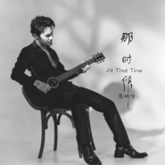

那时候
============================

|  |  |
| :--: | :-- |
| [ 那时候](https://emumo.xiami.com/album/2102822115) | **艺人**: [高林生](../index.md) **语种**: 国语 **唱片公司**: 独立发行 **发行时间**: 2017年08月28日 **专辑类别**: EP, 单曲 **专辑风格**: 国语流行 Mandarin Pop **播放数**: 1627 **收藏数**: 1 **评论数**: 1  |

## 简介

作为音乐人的高林生，不但积累了多年的人生经验，还吸取了大量国外先进的录音及混缩合成技术。回味《那时候》，享受当下，未来是美好的。

## 曲目

- [那时候](./2102822115/mSvaRV4e79f.md)
- [那时候_伴奏](./2102822115/8HQY5ge83e2.md)

## 评论

|  |  |  |  |
| :-- | :-- | :-- | :-- |
|  [虾米用户](https://emumo.xiami.com/u/548654) 我还没想好要写什么... 2018-09-04 10:35 赞(0) 踩(0) | 
监制：王子鸣
 |
