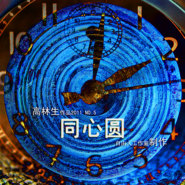

高林生
============================

|  |  |
| :--: | :-- |
| [ 高林生](https://i.xiami.com/gaolinsheng) | **地区**: China 中国大陆 **风格**: 民谣流行 Folk Pop, 国语流行 Mandarin Pop, 粤语流行 Cantopop **播放数**: 9853476 **粉丝数**: 3624 **评论数**: 64  |

## 档案

中文名：高林生 外文名：Alfred 
国籍：中国 
籍贯：广东惠来 
出生地：广东珠海 
出生日期：1972年9月23日身高：175CM体重：63公斤星座：天枰座爱好：艺术喜欢的名言：吃得苦中苦，方为人上人喜欢的水果：雪梨个人背景：歌手，原创音乐人主要作品：《牵挂你的人是我》、《步步高》、《淡定》、《她的名字叫阳光》、《爱情花园》、《为你倾心》、《我是你好朋友》和专辑 《七情六欲》、《纵容》、《精彩人生》、《铃声响起》、《生生不息一切为你》等等。个人简介高林生（1972年9月23日—）出生于珠海，中国著名歌手。1984年，开始登台演出。学音乐前，他还学过画水粉画，曾在加拿大与中国合办的青少年美术比赛中荣获一等奖。 14岁那年开始尝试作曲，并于 1990年考入广州星海音乐学院作曲专业。1992年8月，在读大学二年级的高林生以一首《涛声依旧》获“金利来杯”穗台青年歌手大赛三等奖，并于同年为电视剧《宝贝老公娇娇妻》演唱了粤语主题曲《无法掩盖的爱》。1993年7月，在读大学三年级的高林生签约广州白天鹅音响艺术有限公司，成为该公司的首位签约男歌手，并推出首张国语大碟《牵挂你的人是我》，发行量连攀数白金数，一举轰动全国，标题曲唱至大街小巷，妇孺皆知，甚至连歌名都成为风靡一时的都市流行语。94年6月应中央电视台"综艺大观”之邀，作为嘉宾演唱，《牵挂你的人是我》获得极大轰动。95年初推出与"白天鹅”旗下另一位女歌手刘小钰的对唱专辑，销量达五白金！ 同年签约上海新星座音乐制作公司，推出全新演艺生涯的第一首歌《真的有话对你说》，表达对热情支持他的歌迷，朋友和家人的感激之情，获得热情回响，接连获得全国15个电台排行榜冠军。9月推出全新个人专辑的首支单曲《她的名字的阳光》，至今已累积拥有25个电台排行榜冠军！ 作为中国大陆的唯一代表，赴日本东京参加NHK与上海东方电视台联合举办的亚洲歌坛实况传送，由NHK向全亚洲同步播出，反应热烈。 1996年新星座、上海电视台14频道、上海音像公司共同投资35 万元拍摄的五首歌曲MV串连的《高林生.七情六欲》音乐特辑全国放映中。 同年高林生成为中国内地第一位被国际电影公司迪斯尼指定的中文音乐代言人,代表作《玩具总动员》(全球首部三维卡通电影)。同期，高林生作为音乐制作人的歌曲《爱情花园》被公认为1996年下半年最受欢迎的情歌之一。1997年 与福茂签约，在为大陆系列首系代表，于台湾推出首张国语专辑《纵容》 1998年推出首部电影《真假大夫》，并演唱了主题曲《恋恋情深》。96年携手林依伦、景岗山推出公益歌曲《步步高》，传颂至今。2000年成为中国第一首网络歌曲的创作制作及演唱者,代表作《烘焙鸡大战伊妹儿》就是写给网民的！2006年高林生创作的以成龙为背景内容的新歌《大哥》在网络上反响热烈，入TOM网原创歌曲排行榜居亚军，直杀到冠军《皇后与梦想》李宇春军帐前。 
荣誉记录1993年：获得"最具潜质男歌手奖”、广东流行歌坛"新人奖”、 "广东新音乐”十大金曲亚军、"最有希望男歌手奖” 、"最佳新人男歌手奖” 、上海电视台"欢乐在世界--明日之星”奖《牵挂你的人是我》—广东创作歌曲大赛”十大金曲、"岭南新歌榜”十大金曲、 "爱人杯”原创十大金曲、上海东方电台"群星耀东方第一届大陆十大金曲。1994年：获得上海东方电视台"中国MTV大赛”最佳男歌手奖、中央人民广播电台颁发的94年最受欢迎男歌手奖。第一张由大陆歌手，词曲作家携手合作的粤语大碟《我会陪你到永远》出版，不到2个月，发行数已过于白金。同时连续获得广东各大流行榜的季度十大金曲、上海音乐台，电视台举办的"首届中国原创榜”的十大金曲。 与此同时，《 牵挂你的人是我》，《等待你的心》，《过眼云烟也留情》，《我会陪你到永远》等歌，打入全国的各地电台，电视台各大排行榜，成为各地电台点播率极高的歌曲，其拍摄演唱的MTV也打入"卫视中文台”节目。 1995年：获得全国25家电台推选，中央人民广播电台举办的"大自然杯全国听众喜爱的歌手”评选通俗唱法银奖。同年推出与"白天鹅”旗下另一位女歌手刘小钰的对唱专辑，销量达五白金！ 《真的有话对你说》获得全国15个电台排行榜冠军。 《她的名字的阳光》，至今已累积拥有25个电台排行榜冠军！ 1996年：推出加盟新星座后的首张国语大碟《七情六欲》。专辑上市仅仅三周销量即突破12万，直逼三白金！在华东地区唱片销量榜上，首周进榜便获得第四的佳绩，仅次于Ace of Base,Chage&Aska 和Michael Bolton这些国际超级巨星的专辑。《她的名字叫阳光》获得全国25个排行榜冠军。还夺得95 年上海东方电台风云榜年度十大金曲奖、广州电台新音乐年度十大金曲奖、天津电台音乐台年度十大金曲奖、辽宁文艺台斯巴露原创音乐榜年度十大金曲奖和最受欢迎男歌手奖、贵州经济台年度十大金曲和95年火爆最歌手奖、95年成都经济台年度十大金曲奖。《真的有话对你说》获95年山东济南人民广播电台十大金曲奖、深圳电台第二台原创歌曲点播率最高十首金曲奖。《为你倾心》获广州电台新音乐榜，首周进榜成冠并称霸五周的好成绩，在全国其它榜音上亦所向披靡，短短数周已经拿下上海、广州、天津、贵州、常州、南海等城市的十五个电台排行榜冠军！ 《爱情花园》在南宁电台一进榜即获得四周冠军，并迅速夺取在全国三十三个排行榜冠军，被公认为1996年下半年最受欢迎的情歌之一。荣获1996年上海东方电台、东方风云榜年度十大金曲、南宁电台年度十大金曲、中国原创歌曲中原联合榜年度十大金曲、西安音乐台年度十大金曲、南昌人民台年度十大金曲、扬州新闻台年度十佳作品、济宁文艺台年度十大金曲、洛阳经济台第三季度十大金曲；高林生还凭此歌荣登1996年洛阳经济台第三季度最受欢迎男歌手。2006年：《大哥》在网络上反响热烈，入TOM网原创歌曲排行榜居亚军。2014年：为6月26日国际禁毒日推出的《呼唤》MV，由高林生、王子鸣、许建强等歌手重新演绎，受到各界一致认可。《淡定》MV（最新官方版）荣登音悦台推荐MV。 
作品介绍专辑：《牵挂你的人是我》（1993年）《我的心不会改变》（1994年）《我会陪你到永远》（1993年）《心有千言万语》（1995年）高林生V 刘小钰1 心有千言万语2 你的眼神告诉我3 不是你错不是我错4 再次走进你remix5 新忧旧愁《七情六欲》（1995年）《玩具总动员1》（1996年）《纵容》（1996年）《精彩人生》（2004年）《铃声响起》（2010年）《生生不息——一切为你》（2013年）《有你才是天堂》（2015年）单曲：《无法掩盖的爱》（1993年）《步步高》（1996年）《纯真年代》高林生作品（2006年）《在你的笑容背后》高林生作品——费翔演唱（1997年）《祝你幸福》高林生作品——许志安演唱（1998年）《走不完的路》高林生作品——陈少华演唱（1995年）《一生最美》高林生作品——罗家英演唱（2010年） 
近况已定居北京的高林生与友人成立拥有设备一流的音乐工作室（录音棚及影音工作站）--- 北京风采方程文化传播有限公司，致力于明日之星歌手专辑制作及音乐的宣传推广。近年来，作为原创音乐人的高林生，一如既往地活跃在音乐创作的舞台上。2011年参加大牌生日会演绎新歌《羡慕嫉妒恨》。在‘广东四大天王’电视歌会上，以一贯帅气的形象和独特的高氏唱腔征服全场。同年，高林生、李春波、王子鸣三人打造的老友记全国巡回演出也大获成功。在众多发掘新星歌手的比赛中，如云南卫视‘完美声音’、央视三套节目‘非常六加一’等比赛节目，总能看到高林生坐在评委席上认真的样子以及专业的评述，一针见血地点出参赛歌手的优劣，不愧为一个身兼作词、作曲、编曲、录音、混缩及演唱的多才原创音乐人、唱作人。2012年迎来了广东流行音乐35周年纪念，在山东卫视的节目‘端午南来风’、广州‘萝岗之夜’、 ‘签约广州’等一系列活动中，以一首《牵挂你的人是我》，让我们充新领略到这位帅哥的风采不减当年，唱功依旧。12月在揭阳建市二十周年庆文艺晚会“潮头踏歌”上，祖籍为潮汕人的高林生激情澎湃地演唱，表达了对潮汕的思乡之情，全场热烈互动，场面令人振奋。在湖南卫视‘天天向上’节目上，高林生充分发挥了幽默的个性特点，让观众忍俊不禁。2013年在各大综艺节目（安徽卫视‘黄金时代’、深圳卫视‘年代秀’、CCTV‘综艺盛典’、‘回声嘹亮’、‘一起唱吧’、‘暑假七天乐’等）中，推出自己的新歌《淡定》，获得一致认可。在内蒙古卫视‘马兰花开’节目中，高林生道出了自己内心一直遗憾的事——没能在母亲生前尽孝以及童年不堪回首的往事，让在场的观众为这位孝子纷纷感触落泪。2014年高林生一如既往地创作好的音乐，推出新专辑《生生不息——一切为你》。也为其他好友歌手创作单曲，其中有费翔演唱的《在你的笑容背后》，许志安演唱的《祝你幸福》，罗家英演唱的《一生最美》，陈少华《走不完的路》，等。闲时也为好友作画，杨澜、张大礼等好友的素描画像让人称赞。其中他的一些画作也捐献给公益事业。2014年，6月16日国际禁毒日，高林生携手王子鸣等众多歌手把许建强的作品《呼唤》旧歌新唱，并制作了MV视频用音乐改变人生的态度呼唤大家远离毒品，得到了一致认同。年底高林生音乐作品《淡定》MV（最新官方版）隆重推出，荣登音悦台推荐MV。 
2018中国新歌声第三季加拿大海选总决赛担任表演嘉宾，全场掀起一片和唱高潮。

## 专辑

| 名称 | 语种 | 唱片公司 | 发行时间 | 专辑类别 | 专辑风格 |
| :--: | :-- | :-- | :-- | :-- | :-- |
| [ Baby I Love You](./albums/5021327869.md) | 国语 | 独立发行 | 2020年08月23日 | EP, 单曲 | 国语流行 Mandarin Pop |
| [ 错爱（Live版）](./albums/5021037700.md) | 国语 | 独立发行 | 2020年07月03日 | 现场专辑 | 国语流行 Mandarin Pop |
| [ 牵挂你的人是我（流淌的歌声版）](./albums/5020950617.md) | 国语 | 独立发行 | 2020年06月26日 | EP, 单曲 | 流行 Pop, 国语流行 Mandarin Pop |
| [ 《期待重逢》（凯旋篇）](./albums/2108317025.md) | 国语 | 独立发行 | 2020年04月10日 | EP, 单曲 | 国语流行 Mandarin Pop |
| [ 她的名字叫SUNSHINE](./albums/2108320020.md) | 国语 | 独立发行 | 2020年04月10日 | EP, 单曲 | 国语流行 Mandarin Pop |
| [ 牵挂你的人是我（加油中国版）](./albums/2106054159.md) | 国语 | 独立发行 | 2020年02月14日 | EP, 单曲 | 流行摇滚 Pop Rock |
| [ 舍我一生](./albums/2105049569.md) | 国语 |  | 2019年08月01日 | EP, 单曲 | 国语流行 Mandarin Pop |
| [ 新年好（粤语）](./albums/2103502900.md) | 粤语 | 独立发行 | 2018年01月28日 | EP, 单曲 | 粤语流行 Cantopop, 流行 Pop |
| [ 步步高](./albums/2103465404.md) | 国语 | 独立发行 | 2017年12月02日 | EP, 单曲 | 国语流行 Mandarin Pop |
| [ 为情坚守（粤语）hold fast to love](./albums/2102865696.md) | 粤语 | 独立发行 | 2017年09月29日 | EP, 单曲 | 粤语流行 Cantopop |
| [ 为爱存在exist for love](./albums/2102865693.md) | 国语 | 独立发行 | 2017年09月29日 | EP, 单曲 | 国语流行 Mandarin Pop, 流行 Pop |
| [ 大眼睛的梦](./albums/2102822110.md) | 国语 | 独立发行 | 2017年08月28日 | EP, 单曲 | 流行 Pop, 国语流行 Mandarin Pop |
| [ 那时候](./albums/2102822115.md) | 国语 | 独立发行 | 2017年08月28日 | EP, 单曲 | 国语流行 Mandarin Pop |
| [ 淡定（转调版）](./albums/2102814010.md) | 国语 | 独立发行 | 2017年08月14日 | EP, 单曲 | 流行 Pop, 国语流行 Mandarin Pop |
| [ 等的不会是这位](./albums/2100370766.md) | 国语 | 北京风采方程文化传播有限公司 | 2016年07月21日 | EP, 单曲 | 粤语流行 Cantopop |
| [ 守爱](./albums/2100357421.md) | 国语 | 独立发行 | 2016年06月23日 | EP, 单曲 | 国语流行 Mandarin Pop |
| [ 一生知己（粤语）](./albums/2100345770.md) | 粤语 | 独立发行 | 2016年05月27日 | EP, 单曲 | 爵士流行 Jazz Pop |
| [ 一生知己](./albums/5022544399.md) | 国语 |  | 2016年05月27日 | EP, 单曲 |  |
| [ 生生不息](./albums/2100317402.md) | 粤语 | 北京风采方程文化传播有限公司 | 2016年04月19日 | EP, 单曲 | 粤语流行 Cantopop |
| [ 生生不息（粤语）](./albums/5022535956.md) | 国语 |  | 2016年04月19日 | EP, 单曲 |  |
| [ 头班车旅程](./albums/2100277452.md) | 粤语 | 北京风采方程文化传播有限公司 | 2016年02月18日 | EP, 单曲 | 粤语流行 Cantopop |
| [ 放手也是种福气](./albums/2100216710.md) | 粤语 | 北京风采方程文化传播有限公司 | 2015年10月10日 | EP, 单曲 | 粤语流行 Cantopop |
| [ 前女友](./albums/2100213368.md) | 国语 | 北京风采方程文化传播有限公司 | 2015年10月07日 | EP, 单曲 | 国语流行 Mandarin Pop |
| [ 有你才是天堂](./albums/225809139.md) | 国语 | 北京风采方程文化传播有限公司 | 2015年03月08日 | EP, 单曲 | 民谣流行 Folk Pop, 国语流行 Mandarin Pop |
| [ 你懂的](./albums/445013.md) | 国语 | 北京风采方程文化传播有限公司 | 2015年02月14日 | EP, 单曲 | 当代节奏布鲁斯 Contemporary R&B, 民谣流行 Folk Pop, 国语流行 Mandarin Pop |
| [ 淡定](./albums/462138.md) | 国语 | 北京风采方程文化传播有限公司 | 2015年02月14日 | EP, 单曲 | 国语流行 Mandarin Pop |
| [ 羡慕嫉妒恨](./albums/443060.md) | 国语 | 北京风采方程文化传播有限公司 | 2015年02月14日 | EP, 单曲 | 民谣流行 Folk Pop, 国语流行 Mandarin Pop |
| [ 不惑](./albums/1031788566.md) | 国语 | 北京风采方程文化传播有限公司 | 2015年02月14日 | EP, 单曲 | 城市民谣 Urban Folk, 国语流行 Mandarin Pop |
| [ 幸福赌注](./albums/1632368717.md) | 国语 | 北京风采方程文化传播有限公司 | 2015年02月14日 | EP, 单曲 | 国语流行 Mandarin Pop |
| [ 同心圆](./albums/464724.md) | 国语 | 北京风采方程文化传播有限公司 | 2011年09月07日 | EP, 单曲 | 国语流行 Mandarin Pop |
| [ 铃声响起](./albums/2105160025.md) | 国语 |  | 2011年08月18日 | 录音室专辑 | 国语流行 Mandarin Pop |
| [ 铃声响起（伴奏）想起林生](./albums/2104975416.md) | 国语 | 北京风采方程文化传播有限公司 | 2008年01月01日 | 录音室专辑 | 国语流行 Mandarin Pop |
| [ 精彩人生](./albums/1055.md) | 国语 | 北京风采方程文化传播有限公司 | 2004年08月02日 | 录音室专辑 | 国语流行 Mandarin Pop, 华语唱作人 Chinese Singer-Songwriter |
| [ 纵容](./albums/1061.md) | 国语 | 北京风采方程文化传播有限公司 | 1997年11月01日 | 录音室专辑 | 国语流行 Mandarin Pop |
| [ 七情六欲love and soul](./albums/32741.md) | 国语 | 北京风采方程文化传播有限公司 | 1996年02月01日 | 录音室专辑 | 国语流行 Mandarin Pop |
| [ 天王之音 名曲演绎版](./albums/1058.md) | 国语 | 白天鹅音像 | 1995年01月01日 | 录音室专辑 | 流行 Pop |
| [ 成名精选集best of Airfree](./albums/32742.md) | 国语 | 白天鹅音像 | 1995年01月01日 | 精选集 | 流行 Pop |
| [ 心有千言万语高林生 刘小钰合唱专辑](./albums/1083789632.md) | 国语 | 白天鹅音像 | 1995年01月01日 | 录音室专辑 | 流行 Pop |
| [ 我的心不会改变再次走近你](./albums/1059.md) | 国语 | 白天鹅音像 | 1994年09月01日 | 录音室专辑 | 流行 Pop |
| [ 我会陪你到永远air free](./albums/1060.md) | 粤语 | 白天鹅音像 | 1994年05月01日 | 录音室专辑 | 流行 Pop |
| [ 牵挂你的人是我](./albums/1057.md) | 国语 | 白天鹅音像 | 1993年12月01日 | 录音室专辑 | 国语流行 Mandarin Pop |

## 评论

|  |  |  |
| :-- | :-- | :-- |
|  [虾米用户](https://emumo.xiami.com/u/443650578) 我还没想好要写什么... 2020-07-18 00:46 赞(0) 踩(0) | 
永远是那么的帅。喜欢你的歌曲。大家喜欢你    
 |
|  [虾米用户](https://emumo.xiami.com/u/123230860)   2020-07-09 22:45 赞(0) 踩(0) | 
这家伙怎么越老越帅了  
 |
|  [虾米用户](https://emumo.xiami.com/u/74639208) Music is per... 2020-05-08 22:15 赞(0) 踩(0) | 
帅
 |
|  [虾米用户](https://emumo.xiami.com/u/378224024)  2020-01-03 14:49 赞(1) 踩(0) | 
声音也好听！
 |
|  [虾米用户](https://emumo.xiami.com/u/378224024)  2020-01-03 14:48 赞(0) 踩(0) | 
牵挂你的人，是我。也喜欢近二十年了，唱的也不错哟！
 |
|  [虾米用户](https://emumo.xiami.com/u/1460647) 我还没想好要写什么... 2019-07-29 22:40 赞(4) 踩(0) | 
生于1972年？岁数不大呀
 |
|  [虾米用户](https://emumo.xiami.com/u/345548992) 我还没想好要写什么... 2019-06-01 22:30 赞(0) 踩(0) | 
好听，胜过原唱
 |
|  [虾米用户](https://emumo.xiami.com/u/406548885)  2019-04-26 07:17 赞(0) 踩(0) | 
95后飘过。今天突然想到很小的时候一盘磁带，里面高林生和另一个人对唱的《情在无言中》『有你在我心中，不怕路上风雨浓……』网上找不到了，我要去找老磁带听了。
 |
|  [虾米用户](https://emumo.xiami.com/u/375761013) 聆听经典，品味生活！ 2019-04-05 13:31 赞(1) 踩(0) | 
高林生年轻时英俊潇洒、风流倜傥、风度翩翩、玉树临风！喜欢他的歌声，充满磁性，天籁之音！
 |
|  [虾米用户](https://emumo.xiami.com/u/293692544) 你敢给我说话吗？我咬你 2019-02-27 16:30 赞(2) 踩(0) | 
好听
 |
|  [虾米用户](https://emumo.xiami.com/u/2886736)  2018-11-20 11:25 赞(1) 踩(0) | 
辜负了何静？
 |
|  [虾米用户](https://emumo.xiami.com/u/323987299)  2018-03-12 15:06 赞(1) 踩(0) | 
他还没有违法犯罪行为
 |
|  [虾米用户](https://emumo.xiami.com/u/323987299)  2018-03-12 15:06 赞(1) 踩(0) | 
他就唱了一首歌
 |
|  [虾米用户](https://emumo.xiami.com/u/36530912) 等你哭的时候，你才会知道... 2018-02-12 21:02 赞(1) 踩(0) | 
有点像马英九
 |
|  [虾米用户](https://emumo.xiami.com/u/287687205) 乘着音乐的翅膀，飞翔在蓝... 2018-01-09 23:04 赞(1) 踩(0) | 
林生兄弟，别来无恙？
 |
|  [虾米用户](https://emumo.xiami.com/u/312316101)  2017-11-16 20:43 赞(2) 踩(0) | 
喜欢听这首歌的人都老咯
 |
|  [虾米用户](https://emumo.xiami.com/u/324134287) 爱听爱唱爱虾米！ 2017-11-03 20:42 赞(2) 踩(0) | 
喜欢
 |
|  [虾米用户](https://emumo.xiami.com/u/5162877) 写到80岁,唱到80岁 2017-09-21 17:27 赞(4) 踩(0) | 
<a href="http://video.tudou.com/v/XMzAxNzUyMzYwMA==.html?spm=a2h3j.8428770.3416059.1" target="_blank" rel="nofollow noreferrer noopener">http://video.tudou.com/v/XMzAxNzUyMzYwMA==.html?spm=a2h3j.8428770.3416059.1</a>
 |
|  [虾米用户](https://emumo.xiami.com/u/305591728)  2017-07-28 17:55 赞(2) 踩(0) | 
好听，好久都没听了，现在，在听，还是那种感觉
 |
|  [虾米用户](https://emumo.xiami.com/u/45442570) 专注专注，全心服务 2017-03-20 21:50 赞(4) 踩(0) | 
好多年不见了，牵挂的人是我。1997年，那时我才15岁，在广州南方医院，（爱与哀愁）（牵挂的人是我）我最清楚了，高林生，那时最火的，毛宁，杨钰莹。高林生！那时候买磁带，特别贵。  
 |
| ⇒ |  [虾米用户](https://emumo.xiami.com/u/23110114)  2018-12-09 20:01 赞(0) 踩(0) | 
我就在广州南方医院的附属的珠江医院出来的
 |
|  [虾米用户](https://emumo.xiami.com/u/62915868) GOING WILD 2017-03-19 18:59 赞(2) 踩(0) | 
这也太帅了吧
 |
|  [虾米用户](https://emumo.xiami.com/u/3019759)  2017-02-12 14:43 赞(3) 踩(0) | 
牵挂你的人是我你们仔细听这首歌曲的鼓点，很好听。
 |
| ⇒ |  [虾米用户](https://emumo.xiami.com/u/265411607)  2017-03-20 21:13 赞(0) 踩(0) | 
这首歌编曲很棒
 |
|  [虾米用户](https://emumo.xiami.com/u/260167529) 爱音乐的疯子 2017-01-23 18:45 赞(4) 踩(0) | 
他那首歌当时真红 近两年复出发了这么多单曲 怎么不一起出张专辑 现在都流行这样吗
 |
|  [虾米用户](https://emumo.xiami.com/u/8406417) 让风吹 2016-12-19 13:04 赞(1) 踩(0) | 
祖籍居然是潮汕，老乡呢
 |
|  [虾米用户](https://emumo.xiami.com/u/97747450) 我还没想好要写什么... 2016-07-31 13:56 赞(2) 踩(0) | 
2346
 |
|  [虾米用户](https://emumo.xiami.com/u/164890672) 越努力，越幸运！ 2016-05-08 21:05 赞(1) 踩(0) | 
他的歌词非常不错！
 |
|  [虾米用户](https://emumo.xiami.com/u/1306353)  2016-01-19 00:39 赞(1) 踩(0) | 
求助<a href="http://www.xiami.com/collect/135000187?spm=a1z1s.6843761.6353689.3.GRVHU1" target="_blank" rel="nofollow noreferrer noopener">http://www.xiami.com/collect/135000187?spm=a1z1s.6843761.6353689.3.GRVHU1</a>
 |
|  [虾米用户](https://emumo.xiami.com/u/2614721) 路过 2016-01-14 17:40 赞(1) 踩(0) | 
他的“是”发音方式和童自荣蛮像的，《玩具总动员》配唱的时候我楞了一下，哈哈哈哈！
 |
|  [虾米用户](https://emumo.xiami.com/u/36081194) 酷狗音乐，一个有老歌的地... 2015-11-30 21:53 赞(0) 踩(0) | 
喜欢
 |
|  [虾米用户](https://emumo.xiami.com/u/71518430)  2015-10-11 08:57 赞(1) 踩(0) | 
高林生新歌淡定等上线啦好听
 |
|  [虾米用户](https://emumo.xiami.com/u/2659823) 人間發電所 2015-07-01 08:22 赞(0) 踩(0) | 
我是你好朋友~
 |
|  [虾米用户](https://emumo.xiami.com/u/12098450) 曲的情 2015-06-20 15:08 赞(0) 踩(0) | 
呵呵
 |
|  [虾米用户](https://emumo.xiami.com/u/47290614)  2015-03-20 22:48 赞(0) 踩(0) | 
有你才是天堂挺好听,节奏感强
 |
|  [虾米用户](https://emumo.xiami.com/u/27481268)  2015-01-17 21:20 赞(1) 踩(0) | 
好久没听帅哥的歌，现在再听，又回到从前，很有感觉
 |
|  [虾米用户](https://emumo.xiami.com/u/45036560) 风采方程 2015-01-12 21:38 赞(0) 踩(0) | 
好听
 |
|  [虾米用户](https://emumo.xiami.com/u/45036560) 风采方程 2015-01-11 22:55 赞(2) 踩(0) | 
祝贺《淡定》MV（最新官方版）荣登音悦台推荐MV。 <a href="http://v.yinyuetai.com/video/2214031" target="_blank" rel="nofollow noreferrer noopener">http://v.yinyuetai.com/video/2214031</a>
 |
|  [虾米用户](https://emumo.xiami.com/u/45036560) 风采方程 2015-01-06 20:01 赞(0) 踩(0) | 
因为有实力
 |
|  [虾米用户](https://emumo.xiami.com/u/4855774) 笑嘻嘻 2014-10-15 00:38 赞(0) 踩(0) | 
( ^_^ )不错
 |
|  [虾米用户](https://emumo.xiami.com/u/10637) 音乐唱作人 2014-10-08 22:32 赞(0) 踩(0) | 
童年的回忆！
 |
|  [虾米用户](https://emumo.xiami.com/u/1324626)  2014-05-16 18:07 赞(0) 踩(0) | 
下载不了啊 要虾币 谁有 牵挂你的人是我  能发我吗 喜欢啊
 |
|  [虾米用户](https://emumo.xiami.com/u/7915547) hjello 2014-03-11 18:50 赞(0) 踩(0) | 
听了几首，96年的和11年了，油然起敬，坚持音乐的人！！！
 |
|  [虾米用户](https://emumo.xiami.com/u/9767135) 旧歌欣赏 词曲同音 回绕 2014-01-15 01:19 赞(0) 踩(0) | 
欣赏
 |
|  [虾米用户](https://emumo.xiami.com/u/7248680) 音乐 2013-10-29 10:34 赞(0) 踩(0) | 
周华健
 |
|  [虾米用户](https://emumo.xiami.com/u/11353)  2013-09-26 11:04 赞(0) 踩(0) | 
感觉模样变了呢？
 |
|  [虾米用户](https://emumo.xiami.com/u/3549659) 清谈 2013-09-25 05:20 赞(1) 踩(0) | 
高林生成名时期 正是大量歌厅 茶座 KTV**的动荡变革时期 牵挂你的人是我这首歌凭借高林生真切诚恳的演唱 很快得到大众认可 点唱率在歌迷中迅速提高 同时各歌厅驻唱歌手也纷纷模仿 高林生摇身一变成为大陆歌坛弄潮儿 他的个人努力和健康邻家男孩的纯真形象迷倒无数徘徊在梦境与现实中的禁欲女学生 成为学生偶像有3年之久
 |
|  [虾米用户](https://emumo.xiami.com/u/6291602) 敬天爱人 2013-08-22 11:59 赞(1) 踩(0) | 
好!
 |
|  [虾米用户](https://emumo.xiami.com/u/9301514) 独立唱作人 2013-08-04 08:57 赞(1) 踩(0) | 
牵挂你的人是我
 |
|  [虾米用户](https://emumo.xiami.com/u/353) 强迫症确诊 2013-07-26 14:13 赞(0) 踩(0) | 
中学时期的回忆
 |
|  [虾米用户](https://emumo.xiami.com/u/5690312) 这个家伙很聪明，什么也没... 2013-07-25 21:17 赞(0) 踩(0) | 
吃得苦黄连，方为腹黑攻
 |
|  [虾米用户](https://emumo.xiami.com/u/489870)  2013-07-25 14:28 赞(0) 踩(0) | 
终于来了~
 |
|  [虾米用户](https://emumo.xiami.com/u/2306444) 见证虾米起家式… 2013-07-08 04:20 赞(5) 踩(0) | 
牵挂你的人是我  我也爱听，听得是一种记忆。。童年时候家里的录音机。。。  那会的歌我觉得傻傻的 纯纯的 一丝浪漫。。  那一代的老歌有的都是经典 想你的时候 心会跟爱一起走 萍聚什么的。。。经典音乐
 |
|  [虾米用户](https://emumo.xiami.com/u/3664254) 看我的唐诗剑法 2013-05-24 11:53 赞(27) 踩(0) | 
年轻的时候挺帅的
 |
| ⇒ |  [虾米用户](https://emumo.xiami.com/u/46766799) 我还没想好要写什么... 2019-06-25 14:17 赞(0) 踩(0) | 
年纪大了也是帅的
 |
|  [虾米用户](https://emumo.xiami.com/u/15232157) 。。。 2013-05-13 00:08 赞(0) 踩(0) | 
喜欢老高的音乐好多年了
 |
|  [虾米用户](https://emumo.xiami.com/u/3886489)  2013-05-02 21:01 赞(1) 踩(0) | 
高林生是网络鼻祖啊！淡定、羡慕嫉妒恨、你懂的 ！
 |
|  [虾米用户](https://emumo.xiami.com/u/5998313) 杏花春雨江南。 2013-04-24 11:14 赞(0) 踩(0) | 
看黑白电视的时候，中午有点歌节目，放了好长时间的牵挂你的人是我，真是经典啊
 |
|  [虾米用户](https://emumo.xiami.com/u/9301514) 独立唱作人 2012-09-23 09:30 赞(0) 踩(0) | 
生日快乐，牵挂你的人是我
 |
|  [虾米用户](https://emumo.xiami.com/u/7373119)  2012-01-16 07:04 赞(0) 踩(0) | 
《牵挂你的人是我》真是经典
 |
|  [虾米用户](https://emumo.xiami.com/u/220719) 自知不自見，自愛不自貴 2011-10-12 11:00 赞(0) 踩(0) | 
誰能將 七情六欲 和 縱容 這兩張發出來呢？
 |
| ⇒ |  [虾米用户](https://emumo.xiami.com/u/134544576) step by step 2017-05-23 00:40 赞(0) 踩(0) | 
网易云音乐都有
 |
|  [虾米用户](https://emumo.xiami.com/u/1944735) come on 2011-04-12 14:22 赞(0) 踩(0) | 
找了好久了
 |
| ⇒ |  [虾米用户](https://emumo.xiami.com/u/318132) 抠啦 2011-09-12 21:52 赞(0) 踩(0) | 
亨利大卫梭罗
 |
