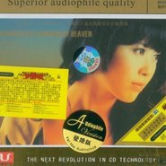

段玫梅
============================

|  |  |
| :--: | :-- |
| [ 段玫梅](https://i.xiami.com/audrey) | **地区**: China 中国大陆 **风格**: 流行 Pop **播放数**: 3003499 **粉丝数**: 957 **评论数**: 46  |

## 档案

小简介 
一个纯净到一尘不染的女声，倾听幻入远古的星空天女的咒语。 
段玫梅--一个纯净到一尘不染的女声仿佛从天国里倾泻而下，仿佛是一双上帝的眼睛怜悯地注视着人类。一声，只一声，就会让人骤然有一种灵魂之门被撞开的颤栗，让人又感觉自己像一个失重的物体被一种神秘的引力带到了没有现在、没有未来的时空。这是一种什么声音啊，时而 像露珠的呢喃，时而像岩浆的涌动，时而让人幻入远古的星空倾听天女的咒语，时而让人在潮水般恢弘的气势里感受生命的悲壮和雄性的本色，向往豪迈人生！天哪，太美了！太让人陶醉了！这是发烧友正在苦苦寻找的声音---真切、动人，又是那么纯净、柔润、坚实、宽阔！全碟采用超级比特数码真空管录音，人声与乐器都达到天碟级别！碟中曲目美不胜收，首首经典无比，是发烧友人手必备的天碟。

## 专辑

| 名称 | 语种 | 唱片公司 | 发行时间 | 专辑类别 | 专辑风格 |
| :--: | :-- | :-- | :-- | :-- | :-- |
| [ 等](./albums/5020607521.md) | 国语 | 乐叽咕文化 | 2020年03月25日 | 录音室专辑 | 流行 Pop |
| [ 救救我们人类共有的家](./albums/2104986051.md) | 国语 | 看见音乐 (上海) | 2019年07月15日 | EP, 单曲 |  |
| [ 爱你悠悠](./albums/451779.md) | 国语 | 威扬文化 | 2011年07月01日 | 录音室专辑 |  |
| [ 天国的女儿](./albums/173014.md) | 国语 | 靓声唱片 | 2008年03月26日 | 合集, 杂锦 |  |
| [ 梅雨帘](./albums/173012.md) | 国语 | 靓声唱片 | 2008年03月19日 | 合集, 杂锦 |  |

## 评论

|  |  |  |
| :-- | :-- | :-- |
|  [虾米用户](https://emumo.xiami.com/u/252198165) 吾心在生活中逝去！漯秦 2020-07-19 20:26 赞(1) 踩(0) | 
来一杯，喝酒，喝酒，    
 |
|  [虾米用户](https://emumo.xiami.com/u/442403951)  2020-04-26 17:45 赞(1) 踩(0) | 
撞击灵魂的音乐
 |
|  [虾米用户](https://emumo.xiami.com/u/416890676)  2019-09-09 23:04 赞(1) 踩(0) | 
好听，看电视剧天道才来听这个歌曲的！
 |
|  [虾米用户](https://emumo.xiami.com/u/349378) 南山何其悲,鬼雨洒空草 2019-03-17 21:12 赞(0) 踩(0) | 
四川音乐学院
 |
|  [虾米用户](https://emumo.xiami.com/u/278881542) 音乐能带给你各种体验 2019-02-14 04:59 赞(0) 踩(0) | 
偶然听到 好听的声音不会过期～
 |
|  [虾米用户](https://emumo.xiami.com/u/117113262) 识自耻即勇，方才谓之大智... 2018-11-17 20:10 赞(1) 踩(0) | 
出了两辑，，识别的人不多，断了，其实这是一个好歌手，，，，唱悲情如凄如诉，唱欢快如日明媚！！可惜啊，，，，
 |
|  [虾米用户](https://emumo.xiami.com/u/317771597)  2018-07-11 00:56 赞(0) 踩(0) | 
多出一点新歌吧
 |
|  [虾米用户](https://emumo.xiami.com/u/45993811) 留点时间思考 2017-12-08 23:42 赞(1) 踩(0) | 
这简介都吹上天了吧
 |
|  [虾米用户](https://emumo.xiami.com/u/301595565)  2017-06-03 20:12 赞(2) 踩(0) | 
在动画片里做插曲
 |
|  [虾米用户](https://emumo.xiami.com/u/301595565)  2017-06-03 20:11 赞(2) 踩(0) | 
虾米音乐不好，她有首叫棱镜的歌，搜不到
 |
|  [虾米用户](https://emumo.xiami.com/u/122688364) 生在愤坑，长在赤圈；挣脱 2016-09-16 00:22 赞(1) 踩(0) | 
3506
 |
|  [虾米用户](https://emumo.xiami.com/u/125466554)  2016-07-05 17:21 赞(0) 踩(0) | 
好久没出新曲了
 |
|  [虾米用户](https://emumo.xiami.com/u/54782500)  2015-08-08 16:00 赞(0) 踩(0) | 
发烧的选择
 |
|  [虾米用户](https://emumo.xiami.com/u/6760432) 这家伙有点懒，什么也没写 2014-12-25 15:00 赞(12) 踩(0) | 
艺人资料真是篇小作文啊，这词藻，真是吹上天了- -
 |
| ⇒ |  [虾米用户](https://emumo.xiami.com/u/255660621) 虾米混进垃圾人，这种人不... 2017-05-04 15:16 赞(0) 踩(0) | 
名副其实
 |
| ⇒ |  [虾米用户](https://emumo.xiami.com/u/317560746)  2017-08-19 15:57 赞(0) 踩(0) | 
遥远的救世主里面的一段话。
 |
|  [虾米用户](https://emumo.xiami.com/u/16060190) xiao 2014-05-02 14:45 赞(1) 踩(0) | 
多些古风吧~
 |
|  [虾米用户](https://emumo.xiami.com/u/28472174)  2013-11-26 19:47 赞(0) 踩(0) | 
很好听
 |
|  [虾米用户](https://emumo.xiami.com/u/8337431) 以乐会友 2013-07-21 08:47 赞(2) 踩(0) | 
国语发烧女声 48126,196,27
 |
|  [虾米用户](https://emumo.xiami.com/u/8764039)  2013-07-02 13:23 赞(2) 踩(0) | 
天国的女儿
 |
|  [虾米用户](https://emumo.xiami.com/u/3204939) 人生如茶，静心以对。对错... 2013-03-07 16:01 赞(5) 踩(0) | 
天国的女儿
 |
|  [虾米用户](https://emumo.xiami.com/u/368379)  2013-01-24 19:27 赞(1) 踩(0) | 
天籁之音！净化心灵！
 |
|  [虾米用户](https://emumo.xiami.com/u/10101326)  2013-01-13 20:59 赞(0) 踩(0) | 
0.0
 |
|  [虾米用户](https://emumo.xiami.com/u/11026443) ~~ 2012-10-19 13:12 赞(0) 踩(0) | 
纯净
 |
|  [虾米用户](https://emumo.xiami.com/u/1674939) 开始素食 2012-10-04 16:59 赞(0) 踩(0) | 
CG- -#
 |
|  [虾米用户](https://emumo.xiami.com/u/10641248) 都没说爱我 2012-09-16 20:36 赞(0) 踩(0) | 
震撼人心
 |
|  [虾米用户](https://emumo.xiami.com/u/7393614) 镜花水月 2012-05-17 21:04 赞(0) 踩(0) | 
这个赞。。
 |
|  [虾米用户](https://emumo.xiami.com/u/6590390)  2012-05-11 22:35 赞(0) 踩(0) | 
好
 |
|  [虾米用户](https://emumo.xiami.com/u/8969734) 我还没想好要写什么... 2012-04-23 20:47 赞(0) 踩(0) | 
古典风
 |
|  [虾米用户](https://emumo.xiami.com/u/7373572)   2012-01-29 12:56 赞(1) 踩(0) | 
一个纯净到一尘不染的女声，倾听幻入远古的星空天女的咒语。
 |
|  [虾米用户](https://emumo.xiami.com/u/6410958)  2012-01-22 16:17 赞(1) 踩(0) | 
喜欢一个人需要理由么
 |
|  [虾米用户](https://emumo.xiami.com/u/7302752)  2011-12-18 22:59 赞(0) 踩(0) | 
音色纯净
 |
|  [虾米用户](https://emumo.xiami.com/u/6595606)  2011-11-29 10:32 赞(0) 踩(0) | 
很清澈的声音 新欢
 |
|  [虾米用户](https://emumo.xiami.com/u/6410958)  2011-10-24 17:29 赞(0) 踩(0) | 
很舒服的···
 |
|  [虾米用户](https://emumo.xiami.com/u/3814790)  2011-10-03 03:41 赞(0) 踩(0) | 
可以听听，还没听完。
 |
|  [虾米用户](https://emumo.xiami.com/u/5616362)  2011-08-29 00:46 赞(1) 踩(0) | 
声音很好听。。。
 |
|  [虾米用户](https://emumo.xiami.com/u/5616362)  2011-08-29 00:45 赞(0) 踩(0) | 
好听
 |
|  [虾米用户](https://emumo.xiami.com/u/2221421)  2011-06-22 21:44 赞(0) 踩(0) | 
很好听的声音
 |
|  [虾米用户](https://emumo.xiami.com/u/3395113)   2011-04-25 20:57 赞(0) 踩(0) | 
好听
 |
|  [虾米用户](https://emumo.xiami.com/u/1344730)  2011-01-29 16:29 赞(0) 踩(0) | 
声音
 |
|  [虾米用户](https://emumo.xiami.com/u/1028951)  2010-10-14 00:33 赞(1) 踩(0) | 
青涩...    值得年长回来再听的...
 |
|  [虾米用户](https://emumo.xiami.com/u/73105)  2009-03-13 00:48 赞(2) 踩(0) | 
非常好得一张试音天碟，我有一套APE的，放在我得Bose Lifestyle里面的确是震撼！！
 |
| ⇒ |  [虾米用户](https://emumo.xiami.com/u/338562)  2010-03-18 13:11 赞(0) 踩(0) | 
有钱人呀。。哈哈。 近2万元呢
 |
| ⇒ |  [虾米用户](https://emumo.xiami.com/u/73105)  2010-05-07 21:13 赞(0) 踩(0) | 
<q><b>不完整的旋律说：</b></q>
 |
| ⇒ |  [虾米用户](https://emumo.xiami.com/u/338562)  2010-05-07 22:54 赞(0) 踩(0) | 
<q><b>尼姑用飘柔说：</b></q>
 |
| ⇒ |  [虾米用户](https://emumo.xiami.com/u/34240373) 眼前一片死湖..... 2020-07-07 15:08 赞(0) 踩(0) | 
11年了  我来挖坟
 |
