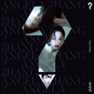

张韶涵
============================

|  |  |
| :--: | :-- |
| [<br>张韶涵](https://i.xiami.com/zhangshaohan) | **地区**: Taiwan, PRC 中国台湾<br>**风格**: 国语流行 Mandarin Pop<br>**播放数**: 73885136<br>**粉丝数**: 243827<br>**评论数**: 2203<br> |

## 档案

<div>
小档案<br>
英文名：Angela Chang<br>
生日：1982年 1月19日<br>
身高：158公分<br>
体重：40公斤<br>
血型：A型<br>
星座：魔羯座<br>
出生地：中国台湾<br>
现住地： 台湾-台北市 （加拿大籍）<br>
民 族： 汉族<br>
兴趣：唱歌、听音乐、阅读、work out、Decorating house、cook、服装设计<br>
专长：唱歌、服装设计<br>
喜欢的地方：加拿大、维也纳<br>
想去的地方：埃及、维也纳、日本<br>
最难忘的事：加拿大中广流行之星冠军<br>
最讨厌的事： 八卦<br>
最烦恼的事：盗版  八卦<br>
最想做的事：旅行<br>
喜欢的运动：排球<br>
最得意的事：Seeing my family going through the hardest times together<br>
喜欢的音乐：R&B、Soul、Blue、Jazz、Raggae<br>
最大的愿望：作一些好音乐可以诠释自己跟接触别人内心世界对音乐的感觉<br>
书籍：奇迹安琪拉<br>
大事记<br>
影视作品<br>
电视:<br>
《MVP情人》(又名: 永不言弃)饰田羽希  合作:颜行书,孙协志<br>
《海豚湾恋人》饰演易天边 合作:许绍洋,霍建华<br>
《爱杀17》饰徐宜真/徐宜静 合作:陆廷威,杨士萱<br>
《海豚爱上猫》饰英子 合作:彭于晏<br>
《天国的嫁衣》客串张韶涵(最后一集) 合作:明道<br>
《公主小妹》饰麦秋穗（皇甫姗） 合作:吴尊, 辰亦儒<br>
《烽火孤儿》客串音乐老师邵韩老师  合作：小长今赵贞恩，陈莎莉<br>
电影:<br>
《短信一月追》饰雪薇 合作：古巨基,任泉<br>
专辑列表<br>
《Over The Rainbow》<br>
《寓言》<br>
《欧若拉》<br>
《潘朵拉》<br>
《梦里花》<br>
获奖情况<br>
UBC情歌比赛 - 冠军<br>
中广流行之星海外歌唱大赛 - 冠军<br>
台湾2004Hito流行音乐奖奖年度票选 - 最受欢迎女新人奖<br>
台湾三立完全娱乐第一届劲爆精曲奖 - 最佳新人 `<br>
香港无线2004劲歌第一回 - 最受欢迎国语金曲奖<br>
中国第六届CCTV-MTV音乐盛典 - 台湾最具潜力歌手张韶涵<br>
香港新城国语力20004新城国语 - 新势力女歌手奖<br>
台湾第三届「MTV封神榜音乐奖」封神榜 - TOP20人气歌手<br>
亚洲第四届全球华语歌曲排行榜 - 最受欢迎新人<br>
中国上海2004年度天地英雄榜校园票选颁奖典礼 - 新声报道奖(年度新人)<br>
香港2004TVB8金曲榜颁奖典礼 - 最佳女新人金奖<br>
香港2004TVB8金曲榜颁奖典礼 - 10大金曲奖之一《寓言》<br>
香港2004新城劲爆颁奖礼 - 海外新人王奖<br>
中国第十一届全球华语音乐榜中榜 - 港台最受欢迎新进歌手奖<br>
中国第12届中歌榜颁奖礼 - 最受欢迎港台地区歌曲奖《呐喊》<br>
2004年度音乐先锋榜颁奖典礼 - 最受欢迎女新人(台湾)<br>
第五届百事音乐风云榜 - 港台年度最新人<br>
第五届百事音乐风云榜 - 港台十大金曲奖《寓言》<br>
第4届雪碧我的选择中国原创音乐流行榜 - 台湾地区最优秀新人奖<br>
第4届雪碧我的选择中国原创音乐流行榜 - 港台十大金曲奖《mama mama》<br>
2004MusicRadio中国TOP排行榜 - 港台年度金曲《天边》<br>
2004MusicRadio中国TOP排行榜 - 音乐之声推荐唱片《欧若拉》<br>
2004MusicRadio中国TOP排行榜 - 港台最受欢迎新人<br>
第五届华语音乐传媒大奖 - 新势力大奖-张韶涵<br>
2005年度雪碧榜 - 港台金曲《手心的太阳》张韶涵<br>
2005年度雪碧榜 - 台湾地区最佳演绎歌手奖<br>
2005年度雪碧榜 - 最优秀合唱歌曲奖《如果的事》张韶涵+范玮琪<br>
2006 HITO流行音乐奖颁奖典礼 - 十大华语歌曲《欧若拉》<br>
第五届中国金唱片 - 新人奖<br>
第十届七彩金曲排行榜 - 最佳金曲《欧若拉》<br>
第十届七彩金曲排行榜 - 年度最佳专辑《欧若拉》<br>
第十届七彩金曲排行榜 - 年度最佳女歌手<br>
2005 MusicRadio中国TOP排行榜 - 港台年度金曲 《如果的事》<br>
2005 MusicRadio中国TOP排行榜 - 港台年度金曲 张韶涵 《欧若拉》<br>
2005 MusicRadio中国TOP排行榜 - 点播冠军歌曲：张韶涵《欧若拉》<br>
2005 MusicRadio中国TOP排行榜 - 港台最受欢迎女歌手<br>
2006年度雪碧中国原创音乐流行榜季选 - 港台金曲奖：张韶涵《真的》<br>
2006年度雪碧中国原创音乐流行榜季选 - 最具人气歌手奖：张韶涵<br>
2006年度雪碧中国原创音乐流行榜季选 - 优秀表现奖：张韶涵<br>
2006 CCTV-MTV音乐盛典 - 台湾最受欢迎女歌手<br>
2006星光大典 - 港台最受欢迎女歌手奖<br>
2006年度雪碧音乐榜 - 港台金曲奖：张韶涵《真的》<br>
2006年度雪碧音乐榜 - 最优秀视像音乐奖：张韶涵《潘朵拉》<br>
2006年度雪碧音乐榜 - 最受欢迎女歌手：台湾地区 张韶涵<br>
2006年度北京流行音乐典礼获奖 - 年度最受欢迎女歌手：张韶涵<br>
2006年度北京流行音乐典礼获奖 - 年度金曲： 张韶涵《隐形的翅膀》<br>
第十三届华语榜中榜颁奖 - 最受欢迎女歌手奖(港台部分) ：张韶涵<br>
第十三届华语榜中榜颁奖 - 年度最佳歌曲奖(港台部分) ：张韶涵《隐形的翅膀》<br>
2006MusicRadio 中国TOP排行榜 最受欢迎女歌手(港台)： 张韶涵《潘朵拉》<br>
2006MusicRadio 中国TOP排行榜 点播冠军曲(港台)： 张韶涵《隐形的翅膀》<br>
2007KKBox颁奖典礼 - 年度十大专辑 潘朵拉<br>
2007KKBox颁奖典礼 - 年度二十大单曲：《隐形的翅膀》 张韶涵 潘朵拉<br>
2007KKBox颁奖典礼 - 年度数位发行 ：张韶涵 《寻宝》<br>
2007新加坡金曲奖 - 最佳演绎女歌手奖：张韶涵 《梦里花》<br>
2007新加坡金曲奖 - 年度全方位艺人奖：张韶涵<br>
2007新加坡金曲奖 - 年度舞台魅力奖：张韶涵<br>
2007新加坡金曲奖 - 最炫专辑造型奖：张韶涵《梦里花》<br>
代言情况<br>
2003<br>
代言金庸线上ONLINE之葵花宝典系列(WITH 颜行书)<br>
2004<br>
代言统一多果汁全系列<br>
代言BIOTHERM 碧儿泉化妆品<br>
代言吞食天地之军团学员(WITH 潘帅)<br>
代言三立动漫卡通「寻找满月」<br>
2005<br>
1月担任东方广播电台南亚灾情「爱心大使」（韶涵的首件义卖品就是范玮琪送她自行设计图案的T恤，为了帮助灾民，韶涵毫不心疼捐赠。）<br>
代言史瑞克二之费欧娜女主角中文版配音<br>
代言内地绿泇休闲服<br>
代言爱恋金誓七夕情人节系列<br>
代言OLAY「Nature science」和防晒系列(延续至2006)<br>
代言第九城市「快乐西游」(延续至2006)<br>
代言内地Lenovo联想数字娱乐中心(延续至2006)<br>
代言电影「星际宝贝」<br>
代言韩剧  (WITH颜行书)<br>
2006<br>
代言台北捷运和Hit Fm电台合作「关怀大使」<br>
续约爱恋金饰西洋情人节系列<br>
代言内地伊利『巧乐滋』冰淇淋<br>
代言ANIMAX 频道最新强挡动画「魔法少女队」<br>
代言内地Lenovo联想数字娱乐中心 & 联想天骄电脑<br>
代言内地可口可乐<br>
代言内地苏菲弹力贴身女性卫生用品<br>
代言内地联通新势力 (WITH JJ)<br>
代言日韩Lotte乐天+X水果系列口香糖<br>
代言台湾国际影视博览会影视大使<br>
2007<br>
代言「奥林比亚之星」手表<br>
代言内地美特斯·邦威 (WITH 周杰伦&潘玮柏)<br>
代言le tea奇异果法式果茶<br>
代言「娇生 ACUVUE睛漾」隐形眼镜<br>
代言Panasonic FX30数位相机 (日本为滨崎步)<br>
代言Bobson牛仔裤<br>
续约乐天口香糖<br>
演唱会<br>
2006.8.11       上海虹口体育馆首场个人演唱会（嘉宾：五月天 范玮琪）<br>
2006.10.6       苏州演唱会（嘉宾：范玮琪）<br>
2006.11.25      长沙演唱会（嘉宾：林俊杰 范玮琪）<br>
2007.3.31       台湾小巨蛋演唱会（嘉宾：苏打绿 范玮琪）
</div>

## 专辑

| 名称 | 语种 | 唱片公司 | 发行时间 | 专辑类别 | 专辑风格 |
| :--: | :-- | :-- | :-- | :-- | :-- |
| [<br>光芒](./albums/5021640491.md) | 国语 | 制作家 | 2020年10月09日 | EP, 单曲 |  |
| [<br>月半爱丽丝](./albums/5021656628.md) | 国语 | Dreamstudio工作室 | 2020年10月09日 | EP, 单曲 |  |
| [<br>决斗场见](./albums/5021164432.md) | 国语 | 腾讯游戏, 腾讯音乐 | 2020年07月25日 | EP, 单曲 |  |
| [<br>破茧](./albums/5020652857.md) | 国语 | 制作家 | 2020年05月23日 | EP, 单曲 | 原声 Soundtrack |
| [<br>红红的太阳](./albums/2105756942.md) | 国语 | 东家文化 | 2020年01月19日 | EP, 单曲 | 流行 Pop |
| [<br>？](./albums/2105602964.md) | 国语 | 心喜文化 | 2019年12月18日 | 录音室专辑 |  |
| [<br>奇妙相遇电影《雪人奇缘》片尾曲](./albums/2105284879.md) | 国语 | 奔跑怪物 | 2019年09月26日 | 原声带, 影视音乐 |  |
| [<br>三万年之前](./albums/2104460249.md) | 国语 | 华强方特文化 | 2019年01月09日 | 原声带, 影视音乐 | 国语流行 Mandarin Pop |
| [<br>如河](./albums/2104048340.md) | 国语 | 光线影业 | 2018年09月22日 | EP, 单曲 |  |
| [<br>没离开过](./albums/2103508582.md) | 国语 | 星合世代 | 2018年01月30日 | EP, 单曲 | 国语流行 Mandarin Pop |
| [<br>全面沦陷Head Over Heels](./albums/2100254148.md) | 国语 | 天涵 | 2016年07月21日 | 录音室专辑 | 国语流行 Mandarin Pop |
| [<br>还记得吗](./albums/2100230806.md) | 国语 | 天涵 | 2015年10月31日 | EP, 单曲 | 国语流行 Mandarin Pop |
| [<br>张韶涵 同名专辑Angela Zhang](./albums/128981502.md) | 国语 | 美妙音乐 | 2014年03月07日 | 录音室专辑 | 国语流行 Mandarin Pop |
| [<br>有形的翅膀Visible Wings](./albums/229483.md) | 国语 | 美妙音乐 | 2012年10月12日 | 录音室专辑 | 国语流行 Mandarin Pop |
| [<br>谁的乌托邦](./albums/437323.md) | 国语 | 土豆网 | 2011年04月20日 | EP, 单曲 | 国语流行 Mandarin Pop |
| [<br>瞬间移动](./albums/399616.md) | 国语 | Cn Music | 2010年08月18日 | EP, 单曲 | 国语流行 Mandarin Pop |
| [<br>城市之窗](./albums/400007.md) | 国语 | 福茂唱片 | 2010年05月28日 | EP, 单曲 | 国语流行 Mandarin Pop |
| [<br>第5季](./albums/346394.md) | 国语 | 福茂唱片 | 2009年09月25日 | 录音室专辑 | 国语流行 Mandarin Pop |
| [<br>非常完美](./albums/400008.md) | 国语 | 福茂唱片 | 2009年07月05日 | EP, 单曲 | 国语流行 Mandarin Pop |
| [<br>Ang 5.0](./albums/32710.md) | 国语 | 福茂唱片 | 2007年12月14日 | 录音室专辑 | 国语流行 Mandarin Pop |
| [<br>百变张韶涵2007世界巡回演唱会 台北场](./albums/13410.md) | 国语 | 福茂唱片 | 2007年08月03日 | 现场专辑 | 国语流行 Mandarin Pop |
| [<br>绝不](./albums/439976.md) | 国语 | 福茂唱片 | 2007年04月30日 | EP, 单曲 | 国语流行 Mandarin Pop |
| [<br>梦里花](./albums/13411.md) | 国语 | 福茂唱片 | 2007年01月12日 | 录音室专辑 | 国语流行 Mandarin Pop |
| [<br>潘朵拉](./albums/13415.md) | 国语 | 福茂唱片 | 2006年01月06日 | 录音室专辑 | 国语流行 Mandarin Pop |
| [<br>欧若拉Aurora](./albums/32262.md) | 国语 | 福茂唱片 | 2004年12月01日 | 录音室专辑 | 国语流行 Mandarin Pop |
| [<br>Over The Rainbow飞越彩虹](./albums/13420.md) | 国语 | 福茂唱片 | 2004年01月06日 | 录音室专辑 | 国语流行 Mandarin Pop |

## 评论

|  |  |  |
| :-- | :-- | :-- |
| <br>[虾米用户](https://emumo.xiami.com/u/216944412)<br><br>2021-01-20 17:08<br>赞(0) 踩(0) | <div>所有的祝福都给你</div> |
| <br>[虾米用户](https://emumo.xiami.com/u/18190152)<br>爱上音乐，爱上MI<br>2021-01-19 16:51<br>赞(0) 踩(0) | <div>为打拼的妹妹点赞！！！ Happy birthday！</div> |
| <br>[虾米用户](https://emumo.xiami.com/u/23752102)<br><br>2021-01-19 16:42<br>赞(0) 踩(0) | <div>打卡爱豆生日，开心~</div> |
| <br>[虾米用户](https://emumo.xiami.com/u/308818152)<br><br>2021-01-19 12:04<br>赞(0) 踩(0) | <div>生日了 希望你越来越美丽  你是第一个发现我越是面无表情越是心里难过 所以当我不停落泪的时候 你会心疼的抱我在胸口  希望你也可以遇到一个抱你在胸口爱你 疼你 呵护你 把你当Angela的张韶涵</div> |
| <br>[虾米用户](https://emumo.xiami.com/u/441499042)<br>再见，虾米音乐<br>2021-01-19 11:46<br>赞(0) 踩(0) | <div>生日快乐</div> |
| <br>[虾米用户](https://emumo.xiami.com/u/345129555)<br><br>2021-01-19 11:03<br>赞(0) 踩(0) | <div>最喜欢的歌手，从开始，到现在。生日快乐！</div> |
| <br>[虾米用户](https://emumo.xiami.com/u/358453792)<br><br>2021-01-19 10:40<br>赞(0) 踩(0) | <div>最喜欢听张韶涵版本阿刁，每次听着都能触动心弦，很励志的一枚姑凉。祝你生日快乐，开心每一天。  </div> |
| <br>[虾米用户](https://emumo.xiami.com/u/254173917)<br>努力賺錢!!!!!努力賺...<br>2021-01-19 10:33<br>赞(0) 踩(0) | <div>生日快樂</div> |
| <br>[虾米用户](https://emumo.xiami.com/u/53021525)<br><br>2021-01-19 10:24<br>赞(0) 踩(0) | <div>生日快乐，感谢你的音乐带给我希望和坚强！</div> |
| <br>[虾米用户](https://emumo.xiami.com/u/446299736)<br>我还没想好要写什么...<br>2021-01-19 10:14<br>赞(0) 踩(0) | <div>生日快乐</div> |
| <br>[虾米用户](https://emumo.xiami.com/u/32820351)<br>我<br>2021-01-19 10:08<br>赞(0) 踩(0) | <div>生日快乐</div> |
| <br>[虾米用户](https://emumo.xiami.com/u/5520722)<br>我不想写什么...<br>2021-01-19 10:03<br>赞(0) 踩(0) | <div>生日快乐!(^O^)y</div> |
| <br>[虾米用户](https://emumo.xiami.com/u/355674453)<br>醉后不知天在水，满船清梦...<br>2021-01-19 07:58<br>赞(0) 踩(0) | <div>你一直唱，我就会一直听~</div> |
| <br>[虾米用户](https://emumo.xiami.com/u/358104299)<br>悲观的唯心存在现实解构虚...<br>2021-01-18 09:54<br>赞(0) 踩(0) | <div>21821</div> |
| <br>[虾米用户](https://emumo.xiami.com/u/181265734)<br>等风来<br>2021-01-06 13:47<br>赞(0) 踩(0) | <div>你好陌生人，2021我们淋雨一起走吧。</div> |
| <br>[虾米用户](https://emumo.xiami.com/u/376754934)<br><br>2020-12-03 14:25<br>赞(0) 踩(0) | <div>加油，希望能再有&amp;quot;隱形翅膀&amp;quot;的深入人心的歌綿延不斷。</div> |
| <br>[虾米用户](https://emumo.xiami.com/u/267404547)<br><br>2020-10-07 20:43<br>赞(0) 踩(0) | <div>张韶涵：超优秀音乐艺人，现为腾讯影音/腾讯游戏主题曲/插曲/片尾曲御用歌手 </div> |
| <br>[虾米用户](https://emumo.xiami.com/u/4768760)<br>ﺧﻔﺎﺵ ﺇﺭﺑﻴﺎﻥ<br>2020-10-03 20:35<br>赞(1) 踩(0) | <div>我被你的爱国情怀所深深感动！韶涵你是好样的！</div> |
| <br>[虾米用户](https://emumo.xiami.com/u/9267107)<br><br>2020-08-03 02:13<br>赞(0) 踩(0) | <div>午夜边听边泪流满面</div> |
| <br>[虾米用户](https://emumo.xiami.com/u/379768574)<br>要么好听，要么好节奏<br>2020-07-06 23:28<br>赞(0) 踩(0) | <div>好看，唱歌又好听</div> |
| <br>[虾米用户](https://emumo.xiami.com/u/400783146)<br><br>2020-06-13 18:21<br>赞(0) 踩(0) | <div>我就是我的女神</div> |
| <br>[虾米用户](https://emumo.xiami.com/u/35201727)<br>再见<br>2020-05-27 19:31<br>赞(0) 踩(0) | <div>她的歌誰唱都不好聽，只適合她的聲音唱</div> |
| <br>[虾米用户](https://emumo.xiami.com/u/441650694)<br>肖烟四起，为战而来。博一...<br>2020-04-30 13:20<br>赞(0) 踩(0) | <div>我非常喜欢你的歌，更喜欢你和战哥的《Faded》，非常嗨！感觉比原唱棒</div> |
| <br>[虾米用户](https://emumo.xiami.com/u/342457746)<br> 零流带月清如镜，年华似...<br>2020-04-09 10:57<br>赞(0) 踩(0) | <div></div> |
| <br>[虾米用户](https://emumo.xiami.com/u/24599692)<br> <br>2020-03-25 21:27<br>赞(0) 踩(0) | <div>加油，喜欢你的歌。</div> |
| <br>[虾米用户](https://emumo.xiami.com/u/426111760)<br><br>2020-03-14 19:38<br>赞(0) 踩(0) | <div>从小到大，最喜欢的女歌手一直都是你。虽然不怎么懂音乐，但是感觉你的声音很有力量。</div> |
| <br>[虾米用户](https://emumo.xiami.com/u/324895183)<br>泽泽泽<br>2020-03-12 23:00<br>赞(0) 踩(0) | <div>好听呀！</div> |
| <br>[虾米用户](https://emumo.xiami.com/u/358104299)<br>悲观的唯心存在现实解构虚...<br>2020-03-04 13:06<br>赞(1) 踩(0) | <div>16334</div> |
| <br>[虾米用户](https://emumo.xiami.com/u/875325)<br><br>2020-02-17 01:45<br>赞(0) 踩(0) | <div>天赐的声音里表现真棒，穿透力强</div> |
| <br>[虾米用户](https://emumo.xiami.com/u/25106387)<br>随便听听<br>2020-02-15 17:36<br>赞(0) 踩(0) | <div>好阳光的声音</div> |
| <br>[虾米用户](https://emumo.xiami.com/u/337874081)<br><br>2020-02-08 15:52<br>赞(0) 踩(0) | <div>爱你</div> |
| <br>[虾米用户](https://emumo.xiami.com/u/337874081)<br><br>2020-02-08 15:52<br>赞(0) 踩(0) | <div>女神</div> |
| <br>[虾米用户](https://emumo.xiami.com/u/440082949)<br><br>2020-02-03 06:48<br>赞(0) 踩(0) | <div>爱妳的人，涵</div> |
| <br>[虾米用户](https://emumo.xiami.com/u/440046266)<br><br>2020-02-01 14:58<br>赞(1) 踩(0) | <div>九零后听的多。高音实力派歌手！</div> |
| <br>[虾米用户](https://emumo.xiami.com/u/331596442)<br><br>2020-01-19 20:32<br>赞(0) 踩(0) | <div>女神生日快乐</div> |
| <br>[虾米用户](https://emumo.xiami.com/u/299497689)<br><br>2020-01-19 17:26<br>赞(0) 踩(0) | <div>嗯，还是有那么多人在支持信任着angel </div> |
| <br>[虾米用户](https://emumo.xiami.com/u/164435324)<br>一个摇滚爱好者<br>2020-01-19 14:21<br>赞(0) 踩(0) | <div>加油张韶涵，生日快乐！</div> |
| <br>[虾米用户](https://emumo.xiami.com/u/334603243)<br>心晴喔<br>2020-01-19 14:03<br>赞(0) 踩(0) | <div>生日快乐！加油！</div> |
| <br>[虾米用户](https://emumo.xiami.com/u/41312935)<br>爱音乐，爱生活。<br>2020-01-19 11:21<br>赞(0) 踩(0) | <div>生日快乐 </div> |
| <br>[虾米用户](https://emumo.xiami.com/u/427510061)<br><br>2020-01-19 10:53<br>赞(0) 踩(0) | <div>生日快乐</div> |
| <br>[虾米用户](https://emumo.xiami.com/u/2281137)<br><br>2020-01-19 10:22<br>赞(0) 踩(0) | <div><a href="http://emumo.xiami.com/u/341279621" target="_blank" rel="nofollow" name_card="341279621">@张韶涵</a> 生日快乐！</div> |
| <br>[虾米用户](https://emumo.xiami.com/u/424952170)<br>A<br>2020-01-19 10:17<br>赞(0) 踩(0) | <div>加油！fighting </div> |
| <br>[虾米用户](https://emumo.xiami.com/u/4353592)<br><br>2020-01-19 10:02<br>赞(0) 踩(0) | <div>张韶涵不火，天理不容 </div> |
| <br>[虾米用户](https://emumo.xiami.com/u/340954866)<br><br>2020-01-13 11:14<br>赞(0) 踩(0) | <div>加油加油</div> |
| <br>[虾米用户](https://emumo.xiami.com/u/46249123)<br><br>2020-01-03 15:07<br>赞(0) 踩(0) | <div>不错不错，老张来了</div> |
| <br>[虾米用户](https://emumo.xiami.com/u/48561959)<br><br>2019-12-30 18:03<br>赞(0) 踩(0) | <div>感觉她才是真正用心在歌唱，其他人很多歌手只是在念经</div> |
| <br>[虾米用户](https://emumo.xiami.com/u/423458108)<br>Don’t you li...<br>2019-11-25 18:25<br>赞(0) 踩(0) | <div>比我大10岁的漂亮小姐姐，08年奥运会台湾地区的唯一火炬手～张韶涵，不论何时何地，从来就没有怀疑过她的人品，能看到她重归歌坛真的很开心，每次听到梦里花唱的那一句“就算失去所有爱的力量，我也不曾害怕”，都会替她心疼几秒，真正爱音乐和唱歌并且一直在用心唱歌的女孩，她那颗苦难磨炼过后铸就的不灭决心，激励着我一路前行————不是粉丝，一个欣赏，认同你的小弟弟</div> |
| <br>[虾米用户](https://emumo.xiami.com/u/110403506)<br><br>2019-11-22 10:48<br>赞(2) 踩(0) | <div>海豚湾恋人带给我一种叫做爱情的种子，小时候身边同学喜欢音乐总监+天边cp，我还是爱达达+小瓶盖cp。印象最深的是那句，只要相信，就会有奇迹。歌也很好听，我始终带着你爱的微笑，一路上寻找我遗失的美好，有的人不知道哪里好，但就是谁都替代不了……<br>电视剧里的，歌里的是最美好的。不过，现实终究是现实，有些人注定是要被替代的呀。</div> |
| <br>[虾米用户](https://emumo.xiami.com/u/329055891)<br><br>2019-11-14 21:17<br>赞(1) 踩(0) | <div>过去不必再提，将来一定一帆风顺，爱你张韶涵</div> |
| <br>[虾米用户](https://emumo.xiami.com/u/8744122)<br>时间不够睡觉<br>2019-11-13 22:37<br>赞(0) 踩(0) | <div>   </div> |
| <br>[虾米用户](https://emumo.xiami.com/u/283382853)<br><br>2019-11-12 02:00<br>赞(0) 踩(0) | <div>好多好听的歌没有版权</div> |
| <br>[虾米用户](https://emumo.xiami.com/u/430413040)<br><br>2019-11-02 16:28<br>赞(0) 踩(0) | <div>什么周杰伦林俊杰在我心里你才是最好的是我的No.1</div> |
| <br>[虾米用户](https://emumo.xiami.com/u/337874081)<br><br>2019-10-24 22:03<br>赞(0) 踩(0) | <div>最喜欢的女歌手</div> |
| <br>[虾米用户](https://emumo.xiami.com/u/425231126)<br>穿越<br>2019-10-12 11:16<br>赞(2) 踩(0) | <div>曾经多少个出警的夜晚，卡带放着她的歌，梁公子一边开车，一边激情演唱。现在我也这么做了。</div> |
| <br>[虾米用户](https://emumo.xiami.com/u/407514608)<br><br>2019-09-20 21:36<br>赞(1) 踩(0) | <div>一直很喜欢，儿时的回忆，初中那首隐形的翅膀让我爱上，加油，张韶涵 </div> |
| <br>[虾米用户](https://emumo.xiami.com/u/333851166)<br><br>2019-09-12 22:55<br>赞(1) 踩(0) | <div>从听你的第一首歌我的最爱就开始喜欢你了，十几年过去了，我仍然喜欢你，我想我会永远都喜欢你！这辈子也许不能见你一面，因为我不是一个追星的人。</div> |
| <br>[虾米用户](https://emumo.xiami.com/u/429317681)<br>老王<br>2019-09-12 19:29<br>赞(0) 踩(0) | <div>明天是中秋节了中秋节快乐。张韶涵</div> |
| <br>[虾米用户](https://emumo.xiami.com/u/429317681)<br>老王<br>2019-09-02 12:47<br>赞(0) 踩(0) | <div>太你那个太好听。</div> |
| <br>[虾米用户](https://emumo.xiami.com/u/1046882)<br>一人，一首，一泪点，<br>2019-08-29 17:35<br>赞(0) 踩(0) | <div>版权消失？牛X~！~~~~~~~~~~~</div> |
| <br>[虾米用户](https://emumo.xiami.com/u/378104461)<br><br>2019-08-28 14:48<br>赞(0) 踩(0) | <div>支持</div> |
| <br>[虾米用户](https://emumo.xiami.com/u/16723855)<br>爱江山更爱美女<br>2019-08-07 18:48<br>赞(0) 踩(0) | <div>封面皮肤好好哦，真想捏一下       </div> |
| <br>[虾米用户](https://emumo.xiami.com/u/16723855)<br>爱江山更爱美女<br>2019-08-07 14:30<br>赞(0) 踩(0) | <div>得会有点前瞻性，电脑里面早就存了好多，要不然都没地方回味去，床边故事好有感觉</div> |
| <br>[虾米用户](https://emumo.xiami.com/u/256128459)<br>努力 努力……<br>2019-08-05 12:33<br>赞(0) 踩(0) | <div>爱你哦</div> |
| <br>[虾米用户](https://emumo.xiami.com/u/305189939)<br><br>2019-07-29 15:30<br>赞(1) 踩(0) | <div>永远力挺人形唱片机张韶涵！张韶涵是我心目中四大唱功之王之三：张国荣，蔡琴，张韶涵，王菲。</div> |
| <br>[虾米用户](https://emumo.xiami.com/u/427760272)<br><br>2019-07-26 13:00<br>赞(0) 踩(0) | <div>张韶涵你是最棒的，爱你</div> |
| <br>[虾米用户](https://emumo.xiami.com/u/415730663)<br><br>2019-07-13 17:15<br>赞(0) 踩(0) | <div>我记得小时候看过一个台湾偶像剧叫公主小妹，里面的女主好像是她演的。</div> |
| <br>[虾米用户](https://emumo.xiami.com/u/426109119)<br><br>2019-07-13 02:38<br>赞(0) 踩(0) | <div>加油，涵来！</div> |
| <br>[虾米用户](https://emumo.xiami.com/u/38410921)<br><br>2019-07-08 20:40<br>赞(0) 踩(0) | <div>版权在哪里</div> |
| <br>[虾米用户](https://emumo.xiami.com/u/17853530)<br>好音乐，好心情！<br>2019-07-04 18:08<br>赞(0) 踩(0) | <div>张韶涵的歌虾米一首都没有版权 </div> |
| <br>[虾米用户](https://emumo.xiami.com/u/423834478)<br>野蛮人的音乐<br>2019-04-28 19:13<br>赞(0) 踩(0) | <div>好歌</div> |
| <br>[虾米用户](https://emumo.xiami.com/u/403507648)<br><br>2019-04-27 00:18<br>赞(1) 踩(0) | <div>其实我也有双隐形的翅膀，那就是作一个诗书画章全才的文化人。我的诗目前小有名声，硬笔书法可以拿得出手，画过八年素描却因变故中途放弃了，印章喜欢篆刻，兴趣好的时侯刻个萝卜章打发时间。我现在的主业建筑行业监理工程师，中级职称，入职十余年了，却总认为这不是我的最爱，我有一双隐形的翅膀，想要飞的更高，却总有人阻挠。喉！做人难啦！</div> |
| ⇒ | <br>[虾米用户](https://emumo.xiami.com/u/24599692)<br> <br>2020-03-25 21:31<br>赞(0) 踩(0) | <div>加油</div> |
| <br>[虾米用户](https://emumo.xiami.com/u/283953796)<br>什么?_?<br>2019-04-09 21:43<br>赞(0) 踩(0) | <div>加油，爱你的声音哦~   </div> |
| <br>[虾米用户](https://emumo.xiami.com/u/410787596)<br><br>2019-04-06 15:57<br>赞(0) 踩(0) | <div>真的是你本人吗？</div> |
| <br>[虾米用户](https://emumo.xiami.com/u/235736714)<br><br>2019-03-21 19:58<br>赞(1) 踩(0) | <div>永远的励志女神，坚强的让人心疼</div> |
| <br>[虾米用户](https://emumo.xiami.com/u/341875754)<br><br>2019-03-19 22:14<br>赞(0) 踩(0) | <div>晚上好韶涵，我是你忠实的歌迷粉丝我很喜欢你想和你交个朋友行吗？</div> |
| ⇒ | <br>[虾米用户](https://emumo.xiami.com/u/35201727)<br>再见<br>2019-07-26 15:04<br>赞(0) 踩(0) | <div>吓死我了</div> |
| <br>[虾米用户](https://emumo.xiami.com/u/349704741)<br><br>2019-03-15 21:34<br>赞(0) 踩(0) | <div>当年跟范玮琪是亲姐妹</div> |
| ⇒ | <br>[虾米用户](https://emumo.xiami.com/u/425088171)<br><br>2019-06-16 14:35<br>赞(0) 踩(0) | <div>可他家人对她一点都不好</div> |
| <br>[虾米用户](https://emumo.xiami.com/u/283902106)<br><br>2019-03-11 00:08<br>赞(2) 踩(0) | <div>被流言蜚语蒙蔽的灵魂歌手，一首阿刁，重新让喜欢听歌的人重新认识你。王者回归！</div> |
| <br>[虾米用户](https://emumo.xiami.com/u/257221439)<br><br>2019-03-05 19:59<br>赞(0) 踩(0) | <div>张韶涵好好呀</div> |
| <br>[虾米用户](https://emumo.xiami.com/u/296283940)<br>我还没想好要写什么...<br>2019-02-25 22:58<br>赞(0) 踩(0) | <div>韶涵小姐的歌声很经典，是代表&lt;改革开放后&gt;说普通话女生，可以在发音咬字时可爱，叹气也可以用感情表达。您是&lt;音色艺术&gt;大师级明星。能让人很舒服就是&lt;音色艺术&gt;。</div> |
| <br>[虾米用户](https://emumo.xiami.com/u/13199696)<br> <br>2019-02-19 00:30<br>赞(0) 踩(0) | <div>张韶涵的版权呢？好多都不能放也不能听.....</div> |
| <br>[虾米用户](https://emumo.xiami.com/u/276654001)<br><br>2019-02-12 17:01<br>赞(1) 踩(0) | <div>在天使。怎么办？</div> |
| <br>[虾米用户](https://emumo.xiami.com/u/400236408)<br>周鑫<br>2019-02-02 20:17<br>赞(0) 踩(0) | <div>祝你生日快乐。</div> |
| <br>[虾米用户](https://emumo.xiami.com/u/32126406)<br>身体住了个老灵魂<br>2019-01-31 23:29<br>赞(0) 踩(0) | <div>她跟李贞贤一样，小小躯壳却酝酿了大大的Power </div> |
| <br>[虾米用户](https://emumo.xiami.com/u/349306475)<br><br>2019-01-31 02:37<br>赞(0) 踩(0) | <div>支持你，小时候就喜欢你的歌，从海豚湾恋人开始一直没变，加油</div> |
| <br>[虾米用户](https://emumo.xiami.com/u/22348648)<br><br>2019-01-29 00:49<br>赞(2) 踩(0) | <div>真心觉得张韶涵更适合摇滚（能不能勇敢说爱，第五季，幻想爱）和电音（that girl，OK蹦），她身上有一种冷冽洒脱的独特气质 </div> |
| <br>[虾米用户](https://emumo.xiami.com/u/336783639)<br>All in or no...<br>2019-01-23 22:01<br>赞(0) 踩(0) | <div>加上这一条就是2019了</div> |
| <br>[虾米用户](https://emumo.xiami.com/u/32360527)<br><br>2019-01-20 11:18<br>赞(0) 踩(0) | <div>歌就是好听</div> |
| <br>[虾米用户](https://emumo.xiami.com/u/410123638)<br><br>2019-01-19 23:27<br>赞(1) 踩(0) | <div>生日快乐！</div> |
| <br>[虾米用户](https://emumo.xiami.com/u/103697676)<br>山明和水秀不及你有看头<br>2019-01-19 23:22<br>赞(0) 踩(0) | <div>Angela生日快乐呀！要幸福哦！</div> |
| <br>[虾米用户](https://emumo.xiami.com/u/26726317)<br><br>2019-01-19 22:33<br>赞(0) 踩(0) | <div>生日快乐 </div> |
| <br>[虾米用户](https://emumo.xiami.com/u/375766073)<br><br>2019-01-19 17:23<br>赞(0) 踩(0) | <div>生日快乐！ </div> |
| <br>[虾米用户](https://emumo.xiami.com/u/79084270)<br>她一个人<br>2019-01-19 16:23<br>赞(1) 踩(0) | <div>孝女哪里都挺好的，就是一些粉丝给偶像招黑</div> |
| ⇒ | <br>[虾米用户](https://emumo.xiami.com/u/370892)<br>心如宝月映琉璃<br>2019-04-09 19:28<br>赞(0) 踩(0) | <div>孝女，呵呵，你这称呼不是黑子？</div> |
| <br>[虾米用户](https://emumo.xiami.com/u/370892)<br>心如宝月映琉璃<br>2019-01-19 15:05<br>赞(0) 踩(0) | <div>健康幸福，生日快乐。</div> |
| <br>[虾米用户](https://emumo.xiami.com/u/408127524)<br>落日时飞车 春日里游泳<br>2019-01-19 14:00<br>赞(0) 踩(0) | <div>生日快乐 爱您</div> |
| <br>[虾米用户](https://emumo.xiami.com/u/293613472)<br>(゜。゜)<br>2019-01-19 11:40<br>赞(1) 踩(0) | <div>生日快乐！女神！这几年来，无论你的声音还是容貌都跟刚出道时一模一样！很好奇你为什么能逆生长……</div> |
| <br>[虾米用户](https://emumo.xiami.com/u/37623804)<br>天上繁星点点<br>2019-01-19 11:35<br>赞(0) 踩(0) | <div>生日快乐呦！么么哒</div> |
| <br>[虾米用户](https://emumo.xiami.com/u/83964128)<br>誓死捍卫铲屎官的荣耀！<br>2019-01-19 11:12<br>赞(0) 踩(0) | <div>生日快乐</div> |
| <br>[虾米用户](https://emumo.xiami.com/u/15618148)<br>我还没想好要写什么...<br>2019-01-19 11:07<br>赞(0) 踩(0) | <div>一直记得男朋友唱的遗失的美好，一直会爱你</div> |
| <br>[虾米用户](https://emumo.xiami.com/u/258178232)<br>我还没想好要写什么...<br>2019-01-19 10:29<br>赞(0) 踩(0) | <div>女神生日快乐我家小哥哥和你一天生日，大概这就是缘分吧 即使不能在身边，你们都是我生命中温暖温柔的守候，没有勇气表白，只能在这里偷偷讲，爱你们</div> |
| <br>[虾米用户](https://emumo.xiami.com/u/348363396)<br><br>2019-01-19 10:23<br>赞(0) 踩(0) | <div>张韶涵，祝你生日快乐！！Happy Birthday to you！！ </div> |
| <br>[虾米用户](https://emumo.xiami.com/u/15177113)<br><br>2019-01-19 10:20<br>赞(0) 踩(0) | <div>生日快乐！</div> |
| <br>[虾米用户](https://emumo.xiami.com/u/269227241)<br>我永远永远……回不了那段...<br>2019-01-19 10:10<br>赞(0) 踩(0) | <div>生日快乐</div> |
| <br>[虾米用户](https://emumo.xiami.com/u/71564860)<br> <br>2019-01-19 10:09<br>赞(0) 踩(0) | <div>生日快乐</div> |
| <br>[虾米用户](https://emumo.xiami.com/u/343467037)<br>我还没想好要写什么...<br>2019-01-19 10:07<br>赞(0) 踩(0) | <div>生日快乐 身体安康  </div> |
| <br>[虾米用户](https://emumo.xiami.com/u/38855875)<br>我还没想好要写什么...<br>2019-01-19 10:06<br>赞(0) 踩(0) | <div>Angela要快乐哦，喜欢你很多年了，那首隐形的翅膀我一直记得，希望你能幸福快乐一辈子，永远支持你，我的女神！希望等我以后有时间了来看你演唱会  </div> |
| <br>[虾米用户](https://emumo.xiami.com/u/146990036)<br><br>2019-01-19 10:05<br>赞(0) 踩(0) | <div>生日快乐呀！</div> |
| <br>[虾米用户](https://emumo.xiami.com/u/71564860)<br> <br>2019-01-19 10:02<br>赞(0) 踩(0) | <div>我爱你我爱你我爱你</div> |
| <br>[虾米用户](https://emumo.xiami.com/u/189350752)<br> <br>2019-01-19 10:02<br>赞(0) 踩(0) | <div>爱你 生日快乐 </div> |
| <br>[虾米用户](https://emumo.xiami.com/u/49388900)<br>本该早点死，却不知为何活...<br>2019-01-19 01:01<br>赞(0) 踩(0) | <div>憨憨生日快乐   </div> |
| <br>[虾米用户](https://emumo.xiami.com/u/255026877)<br><br>2019-01-17 12:53<br>赞(0) 踩(0) | <div>为什么感觉版权有点少？</div> |
| <br>[虾米用户](https://emumo.xiami.com/u/298518739)<br>(∩ᵒ̴̶̷̤⌔ᵒ̴̶̷...<br>2019-01-10 19:06<br>赞(0) 踩(0) | <div>好听 </div> |
| <br>[虾米用户](https://emumo.xiami.com/u/289519841)<br><br>2019-01-08 03:53<br>赞(2) 踩(0) | <div>单论歌唱实力女歌手里没人能超过韶涵</div> |
| ⇒ | <br>[虾米用户](https://emumo.xiami.com/u/370892)<br>心如宝月映琉璃<br>2019-04-09 19:29<br>赞(0) 踩(0) | <div>夸就夸，别给小张招黑。</div> |
| ⇒ | <br>[虾米用户](https://emumo.xiami.com/u/289519841)<br><br>2019-04-12 12:55<br>赞(0) 踩(0) | <div><q><b>虎符低吟说：</b></q></div> |
| ⇒ | <br>[虾米用户](https://emumo.xiami.com/u/370892)<br>心如宝月映琉璃<br>2019-04-12 17:45<br>赞(0) 踩(0) | <div><q><b>鸡祥如意说：</b></q></div> |
| <br>[虾米用户](https://emumo.xiami.com/u/411187464)<br>我还没想好要写什么...<br>2019-01-07 11:40<br>赞(0) 踩(0) | <div>加油</div> |
| <br>[虾米用户](https://emumo.xiami.com/u/257190933)<br><br>2018-12-30 18:01<br>赞(0) 踩(0) | <div>从高中到现在一如既往的喜欢你的歌已有十几年</div> |
| <br>[虾米用户](https://emumo.xiami.com/u/294758665)<br>我还没想好要写什么...<br>2018-12-30 17:03<br>赞(0) 踩(0) | <div>张韶涵，一直爱你</div> |
| <br>[虾米用户](https://emumo.xiami.com/u/411094584)<br><br>2018-12-26 07:45<br>赞(0) 踩(0) | <div>为偶像加小心心</div> |
| <br>[虾米用户](https://emumo.xiami.com/u/351704063)<br><br>2018-12-25 09:34<br>赞(0) 踩(0) | <div>爱她</div> |
| <br>[虾米用户](https://emumo.xiami.com/u/410986288)<br>加油↖(^ω^)↗<br>2018-12-21 17:18<br>赞(0) 踩(0) | <div>      </div> |
| <br>[虾米用户](https://emumo.xiami.com/u/306295176)<br>我还没想好要写什么...<br>2018-12-18 02:43<br>赞(0) 踩(0) | <div>什么时候出新歌</div> |
| <br>[虾米用户](https://emumo.xiami.com/u/406169265)<br><br>2018-12-05 18:07<br>赞(0) 踩(0) | <div>   </div> |
| <br>[虾米用户](https://emumo.xiami.com/u/406169265)<br><br>2018-12-05 18:07<br>赞(0) 踩(0) | <div>你是最棒的，我喜欢你，永远喜欢</div> |
| <br>[虾米用户](https://emumo.xiami.com/u/361520154)<br>。。。。。<br>2018-12-04 06:51<br>赞(1) 踩(0) | <div>在我幼小心灵中，你是我的第一位歌手。也懂得什么是歌。  加油。很开心能再次听你的歌。</div> |
| ⇒ | <br>[虾米用户](https://emumo.xiami.com/u/410986288)<br>加油↖(^ω^)↗<br>2018-12-21 17:14<br>赞(0) 踩(0) | <div>我喜欢听她的隐形的翅膀</div> |
| <br>[虾米用户](https://emumo.xiami.com/u/409695714)<br><br>2018-12-02 13:03<br>赞(1) 踩(0) | <div>好听</div> |
| <br>[虾米用户](https://emumo.xiami.com/u/348363396)<br><br>2018-12-02 10:26<br>赞(0) 踩(0) | <div>太动听了 </div> |
| <br>[虾米用户](https://emumo.xiami.com/u/404876065)<br>虾米也没有<br>2018-11-29 17:28<br>赞(3) 踩(0) | <div>为什么这么多来黑张韶涵，说人家天天卖惨，这种人是不是眼红，见不得别人东山再起？刚好你没有遇到落井下石的好朋友，不然你也不会在这边说风，没经历过她的人生你有什么资格去评判别人？谁再来黑张韶涵，我就骂死谁。包括你们最爱的范玮琪，梁静茹，杨丞琳，小S。</div> |
| <br>[虾米用户](https://emumo.xiami.com/u/405926298)<br><br>2018-11-28 09:26<br>赞(0) 踩(0) | <div>棒～</div> |
| <br>[虾米用户](https://emumo.xiami.com/u/345100176)<br><br>2018-11-22 17:52<br>赞(1) 踩(0) | <div>阿叼  我喜欢你</div> |
| <br>[虾米用户](https://emumo.xiami.com/u/407235215)<br><br>2018-11-14 16:07<br>赞(1) 踩(0) | <div>太动听了</div> |
| <br>[虾米用户](https://emumo.xiami.com/u/377015150)<br><br>2018-11-12 18:34<br>赞(1) 踩(0) | <div>你是最棒的，我永远爱你。</div> |
| <br>[虾米用户](https://emumo.xiami.com/u/5719404)<br>放松心情<br>2018-11-12 08:12<br>赞(1) 踩(0) | <div>怎么没有《阿刁》？</div> |
| <br>[虾米用户](https://emumo.xiami.com/u/342197715)<br><br>2018-10-30 20:35<br>赞(1) 踩(0) | <div>你是最棒的，永远爱你，我的眼里也只有你</div> |
| <br>[虾米用户](https://emumo.xiami.com/u/56804876)<br> <br>2018-10-27 19:34<br>赞(0) 踩(0) | <div>我的青春女神-- 小瓶盖。我迷的歌手就这么几个，比起更小时候的twins，她出现在我“开始思考”的年纪。就是给我感觉真实、踏实、不卖弄、不做作。周杰伦和侧田都没沉迷过(我好像不容易喜欢男歌手、没有共鸣)。忘不了五年级叫朋友买的九块钱盗版(不懂事)潘多拉，还有一个超全的卡拉OK大专辑(里头mv都是花花草草、巴士放的)在家里狂唱，到现在都是过段时间就想听。</div> |
| <br>[虾米用户](https://emumo.xiami.com/u/56804876)<br> <br>2018-10-27 19:21<br>赞(1) 踩(0) | <div>承包我青春mp3的女神 喜欢你的不做作！</div> |
| <br>[虾米用户](https://emumo.xiami.com/u/111538812)<br><br>2018-10-27 07:21<br>赞(0) 踩(0) | <div>非常喜欢你</div> |
| <br>[虾米用户](https://emumo.xiami.com/u/274093128)<br>找个真爱的女生做老婆<br>2018-10-26 08:27<br>赞(0) 踩(0) | <div>明天你会给个亲笔签名给我吗</div> |
| <br>[虾米用户](https://emumo.xiami.com/u/402707671)<br><br>2018-10-16 21:31<br>赞(0) 踩(0) | <div>加油，看好你</div> |
| <br>[虾米用户](https://emumo.xiami.com/u/406008228)<br><br>2018-10-13 21:44<br>赞(0) 踩(0) | <div>唱真的歌好听</div> |
| <br>[虾米用户](https://emumo.xiami.com/u/274084615)<br>音乐是心灵的寄宿地<br>2018-10-12 23:41<br>赞(3) 踩(0) | <div>透过你的声音，真切的感受到那份情感，那件事，那个人...真的是很有穿透力，直达内心的那种。就拿《如河》来说，听过以后，虽然还没看过电影，却仿佛已经体验过了。谢谢你！ </div> |
| <br>[虾米用户](https://emumo.xiami.com/u/402924597)<br><br>2018-10-08 03:56<br>赞(1) 踩(0) | <div>小姐姐</div> |
| <br>[虾米用户](https://emumo.xiami.com/u/314950793)<br>我言长相忆，惧君不识察<br>2018-10-06 12:05<br>赞(3) 踩(0) | <div>明曲奏，钟石激扬。和瑟琴，醍醐耳灌。乐愔愔&amp;hellip;&amp;hellip;   </div> |
| <br>[虾米用户](https://emumo.xiami.com/u/405476378)<br><br>2018-10-04 20:44<br>赞(1) 踩(0) | <div>呵呵还是慢歌一般不适合她不好听</div> |
| <br>[虾米用户](https://emumo.xiami.com/u/404876065)<br>虾米也没有<br>2018-10-02 08:55<br>赞(2) 踩(0) | <div>全面沦陷都没有版权，真的是够了</div> |
| <br>[虾米用户](https://emumo.xiami.com/u/400776849)<br><br>2018-10-01 16:32<br>赞(1) 踩(0) | <div></div> |
| <br>[虾米用户](https://emumo.xiami.com/u/401071255)<br>来自海中的男神<br>2018-09-27 06:30<br>赞(2) 踩(0) | <div>好，崇拜。  </div> |
| <br>[虾米用户](https://emumo.xiami.com/u/10857967)<br>我～就是我！不喜勿進！<br>2018-09-25 18:35<br>赞(1) 踩(0) | <div>送一首《凉凉》给虾米音乐</div> |
| <br>[虾米用户](https://emumo.xiami.com/u/337895)<br>全平台同名<br>2018-09-25 15:45<br>赞(1) 踩(0) | <div>没有《如河》？</div> |
| <br>[虾米用户](https://emumo.xiami.com/u/401071255)<br>来自海中的男神<br>2018-09-23 21:57<br>赞(1) 踩(0) | <div>好听</div> |
| <br>[虾米用户](https://emumo.xiami.com/u/377645228)<br><br>2018-09-23 00:38<br>赞(1) 踩(0) | <div>03年左右真的是如日中天，可惜摊上了这么个妈</div> |
| <br>[虾米用户](https://emumo.xiami.com/u/403199724)<br><br>2018-09-22 06:16<br>赞(0) 踩(0) | <div>好好听，每以首</div> |
| <br>[虾米用户](https://emumo.xiami.com/u/354505930)<br><br>2018-09-17 08:52<br>赞(1) 踩(0) | <div>隐形的翅膀真的给了很多人勇气和力量，谢谢！</div> |
| ⇒ | <br>[虾米用户](https://emumo.xiami.com/u/410986288)<br>加油↖(^ω^)↗<br>2018-12-21 17:18<br>赞(0) 踩(0) | <div>对，在我考试失败时，是她的歌曲让我重新站起来，我现在的成绩已经前几十名了</div> |
| ⇒ | <br>[虾米用户](https://emumo.xiami.com/u/354505930)<br><br>2019-03-03 00:17<br>赞(0) 踩(0) | <div>是高考吗。加油</div> |
| <br>[虾米用户](https://emumo.xiami.com/u/340607028)<br><br>2018-09-16 00:12<br>赞(1) 踩(0) | <div>今晚的演唱会很震撼，现场听起来超赞</div> |
| <br>[虾米用户](https://emumo.xiami.com/u/47164368)<br> <br>2018-09-15 22:02<br>赞(1) 踩(0) | <div>能唱到心底的人，十几年了依旧如此</div> |
| <br>[虾米用户](https://emumo.xiami.com/u/85568296)<br>只有阳光而无阴影 只有欢...<br>2018-09-15 12:30<br>赞(1) 踩(0) | <div>加油↖(^&amp;omega;^)↗ </div> |
| <br>[虾米用户](https://emumo.xiami.com/u/85568296)<br>只有阳光而无阴影 只有欢...<br>2018-09-15 12:29<br>赞(1) 踩(0) | <div>嘎嘎嘎，学生时代就喜欢的她 啊~邓伦也喜欢~~~~YAYAYYA</div> |
| <br>[虾米用户](https://emumo.xiami.com/u/402969373)<br><br>2018-09-13 19:23<br>赞(1) 踩(0) | <div>加油</div> |
| <br>[虾米用户](https://emumo.xiami.com/u/402969373)<br><br>2018-09-13 19:23<br>赞(1) 踩(0) | <div>女神</div> |
| <br>[虾米用户](https://emumo.xiami.com/u/357318870)<br>我还没想好要写什么...<br>2018-09-10 19:15<br>赞(1) 踩(0) | <div>怎么不出新歌了  多出点吧</div> |
| <br>[虾米用户](https://emumo.xiami.com/u/340573435)<br><br>2018-09-10 01:04<br>赞(1) 踩(0) | <div>加油！</div> |
| <br>[虾米用户](https://emumo.xiami.com/u/300919544)<br><br>2018-09-09 12:37<br>赞(0) 踩(0) | <div>实力派歌手！</div> |
| <br>[虾米用户](https://emumo.xiami.com/u/286354886)<br><br>2018-09-08 23:47<br>赞(1) 踩(0) | <div>希望下张专辑有阿刁！</div> |
| <br>[虾米用户](https://emumo.xiami.com/u/355521273)<br>“在这座城市里，没有人能...<br>2018-09-08 22:01<br>赞(0) 踩(0) | <div>祝你好运！</div> |
| <br>[虾米用户](https://emumo.xiami.com/u/380067896)<br>我还没想好要写什么...<br>2018-09-08 00:33<br>赞(0) 踩(0) | <div>快乐崇拜，好单纯的你</div> |
| <br>[虾米用户](https://emumo.xiami.com/u/380067896)<br>我还没想好要写什么...<br>2018-09-08 00:30<br>赞(1) 踩(0) | <div>我爱你，女神</div> |
| <br>[虾米用户](https://emumo.xiami.com/u/11352687)<br> <br>2018-09-07 11:30<br>赞(0) 踩(0) | <div>昨天听你的呐喊，觉得你应该内心很有力量</div> |
| <br>[虾米用户](https://emumo.xiami.com/u/261968087)<br><br>2018-09-03 20:26<br>赞(0) 踩(0) | <div>加油</div> |
| <br>[虾米用户](https://emumo.xiami.com/u/332339049)<br><br>2018-09-02 00:48<br>赞(0) 踩(0) | <div>&lt;我喜欢你的坚强[url=/u/341279621]@张韶涵[/url] &gt;&lt;341279621&gt;</div> |
| <br>[虾米用户](https://emumo.xiami.com/u/49198259)<br> <br>2018-08-29 23:34<br>赞(0) 踩(0) | <div>怎么好多原版歌都下架了 </div> |
| <br>[虾米用户](https://emumo.xiami.com/u/401517197)<br><br>2018-08-28 11:48<br>赞(0) 踩(0) | <div>超好听的歌</div> |
| <br>[虾米用户](https://emumo.xiami.com/u/334053965)<br><br>2018-08-25 23:29<br>赞(0) 踩(0) | <div>韶涵姐姐，希望你变的更火</div> |
| <br>[虾米用户](https://emumo.xiami.com/u/349289831)<br><br>2018-08-25 16:23<br>赞(0) 踩(0) | <div>永远爱您 </div> |
| <br>[虾米用户](https://emumo.xiami.com/u/349289831)<br><br>2018-08-25 16:23<br>赞(0) 踩(0) | <div></div> |
| <br>[虾米用户](https://emumo.xiami.com/u/349289831)<br><br>2018-08-25 16:22<br>赞(0) 踩(0) | <div></div> |
| <br>[虾米用户](https://emumo.xiami.com/u/349289831)<br><br>2018-08-25 16:22<br>赞(0) 踩(0) | <div></div> |
| <br>[虾米用户](https://emumo.xiami.com/u/349289831)<br><br>2018-08-25 16:22<br>赞(0) 踩(0) | <div></div> |
| <br>[虾米用户](https://emumo.xiami.com/u/349289831)<br><br>2018-08-25 16:22<br>赞(0) 踩(0) | <div></div> |
| <br>[虾米用户](https://emumo.xiami.com/u/349289831)<br><br>2018-08-25 16:21<br>赞(0) 踩(0) | <div></div> |
| <br>[虾米用户](https://emumo.xiami.com/u/349289831)<br><br>2018-08-25 16:21<br>赞(1) 踩(0) | <div>☺☺☺</div> |
| <br>[虾米用户](https://emumo.xiami.com/u/349289831)<br><br>2018-08-25 16:21<br>赞(0) 踩(0) | <div></div> |
| <br>[虾米用户](https://emumo.xiami.com/u/349289831)<br><br>2018-08-25 16:21<br>赞(0) 踩(0) | <div></div> |
| <br>[虾米用户](https://emumo.xiami.com/u/349289831)<br><br>2018-08-25 16:20<br>赞(0) 踩(0) | <div></div> |
| <br>[虾米用户](https://emumo.xiami.com/u/303591412)<br><br>2018-08-25 02:20<br>赞(1) 踩(0) | <div>我一直都喜欢你的歌！</div> |
| <br>[虾米用户](https://emumo.xiami.com/u/257998825)<br>一封情书诉说不了我对你的...<br>2018-08-18 10:24<br>赞(1) 踩(0) | <div>总会有打击你的人，不要让这些影响，做好你自己，做好你自己认为好的音乐！</div> |
| <br>[虾米用户](https://emumo.xiami.com/u/252704462)<br>Hi<br>2018-08-17 16:58<br>赞(0) 踩(0) | <div>做妖</div> |
| <br>[虾米用户](https://emumo.xiami.com/u/400502477)<br><br>2018-08-11 22:57<br>赞(0) 踩(0) | <div>支持你，这位努力的歌手！</div> |
| <br>[虾米用户](https://emumo.xiami.com/u/336516835)<br>来是偶然，走是必然。你我...<br>2018-08-11 14:17<br>赞(0) 踩(0) | <div>......Look back on your life, making us the pain, not failure, but no experience everything I want to experience.~回首人生，最使得我们痛的，不是失败，而是没有经历我所想要经历的一切。<br>来是偶然，走是必然～出生✪死亡。你我都在路上&amp;hellip;&amp;hellip;欢乐只是记忆，痛苦也只是记忆，一切都只是记忆，让我们慢慢地回忆&amp;hellip;&amp;hellip;愿那些灵魂的深处依然&amp;hellip;&amp;hellip;<br>不保留的， 才叫青春。 不解释的， 才叫从容。 不放手的， 才叫真爱。 不完美的， 才叫人生.</div> |
| <br>[虾米用户](https://emumo.xiami.com/u/256843620)<br> <br>2018-08-11 00:29<br>赞(0) 踩(0) | <div>之前只知道有你这个人而且歌还不错，可那首阿刁真正走心了！</div> |
| <br>[虾米用户](https://emumo.xiami.com/u/308585095)<br> 渐渐温柔 克制 朴素 ...<br>2018-08-10 09:35<br>赞(0) 踩(0) | <div>女神（づ￣3￣）づ╭❤～ </div> |
| <br>[虾米用户](https://emumo.xiami.com/u/88227700)<br>没有音乐总感觉差点什么。<br>2018-08-02 18:29<br>赞(0) 踩(0) | <div>为什么单位是关注范玮琪的总人数多？</div> |
| <br>[虾米用户](https://emumo.xiami.com/u/23772300)<br><br>2018-08-02 13:59<br>赞(2) 踩(0) | <div>高中同桌是个很倔的小姑娘，当年就很喜欢张韶涵，曾经老师对她评价挺高的，我觉得她是那种很认真的人，和张韶涵一样认真倔强坚强，现在小姑娘过的很好，历经坎坷，圆了博士梦，希望她的偶像也能浴火重生凤凰涅槃，加油！</div> |
| <br>[虾米用户](https://emumo.xiami.com/u/380401441)<br><br>2018-08-02 08:53<br>赞(1) 踩(0) | <div>不是Angela Zhang吗？可以改错不？</div> |
| <br>[虾米用户](https://emumo.xiami.com/u/277563895)<br>又<br>2018-08-01 19:18<br>赞(1) 踩(0) | <div>喜欢这样的你</div> |
| <br>[虾米用户](https://emumo.xiami.com/u/85008772)<br><br>2018-07-31 14:49<br>赞(1) 踩(0) | <div>粉丝别喷我，实力很好，就是没有遇到好的作词人，好多口水歌，比如什么欧若拉什么的，没什么水平啊</div> |
| <br>[虾米用户](https://emumo.xiami.com/u/375851037)<br><br>2018-07-29 20:52<br>赞(1) 踩(0) | <div>张韶涵，爱你o(≧v≦)o</div> |
| <br>[虾米用户](https://emumo.xiami.com/u/378367920)<br><br>2018-07-28 21:43<br>赞(1) 踩(0) | <div>说是虾米音乐人，那在节目上的歌怎么不能听啊</div> |
| <br>[虾米用户](https://emumo.xiami.com/u/326130762)<br>岁月清浅，安之若素<br>2018-07-27 16:35<br>赞(1) 踩(0) | <div>张韶涵，你的声音太好听了！   </div> |
| <br>[虾米用户](https://emumo.xiami.com/u/8735576)<br><br>2018-07-27 14:43<br>赞(2) 踩(0) | <div>I love you.    Angela</div> |
| <br>[虾米用户](https://emumo.xiami.com/u/279681801)<br>我还没想好要写什么...<br>2018-07-25 21:41<br>赞(2) 踩(0) | <div>从隐形的翅膀到有形的翅膀，我的最爱 ，希望多出新专辑   </div> |
| <br>[虾米用户](https://emumo.xiami.com/u/48625164)<br>“你一定喝过洋酒，你一定...<br>2018-07-25 01:23<br>赞(3) 踩(0) | <div>再次起飞，把失去的都拿回来</div> |
| <br>[虾米用户](https://emumo.xiami.com/u/350114654)<br>日落西山你不陪，东山再起...<br>2018-07-24 21:07<br>赞(3) 踩(0) | <div>女神</div> |
| <br>[虾米用户](https://emumo.xiami.com/u/345649676)<br><br>2018-07-23 21:31<br>赞(2) 踩(0) | <div>女神您真力害                </div> |
| <br>[虾米用户](https://emumo.xiami.com/u/297020171)<br>爱虾米的一切！<br>2018-07-23 13:48<br>赞(3) 踩(0) | <div>一直喜欢你没有改变过，加油，你是最棒的！</div> |
| <br>[虾米用户](https://emumo.xiami.com/u/321732656)<br>音乐是活的<br>2018-07-20 22:01<br>赞(1) 踩(0) | <div>版权怎么没了</div> |
| <br>[虾米用户](https://emumo.xiami.com/u/337755173)<br><br>2018-07-20 13:38<br>赞(1) 踩(0) | <div>你的愿望也是我的愿望 </div> |
| <br>[虾米用户](https://emumo.xiami.com/u/378628178)<br><br>2018-07-17 16:08<br>赞(2) 踩(0) | <div>爱你</div> |
| <br>[虾米用户](https://emumo.xiami.com/u/378694078)<br>为什么唯独你生活在黑暗中<br>2018-07-15 20:22<br>赞(10) 踩(0) | <div>特别喜欢《隐形的翅膀》，这是我会唱的第一首流行音乐，当时才六岁，几年过去了，我今年十三岁，刚刚听到瞬间泪奔了，期待张韶涵会有更好的作品 </div> |
| <br>[虾米用户](https://emumo.xiami.com/u/347786492)<br>如果有来生…♥<br>2018-07-14 18:42<br>赞(4) 踩(0) | <div>张韶涵嫁人了吗？谢谢</div> |
| ⇒ | <br>[虾米用户](https://emumo.xiami.com/u/326302703)<br><br>2018-07-31 10:22<br>赞(0) 踩(0) | <div>没有</div> |
| <br>[虾米用户](https://emumo.xiami.com/u/212811202)<br><br>2018-07-12 22:03<br>赞(2) 踩(0) | <div>我喜欢你</div> |
| <br>[虾米用户](https://emumo.xiami.com/u/297020171)<br>爱虾米的一切！<br>2018-07-12 21:48<br>赞(1) 踩(0) | <div>喜欢你好多年了，加油你是最棒的，永远爱你，支持你！     </div> |
| <br>[虾米用户](https://emumo.xiami.com/u/376405774)<br><br>2018-07-12 07:16<br>赞(1) 踩(0) | <div></div> |
| <br>[虾米用户](https://emumo.xiami.com/u/360460941)<br><br>2018-07-10 22:31<br>赞(1) 踩(0) | <div>我很喜欢张韶涵的声音，常常播音乐就她的歌</div> |
| <br>[虾米用户](https://emumo.xiami.com/u/374065759)<br>有内涵的音乐才能流传下来<br>2018-07-08 10:05<br>赞(2) 踩(0) | <div>多年以后，声音还是那么清澈。更喜欢你的乐观坚强。</div> |
| <br>[虾米用户](https://emumo.xiami.com/u/5806141)<br><br>2018-07-07 23:00<br>赞(3) 踩(0) | <div>这么有爆发力的唱腔 这么漂亮外表 多唱点有个性的作品。</div> |
| <br>[虾米用户](https://emumo.xiami.com/u/16214436)<br>要么好好活着 要么赶紧去...<br>2018-07-03 20:41<br>赞(1) 踩(0) | <div>为什么虾米没有Angela的版权！！！为什么！！！</div> |
| <br>[虾米用户](https://emumo.xiami.com/u/375218857)<br><br>2018-07-02 15:47<br>赞(0) 踩(0) | <div>(&amp;frasl; &amp;frasl;&amp;bull;&amp;frasl;&amp;omega;&amp;frasl;&amp;bull;&amp;frasl; &amp;frasl;)</div> |
| <br>[虾米用户](https://emumo.xiami.com/u/376198485)<br><br>2018-07-01 21:45<br>赞(0) 踩(0) | <div>超级喜欢超级好听   </div> |
| <br>[虾米用户](https://emumo.xiami.com/u/377033910)<br>有美安昭熙<br>2018-06-28 19:24<br>赞(0) 踩(0) | <div>希望一直火下去！</div> |
| <br>[虾米用户](https://emumo.xiami.com/u/157356588)<br>有点登<br>2018-06-25 08:47<br>赞(0) 踩(0) | <div>很登</div> |
| <br>[虾米用户](https://emumo.xiami.com/u/16901301)<br><br>2018-06-24 14:39<br>赞(2) 踩(0) | <div>就一句话，我会永远支持你的</div> |
| <br>[虾米用户](https://emumo.xiami.com/u/316109297)<br><br>2018-06-23 15:25<br>赞(0) 踩(0) | <div>女神٩(๑&amp;ograve;&amp;omega;&amp;oacute;๑)۶加油</div> |
| <br>[虾米用户](https://emumo.xiami.com/u/342197715)<br><br>2018-06-22 18:36<br>赞(1) 踩(0) | <div>张韶涵，我爱你啊</div> |
| <br>[虾米用户](https://emumo.xiami.com/u/375907841)<br><br>2018-06-20 19:31<br>赞(1) 踩(0) | <div>我是听着殴若拉长大的90后，初恋的感觉，努力不一定成功，青春就是失去失去失去，大部分人都很努力然而事与愿违，无论经历多少痛苦都要保持初心，当你失去的不能再失去时，依然做真正的自我不变初心，你会发现黑暗终有极限，撑过去之后就是光明，你又回到76岁时候的心态，人老心不老，原来过了青春年少不是结束，人生才刚刚开始。突然再听欧若拉，非常怀念</div> |
| ⇒ | <br>[虾米用户](https://emumo.xiami.com/u/375907841)<br><br>2018-06-20 19:32<br>赞(0) 踩(0) | <div>我擦，打错了，是十六岁 </div> |
| <br>[虾米用户](https://emumo.xiami.com/u/347237381)<br>我的男神永远很帅✌✌✌<br>2018-06-19 18:42<br>赞(1) 踩(0) | <div>张韶涵的隐形的翅膀是我听的第一首歌，最爱听的</div> |
| <br>[虾米用户](https://emumo.xiami.com/u/151853438)<br>浮世无缘、情难到老、怨天...<br>2018-06-17 11:11<br>赞(0) 踩(0) | <div> </div> |
| <br>[虾米用户](https://emumo.xiami.com/u/250246562)<br><br>2018-06-15 22:58<br>赞(0) 踩(0) | <div>声音蛮好听的。</div> |
| <br>[虾米用户](https://emumo.xiami.com/u/39100684)<br>莫名的忧郁<br>2018-06-14 04:56<br>赞(0) 踩(0) | <div>我喜欢你！Angela</div> |
| <br>[虾米用户](https://emumo.xiami.com/u/270013697)<br><br>2018-06-14 04:23<br>赞(0) 踩(0) | <div>喜欢你，没道理 </div> |
| <br>[虾米用户](https://emumo.xiami.com/u/253364285)<br><br>2018-06-12 18:07<br>赞(0) 踩(0) | <div>喜欢你</div> |
| <br>[虾米用户](https://emumo.xiami.com/u/329959689)<br><br>2018-06-11 08:53<br>赞(0) 踩(0) | <div>超喜欢你的。<br>觉得你的气质和我姑姑非常像。</div> |
| <br>[虾米用户](https://emumo.xiami.com/u/52629727)<br>‭<br>2018-06-10 19:42<br>赞(1) 踩(0) | <div>版权呢？？？？</div> |
| <br>[虾米用户](https://emumo.xiami.com/u/293613472)<br>(゜。゜)<br>2018-06-10 10:24<br>赞(1) 踩(0) | <div>版权啊！虾米越来越多歌都没有版权了，张韶涵的好多歌都不能听啦！   </div> |
| <br>[虾米用户](https://emumo.xiami.com/u/37728262)<br>百无禁忌 万夫莫敌 我超...<br>2018-06-10 00:04<br>赞(0) 踩(0) | <div>内容已删除</div> |
| ⇒ | <br>[虾米用户](https://emumo.xiami.com/u/33885980)<br>我还没想好要写什么...<br>2018-06-10 15:17<br>赞(0) 踩(0) | <div>fwq著名yuanjiao倒贴杂碎</div> |
| ⇒ | <br>[虾米用户](https://emumo.xiami.com/u/33885980)<br>我还没想好要写什么...<br>2018-06-10 15:18<br>赞(0) 踩(0) | <div>搞两个小号你以为你客人就会多？</div> |
| <br>[虾米用户](https://emumo.xiami.com/u/37728262)<br>百无禁忌 万夫莫敌 我超...<br>2018-06-10 00:04<br>赞(2) 踩(0) | <div>内容已删除</div> |
| ⇒ | <br>[虾米用户](https://emumo.xiami.com/u/332532569)<br><br>2018-07-05 22:57<br>赞(0) 踩(0) | <div>要爹告诉你，你妈被我玩烂的情景？</div> |
| <br>[虾米用户](https://emumo.xiami.com/u/18567632)<br><br>2018-06-09 22:55<br>赞(1) 踩(0) | <div>十多年了，加油加油，女神一直要走下去 </div> |
| <br>[虾米用户](https://emumo.xiami.com/u/333690601)<br><br>2018-06-08 10:10<br>赞(0) 踩(0) | <div>从你的淋雨一直走，我就不在乎外界对你的任何评价</div> |
| <br>[虾米用户](https://emumo.xiami.com/u/369088574)<br><br>2018-06-06 16:19<br>赞(0) 踩(0) | <div>you are beautiful，我一直在听你的歌曲</div> |
| <br>[虾米用户](https://emumo.xiami.com/u/26289534)<br><br>2018-06-05 10:40<br>赞(3) 踩(0) | <div>good  girl Angela</div> |
| <br>[虾米用户](https://emumo.xiami.com/u/330983590)<br>人生只要你做了，无论输和...<br>2018-06-03 21:52<br>赞(1) 踩(0) | <div>你那天后级的音线，让我从你成名痴迷至今&amp;hellip;&amp;hellip;加油吧&amp;hellip;&amp;hellip;张天后!相信你能找回失去的东西&amp;hellip;&amp;hellip;</div> |
| ⇒ | <br>[虾米用户](https://emumo.xiami.com/u/369088574)<br><br>2018-06-06 16:20<br>赞(0) 踩(0) | <div>  </div> |
| <br>[虾米用户](https://emumo.xiami.com/u/7774385)<br>Sapphire Blu...<br>2018-06-01 17:13<br>赞(0) 踩(0) | <div>版权咋没了</div> |
| <br>[虾米用户](https://emumo.xiami.com/u/26944413)<br>我喜欢你，我脸红了~<br>2018-06-01 09:53<br>赞(1) 踩(0) | <div>一直爱你，真的很棒   </div> |
| <br>[虾米用户](https://emumo.xiami.com/u/68630552)<br>This above a...<br>2018-06-01 01:11<br>赞(0) 踩(0) | <div>又没版权了&amp;hellip;&amp;hellip;</div> |
| ⇒ | <br>[虾米用户](https://emumo.xiami.com/u/10857967)<br>我～就是我！不喜勿進！<br>2018-06-04 00:15<br>赞(0) 踩(0) | <div>又想骗我去腾讯系平台？</div> |
| <br>[虾米用户](https://emumo.xiami.com/u/369639643)<br><br>2018-05-31 12:41<br>赞(0) 踩(0) | <div>女神   </div> |
| <br>[虾米用户](https://emumo.xiami.com/u/26944413)<br>我喜欢你，我脸红了~<br>2018-05-29 22:14<br>赞(1) 踩(0) | <div>一直喜欢你</div> |
| <br>[虾米用户](https://emumo.xiami.com/u/195165308)<br><br>2018-05-28 23:46<br>赞(0) 踩(0) | <div>为什么木有武汉或者郑州的演唱会？</div> |
| ⇒ | <br>[虾米用户](https://emumo.xiami.com/u/337156394)<br>我还没想好要写什么...<br>2018-06-12 01:04<br>赞(0) 踩(0) | <div>有武汉的啊</div> |
| <br>[虾米用户](https://emumo.xiami.com/u/369181841)<br><br>2018-05-27 16:06<br>赞(1) 踩(0) | <div>希望你开开心心的！</div> |
| <br>[虾米用户](https://emumo.xiami.com/u/372632241)<br><br>2018-05-27 09:06<br>赞(0) 踩(0) | <div>好歌</div> |
| <br>[虾米用户](https://emumo.xiami.com/u/372632241)<br><br>2018-05-27 09:06<br>赞(0) 踩(0) | <div>  </div> |
| <br>[虾米用户](https://emumo.xiami.com/u/352629167)<br><br>2018-05-26 17:50<br>赞(0) 踩(0) | <div>。</div> |
| <br>[虾米用户](https://emumo.xiami.com/u/37619148)<br><br>2018-05-25 22:30<br>赞(0) 踩(0) | <div>小女神 </div> |
| <br>[虾米用户](https://emumo.xiami.com/u/370246167)<br><br>2018-05-21 22:30<br>赞(0) 踩(0) | <div>看得遥远的地方，很棒得</div> |
| <br>[虾米用户](https://emumo.xiami.com/u/52629727)<br>‭<br>2018-05-20 23:01<br>赞(1) 踩(0) | <div>我建立了张韶涵录音室作品全集 欢迎大家来收藏</div> |
| <br>[虾米用户](https://emumo.xiami.com/u/305287513)<br><br>2018-05-20 19:21<br>赞(0) 踩(0) | <div>女神好仙</div> |
| <br>[虾米用户](https://emumo.xiami.com/u/300876087)<br><br>2018-05-17 09:15<br>赞(0) 踩(0) | <div>张韶涵歌声的确很好啊，什么僵尸粉。她不唱歌可惜了</div> |
| <br>[虾米用户](https://emumo.xiami.com/u/2104186)<br><br>2018-05-14 20:38<br>赞(0) 踩(0) | <div>为什么张韶涵的页面涌现出这么多僵尸粉嫌疑的用户？</div> |
| <br>[虾米用户](https://emumo.xiami.com/u/365591324)<br><br>2018-05-12 23:09<br>赞(0) 踩(0) | <div>听过周杰伦在听张韶含什么感觉！周杰伦歌垃圾极品，张韶含的富有让人耳目一新的感觉提神，提气</div> |
| ⇒ | <br>[虾米用户](https://emumo.xiami.com/u/2104186)<br><br>2018-05-14 20:37<br>赞(0) 踩(0) | <div>张韶涵你都打错了......还周杰伦垃圾极品.......都是同时代流行音乐的佼佼者，何必捧高贬低呢？</div> |
| <br>[虾米用户](https://emumo.xiami.com/u/239569455)<br><br>2018-05-12 21:17<br>赞(0) 踩(0) | <div> </div> |
| <br>[虾米用户](https://emumo.xiami.com/u/239569455)<br><br>2018-05-12 21:17<br>赞(0) 踩(0) | <div></div> |
| <br>[虾米用户](https://emumo.xiami.com/u/339892499)<br><br>2018-05-10 12:06<br>赞(0) 踩(0) | <div>期待你的新作品</div> |
| ⇒ | <br>[虾米用户](https://emumo.xiami.com/u/239569455)<br><br>2018-05-12 21:18<br>赞(0) 踩(0) | <div></div> |
| <br>[虾米用户](https://emumo.xiami.com/u/339892499)<br><br>2018-05-10 12:06<br>赞(0) 踩(0) | <div>特别喜欢你的歌，希望你再火一把</div> |
| <br>[虾米用户](https://emumo.xiami.com/u/363479582)<br><br>2018-05-06 08:19<br>赞(0) 踩(0) | <div>真好听\</div> |
| <br>[虾米用户](https://emumo.xiami.com/u/363479582)<br><br>2018-05-06 08:19<br>赞(0) 踩(0) | <div>好听  </div> |
| <br>[虾米用户](https://emumo.xiami.com/u/360838851)<br><br>2018-05-06 08:14<br>赞(0) 踩(0) | <div>你唱歌真好听  给你们666</div> |
| <br>[虾米用户](https://emumo.xiami.com/u/363576804)<br><br>2018-05-05 11:07<br>赞(0) 踩(0) | <div>                                                </div> |
| <br>[虾米用户](https://emumo.xiami.com/u/363576804)<br><br>2018-05-05 11:03<br>赞(1) 踩(0) | <div>姐姐你能不能给我一个微信？<br>求求你了，我真的很想要一个微信。</div> |
| ⇒ | <br>[虾米用户](https://emumo.xiami.com/u/2104186)<br><br>2018-05-10 10:24<br>赞(0) 踩(0) | <div>讲真，入驻的是不是张韶涵本人都不一定，更别说&amp;ldquo;微信&amp;rdquo;了。也许只是她的经纪人什么的。</div> |
| <br>[虾米用户](https://emumo.xiami.com/u/363576804)<br><br>2018-05-05 11:03<br>赞(0) 踩(0) | <div>你唱歌真好听。<br>我好喜欢你唱的歌呀。</div> |
| <br>[虾米用户](https://emumo.xiami.com/u/2104186)<br><br>2018-05-05 07:15<br>赞(0) 踩(0) | <div>欢迎Angela！我爱你！</div> |
| <br>[虾米用户](https://emumo.xiami.com/u/323717973)<br>记住，通往神殿的入口就在...<br>2018-05-04 18:51<br>赞(0) 踩(0) | <div>哦！好有爱啊！谢谢你表达的勇气和力量！ </div> |
| <br>[虾米用户](https://emumo.xiami.com/u/316223151)<br>菩提本无树<br>2018-05-02 21:15<br>赞(2) 踩(0) | <div>张韶涵，周迅，傻傻分不清 </div> |
| ⇒ | <br>[虾米用户](https://emumo.xiami.com/u/2104186)<br><br>2018-05-05 07:15<br>赞(0) 踩(0) | <div>你未免有些过于脸盲了...</div> |
| <br>[虾米用户](https://emumo.xiami.com/u/361642693)<br><br>2018-04-29 21:51<br>赞(0) 踩(0) | <div>加油 </div> |
| <br>[虾米用户](https://emumo.xiami.com/u/350154953)<br><br>2018-04-29 11:40<br>赞(0) 踩(0) | <div>angela是我的            </div> |
| <br>[虾米用户](https://emumo.xiami.com/u/356629035)<br><br>2018-04-29 01:33<br>赞(0) 踩(0) | <div>大爱</div> |
| <br>[虾米用户](https://emumo.xiami.com/u/49388900)<br>本该早点死，却不知为何活...<br>2018-04-27 12:48<br>赞(0) 踩(0) | <div>今年又有西安演唱会</div> |
| <br>[虾米用户](https://emumo.xiami.com/u/103089578)<br><br>2018-04-26 22:19<br>赞(0) 踩(0) | <div>这么多年了 张韶涵 王心凌 蔡依林 我喜欢的三位会唱歌的公主！么么哒 </div> |
| <br>[虾米用户](https://emumo.xiami.com/u/12221090)<br>逍遥于天地而心意自得<br>2018-04-25 03:03<br>赞(0) 踩(0) | <div>赞</div> |
| <br>[虾米用户](https://emumo.xiami.com/u/98832520)<br>交朋友，交好朋友，交好的...<br>2018-04-24 16:15<br>赞(0) 踩(0) | <div>坐稳</div> |
| <br>[虾米用户](https://emumo.xiami.com/u/15466184)<br>Niceboy<br>2018-04-24 00:34<br>赞(3) 踩(0) | <div>嗯，很喜欢买热搜 公众号、新闻每天都在推你 </div> |
| <br>[虾米用户](https://emumo.xiami.com/u/245680263)<br><br>2018-04-23 16:27<br>赞(2) 踩(0) | <div>你是独一无二！他们不知珍惜！没人能替代你！</div> |
| <br>[虾米用户](https://emumo.xiami.com/u/244990099)<br>虾米改变我的心情，指导我...<br>2018-04-23 06:11<br>赞(1) 踩(0) | <div>从小听您的歌长大，发现您不仅不会老，反而越来越年轻，歌越来越有味道，请问您年轻的秘诀是什么？</div> |
| <br>[虾米用户](https://emumo.xiami.com/u/53272453)<br><br>2018-04-22 21:51<br>赞(0) 踩(0) | <div>来个神曲听听</div> |
| <br>[虾米用户](https://emumo.xiami.com/u/357635225)<br><br>2018-04-22 15:46<br>赞(0) 踩(0) | <div>i love you</div> |
| <br>[虾米用户](https://emumo.xiami.com/u/345929840)<br><br>2018-04-21 14:26<br>赞(0) 踩(0) | <div>我喜欢你的所有歌  </div> |
| <br>[虾米用户](https://emumo.xiami.com/u/283680666)<br><br>2018-04-21 00:05<br>赞(2) 踩(0) | <div>现在很喜欢她，她的经历给我很大鼓励！</div> |
| <br>[虾米用户](https://emumo.xiami.com/u/348522459)<br><br>2018-04-20 21:04<br>赞(1) 踩(0) | <div>很好听</div> |
| <br>[虾米用户](https://emumo.xiami.com/u/334792367)<br><br>2018-04-20 18:09<br>赞(2) 踩(0) | <div>加油！我们支持你！</div> |
| <br>[虾米用户](https://emumo.xiami.com/u/358897283)<br><br>2018-04-18 15:47<br>赞(2) 踩(0) | <div> </div> |
| <br>[虾米用户](https://emumo.xiami.com/u/352401589)<br><br>2018-04-15 12:35<br>赞(2) 踩(0) | <div>520</div> |
| <br>[虾米用户](https://emumo.xiami.com/u/344912577)<br>未知<br>2018-04-15 01:36<br>赞(2) 踩(0) | <div>多謝你的歌曲很好聽</div> |
| <br>[虾米用户](https://emumo.xiami.com/u/7780429)<br> <br>2018-04-15 00:12<br>赞(2) 踩(0) | <div>爱您 </div> |
| <br>[虾米用户](https://emumo.xiami.com/u/358046126)<br><br>2018-04-13 22:25<br>赞(1) 踩(0) | <div>  </div> |
| <br>[虾米用户](https://emumo.xiami.com/u/358046126)<br><br>2018-04-13 22:25<br>赞(1) 踩(0) | <div>666.666</div> |
| <br>[虾米用户](https://emumo.xiami.com/u/353303161)<br><br>2018-04-10 08:05<br>赞(1) 踩(0) | <div>在最失败的时候 是你的歌着我勇气<br>在最不想坚持的时候 是你的歌鼓励着我<br>谢谢你 张韶涵 从小没有喜欢错人 爱你<br>老铁</div> |
| <br>[虾米用户](https://emumo.xiami.com/u/6240762)<br>愚人。<br>2018-04-09 19:09<br>赞(1) 踩(0) | <div>你最美</div> |
| <br>[虾米用户](https://emumo.xiami.com/u/295796643)<br><br>2018-04-06 20:22<br>赞(4) 踩(0) | <div>我觉得《阿刁》这首歌，原唱唱出的是同情和无奈。张唱的好像她自己，彷徨和不甘！所以说：有的时候唱功好也得选的好！！</div> |
| <br>[虾米用户](https://emumo.xiami.com/u/354498753)<br>我还没想好要写什么...<br>2018-04-06 11:28<br>赞(2) 踩(0) | <div>现在的歌手，很少有一个人同时有几首很火的歌曲。而当年就不同了，实力派！</div> |
| <br>[虾米用户](https://emumo.xiami.com/u/333497805)<br><br>2018-04-05 10:07<br>赞(0) 踩(0) | <div>大爱我涵！一直期待着我涵的崛起！果然！好开心！想偶遇多年未见的老友一样！</div> |
| <br>[虾米用户](https://emumo.xiami.com/u/343338540)<br><br>2018-04-05 08:24<br>赞(0) 踩(0) | <div>张韶涵什么时候出新专辑，期待你的新歌，我们都支持你复出！</div> |
| <br>[虾米用户](https://emumo.xiami.com/u/354044991)<br>我还没想好要写什么...<br>2018-04-04 14:30<br>赞(0) 踩(0) | <div>妻管严（尊重妻子）那是家和万事兴。</div> |
| <br>[虾米用户](https://emumo.xiami.com/u/356589661)<br><br>2018-04-03 23:30<br>赞(0) 踩(0) | <div>一直支持</div> |
| <br>[虾米用户](https://emumo.xiami.com/u/342197715)<br><br>2018-04-03 14:47<br>赞(0) 踩(0) | <div>我的最爱，愿你快乐幸福</div> |
| <br>[虾米用户](https://emumo.xiami.com/u/12445679)<br>不畏将来，不念过往，如此...<br>2018-04-01 22:50<br>赞(1) 踩(0) | <div>可惜虾米还是没有最新歌曲的版权，期待</div> |
| <br>[虾米用户](https://emumo.xiami.com/u/339841711)<br>这一路的我爱你都有美好的...<br>2018-03-31 12:55<br>赞(2) 踩(0) | <div>第一次去ktv唱的歌是你的阴影的翅膀，女孩，请你再火一次吧！</div> |
| <br>[虾米用户](https://emumo.xiami.com/u/31809193)<br><br>2018-03-31 02:12<br>赞(3) 踩(0) | <div>她属于音乐世界 感谢她一直坚持唱歌 即使一度被生活所欺 仍然做那个自己 也许这就是她的歌声总是那么动人的原因吧</div> |
| <br>[虾米用户](https://emumo.xiami.com/u/314374697)<br>Just to be y...<br>2018-03-30 23:08<br>赞(2) 踩(0) | <div>果然张韶涵不管离开多久，回归之后每次都会带来无数的感动，希望我们韶涵能够一直走花路，在你背后有始终爱着你的我们  </div> |
| <br>[虾米用户](https://emumo.xiami.com/u/25498649)<br> <br>2018-03-30 21:58<br>赞(3) 踩(0) | <div>阿刁，啥时候能听</div> |
| <br>[虾米用户](https://emumo.xiami.com/u/284010103)<br><br>2018-03-29 17:03<br>赞(0) 踩(0) | <div>歌很好听</div> |
| <br>[虾米用户](https://emumo.xiami.com/u/51680746)<br><br>2018-03-29 12:45<br>赞(1) 踩(0) | <div>依然记得你那穿透心灵的声音，一定要好好的，支持你   </div> |
| <br>[虾米用户](https://emumo.xiami.com/u/349496523)<br><br>2018-03-28 23:39<br>赞(2) 踩(0) | <div>追梦赤子心，能不能更难听点？更恶心点，没那能力还敢选这歌</div> |
| ⇒ | <br>[虾米用户](https://emumo.xiami.com/u/340029208)<br><br>2018-04-06 17:50<br>赞(0) 踩(0) | <div>你有能力，你唱出两个调来试试 </div> |
| ⇒ | <br>[虾米用户](https://emumo.xiami.com/u/87238430)<br>我爱你，加文<br>2018-05-05 19:47<br>赞(0) 踩(0) | <div>你唱歌很好听？不好听你还唱？没那能力你还唱？<br>不懂张韶涵的人别在这里找优越感！<br>张韶涵参加歌手所选的歌曲都有一定的经历与想法在里面，她所唱的歌曲无一不在告诉还喜欢她还支持她的人:我依然是原来那个追逐音乐梦想的张韶涵！</div> |
| ⇒ | <br>[虾米用户](https://emumo.xiami.com/u/87238430)<br>我爱你，加文<br>2018-05-05 19:47<br>赞(0) 踩(0) | <div>想跟我嘴战请加我微信，私信给我要，我等着你。</div> |
| <br>[虾米用户](https://emumo.xiami.com/u/323022993)<br><br>2018-03-27 23:07<br>赞(2) 踩(0) | <div>女神，你唱的这首阿刁蛮好听的！还有你自己的歌曲，也好听！希望女神多出些好听的歌曲！</div> |
| <br>[虾米用户](https://emumo.xiami.com/u/288425915)<br><br>2018-03-24 23:17<br>赞(0) 踩(0) | <div>我喜欢你！</div> |
| <br>[虾米用户](https://emumo.xiami.com/u/355341130)<br><br>2018-03-23 23:36<br>赞(0) 踩(0) | <div>加油！</div> |
| <br>[虾米用户](https://emumo.xiami.com/u/355417033)<br><br>2018-03-23 20:03<br>赞(0) 踩(0) | <div>阿刁这首歌没找到</div> |
| <br>[虾米用户](https://emumo.xiami.com/u/352157475)<br><br>2018-03-23 16:41<br>赞(1) 踩(0) | <div>這首歌给我和朋友的推動力，向目標前進</div> |
| <br>[虾米用户](https://emumo.xiami.com/u/354407031)<br><br>2018-03-22 02:18<br>赞(0) 踩(0) | <div>欠你一次 演唱会，</div> |
| <br>[虾米用户](https://emumo.xiami.com/u/347482596)<br><br>2018-03-21 16:17<br>赞(0) 踩(0) | <div>希望韶涵姐姐能给个微信 </div> |
| <br>[虾米用户](https://emumo.xiami.com/u/347482596)<br><br>2018-03-21 16:16<br>赞(0) 踩(0) | <div>给个微信吧</div> |
| <br>[虾米用户](https://emumo.xiami.com/u/347482596)<br><br>2018-03-21 16:16<br>赞(0) 踩(0) | <div>1  </div> |
| <br>[虾米用户](https://emumo.xiami.com/u/52629727)<br>‭<br>2018-03-20 21:45<br>赞(1) 踩(0) | <div>Angela Chang</div> |
| <br>[虾米用户](https://emumo.xiami.com/u/258304964)<br><br>2018-03-19 23:25<br>赞(1) 踩(0) | <div>可惜了.</div> |
| <br>[虾米用户](https://emumo.xiami.com/u/348781309)<br><br>2018-03-18 07:43<br>赞(1) 踩(0) | <div>希望韶涵能关注我，也希望能韶涵给我个微信号  </div> |
| <br>[虾米用户](https://emumo.xiami.com/u/343857679)<br>音乐~随心<br>2018-03-17 21:56<br>赞(3) 踩(0) | <div>女神，加油～你是最棒的！</div> |
| <br>[虾米用户](https://emumo.xiami.com/u/354609750)<br><br>2018-03-17 03:05<br>赞(1) 踩(0) | <div>好听</div> |
| <br>[虾米用户](https://emumo.xiami.com/u/348866757)<br>爱热巴<br>2018-03-14 21:38<br>赞(1) 踩(0) | <div>加油</div> |
| <br>[虾米用户](https://emumo.xiami.com/u/349943878)<br><br>2018-03-12 23:40<br>赞(3) 踩(0) | <div>我是一名高三学生，真得感叹网络，就这样就能和一位遥远的人对话。其实我并不很懂音乐更不会唱歌，只是喜欢音乐的旋律和情感，最爱的歌手是王杰，爱听有味的老歌。我认识是在看《我是歌手》听你唱凤飞飞的《追梦人》，可能这就是爱屋及乌吧。祝福你在这条路上走更平稳更远。不需回复，再见。</div> |
| <br>[虾米用户](https://emumo.xiami.com/u/227162451)<br> <br>2018-03-12 22:55<br>赞(0) 踩(0) | <div>加油</div> |
| <br>[虾米用户](https://emumo.xiami.com/u/248434839)<br> <br>2018-03-12 22:05<br>赞(0) 踩(0) | <div>表白我涵</div> |
| <br>[虾米用户](https://emumo.xiami.com/u/113302780)<br>越努力越幸运<br>2018-03-11 17:28<br>赞(2) 踩(0) | <div>听说点个赞会炸出烟花</div> |
| <br>[虾米用户](https://emumo.xiami.com/u/325301783)<br><br>2018-03-11 12:09<br>赞(1) 踩(0) | <div>女神，感谢您，我的青春都有您。</div> |
| <br>[虾米用户](https://emumo.xiami.com/u/353889753)<br><br>2018-03-11 01:16<br>赞(1) 踩(0) | <div>从开始到现在，我会一直支持你！加油！共勉！</div> |
| <br>[虾米用户](https://emumo.xiami.com/u/336788525)<br><br>2018-03-09 10:20<br>赞(1) 踩(0) | <div>很喜欢的一个歌手，现在的歌比以前有味道了</div> |
| <br>[虾米用户](https://emumo.xiami.com/u/280749713)<br>世界上最远的距离<br>2018-03-08 16:48<br>赞(1) 踩(0) | <div>我听你的歌长大了，你还没老，我老了 </div> |
| <br>[虾米用户](https://emumo.xiami.com/u/348940999)<br><br>2018-03-08 14:35<br>赞(1) 踩(0) | <div>女神声音好特别，很有正能量！</div> |
| <br>[虾米用户](https://emumo.xiami.com/u/303143767)<br><br>2018-03-05 13:29<br>赞(1) 踩(0) | <div>嗯嗯嗯，打心底里开心   </div> |
| <br>[虾米用户](https://emumo.xiami.com/u/333023553)<br><br>2018-03-03 21:48<br>赞(1) 踩(0) | <div>谁知道张韶涵的演唱会哪里有</div> |
| <br>[虾米用户](https://emumo.xiami.com/u/327674264)<br><br>2018-03-03 21:12<br>赞(1) 踩(0) | <div></div> |
| <br>[虾米用户](https://emumo.xiami.com/u/350135786)<br><br>2018-03-03 11:40<br>赞(1) 踩(0) | <div>&lt;加油加油加加油 <br>你是最棒的    [url=/u/341279621]@张韶涵 [/url]&gt;&lt;341279621&gt;</div> |
| <br>[虾米用户](https://emumo.xiami.com/u/350135786)<br><br>2018-03-03 11:39<br>赞(1) 踩(0) | <div>&lt;喜欢，相信，挺你 [url=/u/341279621]@张韶涵 [/url]&gt;&lt;341279621&gt;</div> |
| <br>[虾米用户](https://emumo.xiami.com/u/16821777)<br> <br>2018-03-02 08:07<br>赞(1) 踩(0) | <div>什么时候可以在虾米听到阿刁啊</div> |
| <br>[虾米用户](https://emumo.xiami.com/u/352806295)<br><br>2018-03-01 15:49<br>赞(1) 踩(0) | <div>  </div> |
| <br>[虾米用户](https://emumo.xiami.com/u/202102761)<br><br>2018-03-01 14:36<br>赞(1) 踩(0) | <div>女神</div> |
| <br>[虾米用户](https://emumo.xiami.com/u/351536364)<br>Alan walker ...<br>2018-03-01 08:14<br>赞(1) 踩(0) | <div>韵涵加油↖(^&amp;omega;^)↗</div> |
| <br>[虾米用户](https://emumo.xiami.com/u/349504981)<br><br>2018-02-25 21:34<br>赞(1) 踩(0) | <div>我非常喜欢你，我的女神！</div> |
| <br>[虾米用户](https://emumo.xiami.com/u/13583316)<br>没什么能阻止我，除了世界...<br>2018-02-25 21:03<br>赞(1) 踩(0) | <div>加油！</div> |
| <br>[虾米用户](https://emumo.xiami.com/u/352285604)<br><br>2018-02-25 18:33<br>赞(1) 踩(0) | <div>女神</div> |
| <br>[虾米用户](https://emumo.xiami.com/u/7087581)<br><br>2018-02-25 15:29<br>赞(1) 踩(0) | <div>挺你</div> |
| <br>[虾米用户](https://emumo.xiami.com/u/350079798)<br><br>2018-02-25 11:34<br>赞(3) 踩(0) | <div>有故事的女人<br>坚强的女人<br>外形漂亮的女人<br>歌声清新的女人<br>大爱张韶涵，再次起飞吧</div> |
| <br>[虾米用户](https://emumo.xiami.com/u/342512567)<br><br>2018-02-23 13:45<br>赞(1) 踩(0) | <div>哥飞飞飞</div> |
| <br>[虾米用户](https://emumo.xiami.com/u/186306932)<br><br>2018-02-22 22:53<br>赞(1) 踩(0) | <div>呵呵呵</div> |
| <br>[虾米用户](https://emumo.xiami.com/u/9903265)<br><br>2018-02-20 05:33<br>赞(1) 踩(0) | <div>小宇宙好强</div> |
| <br>[虾米用户](https://emumo.xiami.com/u/257118756)<br><br>2018-02-20 00:09<br>赞(3) 踩(0) | <div>最爱张韶涵，感谢歌手舞台，不然我的女神都没机会翻身了，你一直在我心里。默默的做着正能量的事，台湾唯一火炬手，慈善捐款，健康无绯闻的生活，还有突破天际的天籁之音，简直不能在优秀！让人温暖，教人坚强，给人力量！女神加油！！！</div> |
| <br>[虾米用户](https://emumo.xiami.com/u/301650804)<br><br>2018-02-19 00:04<br>赞(3) 踩(0) | <div>有真本事的人永远不会被埋没</div> |
| <br>[虾米用户](https://emumo.xiami.com/u/350785987)<br><br>2018-02-18 21:18<br>赞(1) 踩(0) | <div>呵呵</div> |
| <br>[虾米用户](https://emumo.xiami.com/u/520819)<br>who am i?who...<br>2018-02-18 16:01<br>赞(2) 踩(0) | <div>不管她是叫苦还是怎么的。作为歌手这个职业多年传达都是正能量为主的歌，就比现在选秀的那些辣眼睛的好。</div> |
| <br>[虾米用户](https://emumo.xiami.com/u/351165571)<br><br>2018-02-18 11:44<br>赞(1) 踩(0) | <div>怎么说呢 以前小的时候 就在想怎么会有唱歌这么好听的人啊  这些天被你的故事刷屏 就特别心疼 你一定要更强大更幸福</div> |
| <br>[虾米用户](https://emumo.xiami.com/u/248536906)<br> <br>2018-02-18 00:05<br>赞(4) 踩(0) | <div>一直支持正能量的女神 </div> |
| <br>[虾米用户](https://emumo.xiami.com/u/346784754)<br>这个世界有点儿假，可我莫...<br>2018-02-17 00:10<br>赞(2) 踩(0) | <div>女神</div> |
| <br>[虾米用户](https://emumo.xiami.com/u/313003125)<br>灿橙迷妹 因斯霹雳<br>2018-02-16 21:25<br>赞(8) 踩(0) | <div>请你再火一次</div> |
| <br>[虾米用户](https://emumo.xiami.com/u/50337029)<br>笑一笑没什么大不了<br>2018-02-14 14:49<br>赞(1) 踩(0) | <div>加油Angela 一直很爱你！要一直幸福下去！</div> |
| <br>[虾米用户](https://emumo.xiami.com/u/122408898)<br>2014注册<br>2018-02-13 16:51<br>赞(1) 踩(0) | <div>安七辣</div> |
| <br>[虾米用户](https://emumo.xiami.com/u/197808117)<br><br>2018-02-13 12:05<br>赞(1) 踩(0) | <div>从学前到现在大学，就一直喜欢她的歌，以后也会继续～</div> |
| <br>[虾米用户](https://emumo.xiami.com/u/301256664)<br> 尼玛，说好的新专辑呢？<br>2018-02-11 15:36<br>赞(0) 踩(0) | <div>梦里花专辑的图片不好看，那么多好看的照片怎么不换一张啊 </div> |
| <br>[虾米用户](https://emumo.xiami.com/u/348527356)<br><br>2018-02-11 07:32<br>赞(0) 踩(0) | <div>太好听了。                                              </div> |
| <br>[虾米用户](https://emumo.xiami.com/u/207688762)<br><br>2018-02-10 17:18<br>赞(2) 踩(0) | <div>人就这样，虎落平阳被犬欺。希望她可以重回巅峰，她真的很棒，很辛苦~</div> |
| <br>[虾米用户](https://emumo.xiami.com/u/324202340)<br><br>2018-02-09 13:44<br>赞(2) 踩(0) | <div>女神，爱你哦</div> |
| <br>[虾米用户](https://emumo.xiami.com/u/270177632)<br>Way back<br>2018-02-09 11:09<br>赞(1) 踩(0) | <div>女神，人美歌好</div> |
| <br>[虾米用户](https://emumo.xiami.com/u/348842783)<br><br>2018-02-09 09:24<br>赞(2) 踩(0) | <div>喜欢张韶涵，女神永远是女神</div> |
| <br>[虾米用户](https://emumo.xiami.com/u/47350055)<br> 天天动听<br>2018-02-08 21:43<br>赞(1) 踩(0) | <div>妈咪妈咪哄，只剩我自己</div> |
| <br>[虾米用户](https://emumo.xiami.com/u/1022304)<br>我还没想好要写什么...<br>2018-02-07 18:26<br>赞(3) 踩(0) | <div>我一直觉得张韶涵是个因包装思路错误而前途被局限的明星，她不应该走可爱路线。应该走酷一点叛逆一点的路线，会更火。我总觉得她骨子里就有那种气质，无论相貌还是嗓音，内在有一股酷劲和叛逆劲，但是没机会得以展示和释放。祝转型。</div> |
| ⇒ | <br>[虾米用户](https://emumo.xiami.com/u/346782700)<br><br>2018-02-09 19:13<br>赞(0) 踩(0) | <div>如果出道这几年不走可爱路线她就连1次也活不了，但是可爱路线应该在她26岁左右点到为止了，很多歌手都成功在26岁左右转型，而张韶涵就被耽误了，从26岁以后一年不如一年，好在她现在敢突破自我尝试一些她想唱的歌曲，尽管她现在已经36岁了，比别人晚了足足10年，但我们依旧要有理由相信她能驾驭她喜欢的歌曲</div> |
| <br>[虾米用户](https://emumo.xiami.com/u/345948298)<br>lov<br>2018-02-04 04:22<br>赞(0) 踩(0) | <div>好听   </div> |
| <br>[虾米用户](https://emumo.xiami.com/u/344571973)<br>想不出写不来上不去下不鸟...<br>2018-02-03 16:42<br>赞(0) 踩(0) | <div>       </div> |
| <br>[虾米用户](https://emumo.xiami.com/u/13061644)<br>significant ...<br>2018-02-03 15:23<br>赞(2) 踩(0) | <div>张韶涵 王心凌 萧亚轩 都再火一把吧！都是青春</div> |
| ⇒ | <br>[虾米用户](https://emumo.xiami.com/u/346782700)<br><br>2018-02-11 21:45<br>赞(0) 踩(0) | <div>现在可能性最大的是张韶涵，剩下两个看造化，可能有点难了，媒体现在给关注最高的是张韶涵了，张韶涵也应该火了</div> |
| <br>[虾米用户](https://emumo.xiami.com/u/92467726)<br><br>2018-02-03 13:28<br>赞(0) 踩(0) | <div> </div> |
| <br>[虾米用户](https://emumo.xiami.com/u/47454607)<br>开开心心过好每一天～～^...<br>2018-02-02 14:21<br>赞(2) 踩(0) | <div>十几年前，在音响里听着她的CD，从此成为了我第一个真正意义上喜欢的女歌手。之后随着时间的推移，也就慢慢的忘却了，昨天高中同学聚会，偶然间又聊起了张韶涵，回去忍不住又听了一遍她的歌，十几年了，还是那种独特而又舒心的味道，最初的选择果然是对。是啊！最初的选择，总是对的～</div> |
| <br>[虾米用户](https://emumo.xiami.com/u/347254137)<br><br>2018-02-01 16:58<br>赞(0) 踩(0) | <div>女神最美！</div> |
| <br>[虾米用户](https://emumo.xiami.com/u/340045585)<br><br>2018-02-01 12:13<br>赞(1) 踩(0) | <div>祝你在歌手拿到冠军</div> |
| ⇒ | <br>[虾米用户](https://emumo.xiami.com/u/346782700)<br><br>2018-02-11 21:47<br>赞(0) 踩(0) | <div>相信她，好希望她拿冠军，恕我直言，要不是她，我才不去看那些小鲜肉和一些过气的歪果人唱歌</div> |
| <br>[虾米用户](https://emumo.xiami.com/u/88639500)<br>灵与欲已升级了  怎可再...<br>2018-01-31 20:25<br>赞(1) 踩(0) | <div>听阿刁，一开口就是刺进心底里的那个声音。再听到合唱的香水百合，竟然分不出哪个是张韶涵的声音了。岁月还是留下了什么的。请加油 </div> |
| <br>[虾米用户](https://emumo.xiami.com/u/341763042)<br><br>2018-01-30 17:09<br>赞(0) 踩(0) | <div>内容已删除</div> |
| ⇒ | <br>[虾米用户](https://emumo.xiami.com/u/123218304)<br> <br>2018-01-30 19:22<br>赞(0) 踩(0) | <div>反手一个举报</div> |
| <br>[虾米用户](https://emumo.xiami.com/u/333879360)<br><br>2018-01-30 15:01<br>赞(0) 踩(0) | <div>加油！你是最棒的</div> |
| <br>[虾米用户](https://emumo.xiami.com/u/339220514)<br><br>2018-01-30 01:40<br>赞(2) 踩(0) | <div>加油！愿你出走半生，归来仍是少年！！！特别想你</div> |
| <br>[虾米用户](https://emumo.xiami.com/u/346348514)<br><br>2018-01-29 22:19<br>赞(1) 踩(0) | <div>加油，永远爱你</div> |
| <br>[虾米用户](https://emumo.xiami.com/u/346782700)<br><br>2018-01-29 11:45<br>赞(3) 踩(0) | <div>如果她那些年&amp;hellip;&amp;hellip;好吧沒有如果 </div> |
| <br>[虾米用户](https://emumo.xiami.com/u/346675747)<br> <br>2018-01-28 10:27<br>赞(2) 踩(0) | <div>                 </div> |
| <br>[虾米用户](https://emumo.xiami.com/u/210492927)<br>人与人之间应该多一些信任...<br>2018-01-27 18:23<br>赞(1) 踩(0) | <div>                 </div> |
| <br>[虾米用户](https://emumo.xiami.com/u/210492927)<br>人与人之间应该多一些信任...<br>2018-01-27 18:23<br>赞(2) 踩(0) | <div>我的女神</div> |
| <br>[虾米用户](https://emumo.xiami.com/u/255558076)<br>我们再见。<br>2018-01-27 16:34<br>赞(2) 踩(0) | <div>希望你张开有形的翅膀，肆意飞翔~</div> |
| <br>[虾米用户](https://emumo.xiami.com/u/302038187)<br><br>2018-01-27 11:02<br>赞(1) 踩(0) | <div>张韶涵的声音辨析度好高！</div> |
| <br>[虾米用户](https://emumo.xiami.com/u/342197715)<br><br>2018-01-26 18:21<br>赞(1) 踩(0) | <div></div> |
| <br>[虾米用户](https://emumo.xiami.com/u/342197715)<br><br>2018-01-26 18:21<br>赞(1) 踩(0) | <div>Angela，无可替代，你是唯一 </div> |
| <br>[虾米用户](https://emumo.xiami.com/u/253364285)<br><br>2018-01-26 15:34<br>赞(1) 踩(0) | <div>6</div> |
| <br>[虾米用户](https://emumo.xiami.com/u/227180686)<br>好音乐值得珍惜。<br>2018-01-26 03:27<br>赞(2) 踩(0) | <div>有两张专辑没有版权，虾米加油啊！</div> |
| <br>[虾米用户](https://emumo.xiami.com/u/274084615)<br>音乐是心灵的寄宿地<br>2018-01-25 23:29<br>赞(2) 踩(0) | <div>小时候并不是很关注你，但是大街小巷都是你的歌。现在，每次机缘巧合听到你的歌，我都会有心灵上的触动，一般你的歌，一般你的声音，太美了。最喜欢的是你的梦里花。</div> |
| <br>[虾米用户](https://emumo.xiami.com/u/321161802)<br><br>2018-01-24 17:41<br>赞(1) 踩(0) | <div>加油</div> |
| <br>[虾米用户](https://emumo.xiami.com/u/272098600)<br><br>2018-01-23 23:06<br>赞(1) 踩(0) | <div>张韶涵，一定要再次火起来</div> |
| <br>[虾米用户](https://emumo.xiami.com/u/272098600)<br><br>2018-01-23 23:06<br>赞(3) 踩(0) | <div>张韶涵，一定要再次火起来</div> |
| <br>[虾米用户](https://emumo.xiami.com/u/1862281)<br>我有故事，只有风来听。<br>2018-01-23 10:10<br>赞(1) 踩(0) | <div>是不是有首歌歌词听起来像是神神叨叨泪流？</div> |
| <br>[虾米用户](https://emumo.xiami.com/u/335447566)<br> <br>2018-01-23 01:19<br>赞(2) 踩(0) | <div>终于你回来了 终于我也可以去听你唱歌了</div> |
| <br>[虾米用户](https://emumo.xiami.com/u/292638741)<br> <br>2018-01-23 00:58<br>赞(1) 踩(0) | <div>再红一次，加油！</div> |
| <br>[虾米用户](https://emumo.xiami.com/u/99235824)<br>一首歌一个故事，我愿聆听...<br>2018-01-22 22:18<br>赞(2) 踩(0) | <div>90后专属回忆，我们一直在。</div> |
| <br>[虾米用户](https://emumo.xiami.com/u/100567068)<br> <br>2018-01-22 21:10<br>赞(0) 踩(0) | <div>喜欢张韶涵Angela的歌，声音</div> |
| <br>[虾米用户](https://emumo.xiami.com/u/34313941)<br>面朝大海，春暖花开。<br>2018-01-22 19:23<br>赞(2) 踩(0) | <div>还记得初中的时候你第一次火起来，那是多么美好的时代啊，庆幸在最青春的时候听你唱的歌，原来我还以为除了SHE不会再喜欢其他女歌手了，但被你打破了 初中以后就很少听她们的歌了，但是你的歌我却一直听到高三 </div> |
| <br>[虾米用户](https://emumo.xiami.com/u/335683492)<br><br>2018-01-22 03:24<br>赞(1) 踩(0) | <div>当你唱出自由鸟的时候，不经意间眼泪留下，让我想起你曾经的辉煌、想起汪峰老师唱出怒放的生命。生命从来都是自由的，都是不甘于平凡的。我相信你一定可以走出更加不平凡的路，挥舞着翅膀飞上更自由的天空，加油！[话筒][赞]</div> |
| <br>[虾米用户](https://emumo.xiami.com/u/280618203)<br><br>2018-01-22 02:01<br>赞(0) 踩(0) | <div>歌手</div> |
| <br>[虾米用户](https://emumo.xiami.com/u/243632301)<br>永远的MAYDAY<br>2018-01-21 23:21<br>赞(3) 踩(0) | <div>曾经的QQ有个小号就叫最爱韶涵 她的第五季之前的专辑每张都很熟 后来不知不觉就淡忘了 但是最近好像韶涵开始回归啦 加油 你永远是我们心中的Angela</div> |
| <br>[虾米用户](https://emumo.xiami.com/u/18039659)<br>我还没想好要写什么...<br>2018-01-21 18:09<br>赞(0) 踩(0) | <div>喜欢</div> |
| <br>[虾米用户](https://emumo.xiami.com/u/180248732)<br><br>2018-01-21 15:53<br>赞(0) 踩(0) | <div>一直挺喜欢你哦，加油，   </div> |
| <br>[虾米用户](https://emumo.xiami.com/u/120765988)<br><br>2018-01-21 14:53<br>赞(0) 踩(0) | <div>      </div> |
| <br>[虾米用户](https://emumo.xiami.com/u/342635284)<br>此号不再使用<br>2018-01-21 10:38<br>赞(0) 踩(0) | <div>期待经典！</div> |
| <br>[虾米用户](https://emumo.xiami.com/u/338678777)<br>喝最烈的酒，X最爱的人。<br>2018-01-21 01:58<br>赞(0) 踩(0) | <div>你是我的童年</div> |
| <br>[虾米用户](https://emumo.xiami.com/u/194979551)<br><br>2018-01-21 00:37<br>赞(0) 踩(0) | <div>从小时候看海豚湾恋人到现在20几岁的年纪一直喜欢张韶涵！！！女神么么哒</div> |
| <br>[虾米用户](https://emumo.xiami.com/u/48746322)<br>独乐乐   众乐乐<br>2018-01-20 23:10<br>赞(0) 踩(0) | <div>学生时代就非常喜欢她，可惜后来比较少听到她的新歌，最后一次听她的新歌是在公交车上，貌似是《空白白的》（不记得歌名了），当时被震撼到了，声音相当空灵。这次听她在《歌手2018》唱《阿diao》，也相当震撼，非常感动！希望她越来越好吧ヽ( ￣д￣;)ノ</div> |
| ⇒ | <br>[虾米用户](https://emumo.xiami.com/u/243632301)<br>永远的MAYDAY<br>2018-01-21 23:25<br>赞(0) 踩(0) | <div>是白白的</div> |
| <br>[虾米用户](https://emumo.xiami.com/u/298022288)<br><br>2018-01-20 17:40<br>赞(1) 踩(0) | <div>恭喜入驻 </div> |
| <br>[虾米用户](https://emumo.xiami.com/u/277793222)<br> <br>2018-01-20 17:25<br>赞(3) 踩(0) | <div>芒果台的&amp;ldquo;歌手&amp;rdquo;真的厉害啊，张韶涵要凤凰涅槃了。</div> |
| <br>[虾米用户](https://emumo.xiami.com/u/314845192)<br><br>2018-01-20 13:29<br>赞(0) 踩(0) | <div>越唱越好听</div> |
| <br>[虾米用户](https://emumo.xiami.com/u/250559899)<br>我到底想干嘛？？？<br>2018-01-20 13:21<br>赞(0) 踩(0) | <div>说实话从前并不是很喜欢张韶涵，但通过歌手除了歌声，同时被她的可爱好看给圈粉了。</div> |
| <br>[虾米用户](https://emumo.xiami.com/u/1460647)<br>我还没想好要写什么...<br>2018-01-20 09:48<br>赞(1) 踩(0) | <div>独一无二的嗓音，要是不唱歌就太可惜了。</div> |
| <br>[虾米用户](https://emumo.xiami.com/u/39399102)<br>一觉睡醒，水过三秋<br>2018-01-19 22:17<br>赞(0) 踩(0) | <div>加油</div> |
| <br>[虾米用户](https://emumo.xiami.com/u/103659178)<br>永远宠爱哥哥<br>2018-01-19 20:55<br>赞(3) 踩(0) | <div>涵涵生日快乐，   永远开心幸福</div> |
| <br>[虾米用户](https://emumo.xiami.com/u/340077443)<br>TFBO<br>2018-01-19 20:54<br>赞(0) 踩(0) | <div>好</div> |
| <br>[虾米用户](https://emumo.xiami.com/u/31616387)<br>浮生面具三千个，谁人与我...<br>2018-01-19 16:39<br>赞(0) 踩(0) | <div>童年满满的回忆，第一个喜欢的偶像，那些年火的啊  一直不忘初心，特别为了你追过来看歌手，加油，张韶涵你还有我们很多很多喜欢你的歌迷们，永远在这里   也是对童年的一种怀念</div> |
| <br>[虾米用户](https://emumo.xiami.com/u/331807631)<br>向着光亮的一方<br>2018-01-19 00:04<br>赞(0) 踩(0) | <div>加油＾０＾~</div> |
| <br>[虾米用户](https://emumo.xiami.com/u/265879589)<br>落落大方，占山为王<br>2018-01-18 13:20<br>赞(234) 踩(0) | <div>张韶涵！！！希望你再次火起来！！！   喜欢你的声音！！！</div> |
| ⇒ | <br>[虾米用户](https://emumo.xiami.com/u/360460941)<br><br>2018-07-10 22:31<br>赞(0) 踩(0) | <div>我也希望</div> |
| ⇒ | <br>[虾米用户](https://emumo.xiami.com/u/348363396)<br><br>2018-12-02 10:26<br>赞(0) 踩(0) | <div>我也希望</div> |
| <br>[虾米用户](https://emumo.xiami.com/u/314515046)<br><br>2018-01-17 22:09<br>赞(4) 踩(0) | <div>张韶涵的声音是真的迷之有元气感啊啊啊啊啊</div> |
| <br>[虾米用户](https://emumo.xiami.com/u/324749200)<br><br>2018-01-16 20:40<br>赞(2) 踩(0) | <div>涵</div> |
| <br>[虾米用户](https://emumo.xiami.com/u/340177618)<br>努力才是生存之道<br>2018-01-16 18:09<br>赞(4) 踩(0) | <div>希望上天可以善待这样好的女孩子</div> |
| <br>[虾米用户](https://emumo.xiami.com/u/182031642)<br><br>2018-01-16 17:25<br>赞(2) 踩(0) | <div>好好听的声音</div> |
| <br>[虾米用户](https://emumo.xiami.com/u/268803200)<br><br>2018-01-15 17:46<br>赞(3) 踩(0) | <div>歌手上要是唱遗失的美好，会当场哭倒好多人？</div> |
| <br>[虾米用户](https://emumo.xiami.com/u/336382798)<br><br>2018-01-15 16:34<br>赞(4) 踩(0) | <div>04年到现在陪伴了我整个青春。期待歌手后事业的第二春，永远的支持  加油</div> |
| <br>[虾米用户](https://emumo.xiami.com/u/136622138)<br>健康的身体很重要<br>2018-01-14 21:48<br>赞(432) 踩(0) | <div>女神要2次起飞了，坐稳了，老铁门</div> |
| ⇒ | <br>[虾米用户](https://emumo.xiami.com/u/347337455)<br><br>2018-02-17 15:56<br>赞(0) 踩(0) | <div>个qaafā</div> |
| ⇒ | <br>[虾米用户](https://emumo.xiami.com/u/353725178)<br><br>2018-06-20 08:40<br>赞(0) 踩(0) | <div><q><b>通Stella说：</b></q></div> |
| ⇒ | <br>[虾米用户](https://emumo.xiami.com/u/308084743)<br><br>2018-07-30 10:46<br>赞(0) 踩(0) | <div>我好怕啊，开慢点。</div> |
| ⇒ | <br>[虾米用户](https://emumo.xiami.com/u/285110179)<br><br>2018-09-01 23:44<br>赞(0) 踩(0) | <div>我不怕，女神飞得越快越好  </div> |
| ⇒ | <br>[虾米用户](https://emumo.xiami.com/u/405092849)<br><br>2018-09-29 11:38<br>赞(0) 踩(0) | <div>女神姐姐，加油</div> |
| <br>[虾米用户](https://emumo.xiami.com/u/280251778)<br><br>2018-01-14 17:45<br>赞(3) 踩(0) | <div>加油(ง &amp;bull;̀_&amp;bull;́)ง</div> |
| <br>[虾米用户](https://emumo.xiami.com/u/335531384)<br>坚持自己，是最大的幸福。<br>2018-01-14 15:56<br>赞(57) 踩(0) | <div>从小一直觉得张韶涵有点像李小璐</div> |
| ⇒ | <br>[虾米用户](https://emumo.xiami.com/u/324704627)<br>深藏blue<br>2018-01-15 12:08<br>赞(0) 踩(0) | <div>还有周迅。。</div> |
| ⇒ | <br>[虾米用户](https://emumo.xiami.com/u/335531384)<br>坚持自己，是最大的幸福。<br>2018-01-15 18:01<br>赞(0) 踩(0) | <div><q><b>恩赐解脱说：</b></q></div> |
| ⇒ | <br>[虾米用户](https://emumo.xiami.com/u/344449555)<br>我还没想好要写什么...<br>2018-01-20 23:20<br>赞(0) 踩(0) | <div>还有小姨妈 这几个人神似</div> |
| ⇒ | <br>[虾米用户](https://emumo.xiami.com/u/345245048)<br>最爱杰伦，she, JJ...<br>2018-01-22 14:16<br>赞(0) 踩(0) | <div>张韶涵比李小璐好看多了，李小璐整过的，最近还给贾乃亮戴绿帽子，能别把张韶涵和李小璐相提并论吗？</div> |
| ⇒ | <br>[虾米用户](https://emumo.xiami.com/u/335531384)<br>坚持自己，是最大的幸福。<br>2018-01-24 19:41<br>赞(0) 踩(0) | <div><q><b>sisuaway说：</b></q></div> |
| <br>[虾米用户](https://emumo.xiami.com/u/21513203)<br> <br>2018-01-14 11:16<br>赞(3) 踩(0) | <div>纯粹张韶涵</div> |
| <br>[虾米用户](https://emumo.xiami.com/u/228148703)<br><br>2018-01-13 23:05<br>赞(1) 踩(0) | <div>大爱张韶涵</div> |
| <br>[虾米用户](https://emumo.xiami.com/u/10363618)<br>歌 书 电影 心情 不易...<br>2018-01-13 22:58<br>赞(3) 踩(0) | <div>从小学就在听你的歌 不应该被埋没</div> |
| <br>[虾米用户](https://emumo.xiami.com/u/341492537)<br>风中带着淡淡的血的味道，...<br>2018-01-13 13:35<br>赞(2) 踩(0) | <div>韶涵，我爱你 </div> |
| <br>[虾米用户](https://emumo.xiami.com/u/251921983)<br>我不怎么关注音乐，除了b...<br>2018-01-13 13:24<br>赞(3) 踩(0) | <div>在这留个脚步，希望有更多好作品，唯一喜欢的一个女歌手，</div> |
| <br>[虾米用户](https://emumo.xiami.com/u/333695079)<br>2<br>2018-01-13 06:44<br>赞(1) 踩(0) | <div>樱井莉亚，加油</div> |
| ⇒ | <br>[虾米用户](https://emumo.xiami.com/u/264374534)<br>我还没想好要写什么...<br>2018-01-14 00:59<br>赞(0) 踩(0) | <div>滚</div> |
| ⇒ | <br>[虾米用户](https://emumo.xiami.com/u/909505)<br><br>2018-01-14 01:09<br>赞(0) 踩(0) | <div><q><b>泛舟当歌说：</b></q></div> |
| ⇒ | <br>[虾米用户](https://emumo.xiami.com/u/264374534)<br>我还没想好要写什么...<br>2018-01-14 01:16<br>赞(0) 踩(0) | <div><q><b>xiaozhu123说：</b></q></div> |
| <br>[虾米用户](https://emumo.xiami.com/u/45485152)<br>Wubba lubba ...<br>2018-01-13 01:03<br>赞(4) 踩(0) | <div>初中政治老师的手机铃声就是她唱的，气质非常好的一位老师。哎 二十五中学已经搬下来，回忆都锁在那里了，后花园的亭子都看不到了，可惜了。</div> |
| <br>[虾米用户](https://emumo.xiami.com/u/11217074)<br>因為音樂接近上帝，所以我...<br>2018-01-12 20:37<br>赞(12) 踩(0) | <div>上歌手了，又要火一把吧。</div> |
| <br>[虾米用户](https://emumo.xiami.com/u/335270195)<br>任性的沉重代價<br>2018-01-12 20:31<br>赞(1) 踩(0) | <div>Has reminded me of my turbulent life back in 2013</div> |
| <br>[虾米用户](https://emumo.xiami.com/u/230918671)<br>人和人的沟通，有时候没有...<br>2018-01-12 20:23<br>赞(2) 踩(0) | <div>期待张韶涵</div> |
| <br>[虾米用户](https://emumo.xiami.com/u/11251976)<br>我还没想好要写什么...<br>2018-01-12 16:55<br>赞(1) 踩(0) | <div>我是歌手要加油</div> |
| <br>[虾米用户](https://emumo.xiami.com/u/24078114)<br><br>2018-01-11 18:47<br>赞(0) 踩(0) | <div>好</div> |
| <br>[虾米用户](https://emumo.xiami.com/u/344268970)<br><br>2018-01-11 15:27<br>赞(1) 踩(0) | <div>有人需要她的演唱会门票吗？厦门嘉庚体育馆的，1月13号，票是vip第九排，优惠出售</div> |
| <br>[虾米用户](https://emumo.xiami.com/u/335683492)<br><br>2018-01-10 02:48<br>赞(2) 踩(0) | <div>夜晚不知道为什么想起了你的歌，回忆是件美好的事，未来也许有更多的惊喜，坚持自己所喜爱的事吧，加油，天使</div> |
| <br>[虾米用户](https://emumo.xiami.com/u/29839821)<br>音樂空間 盡在這裡<br>2018-01-09 13:51<br>赞(2) 踩(0) | <div>张韶涵 去 歌手2018了？！</div> |
| <br>[虾米用户](https://emumo.xiami.com/u/343842649)<br>1658888<br>2018-01-08 18:31<br>赞(0) 踩(0) | <div>你的歌很好听</div> |
| <br>[虾米用户](https://emumo.xiami.com/u/343842649)<br>1658888<br>2018-01-08 18:30<br>赞(0) 踩(0) | <div>你的歌好听</div> |
| <br>[虾米用户](https://emumo.xiami.com/u/342197715)<br><br>2018-01-02 12:16<br>赞(1) 踩(0) | <div>Angela，涵情脉脉与你同在</div> |
| <br>[虾米用户](https://emumo.xiami.com/u/337323797)<br>我还没想好要写什么...<br>2017-12-30 22:20<br>赞(0) 踩(0) | <div>女神我爱你 </div> |
| <br>[虾米用户](https://emumo.xiami.com/u/222319196)<br><br>2017-12-29 23:09<br>赞(0) 踩(0) | <div>我的回忆，给我能量</div> |
| <br>[虾米用户](https://emumo.xiami.com/u/250559899)<br>我到底想干嘛？？？<br>2017-12-29 13:34<br>赞(0) 踩(0) | <div>觉得张韶涵不仅唱歌好听，人长得也好好看</div> |
| <br>[虾米用户](https://emumo.xiami.com/u/189221675)<br>金刚<br>2017-12-27 13:23<br>赞(0) 踩(0) | <div>这种感觉太棒了，大爱涵</div> |
| <br>[虾米用户](https://emumo.xiami.com/u/126850740)<br>去教堂或者去寺庙都不会有...<br>2017-12-26 18:05<br>赞(2) 踩(0) | <div>加油加油加油！！！  </div> |
| <br>[虾米用户](https://emumo.xiami.com/u/311403855)<br> <br>2017-12-26 17:37<br>赞(1) 踩(0) | <div>Nansk</div> |
| <br>[虾米用户](https://emumo.xiami.com/u/272528785)<br>。。。<br>2017-12-23 13:40<br>赞(2) 踩(0) | <div></div> |
| <br>[虾米用户](https://emumo.xiami.com/u/246984779)<br><br>2017-12-23 01:23<br>赞(3) 踩(0) | <div>小学和初中的回忆都是你，想你了</div> |
| <br>[虾米用户](https://emumo.xiami.com/u/327622966)<br><br>2017-12-22 10:20<br>赞(1) 踩(0) | <div>小小肩膀大大能量</div> |
| <br>[虾米用户](https://emumo.xiami.com/u/48828781)<br><br>2017-12-13 08:35<br>赞(2) 踩(0) | <div>喜欢她10多年了，希望她越来越好</div> |
| <br>[虾米用户](https://emumo.xiami.com/u/337356469)<br> <br>2017-12-04 10:09<br>赞(1) 踩(0) | <div>我的初心我的最爱，你早已成为我的灵魂不可或缺的重量</div> |
| <br>[虾米用户](https://emumo.xiami.com/u/334620262)<br>每一天总会有点不一样的！...<br>2017-12-03 18:02<br>赞(2) 踩(0) | <div>西安场结束 离你那么近 超激动</div> |
| <br>[虾米用户](https://emumo.xiami.com/u/335905912)<br><br>2017-12-03 08:57<br>赞(1) 踩(0) | <div>美女</div> |
| <br>[虾米用户](https://emumo.xiami.com/u/335905912)<br><br>2017-12-03 08:57<br>赞(1) 踩(0) | <div>啊</div> |
| <br>[虾米用户](https://emumo.xiami.com/u/49388900)<br>本该早点死，却不知为何活...<br>2017-12-02 22:43<br>赞(3) 踩(0) | <div>西安安可了。。。。活久见啊</div> |
| ⇒ | <br>[虾米用户](https://emumo.xiami.com/u/329210522)<br>青春叫做张韶涵<br>2017-12-05 19:44<br>赞(0) 踩(0) | <div>哈哈哈哈 在西安也是亲妈了~</div> |
| <br>[虾米用户](https://emumo.xiami.com/u/327971790)<br><br>2017-12-02 18:56<br>赞(1) 踩(0) | <div>12月24苏州看你演唱会，有人一起么</div> |
| <br>[虾米用户](https://emumo.xiami.com/u/262693452)<br> 钢铁般的意志永远爱你<br>2017-11-28 21:35<br>赞(1) 踩(0) | <div>台美最美，只有你美 </div> |
| ⇒ | <br>[虾米用户](https://emumo.xiami.com/u/335905912)<br><br>2017-12-03 08:58<br>赞(0) 踩(0) | <div></div> |
| <br>[虾米用户](https://emumo.xiami.com/u/333083942)<br> <br>2017-11-26 05:34<br>赞(1) 踩(0) | <div>mvp情人 小希</div> |
| <br>[虾米用户](https://emumo.xiami.com/u/6487484)<br> <br>2017-11-26 00:11<br>赞(1) 踩(0) | <div>12.2西安演唱会去看Angela </div> |
| <br>[虾米用户](https://emumo.xiami.com/u/3140019)<br>天马行空<br>2017-11-19 01:11<br>赞(2) 踩(0) | <div>我喜欢戴佩妮，基友喜欢张韶涵，基友是直的，听到张就想起朋友</div> |
| ⇒ | <br>[虾米用户](https://emumo.xiami.com/u/6287460)<br>没有梦想，何必远方<br>2017-11-19 19:20<br>赞(0) 踩(0) | <div>hmmmmm 也是个有故事的人啊</div> |
| <br>[虾米用户](https://emumo.xiami.com/u/323966750)<br><br>2017-11-18 18:00<br>赞(2) 踩(0) | <div>不多说，喜欢张韶涵很久</div> |
| <br>[虾米用户](https://emumo.xiami.com/u/15428533)<br>稻香里的知足，晴天下的步...<br>2017-11-18 09:12<br>赞(1) 踩(0) | <div>你是小学，中学记忆里不可或缺的一部分</div> |
| <br>[虾米用户](https://emumo.xiami.com/u/204975904)<br><br>2017-11-18 05:42<br>赞(2) 踩(0) | <div>是我老了还是她的歌放现在打榜也能登顶。。。。</div> |
| <br>[虾米用户](https://emumo.xiami.com/u/41360233)<br><br>2017-11-17 12:07<br>赞(0) 踩(0) | <div>加油(ง &amp;bull;̀_&amp;bull;́)ง</div> |
| <br>[虾米用户](https://emumo.xiami.com/u/84860968)<br>岁月如歌。<br>2017-11-14 16:02<br>赞(0) 踩(0) | <div>依然喜欢你没道理</div> |
| <br>[虾米用户](https://emumo.xiami.com/u/26803108)<br>青春作伴好还乡。<br>2017-11-13 23:54<br>赞(4) 踩(0) | <div>十四年，辉煌沉寂，不管怎么样，还是喜欢你。因为无法忘记我的最爱呐喊听见月光。喜欢你不在隐形的翅膀，而在寓言。</div> |
| <br>[虾米用户](https://emumo.xiami.com/u/315964673)<br><br>2017-11-10 18:58<br>赞(0) 踩(0) | <div>♡童年啊~(≧3≦)</div> |
| <br>[虾米用户](https://emumo.xiami.com/u/293823068)<br>蒋南乀南灵魂丿歌者<br>2017-11-02 21:04<br>赞(0) 踩(0) | <div>喜欢你张韶涵</div> |
| <br>[虾米用户](https://emumo.xiami.com/u/332793873)<br><br>2017-11-02 11:29<br>赞(0) 踩(0) | <div>什么时候才能去看演唱会</div> |
| <br>[虾米用户](https://emumo.xiami.com/u/327040628)<br><br>2017-11-01 15:05<br>赞(0) 踩(0) | <div>期待最新的歌曲传世的爱</div> |
| <br>[虾米用户](https://emumo.xiami.com/u/331355055)<br>不吵不闹不炫耀，不要委屈...<br>2017-10-31 21:52<br>赞(0) 踩(0) | <div>忽然想去听她的演唱会</div> |
| <br>[虾米用户](https://emumo.xiami.com/u/261332301)<br>我还没想好要写什么...<br>2017-10-31 15:20<br>赞(212) 踩(0) | <div>别人都是买周杰伦林俊杰的时候，只有我买的第一版磁带是张韶涵的。我始终相信流行的东西会像风吹过，而走进心里的会始终铭记。</div> |
| ⇒ | <br>[虾米用户](https://emumo.xiami.com/u/289663887)<br><br>2018-01-18 06:56<br>赞(0) 踩(0) | <div>老铁，说的好</div> |
| ⇒ | <br>[虾米用户](https://emumo.xiami.com/u/261332301)<br>我还没想好要写什么...<br>2018-01-18 14:04<br>赞(0) 踩(0) | <div><q><b>小思绪▽ 大情节^说：</b></q></div> |
| ⇒ | <br>[虾米用户](https://emumo.xiami.com/u/223807345)<br><br>2018-01-22 19:11<br>赞(0) 踩(0) | <div>我的第一张磁带也是张韶涵的，欧若拉 </div> |
| ⇒ | <br>[虾米用户](https://emumo.xiami.com/u/261332301)<br>我还没想好要写什么...<br>2018-01-23 18:08<br>赞(0) 踩(0) | <div><q><b>Kaidan 说：</b></q></div> |
| ⇒ | <br>[虾米用户](https://emumo.xiami.com/u/347547401)<br><br>2018-02-03 19:16<br>赞(0) 踩(0) | <div>第一张CD 也是张韶涵的</div> |
| ⇒ | <br>[虾米用户](https://emumo.xiami.com/u/88832798)<br>而五月我依然眷恋<br>2018-02-10 09:22<br>赞(0) 踩(0) | <div>人生第一张给张韶涵，第二张才是五月天 </div> |
| ⇒ | <br>[虾米用户](https://emumo.xiami.com/u/37623804)<br>天上繁星点点<br>2018-06-09 18:34<br>赞(0) 踩(0) | <div>我也是同样认为的</div> |
| <br>[虾米用户](https://emumo.xiami.com/u/198667715)<br>全民k歌号：197325...<br>2017-10-30 23:35<br>赞(2) 踩(0) | <div>张韶涵，这些年起起落落，兜兜转转。如今你还是那个一开口就能让无数人感动的坚忍女子，我们永远都会记得你曾无比虔诚的唱着《隐形的翅膀》而激励无数人的模样！</div> |
| <br>[虾米用户](https://emumo.xiami.com/u/124640088)<br><br>2017-10-30 10:02<br>赞(1) 踩(0) | <div>把你信仰这首歌很好听，唱片公司为什么不让听</div> |
| <br>[虾米用户](https://emumo.xiami.com/u/37451427)<br>音乐是文字的终点<br>2017-10-29 23:00<br>赞(0) 踩(0) | <div>挺，永远。</div> |
| <br>[虾米用户](https://emumo.xiami.com/u/4135774)<br><br>2017-10-28 00:12<br>赞(0) 踩(0) | <div>小排骨啊小排骨，好喜欢你哦。即便是你有那么多的负面新闻也毫不影响我对你的喜欢。从你的《隐形的翅膀》，从你的“海豚湾”开始就喜欢你精灵般的声音，当初你就是我梦中的天使。。。。然后到高中从一次班车上沿着蜿蜒的山路，看着窗外荡漾的麦田听到你的《亲爱的那不是爱情》，，就更喜欢你了</div> |
| <br>[虾米用户](https://emumo.xiami.com/u/5573905)<br><br>2017-10-27 23:02<br>赞(0) 踩(0) | <div>交喜欢音乐的朋友  QQ443895596</div> |
| <br>[虾米用户](https://emumo.xiami.com/u/72271042)<br><br>2017-10-27 23:00<br>赞(2) 踩(0) | <div>成都演唱会过后真的！！！太爱这个诚意满满爱唱歌的Angela!!就像十多年前一样疯狂的喜欢~~~爱你！！！！！！！接近三个小时的演唱会只想说太精彩！！每一首歌都是演绎的CD录音水平啊啊！！</div> |
| <br>[虾米用户](https://emumo.xiami.com/u/49835433)<br><br>2017-10-26 09:18<br>赞(1) 踩(0) | <div>坚持，挺住</div> |
| <br>[虾米用户](https://emumo.xiami.com/u/278451182)<br><br>2017-10-23 22:52<br>赞(1) 踩(0) | <div>她的声音越来越好听，超级期待她的新歌!</div> |
| <br>[虾米用户](https://emumo.xiami.com/u/331409699)<br><br>2017-10-23 15:47<br>赞(0) 踩(0) | <div>加油天使始终追随</div> |
| <br>[虾米用户](https://emumo.xiami.com/u/260351783)<br><br>2017-10-23 13:40<br>赞(0) 踩(0) | <div>好好的做自己，天使！</div> |
| <br>[虾米用户](https://emumo.xiami.com/u/194718654)<br>You color me...<br>2017-10-22 15:06<br>赞(0) 踩(0) | <div>     </div> |
| <br>[虾米用户](https://emumo.xiami.com/u/330657609)<br>...<br>2017-10-21 22:49<br>赞(0) 踩(0) | <div>曾经伴随在我们的青春时光里，这就够了。</div> |
| <br>[虾米用户](https://emumo.xiami.com/u/329970599)<br><br>2017-10-20 13:51<br>赞(0) 踩(0) | <div>我们的回忆李都是港台歌手，而看看今天港台音乐落寞，但是内地音乐虽然很多，可是经典的很少。内地音乐什么时候才能带来经典辉煌？</div> |
| <br>[虾米用户](https://emumo.xiami.com/u/287586282)<br><br>2017-10-19 22:59<br>赞(1) 踩(0) | <div>永远爱你。流言止于智者。加油爱你张韶涵。</div> |
| <br>[虾米用户](https://emumo.xiami.com/u/330869623)<br><br>2017-10-19 20:07<br>赞(3) 踩(0) | <div>看到好多人依然支持她，好想哭。加油，angela</div> |
| <br>[虾米用户](https://emumo.xiami.com/u/283645589)<br><br>2017-10-18 23:28<br>赞(1) 踩(0) | <div>几个月前刚听过群星演唱会，当中就有她，张韶涵的现在唱得跟录音棚里差不多，牛</div> |
| <br>[虾米用户](https://emumo.xiami.com/u/460669)<br> <br>2017-10-18 02:34<br>赞(0) 踩(0) | <div>好感动 最喜欢的一首你的歌<br>雨后<br>一个人熬过像苏醒了<br>淋过雨滴的心头<br>有种子又发芽了</div> |
| <br>[虾米用户](https://emumo.xiami.com/u/306835998)<br><br>2017-10-17 21:18<br>赞(1) 踩(0) | <div>听到你的声音，满是泪水……陪伴我的成长</div> |
| <br>[虾米用户](https://emumo.xiami.com/u/289756053)<br>输入签名…<br>2017-10-16 21:00<br>赞(0) 踩(0) | <div>台湾女歌手（主要的，不是全部）我是这么听得：按时间顺序，滚石一大群，孟庭苇，许茹芸，范晓萱，蔡依林，孙燕姿，she，张韶涵</div> |
| <br>[虾米用户](https://emumo.xiami.com/u/44933166)<br><br>2017-10-16 15:46<br>赞(0) 踩(0) | <div>永远的励志女神！！</div> |
| <br>[虾米用户](https://emumo.xiami.com/u/275816905)<br>凡事预则立，不预则废！<br>2017-10-14 13:25<br>赞(1) 踩(0) | <div>18必火  </div> |
| <br>[虾米用户](https://emumo.xiami.com/u/330049818)<br><br>2017-10-14 07:24<br>赞(1) 踩(0) | <div>张韶涵❤️加油</div> |
| <br>[虾米用户](https://emumo.xiami.com/u/244016418)<br>我还没想好要写什么...<br>2017-10-13 12:02<br>赞(0) 踩(0) | <div>爱你 挺你涵涵 你是我整个童年回忆 </div> |
| <br>[虾米用户](https://emumo.xiami.com/u/319658607)<br> <br>2017-10-10 00:48<br>赞(0) 踩(0) | <div>晚上听你的歌，享受哇</div> |
| <br>[虾米用户](https://emumo.xiami.com/u/321558180)<br><br>2017-10-09 14:04<br>赞(0) 踩(0) | <div>加油张韶涵，还是喜欢你</div> |
| <br>[虾米用户](https://emumo.xiami.com/u/247783257)<br> <br>2017-10-06 08:14<br>赞(1) 踩(0) | <div>过气的歌手有几个能再火的？说着搞笑</div> |
| ⇒ | <br>[虾米用户](https://emumo.xiami.com/u/328405864)<br>喜欢曰本的动漫作品但我更...<br>2017-10-07 21:33<br>赞(0) 踩(0) | <div>每一个人都有无限种可能。</div> |
| ⇒ | <br>[虾米用户](https://emumo.xiami.com/u/330269562)<br>海底月是天上月，眼前人是...<br>2017-10-19 06:22<br>赞(0) 踩(0) | <div>为什么？不能火</div> |
| ⇒ | <br>[虾米用户](https://emumo.xiami.com/u/247783257)<br> <br>2017-10-22 15:01<br>赞(0) 踩(0) | <div><q><b>水底月说：</b></q></div> |
| <br>[虾米用户](https://emumo.xiami.com/u/278379605)<br><br>2017-10-05 20:43<br>赞(3) 踩(0) | <div>再火一次吧</div> |
| <br>[虾米用户](https://emumo.xiami.com/u/325567910)<br>细思极恐<br>2017-10-05 01:43<br>赞(8) 踩(0) | <div>久违的公主小妹 再火一次吧</div> |
| <br>[虾米用户](https://emumo.xiami.com/u/286090746)<br><br>2017-10-03 16:07<br>赞(1) 踩(0) | <div>加油张韶涵</div> |
| <br>[虾米用户](https://emumo.xiami.com/u/327783439)<br>开开心心多好，可惜压力大...<br>2017-10-01 19:44<br>赞(3) 踩(0) | <div>韶涵，再火一次。</div> |
| <br>[虾米用户](https://emumo.xiami.com/u/3067500)<br><br>2017-09-29 17:14<br>赞(4) 踩(0) | <div>何时能再火一把？？</div> |
| <br>[虾米用户](https://emumo.xiami.com/u/317917513)<br>青春不多，让我们意思嗨皮...<br>2017-09-28 12:48<br>赞(1) 踩(0) | <div>我们与你同在同行</div> |
| <br>[虾米用户](https://emumo.xiami.com/u/3550322)<br>不喧哗。<br>2017-09-24 10:02<br>赞(10) 踩(0) | <div>当年喜欢的偶像，到现在仍然喜爱的，只剩张韶涵了</div> |
| <br>[虾米用户](https://emumo.xiami.com/u/114810830)<br>甜甜的<br>2017-09-23 17:02<br>赞(2) 踩(0) | <div>张韶涵 加油！</div> |
| <br>[虾米用户](https://emumo.xiami.com/u/28345978)<br>Currently ba...<br>2017-09-23 14:57<br>赞(9) 踩(0) | <div>欠张韶涵一张演唱会门票</div> |
| <br>[虾米用户](https://emumo.xiami.com/u/188203909)<br>跟啊.<br>2017-09-23 01:06<br>赞(2) 踩(0) | <div>首都体育馆见</div> |
| <br>[虾米用户](https://emumo.xiami.com/u/263015325)<br><br>2017-09-22 23:25<br>赞(10) 踩(0) | <div>请你再火一次</div> |
| ⇒ | <br>[虾米用户](https://emumo.xiami.com/u/326302703)<br><br>2018-07-31 10:20<br>赞(0) 踩(0) | <div>一次不够</div> |
| <br>[虾米用户](https://emumo.xiami.com/u/6429584)<br>请让我延续 所有的思念<br>2017-09-22 10:10<br>赞(1) 踩(0) | <div>怎么才好了几天福茂的那几张又听不了了</div> |
| <br>[虾米用户](https://emumo.xiami.com/u/6873849)<br>好了，终于把ID改过来了<br>2017-09-21 14:58<br>赞(2) 踩(0) | <div>我擦？虾米又把ANG的版权拿到了？牛逼啊，就凭这点，粉了粉了</div> |
| <br>[虾米用户](https://emumo.xiami.com/u/94661950)<br>slay<br>2017-09-21 09:06<br>赞(3) 踩(0) | <div>你回来了，这样就好。</div> |
| <br>[虾米用户](https://emumo.xiami.com/u/235158154)<br>正在输入中……<br>2017-09-21 02:58<br>赞(2) 踩(0) | <div>这么多年了，声音还是这么一尘不染，这就是你的生活态度吧，不被外界干扰到失去自我，期待新作哦， </div> |
| <br>[虾米用户](https://emumo.xiami.com/u/103941174)<br>我想显得聪明一点(. ❛...<br>2017-09-19 20:22<br>赞(2) 踩(0) | <div>欢迎你回来。前方与周遭虽然不少新丽，可对我来说，你是穿过时间的一道光。加油。开心唱歌。</div> |
| <br>[虾米用户](https://emumo.xiami.com/u/325803743)<br><br>2017-09-19 16:11<br>赞(1) 踩(0) | <div>你真的回来了？！！！</div> |
| <br>[虾米用户](https://emumo.xiami.com/u/125973444)<br>爱着爱着就永远。<br>2017-09-18 20:01<br>赞(261) 踩(0) | <div>看到虾米又有张韶涵版权了，相信会有好多歌迷、路人来追忆，也会有很多声音，憋了几天还是想说几句我的想法。04年到现在她的声音的确不如前了，但毕竟十多年了，但谁能保证十几年声线一直不变。这些年新专的确有粪曲，不过这不能理解，现在无论是谁发新专都难再现无粪曲，更别说出经典，这是现在华语乐坛的弊病，所以没必要对张韶涵太挑剔。如果不喜欢她了，听听她从前的歌曲就好，然后把她留在自己的青春和回忆里；如果你还喜欢这个女孩，等待就好，总有一天，她会找到最正确的方向，唱回真正感动我们的歌。 张韶涵确实真真切切用歌声在我青春记忆留下浓墨重彩的一笔，也理解她做音乐的心，所以只要你还纯粹唱，我也还会在台下纯粹听。</div> |
| ⇒ | <br>[虾米用户](https://emumo.xiami.com/u/12897278)<br>暂无签名~<br>2017-09-29 23:59<br>赞(0) 踩(0) | <div>新专哪首是粪曲？求指教</div> |
| ⇒ | <br>[虾米用户](https://emumo.xiami.com/u/12897278)<br>暂无签名~<br>2017-09-30 00:01<br>赞(0) 踩(0) | <div>还找到正确的方向，真是醉了，你不喜欢有的是人喜欢，她现在的歌也很棒，是你不懂得欣赏罢了</div> |
| ⇒ | <br>[虾米用户](https://emumo.xiami.com/u/125973444)<br>爱着爱着就永远。<br>2017-09-30 11:54<br>赞(0) 踩(0) | <div><q><b>非_典型说：</b></q></div> |
| ⇒ | <br>[虾米用户](https://emumo.xiami.com/u/250522911)<br> <br>2017-09-30 15:28<br>赞(0) 踩(0) | <div><q><b>非_典型说：</b></q></div> |
| ⇒ | <br>[虾米用户](https://emumo.xiami.com/u/12897278)<br>暂无签名~<br>2017-09-30 19:03<br>赞(0) 踩(0) | <div><q><b>无·果说：</b></q></div> |
| ⇒ | <br>[虾米用户](https://emumo.xiami.com/u/12897278)<br>暂无签名~<br>2017-09-30 19:06<br>赞(0) 踩(0) | <div><q><b>无·果说：</b></q></div> |
| ⇒ | <br>[虾米用户](https://emumo.xiami.com/u/12897278)<br>暂无签名~<br>2017-09-30 19:15<br>赞(0) 踩(0) | <div><q><b>兮陵畔说：</b></q></div> |
| ⇒ | <br>[虾米用户](https://emumo.xiami.com/u/12897278)<br>暂无签名~<br>2017-09-30 19:17<br>赞(0) 踩(0) | <div><q><b>兮陵畔说：</b></q></div> |
| ⇒ | <br>[虾米用户](https://emumo.xiami.com/u/125973444)<br>爱着爱着就永远。<br>2017-09-30 19:25<br>赞(0) 踩(0) | <div><q><b>非_典型说：</b></q></div> |
| ⇒ | <br>[虾米用户](https://emumo.xiami.com/u/278451182)<br><br>2017-10-23 22:53<br>赞(0) 踩(0) | <div>她的声音越来越好听啊！技巧也比以前好。期待她的新歌呢！</div> |
| ⇒ | <br>[虾米用户](https://emumo.xiami.com/u/334572491)<br> <br>2017-12-01 11:09<br>赞(0) 踩(0) | <div>粪曲 </div> |
| ⇒ | <br>[虾米用户](https://emumo.xiami.com/u/334620262)<br>每一天总会有点不一样的！...<br>2017-12-03 18:01<br>赞(0) 踩(0) | <div>什么狗屁啊 我妈都觉得她越唱越好 懂不懂啊</div> |
| ⇒ | <br>[虾米用户](https://emumo.xiami.com/u/326864864)<br>健身，旅行，学习，生活<br>2017-12-07 21:35<br>赞(0) 踩(0) | <div><q><b>非_典型说：</b></q></div> |
| ⇒ | <br>[虾米用户](https://emumo.xiami.com/u/268769645)<br><br>2017-12-28 11:51<br>赞(0) 踩(0) | <div>各有特点吧，对我来说她的声音比现在的歌手们都要好。</div> |
| ⇒ | <br>[虾米用户](https://emumo.xiami.com/u/11718441)<br>情愿他偷笑我，爱哭的水瓶...<br>2018-02-01 02:01<br>赞(0) 踩(0) | <div>说到心坎里！真-歌迷</div> |
| ⇒ | <br>[虾米用户](https://emumo.xiami.com/u/332945879)<br> <br>2018-02-01 18:06<br>赞(0) 踩(0) | <div>客观的歌迷 </div> |
| ⇒ | <br>[虾米用户](https://emumo.xiami.com/u/346782700)<br><br>2018-02-09 19:10<br>赞(0) 踩(0) | <div>04到08年她的歌各个都是经典，08年后她的声音有点变得有些古怪，希望上帝能把她04年的声音还给她，她绝对能在世界乐坛上火一次</div> |
| ⇒ | <br>[虾米用户](https://emumo.xiami.com/u/346782700)<br><br>2018-02-11 21:34<br>赞(0) 踩(0) | <div><q><b>单挑说：</b></q></div> |
| ⇒ | <br>[虾米用户](https://emumo.xiami.com/u/380351884)<br>女神：杨颖和迪丽热巴男神...<br>2018-08-01 18:10<br>赞(0) 踩(0) | <div><q><b>单挑说：</b></q></div> |
| ⇒ | <br>[虾米用户](https://emumo.xiami.com/u/410023247)<br><br>2018-12-06 00:09<br>赞(0) 踩(0) | <div>从前喜欢她是因为独一无二的嗓音 如家喜欢她是因为独一无二的人生</div> |
| <br>[虾米用户](https://emumo.xiami.com/u/263015325)<br><br>2017-09-17 23:22<br>赞(2) 踩(0) | <div>请你再火一次</div> |
| <br>[虾米用户](https://emumo.xiami.com/u/285496087)<br> <br>2017-09-17 20:09<br>赞(2) 踩(0) | <div>一直在等你回来</div> |
| <br>[虾米用户](https://emumo.xiami.com/u/247489971)<br>啦啦啦啦啦啦啦啦啦啦<br>2017-09-17 00:00<br>赞(1) 踩(0) | <div>加油，看了一些你的事，唉&amp;hellip;&amp;hellip;真不容易，找回感觉，再创作一些优秀的作品吧，过去的就让它过去吧，过眼云烟，相信自己，只要你想，没什么能阻止你。</div> |
| <br>[虾米用户](https://emumo.xiami.com/u/245776720)<br>过去，现在，未来<br>2017-09-16 19:10<br>赞(0) 踩(0) | <div>加油↖(^&amp;omega;^)↗</div> |
| <br>[虾米用户](https://emumo.xiami.com/u/245776720)<br>过去，现在，未来<br>2017-09-16 19:10<br>赞(0) 踩(0) | <div>❤❤❤</div> |
| <br>[虾米用户](https://emumo.xiami.com/u/307650610)<br> <br>2017-09-16 11:41<br>赞(1) 踩(0) | <div>一直在等你回来，终于回来了， </div> |
| <br>[虾米用户](https://emumo.xiami.com/u/321664308)<br>我还没想好要写什么...<br>2017-09-15 23:00<br>赞(2) 踩(0) | <div>我一直都在等你回来</div> |
| <br>[虾米用户](https://emumo.xiami.com/u/325199793)<br><br>2017-09-15 23:00<br>赞(3) 踩(0) | <div>当年一边倒的黑，如今终于拨开云雾见青天了</div> |
| <br>[虾米用户](https://emumo.xiami.com/u/18226285)<br><br>2017-09-15 18:49<br>赞(14) 踩(0) | <div>真不知道为什么有那么多人老是不放过这个善良坚强的女孩！她挺好的！！！   </div> |
| <br>[虾米用户](https://emumo.xiami.com/u/43286285)<br><br>2017-09-15 08:23<br>赞(10) 踩(0) | <div>初中的时候，男生爱Jay，女生爱张韶涵，初中毕业了，暗恋的女生走了，也没再听见张韶涵的声音，那时不懂，也没去扒下张韶涵为什么走了，只是再次听见这天籁的声音，突然热血沸腾，青春过真好，希望风雨后的阳光更温暖！加油！</div> |
| ⇒ | <br>[虾米用户](https://emumo.xiami.com/u/326302703)<br><br>2018-07-31 10:19<br>赞(0) 踩(0) | <div></div> |
| <br>[虾米用户](https://emumo.xiami.com/u/250558847)<br><br>2017-09-15 07:42<br>赞(1) 踩(0) | <div>爱了十年。一直没变</div> |
| <br>[虾米用户](https://emumo.xiami.com/u/284827487)<br><br>2017-09-14 22:27<br>赞(10) 踩(0) | <div>想哭，这么正能量的声音，都是被拖累不红的。欢迎回来，我还是喜欢你</div> |
| <br>[虾米用户](https://emumo.xiami.com/u/297235391)<br><br>2017-09-14 19:16<br>赞(0) 踩(0) | <div>加油！加油！加油！</div> |
| <br>[虾米用户](https://emumo.xiami.com/u/43538461)<br>礼貌而是证明修养 冷漠才...<br>2017-09-14 14:55<br>赞(3) 踩(0) | <div>去听过现场被圈粉  歌很稳 做人低调 不做作 这样的歌手不多了</div> |
| <br>[虾米用户](https://emumo.xiami.com/u/322509965)<br><br>2017-09-14 10:29<br>赞(1) 踩(0) | <div>我的青春，我爱你</div> |
| <br>[虾米用户](https://emumo.xiami.com/u/322509965)<br><br>2017-09-14 10:29<br>赞(0) 踩(0) | <div>好久不见，</div> |
| <br>[虾米用户](https://emumo.xiami.com/u/202707)<br>我还没想好要写什么...<br>2017-09-13 21:28<br>赞(2) 踩(0) | <div>辨识度高的女声</div> |
| <br>[虾米用户](https://emumo.xiami.com/u/126076536)<br>音乐总是开心时入耳，难过...<br>2017-09-13 19:22<br>赞(2) 踩(0) | <div>一定会再次火起来！！听说和范圣母破冰同台？一定要保护好自己</div> |
| <br>[虾米用户](https://emumo.xiami.com/u/237022752)<br>我想我在以前消失了。<br>2017-09-13 18:48<br>赞(4) 踩(0) | <div>虾米最棒，韶涵的歌全回来了，网易云也站一边去。</div> |
| <br>[虾米用户](https://emumo.xiami.com/u/203501589)<br>最平凡日子，最卑微梦想，...<br>2017-09-13 11:03<br>赞(12) 踩(0) | <div>最喜欢的女歌手，虾米有五月天，张韶涵、周杰伦！虾米完美了</div> |
| <br>[虾米用户](https://emumo.xiami.com/u/6429584)<br>请让我延续 所有的思念<br>2017-09-13 00:05<br>赞(2) 踩(0) | <div>看到微博消息赶紧跑过来看 前几张都有了 最近的几张还是没得听哦</div> |
| <br>[虾米用户](https://emumo.xiami.com/u/93338854)<br>明明想保护你却把心埋藏在...<br>2017-09-12 23:48<br>赞(3) 踩(0) | <div>欢迎回归 </div> |
| <br>[虾米用户](https://emumo.xiami.com/u/4109729)<br>25岁九局下半，我把帽子...<br>2017-09-12 22:24<br>赞(2) 踩(0) | <div>从网易到虾米，十五年不变的还是张韶涵 </div> |
| <br>[虾米用户](https://emumo.xiami.com/u/310350779)<br><br>2017-09-12 22:09<br>赞(2) 踩(0) | <div>最喜欢的一个女歌手</div> |
| <br>[虾米用户](https://emumo.xiami.com/u/4453197)<br>我还没想好要写什么...<br>2017-09-12 21:14<br>赞(1) 踩(0) | <div>终于有版权咯，从网易倒歌单过来</div> |
| ⇒ | <br>[虾米用户](https://emumo.xiami.com/u/261332301)<br>我还没想好要写什么...<br>2017-09-13 14:22<br>赞(0) 踩(0) | <div>怎么倒？</div> |
| ⇒ | <br>[虾米用户](https://emumo.xiami.com/u/4453197)<br>我还没想好要写什么...<br>2017-09-13 14:52<br>赞(0) 踩(0) | <div><q><b>疯狂世界说：</b></q></div> |
| ⇒ | <br>[虾米用户](https://emumo.xiami.com/u/261332301)<br>我还没想好要写什么...<br>2017-09-13 15:23<br>赞(0) 踩(0) | <div><q><b>老友伊面粉说：</b></q></div> |
| <br>[虾米用户](https://emumo.xiami.com/u/245158342)<br><br>2017-09-12 17:54<br>赞(2) 踩(0) | <div>为张韶涵疯狂打电话！</div> |
| <br>[虾米用户](https://emumo.xiami.com/u/44233842)<br>Take  me  aw...<br>2017-09-12 17:23<br>赞(2) 踩(0) | <div>我涵，版权回来了，喜大普奔</div> |
| <br>[虾米用户](https://emumo.xiami.com/u/6069861)<br>乖乖隆地隆<br>2017-09-12 14:51<br>赞(2) 踩(0) | <div>终于上架了！  </div> |
| <br>[虾米用户](https://emumo.xiami.com/u/198999787)<br> 屠龙的少年，无所畏惧！<br>2017-09-12 11:01<br>赞(1) 踩(0) | <div>加油！</div> |
| <br>[虾米用户](https://emumo.xiami.com/u/126076536)<br>音乐总是开心时入耳，难过...<br>2017-09-12 10:47<br>赞(1) 踩(0) | <div>张韶涵和范圣母破冰同台？真的假的？活久见？</div> |
| <br>[虾米用户](https://emumo.xiami.com/u/292554121)<br>我还没想好要写什么...<br>2017-09-12 08:26<br>赞(1) 踩(0) | <div>永远的易天边</div> |
| <br>[虾米用户](https://emumo.xiami.com/u/277768986)<br><br>2017-09-11 23:03<br>赞(2) 踩(0) | <div>挺喜欢他的</div> |
| <br>[虾米用户](https://emumo.xiami.com/u/270436774)<br><br>2017-09-11 21:06<br>赞(61) 踩(0) | <div>内容已删除</div> |
| ⇒ | <br>[虾米用户](https://emumo.xiami.com/u/52645710)<br>感官世界<br>2017-10-18 06:06<br>赞(0) 踩(0) | <div>去她的演唱会 不去范玮琪的 </div> |
| <br>[虾米用户](https://emumo.xiami.com/u/44291648)<br><br>2017-09-11 18:53<br>赞(2) 踩(0) | <div>虾米啊啊啊求买版权&amp;copy;</div> |
| <br>[虾米用户](https://emumo.xiami.com/u/3166275)<br>暂无签名~<br>2017-09-11 11:37<br>赞(2) 踩(0) | <div>老虾啊，她的歌都该上架了</div> |
| <br>[虾米用户](https://emumo.xiami.com/u/124303584)<br><br>2017-09-11 11:22<br>赞(0) 踩(0) | <div>喜欢她的嗓音，回忆一下</div> |
| <br>[虾米用户](https://emumo.xiami.com/u/316822275)<br>爱音乐爱生活<br>2017-09-10 07:29<br>赞(3) 踩(0) | <div>不管有过怎样的过去，她的歌一直陪着我。</div> |
| <br>[虾米用户](https://emumo.xiami.com/u/246893161)<br>花花世界何必太认真--<br>2017-09-10 00:22<br>赞(0) 踩(0) | <div>很想她 希望她一直能好好的。承包了我整个青春的人儿 你的歌一直陪伴着我</div> |
| <br>[虾米用户](https://emumo.xiami.com/u/238632194)<br>我还没想好要写什么...<br>2017-09-08 10:15<br>赞(0) 踩(0) | <div>她的歌给我力量</div> |
| <br>[虾米用户](https://emumo.xiami.com/u/166832640)<br>滴？<br>2017-09-06 17:33<br>赞(0) 踩(0) | <div>我喜欢的一个华语女歌手。</div> |
| <br>[虾米用户](https://emumo.xiami.com/u/166832640)<br>滴？<br>2017-09-06 16:15<br>赞(0) 踩(0) | <div>   </div> |
| <br>[虾米用户](https://emumo.xiami.com/u/323023039)<br><br>2017-09-06 00:00<br>赞(0) 踩(0) | <div> </div> |
| <br>[虾米用户](https://emumo.xiami.com/u/104021232)<br>情不知所起，一往而深。恨...<br>2017-09-04 00:16<br>赞(27) 踩(0) | <div>张韶涵真的是一个很用心的歌手。有件事必须说。在韶涵出《全面沦陷》之前，有一首《还记得么？》（弦乐版），这首歌在那时候的版本配乐是两只耳机都能直接就听的。但韶涵在制作新专的时候，加入这首歌的时候，很用心的改变了一个小细节，伴奏是分左右耳的，给人一种层层递进的感觉。原本就饱满的感情更为深层的升华。这样的用心体现了一个歌手的素质。如果她把原版的放进专辑也并不会怎样，可她考虑了自己的听众，给予了他们惊喜。她是一位用心的歌手，一个一直都默默努力的歌手。</div> |
| <br>[虾米用户](https://emumo.xiami.com/u/104021232)<br>情不知所起，一往而深。恨...<br>2017-09-03 23:26<br>赞(1) 踩(0) | <div>加油啊，眼泪一听就知道是你啊。真的真的真的好辛苦。是《我的眼泪》的《眼泪》么？那就做个简单的《热爱旅行的人》吧。沿途的美丽风景，才是让所有的人记住你的地方啊。(ง &amp;bull;̀_&amp;bull;́)ง</div> |
| <br>[虾米用户](https://emumo.xiami.com/u/295336206)<br>乘兴而来，尽兴而归，落子...<br>2017-09-03 17:41<br>赞(0) 踩(0) | <div>大家就不要提以前那些不开心的事了。知道她有多么好，喜欢她的我们会一直支持她的❤</div> |
| <br>[虾米用户](https://emumo.xiami.com/u/6429584)<br>请让我延续 所有的思念<br>2017-09-03 04:39<br>赞(0) 踩(0) | <div>虾米为什么显示我没关注&amp;hellip;&amp;hellip;不科学</div> |
| <br>[虾米用户](https://emumo.xiami.com/u/278157009)<br><br>2017-09-01 22:49<br>赞(0) 踩(0) | <div>很喜欢你的歌</div> |
| <br>[虾米用户](https://emumo.xiami.com/u/320937757)<br><br>2017-08-28 11:55<br>赞(0) 踩(0) | <div>3</div> |
| <br>[虾米用户](https://emumo.xiami.com/u/285195555)<br>李珍基金钟铉金基范崔珉豪...<br>2017-08-23 08:26<br>赞(3) 踩(0) | <div>第一个火到韩国的歌手，曾在kbs唱歌，当年哪有什么韩流，现在韩国人来中国发展，那时候她去韩国电视台，live实力简直了。</div> |
| <br>[虾米用户](https://emumo.xiami.com/u/285195555)<br>李珍基金钟铉金基范崔珉豪...<br>2017-08-23 08:24<br>赞(0) 踩(0) | <div>实力歌手</div> |
| <br>[虾米用户](https://emumo.xiami.com/u/285195555)<br>李珍基金钟铉金基范崔珉豪...<br>2017-08-23 08:24<br>赞(0) 踩(0) | <div>张韶涵是从我小的时候就开始活了，父母都认识她，姐姐说当年她火的程度就是每一首歌都火，现在的鲜肉们根本比不了</div> |
| <br>[虾米用户](https://emumo.xiami.com/u/285195555)<br>李珍基金钟铉金基范崔珉豪...<br>2017-08-23 08:23<br>赞(0) 踩(0) | <div>人都应该有梦，有梦就别怕痛。</div> |
| <br>[虾米用户](https://emumo.xiami.com/u/285195555)<br>李珍基金钟铉金基范崔珉豪...<br>2017-08-23 08:19<br>赞(0) 踩(0) | <div>张韶涵你是我从小到大的偶像</div> |
| <br>[虾米用户](https://emumo.xiami.com/u/9683858)<br><br>2017-08-23 00:03<br>赞(0) 踩(0) | <div>一ノ瀬アメリ<br>Ameri Ichinose</div> |
| <br>[虾米用户](https://emumo.xiami.com/u/2653030)<br>好音乐共享群<br>2017-08-21 15:14<br>赞(0) 踩(0) | <div>好音乐聆听经典【华语百强歌手之张韶涵】</div> |
| <br>[虾米用户](https://emumo.xiami.com/u/316815063)<br>......<br>2017-08-17 15:57<br>赞(0) 踩(0) | <div>张韶涵，加油！！！！！</div> |
| <br>[虾米用户](https://emumo.xiami.com/u/269124211)<br><br>2017-08-13 01:45<br>赞(0) 踩(0) | <div>他以前太火了</div> |
| <br>[虾米用户](https://emumo.xiami.com/u/269124211)<br><br>2017-08-13 01:45<br>赞(1) 踩(0) | <div>加油</div> |
| <br>[虾米用户](https://emumo.xiami.com/u/298668732)<br>愛听歌，加油↖(^ω^)...<br>2017-07-29 23:00<br>赞(3) 踩(0) | <div>张韶涵姐姐加油 </div> |
| <br>[虾米用户](https://emumo.xiami.com/u/314490785)<br><br>2017-07-23 21:32<br>赞(2) 踩(0) | <div>为什么她的歌下架啦！</div> |
| <br>[虾米用户](https://emumo.xiami.com/u/236021447)<br>满少逛微博，哈哈···<br>2017-07-23 14:14<br>赞(2) 踩(0) | <div>很坚强的小姐姐</div> |
| <br>[虾米用户](https://emumo.xiami.com/u/313858036)<br><br>2017-07-21 15:30<br>赞(1) 踩(0) | <div>好听</div> |
| <br>[虾米用户](https://emumo.xiami.com/u/310729450)<br><br>2017-07-11 18:34<br>赞(0) 踩(0) | <div> </div> |
| <br>[虾米用户](https://emumo.xiami.com/u/43340681)<br><br>2017-07-11 13:57<br>赞(2) 踩(0) | <div>好希望虾米有张韶涵的版权</div> |
| <br>[虾米用户](https://emumo.xiami.com/u/279681801)<br>我还没想好要写什么...<br>2017-07-09 20:26<br>赞(0) 踩(0) | <div>我的最爱，怎么不出新专辑了。</div> |
| <br>[虾米用户](https://emumo.xiami.com/u/227683138)<br>我还没想好要写什么...<br>2017-07-08 16:29<br>赞(146) 踩(0) | <div>孙燕姿+张韶涵 再也没有一个女生像她们那样唱歌 </div> |
| ⇒ | <br>[虾米用户](https://emumo.xiami.com/u/314278903)<br><br>2017-07-23 07:30<br>赞(0) 踩(0) | <div>我挺喜欢 遇见 的</div> |
| ⇒ | <br>[虾米用户](https://emumo.xiami.com/u/336121713)<br><br>2017-12-27 21:20<br>赞(0) 踩(0) | <div>孙燕姿～张韶涵～莫文蔚～王心凌～飞儿乐团。那时候喜欢的女歌手～</div> |
| ⇒ | <br>[虾米用户](https://emumo.xiami.com/u/336121713)<br><br>2017-12-27 21:26<br>赞(0) 踩(0) | <div>还有更受女孩子喜欢的梁静茹~蔡依林～刘若英～S.H.E.这九个应该是那个年代最耀眼的星～</div> |
| <br>[虾米用户](https://emumo.xiami.com/u/202947759)<br><br>2017-07-01 23:45<br>赞(0) 踩(0) | <div>加油</div> |
| <br>[虾米用户](https://emumo.xiami.com/u/256005842)<br><br>2017-07-01 00:02<br>赞(4) 踩(0) | <div>我只想说，快乐崇拜，排在热门第一是几个意思&amp;rarr;_&amp;rarr;</div> |
| <br>[虾米用户](https://emumo.xiami.com/u/190547220)<br>我还没想好要写什么...<br>2017-06-30 16:28<br>赞(2) 踩(0) | <div>卧槽，版权都没别的买走了</div> |
| <br>[虾米用户](https://emumo.xiami.com/u/50235024)<br><br>2017-06-29 22:59<br>赞(3) 踩(0) | <div>默默支持你，愿你今后不会被任何事情打倒。</div> |
| <br>[虾米用户](https://emumo.xiami.com/u/308035437)<br><br>2017-06-28 09:23<br>赞(2) 踩(0) | <div>励志小天后张韶涵</div> |
| <br>[虾米用户](https://emumo.xiami.com/u/308035437)<br><br>2017-06-28 09:21<br>赞(1) 踩(0) | <div>我永远是你的粉丝</div> |
| <br>[虾米用户](https://emumo.xiami.com/u/238028670)<br>我的梦想就是去看一场上杉...<br>2017-06-23 20:33<br>赞(1) 踩(0) | <div>女神 一曲one night inbeijing 让我入坑</div> |
| <br>[虾米用户](https://emumo.xiami.com/u/285461109)<br><br>2017-06-23 00:07<br>赞(1) 踩(0) | <div>四巡</div> |
| <br>[虾米用户](https://emumo.xiami.com/u/285461109)<br><br>2017-06-23 00:07<br>赞(1) 踩(0) | <div></div> |
| <br>[虾米用户](https://emumo.xiami.com/u/225359952)<br>Everyone wil...<br>2017-06-21 23:42<br>赞(1) 踩(0) | <div>今年有木有新专呢</div> |
| <br>[虾米用户](https://emumo.xiami.com/u/2584283)<br>嗡嗡嗡···嗡···<br>2017-06-20 19:37<br>赞(2) 踩(0) | <div>仙女啊&amp;hellip;&amp;hellip;</div> |
| <br>[虾米用户](https://emumo.xiami.com/u/267670804)<br>少女时代 exo<br>2017-06-19 20:38<br>赞(1) 踩(0) | <div>就一个字，❤爱</div> |
| <br>[虾米用户](https://emumo.xiami.com/u/294141520)<br><br>2017-06-19 17:18<br>赞(1) 踩(0) | <div>mc深七</div> |
| <br>[虾米用户](https://emumo.xiami.com/u/37729801)<br><br>2017-06-19 15:39<br>赞(2) 踩(0) | <div>记忆</div> |
| <br>[虾米用户](https://emumo.xiami.com/u/235736714)<br><br>2017-06-17 22:06<br>赞(3) 踩(0) | <div>坚强的让人心疼</div> |
| <br>[虾米用户](https://emumo.xiami.com/u/228946612)<br><br>2017-06-16 19:23<br>赞(10) 踩(0) | <div>张韶涵的音色真的是无人能敌，太特别，太好听，太甜了！！！玛丽苏啊</div> |
| <br>[虾米用户](https://emumo.xiami.com/u/50874100)<br><br>2017-06-12 18:39<br>赞(3) 踩(0) | <div>辨识度最高的声音没有之一&amp;hearts;</div> |
| <br>[虾米用户](https://emumo.xiami.com/u/278318101)<br> <br>2017-06-08 23:22<br>赞(4) 踩(0) | <div>真的是 辨识度女歌手中的杠把子</div> |
| <br>[虾米用户](https://emumo.xiami.com/u/259981276)<br>可能 遗憾是为了更接近圆...<br>2017-06-08 01:44<br>赞(2) 踩(0) | <div>值得粉丝喜欢的张韶涵 </div> |
| <br>[虾米用户](https://emumo.xiami.com/u/48746014)<br>SHE和田馥甄的铁粉<br>2017-06-06 18:27<br>赞(2) 踩(0) | <div>演唱会里面括号全是范玮琪 </div> |
| <br>[虾米用户](https://emumo.xiami.com/u/293118316)<br><br>2017-06-06 07:09<br>赞(1) 踩(0) | <div>一直喜欢她的声音！支持你！</div> |
| <br>[虾米用户](https://emumo.xiami.com/u/300507181)<br>平生一顾，至此终年。<br>2017-06-04 12:53<br>赞(1) 踩(0) | <div>一直喜欢她的声音</div> |
| <br>[虾米用户](https://emumo.xiami.com/u/300507181)<br>平生一顾，至此终年。<br>2017-06-04 12:53<br>赞(0) 踩(0) | <div></div> |
| <br>[虾米用户](https://emumo.xiami.com/u/246086047)<br>热烈喜欢健美塑型，<br>2017-05-30 18:20<br>赞(1) 踩(0) | <div>感觉有点像周迅。</div> |
| <br>[虾米用户](https://emumo.xiami.com/u/19191782)<br><br>2017-05-28 19:25<br>赞(1) 踩(0) | <div>她一直是我的女神</div> |
| <br>[虾米用户](https://emumo.xiami.com/u/295974594)<br><br>2017-05-27 18:32<br>赞(0) 踩(0) | <div></div> |
| <br>[虾米用户](https://emumo.xiami.com/u/17856109)<br>我还没想好要写什么...<br>2017-05-20 16:17<br>赞(2) 踩(0) | <div>张韶涵姐姐加油</div> |
| <br>[虾米用户](https://emumo.xiami.com/u/297395743)<br><br>2017-05-19 03:42<br>赞(0) 踩(0) | <div>     </div> |
| <br>[虾米用户](https://emumo.xiami.com/u/297395743)<br><br>2017-05-19 03:42<br>赞(0) 踩(0) | <div></div> |
| <br>[虾米用户](https://emumo.xiami.com/u/191116151)<br>jazz fan<br>2017-05-18 23:14<br>赞(0) 踩(0) | <div>&amp;hearts;</div> |
| <br>[虾米用户](https://emumo.xiami.com/u/293604373)<br><br>2017-05-15 09:12<br>赞(0) 踩(0) | <div></div> |
| <br>[虾米用户](https://emumo.xiami.com/u/44233842)<br>Take  me  aw...<br>2017-05-12 13:01<br>赞(3) 踩(0) | <div>喜欢她不是因为励志的人设，喜欢她早年百变的曲风，空灵的声音</div> |
| <br>[虾米用户](https://emumo.xiami.com/u/228946612)<br><br>2017-05-11 22:47<br>赞(0) 踩(0) | <div>爱你</div> |
| <br>[虾米用户](https://emumo.xiami.com/u/247852744)<br><br>2017-05-08 13:49<br>赞(2) 踩(0) | <div>听你的歌，想起了当年自己那种青涩无奈的感觉</div> |
| <br>[虾米用户](https://emumo.xiami.com/u/19679555)<br> <br>2017-05-06 15:11<br>赞(0) 踩(0) | <div>爱你❤</div> |
| <br>[虾米用户](https://emumo.xiami.com/u/284513287)<br> <br>2017-05-03 11:01<br>赞(0) 踩(0) | <div></div> |
| <br>[虾米用户](https://emumo.xiami.com/u/47800701)<br><br>2017-05-02 16:03<br>赞(0) 踩(0) | <div>喜欢她的坚强</div> |
| <br>[虾米用户](https://emumo.xiami.com/u/283141709)<br><br>2017-04-30 10:37<br>赞(0) 踩(0) | <div>&amp;zeta;ั͡ ั͡南 ั͡巷 ั͡✾</div> |
| <br>[虾米用户](https://emumo.xiami.com/u/221408289)<br><br>2017-04-22 19:20<br>赞(0) 踩(0) | <div>隐形的翅膀</div> |
| <br>[虾米用户](https://emumo.xiami.com/u/287093902)<br><br>2017-04-22 12:28<br>赞(0) 踩(0) | <div>    </div> |
| <br>[虾米用户](https://emumo.xiami.com/u/257596566)<br><br>2017-04-18 16:42<br>赞(0) 踩(0) | <div>好好好好听</div> |
| <br>[虾米用户](https://emumo.xiami.com/u/94936868)<br><br>2017-04-18 12:16<br>赞(0) 踩(0) | <div>就是喜欢！</div> |
| <br>[虾米用户](https://emumo.xiami.com/u/289462128)<br><br>2017-04-17 19:19<br>赞(431) 踩(0) | <div>曾经被妈妈称吸毒，并断绝母女关系，悲惨!她为了能让大家接受自己，整整退隐歌坛五年!一直很好奇，那幺娇小的身躯力什么承受的住这么大的打击？现在，她满血复活，回来了！我更喜欢现在的她。阳光总在风雨后，我相信，她一定会靠双手创造出一片属于自己的蓝天，我挺你!</div> |
| <br>[虾米用户](https://emumo.xiami.com/u/289129629)<br><br>2017-04-16 12:50<br>赞(0) 踩(0) | <div>高跟鞋女王加油！你永远是最棒的！</div> |
| <br>[虾米用户](https://emumo.xiami.com/u/274920295)<br>微风轻起，我好喜欢你<br>2017-04-14 16:42<br>赞(1) 踩(0) | <div>我最爱的小姐姐</div> |
| <br>[虾米用户](https://emumo.xiami.com/u/210011054)<br><br>2017-04-12 22:30<br>赞(0) 踩(0) | <div>美</div> |
| <br>[虾米用户](https://emumo.xiami.com/u/210011054)<br><br>2017-04-12 22:30<br>赞(0) 踩(0) | <div>加油</div> |
| <br>[虾米用户](https://emumo.xiami.com/u/285484851)<br><br>2017-04-09 13:15<br>赞(0) 踩(0) | <div>我的最爱</div> |
| <br>[虾米用户](https://emumo.xiami.com/u/286162291)<br><br>2017-04-05 11:24<br>赞(1) 踩(0) | <div>永遠的偶像  </div> |
| <br>[虾米用户](https://emumo.xiami.com/u/271951068)<br><br>2017-04-01 14:42<br>赞(0) 踩(0) | <div>加油，爱你❤，支持你</div> |
| <br>[虾米用户](https://emumo.xiami.com/u/271951068)<br><br>2017-04-01 14:42<br>赞(0) 踩(0) | <div>加油，爱你❤❤❤❤❤❤</div> |
| <br>[虾米用户](https://emumo.xiami.com/u/284959801)<br><br>2017-04-01 05:44<br>赞(0) 踩(0) | <div>额</div> |
| <br>[虾米用户](https://emumo.xiami.com/u/284141548)<br><br>2017-03-29 12:27<br>赞(0) 踩(0) | <div>最最喜欢的调调</div> |
| <br>[虾米用户](https://emumo.xiami.com/u/254040717)<br><br>2017-03-26 17:16<br>赞(0) 踩(0) | <div>喜欢你的第11年</div> |
| <br>[虾米用户](https://emumo.xiami.com/u/142816540)<br>把梦种下，生根发芽<br>2017-03-26 11:27<br>赞(1) 踩(0) | <div>十四年里，执着，欢喜，热爱，唯一，始终只有你，存在在我的青春和成长里</div> |
| <br>[虾米用户](https://emumo.xiami.com/u/274067658)<br><br>2017-03-23 10:24<br>赞(1) 踩(0) | <div>回归啦，依旧是女神</div> |
| <br>[虾米用户](https://emumo.xiami.com/u/282559098)<br><br>2017-03-22 23:05<br>赞(1) 踩(0) | <div>一直爱</div> |
| <br>[虾米用户](https://emumo.xiami.com/u/282451876)<br>如梦之梦<br>2017-03-22 17:12<br>赞(1) 踩(0) | <div>买版权哇 </div> |
| <br>[虾米用户](https://emumo.xiami.com/u/275753012)<br> <br>2017-03-22 17:11<br>赞(0) 踩(0) | <div>  </div> |
| <br>[虾米用户](https://emumo.xiami.com/u/259981276)<br>可能 遗憾是为了更接近圆...<br>2017-03-20 12:49<br>赞(0) 踩(0) | <div>打卡</div> |
| <br>[虾米用户](https://emumo.xiami.com/u/817605)<br><br>2017-03-19 15:48<br>赞(1) 踩(0) | <div>张韶涵天生diva</div> |
| <br>[虾米用户](https://emumo.xiami.com/u/265716715)<br>哪里会有人喜欢孤独，不过...<br>2017-03-18 15:57<br>赞(0) 踩(0) | <div>女神加油٩(๑&amp;ograve;&amp;omega;&amp;oacute;๑)۶</div> |
| <br>[虾米用户](https://emumo.xiami.com/u/33020372)<br><br>2017-03-18 14:21<br>赞(0) 踩(0) | <div>期待你的回归！</div> |
| <br>[虾米用户](https://emumo.xiami.com/u/277141754)<br><br>2017-03-17 21:54<br>赞(0) 踩(0) | <div>女神天后</div> |
| <br>[虾米用户](https://emumo.xiami.com/u/280843133)<br><br>2017-03-16 20:10<br>赞(1) 踩(0) | <div>好听</div> |
| <br>[虾米用户](https://emumo.xiami.com/u/189350752)<br> <br>2017-03-15 23:40<br>赞(1) 踩(0) | <div>我的最爱</div> |
| <br>[虾米用户](https://emumo.xiami.com/u/280188400)<br><br>2017-03-14 13:19<br>赞(3) 踩(0) | <div>女神</div> |
| <br>[虾米用户](https://emumo.xiami.com/u/23019766)<br><br>2017-03-10 13:45<br>赞(2) 踩(0) | <div>   </div> |
| <br>[虾米用户](https://emumo.xiami.com/u/274491317)<br><br>2017-03-07 22:38<br>赞(3) 踩(0) | <div>竟然唱出了我的最爱</div> |
| <br>[虾米用户](https://emumo.xiami.com/u/171073202)<br><br>2017-03-05 18:20<br>赞(4) 踩(0) | <div>张韶涵，小身材里包含大力量</div> |
| <br>[虾米用户](https://emumo.xiami.com/u/275781018)<br><br>2017-02-27 16:49<br>赞(4) 踩(0) | <div>超喜欢，初中的回忆。</div> |
| <br>[虾米用户](https://emumo.xiami.com/u/83225748)<br>行到水穷处，坐看云起时。<br>2017-02-27 12:25<br>赞(3) 踩(0) | <div>加油，你最棒   </div> |
| <br>[虾米用户](https://emumo.xiami.com/u/83225748)<br>行到水穷处，坐看云起时。<br>2017-02-27 12:23<br>赞(3) 踩(0) | <div>爱你一万年呀女神   </div> |
| <br>[虾米用户](https://emumo.xiami.com/u/83225748)<br>行到水穷处，坐看云起时。<br>2017-02-27 12:21<br>赞(2) 踩(0) | <div>永远支持你，我的Angela   </div> |
| <br>[虾米用户](https://emumo.xiami.com/u/188304040)<br>茶蛋永远站在最高的山顶上<br>2017-02-26 23:12<br>赞(2) 踩(0) | <div>特别特别喜欢她 张韶涵</div> |
| <br>[虾米用户](https://emumo.xiami.com/u/188304040)<br>茶蛋永远站在最高的山顶上<br>2017-02-26 23:12<br>赞(2) 踩(0) | <div>唱的歌都好励志</div> |
| <br>[虾米用户](https://emumo.xiami.com/u/188304040)<br>茶蛋永远站在最高的山顶上<br>2017-02-26 23:12<br>赞(2) 踩(0) | <div>声音超好听</div> |
| <br>[虾米用户](https://emumo.xiami.com/u/248434839)<br> <br>2017-02-22 22:16<br>赞(2) 踩(0) | <div>女神，我爱你</div> |
| <br>[虾米用户](https://emumo.xiami.com/u/19143655)<br>Redemption<br>2017-02-22 17:00<br>赞(1) 踩(0) | <div>女神</div> |
| <br>[虾米用户](https://emumo.xiami.com/u/272344826)<br><br>2017-02-10 14:36<br>赞(2) 踩(0) | <div>第一次听到angle chang的歌是在她参加快乐大本营的时候，唱的那首《淋雨一直走》。漂亮.正能量.....褒义词的标签印在我心里。感觉张韶涵唱歌很打动人心。喜欢</div> |
| <br>[虾米用户](https://emumo.xiami.com/u/125948912)<br><br>2017-02-10 00:58<br>赞(1) 踩(0) | <div>她很美，歌很好听（高音好难唱）。</div> |
| <br>[虾米用户](https://emumo.xiami.com/u/17248142)<br><br>2017-02-09 21:59<br>赞(1) 踩(0) | <div>Angela 童年喜欢的女歌手 加油！</div> |
| <br>[虾米用户](https://emumo.xiami.com/u/264445466)<br><br>2017-02-08 17:11<br>赞(2) 踩(0) | <div>我的少女涵 </div> |
| <br>[虾米用户](https://emumo.xiami.com/u/264445466)<br><br>2017-02-08 17:10<br>赞(1) 踩(0) | <div>我的美涵 </div> |
| <br>[虾米用户](https://emumo.xiami.com/u/57682530)<br>虾小米变了啦啦啦<br>2017-02-04 12:11<br>赞(1) 踩(0) | <div>我喜欢这个女孩</div> |
| <br>[虾米用户](https://emumo.xiami.com/u/52542616)<br> <br>2017-01-25 16:54<br>赞(13) 踩(0) | <div>超高辨识度的声音 没人替代的了</div> |
| <br>[虾米用户](https://emumo.xiami.com/u/266504963)<br><br>2017-01-23 07:43<br>赞(1) 踩(0) | <div>永远爱涵 </div> |
| <br>[虾米用户](https://emumo.xiami.com/u/230918671)<br>人和人的沟通，有时候没有...<br>2017-01-21 13:03<br>赞(78) 踩(0) | <div>隐形的翅膀入选北京高考作文，口袋的天空入选日本教材，还是中国台湾唯一的火炬手。</div> |
| <br>[虾米用户](https://emumo.xiami.com/u/135379)<br>我还没想好要写什么...<br>2017-01-19 16:50<br>赞(0) 踩(0) | <div>曾经那么喜欢啊</div> |
| <br>[虾米用户](https://emumo.xiami.com/u/207370340)<br><br>2017-01-18 13:38<br>赞(0) 踩(0) | <div>angela加油↖(^ω^)↗</div> |
| <br>[虾米用户](https://emumo.xiami.com/u/247374868)<br> <br>2017-01-17 11:36<br>赞(0) 踩(0) | <div>美</div> |
| <br>[虾米用户](https://emumo.xiami.com/u/261654679)<br><br>2017-01-14 12:27<br>赞(0) 踩(0) | <div>棒棒哒     </div> |
| <br>[虾米用户](https://emumo.xiami.com/u/261508196)<br><br>2017-01-13 10:05<br>赞(1) 踩(0) | <div>爱她！！！！！！！！！！！！！！！！！！！！！！！！！！！！！！！！！</div> |
| <br>[虾米用户](https://emumo.xiami.com/u/222893166)<br> <br>2017-01-02 18:08<br>赞(2) 踩(0) | <div>华语乐坛还是当年的那些歌手好听啊 经典</div> |
| <br>[虾米用户](https://emumo.xiami.com/u/45298985)<br>Wechat:dqx19...<br>2016-12-29 12:10<br>赞(0) 踩(0) | <div>+</div> |
| <br>[虾米用户](https://emumo.xiami.com/u/13209013)<br><br>2016-12-22 00:36<br>赞(1) 踩(0) | <div>好像绯闻女孩里的Blair</div> |
| <br>[虾米用户](https://emumo.xiami.com/u/253883642)<br><br>2016-12-12 15:44<br>赞(0) 踩(0) | <div>Angela</div> |
| <br>[虾米用户](https://emumo.xiami.com/u/42255555)<br><br>2016-12-11 08:44<br>赞(0) 踩(0) | <div>喜欢你</div> |
| <br>[虾米用户](https://emumo.xiami.com/u/6873849)<br>好了，终于把ID改过来了<br>2016-12-10 19:48<br>赞(0) 踩(0) | <div>重新上架？开心，又可以循环了</div> |
| <br>[虾米用户](https://emumo.xiami.com/u/248835423)<br><br>2016-12-02 15:34<br>赞(0) 踩(0) | <div>我爱你</div> |
| <br>[虾米用户](https://emumo.xiami.com/u/248835423)<br><br>2016-12-02 15:33<br>赞(1) 踩(0) | <div>厉害</div> |
| <br>[虾米用户](https://emumo.xiami.com/u/250531004)<br><br>2016-11-28 15:21<br>赞(0) 踩(0) | <div>我的兄第 </div> |
| <br>[虾米用户](https://emumo.xiami.com/u/250489501)<br>只要期待，就会成真。<br>2016-11-28 14:06<br>赞(1) 踩(0) | <div>爱你那么多年，还会继续爱你，永远支持你，我的偶像张韶涵</div> |
| <br>[虾米用户](https://emumo.xiami.com/u/43139)<br>伪阿里虾米真衰<br>2016-11-27 18:24<br>赞(1) 踩(0) | <div>大家好~我是张韶涵~</div> |
| <br>[虾米用户](https://emumo.xiami.com/u/193094343)<br> <br>2016-11-26 16:13<br>赞(0) 踩(0) | <div>很独特的声音，值得更红</div> |
| <br>[虾米用户](https://emumo.xiami.com/u/5109508)<br>beats?beast!<br>2016-11-22 20:20<br>赞(0) 踩(0) | <div>很多很多人的名字现在都消失了，偶尔回想起来去听听，那时候的感觉</div> |
| <br>[虾米用户](https://emumo.xiami.com/u/222893166)<br> <br>2016-11-22 17:33<br>赞(0) 踩(0) | <div>台湾的歌手声音都很特别 一听便知</div> |
| <br>[虾米用户](https://emumo.xiami.com/u/228560382)<br> <br>2016-11-20 01:42<br>赞(0) 踩(0) | <div>永远的Angel</div> |
| ⇒ | <br>[虾米用户](https://emumo.xiami.com/u/250305689)<br><br>2016-11-27 16:52<br>赞(0) 踩(0) | <div>是angela</div> |
| <br>[虾米用户](https://emumo.xiami.com/u/246686794)<br><br>2016-11-17 01:08<br>赞(1) 踩(0) | <div>我的最爱，致我最爱的偶像</div> |
| <br>[虾米用户](https://emumo.xiami.com/u/246126077)<br>张韶涵华流林珍娜韩流<br>2016-11-15 12:46<br>赞(0) 踩(0) | <div>我的青春我的最爱</div> |
| <br>[虾米用户](https://emumo.xiami.com/u/245410090)<br> <br>2016-11-13 10:42<br>赞(0) 踩(0) | <div>可是下架了算是咋么回事   </div> |
| <br>[虾米用户](https://emumo.xiami.com/u/226901401)<br><br>2016-11-06 15:29<br>赞(0) 踩(0) | <div>我好喜欢。满满的回忆</div> |
| <br>[虾米用户](https://emumo.xiami.com/u/243052623)<br><br>2016-11-05 07:10<br>赞(0) 踩(0) | <div>韶涵姐姐好声音</div> |
| <br>[虾米用户](https://emumo.xiami.com/u/243052623)<br><br>2016-11-05 07:09<br>赞(0) 踩(0) | <div>韶涵棒棒棒！</div> |
| <br>[虾米用户](https://emumo.xiami.com/u/223388522)<br>人生就像蒲公英，看似自由...<br>2016-10-31 21:20<br>赞(2) 踩(0) | <div>坐等《我是歌手》第五季 </div> |
| <br>[虾米用户](https://emumo.xiami.com/u/223388522)<br>人生就像蒲公英，看似自由...<br>2016-10-31 21:19<br>赞(0) 踩(0) | <div>从小学毕业到大学毕业，对你的喜欢一直未变 </div> |
| <br>[虾米用户](https://emumo.xiami.com/u/240476002)<br> <br>2016-10-26 18:15<br>赞(1) 踩(0) | <div>高中喜欢的第一个明星</div> |
| ⇒ | <br>[虾米用户](https://emumo.xiami.com/u/223388522)<br>人生就像蒲公英，看似自由...<br>2016-10-31 21:18<br>赞(0) 踩(0) | <div>小学开始喜欢的，我的最爱 </div> |
| <br>[虾米用户](https://emumo.xiami.com/u/236596086)<br><br>2016-10-15 19:27<br>赞(4) 踩(0) | <div>完全是一个追梦女生的呼唤，，满满的励志，可以看出来她走过来是有多辛苦，一直会挺她，加油↖(^ω^)↗加油！</div> |
| <br>[虾米用户](https://emumo.xiami.com/u/149319054)<br><br>2016-10-12 20:22<br>赞(1) 踩(0) | <div></div> |
| <br>[虾米用户](https://emumo.xiami.com/u/222058273)<br>寻寻幂幂，不离不弃<br>2016-10-07 18:21<br>赞(2) 踩(0) | <div>好丑，歌也难听</div> |
| ⇒ | <br>[虾米用户](https://emumo.xiami.com/u/44233842)<br>Take  me  aw...<br>2016-10-28 10:50<br>赞(0) 踩(0) | <div>你有病？来这里刷存在感？</div> |
| ⇒ | <br>[虾米用户](https://emumo.xiami.com/u/223388522)<br>人生就像蒲公英，看似自由...<br>2016-10-31 21:18<br>赞(0) 踩(0) | <div><q><b>Gontti说：</b></q></div> |
| ⇒ | <br>[虾米用户](https://emumo.xiami.com/u/223388522)<br>人生就像蒲公英，看似自由...<br>2016-10-31 21:20<br>赞(0) 踩(0) | <div>有病 </div> |
| ⇒ | <br>[虾米用户](https://emumo.xiami.com/u/227540420)<br><br>2016-11-17 21:21<br>赞(0) 踩(0) | <div>憨批</div> |
| ⇒ | <br>[虾米用户](https://emumo.xiami.com/u/26381576)<br>我情愿消灭了一切执念，冰...<br>2016-11-23 22:35<br>赞(0) 踩(0) | <div>……？？？杨幂歌好听你去听</div> |
| ⇒ | <br>[虾米用户](https://emumo.xiami.com/u/85767890)<br> <br>2016-11-28 20:29<br>赞(0) 踩(0) | <div>那你进来干嘛 别给幂粉招黑</div> |
| ⇒ | <br>[虾米用户](https://emumo.xiami.com/u/250475347)<br>与有情人做快乐事  别问...<br>2016-11-30 10:02<br>赞(0) 踩(0) | <div>low</div> |
| ⇒ | <br>[虾米用户](https://emumo.xiami.com/u/246282214)<br><br>2016-12-17 07:04<br>赞(0) 踩(0) | <div>歌有人喜欢听有人不喜欢听，很正常，每个人不是完美的，不能做到让所有人都赞同，所以不喜欢的绕路，不要随意评论</div> |
| <br>[虾米用户](https://emumo.xiami.com/u/192783950)<br><br>2016-09-22 21:56<br>赞(1) 踩(0) | <div>韶先永不变 爱涵无极限<br>涵情脉脉无极限 爱涵之心永不变</div> |
| <br>[虾米用户](https://emumo.xiami.com/u/228560382)<br> <br>2016-09-21 17:00<br>赞(1) 踩(0) | <div>我的最爱 张韶涵❤️</div> |
| <br>[虾米用户](https://emumo.xiami.com/u/13673452)<br><br>2016-09-21 10:36<br>赞(2) 踩(0) | <div>一来全部下架了！我擦！</div> |
| <br>[虾米用户](https://emumo.xiami.com/u/226246342)<br> <br>2016-09-14 20:20<br>赞(1) 踩(0) | <div>wuli涵涵 </div> |
| <br>[虾米用户](https://emumo.xiami.com/u/52468183)<br>好想捂住耳朵不想不看不想...<br>2016-09-14 20:04<br>赞(4) 踩(0) | <div>期待我是歌手的惊艳表现</div> |
| ⇒ | <br>[虾米用户](https://emumo.xiami.com/u/47193351)<br>做你力所能及的事<br>2016-09-21 10:54<br>赞(0) 踩(0) | <div>同感，期待</div> |
| <br>[虾米用户](https://emumo.xiami.com/u/52468183)<br>好想捂住耳朵不想不看不想...<br>2016-09-14 20:04<br>赞(2) 踩(0) | <div>纯粹张韶涵</div> |
| <br>[虾米用户](https://emumo.xiami.com/u/210151396)<br><br>2016-09-11 21:17<br>赞(2) 踩(0) | <div></div> |
| <br>[虾米用户](https://emumo.xiami.com/u/178255726)<br>忘记烦恼 找回快乐<br>2016-09-10 13:40<br>赞(1) 踩(0) | <div>爱你 </div> |
| <br>[虾米用户](https://emumo.xiami.com/u/52811661)<br><br>2016-09-02 16:32<br>赞(1) 踩(0) | <div>张韶涵加油支持你</div> |
| <br>[虾米用户](https://emumo.xiami.com/u/173520796)<br> <br>2016-09-02 15:26<br>赞(2) 踩(0) | <div>版权呢</div> |
| <br>[虾米用户](https://emumo.xiami.com/u/52811661)<br><br>2016-08-26 20:14<br>赞(1) 踩(0) | <div>喜欢</div> |
| <br>[虾米用户](https://emumo.xiami.com/u/49068787)<br>你问我全世界哪里最美 我...<br>2016-08-15 10:28<br>赞(3) 踩(0) | <div>我去…还真的只有《欧若拉》了  </div> |
| <br>[虾米用户](https://emumo.xiami.com/u/49068787)<br>你问我全世界哪里最美 我...<br>2016-08-15 10:27<br>赞(2) 踩(0) | <div>《欧若拉》是我第一首喜欢的流行歌曲，从小学到大学一直都很喜欢。对我来说它已经不仅仅是一首歌了。</div> |
| <br>[虾米用户](https://emumo.xiami.com/u/49068787)<br>你问我全世界哪里最美 我...<br>2016-08-15 10:27<br>赞(0) 踩(0) | <div>女神！女神～</div> |
| ⇒ | <br>[虾米用户](https://emumo.xiami.com/u/81852246)<br><br>2016-08-25 13:50<br>赞(0) 踩(0) | <div>小学生啊 </div> |
| <br>[虾米用户](https://emumo.xiami.com/u/213059398)<br><br>2016-08-14 23:03<br>赞(0) 踩(0) | <div>从小听到大， 好怀念</div> |
| <br>[虾米用户](https://emumo.xiami.com/u/47281861)<br><br>2016-08-11 20:56<br>赞(2) 踩(0) | <div>其实追她是因为三年级的时候的公主小妹，去搜她的咨讯然后就听歌，追完了她的歌那时候，后来没怎么听歌也就没怎么关注，现在重拾那份美好的回忆，依然喜欢她 </div> |
| <br>[虾米用户](https://emumo.xiami.com/u/202535973)<br><br>2016-08-06 01:06<br>赞(1) 踩(0) | <div>要是张韶涵参加我是歌手就好了  让她在战江湖 </div> |
| <br>[虾米用户](https://emumo.xiami.com/u/156589888)<br><br>2016-08-01 10:37<br>赞(0) 踩(0) | <div>快上架新歌啊永远支持angela</div> |
| <br>[虾米用户](https://emumo.xiami.com/u/207199523)<br><br>2016-07-31 10:30<br>赞(0) 踩(0) | <div> </div> |
| <br>[虾米用户](https://emumo.xiami.com/u/123016104)<br>一个不爱说话的人<br>2016-07-31 01:18<br>赞(0) 踩(0) | <div>什么时候上架啊，想听呐喊啊</div> |
| <br>[虾米用户](https://emumo.xiami.com/u/52254855)<br> <br>2016-07-22 12:39<br>赞(0) 踩(0) | <div>爱你❤</div> |
| <br>[虾米用户](https://emumo.xiami.com/u/163626848)<br> <br>2016-07-20 10:17<br>赞(0) 踩(0) | <div>根本就听不了</div> |
| <br>[虾米用户](https://emumo.xiami.com/u/57283694)<br>-<br>2016-07-20 01:17<br>赞(2) 踩(0) | <div>都jb下架了听啥啊？</div> |
| <br>[虾米用户](https://emumo.xiami.com/u/1272143)<br><br>2016-07-19 17:44<br>赞(0) 踩(0) | <div>好多励志的歌，超级棒！</div> |
| <br>[虾米用户](https://emumo.xiami.com/u/1272143)<br><br>2016-07-19 17:44<br>赞(0) 踩(0) | <div>很多歌都很爱！！！</div> |
| <br>[虾米用户](https://emumo.xiami.com/u/200743542)<br><br>2016-07-15 18:34<br>赞(4) 踩(0) | <div>韶涵姐，你小小的身躯却有如此大的爆发力，我真的是很佩服你，加油，涵姐，你最棒！</div> |
| <br>[虾米用户](https://emumo.xiami.com/u/192291264)<br><br>2016-07-15 12:29<br>赞(0) 踩(0) | <div>新歌不能听么？</div> |
| <br>[虾米用户](https://emumo.xiami.com/u/187940110)<br><br>2016-07-15 08:38<br>赞(1) 踩(0) | <div>张韶涵的歌唱过了就做作 不够就平淡 她的歌只有她自己唱才是最特别的 </div> |
| <br>[虾米用户](https://emumo.xiami.com/u/200960238)<br>杯葛那些怠慢本宫的贱人们<br>2016-07-14 20:31<br>赞(1) 踩(0) | <div>你永远是我的最爱！不管爱你有多难❤️</div> |
| <br>[虾米用户](https://emumo.xiami.com/u/200460330)<br><br>2016-07-14 16:39<br>赞(0) 踩(0) | <div>好</div> |
| <br>[虾米用户](https://emumo.xiami.com/u/139143928)<br>枫轻云淡。<br>2016-07-13 23:05<br>赞(1) 踩(0) | <div>版权呢？？？？</div> |
| <br>[虾米用户](https://emumo.xiami.com/u/29639905)<br><br>2016-07-13 10:02<br>赞(0) 踩(0) | <div>当年很流行啊</div> |
| <br>[虾米用户](https://emumo.xiami.com/u/200337048)<br><br>2016-07-13 09:43<br>赞(0) 踩(0) | <div>欧若拉太好听了</div> |
| <br>[虾米用户](https://emumo.xiami.com/u/754255)<br>千寻1989<br>2016-07-12 20:33<br>赞(0) 踩(0) | <div>只是翻到以前买的碟~欧若拉~</div> |
| <br>[虾米用户](https://emumo.xiami.com/u/158712322)<br>有你我情缘，珍惜缘份  ...<br>2016-07-11 17:31<br>赞(0) 踩(0) | <div>喜欢─=≡Σ(((&nbsp;つ•̀ω•́)つ超人</div> |
| <br>[虾米用户](https://emumo.xiami.com/u/188796103)<br><br>2016-07-11 06:35<br>赞(1) 踩(0) | <div>v\</div> |
| <br>[虾米用户](https://emumo.xiami.com/u/14920595)<br><br>2016-07-11 04:48<br>赞(0) 踩(0) | <div>小学的记忆</div> |
| <br>[虾米用户](https://emumo.xiami.com/u/43963013)<br>‭<br>2016-07-10 11:48<br>赞(1) 踩(0) | <div>封面绝逼是和杨丞琳一起拍的</div> |
| <br>[虾米用户](https://emumo.xiami.com/u/199001854)<br><br>2016-07-09 12:19<br>赞(0) 踩(0) | <div>  </div> |
| <br>[虾米用户](https://emumo.xiami.com/u/195637268)<br><br>2016-07-03 12:32<br>赞(0) 踩(0) | <div>好崇拜你，自从你演的《公主小妹》后就迷上你了 </div> |
| <br>[虾米用户](https://emumo.xiami.com/u/195900690)<br>人生只要不絕望，就會看到...<br>2016-07-01 00:38<br>赞(0) 踩(0) | <div>根本聽不到嘛</div> |
| <br>[虾米用户](https://emumo.xiami.com/u/195227228)<br>Exo  追星 吴世勋鹿...<br>2016-06-29 02:29<br>赞(1) 踩(0) | <div>走心的女歌手。声音都有灵魂，AngelaChang   .....  无论如何，我希望你能越来越好越来越幸福！   下辈子遇见更好的家人，至少，向着你，永远站在你那边，无条件支持你的家人！幸福幸福  </div> |
| <br>[虾米用户](https://emumo.xiami.com/u/195058398)<br><br>2016-06-28 17:21<br>赞(3) 踩(0) | <div>一个有故事的歌手 </div> |
| <br>[虾米用户](https://emumo.xiami.com/u/194803898)<br><br>2016-06-27 21:56<br>赞(2) 踩(0) | <div>女神永远支持你</div> |
| <br>[虾米用户](https://emumo.xiami.com/u/44233842)<br>Take  me  aw...<br>2016-06-25 10:40<br>赞(2) 踩(0) | <div>希望虾米能有我涵的歌</div> |
| <br>[虾米用户](https://emumo.xiami.com/u/100059364)<br><br>2016-06-23 12:32<br>赞(1) 踩(0) | <div>一直很喜欢</div> |
| <br>[虾米用户](https://emumo.xiami.com/u/11947167)<br>记得想记得的，忘记想忘记...<br>2016-06-20 21:59<br>赞(3) 踩(0) | <div>还记得第一次听她在海豚湾恋爱里面唱歌</div> |
| <br>[虾米用户](https://emumo.xiami.com/u/977310)<br>人生开始了新篇章<br>2016-06-20 15:10<br>赞(9) 踩(0) | <div>不是粉丝，可是我想和你唱里面声音一出来，感觉浑身跟过电了似的。一下子想起初中那些听张韶涵的日子了，那时候听的最多的是遗失的美好，和那不是爱情</div> |
| <br>[虾米用户](https://emumo.xiami.com/u/12851209)<br>願我真情性再大也改不了。<br>2016-06-20 13:52<br>赞(3) 踩(0) | <div>真的是我初中高中最喜欢的歌手。虽然长得不算美 但是她唱歌有光照下来。因为某件事她消失了很久 之后的歌都没怎么关注过。微博观光团重新回来的  お帰り</div> |
| <br>[虾米用户](https://emumo.xiami.com/u/120779748)<br>爱我大SHE团爱田馥甄<br>2016-06-20 11:41<br>赞(25) 踩(0) | <div>娱乐圈最让人心疼的歌星 坑爹的父母   忘恩负义的闺蜜  感同身受</div> |
| <br>[虾米用户](https://emumo.xiami.com/u/27983792)<br><br>2016-06-20 11:40<br>赞(0) 踩(0) | <div>喜歡的女歌手</div> |
| <br>[虾米用户](https://emumo.xiami.com/u/5087129)<br> <br>2016-06-20 00:04<br>赞(1) 踩(0) | <div>一定去听次她的演唱会</div> |
| <br>[虾米用户](https://emumo.xiami.com/u/190708444)<br><br>2016-06-17 22:12<br>赞(1) 踩(0) | <div>周杰伦林俊杰张韶涵蔡依林 一个都不能听！</div> |
| <br>[虾米用户](https://emumo.xiami.com/u/72666568)<br><br>2016-06-15 19:40<br>赞(0) 踩(0) | <div>她不听了</div> |
| <br>[虾米用户](https://emumo.xiami.com/u/165050032)<br>笑声占了魅力的一半<br>2016-06-14 14:49<br>赞(3) 踩(0) | <div>喜欢张韶涵将近十年了，陪我一起成长的大姐姐，加油!   </div> |
| <br>[虾米用户](https://emumo.xiami.com/u/103659178)<br>永远宠爱哥哥<br>2016-06-13 23:57<br>赞(4) 踩(0) | <div>虾米让人好失望，涵涵的歌好多都下架了   ，去网易云看一下有没有涵涵的歌曲</div> |
| ⇒ | <br>[虾米用户](https://emumo.xiami.com/u/103659178)<br>永远宠爱哥哥<br>2016-06-19 11:40<br>赞(0) 踩(0) | <div><q><b>说：</b></q></div> |
| <br>[虾米用户](https://emumo.xiami.com/u/103659178)<br>永远宠爱哥哥<br>2016-06-13 23:55<br>赞(1) 踩(0) | <div>换封面了，涵涵最美，歌声更美                </div> |
| <br>[虾米用户](https://emumo.xiami.com/u/188097066)<br>我的最爱@张韶涵  团H...<br>2016-06-10 11:35<br>赞(0) 踩(0) | <div>我的最爱</div> |
| <br>[虾米用户](https://emumo.xiami.com/u/54587712)<br>我还没想好要写什么...<br>2016-06-09 09:19<br>赞(0) 踩(0) | <div>美涵的都在qq了⋯⋯</div> |
| <br>[虾米用户](https://emumo.xiami.com/u/52468183)<br>好想捂住耳朵不想不看不想...<br>2016-06-07 07:32<br>赞(0) 踩(0) | <div>有人说封面是和杨丞琳一起拍的 真的假的</div> |
| <br>[虾米用户](https://emumo.xiami.com/u/184233185)<br><br>2016-05-31 22:37<br>赞(1) 踩(0) | <div>爱我涵，angela,fighting</div> |
| <br>[虾米用户](https://emumo.xiami.com/u/2730627)<br><br>2016-05-31 16:14<br>赞(1) 踩(0) | <div>虾米你让我说你什么好</div> |
| <br>[虾米用户](https://emumo.xiami.com/u/51559534)<br>演唱会发烧友<br>2016-05-29 22:31<br>赞(0) 踩(0) | <div>网易有好些歌都没版权，不然不会来虾米的…………</div> |
| <br>[虾米用户](https://emumo.xiami.com/u/173220542)<br><br>2016-05-19 09:34<br>赞(0) 踩(0) | <div>好</div> |
| <br>[虾米用户](https://emumo.xiami.com/u/115120714)<br>输入签名……<br>2016-05-17 16:16<br>赞(0) 踩(0) | <div>永远喜欢你</div> |
| <br>[虾米用户](https://emumo.xiami.com/u/79832110)<br><br>2016-05-16 10:56<br>赞(1) 踩(0) | <div>为什么现在这么多歌都下架了？</div> |
| <br>[虾米用户](https://emumo.xiami.com/u/161617604)<br><br>2016-05-06 21:56<br>赞(0) 踩(0) | <div>棒 </div> |
| <br>[虾米用户](https://emumo.xiami.com/u/52468183)<br>好想捂住耳朵不想不看不想...<br>2016-05-01 01:22<br>赞(0) 踩(0) | <div>想看演唱会</div> |
| <br>[虾米用户](https://emumo.xiami.com/u/19679555)<br> <br>2016-04-24 21:36<br>赞(0) 踩(0) | <div>哎版权</div> |
| <br>[虾米用户](https://emumo.xiami.com/u/50775333)<br>人生来不着边际的烂塘 你...<br>2016-04-23 13:51<br>赞(0) 踩(0) | <div>开头是蒙古语</div> |
| <br>[虾米用户](https://emumo.xiami.com/u/145901414)<br>♬ ♬ ♬ ♬ ♬<br>2016-04-20 13:02<br>赞(26) 踩(0) | <div>真的很希望张韶涵去参加我是歌手，华语乐坛不可多得的好声音，超高的辨识度和穿透力，她值得被大众重新关注</div> |
| <br>[虾米用户](https://emumo.xiami.com/u/47013196)<br>我还没想好要写什么...<br>2016-04-16 19:15<br>赞(1) 踩(0) | <div>这破播放器吃枣药丸</div> |
| <br>[虾米用户](https://emumo.xiami.com/u/18856612)<br>Too Much <br>2016-04-04 12:07<br>赞(13) 踩(0) | <div>从小学时就喜欢张韶涵了，那时候简直是我的女神，记得《隐形的翅膀》MV里的韶涵美的让人窒息。“每一次都在徘徊孤单中坚强” “这一路经历了爱与恨，错与对，一句话很难说的完全” “我要去看得最远的地方，和你手舞足蹈聊梦想”，谢谢你的歌给我勇气和力量！我会一直支持你的！</div> |
| <br>[虾米用户](https://emumo.xiami.com/u/124559052)<br><br>2016-04-03 17:04<br>赞(0) 踩(0) | <div>涵涵，谢谢你的歌声一直陪伴着我，我会一直听下去的，你也要出更多的歌哦！</div> |
| <br>[虾米用户](https://emumo.xiami.com/u/124559052)<br><br>2016-04-03 17:04<br>赞(0) 踩(0) | <div>涵涵，谢谢你的歌声一直陪伴着我，我会一直听下去的，你也要出更多的歌哦！</div> |
| <br>[虾米用户](https://emumo.xiami.com/u/12196944)<br><br>2016-04-02 23:16<br>赞(0) 踩(0) | <div>从涵出道就一直爱，我整个的青春。</div> |
| <br>[虾米用户](https://emumo.xiami.com/u/118178636)<br> <br>2016-04-02 20:35<br>赞(0) 踩(0) | <div>喜欢了六年，很希望一开始就陪着你，不过相信会有更多个六年 </div> |
| <br>[虾米用户](https://emumo.xiami.com/u/43963013)<br>‭<br>2016-04-02 00:15<br>赞(0) 踩(0) | <div>也是够了 换头像没歌</div> |
| <br>[虾米用户](https://emumo.xiami.com/u/2809061)<br>Dragon★Ball<br>2016-03-26 23:49<br>赞(0) 踩(0) | <div>????????????????????</div> |
| <br>[虾米用户](https://emumo.xiami.com/u/4853003)<br><br>2016-03-26 09:12<br>赞(1) 踩(0) | <div>为什么没版权....</div> |
| <br>[虾米用户](https://emumo.xiami.com/u/96592584)<br>经得起这世界考验，还欣赏...<br>2016-03-23 15:01<br>赞(1) 踩(0) | <div>虾米不给力啊啊啊。。没有周杰伦也没有张韶涵。。。。</div> |
| <br>[虾米用户](https://emumo.xiami.com/u/8748886)<br>would you be...<br>2016-03-01 01:22<br>赞(0) 踩(0) | <div>听不了</div> |
| <br>[虾米用户](https://emumo.xiami.com/u/49652305)<br>试管婴儿<br>2016-02-29 21:03<br>赞(0) 踩(0) | <div>颤音好特别</div> |
| <br>[虾米用户](https://emumo.xiami.com/u/12321478)<br>中二病好不了了<br>2016-02-29 11:27<br>赞(0) 踩(0) | <div>全部下架！</div> |
| <br>[虾米用户](https://emumo.xiami.com/u/40740478)<br><br>2016-02-28 01:25<br>赞(3) 踩(0) | <div>怎么歌都下架了？？初中就喜欢了，可以摊上了一个那样的妈。。。</div> |
| <br>[虾米用户](https://emumo.xiami.com/u/8013073)<br> <br>2016-02-27 19:41<br>赞(13) 踩(0) | <div>一个被丑闻击溃的歌手，真是可惜了</div> |
| ⇒ | <br>[虾米用户](https://emumo.xiami.com/u/117474416)<br>原来你也在这里<br>2017-09-12 22:56<br>赞(0) 踩(0) | <div>没有，她站起来了，会走得更好</div> |
| ⇒ | <br>[虾米用户](https://emumo.xiami.com/u/346782700)<br><br>2018-02-11 21:44<br>赞(0) 踩(0) | <div>现在媒体已经给她足够的支持了，接下来看她的了，加油吧~</div> |
| <br>[虾米用户](https://emumo.xiami.com/u/38678911)<br>媚俗的国度里 你是洪水猛...<br>2016-02-25 16:56<br>赞(2) 踩(0) | <div>张韶涵的歌都不能听我操</div> |
| <br>[虾米用户](https://emumo.xiami.com/u/102926696)<br><br>2016-02-25 12:29<br>赞(0) 踩(0) | <div>加油吧</div> |
| <br>[虾米用户](https://emumo.xiami.com/u/26879532)<br><br>2016-02-24 13:30<br>赞(0) 踩(0) | <div>张韶涵把这首歌的灵动完全表现出来了，超级喜欢，海豚湾恋人也是当时最喜欢的偶像剧</div> |
| <br>[虾米用户](https://emumo.xiami.com/u/116667834)<br> <br>2016-02-23 03:07<br>赞(0) 踩(0) | <div></div> |
| <br>[虾米用户](https://emumo.xiami.com/u/41724280)<br>人帅何必资料拽…<br>2016-02-17 10:47<br>赞(1) 踩(0) | <div>什么东西，全下架了</div> |
| <br>[虾米用户](https://emumo.xiami.com/u/11416562)<br> <br>2016-02-16 10:13<br>赞(2) 踩(0) | <div>歌都没了  谁还用这个软件啊</div> |
| <br>[虾米用户](https://emumo.xiami.com/u/95370422)<br> <br>2016-02-11 12:09<br>赞(1) 踩(0) | <div>把你信仰</div> |
| <br>[虾米用户](https://emumo.xiami.com/u/95370422)<br> <br>2016-02-11 12:07<br>赞(0) 踩(0) | <div>怎么都下架拉</div> |
| <br>[虾米用户](https://emumo.xiami.com/u/7054217)<br><br>2016-02-03 16:50<br>赞(26) 踩(0) | <div>感觉她也有资格上去我是歌手</div> |
| ⇒ | <br>[虾米用户](https://emumo.xiami.com/u/124559052)<br><br>2016-04-03 17:06<br>赞(0) 踩(0) | <div>就是，可他们都不邀请她先 </div> |
| <br>[虾米用户](https://emumo.xiami.com/u/103659178)<br>永远宠爱哥哥<br>2016-02-01 15:14<br>赞(4) 踩(0) | <div>很喜欢她的歌，喜欢你没道理，</div> |
| <br>[虾米用户](https://emumo.xiami.com/u/10294160)<br>。<br>2016-01-31 20:03<br>赞(1) 踩(0) | <div>现场也好听</div> |
| <br>[虾米用户](https://emumo.xiami.com/u/6609155)<br><br>2016-01-24 01:47<br>赞(0) 踩(0) | <div>歌都没了</div> |
| <br>[虾米用户](https://emumo.xiami.com/u/92530344)<br><br>2016-01-20 00:29<br>赞(0) 踩(0) | <div>永远爱你</div> |
| <br>[虾米用户](https://emumo.xiami.com/u/64636646)<br>我还没想好要写什么...<br>2016-01-18 19:53<br>赞(0) 踩(0) | <div>张韶涵的好多歌都不能听 </div> |
| <br>[虾米用户](https://emumo.xiami.com/u/64636646)<br>我还没想好要写什么...<br>2016-01-18 19:51<br>赞(0) 踩(0) | <div></div> |
| <br>[虾米用户](https://emumo.xiami.com/u/52468183)<br>好想捂住耳朵不想不看不想...<br>2016-01-18 02:02<br>赞(0) 踩(0) | <div></div> |
| <br>[虾米用户](https://emumo.xiami.com/u/100705158)<br>好幸运我有你。<br>2016-01-16 22:22<br>赞(0) 踩(0) | <div>最爱。</div> |
| <br>[虾米用户](https://emumo.xiami.com/u/96273128)<br>我还没想好要写什么...<br>2016-01-10 16:15<br>赞(4) 踩(0) | <div>人生第一张专辑就是张韶涵的</div> |
| <br>[虾米用户](https://emumo.xiami.com/u/70630512)<br>祝君好<br>2016-01-07 22:54<br>赞(0) 踩(0) | <div>孝顺天后的歌呢？？？</div> |
| <br>[虾米用户](https://emumo.xiami.com/u/43963013)<br>‭<br>2016-01-06 23:36<br>赞(0) 踩(0) | <div>1300</div> |
| <br>[虾米用户](https://emumo.xiami.com/u/50489416)<br><br>2016-01-05 09:28<br>赞(0) 踩(0) | <div>感觉近年几张的歌根本不适合她的感觉和声线，而且大多都很芭乐，以前这么有灵魂的歌手被搞成这样也是可惜，慎选出牌好吗!?</div> |
| ⇒ | <br>[虾米用户](https://emumo.xiami.com/u/253968504)<br> <br>2016-12-12 21:40<br>赞(0) 踩(0) | <div>福茂成就了她，之前专辑的风格很适合她，出来后虽然有突破，但感觉电音风格不太适合她，王心凌也是一样，之前在艾回全是金曲啊，自己出来开工作室后，歌曲大不如前</div> |
| <br>[虾米用户](https://emumo.xiami.com/u/97496532)<br><br>2016-01-04 21:22<br>赞(0) 踩(0) | <div>内容已删除</div> |
| ⇒ | <br>[虾米用户](https://emumo.xiami.com/u/93744630)<br><br>2016-01-24 14:29<br>赞(0) 踩(0) | <div>你什么意思</div> |
| ⇒ | <br>[虾米用户](https://emumo.xiami.com/u/124556698)<br><br>2016-03-18 20:05<br>赞(0) 踩(0) | <div>她是我的偶像，不管她火不火，她是我唯一永远的偶像。 </div> |
| <br>[虾米用户](https://emumo.xiami.com/u/95723840)<br> <br>2015-12-30 16:06<br>赞(0) 踩(0) | <div>爱你～～～～</div> |
| <br>[虾米用户](https://emumo.xiami.com/u/95640144)<br><br>2015-12-30 11:43<br>赞(0) 踩(0) | <div>你永远是我的最爱，不管爱你有多难，我都会永远爱着你</div> |
| <br>[虾米用户](https://emumo.xiami.com/u/9987146)<br><br>2015-12-29 22:57<br>赞(0) 踩(0) | <div>晓晓，我好想你！</div> |
| <br>[虾米用户](https://emumo.xiami.com/u/89582986)<br><br>2015-12-26 22:15<br>赞(0) 踩(0) | <div>都聽不到的～</div> |
| <br>[虾米用户](https://emumo.xiami.com/u/94418800)<br><br>2015-12-25 15:42<br>赞(0) 踩(0) | <div>my angel</div> |
| <br>[虾米用户](https://emumo.xiami.com/u/44403390)<br> <br>2015-12-19 22:44<br>赞(0) 踩(0) | <div>搞什么……都下架了？！</div> |
| <br>[虾米用户](https://emumo.xiami.com/u/92616490)<br><br>2015-12-18 21:01<br>赞(0) 踩(0) | <div>什么垃圾播放器，歌都下架了</div> |
| <br>[虾米用户](https://emumo.xiami.com/u/83225748)<br>行到水穷处，坐看云起时。<br>2015-12-16 16:49<br>赞(0) 踩(0) | <div>会一直爱你</div> |
| <br>[虾米用户](https://emumo.xiami.com/u/853523)<br><br>2015-12-12 22:03<br>赞(0) 踩(0) | <div>亚洲第一孝女这么多年都憋不出一张像样的专辑，开演唱会卖卖情怀还好，但这么久出不出像样的新专辑这才是真正Flop的原因啊</div> |
| <br>[虾米用户](https://emumo.xiami.com/u/40026638)<br><br>2015-12-11 23:49<br>赞(1) 踩(0) | <div>我就想问为啥都下架了</div> |
| <br>[虾米用户](https://emumo.xiami.com/u/454506)<br>我还没想好要写什么...<br>2015-12-10 11:32<br>赞(0) 踩(0) | <div>要用qq才能听..</div> |
| ⇒ | <br>[虾米用户](https://emumo.xiami.com/u/31622105)<br>每一首歌 都是一个故事<br>2015-12-19 19:59<br>赞(0) 踩(0) | <div>然而下载要钱</div> |
| <br>[虾米用户](https://emumo.xiami.com/u/52280402)<br>嘿 还记得我吗<br>2015-12-07 00:12<br>赞(2) 踩(0) | <div>很心疼angela 那么多年积累的人气因为种种如今只能再度出发 好在还是会有我们支持着你 是我童年的回忆 很想看到你走更远！</div> |
| <br>[虾米用户](https://emumo.xiami.com/u/59334556)<br> <br>2015-12-06 01:42<br>赞(16) 踩(0) | <div>2015.11.28 上海，纯粹第二站，我来了。这一天对我来说一辈子都忘不了，逃了一个技能考试来看你，我不后悔，那天梅奔附近的餐厅商场全是你的歌，那天只有一个主题，“张韶涵”。我见到了我最想见到的人，我们聊的很开心，虽然从未谋面但却像昔日老友，没有尴尬没有羞涩，我知道，这都只因为你。那天上坐超级棒，我很兴奋，但是也有一点惆怅，人都是自私的不是吗，这么多人都为你而来说实话我真的有一点吃醋，我还是很感动你还有这么高的人气，我为你骄傲。我在台下每首歌都和你一起合唱，我的视频里我的声音超级大，我很后悔，我有的朋友说我也开了一场演唱会哈哈哈。 </div> |
| ⇒ | <br>[虾米用户](https://emumo.xiami.com/u/91495436)<br>交错的圈子。傻傻傻蠢蠢蠢...<br>2015-12-14 15:21<br>赞(0) 踩(0) | <div>我也去了！！！2015.11.18奔驰梅赛德斯文化中心</div> |
| <br>[虾米用户](https://emumo.xiami.com/u/59334556)<br> <br>2015-12-06 01:29<br>赞(4) 踩(0) | <div>2015.10.31 成都，纯粹首场，我不能去，那天晚上我觉得整个自己都不受控制，拼命刷微博，刷贴吧，你的每个视频，每一首歌都要看好多遍，看到你站在舞台上，仍然闪闪发光。我好庆幸，有生之年能够听到你的歌声，让我的精神有所寄托，看《还记得吗》，你知道吗，我差点被你哭死，我躺在床上抱着手机你哭我也跟着流泪，因为激动，还是心疼，还是太过爱你。</div> |
| ⇒ | <br>[虾米用户](https://emumo.xiami.com/u/7059146)<br>爱是唯一<br>2016-05-28 14:14<br>赞(0) 踩(0) | <div>那天偶去了 声线真的好的没话说    </div> |
| <br>[虾米用户](https://emumo.xiami.com/u/59334556)<br> <br>2015-12-06 01:18<br>赞(3) 踩(0) | <div>你纯粹唱，我純粹聽</div> |
| <br>[虾米用户](https://emumo.xiami.com/u/59334556)<br> <br>2015-12-06 01:18<br>赞(3) 踩(0) | <div>纯粹张韶涵 </div> |
| <br>[虾米用户](https://emumo.xiami.com/u/59334556)<br> <br>2015-12-06 01:18<br>赞(2) 踩(0) | <div>我爱你</div> |
| <br>[虾米用户](https://emumo.xiami.com/u/59334556)<br> <br>2015-12-06 01:16<br>赞(2) 踩(0) | <div>张韶涵我爱你  </div> |
| <br>[虾米用户](https://emumo.xiami.com/u/59334556)<br> <br>2015-12-06 01:16<br>赞(2) 踩(0) | <div>     </div> |
| <br>[虾米用户](https://emumo.xiami.com/u/4908796)<br> <br>2015-12-03 10:02<br>赞(0) 踩(0) | <div>现在啥也不剩了 </div> |
| <br>[虾米用户](https://emumo.xiami.com/u/48266239)<br><br>2015-12-02 17:40<br>赞(0) 踩(0) | <div>。。。剩这几首，快买权限啊！</div> |
| <br>[虾米用户](https://emumo.xiami.com/u/81271812)<br><br>2015-12-01 03:16<br>赞(3) 踩(0) | <div>两年前的评论。如果，请继续。我还在，我们还在。一起走吧</div> |
| <br>[虾米用户](https://emumo.xiami.com/u/54643489)<br>布丁<br>2015-11-29 09:12<br>赞(1) 踩(0) | <div>好烦，为什么要下架</div> |
| <br>[虾米用户](https://emumo.xiami.com/u/47333208)<br><br>2015-11-27 19:14<br>赞(0) 踩(0) | <div>我也是醉了女神的歌全没了是什么鬼</div> |
| <br>[虾米用户](https://emumo.xiami.com/u/3038663)<br>无言的人最深情，而幸福的...<br>2015-11-26 23:32<br>赞(1) 踩(0) | <div>就挑好听的删。。。日</div> |
| <br>[虾米用户](https://emumo.xiami.com/u/31622105)<br>每一首歌 都是一个故事<br>2015-11-25 22:25<br>赞(0) 踩(0) | <div>都不能听啦 </div> |
| <br>[虾米用户](https://emumo.xiami.com/u/86188170)<br>只要是心头最爱，原来从来...<br>2015-11-25 22:12<br>赞(1) 踩(0) | <div>纯粹是水，清澈透明。十一年女神</div> |
| <br>[虾米用户](https://emumo.xiami.com/u/6213248)<br><br>2015-11-23 23:03<br>赞(4) 踩(0) | <div>今晚看了隐藏歌手  张韶涵  那期  听到很多好听的歌  勾起了美好的回忆   虾米请购买版权   这么好的声音竟然在你的魔盒里没有收集   不应该不应该啊</div> |
| <br>[虾米用户](https://emumo.xiami.com/u/46768290)<br>此生一梦，此梦一生！<br>2015-11-23 20:50<br>赞(0) 踩(0) | <div>都没版权吗</div> |
| <br>[虾米用户](https://emumo.xiami.com/u/4923400)<br>Who are you?<br>2015-11-23 13:42<br>赞(1) 踩(0) | <div>虾米真是要玩死自己吗~</div> |
| <br>[虾米用户](https://emumo.xiami.com/u/5025444)<br>泉水姐姐的迷弟<br>2015-11-23 11:54<br>赞(0) 踩(0) | <div>吓死宝宝了都没了。。。。</div> |
| <br>[虾米用户](https://emumo.xiami.com/u/1811524)<br>听----<br>2015-11-21 00:18<br>赞(1) 踩(0) | <div>—_—！虾米你长点心吧~~</div> |
| <br>[虾米用户](https://emumo.xiami.com/u/10892418)<br><br>2015-11-20 19:59<br>赞(0) 踩(0) | <div>全被下架了？</div> |
| <br>[虾米用户](https://emumo.xiami.com/u/6579487)<br> <br>2015-11-20 01:34<br>赞(0) 踩(0) | <div>一首听不了   </div> |
| <br>[虾米用户](https://emumo.xiami.com/u/82248228)<br>♚简单快乐♚丶♚涵情脈脈...<br>2015-11-19 11:53<br>赞(0) 踩(0) | <div> </div> |
| <br>[虾米用户](https://emumo.xiami.com/u/78446744)<br><br>2015-11-18 08:27<br>赞(0) 踩(0) | <div></div> |
| <br>[虾米用户](https://emumo.xiami.com/u/55382847)<br><br>2015-11-10 13:30<br>赞(2) 踩(0) | <div>虾米一下子那么多歌下架，是想被我卸载嘛 </div> |
| <br>[虾米用户](https://emumo.xiami.com/u/52348140)<br>You and I<br>2015-11-09 18:41<br>赞(0) 踩(0) | <div>Angela那张专辑简直失败，除了阳光空气其它真的不大好听，还是喜欢福茂的张韶涵</div> |
| <br>[虾米用户](https://emumo.xiami.com/u/42116054)<br><br>2015-11-08 11:09<br>赞(1) 踩(0) | <div>为什么全下架了</div> |
| <br>[虾米用户](https://emumo.xiami.com/u/5880168)<br> <br>2015-11-07 20:09<br>赞(0) 踩(0) | <div>没歌！！？？？全下架！！？？</div> |
| <br>[虾米用户](https://emumo.xiami.com/u/30179008)<br>暂无签名~<br>2015-11-06 21:32<br>赞(0) 踩(0) | <div>好遗憾，都下架了</div> |
| <br>[虾米用户](https://emumo.xiami.com/u/7514525)<br>Fcuk 怎么又断签了<br>2015-11-06 00:24<br>赞(0) 踩(0) | <div>就剩两首欧若拉，真爱冒险 </div> |
| <br>[虾米用户](https://emumo.xiami.com/u/34866859)<br>暂无签名~<br>2015-11-06 00:21<br>赞(0) 踩(0) | <div>哭都没眼泪为什么全下了T T</div> |
| <br>[虾米用户](https://emumo.xiami.com/u/13948095)<br>我是如此爱你。<br>2015-11-04 23:29<br>赞(0) 踩(0) | <div>全下线是怎么回事！</div> |
| <br>[虾米用户](https://emumo.xiami.com/u/52993166)<br><br>2015-11-04 22:33<br>赞(0) 踩(0) | <div>全下线是怎么回事！</div> |
| <br>[虾米用户](https://emumo.xiami.com/u/9658228)<br>波比猴第14支全新单曲“...<br>2015-11-03 23:39<br>赞(0) 踩(0) | <div>没有福茂版权，没有美妙版权，也就相当于张韶涵的歌全线下架咯</div> |
| <br>[虾米用户](https://emumo.xiami.com/u/48992010)<br><br>2015-11-03 00:05<br>赞(0) 踩(0) | <div>怎么演唱会后歌都下架了啊，烂虾米</div> |
| <br>[虾米用户](https://emumo.xiami.com/u/22535317)<br><br>2015-11-02 14:53<br>赞(1) 踩(0) | <div>张韶涵的声音经常给我一种似跑非跑的感觉....</div> |
| <br>[虾米用户](https://emumo.xiami.com/u/42163786)<br><br>2015-11-01 09:05<br>赞(2) 踩(0) | <div>看完成都演唱会来疯狂听歌怀旧 再也不脱粉了！</div> |
| <br>[虾米用户](https://emumo.xiami.com/u/7614835)<br>种花<br>2015-11-01 00:23<br>赞(2) 踩(0) | <div>成都演唱会很感动 baby u r THAT girl!!</div> |
| ⇒ | <br>[虾米用户](https://emumo.xiami.com/u/6873849)<br>好了，终于把ID改过来了<br>2015-11-01 02:03<br>赞(0) 踩(0) | <div>还记得吗！！！</div> |
| ⇒ | <br>[虾米用户](https://emumo.xiami.com/u/7614835)<br>种花<br>2015-11-01 02:24<br>赞(0) 踩(0) | <div><q><b>冰棱呈下说：</b></q></div> |
| <br>[虾米用户](https://emumo.xiami.com/u/5459588)<br>空空空<br>2015-10-23 12:35<br>赞(0) 踩(0) | <div>时光纵然如梭而逝，歌声依旧嘹亮如斯。</div> |
| <br>[虾米用户](https://emumo.xiami.com/u/74881800)<br>一手货源，微信song1...<br>2015-10-19 19:56<br>赞(0) 踩(0) | <div>加油张韶涵</div> |
| <br>[虾米用户](https://emumo.xiami.com/u/72939634)<br>腐。<br>2015-10-19 19:19<br>赞(0) 踩(0) | <div> </div> |
| <br>[虾米用户](https://emumo.xiami.com/u/50392515)<br> <br>2015-10-16 21:13<br>赞(0) 踩(0) | <div>爱过</div> |
| <br>[虾米用户](https://emumo.xiami.com/u/72699718)<br><br>2015-10-09 08:49<br>赞(0) 踩(0) | <div>听歌是每天甜蜜的习惯 要把心情都交换 一天才算完美</div> |
| <br>[虾米用户](https://emumo.xiami.com/u/72699718)<br><br>2015-10-09 08:49<br>赞(1) 踩(0) | <div>听歌是每天甜蜜的习惯 要把心情都交换 一天才算完美</div> |
| <br>[虾米用户](https://emumo.xiami.com/u/47299548)<br>我们都一样，年轻又彷徨。<br>2015-10-06 11:58<br>赞(0) 踩(0) | <div>纯粹演唱会加油！</div> |
| <br>[虾米用户](https://emumo.xiami.com/u/31755050)<br>血腥暴力 重口味<br>2015-10-05 17:57<br>赞(0) 踩(0) | <div>演唱会fighting[文字up]</div> |
| <br>[虾米用户](https://emumo.xiami.com/u/52594244)<br>我们总是在寻找<br>2015-10-04 21:19<br>赞(0) 踩(0) | <div>也算是从小学开始喜欢了。。 我今年15 </div> |
| <br>[虾米用户](https://emumo.xiami.com/u/71055466)<br><br>2015-10-02 11:27<br>赞(0) 踩(0) | <div>天天好心情 </div> |
| <br>[虾米用户](https://emumo.xiami.com/u/8105280)<br>朱宝宝、刚好遇见你<br>2015-10-02 06:51<br>赞(0) 踩(0) | <div>  </div> |
| <br>[虾米用户](https://emumo.xiami.com/u/19163901)<br>暂无签名~<br>2015-10-01 13:50<br>赞(0) 踩(0) | <div>乐园、对单身狗造成巨额伤害…HP强制降至1点</div> |
| <br>[虾米用户](https://emumo.xiami.com/u/50542353)<br> <br>2015-09-30 23:47<br>赞(0) 踩(0) | <div>喜欢了整个初中，也是半个青春期了</div> |
| <br>[虾米用户](https://emumo.xiami.com/u/70445482)<br><br>2015-09-30 18:08<br>赞(0) 踩(0) | <div>喜欢</div> |
| <br>[虾米用户](https://emumo.xiami.com/u/28271180)<br>learn from t...<br>2015-09-28 19:16<br>赞(0) 踩(0) | <div>说起来最初接触的流行音乐就是欧若拉了。</div> |
| <br>[虾米用户](https://emumo.xiami.com/u/28271180)<br>learn from t...<br>2015-09-28 19:14<br>赞(0) 踩(0) | <div>当年最喜欢她，因为她好漂亮，唱歌好听到爆啦…不小心暴露年龄啦 </div> |
| <br>[虾米用户](https://emumo.xiami.com/u/63191530)<br><br>2015-09-24 12:31<br>赞(0) 踩(0) | <div>任何事只能靠自己，不要去求别人，涵涵   </div> |
| <br>[虾米用户](https://emumo.xiami.com/u/49888215)<br>好想遇见你啊！想念你的善...<br>2015-09-22 17:14<br>赞(0) 踩(0) | <div>我涵 </div> |
| <br>[虾米用户](https://emumo.xiami.com/u/7097746)<br> <br>2015-09-21 08:55<br>赞(3) 踩(0) | <div>这么好的人却又这么不争气的父母 ︶︿︶</div> |
| <br>[虾米用户](https://emumo.xiami.com/u/56015824)<br>感慨而已。<br>2015-09-19 22:02<br>赞(0) 踩(0) | <div>喜欢</div> |
| <br>[虾米用户](https://emumo.xiami.com/u/41104836)<br><br>2015-09-17 16:49<br>赞(0) 踩(0) | <div>喜欢</div> |
| <br>[虾米用户](https://emumo.xiami.com/u/48674027)<br>正式回归虾米！<br>2015-09-09 03:21<br>赞(1) 踩(0) | <div>为啥没版权</div> |
| <br>[虾米用户](https://emumo.xiami.com/u/41278058)<br><br>2015-09-07 17:28<br>赞(1) 踩(0) | <div>好久没张韶涵的歌了，，她干啥去了</div> |
| ⇒ | <br>[虾米用户](https://emumo.xiami.com/u/50732777)<br> <br>2016-02-27 17:28<br>赞(0) 踩(0) | <div>对啊 大学的时候超喜欢她</div> |
| <br>[虾米用户](https://emumo.xiami.com/u/40244703)<br><br>2015-09-07 06:03<br>赞(0) 踩(0) | <div>张韶涵加油   </div> |
| <br>[虾米用户](https://emumo.xiami.com/u/40776502)<br>继续宠爱/不整理别人翻唱...<br>2015-09-06 14:52<br>赞(0) 踩(0) | <div>我家里有爸爸买的碟，不知扔了没，挺喜欢那首梦里花的</div> |
| <br>[虾米用户](https://emumo.xiami.com/u/40776502)<br>继续宠爱/不整理别人翻唱...<br>2015-09-06 14:51<br>赞(0) 踩(0) | <div>时间呢</div> |
| <br>[虾米用户](https://emumo.xiami.com/u/40776502)<br>继续宠爱/不整理别人翻唱...<br>2015-09-06 14:51<br>赞(0) 踩(0) | <div>哎，当初她唱歌那么有色，记得初中班主任很不喜欢她，还拿她做反面例子。<br>不过虽然我也不太喜欢，但是嗓音蛮有特色，现在……唉</div> |
| <br>[虾米用户](https://emumo.xiami.com/u/61120406)<br><br>2015-09-05 15:45<br>赞(0) 踩(0) | <div>一直挺喜欢</div> |
| <br>[虾米用户](https://emumo.xiami.com/u/51788087)<br>V.<br>2015-09-04 02:45<br>赞(0) 踩(0) | <div>想你了</div> |
| <br>[虾米用户](https://emumo.xiami.com/u/3260451)<br>‖   ‖       ...<br>2015-09-04 01:54<br>赞(1) 踩(0) | <div>张韶涵，听说身体不好，生病啥的，希望她这弱小的身板能结实点。</div> |
| <br>[虾米用户](https://emumo.xiami.com/u/51985832)<br><br>2015-08-28 16:04<br>赞(0) 踩(0) | <div>我喜欢听她唱的淋雨一起走</div> |
| <br>[虾米用户](https://emumo.xiami.com/u/58666812)<br><br>2015-08-28 15:38<br>赞(0) 踩(0) | <div>额(⊙o⊙)… </div> |
| <br>[虾米用户](https://emumo.xiami.com/u/28633825)<br> <br>2015-08-28 14:32<br>赞(2) 踩(0) | <div>就说歌曲传唱度有多高吧 全盛时代谁不会唱张韶涵</div> |
| <br>[虾米用户](https://emumo.xiami.com/u/19750324)<br> <br>2015-08-27 05:05<br>赞(1) 踩(0) | <div>不解釋打媽</div> |
| <br>[虾米用户](https://emumo.xiami.com/u/5045815)<br>终有一天猫狗双全<br>2015-08-20 17:53<br>赞(2) 踩(0) | <div>从小听到大，和s.h.e一样的位置</div> |
| <br>[虾米用户](https://emumo.xiami.com/u/3898566)<br>虾米别再下架了好不<br>2015-08-19 17:05<br>赞(1) 踩(0) | <div>“欧若拉”和“寓言”，音乐启蒙啊</div> |
| <br>[虾米用户](https://emumo.xiami.com/u/52023125)<br>如果我变成一首歌<br>2015-08-19 12:12<br>赞(4) 踩(0) | <div>祝   纯粹 演唱会，票房大麦</div> |
| <br>[虾米用户](https://emumo.xiami.com/u/55568074)<br><br>2015-08-18 23:24<br>赞(1) 踩(0) | <div>angela加油</div> |
| <br>[虾米用户](https://emumo.xiami.com/u/55568074)<br><br>2015-08-18 23:24<br>赞(0) 踩(0) | <div>张韶涵  </div> |
| <br>[虾米用户](https://emumo.xiami.com/u/55568074)<br><br>2015-08-18 23:23<br>赞(0) 踩(0) | <div>张韶涵 </div> |
| <br>[虾米用户](https://emumo.xiami.com/u/31362853)<br><br>2015-08-14 18:19<br>赞(3) 踩(0) | <div>還是她唱歌有感覺 好喜歡她的聲音</div> |
| <br>[虾米用户](https://emumo.xiami.com/u/52696392)<br><br>2015-08-13 23:27<br>赞(2) 踩(0) | <div>大爱。虽然我是男生，一首都唱不来！</div> |
| <br>[虾米用户](https://emumo.xiami.com/u/54366821)<br><br>2015-08-10 23:51<br>赞(0) 踩(0) | <div>崇拜</div> |
| <br>[虾米用户](https://emumo.xiami.com/u/11347296)<br><br>2015-08-09 22:18<br>赞(1) 踩(0) | <div>欧若拉是我听张韶涵的第一首歌，记得第一次在广播收音机听到的，小时候和小伙伴一直哼哼唱唱她的歌到小学，海豚湾恋人，公主小妹，遗失的美好，小时候还一篇篇抄歌词，贴明星贴画，现在十八了，早已成小时候回忆，高考结束，考上理想大学了，就让回忆继续陪伴以后……</div> |
| <br>[虾米用户](https://emumo.xiami.com/u/49888215)<br>好想遇见你啊！想念你的善...<br>2015-08-08 16:18<br>赞(0) 踩(0) | <div>涵也是我的第一个偶像</div> |
| <br>[虾米用户](https://emumo.xiami.com/u/54317030)<br><br>2015-08-08 15:43<br>赞(0) 踩(0) | <div>我永远支持你    </div> |
| <br>[虾米用户](https://emumo.xiami.com/u/49388900)<br>本该早点死，却不知为何活...<br>2015-08-07 00:42<br>赞(2) 踩(0) | <div>纯粹   </div> |
| <br>[虾米用户](https://emumo.xiami.com/u/32425458)<br>就在前行的路上，一切都会...<br>2015-08-06 17:19<br>赞(2) 踩(0) | <div>回忆</div> |
| <br>[虾米用户](https://emumo.xiami.com/u/4869243)<br>唯美食与港乐不可辜负。<br>2015-08-06 16:23<br>赞(2) 踩(0) | <div>虽然现在变路人粉了，但请别用形婚天后来跟我涵比，谢谢。</div> |
| <br>[虾米用户](https://emumo.xiami.com/u/52369579)<br>想你一次一次，烦恼一次一...<br>2015-08-05 19:45<br>赞(0) 踩(0) | <div>现在的张韶涵依旧爱，毕竟每个人都要长大，</div> |
| <br>[虾米用户](https://emumo.xiami.com/u/52833406)<br><br>2015-08-03 19:28<br>赞(0) 踩(0) | <div>我第一首会背着唱的就是张韶涵的歌，我爱死她啦！     </div> |
| <br>[虾米用户](https://emumo.xiami.com/u/25121475)<br>暂无签名~<br>2015-07-27 19:08<br>赞(0) 踩(0) | <div>《阳光空气》很好听！顶！</div> |
| <br>[虾米用户](https://emumo.xiami.com/u/37109753)<br>22<br>2015-07-26 21:37<br>赞(0) 踩(0) | <div>十年前恋上的第一个偶像，听你的歌总听不厌，唱你的歌总唱不烦，拥有一股奇妙的力量，好怀念当初的自己。</div> |
| <br>[虾米用户](https://emumo.xiami.com/u/48380167)<br><br>2015-07-23 13:09<br>赞(1) 踩(0) | <div>小瓶盖 支持</div> |
| <br>[虾米用户](https://emumo.xiami.com/u/10294160)<br>。<br>2015-07-22 23:33<br>赞(1) 踩(0) | <div>顶你！</div> |
| <br>[虾米用户](https://emumo.xiami.com/u/50422388)<br>珍惜<br>2015-07-22 11:32<br>赞(1) 踩(0) | <div>支持涵</div> |
| <br>[虾米用户](https://emumo.xiami.com/u/38959688)<br><br>2015-07-22 09:53<br>赞(4) 踩(0) | <div>张韶涵和周杰伦就是我整个青春啊，一直忘不了窝在被子里听她的歌的感觉，她的声音真的好有穿透力啊！</div> |
| <br>[虾米用户](https://emumo.xiami.com/u/12025892)<br>我还没想好要写什么...<br>2015-07-21 20:56<br>赞(2) 踩(0) | <div>张总监 加油</div> |
| <br>[虾米用户](https://emumo.xiami.com/u/12025892)<br>我还没想好要写什么...<br>2015-07-21 20:55<br>赞(19) 踩(0) | <div>关于范玮琪她俩人品 我相信吴青峰的眼光</div> |
| ⇒ | <br>[虾米用户](https://emumo.xiami.com/u/261332301)<br>我还没想好要写什么...<br>2017-09-13 14:25<br>赞(0) 踩(0) | <div>有情况？别的不说，两个我都欣赏。</div> |
| ⇒ | <br>[虾米用户](https://emumo.xiami.com/u/346782700)<br><br>2018-02-11 21:36<br>赞(0) 踩(0) | <div><q><b>疯狂世界说：</b></q></div> |
| ⇒ | <br>[虾米用户](https://emumo.xiami.com/u/346782700)<br><br>2018-02-11 21:42<br>赞(0) 踩(0) | <div>青峰现在和范玮琪也是好朋友啊，范玮琪一直去听苏打绿演唱会，青峰也经常请她做嘉宾</div> |
| ⇒ | <br>[虾米用户](https://emumo.xiami.com/u/261332301)<br>我还没想好要写什么...<br>2018-02-13 18:27<br>赞(0) 踩(0) | <div><q><b>单挑说：</b></q></div> |
| ⇒ | <br>[虾米用户](https://emumo.xiami.com/u/346782700)<br><br>2018-02-13 20:45<br>赞(0) 踩(0) | <div><q><b>疯狂世界说：</b></q></div> |
| <br>[虾米用户](https://emumo.xiami.com/u/52737678)<br><br>2015-07-19 21:55<br>赞(1) 踩(0) | <div>我从小就听张韶涵的隐形的翅膀，我一直喜欢张韶涵，angela chang加油！我永远支持你。</div> |
| <br>[虾米用户](https://emumo.xiami.com/u/41798162)<br><br>2015-07-19 00:13<br>赞(0) 踩(0) | <div>爱你</div> |
| <br>[虾米用户](https://emumo.xiami.com/u/50093144)<br><br>2015-07-18 19:19<br>赞(0) 踩(0) | <div></div> |
| <br>[虾米用户](https://emumo.xiami.com/u/43922872)<br><br>2015-07-15 18:24<br>赞(0) 踩(0) | <div>张韶涵,</div> |
| <br>[虾米用户](https://emumo.xiami.com/u/40429855)<br><br>2015-07-15 01:06<br>赞(0) 踩(0) | <div>最近被雪藏了的歌手</div> |
| ⇒ | <br>[虾米用户](https://emumo.xiami.com/u/52093935)<br><br>2015-08-13 22:25<br>赞(0) 踩(0) | <div>哪有最近被雪藏</div> |
| ⇒ | <br>[虾米用户](https://emumo.xiami.com/u/52093935)<br><br>2015-08-13 22:25<br>赞(0) 踩(0) | <div>哪有最近被雪藏</div> |
| <br>[虾米用户](https://emumo.xiami.com/u/40914931)<br>啦啦啦啦啦<br>2015-07-13 13:34<br>赞(0) 踩(0) | <div>   </div> |
| <br>[虾米用户](https://emumo.xiami.com/u/40914931)<br>啦啦啦啦啦<br>2015-07-13 13:33<br>赞(0) 踩(0) | <div>加油！！</div> |
| <br>[虾米用户](https://emumo.xiami.com/u/7674803)<br><br>2015-07-10 18:03<br>赞(0) 踩(0) | <div>涵涵加油!努力回春! </div> |
| <br>[虾米用户](https://emumo.xiami.com/u/49888215)<br>好想遇见你啊！想念你的善...<br>2015-07-07 15:11<br>赞(11) 踩(0) | <div>四年级开始喜欢张韶涵，现在大一了。依旧</div> |
| ⇒ | <br>[虾米用户](https://emumo.xiami.com/u/729382)<br>现在的夏只是在窗外而已<br>2015-07-12 00:13<br>赞(0) 踩(0) | <div>握手。</div> |
| ⇒ | <br>[虾米用户](https://emumo.xiami.com/u/6962855)<br> <br>2015-07-22 19:24<br>赞(0) 踩(0) | <div>同你. 这还是我第一次虾米评论</div> |
| <br>[虾米用户](https://emumo.xiami.com/u/52134128)<br><br>2015-07-05 16:42<br>赞(0) 踩(0) | <div>哦哦，你太棒了。</div> |
| <br>[虾米用户](https://emumo.xiami.com/u/49157308)<br>就算我自卑敏感我也会努力...<br>2015-07-04 16:16<br>赞(0) 踩(0) | <div>喜欢</div> |
| <br>[虾米用户](https://emumo.xiami.com/u/51785831)<br>做一个善良的人。<br>2015-06-29 20:25<br>赞(2) 踩(0) | <div>初心不变。小学开始喜欢涵涵，现在大二依然喜欢 </div> |
| <br>[虾米用户](https://emumo.xiami.com/u/49899913)<br><br>2015-06-29 18:04<br>赞(0) 踩(0) | <div>love</div> |
| <br>[虾米用户](https://emumo.xiami.com/u/3486420)<br><br>2015-06-28 13:37<br>赞(0) 踩(0) | <div>欧若拉 一开头是什么语言</div> |
| ⇒ | <br>[虾米用户](https://emumo.xiami.com/u/40914931)<br>啦啦啦啦啦<br>2015-07-13 13:33<br>赞(0) 踩(0) | <div>蒙古语？？</div> |
| <br>[虾米用户](https://emumo.xiami.com/u/38640339)<br>我想好写什么了……<br>2015-06-27 11:56<br>赞(0) 踩(0) | <div></div> |
| <br>[虾米用户](https://emumo.xiami.com/u/3181391)<br>一期一会<br>2015-06-24 06:26<br>赞(0) 踩(0) | <div>喜欢</div> |
| <br>[虾米用户](https://emumo.xiami.com/u/47454607)<br>开开心心过好每一天～～^...<br>2015-06-17 21:23<br>赞(3) 踩(0) | <div>第一个偶像就是最初的她～～</div> |
| <br>[虾米用户](https://emumo.xiami.com/u/37737652)<br>目黑之夜有星<br>2015-06-14 14:21<br>赞(0) 踩(0) | <div>张韶涵长得好像cq娃娃</div> |
| ⇒ | <br>[虾米用户](https://emumo.xiami.com/u/49888215)<br>好想遇见你啊！想念你的善...<br>2015-07-07 15:11<br>赞(0) 踩(0) | <div>尼玛</div> |
| <br>[虾米用户](https://emumo.xiami.com/u/13552)<br><br>2015-06-12 08:39<br>赞(0) 踩(0) | <div>***</div> |
| <br>[虾米用户](https://emumo.xiami.com/u/9742179)<br><br>2015-06-11 13:40<br>赞(0) 踩(0) | <div>觉得她越来越漂亮了</div> |
| <br>[虾米用户](https://emumo.xiami.com/u/10075840)<br>Hurrah for C...<br>2015-06-07 16:30<br>赞(0) 踩(0) | <div>为啥找不到封面照片。。</div> |
| <br>[虾米用户](https://emumo.xiami.com/u/49388900)<br>本该早点死，却不知为何活...<br>2015-06-07 02:03<br>赞(0) 踩(0) | <div>  </div> |
| <br>[虾米用户](https://emumo.xiami.com/u/32739307)<br>学习吉他中<br>2015-06-04 00:15<br>赞(2) 踩(0) | <div>作为偶像，是永远的初心。那么喜欢唱歌，唱歌到老就好，会有人一直听的。</div> |
| <br>[虾米用户](https://emumo.xiami.com/u/36831770)<br>做一个傻子多么好*<br>2015-06-01 23:41<br>赞(1) 踩(0) | <div></div> |
| <br>[虾米用户](https://emumo.xiami.com/u/50498384)<br><br>2015-06-01 21:37<br>赞(0) 踩(0) | <div>唱的真好</div> |
| <br>[虾米用户](https://emumo.xiami.com/u/50481356)<br><br>2015-06-01 03:42<br>赞(0) 踩(0) | <div>       </div> |
| <br>[虾米用户](https://emumo.xiami.com/u/7835728)<br>阿信<br>2015-05-29 00:16<br>赞(0) 踩(0) | <div>……我曾最爱的女歌手 胡萝卜了</div> |
| <br>[虾米用户](https://emumo.xiami.com/u/50388155)<br>活跃韶年<br>2015-05-28 11:43<br>赞(0) 踩(0) | <div>  </div> |
| <br>[虾米用户](https://emumo.xiami.com/u/50388155)<br>活跃韶年<br>2015-05-28 11:42<br>赞(0) 踩(0) | <div>虾米不多呀</div> |
| <br>[虾米用户](https://emumo.xiami.com/u/50388155)<br>活跃韶年<br>2015-05-28 11:42<br>赞(0) 踩(0) | <div>大涵涵，加油</div> |
| <br>[虾米用户](https://emumo.xiami.com/u/50388155)<br>活跃韶年<br>2015-05-28 11:35<br>赞(0) 踩(0) | <div>我喜欢我喜欢</div> |
| <br>[虾米用户](https://emumo.xiami.com/u/50388155)<br>活跃韶年<br>2015-05-28 11:34<br>赞(0) 踩(0) | <div>好好听 的声音</div> |
| <br>[虾米用户](https://emumo.xiami.com/u/6247097)<br>我的耳朵已娶音乐为妻<br>2015-05-27 14:49<br>赞(1) 踩(0) | <div>脸和李小璐分不开，名字和张含韵分不开</div> |
| <br>[虾米用户](https://emumo.xiami.com/u/2878701)<br>老板来碗牛肉宽粉加个蛋！<br>2015-05-24 02:49<br>赞(0) 踩(0) | <div>回忆，全部都是好回忆 </div> |
| <br>[虾米用户](https://emumo.xiami.com/u/49388900)<br>本该早点死，却不知为何活...<br>2015-05-24 00:48<br>赞(0) 踩(0) | <div>为什么胡萝卜成酱紫了   </div> |
| <br>[虾米用户](https://emumo.xiami.com/u/39788841)<br> .<br>2015-05-23 09:05<br>赞(3) 踩(0) | <div>樱井莉亚</div> |
| <br>[虾米用户](https://emumo.xiami.com/u/39788841)<br> .<br>2015-05-23 09:05<br>赞(0) 踩(0) | <div>lium</div> |
| <br>[虾米用户](https://emumo.xiami.com/u/44303515)<br>you may say ...<br>2015-05-20 23:11<br>赞(13) 踩(0) | <div>韶涵仿佛一直都在笑，每首歌都透露着浓浓的乐观的感觉。她的歌虽然听不出刻骨铭心的爱情，但是却像一缕穿过重重乌云的阳光照在心灵上。没有多么奢华的花边，她永远都是朴素的那个女孩。</div> |
| <br>[虾米用户](https://emumo.xiami.com/u/416482)<br>你我皆是星尘。<br>2015-05-18 11:38<br>赞(1) 踩(0) | <div>来怀念一下从前</div> |
| <br>[虾米用户](https://emumo.xiami.com/u/49090682)<br>Nothing real...<br>2015-05-17 10:00<br>赞(3) 踩(0) | <div>前段时间蔡依林昨天王心凌更早还有杨丞琳，今天是你。你们当初都是华语乐坛最耀眼的新星，代表着我们这一代人的青葱岁月，不管现在风格如何反响怎样，看到你们一直在唱歌就很满足。涵涵你的声音很独特，我关注了你的微博，你每天也是很正能量，在经历这么多之后。在我，我们心里，永远会有个张韶涵，加油！</div> |
| <br>[虾米用户](https://emumo.xiami.com/u/20862728)<br>柯男<br>2015-05-14 08:39<br>赞(0) 踩(0) | <div>٩(●̮̮̃●̃)۶ ٩(•̮̮̃•̃)۶ ٩(-̮̮̃-̃)۶ ٩(●̮̮̃•̃)۶ ٩(-̮̮̃•̃)۶</div> |
| <br>[虾米用户](https://emumo.xiami.com/u/49495713)<br><br>2015-04-26 15:38<br>赞(0) 踩(0) | <div>bvgj</div> |
| <br>[虾米用户](https://emumo.xiami.com/u/49388900)<br>本该早点死，却不知为何活...<br>2015-04-25 07:59<br>赞(1) 踩(0) | <div>憨憨你造你现在胡萝卜成啥样了么   </div> |
| <br>[虾米用户](https://emumo.xiami.com/u/2102200)<br>When you wis...<br>2015-04-23 19:57<br>赞(0) 踩(0) | <div>因为寓言传唱 我买了那张专辑，还是磁带的年代，我好小。。。</div> |
| <br>[虾米用户](https://emumo.xiami.com/u/8588602)<br>陈永信<br>2015-04-23 10:48<br>赞(0) 踩(0) | <div></div> |
| <br>[虾米用户](https://emumo.xiami.com/u/47454607)<br>开开心心过好每一天～～^...<br>2015-04-22 21:56<br>赞(0) 踩(0) | <div>《真的》超美妙</div> |
| <br>[虾米用户](https://emumo.xiami.com/u/49049646)<br>不要在乎过去，做好现在的...<br>2015-04-10 09:22<br>赞(0) 踩(0) | <div>爱她的所有 </div> |
| <br>[虾米用户](https://emumo.xiami.com/u/39168895)<br> <br>2015-04-09 10:30<br>赞(1) 踩(0) | <div>曾经的女神！！  </div> |
| <br>[虾米用户](https://emumo.xiami.com/u/47211803)<br><br>2015-04-03 09:52<br>赞(0) 踩(0) | <div>好輕</div> |
| <br>[虾米用户](https://emumo.xiami.com/u/3860504)<br>我是个矫情的二逼。<br>2015-03-23 16:08<br>赞(1) 踩(0) | <div>哎。flop的好厉害。我初中的回忆呀。还有那部海豚湾恋人。<br><br>我初一的记忆就是张韶涵的寓言。FIR的我们的爱。光良的童话。许慧欣的大风吹。</div> |
| <br>[虾米用户](https://emumo.xiami.com/u/22076366)<br> 。<br>2015-03-19 00:31<br>赞(0) 踩(0) | <div>内地基础好，巅峰进四大</div> |
| <br>[虾米用户](https://emumo.xiami.com/u/10471420)<br><br>2015-03-18 20:53<br>赞(0) 踩(0) | <div>从前到现在都觉得好励志，上次听了遗失的美好还回去补剧海豚湾恋人</div> |
| <br>[虾米用户](https://emumo.xiami.com/u/24441790)<br>唯有音乐与爱不可辜负<br>2015-02-28 08:27<br>赞(0) 踩(0) | <div>没有为爱而活？好多歌都没有呢</div> |
| <br>[虾米用户](https://emumo.xiami.com/u/3550322)<br>不喧哗。<br>2015-02-22 22:58<br>赞(1) 踩(0) | <div>当初一首《寓言》，引起了我的注意，第一张专辑的时候，封面写着“小小的身体，隐藏着极具爆发力的声音能量”，就在网上一直关注，当时感觉她必火，结果她真火了。过年了，对于像我们这个年龄的人来说，除了回忆，唏嘘以前的青春以外，就是听当初年轻时爱听的歌和歌手。嗯，张韶涵算一个！</div> |
| ⇒ | <br>[虾米用户](https://emumo.xiami.com/u/3550322)<br>不喧哗。<br>2015-02-22 23:07<br>赞(0) 踩(0) | <div>那时听张韶涵，感觉她用类似于孩童一般的纯真，又夹杂着一些少女情怀，青涩却有力量，却又感动！</div> |
| ⇒ | <br>[虾米用户](https://emumo.xiami.com/u/31076891)<br>星光在暗淡。<br>2015-03-07 01:21<br>赞(0) 踩(0) | <div><q><b>难得宁静说：</b></q></div> |
| ⇒ | <br>[虾米用户](https://emumo.xiami.com/u/44685970)<br>我还没想好要写什么...<br>2015-03-22 09:22<br>赞(0) 踩(0) | <div><q><b>Mint.说：</b></q></div> |
| <br>[虾米用户](https://emumo.xiami.com/u/10133297)<br>After you.<br>2015-02-12 11:16<br>赞(0) 踩(0) | <div>纵有万千感慨 但我初心不变 你永远是我的最爱❤</div> |
| <br>[虾米用户](https://emumo.xiami.com/u/3445829)<br>cynki<br>2015-02-07 16:07<br>赞(0) 踩(0) | <div>新专辑呢</div> |
| <br>[虾米用户](https://emumo.xiami.com/u/11122048)<br><br>2015-01-31 20:52<br>赞(0) 踩(0) | <div>【内地基础好】骚涵曾经那么火，算是同辈女歌手中直男好感度最高的了，没坚持一下，把人气转化为地位，好可惜。</div> |
| <br>[虾米用户](https://emumo.xiami.com/u/46730766)<br><br>2015-01-30 17:10<br>赞(0) 踩(0) | <div>虾米是不是不行了啊，有很多歌都没有？</div> |
| <br>[虾米用户](https://emumo.xiami.com/u/43861408)<br><br>2015-01-30 09:59<br>赞(0) 踩(0) | <div>有实力的歌手，可惜被过度偶像包装</div> |
| <br>[虾米用户](https://emumo.xiami.com/u/20197053)<br>寻找鼓手<br>2015-01-18 15:45<br>赞(2) 踩(0) | <div>说真的国语歌没听过多少因为对那些口水歌有阴影，但一直很欣赏张韵涵</div> |
| <br>[虾米用户](https://emumo.xiami.com/u/9720624)<br>请叫我射鸡师<br>2015-01-07 01:31<br>赞(0) 踩(0) | <div>好多歌都没了，虾米是不行了？？？？</div> |
| <br>[虾米用户](https://emumo.xiami.com/u/13562719)<br>爱生活，爱音乐<br>2015-01-02 16:23<br>赞(2) 踩(0) | <div>最喜欢的华语女歌手！</div> |
| <br>[虾米用户](https://emumo.xiami.com/u/44952078)<br><br>2015-01-02 11:50<br>赞(1) 踩(0) | <div>梦里花</div> |
| <br>[虾米用户](https://emumo.xiami.com/u/44074489)<br>   <br>2014-12-27 20:30<br>赞(0) 踩(0) | <div>肺活量强大，爆发力超强的歌手！欣赏！~</div> |
| <br>[虾米用户](https://emumo.xiami.com/u/44074489)<br>   <br>2014-12-27 20:28<br>赞(0) 踩(0) | <div>小白菜的爆发力都是强大的！！</div> |
| <br>[虾米用户](https://emumo.xiami.com/u/25333187)<br>暂无签名~<br>2014-12-24 16:41<br>赞(0) 踩(0) | <div>-_-||</div> |
| <br>[虾米用户](https://emumo.xiami.com/u/26150922)<br>@<br>2014-11-28 15:34<br>赞(0) 踩(0) | <div>hcvn<br>lo khl：wonnua</div> |
| <br>[虾米用户](https://emumo.xiami.com/u/126326)<br>我还没想好要写什么...<br>2014-11-27 19:57<br>赞(0) 踩(0) | <div>前三张惊艳,音色也好美。</div> |
| <br>[虾米用户](https://emumo.xiami.com/u/25590032)<br>咩啊<br>2014-11-27 09:56<br>赞(0) 踩(0) | <div>果然，比起范，更喜欢张！</div> |
| ⇒ | <br>[虾米用户](https://emumo.xiami.com/u/40332766)<br> <br>2015-01-10 19:09<br>赞(0) 踩(0) | <div>范？范玮琪？</div> |
| <br>[虾米用户](https://emumo.xiami.com/u/22961621)<br><br>2014-11-24 00:34<br>赞(0) 踩(0) | <div>我的最愛。。。</div> |
| <br>[虾米用户](https://emumo.xiami.com/u/44001080)<br>❤❤爱音乐<br>2014-11-22 22:19<br>赞(0) 踩(0) | <div>总监应该在筹备演唱会</div> |
| <br>[虾米用户](https://emumo.xiami.com/u/30859569)<br>呀嘛蝶<br>2014-11-07 09:20<br>赞(0) 踩(0) | <div>都是回忆</div> |
| <br>[虾米用户](https://emumo.xiami.com/u/3908478)<br>岁月静好<br>2014-11-04 14:58<br>赞(0) 踩(0) | <div>昨晚听他的歌看书 竟然不困了</div> |
| <br>[虾米用户](https://emumo.xiami.com/u/217317)<br>挑剔的耳朵<br>2014-11-03 22:12<br>赞(0) 踩(0) | <div>我的女神，朝拜</div> |
| <br>[虾米用户](https://emumo.xiami.com/u/8278143)<br><br>2014-10-25 20:56<br>赞(0) 踩(0) | <div>很长时间没有听她的歌了，现如今听来满满的都是青春的回忆，虽然她由于某些原因现在没有以前红了，不过至少在我心里我是感激她的，她也是我心中最早一批的女神之一，希望老天爷能够在以后的日子里保佑她</div> |
| ⇒ | <br>[虾米用户](https://emumo.xiami.com/u/10140028)<br>Lucky to hav...<br>2014-11-03 23:01<br>赞(0) 踩(0) | <div>同意，她是我的回忆啊</div> |
| ⇒ | <br>[虾米用户](https://emumo.xiami.com/u/7059595)<br><br>2014-11-12 22:53<br>赞(0) 踩(0) | <div>6年前高一时一女生上台唱了“亲爱的,那不是爱情”，那时就记住了这歌名，但一直没下载来听听，今晚一听，只能感叹时间过得真快啊</div> |
| ⇒ | <br>[虾米用户](https://emumo.xiami.com/u/44073507)<br><br>2014-11-24 23:58<br>赞(0) 踩(0) | <div>女神我的最爱</div> |
| <br>[虾米用户](https://emumo.xiami.com/u/42993880)<br><br>2014-10-25 07:36<br>赞(0) 踩(0) | <div>永远的goddess</div> |
| <br>[虾米用户](https://emumo.xiami.com/u/9325342)<br>❥<br>2014-10-18 15:34<br>赞(1) 踩(0) | <div>她可能以后也不会再开演唱会了吧………因为家事什么的断了前程确实挺遗憾的。</div> |
| ⇒ | <br>[虾米用户](https://emumo.xiami.com/u/45227946)<br>看似遥遥无期，又是一瞬间...<br>2014-12-24 01:09<br>赞(0) 踩(0) | <div>为什么因为家事不开？</div> |
| <br>[虾米用户](https://emumo.xiami.com/u/588121)<br>我还没想好要写什么...<br>2014-10-10 22:11<br>赞(0) 踩(0) | <div>听说卸妆很恐怖</div> |
| <br>[虾米用户](https://emumo.xiami.com/u/42145111)<br><br>2014-10-07 12:05<br>赞(0) 踩(0) | <div>涵涵~爱你</div> |
| <br>[虾米用户](https://emumo.xiami.com/u/124957)<br><br>2014-10-06 20:55<br>赞(2) 踩(0) | <div>张韶涵将会以AV女优的形式被我们永远铭记下去</div> |
| ⇒ | <br>[虾米用户](https://emumo.xiami.com/u/41804297)<br>好不容易相遇的人就不要轻...<br>2014-10-16 21:25<br>赞(0) 踩(0) | <div>为什么？</div> |
| <br>[虾米用户](https://emumo.xiami.com/u/2674929)<br>正宫蜀葵，其实是一丈红。<br>2014-10-05 14:56<br>赞(0) 踩(0) | <div>现在人去哪儿啦？</div> |
| <br>[虾米用户](https://emumo.xiami.com/u/41767914)<br><br>2014-09-27 23:58<br>赞(0) 踩(0) | <div>喜欢你的歌  总让我失忆</div> |
| <br>[虾米用户](https://emumo.xiami.com/u/40309806)<br><br>2014-09-25 21:46<br>赞(0) 踩(0) | <div>喜欢  从出道到现在   一如既往</div> |
| <br>[虾米用户](https://emumo.xiami.com/u/11873617)<br>不耐听的都不算好歌。<br>2014-09-24 21:24<br>赞(0) 踩(0) | <div>小时候的记忆哎。</div> |
| <br>[虾米用户](https://emumo.xiami.com/u/38167832)<br><br>2014-09-24 14:48<br>赞(0) 踩(0) | <div>怎么没新歌？</div> |
| <br>[虾米用户](https://emumo.xiami.com/u/1182761)<br>松任谷由实的迷弟<br>2014-09-23 10:40<br>赞(0) 踩(0) | <div>张韶涵发了7张专辑了为何还是没发过精选集···· 台湾四大三小里唯一一个没发过精选的。在福茂6张··· 跟福茂闹掰也不碍着发精选啊  她的歌挺有精选性的啊 真是奇怪</div> |
| ⇒ | <br>[虾米用户](https://emumo.xiami.com/u/5446853)<br>想你<br>2014-10-02 10:32<br>赞(0) 踩(0) | <div>范玮琪，郭静都有发精选，都有宣传的，而张韶涵回不去了，福茂也就不想白费力气了吧</div> |
| ⇒ | <br>[虾米用户](https://emumo.xiami.com/u/1182761)<br>松任谷由实的迷弟<br>2014-10-02 16:49<br>赞(0) 踩(0) | <div><q><b>百变宝宝说：</b></q></div> |
| <br>[虾米用户](https://emumo.xiami.com/u/5678459)<br> <br>2014-09-09 16:50<br>赞(1) 踩(0) | <div>如果喜欢《Journey》这首歌，也喜欢干净的声音，推荐大家一个女歌手，Corrinne May，这个女歌手是Journey的创作者，她创作的其他歌曲也都非常好听，声音干净治愈。</div> |
| <br>[虾米用户](https://emumo.xiami.com/u/4758578)<br>当我沉默，音乐说话。<br>2014-09-09 15:04<br>赞(0) 踩(0) | <div>长得漂亮，很特别，像精灵，歌曲有自己的风格，爱~~~~</div> |
| <br>[虾米用户](https://emumo.xiami.com/u/40996086)<br><br>2014-09-08 13:28<br>赞(0) 踩(0) | <div>女神，萌萌哒</div> |
| <br>[虾米用户](https://emumo.xiami.com/u/38666347)<br><br>2014-09-07 21:34<br>赞(1) 踩(0) | <div>什么烂虾米！2012和2014年的专辑都没有出！别想让我给好评！</div> |
| ⇒ | <br>[虾米用户](https://emumo.xiami.com/u/10140028)<br>Lucky to hav...<br>2014-11-03 23:04<br>赞(0) 踩(0) | <div>自从发现虾米被阿里收购后就漏洞百出，起先是和网易云音乐竞争弄得乱七八糟，还有竟然有专辑歌曲不完整，各种乱七八糟不想说</div> |
| <br>[虾米用户](https://emumo.xiami.com/u/31275122)<br>爱我。<br>2014-09-01 10:11<br>赞(0) 踩(0) | <div>好久没听过了</div> |
| <br>[虾米用户](https://emumo.xiami.com/u/5851736)<br>我们来聊章北海！<br>2014-08-31 13:16<br>赞(1) 踩(0) | <div>又是一个听了10年的声音，或许爱的不是她的歌，而是想念当初听着这些歌曲子的时光</div> |
| <br>[虾米用户](https://emumo.xiami.com/u/40412299)<br><br>2014-08-25 20:03<br>赞(0) 踩(0) | <div>喜欢</div> |
| <br>[虾米用户](https://emumo.xiami.com/u/5869875)<br><br>2014-08-25 11:44<br>赞(1) 踩(0) | <div>巅峰超短</div> |
| ⇒ | <br>[虾米用户](https://emumo.xiami.com/u/5851736)<br>我们来聊章北海！<br>2014-08-31 13:17<br>赞(0) 踩(0) | <div>哎哟，我扣扣头像也是这个</div> |
| ⇒ | <br>[虾米用户](https://emumo.xiami.com/u/1182761)<br>松任谷由实的迷弟<br>2014-09-23 10:41<br>赞(0) 踩(0) | <div>不至于，没有阿兰·达瓦卓玛 短</div> |
| <br>[虾米用户](https://emumo.xiami.com/u/39530099)<br>而我们应该长大<br>2014-08-25 03:47<br>赞(0) 踩(0) | <div>女神</div> |
| <br>[虾米用户](https://emumo.xiami.com/u/34337916)<br>加我QQ:2254206...<br>2014-08-23 19:41<br>赞(0) 踩(0) | <div>喜欢</div> |
| <br>[虾米用户](https://emumo.xiami.com/u/3530854)<br><br>2014-08-18 21:20<br>赞(0) 踩(0) | <div>樱井莉亚</div> |
| <br>[虾米用户](https://emumo.xiami.com/u/40083699)<br><br>2014-08-17 12:37<br>赞(0) 踩(0) | <div>很好听很特别的声音，巨肺小天后</div> |
| <br>[虾米用户](https://emumo.xiami.com/u/9621636)<br>听你听的歌，感觉你还在身...<br>2014-08-16 23:29<br>赞(0) 踩(0) | <div>大学里的最爱 ktv必点艺人啊</div> |
| <br>[虾米用户](https://emumo.xiami.com/u/1936926)<br><br>2014-08-16 14:58<br>赞(0) 踩(0) | <div>声音真好听，泛音带来的那种丰满的表现力和立体感，有种乐器一样的感觉</div> |
| <br>[虾米用户](https://emumo.xiami.com/u/39696911)<br>暂无签名~<br>2014-08-13 12:58<br>赞(0) 踩(0) | <div>新专呢？</div> |
| <br>[虾米用户](https://emumo.xiami.com/u/1182761)<br>松任谷由实的迷弟<br>2014-08-04 00:54<br>赞(0) 踩(0) | <div>张韶涵声音那么特别 到后面没歌唱真的蛮可惜。她很适合演绎一些带有奇异童话色彩的歌（却又是和许哲佩不一样的意境和趣味）一个花仙子形象，充满幻想（所以说《梦里花》是她很好的专辑）</div> |
| <br>[虾米用户](https://emumo.xiami.com/u/8880530)<br>雨伞克星！<br>2014-07-19 14:18<br>赞(0) 踩(0) | <div>小身体，却有极具爆发力的声音！</div> |
| <br>[虾米用户](https://emumo.xiami.com/u/10133297)<br>After you.<br>2014-07-15 11:58<br>赞(0) 踩(0) | <div>为什么Angela zhang都没有上架 还有 有形的翅膀里面好多好听的新歌都没有</div> |
| <br>[虾米用户](https://emumo.xiami.com/u/37069602)<br><br>2014-07-15 09:26<br>赞(0) 踩(0) | <div>有形的翅膀和angle zhang怎么没这两张专辑</div> |
| <br>[虾米用户](https://emumo.xiami.com/u/4720170)<br><br>2014-07-12 02:11<br>赞(0) 踩(0) | <div>陽光空氣</div> |
| <br>[虾米用户](https://emumo.xiami.com/u/10133297)<br>After you.<br>2014-07-12 00:31<br>赞(0) 踩(0) | <div>期待新专 呼唤A9 支持总监 爱韶涵!!!</div> |
| <br>[虾米用户](https://emumo.xiami.com/u/28271180)<br>learn from t...<br>2014-07-10 01:21<br>赞(0) 踩(0) | <div>我最初接触流行音乐就是听她的隐形的翅膀，喜欢她好久。</div> |
| <br>[虾米用户](https://emumo.xiami.com/u/38790693)<br><br>2014-07-08 16:18<br>赞(0) 踩(0) | <div>想知道最新专辑，为何虾米上面还不能试听呢</div> |
| <br>[虾米用户](https://emumo.xiami.com/u/7236969)<br>冷门女声 ~ 节奏控！<br>2014-07-05 22:10<br>赞(1) 踩(0) | <div>她的歌,我至少爱过10首以上~虽然后面的专没有前几张传唱度那么高<br>爱她的我还是可以在每张专辑,找到让我疯狂的那几首~</div> |
| <br>[虾米用户](https://emumo.xiami.com/u/21002365)<br>清者自清<br>2014-07-04 00:35<br>赞(0) 踩(0) | <div>靴靴</div> |
| <br>[虾米用户](https://emumo.xiami.com/u/35823542)<br><br>2014-07-03 12:30<br>赞(0) 踩(0) | <div>^^</div> |
| <br>[虾米用户](https://emumo.xiami.com/u/21002365)<br>清者自清<br>2014-06-28 18:58<br>赞(0) 踩(0) | <div>萌萌嗒</div> |
| <br>[虾米用户](https://emumo.xiami.com/u/21002365)<br>清者自清<br>2014-06-26 21:55<br>赞(0) 踩(0) | <div>爱你</div> |
| <br>[虾米用户](https://emumo.xiami.com/u/21002365)<br>清者自清<br>2014-06-26 21:53<br>赞(0) 踩(0) | <div>女神(●°u°●)​ 」</div> |
| <br>[虾米用户](https://emumo.xiami.com/u/21480194)<br><br>2014-06-25 19:52<br>赞(0) 踩(0) | <div>张韶涵《爱没有错》呢？</div> |
| <br>[虾米用户](https://emumo.xiami.com/u/9430725)<br>当为神所佑<br>2014-06-24 22:17<br>赞(2) 踩(0) | <div>有些歌是没有办法忘怀的。那是我的当年。</div> |
| <br>[虾米用户](https://emumo.xiami.com/u/32381098)<br>怦然心动 flipped<br>2014-06-21 10:30<br>赞(0) 踩(0) | <div>新专呢？</div> |
| <br>[虾米用户](https://emumo.xiami.com/u/37812085)<br><br>2014-06-20 18:27<br>赞(0) 踩(0) | <div>喜欢你，没道理</div> |
| <br>[虾米用户](https://emumo.xiami.com/u/3139015)<br><br>2014-06-18 17:29<br>赞(0) 踩(0) | <div>上五年纪的时候，听着一首mama ，当时连她的名字都不知道，只是熟悉声音</div> |
| <br>[虾米用户](https://emumo.xiami.com/u/30602658)<br>我还没想好要写什么...<br>2014-06-15 09:04<br>赞(0) 踩(0) | <div>like</div> |
| <br>[虾米用户](https://emumo.xiami.com/u/31472672)<br>长草<br>2014-06-13 00:49<br>赞(0) 踩(0) | <div>才知道原来她的父母这么贪婪胡闹，才知道她这么不容易</div> |
| <br>[虾米用户](https://emumo.xiami.com/u/2569567)<br><br>2014-06-11 20:31<br>赞(0) 踩(0) | <div>喜欢</div> |
| <br>[虾米用户](https://emumo.xiami.com/u/330531)<br><br>2014-06-11 19:01<br>赞(0) 踩(0) | <div>Angela一生推～～</div> |
| <br>[虾米用户](https://emumo.xiami.com/u/11448492)<br>我还没想好要写什么...<br>2014-06-05 22:08<br>赞(1) 踩(0) | <div>小学时代的女神啊</div> |
| <br>[虾米用户](https://emumo.xiami.com/u/2607701)<br><br>2014-06-05 20:04<br>赞(0) 踩(0) | <div>和王心凌一样，陨落的太快了。</div> |
| <br>[虾米用户](https://emumo.xiami.com/u/37231221)<br><br>2014-06-04 21:22<br>赞(0) 踩(0) | <div>很喜欢他 喜欢她的歌 她的人 他的所有</div> |
| <br>[虾米用户](https://emumo.xiami.com/u/9720624)<br>请叫我射鸡师<br>2014-06-02 22:30<br>赞(0) 踩(0) | <div>好多歌曲都没。。。。唉</div> |
| <br>[虾米用户](https://emumo.xiami.com/u/2523233)<br>太热<br>2014-05-30 15:17<br>赞(0) 踩(0) | <div>话说。。虾米一直没上为爱而活……然后我就真的没听过这张专辑……</div> |
| <br>[虾米用户](https://emumo.xiami.com/u/7857189)<br><br>2014-05-30 09:41<br>赞(1) 踩(0) | <div>好好一歌手给她那不省事的妈给毁了，多好的嗓子啊</div> |
| <br>[虾米用户](https://emumo.xiami.com/u/19498228)<br><br>2014-05-26 21:21<br>赞(0) 踩(0) | <div>她的歌有灵魂</div> |
| <br>[虾米用户](https://emumo.xiami.com/u/37064114)<br>Anne小尾巴<br>2014-05-26 19:14<br>赞(0) 踩(0) | <div>超酷炫的音色耶~~亮晶晶</div> |
| <br>[虾米用户](https://emumo.xiami.com/u/11359239)<br>欧美纯音乐<br>2014-05-24 23:38<br>赞(0) 踩(0) | <div>只听歌</div> |
| <br>[虾米用户](https://emumo.xiami.com/u/29619707)<br><br>2014-05-22 06:23<br>赞(0) 踩(0) | <div>最喜欢汉堡包了，呵呵...我是你的影迷，你的歌调门儿再高，我也配的上去，哈...我想告诉大家的是：台湾艺人（力宏说的十八般武艺）在大陆南征北讨。泱泱大国，以小博大，赌的是口气，国仇家恨，自古以来从未停歇。你我都知道天灾人祸是不可抗力，时代洪流，你我小小，无力搏浪，顺势而为，或许有逆天的可能。我能说的只有一句：望君珍重！</div> |
| <br>[虾米用户](https://emumo.xiami.com/u/8620695)<br>Cheer You Up<br>2014-05-21 13:52<br>赞(0) 踩(0) | <div>青少年流行 Teen Pop</div> |
| <br>[虾米用户](https://emumo.xiami.com/u/11409516)<br>⊙﹏⊙这个女人有点懒~！<br>2014-05-12 17:01<br>赞(1) 踩(0) | <div>没新专？</div> |
| <br>[虾米用户](https://emumo.xiami.com/u/21167930)<br>求好听的歌，不限语种<br>2014-04-29 05:10<br>赞(0) 踩(0) | <div>好听</div> |
| <br>[虾米用户](https://emumo.xiami.com/u/33425535)<br><br>2014-04-27 12:31<br>赞(0) 踩(0) | <div>爱你</div> |
| <br>[虾米用户](https://emumo.xiami.com/u/35695348)<br><br>2014-04-24 21:24<br>赞(0) 踩(0) | <div>女神。</div> |
| <br>[虾米用户](https://emumo.xiami.com/u/32150812)<br>不要把我当好人，我承受不<br>2014-04-12 09:22<br>赞(1) 踩(0) | <div>感觉很有穿透力！</div> |
| <br>[虾米用户](https://emumo.xiami.com/u/7153409)<br>庞大的后宫让我很苦恼<br>2014-04-11 15:53<br>赞(1) 踩(0) | <div>最神最本质的还是第一张专辑 自然狂野的感觉</div> |
| <br>[虾米用户](https://emumo.xiami.com/u/9865752)<br>穆霖<br>2014-04-09 13:33<br>赞(0) 踩(0) | <div>喜欢</div> |
| <br>[虾米用户](https://emumo.xiami.com/u/34122244)<br><br>2014-04-08 13:29<br>赞(0) 踩(0) | <div>精灵般</div> |
| <br>[虾米用户](https://emumo.xiami.com/u/11389836)<br>有事留言<br>2014-04-07 19:09<br>赞(0) 踩(0) | <div>还行吧..</div> |
| <br>[虾米用户](https://emumo.xiami.com/u/2641396)<br><br>2014-04-05 10:02<br>赞(1) 踩(0) | <div>新的同名专辑除了封面难看点 旋律几乎找不出毛病</div> |
| <br>[虾米用户](https://emumo.xiami.com/u/2962510)<br><br>2014-03-29 22:04<br>赞(1) 踩(0) | <div>话说那张封面很low的新专呢，被过度开发的艺人，离开福茂档次瞬跌</div> |
| <br>[虾米用户](https://emumo.xiami.com/u/29750448)<br><br>2014-03-29 11:55<br>赞(0) 踩(0) | <div>就是喜欢她！！</div> |
| <br>[虾米用户](https://emumo.xiami.com/u/203394)<br>三分似神，七分似我。<br>2014-03-27 11:06<br>赞(1) 踩(0) | <div>QQ音乐太恶心了。我要听为爱而活。</div> |
| ⇒ | <br>[虾米用户](https://emumo.xiami.com/u/203394)<br>三分似神，七分似我。<br>2014-04-22 12:28<br>赞(0) 踩(0) | <div><q><b>说：</b></q></div> |
| ⇒ | <br>[虾米用户](https://emumo.xiami.com/u/3103789)<br><br>2014-05-09 00:39<br>赞(0) 踩(0) | <div><q><b>说：</b></q></div> |
| <br>[虾米用户](https://emumo.xiami.com/u/5705806)<br><br>2014-03-25 22:14<br>赞(0) 踩(0) | <div>记忆</div> |
| <br>[虾米用户](https://emumo.xiami.com/u/155947)<br>一期一会<br>2014-03-23 09:37<br>赞(0) 踩(0) | <div>没人觉得有点像桜井りあ麽</div> |
| <br>[虾米用户](https://emumo.xiami.com/u/12157991)<br>漫游音符<br>2014-03-19 09:23<br>赞(0) 踩(0) | <div>生快生快！！！一直很爱她的声音！！！</div> |
| <br>[虾米用户](https://emumo.xiami.com/u/2012720)<br><br>2014-03-18 03:37<br>赞(0) 踩(0) | <div>******</div> |
| <br>[虾米用户](https://emumo.xiami.com/u/33949912)<br><br>2014-03-12 17:58<br>赞(0) 踩(0) | <div>歌唱的好听</div> |
| <br>[虾米用户](https://emumo.xiami.com/u/19732733)<br><br>2014-03-10 11:58<br>赞(0) 踩(0) | <div>我的最爱</div> |
| <br>[虾米用户](https://emumo.xiami.com/u/10025040)<br>有梦就别怕痛<br>2014-03-09 22:37<br>赞(0) 踩(0) | <div>A8怎么还没</div> |
| <br>[虾米用户](https://emumo.xiami.com/u/31022747)<br><br>2014-03-09 20:53<br>赞(0) 踩(0) | <div>声音好听</div> |
| <br>[虾米用户](https://emumo.xiami.com/u/12742923)<br>JMY要搭上一架会爆炸的...<br>2014-03-09 13:46<br>赞(1) 踩(0) | <div>新专辑呢？？！</div> |
| ⇒ | <br>[虾米用户](https://emumo.xiami.com/u/20172097)<br><br>2014-03-10 17:31<br>赞(0) 踩(0) | <div>被qq買斷了，只要是美妙音樂都聽不到</div> |
| <br>[虾米用户](https://emumo.xiami.com/u/1717015)<br><br>2014-03-07 19:11<br>赞(0) 踩(0) | <div>新砖真是不说什么了，真是见证什么叫专辑质量一路下滑！一路崩！</div> |
| ⇒ | <br>[虾米用户](https://emumo.xiami.com/u/32509521)<br><br>2014-04-27 19:38<br>赞(0) 踩(0) | <div>哟 那你给推荐一个现在出的nb的啊</div> |
| ⇒ | <br>[虾米用户](https://emumo.xiami.com/u/1717015)<br><br>2014-04-28 16:04<br>赞(0) 踩(0) | <div><q><b>8888899dwd说：</b></q></div> |
| <br>[虾米用户](https://emumo.xiami.com/u/2527832)<br>超越生命 解放自由<br>2014-03-07 00:17<br>赞(2) 踩(0) | <div>誠心黑她,做人有問題</div> |
| ⇒ | <br>[虾米用户](https://emumo.xiami.com/u/6630660)<br>猜赢涂口红…<br>2014-03-07 12:03<br>赞(0) 踩(0) | <div>全能星战之后彻底转黑。</div> |
| ⇒ | <br>[虾米用户](https://emumo.xiami.com/u/2527832)<br>超越生命 解放自由<br>2014-03-07 12:47<br>赞(0) 踩(0) | <div><q><b>哈哈哈哈哈哈哈哈哈哈哈皮说：</b></q></div> |
| ⇒ | <br>[虾米用户](https://emumo.xiami.com/u/33991800)<br><br>2014-03-15 13:15<br>赞(0) 踩(0) | <div>性格比较直不好吗？表面一套背后一套才讨厌，金确实比较过分，她才会有那样的回应的。“真实”与“有性格”不是谁都做得来的，我反而因此更喜欢她了。</div> |
| <br>[虾米用户](https://emumo.xiami.com/u/32990010)<br>人生的無常,總是無奈..<br>2014-03-01 15:30<br>赞(0) 踩(0) | <div>爆發力的特殊好嗓音</div> |
| <br>[虾米用户](https://emumo.xiami.com/u/19831059)<br><br>2014-02-28 03:02<br>赞(0) 踩(0) | <div>好聽</div> |
| <br>[虾米用户](https://emumo.xiami.com/u/7314012)<br>成功属于我<br>2014-02-27 01:14<br>赞(0) 踩(0) | <div>与我有共同点、我的朋友们也喜欢！</div> |
| <br>[虾米用户](https://emumo.xiami.com/u/15960626)<br><br>2014-02-24 21:37<br>赞(0) 踩(0) | <div>求♪ 为爱而活♪</div> |
| <br>[虾米用户](https://emumo.xiami.com/u/32594841)<br><br>2014-02-18 14:08<br>赞(0) 踩(0) | <div>从高中开始就很喜欢了</div> |
| <br>[虾米用户](https://emumo.xiami.com/u/473796)<br>连你的手都没有抓住的人，...<br>2014-02-10 20:01<br>赞(0) 踩(0) | <div>虾米还没有上《为爱而活》啊...专门过来看的...</div> |
| ⇒ | <br>[虾米用户](https://emumo.xiami.com/u/5691092)<br>爱生活 爱音乐 爱影视<br>2014-02-15 22:48<br>赞(0) 踩(0) | <div>13号 US Store已经上架开卖了 已经购买听了2天啦··新单比OK蹦好听。</div> |
| <br>[虾米用户](https://emumo.xiami.com/u/30986722)<br><br>2014-02-09 21:12<br>赞(0) 踩(0) | <div>小身体高亢声音</div> |
| <br>[虾米用户](https://emumo.xiami.com/u/9658228)<br>波比猴第14支全新单曲“...<br>2014-02-02 23:06<br>赞(0) 踩(0) | <div>新歌OK蹦没上架咩？</div> |
| <br>[虾米用户](https://emumo.xiami.com/u/11380025)<br>聆听灵魂的旋律~<br>2014-01-29 11:22<br>赞(0) 踩(0) | <div>想当初玩《快乐西游》的时候，听到最多的就是韶涵公主的那句：<br>“哎呀呀，怎么这么不小心”然后游戏中的人物挂掉变成游魂飘飘等复活~<br>满载回忆的声音呐~<br>最后送上祝福，生日快乐！</div> |
| <br>[虾米用户](https://emumo.xiami.com/u/3678119)<br><br>2014-01-27 19:23<br>赞(0) 踩(0) | <div>生日快乐~安琪拉</div> |
| <br>[虾米用户](https://emumo.xiami.com/u/24944679)<br><br>2014-01-27 16:39<br>赞(0) 踩(0) | <div>一直以來。</div> |
| <br>[虾米用户](https://emumo.xiami.com/u/4903427)<br>不忘初心！Give a ...<br>2014-01-23 16:38<br>赞(0) 踩(0) | <div>生日快乐！事事顺心，开心每一天！</div> |
| <br>[虾米用户](https://emumo.xiami.com/u/9509627)<br><br>2014-01-22 19:54<br>赞(0) 踩(0) | <div>第一个喜欢的女歌手</div> |
| <br>[虾米用户](https://emumo.xiami.com/u/1598274)<br>我来自月球！！<br>2014-01-22 01:41<br>赞(0) 踩(0) | <div>生日快乐！</div> |
| <br>[虾米用户](https://emumo.xiami.com/u/23172042)<br><br>2014-01-17 18:51<br>赞(0) 踩(0) | <div>.......</div> |
| <br>[虾米用户](https://emumo.xiami.com/u/11791945)<br><br>2014-01-16 15:40<br>赞(0) 踩(0) | <div>一直喜欢你的歌虽然有许多人并不喜欢你</div> |
| <br>[虾米用户](https://emumo.xiami.com/u/11888417)<br><br>2014-01-08 13:24<br>赞(0) 踩(0) | <div>好听啊</div> |
| <br>[虾米用户](https://emumo.xiami.com/u/3860504)<br>我是个矫情的二逼。<br>2013-12-28 13:44<br>赞(0) 踩(0) | <div>想当年初一我是有多喜欢她啊、认识她跟很多人一样是因为看《海豚湾恋人》。现在完全是路人。就连初一那么喜欢的《寓言》、《遗失的美好》现在都觉得一般般。。。</div> |
| <br>[虾米用户](https://emumo.xiami.com/u/11232764)<br>好想快乐的玩耍╯_╰<br>2013-12-23 21:47<br>赞(0) 踩(0) | <div>原来是杰伦先生写的歌试听量最高哦~不错不错</div> |
| <br>[虾米用户](https://emumo.xiami.com/u/30023135)<br><br>2013-12-18 15:29<br>赞(0) 踩(0) | <div>爱死了</div> |
| <br>[虾米用户](https://emumo.xiami.com/u/8111102)<br>浮光背道而驰，长满白发。<br>2013-12-16 05:32<br>赞(0) 踩(0) | <div>top10都是初恋</div> |
| <br>[虾米用户](https://emumo.xiami.com/u/4869243)<br>唯美食与港乐不可辜负。<br>2013-12-15 01:47<br>赞(0) 踩(0) | <div>Angela已经回不来了。</div> |
| ⇒ | <br>[虾米用户](https://emumo.xiami.com/u/3430630)<br>我聽 故我在<br>2017-10-28 00:21<br>赞(0) 踩(0) | <div>不，她要回來了...<br><br><a href="http://www.nownews.com/n/2014/01/19/1094149" target="_blank" rel="nofollow noreferrer noopener">http://www.nownews.com/n/2014/01/19/1094149</a><br><br>張韶涵今（1月19日）生日準備了兩份生日禮物，一個是即將誕生的新專輯前導短片，<br>另一個經營的鞋店品牌經過三個月的籌備第二家門市，在生日這天終拿到大門鑰匙，<br>預計將斥資2千萬籌備，她說，目標是在新專輯發片時，第二家店可以同時開幕，<br>才叫做真正的雙喜臨門。<br><br>張韶涵除了親自參與新專輯的音樂到影像包裝規劃，也全力準備經營鞋店品牌的分店，<br>在經過三個多月的佈局與籌備之後，終於在生日當天簽訂租約，<br>拿到新門市的大門鑰匙，她笑稱是最貴重的禮物。</div> |
| <br>[虾米用户](https://emumo.xiami.com/u/14165199)<br><br>2013-12-15 00:08<br>赞(0) 踩(0) | <div>把</div> |
| <br>[虾米用户](https://emumo.xiami.com/u/4163880)<br><br>2013-12-14 22:27<br>赞(1) 踩(0) | <div>看了全能星战，粉转路人。。。</div> |
| <br>[虾米用户](https://emumo.xiami.com/u/29203628)<br><br>2013-12-08 20:43<br>赞(0) 踩(0) | <div>喜歡她的歌</div> |
| <br>[虾米用户](https://emumo.xiami.com/u/5777089)<br>暂无签名~<br>2013-12-07 09:51<br>赞(0) 踩(0) | <div>很有力量！</div> |
| <br>[虾米用户](https://emumo.xiami.com/u/29176008)<br><br>2013-12-07 08:23<br>赞(0) 踩(0) | <div>音乐有个性</div> |
| <br>[虾米用户](https://emumo.xiami.com/u/29069774)<br><br>2013-12-06 21:59<br>赞(0) 踩(0) | <div>唱得真好！</div> |
| <br>[虾米用户](https://emumo.xiami.com/u/23248348)<br>修养生息，静与定矣。<br>2013-12-01 16:43<br>赞(0) 踩(0) | <div>音乐很有穿透力，充满正能量</div> |
| <br>[虾米用户](https://emumo.xiami.com/u/12496439)<br><br>2013-11-30 09:50<br>赞(0) 踩(0) | <div>很喜欢她的音乐，总能给人信心，温暖的感觉</div> |
| <br>[虾米用户](https://emumo.xiami.com/u/28255156)<br><br>2013-11-23 15:54<br>赞(0) 踩(0) | <div>歌好听</div> |
| <br>[虾米用户](https://emumo.xiami.com/u/11668852)<br><br>2013-11-20 22:46<br>赞(0) 踩(0) | <div>韶涵：你好，听所是你的生日，在大洋比岸的我像你送去祝福，祝你生日快乐，幸福的成长。再见。<br>Kevin</div> |
| <br>[虾米用户](https://emumo.xiami.com/u/27353237)<br>没有音乐，生活将是个错误<br>2013-11-17 17:26<br>赞(0) 踩(0) | <div>这曲子好有调调啊！</div> |
| <br>[虾米用户](https://emumo.xiami.com/u/27043015)<br><br>2013-11-14 18:16<br>赞(0) 踩(0) | <div>好听呗~~</div> |
| <br>[虾米用户](https://emumo.xiami.com/u/2911755)<br> <br>2013-11-13 15:11<br>赞(1) 踩(0) | <div>超级喜欢她的“从不听谁的命令”的个性，&amp;quot;Only God can Judge me&amp;quot; The reason I said this coz God always fair.</div> |
| <br>[虾米用户](https://emumo.xiami.com/u/23989798)<br><br>2013-11-10 13:41<br>赞(0) 踩(0) | <div>好聽</div> |
| <br>[虾米用户](https://emumo.xiami.com/u/7236969)<br>冷门女声 ~ 节奏控！<br>2013-11-08 18:34<br>赞(0) 踩(0) | <div>她的声音 真的好听</div> |
| <br>[虾米用户](https://emumo.xiami.com/u/26212122)<br><br>2013-11-06 21:53<br>赞(0) 踩(0) | <div>good</div> |
| <br>[虾米用户](https://emumo.xiami.com/u/4878672)<br><br>2013-11-02 21:52<br>赞(4) 踩(0) | <div>为什么《有形的翅膀》专辑不见了？</div> |
| ⇒ | <br>[虾米用户](https://emumo.xiami.com/u/5025444)<br>泉水姐姐的迷弟<br>2013-11-09 13:13<br>赞(0) 踩(0) | <div>版权</div> |
| <br>[虾米用户](https://emumo.xiami.com/u/2044643)<br>氤氲对你的痴情。<br>2013-11-02 10:08<br>赞(0) 踩(0) | <div>感觉她，已经是很遥远的事情了。</div> |
| <br>[虾米用户](https://emumo.xiami.com/u/24077862)<br><br>2013-10-25 22:29<br>赞(0) 踩(0) | <div>好听</div> |
| <br>[虾米用户](https://emumo.xiami.com/u/15831066)<br><br>2013-10-20 16:58<br>赞(0) 踩(0) | <div>独一无二</div> |
| <br>[虾米用户](https://emumo.xiami.com/u/24884828)<br> <br>2013-10-19 20:28<br>赞(0) 踩(0) | <div>我的最爱</div> |
| <br>[虾米用户](https://emumo.xiami.com/u/6705873)<br>吐翔而亡 =皿 =<br>2013-10-17 22:14<br>赞(0) 踩(0) | <div>還是喜歡[夢裡花]之前的她</div> |
| <br>[虾米用户](https://emumo.xiami.com/u/18330958)<br><br>2013-10-13 09:17<br>赞(0) 踩(0) | <div>清亮女聲</div> |
| <br>[虾米用户](https://emumo.xiami.com/u/24333188)<br><br>2013-10-12 22:30<br>赞(0) 踩(0) | <div>喜欢她小小的个大大的爆发力</div> |
| <br>[虾米用户](https://emumo.xiami.com/u/9947771)<br><br>2013-10-09 15:21<br>赞(3) 踩(0) | <div>《有形的翅膀》，永远的感动和激励！</div> |
| <br>[虾米用户](https://emumo.xiami.com/u/2154370)<br>松岛枫过<br>2013-10-04 21:25<br>赞(1) 踩(0) | <div>当年的她不需要化妆，高跟鞋，事业线，美腿。。。</div> |
| <br>[虾米用户](https://emumo.xiami.com/u/23536486)<br>love YJS<br>2013-10-02 19:56<br>赞(0) 踩(0) | <div>喜欢她特别的声音</div> |
| <br>[虾米用户](https://emumo.xiami.com/u/23456075)<br><br>2013-10-01 16:45<br>赞(0) 踩(0) | <div>。。。</div> |
| <br>[虾米用户](https://emumo.xiami.com/u/11360601)<br>拉格朗日点。<br>2013-09-30 04:03<br>赞(0) 踩(0) | <div>听到隐形的翅膀就想到北大校长曾经唱这首歌。</div> |
| <br>[虾米用户](https://emumo.xiami.com/u/23172042)<br><br>2013-09-27 21:10<br>赞(0) 踩(0) | <div>好聽.音色好.</div> |
| <br>[虾米用户](https://emumo.xiami.com/u/12900136)<br><br>2013-09-27 00:00<br>赞(0) 踩(0) | <div>没人觉得她像樱井莉亚吗</div> |
| <br>[虾米用户](https://emumo.xiami.com/u/22507911)<br><br>2013-09-20 19:36<br>赞(0) 踩(0) | <div>喜欢她有穿透力的声音</div> |
| <br>[虾米用户](https://emumo.xiami.com/u/20997330)<br>dream<br>2013-09-17 10:16<br>赞(0) 踩(0) | <div>好听</div> |
| <br>[虾米用户](https://emumo.xiami.com/u/22160798)<br><br>2013-09-16 20:31<br>赞(0) 踩(0) | <div>歌曲</div> |
| <br>[虾米用户](https://emumo.xiami.com/u/12494054)<br><br>2013-09-07 02:26<br>赞(0) 踩(0) | <div>我还是更喜欢海豚湾恋人里面那个素面朝天的易天边，当年的她不需要化妆，高跟鞋，事业线，美腿。。。</div> |
| <br>[虾米用户](https://emumo.xiami.com/u/8122052)<br><br>2013-09-06 13:42<br>赞(0) 踩(0) | <div>好听</div> |
| <br>[虾米用户](https://emumo.xiami.com/u/265927)<br><br>2013-09-03 11:49<br>赞(0) 踩(0) | <div>张韶涵</div> |
| <br>[虾米用户](https://emumo.xiami.com/u/20461810)<br>忘忧草.会让我.忘了你吗<br>2013-08-28 00:44<br>赞(0) 踩(0) | <div>....</div> |
| <br>[虾米用户](https://emumo.xiami.com/u/2239064)<br><br>2013-08-25 11:15<br>赞(0) 踩(0) | <div>就是喜欢</div> |
| <br>[虾米用户](https://emumo.xiami.com/u/9455072)<br><br>2013-08-25 01:53<br>赞(0) 踩(0) | <div>张韶涵</div> |
| <br>[虾米用户](https://emumo.xiami.com/u/5590691)<br>与其低头注视深渊，不如抬...<br>2013-08-19 06:56<br>赞(0) 踩(0) | <div>满满的都是回忆，公主小妹，欧若拉，隐形的翅膀</div> |
| <br>[虾米用户](https://emumo.xiami.com/u/18524804)<br><br>2013-08-18 09:32<br>赞(0) 踩(0) | <div>刚刚看了MV，哇~~~~！那身材——那长像——那气质，赞！</div> |
| <br>[虾米用户](https://emumo.xiami.com/u/18524804)<br><br>2013-08-17 10:53<br>赞(2) 踩(0) | <div>在空间里看到有人说：有的人说不清哪里好，但就是谁都替代不了。这不就是张韶涵的歌词吗？   我一直喜欢，喜欢她这么多年，喜欢得不得了！</div> |
| <br>[虾米用户](https://emumo.xiami.com/u/19025943)<br><br>2013-08-11 17:54<br>赞(0) 踩(0) | <div>因為喜歡</div> |
| <br>[虾米用户](https://emumo.xiami.com/u/19025943)<br><br>2013-08-11 17:54<br>赞(0) 踩(0) | <div>因為喜歡</div> |
| <br>[虾米用户](https://emumo.xiami.com/u/10414103)<br>爱音乐爱朱婷！<br>2013-07-31 19:29<br>赞(1) 踩(0) | <div>初中的时候听得很多。这几次去ktv的时候打开选歌界面，发现她早期的很多歌都会唱，才发现她的歌对我的影响挺深的，平时倒还没这么明显的感觉！</div> |
| <br>[虾米用户](https://emumo.xiami.com/u/14044925)<br><br>2013-07-31 18:59<br>赞(0) 踩(0) | <div>11</div> |
| <br>[虾米用户](https://emumo.xiami.com/u/18011279)<br>hello~~<br>2013-07-26 01:40<br>赞(0) 踩(0) | <div>他的大部分的歌曲都很好听，十分有趣</div> |
| <br>[虾米用户](https://emumo.xiami.com/u/17777266)<br><br>2013-07-21 11:31<br>赞(0) 踩(0) | <div>好听的嗓音</div> |
| <br>[虾米用户](https://emumo.xiami.com/u/6653925)<br>一只萌萌的正太基<br>2013-07-18 14:39<br>赞(0) 踩(0) | <div>充满着正能量歌声的女神</div> |
| <br>[虾米用户](https://emumo.xiami.com/u/16166482)<br>一枚兴迷<br>2013-07-06 11:04<br>赞(0) 踩(0) | <div>有灵魂</div> |
| <br>[虾米用户](https://emumo.xiami.com/u/10762760)<br><br>2013-07-03 21:31<br>赞(0) 踩(0) | <div>你</div> |
| <br>[虾米用户](https://emumo.xiami.com/u/16579130)<br><br>2013-06-30 04:41<br>赞(0) 踩(0) | <div>i like her!!!</div> |
| <br>[虾米用户](https://emumo.xiami.com/u/16029186)<br>yecarose<br>2013-06-28 21:24<br>赞(0) 踩(0) | <div>好聽，優美動人</div> |
| <br>[虾米用户](https://emumo.xiami.com/u/15985888)<br>爱音乐，爱生活<br>2013-06-12 12:54<br>赞(0) 踩(0) | <div>0.0</div> |
| <br>[虾米用户](https://emumo.xiami.com/u/2104186)<br><br>2013-06-06 16:54<br>赞(0) 踩(0) | <div>我爱你</div> |
| <br>[虾米用户](https://emumo.xiami.com/u/9917674)<br><br>2013-06-05 02:52<br>赞(0) 踩(0) | <div>好聽! 人也漂亮~!</div> |
| <br>[虾米用户](https://emumo.xiami.com/u/9658228)<br>波比猴第14支全新单曲“...<br>2013-05-30 23:36<br>赞(302) 踩(0) | <div>有人说怀念当年纯爱的张韶涵，其实我更喜欢她现在这样，有野心才能做个走出去的diva，千万不要固步自封！千万不要！摆脱纯爱，音乐是有无限可能的不是吗？</div> |
| ⇒ | <br>[虾米用户](https://emumo.xiami.com/u/4044621)<br>:)<br>2013-06-05 08:58<br>赞(0) 踩(0) | <div>同意你的观点，女孩子总是要长大的，有野心才能上位，只可惜音乐是不会说谎的，她现在的歌已经没有能让我起鸡皮疙瘩的感觉了，我也默默期待着她的新作，希望能找回遗失的美好～</div> |
| ⇒ | <br>[虾米用户](https://emumo.xiami.com/u/4878672)<br><br>2013-07-01 15:33<br>赞(0) 踩(0) | <div>她一直在努力突破，依然充满向上的动力</div> |
| <br>[虾米用户](https://emumo.xiami.com/u/15472383)<br>我，就是我<br>2013-05-28 15:02<br>赞(0) 踩(0) | <div>就是很喜欢</div> |
| <br>[虾米用户](https://emumo.xiami.com/u/4701365)<br>戴上耳机，一个人的世界~<br>2013-05-27 15:44<br>赞(0) 踩(0) | <div>把Angela的专辑都听了个遍，依然超好听！赞赞赞！</div> |
| <br>[虾米用户](https://emumo.xiami.com/u/15404223)<br>Pathos<br>2013-05-24 05:15<br>赞(0) 踩(0) | <div>遺失的美好</div> |
| <br>[虾米用户](https://emumo.xiami.com/u/11339826)<br><br>2013-05-18 11:56<br>赞(0) 踩(0) | <div>happy</div> |
| <br>[虾米用户](https://emumo.xiami.com/u/15246710)<br><br>2013-05-13 17:18<br>赞(0) 踩(0) | <div>很喜欢</div> |
| <br>[虾米用户](https://emumo.xiami.com/u/9547800)<br>暂无签名~<br>2013-05-13 11:09<br>赞(0) 踩(0) | <div>angel</div> |
| <br>[虾米用户](https://emumo.xiami.com/u/7311487)<br>不能解释的心情让歌去纾解<br>2013-05-13 09:28<br>赞(0) 踩(0) | <div>我爱的 你都有</div> |
| <br>[虾米用户](https://emumo.xiami.com/u/2204233)<br>生命是一次旅行<br>2013-05-06 18:31<br>赞(0) 踩(0) | <div>淋雨一直走。。</div> |
| <br>[虾米用户](https://emumo.xiami.com/u/11334251)<br><br>2013-05-06 10:36<br>赞(0) 踩(0) | <div>好听的歌！</div> |
| <br>[虾米用户](https://emumo.xiami.com/u/11596754)<br>狮子座女孩<br>2013-05-05 23:19<br>赞(0) 踩(0) | <div>有时需要精灵</div> |
| <br>[虾米用户](https://emumo.xiami.com/u/14414460)<br><br>2013-05-03 17:59<br>赞(0) 踩(0) | <div>张韶涵</div> |
| <br>[虾米用户](https://emumo.xiami.com/u/6136630)<br><br>2013-05-02 18:08<br>赞(0) 踩(0) | <div>好多年了</div> |
| <br>[虾米用户](https://emumo.xiami.com/u/14384072)<br><br>2013-05-02 10:47<br>赞(0) 踩(0) | <div>迷她</div> |
| <br>[虾米用户](https://emumo.xiami.com/u/13518760)<br><br>2013-04-30 13:30<br>赞(0) 踩(0) | <div>忠实粉丝</div> |
| <br>[虾米用户](https://emumo.xiami.com/u/13420777)<br>坠入凡尘的天使<br>2013-04-26 16:51<br>赞(0) 踩(0) | <div>动听</div> |
| <br>[虾米用户](https://emumo.xiami.com/u/13996852)<br>你失去了什么,你从未拥有<br>2013-04-23 22:43<br>赞(0) 踩(0) | <div>青春正能量</div> |
| <br>[虾米用户](https://emumo.xiami.com/u/14037900)<br><br>2013-04-22 20:55<br>赞(0) 踩(0) | <div>不想懂得</div> |
| <br>[虾米用户](https://emumo.xiami.com/u/5953727)<br><br>2013-04-20 13:02<br>赞(0) 踩(0) | <div>清新</div> |
| <br>[虾米用户](https://emumo.xiami.com/u/13820189)<br><br>2013-04-19 08:05<br>赞(0) 踩(0) | <div>小时候。。。。。</div> |
| <br>[虾米用户](https://emumo.xiami.com/u/13984264)<br><br>2013-04-17 20:56<br>赞(0) 踩(0) | <div>因为喜欢</div> |
| <br>[虾米用户](https://emumo.xiami.com/u/7269082)<br>努力扯掉橡皮头的2B青年<br>2013-04-16 16:52<br>赞(0) 踩(0) | <div>亲爱的</div> |
| <br>[虾米用户](https://emumo.xiami.com/u/11764183)<br><br>2013-04-13 18:10<br>赞(0) 踩(0) | <div>張韶涵，聲音好，值得收藏！</div> |
| <br>[虾米用户](https://emumo.xiami.com/u/12061700)<br>我聆听世界带给我们的乐章<br>2013-04-06 08:45<br>赞(0) 踩(0) | <div>喜欢你的可爱，喜欢你悦耳歌喉！我第一个歌唱偶像就是你..................</div> |
| <br>[虾米用户](https://emumo.xiami.com/u/11928505)<br><br>2013-04-02 13:43<br>赞(0) 踩(0) | <div>生日快乐</div> |
| <br>[虾米用户](https://emumo.xiami.com/u/11299230)<br><br>2013-03-28 08:45<br>赞(1) 踩(0) | <div>happy br.day!</div> |
| <br>[虾米用户](https://emumo.xiami.com/u/2145473)<br>别回复我…你们都很专业<br>2013-03-26 18:39<br>赞(0) 踩(0) | <div>韶歌天后。。。张韶涵。。。</div> |
| <br>[虾米用户](https://emumo.xiami.com/u/5972414)<br><br>2013-03-24 19:22<br>赞(0) 踩(0) | <div>偶像</div> |
| <br>[虾米用户](https://emumo.xiami.com/u/11973711)<br>Jacy<br>2013-03-18 18:17<br>赞(0) 踩(0) | <div>Happy Birthday!</div> |
| <br>[虾米用户](https://emumo.xiami.com/u/12477578)<br>爱好 音乐<br>2013-03-18 03:30<br>赞(0) 踩(0) | <div>生日快乐</div> |
| <br>[虾米用户](https://emumo.xiami.com/u/4878672)<br><br>2013-03-17 13:13<br>赞(1) 踩(0) | <div>当我追寻你的脚步听你最喜欢的Keith Jarrett的《The melody at night with you》的时候，我接触到了ECM，接触到了你最爱的soul,jazz,blues我可以想象你十几岁在加国的时候子在唱片店淘黑胶唱片，听自己最爱的音乐的场景。不知你知不知道ECM的老板说过一句我很赞成的话：寒冷能促进音乐的纯净澄明。我看到这句话的时候高兴得很，因为在我眼中你的声音就是冷中带暖的，像天山上流下来的雪水，又干净又蕴含生机，携带着温度准备融化的感觉，尤其从《梦里花》和《浮云》《I started a joke》里面最听得出来</div> |
| <br>[虾米用户](https://emumo.xiami.com/u/4878672)<br><br>2013-03-17 13:05<br>赞(0) 踩(0) | <div>我爱你早年横冲直撞的摇滚，也爱你现在的沉稳应变。我爱抱着黑猫的妹妹头，也爱现在的雍容华贵。我爱以前不加修饰的声音，也爱现在日益加强的唱腔。在那个2004年，你的名字成为了我纪念那个开始成长的标签。有那么的歌手在那一年喷井，但是你是第一个让我发觉世界上原来有这么美妙的音乐的人，我喜欢大气的欧若拉，像在没有苏醒的北极里带来的一丝曙光，内心沉醉在那么纯净美丽的世界。不要说你回不到从前，我们又有谁能够回到从前呢，但是你一直是我的偶像，告诉我现实如此不完美仍然需要去追。</div> |
| <br>[虾米用户](https://emumo.xiami.com/u/4878672)<br><br>2013-03-17 12:56<br>赞(1) 踩(0) | <div>以前曾经看过一个主持人问她为什么她有那么宽广的音域，她的回答让我震惊：其实我小时候音域也不宽，这都是后来炼出来的。让我以为天生是一块唱歌的好料的想法被颠覆一点。我也曾看过一个主持人问她为什么小小身体有那么强的爆发力，以至于在她旁边听她唱歌的人总是会被她吓到，她的回答同样让我震惊：很多事情上都是意志在支撑着我，我告诉自己每做一件事都要竭尽全力全神贯注，比如唱歌的时候就要把所有的精力放在唱歌上面，所以就有这么强的爆发力啊，其实这也是意志的体现。</div> |
| <br>[虾米用户](https://emumo.xiami.com/u/12399373)<br><br>2013-03-16 10:03<br>赞(0) 踩(0) | <div>生日快乐</div> |
| <br>[虾米用户](https://emumo.xiami.com/u/13414935)<br>Angel<br>2013-03-14 21:39<br>赞(0) 踩(0) | <div>good</div> |
| <br>[虾米用户](https://emumo.xiami.com/u/3719355)<br><br>2013-03-13 21:25<br>赞(0) 踩(0) | <div>比较喜欢第一张专辑</div> |
| <br>[虾米用户](https://emumo.xiami.com/u/11329354)<br>歌声无国界<br>2013-03-10 17:21<br>赞(0) 踩(0) | <div>生日快乐！</div> |
| <br>[虾米用户](https://emumo.xiami.com/u/12297363)<br>echo<br>2013-02-27 15:06<br>赞(0) 踩(0) | <div>喜欢她的声音~~~</div> |
| <br>[虾米用户](https://emumo.xiami.com/u/2624405)<br><br>2013-02-27 10:41<br>赞(0) 踩(0) | <div>大眼睛、芭比脸</div> |
| <br>[虾米用户](https://emumo.xiami.com/u/3993315)<br><br>2013-02-26 16:58<br>赞(0) 踩(0) | <div>音乐精灵 小小的身体强大的爆炸力</div> |
| <br>[虾米用户](https://emumo.xiami.com/u/8233506)<br>快乐做自己<br>2013-02-21 22:18<br>赞(120) 踩(0) | <div>我的最爱</div> |
| ⇒ | <br>[虾米用户](https://emumo.xiami.com/u/101431606)<br><br>2017-06-01 17:44<br>赞(0) 踩(0) | <div>她一直是天后。这些年只是没怎么重视事业</div> |
| <br>[虾米用户](https://emumo.xiami.com/u/4878672)<br><br>2013-02-19 21:00<br>赞(0) 踩(0) | <div>forever idol~</div> |
| <br>[虾米用户](https://emumo.xiami.com/u/12094052)<br><br>2013-02-19 13:46<br>赞(0) 踩(0) | <div>happy new year!</div> |
| <br>[虾米用户](https://emumo.xiami.com/u/10275080)<br>change<br>2013-02-18 11:46<br>赞(1) 踩(0) | <div>like your style</div> |
| <br>[虾米用户](https://emumo.xiami.com/u/6919517)<br><br>2013-02-18 07:44<br>赞(581) 踩(0) | <div>一直很好奇那么娇小的身躯为什么会有那么强大的爆发力？崇拜ing...</div> |
| ⇒ | <br>[虾米用户](https://emumo.xiami.com/u/5468171)<br>不是每个人都具有良知<br>2015-03-06 17:42<br>赞(0) 踩(0) | <div>我也在好奇</div> |
| ⇒ | <br>[虾米用户](https://emumo.xiami.com/u/250563074)<br><br>2016-11-28 18:08<br>赞(0) 踩(0) | <div>嗯嗯</div> |
| ⇒ | <br>[虾米用户](https://emumo.xiami.com/u/354332528)<br>最初的梦想，紧握手上<br>2019-08-03 23:58<br>赞(0) 踩(0) | <div>六年前的评论还在，说明你是真粉</div> |
| ⇒ | <br>[虾米用户](https://emumo.xiami.com/u/26692903)<br>暂无签名~<br>2019-11-20 22:55<br>赞(0) 踩(0) | <div>6年前的评论，加上一个4年前的回复   </div> |
| <br>[虾米用户](https://emumo.xiami.com/u/11097640)<br><br>2013-02-13 21:33<br>赞(0) 踩(0) | <div>生日快乐～</div> |
| <br>[虾米用户](https://emumo.xiami.com/u/3176847)<br>思想单纯，心就单纯。请把...<br>2013-02-13 15:50<br>赞(1) 踩(0) | <div>张韶涵 长相和嗓音都很不错    喜欢</div> |
| <br>[虾米用户](https://emumo.xiami.com/u/12946360)<br>道不同不相为谋<br>2013-02-08 10:19<br>赞(1) 踩(0) | <div>最爱张韶涵~</div> |
| <br>[虾米用户](https://emumo.xiami.com/u/12471271)<br>幻龙九封尽<br>2013-02-08 00:09<br>赞(0) 踩(0) | <div>+1</div> |
| <br>[虾米用户](https://emumo.xiami.com/u/12933321)<br><br>2013-02-07 18:33<br>赞(1) 踩(0) | <div>歌聲很好聽</div> |
| <br>[虾米用户](https://emumo.xiami.com/u/9280233)<br>注意自我保护谨防受骗上当<br>2013-02-04 20:13<br>赞(0) 踩(0) | <div>ea</div> |
| <br>[虾米用户](https://emumo.xiami.com/u/12118439)<br><br>2013-02-02 07:34<br>赞(0) 踩(0) | <div>!```!</div> |
| <br>[虾米用户](https://emumo.xiami.com/u/8537915)<br><br>2013-02-01 21:31<br>赞(0) 踩(0) | <div>个人觉得张韶涵声音好，但是造型师一如既往的烂</div> |
| <br>[虾米用户](https://emumo.xiami.com/u/12807334)<br><br>2013-01-31 22:39<br>赞(0) 踩(0) | <div>唯一最爱的女歌手。</div> |
| <br>[虾米用户](https://emumo.xiami.com/u/12744965)<br><br>2013-01-28 15:06<br>赞(0) 踩(0) | <div>嗓子能量大</div> |
| <br>[虾米用户](https://emumo.xiami.com/u/12401546)<br>万先生<br>2013-01-27 21:24<br>赞(0) 踩(0) | <div>生日快乐咯，喜欢了好多年呢</div> |
| <br>[虾米用户](https://emumo.xiami.com/u/5103998)<br>喜欢把情绪糅合到音乐里。<br>2013-01-25 22:14<br>赞(0) 踩(0) | <div>生日快乐咯，喜欢了好多年呢</div> |
| <br>[虾米用户](https://emumo.xiami.com/u/6148992)<br><br>2013-01-25 11:44<br>赞(0) 踩(0) | <div>happy birthday~~~<br>跟我生日同一天~~~~</div> |
| <br>[虾米用户](https://emumo.xiami.com/u/5681053)<br><br>2013-01-25 11:24<br>赞(0) 踩(0) | <div>happy birthday</div> |
| <br>[虾米用户](https://emumo.xiami.com/u/7158377)<br><br>2013-01-24 22:54<br>赞(0) 踩(0) | <div>珍惜这现有的幸福，生日快乐。</div> |
| <br>[虾米用户](https://emumo.xiami.com/u/3902546)<br><br>2013-01-24 20:03<br>赞(0) 踩(0) | <div>Good</div> |
| <br>[虾米用户](https://emumo.xiami.com/u/12578528)<br>H1801<br>2013-01-24 15:36<br>赞(0) 踩(0) | <div>xia米太慢</div> |
| <br>[虾米用户](https://emumo.xiami.com/u/12642313)<br><br>2013-01-24 01:13<br>赞(0) 踩(0) | <div>大愛張韶涵<br>我follow她好多年了<br>大愛重新出發的她<br>永遠支持的勇敢的女孩</div> |
| <br>[虾米用户](https://emumo.xiami.com/u/12601129)<br>m<br>2013-01-23 10:52<br>赞(0) 踩(0) | <div>............</div> |
| <br>[虾米用户](https://emumo.xiami.com/u/7144887)<br>一个经常好心做坏事的笨人<br>2013-01-22 20:53<br>赞(0) 踩(0) | <div>一个迟来的祝福!</div> |
| <br>[虾米用户](https://emumo.xiami.com/u/11611183)<br><br>2013-01-22 20:40<br>赞(0) 踩(0) | <div>happy birthday!</div> |
| <br>[虾米用户](https://emumo.xiami.com/u/12002407)<br><br>2013-01-22 09:08<br>赞(0) 踩(0) | <div>生日快乐</div> |
| <br>[虾米用户](https://emumo.xiami.com/u/9627785)<br>I\'m here<br>2013-01-21 22:14<br>赞(0) 踩(0) | <div>happy birthday</div> |
| <br>[虾米用户](https://emumo.xiami.com/u/2385601)<br>♩♪♫♩♪♫♩♪♫♩♪♫<br>2013-01-21 18:21<br>赞(0) 踩(0) | <div>生日快樂~~</div> |
| <br>[虾米用户](https://emumo.xiami.com/u/9668415)<br>我回來了 久等了<br>2013-01-21 16:56<br>赞(0) 踩(0) | <div>祝你生日快樂</div> |
| <br>[虾米用户](https://emumo.xiami.com/u/11997690)<br>懒米<br>2013-01-21 16:06<br>赞(0) 踩(0) | <div>happy birthday！</div> |
| <br>[虾米用户](https://emumo.xiami.com/u/10198573)<br><br>2013-01-21 13:49<br>赞(0) 踩(0) | <div>生日快乐！</div> |
| <br>[虾米用户](https://emumo.xiami.com/u/10416304)<br><br>2013-01-21 13:46<br>赞(0) 踩(0) | <div>生日快乐！<br>我貌似来晚了。</div> |
| <br>[虾米用户](https://emumo.xiami.com/u/2757223)<br><br>2013-01-21 12:03<br>赞(0) 踩(0) | <div>生日快乐!!</div> |
| <br>[虾米用户](https://emumo.xiami.com/u/8803222)<br>believe~大愛無言<br>2013-01-20 18:49<br>赞(0) 踩(0) | <div>有形的翅膀<br>淋雨一直走~</div> |
| <br>[虾米用户](https://emumo.xiami.com/u/12531233)<br>果壳中的奋斗人生<br>2013-01-20 13:07<br>赞(0) 踩(0) | <div>喜欢『梦想的翅膀』</div> |
| <br>[虾米用户](https://emumo.xiami.com/u/528042)<br> <br>2013-01-20 10:46<br>赞(0) 踩(0) | <div>生日快乐！<br>我貌似来晚了。</div> |
| <br>[虾米用户](https://emumo.xiami.com/u/12467676)<br><br>2013-01-20 10:13<br>赞(0) 踩(0) | <div>Angela，生日酷爱樂！</div> |
| <br>[虾米用户](https://emumo.xiami.com/u/12205310)<br>阿土伯<br>2013-01-20 07:05<br>赞(0) 踩(0) | <div>生日快樂!</div> |
| <br>[虾米用户](https://emumo.xiami.com/u/5936533)<br><br>2013-01-20 02:32<br>赞(0) 踩(0) | <div>生快，摩小羯：）</div> |
| <br>[虾米用户](https://emumo.xiami.com/u/2906991)<br><br>2013-01-19 22:56<br>赞(0) 踩(0) | <div>生日快乐！！！！</div> |
| <br>[虾米用户](https://emumo.xiami.com/u/8601290)<br>远在远方的风，比远方更远<br>2013-01-19 22:54<br>赞(0) 踩(0) | <div>Happy birthday to Angela,wish you be happy, healthy and lucky everyday~</div> |
| <br>[虾米用户](https://emumo.xiami.com/u/3487826)<br><br>2013-01-19 22:27<br>赞(0) 踩(0) | <div>美女，生日快乐！永远快乐！永远美丽！</div> |
| <br>[虾米用户](https://emumo.xiami.com/u/4361176)<br>分享是种美德。<br>2013-01-19 22:19<br>赞(0) 踩(0) | <div>生日快乐。</div> |
| <br>[虾米用户](https://emumo.xiami.com/u/11805312)<br><br>2013-01-19 21:54<br>赞(0) 踩(0) | <div>到今年过年为止，喜欢你已经有5年了吧，占了我已渡年华的三分之一，从隐形的翅膀到亲爱的，那不是爱情，再到有形的翅膀。。。总监，支持你哦！</div> |
| <br>[虾米用户](https://emumo.xiami.com/u/1255869)<br>我想我是海  仰望天花板<br>2013-01-19 21:14<br>赞(0) 踩(0) | <div>从漫步云端到有形的翅膀，无论笑容还是泪水。我都看着，虽然现在不像以前那么狂热了，不过你还是你。伴随着你的成长，我也成长了。生日快乐~</div> |
| <br>[虾米用户](https://emumo.xiami.com/u/10631276)<br>didadida<br>2013-01-19 21:12<br>赞(0) 踩(0) | <div>happy birthday!</div> |
| <br>[虾米用户](https://emumo.xiami.com/u/6266905)<br><br>2013-01-19 20:39<br>赞(0) 踩(0) | <div>我也是从初中起开始喜欢Angela的，尽管她还是那样青春靓丽，不过她在音乐的道路上可没少进步，喜闻乐见~支持你~~~生日快乐！</div> |
| <br>[虾米用户](https://emumo.xiami.com/u/8556404)<br><br>2013-01-19 20:21<br>赞(0) 踩(0) | <div>我中学时代的偶像啊……生日快乐</div> |
| <br>[虾米用户](https://emumo.xiami.com/u/12142175)<br>我是絕對的。<br>2013-01-19 20:15<br>赞(0) 踩(0) | <div>生日快樂&amp;gt;3&amp;lt;</div> |
| <br>[虾米用户](https://emumo.xiami.com/u/11071780)<br>音乐人生<br>2013-01-19 20:05<br>赞(0) 踩(0) | <div>生日快乐！</div> |
| <br>[虾米用户](https://emumo.xiami.com/u/1598274)<br>我来自月球！！<br>2013-01-19 19:32<br>赞(0) 踩(0) | <div>生日快乐！</div> |
| <br>[虾米用户](https://emumo.xiami.com/u/11671486)<br><br>2013-01-19 18:55<br>赞(0) 踩(0) | <div>happy birthday</div> |
| <br>[虾米用户](https://emumo.xiami.com/u/4172466)<br>重口小清新一锅炖<br>2013-01-19 18:52<br>赞(0) 踩(0) | <div>生日快乐，我青春期最爱的女神。虽然现在你不如以前那么火热与娱乐圈之上了，但是我依旧喜爱你</div> |
| <br>[虾米用户](https://emumo.xiami.com/u/12452984)<br>东方神起<br>2013-01-19 18:49<br>赞(0) 踩(0) | <div>生日快乐！</div> |
| <br>[虾米用户](https://emumo.xiami.com/u/6794203)<br> <br>2013-01-19 18:39<br>赞(0) 踩(0) | <div>生日快乐！</div> |
| <br>[虾米用户](https://emumo.xiami.com/u/8932733)<br>紫星射手<br>2013-01-19 18:10<br>赞(0) 踩(0) | <div>生日快乐 O(∩_∩)O~</div> |
| <br>[虾米用户](https://emumo.xiami.com/u/6429584)<br>请让我延续 所有的思念<br>2013-01-19 17:19<br>赞(0) 踩(0) | <div>生日快乐亲爱的~加油~签售求来上海吖~</div> |
| <br>[虾米用户](https://emumo.xiami.com/u/11425357)<br><br>2013-01-19 17:08<br>赞(0) 踩(0) | <div>生日快乐！</div> |
| <br>[虾米用户](https://emumo.xiami.com/u/2740703)<br><br>2013-01-19 17:03<br>赞(0) 踩(0) | <div>生日快乐！天天快乐</div> |
| <br>[虾米用户](https://emumo.xiami.com/u/1460293)<br><br>2013-01-19 17:03<br>赞(0) 踩(0) | <div>生日快乐，涵涵！</div> |
| <br>[虾米用户](https://emumo.xiami.com/u/12464854)<br><br>2013-01-19 16:24<br>赞(0) 踩(0) | <div>生日快樂^^</div> |
| <br>[虾米用户](https://emumo.xiami.com/u/12114179)<br>花漾 Ripples o<br>2013-01-19 15:10<br>赞(0) 踩(0) | <div>生日快乐</div> |
| <br>[虾米用户](https://emumo.xiami.com/u/1070602)<br>那年丶夏天<br>2013-01-19 15:03<br>赞(0) 踩(0) | <div>生快</div> |
| <br>[虾米用户](https://emumo.xiami.com/u/12103284)<br>龍兄虎弟3：十二生肖<br>2013-01-19 15:02<br>赞(0) 踩(0) | <div>生日快乐</div> |
| <br>[虾米用户](https://emumo.xiami.com/u/6331098)<br><br>2013-01-19 14:59<br>赞(0) 踩(0) | <div>生日快乐!!! ^^</div> |
| <br>[虾米用户](https://emumo.xiami.com/u/9266824)<br>没有对错，只有选择<br>2013-01-19 14:47<br>赞(0) 踩(0) | <div>涵涵  生日快乐</div> |
| <br>[虾米用户](https://emumo.xiami.com/u/621996)<br>若你安好，便是晴天。<br>2013-01-19 14:27<br>赞(0) 踩(0) | <div>生日快乐！</div> |
| <br>[虾米用户](https://emumo.xiami.com/u/4393000)<br><br>2013-01-19 14:15<br>赞(0) 踩(0) | <div>生日快乐。</div> |
| <br>[虾米用户](https://emumo.xiami.com/u/11223297)<br><br>2013-01-19 14:14<br>赞(0) 踩(0) | <div>+1 祝你生日快乐 ;-)</div> |
| <br>[虾米用户](https://emumo.xiami.com/u/7352244)<br><br>2013-01-19 13:51<br>赞(0) 踩(0) | <div>涵 生日快乐<br>iiiiiiiiii<br>|:H:a:p:p:y:|<br>__|___________|__<br>|^^^^^^^^^^^^^^^^^|<br>|:B:i:r:t:h:d:a:y:|<br>|                 |<br>~~~~~~~~~~~~~~~~~~~</div> |
| <br>[虾米用户](https://emumo.xiami.com/u/1649092)<br>山水有清音<br>2013-01-19 13:50<br>赞(0) 踩(0) | <div>祝张韶涵生日快乐！！！</div> |
| <br>[虾米用户](https://emumo.xiami.com/u/10110761)<br><br>2013-01-19 13:46<br>赞(0) 踩(0) | <div>生日快樂</div> |
| <br>[虾米用户](https://emumo.xiami.com/u/12369635)<br>追逐<br>2013-01-19 12:55<br>赞(0) 踩(0) | <div>生日快乐O(∩_∩)O</div> |
| <br>[虾米用户](https://emumo.xiami.com/u/2521095)<br>T<br>2013-01-19 12:47<br>赞(0) 踩(0) | <div>生日快樂!</div> |
| <br>[虾米用户](https://emumo.xiami.com/u/12164972)<br>平静<br>2013-01-19 12:32<br>赞(0) 踩(0) | <div>张韶涵：HAPPY BIRTHDAY  TO YOU</div> |
| <br>[虾米用户](https://emumo.xiami.com/u/1730236)<br> <br>2013-01-19 12:25<br>赞(0) 踩(0) | <div>生日快乐！喜欢你的歌声</div> |
| <br>[虾米用户](https://emumo.xiami.com/u/8021803)<br>心境不要再粗糙下去。<br>2013-01-19 12:24<br>赞(0) 踩(0) | <div>happy    birthday！、</div> |
| <br>[虾米用户](https://emumo.xiami.com/u/11463297)<br>初音大愛<br>2013-01-19 12:11<br>赞(0) 踩(0) | <div>喜歡你.!<br>祝你再這一天可以快快樂樂!<br>生日快樂!!<br><br>加油!!!</div> |
| <br>[虾米用户](https://emumo.xiami.com/u/12500539)<br><br>2013-01-19 11:54<br>赞(0) 踩(0) | <div>初中听她的歌，不过还是祝生日快乐呀</div> |
| <br>[虾米用户](https://emumo.xiami.com/u/1307169)<br><br>2013-01-19 11:54<br>赞(0) 踩(0) | <div>生日快乐~喜欢你这么多年。</div> |
| <br>[虾米用户](https://emumo.xiami.com/u/2279611)<br><br>2013-01-19 11:23<br>赞(0) 踩(0) | <div>Ang Happy Birthday~!</div> |
| <br>[虾米用户](https://emumo.xiami.com/u/10936719)<br>max tom lim<br>2013-01-19 11:14<br>赞(0) 踩(0) | <div>生日快乐</div> |
| <br>[虾米用户](https://emumo.xiami.com/u/10568514)<br><br>2013-01-19 11:03<br>赞(0) 踩(0) | <div>Happy Birthday!</div> |
| <br>[虾米用户](https://emumo.xiami.com/u/12483370)<br><br>2013-01-19 10:58<br>赞(0) 踩(0) | <div>生日快乐</div> |
| <br>[虾米用户](https://emumo.xiami.com/u/4437709)<br>暂无签名~<br>2013-01-19 10:41<br>赞(0) 踩(0) | <div>生日快乐~</div> |
| <br>[虾米用户](https://emumo.xiami.com/u/9044899)<br><br>2013-01-19 10:28<br>赞(0) 踩(0) | <div>生日快乐~</div> |
| <br>[虾米用户](https://emumo.xiami.com/u/911465)<br><br>2013-01-19 10:17<br>赞(0) 踩(0) | <div>生日快乐</div> |
| <br>[虾米用户](https://emumo.xiami.com/u/10033938)<br>生命有裂缝,才会有阳光照...<br>2013-01-19 10:16<br>赞(0) 踩(0) | <div>生日快樂~~</div> |
| <br>[虾米用户](https://emumo.xiami.com/u/6713718)<br><br>2013-01-19 10:12<br>赞(0) 踩(0) | <div>生快~~</div> |
| <br>[虾米用户](https://emumo.xiami.com/u/3327281)<br>一个矮子 + 路痴<br>2013-01-19 09:39<br>赞(0) 踩(0) | <div>哇噻噻  我们都是摩羯座 生日快乐~~过几天也是我的生日啦！！乌啦啦！</div> |
| <br>[虾米用户](https://emumo.xiami.com/u/9941763)<br><br>2013-01-19 09:35<br>赞(0) 踩(0) | <div>生日快樂!</div> |
| <br>[虾米用户](https://emumo.xiami.com/u/3176847)<br>思想单纯，心就单纯。请把...<br>2013-01-19 09:25<br>赞(0) 踩(0) | <div>张韶涵  生日快乐   支持你</div> |
| <br>[虾米用户](https://emumo.xiami.com/u/230554)<br>■□■□■□■□■□■□<br>2013-01-19 09:15<br>赞(0) 踩(0) | <div>张韶涵生日快乐。。</div> |
| <br>[虾米用户](https://emumo.xiami.com/u/4078390)<br>Dragon<br>2013-01-19 08:57<br>赞(0) 踩(0) | <div>生日快樂!</div> |
| <br>[虾米用户](https://emumo.xiami.com/u/7322777)<br>∮<br>2013-01-19 08:55<br>赞(0) 踩(0) | <div>生日快樂</div> |
| <br>[虾米用户](https://emumo.xiami.com/u/4911883)<br>如果你也爱Eason<br>2013-01-19 08:52<br>赞(0) 踩(0) | <div>生日快乐！</div> |
| <br>[虾米用户](https://emumo.xiami.com/u/2664228)<br>吃苦十年，享福一辈子<br>2013-01-19 08:52<br>赞(0) 踩(0) | <div>Happy birthday to dear Angela</div> |
| <br>[虾米用户](https://emumo.xiami.com/u/7731320)<br>甜点要放在另一个胃里<br>2013-01-19 08:51<br>赞(0) 踩(0) | <div>生日快乐</div> |
| <br>[虾米用户](https://emumo.xiami.com/u/229605)<br><br>2013-01-19 08:48<br>赞(0) 踩(0) | <div>生日快乐！</div> |
| <br>[虾米用户](https://emumo.xiami.com/u/6770306)<br>The Blues.<br>2013-01-19 08:15<br>赞(0) 踩(0) | <div>生日快樂Angela</div> |
| <br>[虾米用户](https://emumo.xiami.com/u/7032177)<br><br>2013-01-19 07:58<br>赞(0) 踩(0) | <div>~生日快乐~~</div> |
| <br>[虾米用户](https://emumo.xiami.com/u/7650344)<br><br>2013-01-19 06:05<br>赞(0) 踩(0) | <div>美女，生日快乐！！</div> |
| <br>[虾米用户](https://emumo.xiami.com/u/911045)<br>每件小事都是想念你的回忆<br>2013-01-19 05:26<br>赞(0) 踩(0) | <div>生日快乐 加油</div> |
| <br>[虾米用户](https://emumo.xiami.com/u/12336162)<br>一个青春路上的奋斗男<br>2013-01-19 02:28<br>赞(0) 踩(0) | <div>生日快乐啊 老张</div> |
| <br>[虾米用户](https://emumo.xiami.com/u/3708078)<br>致良知<br>2013-01-12 09:50<br>赞(0) 踩(0) | <div>声音很不错。</div> |
| <br>[虾米用户](https://emumo.xiami.com/u/12324916)<br><br>2013-01-09 10:55<br>赞(0) 踩(0) | <div>好听</div> |
| <br>[虾米用户](https://emumo.xiami.com/u/3269875)<br>我在听……<br>2013-01-08 16:56<br>赞(0) 踩(0) | <div>\\(^o^)/~</div> |
| <br>[虾米用户](https://emumo.xiami.com/u/11840371)<br><br>2013-01-04 12:29<br>赞(0) 踩(0) | <div>张韶涵</div> |
| <br>[虾米用户](https://emumo.xiami.com/u/2491580)<br><br>2013-01-01 20:34<br>赞(0) 踩(0) | <div>声音棒</div> |
| <br>[虾米用户](https://emumo.xiami.com/u/12073480)<br>即使世纪末日已过去<br>2012-12-25 08:00<br>赞(0) 踩(0) | <div>可耐</div> |
| <br>[虾米用户](https://emumo.xiami.com/u/12060196)<br>我还没想好要写什么...<br>2012-12-23 11:41<br>赞(0) 踩(0) | <div>就爱张韶涵</div> |
| <br>[虾米用户](https://emumo.xiami.com/u/3535060)<br><br>2012-12-21 18:48<br>赞(0) 踩(0) | <div>淋雨。</div> |
| <br>[虾米用户](https://emumo.xiami.com/u/11939349)<br>用 你的激情歌唱<br>2012-12-19 20:55<br>赞(0) 踩(0) | <div>隐形的翅膀</div> |
| <br>[虾米用户](https://emumo.xiami.com/u/8466152)<br><br>2012-12-18 21:01<br>赞(0) 踩(0) | <div>好声音</div> |
| <br>[虾米用户](https://emumo.xiami.com/u/11958052)<br><br>2012-12-17 14:24<br>赞(0) 踩(0) | <div>铿锵有力的声音，动人心弦</div> |
| <br>[虾米用户](https://emumo.xiami.com/u/7114756)<br><br>2012-12-17 11:41<br>赞(0) 踩(0) | <div>隐形的 翅膀    赞</div> |
| <br>[虾米用户](https://emumo.xiami.com/u/8512180)<br><br>2012-12-13 15:26<br>赞(0) 踩(0) | <div>最近觉得这个电眼娃娃原来有挺多好听的歌</div> |
| <br>[虾米用户](https://emumo.xiami.com/u/11316290)<br>月~<br>2012-12-11 10:55<br>赞(0) 踩(0) | <div>喜欢她没道理</div> |
| <br>[虾米用户](https://emumo.xiami.com/u/11848772)<br><br>2012-12-08 23:35<br>赞(0) 踩(0) | <div>虾米喜欢<br>耶</div> |
| <br>[虾米用户](https://emumo.xiami.com/u/212873)<br><br>2012-12-06 15:29<br>赞(0) 踩(0) | <div>从隐形的翅膀到有形的翅膀，她的歌声一直陪伴我们成长与蜕变，怎能不喜欢？</div> |
| <br>[虾米用户](https://emumo.xiami.com/u/6069861)<br>乖乖隆地隆<br>2012-12-04 19:25<br>赞(0) 踩(0) | <div>很棒的声音，漂亮的姑娘</div> |
| <br>[虾米用户](https://emumo.xiami.com/u/6717676)<br>ܤ Always :)<br>2012-12-02 16:47<br>赞(0) 踩(0) | <div>:&amp;gt;</div> |
| <br>[虾米用户](https://emumo.xiami.com/u/4708754)<br><br>2012-12-02 15:04<br>赞(0) 踩(0) | <div>从初中听，到现在大学毕业</div> |
| <br>[虾米用户](https://emumo.xiami.com/u/9471401)<br><br>2012-12-02 00:03<br>赞(0) 踩(0) | <div>好听的音乐</div> |
| <br>[虾米用户](https://emumo.xiami.com/u/2555708)<br><br>2012-12-01 17:08<br>赞(1) 踩(0) | <div>为什么觉得演唱会现场比CD好听</div> |
| <br>[虾米用户](https://emumo.xiami.com/u/8025040)<br><br>2012-12-01 11:16<br>赞(0) 踩(0) | <div>我去？比我大？一直以为他是九零小妹呢</div> |
| <br>[虾米用户](https://emumo.xiami.com/u/11712571)<br>暂无签名~<br>2012-11-29 21:47<br>赞(1) 踩(0) | <div>从隐形的翅膀到有形的翅膀，不变的是对音乐的态度</div> |
| <br>[虾米用户](https://emumo.xiami.com/u/7104808)<br><br>2012-11-29 18:06<br>赞(0) 踩(0) | <div>一直陪伴我的歌声</div> |
| <br>[虾米用户](https://emumo.xiami.com/u/2959215)<br><br>2012-11-29 17:55<br>赞(0) 踩(0) | <div>个性，自我...</div> |
| <br>[虾米用户](https://emumo.xiami.com/u/11706089)<br>好喜欢好喜欢张韶涵。<br>2012-11-29 12:52<br>赞(0) 踩(0) | <div>爱啊</div> |
| <br>[虾米用户](https://emumo.xiami.com/u/6677044)<br><br>2012-11-29 07:00<br>赞(0) 踩(0) | <div>She is THAT GIRL I like!</div> |
| <br>[虾米用户](https://emumo.xiami.com/u/2405083)<br><br>2012-11-29 00:58<br>赞(0) 踩(0) | <div>一直喜爱</div> |
| <br>[虾米用户](https://emumo.xiami.com/u/8943038)<br><br>2012-11-28 21:45<br>赞(0) 踩(0) | <div>张韶涵,</div> |
| <br>[虾米用户](https://emumo.xiami.com/u/11701073)<br>爱韶涵，爱飞儿，爱bob<br>2012-11-28 21:10<br>赞(0) 踩(0) | <div>我的最爱</div> |
| <br>[虾米用户](https://emumo.xiami.com/u/11696046)<br><br>2012-11-28 14:28<br>赞(0) 踩(0) | <div>她独特的声音，率真的性格，对音乐的坚持 ！！！</div> |
| <br>[虾米用户](https://emumo.xiami.com/u/9697584)<br><br>2012-11-28 09:40<br>赞(0) 踩(0) | <div>就是喜欢她的声音~~</div> |
| <br>[虾米用户](https://emumo.xiami.com/u/11686411)<br>呵呵呵<br>2012-11-27 20:19<br>赞(0) 踩(0) | <div>好喜欢</div> |
| <br>[虾米用户](https://emumo.xiami.com/u/7587239)<br><br>2012-11-26 17:06<br>赞(1) 踩(0) | <div>声音好听~~</div> |
| <br>[虾米用户](https://emumo.xiami.com/u/3665267)<br><br>2012-11-26 08:41<br>赞(0) 踩(0) | <div>可爱教主</div> |
| <br>[虾米用户](https://emumo.xiami.com/u/7780290)<br><br>2012-11-25 13:06<br>赞(0) 踩(0) | <div>最近看好她</div> |
| <br>[虾米用户](https://emumo.xiami.com/u/8337269)<br><br>2012-11-20 22:52<br>赞(0) 踩(0) | <div>亲爱的 那不是爱情 看得最远的地方</div> |
| <br>[虾米用户](https://emumo.xiami.com/u/6287330)<br>ears can not...<br>2012-11-19 14:29<br>赞(1) 踩(0) | <div>这姑娘多久出道的..?<br>嗓音变化真大 尤其是唱中低音的时候<br>而且,, 现在流行乐都爱玩电音?</div> |
| <br>[虾米用户](https://emumo.xiami.com/u/10274708)<br>暂无签名~<br>2012-11-18 17:59<br>赞(1) 踩(0) | <div>声音很有力量</div> |
| <br>[虾米用户](https://emumo.xiami.com/u/9692725)<br><br>2012-11-17 19:44<br>赞(1) 踩(0) | <div>声音很好听</div> |
| <br>[虾米用户](https://emumo.xiami.com/u/11521070)<br><br>2012-11-16 22:32<br>赞(1) 踩(0) | <div>声音特别干净、明亮、力量</div> |
| <br>[虾米用户](https://emumo.xiami.com/u/7134297)<br><br>2012-11-15 12:28<br>赞(1) 踩(0) | <div>第一个喜欢的女歌手</div> |
| <br>[虾米用户](https://emumo.xiami.com/u/11197701)<br>我.. 典型的双子座性<br>2012-11-15 00:56<br>赞(1) 踩(0) | <div>小巨嗓</div> |
| <br>[虾米用户](https://emumo.xiami.com/u/11432451)<br><br>2012-11-10 18:25<br>赞(0) 踩(0) | <div>大三大四</div> |
| <br>[虾米用户](https://emumo.xiami.com/u/11428763)<br><br>2012-11-10 12:51<br>赞(0) 踩(0) | <div>张韶涵,</div> |
| <br>[虾米用户](https://emumo.xiami.com/u/5469304)<br><br>2012-11-04 17:03<br>赞(0) 踩(0) | <div>坚持自己的风格</div> |
| <br>[虾米用户](https://emumo.xiami.com/u/2368263)<br><br>2012-11-04 10:03<br>赞(1) 踩(0) | <div>从《海豚湾恋人》开始知道张韶涵，就被她的声音迷住了</div> |
| <br>[虾米用户](https://emumo.xiami.com/u/9389531)<br><br>2012-11-03 06:25<br>赞(0) 踩(0) | <div>很清新亮丽、声音漂亮的台湾歌手，平时多有喜爱！</div> |
| <br>[虾米用户](https://emumo.xiami.com/u/4374132)<br>按我的方式过活<br>2012-11-02 00:41<br>赞(0) 踩(0) | <div>精灵的声音</div> |
| <br>[虾米用户](https://emumo.xiami.com/u/6952337)<br><br>2012-10-28 23:10<br>赞(0) 踩(0) | <div>很动听！</div> |
| <br>[虾米用户](https://emumo.xiami.com/u/7541173)<br><br>2012-10-28 15:34<br>赞(0) 踩(0) | <div>我喜欢她的声音，有一种穿透的力量。</div> |
| <br>[虾米用户](https://emumo.xiami.com/u/10435106)<br>听靓歌<br>2012-10-25 23:24<br>赞(0) 踩(0) | <div>喜欢。</div> |
| <br>[虾米用户](https://emumo.xiami.com/u/9430725)<br>当为神所佑<br>2012-10-25 20:31<br>赞(0) 踩(0) | <div>多变，张力。</div> |
| <br>[虾米用户](https://emumo.xiami.com/u/11184786)<br>我还没想好要写什么...<br>2012-10-24 20:35<br>赞(0) 踩(0) | <div>喜欢那种穿透的声音～～涵涵</div> |
| <br>[虾米用户](https://emumo.xiami.com/u/11153478)<br><br>2012-10-22 09:46<br>赞(0) 踩(0) | <div>梦的力量</div> |
| <br>[虾米用户](https://emumo.xiami.com/u/11140353)<br><br>2012-10-21 14:24<br>赞(0) 踩(0) | <div>声音不错   为嘛去了加拿大啊</div> |
| <br>[虾米用户](https://emumo.xiami.com/u/10809276)<br><br>2012-10-21 11:49<br>赞(0) 踩(0) | <div>歌好听</div> |
| <br>[虾米用户](https://emumo.xiami.com/u/7032177)<br><br>2012-10-18 07:56<br>赞(0) 踩(0) | <div>隱形的翅膀搭配電影\&amp;quot;帶一片風景走\&amp;quot;.好聽</div> |
| <br>[虾米用户](https://emumo.xiami.com/u/754091)<br><br>2012-10-16 00:25<br>赞(0) 踩(0) | <div>歌声字字戳中心窝，时隔几年，想要再次跟Angela一起努力一起成长。<br>感谢那些伤那些人。</div> |
| <br>[虾米用户](https://emumo.xiami.com/u/6339298)<br>过不了的,也都会过去.<br>2012-10-15 16:30<br>赞(0) 踩(0) | <div>韶涵不错啊</div> |
| <br>[虾米用户](https://emumo.xiami.com/u/3468208)<br> <br>2012-10-15 12:11<br>赞(0) 踩(0) | <div>前来观看脑残粉</div> |
| <br>[虾米用户](https://emumo.xiami.com/u/11045199)<br><br>2012-10-14 22:10<br>赞(0) 踩(0) | <div>人靓声棒 穿透的声音 歌很好听</div> |
| <br>[虾米用户](https://emumo.xiami.com/u/9178346)<br><br>2012-10-14 12:07<br>赞(0) 踩(0) | <div>第一个喜欢的女声</div> |
| <br>[虾米用户](https://emumo.xiami.com/u/11034646)<br>为了一个梦想<br>2012-10-13 02:43<br>赞(0) 踩(0) | <div>淋雨一直走，曲风很不错</div> |
| <br>[虾米用户](https://emumo.xiami.com/u/4723492)<br><br>2012-10-12 17:25<br>赞(1) 踩(0) | <div>很喜欢张韶涵的声音！</div> |
| <br>[虾米用户](https://emumo.xiami.com/u/6327074)<br>翻白眼<br>2012-10-12 15:18<br>赞(0) 踩(0) | <div>开始玩性感了？单纯来听听- -不关注</div> |
| <br>[虾米用户](https://emumo.xiami.com/u/8158387)<br><br>2012-10-11 02:58<br>赞(0) 踩(0) | <div>最近突然想听张韶涵了。。。奇怪</div> |
| <br>[虾米用户](https://emumo.xiami.com/u/10512211)<br><br>2012-10-08 16:13<br>赞(0) 踩(0) | <div>充满力量的清透声音</div> |
| <br>[虾米用户](https://emumo.xiami.com/u/10948694)<br>如果世界太危险 只有音乐...<br>2012-10-06 13:47<br>赞(0) 踩(0) | <div>张靓颖的个别歌曲我很爱</div> |
| ⇒ | <br>[虾米用户](https://emumo.xiami.com/u/3383523)<br><br>2012-10-07 22:19<br>赞(0) 踩(0) | <div>张靓颖？</div> |
| ⇒ | <br>[虾米用户](https://emumo.xiami.com/u/7200733)<br><br>2012-10-08 18:28<br>赞(0) 踩(0) | <div>呃·····这里是张韶涵呢····</div> |
| <br>[虾米用户](https://emumo.xiami.com/u/8653101)<br><br>2012-10-06 08:36<br>赞(0) 踩(0) | <div>最近少见她出来了，不过还是喜欢你。</div> |
| ⇒ | <br>[虾米用户](https://emumo.xiami.com/u/8129172)<br><br>2012-10-07 23:01<br>赞(0) 踩(0) | <div>请关注\&amp;quot;有形的翅膀\&amp;quot;</div> |
| <br>[虾米用户](https://emumo.xiami.com/u/10913624)<br><br>2012-10-03 21:33<br>赞(0) 踩(0) | <div>喜欢她的声音  好特别</div> |
| <br>[虾米用户](https://emumo.xiami.com/u/10897410)<br>Holle<br>2012-10-02 16:51<br>赞(0) 踩(0) | <div>歌好好好好好聽</div> |
| <br>[虾米用户](https://emumo.xiami.com/u/5021735)<br> <br>2012-09-28 22:41<br>赞(0) 踩(0) | <div>永远支持你！！</div> |
| <br>[虾米用户](https://emumo.xiami.com/u/4237498)<br>弹性，力度，流动，神秘感<br>2012-09-28 18:28<br>赞(0) 踩(0) | <div>这个世界太狠了，张韶涵都开始玩电音了</div> |
| <br>[虾米用户](https://emumo.xiami.com/u/6012902)<br><br>2012-09-28 17:19<br>赞(0) 踩(0) | <div>偶尔也要.....</div> |
| <br>[虾米用户](https://emumo.xiami.com/u/10822482)<br>爱你是我的专属<br>2012-09-27 20:10<br>赞(0) 踩(0) | <div>喜欢，，，，，</div> |
| <br>[虾米用户](https://emumo.xiami.com/u/10822482)<br>爱你是我的专属<br>2012-09-27 20:09<br>赞(0) 踩(0) | <div>好听，我喜欢</div> |
| <br>[虾米用户](https://emumo.xiami.com/u/294340)<br>( ..缓冲☮))))<br>2012-09-26 19:51<br>赞(0) 踩(0) | <div>慢慢有点失去自己的风格了</div> |
| <br>[虾米用户](https://emumo.xiami.com/u/7521404)<br><br>2012-09-25 06:53<br>赞(0) 踩(0) | <div>好听,</div> |
| <br>[虾米用户](https://emumo.xiami.com/u/10435106)<br>听靓歌<br>2012-09-24 01:38<br>赞(0) 踩(0) | <div>喜欢，好听。</div> |
| <br>[虾米用户](https://emumo.xiami.com/u/6638261)<br>已下架。。。。20200...<br>2012-09-23 09:09<br>赞(0) 踩(0) | <div>喜欢她的声线</div> |
| <br>[虾米用户](https://emumo.xiami.com/u/10658186)<br>没有空隙。。。<br>2012-09-18 13:37<br>赞(0) 踩(0) | <div>当年活泼可爱的女孩 可惜现在完全不是这样了。。。不过还是很喜欢她的歌！支持</div> |
| <br>[虾米用户](https://emumo.xiami.com/u/3296445)<br><br>2012-09-17 19:07<br>赞(0) 踩(0) | <div>声音依旧是那么有力量，歌词由@吴青峰 所作</div> |
| <br>[虾米用户](https://emumo.xiami.com/u/10648136)<br><br>2012-09-17 15:00<br>赞(0) 踩(0) | <div>No reason.............因为我喜欢啊·······</div> |
| <br>[虾米用户](https://emumo.xiami.com/u/8660208)<br><br>2012-09-12 01:05<br>赞(0) 踩(0) | <div>年輕  活力</div> |
| <br>[虾米用户](https://emumo.xiami.com/u/1174878)<br> <br>2012-09-05 22:22<br>赞(0) 踩(0) | <div>可惜她的辉煌太短暂了……</div> |
| <br>[虾米用户](https://emumo.xiami.com/u/10505601)<br>果蔬酸奶<br>2012-09-05 13:01<br>赞(0) 踩(0) | <div>喜欢</div> |
| <br>[虾米用户](https://emumo.xiami.com/u/10430921)<br><br>2012-08-30 17:39<br>赞(0) 踩(0) | <div>我的女神</div> |
| <br>[虾米用户](https://emumo.xiami.com/u/10147567)<br><br>2012-08-25 23:20<br>赞(0) 踩(0) | <div>正能量</div> |
| <br>[虾米用户](https://emumo.xiami.com/u/9506426)<br>有虾米，很快乐<br>2012-08-24 17:41<br>赞(0) 踩(0) | <div>哈哈</div> |
| <br>[虾米用户](https://emumo.xiami.com/u/9453611)<br><br>2012-08-18 18:05<br>赞(0) 踩(0) | <div>还记得和男友最初一起哼的欧若拉</div> |
| <br>[虾米用户](https://emumo.xiami.com/u/2610596)<br><br>2012-08-15 22:31<br>赞(0) 踩(0) | <div>凡夫</div> |
| <br>[虾米用户](https://emumo.xiami.com/u/10148494)<br><br>2012-08-13 14:28<br>赞(0) 踩(0) | <div>sefsef</div> |
| <br>[虾米用户](https://emumo.xiami.com/u/10133297)<br>After you.<br>2012-08-08 10:04<br>赞(0) 踩(0) | <div>你永远是我的最爱 不管爱你有多难 我的心只想属于你</div> |
| <br>[虾米用户](https://emumo.xiami.com/u/10109883)<br><br>2012-08-06 10:36<br>赞(0) 踩(0) | <div>清新高远的音调让人觉得干净舒服</div> |
| <br>[虾米用户](https://emumo.xiami.com/u/9853431)<br>转身，灯火阑珊<br>2012-08-01 16:16<br>赞(0) 踩(0) | <div>简单的只是喜欢而已，没有太多的原因</div> |
| <br>[虾米用户](https://emumo.xiami.com/u/7740565)<br><br>2012-07-31 15:35<br>赞(1) 踩(0) | <div>娇小却拥有如此大的爆发力</div> |
| <br>[虾米用户](https://emumo.xiami.com/u/9987806)<br><br>2012-07-28 01:37<br>赞(0) 踩(0) | <div>喜欢你，没道理</div> |
| <br>[虾米用户](https://emumo.xiami.com/u/9983618)<br><br>2012-07-27 16:23<br>赞(0) 踩(0) | <div>...</div> |
| <br>[虾米用户](https://emumo.xiami.com/u/9745220)<br><br>2012-07-26 12:47<br>赞(0) 踩(0) | <div>^^</div> |
| <br>[虾米用户](https://emumo.xiami.com/u/4264517)<br>人生短短几十载，做有趣的...<br>2012-07-26 12:00<br>赞(0) 踩(0) | <div>隐形的女孩</div> |
| <br>[虾米用户](https://emumo.xiami.com/u/4154583)<br>我还没想好要写什么...<br>2012-07-25 22:37<br>赞(0) 踩(0) | <div>当年活泼可爱的女孩多好啊，真是毁了</div> |
| <br>[虾米用户](https://emumo.xiami.com/u/9939523)<br><br>2012-07-24 13:47<br>赞(0) 踩(0) | <div>喜欢《隐形的翅膀》，还有《看得最远的地方》</div> |
| <br>[虾米用户](https://emumo.xiami.com/u/9904623)<br><br>2012-07-22 19:06<br>赞(0) 踩(0) | <div>喜欢就是喜欢</div> |
| <br>[虾米用户](https://emumo.xiami.com/u/1358043)<br><br>2012-07-22 17:46<br>赞(0) 踩(0) | <div>感觉她很久没有发专辑了</div> |
| <br>[虾米用户](https://emumo.xiami.com/u/6374883)<br><br>2012-07-21 12:37<br>赞(0) 踩(0) | <div>。。</div> |
| <br>[虾米用户](https://emumo.xiami.com/u/7256345)<br><br>2012-07-21 11:42<br>赞(0) 踩(0) | <div>金属般的声音 有力量</div> |
| <br>[虾米用户](https://emumo.xiami.com/u/9854652)<br><br>2012-07-21 00:52<br>赞(0) 踩(0) | <div>意淫涵涵</div> |
| <br>[虾米用户](https://emumo.xiami.com/u/9875778)<br><br>2012-07-20 15:16<br>赞(0) 踩(0) | <div>因为我和张韶涵只差一个字！</div> |
| ⇒ | <br>[虾米用户](https://emumo.xiami.com/u/18524804)<br><br>2013-08-17 10:17<br>赞(0) 踩(0) | <div>兄弟姐妹 东南西北 music</div> |
| <br>[虾米用户](https://emumo.xiami.com/u/9847018)<br><br>2012-07-17 15:10<br>赞(0) 踩(0) | <div>张韶涵! &amp;lt;3</div> |
| <br>[虾米用户](https://emumo.xiami.com/u/9825545)<br><br>2012-07-15 22:26<br>赞(0) 踩(0) | <div>天生丽质无人冷比</div> |
| <br>[虾米用户](https://emumo.xiami.com/u/4923371)<br><br>2012-07-13 23:31<br>赞(0) 踩(0) | <div>老婆喜欢啊！大爱！</div> |
| <br>[虾米用户](https://emumo.xiami.com/u/9266214)<br><br>2012-07-13 10:12<br>赞(0) 踩(0) | <div>潜力女王</div> |
| <br>[虾米用户](https://emumo.xiami.com/u/9354033)<br><br>2012-07-12 21:32<br>赞(0) 踩(0) | <div>喜欢~</div> |
| <br>[虾米用户](https://emumo.xiami.com/u/416250)<br><br>2012-07-11 21:04<br>赞(0) 踩(0) | <div>超漂亮的声音。</div> |
| <br>[虾米用户](https://emumo.xiami.com/u/9756389)<br><br>2012-07-10 12:40<br>赞(0) 踩(0) | <div>陪伴九年</div> |
| <br>[虾米用户](https://emumo.xiami.com/u/9735783)<br><br>2012-07-09 00:16<br>赞(0) 踩(0) | <div>小身体爆发大能量</div> |
| <br>[虾米用户](https://emumo.xiami.com/u/9730509)<br>哇塞，这个人死的时候是这<br>2012-07-08 06:56<br>赞(0) 踩(0) | <div>一直一直</div> |
| <br>[虾米用户](https://emumo.xiami.com/u/9690683)<br><br>2012-07-04 17:52<br>赞(0) 踩(0) | <div>love love love 就是love</div> |
| <br>[虾米用户](https://emumo.xiami.com/u/4878672)<br><br>2012-07-04 13:00<br>赞(1) 踩(0) | <div>虽然涵现在在沉寂三年后出发，我永远爱你，你是我第一个偶像，也是最后一个偶像，虽然你的歌不是我很喜欢的类型，但只要是你我就力挺到底，因为张韶涵你承载我太多的回忆了，整整十年了，每看你一次演唱会都会哭，因为我爱易天边，我爱那个唱歌的张韶涵。希望你那双隐形的翅膀会帮你越飞越高，真的很高兴你离开了福茂，前面是一片广阔的天空。</div> |
| <br>[虾米用户](https://emumo.xiami.com/u/5692960)<br><br>2012-07-04 11:52<br>赞(0) 踩(0) | <div>好久没发专辑了~</div> |
| <br>[虾米用户](https://emumo.xiami.com/u/9677369)<br> <br>2012-07-03 15:55<br>赞(0) 踩(0) | <div>没理由的喜欢</div> |
| <br>[虾米用户](https://emumo.xiami.com/u/9677369)<br> <br>2012-07-03 15:42<br>赞(0) 踩(0) | <div>一直喜欢的人。</div> |
| <br>[虾米用户](https://emumo.xiami.com/u/401853)<br>尼拔拔<br>2012-07-02 03:01<br>赞(0) 踩(0) | <div>...</div> |
| <br>[虾米用户](https://emumo.xiami.com/u/9552151)<br>小予<br>2012-06-26 18:21<br>赞(0) 踩(0) | <div>高音女孩~</div> |
| <br>[虾米用户](https://emumo.xiami.com/u/9497547)<br>爱二妮<br>2012-06-25 09:37<br>赞(0) 踩(0) | <div>,精灵,</div> |
| <br>[虾米用户](https://emumo.xiami.com/u/5684324)<br><br>2012-06-24 14:53<br>赞(0) 踩(0) | <div>就是喜欢，具有穿透力的声音，快出新专辑吧！</div> |
| <br>[虾米用户](https://emumo.xiami.com/u/5886179)<br><br>2012-06-21 14:48<br>赞(0) 踩(0) | <div>天生的女歌手，极具表演的魅力</div> |
| <br>[虾米用户](https://emumo.xiami.com/u/8698903)<br><br>2012-06-20 19:43<br>赞(0) 踩(0) | <div>天生的女歌手，极具表演的魅力</div> |
| <br>[虾米用户](https://emumo.xiami.com/u/8054968)<br>妄想走近 因此生出了遗憾<br>2012-06-20 02:14<br>赞(0) 踩(0) | <div>第一个真正意义上的偶像。距离上次发发片3年了，等得好焦虑</div> |
| <br>[虾米用户](https://emumo.xiami.com/u/2307526)<br>连接比特与像素的造梦师！<br>2012-06-16 17:10<br>赞(0) 踩(0) | <div>很有张力的声音！</div> |
| <br>[虾米用户](https://emumo.xiami.com/u/9465562)<br><br>2012-06-16 09:06<br>赞(0) 踩(0) | <div>讚!</div> |
| <br>[虾米用户](https://emumo.xiami.com/u/8661506)<br><br>2012-06-15 21:06<br>赞(0) 踩(0) | <div>喜欢她的全部</div> |
| <br>[虾米用户](https://emumo.xiami.com/u/9468068)<br><br>2012-06-14 14:04<br>赞(0) 踩(0) | <div>最爱</div> |
| <br>[虾米用户](https://emumo.xiami.com/u/9459550)<br><br>2012-06-13 14:22<br>赞(0) 踩(0) | <div>hh</div> |
| <br>[虾米用户](https://emumo.xiami.com/u/5010078)<br><br>2012-06-12 23:18<br>赞(0) 踩(0) | <div>喜欢你没道理！</div> |
| <br>[虾米用户](https://emumo.xiami.com/u/9132731)<br>我还没想好要写什么...<br>2012-06-10 15:25<br>赞(0) 踩(0) | <div>~</div> |
| <br>[虾米用户](https://emumo.xiami.com/u/2694276)<br><br>2012-06-07 21:28<br>赞(0) 踩(0) | <div>回憶</div> |
| <br>[虾米用户](https://emumo.xiami.com/u/5934714)<br><br>2012-06-06 20:23<br>赞(0) 踩(0) | <div>选择坚强勇气自我</div> |
| <br>[虾米用户](https://emumo.xiami.com/u/9397217)<br><br>2012-06-06 15:47<br>赞(1) 踩(0) | <div>第一偶像</div> |
| <br>[虾米用户](https://emumo.xiami.com/u/2115065)<br>做好吃的~<br>2012-06-04 11:43<br>赞(0) 踩(0) | <div>什么时候回来呢？</div> |
| <br>[虾米用户](https://emumo.xiami.com/u/8061451)<br><br>2012-06-01 21:56<br>赞(0) 踩(0) | <div>有個人喜歡</div> |
| <br>[虾米用户](https://emumo.xiami.com/u/9189137)<br><br>2012-05-30 10:31<br>赞(0) 踩(0) | <div>很喜歡</div> |
| <br>[虾米用户](https://emumo.xiami.com/u/2906991)<br><br>2012-05-28 11:17<br>赞(0) 踩(0) | <div>张韶涵大爱！！！！！！！！</div> |
| <br>[虾米用户](https://emumo.xiami.com/u/9139573)<br><br>2012-05-25 14:34<br>赞(1) 踩(0) | <div>张韶涵的偶尔，不错</div> |
| ⇒ | <br>[虾米用户](https://emumo.xiami.com/u/18524804)<br><br>2013-08-17 10:20<br>赞(0) 踩(0) | <div>我也喜欢这首，真的还有《真的》</div> |
| <br>[虾米用户](https://emumo.xiami.com/u/9269832)<br>2的无与伦比<br>2012-05-24 20:11<br>赞(0) 踩(0) | <div>j0urney欧若拉</div> |
| <br>[虾米用户](https://emumo.xiami.com/u/3196460)<br>busy finding...<br>2012-05-24 14:41<br>赞(0) 踩(0) | <div>前几张专辑的歌曲和声音都很霸气有力</div> |
| <br>[虾米用户](https://emumo.xiami.com/u/9063769)<br><br>2012-05-24 13:43<br>赞(0) 踩(0) | <div>Just like her.</div> |
| <br>[虾米用户](https://emumo.xiami.com/u/6538898)<br> <br>2012-05-22 17:18<br>赞(0) 踩(0) | <div>很独特的声音</div> |
| <br>[虾米用户](https://emumo.xiami.com/u/9176233)<br>此处省略一千字 。<br>2012-05-15 14:11<br>赞(1) 踩(0) | <div>1直都喜欢她</div> |
| <br>[虾米用户](https://emumo.xiami.com/u/8607139)<br><br>2012-05-12 17:57<br>赞(0) 踩(0) | <div>````````</div> |
| <br>[虾米用户](https://emumo.xiami.com/u/9137929)<br><br>2012-05-12 08:51<br>赞(0) 踩(0) | <div>因为她歌曲好听</div> |
| <br>[虾米用户](https://emumo.xiami.com/u/8733081)<br><br>2012-05-11 16:34<br>赞(0) 踩(0) | <div>·</div> |
| <br>[虾米用户](https://emumo.xiami.com/u/9125886)<br><br>2012-05-09 21:49<br>赞(0) 踩(0) | <div>很有fee1</div> |
| <br>[虾米用户](https://emumo.xiami.com/u/8554948)<br><br>2012-05-09 10:23<br>赞(0) 踩(0) | <div>最早喜欢的女歌手</div> |
| <br>[虾米用户](https://emumo.xiami.com/u/3425833)<br><br>2012-05-07 22:40<br>赞(0) 踩(0) | <div>第一个偶像~~</div> |
| <br>[虾米用户](https://emumo.xiami.com/u/3425833)<br><br>2012-05-07 22:35<br>赞(1) 踩(0) | <div>第一个偶像，高二的时候买了over the rainbow这张专辑的磁带~~</div> |
| ⇒ | <br>[虾米用户](https://emumo.xiami.com/u/18524804)<br><br>2013-08-17 10:21<br>赞(0) 踩(0) | <div>我高一买的这张。</div> |
| <br>[虾米用户](https://emumo.xiami.com/u/1037678)<br><br>2012-05-06 16:09<br>赞(0) 踩(0) | <div>被福茂雪藏了，可惜</div> |
| <br>[虾米用户](https://emumo.xiami.com/u/8420943)<br>结束十页的笔记。<br>2012-05-05 07:32<br>赞(0) 踩(0) | <div>穿透，多好的一个词。</div> |
| <br>[虾米用户](https://emumo.xiami.com/u/9073078)<br><br>2012-05-04 12:48<br>赞(0) 踩(0) | <div>很喜欢她的声音</div> |
| <br>[虾米用户](https://emumo.xiami.com/u/9055698)<br><br>2012-05-02 14:31<br>赞(0) 踩(0) | <div>好听</div> |
| <br>[虾米用户](https://emumo.xiami.com/u/9013057)<br><br>2012-04-28 10:23<br>赞(0) 踩(0) | <div>那日整理书柜翻出好多信美美的享受了1下午是幸福感谢生命中有你们</div> |
| <br>[虾米用户](https://emumo.xiami.com/u/7570728)<br><br>2012-04-27 00:24<br>赞(0) 踩(0) | <div>☆ ☆ ☆ ☆ ☆</div> |
| <br>[虾米用户](https://emumo.xiami.com/u/8974345)<br><br>2012-04-25 10:41<br>赞(0) 踩(0) | <div>她的声音很有穿透力</div> |
| <br>[虾米用户](https://emumo.xiami.com/u/8981747)<br><br>2012-04-24 23:08<br>赞(0) 踩(0) | <div>喜欢</div> |
| <br>[虾米用户](https://emumo.xiami.com/u/8542921)<br><br>2012-04-22 11:00<br>赞(0) 踩(0) | <div>喜欢喜欢，应该一开始就收藏她</div> |
| <br>[虾米用户](https://emumo.xiami.com/u/4086708)<br>I was born t...<br>2012-04-20 21:55<br>赞(0) 踩(0) | <div>很有爆发力的穿透嗓音，热爱音乐，唱功一级棒</div> |
| <br>[虾米用户](https://emumo.xiami.com/u/7528739)<br><br>2012-04-18 21:33<br>赞(0) 踩(0) | <div>FANTASTIC!!!!!!!!!!!!!!</div> |
| <br>[虾米用户](https://emumo.xiami.com/u/8870184)<br><br>2012-04-15 10:12<br>赞(0) 踩(0) | <div>有穿透力不用说长得漂亮也不用说眼睛大也不用说这些都是必须的关键是有这么多人喜欢ange1a</div> |
| <br>[虾米用户](https://emumo.xiami.com/u/8819534)<br><br>2012-04-10 22:36<br>赞(0) 踩(0) | <div>有穿透力的声音</div> |
| <br>[虾米用户](https://emumo.xiami.com/u/8343995)<br>滚！滚！！红尘！！！<br>2012-04-10 19:15<br>赞(0) 踩(0) | <div>特别的声音</div> |
| <br>[虾米用户](https://emumo.xiami.com/u/8223497)<br>暂无签名~<br>2012-04-05 07:58<br>赞(0) 踩(0) | <div>因为蒙蒙</div> |
| <br>[虾米用户](https://emumo.xiami.com/u/8482929)<br><br>2012-04-04 09:08<br>赞(1) 踩(0) | <div>绝对欣赏的坚定</div> |
| <br>[虾米用户](https://emumo.xiami.com/u/8726632)<br><br>2012-04-04 07:33<br>赞(1) 踩(0) | <div>有種說不出的感覺就是覺得好聽</div> |
| <br>[虾米用户](https://emumo.xiami.com/u/6045310)<br><br>2012-04-03 20:38<br>赞(0) 踩(0) | <div>好听，有爆发力，没想到那么瘦瘦小小的身体能唱出那么有力的声音</div> |
| <br>[虾米用户](https://emumo.xiami.com/u/4101997)<br><br>2012-04-02 15:26<br>赞(1) 踩(0) | <div>喜欢的无法自拔。</div> |
| <br>[虾米用户](https://emumo.xiami.com/u/6649332)<br>扎根，扎到深深的泥土里<br>2012-04-02 12:47<br>赞(0) 踩(0) | <div>记忆中的天籁~</div> |
| <br>[虾米用户](https://emumo.xiami.com/u/7909558)<br><br>2012-04-02 10:21<br>赞(0) 踩(0) | <div>good!</div> |
| <br>[虾米用户](https://emumo.xiami.com/u/4030173)<br>世界很大Run Fast<br>2012-04-01 22:23<br>赞(0) 踩(0) | <div>很爱的女歌手之一</div> |
| <br>[虾米用户](https://emumo.xiami.com/u/6414730)<br><br>2012-04-01 15:21<br>赞(0) 踩(0) | <div>仍然是心动的声音~</div> |
| <br>[虾米用户](https://emumo.xiami.com/u/322686)<br><br>2012-03-31 00:13<br>赞(0) 踩(0) | <div>101</div> |
| <br>[虾米用户](https://emumo.xiami.com/u/7655875)<br><br>2012-03-29 17:38<br>赞(0) 踩(0) | <div>喜欢她，毫无疑义。《隐形的翅膀》<br>朋友都说我很适合唱她的歌。</div> |
| <br>[虾米用户](https://emumo.xiami.com/u/8642585)<br><br>2012-03-29 11:20<br>赞(0) 踩(0) | <div>小小的身体蕴藏无限的能量</div> |
| <br>[虾米用户](https://emumo.xiami.com/u/8642585)<br><br>2012-03-29 11:19<br>赞(0) 踩(0) | <div>很有穿透力的声音支持</div> |
| <br>[虾米用户](https://emumo.xiami.com/u/8640500)<br><br>2012-03-29 04:40<br>赞(0) 踩(0) | <div>socute</div> |
| <br>[虾米用户](https://emumo.xiami.com/u/729382)<br>现在的夏只是在窗外而已<br>2012-03-28 01:25<br>赞(0) 踩(0) | <div>好久没听她的歌了，每一首都很喜欢，承载了我的回忆，她一直都是我的女神。</div> |
| <br>[虾米用户](https://emumo.xiami.com/u/8583730)<br>我还没想好要写什么...<br>2012-03-27 03:04<br>赞(1) 踩(0) | <div>呐喊</div> |
| <br>[虾米用户](https://emumo.xiami.com/u/8608746)<br><br>2012-03-26 22:47<br>赞(0) 踩(0) | <div>good</div> |
| <br>[虾米用户](https://emumo.xiami.com/u/7410281)<br>懒癌末期<br>2012-03-24 17:52<br>赞(0) 踩(0) | <div>j</div> |
| <br>[虾米用户](https://emumo.xiami.com/u/8564036)<br><br>2012-03-24 08:51<br>赞(0) 踩(0) | <div>韶涵的声音很有穿透力。</div> |
| <br>[虾米用户](https://emumo.xiami.com/u/8566041)<br><br>2012-03-24 02:46<br>赞(0) 踩(0) | <div>希望能燃起我明天的太阳。</div> |
| <br>[虾米用户](https://emumo.xiami.com/u/8184984)<br><br>2012-03-23 21:10<br>赞(1) 踩(0) | <div>希望有新的作品 我手心永远的太阳~~~~~~~~</div> |
| <br>[虾米用户](https://emumo.xiami.com/u/8543377)<br><br>2012-03-22 18:00<br>赞(0) 踩(0) | <div>声音很特别！</div> |
| <br>[虾米用户](https://emumo.xiami.com/u/6572790)<br><br>2012-03-20 23:07<br>赞(0) 踩(0) | <div>好歌手</div> |
| <br>[虾米用户](https://emumo.xiami.com/u/7261104)<br><br>2012-03-19 23:14<br>赞(0) 踩(0) | <div>可爱好听</div> |
| <br>[虾米用户](https://emumo.xiami.com/u/8502813)<br><br>2012-03-19 20:20<br>赞(1) 踩(0) | <div>从她出道一直喜欢到现在的，就不知还能否再出专辑</div> |
| ⇒ | <br>[虾米用户](https://emumo.xiami.com/u/18524804)<br><br>2013-08-17 10:24<br>赞(0) 踩(0) | <div>一样喜欢。</div> |
| <br>[虾米用户](https://emumo.xiami.com/u/8375528)<br><br>2012-03-18 00:10<br>赞(0) 踩(0) | <div>声音独特</div> |
| <br>[虾米用户](https://emumo.xiami.com/u/8190783)<br>我还没想好要写什么...<br>2012-03-15 12:31<br>赞(0) 踩(0) | <div>love</div> |
| <br>[虾米用户](https://emumo.xiami.com/u/1861048)<br><br>2012-03-14 11:13<br>赞(0) 踩(0) | <div>感觉唱韶涵的歌比较上调~</div> |
| <br>[虾米用户](https://emumo.xiami.com/u/6228518)<br><br>2012-03-14 02:10<br>赞(0) 踩(0) | <div>優</div> |
| <br>[虾米用户](https://emumo.xiami.com/u/8229986)<br><br>2012-03-13 21:39<br>赞(0) 踩(0) | <div>很喜欢那种声音的爆发力，和那柔柔却又坚强的嗓音。</div> |
| <br>[虾米用户](https://emumo.xiami.com/u/3527049)<br><br>2012-03-13 00:48<br>赞(0) 踩(0) | <div>已经很久没出新专辑了！！</div> |
| <br>[虾米用户](https://emumo.xiami.com/u/8190783)<br>我还没想好要写什么...<br>2012-03-12 21:23<br>赞(0) 踩(0) | <div>OK</div> |
| <br>[虾米用户](https://emumo.xiami.com/u/7909382)<br>小虾米<br>2012-03-10 12:35<br>赞(1) 踩(0) | <div>寓言,我内心深处的灵魂.不再对过往痴迷,不再幻想从来不可能的人,不再等待,我一个人要勇敢</div> |
| <br>[虾米用户](https://emumo.xiami.com/u/7594074)<br><br>2012-03-06 12:59<br>赞(0) 踩(0) | <div>因为一个人所以喜欢</div> |
| <br>[虾米用户](https://emumo.xiami.com/u/3454075)<br><br>2012-03-06 12:52<br>赞(0) 踩(0) | <div>还是比较喜欢张韶涵的</div> |
| <br>[虾米用户](https://emumo.xiami.com/u/3454075)<br><br>2012-03-06 12:52<br>赞(0) 踩(0) | <div>因为喜欢。</div> |
| <br>[虾米用户](https://emumo.xiami.com/u/8296981)<br><br>2012-03-04 21:46<br>赞(0) 踩(0) | <div>OK</div> |
| <br>[虾米用户](https://emumo.xiami.com/u/2070277)<br>暂无签名~<br>2012-03-03 22:07<br>赞(0) 踩(0) | <div>曾经那么喜欢过。</div> |
| <br>[虾米用户](https://emumo.xiami.com/u/8211480)<br><br>2012-02-28 18:26<br>赞(0) 踩(0) | <div>超级可爱小巧女</div> |
| <br>[虾米用户](https://emumo.xiami.com/u/7954591)<br><br>2012-02-24 19:55<br>赞(0) 踩(0) | <div>+1</div> |
| <br>[虾米用户](https://emumo.xiami.com/u/2940553)<br><br>2012-02-24 19:18<br>赞(0) 踩(0) | <div>我的最爱~</div> |
| <br>[虾米用户](https://emumo.xiami.com/u/7954591)<br><br>2012-02-24 08:59<br>赞(0) 踩(0) | <div>+1</div> |
| <br>[虾米用户](https://emumo.xiami.com/u/8085729)<br> <br>2012-02-20 21:39<br>赞(0) 踩(0) | <div>富有生命力和激情的演唱，天才歌姬，纯粹干净的声音，宽广的音域。</div> |
| <br>[虾米用户](https://emumo.xiami.com/u/8120320)<br><br>2012-02-20 10:14<br>赞(0) 踩(0) | <div>那首隐形的翅膀是我和老公的最爱</div> |
| <br>[虾米用户](https://emumo.xiami.com/u/8088303)<br><br>2012-02-19 01:35<br>赞(0) 踩(0) | <div>聲音特殊</div> |
| <br>[虾米用户](https://emumo.xiami.com/u/2108490)<br> <br>2012-02-18 17:37<br>赞(0) 踩(0) | <div>听听吧~小身体~大力量~</div> |
| <br>[虾米用户](https://emumo.xiami.com/u/8084857)<br><br>2012-02-17 20:32<br>赞(1) 踩(0) | <div>over the rainbow</div> |
| <br>[虾米用户](https://emumo.xiami.com/u/3082790)<br><br>2012-02-17 19:29<br>赞(0) 踩(0) | <div>曾经那么喜欢过</div> |
| <br>[虾米用户](https://emumo.xiami.com/u/6440533)<br><br>2012-02-17 15:52<br>赞(0) 踩(0) | <div>像個小太陽</div> |
| <br>[虾米用户](https://emumo.xiami.com/u/8066737)<br>拥抱改变，热爱生活<br>2012-02-16 13:49<br>赞(0) 踩(0) | <div>特别喜欢她的歌曲</div> |
| <br>[虾米用户](https://emumo.xiami.com/u/8057623)<br>音你存在，乐此不疲！<br>2012-02-15 20:05<br>赞(0) 踩(0) | <div>声音很有爆发力</div> |
| <br>[虾米用户](https://emumo.xiami.com/u/8046129)<br><br>2012-02-15 02:00<br>赞(0) 踩(0) | <div>我的女神~~</div> |
| <br>[虾米用户](https://emumo.xiami.com/u/8044837)<br><br>2012-02-14 18:03<br>赞(0) 踩(0) | <div>好听</div> |
| <br>[虾米用户](https://emumo.xiami.com/u/7898760)<br><br>2012-02-13 22:10<br>赞(1) 踩(0) | <div>她的歌总能吸引我 太好听了</div> |
| <br>[虾米用户](https://emumo.xiami.com/u/660968)<br>一起去狗带<br>2012-02-11 21:20<br>赞(0) 踩(0) | <div>哇靠，当年的最爱啊~~~~~</div> |
| <br>[虾米用户](https://emumo.xiami.com/u/1425609)<br><br>2012-02-09 11:07<br>赞(0) 踩(0) | <div>期待新歌</div> |
| <br>[虾米用户](https://emumo.xiami.com/u/6262238)<br><br>2012-02-07 14:41<br>赞(0) 踩(0) | <div>vv</div> |
| <br>[虾米用户](https://emumo.xiami.com/u/7676406)<br><br>2012-02-07 14:39<br>赞(0) 踩(0) | <div>声音好听</div> |
| <br>[虾米用户](https://emumo.xiami.com/u/6740412)<br><br>2012-02-07 05:00<br>赞(0) 踩(0) | <div>娇小的身躯，具有爆发力的嗓音。。。</div> |
| <br>[虾米用户](https://emumo.xiami.com/u/3350250)<br> <br>2012-02-02 15:22<br>赞(0) 踩(0) | <div>亲爱的，那不是爱情。</div> |
| <br>[虾米用户](https://emumo.xiami.com/u/1308135)<br><br>2012-02-02 14:26<br>赞(0) 踩(0) | <div>坚强乐观的女生~</div> |
| <br>[虾米用户](https://emumo.xiami.com/u/7882091)<br><br>2012-02-02 10:51<br>赞(0) 踩(0) | <div>听音乐</div> |
| <br>[虾米用户](https://emumo.xiami.com/u/1594064)<br><br>2012-02-01 14:39<br>赞(0) 踩(0) | <div>清亮的嗓音</div> |
| <br>[虾米用户](https://emumo.xiami.com/u/7833985)<br>NARUTO<br>2012-01-29 15:25<br>赞(0) 踩(0) | <div>cool</div> |
| <br>[虾米用户](https://emumo.xiami.com/u/7342398)<br><br>2012-01-27 16:25<br>赞(0) 踩(0) | <div>I like her</div> |
| <br>[虾米用户](https://emumo.xiami.com/u/7519839)<br><br>2012-01-26 22:05<br>赞(0) 踩(0) | <div>喜歡</div> |
| <br>[虾米用户](https://emumo.xiami.com/u/5669874)<br><br>2012-01-22 17:56<br>赞(0) 踩(0) | <div>精灵,清澈,甜美的歌声</div> |
| <br>[虾米用户](https://emumo.xiami.com/u/4343187)<br><br>2012-01-21 13:28<br>赞(0) 踩(0) | <div>百变张韶涵世界巡回演唱会，还记得么</div> |
| <br>[虾米用户](https://emumo.xiami.com/u/7724705)<br><br>2012-01-21 12:19<br>赞(0) 踩(0) | <div>一直很喜欢从未改变过</div> |
| <br>[虾米用户](https://emumo.xiami.com/u/7013180)<br>慵懒，亦是人生的一种态度<br>2012-01-20 10:44<br>赞(0) 踩(0) | <div>电眼美女 娃娃音</div> |
| <br>[虾米用户](https://emumo.xiami.com/u/3697275)<br>我还没想好要写什么...<br>2012-01-19 09:57<br>赞(0) 踩(0) | <div>power voice</div> |
| <br>[虾米用户](https://emumo.xiami.com/u/7397498)<br><br>2012-01-18 22:15<br>赞(0) 踩(0) | <div>........❤</div> |
| <br>[虾米用户](https://emumo.xiami.com/u/6052186)<br><br>2012-01-18 21:11<br>赞(0) 踩(0) | <div>声音</div> |
| <br>[虾米用户](https://emumo.xiami.com/u/7709837)<br><br>2012-01-17 22:05<br>赞(0) 踩(0) | <div>爱听</div> |
| <br>[虾米用户](https://emumo.xiami.com/u/7694252)<br><br>2012-01-17 09:00<br>赞(0) 踩(0) | <div>唯美</div> |
| <br>[虾米用户](https://emumo.xiami.com/u/4458644)<br>如花美眷，似水流年……<br>2012-01-15 15:21<br>赞(0) 踩(0) | <div>解放台湾岛，活捉张韶涵！</div> |
| <br>[虾米用户](https://emumo.xiami.com/u/7653889)<br>dakai yyzsdm<br>2012-01-13 20:18<br>赞(0) 踩(0) | <div>感觉好</div> |
| <br>[虾米用户](https://emumo.xiami.com/u/3963570)<br><br>2012-01-13 15:32<br>赞(0) 踩(0) | <div>期待新专辑</div> |
| <br>[虾米用户](https://emumo.xiami.com/u/7319993)<br>( ˃̶̤́ ꒳ ˂̶̤...<br>2012-01-13 12:54<br>赞(0) 踩(0) | <div>可爱</div> |
| <br>[虾米用户](https://emumo.xiami.com/u/7636444)<br><br>2012-01-12 12:13<br>赞(0) 踩(0) | <div>A</div> |
| <br>[虾米用户](https://emumo.xiami.com/u/7391925)<br><br>2012-01-12 06:37<br>赞(0) 踩(0) | <div>我说：声音很好听……曾，长听过～</div> |
| <br>[虾米用户](https://emumo.xiami.com/u/7496213)<br><br>2012-01-09 18:25<br>赞(0) 踩(0) | <div>就是喜欢</div> |
| <br>[虾米用户](https://emumo.xiami.com/u/6598333)<br><br>2012-01-08 01:25<br>赞(0) 踩(0) | <div>好听</div> |
| <br>[虾米用户](https://emumo.xiami.com/u/7363975)<br><br>2012-01-05 07:55<br>赞(0) 踩(0) | <div>喜欢！</div> |
| <br>[虾米用户](https://emumo.xiami.com/u/6775561)<br>我还没想好要写什么...<br>2012-01-04 19:44<br>赞(0) 踩(0) | <div>这嗓音的穿透力就是实力···</div> |
| <br>[虾米用户](https://emumo.xiami.com/u/3706113)<br><br>2012-01-03 16:41<br>赞(0) 踩(0) | <div>Angela</div> |
| <br>[虾米用户](https://emumo.xiami.com/u/7514563)<br><br>2012-01-02 18:11<br>赞(0) 踩(0) | <div>唱歌好听。</div> |
| <br>[虾米用户](https://emumo.xiami.com/u/2490872)<br><br>2011-12-30 22:48<br>赞(0) 踩(0) | <div>❤</div> |
| <br>[虾米用户](https://emumo.xiami.com/u/7438624)<br><br>2011-12-29 17:02<br>赞(0) 踩(0) | <div>很特别的声音！</div> |
| <br>[虾米用户](https://emumo.xiami.com/u/6968927)<br><br>2011-12-27 19:12<br>赞(0) 踩(0) | <div>很有爆发力</div> |
| <br>[虾米用户](https://emumo.xiami.com/u/5890029)<br><br>2011-12-26 21:21<br>赞(0) 踩(0) | <div>奇怪</div> |
| <br>[虾米用户](https://emumo.xiami.com/u/5030287)<br><br>2011-12-24 16:23<br>赞(0) 踩(0) | <div>穿透力</div> |
| <br>[虾米用户](https://emumo.xiami.com/u/7199734)<br>the awesome<br>2011-12-23 21:13<br>赞(0) 踩(0) | <div>唱的歌超好听～</div> |
| <br>[虾米用户](https://emumo.xiami.com/u/7349849)<br><br>2011-12-21 23:33<br>赞(0) 踩(0) | <div>喜欢你没道理</div> |
| <br>[虾米用户](https://emumo.xiami.com/u/7314492)<br><br>2011-12-21 11:34<br>赞(0) 踩(0) | <div>喜欢就是喜欢</div> |
| <br>[虾米用户](https://emumo.xiami.com/u/6948830)<br><br>2011-12-19 17:56<br>赞(0) 踩(0) | <div>很喜欢</div> |
| <br>[虾米用户](https://emumo.xiami.com/u/7202330)<br> <br>2011-12-13 20:19<br>赞(0) 踩(0) | <div>独特的声音</div> |
| <br>[虾米用户](https://emumo.xiami.com/u/7207812)<br><br>2011-12-12 09:29<br>赞(0) 踩(0) | <div>轰轰</div> |
| <br>[虾米用户](https://emumo.xiami.com/u/6864755)<br><br>2011-12-10 12:18<br>赞(0) 踩(0) | <div>so good</div> |
| <br>[虾米用户](https://emumo.xiami.com/u/6057663)<br>。。。<br>2011-12-08 18:18<br>赞(0) 踩(0) | <div>富有穿透力的声音。。。</div> |
| <br>[虾米用户](https://emumo.xiami.com/u/1059260)<br><br>2011-12-07 11:04<br>赞(0) 踩(0) | <div>娇小的身躯下却蕴藏着巨大的能量 喜欢她 声音的爆发力和响亮</div> |
| <br>[虾米用户](https://emumo.xiami.com/u/7127251)<br><br>2011-12-06 17:39<br>赞(0) 踩(0) | <div>reyy</div> |
| <br>[虾米用户](https://emumo.xiami.com/u/6250802)<br>EX<br>2011-12-06 13:14<br>赞(0) 踩(0) | <div>都只因为你</div> |
| <br>[虾米用户](https://emumo.xiami.com/u/2115528)<br><br>2011-12-05 08:09<br>赞(0) 踩(0) | <div>悲凉</div> |
| <br>[虾米用户](https://emumo.xiami.com/u/1425609)<br><br>2011-12-03 17:49<br>赞(0) 踩(0) | <div>最爱的声音</div> |
| <br>[虾米用户](https://emumo.xiami.com/u/6696957)<br><br>2011-12-03 12:13<br>赞(0) 踩(0) | <div>音質美</div> |
| <br>[虾米用户](https://emumo.xiami.com/u/6540231)<br><br>2011-12-01 22:39<br>赞(0) 踩(0) | <div>唱的真好，要是作曲和作词给力点就好了</div> |
| <br>[虾米用户](https://emumo.xiami.com/u/6988095)<br>王小蚊要奔向盛大的未来<br>2011-11-29 14:53<br>赞(0) 踩(0) | <div>关乎一段记忆。</div> |
| <br>[虾米用户](https://emumo.xiami.com/u/505362)<br><br>2011-11-28 00:38<br>赞(0) 踩(0) | <div>张韶涵，加油！</div> |
| <br>[虾米用户](https://emumo.xiami.com/u/6983172)<br>我还没想好要写什么...<br>2011-11-27 11:50<br>赞(0) 踩(0) | <div>哇哇哇</div> |
| <br>[虾米用户](https://emumo.xiami.com/u/6108101)<br><br>2011-11-26 17:15<br>赞(0) 踩(0) | <div>张韶涵</div> |
| <br>[虾米用户](https://emumo.xiami.com/u/3138574)<br>走着走着花就开了<br>2011-11-26 10:22<br>赞(0) 踩(0) | <div>最初是因为一手journey爱上她，小小的身体大大的爆发力</div> |
| <br>[虾米用户](https://emumo.xiami.com/u/6950518)<br><br>2011-11-25 19:03<br>赞(0) 踩(0) | <div>很喜欢她甜甜的歌声 呵呵</div> |
| <br>[虾米用户](https://emumo.xiami.com/u/3112085)<br><br>2011-11-23 16:07<br>赞(0) 踩(0) | <div>有好几首曾经喜欢的歌，有曾经的回忆</div> |
| <br>[虾米用户](https://emumo.xiami.com/u/3734594)<br><br>2011-11-23 15:36<br>赞(1) 踩(0) | <div>感觉她的歌声挺欢快的，让我在不开心时……</div> |
| <br>[虾米用户](https://emumo.xiami.com/u/6715453)<br><br>2011-11-21 09:23<br>赞(0) 踩(0) | <div>清纯</div> |
| <br>[虾米用户](https://emumo.xiami.com/u/6863070)<br><br>2011-11-19 20:02<br>赞(0) 踩(0) | <div>爆发力啊!!</div> |
| <br>[虾米用户](https://emumo.xiami.com/u/6845811)<br><br>2011-11-18 20:55<br>赞(0) 踩(0) | <div>優</div> |
| <br>[虾米用户](https://emumo.xiami.com/u/6713409)<br><br>2011-11-10 14:16<br>赞(0) 踩(0) | <div>GOOD</div> |
| <br>[虾米用户](https://emumo.xiami.com/u/1404437)<br><br>2011-11-09 21:29<br>赞(0) 踩(0) | <div>距离上张专辑？多久了啊。。。。</div> |
| <br>[虾米用户](https://emumo.xiami.com/u/5022723)<br><br>2011-11-07 10:15<br>赞(0) 踩(0) | <div>嗯 第一次收藏华语··</div> |
| <br>[虾米用户](https://emumo.xiami.com/u/3218119)<br>禁忌的爸爸<br>2011-11-06 21:31<br>赞(0) 踩(0) | <div>涵啊</div> |
| <br>[虾米用户](https://emumo.xiami.com/u/5704402)<br><br>2011-11-05 23:01<br>赞(0) 踩(0) | <div>纯洁</div> |
| <br>[虾米用户](https://emumo.xiami.com/u/5704402)<br><br>2011-11-05 23:01<br>赞(0) 踩(0) | <div>喜欢你的样子，歌也很美！</div> |
| <br>[虾米用户](https://emumo.xiami.com/u/5535338)<br>我还没想好要写什么...<br>2011-11-05 17:15<br>赞(0) 踩(0) | <div>小小的身体蕴含着大大的能量 04年Over The Rainbow就爱上了</div> |
| <br>[虾米用户](https://emumo.xiami.com/u/2081661)<br> <br>2011-11-05 06:30<br>赞(0) 踩(0) | <div>小小的身躯，无限生命力</div> |
| <br>[虾米用户](https://emumo.xiami.com/u/5755569)<br>Alone<br>2011-11-04 14:17<br>赞(0) 踩(0) | <div>就是爱</div> |
| <br>[虾米用户](https://emumo.xiami.com/u/5933111)<br><br>2011-10-31 21:40<br>赞(0) 踩(0) | <div>好听</div> |
| <br>[虾米用户](https://emumo.xiami.com/u/6403028)<br>沧海桑田，我只等你来觅<br>2011-10-30 20:54<br>赞(0) 踩(0) | <div>喜欢她清亮的嗓音</div> |
| <br>[虾米用户](https://emumo.xiami.com/u/6442151)<br><br>2011-10-29 19:34<br>赞(0) 踩(0) | <div>喜欢米有道理！</div> |
| <br>[虾米用户](https://emumo.xiami.com/u/1957213)<br>Who knows?<br>2011-10-28 17:21<br>赞(0) 踩(0) | <div>欢迎爱音乐的你来收听我的虾米电台，都是一年来收藏的歌曲，清新、朋克风格不等。欢迎收听、分享、提建议啊！</div> |
| <br>[虾米用户](https://emumo.xiami.com/u/3653246)<br><br>2011-10-27 21:12<br>赞(0) 踩(0) | <div>柔和力量</div> |
| <br>[虾米用户](https://emumo.xiami.com/u/5866443)<br>暂无签名~<br>2011-10-24 01:29<br>赞(0) 踩(0) | <div>Powerful!!!</div> |
| <br>[虾米用户](https://emumo.xiami.com/u/6148935)<br><br>2011-10-23 11:54<br>赞(0) 踩(0) | <div>很有感染力</div> |
| <br>[虾米用户](https://emumo.xiami.com/u/6155668)<br><br>2011-10-20 13:06<br>赞(0) 踩(0) | <div>歌唱得好！</div> |
| <br>[虾米用户](https://emumo.xiami.com/u/2186729)<br><br>2011-10-19 13:31<br>赞(0) 踩(0) | <div>那不是爱情</div> |
| <br>[虾米用户](https://emumo.xiami.com/u/5709128)<br>#写不了乐评的成叔<br>2011-10-19 09:18<br>赞(0) 踩(0) | <div>好听</div> |
| <br>[虾米用户](https://emumo.xiami.com/u/1723819)<br><br>2011-10-18 22:50<br>赞(0) 踩(0) | <div>亲爱的，那不是爱情</div> |
| <br>[虾米用户](https://emumo.xiami.com/u/6294640)<br><br>2011-10-18 09:20<br>赞(0) 踩(0) | <div>因为坚强而倔强啊！</div> |
| <br>[虾米用户](https://emumo.xiami.com/u/6235203)<br><br>2011-10-16 10:56<br>赞(0) 踩(0) | <div>清透的声音~</div> |
| <br>[虾米用户](https://emumo.xiami.com/u/6261384)<br><br>2011-10-15 12:07<br>赞(0) 踩(0) | <div>一直都喜欢涵涵</div> |
| <br>[虾米用户](https://emumo.xiami.com/u/5584780)<br><br>2011-10-14 08:13<br>赞(0) 踩(0) | <div>爆发力</div> |
| <br>[虾米用户](https://emumo.xiami.com/u/5021735)<br> <br>2011-10-13 23:24<br>赞(0) 踩(0) | <div>一直喜欢她</div> |
| <br>[虾米用户](https://emumo.xiami.com/u/6230230)<br><br>2011-10-13 21:40<br>赞(0) 踩(0) | <div>喜欢她的声音，还有，看到她就想到了她。。</div> |
| <br>[虾米用户](https://emumo.xiami.com/u/6057663)<br>。。。<br>2011-10-13 19:15<br>赞(0) 踩(0) | <div>声音很有穿透力。。。</div> |
| <br>[虾米用户](https://emumo.xiami.com/u/5492791)<br><br>2011-10-13 02:51<br>赞(0) 踩(0) | <div>.</div> |
| <br>[虾米用户](https://emumo.xiami.com/u/1775361)<br><br>2011-10-11 10:26<br>赞(0) 踩(0) | <div>空灵</div> |
| <br>[虾米用户](https://emumo.xiami.com/u/3771274)<br><br>2011-10-10 07:47<br>赞(0) 踩(0) | <div>小美女</div> |
| <br>[虾米用户](https://emumo.xiami.com/u/5766777)<br><br>2011-10-10 00:04<br>赞(0) 踩(0) | <div>就是喜欢啊</div> |
| <br>[虾米用户](https://emumo.xiami.com/u/6149995)<br><br>2011-10-09 20:25<br>赞(0) 踩(0) | <div>小身材，声音好亮啊！</div> |
| <br>[虾米用户](https://emumo.xiami.com/u/6164557)<br><br>2011-10-08 17:58<br>赞(0) 踩(0) | <div>很喜欢他唱歌</div> |
| <br>[虾米用户](https://emumo.xiami.com/u/5159571)<br><br>2011-10-06 16:51<br>赞(0) 踩(0) | <div>I like</div> |
| <br>[虾米用户](https://emumo.xiami.com/u/6132956)<br><br>2011-10-06 14:55<br>赞(0) 踩(0) | <div>很喜欢</div> |
| <br>[虾米用户](https://emumo.xiami.com/u/4143049)<br><br>2011-10-05 19:35<br>赞(0) 踩(0) | <div>love</div> |
| <br>[虾米用户](https://emumo.xiami.com/u/5817907)<br><br>2011-10-05 03:07<br>赞(0) 踩(0) | <div>nice</div> |
| <br>[虾米用户](https://emumo.xiami.com/u/6026410)<br><br>2011-10-03 20:37<br>赞(0) 踩(0) | <div>很喜歡她的聲音</div> |
| <br>[虾米用户](https://emumo.xiami.com/u/6052568)<br> <br>2011-10-02 23:04<br>赞(0) 踩(0) | <div>很久没有 听到如此纯净的声音了</div> |
| <br>[虾米用户](https://emumo.xiami.com/u/6005949)<br>暂无签名~<br>2011-10-02 15:55<br>赞(0) 踩(0) | <div>好声音</div> |
| <br>[虾米用户](https://emumo.xiami.com/u/6067865)<br><br>2011-10-01 22:13<br>赞(0) 踩(0) | <div>就是喜欢啊</div> |
| <br>[虾米用户](https://emumo.xiami.com/u/3292442)<br><br>2011-10-01 03:18<br>赞(0) 踩(0) | <div>无敌穿透力</div> |
| <br>[虾米用户](https://emumo.xiami.com/u/5945944)<br><br>2011-09-27 19:48<br>赞(0) 踩(0) | <div>good</div> |
| <br>[虾米用户](https://emumo.xiami.com/u/5983178)<br><br>2011-09-26 11:10<br>赞(0) 踩(0) | <div>声音好特别</div> |
| <br>[虾米用户](https://emumo.xiami.com/u/2519957)<br><br>2011-09-26 07:52<br>赞(0) 踩(0) | <div>i\'m lovin it!</div> |
| <br>[虾米用户](https://emumo.xiami.com/u/5955797)<br><br>2011-09-25 08:17<br>赞(0) 踩(0) | <div>hehhe</div> |
| <br>[虾米用户](https://emumo.xiami.com/u/5820887)<br><br>2011-09-22 18:13<br>赞(0) 踩(0) | <div>音乐很好,嗓音好听, 后悔以前从未关注</div> |
| <br>[虾米用户](https://emumo.xiami.com/u/5922883)<br><br>2011-09-22 09:28<br>赞(0) 踩(0) | <div>喜歡她的歌</div> |
| <br>[虾米用户](https://emumo.xiami.com/u/5919180)<br><br>2011-09-21 23:21<br>赞(0) 踩(0) | <div>香水百合</div> |
| <br>[虾米用户](https://emumo.xiami.com/u/5875854)<br><br>2011-09-18 19:41<br>赞(0) 踩(0) | <div>我爱</div> |
| <br>[虾米用户](https://emumo.xiami.com/u/1600777)<br><br>2011-09-18 18:24<br>赞(0) 踩(0) | <div>唱歌的味道很美</div> |
| <br>[虾米用户](https://emumo.xiami.com/u/5481125)<br><br>2011-09-18 18:17<br>赞(0) 踩(0) | <div>好听</div> |
| <br>[虾米用户](https://emumo.xiami.com/u/5873415)<br><br>2011-09-18 16:36<br>赞(0) 踩(0) | <div>声音太有吸引力</div> |
| <br>[虾米用户](https://emumo.xiami.com/u/5858856)<br><br>2011-09-17 20:53<br>赞(0) 踩(0) | <div>就是喜欢听她的歌曲</div> |
| <br>[虾米用户](https://emumo.xiami.com/u/5540276)<br><br>2011-09-17 13:25<br>赞(0) 踩(0) | <div>清澈的声音</div> |
| <br>[虾米用户](https://emumo.xiami.com/u/5681053)<br><br>2011-09-17 09:26<br>赞(0) 踩(0) | <div>歌聲優美</div> |
| <br>[虾米用户](https://emumo.xiami.com/u/5681053)<br><br>2011-09-17 09:22<br>赞(0) 踩(0) | <div>因為劇集,歌唱得好</div> |
| <br>[虾米用户](https://emumo.xiami.com/u/5809484)<br><br>2011-09-15 17:05<br>赞(0) 踩(0) | <div>隐形的翅膀</div> |
| <br>[虾米用户](https://emumo.xiami.com/u/5628235)<br><br>2011-09-13 01:14<br>赞(0) 踩(0) | <div>聲音很美!</div> |
| <br>[虾米用户](https://emumo.xiami.com/u/5748930)<br><br>2011-09-12 14:16<br>赞(0) 踩(0) | <div>我是愛與正義的水手服美少戰士 水手月亮 我要代替月亮來懲罰你<br><br>去吧! 皮卡丘 就決定是你了! 皮卡丘丘皮卡丘 誰來救救皮卡丘<br><br>未來的希望 未來的光芒 我們是YES! 光之美少女5<br><br>數碼寶貝世界的大門打開 被選召的孩子要出發了 我們要拯救數碼寶貝世界</div> |
| <br>[虾米用户](https://emumo.xiami.com/u/5090420)<br><br>2011-09-11 13:26<br>赞(0) 踩(0) | <div>天籁之音喔~^_-</div> |
| <br>[虾米用户](https://emumo.xiami.com/u/5752688)<br> <br>2011-09-09 16:52<br>赞(0) 踩(0) | <div>哭。。想念</div> |
| <br>[虾米用户](https://emumo.xiami.com/u/5752688)<br> <br>2011-09-09 16:52<br>赞(0) 踩(0) | <div>好想念她的声音啊。。期待新专辑</div> |
| <br>[虾米用户](https://emumo.xiami.com/u/5382265)<br><br>2011-09-09 12:46<br>赞(0) 踩(0) | <div>小小的身躯，确有那么有爆发力的声音。</div> |
| <br>[虾米用户](https://emumo.xiami.com/u/5677592)<br>账号已转让^_^<br>2011-09-08 10:45<br>赞(0) 踩(0) | <div>她的声音很震撼</div> |
| <br>[虾米用户](https://emumo.xiami.com/u/5432465)<br><br>2011-09-08 04:10<br>赞(0) 踩(0) | <div>enen</div> |
| <br>[虾米用户](https://emumo.xiami.com/u/5669733)<br><br>2011-09-06 21:54<br>赞(0) 踩(0) | <div>特别的声音</div> |
| <br>[虾米用户](https://emumo.xiami.com/u/5382202)<br><br>2011-09-06 11:05<br>赞(0) 踩(0) | <div>穿透力</div> |
| <br>[虾米用户](https://emumo.xiami.com/u/5723246)<br><br>2011-09-06 09:54<br>赞(0) 踩(0) | <div>好听。</div> |
| <br>[虾米用户](https://emumo.xiami.com/u/5715673)<br><br>2011-09-05 19:09<br>赞(0) 踩(0) | <div>love</div> |
| <br>[虾米用户](https://emumo.xiami.com/u/5711090)<br><br>2011-09-05 09:14<br>赞(0) 踩(0) | <div>喜欢她的歌声  最初是因为电视剧里的她那种坚强的性格吸引了我</div> |
| <br>[虾米用户](https://emumo.xiami.com/u/5710421)<br><br>2011-09-05 04:43<br>赞(0) 踩(0) | <div>fdsgfah</div> |
| <br>[虾米用户](https://emumo.xiami.com/u/5572058)<br><br>2011-09-03 18:21<br>赞(0) 踩(0) | <div>声音甜美</div> |
| <br>[虾米用户](https://emumo.xiami.com/u/5613151)<br><br>2011-09-03 12:14<br>赞(0) 踩(0) | <div>喜欢《亲爱的，那不是爱情》，《看得最远的地方》，《遗失的美好》，还有很多很多......</div> |
| <br>[虾米用户](https://emumo.xiami.com/u/3654750)<br><br>2011-09-03 10:19<br>赞(1) 踩(0) | <div>真的，复活节，不想懂得，梦里花，那些生命中遗失的美好</div> |
| ⇒ | <br>[虾米用户](https://emumo.xiami.com/u/18524804)<br><br>2013-08-17 10:29<br>赞(0) 踩(0) | <div>赞！！！</div> |
| ⇒ | <br>[虾米用户](https://emumo.xiami.com/u/3654750)<br><br>2013-08-21 17:28<br>赞(0) 踩(0) | <div><q><b>i15说：</b></q></div> |
| <br>[虾米用户](https://emumo.xiami.com/u/3654750)<br><br>2011-09-03 10:12<br>赞(0) 踩(0) | <div>眷恋会带来软弱，不想舍得不想懂得是谁言不由衷，说谎伤害都是不安犯的错</div> |
| ⇒ | <br>[虾米用户](https://emumo.xiami.com/u/18524804)<br><br>2013-08-17 10:31<br>赞(0) 踩(0) | <div>“多不舍得……”</div> |
| <br>[虾米用户](https://emumo.xiami.com/u/2664228)<br>吃苦十年，享福一辈子<br>2011-09-01 08:35<br>赞(0) 踩(0) | <div>我的最爱</div> |
| <br>[虾米用户](https://emumo.xiami.com/u/5650673)<br><br>2011-08-31 17:49<br>赞(1) 踩(0) | <div>唱歌非常的有技巧</div> |
| <br>[虾米用户](https://emumo.xiami.com/u/5602112)<br><br>2011-08-30 13:50<br>赞(0) 踩(0) | <div>好聽</div> |
| <br>[虾米用户](https://emumo.xiami.com/u/1628979)<br><br>2011-08-30 12:07<br>赞(1) 踩(0) | <div>喜欢很长时间了啊，遗失的美好吧，或者是海豚湾恋人的时候</div> |
| <br>[虾米用户](https://emumo.xiami.com/u/3874906)<br><br>2011-08-30 10:08<br>赞(0) 踩(0) | <div>张扫喊</div> |
| <br>[虾米用户](https://emumo.xiami.com/u/5610440)<br><br>2011-08-28 19:53<br>赞(1) 踩(0) | <div>唱歌很好听</div> |
| <br>[虾米用户](https://emumo.xiami.com/u/1451644)<br><br>2011-08-27 20:17<br>赞(0) 踩(0) | <div>清澈</div> |
| <br>[虾米用户](https://emumo.xiami.com/u/5590479)<br><br>2011-08-27 08:47<br>赞(0) 踩(0) | <div>很好聽♥  /</div> |
| <br>[虾米用户](https://emumo.xiami.com/u/5178206)<br>全心全意为人民服务！<br>2011-08-24 22:25<br>赞(1) 踩(0) | <div>喜欢不需要理由，一路支持就好</div> |
| <br>[虾米用户](https://emumo.xiami.com/u/3496718)<br>idle space<br>2011-08-24 13:25<br>赞(0) 踩(0) | <div>小小的身体里能爆发出的声音真是很惊人</div> |
| <br>[虾米用户](https://emumo.xiami.com/u/5141200)<br><br>2011-08-21 09:58<br>赞(0) 踩(0) | <div>清新动听</div> |
| <br>[虾米用户](https://emumo.xiami.com/u/4478927)<br>I'm Jane Doe...<br>2011-08-20 09:13<br>赞(0) 踩(0) | <div>声音很亮。</div> |
| <br>[虾米用户](https://emumo.xiami.com/u/5483596)<br><br>2011-08-19 12:19<br>赞(0) 踩(0) | <div>高中的喜爱。。</div> |
| <br>[虾米用户](https://emumo.xiami.com/u/4097652)<br><br>2011-08-18 16:55<br>赞(0) 踩(0) | <div>涵涵，我是你的涵情！</div> |
| <br>[虾米用户](https://emumo.xiami.com/u/5454525)<br><br>2011-08-17 10:42<br>赞(0) 踩(0) | <div>喜欢</div> |
| <br>[虾米用户](https://emumo.xiami.com/u/5447814)<br><br>2011-08-16 20:14<br>赞(0) 踩(0) | <div>好听</div> |
| <br>[虾米用户](https://emumo.xiami.com/u/5432719)<br><br>2011-08-15 18:10<br>赞(0) 踩(0) | <div>干净通透的声音</div> |
| <br>[虾米用户](https://emumo.xiami.com/u/2697646)<br>哈牛柚子露<br>2011-08-15 15:59<br>赞(1) 踩(0) | <div>小小的乖乖的</div> |
| <br>[虾米用户](https://emumo.xiami.com/u/5152379)<br><br>2011-08-13 05:42<br>赞(0) 踩(0) | <div>永远的公主。</div> |
| <br>[虾米用户](https://emumo.xiami.com/u/5152379)<br><br>2011-08-13 05:38<br>赞(0) 踩(0) | <div>你是真正的公主！</div> |
| <br>[虾米用户](https://emumo.xiami.com/u/5386965)<br><br>2011-08-13 00:09<br>赞(0) 踩(0) | <div>just like it!</div> |
| <br>[虾米用户](https://emumo.xiami.com/u/2940553)<br><br>2011-08-11 21:36<br>赞(0) 踩(0) | <div>个性</div> |
| <br>[虾米用户](https://emumo.xiami.com/u/4956106)<br><br>2011-08-10 11:29<br>赞(0) 踩(0) | <div>可爱</div> |
| <br>[虾米用户](https://emumo.xiami.com/u/4907810)<br><br>2011-08-09 21:07<br>赞(0) 踩(0) | <div>就是喜欢</div> |
| <br>[虾米用户](https://emumo.xiami.com/u/1742284)<br>♂<br>2011-08-07 18:42<br>赞(0) 踩(0) | <div>这么拽</div> |
| <br>[虾米用户](https://emumo.xiami.com/u/5022039)<br><br>2011-08-05 23:38<br>赞(0) 踩(0) | <div>hao</div> |
| <br>[虾米用户](https://emumo.xiami.com/u/5024717)<br><br>2011-08-05 16:27<br>赞(0) 踩(0) | <div>xiai</div> |
| <br>[虾米用户](https://emumo.xiami.com/u/5113148)<br><br>2011-08-05 00:07<br>赞(0) 踩(0) | <div>because of her powerful voice</div> |
| <br>[虾米用户](https://emumo.xiami.com/u/5129617)<br>如果可以,我想回到201...<br>2011-08-04 18:23<br>赞(0) 踩(0) | <div>深深的深深地 有种坚强的力量。</div> |
| <br>[虾米用户](https://emumo.xiami.com/u/5132725)<br><br>2011-08-04 15:24<br>赞(0) 踩(0) | <div>好愛好愛張小涵:D</div> |
| <br>[虾米用户](https://emumo.xiami.com/u/5102659)<br><br>2011-08-03 13:24<br>赞(0) 踩(0) | <div>好听</div> |
| <br>[虾米用户](https://emumo.xiami.com/u/5115105)<br><br>2011-08-03 05:26<br>赞(0) 踩(0) | <div>Yuan</div> |
| <br>[虾米用户](https://emumo.xiami.com/u/5095630)<br><br>2011-08-02 17:09<br>赞(0) 踩(0) | <div>声音磁性</div> |
| <br>[虾米用户](https://emumo.xiami.com/u/236045)<br><br>2011-08-02 09:35<br>赞(0) 踩(0) | <div>wa</div> |
| <br>[虾米用户](https://emumo.xiami.com/u/4814014)<br><br>2011-08-01 19:22<br>赞(0) 踩(0) | <div>dgd</div> |
| <br>[虾米用户](https://emumo.xiami.com/u/4411180)<br><br>2011-08-01 02:06<br>赞(0) 踩(0) | <div>很漂亮的聲線</div> |
| <br>[虾米用户](https://emumo.xiami.com/u/4125794)<br><br>2011-07-31 11:23<br>赞(0) 踩(0) | <div>好聽</div> |
| <br>[虾米用户](https://emumo.xiami.com/u/3889658)<br><br>2011-07-30 22:50<br>赞(0) 踩(0) | <div>特别的音色~~大爱~</div> |
| <br>[虾米用户](https://emumo.xiami.com/u/5074699)<br><br>2011-07-30 19:47<br>赞(0) 踩(0) | <div>声音很好 很有力量</div> |
| <br>[虾米用户](https://emumo.xiami.com/u/1944094)<br><br>2011-07-30 16:18<br>赞(0) 踩(0) | <div>以前好喜欢的，可惜现在找不到以前的那种感觉了</div> |
| <br>[虾米用户](https://emumo.xiami.com/u/382599)<br><br>2011-07-30 12:09<br>赞(0) 踩(0) | <div>喜欢~</div> |
| <br>[虾米用户](https://emumo.xiami.com/u/5035675)<br><br>2011-07-30 03:51<br>赞(0) 踩(0) | <div>永远的好声音 小小的身体能爆发出无限的音乐能量</div> |
| <br>[虾米用户](https://emumo.xiami.com/u/5061055)<br><br>2011-07-29 19:19<br>赞(0) 踩(0) | <div>、、、like</div> |
| <br>[虾米用户](https://emumo.xiami.com/u/4991537)<br><br>2011-07-29 18:37<br>赞(0) 踩(0) | <div>感觉很放空</div> |
| <br>[虾米用户](https://emumo.xiami.com/u/5025353)<br><br>2011-07-28 08:15<br>赞(0) 踩(0) | <div>爱</div> |
| <br>[虾米用户](https://emumo.xiami.com/u/5039140)<br><br>2011-07-27 22:53<br>赞(1) 踩(0) | <div>遗失的美好。。。真的很好听</div> |
| <br>[虾米用户](https://emumo.xiami.com/u/5013348)<br><br>2011-07-25 19:12<br>赞(0) 踩(0) | <div>就是喜欢</div> |
| <br>[虾米用户](https://emumo.xiami.com/u/4875024)<br><br>2011-07-25 14:25<br>赞(0) 踩(0) | <div>唱歌好听</div> |
| <br>[虾米用户](https://emumo.xiami.com/u/4974190)<br><br>2011-07-22 13:57<br>赞(0) 踩(0) | <div>a</div> |
| <br>[虾米用户](https://emumo.xiami.com/u/4962028)<br><br>2011-07-22 12:18<br>赞(0) 踩(0) | <div>喜欢你没道理</div> |
| <br>[虾米用户](https://emumo.xiami.com/u/4938118)<br><br>2011-07-21 19:26<br>赞(0) 踩(0) | <div>声音不错，外形是我的菜...</div> |
| <br>[虾米用户](https://emumo.xiami.com/u/4944697)<br><br>2011-07-21 07:40<br>赞(0) 踩(0) | <div>喜欢他们的音乐</div> |
| <br>[虾米用户](https://emumo.xiami.com/u/4937405)<br><br>2011-07-21 01:05<br>赞(0) 踩(0) | <div>只要相信，期待就会成真</div> |
| <br>[虾米用户](https://emumo.xiami.com/u/4934960)<br><br>2011-07-20 21:49<br>赞(0) 踩(0) | <div>偶像</div> |
| <br>[虾米用户](https://emumo.xiami.com/u/2892750)<br>如果，你也喜欢。<br>2011-07-20 19:21<br>赞(0) 踩(0) | <div>能带来一些吹脆的感动</div> |
| <br>[虾米用户](https://emumo.xiami.com/u/4929298)<br><br>2011-07-20 16:42<br>赞(0) 踩(0) | <div>爱她</div> |
| <br>[虾米用户](https://emumo.xiami.com/u/1493294)<br><br>2011-07-20 01:40<br>赞(0) 踩(0) | <div>我的最爱 之一</div> |
| <br>[虾米用户](https://emumo.xiami.com/u/2182624)<br><br>2011-07-19 14:02<br>赞(0) 踩(0) | <div>我的最爱</div> |
| <br>[虾米用户](https://emumo.xiami.com/u/4904660)<br><br>2011-07-19 08:44<br>赞(0) 踩(0) | <div>很好听</div> |
| <br>[虾米用户](https://emumo.xiami.com/u/4880617)<br><br>2011-07-17 20:38<br>赞(0) 踩(0) | <div>就是喜欢了</div> |
| <br>[虾米用户](https://emumo.xiami.com/u/4705168)<br><br>2011-07-17 17:33<br>赞(0) 踩(0) | <div>听她的歌超容易听腻</div> |
| <br>[虾米用户](https://emumo.xiami.com/u/4870609)<br><br>2011-07-16 22:17<br>赞(0) 踩(0) | <div>优美的声音，让人陶醉</div> |
| <br>[虾米用户](https://emumo.xiami.com/u/4749961)<br><br>2011-07-15 21:23<br>赞(0) 踩(0) | <div>最愛的聲音，沒有之一。</div> |
| <br>[虾米用户](https://emumo.xiami.com/u/4844526)<br>万水千山踏遍，归来仍是少...<br>2011-07-14 17:06<br>赞(0) 踩(0) | <div>小小的身体，却有着精灵般的力量来发出震撼你心的声音~</div> |
| <br>[虾米用户](https://emumo.xiami.com/u/3936330)<br><br>2011-07-14 10:43<br>赞(0) 踩(0) | <div>绍兴队</div> |
| <br>[虾米用户](https://emumo.xiami.com/u/4747521)<br>听音乐就对了。<br>2011-07-11 16:55<br>赞(0) 踩(0) | <div>声音有爆发力。</div> |
| <br>[虾米用户](https://emumo.xiami.com/u/4776361)<br><br>2011-07-08 16:19<br>赞(0) 踩(0) | <div>穿透力这个词只有她适用。。</div> |
| <br>[虾米用户](https://emumo.xiami.com/u/4145308)<br><br>2011-07-03 21:33<br>赞(0) 踩(0) | <div>很甜很美的聲音。</div> |
| <br>[虾米用户](https://emumo.xiami.com/u/4714460)<br><br>2011-07-02 22:40<br>赞(0) 踩(0) | <div>高中时常听的歌，她就像一位骄傲de公主，在我de花样年华里，放声歌唱</div> |
| <br>[虾米用户](https://emumo.xiami.com/u/2852152)<br><br>2011-07-01 16:43<br>赞(0) 踩(0) | <div>很有爆发力。</div> |
| <br>[虾米用户](https://emumo.xiami.com/u/4483307)<br><br>2011-06-29 20:49<br>赞(0) 踩(0) | <div>甜美</div> |
| <br>[虾米用户](https://emumo.xiami.com/u/3686646)<br>时光如梭岁月静好<br>2011-06-29 16:02<br>赞(0) 踩(0) | <div>精灵一般的天籁之音</div> |
| <br>[虾米用户](https://emumo.xiami.com/u/4472299)<br>春去秋来，总会有人在<br>2011-06-29 12:23<br>赞(0) 踩(0) | <div>爱她的坦率，随性</div> |
| <br>[虾米用户](https://emumo.xiami.com/u/1802190)<br>人生如逆旅，我亦是行人。<br>2011-06-27 21:11<br>赞(0) 踩(0) | <div>。。。</div> |
| <br>[虾米用户](https://emumo.xiami.com/u/1589034)<br>青春有梦，勇敢去追！<br>2011-06-27 20:27<br>赞(0) 踩(0) | <div>喜欢就喜欢...</div> |
| <br>[虾米用户](https://emumo.xiami.com/u/4322563)<br><br>2011-06-26 13:06<br>赞(0) 踩(0) | <div>good</div> |
| <br>[虾米用户](https://emumo.xiami.com/u/2704009)<br><br>2011-06-26 07:42<br>赞(0) 踩(0) | <div>声音特别穿透力强没有嗲嗲的靡靡之音</div> |
| <br>[虾米用户](https://emumo.xiami.com/u/2821574)<br><br>2011-06-25 23:50<br>赞(0) 踩(0) | <div>喜欢</div> |
| <br>[虾米用户](https://emumo.xiami.com/u/2580548)<br> <br>2011-06-25 17:03<br>赞(0) 踩(0) | <div>遗失的美好</div> |
| <br>[虾米用户](https://emumo.xiami.com/u/1083587)<br><br>2011-06-24 14:04<br>赞(1) 踩(0) | <div>昨天K歌时，选来选去，还是觉得自己唱她的歌貌似还行。唉！</div> |
| ⇒ | <br>[虾米用户](https://emumo.xiami.com/u/18524804)<br><br>2013-08-17 10:42<br>赞(0) 踩(0) | <div>我身边貌视没有爱好她歌的，好象又没遇见。我喜欢得不得了。</div> |
| <br>[虾米用户](https://emumo.xiami.com/u/3203216)<br><br>2011-06-24 08:00<br>赞(0) 踩(0) | <div>好听</div> |
| <br>[虾米用户](https://emumo.xiami.com/u/4391329)<br><br>2011-06-23 17:22<br>赞(0) 踩(0) | <div>just  like it</div> |
| <br>[虾米用户](https://emumo.xiami.com/u/4340210)<br><br>2011-06-23 12:12<br>赞(0) 踩(0) | <div>喜欢</div> |
| <br>[虾米用户](https://emumo.xiami.com/u/3705635)<br>ヽ(￣д￣;)ノ<br>2011-06-22 22:10<br>赞(0) 踩(0) | <div>不如从前那般喜欢了</div> |
| <br>[虾米用户](https://emumo.xiami.com/u/4374850)<br><br>2011-06-22 10:58<br>赞(0) 踩(0) | <div>喜欢</div> |
| <br>[虾米用户](https://emumo.xiami.com/u/3331625)<br><br>2011-06-21 16:55<br>赞(0) 踩(0) | <div>xd</div> |
| <br>[虾米用户](https://emumo.xiami.com/u/4330435)<br>ai石磊<br>2011-06-20 09:05<br>赞(0) 踩(0) | <div>声音不错 ，喜欢。</div> |
| <br>[虾米用户](https://emumo.xiami.com/u/1508097)<br><br>2011-06-19 22:55<br>赞(0) 踩(0) | <div>唱歌很好聽</div> |
| <br>[虾米用户](https://emumo.xiami.com/u/4346938)<br><br>2011-06-19 17:55<br>赞(0) 踩(0) | <div>很喜欢这个小女生</div> |
| <br>[虾米用户](https://emumo.xiami.com/u/4032929)<br><br>2011-06-19 11:31<br>赞(0) 踩(0) | <div>歌真不错 人不太喜欢</div> |
| <br>[虾米用户](https://emumo.xiami.com/u/4338401)<br><br>2011-06-19 10:37<br>赞(0) 踩(0) | <div>好  听.</div> |
| <br>[虾米用户](https://emumo.xiami.com/u/4341356)<br><br>2011-06-19 09:14<br>赞(0) 踩(0) | <div>喜欢</div> |
| <br>[虾米用户](https://emumo.xiami.com/u/4304884)<br><br>2011-06-18 23:29<br>赞(0) 踩(0) | <div>下降是</div> |
| <br>[虾米用户](https://emumo.xiami.com/u/2439096)<br><br>2011-06-18 19:52<br>赞(0) 踩(0) | <div>喜欢她唱的情歌，很有力量</div> |
| <br>[虾米用户](https://emumo.xiami.com/u/540256)<br><br>2011-06-18 13:06<br>赞(0) 踩(0) | <div>声音真的是很奇怪。。。</div> |
| <br>[虾米用户](https://emumo.xiami.com/u/3589676)<br><br>2011-06-18 08:58<br>赞(0) 踩(0) | <div>特别的声音</div> |
| <br>[虾米用户](https://emumo.xiami.com/u/4185883)<br><br>2011-06-17 18:23<br>赞(0) 踩(0) | <div>怎么声音变了？变得好难听~演绎歌曲的能力也不行~好怀念岗出道的她和那时的声音……</div> |
| <br>[虾米用户](https://emumo.xiami.com/u/2721235)<br><br>2011-06-17 17:16<br>赞(0) 踩(0) | <div>小而震撼！</div> |
| <br>[虾米用户](https://emumo.xiami.com/u/4237498)<br>弹性，力度，流动，神秘感<br>2011-06-16 08:03<br>赞(0) 踩(0) | <div>son s favorate</div> |
| <br>[虾米用户](https://emumo.xiami.com/u/4299574)<br><br>2011-06-15 14:48<br>赞(0) 踩(0) | <div>声音好听</div> |
| <br>[虾米用户](https://emumo.xiami.com/u/4264585)<br><br>2011-06-13 21:21<br>赞(0) 踩(0) | <div>喜欢她用丹田唱歌,具有威力.,时而深,时而浅的旋律==--</div> |
| <br>[虾米用户](https://emumo.xiami.com/u/2913066)<br><br>2011-06-13 19:08<br>赞(0) 踩(0) | <div>小瓶盖：）</div> |
| <br>[虾米用户](https://emumo.xiami.com/u/4277164)<br><br>2011-06-13 15:36<br>赞(0) 踩(0) | <div>声音太好听啦</div> |
| <br>[虾米用户](https://emumo.xiami.com/u/3890164)<br><br>2011-06-12 08:57<br>赞(0) 踩(0) | <div>无与伦比</div> |
| <br>[虾米用户](https://emumo.xiami.com/u/4032929)<br><br>2011-06-12 07:46<br>赞(0) 踩(0) | <div>学校里经常放她的歌</div> |
| <br>[虾米用户](https://emumo.xiami.com/u/4231835)<br><br>2011-06-09 17:18<br>赞(0) 踩(0) | <div>声音很有爆发力，让人听着很舒服</div> |
| <br>[虾米用户](https://emumo.xiami.com/u/2773711)<br><br>2011-06-08 21:28<br>赞(0) 踩(0) | <div>空灵的声音~</div> |
| <br>[虾米用户](https://emumo.xiami.com/u/4211371)<br><br>2011-06-07 19:29<br>赞(0) 踩(0) | <div>1</div> |
| <br>[虾米用户](https://emumo.xiami.com/u/4197206)<br><br>2011-06-06 21:12<br>赞(0) 踩(0) | <div>精灵</div> |
| <br>[虾米用户](https://emumo.xiami.com/u/4172698)<br><br>2011-06-06 17:09<br>赞(0) 踩(0) | <div>调子</div> |
| <br>[虾米用户](https://emumo.xiami.com/u/4196476)<br><br>2011-06-06 16:45<br>赞(0) 踩(0) | <div>精彩</div> |
| <br>[虾米用户](https://emumo.xiami.com/u/4191092)<br><br>2011-06-06 00:11<br>赞(0) 踩(0) | <div>曾经的最爱，现在有点疏远和淡忘，不知能否拾起从前的记忆</div> |
| ⇒ | <br>[虾米用户](https://emumo.xiami.com/u/1307169)<br><br>2011-06-06 17:44<br>赞(0) 踩(0) | <div>我也是。</div> |
| <br>[虾米用户](https://emumo.xiami.com/u/4016715)<br><br>2011-06-04 12:53<br>赞(0) 踩(0) | <div>小小的身体里爆发出音乐的力量:)</div> |
| <br>[虾米用户](https://emumo.xiami.com/u/3043396)<br>兰黛儿<br>2011-06-03 10:01<br>赞(0) 踩(0) | <div>为什么喜欢？她的歌好听呗。</div> |
| <br>[虾米用户](https://emumo.xiami.com/u/3979436)<br><br>2011-06-01 16:35<br>赞(0) 踩(0) | <div>呵呵  小小的身体散发出来那不可思议的爆发力   喜欢你</div> |
| <br>[虾米用户](https://emumo.xiami.com/u/4129695)<br><br>2011-06-01 10:15<br>赞(0) 踩(0) | <div>很有穿透力</div> |
| <br>[虾米用户](https://emumo.xiami.com/u/4061687)<br><br>2011-06-01 06:48<br>赞(0) 踩(0) | <div>^_^</div> |
| <br>[虾米用户](https://emumo.xiami.com/u/1842102)<br><br>2011-05-31 16:31<br>赞(0) 踩(0) | <div>dd</div> |
| <br>[虾米用户](https://emumo.xiami.com/u/2834175)<br><br>2011-05-30 11:00<br>赞(0) 踩(0) | <div>喜欢 ~</div> |
| <br>[虾米用户](https://emumo.xiami.com/u/4112490)<br><br>2011-05-29 20:02<br>赞(0) 踩(0) | <div>喜欢</div> |
| <br>[虾米用户](https://emumo.xiami.com/u/3716110)<br>暂无签名~<br>2011-05-29 10:59<br>赞(1) 踩(0) | <div>一直都喜歡她，喜歡她的聲音。</div> |
| <br>[虾米用户](https://emumo.xiami.com/u/4091225)<br><br>2011-05-28 14:08<br>赞(0) 踩(0) | <div>歌好听</div> |
| <br>[虾米用户](https://emumo.xiami.com/u/3528758)<br><br>2011-05-26 22:59<br>赞(0) 踩(0) | <div>空灵</div> |
| <br>[虾米用户](https://emumo.xiami.com/u/872445)<br><br>2011-05-25 21:11<br>赞(0) 踩(0) | <div>好听~</div> |
| <br>[虾米用户](https://emumo.xiami.com/u/4052743)<br><br>2011-05-25 15:54<br>赞(0) 踩(0) | <div>独特的嗓音啊。。。。。</div> |
| <br>[虾米用户](https://emumo.xiami.com/u/1068)<br>打卡卡卡快可是可是可是今...<br>2011-05-25 14:50<br>赞(0) 踩(0) | <div>wow</div> |
| <br>[虾米用户](https://emumo.xiami.com/u/3095129)<br><br>2011-05-25 10:09<br>赞(0) 踩(0) | <div>有力量的声音。</div> |
| <br>[虾米用户](https://emumo.xiami.com/u/4035676)<br><br>2011-05-23 13:10<br>赞(0) 踩(0) | <div>******</div> |
| <br>[虾米用户](https://emumo.xiami.com/u/4030081)<br><br>2011-05-22 22:08<br>赞(1) 踩(0) | <div>喜欢还需要解释？</div> |
| <br>[虾米用户](https://emumo.xiami.com/u/2560628)<br><br>2011-05-22 03:01<br>赞(0) 踩(0) | <div>小妖精</div> |
| <br>[虾米用户](https://emumo.xiami.com/u/3644517)<br><br>2011-05-21 22:14<br>赞(0) 踩(0) | <div>瘦弱的身躯，却总能爆发出那么具有穿透力的天籁之音……</div> |
| <br>[虾米用户](https://emumo.xiami.com/u/4016496)<br> <br>2011-05-21 21:13<br>赞(0) 踩(0) | <div>声音啊- -++</div> |
| <br>[虾米用户](https://emumo.xiami.com/u/4016496)<br> <br>2011-05-21 21:13<br>赞(1) 踩(0) | <div>张韶涵的嗓音真的不是一般人能拥有的，清明纯净，很喜欢~~</div> |
| <br>[虾米用户](https://emumo.xiami.com/u/4012265)<br><br>2011-05-21 17:16<br>赞(0) 踩(0) | <div>可爱</div> |
| <br>[虾米用户](https://emumo.xiami.com/u/3996183)<br><br>2011-05-20 00:16<br>赞(0) 踩(0) | <div>那不是我的爱情</div> |
| <br>[虾米用户](https://emumo.xiami.com/u/2423941)<br><br>2011-05-19 18:08<br>赞(0) 踩(0) | <div>带给我们的天籁。</div> |
| <br>[虾米用户](https://emumo.xiami.com/u/3984417)<br><br>2011-05-18 22:46<br>赞(0) 踩(0) | <div>有穿透力</div> |
| <br>[虾米用户](https://emumo.xiami.com/u/3974370)<br><br>2011-05-18 19:33<br>赞(0) 踩(0) | <div>喜欢你，没道理</div> |
| <br>[虾米用户](https://emumo.xiami.com/u/3913317)<br><br>2011-05-17 11:47<br>赞(0) 踩(0) | <div>少有的实力派</div> |
| <br>[虾米用户](https://emumo.xiami.com/u/3727728)<br><br>2011-05-16 22:09<br>赞(0) 踩(0) | <div>喜欢三</div> |
| <br>[虾米用户](https://emumo.xiami.com/u/3957943)<br><br>2011-05-16 16:49<br>赞(0) 踩(0) | <div>好听</div> |
| <br>[虾米用户](https://emumo.xiami.com/u/916800)<br><br>2011-05-16 07:46<br>赞(0) 踩(0) | <div>喜欢听</div> |
| <br>[虾米用户](https://emumo.xiami.com/u/3947911)<br><br>2011-05-15 13:37<br>赞(0) 踩(0) | <div>喜欢你没道理！</div> |
| <br>[虾米用户](https://emumo.xiami.com/u/3927213)<br><br>2011-05-15 11:20<br>赞(0) 踩(0) | <div>永远支持涵涵！！！！！</div> |
| <br>[虾米用户](https://emumo.xiami.com/u/3779598)<br><br>2011-05-14 09:22<br>赞(0) 踩(0) | <div>喜欢她的嗓音和爆发力</div> |
| <br>[虾米用户](https://emumo.xiami.com/u/3847926)<br><br>2011-05-12 18:22<br>赞(0) 踩(0) | <div>长的可爱</div> |
| <br>[虾米用户](https://emumo.xiami.com/u/3830112)<br><br>2011-05-12 15:06<br>赞(0) 踩(0) | <div>空灵 唯美</div> |
| <br>[虾米用户](https://emumo.xiami.com/u/3886499)<br>永远充满能量的草帽小子！<br>2011-05-11 22:35<br>赞(0) 踩(0) | <div>张韶涵的声音很有磁性呀，很可爱，很好听！！</div> |
| <br>[虾米用户](https://emumo.xiami.com/u/1983886)<br><br>2011-05-04 21:51<br>赞(0) 踩(0) | <div>伤日快乐怎么没了？</div> |
| ⇒ | <br>[虾米用户](https://emumo.xiami.com/u/3535713)<br>那一座星空的操场，还记得...<br>2011-05-05 17:16<br>赞(0) 踩(0) | <div>被 和谐 了</div> |
| ⇒ | <br>[虾米用户](https://emumo.xiami.com/u/1983886)<br><br>2011-05-07 13:14<br>赞(0) 踩(0) | <div><q><b>puppy说：</b></q></div> |
| ⇒ | <br>[虾米用户](https://emumo.xiami.com/u/3535713)<br>那一座星空的操场，还记得...<br>2011-05-08 22:59<br>赞(0) 踩(0) | <div><q><b>blueeyes-yj说：</b></q></div> |
| <br>[虾米用户](https://emumo.xiami.com/u/3703329)<br><br>2011-05-04 18:56<br>赞(0) 踩(0) | <div>与众不同的声音</div> |
| <br>[虾米用户](https://emumo.xiami.com/u/1356245)<br><br>2011-05-04 15:00<br>赞(0) 踩(0) | <div>可爱   美女    精致</div> |
| <br>[虾米用户](https://emumo.xiami.com/u/3822927)<br><br>2011-05-03 22:10<br>赞(0) 踩(0) | <div>声音不错</div> |
| <br>[虾米用户](https://emumo.xiami.com/u/868247)<br><br>2011-05-03 11:38<br>赞(0) 踩(0) | <div>张韶涵</div> |
| <br>[虾米用户](https://emumo.xiami.com/u/3490834)<br><br>2011-05-01 12:24<br>赞(0) 踩(0) | <div>小巧可人，音质不错，歌曲动听。</div> |
| <br>[虾米用户](https://emumo.xiami.com/u/3082273)<br><br>2011-05-01 11:30<br>赞(0) 踩(0) | <div>hh</div> |
| <br>[虾米用户](https://emumo.xiami.com/u/3722730)<br><br>2011-04-30 17:31<br>赞(0) 踩(0) | <div>喜欢她的高音</div> |
| <br>[虾米用户](https://emumo.xiami.com/u/3787236)<br><br>2011-04-30 16:34<br>赞(0) 踩(0) | <div>嗓音</div> |
| <br>[虾米用户](https://emumo.xiami.com/u/3669994)<br><br>2011-04-30 09:24<br>赞(0) 踩(0) | <div>我买的第一个正版专辑是王菲，第二个就是她！她刚出第一首单曲没有出名时，我就喜欢上她了，被她的声音所震撼蛊惑！</div> |
| ⇒ | <br>[虾米用户](https://emumo.xiami.com/u/18524804)<br><br>2013-08-17 10:47<br>赞(0) 踩(0) | <div>哇！~好的坏的词语都用上了啊！看来是喜欢得不得了了！</div> |
| <br>[虾米用户](https://emumo.xiami.com/u/3633890)<br><br>2011-04-30 00:36<br>赞(0) 踩(0) | <div>声音甜美</div> |
| <br>[虾米用户](https://emumo.xiami.com/u/3148941)<br><br>2011-04-29 10:03<br>赞(0) 踩(0) | <div>天籁之音</div> |
| <br>[虾米用户](https://emumo.xiami.com/u/3753685)<br><br>2011-04-27 21:49<br>赞(0) 踩(0) | <div>喜欢她的音乐！</div> |
| <br>[虾米用户](https://emumo.xiami.com/u/2408734)<br><br>2011-04-27 11:29<br>赞(0) 踩(0) | <div>喜欢</div> |
| <br>[虾米用户](https://emumo.xiami.com/u/3748689)<br><br>2011-04-26 21:05<br>赞(0) 踩(0) | <div>。。</div> |
| <br>[虾米用户](https://emumo.xiami.com/u/1032838)<br><br>2011-04-26 10:09<br>赞(0) 踩(0) | <div>喜欢</div> |
| <br>[虾米用户](https://emumo.xiami.com/u/1425609)<br><br>2011-04-25 18:19<br>赞(0) 踩(0) | <div>独一无二</div> |
| <br>[虾米用户](https://emumo.xiami.com/u/1425609)<br><br>2011-04-25 18:17<br>赞(0) 踩(0) | <div>期待新的专辑</div> |
| <br>[虾米用户](https://emumo.xiami.com/u/2085242)<br><br>2011-04-25 14:29<br>赞(0) 踩(0) | <div>声音很有爆破力</div> |
| <br>[虾米用户](https://emumo.xiami.com/u/1043416)<br><br>2011-04-22 16:23<br>赞(0) 踩(0) | <div>声音是独一无二的</div> |
| <br>[虾米用户](https://emumo.xiami.com/u/3685884)<br><br>2011-04-21 16:56<br>赞(0) 踩(0) | <div>陪伴在流年时光中的声音</div> |
| <br>[虾米用户](https://emumo.xiami.com/u/2935162)<br><br>2011-04-21 08:17<br>赞(0) 踩(0) | <div>精灵~~</div> |
| <br>[虾米用户](https://emumo.xiami.com/u/3681324)<br><br>2011-04-21 06:22<br>赞(0) 踩(0) | <div>好！</div> |
| <br>[虾米用户](https://emumo.xiami.com/u/3535218)<br><br>2011-04-18 22:50<br>赞(0) 踩(0) | <div>哇咔咔！！</div> |
| <br>[虾米用户](https://emumo.xiami.com/u/3646856)<br><br>2011-04-17 22:24<br>赞(0) 踩(0) | <div>可爱，声音好听</div> |
| <br>[虾米用户](https://emumo.xiami.com/u/2760348)<br><br>2011-04-17 13:54<br>赞(0) 踩(0) | <div>1</div> |
| <br>[虾米用户](https://emumo.xiami.com/u/2903141)<br>爱音乐、爱生活<br>2011-04-17 13:03<br>赞(0) 踩(0) | <div>隐形的翅膀</div> |
| <br>[虾米用户](https://emumo.xiami.com/u/3488102)<br><br>2011-04-17 12:45<br>赞(0) 踩(0) | <div>儿时常听的歌</div> |
| <br>[虾米用户](https://emumo.xiami.com/u/3007533)<br><br>2011-04-17 11:18<br>赞(0) 踩(0) | <div>喜欢张韶涵，喜欢她的声音。小小的女生迸发出的巨大能量。</div> |
| <br>[虾米用户](https://emumo.xiami.com/u/3575043)<br><br>2011-04-17 09:58<br>赞(0) 踩(0) | <div>歌好听</div> |
| <br>[虾米用户](https://emumo.xiami.com/u/729382)<br>现在的夏只是在窗外而已<br>2011-04-15 23:08<br>赞(0) 踩(0) | <div>一直很百变，不同的的歌，不同的她，变来变去还是她自己。。喜欢。。</div> |
| <br>[虾米用户](https://emumo.xiami.com/u/3589721)<br><br>2011-04-13 11:27<br>赞(0) 踩(0) | <div>叛逆</div> |
| <br>[虾米用户](https://emumo.xiami.com/u/3551715)<br>let it go.<br>2011-04-11 12:55<br>赞(0) 踩(0) | <div>喜欢她的声音</div> |
| <br>[虾米用户](https://emumo.xiami.com/u/3058250)<br><br>2011-04-10 17:50<br>赞(0) 踩(0) | <div>喜欢她的几首高亢女声的歌曲</div> |
| <br>[虾米用户](https://emumo.xiami.com/u/448685)<br>Lucky, unalt...<br>2011-04-10 11:20<br>赞(0) 踩(0) | <div>就是绯闻多</div> |
| <br>[虾米用户](https://emumo.xiami.com/u/3536647)<br>决不后悔。<br>2011-04-09 12:13<br>赞(0) 踩(0) | <div>声音非常美好。</div> |
| <br>[虾米用户](https://emumo.xiami.com/u/3514264)<br><br>2011-04-08 21:33<br>赞(0) 踩(0) | <div>声音非常的喜欢~~~</div> |
| <br>[虾米用户](https://emumo.xiami.com/u/3488712)<br><br>2011-04-08 20:12<br>赞(0) 踩(0) | <div>她很漂亮!!!!!</div> |
| <br>[虾米用户](https://emumo.xiami.com/u/3514352)<br><br>2011-04-07 19:57<br>赞(0) 踩(0) | <div>很喜欢韶涵空灵的声音，总会给人很异域的风情</div> |
| <br>[虾米用户](https://emumo.xiami.com/u/3514352)<br><br>2011-04-07 19:47<br>赞(0) 踩(0) | <div>空灵的声线</div> |
| <br>[虾米用户](https://emumo.xiami.com/u/2781286)<br><br>2011-04-06 19:28<br>赞(0) 踩(0) | <div>讚</div> |
| <br>[虾米用户](https://emumo.xiami.com/u/155947)<br>一期一会<br>2011-04-06 13:27<br>赞(0) 踩(0) | <div>有点像桜井りあ，面壁中…</div> |
| <br>[虾米用户](https://emumo.xiami.com/u/3302026)<br><br>2011-04-05 15:21<br>赞(0) 踩(0) | <div>挚爱啊</div> |
| <br>[虾米用户](https://emumo.xiami.com/u/3478172)<br><br>2011-04-04 20:06<br>赞(0) 踩(0) | <div>还行</div> |
| <br>[虾米用户](https://emumo.xiami.com/u/2472201)<br><br>2011-04-03 22:46<br>赞(0) 踩(0) | <div>哈哈</div> |
| <br>[虾米用户](https://emumo.xiami.com/u/3457204)<br><br>2011-04-03 00:16<br>赞(0) 踩(0) | <div>就是喜欢。</div> |
| <br>[虾米用户](https://emumo.xiami.com/u/3456902)<br><br>2011-04-03 00:01<br>赞(0) 踩(0) | <div>唱歌好聽</div> |
| <br>[虾米用户](https://emumo.xiami.com/u/1317380)<br><br>2011-04-02 22:51<br>赞(0) 踩(0) | <div>because she is beautiful</div> |
| <br>[虾米用户](https://emumo.xiami.com/u/3451513)<br><br>2011-04-02 17:56<br>赞(0) 踩(0) | <div>第一次听就觉得很好听的歌</div> |
| <br>[虾米用户](https://emumo.xiami.com/u/2045871)<br><br>2011-04-02 12:34<br>赞(0) 踩(0) | <div>喜欢你没道理，越伤心越没表情~</div> |
| <br>[虾米用户](https://emumo.xiami.com/u/3399163)<br>此生最大梦想要傲游四海<br>2011-03-30 20:21<br>赞(0) 踩(0) | <div>清脆的娃娃音，娇柔中带了锐利。。。。听了很精神</div> |
| <br>[虾米用户](https://emumo.xiami.com/u/3315456)<br>暂无签名~<br>2011-03-29 20:44<br>赞(0) 踩(0) | <div>声音很特别</div> |
| <br>[虾米用户](https://emumo.xiami.com/u/1443111)<br><br>2011-03-29 01:09<br>赞(0) 踩(0) | <div>很有穿透力的声音</div> |
| <br>[虾米用户](https://emumo.xiami.com/u/2213494)<br><br>2011-03-28 23:18<br>赞(0) 踩(0) | <div>等啊等啊等啊还是不出新专</div> |
| <br>[虾米用户](https://emumo.xiami.com/u/3388298)<br><br>2011-03-28 10:14<br>赞(0) 踩(0) | <div>....</div> |
| <br>[虾米用户](https://emumo.xiami.com/u/1425609)<br><br>2011-03-27 21:49<br>赞(0) 踩(0) | <div>我最喜欢的歌手！！！~</div> |
| <br>[虾米用户](https://emumo.xiami.com/u/2938178)<br><br>2011-03-27 15:27<br>赞(0) 踩(0) | <div>最先喜欢的歌手，至今还是很喜欢</div> |
| <br>[虾米用户](https://emumo.xiami.com/u/949821)<br> 等日出，海边醉倒。到远...<br>2011-03-26 16:53<br>赞(0) 踩(0) | <div>希望她能驱散阴霾，希望她能幸福！！</div> |
| <br>[虾米用户](https://emumo.xiami.com/u/3312681)<br> <br>2011-03-26 13:30<br>赞(0) 踩(0) | <div>没有理由</div> |
| <br>[虾米用户](https://emumo.xiami.com/u/2574758)<br><br>2011-03-25 11:17<br>赞(0) 踩(0) | <div>獨特空靈的唱腔</div> |
| <br>[虾米用户](https://emumo.xiami.com/u/3226770)<br><br>2011-03-24 20:51<br>赞(0) 踩(0) | <div>他的声音总让我感到有力量</div> |
| <br>[虾米用户](https://emumo.xiami.com/u/3338765)<br><br>2011-03-24 20:13<br>赞(0) 踩(0) | <div>好</div> |
| <br>[虾米用户](https://emumo.xiami.com/u/3325183)<br><br>2011-03-23 19:27<br>赞(0) 踩(0) | <div>小小的身体，巨大的能量！</div> |
| <br>[虾米用户](https://emumo.xiami.com/u/3316659)<br><br>2011-03-22 22:59<br>赞(0) 踩(0) | <div>爱</div> |
| <br>[虾米用户](https://emumo.xiami.com/u/3264091)<br><br>2011-03-22 18:59<br>赞(0) 踩(0) | <div>海豚</div> |
| <br>[虾米用户](https://emumo.xiami.com/u/2720528)<br><br>2011-03-22 17:37<br>赞(0) 踩(0) | <div>好聽</div> |
| <br>[虾米用户](https://emumo.xiami.com/u/2569847)<br><br>2011-03-21 21:21<br>赞(0) 踩(0) | <div>声音具有穿透力</div> |
| <br>[虾米用户](https://emumo.xiami.com/u/1065875)<br><br>2011-03-20 16:54<br>赞(0) 踩(0) | <div>喜欢她。</div> |
| <br>[虾米用户](https://emumo.xiami.com/u/2058480)<br><br>2011-03-20 12:10<br>赞(0) 踩(0) | <div>很有感觉</div> |
| <br>[虾米用户](https://emumo.xiami.com/u/3274567)<br><br>2011-03-20 00:56<br>赞(0) 踩(0) | <div>最爱韶涵~~~~~~~小排！！！！！！！！！1</div> |
| <br>[虾米用户](https://emumo.xiami.com/u/2171729)<br><br>2011-03-19 20:01<br>赞(0) 踩(0) | <div>我也很喜欢。。。</div> |
| <br>[虾米用户](https://emumo.xiami.com/u/2171729)<br><br>2011-03-19 20:00<br>赞(0) 踩(0) | <div>喜欢</div> |
| <br>[虾米用户](https://emumo.xiami.com/u/3193386)<br><br>2011-03-19 18:13<br>赞(0) 踩(0) | <div>很有爆发力哟~</div> |
| <br>[虾米用户](https://emumo.xiami.com/u/2917822)<br><br>2011-03-18 19:41<br>赞(0) 踩(0) | <div>爆发力</div> |
| <br>[虾米用户](https://emumo.xiami.com/u/2960818)<br><br>2011-03-18 12:34<br>赞(0) 踩(0) | <div>我喜欢</div> |
| <br>[虾米用户](https://emumo.xiami.com/u/3216261)<br><br>2011-03-17 21:33<br>赞(0) 踩(0) | <div>特别的声音!</div> |
| <br>[虾米用户](https://emumo.xiami.com/u/2062831)<br><br>2011-03-16 19:03<br>赞(0) 踩(0) | <div>小精灵</div> |
| <br>[虾米用户](https://emumo.xiami.com/u/3208285)<br><br>2011-03-16 14:06<br>赞(0) 踩(0) | <div>\'穿透\'</div> |
| <br>[虾米用户](https://emumo.xiami.com/u/3189080)<br>陈丁菀<br>2011-03-14 22:44<br>赞(0) 踩(0) | <div>喜欢</div> |
| <br>[虾米用户](https://emumo.xiami.com/u/1193532)<br><br>2011-03-14 20:36<br>赞(0) 踩(0) | <div>她的声音很特别</div> |
| <br>[虾米用户](https://emumo.xiami.com/u/2881662)<br><br>2011-03-14 13:08<br>赞(0) 踩(0) | <div>收藏一下，本来不想收藏的，可毕竟天时达**不错。</div> |
| <br>[虾米用户](https://emumo.xiami.com/u/2206621)<br><br>2011-03-13 12:31<br>赞(0) 踩(0) | <div>因为海豚湾恋人，我喜欢她的声音。</div> |
| <br>[虾米用户](https://emumo.xiami.com/u/3174857)<br><br>2011-03-13 11:38<br>赞(0) 踩(0) | <div>唱歌超好听~~</div> |
| <br>[虾米用户](https://emumo.xiami.com/u/3173916)<br><br>2011-03-12 12:09<br>赞(0) 踩(0) | <div>高音清澈</div> |
| <br>[虾米用户](https://emumo.xiami.com/u/3142896)<br><br>2011-03-09 22:11<br>赞(0) 踩(0) | <div>声音干净</div> |
| <br>[虾米用户](https://emumo.xiami.com/u/3080279)<br><br>2011-03-08 17:58<br>赞(0) 踩(0) | <div>喜欢她啊，唱的歌，隐形的**</div> |
| <br>[虾米用户](https://emumo.xiami.com/u/2410909)<br><br>2011-03-07 11:59<br>赞(0) 踩(0) | <div>有点干涩的声音，很有爱的歌词~~</div> |
| <br>[虾米用户](https://emumo.xiami.com/u/3107689)<br><br>2011-03-07 04:47<br>赞(0) 踩(0) | <div>很空灵的感觉！</div> |
| <br>[虾米用户](https://emumo.xiami.com/u/2776377)<br><br>2011-03-06 04:44<br>赞(0) 踩(0) | <div>special voice ^.^</div> |
| <br>[虾米用户](https://emumo.xiami.com/u/3084738)<br><br>2011-03-05 19:36<br>赞(0) 踩(0) | <div>她的歌声就像精灵，喜欢。</div> |
| <br>[虾米用户](https://emumo.xiami.com/u/2714333)<br>暂无签名~<br>2011-03-05 09:36<br>赞(0) 踩(0) | <div>Angela...</div> |
| <br>[虾米用户](https://emumo.xiami.com/u/3076521)<br><br>2011-03-04 23:48<br>赞(0) 踩(0) | <div>就是喜欢</div> |
| <br>[虾米用户](https://emumo.xiami.com/u/2744779)<br><br>2011-03-04 22:39<br>赞(0) 踩(0) | <div>放肆的声音</div> |
| <br>[虾米用户](https://emumo.xiami.com/u/2938667)<br><br>2011-03-04 21:29<br>赞(0) 踩(0) | <div>声音很好听</div> |
| <br>[虾米用户](https://emumo.xiami.com/u/2910979)<br><br>2011-03-04 19:40<br>赞(0) 踩(0) | <div>好听</div> |
| <br>[虾米用户](https://emumo.xiami.com/u/3005300)<br> <br>2011-03-04 13:20<br>赞(0) 踩(0) | <div>喜欢她的声音！</div> |
| <br>[虾米用户](https://emumo.xiami.com/u/2862564)<br><br>2011-03-04 12:39<br>赞(0) 踩(0) | <div>good voice</div> |
| <br>[虾米用户](https://emumo.xiami.com/u/3066509)<br><br>2011-03-04 11:40<br>赞(0) 踩(0) | <div>喜欢</div> |
| <br>[虾米用户](https://emumo.xiami.com/u/2983885)<br>喜欢就好<br>2011-03-02 19:21<br>赞(0) 踩(0) | <div>喜欢她没道理</div> |
| <br>[虾米用户](https://emumo.xiami.com/u/3041452)<br><br>2011-03-02 13:29<br>赞(0) 踩(0) | <div>最爱~</div> |
| <br>[虾米用户](https://emumo.xiami.com/u/3021981)<br><br>2011-03-01 12:59<br>赞(0) 踩(0) | <div>动听</div> |
| <br>[虾米用户](https://emumo.xiami.com/u/2994579)<br><br>2011-02-27 21:20<br>赞(0) 踩(0) | <div>曾将的回忆——张韶涵</div> |
| <br>[虾米用户](https://emumo.xiami.com/u/3008456)<br><br>2011-02-27 21:05<br>赞(0) 踩(0) | <div>甜甜的声音</div> |
| <br>[虾米用户](https://emumo.xiami.com/u/2977007)<br><br>2011-02-27 17:39<br>赞(0) 踩(0) | <div>喜欢</div> |
| <br>[虾米用户](https://emumo.xiami.com/u/2568485)<br><br>2011-02-26 18:33<br>赞(0) 踩(0) | <div>声音很有穿透力，小小的身体，大大的声音。 没当沮丧失落的时候，总有她的歌声相伴</div> |
| <br>[虾米用户](https://emumo.xiami.com/u/2318251)<br><br>2011-02-25 12:17<br>赞(0) 踩(0) | <div>被她独特的嗓音深深打动。</div> |
| <br>[虾米用户](https://emumo.xiami.com/u/907988)<br>往后余生，都是你们…<br>2011-02-25 11:51<br>赞(0) 踩(0) | <div>一路走来，伴随成长</div> |
| <br>[虾米用户](https://emumo.xiami.com/u/2969161)<br><br>2011-02-25 10:28<br>赞(0) 踩(0) | <div>一直喜欢她</div> |
| <br>[虾米用户](https://emumo.xiami.com/u/2962434)<br><br>2011-02-24 18:24<br>赞(0) 踩(0) | <div>她的很好听</div> |
| <br>[虾米用户](https://emumo.xiami.com/u/2957049)<br><br>2011-02-24 10:36<br>赞(0) 踩(0) | <div>就是喜欢</div> |
| <br>[虾米用户](https://emumo.xiami.com/u/1215521)<br><br>2011-02-23 20:56<br>赞(0) 踩(0) | <div>磁性</div> |
| <br>[虾米用户](https://emumo.xiami.com/u/1164073)<br><br>2011-02-23 12:43<br>赞(0) 踩(0) | <div>出现丑闻了！貌似是不孝顺....</div> |
| <br>[虾米用户](https://emumo.xiami.com/u/744520)<br><br>2011-02-22 17:24<br>赞(0) 踩(0) | <div>喜歡她清亮的嗓音 她的新聞也教人匪夷所思 很同情她 希望她勇敢一點</div> |
| <br>[虾米用户](https://emumo.xiami.com/u/934429)<br><br>2011-02-22 08:00<br>赞(0) 踩(0) | <div>很久没听到她的歌了</div> |
| <br>[虾米用户](https://emumo.xiami.com/u/2913647)<br><br>2011-02-20 17:00<br>赞(0) 踩(0) | <div>喜欢纯净的音乐</div> |
| <br>[虾米用户](https://emumo.xiami.com/u/2898871)<br><br>2011-02-20 13:52<br>赞(0) 踩(0) | <div>喜欢喜欢~~</div> |
| <br>[虾米用户](https://emumo.xiami.com/u/2897760)<br><br>2011-02-19 11:57<br>赞(0) 踩(0) | <div>很爱很爱</div> |
| <br>[虾米用户](https://emumo.xiami.com/u/2319755)<br><br>2011-02-19 09:09<br>赞(0) 踩(0) | <div>穿透力的声音</div> |
| <br>[虾米用户](https://emumo.xiami.com/u/2312291)<br>只不过就是想在英国听个歌<br>2011-02-17 23:14<br>赞(0) 踩(0) | <div>我爱的声音</div> |
| <br>[虾米用户](https://emumo.xiami.com/u/2874296)<br><br>2011-02-17 13:27<br>赞(0) 踩(0) | <div>喜欢她的声音.</div> |
| <br>[虾米用户](https://emumo.xiami.com/u/2795910)<br><br>2011-02-16 20:34<br>赞(0) 踩(0) | <div>喜欢</div> |
| <br>[虾米用户](https://emumo.xiami.com/u/2866996)<br><br>2011-02-16 20:29<br>赞(0) 踩(0) | <div>小身材与高嗓音的完美反差</div> |
| <br>[虾米用户](https://emumo.xiami.com/u/2862773)<br><br>2011-02-16 14:39<br>赞(0) 踩(0) | <div>？</div> |
| <br>[虾米用户](https://emumo.xiami.com/u/2855194)<br><br>2011-02-16 08:42<br>赞(0) 踩(0) | <div>歌唱得非常好聽!!!!!!!!!!!!!!!!!!!!</div> |
| <br>[虾米用户](https://emumo.xiami.com/u/2600767)<br><br>2011-02-15 17:57<br>赞(0) 踩(0) | <div>简单，热情，直接。</div> |
| <br>[虾米用户](https://emumo.xiami.com/u/2816027)<br><br>2011-02-15 17:16<br>赞(0) 踩(0) | <div>拥有独特的声线，令我艳羡！</div> |
| <br>[虾米用户](https://emumo.xiami.com/u/2495801)<br><br>2011-02-15 02:37<br>赞(0) 踩(0) | <div>很吸引人的歌聲</div> |
| <br>[虾米用户](https://emumo.xiami.com/u/2840531)<br><br>2011-02-15 00:18<br>赞(0) 踩(0) | <div>张韶涵长得像洋娃娃一样,不管是外型、歌声，整体的感觉都很不错</div> |
| <br>[虾米用户](https://emumo.xiami.com/u/2840132)<br><br>2011-02-14 17:37<br>赞(0) 踩(0) | <div>年轻的感觉</div> |
| <br>[虾米用户](https://emumo.xiami.com/u/196704)<br><br>2011-02-13 20:36<br>赞(0) 踩(0) | <div>一上网就看到这么欢乐的文章，兄弟我不禁虎躯一震。我以前现在将来都不认识作者自插双目，扶墙而出</div> |
| <br>[虾米用户](https://emumo.xiami.com/u/2801323)<br><br>2011-02-12 22:17<br>赞(0) 踩(0) | <div>cxzCzx</div> |
| <br>[虾米用户](https://emumo.xiami.com/u/2801999)<br>经常失踪的酱油瓶<br>2011-02-11 13:59<br>赞(0) 踩(0) | <div>一直喜欢~</div> |
| <br>[虾米用户](https://emumo.xiami.com/u/2542068)<br><br>2011-02-11 13:51<br>赞(0) 踩(0) | <div>pop</div> |
| <br>[虾米用户](https://emumo.xiami.com/u/2670671)<br> <br>2011-02-11 13:26<br>赞(0) 踩(0) | <div>看得最远的地方，唱出了青春期倔强女孩的心。。</div> |
| <br>[虾米用户](https://emumo.xiami.com/u/2473944)<br><br>2011-02-10 20:28<br>赞(0) 踩(0) | <div>亲爱的 那不是爱情</div> |
| <br>[虾米用户](https://emumo.xiami.com/u/2780368)<br><br>2011-02-10 01:18<br>赞(0) 踩(0) | <div>..</div> |
| <br>[虾米用户](https://emumo.xiami.com/u/2593165)<br><br>2011-02-09 22:24<br>赞(0) 踩(0) | <div>声音很美！</div> |
| <br>[虾米用户](https://emumo.xiami.com/u/564335)<br>每一个缺少音乐相伴的日子...<br>2011-02-09 16:48<br>赞(0) 踩(0) | <div>稀饭这种童真活泼青春声线----</div> |
| <br>[虾米用户](https://emumo.xiami.com/u/2724113)<br><br>2011-02-08 23:02<br>赞(0) 踩(0) | <div>人小，大能量~</div> |
| <br>[虾米用户](https://emumo.xiami.com/u/2401309)<br><br>2011-02-08 21:30<br>赞(0) 踩(0) | <div>空灵</div> |
| <br>[虾米用户](https://emumo.xiami.com/u/2767168)<br><br>2011-02-08 11:59<br>赞(0) 踩(0) | <div>很漂亮，聲音很特別</div> |
| <br>[虾米用户](https://emumo.xiami.com/u/2272261)<br><br>2011-02-06 19:10<br>赞(0) 踩(0) | <div>音色</div> |
| <br>[虾米用户](https://emumo.xiami.com/u/2748070)<br>阳光，迷雾<br>2011-02-06 13:18<br>赞(0) 踩(0) | <div>玲珑</div> |
| <br>[虾米用户](https://emumo.xiami.com/u/2731931)<br><br>2011-02-04 15:10<br>赞(0) 踩(0) | <div>小，敲</div> |
| <br>[虾米用户](https://emumo.xiami.com/u/1673859)<br><br>2011-02-04 12:50<br>赞(0) 踩(0) | <div>大爱~</div> |
| <br>[虾米用户](https://emumo.xiami.com/u/1417010)<br><br>2011-02-02 16:49<br>赞(0) 踩(0) | <div>baby</div> |
| <br>[虾米用户](https://emumo.xiami.com/u/2715006)<br><br>2011-02-02 16:34<br>赞(0) 踩(0) | <div>喜欢</div> |
| <br>[虾米用户](https://emumo.xiami.com/u/2700007)<br><br>2011-02-01 05:28<br>赞(0) 踩(0) | <div>清新</div> |
| <br>[虾米用户](https://emumo.xiami.com/u/865227)<br><br>2011-01-31 21:01<br>赞(0) 踩(0) | <div>张韶涵</div> |
| <br>[虾米用户](https://emumo.xiami.com/u/2691085)<br><br>2011-01-31 13:19<br>赞(0) 踩(0) | <div>个性</div> |
| <br>[虾米用户](https://emumo.xiami.com/u/2505282)<br>Live in musi...<br>2011-01-31 09:36<br>赞(0) 踩(0) | <div>真水平</div> |
| <br>[虾米用户](https://emumo.xiami.com/u/2172218)<br><br>2011-01-30 23:52<br>赞(0) 踩(0) | <div>歌迷</div> |
| <br>[虾米用户](https://emumo.xiami.com/u/2668905)<br><br>2011-01-30 13:47<br>赞(0) 踩(0) | <div>坚强有力量</div> |
| <br>[虾米用户](https://emumo.xiami.com/u/1880658)<br><br>2011-01-28 16:31<br>赞(0) 踩(0) | <div>甜甜的声音，</div> |
| <br>[虾米用户](https://emumo.xiami.com/u/2650266)<br><br>2011-01-28 05:16<br>赞(0) 踩(0) | <div>让人惊艳的声音。。。</div> |
| <br>[虾米用户](https://emumo.xiami.com/u/2584885)<br><br>2011-01-27 21:09<br>赞(0) 踩(0) | <div>特别的声音！</div> |
| <br>[虾米用户](https://emumo.xiami.com/u/2336932)<br><br>2011-01-27 20:07<br>赞(0) 踩(0) | <div>忠实粉丝~</div> |
| <br>[虾米用户](https://emumo.xiami.com/u/2639140)<br><br>2011-01-27 14:36<br>赞(0) 踩(0) | <div>pretty</div> |
| <br>[虾米用户](https://emumo.xiami.com/u/2634820)<br><br>2011-01-27 14:29<br>赞(0) 踩(0) | <div>喜欢</div> |
| <br>[虾米用户](https://emumo.xiami.com/u/2634004)<br><br>2011-01-27 02:19<br>赞(0) 踩(0) | <div>`</div> |
| <br>[虾米用户](https://emumo.xiami.com/u/1865759)<br><br>2011-01-26 11:29<br>赞(0) 踩(0) | <div>小时候的爱</div> |
| <br>[虾米用户](https://emumo.xiami.com/u/2620186)<br><br>2011-01-25 23:53<br>赞(0) 踩(0) | <div>喜欢就是喜欢</div> |
| <br>[虾米用户](https://emumo.xiami.com/u/2617892)<br><br>2011-01-25 21:22<br>赞(0) 踩(0) | <div>没有理由！</div> |
| <br>[虾米用户](https://emumo.xiami.com/u/2614935)<br><br>2011-01-25 19:18<br>赞(0) 踩(0) | <div>坚强</div> |
| <br>[虾米用户](https://emumo.xiami.com/u/2614935)<br><br>2011-01-25 19:17<br>赞(0) 踩(0) | <div>涵涵加油</div> |
| <br>[虾米用户](https://emumo.xiami.com/u/2603514)<br><br>2011-01-24 20:22<br>赞(0) 踩(0) | <div>因为好朋友才喜欢的她</div> |
| <br>[虾米用户](https://emumo.xiami.com/u/1730236)<br> <br>2011-01-24 10:30<br>赞(0) 踩(0) | <div>好听，舒服</div> |
| <br>[虾米用户](https://emumo.xiami.com/u/2592296)<br><br>2011-01-23 21:05<br>赞(0) 踩(0) | <div>没有原因，就是爱涵！</div> |
| <br>[虾米用户](https://emumo.xiami.com/u/2570449)<br> <br>2011-01-23 18:44<br>赞(0) 踩(0) | <div>~</div> |
| <br>[虾米用户](https://emumo.xiami.com/u/2586238)<br><br>2011-01-23 12:26<br>赞(0) 踩(0) | <div>不错~</div> |
| <br>[虾米用户](https://emumo.xiami.com/u/2585274)<br><br>2011-01-23 11:15<br>赞(0) 踩(0) | <div>好听~~</div> |
| <br>[虾米用户](https://emumo.xiami.com/u/1239206)<br><br>2011-01-20 21:26<br>赞(0) 踩(0) | <div>喜欢你没道理+1</div> |
| <br>[虾米用户](https://emumo.xiami.com/u/2553666)<br><br>2011-01-20 14:00<br>赞(0) 踩(0) | <div>可爱</div> |
| <br>[虾米用户](https://emumo.xiami.com/u/2551199)<br><br>2011-01-20 09:49<br>赞(0) 踩(0) | <div>喜欢你没道理</div> |
| <br>[虾米用户](https://emumo.xiami.com/u/214303)<br><br>2011-01-18 19:21<br>赞(0) 踩(0) | <div>特别的声音</div> |
| <br>[虾米用户](https://emumo.xiami.com/u/2533229)<br><br>2011-01-18 16:09<br>赞(0) 踩(0) | <div>小小的身体蕴藏无限的力量~喜欢喜欢喜欢~~~</div> |
| <br>[虾米用户](https://emumo.xiami.com/u/2531536)<br><br>2011-01-18 11:53<br>赞(0) 踩(0) | <div>可爱  甜美</div> |
| <br>[虾米用户](https://emumo.xiami.com/u/2211900)<br><br>2011-01-17 16:01<br>赞(0) 踩(0) | <div>你管</div> |
| <br>[虾米用户](https://emumo.xiami.com/u/2511107)<br><br>2011-01-16 11:51<br>赞(0) 踩(0) | <div>高亢的声音 穿透神经</div> |
