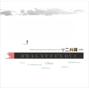
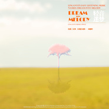

林澜叶
============================

|  |  |
| :--: | :-- |
| [ 林澜叶](https://i.xiami.com/linlanye) | **地区**: China 中国大陆 **风格**: 轻音乐流行 Light Pop, 轻音乐 Easy Listening **播放数**: 3757333 **粉丝数**: 1848 **评论数**: 92  |

## 档案

目前为独立音乐人，过去5年自己独立完成3张音乐作品集，分别是《十二月调》《轻音迷梦》《亘鼓不变》。代表作有：《活在未来》《天空的幻想》《人间诗》《快乐E调》等。计划在2014年开始两个全新的描述心灵与信仰的《新世》系列和家乡人文历史自然风景的《汉之源》系列。三个作品集的介绍如下： 
《十二月调》：每个自然调一首乐曲，代表十二个月份中的一月，每一月一个主题，共计12首。以音乐叙述为主，讲述不同月份的一段感悟，表述较深的内涵及心情。 
《轻音迷梦》：配器和旋律以极简主义为主旨，主要以钢琴、电钢琴、合成电子音作为主打，要求主题轻松宁静简单，不牵涉太多深沉内涵。 
《亘鼓不变》：以鼓作为主打的乐曲系列，风格不拘泥，仅只要求每首乐曲中鼓作为重要乐曲出现即可，主题内涵多样变化，只除鼓保持“不变”。

## 专辑

| 名称 | 语种 | 唱片公司 | 发行时间 | 专辑类别 | 专辑风格 |
| :--: | :-- | :-- | :-- | :-- | :-- |
| [ 十二月调Tunes for twelve Months](./albums/511005937.md) | 国语 | 独立发行 | 2014年09月04日 | 录音室专辑 | 器乐独奏 Solo Instrumental, 轻音乐 Easy Listening, 新古典新世纪 Neoclassical New Age |
| [ 天空的幻想](./albums/595285841.md) | 国语 | 独立发行 | 2014年03月20日 | 精选集 | 器乐独奏 Solo Instrumental, 放松新世纪 Relaxation New Age, 轻音乐 Easy Listening, 新世纪音乐 New Age |
| [ 公元前一万年](./albums/5022418549.md) | 国语 |  | 2013年08月23日 | EP, 单曲 |  |
| [ 林澜叶作品集](./albums/5022383506.md) | 纯音乐 |  | 2013年08月14日 | EP, 单曲 |  |
| [ Dream into Melody轻音迷梦](./albums/1895672604.md) | 其他 | 独立发行 | 2013年08月02日 | 录音室专辑 | 器乐独奏 Solo Instrumental, 放松新世纪 Relaxation New Age, 自然新世纪 Nature New Age, 轻音乐 Easy Listening |

## 评论

|  |  |  |
| :-- | :-- | :-- |
|  [虾米用户](https://emumo.xiami.com/u/352629116) 贝多芬，肖邦，莫扎特，海... 2020-12-21 14:43 赞(0) 踩(0) | 
林先生，可以麻烦您给一下with your summer的谱子吗？我觉得那首好美啊。
 |
|  [虾米用户](https://emumo.xiami.com/u/2831134)   2019-12-28 20:01 赞(0) 踩(0) | 
冥想  
 |
|  [虾米用户](https://emumo.xiami.com/u/101627686)   2019-08-03 18:05 赞(0) 踩(0) | 
加油。 
 |
|  [虾米用户](https://emumo.xiami.com/u/9003931) 千淘万漉虽辛苦 2019-07-27 22:44 赞(0) 踩(0) | 
极简新古典，加油   
 |
|  [虾米用户](https://emumo.xiami.com/u/411737830)  2019-02-17 15:04 赞(0) 踩(0) | 
  
 |
|  [虾米用户](https://emumo.xiami.com/u/11157355) 榕树长青 2019-01-29 10:24 赞(1) 踩(0) | 
林澜叶
 |
|  [虾米用户](https://emumo.xiami.com/u/7151428) 暖暖的～～ 2018-12-27 21:52 赞(1) 踩(0) | 
  
 |
|  [虾米用户](https://emumo.xiami.com/u/8326332) 后来，即便是音乐，也无法... 2018-05-27 01:51 赞(1) 踩(0) | 
为何就在隔壁更新了无损资源 
 |
|  [虾米用户](https://emumo.xiami.com/u/244252518)  2017-11-06 14:47 赞(1) 踩(0) | 

 |
|  [虾米用户](https://emumo.xiami.com/u/7871523) 歪星扔 2017-10-11 21:49 赞(3) 踩(0) | 
从豆瓣时期久开始喜欢到现在，真的太有才华了。。。期待新作
 |
|  [虾米用户](https://emumo.xiami.com/u/82188526)  2017-09-09 11:33 赞(1) 踩(0) | 
太喜欢了
 |
|  [虾米用户](https://emumo.xiami.com/u/6066908) 光芒与希望 *JazzH... 2016-05-12 21:02 赞(0) 踩(0) | 
曲子旋律很美，编排的更精致些就会有特色了，也不辜负这美好旋律
 |
|  [虾米用户](https://emumo.xiami.com/u/3666401)  2016-01-17 01:00 赞(0) 踩(0) | 
卡农 放在B小调上 感觉真不错
 |
|  [虾米用户](https://emumo.xiami.com/u/49728637)   2015-12-08 12:23 赞(1) 踩(0) | 
我仿佛看见了国产纯音的希望 
 |
|  [虾米用户](https://emumo.xiami.com/u/83604064) 音乐 2015-11-16 15:58 赞(1) 踩(0) | 
无可挑剔
 |
|  [虾米用户](https://emumo.xiami.com/u/5842998)  2015-10-17 00:02 赞(0) 踩(0) | 
支持你！！！！！很棒
 |
|  [虾米用户](https://emumo.xiami.com/u/4160582) 爱在指尖 2015-09-06 14:31 赞(0) 踩(0) | 
澜叶兄弟 人间诗的谱子能给我一个吗？
 |
| ⇒ |  [虾米用户](https://emumo.xiami.com/u/11836978)  2015-10-08 09:58 赞(0) 踩(0) | 
很抱歉了，没有制作谱子，是个遗憾
 |
|  [虾米用户](https://emumo.xiami.com/u/28631849)  2015-08-27 20:50 赞(4) 踩(0) | 
感觉作者还待千锤百炼。用意境与心做的曲子容不下瑕疵与杂念。希望有一天你能做到行云流水。加油！
 |
| ⇒ |  [虾米用户](https://emumo.xiami.com/u/11836978)  2015-10-08 09:58 赞(0) 踩(0) | 
谢谢，加油!
 |
|  [虾米用户](https://emumo.xiami.com/u/28631849)  2015-08-27 20:42 赞(0) 踩(0) | 
隐于山不如行于大千界。世界因为变化而美丽。人也一样。
 |
|  [虾米用户](https://emumo.xiami.com/u/43248227)  2015-04-22 21:05 赞(1) 踩(0) | 
支持下
 |
|  [虾米用户](https://emumo.xiami.com/u/4935215)  2015-03-31 22:06 赞(1) 踩(0) | 
少年，加油啊！
 |
| ⇒ |  [虾米用户](https://emumo.xiami.com/u/11836978)  2015-04-02 21:29 赞(0) 踩(0) | 
O(∩_∩)O！
 |
|  [虾米用户](https://emumo.xiami.com/u/8326332) 后来，即便是音乐，也无法... 2015-03-31 00:31 赞(2) 踩(0) | 
话说大神的《汉之源》和《亘古不变》专辑什么时候出呢，等了好久了。
 |
| ⇒ |  [虾米用户](https://emumo.xiami.com/u/11836978)  2015-04-03 18:29 赞(0) 踩(0) | 
最近都没怎么感觉，所以可能要等到有感觉才做了，时间不定吧
 |
| ⇒ |  [虾米用户](https://emumo.xiami.com/u/39216010) 我还没想好要写什么... 2015-04-17 06:53 赞(0) 踩(0) | 
<q><b>林澜叶说：</b></q>
 |
|  [虾米用户](https://emumo.xiami.com/u/18385422)   2015-02-25 23:16 赞(1) 踩(0) | 
快乐E调   两年前就喜欢~~~~~~~~~~~
 |
|  [虾米用户](https://emumo.xiami.com/u/40825364)   2015-02-06 09:56 赞(1) 踩(0) | 
很喜欢。徘徊虾米这么久偶然想起，抱着试一试竟真找到了。一年前的旧事感慨都在你的曲中再度回忆。
 |
| ⇒ |  [虾米用户](https://emumo.xiami.com/u/11836978)  2015-04-21 12:20 赞(0) 踩(0) | 
有时候，回忆就是由一段音乐构成的，
 |
|  [虾米用户](https://emumo.xiami.com/u/15477519) 爱  是生命的和弦，而不... 2015-01-18 14:54 赞(0) 踩(0) | 
很美...
 |
|  [虾米用户](https://emumo.xiami.com/u/10354415) 天地有时尽，宇宙亦轮回 2015-01-14 01:28 赞(0) 踩(0) | 
时隔两年多，重新去听了下2012冬至，有不同的感觉……说起来，为什么不放在虾米上呢，刚刚我可是一顿好找才找到……
 |
| ⇒ |  [虾米用户](https://emumo.xiami.com/u/11836978)  2015-01-24 17:50 赞(0) 踩(0) | 
自从决定不做歌，只做曲，曾经创作过的那些歌就让它门成为历史吧
 |
| ⇒ |  [虾米用户](https://emumo.xiami.com/u/10354415) 天地有时尽，宇宙亦轮回 2015-01-25 14:08 赞(0) 踩(0) | 
<q><b>林澜叶说：</b></q>
 |
|  [虾米用户](https://emumo.xiami.com/u/10354415) 天地有时尽，宇宙亦轮回 2015-01-14 00:51 赞(0) 踩(0) | 
灡叶，最开始认识你是在轻音乐吧，那个时候你发给我一些自己作的曲子，后来就喜欢上了，然后在5sing把你所有的作品都听了一遍，最后一次去那里记得是那首2012末日还是什么名字来着……现在在虾米重新看到你，有种特别的感觉
 |
| ⇒ |  [虾米用户](https://emumo.xiami.com/u/11836978)  2015-01-24 17:48 赞(0) 踩(0) | 
那些年的作品我自己现在听起来也能有很强的代入感，让我回到那个时代的那段心情，那段记忆
 |
| ⇒ |  [虾米用户](https://emumo.xiami.com/u/10354415) 天地有时尽，宇宙亦轮回 2015-01-25 14:08 赞(0) 踩(0) | 
<q><b>林澜叶说：</b></q>
 |
|  [虾米用户](https://emumo.xiami.com/u/4097604) 爱音乐 爱妹子 2015-01-03 11:03 赞(0) 踩(0) | 
很动听，支持独立音乐
 |
|  [虾米用户](https://emumo.xiami.com/u/32752544) 100普普通通的大人 2014-12-24 16:24 赞(3) 踩(0) | 
如果说大众即为主流，那么成为主流又能怎样？独立音乐人的魅力在于听众与创作人之间是达到高度共鳴的！
 |
|  [虾米用户](https://emumo.xiami.com/u/20025417) 暂无签名~ 2014-12-17 08:03 赞(1) 踩(0) | 
我认为你的才华在石进之上，编曲风格多样，能屈能伸！一些曲子也很适合做影视配乐。现在只差一位伯乐的出现……
 |
|  [虾米用户](https://emumo.xiami.com/u/32461398) 曾在云上浮想联翩如今也终... 2014-12-04 19:34 赞(0) 踩(0) | 
yeah
 |
|  [虾米用户](https://emumo.xiami.com/u/20025417) 暂无签名~ 2014-11-28 23:50 赞(0) 踩(0) | 
很好听的曲子！最初接触纯音乐是被日本音乐所吸引，是因为一些影视剧的引用……发现国内纯音乐逊色他们很多！现在听了一圈发现其实国内也有很多音乐才人，只是自己不知到而已。感谢虾米以及各位独立音乐人默默的坚持付出。加油
 |
| ⇒ |  [虾米用户](https://emumo.xiami.com/u/11836978)  2017-10-28 00:14 赞(0) 踩(0) | 
我谨为广大不为主流而妥协的独立音乐人中的一员而谢谢你的鼓励！
 |
| ⇒ |  [虾米用户](https://emumo.xiami.com/u/352629116) 贝多芬，肖邦，莫扎特，海... 2020-12-21 14:37 赞(0) 踩(0) | 
<q><b>林澜叶说：</b></q>
 |
|  [虾米用户](https://emumo.xiami.com/u/848022) a wander 2014-10-02 19:29 赞(0) 踩(0) | 
喜欢～
 |
|  [虾米用户](https://emumo.xiami.com/u/6610459)  2014-09-23 19:41 赞(0) 踩(0) | 
加油!!!
 |
|  [虾米用户](https://emumo.xiami.com/u/1784877) 暂无签名~ 2014-09-04 11:00 赞(0) 踩(0) | 
很美，加油！！！！！！
 |
|  [虾米用户](https://emumo.xiami.com/u/39930867)  2014-08-12 11:36 赞(0) 踩(0) | 
有缘千里来相会
 |
|  [虾米用户](https://emumo.xiami.com/u/34226508)   2014-08-10 23:18 赞(0) 踩(0) | 
嗷~怒赞~
 |
|  [虾米用户](https://emumo.xiami.com/u/16745497) 我还没想好要写什么... 2014-08-04 10:46 赞(0) 踩(0) | 
、丶、丶、丶
 |
|  [虾米用户](https://emumo.xiami.com/u/36018447)  2014-04-29 22:15 赞(0) 踩(0) | 
潜心 豁然 达行
 |
|  [虾米用户](https://emumo.xiami.com/u/10009855) 我还没想好要写什么... 2014-04-03 19:37 赞(0) 踩(0) | 
加油！！！
 |
|  [虾米用户](https://emumo.xiami.com/u/7776021) memento mori 2014-03-31 19:01 赞(0) 踩(0) | 
简单而美妙的旋律~~
 |
|  [虾米用户](https://emumo.xiami.com/u/8384826) 再见，虾米，谢谢！ 2014-03-30 13:17 赞(0) 踩(0) | 
感觉你做的纯音很细腻
 |
|  [虾米用户](https://emumo.xiami.com/u/4430245) Mare…Cullami... 2014-03-25 21:04 赞(0) 踩(0) | 
Godlike!!!
 |
|  [虾米用户](https://emumo.xiami.com/u/8384826) 再见，虾米，谢谢！ 2014-03-20 18:44 赞(0) 踩(0) | 
希望你在保证有面包的前提下坚持这份梦想，爱好，非常理解你，但是目前这种大环境下必须保证先吃饱饭，哈哈
 |
| ⇒ |  [虾米用户](https://emumo.xiami.com/u/11836978)  2014-03-21 08:54 赞(0) 踩(0) | 
是的，饿不死才有力气继续创作，
 |
|  [虾米用户](https://emumo.xiami.com/u/31512875)  2014-03-14 16:40 赞(0) 踩(0) | 
林老师，我可以把这些音乐盒朋友们分享吗。
 |
| ⇒ |  [虾米用户](https://emumo.xiami.com/u/11836978)  2014-03-14 18:29 赞(0) 踩(0) | 
谢谢你的喜欢和支持，非常高兴你可以分享给朋友们，O(∩_∩)O~
 |
|  [虾米用户](https://emumo.xiami.com/u/31512875)  2014-03-14 16:38 赞(3) 踩(0) | 
在听《汉之源》，旋律好似心里的那些基调，不断的变奏着。好的新世纪音乐，就像是内心的神秘花园，在这里，可以静静呼吸，相知相伴。
 |
|  [虾米用户](https://emumo.xiami.com/u/31512875)  2014-03-14 16:34 赞(1) 踩(0) | 
喜欢安静和轻缓的旋律，些许的思绪，还有一种诗意在旋律中。支持！
 |
|  [虾米用户](https://emumo.xiami.com/u/8326332) 后来，即便是音乐，也无法... 2014-02-25 12:45 赞(0) 踩(0) | 
现在你的音乐只有Demo版的，什么时候才有高音质的分享呢，我是你的忠实支持者，如果可以的话，能否发一份给我。非常感谢。 <a href="mailto:wushangseng@126.com">wushangseng@126.com</a>
 |
| ⇒ |  [虾米用户](https://emumo.xiami.com/u/11836978)  2014-02-25 13:35 赞(0) 踩(0) | 
多谢你的支持，其实这些demo版就是目前我最高质量的版本了，因为属于独立音乐，没有唱片发行，所以以demo的形式出现
 |
| ⇒ |  [虾米用户](https://emumo.xiami.com/u/8326332) 后来，即便是音乐，也无法... 2014-02-25 20:00 赞(0) 踩(0) | 
<q><b>林澜叶说：</b></q>
 |
|  [虾米用户](https://emumo.xiami.com/u/15828193)  2014-02-24 20:32 赞(0) 踩(0) | 
O(∩_∩)O！
 |
|  [虾米用户](https://emumo.xiami.com/u/15828193)  2014-02-20 22:17 赞(0) 踩(0) | 
人间诗，爱与思念，Warming winter，Fly to the sky，Sweet clouds，亘鼓之缘......希望能够上传......非常喜欢这几首。
 |
| ⇒ |  [虾米用户](https://emumo.xiami.com/u/11836978)  2014-02-24 16:57 赞(0) 踩(0) | 
谢谢~所有的纯音作品都已上传了
 |
|  [虾米用户](https://emumo.xiami.com/u/15828193)  2014-02-17 20:28 赞(0) 踩(0) | 
期待已久的《汉之源》！
 |
| ⇒ |  [虾米用户](https://emumo.xiami.com/u/11836978)  2014-02-18 11:15 赞(0) 踩(0) | 
^_^，多谢呢，久等了
 |
|  [虾米用户](https://emumo.xiami.com/u/6385533) www.williamf... 2014-01-20 20:53 赞(0) 踩(0) | 
来给你踩踩，加油！
 |
|  [虾米用户](https://emumo.xiami.com/u/10337057) 独自穿行于空灵之境 2014-01-16 22:33 赞(0) 踩(0) | 
~~~
 |
|  [虾米用户](https://emumo.xiami.com/u/8326332) 后来，即便是音乐，也无法... 2014-01-06 12:48 赞(0) 踩(0) | 
支持原创！
 |
|  [虾米用户](https://emumo.xiami.com/u/1988942) 我爱爱我的，我恨恨我的 2013-12-01 21:34 赞(0) 踩(0) | 
澜叶加油，我是双子座，支持你
 |
| ⇒ |  [虾米用户](https://emumo.xiami.com/u/11836978)  2014-02-25 14:00 赞(0) 踩(0) | 
非常感谢！~
 |
|  [虾米用户](https://emumo.xiami.com/u/16030766) caomo 2013-11-25 12:59 赞(0) 踩(0) | 
很不错
 |
|  [虾米用户](https://emumo.xiami.com/u/3571224)  2013-11-14 18:15 赞(0) 踩(0) | 
非常喜欢。
 |
|  [虾米用户](https://emumo.xiami.com/u/10537062) 一买补签必断签 2013-11-03 20:18 赞(0) 踩(0) | 
好听，期待发行！
 |
|  [虾米用户](https://emumo.xiami.com/u/12001044) 谛听中国 2013-10-26 23:12 赞(0) 踩(0) | 
赞~
 |
|  [虾米用户](https://emumo.xiami.com/u/8128176) 好好活着 2013-10-17 13:53 赞(0) 踩(0) | 
新曲不错，很喜欢
 |
|  [虾米用户](https://emumo.xiami.com/u/11836978)  2013-10-17 13:31 赞(1) 踩(0) | 
多谢大家支持，我会继续努力写出更好的曲子出来。
 |
|  [虾米用户](https://emumo.xiami.com/u/12409271)  2013-10-15 06:02 赞(0) 踩(0) | 
純音樂
 |
|  [虾米用户](https://emumo.xiami.com/u/9261161) 音乐里流动 2013-10-04 11:53 赞(0) 踩(0) | 
这么厉害的人这么点简评啊，果断前排支持！
 |
|  [虾米用户](https://emumo.xiami.com/u/6162188)  2013-09-23 23:13 赞(0) 踩(0) | 
终于能听到了~~
 |
|  [虾米用户](https://emumo.xiami.com/u/7046344)  2013-09-11 16:13 赞(0) 踩(0) | 
啊哦~
 |
|  [虾米用户](https://emumo.xiami.com/u/9944996)  2013-08-01 23:10 赞(0) 踩(0) | 
动词大词QAQ
 |
|  [虾米用户](https://emumo.xiami.com/u/6474506) 喜欢纯音和英语歌的博爱派 2013-07-09 00:17 赞(0) 踩(0) | 
没想到啊！顺便问候空大
 |
| ⇒ |  [虾米用户](https://emumo.xiami.com/u/231797) 活着真好 好好活着 2013-08-04 21:05 赞(0) 踩(0) | 
我现在才看到你的问候!
 |
|  [虾米用户](https://emumo.xiami.com/u/231797) 活着真好 好好活着 2013-07-07 19:14 赞(0) 踩(0) | 
~
 |
| ⇒ |  [虾米用户](https://emumo.xiami.com/u/11836978)  2014-02-25 14:01 赞(0) 踩(0) | 
~~
 |
|  [虾米用户](https://emumo.xiami.com/u/4430245) Mare…Cullami... 2013-07-05 01:33 赞(0) 踩(0) | 
地板~~~
 |
|  [虾米用户](https://emumo.xiami.com/u/7680420) 纯音控 2013-07-04 09:24 赞(0) 踩(0) | 
坐个板凳也好！
 |
|  [虾米用户](https://emumo.xiami.com/u/5067224) 心安即是归处 2013-07-01 12:32 赞(0) 踩(0) | 
大叔的沙发！
 |
