银临
============================

|  |  |
| :--: | :-- |
| [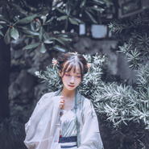 银临](https://i.xiami.com/yinlin) | **地区**: China 中国大陆 **风格**: 国语流行 Mandarin Pop, 中国风 China-Wave, 古风 GuFeng Music **播放数**: 67042299 **粉丝数**: 49952 **评论数**: 631  |

## 档案

银临，2013年12月15日，发行专辑《腐草为萤》。作品多以古风为主，是一位作、编、唱全能的艺人。

## 专辑

| 名称 | 语种 | 唱片公司 | 发行时间 | 专辑类别 | 专辑风格 |
| :--: | :-- | :-- | :-- | :-- | :-- |
| [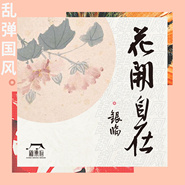 乱弹国风](./albums/5020642383.md) | 国语 | 华声时代 | 2020年05月14日 | EP, 单曲 | 流行 Pop |
| [ 杏花微雨时](./albums/2106059528.md) | 国语 | 众匠文化 | 2020年02月09日 | EP, 单曲 |  |
| [ 神木有灵](./albums/2105746119.md) | 国语 | 博冠信息 | 2020年01月16日 | EP, 单曲 | 国语流行 Mandarin Pop |
| [ 盗橘令](./albums/2105273139.md) | 国语 |  | 2019年08月23日 | EP, 单曲 |  |
| [ 闻妖云音乐独家自制国风企划](./albums/2105273138.md) | 国语 |  | 2019年07月08日 | EP, 单曲 |  |
| [ 金陵谣云音乐独家自制国风企划](./albums/2105273137.md) | 国语 |  | 2019年05月17日 | EP, 单曲 |  |
| [ 珍珠](./albums/2105273121.md) | 国语 |  | 2019年03月22日 | EP, 单曲 |  |
| [ 无题雪](./albums/2105273120.md) | 国语 |  | 2019年02月21日 | EP, 单曲 |  |
| [ 妙笔浮生游戏《绘真·妙笔千山》主题曲](./albums/2105273119.md) | 国语 |  | 2019年01月01日 | EP, 单曲 |  |
| [ 莫负山河莫负卿](./albums/2105273116.md) | 国语 | 网易游戏 | 2018年11月14日 | 录音室专辑 |  |
| [ 流光记](./albums/2105273112.md) | 国语 |  | 2018年10月02日 | EP, 单曲 |  |
| [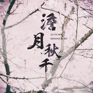 澹月秋千](./albums/2103994149.md) | 国语 | 极韵文化 | 2018年09月07日 | EP, 单曲 | 国语流行 Mandarin Pop |
| [ 晴川雪](./albums/2103494370.md) | 国语 | 网易游戏 | 2018年01月19日 | EP, 单曲 |  |
| [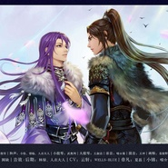 青原樱](./albums/2102961218.md) | 国语 | 独立发行 | 2017年11月24日 | EP, 单曲 | 古风 GuFeng Music |
| [ 云梦谣](./albums/2102880125.md) | 国语 | 亚克互动 | 2017年10月19日 | EP, 单曲 | 古风 GuFeng Music |
| [ 飞行安全颂](./albums/2102864426.md) | 国语 | 航旅纵横 | 2017年09月27日 | EP, 单曲 |  |
| [ 蚍蜉渡海](./albums/2102859823.md) | 国语 | 独立发行 | 2017年09月15日 | 录音室专辑 | 流行 Pop, 古风 GuFeng Music, 中国风 China-Wave |
| [ 不离](./albums/2102856841.md) | 国语 | 独立发行 | 2017年09月09日 | EP, 单曲 |  |
| [ 鸟卷 (Remix)](./albums/2102817890.md) | 国语 | 独立发行 | 2017年08月21日 | EP, 单曲 | 中国风 China-Wave |
| [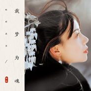 裁梦为魂](./albums/2102805144.md) | 国语 | 独立发行 | 2017年07月07日 | EP, 单曲 | 古风 GuFeng Music, 流行 Pop |
| [ 红豆词](./albums/2102671009.md) | 国语 | 独立发行 | 2016年12月11日 | EP, 单曲 | 浩室舞曲 House, 古风 GuFeng Music, 中国民乐 Chinese Folk Music |
| [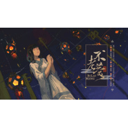 不老梦](./albums/2100371180.md) | 国语 | 独立发行 | 2016年07月17日 | EP, 单曲 |  |
| [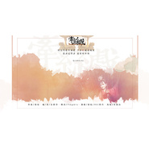 牵丝戏](./albums/1623630285.md) | 国语 | 独立发行 | 2015年01月27日 | EP, 单曲 | 古风 GuFeng Music |
| [ 十世镜](./albums/1923630224.md) | 国语 | 独立发行 | 2014年12月09日 | EP, 单曲 | 古风 GuFeng Music |
| [ 湘桥月](./albums/2011697841.md) | 国语 | 独立发行 | 2014年08月20日 | EP, 单曲 | 古风 GuFeng Music |
| [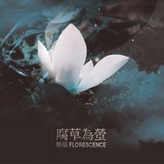 腐草为萤](./albums/490714707.md) | 国语 | 独立发行 | 2013年08月23日 | 录音室专辑 |  |
| [ 时光之河](./albums/673269894.md) | 国语 | 独立发行 | 2013年07月06日 | EP, 单曲 | 中国风 China-Wave |
| [ 眉目如画](./albums/1196322468.md) | 国语 | 独立发行 | 2013年05月26日 | EP, 单曲 | 中国风 China-Wave |
| [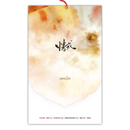 情戒](./albums/588742391.md) | 国语 | 独立发行 | 2013年05月26日 | EP, 单曲 | 古风 GuFeng Music |
| [ 锦鲤抄](./albums/472126441.md) | 国语 | 千城醉歌 | 2013年03月23日 | EP, 单曲 |  |
| [ 七夕](./albums/1296333739.md) | 国语 | 独立发行 | 2012年10月27日 | EP, 单曲 |  |
| [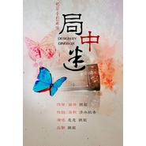 局中迷](./albums/196333707.md) | 国语 | 独立发行 | 2012年10月12日 | EP, 单曲 | 古风 GuFeng Music |
| [ 商女恨](./albums/1496333934.md) | 国语 | 独立发行 | 2012年08月10日 | EP, 单曲 | 古风 GuFeng Music |
| [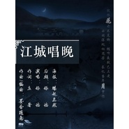 江城唱晚](./albums/896322406.md) | 国语 | 独立发行 | 2012年06月23日 | EP, 单曲 | 古风 GuFeng Music |
| [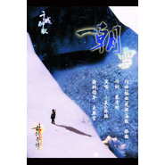 一朝雪](./albums/388729836.md) | 国语 | 独立发行 | 2012年06月21日 | EP, 单曲 | 古风 GuFeng Music |
| [ 轻云谣](./albums/496322335.md) | 国语 | 独立发行 | 2012年03月24日 | EP, 单曲 |  |
| [ 诛仙敕勒歌](./albums/396333986.md) | 国语 | 独立发行 | 2010年08月20日 | EP, 单曲 | 古风 GuFeng Music |

## 评论

|  |  |  |
| :-- | :-- | :-- |
|  [虾米用户](https://emumo.xiami.com/u/358104299) 悲观的唯心存在现实解构虚... 2021-01-09 03:27 赞(0) 踩(0) | 
46060
 |
|  [虾米用户](https://emumo.xiami.com/u/444838211)  2020-12-22 00:52 赞(0) 踩(0) | 
最喜欢的牵丝戏，换了很多播放软件，一直在网盘存着
 |
|  [虾米用户](https://emumo.xiami.com/u/375042886)  2020-12-11 18:13 赞(0) 踩(0) | 
生日快乐
 |
|  [虾米用户](https://emumo.xiami.com/u/357380221) 纵一苇之所如。 2020-12-11 13:37 赞(1) 踩(0) | 
临姐生日快乐   
 |
|  [虾米用户](https://emumo.xiami.com/u/407228915) Winnie 2020-12-11 12:54 赞(0) 踩(0) | 
生日快乐啊
 |
|  [虾米用户](https://emumo.xiami.com/u/69066576)  2020-12-11 12:51 赞(0) 踩(0) | 
生日快乐啊
 |
|  [虾米用户](https://emumo.xiami.com/u/367041994)  2020-12-11 10:44 赞(0) 踩(0) | 
银临姐姐生日快乐
 |
|  [虾米用户](https://emumo.xiami.com/u/28959665) 就是个听歌的 2020-12-11 10:21 赞(0) 踩(0) | 
生快
 |
|  [虾米用户](https://emumo.xiami.com/u/2170988) 人在道中，道在人中。 2020-12-11 10:13 赞(0) 踩(0) | 
谢谢你唱的歌，很好听，请继续努力，另外祝你生日快乐！
 |
|  [虾米用户](https://emumo.xiami.com/u/2187923)  2020-12-11 10:03 赞(1) 踩(0) | 
生日快乐呀  期待你的新作品  
 |
|  [虾米用户](https://emumo.xiami.com/u/85568296) 只有阳光而无阴影 只有欢... 2020-08-17 03:32 赞(1) 踩(0) | 
琉璃好好听啊！！！快上架吧！！！
 |
|  [虾米用户](https://emumo.xiami.com/u/358104299) 悲观的唯心存在现实解构虚... 2020-05-30 10:59 赞(1) 踩(0) | 
41501
 |
|  [虾米用户](https://emumo.xiami.com/u/441471347)  2020-03-16 17:22 赞(0) 踩(0) | 
我最喜欢银临姐的何须问你们呢？
 |
|  [虾米用户](https://emumo.xiami.com/u/335597447) 让我留在你身边 2019-12-22 04:18 赞(0) 踩(0) | 
银临姐姐这是艺名还是真名啊   我想说我也姓银  以前无聊搜有没有姓银的歌手  然后就遇见你了 
 |
| ⇒ |  [虾米用户](https://emumo.xiami.com/u/430483827)  2019-12-28 17:52 赞(0) 踩(0) | 
艺名
 |
| ⇒ |  [虾米用户](https://emumo.xiami.com/u/335597447) 让我留在你身边 2019-12-30 07:21 赞(0) 踩(0) | 
<q><b>小晴o说：</b></q>
 |
|  [虾米用户](https://emumo.xiami.com/u/358051739) 音乐收割机 2019-12-17 15:37 赞(0) 踩(0) | 
收集不同类型的音乐很多，从乡村到民谣，再到古风还有欧美和印加，感觉很多的不同，期待你的好作品
 |
|  [虾米用户](https://emumo.xiami.com/u/423996728) 我还没想好要写什么... 2019-12-11 17:49 赞(1) 踩(0) | 
银临姐姐生日快乐呀！敲喜欢您唱的歌，超好听呢！
 |
|  [虾米用户](https://emumo.xiami.com/u/47633557) ∞ 2019-12-11 10:36 赞(2) 踩(0) | 
银临小姐姐，生日快乐，开开心心每一天 
 |
|  [虾米用户](https://emumo.xiami.com/u/168176868)  2019-12-11 10:02 赞(1) 踩(0) | 
临子生日快乐
 |
|  [虾米用户](https://emumo.xiami.com/u/276944698) 不要自我设限..... 2019-11-12 20:21 赞(0) 踩(0) | 

 |
|  [虾米用户](https://emumo.xiami.com/u/255050849) 挚爱HP/我的世界，为H... 2019-09-14 21:31 赞(3) 踩(0) | 
耶，银临大大的第600条评论 除了好听得爆炸，我还能说什么？
 |
|  [虾米用户](https://emumo.xiami.com/u/32506216) 铜铃声声，声声凌统 2019-08-19 22:42 赞(0) 踩(0) | 
等着意难平，师姐........
 |
| ⇒ |  [虾米用户](https://emumo.xiami.com/u/432088152)  2019-11-12 22:07 赞(0) 踩(0) | 
哈哈哈，好多剧粉是顺着歌找到歌手，但我是因为银临才听意难平的，因为临子的音色唱法对于我来说太熟悉了，伤心不起来
 |
| ⇒ |  [虾米用户](https://emumo.xiami.com/u/32506216) 铜铃声声，声声凌统 2019-11-14 07:18 赞(0) 踩(0) | 
<q><b>小小王ing说：</b></q>
 |
| ⇒ |  [虾米用户](https://emumo.xiami.com/u/432088152)  2019-11-14 08:59 赞(0) 踩(0) | 
<q><b>柯颐说：</b></q>
 |
|  [虾米用户](https://emumo.xiami.com/u/11948478) atyy 2019-07-10 11:24 赞(1) 踩(0) | 
想听棠梨煎雪
 |
|  [虾米用户](https://emumo.xiami.com/u/332829)  2019-07-05 15:33 赞(1) 踩(0) | 
可不可以多一些歌啊。。这好多都没有sad....
 |
|  [虾米用户](https://emumo.xiami.com/u/126981048)  2019-06-24 11:43 赞(0) 踩(0) | 
哇，好多找不到的。我想听无题雪 
 |
|  [虾米用户](https://emumo.xiami.com/u/223773922) 这家伙很聪明什么也没留下... 2019-06-23 16:57 赞(2) 踩(0) | 
评论里提双笙的是什么鬼？
 |
| ⇒ |  [虾米用户](https://emumo.xiami.com/u/370553169)  2020-05-17 19:09 赞(0) 踩(0) | 
不好意思，那些要么是黑粉，要么是年纪小的，我替他们道歉。。。
 |
| ⇒ |  [虾米用户](https://emumo.xiami.com/u/406039539) 梦短梦长俱是梦，年来年去... 2020-06-20 23:13 赞(0) 踩(0) | 
<q><b>lllwww460说：</b></q>
 |
|  [虾米用户](https://emumo.xiami.com/u/336593362)  2019-06-21 00:48 赞(0) 踩(0) | 
我最喜欢的古风歌手就是临子啦  
 |
|  [虾米用户](https://emumo.xiami.com/u/426191537) 卿为朝朝暮暮 2019-06-20 13:06 赞(0) 踩(0) | 
好看鸭
 |
|  [虾米用户](https://emumo.xiami.com/u/6780567) 是的，我还没想好要写什么... 2019-05-05 11:06 赞(3) 踩(0) | 
《何须问》什么时候上架啊？充值也行啊！
 |
|  [虾米用户](https://emumo.xiami.com/u/85568296) 只有阳光而无阴影 只有欢... 2019-04-27 02:16 赞(2) 踩(0) | 
锦鲤抄~ 
 |
|  [虾米用户](https://emumo.xiami.com/u/357380221) 纵一苇之所如。 2019-03-31 10:35 赞(3) 踩(0) | 
《春笺》和《潜别离》最好听了！！！ 
 |
|  [虾米用户](https://emumo.xiami.com/u/422478182)  2019-03-30 19:20 赞(1) 踩(0) | 
女神
 |
|  [虾米用户](https://emumo.xiami.com/u/357893808) 来吧，杀死这只知更鸟 2019-03-18 00:26 赞(2) 踩(0) | 
虾米太狗了，连不老梦都没有
 |
|  [虾米用户](https://emumo.xiami.com/u/400238271)  2019-03-10 15:39 赞(4) 踩(0) | 
魔道祖师的片尾曲不是银临唱的吗？为什么找不到
 |
|  [虾米用户](https://emumo.xiami.com/u/404263136) 往事凋零 爱恨随意 2019-03-03 19:22 赞(2) 踩(0) | 
好像有，蚍蜉渡海有她啊
 |
|  [虾米用户](https://emumo.xiami.com/u/404263136) 往事凋零 爱恨随意 2019-03-03 19:21 赞(1) 踩(0) | 
这姑娘看着很眼熟，好像在哪儿见过
 |
|  [虾米用户](https://emumo.xiami.com/u/322523580) 夜空 总有更大密度的蓝色 2019-02-23 10:50 赞(1) 踩(0) | 

 |
|  [虾米用户](https://emumo.xiami.com/u/419564807)  2019-02-19 22:53 赞(1) 踩(0) | 
介绍里有词作，可是，临子什么时候写过词？
 |
| ⇒ |  [虾米用户](https://emumo.xiami.com/u/404263136) 往事凋零 爱恨随意 2019-03-03 19:19 赞(0) 踩(0) | 
写过啊
 |
| ⇒ |  [虾米用户](https://emumo.xiami.com/u/404263136) 往事凋零 爱恨随意 2019-03-03 19:20 赞(0) 踩(0) | 
好吧没写过，我看错了
 |
| ⇒ |  [虾米用户](https://emumo.xiami.com/u/432293760)  2019-11-16 16:31 赞(0) 踩(0) | 
《蚍蜉渡海》这张专辑里的《灼》，词作是银临和冥凰合作的
 |
|  [虾米用户](https://emumo.xiami.com/u/174654916)  没曾想过遇见你 2019-02-06 13:24 赞(0) 踩(0) | 
喜欢了银临两年了，今年第三年，我们一起加油！
 |
|  [虾米用户](https://emumo.xiami.com/u/409954168) 手中无剑，心中亦无剑 2019-01-24 20:31 赞(6) 踩(0) | 
和其他艺人相比，银临的作品并不多，但她的作品多为经典！其中更有多首甚至可以超过些许艺人的成名曲！ 银临，加油我们支持你！！！
 |
|  [虾米用户](https://emumo.xiami.com/u/343015884)  2019-01-15 19:40 赞(1) 踩(0) | 
银姐姐我又回来了
 |
|  [虾米用户](https://emumo.xiami.com/u/2521128) 昵称和签名都回不去了。。... 2019-01-13 15:51 赞(3) 踩(0) | 
坐等何须问上架 
 |
|  [虾米用户](https://emumo.xiami.com/u/199786427) 随心~对的起自己 2019-01-09 16:13 赞(3) 踩(0) | 
果然  汉服给美女加分百分百
 |
|  [虾米用户](https://emumo.xiami.com/u/258787268)   2018-12-25 21:27 赞(1) 踩(0) | 
银临和兮爷是一个公司的啊
 |
|  [虾米用户](https://emumo.xiami.com/u/410578097) 桃之夭夭，灼灼其华。 2018-12-15 17:00 赞(4) 踩(0) | 
牵锦不裁泸沽梦，澹浮眉浅棠雪情。
 |
|  [虾米用户](https://emumo.xiami.com/u/321089042)  2018-12-11 19:26 赞(1) 踩(0) | 
銀臨生日快樂♡最愛你的古風歌曲
 |
|  [虾米用户](https://emumo.xiami.com/u/231901632)  2018-12-11 18:01 赞(1) 踩(0) | 
生日快乐！
 |
|  [虾米用户](https://emumo.xiami.com/u/403962224)  2018-12-11 17:08 赞(1) 踩(0) | 
祝你生日快乐
 |
|  [虾米用户](https://emumo.xiami.com/u/244992878)  2018-12-11 16:45 赞(1) 踩(0) | 
女神生日快乐
 |
|  [虾米用户](https://emumo.xiami.com/u/21347539) 传说 2018-12-11 15:17 赞(1) 踩(0) | 
好听的歌
 |
|  [虾米用户](https://emumo.xiami.com/u/206943355)  2018-12-11 13:50 赞(1) 踩(0) | 
生日快乐
 |
|  [虾米用户](https://emumo.xiami.com/u/318394540) 斯人若彩虹  遇上方知有 2018-12-11 13:25 赞(1) 踩(0) | 
生日快乐
 |
|  [虾米用户](https://emumo.xiami.com/u/285910835)  2018-12-11 11:12 赞(1) 踩(0) | 
生日快乐
 |
|  [虾米用户](https://emumo.xiami.com/u/210109141)  2018-12-11 10:34 赞(1) 踩(0) | 
生日快乐，愿你永远开心
 |
|  [虾米用户](https://emumo.xiami.com/u/305223287) 我只憧憬我向往的风景，做... 2018-12-11 10:21 赞(1) 踩(0) | 
生日快乐啊 
 |
|  [虾米用户](https://emumo.xiami.com/u/279630960)  2018-12-11 10:05 赞(1) 踩(0) | 
臨臨生日快樂 (´▽｀)
 |
|  [虾米用户](https://emumo.xiami.com/u/288054220) 么么～ 2018-12-11 10:04 赞(1) 踩(0) | 
银临姐姐生日快乐
 |
|  [虾米用户](https://emumo.xiami.com/u/265879589) 落落大方，占山为王 2018-12-11 10:01 赞(1) 踩(0) | 
银临大大生日快乐!(^O^)y稀罕你啊
 |
|  [虾米用户](https://emumo.xiami.com/u/27482995) 喜欢老猫、V系、遥久、各... 2018-12-07 01:02 赞(0) 踩(0) | 
好美哇，听了这么几年的歌我才想起来关注一下 
 |
|  [虾米用户](https://emumo.xiami.com/u/80726338)  2018-11-26 22:51 赞(0) 踩(0) | 
喜欢长唱的古风歌
 |
|  [虾米用户](https://emumo.xiami.com/u/379100394) 江海不渡. 2018-11-26 21:40 赞(0) 踩(0) | 
我想听问琴，这首歌真的打动我，可是都没有版权 
 |
|  [虾米用户](https://emumo.xiami.com/u/293692544) 你敢给我说话吗？我咬你 2018-11-26 16:43 赞(1) 踩(0) | 
好听
 |
|  [虾米用户](https://emumo.xiami.com/u/2869674) 暂无签名~ 2018-11-19 22:49 赞(1) 踩(0) | 
喜欢你的花鸟卷
 |
|  [虾米用户](https://emumo.xiami.com/u/293692544) 你敢给我说话吗？我咬你 2018-11-17 17:42 赞(1) 踩(0) | 
好听
 |
|  [虾米用户](https://emumo.xiami.com/u/376154900) 手可摘星辰，世间无我这般... 2018-11-08 22:45 赞(1) 踩(0) | 
可以可以
 |
|  [虾米用户](https://emumo.xiami.com/u/358536406)  2018-10-07 11:40 赞(1) 踩(0) | 
哇小姐姐顏值高
 |
|  [虾米用户](https://emumo.xiami.com/u/379449314) 我还没想好要写什么... 2018-09-25 12:49 赞(3) 踩(0) | 
好多歌没有版权....得下好几个app才可以....
 |
|  [虾米用户](https://emumo.xiami.com/u/273721663) 凌晨潇潇雨，潇潇到黄昏。 2018-09-15 18:10 赞(2) 踩(0) | 
银临姐姐为什么不回复我们这些人呢？
 |
|  [虾米用户](https://emumo.xiami.com/u/269611396) 如果你转身，就会发现，我... 2018-09-15 14:41 赞(3) 踩(0) | 
日常表白银临女神
 |
|  [虾米用户](https://emumo.xiami.com/u/319155762)  2018-09-11 16:39 赞(3) 踩(0) | 
最喜欢眉目如画
 |
|  [虾米用户](https://emumo.xiami.com/u/197548104) 一个忠于音乐的材料木头。 2018-09-09 19:37 赞(1) 踩(0) | 
 
 |
|  [虾米用户](https://emumo.xiami.com/u/300440561)   2018-09-07 23:50 赞(8) 踩(0) | 
比双笙好听
 |
|  [虾米用户](https://emumo.xiami.com/u/178663600)  2018-08-20 07:18 赞(10) 踩(0) | 
银临大大，我想听魔道的片尾曲
 |
|  [虾米用户](https://emumo.xiami.com/u/318752486) 人生没有彩排，所以每一件... 2018-08-16 09:52 赞(1) 踩(0) | 
银临，唱的不错。加油！
 |
|  [虾米用户](https://emumo.xiami.com/u/273721663) 凌晨潇潇雨，潇潇到黄昏。 2018-08-13 16:00 赞(4) 踩(0) | 
因为《锦鲤抄》入古风圈，因为《牵丝戏》决定入圈不走。 
 |
|  [虾米用户](https://emumo.xiami.com/u/400717441) 芦苇，古风，二次元 2018-08-11 21:10 赞(1) 踩(0) | 
银临大大的一首《七夕》（有人听过吗？）带我进的古风音乐圈子。声音好好听，百听不腻。
 |
| ⇒ |  [虾米用户](https://emumo.xiami.com/u/400717441) 芦苇，古风，二次元 2018-08-11 21:22 赞(0) 踩(0) | 
送上歌词: 万家穿针乞巧心系檀郎 丝竹悠扬我对婵娟焚香 金风玉露华灯初上 温柔靠在你的胸膛 秋意勾画一幅渔火钱江 如水韵墨章烙印我心上 良辰美景愿与你共赏 朗月清风送来花香 语难道尽两情长 风雨路共闯 与君相伴到天荒 七夕的夜银烛秋光 喜鹊常在柳梢新月明亮 青石小巷灯火摇晃 牵你的手演织女和牛郎 你我好像鸳鸯一双 比翼飞过嫦娥的身旁 温暖想象 你来娶我进喜堂 心中一片锦绣艳阳
 |
|  [虾米用户](https://emumo.xiami.com/u/379351287)  2018-08-01 14:59 赞(1) 踩(0) | 
银临和双笙都很好
 |
|  [虾米用户](https://emumo.xiami.com/u/341810441)  2018-07-24 14:16 赞(2) 踩(0) | 
喜欢银临的牵丝戏&amp;mdash;&amp;mdash;天地为台，牵绊为丝 ，纵妙手，难解心头千千结
 |
|  [虾米用户](https://emumo.xiami.com/u/336781084) (๑´∀`๑) 2018-07-23 22:48 赞(75) 踩(0) | 
银临小姐姐的歌下架了好多，马云爸爸你管管虾米的版权问题啊！！买了这虾米不管都成废虾米咯，看着一首有一首的歌因为版权下架好心痛，求求您老了qwq（抓着马云爸爸的肩膀摇啊摇）
 |
| ⇒ |  [虾米用户](https://emumo.xiami.com/u/406405900)  2018-12-28 12:49 赞(0) 踩(0) | 
哈哈哈哈哈，你好可爱
 |
| ⇒ |  [虾米用户](https://emumo.xiami.com/u/336781084) (๑´∀`๑) 2018-12-28 22:40 赞(0) 踩(0) | 
<q><b>专一的玉米说：</b></q>
 |
|  [虾米用户](https://emumo.xiami.com/u/253731921) 嘿. 2018-07-10 09:55 赞(7) 踩(0) | 
有生之年虾米能不能上架那首《可不可以》/滑稽
 |
|  [虾米用户](https://emumo.xiami.com/u/297878235) 佛在心中坐，缘从天上来。 2018-07-02 04:22 赞(2) 踩(0) | 
歌曲委婉动人，音质柔软细腻，是个很棒的古风才女 
 |
|  [虾米用户](https://emumo.xiami.com/u/297856358)  2018-06-27 13:08 赞(4) 踩(0) | 
第一次听你的歌是《棠梨煎雪》，自从后，喜欢你的声音 
 |
|  [虾米用户](https://emumo.xiami.com/u/353195387)  2018-06-14 09:10 赞(62) 踩(0) | 
银临和双笙最大的区别是银临的歌曲，背后是有故事的。她的歌都在诉说着什么，而在双笙的歌中，我听不到。
 |
| ⇒ |  [虾米用户](https://emumo.xiami.com/u/376003908) 点缀一丝画框里的宁静，保... 2018-06-17 22:32 赞(0) 踩(0) | 
同感，同感...
 |
| ⇒ |  [虾米用户](https://emumo.xiami.com/u/353998933)  2018-06-29 10:49 赞(0) 踩(0) | 
而且银临的声音相对于双笙来说，音色更加空灵、纤细。非常适合用假声唱高音，天生的好嗓子。
 |
| ⇒ |  [虾米用户](https://emumo.xiami.com/u/353195387)  2018-06-29 11:34 赞(0) 踩(0) | 
<q><b>御琴晞说：</b></q>
 |
| ⇒ |  [虾米用户](https://emumo.xiami.com/u/374900570) 请不要对我好，我很傻，会... 2018-11-03 16:50 赞(0) 踩(0) | 
其实银临和双笙都各有不同的特色，就看自己喜欢哪种风格
 |
| ⇒ |  [虾米用户](https://emumo.xiami.com/u/432088152)  2019-11-12 22:03 赞(0) 踩(0) | 
吃香难不难看，本人相关或许不清楚，毕竟当局者迷旁观者清
 |
| ⇒ |  [虾米用户](https://emumo.xiami.com/u/432088152)  2019-11-12 22:05 赞(0) 踩(0) | 
<q><b>双鱼的我说：</b></q>
 |
| ⇒ |  [虾米用户](https://emumo.xiami.com/u/370553169)  2020-05-17 19:15 赞(0) 踩(0) | 
临和笙都很好，喜好凭你自己，请不要捧踩，谢谢~~
 |
|  [虾米用户](https://emumo.xiami.com/u/361786666) 未来不远，就在眼前。 2018-06-13 09:36 赞(0) 踩(0) | 
她的歌还有文采都不错啊
 |
|  [虾米用户](https://emumo.xiami.com/u/312024060)   2018-06-11 12:45 赞(0) 踩(0) | 
才女！
 |
|  [虾米用户](https://emumo.xiami.com/u/345588130)  2018-06-07 18:19 赞(0) 踩(0) | 
喜欢你 
 |
|  [虾米用户](https://emumo.xiami.com/u/275707705)  2018-06-02 15:28 赞(0) 踩(0) | 
声音很好听哦
 |
|  [虾米用户](https://emumo.xiami.com/u/260278302)  2018-05-31 22:47 赞(3) 踩(0) | 
本来就喜欢古风歌曲  刚好小姐姐就是我喜欢的风格  真的真的太喜欢华夏文明了
 |
|  [虾米用户](https://emumo.xiami.com/u/357515252)  2018-05-29 15:24 赞(2) 踩(0) | 
喜欢你所有的歌，加油＾０＾~
 |
|  [虾米用户](https://emumo.xiami.com/u/354865643)  2018-05-23 13:28 赞(0) 踩(0) | 
喜欢你
 |
|  [虾米用户](https://emumo.xiami.com/u/354665763)  2018-05-19 19:58 赞(3) 踩(0) | 
银临是我见过最美的女生，那种古典韵味我很喜欢
 |
|  [虾米用户](https://emumo.xiami.com/u/301609082) goodbye 虾米 2018-05-11 23:13 赞(3) 踩(0) | 
小姐姐好听
 |
|  [虾米用户](https://emumo.xiami.com/u/236457095) 微微的每一天，都在聆听美... 2018-05-10 09:13 赞(3) 踩(0) | 
你的音乐好听 
 |
|  [虾米用户](https://emumo.xiami.com/u/357674040)  2018-05-09 07:02 赞(1) 踩(0) | 

 |
|  [虾米用户](https://emumo.xiami.com/u/295295807)  2018-05-01 09:01 赞(1) 踩(0) | 
很喜欢银临的歌。
 |
|  [虾米用户](https://emumo.xiami.com/u/343588427) 我还没想好要写什么... 2018-04-24 12:40 赞(1) 踩(0) | 
华丽的词藻都比不上你的词
 |
|  [虾米用户](https://emumo.xiami.com/u/3100269) 暂无签名~ 2018-04-18 15:44 赞(1) 踩(0) | 
声音棒呆了
 |
|  [虾米用户](https://emumo.xiami.com/u/323485613) 我还没想好要写什么... 2018-04-13 23:26 赞(1) 踩(0) | 
非常喜欢你的音乐，加油
 |
|  [虾米用户](https://emumo.xiami.com/u/286486776)  2018-04-10 19:48 赞(1) 踩(0) | 
喜欢你
 |
|  [虾米用户](https://emumo.xiami.com/u/356838785)  2018-04-06 14:27 赞(2) 踩(0) | 
声音好听
 |
|  [虾米用户](https://emumo.xiami.com/u/357068099)  2018-04-06 08:07 赞(1) 踩(0) | 
超喜欢你
 |
|  [虾米用户](https://emumo.xiami.com/u/38632826) Mg ＋2nSo4＝Mg... 2018-04-05 19:17 赞(2) 踩(0) | 
小姐姐的声音好听加油，比心心
 |
|  [虾米用户](https://emumo.xiami.com/u/354816903)  2018-03-27 21:39 赞(2) 踩(0) | 
喜欢你的歌。
 |
|  [虾米用户](https://emumo.xiami.com/u/303719037)  2018-03-23 16:39 赞(1) 踩(0) | 
好听!好听!
 |
|  [虾米用户](https://emumo.xiami.com/u/353311926) 你是无意穿堂风，偏偏孤据... 2018-03-17 10:07 赞(1) 踩(0) | 
不错
 |
|  [虾米用户](https://emumo.xiami.com/u/2320248)  2018-03-15 16:56 赞(0) 踩(0) | 
没有大美江湖呀？
 |
| ⇒ |  [虾米用户](https://emumo.xiami.com/u/6515551)  2018-04-20 19:09 赞(0) 踩(0) | 
大美江湖的版权属于剑网三，暂时给Q音乐独家
 |
|  [虾米用户](https://emumo.xiami.com/u/28401839) 风起云涌，在遇见你的一刻... 2018-03-09 19:55 赞(2) 踩(0) | 
忆旧时锦鲤，念一梦未老
 |
|  [虾米用户](https://emumo.xiami.com/u/353678360)  2018-03-08 20:47 赞(1) 踩(0) | 
嗯嗯~小姐姐的声音好好听哦~
 |
|  [虾米用户](https://emumo.xiami.com/u/6017043) 微信231853623，... 2018-03-07 12:44 赞(1) 踩(0) | 
小姐姐加油~
 |
|  [虾米用户](https://emumo.xiami.com/u/338845409) 我就是我，颜色不一样的烟... 2018-02-27 17:18 赞(0) 踩(0) | 
好好好   
 |
|  [虾米用户](https://emumo.xiami.com/u/253610919)  2018-02-23 20:17 赞(0) 踩(0) | 
喜欢银临
 |
|  [虾米用户](https://emumo.xiami.com/u/351543463)  2018-02-23 13:37 赞(0) 踩(0) | 
超爱银临的歌，超爱银临，
 |
|  [虾米用户](https://emumo.xiami.com/u/313973912)  2018-02-21 16:24 赞(1) 踩(0) | 
特别喜欢你的棠梨煎雪
 |
|  [虾米用户](https://emumo.xiami.com/u/291589590)  2018-02-20 15:21 赞(0) 踩(0) | 
想听醉笑花间
 |
|  [虾米用户](https://emumo.xiami.com/u/258542214)   2018-02-12 20:46 赞(0) 踩(0) | 

 |
|  [虾米用户](https://emumo.xiami.com/u/339797897) 我爱纳兰容若. 2018-02-11 21:03 赞(0) 踩(0) | 
  
 |
|  [虾米用户](https://emumo.xiami.com/u/332617909)  2018-02-10 11:22 赞(1) 踩(0) | 
至少，在我看来是很好很好的
 |
|  [虾米用户](https://emumo.xiami.com/u/345432125)  2018-02-08 11:11 赞(0) 踩(0) | 
好听  
 |
|  [虾米用户](https://emumo.xiami.com/u/347807334)  2018-02-05 16:51 赞(0) 踩(0) | 
好听
 |
|  [虾米用户](https://emumo.xiami.com/u/203794103) 好好对别人，下辈子不一定... 2018-02-03 23:17 赞(1) 踩(0) | 
银大加油！
 |
|  [虾米用户](https://emumo.xiami.com/u/344990718)  2018-01-29 18:04 赞(1) 踩(0) | 
红颜无罪，只因太美
 |
|  [虾米用户](https://emumo.xiami.com/u/345321659) 你尽管走，我永远在你身后... 2018-01-18 18:40 赞(2) 踩(0) | 
听了牵丝戏，太好听了！！！！
 |
|  [虾米用户](https://emumo.xiami.com/u/345321659) 你尽管走，我永远在你身后... 2018-01-18 18:39 赞(0) 踩(0) | 
好听！！！！！！
 |
|  [虾米用户](https://emumo.xiami.com/u/344783196) 明明爱却不说，明明恨却不... 2018-01-14 19:05 赞(3) 踩(0) | 
好美的声音啊 
 |
|  [虾米用户](https://emumo.xiami.com/u/252688379) 心还在，便不再说放弃 2018-01-13 13:14 赞(2) 踩(0) | 
古风的意境很好了 
 |
|  [虾米用户](https://emumo.xiami.com/u/252688379) 心还在，便不再说放弃 2018-01-13 13:12 赞(1) 踩(0) | 
] 加油↖(^&amp;omega;^)↗
 |
|  [虾米用户](https://emumo.xiami.com/u/313631181) 结痂的伤口总有人不愿触碰... 2018-01-09 14:09 赞(0) 踩(0) | 
额(⊙o⊙)&amp;hellip;
 |
|  [虾米用户](https://emumo.xiami.com/u/167445738) 这个人特别懒 2018-01-09 01:34 赞(3) 踩(0) | 
第一次听牵丝戏循环了N遍。就想看看唱歌的人。百度了一下，原来是位同乡，还是家门。幸会，谢谢，加油。
 |
|  [虾米用户](https://emumo.xiami.com/u/277914084) 青松碎云蹁跹，饮风共醉月... 2018-01-08 02:59 赞(0) 踩(0) | 
最喜欢的音乐人の美女银临の      
 |
|  [虾米用户](https://emumo.xiami.com/u/100730532)   2018-01-08 01:15 赞(1) 踩(0) | 
很棒
 |
|  [虾米用户](https://emumo.xiami.com/u/343513492) 愿每个人都会遇见属于自己... 2018-01-06 21:40 赞(1) 踩(0) | 
超爱小姐姐的
 |
|  [虾米用户](https://emumo.xiami.com/u/297153927) 我还没想好要写什么...... 2018-01-01 05:11 赞(4) 踩(0) | 
这是多么天然的声音，与别的妖艳做做的声音完全不同
 |
|  [虾米用户](https://emumo.xiami.com/u/297153927) 我还没想好要写什么...... 2018-01-01 05:10 赞(2) 踩(0) | 
小姐姐声音真好听⊙▽⊙
 |
|  [虾米用户](https://emumo.xiami.com/u/274743914) Replay 2017-12-30 12:13 赞(2) 踩(0) | 
满满的画面感
 |
|  [虾米用户](https://emumo.xiami.com/u/340526893)  2017-12-29 18:42 赞(1) 踩(0) | 
   
 |
|  [虾米用户](https://emumo.xiami.com/u/341260806) 流光容易把人抛，红了樱桃... 2017-12-24 23:11 赞(0) 踩(0) | 
好听 超喜欢这首歌的
 |
|  [虾米用户](https://emumo.xiami.com/u/252688379) 心还在，便不再说放弃 2017-12-24 12:44 赞(1) 踩(0) | 

 |
|  [虾米用户](https://emumo.xiami.com/u/109803586) 听五月天 华晨宇＋数不清... 2017-12-23 22:03 赞(2) 踩(0) | 
好喜欢小姐姐啊
 |
|  [虾米用户](https://emumo.xiami.com/u/3419020) 东京浪人一枚 2017-12-14 22:03 赞(2) 踩(0) | 
有才华唱歌也这么好听的姑娘最美了❤️
 |
|  [虾米用户](https://emumo.xiami.com/u/305161727) 你就欺负我，因为我爱你把... 2017-12-10 22:53 赞(3) 踩(0) | 
银临的每首歌都听了，真的很好听，每首歌啊，都是一个故事。唱歌的人，也是在讲诉一个故事，带上感情，才会吸引人，打动听的人的心。希望银临也能不忘初心，继续唱下去
 |
| ⇒ |  [虾米用户](https://emumo.xiami.com/u/277914084) 青松碎云蹁跹，饮风共醉月... 2018-01-08 03:00 赞(0) 踩(0) | 
怎么回事儿呀？和我一样喜欢银临呢？ 
 |
| ⇒ |  [虾米用户](https://emumo.xiami.com/u/305161727) 你就欺负我，因为我爱你把... 2018-01-11 21:20 赞(0) 踩(0) | 
哈哈
 |
| ⇒ |  [虾米用户](https://emumo.xiami.com/u/305161727) 你就欺负我，因为我爱你把... 2018-01-11 21:20 赞(0) 踩(0) | 
<q><b>静心洁玉说：</b></q>
 |
| ⇒ |  [虾米用户](https://emumo.xiami.com/u/346465297) 回眸一笑百媚生，轻言一句... 2018-01-28 11:00 赞(0) 踩(0) | 
<q><b>静心洁玉说：</b></q>
 |
|  [虾米用户](https://emumo.xiami.com/u/314939715)  2017-12-10 10:47 赞(2) 踩(0) | 
之前河图的倾尽天下 改变对古风的看法 昨天晚上 听你们唱的是风动 词好 背景音乐好 两人都唱的很好听 现在正在单曲循环到死 期待下次的歌
 |
|  [虾米用户](https://emumo.xiami.com/u/8472460)  2017-12-07 10:12 赞(0) 踩(0) | 
姐妹
 |
|  [虾米用户](https://emumo.xiami.com/u/110325168) 珍惜与虾米为数不多的日子... 2017-12-04 18:31 赞(3) 踩(0) | 
听了牵丝戏，知道了银临女神的
 |
|  [虾米用户](https://emumo.xiami.com/u/272999562)  2017-12-02 14:41 赞(0) 踩(0) | 
听了几天古风  好像中毒了     银临唱的好
 |
|  [虾米用户](https://emumo.xiami.com/u/326505452)  2017-11-30 09:56 赞(0) 踩(0) | 
你的歌都喜欢
 |
|  [虾米用户](https://emumo.xiami.com/u/334738593)  2017-11-13 19:22 赞(1) 踩(0) | 
好好听，继续加油。我最喜欢你的&amp;ldquo;浮生词&amp;rdquo;  
 |
|  [虾米用户](https://emumo.xiami.com/u/334909411)   2017-11-12 22:36 赞(1) 踩(0) | 
很好听&amp;hellip;&amp;hellip;
 |
|  [虾米用户](https://emumo.xiami.com/u/271169707) 找个爱人的啊 2017-11-12 19:41 赞(0) 踩(0) | 
好听
 |
|  [虾米用户](https://emumo.xiami.com/u/160484178) 烧 2017-11-11 10:05 赞(0) 踩(0) | 
加油加油
 |
|  [虾米用户](https://emumo.xiami.com/u/271169707) 找个爱人的啊 2017-11-06 09:11 赞(0) 踩(0) | 
好听呀       
 |
|  [虾米用户](https://emumo.xiami.com/u/290649463)  2017-11-04 15:46 赞(0) 踩(0) | 
古风
 |
|  [虾米用户](https://emumo.xiami.com/u/248722956) Chan Beak 2017-11-03 19:48 赞(0) 踩(0) | 
银临的声音炒鸡喜欢，作的曲都好好听
 |
|  [虾米用户](https://emumo.xiami.com/u/222962473)  2017-11-01 21:47 赞(0) 踩(0) | 
天命之女
 |
|  [虾米用户](https://emumo.xiami.com/u/289211677) 人生如戏，全靠演技 2017-10-28 00:04 赞(16) 踩(0) | 
特别喜欢你的《锦鲤抄》第一次听就喜欢上了，这才为你下了虾米音乐，为了关注你
 |
| ⇒ |  [虾米用户](https://emumo.xiami.com/u/379241658)  2018-10-13 20:59 赞(0) 踩(0) | 
..一般听银临都歌在网易云
 |
|  [虾米用户](https://emumo.xiami.com/u/180931152)  2017-10-22 23:02 赞(1) 踩(0) | 
好好听
 |
|  [虾米用户](https://emumo.xiami.com/u/331197129)  2017-10-21 22:28 赞(0) 踩(0) | 
很有特点
 |
|  [虾米用户](https://emumo.xiami.com/u/327996247)   2017-10-21 16:46 赞(0) 踩(0) | 
999+
 |
|  [虾米用户](https://emumo.xiami.com/u/330576218) 望君戚戚然，今朝思之成习... 2017-10-17 22:35 赞(2) 踩(0) | 
银临大大，无论你在哪开了个人主页，我都会默默的支持你，一直一直！
 |
|  [虾米用户](https://emumo.xiami.com/u/330154689)  2017-10-14 19:22 赞(1) 踩(0) | 
先听的锦鲤抄才知道的其他
 |
|  [虾米用户](https://emumo.xiami.com/u/270801558)  2017-10-13 22:18 赞(0) 踩(0) | 
咋一眼以为木子女神
 |
|  [虾米用户](https://emumo.xiami.com/u/281952885)  2017-10-10 22:19 赞(0) 踩(0) | 
大爱银临，歌声清澈空灵，如深谷清泉，古风歌手我的眼里只有银临
 |
|  [虾米用户](https://emumo.xiami.com/u/212808783)  2017-10-03 00:57 赞(0) 踩(0) | 
感觉古风唱得最好的就是他了
 |
|  [虾米用户](https://emumo.xiami.com/u/242509344) 我喜欢冒险后的清风 2017-10-02 18:38 赞(1) 踩(0) | 
我偶然听你的歌，之后边喜欢上了。这个时代，这样的歌不多了，加油吧！ 
 |
|  [虾米用户](https://emumo.xiami.com/u/288952255) 边伯贤BAEKHYUN 2017-10-02 16:39 赞(2) 踩(0) | 
银临姐姐是我喜欢的笫￣个古风作词曲家
 |
| ⇒ |  [虾米用户](https://emumo.xiami.com/u/327101977) EXO么么哒 2017-10-19 20:10 赞(0) 踩(0) | 
exo                       EXO
 |
| ⇒ |  [虾米用户](https://emumo.xiami.com/u/288952255) 边伯贤BAEKHYUN 2017-10-20 20:22 赞(0) 踩(0) | 
<q><b>EXO一吴亦凡KRIS说：</b></q>
 |
|  [虾米用户](https://emumo.xiami.com/u/297340192)  2017-10-01 15:13 赞(0) 踩(0) | 
都说银临的歌是一个样子，好怕，哈哈
 |
|  [虾米用户](https://emumo.xiami.com/u/313962847)  2017-10-01 13:25 赞(0) 踩(0) | 
都说她的曲子都差不多，好怕。
 |
|  [虾米用户](https://emumo.xiami.com/u/325976476) 纯净 2017-09-27 20:11 赞(0) 踩(0) | 
如一
 |
|  [虾米用户](https://emumo.xiami.com/u/317250885)  2017-09-23 21:12 赞(3) 踩(0) | 
最爱《牵戏丝》，词曲皆动人心弦！
 |
|  [虾米用户](https://emumo.xiami.com/u/301735544) 底线简单，我的别动 2017-09-10 17:38 赞(3) 踩(0) | 
银姐，因为我听你歌，我语文考96，谢谢你银姐!
 |
|  [虾米用户](https://emumo.xiami.com/u/296037225) 秦时升明月，天行颂九歌。... 2017-09-08 13:12 赞(3) 踩(0) | 
一首《牵丝戏》征服了我的耳朵，听完古风再不愿听流行，银临女神加油O(&amp;cap;_&amp;cap;)O
 |
| ⇒ |  [虾米用户](https://emumo.xiami.com/u/299816687)  2017-09-08 23:09 赞(0) 踩(0) | 
我也是
 |
| ⇒ |  [虾米用户](https://emumo.xiami.com/u/292282014) 一辈子的人生 2017-09-09 10:12 赞(0) 踩(0) | 
同上
 |
|  [虾米用户](https://emumo.xiami.com/u/323252250)  2017-09-04 04:26 赞(1) 踩(0) | 
仙里仙气
 |
|  [虾米用户](https://emumo.xiami.com/u/268902512) 我还没想好要写什么... 2017-09-03 02:47 赞(1) 踩(0) | 
歌美人更美
 |
|  [虾米用户](https://emumo.xiami.com/u/321911680)  2017-08-29 23:00 赞(32) 踩(0) | 
银临的歌都不错哦。喜欢这个声音很有古韵风的姐姐。 
 |
| ⇒ |  [虾米用户](https://emumo.xiami.com/u/327101977) EXO么么哒 2017-10-19 20:13 赞(0) 踩(0) | 
鹿晗
 |
|  [虾米用户](https://emumo.xiami.com/u/309323950)  2017-08-27 23:06 赞(0) 踩(0) | 
666
 |
|  [虾米用户](https://emumo.xiami.com/u/222249464) 我还没想好要写什么... 2017-08-19 22:32 赞(0) 踩(0) | 
很喜欢
 |
|  [虾米用户](https://emumo.xiami.com/u/232189449) 我还没想好要写什么... 2017-08-16 07:42 赞(0) 踩(0) | 
词很美
 |
|  [虾米用户](https://emumo.xiami.com/u/7509009)  2017-08-13 22:43 赞(0) 踩(0) | 
刚刚听了朋友推荐的记游西，很有意思啊
 |
|  [虾米用户](https://emumo.xiami.com/u/301778386)  2017-08-12 15:26 赞(18) 踩(0) | 
银临的歌有种时光静好的感觉，特别治愈。是中国少有的古风音乐人，作的曲特好听，是我唯一喜欢的女歌手。加油，让更多人听到你的音乐！
 |
|  [虾米用户](https://emumo.xiami.com/u/313988864) 这个人很懒，连签名都不写... 2017-08-12 10:27 赞(3) 踩(0) | 
内容已删除
 |
| ⇒ |  [虾米用户](https://emumo.xiami.com/u/317319560) 我摘青辉冷月为锋芒收入鞘... 2017-10-01 14:13 赞(0) 踩(0) | 

 |
|  [虾米用户](https://emumo.xiami.com/u/190886288) 我还没想好要写什么... 2017-08-02 09:21 赞(2) 踩(0) | 
牵丝戏巨好听给小姐姐赞&amp;gt;&amp;lt;♡
 |
|  [虾米用户](https://emumo.xiami.com/u/315442446)  2017-08-01 18:56 赞(0) 踩(0) | 
mkomo
 |
|  [虾米用户](https://emumo.xiami.com/u/41952614)  2017-07-30 16:46 赞(0) 踩(0) | 
还是嘉敏好呢！  
 |
|  [虾米用户](https://emumo.xiami.com/u/293145348)  2017-07-30 13:19 赞(0) 踩(0) | 
银临唱的好好听，希望多出点哥
 |
|  [虾米用户](https://emumo.xiami.com/u/277914084) 青松碎云蹁跹，饮风共醉月... 2017-07-29 22:12 赞(1) 踩(0) | 
大才女的歌特喜欢听～听歌留个脚印儿吧哈哈(366)大顺耶～
 |
|  [虾米用户](https://emumo.xiami.com/u/83757886)   2017-07-26 14:05 赞(1) 踩(0) | 
温柔的歌声
 |
|  [虾米用户](https://emumo.xiami.com/u/83757886)   2017-07-26 14:03 赞(1) 踩(0) | 
声音丰富，年轻与轻熟兼具，喜欢～
 |
|  [虾米用户](https://emumo.xiami.com/u/306278206)  2017-07-23 16:19 赞(0) 踩(0) | 
加油，亲亲
 |
|  [虾米用户](https://emumo.xiami.com/u/314153960)  2017-07-23 07:49 赞(0) 踩(0) | 
歌有些伤情，我竟要哭了。
 |
|  [虾米用户](https://emumo.xiami.com/u/312483571) 流水化为风 2017-07-17 14:27 赞(0) 踩(0) | 

 |
|  [虾米用户](https://emumo.xiami.com/u/207325022)  2017-07-09 13:23 赞(0) 踩(0) | 
蚍蜉渡海。&amp;hellip;&amp;hellip;呢
 |
|  [虾米用户](https://emumo.xiami.com/u/274103231)  2017-07-08 17:02 赞(0) 踩(0) | 
就是喜欢
 |
|  [虾米用户](https://emumo.xiami.com/u/309428717) 呵呵(^_^) 2017-07-03 16:43 赞(0) 踩(0) | 
银临唱的很好呢 
 |
|  [虾米用户](https://emumo.xiami.com/u/300040608) 万事胜意 2017-06-30 20:34 赞(1) 踩(0) | 
锦鲤抄好好听！百听不厌
 |
|  [虾米用户](https://emumo.xiami.com/u/294870911)  2017-06-29 13:15 赞(1) 踩(0) | 
唱歌好好听
 |
| ⇒ |  [虾米用户](https://emumo.xiami.com/u/292574552) 人生不过梦一场，何必为爱... 2017-06-30 06:37 赞(0) 踩(0) | 
太爱这歌了，曲美人美歌声美。
 |
|  [虾米用户](https://emumo.xiami.com/u/261579821) 心大的SM家族饭 2017-06-23 21:40 赞(0) 踩(0) | 
很棒啊  请小姐姐继续加油11
 |
|  [虾米用户](https://emumo.xiami.com/u/303404614)  2017-06-23 09:08 赞(1) 踩(0) | 
因为锦鲤抄很好听
 |
|  [虾米用户](https://emumo.xiami.com/u/277914084) 青松碎云蹁跹，饮风共醉月... 2017-06-07 04:00 赞(0) 踩(0) | 
百听不厌！
 |
|  [虾米用户](https://emumo.xiami.com/u/277914084) 青松碎云蹁跹，饮风共醉月... 2017-06-07 03:58 赞(0) 踩(0) | 
为你喝彩！为你喝彩！为你而感到自豪！
 |
|  [虾米用户](https://emumo.xiami.com/u/277914084) 青松碎云蹁跹，饮风共醉月... 2017-06-07 03:56 赞(0) 踩(0) | 
每首歌唱出了精彩！
 |
|  [虾米用户](https://emumo.xiami.com/u/277914084) 青松碎云蹁跹，饮风共醉月... 2017-06-07 03:54 赞(0) 踩(0) | 
在各个平台都唱歌！特辛苦吧！我是你的忠实听众与支持者。保重身体！
 |
|  [虾米用户](https://emumo.xiami.com/u/279242090)  2017-06-06 13:06 赞(0) 踩(0) | 
女神女神
 |
|  [虾米用户](https://emumo.xiami.com/u/227498040)   2017-06-04 12:00 赞(0) 踩(0) | 
歌曲好听
 |
|  [虾米用户](https://emumo.xiami.com/u/301122210)  2017-06-01 23:04 赞(0) 踩(0) | 
风飞过后，香溢满袖
 |
|  [虾米用户](https://emumo.xiami.com/u/277914084) 青松碎云蹁跹，饮风共醉月... 2017-05-31 06:48 赞(2) 踩(0) | 
银临的歌唱的很美！嗓音很美！喜欢你！
 |
|  [虾米用户](https://emumo.xiami.com/u/277914084) 青松碎云蹁跹，饮风共醉月... 2017-05-31 06:45 赞(1) 踩(0) | 
唱古风歌曲的人，大多都是民间艺人！不容易啊！辛苦了！
 |
|  [虾米用户](https://emumo.xiami.com/u/300597967) 高手在民间 2017-05-30 21:31 赞(1) 踩(0) | 
艺高人胆大   
 |
|  [虾米用户](https://emumo.xiami.com/u/300505808)  2017-05-30 16:53 赞(2) 踩(0) | 
银临加油 
 |
|  [虾米用户](https://emumo.xiami.com/u/296674443)  2017-05-26 13:09 赞(0) 踩(0) | 
才女//
 |
|  [虾米用户](https://emumo.xiami.com/u/296674443)  2017-05-26 13:08 赞(0) 踩(0) | 
呃呃
 |
|  [虾米用户](https://emumo.xiami.com/u/12268482)  2017-05-21 20:37 赞(0) 踩(0) | 
浮生辞好听
 |
| ⇒ |  [虾米用户](https://emumo.xiami.com/u/296674443)  2017-05-26 13:09 赞(0) 踩(0) | 
呃呃额(⊙o⊙)&amp;hellip;
 |
|  [虾米用户](https://emumo.xiami.com/u/284356168) 德有所长而形有所忘 2017-05-18 21:41 赞(0) 踩(0) | 
古风，中国风。
 |
|  [虾米用户](https://emumo.xiami.com/u/259313046) 忘 2017-05-17 18:07 赞(1) 踩(0) | 
古风，最喜欢
 |
|  [虾米用户](https://emumo.xiami.com/u/262195390) 青山不墨千秋 绿水无弦万... 2017-05-15 23:04 赞(2) 踩(0) | 
超爱锦鲤抄
 |
|  [虾米用户](https://emumo.xiami.com/u/296165889)  2017-05-14 03:05 赞(1) 踩(0) | 
银临姐姐的歌是最好听的
 |
|  [虾米用户](https://emumo.xiami.com/u/188183511) LoveAYixing 2017-05-12 17:28 赞(2) 踩(0) | 
少年锦衣卫的片尾曲《锦鲤抄》好看
 |
|  [虾米用户](https://emumo.xiami.com/u/256909420)  2017-05-07 13:53 赞(0) 踩(0) | 
唱的歌曲好听。
 |
|  [虾米用户](https://emumo.xiami.com/u/96721262)   2017-05-06 22:33 赞(1) 踩(0) | 
我又来了 棠梨煎雪 
 |
|  [虾米用户](https://emumo.xiami.com/u/129892494)  2017-05-04 19:08 赞(0) 踩(0) | 
好听极了   
 |
|  [虾米用户](https://emumo.xiami.com/u/278062828)  2017-05-01 11:00 赞(3) 踩(0) | 
银临我女神，加油♪(^&amp;nabla;^*)
 |
|  [虾米用户](https://emumo.xiami.com/u/285756503) 脑子是个好东西，可惜我没... 2017-04-30 23:32 赞(0) 踩(0) | 
银临，加油。 
 |
|  [虾米用户](https://emumo.xiami.com/u/272815899)  2017-04-30 17:39 赞(0) 踩(0) | 
好听
 |
|  [虾米用户](https://emumo.xiami.com/u/14331504) 仰头 流泪 2017-04-30 15:38 赞(0) 踩(0) | 
封面   也是没谁了
 |
|  [虾米用户](https://emumo.xiami.com/u/263551674)  2017-04-30 15:00 赞(0) 踩(0) | 

 |
|  [虾米用户](https://emumo.xiami.com/u/209028434) 爱听歌…… 2017-04-29 12:44 赞(1) 踩(0) | 
喜欢锦鲤抄.好好听~
 |
|  [虾米用户](https://emumo.xiami.com/u/268919486) Stay alive. 2017-04-28 22:53 赞(1) 踩(0) | 
封面美
 |
|  [虾米用户](https://emumo.xiami.com/u/45439659)  2017-04-27 14:30 赞(1) 踩(0) | 
江南古风
 |
|  [虾米用户](https://emumo.xiami.com/u/268377096)  2017-04-24 18:49 赞(1) 踩(0) | 
感觉腐草为萤双笙唱的更好听
 |
|  [虾米用户](https://emumo.xiami.com/u/173399112)  2017-04-24 15:12 赞(1) 踩(0) | 
很高兴签约虾米了
 |
| ⇒ |  [虾米用户](https://emumo.xiami.com/u/301064825) 用我三生烟火，换你一世迷... 2017-06-01 19:39 赞(0) 踩(0) | 
me   too
 |
|  [虾米用户](https://emumo.xiami.com/u/4234951) 心态决定一切，思路决定出... 2017-04-24 00:35 赞(1) 踩(0) | 
蓦然回首，那人那歌却在灯火阑珊西湖处，绝美的歌曲！
 |
|  [虾米用户](https://emumo.xiami.com/u/4234951) 心态决定一切，思路决定出... 2017-04-24 00:33 赞(0) 踩(0) | 
蓦然回首，那人那首歌却在灯火阑珊的杭州西湖处。。。。。。回望江南更让人回忆江南！
 |
|  [虾米用户](https://emumo.xiami.com/u/194286973) 我爱你，我的祖国 2017-04-23 22:31 赞(1) 踩(0) | 
很美的人啊
 |
|  [虾米用户](https://emumo.xiami.com/u/8715741)  2017-04-23 22:01 赞(0) 踩(0) | 
银临女神
 |
|  [虾米用户](https://emumo.xiami.com/u/290825351) 坐看云卷云舒，静听花开花... 2017-04-23 12:20 赞(0) 踩(0) | 
 
 |
| ⇒ |  [虾米用户](https://emumo.xiami.com/u/43978207) 在音乐中成长 2017-06-08 20:31 赞(0) 踩(0) | 
期待银临与少司命合
 |
|  [虾米用户](https://emumo.xiami.com/u/277914084) 青松碎云蹁跹，饮风共醉月... 2017-04-22 20:58 赞(0) 踩(0) | 
银临唱的多好听，谢谢你！
 |
|  [虾米用户](https://emumo.xiami.com/u/222136479)  2017-04-22 18:58 赞(0) 踩(0) | 
有几首歌超有感觉
 |
|  [虾米用户](https://emumo.xiami.com/u/290630273)  2017-04-22 18:46 赞(3) 踩(0) | 
谢谢你 在这些年 我支撑不下去时 多亏了你 我才能熬下去
 |
|  [虾米用户](https://emumo.xiami.com/u/31656248) 我还没想好要写什么... 2017-04-21 12:15 赞(2) 踩(0) | 
喜欢银临很久了 总给我惊喜的她 老早之前不认识她时 喜欢的歌竟然也是她写的 我想这是缘分
 |
|  [虾米用户](https://emumo.xiami.com/u/277914084) 青松碎云蹁跹，饮风共醉月... 2017-04-21 03:52 赞(0) 踩(0) | 
纯洁善良的姑娘一朵花送给你了
 |
|  [虾米用户](https://emumo.xiami.com/u/277914084) 青松碎云蹁跹，饮风共醉月... 2017-04-21 03:29 赞(0) 踩(0) | 
美丽的天使，美妙的旋律
 |
|  [虾米用户](https://emumo.xiami.com/u/277914084) 青松碎云蹁跹，饮风共醉月... 2017-04-19 14:43 赞(0) 踩(0) | 
喜欢听你的歌好声音
 |
|  [虾米用户](https://emumo.xiami.com/u/3025922) 我心乐动的节奏 2017-04-17 19:11 赞(0) 踩(0) | 
一骑红尘
 |
|  [虾米用户](https://emumo.xiami.com/u/258085858)  2017-04-15 15:11 赞(0) 踩(0) | 
太好听
 |
|  [虾米用户](https://emumo.xiami.com/u/12395894) 简单，专注，认真，知足。 2017-04-15 10:10 赞(0) 踩(0) | 
好听
 |
|  [虾米用户](https://emumo.xiami.com/u/283631603)  2017-04-14 05:01 赞(0) 踩(0) | 
最爱你了！
 |
|  [虾米用户](https://emumo.xiami.com/u/276072255)  2017-04-13 13:00 赞(0) 踩(0) | 
女神 
 |
|  [虾米用户](https://emumo.xiami.com/u/265582314)  2017-04-12 21:13 赞(0) 踩(0) | 
最喜欢锦鲤抄！
 |
|  [虾米用户](https://emumo.xiami.com/u/276308310)  2017-04-12 20:00 赞(0) 踩(0) | 
好听
 |
|  [虾米用户](https://emumo.xiami.com/u/249798514)  2017-04-12 15:31 赞(0) 踩(0) | 
古风
 |
|  [虾米用户](https://emumo.xiami.com/u/286829136) 古风 2017-04-09 18:41 赞(0) 踩(0) | 
I really love the song, awesome!   
 |
|  [虾米用户](https://emumo.xiami.com/u/42154964) 虾米难民，漂泊网易云 2017-04-07 23:45 赞(0) 踩(0) | 

 |
|  [虾米用户](https://emumo.xiami.com/u/267134329) 此情可待成追忆，只是当时... 2017-04-07 22:16 赞(0) 踩(0) | 
不错不错，超喜欢
 |
|  [虾米用户](https://emumo.xiami.com/u/276072255)  2017-04-03 15:20 赞(0) 踩(0) | 
银临女神
 |
|  [虾米用户](https://emumo.xiami.com/u/285504581)  2017-04-02 22:55 赞(0) 踩(0) | 
신혼동양용
 |
|  [虾米用户](https://emumo.xiami.com/u/282038310)  2017-04-01 00:12 赞(0) 踩(0) | 
喜欢 
 |
|  [虾米用户](https://emumo.xiami.com/u/236455842) 当你远行，认真的老去，再... 2017-03-31 21:22 赞(0) 踩(0) | 
很美
 |
|  [虾米用户](https://emumo.xiami.com/u/6275589)  2017-03-29 23:10 赞(0) 踩(0) | 
宋小金
 |
|  [虾米用户](https://emumo.xiami.com/u/199218808) 喜欢  韩流  欧美  ... 2017-03-27 22:17 赞(1) 踩(0) | 
感觉银临唱歌真的很打动人啊
 |
|  [虾米用户](https://emumo.xiami.com/u/184843880) 在黑暗中坠落，等待毁灭的... 2017-03-27 16:31 赞(0) 踩(0) | 
好听
 |
|  [虾米用户](https://emumo.xiami.com/u/283631603)  2017-03-26 21:48 赞(0) 踩(0) | 
大爱银临，希望你的歌越唱越好！希望能听到你更多的好歌！也祝你幸福，事事顺心！
 |
|  [虾米用户](https://emumo.xiami.com/u/3041145)  2017-03-24 08:52 赞(0) 踩(0) | 
好听
 |
|  [虾米用户](https://emumo.xiami.com/u/215000533) 唱别久悲不成悲，十分红出... 2017-03-22 19:39 赞(46) 踩(0) | 
牵丝戏让我一个十七岁的男孩觉出了飘萍一生的落寞，孤浪天涯只有一个纸偶相伴，何等愁苦。&amp;ldquo;你褴褛我彩绘，并肩行过山与水&amp;rdquo;这是纸偶与老人寒风中相依偎的证词。唉，奈何奈何，烧了也是烧了，三十年相伴余温尽作火灰，也算完美。
 |
|  [虾米用户](https://emumo.xiami.com/u/267134329) 此情可待成追忆，只是当时... 2017-03-19 11:28 赞(8) 踩(0) | 
棠梨煎雪，经典之作
 |
|  [虾米用户](https://emumo.xiami.com/u/281312469)  2017-03-18 15:10 赞(164) 踩(0) | 
银临与少司命是我看到唱古风女歌手风格，声线，才艺，渲染最强的，但我个人方面是听银临多一点，她渲染与声线很强，在加上节奏时而婉转，时而举动，让人沉醉其中，爱银临 评论若不好，别喷谢谢～
 |
| ⇒ |  [虾米用户](https://emumo.xiami.com/u/232817896) ٩( 'ω' )و ge... 2017-05-18 19:48 赞(0) 踩(0) | 
同感同感！
 |
| ⇒ |  [虾米用户](https://emumo.xiami.com/u/313606604)  2017-08-12 17:06 赞(0) 踩(0) | 
me  too
 |
|  [虾米用户](https://emumo.xiami.com/u/269550466)  2017-03-18 13:56 赞(0) 踩(0) | 
好喜欢古风的歌曲
 |
|  [虾米用户](https://emumo.xiami.com/u/281248636)  2017-03-18 11:15 赞(0) 踩(0) | 
好听
 |
|  [虾米用户](https://emumo.xiami.com/u/14426176) 我还没想好要写什么... 2017-03-12 23:36 赞(0) 踩(0) | 
好听
 |
|  [虾米用户](https://emumo.xiami.com/u/267134329) 此情可待成追忆，只是当时... 2017-03-12 14:46 赞(0) 踩(0) | 
喜欢棠梨煎雪
 |
|  [虾米用户](https://emumo.xiami.com/u/269878455)  2017-03-08 17:40 赞(0) 踩(0) | 
好听 
 |
|  [虾米用户](https://emumo.xiami.com/u/275582494) 几世轮回，独酌月下 2017-03-03 21:53 赞(3) 踩(0) | 
很喜欢锦鲤抄很喜欢银临很喜欢古风类音乐
 |
|  [虾米用户](https://emumo.xiami.com/u/273240312) 听歌看书与休息 2017-02-27 21:51 赞(2) 踩(0) | 
小姐姐当老婆不错，唉
 |
|  [虾米用户](https://emumo.xiami.com/u/250849301)  2017-02-27 21:01 赞(8) 踩(0) | 
少司命银玲加在一起，简直是绝配。
 |
| ⇒ |  [虾米用户](https://emumo.xiami.com/u/232817896) ٩( 'ω' )و ge... 2017-05-18 19:48 赞(0) 踩(0) | 
我也是这么觉得的
 |
|  [虾米用户](https://emumo.xiami.com/u/276351044) 简简单单，音乐，治愈系 2017-02-27 18:59 赞(1) 踩(0) | 
古风曲
 |
|  [虾米用户](https://emumo.xiami.com/u/276543980)  2017-02-27 16:22 赞(3) 踩(0) | 
银家是好临  
 |
|  [虾米用户](https://emumo.xiami.com/u/273240312) 听歌看书与休息 2017-02-26 22:48 赞(0) 踩(0) | 
最喜欢小姐姐～(￣▽￣～)~
 |
|  [虾米用户](https://emumo.xiami.com/u/275915834)  2017-02-25 04:55 赞(2) 踩(0) | 
古风红颜醉天下
 |
|  [虾米用户](https://emumo.xiami.com/u/275163824) 看书，听音乐，安静 2017-02-24 23:57 赞(3) 踩(0) | 
我喜欢的古风
 |
|  [虾米用户](https://emumo.xiami.com/u/140991812) 虾米真是太懂我了 2017-02-21 00:16 赞(9) 踩(0) | 
1w多关注200多评论，各位真是.......个人觉得就一首歌来说，在声线，嗓音，唱功的基础上最重要的应该是感觉。比如董贞，我是从她的情醉开始一路追，后来觉得她除了音色甜美和高音技巧没有其他东西，也就是说，把她的歌全部拉到一个歌单，五首之后就分不清喜怒哀乐了。就很范冰冰的演技一样，好听，不动人。
 |
|  [虾米用户](https://emumo.xiami.com/u/14464902)  2017-02-12 23:10 赞(1) 踩(0) | 
古风
 |
|  [虾米用户](https://emumo.xiami.com/u/96721262)   2017-02-12 14:50 赞(1) 踩(0) | 
⬇️人间能有几回寻
 |
|  [虾米用户](https://emumo.xiami.com/u/244918863)  2017-02-10 18:27 赞(1) 踩(0) | 
加油(ง •̀_•́)ง
 |
|  [虾米用户](https://emumo.xiami.com/u/245126816)  2017-02-09 20:18 赞(2) 踩(0) | 
此曲只因天上有
 |
|  [虾米用户](https://emumo.xiami.com/u/271671276)  2017-02-09 20:15 赞(0) 踩(0) | 
锦鲤抄也好
 |
|  [虾米用户](https://emumo.xiami.com/u/271671276)  2017-02-09 20:14 赞(0) 踩(0) | 
棠梨煎雪好听
 |
|  [虾米用户](https://emumo.xiami.com/u/264178449)  2017-02-08 15:47 赞(2) 踩(0) | 
超级喜欢
 |
|  [虾米用户](https://emumo.xiami.com/u/264178449)  2017-02-08 15:46 赞(2) 踩(0) | 
全喜欢，很多都会唱了
 |
|  [虾米用户](https://emumo.xiami.com/u/14245629) 我的世界 2017-02-07 18:10 赞(1) 踩(0) | 
很喜欢银临的棠梨煎雪
 |
|  [虾米用户](https://emumo.xiami.com/u/268817049)  2017-02-03 19:53 赞(0) 踩(0) | 
大爱 
 |
|  [虾米用户](https://emumo.xiami.com/u/269721428) 缘来了，你呢？ 2017-02-01 08:02 赞(1) 踩(0) | 
银临女神٩(๑òωó๑)۶棒棒哒！大爱你的锦鲤抄和百鬼阴阳抄，牵丝线！祝银临天天开心o(≧v≦)o  
 |
|  [虾米用户](https://emumo.xiami.com/u/261834019)  2017-01-26 20:01 赞(0) 踩(0) | 
喜欢喜欢
 |
|  [虾米用户](https://emumo.xiami.com/u/265398673)  2017-01-23 09:56 赞(0) 踩(0) | 
喜欢所有银临的
 |
|  [虾米用户](https://emumo.xiami.com/u/103164830) 支持同性恋！！异性传宗接... 2017-01-19 16:47 赞(2) 踩(0) | 
听哭了 
 |
|  [虾米用户](https://emumo.xiami.com/u/247875032)  2017-01-17 13:22 赞(0) 踩(0) | 
 
 |
|  [虾米用户](https://emumo.xiami.com/u/261986644)  2017-01-15 01:45 赞(0) 踩(0) | 

 |
|  [虾米用户](https://emumo.xiami.com/u/205026747)   2017-01-12 20:02 赞(4) 踩(0) | 
太喜欢红豆词了
 |
|  [虾米用户](https://emumo.xiami.com/u/252512501)  2017-01-08 17:41 赞(0) 踩(0) | 
歌声   
 |
|  [虾米用户](https://emumo.xiami.com/u/252512501)  2017-01-08 17:40 赞(7) 踩(0) | 
我是因为二爷（艺兴）的视频背景音乐找来的，此词、曲、歌   
 |
| ⇒ |  [虾米用户](https://emumo.xiami.com/u/242917655)  2017-01-30 00:32 赞(0) 踩(0) | 
me too
 |
|  [虾米用户](https://emumo.xiami.com/u/42796114) 我去过的每一个地方，走的... 2017-01-08 14:19 赞(1) 踩(0) | 
最开始听还是在51sing上看到的呢
 |
|  [虾米用户](https://emumo.xiami.com/u/243394260) 醉后不知天在水，满船清梦... 2017-01-08 11:59 赞(1) 踩(0) | 
喜欢银临
 |
|  [虾米用户](https://emumo.xiami.com/u/12221090) 逍遥于天地而心意自得 2017-01-07 16:26 赞(0) 踩(0) | 
歌词再朴实就好了
 |
|  [虾米用户](https://emumo.xiami.com/u/12409435)   2017-01-06 16:48 赞(0) 踩(0) | 
我觉得银临比燕池好听多了
 |
|  [虾米用户](https://emumo.xiami.com/u/237076032) 是你的不会先走，不是你的... 2017-01-04 21:51 赞(0) 踩(0) | 
最喜欢银临姐姐了  
 |
|  [虾米用户](https://emumo.xiami.com/u/96721262)   2016-12-25 22:14 赞(0) 踩(0) | 
糖梨煎雪 很好听   封面的图更美 
 |
|  [虾米用户](https://emumo.xiami.com/u/170232230)  2016-12-18 19:33 赞(0) 踩(0) | 
好听！
 |
|  [虾米用户](https://emumo.xiami.com/u/244525719)  2016-12-16 03:23 赞(0) 踩(0) | 
封面是银临？
 |
|  [虾米用户](https://emumo.xiami.com/u/253929000)  2016-12-13 14:03 赞(1) 踩(0) | 
好听
 |
|  [虾米用户](https://emumo.xiami.com/u/253215592)  2016-12-09 20:54 赞(0) 踩(0) | 
支持银临大神
 |
|  [虾米用户](https://emumo.xiami.com/u/252382462)  2016-12-05 23:04 赞(1) 踩(0) | 
因为vk男神翻唱过很多银临大神的作品特意来听听 
 |
| ⇒ |  [虾米用户](https://emumo.xiami.com/u/238547904) 有本事你撕我啊 2016-12-20 23:54 赞(0) 踩(0) | 
我也是因为vk男神才知道银临的 
 |
|  [虾米用户](https://emumo.xiami.com/u/16495782)  2016-12-05 21:59 赞(0) 踩(0) | 
原创的中国风非常好听
 |
|  [虾米用户](https://emumo.xiami.com/u/114552926)  2016-12-04 11:44 赞(0) 踩(0) | 
这里没有。远行歌。呀
 |
|  [虾米用户](https://emumo.xiami.com/u/243913981) 咿呀咿呀哟.... 2016-11-22 23:38 赞(3) 踩(0) | 
好喜欢银临的声音
 |
| ⇒ |  [虾米用户](https://emumo.xiami.com/u/219468306)   2016-12-15 19:46 赞(0) 踩(0) | 
家人嘿嘿 
 |
|  [虾米用户](https://emumo.xiami.com/u/244867235)  2016-11-19 22:26 赞(0) 踩(0) | 
听了很多古风。很喜欢你的声音
 |
|  [虾米用户](https://emumo.xiami.com/u/166302128) 冷冷清清的风风火火. 2016-11-09 23:25 赞(0) 踩(0) | 
喜欢古风多久了，再回来看看，仍是这几首歌令我痴醉 。
 |
|  [虾米用户](https://emumo.xiami.com/u/14245629) 我的世界 2016-11-09 20:50 赞(0) 踩(0) | 
最近学校老是放银临的歌
 |
| ⇒ |  [虾米用户](https://emumo.xiami.com/u/265398673)  2017-02-05 11:19 赞(0) 踩(0) | 
呵呵
 |
| ⇒ |  [虾米用户](https://emumo.xiami.com/u/14245629) 我的世界 2017-02-06 09:14 赞(0) 踩(0) | 
<q><b>梦锦丝莹说：</b></q>
 |
|  [虾米用户](https://emumo.xiami.com/u/185484028)  2016-11-01 19:29 赞(0) 踩(0) | 
百鬼阴阳抄。好喜欢。
 |
|  [虾米用户](https://emumo.xiami.com/u/201744425)  2016-10-29 21:34 赞(0) 踩(0) | 
怀挺
 |
|  [虾米用户](https://emumo.xiami.com/u/239290901) 站在世界的中心 2016-10-29 14:05 赞(8) 踩(0) | 
银临比双笙的音乐要好太多了
 |
|  [虾米用户](https://emumo.xiami.com/u/93226796) 只见雪色映衣袂，抚琴月显... 2016-10-27 18:28 赞(2) 踩(0) | 
银临姐姐越来越漂亮了~
 |
|  [虾米用户](https://emumo.xiami.com/u/183194238)  2016-10-26 13:55 赞(0) 踩(0) | 
好美啊
 |
|  [虾米用户](https://emumo.xiami.com/u/5937840)  2016-10-21 11:13 赞(0) 踩(0) | 
点赞
 |
|  [虾米用户](https://emumo.xiami.com/u/22519123)  2016-10-20 15:50 赞(4) 踩(0) | 
不老梦是神，同意的请举手
 |
|  [虾米用户](https://emumo.xiami.com/u/224729589)  2016-10-20 15:23 赞(1) 踩(0) | 
最喜欢情囚   
 |
|  [虾米用户](https://emumo.xiami.com/u/2491381) 只不过是个 2016-10-16 01:59 赞(0) 踩(0) | 
封面是本人？？
 |
|  [虾米用户](https://emumo.xiami.com/u/46073906)  2016-10-09 02:47 赞(0) 踩(0) | 
最喜欢的的…腐草为萤
 |
|  [虾米用户](https://emumo.xiami.com/u/233161802) 我喜欢看到她笑，喜欢为她... 2016-10-05 11:46 赞(0) 踩(0) | 
很好听，有股
 |
|  [虾米用户](https://emumo.xiami.com/u/18621699) 在一片光意融融的喧嚣中，... 2016-10-02 13:14 赞(1) 踩(0) | 
封面好美 
 |
|  [虾米用户](https://emumo.xiami.com/u/161232788) Yz.y: RIP MX... 2016-10-01 15:44 赞(0) 踩(0) | 
听说超女冠军唱牵丝戏，特来欣赏原版
 |
|  [虾米用户](https://emumo.xiami.com/u/6975678) 生命如此短暂我比烟花灿烂 2016-10-01 12:29 赞(0) 踩(0) | 
欢迎入驻！银临姐！╰(*°▽°*)╯
 |
|  [虾米用户](https://emumo.xiami.com/u/128858086) 所有精选集持更中 2016-09-30 18:52 赞(1) 踩(0) | 
表白啊银临小姐姐 
 |
|  [虾米用户](https://emumo.xiami.com/u/1601163) 再会 2016-09-30 16:38 赞(0) 踩(0) | 
(╯· ω·╰)
 |
|  [虾米用户](https://emumo.xiami.com/u/4881334) 不生不灭 不垢不净 不增... 2016-09-30 14:59 赞(0) 踩(0) | 
天哪封面美哭了女神！
 |
|  [虾米用户](https://emumo.xiami.com/u/5961544) 用了十年虾米，不舍啊！ 2016-09-30 12:30 赞(1) 踩(0) | 
封面满分！！
 |
|  [虾米用户](https://emumo.xiami.com/u/16745497) 我还没想好要写什么... 2016-09-28 19:45 赞(0) 踩(0) | 
支持！
 |
|  [虾米用户](https://emumo.xiami.com/u/186881339) 微博@银临Rachel 2016-09-28 17:57 赞(853) 踩(0) | 
我刚入驻了虾米音乐人，欢迎大家来我的个人主页，收听我的最新音乐
 |
| ⇒ |  [虾米用户](https://emumo.xiami.com/u/8686845) \ 2016-09-28 20:12 赞(0) 踩(0) | 
那当然!
 |
| ⇒ |  [虾米用户](https://emumo.xiami.com/u/4448517) 没有事实，只有诠释。 2016-09-29 09:36 赞(0) 踩(0) | 
欢迎~~
 |
| ⇒ |  [虾米用户](https://emumo.xiami.com/u/5005215)  2016-09-29 10:04 赞(0) 踩(0) | 
啊哈哈，欢迎啊
 |
| ⇒ |  [虾米用户](https://emumo.xiami.com/u/30081185) 英雄参上，英雄参上，英雄... 2016-09-30 11:30 赞(0) 踩(0) | 
欢迎
 |
| ⇒ |  [虾米用户](https://emumo.xiami.com/u/187617264) 不要试图接近我 2016-09-30 16:13 赞(0) 踩(0) | 
欢迎一起玩耍
 |
| ⇒ |  [虾米用户](https://emumo.xiami.com/u/212963287) 花开淡墨痕 2016-11-19 22:27 赞(0) 踩(0) | 
我好喜欢你的歌
 |
| ⇒ |  [虾米用户](https://emumo.xiami.com/u/42921476)   2017-06-07 21:51 赞(0) 踩(0) | 
么么哒，爱你呐
 |
| ⇒ |  [虾米用户](https://emumo.xiami.com/u/89122594)  2017-06-14 19:53 赞(0) 踩(0) | 
嚒嚒哒
 |
| ⇒ |  [虾米用户](https://emumo.xiami.com/u/288410660)   2017-06-16 07:57 赞(0) 踩(0) | 
支持 
 |
| ⇒ |  [虾米用户](https://emumo.xiami.com/u/209993993) 你在河的北边，我在河的南... 2017-06-17 13:32 赞(0) 踩(0) | 
支持，么么哒，唱歌很好听~
 |
| ⇒ |  [虾米用户](https://emumo.xiami.com/u/301604653) 听，时间走过的声音。 2017-06-29 14:58 赞(0) 踩(0) | 
好的。
 |
| ⇒ |  [虾米用户](https://emumo.xiami.com/u/276333678) 恒 2017-07-01 01:56 赞(0) 踩(0) | 
喜欢你的歌 加油
 |
| ⇒ |  [虾米用户](https://emumo.xiami.com/u/30020825) 涤荡心灵的音乐旋律 2017-07-02 08:30 赞(0) 踩(0) | 
俺发现一颗璀璨的星星 
 |
| ⇒ |  [虾米用户](https://emumo.xiami.com/u/187181782)  2017-07-02 12:18 赞(0) 踩(0) | 
汉服照来几张 
 |
| ⇒ |  [虾米用户](https://emumo.xiami.com/u/307283636)  2017-07-07 20:58 赞(0) 踩(0) | 
你是真的银临
 |
| ⇒ |  [虾米用户](https://emumo.xiami.com/u/307283636)  2017-07-07 21:00 赞(0) 踩(0) | 
棠梨煎雪真的太好听了
 |
| ⇒ |  [虾米用户](https://emumo.xiami.com/u/268423976) 这位小仙女超级聪明什么也... 2017-07-12 07:22 赞(0) 踩(0) | 
欢迎 
 |
| ⇒ |  [虾米用户](https://emumo.xiami.com/u/311516246) 转战云村 2017-07-13 19:35 赞(0) 踩(0) | 
加油噢！
 |
| ⇒ |  [虾米用户](https://emumo.xiami.com/u/92515436) 早晨的阳光如此的灿烂 2017-07-14 23:49 赞(0) 踩(0) | 
欢迎 
 |
| ⇒ |  [虾米用户](https://emumo.xiami.com/u/312483571) 流水化为风 2017-07-15 23:12 赞(0) 踩(0) | 
    
 |
| ⇒ |  [虾米用户](https://emumo.xiami.com/u/3876949) 在嘈杂的现实生活中 唯有... 2017-07-16 16:05 赞(0) 踩(0) | 

 |
| ⇒ |  [虾米用户](https://emumo.xiami.com/u/310678617) 田柾国我的光 2017-07-16 17:26 赞(0) 踩(0) | 
银临女神最棒
 |
| ⇒ |  [虾米用户](https://emumo.xiami.com/u/168535116)   2017-07-17 21:49 赞(0) 踩(0) | 
歌声好好听！银临女神加油 
 |
| ⇒ |  [虾米用户](https://emumo.xiami.com/u/313057764)  2017-07-18 10:40 赞(0) 踩(0) | 
女神女神你好漂亮          
 |
| ⇒ |  [虾米用户](https://emumo.xiami.com/u/292999990)  2017-07-18 14:17 赞(0) 踩(0) | 
加油！嘿嘿
 |
| ⇒ |  [虾米用户](https://emumo.xiami.com/u/292803525)  2017-07-19 20:46 赞(0) 踩(0) | 
加油哦！
 |
| ⇒ |  [虾米用户](https://emumo.xiami.com/u/202167798) 既然不能在一起，命运为什... 2017-07-23 16:49 赞(0) 踩(0) | 
声音好好听 
 |
| ⇒ |  [虾米用户](https://emumo.xiami.com/u/63916888) 生如夏花之绚烂死如秋叶之... 2017-07-24 23:54 赞(0) 踩(0) | 
女神你的画像在我床头震慑妖魔鬼怪
 |
| ⇒ |  [虾米用户](https://emumo.xiami.com/u/191356177)  2017-08-08 06:43 赞(0) 踩(0) | 
<q><b>若昔年说：</b></q>
 |
| ⇒ |  [虾米用户](https://emumo.xiami.com/u/93624582) 故乡，是天际线的白色沙海... 2017-08-10 08:31 赞(0) 踩(0) | 
9级大号，好羡慕，我大号8级，换号了
 |
| ⇒ |  [虾米用户](https://emumo.xiami.com/u/313357824) 横看迷人侧潇洒，远近高低... 2017-08-10 21:28 赞(0) 踩(0) | 
歌很好听  
 |
| ⇒ |  [虾米用户](https://emumo.xiami.com/u/321279513)  2017-08-24 16:24 赞(0) 踩(0) | 
喜欢你
 |
| ⇒ |  [虾米用户](https://emumo.xiami.com/u/322172522) 愿你是阳光，明媚不忧伤…... 2017-08-30 07:13 赞(0) 踩(0) | 
又漂亮，歌又好听，真的很喜欢你
 |
| ⇒ |  [虾米用户](https://emumo.xiami.com/u/7246378) 酒腻子 2017-08-31 01:36 赞(0) 踩(0) | 
抄的开心吗？嘻嘻
 |
| ⇒ |  [虾米用户](https://emumo.xiami.com/u/298914271) 浮生漫长. 2017-09-01 00:59 赞(0) 踩(0) | 
<q><b>PrestoParade说：</b></q>
 |
| ⇒ |  [虾米用户](https://emumo.xiami.com/u/7246378) 酒腻子 2017-09-05 19:42 赞(0) 踩(0) | 
<q><b>路遥说：</b></q>
 |
| ⇒ |  [虾米用户](https://emumo.xiami.com/u/253465985)  2017-09-10 12:59 赞(0) 踩(0) | 
嗯，银临小姐姐很乖
 |
| ⇒ |  [虾米用户](https://emumo.xiami.com/u/308258913)  2017-09-17 20:55 赞(0) 踩(0) | 
银临小姐姐你唱歌很好听，我很喜欢你的歌         
 |
| ⇒ |  [虾米用户](https://emumo.xiami.com/u/301393794)  2017-09-19 03:25 赞(0) 踩(0) | 
很喜欢你跟河图的歌
 |
| ⇒ |  [虾米用户](https://emumo.xiami.com/u/325976476) 纯净 2017-09-27 20:12 赞(0) 踩(0) | 
我特别想听 《如一》
 |
| ⇒ |  [虾米用户](https://emumo.xiami.com/u/252214752)  2017-10-24 21:08 赞(0) 踩(0) | 
嘻嘻。。。小姐姐好，我女朋友很喜欢你  
 |
| ⇒ |  [虾米用户](https://emumo.xiami.com/u/89122594)  2017-10-26 09:30 赞(0) 踩(0) | 

 |
| ⇒ |  [虾米用户](https://emumo.xiami.com/u/302431970)  2017-11-18 19:58 赞(0) 踩(0) | 
银临天下
 |
| ⇒ |  [虾米用户](https://emumo.xiami.com/u/288855869) 抑郁 2017-11-19 09:12 赞(0) 踩(0) | 
嗯
 |
| ⇒ |  [虾米用户](https://emumo.xiami.com/u/302397936) 我爱你 2017-11-27 21:48 赞(0) 踩(0) | 
支持你
 |
| ⇒ |  [虾米用户](https://emumo.xiami.com/u/223906855)  2017-12-01 21:49 赞(0) 踩(0) | 
喜欢古风女声，支持！
 |
| ⇒ |  [虾米用户](https://emumo.xiami.com/u/244796280)  2017-12-09 18:17 赞(0) 踩(0) | 
可以的！
 |
| ⇒ |  [虾米用户](https://emumo.xiami.com/u/4184613)  2017-12-10 00:36 赞(0) 踩(0) | 
啊
 |
| ⇒ |  [虾米用户](https://emumo.xiami.com/u/338966083)  2017-12-22 09:41 赞(0) 踩(0) | 
爱你
 |
| ⇒ |  [虾米用户](https://emumo.xiami.com/u/283293211) 我还没想好要写什么... 2017-12-30 20:05 赞(0) 踩(0) | 
50
 |
| ⇒ |  [虾米用户](https://emumo.xiami.com/u/277914084) 青松碎云蹁跹，饮风共醉月... 2018-01-08 03:03 赞(0) 踩(0) | 
放心吧，超喜欢你的歌声！ 
 |
| ⇒ |  [虾米用户](https://emumo.xiami.com/u/264470085) 春花秋月何时了，一枝红杏... 2018-01-10 00:46 赞(0) 踩(0) | 
银临是梦女神，以梦为名的歌最多
 |
| ⇒ |  [虾米用户](https://emumo.xiami.com/u/323062597) 争取做评论区的大佬 2018-01-15 00:56 赞(0) 踩(0) | 
<q><b>ㄆ零说：</b></q>
 |
| ⇒ |  [虾米用户](https://emumo.xiami.com/u/337649297)  2018-01-21 08:06 赞(0) 踩(0) | 
坑定滴
 |
| ⇒ |  [虾米用户](https://emumo.xiami.com/u/247625977)  2018-01-21 20:31 赞(0) 踩(0) | 
支持临姐！
 |
| ⇒ |  [虾米用户](https://emumo.xiami.com/u/346465297) 回眸一笑百媚生，轻言一句... 2018-01-28 10:59 赞(0) 踩(0) | 
表白银大，我最喜欢的歌手就是你了，你的歌声陪伴了我四年的时光，坑定你了
 |
| ⇒ |  [虾米用户](https://emumo.xiami.com/u/277914084) 青松碎云蹁跹，饮风共醉月... 2018-02-04 23:03 赞(0) 踩(0) | 
美丽银临，清纯可爱。歌美人美，最美嗓音  
 |
| ⇒ |  [虾米用户](https://emumo.xiami.com/u/330872877)  2018-02-20 11:34 赞(0) 踩(0) | 
很喜欢你的歌，么么哒
 |
| ⇒ |  [虾米用户](https://emumo.xiami.com/u/291589590)  2018-02-20 15:19 赞(0) 踩(0) | 
为什么银临姐姐的好多歌这里没有啊
 |
| ⇒ |  [虾米用户](https://emumo.xiami.com/u/328944600)  2018-02-25 23:43 赞(0) 踩(0) | 
很喜欢你的歌
 |
| ⇒ |  [虾米用户](https://emumo.xiami.com/u/257760827)  2018-02-26 21:11 赞(0) 踩(0) | 
喜欢你温柔的歌声
 |
| ⇒ |  [虾米用户](https://emumo.xiami.com/u/11967782) 我还没想好要写什么... 2018-03-15 13:52 赞(0) 踩(0) | 
喜欢你的歌
 |
| ⇒ |  [虾米用户](https://emumo.xiami.com/u/353698117)  2018-03-17 14:28 赞(0) 踩(0) | 
嗯超爱听你的歌的
 |
| ⇒ |  [虾米用户](https://emumo.xiami.com/u/256714953) 代天巡狩 2018-04-02 16:54 赞(0) 踩(0) | 
一定一定
 |
| ⇒ |  [虾米用户](https://emumo.xiami.com/u/260504968)  2018-04-07 23:25 赞(0) 踩(0) | 
很喜欢古风类的歌曲，希望能听到你更多更好听的歌曲，支持你   
 |
| ⇒ |  [虾米用户](https://emumo.xiami.com/u/375487075)  2018-06-12 23:32 赞(0) 踩(0) | 
很喜欢听你的歌，大约一年前第一次听你的歌是《锦鲤抄》
 |
| ⇒ |  [虾米用户](https://emumo.xiami.com/u/353998933)  2018-06-29 10:46 赞(0) 踩(0) | 
第一次听银临姐姐的歌是《腐草为萤》，此后就被银临纤细空灵的嗓音拽入了坑。很喜欢你的每一个作品。而且你唱高音的时候，声音很好听。我们会一直支持你~
 |
| ⇒ |  [虾米用户](https://emumo.xiami.com/u/353195387)  2018-06-29 11:29 赞(0) 踩(0) | 
<q><b>御琴晞说：</b></q>
 |
| ⇒ |  [虾米用户](https://emumo.xiami.com/u/376286946)  2018-07-30 01:23 赞(0) 踩(0) | 
唱的都很好听。
 |
| ⇒ |  [虾米用户](https://emumo.xiami.com/u/209882116) 嗯嗯 2018-09-19 01:36 赞(0) 踩(0) | 
临姐和冬姐和才姐的声线都好像(✪▽✪)
 |
| ⇒ |  [虾米用户](https://emumo.xiami.com/u/282766076)  2018-09-25 23:36 赞(0) 踩(0) | 
特别喜欢银临姐姐，支持
 |
| ⇒ |  [虾米用户](https://emumo.xiami.com/u/406757530) 爱情恋爱感情 2018-12-11 10:15 赞(0) 踩(0) | 
生日快乐
 |
| ⇒ |  [虾米用户](https://emumo.xiami.com/u/318572013) (●.●) 2018-12-11 22:12 赞(0) 踩(0) | 
离小姐姐你生日还有4天 生日快乐
 |
| ⇒ |  [虾米用户](https://emumo.xiami.com/u/74122308) 人生若只如初见 2018-12-11 23:31 赞(0) 踩(0) | 
收到通知，赶来祝贺，生日快乐
 |
| ⇒ |  [虾米用户](https://emumo.xiami.com/u/99894826) 沧海一粟！ 2018-12-12 04:01 赞(0) 踩(0) | 
生日快乐
 |
| ⇒ |  [虾米用户](https://emumo.xiami.com/u/4290612)  2019-01-05 14:28 赞(0) 踩(0) | 
  
 |
| ⇒ |  [虾米用户](https://emumo.xiami.com/u/419486383) 三月风景，无君不晴。三千... 2019-08-22 14:03 赞(0) 踩(0) | 
临姐什么时候考虑恢复棠梨煎雪的版权啊……
 |
|  [虾米用户](https://emumo.xiami.com/u/3449737) ww 2016-09-28 17:49 赞(0) 踩(0) | 
哇！
 |
|  [虾米用户](https://emumo.xiami.com/u/38429269)  2016-09-24 23:20 赞(9) 踩(0) | 
锦鲤抄真不错，声音也很清脆，我很喜欢。但是整个专辑下来几乎所有的歌旋律都太一样了，缺乏创新，还有就是艺名没起好，导致没红起来，可惜了这个好嗓子。
 |
|  [虾米用户](https://emumo.xiami.com/u/29889404)  2016-09-21 19:50 赞(0) 踩(0) | 
声音很好
 |
|  [虾米用户](https://emumo.xiami.com/u/225135517)  2016-09-15 09:15 赞(0) 踩(0) | 
好听
 |
|  [虾米用户](https://emumo.xiami.com/u/37147642) Eccentrics  ... 2016-09-11 16:14 赞(0) 踩(0) | 
2年前就开始听 古风+EDM   银铃老师的歌太棒
 |
|  [虾米用户](https://emumo.xiami.com/u/8944534) 千秋霸业百战成功 2016-09-04 14:24 赞(1) 踩(0) | 
才女，我的菜
 |
|  [虾米用户](https://emumo.xiami.com/u/212500403)  2016-09-04 08:39 赞(1) 踩(0) | 
两千五才四十天，思思念念恋七年，无心紫络猪流苏，不羡蝴蝶不羡仙。
 |
|  [虾米用户](https://emumo.xiami.com/u/188555557) 呱 2016-09-01 17:43 赞(3) 踩(0) | 
喜欢棠梨煎雪和锦鲤抄
 |
|  [虾米用户](https://emumo.xiami.com/u/201373482) 无所畏惧，野蛮生长 2016-08-26 10:39 赞(2) 踩(0) | 
顯見恨晚，我和你總是隔了幾年，可是我併不後悔，因為就像有個人說過，中國古風音樂總要站世界的一戲地，因為那是中華上下五千年遺傳下來的。台灣人從小就會學習古風音樂。因為那是老祖宗留下的。
 |
|  [虾米用户](https://emumo.xiami.com/u/214955123) 我一直都在流浪，可我不曾... 2016-08-23 12:22 赞(1) 踩(0) | 
喜欢古风歌
 |
|  [虾米用户](https://emumo.xiami.com/u/187617264) 不要试图接近我 2016-08-20 21:43 赞(0) 踩(0) | 

 |
|  [虾米用户](https://emumo.xiami.com/u/7322541)  2016-08-20 21:13 赞(0) 踩(0) | 
相见恨晚就这样美美的唱下去吧我会一直听下去的
 |
|  [虾米用户](https://emumo.xiami.com/u/215629060)  2016-08-20 20:43 赞(0) 踩(0) | 
声音美
 |
|  [虾米用户](https://emumo.xiami.com/u/215629060)  2016-08-20 20:42 赞(0) 踩(0) | 
好
 |
|  [虾米用户](https://emumo.xiami.com/u/47059088) 我。。。我只是来听歌的-... 2016-08-20 11:34 赞(0) 踩(0) | 
表示听完锦鲤抄就不想听其他的了。。。
 |
|  [虾米用户](https://emumo.xiami.com/u/206765784) 喜欢吴亦凡 2016-08-17 15:41 赞(0) 踩(0) | 
好听
 |
|  [虾米用户](https://emumo.xiami.com/u/181881180) 只是你迟到一千年。 2016-08-16 11:33 赞(0) 踩(0) | 
看到棠梨煎雪才来看的
 |
|  [虾米用户](https://emumo.xiami.com/u/192019224)  2016-07-27 17:59 赞(0) 踩(0) | 
那些古风歌曲
 |
|  [虾米用户](https://emumo.xiami.com/u/3901761) 懵懂顽童，游手好闲 2016-07-18 15:00 赞(0) 踩(0) | 
词二流，歌唱三流，旋律不入流
 |
| ⇒ |  [虾米用户](https://emumo.xiami.com/u/187921396)   2016-09-30 12:59 赞(0) 踩(0) | 
不喜欢可以走开
 |
|  [虾米用户](https://emumo.xiami.com/u/200409558)  2016-07-13 10:24 赞(1) 踩(0) | 
声音太美
 |
|  [虾米用户](https://emumo.xiami.com/u/49683572)  2016-07-02 09:03 赞(0) 踩(0) | 
《签丝线》后半段那太监京剧音污染了这首好歌
 |
| ⇒ |  [虾米用户](https://emumo.xiami.com/u/45611827) 暂无签名~ 2016-07-16 00:31 赞(0) 踩(0) | 
咦？我是因为京剧音喜欢上这首歌的，
 |
| ⇒ |  [虾米用户](https://emumo.xiami.com/u/49683572)  2016-07-20 22:34 赞(0) 踩(0) | 
<q><b>bug说：</b></q>
 |
| ⇒ |  [虾米用户](https://emumo.xiami.com/u/45611827) 暂无签名~ 2016-07-28 23:58 赞(0) 踩(0) | 
<q><b>ieojk说：</b></q>
 |
| ⇒ |  [虾米用户](https://emumo.xiami.com/u/265398673)  2017-02-05 11:21 赞(0) 踩(0) | 
……牵
 |
|  [虾米用户](https://emumo.xiami.com/u/49683572)  2016-07-02 08:59 赞(3) 踩(0) | 
声音透亮如蚕丝银铃，温柔中透着淡然的坚定。俺稀饭！
 |
|  [虾米用户](https://emumo.xiami.com/u/49683572)  2016-07-02 08:57 赞(3) 踩(0) | 
我中了银临的毒 超级………………………………喜欢！
 |
|  [虾米用户](https://emumo.xiami.com/u/3307075)   2016-06-29 09:50 赞(1) 踩(0) | 
棒棒哒
 |
|  [虾米用户](https://emumo.xiami.com/u/4076236) 一步上青云 2016-06-25 12:05 赞(2) 踩(0) | 
了不起，声音好美！最喜欢那首腐草为萤。
 |
|  [虾米用户](https://emumo.xiami.com/u/22602521) 永远要心存一抹阳光，一片 2016-06-21 18:34 赞(2) 踩(0) | 
炒鲤鱼
 |
|  [虾米用户](https://emumo.xiami.com/u/190022736)  2016-06-20 20:53 赞(0) 踩(0) | 
大爱银临
 |
|  [虾米用户](https://emumo.xiami.com/u/79871254)  2016-06-20 13:32 赞(1) 踩(0) | 
好喜欢牵丝戏
 |
|  [虾米用户](https://emumo.xiami.com/u/79871254)  2016-06-20 13:31 赞(0) 踩(0) | 
总觉得声音有点像塔姐啊
 |
|  [虾米用户](https://emumo.xiami.com/u/82126890)   2016-06-18 15:58 赞(0) 踩(0) | 
喜欢浮生辞
 |
|  [虾米用户](https://emumo.xiami.com/u/53554509) 我这样，心里怀着巨大的疼... 2016-06-11 08:10 赞(4) 踩(0) | 
特别喜欢银临的歌，声音非常好，不知道为什么有人说银临声音没特色……我觉得辨识度很高啊。
 |
|  [虾米用户](https://emumo.xiami.com/u/40046181) 黑抒情 白摇滚 2016-06-11 00:23 赞(0) 踩(0) | 

 |
|  [虾米用户](https://emumo.xiami.com/u/185689855)  2016-06-04 16:41 赞(0) 踩(0) | 
喜欢银临天籁般的声音
 |
|  [虾米用户](https://emumo.xiami.com/u/140046752)  2016-06-02 23:03 赞(0) 踩(0) | 
梨棠煎雪  好喜欢
 |
| ⇒ |  [虾米用户](https://emumo.xiami.com/u/265398673)  2017-02-05 11:23 赞(0) 踩(0) | 
……棠梨煎雪
 |
|  [虾米用户](https://emumo.xiami.com/u/177120068)  2016-05-22 23:57 赞(1) 踩(0) | 
喜欢银临学姐
 |
|  [虾米用户](https://emumo.xiami.com/u/126970220) 腹黑腐女一枚，偶尔萝莉。... 2016-05-01 19:01 赞(1) 踩(0) | 
腐草为萤好好听，银临声音很好听 
 |
|  [虾米用户](https://emumo.xiami.com/u/93226796) 只见雪色映衣袂，抚琴月显... 2016-04-22 22:02 赞(5) 踩(0) | 
最爱银临姐姐了~在我眼中你和古代才女李清照相媲美啊~虽然一个是诗作，一个是曲作！
 |
|  [虾米用户](https://emumo.xiami.com/u/4419396)   2016-04-14 17:45 赞(2) 踩(0) | 
糖梨煎雪拉咱入坑，然后就喜欢上了银临的声音，而且好多曲子也是她做的，真厉害！
 |
|  [虾米用户](https://emumo.xiami.com/u/130025224) 韩流帝王，南韩天团。 2016-04-13 18:50 赞(1) 踩(0) | 
锦鲤抄好听 
 |
|  [虾米用户](https://emumo.xiami.com/u/98308416)  2016-04-04 23:05 赞(1) 踩(0) | 
一直没找到好听的古风作曲家，今天终于遇到，好听  
 |
|  [虾米用户](https://emumo.xiami.com/u/1004132) 比较挑食的杂食党 2016-04-04 17:43 赞(0) 踩(0) | 
就牵丝戏有点意思，其他的一般
 |
|  [虾米用户](https://emumo.xiami.com/u/17200266) 一曲清水，一段紫萝烟。 2016-04-01 23:24 赞(1) 踩(0) | 
最喜欢的古风歌手
 |
|  [虾米用户](https://emumo.xiami.com/u/8139748)  2016-03-09 16:10 赞(2) 踩(0) | 
声音好好听！
 |
|  [虾米用户](https://emumo.xiami.com/u/48869173) 身不动，能否褪去黑暗，花... 2016-03-04 21:38 赞(1) 踩(0) | 
爱，
 |
|  [虾米用户](https://emumo.xiami.com/u/109680236)  2016-02-04 15:04 赞(1) 踩(0) | 
棠梨煎雪太好听了，单曲循环
 |
|  [虾米用户](https://emumo.xiami.com/u/28381238)  2016-02-01 23:16 赞(0) 踩(0) | 
贴吧听到翻唱的牵丝戏，觉得歌很好，找来原版听听，真好听
 |
|  [虾米用户](https://emumo.xiami.com/u/105783652)  2016-02-01 02:13 赞(4) 踩(0) | 
锦鲤抄，棠梨煎雪好好听   
 |
| ⇒ |  [虾米用户](https://emumo.xiami.com/u/265398673)  2017-02-05 11:25 赞(0) 踩(0) | 
……终于碰到一个棠梨煎雪写对的
 |
|  [虾米用户](https://emumo.xiami.com/u/45621221) 卸载状态。 2016-01-30 12:50 赞(0) 踩(0) | 
=
 |
|  [虾米用户](https://emumo.xiami.com/u/73860436)  2016-01-30 00:10 赞(3) 踩(0) | 
如果没她我还不知道古风可以唱的这么动人 喜欢你声音
 |
|  [虾米用户](https://emumo.xiami.com/u/73860436)  2016-01-30 00:08 赞(3) 踩(0) | 
长得美 词也好 算是个才女
 |
|  [虾米用户](https://emumo.xiami.com/u/47618282)  2016-01-24 16:49 赞(1) 踩(0) | 
银临女神！
 |
|  [虾米用户](https://emumo.xiami.com/u/102605698) 桃之夭夭 灼灼其华 2016-01-23 20:53 赞(1) 踩(0) | 
古风是一种文化 希望把这种文化传承下去
 |
| ⇒ |  [虾米用户](https://emumo.xiami.com/u/265398673)  2017-02-05 11:25 赞(0) 踩(0) | 

 |
|  [虾米用户](https://emumo.xiami.com/u/53773920)  2016-01-12 20:47 赞(0) 踩(0) | 
歌词很好啊
 |
|  [虾米用户](https://emumo.xiami.com/u/97548314)  2016-01-05 00:42 赞(1) 踩(0) | 

 |
|  [虾米用户](https://emumo.xiami.com/u/84378100)   2016-01-04 16:49 赞(0) 踩(0) | 
喜欢
 |
|  [虾米用户](https://emumo.xiami.com/u/17040292) Hasta la vis... 2016-01-03 02:09 赞(0) 踩(0) | 
卧槽卧槽！！原来都是这位大大的！！
 |
|  [虾米用户](https://emumo.xiami.com/u/31931274) Rock and Kin... 2015-12-15 11:23 赞(4) 踩(0) | 
是不是只要好听就不要管是不是抄袭来的╭(°A°`)╮ 翻唱填词都好 直接标榜原创也真是 呵呵
 |
| ⇒ |  [虾米用户](https://emumo.xiami.com/u/11893733)  2015-12-25 02:40 赞(0) 踩(0) | 
你怎么就知道人家不是原创
 |
| ⇒ |  [虾米用户](https://emumo.xiami.com/u/31931274) Rock and Kin... 2015-12-25 09:37 赞(0) 踩(0) | 
<q><b>″ζั͡ޓއއއ逆心╰姽婳说：</b></q>
 |
|  [虾米用户](https://emumo.xiami.com/u/50704739) 花落那年……天上的繁星还... 2015-12-11 16:51 赞(2) 踩(0) | 
我最喜欢《锦鲤抄》了，特别好听，每天都要听几遍，每一首歌都很好听～  
 |
|  [虾米用户](https://emumo.xiami.com/u/21324080)  2015-12-08 13:13 赞(0) 踩(0) | 
很棒，不是那种烂调古风，可谓是古风圈鹤立鸡群独领风骚
 |
|  [虾米用户](https://emumo.xiami.com/u/12409435)   2015-12-02 16:36 赞(0) 踩(0) | 
我觉得银临比燕池好听多了。
 |
|  [虾米用户](https://emumo.xiami.com/u/10312958) 无远不近，心有所动 2015-11-24 20:14 赞(0) 踩(0) | 
人美歌亦有味
 |
|  [虾米用户](https://emumo.xiami.com/u/16640302) 大隐于闹市。 2015-11-22 18:48 赞(0) 踩(0) | 
女神！
 |
|  [虾米用户](https://emumo.xiami.com/u/55293079)   2015-11-22 11:07 赞(0) 踩(0) | 
大爱银临！
 |
|  [虾米用户](https://emumo.xiami.com/u/55293079)   2015-11-22 11:06 赞(0) 踩(0) | 
为什么只有99评价 
 |
|  [虾米用户](https://emumo.xiami.com/u/11074570) 一个专注纯音乐的吃瓜群众 2015-11-17 15:32 赞(0) 踩(0) | 
喜欢你的声音，纯粹干净！
 |
|  [虾米用户](https://emumo.xiami.com/u/55293079)   2015-11-15 18:07 赞(0) 踩(0) | 
古风女神！为什么不红～
 |
|  [虾米用户](https://emumo.xiami.com/u/30201721) 走过的路，向前，不再回头 2015-11-10 15:35 赞(0) 踩(0) | 
腐草为萤
 |
|  [虾米用户](https://emumo.xiami.com/u/50762372) Hi, 2015-10-24 16:02 赞(0) 踩(0) | 
每首歌都有一个故事
 |
|  [虾米用户](https://emumo.xiami.com/u/44852725)  2015-10-11 14:20 赞(0) 踩(0) | 
棠梨煎雪
 |
|  [虾米用户](https://emumo.xiami.com/u/44852725)  2015-10-02 11:29 赞(0) 踩(0) | 
女神你好
 |
|  [虾米用户](https://emumo.xiami.com/u/44852725)  2015-10-02 11:29 赞(0) 踩(0) | 
女神你好
 |
|  [虾米用户](https://emumo.xiami.com/u/7618565) 别说话，听歌 2015-09-25 02:37 赞(1) 踩(0) | 
古风歌手里，还是喜欢银临的声音。云の泣也好。听起来很舒服
 |
|  [虾米用户](https://emumo.xiami.com/u/23338985) 如清风 沐歌声 2015-09-23 21:09 赞(0) 踩(0) | 
我爱的古风女神
 |
|  [虾米用户](https://emumo.xiami.com/u/23338985) 如清风 沐歌声 2015-09-23 21:09 赞(0) 踩(0) | 
我爱的古风女神
 |
|  [虾米用户](https://emumo.xiami.com/u/36131275) 喜欢妃阿甦 2015-09-23 02:03 赞(0) 踩(0) | 
甚好
 |
|  [虾米用户](https://emumo.xiami.com/u/35328214) 朝生暮死，日复一日。没有... 2015-09-18 09:29 赞(0) 踩(0) | 
作曲真心不错 大气
 |
|  [虾米用户](https://emumo.xiami.com/u/46060705)  2015-09-02 20:15 赞(0) 踩(0) | 
歌好听，人更美
 |
|  [虾米用户](https://emumo.xiami.com/u/12409435)   2015-08-30 17:58 赞(0) 踩(0) | 
美！
 |
|  [虾米用户](https://emumo.xiami.com/u/49710149)   2015-08-29 22:10 赞(2) 踩(0) | 
从棠梨煎雪开始。。 
 |
|  [虾米用户](https://emumo.xiami.com/u/25920235) 我还没想好要写什么... 2015-08-28 22:38 赞(0) 踩(0) | 
女神
 |
|  [虾米用户](https://emumo.xiami.com/u/15422371)   2015-08-24 00:16 赞(0) 踩(0) | 
最喜欢的古风声音ε-(´∀｀; )
 |
|  [虾米用户](https://emumo.xiami.com/u/51580374)   2015-08-21 00:27 赞(0) 踩(0) | 
最爱锦鲤抄
 |
|  [虾米用户](https://emumo.xiami.com/u/54062474) 我爱你 心就特别软 平淡... 2015-08-09 17:34 赞(0) 踩(0) | 
我是在电台听过她的腐草为萤，很美。  
 |
|  [虾米用户](https://emumo.xiami.com/u/54062474) 我爱你 心就特别软 平淡... 2015-08-09 17:32 赞(1) 踩(0) | 
她声音很好听，听着很舒服
 |
|  [虾米用户](https://emumo.xiami.com/u/25708764) 暂无签名~ 2015-08-05 00:22 赞(2) 踩(0) | 
唱的很好很好，很喜欢。但是我听了一些首以后发现风格有些太过一致，是不是建议有一些创新，多几首不一样的亮眼歌曲
 |
|  [虾米用户](https://emumo.xiami.com/u/46463288) 平生相见即眉开 2015-08-01 19:35 赞(1) 踩(0) | 
银临真才女
 |
|  [虾米用户](https://emumo.xiami.com/u/2204673)  2015-07-31 10:59 赞(2) 踩(0) | 
最喜欢《棠梨煎雪》，反而觉得《锦鲤抄》一般。。
 |
|  [虾米用户](https://emumo.xiami.com/u/52840953)  2015-07-22 15:39 赞(0) 踩(0) | 
最喜欢《锦鲤抄》了，最开始是在英雄联盟听见这首歌的，改编的很有轮回的味道！我是个感性的人，忍不住就陷进去了！ 永远支持我，银临，期待更好的作品 加油~~~
 |
|  [虾米用户](https://emumo.xiami.com/u/593135)  2015-07-21 16:22 赞(0) 踩(0) | 
收藏了三首：锦鲤抄 棠梨煎雪 落梅笺
 |
|  [虾米用户](https://emumo.xiami.com/u/42535021) 暂无签名~ 2015-07-21 00:16 赞(20) 踩(0) | 
你好，我是中国好歌曲节目人员，不知道你对我们节目是否感兴趣？
 |
| ⇒ |  [虾米用户](https://emumo.xiami.com/u/1137473) 我还没想好要写什么... 2015-08-28 10:15 赞(0) 踩(0) | 
来~ 大家跟我把这人的留言顶上去~
 |
|  [虾米用户](https://emumo.xiami.com/u/49541212)  2015-07-20 09:03 赞(1) 踩(0) | 
听来听去还是最喜欢腐草为萤
 |
|  [虾米用户](https://emumo.xiami.com/u/36953267) 此去经年。 2015-07-19 23:28 赞(1) 踩(0) | 
腐草为萤那段古筝醉死
 |
|  [虾米用户](https://emumo.xiami.com/u/45873180) 暂无签名~ 2015-07-18 19:39 赞(0) 踩(0) | 
声音越听越好听。
 |
|  [虾米用户](https://emumo.xiami.com/u/37569609) 都说不要下虾米了吧，ro... 2015-07-13 17:08 赞(0) 踩(0) | 
牵丝戏这个故事和这一曲，久久萦绕在心中耳边，久久而不能自拔。。。
 |
|  [虾米用户](https://emumo.xiami.com/u/52530592)  2015-07-13 08:17 赞(1) 踩(0) | 
特别喜欢锦鲤抄！
 |
| ⇒ |  [虾米用户](https://emumo.xiami.com/u/52362915) 思念淡淡已烟消云散。 2015-07-18 00:26 赞(0) 踩(0) | 
有个故事
 |
|  [虾米用户](https://emumo.xiami.com/u/52477780)  2015-07-12 05:48 赞(1) 踩(0) | 
我喜欢腐草为萤
 |
|  [虾米用户](https://emumo.xiami.com/u/19321928)  2015-07-02 21:06 赞(1) 踩(0) | 
比其他出名的古风女歌手更耐听，挺惊喜的
 |
|  [虾米用户](https://emumo.xiami.com/u/51826335)  2015-06-28 00:04 赞(0) 踩(0) | 
最喜欢你的牵丝戏  
 |
|  [虾米用户](https://emumo.xiami.com/u/12337288)  2015-06-23 17:34 赞(1) 踩(0) | 
好喜欢这样的的歌哈哈哈
 |
|  [虾米用户](https://emumo.xiami.com/u/50051169) 生活要过的洒脱 2015-06-20 11:33 赞(0) 踩(0) | 
好听啦，继续努力哈～
 |
|  [虾米用户](https://emumo.xiami.com/u/43766007) company 2015-06-19 09:47 赞(2) 踩(0) | 
湖南的妹子呢～原创的真不错
 |
|  [虾米用户](https://emumo.xiami.com/u/50760724)  2015-06-14 22:27 赞(2) 踩(0) | 
很好听，棠梨煎雪很治愈，最喜欢这首歌
 |
|  [虾米用户](https://emumo.xiami.com/u/50548273)  2015-06-03 23:33 赞(0) 踩(0) | 
本命
 |
|  [虾米用户](https://emumo.xiami.com/u/8471331)  2015-05-19 11:39 赞(0) 踩(0) | 
好听
 |
|  [虾米用户](https://emumo.xiami.com/u/48717794) 音乐或许能超越语言。 2015-05-17 09:52 赞(0) 踩(0) | 
大爱银临啊
 |
|  [虾米用户](https://emumo.xiami.com/u/32372933)  2015-05-13 07:59 赞(0) 踩(0) | 
最近单曲循环的歌，听声音轻灵有力，看照片没想到是乖乖女的样子
 |
|  [虾米用户](https://emumo.xiami.com/u/39244557) 暂无签名~ 2015-05-07 22:08 赞(0) 踩(0) | 
喜欢，最喜欢古典的音乐
 |
|  [虾米用户](https://emumo.xiami.com/u/3483174) 版权流民 2015-05-03 20:44 赞(0) 踩(0) | 
不错不错
 |
|  [虾米用户](https://emumo.xiami.com/u/49629328)  2015-04-27 19:39 赞(0) 踩(0) | 
喜欢就是喜欢
 |
|  [虾米用户](https://emumo.xiami.com/u/47567806)  2015-04-14 11:14 赞(0) 踩(0) | 
向异学姐加油加油  
 |
|  [虾米用户](https://emumo.xiami.com/u/13184133) 那些你很冒险的梦，我陪你... 2015-03-23 11:13 赞(343) 踩(0) | 
之前那个人说的对，古风作曲家要是有好的环境，中国古风音乐总会占一席之地的
 |
| ⇒ |  [虾米用户](https://emumo.xiami.com/u/265398673)  2017-02-04 21:52 赞(0) 踩(0) | 
点赞
 |
| ⇒ |  [虾米用户](https://emumo.xiami.com/u/300274317)  2018-06-14 21:46 赞(0) 踩(0) | 
没错
 |
|  [虾米用户](https://emumo.xiami.com/u/48290184) 爱音乐 2015-03-19 16:02 赞(0) 踩(0) | 
曲风
 |
|  [虾米用户](https://emumo.xiami.com/u/44622180)  2015-02-27 16:23 赞(187) 踩(0) | 
银临姐姐的声音让人听着很舒服，也是才女O(∩_∩)O
 |
| ⇒ |  [虾米用户](https://emumo.xiami.com/u/290847768)  2017-04-23 14:19 赞(0) 踩(0) | 
同感
 |
| ⇒ |  [虾米用户](https://emumo.xiami.com/u/191356177)  2017-08-08 06:44 赞(0) 踩(0) | 
古风歌曲就服银临和双笙
 |
| ⇒ |  [虾米用户](https://emumo.xiami.com/u/149924822)   2019-02-01 18:03 赞(0) 踩(0) | 
<q><b>子逸.说：</b></q>
 |
| ⇒ |  [虾米用户](https://emumo.xiami.com/u/370553169)  2020-05-18 08:45 赞(0) 踩(0) | 
<q><b>啦啦啦啦说：</b></q>
 |
|  [虾米用户](https://emumo.xiami.com/u/2678793) 我还没想好要写什么... 2015-02-24 11:43 赞(0) 踩(0) | 
我为锦鲤抄来
 |
|  [虾米用户](https://emumo.xiami.com/u/46948247)  2015-02-20 13:21 赞(1) 踩(0) | 
落梅这首歌  一种悲凉又无可奈何的感觉。大概就是传说中的无可奈何花落去吧。
 |
|  [虾米用户](https://emumo.xiami.com/u/42188727) 我们仰望着同一片天空，却... 2015-02-17 07:00 赞(0) 踩(0) | 
好好听
 |
|  [虾米用户](https://emumo.xiami.com/u/7331492) 暂无签名~ 2015-02-15 11:42 赞(0) 踩(0) | 
这姑娘的声音很有代入感  且与自己谱的曲无比契合
 |
|  [虾米用户](https://emumo.xiami.com/u/44854774) 安静中不慌不乱的坚强 2015-02-13 18:07 赞(0) 踩(0) | 
喜欢你的声音
 |
|  [虾米用户](https://emumo.xiami.com/u/35653329) 虾米下架太厉害已不能忍，... 2015-02-13 01:26 赞(0) 踩(0) | 
伴奏很自然
 |
|  [虾米用户](https://emumo.xiami.com/u/1005227)  2015-02-05 10:24 赞(249) 踩(0) | 
最喜欢《棠梨煎雪》，每次听起这首，总想起孩提时那段纯真美好的时光，清新自然，又富诗情画意。期待妳以后能多写出好作品！^_^
 |
|  [虾米用户](https://emumo.xiami.com/u/34927191) 花开花落，云卷云舒 2015-02-01 16:40 赞(0) 踩(0) | 
很喜欢你的歌曲，期待下一张专辑
 |
|  [虾米用户](https://emumo.xiami.com/u/46374264) 我还没想好要写什么... 2015-01-28 19:27 赞(0) 踩(0) | 
好听！好棒！好才！
 |
|  [虾米用户](https://emumo.xiami.com/u/11443613) 别做梦，梦都给我，雷声给... 2015-01-26 17:21 赞(1) 踩(0) | 
听过那么多个锦鲤抄，独爱你。
 |
|  [虾米用户](https://emumo.xiami.com/u/46178488)  2015-01-19 10:00 赞(0) 踩(0) | 
~(*・_・)ノ⌒*美
 |
|  [虾米用户](https://emumo.xiami.com/u/45591307)   2015-01-03 11:36 赞(2) 踩(0) | 
最爱棠梨煎雪。都是自己作曲，男票帮编曲。又是高学历，赞！
 |
|  [虾米用户](https://emumo.xiami.com/u/26381576) 我情愿消灭了一切执念，冰... 2014-12-21 14:31 赞(0) 踩(0) | 
以为是日本人。
 |
|  [虾米用户](https://emumo.xiami.com/u/16475140)  2014-11-30 13:44 赞(0) 踩(0) | 
炒锦鲤23333(๑´ω`๑)
 |
|  [虾米用户](https://emumo.xiami.com/u/29450917) 三次元什么的……神烦 2014-11-08 22:21 赞(0) 踩(0) | 
最爱！
 |
|  [虾米用户](https://emumo.xiami.com/u/43278509)  2014-11-02 17:48 赞(0) 踩(0) | 
愿银临依旧如初
 |
|  [虾米用户](https://emumo.xiami.com/u/43278509)  2014-11-02 17:47 赞(0) 踩(0) | 
我师傅喜欢的……
 |
|  [虾米用户](https://emumo.xiami.com/u/33703000) wuli秀～ 2014-10-11 23:52 赞(0) 踩(0) | 
南京大学英文系毕业前出专辑，美好～
 |
|  [虾米用户](https://emumo.xiami.com/u/8537877) 生活不易，不如快乐。 2014-09-18 17:03 赞(0) 踩(0) | 
声音好听 又是美女！！！ 多好
 |
|  [虾米用户](https://emumo.xiami.com/u/5691092) 爱生活 爱音乐 爱影视 2014-09-17 23:14 赞(0) 踩(0) | 
收藏
 |
|  [虾米用户](https://emumo.xiami.com/u/1239084) 心之所向，微微芬芳。 2014-09-07 11:11 赞(0) 踩(0) | 
这个风格好似一缕清泉心中流
 |
|  [虾米用户](https://emumo.xiami.com/u/35751755)  2014-08-27 18:38 赞(0) 踩(0) | 
银临姐姐~
 |
|  [虾米用户](https://emumo.xiami.com/u/9889379)  2014-06-29 15:54 赞(0) 踩(0) | 
同学推荐过， 腐草为萤不错， Zodiac~黄道十二宫也喜欢
 |
|  [虾米用户](https://emumo.xiami.com/u/9889379)  2014-06-29 15:51 赞(1) 踩(0) | 
Zodiac~黄道十二宫；锦鲤抄；以腐为萤；一朝雪
 |
|  [虾米用户](https://emumo.xiami.com/u/9720591) 此情至斯，多言不必 2014-06-20 21:41 赞(0) 踩(0) | 
令人迷醉的声音，可下三大碗饭
 |
|  [虾米用户](https://emumo.xiami.com/u/13993774) 本命梶浦由记 2014-06-01 18:53 赞(0) 踩(0) | 
好喜欢锦鲤抄和腐草为萤
 |
|  [虾米用户](https://emumo.xiami.com/u/8499580)  2014-05-19 17:50 赞(0) 踩(0) | 
银临大大❤❤❤
 |
|  [虾米用户](https://emumo.xiami.com/u/34214797) 一天不打网球浑♂身♂难♂... 2014-05-19 15:37 赞(0) 踩(0) | 
卧槽居然是校友……
 |
|  [虾米用户](https://emumo.xiami.com/u/36239392)  2014-05-05 12:59 赞(0) 踩(0) | 
嗯。。
 |
|  [虾米用户](https://emumo.xiami.com/u/18748533) 走走停停 2014-04-03 10:19 赞(0) 踩(0) | 
在别人高唱浮华魅影的时候，能听一曲古风素曲真是太好了。
 |
|  [虾米用户](https://emumo.xiami.com/u/16745497) 我还没想好要写什么... 2014-03-28 17:50 赞(0) 踩(0) | 
真心 太好听了。支持 支持 支持 支持 支持 支持 支持 支持 支持 支持 支持 支持 支持 支持 支持 支持 支持 支持 支持 支持 支持 支持 支持 支持 支持 支持 支持 支持 支持 支持 支持 支持 支持 支持 支持 支持 支持  支持 支持 支持 支持 支持 支持 支持 支持 支持 支持 支持 支持 支持 支持 支持 支持 支持 支持 支持 支持 支持 支持 支持 支持 支持 支持 支持 支持 支持 支持 支持 支持 支持  支持 支持 支持 支持 支持 支持 支持 支持 支持 支持 支持 支持 支持 支持 支持 支持 支持 支持 支持 支持 支持 支持 支持 支持 支持 支持
 |
|  [虾米用户](https://emumo.xiami.com/u/9430725) 当为神所佑 2014-03-25 22:35 赞(0) 踩(0) | 
真心觉得这一批人 能有好的环境的话……
 |
|  [虾米用户](https://emumo.xiami.com/u/8089374)  2014-03-17 13:54 赞(1) 踩(0) | 
古风最棒
 |
|  [虾米用户](https://emumo.xiami.com/u/11052613) 阳光猛烈，万物显形。 2014-03-15 14:31 赞(0) 踩(0) | 
浮生辞
 |
|  [虾米用户](https://emumo.xiami.com/u/25535435)  2014-03-12 00:37 赞(0) 踩(0) | 
声音贼好！！ 爱啊！！！
 |
|  [虾米用户](https://emumo.xiami.com/u/1643981) 电子音乐人 2014-02-10 22:30 赞(0) 踩(0) | 
万火留
 |
|  [虾米用户](https://emumo.xiami.com/u/7903640) 嘤嘤嘤~ 2014-01-28 18:42 赞(0) 踩(0) | 
很喜欢泸沽寻梦和腐草为萤。之前完全没有听说过银临或是灰原穷的名字，只是点开了预售的宣传视频，随着点点亮光流转淌出的伴奏，听见缓缓舒展开的女声：“大家好，我是银临……”就在那一刻，我就下决心要买这盘专辑。经过一个多月的苦等，我完整地听完了两首一见钟情的《泸沽寻梦》和《腐草为萤》。我觉得这两首不仅曲合我心，词也是精雕细琢，耐人寻味的，不似有些无病呻吟的“古风”。基友若是知道银临的，必定提起锦鲤抄，可是听了几遍仍然觉得一点感觉都没有OTZ。另外最使我惊艳的一首是Zodiac，我觉得这首实在是太棒了！！银临声音的张力很好地表现出来了ww，也说明银临发展空间还很多。请继续加油吧！
 |
|  [虾米用户](https://emumo.xiami.com/u/1991603)  2014-01-24 21:10 赞(0) 踩(0) | 
这两天深陷锦鲤抄不能自拔，真的很棒，加油
 |
|  [虾米用户](https://emumo.xiami.com/u/29393311)  2013-12-21 21:39 赞(0) 踩(0) | 
银临加油，支持你，爱你~
 |
|  [虾米用户](https://emumo.xiami.com/u/146050) 有枯有荣，友谊谈笑间 2013-12-17 18:45 赞(0) 踩(0) | 
啊啊~~锦鲤抄~~
 |
|  [虾米用户](https://emumo.xiami.com/u/27257534) 一心一意是最温柔的力量 2013-11-13 17:47 赞(0) 踩(0) | 
挺喜欢
 |
|  [虾米用户](https://emumo.xiami.com/u/7867758)  2013-10-29 05:06 赞(0) 踩(0) | 
很特别的嗓音 ，淡淡的悠悠的
 |
|  [虾米用户](https://emumo.xiami.com/u/6187998)  2013-10-28 17:35 赞(0) 踩(0) | 
好听的声音还是很多啊。。
 |
|  [虾米用户](https://emumo.xiami.com/u/17755526) disappear 2013-09-11 19:26 赞(0) 踩(0) | 
炒鲤鱼。。。。。。不解释。。。。
 |
|  [虾米用户](https://emumo.xiami.com/u/4806302)  2013-08-26 14:58 赞(0) 踩(0) | 
腐草为萤……何时有啊……
 |
| ⇒ |  [虾米用户](https://emumo.xiami.com/u/2920247)  2013-10-01 23:43 赞(0) 踩(0) | 
同求……
 |
|  [虾米用户](https://emumo.xiami.com/u/9497054) 再不做黄花菜都快馊了。 2013-07-24 11:03 赞(0) 踩(0) | 
很轻柔的音乐
 |
|  [虾米用户](https://emumo.xiami.com/u/17768629) 听一场雨，用一段时光等你 2013-07-21 07:27 赞(0) 踩(0) | 
全民炒鲤鱼
 |
