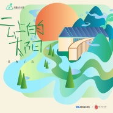
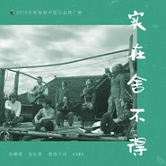
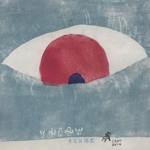
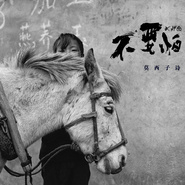
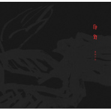

莫西子诗
============================

|  |  |
| :--: | :-- |
| [ 莫西子诗](https://i.xiami.com/moxizishi) | **地区**: China 中国大陆 **风格**: 自由即兴 Free Improvisation, 民谣 Folk, 诗歌 Poetry, 自由民谣 Free Folk **播放数**: 104968226 **粉丝数**: 26738 **评论数**: 660  |

## 档案

莫西子诗 
彝族、歌手、制作人 ，代表作《不要怕&阿皆咯》《要死就一定要死在你手里》，发行专辑《原野》《月光白得很》。 
莫西子诗把彝族民间音乐、世界音乐、摇滚、民谣、迷幻等元素融合到了自己的作品里，这种打破常规，自由即兴的调子，也奠定了他不拘一格，另类民谣摇滚和世界音乐风格。他的作品里有野性的呐喊，苍凉的低吟浅唱，加上民间马布，唢呐，口弦，羊皮鼓等原声乐器，总能把人带到一种原始辽阔的回归状态。 
同时莫西子诗也在不断地探索和尝试不同的的跨界合作，比如电影原声、话剧，舞蹈配乐，音乐制作人等，不断追求更多的可能。 
代表作与奖项： 
创作歌曲《阿皆咯》在中国好声音舞台上被吉克唱红，成为家喻户晓的少数民族语言歌曲 
2013年与吉杰合作《引子 魂归路漫漫》收录到吉杰个人专辑《自深深处》中 
第一季中国好歌曲「要死就一定要死在你手里」总决赛亚军 
2014年发行首张母语概念专辑《原野》 
第十四，十五届华语音乐传媒大奖：最佳民族/世界/新世纪音乐专辑，最佳作曲人，年度国语歌曲。 
2015年迷笛年度：最佳民谣音乐奖/最佳专辑设计奖《原野》 
2015年华语金曲奖：2014年度十大华语唱片《原野》 
2015年豆瓣阿比鹿獎：年度民谣音乐人／年度民谣专辑《原野》／年度最受欢迎民谣单曲《要死就一定要死在你手里》 
2015年程璧新专辑《我想和你虚度时光》制作人 
2016年改编《回到拉萨》红星20周年 
2016年 百度地图主题歌《越过群山》 获雅克音乐节 藏羌彝原创音乐盛典 最佳作词、最佳金曲奖 
2016年 专辑《原野》日语版发行 
2017年 合音量t榜冠军《在四季里等待》 
2018年 与乐队获2018中国声音唱响戛纳总决赛冠军 
2018年 发行第二张专辑《月光白得很》 
2018年荣获全球华语金曲奖、 最佳制作人 
2018年台湾金音奖 、最佳创作音乐奖 
第二张专辑《月光白得很》荣获第八届阿比鹿最受欢迎民谣唱片，年度民谣唱片，年度民谣唱片录音混，实体唱片设计奖 
2018年荣获全球华语金曲奖、 最佳制作人。台湾金音奖 、最佳创作音乐奖 。华语金曲奖年度华语十大唱片。 
工作联系： 刘岗  e-mail:   liugang@cthsmusic.com

## 专辑

| 名称 | 语种 | 唱片公司 | 发行时间 | 专辑类别 | 专辑风格 |
| :--: | :-- | :-- | :-- | :-- | :-- |
| [ 云上的太阳](./albums/2104456593.md) | 国语 | 草台回声 | 2019年01月08日 | EP, 单曲 | 国语流行 Mandarin Pop |
| [ 实在舍不得](./albums/2104409921.md) | 国语 | 澜沧老达保快乐拉祜演艺有限公司 | 2018年12月25日 | EP, 单曲 | 国语流行 Mandarin Pop |
| [ 万物](./albums/2104256311.md) | 国语 | 草台回声 | 2018年11月22日 | EP, 单曲 | 国语流行 Mandarin Pop |
| [ 孩子，不要悲伤](./albums/2104116133.md) | 国语 | 草台回声 | 2018年10月18日 | EP, 单曲 | 国语流行 Mandarin Pop |
| [ 月光白得很](./albums/2103745454.md) | 国语 | StreetVoice | 2018年06月12日 | 录音室专辑 | 独立民谣 Indie Folk, 另类唱作人 Alternative Singer-Songwriter |
| [ 不要怕&啊杰咯](./albums/2103729440.md) | 国语 | StreetVoice | 2018年06月06日 | EP, 单曲 | 当代民谣 Contemporary Folk |
| [ 越过群山](./albums/2102663152.md) | 国语 | 独立发行 | 2016年12月12日 | EP, 单曲 | 当代民谣 Contemporary Folk |
| [ 原野](./albums/1108909622.md) | 其他 | 忙蜂文化 | 2014年09月01日 | 录音室专辑 | 独立民谣 Indie Folk |

## 评论

|  |  |  |
| :-- | :-- | :-- |
|  [虾米用户](https://emumo.xiami.com/u/276944698) 不要自我设限..... 2020-08-12 20:44 赞(0) 踩(0) | 

 |
|  [虾米用户](https://emumo.xiami.com/u/316223151) 菩提本无树 2020-07-06 20:44 赞(1) 踩(0) | 
还是很多年前，因为CCTV12的听见凉山圈粉了莫西子诗和剧中的其他歌手。每次听到莫西子诗的歌，脑海中就浮现出彝人抱着琴在山间动情的歌唱。10年过去了，那个曾经陪我一起看剧，一起陪我吃泡面的女孩，你还好吗   
 |
|  [虾米用户](https://emumo.xiami.com/u/49640493) 网易云SAINTDONT... 2020-05-23 19:15 赞(1) 踩(0) | 
love
 |
|  [虾米用户](https://emumo.xiami.com/u/243612528)  2020-02-05 22:39 赞(0) 踩(0) | 
好喜欢你这个头像，也想找一个日本女朋友
 |
|  [虾米用户](https://emumo.xiami.com/u/25429734) toast 2019-10-24 09:35 赞(0) 踩(0) | 
桀骜不驯的莫西子诗，几年前跨年，几千人想听他唱要死，结果等到最后都不唱，没意思，其他的歌之前没听过也没办法现场共鸣，回去后就再也没听过他的歌了
 |
|  [虾米用户](https://emumo.xiami.com/u/446933)  2019-08-02 13:23 赞(1) 踩(0) | 
有时候喜欢一个事物会有些莫名其妙，比如一首歌，比如，莫西子诗。比如，有些人…… 听到他的第一首歌便是这首《要死就一定要死你手里》就像这个莫名其妙的歌名一样，不知道为什么，就是喜欢！或许，那时候不懂。现在听起来，才发现原来自己喜欢的便是歌曲表达的对感情的纯粹，一种不顾一切，赴死般勇敢的爱着一个人……斯人已逝，而这首歌曲却留在记忆里，仍然还是喜欢，被感动……
 |
|  [虾米用户](https://emumo.xiami.com/u/36693470) 我单身 2019-07-13 10:09 赞(0) 踩(0) | 
虾米是真不懂音乐
 |
|  [虾米用户](https://emumo.xiami.com/u/339191478)   2019-04-05 09:41 赞(0) 踩(0) | 
（ ’ - ’ * )
 |
|  [虾米用户](https://emumo.xiami.com/u/46417407) : 2019-03-23 09:30 赞(1) 踩(0) | 
内心的平静和归属
 |
|  [虾米用户](https://emumo.xiami.com/u/417963128)  2019-02-16 18:49 赞(0) 踩(0) | 
喜欢你
 |
|  [虾米用户](https://emumo.xiami.com/u/9099366)  2019-01-21 22:03 赞(2) 踩(0) | 
月亮与六便士的感觉，没有勇气活的状态
 |
|  [虾米用户](https://emumo.xiami.com/u/33454317) 暂无签名~ 2019-01-06 11:42 赞(2) 踩(0) | 
聽了一次就想去現場聽的聲音，聽了現場後：果然，這是天地間美妙的聲音
 |
|  [虾米用户](https://emumo.xiami.com/u/248725822) 愿年少无知的错误，化为改... 2018-12-20 19:07 赞(0) 踩(0) | 
要死就一定要死在你手里，这首歌听哭过好多次啊，没办法，唱到心坎里了。
 |
|  [虾米用户](https://emumo.xiami.com/u/320547846) 梦行 2018-11-26 08:04 赞(0) 踩(0) | 
和你的日本女朋友怎么样了
 |
|  [虾米用户](https://emumo.xiami.com/u/53737210) 哼哼哼 2018-11-23 14:16 赞(2) 踩(0) | 
真正的民谣，相比于那个在好呻吟上装逼的说着我要你们听到大山的声音，然后一张嘴唱黑人音乐的黑娘们儿来说，不知道高出了几万个段位。
 |
|  [虾米用户](https://emumo.xiami.com/u/43492923) 行到水穷我才开始害怕，夕... 2018-11-19 11:27 赞(0) 踩(0) | 
▽
 |
|  [虾米用户](https://emumo.xiami.com/u/54950259) Fluidflux 2018-10-23 18:19 赞(2) 踩(0) | 
听腻了民谣的我，却爱上了你的音乐，那是能唱到人心底的声音，我看到了你自由而诗意的灵魂。
 |
|  [虾米用户](https://emumo.xiami.com/u/406599050)  2018-10-23 02:44 赞(0) 踩(0) | 
非常喜欢
 |
|  [虾米用户](https://emumo.xiami.com/u/49655313) 除了再见还可以说些什么呢 2018-08-24 16:05 赞(3) 踩(0) | 
谢谢你带给我的救赎
 |
|  [虾米用户](https://emumo.xiami.com/u/305341870)  2018-07-29 22:34 赞(2) 踩(0) | 
诗意的凉山灵魂
 |
|  [虾米用户](https://emumo.xiami.com/u/1579453)   2018-07-13 11:28 赞(3) 踩(0) | 
快快开始巡演吧  
 |
|  [虾米用户](https://emumo.xiami.com/u/19621281) 音乐王子 2018-07-05 10:17 赞(0) 踩(0) | 
片尾音乐人～
 |
|  [虾米用户](https://emumo.xiami.com/u/43648786) 安静的知了 2018-06-27 13:40 赞(1) 踩(0) | 

 |
| ⇒ |  [虾米用户](https://emumo.xiami.com/u/85389256) 我是失去了悲痛的悲剧作家 2018-06-27 14:12 赞(0) 踩(0) | 
✨
 |
|  [虾米用户](https://emumo.xiami.com/u/3714518) 死人 2018-06-12 14:31 赞(1) 踩(0) | 
想去现场系列
 |
|  [虾米用户](https://emumo.xiami.com/u/367107354)  2018-05-14 22:52 赞(1) 踩(0) | 
没有蒙面歌手流浪者：沙宝亮唱的好听，个人感觉
 |
| ⇒ |  [虾米用户](https://emumo.xiami.com/u/55276548)  2018-10-19 13:00 赞(0) 踩(0) | 
没有哪个好不好，只是你个人的感觉！不同的味道而已
 |
|  [虾米用户](https://emumo.xiami.com/u/362784395)  2018-05-14 17:58 赞(0) 踩(0) | 
666
 |
|  [虾米用户](https://emumo.xiami.com/u/362784395)  2018-05-14 17:58 赞(0) 踩(0) | 

 |
|  [虾米用户](https://emumo.xiami.com/u/336621) 辣上排安~ 2018-04-17 12:28 赞(0) 踩(0) | 
原野都是4年前的专辑了啊。。时间过得好快
 |
|  [虾米用户](https://emumo.xiami.com/u/142804868) 我还没想好要写什么... 2018-03-31 14:14 赞(0) 踩(0) | 
是
 |
|  [虾米用户](https://emumo.xiami.com/u/1217469) Music is my ... 2018-03-17 03:15 赞(3) 踩(0) | 
昨天听了莫西在SXSW的现场，太震撼了！莫西加油！欢迎再来奥斯汀！
 |
| ⇒ |  [虾米用户](https://emumo.xiami.com/u/47369773) 我还没想好要写什么... 2018-04-03 00:42 赞(0) 踩(0) | 
棒！
 |
|  [虾米用户](https://emumo.xiami.com/u/12848371) 我还没想好要写什么... 2018-02-22 10:49 赞(1) 踩(0) | 
听你的歌不似舒服，而是舒畅。
 |
|  [虾米用户](https://emumo.xiami.com/u/280309552)  2018-02-13 19:36 赞(2) 踩(0) | 
纠缠纷扰十几年了、激发彼此的想象，总是踩在他埋设的坑里爬不出来，不同星球的人，不同轨道总有交集
 |
|  [虾米用户](https://emumo.xiami.com/u/12056909)   2018-01-01 16:51 赞(0) 踩(0) | 
吼吼吼....
 |
|  [虾米用户](https://emumo.xiami.com/u/30223298)  2017-12-24 02:39 赞(2) 踩(0) | 
窦唯乐手
 |
|  [虾米用户](https://emumo.xiami.com/u/1026612) 拼多多广告歌是我目前为止... 2017-12-16 22:04 赞(0) 踩(0) | 
看到楼下的评论我就呵呵哒
 |
|  [虾米用户](https://emumo.xiami.com/u/53737210) 哼哼哼 2017-12-11 16:38 赞(11) 踩(0) | 
这才是民谣 赵雷宋冬野之流？呵呵哒
 |
| ⇒ |  [虾米用户](https://emumo.xiami.com/u/3776591)  2020-10-17 19:16 赞(0) 踩(0) | 
你好牛逼
 |
|  [虾米用户](https://emumo.xiami.com/u/276944698) 不要自我设限..... 2017-11-25 21:22 赞(0) 踩(0) | 

 |
|  [虾米用户](https://emumo.xiami.com/u/266012932) 就让这时光流淌，而我们就... 2017-11-07 05:46 赞(0) 踩(0) | 
支持
 |
|  [虾米用户](https://emumo.xiami.com/u/10958375)  2017-10-28 00:35 赞(1) 踩(0) | 
很遗憾原词里有句关键的意思：“因为你的美貌像一把出鞘的钢刀”被漏掉了，听起来有点怪怪的。 但仍不失为一首好歌，尤其是子诗的演绎。赞一个
 |
|  [虾米用户](https://emumo.xiami.com/u/3734547) 面对教条微笑、但誓死反对 2017-10-28 00:35 赞(5) 踩(0) | 
你呀你 终于出现了 我们只是打了个照面 这颗心就稀巴烂 整个世界就整个崩溃
 |
|  [虾米用户](https://emumo.xiami.com/u/1920972)  2017-10-28 00:35 赞(1) 踩(0) | 
主頁里響起的是李榮浩的聲音，不小心同時點開了要死就一定要死在你手裡，李榮浩的聲音漸漸停息，突然就響起了莫西高亢的，近乎是孤注一擲不顧一切的真摯歌聲，於是就為這首歌淪陷。
 |
|  [虾米用户](https://emumo.xiami.com/u/7840019) 哎呦诶 2017-10-28 00:17 赞(1) 踩(0) | 
稀巴烂的心死在风儿经过的这里
 |
|  [虾米用户](https://emumo.xiami.com/u/3318348)  2017-10-28 00:16 赞(1) 踩(0) | 
我们只是打了个照面  这颗心就稀巴烂
 |
|  [虾米用户](https://emumo.xiami.com/u/2623574)  2017-10-28 00:16 赞(1) 踩(0) | 
昨晚看了厦门场，，墨西哥，有这么多新作赶紧出二砖啊！！！《只有石头活了下来》要入哦，，
 |
|  [虾米用户](https://emumo.xiami.com/u/774208) 我还没想好要写什么... 2017-10-27 23:54 赞(0) 踩(0) | 
莫西子诗10月5日于上海简单生活节演出！  10月4-6日 上海世博公园 简单生活节  刘若英、陈绮贞、郑秀文、张震岳、徐佳莹、朴树、李荣浩、许巍、李志、老狼、窦靖童、陈粒、王若琳、赵雷、苏慧伦、陶晶莹、关淑怡、梁博、韦礼安、Faye飞、邱比、陈珊妮 feat 蔡健雅、MATZKA feat A-Lin、魏如萱 feat 马頔、杨乃文 feat 高旗、HUSH feat 阿肆、草东没有派对、万能青年旅店、逃跑计划、好妹妹、旅行团、果味VC、Hello Nico、声音玩具……众星云集！  微博：@简单生活节上海 <a href="http://weibo.com/simplelifeshanghai" target="_blank" rel="nofollow noreferrer noopener">http://weibo.com/simplelifeshanghai</a>
 |
|  [虾米用户](https://emumo.xiami.com/u/7892567)  2017-10-27 23:45 赞(2) 踩(0) | 
第一次听《妈妈的歌谣》，只是呢喃，却触碰到心里最柔软的地方，禁不住热泪盈眶。音乐真是神奇啊。
 |
|  [虾米用户](https://emumo.xiami.com/u/36646226) 粉丝多也许是我有魅力吧 2017-10-27 23:23 赞(3) 踩(0) | 
原以为我的逼格虽然不能欣赏左小，但欣赏莫西子诗还是可以的  结果。。。我最喜欢稀巴烂   ❤
 |
|  [虾米用户](https://emumo.xiami.com/u/9386104)  2017-10-27 23:09 赞(7) 踩(0) | 
纯净如水，希望如此下去。别被商业，继续做自己的东西。如果可以的话，可以以众筹的方式。我们支持你
 |
|  [虾米用户](https://emumo.xiami.com/u/11881594) 带着耳朵去旅行 2017-10-27 23:04 赞(4) 踩(0) | 
他的音乐很干净，很清爽，清晰平淡的呢喃中却有着强大的爆发力，细心聆听随着音乐脉络走，每首歌都有心灵之旅的感觉，大爱！！
 |
|  [虾米用户](https://emumo.xiami.com/u/298377944)  2017-10-27 13:14 赞(0) 踩(0) | 
喜欢
 |
|  [虾米用户](https://emumo.xiami.com/u/257859471)  2017-10-23 17:12 赞(3) 踩(0) | 
听过很多情歌，我不喜欢那种把我爱你挂在嘴边的情歌……我喜欢莫西子诗的意境，如果爱她，她一定是能带给你灵感的女人，所以想到别人点燃的火焰，别人摸过的宝石，都让你充满了失落感，所有的东西，因为有了她可以最高达到完美，最低也赋予了这些东西存在的意义，以至于在想到这些的时候，有了你活着才有意义，有了你才有可能会完美。可能，真正的爱情就是爱上不可替代的人
 |
|  [虾米用户](https://emumo.xiami.com/u/127902218)   2017-09-26 23:22 赞(0) 踩(0) | 

 |
|  [虾米用户](https://emumo.xiami.com/u/18659864) 号 周山黎子 2017-09-15 17:08 赞(0) 踩(0) | 
1
 |
|  [虾米用户](https://emumo.xiami.com/u/43838497) 陈奕迅神经研究所 2017-09-15 13:13 赞(1) 踩(0) | 
简单生活有 莫西子诗 
 |
|  [虾米用户](https://emumo.xiami.com/u/11663860)  2017-08-30 01:13 赞(1) 踩(0) | 
很有质感的音乐
 |
|  [虾米用户](https://emumo.xiami.com/u/50104190) 无产阶级 2017-08-26 14:12 赞(0) 踩(0) | 
支持
 |
|  [虾米用户](https://emumo.xiami.com/u/237522351) 今年主打   青峰绿  ... 2017-08-26 00:00 赞(1) 踩(0) | 
不要怕   也没有
 |
|  [虾米用户](https://emumo.xiami.com/u/26106642) 我有的 是你的 2017-08-23 11:23 赞(0) 踩(0) | 
加油 兄弟
 |
|  [虾米用户](https://emumo.xiami.com/u/259510268) 难得 2017-08-13 00:50 赞(2) 踩(0) | 
我们只是打了个照面，这颗心就稀巴烂，整个世界就整个崩溃呐
 |
|  [虾米用户](https://emumo.xiami.com/u/38433906) 如果哪一天我走了，请为我... 2017-06-05 11:03 赞(0) 踩(0) | 
真的好听!
 |
|  [虾米用户](https://emumo.xiami.com/u/11662974) All for you 2017-06-03 17:56 赞(0) 踩(0) | 
西安一个下雨的夜晚将要见到你
 |
|  [虾米用户](https://emumo.xiami.com/u/50546714)   2017-05-31 12:17 赞(8) 踩(0) | 
绍兴端午现场全场摇最high的就是我，另外鼓手也很棒，水公园很多人不懂莫西子诗真可惜，身体不好的时间段听他的声线直上的感觉，抬头真能望见光芒。跑后台合了影突然紧张了，本来想说很喜欢你的月亮与海，当风儿经过这里/故乡已经很遥远，伴我度过身体不好失眠的无数夜晚，虾米听了5000多首的歌，基本不留言。希望自己能再胖起来，也希望莫西的受众不管境遇如何皆能不顾沉浮，自由兼顾健康，精神与财富永不缺吧！
 |
|  [虾米用户](https://emumo.xiami.com/u/50635853) 我是你的英雄我踏着七彩云... 2017-05-28 16:07 赞(0) 踩(0) | 
600
 |
|  [虾米用户](https://emumo.xiami.com/u/219625815) 你过得快乐或委屈 2017-05-24 13:23 赞(0) 踩(0) | 
发现了丢鸡找过来的，好听 
 |
|  [虾米用户](https://emumo.xiami.com/u/1393420) 似是遥远往事，白云在天上... 2017-05-18 20:18 赞(2) 踩(0) | 
就特么知道听要死就死在你手里。烦不烦~  却忘记了他作为一个独立/实验音乐人在音乐上的探索。从某种来看，中国大众歌迷还是挺可悲的，一直脱离不了低级趣味的审美。
 |
| ⇒ |  [虾米用户](https://emumo.xiami.com/u/1681182)  2017-08-16 10:27 赞(0) 踩(0) | 
请教一下，要死就死在你手里，是在哪方面低级趣味了？
 |
| ⇒ |  [虾米用户](https://emumo.xiami.com/u/321937593)  2017-08-27 21:49 赞(0) 踩(0) | 
呵呵
 |
|  [虾米用户](https://emumo.xiami.com/u/61773518)   2017-05-16 19:44 赞(0) 踩(0) | 
这颗心就 씨발 ssi bal 席巴儿嘞
 |
|  [虾米用户](https://emumo.xiami.com/u/295834321)  2017-05-12 22:41 赞(0) 踩(0) | 
我表示感觉晦涩难懂
 |
|  [虾米用户](https://emumo.xiami.com/u/1418202)  江山共老 2017-05-11 21:02 赞(0) 踩(0) | 
好
 |
|  [虾米用户](https://emumo.xiami.com/u/852192) 噢噢噢噢噢噢噢噢 2017-05-03 15:26 赞(0) 踩(0) | 
这颗心就稀巴烂  这个世界就整个崩溃
 |
|  [虾米用户](https://emumo.xiami.com/u/3597859) 音乐是最好的心灵之旅…… 2017-04-26 11:19 赞(14) 踩(0) | 
一直喜欢莫西，从最初在比赛上看到他。后来就迷上了他的音乐，听着音乐会有一种和大自然和万物零距离的感觉。
 |
|  [虾米用户](https://emumo.xiami.com/u/284013085)  2017-04-06 13:43 赞(1) 踩(0) | 
真正的灵魂歌手
 |
|  [虾米用户](https://emumo.xiami.com/u/285044037)  2017-04-06 09:27 赞(0) 踩(0) | 
好听
 |
|  [虾米用户](https://emumo.xiami.com/u/234606245)  2017-04-04 22:38 赞(0) 踩(0) | 
不是女生吗 
 |
|  [虾米用户](https://emumo.xiami.com/u/74940988)   2017-03-29 14:35 赞(1) 踩(0) | 
很喜欢你 
 |
|  [虾米用户](https://emumo.xiami.com/u/276896352)  2017-03-27 12:42 赞(0) 踩(0) | 
  
 |
|  [虾米用户](https://emumo.xiami.com/u/141388396)  2017-03-18 12:03 赞(0) 踩(0) | 

 |
|  [虾米用户](https://emumo.xiami.com/u/177860080)  2017-03-16 17:48 赞(0) 踩(0) | 

 |
|  [虾米用户](https://emumo.xiami.com/u/49748006) Fly me to th... 2017-03-06 07:53 赞(0) 踩(0) | 
因为这名没怎么听过他的歌 虽然这名字知道很久了&amp;hellip;
 |
|  [虾米用户](https://emumo.xiami.com/u/2176729) Somewhere I ... 2017-03-02 22:27 赞(0) 踩(0) | 
不要怕哪里能听录音版？
 |
|  [虾米用户](https://emumo.xiami.com/u/275427974)  2017-02-22 23:19 赞(0) 踩(0) | 
莫西子诗，嗓音就能把我击碎
 |
|  [虾米用户](https://emumo.xiami.com/u/260540761) 我还没想好要写什么... 2017-02-22 22:38 赞(0) 踩(0) | 
鲁冰花
 |
|  [虾米用户](https://emumo.xiami.com/u/3385309) 我还没想好要写什么... 2017-02-17 20:41 赞(0) 踩(0) | 
嗯，有点自己的东西吧！
 |
|  [虾米用户](https://emumo.xiami.com/u/257454492)  2017-02-06 22:12 赞(0) 踩(0) | 
都是非常有才华的歌手，创作人！
 |
|  [虾米用户](https://emumo.xiami.com/u/13754707)   2017-01-24 12:53 赞(0) 踩(0) | 
这颗心就稀巴烂
 |
|  [虾米用户](https://emumo.xiami.com/u/9163823)  2017-01-16 11:10 赞(0) 踩(0) | 
民歌，山谷，原生态
 |
|  [虾米用户](https://emumo.xiami.com/u/230365337)  2016-12-21 12:09 赞(0) 踩(0) | 
我要来留印
 |
|  [虾米用户](https://emumo.xiami.com/u/122688364) 生在愤坑，长在赤圈；挣脱 2016-12-03 23:22 赞(1) 踩(0) | 
6203
 |
|  [虾米用户](https://emumo.xiami.com/u/2445118) 这个世界需要音乐！我的生... 2016-11-20 22:27 赞(1) 踩(0) | 
我擦，朋友今天在厦门碰到他了！
 |
|  [虾米用户](https://emumo.xiami.com/u/218459962)  2016-11-14 11:44 赞(0) 踩(0) | 
就是好听！
 |
|  [虾米用户](https://emumo.xiami.com/u/44433377)   2016-11-07 00:00 赞(1) 踩(0) | 
本来只是远远欣赏 赤水音乐节过后觉得你也是个邻家大男孩  
 |
|  [虾米用户](https://emumo.xiami.com/u/99532794)   2016-11-06 09:39 赞(0) 踩(0) | 
彝族的汉子 走出属于大家的民谣 超越彝人制造
 |
|  [虾米用户](https://emumo.xiami.com/u/1662893)  2016-09-29 22:59 赞(0) 踩(0) | 
知了只叫了三天，好好听~~
 |
|  [虾米用户](https://emumo.xiami.com/u/1662893)  2016-09-29 22:58 赞(0) 踩(0) | 
子诗的声音真的很独特，浑然天成
 |
|  [虾米用户](https://emumo.xiami.com/u/49655313) 除了再见还可以说些什么呢 2016-08-25 13:03 赞(0) 踩(0) | 
-
 |
|  [虾米用户](https://emumo.xiami.com/u/35435544) 愿你的国度降临 2016-08-19 11:04 赞(1) 踩(0) | 
莫西的第一张专辑，过来留印。
 |
|  [虾米用户](https://emumo.xiami.com/u/2487947)  2016-08-16 10:58 赞(0) 踩(0) | 
诗歌
 |
|  [虾米用户](https://emumo.xiami.com/u/87208478) 大风起，尘埃落 2016-07-04 22:53 赞(4) 踩(0) | 
真的不能不想到海子
 |
|  [虾米用户](https://emumo.xiami.com/u/167816104) daydreamer 2016-06-07 11:58 赞(1) 踩(0) | 
朴拙
 |
|  [虾米用户](https://emumo.xiami.com/u/54743037) 虾米哈. 2016-05-16 21:09 赞(0) 踩(0) | 
艺术吧，再的艺人我却感觉不出来，
 |
|  [虾米用户](https://emumo.xiami.com/u/49864599)  2016-05-16 16:40 赞(0) 踩(0) | 
独立音乐的感觉
 |
|  [虾米用户](https://emumo.xiami.com/u/3779545) 西北偏西 2016-05-08 19:45 赞(0) 踩(0) | 
爱你，加油，期待新专辑
 |
|  [虾米用户](https://emumo.xiami.com/u/18871687)   2016-05-08 15:59 赞(0) 踩(0) | 
去草莓看了现场 好听到戳泪点 只是 这货出乎意料的是一个逗比 唱完投胎记还问 大家有投胎的感觉了么 但千万不要在现实里投胎啊
 |
|  [虾米用户](https://emumo.xiami.com/u/47900555)  2016-05-05 21:36 赞(1) 踩(0) | 
想看莫西梳起半丸子头
 |
|  [虾米用户](https://emumo.xiami.com/u/44015836)  2016-04-30 13:14 赞(0) 踩(0) | 
不爱洗头的男文青
 |
|  [虾米用户](https://emumo.xiami.com/u/36057872) 网易/BC: Breat... 2016-04-27 20:29 赞(25) 踩(0) | 
不是你 亲手读过的 就不能叫做交通大学
 |
| ⇒ |  [虾米用户](https://emumo.xiami.com/u/49748006) Fly me to th... 2017-03-06 07:54 赞(0) 踩(0) | 
哪里都有你٩(ᐛ)و
 |
| ⇒ |  [虾米用户](https://emumo.xiami.com/u/289775929) 你来过我才难过 2017-10-21 23:37 赞(0) 踩(0) | 
打交警
 |
|  [虾米用户](https://emumo.xiami.com/u/36057872) 网易/BC: Breat... 2016-04-27 20:29 赞(0) 踩(0) | 
莫西哥好萌~
 |
|  [虾米用户](https://emumo.xiami.com/u/36057872) 网易/BC: Breat... 2016-04-27 20:28 赞(0) 踩(0) | 
美哭，nanananananananana~
 |
|  [虾米用户](https://emumo.xiami.com/u/146724950)  2016-04-27 20:02 赞(1) 踩(0) | 
你在台上，我在台下，明年等你，你还来吗？
 |
|  [虾米用户](https://emumo.xiami.com/u/34961561) 我希望音乐没有间隙 我不... 2016-04-27 11:17 赞(1) 踩(0) | 
今晚交大见：）
 |
|  [虾米用户](https://emumo.xiami.com/u/39788841)  . 2016-04-26 10:14 赞(0) 踩(0) | 
#
 |
|  [虾米用户](https://emumo.xiami.com/u/36057872) 网易/BC: Breat... 2016-04-22 00:29 赞(0) 踩(0) | 
坐等绿洲音乐节
 |
|  [虾米用户](https://emumo.xiami.com/u/39555184) 有病 2016-04-15 21:50 赞(0) 踩(0) | 
哈
 |
|  [虾米用户](https://emumo.xiami.com/u/71813330)  2016-04-13 23:18 赞(0) 踩(0) | 
好  
 |
|  [虾米用户](https://emumo.xiami.com/u/336621) 辣上排安~ 2016-04-11 10:32 赞(0) 踩(0) | 
莫西啥时候打算出新专辑呀
 |
|  [虾米用户](https://emumo.xiami.com/u/260853) 少听音乐多上火 2016-04-03 08:42 赞(1) 踩(0) | 
这嗓子真是太棒了
 |
|  [虾米用户](https://emumo.xiami.com/u/128087072)  2016-03-28 19:07 赞(0) 踩(0) | 
灵魂歌手
 |
|  [虾米用户](https://emumo.xiami.com/u/25977681) 你来吧 互通有无，你走吧... 2016-03-17 20:38 赞(0) 踩(0) | 
终于理解了什么叫 音乐不分肤色 不分语种 不分地域
 |
|  [虾米用户](https://emumo.xiami.com/u/116545322) 我还没想好要写什么... 2016-03-12 23:48 赞(0) 踩(0) | 
为什么彝人彝语里没有莫西子诗的歌？
 |
|  [虾米用户](https://emumo.xiami.com/u/3390850) 宁做猪狗 不诩为人 2016-02-11 21:20 赞(0) 踩(0) | 
好棒
 |
|  [虾米用户](https://emumo.xiami.com/u/1278144) 也不懂为何今天像梦 2016-02-01 17:36 赞(0) 踩(0) | 
【莫西子诗专访】 莫西子诗：我们都是精心搭建庭院的人 | 女巫聊音乐No.5 <a href="http://mp.weixin.qq.com/s?__biz=MzI5ODA2NDMwNw==&amp;amp;mid=404133979&amp;amp;idx=1&amp;amp;sn=4aaf32964893dcb9fd8eb419e911e8e2#rd" target="_blank" rel="nofollow noreferrer noopener">http://mp.weixin.qq.com/s?__biz=MzI5ODA2NDMwNw==&amp;amp;mid=404133979&amp;amp;idx=1&amp;amp;sn=4aaf32964893dcb9fd8eb419e911e8e2#rd</a>
 |
|  [虾米用户](https://emumo.xiami.com/u/73400448) 师傅，请问这条路怎么走 2016-01-22 14:26 赞(0) 踩(0) | 
111111
 |
|  [虾米用户](https://emumo.xiami.com/u/79651138) 我还没想好要写什么... 2016-01-18 13:06 赞(0) 踩(0) | 
有味道的音乐
 |
|  [虾米用户](https://emumo.xiami.com/u/64259988) 今夜的月亮并不亮 2016-01-16 06:45 赞(2) 踩(0) | 
第一次知道莫西子诗不是要死就一定要死在你手里，而是程壁
 |
| ⇒ |  [虾米用户](https://emumo.xiami.com/u/82463596)  2016-04-28 10:31 赞(0) 踩(0) | 
第一次知道程璧是因为知道莫西子诗 
 |
| ⇒ |  [虾米用户](https://emumo.xiami.com/u/1662893)  2016-09-29 23:29 赞(0) 踩(0) | 
<q><b>张口，闭嘴。说：</b></q>
 |
|  [虾米用户](https://emumo.xiami.com/u/4234256)  2016-01-08 19:33 赞(1) 踩(0) | 
为毛没有《将城市拉回乡下去喂狗》
 |
| ⇒ |  [虾米用户](https://emumo.xiami.com/u/157551384)  2016-05-06 08:44 赞(0) 踩(0) | 
同问，最喜欢这首。
 |
| ⇒ |  [虾米用户](https://emumo.xiami.com/u/1662893)  2016-09-29 23:29 赞(0) 踩(0) | 
<q><b>耕牛的主人说：</b></q>
 |
|  [虾米用户](https://emumo.xiami.com/u/74169134)  2015-12-18 23:51 赞(1) 踩(0) | 
我想和你虚度时光。
 |
|  [虾米用户](https://emumo.xiami.com/u/2504970) 暂无签名~ 2015-12-10 16:34 赞(0) 踩(0) | 
喜欢《不要怕》和《妈妈的歌谣》
 |
|  [虾米用户](https://emumo.xiami.com/u/79615796)  2015-12-02 00:29 赞(0) 踩(0) | 
真的好好听
 |
|  [虾米用户](https://emumo.xiami.com/u/20904215)  2015-11-27 08:45 赞(0) 踩(0) | 
歌如其名
 |
|  [虾米用户](https://emumo.xiami.com/u/1811524) 听---- 2015-11-20 23:58 赞(0) 踩(0) | 
多出作品啊…………
 |
| ⇒ |  [虾米用户](https://emumo.xiami.com/u/1662893)  2016-09-29 23:00 赞(0) 踩(0) | 
作品多了，精品就少了。耐心等吧
 |
|  [虾米用户](https://emumo.xiami.com/u/52080077)  2015-11-03 23:45 赞(0) 踩(0) | 
第522个评论，莫西子诗的音乐
 |
|  [虾米用户](https://emumo.xiami.com/u/4154583) 我还没想好要写什么... 2015-11-03 21:19 赞(0) 踩(0) | 
为什么不来上海
 |
|  [虾米用户](https://emumo.xiami.com/u/52696611) 就这样逃跑吧 2015-10-26 13:37 赞(1) 踩(0) | 
民谣,彝族,独立,
 |
|  [虾米用户](https://emumo.xiami.com/u/39679038)  2015-10-21 17:50 赞(0) 踩(0) | 
莫西子诗
 |
|  [虾米用户](https://emumo.xiami.com/u/49830914) 花开花落，云卷云舒～ 2015-10-11 09:57 赞(0) 踩(0) | 
爱民谣，没理由
 |
|  [虾米用户](https://emumo.xiami.com/u/4234256)  2015-10-06 09:54 赞(0) 踩(0) | 
喂狗什么时候上啊，赶紧的！
 |
|  [虾米用户](https://emumo.xiami.com/u/70991980)   2015-10-02 05:11 赞(2) 踩(0) | 
把城市拉回乡下去喂狗
 |
|  [虾米用户](https://emumo.xiami.com/u/70668958) Sia. 2015-10-01 08:09 赞(9) 踩(0) | 
莫西子诗不俗 既能够做到为大众接受 又有小众的情调
 |
|  [虾米用户](https://emumo.xiami.com/u/45380019) 满身文艺细菌 2015-09-22 09:35 赞(0) 踩(0) | 
刘明
 |
|  [虾米用户](https://emumo.xiami.com/u/9501597) 回来了 2015-09-15 17:56 赞(3) 踩(0) | 
那么萌 怪不得能娶到辣么善良的花姑娘
 |
|  [虾米用户](https://emumo.xiami.com/u/2690250) 90s 2015-08-17 12:08 赞(4) 踩(0) | 
这个才能算真正的民谣吧。
 |
|  [虾米用户](https://emumo.xiami.com/u/30155640)  2015-08-11 23:41 赞(0) 踩(0) | 
莫西子诗
 |
|  [虾米用户](https://emumo.xiami.com/u/30155640)  2015-08-11 23:41 赞(0) 踩(0) | 
莫西子诗
 |
|  [虾米用户](https://emumo.xiami.com/u/10227780) 唯有音乐不会辜负我… 2015-08-03 19:35 赞(1) 踩(0) | 
为什么那么多彝族的歌，太个性了
 |
|  [虾米用户](https://emumo.xiami.com/u/2288372) 我还没想好要写什么... 2015-07-26 13:09 赞(0) 踩(0) | 
喂狗非常赞= =然而虾米上还是没有喂狗(&amp;gt;
 |
|  [虾米用户](https://emumo.xiami.com/u/7808316)  2015-07-22 00:05 赞(0) 踩(0) | 
莫西，很多歌的词都是一些诗人的诗。可以看一下俞心樵的诗
 |
|  [虾米用户](https://emumo.xiami.com/u/50507303) 新情绪疗法 2015-07-20 15:07 赞(1) 踩(0) | 
一直挥不去的旋律
 |
|  [虾米用户](https://emumo.xiami.com/u/32448108)  2015-07-16 03:34 赞(3) 踩(0) | 
为什么要去选秀?
 |
| ⇒ |  [虾米用户](https://emumo.xiami.com/u/9725964) 我还没想好要写什么... 2015-08-20 18:44 赞(0) 踩(0) | 
节目组请他去的
 |
|  [虾米用户](https://emumo.xiami.com/u/478527) 好想跟衣服在洗衣机里滚 2015-07-13 01:12 赞(1) 踩(0) | 
舒坦，写字儿画画也毫无侵略性的小曲儿
 |
|  [虾米用户](https://emumo.xiami.com/u/3733076)  2015-07-07 23:22 赞(1) 踩(0) | 
灵魂歌手
 |
|  [虾米用户](https://emumo.xiami.com/u/4826458) 我还没想好要写什么... 2015-07-07 22:31 赞(1) 踩(0) | 
真不错！
 |
|  [虾米用户](https://emumo.xiami.com/u/30323041) give me time 2015-07-03 09:00 赞(2) 踩(0) | 
杨汉轩 如果你听到这些歌 会不会让它们飘进你的梦里 而你会不会想到在我的梦里有同样的歌和你 杨汉轩 曾经想和你去看看各类山河地貌 现在想到仍然是令人感动的梦呢 你在如何生活呢 你会如何生活呢
 |
|  [虾米用户](https://emumo.xiami.com/u/4109979)   2015-06-22 23:07 赞(1) 踩(0) | 
城市中总是特别匆忙，每天我跑步时候都在循环你的歌，我仿佛看到了草原、蓝天、白云。
 |
|  [虾米用户](https://emumo.xiami.com/u/7719106) love music m... 2015-06-14 22:15 赞(0) 踩(0) | 
民谣
 |
|  [虾米用户](https://emumo.xiami.com/u/35923398)  2015-06-13 18:29 赞(0) 踩(0) | 
有诗意
 |
|  [虾米用户](https://emumo.xiami.com/u/2208328)  2015-06-05 19:50 赞(0) 踩(0) | 
******
 |
|  [虾米用户](https://emumo.xiami.com/u/2208328)  2015-06-05 19:49 赞(0) 踩(0) | 
******
 |
|  [虾米用户](https://emumo.xiami.com/u/17394051) 无有真正， 2015-06-03 17:44 赞(0) 踩(0) | 
会吹口琴会创作唱歌好听 窦唯都会来帮弹吉他 怎么办好喜欢
 |
|  [虾米用户](https://emumo.xiami.com/u/11938573) 暂无签名~ 2015-05-29 16:02 赞(0) 踩(0) | 
莫西子诗
 |
|  [虾米用户](https://emumo.xiami.com/u/50097007) 做梦  猜谜  打铁  ... 2015-05-25 23:27 赞(17) 踩(0) | 
不看电视不看好声音，差点错过这么有趣的音乐人，比窦唯后期的灵魂乐更天然更民族，彝族好像特善歌唱。
 |
| ⇒ |  [虾米用户](https://emumo.xiami.com/u/51786400) 夜，迷离的夜 2015-09-08 01:24 赞(0) 踩(0) | 
好歌曲。。。
 |
|  [虾米用户](https://emumo.xiami.com/u/8591425)  2015-05-25 17:12 赞(0) 踩(0) | 
从氧气音乐节开始停不下来搜索莫西。。把《我想和你虚度时光》也收进来嘛~
 |
| ⇒ |  [虾米用户](https://emumo.xiami.com/u/5754392)  2015-06-04 15:40 赞(0) 踩(0) | 
我也是的，现场听他们真的很享受
 |
|  [虾米用户](https://emumo.xiami.com/u/43349154) 眠 2015-05-23 18:26 赞(0) 踩(0) | 
莫西子诗
 |
|  [虾米用户](https://emumo.xiami.com/u/7586867)  2015-05-22 17:36 赞(0) 踩(0) | 
杭州洋气音乐节爱上了
 |
|  [虾米用户](https://emumo.xiami.com/u/7586867)  2015-05-22 17:35 赞(0) 踩(0) | 
循环播放
 |
|  [虾米用户](https://emumo.xiami.com/u/3856879)  2015-05-22 16:27 赞(0) 踩(0) | 
nw
 |
|  [虾米用户](https://emumo.xiami.com/u/21778238) mikrio还只是个孩子 2015-05-22 14:11 赞(0) 踩(0) | 
一听就让人印象深刻的歌手
 |
|  [虾米用户](https://emumo.xiami.com/u/8589018) 这家伙很聪明什么也没留下... 2015-05-21 23:40 赞(61) 踩(0) | 
窦唯真他妈的是好眼力！
 |
| ⇒ |  [虾米用户](https://emumo.xiami.com/u/7402157) 你先让我躺一会 2015-05-29 16:16 赞(0) 踩(0) | 
这有什么故事吗，求科普啊
 |
| ⇒ |  [虾米用户](https://emumo.xiami.com/u/8589018) 这家伙很聪明什么也没留下... 2015-05-29 17:52 赞(0) 踩(0) | 
<q><b>Dax说：</b></q>
 |
| ⇒ |  [虾米用户](https://emumo.xiami.com/u/283102521)  2018-02-02 13:30 赞(0) 踩(0) | 
窦唯闹出个天后没时间在闹个天王出来了
 |
| ⇒ |  [虾米用户](https://emumo.xiami.com/u/10411849) 音乐品味有交集又能怎样呢 2019-03-03 00:27 赞(0) 踩(0) | 
<q><b>王大兔说：</b></q>
 |
| ⇒ |  [虾米用户](https://emumo.xiami.com/u/49334418) ～ 2020-11-10 03:28 赞(0) 踩(0) | 
<q><b>Dax说：</b></q>
 |
|  [虾米用户](https://emumo.xiami.com/u/7365010) 超然 2015-05-18 17:29 赞(0) 踩(0) | 
歌词走心~
 |
|  [虾米用户](https://emumo.xiami.com/u/9134353) 我还没想好要写什么... 2015-05-16 12:05 赞(0) 踩(0) | 
要死就一定要死在你手里
 |
|  [虾米用户](https://emumo.xiami.com/u/1579453)   2015-05-16 10:26 赞(0) 踩(0) | 
今年还有巡演么
 |
|  [虾米用户](https://emumo.xiami.com/u/10212530) 沉默是表示轻蔑的最完美形... 2015-05-14 18:45 赞(5) 踩(0) | 
和程壁在一起吧
 |
| ⇒ |  [虾米用户](https://emumo.xiami.com/u/49921977) 我还没想好要写什么... 2015-05-21 22:47 赞(0) 踩(0) | 
人家不是有女朋友么  还是日本姑娘
 |
|  [虾米用户](https://emumo.xiami.com/u/1141387) 我还没想好要写什么... 2015-05-13 01:02 赞(0) 踩(0) | 
好纯正
 |
|  [虾米用户](https://emumo.xiami.com/u/12562992) 我还没想好要写什么... 2015-05-11 06:24 赞(2) 踩(0) | 
我的虾币都用来买民谣了。
 |
|  [虾米用户](https://emumo.xiami.com/u/48630302)  2015-05-09 01:29 赞(0) 踩(0) | 
想你了杨琴
 |
|  [虾米用户](https://emumo.xiami.com/u/44761741)   2015-05-07 14:15 赞(3) 踩(0) | 
很可惜没有收录《阿皆咯》 网上找遍 没有音频模式 希望能制作出来
 |
|  [虾米用户](https://emumo.xiami.com/u/49780110) 时间里的。 2015-05-03 08:44 赞(0) 踩(0) | 
莫西是最棒的歌手。谜一样的呓语，中毒了中毒了。喜欢你呀！凉山的歌者我们问你骄傲。
 |
|  [虾米用户](https://emumo.xiami.com/u/5736821) 不为什么 2015-05-02 21:37 赞(0) 踩(0) | 
不知说什么好 没了就没了   得到还是得到 没得到的全写成了诗和小说 （我的过去   与谁也无关）
 |
|  [虾米用户](https://emumo.xiami.com/u/13522375)  2015-05-02 12:39 赞(0) 踩(0) | 
话说下周活动我想朗诵 《最后的抒情》 该用那首配乐比较好？？
 |
|  [虾米用户](https://emumo.xiami.com/u/4363872) 想不起一首歌 2015-04-21 18:05 赞(1) 踩(0) | 
有《只有石头活了下来》和《把城市拉到乡下去喂狗》的demo吗？
 |
|  [虾米用户](https://emumo.xiami.com/u/22053106) 物质的短暂情人. 2015-04-21 13:00 赞(0) 踩(0) | 
才子
 |
|  [虾米用户](https://emumo.xiami.com/u/3068199) 我还没想好要写什么... 2015-04-19 20:31 赞(0) 踩(0) | 
我爱你
 |
|  [虾米用户](https://emumo.xiami.com/u/49338107)  2015-04-18 17:17 赞(0) 踩(0) | 
骆子博推荐
 |
|  [虾米用户](https://emumo.xiami.com/u/8326474) 我还没想好要写什么... 2015-04-11 01:33 赞(0) 踩(0) | 
真诚。
 |
|  [虾米用户](https://emumo.xiami.com/u/1065542)   2015-04-06 23:54 赞(0) 踩(0) | 

 |
|  [虾米用户](https://emumo.xiami.com/u/18640914) 白茶清欢无别事，碧海金阳... 2015-04-01 00:13 赞(0) 踩(0) | 
很好的专辑。来这里留一下脚印。
 |
|  [虾米用户](https://emumo.xiami.com/u/10691216) 敢为天下先 2015-03-27 18:20 赞(1) 踩(0) | 
要死就一定要死在你手里！这是何等感情！为了爱情可以奋不顾身！正是在追求爱情的途中，即使遍体鳞伤，粉身碎骨，我们不变初衷！要死就一定要死在你手里！
 |
|  [虾米用户](https://emumo.xiami.com/u/8920924) 音乐只捞干货. 2015-03-26 10:27 赞(0) 踩(0) | 
OMG！！！爱上了！！我的妈！！！
 |
|  [虾米用户](https://emumo.xiami.com/u/1239245)   2015-03-22 10:08 赞(0) 踩(0) | 
在荒原上奔跑的孩子。
 |
|  [虾米用户](https://emumo.xiami.com/u/44366043)  2015-03-21 18:39 赞(0) 踩(0) | 
听到之后内心安静
 |
|  [虾米用户](https://emumo.xiami.com/u/3323973) 我还没想好要写什么... 2015-03-19 12:04 赞(0) 踩(0) | 
起鸡皮了
 |
|  [虾米用户](https://emumo.xiami.com/u/48218948) 暂无签名~ 2015-03-19 09:10 赞(1) 踩(0) | 
亲爱的老乡，他喜欢，我喜欢。是真喜欢
 |
|  [虾米用户](https://emumo.xiami.com/u/33818110) 热爱死亡。 2015-03-14 16:19 赞(0) 踩(0) | 

 |
|  [虾米用户](https://emumo.xiami.com/u/29249838) Wechat:david... 2015-03-13 23:25 赞(0) 踩(0) | 
子诗，我爱你
 |
|  [虾米用户](https://emumo.xiami.com/u/2831398) 寻找对的味道 2015-03-03 11:02 赞(0) 踩(0) | 
听不懂的人声伴奏
 |
|  [虾米用户](https://emumo.xiami.com/u/9067690)  2015-02-15 20:09 赞(0) 踩(0) | 
这听不懂的语言，可视为一种极妙的人声伴奏
 |
|  [虾米用户](https://emumo.xiami.com/u/208655)  2015-02-14 21:08 赞(0) 踩(0) | 
喜欢民谣作品，原生态，自然地。
 |
|  [虾米用户](https://emumo.xiami.com/u/9032193) 把手放在空中甩！ 2015-02-13 15:08 赞(2) 踩(0) | 
这哥们儿要火啊
 |
|  [虾米用户](https://emumo.xiami.com/u/46114773) 公众号「小撞」作者 . ... 2015-02-03 22:08 赞(2) 踩(0) | 
莫西子诗的音乐是很原始的。人都是社会动物，剥离了社会属性之后，人还是属于大自然的，还是动物。莫西子诗的音乐就像是给还是动物的人的内心听的。他就是一只从山里来的鬼才，做着最大自然的音乐，唱着最直逼人内心的歌
 |
| ⇒ |  [虾米用户](https://emumo.xiami.com/u/687193) 自由 2015-02-15 08:56 赞(0) 踩(0) | 
国外的许多音乐也是这种感觉~原始，唤醒内心
 |
|  [虾米用户](https://emumo.xiami.com/u/23705001)   2015-02-02 21:16 赞(0) 踩(0) | 
好听
 |
|  [虾米用户](https://emumo.xiami.com/u/4863826) 我还没想好要写什么... 2015-02-02 16:17 赞(0) 踩(0) | 
纯真，听得我全身毛孔都竖了起来！！！
 |
|  [虾米用户](https://emumo.xiami.com/u/46817883)  2015-02-01 21:21 赞(0) 踩(0) | 
可以自己选音乐的么
 |
|  [虾米用户](https://emumo.xiami.com/u/768724)  2015-01-21 23:21 赞(1) 踩(0) | 
月亮与海
 |
|  [虾米用户](https://emumo.xiami.com/u/6796991) 我还没想好要写什么... 2015-01-20 21:14 赞(0) 踩(0) | 
春林，你真的很纯粹，很厉害。
 |
|  [虾米用户](https://emumo.xiami.com/u/7066650) Everything w... 2015-01-19 20:05 赞(0) 踩(0) | 
感觉彝族音乐很特别！听过一个石屏花腰彝，起了一身鸡皮疙瘩。
 |
|  [虾米用户](https://emumo.xiami.com/u/43858010)  2015-01-19 00:39 赞(0) 踩(0) | 
好棒，会员快到期了。
 |
|  [虾米用户](https://emumo.xiami.com/u/29249838) Wechat:david... 2015-01-17 23:05 赞(0) 踩(0) | 
相比之下，赵雷同学就low多了…
 |
| ⇒ |  [虾米用户](https://emumo.xiami.com/u/31036875) kkkkk！ 2015-02-02 23:17 赞(0) 踩(0) | 
干嘛把雷子扯进来
 |
| ⇒ |  [虾米用户](https://emumo.xiami.com/u/1650115) 痛快 2015-04-19 01:17 赞(0) 踩(0) | 
简直是带节奏
 |
|  [虾米用户](https://emumo.xiami.com/u/29249838) Wechat:david... 2015-01-17 23:04 赞(0) 踩(0) | 
民族的才是最好的
 |
|  [虾米用户](https://emumo.xiami.com/u/29249838) Wechat:david... 2015-01-17 22:59 赞(0) 踩(0) | 
莫西子诗我爱你！！
 |
|  [虾米用户](https://emumo.xiami.com/u/29249838) Wechat:david... 2015-01-17 22:58 赞(1) 踩(0) | 
这才是我要的民谣
 |
|  [虾米用户](https://emumo.xiami.com/u/39551995) 一招鲜 吃遍天！ 2015-01-16 23:30 赞(0) 踩(0) | 
哦
 |
|  [虾米用户](https://emumo.xiami.com/u/12243940) 向前进… 2015-01-02 21:26 赞(0) 踩(0) | 
学校的活动见过一次莫西，很腼腆的一个人，但是确实是有自己的想法。我想他现在做音乐应该是做的自己喜欢的事情吧。可是做这些要比像普通人那样做那些循规蹈矩的事情需要更大的勇气。少数民族的天赋真好，感叹下。
 |
|  [虾米用户](https://emumo.xiami.com/u/3169477)  2015-01-02 12:34 赞(0) 踩(0) | 
有沒有 竇唯x莫西子詩x子楓 的 天宮圖 ?
 |
| ⇒ |  [虾米用户](https://emumo.xiami.com/u/44262838)   2015-01-06 22:40 赞(0) 踩(0) | 
有一首失去的森林
 |
| ⇒ |  [虾米用户](https://emumo.xiami.com/u/5200558)  2015-01-08 11:46 赞(0) 踩(0) | 
这个只能去淘宝买了
 |
| ⇒ |  [虾米用户](https://emumo.xiami.com/u/33175887)   2015-01-19 10:57 赞(0) 踩(0) | 
淘宝福声有卖
 |
| ⇒ |  [虾米用户](https://emumo.xiami.com/u/3169477)  2015-01-19 18:35 赞(0) 踩(0) | 
<q><b>Joy说：</b></q>
 |
|  [虾米用户](https://emumo.xiami.com/u/1730251)  2015-01-02 00:27 赞(0) 踩(0) | 
1.1 莫西子诗深圳迷笛
 |
| ⇒ |  [虾米用户](https://emumo.xiami.com/u/33952374) 要么读书，要么旅行，身体... 2015-01-03 23:30 赞(0) 踩(0) | 
看了现场的他，真心赞！！！！！
 |
|  [虾米用户](https://emumo.xiami.com/u/9150715) 心流 2015-01-01 14:58 赞(0) 踩(0) | 
从中国好歌曲了解到莫西，从此就路转粉了
 |
|  [虾米用户](https://emumo.xiami.com/u/559177) 郑力健 2014-12-31 21:40 赞(0) 踩(0) | 
回到拉萨服了 月亮与海服了 听着歌送走2014
 |
|  [虾米用户](https://emumo.xiami.com/u/42451679) 做自己 2014-12-30 18:52 赞(0) 踩(0) | 
莫西哥，莫西哥。
 |
|  [虾米用户](https://emumo.xiami.com/u/30921704) 什么都比不上家里漫山遍野 2014-12-30 15:34 赞(0) 踩(0) | 
接地气的音乐
 |
|  [虾米用户](https://emumo.xiami.com/u/42171483)  2014-12-27 23:09 赞(0) 踩(0) | 
月亮与海
 |
|  [虾米用户](https://emumo.xiami.com/u/10934528) 我还没想好要写什么... 2014-12-26 16:51 赞(0) 踩(0) | 
very good
 |
|  [虾米用户](https://emumo.xiami.com/u/11313323) 我还没想好要写什么... 2014-12-26 10:18 赞(2) 踩(0) | 
看过莫西的现场，弱小的身子里面爆发出巨大的能量，水准很高！莫西这样的音乐人是中国现代音乐的希望！
 |
|  [虾米用户](https://emumo.xiami.com/u/8833102) 伟❤️375882267 2014-12-25 01:16 赞(0) 踩(0) | 
这里的歌真好听                       圣诞快乐  ！！！
 |
| ⇒ |  [虾米用户](https://emumo.xiami.com/u/871412) 最多12个字符。 2014-12-25 14:39 赞(0) 踩(0) | 
…你…我 还 以 为 手 机 坏 了…
 |
| ⇒ |  [虾米用户](https://emumo.xiami.com/u/14143960) 天下大同 2014-12-26 11:48 赞(0) 踩(0) | 
<q><b>左彧说：</b></q>
 |
|  [虾米用户](https://emumo.xiami.com/u/16161068)  I bite when... 2014-12-17 23:45 赞(1) 踩(0) | 
今年看过最震撼的演出，1 Mono 2 莫西
 |
|  [虾米用户](https://emumo.xiami.com/u/8716748) 你是我的灯火，点亮我的光... 2014-12-15 12:45 赞(0) 踩(0) | 
今晚可以听到了╮(╯▽╰)╭好开心~
 |
|  [虾米用户](https://emumo.xiami.com/u/12001044) 谛听中国 2014-12-12 18:25 赞(0) 踩(0) | 
當風兒吹過這裡，故鄉已經很遙遠
 |
|  [虾米用户](https://emumo.xiami.com/u/6387152)  2014-12-12 15:58 赞(0) 踩(0) | 
莫西子诗
 |
|  [虾米用户](https://emumo.xiami.com/u/1662893)  2014-12-12 12:39 赞(0) 踩(0) | 
大爱莫西~~~
 |
|  [虾米用户](https://emumo.xiami.com/u/1303677) 惊人的创造力  每分每秒 2014-12-11 19:46 赞(0) 踩(0) | 
好好听
 |
|  [虾米用户](https://emumo.xiami.com/u/9718263)  2014-12-10 12:53 赞(0) 踩(0) | 
音乐自然
 |
|  [虾米用户](https://emumo.xiami.com/u/23784835) 雲深古剎記何年. 2014-12-07 12:53 赞(0) 踩(0) | 
什么时候来西安啊，好想听现场~
 |
|  [虾米用户](https://emumo.xiami.com/u/871412) 最多12个字符。 2014-12-05 12:41 赞(1) 踩(0) | 
哈哈，年底又要来深圳迷笛了～耶～
 |
|  [虾米用户](https://emumo.xiami.com/u/15444263) 伤心失落女孩 2014-12-04 22:05 赞(1) 踩(0) | 
是的 看这个我跳水了
 |
|  [虾米用户](https://emumo.xiami.com/u/40865261)  2014-12-04 16:00 赞(0) 踩(0) | 
触动灵魂~
 |
|  [虾米用户](https://emumo.xiami.com/u/22488335)  2014-12-03 18:00 赞(0) 踩(0) | 
超棒啊。。。
 |
|  [虾米用户](https://emumo.xiami.com/u/18259320)  2014-11-30 17:40 赞(0) 踩(0) | 
就是喜欢。
 |
|  [虾米用户](https://emumo.xiami.com/u/44021866)  2014-11-23 14:54 赞(0) 踩(0) | 
喜欢音乐诗人的感觉
 |
|  [虾米用户](https://emumo.xiami.com/u/4271703)  2014-11-23 14:49 赞(0) 踩(0) | 
本来今晚打算去听，没想到突发急事要离开……桑心T_T
 |
|  [虾米用户](https://emumo.xiami.com/u/1730251)  2014-11-23 00:23 赞(0) 踩(0) | 
深圳场错过了时间，坐在灯柱下隔着B10的铁门听
 |
|  [虾米用户](https://emumo.xiami.com/u/4154583) 我还没想好要写什么... 2014-11-22 22:17 赞(0) 踩(0) | 
明晚就要见到你啦啦啦啦
 |
|  [虾米用户](https://emumo.xiami.com/u/871412) 最多12个字符。 2014-11-22 09:57 赞(0) 踩(0) | 
虽然没什么时间还是要去，真的很喜欢原野呀～晚上见～好开心呀
 |
|  [虾米用户](https://emumo.xiami.com/u/4366220)  2014-11-22 08:04 赞(0) 踩(0) | 
今年看过最好的演出
 |
|  [虾米用户](https://emumo.xiami.com/u/881774)  2014-11-20 08:14 赞(0) 踩(0) | 
昨晚真棒！
 |
|  [虾米用户](https://emumo.xiami.com/u/33073634) 上帝与你同在 2014-11-18 22:23 赞(0) 踩(0) | 
洗涤心灵
 |
|  [虾米用户](https://emumo.xiami.com/u/918713) 慎独 2014-11-17 22:17 赞(0) 踩(0) | 
一段时间后重听，震撼再次奔袭
 |
|  [虾米用户](https://emumo.xiami.com/u/6118977)  2014-11-15 19:39 赞(0) 踩(0) | 
<a href="http://emumo.xiami.com/u/10119615" target="_blank" rel="nofollow" name_card="10119615">@Off-White</a> 来听这个！
 |
| ⇒ |  [虾米用户](https://emumo.xiami.com/u/10119615)  2014-11-16 08:05 赞(0) 踩(0) | 
真的好
 |
|  [虾米用户](https://emumo.xiami.com/u/39450888)  2014-11-15 08:17 赞(0) 踩(0) | 
昨晚很棒的Live
 |
|  [虾米用户](https://emumo.xiami.com/u/1563800)  2014-11-13 20:05 赞(0) 踩(0) | 
海龟。。
 |
|  [虾米用户](https://emumo.xiami.com/u/5646322)  2014-11-10 14:23 赞(3) 踩(0) | 
在这个拿诗集垫桌角的年代，他只要唱着风、高过腰的杂草、老树、小溪，唱他的家乡和原野就够了。审丑的时代里真正的美势必没法真正崛起，但至少每个被感动的人都知道，光从你站的位置照过来过。
 |
|  [虾米用户](https://emumo.xiami.com/u/2224643) Just be cool 2014-11-09 13:40 赞(0) 踩(0) | 
love  诺苏 加油
 |
|  [虾米用户](https://emumo.xiami.com/u/10410094)  2014-11-08 17:22 赞(0) 踩(0) | 
诗人啊诗人！
 |
|  [虾米用户](https://emumo.xiami.com/u/27044083) 直到看见平凡，才是唯一的... 2014-11-07 23:49 赞(0) 踩(0) | 
江南制造音乐节归来
 |
| ⇒ |  [虾米用户](https://emumo.xiami.com/u/6607525) 再见 2014-11-08 15:18 赞(0) 踩(0) | 
昨天太赞了
 |
|  [虾米用户](https://emumo.xiami.com/u/34272626) 我还没想好要写什么... 2014-11-03 22:42 赞(0) 踩(0) | 
好棒的歌者
 |
|  [虾米用户](https://emumo.xiami.com/u/28318667)  2014-11-01 22:55 赞(0) 踩(0) | 
原生态
 |
|  [虾米用户](https://emumo.xiami.com/u/3545696)  2014-10-31 16:32 赞(0) 踩(0) | 
赞
 |
|  [虾米用户](https://emumo.xiami.com/u/38725978) 原创音乐人 2014-10-31 15:51 赞(0) 踩(0) | 
唱得好啊莫西兄弟
 |
|  [虾米用户](https://emumo.xiami.com/u/1730251)  2014-10-26 15:40 赞(0) 踩(0) | 
深圳11月22日B10！！！！
 |
|  [虾米用户](https://emumo.xiami.com/u/42594276) 耶一~ 2014-10-26 08:47 赞(0) 踩(0) | 
真不错
 |
|  [虾米用户](https://emumo.xiami.com/u/1066419)  2014-10-23 21:28 赞(0) 踩(0) | 
回家
 |
|  [虾米用户](https://emumo.xiami.com/u/17348664)  2014-10-23 00:10 赞(0) 踩(0) | 
喜欢这种安静的声音没有嘈杂
 |
|  [虾米用户](https://emumo.xiami.com/u/4401124)  2014-10-22 13:26 赞(0) 踩(0) | 
歌词就是俞心樵的诗  你能想起诗人并不奇怪
 |
|  [虾米用户](https://emumo.xiami.com/u/2201536)   2014-10-21 23:31 赞(0) 踩(0) | 
现场好棒，后悔前天没去听
 |
|  [虾米用户](https://emumo.xiami.com/u/12860581) xia'mi我回来啦 2014-10-21 22:02 赞(0) 踩(0) | 
前晚现场，不说了
 |
|  [虾米用户](https://emumo.xiami.com/u/34350508) 我还没想好要写什么... 2014-10-20 00:09 赞(0) 踩(0) | 
老乡，今晚现场，爱死你了。
 |
|  [虾米用户](https://emumo.xiami.com/u/5174841)  2014-10-19 23:41 赞(0) 踩(0) | 
如山般在歌唱
 |
|  [虾米用户](https://emumo.xiami.com/u/1836438) 没有一样会满足你的预期。 2014-10-18 14:41 赞(1) 踩(0) | 
以后，什么时候来贵阳吧
 |
|  [虾米用户](https://emumo.xiami.com/u/34478061)  2014-10-17 18:10 赞(0) 踩(0) | 
莫西子诗
 |
|  [虾米用户](https://emumo.xiami.com/u/2536718) slience equa... 2014-10-16 21:24 赞(0) 踩(0) | 
brilliant!
 |
|  [虾米用户](https://emumo.xiami.com/u/16415125) 我们将死于自己热爱的事物 2014-10-16 15:00 赞(0) 踩(0) | 
#11.21莫西子诗首张专辑【原野】首发巡演广州站@广州TU凸空间#活动详情：<a href="http://t.cn/RhF1g14" target="_blank" rel="nofollow noreferrer noopener">http://t.cn/RhF1g14</a>，预售：<a href="http://t.cn/R7LWM4K" target="_blank" rel="nofollow noreferrer noopener">http://t.cn/R7LWM4K</a>或 <a href="http://t.cn/7VTbl" target="_blank" rel="nofollow noreferrer noopener">http://t.cn/7VTbl</a>。
 |
|  [虾米用户](https://emumo.xiami.com/u/2857420) 昨天晚上我梦见你 2014-10-12 16:59 赞(0) 踩(0) | 
纯粹的歌者。
 |
|  [虾米用户](https://emumo.xiami.com/u/41494786) 那些苦难都只是游戏 2014-10-12 15:21 赞(0) 踩(0) | 
真是淳朴的声音
 |
|  [虾米用户](https://emumo.xiami.com/u/25852883) 永言配命 自求多福 2014-10-12 13:12 赞(0) 踩(0) | 
吼出胸腔的灵
 |
|  [虾米用户](https://emumo.xiami.com/u/11417788) 我还没想好要写什么... 2014-10-03 17:41 赞(0) 踩(0) | 
ffg
 |
|  [虾米用户](https://emumo.xiami.com/u/532333) braid 2014-10-01 01:49 赞(0) 踩(0) | 
质朴，原野，美丽
 |
|  [虾米用户](https://emumo.xiami.com/u/12740865)  2014-09-30 06:53 赞(0) 踩(0) | 
莫西子诗
 |
|  [虾米用户](https://emumo.xiami.com/u/34118847) 自我实现 2014-09-28 18:26 赞(0) 踩(0) | 
洗涤灵魂
 |
|  [虾米用户](https://emumo.xiami.com/u/7747661)  2014-09-25 00:53 赞(0) 踩(0) | 
最近发现最具艺术感觉的歌手，没有屎一般的做作的味道
 |
|  [虾米用户](https://emumo.xiami.com/u/36238835)  2014-09-24 11:40 赞(0) 踩(0) | 
好听
 |
|  [虾米用户](https://emumo.xiami.com/u/3022666)  2014-09-22 18:23 赞(0) 踩(0) | 
就是爱
 |
|  [虾米用户](https://emumo.xiami.com/u/41508577) 暂无签名~ 2014-09-21 18:43 赞(0) 踩(0) | 
原生态加现代乐器，完美
 |
|  [虾米用户](https://emumo.xiami.com/u/40625918) 暂无签名~ 2014-09-20 14:17 赞(0) 踩(0) | 
干净舒服的嗓音和民谣的纯粹百听不厌
 |
|  [虾米用户](https://emumo.xiami.com/u/32927926)  2014-09-18 17:12 赞(0) 踩(0) | 
妈妈的歌谣，百听不厌
 |
|  [虾米用户](https://emumo.xiami.com/u/16981856) 暂无签名~ 2014-09-18 16:02 赞(0) 踩(0) | 
果然只有民谣值得一听=_=
 |
| ⇒ |  [虾米用户](https://emumo.xiami.com/u/19462503) 内部装修中…… 2014-09-22 17:25 赞(0) 踩(0) | 
可你挂的头像好像不是民谣=_=
 |
| ⇒ |  [虾米用户](https://emumo.xiami.com/u/4858564) 这家伙很冷艳不凡睿智什么... 2014-09-26 00:21 赞(0) 踩(0) | 
<q><b>素光馀景说：</b></q>
 |
| ⇒ |  [虾米用户](https://emumo.xiami.com/u/16981856) 暂无签名~ 2014-09-30 20:44 赞(0) 踩(0) | 
<q><b>素光馀景说：</b></q>
 |
| ⇒ |  [虾米用户](https://emumo.xiami.com/u/16981856) 暂无签名~ 2014-09-30 20:57 赞(0) 踩(0) | 
<q><b>素光馀景说：</b></q>
 |
|  [虾米用户](https://emumo.xiami.com/u/41362893)  2014-09-18 14:01 赞(0) 踩(0) | 
好喜欢原野这首歌，像是傍晚的呼喊，更像是宁静中的遐想。
 |
|  [虾米用户](https://emumo.xiami.com/u/40902528) 我是一个大哲学家 2014-09-13 19:38 赞(0) 踩(0) | 
喜欢你，会默默支持你，好的音乐，经得起时间的考验。
 |
|  [虾米用户](https://emumo.xiami.com/u/3309316)  2014-09-12 22:46 赞(0) 踩(0) | 
一步一步好听的
 |
|  [虾米用户](https://emumo.xiami.com/u/4362247) 我还没想好要写什么... 2014-09-11 22:32 赞(0) 踩(0) | 
真太棒了
 |
|  [虾米用户](https://emumo.xiami.com/u/31499218)  2014-09-11 17:40 赞(0) 踩(0) | 
今天把莫西子诗的专辑听了一遍，这个真是中国风，有几首歌特别好听，彝族旋律和语言，配上电子音乐，混搭得别有氛围
 |
|  [虾米用户](https://emumo.xiami.com/u/12842277)  2014-09-09 15:53 赞(0) 踩(0) | 
原始 独立
 |
|  [虾米用户](https://emumo.xiami.com/u/4154583) 我还没想好要写什么... 2014-09-08 18:03 赞(0) 踩(0) | 
要是来武汉多好啊！
 |
| ⇒ |  [虾米用户](https://emumo.xiami.com/u/22768742) 热爱过的都会留下痕迹。 2014-10-16 01:11 赞(0) 踩(0) | 
之前的武汉草莓音乐节他来的。
 |
|  [虾米用户](https://emumo.xiami.com/u/332005) 有朋自远方来听歌 2014-09-08 15:10 赞(3) 踩(0) | 
莫西的日本夫人在一旁帮着莫西签售，他笑起来没一点大牌，身子很瘦小，当他赤脚站在台上唱着歌，连说话都很腼腆。
 |
| ⇒ |  [虾米用户](https://emumo.xiami.com/u/9761740)  2014-09-08 16:27 赞(0) 踩(0) | 
欸昨晚签售我咋没见着莫西哥的夫人...好遗憾..
 |
| ⇒ |  [虾米用户](https://emumo.xiami.com/u/332005) 有朋自远方来听歌 2014-09-08 17:34 赞(0) 踩(0) | 
<q><b>alpsfreaky说：</b></q>
 |
|  [虾米用户](https://emumo.xiami.com/u/29119620) 夜幕海岸線/藍色大門後/... 2014-09-08 01:08 赞(4) 踩(0) | 
首发现场真是美好。
 |
| ⇒ |  [虾米用户](https://emumo.xiami.com/u/37976428)  2014-09-08 14:26 赞(0) 踩(0) | 
是啊，现在还在回味，莫西是个又有才又nice，现场绝赞，乐队也很棒。
 |
|  [虾米用户](https://emumo.xiami.com/u/1421257) yoxi 2014-09-07 20:47 赞(0) 踩(0) | 
什么时候来上海啊！
 |
|  [虾米用户](https://emumo.xiami.com/u/40366336)  2014-09-07 01:22 赞(0) 踩(0) | 
恬静
 |
|  [虾米用户](https://emumo.xiami.com/u/13675076) 依旧 2014-09-06 21:35 赞(0) 踩(0) | 
收藏
 |
|  [虾米用户](https://emumo.xiami.com/u/1847657)  2014-09-06 17:04 赞(0) 踩(0) | 
听得到自然界元素的声音
 |
|  [虾米用户](https://emumo.xiami.com/u/865866) 人不努力，与狗无异 2014-09-06 16:15 赞(0) 踩(0) | 
很好听 请继续 : )
 |
|  [虾米用户](https://emumo.xiami.com/u/13992891)  2014-09-06 06:52 赞(1) 踩(0) | 
靠，听完中国好声音，再来听这个，真是灵魂的洗涤啊。谁说中国没有好音乐没好歌曲。是，摇滚和流行音乐不及西方，可中国有民谣啊，民谣啊！感谢虾米，让我扒出了好多令人感动的中国好歌曲
 |
|  [虾米用户](https://emumo.xiami.com/u/9501597) 回来了 2014-09-06 01:15 赞(3) 踩(0) | 
听得魂儿都丢了
 |
|  [虾米用户](https://emumo.xiami.com/u/10909510)  2014-09-06 01:08 赞(0) 踩(0) | 
如此流畅
 |
|  [虾米用户](https://emumo.xiami.com/u/9065885) 音乐是惊喜 2014-09-05 22:34 赞(0) 踩(0) | 
最喜欢你在音乐高潮里带民族唱法的啊啊啊了 我听得到你的爆突泉情感和回忆跟着你的延绵人声一直一直一直在回响
 |
|  [虾米用户](https://emumo.xiami.com/u/2523233) 太热 2014-09-05 15:11 赞(0) 踩(0) | 
你的字真好看。
 |
|  [虾米用户](https://emumo.xiami.com/u/11076219) 想了好多，都忘了 2014-09-04 21:08 赞(0) 踩(0) | 
如诗！
 |
|  [虾米用户](https://emumo.xiami.com/u/11076219) 想了好多，都忘了 2014-09-04 21:03 赞(0) 踩(0) | 
加油，请保持你的风格，我很喜欢。
 |
|  [虾米用户](https://emumo.xiami.com/u/169895) 暂无签名~ 2014-09-04 00:05 赞(1) 踩(0) | 
中国的Damien Rice
 |
|  [虾米用户](https://emumo.xiami.com/u/355865) Let it go, l... 2014-09-03 18:47 赞(0) 踩(0) | 
<a href="http://emumo.xiami.com/u/30705" target="_blank" rel="nofollow" name_card="30705">@beson</a> <a href="http://emumo.xiami.com/u/17330125" target="_blank" rel="nofollow" name_card="17330125">@虾米音乐人</a> 为啥还是在创作中？创作笔记不是应该与专辑合为一体了么？
 |
|  [虾米用户](https://emumo.xiami.com/u/9902531) 浪漫指南 2014-09-03 13:09 赞(0) 踩(0) | 
主页很适合他
 |
|  [虾米用户](https://emumo.xiami.com/u/23641139)  2014-09-03 09:48 赞(0) 踩(0) | 
清新
 |
|  [虾米用户](https://emumo.xiami.com/u/12904192)  2014-09-02 22:40 赞(0) 踩(0) | 
really not bad.
 |
|  [虾米用户](https://emumo.xiami.com/u/19889762) 只有自己 2014-09-02 22:12 赞(0) 踩(0) | 
xiahuan
 |
|  [虾米用户](https://emumo.xiami.com/u/10547530) 生于白昼，隐与黑夜。 2014-09-02 20:12 赞(25) 踩(0) | 
大山的孩子，声音带着天空的自由，大地的苍凉。这是专业科班歌手所欠缺的，也是感动之所在。
 |
|  [虾米用户](https://emumo.xiami.com/u/7988796) / 2014-09-02 19:58 赞(0) 踩(0) | 
得听一会儿
 |
|  [虾米用户](https://emumo.xiami.com/u/3561059)   2014-09-02 18:52 赞(0) 踩(0) | 
内地版的林生祥
 |
|  [虾米用户](https://emumo.xiami.com/u/16614563)  2014-09-02 15:43 赞(0) 踩(0) | 
干净
 |
|  [虾米用户](https://emumo.xiami.com/u/7938886) 音乐是一种人生态度 2014-09-02 14:12 赞(0) 踩(0) | 
莫西子诗来沈阳巡演好吗？
 |
|  [虾米用户](https://emumo.xiami.com/u/9412817)  2014-09-02 10:37 赞(0) 踩(0) | 
纯创作音乐
 |
|  [虾米用户](https://emumo.xiami.com/u/649482)  2014-09-02 10:02 赞(0) 踩(0) | 
赞，上班困倦浓浓，一打开妈妈的歌谣瞬间困意全无，一股电流从心里激荡到全身各个细胞，浑身鸡皮疙瘩。。。这。。。就是触动内心的音乐吧
 |
|  [虾米用户](https://emumo.xiami.com/u/12385334) 灵魂在游走 2014-09-02 00:34 赞(0) 踩(0) | 
怪不得有些看了现场的人说被莫西子诗骗了  真的是出乎想象  意料   和寻光集里的也不太一样  原来就很喜欢阿杰路 没听过他唱歌  这盘太棒了  我喜欢原始的唱法
 |
|  [虾米用户](https://emumo.xiami.com/u/155947) 一期一会 2014-09-01 22:59 赞(3) 踩(0) | 
火了之后大家好像都跟他很熟的样子
 |
|  [虾米用户](https://emumo.xiami.com/u/8583712) 上传反动、色情等照片将导... 2014-09-01 19:23 赞(0) 踩(0) | 
莫西子诗《原野》——《一席》 <a href="http://v.youku.com/v_show/id_XNzI1OTkxNTIw.html" target="_blank" rel="nofollow noreferrer noopener">http://v.youku.com/v_show/id_XNzI1OTkxNTIw.html</a>
 |
|  [虾米用户](https://emumo.xiami.com/u/2446828) 不必惊讶 ，无须欢喜 2014-09-01 17:50 赞(0) 踩(0) | 
就是爱
 |
|  [虾米用户](https://emumo.xiami.com/u/15310491) 暂无签名~ 2014-09-01 15:37 赞(0) 踩(0) | 
莫西子诗
 |
|  [虾米用户](https://emumo.xiami.com/u/7016421)  2014-09-01 14:51 赞(0) 踩(0) | 
听了一上午，起了一上午的鸡皮疙瘩，喜欢这样的调调，纯粹的情感宣泄
 |
|  [虾米用户](https://emumo.xiami.com/u/14368768)  2014-09-01 14:48 赞(0) 踩(0) | 
民谣是灵魂
 |
|  [虾米用户](https://emumo.xiami.com/u/525562) 青山青水青少年 2014-09-01 14:45 赞(2) 踩(0) | 
还Free Improvisation。。。。。。。。。这不扯犊子么
 |
| ⇒ |  [虾米用户](https://emumo.xiami.com/u/563649)  2014-09-02 18:21 赞(0) 踩(0) | 
看过现场就不扯了
 |
| ⇒ |  [虾米用户](https://emumo.xiami.com/u/525562) 青山青水青少年 2014-09-03 17:07 赞(0) 踩(0) | 
<q><b>哎哟哇说：</b></q>
 |
| ⇒ |  [虾米用户](https://emumo.xiami.com/u/563649)  2014-09-04 00:46 赞(0) 踩(0) | 
<q><b>井下公园说：</b></q>
 |
|  [虾米用户](https://emumo.xiami.com/u/4187272) 多洗心灵少洗脑 2014-09-01 12:10 赞(1) 踩(0) | 
这种艺人 看他们一场即兴 比听几张专辑过瘾多了
 |
| ⇒ |  [虾米用户](https://emumo.xiami.com/u/3177925) 暂无签名~ 2014-09-01 23:21 赞(0) 踩(0) | 
赞
 |
|  [虾米用户](https://emumo.xiami.com/u/3936282) 要死一起死 2014-09-01 11:54 赞(0) 踩(0) | 
海子转世……
 |
|  [虾米用户](https://emumo.xiami.com/u/4833741) 一方清屿。 2014-08-31 10:43 赞(0) 踩(0) | 
昨天见到莫西子诗~全场只认识他一个人！后来认识了崔健。。。
 |
| ⇒ |  [虾米用户](https://emumo.xiami.com/u/10613315)   2014-09-01 00:00 赞(0) 踩(0) | 
是的，全唱就是他们两人认识，本来想来想看张楚可是没有请到假。
 |
|  [虾米用户](https://emumo.xiami.com/u/32379446) 我想好要写什么了 2014-08-29 22:18 赞(0) 踩(0) | 
～
 |
|  [虾米用户](https://emumo.xiami.com/u/3505722)  2014-08-29 10:21 赞(0) 踩(0) | 
真好听！
 |
|  [虾米用户](https://emumo.xiami.com/u/29119620) 夜幕海岸線/藍色大門後/... 2014-08-29 00:20 赞(0) 踩(0) | 
心灵最底处的声音。
 |
|  [虾米用户](https://emumo.xiami.com/u/551183) 我们只是打了个照面 2014-08-28 20:01 赞(0) 踩(0) | 
貌不惊人，声音却让人感动。
 |
|  [虾米用户](https://emumo.xiami.com/u/36576635) 冰岛游客热带地区唯一指定... 2014-08-27 20:35 赞(0) 踩(0) | 
风格 安静
 |
|  [虾米用户](https://emumo.xiami.com/u/478527) 好想跟衣服在洗衣机里滚 2014-08-27 11:55 赞(0) 踩(0) | 
云淡风轻的好
 |
|  [虾米用户](https://emumo.xiami.com/u/35040579) 暂无签名~ 2014-08-26 22:07 赞(0) 踩(0) | 
物以类聚，我是此类，很灵魂，自然，民族，有骨子，热血且执着，新风......爱！！！
 |
|  [虾米用户](https://emumo.xiami.com/u/9713223) 给我这时代的出口 2014-08-25 23:21 赞(0) 踩(0) | 
其实除了那首要死，其他的我都感觉不错
 |
|  [虾米用户](https://emumo.xiami.com/u/7172511)  2014-08-25 22:25 赞(1) 踩(0) | 
怪不得窦唯是他好友
 |
|  [虾米用户](https://emumo.xiami.com/u/12787805) 逆着阳光，看见星光 2014-08-25 21:16 赞(0) 踩(0) | 
唱得很好的彝族小伙……
 |
|  [虾米用户](https://emumo.xiami.com/u/40088833) qweasd 2014-08-25 19:56 赞(0) 踩(0) | 
哈哈
 |
|  [虾米用户](https://emumo.xiami.com/u/2803524)   2014-08-25 18:52 赞(0) 踩(0) | 
彝族朋友本来天生嗓子好
 |
|  [虾米用户](https://emumo.xiami.com/u/4154583) 我还没想好要写什么... 2014-08-25 17:34 赞(0) 踩(0) | 
这个专辑创作笔记好有创意
 |
|  [虾米用户](https://emumo.xiami.com/u/32387391)  2014-08-25 10:16 赞(0) 踩(0) | 
卧槽，舌头、莫西、小娟演出安排一天是什么狗
 |
|  [虾米用户](https://emumo.xiami.com/u/592216) 我还没想好要写什么... 2014-08-25 09:54 赞(0) 踩(0) | 
天籁之音
 |
|  [虾米用户](https://emumo.xiami.com/u/9923702) 听歌，别逼逼。。。 2014-08-23 13:12 赞(0) 踩(0) | 
不错，好听。牛逼，有窦仙，不一般不一般
 |
|  [虾米用户](https://emumo.xiami.com/u/3269318)  2014-08-22 22:10 赞(0) 踩(0) | 
new wave的痕迹很重，希望更加进步！！
 |
|  [虾米用户](https://emumo.xiami.com/u/2986429)  2014-08-21 15:41 赞(0) 踩(0) | 
动人
 |
|  [虾米用户](https://emumo.xiami.com/u/4096467) 阳光，泥土，河流 2014-08-20 13:17 赞(1) 踩(0) | 
冬天的村庄，有无数雪片慢慢飘落，地底的棺材埋的很深，荒凉的大风吹过荒凉的山岗，我在幽暗的屋子中祭奠丢失的灵魂，第二天起床，一片雪白。
 |
|  [虾米用户](https://emumo.xiami.com/u/28487110)  2014-08-19 00:05 赞(0) 踩(0) | 
新歌好听
 |
|  [虾米用户](https://emumo.xiami.com/u/6425307)  2014-08-11 01:51 赞(1) 踩(0) | 
要死就一定亲手搞死你
 |
|  [虾米用户](https://emumo.xiami.com/u/8319299)  2014-08-08 15:03 赞(1) 踩(0) | 
首张唱片《原野》，制作中 定于2014年9月7日首发，敬请期待。
 |
|  [虾米用户](https://emumo.xiami.com/u/8337475)  2014-08-07 22:07 赞(0) 踩(0) | 
h好听
 |
|  [虾米用户](https://emumo.xiami.com/u/2202423) 不自觉会唱起来的白痴少女 2014-08-04 18:12 赞(4) 踩(0) | 
看到他说话笨拙隐忍的样子，我知道他一定有着情感喷涌的内心。嗓音一开，果然。
 |
|  [虾米用户](https://emumo.xiami.com/u/12390945)  2014-08-01 19:31 赞(0) 踩(0) | 
希望新编的【要死就一定要死在你手里】出单曲版，实在不想当现场版
 |
|  [虾米用户](https://emumo.xiami.com/u/11881594) 带着耳朵去旅行 2014-07-31 14:05 赞(0) 踩(0) | 
难得的清爽制作，超喜欢。
 |
|  [虾米用户](https://emumo.xiami.com/u/865866) 人不努力，与狗无异 2014-07-30 22:57 赞(0) 踩(0) | 
看到东海音乐节宣传视频啦~你怎么长这么顺眼呢！祝你晚点再死在谁手里 : )
 |
|  [虾米用户](https://emumo.xiami.com/u/28724379)  2014-07-28 23:38 赞(0) 踩(0) | 
周六的时候在三亚音乐节第一次听到她唱歌，突然觉得声音好干净
 |
|  [虾米用户](https://emumo.xiami.com/u/813312) 暂无签名~ 2014-07-28 21:16 赞(0) 踩(0) | 
且听，且珍惜。保持纯净真不容易
 |
|  [虾米用户](https://emumo.xiami.com/u/39423400)  2014-07-28 12:04 赞(0) 踩(0) | 
希望不要被商业给包装！
 |
|  [虾米用户](https://emumo.xiami.com/u/607298) Keep real 2014-07-27 09:22 赞(1) 踩(0) | 
被商业继续包装的子诗，请不要被这跟音乐无关的骗局吞噬掉。
 |
|  [虾米用户](https://emumo.xiami.com/u/6373063) 为爱而  2014-07-26 22:32 赞(0) 踩(0) | 
今晚央视放的澳门演唱会上，莫西明显唱踩点儿了，进步进步~
 |
|  [虾米用户](https://emumo.xiami.com/u/36346730) 摇滚是态度，电子是想象力... 2014-07-24 13:49 赞(0) 踩(0) | 
声音很纯很soul，有穿透防线直击人心的力量。歌词很淳，朴但感觉很特别。编曲很好听，独立民谣的感
 |
|  [虾米用户](https://emumo.xiami.com/u/12832061) 行善沒有條件 2014-07-22 15:09 赞(0) 踩(0) | 
讚
 |
|  [虾米用户](https://emumo.xiami.com/u/9301514) 独立唱作人 2014-07-21 16:26 赞(0) 踩(0) | 
soul...
 |
|  [虾米用户](https://emumo.xiami.com/u/12281)  2014-07-21 13:41 赞(0) 踩(0) | 
都7月末了 什么时候出啊
 |
|  [虾米用户](https://emumo.xiami.com/u/2654994)   2014-07-21 12:44 赞(0) 踩(0) | 
苍凉的吟游诗人～～～
 |
|  [虾米用户](https://emumo.xiami.com/u/5106725) 我还没想好要写什么... 2014-07-20 14:50 赞(1) 踩(0) | 
远在他乡的莫西也会在今天特别想家吗？火把节快乐～
 |
|  [虾米用户](https://emumo.xiami.com/u/546100)  2014-07-20 10:59 赞(0) 踩(0) | 
要死就一定要死在你手里。。。非常棒的一首歌曲，决赛版的郑均声线的加入更是将这首歌推向及至，我爱，，，
 |
|  [虾米用户](https://emumo.xiami.com/u/315984)  2014-07-17 12:45 赞(0) 踩(0) | 
对他印象最深，歌真好听，词也好。
 |
|  [虾米用户](https://emumo.xiami.com/u/14497853) 暴躁 2014-07-16 23:57 赞(0) 踩(0) | 
大凉山诺苏！！！
 |
|  [虾米用户](https://emumo.xiami.com/u/36761080)  2014-07-16 18:50 赞(0) 踩(0) | 
--
 |
|  [虾米用户](https://emumo.xiami.com/u/38784582) 只做好听的音乐 2014-07-15 11:40 赞(0) 踩(0) | 
不错！欢迎听一下我的原创音乐<a href="http://i.xiami.com/yangzhengao/demo/1773347556" target="_blank" rel="nofollow noreferrer noopener">http://i.xiami.com/yangzhengao/demo/1773347556</a>
 |
|  [虾米用户](https://emumo.xiami.com/u/8695214)  2014-07-13 23:59 赞(0) 踩(0) | 
就是喜欢
 |
|  [虾米用户](https://emumo.xiami.com/u/718168)  2014-07-12 10:29 赞(0) 踩(0) | 
good
 |
|  [虾米用户](https://emumo.xiami.com/u/11881594) 带着耳朵去旅行 2014-07-08 02:37 赞(2) 踩(0) | 
我觉得作为一个音乐人，他可以决定自己尝试不同的风格，作为听者我们如果喜欢就尝试着去接受，毕竟青菜萝卜各有所爱，我们不能限制他的自由，音乐人不是我们听者的笼中鸟。
 |
|  [虾米用户](https://emumo.xiami.com/u/11881594) 带着耳朵去旅行 2014-07-08 02:31 赞(1) 踩(0) | 
他的音乐很干净，很清爽，清晰平淡的呢喃中却有着强大的爆发力，细心聆听随着音乐脉络走，每首歌都有心灵之旅的感觉，大爱！！
 |
|  [虾米用户](https://emumo.xiami.com/u/1393420) 似是遥远往事，白云在天上... 2014-07-07 20:24 赞(1) 踩(0) | 
莫西这里还是比较干净的，霍尊那里的水军……真能淹没地球了。
 |
| ⇒ |  [虾米用户](https://emumo.xiami.com/u/6373063) 为爱而  2014-07-26 22:31 赞(0) 踩(0) | 
那边真是笑死我了。
 |
|  [虾米用户](https://emumo.xiami.com/u/332689)  2014-07-07 17:46 赞(1) 踩(0) | 
摩西子诗的那首参赛歌被改坏了。好好的一首民谣，硬要改成流行乐，杨你让我说你什么好哎～！改完后的歌全然没有了原本的朴实、亲切、接地气、动人、民谣所特有的魅力。改得可惜。
 |
|  [虾米用户](https://emumo.xiami.com/u/332689)  2014-07-07 17:43 赞(2) 踩(0) | 
听莫西子诗的《要死就一定要死在你手里》，在他讲与他的女朋友回老家路过田园地头时他女朋友不顾泥泞跑进田间接过老人背后的干柴…单纯善良的让人落泪。没听过摩西子诗故事的人，是听不懂这首歌的。
 |
|  [虾米用户](https://emumo.xiami.com/u/6008832)  2014-07-07 07:14 赞(1) 踩(0) | 
坐等专辑
 |
|  [虾米用户](https://emumo.xiami.com/u/14169997)  2014-07-06 21:35 赞(1) 踩(0) | 
好听，感人！
 |
|  [虾米用户](https://emumo.xiami.com/u/31942586) 暂无签名~ 2014-07-06 15:50 赞(1) 踩(0) | 
音乐诗人
 |
|  [虾米用户](https://emumo.xiami.com/u/3749362)  2014-07-05 23:24 赞(1) 踩(0) | 
只是希望莫西 多留下几张 带歌词的专辑，至少一张也好啊，窦唯的黑梦，艳阳天，幻听，语吁。 我觉得这是一个过程，当你年轻时你总有很多话要说的，带歌词的更有利于听众面的扩大和推广， 当然这都不是绝对。这是最好的音乐，当我听  冬天的村庄，我听这个吉他，我就想起了 大竹岩， 中国何时出个 林生祥啊，词与曲的完美结合，你们都很优秀，但还不够伟大，张过年了，赵照了。 我觉得中国最杰出的是窦唯，没有之一，且他还在进步。
 |
|  [虾米用户](https://emumo.xiami.com/u/33414302)  2014-07-04 21:01 赞(1) 踩(0) | 
民族原创不支持下怎么行！ 而且跟国内很多歌曲比起来真的很民族很原创
 |
|  [虾米用户](https://emumo.xiami.com/u/25268295)  2014-07-03 22:11 赞(1) 踩(0) | 
你啊你，终于出现了
 |
|  [虾米用户](https://emumo.xiami.com/u/3378834) 我还没想好要写什么... 2014-07-03 18:02 赞(1) 踩(0) | 
郑钧的声音太霸气
 |
|  [虾米用户](https://emumo.xiami.com/u/2982338) 我多想和你一样臭不要脸 2014-07-03 13:05 赞(0) 踩(0) | 
Radiohead-Fake Plastic Tree
 |
|  [虾米用户](https://emumo.xiami.com/u/2224643) Just be cool 2014-07-03 00:40 赞(1) 踩(0) | 
越听越好听
 |
|  [虾米用户](https://emumo.xiami.com/u/2607514)  2014-07-01 21:40 赞(0) 踩(0) | 
要死就一定要死在你手里 催泪歌啊 直击人心
 |
|  [虾米用户](https://emumo.xiami.com/u/32387391)  2014-06-30 08:10 赞(0) 踩(0) | 
莫西 窦大仙看好的人
 |
|  [虾米用户](https://emumo.xiami.com/u/4154583) 我还没想好要写什么... 2014-06-18 22:49 赞(0) 踩(0) | 
你啊你 终于出现了
 |
|  [虾米用户](https://emumo.xiami.com/u/6500970)  2014-06-15 12:04 赞(0) 踩(0) | 
终于出一个新民谣了，
 |
|  [虾米用户](https://emumo.xiami.com/u/3506625) 偏爱类型：Rock N'... 2014-06-10 17:39 赞(0) 踩(0) | 
不是你亲手点燃的，那就不叫火焰。不是你亲手摸过的，那就不能叫做宝石。 你呀你 终于出现了 我们只是打了一个照面 这颗心就稀巴烂 整个世界就整个崩溃
 |
|  [虾米用户](https://emumo.xiami.com/u/3506625) 偏爱类型：Rock N'... 2014-06-10 16:25 赞(0) 踩(0) | 
不是你亲手点燃的，那就不叫火焰。不是你亲手摸过的，那就不能叫做宝石。 你呀你  终于出现了 我们只是打了一个照面 这颗心就稀巴烂 整个世界就整个崩溃
 |
| ⇒ |  [虾米用户](https://emumo.xiami.com/u/7572176) 哈哈哈哈 2014-06-20 14:56 赞(0) 踩(0) | 
一， 一P。 zta
 |
| ⇒ |  [虾米用户](https://emumo.xiami.com/u/3506625) 偏爱类型：Rock N'... 2014-06-21 02:08 赞(0) 踩(0) | 
<q><b>fantasy125说：</b></q>
 |
|  [虾米用户](https://emumo.xiami.com/u/11770469)  2014-06-10 13:46 赞(0) 踩(0) | 
每次听这首歌都有一种想哭的冲动....  旋律很赞，演唱也直击心扉，但歌词还有可提升的空间....
 |
| ⇒ |  [虾米用户](https://emumo.xiami.com/u/1976381)  2014-07-03 20:50 赞(0) 踩(0) | 
提升的空间？我觉得是极限了，很美，很喜欢！
 |
| ⇒ |  [虾米用户](https://emumo.xiami.com/u/3749362)  2014-07-05 23:25 赞(0) 踩(0) | 
歌词，我晕，你知道这是谁的诗？读读他的诗吧，这可不是莫西 写的
 |
| ⇒ |  [虾米用户](https://emumo.xiami.com/u/2621435)  2014-11-07 14:59 赞(0) 踩(0) | 
歌词提升一下？！ 俞心樵的诗，你去读读他的《墓志铭》，忏悔一下自己说错话啦
 |
|  [虾米用户](https://emumo.xiami.com/u/37130982) Electronicer 2014-06-07 03:14 赞(0) 踩(0) | 
不错的音乐诗人，真实且纯朴。
 |
| ⇒ |  [虾米用户](https://emumo.xiami.com/u/4154583) 我还没想好要写什么... 2014-06-18 22:48 赞(0) 踩(0) | 
nokia么
 |
| ⇒ |  [虾米用户](https://emumo.xiami.com/u/282272)  2014-06-20 19:51 赞(0) 踩(0) | 
<q><b>马叶子说：</b></q>
 |
|  [虾米用户](https://emumo.xiami.com/u/3973389)  2014-05-30 20:23 赞(0) 踩(0) | 
特别是跟郑均唱的，太有情调了。
 |
|  [虾米用户](https://emumo.xiami.com/u/36709598) 用耳朵旅行 2014-05-27 19:32 赞(0) 踩(0) | 
有力量的歌~感动人心。
 |
|  [虾米用户](https://emumo.xiami.com/u/415976)  2014-05-27 17:02 赞(0) 踩(0) | 
最期待的人出現了
 |
|  [虾米用户](https://emumo.xiami.com/u/3977902) 虽然不用这个号了，但是几... 2014-05-26 23:38 赞(0) 踩(0) | 
像一个上世纪80年代的诗人。
 |
|  [虾米用户](https://emumo.xiami.com/u/37012906) 真是比烟花还寂寞~ 2014-05-25 15:08 赞(0) 踩(0) | 
没有昨天现场唱的《不要怕》 真是可惜了
 |
|  [虾米用户](https://emumo.xiami.com/u/10039350)   2014-05-24 22:57 赞(1) 踩(0) | 
今天现场好喜欢那首 将城市拉回乡下去喂狗
 |
| ⇒ |  [虾米用户](https://emumo.xiami.com/u/5854347) 神遊 丷  有感° 2014-05-25 13:37 赞(0) 踩(0) | 
昨天现场确实很棒~
 |
|  [虾米用户](https://emumo.xiami.com/u/4154583) 我还没想好要写什么... 2014-05-24 21:08 赞(0) 踩(0) | 
好期待新专辑
 |
|  [虾米用户](https://emumo.xiami.com/u/12763328) 赤裸地玩耍 2014-05-22 22:50 赞(0) 踩(0) | 
窦唯愿为他打鼓的人  看甜蜜十八岁一直以为是窦唯的作品后来才发现是他
 |
|  [虾米用户](https://emumo.xiami.com/u/14389941)  2014-05-22 19:40 赞(0) 踩(0) | 
为什么我身边的都不能欣赏!!
 |
|  [虾米用户](https://emumo.xiami.com/u/800737)  2014-05-19 15:35 赞(1) 踩(0) | 
还是喜欢他最初的版本，那才是一首情歌
 |
|  [虾米用户](https://emumo.xiami.com/u/24549869)  2014-05-13 11:02 赞(0) 踩(0) | 
好不羈的歌聲, 好棒的音樂!
 |
|  [虾米用户](https://emumo.xiami.com/u/3491430) 寂寞天地间 | 做个大英... 2014-05-06 14:37 赞(0) 踩(0) | 
莫西子诗的歌名为什么都这么长？？？
 |
|  [虾米用户](https://emumo.xiami.com/u/11656456) 自然，纯净，变化无穷 2014-05-06 06:16 赞(0) 踩(0) | 
youtube上有一首叫《将城市拉回乡下去喂狗》的歌为什么没有？好听啊～
 |
|  [虾米用户](https://emumo.xiami.com/u/10749095)  2014-05-04 23:18 赞(0) 踩(0) | 
还是觉得钢琴版的更好，吉他版的一比觉得薄了点
 |
| ⇒ |  [虾米用户](https://emumo.xiami.com/u/6387963) 我还没想好要写什么... 2014-05-06 11:21 赞(0) 踩(0) | 
个人感觉刚好相反，吉他版的更直接和抒发原意。不过见仁见智咯 :)
 |
| ⇒ |  [虾米用户](https://emumo.xiami.com/u/681476) 衣不如新，人不如故 2014-05-07 06:17 赞(0) 踩(0) | 
<q><b>瀚音堂说：</b></q>
 |
| ⇒ |  [虾米用户](https://emumo.xiami.com/u/3875012) 我还没想好要写什么... 2014-05-17 14:34 赞(0) 踩(0) | 
我也爱听钢琴的那段
 |
|  [虾米用户](https://emumo.xiami.com/u/12690979)  2014-05-04 00:19 赞(2) 踩(0) | 
要死就一定要死在你手里 还是最早的那个版本好听
 |
|  [虾米用户](https://emumo.xiami.com/u/36184171)  2014-05-03 22:32 赞(0) 踩(0) | 
很好。
 |
|  [虾米用户](https://emumo.xiami.com/u/7937984) ？ 2014-05-03 22:24 赞(0) 踩(0) | 
我藏族彝族朋友中无不天生能歌善舞，没事总爱哼唱歌曲，天生极好律动，
 |
|  [虾米用户](https://emumo.xiami.com/u/31438186) oﾟωﾟo 2014-05-01 21:43 赞(0) 踩(0) | 
GJ :3 好像我的耳机不太好，难道是通病？
 |
|  [虾米用户](https://emumo.xiami.com/u/36055302) Do you belie... 2014-04-30 21:39 赞(0) 踩(0) | 
纯粹！
 |
|  [虾米用户](https://emumo.xiami.com/u/21380849) au diable~ 2014-04-29 20:31 赞(0) 踩(0) | 
曲调流连
 |
|  [虾米用户](https://emumo.xiami.com/u/4901803)  2014-04-28 11:51 赞(0) 踩(0) | 
灵魂深处的声音
 |
|  [虾米用户](https://emumo.xiami.com/u/7235462)  2014-04-25 16:49 赞(0) 踩(0) | 
太赞了，太赞了
 |
|  [虾米用户](https://emumo.xiami.com/u/7235462)  2014-04-25 16:45 赞(0) 踩(0) | 
三甲港一下安静起来了
 |
| ⇒ |  [虾米用户](https://emumo.xiami.com/u/19083197)  2014-08-07 19:53 赞(0) 踩(0) | 
妈蛋 北京他没来
 |
| ⇒ |  [虾米用户](https://emumo.xiami.com/u/7235462)  2014-08-08 00:29 赞(0) 踩(0) | 
<q><b>NicholeN说：</b></q>
 |
|  [虾米用户](https://emumo.xiami.com/u/7197164)   2014-04-24 23:03 赞(0) 踩(0) | 
《当风儿经过这里 》是莫西和窦唯合作的吧，吉他很灵人声很仙，不知道是采样吗，很有意境呢，曲子的整体层次框架尤其后面一加鼓我就想起窦大仙了，几个吉他和弦与旋律一点鼓点加笛子和远处彝族人声几个轨结合竟然这么赞，又这么独特！不愧是这两个人做的东西，有内容有技术又纯粹！
 |
|  [虾米用户](https://emumo.xiami.com/u/4154583) 我还没想好要写什么... 2014-04-24 22:17 赞(0) 踩(0) | 
怎么办，好像越来越喜欢你了
 |
|  [虾米用户](https://emumo.xiami.com/u/681476) 衣不如新，人不如故 2014-04-23 09:15 赞(0) 踩(0) | 
不知道为什么听第一首歌就泪奔了…… 会唱歌的诗人最有魅力了！
 |
|  [虾米用户](https://emumo.xiami.com/u/4154583) 我还没想好要写什么... 2014-04-20 14:52 赞(0) 踩(0) | 
昨天在武汉的演出太震撼！
 |
|  [虾米用户](https://emumo.xiami.com/u/26571510) 入戏出戏  2014-04-18 12:44 赞(0) 踩(0) | 
死在你手里
 |
|  [虾米用户](https://emumo.xiami.com/u/843297) 我还没想好要写什么... 2014-04-16 16:54 赞(0) 踩(0) | 
走心了
 |
|  [虾米用户](https://emumo.xiami.com/u/21541177)  2014-04-15 15:19 赞(0) 踩(0) | 
吗哒，太喜欢他了
 |
|  [虾米用户](https://emumo.xiami.com/u/456577)  2014-04-15 15:15 赞(0) 踩(0) | 
莫西子诗期待你的音乐，4月19下午见~
 |
|  [虾米用户](https://emumo.xiami.com/u/35361365)  2014-04-14 16:20 赞(0) 踩(0) | 
朴实
 |
|  [虾米用户](https://emumo.xiami.com/u/11775222) 我心飞翔 2014-04-14 05:16 赞(1) 踩(0) | 
好
 |
|  [虾米用户](https://emumo.xiami.com/u/12779085) 我还没想好要写什么... 2014-04-13 11:56 赞(0) 踩(0) | 
麻痹，听到飙泪。
 |
|  [虾米用户](https://emumo.xiami.com/u/2090513)  2014-04-13 00:13 赞(0) 踩(0) | 
听起来莫名的欢乐
 |
|  [虾米用户](https://emumo.xiami.com/u/562734)   2014-04-12 15:09 赞(0) 踩(0) | 
看到&amp;lt;当风儿经过这里 故乡已经很遥远&amp;gt;这种歌名就一下想到刘亮程诶
 |
|  [虾米用户](https://emumo.xiami.com/u/4154583) 我还没想好要写什么... 2014-04-06 17:29 赞(0) 踩(0) | 
欢迎你来武汉~
 |
|  [虾米用户](https://emumo.xiami.com/u/9768147)  2014-04-06 11:52 赞(0) 踩(0) | 
相反“要死....”是我最无感的一首歌，其他倒是都很喜欢
 |
| ⇒ |  [虾米用户](https://emumo.xiami.com/u/21541177)  2014-04-15 15:20 赞(0) 踩(0) | 
不装逼 会死？
 |
| ⇒ |  [虾米用户](https://emumo.xiami.com/u/3449737) ww 2014-04-15 20:24 赞(0) 踩(0) | 
<q><b>盼 盼丶说：</b></q>
 |
| ⇒ |  [虾米用户](https://emumo.xiami.com/u/9768147)  2014-04-15 22:59 赞(0) 踩(0) | 
<q><b>盼 盼丶说：</b></q>
 |
| ⇒ |  [虾米用户](https://emumo.xiami.com/u/19462503) 内部装修中…… 2014-07-21 15:30 赞(0) 踩(0) | 
<q><b>盼 盼丶说：</b></q>
 |
|  [虾米用户](https://emumo.xiami.com/u/816116) 暂无签名~ 2014-04-02 11:22 赞(1) 踩(0) | 
唱民谣的都是诗人。。 有些曲子有窦唯的烙印。 期待他的专辑。。。
 |
|  [虾米用户](https://emumo.xiami.com/u/34647147)  2014-04-01 13:09 赞(0) 踩(0) | 
待那七月阳光灿烂时，第一次买的专辑就到了！！！
 |
|  [虾米用户](https://emumo.xiami.com/u/34647147)  2014-04-01 12:55 赞(0) 踩(0) | 
纯净 自然 灵魂的歌唱者
 |
|  [虾米用户](https://emumo.xiami.com/u/6998828)  2014-03-29 14:46 赞(1) 踩(0) | 
歌好听，唱的也好，天然的感觉，很纯。。
 |
|  [虾米用户](https://emumo.xiami.com/u/9886034)  2014-03-27 12:07 赞(2) 踩(0) | 
《将城市拉回乡下去喂狗》 从来不用心的城市 鬼头鬼脑的城市 神经极度衰弱的城市 心肠太硬而骨头太软的城市 到处都有监控器的城市 一幢幢高楼在地毯上跪下来了 一个个美人儿在谎言中毁容 一座座展览馆 只展出不三不四的东西 城市 正在竭尽全力让我们悲伤 是时候了 是该下决心了 我决心 一车一车 将城市 拉回乡下去喂狗
 |
| ⇒ |  [虾米用户](https://emumo.xiami.com/u/816116) 暂无签名~ 2014-04-02 11:13 赞(0) 踩(0) | 
这首歌很赞。。
 |
| ⇒ |  [虾米用户](https://emumo.xiami.com/u/9886034)  2014-04-02 21:46 赞(0) 踩(0) | 
<q><b>蓝屋说：</b></q>
 |
|  [虾米用户](https://emumo.xiami.com/u/12261051) 火尧 2014-03-26 14:03 赞(0) 踩(0) | 
赞！
 |
|  [虾米用户](https://emumo.xiami.com/u/8416484)  2014-03-26 13:29 赞(0) 踩(0) | 
就是喜欢没有为什么
 |
|  [虾米用户](https://emumo.xiami.com/u/11090928)  2014-03-26 12:52 赞(0) 踩(0) | 
好
 |
|  [虾米用户](https://emumo.xiami.com/u/34048431)  2014-03-26 11:40 赞(1) 踩(0) | 
初版的吉他编曲简单冷峻，更加震撼， 改编好失败。。。
 |
| ⇒ |  [虾米用户](https://emumo.xiami.com/u/491519) 我还没想好要写什么... 2014-04-17 22:58 赞(0) 踩(0) | 

 |
|  [虾米用户](https://emumo.xiami.com/u/4039352)  2014-03-25 21:17 赞(1) 踩(0) | 
有多久没有听到这样直接打到心窝的歌啊，有多久没有看到这样质朴羞涩又牛逼的男人啊，有多久没有出现这样站在土地的歌者啊，有多久没有热泪盈眶了啊，啊啊啊，百听不厌啊
 |
|  [虾米用户](https://emumo.xiami.com/u/4805744) 我还没想好要写什么... 2014-03-25 09:57 赞(1) 踩(0) | 
想起邓爷爷那句摸着石头过河的话，摸了三十多年依然前路茫茫，身边却多了不少指手画脚的犬儒，谁给他们的自信与标准，葬送了那些走在前面的人，如若不然海子和顾城也不会离我们而去
 |
|  [虾米用户](https://emumo.xiami.com/u/3630731)  2014-03-24 21:03 赞(1) 踩(0) | 
还是喜欢吉他配的版本，最早的没有改编的，改了只有的完全没有了给心爱的姑娘唱情歌的感觉，有种要去“申奥”的感觉，“阿姐撸，阿姐撸，哎咿呀”什么的，又有种“老人饮酒歌”的feel，真的像是申奥的啊，改完了是要给赫拉唱吗
 |
|  [虾米用户](https://emumo.xiami.com/u/34415039)   2014-03-24 21:02 赞(0) 踩(0) | 
彝族民谣
 |
|  [虾米用户](https://emumo.xiami.com/u/15918709) 神啊，请赦免我的罪... 2014-03-24 20:02 赞(0) 踩(0) | 
灵魂深处的呐喊 原始质朴的演绎 在这个浮华喧嚣的世界 值得我们为之迷恋的 莫过于这般纯粹清冽的音乐了...
 |
|  [虾米用户](https://emumo.xiami.com/u/9057165)  2014-03-24 14:02 赞(0) 踩(0) | 
终级- 郑均版，大爱
 |
|  [虾米用户](https://emumo.xiami.com/u/34275931)  2014-03-24 12:18 赞(0) 踩(0) | 
喜欢
 |
|  [虾米用户](https://emumo.xiami.com/u/662509)  2014-03-24 09:38 赞(0) 踩(0) | 
醉在其中
 |
|  [虾米用户](https://emumo.xiami.com/u/8065398) 戴上耳机，世界真安静～～ 2014-03-23 21:34 赞(38) 踩(0) | 
第一次看到他的时候，感觉真是屌丝一个。再看他女朋友，真是屌丝逆袭啊。现在看他，诗人的气质+质朴的外表+灵魂的创作，好吧，非我等屌丝能比！
 |
|  [虾米用户](https://emumo.xiami.com/u/6338585)  2014-03-23 10:31 赞(0) 踩(0) | 
好像还有几首歌 很好听，这里怎么没有，赶紧弄来啊
 |
|  [虾米用户](https://emumo.xiami.com/u/6338585)  2014-03-23 10:31 赞(0) 踩(0) | 
今早 听了30遍
 |
|  [虾米用户](https://emumo.xiami.com/u/1606845)  2014-03-22 23:03 赞(0) 踩(0) | 
要死就要死在你手里
 |
|  [虾米用户](https://emumo.xiami.com/u/2332181) 我还没想好要写什么... 2014-03-22 21:12 赞(0) 踩(0) | 
阿姐撸绝壁是刘老是搭进去的。
 |
|  [虾米用户](https://emumo.xiami.com/u/3257123)  2014-03-22 21:10 赞(1) 踩(0) | 
啊姐撸个什么鬼完全不搭，还是原版好一点
 |
|  [虾米用户](https://emumo.xiami.com/u/34350120)  2014-03-22 18:15 赞(0) 踩(0) | 
支持原生态原创自然
 |
|  [虾米用户](https://emumo.xiami.com/u/402417)  2014-03-22 16:51 赞(0) 踩(0) | 
最高！！！
 |
|  [虾米用户](https://emumo.xiami.com/u/10511613) 我还没想好要写什么... 2014-03-22 14:27 赞(0) 踩(0) | 
天才
 |
|  [虾米用户](https://emumo.xiami.com/u/7111610)  2014-03-22 14:04 赞(2) 踩(0) | 
窦唯的招牌式鼓点加进来，真的很惬意， 让思乡不再伤感。爱家乡是很开心的事
 |
|  [虾米用户](https://emumo.xiami.com/u/4412959) fresh steame... 2014-03-22 13:41 赞(2) 踩(0) | 
少来瞎改，人家最初怎么制作怎么想的都有人家的道理，越搞越折腾，越折腾越恶心。
 |
|  [虾米用户](https://emumo.xiami.com/u/1878046)  2014-03-22 12:51 赞(0) 踩(0) | 
期待原野~
 |
|  [虾米用户](https://emumo.xiami.com/u/1878046)  2014-03-22 12:49 赞(1) 踩(0) | 
这首要死就死一起一次比一次毁的稀巴烂
 |
|  [虾米用户](https://emumo.xiami.com/u/7111610)  2014-03-21 23:40 赞(0) 踩(0) | 
子诗我投你一票
 |
|  [虾米用户](https://emumo.xiami.com/u/3961475)   2014-03-21 22:29 赞(1) 踩(0) | 
郑钧帮唱的版本简直了好么！！！改编得太棒了好么！！！彻底稀巴烂了好么！！！大家一起死好么！！！
 |
| ⇒ |  [虾米用户](https://emumo.xiami.com/u/491519) 我还没想好要写什么... 2014-04-17 23:00 赞(0) 踩(0) | 
哈哈哈哈哈
 |
|  [虾米用户](https://emumo.xiami.com/u/10108249) i'm still lo... 2014-03-20 22:21 赞(0) 踩(0) | 
不咋地
 |
|  [虾米用户](https://emumo.xiami.com/u/6088217)  2014-03-20 18:58 赞(0) 踩(0) | 
稀巴烂 。。。
 |
|  [虾米用户](https://emumo.xiami.com/u/12690979)  2014-03-20 18:54 赞(0) 踩(0) | 
第一首歌听不了
 |
|  [虾米用户](https://emumo.xiami.com/u/12690979)  2014-03-20 18:53 赞(0) 踩(0) | 
难道我是第一个试听的？
 |
|  [虾米用户](https://emumo.xiami.com/u/383679)  2014-03-20 15:46 赞(0) 踩(0) | 
死在谁手里
 |
|  [虾米用户](https://emumo.xiami.com/u/3108584) をすにばば 2014-03-20 13:36 赞(0) 踩(0) | 
冬天的村庄 听完 好抑郁 想自杀
 |
| ⇒ |  [虾米用户](https://emumo.xiami.com/u/6373063) 为爱而  2014-03-22 00:40 赞(0) 踩(0) | 
停止自作多情
 |
| ⇒ |  [虾米用户](https://emumo.xiami.com/u/3108584) をすにばば 2014-03-22 10:42 赞(0) 踩(0) | 
<q><b>mosuke0324说：</b></q>
 |
| ⇒ |  [虾米用户](https://emumo.xiami.com/u/2982338) 我多想和你一样臭不要脸 2014-07-03 13:11 赞(0) 踩(0) | 
我觉得好美好感动
 |
| ⇒ |  [虾米用户](https://emumo.xiami.com/u/3108584) をすにばば 2014-07-17 17:45 赞(0) 踩(0) | 
<q><b>克里斯醇说：</b></q>
 |
|  [虾米用户](https://emumo.xiami.com/u/1794362)  2014-03-19 12:39 赞(1) 踩(0) | 
子诗的音乐中那来自彝族原生态的调调，还有一种简单到极致的大智慧，随着直白到泥土里的表达悠然的飘向人心。
 |
|  [虾米用户](https://emumo.xiami.com/u/3108584) をすにばば 2014-03-19 12:01 赞(0) 踩(0) | 
爱
 |
|  [虾米用户](https://emumo.xiami.com/u/8018938) 暂无签名~ 2014-03-19 11:53 赞(2) 踩(0) | 
莫西子诗乐队首张专辑《原野》正在乐童音乐做预售<a href="http://www.musikid.com/project/515" target="_blank" rel="nofollow noreferrer noopener">http://www.musikid.com/project/515</a>
 |
|  [虾米用户](https://emumo.xiami.com/u/631658)  2014-03-16 23:16 赞(1) 踩(0) | 
很喜欢这种简单淳朴的艺人
 |
|  [虾米用户](https://emumo.xiami.com/u/34153778) 才知道我是这样爱你 2014-03-16 16:39 赞(0) 踩(0) | 
好听
 |
|  [虾米用户](https://emumo.xiami.com/u/16377939)  2014-03-16 00:30 赞(0) 踩(0) | 
听到稀巴烂瞬间泪崩哦..你切想嘛..真的... 有这么屌!...
 |
|  [虾米用户](https://emumo.xiami.com/u/101322) 不怎么听歌了 2014-03-15 12:47 赞(0) 踩(0) | 
酥麻
 |
|  [虾米用户](https://emumo.xiami.com/u/364269) 我的身体内爬满了许多的虫... 2014-03-14 18:03 赞(2) 踩(0) | 
这样的诗句，谁能写得出来？特别是前面这几句：  不是你亲手点燃的 那就不能叫做火焰 不是你亲手摸过的 那就不能叫做宝石  这个写词的人就是诗人，配合莫西子诗的调调，反正我是稀巴烂了！！！
 |
|  [虾米用户](https://emumo.xiami.com/u/86220) 晚安 梦到我 2014-03-13 10:48 赞(1) 踩(0) | 
去年上海静安TED第一次认识你，整个会场被纯彻又浑厚的音域包围，当时我朋友听到你唱的歌时直接就哭了，这是何等的动人的力量
 |
|  [虾米用户](https://emumo.xiami.com/u/33942686)  2014-03-12 15:27 赞(0) 踩(0) | 
民谣,彝族,
 |
|  [虾米用户](https://emumo.xiami.com/u/15525870)  2014-03-12 09:50 赞(0) 踩(0) | 
当那句－－这颗心就稀巴烂，心就跟着碎了。。。好好听！支持
 |
|  [虾米用户](https://emumo.xiami.com/u/28133505)  2014-03-12 00:17 赞(0) 踩(0) | 
音乐感觉不错，曲很好，传情于声。《要死就一定要死在你手里》这首歌的歌词本身很一般，和曲的融合度也不高——刚才我才发现原来不是他自己写的。。。。。。 所以我建议要么词曲全自己写，要么干脆别加歌词了~~~
 |
| ⇒ |  [虾米用户](https://emumo.xiami.com/u/5418915) 世界在缠绵的心弦上飞驰奏... 2014-03-15 15:27 赞(0) 踩(0) | 
SB
 |
| ⇒ |  [虾米用户](https://emumo.xiami.com/u/1976381)  2014-07-03 20:59 赞(0) 踩(0) | 
这词我都喜欢的不行了，做为写过诗的人自责为什么这诗不是我写的？！为什么写的那么棒！你说一般？...
 |
|  [虾米用户](https://emumo.xiami.com/u/2723589) 用音乐来凝固我的孤独 2014-03-11 14:21 赞(0) 踩(0) | 
《要死就一定要死在你手里》——最初的爱情，最后的仪式
 |
|  [虾米用户](https://emumo.xiami.com/u/1226116)  2014-03-11 08:39 赞(0) 踩(0) | 
当面对台下欢呼的人潮，莫西子诗的女友依然羞涩的微笑着站在他背后，我知道，那个让莫西子诗稀巴烂的姑娘，是值得死在她手里。。。。。。
 |
| ⇒ |  [虾米用户](https://emumo.xiami.com/u/2982338) 我多想和你一样臭不要脸 2014-07-03 13:12 赞(0) 踩(0) | 
观察的好细
 |
|  [虾米用户](https://emumo.xiami.com/u/33611536)  2014-03-10 21:42 赞(0) 踩(0) | 
喜欢
 |
|  [虾米用户](https://emumo.xiami.com/u/2759713)  2014-03-10 19:45 赞(0) 踩(0) | 
真的很不错，不用言语去说啥。
 |
|  [虾米用户](https://emumo.xiami.com/u/2759713)  2014-03-10 19:43 赞(0) 踩(0) | 
我只想说我喜欢。太多感动在心里。不想说。
 |
|  [虾米用户](https://emumo.xiami.com/u/33850837)  2014-03-10 19:27 赞(0) 踩(0) | 
平凡的人，不平凡的歌者！
 |
|  [虾米用户](https://emumo.xiami.com/u/9886034)  2014-03-10 15:32 赞(1) 踩(0) | 
更喜欢《当风儿经过这里 故乡已经很遥远》。
 |
|  [虾米用户](https://emumo.xiami.com/u/9386104)  2014-03-09 14:07 赞(1) 踩(0) | 
这两首都太赞了！！！！！！！！！！！！！！！！！！！！！！！！！！！！！！！！！太他妈的赞了！！！是太！他！妈！赞！！！！！了！！！
 |
|  [虾米用户](https://emumo.xiami.com/u/102636)  2014-03-08 21:31 赞(1) 踩(0) | 
希望能买到你的CD来表我的来自心底的支持~
 |
|  [虾米用户](https://emumo.xiami.com/u/10371689)  2014-03-08 20:40 赞(0) 踩(0) | 
喜欢这个会做口弦的男人~
 |
|  [虾米用户](https://emumo.xiami.com/u/9161767)  2014-03-08 19:37 赞(0) 踩(0) | 
歌词在唱莫西子诗，这明明是一位现代诗人！
 |
|  [虾米用户](https://emumo.xiami.com/u/7637832)  2014-03-08 14:07 赞(1) 踩(0) | 
原版我来了   等了一个星期等来这么个改编版  失望死了
 |
|  [虾米用户](https://emumo.xiami.com/u/2924808)  2014-03-08 14:02 赞(0) 踩(0) | 
中国的列侬。。。虽然不想这么说。。但是很深刻的歌手。
 |
|  [虾米用户](https://emumo.xiami.com/u/4154583) 我还没想好要写什么... 2014-03-07 21:30 赞(0) 踩(0) | 
我要听原版来洗洗耳
 |
| ⇒ |  [虾米用户](https://emumo.xiami.com/u/18526115)  2017-10-28 00:16 赞(0) 踩(0) | 
我也是因为这个，第一次听这版“今生今世要死，就一定要死在你手里”的时候，心一下就稀巴烂了。
 |
|  [虾米用户](https://emumo.xiami.com/u/32602574) .活着真他妈好啊！ 2014-03-07 16:47 赞(0) 踩(0) | 
赞啊
 |
|  [虾米用户](https://emumo.xiami.com/u/33640409) 越过谎言去拥抱你 2014-03-06 13:01 赞(0) 踩(0) | 
要死也要死在你手里
 |
|  [虾米用户](https://emumo.xiami.com/u/8471091) 文艺逗比女青年 2014-03-03 20:28 赞(0) 踩(0) | 
被这种纯粹的痴狂震撼到哭
 |
|  [虾米用户](https://emumo.xiami.com/u/9772024) 我还没想好要写什么... 2014-03-03 18:31 赞(0) 踩(0) | 
民族的就是世界的
 |
|  [虾米用户](https://emumo.xiami.com/u/1921145) 嘘…… 2014-03-02 13:07 赞(0) 踩(0) | 
要死就一定要死在你手里 太喜欢了
 |
|  [虾米用户](https://emumo.xiami.com/u/33444595) 带着我和温暖的心走世界。 2014-03-01 23:05 赞(0) 踩(0) | 
喜欢莫西子诗，动人的音乐，诗人一般的气质
 |
| ⇒ |  [虾米用户](https://emumo.xiami.com/u/18526115)  2014-03-08 15:46 赞(0) 踩(0) | 
同意，我觉得不光是好听，莫西子诗散发出来的气质也让人很舒服。 而且一个平时害羞含蓄的人，在唱歌时大爆发，更让人感动。 一种“我就这一颗心这一条命，全是你的”的感觉。
 |
|  [虾米用户](https://emumo.xiami.com/u/14025996) 阴郁中的激情 2014-02-28 18:39 赞(156) 踩(0) | 
让我想起海子，想起郁达夫，不知为何。
 |
| ⇒ |  [虾米用户](https://emumo.xiami.com/u/33444595) 带着我和温暖的心走世界。 2014-03-01 23:09 赞(0) 踩(0) | 
同感
 |
| ⇒ |  [虾米用户](https://emumo.xiami.com/u/666000) 我会永远爱你，虾米的朋友... 2014-03-13 17:52 赞(0) 踩(0) | 
太对了 想起海子
 |
| ⇒ |  [虾米用户](https://emumo.xiami.com/u/8065398) 戴上耳机，世界真安静～～ 2014-03-23 21:35 赞(0) 踩(0) | 
诗人的情怀、质朴的外表、强大的灵魂
 |
| ⇒ |  [虾米用户](https://emumo.xiami.com/u/11737392) 音乐是一种生活方式 2014-07-02 12:34 赞(0) 踩(0) | 
我也这么觉得，长得挺像海子，戴眼镜，乱乱的卷发。
 |
| ⇒ |  [虾米用户](https://emumo.xiami.com/u/2202423) 不自觉会唱起来的白痴少女 2014-08-04 18:13 赞(0) 踩(0) | 
他的形象和你说的几位的确有些相似吧
 |
| ⇒ |  [虾米用户](https://emumo.xiami.com/u/55270246)  2015-10-26 00:10 赞(0) 踩(0) | 
张的感觉像。。
 |
| ⇒ |  [虾米用户](https://emumo.xiami.com/u/1662893)  2016-09-29 22:57 赞(0) 踩(0) | 
这首歌的歌词是诗人俞心樵写的，他也是个癫狂的人
 |
| ⇒ |  [虾米用户](https://emumo.xiami.com/u/12325987)   2016-11-15 14:01 赞(0) 踩(0) | 
是，海子！！！！
 |
| ⇒ |  [虾米用户](https://emumo.xiami.com/u/284959537)  2017-10-07 02:25 赞(0) 踩(0) | 
我就想弱弱问一句，你不知为何是因为你根本也不知道海子和郁达夫写过什么还是你不知道这二位的作品与这首歌的情绪表达有哪点契合？
 |
| ⇒ |  [虾米用户](https://emumo.xiami.com/u/19152275) 你只是个听众 而不是创造... 2017-11-30 21:00 赞(0) 踩(0) | 
郁达夫倒是不像 郁达夫更悲观 而且他的悲观的根源在于国家 在于个人对于国家富强的渴望 在于个人对于国家地位的无能为力 惨淡的人生只是一种表示 沉沦突出表现了这一点
 |
| ⇒ |  [虾米用户](https://emumo.xiami.com/u/254293218) 我消除了生活中的成见，生... 2018-06-14 20:07 赞(0) 踩(0) | 
<q><b>！说：</b></q>
 |
| ⇒ |  [虾米用户](https://emumo.xiami.com/u/19152275) 你只是个听众 而不是创造... 2018-06-14 20:54 赞(0) 踩(0) | 
<q><b>空说：</b></q>
 |
| ⇒ |  [虾米用户](https://emumo.xiami.com/u/318104586)  再见再见了再见 2020-12-17 20:36 赞(0) 踩(0) | 
因为他照片上的胡子！不然他们怎么扯得到一起。。
 |
|  [虾米用户](https://emumo.xiami.com/u/27266928)  2014-02-28 14:46 赞(0) 踩(0) | 
海子回来了
 |
|  [虾米用户](https://emumo.xiami.com/u/7031941)  2014-02-24 22:47 赞(0) 踩(0) | 
原创好音乐，支持
 |
|  [虾米用户](https://emumo.xiami.com/u/7290860)  2014-02-23 01:57 赞(0) 踩(0) | 
等着你《將城市拉回鄉下去餵狗》
 |
| ⇒ |  [虾米用户](https://emumo.xiami.com/u/460669)   2014-03-04 00:17 赞(0) 踩(0) | 
shi zhen de you zhe shou ge ma? xiao~
 |
| ⇒ |  [虾米用户](https://emumo.xiami.com/u/7290860)  2014-03-20 08:03 赞(0) 踩(0) | 
<q><b>lesasa说：</b></q>
 |
|  [虾米用户](https://emumo.xiami.com/u/7018146) 心是孤独的猎手 2014-02-22 12:20 赞(0) 踩(0) | 
诗未亡，歌未亡。
 |
|  [虾米用户](https://emumo.xiami.com/u/6390975)   2014-02-20 10:15 赞(1) 踩(0) | 
海子回来了
 |
|  [虾米用户](https://emumo.xiami.com/u/7225)  2014-02-19 18:20 赞(0) 踩(0) | 
这颗心就稀巴烂
 |
|  [虾米用户](https://emumo.xiami.com/u/2393294) 和彭彭一起加油! 2014-02-18 16:39 赞(0) 踩(0) | 
有没有人 觉得他音色跟TRAVIS 蛮像的。。。、 刚刚听豆瓣fm ，还以为是他唱的。。
 |
|  [虾米用户](https://emumo.xiami.com/u/8504115)  2014-02-18 10:20 赞(0) 踩(0) | 
等你出专辑！
 |
|  [虾米用户](https://emumo.xiami.com/u/32329060)  2014-02-15 11:58 赞(1) 踩(0) | 
让人想起张楚。。。用了俞心焦的诗，不知道自己写词如何。
 |
|  [虾米用户](https://emumo.xiami.com/u/489870)  2014-02-14 15:00 赞(0) 踩(0) | 
嗓子好有力量！歌词太有感觉！
 |
|  [虾米用户](https://emumo.xiami.com/u/77020)  2014-02-14 14:43 赞(35) 踩(0) | 
越听越好听
 |
|  [虾米用户](https://emumo.xiami.com/u/18579277) 哈哈，原来是我！！！！！ 2014-02-12 21:45 赞(0) 踩(0) | 
好！
 |
|  [虾米用户](https://emumo.xiami.com/u/36029) ½ 2014-02-12 13:11 赞(0) 踩(0) | 
《阿剪路小样》怎么不见了TT
 |
|  [虾米用户](https://emumo.xiami.com/u/3268924) 朴素且真实吧 2014-02-11 21:37 赞(0) 踩(0) | 
沁人心脾
 |
|  [虾米用户](https://emumo.xiami.com/u/5720602)  2014-02-10 17:42 赞(0) 踩(0) | 
民谣,彝族,Folk,
 |
|  [虾米用户](https://emumo.xiami.com/u/4366220)  2014-02-10 17:28 赞(0) 踩(0) | 
旷野的诗
 |
|  [虾米用户](https://emumo.xiami.com/u/11389164)  2014-02-09 20:49 赞(0) 踩(0) | 
******
 |
|  [虾米用户](https://emumo.xiami.com/u/11389164)  2014-02-09 20:46 赞(0) 踩(0) | 
******
 |
|  [虾米用户](https://emumo.xiami.com/u/11389164)  2014-02-09 20:42 赞(0) 踩(0) | 
******
 |
|  [虾米用户](https://emumo.xiami.com/u/29718066) 迷惘的一代 2014-02-09 01:36 赞(155) 踩(0) | 
要死就一定要死在你手里。。。虚伪与世俗的爱情被击的粉碎。。。让人莫名的沉寂。。。歌是天籁，情也至纯。亦狂亦癫。。。
 |
| ⇒ |  [虾米用户](https://emumo.xiami.com/u/2662685)  2015-01-22 00:25 赞(0) 踩(0) | 
无关爱情
 |
|  [虾米用户](https://emumo.xiami.com/u/5773358)  2014-02-08 20:02 赞(1) 踩(0) | 
你唱的就是那个曾经的我所想表达的，很亲切，很纯粹。
 |
|  [虾米用户](https://emumo.xiami.com/u/7111610)  2014-02-08 18:58 赞(0) 踩(0) | 
太好听了！《当风儿经过这里 故乡已经很遥远》这首可以全天候， 24小时循环播放。
 |
|  [虾米用户](https://emumo.xiami.com/u/73) 等风景都看透 谁陪我看细... 2014-02-08 17:20 赞(0) 踩(0) | 
终于又有的听了！谢谢！！！
 |
|  [虾米用户](https://emumo.xiami.com/u/489870)  2014-02-08 17:10 赞(0) 踩(0) | 
做音乐就应该这么真实！感人！ 莫西子诗
 |
|  [虾米用户](https://emumo.xiami.com/u/489870)  2014-02-08 16:56 赞(0) 踩(0) | 
可以听咯！
 |
|  [虾米用户](https://emumo.xiami.com/u/489870)  2014-02-08 15:19 赞(0) 踩(0) | 
求歌曲~
 |
|  [虾米用户](https://emumo.xiami.com/u/819805) 我们点起火把，烧死爱情。 2014-02-07 22:41 赞(0) 踩(0) | 
M。
 |
|  [虾米用户](https://emumo.xiami.com/u/32117013)  2014-02-07 11:34 赞(0) 踩(0) | 
谁他妈敢死你手里。
 |
|  [虾米用户](https://emumo.xiami.com/u/17020913) (⊙o⊙)哦\(^o^) 2014-02-06 17:47 赞(0) 踩(0) | 
太好听了，这样才是用心真正地唱歌哩，
 |
|  [虾米用户](https://emumo.xiami.com/u/1192824) （づ￣3￣）づ╭❤～ 2014-02-02 01:38 赞(0) 踩(0) | 
发自心灵的歌者
 |
|  [虾米用户](https://emumo.xiami.com/u/2039800)  2014-01-26 21:07 赞(0) 踩(0) | 
舒服
 |
|  [虾米用户](https://emumo.xiami.com/u/9752183)   2014-01-21 22:10 赞(0) 踩(0) | 
好听  大山的呼吸
 |
|  [虾米用户](https://emumo.xiami.com/u/5832319) 生之囚徒 声之门徒 2014-01-20 22:31 赞(0) 踩(0) | 
中国好歌曲目前为止最喜欢的唱作人，音乐美到极致，无以言表。帅哥，继续唱下去，认真的男人最帅！
 |
|  [虾米用户](https://emumo.xiami.com/u/4193221) 晒晒太阳打个盹儿....... 2014-01-20 19:06 赞(0) 踩(0) | 
再华丽的音符也及不上真情点滴的流露，赞
 |
|  [虾米用户](https://emumo.xiami.com/u/8246136) 很高兴给你带来短暂的快乐... 2014-01-15 22:47 赞(0) 踩(0) | 
真正的情歌
 |
|  [虾米用户](https://emumo.xiami.com/u/1107840)  2014-01-15 21:55 赞(0) 踩(0) | 
戳到心里面了
 |
|  [虾米用户](https://emumo.xiami.com/u/73) 等风景都看透 谁陪我看细... 2014-01-15 16:34 赞(0) 踩(0) | 
歌呢！
 |
|  [虾米用户](https://emumo.xiami.com/u/1634596)  2014-01-15 08:39 赞(1) 踩(0) | 
好听！支持你和你的日本女朋友~：）
 |
|  [虾米用户](https://emumo.xiami.com/u/230108) 音乐人 2014-01-14 11:17 赞(1) 踩(0) | 
音乐不可以不自在！
 |
|  [虾米用户](https://emumo.xiami.com/u/230108) 音乐人 2014-01-14 11:17 赞(0) 踩(0) | 
音乐不可以不自在！！！！！！！！！！！！！！！！！！
 |
|  [虾米用户](https://emumo.xiami.com/u/8) GELI.org 2014-01-13 16:19 赞(0) 踩(0) | 
莫老师快把《阿剪路》传上来呗。。。
 |
|  [虾米用户](https://emumo.xiami.com/u/647160)  2014-01-13 11:31 赞(0) 踩(0) | 
好听。
 |
|  [虾米用户](https://emumo.xiami.com/u/3041810)  2014-01-13 10:32 赞(0) 踩(0) | 
不同于一般的民谣，每一首都像一首诗一样的美，每一首都有对生命的热爱。
 |
|  [虾米用户](https://emumo.xiami.com/u/6331728)  2014-01-11 22:11 赞(0) 踩(0) | 
他的名字很诗意，他的故事很浪漫，他的长相很文艺，我太喜欢他了。
 |
|  [虾米用户](https://emumo.xiami.com/u/1706693)  2014-01-11 19:37 赞(2) 踩(0) | 
内容已删除
 |
| ⇒ |  [虾米用户](https://emumo.xiami.com/u/678893)  2014-01-13 08:41 赞(0) 踩(0) | 
...
 |
|  [虾米用户](https://emumo.xiami.com/u/7111610)  2014-01-11 18:02 赞(0) 踩(0) | 
太惊艳了！子诗要火了。
 |
|  [虾米用户](https://emumo.xiami.com/u/9575413) 我还没想好要写什么... 2014-01-11 16:51 赞(0) 踩(0) | 
”给她一把杂草“—— 喜欢你对爱情的坚守，祝你们幸福噢！ 要死一定要死在你手里(Live) 莫西子诗&amp;#039; <a href="http://www.xiami.com/song/1772471309?spm=a1z1s.6928793.1561534509.1.FcBKep" target="_blank" rel="nofollow noreferrer noopener">http://www.xiami.com/song/1772471309?spm=a1z1s.6928793.1561534509.1.FcBKep</a> 2014-01-10期 窦唯乐手“血腥”情歌献日本女友 国际范获盛赞 视频<a href="http://v.qq.com/cover/k/kopyxidhjgkh766/y0013vfgj7f.html?qq=0&amp;amp;ADUIN=1536424996&amp;amp;ADSESSION=1389415273&amp;amp;ADTAG=CLIENT.QQ.5239_.0&amp;amp;ADPUBNO=26248" target="_blank" rel="nofollow noreferrer noopener">http://v.qq.com/cover/k/kopyxidhjgkh766/y0013vfgj7f.html?qq=0&amp;amp;ADUIN=1536424996&amp;amp;ADSESSION=1389415273&amp;amp;ADTAG=CLIENT.QQ.5239_.0&amp;amp;ADPUBNO=26248</a>
 |
| ⇒ |  [虾米用户](https://emumo.xiami.com/u/6331728)  2014-01-11 22:09 赞(0) 踩(0) | 
我初中和高中的时候各送给两个女孩子两把杂草，可是却没有他说的那么浪漫。
 |
| ⇒ |  [虾米用户](https://emumo.xiami.com/u/658668)  2014-01-14 19:11 赞(0) 踩(0) | 
<q><b>小小说：</b></q>
 |
| ⇒ |  [虾米用户](https://emumo.xiami.com/u/9575413) 我还没想好要写什么... 2014-01-15 00:14 赞(0) 踩(0) | 
<q><b>小小说：</b></q>
 |
| ⇒ |  [虾米用户](https://emumo.xiami.com/u/11207988) 鬓满霜 2014-05-12 21:36 赞(0) 踩(0) | 
<q><b>小小说：</b></q>
 |
|  [虾米用户](https://emumo.xiami.com/u/1576333)  2014-01-11 14:19 赞(0) 踩(0) | 
桑格格说 你掏心掏肺的唱 我掏心掏肺的听
 |
|  [虾米用户](https://emumo.xiami.com/u/1576333)  2014-01-11 14:17 赞(0) 踩(0) | 
土地的声音，自然的呼吸，原始的歌谣
 |
|  [虾米用户](https://emumo.xiami.com/u/1447218)  2014-01-11 14:17 赞(1) 踩(0) | 
这是我听到的最感人的音乐 要死就一定要死在你手里，我哭了，好久没有音乐这样打动我了，谢谢你 莫西子诗
 |
|  [虾米用户](https://emumo.xiami.com/u/12166398)   2014-01-11 11:38 赞(0) 踩(0) | 
要死就要死在你手里
 |
|  [虾米用户](https://emumo.xiami.com/u/8205305) 我还没想好要写什么... 2014-01-11 03:38 赞(0) 踩(0) | 
出了唱片一定买张
 |
|  [虾米用户](https://emumo.xiami.com/u/20537708) 凉 2014-01-11 02:31 赞(0) 踩(0) | 
好歌曲
 |
|  [虾米用户](https://emumo.xiami.com/u/1277938)   2013-12-07 12:10 赞(0) 踩(0) | 
大山里的声音
 |
|  [虾米用户](https://emumo.xiami.com/u/4033233)  2013-10-26 13:55 赞(0) 踩(0) | 
11
 |
|  [虾米用户](https://emumo.xiami.com/u/10563213)  2013-07-28 22:20 赞(0) 踩(0) | 
全部 真实的力量
 |
|  [虾米用户](https://emumo.xiami.com/u/16623739)  2013-07-26 21:16 赞(0) 踩(0) | 
原石的 民族的 才是世界的
 |
|  [虾米用户](https://emumo.xiami.com/u/29) 耍中偶得 2013-07-25 18:12 赞(0) 踩(0) | 
加油。
 |
|  [虾米用户](https://emumo.xiami.com/u/3340277) 我还没想好要写什么... 2013-07-16 18:56 赞(0) 踩(0) | 
莫西加油哈！
 |
|  [虾米用户](https://emumo.xiami.com/u/1433841)  2013-07-14 14:07 赞(0) 踩(0) | 
刚看到，递交的资料已经审核采用了，希望个人专辑早点出来，资料有误的话莫大可以直接联系虾小编。
 |
|  [虾米用户](https://emumo.xiami.com/u/3340277) 我还没想好要写什么... 2013-07-08 13:58 赞(0) 踩(0) | 
@莫西子诗 莫有你的歌！
 |
