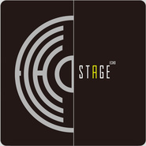

Alex.x
============================

|  |  |
| :--: | :-- |
| [ Alex.x](https://i.xiami.com/alexx) | **地区**: China 中国大陆 **风格**: 浩室舞曲 House, 电子舞曲 EDM / Electronic Dance Music, 前卫浩室 Progressive House **播放数**: 8591421 **粉丝数**: 570 **评论数**: 19  |

## 档案

DJ Alex.x  国内公认顶级DJ及独立音乐人，除拥有十七年DJ经验经历无数派队狂潮外 其对电子音乐的认识与深入已经带领他的思想进入一个潮流高峰。 Alex.x可谓DJ奇才早在2005年他Remix的一首汪峰《飞得更高》 席卷了华人DJ世界，成为了当时DJ人手必备的主打曲目，与胡彦斌合作的 《红颜》更是把Trance曲风发挥的淋漓尽致。   Remixed Children (Alex.x Extended Mix) The Time [Dirty Bit] (Alex.x Remix)   Lick It (Alex.x Extended Remix)  Timbaland Ft One Republic - Apologize (Alex.x Electro Mix) Justin Bieber feat. udacrics - Baby(Alex.x Remix)   他是华人电音世界的风向标 合作的艺人阵容强大 大张伟  筷子兄弟 陈楚生  陈羽凡 黄勇  南合文斗  李行亮   雨宗林 庄心妍   王麟 高进   东来东往 刘嘉亮   曹轩宾    华语电音代表作品 大张伟   《倍儿爽》 筷子兄弟《小苹果》 李行亮   《愿得一人心》 雨宗林   《过期爱情》 庄心妍   《一万个舍不得》 《今天就要回家》 《爱音乐》 《爱美无罪》 代理仁   《预谋》 《爱来爱去累不累》 王麟      《伤不起》 小沈阳&高进 《我的好兄弟》 刘嘉亮  《美丽女人》 《爱我就别伤害我》

## 专辑

| 名称 | 语种 | 唱片公司 | 发行时间 | 专辑类别 | 专辑风格 |
| :--: | :-- | :-- | :-- | :-- | :-- |
| [ No Haters](./albums/2103734652.md) | 英语 | 看见音乐 (上海) | 2018年01月29日 | EP, 单曲 | 欧美流行 Western Pop |
| [ Alex.x 2016作品集](./albums/2100253738.md) | 国语 | 独立发行 | 2016年01月01日 | EP, 单曲 | 浩室舞曲 House, 国语流行 Mandarin Pop, 电音流行 Electropop |
| [ Alex.x Original Music](./albums/1127182633.md) | 其他 | 独立发行 | 2015年03月01日 | EP, 单曲 | 独立电子乐 Indietronica, 电音流行 Electropop |
| [ 2015 New works](./albums/920792091.md) | 其他 | 独立发行 | 2015年01月01日 | 精选集 | 国语流行 Mandarin Pop, 电音流行 Electropop |
| [ EchoStage推荐](./albums/1119323857.md) | 其他 | 独立发行 | 2014年12月23日 | 合集, 杂锦 | 独立流行 Indie Pop, 氛围流行 Ambient Pop, 欧美流行 Western Pop |
| [ Classics 经典作品回顾](./albums/804805724.md) | 其他 | 独立发行 | 2014年07月04日 | 精选集 |  |
| [ New Releases 2014年最新作品](./albums/1104801867.md) | 国语 | 独立发行 | 2014年01月01日 | 精选集 | 电音流行 Electropop |

## 评论

|  |  |  |
| :-- | :-- | :-- |
|  [虾米用户](https://emumo.xiami.com/u/409187440) 老歌曲好听 2020-01-07 22:18 赞(0) 踩(0) | 
太好听了，听着心情都好了！
 |
|  [虾米用户](https://emumo.xiami.com/u/356151275)  2019-07-08 02:57 赞(1) 踩(0) | 
 
 |
|  [虾米用户](https://emumo.xiami.com/u/351895599) 简简单单的快乐就好！ 2018-05-19 19:31 赞(1) 踩(0) | 
节奏很嗨，我喜欢！人帅，音乐更帅！    
 |
|  [虾米用户](https://emumo.xiami.com/u/293692544) 你敢给我说话吗？我咬你 2018-04-26 05:16 赞(2) 踩(0) | 
好听
 |
|  [虾米用户](https://emumo.xiami.com/u/22017219) - I ❤ EDM 2017-10-30 20:10 赞(3) 踩(0) | 
 
 |
|  [虾米用户](https://emumo.xiami.com/u/32374597) DJ/电子音乐制作人 2017-04-11 23:06 赞(3) 踩(0) | 
长的帅。
 |
|  [虾米用户](https://emumo.xiami.com/u/258239724)  2017-03-11 18:05 赞(2) 踩(0) | 
兄弟其实挺有才的，加油
 |
|  [虾米用户](https://emumo.xiami.com/u/39604497) 我以玩网游的方式做说唱 2017-02-21 09:02 赞(1) 踩(0) | 
666666
 |
|  [虾米用户](https://emumo.xiami.com/u/50506719)   2016-04-23 10:54 赞(1) 踩(0) | 
加油
 |
|  [虾米用户](https://emumo.xiami.com/u/17715879)  2016-03-19 22:22 赞(1) 踩(0) | 
。。
 |
|  [虾米用户](https://emumo.xiami.com/u/51660820) . 2015-11-19 10:38 赞(1) 踩(0) | 
星星的DJ，是一般DJ模仿不来的！
 |
|  [虾米用户](https://emumo.xiami.com/u/51660820) . 2015-11-19 10:38 赞(1) 踩(0) | 
这么好的舞曲制作人，怎么那么少人知道，作品大多数都很棒！
 |
|  [虾米用户](https://emumo.xiami.com/u/44709761) JIANG.x 2015-07-20 15:26 赞(1) 踩(0) | 
加油，师父！！
 |
|  [虾米用户](https://emumo.xiami.com/u/49117961) 平凡是真 2015-06-07 08:52 赞(1) 踩(0) | 
比王绎龙优秀多了
 |
|  [虾米用户](https://emumo.xiami.com/u/27836208) 我已经工作半年了，要严格... 2015-05-18 12:36 赞(1) 踩(0) | 
喜欢电子音乐
 |
|  [虾米用户](https://emumo.xiami.com/u/11462052)  2015-03-20 23:17 赞(1) 踩(0) | 
加油 星星
 |
|  [虾米用户](https://emumo.xiami.com/u/34975688)  2015-02-04 00:34 赞(1) 踩(0) | 
秋裤二叔
 |
|  [虾米用户](https://emumo.xiami.com/u/44572149)  2014-12-08 13:39 赞(1) 踩(0) | 
板凳哦。加油星星
 |
|  [虾米用户](https://emumo.xiami.com/u/8070377) 爱雾瑞性维欧腐漏 2014-11-26 03:34 赞(2) 踩(0) | 
卧槽 萨法啊
 |
