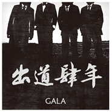

出道四年
============================

|  |  |
| :--: | :-- |
| [ 出道四年](https://emumo.xiami.com/album/461065) | **艺人**: [GALA](../index.md) **语种**: 国语 **唱片公司**: 东乐 **发行时间**: 2011年01月02日 **专辑类别**: EP, 单曲 **专辑风格**: 国语流行 Mandarin Pop **播放数**: 189782 **收藏数**: 643 **评论数**: 41  |

## 简介

出道四年  
梦未改变  
昂首阔步  
碧海蓝天 

从2004的新年开始，转眼就是第七个年头了，那时候那几个愣不呵呵的小伙子都去哪了？
 

歌曲创作于出道四年的时候，那是一段前不着村后不着店的日子，努一努就还能继续往前走走，怂一怂大家也就为了生计个忙个的去了，写这首歌没想过太多，只是多给自己一个理由对朋友或是自己理直气壮的说：要振作，猪肝君！
 

 
 

 

## 曲目

- [出道四年](./461065/xLu61Ia87b2.md)

## 评论

|  |  |  |  |
| :-- | :-- | :-- | :-- |
|  [虾米用户](https://emumo.xiami.com/u/223354) 一天不听。。浑身不舒坦。... 2015-02-08 11:49 赞(1) 踩(0) | 
我怎么听了觉得挺好呢。。。有感动在
 |
|  [虾米用户](https://emumo.xiami.com/u/10722678) 成为自己啊 2015-01-27 13:34 赞(0) 踩(0) | 
一年又一年，转眼腊八已至，涉世壹年，总是奢望肥料强加自我灌注。看似外表平静，其实内心翻腾，翻越一切贫瘠，给接下来扫除一片无雪之地。
 |
|  [虾米用户](https://emumo.xiami.com/u/9156809)  2015-01-19 22:52 赞(1) 踩(0) | 
虽然《水手公园》《Young for you》《雪白透亮》《点豆豆》超好听。但“妈妈觉得我同性恋，其实我是个男子汉。”这句词瞬间拉低了这两年对Gala的好印象，好残念。
 |
|  [虾米用户](https://emumo.xiami.com/u/16010013) Farewell, my... 2015-01-02 21:00 赞(1) 踩(0) | 
SB
 |
|  [虾米用户](https://emumo.xiami.com/u/34729718) 。 2014-12-12 00:16 赞(1) 踩(0) | 
难听
 |
|  [虾米用户](https://emumo.xiami.com/u/8330881)  2014-11-17 08:21 赞(0) 踩(0) | 
垃圾
 |
|  [虾米用户](https://emumo.xiami.com/u/4269455)  2014-10-05 19:06 赞(0) 踩(0) | 
GALA的歌永远能给人带来正能量！
 |
|  [虾米用户](https://emumo.xiami.com/u/13332063) 春暖花开 2014-08-17 21:49 赞(0) 踩(0) | 
还有比这更牵强更难听的调子吗？
 |
|  [虾米用户](https://emumo.xiami.com/u/3020639)  2014-06-10 19:25 赞(0) 踩(0) | 
我怎么被感动了呢，听完反而感动了！
 |
|  [虾米用户](https://emumo.xiami.com/u/8252492) 我渴望日日夜夜轻轻松松朦... 2014-01-08 00:30 赞(0) 踩(0) | 
就是今天听说GALA要上春晚的~~还好我们一起喜欢上他们的~~虽然时间快得像眨眼，但我们还是要尽量的“爱拼才会赢”，至于那些下学期或者明年我不再能见到的人，愿你平安美好~~
 |
|  [虾米用户](https://emumo.xiami.com/u/1286980)  2013-10-17 22:17 赞(0) 踩(0) | 
词算是真够潇洒~~~~~
 |
|  [虾米用户](https://emumo.xiami.com/u/17201710) 暂无签名~ 2013-10-16 12:15 赞(0) 踩(0) | 
六年了！
 |
|  [虾米用户](https://emumo.xiami.com/u/23768955) Yangjing1314 2013-10-07 09:15 赞(0) 踩(0) | 
还没听Q值觉得应该很不错
 |
|  [虾米用户](https://emumo.xiami.com/u/23557079)  2013-10-02 21:52 赞(0) 踩(0) | 
从当兵算起 我也出道四年了 喜欢gala乐队的歌 给人带来不一样的摇滚 英伦风 很神经很好听 其实有共同之处 哈哈哈
 |
|  [虾米用户](https://emumo.xiami.com/u/20161520)  2013-08-24 19:45 赞(0) 踩(0) | 
放荡不羁好男儿
 |
|  [虾米用户](https://emumo.xiami.com/u/9430584) 废人 2013-08-01 12:27 赞(0) 踩(0) | 
喜欢你们的时间快得像眨眼
 |
|  [虾米用户](https://emumo.xiami.com/u/183827) 我还没想好要写什么... 2013-07-03 14:46 赞(12) 踩(0) | 
妈妈觉得我同性恋，其实我是个男子汉。这句词负分，滚。
 |
|  [虾米用户](https://emumo.xiami.com/u/2374243) 盐巴洒落一地 2013-07-01 16:25 赞(0) 踩(0) | 
马上十年了
 |
|  [虾米用户](https://emumo.xiami.com/u/355865) Let it go, l... 2013-06-12 21:30 赞(0) 踩(0) | 
<a href="http://emumo.xiami.com/u/30705" target="_blank" rel="nofollow" name_card="30705">@beson</a>  这张是192K~与专辑版本有些许不同，请在后面加(Single Version)予以区分~
 |
| ⇒ |  [虾米用户](https://emumo.xiami.com/u/5000044) 版权不是你想买想买就能买 2013-09-07 19:56 赞(0) 踩(0) | 
<a href="http://emumo.xiami.com/u/30705" target="_blank" rel="nofollow" name_card="30705">@beson</a> @你这么多条都不回呢~哼哼
 |
| ⇒ |  [虾米用户](https://emumo.xiami.com/u/30705) 我还没想好要写什么... 2013-11-11 10:40 赞(0) 踩(0) | 
呀，好嘛，加了呢~
 |
|  [虾米用户](https://emumo.xiami.com/u/11427934) 没事儿别找我，我在图书馆... 2013-06-12 11:57 赞(0) 踩(0) | 
看，那乐队真贱。
 |
|  [虾米用户](https://emumo.xiami.com/u/1342333)   2013-04-09 17:19 赞(0) 踩(0) | 
贱兮兮
 |
|  [虾米用户](https://emumo.xiami.com/u/6636257) coming soon 2013-03-14 15:17 赞(0) 踩(0) | 
其实我是个二皮脸
 |
|  [虾米用户](https://emumo.xiami.com/u/1892211) 持久专注简单 2013-03-04 00:07 赞(0) 踩(0) | 
出道四年梦未改变昂首阔步碧海蓝天
 |
|  [虾米用户](https://emumo.xiami.com/u/68574) 灵感电台主播 2013-02-25 13:30 赞(0) 踩(0) | 
Gala
 |
|  [虾米用户](https://emumo.xiami.com/u/2419923)   2013-01-09 17:21 赞(0) 踩(0) | 
忧郁青年游乐园
 |
|  [虾米用户](https://emumo.xiami.com/u/7647547) 垂死的岁末 2012-12-28 11:19 赞(0) 踩(0) | 
一年又一年~
 |
|  [虾米用户](https://emumo.xiami.com/u/490340)  2012-12-26 13:39 赞(0) 踩(0) | 
！！！
 |
|  [虾米用户](https://emumo.xiami.com/u/11790222) 幸运的不幸儿！ 2012-12-09 13:28 赞(0) 踩(0) | 
喜欢这风格
 |
|  [虾米用户](https://emumo.xiami.com/u/5392013)  2012-11-13 09:35 赞(0) 踩(0) | 
不错！！！
 |
|  [虾米用户](https://emumo.xiami.com/u/4274135)  2011-10-06 21:47 赞(0) 踩(0) | 
比上一张专辑好太多了，要加油！
 |
|  [虾米用户](https://emumo.xiami.com/u/3737652)  2011-09-09 00:47 赞(0) 踩(0) | 
不错！！！
 |
|  [虾米用户](https://emumo.xiami.com/u/1157611) 跳动的世界里找你的频率 2011-08-25 22:01 赞(0) 踩(0) | 
四年前我刚进高中，那个满怀希翼啊，真是遥远
 |
|  [虾米用户](https://emumo.xiami.com/u/4224547)  2011-08-24 14:48 赞(0) 踩(0) | 
gala兄
 |
|  [虾米用户](https://emumo.xiami.com/u/189236)  2011-08-23 05:00 赞(0) 踩(0) | 
怎么又重新上传了？
 |
|  [虾米用户](https://emumo.xiami.com/u/709059) 有所依 2011-08-22 22:26 赞(0) 踩(0) | 
人生也没多少四年啊，同样是四年，差别咋就这么大哩
 |
|  [虾米用户](https://emumo.xiami.com/u/3999366) 口外缚斤则为听 2011-08-22 21:12 赞(0) 踩(0) | 
坚持不变，已过四年
 |
|  [虾米用户](https://emumo.xiami.com/u/1537990)  2011-08-22 19:27 赞(0) 踩(0) | 
现场听过他们唱这首歌，那感觉相当触动，看似短短的四年，不容易啊。。。。
 |
|  [虾米用户](https://emumo.xiami.com/u/155947) 一期一会 2011-08-22 18:07 赞(0) 踩(0) | 
出道四年，梦未改变。
 |
|  [虾米用户](https://emumo.xiami.com/u/2315806) 走，切吃串串儿 2011-08-22 16:20 赞(0) 踩(0) | 
每次听总能让人唤起心中最原始的那份悸动
 |
