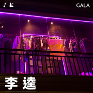
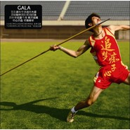

GALA
============================

|  |  |
| :--: | :-- |
| [<br>GALA](https://i.xiami.com/gala) | **地区**: China 中国大陆<br>**风格**: 摇滚 Rock & Roll<br>**播放数**: 106615311<br>**粉丝数**: 184569<br>**评论数**: 3248<br> |

## 档案

<div>
GALA乐队<br>
主唱：苏朵<br>
贝斯手：石亮<br>
键盘手：苏依拉<br>
鼓手：于政<br>
经纪人：Jeff<br>
TEL/Wechat: 183-0126-8100<br>
新浪微博：       http://weibo.com/236142<br>
微信公众号：GALAWX
</div>

## 专辑

| 名称 | 语种 | 唱片公司 | 发行时间 | 专辑类别 | 专辑风格 |
| :--: | :-- | :-- | :-- | :-- | :-- |
| [<br>走自己的路](./albums/2102963573.md) | 国语 | 懦夫救星(北京) | 2017年11月28日 | EP, 单曲 | 摇滚 Rock & Roll |
| [<br>你](./albums/2102944969.md) | 国语 | 懦夫救星(北京) | 2017年11月20日 | EP, 单曲 | 流行摇滚 Pop Rock |
| [<br>哈利路亚](./albums/2102865361.md) | 国语 | 懦夫救星(北京) | 2017年09月28日 | EP, 单曲 | 流行摇滚 Pop Rock |
| [<br>Hello Kitty](./albums/2102865363.md) | 国语 | 懦夫救星(北京) | 2017年09月28日 | EP, 单曲 | 流行摇滚 Pop Rock |
| [<br>李逵](./albums/2102865364.md) | 国语 | 懦夫救星(北京) | 2017年09月28日 | EP, 单曲 | 流行摇滚 Pop Rock |
| [<br>新生](./albums/2102675999.md) | 国语 | 索尼音乐娱乐 | 2017年03月22日 | EP, 单曲 | 流行摇滚 Pop Rock |
| [<br>征服太平洋](./albums/1414375912.md) | 国语 | Big Music | 2014年10月27日 | EP, 单曲 | 流行摇滚 Pop Rock |
| [<br>点豆豆](./albums/1113785225.md) | 国语 | Big Music | 2014年10月20日 | EP, 单曲 | 国语流行 Mandarin Pop |
| [<br>我绝对不能失去你](./albums/1813372523.md) | 国语 | Big Music | 2014年10月16日 | EP, 单曲 | 国语流行 Mandarin Pop |
| [<br>海盗](./albums/813185434.md) | 国语 | Big Music | 2014年10月13日 | EP, 单曲 | 流行摇滚 Pop Rock |
| [<br>把仇恨化成爱一生不休](./albums/1798391514.md) | 国语 | 赤子弄潮文化 | 2014年03月25日 | EP, 单曲 | 国语流行 Mandarin Pop |
| [<br>雪白透亮](./albums/547710.md) | 国语 | 老虎数字传媒 | 2012年10月12日 | EP, 单曲 | 流行摇滚 Pop Rock |
| [<br>知音难觅](./albums/481939.md) | 国语 | 东乐 | 2011年12月05日 | EP, 单曲 | 流行摇滚 Pop Rock |
| [<br>追梦痴子心](./albums/431330.md) | 国语 | 东乐 | 2011年03月24日 | 录音室专辑 | 流行摇滚 Pop Rock |
| [<br>出道四年](./albums/461065.md) | 国语 | 东乐 | 2011年01月02日 | EP, 单曲 | 国语流行 Mandarin Pop |
| [<br>飞行员之歌](./albums/414015.md) | 国语 | 东乐 | 2010年12月03日 | EP, 单曲 |  |
| [<br>水手公园（单曲版）](./albums/2102739120.md) | 国语 | 光线传媒 | 2010年07月22日 | EP, 单曲 | 国语流行 Mandarin Pop |
| [<br>Young For You](./albums/14617.md) | 英语 | 独立发行 | 2004年03月01日 | 录音室专辑 | 独立摇滚 Indie Rock |

## 评论

|  |  |  |
| :-- | :-- | :-- |
| <br>[虾米用户](https://emumo.xiami.com/u/14561312)<br>开口沉默.<br>2020-11-20 20:29<br>赞(0) 踩(0) | <div>乐夏如果有3，gala给我上!</div> |
| <br>[虾米用户](https://emumo.xiami.com/u/49860711)<br>有点意思<br>2020-10-30 14:37<br>赞(0) 踩(0) | <div>GALA很棒</div> |
| <br>[虾米用户](https://emumo.xiami.com/u/423817038)<br>孑然天地间    忽如远...<br>2020-09-12 16:30<br>赞(0) 踩(0) | <div>补上补上，还是这曲&amp;ldquo;我爱的女孩&amp;rdquo;送给如楼下这般癫狂的这个五月天粉丝，上个账号&amp;ldquo;陈信宏夫人&amp;rdquo;才刚刚被封，就换个新账号继续出来逢人就骂 | <a href="https://h.xiami.com/mv_detail.html?id=KY3hbT" target="_blank" rel="nofollow noreferrer noopener">https://h.xiami.com/mv_detail.html?id=KY3hbT</a><br><br>合个影留个念<br><a href="https://h.xiami.com/music/feed-details-share.html?id=537982408" target="_blank" rel="nofollow noreferrer noopener">https://h.xiami.com/music/feed-details-share.html?id=537982408</a><br><a href="https://h.xiami.com/music/feed-details-share.html?id=542823244" target="_blank" rel="nofollow noreferrer noopener">https://h.xiami.com/music/feed-details-share.html?id=542823244</a></div> |
| <br>[虾米用户](https://emumo.xiami.com/u/104960092)<br>听花开的声音，听你的声音...<br>2020-08-21 11:01<br>赞(0) 踩(0) | <div>很好！</div> |
| <br>[虾米用户](https://emumo.xiami.com/u/119766702)<br>一人一车一世界<br>2020-08-08 15:23<br>赞(3) 踩(0) | <div>之前路边听到时没注意，今天看《穿越火线》第18集结尾的时候，这首歌把剧推到了极致高潮，当时正在辛苦的创作原画大赛的参赛作品，这首歌彻底激燃了内心的火把和感动，回想起自己对机车的热爱，对绘画的热爱，自己38岁还在坚持梦想的一路点点滴滴，顿时热泪盈眶，止都止不住 </div> |
| <br>[虾米用户](https://emumo.xiami.com/u/53737210)<br>哼哼哼<br>2020-06-25 23:03<br>赞(1) 踩(0) | <div>刚在电视上看了眼现场，差点没把我心脏病听出来。。。真是太尼玛难听了</div> |
| <br>[虾米用户](https://emumo.xiami.com/u/259696793)<br><br>2020-02-11 17:26<br>赞(0) 踩(0) | <div>说丧权辱国的有没有证据，拿出来看看，如果是舆论就算了，最好是有官方证明的，你们这么说真的让人觉得你们自己很恶心，别嫌我口不择言，我觉得这只乐队没什么污点，如果真的那么过分，早就被全民抵制了，还能有这么多歌迷吗？</div> |
| <br>[虾米用户](https://emumo.xiami.com/u/321762998)<br>我还没想好要写什么...<br>2020-02-09 02:32<br>赞(0) 踩(0) | <div>2020.2.9凌晨2:32在家隔离</div> |
| <br>[虾米用户](https://emumo.xiami.com/u/405166074)<br><br>2020-02-04 23:08<br>赞(0) 踩(0) | <div>为什么还有听不了</div> |
| <br>[虾米用户](https://emumo.xiami.com/u/210068359)<br>电影人，摄影师，艺术家，...<br>2020-01-20 21:48<br>赞(0) 踩(0) | <div>这简介也太简洁了吧</div> |
| <br>[虾米用户](https://emumo.xiami.com/u/300184210)<br>我爱虾米，求虾米不要停运<br>2019-10-27 10:41<br>赞(1) 踩(0) | <div>一开始听歌词挺励志的啊，但是看了很多人对这个乐队的评论还真是有点失望啊。感觉好不容易中国有个不唱口水歌的结果很多人都说抄的五月天的咸鱼，还骂粉丝</div> |
| <br>[虾米用户](https://emumo.xiami.com/u/406895247)<br><br>2019-09-03 17:46<br>赞(3) 踩(0) | <div>听着歌，在公交车上激动的落泪</div> |
| <br>[虾米用户](https://emumo.xiami.com/u/5110129)<br><br>2019-08-15 10:17<br>赞(7) 踩(0) | <div>希望他们去参加-乐队的夏天2 </div> |
| <br>[虾米用户](https://emumo.xiami.com/u/234835668)<br><br>2019-05-29 00:13<br>赞(9) 踩(0) | <div>听gala乐队的歌时间也不短了  gala不像是素质那么低的乐队  网络舆论的炒作以及各种无中生有   不能排除<br>但我不是当事人也没看见实况   我也只能站在一个路人角度看待</div> |
| <br>[虾米用户](https://emumo.xiami.com/u/306116365)<br>⠀⠀⠀<br>2019-05-22 23:52<br>赞(2) 踩(0) | <div>想听雪白透亮..</div> |
| <br>[虾米用户](https://emumo.xiami.com/u/2889623)<br>我还没想好要写什么...<br>2019-05-18 12:28<br>赞(1) 踩(0) | <div>夏天的时间听你们 真的感觉时时刻刻在海边～</div> |
| <br>[虾米用户](https://emumo.xiami.com/u/2889623)<br>我还没想好要写什么...<br>2019-05-18 12:28<br>赞(1) 踩(0) | <div>夏天的时间听你们 真的感觉时时刻刻在海边～</div> |
| <br>[虾米用户](https://emumo.xiami.com/u/421413509)<br><br>2019-05-18 12:14<br>赞(0) 踩(0) | <div>加油</div> |
| <br>[虾米用户](https://emumo.xiami.com/u/421413509)<br><br>2019-05-18 12:13<br>赞(1) 踩(0) | <div>你们想得起梦想吗？</div> |
| <br>[虾米用户](https://emumo.xiami.com/u/421413509)<br><br>2019-05-18 12:12<br>赞(0) 踩(0) | <div>                                                      </div> |
| <br>[虾米用户](https://emumo.xiami.com/u/355973826)<br><br>2019-04-22 09:08<br>赞(0) 踩(0) | <div>音乐是音乐，与其他无关！</div> |
| <br>[虾米用户](https://emumo.xiami.com/u/320410509)<br>我还<br>2019-03-29 22:50<br>赞(0) 踩(0) | <div>什么时候巡演啊 想念苏朵的现场啊！！想念跟着gala的节奏摇头晃脑的开心啊！！！</div> |
| <br>[虾米用户](https://emumo.xiami.com/u/81818)<br><br>2019-03-27 16:41<br>赞(3) 踩(0) | <div>骗粉丝，骂歌迷，丧权辱国，叹为观止！</div> |
| <br>[虾米用户](https://emumo.xiami.com/u/21224077)<br><br>2019-03-15 02:56<br>赞(1) 踩(0) | <div>这组合叫啥名呀？旮旯吗？</div> |
| <br>[虾米用户](https://emumo.xiami.com/u/405846262)<br>良玉<br>2019-03-07 13:42<br>赞(0) 踩(0) | <div>我应该加油了</div> |
| <br>[虾米用户](https://emumo.xiami.com/u/37706842)<br> <br>2019-03-05 16:58<br>赞(2) 踩(0) | <div>15年听现场其实还是很棒的，挺有劲，当时音乐节gala小舞台比隔壁大舞台的逃跑可是热闹多了，希望他们不忘初心吧，这个浮躁的世界太容易迷失了</div> |
| <br>[虾米用户](https://emumo.xiami.com/u/408249793)<br><br>2019-02-14 06:44<br>赞(3) 踩(0) | <div>现场听过一次，感觉GALA老了，而且有成就了，唱不出那种为了命运而拼搏的撕吼着的呐喊了。每一个人都有梦想，只不过有人把它埋进心里，拼搏过的人生，无论成功与否，都是精彩的，都是值得年迈时回味的。</div> |
| <br>[虾米用户](https://emumo.xiami.com/u/413221915)<br><br>2019-01-26 17:50<br>赞(6) 踩(0) | <div>抄袭个鸟啊！人家GALA才是追梦赤子心的原唱好不好?人家翻唱过哪首歌?  </div> |
| ⇒ | <br>[虾米用户](https://emumo.xiami.com/u/428311282)<br>我和我的倔强<br>2020-03-02 14:02<br>赞(0) 踩(0) | <div>抄的是词 </div> |
| <br>[虾米用户](https://emumo.xiami.com/u/262362509)<br>希望能成为像向日葵那般美...<br>2019-01-23 10:57<br>赞(5) 踩(0) | <div>呵呵，追梦赤子心抄袭，要点脸。</div> |
| <br>[虾米用户](https://emumo.xiami.com/u/412401418)<br><br>2019-01-22 07:17<br>赞(0) 踩(0) | <div>追梦赤子心</div> |
| <br>[虾米用户](https://emumo.xiami.com/u/199786427)<br>随心~对的起自己<br>2018-12-29 12:15<br>赞(2) 踩(0) | <div>那年那兔那些事是这个吗</div> |
| ⇒ | <br>[虾米用户](https://emumo.xiami.com/u/112273546)<br>只想安静的听音乐<br>2019-01-01 23:01<br>赞(0) 踩(0) | <div>是</div> |
| ⇒ | <br>[虾米用户](https://emumo.xiami.com/u/26121434)<br><br>2019-01-16 12:08<br>赞(0) 踩(0) | <div>是的</div> |
| <br>[虾米用户](https://emumo.xiami.com/u/411118543)<br><br>2018-12-23 17:21<br>赞(1) 踩(0) | <div> </div> |
| <br>[虾米用户](https://emumo.xiami.com/u/1163763)<br> <br>2018-11-06 19:13<br>赞(10) 踩(0) | <div>嗯……其实一直都只是在听着gala的歌，并没有去关心他们的周边新闻。单纯从他们的音乐旋律和歌词听到真诚和热爱。<br>网上各执一词，我不是当事人，不清楚事件被掩饰多少或者夸大多少，所以我只关心他们的音乐能不能继续感动我。<br>不过，至少我从音乐从听出来的GALA，不像是会这样对自己歌迷的乐队。</div> |
| ⇒ | <br>[虾米用户](https://emumo.xiami.com/u/401006052)<br>唯美主义者<br>2019-03-28 13:59<br>赞(0) 踩(0) | <div>你光听歌的话看查尔斯像杀人魔吗。</div> |
| ⇒ | <br>[虾米用户](https://emumo.xiami.com/u/267152046)<br>不知不觉 不情不愿<br>2020-07-05 10:03<br>赞(0) 踩(0) | <div><q><b>香槟超旧星说：</b></q></div> |
| <br>[虾米用户](https://emumo.xiami.com/u/6705888)<br><br>2018-10-27 14:56<br>赞(2) 踩(0) | <div>很喜欢你们唱的歌 加油加油  来自南京的祝福 </div> |
| <br>[虾米用户](https://emumo.xiami.com/u/303506160)<br>因为我对你爱的深沉<br>2018-10-24 08:53<br>赞(2) 踩(0) | <div>嘿呦</div> |
| <br>[虾米用户](https://emumo.xiami.com/u/244990099)<br>虾米改变我的心情，指导我...<br>2018-10-17 21:27<br>赞(1) 踩(0) | <div>你们是最棒的，很喜欢你们唱歌</div> |
| <br>[虾米用户](https://emumo.xiami.com/u/303506160)<br>因为我对你爱的深沉<br>2018-10-15 08:08<br>赞(2) 踩(0) | <div>嘿呦</div> |
| <br>[虾米用户](https://emumo.xiami.com/u/361323187)<br><br>2018-10-10 20:47<br>赞(2) 踩(0) | <div>垃圾</div> |
| <br>[虾米用户](https://emumo.xiami.com/u/140114064)<br>知命不惧，日日自新。<br>2018-10-06 22:45<br>赞(4) 踩(0) | <div>还新一代中国摇滚之王，群众下限啥时候下限这么低了，抵制抄袭。</div> |
| <br>[虾米用户](https://emumo.xiami.com/u/140114064)<br>知命不惧，日日自新。<br>2018-10-06 22:44<br>赞(3) 踩(0) | <div>抄你妈呢</div> |
| <br>[虾米用户](https://emumo.xiami.com/u/42725114)<br>ThistheshitI...<br>2018-09-26 20:24<br>赞(1) 踩(0) | <div></div> |
| <br>[虾米用户](https://emumo.xiami.com/u/27547030)<br>写什么都是给别人看的。<br>2018-09-24 13:57<br>赞(2) 踩(0) | <div>换个主唱估计能好点</div> |
| <br>[虾米用户](https://emumo.xiami.com/u/293692544)<br>你敢给我说话吗？我咬你<br>2018-09-20 05:16<br>赞(2) 踩(0) | <div>好听</div> |
| <br>[虾米用户](https://emumo.xiami.com/u/303506160)<br>因为我对你爱的深沉<br>2018-08-31 01:06<br>赞(3) 踩(0) | <div>嘿呦</div> |
| <br>[虾米用户](https://emumo.xiami.com/u/401006052)<br>唯美主义者<br>2018-08-29 15:27<br>赞(8) 踩(0) | <div>骗群演丧权辱国这些事情我真是才知道，本来牵扯山羊皮我已很不高兴，现在高中时期积攒的好感是彻底败没了，我要下了这条贼船，再见！</div> |
| <br>[虾米用户](https://emumo.xiami.com/u/49959840)<br>无聊人<br>2018-08-06 20:52<br>赞(3) 踩(0) | <div></div> |
| <br>[虾米用户](https://emumo.xiami.com/u/2491956)<br>我还没想好要写什么...<br>2018-08-04 09:15<br>赞(3) 踩(0) | <div>没觉得有什么正能量</div> |
| <br>[虾米用户](https://emumo.xiami.com/u/3755771)<br><br>2018-07-17 10:41<br>赞(3) 踩(0) | <div>素质低</div> |
| <br>[虾米用户](https://emumo.xiami.com/u/102335638)<br>五迷 Suju 块逼 碗...<br>2018-07-12 21:14<br>赞(2) 踩(0) | <div>这么多人喷 我放心地就给一个建议 换一个主唱吧 歌很好 主唱带不起来的感觉</div> |
| <br>[虾米用户](https://emumo.xiami.com/u/332620790)<br><br>2018-07-03 21:04<br>赞(2) 踩(0) | <div>是真的喜欢了好多年 文艺逗比随机切换的GALA是个好月丢 大约是有信仰吧</div> |
| <br>[虾米用户](https://emumo.xiami.com/u/203259740)<br><br>2018-06-24 11:37<br>赞(4) 踩(0) | <div>新一代中国摇滚之王 gala</div> |
| <br>[虾米用户](https://emumo.xiami.com/u/74891292)<br><br>2018-06-19 00:22<br>赞(2) 踩(0) | <div>哭一会儿 毕业了 从高复到大学 谢谢你们的歌</div> |
| <br>[虾米用户](https://emumo.xiami.com/u/374794750)<br><br>2018-06-17 17:04<br>赞(2) 踩(0) | <div>最爱这首歌！青春，积极，向上，活力，奋斗，勇敢！！？</div> |
| <br>[虾米用户](https://emumo.xiami.com/u/284698061)<br>遗憾我们从未成熟，还没能...<br>2018-05-27 23:59<br>赞(1) 踩(0) | <div>喜欢Gala的歌</div> |
| <br>[虾米用户](https://emumo.xiami.com/u/185815729)<br>我愛過一個人。<br>2018-05-19 18:05<br>赞(1) 踩(0) | <div>在这儿喷喷就好了，别去歌下面喷吧。</div> |
| <br>[虾米用户](https://emumo.xiami.com/u/98939984)<br> <br>2018-05-09 22:15<br>赞(4) 踩(0) | <div>考研狗，听着听着就哭了，可能我还不够努力吧，继续加油⛽️</div> |
| ⇒ | <br>[虾米用户](https://emumo.xiami.com/u/50062899)<br>cosmicDiver <br>2018-05-26 21:12<br>赞(0) 踩(0) | <div>加油</div> |
| <br>[虾米用户](https://emumo.xiami.com/u/23831866)<br>离这里越远越好<br>2018-04-30 00:11<br>赞(1) 踩(0) | <div>想问下那首 被遗忘的名字 还在吗</div> |
| <br>[虾米用户](https://emumo.xiami.com/u/282336246)<br>我还没想好要写什么...<br>2018-04-26 22:43<br>赞(3) 踩(0) | <div>这歌有魂，不是歌而是歌&amp;hellip;&amp;hellip;</div> |
| <br>[虾米用户](https://emumo.xiami.com/u/197129222)<br><br>2018-04-26 12:32<br>赞(6) 踩(0) | <div>现在的中国还有如此乐队，真是为难了</div> |
| <br>[虾米用户](https://emumo.xiami.com/u/330469351)<br>每一天都是五月天へ•́ཀ...<br>2018-04-23 14:59<br>赞(5) 踩(0) | <div>听说这首歌抄袭咸鱼，然后一直没听，今天又在其他地方听到了&amp;hellip;&amp;hellip;一天听到好多遍&amp;hellip;&amp;hellip;所以过来看看是何璐大神 </div> |
| <br>[虾米用户](https://emumo.xiami.com/u/191265482)<br>56<br>2018-04-22 22:03<br>赞(2) 踩(0) | <div>GALA给我的感觉是狂拽屌，无视世界。就是喜欢你</div> |
| <br>[虾米用户](https://emumo.xiami.com/u/18577189)<br>假如再也不能见到你，祝你...<br>2018-04-15 15:02<br>赞(1) 踩(0) | <div>苏朵你的声音真好听。</div> |
| <br>[虾米用户](https://emumo.xiami.com/u/343347771)<br>体会音乐的真谛，感悟生命...<br>2018-04-14 14:07<br>赞(1) 踩(0) | <div>你们是我第一个喜欢的乐队，听你们的歌我学会了奋斗</div> |
| <br>[虾米用户](https://emumo.xiami.com/u/1750156)<br><br>2018-04-11 23:55<br>赞(3) 踩(0) | <div>傻叉乐队还没凉呢</div> |
| <br>[虾米用户](https://emumo.xiami.com/u/134542478)<br><br>2018-04-11 06:54<br>赞(0) 踩(0) | <div>循环一直在循环听什么时候开演唱会每一首都好好听好燃想</div> |
| <br>[虾米用户](https://emumo.xiami.com/u/11184859)<br><br>2018-04-10 16:43<br>赞(2) 踩(0) | <div>young for you 深入我心</div> |
| ⇒ | <br>[虾米用户](https://emumo.xiami.com/u/358226896)<br><br>2018-08-05 00:16<br>赞(0) 踩(0) | <div>可以虾米没有</div> |
| <br>[虾米用户](https://emumo.xiami.com/u/18577189)<br>假如再也不能见到你，祝你...<br>2018-03-31 02:17<br>赞(0) 踩(0) | <div>主唱真是灵&amp;middot;魂</div> |
| <br>[虾米用户](https://emumo.xiami.com/u/314075188)<br>笨蛋<br>2018-03-27 23:57<br>赞(1) 踩(0) | <div>在微博了解一个人吗？</div> |
| <br>[虾米用户](https://emumo.xiami.com/u/325178351)<br><br>2018-03-18 11:21<br>赞(2) 踩(0) | <div>在学校听到的，想吐</div> |
| ⇒ | <br>[虾米用户](https://emumo.xiami.com/u/300459788)<br><br>2018-04-18 10:19<br>赞(0) 踩(0) | <div>请你立刻死去</div> |
| <br>[虾米用户](https://emumo.xiami.com/u/230803304)<br>三观正又爱国的成都宝藏男...<br>2018-03-13 22:04<br>赞(0) 踩(0) | <div>永远支持苏朵和他的乐队组合</div> |
| <br>[虾米用户](https://emumo.xiami.com/u/2855777)<br><br>2018-03-13 00:34<br>赞(3) 踩(0) | <div>为什么看不懂评论？发生了什么 </div> |
| ⇒ | <br>[虾米用户](https://emumo.xiami.com/u/215473326)<br>你是人间五月天<br>2018-04-07 22:39<br>赞(0) 踩(0) | <div>歌词严重抄袭，而且厚颜无耻</div> |
| <br>[虾米用户](https://emumo.xiami.com/u/349994416)<br><br>2018-02-24 13:03<br>赞(0) 踩(0) | <div>             </div> |
| <br>[虾米用户](https://emumo.xiami.com/u/203259740)<br><br>2018-02-22 21:29<br>赞(3) 踩(0) | <div>gala是真正的土摇乐队 重点是土字<br>乐队的点豆豆这首歌可以说是千载难逢的好歌了 主唱金属质感的嗓音 国际化的编曲 完美的弦乐 可以引领华语乐坛</div> |
| <br>[虾米用户](https://emumo.xiami.com/u/98901196)<br>我是坠屌的<br>2018-02-14 14:22<br>赞(3) 踩(0) | <div>辣鸡</div> |
| <br>[虾米用户](https://emumo.xiami.com/u/303506160)<br>因为我对你爱的深沉<br>2018-02-13 07:14<br>赞(1) 踩(0) | <div>嘿呦</div> |
| <br>[虾米用户](https://emumo.xiami.com/u/346589373)<br> <br>2018-01-27 18:00<br>赞(4) 踩(0) | <div>超级喜欢他们的歌，可惜网易好多都没版权。</div> |
| <br>[虾米用户](https://emumo.xiami.com/u/341538667)<br><br>2017-12-27 08:06<br>赞(2) 踩(0) | <div>难道只有我觉得这首歌更适合唱歌父母。</div> |
| <br>[虾米用户](https://emumo.xiami.com/u/43059338)<br>中二病&甜品饥渴症<br>2017-12-24 12:22<br>赞(17) 踩(0) | <div>emm...能不抄袭吗&amp;hellip;&amp;hellip;</div> |
| ⇒ | <br>[虾米用户](https://emumo.xiami.com/u/325178351)<br><br>2018-04-04 22:39<br>赞(0) 踩(0) | <div>他是原唱</div> |
| ⇒ | <br>[虾米用户](https://emumo.xiami.com/u/215473326)<br>你是人间五月天<br>2018-04-07 22:37<br>赞(0) 踩(0) | <div>我没有任何天分/我却有梦的天真/我是傻 不是蠢/我将会证明 用我的一生      这是五月天的咸鱼</div> |
| ⇒ | <br>[虾米用户](https://emumo.xiami.com/u/192346372)<br>难过的时候就听拥抱201...<br>2018-04-16 00:07<br>赞(0) 踩(0) | <div><q><b>MNBGJ说：</b></q></div> |
| <br>[虾米用户](https://emumo.xiami.com/u/189646887)<br><br>2017-12-23 18:02<br>赞(1) 踩(0) | <div>以前真的很喜欢gala，是听着比听相声还过瘾的那种，他的歌里总是在诉说着世界的冷酷和自己没心没肺的开心，别人听gala的歌都是这是什么东西？我只能笑而不语，gala出名了我开心，提起gala大家都知道追梦赤子心 young for you ，但我现在却感觉不太认识gala了也许是我变了，也许是gala变了，也许我们都变了吧</div> |
| <br>[虾米用户](https://emumo.xiami.com/u/4114067)<br>你们都跟随我听歌吧<br>2017-12-18 21:26<br>赞(3) 踩(0) | <div>追梦赤子心以后GALA已死</div> |
| <br>[虾米用户](https://emumo.xiami.com/u/311274518)<br><br>2017-12-18 18:45<br>赞(0) 踩(0) | <div>我们支持你</div> |
| <br>[虾米用户](https://emumo.xiami.com/u/307215174)<br><br>2017-12-15 20:34<br>赞(1) 踩(0) | <div>五人齐！CN Dota, Best Dota!</div> |
| <br>[虾米用户](https://emumo.xiami.com/u/334541911)<br>可以 很6<br>2017-12-08 08:39<br>赞(1) 踩(0) | <div>什么时候开个演唱会吧</div> |
| <br>[虾米用户](https://emumo.xiami.com/u/276629989)<br>我就在你的身后怎样也不会...<br>2017-12-07 19:58<br>赞(1) 踩(0) | <div>就听你的歌有感觉</div> |
| <br>[虾米用户](https://emumo.xiami.com/u/319395557)<br>努力向前，无所畏惧，勇敢...<br>2017-11-30 20:42<br>赞(1) 踩(0) | <div>努力做好自己，别管别人怎么说。 </div> |
| <br>[虾米用户](https://emumo.xiami.com/u/10363618)<br>歌 书 电影 心情 不易...<br>2017-11-30 13:45<br>赞(1) 踩(0) | <div>被遗忘的名字直接被和谐下架了 哎</div> |
| <br>[虾米用户](https://emumo.xiami.com/u/201461725)<br>一生温暖纯良，不舍爱与自...<br>2017-11-30 13:03<br>赞(3) 踩(0) | <div>我觉得音乐不需要太复杂，他可以在你难过的时候带给你快乐，在失落沮丧失魂落魄的时候给你鼓励，我觉得gala就是这样 既认真又欢脱，满满深情有带有痞气 酷酷的 很喜欢 永远支持 </div> |
| <br>[虾米用户](https://emumo.xiami.com/u/8958975)<br>我是天蝎座<br>2017-11-25 23:04<br>赞(1) 踩(0) | <div>搜不到公众号    </div> |
| <br>[虾米用户](https://emumo.xiami.com/u/45090101)<br><br>2017-11-20 11:56<br>赞(1) 踩(0) | <div>微信公众号不对，搜不到</div> |
| <br>[虾米用户](https://emumo.xiami.com/u/330152497)<br>恰到好处的阳光洒满了乐曲...<br>2017-11-08 22:30<br>赞(6) 踩(0) | <div>《那年那兔些事》</div> |
| <br>[虾米用户](https://emumo.xiami.com/u/2750439)<br><br>2017-10-30 10:23<br>赞(0) 踩(0) | <div>两年前听他们的歌没有多大的感觉，前些天闲着无聊又重新去听了一听，仿佛触碰到了我的G点，推荐一下吧，后知后觉总是特别喜欢。</div> |
| <br>[虾米用户](https://emumo.xiami.com/u/4468586)<br>试过强制重启没？<br>2017-10-30 10:16<br>赞(4) 踩(0) | <div>期望很大，失望更大，一开口我都听不下去，之前人家一直推荐我去听北戴河之歌，我兴高采烈地去听了，毕竟要支持国摇嘛，没想到。。。。。。。。。。。。赞他们干嘛呀真是的。。。不许点弱，要实事求是，不能因为人家是国摇就盲目支持人家，也要看质量</div> |
| ⇒ | <br>[虾米用户](https://emumo.xiami.com/u/309733186)<br>能告诉我你的名字吗<br>2017-11-14 23:50<br>赞(0) 踩(0) | <div>笑了，有感情吗？</div> |
| ⇒ | <br>[虾米用户](https://emumo.xiami.com/u/12707143)<br><br>2017-11-22 09:28<br>赞(0) 踩(0) | <div>给你nb飞了。。</div> |
| ⇒ | <br>[虾米用户](https://emumo.xiami.com/u/93522096)<br><br>2017-11-25 19:30<br>赞(0) 踩(0) | <div>hh挺你</div> |
| <br>[虾米用户](https://emumo.xiami.com/u/7279460)<br><br>2017-10-30 10:15<br>赞(1) 踩(0) | <div>哈哈哈 真是笑屎我啦~这群家伙的真不得了！尤其是《Young For You》</div> |
| <br>[虾米用户](https://emumo.xiami.com/u/15378031)<br>起点文学网专区作者<br>2017-10-30 10:14<br>赞(1) 踩(0) | <div>笨蛋，因为你们不懂音乐，哈哈。</div> |
| <br>[虾米用户](https://emumo.xiami.com/u/8893100)<br>一枚向上的屌丝<br>2017-10-30 10:12<br>赞(3) 踩(0) | <div>很早之前听过  young for you 那种戏谑的味道很喜欢 只是到最近才知道原来是祖国的乐队  很不错 很喜欢 追梦赤子心 很nice 歌词好 主唱的声音也喜欢 有机会要去听你们的演出</div> |
| ⇒ | <br>[虾米用户](https://emumo.xiami.com/u/287298844)<br><br>2017-12-16 15:26<br>赞(0) 踩(0) | <div>看过gala的live之后你会后悔的</div> |
| <br>[虾米用户](https://emumo.xiami.com/u/11049833)<br>享受天空的人必先忍受孤独<br>2017-10-30 10:10<br>赞(1) 踩(0) | <div>young for you，英语还能这么唱啊！！颠覆啊~~~哈哈~~~</div> |
| <br>[虾米用户](https://emumo.xiami.com/u/10951237)<br><br>2017-10-28 19:30<br>赞(1) 踩(0) | <div>pancakes没告你们抄袭，也算是对得起了</div> |
| <br>[虾米用户](https://emumo.xiami.com/u/28091184)<br>我不是归人 我是过客<br>2017-10-28 00:35<br>赞(3) 踩(0) | <div>唱的是跟屎一样。车祸现场我也听了。简直吓瓜我。但就是喜欢。挡都挡不住。</div> |
| <br>[虾米用户](https://emumo.xiami.com/u/16028501)<br>什么？<br>2017-10-28 00:32<br>赞(0) 踩(0) | <div>哎月底有演唱会但是我已经买好妹妹的票了 一个阴着疯 一个明着骚 怎么选~</div> |
| <br>[虾米用户](https://emumo.xiami.com/u/18871687)<br> <br>2017-10-28 00:31<br>赞(2) 踩(0) | <div>我仍然无法理解为什么他们总在suede主页乱入，不过主唱的唱腔还真是奇葩，追梦赤子心挺感人</div> |
| <br>[虾米用户](https://emumo.xiami.com/u/1091873)<br>最多12个字符。<br>2017-10-28 00:30<br>赞(0) 踩(0) | <div>你喜欢的歌手GALA入驻虾米音乐人啦，从今天开始你可以直接跟他沟通，并可能有新音乐，新鲜事发布哦，快去看看吧! 7分钟前</div> |
| <br>[虾米用户](https://emumo.xiami.com/u/1851561)<br><br>2017-10-28 00:30<br>赞(1) 踩(0) | <div>哇塞  虾米音乐人 哈哈哈哈</div> |
| <br>[虾米用户](https://emumo.xiami.com/u/3415364)<br><br>2017-10-28 00:24<br>赞(0) 踩(0) | <div>hahahahahhah   galga</div> |
| <br>[虾米用户](https://emumo.xiami.com/u/2497962)<br><br>2017-10-28 00:21<br>赞(0) 踩(0) | <div>为什么我听不出来主唱在哼什么，在有的时候```必须要小心的来回听几遍才好 难道是我英语太烂了？还是他的口语太NB了``````</div> |
| <br>[虾米用户](https://emumo.xiami.com/u/3829442)<br>我还没想好要写什么...<br>2017-10-28 00:20<br>赞(0) 踩(0) | <div>喜死我了！！！刘翔似的激情封面 古怪的表现。我要怎么形容呢 恩...好像是山羊皮乐队式的聒噪乱哄哄毛茸茸的 不停快乐地骚扰耳朵们。我喜欢这样的随性。京味英伦 哈哈喜死了</div> |
| <br>[虾米用户](https://emumo.xiami.com/u/1486808)<br><br>2017-10-28 00:11<br>赞(1) 踩(0) | <div>近期推荐“GALA”乐队，阿比鹿音乐奖公布入围名单之一。风格Pop</div> |
| <br>[虾米用户](https://emumo.xiami.com/u/6413833)<br><br>2017-10-28 00:10<br>赞(1) 踩(0) | <div>记得大三理工榕树园。毛肚说，推荐你个乐队 唱的很怪。鸭毛 拿过耳机听了下说，唱的跟屎一样。</div> |
| <br>[虾米用户](https://emumo.xiami.com/u/19815925)<br><br>2017-10-27 23:57<br>赞(2) 踩(0) | <div>一首这么好的！男人的！励志！超赞的一首歌！！！！让快男白面小生一唱。。。啥东西上了芒果台都。。。。哎！为什么令狐冲和东方不败有一腿！xin天龙八部也恶心的没法说了</div> |
| <br>[虾米用户](https://emumo.xiami.com/u/4889432)<br><br>2017-10-27 23:57<br>赞(0) 踩(0) | <div>英伦风，一群长不大的，怀揣我们这一代人年轻梦想努力在我们身边的年轻人。希望永远年轻，永远追梦。</div> |
| <br>[虾米用户](https://emumo.xiami.com/u/477492)<br><br>2017-10-27 23:56<br>赞(0) 踩(0) | <div>看专辑封面我还以为又是些盲目赞美祖国的励志歌曲。。。听了才有惊到啊。。很喜欢这种没有太多商业味道的摇滚。<br>没有太多社会的浮躁，就是年轻人自己的音乐</div> |
| <br>[虾米用户](https://emumo.xiami.com/u/5095200)<br><br>2017-10-27 23:55<br>赞(0) 踩(0) | <div>为毛《追梦赤子心》没有？</div> |
| <br>[虾米用户](https://emumo.xiami.com/u/52394300)<br>但所有令人振奋的东西也正...<br>2017-10-27 23:50<br>赞(1) 踩(0) | <div>我就是喜欢苏朵这傻屌</div> |
| <br>[虾米用户](https://emumo.xiami.com/u/60862912)<br>干完这票，回家务农。<br>2017-10-27 23:49<br>赞(1) 踩(0) | <div>#LANNIA MIDI WEEKEND#迷笛周末系列演出<br>首发10月31日19:30，,北京798剧场livehouse<br>@GALA乐队 + 电子朋克@4U乐队 + 功夫电核金属@病毒库乐队 三队联演，<br>100元，详情可戳：<a href="http://m.hulianxk.com/index_show.html?showId=147" target="_blank" rel="nofollow noreferrer noopener">http://m.hulianxk.com/index_show.html?showId=147</a><br>如有疑问可直接回复咨询：）</div> |
| <br>[虾米用户](https://emumo.xiami.com/u/13536280)<br> <br>2017-10-27 23:35<br>赞(0) 踩(0) | <div>哈哈哈，脑海中浮起一群傻乐傻乐的二货样，蓝后低头看看床边躺着的laughing，so～laughing，this song is for you，will you like it？ </div> |
| <br>[虾米用户](https://emumo.xiami.com/u/762317)<br><br>2017-10-27 23:34<br>赞(0) 踩(0) | <div>最近很喜欢的乐队</div> |
| <br>[虾米用户](https://emumo.xiami.com/u/31197269)<br> <br>2017-10-27 23:24<br>赞(0) 踩(0) | <div>征服太平洋好听哭了！！TUT第一次听是在帝都演唱会上，当时就觉得好听，昨儿终于出单曲了，无限循环ing…朵朵么么哒OwO</div> |
| <br>[虾米用户](https://emumo.xiami.com/u/257244889)<br><br>2017-10-21 22:02<br>赞(0) 踩(0) | <div>我还是喜欢galla</div> |
| <br>[虾米用户](https://emumo.xiami.com/u/83591380)<br>哼一首淡淡的歌。<br>2017-10-16 11:50<br>赞(1) 踩(0) | <div>在虾米音乐节近距离看到了gala 感动哭 gala我爱你们！ </div> |
| ⇒ | <br>[虾米用户](https://emumo.xiami.com/u/330269220)<br><br>2017-10-16 18:10<br>赞(0) 踩(0) | <div>me too</div> |
| ⇒ | <br>[虾米用户](https://emumo.xiami.com/u/83591380)<br>哼一首淡淡的歌。<br>2017-10-17 08:26<br>赞(0) 踩(0) | <div><q><b>着了魔的猎人说：</b></q></div> |
| ⇒ | <br>[虾米用户](https://emumo.xiami.com/u/330269220)<br><br>2017-10-17 08:27<br>赞(0) 踩(0) | <div><q><b>五秒盛夏77说：</b></q></div> |
| ⇒ | <br>[虾米用户](https://emumo.xiami.com/u/83591380)<br>哼一首淡淡的歌。<br>2017-10-17 08:30<br>赞(0) 踩(0) | <div><q><b>着了魔的猎人说：</b></q></div> |
| <br>[虾米用户](https://emumo.xiami.com/u/105628950)<br>说来惭愧喜欢了八年五月天...<br>2017-10-15 05:33<br>赞(1) 踩(0) | <div>不知道他们会不会作词谱曲，又有多少是照搬的，真的看不起gala，辱国</div> |
| <br>[虾米用户](https://emumo.xiami.com/u/32008453)<br>yy<br>2017-10-13 20:43<br>赞(0) 踩(0) | <div>我在虾米云栖音乐节</div> |
| ⇒ | <br>[虾米用户](https://emumo.xiami.com/u/37641972)<br> <br>2017-10-14 17:53<br>赞(0) 踩(0) | <div>昨天我也在</div> |
| ⇒ | <br>[虾米用户](https://emumo.xiami.com/u/32008453)<br>yy<br>2017-10-18 23:24<br>赞(0) 踩(0) | <div><q><b>Antaeus安泰说：</b></q></div> |
| ⇒ | <br>[虾米用户](https://emumo.xiami.com/u/37641972)<br> <br>2017-10-18 23:24<br>赞(0) 踩(0) | <div><q><b>小娟娟说：</b></q></div> |
| <br>[虾米用户](https://emumo.xiami.com/u/32008453)<br>yy<br>2017-10-13 20:42<br>赞(0) 踩(0) | <div>不错哦</div> |
| <br>[虾米用户](https://emumo.xiami.com/u/218310458)<br><br>2017-10-09 22:41<br>赞(0) 踩(0) | <div>隔壁班天天唱追梦赤子心，本来我没听过后来我听会了。非常好</div> |
| <br>[虾米用户](https://emumo.xiami.com/u/227605004)<br><br>2017-10-08 12:44<br>赞(0) 踩(0) | <div>我只是觉得他们的英文发音，一大股东北碴子味儿 </div> |
| <br>[虾米用户](https://emumo.xiami.com/u/43875708)<br> 遣词造句 穿山过水 他...<br>2017-10-07 11:14<br>赞(1) 踩(0) | <div>不说了 不听了</div> |
| <br>[虾米用户](https://emumo.xiami.com/u/242795162)<br>这样也挺好..<br>2017-09-30 16:45<br>赞(0) 踩(0) | <div>爱听 不听 不听滚蛋...</div> |
| <br>[虾米用户](https://emumo.xiami.com/u/3848385)<br> <br>2017-09-17 13:03<br>赞(2) 踩(0) | <div>感觉一般但是听完会循环会鼻酸的乐队</div> |
| <br>[虾米用户](https://emumo.xiami.com/u/187492306)<br> <br>2017-09-16 00:00<br>赞(3) 踩(0) | <div>垃圾乐队</div> |
| ⇒ | <br>[虾米用户](https://emumo.xiami.com/u/271017410)<br>我一直都想做一个冷酷的人<br>2017-09-19 00:23<br>赞(0) 踩(0) | <div>别人是垃圾，苍蝇跟着转，你连苍蝇都讨厌</div> |
| <br>[虾米用户](https://emumo.xiami.com/u/37095797)<br>旋律是吸引我听歌的钥匙<br>2017-09-14 08:28<br>赞(1) 踩(0) | <div>我说怎么这么像唱young for you的歌手，原来真的是 </div> |
| <br>[虾米用户](https://emumo.xiami.com/u/52853129)<br>最爱BIGBANG<br>2017-09-13 22:17<br>赞(2) 踩(0) | <div>去年中国新歌声第一季的舞台上，听徐歌阳演唱《追梦赤子心》，因此迷上了GALA乐队，但是几个月以后我就又去粉Bigbang了，也自然而然地忘记了GALA。最近，鹿晗也唱了这首《追梦赤子心》，于是我决定来回顾一下GALA的歌曲。</div> |
| <br>[虾米用户](https://emumo.xiami.com/u/1448674)<br><br>2017-09-13 21:34<br>赞(0) 踩(0) | <div>gala的歌总能令人感同身受</div> |
| <br>[虾米用户](https://emumo.xiami.com/u/211202108)<br>Only Irene<br>2017-09-09 20:34<br>赞(1) 踩(0) | <div>young for you</div> |
| <br>[虾米用户](https://emumo.xiami.com/u/23783577)<br>音乐里面有我的世界，和别...<br>2017-09-09 16:21<br>赞(4) 踩(0) | <div>我听歌不会太理会你们所谓的他的人品怎样。纯粹地说，这就是好的作品。听出自己的故事就是感动。就这么简单的单曲循环。</div> |
| <br>[虾米用户](https://emumo.xiami.com/u/83789582)<br><br>2017-09-09 13:33<br>赞(4) 踩(0) | <div>谁给你们的自信[拜拜][拜拜]@GALA乐队  抄咸鱼？是因为听不懂憨人 对吗[微笑] 小伙子们 年轻（傻）  我原谅你们[微笑][微笑]</div> |
| <br>[虾米用户](https://emumo.xiami.com/u/210311522)<br> <br>2017-09-09 08:16<br>赞(10) 踩(0) | <div>内容已删除</div> |
| ⇒ | <br>[虾米用户](https://emumo.xiami.com/u/85303836)<br>人生万万事，找我就没事~...<br>2018-04-09 22:00<br>赞(0) 踩(0) | <div>顶你上去&amp;hellip;&amp;hellip;&amp;hellip;</div> |
| <br>[虾米用户](https://emumo.xiami.com/u/257154268)<br><br>2017-08-24 16:12<br>赞(0) 踩(0) | <div>大爱</div> |
| <br>[虾米用户](https://emumo.xiami.com/u/319530422)<br><br>2017-08-21 16:05<br>赞(1) 踩(0) | <div>这是我们班的班歌，高一〈6〉，666</div> |
| <br>[虾米用户](https://emumo.xiami.com/u/201461725)<br>一生温暖纯良，不舍爱与自...<br>2017-08-21 10:31<br>赞(0) 踩(0) | <div>伤心的时候就来看看</div> |
| <br>[虾米用户](https://emumo.xiami.com/u/312009493)<br><br>2017-08-17 23:17<br>赞(0) 踩(0) | <div>好像都破音了</div> |
| ⇒ | <br>[虾米用户](https://emumo.xiami.com/u/16939699)<br><br>2017-08-30 00:52<br>赞(0) 踩(0) | <div>就是这样，特色，超爱</div> |
| <br>[虾米用户](https://emumo.xiami.com/u/264475794)<br><br>2017-08-11 14:43<br>赞(0) 踩(0) | <div>新粉，顺便新粉兔子&amp;hellip;&amp;hellip;</div> |
| <br>[虾米用户](https://emumo.xiami.com/u/310719307)<br><br>2017-08-11 06:46<br>赞(0) 踩(0) | <div>这么好听，为什么评论这么少</div> |
| <br>[虾米用户](https://emumo.xiami.com/u/27354550)<br><br>2017-08-08 11:16<br>赞(0) 踩(0) | <div>我是他粉</div> |
| <br>[虾米用户](https://emumo.xiami.com/u/90688220)<br><br>2017-07-30 18:14<br>赞(0) 踩(0) | <div>仿佛找到当年的自己</div> |
| <br>[虾米用户](https://emumo.xiami.com/u/313064481)<br><br>2017-07-24 14:03<br>赞(4) 踩(0) | <div>自己不行就不要乱评论别人，你永远不知道别人做出了多少努力,你TM有什么资格说他们</div> |
| ⇒ | <br>[虾米用户](https://emumo.xiami.com/u/291987410)<br><br>2017-09-10 15:47<br>赞(0) 踩(0) | <div>强盗逻辑</div> |
| <br>[虾米用户](https://emumo.xiami.com/u/844220)<br>我还没想好要写什么...<br>2017-07-22 12:57<br>赞(0) 踩(0) | <div>当年看演出时候就记得贝斯挺帅，还偷拍了照片发在微博里，哇哈哈</div> |
| <br>[虾米用户](https://emumo.xiami.com/u/29334503)<br>我还没想好要写什么...<br>2017-07-20 21:11<br>赞(1) 踩(0) | <div>乐队最可贵的就是作品的诚意了</div> |
| <br>[虾米用户](https://emumo.xiami.com/u/49303880)<br>我还没想好要写什么...<br>2017-07-11 23:01<br>赞(1) 踩(0) | <div>几首牛，值得喜欢</div> |
| <br>[虾米用户](https://emumo.xiami.com/u/14740305)<br><br>2017-07-03 22:19<br>赞(0) 踩(0) | <div>摇滚</div> |
| <br>[虾米用户](https://emumo.xiami.com/u/267464244)<br><br>2017-06-19 16:09<br>赞(0) 踩(0) | <div>好听</div> |
| <br>[虾米用户](https://emumo.xiami.com/u/305424364)<br>科学是一切的答案。<br>2017-06-18 09:17<br>赞(3) 踩(0) | <div>我觉的他们是一群乐观的人。</div> |
| <br>[虾米用户](https://emumo.xiami.com/u/13819578)<br><br>2017-06-13 20:47<br>赞(2) 踩(0) | <div>追梦赤子心</div> |
| <br>[虾米用户](https://emumo.xiami.com/u/287536572)<br><br>2017-06-12 18:53<br>赞(4) 踩(0) | <div>个性，热血，好听，够味道。</div> |
| <br>[虾米用户](https://emumo.xiami.com/u/42799966)<br>两棵朝圣的树。<br>2017-06-12 15:30<br>赞(3) 踩(0) | <div>这乐队太魔性了</div> |
| <br>[虾米用户](https://emumo.xiami.com/u/15785178)<br>谨慎 才智 克制 深藏<br>2017-06-11 07:04<br>赞(0) 踩(0) | <div>还是说唱适合我</div> |
| <br>[虾米用户](https://emumo.xiami.com/u/268044096)<br><br>2017-06-02 15:27<br>赞(3) 踩(0) | <div>痛痛快快的宣泄情绪，高兴也好痛苦也罢，这就是Gala,尽兴就好，年轻就该这样。</div> |
| <br>[虾米用户](https://emumo.xiami.com/u/299123949)<br>你也许会迟到，我相信你一...<br>2017-06-01 19:44<br>赞(1) 踩(0) | <div>5月29号 只为听了你的现场 在第一排站了一个小时 真的是大爱你们</div> |
| <br>[虾米用户](https://emumo.xiami.com/u/289877530)<br> <br>2017-05-27 13:50<br>赞(0) 踩(0) | <div>gala</div> |
| <br>[虾米用户](https://emumo.xiami.com/u/34428674)<br><br>2017-05-26 08:42<br>赞(0) 踩(0) | <div>神奇的音乐</div> |
| <br>[虾米用户](https://emumo.xiami.com/u/47058829)<br>我还没想好要写什么...<br>2017-05-18 22:27<br>赞(3) 踩(0) | <div>歌挺好听 但是人品不好</div> |
| <br>[虾米用户](https://emumo.xiami.com/u/81157746)<br>我还没想好要写什么...<br>2017-05-18 22:25<br>赞(14) 踩(0) | <div>说起来抄袭的事情没人管管吗 咸鱼2005 追梦赤子心2011      追梦赤子心这么正能量向上的歌也要拿别人的用不好吧&amp;hellip;&amp;hellip;</div> |
| ⇒ | <br>[虾米用户](https://emumo.xiami.com/u/81157746)<br>我还没想好要写什么...<br>2017-05-18 22:32<br>赞(0) 踩(0) | <div><q><b>说：</b></q></div> |
| ⇒ | <br>[虾米用户](https://emumo.xiami.com/u/259843695)<br><br>2017-07-02 11:08<br>赞(0) 踩(0) | <div>咸鱼是那首?五月天的?</div> |
| ⇒ | <br>[虾米用户](https://emumo.xiami.com/u/81157746)<br>我还没想好要写什么...<br>2017-07-02 21:11<br>赞(0) 踩(0) | <div><q><b>蓝羽说：</b></q></div> |
| ⇒ | <br>[虾米用户](https://emumo.xiami.com/u/215631301)<br>今天是昨天的明天，昨天已...<br>2017-07-08 18:29<br>赞(0) 踩(0) | <div>young for you也许也是哦，不过毕竟是国产听着好听就别指责了</div> |
| ⇒ | <br>[虾米用户](https://emumo.xiami.com/u/81157746)<br>我还没想好要写什么...<br>2017-07-08 18:54<br>赞(0) 踩(0) | <div><q><b>放屁说：</b></q></div> |
| ⇒ | <br>[虾米用户](https://emumo.xiami.com/u/85303836)<br>人生万万事，找我就没事~...<br>2018-04-09 21:58<br>赞(0) 踩(0) | <div>顶你上去&amp;hellip;</div> |
| <br>[虾米用户](https://emumo.xiami.com/u/297261122)<br><br>2017-05-18 16:07<br>赞(0) 踩(0) | <div>很个性！稀饭稀饭！</div> |
| <br>[虾米用户](https://emumo.xiami.com/u/35066981)<br>爱上一匹野马<br>2017-05-18 11:46<br>赞(0) 踩(0) | <div>感觉被洗脑，超喜欢</div> |
| <br>[虾米用户](https://emumo.xiami.com/u/279349844)<br><br>2017-04-29 18:47<br>赞(0) 踩(0) | <div>不错</div> |
| <br>[虾米用户](https://emumo.xiami.com/u/32657338)<br><br>2017-04-23 13:42<br>赞(171) 踩(0) | <div>这种不以音乐为目的的乐队  真的是瘫痪了人心</div> |
| ⇒ | <br>[虾米用户](https://emumo.xiami.com/u/215473326)<br>你是人间五月天<br>2018-04-07 22:37<br>赞(0) 踩(0) | <div>我没有任何天分/我却有梦的天真/我是傻 不是蠢/我将会证明 用我的一生      这是五月天的咸鱼</div> |
| ⇒ | <br>[虾米用户](https://emumo.xiami.com/u/50877398)<br>我还没想好要写什么...<br>2018-10-22 10:15<br>赞(0) 踩(0) | <div><q><b>温柔说：</b></q></div> |
| ⇒ | <br>[虾米用户](https://emumo.xiami.com/u/401015651)<br><br>2018-11-03 15:19<br>赞(0) 踩(0) | <div><q><b>桀骜不驯说：</b></q></div> |
| ⇒ | <br>[虾米用户](https://emumo.xiami.com/u/401015651)<br><br>2018-11-03 15:20<br>赞(0) 踩(0) | <div><q><b>桀骜不驯说：</b></q></div> |
| ⇒ | <br>[虾米用户](https://emumo.xiami.com/u/367669176)<br><br>2019-04-02 08:23<br>赞(0) 踩(0) | <div><q><b>桀骜不驯说：</b></q></div> |
| ⇒ | <br>[虾米用户](https://emumo.xiami.com/u/420681461)<br>像鱼<br>2019-04-22 23:08<br>赞(0) 踩(0) | <div><q><b>桀骜不驯说：</b></q></div> |
| ⇒ | <br>[虾米用户](https://emumo.xiami.com/u/78341678)<br><br>2019-08-08 12:45<br>赞(0) 踩(0) | <div>火了的都叫伪摇</div> |
| ⇒ | <br>[虾米用户](https://emumo.xiami.com/u/412598726)<br>笑渐不闻声渐消<br>2020-05-12 16:13<br>赞(0) 踩(0) | <div><q><b>乌云遮目说：</b></q></div> |
| <br>[虾米用户](https://emumo.xiami.com/u/5593213)<br>签个线头<br>2017-04-19 13:45<br>赞(1) 踩(0) | <div>piece of shit gala</div> |
| <br>[虾米用户](https://emumo.xiami.com/u/289036737)<br><br>2017-04-16 02:15<br>赞(0) 踩(0) | <div>很喜欢你们的歌</div> |
| <br>[虾米用户](https://emumo.xiami.com/u/260603455)<br>明明不喜欢海<br>2017-04-15 19:35<br>赞(0) 踩(0) | <div>我要加油啊，啊啊啊啊啊！</div> |
| <br>[虾米用户](https://emumo.xiami.com/u/18886212)<br><br>2017-04-12 23:22<br>赞(2) 踩(0) | <div>最近看《那兔》第一季的ed就是《追梦赤子心》，每次音乐一起，立马泪奔&amp;hellip;那首歌还是那么好。但是你们多久没发新歌啦！？你们的梦还追不追了？</div> |
| <br>[虾米用户](https://emumo.xiami.com/u/272212829)<br>也无风雨也无晴<br>2017-04-08 09:44<br>赞(1) 踩(0) | <div>歌词字字戳心。</div> |
| <br>[虾米用户](https://emumo.xiami.com/u/285160815)<br><br>2017-04-06 13:00<br>赞(2) 踩(0) | <div>Young For You - GALA</div> |
| <br>[虾米用户](https://emumo.xiami.com/u/51571351)<br>不用了 谢谢<br>2017-04-05 15:30<br>赞(2) 踩(0) | <div>最爱那首我绝对不能失去你</div> |
| <br>[虾米用户](https://emumo.xiami.com/u/51571351)<br>不用了 谢谢<br>2017-04-05 15:29<br>赞(0) 踩(0) | <div>还是喜欢你们</div> |
| <br>[虾米用户](https://emumo.xiami.com/u/282370718)<br><br>2017-04-05 08:27<br>赞(0) 踩(0) | <div>字字深入人心</div> |
| <br>[虾米用户](https://emumo.xiami.com/u/285728184)<br><br>2017-04-05 07:45<br>赞(1) 踩(0) | <div>好喜欢追梦赤子心，每次有困难时都会听</div> |
| <br>[虾米用户](https://emumo.xiami.com/u/278706595)<br><br>2017-04-03 00:22<br>赞(4) 踩(0) | <div>每在我要放弃面对困难时，听到GALA演唱的《追梦赤子心》让我鼓起了勇气去面对一切困难！只要不放弃，就一定成功。！</div> |
| <br>[虾米用户](https://emumo.xiami.com/u/285105254)<br><br>2017-04-02 03:03<br>赞(0) 踩(0) | <div>赞</div> |
| <br>[虾米用户](https://emumo.xiami.com/u/259915915)<br><br>2017-03-31 16:51<br>赞(2) 踩(0) | <div>热爱摇滚的人都是天真无邪的傻子</div> |
| <br>[虾米用户](https://emumo.xiami.com/u/203259740)<br><br>2017-03-29 21:53<br>赞(3) 踩(0) | <div>内容已删除</div> |
| ⇒ | <br>[虾米用户](https://emumo.xiami.com/u/209223872)<br> <br>2017-04-10 01:00<br>赞(0) 踩(0) | <div>你吃的饭很奇葩，天天吃别人做过的饭</div> |
| ⇒ | <br>[虾米用户](https://emumo.xiami.com/u/203259740)<br><br>2017-04-10 01:08<br>赞(0) 踩(0) | <div><q><b>孤单也许只是情绪泛滥说：</b></q></div> |
| ⇒ | <br>[虾米用户](https://emumo.xiami.com/u/81157746)<br>我还没想好要写什么...<br>2017-05-18 22:23<br>赞(0) 踩(0) | <div>+1</div> |
| ⇒ | <br>[虾米用户](https://emumo.xiami.com/u/286658173)<br><br>2017-06-18 12:13<br>赞(0) 踩(0) | <div><q><b>孤单也许只是情绪泛滥说：</b></q></div> |
| <br>[虾米用户](https://emumo.xiami.com/u/33999621)<br><br>2017-03-26 12:25<br>赞(0) 踩(0) | <div>听着就会感到充满斗志。</div> |
| <br>[虾米用户](https://emumo.xiami.com/u/151387272)<br><br>2017-03-25 15:36<br>赞(0) 踩(0) | <div>假猪天下第一</div> |
| <br>[虾米用户](https://emumo.xiami.com/u/280091388)<br><br>2017-03-23 12:38<br>赞(0) 踩(0) | <div>好听</div> |
| <br>[虾米用户](https://emumo.xiami.com/u/252119239)<br><br>2017-03-19 21:16<br>赞(0) 踩(0) | <div>很喜欢听《追梦赤子心》</div> |
| <br>[虾米用户](https://emumo.xiami.com/u/279475570)<br>只要梦里能达到的地方，终...<br>2017-03-18 23:10<br>赞(0) 踩(0) | <div>蛮好听的 </div> |
| <br>[虾米用户](https://emumo.xiami.com/u/37339595)<br><br>2017-03-16 16:24<br>赞(2) 踩(0) | <div>Young for you在我心中MV应该拍成像bitter sweet symphony</div> |
| <br>[虾米用户](https://emumo.xiami.com/u/251023754)<br><br>2017-03-11 18:13<br>赞(1) 踩(0) | <div>拉基<br>歌曲和现场真的都不如屎</div> |
| <br>[虾米用户](https://emumo.xiami.com/u/45687088)<br>Strong is th...<br>2017-02-26 12:15<br>赞(5) 踩(0) | <div>当然不是洗白也不赞同 但要喷人品去微博喷 他们的歌一点毛病没有</div> |
| <br>[虾米用户](https://emumo.xiami.com/u/45687088)<br>Strong is th...<br>2017-02-26 12:09<br>赞(30) 踩(0) | <div>没有多少关于微博的事 这就是我始终喜欢虾米看不惯网易云的原因 听歌就听歌 扯别的干啥<br>而且一个摇滚乐队，混蛋点难道不正常？让他们乖巧估计歌都写不出来了吧</div> |
| ⇒ | <br>[虾米用户](https://emumo.xiami.com/u/23783577)<br>音乐里面有我的世界，和别...<br>2017-09-09 16:24<br>赞(0) 踩(0) | <div>同行。纯粹地听作品，好的歌就是让人听出自己的故事，感动。就那么简单。别扯淡其他有的没的。</div> |
| ⇒ | <br>[虾米用户](https://emumo.xiami.com/u/258181897)<br>能陪你走完这一段，我很开...<br>2017-09-10 10:58<br>赞(0) 踩(0) | <div>希望有一天你的成果被人剽窃的时候你也能说出这话。 </div> |
| ⇒ | <br>[虾米用户](https://emumo.xiami.com/u/45687088)<br>Strong is th...<br>2017-09-10 11:32<br>赞(0) 踩(0) | <div><q><b>一起去看海吧-说：</b></q></div> |
| ⇒ | <br>[虾米用户](https://emumo.xiami.com/u/85303836)<br>人生万万事，找我就没事~...<br>2018-04-09 21:57<br>赞(0) 踩(0) | <div><q><b>马猴烧酒孙阿姨说：</b></q></div> |
| <br>[虾米用户](https://emumo.xiami.com/u/96757912)<br>看生活一步步将你逼向深渊...<br>2017-02-20 15:31<br>赞(4) 踩(0) | <div>说真的  听歌就行  管那么多</div> |
| <br>[虾米用户](https://emumo.xiami.com/u/10696597)<br>smile<br>2017-02-19 01:52<br>赞(2) 踩(0) | <div>看了微博上的事对他们特别失望，原来真的是流氓</div> |
| <br>[虾米用户](https://emumo.xiami.com/u/219847384)<br>很荣幸遇见你.<br>2017-02-18 16:27<br>赞(0) 踩(0) | <div>这个乐队还真是可爱啊哈哈</div> |
| <br>[虾米用户](https://emumo.xiami.com/u/273726314)<br><br>2017-02-15 21:51<br>赞(2) 踩(0) | <div>我最喜欢youngforyou</div> |
| <br>[虾米用户](https://emumo.xiami.com/u/45687088)<br>Strong is th...<br>2017-02-06 22:03<br>赞(0) 踩(0) | <div>好吧我承认 骚朵的声音真他妈是不可代替的</div> |
| <br>[虾米用户](https://emumo.xiami.com/u/96277302)<br><br>2017-02-03 09:44<br>赞(1) 踩(0) | <div>看到主唱莫名想到巴主席</div> |
| ⇒ | <br>[虾米用户](https://emumo.xiami.com/u/72849408)<br>然而他并不知道上帝已死。<br>2017-03-29 21:31<br>赞(0) 踩(0) | <div>简直同感</div> |
| <br>[虾米用户](https://emumo.xiami.com/u/164247580)<br><br>2017-02-02 11:42<br>赞(1) 踩(0) | <div>不好听 不说其他的 差唐朝几个档次</div> |
| <br>[虾米用户](https://emumo.xiami.com/u/54537050)<br>我还没想好要写什么...<br>2017-02-02 09:36<br>赞(0) 踩(0) | <div>☁</div> |
| <br>[虾米用户](https://emumo.xiami.com/u/265845362)<br>哈哈哈哈<br>2017-01-30 20:19<br>赞(2) 踩(0) | <div>炒作吧，作死吧</div> |
| <br>[虾米用户](https://emumo.xiami.com/u/266985841)<br><br>2017-01-24 09:32<br>赞(8) 踩(0) | <div>沙包大的拳头  厉害了</div> |
| <br>[虾米用户](https://emumo.xiami.com/u/91107230)<br>此生唯一自传 如同诗一般<br>2017-01-17 20:00<br>赞(1) 踩(0) | <div>没有微博，有人大致说说情况吗</div> |
| <br>[虾米用户](https://emumo.xiami.com/u/47495512)<br>我可想装的有文采了，可惜...<br>2017-01-17 01:27<br>赞(209) 踩(0) | <div>[cp]Gala一到店，所有喝酒的人便都看着他笑，有的叫道，“gala，你脸上又添上新伤疤了！”他不回答，对柜里说，“温两碗酒，要一碟智力豆。”便排出九文大钱。他们又故意的高声嚷道，“你一定又被人喷了！”gala睁大眼睛说，“你怎么这样凭空污人清白……”“什么清白？我前天亲眼见你忽悠歌迷去做群演。”gala便涨红了脸，额上的青筋条条绽出，争辩道，“搞摇滚不能算忽悠……摇滚！……滚青的事，能算忽悠么？”接连便是难懂的话，什么“沙包大的拳头”，什么“丧权辱国”之类，引得众人都哄笑起来：店内外充满了快活的空气。[/cp]</div> |
| ⇒ | <br>[虾米用户](https://emumo.xiami.com/u/266526313)<br><br>2017-04-29 22:51<br>赞(0) 踩(0) | <div>孔乙己的尊严呀</div> |
| ⇒ | <br>[虾米用户](https://emumo.xiami.com/u/285088721)<br><br>2017-06-17 16:20<br>赞(0) 踩(0) | <div>孔乙己背的熟的</div> |
| ⇒ | <br>[虾米用户](https://emumo.xiami.com/u/292694353)<br>最美的不过是和你相依<br>2017-07-16 23:04<br>赞(0) 踩(0) | <div>人才</div> |
| ⇒ | <br>[虾米用户](https://emumo.xiami.com/u/229490650)<br>就像他在游戏中所追求的排...<br>2017-08-02 21:10<br>赞(0) 踩(0) | <div>人才</div> |
| ⇒ | <br>[虾米用户](https://emumo.xiami.com/u/241773075)<br>我是一株修行千年的板蓝根<br>2017-10-24 12:53<br>赞(0) 踩(0) | <div>就是孔乙己，我说怎么感觉这么熟悉</div> |
| ⇒ | <br>[虾米用户](https://emumo.xiami.com/u/374794750)<br><br>2018-06-19 21:25<br>赞(0) 踩(0) | <div>我智商低，表示看不懂内涵</div> |
| ⇒ | <br>[虾米用户](https://emumo.xiami.com/u/353903620)<br><br>2018-08-17 03:51<br>赞(0) 踩(0) | <div><q><b>三文鱼说：</b></q></div> |
| ⇒ | <br>[虾米用户](https://emumo.xiami.com/u/216784802)<br>好的音乐最重要的是真实，...<br>2018-11-02 20:04<br>赞(0) 踩(0) | <div>嗯，这篇课文你没白读</div> |
| ⇒ | <br>[虾米用户](https://emumo.xiami.com/u/317656890)<br> <br>2018-11-09 12:34<br>赞(0) 踩(0) | <div>万能孔乙己   </div> |
| ⇒ | <br>[虾米用户](https://emumo.xiami.com/u/335102379)<br><br>2021-01-08 18:01<br>赞(0) 踩(0) | <div>鲁迅的传人 </div> |
| <br>[虾米用户](https://emumo.xiami.com/u/478817)<br><br>2017-01-16 11:44<br>赞(0) 踩(0) | <div>哈哈哈哈哈哈哈哈哈</div> |
| <br>[虾米用户](https://emumo.xiami.com/u/7041325)<br>SOLITUDE<br>2017-01-15 18:32<br>赞(4) 踩(0) | <div>听说消费粉丝什么的 来看看</div> |
| <br>[虾米用户](https://emumo.xiami.com/u/207312631)<br><br>2017-01-13 22:25<br>赞(9) 踩(0) | <div>内容已删除</div> |
| ⇒ | <br>[虾米用户](https://emumo.xiami.com/u/203097852)<br><br>2017-04-23 06:48<br>赞(0) 踩(0) | <div>五迷五迷我们的素质嘞。  </div> |
| ⇒ | <br>[虾米用户](https://emumo.xiami.com/u/125591476)<br>知多知少难知足<br>2017-05-14 22:50<br>赞(0) 踩(0) | <div>还有很多其他很棒的啊。摇滚可不止这些。</div> |
| <br>[虾米用户](https://emumo.xiami.com/u/13715350)<br><br>2017-01-13 08:53<br>赞(1) 踩(0) | <div>二球学点好吧</div> |
| <br>[虾米用户](https://emumo.xiami.com/u/1750156)<br><br>2017-01-11 22:24<br>赞(11) 踩(0) | <div>嗯嗯，看见这么多人骂，我也就放心了</div> |
| <br>[虾米用户](https://emumo.xiami.com/u/8094301)<br>Bye bye wx n...<br>2017-01-11 19:04<br>赞(4) 踩(0) | <div>不吹不黑，也是垃圾。</div> |
| <br>[虾米用户](https://emumo.xiami.com/u/39891423)<br>暂无签名~<br>2017-01-11 10:37<br>赞(2) 踩(0) | <div>从微博来的 </div> |
| <br>[虾米用户](https://emumo.xiami.com/u/1602997)<br><br>2017-01-10 19:59<br>赞(12) 踩(0) | <div>我是路转黑，虽然没听过你们的歌，但是都说你们的演唱现场是车祸，该乐队唯一的优点是主唱和高晓松长的挺像。</div> |
| <br>[虾米用户](https://emumo.xiami.com/u/24237104)<br>终究要道别。网易云ID：...<br>2017-01-10 18:35<br>赞(15) 踩(0) | <div>来晚了，请问是直接开喷吗</div> |
| <br>[虾米用户](https://emumo.xiami.com/u/3469857)<br>站在枝头看你妹<br>2017-01-09 19:52<br>赞(1) 踩(0) | <div>新生</div> |
| <br>[虾米用户](https://emumo.xiami.com/u/3965044)<br>少女的酥胸。<br>2017-01-09 09:58<br>赞(7) 踩(0) | <div>微博观光团，来围观牛逼的乐队</div> |
| <br>[虾米用户](https://emumo.xiami.com/u/10258883)<br>我还没想好要写什么...<br>2017-01-09 00:17<br>赞(4) 踩(0) | <div>摇滚？？一直以为是Teen Pop啊</div> |
| <br>[虾米用户](https://emumo.xiami.com/u/668729)<br>我正百无聊赖你正美丽<br>2017-01-08 21:28<br>赞(11) 踩(0) | <div>傻逼乐队</div> |
| <br>[虾米用户](https://emumo.xiami.com/u/50730746)<br>我还没想好要写什么...<br>2017-01-08 20:56<br>赞(42) 踩(0) | <div>骗子加丧权辱国加车祸乐队</div> |
| <br>[虾米用户](https://emumo.xiami.com/u/5823660)<br> <br>2017-01-08 20:44<br>赞(1) 踩(0) | <div>是炒作吗</div> |
| <br>[虾米用户](https://emumo.xiami.com/u/13115545)<br>我还没想好要写什么...<br>2017-01-08 19:12<br>赞(2) 踩(0) | <div>摇滚可不是愤怒和特立独行的啊</div> |
| <br>[虾米用户](https://emumo.xiami.com/u/1141693)<br>我们的世界是那么无情，难...<br>2017-01-08 18:53<br>赞(72) 踩(0) | <div>哇，这就是免费骗粉丝拍mv不成，大骂粉丝的乐队，大开眼界哦！</div> |
| <br>[虾米用户](https://emumo.xiami.com/u/41948867)<br>怒火<br>2017-01-08 18:11<br>赞(8) 踩(0) | <div>失望</div> |
| <br>[虾米用户](https://emumo.xiami.com/u/7872701)<br>多一份远见，就少一分刺激<br>2017-01-08 15:39<br>赞(17) 踩(0) | <div>骗人当群演的乐队66666，真长脸！</div> |
| <br>[虾米用户](https://emumo.xiami.com/u/71485)<br><br>2017-01-08 14:28<br>赞(43) 踩(0) | <div>微博上骗人去做群演，人品不行；被人揭露，恼羞成怒，骂受害者不是中国人，丧权辱国，这乐队没德行没逻辑，又蠢又坏。拉进不喜欢的歌手名单，免得脏了耳朵。</div> |
| <br>[虾米用户](https://emumo.xiami.com/u/2523233)<br>太热<br>2017-01-04 15:08<br>赞(1) 踩(0) | <div>签约索尼了……可怕。。。</div> |
| <br>[虾米用户](https://emumo.xiami.com/u/46124531)<br>轻拿轻放^<br>2016-12-31 02:01<br>赞(1) 踩(0) | <div>永远都不会忘记曾经追梦赤子心给了我多大的勇气和力量</div> |
| <br>[虾米用户](https://emumo.xiami.com/u/159104942)<br>哈哈哈哈<br>2016-12-27 13:53<br>赞(0) 踩(0) | <div>young for you~</div> |
| <br>[虾米用户](https://emumo.xiami.com/u/25667468)<br><br>2016-12-23 22:26<br>赞(0) 踩(0) | <div>好听！</div> |
| <br>[虾米用户](https://emumo.xiami.com/u/109047002)<br> <br>2016-12-18 23:27<br>赞(0) 踩(0) | <div>3012</div> |
| ⇒ | <br>[虾米用户](https://emumo.xiami.com/u/51575759)<br><br>2017-01-05 14:43<br>赞(0) 踩(0) | <div>slk</div> |
| <br>[虾米用户](https://emumo.xiami.com/u/39738378)<br> <br>2016-12-11 14:23<br>赞(1) 踩(0) | <div>3011</div> |
| <br>[虾米用户](https://emumo.xiami.com/u/92696772)<br>祝愿你所得到是你所想<br>2016-12-07 10:45<br>赞(1) 踩(0) | <div>问题来了 我记得我以前花过钱下载了gala的歌，现在换了手机 版权没有了，我的钱呢？我的歌呢？</div> |
| <br>[虾米用户](https://emumo.xiami.com/u/38107710)<br>世风日下<br>2016-12-05 19:17<br>赞(0) 踩(0) | <div>我草，没想到他们唱的歌这么好听！！时代潮流啊！！</div> |
| <br>[虾米用户](https://emumo.xiami.com/u/251568136)<br><br>2016-12-02 19:10<br>赞(0) 踩(0) | <div>想说像GAGL这么唱嗓子不会劈吗</div> |
| <br>[虾米用户](https://emumo.xiami.com/u/7364478)<br> <br>2016-12-02 04:41<br>赞(0) 踩(0) | <div>喜欢你</div> |
| <br>[虾米用户](https://emumo.xiami.com/u/242013830)<br><br>2016-11-27 23:13<br>赞(0) 踩(0) | <div>超级爱</div> |
| <br>[虾米用户](https://emumo.xiami.com/u/21123221)<br>君のいない未来は色のない...<br>2016-11-18 19:46<br>赞(0) 踩(0) | <div>做3005  </div> |
| <br>[虾米用户](https://emumo.xiami.com/u/21123221)<br>君のいない未来は色のない...<br>2016-11-18 19:45<br>赞(0) 踩(0) | <div>喜欢</div> |
| <br>[虾米用户](https://emumo.xiami.com/u/246044045)<br><br>2016-11-15 13:10<br>赞(1) 踩(0) | <div>young for you第一次听到是在三星广告听到，后来网上搜索到，非常耐人寻味，听起来很欢快，让人欢乐的同时有一丝丝忧伤，很感触。。 </div> |
| <br>[虾米用户](https://emumo.xiami.com/u/242961954)<br>鲍三保 baby lov...<br>2016-11-13 22:54<br>赞(0) 踩(0) | <div>好听</div> |
| <br>[虾米用户](https://emumo.xiami.com/u/207838828)<br><br>2016-11-12 23:09<br>赞(0) 踩(0) | <div>破3000 ，3001参见</div> |
| <br>[虾米用户](https://emumo.xiami.com/u/114873164)<br>你是年少的欢喜<br>2016-11-12 10:22<br>赞(0) 踩(0) | <div>3000</div> |
| <br>[虾米用户](https://emumo.xiami.com/u/899256)<br>我还没想好要写什么...<br>2016-11-09 11:15<br>赞(0) 踩(0) | <div>喜欢骊歌</div> |
| <br>[虾米用户](https://emumo.xiami.com/u/49549079)<br>哇<br>2016-10-21 18:53<br>赞(1) 踩(0) | <div>年轻人洋文说得不错嘛</div> |
| ⇒ | <br>[虾米用户](https://emumo.xiami.com/u/43935506)<br>暂无签名~<br>2016-11-06 18:52<br>赞(0) 踩(0) | <div>哈哈哈</div> |
| <br>[虾米用户](https://emumo.xiami.com/u/5181572)<br>一树繁花绽如雪<br>2016-10-11 15:27<br>赞(0) 踩(0) | <div>乔任梁也想这样活吧，哎。</div> |
| <br>[虾米用户](https://emumo.xiami.com/u/27939384)<br>ego cogito<br>2016-10-07 16:41<br>赞(16) 踩(0) | <div>Gala：中国摇滚的骄傲，开创了举世闻名的摇滚新流派-——车祸朋克！</div> |
| ⇒ | <br>[虾米用户](https://emumo.xiami.com/u/205363457)<br>如果你给我的和别人一样，...<br>2016-10-22 16:24<br>赞(0) 踩(0) | <div>这个评论吊</div> |
| <br>[虾米用户](https://emumo.xiami.com/u/231851743)<br><br>2016-10-01 13:12<br>赞(0) 踩(0) | <div>额</div> |
| <br>[虾米用户](https://emumo.xiami.com/u/95307456)<br><br>2016-09-25 15:57<br>赞(1) 踩(0) | <div>QQ音乐已经可以听专辑追梦赤子心里所有的歌了</div> |
| <br>[虾米用户](https://emumo.xiami.com/u/14219505)<br>不辞而别是最洒脱的方式。<br>2016-09-18 16:22<br>赞(0) 踩(0) | <div>有豹哥没有。没瞧见他<br>突然心血来潮听旮旯，为啥都没有我想听的了</div> |
| <br>[虾米用户](https://emumo.xiami.com/u/223112665)<br>音乐的魔力<br>2016-09-12 11:19<br>赞(0) 踩(0) | <div>很喜欢</div> |
| <br>[虾米用户](https://emumo.xiami.com/u/13145606)<br><br>2016-09-09 10:28<br>赞(1) 踩(0) | <div>一早郁闷的心情终于消散了不少，有魔性的歌</div> |
| <br>[虾米用户](https://emumo.xiami.com/u/39970973)<br><br>2016-08-15 20:18<br>赞(0) 踩(0) | <div>为什么这么多歌听不了了     </div> |
| <br>[虾米用户](https://emumo.xiami.com/u/50239629)<br>再见，也许还有再见<br>2016-08-11 10:38<br>赞(0) 踩(0) | <div>灰色的心情到哪儿都是</div> |
| <br>[虾米用户](https://emumo.xiami.com/u/51812585)<br><br>2016-08-04 17:35<br>赞(0) 踩(0) | <div>在</div> |
| <br>[虾米用户](https://emumo.xiami.com/u/205211298)<br><br>2016-07-26 04:46<br>赞(0) 踩(0) | <div>听了我心情会变好</div> |
| <br>[虾米用户](https://emumo.xiami.com/u/2922233)<br>once<br>2016-07-23 12:02<br>赞(0) 踩(0) | <div>中二乐队GALA，我喜欢~</div> |
| <br>[虾米用户](https://emumo.xiami.com/u/5823660)<br> <br>2016-07-22 22:56<br>赞(1) 踩(0) | <div>网易qq虾米都不能听 那哪里可以听？？</div> |
| ⇒ | <br>[虾米用户](https://emumo.xiami.com/u/74747078)<br><br>2016-08-03 01:44<br>赞(0) 踩(0) | <div>酷狗</div> |
| <br>[虾米用户](https://emumo.xiami.com/u/25412199)<br><br>2016-07-17 12:59<br>赞(0) 踩(0) | <div>哈哈哈哈听了心情会变好哦 </div> |
| <br>[虾米用户](https://emumo.xiami.com/u/94044860)<br><br>2016-07-14 17:55<br>赞(0) 踩(0) | <div>啦啦啦</div> |
| <br>[虾米用户](https://emumo.xiami.com/u/40100786)<br>所有事情的开始都是“面对...<br>2016-07-11 14:59<br>赞(2) 踩(0) | <div>之前下的歌被万恶的手机管家清理了，结果现在gala有好多歌下架了？！我。。。每首歌我都不能失去啊！</div> |
| <br>[虾米用户](https://emumo.xiami.com/u/5814355)<br>艺术于你是快乐的 于时代...<br>2016-07-09 15:10<br>赞(1) 踩(0) | <div>羊佛儿油呢？差评！！！</div> |
| <br>[虾米用户](https://emumo.xiami.com/u/126383536)<br><br>2016-07-07 20:43<br>赞(0) 踩(0) | <div>爱上了 gala！！！</div> |
| <br>[虾米用户](https://emumo.xiami.com/u/16610199)<br>旅途之后是旅途，一生几十...<br>2016-07-06 19:53<br>赞(1) 踩(0) | <div>真的有2b淡淡的幸福</div> |
| <br>[虾米用户](https://emumo.xiami.com/u/55049114)<br><br>2016-07-06 09:34<br>赞(2) 踩(0) | <div>最开始是被Young for You 中大嘴巴式的唱法吸引的</div> |
| <br>[虾米用户](https://emumo.xiami.com/u/72966930)<br><br>2016-07-05 18:26<br>赞(0) 踩(0) | <div>真棒</div> |
| <br>[虾米用户](https://emumo.xiami.com/u/165343132)<br>充满鲜花的世界到底在哪里<br>2016-06-30 19:15<br>赞(0) 踩(0) | <div>怎么有好多不能听了</div> |
| <br>[虾米用户](https://emumo.xiami.com/u/195075608)<br><br>2016-06-30 08:12<br>赞(1) 踩(0) | <div>完蛋了，喜欢上这个乐队了</div> |
| <br>[虾米用户](https://emumo.xiami.com/u/97747450)<br>我还没想好要写什么...<br>2016-06-20 22:39<br>赞(0) 踩(0) | <div>1419</div> |
| <br>[虾米用户](https://emumo.xiami.com/u/38659508)<br><br>2016-06-10 20:16<br>赞(1) 踩(0) | <div>《追梦赤子心》——，燃的是民族魂！</div> |
| <br>[虾米用户](https://emumo.xiami.com/u/13248795)<br><br>2016-05-30 22:21<br>赞(0) 踩(0) | <div>喜欢</div> |
| <br>[虾米用户](https://emumo.xiami.com/u/175627588)<br><br>2016-05-30 09:21<br>赞(0) 踩(0) | <div>只想说第一次听就爱上了</div> |
| <br>[虾米用户](https://emumo.xiami.com/u/44197132)<br>♡<br>2016-05-29 23:10<br>赞(1) 踩(0) | <div>最爱的现场就是旮旯的live</div> |
| <br>[虾米用户](https://emumo.xiami.com/u/115286500)<br>代入悦河<br>2016-05-27 22:11<br>赞(0) 踩(0) | <div>还是去年夏天很久没听了想一个人不会告诉它</div> |
| <br>[虾米用户](https://emumo.xiami.com/u/167942994)<br>To be better<br>2016-05-27 07:21<br>赞(1) 踩(0) | <div>突然想起在吉他社浪的那段日子</div> |
| <br>[虾米用户](https://emumo.xiami.com/u/50475895)<br>诗酒趁年华<br>2016-05-25 00:41<br>赞(0) 踩(0) | <div>没有GALA的夏天过不了</div> |
| <br>[虾米用户](https://emumo.xiami.com/u/24268644)<br>我唱的不够动人  你别皱...<br>2016-05-24 01:11<br>赞(1) 踩(0) | <div>打gala输入法却出来了旮旯！！！</div> |
| <br>[虾米用户](https://emumo.xiami.com/u/40100786)<br>所有事情的开始都是“面对...<br>2016-05-21 22:15<br>赞(0) 踩(0) | <div>GALA加油！！！</div> |
| <br>[虾米用户](https://emumo.xiami.com/u/71142472)<br>让爱生出梦想之翼<br>2016-05-15 11:15<br>赞(1) 踩(0) | <div>GALA~追梦赤子心，表达出了中国新一代年轻人也可以说从古至今神州大地那些为人类文明和谐努力奋斗默默付出的一部分人，真正的梦想即是复兴中华的《中国梦》～兴国、兴未来、世代传承！</div> |
| <br>[虾米用户](https://emumo.xiami.com/u/169421658)<br><br>2016-05-14 19:38<br>赞(0) 踩(0) | <div>so amazing!</div> |
| <br>[虾米用户](https://emumo.xiami.com/u/168419152)<br><br>2016-05-13 16:16<br>赞(0) 踩(0) | <div>不行了听他100遍</div> |
| <br>[虾米用户](https://emumo.xiami.com/u/45221308)<br>暂无签名~<br>2016-05-07 23:06<br>赞(0) 踩(0) | <div>什么时候出新歌呀～期待～ [文字cool]</div> |
| <br>[虾米用户](https://emumo.xiami.com/u/84815726)<br><br>2016-05-05 15:08<br>赞(0) 踩(0) | <div>追梦赤子心</div> |
| <br>[虾米用户](https://emumo.xiami.com/u/32050818)<br>爱虾米，爱音乐，八周年快...<br>2016-05-04 21:43<br>赞(0) 踩(0) | <div>怀疑他们电话被打爆了</div> |
| <br>[虾米用户](https://emumo.xiami.com/u/13984281)<br>庙小妖风大！<br>2016-04-26 22:36<br>赞(0) 踩(0) | <div></div> |
| <br>[虾米用户](https://emumo.xiami.com/u/8718455)<br><br>2016-04-26 21:24<br>赞(1) 踩(0) | <div>大三毕业礼的歌，再听真是物是人非</div> |
| <br>[虾米用户](https://emumo.xiami.com/u/83591380)<br>哼一首淡淡的歌。<br>2016-04-26 21:10<br>赞(0) 踩(0) | <div>我爱gala  </div> |
| <br>[虾米用户](https://emumo.xiami.com/u/43781294)<br>林花谢了春红，太匆匆。<br>2016-04-21 09:34<br>赞(4) 踩(0) | <div>用我们甘肃话说，gala这种唱法就是个“二杆子”。这绝对不是骂人的。我只喜欢yong for you 外加mv开始那个121的步子。超可爱。</div> |
| ⇒ | <br>[虾米用户](https://emumo.xiami.com/u/25174040)<br>冷冷清清风风火火<br>2016-07-02 09:55<br>赞(0) 踩(0) | <div>不要用你的见识 来局限 评论</div> |
| <br>[虾米用户](https://emumo.xiami.com/u/52612017)<br> <br>2016-04-20 18:14<br>赞(0) 踩(0) | <div>aa</div> |
| <br>[虾米用户](https://emumo.xiami.com/u/113278400)<br><br>2016-04-18 17:13<br>赞(2) 踩(0) | <div>记得那是大一的时候，在那时还很流行的人人上听到一个妹子翻唱的young for you觉得好好听，转眼间我都大四了，今天虾米又推荐给我，满满的回忆，想回去！想回去！想回去！</div> |
| ⇒ | <br>[虾米用户](https://emumo.xiami.com/u/48722607)<br><br>2016-10-26 23:23<br>赞(0) 踩(0) | <div>我今年大学毕业了，好好珍惜</div> |
| <br>[虾米用户](https://emumo.xiami.com/u/50540849)<br>喜欢猫吗<br>2016-04-15 23:01<br>赞(0) 踩(0) | <div>主唱好逗</div> |
| <br>[虾米用户](https://emumo.xiami.com/u/39238675)<br> <br>2016-04-10 13:04<br>赞(0) 踩(0) | <div>前天的野狗音乐节，我路转粉了 </div> |
| <br>[虾米用户](https://emumo.xiami.com/u/50751587)<br><br>2016-04-09 22:27<br>赞(0) 踩(0) | <div>real</div> |
| <br>[虾米用户](https://emumo.xiami.com/u/96589378)<br>剩下自己怎可走到尾 遇挫...<br>2016-04-02 21:34<br>赞(0) 踩(0) | <div></div> |
| <br>[虾米用户](https://emumo.xiami.com/u/37840483)<br>再說吧<br>2016-04-01 08:50<br>赞(0) 踩(0) | <div>坚</div> |
| <br>[虾米用户](https://emumo.xiami.com/u/40576)<br><br>2016-03-31 20:13<br>赞(0) 踩(0) | <div>棒！</div> |
| <br>[虾米用户](https://emumo.xiami.com/u/50536971)<br><br>2016-03-29 10:59<br>赞(0) 踩(0) | <div>like</div> |
| <br>[虾米用户](https://emumo.xiami.com/u/53724752)<br>花开清风里，无语是流年<br>2016-03-27 13:25<br>赞(0) 踩(0) | <div>欢脱</div> |
| <br>[虾米用户](https://emumo.xiami.com/u/12261082)<br>你走过春，穿过秋，披夏带...<br>2016-03-22 02:17<br>赞(0) 踩(0) | <div>还是以前的歌好，后面的。。。。</div> |
| <br>[虾米用户](https://emumo.xiami.com/u/50811777)<br>感谢虾米音乐，best ...<br>2016-03-19 12:44<br>赞(0) 踩(0) | <div>在哪里关注艺人啊。。。。</div> |
| ⇒ | <br>[虾米用户](https://emumo.xiami.com/u/1929787)<br>让一部分非洲大人富起来，...<br>2016-03-25 17:18<br>赞(0) 踩(0) | <div>收藏到音乐库那个</div> |
| <br>[虾米用户](https://emumo.xiami.com/u/7016261)<br><br>2016-03-17 00:26<br>赞(4) 踩(0) | <div>哈哈难得喜欢个国产北方口音队，结果一看还是英伦哈哈。。。</div> |
| ⇒ | <br>[虾米用户](https://emumo.xiami.com/u/37441560)<br>阳光和煦，风雨兼程<br>2016-03-28 13:51<br>赞(0) 踩(0) | <div>求 gala 的心理阴影面积。。。。。</div> |
| ⇒ | <br>[虾米用户](https://emumo.xiami.com/u/43781294)<br>林花谢了春红，太匆匆。<br>2016-04-21 09:31<br>赞(0) 踩(0) | <div></div> |
| <br>[虾米用户](https://emumo.xiami.com/u/14817065)<br><br>2016-03-13 01:20<br>赞(1) 踩(0) | <div>一直以为是个外国乐队…</div> |
| <br>[虾米用户](https://emumo.xiami.com/u/87947740)<br><br>2016-03-06 19:56<br>赞(1) 踩(0) | <div>Gala，嘶声裂肺的摇滚</div> |
| <br>[虾米用户](https://emumo.xiami.com/u/118993218)<br><br>2016-03-01 13:09<br>赞(0) 踩(0) | <div>嗨嗨</div> |
| <br>[虾米用户](https://emumo.xiami.com/u/100152818)<br><br>2016-02-27 22:34<br>赞(0) 踩(0) | <div>对唱歌也不错好听</div> |
| <br>[虾米用户](https://emumo.xiami.com/u/52770844)<br><br>2016-02-18 20:17<br>赞(0) 踩(0) | <div>快乐和悲伤都毫不羼假。一群快乐的小二逼</div> |
| <br>[虾米用户](https://emumo.xiami.com/u/5823660)<br> <br>2016-02-15 23:17<br>赞(0) 踩(0) | <div>这几天又把gala的歌听了一遍 因为看过一次现场所以对他们没什么好感 可是重听就想起以前的事 好想念13年 </div> |
| <br>[虾米用户](https://emumo.xiami.com/u/61558472)<br>万古长空，一朝风月<br>2016-02-14 22:09<br>赞(2) 踩(0) | <div>好吧，这鸡汤灌的</div> |
| <br>[虾米用户](https://emumo.xiami.com/u/61558472)<br>万古长空，一朝风月<br>2016-02-14 21:59<br>赞(3) 踩(0) | <div>这种二逼声音真是魔性，也是醉里面了</div> |
| <br>[虾米用户](https://emumo.xiami.com/u/84155514)<br> <br>2016-02-11 11:53<br>赞(0) 踩(0) | <div>绝对不能失去你</div> |
| <br>[虾米用户](https://emumo.xiami.com/u/40981585)<br>人如鸿毛，命若野草<br>2016-02-10 19:18<br>赞(2) 踩(0) | <div>内容已删除</div> |
| ⇒ | <br>[虾米用户](https://emumo.xiami.com/u/588121)<br>我还没想好要写什么...<br>2016-03-05 18:38<br>赞(0) 踩(0) | <div>来，试一下</div> |
| <br>[虾米用户](https://emumo.xiami.com/u/11227532)<br>我还没想好要写什么...<br>2016-02-09 22:39<br>赞(0) 踩(0) | <div>什么时候出新歌</div> |
| <br>[虾米用户](https://emumo.xiami.com/u/44993903)<br>85<br>2016-02-07 04:45<br>赞(0) 踩(0) | <div>我回来了</div> |
| <br>[虾米用户](https://emumo.xiami.com/u/47760417)<br><br>2016-02-06 15:10<br>赞(0) 踩(0) | <div>GALA乐队</div> |
| <br>[虾米用户](https://emumo.xiami.com/u/99829422)<br>你看不见我你看不见我！<br>2016-02-05 17:32<br>赞(4) 踩(0) | <div>妈个鸡这销魂的口音果然不是歪果仁发出来的。。。</div> |
| <br>[虾米用户](https://emumo.xiami.com/u/45427760)<br> <br>2016-02-01 21:26<br>赞(2) 踩(0) | <div>这个乐队真的有毒！</div> |
| <br>[虾米用户](https://emumo.xiami.com/u/13934354)<br>人民艺术家<br>2016-02-01 02:31<br>赞(1) 踩(0) | <div>你们专辑封面好搞笑哈哈哈都是那个小伙子</div> |
| <br>[虾米用户](https://emumo.xiami.com/u/55067637)<br>我还没想好要写什么...<br>2016-01-30 20:39<br>赞(0) 踩(0) | <div>又回来了</div> |
| <br>[虾米用户](https://emumo.xiami.com/u/35167460)<br>La vie elle ...<br>2016-01-19 20:31<br>赞(1) 踩(0) | <div>魔性的乐队 爱你们</div> |
| <br>[虾米用户](https://emumo.xiami.com/u/8883490)<br>一个人，一条路。<br>2016-01-17 15:40<br>赞(1) 踩(0) | <div>很喜欢这个乐队，总是能让心情愉快，冲淡一切烦恼！</div> |
| <br>[虾米用户](https://emumo.xiami.com/u/7068006)<br><br>2016-01-17 15:22<br>赞(1) 踩(0) | <div>这个声音，不能忘</div> |
| <br>[虾米用户](https://emumo.xiami.com/u/6425650)<br>weizi go<br>2016-01-15 12:44<br>赞(1) 踩(0) | <div>坚持一分钟，你会欣赏上的O(∩_∩)O哈哈哈~</div> |
| <br>[虾米用户](https://emumo.xiami.com/u/41455655)<br>输家总是说自己尽力了<br>2016-01-09 19:16<br>赞(0) 踩(0) | <div>上架了</div> |
| <br>[虾米用户](https://emumo.xiami.com/u/94434422)<br>你是唯一<br>2016-01-09 11:07<br>赞(0) 踩(0) | <div></div> |
| <br>[虾米用户](https://emumo.xiami.com/u/94434422)<br>你是唯一<br>2016-01-09 11:07<br>赞(0) 踩(0) | <div>很喜欢他们的风格<br>追梦赤子心   征服太平洋</div> |
| <br>[虾米用户](https://emumo.xiami.com/u/36596162)<br><br>2015-12-30 19:05<br>赞(0) 踩(0) | <div>给我爱的人。</div> |
| <br>[虾米用户](https://emumo.xiami.com/u/90768000)<br><br>2015-12-28 11:26<br>赞(0) 踩(0) | <div>赤子之心永存心底</div> |
| <br>[虾米用户](https://emumo.xiami.com/u/48721594)<br>离愁<br>2015-12-27 21:44<br>赞(1) 踩(0) | <div>内容已删除</div> |
| ⇒ | <br>[虾米用户](https://emumo.xiami.com/u/125658274)<br>人尽其事天当不负<br>2016-03-22 01:11<br>赞(0) 踩(0) | <div>不喜勿喷，不说出来没人当你耳朵有问题，说出来就不是你耳朵的问题了，问题大了，你你那傻逼婆娘你妈你奶奶估计都会被骂，区别只在于别人没打出来我打出了而已所以别恨我，恨我你是乌龟</div> |
| <br>[虾米用户](https://emumo.xiami.com/u/5786191)<br>蛋黄顶在头上~<br>2015-12-27 13:26<br>赞(1) 踩(0) | <div>这是又上架了？？？？？喜大普奔啊啊啊啊啊！！！！</div> |
| <br>[虾米用户](https://emumo.xiami.com/u/5728898)<br>自古黄图出好歌<br>2015-12-23 01:14<br>赞(1) 踩(0) | <div>灵云乐队的模仿者，可惜现场实在残了点。</div> |
| <br>[虾米用户](https://emumo.xiami.com/u/344213)<br>虾米要活下去！<br>2015-12-22 17:28<br>赞(0) 踩(0) | <div>虾米没落了。。。</div> |
| <br>[虾米用户](https://emumo.xiami.com/u/43804647)<br>人生不如陶渊明<br>2015-12-19 00:54<br>赞(0) 踩(0) | <div>版權啊 ..</div> |
| <br>[虾米用户](https://emumo.xiami.com/u/40736857)<br>厉害厉害厉害<br>2015-12-16 21:12<br>赞(2) 踩(0) | <div>不让人排斥的鸡汤摇滚</div> |
| <br>[虾米用户](https://emumo.xiami.com/u/31669643)<br> <br>2015-12-16 02:15<br>赞(0) 踩(0) | <div>有有 有点nirvana的感觉</div> |
| <br>[虾米用户](https://emumo.xiami.com/u/10712299)<br>要拼 也要随心随性 也要...<br>2015-12-12 18:48<br>赞(0) 踩(0) | <div>卧槽 这架下得……</div> |
| <br>[虾米用户](https://emumo.xiami.com/u/90606104)<br>行进着。<br>2015-12-11 23:15<br>赞(0) 踩(0) | <div>我想听骊歌和北戴河之歌 </div> |
| <br>[虾米用户](https://emumo.xiami.com/u/4781964)<br>http://data4<br>2015-12-09 14:05<br>赞(16) 踩(0) | <div>他x的，我今天才知道歌词是英文不是方言。</div> |
| <br>[虾米用户](https://emumo.xiami.com/u/496528)<br>高塔<br>2015-12-06 10:52<br>赞(1) 踩(0) | <div>总觉得GALA一些歌有nirvana的味道</div> |
| <br>[虾米用户](https://emumo.xiami.com/u/48618019)<br><br>2015-12-06 08:56<br>赞(0) 踩(0) | <div>很自由也很实在的声音，听起来很是开心</div> |
| <br>[虾米用户](https://emumo.xiami.com/u/43963013)<br>‭<br>2015-12-05 18:33<br>赞(0) 踩(0) | <div>北京人嗓子不错</div> |
| ⇒ | <br>[虾米用户](https://emumo.xiami.com/u/2279444)<br>爱在左，同情在右。<br>2015-12-06 04:16<br>赞(0) 踩(0) | <div>他不是北京人，是威海人</div> |
| <br>[虾米用户](https://emumo.xiami.com/u/1713516)<br><br>2015-12-04 20:23<br>赞(0) 踩(0) | <div>喜欢这样无谓嘶吼的感觉</div> |
| <br>[虾米用户](https://emumo.xiami.com/u/17792501)<br>耳朵里的海，奔放的一望无...<br>2015-12-03 21:13<br>赞(0) 踩(0) | <div>喂，不是很早很早发微博说今年10月出专辑吗？等哭爷爷了。。</div> |
| <br>[虾米用户](https://emumo.xiami.com/u/32113789)<br> <br>2015-12-02 12:32<br>赞(3) 踩(0) | <div>车祸摇滚领军人！</div> |
| <br>[虾米用户](https://emumo.xiami.com/u/3127218)<br><br>2015-12-01 16:34<br>赞(0) 踩(0) | <div>赞！</div> |
| <br>[虾米用户](https://emumo.xiami.com/u/34172933)<br>虾米一夜之间下架这么多怎...<br>2015-11-19 11:38<br>赞(2) 踩(0) | <div>为何吉他手存在感那么低</div> |
| <br>[虾米用户](https://emumo.xiami.com/u/44178481)<br>hey<br>2015-11-14 21:33<br>赞(1) 踩(0) | <div>越来越失望到弃了</div> |
| <br>[虾米用户](https://emumo.xiami.com/u/36646226)<br>粉丝多也许是我有魅力吧<br>2015-11-14 09:10<br>赞(1) 踩(0) | <div>一双合脚的鞋儿都买不起。。能留住妹子吗<br><br>❤</div> |
| ⇒ | <br>[虾米用户](https://emumo.xiami.com/u/84305194)<br>不要不要不要！<br>2015-11-29 23:38<br>赞(0) 踩(0) | <div>没基础的感情是感情吗？总要给人机会</div> |
| <br>[虾米用户](https://emumo.xiami.com/u/42861347)<br>暂无签名~<br>2015-11-12 19:08<br>赞(11) 踩(0) | <div>听完gala所有的歌之后，深深觉得整个乐队都是神经病</div> |
| <br>[虾米用户](https://emumo.xiami.com/u/40107475)<br>我还没想好要写什么...<br>2015-11-12 15:59<br>赞(6) 踩(0) | <div>吓得我赶紧来看看gala下架没</div> |
| <br>[虾米用户](https://emumo.xiami.com/u/39166447)<br><br>2015-11-05 22:21<br>赞(0) 踩(0) | <div>sadasd</div> |
| <br>[虾米用户](https://emumo.xiami.com/u/37110954)<br>喜欢就循环<br>2015-10-30 17:38<br>赞(0) 踩(0) | <div>哈哈，好开心听起来</div> |
| <br>[虾米用户](https://emumo.xiami.com/u/43704198)<br>Bye. 晚安，再见。<br>2015-10-26 23:35<br>赞(0) 踩(0) | <div>从笑到哭 从哭到笑</div> |
| <br>[虾米用户](https://emumo.xiami.com/u/35003335)<br><br>2015-10-26 04:53<br>赞(0) 踩(0) | <div>One More Shot（再度出击）是一支来自上海的95后新派女声金属核乐队，组建于2014年10月,主唱和吉他贝斯均为95后，我们没有什么精神或思想，有的只是年轻与冲动，也预示着一股95后的年轻金属力量正在袭来。从参加2015虎牌龙虎榜比赛获得#上海赛区#第一名的好成绩，到征战国内各音乐节户外舞台,再曾与国内外多支优秀乐队多次同台，一年内收获颇丰。2015年2月起开始录制首张EP，经过长达八个月的修改与录制，首张EP将于十二月底在上海与北京进行首发。我们将以全新的面貌展现给大家不同的感受，就像我们的名字，再度出击！</div> |
| ⇒ | <br>[虾米用户](https://emumo.xiami.com/u/47069212)<br><br>2015-11-07 20:21<br>赞(0) 踩(0) | <div>肉肉</div> |
| <br>[虾米用户](https://emumo.xiami.com/u/2307526)<br>连接比特与像素的造梦师！<br>2015-10-21 09:45<br>赞(0) 踩(0) | <div>Young For You!</div> |
| <br>[虾米用户](https://emumo.xiami.com/u/2307526)<br>连接比特与像素的造梦师！<br>2015-10-21 09:45<br>赞(0) 踩(0) | <div>Young For You!</div> |
| <br>[虾米用户](https://emumo.xiami.com/u/49777724)<br><br>2015-10-19 13:42<br>赞(1) 踩(0) | <div>南宁见</div> |
| <br>[虾米用户](https://emumo.xiami.com/u/50827893)<br> <br>2015-10-18 16:55<br>赞(2) 踩(0) | <div>特点是，编曲感人，歌词不能不管管了。</div> |
| <br>[虾米用户](https://emumo.xiami.com/u/33009066)<br>豬小小<br>2015-10-17 10:36<br>赞(0) 踩(0) | <div>love</div> |
| <br>[虾米用户](https://emumo.xiami.com/u/40838090)<br><br>2015-10-14 18:24<br>赞(1) 踩(0) | <div>歌不错，不过这英语神口音啊……</div> |
| <br>[虾米用户](https://emumo.xiami.com/u/54940985)<br>暂无签名~<br>2015-10-12 22:16<br>赞(0) 踩(0) | <div>开心！</div> |
| <br>[虾米用户](https://emumo.xiami.com/u/27343946)<br><br>2015-10-08 00:34<br>赞(0) 踩(0) | <div>大家好，前面忘了了送上一曲，安啦。</div> |
| <br>[虾米用户](https://emumo.xiami.com/u/1535656)<br>你过来我让你三招<br>2015-10-05 12:40<br>赞(0) 踩(0) | <div>这口音..............</div> |
| <br>[虾米用户](https://emumo.xiami.com/u/71295896)<br><br>2015-10-03 10:29<br>赞(0) 踩(0) | <div>6666喜欢！</div> |
| <br>[虾米用户](https://emumo.xiami.com/u/17930753)<br>CATCH ME IF ...<br>2015-09-30 21:18<br>赞(1) 踩(0) | <div>他们真的好可爱 他们真的好可爱 他们真的好可爱 三遍完毕</div> |
| <br>[虾米用户](https://emumo.xiami.com/u/13298721)<br> <br>2015-09-30 20:10<br>赞(0) 踩(0) | <div>不羁小子</div> |
| <br>[虾米用户](https://emumo.xiami.com/u/11072382)<br>一个孤独的人<br>2015-09-24 08:53<br>赞(3) 踩(0) | <div>初到巴黎那些傻逼痛苦自卑孤独的日子是gala陪回来的 可是陪伴我的她却</div> |
| <br>[虾米用户](https://emumo.xiami.com/u/68060898)<br>我爱我<br>2015-09-19 21:15<br>赞(2) 踩(0) | <div>我和她一起听和听到我和她告别。</div> |
| <br>[虾米用户](https://emumo.xiami.com/u/59990440)<br>乐动人心<br>2015-09-17 20:03<br>赞(11) 踩(0) | <div>人丑歌好，果然上帝是公平的</div> |
| <br>[虾米用户](https://emumo.xiami.com/u/35106822)<br>nothing(我自己写...<br>2015-09-15 23:32<br>赞(4) 踩(0) | <div>喜欢到 想跟苏朵上床</div> |
| ⇒ | <br>[虾米用户](https://emumo.xiami.com/u/17930753)<br>CATCH ME IF ...<br>2015-09-30 21:16<br>赞(0) 踩(0) | <div>口味重</div> |
| ⇒ | <br>[虾米用户](https://emumo.xiami.com/u/5394363)<br>滑板 冲浪 拍照<br>2015-10-23 01:56<br>赞(0) 踩(0) | <div>你好我是苏朵</div> |
| ⇒ | <br>[虾米用户](https://emumo.xiami.com/u/35106822)<br>nothing(我自己写...<br>2015-10-23 09:15<br>赞(0) 踩(0) | <div><q><b>逐渐清醒说：</b></q></div> |
| <br>[虾米用户](https://emumo.xiami.com/u/37102806)<br>每天都要元气满满呢<br>2015-09-13 23:18<br>赞(2) 踩(0) | <div>乐队就该这样纯粹</div> |
| <br>[虾米用户](https://emumo.xiami.com/u/6045516)<br>悲伤时听动感音乐...<br>2015-09-13 20:36<br>赞(0) 踩(0) | <div>歌词 。。。醉了</div> |
| <br>[虾米用户](https://emumo.xiami.com/u/54270512)<br>爱生活，爱分享。<br>2015-09-12 10:28<br>赞(1) 踩(0) | <div>好给力，励志歌曲。果断单曲循环。</div> |
| <br>[虾米用户](https://emumo.xiami.com/u/47310048)<br>搓圆又打bia, 打bi...<br>2015-09-09 21:50<br>赞(1) 踩(0) | <div>这发音 头一回听</div> |
| <br>[虾米用户](https://emumo.xiami.com/u/47310048)<br>搓圆又打bia, 打bi...<br>2015-09-09 21:50<br>赞(0) 踩(0) | <div>这发音 头一回听</div> |
| <br>[虾米用户](https://emumo.xiami.com/u/168540)<br><br>2015-09-09 01:37<br>赞(0) 踩(0) | <div>1</div> |
| <br>[虾米用户](https://emumo.xiami.com/u/16893812)<br>lyn<br>2015-09-08 13:25<br>赞(0) 踩(0) | <div>gala</div> |
| <br>[虾米用户](https://emumo.xiami.com/u/43175349)<br><br>2015-09-08 09:18<br>赞(0) 踩(0) | <div>二二的</div> |
| <br>[虾米用户](https://emumo.xiami.com/u/46768290)<br>此生一梦，此梦一生！<br>2015-09-07 00:19<br>赞(6) 踩(0) | <div>英文发音给跪了！</div> |
| <br>[虾米用户](https://emumo.xiami.com/u/60689018)<br>对你的感觉强烈，却又不太<br>2015-09-04 11:16<br>赞(0) 踩(0) | <div>Young For You</div> |
| <br>[虾米用户](https://emumo.xiami.com/u/50333873)<br>有音乐就没有世界末日～<br>2015-09-01 22:47<br>赞(0) 踩(0) | <div>有味道</div> |
| <br>[虾米用户](https://emumo.xiami.com/u/20147189)<br>嘘<br>2015-08-29 20:27<br>赞(0) 踩(0) | <div>被封面往后的第四张帅到...</div> |
| <br>[虾米用户](https://emumo.xiami.com/u/33928340)<br><br>2015-08-26 11:43<br>赞(0) 踩(0) | <div>喜欢没有理由</div> |
| <br>[虾米用户](https://emumo.xiami.com/u/56592770)<br>我在这里，请收下我柔软的...<br>2015-08-25 15:00<br>赞(0) 踩(0) | <div> </div> |
| <br>[虾米用户](https://emumo.xiami.com/u/55925110)<br><br>2015-08-20 09:54<br>赞(7) 踩(0) | <div>不羁的破音好赞的说</div> |
| <br>[虾米用户](https://emumo.xiami.com/u/55458031)<br>睡觉。<br>2015-08-19 15:19<br>赞(0) 踩(0) | <div>要一直青春下去。</div> |
| <br>[虾米用户](https://emumo.xiami.com/u/54890604)<br><br>2015-08-12 18:04<br>赞(0) 踩(0) | <div>....</div> |
| <br>[虾米用户](https://emumo.xiami.com/u/12969124)<br>mansun<br>2015-08-12 16:03<br>赞(4) 踩(0) | <div>每当我觉得听够了万青 就听会gala 又对万青燃起来想听的渴望</div> |
| <br>[虾米用户](https://emumo.xiami.com/u/37877820)<br>但将痛饮酬风月，莫放离歌...<br>2015-08-09 02:17<br>赞(0) 踩(0) | <div>喜欢了喜欢了6年多的逗逼深情永远年轻乐队</div> |
| <br>[虾米用户](https://emumo.xiami.com/u/49083443)<br>来看我 是不是暗恋我？<br>2015-08-07 21:01<br>赞(2) 踩(0) | <div>我希望以后的我能时刻记住“只希望你不要忘了本心 清清白白的做人”</div> |
| <br>[虾米用户](https://emumo.xiami.com/u/7397144)<br>清歌一片,可惜付与黄昏<br>2015-08-07 16:26<br>赞(0) 踩(0) | <div>哈哈哈</div> |
| <br>[虾米用户](https://emumo.xiami.com/u/47530156)<br>OK<br>2015-08-06 15:34<br>赞(1) 踩(0) | <div>国内第一2B摇滚</div> |
| <br>[虾米用户](https://emumo.xiami.com/u/44806789)<br>歌如镜，悲喜见。<br>2015-08-02 22:28<br>赞(32) 踩(0) | <div>每次听都觉得好土啊，然后每次听完都会对自己说，我就土了咋了。</div> |
| <br>[虾米用户](https://emumo.xiami.com/u/41068428)<br>gala<br>2015-08-02 19:28<br>赞(0) 踩(0) | <div>从young for you认识gala，后来听了雪白透亮，我绝对不能失去你，飞行员之歌……最喜欢的乐队</div> |
| <br>[虾米用户](https://emumo.xiami.com/u/41068428)<br>gala<br>2015-08-02 19:28<br>赞(0) 踩(0) | <div>从young for you认识gala，后来听了雪白透亮，我绝对不能失去你，飞行员之歌……最喜欢的乐队</div> |
| <br>[虾米用户](https://emumo.xiami.com/u/41068428)<br>gala<br>2015-08-02 19:27<br>赞(0) 踩(0) | <div>从young for you认识gala，后来听了雪白透亮，我绝对不能失去你，飞行员之歌……最喜欢的乐队</div> |
| <br>[虾米用户](https://emumo.xiami.com/u/1604482)<br>沐音<br>2015-08-02 16:31<br>赞(0) 踩(0) | <div>积极向上，正能量的摇滚乐，听了以后很开心</div> |
| <br>[虾米用户](https://emumo.xiami.com/u/42720954)<br><br>2015-08-02 08:30<br>赞(3) 踩(0) | <div>几年前在学校走廊听到young for you后，死皮赖脸地推开了教室门问学长学姐放的歌叫什么名，哈哈，每一个乐队每一首歌的发现路途都有一个故事</div> |
| <br>[虾米用户](https://emumo.xiami.com/u/6377726)<br>低头思故乡……<br>2015-08-01 12:34<br>赞(1) 踩(0) | <div>昨天751“程序员大解放”摇滚音乐节上近距离膜拜了~ 好High~~</div> |
| <br>[虾米用户](https://emumo.xiami.com/u/7593214)<br>华晨宇<br>2015-08-01 10:21<br>赞(1) 踩(0) | <div>Young for you到追梦赤子心，到骊歌，到我绝对不能失去你，GALA么么哒    </div> |
| <br>[虾米用户](https://emumo.xiami.com/u/7593214)<br>华晨宇<br>2015-08-01 10:21<br>赞(0) 踩(0) | <div>Young for you到追梦赤子心，到骊歌，到我绝对不能失去你，GALA么么哒    </div> |
| <br>[虾米用户](https://emumo.xiami.com/u/7593214)<br>华晨宇<br>2015-08-01 10:21<br>赞(1) 踩(0) | <div>Young for you到追梦赤子心，到骊歌，到我绝对不能失去你，GALA么么哒    </div> |
| <br>[虾米用户](https://emumo.xiami.com/u/15774799)<br>Have I found...<br>2015-08-01 00:20<br>赞(1) 踩(0) | <div>旮旯是个好月丢</div> |
| <br>[虾米用户](https://emumo.xiami.com/u/16049636)<br>暂无签名~<br>2015-07-30 10:56<br>赞(0) 踩(0) | <div>声音很棒</div> |
| <br>[虾米用户](https://emumo.xiami.com/u/15346557)<br>爱者无惧<br>2015-07-30 01:05<br>赞(0) 踩(0) | <div>想起那年去酒吧看你们的专场啦 苏朵扭起来 </div> |
| <br>[虾米用户](https://emumo.xiami.com/u/15346557)<br>爱者无惧<br>2015-07-30 01:04<br>赞(0) 踩(0) | <div>nana </div> |
| <br>[虾米用户](https://emumo.xiami.com/u/9892530)<br><br>2015-07-28 14:35<br>赞(0) 踩(0) | <div>passion</div> |
| <br>[虾米用户](https://emumo.xiami.com/u/51881680)<br>一团糟，糟透了<br>2015-07-25 12:50<br>赞(0) 踩(0) | <div>好喜欢他们的歌</div> |
| <br>[虾米用户](https://emumo.xiami.com/u/51881680)<br>一团糟，糟透了<br>2015-07-25 12:50<br>赞(2) 踩(0) | <div>好喜欢他们的歌</div> |
| <br>[虾米用户](https://emumo.xiami.com/u/38929112)<br>kadima<br>2015-07-21 00:21<br>赞(1) 踩(0) | <div>原来是旮旯乐队唱的呀，国产哟！</div> |
| <br>[虾米用户](https://emumo.xiami.com/u/22587491)<br> <br>2015-07-20 15:46<br>赞(0) 踩(0) | <div>从在草莓音乐节听过他们的歌之后就一直很喜欢他们，感觉很自由。对了，他们不是叫触执毛吗？改名了？</div> |
| ⇒ | <br>[虾米用户](https://emumo.xiami.com/u/8055037)<br>喵<br>2015-07-20 19:01<br>赞(0) 踩(0) | <div><a href="http://i.xiami.com/chochukmo?spm=a1z1s.6632057.226669510.9.GGVhsG&amp;amp;from=search_popup_artist" target="_blank" rel="nofollow noreferrer noopener">http://i.xiami.com/chochukmo?spm=a1z1s.6632057.226669510.9.GGVhsG&amp;amp;from=search_popup_artist</a><br>触执毛是另外一个乐队。。。</div> |
| ⇒ | <br>[虾米用户](https://emumo.xiami.com/u/5994452)<br><br>2016-01-08 12:49<br>赞(0) 踩(0) | <div>觸執毛是另外一隊香港樂隊</div> |
| <br>[虾米用户](https://emumo.xiami.com/u/10481409)<br>暂无签名~<br>2015-07-17 15:44<br>赞(0) 踩(0) | <div>能看出来乐队一直在往商业的方向上靠，比如《点豆豆》《斩仙》…不过也无妨，旋律还是很好听，还是有自己的风格</div> |
| <br>[虾米用户](https://emumo.xiami.com/u/35509231)<br>提灯天后  策马小僧<br>2015-07-14 16:18<br>赞(0) 踩(0) | <div>不知道说什么了。可以风格接近，但不要太像。</div> |
| <br>[虾米用户](https://emumo.xiami.com/u/35509231)<br>提灯天后  策马小僧<br>2015-07-14 16:17<br>赞(0) 踩(0) | <div>所属专辑：<br>Too Much Too Young<br>演唱者：<br>The Specials</div> |
| <br>[虾米用户](https://emumo.xiami.com/u/9728501)<br><br>2015-07-12 10:20<br>赞(2) 踩(0) | <div>听着就想笑，能不喜欢吗</div> |
| <br>[虾米用户](https://emumo.xiami.com/u/12568794)<br>my angle<br>2015-07-10 11:17<br>赞(0) 踩(0) | <div>就是爱你们</div> |
| <br>[虾米用户](https://emumo.xiami.com/u/52271498)<br>如遇、暗夜繁花<br>2015-07-08 10:08<br>赞(0) 踩(0) | <div>北京的牛人</div> |
| <br>[虾米用户](https://emumo.xiami.com/u/41639168)<br>不挑食<br>2015-07-07 15:55<br>赞(0) 踩(0) | <div>燥得慌</div> |
| <br>[虾米用户](https://emumo.xiami.com/u/49888707)<br>她的一颦一笑<br>2015-07-05 21:31<br>赞(2) 踩(0) | <div>近来你们被门夹了么</div> |
| <br>[虾米用户](https://emumo.xiami.com/u/52087032)<br><br>2015-07-04 22:27<br>赞(0) 踩(0) | <div>可以找男朋友吗 北京biubiu </div> |
| ⇒ | <br>[虾米用户](https://emumo.xiami.com/u/582958)<br><br>2015-07-05 20:41<br>赞(0) 踩(0) | <div>那么约吗</div> |
| <br>[虾米用户](https://emumo.xiami.com/u/576018)<br>声控<br>2015-07-03 23:40<br>赞(1) 踩(0) | <div>求上架有范国际歌</div> |
| <br>[虾米用户](https://emumo.xiami.com/u/1234541)<br><br>2015-07-03 16:57<br>赞(0) 踩(0) | <div>对味</div> |
| <br>[虾米用户](https://emumo.xiami.com/u/50449835)<br>有种爱 叫埋没于心<br>2015-07-03 15:11<br>赞(0) 踩(0) | <div>快男中的追梦赤子心认识到GALA就知道这乐队不简单 默默关注了很久 反正很有爱 </div> |
| <br>[虾米用户](https://emumo.xiami.com/u/36536789)<br>深锁广寒宫殿<br>2015-07-02 00:27<br>赞(0) 踩(0) | <div>红红火火</div> |
| <br>[虾米用户](https://emumo.xiami.com/u/9497670)<br>人生不仅仅是一个结果~~<br>2015-07-01 21:29<br>赞(0) 踩(0) | <div>加油⊙▽⊙</div> |
| <br>[虾米用户](https://emumo.xiami.com/u/20147189)<br>嘘<br>2015-07-01 19:21<br>赞(0) 踩(0) | <div>苏朵儿～</div> |
| <br>[虾米用户](https://emumo.xiami.com/u/8003798)<br><br>2015-07-01 12:26<br>赞(1) 踩(0) | <div>特别</div> |
| <br>[虾米用户](https://emumo.xiami.com/u/25733915)<br><br>2015-07-01 10:42<br>赞(0) 踩(0) | <div>有意思，年青就是要不一样</div> |
| <br>[虾米用户](https://emumo.xiami.com/u/594870)<br><br>2015-06-27 13:03<br>赞(3) 踩(0) | <div>今天迷迷糊糊想听点难听的醒醒脑  结果居然莫名奇妙被感动了  我在夸  真的在夸</div> |
| <br>[虾米用户](https://emumo.xiami.com/u/28991697)<br><br>2015-06-21 20:26<br>赞(1) 踩(0) | <div>骊歌在少年班片尾把我感动的一塌糊涂</div> |
| <br>[虾米用户](https://emumo.xiami.com/u/41147656)<br>愿 漫漫人生路精彩而平凡...<br>2015-06-21 16:29<br>赞(0) 踩(0) | <div>骚朵，够骚，昨天晚上的裙子很适合你</div> |
| ⇒ | <br>[虾米用户](https://emumo.xiami.com/u/36650956)<br>那又怎么样？<br>2015-06-23 15:35<br>赞(0) 踩(0) | <div>哈。我也在呢</div> |
| <br>[虾米用户](https://emumo.xiami.com/u/30719804)<br><br>2015-06-17 21:33<br>赞(0) 踩(0) | <div>朵朵真可爱2333</div> |
| <br>[虾米用户](https://emumo.xiami.com/u/2497091)<br><br>2015-06-17 09:09<br>赞(0) 踩(0) | <div>雪白透亮 最佳</div> |
| <br>[虾米用户](https://emumo.xiami.com/u/1661732)<br><br>2015-06-14 00:13<br>赞(0) 踩(0) | <div>把一切深情荒誕化的力量</div> |
| <br>[虾米用户](https://emumo.xiami.com/u/3341571)<br>暂无签名~<br>2015-06-11 16:06<br>赞(1) 踩(0) | <div>这个鸡汤我喝定了</div> |
| <br>[虾米用户](https://emumo.xiami.com/u/17237531)<br> <br>2015-06-10 11:34<br>赞(6) 踩(0) | <div>听了一堆英文歌听到GALA的young for you觉得口音不对，一来看果然是同胞……………………<br>口音还是很出彩的哈哈哈哈哈哈哈哈哈</div> |
| <br>[虾米用户](https://emumo.xiami.com/u/15275403)<br>you can find...<br>2015-06-10 03:01<br>赞(0) 踩(0) | <div>啊才多久你们都这么火了</div> |
| <br>[虾米用户](https://emumo.xiami.com/u/33902347)<br>あいつはイケメン男人だね<br>2015-06-02 13:38<br>赞(0) 踩(0) | <div>谁知道他们现在干嘛去了吗 微博也不发了 好久没他们的消息了</div> |
| <br>[虾米用户](https://emumo.xiami.com/u/1144350)<br>走到发情期了<br>2015-05-31 14:09<br>赞(1) 踩(0) | <div>发觉这歌和那动漫很配，</div> |
| <br>[虾米用户](https://emumo.xiami.com/u/1144350)<br>走到发情期了<br>2015-05-31 14:09<br>赞(3) 踩(0) | <div>那些年那些兔那些事看过后，追来的，</div> |
| <br>[虾米用户](https://emumo.xiami.com/u/20885996)<br> <br>2015-05-30 11:20<br>赞(0) 踩(0) | <div>[心]</div> |
| <br>[虾米用户](https://emumo.xiami.com/u/28271180)<br>learn from t...<br>2015-05-30 00:45<br>赞(2) 踩(0) | <div>关于他们，我有一个关于青春的故事，那个让我魂不守舍的人。</div> |
| <br>[虾米用户](https://emumo.xiami.com/u/44175862)<br>忽的发现收藏里的歌好多都...<br>2015-05-27 13:35<br>赞(0) 踩(0) | <div>suede</div> |
| <br>[虾米用户](https://emumo.xiami.com/u/50352556)<br><br>2015-05-26 18:00<br>赞(0) 踩(0) | <div>欢乐、励志！</div> |
| <br>[虾米用户](https://emumo.xiami.com/u/4211539)<br><br>2015-05-22 12:56<br>赞(2) 踩(0) | <div>追梦赤子跑调跑的..听得生理不适</div> |
| ⇒ | <br>[虾米用户](https://emumo.xiami.com/u/32515233)<br><br>2015-05-31 00:45<br>赞(0) 踩(0) | <div>哪儿跑调了？？这是他们自己的歌，煞笔</div> |
| ⇒ | <br>[虾米用户](https://emumo.xiami.com/u/46800182)<br>我看见我们这一代最好的头...<br>2015-06-02 22:25<br>赞(0) 踩(0) | <div>你还是去听流行歌吧</div> |
| ⇒ | <br>[虾米用户](https://emumo.xiami.com/u/1658053)<br>一只备受折腾的蛆虫<br>2015-06-10 01:42<br>赞(0) 踩(0) | <div>现场的确不行，软肋啊！走不远了</div> |
| ⇒ | <br>[虾米用户](https://emumo.xiami.com/u/30719804)<br><br>2015-06-17 21:32<br>赞(0) 踩(0) | <div>233333这不是跑调啊</div> |
| <br>[虾米用户](https://emumo.xiami.com/u/36107656)<br>一定要坚强.<br>2015-05-21 01:02<br>赞(0) 踩(0) | <div>虾米的活动就应该支持。</div> |
| <br>[虾米用户](https://emumo.xiami.com/u/45441709)<br><br>2015-05-18 23:57<br>赞(2) 踩(0) | <div>跟suede简直神似</div> |
| <br>[虾米用户](https://emumo.xiami.com/u/9538005)<br>具島直子歌迷<br>2015-05-18 16:24<br>赞(2) 踩(0) | <div>车祸</div> |
| <br>[虾米用户](https://emumo.xiami.com/u/49527640)<br><br>2015-05-15 11:21<br>赞(0) 踩(0) | <div>喜欢</div> |
| <br>[虾米用户](https://emumo.xiami.com/u/50032609)<br><br>2015-05-14 12:20<br>赞(0) 踩(0) | <div>salam,</div> |
| <br>[虾米用户](https://emumo.xiami.com/u/45270444)<br><br>2015-05-12 20:44<br>赞(0) 踩(0) | <div>就是爱</div> |
| <br>[虾米用户](https://emumo.xiami.com/u/766089)<br>暂无签名~<br>2015-05-09 14:02<br>赞(0) 踩(0) | <div>热门第一多年前就被我设铃声毁歌了。<br>现在来怀念下逝去多年的sony机...</div> |
| <br>[虾米用户](https://emumo.xiami.com/u/3344334)<br><br>2015-05-07 19:50<br>赞(0) 踩(0) | <div>都是回忆，，，</div> |
| <br>[虾米用户](https://emumo.xiami.com/u/14513298)<br><br>2015-05-06 17:49<br>赞(8) 踩(0) | <div>两三年前很喜欢的乐队 那个时候没有现在这么火 苏朵还会在微博回别人的艾特 尽管如此 感觉这个乐队很快乐 只沉浸在自己的世界里做开心积极的音乐   而这两年……说不好吧……总之已经脱粉了，今天在家翻东西看到13年巡演时在上海买的T恤，上来感慨一下。</div> |
| <br>[虾米用户](https://emumo.xiami.com/u/184029)<br>若能如初见<br>2015-05-05 11:43<br>赞(0) 踩(0) | <div>浪~</div> |
| <br>[虾米用户](https://emumo.xiami.com/u/44165903)<br><br>2015-05-04 23:43<br>赞(0) 踩(0) | <div>第一首北戴河之歌，有没有</div> |
| ⇒ | <br>[虾米用户](https://emumo.xiami.com/u/17930753)<br>CATCH ME IF ...<br>2015-09-30 21:22<br>赞(0) 踩(0) | <div>哈哈</div> |
| <br>[虾米用户](https://emumo.xiami.com/u/49815417)<br><br>2015-05-04 17:13<br>赞(1) 踩(0) | <div>真TMD难听</div> |
| <br>[虾米用户](https://emumo.xiami.com/u/15289221)<br>冯洋<br>2015-05-03 13:26<br>赞(1) 踩(0) | <div>这乐队都能火</div> |
| <br>[虾米用户](https://emumo.xiami.com/u/11563246)<br>Che vuoi?<br>2015-05-03 04:22<br>赞(6) 踩(0) | <div>根据suede乐队推荐……</div> |
| ⇒ | <br>[虾米用户](https://emumo.xiami.com/u/43523623)<br>黏黏的舌头  发出金色的...<br>2015-05-04 07:57<br>赞(0) 踩(0) | <div>嗯嗯</div> |
| ⇒ | <br>[虾米用户](https://emumo.xiami.com/u/10214519)<br><br>2015-05-13 02:50<br>赞(0) 踩(0) | <div>什么意思？</div> |
| ⇒ | <br>[虾米用户](https://emumo.xiami.com/u/11563246)<br>Che vuoi?<br>2015-05-17 23:59<br>赞(0) 踩(0) | <div><q><b>二脖子说：</b></q></div> |
| <br>[虾米用户](https://emumo.xiami.com/u/13552)<br><br>2015-05-02 08:18<br>赞(0) 踩(0) | <div>***</div> |
| <br>[虾米用户](https://emumo.xiami.com/u/10941289)<br>我还没想好要写什么...<br>2015-05-01 14:09<br>赞(0) 踩(0) | <div>一开始以为是日本乐队的说……</div> |
| <br>[虾米用户](https://emumo.xiami.com/u/15243490)<br>欧美大叔控<br>2015-04-30 13:09<br>赞(0) 踩(0) | <div>不知道为什么 就觉得是好三八的歌 哈哈哈</div> |
| <br>[虾米用户](https://emumo.xiami.com/u/47749301)<br><br>2015-04-29 11:47<br>赞(2) 踩(0) | <div>或许只有苏朵沉浸在自己的世界里，迎着冷眼和嘲笑始终没有放弃音乐梦</div> |
| <br>[虾米用户](https://emumo.xiami.com/u/39451303)<br><br>2015-04-29 07:39<br>赞(1) 踩(0) | <div>傻叉人唱傻叉歌！</div> |
| <br>[虾米用户](https://emumo.xiami.com/u/39451303)<br><br>2015-04-29 07:39<br>赞(0) 踩(0) | <div>傻叉人唱傻叉歌！</div> |
| <br>[虾米用户](https://emumo.xiami.com/u/49500150)<br>阳光、沙滩、海浪、仙人掌<br>2015-04-27 22:35<br>赞(0) 踩(0) | <div>1</div> |
| <br>[虾米用户](https://emumo.xiami.com/u/49097191)<br><br>2015-04-26 15:57<br>赞(0) 踩(0) | <div>没有人觉得他们像苏打绿么 虽然我也觉得挺离谱的-_-||</div> |
| ⇒ | <br>[虾米用户](https://emumo.xiami.com/u/42809208)<br><br>2015-04-28 21:28<br>赞(0) 踩(0) | <div>哈</div> |
| <br>[虾米用户](https://emumo.xiami.com/u/4895086)<br>无常<br>2015-04-25 17:43<br>赞(0) 踩(0) | <div>从你爱上这声音开始，就再也停不下来啦</div> |
| <br>[虾米用户](https://emumo.xiami.com/u/3334193)<br><br>2015-04-25 15:04<br>赞(0) 踩(0) | <div>好听有意义</div> |
| <br>[虾米用户](https://emumo.xiami.com/u/32444835)<br> (´▽｀)ノ♪<br>2015-04-23 21:22<br>赞(0) 踩(0) | <div>每次回来都有新发现</div> |
| <br>[虾米用户](https://emumo.xiami.com/u/25481152)<br>我还没想好要写什么...<br>2015-04-23 16:32<br>赞(0) 踩(0) | <div>重逢吧。歌词 旋律都有喜欢的。继续关注。</div> |
| <br>[虾米用户](https://emumo.xiami.com/u/9714980)<br>多余之事不做 必要之事从...<br>2015-04-21 00:07<br>赞(1) 踩(0) | <div>young for you!!</div> |
| <br>[虾米用户](https://emumo.xiami.com/u/33221346)<br>安逸地生活<br>2015-04-20 20:26<br>赞(0) 踩(0) | <div>贱贱的</div> |
| <br>[虾米用户](https://emumo.xiami.com/u/9281390)<br><br>2015-04-19 21:31<br>赞(0) 踩(0) | <div>倒萨大使馆梵蒂冈豆腐干的</div> |
| <br>[虾米用户](https://emumo.xiami.com/u/48926519)<br>我还没想好要写什么...<br>2015-04-18 10:30<br>赞(0) 踩(0) | <div>根本停不下来～</div> |
| <br>[虾米用户](https://emumo.xiami.com/u/27952274)<br><br>2015-04-17 15:35<br>赞(14) 踩(0) | <div>我误会young for you是泰国语歌误会了很久</div> |
| ⇒ | <br>[虾米用户](https://emumo.xiami.com/u/1412404)<br>因为一个人喜欢一首歌<br>2015-04-19 16:27<br>赞(0) 踩(0) | <div>精辟</div> |
| ⇒ | <br>[虾米用户](https://emumo.xiami.com/u/912713)<br><br>2015-04-25 22:46<br>赞(0) 踩(0) | <div>哈哈，我正不知道该如何描述这种调调，你一语中的，能把中式英语唱出泰国味，贱贱的还不招人反感，这需要的是想唱就唱的勇气，下届快男该找他们代言。</div> |
| <br>[虾米用户](https://emumo.xiami.com/u/38541095)<br>_(:D一個鹿。<br>2015-04-07 14:52<br>赞(3) 踩(0) | <div>差點因為young for you錯過了gala⋯⋯</div> |
| <br>[虾米用户](https://emumo.xiami.com/u/35188755)<br>断线的风筝<br>2015-04-07 14:28<br>赞(3) 踩(0) | <div>现场太车祸了。。</div> |
| <br>[虾米用户](https://emumo.xiami.com/u/8548568)<br>暂无签名~<br>2015-04-07 13:27<br>赞(0) 踩(0) | <div>你喊起来的时候，我心疼的心开始有了共鸣</div> |
| <br>[虾米用户](https://emumo.xiami.com/u/44809998)<br>把旧路踏平 把新路走旧 ...<br>2015-04-07 00:43<br>赞(0) 踩(0) | <div>循环播放我绝对不能失去你停不下来，</div> |
| <br>[虾米用户](https://emumo.xiami.com/u/38952911)<br><br>2015-04-06 20:29<br>赞(0) 踩(0) | <div>自己感受一下</div> |
| <br>[虾米用户](https://emumo.xiami.com/u/45577952)<br>Me, myself, ...<br>2015-04-05 19:04<br>赞(0) 踩(0) | <div>Young for you</div> |
| <br>[虾米用户](https://emumo.xiami.com/u/13816404)<br>可爱的人难道不是我吗<br>2015-04-01 23:08<br>赞(0) 踩(0) | <div>我要去看你</div> |
| <br>[虾米用户](https://emumo.xiami.com/u/39685437)<br>我还没想好要写什么...<br>2015-03-31 09:11<br>赞(0) 踩(0) | <div>哈哈哈哈哈哈哈哈</div> |
| <br>[虾米用户](https://emumo.xiami.com/u/41075073)<br><br>2015-03-30 15:56<br>赞(0) 踩(0) | <div>我真是喜欢死你们啦</div> |
| <br>[虾米用户](https://emumo.xiami.com/u/31167392)<br>暂无签名~<br>2015-03-25 15:20<br>赞(0) 踩(0) | <div>想问之前的鼓手凌霄去哪了(๑• . •๑)</div> |
| <br>[虾米用户](https://emumo.xiami.com/u/48058509)<br>人生自古谁无死，贱人先死...<br>2015-03-24 11:46<br>赞(0) 踩(0) | <div>够够的</div> |
| <br>[虾米用户](https://emumo.xiami.com/u/48439604)<br><br>2015-03-23 23:14<br>赞(1) 踩(0) | <div>一首追梦赤子心让我流泪不已，从此爱上GALA。。。</div> |
| <br>[虾米用户](https://emumo.xiami.com/u/14806565)<br>loveyoubaby～<br>2015-03-22 23:17<br>赞(1) 踩(0) | <div>听Young for you 的时候真的吓到了  再没有听过他其他的歌    偶然听到了骊歌   太！好！听！了！吧！   男神的声线啊！</div> |
| <br>[虾米用户](https://emumo.xiami.com/u/21826255)<br><br>2015-03-22 19:22<br>赞(0) 踩(0) | <div>让人开心的歌</div> |
| <br>[虾米用户](https://emumo.xiami.com/u/40903213)<br><br>2015-03-21 21:51<br>赞(0) 踩(0) | <div>个性有新意</div> |
| <br>[虾米用户](https://emumo.xiami.com/u/29849105)<br>听，这快乐在笑！<br>2015-03-21 11:53<br>赞(1) 踩(0) | <div>看了《那兔那些事儿》滚来的</div> |
| ⇒ | <br>[虾米用户](https://emumo.xiami.com/u/35056852)<br>~just be hap...<br>2015-04-01 19:08<br>赞(0) 踩(0) | <div>同是，作为ed，很有催泪弹的感觉了啊</div> |
| <br>[虾米用户](https://emumo.xiami.com/u/18743230)<br><br>2015-03-20 11:49<br>赞(0) 踩(0) | <div>high</div> |
| <br>[虾米用户](https://emumo.xiami.com/u/46063668)<br>被关注恐惧症.<br>2015-03-17 19:36<br>赞(0) 踩(0) | <div>看The cribs底下评论过来的 到底哪儿像了。。</div> |
| <br>[虾米用户](https://emumo.xiami.com/u/48115808)<br><br>2015-03-14 12:00<br>赞(0) 踩(0) | <div>haha</div> |
| <br>[虾米用户](https://emumo.xiami.com/u/48115808)<br><br>2015-03-14 11:58<br>赞(0) 踩(0) | <div>哈哈</div> |
| <br>[虾米用户](https://emumo.xiami.com/u/46123137)<br><br>2015-03-11 22:25<br>赞(0) 踩(0) | <div>什么时候再出个专辑啊...否则永远弄不到《我绝对不能失去你》的CD，永远没无损听...</div> |
| <br>[虾米用户](https://emumo.xiami.com/u/27766706)<br>last days of...<br>2015-03-08 21:53<br>赞(0) 踩(0) | <div>没想到那图ed竟然用了gala的歌</div> |
| <br>[虾米用户](https://emumo.xiami.com/u/44917501)<br>什么歌都喜欢听点儿呢<br>2015-03-08 19:00<br>赞(0) 踩(0) | <div>其实是看那兔来的。。</div> |
| ⇒ | <br>[虾米用户](https://emumo.xiami.com/u/37460672)<br><br>2015-03-16 02:07<br>赞(0) 踩(0) | <div>233333看到那兔的ED的时候我也很惊讶。</div> |
| <br>[虾米用户](https://emumo.xiami.com/u/2429530)<br>一袋米要扛几楼<br>2015-03-08 14:14<br>赞(0) 踩(0) | <div>Young for you 里面那句永远听成出去搞基</div> |
| <br>[虾米用户](https://emumo.xiami.com/u/40587321)<br>暂无签名~<br>2015-03-07 13:43<br>赞(0) 踩(0) | <div>爱上gala了！</div> |
| <br>[虾米用户](https://emumo.xiami.com/u/37892423)<br>我还没想好要写什么...<br>2015-03-06 16:59<br>赞(0) 踩(0) | <div>这是一个好乐丢</div> |
| <br>[虾米用户](https://emumo.xiami.com/u/47470179)<br> <br>2015-02-20 22:12<br>赞(0) 踩(0) | <div>baby</div> |
| <br>[虾米用户](https://emumo.xiami.com/u/9133027)<br><br>2015-02-16 22:46<br>赞(0) 踩(0) | <div>感觉《Young For You 》很像Beyond1993年在大马不插电演唱会上的《不在犹豫》，尤其是吉他扫弦跟贯中很像！</div> |
| ⇒ | <br>[虾米用户](https://emumo.xiami.com/u/11406810)<br>慢慢等<br>2015-02-16 23:26<br>赞(0) 踩(0) | <div>和弦差不多</div> |
| <br>[虾米用户](https://emumo.xiami.com/u/10379886)<br><br>2015-02-16 16:57<br>赞(0) 踩(0) | <div>慢</div> |
| <br>[虾米用户](https://emumo.xiami.com/u/15607348)<br>我本将心向明月，奈何明月...<br>2015-02-12 23:56<br>赞(0) 踩(0) | <div>一首young fou you，从此喜欢</div> |
| <br>[虾米用户](https://emumo.xiami.com/u/45818329)<br><br>2015-02-10 19:26<br>赞(0) 踩(0) | <div>young for you开口笑哈哈哈哈，太逗了</div> |
| <br>[虾米用户](https://emumo.xiami.com/u/7681388)<br> <br>2015-02-04 22:27<br>赞(0) 踩(0) | <div>歌太少不过瘾</div> |
| <br>[虾米用户](https://emumo.xiami.com/u/46802435)<br>暂无签名~<br>2015-02-04 15:52<br>赞(2) 踩(0) | <div>是不是模仿suede的唱腔。。</div> |
| ⇒ | <br>[虾米用户](https://emumo.xiami.com/u/47021489)<br><br>2015-02-07 00:34<br>赞(0) 踩(0) | <div>我猛一听都以为是羊皮</div> |
| ⇒ | <br>[虾米用户](https://emumo.xiami.com/u/35275661)<br><br>2015-02-22 23:43<br>赞(0) 踩(0) | <div>主唱的名字也叫苏朵。。。感觉把suede直接翻译成中文作为自己的名字。。。</div> |
| ⇒ | <br>[虾米用户](https://emumo.xiami.com/u/673677)<br>今天的路也要走<br>2015-03-06 04:41<br>赞(0) 踩(0) | <div><q><b>布法罗鸡翅说：</b></q></div> |
| <br>[虾米用户](https://emumo.xiami.com/u/7248680)<br>音乐<br>2015-02-02 20:36<br>赞(1) 踩(0) | <div>中国山寨之大国车手机都仿得够逼真.当人们正在想着想着琢磨着什么的时候还有什么可以仿的呢终于中国的高仿版山羊皮新鲜出炉.开场一首Young For You 世界独创新语种直奔欧美澳！加油</div> |
| <br>[虾米用户](https://emumo.xiami.com/u/10539849)<br>团结 紧张 严肃 活泼<br>2015-02-02 16:12<br>赞(1) 踩(0) | <div>謎の連讀能力</div> |
| <br>[虾米用户](https://emumo.xiami.com/u/1026612)<br>拼多多广告歌是我目前为止...<br>2015-02-01 09:03<br>赞(0) 踩(0) | <div>不知道为什么点进他们的页面然后就果取关了 算然听过那么几首</div> |
| <br>[虾米用户](https://emumo.xiami.com/u/341918)<br>要想好好死，就要好好活！<br>2015-01-28 20:47<br>赞(0) 踩(0) | <div>随便</div> |
| <br>[虾米用户](https://emumo.xiami.com/u/75718)<br><br>2015-01-28 14:48<br>赞(1) 踩(0) | <div>我刚刚看了魅族发布会gala现场。。。。实在是受不了到这来继续发泄一下，这乐队真是太烂了，，，，，唱歌五音不全，吉他弦还没调准，还破音，</div> |
| ⇒ | <br>[虾米用户](https://emumo.xiami.com/u/32721307)<br>开心就好<br>2015-02-16 08:06<br>赞(0) 踩(0) | <div>一次我看电视他们表演也是，差到吐血</div> |
| ⇒ | <br>[虾米用户](https://emumo.xiami.com/u/31016076)<br><br>2015-03-20 15:39<br>赞(0) 踩(0) | <div>这是他们的风格呀！</div> |
| ⇒ | <br>[虾米用户](https://emumo.xiami.com/u/1658053)<br>一只备受折腾的蛆虫<br>2015-06-10 01:44<br>赞(0) 踩(0) | <div><q><b>嘘说：</b></q></div> |
| <br>[虾米用户](https://emumo.xiami.com/u/9061579)<br>青口你个肉灵芝啊。<br>2015-01-28 14:38<br>赞(1) 踩(0) | <div>一群跑调非主流吓死我了</div> |
| <br>[虾米用户](https://emumo.xiami.com/u/40982822)<br>嗯。<br>2015-01-26 02:27<br>赞(0) 踩(0) | <div>在长阳音乐节看到的，然后我就喜欢上班歌手中国式英文歌曲了</div> |
| <br>[虾米用户](https://emumo.xiami.com/u/15289221)<br>冯洋<br>2015-01-24 02:02<br>赞(1) 踩(0) | <div>这尼玛蠢的乐队都能红    我要回去复兴鎏金 拜拜</div> |
| <br>[虾米用户](https://emumo.xiami.com/u/1615885)<br>废物一个<br>2015-01-21 14:28<br>赞(0) 踩(0) | <div>Young For You</div> |
| <br>[虾米用户](https://emumo.xiami.com/u/46203294)<br>我不下地狱，谁下地狱<br>2015-01-20 08:40<br>赞(0) 踩(0) | <div>+1</div> |
| <br>[虾米用户](https://emumo.xiami.com/u/42719117)<br>暂无签名~<br>2015-01-19 14:38<br>赞(0) 踩(0) | <div>好喜欢啦啦啦</div> |
| <br>[虾米用户](https://emumo.xiami.com/u/5879827)<br>emo最爱~askara...<br>2015-01-18 18:26<br>赞(0) 踩(0) | <div>之前没仔细研究过，只知道有的歌挺出名，只知道确实各种车祸现场，直到昨天我们吉他手唱了首young for you，和苏朵相似度真心百分之九十八九，包括那些该跑调的不该跑调的都基本上唱得特别像，当然大家都应该知道现场的感觉，音准发音什么的。。。但我昨天听了就被洗脑了，然后跑虾米，翻来覆去听young for you，追梦赤子心，我绝对不能失去你。。然后我发现歌词有的真的挺感人，然后我就继续听，继续听，停不下来了。。。</div> |
| <br>[虾米用户](https://emumo.xiami.com/u/35188755)<br>断线的风筝<br>2015-01-18 13:28<br>赞(1) 踩(0) | <div>现场车祸。。。。听不下去</div> |
| <br>[虾米用户](https://emumo.xiami.com/u/8996713)<br>如果音乐是我们共同的朋友...<br>2015-01-16 14:58<br>赞(0) 踩(0) | <div>1</div> |
| <br>[虾米用户](https://emumo.xiami.com/u/11313323)<br>我还没想好要写什么...<br>2015-01-16 07:34<br>赞(0) 踩(0) | <div>与其苟延残喘，不如纵情燃烧！<br>It’s better to burn out than to fade away！（hey hey my my，neil young）</div> |
| <br>[虾米用户](https://emumo.xiami.com/u/2050103)<br>黄梁一梦<br>2015-01-16 00:22<br>赞(0) 踩(0) | <div>不错哦</div> |
| <br>[虾米用户](https://emumo.xiami.com/u/5973899)<br>应版权方要求该用户已下架<br>2015-01-15 15:39<br>赞(0) 踩(0) | <div>reads 嘎啦?</div> |
| <br>[虾米用户](https://emumo.xiami.com/u/4219007)<br><br>2015-01-13 20:52<br>赞(0) 踩(0) | <div>我国著名的车祸现场乐队，可还是好听</div> |
| <br>[虾米用户](https://emumo.xiami.com/u/62017)<br><br>2015-01-12 23:15<br>赞(1) 踩(0) | <div>国产山羊皮？</div> |
| <br>[虾米用户](https://emumo.xiami.com/u/10737421)<br><br>2015-01-11 10:37<br>赞(0) 踩(0) | <div>初听Young For You 不查资料还以为是外国的，2333，惊讶了</div> |
| <br>[虾米用户](https://emumo.xiami.com/u/10251396)<br><br>2015-01-10 13:29<br>赞(0) 踩(0) | <div>不得不说，现场略渣...</div> |
| <br>[虾米用户](https://emumo.xiami.com/u/4286734)<br>我控萝莉我自豪~<br>2015-01-07 20:41<br>赞(0) 踩(0) | <div>我就来看看有没有从kela（坷垃）乐队的 追肥赤子心 过来的</div> |
| <br>[虾米用户](https://emumo.xiami.com/u/13816404)<br>可爱的人难道不是我吗<br>2015-01-06 08:35<br>赞(0) 踩(0) | <div>GALA来厦门可是我错过了！</div> |
| <br>[虾米用户](https://emumo.xiami.com/u/9884149)<br>我还没想好要写什么...<br>2015-01-05 21:10<br>赞(0) 踩(0) | <div>young for u ,2008, 美好的学生生涯。</div> |
| <br>[虾米用户](https://emumo.xiami.com/u/2257555)<br>Enoc<br>2015-01-05 20:13<br>赞(0) 踩(0) | <div>明晚46见~~~第一次被虾米抽中，开心爆了！！！</div> |
| <br>[虾米用户](https://emumo.xiami.com/u/2911517)<br><br>2015-01-03 23:12<br>赞(1) 踩(0) | <div>一听给人的感觉简直就是一群欢乐的二逼，听起来自己都有种想要加入他们的冲动！</div> |
| <br>[虾米用户](https://emumo.xiami.com/u/44809385)<br>我什么都没有留下，喜欢j...<br>2015-01-03 19:54<br>赞(0) 踩(0) | <div>gala真的算摇？</div> |
| <br>[虾米用户](https://emumo.xiami.com/u/25006757)<br>寻找，寻找。<br>2015-01-01 20:02<br>赞(0) 踩(0) | <div>简直青春</div> |
| <br>[虾米用户](https://emumo.xiami.com/u/19794200)<br>心有山海<br>2014-12-31 22:02<br>赞(0) 踩(0) | <div>非常喜欢雪白透亮这一首呢。GALA，最爱呢</div> |
| ⇒ | <br>[虾米用户](https://emumo.xiami.com/u/33100200)<br>暂无签名<br>2015-01-10 15:00<br>赞(0) 踩(0) | <div>雪白透亮!觉得歌词写得一绝</div> |
| ⇒ | <br>[虾米用户](https://emumo.xiami.com/u/19794200)<br>心有山海<br>2015-01-13 14:52<br>赞(0) 踩(0) | <div><q><b>蜉蝣一生说：</b></q></div> |
| <br>[虾米用户](https://emumo.xiami.com/u/44930943)<br><br>2014-12-29 07:36<br>赞(0) 踩(0) | <div>喜欢GALA,从追梦赤子心开始。</div> |
| <br>[虾米用户](https://emumo.xiami.com/u/6823450)<br>短歌有咏，长夜无荒...<br>2014-12-28 16:59<br>赞(0) 踩(0) | <div>逗比金曲！独特的呐喊~</div> |
| <br>[虾米用户](https://emumo.xiami.com/u/7647547)<br>垂死的岁末<br>2014-12-27 16:09<br>赞(0) 踩(0) | <div>我居然没有收藏他们，罪过</div> |
| <br>[虾米用户](https://emumo.xiami.com/u/45036099)<br>音乐是让心柔软的一簇花香...<br>2014-12-27 09:49<br>赞(0) 踩(0) | <div>是得连连英文了</div> |
| <br>[虾米用户](https://emumo.xiami.com/u/37980879)<br><br>2014-12-26 13:48<br>赞(0) 踩(0) | <div>1</div> |
| <br>[虾米用户](https://emumo.xiami.com/u/1663551)<br>我还没想好要写什么...<br>2014-12-23 02:28<br>赞(0) 踩(0) | <div>主唱为什么老不笑呢 在摇滚？</div> |
| <br>[虾米用户](https://emumo.xiami.com/u/11227532)<br>我还没想好要写什么...<br>2014-12-22 20:47<br>赞(1) 踩(0) | <div>什么破烂乐队啦！</div> |
| ⇒ | <br>[虾米用户](https://emumo.xiami.com/u/38634130)<br>BE MYSELF!  ...<br>2014-12-27 02:39<br>赞(0) 踩(0) | <div>谁求着让你个破烂评论了</div> |
| ⇒ | <br>[虾米用户](https://emumo.xiami.com/u/11227532)<br>我还没想好要写什么...<br>2014-12-28 09:11<br>赞(0) 踩(0) | <div><q><b>说：</b></q></div> |
| ⇒ | <br>[虾米用户](https://emumo.xiami.com/u/26167542)<br><br>2014-12-30 11:03<br>赞(0) 踩(0) | <div><q><b>jo说：</b></q></div> |
| ⇒ | <br>[虾米用户](https://emumo.xiami.com/u/4197940)<br><br>2014-12-30 15:51<br>赞(0) 踩(0) | <div><q><b>jo说：</b></q></div> |
| ⇒ | <br>[虾米用户](https://emumo.xiami.com/u/2759686)<br>-<br>2014-12-31 17:36<br>赞(0) 踩(0) | <div><q><b>jo说：</b></q></div> |
| ⇒ | <br>[虾米用户](https://emumo.xiami.com/u/37671049)<br><br>2015-01-02 19:22<br>赞(0) 踩(0) | <div><q><b>jo说：</b></q></div> |
| ⇒ | <br>[虾米用户](https://emumo.xiami.com/u/1218669)<br>我要当一只快乐的喷子！<br>2015-01-02 23:54<br>赞(0) 踩(0) | <div>别伤心，我已点了那个家伙的举报。</div> |
| <br>[虾米用户](https://emumo.xiami.com/u/9631042)<br>viva la vida<br>2014-12-22 16:56<br>赞(0) 踩(0) | <div>Young For You 抄袭山羊皮</div> |
| ⇒ | <br>[虾米用户](https://emumo.xiami.com/u/6036213)<br><br>2015-01-14 00:23<br>赞(0) 踩(0) | <div>哪一首？</div> |
| ⇒ | <br>[虾米用户](https://emumo.xiami.com/u/13550579)<br>一个有追求的人<br>2015-02-06 20:34<br>赞(0) 踩(0) | <div><q><b>frw说：</b></q></div> |
| ⇒ | <br>[虾米用户](https://emumo.xiami.com/u/6036213)<br><br>2015-02-13 00:47<br>赞(0) 踩(0) | <div><q><b>这么畜的名字真的不太好记说：</b></q></div> |
| ⇒ | <br>[虾米用户](https://emumo.xiami.com/u/13550579)<br>一个有追求的人<br>2017-10-27 23:23<br>赞(0) 踩(0) | <div><q><b>frw说：</b></q></div> |
| <br>[虾米用户](https://emumo.xiami.com/u/6143895)<br><br>2014-12-18 21:09<br>赞(2) 踩(0) | <div>也该练练英语水平了</div> |
| <br>[虾米用户](https://emumo.xiami.com/u/43292375)<br> <br>2014-12-17 00:30<br>赞(0) 踩(0) | <div>声音好年轻！</div> |
| <br>[虾米用户](https://emumo.xiami.com/u/43292375)<br> <br>2014-12-17 00:15<br>赞(0) 踩(0) | <div>第一次遇到《追梦赤子心》是在高中每个黑蓝色的凌晨。当时甚至觉得自己喜欢上它有点不可理喻的味道。不知道为什么每次听都会莫名其妙地心怀感动。反正就是感动，自己觉得是那种“铁汉柔情”的唱腔，让我内心柔软的想要流泪。</div> |
| ⇒ | <br>[虾米用户](https://emumo.xiami.com/u/44474191)<br>是谁来自山川湖海，却囿于...<br>2014-12-28 00:38<br>赞(0) 踩(0) | <div>同</div> |
| ⇒ | <br>[虾米用户](https://emumo.xiami.com/u/19794200)<br>心有山海<br>2014-12-31 22:04<br>赞(0) 踩(0) | <div>常常听哭，它陪我走过很多沮丧的日子，真是很好的一首歌</div> |
| <br>[虾米用户](https://emumo.xiami.com/u/11302517)<br>爱音乐的孩子都在乐童<br>2014-12-16 15:07<br>赞(0) 踩(0) | <div>由GALA领衔的Demo Live 跨年Live大狂欢-深圳站官方售票：<a href="http://www.musikid.com/tour/275" target="_blank" rel="nofollow noreferrer noopener">http://www.musikid.com/tour/275</a> 12月31日就在深圳南山区高新技术园南区科园路一号A8音乐大厦。除普通门票外还有【撸串票】可享有与乐队成员合影、撸串、纪念版签名专辑以及vip入场通道等待遇；购买【裤衩票】得摇滚跨年纪念款裤衩一条~这脑洞……【预售票比现场值哦，别说我没告诉你~】</div> |
| <br>[虾米用户](https://emumo.xiami.com/u/44841062)<br><br>2014-12-16 13:07<br>赞(1) 踩(0) | <div>内容已删除</div> |
| ⇒ | <br>[虾米用户](https://emumo.xiami.com/u/44474191)<br>是谁来自山川湖海，却囿于...<br>2014-12-28 00:38<br>赞(0) 踩(0) | <div>是干死你的摇滚</div> |
| <br>[虾米用户](https://emumo.xiami.com/u/39971211)<br>Uc<br>2014-12-15 19:42<br>赞(0) 踩(0) | <div>苏朵我爱你</div> |
| <br>[虾米用户](https://emumo.xiami.com/u/43109962)<br> <br>2014-12-12 18:28<br>赞(0) 踩(0) | <div>歌呢？</div> |
| <br>[虾米用户](https://emumo.xiami.com/u/74536)<br><br>2014-12-08 11:10<br>赞(0) 踩(0) | <div>这样的乐队 走不远！</div> |
| ⇒ | <br>[虾米用户](https://emumo.xiami.com/u/44474191)<br>是谁来自山川湖海，却囿于...<br>2014-12-28 00:39<br>赞(0) 踩(0) | <div>走过了多少年了知道么，笑</div> |
| <br>[虾米用户](https://emumo.xiami.com/u/74536)<br><br>2014-12-08 11:09<br>赞(1) 踩(0) | <div>gala 昨晚的上海场就是垃圾！完全不为歌迷考虑！</div> |
| <br>[虾米用户](https://emumo.xiami.com/u/11527238)<br>万念俱灰，唯一念起<br>2014-12-07 10:47<br>赞(0) 踩(0) | <div>感觉很不一般</div> |
| <br>[虾米用户](https://emumo.xiami.com/u/44082745)<br><br>2014-12-02 18:40<br>赞(0) 踩(0) | <div>原来我早已爱上</div> |
| <br>[虾米用户](https://emumo.xiami.com/u/17049)<br><br>2014-11-30 23:32<br>赞(0) 踩(0) | <div>太喜欢了。</div> |
| <br>[虾米用户](https://emumo.xiami.com/u/1702353)<br><br>2014-11-29 11:34<br>赞(0) 踩(0) | <div>不错的中国乐队！加油！</div> |
| <br>[虾米用户](https://emumo.xiami.com/u/35865173)<br>我还没想好要写什么...<br>2014-11-25 23:40<br>赞(0) 踩(0) | <div>我挺欣赏这支乐队的逗逼的…</div> |
| ⇒ | <br>[虾米用户](https://emumo.xiami.com/u/44474191)<br>是谁来自山川湖海，却囿于...<br>2015-03-19 00:42<br>赞(0) 踩(0) | <div>头像是我手机壳图案，哈哈</div> |
| <br>[虾米用户](https://emumo.xiami.com/u/9079353)<br>氓之嗤嗤<br>2014-11-25 19:33<br>赞(0) 踩(0) | <div>要完蛋</div> |
| <br>[虾米用户](https://emumo.xiami.com/u/1373575)<br>江门垫底<br>2014-11-18 23:01<br>赞(0) 踩(0) | <div>烂？</div> |
| <br>[虾米用户](https://emumo.xiami.com/u/18687369)<br><br>2014-11-17 10:34<br>赞(0) 踩(0) | <div>就是爱</div> |
| <br>[虾米用户](https://emumo.xiami.com/u/34356147)<br>极度脆弱<br>2014-11-16 09:35<br>赞(0) 踩(0) | <div>哈哈哈好好听的嗓子</div> |
| <br>[虾米用户](https://emumo.xiami.com/u/39183086)<br>pale as a ch...<br>2014-11-15 14:15<br>赞(0) 踩(0) | <div>gala能看到评论?</div> |
| <br>[虾米用户](https://emumo.xiami.com/u/36231567)<br>Thanks & Bye<br>2014-11-14 20:21<br>赞(0) 踩(0) | <div>听过现场… 还是听听非live吧 毕竟这样的“破”嗓子还是蛮有味道的 比起万青不知道为啥还是更喜欢gala</div> |
| <br>[虾米用户](https://emumo.xiami.com/u/10956553)<br> <br>2014-11-13 09:02<br>赞(1) 踩(0) | <div>当年在港大毕业视频里的young for you</div> |
| <br>[虾米用户](https://emumo.xiami.com/u/13916865)<br><br>2014-11-13 06:50<br>赞(0) 踩(0) | <div>····</div> |
| <br>[虾米用户](https://emumo.xiami.com/u/13601734)<br>分享你<br>2014-11-13 01:02<br>赞(0) 踩(0) | <div>。。。。。</div> |
| <br>[虾米用户](https://emumo.xiami.com/u/32525993)<br><br>2014-11-12 01:50<br>赞(0) 踩(0) | <div>嗨 睡了吗 天快要亮了</div> |
| <br>[虾米用户](https://emumo.xiami.com/u/36646226)<br>粉丝多也许是我有魅力吧<br>2014-11-11 19:18<br>赞(3) 踩(0) | <div>连给妹子买双合脚的鞋都做不到，<br><br>抱着大腿哭又有什么用<br><br>❤</div> |
| <br>[虾米用户](https://emumo.xiami.com/u/6542921)<br>温柔点吧<br>2014-11-09 23:05<br>赞(0) 踩(0) | <div>今天，一直开闪光灯拍照那个就是我！后来发现开闪光灯是不对的，BUT，HAve you noticed me？哈哈</div> |
| <br>[虾米用户](https://emumo.xiami.com/u/15896553)<br>我还没想好要写什么...<br>2014-11-09 23:05<br>赞(0) 踩(0) | <div>第一次听young for you觉得好难听，没有再听你们的歌。后来朋友分享了骊歌，好喜欢</div> |
| ⇒ | <br>[虾米用户](https://emumo.xiami.com/u/3369677)<br>leave me alo...<br>2014-11-11 21:46<br>赞(0) 踩(0) | <div>亮哥写的骊歌</div> |
| <br>[虾米用户](https://emumo.xiami.com/u/6542921)<br>温柔点吧<br>2014-11-09 23:04<br>赞(0) 踩(0) | <div>BACK IN USSR!!!!!!我爱你们！！！！你们知道吗，我们陷入了三角恋，我爱你们，你们爱披头士，我也爱披头士。所以，这是三！角！恋！！@GALA</div> |
| <br>[虾米用户](https://emumo.xiami.com/u/33833442)<br><br>2014-11-09 15:38<br>赞(1) 踩(0) | <div>新花儿</div> |
| <br>[虾米用户](https://emumo.xiami.com/u/43482474)<br> <br>2014-11-08 23:59<br>赞(0) 踩(0) | <div>变了变了</div> |
| <br>[虾米用户](https://emumo.xiami.com/u/15444263)<br>伤心失落女孩<br>2014-11-08 18:22<br>赞(0) 踩(0) | <div>醉了 我也是</div> |
| <br>[虾米用户](https://emumo.xiami.com/u/42864803)<br><br>2014-11-07 22:14<br>赞(1) 踩(0) | <div>gala怎么可以那么可爱</div> |
| <br>[虾米用户](https://emumo.xiami.com/u/1149044)<br>暂无签名~<br>2014-11-07 01:07<br>赞(0) 踩(0) | <div>又一个乐队变了</div> |
| ⇒ | <br>[虾米用户](https://emumo.xiami.com/u/6237785)<br>天早灰蓝，想告别，偏未晚<br>2014-11-09 18:47<br>赞(0) 踩(0) | <div>哪变了？</div> |
| ⇒ | <br>[虾米用户](https://emumo.xiami.com/u/13601734)<br>分享你<br>2014-11-13 01:03<br>赞(0) 踩(0) | <div><q><b>在世界的中心呼唤说：</b></q></div> |
| <br>[虾米用户](https://emumo.xiami.com/u/81818)<br><br>2014-11-06 15:53<br>赞(0) 踩(0) | <div>果取关</div> |
| ⇒ | <br>[虾米用户](https://emumo.xiami.com/u/6545705)<br>ooooo……在于不不不<br>2014-11-07 11:10<br>赞(0) 踩(0) | <div>w n</div> |
| ⇒ | <br>[虾米用户](https://emumo.xiami.com/u/6545705)<br>ooooo……在于不不不<br>2014-11-07 11:10<br>赞(0) 踩(0) | <div>wne q</div> |
| ⇒ | <br>[虾米用户](https://emumo.xiami.com/u/6545705)<br>ooooo……在于不不不<br>2014-11-07 11:10<br>赞(0) 踩(0) | <div>wneqh拍拍拍素</div> |
| ⇒ | <br>[虾米用户](https://emumo.xiami.com/u/6545705)<br>ooooo……在于不不不<br>2014-11-07 11:10<br>赞(0) 踩(0) | <div>wneqh拍拍拍素</div> |
| ⇒ | <br>[虾米用户](https://emumo.xiami.com/u/6545705)<br>ooooo……在于不不不<br>2014-11-07 11:10<br>赞(0) 踩(0) | <div>wneqh拍拍拍素</div> |
| ⇒ | <br>[虾米用户](https://emumo.xiami.com/u/6545705)<br>ooooo……在于不不不<br>2014-11-07 11:10<br>赞(0) 踩(0) | <div>wneqh拍拍拍素</div> |
| ⇒ | <br>[虾米用户](https://emumo.xiami.com/u/6545705)<br>ooooo……在于不不不<br>2014-11-07 11:10<br>赞(0) 踩(0) | <div>wneqh拍拍拍素</div> |
| <br>[虾米用户](https://emumo.xiami.com/u/37815926)<br><br>2014-11-04 13:29<br>赞(0) 踩(0) | <div>这个专辑怎么了？</div> |
| <br>[虾米用户](https://emumo.xiami.com/u/1250039)<br>一个善于自毁前程的人。<br>2014-11-02 22:01<br>赞(5) 踩(0) | <div>我想问一个问题：你们这群大舌头知道一张专辑可以放12首歌么。</div> |
| <br>[虾米用户](https://emumo.xiami.com/u/2523233)<br>太热<br>2014-11-01 19:57<br>赞(0) 踩(0) | <div>对于矫情的听众、真想一棒槌……</div> |
| <br>[虾米用户](https://emumo.xiami.com/u/41372423)<br><br>2014-11-01 18:44<br>赞(0) 踩(0) | <div>骊歌好听</div> |
| <br>[虾米用户](https://emumo.xiami.com/u/15896553)<br>我还没想好要写什么...<br>2014-10-31 22:15<br>赞(2) 踩(0) | <div>好难听。。</div> |
| ⇒ | <br>[虾米用户](https://emumo.xiami.com/u/710597)<br>真正的美无需隐藏。<br>2014-11-06 15:05<br>赞(0) 踩(0) | <div>最近出的的确好难听。。</div> |
| <br>[虾米用户](https://emumo.xiami.com/u/39823316)<br> <br>2014-10-31 18:31<br>赞(0) 踩(0) | <div>就爱好那一声嘶吼</div> |
| <br>[虾米用户](https://emumo.xiami.com/u/1548545)<br><br>2014-10-31 16:13<br>赞(0) 踩(0) | <div>xigh</div> |
| <br>[虾米用户](https://emumo.xiami.com/u/43011270)<br>哦呵呵呵呵呵呵<br>2014-10-31 11:52<br>赞(0) 踩(0) | <div>加油</div> |
| <br>[虾米用户](https://emumo.xiami.com/u/42737734)<br>暂无签名~<br>2014-10-30 21:37<br>赞(0) 踩(0) | <div>说好的正能量了？</div> |
| <br>[虾米用户](https://emumo.xiami.com/u/39639505)<br>不吃面的南方人<br>2014-10-30 19:31<br>赞(0) 踩(0) | <div>啦啦啦啦啦啦啦啦啦 如果感到悲伤我就陪你晒太阳</div> |
| <br>[虾米用户](https://emumo.xiami.com/u/634787)<br><br>2014-10-30 18:19<br>赞(0) 踩(0) | <div>才发现GALA在10月8号13号16号20号27号每天发一张单曲EP，我是头一次见。其中有三张的封面设计我还挺喜欢的。</div> |
| <br>[虾米用户](https://emumo.xiami.com/u/1673856)<br>survive for ...<br>2014-10-30 11:29<br>赞(0) 踩(0) | <div>gala 已经不是当年的gala了。。全变了。。哎</div> |
| ⇒ | <br>[虾米用户](https://emumo.xiami.com/u/44474191)<br>是谁来自山川湖海，却囿于...<br>2014-12-28 00:41<br>赞(0) 踩(0) | <div>没有什么会一成不变，改变就是好事</div> |
| ⇒ | <br>[虾米用户](https://emumo.xiami.com/u/1673856)<br>survive for ...<br>2014-12-28 09:59<br>赞(0) 踩(0) | <div><q><b>LEwind说：</b></q></div> |
| <br>[虾米用户](https://emumo.xiami.com/u/9131418)<br>你开心就好，我只是虚构。<br>2014-10-29 20:51<br>赞(0) 踩(0) | <div>11.9！！！</div> |
| <br>[虾米用户](https://emumo.xiami.com/u/19462503)<br>内部装修中……<br>2014-10-29 17:09<br>赞(2) 踩(0) | <div>出了几首就巡演了啊，新饭冷饭一起炒，也没办法，不卖票真没钱，咱独立音乐人挺无奈的</div> |
| <br>[虾米用户](https://emumo.xiami.com/u/1573304)<br><br>2014-10-29 17:00<br>赞(0) 踩(0) | <div>young for you</div> |
| <br>[虾米用户](https://emumo.xiami.com/u/34333877)<br>荔枝FM 快乐鼠尾草摇滚...<br>2014-10-29 16:39<br>赞(1) 踩(0) | <div>下一个花儿 不解释</div> |
| <br>[虾米用户](https://emumo.xiami.com/u/19462503)<br>内部装修中……<br>2014-10-29 14:20<br>赞(1) 踩(0) | <div>GALA要步某团后尘走谐星路线了么</div> |
| <br>[虾米用户](https://emumo.xiami.com/u/1596325)<br><br>2014-10-29 12:45<br>赞(0) 踩(0) | <div>满满的正能量！！！</div> |
| <br>[虾米用户](https://emumo.xiami.com/u/7742202)<br><br>2014-10-29 00:14<br>赞(0) 踩(0) | <div>新曲越来越NB</div> |
| <br>[虾米用户](https://emumo.xiami.com/u/35612368)<br>Love Music!L...<br>2014-10-28 16:56<br>赞(0) 踩(0) | <div>因为YOYNG知道GALA。因为追梦了解GALA。最后因为不离开你爱上GALA。</div> |
| <br>[虾米用户](https://emumo.xiami.com/u/17857219)<br>我还没想好要写什么...<br>2014-10-28 10:11<br>赞(0) 踩(0) | <div>终于等到新曲~</div> |
| <br>[虾米用户](https://emumo.xiami.com/u/2363787)<br>慕子澄心<br>2014-10-28 09:12<br>赞(0) 踩(0) | <div>就喜欢那个调调，尤其是《Young for you》。</div> |
| <br>[虾米用户](https://emumo.xiami.com/u/3508070)<br>暂无签名~<br>2014-10-27 22:19<br>赞(0) 踩(0) | <div>我要抛弃你们了～再见</div> |
| <br>[虾米用户](https://emumo.xiami.com/u/30394869)<br><br>2014-10-27 22:19<br>赞(0) 踩(0) | <div>something is missing.....</div> |
| <br>[虾米用户](https://emumo.xiami.com/u/33324691)<br><br>2014-10-27 20:23<br>赞(0) 踩(0) | <div>哈哈 有哭有笑 欢乐无限</div> |
| <br>[虾米用户](https://emumo.xiami.com/u/12690979)<br><br>2014-10-27 18:24<br>赞(0) 踩(0) | <div>最近好像出的歌儿都被喷！我还是暂时不听了吧。</div> |
| <br>[虾米用户](https://emumo.xiami.com/u/275850)<br><br>2014-10-27 17:29<br>赞(0) 踩(0) | <div>制作越来越舍得掏钱了。是好事</div> |
| <br>[虾米用户](https://emumo.xiami.com/u/40853588)<br>失眠的夜晚，离不开佩伯军...<br>2014-10-27 17:14<br>赞(0) 踩(0) | <div>做作够了吗</div> |
| <br>[虾米用户](https://emumo.xiami.com/u/3466102)<br>笃定 当我的时光告罄<br>2014-10-27 14:22<br>赞(1) 踩(0) | <div>再出两首EP苏朵就集齐十二首单曲就可以成功召唤出神龙一统江湖</div> |
| <br>[虾米用户](https://emumo.xiami.com/u/36646226)<br>粉丝多也许是我有魅力吧<br>2014-10-27 12:16<br>赞(0) 踩(0) | <div>苏朵的唱功不是烂<br><br>音质和高音还可以。就是没有音准，此刻还能想到的另一个没音准的主唱就是阿信<br><br>好像苏朵比阿信还好点。一点点<br><br>❤</div> |
| <br>[虾米用户](https://emumo.xiami.com/u/811790)<br><br>2014-10-27 00:15<br>赞(0) 踩(0) | <div>追梦赤子心</div> |
| <br>[虾米用户](https://emumo.xiami.com/u/28508076)<br>不忘初心，方得始終。<br>2014-10-25 17:30<br>赞(0) 踩(0) | <div>沒人發現《the blue elephants》只有42s嗎？ 求完整版！！！</div> |
| <br>[虾米用户](https://emumo.xiami.com/u/1130049)<br><br>2014-10-25 03:30<br>赞(0) 踩(0) | <div>GALA是唯一一支我明明知道唱功稀烂但还是愿意听的乐队，苏朵那垃圾唱功带来不一样的赶脚~</div> |
| <br>[虾米用户](https://emumo.xiami.com/u/8900330)<br>有理想的垃圾<br>2014-10-24 19:54<br>赞(0) 踩(0) | <div>很特别</div> |
| <br>[虾米用户](https://emumo.xiami.com/u/1546167)<br>钧钧大魔王<br>2014-10-24 15:47<br>赞(0) 踩(0) | <div>认真创造，认真搞怪，屎尿屁有待加强</div> |
| <br>[虾米用户](https://emumo.xiami.com/u/8153904)<br><br>2014-10-24 10:34<br>赞(0) 踩(0) | <div>爱</div> |
| <br>[虾米用户](https://emumo.xiami.com/u/13250782)<br><br>2014-10-23 21:43<br>赞(0) 踩(0) | <div>棒！</div> |
| <br>[虾米用户](https://emumo.xiami.com/u/12254092)<br> <br>2014-10-23 17:02<br>赞(0) 踩(0) | <div>新歌也好听</div> |
| <br>[虾米用户](https://emumo.xiami.com/u/317561)<br>一天早上，听见有人敲了敲...<br>2014-10-22 21:39<br>赞(0) 踩(0) | <div>为什么斩仙包括斩仙之后越来越不好听了</div> |
| <br>[虾米用户](https://emumo.xiami.com/u/4286734)<br>我控萝莉我自豪~<br>2014-10-22 15:38<br>赞(0) 踩(0) | <div>点豆豆 又开始恶搞了</div> |
| <br>[虾米用户](https://emumo.xiami.com/u/10410204)<br>?<br>2014-10-22 12:52<br>赞(0) 踩(0) | <div>…一直用这种发音唱歌实在太拼了</div> |
| <br>[虾米用户](https://emumo.xiami.com/u/3920179)<br> <br>2014-10-21 20:49<br>赞(0) 踩(0) | <div>一天一首啊</div> |
| <br>[虾米用户](https://emumo.xiami.com/u/32961761)<br>一切终将化为乌有<br>2014-10-20 23:27<br>赞(0) 踩(0) | <div>点豆豆咋不放上来，不敢放虾米了，改酷狗了？</div> |
| <br>[虾米用户](https://emumo.xiami.com/u/27548877)<br>不复杂，但是也不简单。<br>2014-10-20 21:24<br>赞(0) 踩(0) | <div>就是一下子爱上了~</div> |
| <br>[虾米用户](https://emumo.xiami.com/u/34150817)<br>品尝了夜的铁岭 踏过下雪...<br>2014-10-20 18:40<br>赞(0) 踩(0) | <div>我绝对不能失去你最好听！！！</div> |
| <br>[虾米用户](https://emumo.xiami.com/u/6424575)<br><br>2014-10-20 05:54<br>赞(0) 踩(0) | <div>Broken English LOL</div> |
| <br>[虾米用户](https://emumo.xiami.com/u/8728253)<br>只有被愛<br>2014-10-20 02:11<br>赞(0) 踩(0) | <div>我絕對不能失去你是我覺得我要喜歡GALA</div> |
| <br>[虾米用户](https://emumo.xiami.com/u/9612662)<br>说话好听 很照顾别人感受<br>2014-10-19 10:37<br>赞(2) 踩(0) | <div>当年听到gala最先被大家熟知的 young for you的时候（大概2007年？），当时年轻的我 瞬间觉得就这样的创作水准，这样的编曲，这样的唱功和靠着吐字噱头的乐队，就是个投机取巧乐队，不会有什么前途！但2012年无意间听到＜＜骊歌 ＞＞＜＜追梦赤字心＞＞的时候，才发觉ala是如此的牛逼，歌写的好听但不俗气，编曲大气自然，，，那个时候我根本不在乎他是否破音，我只知道gala的音乐打动了我。之后认真听了gala的其他作品，才知道他们是一个勇于自黑的、脱离了高级趣味的伟大药队儿。如果我给gala的音乐打90分，那么我的就是负分。</div> |
| ⇒ | <br>[虾米用户](https://emumo.xiami.com/u/44100351)<br>爱生活，爱音乐，爱自己！...<br>2014-12-09 18:44<br>赞(0) 踩(0) | <div>赞~±</div> |
| <br>[虾米用户](https://emumo.xiami.com/u/42122611)<br>人们说“有朝一日”时，就...<br>2014-10-18 20:47<br>赞(0) 踩(0) | <div>第一次听gala是追梦赤子心，我都惊呆了。</div> |
| <br>[虾米用户](https://emumo.xiami.com/u/41640115)<br>暂无签名~<br>2014-10-18 19:51<br>赞(0) 踩(0) | <div>第一次听GALA的歌 太喜欢</div> |
| <br>[虾米用户](https://emumo.xiami.com/u/12465518)<br><br>2014-10-18 13:14<br>赞(0) 踩(0) | <div>啦啦啦~</div> |
| <br>[虾米用户](https://emumo.xiami.com/u/30431401)<br><br>2014-10-18 13:05<br>赞(0) 踩(0) | <div>喜欢GALA</div> |
| <br>[虾米用户](https://emumo.xiami.com/u/1162207)<br><br>2014-10-18 02:57<br>赞(0) 踩(0) | <div>我绝对不能失去你。</div> |
| <br>[虾米用户](https://emumo.xiami.com/u/10532351)<br>*･゜ﾟ･*:.｡..｡...<br>2014-10-17 19:28<br>赞(1) 踩(0) | <div>这酸爽才正宗</div> |
| <br>[虾米用户](https://emumo.xiami.com/u/40048387)<br><br>2014-10-17 15:45<br>赞(0) 踩(0) | <div>我喜欢这风格</div> |
| <br>[虾米用户](https://emumo.xiami.com/u/2273534)<br>低能勇士首领<br>2014-10-17 03:19<br>赞(0) 踩(0) | <div>lag</div> |
| <br>[虾米用户](https://emumo.xiami.com/u/11470007)<br>我还没想好要写什么...<br>2014-10-17 00:59<br>赞(0) 踩(0) | <div>反倒是听了最近的3首新歌才让我决定一定要把Gala收了，这里面有对他们音乐态度无比的敬佩。</div> |
| <br>[虾米用户](https://emumo.xiami.com/u/261565)<br>我还没想好要写什么...<br>2014-10-17 00:04<br>赞(0) 踩(0) | <div>最近几首的风格变化好大</div> |
| ⇒ | <br>[虾米用户](https://emumo.xiami.com/u/1986006)<br><br>2014-10-18 16:35<br>赞(0) 踩(0) | <div>好不习惯啊，哎哟哎哟哎哟</div> |
| <br>[虾米用户](https://emumo.xiami.com/u/37887903)<br><br>2014-10-16 23:26<br>赞(0) 踩(0) | <div>苏朵的声音条件不错。。。。。唱功要加强啊<br>录好的唱片里都能听出破音走音</div> |
| ⇒ | <br>[虾米用户](https://emumo.xiami.com/u/41725941)<br><br>2014-10-16 23:47<br>赞(0) 踩(0) | <div>AAstc B</div> |
| ⇒ | <br>[虾米用户](https://emumo.xiami.com/u/41725941)<br><br>2014-10-16 23:47<br>赞(0) 踩(0) | <div>OCD</div> |
| <br>[虾米用户](https://emumo.xiami.com/u/13601734)<br>分享你<br>2014-10-16 17:21<br>赞(0) 踩(0) | <div>还好斩仙没有评分。。。。。。。。。。。</div> |
| <br>[虾米用户](https://emumo.xiami.com/u/2863542)<br>目前不搞音乐，只被音乐搞<br>2014-10-16 17:07<br>赞(0) 踩(0) | <div>在充斥着平庸与做作的中国摇滚圈重新定义了所谓“赤子之心”</div> |
| ⇒ | <br>[虾米用户](https://emumo.xiami.com/u/41725941)<br><br>2014-10-16 23:47<br>赞(0) 踩(0) | <div>一，，，</div> |
| <br>[虾米用户](https://emumo.xiami.com/u/714582)<br>夢想家<br>2014-10-16 14:52<br>赞(0) 踩(0) | <div>蘇朵的聲音里有種讓人動容的東西。</div> |
| ⇒ | <br>[虾米用户](https://emumo.xiami.com/u/41725941)<br><br>2014-10-16 23:47<br>赞(0) 踩(0) | <div>Wicked</div> |
| ⇒ | <br>[虾米用户](https://emumo.xiami.com/u/714582)<br>夢想家<br>2014-10-17 00:36<br>赞(0) 踩(0) | <div><q><b>骄傲的孔雀说：</b></q></div> |
| <br>[虾米用户](https://emumo.xiami.com/u/780817)<br><br>2014-10-16 11:01<br>赞(1) 踩(0) | <div>gala毁了，不妥协直到变老也只是在歌里唱唱罢了。祭奠娜娜、飞行员之歌、雪白透亮等等，young for you，forever。</div> |
| ⇒ | <br>[虾米用户](https://emumo.xiami.com/u/29462499)<br><br>2014-10-17 13:12<br>赞(0) 踩(0) | <div><q><b>说：</b></q></div> |
| <br>[虾米用户](https://emumo.xiami.com/u/31958758)<br>生是见识不是活着。爱是理...<br>2014-10-15 13:04<br>赞(1) 踩(0) | <div>感觉新歌都是魔咒破不了了。只希望朵可以记着自己歌的调调。</div> |
| <br>[虾米用户](https://emumo.xiami.com/u/35509231)<br>提灯天后  策马小僧<br>2014-10-15 11:08<br>赞(1) 踩(0) | <div>听起来像傻子。有才情的温柔的，让人心疼的，想要好好保护的傻子。</div> |
| <br>[虾米用户](https://emumo.xiami.com/u/35509231)<br>提灯天后  策马小僧<br>2014-10-15 11:07<br>赞(0) 踩(0) | <div>听起来像傻子。有才气的温柔的，让人心疼的，想要好好保护的傻子。</div> |
| <br>[虾米用户](https://emumo.xiami.com/u/1624793)<br>暴风雨来临前的那份宁静…...<br>2014-10-14 18:53<br>赞(0) 踩(0) | <div>两件事。1.点收藏的时候被标签北京英伦惊到了，顿时混乱到不知该选什么标签。2.今天首次接触你们，赶脚还行，从后往前听还不错哦。前部分歌曲以Young For You为首的明显被高估了，是逐流的口水歌，反倒是最后面的新歌被遗忘的名字和海盗很赞。</div> |
| <br>[虾米用户](https://emumo.xiami.com/u/5613814)<br>动荡是常态<br>2014-10-14 18:37<br>赞(0) 踩(0) | <div>喜欢GALA的第一个原因和唯一一个原因就是主唱声音萌萌哒✔</div> |
| <br>[虾米用户](https://emumo.xiami.com/u/11897273)<br> <br>2014-10-14 15:02<br>赞(1) 踩(0) | <div>gala主唱简直就是出来卖萌的，台风也是诡异的很。。。这现场也是听得醉得不行，所以ktv瞎折腾的人也别灰心，这乐队主唱唱自己的歌都闹不住。</div> |
| <br>[虾米用户](https://emumo.xiami.com/u/320387)<br>赐我爱上你的力量<br>2014-10-14 10:42<br>赞(0) 踩(0) | <div>一瞬间上这么多单曲，还以为主页君被黑了。</div> |
| <br>[虾米用户](https://emumo.xiami.com/u/39253044)<br>爱民谣…<br>2014-10-13 23:04<br>赞(0) 踩(0) | <div>先赞后听  GALA的歌总是给人正能量  每次不开心的时候只要一听到《北戴河之歌》就特别开心  爱GALA 爱苏朵。。</div> |
| <br>[虾米用户](https://emumo.xiami.com/u/40009610)<br>短歌<br>2014-10-13 18:07<br>赞(0) 踩(0) | <div>GALA</div> |
| <br>[虾米用户](https://emumo.xiami.com/u/23125600)<br>鼓手<br>2014-10-13 17:56<br>赞(0) 踩(0) | <div>朵儿真是个人才，听得我想哭，想到他那样儿又想笑</div> |
| <br>[虾米用户](https://emumo.xiami.com/u/628588)<br><br>2014-10-13 14:35<br>赞(0) 踩(0) | <div>主唱的歌声莫名有喜感</div> |
| <br>[虾米用户](https://emumo.xiami.com/u/40678807)<br><br>2014-10-13 12:28<br>赞(0) 踩(0) | <div>瞎了，追梦赤子高潮居然听哭了</div> |
| <br>[虾米用户](https://emumo.xiami.com/u/12538907)<br><br>2014-10-11 21:30<br>赞(0) 踩(0) | <div>青春</div> |
| <br>[虾米用户](https://emumo.xiami.com/u/6542921)<br>温柔点吧<br>2014-10-09 17:56<br>赞(0) 踩(0) | <div>要有怎样的情怀才能做出如此感染人的音乐~~</div> |
| <br>[虾米用户](https://emumo.xiami.com/u/6542921)<br>温柔点吧<br>2014-10-09 17:55<br>赞(0) 踩(0) | <div>从雪白透亮开始成长了，成长就一定是这样吗？不再常有灿烂的笑容，不再能毫无顾忌地逗比了》。。。。这太不好了</div> |
| <br>[虾米用户](https://emumo.xiami.com/u/31432659)<br>没了音乐啊，大概就死掉了<br>2014-10-06 21:04<br>赞(0) 踩(0) | <div>我想加入你们qaq</div> |
| <br>[虾米用户](https://emumo.xiami.com/u/42046129)<br>爱虾米<br>2014-10-04 18:57<br>赞(1) 踩(0) | <div>乐队还是好的 主唱实在惨不忍睹 人更丑</div> |
| <br>[虾米用户](https://emumo.xiami.com/u/36565122)<br>生无可恋，埋头苦读<br>2014-10-02 23:03<br>赞(1) 踩(0) | <div>先容我笑一会儿~</div> |
| <br>[虾米用户](https://emumo.xiami.com/u/8272823)<br><br>2014-10-02 17:58<br>赞(0) 踩(0) | <div>一针强力鸡血</div> |
| <br>[虾米用户](https://emumo.xiami.com/u/41297503)<br>只有音乐才是我的解药～…...<br>2014-10-02 08:25<br>赞(0) 踩(0) | <div>爱上了“～</div> |
| <br>[虾米用户](https://emumo.xiami.com/u/41921510)<br><br>2014-10-01 14:06<br>赞(0) 踩(0) | <div>有什么好说的呢，总是会呆在很黑暗的时候一段时间</div> |
| <br>[虾米用户](https://emumo.xiami.com/u/6513449)<br>不会被熟悉感蒙蔽而失去珍...<br>2014-09-30 18:50<br>赞(0) 踩(0) | <div>young for you 听过以后就深深的记在脑海里了，在电台听到北戴河之歌，一下子就认出来了，唱法很逗比，但是很具魔力</div> |
| <br>[虾米用户](https://emumo.xiami.com/u/34082891)<br><br>2014-09-29 10:27<br>赞(0) 踩(0) | <div>精神</div> |
| <br>[虾米用户](https://emumo.xiami.com/u/36565122)<br>生无可恋，埋头苦读<br>2014-09-28 21:01<br>赞(0) 踩(0) | <div>逗比，好玩~</div> |
| <br>[虾米用户](https://emumo.xiami.com/u/7971186)<br><br>2014-09-25 10:41<br>赞(0) 踩(0) | <div>不能不爱</div> |
| <br>[虾米用户](https://emumo.xiami.com/u/11317737)<br><br>2014-09-25 01:55<br>赞(0) 踩(0) | <div>摇滚海报<a href="http://postpunk.taobao.com" target="_blank" rel="nofollow noreferrer noopener">http://postpunk.taobao.com</a></div> |
| <br>[虾米用户](https://emumo.xiami.com/u/39651419)<br>安静的美骚年<br>2014-09-22 19:49<br>赞(0) 踩(0) | <div>跟某某天比强点</div> |
| <br>[虾米用户](https://emumo.xiami.com/u/26990549)<br>佛罗伦萨的约定<br>2014-09-20 23:25<br>赞(0) 踩(0) | <div>凌乱华丽丽破音的感觉！好听很好听，我来安利GALA</div> |
| <br>[虾米用户](https://emumo.xiami.com/u/26423712)<br>默默<br>2014-09-19 17:57<br>赞(0) 踩(0) | <div>不知道，有第六感</div> |
| <br>[虾米用户](https://emumo.xiami.com/u/12664980)<br><br>2014-09-19 14:24<br>赞(0) 踩(0) | <div>奋进</div> |
| <br>[虾米用户](https://emumo.xiami.com/u/32937866)<br><br>2014-09-16 19:43<br>赞(0) 踩(0) | <div>二逼人爱听二逼歌</div> |
| <br>[虾米用户](https://emumo.xiami.com/u/4233468)<br><br>2014-09-15 14:53<br>赞(0) 踩(0) | <div>为了起飞，我用尽全力跑</div> |
| <br>[虾米用户](https://emumo.xiami.com/u/13704947)<br>豆瓣见：无悲渊。<br>2014-09-14 01:19<br>赞(0) 踩(0) | <div>听它的歌都是傻逼，我就是其中一个。<br><br><br><br>——妈蛋居然取消收藏了，手残！</div> |
| <br>[虾米用户](https://emumo.xiami.com/u/13704947)<br>豆瓣见：无悲渊。<br>2014-09-14 01:18<br>赞(0) 踩(0) | <div>我从来不知道我居然没收藏过这个神经病收容所，我以为它狠狠地在我的收藏夹里哪个角落里闹腾呢。</div> |
| <br>[虾米用户](https://emumo.xiami.com/u/40769371)<br><br>2014-09-11 19:49<br>赞(0) 踩(0) | <div>很喜欢的可爱的乐队~</div> |
| <br>[虾米用户](https://emumo.xiami.com/u/6373063)<br>为爱而 <br>2014-09-10 12:11<br>赞(1) 踩(0) | <div>你们都被专辑的“完美”演唱给骗了！！</div> |
| <br>[虾米用户](https://emumo.xiami.com/u/678878)<br>我已坠入看不见爱的国度…<br>2014-09-10 11:58<br>赞(0) 踩(0) | <div>呵呵呵</div> |
| <br>[虾米用户](https://emumo.xiami.com/u/37225533)<br>死摇狗<br>2014-09-08 20:32<br>赞(7) 踩(0) | <div>车祸摇滚!!</div> |
| ⇒ | <br>[虾米用户](https://emumo.xiami.com/u/20166487)<br>梦想就是像风一样自由！！<br>2014-09-19 19:48<br>赞(0) 踩(0) | <div>哈哈楼上评论亮了！！开启了一个新时代~~</div> |
| ⇒ | <br>[虾米用户](https://emumo.xiami.com/u/37225533)<br>死摇狗<br>2014-09-20 19:43<br>赞(0) 踩(0) | <div><q><b>周十四说：</b></q></div> |
| <br>[虾米用户](https://emumo.xiami.com/u/1094382)<br><br>2014-09-01 21:57<br>赞(1) 踩(0) | <div>节奏好好</div> |
| <br>[虾米用户](https://emumo.xiami.com/u/9114732)<br>这里不错呢<br>2014-08-30 15:50<br>赞(1) 踩(0) | <div>追梦赤子心～</div> |
| <br>[虾米用户](https://emumo.xiami.com/u/32263578)<br><br>2014-08-30 08:29<br>赞(1) 踩(0) | <div>关注我的精选集，带你们听摇滚</div> |
| <br>[虾米用户](https://emumo.xiami.com/u/39388209)<br><br>2014-08-23 13:54<br>赞(1) 踩(0) | <div>从来不对这些嫩声音感冒</div> |
| <br>[虾米用户](https://emumo.xiami.com/u/40277261)<br><br>2014-08-22 22:54<br>赞(1) 踩(0) | <div>啦啦啦啦啦</div> |
| <br>[虾米用户](https://emumo.xiami.com/u/3250268)<br>一首好歌都比爱一个人长久...<br>2014-08-22 22:32<br>赞(1) 踩(0) | <div>请问那个档案是怎么回事…</div> |
| <br>[虾米用户](https://emumo.xiami.com/u/24463720)<br>乐享<br>2014-08-21 15:44<br>赞(1) 踩(0) | <div>西哈</div> |
| <br>[虾米用户](https://emumo.xiami.com/u/33337681)<br>carpe diem!<br>2014-08-20 18:25<br>赞(1) 踩(0) | <div>我怎么能到现在才发现这个乐队，<br>好多歌觉得好听都不知道原唱是他们</div> |
| <br>[虾米用户](https://emumo.xiami.com/u/36730964)<br>你再不來 我這裡就要下雪...<br>2014-08-20 14:22<br>赞(1) 踩(0) | <div>現場能有點水準就好 不求多</div> |
| <br>[虾米用户](https://emumo.xiami.com/u/39715525)<br>闭上眼 回归我的精神世界<br>2014-08-17 17:11<br>赞(0) 踩(0) | <div>因为一个人的分享喜欢上他的歌曲</div> |
| <br>[虾米用户](https://emumo.xiami.com/u/13242643)<br>曼妙的音乐世界。<br>2014-08-14 21:16<br>赞(0) 踩(0) | <div>同事推荐，听着挺有感觉，尤其是 娜娜！</div> |
| <br>[虾米用户](https://emumo.xiami.com/u/18263830)<br>审美疲劳中<br>2014-08-14 13:33<br>赞(0) 踩(0) | <div>继续你的疯狂。</div> |
| <br>[虾米用户](https://emumo.xiami.com/u/14060176)<br><br>2014-08-10 01:01<br>赞(3) 踩(0) | <div>敢不要这样模仿山羊皮吗。。。。。！！</div> |
| ⇒ | <br>[虾米用户](https://emumo.xiami.com/u/3265272)<br><br>2014-08-12 21:16<br>赞(0) 踩(0) | <div>我也刚想这样说</div> |
| ⇒ | <br>[虾米用户](https://emumo.xiami.com/u/39833722)<br>我还没想好要写什么...<br>2017-10-30 10:17<br>赞(0) 踩(0) | <div>什么叫模仿？脑残粉吗！只是唱法相同而已！这好像不是谁的专利吧！</div> |
| <br>[虾米用户](https://emumo.xiami.com/u/11828516)<br>我还没想好要写什么...<br>2014-08-09 18:59<br>赞(0) 踩(0) | <div>比五月天什么的可爱多了~\(≧▽≦)/~</div> |
| <br>[虾米用户](https://emumo.xiami.com/u/39757394)<br><br>2014-08-06 16:27<br>赞(0) 踩(0) | <div>我爱你，苏朵~</div> |
| <br>[虾米用户](https://emumo.xiami.com/u/37001016)<br>世界啊.<br>2014-08-06 15:40<br>赞(0) 踩(0) | <div>真的很棒哒<br>感觉自己能去操场跑十圈</div> |
| <br>[虾米用户](https://emumo.xiami.com/u/39604632)<br><br>2014-08-04 12:52<br>赞(0) 踩(0) | <div>young  for u</div> |
| <br>[虾米用户](https://emumo.xiami.com/u/32101704)<br>Lost in musi...<br>2014-08-03 01:06<br>赞(0) 踩(0) | <div>今天听了gala的现场，苏朵那个破音。。。</div> |
| ⇒ | <br>[虾米用户](https://emumo.xiami.com/u/39833722)<br>我还没想好要写什么...<br>2014-08-17 08:12<br>赞(0) 踩(0) | <div>因为追梦赤子心现场太难唱了</div> |
| ⇒ | <br>[虾米用户](https://emumo.xiami.com/u/32101704)<br>Lost in musi...<br>2014-08-20 21:53<br>赞(0) 踩(0) | <div><q><b>Hheheihe!说：</b></q></div> |
| <br>[虾米用户](https://emumo.xiami.com/u/39567531)<br>纯净的声音！<br>2014-07-31 21:30<br>赞(0) 踩(0) | <div>就是爱听，追梦赤子心！</div> |
| <br>[虾米用户](https://emumo.xiami.com/u/779540)<br><br>2014-07-29 23:50<br>赞(0) 踩(0) | <div>这个乐队才华横溢：D</div> |
| <br>[虾米用户](https://emumo.xiami.com/u/36350818)<br>我要稳稳的幸福<br>2014-07-29 10:24<br>赞(1) 踩(0) | <div>因为你喜欢</div> |
| <br>[虾米用户](https://emumo.xiami.com/u/35353108)<br>456<br>2014-07-28 19:11<br>赞(1) 踩(0) | <div>gala歌不错，现场简直不能看，跑调跑我家来了</div> |
| ⇒ | <br>[虾米用户](https://emumo.xiami.com/u/29242849)<br><br>2014-08-09 11:51<br>赞(0) 踩(0) | <div>不是吧！！？？别吓我</div> |
| ⇒ | <br>[虾米用户](https://emumo.xiami.com/u/35353108)<br>456<br>2014-08-14 12:21<br>赞(0) 踩(0) | <div><q><b>  人如饮水说：</b></q></div> |
| <br>[虾米用户](https://emumo.xiami.com/u/39170276)<br>暂无签名~<br>2014-07-27 19:05<br>赞(0) 踩(0) | <div>gala的赤子心确是抄袭，但演绎得极其精彩</div> |
| <br>[虾米用户](https://emumo.xiami.com/u/33106821)<br>口口相传的爱情，真是荒谬...<br>2014-07-25 22:04<br>赞(1) 踩(0) | <div>超爱Gala，大学里第一次正式被拒绝，愣是听他的歌没让我那么难过</div> |
| <br>[虾米用户](https://emumo.xiami.com/u/6120827)<br><br>2014-07-21 18:22<br>赞(0) 踩(0) | <div>中国摇滚有希望了！！</div> |
| <br>[虾米用户](https://emumo.xiami.com/u/37531298)<br><br>2014-07-21 12:38<br>赞(0) 踩(0) | <div>东戴河</div> |
| <br>[虾米用户](https://emumo.xiami.com/u/39163303)<br>Walk slowly<br>2014-07-20 10:03<br>赞(0) 踩(0) | <div>听gala的歌感觉会一直年轻下去～永远不会老、永远赤子之心</div> |
| <br>[虾米用户](https://emumo.xiami.com/u/10644395)<br>等待<br>2014-07-19 13:53<br>赞(0) 踩(0) | <div>无边无际的欢乐和傻逼组成的青春</div> |
| <br>[虾米用户](https://emumo.xiami.com/u/4795534)<br><br>2014-07-17 22:10<br>赞(0) 踩(0) | <div>好听</div> |
| <br>[虾米用户](https://emumo.xiami.com/u/34253885)<br>m~man<br>2014-07-17 21:08<br>赞(0) 踩(0) | <div>喜欢他们的歌</div> |
| <br>[虾米用户](https://emumo.xiami.com/u/39090324)<br>哎。<br>2014-07-17 20:56<br>赞(0) 踩(0) | <div>我喜欢骊歌，娜娜，还有追梦赤子心。每次听到破音那点儿就想哭</div> |
| <br>[虾米用户](https://emumo.xiami.com/u/397090)<br>宁愿遍体鳞伤也不麻木不仁<br>2014-07-16 11:38<br>赞(0) 踩(0) | <div><a href="http://www.xiami.com/song/showcollect/id/455853?success=2" target="_blank" rel="nofollow noreferrer noopener">http://www.xiami.com/song/showcollect/id/455853?success=2</a><br><br>不是极品就是精华<br><br>独立精选。</div> |
| <br>[虾米用户](https://emumo.xiami.com/u/38884714)<br><br>2014-07-15 22:55<br>赞(1) 踩(0) | <div>听了主唱的演唱 我吐了</div> |
| ⇒ | <br>[虾米用户](https://emumo.xiami.com/u/1696494)<br>这一天天~~~<br>2014-07-25 16:47<br>赞(0) 踩(0) | <div>哈哈哈</div> |
| <br>[虾米用户](https://emumo.xiami.com/u/5106725)<br>我还没想好要写什么...<br>2014-07-10 21:24<br>赞(0) 踩(0) | <div>累成渣的时候就来听《追梦赤子心》和《水手公园》</div> |
| <br>[虾米用户](https://emumo.xiami.com/u/1869182)<br><br>2014-07-10 10:42<br>赞(0) 踩(0) | <div>出张专辑吧，再不出你们都废了</div> |
| <br>[虾米用户](https://emumo.xiami.com/u/33450248)<br>荷马和我在丹吉尔城门分手...<br>2014-07-09 00:23<br>赞(0) 踩(0) | <div>别人是英伦乐队好不好</div> |
| <br>[虾米用户](https://emumo.xiami.com/u/11778540)<br> <br>2014-07-08 18:44<br>赞(0) 踩(0) | <div>只听过水手公园 那时候才高一 真好啊</div> |
| <br>[虾米用户](https://emumo.xiami.com/u/3454200)<br>音樂即信仰。<br>2014-07-08 14:08<br>赞(1) 踩(0) | <div>一开始听young for you 还以为是泰国人唱的</div> |
| <br>[虾米用户](https://emumo.xiami.com/u/26357597)<br>音乐可以诠释一切～～～<br>2014-07-08 10:58<br>赞(0) 踩(0) | <div>有激情</div> |
| <br>[虾米用户](https://emumo.xiami.com/u/8284591)<br><br>2014-07-02 23:33<br>赞(0) 踩(0) | <div>14号在广州那个堂子一起听你们演唱会，可是一起的那个姑娘今天要离开我了……还记得一起听歌那会那么可爱那么开心……</div> |
| <br>[虾米用户](https://emumo.xiami.com/u/25922783)<br>异乡人<br>2014-07-01 21:26<br>赞(0) 踩(0) | <div>妈呀咪呀</div> |
| <br>[虾米用户](https://emumo.xiami.com/u/38522126)<br>心肠不坏  傻得可爱<br>2014-06-28 00:54<br>赞(0) 踩(0) | <div>GALA是个好月丢</div> |
| <br>[虾米用户](https://emumo.xiami.com/u/24403779)<br><br>2014-06-27 19:28<br>赞(0) 踩(0) | <div>听了之后，心情马上转好！</div> |
| <br>[虾米用户](https://emumo.xiami.com/u/38493880)<br>暂无签名~<br>2014-06-27 16:00<br>赞(0) 踩(0) | <div>哈哈好喜欢呐</div> |
| <br>[虾米用户](https://emumo.xiami.com/u/25446991)<br><br>2014-06-26 16:02<br>赞(0) 踩(0) | <div>young for you 找了好久的说，听北戴河才找到的，好难得啊QAQ</div> |
| <br>[虾米用户](https://emumo.xiami.com/u/32235983)<br><br>2014-06-24 19:14<br>赞(0) 踩(0) | <div>好听</div> |
| <br>[虾米用户](https://emumo.xiami.com/u/6237785)<br>天早灰蓝，想告别，偏未晚<br>2014-06-23 14:12<br>赞(0) 踩(0) | <div>上路的人渴了摘个瓜 月光下要管的是獾猪刺猬猹 他爹说你听到哪里叶子哗啦啦 走过去轻轻捏着叉</div> |
| <br>[虾米用户](https://emumo.xiami.com/u/9024240)<br>谁说癞蛤蟆不是蛤蟆<br>2014-06-20 23:20<br>赞(3) 踩(0) | <div>我草 young for you是出自中国艺人的作品啊。。。。我一直以为是老外的 这个要赞一个  话说我什么时候能睡醒啊</div> |
| <br>[虾米用户](https://emumo.xiami.com/u/1326666)<br><br>2014-06-19 22:51<br>赞(0) 踩(0) | <div>陪伴多年的逗比啊……青春的味道~</div> |
| <br>[虾米用户](https://emumo.xiami.com/u/3412116)<br><br>2014-06-19 16:06<br>赞(0) 踩(0) | <div>牛逼</div> |
| <br>[虾米用户](https://emumo.xiami.com/u/8662300)<br>白<br>2014-06-19 15:14<br>赞(1) 踩(0) | <div>滚吧</div> |
| <br>[虾米用户](https://emumo.xiami.com/u/37474761)<br><br>2014-06-18 20:33<br>赞(0) 踩(0) | <div>喜欢不行阿？</div> |
| <br>[虾米用户](https://emumo.xiami.com/u/6315457)<br><br>2014-06-17 11:57<br>赞(0) 踩(0) | <div>好</div> |
| <br>[虾米用户](https://emumo.xiami.com/u/8265168)<br><br>2014-06-15 22:44<br>赞(0) 踩(0) | <div>try try</div> |
| <br>[虾米用户](https://emumo.xiami.com/u/27775368)<br><br>2014-06-15 02:02<br>赞(0) 踩(0) | <div>现场超级棒T_T</div> |
| <br>[虾米用户](https://emumo.xiami.com/u/16050797)<br> <br>2014-06-14 21:27<br>赞(0) 踩(0) | <div>大家一听这歌就都蹦起来了，好搞</div> |
| ⇒ | <br>[虾米用户](https://emumo.xiami.com/u/541112)<br>还好有它。<br>2014-06-15 03:09<br>赞(0) 踩(0) | <div>可惜 我现离场了</div> |
| <br>[虾米用户](https://emumo.xiami.com/u/16050797)<br> <br>2014-06-14 21:26<br>赞(0) 踩(0) | <div>现在在唱young for u，此时此刻主唱内心应该在哭吧！</div> |
| <br>[虾米用户](https://emumo.xiami.com/u/6206143)<br>暂无签名~<br>2014-06-14 20:48<br>赞(0) 踩(0) | <div>真是棒</div> |
| <br>[虾米用户](https://emumo.xiami.com/u/13345266)<br>我还没想好要写什么...<br>2014-06-13 23:50<br>赞(0) 踩(0) | <div>明天就能聽聽live是什麼效果了～</div> |
| <br>[虾米用户](https://emumo.xiami.com/u/37285043)<br><br>2014-06-13 23:06<br>赞(0) 踩(0) | <div>xih</div> |
| <br>[虾米用户](https://emumo.xiami.com/u/438321)<br><br>2014-06-13 14:36<br>赞(0) 踩(0) | <div>我明晚就要去听你们的LIVE啦！</div> |
| <br>[虾米用户](https://emumo.xiami.com/u/8420943)<br>结束十页的笔记。<br>2014-06-12 23:24<br>赞(0) 踩(0) | <div>今晚听了现场版“追梦赤子心”太感动了。</div> |
| <br>[虾米用户](https://emumo.xiami.com/u/12720654)<br><br>2014-06-12 21:10<br>赞(0) 踩(0) | <div>与其苟延残喘，不如纵情燃烧吧</div> |
| <br>[虾米用户](https://emumo.xiami.com/u/1192824)<br>（づ￣3￣）づ╭❤～<br>2014-06-12 20:40<br>赞(0) 踩(0) | <div>终还是逃不过解散的命运。追梦赤子心，能坚持多久</div> |
| <br>[虾米用户](https://emumo.xiami.com/u/13552)<br><br>2014-06-11 08:16<br>赞(0) 踩(0) | <div>***</div> |
| <br>[虾米用户](https://emumo.xiami.com/u/5833119)<br><br>2014-06-10 15:24<br>赞(0) 踩(0) | <div>好吧，我是因为young for you才喜欢你的。</div> |
| <br>[虾米用户](https://emumo.xiami.com/u/585235)<br>想睡的香烟<br>2014-06-08 01:51<br>赞(0) 踩(0) | <div>嘶吼的蓝天</div> |
| <br>[虾米用户](https://emumo.xiami.com/u/1734239)<br>Curiosity ma...<br>2014-06-07 16:46<br>赞(1) 踩(0) | <div>又到一年高考时 七年前gala还不算红 young for you是曾经高中的班歌 如今大学四年也结束了 一直陪着我的仍是七年前遇到的你们 聚散有时 天各一方 愿你我始终是自在如风的少年 永远年轻</div> |
| ⇒ | <br>[虾米用户](https://emumo.xiami.com/u/6062002)<br>清新的流氓<br>2014-06-27 23:47<br>赞(0) 踩(0) | <div>自在如风的少年，碧池</div> |
| <br>[虾米用户](https://emumo.xiami.com/u/5230909)<br><br>2014-06-06 17:30<br>赞(1) 踩(0) | <div>正宗京味儿英语 说起来倍有面儿</div> |
| ⇒ | <br>[虾米用户](https://emumo.xiami.com/u/6055686)<br><br>2014-06-09 23:55<br>赞(0) 踩(0) | <div>哈哈哈</div> |
| <br>[虾米用户](https://emumo.xiami.com/u/37130982)<br>Electronicer<br>2014-06-06 14:05<br>赞(4) 踩(0) | <div>听了现场，受不了。真的。。除了 追梦赤子心 的现场，其他我都呆不下去，加上主唱的唱功和唱腔。。总结就是：乐队是没问题的，作曲和唱功不够好。</div> |
| ⇒ | <br>[虾米用户](https://emumo.xiami.com/u/37340186)<br><br>2014-06-08 01:52<br>赞(0) 踩(0) | <div>同意</div> |
| ⇒ | <br>[虾米用户](https://emumo.xiami.com/u/25646686)<br><br>2014-06-21 11:34<br>赞(0) 踩(0) | <div>妈的我也觉得！</div> |
| ⇒ | <br>[虾米用户](https://emumo.xiami.com/u/8008106)<br>靠近。安。<br>2014-08-20 15:54<br>赞(0) 踩(0) | <div>精辟</div> |
| <br>[虾米用户](https://emumo.xiami.com/u/35225182)<br><br>2014-06-05 19:06<br>赞(0) 踩(0) | <div>旋律比较轻快</div> |
| <br>[虾米用户](https://emumo.xiami.com/u/12565083)<br><br>2014-06-05 17:34<br>赞(0) 踩(0) | <div>音乐轻快，但是那口英文啊…流汗…</div> |
| <br>[虾米用户](https://emumo.xiami.com/u/3033812)<br><br>2014-06-05 14:27<br>赞(0) 踩(0) | <div>永远的GALA，给永远年轻的我们。</div> |
| <br>[虾米用户](https://emumo.xiami.com/u/37249400)<br> <br>2014-06-05 13:43<br>赞(0) 踩(0) | <div>喜欢他的风格</div> |
| <br>[虾米用户](https://emumo.xiami.com/u/37024052)<br>暂无签名~<br>2014-06-04 20:04<br>赞(0) 踩(0) | <div>你们要一直唱下去！做考卷听我觉得效率很好</div> |
| <br>[虾米用户](https://emumo.xiami.com/u/35922923)<br>就是爱音乐<br>2014-06-04 16:40<br>赞(0) 踩(0) | <div>就是好听</div> |
| <br>[虾米用户](https://emumo.xiami.com/u/37024052)<br>暂无签名~<br>2014-05-30 20:42<br>赞(0) 踩(0) | <div>超赞！</div> |
| <br>[虾米用户](https://emumo.xiami.com/u/35133814)<br>我还没想好要写什么...<br>2014-05-29 22:08<br>赞(0) 踩(0) | <div>关你毛事</div> |
| <br>[虾米用户](https://emumo.xiami.com/u/9667021)<br>愿始终不疑真心。<br>2014-05-29 20:02<br>赞(0) 踩(0) | <div>哈哈哈哈哈苏朵可以再逗一点吗跑调你们是来搞笑哒</div> |
| <br>[虾米用户](https://emumo.xiami.com/u/3076847)<br>我还没想好要写什么...<br>2014-05-28 22:42<br>赞(0) 踩(0) | <div>难得的组合</div> |
| <br>[虾米用户](https://emumo.xiami.com/u/7412728)<br><br>2014-05-27 14:17<br>赞(0) 踩(0) | <div>哈哈哈哈哈哈哈哈哈哈哈哈哈哈哈哈哈哈哈哈</div> |
| <br>[虾米用户](https://emumo.xiami.com/u/3690761)<br>愿你成为自己的太阳<br>2014-05-27 13:28<br>赞(0) 踩(0) | <div>现场没有传说中那么车祸啊。是车祸又怎样，陪你们一起肇事逃逸。</div> |
| <br>[虾米用户](https://emumo.xiami.com/u/641409)<br>一朵花与幸福的故事。<br>2014-05-26 19:21<br>赞(0) 踩(0) | <div>最喜欢骊歌。低调的GALA。</div> |
| <br>[虾米用户](https://emumo.xiami.com/u/193398)<br><br>2014-05-26 14:32<br>赞(0) 踩(0) | <div>怎么没有在昆明的演出？？？</div> |
| <br>[虾米用户](https://emumo.xiami.com/u/29370356)<br><br>2014-05-25 19:34<br>赞(0) 踩(0) | <div>爱不需要理由</div> |
| <br>[虾米用户](https://emumo.xiami.com/u/6638196)<br><br>2014-05-25 17:37<br>赞(0) 踩(0) | <div>我的励志歌曲啊！！！！</div> |
| <br>[虾米用户](https://emumo.xiami.com/u/4135853)<br>傻子<br>2014-05-25 17:22<br>赞(0) 踩(0) | <div>昨天的上海演唱会HIGH爆了！想说他以后的演唱会也要追随！期待八万人的一天！真的很值得去看！！！</div> |
| <br>[虾米用户](https://emumo.xiami.com/u/35924947)<br>暂无签名~<br>2014-05-25 17:16<br>赞(0) 踩(0) | <div>喜欢这个乐队很久了，从小学听到现在高三。<br>各种青春~欢快中带有对生命的呐喊。<br>特别是这首追梦赤子心。那几声呐喊我真没忍住，<br>在宿舍就哭了~</div> |
| <br>[虾米用户](https://emumo.xiami.com/u/36646015)<br><br>2014-05-25 14:31<br>赞(0) 踩(0) | <div>轻快</div> |
| <br>[虾米用户](https://emumo.xiami.com/u/36975052)<br><br>2014-05-24 16:07<br>赞(0) 踩(0) | <div>北戴河之歌，水手公园。听得只有开心~~大爱</div> |
| <br>[虾米用户](https://emumo.xiami.com/u/6055686)<br><br>2014-05-24 12:35<br>赞(0) 踩(0) | <div>苏朵麻烦你唱自己的英文歌就好，不要唱别人的，特别是母语是英语的国家的乐队的歌曲。</div> |
| <br>[虾米用户](https://emumo.xiami.com/u/23671739)<br><br>2014-05-24 12:00<br>赞(0) 踩(0) | <div>欢快致死</div> |
| <br>[虾米用户](https://emumo.xiami.com/u/4172466)<br>重口小清新一锅炖<br>2014-05-23 20:20<br>赞(0) 踩(0) | <div>忙毕业，gala来上海没机会去看他们的演唱会了，囧</div> |
| <br>[虾米用户](https://emumo.xiami.com/u/36949748)<br><br>2014-05-23 19:47<br>赞(0) 踩(0) | <div>听着太特么过瘾！</div> |
| <br>[虾米用户](https://emumo.xiami.com/u/4754645)<br><br>2014-05-23 16:06<br>赞(0) 踩(0) | <div>hei~~~~~it&amp;#039;s YOU!!!!!!!<br>我找了你很久啊！！！！</div> |
| <br>[虾米用户](https://emumo.xiami.com/u/13296557)<br>这家伙很聪明什么也没留下...<br>2014-05-22 18:38<br>赞(2) 踩(0) | <div>gala乐队来我们学校了，进行中，还没开始唱歌</div> |
| ⇒ | <br>[虾米用户](https://emumo.xiami.com/u/32391197)<br>保持陌生，保持冷漠，保持...<br>2014-05-23 06:51<br>赞(0) 踩(0) | <div>真好</div> |
| ⇒ | <br>[虾米用户](https://emumo.xiami.com/u/35867637)<br>。<br>2014-05-23 09:07<br>赞(0) 踩(0) | <div>GALA也要来我们学校！</div> |
| <br>[虾米用户](https://emumo.xiami.com/u/427365)<br> <br>2014-05-22 15:02<br>赞(0) 踩(0) | <div>rock</div> |
| <br>[虾米用户](https://emumo.xiami.com/u/18355644)<br><br>2014-05-22 14:00<br>赞(0) 踩(0) | <div>......</div> |
| <br>[虾米用户](https://emumo.xiami.com/u/1137157)<br> <br>2014-05-21 21:31<br>赞(0) 踩(0) | <div>是种苹果</div> |
| <br>[虾米用户](https://emumo.xiami.com/u/8419920)<br><br>2014-05-21 16:46<br>赞(0) 踩(0) | <div>还没回国的时候就让同学买了票一起去，这周六上海东方艺术中心还有人去吗</div> |
| <br>[虾米用户](https://emumo.xiami.com/u/36820111)<br><br>2014-05-20 13:26<br>赞(0) 踩(0) | <div>GALA乐队上海演唱会（520大学生专场福利活动）！！！<br>学生党购买GALA乐队2014年上海演唱会现场票！ （380元／480元）仅需（150元／200元）！<br>每价位各限量100张！<br>【购票详情：<a href="http://www.douban.com/event/21643452/" target="_blank" rel="nofollow noreferrer noopener">http://www.douban.com/event/21643452/</a>】</div> |
| <br>[虾米用户](https://emumo.xiami.com/u/3819948)<br>一直善良，就会幸福。<br>2014-05-19 17:20<br>赞(0) 踩(0) | <div>33选的，总不会错的~</div> |
| ⇒ | <br>[虾米用户](https://emumo.xiami.com/u/35465527)<br>暂无签名~<br>2014-05-19 19:49<br>赞(0) 踩(0) | <div>v</div> |
| ⇒ | <br>[虾米用户](https://emumo.xiami.com/u/12808919)<br><br>2014-05-25 11:24<br>赞(0) 踩(0) | <div>你也有33吗。</div> |
| <br>[虾米用户](https://emumo.xiami.com/u/2064842)<br><br>2014-05-19 11:30<br>赞(2) 踩(0) | <div>昨天去了草莓现场，只能说GALA离开他原来给人造成的励志青年的认知，什么都不是吧，但是现在他们却正想这么去做。现在大家对她的认识，与他最真实的自己，背道而驰了，可能这就是他所说的不合理吧，真是可悲极了 我们在生活中也何尝不是这样的   要么努力去消除生活中的不合理，要么就去适应他，但千万别边妥协边抱怨，那只能说明你很窝囊！FUCK</div> |
| <br>[虾米用户](https://emumo.xiami.com/u/1434476)<br>我还没想好要写什么...<br>2014-05-18 08:51<br>赞(0) 踩(0) | <div>GALA现场不能听啊</div> |
| <br>[虾米用户](https://emumo.xiami.com/u/13753789)<br><br>2014-05-17 21:59<br>赞(0) 踩(0) | <div>带劲儿</div> |
| <br>[虾米用户](https://emumo.xiami.com/u/9273393)<br><br>2014-05-17 11:49<br>赞(2) 踩(0) | <div>现场能再烂一点吗</div> |
| <br>[虾米用户](https://emumo.xiami.com/u/11042063)<br>拿所有冬天换一个夏天<br>2014-05-16 15:36<br>赞(1) 踩(0) | <div>《北戴河好之歌》又多了一首在夏天里听的歌曲。啦啦啦啦～　啦啦啦～我爱夏天　夏天爱我。</div> |
| <br>[虾米用户](https://emumo.xiami.com/u/221528)<br><br>2014-05-15 17:45<br>赞(0) 踩(0) | <div>英文的发音念法好搞笑~不过歌听起来就洋溢着青春的感觉呢</div> |
| ⇒ | <br>[虾米用户](https://emumo.xiami.com/u/13443597)<br>我读书少，你莫骗我。。<br>2014-05-15 22:00<br>赞(0) 踩(0) | <div>联想吗,就像你一说青春，我就想到了火影里的凯，青春的活力。yeah</div> |
| <br>[虾米用户](https://emumo.xiami.com/u/648020)<br><br>2014-05-15 14:11<br>赞(0) 踩(0) | <div>今天直播间好多人，公司网好慢，我挤不进去。我只能来这儿瞎逛荡了</div> |
| <br>[虾米用户](https://emumo.xiami.com/u/2269362)<br><br>2014-05-15 10:34<br>赞(0) 踩(0) | <div>其实是因为13的小朋友们知道这个乐队的~~每个人的经历不同，感受感悟不同，表达出来的东西自然就会打上专属于个人的浓重色彩~</div> |
| <br>[虾米用户](https://emumo.xiami.com/u/13265880)<br>Hi cri~~<br>2014-05-15 02:18<br>赞(0) 踩(0) | <div>喜欢young for you的不羁，追梦赤子心的正能量，水手公园的逗比~！突然发现这个组合，喜欢！！！</div> |
| <br>[虾米用户](https://emumo.xiami.com/u/6072035)<br><br>2014-05-14 19:24<br>赞(0) 踩(0) | <div>家乡的乐队啊！</div> |
| <br>[虾米用户](https://emumo.xiami.com/u/4715251)<br>愿屁屁在喵星开开心心还有...<br>2014-05-14 17:29<br>赞(1) 踩(0) | <div>现场比录音棚有感觉太多，要的就是那个味儿</div> |
| <br>[虾米用户](https://emumo.xiami.com/u/4869044)<br>朋友们再见啦：），祝你们...<br>2014-05-14 17:10<br>赞(3) 踩(0) | <div>除了长得丑，唱歌跑调之外没有其他缺点</div> |
| <br>[虾米用户](https://emumo.xiami.com/u/166227)<br><br>2014-05-14 16:27<br>赞(0) 踩(0) | <div>哈哈哈好2</div> |
| <br>[虾米用户](https://emumo.xiami.com/u/36393664)<br><br>2014-05-13 20:52<br>赞(0) 踩(0) | <div>加油！！</div> |
| <br>[虾米用户](https://emumo.xiami.com/u/572626)<br>不能让好的被埋没，也不能...<br>2014-05-13 19:21<br>赞(0) 踩(0) | <div>最爱gala的现场了，爱死你们了。你们注意主唱的发型没有，2014草莓的，碉堡了。唱功绝逼没治了，不服来单挑。</div> |
| ⇒ | <br>[虾米用户](https://emumo.xiami.com/u/36928575)<br> <br>2014-06-29 01:13<br>赞(0) 踩(0) | <div>不敢不服</div> |
| <br>[虾米用户](https://emumo.xiami.com/u/10202718)<br><br>2014-05-13 14:42<br>赞(0) 踩(0) | <div>喜欢二逼风格</div> |
| <br>[虾米用户](https://emumo.xiami.com/u/35586947)<br><br>2014-05-12 18:58<br>赞(0) 踩(0) | <div>hao</div> |
| <br>[虾米用户](https://emumo.xiami.com/u/1736735)<br> <br>2014-05-10 03:03<br>赞(1) 踩(0) | <div>现场真的太烂</div> |
| ⇒ | <br>[虾米用户](https://emumo.xiami.com/u/19462503)<br>内部装修中……<br>2014-05-14 20:10<br>赞(0) 踩(0) | <div>现场不敢恭维</div> |
| <br>[虾米用户](https://emumo.xiami.com/u/1843501)<br>暴走天使<br>2014-05-08 11:37<br>赞(0) 踩(0) | <div>【飞碟说】网吧！80后的鸦片馆，ED就滚过来了</div> |
| <br>[虾米用户](https://emumo.xiami.com/u/31643037)<br>嗜睡的猫<br>2014-05-08 01:14<br>赞(1) 踩(0) | <div>真像山羊皮</div> |
| <br>[虾米用户](https://emumo.xiami.com/u/1012872)<br> <br>2014-05-07 23:26<br>赞(2) 踩(0) | <div>录音棚乐队就是他了 没一次现场不车祸的</div> |
| ⇒ | <br>[虾米用户](https://emumo.xiami.com/u/23131043)<br>暂无签名~<br>2014-05-16 01:04<br>赞(0) 踩(0) | <div>摇滚听的就是感觉嘛</div> |
| <br>[虾米用户](https://emumo.xiami.com/u/6622462)<br><br>2014-05-06 05:22<br>赞(0) 踩(0) | <div>北京 超炫 土炮 80后 校服 吊 摇滚，硬摇，北京。</div> |
| <br>[虾米用户](https://emumo.xiami.com/u/35965692)<br>南方<br>2014-05-05 16:17<br>赞(0) 踩(0) | <div>上海出两张gala5月24演唱会的门票...原价280的,现价2张450块..</div> |
| <br>[虾米用户](https://emumo.xiami.com/u/36103516)<br><br>2014-05-05 15:02<br>赞(0) 踩(0) | <div>啦啦啦啦啦啦啦啦啦…啦啦啦</div> |
| <br>[虾米用户](https://emumo.xiami.com/u/6292899)<br><br>2014-05-04 14:50<br>赞(0) 踩(0) | <div>不停地洗脑中...</div> |
| <br>[虾米用户](https://emumo.xiami.com/u/971094)<br><br>2014-05-04 00:09<br>赞(0) 踩(0) | <div>爱娜娜，能单曲循环一晚上，唱着唱着就哭了</div> |
| <br>[虾米用户](https://emumo.xiami.com/u/15923914)<br>我还没想好要写什么...<br>2014-05-02 14:10<br>赞(0) 踩(0) | <div>su duo</div> |
| <br>[虾米用户](https://emumo.xiami.com/u/3209656)<br><br>2014-05-02 10:59<br>赞(0) 踩(0) | <div>热爱青春的感觉</div> |
| <br>[虾米用户](https://emumo.xiami.com/u/5106725)<br>我还没想好要写什么...<br>2014-04-30 22:37<br>赞(0) 踩(0) | <div>喜欢</div> |
| <br>[虾米用户](https://emumo.xiami.com/u/3746453)<br>谢谢虾米温暖的你们：）<br>2014-04-30 13:32<br>赞(0) 踩(0) | <div>我觉得你们真赞~</div> |
| <br>[虾米用户](https://emumo.xiami.com/u/1376741)<br><br>2014-04-30 09:11<br>赞(0) 踩(0) | <div>苏朵的声音太有感染力。</div> |
| <br>[虾米用户](https://emumo.xiami.com/u/6851856)<br>这个家伙不聪明，但还是什...<br>2014-04-28 22:40<br>赞(0) 踩(0) | <div>gala现在也是人红是非多啊…要像出道四年里面唱得，别迷失自我吧！对了，专场别那么贵了好么！看不起了啊！</div> |
| <br>[虾米用户](https://emumo.xiami.com/u/32591706)<br><br>2014-04-28 12:10<br>赞(0) 踩(0) | <div>俏皮</div> |
| <br>[虾米用户](https://emumo.xiami.com/u/2794341)<br>万能青年<br>2014-04-26 17:34<br>赞(0) 踩(0) | <div><a href="http://web.kugou.com/t_000nyn.html" target="_blank" rel="nofollow noreferrer noopener">http://web.kugou.com/t_000nyn.html</a> 这新歌是个什么！！！</div> |
| <br>[虾米用户](https://emumo.xiami.com/u/21969305)<br><br>2014-04-25 19:11<br>赞(0) 踩(0) | <div>比较不错。</div> |
| <br>[虾米用户](https://emumo.xiami.com/u/1032669)<br><br>2014-04-25 15:48<br>赞(0) 踩(0) | <div>这酸爽，才够味！</div> |
| <br>[虾米用户](https://emumo.xiami.com/u/28409836)<br>将的宫颈癌开发喝点水舒服<br>2014-04-24 21:58<br>赞(0) 踩(0) | <div>.....</div> |
| <br>[虾米用户](https://emumo.xiami.com/u/7808433)<br>我还没想好要写什么...<br>2014-04-24 18:38<br>赞(1) 踩(0) | <div>叼！！！！</div> |
| <br>[虾米用户](https://emumo.xiami.com/u/11734919)<br><br>2014-04-24 06:59<br>赞(0) 踩(0) | <div>只想说：瞬间脑补敏行快跑。<a href="http://hengyang.acfun.tv/v/ac846742" target="_blank" rel="nofollow noreferrer noopener">http://hengyang.acfun.tv/v/ac846742</a></div> |
| <br>[虾米用户](https://emumo.xiami.com/u/23499023)<br><br>2014-04-23 23:53<br>赞(0) 踩(0) | <div>有灵气的乐队，晚安。</div> |
| <br>[虾米用户](https://emumo.xiami.com/u/35739825)<br><br>2014-04-23 00:13<br>赞(0) 踩(0) | <div>2b</div> |
| <br>[虾米用户](https://emumo.xiami.com/u/1714356)<br>想想<br>2014-04-22 12:10<br>赞(0) 踩(0) | <div>奇葩，但是很喜欢呐。。。。。</div> |
| <br>[虾米用户](https://emumo.xiami.com/u/17551581)<br>呱呱呱！<br>2014-04-21 21:52<br>赞(0) 踩(0) | <div>就是这个味儿</div> |
| <br>[虾米用户](https://emumo.xiami.com/u/2413725)<br>海外不让看<br>2014-04-20 20:53<br>赞(0) 踩(0) | <div>最爱 GALA 的《骊歌》············</div> |
| <br>[虾米用户](https://emumo.xiami.com/u/3801155)<br>relax   听音乐<br>2014-04-20 17:14<br>赞(0) 踩(0) | <div>听《追梦赤子心》的时候，笑着笑着眼泪就下来了</div> |
| <br>[虾米用户](https://emumo.xiami.com/u/26571510)<br>入戏出戏 <br>2014-04-18 12:46<br>赞(0) 踩(0) | <div>还是挺赞额</div> |
| <br>[虾米用户](https://emumo.xiami.com/u/9683142)<br>喜欢下雨天吃青椒土豆丝。<br>2014-04-17 14:39<br>赞(0) 踩(0) | <div>万能的GALA！</div> |
| <br>[虾米用户](https://emumo.xiami.com/u/7092569)<br>人之幸福在于心之幸福！<br>2014-04-17 12:23<br>赞(1) 踩(0) | <div>有点想Green day 的风格。</div> |
| ⇒ | <br>[虾米用户](https://emumo.xiami.com/u/34977065)<br>中国梦，我的梦<br>2014-04-25 20:51<br>赞(0) 踩(0) | <div>一个朋克一个英伦这怎么会像？</div> |
| ⇒ | <br>[虾米用户](https://emumo.xiami.com/u/7092569)<br>人之幸福在于心之幸福！<br>2014-04-28 15:29<br>赞(0) 踩(0) | <div><q><b>Alexander说：</b></q></div> |
| ⇒ | <br>[虾米用户](https://emumo.xiami.com/u/31167851)<br>暂无签名~<br>2014-05-10 12:40<br>赞(0) 踩(0) | <div><q><b>Alexander说：</b></q></div> |
| ⇒ | <br>[虾米用户](https://emumo.xiami.com/u/4973560)<br>也好听如火如荼还让他<br>2014-05-15 11:03<br>赞(0) 踩(0) | <div><q><b>Alexander说：</b></q></div> |
| <br>[虾米用户](https://emumo.xiami.com/u/6155188)<br><br>2014-04-16 22:48<br>赞(0) 踩(0) | <div>就想问这英语发音是特色还是什么？</div> |
| <br>[虾米用户](https://emumo.xiami.com/u/1316533)<br>不折腾不舒服斯基<br>2014-04-16 22:18<br>赞(0) 踩(0) | <div>每次听到young for you，都受不了这英文发音阿。。故意的么？</div> |
| <br>[虾米用户](https://emumo.xiami.com/u/7202061)<br>暂无签名~<br>2014-04-16 21:34<br>赞(1) 踩(0) | <div>吊吊的样子</div> |
| <br>[虾米用户](https://emumo.xiami.com/u/7195163)<br><br>2014-04-16 15:14<br>赞(2) 踩(0) | <div>为什么要唱英文？声音不错，节奏也行，就是听不懂他的发音。</div> |
| <br>[虾米用户](https://emumo.xiami.com/u/19916443)<br><br>2014-04-11 18:51<br>赞(0) 踩(0) | <div>GALA</div> |
| <br>[虾米用户](https://emumo.xiami.com/u/16642944)<br>Hard work pa...<br>2014-04-10 15:21<br>赞(0) 踩(0) | <div>英摇</div> |
| <br>[虾米用户](https://emumo.xiami.com/u/35006655)<br><br>2014-04-10 10:25<br>赞(1) 踩(0) | <div>自由、随性、无拘无束</div> |
| <br>[虾米用户](https://emumo.xiami.com/u/24781713)<br><br>2014-04-08 16:48<br>赞(0) 踩(0) | <div>能走进人心里的音乐</div> |
| <br>[虾米用户](https://emumo.xiami.com/u/4993638)<br><br>2014-04-08 00:09<br>赞(0) 踩(0) | <div>摇滚</div> |
| <br>[虾米用户](https://emumo.xiami.com/u/11307576)<br>unintended<br>2014-04-06 21:29<br>赞(0) 踩(0) | <div>音乐不错 假唱不该</div> |
| <br>[虾米用户](https://emumo.xiami.com/u/34972076)<br>没有人喜欢孤独，只是不喜<br>2014-04-06 12:24<br>赞(0) 踩(0) | <div>就喜欢这种干脆</div> |
| <br>[虾米用户](https://emumo.xiami.com/u/34875820)<br><br>2014-04-04 07:54<br>赞(0) 踩(0) | <div>wadhk</div> |
| <br>[虾米用户](https://emumo.xiami.com/u/812997)<br>最难了是人心<br>2014-04-03 16:00<br>赞(0) 踩(0) | <div>内地音乐，崛起~~~~啊哈哈哈~~</div> |
| <br>[虾米用户](https://emumo.xiami.com/u/29000381)<br><br>2014-03-31 20:47<br>赞(0) 踩(0) | <div>小伙子要有活力！</div> |
| <br>[虾米用户](https://emumo.xiami.com/u/5792243)<br>不喧哗，自有声<br>2014-03-31 13:08<br>赞(1) 踩(0) | <div>给我力量</div> |
| <br>[虾米用户](https://emumo.xiami.com/u/5113166)<br>need POWER!!<br>2014-03-30 19:54<br>赞(0) 踩(0) | <div>别犹豫，我爱你baby~~只要能吻到你的脸，北戴河也是乐园···哈哈哈</div> |
| <br>[虾米用户](https://emumo.xiami.com/u/22569128)<br><br>2014-03-28 15:33<br>赞(0) 踩(0) | <div>我竟然以为是一群学日语的孩子唱的歌</div> |
| ⇒ | <br>[虾米用户](https://emumo.xiami.com/u/15401045)<br><br>2017-12-18 21:40<br>赞(0) 踩(0) | <div>哈哈哈哈哈哈哈笑成傻逼了</div> |
| <br>[虾米用户](https://emumo.xiami.com/u/9703478)<br><br>2014-03-28 12:36<br>赞(0) 踩(0) | <div>没心没肺的欢乐</div> |
| <br>[虾米用户](https://emumo.xiami.com/u/33746848)<br>永远有多远<br>2014-03-24 17:14<br>赞(0) 踩(0) | <div>推荐的</div> |
| <br>[虾米用户](https://emumo.xiami.com/u/8886353)<br>我还没想好要写什么...<br>2014-03-22 20:55<br>赞(0) 踩(0) | <div>很好听</div> |
| <br>[虾米用户](https://emumo.xiami.com/u/10250050)<br><br>2014-03-22 20:24<br>赞(0) 踩(0) | <div>没心没肺的笑，坚持最简单的美好</div> |
| <br>[虾米用户](https://emumo.xiami.com/u/14034833)<br><br>2014-03-20 17:33<br>赞(0) 踩(0) | <div>喜欢gala的风格</div> |
| <br>[虾米用户](https://emumo.xiami.com/u/1035146)<br>真高兴 我的心还活着<br>2014-03-20 15:57<br>赞(0) 踩(0) | <div>我是第80000个粉丝。</div> |
| <br>[虾米用户](https://emumo.xiami.com/u/383679)<br><br>2014-03-20 15:42<br>赞(0) 踩(0) | <div>好月丢</div> |
| <br>[虾米用户](https://emumo.xiami.com/u/33867093)<br>  Life has n...<br>2014-03-17 04:55<br>赞(0) 踩(0) | <div>这就是GALA，那个在《Young for you》中手舞足蹈的乐队；</div> |
| <br>[虾米用户](https://emumo.xiami.com/u/34163317)<br><br>2014-03-16 18:42<br>赞(1) 踩(0) | <div>听着开心</div> |
| <br>[虾米用户](https://emumo.xiami.com/u/18796373)<br>开始有点尴尬和伤心吧<br>2014-03-13 21:56<br>赞(0) 踩(0) | <div>只听过young for you，但还是被打动了。时光啊沉淀啊，就觉得心里突然一酸。不容易呐。</div> |
| <br>[虾米用户](https://emumo.xiami.com/u/3696419)<br>翍☉曉<br>2014-03-12 22:14<br>赞(0) 踩(0) | <div>为神马感觉这种摇滚就像吸毒~</div> |
| <br>[虾米用户](https://emumo.xiami.com/u/7251478)<br><br>2014-03-12 18:25<br>赞(1) 踩(0) | <div>蠢嘻嘻..</div> |
| <br>[虾米用户](https://emumo.xiami.com/u/22286967)<br>听听音乐<br>2014-03-11 23:00<br>赞(0) 踩(0) | <div>肆无忌惮</div> |
| <br>[虾米用户](https://emumo.xiami.com/u/1852519)<br><br>2014-03-09 08:55<br>赞(8) 踩(0) | <div>虽然唱不上去，但是很努力</div> |
| ⇒ | <br>[虾米用户](https://emumo.xiami.com/u/11306457)<br><br>2014-03-12 18:25<br>赞(0) 踩(0) | <div>哈哈哈哈 好中肯·· 不过确实有股让人感动的力量</div> |
| <br>[虾米用户](https://emumo.xiami.com/u/5019162)<br><br>2014-03-08 22:35<br>赞(0) 踩(0) | <div>娱乐的态度做音乐，歌曲里充满趣味~</div> |
| <br>[虾米用户](https://emumo.xiami.com/u/572626)<br>不能让好的被埋没，也不能...<br>2014-03-08 13:24<br>赞(1) 踩(0) | <div>小清新而已跟摇滚有jb关系。</div> |
| ⇒ | <br>[虾米用户](https://emumo.xiami.com/u/33354840)<br><br>2014-03-10 21:52<br>赞(0) 踩(0) | <div>摇滚也有很多种类啊。</div> |
| ⇒ | <br>[虾米用户](https://emumo.xiami.com/u/572626)<br>不能让好的被埋没，也不能...<br>2014-03-10 22:29<br>赞(0) 踩(0) | <div><q><b>Adrian说：</b></q></div> |
| ⇒ | <br>[虾米用户](https://emumo.xiami.com/u/33354840)<br><br>2014-03-11 00:09<br>赞(0) 踩(0) | <div><q><b>诗人二胖子（腐烂）说：</b></q></div> |
| ⇒ | <br>[虾米用户](https://emumo.xiami.com/u/33354840)<br><br>2014-03-11 00:10<br>赞(0) 踩(0) | <div><q><b>诗人二胖子（腐烂）说：</b></q></div> |
| <br>[虾米用户](https://emumo.xiami.com/u/9393539)<br><br>2014-03-07 23:00<br>赞(1) 踩(0) | <div>歌词正点</div> |
| <br>[虾米用户](https://emumo.xiami.com/u/6657415)<br><br>2014-03-07 16:43<br>赞(0) 踩(0) | <div>GALA乐队</div> |
| <br>[虾米用户](https://emumo.xiami.com/u/1060564)<br><br>2014-03-07 10:26<br>赞(0) 踩(0) | <div>突然就想到两个乐队，大果冻，大新鲜。</div> |
| <br>[虾米用户](https://emumo.xiami.com/u/1799677)<br>entertain me...<br>2014-03-06 10:38<br>赞(0) 踩(0) | <div>只听前两张专辑</div> |
| <br>[虾米用户](https://emumo.xiami.com/u/10950554)<br><br>2014-03-05 21:21<br>赞(0) 踩(0) | <div>之前只听young for you,当时一瞬间觉得有点象Suede，然后好久好久后听到雪白透亮，再发现，那么欢快的一群人，还有这么伤的领悟。最后我也会这样么？无奈？还是继续奔波于世？</div> |
| ⇒ | <br>[虾米用户](https://emumo.xiami.com/u/2040653)<br>暂无签名~<br>2014-03-15 22:13<br>赞(0) 踩(0) | <div>你这么一说，还真有点像Suede，不说根本想不到。</div> |
| ⇒ | <br>[虾米用户](https://emumo.xiami.com/u/6720081)<br><br>2015-04-08 17:11<br>赞(0) 踩(0) | <div><q><b>Maryka说：</b></q></div> |
| <br>[虾米用户](https://emumo.xiami.com/u/6438990)<br><br>2014-03-04 17:04<br>赞(0) 踩(0) | <div>总感觉是群欢乐的逗比，哈哈。。。。不过一伤感起来真是受不了啊，爱（雪白透亮）</div> |
| <br>[虾米用户](https://emumo.xiami.com/u/15309245)<br>愿我们的青春都像是教堂的<br>2014-03-03 14:12<br>赞(0) 踩(0) | <div>javascript:void(0);</div> |
| <br>[虾米用户](https://emumo.xiami.com/u/12476111)<br>让我们紧紧依靠在一起<br>2014-03-03 12:44<br>赞(0) 踩(0) | <div>哈哈</div> |
| <br>[虾米用户](https://emumo.xiami.com/u/16859781)<br><br>2014-03-02 23:29<br>赞(0) 踩(0) | <div>LOVE</div> |
| <br>[虾米用户](https://emumo.xiami.com/u/29074330)<br>吃货 懒蛋 坏脾气<br>2014-03-01 21:40<br>赞(3) 踩(0) | <div>内容已删除</div> |
| ⇒ | <br>[虾米用户](https://emumo.xiami.com/u/2651914)<br><br>2014-04-11 11:49<br>赞(0) 踩(0) | <div>不能同意更多</div> |
| <br>[虾米用户](https://emumo.xiami.com/u/5281790)<br><br>2014-03-01 21:24<br>赞(0) 踩(0) | <div>抱歉，我听歌一直都是out of date，一直都是迟滞到不行。GALA的young for you，应该是很久以前听过，只记得很惊艳，却没去听他们的其他歌。今天再次听到，再次被惊艳，然后，才找到他们的列表一首一首点下去。国语摇滚听得倒不多。这么安静这么戳中心，嘶吼的时候竟然有想哭的感觉。没有理由，推一下。</div> |
| <br>[虾米用户](https://emumo.xiami.com/u/5281790)<br><br>2014-03-01 21:13<br>赞(1) 踩(0) | <div>声音真棒，嘶吼的时候有点想哭。</div> |
| <br>[虾米用户](https://emumo.xiami.com/u/5281790)<br><br>2014-03-01 21:12<br>赞(0) 踩(0) | <div>young for you，一直不记得在哪里听过，今天才再次听起。真棒的音乐。</div> |
| <br>[虾米用户](https://emumo.xiami.com/u/33407688)<br><br>2014-03-01 16:22<br>赞(0) 踩(0) | <div>有时让我狂躁，有时让我安静</div> |
| <br>[虾米用户](https://emumo.xiami.com/u/31456734)<br><br>2014-02-25 21:12<br>赞(0) 踩(0) | <div>大爱</div> |
| <br>[虾米用户](https://emumo.xiami.com/u/13502502)<br><br>2014-02-25 11:44<br>赞(0) 踩(0) | <div>呐喊，欢呼</div> |
| <br>[虾米用户](https://emumo.xiami.com/u/13991391)<br><br>2014-02-24 07:42<br>赞(0) 踩(0) | <div>骊歌怎么突然变成1‘12秒这么短了</div> |
| <br>[虾米用户](https://emumo.xiami.com/u/1780472)<br><br>2014-02-22 22:05<br>赞(0) 踩(0) | <div>追梦赤子心</div> |
| <br>[虾米用户](https://emumo.xiami.com/u/29197411)<br>我还没想好要写什么...<br>2014-02-22 20:09<br>赞(1) 踩(0) | <div>艾玛第一首里那英文发音一听就是中国人唱的....</div> |
| ⇒ | <br>[虾米用户](https://emumo.xiami.com/u/9323387)<br>消失的光年<br>2014-02-24 19:40<br>赞(0) 踩(0) | <div>当初刚听到的时候听了好几遍楞没听出是哪国话。。</div> |
| ⇒ | <br>[虾米用户](https://emumo.xiami.com/u/6958676)<br><br>2014-05-06 10:11<br>赞(0) 踩(0) | <div><q><b>超子说：</b></q></div> |
| <br>[虾米用户](https://emumo.xiami.com/u/10699897)<br>聪明<br>2014-02-22 13:34<br>赞(0) 踩(0) | <div>因为小明</div> |
| <br>[虾米用户](https://emumo.xiami.com/u/422522)<br><br>2014-02-20 04:49<br>赞(0) 踩(0) | <div>今年要毕业了，做了个宿舍的视频相册，背景音乐用Young For You 太合适了~</div> |
| <br>[虾米用户](https://emumo.xiami.com/u/90033)<br>樂园<br>2014-02-19 13:53<br>赞(0) 踩(0) | <div>基情燃烧的二b岁月</div> |
| <br>[虾米用户](https://emumo.xiami.com/u/6215042)<br>欢迎关注同名音乐公众号<br>2014-02-18 13:03<br>赞(2) 踩(0) | <div>屌丝乐队</div> |
| <br>[虾米用户](https://emumo.xiami.com/u/5063917)<br>这厮是个懒人。。。<br>2014-02-17 18:54<br>赞(0) 踩(0) | <div>有趣的风格</div> |
| <br>[虾米用户](https://emumo.xiami.com/u/31219871)<br>很高兴你能来不遗憾你走开<br>2014-02-17 18:08<br>赞(0) 踩(0) | <div>因为Young for you、</div> |
| <br>[虾米用户](https://emumo.xiami.com/u/7661178)<br>knock knock<br>2014-02-17 17:26<br>赞(0) 踩(0) | <div>nice</div> |
| <br>[虾米用户](https://emumo.xiami.com/u/10305617)<br><br>2014-02-17 10:32<br>赞(0) 踩(0) | <div>支持下，banana!!!</div> |
| <br>[虾米用户](https://emumo.xiami.com/u/3715322)<br>1979<br>2014-02-15 18:28<br>赞(0) 踩(0) | <div>只想说，芒果台请放过这些年轻的乐队。给他们一个机会~不要再恶心自己恶心他人了~</div> |
| <br>[虾米用户](https://emumo.xiami.com/u/8144949)<br><br>2014-02-15 12:52<br>赞(4) 踩(0) | <div>最开始听Gala的young for young，觉得这是个多么有个性的乐队。在元宵晚会上看他们的表演，感觉就像在看几个屌丝，终于有上这么大舞台的机会，要把自己最浪的一面展示出来。可听完这首歌，就是想哭。。</div> |
| ⇒ | <br>[虾米用户](https://emumo.xiami.com/u/6342392)<br><br>2014-02-15 15:40<br>赞(0) 踩(0) | <div>T T</div> |
| <br>[虾米用户](https://emumo.xiami.com/u/81818)<br><br>2014-02-14 22:42<br>赞(0) 踩(0) | <div>从此我们的大角落乐队多了一个终身挥之不去的头衔“假唱帝”TAT</div> |
| ⇒ | <br>[虾米用户](https://emumo.xiami.com/u/6342392)<br><br>2014-02-15 15:48<br>赞(0) 踩(0) | <div>T^T难以接受的现实、、、、</div> |
| ⇒ | <br>[虾米用户](https://emumo.xiami.com/u/5487965)<br><br>2014-02-16 15:03<br>赞(0) 踩(0) | <div>我又特别的假唱♂技巧</div> |
| ⇒ | <br>[虾米用户](https://emumo.xiami.com/u/1667076)<br><br>2014-02-16 15:44<br>赞(0) 踩(0) | <div>没错，终身挥之不去。。。且本人已经从路人转黑了。。。</div> |
| <br>[虾米用户](https://emumo.xiami.com/u/51045)<br><br>2014-02-14 21:40<br>赞(0) 踩(0) | <div>追梦赤子心和young for you是经典了。</div> |
| <br>[虾米用户](https://emumo.xiami.com/u/1415200)<br><br>2014-02-14 21:38<br>赞(0) 踩(0) | <div>GALA混得不错，上央视了啊。</div> |
| <br>[虾米用户](https://emumo.xiami.com/u/438192)<br>我还没想好要写什么...<br>2014-02-14 21:27<br>赞(0) 踩(0) | <div>才到元宵晚会上听完。</div> |
| <br>[虾米用户](https://emumo.xiami.com/u/32457471)<br>富有想象力的，情感的音乐<br>2014-02-14 15:06<br>赞(0) 踩(0) | <div>很不错啊。就是这个英文咬字。。。。简直了。。。</div> |
| <br>[虾米用户](https://emumo.xiami.com/u/9946063)<br>空谈误国。实干兴邦<br>2014-02-13 23:16<br>赞(0) 踩(0) | <div>哟呵。</div> |
| <br>[虾米用户](https://emumo.xiami.com/u/5487965)<br><br>2014-02-13 20:32<br>赞(1) 踩(0) | <div>听说要上元宵晚会了（别问我元宵和晚会是谁- -</div> |
| <br>[虾米用户](https://emumo.xiami.com/u/11734919)<br><br>2014-02-12 03:52<br>赞(0) 踩(0) | <div>蛮有意思哈</div> |
| <br>[虾米用户](https://emumo.xiami.com/u/672221)<br>记不住歌名<br>2014-02-11 13:10<br>赞(0) 踩(0) | <div>歌词很美</div> |
| <br>[虾米用户](https://emumo.xiami.com/u/32570692)<br><br>2014-02-09 23:09<br>赞(0) 踩(0) | <div>放荡不羁</div> |
| <br>[虾米用户](https://emumo.xiami.com/u/1957373)<br><br>2014-02-08 14:36<br>赞(0) 踩(0) | <div>被歌词感动过</div> |
| <br>[虾米用户](https://emumo.xiami.com/u/6327565)<br><br>2014-02-07 14:26<br>赞(0) 踩(0) | <div>舒服的声音罢~</div> |
| <br>[虾米用户](https://emumo.xiami.com/u/2860963)<br>690313618/No...<br>2014-02-06 23:41<br>赞(1) 踩(0) | <div>不好听</div> |
| ⇒ | <br>[虾米用户](https://emumo.xiami.com/u/2651914)<br><br>2014-04-11 12:02<br>赞(0) 踩(0) | <div>你是个敢于说实话的人</div> |
| <br>[虾米用户](https://emumo.xiami.com/u/2416506)<br>耳朵很挑剔<br>2014-02-04 18:27<br>赞(0) 踩(0) | <div>蛮有感觉的 。</div> |
| <br>[虾米用户](https://emumo.xiami.com/u/2416506)<br>耳朵很挑剔<br>2014-02-04 18:24<br>赞(0) 踩(0) | <div>蛮有感觉的 。</div> |
| <br>[虾米用户](https://emumo.xiami.com/u/11410422)<br>yuefeng.li<br>2014-02-04 16:17<br>赞(0) 踩(0) | <div>都十年啦</div> |
| <br>[虾米用户](https://emumo.xiami.com/u/4108234)<br>风中的塑料袋<br>2014-02-03 09:56<br>赞(0) 踩(0) | <div>不是说春晚要上么。。</div> |
| ⇒ | <br>[虾米用户](https://emumo.xiami.com/u/7194300)<br>Freedom.<br>2014-02-07 11:59<br>赞(0) 踩(0) | <div>新闻上看到的是因为领导说那首追梦赤子心那样吼还叫唱歌吗……</div> |
| ⇒ | <br>[虾米用户](https://emumo.xiami.com/u/4108234)<br>风中的塑料袋<br>2014-02-08 02:12<br>赞(0) 踩(0) | <div><q><b>ghost141说：</b></q></div> |
| ⇒ | <br>[虾米用户](https://emumo.xiami.com/u/1447058)<br>已迁移至网易云，祝好——...<br>2014-02-28 10:55<br>赞(0) 踩(0) | <div><q><b>Crowknight说：</b></q></div> |
| ⇒ | <br>[虾米用户](https://emumo.xiami.com/u/1979718)<br>检书烧烛短 看剑引杯长<br>2014-04-13 17:59<br>赞(0) 踩(0) | <div><q><b>暗叉说：</b></q></div> |
| <br>[虾米用户](https://emumo.xiami.com/u/1271812)<br>WX:Likejazzm...<br>2014-01-30 09:09<br>赞(0) 踩(0) | <div>追梦赤子心  大爱</div> |
| <br>[虾米用户](https://emumo.xiami.com/u/32218722)<br>我还没想好要写什么...<br>2014-01-29 10:24<br>赞(0) 踩(0) | <div>什么时候能再到成都开演唱会！</div> |
| <br>[虾米用户](https://emumo.xiami.com/u/3634135)<br><br>2014-01-25 13:23<br>赞(0) 踩(0) | <div>难怪听着像东北味儿的英文腔，原来是一群国人</div> |
| <br>[虾米用户](https://emumo.xiami.com/u/1611819)<br>right<br>2014-01-23 15:00<br>赞(2) 踩(0) | <div>听着会想笑 想哭</div> |
| <br>[虾米用户](https://emumo.xiami.com/u/17890411)<br>音以类聚  乐以群分<br>2014-01-23 12:15<br>赞(0) 踩(0) | <div>1</div> |
| <br>[虾米用户](https://emumo.xiami.com/u/27490798)<br>我还没想好要写什么...<br>2014-01-22 12:14<br>赞(0) 踩(0) | <div>向前跑 迎着冷眼和嘲笑<br>生命的广阔不历经磨难怎能感到</div> |
| <br>[虾米用户](https://emumo.xiami.com/u/29114921)<br>追寻自由的音符<br>2014-01-22 10:07<br>赞(0) 踩(0) | <div>哟~有点儿意思！</div> |
| <br>[虾米用户](https://emumo.xiami.com/u/697153)<br><br>2014-01-22 09:17<br>赞(0) 踩(0) | <div>京味腔调</div> |
| <br>[虾米用户](https://emumo.xiami.com/u/5599431)<br>一直都想安静的一个人宅着<br>2014-01-21 19:50<br>赞(0) 踩(0) | <div>好酷，爱Young For You听到发疯，今天才知道原来是中国的乐队，好帅。</div> |
| <br>[虾米用户](https://emumo.xiami.com/u/7530095)<br><br>2014-01-21 00:45<br>赞(0) 踩(0) | <div>很羡慕gala！他们在做着自己喜欢的事，并且乐在其中。。young for you的肆无忌惮,追梦赤子心的奋斗拼搏，骊歌的温情诉说。。。他的内心，他的生活，就仿佛他的歌，丰富多彩，有血有肉，他的嗓音不是那么训练有素，但却更能打动人。</div> |
| <br>[虾米用户](https://emumo.xiami.com/u/31954178)<br><br>2014-01-20 22:29<br>赞(0) 踩(0) | <div>追梦赤子心</div> |
| <br>[虾米用户](https://emumo.xiami.com/u/31947538)<br><br>2014-01-20 20:26<br>赞(0) 踩(0) | <div>young for you</div> |
| <br>[虾米用户](https://emumo.xiami.com/u/2279036)<br><br>2014-01-17 21:34<br>赞(0) 踩(0) | <div>请问有没有类似GALA的乐队。非常正能量又好听的！求推荐！！！很喜欢！</div> |
| <br>[虾米用户](https://emumo.xiami.com/u/687870)<br><br>2014-01-14 00:59<br>赞(1) 踩(0) | <div>新人，刚刚知道GALA，因为有条新闻说要上春晚，然后回头听追梦赤子心，然后，感觉特像Suede，有没有同感的？</div> |
| ⇒ | <br>[虾米用户](https://emumo.xiami.com/u/13760564)<br><br>2014-01-14 21:25<br>赞(0) 踩(0) | <div>同感同感</div> |
| <br>[虾米用户](https://emumo.xiami.com/u/464312)<br>Heyoo,<br>2014-01-13 08:45<br>赞(0) 踩(0) | <div>在听追梦赤子心,感觉到那种坚持不懈的无赖感</div> |
| <br>[虾米用户](https://emumo.xiami.com/u/6927557)<br><br>2014-01-12 21:11<br>赞(0) 踩(0) | <div>没理由的爱上了</div> |
| <br>[虾米用户](https://emumo.xiami.com/u/28486540)<br>to be,or not<br>2014-01-11 23:27<br>赞(0) 踩(0) | <div>摇滚</div> |
| <br>[虾米用户](https://emumo.xiami.com/u/7093736)<br><br>2014-01-11 21:56<br>赞(0) 踩(0) | <div>GALA</div> |
| <br>[虾米用户](https://emumo.xiami.com/u/13986608)<br><br>2014-01-11 13:38<br>赞(0) 踩(0) | <div>青春，活力，励志</div> |
| <br>[虾米用户](https://emumo.xiami.com/u/5827463)<br><br>2014-01-11 10:03<br>赞(1) 踩(0) | <div>中国英伦风乐队，少见，酷！！！！</div> |
| <br>[虾米用户](https://emumo.xiami.com/u/188641)<br><br>2014-01-10 16:04<br>赞(0) 踩(0) | <div>一下午的gala，心情倍儿棒</div> |
| <br>[虾米用户](https://emumo.xiami.com/u/31342189)<br>飞去南方。<br>2014-01-09 18:03<br>赞(0) 踩(0) | <div>永远年轻。</div> |
| <br>[虾米用户](https://emumo.xiami.com/u/533696)<br><br>2014-01-09 16:19<br>赞(0) 踩(0) | <div>怎么突然就火了？都4072803次了， 上次还很少。</div> |
| ⇒ | <br>[虾米用户](https://emumo.xiami.com/u/13760564)<br><br>2014-01-14 21:20<br>赞(0) 踩(0) | <div>因为变成了快男主题曲</div> |
| <br>[虾米用户](https://emumo.xiami.com/u/31339679)<br>be yourself<br>2014-01-09 09:19<br>赞(0) 踩(0) | <div>英伦摇滚，积极向上的曲风令人心情愉悦。</div> |
| <br>[虾米用户](https://emumo.xiami.com/u/5807749)<br><br>2014-01-09 03:09<br>赞(1) 踩(0) | <div>春晚不见不散...  为了你们破例看一次春晚!!!...</div> |
| ⇒ | <br>[虾米用户](https://emumo.xiami.com/u/2298517)<br>我爱小清新~<br>2014-02-02 12:40<br>赞(0) 踩(0) | <div>最后上了吗？</div> |
| ⇒ | <br>[虾米用户](https://emumo.xiami.com/u/5807749)<br><br>2014-02-02 21:23<br>赞(0) 踩(0) | <div><q><b>红豆大红豆说：</b></q></div> |
| <br>[虾米用户](https://emumo.xiami.com/u/2418786)<br>做个牛逼音乐人<br>2014-01-08 23:34<br>赞(0) 踩(0) | <div>要上春晚了</div> |
| <br>[虾米用户](https://emumo.xiami.com/u/11837946)<br><br>2014-01-08 18:42<br>赞(0) 踩(0) | <div>（犄角）旮旯（GALA）乐队。。。。</div> |
| <br>[虾米用户](https://emumo.xiami.com/u/30445354)<br>这么近 那么远<br>2014-01-08 17:38<br>赞(0) 踩(0) | <div>永远年轻，永远热血，永远向前跑！</div> |
| <br>[虾米用户](https://emumo.xiami.com/u/6117537)<br><br>2014-01-08 16:00<br>赞(0) 踩(0) | <div>大爱GALA！很喜欢这种欢乐的感觉。</div> |
| <br>[虾米用户](https://emumo.xiami.com/u/3986872)<br><br>2014-01-08 10:57<br>赞(0) 踩(0) | <div>挺特别的新声音</div> |
| <br>[虾米用户](https://emumo.xiami.com/u/30728649)<br><br>2014-01-07 08:43<br>赞(0) 踩(0) | <div>gala</div> |
| <br>[虾米用户](https://emumo.xiami.com/u/6875561)<br>一路高歌至死方休<br>2014-01-06 17:49<br>赞(0) 踩(0) | <div>神经质少年</div> |
| <br>[虾米用户](https://emumo.xiami.com/u/31092254)<br> <br>2014-01-04 20:15<br>赞(0) 踩(0) | <div>AA</div> |
| <br>[虾米用户](https://emumo.xiami.com/u/9082826)<br>doomed to di...<br>2014-01-04 18:38<br>赞(0) 踩(0) | <div>总是能轻易的勾出我的眼泪还有回忆里的那个人。<br>贱贱的风格。</div> |
| <br>[虾米用户](https://emumo.xiami.com/u/31046026)<br><br>2014-01-03 22:39<br>赞(0) 踩(0) | <div>中国摇滚里最爱的乐队~</div> |
| <br>[虾米用户](https://emumo.xiami.com/u/3260058)<br>一个艺术家<br>2014-01-02 23:33<br>赞(0) 踩(0) | <div>骊歌</div> |
| <br>[虾米用户](https://emumo.xiami.com/u/851674)<br><br>2014-01-02 18:42<br>赞(0) 踩(0) | <div>好月丟10週年生日快樂！*★,°*:.☆\(￣▽￣)/:*.°★* 。！</div> |
| <br>[虾米用户](https://emumo.xiami.com/u/2313632)<br>停在港湾的船是安全的，但...<br>2014-01-02 17:41<br>赞(0) 踩(0) | <div>祝生日快乐，GALA！</div> |
| <br>[虾米用户](https://emumo.xiami.com/u/393018)<br><br>2014-01-02 14:31<br>赞(0) 踩(0) | <div>生快!GALA!</div> |
| <br>[虾米用户](https://emumo.xiami.com/u/6759850)<br>Teenage figh...<br>2014-01-01 23:39<br>赞(2) 踩(0) | <div>我是有品味的人</div> |
| <br>[虾米用户](https://emumo.xiami.com/u/28494174)<br>我还没想好要写什么...<br>2013-12-31 14:42<br>赞(0) 踩(0) | <div>跟着旮旯一起糜烂吧</div> |
| <br>[虾米用户](https://emumo.xiami.com/u/974756)<br><br>2013-12-31 01:46<br>赞(0) 踩(0) | <div>一听那英文就是北京口音<br>第一次听笑翻了<br>但是看到band name是英文还以为是哪个国家的<br><br>后来发现是国内的就Make sense了，VERY GOOD！ 加油！</div> |
| <br>[虾米用户](https://emumo.xiami.com/u/3652966)<br>节奏控<br>2013-12-29 23:28<br>赞(0) 踩(0) | <div>独自偷乐！</div> |
| <br>[虾米用户](https://emumo.xiami.com/u/3652966)<br>节奏控<br>2013-12-29 23:28<br>赞(0) 踩(0) | <div>发音不准原来也可以唱得这么好听</div> |
| <br>[虾米用户](https://emumo.xiami.com/u/11099657)<br><br>2013-12-29 21:58<br>赞(0) 踩(0) | <div>二笔青年们干吧地~~</div> |
| <br>[虾米用户](https://emumo.xiami.com/u/4771454)<br>lovelife<br>2013-12-28 14:49<br>赞(0) 踩(0) | <div>GALA,新式摇滚吧?</div> |
| <br>[虾米用户](https://emumo.xiami.com/u/8500751)<br><br>2013-12-27 11:33<br>赞(0) 踩(0) | <div>好玩儿</div> |
| <br>[虾米用户](https://emumo.xiami.com/u/13384158)<br>生存以上 生活以下<br>2013-12-26 18:57<br>赞(0) 踩(0) | <div>读书的时候，听腻了流行歌，突然听到年轻，这种欢快的2B调调让人跟着歌一起2B了</div> |
| <br>[虾米用户](https://emumo.xiami.com/u/11323188)<br>暂无签名~<br>2013-12-26 13:40<br>赞(0) 踩(0) | <div>很早就喜欢了</div> |
| <br>[虾米用户](https://emumo.xiami.com/u/3551803)<br>音乐多美好。<br>2013-12-26 10:38<br>赞(0) 踩(0) | <div>追梦。</div> |
| <br>[虾米用户](https://emumo.xiami.com/u/10659521)<br> <br>2013-12-24 22:21<br>赞(0) 踩(0) | <div>我去这到底是个什么风格！！</div> |
| <br>[虾米用户](https://emumo.xiami.com/u/29711598)<br>唐维<br>2013-12-24 16:40<br>赞(0) 踩(0) | <div>喜欢好久勒</div> |
| <br>[虾米用户](https://emumo.xiami.com/u/4150511)<br><br>2013-12-23 16:18<br>赞(0) 踩(0) | <div>学生时期的挚爱哈哈。</div> |
| <br>[虾米用户](https://emumo.xiami.com/u/8364606)<br>never stop s...<br>2013-12-23 15:36<br>赞(0) 踩(0) | <div>很欢乐</div> |
| <br>[虾米用户](https://emumo.xiami.com/u/29233675)<br><br>2013-12-21 11:17<br>赞(0) 踩(0) | <div>追梦赤子心 非常好听</div> |
| <br>[虾米用户](https://emumo.xiami.com/u/930225)<br><br>2013-12-17 13:22<br>赞(0) 踩(0) | <div>听着好熟悉，想了半天，山羊皮点。不过感觉还好</div> |
| <br>[虾米用户](https://emumo.xiami.com/u/20518501)<br>一朵阴晴渐变的云<br>2013-12-17 12:51<br>赞(0) 踩(0) | <div>GALA</div> |
| <br>[虾米用户](https://emumo.xiami.com/u/5546444)<br><br>2013-12-16 15:07<br>赞(0) 踩(0) | <div>放荡不羁</div> |
| <br>[虾米用户](https://emumo.xiami.com/u/29848139)<br><br>2013-12-16 00:25<br>赞(0) 踩(0) | <div>GALA，英倫~~</div> |
| <br>[虾米用户](https://emumo.xiami.com/u/11228825)<br><br>2013-12-15 18:32<br>赞(0) 踩(0) | <div>NICE~</div> |
| <br>[虾米用户](https://emumo.xiami.com/u/7248680)<br>音乐<br>2013-12-15 11:25<br>赞(12) 踩(0) | <div>中国山寨之大国车手机都仿得够逼真.当人们正在想着想着琢磨着什么的时候还有什么可以仿的呢终于中国的高仿版山羊皮新鲜出炉.开场一首Young For You 世界独创新语种直奔欧美澳！加油！</div> |
| <br>[虾米用户](https://emumo.xiami.com/u/9519899)<br><br>2013-12-15 10:57<br>赞(0) 踩(0) | <div>young for myself</div> |
| <br>[虾米用户](https://emumo.xiami.com/u/13611511)<br>Rock‘n roll<br>2013-12-14 21:58<br>赞(0) 踩(0) | <div>GALA</div> |
| <br>[虾米用户](https://emumo.xiami.com/u/13057186)<br>嗓子很低沉。<br>2013-12-14 21:23<br>赞(0) 踩(0) | <div>就是喜欢。</div> |
| <br>[虾米用户](https://emumo.xiami.com/u/13424231)<br><br>2013-12-14 10:42<br>赞(0) 踩(0) | <div>独爱gala！！！</div> |
| <br>[虾米用户](https://emumo.xiami.com/u/3613956)<br><br>2013-12-13 20:46<br>赞(0) 踩(0) | <div>打飞机之歌</div> |
| <br>[虾米用户](https://emumo.xiami.com/u/24985055)<br>花一整天来听歌<br>2013-12-13 11:37<br>赞(0) 踩(0) | <div>英伦魅力</div> |
| <br>[虾米用户](https://emumo.xiami.com/u/493504)<br><br>2013-12-12 21:27<br>赞(0) 踩(0) | <div>一耳朵就喜欢</div> |
| <br>[虾米用户](https://emumo.xiami.com/u/8432139)<br><br>2013-12-10 23:21<br>赞(0) 踩(0) | <div>嗯，好听</div> |
| <br>[虾米用户](https://emumo.xiami.com/u/3739999)<br>暂无签名~<br>2013-12-10 13:15<br>赞(0) 踩(0) | <div>最早听得一首是水手公园，之后听得是young for you 感觉不像是同一个乐队唱的似得，但是确定是喜欢就是北戴河之歌。追梦赤子心里的歌几乎每首都单曲循环过。真的是很爱</div> |
| <br>[虾米用户](https://emumo.xiami.com/u/18409345)<br><br>2013-12-10 12:26<br>赞(0) 踩(0) | <div>special</div> |
| <br>[虾米用户](https://emumo.xiami.com/u/16926517)<br>,Ignorance<br>2013-12-08 16:12<br>赞(0) 踩(0) | <div>听到 雪白透亮 爱上GALA</div> |
| <br>[虾米用户](https://emumo.xiami.com/u/12471647)<br>仰先<br>2013-12-07 22:08<br>赞(0) 踩(0) | <div>旮旯</div> |
| <br>[虾米用户](https://emumo.xiami.com/u/12274850)<br><br>2013-12-05 21:46<br>赞(0) 踩(0) | <div>最喜欢的歌</div> |
| <br>[虾米用户](https://emumo.xiami.com/u/26619524)<br><br>2013-12-05 20:42<br>赞(0) 踩(0) | <div>激情</div> |
| <br>[虾米用户](https://emumo.xiami.com/u/320387)<br>赐我爱上你的力量<br>2013-12-05 14:41<br>赞(0) 踩(0) | <div>追梦赤子心，唱得我想哭！主唱声嘶力竭的声音很入脑啊。</div> |
| ⇒ | <br>[虾米用户](https://emumo.xiami.com/u/3739999)<br>暂无签名~<br>2013-12-10 13:21<br>赞(0) 踩(0) | <div>很久之前听觉的不喜欢，如今再听才觉得唱的真是棒极了，</div> |
| <br>[虾米用户](https://emumo.xiami.com/u/750836)<br><br>2013-12-04 11:12<br>赞(0) 踩(0) | <div>我爱的味道</div> |
| <br>[虾米用户](https://emumo.xiami.com/u/14077420)<br><br>2013-12-04 09:59<br>赞(0) 踩(0) | <div>小清新 一群二的随意的自由人</div> |
| <br>[虾米用户](https://emumo.xiami.com/u/10177260)<br>好男儿志在四方<br>2013-12-03 12:25<br>赞(0) 踩(0) | <div>很欢乐的节奏</div> |
| <br>[虾米用户](https://emumo.xiami.com/u/750836)<br><br>2013-12-02 12:03<br>赞(0) 踩(0) | <div>听他们的歌有种特别的感觉，又回到了无压力的岁月。加油！！！</div> |
| <br>[虾米用户](https://emumo.xiami.com/u/11942909)<br><br>2013-12-01 14:02<br>赞(0) 踩(0) | <div>欢乐</div> |
| <br>[虾米用户](https://emumo.xiami.com/u/1979718)<br>检书烧烛短 看剑引杯长<br>2013-12-01 12:39<br>赞(1) 踩(0) | <div>追梦赤子心 有那么一瞬间 我以为苏见信在唱五月天的歌</div> |
| ⇒ | <br>[虾米用户](https://emumo.xiami.com/u/23657133)<br> <br>2013-12-05 15:14<br>赞(0) 踩(0) | <div>+1 里面有句歌词跟咸鱼的好像。</div> |
| ⇒ | <br>[虾米用户](https://emumo.xiami.com/u/8364606)<br>never stop s...<br>2013-12-23 14:40<br>赞(0) 踩(0) | <div>五月天倒没听出来，苏见信我真是听出来了，那个“向前跑”..</div> |
| <br>[虾米用户](https://emumo.xiami.com/u/12135071)<br>分享是一种美德<br>2013-11-28 23:43<br>赞(0) 踩(0) | <div>好听</div> |
| <br>[虾米用户](https://emumo.xiami.com/u/13327116)<br>听听歌<br>2013-11-28 14:31<br>赞(0) 踩(0) | <div>那首 浪子心 听着让人心酸</div> |
| <br>[虾米用户](https://emumo.xiami.com/u/19405546)<br><br>2013-11-27 14:57<br>赞(0) 踩(0) | <div>just</div> |
| <br>[虾米用户](https://emumo.xiami.com/u/6846710)<br>我还没想好要写什么...<br>2013-11-26 11:31<br>赞(0) 踩(0) | <div>随意的感觉</div> |
| <br>[虾米用户](https://emumo.xiami.com/u/4292686)<br> <br>2013-11-26 09:29<br>赞(0) 踩(0) | <div>点赞~~</div> |
| <br>[虾米用户](https://emumo.xiami.com/u/8190584)<br><br>2013-11-25 15:00<br>赞(0) 踩(0) | <div>就停了他们两首歌，就喜欢的不得了</div> |
| <br>[虾米用户](https://emumo.xiami.com/u/3845289)<br><br>2013-11-24 23:45<br>赞(0) 踩(0) | <div>有意思</div> |
| <br>[虾米用户](https://emumo.xiami.com/u/28086769)<br> <br>2013-11-20 23:16<br>赞(0) 踩(0) | <div>hehe</div> |
| <br>[虾米用户](https://emumo.xiami.com/u/8165815)<br><br>2013-11-19 22:51<br>赞(0) 踩(0) | <div>good music</div> |
| <br>[虾米用户](https://emumo.xiami.com/u/2544438)<br><br>2013-11-19 21:36<br>赞(0) 踩(0) | <div>一听就开心</div> |
| <br>[虾米用户](https://emumo.xiami.com/u/1374702)<br><br>2013-11-19 18:50<br>赞(0) 踩(0) | <div>明年见！</div> |
| <br>[虾米用户](https://emumo.xiami.com/u/25483833)<br><br>2013-11-19 11:01<br>赞(0) 踩(0) | <div>我爱 GALA 不解释</div> |
| <br>[虾米用户](https://emumo.xiami.com/u/12769445)<br><br>2013-11-17 14:07<br>赞(0) 踩(0) | <div>不为什么就是喜欢！</div> |
| <br>[虾米用户](https://emumo.xiami.com/u/5137821)<br><br>2013-11-17 00:42<br>赞(0) 踩(0) | <div>因为他们牛B!!</div> |
| <br>[虾米用户](https://emumo.xiami.com/u/27690798)<br>你向往自由我们就不回头<br>2013-11-15 21:39<br>赞(0) 踩(0) | <div>自由</div> |
| <br>[虾米用户](https://emumo.xiami.com/u/1268405)<br><br>2013-11-14 23:51<br>赞(0) 踩(0) | <div>GALA!</div> |
| <br>[虾米用户](https://emumo.xiami.com/u/27605584)<br><br>2013-11-14 21:53<br>赞(0) 踩(0) | <div>梦想 远方</div> |
| <br>[虾米用户](https://emumo.xiami.com/u/9199546)<br><br>2013-11-14 15:55<br>赞(0) 踩(0) | <div>【大放异彩—GALA乐队2014北京演唱会】正式开票！2014年1月1日 北京展览馆剧场 【订票：<a href="http://t.cn/zRpSZDK" target="_blank" rel="nofollow noreferrer noopener">http://t.cn/zRpSZDK</a>】GALA乐队将完整呈现十年沉淀，经典曲目全部奉献，并将出演风格迥异的新作三首。他们的十年，期待你的亲临见证！请与GALA在一起——不妥协一直到老！GALA是个好月丢：）</div> |
| <br>[虾米用户](https://emumo.xiami.com/u/14588201)<br><br>2013-11-13 22:42<br>赞(0) 踩(0) | <div>嗨</div> |
| <br>[虾米用户](https://emumo.xiami.com/u/24304139)<br><br>2013-11-13 21:05<br>赞(0) 踩(0) | <div>生活似乎也在他们的歌声里变得畅快了起来。</div> |
| <br>[虾米用户](https://emumo.xiami.com/u/24304139)<br><br>2013-11-13 20:52<br>赞(0) 踩(0) | <div>沉浸在一堆数字的加班中，听到这样扯脖子唱出来的声音，枯燥也多了那么一份淋漓尽致。。。</div> |
| <br>[虾米用户](https://emumo.xiami.com/u/6545705)<br>ooooo……在于不不不<br>2013-11-13 20:22<br>赞(0) 踩(0) | <div>丫丫的，么有拍到合照啊，gala主主唱说好可以照的捏，呼呼，最后还是走了，不开心哇。。。</div> |
| <br>[虾米用户](https://emumo.xiami.com/u/27199334)<br><br>2013-11-13 14:43<br>赞(0) 踩(0) | <div>就是爱</div> |
| <br>[虾米用户](https://emumo.xiami.com/u/3338915)<br>hi<br>2013-11-12 08:35<br>赞(0) 踩(0) | <div>自己</div> |
| <br>[虾米用户](https://emumo.xiami.com/u/1769953)<br><br>2013-11-11 21:00<br>赞(0) 踩(0) | <div>就是喜欢</div> |
| <br>[虾米用户](https://emumo.xiami.com/u/13818521)<br>浪荡绅士<br>2013-11-09 16:03<br>赞(0) 踩(0) | <div>~~</div> |
| <br>[虾米用户](https://emumo.xiami.com/u/26333022)<br>赶在霓虹遍满城市前。<br>2013-11-08 16:33<br>赞(0) 踩(0) | <div>GALA</div> |
| <br>[虾米用户](https://emumo.xiami.com/u/26262361)<br><br>2013-11-07 15:15<br>赞(1) 踩(0) | <div>还是很早的时候就听过这个乐队，主要对水货主唱的英文印象比较深</div> |
| <br>[虾米用户](https://emumo.xiami.com/u/5627916)<br>听音乐耍赖。<br>2013-11-05 22:58<br>赞(1) 踩(0) | <div>GALA也要来搅浑水，真失望。</div> |
| ⇒ | <br>[虾米用户](https://emumo.xiami.com/u/10355777)<br>CAO<br>2013-11-08 17:55<br>赞(0) 踩(0) | <div>真失望你这么说……</div> |
| <br>[虾米用户](https://emumo.xiami.com/u/18881784)<br> <br>2013-11-04 21:24<br>赞(0) 踩(0) | <div>gala</div> |
| <br>[虾米用户](https://emumo.xiami.com/u/25589976)<br> <br>2013-11-02 23:32<br>赞(0) 踩(0) | <div>很久以前</div> |
| <br>[虾米用户](https://emumo.xiami.com/u/25263878)<br>我梦寐以求 真爱和自由<br>2013-11-02 22:08<br>赞(0) 踩(0) | <div>欢快。。</div> |
| <br>[虾米用户](https://emumo.xiami.com/u/5092273)<br><br>2013-11-02 20:40<br>赞(2) 踩(0) | <div>受不了了，Brett Anderson 一直在我眼前闪，粉丝们，弱我吧，我就是觉得他在模仿。</div> |
| <br>[虾米用户](https://emumo.xiami.com/u/15421737)<br><br>2013-11-01 16:17<br>赞(0) 踩(0) | <div>坚持到底的胜利，旮旯绝不属于你</div> |
| <br>[虾米用户](https://emumo.xiami.com/u/9346906)<br><br>2013-11-01 16:01<br>赞(0) 踩(0) | <div>我去，N年前就听过 younf for you，到今天才知道作者，哈哈</div> |
| <br>[虾米用户](https://emumo.xiami.com/u/13013888)<br>暂无签名~<br>2013-10-31 22:41<br>赞(0) 踩(0) | <div>追梦少年</div> |
| <br>[虾米用户](https://emumo.xiami.com/u/9353162)<br>Everything w...<br>2013-10-31 11:02<br>赞(0) 踩(0) | <div>听了那么久居然一直忘了收藏……</div> |
| <br>[虾米用户](https://emumo.xiami.com/u/10205331)<br><br>2013-10-31 00:05<br>赞(0) 踩(0) | <div>gala也就《young for you 》 好听，其他比较混乱~~</div> |
| <br>[虾米用户](https://emumo.xiami.com/u/1275451)<br><br>2013-10-30 21:05<br>赞(0) 踩(0) | <div>喜欢</div> |
| <br>[虾米用户](https://emumo.xiami.com/u/6538078)<br><br>2013-10-30 19:12<br>赞(0) 踩(0) | <div>英伦  嘎嘎</div> |
| <br>[虾米用户](https://emumo.xiami.com/u/24180659)<br><br>2013-10-30 01:56<br>赞(0) 踩(0) | <div>hmm...totally don&amp;#039;t understand their english....but good passion though! :)</div> |
| <br>[虾米用户](https://emumo.xiami.com/u/7011034)<br><br>2013-10-29 20:02<br>赞(0) 踩(0) | <div>啊喂推荐的 :）</div> |
| <br>[虾米用户](https://emumo.xiami.com/u/7011034)<br><br>2013-10-29 20:00<br>赞(0) 踩(0) | <div>啊喂推荐的:）</div> |
| <br>[虾米用户](https://emumo.xiami.com/u/2502127)<br><br>2013-10-29 19:18<br>赞(0) 踩(0) | <div>很喜欢主唱的声音，特别是那首《知音难觅》邵夷贝的声音被比下去不知道几个档次。。</div> |
| <br>[虾米用户](https://emumo.xiami.com/u/5001181)<br><br>2013-10-29 19:07<br>赞(0) 踩(0) | <div>Gala，wondeful music!</div> |
| <br>[虾米用户](https://emumo.xiami.com/u/8777769)<br>万物皆音乐，无始亦无来。<br>2013-10-29 14:41<br>赞(1) 踩(0) | <div>gala是英伦？笑了。土狗放洋屁。</div> |
| <br>[虾米用户](https://emumo.xiami.com/u/312154)<br><br>2013-10-29 13:56<br>赞(0) 踩(0) | <div>青春rock</div> |
| <br>[虾米用户](https://emumo.xiami.com/u/10574944)<br>-<br>2013-10-28 17:27<br>赞(0) 踩(0) | <div>October 。</div> |
| <br>[虾米用户](https://emumo.xiami.com/u/7073119)<br><br>2013-10-28 08:02<br>赞(0) 踩(0) | <div>追梦赤子心</div> |
| <br>[虾米用户](https://emumo.xiami.com/u/616381)<br>天高地广 心远即安<br>2013-10-26 23:32<br>赞(2) 踩(0) | <div>young for you 的吐字发音真的无法直视啊T-T</div> |
| <br>[虾米用户](https://emumo.xiami.com/u/1077996)<br><br>2013-10-26 22:43<br>赞(0) 踩(0) | <div>好骚好喜欢</div> |
| <br>[虾米用户](https://emumo.xiami.com/u/12537648)<br>啦啦啦~<br>2013-10-26 18:24<br>赞(0) 踩(0) | <div>好欢乐好青春好励志</div> |
| <br>[虾米用户](https://emumo.xiami.com/u/4033233)<br><br>2013-10-26 13:54<br>赞(0) 踩(0) | <div>9</div> |
| <br>[虾米用户](https://emumo.xiami.com/u/356086)<br>中部地区软骨病多发型幼猫<br>2013-10-26 09:53<br>赞(2) 踩(0) | <div>GALA发明了新语种</div> |
| <br>[虾米用户](https://emumo.xiami.com/u/25313627)<br><br>2013-10-25 10:39<br>赞(0) 踩(0) | <div>莫名的骚动</div> |
| <br>[虾米用户](https://emumo.xiami.com/u/17862785)<br><br>2013-10-25 10:16<br>赞(0) 踩(0) | <div>ROCK</div> |
| <br>[虾米用户](https://emumo.xiami.com/u/6433430)<br><br>2013-10-24 10:07<br>赞(0) 踩(0) | <div>like</div> |
| <br>[虾米用户](https://emumo.xiami.com/u/8380333)<br><br>2013-10-23 22:54<br>赞(2) 踩(0) | <div>歌儿行，苏朵有点装B</div> |
| <br>[虾米用户](https://emumo.xiami.com/u/8471280)<br> <br>2013-10-23 21:38<br>赞(0) 踩(0) | <div>GALA，追梦赤子心，young for you!</div> |
| <br>[虾米用户](https://emumo.xiami.com/u/8471280)<br> <br>2013-10-23 21:05<br>赞(0) 踩(0) | <div>GALA，追梦赤子心，young for you!</div> |
| <br>[虾米用户](https://emumo.xiami.com/u/1698213)<br><br>2013-10-23 17:17<br>赞(0) 踩(0) | <div>无原因</div> |
| <br>[虾米用户](https://emumo.xiami.com/u/7941742)<br> <br>2013-10-22 23:51<br>赞(0) 踩(0) | <div>大爱</div> |
| <br>[虾米用户](https://emumo.xiami.com/u/3710119)<br>相当现充的人一定要玩博客<br>2013-10-22 19:31<br>赞(0) 踩(0) | <div>就是喜欢GALA- -</div> |
| <br>[虾米用户](https://emumo.xiami.com/u/15998870)<br>看我跳起来一拳砸破你的膝<br>2013-10-21 17:37<br>赞(0) 踩(0) | <div>欢乐的小二逼</div> |
| <br>[虾米用户](https://emumo.xiami.com/u/12414667)<br><br>2013-10-20 16:00<br>赞(0) 踩(0) | <div>劲劲儿的gala</div> |
| <br>[虾米用户](https://emumo.xiami.com/u/24844211)<br><br>2013-10-19 14:32<br>赞(0) 踩(0) | <div>歌曲随意化，听着舒适</div> |
| <br>[虾米用户](https://emumo.xiami.com/u/12815438)<br>不必对别人太好<br>2013-10-19 02:07<br>赞(0) 踩(0) | <div>难得一见的比较有味道的中国乐队，继续你们的风格吧</div> |
| <br>[虾米用户](https://emumo.xiami.com/u/24825977)<br>累觉不爱<br>2013-10-19 02:01<br>赞(0) 踩(0) | <div>好听</div> |
| <br>[虾米用户](https://emumo.xiami.com/u/16119626)<br>想当个放荡不羁的游侠浪荡...<br>2013-10-18 13:08<br>赞(0) 踩(0) | <div>毫无抵抗力，循环了好么</div> |
| <br>[虾米用户](https://emumo.xiami.com/u/24762739)<br><br>2013-10-18 11:35<br>赞(0) 踩(0) | <div>感人至深</div> |
| <br>[虾米用户](https://emumo.xiami.com/u/6386945)<br> <br>2013-10-17 20:18<br>赞(0) 踩(0) | <div>原来是中国的乐队啊！！</div> |
| <br>[虾米用户](https://emumo.xiami.com/u/3007277)<br>再见<br>2013-10-16 21:19<br>赞(0) 踩(0) | <div>看了现场，感觉还是很不错的</div> |
| <br>[虾米用户](https://emumo.xiami.com/u/15468577)<br><br>2013-10-16 18:27<br>赞(0) 踩(0) | <div>叶子</div> |
| <br>[虾米用户](https://emumo.xiami.com/u/24592953)<br><br>2013-10-16 01:35<br>赞(0) 踩(0) | <div>什么时候到重庆来？？！！</div> |
| <br>[虾米用户](https://emumo.xiami.com/u/9946063)<br>空谈误国。实干兴邦<br>2013-10-15 23:24<br>赞(0) 踩(0) | <div>，</div> |
| <br>[虾米用户](https://emumo.xiami.com/u/9876797)<br><br>2013-10-15 18:28<br>赞(0) 踩(0) | <div>听young for you, 想到beautiful ones, 风格挺像的。。</div> |
| <br>[虾米用户](https://emumo.xiami.com/u/21753126)<br><br>2013-10-15 17:18<br>赞(0) 踩(0) | <div>不要吹牛逼！</div> |
| <br>[虾米用户](https://emumo.xiami.com/u/5905824)<br>我还没想好要写什么...<br>2013-10-15 16:16<br>赞(3) 踩(0) | <div>wawayaa,你以为你知道suede ,你就牛叉！那我告诉你主唱还叫苏朵呢！就像全世界就你一个才知道suede似的，你是有多么的牛叉啊！世界以你为中心好了！</div> |
| <br>[虾米用户](https://emumo.xiami.com/u/7637832)<br><br>2013-10-15 10:47<br>赞(0) 踩(0) | <div>这主唱的声音   我觉得唱日文歌比较适合</div> |
| <br>[虾米用户](https://emumo.xiami.com/u/2851753)<br><br>2013-10-14 21:33<br>赞(0) 踩(0) | <div>Gala 很深哦，太坏我是老外以致我经常靠歌词才懂意思 =(</div> |
| <br>[虾米用户](https://emumo.xiami.com/u/24490395)<br><br>2013-10-14 20:08<br>赞(0) 踩(0) | <div>自由！</div> |
| <br>[虾米用户](https://emumo.xiami.com/u/12221607)<br>心灵<br>2013-10-14 16:40<br>赞(0) 踩(0) | <div>也是</div> |
| <br>[虾米用户](https://emumo.xiami.com/u/4325181)<br>为了买船而奋斗中~<br>2013-10-13 21:35<br>赞(0) 踩(0) | <div>不错！终于一只可以关注的乐队了！</div> |
| <br>[虾米用户](https://emumo.xiami.com/u/1647529)<br>1024<br>2013-10-13 21:27<br>赞(0) 踩(0) | <div>励志</div> |
| <br>[虾米用户](https://emumo.xiami.com/u/1533399)<br>好 音乐<br>2013-10-13 21:15<br>赞(0) 踩(0) | <div>芭娜娜~~</div> |
| <br>[虾米用户](https://emumo.xiami.com/u/8553176)<br><br>2013-10-12 16:31<br>赞(0) 踩(0) | <div>young for you...第一句张嘴 感觉就好像 suede</div> |
| <br>[虾米用户](https://emumo.xiami.com/u/13177717)<br><br>2013-10-12 07:35<br>赞(0) 踩(0) | <div>是啊，为什么喜欢呢</div> |
| <br>[虾米用户](https://emumo.xiami.com/u/1364501)<br> <br>2013-10-11 17:17<br>赞(7) 踩(0) | <div>三年前我在此留言 当时这乐队没多少人知道 我说这乐队有明显模仿suede的痕迹 你们可以去听suede的歌 听听indie rock到底是什么 Brett Anderson是怎么唱歌的 这不影响你们继续支持GALA 不管怎么说 有这么多人喜欢这支乐队 对中国摇滚都是一件好事 可惜 直到今天 大批GALA的粉丝诞生 可很多人连suede是什么都不知道</div> |
| <br>[虾米用户](https://emumo.xiami.com/u/3693738)<br><br>2013-10-11 04:30<br>赞(0) 踩(0) | <div>追梦赤子心</div> |
| <br>[虾米用户](https://emumo.xiami.com/u/9720624)<br>请叫我射鸡师<br>2013-10-10 23:50<br>赞(0) 踩(0) | <div>Young For You Young For You Young For You Young For You Young For You</div> |
| <br>[虾米用户](https://emumo.xiami.com/u/1153772)<br><br>2013-10-10 22:40<br>赞(0) 踩(0) | <div>听着就是这么舒心！</div> |
| <br>[虾米用户](https://emumo.xiami.com/u/8586781)<br>看，太阳！<br>2013-10-10 21:11<br>赞(0) 踩(0) | <div>绝对是歌唱界的屌丝之王</div> |
| <br>[虾米用户](https://emumo.xiami.com/u/23529185)<br><br>2013-10-10 19:15<br>赞(0) 踩(0) | <div>在这灰头土脸的日子，听了 追梦赤子心 内牛满面啊！！！</div> |
| <br>[虾米用户](https://emumo.xiami.com/u/23976274)<br> <br>2013-10-10 19:01<br>赞(0) 踩(0) | <div>好听</div> |
| <br>[虾米用户](https://emumo.xiami.com/u/11857)<br><br>2013-10-10 14:52<br>赞(4) 踩(0) | <div>快男唱的追梦赤子心真难听</div> |
| <br>[虾米用户](https://emumo.xiami.com/u/5769163)<br><br>2013-10-10 11:44<br>赞(0) 踩(0) | <div>不错</div> |
| <br>[虾米用户](https://emumo.xiami.com/u/5408676)<br> <br>2013-10-09 20:38<br>赞(0) 踩(0) | <div>GALA 乐队于 2004 年 1 月 2 日，在北京成立。<br>是用吉他来创造美好旋律的乐队。这几个对音乐充满热情又执迷不悟的小伙子，身上带着年轻人毫不掩饰的冲动和桀骜不驯的锋芒，纯真和简单的快乐，是他们的音乐传递给你的。</div> |
| <br>[虾米用户](https://emumo.xiami.com/u/8195153)<br><br>2013-10-09 16:36<br>赞(0) 踩(0) | <div>miemie~唱著追夢赤子心走掉跑偏甚至破音嘀男淫。。。【摳鼻】</div> |
| <br>[虾米用户](https://emumo.xiami.com/u/9854259)<br><br>2013-10-09 14:04<br>赞(0) 踩(0) | <div>喜欢需要理由吗？他就是我不喜欢其他的理由！</div> |
| <br>[虾米用户](https://emumo.xiami.com/u/851780)<br>暂无签名~<br>2013-10-09 13:46<br>赞(0) 踩(0) | <div>就是NB</div> |
| <br>[虾米用户](https://emumo.xiami.com/u/6774381)<br><br>2013-10-09 12:57<br>赞(0) 踩(0) | <div>没听过能把英文唱得这么喜乐这么俏皮的。。</div> |
| <br>[虾米用户](https://emumo.xiami.com/u/2375447)<br><br>2013-10-08 22:30<br>赞(0) 踩(0) | <div>喜欢这个新乐队！给力的年轻人！</div> |
| <br>[虾米用户](https://emumo.xiami.com/u/12896162)<br>吃货~~~的男盆友<br>2013-10-08 14:10<br>赞(0) 踩(0) | <div>@卅卅客</div> |
| <br>[虾米用户](https://emumo.xiami.com/u/3534213)<br><br>2013-10-08 10:51<br>赞(0) 踩(0) | <div>终于听到新鲜的摇滚了</div> |
| <br>[虾米用户](https://emumo.xiami.com/u/815926)<br>音乐是良药<br>2013-10-08 10:49<br>赞(0) 踩(0) | <div>想起曾经，阳光、秋雨、和他一起去音乐节、对音乐的热情，简单又纯粹…</div> |
| <br>[虾米用户](https://emumo.xiami.com/u/23882487)<br><br>2013-10-07 11:55<br>赞(0) 踩(0) | <div>青春</div> |
| <br>[虾米用户](https://emumo.xiami.com/u/5905824)<br>我还没想好要写什么...<br>2013-10-06 19:40<br>赞(1) 踩(0) | <div>10.13 成都东区音乐，有谁去？</div> |
| ⇒ | <br>[虾米用户](https://emumo.xiami.com/u/5961430)<br><br>2013-10-08 23:06<br>赞(0) 踩(0) | <div>me</div> |
| <br>[虾米用户](https://emumo.xiami.com/u/4949445)<br><br>2013-10-05 13:33<br>赞(0) 踩(0) | <div>骊歌抓住了我</div> |
| <br>[虾米用户](https://emumo.xiami.com/u/2156875)<br>一如既往。<br>2013-10-04 21:07<br>赞(2) 踩(0) | <div>欢乐，大嗓门，嚷嚷，这种闹啊闹的感觉，闭上眼睛我就好像在操场上和同学挥着汗水犯二玩耍。</div> |
| <br>[虾米用户](https://emumo.xiami.com/u/13812899)<br>music me<br>2013-10-04 20:56<br>赞(0) 踩(0) | <div>棒！</div> |
| <br>[虾米用户](https://emumo.xiami.com/u/19162731)<br>暂无签名~<br>2013-10-02 18:18<br>赞(0) 踩(0) | <div>yang for you</div> |
| <br>[虾米用户](https://emumo.xiami.com/u/5098549)<br>求分享精选的好音乐<br>2013-10-02 10:27<br>赞(0) 踩(0) | <div>秒杀国内其他乐队19条长安大街！</div> |
| <br>[虾米用户](https://emumo.xiami.com/u/2273534)<br>低能勇士首领<br>2013-10-02 09:52<br>赞(0) 踩(0) | <div>表儿的狗，东儿的手</div> |
| <br>[虾米用户](https://emumo.xiami.com/u/805001)<br><br>2013-10-01 16:04<br>赞(0) 踩(0) | <div>喜欢这个乐队</div> |
| <br>[虾米用户](https://emumo.xiami.com/u/20882935)<br><br>2013-10-01 09:43<br>赞(0) 踩(0) | <div>聽起來真有動感，彷彿回到了輕狂的少年時代……</div> |
| <br>[虾米用户](https://emumo.xiami.com/u/13179302)<br>来自安徽合肥的声音<br>2013-09-30 17:36<br>赞(0) 踩(0) | <div>大家好，我是一个新人，大家可以试听的我的demo，新人求罩~</div> |
| <br>[虾米用户](https://emumo.xiami.com/u/661780)<br>我在担忧什么！！！<br>2013-09-30 15:01<br>赞(0) 踩(0) | <div>很欢乐。唱“破音”好玩~赞赞赞</div> |
| <br>[虾米用户](https://emumo.xiami.com/u/1497370)<br><br>2013-09-30 09:50<br>赞(0) 踩(0) | <div>追梦赤子心好恶心，好恶心，恶心。。。</div> |
| <br>[虾米用户](https://emumo.xiami.com/u/19852261)<br>寻找音乐<br>2013-09-27 12:31<br>赞(0) 踩(0) | <div>喜欢</div> |
| <br>[虾米用户](https://emumo.xiami.com/u/3536934)<br><br>2013-09-25 11:14<br>赞(0) 踩(0) | <div>还记得那年去北京的火车上，第一次听《Young for you》的感动！</div> |
| <br>[虾米用户](https://emumo.xiami.com/u/1546167)<br>钧钧大魔王<br>2013-09-24 23:39<br>赞(1) 踩(0) | <div>今晚的你们还是那么贱</div> |
| <br>[虾米用户](https://emumo.xiami.com/u/6276244)<br><br>2013-09-24 20:56<br>赞(0) 踩(0) | <div>就喜欢这欢乐的不得了的调调~~~</div> |
| <br>[虾米用户](https://emumo.xiami.com/u/9014528)<br>我还没想好要写什么...<br>2013-09-24 09:16<br>赞(0) 踩(0) | <div>独特魅力的声音 好喜欢</div> |
| <br>[虾米用户](https://emumo.xiami.com/u/6026877)<br><br>2013-09-23 03:40<br>赞(0) 踩(0) | <div>就是 喜欢-0 0-</div> |
| <br>[虾米用户](https://emumo.xiami.com/u/812392)<br>【封面控】毛驴牌❤小众好...<br>2013-09-22 21:48<br>赞(1) 踩(0) | <div>南宁17号，小伙伴快买预售票呀！我们一起扎堆去！虾米上有票友嘛？！</div> |
| <br>[虾米用户](https://emumo.xiami.com/u/8201669)<br>每一刻都是崭新的<br>2013-09-22 17:59<br>赞(0) 踩(0) | <div>有意思的一首歌，唱功雄厚！</div> |
| <br>[虾米用户](https://emumo.xiami.com/u/15505442)<br><br>2013-09-22 10:38<br>赞(0) 踩(0) | <div>【为毛最近这么喜欢GALA】</div> |
| <br>[虾米用户](https://emumo.xiami.com/u/22577041)<br>---Lmy<br>2013-09-21 13:53<br>赞(0) 踩(0) | <div>Like</div> |
| <br>[虾米用户](https://emumo.xiami.com/u/6779864)<br>头发长见识短<br>2013-09-20 14:47<br>赞(0) 踩(0) | <div>感觉骊歌最好听</div> |
| <br>[虾米用户](https://emumo.xiami.com/u/6416241)<br>永存的小激情<br>2013-09-19 14:41<br>赞(0) 踩(0) | <div>年轻就是力量~！</div> |
| <br>[虾米用户](https://emumo.xiami.com/u/5144755)<br><br>2013-09-19 09:48<br>赞(0) 踩(0) | <div>大爱gala..知音难觅.追梦赤子心.Young For You.</div> |
| <br>[虾米用户](https://emumo.xiami.com/u/8548341)<br><br>2013-09-18 15:34<br>赞(0) 踩(0) | <div>非常好！</div> |
| <br>[虾米用户](https://emumo.xiami.com/u/4258287)<br><br>2013-09-18 11:36<br>赞(1) 踩(0) | <div>梁直导说的对，国内唱摇滚的唱功还能再差一点吗？不过也好，歌迷很容易就可以和偶像唱得一样好，好幸福呢~</div> |
| <br>[虾米用户](https://emumo.xiami.com/u/465749)<br>不有趣的灵魂<br>2013-09-17 22:48<br>赞(0) 踩(0) | <div>GALA的歌真的超级棒！</div> |
| <br>[虾米用户](https://emumo.xiami.com/u/8529261)<br>执象而求，咫尺千里！<br>2013-09-16 19:54<br>赞(0) 踩(0) | <div>原来是你！哈哈哈。。。</div> |
| <br>[虾米用户](https://emumo.xiami.com/u/1675240)<br>游离<br>2013-09-15 19:27<br>赞(0) 踩(0) | <div>追梦赤子心</div> |
| <br>[虾米用户](https://emumo.xiami.com/u/234724)<br><br>2013-09-14 22:30<br>赞(0) 踩(0) | <div>太喜欢他们了，闹腾而不嘈杂的音乐，能让我一起狂喊、哼唱的曲调。还有永远正能量的歌词。你们是中国披头士</div> |
| <br>[虾米用户](https://emumo.xiami.com/u/21926108)<br><br>2013-09-14 10:42<br>赞(0) 踩(0) | <div>厉害</div> |
| <br>[虾米用户](https://emumo.xiami.com/u/7471823)<br><br>2013-09-13 22:55<br>赞(0) 踩(0) | <div>10.13成都  我来了！！！</div> |
| <br>[虾米用户](https://emumo.xiami.com/u/12290665)<br>爱活着~<br>2013-09-12 22:21<br>赞(0) 踩(0) | <div>京味滚,京味英伦,GALA,</div> |
| <br>[虾米用户](https://emumo.xiami.com/u/3746453)<br>谢谢虾米温暖的你们：）<br>2013-09-12 16:16<br>赞(0) 踩(0) | <div>这个还是活跃的用户。。。</div> |
| <br>[虾米用户](https://emumo.xiami.com/u/21765356)<br><br>2013-09-12 12:21<br>赞(0) 踩(0) | <div>这首音乐节奏感非常好</div> |
| <br>[虾米用户](https://emumo.xiami.com/u/15353598)<br><br>2013-09-12 10:36<br>赞(0) 踩(0) | <div>很奇怪</div> |
| <br>[虾米用户](https://emumo.xiami.com/u/4771754)<br><br>2013-09-11 13:39<br>赞(0) 踩(0) | <div>欢乐的2B你懂吗？</div> |
| <br>[虾米用户](https://emumo.xiami.com/u/19933098)<br>原谅我这一生不羁放荡，爱...<br>2013-09-11 11:08<br>赞(0) 踩(0) | <div>积极的幽默的赶脚人</div> |
| <br>[虾米用户](https://emumo.xiami.com/u/1643477)<br><br>2013-09-10 21:53<br>赞(0) 踩(0) | <div>那声音总让我想起suede……虽然风格不一样，但真的很像啊……</div> |
| <br>[虾米用户](https://emumo.xiami.com/u/21639772)<br><br>2013-09-10 19:27<br>赞(0) 踩(0) | <div>有喜欢的音乐。</div> |
| <br>[虾米用户](https://emumo.xiami.com/u/21639772)<br><br>2013-09-10 19:25<br>赞(0) 踩(0) | <div>GALA   一路顶你。</div> |
| <br>[虾米用户](https://emumo.xiami.com/u/21637166)<br><br>2013-09-10 18:29<br>赞(0) 踩(0) | <div>....</div> |
| <br>[虾米用户](https://emumo.xiami.com/u/19032519)<br><br>2013-09-09 14:31<br>赞(0) 踩(0) | <div>就是喜欢怎么办</div> |
| <br>[虾米用户](https://emumo.xiami.com/u/6068905)<br>blues，jazz，v...<br>2013-09-09 01:16<br>赞(0) 踩(0) | <div>young for uuuuuuuuuuuuu!</div> |
| <br>[虾米用户](https://emumo.xiami.com/u/10935185)<br>一直死宅<br>2013-09-08 23:00<br>赞(0) 踩(0) | <div>特色</div> |
| <br>[虾米用户](https://emumo.xiami.com/u/9113350)<br><br>2013-09-08 10:53<br>赞(0) 踩(0) | <div>233</div> |
| <br>[虾米用户](https://emumo.xiami.com/u/9546369)<br>不妥协<br>2013-09-07 17:53<br>赞(0) 踩(0) | <div>新摇滚，励志</div> |
| <br>[虾米用户](https://emumo.xiami.com/u/1244272)<br><br>2013-09-06 18:59<br>赞(0) 踩(0) | <div>一首young for u迷上了</div> |
| <br>[虾米用户](https://emumo.xiami.com/u/11565486)<br><br>2013-09-03 21:39<br>赞(0) 踩(0) | <div>无厘头没来由的傻乐~</div> |
| <br>[虾米用户](https://emumo.xiami.com/u/20837534)<br>格调free<br>2013-09-02 20:39<br>赞(0) 踩(0) | <div>荡荡</div> |
| <br>[虾米用户](https://emumo.xiami.com/u/11415176)<br>爱自由<br>2013-09-02 18:51<br>赞(0) 踩(0) | <div>GALGALGALGALAGALA</div> |
| <br>[虾米用户](https://emumo.xiami.com/u/13902829)<br>ONLY HOPE FO...<br>2013-09-01 22:32<br>赞(0) 踩(0) | <div>难得！！</div> |
| <br>[虾米用户](https://emumo.xiami.com/u/5442977)<br><br>2013-09-01 19:11<br>赞(0) 踩(0) | <div>欢快的二逼样，心中很多不开心，但脸上永远是人憎狗嫌的欢快样 就是这样的 今年年初第一次听到young for you，因为几个男生，如youngforyou一样的少年，那段时间真开心啊，每天晚上回家都会听GALA的歌 之后再听都会想起他们想起那时的心情</div> |
| <br>[虾米用户](https://emumo.xiami.com/u/20812912)<br><br>2013-08-31 23:26<br>赞(0) 踩(0) | <div>音乐有什么理由。</div> |
| <br>[虾米用户](https://emumo.xiami.com/u/17094475)<br><br>2013-08-31 11:54<br>赞(0) 踩(0) | <div>在小清新民谣里，被摇滚拯救</div> |
| <br>[虾米用户](https://emumo.xiami.com/u/7223570)<br>如文字是船，音乐就是水<br>2013-08-31 00:13<br>赞(0) 踩(0) | <div>就是喜欢！</div> |
| <br>[虾米用户](https://emumo.xiami.com/u/767513)<br><br>2013-08-30 15:45<br>赞(0) 踩(0) | <div>for dream</div> |
| <br>[虾米用户](https://emumo.xiami.com/u/5646773)<br><br>2013-08-30 14:39<br>赞(0) 踩(0) | <div>一下午循环播放</div> |
| <br>[虾米用户](https://emumo.xiami.com/u/8337431)<br>以乐会友<br>2013-08-30 05:11<br>赞(0) 踩(0) | <div>粉丝还真不少<br>6414133,62277,1913</div> |
| <br>[虾米用户](https://emumo.xiami.com/u/7768540)<br><br>2013-08-29 23:15<br>赞(0) 踩(0) | <div>曲风不单一。</div> |
| <br>[虾米用户](https://emumo.xiami.com/u/13173126)<br><br>2013-08-29 16:57<br>赞(0) 踩(0) | <div>呵呵，很快乐的音乐</div> |
| <br>[虾米用户](https://emumo.xiami.com/u/8691265)<br>微博@卷毛儿的夏天<br>2013-08-29 07:13<br>赞(0) 踩(0) | <div>打个鸡血去考试!!!</div> |
| <br>[虾米用户](https://emumo.xiami.com/u/14478515)<br>immortal<br>2013-08-27 18:11<br>赞(0) 踩(0) | <div>nice</div> |
| <br>[虾米用户](https://emumo.xiami.com/u/203394)<br>三分似神，七分似我。<br>2013-08-26 15:23<br>赞(0) 踩(0) | <div>哈哈哈哈哈哈~第一次听这英语还不习惯的。现在觉得好欢乐</div> |
| <br>[虾米用户](https://emumo.xiami.com/u/680353)<br><br>2013-08-26 15:00<br>赞(0) 踩(0) | <div>歌和唱腔都不错。就是想问句，他们的英文发音是故意唱成那样的么？好奇怪的</div> |
| <br>[虾米用户](https://emumo.xiami.com/u/8577848)<br>听歌这事吧，随缘....<br>2013-08-26 11:00<br>赞(0) 踩(0) | <div>追梦赤子心，快听哭了......T_T</div> |
| <br>[虾米用户](https://emumo.xiami.com/u/10455485)<br>I’m here<br>2013-08-25 10:30<br>赞(0) 踩(0) | <div>骊歌和知音难觅是…同父异母么</div> |
| <br>[虾米用户](https://emumo.xiami.com/u/10455485)<br>I’m here<br>2013-08-25 10:19<br>赞(0) 踩(0) | <div>刚开始听到吉他扫弦，很小清新的赶脚，然后，开唱啦，突然间，就喜感了，噗哈哈。</div> |
| <br>[虾米用户](https://emumo.xiami.com/u/5577900)<br>你可以对自己诚实<br>2013-08-23 10:37<br>赞(0) 踩(0) | <div>不多说啦，稀饭。</div> |
| <br>[虾米用户](https://emumo.xiami.com/u/1711870)<br><br>2013-08-22 23:20<br>赞(0) 踩(0) | <div>GALA的音乐虽然是那么慵懒，但是给人慢慢的正能量。特别是在这个特别的时刻。</div> |
| <br>[虾米用户](https://emumo.xiami.com/u/5980658)<br><br>2013-08-22 14:24<br>赞(0) 踩(0) | <div>如何关注呢？</div> |
| <br>[虾米用户](https://emumo.xiami.com/u/1082066)<br><br>2013-08-22 10:37<br>赞(0) 踩(0) | <div>很好听</div> |
| <br>[虾米用户](https://emumo.xiami.com/u/1127242)<br><br>2013-08-21 21:46<br>赞(0) 踩(0) | <div>GAL</div> |
| <br>[虾米用户](https://emumo.xiami.com/u/19726969)<br><br>2013-08-21 20:57<br>赞(0) 踩(0) | <div>简单入心</div> |
| <br>[虾米用户](https://emumo.xiami.com/u/3139015)<br><br>2013-08-21 18:49<br>赞(0) 踩(0) | <div>。</div> |
| <br>[虾米用户](https://emumo.xiami.com/u/17608238)<br><br>2013-08-20 20:30<br>赞(0) 踩(0) | <div>young for you</div> |
| <br>[虾米用户](https://emumo.xiami.com/u/9579230)<br><br>2013-08-20 19:49<br>赞(0) 踩(0) | <div>正能量乐队，呵呵</div> |
| <br>[虾米用户](https://emumo.xiami.com/u/9405050)<br><br>2013-08-20 09:51<br>赞(1) 踩(0) | <div>欢乐二逼青年</div> |
| <br>[虾米用户](https://emumo.xiami.com/u/8871406)<br><br>2013-08-19 13:03<br>赞(0) 踩(0) | <div>有理想，有冲劲</div> |
| <br>[虾米用户](https://emumo.xiami.com/u/7793882)<br><br>2013-08-17 12:25<br>赞(0) 踩(0) | <div>Young,Forever.</div> |
| <br>[虾米用户](https://emumo.xiami.com/u/19458221)<br>淋雨一直走<br>2013-08-17 04:56<br>赞(0) 踩(0) | <div>因为那首《追梦赤子心》</div> |
| <br>[虾米用户](https://emumo.xiami.com/u/1686991)<br><br>2013-08-16 18:56<br>赞(0) 踩(0) | <div>你们特别的棒，唱到我心中去了，到死支持你们！！！</div> |
| <br>[虾米用户](https://emumo.xiami.com/u/10236164)<br><br>2013-08-15 16:29<br>赞(0) 踩(0) | <div>我感受到了对生命的热情。</div> |
| <br>[虾米用户](https://emumo.xiami.com/u/19358350)<br><br>2013-08-15 12:45<br>赞(0) 踩(0) | <div>英伦摇滚，歌曲充满青春活力</div> |
| <br>[虾米用户](https://emumo.xiami.com/u/3517118)<br><br>2013-08-14 16:44<br>赞(0) 踩(0) | <div>不着调的音乐，却让我听得好开森</div> |
| <br>[虾米用户](https://emumo.xiami.com/u/17968752)<br>Ainiun<br>2013-08-14 11:58<br>赞(0) 踩(0) | <div>永远年轻</div> |
| <br>[虾米用户](https://emumo.xiami.com/u/403080)<br> <br>2013-08-14 10:52<br>赞(0) 踩(0) | <div>有新歌儿吗大朵子</div> |
| <br>[虾米用户](https://emumo.xiami.com/u/4142147)<br><br>2013-08-13 22:12<br>赞(0) 踩(0) | <div>喜欢轻松俏皮风格</div> |
| <br>[虾米用户](https://emumo.xiami.com/u/4142147)<br><br>2013-08-13 22:12<br>赞(0) 踩(0) | <div>喜欢轻松俏皮风格</div> |
| <br>[虾米用户](https://emumo.xiami.com/u/67250)<br><br>2013-08-13 21:59<br>赞(0) 踩(0) | <div>g</div> |
| <br>[虾米用户](https://emumo.xiami.com/u/67250)<br><br>2013-08-13 21:59<br>赞(0) 踩(0) | <div>g</div> |
| <br>[虾米用户](https://emumo.xiami.com/u/1182334)<br><br>2013-08-12 13:55<br>赞(0) 踩(0) | <div>带劲，这才是音乐。</div> |
| <br>[虾米用户](https://emumo.xiami.com/u/11354904)<br>一切始于伦敦大道<br>2013-08-12 13:30<br>赞(0) 踩(0) | <div>玩味啊</div> |
| <br>[虾米用户](https://emumo.xiami.com/u/11354904)<br>一切始于伦敦大道<br>2013-08-12 13:30<br>赞(0) 踩(0) | <div>玩味啊</div> |
| <br>[虾米用户](https://emumo.xiami.com/u/1822581)<br><br>2013-08-12 06:21<br>赞(0) 踩(0) | <div>唱得是真不好，歌是真好听！</div> |
| <br>[虾米用户](https://emumo.xiami.com/u/1851561)<br><br>2013-08-11 22:20<br>赞(0) 踩(0) | <div>一上火车，耳机里随机竟然放的是神一般的Young for you，顿时昏死，装逼感十足啊，，，，哈哈哈哈</div> |
| <br>[虾米用户](https://emumo.xiami.com/u/6819661)<br>只听歌 不说话<br>2013-08-11 19:42<br>赞(0) 踩(0) | <div>就是喜欢这种开心唱歌的感觉~~</div> |
| <br>[虾米用户](https://emumo.xiami.com/u/6819661)<br>只听歌 不说话<br>2013-08-11 19:42<br>赞(0) 踩(0) | <div>就是喜欢这种开心唱歌的感觉~~</div> |
| <br>[虾米用户](https://emumo.xiami.com/u/7110680)<br><br>2013-08-11 18:19<br>赞(0) 踩(0) | <div>非主流</div> |
| <br>[虾米用户](https://emumo.xiami.com/u/7110680)<br><br>2013-08-11 18:19<br>赞(0) 踩(0) | <div>非主流</div> |
| <br>[虾米用户](https://emumo.xiami.com/u/11522149)<br><br>2013-08-10 22:14<br>赞(0) 踩(0) | <div>年轻</div> |
| <br>[虾米用户](https://emumo.xiami.com/u/18965400)<br><br>2013-08-10 21:13<br>赞(0) 踩(0) | <div>有意思</div> |
| <br>[虾米用户](https://emumo.xiami.com/u/10311762)<br>Someone..<br>2013-08-10 14:32<br>赞(0) 踩(0) | <div>MMMM</div> |
| <br>[虾米用户](https://emumo.xiami.com/u/10311762)<br>Someone..<br>2013-08-10 14:32<br>赞(0) 踩(0) | <div>MMMM</div> |
| <br>[虾米用户](https://emumo.xiami.com/u/2133982)<br>听歌，别那么多废话<br>2013-08-10 14:21<br>赞(0) 踩(0) | <div>w</div> |
| <br>[虾米用户](https://emumo.xiami.com/u/5007413)<br>了犹未了，不了了之。<br>2013-08-10 09:18<br>赞(0) 踩(0) | <div>gala</div> |
| <br>[虾米用户](https://emumo.xiami.com/u/5007413)<br>了犹未了，不了了之。<br>2013-08-10 09:18<br>赞(0) 踩(0) | <div>gala</div> |
| <br>[虾米用户](https://emumo.xiami.com/u/8641053)<br><br>2013-08-10 07:46<br>赞(0) 踩(0) | <div>年轻！</div> |
| <br>[虾米用户](https://emumo.xiami.com/u/8641053)<br><br>2013-08-10 07:46<br>赞(0) 踩(0) | <div>年轻！</div> |
| <br>[虾米用户](https://emumo.xiami.com/u/10547530)<br>生于白昼，隐与黑夜。<br>2013-08-09 21:42<br>赞(0) 踩(0) | <div>唱着大舌头英文的Gala多有感。听国语的反而不大习惯了。</div> |
| <br>[虾米用户](https://emumo.xiami.com/u/9453643)<br>温暖，平和，纯净<br>2013-08-09 19:28<br>赞(0) 踩(0) | <div>很好玩的英伦摇滚乐队，有点意思~</div> |
| <br>[虾米用户](https://emumo.xiami.com/u/402030)<br><br>2013-08-09 16:08<br>赞(0) 踩(0) | <div>他那样唱毁嗓子吧</div> |
| <br>[虾米用户](https://emumo.xiami.com/u/18832967)<br><br>2013-08-09 12:17<br>赞(0) 踩(0) | <div>如果感到快乐我会陪你去远航</div> |
| <br>[虾米用户](https://emumo.xiami.com/u/18832967)<br><br>2013-08-09 12:17<br>赞(0) 踩(0) | <div>如果感到快乐我会陪你去远航</div> |
| <br>[虾米用户](https://emumo.xiami.com/u/7561608)<br><br>2013-08-09 09:28<br>赞(0) 踩(0) | <div>你愿不愿跟我走<br>去看飞翔的海鸥<br>你向往自由我们就不回头</div> |
| <br>[虾米用户](https://emumo.xiami.com/u/3023008)<br><br>2013-08-08 17:05<br>赞(0) 踩(0) | <div>从young for you开始认识他们 很不错的乐队</div> |
| <br>[虾米用户](https://emumo.xiami.com/u/3283222)<br><br>2013-08-08 09:33<br>赞(0) 踩(0) | <div>开始还好 后来就感觉伪英伦</div> |
| <br>[虾米用户](https://emumo.xiami.com/u/270386)<br><br>2013-08-08 09:17<br>赞(0) 踩(0) | <div>gala~``</div> |
| <br>[虾米用户](https://emumo.xiami.com/u/18603418)<br><br>2013-08-07 16:53<br>赞(0) 踩(0) | <div>感觉挺有活力的</div> |
| <br>[虾米用户](https://emumo.xiami.com/u/13858685)<br>听心情<br>2013-08-07 11:55<br>赞(0) 踩(0) | <div>gala万岁！</div> |
| <br>[虾米用户](https://emumo.xiami.com/u/11645570)<br><br>2013-08-07 09:35<br>赞(0) 踩(0) | <div>加油小伙！！！</div> |
| <br>[虾米用户](https://emumo.xiami.com/u/10916117)<br>撕，扯<br>2013-08-06 00:45<br>赞(0) 踩(0) | <div>这个是不需要理由！</div> |
| <br>[虾米用户](https://emumo.xiami.com/u/4334005)<br>anning<br>2013-08-02 13:27<br>赞(0) 踩(0) | <div>随着GALA的音乐一起摇滚吧！Young For You！不错！</div> |
| <br>[虾米用户](https://emumo.xiami.com/u/18378084)<br>暂无签名~<br>2013-08-02 10:43<br>赞(0) 踩(0) | <div>好听</div> |
| <br>[虾米用户](https://emumo.xiami.com/u/2316967)<br><br>2013-08-01 13:06<br>赞(0) 踩(0) | <div>一张耐听的专辑</div> |
| <br>[虾米用户](https://emumo.xiami.com/u/9430584)<br>废人<br>2013-08-01 12:28<br>赞(1) 踩(0) | <div>喜欢你们的时间快得像眨眼</div> |
| <br>[虾米用户](https://emumo.xiami.com/u/10577650)<br>hi<br>2013-07-31 13:20<br>赞(0) 踩(0) | <div>还不错</div> |
| <br>[虾米用户](https://emumo.xiami.com/u/4440540)<br><br>2013-07-30 23:35<br>赞(0) 踩(0) | <div>最早喜欢gala的时候是因为young for you里面的青春味 真正爱上还是因为骊歌和娜娜里面的沉淀 如果把乐队比作人的话 gala真的很完整很立体 看上去是个很快乐的小二逼 内在又有被生活压出的一点苦涩和失落 真高兴你们又开始巡演</div> |
| <br>[虾米用户](https://emumo.xiami.com/u/13711553)<br><br>2013-07-29 16:27<br>赞(0) 踩(0) | <div>没文化真可怕~一直以为young 4 u是国外乐队唱的~~我怎么这么没文化？森森地鄙视自己·····GALA的英伦摇滚 我死翻</div> |
| <br>[虾米用户](https://emumo.xiami.com/u/6161892)<br><br>2013-07-29 14:24<br>赞(0) 踩(0) | <div>最喜欢《骊歌》！</div> |
| <br>[虾米用户](https://emumo.xiami.com/u/2528756)<br> <br>2013-07-28 20:29<br>赞(0) 踩(0) | <div>苏朵，赞！</div> |
| <br>[虾米用户](https://emumo.xiami.com/u/11388528)<br>無為而治<br>2013-07-27 08:30<br>赞(1) 踩(0) | <div>第一次听young for you 就会莫名微笑，第一次听追梦赤子心就一直单曲循环、</div> |
| <br>[虾米用户](https://emumo.xiami.com/u/13571430)<br>人后一片海，独自上岸！<br>2013-07-26 14:25<br>赞(0) 踩(0) | <div>.</div> |
| <br>[虾米用户](https://emumo.xiami.com/u/5050538)<br> <br>2013-07-25 12:06<br>赞(0) 踩(0) | <div>因为一首知音难觅而喜欢上了</div> |
| <br>[虾米用户](https://emumo.xiami.com/u/2891677)<br><br>2013-07-24 12:54<br>赞(0) 踩(0) | <div>gala</div> |
| <br>[虾米用户](https://emumo.xiami.com/u/17886258)<br><br>2013-07-23 14:48<br>赞(0) 踩(0) | <div>,,,,</div> |
| <br>[虾米用户](https://emumo.xiami.com/u/3819085)<br><br>2013-07-22 22:17<br>赞(0) 踩(0) | <div>lmao</div> |
| <br>[虾米用户](https://emumo.xiami.com/u/1968977)<br>GG<br>2013-07-22 17:10<br>赞(0) 踩(0) | <div>居然是自己国家的，我太后知后觉了，还以为哪个外国乐队呢~不过真的不错</div> |
| <br>[虾米用户](https://emumo.xiami.com/u/5735648)<br><br>2013-07-22 16:39<br>赞(0) 踩(0) | <div>中国人的英文发音？？？！！！太不可思议了，这风格我以为是11区的</div> |
| <br>[虾米用户](https://emumo.xiami.com/u/15965338)<br>我就是我的冒险家<br>2013-07-20 23:48<br>赞(0) 踩(0) | <div>投契</div> |
| <br>[虾米用户](https://emumo.xiami.com/u/16511683)<br><br>2013-07-19 19:05<br>赞(0) 踩(0) | <div>恩恩 声音破得很有感觉</div> |
| <br>[虾米用户](https://emumo.xiami.com/u/10020140)<br>黎明总会到来<br>2013-07-19 16:49<br>赞(1) 踩(0) | <div>第一次听young for you是汪涵和马可唱地，笑死人了</div> |
| <br>[虾米用户](https://emumo.xiami.com/u/3627779)<br> <br>2013-07-19 14:10<br>赞(0) 踩(0) | <div>喲，都五百万试听了，真红了吧？</div> |
| <br>[虾米用户](https://emumo.xiami.com/u/16907900)<br> <br>2013-07-18 22:54<br>赞(0) 踩(0) | <div>倒是各种情绪都有</div> |
| <br>[虾米用户](https://emumo.xiami.com/u/9409366)<br>音乐给人快乐<br>2013-07-18 22:30<br>赞(0) 踩(0) | <div>独特</div> |
| <br>[虾米用户](https://emumo.xiami.com/u/17615106)<br>保佑!!<br>2013-07-18 16:51<br>赞(0) 踩(0) | <div>啊</div> |
| <br>[虾米用户](https://emumo.xiami.com/u/2588222)<br>生命与民谣，同在路上。<br>2013-07-17 10:49<br>赞(1) 踩(0) | <div>真心牛逼！！</div> |
| <br>[虾米用户](https://emumo.xiami.com/u/3803522)<br><br>2013-07-16 21:19<br>赞(2) 踩(0) | <div>第一次听young for you时一直以为是外国哪个著名摇滚乐队，一搜居然是中国的，瞬间惊了……</div> |
| ⇒ | <br>[虾米用户](https://emumo.xiami.com/u/1345531)<br>我还没想好要写什么...<br>2013-07-18 19:38<br>赞(0) 踩(0) | <div>而且听不出那是英文有没有！哈哈哈</div> |
| ⇒ | <br>[虾米用户](https://emumo.xiami.com/u/4184394)<br><br>2014-01-24 23:01<br>赞(0) 踩(0) | <div><q><b>echocatcher说：</b></q></div> |
| <br>[虾米用户](https://emumo.xiami.com/u/14369542)<br><br>2013-07-16 17:07<br>赞(0) 踩(0) | <div>有个性，而且清新不粗俗。</div> |
| <br>[虾米用户](https://emumo.xiami.com/u/6150869)<br><br>2013-07-16 10:38<br>赞(0) 踩(0) | <div>相当欢乐……</div> |
| <br>[虾米用户](https://emumo.xiami.com/u/17361700)<br>嘬牙花子乐队。<br>2013-07-16 05:11<br>赞(0) 踩(0) | <div>好听·</div> |
| <br>[虾米用户](https://emumo.xiami.com/u/17343679)<br><br>2013-07-15 20:47<br>赞(0) 踩(0) | <div>young for u!</div> |
| <br>[虾米用户](https://emumo.xiami.com/u/15713496)<br> <br>2013-07-15 09:04<br>赞(0) 踩(0) | <div>h</div> |
| <br>[虾米用户](https://emumo.xiami.com/u/1514757)<br>暂无签名~<br>2013-07-13 23:49<br>赞(0) 踩(0) | <div>很久以前听到的歌，今天再挖出来听。GALA，我竟然把你遗忘了那么久！！</div> |
| <br>[虾米用户](https://emumo.xiami.com/u/14098892)<br><br>2013-07-13 13:46<br>赞(0) 踩(0) | <div>声音好特别主场好帅</div> |
| <br>[虾米用户](https://emumo.xiami.com/u/17223927)<br>暂无签名~<br>2013-07-13 13:10<br>赞(0) 踩(0) | <div>欢乐的傻×们~~~  ^ ^</div> |
| <br>[虾米用户](https://emumo.xiami.com/u/17194638)<br>爱音乐，有梦想<br>2013-07-13 08:43<br>赞(0) 踩(0) | <div>个性阳光</div> |
| <br>[虾米用户](https://emumo.xiami.com/u/850336)<br>虾米九年老用户，感谢你的...<br>2013-07-12 11:19<br>赞(0) 踩(0) | <div>听了两首歌就爱上了，很陌生又好像很熟悉。</div> |
| <br>[虾米用户](https://emumo.xiami.com/u/17075327)<br><br>2013-07-11 23:22<br>赞(0) 踩(0) | <div>因为那首《young for you》喜欢上的</div> |
| <br>[虾米用户](https://emumo.xiami.com/u/5837001)<br><br>2013-07-11 14:22<br>赞(0) 踩(0) | <div>挺好听的</div> |
| <br>[虾米用户](https://emumo.xiami.com/u/10435106)<br>听靓歌<br>2013-07-11 04:02<br>赞(0) 踩(0) | <div>不错.</div> |
| <br>[虾米用户](https://emumo.xiami.com/u/355813)<br>不可说不可说，一说即是错<br>2013-07-10 17:33<br>赞(0) 踩(0) | <div>挺好的</div> |
| <br>[虾米用户](https://emumo.xiami.com/u/2070803)<br><br>2013-07-10 13:30<br>赞(0) 踩(0) | <div>xihuan</div> |
| <br>[虾米用户](https://emumo.xiami.com/u/10577878)<br>能割了的就不算爱<br>2013-07-10 10:28<br>赞(0) 踩(0) | <div>绝对支持虾米音乐</div> |
| <br>[虾米用户](https://emumo.xiami.com/u/5540394)<br>永远年轻 永远热泪盈眶<br>2013-07-09 20:46<br>赞(0) 踩(0) | <div>Young For You</div> |
| <br>[虾米用户](https://emumo.xiami.com/u/816626)<br>Nothing spec...<br>2013-07-09 14:10<br>赞(0) 踩(0) | <div>嗷~~~<br>夏天听GALA</div> |
| <br>[虾米用户](https://emumo.xiami.com/u/15292599)<br>世界真奇妙<br>2013-07-09 10:13<br>赞(0) 踩(0) | <div>青春摇滚不妥协。</div> |
| <br>[虾米用户](https://emumo.xiami.com/u/13750419)<br><br>2013-07-08 21:02<br>赞(0) 踩(0) | <div>fun sun</div> |
| <br>[虾米用户](https://emumo.xiami.com/u/80569)<br><br>2013-07-04 21:07<br>赞(0) 踩(0) | <div>歌曲不错</div> |
| <br>[虾米用户](https://emumo.xiami.com/u/15371084)<br><br>2013-07-04 13:55<br>赞(0) 踩(0) | <div>就是你了</div> |
| <br>[虾米用户](https://emumo.xiami.com/u/12808501)<br><br>2013-07-04 10:38<br>赞(0) 踩(0) | <div>永远 young for you ~</div> |
| <br>[虾米用户](https://emumo.xiami.com/u/11420900)<br>erase me<br>2013-07-04 02:10<br>赞(2) 踩(0) | <div>你们知道你们喜欢的young for you是谁写的么，搞清楚再追</div> |
| ⇒ | <br>[虾米用户](https://emumo.xiami.com/u/5450577)<br><br>2013-07-05 00:46<br>赞(0) 踩(0) | <div>那你说是谁写的？</div> |
| ⇒ | <br>[虾米用户](https://emumo.xiami.com/u/5450577)<br><br>2013-07-05 00:46<br>赞(0) 踩(0) | <div>那你说是谁写的？</div> |
| ⇒ | <br>[虾米用户](https://emumo.xiami.com/u/11420900)<br>erase me<br>2013-07-05 01:00<br>赞(0) 踩(0) | <div><q><b>kile说：</b></q></div> |
| ⇒ | <br>[虾米用户](https://emumo.xiami.com/u/7630055)<br> <br>2013-07-05 15:08<br>赞(0) 踩(0) | <div><q><b>skeletonnn说：</b></q></div> |
| ⇒ | <br>[虾米用户](https://emumo.xiami.com/u/11420900)<br>erase me<br>2013-07-05 21:42<br>赞(0) 踩(0) | <div><q><b>开心的西柚说：</b></q></div> |
| ⇒ | <br>[虾米用户](https://emumo.xiami.com/u/7630055)<br> <br>2013-07-06 20:55<br>赞(0) 踩(0) | <div><q><b>skeletonnn说：</b></q></div> |
| ⇒ | <br>[虾米用户](https://emumo.xiami.com/u/358043)<br>blue monday<br>2013-07-09 02:20<br>赞(0) 踩(0) | <div>不懂lz想表达什么</div> |
| <br>[虾米用户](https://emumo.xiami.com/u/16767869)<br><br>2013-07-03 22:09<br>赞(0) 踩(0) | <div>.0.0</div> |
| <br>[虾米用户](https://emumo.xiami.com/u/984016)<br>牙齿的密度是我爱你的深度<br>2013-07-03 13:50<br>赞(0) 踩(0) | <div>有实力，有朝气，有诚意，有潜力</div> |
| <br>[虾米用户](https://emumo.xiami.com/u/3317000)<br><br>2013-07-03 09:46<br>赞(0) 踩(0) | <div>gala!~gala!~</div> |
| <br>[虾米用户](https://emumo.xiami.com/u/13931775)<br> <br>2013-07-03 05:35<br>赞(0) 踩(0) | <div>hahaha</div> |
| <br>[虾米用户](https://emumo.xiami.com/u/16468280)<br><br>2013-07-01 10:16<br>赞(0) 踩(0) | <div>热情年轻</div> |
| <br>[虾米用户](https://emumo.xiami.com/u/12376688)<br><br>2013-07-01 08:54<br>赞(0) 踩(0) | <div>走自己的style</div> |
| <br>[虾米用户](https://emumo.xiami.com/u/1215466)<br>我要去撞所有的墙<br>2013-06-30 22:58<br>赞(0) 踩(0) | <div>那个.....昨天他们安可的歌曲里面有一首比较慢的叫什么名字哦？</div> |
| <br>[虾米用户](https://emumo.xiami.com/u/812392)<br>【封面控】毛驴牌❤小众好...<br>2013-06-30 19:19<br>赞(0) 踩(0) | <div>把全部的歌曲下载打包走了 - - 诶 之前听了那么多次 总算做了点贡献</div> |
| <br>[虾米用户](https://emumo.xiami.com/u/851780)<br>暂无签名~<br>2013-06-30 14:52<br>赞(0) 踩(0) | <div>去看了live 真的大好 挥洒热血与汗水的赶脚！</div> |
| <br>[虾米用户](https://emumo.xiami.com/u/6396652)<br><br>2013-06-30 12:05<br>赞(0) 踩(0) | <div>肆无忌惮地京味英伦摇滚</div> |
| <br>[虾米用户](https://emumo.xiami.com/u/12159560)<br>半个完美主义者<br>2013-06-30 11:13<br>赞(0) 踩(0) | <div>破音走音的冲劲儿</div> |
| <br>[虾米用户](https://emumo.xiami.com/u/4300202)<br><br>2013-06-29 13:12<br>赞(0) 踩(0) | <div>追梦赤子心</div> |
| <br>[虾米用户](https://emumo.xiami.com/u/679609)<br> <br>2013-06-29 11:31<br>赞(0) 踩(0) | <div>晚上我们在mao不见不散～～～～</div> |
| <br>[虾米用户](https://emumo.xiami.com/u/16517261)<br><br>2013-06-28 21:12<br>赞(0) 踩(0) | <div>奇怪但是很喜欢XD</div> |
| <br>[虾米用户](https://emumo.xiami.com/u/7181619)<br><br>2013-06-28 16:30<br>赞(0) 踩(0) | <div>GALA</div> |
| <br>[虾米用户](https://emumo.xiami.com/u/10414798)<br>心是自由的，到哪都是自由<br>2013-06-28 11:39<br>赞(0) 踩(0) | <div>喜欢这股力量</div> |
| <br>[虾米用户](https://emumo.xiami.com/u/1222291)<br>我要你的丑陋<br>2013-06-28 10:17<br>赞(0) 踩(0) | <div>听了开心</div> |
| <br>[虾米用户](https://emumo.xiami.com/u/11169961)<br>老炮<br>2013-06-27 14:32<br>赞(0) 踩(0) | <div>GALA</div> |
| <br>[虾米用户](https://emumo.xiami.com/u/261392)<br><br>2013-06-27 12:42<br>赞(0) 踩(0) | <div>去了回青岛 于是对这个乐队名字 有了重新的审视</div> |
| <br>[虾米用户](https://emumo.xiami.com/u/6696285)<br><br>2013-06-27 10:23<br>赞(0) 踩(0) | <div>歇斯底里的奔放</div> |
| <br>[虾米用户](https://emumo.xiami.com/u/14010274)<br>那是一个奇妙的夜...<br>2013-06-26 23:30<br>赞(0) 踩(0) | <div>年轻的音乐</div> |
| <br>[虾米用户](https://emumo.xiami.com/u/7988952)<br>helloooooooo<br>2013-06-26 12:43<br>赞(0) 踩(0) | <div>混不吝</div> |
| <br>[虾米用户](https://emumo.xiami.com/u/13741829)<br>I wonder<br>2013-06-25 16:51<br>赞(0) 踩(0) | <div>california beach</div> |
| <br>[虾米用户](https://emumo.xiami.com/u/813669)<br><br>2013-06-24 22:07<br>赞(0) 踩(0) | <div>听了很有释放的感觉，ROCK</div> |
| <br>[虾米用户](https://emumo.xiami.com/u/6121767)<br><br>2013-06-24 19:22<br>赞(0) 踩(0) | <div>充满力量的病人！！</div> |
| <br>[虾米用户](https://emumo.xiami.com/u/15405381)<br><br>2013-06-23 16:40<br>赞(0) 踩(0) | <div>摇滚</div> |
| <br>[虾米用户](https://emumo.xiami.com/u/4065446)<br>My<br>2013-06-22 19:46<br>赞(1) 踩(0) | <div>英伦开场，摇滚过程，伤情延续，梦想结尾。国内难得乐队之一，非常规音乐流派，为了梦想，声嘶力竭。清晰，年轻，亢奋，激情，倾泄与坚毅追逐梦想的信念。</div> |
| <br>[虾米用户](https://emumo.xiami.com/u/5826006)<br><br>2013-06-22 19:23<br>赞(0) 踩(0) | <div>谁能解释解释好月丢。。。。。。。<br>一个月丢了俩人？</div> |
| <br>[虾米用户](https://emumo.xiami.com/u/4478289)<br><br>2013-06-22 13:18<br>赞(0) 踩(0) | <div>主唱声音像安德森</div> |
| <br>[虾米用户](https://emumo.xiami.com/u/15864977)<br><br>2013-06-21 15:53<br>赞(0) 踩(0) | <div>年轻+梦想的气质</div> |
| <br>[虾米用户](https://emumo.xiami.com/u/9235708)<br><br>2013-06-21 11:00<br>赞(0) 踩(0) | <div>他们的歌很真</div> |
| <br>[虾米用户](https://emumo.xiami.com/u/13966873)<br><br>2013-06-21 08:38<br>赞(0) 踩(0) | <div>有思想有激情，好樂隊！</div> |
| <br>[虾米用户](https://emumo.xiami.com/u/4698769)<br>这是一段沉默的时光。<br>2013-06-20 16:21<br>赞(0) 踩(0) | <div>love the turth</div> |
| <br>[虾米用户](https://emumo.xiami.com/u/6187444)<br>progressus a...<br>2013-06-20 14:00<br>赞(0) 踩(0) | <div>【知音难觅】</div> |
| <br>[虾米用户](https://emumo.xiami.com/u/3891576)<br><br>2013-06-19 13:42<br>赞(0) 踩(0) | <div>很不错的国产乐队 真心nice</div> |
| <br>[虾米用户](https://emumo.xiami.com/u/3486777)<br><br>2013-06-18 22:01<br>赞(0) 踩(0) | <div>年轻，有激情的声音，好听，一下就喜欢了</div> |
| <br>[虾米用户](https://emumo.xiami.com/u/12800670)<br><br>2013-06-18 13:45<br>赞(0) 踩(0) | <div>给予 我活力</div> |
| <br>[虾米用户](https://emumo.xiami.com/u/4012038)<br><br>2013-06-18 09:03<br>赞(0) 踩(0) | <div>中国摇滚</div> |
| <br>[虾米用户](https://emumo.xiami.com/u/11833483)<br><br>2013-06-17 19:11<br>赞(0) 踩(0) | <div>GALA  YOUNG FOR YOU</div> |
| <br>[虾米用户](https://emumo.xiami.com/u/5944591)<br><br>2013-06-17 19:08<br>赞(0) 踩(0) | <div>充满鲜花的世界到底在哪里 如果它真的存在我一定会去~~~  挺好的词</div> |
| <br>[虾米用户](https://emumo.xiami.com/u/598605)<br><br>2013-06-16 19:17<br>赞(0) 踩(0) | <div>够骚够给力</div> |
| <br>[虾米用户](https://emumo.xiami.com/u/7246378)<br>酒腻子<br>2013-06-16 18:54<br>赞(0) 踩(0) | <div>每天早上都是被young for you叫醒</div> |
| <br>[虾米用户](https://emumo.xiami.com/u/11436735)<br>暂无签名~<br>2013-06-16 18:39<br>赞(0) 踩(0) | <div>好欢乐的调调。</div> |
| <br>[虾米用户](https://emumo.xiami.com/u/5068293)<br>想……<br>2013-06-16 16:07<br>赞(0) 踩(0) | <div>灰常不错，happy!!!</div> |
| <br>[虾米用户](https://emumo.xiami.com/u/16024691)<br>爆棚的文艺情怀<br>2013-06-16 16:00<br>赞(0) 踩(0) | <div>不妥协直到变老。</div> |
| <br>[虾米用户](https://emumo.xiami.com/u/4724651)<br><br>2013-06-16 14:39<br>赞(0) 踩(0) | <div>Rock之魂永不灭啊</div> |
| <br>[虾米用户](https://emumo.xiami.com/u/15369060)<br><br>2013-06-16 13:26<br>赞(0) 踩(0) | <div>第一次听《Young For You》真的很想死，拜托能不能不要那么搞？？</div> |
| <br>[虾米用户](https://emumo.xiami.com/u/6662380)<br>如果宁静中感到害怕<br>2013-06-16 10:26<br>赞(0) 踩(0) | <div>追梦赤子心，听哭了</div> |
| <br>[虾米用户](https://emumo.xiami.com/u/7213580)<br> <br>2013-06-16 03:10<br>赞(0) 踩(0) | <div>Sunday&amp;#039;s coming I wanna drive my car~~</div> |
| <br>[虾米用户](https://emumo.xiami.com/u/612652)<br><br>2013-06-15 21:48<br>赞(0) 踩(0) | <div>摇滚不是一种音乐 是一种精神</div> |
| <br>[虾米用户](https://emumo.xiami.com/u/14157366)<br>终将化作一缕清风~<br>2013-06-15 15:20<br>赞(0) 踩(0) | <div>青春的味道~</div> |
| <br>[虾米用户](https://emumo.xiami.com/u/14402243)<br><br>2013-06-14 21:22<br>赞(0) 踩(0) | <div>挺不错的乐队！</div> |
| <br>[虾米用户](https://emumo.xiami.com/u/9621636)<br>听你听的歌，感觉你还在身...<br>2013-06-14 17:42<br>赞(0) 踩(0) | <div>上星期的可口可乐之行，可能是接连唱了好几首歌，别家的粉有点不耐烦了而发出了嘘声，真的有点难过，虽然不是最喜欢他们，但也关注了些日子，只是希望更多的人喜欢他们。一起加油吧。</div> |
| <br>[虾米用户](https://emumo.xiami.com/u/4970782)<br><br>2013-06-14 09:19<br>赞(0) 踩(0) | <div>追梦赤子</div> |
| <br>[虾米用户](https://emumo.xiami.com/u/6621826)<br><br>2013-06-14 05:03<br>赞(0) 踩(0) | <div>Young For you! Forever young!</div> |
| <br>[虾米用户](https://emumo.xiami.com/u/6517573)<br>无音乐无生活！<br>2013-06-12 20:22<br>赞(0) 踩(0) | <div>特色</div> |
| <br>[虾米用户](https://emumo.xiami.com/u/1354288)<br>都好 都爱 不买<br>2013-06-11 11:42<br>赞(0) 踩(0) | <div>哥几个一定要来重庆啊，超级想看你们的现场的！</div> |
| ⇒ | <br>[虾米用户](https://emumo.xiami.com/u/1214345)<br><br>2013-06-14 22:45<br>赞(0) 踩(0) | <div><a href="http://site.douban.com/gala/room/2786701/" target="_blank" rel="nofollow noreferrer noopener">http://site.douban.com/gala/room/2786701/</a> 就快了！</div> |
| <br>[虾米用户](https://emumo.xiami.com/u/4488385)<br><br>2013-06-11 10:15<br>赞(0) 踩(0) | <div>太惊喜了，好欢乐</div> |
| <br>[虾米用户](https://emumo.xiami.com/u/7840019)<br>哎呦诶<br>2013-06-10 09:09<br>赞(0) 踩(0) | <div>欢乐的调子无头脑</div> |
| <br>[虾米用户](https://emumo.xiami.com/u/7843644)<br>我还没想好要写什么...<br>2013-06-08 23:46<br>赞(0) 踩(0) | <div>就是你喜欢你们的蹦哒黑色</div> |
| <br>[虾米用户](https://emumo.xiami.com/u/5031841)<br><br>2013-06-08 14:15<br>赞(0) 踩(0) | <div>喜欢的英伦摇滚 京味 但不够地下 偏年轻</div> |
| <br>[虾米用户](https://emumo.xiami.com/u/691317)<br>微店搜索 空之穴<br>2013-06-07 22:35<br>赞(0) 踩(0) | <div>这一年一年的就靠这几首歌活着 能放话预售卖不出400张就不演的狠话  却有这么多人热捧  可能更印证了这是个屌到不行的乐队</div> |
| <br>[虾米用户](https://emumo.xiami.com/u/1326565)<br><br>2013-06-07 10:16<br>赞(0) 踩(0) | <div>这音乐听起来真开心。</div> |
| <br>[虾米用户](https://emumo.xiami.com/u/4166750)<br><br>2013-06-05 20:20<br>赞(0) 踩(0) | <div>要听英伦摇滚不止有酷玩和绿洲 你费西番他们的！</div> |
| <br>[虾米用户](https://emumo.xiami.com/u/6777017)<br><br>2013-06-05 11:54<br>赞(0) 踩(0) | <div>【追梦赤子心】好热血好励志~~~<br>喜欢【水手公园】的搞怪~~</div> |
| <br>[虾米用户](https://emumo.xiami.com/u/15833645)<br><br>2013-06-04 20:38<br>赞(0) 踩(0) | <div>崩溃的声线~~~</div> |
| <br>[虾米用户](https://emumo.xiami.com/u/5271)<br>hahahaha<br>2013-06-04 00:48<br>赞(0) 踩(0) | <div>激动啊！！<br>初中无意听到的<br>竟然这样给我找到了T.T<br>那时候的歌词给我各种学习英语的启发啊<br>哈哈哈哈，你们要加油啊！！</div> |
| <br>[虾米用户](https://emumo.xiami.com/u/6304356)<br>曾几何时  下雪之日<br>2013-06-02 14:22<br>赞(0) 踩(0) | <div>young for you</div> |
| <br>[虾米用户](https://emumo.xiami.com/u/5832827)<br><br>2013-06-02 13:46<br>赞(1) 踩(0) | <div>拜仁的追梦赤子心，因为冠军欧洲知道了这首歌，配上画面，很煽情！</div> |
| <br>[虾米用户](https://emumo.xiami.com/u/5634666)<br>like it？<br>2013-06-01 15:17<br>赞(0) 踩(0) | <div>祝愿你forever young.</div> |
| <br>[虾米用户](https://emumo.xiami.com/u/4408540)<br><br>2013-05-31 16:03<br>赞(0) 踩(0) | <div>有朝一日必成大器！丝毫不逊于五月天.</div> |
| <br>[虾米用户](https://emumo.xiami.com/u/10300751)<br><br>2013-05-31 11:16<br>赞(0) 踩(0) | <div>for young</div> |
| <br>[虾米用户](https://emumo.xiami.com/u/13937131)<br><br>2013-05-31 04:45<br>赞(0) 踩(0) | <div>赖皮的唱法，可爱！</div> |
| <br>[虾米用户](https://emumo.xiami.com/u/910530)<br><br>2013-05-31 01:54<br>赞(0) 踩(0) | <div>大虾们求指点~！ gala这个算是什么唱腔？或者摇滚风格？很好听，但又说不上来是什么流派。。。？</div> |
| ⇒ | <br>[虾米用户](https://emumo.xiami.com/u/13308418)<br>活着要会享受<br>2013-06-01 17:45<br>赞(0) 踩(0) | <div>英式摇滚？？</div> |
| ⇒ | <br>[虾米用户](https://emumo.xiami.com/u/598650)<br>我是狗<br>2013-06-03 22:28<br>赞(0) 踩(0) | <div><q><b>乐在齐中说：</b></q></div> |
| ⇒ | <br>[虾米用户](https://emumo.xiami.com/u/13308418)<br>活着要会享受<br>2013-06-04 11:47<br>赞(0) 踩(0) | <div><q><b>于师傅说：</b></q></div> |
| ⇒ | <br>[虾米用户](https://emumo.xiami.com/u/9387637)<br>-,-<br>2013-06-07 09:47<br>赞(0) 踩(0) | <div><q><b>乐在齐中说：</b></q></div> |
| <br>[虾米用户](https://emumo.xiami.com/u/8083382)<br><br>2013-05-29 21:23<br>赞(0) 踩(0) | <div>大舌头男孩有种笨笨的可爱。</div> |
| <br>[虾米用户](https://emumo.xiami.com/u/13998727)<br>每到变幻时，便知时光去。<br>2013-05-29 12:52<br>赞(1) 踩(0) | <div>主唱人不帅，歌喉也很一般，但是编曲上口，能抓住主流文化的神经。</div> |
| <br>[虾米用户](https://emumo.xiami.com/u/6002153)<br> <br>2013-05-28 16:44<br>赞(0) 踩(0) | <div>感觉你好像李小龙</div> |
| <br>[虾米用户](https://emumo.xiami.com/u/11906345)<br>埋没在音乐中<br>2013-05-28 13:54<br>赞(0) 踩(0) | <div>国内极少喜欢的摇滚，音乐很棒</div> |
| <br>[虾米用户](https://emumo.xiami.com/u/11467275)<br><br>2013-05-26 22:45<br>赞(0) 踩(0) | <div>我的GALA，我的“赤子心”，恭喜你本赛季冠军欧洲最后一期“主题曲”。</div> |
| <br>[虾米用户](https://emumo.xiami.com/u/3194806)<br>我还没想好要写什么...<br>2013-05-26 15:36<br>赞(0) 踩(0) | <div>有谁能够回答我 GALA2013年的巡演有到厦门吗！！</div> |
| <br>[虾米用户](https://emumo.xiami.com/u/3698560)<br><br>2013-05-26 05:18<br>赞(0) 踩(0) | <div>爵爷退的时候 听到骊歌挺感动的。。。但是今晚拜仁赢 真让我哭了</div> |
| <br>[虾米用户](https://emumo.xiami.com/u/7001885)<br>稽<br>2013-05-26 00:51<br>赞(1) 踩(0) | <div>二逼</div> |
| <br>[虾米用户](https://emumo.xiami.com/u/1440864)<br> <br>2013-05-25 13:10<br>赞(0) 踩(0) | <div>这次巡回有合肥么？票呢？？</div> |
| <br>[虾米用户](https://emumo.xiami.com/u/4769952)<br><br>2013-05-24 15:37<br>赞(0) 踩(0) | <div>young for you</div> |
| <br>[虾米用户](https://emumo.xiami.com/u/1615139)<br>精神病人思路广<br>2013-05-23 19:41<br>赞(0) 踩(0) | <div>听娜娜 现场的时候，被感动的稀里哗啦，感觉突然从热闹的歌曲安静了下来</div> |
| <br>[虾米用户](https://emumo.xiami.com/u/1897557)<br><br>2013-05-22 23:02<br>赞(0) 踩(0) | <div>为什么喜欢 因为你呗</div> |
| <br>[虾米用户](https://emumo.xiami.com/u/205735)<br>芒果的体型能变成黄瓜的么<br>2013-05-21 20:43<br>赞(0) 踩(0) | <div>搜索的时候，木有说“仅虾币”。。。</div> |
| <br>[虾米用户](https://emumo.xiami.com/u/12630840)<br> <br>2013-05-21 20:29<br>赞(0) 踩(0) | <div>好玩儿</div> |
| <br>[虾米用户](https://emumo.xiami.com/u/11076081)<br><br>2013-05-20 02:04<br>赞(0) 踩(0) | <div>搖滾</div> |
| <br>[虾米用户](https://emumo.xiami.com/u/3510038)<br>海天之恋<br>2013-05-19 20:09<br>赞(0) 踩(0) | <div>我才不下载呢</div> |
| <br>[虾米用户](https://emumo.xiami.com/u/3591037)<br><br>2013-05-14 16:52<br>赞(0) 踩(0) | <div>追梦赤子心，每次认真听都会流泪。感谢有你们相伴，加油！</div> |
| <br>[虾米用户](https://emumo.xiami.com/u/487439)<br><br>2013-05-14 12:52<br>赞(0) 踩(0) | <div>风格难道受谁的启发……</div> |
| ⇒ | <br>[虾米用户](https://emumo.xiami.com/u/2829623)<br>野蛮生长，不忘初心<br>2013-05-23 04:30<br>赞(0) 踩(0) | <div>难道你想说suede？</div> |
| ⇒ | <br>[虾米用户](https://emumo.xiami.com/u/195350)<br><br>2013-05-24 13:34<br>赞(0) 踩(0) | <div><q><b>Gustave说：</b></q></div> |
| <br>[虾米用户](https://emumo.xiami.com/u/1313606)<br><br>2013-05-13 18:36<br>赞(0) 踩(0) | <div>@</div> |
| <br>[虾米用户](https://emumo.xiami.com/u/6100867)<br><br>2013-05-13 15:01<br>赞(0) 踩(0) | <div>=w=</div> |
| <br>[虾米用户](https://emumo.xiami.com/u/4828269)<br>还在<br>2013-05-13 10:34<br>赞(0) 踩(0) | <div>继续我们年少如渣渣的青村</div> |
| <br>[虾米用户](https://emumo.xiami.com/u/815047)<br>音乐让我感动<br>2013-05-13 08:55<br>赞(0) 踩(0) | <div>高中听 young for you 的时候就大爱了</div> |
| <br>[虾米用户](https://emumo.xiami.com/u/12794976)<br>没有<br>2013-05-13 08:09<br>赞(0) 踩(0) | <div>有特点！</div> |
| <br>[虾米用户](https://emumo.xiami.com/u/10506245)<br>天然呆天然傻天然缺<br>2013-05-12 22:24<br>赞(0) 踩(0) | <div>感觉感觉，感觉不错！</div> |
| <br>[虾米用户](https://emumo.xiami.com/u/8462800)<br>中外古今<br>2013-05-12 21:21<br>赞(1) 踩(0) | <div>独特的题材，纵情的演唱，不羁的风格，犹如置身空旷的境界，灵魂飞向无际的天空</div> |
| <br>[虾米用户](https://emumo.xiami.com/u/11983423)<br>看起来很厉害嘛。<br>2013-05-12 14:11<br>赞(0) 踩(0) | <div>求组队。</div> |
| <br>[虾米用户](https://emumo.xiami.com/u/3435859)<br><br>2013-05-11 21:45<br>赞(0) 踩(0) | <div>大学时候听到一个很桀骜的男孩翻唱young for you 当时被这首歌深深吸引了，不知为什么非常喜欢男主的声音，很有青春的朝气。</div> |
| <br>[虾米用户](https://emumo.xiami.com/u/1014961)<br>暂无签名~<br>2013-05-11 21:33<br>赞(0) 踩(0) | <div>lovely</div> |
| <br>[虾米用户](https://emumo.xiami.com/u/14047233)<br>快到我碗里来<br>2013-05-11 16:50<br>赞(0) 踩(0) | <div>好听</div> |
| <br>[虾米用户](https://emumo.xiami.com/u/7754668)<br><br>2013-05-11 15:29<br>赞(1) 踩(0) | <div>心情不好的时候喜欢听GALA的歌。听说要巡演结果一看没有成都，不带这样的啊喂= =</div> |
| <br>[虾米用户](https://emumo.xiami.com/u/13416760)<br>两个人<br>2013-05-11 14:21<br>赞(0) 踩(0) | <div>摇</div> |
| <br>[虾米用户](https://emumo.xiami.com/u/872308)<br><br>2013-05-11 08:06<br>赞(0) 踩(0) | <div>好喜欢~~</div> |
| <br>[虾米用户](https://emumo.xiami.com/u/9228855)<br><br>2013-05-10 20:05<br>赞(1) 踩(0) | <div>ohmygod 全国巡演咯、 还是没有成都，好久来西南噜、、</div> |
| <br>[虾米用户](https://emumo.xiami.com/u/4757769)<br><br>2013-05-10 20:03<br>赞(0) 踩(0) | <div>什么时候有机会看到GALA的live就好了</div> |
| <br>[虾米用户](https://emumo.xiami.com/u/2298177)<br>.<br>2013-05-10 19:33<br>赞(0) 踩(0) | <div>【想把你留下来 生活不再去漂泊】 GALA。</div> |
| <br>[虾米用户](https://emumo.xiami.com/u/7269831)<br>(´・ω・`)<br>2013-05-10 17:59<br>赞(0) 踩(0) | <div>gagagagala</div> |
| <br>[虾米用户](https://emumo.xiami.com/u/4198711)<br><br>2013-05-10 13:04<br>赞(1) 踩(0) | <div>京味英伦...类似于农业金属的评价呃</div> |
| <br>[虾米用户](https://emumo.xiami.com/u/7133174)<br>我还没想好要写什么...<br>2013-05-10 12:31<br>赞(0) 踩(0) | <div>好喜欢那种清亮的嘶喊的嗓音p( ^ O ^ )q</div> |
| <br>[虾米用户](https://emumo.xiami.com/u/4346407)<br>我呀，懒的很。<br>2013-05-10 11:58<br>赞(0) 踩(0) | <div>少年不言愁</div> |
| <br>[虾米用户](https://emumo.xiami.com/u/9228290)<br>黄粱一梦二十年，依旧不懂...<br>2013-05-10 09:35<br>赞(0) 踩(0) | <div>精神**小宇宙</div> |
| <br>[虾米用户](https://emumo.xiami.com/u/526080)<br><br>2013-05-09 19:21<br>赞(1) 踩(0) | <div>......突然有点喜欢上这支乐队</div> |
| <br>[虾米用户](https://emumo.xiami.com/u/2863542)<br>目前不搞音乐，只被音乐搞<br>2013-05-09 16:29<br>赞(1) 踩(0) | <div>GALA觉得虾米的音乐人入驻对版权的维护程度如何？收成怎么样？毕竟很多人都只是试听不下载。。。</div> |
| <br>[虾米用户](https://emumo.xiami.com/u/5499652)<br><br>2013-05-09 10:55<br>赞(0) 踩(0) | <div>GALA 是个好月丢</div> |
| <br>[虾米用户](https://emumo.xiami.com/u/1019079)<br>不乱于心，不困于情。<br>2013-05-08 13:09<br>赞(0) 踩(0) | <div>只知道当初听到GALA，以为青春永远；现在听到GALA，以为青春不朽。</div> |
| <br>[虾米用户](https://emumo.xiami.com/u/11718776)<br>1355<br>2013-05-08 00:28<br>赞(0) 踩(0) | <div>真想不到中国还能拥有这样的乐团~这样的声音！</div> |
| <br>[虾米用户](https://emumo.xiami.com/u/11420900)<br>erase me<br>2013-05-07 21:21<br>赞(0) 踩(0) | <div>少了王子gala真不是原来的gala了</div> |
| <br>[虾米用户](https://emumo.xiami.com/u/795119)<br>囧<br>2013-05-07 20:56<br>赞(1) 踩(0) | <div>我从听young 4 U开始听他们 到最近的雪白透亮 我觉得他们应该上春晚</div> |
| ⇒ | <br>[虾米用户](https://emumo.xiami.com/u/795119)<br>囧<br>2013-05-29 11:23<br>赞(0) 踩(0) | <div><q><b>蜉蝣璟说：</b></q></div> |
| ⇒ | <br>[虾米用户](https://emumo.xiami.com/u/3690517)<br>我还没想好要写什么...<br>2017-10-30 10:09<br>赞(0) 踩(0) | <div>还是不要...我从不希望自己喜欢的乐手进春晚</div> |
| <br>[虾米用户](https://emumo.xiami.com/u/3786906)<br><br>2013-05-07 19:01<br>赞(0) 踩(0) | <div>第一站在济南~~~不错不错！！</div> |
| <br>[虾米用户](https://emumo.xiami.com/u/14348653)<br>Hi!    bey!<br>2013-05-06 12:02<br>赞(0) 踩(0) | <div>渣渣的年少时代</div> |
| <br>[虾米用户](https://emumo.xiami.com/u/2682273)<br><br>2013-05-04 11:34<br>赞(0) 踩(0) | <div>曾经的青春</div> |
| <br>[虾米用户](https://emumo.xiami.com/u/2963184)<br><br>2013-05-03 18:59<br>赞(0) 踩(0) | <div>~娜娜</div> |
| <br>[虾米用户](https://emumo.xiami.com/u/8819965)<br><br>2013-05-03 15:10<br>赞(0) 踩(0) | <div>2011的 gala</div> |
| <br>[虾米用户](https://emumo.xiami.com/u/4031571)<br>心中的空城<br>2013-05-03 01:12<br>赞(0) 踩(0) | <div>终于找到国内可以粉的乐队了</div> |
| <br>[虾米用户](https://emumo.xiami.com/u/58671)<br>Life is good...<br>2013-05-02 11:56<br>赞(0) 踩(0) | <div>追梦赤子心</div> |
| <br>[虾米用户](https://emumo.xiami.com/u/12160538)<br>Roxette<br>2013-05-01 12:23<br>赞(0) 踩(0) | <div>果然是一群小年輕呀</div> |
| <br>[虾米用户](https://emumo.xiami.com/u/95038)<br><br>2013-04-29 22:00<br>赞(3) 踩(0) | <div><a href="http://www.xiami.com/group/thread-detail/tid/195626" target="_blank" rel="nofollow noreferrer noopener">http://www.xiami.com/group/thread-detail/tid/195626</a><br><br>音乐人制度是音乐网站的必由之路，2年前自己发的文章，今天终于看到成果了，我们历史见</div> |
| <br>[虾米用户](https://emumo.xiami.com/u/3644861)<br><br>2013-04-29 16:10<br>赞(0) 踩(0) | <div>苏朵生日快乐！</div> |
| <br>[虾米用户](https://emumo.xiami.com/u/14239116)<br><br>2013-04-28 22:49<br>赞(0) 踩(0) | <div>自由，</div> |
| <br>[虾米用户](https://emumo.xiami.com/u/776636)<br>我知道你回来，所以我等。<br>2013-04-28 20:53<br>赞(0) 踩(0) | <div>+1</div> |
| <br>[虾米用户](https://emumo.xiami.com/u/3638775)<br><br>2013-04-28 10:06<br>赞(0) 踩(0) | <div>我雪白透亮！</div> |
| <br>[虾米用户](https://emumo.xiami.com/u/14151164)<br>谁知道怎么介绍<br>2013-04-28 08:49<br>赞(0) 踩(0) | <div>就是喜欢这种玩音乐的感觉</div> |
| <br>[虾米用户](https://emumo.xiami.com/u/644618)<br>暂无签名~<br>2013-04-28 04:44<br>赞(0) 踩(0) | <div>入驻虾米啦，太happy啦</div> |
| <br>[虾米用户](https://emumo.xiami.com/u/57294)<br>女子。<br>2013-04-27 23:25<br>赞(0) 踩(0) | <div>喜欢GALA!!! !非常好听哦~~~</div> |
| <br>[虾米用户](https://emumo.xiami.com/u/2145540)<br>暂无签名~<br>2013-04-27 22:27<br>赞(0) 踩(0) | <div>总是听着想哭。</div> |
| <br>[虾米用户](https://emumo.xiami.com/u/795119)<br>囧<br>2013-04-27 21:32<br>赞(0) 踩(0) | <div>哟 来了</div> |
| <br>[虾米用户](https://emumo.xiami.com/u/7133174)<br>我还没想好要写什么...<br>2013-04-27 19:42<br>赞(1) 踩(0) | <div>为什么Young For You的旋律听起来那么耳熟？</div> |
| ⇒ | <br>[虾米用户](https://emumo.xiami.com/u/13585144)<br><br>2013-05-06 17:59<br>赞(0) 踩(0) | <div>哈哈，山羊皮乐队。。</div> |
| ⇒ | <br>[虾米用户](https://emumo.xiami.com/u/7133174)<br>我还没想好要写什么...<br>2013-05-06 18:59<br>赞(0) 踩(0) | <div><q><b>落单的候鸟说：</b></q></div> |
| ⇒ | <br>[虾米用户](https://emumo.xiami.com/u/13585144)<br><br>2013-05-14 23:25<br>赞(0) 踩(0) | <div><q><b>Blue Runner说：</b></q></div> |
| ⇒ | <br>[虾米用户](https://emumo.xiami.com/u/7133174)<br>我还没想好要写什么...<br>2013-05-14 23:42<br>赞(0) 踩(0) | <div><q><b>落单的候鸟说：</b></q></div> |
| <br>[虾米用户](https://emumo.xiami.com/u/5667441)<br>在虾米认识的朋友们呢。<br>2013-04-27 19:33<br>赞(0) 踩(0) | <div>收到通知  希望逃跑也能入驻~</div> |
| ⇒ | <br>[虾米用户](https://emumo.xiami.com/u/5501894)<br><br>2013-04-28 09:45<br>赞(0) 踩(0) | <div>+1</div> |
| <br>[虾米用户](https://emumo.xiami.com/u/2830748)<br>虽苦还望莫作<br>2013-04-27 19:16<br>赞(0) 踩(0) | <div>诶哟~~ 也进驻虾米那~</div> |
| <br>[虾米用户](https://emumo.xiami.com/u/205735)<br>芒果的体型能变成黄瓜的么<br>2013-04-27 18:32<br>赞(0) 踩(0) | <div>稀饭水手公园，吼吼吼~~。</div> |
| <br>[虾米用户](https://emumo.xiami.com/u/2429933)<br> <br>2013-04-27 18:31<br>赞(0) 踩(0) | <div>不错。</div> |
| <br>[虾米用户](https://emumo.xiami.com/u/267467)<br><br>2013-04-27 14:21<br>赞(0) 踩(0) | <div>开始巡演了～</div> |
| <br>[虾米用户](https://emumo.xiami.com/u/3110981)<br>:з」∠<br>2013-04-27 13:54<br>赞(0) 踩(0) | <div>诶哟~~ 也进驻虾米那~</div> |
| <br>[虾米用户](https://emumo.xiami.com/u/323280)<br>_<br>2013-04-27 12:42<br>赞(0) 踩(0) | <div>有爱</div> |
| <br>[虾米用户](https://emumo.xiami.com/u/3711647)<br>  丢到马桶让水流<br>2013-04-27 12:20<br>赞(0) 踩(0) | <div>入驻音乐人啥意思？他们会来吗？</div> |
| ⇒ | <br>[虾米用户](https://emumo.xiami.com/u/323280)<br>_<br>2013-04-27 12:42<br>赞(0) 踩(0) | <div>就是已经来了的意思</div> |
| ⇒ | <br>[虾米用户](https://emumo.xiami.com/u/205735)<br>芒果的体型能变成黄瓜的么<br>2013-04-27 18:59<br>赞(0) 踩(0) | <div>真人随时粗线回复你留言的意思~~。</div> |
| <br>[虾米用户](https://emumo.xiami.com/u/2977456)<br><br>2013-04-27 12:10<br>赞(0) 踩(0) | <div>!!!!!</div> |
| <br>[虾米用户](https://emumo.xiami.com/u/1730967)<br><br>2013-04-27 11:54<br>赞(0) 踩(0) | <div>好吧看到巡演了~虽然排在好后面，但我还是会耐心的等滴！~~</div> |
| <br>[虾米用户](https://emumo.xiami.com/u/1730967)<br><br>2013-04-27 11:51<br>赞(0) 踩(0) | <div>GALAGALA~~快点来长沙咯！！！~~~我一直等着去年的去年说的巡演呢！！！~~</div> |
| <br>[虾米用户](https://emumo.xiami.com/u/694896)<br><br>2013-04-27 11:40<br>赞(0) 踩(0) | <div>嘎嘎嘎</div> |
| <br>[虾米用户](https://emumo.xiami.com/u/9217447)<br><br>2013-04-27 11:35<br>赞(0) 踩(0) | <div>好好听</div> |
| <br>[虾米用户](https://emumo.xiami.com/u/2233329)<br>下一个假期前要发奋！<br>2013-04-27 11:11<br>赞(0) 踩(0) | <div>GALA劳资喜欢你！！</div> |
| <br>[虾米用户](https://emumo.xiami.com/u/13034195)<br><br>2013-04-27 10:59<br>赞(0) 踩(0) | <div>来围观你们了。</div> |
| <br>[虾米用户](https://emumo.xiami.com/u/353)<br>强迫症确诊<br>2013-04-27 10:48<br>赞(0) 踩(0) | <div>每天看到自己喜欢的音乐人入驻虾米，那是相当激动啊！</div> |
| <br>[虾米用户](https://emumo.xiami.com/u/1478549)<br>.<br>2013-04-27 10:45<br>赞(0) 踩(0) | <div>音乐人</div> |
| <br>[虾米用户](https://emumo.xiami.com/u/1394088)<br>世间智障合集<br>2013-04-27 10:32<br>赞(0) 踩(0) | <div>哇哦。这里发言gala可能会回复你？</div> |
| ⇒ | <br>[虾米用户](https://emumo.xiami.com/u/1154943)<br>嬲<br>2013-04-27 10:56<br>赞(0) 踩(0) | <div>嗯哼  只是为毛你每次都出现得这么。。。</div> |
| ⇒ | <br>[虾米用户](https://emumo.xiami.com/u/1394088)<br>世间智障合集<br>2013-04-27 10:57<br>赞(0) 踩(0) | <div><q><b>Rude呜说：</b></q></div> |
| <br>[虾米用户](https://emumo.xiami.com/u/2857420)<br>昨天晚上我梦见你<br>2013-04-27 10:25<br>赞(0) 踩(0) | <div>GALA GALA GALA ~~！！biubiubiu~!!!!</div> |
| <br>[虾米用户](https://emumo.xiami.com/u/8120895)<br>hi<br>2013-04-27 10:23<br>赞(0) 踩(0) | <div>前排诶！！！！</div> |
| <br>[虾米用户](https://emumo.xiami.com/u/593915)<br>酱油克星<br>2013-04-27 10:23<br>赞(0) 踩(0) | <div>鼓掌！！！！</div> |
| ⇒ | <br>[虾米用户](https://emumo.xiami.com/u/1154943)<br>嬲<br>2013-04-27 10:56<br>赞(0) 踩(0) | <div>居然沙发？</div> |
| ⇒ | <br>[虾米用户](https://emumo.xiami.com/u/593915)<br>酱油克星<br>2013-04-27 11:11<br>赞(0) 踩(0) | <div><q><b>Rude呜说：</b></q></div> |
| <br>[虾米用户](https://emumo.xiami.com/u/7539325)<br><br>2013-04-26 20:03<br>赞(0) 踩(0) | <div>给力啊。每次听到那首赤子心 都内心澎湃 正能量</div> |
| <br>[虾米用户](https://emumo.xiami.com/u/7492419)<br>再也不去音乐节了<br>2013-04-26 19:54<br>赞(0) 踩(0) | <div>贱兮兮的词 才是我哈你们的原因</div> |
| <br>[虾米用户](https://emumo.xiami.com/u/7492419)<br>再也不去音乐节了<br>2013-04-26 19:43<br>赞(0) 踩(0) | <div>追梦赤子心初版没买到后悔到今天QAQ</div> |
| <br>[虾米用户](https://emumo.xiami.com/u/6076789)<br><br>2013-04-22 19:33<br>赞(0) 踩(0) | <div>词曲赞！共勉！</div> |
| <br>[虾米用户](https://emumo.xiami.com/u/3707807)<br><br>2013-04-22 15:20<br>赞(0) 踩(0) | <div>给力啊。每次听到那首赤子心我都无法控制眼泪。。</div> |
| <br>[虾米用户](https://emumo.xiami.com/u/9228969)<br> <br>2013-04-19 20:08<br>赞(0) 踩(0) | <div>好啊。。。</div> |
| <br>[虾米用户](https://emumo.xiami.com/u/13990953)<br><br>2013-04-18 14:08<br>赞(0) 踩(0) | <div>我觉得我的青春已经快要死了的时候，我遇见了你，之后我的青春真的死了。</div> |
| ⇒ | <br>[虾米用户](https://emumo.xiami.com/u/2145540)<br>暂无签名~<br>2013-04-27 22:25<br>赞(0) 踩(0) | <div>T T</div> |
| ⇒ | <br>[虾米用户](https://emumo.xiami.com/u/13990953)<br><br>2015-01-09 09:48<br>赞(0) 踩(0) | <div><q><b>Miss丶J说：</b></q></div> |
| <br>[虾米用户](https://emumo.xiami.com/u/1952865)<br> <br>2013-04-17 10:24<br>赞(1) 踩(0) | <div>这乐队我喜欢</div> |
| <br>[虾米用户](https://emumo.xiami.com/u/7113245)<br><br>2013-04-14 23:30<br>赞(0) 踩(0) | <div>超！喜！欢！！何大蓓！！！我想你！！！！</div> |
| <br>[虾米用户](https://emumo.xiami.com/u/2166613)<br><br>2013-04-14 21:15<br>赞(1) 踩(0) | <div>向前跑，带着赤子的骄傲，我不可能，是你的王子</div> |
| <br>[虾米用户](https://emumo.xiami.com/u/2208838)<br>愿我永生<br>2013-04-14 14:43<br>赞(0) 踩(0) | <div>好开心</div> |
| <br>[虾米用户](https://emumo.xiami.com/u/9423430)<br><br>2013-04-10 12:13<br>赞(1) 踩(0) | <div>关于青春，关于理想，听了让人血脉喷张...</div> |
| <br>[虾米用户](https://emumo.xiami.com/u/466543)<br><br>2013-04-09 20:56<br>赞(0) 踩(0) | <div>没心没肺的快乐，每次听心情极好</div> |
| <br>[虾米用户](https://emumo.xiami.com/u/13733988)<br><br>2013-04-09 16:47<br>赞(0) 踩(0) | <div>...</div> |
| <br>[虾米用户](https://emumo.xiami.com/u/825496)<br><br>2013-04-09 08:14<br>赞(0) 踩(0) | <div>混搭的音乐</div> |
| <br>[虾米用户](https://emumo.xiami.com/u/810030)<br><br>2013-04-08 13:15<br>赞(0) 踩(0) | <div>中国摇滚</div> |
| <br>[虾米用户](https://emumo.xiami.com/u/12887110)<br><br>2013-04-07 21:15<br>赞(0) 踩(0) | <div>总觉得骊歌最好听，歌词很好，young for you当然是最早听到的，MV很欢乐</div> |
| <br>[虾米用户](https://emumo.xiami.com/u/2494300)<br><br>2013-04-06 20:54<br>赞(0) 踩(0) | <div>特色</div> |
| <br>[虾米用户](https://emumo.xiami.com/u/7973237)<br>思想总转向希望<br>2013-04-05 21:01<br>赞(1) 踩(0) | <div>音乐有一颗永远年轻的心，梦想的心，敏感的心，积极向上的心。</div> |
| <br>[虾米用户](https://emumo.xiami.com/u/5846981)<br><br>2013-04-02 00:24<br>赞(0) 踩(0) | <div>有点EMO的味道呢~~</div> |
| <br>[虾米用户](https://emumo.xiami.com/u/4874434)<br><br>2013-04-01 23:43<br>赞(0) 踩(0) | <div>追梦赤子心</div> |
| <br>[虾米用户](https://emumo.xiami.com/u/2691052)<br>且看那青山綠水別來無恙。<br>2013-04-01 06:08<br>赞(0) 踩(0) | <div>追梦赤子心</div> |
| <br>[虾米用户](https://emumo.xiami.com/u/8862331)<br><br>2013-03-30 13:48<br>赞(0) 踩(0) | <div>快乐的小2B~~~</div> |
| <br>[虾米用户](https://emumo.xiami.com/u/3621711)<br><br>2013-03-30 08:18<br>赞(0) 踩(0) | <div>支持国产</div> |
| <br>[虾米用户](https://emumo.xiami.com/u/2229698)<br> <br>2013-03-26 23:45<br>赞(0) 踩(0) | <div>这是山羊皮的风格吧。。</div> |
| <br>[虾米用户](https://emumo.xiami.com/u/2364969)<br><br>2013-03-26 16:03<br>赞(0) 踩(0) | <div>~~</div> |
| <br>[虾米用户](https://emumo.xiami.com/u/10676552)<br> <br>2013-03-25 15:01<br>赞(0) 踩(0) | <div>年轻 快乐 没心没肺</div> |
| <br>[虾米用户](https://emumo.xiami.com/u/2540916)<br><br>2013-03-25 11:58<br>赞(0) 踩(0) | <div>YOUNG FOR YOU真是洗脑歌啊</div> |
| <br>[虾米用户](https://emumo.xiami.com/u/5513892)<br><br>2013-03-23 21:38<br>赞(0) 踩(0) | <div>想不到我国有这么好的乐队</div> |
| <br>[虾米用户](https://emumo.xiami.com/u/5571596)<br>jelifish-lee<br>2013-03-22 16:05<br>赞(0) 踩(0) | <div>gala应该是可以很红的乐队。</div> |
| <br>[虾米用户](https://emumo.xiami.com/u/3468603)<br>专吸脑残粉<br>2013-03-21 20:58<br>赞(0) 踩(0) | <div>他的英文是故意这么发音的么</div> |
| ⇒ | <br>[虾米用户](https://emumo.xiami.com/u/5998313)<br>杏花春雨江南。<br>2013-03-28 06:54<br>赞(0) 踩(0) | <div>标准的伦敦音发不出来就这样了。</div> |
| <br>[虾米用户](https://emumo.xiami.com/u/7575654)<br><br>2013-03-20 19:22<br>赞(0) 踩(0) | <div>很暖，很热烈</div> |
| <br>[虾米用户](https://emumo.xiami.com/u/10386273)<br>摇啊摇<br>2013-03-18 01:52<br>赞(0) 踩(0) | <div>追梦赤子心让我感动</div> |
| <br>[虾米用户](https://emumo.xiami.com/u/10386273)<br>摇啊摇<br>2013-03-18 01:36<br>赞(0) 踩(0) | <div>young for you让我知道gala  追梦赤子心让我感动</div> |
| <br>[虾米用户](https://emumo.xiami.com/u/1917883)<br>为了音乐为了摇滚，来一发<br>2013-03-17 15:00<br>赞(0) 踩(0) | <div>好久没听到全身起鸡皮疙瘩的歌了，深入我心！</div> |
| <br>[虾米用户](https://emumo.xiami.com/u/8059906)<br><br>2013-03-09 18:20<br>赞(0) 踩(0) | <div>生活需要点激情</div> |
| <br>[虾米用户](https://emumo.xiami.com/u/9927389)<br><br>2013-03-08 09:59<br>赞(0) 踩(0) | <div>好欢乐的音乐啊，心水~~~~~~~~~~~~~</div> |
| <br>[虾米用户](https://emumo.xiami.com/u/5658772)<br> <br>2013-03-07 22:37<br>赞(0) 踩(0) | <div>听得发麻了！</div> |
| <br>[虾米用户](https://emumo.xiami.com/u/1582183)<br>面向大海～～～～～晒成傻...<br>2013-03-07 21:54<br>赞(0) 踩(0) | <div>原来我听过他这么多歌。</div> |
| <br>[虾米用户](https://emumo.xiami.com/u/738835)<br><br>2013-03-07 19:02<br>赞(0) 踩(0) | <div>被感动到了……</div> |
| <br>[虾米用户](https://emumo.xiami.com/u/1530258)<br>C'est la vie<br>2013-03-05 11:08<br>赞(0) 踩(0) | <div>水手公园为啥听了想哭？</div> |
| <br>[虾米用户](https://emumo.xiami.com/u/4984352)<br><br>2013-03-01 11:19<br>赞(1) 踩(0) | <div>gala的中文是不是旮旯啊。。。觉得这中文颇带感。。。</div> |
| <br>[虾米用户](https://emumo.xiami.com/u/8607700)<br><br>2013-02-28 21:35<br>赞(0) 踩(0) | <div>听了那首\'\'追梦赤子心\'\'，我的心，就好像跌进了深深的湖水....</div> |
| <br>[虾米用户](https://emumo.xiami.com/u/331793)<br> <br>2013-02-25 22:15<br>赞(0) 踩(0) | <div>嘎啦</div> |
| <br>[虾米用户](https://emumo.xiami.com/u/10594620)<br> <br>2013-02-24 09:05<br>赞(1) 踩(0) | <div>我知道总有那么一些声音叫嚣着与时间对抗</div> |
| <br>[虾米用户](https://emumo.xiami.com/u/7029228)<br>My all<br>2013-02-20 09:55<br>赞(0) 踩(0) | <div>从小年轻，到不再年轻，依然追随，young for you~！</div> |
| <br>[虾米用户](https://emumo.xiami.com/u/10906043)<br><br>2013-02-17 20:34<br>赞(0) 踩(0) | <div>原来young for you是这一首啊!</div> |
| <br>[虾米用户](https://emumo.xiami.com/u/3454637)<br><br>2013-02-16 21:17<br>赞(0) 踩(0) | <div>听着GALA竟然感觉有点Oasis...</div> |
| <br>[虾米用户](https://emumo.xiami.com/u/10235432)<br>黑色旋律~<br>2013-02-16 15:38<br>赞(0) 踩(0) | <div>挺真切的声音~</div> |
| <br>[虾米用户](https://emumo.xiami.com/u/13020350)<br>☀️<br>2013-02-12 21:34<br>赞(0) 踩(0) | <div>热血！青春！</div> |
| <br>[虾米用户](https://emumo.xiami.com/u/12424935)<br><br>2013-02-11 22:22<br>赞(0) 踩(0) | <div>But I know the sun will shine for us~</div> |
| <br>[虾米用户](https://emumo.xiami.com/u/224490)<br><br>2013-02-07 21:14<br>赞(0) 踩(0) | <div>有木有觉得gala好像Dexys Midnight Runners的感觉。。苏小朵的声音也好像啊！！！</div> |
| <br>[虾米用户](https://emumo.xiami.com/u/11054552)<br><br>2013-02-06 22:15<br>赞(0) 踩(0) | <div>超赞</div> |
| <br>[虾米用户](https://emumo.xiami.com/u/1972938)<br><br>2013-02-06 11:25<br>赞(0) 踩(0) | <div>GALA</div> |
| <br>[虾米用户](https://emumo.xiami.com/u/1914362)<br><br>2013-02-02 12:48<br>赞(0) 踩(0) | <div>航母</div> |
| <br>[虾米用户](https://emumo.xiami.com/u/7245233)<br><br>2013-02-02 00:11<br>赞(0) 踩(0) | <div>一直不怎么喜欢内地的乐队  从旅行团之后觉得还是有些些希望的  今天因为几句歌词注意到这个乐队 GALA  听了一首娜娜  然后是追梦赤子心 然后是水手公园  好棒！！！热血又不失细腻  没有讨厌的嘈杂嘶吼  活泼可爱像是十八岁的男生撒着汗水在你身边歌唱 而且没有汗臭</div> |
| <br>[虾米用户](https://emumo.xiami.com/u/2563197)<br><br>2013-02-01 21:58<br>赞(0) 踩(0) | <div>声音很棒，是我喜欢那种<br>青春、浮躁、忧愁、伤感，种种结合，是个不错的乐队。</div> |
| <br>[虾米用户](https://emumo.xiami.com/u/2817498)<br><br>2013-02-01 15:57<br>赞(0) 踩(0) | <div>爱gala</div> |
| <br>[虾米用户](https://emumo.xiami.com/u/11739982)<br>人不风流枉少年。<br>2013-01-31 16:14<br>赞(0) 踩(0) | <div>生活就是要无！摇！滚！不！欢！</div> |
| <br>[虾米用户](https://emumo.xiami.com/u/1152309)<br><br>2013-01-29 12:23<br>赞(0) 踩(0) | <div>没有不终的旋律。</div> |
| <br>[虾米用户](https://emumo.xiami.com/u/12751235)<br><br>2013-01-28 21:58<br>赞(0) 踩(0) | <div>呵呵，以前听过，很喜欢这种嬉皮的感觉</div> |
| <br>[虾米用户](https://emumo.xiami.com/u/4230165)<br>少年不言愁！<br>2013-01-25 23:57<br>赞(0) 踩(0) | <div>年轻的声音！年轻的激情！年轻的感觉！</div> |
| <br>[虾米用户](https://emumo.xiami.com/u/11697680)<br>毒西瓜驾到<br>2013-01-17 20:25<br>赞(0) 踩(0) | <div>YOUNG,yeh</div> |
| <br>[虾米用户](https://emumo.xiami.com/u/1851561)<br><br>2013-01-15 02:08<br>赞(0) 踩(0) | <div>泪了</div> |
| <br>[虾米用户](https://emumo.xiami.com/u/8635478)<br>换个地方思考<br>2013-01-14 10:40<br>赞(0) 踩(0) | <div>有的意思</div> |
| <br>[虾米用户](https://emumo.xiami.com/u/6041888)<br><br>2013-01-13 20:24<br>赞(1) 踩(0) | <div>今天无意中听到Suede的《Singles》，主唱的嗓音、唱法，歌曲的调子、乐器的使用，都跟GALA《YOUNG FOR YOU》风格超级像！如果有感兴趣的朋友可以去听一听。<br>（刚才才发现原来Suede是一支挺有名的乐队了，很巧，他们也有一首歌，叫《so young》。</div> |
| ⇒ | <br>[虾米用户](https://emumo.xiami.com/u/7981168)<br>嗨哟你个小样儿<br>2013-01-20 09:57<br>赞(0) 踩(0) | <div>他们是Suede铁杆</div> |
| ⇒ | <br>[虾米用户](https://emumo.xiami.com/u/6041888)<br><br>2013-01-21 00:33<br>赞(0) 踩(0) | <div><q><b>周可周说：</b></q></div> |
| <br>[虾米用户](https://emumo.xiami.com/u/5090107)<br><br>2013-01-13 20:00<br>赞(0) 踩(0) | <div>年轻真好</div> |
| <br>[虾米用户](https://emumo.xiami.com/u/2602272)<br>你值得去爱和被爱<br>2013-01-13 17:46<br>赞(0) 踩(0) | <div>北京的英式摇滚~？北京青年！~</div> |
| <br>[虾米用户](https://emumo.xiami.com/u/6092052)<br><br>2013-01-12 23:20<br>赞(0) 踩(0) | <div>Y F Y.</div> |
| <br>[虾米用户](https://emumo.xiami.com/u/3472840)<br><br>2013-01-12 22:18<br>赞(0) 踩(0) | <div>做自己喜欢的事，热情生活。</div> |
| <br>[虾米用户](https://emumo.xiami.com/u/11259253)<br>听靓歌<br>2013-01-12 17:04<br>赞(0) 踩(0) | <div>不错。</div> |
| <br>[虾米用户](https://emumo.xiami.com/u/5000132)<br><br>2013-01-11 00:10<br>赞(0) 踩(0) | <div>嘻嘻。。喜欢他们的水手公园</div> |
| <br>[虾米用户](https://emumo.xiami.com/u/604081)<br><br>2013-01-10 23:03<br>赞(0) 踩(0) | <div>真性情!好音乐!</div> |
| <br>[虾米用户](https://emumo.xiami.com/u/1989698)<br>Yunsom<br>2013-01-09 18:33<br>赞(0) 踩(0) | <div>gala</div> |
| <br>[虾米用户](https://emumo.xiami.com/u/7381376)<br><br>2013-01-09 01:24<br>赞(0) 踩(0) | <div>小声小调小词小样完全理想型</div> |
| <br>[虾米用户](https://emumo.xiami.com/u/9625325)<br>不听歌会死！<br>2013-01-08 17:10<br>赞(0) 踩(0) | <div>欢乐又励志，不为好听，只为激励这些天来懦弱可悲可怜的自己！！！</div> |
| <br>[虾米用户](https://emumo.xiami.com/u/3548257)<br>二瓜宝是你。<br>2013-01-06 13:23<br>赞(0) 踩(0) | <div>嗯</div> |
| <br>[虾米用户](https://emumo.xiami.com/u/1186642)<br><br>2013-01-04 10:37<br>赞(0) 踩(0) | <div>最近听说达利的老婆叫gala所以gala其实是一支超现实主义乐队！？</div> |
| <br>[虾米用户](https://emumo.xiami.com/u/11189893)<br><br>2013-01-02 21:20<br>赞(0) 踩(0) | <div>心情都飞扬起来</div> |
| <br>[虾米用户](https://emumo.xiami.com/u/8705522)<br><br>2012-12-30 22:30<br>赞(0) 踩(0) | <div>向前跑！迎着冷眼和嘲笑。命的广阔不历经磨难怎能感到？</div> |
| <br>[虾米用户](https://emumo.xiami.com/u/11022403)<br>用心去听，静静回味。<br>2012-12-30 09:35<br>赞(0) 踩(0) | <div>神经质似的小青年</div> |
| <br>[虾米用户](https://emumo.xiami.com/u/6868679)<br>……<br>2012-12-29 23:13<br>赞(0) 踩(0) | <div>感觉不错</div> |
| <br>[虾米用户](https://emumo.xiami.com/u/1345532)<br>认真打磨出本来的棱角<br>2012-12-28 22:06<br>赞(0) 踩(0) | <div>表面张扬怪诞其实温柔的文艺男组合</div> |
| <br>[虾米用户](https://emumo.xiami.com/u/12145781)<br>格米尼<br>2012-12-28 20:05<br>赞(0) 踩(0) | <div>好听！欢乐！</div> |
| <br>[虾米用户](https://emumo.xiami.com/u/12127418)<br><br>2012-12-28 10:57<br>赞(0) 踩(0) | <div>like like like</div> |
| <br>[虾米用户](https://emumo.xiami.com/u/12104807)<br><br>2012-12-26 12:19<br>赞(0) 踩(0) | <div>喜欢就喜欢了，有什么好说的</div> |
| <br>[虾米用户](https://emumo.xiami.com/u/7745847)<br><br>2012-12-25 23:20<br>赞(0) 踩(0) | <div>赶去欧美汇看他们演出 成员们都很萌  苏朵是个妙人儿~</div> |
| <br>[虾米用户](https://emumo.xiami.com/u/7255281)<br>青春呼啸而过，快意江湖而...<br>2012-12-22 23:33<br>赞(0) 踩(0) | <div>今天北京中关村 欧美汇 是gala的表演吗？</div> |
| ⇒ | <br>[虾米用户](https://emumo.xiami.com/u/1366353)<br><br>2012-12-24 21:00<br>赞(0) 踩(0) | <div>是</div> |
| <br>[虾米用户](https://emumo.xiami.com/u/10741604)<br>啊哈哈<br>2012-12-20 17:02<br>赞(0) 踩(0) | <div>Young For You</div> |
| <br>[虾米用户](https://emumo.xiami.com/u/8633803)<br> <br>2012-12-18 19:34<br>赞(0) 踩(0) | <div>young 4 u!!!</div> |
| <br>[虾米用户](https://emumo.xiami.com/u/11620259)<br><br>2012-12-17 17:04<br>赞(0) 踩(0) | <div>我爱《骊歌》，我爱《追梦赤子心》~</div> |
| ⇒ | <br>[虾米用户](https://emumo.xiami.com/u/852577)<br><br>2012-12-26 11:51<br>赞(0) 踩(0) | <div>me too</div> |
| <br>[虾米用户](https://emumo.xiami.com/u/11932370)<br><br>2012-12-14 23:27<br>赞(0) 踩(0) | <div>gala=快乐的party</div> |
| <br>[虾米用户](https://emumo.xiami.com/u/3266375)<br><br>2012-12-12 20:38<br>赞(0) 踩(0) | <div>青春！燃烧吧火鸟！~</div> |
| <br>[虾米用户](https://emumo.xiami.com/u/9252846)<br>摇滚是沉默的。<br>2012-12-11 15:08<br>赞(0) 踩(0) | <div>青春</div> |
| <br>[虾米用户](https://emumo.xiami.com/u/10448700)<br>JAY阳<br>2012-12-09 13:42<br>赞(0) 踩(0) | <div>听到一种力量</div> |
| <br>[虾米用户](https://emumo.xiami.com/u/7018168)<br><br>2012-12-08 16:46<br>赞(0) 踩(0) | <div>在这死气沉沉，让人闷得喘不过气的现实中存在着。你是否还记得当初那个自己？你是否还记得当初自己那灿烂的笑容？你是否还记得当初自己那爽朗的笑声？也许在这里你能找到当初自己的影子。希望我爱的人和爱我的人永远年轻。</div> |
| <br>[虾米用户](https://emumo.xiami.com/u/7018168)<br><br>2012-12-08 16:37<br>赞(0) 踩(0) | <div>一种年轻的味道扑面而来！</div> |
| <br>[虾米用户](https://emumo.xiami.com/u/7475489)<br><br>2012-12-08 13:17<br>赞(0) 踩(0) | <div>gala 旮旯</div> |
| <br>[虾米用户](https://emumo.xiami.com/u/2244774)<br><br>2012-12-07 20:37<br>赞(0) 踩(0) | <div>gala</div> |
| <br>[虾米用户](https://emumo.xiami.com/u/7589239)<br><br>2012-12-07 12:00<br>赞(0) 踩(0) | <div>2b青年~hha</div> |
| <br>[虾米用户](https://emumo.xiami.com/u/793311)<br> <br>2012-12-06 22:51<br>赞(0) 踩(0) | <div>三个疗程后 期待能胸口碎大石</div> |
| <br>[虾米用户](https://emumo.xiami.com/u/9126)<br><br>2012-12-05 19:59<br>赞(0) 踩(0) | <div>听GALA的歌心情就莫名的好，脑海里总浮现出大学一同学的影子，大舌头，乐天派，有点没来由的2 . 最后一瞥，看见了GALA的粉丝团里面的最后一个是 天亮了 @内涵帝</div> |
| <br>[虾米用户](https://emumo.xiami.com/u/9126)<br><br>2012-12-05 19:52<br>赞(0) 踩(0) | <div>听GALA的歌心情就莫名的好，脑海里总浮现出大学一同学的影子，大舌头，乐天派，有点没来由的2 .   最后一瞥，看见了GALA的粉丝团里面的最后一个是 天亮了 @内涵帝</div> |
| <br>[虾米用户](https://emumo.xiami.com/u/3472685)<br> <br>2012-12-05 19:00<br>赞(0) 踩(0) | <div>看到封面想到劉飛人了...</div> |
| <br>[虾米用户](https://emumo.xiami.com/u/807538)<br><br>2012-12-05 14:59<br>赞(0) 踩(0) | <div>喜欢</div> |
| <br>[虾米用户](https://emumo.xiami.com/u/11398949)<br><br>2012-12-05 13:37<br>赞(0) 踩(0) | <div>追梦赤子心</div> |
| <br>[虾米用户](https://emumo.xiami.com/u/4214033)<br>我的肩上是风，风上是闪烁...<br>2012-12-05 12:33<br>赞(0) 踩(0) | <div>追梦赤子心</div> |
| <br>[虾米用户](https://emumo.xiami.com/u/2498749)<br><br>2012-12-04 21:24<br>赞(0) 踩(0) | <div>青春</div> |
| <br>[虾米用户](https://emumo.xiami.com/u/3208436)<br>Joan<br>2012-12-04 13:43<br>赞(0) 踩(0) | <div>YOUNG FOR YO几年前无意听到一首相当咧的一首英文歌~~~感觉很有意思~~</div> |
| <br>[虾米用户](https://emumo.xiami.com/u/843789)<br><br>2012-12-03 19:01<br>赞(0) 踩(0) | <div>热血</div> |
| <br>[虾米用户](https://emumo.xiami.com/u/1626665)<br><br>2012-12-02 22:26<br>赞(0) 踩(0) | <div>我的青春</div> |
| <br>[虾米用户](https://emumo.xiami.com/u/4754303)<br>骠骑大将军<br>2012-11-29 17:25<br>赞(0) 踩(0) | <div>牛逼</div> |
| <br>[虾米用户](https://emumo.xiami.com/u/1527209)<br><br>2012-11-29 10:29<br>赞(0) 踩(0) | <div>太牛了,我真以为是英国的乐队唱的,以至于我搜到都还不太信,还去百度了下</div> |
| <br>[虾米用户](https://emumo.xiami.com/u/393018)<br><br>2012-11-28 20:25<br>赞(71) 踩(0) | <div>航母style 围观团</div> |
| ⇒ | <br>[虾米用户](https://emumo.xiami.com/u/8995219)<br><br>2012-11-28 21:28<br>赞(0) 踩(0) | <div>同围观！</div> |
| <br>[虾米用户](https://emumo.xiami.com/u/5851087)<br>(*｀Д´)ノ知らない！<br>2012-11-28 20:06<br>赞(0) 踩(0) | <div>QAQ</div> |
| <br>[虾米用户](https://emumo.xiami.com/u/1012893)<br><br>2012-11-28 14:00<br>赞(0) 踩(0) | <div>追梦赤子心</div> |
| <br>[虾米用户](https://emumo.xiami.com/u/8364418)<br>我还没想好要写什么...<br>2012-11-28 02:19<br>赞(1) 踩(0) | <div>09年大一 豆瓣音乐上排在首位的young for you 欢乐的音调无以复加的感染了我 而四年后的现在 再次听着gala 追梦赤子心 让我有热泪盈眶的冲动 积极的音调唤醒了我 不管怎样的低落和阴霾都会扫除 谢谢gala 从来不放弃 因为少年不言愁~！~~！带着赤之心继续奔跑！只要坚持梦想就无法被压倒</div> |
| <br>[虾米用户](https://emumo.xiami.com/u/377914)<br>Carpe diem…<br>2012-11-27 23:02<br>赞(0) 踩(0) | <div>追梦赤子心！</div> |
| <br>[虾米用户](https://emumo.xiami.com/u/3726804)<br><br>2012-11-27 22:27<br>赞(0) 踩(0) | <div>! !</div> |
| <br>[虾米用户](https://emumo.xiami.com/u/7037306)<br><br>2012-11-27 21:40<br>赞(0) 踩(0) | <div>超喜欢</div> |
| <br>[虾米用户](https://emumo.xiami.com/u/11683742)<br><br>2012-11-27 16:43<br>赞(0) 踩(0) | <div>第一次听，以为是某个英国乐队呢！很棒！很特别的发音方式！</div> |
| ⇒ | <br>[虾米用户](https://emumo.xiami.com/u/11683742)<br><br>2012-11-29 13:45<br>赞(0) 踩(0) | <div><q><b>说：</b></q></div> |
| <br>[虾米用户](https://emumo.xiami.com/u/8666360)<br><br>2012-11-26 23:37<br>赞(181) 踩(0) | <div>看bilibili上的《航空style》听到《追梦赤子心》。很感人~</div> |
| ⇒ | <br>[虾米用户](https://emumo.xiami.com/u/1500931)<br><br>2012-11-27 20:39<br>赞(0) 踩(0) | <div>TbT 活活听哭鸟</div> |
| ⇒ | <br>[虾米用户](https://emumo.xiami.com/u/5838496)<br>不曾变化的心意<br>2012-11-27 20:47<br>赞(0) 踩(0) | <div><q><b>Ritasvaski说：</b></q></div> |
| ⇒ | <br>[虾米用户](https://emumo.xiami.com/u/8995219)<br><br>2012-11-28 21:29<br>赞(0) 踩(0) | <div><q><b>景小卟说：</b></q></div> |
| ⇒ | <br>[虾米用户](https://emumo.xiami.com/u/5179803)<br>YOLO<br>2012-11-29 03:32<br>赞(0) 踩(0) | <div>+3</div> |
| ⇒ | <br>[虾米用户](https://emumo.xiami.com/u/3139117)<br><br>2012-11-29 09:38<br>赞(0) 踩(0) | <div>+4</div> |
| ⇒ | <br>[虾米用户](https://emumo.xiami.com/u/1673405)<br><br>2012-11-30 16:26<br>赞(0) 踩(0) | <div>+5</div> |
| ⇒ | <br>[虾米用户](https://emumo.xiami.com/u/5574861)<br>未来必是星辰大海<br>2012-12-13 23:15<br>赞(0) 踩(0) | <div>瞬间泪如尿崩，牵动了我身上所有的神经和肌肉。</div> |
| ⇒ | <br>[虾米用户](https://emumo.xiami.com/u/7246378)<br>酒腻子<br>2013-07-28 23:26<br>赞(0) 踩(0) | <div>你有收藏那个视屏么 我找不到了T^T 挺想再看一遍的</div> |
| ⇒ | <br>[虾米用户](https://emumo.xiami.com/u/2152213)<br><br>2013-12-29 18:09<br>赞(0) 踩(0) | <div>求链接，搜不到啊</div> |
| ⇒ | <br>[虾米用户](https://emumo.xiami.com/u/25481152)<br>我还没想好要写什么...<br>2015-04-23 16:31<br>赞(0) 踩(0) | <div>对呀，现在才发现</div> |
| <br>[虾米用户](https://emumo.xiami.com/u/4192925)<br><br>2012-11-26 04:09<br>赞(0) 踩(0) | <div>支持中国原创</div> |
| <br>[虾米用户](https://emumo.xiami.com/u/4096178)<br>让摇滚的声音响彻整个夜晚...<br>2012-11-25 13:02<br>赞(0) 踩(0) | <div>gala是个好月丢~~</div> |
| <br>[虾米用户](https://emumo.xiami.com/u/2604862)<br><br>2012-11-23 14:44<br>赞(0) 踩(0) | <div>欢乐啊</div> |
| <br>[虾米用户](https://emumo.xiami.com/u/11609293)<br><br>2012-11-22 21:28<br>赞(0) 踩(0) | <div>gala</div> |
| <br>[虾米用户](https://emumo.xiami.com/u/8796775)<br>我还没想好要写什么...<br>2012-11-21 23:07<br>赞(0) 踩(0) | <div>young for you，gala是个好月丢~~</div> |
| <br>[虾米用户](https://emumo.xiami.com/u/11548836)<br>我可以很狂野也可以很抒情<br>2012-11-18 18:26<br>赞(0) 踩(0) | <div>就是喜欢的feel</div> |
| <br>[虾米用户](https://emumo.xiami.com/u/7659306)<br>我还没想好要写什么...<br>2012-11-18 16:50<br>赞(0) 踩(0) | <div>追梦赤子心</div> |
| <br>[虾米用户](https://emumo.xiami.com/u/11543016)<br><br>2012-11-18 11:38<br>赞(0) 踩(0) | <div>歌给人激情</div> |
| <br>[虾米用户](https://emumo.xiami.com/u/9039657)<br><br>2012-11-16 15:58<br>赞(0) 踩(0) | <div>我想问为什么风格是latin pop</div> |
| <br>[虾米用户](https://emumo.xiami.com/u/2238614)<br>是阿肆啊<br>2012-11-16 15:58<br>赞(0) 踩(0) | <div>不开心的时候就听GALA的歌</div> |
| <br>[虾米用户](https://emumo.xiami.com/u/546816)<br><br>2012-11-13 01:09<br>赞(0) 踩(0) | <div>没人觉得“北戴河之歌”听起来，像是林依轮在唱么⊙口⊙||</div> |
| <br>[虾米用户](https://emumo.xiami.com/u/848761)<br>Hallelujah<br>2012-11-12 13:28<br>赞(0) 踩(0) | <div>2......</div> |
| <br>[虾米用户](https://emumo.xiami.com/u/7414676)<br><br>2012-11-12 10:13<br>赞(0) 踩(0) | <div>为远方盛开的理想继续游走<br>从来不放弃因为少年不言愁</div> |
| <br>[虾米用户](https://emumo.xiami.com/u/9818164)<br><br>2012-11-11 23:20<br>赞(0) 踩(0) | <div>感觉</div> |
| <br>[虾米用户](https://emumo.xiami.com/u/9297677)<br>：）<br>2012-11-11 22:59<br>赞(0) 踩(0) | <div>果然是每个人第一次听young for u都笑尿了么。。。太欢乐了</div> |
| <br>[虾米用户](https://emumo.xiami.com/u/8414426)<br><br>2012-11-11 22:41<br>赞(0) 踩(0) | <div>哈哈 young for u  有点抽风啊 好欢乐！！</div> |
| <br>[虾米用户](https://emumo.xiami.com/u/10428127)<br><br>2012-11-10 20:00<br>赞(0) 踩(0) | <div>回想起很多年前陶醉的周杰棍的旋律中，手拿着歌词对着还能听懂，今天我拿起歌词，完全傻了呗，当年周总不会随便插句英文。恩 是这么个情况</div> |
| <br>[虾米用户](https://emumo.xiami.com/u/9004080)<br><br>2012-11-09 10:46<br>赞(0) 踩(0) | <div>追梦赤子心</div> |
| <br>[虾米用户](https://emumo.xiami.com/u/3897062)<br>Life is life<br>2012-11-08 11:35<br>赞(0) 踩(0) | <div>I used to be young for you.</div> |
| <br>[虾米用户](https://emumo.xiami.com/u/3272159)<br> <br>2012-11-08 08:37<br>赞(0) 踩(0) | <div>因为high啊~</div> |
| <br>[虾米用户](https://emumo.xiami.com/u/3028716)<br><br>2012-11-06 17:25<br>赞(0) 踩(0) | <div>好</div> |
| <br>[虾米用户](https://emumo.xiami.com/u/3110390)<br><br>2012-11-05 18:12<br>赞(0) 踩(0) | <div>能攻能受 能豪迈能哀伤</div> |
| <br>[虾米用户](https://emumo.xiami.com/u/7817012)<br><br>2012-11-04 14:46<br>赞(0) 踩(0) | <div>支持中国摇滚</div> |
| <br>[虾米用户](https://emumo.xiami.com/u/4032516)<br><br>2012-11-04 12:09<br>赞(0) 踩(0) | <div>post-rock    九十年代中期冒起的一种实验性、前卫摇滚乐，多带催眠感觉，风格取自ambient、free-form jazz、avant garde及电子音乐。</div> |
| <br>[虾米用户](https://emumo.xiami.com/u/6861097)<br>我还没想好要写什么...<br>2012-11-03 23:04<br>赞(0) 踩(0) | <div>Young For You</div> |
| <br>[虾米用户](https://emumo.xiami.com/u/9521684)<br><br>2012-11-03 20:32<br>赞(0) 踩(0) | <div>还是最喜欢young for you，一起疯的感觉</div> |
| <br>[虾米用户](https://emumo.xiami.com/u/11334741)<br><br>2012-11-03 18:56<br>赞(0) 踩(0) | <div>forever young</div> |
| <br>[虾米用户](https://emumo.xiami.com/u/6822426)<br>自分らしさってなんだろ<br>2012-11-03 14:55<br>赞(0) 踩(0) | <div>蹩脚英文的魅力</div> |
| <br>[虾米用户](https://emumo.xiami.com/u/9752830)<br><br>2012-11-03 14:14<br>赞(0) 踩(0) | <div>因为那首young for you</div> |
| <br>[虾米用户](https://emumo.xiami.com/u/6820370)<br><br>2012-11-03 10:37<br>赞(0) 踩(0) | <div>行</div> |
| <br>[虾米用户](https://emumo.xiami.com/u/6168722)<br><br>2012-11-01 22:03<br>赞(0) 踩(0) | <div>年轻的声音</div> |
| <br>[虾米用户](https://emumo.xiami.com/u/2963184)<br><br>2012-11-01 21:16<br>赞(0) 踩(0) | <div>老泪纵横</div> |
| <br>[虾米用户](https://emumo.xiami.com/u/9284620)<br><br>2012-11-01 20:28<br>赞(0) 踩(0) | <div>老婆喜欢的</div> |
| <br>[虾米用户](https://emumo.xiami.com/u/6379800)<br>哀莫大于心死而身死志消<br>2012-11-01 09:34<br>赞(0) 踩(0) | <div>GALA</div> |
| <br>[虾米用户](https://emumo.xiami.com/u/6379800)<br>哀莫大于心死而身死志消<br>2012-11-01 09:34<br>赞(0) 踩(0) | <div>GALA</div> |
| <br>[虾米用户](https://emumo.xiami.com/u/7058170)<br><br>2012-11-01 01:43<br>赞(0) 踩(0) | <div>就是那个唱young for you 的那个抽风的乐队啊哈哈哈哈哈哈~~~~so funny~~~~</div> |
| <br>[虾米用户](https://emumo.xiami.com/u/5988681)<br><br>2012-10-31 21:34<br>赞(1) 踩(0) | <div>中国摇滚</div> |
| <br>[虾米用户](https://emumo.xiami.com/u/10816284)<br>我在这里<br>2012-10-31 00:23<br>赞(0) 踩(0) | <div>突然好喜欢他的歌。</div> |
| <br>[虾米用户](https://emumo.xiami.com/u/2573881)<br><br>2012-10-30 22:39<br>赞(0) 踩(0) | <div>favourate</div> |
| <br>[虾米用户](https://emumo.xiami.com/u/280850)<br><br>2012-10-30 21:40<br>赞(0) 踩(0) | <div>我怎么听得都热泪盈眶了...</div> |
| <br>[虾米用户](https://emumo.xiami.com/u/1697419)<br><br>2012-10-29 18:56<br>赞(0) 踩(0) | <div>追梦痴子心</div> |
| <br>[虾米用户](https://emumo.xiami.com/u/6340604)<br><br>2012-10-29 15:44<br>赞(0) 踩(0) | <div>喜欢</div> |
| <br>[虾米用户](https://emumo.xiami.com/u/7508625)<br><br>2012-10-28 22:21<br>赞(0) 踩(0) | <div>很不错的乐队</div> |
| <br>[虾米用户](https://emumo.xiami.com/u/3494628)<br>頑張ります<br>2012-10-28 19:57<br>赞(0) 踩(0) | <div>喜欢这放荡不羁乐开怀的声音，不知道为什么想起来白凯南</div> |
| <br>[虾米用户](https://emumo.xiami.com/u/3494628)<br>頑張ります<br>2012-10-28 19:55<br>赞(0) 踩(0) | <div>为你年轻</div> |
| <br>[虾米用户](https://emumo.xiami.com/u/6997004)<br>Keep running...<br>2012-10-28 10:44<br>赞(0) 踩(0) | <div>Love the Guitar in \&amp;quot;Young for you\&amp;quot;~~~</div> |
| <br>[虾米用户](https://emumo.xiami.com/u/126364)<br><br>2012-10-27 02:41<br>赞(0) 踩(0) | <div>最近好红</div> |
| <br>[虾米用户](https://emumo.xiami.com/u/630760)<br>感谢11年来的陪伴，我爱...<br>2012-10-26 21:44<br>赞(0) 踩(0) | <div>主唱嗓音很是特别。歌词有味道。</div> |
| <br>[虾米用户](https://emumo.xiami.com/u/2190625)<br>我还没想好要写什么...<br>2012-10-26 21:29<br>赞(0) 踩(0) | <div>今天第一次听，真心感觉蛮好的，实在且有自己的特点，喜欢，真心喜欢，加油GALA！</div> |
| <br>[虾米用户](https://emumo.xiami.com/u/1335336)<br><br>2012-10-26 17:32<br>赞(0) 踩(0) | <div>爆破音</div> |
| <br>[虾米用户](https://emumo.xiami.com/u/6818437)<br>清风盈袖，星斗满天<br>2012-10-25 11:37<br>赞(0) 踩(0) | <div>哈哈，很喜欢这种风格。。。哈哈，</div> |
| <br>[虾米用户](https://emumo.xiami.com/u/5602887)<br>全部あげるから<br>2012-10-22 19:18<br>赞(0) 踩(0) | <div>追梦痴子心</div> |
| <br>[虾米用户](https://emumo.xiami.com/u/3672420)<br><br>2012-10-22 18:03<br>赞(0) 踩(0) | <div>- -</div> |
| <br>[虾米用户](https://emumo.xiami.com/u/7133174)<br>我还没想好要写什么...<br>2012-10-21 14:36<br>赞(0) 踩(0) | <div>初听还以为是Suede。。。</div> |
| <br>[虾米用户](https://emumo.xiami.com/u/378537)<br> <br>2012-10-21 04:20<br>赞(0) 踩(0) | <div>young for u</div> |
| <br>[虾米用户](https://emumo.xiami.com/u/378537)<br> <br>2012-10-21 04:18<br>赞(0) 踩(0) | <div>young for you</div> |
| <br>[虾米用户](https://emumo.xiami.com/u/2483943)<br>i do believe<br>2012-10-21 00:22<br>赞(0) 踩(0) | <div>幽默 轻快</div> |
| <br>[虾米用户](https://emumo.xiami.com/u/11128495)<br><br>2012-10-20 14:53<br>赞(0) 踩(0) | <div>很欢乐很清新</div> |
| <br>[虾米用户](https://emumo.xiami.com/u/11120326)<br>别看我~<br>2012-10-19 21:41<br>赞(0) 踩(0) | <div>贱贱的男声</div> |
| <br>[虾米用户](https://emumo.xiami.com/u/4282299)<br><br>2012-10-19 19:16<br>赞(0) 踩(0) | <div>追梦痴子心</div> |
| <br>[虾米用户](https://emumo.xiami.com/u/3687464)<br>喜欢就好<br>2012-10-19 15:32<br>赞(0) 踩(0) | <div>年轻姿态</div> |
| <br>[虾米用户](https://emumo.xiami.com/u/7249264)<br><br>2012-10-19 14:44<br>赞(0) 踩(0) | <div>ss</div> |
| <br>[虾米用户](https://emumo.xiami.com/u/7799864)<br><br>2012-10-19 11:04<br>赞(0) 踩(0) | <div>能坚持梦想的人不多，所以珍惜。</div> |
| <br>[虾米用户](https://emumo.xiami.com/u/7124721)<br><br>2012-10-19 04:33<br>赞(0) 踩(0) | <div>人生是一场错过，愿你别蹉跎</div> |
| <br>[虾米用户](https://emumo.xiami.com/u/7903654)<br>祂使我的灵魂苏醒<br>2012-10-18 21:52<br>赞(0) 踩(0) | <div>卧槽好燃啊！！！！我爱你们！！！！！！！！！</div> |
| <br>[虾米用户](https://emumo.xiami.com/u/8066588)<br><br>2012-10-18 17:02<br>赞(0) 踩(0) | <div>那种声嘶力竭的嗓音加上向上的歌词，很鼓动人心啊</div> |
| <br>[虾米用户](https://emumo.xiami.com/u/719425)<br>；<br>2012-10-18 11:01<br>赞(0) 踩(0) | <div>偏爱苏朵的声音``!!!!</div> |
| <br>[虾米用户](https://emumo.xiami.com/u/4260861)<br><br>2012-10-18 09:01<br>赞(0) 踩(0) | <div>敢不敢 都懂的</div> |
| <br>[虾米用户](https://emumo.xiami.com/u/7859159)<br><br>2012-10-17 23:01<br>赞(0) 踩(0) | <div>至少我现在开始喜欢你们了。</div> |
| <br>[虾米用户](https://emumo.xiami.com/u/8328691)<br><br>2012-10-17 22:24<br>赞(0) 踩(0) | <div>苏朵的唱腔和调调</div> |
| <br>[虾米用户](https://emumo.xiami.com/u/2382006)<br><br>2012-10-17 15:18<br>赞(0) 踩(0) | <div>豪放</div> |
| <br>[虾米用户](https://emumo.xiami.com/u/8890376)<br>我还没想好要写什么...<br>2012-10-16 22:20<br>赞(0) 踩(0) | <div>即使是遗憾的调调，依旧可以听见快乐的力量~</div> |
| <br>[虾米用户](https://emumo.xiami.com/u/3096251)<br>我还没想好要写什么...<br>2012-10-16 21:18<br>赞(0) 踩(0) | <div>~</div> |
| <br>[虾米用户](https://emumo.xiami.com/u/6171412)<br><br>2012-10-16 20:57<br>赞(0) 踩(0) | <div>06年第一次听young for you，笑到抽筋儿，感概还有人这样唱歌，现在再听，几多回味</div> |
| <br>[虾米用户](https://emumo.xiami.com/u/9968027)<br><br>2012-10-16 17:17<br>赞(0) 踩(0) | <div>牛逼</div> |
| <br>[虾米用户](https://emumo.xiami.com/u/11079213)<br>辞。<br>2012-10-16 14:07<br>赞(0) 踩(0) | <div>充满希望的音乐</div> |
| <br>[虾米用户](https://emumo.xiami.com/u/11079213)<br>辞。<br>2012-10-16 14:06<br>赞(0) 踩(0) | <div>充满希望</div> |
| <br>[虾米用户](https://emumo.xiami.com/u/7923364)<br> <br>2012-10-16 13:44<br>赞(0) 踩(0) | <div>欢乐励志</div> |
| <br>[虾米用户](https://emumo.xiami.com/u/6206069)<br><br>2012-10-16 13:38<br>赞(0) 踩(0) | <div>有点儿意思</div> |
| <br>[虾米用户](https://emumo.xiami.com/u/9717642)<br>Lostinmusic<br>2012-10-15 23:25<br>赞(0) 踩(0) | <div>所谓京味摇滚？</div> |
| <br>[虾米用户](https://emumo.xiami.com/u/2168356)<br><br>2012-10-15 21:24<br>赞(0) 踩(0) | <div>我喜欢这样放荡的唱歌·~~~</div> |
| <br>[虾米用户](https://emumo.xiami.com/u/2888555)<br> <br>2012-10-15 21:23<br>赞(0) 踩(0) | <div>sunday\'s coming i wanna drive my car<br>to your apartment with present like a star……</div> |
| <br>[虾米用户](https://emumo.xiami.com/u/3060165)<br><br>2012-10-15 20:24<br>赞(0) 踩(0) | <div>最近特别好这种带点**带点半死不活的</div> |
| <br>[虾米用户](https://emumo.xiami.com/u/3088250)<br>我还没想好要写什么...<br>2012-10-14 22:39<br>赞(0) 踩(0) | <div>突然就喜欢上了，抒情歌都很棒！</div> |
| <br>[虾米用户](https://emumo.xiami.com/u/2340476)<br><br>2012-10-14 15:58<br>赞(0) 踩(0) | <div>像Mr.children</div> |
| <br>[虾米用户](https://emumo.xiami.com/u/719425)<br>；<br>2012-10-14 02:27<br>赞(0) 踩(0) | <div>就爱GALA</div> |
| <br>[虾米用户](https://emumo.xiami.com/u/7597026)<br><br>2012-10-13 18:48<br>赞(0) 踩(0) | <div>******</div> |
| <br>[虾米用户](https://emumo.xiami.com/u/5143703)<br>有一个公举号：sisyp...<br>2012-10-13 16:50<br>赞(0) 踩(0) | <div>嘎啦是个好月丢！</div> |
| <br>[虾米用户](https://emumo.xiami.com/u/6041888)<br><br>2012-10-13 16:36<br>赞(505) 踩(0) | <div>最早听GALA的歌，就是这张专辑。那时候复习考研，每天听着歌画快图。我听歌一贯不管歌词（因为常常会听错），印象中是很欢快的二逼样，心中很多不开心，但脸上永远是人憎狗嫌的欢快样。后来听知音难觅，原来GALA也有这么样的歌，因为我一直觉得他沉淀下来，最后的渣渣就该是这样的，淡淡的苦涩、无奈、寂寞，男人都该长大的。再后来，听到雪白透亮，他真的长大了、失望了、沉淀了，再回头听听年轻，那真是年轻时的歌。</div> |
| ⇒ | <br>[虾米用户](https://emumo.xiami.com/u/7842024)<br><br>2013-02-07 22:02<br>赞(0) 踩(0) | <div>！！！！！维尼！</div> |
| ⇒ | <br>[虾米用户](https://emumo.xiami.com/u/6041888)<br><br>2013-02-16 08:32<br>赞(0) 踩(0) | <div><q><b>篮纸姊姊说：</b></q></div> |
| ⇒ | <br>[虾米用户](https://emumo.xiami.com/u/1878296)<br><br>2013-04-08 07:57<br>赞(0) 踩(0) | <div>哈哈 画快图 楼主最后上了哪里的研究生呢？</div> |
| ⇒ | <br>[虾米用户](https://emumo.xiami.com/u/42781)<br><br>2013-08-02 23:29<br>赞(0) 踩(0) | <div>可是最好的追梦赤子心那张你都没说到。。。</div> |
| ⇒ | <br>[虾米用户](https://emumo.xiami.com/u/7655842)<br><br>2013-08-04 22:29<br>赞(0) 踩(0) | <div>原来也有同类可以这样毫无目的，不拘泥歌词地追逐音乐本身的旋律带来的感动。:)</div> |
| ⇒ | <br>[虾米用户](https://emumo.xiami.com/u/6041888)<br><br>2013-08-05 13:20<br>赞(0) 踩(0) | <div><q><b>VISS说：</b></q></div> |
| ⇒ | <br>[虾米用户](https://emumo.xiami.com/u/6041888)<br><br>2013-08-05 13:21<br>赞(0) 踩(0) | <div><q><b>In_Sania说：</b></q></div> |
| ⇒ | <br>[虾米用户](https://emumo.xiami.com/u/42781)<br><br>2013-08-05 14:57<br>赞(0) 踩(0) | <div><q><b>浮生的下雨天说：</b></q></div> |
| ⇒ | <br>[虾米用户](https://emumo.xiami.com/u/17102976)<br><br>2013-09-13 19:38<br>赞(0) 踩(0) | <div>我也是一边听着他们的歌一边画着快题</div> |
| ⇒ | <br>[虾米用户](https://emumo.xiami.com/u/32057206)<br> <br>2014-01-23 15:15<br>赞(0) 踩(0) | <div>画快图，同行？</div> |
| ⇒ | <br>[虾米用户](https://emumo.xiami.com/u/5712955)<br>拥有是侥幸，失去是人生。<br>2014-06-01 22:27<br>赞(0) 踩(0) | <div>以前只是喜欢GALA，现在我也开始听着GALA练快题</div> |
| ⇒ | <br>[虾米用户](https://emumo.xiami.com/u/5544229)<br> <br>2014-07-31 20:24<br>赞(0) 踩(0) | <div>听歌画快题的日子</div> |
| ⇒ | <br>[虾米用户](https://emumo.xiami.com/u/1832669)<br>感谢发布者们，感谢！<br>2014-09-27 22:54<br>赞(0) 踩(0) | <div><q><b>suang说：</b></q></div> |
| ⇒ | <br>[虾米用户](https://emumo.xiami.com/u/1929923)<br>暂无签名~<br>2014-10-16 11:00<br>赞(0) 踩(0) | <div>建规妹子~~~</div> |
| ⇒ | <br>[虾米用户](https://emumo.xiami.com/u/6041888)<br><br>2014-10-29 20:35<br>赞(0) 踩(0) | <div><q><b>lidawn说：</b></q></div> |
| ⇒ | <br>[虾米用户](https://emumo.xiami.com/u/1929923)<br>暂无签名~<br>2014-10-30 15:00<br>赞(0) 踩(0) | <div><q><b>浮生的下雨天说：</b></q></div> |
| ⇒ | <br>[虾米用户](https://emumo.xiami.com/u/6041888)<br><br>2014-11-09 19:29<br>赞(0) 踩(0) | <div><q><b>lidawn说：</b></q></div> |
| ⇒ | <br>[虾米用户](https://emumo.xiami.com/u/5674132)<br><br>2015-05-24 15:49<br>赞(0) 踩(0) | <div>你是学建筑的么？</div> |
| ⇒ | <br>[虾米用户](https://emumo.xiami.com/u/54597932)<br><br>2015-08-11 15:42<br>赞(0) 踩(0) | <div>同感 听歌只听旋律 对胃了 才看看歌词 音乐无国界  貌似 也是干设计的吧</div> |
| ⇒ | <br>[虾米用户](https://emumo.xiami.com/u/33042545)<br> <br>2015-08-11 15:58<br>赞(0) 踩(0) | <div>x在</div> |
| ⇒ | <br>[虾米用户](https://emumo.xiami.com/u/33042545)<br> <br>2015-08-11 15:58<br>赞(0) 踩(0) | <div>x ggire！ v。</div> |
| ⇒ | <br>[虾米用户](https://emumo.xiami.com/u/6041888)<br><br>2015-08-16 19:48<br>赞(0) 踩(0) | <div><q><b>lk378573002说：</b></q></div> |
| ⇒ | <br>[虾米用户](https://emumo.xiami.com/u/6041888)<br><br>2015-08-16 19:48<br>赞(0) 踩(0) | <div><q><b>Quin Zhang说：</b></q></div> |
| ⇒ | <br>[虾米用户](https://emumo.xiami.com/u/88580870)<br> <br>2016-11-06 22:07<br>赞(0) 踩(0) | <div>所以就想问一句 哥们儿你考上了吗</div> |
| ⇒ | <br>[虾米用户](https://emumo.xiami.com/u/289036737)<br><br>2017-04-16 02:16<br>赞(0) 踩(0) | <div>同感</div> |
| ⇒ | <br>[虾米用户](https://emumo.xiami.com/u/6041888)<br><br>2017-08-08 16:47<br>赞(0) 踩(0) | <div><q><b>密码桌上的豆浆机说：</b></q></div> |
| ⇒ | <br>[虾米用户](https://emumo.xiami.com/u/43184848)<br>我还没想好要写什么...<br>2018-03-01 14:25<br>赞(0) 踩(0) | <div>老姐，五年前就考研</div> |
| ⇒ | <br>[虾米用户](https://emumo.xiami.com/u/374794750)<br><br>2018-06-19 21:27<br>赞(0) 踩(0) | <div>是啊，好歹旮旯也是上过春晚的哟！！！<br>旮旯加油加油加油！</div> |
| ⇒ | <br>[虾米用户](https://emumo.xiami.com/u/349525612)<br><br>2018-06-24 12:43<br>赞(0) 踩(0) | <div>d</div> |
| <br>[虾米用户](https://emumo.xiami.com/u/6708370)<br><br>2012-10-13 16:16<br>赞(0) 踩(0) | <div>很牛</div> |
| <br>[虾米用户](https://emumo.xiami.com/u/7255471)<br>桃之夭夭，灼灼其华<br>2012-10-13 11:53<br>赞(0) 踩(0) | <div>很欢乐</div> |
| <br>[虾米用户](https://emumo.xiami.com/u/7482331)<br><br>2012-10-13 10:52<br>赞(0) 踩(0) | <div>励志</div> |
| <br>[虾米用户](https://emumo.xiami.com/u/6933373)<br><br>2012-10-13 02:36<br>赞(0) 踩(0) | <div>我喜欢。</div> |
| <br>[虾米用户](https://emumo.xiami.com/u/6370934)<br>從頭到尾 走了錯誤的航線<br>2012-10-13 00:26<br>赞(0) 踩(0) | <div>just  young fou you！！</div> |
| <br>[虾米用户](https://emumo.xiami.com/u/1358202)<br><br>2012-10-13 00:09<br>赞(0) 踩(0) | <div>旮旯=。=</div> |
| <br>[虾米用户](https://emumo.xiami.com/u/2303506)<br><br>2012-10-12 21:49<br>赞(0) 踩(0) | <div>热情的特别</div> |
| <br>[虾米用户](https://emumo.xiami.com/u/170726)<br>不安之书<br>2012-10-12 21:47<br>赞(0) 踩(0) | <div>追梦赤子心，每一次听，都热血沸腾。</div> |
| <br>[虾米用户](https://emumo.xiami.com/u/2710593)<br>In the Absen...<br>2012-10-12 19:49<br>赞(0) 踩(0) | <div>旮旯</div> |
| <br>[虾米用户](https://emumo.xiami.com/u/10819023)<br><br>2012-10-12 00:14<br>赞(0) 踩(0) | <div>.</div> |
| <br>[虾米用户](https://emumo.xiami.com/u/535199)<br><br>2012-10-09 16:17<br>赞(0) 踩(0) | <div>討厭&amp;gt;_____&amp;lt;</div> |
| <br>[虾米用户](https://emumo.xiami.com/u/875656)<br><br>2012-10-09 15:15<br>赞(0) 踩(0) | <div>第一次被逗乐的歌，呵呵，水手公园</div> |
| <br>[虾米用户](https://emumo.xiami.com/u/4071145)<br><br>2012-10-09 11:20<br>赞(0) 踩(0) | <div>喜欢那一股有点旧旧有点疯癫有点小不靠谱的摇滚味儿</div> |
| <br>[虾米用户](https://emumo.xiami.com/u/5601891)<br> <br>2012-10-09 07:02<br>赞(0) 踩(0) | <div>2B唱法好欢乐好好听XD</div> |
| <br>[虾米用户](https://emumo.xiami.com/u/1322537)<br><br>2012-10-05 21:37<br>赞(0) 踩(0) | <div>暮然回首。。。Gala好红啊歌儿的试听量都是六位数</div> |
| <br>[虾米用户](https://emumo.xiami.com/u/10289474)<br>觉醒<br>2012-10-05 08:14<br>赞(0) 踩(0) | <div>欢乐</div> |
| <br>[虾米用户](https://emumo.xiami.com/u/212162)<br>我有天堂在我的心。<br>2012-10-03 20:03<br>赞(0) 踩(0) | <div>听他们的歌好欢乐啊好欢乐~我要跳起来了~跳舞吧~</div> |
| <br>[虾米用户](https://emumo.xiami.com/u/10534467)<br>继续无聊，继续听歌<br>2012-10-01 06:09<br>赞(0) 踩(0) | <div>2004听着GALA的歌，当初听了，GALA的歌曲才喜欢上摇滚乐，让我明白很多东西</div> |
| <br>[虾米用户](https://emumo.xiami.com/u/3803010)<br><br>2012-09-30 23:49<br>赞(0) 踩(0) | <div>女　虽然虽然很爱你 却要嫣了你<br>不然别人抢了去 不留下点滴<br><br>男　虽然虽然很怨你 却仍然痴迷<br>怀了别人的孩子 我也没脾气</div> |
| <br>[虾米用户](https://emumo.xiami.com/u/10868038)<br><br>2012-09-30 17:32<br>赞(0) 踩(0) | <div>当年的东西</div> |
| <br>[虾米用户](https://emumo.xiami.com/u/9396711)<br><br>2012-09-30 13:29<br>赞(0) 踩(0) | <div>没啥，就是喜欢</div> |
| <br>[虾米用户](https://emumo.xiami.com/u/6413740)<br><br>2012-09-27 21:14<br>赞(0) 踩(0) | <div>gala</div> |
| <br>[虾米用户](https://emumo.xiami.com/u/5457149)<br><br>2012-09-27 09:55<br>赞(0) 踩(0) | <div>怪怪的，可爱。</div> |
| <br>[虾米用户](https://emumo.xiami.com/u/10781092)<br>好桑感，感觉再也不会爱了<br>2012-09-25 00:06<br>赞(0) 踩(0) | <div>大爱punk.</div> |
| <br>[虾米用户](https://emumo.xiami.com/u/8114264)<br><br>2012-09-24 17:37<br>赞(0) 踩(0) | <div>那一年</div> |
| <br>[虾米用户](https://emumo.xiami.com/u/1515158)<br>free<br>2012-09-24 13:19<br>赞(0) 踩(0) | <div>gala</div> |
| <br>[虾米用户](https://emumo.xiami.com/u/7679489)<br>我还没想好要写什么...<br>2012-09-23 16:20<br>赞(0) 踩(0) | <div>英文发音好稀饭！！</div> |
| <br>[虾米用户](https://emumo.xiami.com/u/9304792)<br>很多时候我想我都忘了<br>2012-09-23 03:31<br>赞(0) 踩(0) | <div>就是这感觉。爽</div> |
| <br>[虾米用户](https://emumo.xiami.com/u/9304792)<br>很多时候我想我都忘了<br>2012-09-23 03:30<br>赞(0) 踩(0) | <div>young for you。永远记得。</div> |
| <br>[虾米用户](https://emumo.xiami.com/u/4809082)<br><br>2012-09-21 17:00<br>赞(0) 踩(0) | <div>喜欢</div> |
| <br>[虾米用户](https://emumo.xiami.com/u/3023206)<br><br>2012-09-20 12:29<br>赞(0) 踩(0) | <div>赤子心的感动</div> |
| <br>[虾米用户](https://emumo.xiami.com/u/8471984)<br><br>2012-09-18 23:18<br>赞(0) 踩(0) | <div>真心碉堡了</div> |
| <br>[虾米用户](https://emumo.xiami.com/u/1463914)<br><br>2012-09-18 08:14<br>赞(0) 踩(0) | <div>命运无法让我们跪地求饶。。。就算鲜血洒满了怀抱。。。继续跑。。带着赤子的骄傲-----不妥协知道变老</div> |
| <br>[虾米用户](https://emumo.xiami.com/u/152235)<br>行走的背景乐<br>2012-09-17 14:44<br>赞(0) 踩(0) | <div>young for you 唱得真霸氣......</div> |
| <br>[虾米用户](https://emumo.xiami.com/u/3951883)<br><br>2012-09-16 21:55<br>赞(0) 踩(0) | <div>没错就他妈的是这种感觉！！</div> |
| <br>[虾米用户](https://emumo.xiami.com/u/5884102)<br>反 人类<br>2012-09-16 19:33<br>赞(0) 踩(0) | <div>不好的都拜拜</div> |
| <br>[虾米用户](https://emumo.xiami.com/u/10550386)<br>聆听美丽<br>2012-09-10 20:58<br>赞(0) 踩(0) | <div>很特别</div> |
| <br>[虾米用户](https://emumo.xiami.com/u/10176056)<br><br>2012-09-09 19:18<br>赞(0) 踩(0) | <div>就是他妈这首歌！！</div> |
| <br>[虾米用户](https://emumo.xiami.com/u/10556702)<br><br>2012-09-09 16:52<br>赞(0) 踩(0) | <div>够味。</div> |
| <br>[虾米用户](https://emumo.xiami.com/u/7853153)<br><br>2012-09-08 22:58<br>赞(0) 踩(0) | <div>调皮又充满激情的乐队。</div> |
| <br>[虾米用户](https://emumo.xiami.com/u/1604624)<br><br>2012-09-08 20:25<br>赞(0) 踩(0) | <div>欢乐</div> |
| <br>[虾米用户](https://emumo.xiami.com/u/10480945)<br>音乐的本质，不是无尽的孤...<br>2012-09-07 19:37<br>赞(0) 踩(0) | <div>听他们的歌很欢乐~</div> |
| <br>[虾米用户](https://emumo.xiami.com/u/10404389)<br>耳朵动起来~<br>2012-09-07 18:27<br>赞(0) 踩(0) | <div>young for you</div> |
| <br>[虾米用户](https://emumo.xiami.com/u/3331565)<br><br>2012-09-05 10:35<br>赞(0) 踩(0) | <div>2B气息浓厚所以欢乐无限的小乐队～</div> |
| ⇒ | <br>[虾米用户](https://emumo.xiami.com/u/658767)<br><br>2012-09-06 02:57<br>赞(0) 踩(0) | <div>2B青年欢乐多，神经病人思广义啊！！~~</div> |
| <br>[虾米用户](https://emumo.xiami.com/u/6911163)<br><br>2012-09-04 13:38<br>赞(0) 踩(0) | <div>真心推荐·····</div> |
| <br>[虾米用户](https://emumo.xiami.com/u/5442599)<br><br>2012-09-02 22:53<br>赞(0) 踩(0) | <div>GALA真不错</div> |
| <br>[虾米用户](https://emumo.xiami.com/u/9861880)<br><br>2012-09-02 12:22<br>赞(0) 踩(0) | <div>调调好听，声音不错，歌词很好，唱法喜欢~就是有些歌文艺得让我无力接受了。。。</div> |
| <br>[虾米用户](https://emumo.xiami.com/u/9004080)<br><br>2012-08-31 14:13<br>赞(1) 踩(0) | <div>为森马听他们的歌都有想笑的冲动。。。</div> |
| <br>[虾米用户](https://emumo.xiami.com/u/8434365)<br><br>2012-08-30 22:23<br>赞(0) 踩(0) | <div>嗯，不错，给人力量  没有怀念的伤感</div> |
| <br>[虾米用户](https://emumo.xiami.com/u/10422643)<br>蹦嚓  蹦擦擦<br>2012-08-30 00:19<br>赞(0) 踩(0) | <div>感悟青春.........</div> |
| <br>[虾米用户](https://emumo.xiami.com/u/5402685)<br><br>2012-08-29 17:24<br>赞(0) 踩(0) | <div>likeeeeeeeeeeeeeeeeeeeeeeeeeee<br>ee，原来单曲循环《知音难觅》现在单曲循环《追梦赤子心》~好<br>乐队！</div> |
| <br>[虾米用户](https://emumo.xiami.com/u/9936823)<br><br>2012-08-28 11:03<br>赞(0) 踩(0) | <div>追梦赤子心</div> |
| <br>[虾米用户](https://emumo.xiami.com/u/3138208)<br><br>2012-08-28 10:37<br>赞(1) 踩(0) | <div>京味儿英伦</div> |
| <br>[虾米用户](https://emumo.xiami.com/u/7261248)<br><br>2012-08-27 21:17<br>赞(0) 踩(0) | <div>哈哈哈！</div> |
| <br>[虾米用户](https://emumo.xiami.com/u/7628199)<br> <br>2012-08-27 18:13<br>赞(0) 踩(0) | <div>追梦赤子心</div> |
| <br>[虾米用户](https://emumo.xiami.com/u/5633898)<br>暂无签名~<br>2012-08-25 09:43<br>赞(0) 踩(0) | <div>够扯够快乐！</div> |
| <br>[虾米用户](https://emumo.xiami.com/u/154657)<br><br>2012-08-23 22:01<br>赞(0) 踩(0) | <div>认真的音乐</div> |
| <br>[虾米用户](https://emumo.xiami.com/u/10299862)<br>爱你所爱<br>2012-08-20 23:25<br>赞(0) 踩(0) | <div>哈哈~</div> |
| <br>[虾米用户](https://emumo.xiami.com/u/10248311)<br>虾米虾米啊<br>2012-08-17 11:13<br>赞(0) 踩(0) | <div>gala是个好月丢啊好月丢</div> |
| <br>[虾米用户](https://emumo.xiami.com/u/8772182)<br><br>2012-08-16 22:21<br>赞(0) 踩(0) | <div>好听</div> |
| <br>[虾米用户](https://emumo.xiami.com/u/10232358)<br><br>2012-08-16 00:41<br>赞(0) 踩(0) | <div>沙哑</div> |
| <br>[虾米用户](https://emumo.xiami.com/u/6087694)<br>halloha<br>2012-08-11 19:04<br>赞(0) 踩(0) | <div>喜欢喜欢喜欢</div> |
| <br>[虾米用户](https://emumo.xiami.com/u/2687130)<br><br>2012-08-11 00:11<br>赞(0) 踩(0) | <div>我得手机铃啊。哈哈哈</div> |
| <br>[虾米用户](https://emumo.xiami.com/u/3722521)<br>能打马赛克吗？<br>2012-08-10 12:32<br>赞(0) 踩(0) | <div>High起来!</div> |
| <br>[虾米用户](https://emumo.xiami.com/u/9238469)<br>暂无签名~<br>2012-08-09 15:33<br>赞(0) 踩(0) | <div>哈哈~</div> |
| <br>[虾米用户](https://emumo.xiami.com/u/9583816)<br>我还没想好要写什么...<br>2012-08-06 17:29<br>赞(0) 踩(0) | <div>太好玩鸟</div> |
| <br>[虾米用户](https://emumo.xiami.com/u/9655223)<br>月神<br>2012-08-06 14:15<br>赞(0) 踩(0) | <div>娜娜。。。</div> |
| <br>[虾米用户](https://emumo.xiami.com/u/8131174)<br><br>2012-08-03 00:46<br>赞(0) 踩(0) | <div>追梦赤子心</div> |
| <br>[虾米用户](https://emumo.xiami.com/u/6141116)<br><br>2012-08-02 16:02<br>赞(0) 踩(0) | <div>追梦赤子心，一次次冲击着我的心。不停单曲循环，心跳越来越激烈。</div> |
| <br>[虾米用户](https://emumo.xiami.com/u/9648083)<br><br>2012-08-02 01:34<br>赞(0) 踩(0) | <div>每首歌都很不错，气质上那么一点点的不同....</div> |
| <br>[虾米用户](https://emumo.xiami.com/u/5418926)<br><br>2012-07-31 15:48<br>赞(0) 踩(0) | <div>喜欢苏朵</div> |
| <br>[虾米用户](https://emumo.xiami.com/u/6311090)<br><br>2012-07-29 21:52<br>赞(0) 踩(0) | <div>我爱</div> |
| <br>[虾米用户](https://emumo.xiami.com/u/705149)<br>music life<br>2012-07-26 18:11<br>赞(0) 踩(0) | <div>哎，还是小学的时候初次听到</div> |
| <br>[虾米用户](https://emumo.xiami.com/u/9911415)<br><br>2012-07-26 17:45<br>赞(0) 踩(0) | <div>很想听现场</div> |
| <br>[虾米用户](https://emumo.xiami.com/u/4453893)<br><br>2012-07-26 13:46<br>赞(0) 踩(0) | <div>无理由的high</div> |
| <br>[虾米用户](https://emumo.xiami.com/u/10837)<br><br>2012-07-26 09:15<br>赞(0) 踩(0) | <div>好特别的声音，真正的国际范</div> |
| <br>[虾米用户](https://emumo.xiami.com/u/2973084)<br><br>2012-07-26 02:46<br>赞(0) 踩(0) | <div>听着一下心情变得很好了</div> |
| <br>[虾米用户](https://emumo.xiami.com/u/2963184)<br><br>2012-07-23 23:23<br>赞(0) 踩(0) | <div>顶一下</div> |
| <br>[虾米用户](https://emumo.xiami.com/u/8122240)<br>NEVER<br>2012-07-23 14:24<br>赞(0) 踩(0) | <div>你这是要逆天啊。。。。。。</div> |
| <br>[虾米用户](https://emumo.xiami.com/u/1135801)<br><br>2012-07-22 23:05<br>赞(0) 踩(0) | <div>好听的声音！！！</div> |
| <br>[虾米用户](https://emumo.xiami.com/u/1135801)<br><br>2012-07-22 23:04<br>赞(0) 踩(0) | <div>声音</div> |
| <br>[虾米用户](https://emumo.xiami.com/u/509706)<br><br>2012-07-21 10:02<br>赞(0) 踩(0) | <div>....</div> |
| <br>[虾米用户](https://emumo.xiami.com/u/783114)<br>我还没想好要写什么...<br>2012-07-19 23:07<br>赞(0) 踩(0) | <div>一听就喜欢上了，一听钟情啊</div> |
| <br>[虾米用户](https://emumo.xiami.com/u/5364874)<br><br>2012-07-19 22:22<br>赞(0) 踩(0) | <div>多么青春洋溢，多么招人喜欢的乐队和歌儿！！</div> |
| <br>[虾米用户](https://emumo.xiami.com/u/1011196)<br> <br>2012-07-19 20:54<br>赞(0) 踩(0) | <div>时隔三年</div> |
| <br>[虾米用户](https://emumo.xiami.com/u/858475)<br><br>2012-07-19 12:23<br>赞(0) 踩(0) | <div>追梦赤子心</div> |
| <br>[虾米用户](https://emumo.xiami.com/u/3684254)<br><br>2012-07-18 16:14<br>赞(0) 踩(0) | <div>rock</div> |
| <br>[虾米用户](https://emumo.xiami.com/u/4082209)<br><br>2012-07-17 16:38<br>赞(0) 踩(0) | <div>差不多分享了</div> |
| <br>[虾米用户](https://emumo.xiami.com/u/2328539)<br><br>2012-07-17 16:25<br>赞(0) 踩(0) | <div>gala旮旯~~</div> |
| <br>[虾米用户](https://emumo.xiami.com/u/3883698)<br><br>2012-07-15 11:15<br>赞(0) 踩(0) | <div>年轻</div> |
| <br>[虾米用户](https://emumo.xiami.com/u/7693572)<br>嗷<br>2012-07-13 17:50<br>赞(0) 踩(0) | <div>！！！京味英伦！！！</div> |
| <br>[虾米用户](https://emumo.xiami.com/u/8764329)<br><br>2012-07-11 23:01<br>赞(0) 踩(0) | <div>gala</div> |
| <br>[虾米用户](https://emumo.xiami.com/u/7422188)<br><br>2012-07-11 14:20<br>赞(0) 踩(0) | <div>无理由啊</div> |
| <br>[虾米用户](https://emumo.xiami.com/u/1010481)<br><br>2012-07-10 12:08<br>赞(0) 踩(0) | <div>就是这个调调</div> |
| <br>[虾米用户](https://emumo.xiami.com/u/5839036)<br><br>2012-07-07 09:22<br>赞(0) 踩(0) | <div>喜欢他们的歌。。哈哈。！！</div> |
| <br>[虾米用户](https://emumo.xiami.com/u/9695104)<br><br>2012-07-05 09:00<br>赞(0) 踩(0) | <div>young for you算是启蒙摇滚的感觉吧</div> |
| <br>[虾米用户](https://emumo.xiami.com/u/964671)<br>yahohoho<br>2012-07-03 09:02<br>赞(0) 踩(0) | <div>搞笑的家伙  how me your body</div> |
| <br>[虾米用户](https://emumo.xiami.com/u/9635849)<br><br>2012-06-30 00:33<br>赞(0) 踩(0) | <div>顶一下京味英伦。。！！！</div> |
| <br>[虾米用户](https://emumo.xiami.com/u/9390115)<br>找寻听懂我的<br>2012-06-29 14:24<br>赞(0) 踩(0) | <div>这货叫京味英伦？！哈哈哈</div> |
| <br>[虾米用户](https://emumo.xiami.com/u/1209883)<br>知音难觅<br>2012-06-26 01:28<br>赞(0) 踩(0) | <div>追夢赤子心</div> |
| <br>[虾米用户](https://emumo.xiami.com/u/4455741)<br><br>2012-06-25 23:02<br>赞(0) 踩(0) | <div>喜欢就是喜欢，没有为什么。</div> |
| <br>[虾米用户](https://emumo.xiami.com/u/5427127)<br><br>2012-06-24 17:50<br>赞(0) 踩(0) | <div>小清新</div> |
| <br>[虾米用户](https://emumo.xiami.com/u/6633212)<br><br>2012-06-24 15:45<br>赞(0) 踩(0) | <div>《追梦赤子心》 是 X-Japan《Tears》与 Hide《GOOD BYE》 的编曲合体修改版  。。。</div> |
| <br>[虾米用户](https://emumo.xiami.com/u/5821061)<br><br>2012-06-24 13:32<br>赞(0) 踩(0) | <div>自由年轻</div> |
| <br>[虾米用户](https://emumo.xiami.com/u/5506881)<br>Where words ...<br>2012-06-23 14:58<br>赞(0) 踩(0) | <div>yayaya</div> |
| <br>[虾米用户](https://emumo.xiami.com/u/9558555)<br><br>2012-06-23 13:17<br>赞(0) 踩(0) | <div>骊歌</div> |
| <br>[虾米用户](https://emumo.xiami.com/u/908450)<br><br>2012-06-22 22:56<br>赞(0) 踩(0) | <div>一听他们的歌就嘴就不由自主的咧开了。。。YONG FOR U 一听倾心。</div> |
| <br>[虾米用户](https://emumo.xiami.com/u/4478087)<br>无需怀念，终有弱水替沧海<br>2012-06-21 13:10<br>赞(0) 踩(0) | <div>声音一般 不是我喜欢的类型 但是很奇怪 听了之后感觉心情不是那么浮躁了</div> |
| <br>[虾米用户](https://emumo.xiami.com/u/7782516)<br><br>2012-06-20 11:07<br>赞(0) 踩(0) | <div>因为年轻</div> |
| <br>[虾米用户](https://emumo.xiami.com/u/8092974)<br><br>2012-06-19 09:39<br>赞(0) 踩(0) | <div>NB  青春·······</div> |
| <br>[虾米用户](https://emumo.xiami.com/u/795062)<br>白羊谢谢。<br>2012-06-18 18:11<br>赞(0) 踩(0) | <div>好可爱啊。。。</div> |
| <br>[虾米用户](https://emumo.xiami.com/u/225351)<br>人，最重要的是‘心’啊！<br>2012-06-18 09:02<br>赞(0) 踩(0) | <div>好欢乐的一群！</div> |
| <br>[虾米用户](https://emumo.xiami.com/u/8504650)<br><br>2012-06-17 21:28<br>赞(0) 踩(0) | <div>年轻</div> |
| <br>[虾米用户](https://emumo.xiami.com/u/5597345)<br><br>2012-06-16 21:16<br>赞(0) 踩(0) | <div>young for you 太萌太嗨~~~~❤</div> |
| <br>[虾米用户](https://emumo.xiami.com/u/4272180)<br>Hello,music.<br>2012-06-16 20:40<br>赞(0) 踩(0) | <div>从水手公园过来的</div> |
| <br>[虾米用户](https://emumo.xiami.com/u/8994613)<br><br>2012-06-15 03:09<br>赞(0) 踩(0) | <div>喜欢就是喜欢！</div> |
| <br>[虾米用户](https://emumo.xiami.com/u/8283799)<br> <br>2012-06-15 01:38<br>赞(0) 踩(0) | <div>好月丢！！！</div> |
| <br>[虾米用户](https://emumo.xiami.com/u/2238854)<br>过如春草芟难尽、学似秋云...<br>2012-06-14 14:14<br>赞(0) 踩(0) | <div>喜欢</div> |
| <br>[虾米用户](https://emumo.xiami.com/u/271166)<br>punk<br>2012-06-13 20:35<br>赞(0) 踩(0) | <div>嘿 这不就是大陆的五月天么</div> |
| ⇒ | <br>[虾米用户](https://emumo.xiami.com/u/8999016)<br>音乐最真实。<br>2012-07-23 11:47<br>赞(0) 踩(0) | <div>没有什么可比性。。这个乐队充满一种年轻洒脱的味道</div> |
| <br>[虾米用户](https://emumo.xiami.com/u/6629773)<br>它就会从眼睛里流出来<br>2012-06-13 01:16<br>赞(0) 踩(0) | <div>小年轻儿，过去了，就好了。</div> |
| <br>[虾米用户](https://emumo.xiami.com/u/9375145)<br><br>2012-06-10 22:03<br>赞(0) 踩(0) | <div>因为XXXXX</div> |
| <br>[虾米用户](https://emumo.xiami.com/u/2208163)<br><br>2012-06-10 00:10<br>赞(0) 踩(0) | <div>最爱的乐队！</div> |
| <br>[虾米用户](https://emumo.xiami.com/u/603827)<br>www.xiamu.or...<br>2012-06-09 23:44<br>赞(0) 踩(0) | <div>肆无忌惮</div> |
| <br>[虾米用户](https://emumo.xiami.com/u/199914)<br><br>2012-06-09 22:54<br>赞(0) 踩(0) | <div>第一次听young for you 还以为是个英伦乐队 但是一下就爱上这个声音了 欢脱的！<br>然后追梦赤子心每句话都能听哭 但是在最最难过的时候听又能给自己力量</div> |
| <br>[虾米用户](https://emumo.xiami.com/u/2441913)<br><br>2012-06-09 20:54<br>赞(0) 踩(0) | <div>好月丢  洗脑有木有</div> |
| <br>[虾米用户](https://emumo.xiami.com/u/3552342)<br>孤独一人 照顾星辰<br>2012-06-08 21:37<br>赞(0) 踩(0) | <div>有个性！</div> |
| <br>[虾米用户](https://emumo.xiami.com/u/3552342)<br>孤独一人 照顾星辰<br>2012-06-08 21:36<br>赞(0) 踩(0) | <div>苏朵果然是最不讲究唱腔的歌手……</div> |
| <br>[虾米用户](https://emumo.xiami.com/u/8525441)<br><br>2012-06-08 14:08<br>赞(0) 踩(0) | <div>一直喜欢他们的歌。</div> |
| <br>[虾米用户](https://emumo.xiami.com/u/7142666)<br><br>2012-06-07 19:57<br>赞(0) 踩(0) | <div>旮旯是个好月丢。。。</div> |
| <br>[虾米用户](https://emumo.xiami.com/u/4893148)<br><br>2012-06-04 10:35<br>赞(0) 踩(0) | <div>好欢乐好脱线，可是好忧伤。</div> |
| <br>[虾米用户](https://emumo.xiami.com/u/6696683)<br><br>2012-06-04 00:17<br>赞(0) 踩(0) | <div>让我想起了我的酒吧。</div> |
| <br>[虾米用户](https://emumo.xiami.com/u/637122)<br><br>2012-06-01 21:47<br>赞(0) 踩(0) | <div>哈哈，太搞了</div> |
| <br>[虾米用户](https://emumo.xiami.com/u/9116170)<br><br>2012-06-01 18:44<br>赞(0) 踩(0) | <div>欢乐</div> |
| <br>[虾米用户](https://emumo.xiami.com/u/5814666)<br><br>2012-05-30 00:41<br>赞(0) 踩(0) | <div>大爱！</div> |
| <br>[虾米用户](https://emumo.xiami.com/u/9068943)<br><br>2012-05-29 20:01<br>赞(0) 踩(0) | <div>好欢乐啊</div> |
| <br>[虾米用户](https://emumo.xiami.com/u/9234516)<br>( ⊙ o ⊙ )啊！<br>2012-05-28 19:16<br>赞(0) 踩(0) | <div>如果有人问你你的本钱是什么？             青答春是就我们的本钱！</div> |
| <br>[虾米用户](https://emumo.xiami.com/u/8156527)<br><br>2012-05-28 12:41<br>赞(0) 踩(0) | <div>飞行员之歌</div> |
| <br>[虾米用户](https://emumo.xiami.com/u/1748303)<br><br>2012-05-26 16:08<br>赞(0) 踩(0) | <div>感觉！！</div> |
| <br>[虾米用户](https://emumo.xiami.com/u/355158)<br><br>2012-05-26 13:00<br>赞(0) 踩(0) | <div>青春的味道</div> |
| <br>[虾米用户](https://emumo.xiami.com/u/7728611)<br>一期一会<br>2012-05-26 11:47<br>赞(0) 踩(0) | <div>带劲儿！</div> |
| <br>[虾米用户](https://emumo.xiami.com/u/7728611)<br>一期一会<br>2012-05-26 11:46<br>赞(0) 踩(0) | <div>喜欢</div> |
| <br>[虾米用户](https://emumo.xiami.com/u/1182782)<br><br>2012-05-25 17:58<br>赞(0) 踩(0) | <div>young for you和北戴河之歌~~~</div> |
| <br>[虾米用户](https://emumo.xiami.com/u/3140372)<br>星辰大海，终会相见...<br>2012-05-25 17:53<br>赞(0) 踩(0) | <div>我们的青春会再次发芽······</div> |
| <br>[虾米用户](https://emumo.xiami.com/u/1434546)<br><br>2012-05-25 17:26<br>赞(0) 踩(0) | <div>哈哈好傲娇！！</div> |
| <br>[虾米用户](https://emumo.xiami.com/u/5161054)<br><br>2012-05-25 00:53<br>赞(0) 踩(0) | <div>很有意思的乐队</div> |
| <br>[虾米用户](https://emumo.xiami.com/u/2196169)<br><br>2012-05-24 21:05<br>赞(0) 踩(0) | <div>国货鸡血摇滚</div> |
| <br>[虾米用户](https://emumo.xiami.com/u/275660)<br><br>2012-05-24 16:00<br>赞(0) 踩(0) | <div>充满鸡血的国货乐队。@Oct-x  谢谢亲，用它代替你给我的鸡血~</div> |
| <br>[虾米用户](https://emumo.xiami.com/u/2902835)<br>我还没想好要写什么...<br>2012-05-24 10:11<br>赞(0) 踩(0) | <div>为什么buffering了一个早上，啥也听不了。。。</div> |
| <br>[虾米用户](https://emumo.xiami.com/u/8118231)<br><br>2012-05-23 22:27<br>赞(0) 踩(0) | <div>骊歌</div> |
| <br>[虾米用户](https://emumo.xiami.com/u/3107509)<br>浅艾<br>2012-05-23 17:30<br>赞(0) 踩(0) | <div>0.0.00.</div> |
| <br>[虾米用户](https://emumo.xiami.com/u/8782437)<br><br>2012-05-23 14:14<br>赞(0) 踩(0) | <div>我也是小年轻儿~~╮(╯3╰)╭~~</div> |
| <br>[虾米用户](https://emumo.xiami.com/u/1926312)<br>Pogo吧<br>2012-05-20 15:39<br>赞(0) 踩(0) | <div>前些天偶尔听到的GALA才最棒。</div> |
| <br>[虾米用户](https://emumo.xiami.com/u/8159297)<br>god bless me<br>2012-05-20 03:43<br>赞(0) 踩(0) | <div>喜欢了两三年了，如今物是人非，却依旧听着他们的歌。</div> |
| <br>[虾米用户](https://emumo.xiami.com/u/6684097)<br>奋斗士<br>2012-05-19 19:25<br>赞(0) 踩(0) | <div>大爱</div> |
| <br>[虾米用户](https://emumo.xiami.com/u/4340371)<br><br>2012-05-19 15:57<br>赞(0) 踩(0) | <div>喜欢</div> |
| <br>[虾米用户](https://emumo.xiami.com/u/9209241)<br><br>2012-05-18 13:24<br>赞(0) 踩(0) | <div>我就喜欢</div> |
| <br>[虾米用户](https://emumo.xiami.com/u/1137528)<br><br>2012-05-18 03:12<br>赞(0) 踩(0) | <div>young for u 一直还以为是外国搞怪乐队的呢 呵呵 不错 支持国货乐队！GALA加油！！！</div> |
| <br>[虾米用户](https://emumo.xiami.com/u/3594688)<br><br>2012-05-17 11:00<br>赞(0) 踩(0) | <div>超级喜欢gala,所有的歌……每一首都充满力量，年轻的声音。</div> |
| <br>[虾米用户](https://emumo.xiami.com/u/3594688)<br><br>2012-05-17 10:55<br>赞(0) 踩(0) | <div>第一次听gala是 young for u，觉得很神奇。后来把所有的歌都搜出来听，觉得每一首歌都唱到心里了。</div> |
| <br>[虾米用户](https://emumo.xiami.com/u/3478484)<br>SHIT WORLD<br>2012-05-17 01:40<br>赞(0) 踩(0) | <div>youngyoungyoung，</div> |
| <br>[虾米用户](https://emumo.xiami.com/u/8000292)<br><br>2012-05-17 00:57<br>赞(0) 踩(0) | <div>young for u</div> |
| <br>[虾米用户](https://emumo.xiami.com/u/9195614)<br><br>2012-05-16 21:57<br>赞(0) 踩(0) | <div>很喜欢</div> |
| <br>[虾米用户](https://emumo.xiami.com/u/3231161)<br><br>2012-05-16 16:56<br>赞(0) 踩(0) | <div>真正燃烧</div> |
| <br>[虾米用户](https://emumo.xiami.com/u/8235167)<br><br>2012-05-16 13:00<br>赞(0) 踩(0) | <div>什么玩意儿</div> |
| <br>[虾米用户](https://emumo.xiami.com/u/9150225)<br><br>2012-05-14 22:09<br>赞(0) 踩(0) | <div>哈哈</div> |
| <br>[虾米用户](https://emumo.xiami.com/u/3079141)<br><br>2012-05-14 20:55<br>赞(0) 踩(0) | <div>GALA</div> |
| <br>[虾米用户](https://emumo.xiami.com/u/3079141)<br><br>2012-05-14 20:55<br>赞(0) 踩(0) | <div>GALA</div> |
| <br>[虾米用户](https://emumo.xiami.com/u/4176526)<br><br>2012-05-13 21:20<br>赞(0) 踩(0) | <div>让我热血的组合</div> |
| <br>[虾米用户](https://emumo.xiami.com/u/3083305)<br><br>2012-05-10 18:57<br>赞(1) 踩(0) | <div>青春就是勃起的生殖器！【Young For You】</div> |
| <br>[虾米用户](https://emumo.xiami.com/u/9129590)<br><br>2012-05-10 18:30<br>赞(0) 踩(0) | <div>喜欢的国内乐队</div> |
| <br>[虾米用户](https://emumo.xiami.com/u/3978614)<br>你的问题就是想得太多，读...<br>2012-05-09 22:34<br>赞(0) 踩(0) | <div>中西合璧</div> |
| <br>[虾米用户](https://emumo.xiami.com/u/9094501)<br><br>2012-05-07 22:49<br>赞(0) 踩(0) | <div>挺好</div> |
| <br>[虾米用户](https://emumo.xiami.com/u/1473559)<br><br>2012-05-07 18:58<br>赞(0) 踩(0) | <div>那正常青年 文艺青年中间那个什么青年 就是他啦~</div> |
| <br>[虾米用户](https://emumo.xiami.com/u/576000)<br>我还没想好要写什么...<br>2012-05-06 17:26<br>赞(0) 踩(0) | <div>为什么是latin pop啊？</div> |
| <br>[虾米用户](https://emumo.xiami.com/u/6313733)<br><br>2012-05-06 16:49<br>赞(0) 踩(0) | <div>我来说两句</div> |
| <br>[虾米用户](https://emumo.xiami.com/u/5224590)<br><br>2012-05-06 10:06<br>赞(0) 踩(0) | <div>就是喜欢 没有为什么</div> |
| <br>[虾米用户](https://emumo.xiami.com/u/9089898)<br><br>2012-05-06 00:16<br>赞(0) 踩(0) | <div>向前跑迎着眼泪和嘲笑</div> |
| <br>[虾米用户](https://emumo.xiami.com/u/627949)<br>自由与爱<br>2012-05-05 23:36<br>赞(0) 踩(0) | <div>听着《知音难觅》，虽然歌词很青春很二逼，却被感动了。</div> |
| <br>[虾米用户](https://emumo.xiami.com/u/355158)<br><br>2012-05-05 20:03<br>赞(0) 踩(0) | <div>略逗~</div> |
| <br>[虾米用户](https://emumo.xiami.com/u/537863)<br> <br>2012-05-05 18:24<br>赞(0) 踩(0) | <div>young fou you ~</div> |
| <br>[虾米用户](https://emumo.xiami.com/u/8211953)<br><br>2012-05-05 13:25<br>赞(0) 踩(0) | <div>喜欢</div> |
| <br>[虾米用户](https://emumo.xiami.com/u/1930517)<br><br>2012-05-04 21:01<br>赞(0) 踩(0) | <div>我怎么记得我以前收藏过......</div> |
| <br>[虾米用户](https://emumo.xiami.com/u/4176526)<br><br>2012-05-04 20:50<br>赞(0) 踩(0) | <div>爱木有理由</div> |
| <br>[虾米用户](https://emumo.xiami.com/u/4381244)<br><br>2012-05-04 12:33<br>赞(0) 踩(0) | <div>朵朵</div> |
| <br>[虾米用户](https://emumo.xiami.com/u/916053)<br><br>2012-05-04 10:39<br>赞(0) 踩(0) | <div>祝大家幸福安康，和我们一样！</div> |
| <br>[虾米用户](https://emumo.xiami.com/u/8845374)<br> <br>2012-05-01 19:26<br>赞(0) 踩(0) | <div>青春 热爱</div> |
| <br>[虾米用户](https://emumo.xiami.com/u/6935542)<br><br>2012-04-29 22:11<br>赞(0) 踩(0) | <div>很好 很好  让人充满阳光~！</div> |
| <br>[虾米用户](https://emumo.xiami.com/u/6680907)<br> <br>2012-04-29 19:15<br>赞(0) 踩(0) | <div>超开心</div> |
| <br>[虾米用户](https://emumo.xiami.com/u/2829623)<br>野蛮生长，不忘初心<br>2012-04-29 14:55<br>赞(0) 踩(0) | <div>第一听真的很奇怪啊，不知为何越听越有趣啊，渐渐喜欢这个调子~</div> |
| <br>[虾米用户](https://emumo.xiami.com/u/3668748)<br><br>2012-04-28 22:42<br>赞(0) 踩(0) | <div>是我的风格</div> |
| <br>[虾米用户](https://emumo.xiami.com/u/4033676)<br>我要把你放在我心，就像虹...<br>2012-04-28 20:49<br>赞(0) 踩(0) | <div>以前听起来怪怪的 现在听一听 超喜欢</div> |
| <br>[虾米用户](https://emumo.xiami.com/u/3668748)<br><br>2012-04-28 20:03<br>赞(0) 踩(0) | <div>理想的梦呓</div> |
| <br>[虾米用户](https://emumo.xiami.com/u/7419200)<br><br>2012-04-28 01:20<br>赞(0) 踩(0) | <div>o(*￣▽￣*)o 、。。愉悦~~</div> |
| <br>[虾米用户](https://emumo.xiami.com/u/2233295)<br><br>2012-04-27 00:16<br>赞(0) 踩(0) | <div>他们风格还会变的，等着大跌眼镜吧</div> |
| <br>[虾米用户](https://emumo.xiami.com/u/7465521)<br> <br>2012-04-25 23:34<br>赞(0) 踩(0) | <div>棒棒棒！！！</div> |
| <br>[虾米用户](https://emumo.xiami.com/u/3724550)<br><br>2012-04-25 15:18<br>赞(0) 踩(0) | <div>动静结合 收放自如</div> |
| <br>[虾米用户](https://emumo.xiami.com/u/8961364)<br><br>2012-04-22 22:20<br>赞(0) 踩(0) | <div>ga1a</div> |
| <br>[虾米用户](https://emumo.xiami.com/u/3689640)<br>不放弃<br>2012-04-22 12:32<br>赞(0) 踩(0) | <div>特别</div> |
| <br>[虾米用户](https://emumo.xiami.com/u/6559315)<br> <br>2012-04-22 08:57<br>赞(0) 踩(0) | <div>好吧，真的是中国的，这个英语很喜感</div> |
| <br>[虾米用户](https://emumo.xiami.com/u/5434262)<br>暂无签名~<br>2012-04-21 23:54<br>赞(0) 踩(0) | <div>夏天快来吧 要去听你们的歌啊</div> |
| <br>[虾米用户](https://emumo.xiami.com/u/1850855)<br><br>2012-04-21 15:40<br>赞(0) 踩(0) | <div>大学时候无意中听的young for u</div> |
| <br>[虾米用户](https://emumo.xiami.com/u/3765454)<br><br>2012-04-20 16:03<br>赞(0) 踩(0) | <div>听上去疯疯癫癫的唱腔将我感动</div> |
| <br>[虾米用户](https://emumo.xiami.com/u/5702208)<br>bird尼玛<br>2012-04-19 18:13<br>赞(0) 踩(0) | <div>MY LOVE</div> |
| <br>[虾米用户](https://emumo.xiami.com/u/2560896)<br><br>2012-04-19 16:58<br>赞(0) 踩(0) | <div>赞啊。。。。。。。</div> |
| <br>[虾米用户](https://emumo.xiami.com/u/5105646)<br><br>2012-04-18 21:01<br>赞(0) 踩(0) | <div>竟然是中国的……</div> |
| <br>[虾米用户](https://emumo.xiami.com/u/1137987)<br><br>2012-04-17 12:37<br>赞(0) 踩(0) | <div>吊儿郎当的小青年儿</div> |
| <br>[虾米用户](https://emumo.xiami.com/u/6294602)<br><br>2012-04-16 17:06<br>赞(0) 踩(0) | <div>young for me</div> |
| <br>[虾米用户](https://emumo.xiami.com/u/1895303)<br>我还没想好要写什么...<br>2012-04-16 14:28<br>赞(0) 踩(0) | <div>29号北京见~</div> |
| <br>[虾米用户](https://emumo.xiami.com/u/270887)<br>拜啰嗦<br>2012-04-16 14:11<br>赞(0) 踩(0) | <div>嘎啦。。。</div> |
| <br>[虾米用户](https://emumo.xiami.com/u/551095)<br><br>2012-04-15 21:14<br>赞(0) 踩(0) | <div>年轻的味道</div> |
| <br>[虾米用户](https://emumo.xiami.com/u/3570490)<br>收藏100首50首不能听<br>2012-04-15 14:35<br>赞(0) 踩(0) | <div>又可以听了0.0哈哈</div> |
| <br>[虾米用户](https://emumo.xiami.com/u/8812697)<br><br>2012-04-15 00:42<br>赞(0) 踩(0) | <div>不求任何人满意只要对得起自己</div> |
| <br>[虾米用户](https://emumo.xiami.com/u/3620537)<br><br>2012-04-14 20:50<br>赞(0) 踩(0) | <div>追梦赤子心</div> |
| <br>[虾米用户](https://emumo.xiami.com/u/8752996)<br><br>2012-04-14 17:55<br>赞(0) 踩(0) | <div>欢乐呀~</div> |
| <br>[虾米用户](https://emumo.xiami.com/u/5316115)<br><br>2012-04-14 00:27<br>赞(0) 踩(0) | <div>young for u</div> |
| <br>[虾米用户](https://emumo.xiami.com/u/4033676)<br>我要把你放在我心，就像虹...<br>2012-04-12 21:36<br>赞(0) 踩(0) | <div>歌曲啥时候补全了 哈哈 真好</div> |
| <br>[虾米用户](https://emumo.xiami.com/u/7542038)<br> <br>2012-04-12 18:35<br>赞(0) 踩(0) | <div>要你管</div> |
| <br>[虾米用户](https://emumo.xiami.com/u/8829658)<br><br>2012-04-11 21:29<br>赞(0) 踩(0) | <div>年轻真好</div> |
| <br>[虾米用户](https://emumo.xiami.com/u/6300866)<br><br>2012-04-11 16:27<br>赞(0) 踩(0) | <div>Suede，无他</div> |
| <br>[虾米用户](https://emumo.xiami.com/u/2835834)<br>我还没想好要写什么...<br>2012-04-10 15:24<br>赞(0) 踩(0) | <div>GALA是个好月丢！</div> |
| <br>[虾米用户](https://emumo.xiami.com/u/8750778)<br><br>2012-04-10 11:27<br>赞(0) 踩(0) | <div>我笑了</div> |
| <br>[虾米用户](https://emumo.xiami.com/u/7355870)<br><br>2012-04-09 21:12<br>赞(0) 踩(0) | <div>活力</div> |
| <br>[虾米用户](https://emumo.xiami.com/u/1603211)<br><br>2012-04-09 16:12<br>赞(0) 踩(0) | <div>要死了我以为YOUNG FOR U是外国乐队唱的！！！！！！！！</div> |
| <br>[虾米用户](https://emumo.xiami.com/u/828078)<br><br>2012-04-06 22:00<br>赞(0) 踩(0) | <div>j觉得苏朵的唱腔有点像Brett Anderson</div> |
| <br>[虾米用户](https://emumo.xiami.com/u/2311010)<br><br>2012-04-04 22:01<br>赞(0) 踩(0) | <div>才发现自己的孤陋</div> |
| <br>[虾米用户](https://emumo.xiami.com/u/7945904)<br><br>2012-04-04 16:04<br>赞(0) 踩(0) | <div>嘶吼</div> |
| <br>[虾米用户](https://emumo.xiami.com/u/3916603)<br><br>2012-04-04 10:04<br>赞(0) 踩(0) | <div>最近的大爱，GALA~~~</div> |
| <br>[虾米用户](https://emumo.xiami.com/u/3806614)<br><br>2012-04-02 22:44<br>赞(0) 踩(0) | <div>风格什么时候成拉丁了！！！</div> |
| <br>[虾米用户](https://emumo.xiami.com/u/3771254)<br><br>2012-04-02 10:38<br>赞(0) 踩(0) | <div>居然是他们~哈哈</div> |
| <br>[虾米用户](https://emumo.xiami.com/u/2302718)<br><br>2012-04-01 22:32<br>赞(0) 踩(0) | <div>感觉真好~</div> |
| <br>[虾米用户](https://emumo.xiami.com/u/593036)<br><br>2012-04-01 10:43<br>赞(0) 踩(0) | <div>不错，不妥协直到变老</div> |
| <br>[虾米用户](https://emumo.xiami.com/u/644618)<br>暂无签名~<br>2012-04-01 09:15<br>赞(0) 踩(0) | <div>又找到新的寄托了</div> |
| <br>[虾米用户](https://emumo.xiami.com/u/4362642)<br><br>2012-03-31 19:48<br>赞(0) 踩(0) | <div>如果你是胖子，我是个麻子哦这样我们才般配·····哈哈</div> |
| <br>[虾米用户](https://emumo.xiami.com/u/3708218)<br> <br>2012-03-30 10:16<br>赞(0) 踩(0) | <div>年轻悲伤</div> |
| <br>[虾米用户](https://emumo.xiami.com/u/8632768)<br><br>2012-03-30 09:16<br>赞(0) 踩(0) | <div>声音有特点</div> |
| <br>[虾米用户](https://emumo.xiami.com/u/1689285)<br><br>2012-03-29 12:36<br>赞(0) 踩(0) | <div>！！听出点大不列颠的感觉</div> |
| <br>[虾米用户](https://emumo.xiami.com/u/8622376)<br><br>2012-03-27 22:54<br>赞(0) 踩(0) | <div>牛叉的英文第一次听youngforyou很喜欢这种疯疯傻傻自由自在的感觉虽然不知道唱的是什么甚至连哪个国家的都不知道哈哈</div> |
| <br>[虾米用户](https://emumo.xiami.com/u/5158054)<br>大不同<br>2012-03-27 21:25<br>赞(0) 踩(0) | <div>有年轻的味儿 很好</div> |
| <br>[虾米用户](https://emumo.xiami.com/u/5592107)<br><br>2012-03-26 22:14<br>赞(0) 踩(0) | <div>大爱GALA，听他的歌，有种很快乐的感觉，又有种想哭的冲动~~~么么</div> |
| <br>[虾米用户](https://emumo.xiami.com/u/8571655)<br> <br>2012-03-24 14:44<br>赞(0) 踩(0) | <div>稀饭木有理由思密达~</div> |
| <br>[虾米用户](https://emumo.xiami.com/u/8571923)<br><br>2012-03-24 14:42<br>赞(0) 踩(0) | <div>最爱！！！</div> |
| <br>[虾米用户](https://emumo.xiami.com/u/8361382)<br><br>2012-03-23 20:28<br>赞(0) 踩(0) | <div>听着很舒服~</div> |
| <br>[虾米用户](https://emumo.xiami.com/u/6060489)<br>犹如珠穆朗玛峰顶的信号塔...<br>2012-03-23 12:28<br>赞(0) 踩(0) | <div>歇斯底里</div> |
| <br>[虾米用户](https://emumo.xiami.com/u/8172872)<br><br>2012-03-23 05:17<br>赞(0) 踩(0) | <div>2爆了~稀罕稀罕~~~</div> |
| <br>[虾米用户](https://emumo.xiami.com/u/8114731)<br><br>2012-03-21 22:36<br>赞(0) 踩(0) | <div>嗯嗯</div> |
| <br>[虾米用户](https://emumo.xiami.com/u/4291006)<br><br>2012-03-21 11:22<br>赞(0) 踩(0) | <div>Gala是个好月丢</div> |
| <br>[虾米用户](https://emumo.xiami.com/u/7942429)<br>爱音乐，爱生活<br>2012-03-19 20:55<br>赞(0) 踩(0) | <div>很不错，清新</div> |
| <br>[虾米用户](https://emumo.xiami.com/u/7942429)<br>爱音乐，爱生活<br>2012-03-19 20:52<br>赞(0) 踩(0) | <div>很 不错很 韵味 ！很 让人释然 ！</div> |
| <br>[虾米用户](https://emumo.xiami.com/u/3874)<br>我还没想好要写什么...<br>2012-03-19 11:24<br>赞(1) 踩(0) | <div>GALA可以算是大陆的五月天嘛，歌词里对青春对爱对生命对伤心对喜怒哀乐唯恐人不知道的赤裸裸的嘶吼，声音像玻璃碎片一样划破耳膜。我又常常把它们类比刚出道时候的花儿乐队，无所谓的让人喜爱。虽然不见得有深度，但是一样有少年身上那种让阳光都要躲一躲的刺眼光芒。</div> |
| ⇒ | <br>[虾米用户](https://emumo.xiami.com/u/353)<br>强迫症确诊<br>2012-03-19 13:14<br>赞(0) 踩(0) | <div>welcome back to xiami @GALA乐队</div> |
| ⇒ | <br>[虾米用户](https://emumo.xiami.com/u/1548464)<br><br>2012-03-23 14:36<br>赞(0) 踩(0) | <div><q><b>说：</b></q></div> |
| ⇒ | <br>[虾米用户](https://emumo.xiami.com/u/3874)<br>我还没想好要写什么...<br>2012-03-26 13:35<br>赞(0) 踩(0) | <div><q><b>说：</b></q></div> |
| <br>[虾米用户](https://emumo.xiami.com/u/8437810)<br><br>2012-03-18 18:27<br>赞(0) 踩(0) | <div>最爱的专辑</div> |
| <br>[虾米用户](https://emumo.xiami.com/u/3745588)<br><br>2012-03-18 13:43<br>赞(0) 踩(0) | <div>相见恨晚</div> |
| <br>[虾米用户](https://emumo.xiami.com/u/6215042)<br>欢迎关注同名音乐公众号<br>2012-03-17 01:32<br>赞(0) 踩(0) | <div>young for you第一次听以为唱的是日语呢</div> |
| <br>[虾米用户](https://emumo.xiami.com/u/8450405)<br><br>2012-03-16 15:06<br>赞(0) 踩(0) | <div>喜欢</div> |
| <br>[虾米用户](https://emumo.xiami.com/u/5592702)<br><br>2012-03-16 10:58<br>赞(0) 踩(0) | <div>或舒缓 或张扬  京味英伦</div> |
| <br>[虾米用户](https://emumo.xiami.com/u/67947)<br><br>2012-03-14 20:39<br>赞(0) 踩(0) | <div>推荐的相关歌手竟然有suede</div> |
| ⇒ | <br>[虾米用户](https://emumo.xiami.com/u/2838169)<br><br>2012-03-16 21:23<br>赞(0) 踩(0) | <div>不奇怪啊~~都是Britpop嘛~~</div> |
| <br>[虾米用户](https://emumo.xiami.com/u/67947)<br><br>2012-03-14 20:37<br>赞(0) 踩(0) | <div>喜感</div> |
| <br>[虾米用户](https://emumo.xiami.com/u/6169895)<br>一个永远睡不醒的。。。<br>2012-03-14 19:44<br>赞(0) 踩(0) | <div>年轻就是好啊！</div> |
| <br>[虾米用户](https://emumo.xiami.com/u/7511593)<br><br>2012-03-13 18:58<br>赞(0) 踩(0) | <div>赤子之心啊。。。。</div> |
| <br>[虾米用户](https://emumo.xiami.com/u/1410353)<br>我还没想好要写什么...<br>2012-03-13 04:01<br>赞(1) 踩(0) | <div>歌都回来了！！！！！！！！！！！！！</div> |
| <br>[虾米用户](https://emumo.xiami.com/u/1041407)<br><br>2012-03-13 01:04<br>赞(0) 踩(0) | <div>拉丁？</div> |
| <br>[虾米用户](https://emumo.xiami.com/u/1492296)<br><br>2012-03-11 18:41<br>赞(0) 踩(0) | <div>蛮怪的</div> |
| <br>[虾米用户](https://emumo.xiami.com/u/8386395)<br><br>2012-03-11 15:20<br>赞(0) 踩(0) | <div>就是喜欢，你管得着吗~</div> |
| <br>[虾米用户](https://emumo.xiami.com/u/8246697)<br><br>2012-03-09 19:07<br>赞(0) 踩(0) | <div>很有特色的味儿</div> |
| <br>[虾米用户](https://emumo.xiami.com/u/4732581)<br><br>2012-03-08 13:25<br>赞(0) 踩(0) | <div>young for all.</div> |
| <br>[虾米用户](https://emumo.xiami.com/u/5002134)<br><br>2012-03-08 10:14<br>赞(0) 踩(0) | <div>我就喜欢贱人，贱声音，贱灵魂~</div> |
| <br>[虾米用户](https://emumo.xiami.com/u/111141)<br>for pure eup...<br>2012-03-07 12:27<br>赞(0) 踩(0) | <div>健康 向上 青春 逼人</div> |
| <br>[虾米用户](https://emumo.xiami.com/u/3847637)<br><br>2012-03-06 13:14<br>赞(0) 踩(0) | <div>没什么</div> |
| <br>[虾米用户](https://emumo.xiami.com/u/1489645)<br>随遇而安，心自坚强。<br>2012-03-06 10:44<br>赞(0) 踩(0) | <div>有魅力的摇滚新声！有力量不装逼！！</div> |
| <br>[虾米用户](https://emumo.xiami.com/u/6852268)<br><br>2012-03-05 12:40<br>赞(0) 踩(0) | <div>小众风格~不过很文艺~</div> |
| <br>[虾米用户](https://emumo.xiami.com/u/3931495)<br><br>2012-03-03 19:56<br>赞(0) 踩(0) | <div>令人眼前一亮啊</div> |
| <br>[虾米用户](https://emumo.xiami.com/u/5577662)<br><br>2012-03-03 19:25<br>赞(0) 踩(0) | <div>young for you</div> |
| <br>[虾米用户](https://emumo.xiami.com/u/7929923)<br><br>2012-03-03 10:49<br>赞(0) 踩(0) | <div>HA!HA!HA!</div> |
| <br>[虾米用户](https://emumo.xiami.com/u/2441345)<br><br>2012-03-02 20:16<br>赞(0) 踩(0) | <div>声音，永不妥协的呐喊！</div> |
| <br>[虾米用户](https://emumo.xiami.com/u/8262673)<br><br>2012-03-02 20:03<br>赞(0) 踩(0) | <div>二逼青年！</div> |
| <br>[虾米用户](https://emumo.xiami.com/u/6145428)<br><br>2012-03-02 10:44<br>赞(0) 踩(0) | <div>hahaha</div> |
| <br>[虾米用户](https://emumo.xiami.com/u/190466)<br><br>2012-03-02 08:43<br>赞(0) 踩(0) | <div>感动</div> |
| <br>[虾米用户](https://emumo.xiami.com/u/5931043)<br><br>2012-02-28 19:57<br>赞(0) 踩(0) | <div>好欢乐的！</div> |
| <br>[虾米用户](https://emumo.xiami.com/u/359736)<br><br>2012-02-28 06:01<br>赞(0) 踩(0) | <div>我爱Gala!! 不好的心情，一听Young for you就瞬间阳光！</div> |
| <br>[虾米用户](https://emumo.xiami.com/u/8215508)<br><br>2012-02-28 05:24<br>赞(0) 踩(0) | <div>声音有特别的磁性！</div> |
| <br>[虾米用户](https://emumo.xiami.com/u/886830)<br><br>2012-02-27 18:13<br>赞(0) 踩(0) | <div>虾米是个没版权的货啊~</div> |
| <br>[虾米用户](https://emumo.xiami.com/u/7238150)<br><br>2012-02-27 14:11<br>赞(0) 踩(0) | <div>Gala</div> |
| <br>[虾米用户](https://emumo.xiami.com/u/829879)<br><br>2012-02-26 00:52<br>赞(0) 踩(0) | <div>追梦赤子心？</div> |
| <br>[虾米用户](https://emumo.xiami.com/u/8179565)<br><br>2012-02-25 19:39<br>赞(0) 踩(0) | <div>因为爱</div> |
| <br>[虾米用户](https://emumo.xiami.com/u/5827521)<br><br>2012-02-25 11:24<br>赞(0) 踩(0) | <div>young for you</div> |
| <br>[虾米用户](https://emumo.xiami.com/u/7376486)<br>浪漫是我的氧气，我是双鱼...<br>2012-02-24 22:03<br>赞(0) 踩(0) | <div>什么时候还有演唱会呀</div> |
| <br>[虾米用户](https://emumo.xiami.com/u/1517724)<br>我把春天付给你。<br>2012-02-23 16:01<br>赞(0) 踩(0) | <div>我和曾经的你  所熟悉的每一首歌。</div> |
| <br>[虾米用户](https://emumo.xiami.com/u/3348656)<br><br>2012-02-22 12:53<br>赞(0) 踩(0) | <div>快点回复 吧~~虾米听不了GALA的歌~~~~</div> |
| <br>[虾米用户](https://emumo.xiami.com/u/1539258)<br>阿仔<br>2012-02-20 16:46<br>赞(0) 踩(0) | <div>还用说么 一首young for you就让我心情好起来 记得是大一的时候听到的他们 中国band sound的曙光啊~</div> |
| <br>[虾米用户](https://emumo.xiami.com/u/4031146)<br><br>2012-02-19 20:02<br>赞(0) 踩(0) | <div>飞行员之歌,骊歌,追梦都没有了,幸好我早点下载了</div> |
| <br>[虾米用户](https://emumo.xiami.com/u/3812930)<br><br>2012-02-19 04:51<br>赞(0) 踩(0) | <div>追梦赤子心呢………………</div> |
| <br>[虾米用户](https://emumo.xiami.com/u/4702555)<br><br>2012-02-18 14:53<br>赞(0) 踩(0) | <div>为什么少了那么多歌？！</div> |
| <br>[虾米用户](https://emumo.xiami.com/u/4382353)<br><br>2012-02-16 22:16<br>赞(0) 踩(0) | <div>特别的大舌头</div> |
| <br>[虾米用户](https://emumo.xiami.com/u/2324267)<br><br>2012-02-16 15:35<br>赞(0) 踩(0) | <div>怎么这么少了啊</div> |
| <br>[虾米用户](https://emumo.xiami.com/u/8066029)<br><br>2012-02-16 13:49<br>赞(0) 踩(0) | <div>很欢乐</div> |
| <br>[虾米用户](https://emumo.xiami.com/u/5556140)<br>keep indepen...<br>2012-02-15 15:56<br>赞(0) 踩(0) | <div>屌调！</div> |
| <br>[虾米用户](https://emumo.xiami.com/u/587402)<br>Då Som Nu Fö...<br>2012-02-11 14:32<br>赞(0) 踩(0) | <div>飞行员之歌呢····</div> |
| <br>[虾米用户](https://emumo.xiami.com/u/6356546)<br>好听就下载吧说不定哪天就...<br>2012-02-10 17:04<br>赞(0) 踩(0) | <div>知音难觅</div> |
| <br>[虾米用户](https://emumo.xiami.com/u/4252825)<br><br>2012-02-10 14:55<br>赞(0) 踩(0) | <div>第二张专辑呢？！！！！！！</div> |
| <br>[虾米用户](https://emumo.xiami.com/u/749959)<br><br>2012-02-10 02:26<br>赞(0) 踩(0) | <div>纵情燃烧~</div> |
| <br>[虾米用户](https://emumo.xiami.com/u/6733300)<br>誩<br>2012-02-09 16:35<br>赞(0) 踩(0) | <div>赵亮</div> |
| <br>[虾米用户](https://emumo.xiami.com/u/2345438)<br><br>2012-02-08 20:35<br>赞(0) 踩(0) | <div>以前的专辑怎么没啦！</div> |
| <br>[虾米用户](https://emumo.xiami.com/u/7940487)<br><br>2012-02-07 19:20<br>赞(0) 踩(0) | <div>young for you~~~</div> |
| <br>[虾米用户](https://emumo.xiami.com/u/7949705)<br><br>2012-02-07 13:21<br>赞(0) 踩(0) | <div>一个人</div> |
| <br>[虾米用户](https://emumo.xiami.com/u/2982338)<br>我多想和你一样臭不要脸<br>2012-02-07 05:43<br>赞(0) 踩(0) | <div>专辑不见了?</div> |
| <br>[虾米用户](https://emumo.xiami.com/u/3275925)<br><br>2012-02-04 16:20<br>赞(0) 踩(0) | <div>young for you 的英语很不标准，有些句子也是中式英语，不过听起来别有一番风味，不知是不是有意为之</div> |
| <br>[虾米用户](https://emumo.xiami.com/u/6421945)<br>beautiful me...<br>2012-02-03 12:30<br>赞(0) 踩(0) | <div>亦庄亦谐</div> |
| <br>[虾米用户](https://emumo.xiami.com/u/382931)<br><br>2012-02-01 20:19<br>赞(0) 踩(0) | <div>专辑没了？？？</div> |
| <br>[虾米用户](https://emumo.xiami.com/u/7855744)<br><br>2012-01-31 08:14<br>赞(0) 踩(0) | <div>~</div> |
| <br>[虾米用户](https://emumo.xiami.com/u/4759572)<br> <br>2012-01-29 23:17<br>赞(0) 踩(0) | <div>吓死我了</div> |
| <br>[虾米用户](https://emumo.xiami.com/u/7835100)<br><br>2012-01-29 15:44<br>赞(0) 踩(0) | <div>喜欢他的调调和发音</div> |
| <br>[虾米用户](https://emumo.xiami.com/u/7326159)<br><br>2012-01-28 14:57<br>赞(0) 踩(0) | <div>young  for you...for our</div> |
| <br>[虾米用户](https://emumo.xiami.com/u/7805801)<br>差一点<br>2012-01-26 22:36<br>赞(0) 踩(0) | <div>北戴河</div> |
| <br>[虾米用户](https://emumo.xiami.com/u/7801514)<br><br>2012-01-26 21:26<br>赞(0) 踩(0) | <div>操</div> |
| <br>[虾米用户](https://emumo.xiami.com/u/5158054)<br>大不同<br>2012-01-24 08:54<br>赞(0) 踩(0) | <div>飞行员之歌 怎么没有了</div> |
| <br>[虾米用户](https://emumo.xiami.com/u/3442054)<br><br>2012-01-22 22:20<br>赞(0) 踩(0) | <div>支持下</div> |
| <br>[虾米用户](https://emumo.xiami.com/u/1232403)<br>我还没想好要写什么...<br>2012-01-19 17:11<br>赞(0) 踩(0) | <div>最二逼的曲风~</div> |
| <br>[虾米用户](https://emumo.xiami.com/u/2068058)<br><br>2012-01-18 19:08<br>赞(0) 踩(0) | <div>最爱</div> |
| <br>[虾米用户](https://emumo.xiami.com/u/1121935)<br> <br>2012-01-17 13:03<br>赞(0) 踩(0) | <div>追梦赤子心呢</div> |
| <br>[虾米用户](https://emumo.xiami.com/u/1268358)<br><br>2012-01-16 11:38<br>赞(0) 踩(0) | <div>喜欢他们的曲风</div> |
| <br>[虾米用户](https://emumo.xiami.com/u/4227407)<br><br>2012-01-13 13:04<br>赞(0) 踩(0) | <div>香港梵蒂冈</div> |
| <br>[虾米用户](https://emumo.xiami.com/u/7639508)<br><br>2012-01-12 16:28<br>赞(0) 踩(0) | <div>就是这个味儿~~~</div> |
| <br>[虾米用户](https://emumo.xiami.com/u/5095200)<br><br>2012-01-12 13:06<br>赞(0) 踩(0) | <div>那一年，那一季。Young for you 相信有很多人的回忆吧。。.</div> |
| <br>[虾米用户](https://emumo.xiami.com/u/3357563)<br>I ♥ Qute`Yan<br>2012-01-12 02:02<br>赞(0) 踩(0) | <div>这听着才爽么，从心里觉得~</div> |
| <br>[虾米用户](https://emumo.xiami.com/u/1156476)<br>四体不勤，五谷不分<br>2012-01-09 17:01<br>赞(0) 踩(0) | <div>哈哈 这英文发音很京腔</div> |
| <br>[虾米用户](https://emumo.xiami.com/u/2300275)<br>我还没想好要写什么...<br>2012-01-08 20:07<br>赞(0) 踩(0) | <div>追梦赤子心没了........蛋疼啊</div> |
| <br>[虾米用户](https://emumo.xiami.com/u/7376486)<br>浪漫是我的氧气，我是双鱼...<br>2012-01-05 23:45<br>赞(0) 踩(0) | <div>知音难觅的歌词怎么改了？</div> |
| <br>[虾米用户](https://emumo.xiami.com/u/971468)<br><br>2012-01-01 17:02<br>赞(0) 踩(0) | <div>还是因为你，才知道他们，京腔的Indie</div> |
| ⇒ | <br>[虾米用户](https://emumo.xiami.com/u/1939417)<br><br>2012-01-05 22:57<br>赞(0) 踩(0) | <div>对，哈哈！听多了港台的国语调！！听听这些独立band，感觉非常好！！</div> |
| ⇒ | <br>[虾米用户](https://emumo.xiami.com/u/971468)<br><br>2012-01-06 22:10<br>赞(0) 踩(0) | <div><q><b>栋栋说：</b></q></div> |
| <br>[虾米用户](https://emumo.xiami.com/u/4172466)<br>重口小清新一锅炖<br>2011-12-31 23:27<br>赞(0) 踩(0) | <div>不，我的追梦赤子心，我单曲循环了N次的音乐，就这样消失了。这算是如何???!!!</div> |
| <br>[虾米用户](https://emumo.xiami.com/u/81818)<br><br>2011-12-31 00:07<br>赞(0) 踩(0) | <div>版权神马的我可以理解   但拜托能否请保留评论啊。要知道不光是提供试听重要 评论也很重要啊。</div> |
| <br>[虾米用户](https://emumo.xiami.com/u/81818)<br><br>2011-12-31 00:05<br>赞(0) 踩(0) | <div>追梦痴子心没了  没了就没了呗！可干嘛连下面的评论也一并跟着没了啊！太可惜了吧！我想看评论啊！我想看共鸣啊！虾米你……！</div> |
| <br>[虾米用户](https://emumo.xiami.com/u/4039075)<br>我还没想好要写什么...<br>2011-12-30 23:33<br>赞(0) 踩(0) | <div>love</div> |
| <br>[虾米用户](https://emumo.xiami.com/u/797943)<br><br>2011-12-29 23:34<br>赞(0) 踩(0) | <div>颓废的美</div> |
| <br>[虾米用户](https://emumo.xiami.com/u/2206905)<br>前世的我<br>2011-12-29 19:40<br>赞(0) 踩(0) | <div>喀喇</div> |
| <br>[虾米用户](https://emumo.xiami.com/u/414317)<br><br>2011-12-29 18:11<br>赞(0) 踩(0) | <div>清新自由~没理由的迷恋~</div> |
| <br>[虾米用户](https://emumo.xiami.com/u/7403314)<br><br>2011-12-29 17:13<br>赞(0) 踩(0) | <div>不知道、就是喜欢。</div> |
| <br>[虾米用户](https://emumo.xiami.com/u/2721256)<br><br>2011-12-29 12:35<br>赞(0) 踩(0) | <div>对老去的反抗让人感动！</div> |
| <br>[虾米用户](https://emumo.xiami.com/u/4016898)<br><br>2011-12-28 22:13<br>赞(0) 踩(0) | <div>追梦赤子心</div> |
| <br>[虾米用户](https://emumo.xiami.com/u/469851)<br>这世间，唯有梦想和好姑娘...<br>2011-12-28 16:49<br>赞(0) 踩(0) | <div>...</div> |
| <br>[虾米用户](https://emumo.xiami.com/u/7370085)<br><br>2011-12-28 09:44<br>赞(0) 踩(0) | <div>越喜欢 Young For You</div> |
| <br>[虾米用户](https://emumo.xiami.com/u/7424575)<br><br>2011-12-27 15:49<br>赞(0) 踩(0) | <div>很欢乐很深刻~不妥协直到变老！</div> |
| <br>[虾米用户](https://emumo.xiami.com/u/416250)<br><br>2011-12-27 10:49<br>赞(0) 踩(0) | <div>被shork到了！</div> |
| <br>[虾米用户](https://emumo.xiami.com/u/2377956)<br><br>2011-12-26 15:31<br>赞(0) 踩(0) | <div>第一个听现场演出的乐队哟~</div> |
| <br>[虾米用户](https://emumo.xiami.com/u/414142)<br><br>2011-12-26 14:07<br>赞(0) 踩(0) | <div>猴子联盟一听 我以为后海咯</div> |
| <br>[虾米用户](https://emumo.xiami.com/u/7207410)<br><br>2011-12-25 06:01<br>赞(0) 踩(0) | <div>young</div> |
| <br>[虾米用户](https://emumo.xiami.com/u/7207410)<br><br>2011-12-25 06:00<br>赞(0) 踩(0) | <div>young!</div> |
| <br>[虾米用户](https://emumo.xiami.com/u/12755)<br><br>2011-12-25 00:10<br>赞(0) 踩(0) | <div>今儿听着现场的了。不错哦！</div> |
| <br>[虾米用户](https://emumo.xiami.com/u/5059276)<br> <br>2011-12-24 13:56<br>赞(0) 踩(0) | <div>..</div> |
| <br>[虾米用户](https://emumo.xiami.com/u/7118978)<br>我们都生活在阴沟里，但仍...<br>2011-12-23 23:19<br>赞(0) 踩(0) | <div>燃烧青春</div> |
| <br>[虾米用户](https://emumo.xiami.com/u/108772)<br>趁年轻，犯点二吧！<br>2011-12-23 22:21<br>赞(0) 踩(0) | <div>听邵夷贝听过来的...</div> |
| <br>[虾米用户](https://emumo.xiami.com/u/5865205)<br><br>2011-12-23 22:05<br>赞(0) 踩(0) | <div>喜欢GALA的反崇高反庄重反忧郁文艺反浅斟低唱</div> |
| <br>[虾米用户](https://emumo.xiami.com/u/120875)<br><br>2011-12-23 14:06<br>赞(0) 踩(0) | <div>姜一郎</div> |
| <br>[虾米用户](https://emumo.xiami.com/u/120875)<br><br>2011-12-23 14:06<br>赞(0) 踩(0) | <div>姜一郎</div> |
| <br>[虾米用户](https://emumo.xiami.com/u/875704)<br><br>2011-12-23 13:06<br>赞(0) 踩(0) | <div>追梦赤子心的专辑怎么不见了？？</div> |
| <br>[虾米用户](https://emumo.xiami.com/u/7367720)<br><br>2011-12-23 12:45<br>赞(0) 踩(0) | <div>戏谑</div> |
| <br>[虾米用户](https://emumo.xiami.com/u/1350640)<br><br>2011-12-22 23:18<br>赞(0) 踩(0) | <div>为远方盛开的理想继续游走<br><br>从来不放弃因为少年不言愁<br><br>喜欢他们的**，希望能保持下去，也许这个略显张扬的宣言没了的时候，我就不会对gala有这么深的感觉了</div> |
| <br>[虾米用户](https://emumo.xiami.com/u/673409)<br><br>2011-12-22 00:58<br>赞(0) 踩(0) | <div>支持中国摇</div> |
| <br>[虾米用户](https://emumo.xiami.com/u/6229651)<br><br>2011-12-21 22:29<br>赞(0) 踩(0) | <div>挺好玩的</div> |
| <br>[虾米用户](https://emumo.xiami.com/u/379910)<br>and far away<br>2011-12-21 20:16<br>赞(0) 踩(0) | <div>英语发音很有爱。。。</div> |
| <br>[虾米用户](https://emumo.xiami.com/u/1335706)<br>迷恋感觉从无休<br>2011-12-19 21:58<br>赞(0) 踩(0) | <div>彼此珍惜，不言放弃</div> |
| <br>[虾米用户](https://emumo.xiami.com/u/3466183)<br>我还没想好要写什么...<br>2011-12-19 20:55<br>赞(0) 踩(0) | <div>GALA</div> |
| <br>[虾米用户](https://emumo.xiami.com/u/4882808)<br><br>2011-12-19 17:39<br>赞(0) 踩(0) | <div>年轻过</div> |
| <br>[虾米用户](https://emumo.xiami.com/u/7168542)<br>耶<br>2011-12-19 17:19<br>赞(0) 踩(0) | <div>追梦赤子心呢！！！！！！</div> |
| ⇒ | <br>[虾米用户](https://emumo.xiami.com/u/2543482)<br><br>2011-12-19 17:53<br>赞(0) 踩(0) | <div>因为版权问题被删了  现在添加也无法添加</div> |
| ⇒ | <br>[虾米用户](https://emumo.xiami.com/u/7168542)<br>耶<br>2011-12-19 17:55<br>赞(0) 踩(0) | <div><q><b>迷狂说：</b></q></div> |
| ⇒ | <br>[虾米用户](https://emumo.xiami.com/u/2543482)<br><br>2011-12-19 18:12<br>赞(0) 踩(0) | <div><q><b>Compass说：</b></q></div> |
| ⇒ | <br>[虾米用户](https://emumo.xiami.com/u/379910)<br>and far away<br>2011-12-21 20:12<br>赞(0) 踩(0) | <div><q><b>迷狂说：</b></q></div> |
| <br>[虾米用户](https://emumo.xiami.com/u/1142605)<br>living<br>2011-12-18 20:39<br>赞(0) 踩(0) | <div>声音有点像Suede</div> |
| <br>[虾米用户](https://emumo.xiami.com/u/3814130)<br> <br>2011-12-18 03:14<br>赞(0) 踩(0) | <div>知音难觅不是骊歌嘛！！！</div> |
| <br>[虾米用户](https://emumo.xiami.com/u/4753681)<br><br>2011-12-16 23:16<br>赞(0) 踩(0) | <div>喜欢这种怪腔怪调，百无聊赖的唱法~</div> |
| <br>[虾米用户](https://emumo.xiami.com/u/2392682)<br><br>2011-12-16 09:20<br>赞(0) 踩(0) | <div>怎么追梦赤子心都没了</div> |
