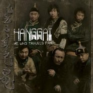

He Who Travels Far远走的人
============================

|  |  |
| :--: | :-- |
| [ He Who Travels Far远走的人](https://emumo.xiami.com/album/429945) | **艺人**: [杭盖](../index.md) **语种**: 其他 **唱片公司**: World Connection **发行时间**: 2010年10月25日 **专辑类别**: 录音室专辑 **专辑风格**:  **播放数**: 11233 **收藏数**: 127 **评论数**: 19  |

## 简介

杭盖乐队在9月13日全球发行了他们的新专辑《远走的人》。在他们的海外唱片公司World Connection的促成下，这张专辑有幸邀请到了老牌Power Pop乐队The Posies的主唱Ken Stringfellow作为制作人，并且录制期间Tom Waits的御用吉他手Marc Ribot也参与了歌曲的演奏。英国卫报The Guardian给了这张专辑很高的评价。新专辑包含了14首全新的作品，用传统的呼麦和各种民族乐器带你共同寻找城市里留存的那片净土。  
  
他们可以称得上是中国在海外市场最成功的一支中国乐队。每年都受邀在世界各地进行超过50场的演出，包括各个国家的WOMED等知名世界音乐节。他们的专辑在巡演期间，每次都是演出结束就销售一空。观众都被杭盖现场所展现的蒙古音乐的魅力给深深折服和打动。<a href="http://folkcellar.com" target="_blank" rel="nofollow noreferrer noopener">http://folkcellar.com</a>  
  
The scope of Hanggai's music is almost as wide as the grasslands out of which they journey. Taking in the wild open spaces of Inner Mongolia and the teaming, churning streets of 21st century Beijing, Hanggai's music embraces the looking-glass world of rock, pop and bluegrass as seen and heard by a new generation of Chinese. The six-piece Hanggai encompasses a hell of a lot of tradition, culture, fusion and folklore to produce their unique sound.  
  
With their brand new album He Who Travels Far, they continue to grow, incorporating many of the experiences that the past year of international touring has brought them. The new music features a new band member, fresh collaborations (producer Ken Stringfellow and Tom Wait's regular collaborator guitarist Marc Ribot), fourteen new songs (many of them drawing on Mongolian traditional lyrics and melodies) and a 'live' performance approach to the music (rather than the 'separate parts' studio recording of their previous album).

## 曲目

- [Gobi Road](./429945/b1pQV8N3fcd0.md)
- [Uruumdush [Mountain Top]](./429945/8Geb3Uf2019.md)
- [Yuan Ding Cap](./429945/8Geb3Ve9e8c.md)
- [Hairan Hairan](./429945/xLtcFw10880.md)
- [Zhang Dan](./429945/mQ8dQN6a2f4.md)
- [Cha](./429945/mQ8dQO79144.md)
- [Xiger Xiger](./429945/xLtcFza464e.md)
- [Borulai's Lullaby](./429945/xLtcF0b2257.md)
- [Hanggai](./429945/8Geb4bf90c3.md)
- [Ayrhindu](./429945/xLtcF2defaa.md)
- [Dorov Morlaril](./429945/xLtcF3abbc2.md)
- [Golden Bangle](./429945/xLtcF4c5411.md)
- [Juan Zou De Ren [He Who Travels Far]](./429945/xLtcF5d16bf.md)
- [Togur Jin Mountain](./429945/mQ8dQW94ce8.md)

## 评论

|  |  |  |  |
| :-- | :-- | :-- | :-- |
|  [虾米用户](https://emumo.xiami.com/u/261068008)   2017-07-24 14:45 赞(0) 踩(0) | 
这是我最喜欢的一张，以前在酷我听，虾米怎么没有了。
 |
|  [虾米用户](https://emumo.xiami.com/u/176976556)   2016-05-22 21:15 赞(0) 踩(0) | 
震撼的蒙古音乐
 |
|  [虾米用户](https://emumo.xiami.com/u/549323) 暂无签名~ 2016-04-11 23:11 赞(0) 踩(0) | 
很想买CD啊，就差这张了
 |
|  [虾米用户](https://emumo.xiami.com/u/46168827) 你好可爱 2015-04-29 14:37 赞(0) 踩(0) | 
呼呼   ，占位子
 |
|  [虾米用户](https://emumo.xiami.com/u/1515914) 没签过名(˶‾᷄ ⁻̫ ... 2015-04-07 02:04 赞(3) 踩(0) | 
远走的人 快点上架
 |
|  [虾米用户](https://emumo.xiami.com/u/8218709)  2014-01-02 11:43 赞(0) 踩(0) | 
歌捏。。。。
 |
|  [虾米用户](https://emumo.xiami.com/u/2484470) 拉普兰的萨米人 2011-03-29 09:49 赞(0) 踩(0) | 
好听...下次他们要再愚公移山演出一定去看。。。
 |
|  [虾米用户](https://emumo.xiami.com/u/1037606)  2011-03-27 00:04 赞(0) 踩(0) | 
一般听过几次才会推荐，这次例外。
 |
|  [虾米用户](https://emumo.xiami.com/u/769487)  2011-03-26 21:38 赞(0) 踩(0) | 
超喜欢，喜欢这天天都想，。。
 |
|  [虾米用户](https://emumo.xiami.com/u/54518)  2011-03-26 19:29 赞(1) 踩(0) | 
刚刚结束香港艺术节和澳洲WOMAD音乐节的杭盖乐团凭借这张专辑荣获欧洲著名音乐杂志《Songlines》杂志评选的“2010最值得收藏的十大世界音乐唱片”和2011最佳乐队提名。为他们自豪！4月8日，杭盖抵达广州。
 |
|  [虾米用户](https://emumo.xiami.com/u/2803960)  2011-03-22 10:28 赞(0) 踩(0) | 
蒙古音乐
 |
|  [虾米用户](https://emumo.xiami.com/u/3185309)  2011-03-21 03:25 赞(0) 踩(0) | 
新的改编更有力度和广度！绝对的五星推荐！
 |
|  [虾米用户](https://emumo.xiami.com/u/1560) 尽虚空…… 2011-03-17 23:48 赞(0) 踩(0) | 
发布了。去听吧。
 |
|  [虾米用户](https://emumo.xiami.com/u/1560) 尽虚空…… 2011-03-17 23:47 赞(0) 踩(0) | 
曲目中+英：01.戈壁路 Gobi Road02.乌仁都希 Uruumdush03.圆顶帽 Yuanding Cap04.海然，海然 Hairan Hairan05.樟登 Zhang Dan06.察哈 Cha Har07.希格希日 Xiger Xiger08.波如来 Borulai\'s Lullaby09.杭盖 Hanggai10.酒歌 Ayrhindu11.四季 Dorov Moraril12.金手镯 Golden Bangle13.远走的人 He Who Travels Far14.托尔金山 Toger Jin Mountain
 |
| ⇒ |  [虾米用户](https://emumo.xiami.com/u/1401356)  2011-03-19 18:00 赞(0) 踩(0) | 
盗版不好吧~~我很喜欢杭盖的~~
 |
| ⇒ |  [虾米用户](https://emumo.xiami.com/u/1560) 尽虚空…… 2011-03-19 23:08 赞(0) 踩(0) | 
<q><b>睡眠科学说：</b></q>
 |
| ⇒ |  [虾米用户](https://emumo.xiami.com/u/1401356)  2011-03-20 15:50 赞(0) 踩(0) | 
<q><b>门多说：</b></q>
 |
| ⇒ |  [虾米用户](https://emumo.xiami.com/u/906956)  2011-03-31 01:07 赞(0) 踩(0) | 
<q><b>门多说：</b></q>
 |
|  [虾米用户](https://emumo.xiami.com/u/1562191)  2011-03-16 16:45 赞(0) 踩(0) | 
超喜欢酒歌！
 |
