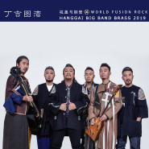
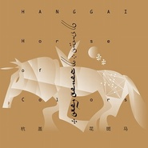
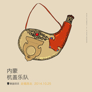
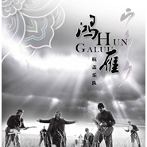
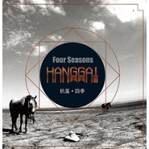
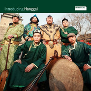
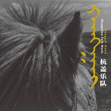

杭盖
============================

|  |  |
| :--: | :-- |
| [ 杭盖](https://i.xiami.com/hanggai) | **播放数**: 16153789 **粉丝数**: 33390 **评论数**: 925 **地区**: China 中国大陆 **风格**: 民谣摇滚 Folk Rock, 蒙古 | 呼麦 Throat Singing  |

## 档案

杭盖十年•回到你身旁 
苍狼白鹿的子孙从没料到，蒙古民谣可以飘扬到那么广阔的地方，在世界音乐的版图上播种下满地的种子，走的比骏马还远，飞的比雄鹰还高。那种源于草原深处的音乐血脉从没发生过断裂，这远比马奶酒跟弯刀骑射还要让人着迷。如果你还没有领略过这股猛烈彪悍的蒙古新民乐之风，那么杭盖这张《回到你身旁》会令你通体酣畅。 
近年来杭盖乐队游历世界各地，以一种融合的音乐形态在一场接一场不遗余力的现场演出上，将蒙古民歌的声名传播到五洲四海。而在这些音乐的旅途中，杭盖自身也发生了自然的蜕变，唯一不变的是他们的草原之心，这张新唱片《回到你身旁》也将向昭示他们向草原深处回归的决心。正如专辑主打曲目的歌名《拜访》一样，是杭盖的回归拜访之作。依然是由马头琴催动的摇滚乐战车，依然是强劲的草原之风，依然是杭盖自己最独特的风格。 
于2008年推出首张专辑《介绍杭盖》以来使得杭盖获得了来自世界的关注，蒙古民歌被杭盖用一种独特的方式在全世界唱响，2010年发布的第二张专辑《远走的人》也非常成功，作为唯一入选亚洲地区唱片被英国著名权威音乐杂志《MOJO》评选为年度十大世界音乐唱片第6名，乐队也借这张唱片在由《Songlines》举办的“SONGLINES MUSIC AWARDS 2011”获最佳乐队提名。2014年乐队在经历了数百场大小演出之后，以更为成熟的姿态推出了这张新作《回到你身旁》，成军10年之际回顾来时的路，这张唱片算是乐队送给陪伴乐队一起成长的歌迷们的一份礼物，也是杭盖式的真情流露。 
足迹•蜕变 
自乐队成立至今，杭盖的足迹已经遍布全世界6大洲70多个国家，自乐队成立至今，杭盖的足迹已经遍布全世界6大洲70多个国家，在伦敦的皇家大剧院、在纽约的林肯中心、华盛顿的肯尼迪中心、在Sziget、Bonnaroo、Roskilde、Lowlands、FujiRock及WOMAD等音乐节的舞台上，杭盖一次又一次的让观众们醉心于蒙古民歌并为之疯狂，而杭盖也在这些经历中成长为沉稳干练又极富力量与激情的成熟乐队，身经百战的乐手在台上能够自如的演奏和表达，主唱煽动性极强的舞台表演，乐队整体严丝合缝的配合，让音乐的律动和旋律的变化都极富色彩，杭盖通过专业的演出水准获得了更为广泛的国际认可。 
《回到你身旁》与前两张专辑相比，体现出了乐队在创作理念上的变化，融合是手段、民歌是核心，杭盖用自己的解读演绎出了民歌的情怀，并赋予了这些歌曲新的生命力，而杭盖本身的气质上的变化也在这些歌曲中有所体现。以音乐游牧于世界让杭盖拥有更为广阔的视野，并且直接转变成一种能力，这种能力让杭盖的音乐在保留了民歌的神韵的前提下与摇滚乐及更多音乐形式和元素进行了自然而完美的融合，从何形成了杭盖独特的风格，一种无法被标准定义、只能被称之为“杭盖”的风格。 
制作•创作 
《回到你身旁》仍然由乐队上一张专辑的制作人JB Meijer担纲，他非常熟悉杭盖的音乐，并且曾与REM等众多大牌乐队合作，制作经验非常丰富。录音在北京的百花录音棚进行，制作过程中JB Meijer在编曲和录制上为乐队提出了一些建议，并参与了部分乐器的录制。与前两张专辑的合作模式不同的是，这张新专辑的制作其实是由杭盖主导，从选曲到编曲都由乐队所有成员共同完成，制作的过程也即是创作的过程，并且邀请了来自古筝三重奏组合“三川”的桑卡录制了专辑里古筝的部分、大忘杠乐队主创宋雨喆录制了部分弹拨乐器，另外由来自青海海西州的女歌手秀仁其美木格与乐队合作录制了杭盖乐队第一首合唱作品《思念女儿》。 
前期录音工作在北京完成后，制作人将母带带回欧洲进行后期缩混，期间经历了两版混音的修改终于完工。2月3月乐队在欧洲和澳洲巡演期间，新唱片已与知名厂牌 HARLEM RECORDINGS合作发行，国内版本将由星外星唱片在大陆、香港、台湾3地同时发行。 
音乐•故事 
与之前着重表现根源民乐的执拗不同，杭盖在新作品加入了新的尝试，也可以说显得更为西化，现代化；噪音吉他，雷鬼，弹唱，手风琴与呼麦马头琴彼此遥相呼应，拉伸出作品的广度，全新的编曲对传统蒙古民谣进行了不同于以往的解构使其迸发出高能。新作似乎有意将以往的酒神狂欢精神束之高阁，苍凉的长调吟唱与对故土的思切成为了主基调，任何身淌草原血脉的儿女会被轻易触发情感，进而引亢高歌捧起酒杯。所以这必然是一整张献给草原骑士与任侠风骨的赞歌，杭盖在少有秉承着蒙古音乐内核的基础上作出了更多元化的选择，但却难得的紧贴着游牧民族滚烫的时代脉络。 
专辑里的歌曲在时间和地域上跨度都很大，有3首由舞蹈家周格特力加念诵的佛经，有来自青海德都蒙古地区的传统民歌，也有来自蒙古国的7、80年代的经典创作，每一首歌都蕴含了丰富的情感，和那些在快节奏的现代生活里我们缺失了的东西；每首歌背后的历史背景和故事更是耐人寻味，这些都有待听者们自己去挖掘。杭盖将以音乐为旗，引领着听众们进入蒙古文化和历史。 
十年•经历 
2004年成立之初的杭盖，拥有对音乐无限的热爱，凭着一种执著一路走来，期间经历了成员的更替，每位曾经参与其中的艺术家都为杭盖奉献了心血和才华，他们是杭盖成长路上的重要见证者和参与者，是共同经历风雨的兄弟。乐队现在的7人阵容也已日臻完美，每个人在乐队中都发挥着重要的作用。 
不忘初心，方得始终。杭盖的音乐游牧之路，并非一帆风顺，10年间经历的辛苦和磨难成就了这样一支在舞台上光芒四射的乐队。在获得了更多的认可之后，也从未抛弃对音乐的执着，在创作和表演上每个人始终都200%认真对待，有着更高追求的杭盖也一直坚守着音乐品质的底线。 
10年后的杭盖已经成长为一匹骏马，自由的驰骋在音乐的国土之上，在他们的身上发生的惊喜蜕变也足以让我们对他们的这一张新专辑充满期待。 
回到你身旁 
时至今日，当我们感受到所谓进步或者进化的“威胁”时，不管你是什么民族什么颜色来自哪里说什么语言使什么品牌用什么货币，你也一定渴望一个可以称为杭盖的地方是你随时可以回去的故乡。杭盖的音乐里既能够听到历史尘烟未能掩盖的金戈铁马，又能够听到流转在时空里的那些古老吟唱，亦仿佛一张徐徐展开的历史画卷，那上面刻画着民族历史变迁，也展现了古老文明中的智慧及对现世的重要警示，长生天的眷顾之下我们需心怀感恩，找回人与自然之间最自然的相处方式。 
杭盖想用这样一张专辑表达对故乡草原的深厚情感，同时也展现出了更为广阔的胸怀，杭盖希望通过音乐能够唤醒那些深藏于人们心中对于自然、自由和美的渴求，通过音乐这种共通的语言，让不同民族不同文化背景的人们对彼此有更多的了解，在现代文明的“野蛮、粗暴”的发展过程中建立起一个共同的精神家园，让我们每个人都有一个可以回地去的“杭盖”。 
走的路太长，离家又太远，难免会肝肠寸断，仰望心所属的方向。在骏马上，我的好安达，我的好姑娘，我们就唱起这首永不会终结的民歌吧。 
不论你身在何处，杭盖将带着这张充满了草原情怀的新专辑，回到你身旁！ 
------------------------------------------------------------------------------- 
杭盖十年•兄弟Brother 
胡日查 主唱 
不见安达不开口，喝到天亮不撒瓶儿，好嗓子自然是酒水灌养出来的真情意，杭盖十年，胡团与兄弟穿梭于草原和城市之间，飞翔在海洋和陆地之上，是自由的雄鹰，是飞驰的骏马，是杭盖的先锋，永远驰骋在前方，犹如钢水流淌般的歌声有着滚烫的深情，那是草原之子以赤子之心燃烧自己，烧炙成了热爱！ 
义拉拉塔 主唱/吉他手 
看似冷酷的左手剑客，最为老练沉稳却又富含热情的铁骑悍将，杭盖十年他用歌声与吉他燃烧着自己的音乐才华，与杭盖兄弟一起挥洒热血。冷酷的外表时常让人感觉难以接近但其实有一颗不老的童心。生长于草原，无人能及他对草原的热爱。“马驹从小跑地远，终将回到出生地。” 
巴图巴根 马头琴/呼麦 
生长于牧区，在放羊时顿悟呼麦发声方法，后拜于蒙古国呼麦大师奥都苏荣老师门下学习深造，终学有所成，杭盖十年用马头琴和呼麦催动这架摇滚乐战车滚滚向前。尊重传统也爱尝试新事物，对于马头琴的音色和表演中的运用有着自己的理解，单纯、躁动、热情。 
钮鑫  贝斯 
受摇滚乐感召步出内蒙，受草原的感召加入杭盖，杭盖十年在节奏和低频里贡献了汗水和泪水，与兄弟喝下的每一杯酒都斟满了情谊。从小在农场长大，造就了他非常坚毅直率开朗的性格，是杭盖乐队现场最具激情的乐手。 
艾伦 吉他/三弦 
出生在内蒙古呼伦贝尔的音乐世家，毕业于蒙古国国立文化艺术大学歌剧独唱演员专业，曾作为独唱演员在中央民族歌舞团任职，2011年加入杭盖乐队至今，成为杭盖乐队最具特色的乐手。 
蒙大 鼓手/打击乐 
曾与多位知名音乐人合作，有着丰富的演出经验，如果说杭盖在现场是一驾马车，那他就是那赶车的人，用鼓槌敲击出的节奏，承载着旋律，一起驶向远方。最晚加入杭盖的乐手，正在缓慢的释放他的能量！ 
伊立奇 队长 陶布秀尔/班卓琴/萨满鼓 
杭盖乐队的发起者，乐队的队长。出生在内蒙古成长在北京，16岁开始与吉它手徐京晨组建摇滚乐队，非常热爱蒙古音乐的他曾经跟随蒙古呼麦大师奥都苏荣学习呼麦，之后组建杭盖乐队，他也曾经是首都机场的一名飞机维修机械师，工作11年后离开单位，专心为杭盖乐队工作。杭盖十年的领军人物，将自己不可阻断的热情注入到杭盖的精神之中，并带领乐队巡游四海，把蒙古民歌的声名传遍世界。 
----------------------------------------------------------------------------- 
杭盖十年•荣誉Honour 
杭盖乐队荣誉纪录 
2009年 
Mao Livehouse 2009年度颁奖典礼 最佳舞台表现奖 
2010年 
专辑《远走的人》 
获英国著名权威音乐杂志《MOJO》 
年度十大世界音乐唱片 第6名 
唯一入选亚洲地区唱片 
欧洲著名音乐杂志《Songlines》 
“2010下半年最值得收藏的十大世界音乐唱片” 
专辑曲目《希格希日》 
《Songlines》“十大世界音乐”第5名 
2011年 
《Songlines》举办的“SONGLINES MUSIC AWARDS 2011”获最佳乐队提名 
南方都市报 华语音乐传媒大奖 
获“最佳民族音乐艺人”奖 
获“最佳乐队”及“最佳摇滚乐队”提名 
2012年 
东方早报 2012《文化中国》年度人物大奖

## 专辑

| 名称 | 语种 | 唱片公司 | 发行时间 | 专辑类别 | 专辑风格 |
| :--: | :-- | :-- | :-- | :-- | :-- |
| [ 杭盖与铜管](./albums/2103384905.md) | 国语 | 太合乐人 | 2019年03月07日 | 录音室专辑 | 摇滚 Rock & Roll, 爵士 Jazz, 蒙古 | 呼麦 Throat Singing |
| [ 丁吉图湾](./albums/5020958966.md) | 国语 |  | 2019年01月29日 | EP, 单曲 |  |
| [ 杭盖精神](./albums/2102950473.md) | 国语 | 天浩盛世 | 2017年11月21日 | EP, 单曲 | 世界音乐 World Music, 蒙古 | 呼麦 Throat Singing |
| [ 故乡](./albums/2102906152.md) | 国语 | 天浩盛世 | 2017年11月06日 | EP, 单曲 | 世界音乐 World Music, 蒙古 | 呼麦 Throat Singing |
| [ 超越才酷](./albums/2102674866.md) | 国语 | 天浩盛世 | 2017年01月02日 | EP, 单曲 |  |
| [ 花斑马](./albums/2100334336.md) | 国语 | 天浩盛世 | 2016年05月15日 | 录音室专辑 |  |
| [ 轮回](./albums/1830275632.md) | 其他 | 天浩盛世 | 2015年04月29日 | EP, 单曲 | 蒙古 | 呼麦 Throat Singing |
| [ 走唱·西北 内蒙杭盖乐队专场章鱼现场“走唱·西北”系列演出 第四场](./albums/1718196090.md) | 国语 | 章鱼现场, 战马时代 | 2014年10月25日 | 现场专辑 | 民谣摇滚 Folk Rock, 蒙古 | 呼麦 Throat Singing |
| [ 回到你身旁Back To You](./albums/1497810054.md) | 其他 | 星外星音乐 | 2014年04月04日 | 录音室专辑 | 民谣摇滚 Folk Rock, 蒙古 | 呼麦 Throat Singing |
| [ 鸿雁](./albums/1288461491.md) | 蒙古语 | 杭盖 | 2013年12月20日 | EP, 单曲 | 蒙古 | 呼麦 Throat Singing |
| [ 拜访](./albums/1882669687.md) | 国语 | 杭盖 | 2013年10月25日 | EP, 单曲 | 蒙古 | 呼麦 Throat Singing |
| [ 四季](./albums/517094.md) | 蒙古语 | 视袭音乐 | 2012年05月01日 | 录音室专辑 |  |
| [ 酒歌](./albums/434997.md) | 国语 | 视袭音乐 | 2011年04月08日 | EP, 单曲 |  |
| [ He Who Travels Far远走的人](./albums/429945.md) | 其他 | World Connection | 2010年10月25日 | 录音室专辑 |  |
| [ Introduce Hanggai](./albums/352779.md) | 蒙古语 | 独立发行 | 2009年10月28日 | 录音室专辑 |  |
| [ 蒙古新民乐](./albums/321109.md) | 其他 |  | 2008年08月01日 | 录音室专辑 |  |
| [ 杭盖](./albums/167550.md) | 国语 |  | 2007年04月01日 | 录音室专辑 |  |

## 评论

|  |  |  |  |
| :-- | :-- | :-- | :-- |
|  [虾米用户](https://emumo.xiami.com/u/49319910) 音乐比哲学有更高的启示—... 2020-11-30 21:07 赞(1) 踩(0) | 
下架很多听不了
 |
|  [虾米用户](https://emumo.xiami.com/u/276944698) 不要自我设限..... 2020-07-22 10:07 赞(0) 踩(0) | 

 |
|  [虾米用户](https://emumo.xiami.com/u/441742924)  2020-05-31 01:58 赞(0) 踩(0) | 
这才是我梦中常常听到的遥远乡音啊。
 |
|  [虾米用户](https://emumo.xiami.com/u/230108421) 我还没想好要写什么... 2020-02-05 19:28 赞(0) 踩(0) | 
实不相瞒 我是巴图巴根的女友粉 
 |
|  [虾米用户](https://emumo.xiami.com/u/50357169)  2019-09-17 16:28 赞(0) 踩(0) | 
穿越999
 |
|  [虾米用户](https://emumo.xiami.com/u/407075949)  2019-09-10 23:31 赞(1) 踩(0) | 
我第一次觉得就算家族在北京已经生活了几百年，我也还是个蒙古人，因为杭盖的歌把我听哭了……
 |
|  [虾米用户](https://emumo.xiami.com/u/3879137) 我爱听的找不全…… 2019-09-06 01:42 赞(0) 踩(0) | 
感谢你们的创作，改变了无数人的生活。祝艺术之树长青。感谢拨冗给我发信息。
 |
|  [虾米用户](https://emumo.xiami.com/u/35509231) 提灯天后  策马小僧 2019-08-08 17:46 赞(0) 踩(0) | 
大哥们啊，啥时候来北京啊。
 |
|  [虾米用户](https://emumo.xiami.com/u/7750515) Cloud  Nine 2019-07-28 14:09 赞(1) 踩(0) | 
虾米怎么回事 又给吞了 明明记得很多年前收藏过的呀 那时候还很小众的 …… 刚看了fuji现场 超棒
 |
|  [虾米用户](https://emumo.xiami.com/u/411284688)  2019-06-13 22:14 赞(2) 踩(0) | 
为什么一句也不懂的摇滚听得这般躁动，莫名其妙地共鸣，沸腾的不得了，可能就是音乐本身的力量了吧。摇滚的态度和情绪直接通过“声音”进行了精确地表达，给听者直击灵魂震撼，我感受到的是辽阔、奔放、执着、不需作伪的北方爷们性格 。感谢杭盖的蒙语摇滚。 
 |
|  [虾米用户](https://emumo.xiami.com/u/42963872) 我还没想好要写什么... 2019-05-31 02:18 赞(0) 踩(0) | 
.
 |
|  [虾米用户](https://emumo.xiami.com/u/66823378)  2019-05-24 14:19 赞(0) 踩(0) | 

 |
|  [虾米用户](https://emumo.xiami.com/u/283811866)  2019-05-06 12:17 赞(1) 踩(0) | 
作为内蒙古的乐队，内蒙人必须支持
 |
|  [虾米用户](https://emumo.xiami.com/u/460880) 有声读物 2019-03-17 11:48 赞(0) 踩(0) | 
3.16上海MAO现场打卡表现力和感染力非常非常棒了
 |
|  [虾米用户](https://emumo.xiami.com/u/9697458)  2019-03-15 22:59 赞(0) 踩(0) | 
妈呀好洋气的民族乐
 |
|  [虾米用户](https://emumo.xiami.com/u/35047534) 。 2019-03-08 20:48 赞(1) 踩(0) | 
内容已删除
 |
| ⇒ |  [虾米用户](https://emumo.xiami.com/u/10657091) 如果说人类有什么自命不凡... 2019-03-23 17:40 赞(0) 踩(0) | 
还在么
 |
|  [虾米用户](https://emumo.xiami.com/u/1940028) 我还没想好要写什么... 2019-02-23 22:32 赞(1) 踩(0) | 
319成都见
 |
|  [虾米用户](https://emumo.xiami.com/u/14025768) 暂无签名~ 2019-02-08 01:00 赞(2) 踩(0) | 
很喜欢义拉拉塔，他为什么离开了乐队？
 |
|  [虾米用户](https://emumo.xiami.com/u/407141656) 天热脾气燥 我不说话你别... 2019-02-06 14:00 赞(0) 踩(0) | 
爱杭盖
 |
|  [虾米用户](https://emumo.xiami.com/u/411284688)  2018-12-29 10:38 赞(3) 踩(0) | 
爷们乐队 ，不废话。支持民族的摇滚，无所谓听不听得懂
 |
|  [虾米用户](https://emumo.xiami.com/u/5895066) 什么叫做救自己呢？就是忠... 2018-12-20 08:15 赞(1) 踩(0) | 
喜欢的乐队，希望能来张家口演出
 |
|  [虾米用户](https://emumo.xiami.com/u/139168816) 我还没想好要写什么... 2018-12-11 05:45 赞(1) 踩(0) | 
丽江一起干酒过
 |
|  [虾米用户](https://emumo.xiami.com/u/402490789)  2018-12-07 20:43 赞(1) 踩(0) | 
17年12月在北京看的现场！！！大概就是这个时候！！现场超级棒！！超级嗨！！！当时酒歌和希格希日压轴！底下彻底嗨爆了！！！迫不及待下一场啦！！！   
 |
|  [虾米用户](https://emumo.xiami.com/u/402490789)  2018-12-07 20:40 赞(1) 踩(0) | 
17年12月在北京看的现场，真的超级嗨！超级棒！！永远难忘！！迫不及待下一场啦！！  
 |
|  [虾米用户](https://emumo.xiami.com/u/375894894) 想和我认识的朋友，您支一... 2018-10-31 03:38 赞(0) 踩(0) | 
听杭盖有一种回家的感觉
 |
|  [虾米用户](https://emumo.xiami.com/u/51996767) 情歌2021.01.05... 2018-05-02 21:59 赞(1) 踩(0) | 
加油，晕盖乐队！
 |
|  [虾米用户](https://emumo.xiami.com/u/6171336) 谢谢9年陪伴，你依然是我... 2018-04-25 19:50 赞(0) 踩(0) | 
早闻大名 每听一遍都有新的惊喜
 |
|  [虾米用户](https://emumo.xiami.com/u/357214895)  2018-04-18 08:11 赞(2) 踩(0) | 
很喜欢蒙语歌～虽然听不懂意思 
 |
|  [虾米用户](https://emumo.xiami.com/u/355247552)  2018-03-23 06:40 赞(0) 踩(0) | 
大赞 已无法表达
 |
|  [虾米用户](https://emumo.xiami.com/u/4234256)  2017-12-10 22:25 赞(0) 踩(0) | 
今天要不是加班我就去现场了 
 |
|  [虾米用户](https://emumo.xiami.com/u/11305820) 江湖儿女，快意恩仇 2017-11-10 10:08 赞(0) 踩(0) | 
哈哈，想给你们做助理可以嘛  
 |
|  [虾米用户](https://emumo.xiami.com/u/1122747) 我不是壞人 2017-10-28 00:09 赞(1) 踩(0) | 
曾有幸在現場聆聽你們的歌聲，看到你們入駐的消息，剛才又特意去把Youku上所有能搜到的德國、荷蘭、日本、美國演唱會的視頻看了，感謝你們，愛好音樂，真心對待音樂，唯一能引爆全場的中國樂隊！謝謝！
 |
|  [虾米用户](https://emumo.xiami.com/u/73) 等风景都看透 谁陪我看细... 2017-10-27 23:23 赞(0) 踩(0) | 
杭盖乐队成军十年，足迹早已遍布全世界，但中国好歌曲的这次亮相也许是最特别的，恭喜杭盖成为刘欢组的冠军！虾米音乐在第一时间和你一起来祝贺和了解杭盖，在此感谢乐队为我们提供两天前在蒙古拍摄的最新大片，四季更替，生命轮回，路依然在继续，歌谣还在高唱！猛戳：<a href="http://www.xiami.com/market/music/act/hanggaixiami.php" target="_blank" rel="nofollow noreferrer noopener">http://www.xiami.com/market/music/act/hanggaixiami.php</a>
 |
|  [虾米用户](https://emumo.xiami.com/u/6711519)  2017-10-27 23:20 赞(0) 踩(0) | 
听杭盖，如亲临大草原，耍马儿，追羊群，欢快游戏在广袤的大地上，与当地的牧民放声高歌，尽情欢饮。他们的歌让人如此不能不爱。
 |
|  [虾米用户](https://emumo.xiami.com/u/6711519)  2017-10-27 23:20 赞(0) 踩(0) | 
听杭盖，如亲临大草原，耍马儿，追羊群，欢快游戏在广袤的大地上，与当地的牧民放声高歌，尽情欢饮。他们的歌让人如此不能不爱。
 |
|  [虾米用户](https://emumo.xiami.com/u/4152727) 心无挂碍 2017-10-27 23:20 赞(0) 踩(0) | 
搞摇滚乐也不要忘了自己的根，摇滚音乐没有套路，没有规则，在一定的时候，还是要结合中华民族的文化来搞摇滚乐。这样表达起来才游刃有余，音乐才有生命力。
 |
|  [虾米用户](https://emumo.xiami.com/u/4152727) 心无挂碍 2017-10-27 23:20 赞(3) 踩(0) | 
早就耳闻大名，今日一听真的非常不错。虽然用了现代乐器，但是没有被现代音乐污染，依然保持着蒙古民歌的淳朴、简单、好听、悠远。乐队音乐功力非同一般。中国所有的少数民族的民间原生态音乐都是非常出色的。蒙古歌就要用蒙语唱，汉语唱蒙语歌就把蒙古音乐的境界全给毁了。
 |
|  [虾米用户](https://emumo.xiami.com/u/330927849)  2017-10-20 09:48 赞(0) 踩(0) | 
好听
 |
|  [虾米用户](https://emumo.xiami.com/u/330722912)  2017-10-18 17:42 赞(2) 踩(0) | 
呼麦的巴图巴根帅爆了，
 |
|  [虾米用户](https://emumo.xiami.com/u/4926807) 你会变成这样都是我害的 2017-09-16 20:40 赞(0) 踩(0) | 
金鸡奖是他们吗，很喜欢
 |
|  [虾米用户](https://emumo.xiami.com/u/9028760) 豆瓣见 spotify ... 2017-09-12 17:34 赞(0) 踩(0) | 
◡̈⃝♩
 |
|  [虾米用户](https://emumo.xiami.com/u/8583730) 我还没想好要写什么... 2017-09-11 23:55 赞(1) 踩(0) | 
几年前偶然在电台打榜的榜单上听到杭盖乐队的歌，霎时惊艳了耳朵
 |
|  [虾米用户](https://emumo.xiami.com/u/8281348) 我还没想好要写什么... 2017-08-29 01:43 赞(0) 踩(0) | 
在锡林郭勒盟听杭盖  
 |
|  [虾米用户](https://emumo.xiami.com/u/9617076) 我还没想好要写什么... 2017-07-21 02:15 赞(4) 踩(0) | 
可不敢把呼麦和喊麦弄混了
 |
|  [虾米用户](https://emumo.xiami.com/u/240125548)  2017-06-20 19:24 赞(0) 踩(0) | 
努力奋斗
 |
|  [虾米用户](https://emumo.xiami.com/u/13819578)  2017-06-13 20:50 赞(0) 踩(0) | 
乌兰巴托的夜
 |
|  [虾米用户](https://emumo.xiami.com/u/298244391)   2017-05-24 12:14 赞(0) 踩(0) | 
Hanggai
 |
|  [虾米用户](https://emumo.xiami.com/u/12062541)  2017-05-18 11:16 赞(0) 踩(0) | 
好听
 |
|  [虾米用户](https://emumo.xiami.com/u/296111243)  2017-05-13 21:43 赞(0) 踩(0) | 
喜欢
 |
|  [虾米用户](https://emumo.xiami.com/u/40034064)   2017-05-06 10:28 赞(6) 踩(0) | 
很羞愧，从中国好歌曲慕名而来，让我对大陆音乐有了新的认识，以前只听过葬尸湖，没想到国内音乐已经做的如此之好，感谢杭盖乐队把这么好的音乐展示出来
 |
|  [虾米用户](https://emumo.xiami.com/u/33578199) 我超疯 2017-01-16 02:21 赞(2) 踩(0) | 
胡日查  巴图巴根  义拉拉塔  伊里奇  钮鑫  艾伦  蒙大   
 |
|  [虾米用户](https://emumo.xiami.com/u/33578199) 我超疯 2017-01-15 22:40 赞(2) 踩(0) | 
昨天把杭盖保利剧院的演唱会视频看完了，两个小时，这样令人舒服的降噪演唱会真不多见，比起国内其他的地下乐队，我只想说真的没法和杭盖比～从最初的一把陶不秀儿发展成世界音乐的乐队，不容易。愿你们的音乐被更多人所知，加油～
 |
|  [虾米用户](https://emumo.xiami.com/u/233977255) 圈地自愚，静待花开。愿你... 2017-01-12 19:04 赞(1) 踩(0) | 
这才是蒙古族音乐
 |
|  [虾米用户](https://emumo.xiami.com/u/15827579)   2017-01-11 14:11 赞(5) 踩(0) | 
最愛義拉拉塔
 |
|  [虾米用户](https://emumo.xiami.com/u/16112074) 喵 2017-01-05 16:06 赞(0) 踩(0) | 
仿佛突然来到辽阔的大草原 
 |
|  [虾米用户](https://emumo.xiami.com/u/58744196) 折得一支香在手，人间应未... 2017-01-04 22:12 赞(0) 踩(0) | 
果然还是想去一次草原
 |
|  [虾米用户](https://emumo.xiami.com/u/248338345) ❦私はあなたの日を愛し 2016-11-25 00:56 赞(3) 踩(0) | 
喜歡蒙古音樂
 |
|  [虾米用户](https://emumo.xiami.com/u/148084878) 骑马放羊住帐篷 2016-11-19 21:01 赞(1) 踩(0) | 
巴图巴根是我老公
 |
|  [虾米用户](https://emumo.xiami.com/u/1620958)  2016-11-12 21:50 赞(1) 踩(0) | 
什么也不说了，听了就知道
 |
|  [虾米用户](https://emumo.xiami.com/u/16876753) 食草 2016-10-29 09:53 赞(1) 踩(0) | 
要谢@杭盖
 |
|  [虾米用户](https://emumo.xiami.com/u/10504566) 音乐是通往天堂的桥梁 2016-10-14 23:48 赞(2) 踩(0) | 
刚刚听了杭盖的深圳花斑马深圳巡演，现场嗨炸了，感动激动中……太棒了！
 |
|  [虾米用户](https://emumo.xiami.com/u/205735) 芒果的体型能变成黄瓜的么 2016-10-14 23:05 赞(2) 踩(0) | 
下次来深圳，建议弄个没有椅子的场地，不然安保太敬业，施展不开~~。另，签售的时候没有要到胜利的永抱，有些忧桑，有些惆怅。。
 |
| ⇒ |  [虾米用户](https://emumo.xiami.com/u/10504566) 音乐是通往天堂的桥梁 2016-10-15 00:44 赞(0) 踩(0) | 
我也在现场，也去排签售了 
 |
| ⇒ |  [虾米用户](https://emumo.xiami.com/u/205735) 芒果的体型能变成黄瓜的么 2016-10-15 22:25 赞(0) 踩(0) | 
<q><b>桃子说：</b></q>
 |
| ⇒ |  [虾米用户](https://emumo.xiami.com/u/10504566) 音乐是通往天堂的桥梁 2016-10-19 00:00 赞(0) 踩(0) | 
<q><b>饭巴斯腾说：</b></q>
 |
| ⇒ |  [虾米用户](https://emumo.xiami.com/u/205735) 芒果的体型能变成黄瓜的么 2016-10-22 23:50 赞(0) 踩(0) | 
<q><b>桃子说：</b></q>
 |
|  [虾米用户](https://emumo.xiami.com/u/38953521)  2016-10-05 20:34 赞(0) 踩(0) | 
蒙古经典摇滚乐队hurd、haranga、Nomin Talst全集<a href="http://www.xiami.com/u/38953521?spm=a1z1s.6928797.1561534497.3.aWZlI1" target="_blank" rel="nofollow noreferrer noopener">http://www.xiami.com/u/38953521?spm=a1z1s.6928797.1561534497.3.aWZlI1</a>在个人资料里
 |
|  [虾米用户](https://emumo.xiami.com/u/45595549)  2016-09-27 20:12 赞(0) 踩(0) | 
豪爽、干脆、
 |
|  [虾米用户](https://emumo.xiami.com/u/8675881) Quid pro quo... 2016-09-17 21:46 赞(1) 踩(0) | 
杭州是冷宫T T，但是我们会等着！
 |
|  [虾米用户](https://emumo.xiami.com/u/48907801) I say you r ... 2016-09-05 13:31 赞(0) 踩(0) | 
什么时候来广州live就好了
 |
| ⇒ |  [虾米用户](https://emumo.xiami.com/u/12993536) 我还没想好要写什么... 2016-09-15 11:53 赞(0) 踩(0) | 
在豆瓣上看到说后天来广州
 |
| ⇒ |  [虾米用户](https://emumo.xiami.com/u/48907801) I say you r ... 2016-09-15 11:54 赞(0) 踩(0) | 
<q><b>Alexios 说：</b></q>
 |
| ⇒ |  [虾米用户](https://emumo.xiami.com/u/205735) 芒果的体型能变成黄瓜的么 2016-10-14 23:06 赞(0) 踩(0) | 
好像12月17号广州有个那达慕杭盖专场神马的。
 |
|  [虾米用户](https://emumo.xiami.com/u/70601566)  2016-08-12 00:28 赞(1) 踩(0) | 
努力到9999+
 |
|  [虾米用户](https://emumo.xiami.com/u/187232975) 边伯贤 2016-08-11 20:28 赞(2) 踩(0) | 
蒙族妹子来表白  
 |
|  [虾米用户](https://emumo.xiami.com/u/6247097) 我的耳朵已娶音乐为妻 2016-08-07 17:45 赞(0) 踩(0) | 
总是能把灵魂带入隔壁的最深处
 |
|  [虾米用户](https://emumo.xiami.com/u/206098221) 唯有美食和你不可辜负  ... 2016-08-03 13:50 赞(0) 踩(0) | 
很厉害
 |
|  [虾米用户](https://emumo.xiami.com/u/6749530) 我变化万千，任何定格的印... 2016-07-30 11:30 赞(0) 踩(0) | 
推荐，内蒙古包头人民支持你们！
 |
|  [虾米用户](https://emumo.xiami.com/u/2306822)   2016-07-15 21:55 赞(0) 踩(0) | 
11
 |
|  [虾米用户](https://emumo.xiami.com/u/89995960)  2016-06-28 11:59 赞(0) 踩(0) | 
震撼
 |
|  [虾米用户](https://emumo.xiami.com/u/16135450)  2016-06-23 00:18 赞(0) 踩(0) | 
1473
 |
|  [虾米用户](https://emumo.xiami.com/u/43921850)   2016-05-04 20:17 赞(0) 踩(0) | 
唱的都是经典的蒙古民歌。胡日查以前的达日汗乐队，有好几首经典的作品。
 |
|  [虾米用户](https://emumo.xiami.com/u/153939402)   2016-04-27 23:53 赞(0) 踩(0) | 
够味，够爽 
 |
|  [虾米用户](https://emumo.xiami.com/u/8943891) 你咋那么可爱？ 2016-04-16 07:40 赞(0) 踩(0) | 
丨
 |
|  [虾米用户](https://emumo.xiami.com/u/1630931)  2016-04-12 14:04 赞(0) 踩(0) | 
传承
 |
|  [虾米用户](https://emumo.xiami.com/u/39788841)  . 2016-04-09 12:01 赞(0) 踩(0) | 
杭盖 .
 |
|  [虾米用户](https://emumo.xiami.com/u/42704537) Decay or com... 2016-04-03 22:42 赞(2) 踩(0) | 
只有在草原的汉子才唱的出的豪迈
 |
|  [虾米用户](https://emumo.xiami.com/u/7248680) 音乐 2016-03-28 19:48 赞(0) 踩(0) | 
T 9
 |
|  [虾米用户](https://emumo.xiami.com/u/48819682) 努力奔跑在路上的孩子~~ 2016-03-28 09:01 赞(0) 踩(0) | 
喜欢需要理由吗？
 |
|  [虾米用户](https://emumo.xiami.com/u/127843064)  2016-03-27 21:50 赞(0) 踩(0) | 
民谣
 |
|  [虾米用户](https://emumo.xiami.com/u/37701703) 我还没想好要写什么... 2016-03-16 21:16 赞(0) 踩(0) | 
极爱
 |
|  [虾米用户](https://emumo.xiami.com/u/8050722)  2016-03-14 11:59 赞(0) 踩(0) | 
nibi
 |
|  [虾米用户](https://emumo.xiami.com/u/1290990)  2016-03-12 13:32 赞(0) 踩(0) | 
听希格希日就像被踩了一脚油门，想停都停不下来。
 |
|  [虾米用户](https://emumo.xiami.com/u/42477579)  2016-03-10 09:35 赞(0) 踩(0) | 
杭盖真不是盖的
 |
|  [虾米用户](https://emumo.xiami.com/u/42893985) 硪似一条闲鱼 2016-03-02 23:52 赞(0) 踩(0) | 
阅
 |
|  [虾米用户](https://emumo.xiami.com/u/12351343)  2016-02-24 19:10 赞(0) 踩(0) | 
不错
 |
|  [虾米用户](https://emumo.xiami.com/u/1180637)  2016-02-16 16:07 赞(0) 踩(0) | 
很有感觉
 |
|  [虾米用户](https://emumo.xiami.com/u/21216195) 我还没想好要写什么... 2016-02-03 15:12 赞(0) 踩(0) | 
好爷们儿啊！
 |
|  [虾米用户](https://emumo.xiami.com/u/22398379)   2016-01-28 23:09 赞(1) 踩(0) | 
蒙古的爷们可以热血，可以柔情
 |
|  [虾米用户](https://emumo.xiami.com/u/33578199) 我超疯 2016-01-27 19:18 赞(0) 踩(0) | 
表白巴图巴根
 |
|  [虾米用户](https://emumo.xiami.com/u/10934528) 我还没想好要写什么... 2016-01-21 21:17 赞(0) 踩(0) | 
真爷们，热血沸腾，辽阔的草原，千军万马
 |
|  [虾米用户](https://emumo.xiami.com/u/99263206)  2016-01-11 16:52 赞(0) 踩(0) | 
寻龙决里的歌是那首？ 呐首情歌
 |
| ⇒ |  [虾米用户](https://emumo.xiami.com/u/68330812)  2016-01-13 21:12 赞(0) 踩(0) | 
海然 海然
 |
| ⇒ |  [虾米用户](https://emumo.xiami.com/u/99769220)  2016-02-08 15:35 赞(0) 踩(0) | 
酒歌
 |
| ⇒ |  [虾米用户](https://emumo.xiami.com/u/197902909) 真正非主流 2016-07-06 14:11 赞(0) 踩(0) | 
<q><b>无言的灰鹰说：</b></q>
 |
| ⇒ |  [虾米用户](https://emumo.xiami.com/u/197902909) 真正非主流 2016-07-06 14:11 赞(0) 踩(0) | 
<q><b>无言的灰鹰说：</b></q>
 |
| ⇒ |  [虾米用户](https://emumo.xiami.com/u/197902909) 真正非主流 2016-07-06 14:11 赞(0) 踩(0) | 
<q><b>无言的灰鹰说：</b></q>
 |
|  [虾米用户](https://emumo.xiami.com/u/9326043)  2016-01-09 21:20 赞(10) 踩(0) | 
竟然没有《轮回》，这首大神级别神作。
 |
|  [虾米用户](https://emumo.xiami.com/u/23223734)   2016-01-07 13:30 赞(1) 踩(0) | 
寻龙决
 |
|  [虾米用户](https://emumo.xiami.com/u/11742723) : ) 2016-01-06 15:26 赞(0) 踩(0) | 

 |
|  [虾米用户](https://emumo.xiami.com/u/29480609) 且听风吟 2015-12-30 06:30 赞(2) 踩(0) | 
我就是跟个风儿来膜拜一下，待日后慢慢研究
 |
|  [虾米用户](https://emumo.xiami.com/u/42476179) 英文歌，动漫 2015-12-29 21:30 赞(0) 踩(0) | 
骄傲啊    
 |
|  [虾米用户](https://emumo.xiami.com/u/1520891) 醒醒睡睡的人啊。 2015-12-27 01:17 赞(0) 踩(0) | 
哈哈，蒙族路过～
 |
|  [虾米用户](https://emumo.xiami.com/u/94221440) You are the ... 2015-12-24 19:24 赞(0) 踩(0) | 
我要去演唱会！
 |
| ⇒ |  [虾米用户](https://emumo.xiami.com/u/11605880) 李bb脑残粉 2015-12-27 10:59 赞(0) 踩(0) | 
我也要去！好听哭！
 |
|  [虾米用户](https://emumo.xiami.com/u/91045884)  2015-12-21 20:04 赞(0) 踩(0) | 
豪迈
 |
|  [虾米用户](https://emumo.xiami.com/u/6989306)  2015-12-20 14:04 赞(0) 踩(0) | 
蒙古歌
 |
|  [虾米用户](https://emumo.xiami.com/u/6989306)  2015-12-20 14:04 赞(0) 踩(0) | 
蒙古歌
 |
|  [虾米用户](https://emumo.xiami.com/u/47518430)   2015-12-19 13:15 赞(2) 踩(0) | 
只能说导演太有眼光了选杭盖 
 |
|  [虾米用户](https://emumo.xiami.com/u/8298323)   2015-12-14 16:53 赞(17) 踩(0) | 
多少人和我一样是看了《寻龙诀》后来重温杭盖的？
 |
| ⇒ |  [虾米用户](https://emumo.xiami.com/u/47518430)   2015-12-19 13:18 赞(0) 踩(0) | 
乌尔善用杭盖表达草原，没有比杭盖更能表现得淋漓尽致的了，电影院看的时候整个人都燃了 
 |
| ⇒ |  [虾米用户](https://emumo.xiami.com/u/11811199) 多少唏嘘的你在人海　 2015-12-20 17:02 赞(0) 踩(0) | 
算我一个！！！
 |
| ⇒ |  [虾米用户](https://emumo.xiami.com/u/757262) 虾米深挖掘员。 2016-01-07 12:30 赞(0) 踩(0) | 
+1另外还有 有段时间虾米把杭盖的曲子全下了 我觉得虾米应该开专贴可以让我们发每张专辑的正版CD晒照
 |
|  [虾米用户](https://emumo.xiami.com/u/38717258)  2015-12-14 10:49 赞(2) 踩(0) | 
第一次听轮回的时候激动得浑身颤抖，完了眼睛都是湿的
 |
|  [虾米用户](https://emumo.xiami.com/u/47518430)   2015-12-13 19:18 赞(0) 踩(0) | 
昨天的演唱会太棒了，在现场嗨爆了  
 |
| ⇒ |  [虾米用户](https://emumo.xiami.com/u/11605880) 李bb脑残粉 2015-12-27 10:59 赞(0) 踩(0) | 
哪哪哪
 |
| ⇒ |  [虾米用户](https://emumo.xiami.com/u/47518430)   2015-12-27 11:18 赞(0) 踩(0) | 
<q><b>z说：</b></q>
 |
| ⇒ |  [虾米用户](https://emumo.xiami.com/u/11605880) 李bb脑残粉 2015-12-27 11:19 赞(0) 踩(0) | 
<q><b>套娃说：</b></q>
 |
| ⇒ |  [虾米用户](https://emumo.xiami.com/u/47518430)   2015-12-27 11:22 赞(0) 踩(0) | 
<q><b>z说：</b></q>
 |
| ⇒ |  [虾米用户](https://emumo.xiami.com/u/11605880) 李bb脑残粉 2015-12-27 11:24 赞(0) 踩(0) | 
<q><b>套娃说：</b></q>
 |
|  [虾米用户](https://emumo.xiami.com/u/7468627)  2015-12-12 13:39 赞(0) 踩(0) | 
赛很白呢
 |
|  [虾米用户](https://emumo.xiami.com/u/42477579)  2015-12-08 10:05 赞(1) 踩(0) | 
在朴树好好地深圳演唱会第一次听到杭盖的歌，尼玛鬼哭狼嚎的真好听
 |
|  [虾米用户](https://emumo.xiami.com/u/60065664) 吃的是肥肉，骑的是骏马。 2015-11-27 22:58 赞(0) 踩(0) | 
明年天气暖了一定要去海北看看，听着杭盖的歌。。
 |
|  [虾米用户](https://emumo.xiami.com/u/15827579)   2015-11-17 21:11 赞(1) 踩(0) | 
這才是真正的音樂
 |
|  [虾米用户](https://emumo.xiami.com/u/35191936) 三硬一大 2015-11-08 23:56 赞(0) 踩(0) | 
来呼市开演唱会 是真的吗
 |
|  [虾米用户](https://emumo.xiami.com/u/50567927)  2015-10-17 21:12 赞(0) 踩(0) | 
很好听 虽然听不懂
 |
|  [虾米用户](https://emumo.xiami.com/u/224709)  2015-10-11 02:06 赞(2) 踩(0) | 
酒歌太赞
 |
|  [虾米用户](https://emumo.xiami.com/u/72941636)  2015-10-10 13:31 赞(1) 踩(0) | 
杭盖，漂亮
 |
|  [虾米用户](https://emumo.xiami.com/u/36081194) 酷狗音乐，一个有老歌的地... 2015-10-07 01:27 赞(0) 踩(0) | 
喜欢
 |
|  [虾米用户](https://emumo.xiami.com/u/23015253) 苍狼之音 2015-10-05 14:05 赞(0) 踩(0) | 
好听，震撼，豪迈有力，高品质
 |
|  [虾米用户](https://emumo.xiami.com/u/9192152)  2015-10-04 05:21 赞(3) 踩(0) | 
帅到合不拢腿……
 |
|  [虾米用户](https://emumo.xiami.com/u/6310680) 音乐是我的避风港 2015-09-30 20:24 赞(1) 踩(0) | 
杭盖几乎是一支伟大的乐队，越来越向伟大靠近了
 |
|  [虾米用户](https://emumo.xiami.com/u/6924843) 这个战场血流成河，但除了... 2015-09-17 09:27 赞(0) 踩(0) | 
流淌着蒙古人的血
 |
|  [虾米用户](https://emumo.xiami.com/u/774208) 我还没想好要写什么... 2015-09-04 21:14 赞(1) 踩(0) | 
杭盖将于10月4日在上海简单生活节演出！这里还有张楚、李志、万晓利、杭盖、火星电台、五条人、旅行团、程璧、陈粒、大飞一系列你很可能喜欢的音乐人！大麦：<a href="http://item.damai.cn/85484.html" target="_blank" rel="nofollow noreferrer noopener">http://item.damai.cn/85484.html</a>
 |
|  [虾米用户](https://emumo.xiami.com/u/55037851)  2015-09-02 17:43 赞(0) 踩(0) | 
除了震撼，还是震撼。
 |
|  [虾米用户](https://emumo.xiami.com/u/6463520) 为了音色努力，为了情绪寻... 2015-09-01 10:47 赞(0) 踩(0) | 
作为内蒙人，听着熟悉的调调，想家了！
 |
|  [虾米用户](https://emumo.xiami.com/u/59729808)  2015-08-31 21:20 赞(0) 踩(0) | 
就是喜欢
 |
|  [虾米用户](https://emumo.xiami.com/u/49482618)  2015-08-16 09:44 赞(0) 踩(0) | 
壮阔而纯净
 |
|  [虾米用户](https://emumo.xiami.com/u/1909982) 原声，新世纪，电子 2015-08-14 15:03 赞(0) 踩(0) | 
天人合一。
 |
|  [虾米用户](https://emumo.xiami.com/u/37001970) 暂无签名~ 2015-08-14 13:06 赞(8) 踩(0) | 
杭盖不火天理难容..但还是别火了，一火就有脑残粉
 |
| ⇒ |  [虾米用户](https://emumo.xiami.com/u/300160347) 呱。 2017-07-15 15:16 赞(0) 踩(0) | 
死循环。
 |
|  [虾米用户](https://emumo.xiami.com/u/1962658)  2015-08-13 10:48 赞(0) 踩(0) | 
纯天然
 |
|  [虾米用户](https://emumo.xiami.com/u/1962658)  2015-08-13 10:48 赞(0) 踩(0) | 
纯天然
 |
|  [虾米用户](https://emumo.xiami.com/u/37142358) crap of the ... 2015-08-09 11:35 赞(2) 踩(0) | 
九月长沙橘州音乐节约起来好吗 一起听杭盖
 |
| ⇒ |  [虾米用户](https://emumo.xiami.com/u/2986072) 鱼一枚 2015-08-31 23:58 赞(0) 踩(0) | 
好哇！
 |
| ⇒ |  [虾米用户](https://emumo.xiami.com/u/37142358) crap of the ... 2015-09-03 21:30 赞(0) 踩(0) | 
<q><b>Sad说：</b></q>
 |
|  [虾米用户](https://emumo.xiami.com/u/37142358) crap of the ... 2015-08-09 11:35 赞(0) 踩(0) | 
九月长沙橘州音乐节约起来好吗 一起听杭盖
 |
|  [虾米用户](https://emumo.xiami.com/u/37142358) crap of the ... 2015-08-09 11:35 赞(0) 踩(0) | 
九月长沙橘州音乐节约起来好吗 一起听杭盖
 |
|  [虾米用户](https://emumo.xiami.com/u/40941811) 人生归有道，衣食固其端。 2015-08-08 01:54 赞(1) 踩(0) | 
发现特别原始的音乐里总能照见自己…
 |
|  [虾米用户](https://emumo.xiami.com/u/21321021)  2015-07-28 11:44 赞(0) 踩(0) | 
支持呀！！
 |
|  [虾米用户](https://emumo.xiami.com/u/4324139)  2015-07-15 22:34 赞(0) 踩(0) | 
非常喜欢的民族乐，非常有节奏感！！
 |
|  [虾米用户](https://emumo.xiami.com/u/49294028) 为金属而狂 2015-07-08 23:09 赞(0) 踩(0) | 
胖子唱功不错
 |
|  [虾米用户](https://emumo.xiami.com/u/9764786)  2015-06-25 13:26 赞(0) 踩(0) | 
蒙古－杭盖
 |
|  [虾米用户](https://emumo.xiami.com/u/23015253) 苍狼之音 2015-06-10 00:18 赞(2) 踩(0) | 
杭盖乐队的每个人几乎都身怀两三种语言，除母语外还懂英语日语等，有的不太会说但是能听懂，已经很了不得，还会多种乐器，编曲写词样样精通
 |
|  [虾米用户](https://emumo.xiami.com/u/43288774) 暂无签名~ 2015-06-09 10:51 赞(0) 踩(0) | 
撒时候来天津啊  万分期待  
 |
|  [虾米用户](https://emumo.xiami.com/u/11380896)  2015-06-07 15:44 赞(1) 踩(0) | 
藏族，好听
 |
| ⇒ |  [虾米用户](https://emumo.xiami.com/u/43288774) 暂无签名~ 2015-06-09 10:50 赞(0) 踩(0) | 
是蒙古语 
 |
|  [虾米用户](https://emumo.xiami.com/u/6399533)   2015-06-06 12:26 赞(0) 踩(0) | 
经典
 |
|  [虾米用户](https://emumo.xiami.com/u/16876753) 食草 2015-06-04 00:29 赞(1) 踩(0) | 
特么牛逼的音乐。
 |
|  [虾米用户](https://emumo.xiami.com/u/21605841)   2015-05-24 02:02 赞(0) 踩(0) | 
太棒了
 |
|  [虾米用户](https://emumo.xiami.com/u/2520918)  2015-05-22 09:12 赞(0) 踩(0) | 
纯净，温暖
 |
|  [虾米用户](https://emumo.xiami.com/u/2520918)  2015-05-22 09:12 赞(0) 踩(0) | 
纯净，温暖
 |
|  [虾米用户](https://emumo.xiami.com/u/2323118)  2015-05-20 23:39 赞(1) 踩(0) | 
好喜欢轮回！！！魔幻的感觉
 |
|  [虾米用户](https://emumo.xiami.com/u/28727612)   2015-05-20 11:45 赞(1) 踩(0) | 
走的比骏马更远，飞得比雄鹰更高！
 |
|  [虾米用户](https://emumo.xiami.com/u/46294503)  2015-05-18 16:31 赞(0) 踩(0) | 
8
 |
|  [虾米用户](https://emumo.xiami.com/u/49782405)  2015-05-11 20:45 赞(0) 踩(0) | 
完全正能量…
 |
|  [虾米用户](https://emumo.xiami.com/u/16868435)  2015-05-03 23:37 赞(0) 踩(0) | 
轮回真心没有现场震撼，不过歌词很喜欢
 |
|  [虾米用户](https://emumo.xiami.com/u/4380909)  2015-05-03 21:39 赞(0) 踩(0) | 
shishi
 |
|  [虾米用户](https://emumo.xiami.com/u/7898561)  2015-04-29 17:02 赞(3) 踩(0) | 
轮回单曲，录制上空间感不足啊，层次有点混乱吧？人声部分就真没有现场的时候有层次啊。之前好歌曲时开场很有气势的低音鸣奏没有了，本来很精彩的电吉他好像是因为录制的问题显得略平淡。
 |
|  [虾米用户](https://emumo.xiami.com/u/7898561)  2015-04-29 16:45 赞(1) 踩(0) | 
轮回这首单曲录制效果不理想啊，是临时的么？总觉得还没有好歌曲现场唱的时候效果好。
 |
|  [虾米用户](https://emumo.xiami.com/u/1571519)  2015-04-28 10:43 赞(0) 踩(0) | 
话说 颠覆M的战马是翻的他的希格希日
 |
| ⇒ |  [虾米用户](https://emumo.xiami.com/u/20386012)   2015-07-02 23:59 赞(0) 踩(0) | 
希格希日是蒙古族的民谣   也不是杭盖的原创
 |
|  [虾米用户](https://emumo.xiami.com/u/616381) 天高地广 心远即安 2015-04-17 22:55 赞(0) 踩(0) | 
  
 |
|  [虾米用户](https://emumo.xiami.com/u/37079915) 天上天下，你是我的 2015-04-14 17:53 赞(0) 踩(0) | 
   
 |
|  [虾米用户](https://emumo.xiami.com/u/6301009)  2015-04-12 09:51 赞(0) 踩(0) | 
震撼
 |
|  [虾米用户](https://emumo.xiami.com/u/1515914) 没签过名(˶‾᷄ ⁻̫ ... 2015-04-07 03:23 赞(1) 踩(0) | 
轮回 快！什么时候出来 半夜听的不想睡觉了
 |
|  [虾米用户](https://emumo.xiami.com/u/10233527) 暂无签名~ 2015-04-06 23:07 赞(0) 踩(0) | 
hang gay
 |
| ⇒ |  [虾米用户](https://emumo.xiami.com/u/43051614) 滑板与姑娘不可兼得 2015-06-02 19:30 赞(0) 踩(0) | 
aajim yariarai
 |
|  [虾米用户](https://emumo.xiami.com/u/48950423)  2015-04-06 18:53 赞(0) 踩(0) | 
挺好的
 |
|  [虾米用户](https://emumo.xiami.com/u/10532351) *･゜ﾟ･*:.｡..｡... 2015-04-04 20:51 赞(0) 踩(0) | 
我操好想他们出新歌啊(〓￣(∵エ∵)￣〓)
 |
|  [虾米用户](https://emumo.xiami.com/u/1197688) 我还没想好要写什么... 2015-04-03 20:59 赞(0) 踩(0) | 
听了杭盖，好想学蒙古音乐阿！
 |
|  [虾米用户](https://emumo.xiami.com/u/10242579) 长亭外，古道边，一行白鹭... 2015-04-01 23:44 赞(0) 踩(0) | 
杭盖是什么意思呢？
 |
| ⇒ |  [虾米用户](https://emumo.xiami.com/u/49811001)  2015-05-05 01:59 赞(0) 踩(0) | 
杭盖在蒙语中的意思为水草肥美的草原，是蒙古牧民心目中理想的地方
 |
| ⇒ |  [虾米用户](https://emumo.xiami.com/u/10242579) 长亭外，古道边，一行白鹭... 2015-05-05 07:39 赞(0) 踩(0) | 
<q><b>修仙世上说：</b></q>
 |
|  [虾米用户](https://emumo.xiami.com/u/1384536) 感谢拥有耳朵去听song 2015-04-01 21:44 赞(0) 踩(0) | 
五一乐谷音乐节见
 |
|  [虾米用户](https://emumo.xiami.com/u/45490418)  2015-03-28 12:36 赞(0) 踩(0) | 

 |
|  [虾米用户](https://emumo.xiami.com/u/7148143)  2015-03-28 05:17 赞(0) 踩(0) | 
悠扬，古老，异邦传统。
 |
|  [虾米用户](https://emumo.xiami.com/u/7148143)  2015-03-28 05:17 赞(0) 踩(0) | 
悠扬，古老，异邦传统。
 |
|  [虾米用户](https://emumo.xiami.com/u/47215852)  2015-03-27 22:10 赞(0) 踩(0) | 
单歌评论哪里去了
 |
|  [虾米用户](https://emumo.xiami.com/u/47215852)  2015-03-27 22:10 赞(0) 踩(0) | 
单歌评论哪里去了
 |
|  [虾米用户](https://emumo.xiami.com/u/47976444)  2015-03-24 15:11 赞(0) 踩(0) | 
27号晚在北京的小音乐场已经一票难求！为什么我没早几天听到！！！说不定还能屯几张去卖
 |
|  [虾米用户](https://emumo.xiami.com/u/44391730) 暂无签名~ 2015-03-23 20:36 赞(0) 踩(0) | 
在月亮组都捧得不行，现在才来听 我的错
 |
|  [虾米用户](https://emumo.xiami.com/u/8105280) 朱宝宝、刚好遇见你 2015-03-23 19:10 赞(0) 踩(0) | 
轮回认识他们的
 |
|  [虾米用户](https://emumo.xiami.com/u/36897148) 私信➕v请备注 2015-03-23 03:42 赞(0) 踩(0) | 
那么希望自己民族的音乐能走向世界，又那么不希望喜欢的乐队杯更多的人知道，哈哈 有意思
 |
| ⇒ |  [虾米用户](https://emumo.xiami.com/u/44067593) 爱杭盖爱呼麦 2015-03-23 09:46 赞(0) 踩(0) | 
哈哈有同感，现在杭盖的演唱会门票比之前贵多了
 |
|  [虾米用户](https://emumo.xiami.com/u/10196810) 歌太多，分不出类，怎么办... 2015-03-22 22:08 赞(0) 踩(0) | 
现在才认识这个乐队，可是晚了？
 |
| ⇒ |  [虾米用户](https://emumo.xiami.com/u/47215852)  2015-03-22 23:00 赞(0) 踩(0) | 
不晚
 |
|  [虾米用户](https://emumo.xiami.com/u/44067351)  2015-03-22 14:54 赞(0) 踩(0) | 
牛逼啊～
 |
|  [虾米用户](https://emumo.xiami.com/u/18608138)  2015-03-21 18:49 赞(0) 踩(0) | 
蒙古,民族,
 |
|  [虾米用户](https://emumo.xiami.com/u/3620451)  2015-03-20 20:38 赞(0) 踩(0) | 
杭盖乐队
 |
|  [虾米用户](https://emumo.xiami.com/u/5052435) 树林中的斑斓阳光 2015-03-19 00:24 赞(0) 踩(0) | 
怎么才知道 杭盖   真是太闭塞了啊。
 |
|  [虾米用户](https://emumo.xiami.com/u/48273138)  2015-03-18 22:41 赞(0) 踩(0) | 
真心赞的民族音乐！
 |
|  [虾米用户](https://emumo.xiami.com/u/12017528)  2015-03-18 13:04 赞(1) 踩(0) | 
航概...
 |
|  [虾米用户](https://emumo.xiami.com/u/7514635)  2015-03-18 12:33 赞(0) 踩(0) | 
民族的
 |
|  [虾米用户](https://emumo.xiami.com/u/46396548) Mongol 2015-03-18 10:52 赞(0) 踩(0) | 
我的V呢？
 |
|  [虾米用户](https://emumo.xiami.com/u/46396548) Mongol 2015-03-18 10:48 赞(0) 踩(0) | 
祝贺，祝贺!威武，威武!
 |
|  [虾米用户](https://emumo.xiami.com/u/13072786) 一个脚本 2015-03-18 00:59 赞(0) 踩(0) | 
轮回就不是摇滚乐  只能说是有摇滚元素的音乐  不过主流媒体能接受到这个程度已经很不错了
 |
| ⇒ |  [虾米用户](https://emumo.xiami.com/u/2397604) 飞行是人类永恒的梦想 2015-03-18 15:03 赞(0) 踩(0) | 
呵呵 额伊修特
 |
|  [虾米用户](https://emumo.xiami.com/u/7898561)  2015-03-15 20:39 赞(0) 踩(0) | 
吊炸天的中国摇滚经典！
 |
|  [虾米用户](https://emumo.xiami.com/u/565665)   2015-03-15 10:08 赞(0) 踩(0) | 
气势磅礴我简直要跳起来！
 |
|  [虾米用户](https://emumo.xiami.com/u/1563800)  2015-03-15 04:14 赞(0) 踩(0) | 
我是来围观潮水的。。海龟
 |
|  [虾米用户](https://emumo.xiami.com/u/7785213) 文 化 人 2015-03-14 23:01 赞(0) 踩(0) | 
什么时候有轮回啊
 |
| ⇒ |  [虾米用户](https://emumo.xiami.com/u/6347905)  2015-03-15 11:32 赞(0) 踩(0) | 
同等
 |
|  [虾米用户](https://emumo.xiami.com/u/4032390) 向上看 2015-03-14 16:25 赞(0) 踩(0) | 
三百诺！
 |
|  [虾米用户](https://emumo.xiami.com/u/1595140)  2015-03-14 16:15 赞(0) 踩(0) | 
好听
 |
|  [虾米用户](https://emumo.xiami.com/u/32052581)   2015-03-14 15:30 赞(0) 踩(0) | 
什么是才华？就是你的气魄你有能力表达，赞你们的《轮回》！
 |
|  [虾米用户](https://emumo.xiami.com/u/1281578)  2015-03-14 15:10 赞(0) 踩(0) | 
棒！
 |
|  [虾米用户](https://emumo.xiami.com/u/7443995) 幸福满满 2015-03-14 10:27 赞(0) 踩(0) | 
真正的强悍，不管是民族，文化，音乐，身躯，还是内心！
 |
|  [虾米用户](https://emumo.xiami.com/u/30493) 偏爱重型音乐 2015-03-14 10:01 赞(0) 踩(0) | 
民族的才是世界的
 |
|  [虾米用户](https://emumo.xiami.com/u/1030263) 躲个猫猫笑破肚 2015-03-14 00:26 赞(0) 踩(0) | 
祝贺，杭盖威武！！！
 |
|  [虾米用户](https://emumo.xiami.com/u/7691857) RH吧平均水平 2015-03-13 21:13 赞(0) 踩(0) | 
哈哈哈哈哈，冠军了。
 |
|  [虾米用户](https://emumo.xiami.com/u/4920939) 每一粒种子都是一个愿望 2015-03-13 20:41 赞(0) 踩(0) | 
蒙古乐也是相当喜欢，独具一格的风格。乐器+吟唱
 |
|  [虾米用户](https://emumo.xiami.com/u/25689240) The All Chin... 2015-03-13 20:37 赞(0) 踩(0) | 
太屌了！
 |
|  [虾米用户](https://emumo.xiami.com/u/80313) 我爱虾米 2015-03-10 10:09 赞(1) 踩(0) | 
现场太震撼了，今年搞巡回？！别老去欧洲了，我不担心您们被商业摧毁
 |
| ⇒ |  [虾米用户](https://emumo.xiami.com/u/1563800)  2015-03-15 04:18 赞(0) 踩(0) | 
央视买的顶级设备不是一般演艺公司能提供的，人家财大气粗，而进出口总公司也是央企直踩关系，效果不好才意外
 |
|  [虾米用户](https://emumo.xiami.com/u/16987098) 所有的离开都是蓄谋已久 2015-03-09 12:53 赞(0) 踩(0) | 
还是现场效果好
 |
| ⇒ |  [虾米用户](https://emumo.xiami.com/u/1563800)  2015-03-15 04:17 赞(0) 踩(0) | 
央视买的顶级设备不是一般演艺公司能提供的，人家财大气粗，而进出口总公司也是央企直踩关系，效果不好才意外
 |
|  [虾米用户](https://emumo.xiami.com/u/8723763) 大脸猫爱听音乐，汪～ 2015-03-08 13:09 赞(0) 踩(0) | 
膜拜！
 |
|  [虾米用户](https://emumo.xiami.com/u/36425079) ᠡᠷᠬᠡ ᠴᠢᠯᠦᠭᠡ 2015-03-07 10:04 赞(0) 踩(0) | 
棒棒棒！蒙古族的骄傲，永远爱你们。继续加油！
 |
|  [虾米用户](https://emumo.xiami.com/u/1259045)  2015-03-03 16:29 赞(0) 踩(0) | 
太好听了~一种神秘的草原力量
 |
|  [虾米用户](https://emumo.xiami.com/u/4014221)  2015-03-02 23:27 赞(1) 踩(0) | 
感动得要跪地～
 |
|  [虾米用户](https://emumo.xiami.com/u/36372534) 音乐抚慰我脆弱的心灵 2015-03-02 16:32 赞(0) 踩(0) | 
喜欢很纯粹的音乐！
 |
|  [虾米用户](https://emumo.xiami.com/u/8192862) 诗人和先知。vchat:... 2015-03-02 11:50 赞(1) 踩(0) | 
还有为什么不来南方！！！
 |
|  [虾米用户](https://emumo.xiami.com/u/8192862) 诗人和先知。vchat:... 2015-03-02 10:56 赞(3) 踩(0) | 
我要给巴图巴根生孩子！！！！！
 |
| ⇒ |  [虾米用户](https://emumo.xiami.com/u/47745487)  2015-03-07 05:22 赞(0) 踩(0) | 
有个性哈哈
 |
| ⇒ |  [虾米用户](https://emumo.xiami.com/u/4032390) 向上看 2015-03-14 16:28 赞(0) 踩(0) | 
太帅了，还是和我生吧！
 |
| ⇒ |  [虾米用户](https://emumo.xiami.com/u/47215852)  2015-03-22 23:02 赞(0) 踩(0) | 
赤峰的要不要？巴图老乡
 |
| ⇒ |  [虾米用户](https://emumo.xiami.com/u/43457202)  2015-03-24 16:08 赞(0) 踩(0) | 
<q><b>Fury说：</b></q>
 |
| ⇒ |  [虾米用户](https://emumo.xiami.com/u/43457202)  2015-03-24 16:08 赞(0) 踩(0) | 
<q><b>Fury说：</b></q>
 |
| ⇒ |  [虾米用户](https://emumo.xiami.com/u/47215852)  2015-03-24 22:29 赞(0) 踩(0) | 
<q><b>之水说：</b></q>
 |
| ⇒ |  [虾米用户](https://emumo.xiami.com/u/47215852)  2015-03-25 22:31 赞(0) 踩(0) | 
<q><b>之水说：</b></q>
 |
|  [虾米用户](https://emumo.xiami.com/u/47688523)  2015-03-01 09:24 赞(0) 踩(0) | 
喜欢杭盖
 |
|  [虾米用户](https://emumo.xiami.com/u/7614416) 异乡人 2015-03-01 00:40 赞(26) 踩(0) | 
民谣摇滚比金属更易被接受，民族音乐棒极了，中国就缺乏有血性的音乐，男人整天扭扭捏捏哼哼唧唧唱歌烦死了，我们的领土不是充话费送的，hhd
 |
|  [虾米用户](https://emumo.xiami.com/u/47597615) 大爱巴图巴根！ 2015-02-25 20:41 赞(0) 踩(0) | 
大爱巴图巴根
 |
|  [虾米用户](https://emumo.xiami.com/u/16038524)  2015-02-25 16:16 赞(0) 踩(0) | 
我已被洗脑
 |
|  [虾米用户](https://emumo.xiami.com/u/5058112) 虾米不常用 2015-02-25 16:02 赞(0) 踩(0) | 
洗脑了
 |
|  [虾米用户](https://emumo.xiami.com/u/8415079)  2015-02-25 16:02 赞(0) 踩(0) | 
杭盖
 |
|  [虾米用户](https://emumo.xiami.com/u/4337064) Dolce vita 2015-02-25 16:02 赞(1) 踩(0) | 
又被
 |
| ⇒ |  [虾米用户](https://emumo.xiami.com/u/1563800)  2015-03-15 04:19 赞(0) 踩(0) | 
潮水正在朝着里奔来，围观潮水
 |
|  [虾米用户](https://emumo.xiami.com/u/42814860) 暂无签名~ 2015-02-25 14:34 赞(2) 踩(0) | 
轮回什么时候登陆虾米？期待
 |
| ⇒ |  [虾米用户](https://emumo.xiami.com/u/23144668) 我需要安靜。我自已和自己... 2015-03-21 02:15 赞(0) 踩(0) | 
登了
 |
|  [虾米用户](https://emumo.xiami.com/u/47283317) 暂无签名~ 2015-02-24 16:23 赞(0) 踩(0) | 
只是喜欢
 |
|  [虾米用户](https://emumo.xiami.com/u/10547530) 生于白昼，隐与黑夜。 2015-02-23 21:43 赞(1) 踩(0) | 
感动。最好的东西，最值得珍惜的东西，永远的头顶的天空，和脚下的大地。
 |
|  [虾米用户](https://emumo.xiami.com/u/8094301) Bye bye wx n... 2015-02-23 18:40 赞(2) 踩(0) | 
看着《轮回》的歌词在大屏幕上一句句的出现，整个人的魂都飞进去了。
 |
| ⇒ |  [虾米用户](https://emumo.xiami.com/u/45012581)  2015-03-21 20:36 赞(0) 踩(0) | 
同感同感！
 |
| ⇒ |  [虾米用户](https://emumo.xiami.com/u/8094301) Bye bye wx n... 2015-03-22 09:02 赞(0) 踩(0) | 
<q><b>能静而后动说：</b></q>
 |
|  [虾米用户](https://emumo.xiami.com/u/46994316)  2015-02-22 17:51 赞(0) 踩(0) | 
就是突然喜欢这种血液倒流的感觉
 |
|  [虾米用户](https://emumo.xiami.com/u/17123141) 1 2015-02-21 19:30 赞(0) 踩(0) | 
以前光觉得牛逼，这次一看歌词完全震惊在那了
 |
|  [虾米用户](https://emumo.xiami.com/u/44420911) 暂无签名~ 2015-02-21 00:10 赞(0) 踩(0) | 
一群神ORZ
 |
|  [虾米用户](https://emumo.xiami.com/u/6363833)  2015-02-20 23:17 赞(1) 踩(0) | 
求轮回
 |
|  [虾米用户](https://emumo.xiami.com/u/47128255)  2015-02-20 17:04 赞(0) 踩(0) | 
总觉得开始商业了～
 |
|  [虾米用户](https://emumo.xiami.com/u/39082404)  2015-02-20 11:39 赞(0) 踩(0) | 
杭盖参加过woa？
 |
| ⇒ |  [虾米用户](https://emumo.xiami.com/u/882767) 长沙新激流/旋律死亡金属 2015-03-15 02:45 赞(0) 踩(0) | 
如果风格再重一些或许能参加瓦肯，毕竟瓦肯是金属音乐节。
 |
| ⇒ |  [虾米用户](https://emumo.xiami.com/u/1563800)  2015-03-15 04:19 赞(0) 踩(0) | 
<q><b>佚尘乐队说：</b></q>
 |
| ⇒ |  [虾米用户](https://emumo.xiami.com/u/4929933)   2015-03-25 00:35 赞(0) 踩(0) | 
<q><b>佚尘乐队说：</b></q>
 |
| ⇒ |  [虾米用户](https://emumo.xiami.com/u/43391966)  2015-03-26 23:07 赞(0) 踩(0) | 
<q><b>佚尘乐队说：</b></q>
 |
|  [虾米用户](https://emumo.xiami.com/u/46852969) on the road 2015-02-19 11:19 赞(0) 踩(0) | 
awesome!
 |
|  [虾米用户](https://emumo.xiami.com/u/816368)  2015-02-18 11:31 赞(2) 踩(0) | 
杭盖，记得很久以前，德国的朋友在听他们的现场介绍给我的，他还说你们中国有这么牛逼的乐队，而现在终于被国内的观众熟知了，不知是高兴还是失落呢
 |
| ⇒ |  [虾米用户](https://emumo.xiami.com/u/43927942)  2015-02-24 02:45 赞(0) 踩(0) | 
一样，不知道什么感觉
 |
|  [虾米用户](https://emumo.xiami.com/u/18835427) ly 2015-02-18 00:28 赞(0) 踩(0) | 
自乐队成立至今，杭盖的足迹已经遍布全世界6大洲70多个国家
 |
|  [虾米用户](https://emumo.xiami.com/u/46057491)  2015-02-17 09:51 赞(0) 踩(0) | 
轮回呢
 |
|  [虾米用户](https://emumo.xiami.com/u/300550)   2015-02-15 21:02 赞(0) 踩(0) | 
感谢好心市民！
 |
|  [虾米用户](https://emumo.xiami.com/u/39985420) 海就在那边，怎么能停止眺... 2015-02-15 19:05 赞(0) 踩(0) | 
轮回，短时间完成，还是那么完美，杭盖是顶级的
 |
|  [虾米用户](https://emumo.xiami.com/u/6842948) 我还没想好要写什么... 2015-02-15 16:52 赞(0) 踩(0) | 
木有轮回。
 |
|  [虾米用户](https://emumo.xiami.com/u/86220) 晚安 梦到我 2015-02-15 15:52 赞(0) 踩(0) | 
世界音乐
 |
|  [虾米用户](https://emumo.xiami.com/u/34244330)   2015-02-15 14:24 赞(0) 踩(0) | 
杭盖终于要被人们熟知了。感觉自己养大的孩子要跟别人走了。。
 |
|  [虾米用户](https://emumo.xiami.com/u/7892567)  2015-02-15 13:36 赞(0) 踩(0) | 
大气，磅礴，粗犷。蒙古音乐一直给我一种肆意狂放的感觉，融入摇滚是如此的契合，加上诗一样的语言，听者只有一种感觉：酣畅淋漓。
 |
|  [虾米用户](https://emumo.xiami.com/u/47315184)  2015-02-15 11:33 赞(0) 踩(0) | 
传统经典，国际先锋
 |
|  [虾米用户](https://emumo.xiami.com/u/18539557)  2015-02-15 10:15 赞(0) 踩(0) | 
质朴、好听
 |
|  [虾米用户](https://emumo.xiami.com/u/34697601)  2015-02-15 03:14 赞(0) 踩(0) | 
杭盖
 |
|  [虾米用户](https://emumo.xiami.com/u/27771636) 是你爸爸 2015-02-15 01:15 赞(0) 踩(0) | 
国际音乐
 |
|  [虾米用户](https://emumo.xiami.com/u/9150715) 心流 2015-02-14 20:40 赞(0) 踩(0) | 
这里要炸
 |
|  [虾米用户](https://emumo.xiami.com/u/38482655)  2015-02-14 16:52 赞(1) 踩(0) | 
喜欢的不得了！你们声音都可以申请世界文化遗产~
 |
|  [虾米用户](https://emumo.xiami.com/u/2732949) 心中一撮小火 身体离地三... 2015-02-14 14:43 赞(0) 踩(0) | 
什么都不用说 我们蒙古族的骄傲
 |
|  [虾米用户](https://emumo.xiami.com/u/7366852) 听这些年的风华绝代 2015-02-14 10:33 赞(0) 踩(0) | 
民族的才是世界的！
 |
|  [虾米用户](https://emumo.xiami.com/u/3783509)  2015-02-14 09:10 赞(2) 踩(0) | 
越是根源的音乐越是世界性的
 |
|  [虾米用户](https://emumo.xiami.com/u/35197471) ☀⭐ 2015-02-13 21:40 赞(0) 踩(0) | 
超级喜欢，超级喜欢，杭盖
 |
|  [虾米用户](https://emumo.xiami.com/u/235050) 我就说我是穷逼嘛~ 2015-02-13 21:35 赞(0) 踩(0) | 
轮回好听炸了！！！！！！！！我已经是杭盖脑残粉了！！！！！！
 |
|  [虾米用户](https://emumo.xiami.com/u/5959978)   2015-02-13 21:30 赞(3) 踩(0) | 
我妈问他们歌好听吗，我说他们那不叫歌叫音乐！
 |
| ⇒ |  [虾米用户](https://emumo.xiami.com/u/2659823) 人間發電所 2015-02-14 07:47 赞(0) 踩(0) | 
現実不感症...Lulu？:)
 |
|  [虾米用户](https://emumo.xiami.com/u/2659823) 人間發電所 2015-02-13 21:24 赞(0) 踩(0) | 
屌爆了！
 |
|  [虾米用户](https://emumo.xiami.com/u/36497686)  2015-02-13 21:18 赞(0) 踩(0) | 
你听见心里的声音了吗？
 |
|  [虾米用户](https://emumo.xiami.com/u/5491706)  2015-02-13 21:16 赞(0) 踩(0) | 
被轮回震到!!!!!!!
 |
|  [虾米用户](https://emumo.xiami.com/u/7320818) 暂无签名~ 2015-02-13 21:13 赞(0) 踩(0) | 
太棒了！
 |
|  [虾米用户](https://emumo.xiami.com/u/13930082)   2015-02-13 20:50 赞(0) 踩(0) | 
轮回，太牛了！好歌曲上
 |
|  [虾米用户](https://emumo.xiami.com/u/39440214) 今夜我不关心人类 只关心... 2015-02-13 20:47 赞(0) 踩(0) | 
好喜欢
 |
|  [虾米用户](https://emumo.xiami.com/u/2494589)  2015-02-13 19:23 赞(0) 踩(0) | 
叼爆
 |
|  [虾米用户](https://emumo.xiami.com/u/300550)   2015-02-13 02:30 赞(0) 踩(0) | 
哪位同学能介绍一下杭盖使用的那些民族乐器的名称，谢谢了
 |
| ⇒ |  [虾米用户](https://emumo.xiami.com/u/11552128) 明明很在乎，装作无所谓。 2015-02-13 11:43 赞(0) 踩(0) | 
主要是马头琴……
 |
| ⇒ |  [虾米用户](https://emumo.xiami.com/u/300550)   2015-02-14 02:29 赞(0) 踩(0) | 
<q><b>KID5PB说：</b></q>
 |
| ⇒ |  [虾米用户](https://emumo.xiami.com/u/34244330)   2015-02-15 14:27 赞(0) 踩(0) | 
三弦，班卓琴，马头琴，陶布术尔，还有传统吉他贝斯，拜访里有古筝。
 |
|  [虾米用户](https://emumo.xiami.com/u/3149830)  2015-02-12 14:34 赞(0) 踩(0) | 
好想跟你们一起大碗喝酒
 |
|  [虾米用户](https://emumo.xiami.com/u/1087508) 质本洁来还洁去 2015-02-12 10:59 赞(0) 踩(0) | 
Folk Rock
 |
|  [虾米用户](https://emumo.xiami.com/u/2860172)  2015-02-10 12:58 赞(0) 踩(0) | 
很棒
 |
|  [虾米用户](https://emumo.xiami.com/u/39170803) 受想行识，亦复如是。 2015-02-07 19:46 赞(0) 踩(0) | 
巴根真挺帅的
 |
|  [虾米用户](https://emumo.xiami.com/u/43963013) ‭ 2015-02-07 14:49 赞(0) 踩(0) | 
内容已删除
 |
| ⇒ |  [虾米用户](https://emumo.xiami.com/u/39170803) 受想行识，亦复如是。 2015-02-07 19:47 赞(0) 踩(0) | 
呵呵
 |
| ⇒ |  [虾米用户](https://emumo.xiami.com/u/40163177)  2015-02-07 22:52 赞(0) 踩(0) | 
呵呵
 |
| ⇒ |  [虾米用户](https://emumo.xiami.com/u/3460918) 2020。 2015-02-09 21:19 赞(0) 踩(0) | 
高级黑？
 |
|  [虾米用户](https://emumo.xiami.com/u/43963013) ‭ 2015-02-07 14:48 赞(0) 踩(0) | 
支持少数民族文化
 |
|  [虾米用户](https://emumo.xiami.com/u/12180569)  2015-02-06 20:01 赞(2) 踩(0) | 
杭盖我最早听的歌是酒歌，因为我爱喝酒，而唱歌的曲风又是我喜欢的那种豪迈大气，浑然天成，极具民族特色的音乐样式，使我更加的爱上了这个乐队，享受自然，向往自然，纯天然的………… ，杭盖
 |
|  [虾米用户](https://emumo.xiami.com/u/46905931) 夜漫漫 2015-02-04 01:10 赞(3) 踩(0) | 
大学寝室7个人5个内蒙的，酒啊，这么就练出来了。喝就必须唱歌，词是听不懂，哈哈，听的就是这份情怀。
 |
|  [虾米用户](https://emumo.xiami.com/u/36577668)  2015-02-03 17:42 赞(0) 踩(0) | 
就是喜欢老胡
 |
|  [虾米用户](https://emumo.xiami.com/u/9642566) 最悲惨的人生是没有理想 2015-02-03 02:45 赞(0) 踩(0) | 
这是大师的级别有啥可说的
 |
|  [虾米用户](https://emumo.xiami.com/u/34272626) 我还没想好要写什么... 2015-02-03 00:20 赞(0) 踩(0) | 
你们去好歌曲有乃心疼
 |
| ⇒ |  [虾米用户](https://emumo.xiami.com/u/3734641)  2015-02-14 22:28 赞(0) 踩(0) | 
也好，让全国人知道他们啊
 |
|  [虾米用户](https://emumo.xiami.com/u/7465521)   2015-02-01 23:11 赞(0) 踩(0) | 
要是不参加选秀多好
 |
| ⇒ |  [虾米用户](https://emumo.xiami.com/u/152262)  2015-02-06 12:15 赞(0) 踩(0) | 
参加选秀有什么不好，让更多人的认识不好吗
 |
| ⇒ |  [虾米用户](https://emumo.xiami.com/u/14025996) 阴郁中的激情 2015-03-15 18:22 赞(0) 踩(0) | 
不知道说这话的人是什么心态，为什么好的音乐不愿意分享给更多的人呢？究竟在听的是音乐本身还是所谓逼格的情怀？
 |
| ⇒ |  [虾米用户](https://emumo.xiami.com/u/7465521)   2015-03-15 23:48 赞(0) 踩(0) | 
<q><b>一颗星辰在地平线升起说：</b></q>
 |
|  [虾米用户](https://emumo.xiami.com/u/38547107) “非”流行乐 2015-02-01 22:59 赞(0) 踩(0) | 
真切
 |
|  [虾米用户](https://emumo.xiami.com/u/3086900) 要再见了吗。。 2015-01-30 23:40 赞(0) 踩(0) | 
最近出镜率还是挺高的，挺好
 |
|  [虾米用户](https://emumo.xiami.com/u/11570777) 暂无签名~ 2015-01-30 11:03 赞(0) 踩(0) | 
很强烈的民族特色
 |
|  [虾米用户](https://emumo.xiami.com/u/2661268)  2015-01-29 18:07 赞(0) 踩(0) | 
简单、有力、有民族特色。
 |
|  [虾米用户](https://emumo.xiami.com/u/24047039)  2015-01-27 17:20 赞(0) 踩(0) | 
很纯粹，有内涵
 |
|  [虾米用户](https://emumo.xiami.com/u/5177713) 虾米已弃 2015-01-27 09:07 赞(1) 踩(0) | 
我是来看撕逼的
 |
|  [虾米用户](https://emumo.xiami.com/u/40228404) 我还没想好要写什么... 2015-01-27 08:36 赞(1) 踩(0) | 
还有点就是感觉live更好看，录音没有live来的强烈。
 |
|  [虾米用户](https://emumo.xiami.com/u/40228404) 我还没想好要写什么... 2015-01-27 08:31 赞(2) 踩(0) | 
对楼下一群生怕小众音乐变红让自己失去优越感的听友表示真是太幼稚了。
 |
|  [虾米用户](https://emumo.xiami.com/u/46447013) 爱你比海深 2015-01-27 06:43 赞(0) 踩(0) | 
好听
 |
|  [虾米用户](https://emumo.xiami.com/u/8926442)  2015-01-26 14:06 赞(0) 踩(0) | 
中国人搞什么都一窝蜂～唉……
 |
|  [虾米用户](https://emumo.xiami.com/u/3282342) 暂无签名~砰砰砰砰 2015-01-26 13:49 赞(1) 踩(0) | 
听的歌越小众越牛逼，生怕流行起来，你那点可怜的优越感就这么脆弱么
 |
|  [虾米用户](https://emumo.xiami.com/u/9621391) 因为爱所以忍耐 2015-01-26 12:35 赞(0) 踩(0) | 
中国的好歌曲
 |
|  [虾米用户](https://emumo.xiami.com/u/7490045)  2015-01-26 11:24 赞(0) 踩(0) | 
美！
 |
|  [虾米用户](https://emumo.xiami.com/u/33570603)  2015-01-24 22:45 赞(0) 踩(0) | 
喜欢
 |
|  [虾米用户](https://emumo.xiami.com/u/283287)  2015-01-21 16:46 赞(0) 踩(0) | 
喜欢
 |
|  [虾米用户](https://emumo.xiami.com/u/45106373)  2015-01-21 10:06 赞(1) 踩(0) | 
国人审美畸形，病态审美，杭盖在国内最伟大的乐队之一，纯粹的艺术，没有炒作，没有被国内氛围污染，保持纯净的艺术风格，，，吼吼吼      杭盖心胸广阔，不与小人族计较
 |
| ⇒ |  [虾米用户](https://emumo.xiami.com/u/40957342)  2015-01-22 10:07 赞(0) 踩(0) | 
现在去好歌曲转了一圈
 |
|  [虾米用户](https://emumo.xiami.com/u/2797289)  2015-01-20 14:29 赞(0) 踩(0) | 
好精彩！
 |
|  [虾米用户](https://emumo.xiami.com/u/40167290) 这个家伙很屌，什么都没有... 2015-01-20 10:24 赞(0) 踩(0) | 
不喜欢他们出现在好歌曲出现在舞台上
 |
| ⇒ |  [虾米用户](https://emumo.xiami.com/u/40957342)  2015-01-22 10:07 赞(0) 踩(0) | 
强烈赞同！好歌曲不能办下去了，在这样下去我都没歌听了！哼！
 |
| ⇒ |  [虾米用户](https://emumo.xiami.com/u/3282342) 暂无签名~砰砰砰砰 2015-01-26 13:32 赞(0) 踩(0) | 
<q><b>灭极说：</b></q>
 |
|  [虾米用户](https://emumo.xiami.com/u/43062969) 大一金属狗。 2015-01-19 10:38 赞(0) 踩(0) | 
这些音乐还是小众了。他们需要被知道。被理解。
 |
|  [虾米用户](https://emumo.xiami.com/u/27891247)  2015-01-19 00:46 赞(10) 踩(0) | 
中国好歌曲其实有很多 只是被那些不走心只会秀逗 娱乐大众的“神曲”给掩盖了
 |
|  [虾米用户](https://emumo.xiami.com/u/37362860) 我最爱的人叫张密娟 2015-01-19 00:07 赞(19) 踩(0) | 
我突然感觉这些歌在我手机里播放的时候，周围人都说，关了吧，关了吧，怎么从电视节目里播放后竟然会突然态度大变呢？我只能说你们的眼睛和耳朵有问题，被支配的问题
 |
| ⇒ |  [虾米用户](https://emumo.xiami.com/u/214226)  2015-01-19 21:47 赞(0) 踩(0) | 
他们听的只是导师的赞美，不是歌。
 |
| ⇒ |  [虾米用户](https://emumo.xiami.com/u/9734)   2015-01-23 09:58 赞(0) 踩(0) | 
<q><b>喜滋滋的娃娃菜说：</b></q>
 |
| ⇒ |  [虾米用户](https://emumo.xiami.com/u/214226)  2015-01-23 18:06 赞(0) 踩(0) | 
<q><b>优质种子说：</b></q>
 |
| ⇒ |  [虾米用户](https://emumo.xiami.com/u/40228404) 我还没想好要写什么... 2015-01-27 08:34 赞(0) 踩(0) | 
因为大部分人并不真的那么懂音乐，他们需要有人引导才能发现美，其实不需要嘲笑，普通人的审美总是被媒体和各种各样的因素影响，那我宁愿有正确的好的引导。
 |
| ⇒ |  [虾米用户](https://emumo.xiami.com/u/15874508)  2015-01-29 09:50 赞(0) 踩(0) | 
同感，当时听杭盖的时候，身边的人都说什么乱七八糟的音乐啊，现在……
 |
| ⇒ |  [虾米用户](https://emumo.xiami.com/u/3734641)  2015-02-14 22:29 赞(0) 踩(0) | 
可能是功放失真，笑
 |
| ⇒ |  [虾米用户](https://emumo.xiami.com/u/12905125)  2015-02-15 01:38 赞(0) 踩(0) | 
怒赞啊！不过我的感觉更加针对某个装B范
 |
|  [虾米用户](https://emumo.xiami.com/u/847574)  2015-01-18 23:25 赞(1) 踩(0) | 
他们的声音和他们弹拔的乐器在一起，就如涓涓的流水，漫向心中，充满难以言传的情感。
 |
|  [虾米用户](https://emumo.xiami.com/u/847574)  2015-01-18 23:21 赞(0) 踩(0) | 
必须收藏！！！！
 |
|  [虾米用户](https://emumo.xiami.com/u/752597)  2015-01-18 22:58 赞(0) 踩(0) | 
庸众们又一次发现宝藏 好东西多着呢 少见多怪
 |
| ⇒ |  [虾米用户](https://emumo.xiami.com/u/847574)  2015-01-18 23:27 赞(0) 踩(0) | 
问题是，好东西，被大家所知并不多文化也是需要保护和传承的，有人在唱，也是一种传承。
 |
| ⇒ |  [虾米用户](https://emumo.xiami.com/u/44356265)  2015-01-18 23:53 赞(0) 踩(0) | 
同民大
 |
| ⇒ |  [虾米用户](https://emumo.xiami.com/u/752597)  2015-01-19 09:48 赞(0) 踩(0) | 
<q><b>耶嘿说：</b></q>
 |
|  [虾米用户](https://emumo.xiami.com/u/34405749) 暂无签名~ 2015-01-18 22:22 赞(0) 踩(0) | 
刚刚听了中国好歌曲，看到杭盖乐队就滚进来了，伟大
 |
|  [虾米用户](https://emumo.xiami.com/u/25982142)   2015-01-18 22:20 赞(0) 踩(0) | 
醉了
 |
|  [虾米用户](https://emumo.xiami.com/u/7922424)   2015-01-18 21:56 赞(0) 踩(0) | 
支持！bi mongolhun！
 |
| ⇒ |  [虾米用户](https://emumo.xiami.com/u/9685881)  2015-01-19 00:25 赞(0) 踩(0) | 
我也是蒙古人
 |
| ⇒ |  [虾米用户](https://emumo.xiami.com/u/7922424)   2015-01-22 16:22 赞(0) 踩(0) | 
<q><b>依热哥岱说：</b></q>
 |
|  [虾米用户](https://emumo.xiami.com/u/1943932)  2015-01-18 21:40 赞(0) 踩(0) | 
酒歌歌词翻译错误
 |
|  [虾米用户](https://emumo.xiami.com/u/10929217) 暂无签名~ 2015-01-18 21:39 赞(0) 踩(0) | 
我听过他们的现场，在哈萨尔博客上，体育馆里都要炸了，我爱他们，主唱很搞笑
 |
|  [虾米用户](https://emumo.xiami.com/u/23358016) 暂无签名~ 2015-01-18 21:26 赞(0) 踩(0) | 
杭盖居然屈尊去好歌曲了，这届好歌曲确实太流弊了
 |
|  [虾米用户](https://emumo.xiami.com/u/42914359) 我还没想好要写什么... 2015-01-18 19:14 赞(2) 踩(0) | 
搞地下音乐的太不容易。第一期的时候赵雷他们上台让我很吃惊，我觉得他们想学汪峰商业化。感觉这是玩地下音乐的大忌吧，会遇到很多人讨伐。但是这一期我看到赵牧阳以前那么牛逼闪闪的人后来过的那么辛苦，心里真的很心酸，都看哭了。虽然现在听摇滚民谣的人越来越多，但是他们真的需要更多人知道。听摇滚的大多愤青，大家互相谅解吧。
 |
| ⇒ |  [虾米用户](https://emumo.xiami.com/u/886551)  2015-01-18 19:35 赞(0) 踩(0) | 
好音乐应该让更多人知道。作为乐迷我乐见其成。
 |
| ⇒ |  [虾米用户](https://emumo.xiami.com/u/45012581)  2015-01-18 21:49 赞(0) 踩(0) | 
<q><b>three说：</b></q>
 |
| ⇒ |  [虾米用户](https://emumo.xiami.com/u/42914359) 我还没想好要写什么... 2015-01-18 22:05 赞(0) 踩(0) | 
<q><b>three说：</b></q>
 |
| ⇒ |  [虾米用户](https://emumo.xiami.com/u/34405749) 暂无签名~ 2015-01-18 22:23 赞(0) 踩(0) | 
是的，需要大众的接受
 |
|  [虾米用户](https://emumo.xiami.com/u/6251477) 你不会真的离去，你始终在... 2015-01-18 16:16 赞(51) 踩(0) | 
更多的人认识他们有什么不好？新喜欢他们的就是庸众？听了他们好几年了，作为内蒙人也为他们骄傲，但老粉也没什么可骄傲的，不过早遇到几年罢了。非要曲高和寡才开心？我倒愿意越来越多的人来关注喜欢各种形式的所谓小众音乐，这样才说明音乐欣赏多元化，音乐环境变好了。
 |
| ⇒ |  [虾米用户](https://emumo.xiami.com/u/1428917) 我还没想好要写什么... 2015-01-18 21:52 赞(0) 踩(0) | 
说的太好了！
 |
| ⇒ |  [虾米用户](https://emumo.xiami.com/u/151092)  2015-01-28 00:10 赞(0) 踩(0) | 
输得好  海龟民谣 61463943
 |
|  [虾米用户](https://emumo.xiami.com/u/40950728) 人生如逆旅，我亦是行人。 2015-01-18 14:08 赞(0) 踩(0) | 
惭愧。
 |
|  [虾米用户](https://emumo.xiami.com/u/8854264) Hypocrite. 2015-01-18 12:42 赞(17) 踩(0) | 
同样是表达草原，凤凰传奇和杭盖，怎么差距这么大呢。。。
 |
| ⇒ |  [虾米用户](https://emumo.xiami.com/u/40824062)  2015-01-21 00:49 赞(0) 踩(0) | 
您牛逼，这评论果断醉了。
 |
| ⇒ |  [虾米用户](https://emumo.xiami.com/u/277583981) 顺境时照顾别人，逆境时照... 2020-07-10 18:12 赞(0) 踩(0) | 
神评论
 |
|  [虾米用户](https://emumo.xiami.com/u/11484762) 你开心我随意 2015-01-18 11:38 赞(0) 踩(0) | 
杭盖也去中国好歌曲了！！！
 |
|  [虾米用户](https://emumo.xiami.com/u/752597)  2015-01-18 11:36 赞(0) 踩(0) | 
庸众们又一次姗姗来迟发现了宝藏
 |
| ⇒ |  [虾米用户](https://emumo.xiami.com/u/43483187)  2015-01-18 12:11 赞(0) 踩(0) | 
自然比不上睾人
 |
|  [虾米用户](https://emumo.xiami.com/u/46170814)  2015-01-18 01:18 赞(0) 踩(0) | 
中国正逐步开放，希望更多好的地下音乐浮出水面，要多些展示平台，不是只有口水歌当道
 |
|  [虾米用户](https://emumo.xiami.com/u/2264147) 暂无签名~ 2015-01-18 00:59 赞(0) 踩(0) | 
hometown
 |
|  [虾米用户](https://emumo.xiami.com/u/1931086) 正义，或许会迟到，但永远... 2015-01-17 23:45 赞(0) 踩(0) | 
好听。
 |
|  [虾米用户](https://emumo.xiami.com/u/7235462)  2015-01-17 23:26 赞(0) 踩(0) | 
真是太牛逼了！蒙金和Viking Metal相媲美啊
 |
|  [虾米用户](https://emumo.xiami.com/u/7740898) 有音乐就不会有世界末日 2015-01-17 23:22 赞(0) 踩(0) | 
好！好！好！
 |
|  [虾米用户](https://emumo.xiami.com/u/9181319)  2015-01-17 23:08 赞(0) 踩(0) | 
作为一个听歌多年的人，居然不晓得国内有这么牛的乐队，着实惭愧
 |
|  [虾米用户](https://emumo.xiami.com/u/39566558) 文盲 2015-01-17 20:10 赞(0) 踩(0) | 
知道红了之后有种既开心又矛盾的小众心理..
 |
| ⇒ |  [虾米用户](https://emumo.xiami.com/u/45987172) 要你主动或任性爱你 2015-01-17 23:55 赞(0) 踩(0) | 
经常…
 |
| ⇒ |  [虾米用户](https://emumo.xiami.com/u/9937348)  2015-01-18 00:58 赞(0) 踩(0) | 
说心里去了
 |
|  [虾米用户](https://emumo.xiami.com/u/13113361) 我还没想好要写什么... 2015-01-17 18:51 赞(0) 踩(0) | 
该火了
 |
|  [虾米用户](https://emumo.xiami.com/u/33226247)  2015-01-17 18:49 赞(0) 踩(0) | 
昨天的那首&amp;#039;杭盖&amp;#039;简直满足了我对中国民族摇滚的幻想T T
 |
| ⇒ |  [虾米用户](https://emumo.xiami.com/u/45441531)   2015-01-17 18:51 赞(0) 踩(0) | 
啥幻想
 |
| ⇒ |  [虾米用户](https://emumo.xiami.com/u/28517960) 从容燃烧。 2015-01-18 18:35 赞(0) 踩(0) | 
我也是，差点没哭T^T
 |
|  [虾米用户](https://emumo.xiami.com/u/17036200)  2015-01-17 16:26 赞(0) 踩(0) | 
好歌曲听到的，好棒
 |
|  [虾米用户](https://emumo.xiami.com/u/10974410) 音乐是救赎 2015-01-17 16:16 赞(0) 踩(0) | 
牛逼的乐队
 |
| ⇒ |  [虾米用户](https://emumo.xiami.com/u/151092)  2015-01-17 17:46 赞(0) 踩(0) | 
不是黑马好么，地下好音乐多如牛毛，只是在我们国家如隔世一般，被流行歌手（连流行都算不得，很多都是口水歌手）占据着各个主流传媒渠道，而且人们观念尚未开化，在音乐方面，如果喜欢此类的好歌曲可以加海龟民谣 61463943
 |
|  [虾米用户](https://emumo.xiami.com/u/10683604) 如果有一件事是重要的 2015-01-17 15:55 赞(1) 踩(0) | 
好猛一支乐队，这才发现，一曲拜访瞬间征服…
 |
| ⇒ |  [虾米用户](https://emumo.xiami.com/u/151092)  2015-01-17 17:46 赞(0) 踩(0) | 
不是黑马好么，地下好音乐多如牛毛，只是在我们国家如隔世一般，被流行歌手（连流行都算不得，很多都是口水歌手）占据着各个主流传媒渠道，而且人们观念尚未开化，在音乐方面，如果喜欢此类的好歌曲可以加海龟民谣 61463943
 |
|  [虾米用户](https://emumo.xiami.com/u/334526)  2015-01-17 15:29 赞(0) 踩(0) | 
哇塞！绝对惊艳！恕我无知，当今中国何时窜出的一匹黑骏马？！太惊艳了！！！
 |
| ⇒ |  [虾米用户](https://emumo.xiami.com/u/43062969) 大一金属狗。 2015-01-19 10:39 赞(0) 踩(0) | 
他一直在。只是你们没有发现。
 |
|  [虾米用户](https://emumo.xiami.com/u/18056127) 我当然相信你就是其中最正... 2015-01-17 14:54 赞(0) 踩(0) | 
~~
 |
|  [虾米用户](https://emumo.xiami.com/u/3697267) 廿七 2015-01-17 14:25 赞(0) 踩(0) | 
好声音现在也请了很多大咖~~支持一下
 |
| ⇒ |  [虾米用户](https://emumo.xiami.com/u/151092)  2015-01-17 17:46 赞(0) 踩(0) | 
不是黑马好么，地下好音乐多如牛毛，只是在我们国家如隔世一般，被流行歌手（连流行都算不得，很多都是口水歌手）占据着各个主流传媒渠道，而且人们观念尚未开化，在音乐方面，如果喜欢此类的好歌曲可以加海龟民谣 61463943
 |
| ⇒ |  [虾米用户](https://emumo.xiami.com/u/3697267) 廿七 2015-01-19 19:03 赞(0) 踩(0) | 
<q><b>blwjacks说：</b></q>
 |
| ⇒ |  [虾米用户](https://emumo.xiami.com/u/151092)  2015-01-20 12:05 赞(0) 踩(0) | 
<q><b>M-MJUNE说：</b></q>
 |
|  [虾米用户](https://emumo.xiami.com/u/335132) 我还没想好要写什么... 2015-01-17 13:14 赞(0) 踩(0) | 
支持一个，让中国更多的人听到你们的歌声！让他们知道什么是民族最纯正的声音！Folk rock
 |
| ⇒ |  [虾米用户](https://emumo.xiami.com/u/151092)  2015-01-17 17:46 赞(0) 踩(0) | 
如果喜欢此类的好歌曲可以加海龟民谣 61463943
 |
|  [虾米用户](https://emumo.xiami.com/u/31873884) 一休哥！休息下！休息下 2015-01-17 13:06 赞(0) 踩(0) | 
更多优秀的音乐创作人让更多的关众知道了解，越来越喜欢好歌曲了
 |
| ⇒ |  [虾米用户](https://emumo.xiami.com/u/151092)  2015-01-17 17:46 赞(0) 踩(0) | 
不是黑马好么，地下好音乐多如牛毛，只是在我们国家如隔世一般，被流行歌手（连流行都算不得，很多都是口水歌手）占据着各个主流传媒渠道，而且人们观念尚未开化，在音乐方面，如果喜欢此类的好歌曲可以加海龟民谣 61463943
 |
|  [虾米用户](https://emumo.xiami.com/u/34357899) 我不觉得自己很屌啊你也别... 2015-01-17 12:28 赞(0) 踩(0) | 
为什么上好歌曲啊………
 |
| ⇒ |  [虾米用户](https://emumo.xiami.com/u/151092)  2015-01-17 17:49 赞(0) 踩(0) | 
凭啥让那些无脑的东西占据着主流传媒？也就是在国内，如此奇葩不科学的，要我看，只要有底线，音乐为主，扯淡为辅，上比不上好，不能再让不正常的再继续不正常下去，子子孙孙都如此。。。关键是心态要平和，如果喜欢此类的好歌曲可以加海龟民谣 61463943
 |
|  [虾米用户](https://emumo.xiami.com/u/46133702)  2015-01-17 11:44 赞(0) 踩(0) | 
就是爱听呗
 |
|  [虾米用户](https://emumo.xiami.com/u/45698940)  2015-01-17 11:22 赞(0) 踩(0) | 
去年在呼伦贝尔草原音乐节第一次听到了杭盖乐队的表演，整个人立刻就嗨了。推荐漂亮的蒙古马，希格希日，酒歌，鸿雁。感受一下草原摇滚
 |
|  [虾米用户](https://emumo.xiami.com/u/13966265) 只要一家人天天在一起，也... 2015-01-17 10:21 赞(1) 踩(0) | 
哎，我也算是杭盖的老粉丝吧，从以前在北京看过一次live之后就再也不能自拔，真正的能让我从音乐里听到草原。听说昨天上好歌曲了赶紧来刷一条评论，胡日查还是那么豪放巴图巴根还是那么帅！
 |
| ⇒ |  [虾米用户](https://emumo.xiami.com/u/700629)  2015-01-22 00:29 赞(0) 踩(0) | 
让我想到蒙古帝国
 |
|  [虾米用户](https://emumo.xiami.com/u/43060703)  2015-01-17 04:48 赞(1) 踩(0) | 
牛  人民艺术家
 |
|  [虾米用户](https://emumo.xiami.com/u/11498398)  2015-01-17 00:08 赞(1) 踩(0) | 
本来要睡，听说你们丫上好歌曲了，我就草。
 |
| ⇒ |  [虾米用户](https://emumo.xiami.com/u/28291455) 2019不自闭 2015-01-17 01:21 赞(0) 踩(0) | 
淡定
 |
| ⇒ |  [虾米用户](https://emumo.xiami.com/u/151092)  2015-01-17 17:53 赞(0) 踩(0) | 
凭啥让那些无脑的东西占据着主流传媒？也就是在国内，如此奇葩不科学的，要我看，只要有底线，音乐为主，扯淡为辅，上比不上好，不能再让不正常的再继续不正常下去，子子孙孙都如此。。。关键是心态要平和，如果喜欢此类的好歌曲可以加海龟民谣 61463943
 |
|  [虾米用户](https://emumo.xiami.com/u/10270975) 好好学习天天向上 2015-01-16 20:06 赞(0) 踩(0) | 
喜欢
 |
|  [虾米用户](https://emumo.xiami.com/u/28291455) 2019不自闭 2015-01-16 20:00 赞(0) 踩(0) | 
好歌曲都上了，估计不到几天就会来一堆“粉丝”来刷评论。哇！杭盖好棒啊！大爱杭盖！
 |
| ⇒ |  [虾米用户](https://emumo.xiami.com/u/151092)  2015-01-17 17:51 赞(0) 踩(0) | 
呵呵呵，我就是看到好歌曲后来刷屏的，一大批粉丝向我大杭盖涌来，顺便可以加下海龟民谣 61463943
 |
|  [虾米用户](https://emumo.xiami.com/u/5796607) 我的眼里只有你。 2015-01-16 19:56 赞(0) 踩(0) | 
我也是好歌曲过来的，以前知道鸿雁，加油
 |
|  [虾米用户](https://emumo.xiami.com/u/22847279) 君子藏器。 2015-01-16 19:54 赞(0) 踩(0) | 
磅礴！
 |
| ⇒ |  [虾米用户](https://emumo.xiami.com/u/151092)  2015-01-17 17:50 赞(0) 踩(0) | 
不是黑马好么，地下好音乐多如牛毛，只是在我们国家如隔世一般，被流行歌手（连流行都算不得，很多都是口水歌手）占据着各个主流传媒渠道，而且人们观念尚未开化，在音乐方面，如果喜欢此类的好歌曲可以加海龟民谣 61463943
 |
|  [虾米用户](https://emumo.xiami.com/u/819805) 我们点起火把，烧死爱情。 2015-01-16 19:53 赞(0) 踩(0) | 
上好歌曲了！
 |
|  [虾米用户](https://emumo.xiami.com/u/19346881) 溫柔尚在  寂寞永生 2015-01-16 19:51 赞(0) 踩(0) | 
我去 上好歌曲了啊~！赞
 |
| ⇒ |  [虾米用户](https://emumo.xiami.com/u/819805) 我们点起火把，烧死爱情。 2015-01-16 19:53 赞(0) 踩(0) | 
已震精
 |
| ⇒ |  [虾米用户](https://emumo.xiami.com/u/19346881) 溫柔尚在  寂寞永生 2015-01-16 20:13 赞(0) 踩(0) | 
<q><b>douglas™说：</b></q>
 |
| ⇒ |  [虾米用户](https://emumo.xiami.com/u/151092)  2015-01-17 17:54 赞(0) 踩(0) | 
凭啥让那些无脑的东西占据着主流传媒？也就是在国内，如此奇葩不科学的，要我看，只要有底线，音乐为主，扯淡为辅，上比不上好，不能再让不正常的再继续不正常下去，子子孙孙都如此。。。关键是心态要平和，如果喜欢此类的好歌曲可以加海龟民谣 61463943
 |
| ⇒ |  [虾米用户](https://emumo.xiami.com/u/8337833) 不过都是一群被身体操控的... 2015-01-18 08:41 赞(0) 踩(0) | 
<q><b>blwjacks说：</b></q>
 |
| ⇒ |  [虾米用户](https://emumo.xiami.com/u/151092)  2015-01-19 00:07 赞(0) 踩(0) | 
<q><b>青澜说：</b></q>
 |
| ⇒ |  [虾米用户](https://emumo.xiami.com/u/8337833) 不过都是一群被身体操控的... 2015-01-27 22:32 赞(0) 踩(0) | 
<q><b>blwjacks说：</b></q>
 |
|  [虾米用户](https://emumo.xiami.com/u/45624219)  2015-01-04 10:48 赞(0) 踩(0) | 
蒙古音乐中蕴藏的苍凉，广阔之感是我追寻的心灵方向。
 |
|  [虾米用户](https://emumo.xiami.com/u/205735) 芒果的体型能变成黄瓜的么 2014-12-11 21:22 赞(0) 踩(0) | 
听说变成了8个人，欧，8个人。。
 |
|  [虾米用户](https://emumo.xiami.com/u/40284399) 暂无签名~ 2014-12-04 14:58 赞(0) 踩(0) | 
杭盖现场太有气场了～什么时候再在呼和浩特演出撒～
 |
| ⇒ |  [虾米用户](https://emumo.xiami.com/u/20386012)   2015-02-15 18:14 赞(0) 踩(0) | 
以前在NING的时候看过一次杭盖。。。。。再就没看过了  现场太嗨了   根本不是音箱或视频能比的。。
 |
|  [虾米用户](https://emumo.xiami.com/u/43921850)   2014-11-30 08:33 赞(0) 踩(0) | 
中国摇滚基本特征之一就是原创！再说蒙古原生态音乐怎么不能原创呢！建议跟阿宝、旭日阳刚一起巡演，嘿嘿。
 |
| ⇒ |  [虾米用户](https://emumo.xiami.com/u/14581160)   2014-12-10 08:44 赞(0) 踩(0) | 
旭日阳刚.............. hehehe
 |
| ⇒ |  [虾米用户](https://emumo.xiami.com/u/37306302)   2014-12-29 12:49 赞(0) 踩(0) | 
你个煞笔～滚犊子
 |
| ⇒ |  [虾米用户](https://emumo.xiami.com/u/39751222)   2015-01-16 21:09 赞(0) 踩(0) | 
煞笔
 |
| ⇒ |  [虾米用户](https://emumo.xiami.com/u/18243027) Kommunismus! 2015-01-16 22:13 赞(0) 踩(0) | 
哈哈 高黑
 |
| ⇒ |  [虾米用户](https://emumo.xiami.com/u/13643428)  2015-01-16 23:45 赞(0) 踩(0) | 
低端黑
 |
| ⇒ |  [虾米用户](https://emumo.xiami.com/u/28504925) 民族的就是世界的…… 2015-01-17 17:13 赞(0) 踩(0) | 
笑掉我大牙了  虾米这儿竟还有这种人
 |
| ⇒ |  [虾米用户](https://emumo.xiami.com/u/151092)  2015-01-17 17:52 赞(0) 踩(0) | 
在音乐方面，如果喜欢此类的好歌曲可以加海龟民谣 61463943
 |
| ⇒ |  [虾米用户](https://emumo.xiami.com/u/865844) 我有个牛逼的复古海报店 2017-10-28 00:15 赞(0) 踩(0) | 
<q><b>ly说：</b></q>
 |
| ⇒ |  [虾米用户](https://emumo.xiami.com/u/14581160)   2017-10-28 00:15 赞(0) 踩(0) | 
<q><b>蚂蚁大爷说：</b></q>
 |
|  [虾米用户](https://emumo.xiami.com/u/7677572) 在天山找我 2014-11-28 23:15 赞(0) 踩(0) | 
乌鲁木齐见
 |
|  [虾米用户](https://emumo.xiami.com/u/9900144)   2014-11-26 00:17 赞(0) 踩(0) | 
14年夏天在大连看过现场！实在是太棒！国际音乐节最负盛名的中国乐队果然名不虚传！
 |
|  [虾米用户](https://emumo.xiami.com/u/10097984) Der Winter f... 2014-11-25 14:46 赞(0) 踩(0) | 
有这样的乐队真是音乐界一大幸事
 |
|  [虾米用户](https://emumo.xiami.com/u/10471420)  2014-11-25 13:14 赞(0) 踩(0) | 

 |
|  [虾米用户](https://emumo.xiami.com/u/10471420)  2014-11-25 13:13 赞(0) 踩(0) | 
国产摇滚
 |
|  [虾米用户](https://emumo.xiami.com/u/43921850)   2014-11-20 20:05 赞(0) 踩(0) | 
不了解的摇迷们还认为是原创呢！
 |
|  [虾米用户](https://emumo.xiami.com/u/43921850)   2014-11-20 20:02 赞(0) 踩(0) | 
就知道翻唱民歌！多学学山人、艾斯卡尔灰狼、艾尔肯流浪者。鄙视呀！
 |
| ⇒ |  [虾米用户](https://emumo.xiami.com/u/35682837)   2014-11-25 23:01 赞(0) 踩(0) | 
什么叫翻唱民歌，多学学别人？别人的跟这个是一种乐风么，你能不能节省点儿你的评论！
 |
| ⇒ |  [虾米用户](https://emumo.xiami.com/u/45877008)  2015-01-17 18:35 赞(0) 踩(0) | 
yang hen
 |
| ⇒ |  [虾米用户](https://emumo.xiami.com/u/12350531)   2015-01-18 07:44 赞(0) 踩(0) | 
<q><b>       静说：</b></q>
 |
|  [虾米用户](https://emumo.xiami.com/u/43628655) 贱人就是矫情 2014-11-13 13:53 赞(0) 踩(0) | 
上次听了一首伊利奇主唱的歌求名字
 |
| ⇒ |  [虾米用户](https://emumo.xiami.com/u/9685881)  2015-01-18 14:19 赞(0) 踩(0) | 
伊利奇主唱的应该是《拜访》，你可以听听看
 |
| ⇒ |  [虾米用户](https://emumo.xiami.com/u/43628655) 贱人就是矫情 2015-01-18 14:20 赞(0) 踩(0) | 
<q><b>依热哥岱说：</b></q>
 |
| ⇒ |  [虾米用户](https://emumo.xiami.com/u/9685881)  2015-01-18 14:21 赞(0) 踩(0) | 
<q><b>MyChemical凯说：</b></q>
 |
| ⇒ |  [虾米用户](https://emumo.xiami.com/u/43628655) 贱人就是矫情 2015-01-18 14:22 赞(0) 踩(0) | 
<q><b>依热哥岱说：</b></q>
 |
| ⇒ |  [虾米用户](https://emumo.xiami.com/u/9685881)  2015-01-18 14:23 赞(0) 踩(0) | 
<q><b>MyChemical凯说：</b></q>
 |
| ⇒ |  [虾米用户](https://emumo.xiami.com/u/43628655) 贱人就是矫情 2015-01-18 14:23 赞(0) 踩(0) | 
<q><b>依热哥岱说：</b></q>
 |
|  [虾米用户](https://emumo.xiami.com/u/387852) Love Peace &... 2014-10-31 21:46 赞(0) 踩(0) | 
2014敦煌公路音樂節咱們見過面~
 |
|  [虾米用户](https://emumo.xiami.com/u/43091948)  2014-10-28 21:29 赞(0) 踩(0) | 
原创，一直再找。爱你们。
 |
|  [虾米用户](https://emumo.xiami.com/u/28291455) 2019不自闭 2014-10-21 13:44 赞(0) 踩(0) | 
真好听
 |
|  [虾米用户](https://emumo.xiami.com/u/13756474) 神棍就是神棍 2014-10-01 15:56 赞(0) 踩(0) | 
顶一个
 |
|  [虾米用户](https://emumo.xiami.com/u/16981856) 暂无签名~ 2014-09-25 10:25 赞(0) 踩(0) | 
啥时候再来浙江，想听现场
 |
|  [虾米用户](https://emumo.xiami.com/u/41630874) 暂无签名~ 2014-09-24 09:38 赞(0) 踩(0) | 
家乡的音乐
 |
|  [虾米用户](https://emumo.xiami.com/u/2389511) 好有道理 竟然无法反驳 2014-09-22 14:47 赞(0) 踩(0) | 
好有趣
 |
|  [虾米用户](https://emumo.xiami.com/u/21392365)  2014-09-04 23:14 赞(0) 踩(0) | 
节奏
 |
|  [虾米用户](https://emumo.xiami.com/u/8326643) 听歌识人 2014-09-03 09:46 赞(0) 踩(0) | 
昨晚梦到杭盖，其中后一个人对我说了句什么可是我如何也想不起来
 |
|  [虾米用户](https://emumo.xiami.com/u/3385317)  2014-09-02 22:27 赞(0) 踩(0) | 
民族是世界的，杭盖是永恒传唱时。
 |
|  [虾米用户](https://emumo.xiami.com/u/36576635) 冰岛游客热带地区唯一指定... 2014-08-27 20:36 赞(0) 踩(0) | 
民族的是世界的
 |
|  [虾米用户](https://emumo.xiami.com/u/3042984)   2014-08-23 02:18 赞(0) 踩(0) | 
蒙古
 |
|  [虾米用户](https://emumo.xiami.com/u/4743261)  2014-08-13 09:58 赞(0) 踩(0) | 
太棒了
 |
|  [虾米用户](https://emumo.xiami.com/u/748637)  2014-08-12 20:33 赞(0) 踩(0) | 
蒙古
 |
|  [虾米用户](https://emumo.xiami.com/u/1905401)  2014-07-14 16:49 赞(0) 踩(0) | 
好音乐
 |
|  [虾米用户](https://emumo.xiami.com/u/8627700)  2014-07-12 20:25 赞(0) 踩(0) | 
保利现场<a href="http://www.letv.com/ptv/vplay/20235783.html" target="_blank" rel="nofollow noreferrer noopener">http://www.letv.com/ptv/vplay/20235783.html</a>
 |
|  [虾米用户](https://emumo.xiami.com/u/31141485) hallelujah 2014-07-11 21:14 赞(0) 踩(0) | 
i love hanggai
 |
|  [虾米用户](https://emumo.xiami.com/u/214631)  2014-07-10 16:53 赞(0) 踩(0) | 
好听~
 |
|  [虾米用户](https://emumo.xiami.com/u/8627700)  2014-07-09 23:26 赞(0) 踩(0) | 
今晚保利表演超赞~
 |
|  [虾米用户](https://emumo.xiami.com/u/11523344) 太年轻 2014-07-09 23:13 赞(0) 踩(0) | 
纯粹
 |
|  [虾米用户](https://emumo.xiami.com/u/13747865)  2014-06-14 20:01 赞(0) 踩(0) | 
感受蒙古新民乐之风，迷醉奶酒花香，体味通体酣畅~~~
 |
|  [虾米用户](https://emumo.xiami.com/u/14648306)  2014-06-13 22:19 赞(0) 踩(0) | 
蒙古
 |
|  [虾米用户](https://emumo.xiami.com/u/3793853) 唯有音乐与美食不可辜负。 2014-06-06 09:58 赞(0) 踩(0) | 
Haya像草原远处飘的一片云，杭盖像蒙古包里的一壶酒配羊肉。
 |
| ⇒ |  [虾米用户](https://emumo.xiami.com/u/7042265) 欢喜 2014-08-07 18:04 赞(0) 踩(0) | 

 |
|  [虾米用户](https://emumo.xiami.com/u/12016370) 主  赐我读心术. 2014-06-04 17:44 赞(0) 踩(0) | 
那是永远也回不去的乡愁
 |
|  [虾米用户](https://emumo.xiami.com/u/777675) 事物发生研究员 2014-06-03 19:13 赞(0) 踩(0) | 
【2014&amp;quot;降噪&amp;quot;暨Live生活第六季阵容】杭盖乐队，蒙古草原跨界音乐英雄、当今国际音乐节舞台上最富盛名的中国乐队！@杭盖乐队 已成军10年，7月9日19:30，他们将在北京保利剧院带着草原摇滚乐，用不插电的方式回到你身边！购票：<a href="http://t.cn/RvIqWhn" target="_blank" rel="nofollow noreferrer noopener">http://t.cn/RvIqWhn</a> 2014&amp;quot;降噪&amp;quot;摇滚不插电专区：<a href="http://t.cn/RvIqWhR" target="_blank" rel="nofollow noreferrer noopener">http://t.cn/RvIqWhR</a>
 |
|  [虾米用户](https://emumo.xiami.com/u/7613548) ... 2014-05-24 20:48 赞(0) 踩(0) | 
中毒了
 |
|  [虾米用户](https://emumo.xiami.com/u/3099038) 尘世不免俗语 2014-05-18 13:05 赞(0) 踩(0) | 

 |
|  [虾米用户](https://emumo.xiami.com/u/31791810)  2014-05-13 14:36 赞(0) 踩(0) | 
大爱，不解释
 |
|  [虾米用户](https://emumo.xiami.com/u/3026905)  2014-05-12 17:34 赞(0) 踩(0) | 
屌炸！
 |
|  [虾米用户](https://emumo.xiami.com/u/6329063)  2014-05-08 14:09 赞(0) 踩(0) | 
真的没想到，用民族语言唱出的民谣也是这样好听
 |
| ⇒ |  [虾米用户](https://emumo.xiami.com/u/205735) 芒果的体型能变成黄瓜的么 2014-05-10 10:02 赞(0) 踩(0) | 
喜欢的话去听听Namgar，一个蒙古妞儿唱摇滚，一样带劲。
 |
|  [虾米用户](https://emumo.xiami.com/u/32879226)   2014-05-04 09:28 赞(0) 踩(0) | 
上海草莓 嗨爆好么！！可惜时间好短。期待再见面
 |
|  [虾米用户](https://emumo.xiami.com/u/4935308)  2014-04-26 20:58 赞(0) 踩(0) | 
惊艳
 |
|  [虾米用户](https://emumo.xiami.com/u/5888027) 希望虾米好好的。 2014-04-23 21:07 赞(0) 踩(0) | 
给妈妈听
 |
|  [虾米用户](https://emumo.xiami.com/u/34762985) 志同道合 2014-04-23 12:35 赞(0) 踩(0) | 
5555555555
 |
|  [虾米用户](https://emumo.xiami.com/u/7733960)  2014-04-22 18:12 赞(0) 踩(0) | 
这伙人真是牛逼！！！
 |
|  [虾米用户](https://emumo.xiami.com/u/3918355)  2014-04-19 18:32 赞(0) 踩(0) | 
不错！
 |
|  [虾米用户](https://emumo.xiami.com/u/2759713)  2014-04-19 17:59 赞(0) 踩(0) | 
很温暖。杭盖我挺你们，加油吧，我的朋友。音乐因你们而感动
 |
|  [虾米用户](https://emumo.xiami.com/u/2759713)  2014-04-19 17:52 赞(0) 踩(0) | 
好的音乐不需要太多花哨的言语。
 |
|  [虾米用户](https://emumo.xiami.com/u/2759713)  2014-04-19 17:50 赞(0) 踩(0) | 
很喜欢就已足够，去听吧，在音乐里自由享受一切吧。
 |
|  [虾米用户](https://emumo.xiami.com/u/2880511) 有了摇滚，还怕没有你？ 2014-04-19 09:40 赞(0) 踩(0) | 
民族摇滚依然是那么给力
 |
|  [虾米用户](https://emumo.xiami.com/u/34330564)   2014-04-18 22:02 赞(0) 踩(0) | 
偶尔听点民族歌还是有意思的嘛
 |
|  [虾米用户](https://emumo.xiami.com/u/1383972) 世事如歌，而我偏爱这一首 2014-04-13 00:18 赞(0) 踩(0) | 
非常喜欢
 |
|  [虾米用户](https://emumo.xiami.com/u/153460) 我还没想好要写什么... 2014-04-12 20:31 赞(1) 踩(0) | 
民族的就是世界的...
 |
|  [虾米用户](https://emumo.xiami.com/u/35119810)  2014-04-09 16:48 赞(1) 踩(0) | 
4.18上海MAO Livehouse杭盖新专辑《回到你身旁》首发演出！（预售80元）
 |
|  [虾米用户](https://emumo.xiami.com/u/3113982)  2014-04-06 19:51 赞(0) 踩(0) | 
xoomii
 |
|  [虾米用户](https://emumo.xiami.com/u/7882262) 被动技能:与任何对象都具... 2014-04-05 18:46 赞(0) 踩(0) | 
sian  nu ? saihan sonusdeg da!
 |
|  [虾米用户](https://emumo.xiami.com/u/33312863) 世界音乐！中国名族原生态... 2014-04-02 05:09 赞(0) 踩(0) | 
晚上来个歌曲提神嘛，，
 |
|  [虾米用户](https://emumo.xiami.com/u/7864302)   2014-03-21 23:29 赞(0) 踩(0) | 
摇滚！
 |
|  [虾米用户](https://emumo.xiami.com/u/8018938) 暂无签名~ 2014-03-19 12:23 赞(0) 踩(0) | 
杭盖2014全新专辑《回到你身旁》在乐童音乐独家预售<a href="http://www.musikid.com/project/519" target="_blank" rel="nofollow noreferrer noopener">http://www.musikid.com/project/519</a>
 |
|  [虾米用户](https://emumo.xiami.com/u/2041763)  2014-03-18 12:44 赞(0) 踩(0) | 
民族的~~~~又有点摇滚~~
 |
|  [虾米用户](https://emumo.xiami.com/u/1448035) tiger & rose 2014-03-15 21:45 赞(1) 踩(0) | 
听@坏蛋调频 ，被杭盖现场的马头琴和呼麦惊到，太棒了。
 |
|  [虾米用户](https://emumo.xiami.com/u/7278341)  2014-02-22 10:24 赞(0) 踩(0) | 
就是好听怎么着
 |
|  [虾米用户](https://emumo.xiami.com/u/3681540)  2014-02-20 17:21 赞(0) 踩(0) | 
民谣,蒙古,
 |
|  [虾米用户](https://emumo.xiami.com/u/2418736)  2014-01-26 12:10 赞(0) 踩(0) | 
美得滴血，笑得落泪！
 |
|  [虾米用户](https://emumo.xiami.com/u/8887984)   2014-01-17 14:11 赞(0) 踩(0) | 
蒙古摇滚！
 |
| ⇒ |  [虾米用户](https://emumo.xiami.com/u/13627621)  2014-01-21 21:07 赞(0) 踩(0) | 
嗯，轻摇滚。民谣。
 |
|  [虾米用户](https://emumo.xiami.com/u/177415)   2014-01-14 19:21 赞(3) 踩(0) | 
想起家，这调子不属于房间的电脑，属于随着车辙一路深入草原的脏兮兮的车载播放器
 |
|  [虾米用户](https://emumo.xiami.com/u/998148) 等待戈多 2014-01-02 21:27 赞(0) 踩(0) | 
稀饭
 |
|  [虾米用户](https://emumo.xiami.com/u/6762718)  2014-01-02 11:52 赞(0) 踩(0) | 
音乐挺好，赞一个，这才是中国好声音~！但总感觉这应该算是世界音乐吧？和摇滚关系不大吧？
 |
|  [虾米用户](https://emumo.xiami.com/u/12852212)   2014-01-02 09:22 赞(0) 踩(0) | 
好好玩
 |
|  [虾米用户](https://emumo.xiami.com/u/9888358)  2013-12-31 21:17 赞(0) 踩(0) | 
哦 新专来了
 |
|  [虾米用户](https://emumo.xiami.com/u/3468208)   2013-12-27 12:11 赞(0) 踩(0) | 
找不到语言形容，只能说太喜欢了
 |
|  [虾米用户](https://emumo.xiami.com/u/8621857)  2013-12-26 22:34 赞(0) 踩(0) | 
就是越听越带感……
 |
|  [虾米用户](https://emumo.xiami.com/u/6135513)   2013-12-24 16:04 赞(0) 踩(0) | 
希格希日必须配上鸟叔的骑马舞，才够欢腾。
 |
|  [虾米用户](https://emumo.xiami.com/u/5605904) 黄梅时节家家雨，青草池塘... 2013-12-11 09:02 赞(0) 踩(0) | 
YOYO
 |
|  [虾米用户](https://emumo.xiami.com/u/28898631) 我装装装装装 2013-12-03 13:38 赞(0) 踩(0) | 
很民族风也很民谣的一支乐队
 |
|  [虾米用户](https://emumo.xiami.com/u/5848254) 网易云音乐（之后可能会开... 2013-11-30 13:45 赞(0) 踩(0) | 
12月见
 |
|  [虾米用户](https://emumo.xiami.com/u/3539614)  每天都在精分 2013-11-29 13:43 赞(0) 踩(0) | 
民族的 世界的！！
 |
|  [虾米用户](https://emumo.xiami.com/u/2851753)  2013-11-26 21:02 赞(0) 踩(0) | 
我们老外一直都寻找这样音乐！
 |
| ⇒ |  [虾米用户](https://emumo.xiami.com/u/3834832)  2014-02-25 10:40 赞(0) 踩(0) | 
你是老外？你打哪儿来？
 |
|  [虾米用户](https://emumo.xiami.com/u/17400471)  2013-11-20 17:00 赞(0) 踩(0) | 
就是喜欢
 |
|  [虾米用户](https://emumo.xiami.com/u/9633662) ज्ञापारिमता 2013-11-16 18:30 赞(0) 踩(0) | 
12月发布EP《鸿雁》曲目：1绿度母经2金色的秋天3鸿雁4金扣子期待
 |
|  [虾米用户](https://emumo.xiami.com/u/3728604)  2013-11-16 06:40 赞(0) 踩(0) | 
地元乐队支持一下，希望多有原创作品。非常非常喜欢义拉拉塔，腔调足！
 |
|  [虾米用户](https://emumo.xiami.com/u/9280289)  2013-11-08 19:14 赞(0) 踩(0) | 
0.0.
 |
|  [虾米用户](https://emumo.xiami.com/u/1875418)  2013-11-07 18:23 赞(0) 踩(0) | 
非常舒服的音乐
 |
|  [虾米用户](https://emumo.xiami.com/u/1875418)  2013-11-07 18:22 赞(0) 踩(0) | 
舒服
 |
|  [虾米用户](https://emumo.xiami.com/u/10786093)  2013-11-05 18:20 赞(0) 踩(0) | 
很想听[杭盖]2007年的同名专辑 可惜如今市面上已很难买到了 相比内敛 深邃的[阿基耐] [杭盖]的气质是偏健康 明朗 矫健的 听了09年的[介绍杭盖]觉得还是蛮不错 挺大气的 可是随后的[四季]（2012）和[拜访]（2013） 个人感觉乐队作品的个性趋于模糊不清 似乎在渐渐脱离原先的创作土壤 其中部分的音乐仅剩下了美丽的外表 内涵不饱满甚至有空洞的嫌疑 这般下去 乐队或将沦为一支普通的地方民乐乐团
 |
| ⇒ |  [虾米用户](https://emumo.xiami.com/u/9633662) ज्ञापारिमता 2013-11-16 18:31 赞(0) 踩(0) | 
是值得思考
 |
|  [虾米用户](https://emumo.xiami.com/u/10771398)  2013-11-04 10:57 赞(0) 踩(0) | 
牛逼
 |
|  [虾米用户](https://emumo.xiami.com/u/6618205)  2013-11-02 11:22 赞(0) 踩(0) | 
完全听不懂，但是还挺带感的。循环了几天了
 |
|  [虾米用户](https://emumo.xiami.com/u/5858024) 哈奇 2013-10-31 10:52 赞(0) 踩(0) | 
蒙古乐队顶起。
 |
|  [虾米用户](https://emumo.xiami.com/u/10297818) 梦幻泡影  如露如电 2013-10-30 19:30 赞(0) 踩(0) | 
好喜欢
 |
|  [虾米用户](https://emumo.xiami.com/u/2340392)  2013-10-28 23:25 赞(0) 踩(0) | 
听不懂却能感受到其奇妙的音乐团队
 |
|  [虾米用户](https://emumo.xiami.com/u/1976381)  2013-10-28 11:21 赞(0) 踩(0) | 
我们内蒙古的骄傲~~
 |
|  [虾米用户](https://emumo.xiami.com/u/5755)  2013-10-28 10:39 赞(1) 踩(0) | 
被这群蒙古汉子 洗脑了。。 好听！非常好听！！！！
 |
|  [虾米用户](https://emumo.xiami.com/u/5641110)  2013-10-27 15:13 赞(0) 踩(0) | 
喜欢就是喜欢
 |
|  [虾米用户](https://emumo.xiami.com/u/5851458)  2013-10-27 13:40 赞(0) 踩(0) | 
舒畅
 |
|  [虾米用户](https://emumo.xiami.com/u/3296096) prince- air 2013-10-25 11:23 赞(0) 踩(0) | 
好听好听
 |
|  [虾米用户](https://emumo.xiami.com/u/13179855)   2013-10-22 09:57 赞(1) 踩(0) | 
很喜欢杭盖，第一次是在天天向上认识的，后来又因为杭盖去了张北草原音乐节，很喜欢的一支民族又国际化的乐队，支持！期待你们的好音乐！
 |
|  [虾米用户](https://emumo.xiami.com/u/1744204)  2013-10-21 21:56 赞(0) 踩(0) | 
ss
 |
|  [虾米用户](https://emumo.xiami.com/u/11459601) 生活本应精彩 2013-10-21 21:40 赞(0) 踩(0) | 
原生态的感觉
 |
|  [虾米用户](https://emumo.xiami.com/u/5398540) 民歌警察出警中 2013-10-21 18:41 赞(0) 踩(0) | 
先听听。。。
 |
|  [虾米用户](https://emumo.xiami.com/u/1638956) I am a creep 2013-10-21 16:51 赞(0) 踩(0) | 
好多专辑都没放上来啊！！！这不科学
 |
|  [虾米用户](https://emumo.xiami.com/u/6682776) 让牛逼的。。。。 2013-10-21 11:56 赞(1) 踩(0) | 
悠扬的马头琴，低吟的嗓音，简单富有层次的节奏，深情的呼麦。。。听得眼眶里眼泪直打转，仿佛回到了前世^
 |
|  [虾米用户](https://emumo.xiami.com/u/9358081) 蒙古音乐，蒙汉双语教学，... 2013-10-14 02:01 赞(0) 踩(0) | 
喜欢蒙古族音乐
 |
|  [虾米用户](https://emumo.xiami.com/u/71547) l'épisode su... 2013-10-12 15:58 赞(0) 踩(0) | 
欢迎！！
 |
|  [虾米用户](https://emumo.xiami.com/u/3535694) 暂无签名~ 2013-10-11 17:34 赞(641) 踩(0) | 
我刚入驻了虾米音乐人，欢迎大家来我的个人主页，收听我的最新音乐
 |
| ⇒ |  [虾米用户](https://emumo.xiami.com/u/205735) 芒果的体型能变成黄瓜的么 2013-10-11 19:37 赞(0) 踩(0) | 
撒花~，鼓掌~，求来深圳~。ps：《He Who Travels Far》还放出来么？？
 |
| ⇒ |  [虾米用户](https://emumo.xiami.com/u/3823795) 金色的世界 2013-10-13 00:24 赞(0) 踩(0) | 
热烈欢迎呀！！请求一件事：能否把《兄弟》放上来？
 |
| ⇒ |  [虾米用户](https://emumo.xiami.com/u/205735) 芒果的体型能变成黄瓜的么 2014-05-19 14:48 赞(0) 踩(0) | 
强烈建议大神再出专辑的时候给拉丁音标，拉丁音标的重要性胜过英文。。
 |
| ⇒ |  [虾米用户](https://emumo.xiami.com/u/1515914) 没签过名(˶‾᷄ ⁻̫ ... 2015-04-07 02:32 赞(0) 踩(0) | 
中国终于出现了用良心做音乐的乐队 喜欢你们的马头琴 呼麦 和草原 与狼共舞的 马上民族气息 像刚挤出来的马奶一样新鲜！手抓肉一样豪气！ 希望不要脑袋一热扎到大众音乐里无法自拔 希望你们永远以匠人精神来走自己的路 精益求精！
 |
| ⇒ |  [虾米用户](https://emumo.xiami.com/u/48211966)  2015-04-09 12:48 赞(0) 踩(0) | 
谢谢杭盖，真正的音乐家。
 |
| ⇒ |  [虾米用户](https://emumo.xiami.com/u/8141420) 平淡生活，简单做人！. 2015-05-04 15:08 赞(0) 踩(0) | 
您好,问下,优酷一席,回到你身边那个视频里面27&amp;#039;28时段,拿鞭子唱的歌叫啥名字.
 |
| ⇒ |  [虾米用户](https://emumo.xiami.com/u/32807346) 民族的才是世界的 2015-05-16 02:43 赞(0) 踩(0) | 
虽然将民歌演绎的不错，尤其是五位英雄，是我听过的最好的版本，还是希望能创作一些类似轮回的音乐，你们有这个创作实力，顶你们！
 |
| ⇒ |  [虾米用户](https://emumo.xiami.com/u/50112652) 加油 2015-06-04 22:13 赞(0) 踩(0) | 
<q><b>-[陌然/。说：</b></q>
 |
| ⇒ |  [虾米用户](https://emumo.xiami.com/u/44352750)   2015-07-11 09:32 赞(0) 踩(0) | 
么么
 |
| ⇒ |  [虾米用户](https://emumo.xiami.com/u/53536295)   2015-09-06 13:39 赞(0) 踩(0) | 
WOW!
 |
| ⇒ |  [虾米用户](https://emumo.xiami.com/u/53536295)   2015-09-06 13:39 赞(0) 踩(0) | 
WOW!
 |
| ⇒ |  [虾米用户](https://emumo.xiami.com/u/37486775)  2015-09-24 20:56 赞(0) 踩(0) | 
必须的
 |
| ⇒ |  [虾米用户](https://emumo.xiami.com/u/757262) 虾米深挖掘员。 2016-01-07 12:28 赞(0) 踩(0) | 
《四季》这张碟我觉得是你们专辑里面最喜欢的 不过这张里面的《酒歌》版本加了好多料 最喜欢的版本是你们第一张《杭盖》里面那个版本 不过买不到了TAT 能再版么 或者下次把这个最原汁原味的版本放到下一张专辑有可能么
 |
| ⇒ |  [虾米用户](https://emumo.xiami.com/u/8849428) 我还没想好要写什么... 2016-03-29 21:13 赞(0) 踩(0) | 
加油。棒
 |
| ⇒ |  [虾米用户](https://emumo.xiami.com/u/330722912)  2017-10-18 17:43 赞(0) 踩(0) | 
乌兰巴托的夜能上来么
 |
| ⇒ |  [虾米用户](https://emumo.xiami.com/u/312259470)  2017-11-06 21:35 赞(0) 踩(0) | 
这才是音乐        
 |
| ⇒ |  [虾米用户](https://emumo.xiami.com/u/333340069)  2018-08-22 21:08 赞(0) 踩(0) | 
ᠰᠠᠢᠬᠠᠨ
 |
| ⇒ |  [虾米用户](https://emumo.xiami.com/u/172124902)  2019-01-10 22:45 赞(0) 踩(0) | 
顶礼膜拜。了不起。
 |
| ⇒ |  [虾米用户](https://emumo.xiami.com/u/438461)  2020-09-02 17:22 赞(0) 踩(0) | 
了不起！了不起！爱杭盖！
 |
|  [虾米用户](https://emumo.xiami.com/u/3068027)  2013-10-10 19:02 赞(0) 踩(0) | 
哇，你们入驻虾米了，哈哈，太好了
 |
|  [虾米用户](https://emumo.xiami.com/u/504627) 凹⊙△⊙凹妮可妮可妮~ 2013-10-10 15:49 赞(0) 踩(0) | 
四季帅呆了～
 |
|  [虾米用户](https://emumo.xiami.com/u/353) 强迫症确诊 2013-10-10 15:23 赞(33) 踩(0) | 
热烈欢迎，喜欢你的调调
 |
|  [虾米用户](https://emumo.xiami.com/u/1122747) 我不是壞人 2013-10-10 15:15 赞(0) 踩(0) | 
歡迎~~
 |
|  [虾米用户](https://emumo.xiami.com/u/6147364)  2013-10-10 14:21 赞(0) 踩(0) | 
欢迎欢迎~
 |
|  [虾米用户](https://emumo.xiami.com/u/141825) drowned. 2013-10-10 14:01 赞(1) 踩(0) | 
欢迎入驻!! ｡:.ﾟヽ(*´∀`)ﾉﾟ.:｡
 |
|  [虾米用户](https://emumo.xiami.com/u/205735) 芒果的体型能变成黄瓜的么 2013-10-10 13:32 赞(1) 踩(0) | 
撒花~~
 |
|  [虾米用户](https://emumo.xiami.com/u/3390897) 实在是没什么意思 2013-10-10 13:24 赞(0) 踩(0) | 
马
 |
|  [虾米用户](https://emumo.xiami.com/u/1634060) 。 2013-10-10 13:23 赞(0) 踩(0) | 
赞！
 |
|  [虾米用户](https://emumo.xiami.com/u/886551)  2013-10-10 13:20 赞(0) 踩(0) | 
欢迎入驻。
 |
|  [虾米用户](https://emumo.xiami.com/u/5737411) rice maple 2013-10-10 13:13 赞(0) 踩(0) | 
欢迎入驻音乐人！撒花
 |
|  [虾米用户](https://emumo.xiami.com/u/5172817)   2013-10-06 03:54 赞(0) 踩(0) | 
这才应该是中国音乐
 |
|  [虾米用户](https://emumo.xiami.com/u/10827927) 活力，火力。 2013-09-15 21:26 赞(0) 踩(0) | 
我的调调
 |
|  [虾米用户](https://emumo.xiami.com/u/17896327) 我还没想好要写什么... 2013-08-11 13:24 赞(0) 踩(0) | 
希望有更多好听的改编
 |
|  [虾米用户](https://emumo.xiami.com/u/17896327) 我还没想好要写什么... 2013-08-11 13:24 赞(0) 踩(0) | 
希望有更多好听的改编
 |
|  [虾米用户](https://emumo.xiami.com/u/6678526) 大梦初醒 荒唐了一生 2013-07-29 20:54 赞(1) 踩(0) | 
他们屌爆了！！！  屌都爆掉了！！！
 |
|  [虾米用户](https://emumo.xiami.com/u/1265200) 精神病人欢乐多 2013-07-29 15:34 赞(0) 踩(0) | 
希格了希格了 希格了希格了 头咕噜 头咕噜
 |
|  [虾米用户](https://emumo.xiami.com/u/1265200) 精神病人欢乐多 2013-07-28 18:33 赞(1) 踩(0) | 
昨天在张北看了他们 的确不同凡响 感觉蒙语和韩语有点接近似的
 |
| ⇒ |  [虾米用户](https://emumo.xiami.com/u/10243885) 精神病 2013-10-26 00:02 赞(0) 踩(0) | 
差得远了、
 |
|  [虾米用户](https://emumo.xiami.com/u/13526135) 主师的骷髅哲学 2013-07-22 15:12 赞(0) 踩(0) | 
杭盖！
 |
|  [虾米用户](https://emumo.xiami.com/u/2375635) 一匹死在南方的母马 2013-07-18 17:05 赞(0) 踩(0) | 
留着吧
 |
|  [虾米用户](https://emumo.xiami.com/u/1077031)  2013-07-15 11:28 赞(0) 踩(0) | 
那个 花 是青海和硕特蒙古的歌 缠绕在山岩上的花。来国庆的原版和杭盖的不一样。
 |
|  [虾米用户](https://emumo.xiami.com/u/12243940) 向前进… 2013-07-07 09:14 赞(0) 踩(0) | 
在大草原读了四年大学，感觉杭盖甚是不错。
 |
|  [虾米用户](https://emumo.xiami.com/u/12320066) 暂无签名~ 2013-07-04 14:09 赞(0) 踩(0) | 
呼麦
 |
|  [虾米用户](https://emumo.xiami.com/u/9026246)  2013-07-03 08:54 赞(148) 踩(0) | 
杭盖，一个古老的蒙古语单词，它的意思是，一个有着蓝天、白云、草原、河流、山和树林的世界。
 |
| ⇒ |  [虾米用户](https://emumo.xiami.com/u/26352822)  2015-02-15 11:17 赞(0) 踩(0) | 
大道圆满之境
 |
| ⇒ |  [虾米用户](https://emumo.xiami.com/u/3246148)  2015-03-15 01:34 赞(0) 踩(0) | 
那里有海洋吗？
 |
| ⇒ |  [虾米用户](https://emumo.xiami.com/u/6463520) 为了音色努力，为了情绪寻... 2015-09-01 10:50 赞(0) 踩(0) | 
<q><b>Celena Ahn说：</b></q>
 |
|  [虾米用户](https://emumo.xiami.com/u/6397103)  2013-07-03 03:33 赞(1) 踩(0) | 
不食人间烟火的都见鬼去了吧！
 |
|  [虾米用户](https://emumo.xiami.com/u/12723049) get money 2013-06-26 22:34 赞(0) 踩(0) | 
更喜欢山人
 |
|  [虾米用户](https://emumo.xiami.com/u/4344289) 低游在杭州的一尾小虾米 2013-06-08 08:08 赞(1) 踩(0) | 
杭盖，一个古老的蒙古语单词，它的意思是，一个有着蓝天、白云、草原、河流、山和树林的世界。
 |
|  [虾米用户](https://emumo.xiami.com/u/7403329)   2013-05-26 21:16 赞(0) 踩(0) | 
草原汉子的壮阔，草原男人的柔情
 |
|  [虾米用户](https://emumo.xiami.com/u/15408017)  2013-05-24 13:48 赞(0) 踩(0) | 
民族音乐世界的音乐
 |
|  [虾米用户](https://emumo.xiami.com/u/8370530)  2013-05-19 10:11 赞(0) 踩(0) | 
蒙语  杭盖
 |
|  [虾米用户](https://emumo.xiami.com/u/3598950)   2013-05-14 23:36 赞(0) 踩(0) | 
h
 |
|  [虾米用户](https://emumo.xiami.com/u/4476179)  2013-05-11 11:41 赞(0) 踩(0) | 
古典个性
 |
|  [虾米用户](https://emumo.xiami.com/u/12658676) F\'(x)=cos_x 2013-05-08 22:09 赞(1) 踩(0) | 
蒙古的音乐让他们搞出R&amp;amp;B的感觉，不收藏是你的错！
 |
|  [虾米用户](https://emumo.xiami.com/u/8337431) 以乐会友 2013-05-02 00:06 赞(0) 踩(0) | 
中国蒙古经典民族特色摇滚乐队，4574.
 |
|  [虾米用户](https://emumo.xiami.com/u/8489337)  2013-04-19 13:53 赞(0) 踩(0) | 
因临时有事，忍痛转“杭盖乐队“直到最后的海洋”系列演出-杭州专场”门票一张，有需要的，请微博私信，微博名：呢在路上呢
 |
|  [虾米用户](https://emumo.xiami.com/u/9720760) 你咬我啊 2013-04-19 11:58 赞(0) 踩(0) | 
塞白努
 |
|  [虾米用户](https://emumo.xiami.com/u/11159124) 今生都是第一次。 2013-04-09 21:09 赞(0) 踩(0) | 
杭盖乐队作为当下时代的中国青年，怀着对自然和生命的信仰，追求大于听觉美感的音乐内涵，将蒙古民族历史与传统文化融于现代音乐创作和表演，以极富渗透力和感染力的音乐现场、狂放内敛并在的雄性力量和真诚魅力，征服了各个年龄层的观众及世界各地的媒体。
 |
|  [虾米用户](https://emumo.xiami.com/u/32152)  2013-03-29 22:04 赞(0) 踩(0) | 
不知道有没有新单曲！
 |
|  [虾米用户](https://emumo.xiami.com/u/6261936)  2013-03-21 20:29 赞(0) 踩(0) | 
很不一样的歌
 |
|  [虾米用户](https://emumo.xiami.com/u/7237645)  2013-03-21 18:57 赞(0) 踩(0) | 
支持家乡文化
 |
|  [虾米用户](https://emumo.xiami.com/u/13584727)  2013-03-21 10:18 赞(0) 踩(0) | 
闭着眼睛就像到了草原
 |
|  [虾米用户](https://emumo.xiami.com/u/13580933) 爱音乐 没道理 2013-03-18 20:40 赞(0) 踩(0) | 
支持民族音乐
 |
|  [虾米用户](https://emumo.xiami.com/u/3665254) 你好 2013-03-15 21:23 赞(0) 踩(0) | 
长调呼麦
 |
|  [虾米用户](https://emumo.xiami.com/u/10802908) 赏鸟观日 2013-03-11 22:09 赞(0) 踩(0) | 
原生态的音乐 歌曲听得很有气势我国的好歌曲 果然还是来自少数民族啊
 |
|  [虾米用户](https://emumo.xiami.com/u/9977890) TepesDracula 2013-03-06 13:06 赞(0) 踩(0) | 
杭盖乐队,
 |
|  [虾米用户](https://emumo.xiami.com/u/13137306) SHALBUR 2013-02-22 09:55 赞(0) 踩(0) | 
MASH GOY
 |
|  [虾米用户](https://emumo.xiami.com/u/13168170) 1930 2013-02-21 20:27 赞(0) 踩(0) | 
辽阔的歌
 |
|  [虾米用户](https://emumo.xiami.com/u/13142253)  2013-02-20 15:01 赞(0) 踩(0) | 
民族民间艺术的时尚化 国际化
 |
|  [虾米用户](https://emumo.xiami.com/u/10235432) 黑色旋律~ 2013-02-16 14:24 赞(0) 踩(0) | 
草原的味道就应该是这样
 |
|  [虾米用户](https://emumo.xiami.com/u/8972864) 不是zombie 2013-02-04 17:13 赞(0) 踩(0) | 
有劲！纯蒙味道
 |
|  [虾米用户](https://emumo.xiami.com/u/3775974) passion 2013-01-28 14:35 赞(0) 踩(0) | 
声音的低沉和德国战车乐队主唱有点像，不过没那么生硬，内蒙，杠杠滴！
 |
|  [虾米用户](https://emumo.xiami.com/u/8465218)  2013-01-27 02:42 赞(0) 踩(0) | 
听的时候大脑中有画面感，很美
 |
|  [虾米用户](https://emumo.xiami.com/u/11611686)  2013-01-23 11:27 赞(0) 踩(0) | 
摇滚让草原沸腾，草原让摇滚成长
 |
| ⇒ |  [虾米用户](https://emumo.xiami.com/u/7892842)  2013-03-03 18:14 赞(0) 踩(0) | 
一语道破天机~~
 |
|  [虾米用户](https://emumo.xiami.com/u/982814)  2013-01-18 22:14 赞(0) 踩(0) | 
民族的
 |
|  [虾米用户](https://emumo.xiami.com/u/2516226)  2013-01-14 22:38 赞(0) 踩(0) | 
听着很有感觉
 |
|  [虾米用户](https://emumo.xiami.com/u/9389414) 马上。。。 2012-12-28 22:39 赞(0) 踩(0) | 
听完几乎所有希格希日的演出版本，泪奔了
 |
| ⇒ |  [虾米用户](https://emumo.xiami.com/u/2871506) 我还没想好要写什么... 2013-01-05 14:49 赞(0) 踩(0) | 
NAMGAR版本的也不错
 |
| ⇒ |  [虾米用户](https://emumo.xiami.com/u/3775974) passion 2013-01-28 14:42 赞(0) 踩(0) | 
<q><b>G说：</b></q>
 |
| ⇒ |  [虾米用户](https://emumo.xiami.com/u/2871506) 我还没想好要写什么... 2013-01-29 00:01 赞(0) 踩(0) | 
<q><b>Jefferson说：</b></q>
 |
| ⇒ |  [虾米用户](https://emumo.xiami.com/u/9220701)  2017-10-27 23:03 赞(0) 踩(0) | 
每次听到这首歌，都会觉得全身的细胞跟着翩翩起舞，无法想象听现场时会疯狂到何种境地~~
 |
|  [虾米用户](https://emumo.xiami.com/u/9466811)  2012-12-26 12:51 赞(0) 踩(0) | 
蒙古民谣
 |
|  [虾米用户](https://emumo.xiami.com/u/6505341) 哼 2012-12-25 11:49 赞(0) 踩(0) | 
最近听flowers中毒.北方的民族啊,我们知道的还是太少.
 |
| ⇒ |  [虾米用户](https://emumo.xiami.com/u/9389414) 马上。。。 2012-12-28 22:38 赞(0) 踩(0) | 
我单曲回放最高纪录38遍
 |
|  [虾米用户](https://emumo.xiami.com/u/12022700) 佩森 2012-12-21 11:39 赞(0) 踩(0) | 
蛮好听的
 |
|  [虾米用户](https://emumo.xiami.com/u/12014382)   2012-12-20 15:40 赞(0) 踩(0) | 
杭盖乐队～
 |
|  [虾米用户](https://emumo.xiami.com/u/6105275)  2012-12-16 00:38 赞(0) 踩(0) | 
那种声音好像一个谜，沉醉其中
 |
|  [虾米用户](https://emumo.xiami.com/u/11891522)  2012-12-14 00:53 赞(1) 踩(0) | 
喜欢，没有原因
 |
|  [虾米用户](https://emumo.xiami.com/u/7853153)  2012-11-30 01:06 赞(0) 踩(0) | 
一个很纯净且原生态的乐队
 |
|  [虾米用户](https://emumo.xiami.com/u/8310896)  2012-11-22 09:53 赞(0) 踩(0) | 
喜欢一个乐队和他们的音乐需要理由吗？
 |
|  [虾米用户](https://emumo.xiami.com/u/11594997)  2012-11-21 21:45 赞(0) 踩(0) | 
很中国
 |
|  [虾米用户](https://emumo.xiami.com/u/2117224)  2012-11-21 15:58 赞(0) 踩(0) | 
家里的声音
 |
|  [虾米用户](https://emumo.xiami.com/u/2497091)  2012-11-14 14:22 赞(0) 踩(0) | 
真没觉得怎么样，投机成分居多
 |
| ⇒ |  [虾米用户](https://emumo.xiami.com/u/2117224)  2012-11-21 15:55 赞(0) 踩(0) | 
因为你不了解这个民族
 |
| ⇒ |  [虾米用户](https://emumo.xiami.com/u/3068890)  2013-03-13 13:06 赞(0) 踩(0) | 
我也觉得 比起图瓦的yat kha 杭盖真的有点投机取巧了  虽然还是好听
 |
|  [虾米用户](https://emumo.xiami.com/u/11090383) 随风飘散~~~ 2012-11-14 13:20 赞(0) 踩(0) | 
名族＆世界？
 |
|  [虾米用户](https://emumo.xiami.com/u/3300005)  2012-11-08 20:01 赞(0) 踩(0) | 
民族音乐与现代音乐的完美结合！
 |
|  [虾米用户](https://emumo.xiami.com/u/2202110) 作梦中梦 悟身外身 2012-11-07 21:45 赞(0) 踩(0) | 
现场超棒
 |
|  [虾米用户](https://emumo.xiami.com/u/11370126)  2012-11-05 23:42 赞(0) 踩(0) | 
大爱
 |
|  [虾米用户](https://emumo.xiami.com/u/11205140)  2012-11-02 13:01 赞(0) 踩(0) | 
杭盖！
 |
|  [虾米用户](https://emumo.xiami.com/u/4343936)  2012-11-01 04:08 赞(0) 踩(0) | 
二泉网
 |
|  [虾米用户](https://emumo.xiami.com/u/4343936)  2012-11-01 04:05 赞(0) 踩(0) | 
大爱蒙古
 |
|  [虾米用户](https://emumo.xiami.com/u/11290779) 你猜我是谁 2012-10-31 19:51 赞(0) 踩(0) | 
我之大爱，蒙古音乐
 |
|  [虾米用户](https://emumo.xiami.com/u/7020919)  2012-10-30 18:36 赞(0) 踩(0) | 
就是喜欢
 |
|  [虾米用户](https://emumo.xiami.com/u/3367) 错在不会错 2012-10-22 11:09 赞(0) 踩(0) | 
现场真心牛B
 |
|  [虾米用户](https://emumo.xiami.com/u/11091621)  2012-10-17 14:58 赞(0) 踩(0) | 
喜欢
 |
|  [虾米用户](https://emumo.xiami.com/u/3080279)  2012-10-14 19:02 赞(0) 踩(0) | 
不喝，行不行，呵呵，还是喝吧
 |
|  [虾米用户](https://emumo.xiami.com/u/139380)  2012-10-12 19:59 赞(0) 踩(0) | 
听杭盖，写方案。
 |
|  [虾米用户](https://emumo.xiami.com/u/10374242) XXXXXXXXXXXX 2012-10-11 20:54 赞(0) 踩(0) | 
民族
 |
|  [虾米用户](https://emumo.xiami.com/u/8034668) 茫茫旅途 路过高山湖泊森... 2012-10-05 11:29 赞(0) 踩(0) | 
#音乐# 流行性的蒙古音乐
 |
|  [虾米用户](https://emumo.xiami.com/u/7912422) 过节喝点快乐的酒 2012-10-01 16:22 赞(0) 踩(0) | 
什么时候 要是杭盖&amp;amp;戏班都能来西湖 我一定一定去听！
 |
| ⇒ |  [虾米用户](https://emumo.xiami.com/u/11979343) Timur  Boian 2013-01-14 20:00 赞(0) 踩(0) | 
你说的这两个我都超喜欢  朋友~
 |
| ⇒ |  [虾米用户](https://emumo.xiami.com/u/7912422) 过节喝点快乐的酒 2013-01-20 15:41 赞(0) 踩(0) | 
<q><b>Ψ Timur说：</b></q>
 |
|  [虾米用户](https://emumo.xiami.com/u/8020292)  2012-09-26 11:05 赞(0) 踩(0) | 
蒙古族音乐。大地。辽阔。
 |
|  [虾米用户](https://emumo.xiami.com/u/1001327)  2012-09-24 16:58 赞(0) 踩(0) | 
喜欢蒙古歌
 |
|  [虾米用户](https://emumo.xiami.com/u/3704324) 锁记于忆 2012-09-18 18:06 赞(0) 踩(0) | 
推荐
 |
|  [虾米用户](https://emumo.xiami.com/u/106026)  2012-09-08 19:57 赞(0) 踩(0) | 
第一次看到是在2011年底《我要上春晚》栏目里看到的，杭盖作为PTS组合的助演嘉宾，那一场就记住了这种类型的音乐，自己又很喜欢蒙文歌，听杭盖的歌，真享受
 |
|  [虾米用户](https://emumo.xiami.com/u/6409419)  2012-09-05 14:23 赞(0) 踩(0) | 
对呼麦没有一点抵抗力
 |
|  [虾米用户](https://emumo.xiami.com/u/10478385)  2012-09-03 01:14 赞(0) 踩(0) | 
喜欢
 |
|  [虾米用户](https://emumo.xiami.com/u/8055176)  2012-08-27 14:55 赞(0) 踩(0) | 
好听1！！！！
 |
|  [虾米用户](https://emumo.xiami.com/u/2062218)  2012-08-22 23:15 赞(0) 踩(0) | 
杭盖 蒙古
 |
|  [虾米用户](https://emumo.xiami.com/u/3933688)  2012-08-21 21:50 赞(0) 踩(0) | 
民族的就是世界的
 |
|  [虾米用户](https://emumo.xiami.com/u/10312137)  2012-08-21 21:40 赞(0) 踩(0) | 
就是喜欢。
 |
|  [虾米用户](https://emumo.xiami.com/u/10146451)  2012-08-16 08:32 赞(0) 踩(0) | 
喜欢
 |
|  [虾米用户](https://emumo.xiami.com/u/9022063)  2012-08-01 22:33 赞(0) 踩(0) | 
d
 |
|  [虾米用户](https://emumo.xiami.com/u/9313770)  2012-07-24 21:43 赞(0) 踩(0) | 
xihuan
 |
|  [虾米用户](https://emumo.xiami.com/u/4062628) 有点不严肃 2012-07-20 19:53 赞(0) 踩(0) | 
自然，质朴，美
 |
|  [虾米用户](https://emumo.xiami.com/u/7024653)  2012-07-20 06:43 赞(0) 踩(0) | 
自然  豪迈
 |
|  [虾米用户](https://emumo.xiami.com/u/2458067)  2012-07-01 10:26 赞(0) 踩(0) | 
还行适合长途旅行听
 |
|  [虾米用户](https://emumo.xiami.com/u/5060735)  2012-06-29 12:34 赞(0) 踩(0) | 
杭盖
 |
|  [虾米用户](https://emumo.xiami.com/u/4756985)  2012-06-26 13:54 赞(0) 踩(0) | 
这感觉真到了...
 |
|  [虾米用户](https://emumo.xiami.com/u/3574402) 我还没想好要写什么... 2012-06-23 19:25 赞(0) 踩(0) | 
好听好听
 |
|  [虾米用户](https://emumo.xiami.com/u/1784696)  2012-06-23 07:19 赞(0) 踩(0) | 
竟然忘了收了
 |
|  [虾米用户](https://emumo.xiami.com/u/4714533)  2012-06-20 14:19 赞(0) 踩(0) | 
不错
 |
|  [虾米用户](https://emumo.xiami.com/u/2552761)  2012-06-14 09:56 赞(0) 踩(0) | 
神奇、苍茫
 |
|  [虾米用户](https://emumo.xiami.com/u/6340830) Made in xi a... 2012-06-13 10:34 赞(0) 踩(0) | 
听听民族,轻松很多
 |
|  [虾米用户](https://emumo.xiami.com/u/6440424)  2012-06-12 17:49 赞(0) 踩(0) | 
作为少数民族音乐 可以突破国家概念的束缚 更好的走向国际 杭盖是国内少族乐队或地域乐队走向全世界的楷模
 |
|  [虾米用户](https://emumo.xiami.com/u/1283104)  2012-06-01 15:43 赞(0) 踩(0) | 
说实话，老胡唱的太牛B了！听着真爽
 |
|  [虾米用户](https://emumo.xiami.com/u/1283104)  2012-06-01 15:40 赞(0) 踩(0) | 
建议大家买专辑！！真的~~新专辑的版本才会让人找到现场的感觉………………真的
 |
|  [虾米用户](https://emumo.xiami.com/u/3690774) 苍山负雪，浮生尽歇。 2012-05-31 23:12 赞(0) 踩(0) | 
灵魂的声音
 |
|  [虾米用户](https://emumo.xiami.com/u/6409438)  2012-05-31 14:33 赞(0) 踩(0) | 
名族而不失现代的流行元素，旋律轻快自然
 |
|  [虾米用户](https://emumo.xiami.com/u/2850442)  2012-05-30 22:36 赞(0) 踩(0) | 
hanggai!!!
 |
|  [虾米用户](https://emumo.xiami.com/u/3594688)  2012-05-30 18:40 赞(0) 踩(0) | 
有一种辽阔的感觉，荡涤在心里的时候，会冲扫所有的阴霾。
 |
|  [虾米用户](https://emumo.xiami.com/u/9301304)  2012-05-27 20:15 赞(0) 踩(0) | 
粗狂
 |
|  [虾米用户](https://emumo.xiami.com/u/1134195) may  M 2012-05-26 16:11 赞(0) 踩(0) | 
风格不同,有点调调!能信心百倍!
 |
|  [虾米用户](https://emumo.xiami.com/u/5842383)  2012-05-25 00:07 赞(0) 踩(0) | 
在师兄车上听到的，很好听
 |
|  [虾米用户](https://emumo.xiami.com/u/6616953)  2012-05-24 22:51 赞(0) 踩(0) | 
很有意思。。。。。。修和太
 |
|  [虾米用户](https://emumo.xiami.com/u/3430048)  2012-05-22 18:09 赞(0) 踩(0) | 
杭盖乐队
 |
|  [虾米用户](https://emumo.xiami.com/u/559427) 你觉得恨，却离不开 2012-05-17 14:09 赞(1) 踩(0) | 
乐队牛！现场更牛！！！至今忘不了在草莓看杭盖现场时，台底下每一位蒙古朋友眼中的热泪
 |
|  [虾米用户](https://emumo.xiami.com/u/3826981)  2012-05-15 21:33 赞(0) 踩(0) | 
！
 |
|  [虾米用户](https://emumo.xiami.com/u/5206598)   2012-05-14 22:20 赞(0) 踩(0) | 
相当不错~~
 |
|  [虾米用户](https://emumo.xiami.com/u/2965119)  2012-05-09 10:37 赞(0) 踩(0) | 
我们内蒙的音乐～
 |
|  [虾米用户](https://emumo.xiami.com/u/9119942)  2012-05-09 09:13 赞(0) 踩(0) | 
蒙古音乐和摇滚的完美结合
 |
|  [虾米用户](https://emumo.xiami.com/u/9115640)  2012-05-08 20:28 赞(0) 踩(0) | 
杭盖乐队成立于2004年于2011年签约视袭音乐是当今国际音乐节舞台上最富盛名的中国乐队足迹踏遍近40个国家演出近250场曾多次作为压轴乐队登上wacken音乐节世界最大的重金
 |
|  [虾米用户](https://emumo.xiami.com/u/5896718)  2012-05-07 10:48 赞(0) 踩(0) | 
草原的声音
 |
|  [虾米用户](https://emumo.xiami.com/u/7004389)  2012-05-06 06:50 赞(0) 踩(0) | 
喜欢
 |
|  [虾米用户](https://emumo.xiami.com/u/1075286) 不人云亦云，不随波逐流；... 2012-05-04 00:03 赞(0) 踩(0) | 
喜欢
 |
|  [虾米用户](https://emumo.xiami.com/u/1790382)  2012-05-03 21:31 赞(0) 踩(0) | 
蒙古摇滚
 |
|  [虾米用户](https://emumo.xiami.com/u/559427) 你觉得恨，却离不开 2012-05-03 16:54 赞(0) 踩(0) | 
刚在北京草莓看了现场！！真的是太厉害了！！！
 |
|  [虾米用户](https://emumo.xiami.com/u/5381817) 沉溺音乐中，如失血的野兽... 2012-05-02 19:05 赞(1) 踩(0) | 
果然这乐队还是听现场。
 |
| ⇒ |  [虾米用户](https://emumo.xiami.com/u/45830)  2012-05-08 22:52 赞(0) 踩(0) | 
完全同意，两种感觉啊。现场的疯狂，专辑的清新。
 |
|  [虾米用户](https://emumo.xiami.com/u/6327956) 自我救赎 2012-05-01 20:46 赞(0) 踩(0) | 
喜欢！
 |
|  [虾米用户](https://emumo.xiami.com/u/2086702)  2012-05-01 19:08 赞(0) 踩(0) | 
我觉得这乐队非常有前途啊
 |
|  [虾米用户](https://emumo.xiami.com/u/7763944)   2012-05-01 16:57 赞(0) 踩(0) | 
牛逼！
 |
|  [虾米用户](https://emumo.xiami.com/u/6409438)  2012-05-01 15:55 赞(0) 踩(0) | 
非常喜欢，名族的就是国际的！
 |
|  [虾米用户](https://emumo.xiami.com/u/7542355) 盘踞于此 2012-05-01 15:44 赞(0) 踩(0) | 
民族风
 |
|  [虾米用户](https://emumo.xiami.com/u/530490) 音乐不说谎。 2012-05-01 11:45 赞(0) 踩(0) | 
蒙古音乐乐队
 |
|  [虾米用户](https://emumo.xiami.com/u/6664050)  2012-04-30 10:00 赞(0) 踩(0) | 
昨天杭盖很high
 |
|  [虾米用户](https://emumo.xiami.com/u/2394498)  2012-04-30 00:46 赞(0) 踩(0) | 
昨天去了草莓音乐节杭盖的现场。真是high到爆了。大家都在pogo。
 |
|  [虾米用户](https://emumo.xiami.com/u/8965380)  2012-04-23 13:33 赞(0) 踩(0) | 
民俗
 |
|  [虾米用户](https://emumo.xiami.com/u/5433717)  2012-04-21 01:38 赞(0) 踩(0) | 
好
 |
|  [虾米用户](https://emumo.xiami.com/u/8916927)  2012-04-19 13:51 赞(0) 踩(0) | 
蒙古音乐我喜欢
 |
|  [虾米用户](https://emumo.xiami.com/u/5388940)   2012-04-10 09:01 赞(0) 踩(0) | 
多么喜欢这种感觉
 |
|  [虾米用户](https://emumo.xiami.com/u/1126943)  2012-04-03 09:48 赞(0) 踩(0) | 
悠远畅辽的草原之声~~但是 没有酒和肉 不行！。。
 |
|  [虾米用户](https://emumo.xiami.com/u/8618151)  2012-03-28 11:16 赞(0) 踩(0) | 
家在内蒙我在南方
 |
|  [虾米用户](https://emumo.xiami.com/u/3495846)  2012-03-25 14:08 赞(0) 踩(0) | 
很好听  蒙古人的骄傲
 |
|  [虾米用户](https://emumo.xiami.com/u/8538340)  2012-03-22 11:09 赞(0) 踩(0) | 
hao
 |
|  [虾米用户](https://emumo.xiami.com/u/1742741)  2012-03-21 10:23 赞(0) 踩(0) | 
还是现场好
 |
|  [虾米用户](https://emumo.xiami.com/u/619907)  2012-03-15 19:54 赞(0) 踩(0) | 
支持民族的
 |
|  [虾米用户](https://emumo.xiami.com/u/8350553)  2012-03-08 22:10 赞(0) 踩(0) | 
超喜欢啦...
 |
|  [虾米用户](https://emumo.xiami.com/u/5727860)   2012-03-07 19:27 赞(0) 踩(0) | 
好音乐！
 |
|  [虾米用户](https://emumo.xiami.com/u/6321771)  2012-03-03 19:44 赞(0) 踩(0) | 
好听
 |
|  [虾米用户](https://emumo.xiami.com/u/8251975)  2012-03-01 22:40 赞(0) 踩(0) | 
听了使人愉快
 |
|  [虾米用户](https://emumo.xiami.com/u/1639508)  2012-02-29 18:05 赞(0) 踩(0) | 
不错~
 |
|  [虾米用户](https://emumo.xiami.com/u/8195407)  2012-02-26 16:40 赞(0) 踩(0) | 
呼麦
 |
|  [虾米用户](https://emumo.xiami.com/u/2394498)  2012-02-15 22:59 赞(0) 踩(0) | 
很有特色的蒙古音乐
 |
|  [虾米用户](https://emumo.xiami.com/u/886551)  2012-02-09 09:46 赞(0) 踩(0) | 
一样的调子，Flowers比花要耐听很多啊。还是蒙古语唱出来的有味道。
 |
|  [虾米用户](https://emumo.xiami.com/u/1532668)  2012-02-08 21:43 赞(0) 踩(0) | 
现场感觉确实超棒！
 |
|  [虾米用户](https://emumo.xiami.com/u/2565090)  2012-01-31 17:36 赞(0) 踩(0) | 
最喜欢的蒙古乐队
 |
|  [虾米用户](https://emumo.xiami.com/u/2563068)  2012-01-30 17:07 赞(0) 踩(0) | 
有味道
 |
|  [虾米用户](https://emumo.xiami.com/u/7126268)  2012-01-14 23:16 赞(0) 踩(0) | 
杭盖确实不错！加油加油加油！
 |
|  [虾米用户](https://emumo.xiami.com/u/6005918) 网易云账号同名：pans... 2012-01-14 19:27 赞(0) 踩(0) | 
在黑兔听了觉得很惊喜的一支乐队
 |
|  [虾米用户](https://emumo.xiami.com/u/7555387)  2012-01-11 23:10 赞(0) 踩(0) | 
蒙古音乐，就如同蒙古高原一样，不仅有草原，沙漠，湖泊，河流还有壮丽的山川，严酷的自然环境造就了蒙古人对自然的尊重和理解，蒙古族的音乐不仅是博大的还是有内涵的，喜欢杭盖不是因为他们的音乐里加入了一些西方元素，而是他们的音乐就是蒙古音乐，仅此而已。
 |
|  [虾米用户](https://emumo.xiami.com/u/7555387)  2012-01-11 22:36 赞(0) 踩(0) | 
杭盖的成功不是偶然的，蒙古大地浩如烟海的优秀的民间艺术是他们取之不竭的艺术源泉，祝他们不断创新，站在更高的舞台上。
 |
|  [虾米用户](https://emumo.xiami.com/u/3583839)  2012-01-11 05:03 赞(0) 踩(0) | 
！！
 |
|  [虾米用户](https://emumo.xiami.com/u/380249) 没煮过苍蝇的汤我不喝 2012-01-07 21:20 赞(0) 踩(0) | 
这个风格很特别~~   嗓音也很特别~~~
 |
|  [虾米用户](https://emumo.xiami.com/u/6131157)   2012-01-04 20:11 赞(0) 踩(0) | 
得去现场
 |
|  [虾米用户](https://emumo.xiami.com/u/663193) 我还没想好要写什么... 2012-01-04 15:46 赞(0) 踩(0) | 
草原烈酒清风
 |
|  [虾米用户](https://emumo.xiami.com/u/3783509)  2012-01-02 20:00 赞(0) 踩(0) | 
你们看到草原了吗
 |
|  [虾米用户](https://emumo.xiami.com/u/1092696)  2011-12-31 12:15 赞(0) 踩(0) | 
蒙古族的杭盖乐队；中国的杭盖乐队；世界的杭盖乐队，名副其实的的民族摇滚乐队！！！
 |
|  [虾米用户](https://emumo.xiami.com/u/6792818)  2011-12-21 18:22 赞(0) 踩(0) | 
好呗
 |
|  [虾米用户](https://emumo.xiami.com/u/2107458)  2011-12-20 07:40 赞(0) 踩(0) | 
hangai
 |
|  [虾米用户](https://emumo.xiami.com/u/3066340) 昂克日特！ 2011-12-19 22:01 赞(0) 踩(0) | 
赛哈！！
 |
|  [虾米用户](https://emumo.xiami.com/u/1971011) 愿后会有期微信XXL-S... 2011-12-18 20:44 赞(0) 踩(0) | 
xiger xiger怎么没有？
 |
| ⇒ |  [虾米用户](https://emumo.xiami.com/u/300550)   2011-12-18 22:53 赞(0) 踩(0) | 
有啊...
 |
| ⇒ |  [虾米用户](https://emumo.xiami.com/u/1971011) 愿后会有期微信XXL-S... 2011-12-20 09:29 赞(0) 踩(0) | 
<q><b>謙坣说：</b></q>
 |
|  [虾米用户](https://emumo.xiami.com/u/2550567)  2011-12-16 18:42 赞(0) 踩(0) | 
听到杭盖的歌曲，让我忘掉浮躁
 |
|  [虾米用户](https://emumo.xiami.com/u/3121021)  2011-12-16 02:11 赞(0) 踩(0) | 
好听
 |
|  [虾米用户](https://emumo.xiami.com/u/6929731)  2011-12-13 23:58 赞(0) 踩(0) | 
xihuan
 |
|  [虾米用户](https://emumo.xiami.com/u/7223815) 就是嘛。 2011-12-13 13:58 赞(0) 踩(0) | 
正点
 |
|  [虾米用户](https://emumo.xiami.com/u/7130866)  2011-12-11 23:16 赞(0) 踩(0) | 
不造作
 |
|  [虾米用户](https://emumo.xiami.com/u/300550)   2011-12-07 10:28 赞(0) 踩(0) | 
民族的骄傲世界的炫耀
 |
|  [虾米用户](https://emumo.xiami.com/u/4992985)  2011-12-05 12:32 赞(0) 踩(0) | 
Borulai\'s Lullaby 是一个悲哀的故事・・・・・
 |
|  [虾米用户](https://emumo.xiami.com/u/61860)  2011-12-04 15:02 赞(0) 踩(0) | 
看过一期节目，听到了杭盖的歌曲，认识了这个乐队，超喜欢～～～
 |
|  [虾米用户](https://emumo.xiami.com/u/6108391)  2011-11-19 14:06 赞(0) 踩(0) | 
好
 |
|  [虾米用户](https://emumo.xiami.com/u/207268)  2011-11-18 14:14 赞(0) 踩(0) | 
喜欢就是喜欢，说不出为什么
 |
|  [虾米用户](https://emumo.xiami.com/u/6826507)   2011-11-17 20:56 赞(0) 踩(0) | 
蒙古族乐队，超牛逼
 |
|  [虾米用户](https://emumo.xiami.com/u/2334105)  2011-11-14 19:08 赞(0) 踩(0) | 
喜欢杭盖的豪酒歌迈，也喜欢杭盖的深情花儿。
 |
|  [虾米用户](https://emumo.xiami.com/u/6745789)  2011-11-12 19:06 赞(0) 踩(0) | 
就是喜欢
 |
|  [虾米用户](https://emumo.xiami.com/u/6735469)  2011-11-12 00:44 赞(0) 踩(0) | 
感染力
 |
|  [虾米用户](https://emumo.xiami.com/u/6433115)  2011-11-11 20:47 赞(0) 踩(0) | 
非常好听！
 |
|  [虾米用户](https://emumo.xiami.com/u/6731552)  2011-11-11 20:41 赞(0) 踩(0) | 
刚看CCTV我要上春晚，立刻来了
 |
|  [虾米用户](https://emumo.xiami.com/u/2934678)  2011-11-10 12:27 赞(0) 踩(0) | 
我是老了吗，喜欢听民族的东西了T^T
 |
|  [虾米用户](https://emumo.xiami.com/u/2883541)  2011-11-08 15:28 赞(0) 踩(0) | 
民族 灵魂
 |
|  [虾米用户](https://emumo.xiami.com/u/2475865)  2011-11-06 23:02 赞(0) 踩(0) | 
大草原的味道啊。果然欢快依然。
 |
|  [虾米用户](https://emumo.xiami.com/u/2278653)  2011-11-05 21:20 赞(0) 踩(0) | 
good！
 |
|  [虾米用户](https://emumo.xiami.com/u/5856095)  2011-11-02 15:26 赞(0) 踩(0) | 
音乐中的国足,
 |
|  [虾米用户](https://emumo.xiami.com/u/186742)  2011-10-31 09:00 赞(0) 踩(0) | 
醇香的酒，燎原的气势
 |
|  [虾米用户](https://emumo.xiami.com/u/5880711)  2011-10-30 12:17 赞(0) 踩(0) | 
Good
 |
|  [虾米用户](https://emumo.xiami.com/u/270887) 拜啰嗦 2011-10-29 09:42 赞(0) 踩(0) | 
喜欢的旋律
 |
|  [虾米用户](https://emumo.xiami.com/u/6408833)  2011-10-24 14:35 赞(0) 踩(0) | 
不错的
 |
|  [虾米用户](https://emumo.xiami.com/u/6408833)  2011-10-24 14:28 赞(0) 踩(0) | 
终于找到
 |
|  [虾米用户](https://emumo.xiami.com/u/2203566) 直到光芒将我带走 2011-10-24 11:53 赞(0) 踩(0) | 
WACKEN。。。
 |
|  [虾米用户](https://emumo.xiami.com/u/5216625) 不随地吐痰 2011-10-21 10:46 赞(0) 踩(0) | 
很棒的乐队
 |
|  [虾米用户](https://emumo.xiami.com/u/40548)  2011-10-17 10:20 赞(0) 踩(0) | 
昨天在爵士上海音乐节听到该兄弟的歌声，今天立刻来找寻了~~
 |
| ⇒ |  [虾米用户](https://emumo.xiami.com/u/3017064)  2011-10-17 11:49 赞(0) 踩(0) | 
哈哈哈，一样一样，昨天现场唱的真带劲
 |
|  [虾米用户](https://emumo.xiami.com/u/2671517)  2011-10-17 10:02 赞(0) 踩(0) | 
我是蒙古人
 |
|  [虾米用户](https://emumo.xiami.com/u/6034341)  2011-10-11 12:16 赞(0) 踩(0) | 
寻找ZUUL - 祖鲁乐队到此，想不到真不错。
 |
|  [虾米用户](https://emumo.xiami.com/u/3047390)  2011-10-10 23:11 赞(0) 踩(0) | 
酒歌
 |
|  [虾米用户](https://emumo.xiami.com/u/5646933)  2011-10-09 13:01 赞(0) 踩(0) | 
声音很有磁性，渺远空旷，我喜欢
 |
|  [虾米用户](https://emumo.xiami.com/u/5018400)  2011-10-08 19:02 赞(0) 踩(0) | 
杭盖乐队
 |
|  [虾米用户](https://emumo.xiami.com/u/2087438)  2011-10-02 10:43 赞(0) 踩(0) | 
这个配乐很带感啊~
 |
|  [虾米用户](https://emumo.xiami.com/u/1287117)  2011-10-01 10:44 赞(0) 踩(0) | 
杭盖乐队
 |
|  [虾米用户](https://emumo.xiami.com/u/2993130) 暂无签名~ 2011-09-30 08:41 赞(0) 踩(0) | 
民族
 |
|  [虾米用户](https://emumo.xiami.com/u/15380)  2011-09-26 15:19 赞(0) 踩(0) | 
:)
 |
|  [虾米用户](https://emumo.xiami.com/u/479840)  2011-09-25 14:53 赞(0) 踩(0) | 
来自大草原的汉子，用民族的情感吟唱自己的音乐
 |
|  [虾米用户](https://emumo.xiami.com/u/5902375)  2011-09-25 00:01 赞(0) 踩(0) | 
好
 |
|  [虾米用户](https://emumo.xiami.com/u/504642)  2011-09-24 12:14 赞(0) 踩(0) | 
有湖边 山边 草原的味道
 |
|  [虾米用户](https://emumo.xiami.com/u/2597520)  2011-09-23 08:58 赞(0) 踩(0) | 
草原人的歌
 |
|  [虾米用户](https://emumo.xiami.com/u/3376884)  2011-09-22 22:08 赞(0) 踩(0) | 
蒙古的有味道
 |
|  [虾米用户](https://emumo.xiami.com/u/4252141)  2011-09-13 16:15 赞(0) 踩(0) | 
想家乡~
 |
|  [虾米用户](https://emumo.xiami.com/u/4252141)  2011-09-13 16:07 赞(0) 踩(0) | 
杭盖来自内蒙古~欢迎关注我家乡的乐队~
 |
|  [虾米用户](https://emumo.xiami.com/u/3704774)  2011-09-04 05:25 赞(0) 踩(0) | 
有青海的味道，父亲很喜欢的歌曲
 |
| ⇒ |  [虾米用户](https://emumo.xiami.com/u/4252141)  2011-09-13 16:06 赞(0) 踩(0) | 
青海藏族多吧？杭盖还是很内蒙古的~
 |
| ⇒ |  [虾米用户](https://emumo.xiami.com/u/1418324)  2011-09-20 13:04 赞(0) 踩(0) | 
<q><b>Joseph说：</b></q>
 |
|  [虾米用户](https://emumo.xiami.com/u/55228)  2011-08-26 08:50 赞(0) 踩(0) | 
喜欢蒙古，喜欢民谣，喜欢呼麦
 |
|  [虾米用户](https://emumo.xiami.com/u/3816516)  2011-08-25 18:34 赞(0) 踩(0) | 
很好听啊！！
 |
|  [虾米用户](https://emumo.xiami.com/u/4771784)  2011-08-02 09:36 赞(0) 踩(0) | 
治丧叔叔推荐的，真的是超级赞的民谣。他们的歌声很悠扬，可以传的很远。
 |
|  [虾米用户](https://emumo.xiami.com/u/4876426)  2011-07-18 22:26 赞(0) 踩(0) | 
不说什么。。就是昂
 |
|  [虾米用户](https://emumo.xiami.com/u/4856324)  2011-07-16 10:58 赞(0) 踩(0) | 
刚看MOGO专访杭盖的视频。好特别的一群蒙古大汗在做很特别的音乐很独特值得一听
 |
|  [虾米用户](https://emumo.xiami.com/u/4799634)  2011-07-10 19:31 赞(0) 踩(0) | 
淳朴的原生态音乐，让人想到童年，想到故乡。
 |
| ⇒ |  [虾米用户](https://emumo.xiami.com/u/88883) 我还没想好要写什么... 2011-07-17 17:47 赞(0) 踩(0) | 
同想。
 |
|  [虾米用户](https://emumo.xiami.com/u/280115)  2011-06-19 22:11 赞(0) 踩(0) | 
NB!!!
 |
|  [虾米用户](https://emumo.xiami.com/u/852465)  2011-06-18 17:28 赞(0) 踩(0) | 
好欢喜嘞！
 |
|  [虾米用户](https://emumo.xiami.com/u/1414492)  2011-06-14 13:55 赞(0) 踩(0) | 
悲怆的杂耍
 |
|  [虾米用户](https://emumo.xiami.com/u/2324258)  2011-06-13 19:51 赞(0) 踩(0) | 
带感儿～～～～
 |
|  [虾米用户](https://emumo.xiami.com/u/3504901)  2011-06-13 16:52 赞(0) 踩(0) | 
买个专辑先~ 感觉不错~
 |
|  [虾米用户](https://emumo.xiami.com/u/4021166)  2011-06-11 16:47 赞(0) 踩(0) | 
草原的雄鹰！请支持杭盖！支持民族音乐！甚为内蒙人，为杭盖骄傲！
 |
|  [虾米用户](https://emumo.xiami.com/u/854792) love and pea... 2011-06-09 00:46 赞(0) 踩(0) | 
我热爱我们草原上的民歌 也热爱这群带着摇滚味儿唱民歌的男人们
 |
|  [虾米用户](https://emumo.xiami.com/u/2361926)  2011-06-07 18:43 赞(0) 踩(0) | 
我无法抗拒这样美妙纯洁的音乐！
 |
|  [虾米用户](https://emumo.xiami.com/u/4169923)  2011-06-05 21:16 赞(0) 踩(0) | 
mgl
 |
|  [虾米用户](https://emumo.xiami.com/u/2759713)  2011-06-01 18:04 赞(0) 踩(0) | 
啥耶别说咧，这个乐对可以喜欢，音乐很美，直入人心
 |
|  [虾米用户](https://emumo.xiami.com/u/2550347)  2011-05-29 19:51 赞(0) 踩(0) | 
好
 |
|  [虾米用户](https://emumo.xiami.com/u/2948599)  2011-05-29 17:26 赞(0) 踩(0) | 
一开始并不喜欢的，现在喜欢了 果真需要现场
 |
|  [虾米用户](https://emumo.xiami.com/u/1154026) 老夫已光腚很多年 2011-05-27 15:50 赞(0) 踩(0) | 
杭盖
 |
|  [虾米用户](https://emumo.xiami.com/u/4027812)  2011-05-26 17:46 赞(0) 踩(0) | 
相当好听
 |
|  [虾米用户](https://emumo.xiami.com/u/562066)   2011-05-22 09:55 赞(0) 踩(0) | 
好听
 |
| ⇒ |  [虾米用户](https://emumo.xiami.com/u/4064428)  2011-05-25 23:31 赞(0) 踩(0) | 
怎么下载啊
 |
|  [虾米用户](https://emumo.xiami.com/u/4011450)  2011-05-21 15:24 赞(0) 踩(0) | 
杭盖的现场太HI了  ~~~
 |
|  [虾米用户](https://emumo.xiami.com/u/4010773)  2011-05-21 12:26 赞(0) 踩(0) | 
带有很浓重的民族特有的豪放，但又不是单纯的民族曲风
 |
|  [虾米用户](https://emumo.xiami.com/u/762317)  2011-05-20 15:36 赞(0) 踩(0) | 
第一次听杭盖
 |
|  [虾米用户](https://emumo.xiami.com/u/432758)   2011-05-20 09:36 赞(0) 踩(0) | 
我们内蒙古的
 |
|  [虾米用户](https://emumo.xiami.com/u/3991241)  2011-05-19 16:56 赞(0) 踩(0) | 
花儿。牛逼。杭盖。
 |
|  [虾米用户](https://emumo.xiami.com/u/526479)  2011-05-17 11:58 赞(0) 踩(0) | 
纯粹的音乐 杭盖
 |
|  [虾米用户](https://emumo.xiami.com/u/3210136)  2011-05-16 23:34 赞(0) 踩(0) | 
蒙古族民族音乐
 |
|  [虾米用户](https://emumo.xiami.com/u/3188182)  2011-05-14 10:37 赞(0) 踩(0) | 
这个必须喜欢啊！
 |
|  [虾米用户](https://emumo.xiami.com/u/2666685)  2011-05-12 17:38 赞(0) 踩(0) | 
很想去感受一下。
 |
|  [虾米用户](https://emumo.xiami.com/u/217361)  2011-05-08 18:04 赞(0) 踩(0) | 
现场太nb了~~
 |
|  [虾米用户](https://emumo.xiami.com/u/3831732)  2011-05-07 13:53 赞(0) 踩(0) | 
在草莓确实nb..越来越喜欢..
 |
|  [虾米用户](https://emumo.xiami.com/u/1553118)  2011-05-07 03:05 赞(0) 踩(0) | 
今年他们在草莓很劲爆，很多外国朋友也很喜欢杭盖！那腔儿一甩开感觉天都开了一半！哈哈，最后欢迎大家来内蒙古玩哦~~
 |
| ⇒ |  [虾米用户](https://emumo.xiami.com/u/2139423) 若妳喜欢怪人,其实我很美 2011-05-13 20:55 赞(0) 踩(0) | 
会去的·~呵呵一直向往着~~《狼图腾》
 |
| ⇒ |  [虾米用户](https://emumo.xiami.com/u/4064428)  2011-05-25 23:32 赞(0) 踩(0) | 
新手能下载吗
 |
| ⇒ |  [虾米用户](https://emumo.xiami.com/u/3504901)  2011-06-13 16:52 赞(0) 踩(0) | 
<q><b>液态金属说：</b></q>
 |
|  [虾米用户](https://emumo.xiami.com/u/3802345)  2011-05-03 13:48 赞(0) 踩(0) | 
宽广
 |
|  [虾米用户](https://emumo.xiami.com/u/3815492)  2011-05-03 09:25 赞(0) 踩(0) | 
high！
 |
|  [虾米用户](https://emumo.xiami.com/u/3622244)  2011-05-03 01:21 赞(0) 踩(0) | 
除了牛逼 无法用别的词语形容!
 |
|  [虾米用户](https://emumo.xiami.com/u/3622244)  2011-05-03 01:20 赞(0) 踩(0) | 
今儿草莓的现场太NB了
 |
| ⇒ |  [虾米用户](https://emumo.xiami.com/u/2822249)  2011-05-03 16:50 赞(0) 踩(0) | 
嗯 昨天看了
 |
|  [虾米用户](https://emumo.xiami.com/u/2275537)  2011-05-02 20:58 赞(0) 踩(0) | 
内蒙古的乐队！！！
 |
|  [虾米用户](https://emumo.xiami.com/u/155947) 一期一会 2011-04-27 23:21 赞(0) 踩(0) | 
大草原般辽阔
 |
|  [虾米用户](https://emumo.xiami.com/u/394431)   2011-04-26 19:28 赞(0) 踩(0) | 
有机会一定要去塞北，去草原
 |
|  [虾米用户](https://emumo.xiami.com/u/394431)   2011-04-26 19:27 赞(0) 踩(0) | 
有机会一定要去塞北，去草原
 |
|  [虾米用户](https://emumo.xiami.com/u/3395113)   2011-04-26 07:02 赞(0) 踩(0) | 
不喜欢
 |
|  [虾米用户](https://emumo.xiami.com/u/3214704)  2011-04-25 17:28 赞(0) 踩(0) | 
是我的好朋友！
 |
|  [虾米用户](https://emumo.xiami.com/u/316736)  2011-04-14 15:06 赞(0) 踩(0) | 
上次来成都没去看…遗憾
 |
|  [虾米用户](https://emumo.xiami.com/u/3502375)  2011-04-11 14:18 赞(0) 踩(0) | 
就是喜欢，从第一次在迷笛听到他们，他们带给了我最大的惊喜。独特的草原灵魂摇滚
 |
|  [虾米用户](https://emumo.xiami.com/u/1403515)  2011-04-09 17:11 赞(0) 踩(0) | 
来自草原的声音，有草原的呼吸，有草原的脚步，还有淡淡青草香
 |
|  [虾米用户](https://emumo.xiami.com/u/586159)   2011-04-08 14:02 赞(0) 踩(0) | 
让人不觉间手舞足蹈
 |
| ⇒ |  [虾米用户](https://emumo.xiami.com/u/3783509)  2011-05-01 16:48 赞(0) 踩(0) | 
同感，让我想跳舞的音乐
 |
|  [虾米用户](https://emumo.xiami.com/u/1272414)  2011-04-06 22:56 赞(0) 踩(0) | 
前不久看过一个杭盖在德国某音乐节的现场，德国佬直接疯狂。杭盖《He Who Travels Far》这张专辑荣获欧洲著名音乐杂志《Songlines》杂志评选的“2010最值得收藏的十大世界音乐唱片”和2011最佳乐队提名。
 |
| ⇒ |  [虾米用户](https://emumo.xiami.com/u/9220701)  2013-09-15 15:11 赞(0) 踩(0) | 
现场必须疯狂啊！我这么高冷音乐爱好者，在家放《希格希日》的时候忍不住就跟着跳起舞来了~~
 |
|  [虾米用户](https://emumo.xiami.com/u/3482989) carpe diem 2011-04-04 23:16 赞(0) 踩(0) | 
兄弟民族
 |
|  [虾米用户](https://emumo.xiami.com/u/3273157) 呜啦呜啦 2011-04-02 16:04 赞(0) 踩(0) | 
晚上看他们的演出 ja ja ja
 |
|  [虾米用户](https://emumo.xiami.com/u/3389678)  2011-03-28 12:50 赞(0) 踩(0) | 
just like it
 |
|  [虾米用户](https://emumo.xiami.com/u/2267539)  2011-03-27 18:52 赞(0) 踩(0) | 
一个有着蓝天、白云、草原、河流、山和树林的世界。
 |
|  [虾米用户](https://emumo.xiami.com/u/196356)  2011-03-27 12:12 赞(0) 踩(0) | 
可惜,3/26 在上海的演出没有演成.不知道什么原因,不让演了
 |
|  [虾米用户](https://emumo.xiami.com/u/2824573)  2011-03-23 12:25 赞(0) 踩(0) | 
很好听吧~
 |
|  [虾米用户](https://emumo.xiami.com/u/305293)  2011-03-15 11:10 赞(1) 踩(0) | 
你们说的都是浮云！！！！！！我来总结吧，他们是一个让人听了就想跳舞的乐队！
 |
| ⇒ |  [虾米用户](https://emumo.xiami.com/u/9220701)  2013-09-15 15:11 赞(0) 踩(0) | 
同感！握手！
 |
|  [虾米用户](https://emumo.xiami.com/u/3207694)  2011-03-14 20:43 赞(0) 踩(0) | 
蒙语
 |
|  [虾米用户](https://emumo.xiami.com/u/3151259)  2011-03-10 16:34 赞(0) 踩(0) | 
因为喜欢
 |
|  [虾米用户](https://emumo.xiami.com/u/34307)  2011-03-04 18:39 赞(0) 踩(0) | 
他们有没有中文歌曲
 |
| ⇒ |  [虾米用户](https://emumo.xiami.com/u/34307)  2011-03-13 10:05 赞(0) 踩(0) | 
<q><b>说：</b></q>
 |
| ⇒ |  [虾米用户](https://emumo.xiami.com/u/34307)  2011-03-13 10:07 赞(0) 踩(0) | 
<q><b>说：</b></q>
 |
|  [虾米用户](https://emumo.xiami.com/u/2424492)  2011-03-04 17:46 赞(0) 踩(0) | 
大草原~
 |
|  [虾米用户](https://emumo.xiami.com/u/2980708) 暂无签名~ 2011-02-28 19:15 赞(0) 踩(0) | 
俺们内蒙滴
 |
|  [虾米用户](https://emumo.xiami.com/u/196356)  2011-02-28 12:48 赞(0) 踩(0) | 
越听越开心
 |
|  [虾米用户](https://emumo.xiami.com/u/3004151)  2011-02-27 15:47 赞(0) 踩(0) | 
喜欢
 |
|  [虾米用户](https://emumo.xiami.com/u/2728537)  2011-02-27 00:18 赞(0) 踩(0) | 
谁有酒歌的蒙文歌词？
 |
|  [虾米用户](https://emumo.xiami.com/u/491734)  2011-02-21 17:58 赞(0) 踩(0) | 
民族的世界的
 |
|  [虾米用户](https://emumo.xiami.com/u/2439570) 女王大人～ 2011-02-19 21:59 赞(0) 踩(0) | 
内蒙古
 |
|  [虾米用户](https://emumo.xiami.com/u/2355987)  2011-02-17 09:58 赞(0) 踩(0) | 
家乡的 必须支持！！
 |
|  [虾米用户](https://emumo.xiami.com/u/1038591) 我是阿力你们信吗 2011-01-31 09:45 赞(0) 踩(0) | 
家的感觉
 |
|  [虾米用户](https://emumo.xiami.com/u/1342581)  2011-01-31 01:10 赞(0) 踩(0) | 
杭盖
 |
|  [虾米用户](https://emumo.xiami.com/u/1878046)  2011-01-29 23:54 赞(0) 踩(0) | 
民族的就是世界的~~~~~~
 |
|  [虾米用户](https://emumo.xiami.com/u/1910772)  2011-01-19 14:59 赞(0) 踩(0) | 
这才是民乐的真正内涵!!
 |
|  [虾米用户](https://emumo.xiami.com/u/381198) 我还没想好要写什么... 2011-01-05 22:05 赞(0) 踩(0) | 
哥几个牛逼大了，MOJO把远走的人选进年度十大了
 |
|  [虾米用户](https://emumo.xiami.com/u/874251)  2010-12-24 13:51 赞(0) 踩(0) | 
蓝天 白云 高山 草原 大地 还有小鸭子
 |
|  [虾米用户](https://emumo.xiami.com/u/198653)  2010-08-27 17:09 赞(0) 踩(0) | 
家的旋律，家的味道
 |
|  [虾米用户](https://emumo.xiami.com/u/857977)  2010-05-07 23:52 赞(0) 踩(0) | 
哈哈。刚刚在鼓楼那边的酒吧看了上半场回来的。
 |
|  [虾米用户](https://emumo.xiami.com/u/181794) 我还没想好要写什么... 2010-05-04 17:08 赞(0) 踩(0) | 
迷笛音乐节上真是太有感染力了！喜欢他们的音乐，很有特色！
 |
| ⇒ |  [虾米用户](https://emumo.xiami.com/u/380922) 我还没想好要写什么... 2010-05-05 20:48 赞(0) 踩(0) | 
+1
 |
| ⇒ |  [虾米用户](https://emumo.xiami.com/u/477682) 月光宝盒带俺中风带俺废~ 2010-05-06 15:22 赞(0) 踩(0) | 
哈哈~偶就是因为他们的live才喜欢上他们的~
 |
| ⇒ |  [虾米用户](https://emumo.xiami.com/u/181794) 我还没想好要写什么... 2010-05-06 15:32 赞(0) 踩(0) | 
<q><b>小凯 || 菠萝菠萝蜜中说：</b></q>
 |
| ⇒ |  [虾米用户](https://emumo.xiami.com/u/13049)  2010-05-07 12:03 赞(0) 踩(0) | 
我看哭了
 |
| ⇒ |  [虾米用户](https://emumo.xiami.com/u/181794) 我还没想好要写什么... 2010-05-07 12:24 赞(0) 踩(0) | 
<q><b>Jegatal?说：</b></q>
 |
| ⇒ |  [虾米用户](https://emumo.xiami.com/u/13049)  2010-05-07 12:41 赞(0) 踩(0) | 
<q><b>picnic说：</b></q>
 |
|  [虾米用户](https://emumo.xiami.com/u/209572)  2009-11-13 20:42 赞(0) 踩(0) | 
不错！！！！！！！！！
 |
|  [虾米用户](https://emumo.xiami.com/u/209572)  2009-11-13 20:42 赞(0) 踩(0) | 
很好，我喜欢。
 |
|  [虾米用户](https://emumo.xiami.com/u/55796)  2009-08-13 22:45 赞(0) 踩(0) | 
很好，我喜欢。
 |
