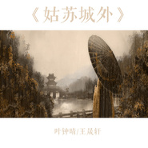
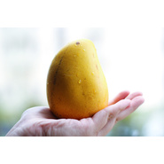

叶钟晴
============================

|  |  |
| :--: | :-- |
| [ 叶钟晴](https://i.xiami.com/niva1101) | **播放数**: 7298105 **粉丝数**: 859 **评论数**: 38 **地区**: China 中国大陆 **风格**: 国语流行 Mandarin Pop  |

## 档案

90后网络原创歌手，网络人气歌手，山东济南人，性格开朗，活泼可爱，喜欢说，喜欢笑，喜欢音乐，喜欢唱歌，独特甜美的声音让人听后回味无穷，对音乐执着的她，无论遇到多大困难都不会放弃对音乐的追求，她不断努力，最大的愿望就是能让更多的人听到她的歌曲，代表作：《昵语》、《触不到的星》、《失恋点播》、《不想和你吵》等。

## 专辑

| 名称 | 语种 | 唱片公司 | 发行时间 | 专辑类别 | 专辑风格 |
| :--: | :-- | :-- | :-- | :-- | :-- |
| [ 二月贝多芬](./albums/2102907025.md) | 国语 | 独立发行 | 2017年11月01日 | 录音室专辑 | 流行 Pop |
| [ 桃花潭深](./albums/2102404004.md) | 国语 |  | 2016年09月27日 | 录音室专辑 |  |
| [ 姑苏城外](./albums/2100260746.md) | 国语 | 独立发行 | 2016年01月06日 | EP, 单曲 | 国语流行 Mandarin Pop, 中国风 China-Wave |
| [ 爱上蒙娜丽莎](./albums/2100189270.md) | 国语 | 独立发行 | 2015年08月30日 | EP, 单曲 | 国语流行 Mandarin Pop |
| [ 傻了](./albums/128295968.md) | 国语 | 独立发行 | 2015年04月06日 | 录音室专辑 | 国语流行 Mandarin Pop |
| [ Mango Mango](./albums/790453669.md) | 国语 | 独立发行 | 2014年01月23日 | EP, 单曲 | 国语流行 Mandarin Pop |
| [ 只要你还记得懂得](./albums/580721090.md) | 国语 | 独立发行 | 2013年10月02日 | EP, 单曲 |  |
| [ 叶钟晴](./albums/280090060.md) | 国语 | 独立发行 | 2013年09月25日 | 精选集 | 国语流行 Mandarin Pop |

## 评论

|  |  |  |  |
| :-- | :-- | :-- | :-- |
|  [虾米用户](https://emumo.xiami.com/u/293692544) 你敢给我说话吗？我咬你 2019-04-16 16:57 赞(1) 踩(0) | 
好听
 |
|  [虾米用户](https://emumo.xiami.com/u/293692544) 你敢给我说话吗？我咬你 2019-03-11 16:54 赞(1) 踩(0) | 
好听
 |
|  [虾米用户](https://emumo.xiami.com/u/419237165)  2019-02-19 06:53 赞(1) 踩(0) | 
好听
 |
|  [虾米用户](https://emumo.xiami.com/u/370279007) Vip5又能怎么样 2019-01-29 18:18 赞(1) 踩(0) | 
好听
 |
|  [虾米用户](https://emumo.xiami.com/u/348833848)  2018-03-30 20:54 赞(1) 踩(0) | 
加油^_^
 |
|  [虾米用户](https://emumo.xiami.com/u/337823211)  2017-11-29 17:08 赞(1) 踩(0) | 
好听记得多唱点
 |
|  [虾米用户](https://emumo.xiami.com/u/49166357)   2017-11-01 11:18 赞(1) 踩(0) | 
666，好听
 |
|  [虾米用户](https://emumo.xiami.com/u/298948030) 中國詩音樂電影创始人作曲... 2017-10-17 22:07 赞(1) 踩(0) | 
你好
 |
|  [虾米用户](https://emumo.xiami.com/u/311740490)  2017-10-13 13:53 赞(1) 踩(0) | 
        
 |
|  [虾米用户](https://emumo.xiami.com/u/324170380) 音乐能够抚平伤过人的心☪... 2017-10-01 00:31 赞(1) 踩(0) | 
人美歌甜,让人放松心情。
 |
|  [虾米用户](https://emumo.xiami.com/u/190805208)  2017-05-27 05:51 赞(2) 踩(0) | 
山东老乡
 |
|  [虾米用户](https://emumo.xiami.com/u/290335453)  2017-05-23 07:46 赞(2) 踩(0) | 
晴儿姐姐，你唱的太棒，你能教教我吗？              
 |
|  [虾米用户](https://emumo.xiami.com/u/279514756) 萌萌地 2017-04-09 09:40 赞(2) 踩(0) | 
   
 |
|  [虾米用户](https://emumo.xiami.com/u/279514756) 萌萌地 2017-04-09 09:38 赞(1) 踩(0) | 
你的声音好好听呀
 |
|  [虾米用户](https://emumo.xiami.com/u/277821356)  2017-03-04 20:03 赞(1) 踩(0) | 
  
 |
|  [虾米用户](https://emumo.xiami.com/u/247435542)   2016-11-22 18:37 赞(1) 踩(0) | 
 
 |
|  [虾米用户](https://emumo.xiami.com/u/200748330) 爱音乐 2016-10-30 13:52 赞(2) 踩(0) | 
      
 |
|  [虾米用户](https://emumo.xiami.com/u/200748330) 爱音乐 2016-10-30 13:51 赞(2) 踩(0) | 
加油↖(^ω^)↗，
 |
|  [虾米用户](https://emumo.xiami.com/u/200748330) 爱音乐 2016-10-30 13:51 赞(3) 踩(0) | 
很好听
 |
|  [虾米用户](https://emumo.xiami.com/u/240636414)  2016-10-27 09:38 赞(1) 踩(0) | 
我将她的歌曲介绍给同学们，他们都说这妹子声音好甜啊！
 |
|  [虾米用户](https://emumo.xiami.com/u/78158686) 1+1=？？？？ 2016-10-03 11:35 赞(1) 踩(0) | 
唉
 |
|  [虾米用户](https://emumo.xiami.com/u/8000052)  2016-05-21 21:16 赞(1) 踩(0) | 
唱得太娇气，音准也不行
 |
| ⇒ |  [虾米用户](https://emumo.xiami.com/u/87154180)  2016-05-27 20:15 赞(0) 踩(0) | 
不喜欢，没人强迫你听，而且你以为自己唱的有都好，哼哼。最讨厌说别人不好，自己做不到的人了
 |
| ⇒ |  [虾米用户](https://emumo.xiami.com/u/8000052)  2016-05-27 22:59 赞(0) 踩(0) | 
<q><b>未知生物说：</b></q>
 |
| ⇒ |  [虾米用户](https://emumo.xiami.com/u/87154180)  2016-05-28 10:29 赞(0) 踩(0) | 
<q><b>陈文俊说：</b></q>
 |
| ⇒ |  [虾米用户](https://emumo.xiami.com/u/8000052)  2016-05-28 14:35 赞(0) 踩(0) | 
<q><b>未知生物说：</b></q>
 |
| ⇒ |  [虾米用户](https://emumo.xiami.com/u/87154180)  2016-05-28 18:47 赞(0) 踩(0) | 
<q><b>陈文俊说：</b></q>
 |
| ⇒ |  [虾米用户](https://emumo.xiami.com/u/283841474)  2017-07-31 15:26 赞(0) 踩(0) | 
<q><b>未知生物说：</b></q>
 |
|  [虾米用户](https://emumo.xiami.com/u/167241952)  2016-05-20 07:06 赞(2) 踩(0) | 
 
 |
|  [虾米用户](https://emumo.xiami.com/u/30760561)   2016-04-02 09:28 赞(2) 踩(0) | 
90小妹妹
 |
|  [虾米用户](https://emumo.xiami.com/u/88203226)  2016-01-25 00:27 赞(2) 踩(0) | 
不错
 |
|  [虾米用户](https://emumo.xiami.com/u/45886614) 我好像在哪见过你 2015-10-26 12:34 赞(2) 踩(0) | 
favorite爱上蒙娜丽莎
 |
|  [虾米用户](https://emumo.xiami.com/u/22682055) 只对你一见钟晴。 2013-09-23 16:21 赞(31) 踩(0) | 
我刚入驻了虾米音乐人，欢迎大家来我的个人主页，收听我的最新音乐
 |
| ⇒ |  [虾米用户](https://emumo.xiami.com/u/35809735) 暂无签名~ 2014-10-12 14:15 赞(0) 踩(0) | 
你好，叶姐姐，我好喜欢你
 |
| ⇒ |  [虾米用户](https://emumo.xiami.com/u/87154180)  2016-05-02 15:19 赞(0) 踩(0) | 
叶姐姐，你的声音好好听哦，我最喜欢你的歌和你
 |
| ⇒ |  [虾米用户](https://emumo.xiami.com/u/87154180)  2016-05-02 15:19 赞(0) 踩(0) | 
叶姐姐，你的声音好好听哦，我最喜欢你的歌和你
 |
| ⇒ |  [虾米用户](https://emumo.xiami.com/u/253960856) 希望有一人举着花对我说“... 2017-05-07 09:19 赞(0) 踩(0) | 
支持
 |
| ⇒ |  [虾米用户](https://emumo.xiami.com/u/290335453)  2017-05-23 07:47 赞(0) 踩(0) | 
<q><b>Lay＇s wife说：</b></q>
 |
