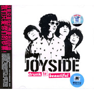

Drunk Is Beautiful
============================

|  |  |
| :--: | :-- |
| [ Drunk Is Beautiful](https://emumo.xiami.com/album/14783) | **艺人**: [Joyside](../index.md) **语种**: 英语 **唱片公司**: BadHead **发行时间**: 2004年10月01日 **专辑类别**: 录音室专辑 **专辑风格**: 摇滚 Rock & Roll **播放数**: 299672 **收藏数**: 675 **评论数**: 34  |

## 简介

如果说有什么比1977年伦敦街头的朋克们更加虚无的话，那一定是新世纪之初所有妄想回到那个时代的人。  
  
这4个醉鬼用美妙的三和弦点燃了混合着酒精，尼古丁与荷尔蒙的危险气体。这群不和时宜的懒家伙们将音量调到最大，在酒醉后醒来的每个星期天早晨--或者所有混帐的日子。 这不是政治，不是乖巧的宝贝宠物，它甚至不是又一个乌托邦。这是纯正的1970年代朋克摇滚音乐，而他们不是什么狗屎明星，  
<strong>  
他们只是摇滚乐的婊子和狂欢着的美丽酒鬼。&nbsp;</strong>  
  
<strong>这里没有你们想要找的时尚，我们只爱你们的钞票！</strong>  
  
几十年前的伟大朋克摇滚乐，经过21世纪酒精的浸泡，直踢你就要衰竭的心脏。  
  
4个不和时宜的懒家伙将音量调到最大，在酒醉后醒来的每个星期天早晨--或者所有混帐日子。这不是政治，更不是乖巧的宝贝宠物。它甚至不是又一个乌托邦。这是纯正的1970年代朋克摇滚音乐，而他们不是什么狗屎明星，他们只是摇滚乐的婊子和狂欢着的美丽酒鬼。  
  
专辑共有17首歌(其中最后一首隐藏在第16首结束后3分钟)，收录了乐队两张demo---《joyside》(2002年)和《everything sucks》(2003年)中的部分歌曲及一些新作品，另外还有翻唱自现已解散的啃卡车(eat truck)乐队的《sunday morning》和《fall in beer with you》(原名为 《seems like bastard》)。  
  
这就是永远经典的三和弦为歌颂醉酒、空虚、厌倦、懒惰和失落而制造出的美妙的噪音。  
  
◎醉酒的朋克总是最美的  
  
如果说嚎叫唱片出版了合辑《无聊军队》之后的半年间，是国内朋克音乐的鼎盛时期，那么在这之后，朋克音乐圈就一直处于一个无人关注的低谷。  
  
虽然嚎叫唱片断断续续的为“生命之饼”和“哎哟”这两支乐队发表过专辑，但却再也没能取得像《无聊军队》那样的浩大声势；虽然我们还能在反光镜与脑浊去到美国巡演的消息中感到一丝的振奋人心，但他们却未能有一张完整的专辑呈现在唱片店的货架之上；虽然“挂在盒子上”的名气总是有增无减，但他们却没有写出过一首能和自己名气相符的作品。  
  
而今，Joyside的出现，又让我们看到了一次改变国内朋克现状的希望。 这个名字作为一支乐队出现的时间已经不短了，但他们生不逢时。因为Joyside这个名字刚在演出海报上出现的时候，正好是国内朋克没落的开始，而等到其个方面成熟了，媒体对这批人以及他们音乐的关注也近乎到了绝迹的程度。这就使得他们的能量一直在沉默中等待着爆发，现在乐队首张专辑《Drunk Is Beautiful》的出现，便是一个机会。  
  
在《Drunk Is Beautiful》经由Badhead/摩登天空录制完成的时候，主唱边远曾经说这是一张能杀人的唱片，但当你按下Play转动这张CD，听到《Pretty 3 Chords》的时候，却从这三个和弦的美丽当中得知，自己上当受骗了。因为在他们所有的冲击力背后，并没有想象中因噪动而造成的噪音，反之，在主唱边远的嗓音中能够发现，他在试图把音乐写得更加旋律化。 所以从专辑的编曲与演唱中，你不仅能在《music [内容被过滤，请注意论坛文明]s》或《(i am)lazy &amp; wasting》找到Sex Pistols一样的原始与简单，还能在《a girl from nowhere》中听出洛杉矶乐队X对他们的影响。当《i don't wanna be me》的Bass前奏响起的时候，你会发现，影响他们的除了70年代末期的Old Skool Punk音乐，还有红白游戏机中的“超级玛丽”。而他们在旋律方面的努力，也能从《sunday morning》中轻而易举的捕捉。  
  
歌词方面虽是全英文写作，但却没有一点儿Chinglish的呆板。这不仅说明了乐队英文水平的优秀，还能让歌词的内容更加清楚的传达给听者，因此你能发现他们歌词在记录着自己状态与理想的同时，也表达了身边许多内心中还为朋克精神而激动的人的呐喊。《nothing to do》诉说着迷茫。《a dream of london》告诉人们，他们对1977年及朋克诞生城的向往，之后的《the saviour johnny rotten》则是直接向1977年伦敦最伟大的乐队Sex Pistols致敬。而《i want beer》简直可以成为一首啤酒厂商的代言曲目。 

## 曲目

- [Pretty 3 Chords](./14783/nvOhf910f.md)
- [I Want Beer](./14783/jjFgc268d.md)
- [Music Sucks](./14783/eX6f7c527.md)
- [Nothing To Do](./14783/vKgo2bc0d.md)
- [A Dream Of London](./14783/eX6i92bc8.md)
- [(I Am)Lazy & Wasting](./14783/eX6j8512e.md)
- [Sunday Morning](./14783/4iyw39aef.md)
- [I Don't Wanna Be Me](./14783/eX6ldbdef.md)
- [The Saviour Johnny Rotten](./14783/C6G247867.md)
- [Univershity](./14783/r7Xt202b5.md)
- [I Don't Care About Your Society](./14783/nvOsedb0b.md)
- [I Can't Live Without Cigarettes](./14783/jjFrbc98b.md)
- [A Girl From Nowhere](./14783/jjFs1ba85.md)
- [Fall In Beer With You](./14783/C6G771135.md)
- [Everyphucingday](./14783/jjFua02fe.md)

## 评论

|  |  |  |
| :-- | :-- | :-- |
|  [虾米用户](https://emumo.xiami.com/u/427384237) 我还没想好要写什么... 2020-12-13 22:24 赞(0) 踩(0) | 
➕
 |
|  [虾米用户](https://emumo.xiami.com/u/43492923) 行到水穷我才开始害怕，夕... 2020-07-27 19:41 赞(1) 踩(0) | 
-
 |
|  [虾米用户](https://emumo.xiami.com/u/9286704) A lo lejos..... 2018-06-04 17:22 赞(0) 踩(0) | 
你是如此美丽
 |
|  [虾米用户](https://emumo.xiami.com/u/336640648) To bare,to l... 2018-05-28 16:44 赞(0) 踩(0) | 
虾 版权呢
 |
|  [虾米用户](https://emumo.xiami.com/u/71241962) 我看见我躲在云里哭 2017-09-29 23:19 赞(0) 踩(0) | 

 |
|  [虾米用户](https://emumo.xiami.com/u/74639208) Music is per... 2016-08-07 09:08 赞(0) 踩(0) | 
摩登天空？
 |
|  [虾米用户](https://emumo.xiami.com/u/1200774)  2016-08-05 22:21 赞(0) 踩(0) | 
夏夜怀个古
 |
|  [虾米用户](https://emumo.xiami.com/u/8708580)   2015-11-20 14:44 赞(0) 踩(0) | 
带我回到十年前
 |
|  [虾米用户](https://emumo.xiami.com/u/789629)  2015-11-02 13:01 赞(1) 踩(0) | 
国内朋克最强三张专辑之一
 |
|  [虾米用户](https://emumo.xiami.com/u/1172716) 暂无签名~ 2015-08-04 21:28 赞(2) 踩(0) | 
国内最好的一张朋克专辑 没有之一
 |
| ⇒ |  [虾米用户](https://emumo.xiami.com/u/789629)  2015-11-02 13:03 赞(0) 踩(0) | 
最好三张之一， 还有 十年反抗 和 American dreamer 个人认为 不过这张第一我没意见    哈哈哈哈哈哈哈
 |
|  [虾米用户](https://emumo.xiami.com/u/25886629)  2015-07-27 10:51 赞(0) 踩(0) | 
啊！
 |
|  [虾米用户](https://emumo.xiami.com/u/17123141) 1 2015-06-15 14:37 赞(0) 踩(0) | 
喝醉很美
 |
|  [虾米用户](https://emumo.xiami.com/u/31168295) 苦笑一瞬间 2015-03-22 00:22 赞(0) 踩(0) | 
时间过得好快 内时期他们还在清河坝 地带还在吧
 |
|  [虾米用户](https://emumo.xiami.com/u/44941917) 祝大家都长得像自己的头像 2015-01-21 10:11 赞(0) 踩(0) | 
那时候那么小。。。什么都不懂。。就是听了一下觉得很喜欢。。。我的妈
 |
| ⇒ |  [虾米用户](https://emumo.xiami.com/u/29694817)  2015-10-24 22:45 赞(0) 踩(0) | 
哈哈 多大啊
 |
|  [虾米用户](https://emumo.xiami.com/u/44941917) 祝大家都长得像自己的头像 2015-01-21 10:11 赞(0) 踩(0) | 
原来我当年买的这张专辑是 JS 的
 |
|  [虾米用户](https://emumo.xiami.com/u/1126943)  2014-06-14 23:58 赞(1) 踩(0) | 
两万个赞!&amp;quot;这儿没有你们想要的时尚 我们只爱你们的钞票!&amp;quot;--多可爱的一帮混蛋!哈哈哈。。
 |
|  [虾米用户](https://emumo.xiami.com/u/31820382) 我还没想好要写什么... 2014-05-29 21:08 赞(2) 踩(0) | 
这是最牛b的一张，后面的都不好，都不喜欢，只有这张能一直听下去。第一次看是在13club，那时候空气里都是年轻人的荷尔蒙，如今大家都老了，我非常怀念他们带给我的那段快乐时光！！！
 |
| ⇒ |  [虾米用户](https://emumo.xiami.com/u/789629)  2015-11-02 13:02 赞(0) 踩(0) | 
同意
 |
| ⇒ |  [虾米用户](https://emumo.xiami.com/u/789629)  2019-06-17 14:20 赞(0) 踩(0) | 
非常同意你的说法 后面的没有一首我能听下去 而且这张也足够有吹一辈子的实力。 最纯粹的joyside
 |
|  [虾米用户](https://emumo.xiami.com/u/37348)  2014-03-20 21:44 赞(0) 踩(0) | 
年轻就要摇滚
 |
|  [虾米用户](https://emumo.xiami.com/u/13047991)   2013-11-11 20:44 赞(0) 踩(0) | 
再没有什么能够比这几个词更好地表达出Joyside的原始的颓废美学。他们将自己看作是摇滚乐**，每次听Joyside就想当个酒鬼,边喝边蛋逼 ,着左边的帅小伙亲一口,然后哭出声来。
 |
|  [虾米用户](https://emumo.xiami.com/u/5937882)  2013-09-28 15:05 赞(0) 踩(0) | 
drown me with beer!!!
 |
|  [虾米用户](https://emumo.xiami.com/u/1703028) “n55!w!" "im... 2013-01-02 18:46 赞(1) 踩(0) | 
这一张里面的每一首歌都是大爱啊！！！根本没得挑啊！！！听得都要哭了！！！
 |
|  [虾米用户](https://emumo.xiami.com/u/5953103)  2012-12-01 22:56 赞(0) 踩(0) | 
I want beer
 |
|  [虾米用户](https://emumo.xiami.com/u/5375272)  2012-11-08 09:35 赞(0) 踩(0) | 
真像喝醉了的样子
 |
|  [虾米用户](https://emumo.xiami.com/u/2519489)  2012-10-31 18:58 赞(0) 踩(0) | 
每一首歌都好酷！女孩儿们应该为这些歌儿痴狂  但只给乐手们看鼻孔和下巴！
 |
|  [虾米用户](https://emumo.xiami.com/u/5964964)  2011-09-25 01:50 赞(0) 踩(0) | 
个人认为中国最牛逼的OLDSCHOOL PUNK乐队
 |
|  [虾米用户](https://emumo.xiami.com/u/327652)  2011-09-17 13:20 赞(0) 踩(0) | 
好
 |
|  [虾米用户](https://emumo.xiami.com/u/3282162)  2011-07-31 14:25 赞(0) 踩(0) | 
oi oi
 |
|  [虾米用户](https://emumo.xiami.com/u/1059393)  2010-06-21 15:50 赞(0) 踩(0) | 
纯正的摇滚风味。
 |
|  [虾米用户](https://emumo.xiami.com/u/592764) . 2010-05-26 20:23 赞(0) 踩(0) | 
听了好多年，还是在听，味道很纯正
 |
|  [虾米用户](https://emumo.xiami.com/u/13049)  2010-03-19 16:16 赞(0) 踩(0) | 
虽然都很好听，但还是这张最正
 |
