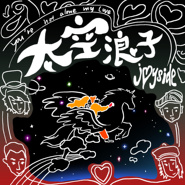

太空浪子
============================

|  |  |
| :--: | :-- |
| [ 太空浪子](https://emumo.xiami.com/album/2105624949) | **艺人**: [Joyside](../index.md) **语种**: 国语 **唱片公司**: 独立发行 **发行时间**: 2019年12月30日 **专辑类别**: EP, 单曲 **专辑风格**: 摇滚 Rock & Roll **播放数**: 552536 **收藏数**: 101 **评论数**: 30  |

## 简介

这是Joyside回归后的第二首全新单曲，也是一场即将开启的全新冒险。  
这里有熟悉的浪子情怀，也有陌生的浩瀚星海。若已决定一往无前，那就不要再回头，一同奔赴宇宙深处，去探寻爱的真谛。  
You are not alone my love，这是送给你最好的新年礼物。 

## 曲目

- [太空浪子](./2105624949/xOvinQa52c2.md)

## 评论

|  |  |  |  |
| :-- | :-- | :-- | :-- |
|  [虾米用户](https://emumo.xiami.com/u/427384237) 我还没想好要写什么... 2020-12-13 22:26 赞(0) 踩(0) | 
➕
 |
|  [虾米用户](https://emumo.xiami.com/u/446201994)  2020-11-30 12:40 赞(0) 踩(0) | 
无尽的爱，七彩的未来
 |
|  [虾米用户](https://emumo.xiami.com/u/43492923) 行到水穷我才开始害怕，夕... 2020-07-27 19:40 赞(0) 踩(0) | 
-
 |
|  [虾米用户](https://emumo.xiami.com/u/379912005) 感谢虾米，永远记得。 2020-03-07 04:08 赞(0) 踩(0) | 

 |
|  [虾米用户](https://emumo.xiami.com/u/32231879) Eine kosmisc... 2020-02-23 11:00 赞(0) 踩(0) | 

 |
|  [虾米用户](https://emumo.xiami.com/u/128124) 祝你身体健康 2020-02-14 13:11 赞(0) 踩(0) | 
more more!!!
 |
|  [虾米用户](https://emumo.xiami.com/u/1512743)  2020-01-26 19:55 赞(0) 踩(0) | 
  
 |
|  [虾米用户](https://emumo.xiami.com/u/422522)  2020-01-22 16:19 赞(0) 踩(0) | 
来了 
 |
|  [虾米用户](https://emumo.xiami.com/u/39575559) 开心就好 2020-01-09 17:39 赞(0) 踩(0) | 
期待最近的单曲结合没发表的新歌出一张新专辑
 |
|  [虾米用户](https://emumo.xiami.com/u/9286704) A lo lejos..... 2020-01-03 16:25 赞(0) 踩(0) | 
emmm
 |
|  [虾米用户](https://emumo.xiami.com/u/4231462) 我还没想好要写什么... 2019-12-30 20:07 赞(0) 踩(0) | 
最棒
 |
|  [虾米用户](https://emumo.xiami.com/u/258771) 你要看看太阳 2019-12-30 13:08 赞(0) 踩(0) | 
嗯
 |
|  [虾米用户](https://emumo.xiami.com/u/8488997) attack 2019-12-30 11:25 赞(0) 踩(0) | 
支棱起来！
 |
|  [虾米用户](https://emumo.xiami.com/u/46481860) 我还没想好要写什么... 2019-12-30 07:31 赞(0) 踩(0) | 

 |
|  [虾米用户](https://emumo.xiami.com/u/42963872) 我还没想好要写什么... 2019-12-30 07:25 赞(0) 踩(0) | 
哦
 |
|  [虾米用户](https://emumo.xiami.com/u/434560664)  2019-12-30 07:20 赞(0) 踩(0) | 
关键词消防栓垃圾桶 创意
 |
|  [虾米用户](https://emumo.xiami.com/u/434560664)  2019-12-30 07:19 赞(0) 踩(0) | 
..
 |
|  [虾米用户](https://emumo.xiami.com/u/283157776)  2019-12-30 07:15 赞(0) 踩(0) | 
我哭了 有生之年
 |
|  [虾米用户](https://emumo.xiami.com/u/99168462) 再见虾米 2019-12-30 06:10 赞(1) 踩(0) | 
来了！！！！！
 |
|  [虾米用户](https://emumo.xiami.com/u/6114059) 我见过你。 2019-12-30 03:35 赞(0) 踩(0) | 

 |
|  [虾米用户](https://emumo.xiami.com/u/322027648) 未知生物 2019-12-30 03:13 赞(0) 踩(0) | 
宇宙漂流
 |
|  [虾米用户](https://emumo.xiami.com/u/1260661) honey is dea... 2019-12-30 02:22 赞(2) 踩(0) | 
是最最好的joyside！最最最好的边远！谢谢谢谢
 |
|  [虾米用户](https://emumo.xiami.com/u/37620409) whenindoubt,... 2019-12-30 01:47 赞(3) 踩(0) | 
就是听着前奏你就能想到每个人在livehouse的脸庞光线 汗水混杂着酒精 笑容 腾空的脚 拥挤 快乐台上台下 每个人都一样快乐
 |
| ⇒ |  [虾米用户](https://emumo.xiami.com/u/560448)  2019-12-30 12:30 赞(0) 踩(0) | 
这前奏很一般啊！
 |
| ⇒ |  [虾米用户](https://emumo.xiami.com/u/592764) . 2020-03-18 14:29 赞(0) 踩(0) | 
<q><b>yishiyiwu说：</b></q>
 |
|  [虾米用户](https://emumo.xiami.com/u/1583681)  2019-12-30 00:56 赞(1) 踩(0) | 
感动 很快乐
 |
|  [虾米用户](https://emumo.xiami.com/u/264302819) bye :( 2019-12-30 00:34 赞(0) 踩(0) | 
晚安:D
 |
|  [虾米用户](https://emumo.xiami.com/u/14123312) 我还没想好要写什么... 2019-12-30 00:23 赞(0) 踩(0) | 
来
 |
|  [虾米用户](https://emumo.xiami.com/u/5399956)  2019-12-30 00:12 赞(1) 踩(0) | 
来了！！
 |
|  [虾米用户](https://emumo.xiami.com/u/13345266) 我还没想好要写什么... 2019-12-30 00:06 赞(1) 踩(0) | 
漂流到太空的第一位流浪者
 |
