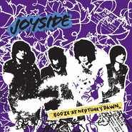

Booze At Neptune's Dawn海王星黎明的酒宴
============================

|  |  |
| :--: | :-- |
| [ Booze At Neptune's Dawn海王星黎明的酒宴](https://emumo.xiami.com/album/289498) | **艺人**: [Joyside](../index.md) **语种**: 英语 **唱片公司**: 兵马司, BMG **发行时间**: 2007年09月08日 **专辑类别**: 录音室专辑 **专辑风格**: 摇滚 Rock & Roll **播放数**: 898937 **收藏数**: 1279 **评论数**: 79  |

## 简介

2007年2月，乐队第三张专辑《Booze At Neptune's Dawn》录制完毕。3月初，乐队出现在《滚石》杂志中文版rock fashion的模特行列，乐队颓废华丽的形象与音乐旋律化的反差，再次引起主流媒体关注。3月底，乐队一轮小型的全国巡演使joyside的fans队伍不断扩大。4月，joyside又马不停蹄的开始了为期2个月的欧洲巡演，巡演国家包括德国、奥地利、瑞士、西班牙、丹麦、法国和英国8国总共近50多场演出。  
  
这次巡演震惊整个欧洲大陆及英伦地区，众多媒体纷纷不惜笔墨地大篇幅这支来自神秘中国的摇滚乐队。6月，乐队回到中国参加过上海"热带风暴"音乐节。9月，在北京流行音乐节与New York Dolls同台之后，乐队开始了新专辑的宣传巡回演出。9月15日，乐队专辑《Booze At Neptune's Dawn》的内地版正式上市！&nbsp;  
  
  
  
 

## 曲目

- [Spy](./289498/T4Dv82c28.md)
- [All Night](./289498/b92fGaa698.md)
- [Neptune's Child](./289498/cpz8be6ba1.md)
- [Out of Time](./289498/b92fI11d71.md)
- [Too Fast To Love](./289498/cpz8d1b32b.md)
- [Dong Dong DongMV](./289498/T4D05f5f6.md)
- [Lover D](./289498/T4D193ee5.md)
- [Baby In Shadow](./289498/dBu2K28fcf.md)
- [Booze At Dawn](./289498/cpz8hf1588.md)
- [Fire](./289498/cVxa21f17a.md)

## 评论

|  |  |  |  |
| :-- | :-- | :-- | :-- |
|  [虾米用户](https://emumo.xiami.com/u/427384237) 我还没想好要写什么... 2020-12-13 22:25 赞(0) 踩(0) | 
➕
 |
|  [虾米用户](https://emumo.xiami.com/u/319184190) 我的船在海洋 你的船飞向... 2020-12-06 15:34 赞(0) 踩(0) | 
Joyside最好的一张专辑
 |
|  [虾米用户](https://emumo.xiami.com/u/10398210) 游啊游 什么时候能到岸 2020-10-04 02:01 赞(0) 踩(0) | 
最喜欢的。每首！
 |
|  [虾米用户](https://emumo.xiami.com/u/2050162) 彼岸 2020-08-11 10:11 赞(1) 踩(0) | 
最爱的一张碟
 |
|  [虾米用户](https://emumo.xiami.com/u/413334527) 我还没想好要写什么... 2020-06-16 09:37 赞(0) 踩(0) | 
为什么没版权了
 |
|  [虾米用户](https://emumo.xiami.com/u/43492923) 行到水穷我才开始害怕，夕... 2019-07-22 12:46 赞(1) 踩(0) | 
-
 |
|  [虾米用户](https://emumo.xiami.com/u/45881128) 来找我玩 在虾米解散前 2019-07-05 00:51 赞(0) 踩(0) | 
唯一
 |
|  [虾米用户](https://emumo.xiami.com/u/32824512) 阴凉潮湿晦暗 回到无人洞... 2019-04-01 11:58 赞(1) 踩(0) | 
终于终于
 |
|  [虾米用户](https://emumo.xiami.com/u/13729120) 高光 2019-03-05 22:39 赞(0) 踩(0) | 
呜，这张陪伴了我整个高三。
 |
|  [虾米用户](https://emumo.xiami.com/u/15342141) 我还没想好要写什么... 2018-07-26 04:01 赞(0) 踩(0) | 
高中
 |
|  [虾米用户](https://emumo.xiami.com/u/322161375)  2018-07-12 10:20 赞(1) 踩(0) | 
为什么没版权了
 |
|  [虾米用户](https://emumo.xiami.com/u/83893196) 我还没想好要写什么... 2018-04-21 21:48 赞(0) 踩(0) | 
：）
 |
|  [虾米用户](https://emumo.xiami.com/u/47570236)  　⠀ 2018-03-16 10:34 赞(0) 踩(0) | 

 |
|  [虾米用户](https://emumo.xiami.com/u/327952880) Waldeinsamke... 2018-02-28 08:53 赞(2) 踩(0) | 
很久没有这么喜欢过一张砖了
 |
|  [虾米用户](https://emumo.xiami.com/u/43492923) 行到水穷我才开始害怕，夕... 2018-02-02 10:11 赞(0) 踩(0) | 
□
 |
|  [虾米用户](https://emumo.xiami.com/u/25032013) 旋转，跳跃哦，他感到，连... 2018-01-19 01:32 赞(0) 踩(0) | 
真好听
 |
|  [虾米用户](https://emumo.xiami.com/u/49727922) 我还没想好要写什么... 2017-12-22 12:36 赞(10) 踩(0) | 
国内乐队最爱两支，一支木马，一支joyside。最爱两张专辑，一张《木马》一张《海王星黎明的酒宴》，可惜，生不逢时。
 |
|  [虾米用户](https://emumo.xiami.com/u/70292024)   2017-10-04 23:07 赞(1) 踩(0) | 
整张都太棒了
 |
|  [虾米用户](https://emumo.xiami.com/u/10028400) 我还没想好要写什么... 2017-10-04 21:39 赞(2) 踩(0) | 

 |
|  [虾米用户](https://emumo.xiami.com/u/7992605) - 2017-09-08 21:43 赞(0) 踩(0) | 
我的整个高中青春
 |
|  [虾米用户](https://emumo.xiami.com/u/278481020)  2017-03-29 12:36 赞(2) 踩(0) | 
谁有这张碟？天价收！来正版 
 |
|  [虾米用户](https://emumo.xiami.com/u/278481020)  2017-03-08 12:00 赞(2) 踩(0) | 
看不懂边远的人说是颓废，其实是一种惊艳
 |
|  [虾米用户](https://emumo.xiami.com/u/32824512) 阴凉潮湿晦暗 回到无人洞... 2016-10-15 15:45 赞(1) 踩(0) | 
想收这张碟
 |
|  [虾米用户](https://emumo.xiami.com/u/226071276) Come again……... 2016-09-24 00:41 赞(1) 踩(0) | 
NEPTUNE.波塞冬在罗马神话中的名字是“尼普顿”，天文学家总这个名字命名了海王星。
 |
|  [虾米用户](https://emumo.xiami.com/u/8094301) Bye bye wx n... 2016-09-01 18:19 赞(1) 踩(0) | 
很够
 |
|  [虾米用户](https://emumo.xiami.com/u/5042609)  2016-07-11 12:40 赞(0) 踩(0) | 
高中那会儿喜欢上胶塞的时候已经解散了 简直人生遗憾
 |
|  [虾米用户](https://emumo.xiami.com/u/51690215)  2016-06-17 23:45 赞(1) 踩(0) | 
在vice上看到 fire 是边远心中的五首个人最佳之一
 |
| ⇒ |  [虾米用户](https://emumo.xiami.com/u/49770605) 我还没想好要写什么... 2018-01-11 22:57 赞(0) 踩(0) | 
vice上有边远的介绍吗
 |
|  [虾米用户](https://emumo.xiami.com/u/32362730) 5はいいぞ~~ 2016-02-25 23:36 赞(0) 踩(0) | 
( ͡° ͜ʖ ͡°)
 |
|  [虾米用户](https://emumo.xiami.com/u/23407084) 姑娘老去，混蛋常在。 2015-12-01 00:33 赞(0) 踩(0) | 
没赶上这个乐队，现在都有点被埋没了
 |
|  [虾米用户](https://emumo.xiami.com/u/37010311)   2015-09-20 10:16 赞(0) 踩(0) | 
莫名的感觉适合我这20多岁的年的年纪
 |
|  [虾米用户](https://emumo.xiami.com/u/49026593) 以喜欢的方式用力过完一生 2015-09-19 07:54 赞(0) 踩(0) | 
收的第一张碟，就是这张，不能更棒了
 |
|  [虾米用户](https://emumo.xiami.com/u/8794321)  2015-08-26 17:17 赞(0) 踩(0) | 
海王
 |
|  [虾米用户](https://emumo.xiami.com/u/11970559) 音乐有生命。 2015-06-10 15:30 赞(1) 踩(0) | 
<a href="http://emumo.xiami.com/u/15340567" target="_blank" rel="nofollow" name_card="15340567">@Tisky-天</a>哈哈，发现一张很不错的专，呃，标题也很吸引人，有木有XDDD
 |
| ⇒ |  [虾米用户](https://emumo.xiami.com/u/15340567) 这家伙很聪明什么也没留下... 2015-06-10 16:03 赞(0) 踩(0) | 
好哒~我听一下~
 |
|  [虾米用户](https://emumo.xiami.com/u/3057334) 没啥特点的人 2015-04-29 13:22 赞(0) 踩(0) | 
挺酷 听哭
 |
|  [虾米用户](https://emumo.xiami.com/u/7582372)  2015-02-10 19:46 赞(0) 踩(0) | 
不错
 |
|  [虾米用户](https://emumo.xiami.com/u/37831962)  2015-01-26 10:08 赞(0) 踩(0) | 
没原图么…发个cd照片
 |
|  [虾米用户](https://emumo.xiami.com/u/24592107) 独角兽 2014-12-19 19:57 赞(0) 踩(0) | 
i like
 |
|  [虾米用户](https://emumo.xiami.com/u/13695364) 一只小蝴蝶 2014-11-23 11:02 赞(1) 踩(0) | 
永远听不厌
 |
|  [虾米用户](https://emumo.xiami.com/u/1493800)  2014-11-15 20:00 赞(1) 踩(0) | 
最开始盲听以为是个国外乐队 网上查了才晓得他们 牛逼哄哄
 |
|  [虾米用户](https://emumo.xiami.com/u/1639583)   2014-10-26 21:52 赞(0) 踩(0) | 
fire这首简直了 边远啊 好想听你现场 ai r
 |
|  [虾米用户](https://emumo.xiami.com/u/540689)  2014-10-18 13:17 赞(0) 踩(0) | 
Best Chinese Punk band&amp;#039;s Best Album Ever.
 |
|  [虾米用户](https://emumo.xiami.com/u/23413758)  2014-10-02 14:14 赞(0) 踩(0) | 
Legend CD.
 |
|  [虾米用户](https://emumo.xiami.com/u/23413758)  2014-10-02 14:14 赞(0) 踩(0) | 
legend CD.
 |
|  [虾米用户](https://emumo.xiami.com/u/7992605) - 2014-09-14 09:44 赞(0) 踩(0) | 
最美好的回忆
 |
|  [虾米用户](https://emumo.xiami.com/u/1172716) 暂无签名~ 2014-04-04 19:58 赞(32) 踩(0) | 
尚欢欢慵懒的声音 刘耗稳健又丰富的贝斯低音 关少干练清晰的鼓点 最后加上一剂刘虹位的兴奋剂 那让人致幻的吉他 构筑了这张惊人之作 我觉得听不懂这张专辑的人也别听什么摇滚乐了
 |
| ⇒ |  [虾米用户](https://emumo.xiami.com/u/49289846)   2017-04-20 10:14 赞(0) 踩(0) | 
尚欢欢？
 |
| ⇒ |  [虾米用户](https://emumo.xiami.com/u/289607653)  日日夜夜的雨 2017-09-07 00:43 赞(0) 踩(0) | 
<q><b>BadmotherF说：</b></q>
 |
|  [虾米用户](https://emumo.xiami.com/u/32961761) 一切终将化为乌有 2014-04-03 20:20 赞(0) 踩(0) | 
she&amp;#039;s the only thing real then the only thing unreal
 |
|  [虾米用户](https://emumo.xiami.com/u/32961761) 一切终将化为乌有 2014-04-03 20:16 赞(0) 踩(0) | 
很棒
 |
|  [虾米用户](https://emumo.xiami.com/u/612877)  2014-03-03 19:06 赞(0) 踩(0) | 
操，怎么没满分。
 |
|  [虾米用户](https://emumo.xiami.com/u/2577439) 我还没想好要写什么... 2014-02-16 18:47 赞(0) 踩(0) | 
高中。。。。
 |
|  [虾米用户](https://emumo.xiami.com/u/96694)  2014-02-12 21:42 赞(0) 踩(0) | 
听得都要醉了啊……
 |
|  [虾米用户](https://emumo.xiami.com/u/946069)  2014-01-20 12:14 赞(0) 踩(0) | 
这张太喜欢了
 |
|  [虾米用户](https://emumo.xiami.com/u/16041)  2013-10-27 18:49 赞(1) 踩(0) | 
喝酒带来的快乐和耻辱不可言说
 |
|  [虾米用户](https://emumo.xiami.com/u/6688475)   2013-10-06 19:01 赞(0) 踩(0) | 
真的那么好吗  现在有机会买这张专辑 多少钱了
 |
|  [虾米用户](https://emumo.xiami.com/u/4055004)  2013-07-15 23:48 赞(2) 踩(0) | 
Joyside最牛逼的唱片！那四个年轻人永远是中国最牛逼的朋克！他们是一个传奇，在中国在我心中，他们无人能超越！边远那股颓废的性感在这张唱片里被渲染的不可一世！怀念我心中最牛B的朋克！
 |
|  [虾米用户](https://emumo.xiami.com/u/1889774)  2013-06-04 17:25 赞(0) 踩(0) | 
当年在鼓 楼CD店里老板推荐的
 |
|  [虾米用户](https://emumo.xiami.com/u/1889774)  2013-06-04 16:59 赞(0) 踩(0) | 
当年在**店里伙计推荐的punk专辑
 |
|  [虾米用户](https://emumo.xiami.com/u/3417405) ADSR 2013-01-22 02:10 赞(1) 踩(0) | 
国内十星专辑
 |
|  [虾米用户](https://emumo.xiami.com/u/4086207) 我还没想好要写什么... 2013-01-19 22:43 赞(1) 踩(0) | 
当之无愧的朋克之王
 |
|  [虾米用户](https://emumo.xiami.com/u/661079) hallelujah 2012-12-11 00:14 赞(0) 踩(0) | 
回来吧，想你们！！！
 |
|  [虾米用户](https://emumo.xiami.com/u/1053121)  2012-05-22 20:39 赞(0) 踩(0) | 
他们最好的专辑没有之一
 |
|  [虾米用户](https://emumo.xiami.com/u/478681) 自由是个神奇的玩意儿 2012-04-13 00:06 赞(0) 踩(0) | 
Booze At Neptune\'s Dawn
 |
|  [虾米用户](https://emumo.xiami.com/u/4840805)  2012-04-12 18:47 赞(0) 踩(0) | 
嚎叫~~
 |
|  [虾米用户](https://emumo.xiami.com/u/8621666)  2012-04-07 15:30 赞(1) 踩(0) | 
怎么说呢  因为年轻  5年后听到仍会热泪盈眶、
 |
|  [虾米用户](https://emumo.xiami.com/u/2741962) 我还没想好要写什么... 2012-02-12 02:00 赞(1) 踩(0) | 
最爱的中国乐队！！！！！！！
 |
|  [虾米用户](https://emumo.xiami.com/u/3432410)  2011-11-17 14:06 赞(0) 踩(0) | 
5年前最开心的时光，一晃而过。各位你们是我5年中最重要的人！@徐凯鹏老徐 @刘非_小刘儿  @BillyStarman  @程俏俏 @边美美 @王梓777  @JOYSIDE
 |
|  [虾米用户](https://emumo.xiami.com/u/5929619)  2011-09-24 17:02 赞(0) 踩(0) | 
好听！！！！！！！！
 |
|  [虾米用户](https://emumo.xiami.com/u/5929619)  2011-09-23 18:50 赞(1) 踩(0) | 
中国最好的朋克乐队
 |
|  [虾米用户](https://emumo.xiami.com/u/327652)  2011-09-17 13:19 赞(0) 踩(0) | 
好
 |
|  [虾米用户](https://emumo.xiami.com/u/358469) 你好吗机器人。 2011-08-11 11:34 赞(0) 踩(0) | 
仅记第一次关注上海的小美人鱼\&amp;quot;little mermaid\&amp;quot;
 |
|  [虾米用户](https://emumo.xiami.com/u/1296716)   2011-05-21 21:27 赞(0) 踩(0) | 
有点老了不是很能听这风格了
 |
|  [虾米用户](https://emumo.xiami.com/u/2549843) 比你美多了 2011-05-01 02:53 赞(0) 踩(0) | 
海王星黎明的酒宴
 |
|  [虾米用户](https://emumo.xiami.com/u/3157627)  2011-04-15 11:12 赞(1) 踩(0) | 
边远大美女
 |
| ⇒ |  [虾米用户](https://emumo.xiami.com/u/385760)  2011-08-25 13:49 赞(0) 踩(0) | 
这..........
 |
|  [虾米用户](https://emumo.xiami.com/u/423488)  2011-01-30 22:28 赞(0) 踩(0) | 
完美
 |
|  [虾米用户](https://emumo.xiami.com/u/627912)  2010-07-14 10:24 赞(0) 踩(0) | 
非常喜欢这张
 |
