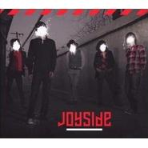

Your City Is A Desert To Me
============================

|  |  |
| :--: | :-- |
| [ Your City Is A Desert To Me](https://emumo.xiami.com/album/369005) | **艺人**: [Joyside](../index.md) **语种**: 英语 **唱片公司**: 兵马司 **发行时间**: 2010年02月01日 **专辑类别**: 录音室专辑 **专辑风格**: 摇滚 Rock & Roll **播放数**: 483709 **收藏数**: 707 **评论数**: 25  |

## 简介

Joyside最后一张同名专辑的德国版. 

## 曲目

- [Run!](./369005/mQ5gRL8134f.md)
- [He is dead (Lament)](./369005/xLqfGwd6d9d.md)
- [Maybe tonight](./369005/xLqfGxc2ecd.md)
- [Gagaga](./369005/U57cii293a5.md)
- [Nobody´s lover](./369005/mQ5gRP6edc3.md)
- [Silly Girl](./369005/mQ5gRQ70f17.md)
- [Nervous (Midnight Mania)](./369005/mQ5gRR86376.md)
- [Your city is a desert to me](./369005/xLqfG212380.md)
- [Shejing](./369005/mQ5gRT71d48.md)
- [Sister lunatics](./369005/xLqfG4b3772.md)
- [Good night](./369005/xLqfG515741.md)

## 评论

|  |  |  |
| :-- | :-- | :-- |
|  [虾米用户](https://emumo.xiami.com/u/432908890) 幸会 2020-12-10 01:08 赞(0) 踩(0) | 
I Won't Wake You Up
 |
|  [虾米用户](https://emumo.xiami.com/u/410537424)  2020-09-05 16:24 赞(0) 踩(0) | 
(ﾟДﾟ)ﾉ
 |
|  [虾米用户](https://emumo.xiami.com/u/412476958)  2020-09-04 13:11 赞(0) 踩(0) | 
A
 |
|  [虾米用户](https://emumo.xiami.com/u/415142428)  2020-07-28 00:20 赞(1) 踩(0) | 
音乐和人都特别有魅力
 |
|  [虾米用户](https://emumo.xiami.com/u/52415194) ♬♩♫♪♡ 2020-06-27 16:48 赞(0) 踩(0) | 
ᵕ᷄≀ ̠˘᷅
 |
|  [虾米用户](https://emumo.xiami.com/u/3553665) We can be He... 2020-06-16 13:35 赞(0) 踩(0) | 
⚝
 |
|  [虾米用户](https://emumo.xiami.com/u/322006389)   2019-12-04 20:36 赞(0) 踩(0) | 

 |
|  [虾米用户](https://emumo.xiami.com/u/411058641) 取之不尽 用之不竭 2019-09-21 22:19 赞(0) 踩(0) | 

 |
|  [虾米用户](https://emumo.xiami.com/u/99465068) Spotify : Yo... 2019-07-10 15:48 赞(0) 踩(0) | 
.
 |
|  [虾米用户](https://emumo.xiami.com/u/43492923) 行到水穷我才开始害怕，夕... 2019-05-10 10:17 赞(0) 踩(0) | 
-
 |
|  [虾米用户](https://emumo.xiami.com/u/43541685) Hello, stran... 2019-04-29 23:51 赞(0) 踩(0) | 
我用这张向他道晚安
 |
|  [虾米用户](https://emumo.xiami.com/u/45587595) 挺迷茫的 2019-04-02 19:50 赞(2) 踩(0) | 
颓废美学
 |
|  [虾米用户](https://emumo.xiami.com/u/46464728) 不浪漫毋宁死 2017-01-16 20:41 赞(0) 踩(0) | 

 |
|  [虾米用户](https://emumo.xiami.com/u/4755329) 为啥不让看 就看 2016-12-28 11:29 赞(3) 踩(0) | 
回不来的青春 回不来的joyside
 |
|  [虾米用户](https://emumo.xiami.com/u/38801880)   2016-06-06 23:04 赞(0) 踩(0) | 
O(∩_∩)O
 |
|  [虾米用户](https://emumo.xiami.com/u/10398210) 游啊游 什么时候能到岸 2014-11-25 18:18 赞(0) 踩(0) | 
太好听了吧
 |
|  [虾米用户](https://emumo.xiami.com/u/1493800)  2014-11-15 21:14 赞(2) 踩(0) | 
德国版的混音明显要比摩登那张限量版好很多，为什么听的人却没有那张多。。。
 |
| ⇒ |  [虾米用户](https://emumo.xiami.com/u/8787746) 4 2015-05-26 22:44 赞(0) 踩(0) | 
看清楚唱片公司名字
 |
|  [虾米用户](https://emumo.xiami.com/u/7320159) 美好的昨天很短，痛苦的今... 2011-12-20 18:20 赞(0) 踩(0) | 
joyside..side
 |
|  [虾米用户](https://emumo.xiami.com/u/519547) 音與樂 愛與恒 2011-05-09 22:52 赞(0) 踩(0) | 
Joyside
 |
|  [虾米用户](https://emumo.xiami.com/u/1047701) 再见虾米 2010-07-11 17:41 赞(2) 踩(0) | 
一只伟大的乐队，我的信仰。可惜以后听不到了。
 |
|  [虾米用户](https://emumo.xiami.com/u/447565) 兴奋郁闷互转模式中 2010-03-19 11:34 赞(0) 踩(0) | 
够吵闹哇~
 |
|  [虾米用户](https://emumo.xiami.com/u/96931)  2010-02-26 10:30 赞(0) 踩(0) | 
没办法，音质不过关 上传失败
 |
|  [虾米用户](https://emumo.xiami.com/u/204168) 努力享受青春，勇敢安于平... 2010-02-25 18:12 赞(0) 踩(0) | 
速度发布了听听
 |
|  [虾米用户](https://emumo.xiami.com/u/204168) 努力享受青春，勇敢安于平... 2010-02-25 18:11 赞(0) 踩(0) | 
好东西啊。。。。
 |
