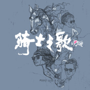
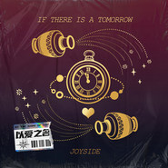
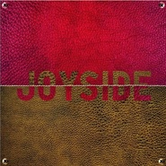
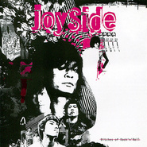
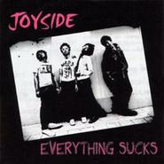

Joyside
============================

|  |  |
| :--: | :-- |
| [ Joyside](https://i.xiami.com/joyside) | **地区**: China 中国大陆 **风格**: 摇滚 Rock & Roll, 独立摇滚 Indie Rock, 朋克 Punk Rock, 车库摇滚复兴 Garage Rock Revival **播放数**: 3686741 **粉丝数**: 15911 **评论数**: 573  |

## 档案

成员档案    主唱：边远  吉他：虹位  贝司：刘昊  鼓手：关铮    主要历史  • 成立于2001年3月的北京。早期的风格为Old School Punk风格。乐队成员70年代摇  滚乐特色的着装、不羁的生活作风和舞台上下酒鬼的形象引来无数青年争相模仿；  同年签约摩登天空badhead厂牌。  • 2005年3月乐队入选第三届百事音乐风云榜年度最佳新晋乐队提名  • 2006年4月由美国导演Kevin Fritz根据乐队巡演拍摄素材完成的记录片《Wasted  Orient》制作完毕，开始全球巡回播放  • 2007年7月签约与兵马司唱片      简介  被许多人认为是中国最优秀的地下乐队的Joyside，由来自新疆的  边远在2001年组建，地点是在北京北边的一个阴暗潮湿的地下室  里。在北京的小俱乐部里为了啤酒和烟钱演出了三年之后，他们  懒洋洋地发表了他们的第一张专辑，《Drunk is Beautiful》，再没  有什么能够比这几个词更好地表达出Joyside的原始的颓废美学。  在两张专辑之后，他们自然地得到了中国最好的独立乐队的名  声，他们将自己看作是摇滚乐婊子，沉溺于音乐并且摆出纽约前  朋克场景的疯狂的姿态。  乐队的成员包括主唱边远，贝司手刘昊，鼓手关铮，以及令人惊  叹的年轻的吉他手虹位，他也被2007年《Rolling Stone》的一篇  文章评为中国最重要的4位吉他手之一。伴随着他们在Joyside中  的创作，乐队的4位成员也同时积极参与到各自的音乐计划中。  边远和刘昊同时是Johnny’s Teeth的成员，刘昊同时也在Dog 13乐  队中弹琴。关铮经常参与到Linga和Believers的演出，而虹位则参  加了许多北京的一次性实验音乐的演出中。边远的木吉他表演是  北京D22俱乐部每星期三晚著名的“箱琴与朋克”的主要节目。  很少有这样的情况发生：当你去看Joyside的现场演出时还能在  结束时没有被汗湿。他们在一个伟大的法外摇滚的传统中粗野的  摇滚着，并且把每一个观众扔进狂暴中，尤其是当虹位的机智敏  感的吉他演奏突然进入到一种肮脏而丑陋的嘎吱声中并在边远的  歌声周围扭曲着的时候。乐队受到了整个摇滚乐历史的影响，早  期的rockers，Mods，或者70年代的朋克场景，以及特别地来自  Dead Boys，New York Dolls，Johnny Thunders，Sex Pistols，以  及the Stooges。  除了是中国最努力的乐队之一，在北京演出以及中国巡演之外，  在2007年的4月，5月和6月，Joyside进行了一次大规模的欧洲巡  演，在德国，奥地利，瑞士，法国和英国演出。在巡演的路上他  们出现在了欧洲各国的报纸和德国的电视上。他们是2007年发行  的一部描写北京地下音乐场景的德国记录片《Beijing Bubbles》中  的主角，并且在其他的一些记录中国摇滚乐的电影和历史记录中  也是如此。在2007年的9月《That’s Beijing》将他们列为中国最好  的十支乐队之一。  2007年9月Joyside在北京流行音乐节上和他们的偶像，传奇乐队  New York Dolls同台演出。Sylvain Sylvain在接受媒体采访时说他  们是他最喜欢的中国乐队并且希望能够为他们制作下一张专辑。  Joyside将会在下一年进行大范围的中国巡演并将把他们的音乐带  到每一个角落去。    Joyside was formed in 2001, in a dark dank basement in the north of  Beijing. After three years, they lazily released their debut album, “Drunk  is Beautiful”, whose name comes as close to expressing Joyside’s ferociously  decadent aesthetic as any three words can. The band was soon  to out grow their punk roots in 2005 with their follow up EP Bitches  of Rock & Roll which signaled a style change away from punk rock and  towards a more pure expession of rock and roll. Last September they released  their latest CD, “Booze at Neptune’s Dawn” on Bing Ma Si/Maybe  Mars and are planning an EP for later this year.  With six CDs to their name and the well-deserved reputation as China’s  greatest indie band, they consider themselves to be bitches of rock ‘n’  roll, addicted to the music and the mad posturing of the pre-punk New  York scene, with particular influences being Dead Boys, New York Dolls,  Johnny Thunders, Sex Pistols, and the Stooges. The highlight of their  career may have come when singer Bian Yuan and friends met the members  of New York Dolls one night at D22, with each band playing for the  other way into the early morning.  Joyside has been the subject of several documentaries including the  German produced Beijing Bubbles and the cult hit Wasted Orient. The  later has been dubbed, “the only true rock and roll movie from China”  and shows the grit and piss of Joyside’s real life following them on a  drunken tour across China.  It is almost impossible to attend a Joyside concert and not get swept up  into the sheer dirty theatre of it all. Bian Yuan’s singing, with its perfect  phrasing and slightly garbled sneer, is as honest and real as Johnny  Thunders, and he has behind him one of the loosest and freshest units  in China – a band capable of exploding in perfect synchronicity. When  they go all out the electricity in the air infuses everyone within hearing  and turns even mild-mannered accountants into rock and roll fiends.  Their notorious D22 show with label-mates Carsick Cars in late February  2008 so packed the club that it was forced the club to close its doors at  10:20, with dozens of disappointed patrons begging to get and willing to  pay three or four times the cover charge, to no avail.  At Bian Yuan’s 2006 birthday concert at D22, the whole band, dazed on  who-knows-what exotic vegetables, put on a show that was both incredibly  chaotic (at times the band seemed to forget they were on stage) and  so incredibly tight that they managed to communicate their delirium to  the whole club. How do they do it? No one knows, but the rumors are  that these guys are so thoroughly rock ‘n’ roll that they don’t know how  to act any other way.

## 专辑

| 名称 | 语种 | 唱片公司 | 发行时间 | 专辑类别 | 专辑风格 |
| :--: | :-- | :-- | :-- | :-- | :-- |
| [ 骑士之歌](./albums/5021919232.md) | 国语 | 独立发行 | 2020年11月16日 | EP, 单曲 | 摇滚 Rock & Roll |
| [ If There Is A Tomorrow](./albums/5020660720.md) | 英语 |  | 2020年05月20日 | 录音室专辑 | 流行 Pop |
| [ 太空浪子](./albums/2105624949.md) | 国语 | 独立发行 | 2019年12月30日 | EP, 单曲 | 摇滚 Rock & Roll |
| [ Not My Time To Die](./albums/2105600554.md) | 国语 | 独立发行 | 2019年12月16日 | EP, 单曲 | 摇滚 Rock & Roll |
| [ Joyside同名专辑](./albums/407905.md) | 英语 | 摩登天空 | 2010年09月25日 | 录音室专辑 | 摇滚 Rock & Roll |
| [ Your City Is A Desert To Me](./albums/369005.md) | 英语 | 兵马司 | 2010年02月01日 | 录音室专辑 | 摇滚 Rock & Roll |
| [ Last Live最后的演出](./albums/351249.md) | 英语 | 兵马司 | 2009年09月12日 | 现场专辑 | 摇滚 Rock & Roll |
| [ Maybe Tonight](./albums/330057.md) | 英语 | 兵马司, BMG | 2009年04月27日 | EP, 单曲 | 摇滚 Rock & Roll |
| [ Other Songs](./albums/311531.md) | 英语 | 兵马司 | 2008年09月20日 | EP, 单曲 | 摇滚 Rock & Roll |
| [ Booze At Neptune's Dawn海王星黎明的酒宴](./albums/289498.md) | 英语 | 兵马司, BMG | 2007年09月08日 | 录音室专辑 | 摇滚 Rock & Roll |
| [ Bitches of Rock 'n' Roll](./albums/167520.md) | 国语 |  | 2006年06月01日 | EP, 单曲 | 摇滚 Rock & Roll |
| [ Drunk Is Beautiful](./albums/14783.md) | 英语 | BadHead | 2004年10月01日 | 录音室专辑 | 摇滚 Rock & Roll |
| [ Everything Sucks](./albums/312445.md) | 英语 | 独立发行 | 2003年07月01日 | 录音室专辑 | 摇滚 Rock & Roll |

## 评论

|  |  |  |
| :-- | :-- | :-- |
|  [虾米用户](https://emumo.xiami.com/u/427384237) 我还没想好要写什么... 2020-12-13 22:27 赞(0) 踩(0) | 
➕
 |
|  [虾米用户](https://emumo.xiami.com/u/6030867) 你的问题主要在于读书不多... 2020-11-16 00:06 赞(0) 踩(0) | 
来深圳吗？
 |
|  [虾米用户](https://emumo.xiami.com/u/110088060) 作为报答、我吔给泥放点、... 2020-11-13 23:39 赞(0) 踩(0) | 
.
 |
|  [虾米用户](https://emumo.xiami.com/u/2934975)  2020-10-20 10:17 赞(0) 踩(0) | 
边远 刘昊都是什么星座
 |
|  [虾米用户](https://emumo.xiami.com/u/49640493) 网易云SAINTDONT... 2020-09-25 02:36 赞(0) 踩(0) | 
love
 |
|  [虾米用户](https://emumo.xiami.com/u/8337175)  2020-09-05 10:34 赞(0) 踩(0) | 
每一首 都那么棒 太喜欢了 想到边远说的 我们的音乐一百年后都会有人喜欢 是的 是这样的 是这样的
 |
|  [虾米用户](https://emumo.xiami.com/u/7863733)  2020-08-07 12:03 赞(0) 踩(0) | 
什么是摇滚之王啊
 |
|  [虾米用户](https://emumo.xiami.com/u/433401305) 不美丽就是我的美丽 2020-08-04 23:20 赞(0) 踩(0) | 
我永远属于joyside
 |
|  [虾米用户](https://emumo.xiami.com/u/377388231) Qwert yui op... 2020-07-17 13:46 赞(0) 踩(0) | 
这乐队跟我一般大啊
 |
|  [虾米用户](https://emumo.xiami.com/u/11067442) No one and n... 2020-07-03 15:00 赞(3) 踩(0) | 
还有机会听你们的现场吗
 |
|  [虾米用户](https://emumo.xiami.com/u/335763493) 不戴墨镜  2020-07-03 14:59 赞(1) 踩(0) | 
：）
 |
|  [虾米用户](https://emumo.xiami.com/u/340903899) 我还没想好要写什么... 2020-06-30 13:21 赞(0) 踩(0) | 
，
 |
|  [虾米用户](https://emumo.xiami.com/u/33968682) 只有音乐才是我的解药 2020-06-14 16:58 赞(1) 踩(0) | 
期待乐队的夏天 期待这个夏天能在屏幕上看到你们演出
 |
|  [虾米用户](https://emumo.xiami.com/u/155542710) 宇宙深处的猫... / ... 2020-05-21 14:46 赞(0) 踩(0) | 
新专辑也不在这边发一下了吗 :-(
 |
|  [虾米用户](https://emumo.xiami.com/u/10235610) jeddy 3 2020-05-07 01:54 赞(0) 踩(0) | 
零几年在solo bar我在你们演出刚开始就摔破了头。哈哈难以忘怀的记忆。
 |
|  [虾米用户](https://emumo.xiami.com/u/344495614) 落阳深处的布鲁斯 2020-04-05 19:42 赞(1) 踩(0) | 
和前前男友一起去看joyside复出，哈哈哈，忘不了
 |
| ⇒ |  [虾米用户](https://emumo.xiami.com/u/7842432)  2020-08-18 21:20 赞(0) 踩(0) | 
厉害，啥时候四个人一起去
 |
|  [虾米用户](https://emumo.xiami.com/u/379912005) 感谢虾米，永远记得。 2020-03-07 04:07 赞(1) 踩(0) | 
趴间置顶才发现这队
 |
|  [虾米用户](https://emumo.xiami.com/u/379912005) 感谢虾米，永远记得。 2020-03-07 04:07 赞(0) 踩(0) | 
好
 |
|  [虾米用户](https://emumo.xiami.com/u/379912005) 感谢虾米，永远记得。 2020-03-07 04:07 赞(0) 踩(0) | 
哇
 |
|  [虾米用户](https://emumo.xiami.com/u/441126925)  2020-03-05 19:00 赞(1) 踩(0) | 
我永远爱joyside
 |
|  [虾米用户](https://emumo.xiami.com/u/73740960)  2020-03-03 13:34 赞(0) 踩(0) | 
嘘……
 |
|  [虾米用户](https://emumo.xiami.com/u/2418238) weibo: @尤米口 2019-12-30 18:21 赞(0) 踩(0) | 
again!!!
 |
|  [虾米用户](https://emumo.xiami.com/u/3323029)  2019-10-30 15:16 赞(0) 踩(0) | 
joyside真牛逼~每次听都热血沸腾！
 |
|  [虾米用户](https://emumo.xiami.com/u/50489961) 好难为情 2019-10-28 16:02 赞(0) 踩(0) | 
爱了
 |
|  [虾米用户](https://emumo.xiami.com/u/866525) 最好的时光才刚刚开始！≥... 2019-10-27 23:31 赞(0) 踩(0) | 
晚上厦门草莓，我在第一排，看得好清晰啊喂
 |
| ⇒ |  [虾米用户](https://emumo.xiami.com/u/4984649)  2019-10-28 10:34 赞(0) 踩(0) | 
我也在第一排
 |
| ⇒ |  [虾米用户](https://emumo.xiami.com/u/866525) 最好的时光才刚刚开始！≥... 2019-10-28 12:37 赞(0) 踩(0) | 
<q><b>Water-Pc说：</b></q>
 |
|  [虾米用户](https://emumo.xiami.com/u/411058641) 取之不尽 用之不竭 2019-09-21 22:17 赞(0) 踩(0) | 
中国！
 |
|  [虾米用户](https://emumo.xiami.com/u/11472475) 我还没想好要写什么... 2019-09-20 00:40 赞(0) 踩(0) | 
有他们早期的碟出吗？
 |
|  [虾米用户](https://emumo.xiami.com/u/48845059) 我还没想好要写什么... 2019-07-30 12:04 赞(1) 踩(0) | 
joyside的音乐充满着独特魅力融进了我的身体里
 |
|  [虾米用户](https://emumo.xiami.com/u/43492923) 行到水穷我才开始害怕，夕... 2019-07-22 12:11 赞(1) 踩(0) | 
▽
 |
|  [虾米用户](https://emumo.xiami.com/u/9387326) 你不要死 2019-06-29 13:34 赞(2) 踩(0) | 

 |
|  [虾米用户](https://emumo.xiami.com/u/7620119)  2019-06-28 23:21 赞(0) 踩(0) | 
上海！刚结束！这帮老流氓又回来了！
 |
|  [虾米用户](https://emumo.xiami.com/u/355338059) 是个诗人 2019-06-20 18:54 赞(0) 踩(0) | 
想不到中国也有这么牛逼的朋克乐队
 |
|  [虾米用户](https://emumo.xiami.com/u/25977681) 你来吧 互通有无，你走吧... 2019-06-17 21:46 赞(2) 踩(0) | 
大家！来成都集结吧！！！
 |
|  [虾米用户](https://emumo.xiami.com/u/207428)  2019-06-14 21:12 赞(1) 踩(0) | 
老姐姐云看北京现场，哭倒在客厅
 |
|  [虾米用户](https://emumo.xiami.com/u/84599002) 拥有机械臂搓碟会是怎样的... 2019-06-14 20:04 赞(0) 踩(0) | 
明天，真想去北京啊
 |
|  [虾米用户](https://emumo.xiami.com/u/10644841)  2019-06-13 22:07 赞(0) 踩(0) | 
出一张明天北京的票，朋友临时去不了了
 |
|  [虾米用户](https://emumo.xiami.com/u/238758266) 我还没想好要写什么... 2019-06-13 10:52 赞(0) 踩(0) | 
出两张上海
 |
|  [虾米用户](https://emumo.xiami.com/u/548259) INFP/OKAY 2019-05-24 20:47 赞(0) 踩(0) | 
欢迎回归
 |
|  [虾米用户](https://emumo.xiami.com/u/1734239) Curiosity ma... 2019-05-14 20:58 赞(0) 踩(0) | 
抢到票了  
 |
|  [虾米用户](https://emumo.xiami.com/u/41265111) 土法炼钢 2019-05-14 15:46 赞(1) 踩(0) | 
大家6.14见
 |
|  [虾米用户](https://emumo.xiami.com/u/36471014) oi to the wo... 2019-05-14 13:02 赞(1) 踩(0) | 
谁抢到票了 哭
 |
| ⇒ |  [虾米用户](https://emumo.xiami.com/u/49073959) 我还没想好要写什么... 2019-05-15 18:37 赞(0) 踩(0) | 
我
 |
|  [虾米用户](https://emumo.xiami.com/u/43492923) 行到水穷我才开始害怕，夕... 2019-05-10 10:16 赞(0) 踩(0) | 
-
 |
|  [虾米用户](https://emumo.xiami.com/u/23486397)  2019-04-19 16:11 赞(2) 踩(0) | 
啥时候出新砖啊啊啊啊啊！
 |
|  [虾米用户](https://emumo.xiami.com/u/7305096) 没事听着玩儿~~ 2019-04-10 09:21 赞(0) 踩(0) | 
这种城乡结合部的英文唱腔，听一首GALA也就够了，听多了脑仁疼
 |
| ⇒ |  [虾米用户](https://emumo.xiami.com/u/1154943) 嬲 2019-04-23 10:43 赞(0) 踩(0) | 
你去城乡结合部找个说英文的来看看是什么口音
 |
| ⇒ |  [虾米用户](https://emumo.xiami.com/u/11425312)   2019-04-24 01:44 赞(0) 踩(0) | 
Shut ur tiny dirty dickie mouth up ur dickie is little as my little pinkie 来 完美语音秀一下我听听
 |
| ⇒ |  [虾米用户](https://emumo.xiami.com/u/1447058) 已迁移至网易云，祝好——... 2019-04-26 13:25 赞(0) 踩(0) | 
我说句正宗的龙鸣英语给你听哈  NM$L
 |
| ⇒ |  [虾米用户](https://emumo.xiami.com/u/138920646)  2019-05-09 02:11 赞(0) 踩(0) | 
一看是听电子音乐我就放心了
 |
| ⇒ |  [虾米用户](https://emumo.xiami.com/u/13494957) 我还没想好要写什么... 2019-06-15 22:47 赞(0) 踩(0) | 
朋友 别抖机灵
 |
|  [虾米用户](https://emumo.xiami.com/u/260758019) Don't stop i... 2019-04-06 11:22 赞(0) 踩(0) | 
punk rock 不玩 玩 不玩 玩 不玩 玩 不玩 玩  不玩  玩！
 |
|  [虾米用户](https://emumo.xiami.com/u/367402195) NingYuhua 2019-04-05 16:55 赞(1) 踩(0) | 
乱稻草
 |
|  [虾米用户](https://emumo.xiami.com/u/418300498) 青春无怨-谁说不悔 2019-04-04 19:10 赞(0) 踩(0) | 
中国摇滚之父不是那个谁谁么？      
 |
|  [虾米用户](https://emumo.xiami.com/u/14536240) 早点睡觉晚点起床少挣钱多... 2019-04-04 09:18 赞(2) 踩(0) | 
虾米把人家的版权买了，让能听听歌，光宣传歌也听不全
 |
|  [虾米用户](https://emumo.xiami.com/u/295378769) 亦可搜索jimnosky 2019-04-04 09:01 赞(1) 踩(0) | 
08年和木玛那场我去了
 |
|  [虾米用户](https://emumo.xiami.com/u/35032044)  2019-04-04 07:36 赞(3) 踩(0) | 
你们整整偷走了我十年光阴，终于回来了！Fuck the time，just let it pass..
 |
|  [虾米用户](https://emumo.xiami.com/u/205768994) 敏而好学 2019-04-04 07:36 赞(0) 踩(0) | 
看得出是一个很厉害的乐队
 |
|  [虾米用户](https://emumo.xiami.com/u/6498265) 这家伙很聪明什么也没留下... 2019-04-04 07:14 赞(10) 踩(0) | 
想当年关铮可是国内最帅鼓手 
 |
| ⇒ |  [虾米用户](https://emumo.xiami.com/u/99278310)  2019-06-16 23:55 赞(0) 踩(0) | 
现在也是 永远都是
 |
|  [虾米用户](https://emumo.xiami.com/u/452588) 岁月饶不了你！ 2019-04-04 03:58 赞(3) 踩(0) | 
我13年婚礼垫场音乐全程joyside，我那天一口饭没吃，但是我觉得值了。版权费怎么给你们？就酱。
 |
| ⇒ |  [虾米用户](https://emumo.xiami.com/u/452588) 岁月饶不了你！ 2019-04-04 04:00 赞(0) 踩(0) | 
我头像在虾米用了十年怎么破。。
 |
| ⇒ |  [虾米用户](https://emumo.xiami.com/u/295378769) 亦可搜索jimnosky 2019-04-04 09:12 赞(0) 踩(0) | 
整的不赖
 |
| ⇒ |  [虾米用户](https://emumo.xiami.com/u/3323029)  2019-10-30 15:18 赞(0) 踩(0) | 
我结婚的视频用的dongdongdong
 |
|  [虾米用户](https://emumo.xiami.com/u/8070377) 爱雾瑞性维欧腐漏 2019-04-03 23:37 赞(1) 踩(0) | 
可以 可以的
 |
|  [虾米用户](https://emumo.xiami.com/u/392317)  2019-04-03 23:28 赞(2) 踩(0) | 
最后那一场，特别冷静的站到后排拍了一张胶片，也从没想到Joyside会真的回来，但是他们真的回来了啊！！！当年的SILLY GIRL现在也都30岁上下，青春不老心还在！！！等你们的演出    
 |
|  [虾米用户](https://emumo.xiami.com/u/32060115)   2019-04-03 23:23 赞(1) 踩(0) | 
青春的人儿啊，想想一个人的十年会怎样，足够让许多选择发生，许多人事来来往往。Welcome Back
 |
|  [虾米用户](https://emumo.xiami.com/u/71137586) 我还没想好要写什么... 2019-04-03 21:56 赞(0) 踩(0) | 
今年能听到现场了
 |
|  [虾米用户](https://emumo.xiami.com/u/56007709) 人生如梦 2019-04-03 21:24 赞(0) 踩(0) | 
哦 很优秀嘛
 |
|  [虾米用户](https://emumo.xiami.com/u/404304144)  2019-04-03 21:24 赞(0) 踩(0) | 
这是2019年最好的消息！没有joyside, 就没摇滚。
 |
|  [虾米用户](https://emumo.xiami.com/u/178747290) 你会像马达那样找我吗？ 2019-04-03 21:22 赞(1) 踩(0) | 
❤️
 |
|  [虾米用户](https://emumo.xiami.com/u/36620871) 我还没想好要写什么... 2019-04-03 20:46 赞(0) 踩(0) | 
哎
 |
|  [虾米用户](https://emumo.xiami.com/u/49680433)  2019-04-03 19:17 赞(0) 踩(0) | 
啊！真棒！
 |
|  [虾米用户](https://emumo.xiami.com/u/4145368) 拜拜虾米 可+我扣扣音药 2019-04-03 18:25 赞(1) 踩(0) | 
 
 |
|  [虾米用户](https://emumo.xiami.com/u/24468)  2019-04-03 18:01 赞(0) 踩(0) | 
告别演出我去了
 |
|  [虾米用户](https://emumo.xiami.com/u/1652373)  2019-04-03 17:49 赞(49) 踩(0) | 
joyside最后那张同名专辑，还是我上传到虾米的，现在看了一下，文案居然没变，看着还挺尴尬……哈哈
 |
|  [虾米用户](https://emumo.xiami.com/u/24838376) ++++++++++++ 2019-04-03 16:30 赞(0) 踩(0) | 
真是我童年之光
 |
|  [虾米用户](https://emumo.xiami.com/u/42963872) 我还没想好要写什么... 2019-04-03 16:16 赞(0) 踩(0) | 
school走起
 |
|  [虾米用户](https://emumo.xiami.com/u/422748988)  2019-04-03 16:13 赞(0) 踩(0) | 
6
 |
|  [虾米用户](https://emumo.xiami.com/u/5062136) Ugly 2019-04-03 15:46 赞(0) 踩(0) | 
啊？ 
 |
|  [虾米用户](https://emumo.xiami.com/u/11446884) New York MoM... 2019-04-03 15:25 赞(0) 踩(0) | 
木有听过，又想起以前玩 bass的时候了
 |
|  [虾米用户](https://emumo.xiami.com/u/63533816) 我还没想好要写什么... 2019-04-03 15:10 赞(0) 踩(0) | 
真的是惊喜
 |
|  [虾米用户](https://emumo.xiami.com/u/36470417) 我还没想好要写什么... 2019-04-03 14:40 赞(2) 踩(0) | 
joy always by your side，希望能在离开北京之前听到新专看到演出！
 |
|  [虾米用户](https://emumo.xiami.com/u/337150695) 凡 所 有 相 皆 是 ... 2019-04-03 14:37 赞(0) 踩(0) | 
回来了就好joy always by my side!
 |
|  [虾米用户](https://emumo.xiami.com/u/123987172)   2019-04-03 14:07 赞(0) 踩(0) | 
时过境迁，还能玩多久
 |
|  [虾米用户](https://emumo.xiami.com/u/3483823)  2019-04-03 13:40 赞(0) 踩(0) | 
摇滚乐真好！
 |
|  [虾米用户](https://emumo.xiami.com/u/422765924)  2019-04-03 13:32 赞(0) 踩(0) | 
欢迎回来！Joy always by your side！
 |
|  [虾米用户](https://emumo.xiami.com/u/27670611) 我还没想好要写什么... 2019-04-03 12:49 赞(0) 踩(0) | 
全世界，最好的下酒菜
 |
|  [虾米用户](https://emumo.xiami.com/u/230803304) 三观正又爱国的成都宝藏男... 2019-04-03 12:44 赞(0) 踩(0) | 
支持joyside组合
 |
|  [虾米用户](https://emumo.xiami.com/u/32961761) 一切终将化为乌有 2019-04-03 12:18 赞(0) 踩(0) | 
十年前在豆瓣第一次听joyside，以为是个土鳖乐队，没想到是个牛逼乐队，时光匆匆，他们又回来了，依然年轻，依然牛逼 
 |
|  [虾米用户](https://emumo.xiami.com/u/5007575) 呕 2019-04-03 11:57 赞(0) 踩(0) | 
十年过去了   关铮竟然还是顶着一张好像整过容一样的完美的脸     这也太……
 |
|  [虾米用户](https://emumo.xiami.com/u/2433347)  2019-04-03 11:51 赞(2) 踩(0) | 
Welcome back 大连第一次听他们现场演出 影响了我大多数时候的和你一样，心目中地位最高的乐队 捡过关铮的鼓棒 边远手写歌单 亲过虹位 的女孩 现在为人母 希望所有热爱生活的人 Always by joy side
 |
|  [虾米用户](https://emumo.xiami.com/u/91092606) 希望我能有一颗马儿的头，... 2019-04-03 11:34 赞(2) 踩(0) | 
卧槽！我还能说啥=_=牛逼
 |
|  [虾米用户](https://emumo.xiami.com/u/5951220) 音乐，请你请你给我灵魂 2019-04-03 10:26 赞(0) 踩(0) | 
第一支喜欢上的国内乐队，让我对国内乐队有信心的一只乐队，终于回归啦！ 
 |
|  [虾米用户](https://emumo.xiami.com/u/422763778)  2019-04-03 10:13 赞(1) 踩(0) | 
激动的心情无以言表  期待新专和巡演
 |
|  [虾米用户](https://emumo.xiami.com/u/34586146) 杭州大笨蛋 2019-04-03 09:46 赞(1) 踩(0) | 
我是真的能喝
 |
|  [虾米用户](https://emumo.xiami.com/u/4755329) 为啥不让看 就看 2019-04-03 09:29 赞(2) 踩(0) | 
那是我的全部青春
 |
|  [虾米用户](https://emumo.xiami.com/u/1279459) 这家伙很聪明什么也没留下... 2019-04-03 09:26 赞(2) 踩(0) | 
太棒了 废话不说 就是干 就是喝
 |
|  [虾米用户](https://emumo.xiami.com/u/4484136) 向内 2019-04-03 09:13 赞(1) 踩(0) | 
真好～
 |
|  [虾米用户](https://emumo.xiami.com/u/3714518) 死人 2019-04-03 08:25 赞(0) 踩(0) | 
(ง •̀_•́)ง
 |
|  [虾米用户](https://emumo.xiami.com/u/209426870) 我一度觉得我脑子是听歌听... 2019-04-03 07:56 赞(1) 踩(0) | 
Life was a bad joke, But it is funny now.
 |
|  [虾米用户](https://emumo.xiami.com/u/296042286)  2019-04-03 02:44 赞(0) 踩(0) | 
变成了酒鬼
 |
|  [虾米用户](https://emumo.xiami.com/u/166822840) 造飞机的你 2019-04-03 02:35 赞(0) 踩(0) | 
刚刚爱上 很是期待
 |
|  [虾米用户](https://emumo.xiami.com/u/33611553) 哇哈 2019-04-03 01:44 赞(74) 踩(0) | 
等了3488天！！！还在北京，还是每个周末在School看你们从笑闹到喝花，从失恋到结了婚，我爱的joyside回来了！！！！
 |
| ⇒ |  [虾米用户](https://emumo.xiami.com/u/375495204)  2019-04-05 21:27 赞(0) 踩(0) | 
不是3487天？
 |
|  [虾米用户](https://emumo.xiami.com/u/3386654) CandyMonster 2019-04-03 01:30 赞(0) 踩(0) | 
摇滚之王回来了！！！！！
 |
|  [虾米用户](https://emumo.xiami.com/u/36014723) 我还没想好要写什么... 2019-04-03 01:27 赞(0) 踩(0) | 
我爱你们
 |
|  [虾米用户](https://emumo.xiami.com/u/5897487)  2019-04-03 01:23 赞(0) 踩(0) | 
偏偏在今年 有散有聚啊
 |
|  [虾米用户](https://emumo.xiami.com/u/812392) 【封面控】毛驴牌❤小众好... 2019-04-03 00:42 赞(2) 踩(0) | 
我的妈呀！！！！！！！！
 |
|  [虾米用户](https://emumo.xiami.com/u/36019737) Ohh fooooooo... 2019-04-03 00:12 赞(1) 踩(0) | 
Good new days
 |
|  [虾米用户](https://emumo.xiami.com/u/2807048) 噢 乖 2019-04-03 00:12 赞(0) 踩(0) | 
行昂！！
 |
|  [虾米用户](https://emumo.xiami.com/u/391438) 就算是流血 2019-04-02 13:49 赞(0) 踩(0) | 
大师兄 他回来了
 |
|  [虾米用户](https://emumo.xiami.com/u/1047701) 再见虾米 2019-04-02 10:47 赞(1) 踩(0) | 
昨天宣布复出了！！妈的十年了卧槽！
 |
|  [虾米用户](https://emumo.xiami.com/u/9445406) 瑞典H.E.A.T.QQ... 2019-04-01 23:04 赞(1) 踩(0) | 
joyside回来了！
 |
|  [虾米用户](https://emumo.xiami.com/u/327952880) Waldeinsamke... 2019-04-01 22:22 赞(1) 踩(0) | 
太好了真的太好了我爆哭！！！
 |
|  [虾米用户](https://emumo.xiami.com/u/45140086) 终与草木同朽 2019-04-01 21:29 赞(0) 踩(0) | 
2019.4.1。3488天。你们回来了，是真的吗?
 |
|  [虾米用户](https://emumo.xiami.com/u/182400198) 版权逃亡冷感钝化人 2019-04-01 21:04 赞(0) 踩(0) | 
回来了！！牛逼！
 |
|  [虾米用户](https://emumo.xiami.com/u/12482681) 上上下下左右左右baba 2019-04-01 20:50 赞(0) 踩(0) | 
回来了真好
 |
|  [虾米用户](https://emumo.xiami.com/u/354685931) 主要在隔壁WYY ID一... 2019-04-01 20:27 赞(0) 踩(0) | 
欢迎
 |
|  [虾米用户](https://emumo.xiami.com/u/52053321)   2019-04-01 19:47 赞(0) 踩(0) | 
哭了！哭了！
 |
|  [虾米用户](https://emumo.xiami.com/u/5613814) 动荡是常态 2019-04-01 18:17 赞(1) 踩(0) | 
所有热评都该刷新啦，大家都进入下辈子啦
 |
|  [虾米用户](https://emumo.xiami.com/u/2661970) 这家伙很聪明什么也没留下... 2019-04-01 17:30 赞(1) 踩(0) | 
我原谅你愚人节玩真的
 |
|  [虾米用户](https://emumo.xiami.com/u/353515197) 介绍？ 2019-04-01 17:20 赞(0) 踩(0) | 
重组真的是件好事吗？所谓的热搜，刷屏和狂欢真的是好吗？你还是你吗？他们还是他们吗？有些东西失去了才算拥有。都别骗自个儿了
 |
| ⇒ |  [虾米用户](https://emumo.xiami.com/u/1154943) 嬲 2019-04-01 18:05 赞(0) 踩(0) | 
如果能再做出牛逼的音乐，为什么不呢？
 |
| ⇒ |  [虾米用户](https://emumo.xiami.com/u/353515197) 介绍？ 2019-04-01 19:48 赞(0) 踩(0) | 
<q><b>Rude呜说：</b></q>
 |
| ⇒ |  [虾米用户](https://emumo.xiami.com/u/1154943) 嬲 2019-04-01 20:04 赞(0) 踩(0) | 
<q><b>dirtymoney说：</b></q>
 |
| ⇒ |  [虾米用户](https://emumo.xiami.com/u/353515197) 介绍？ 2019-04-01 21:20 赞(0) 踩(0) | 
<q><b>Rude呜说：</b></q>
 |
| ⇒ |  [虾米用户](https://emumo.xiami.com/u/907249)  2019-04-02 13:58 赞(0) 踩(0) | 
啊？重组有啥问题
 |
|  [虾米用户](https://emumo.xiami.com/u/99465068) Spotify : Yo... 2019-04-01 16:42 赞(1) 踩(0) | 
抱！
 |
|  [虾米用户](https://emumo.xiami.com/u/2658255) diamond is u... 2019-04-01 16:20 赞(1) 踩(0) | 
Joyside回来了！
 |
|  [虾米用户](https://emumo.xiami.com/u/33968682) 只有音乐才是我的解药 2019-04-01 16:16 赞(2) 踩(0) | 
愚人节最大的惊喜
 |
|  [虾米用户](https://emumo.xiami.com/u/8221701) 来微博找我吧@蕾雷枪 2019-04-01 14:22 赞(2) 踩(0) | 
下次见！
 |
|  [虾米用户](https://emumo.xiami.com/u/355199493) 我还没想好要写什么... 2019-04-01 13:32 赞(1) 踩(0) | 
重组啦！
 |
|  [虾米用户](https://emumo.xiami.com/u/37797684) 我还没想好要写什么... 2019-04-01 13:08 赞(3) 踩(0) | 
听说要重组，牛鬼蛇神靠边站吧
 |
|  [虾米用户](https://emumo.xiami.com/u/12230374) Pinkfloydzh，... 2019-04-01 12:55 赞(8) 踩(0) | 
不夸张，看到朋友圈有人发一下子泪都下来了，赶快去各种地方求证…
 |
|  [虾米用户](https://emumo.xiami.com/u/5197513)  2019-04-01 12:23 赞(2) 踩(0) | 
 fu*k me or fu*k off just don’t fool me
 |
|  [虾米用户](https://emumo.xiami.com/u/5197513)  2019-04-01 12:13 赞(2) 踩(0) | 
fuck me or fuck off just don’t fool me  
 |
|  [虾米用户](https://emumo.xiami.com/u/36938932) 倒霉的小伙子比洞還潮濕的... 2019-04-01 11:48 赞(0) 踩(0) | 

 |
|  [虾米用户](https://emumo.xiami.com/u/209426870) 我一度觉得我脑子是听歌听... 2019-04-01 11:34 赞(0) 踩(0) | 
Joyside！！！！！！！！
 |
|  [虾米用户](https://emumo.xiami.com/u/44140680) 旅途愉快 2019-04-01 11:19 赞(2) 踩(0) | 
真的不是愚人节玩笑，他们回来了 
 |
|  [虾米用户](https://emumo.xiami.com/u/36471014) oi to the wo... 2019-04-01 11:10 赞(4) 踩(0) | 
来噪 给我用啤酒洗澡吧
 |
|  [虾米用户](https://emumo.xiami.com/u/41265111) 土法炼钢 2019-04-01 11:03 赞(3) 踩(0) | 
虹位回来了
 |
|  [虾米用户](https://emumo.xiami.com/u/1154943) 嬲 2019-04-01 11:00 赞(3) 踩(0) | 
the joker is back！
 |
|  [虾米用户](https://emumo.xiami.com/u/49073959) 我还没想好要写什么... 2019-04-01 10:41 赞(4) 踩(0) | 
重回北京时代，所有被选召的年轻帮。
 |
|  [虾米用户](https://emumo.xiami.com/u/45587595) 挺迷茫的 2019-04-01 10:29 赞(1) 踩(0) | 
我爱joyside
 |
|  [虾米用户](https://emumo.xiami.com/u/40148340) 还偷看 2019-04-01 10:00 赞(1) 踩(0) | 
哈哈
 |
|  [虾米用户](https://emumo.xiami.com/u/305756133) 我还没想好要写什么... 2019-04-01 09:49 赞(0) 踩(0) | 
回来了！
 |
|  [虾米用户](https://emumo.xiami.com/u/310795130)    2019-04-01 09:49 赞(1) 踩(0) | 
我爱joyside
 |
|  [虾米用户](https://emumo.xiami.com/u/45587595) 挺迷茫的 2019-04-01 09:19 赞(0) 踩(0) | 
快回来吧
 |
|  [虾米用户](https://emumo.xiami.com/u/18169133) 停用个人功能.仅上传音乐... 2019-04-01 08:48 赞(0) 踩(0) | 
激动啊啊啊啊啊
 |
|  [虾米用户](https://emumo.xiami.com/u/408331022) 我还没想好要写什么... 2019-03-31 20:16 赞(1) 踩(0) | 
是真回来吗，明天愚人节  
 |
|  [虾米用户](https://emumo.xiami.com/u/35319030) 我这辈子哪里听得过来那么... 2019-03-31 19:29 赞(0) 踩(0) | 
！！！！！！！
 |
|  [虾米用户](https://emumo.xiami.com/u/1305847) 这个家伙很聪明什么也没有... 2019-03-31 17:49 赞(0) 踩(0) | 
回来真好 
 |
|  [虾米用户](https://emumo.xiami.com/u/47195966) qq音乐同名。 2019-03-31 16:42 赞(2) 踩(0) | 
你们回来了
 |
|  [虾米用户](https://emumo.xiami.com/u/260992790) I'll Be Your... 2019-03-31 15:32 赞(1) 踩(0) | 

 |
|  [虾米用户](https://emumo.xiami.com/u/22664079) / 2019-03-31 14:34 赞(1) 踩(0) | 
哭了
 |
|  [虾米用户](https://emumo.xiami.com/u/43741288)   2019-03-31 14:24 赞(1) 踩(0) | 
要重组啦
 |
|  [虾米用户](https://emumo.xiami.com/u/17413363) ：（ 2019-03-31 14:16 赞(1) 踩(0) | 
3487days
 |
|  [虾米用户](https://emumo.xiami.com/u/23486397)  2019-03-29 19:51 赞(1) 踩(0) | 
怎么说呢，要搞音乐最好还是别在中国混下去吧......
 |
|  [虾米用户](https://emumo.xiami.com/u/1154943) 嬲 2019-03-29 00:04 赞(0) 踩(0) | 
嗯？！！！！！！！
 |
|  [虾米用户](https://emumo.xiami.com/u/8388133) 探索更多歌曲⋯⋯ 2019-03-25 23:33 赞(0) 踩(0) | 
joy always by your side
 |
|  [虾米用户](https://emumo.xiami.com/u/48243517) Hello，I am J... 2019-03-21 10:06 赞(1) 踩(0) | 
回来了哈
 |
|  [虾米用户](https://emumo.xiami.com/u/343904044) 青春年少 2019-01-12 23:54 赞(0) 踩(0) | 
怀念
 |
|  [虾米用户](https://emumo.xiami.com/u/561397)  2018-10-13 09:06 赞(0) 踩(0) | 
在中国唱英文最火的中国乐队
 |
|  [虾米用户](https://emumo.xiami.com/u/41265111) 土法炼钢 2018-08-02 09:55 赞(1) 踩(0) | 
不知道听joyside流了多少眼泪
 |
|  [虾米用户](https://emumo.xiami.com/u/45876873) Died situati... 2018-07-17 00:12 赞(1) 踩(0) | 

 |
|  [虾米用户](https://emumo.xiami.com/u/45876873) Died situati... 2018-07-17 00:12 赞(1) 踩(0) | 

 |
|  [虾米用户](https://emumo.xiami.com/u/335918539) 知道了 2018-06-22 22:36 赞(0) 踩(0) | 
joside太特么牛逼了
 |
|  [虾米用户](https://emumo.xiami.com/u/125755548)  2018-05-08 09:44 赞(0) 踩(0) | 
joyside不应该这样的&amp;hellip;唉&amp;hellip;
 |
| ⇒ |  [虾米用户](https://emumo.xiami.com/u/336640648) To bare,to l... 2018-05-28 16:41 赞(0) 踩(0) | 
怎么说呢
 |
| ⇒ |  [虾米用户](https://emumo.xiami.com/u/125755548)  2018-05-28 20:04 赞(0) 踩(0) | 
<q><b>列草台说：</b></q>
 |
| ⇒ |  [虾米用户](https://emumo.xiami.com/u/336640648) To bare,to l... 2018-05-28 20:07 赞(0) 踩(0) | 
<q><b>十分抱歉说：</b></q>
 |
| ⇒ |  [虾米用户](https://emumo.xiami.com/u/125755548)  2018-05-28 20:12 赞(0) 踩(0) | 
<q><b>列草台说：</b></q>
 |
| ⇒ |  [虾米用户](https://emumo.xiami.com/u/45876873) Died situati... 2018-07-17 00:10 赞(0) 踩(0) | 
<q><b>十分抱歉说：</b></q>
 |
| ⇒ |  [虾米用户](https://emumo.xiami.com/u/125755548)  2018-07-18 10:07 赞(0) 踩(0) | 
<q><b>玩具说：</b></q>
 |
|  [虾米用户](https://emumo.xiami.com/u/83893196) 我还没想好要写什么... 2018-04-21 18:01 赞(0) 踩(0) | 
/
 |
|  [虾米用户](https://emumo.xiami.com/u/41265111) 土法炼钢 2018-04-16 00:10 赞(0) 踩(0) | 
&amp;quot;我永远属于joyside&amp;quot;
 |
|  [虾米用户](https://emumo.xiami.com/u/112058414)       2018-04-13 00:14 赞(0) 踩(0) | 
为什么每个听joyside的夜晚都想哭
 |
|  [虾米用户](https://emumo.xiami.com/u/47570236)  　⠀ 2018-03-16 10:32 赞(0) 踩(0) | 

 |
|  [虾米用户](https://emumo.xiami.com/u/13092047) 网易云再见 2018-02-10 13:55 赞(1) 踩(0) | 
啊 主唱是边远啊
 |
|  [虾米用户](https://emumo.xiami.com/u/311688017) 我还没想好要写什么... 2018-02-02 15:48 赞(0) 踩(0) | 
我阳真好看
 |
|  [虾米用户](https://emumo.xiami.com/u/43492923) 行到水穷我才开始害怕，夕... 2018-02-02 10:10 赞(0) 踩(0) | 
棒
 |
|  [虾米用户](https://emumo.xiami.com/u/292236686) 我还没想好要写什么... 2018-01-26 09:02 赞(0) 踩(0) | 
很棒了
 |
|  [虾米用户](https://emumo.xiami.com/u/11250435) 我还没想好要写什么... 2017-12-18 14:08 赞(7) 踩(0) | 
Joyside之于我的意义就是才不管他妈的什么英文发音，什么在国摇里的地位，我只想听歌，喝酒，做什么都要尽兴，不计后果，不问好坏，不用世间一切标准来衡量，喜欢就是纯粹的喜欢。可能我会度过在别人眼里是傻逼的两年，但在我眼里，没有比这些更开心的了。
 |
|  [虾米用户](https://emumo.xiami.com/u/5778152) 一首歌的背后都会有千万个... 2017-10-30 10:18 赞(1) 踩(0) | 
我们在一起仅仅三个月，可却花了三年的时间依然不能忘记你。每次喝醉之后总是听着边远那要死不活的声音发狂的想你。。。
 |
|  [虾米用户](https://emumo.xiami.com/u/41076774)  2017-10-30 10:11 赞(1) 踩(0) | 
蘑菇音乐节四城巡演（重庆、武汉、成都、西安），时间1月30日——2月2日。边远（浪乐队）、刘冬虹（沙子乐队）、祝捷（V-DAY）等着你。手机端购票链接：<a href="http://piao.hmpiaowu.com/index_show.html?id=2224" target="_blank" rel="nofollow noreferrer noopener">http://piao.hmpiaowu.com/index_show.html?id=2224</a>（复制至浏览器打开或手机下载黑马票务APP）
 |
|  [虾米用户](https://emumo.xiami.com/u/5434262) 暂无签名~ 2017-10-30 10:09 赞(0) 踩(0) | 
唉，我也想一边大口喝着酒一边在街上唱着不着调的发音屎烂屎烂的歌儿，要是有人瞅我，我就说，嗨哥们，您吃了么！
 |
|  [虾米用户](https://emumo.xiami.com/u/4890885) 去你妈的大西瓜 2017-10-27 23:16 赞(2) 踩(0) | 
觉得发音很违和感的一首歌 翻回来一看 居然是内地的 傻了 不过真心nb啊
 |
|  [虾米用户](https://emumo.xiami.com/u/180279602) 我还没想好要写什么... 2017-10-06 10:30 赞(0) 踩(0) | 
哈哈哈哈哈哈哈我去你丫的
 |
|  [虾米用户](https://emumo.xiami.com/u/71241962) 我看见我躲在云里哭 2017-09-29 23:22 赞(0) 踩(0) | 
情怀BOY
 |
|  [虾米用户](https://emumo.xiami.com/u/30992661) 我还没想好要写什么... 2017-09-29 00:26 赞(0) 踩(0) | 
这个乐队解散了吗？
 |
|  [虾米用户](https://emumo.xiami.com/u/18169133) 停用个人功能.仅上传音乐... 2017-08-26 18:04 赞(0) 踩(0) | 
依然是感动
 |
|  [虾米用户](https://emumo.xiami.com/u/10028400) 我还没想好要写什么... 2017-06-30 20:07 赞(6) 踩(0) | 
那个时候的关铮啊  
 |
|  [虾米用户](https://emumo.xiami.com/u/46401978)   2017-06-29 21:09 赞(0) 踩(0) | 
太厉害
 |
|  [虾米用户](https://emumo.xiami.com/u/50616157) 这家伙不聪明，什么也留不... 2017-06-25 00:32 赞(1) 踩(0) | 
草东的命运应该会比joyside好吧。。
 |
| ⇒ |  [虾米用户](https://emumo.xiami.com/u/325009037)  2017-09-14 21:09 赞(0) 踩(0) | 
草东又不是朋克
 |
| ⇒ |  [虾米用户](https://emumo.xiami.com/u/321294781)  2017-09-24 20:15 赞(0) 踩(0) | 
跟joyside有半毛钱关系？
 |
| ⇒ |  [虾米用户](https://emumo.xiami.com/u/39086912) 我还没想好要写什么... 2017-11-21 11:33 赞(0) 踩(0) | 
@边黑
 |
| ⇒ |  [虾米用户](https://emumo.xiami.com/u/39086912) 我还没想好要写什么... 2017-11-21 11:33 赞(0) 踩(0) | 
你得问边黑
 |
|  [虾米用户](https://emumo.xiami.com/u/13603829) 喜欢就行 2017-06-01 12:22 赞(0) 踩(0) | 
+++
 |
|  [虾米用户](https://emumo.xiami.com/u/49748006) Fly me to th... 2017-04-18 12:51 赞(0) 踩(0) | 
&amp;ldquo;&amp;rdquo;
 |
|  [虾米用户](https://emumo.xiami.com/u/16049831) Nothing to l... 2017-02-22 12:04 赞(0) 踩(0) | 
啊啊啊中国大陆！
 |
|  [虾米用户](https://emumo.xiami.com/u/184276207) . 2017-02-22 06:04 赞(1) 踩(0) | 
又是一个眼泪停不下来的夜晚
 |
|  [虾米用户](https://emumo.xiami.com/u/422522)  2017-02-08 18:42 赞(0) 踩(0) | 
joyside一种情怀
 |
|  [虾米用户](https://emumo.xiami.com/u/8931868) 我可是最会冷暴力的人啊 2017-01-15 01:30 赞(2) 踩(0) | 
你好，27岁
 |
|  [虾米用户](https://emumo.xiami.com/u/33150041)   2016-12-13 14:03 赞(1) 踩(0) | 
我想到新裤子？？
 |
|  [虾米用户](https://emumo.xiami.com/u/392317)  2016-11-28 01:34 赞(4) 踩(0) | 
今天突然看了好多当年在D22喜欢的乐队的视频，泪与笑的青春。
 |
| ⇒ |  [虾米用户](https://emumo.xiami.com/u/184276207) . 2016-12-25 03:48 赞(0) 踩(0) | 
晚安
 |
|  [虾米用户](https://emumo.xiami.com/u/10588570) 我是麻麻充话费送的 2016-11-18 06:30 赞(1) 踩(0) | 

 |
|  [虾米用户](https://emumo.xiami.com/u/49024854)  2016-09-28 07:09 赞(2) 踩(0) | 
提前渲染了悲伤
 |
|  [虾米用户](https://emumo.xiami.com/u/32824512) 阴凉潮湿晦暗 回到无人洞... 2016-08-31 11:52 赞(10) 踩(0) | 
Joy always by your side
 |
|  [虾米用户](https://emumo.xiami.com/u/28299938) 我还没想好要写什么... 2016-08-29 12:37 赞(2) 踩(0) | 
边远
 |
|  [虾米用户](https://emumo.xiami.com/u/44140680) 旅途愉快 2016-07-25 19:04 赞(1) 踩(0) | 
⚫️
 |
|  [虾米用户](https://emumo.xiami.com/u/22567687) 鲁塞哦 2016-07-20 11:22 赞(1) 踩(0) | 
很好，很立不挺，很二手玫瑰
 |
|  [虾米用户](https://emumo.xiami.com/u/33737266) たけしの死ぬための生き方 2016-06-07 06:38 赞(33) 踩(0) | 
五道口之王，D22
 |
|  [虾米用户](https://emumo.xiami.com/u/33737266) たけしの死ぬための生き方 2016-06-07 06:38 赞(1) 踩(0) | 
边远
 |
|  [虾米用户](https://emumo.xiami.com/u/13961980)  2016-06-03 08:13 赞(1) 踩(0) | 
扬扬在midi学校那时牛逼
 |
|  [虾米用户](https://emumo.xiami.com/u/2279444) 爱在左，同情在右。 2016-05-28 02:37 赞(43) 踩(0) | 
虽然不是我的青春，但一定是某些人的青春
 |
|  [虾米用户](https://emumo.xiami.com/u/33737266) たけしの死ぬための生き方 2016-05-21 10:59 赞(3) 踩(0) | 
我们不得不服用安非他明。我们面对面盘腿坐在床上。我终于让自己相信我想做的事都能做到，成为丹佛市长，同一位百万富婆结婚，或者成为兰波之后最伟大的诗人。
 |
|  [虾米用户](https://emumo.xiami.com/u/1065005)  2016-05-09 14:11 赞(2) 踩(0) | 
音乐做的还不错，不过没有自己特色啊，一个模仿起家的乐队在粉丝眼里都能跟人家大门比较了（不仅模仿人家的脸，还模仿人家的面），我敢肯定这个乐队的粉丝平均岁数不超过二十二。
 |
| ⇒ |  [虾米用户](https://emumo.xiami.com/u/43254517)   2016-05-22 01:58 赞(0) 踩(0) | 
我敢肯定你说话没动脑子
 |
| ⇒ |  [虾米用户](https://emumo.xiami.com/u/10686071) crazy diamon... 2016-05-27 05:46 赞(0) 踩(0) | 
哈哈哈，活捉一只
 |
| ⇒ |  [虾米用户](https://emumo.xiami.com/u/262469830)  2017-01-23 11:52 赞(0) 踩(0) | 
嘁
 |
| ⇒ |  [虾米用户](https://emumo.xiami.com/u/49073959) 我还没想好要写什么... 2017-04-17 19:34 赞(0) 踩(0) | 
<q><b>四四元说：</b></q>
 |
| ⇒ |  [虾米用户](https://emumo.xiami.com/u/1113346) 你曾怀疑，别忧郁我们终将... 2017-04-27 15:48 赞(0) 踩(0) | 
哈哈哈哈哈哈哈哈哈
 |
| ⇒ |  [虾米用户](https://emumo.xiami.com/u/11649147) 真正的粉丝 即使我不放照... 2017-11-28 00:57 赞(0) 踩(0) | 
哈哈哈哈嘻嘻嘻嘻
 |
| ⇒ |  [虾米用户](https://emumo.xiami.com/u/1154943) 嬲 2019-03-29 01:17 赞(0) 踩(0) | 
那真是太遗憾了，后期joyside的作品我丝毫不认为模仿了谁，并且很抱歉，这乐队的粉丝基本都三十多甚至奔四了
 |
|  [虾米用户](https://emumo.xiami.com/u/13984281) 庙小妖风大！ 2016-04-26 11:34 赞(0) 踩(0) | 

 |
|  [虾米用户](https://emumo.xiami.com/u/97747450) 我还没想好要写什么... 2016-04-11 18:01 赞(0) 踩(0) | 
123
 |
|  [虾米用户](https://emumo.xiami.com/u/7017196) 我还没想好要写什么... 2016-04-02 01:05 赞(0) 踩(0) | 
Joyside 乐队巡演纪录片《破碎》《第四集》演出开始第一首歌名，哪位大神说一下
 |
| ⇒ |  [虾米用户](https://emumo.xiami.com/u/262469830)  2017-01-23 14:57 赞(0) 踩(0) | 
Russian Roulette
 |
| ⇒ |  [虾米用户](https://emumo.xiami.com/u/7017196) 我还没想好要写什么... 2017-01-25 01:31 赞(0) 踩(0) | 
<q><b>三把梳子说：</b></q>
 |
| ⇒ |  [虾米用户](https://emumo.xiami.com/u/29694817)  2017-02-19 12:53 赞(0) 踩(0) | 
<q><b>盲人影院说：</b></q>
 |
|  [虾米用户](https://emumo.xiami.com/u/612877)  2016-03-26 22:54 赞(1) 踩(0) | 
不好意思，我心里只有一支乐队。
 |
|  [虾米用户](https://emumo.xiami.com/u/810070)  2016-03-07 23:55 赞(0) 踩(0) | 
伟大得乐队！
 |
|  [虾米用户](https://emumo.xiami.com/u/47559444) ;-) 2016-02-10 19:11 赞(0) 踩(0) | 
i love u
 |
|  [虾米用户](https://emumo.xiami.com/u/53544171)  嗯 2016-01-19 16:23 赞(2) 踩(0) | 
我前女友特喜欢joyside，可惜，再没人和我说Good night
 |
|  [虾米用户](https://emumo.xiami.com/u/10199372) (  2016-01-09 02:36 赞(3) 踩(0) | 
Joy has two sides.
 |
|  [虾米用户](https://emumo.xiami.com/u/42936819) 网易云搜索恶法lex i... 2016-01-05 18:00 赞(0) 踩(0) | 
先聽聽看:D
 |
|  [虾米用户](https://emumo.xiami.com/u/81130820) 野生空气贝斯手 2016-01-02 10:26 赞(2) 踩(0) | 
joyside是北京摇滚之王
 |
|  [虾米用户](https://emumo.xiami.com/u/42659177) The show mus... 2016-01-02 08:32 赞(0) 踩(0) | 
边远啊
 |
|  [虾米用户](https://emumo.xiami.com/u/3208618) Pulsar.:  2015-12-02 21:54 赞(0) 踩(0) | 
找一赛的牛必！  还记得2009的初秋吗
 |
|  [虾米用户](https://emumo.xiami.com/u/20597831) be water my ... 2015-11-23 23:00 赞(4) 踩(0) | 
人人都爱joyside
 |
|  [虾米用户](https://emumo.xiami.com/u/47201556)  2015-11-16 00:23 赞(1) 踩(0) | 
中国最大的遗憾就是joyside解散
 |
|  [虾米用户](https://emumo.xiami.com/u/70815656) 音乐使我们的灵魂得以自由 2015-11-07 15:59 赞(1) 踩(0) | 
可惜解散了，边远现在的乐队为“浪乐队” 
 |
| ⇒ |  [虾米用户](https://emumo.xiami.com/u/12690979)  2015-11-20 20:51 赞(0) 踩(0) | 
关铮跟边远退出浪了
 |
| ⇒ |  [虾米用户](https://emumo.xiami.com/u/70815656) 音乐使我们的灵魂得以自由 2015-11-20 22:44 赞(0) 踩(0) | 
<q><b>农村包围城市说：</b></q>
 |
| ⇒ |  [虾米用户](https://emumo.xiami.com/u/12690979)  2015-11-21 00:05 赞(0) 踩(0) | 
<q><b>翅膀●方向……说：</b></q>
 |
|  [虾米用户](https://emumo.xiami.com/u/18583250) 講嘢 2015-10-30 06:35 赞(0) 踩(0) | 
喵
 |
|  [虾米用户](https://emumo.xiami.com/u/31110738) ：） 2015-10-30 01:03 赞(0) 踩(0) | 
今年挺流行这么穿的 嬉皮 法式 lol
 |
|  [虾米用户](https://emumo.xiami.com/u/39034714) Weightless ｜... 2015-10-27 06:41 赞(0) 踩(0) | 

 |
|  [虾米用户](https://emumo.xiami.com/u/19683038)  2015-10-20 12:47 赞(1) 踩(0) | 
主唱让我想起了莫里森
 |
|  [虾米用户](https://emumo.xiami.com/u/44216536)  2015-10-11 11:15 赞(2) 踩(0) | 
最后所有都会归于平静吧，joyside不在了，边远在舞台上安静地唱歌
 |
|  [虾米用户](https://emumo.xiami.com/u/30807051)   2015-10-11 04:31 赞(1) 踩(0) | 
3年没有人留言了吧，下一个留言又将会是什么时候?
 |
|  [虾米用户](https://emumo.xiami.com/u/36470417) 我还没想好要写什么... 2015-09-28 21:31 赞(1) 踩(0) | 
每次听joyside再想到他们已经解散了的这回事就难过
 |
|  [虾米用户](https://emumo.xiami.com/u/11933894) 这个人很懒，什么都没留下... 2015-09-23 13:46 赞(1) 踩(0) | 
看joyside的纪录片看到了吴彦祖我会说！吴彦祖去了他们的现场我会说！
 |
| ⇒ |  [虾米用户](https://emumo.xiami.com/u/12690979)  2015-10-24 23:49 赞(0) 踩(0) | 
“我係 Daniel Wu　邊個夠我 Cool ”
 |
|  [虾米用户](https://emumo.xiami.com/u/11250435) 我还没想好要写什么... 2015-08-29 16:12 赞(0) 踩(0) | 
joy always by my side。
 |
|  [虾米用户](https://emumo.xiami.com/u/4837020)  2015-08-18 13:04 赞(1) 踩(0) | 
我这种人应该单身一辈子，结什么婚？
 |
|  [虾米用户](https://emumo.xiami.com/u/31757121) what a crazy... 2015-08-15 01:35 赞(2) 踩(0) | 
现场是不是每个人自带一箱青岛 
 |
|  [虾米用户](https://emumo.xiami.com/u/752597)  2015-08-14 15:20 赞(0) 踩(0) | 
这样的乐队如果有好的推广 去欧美转一圈应该能火
 |
|  [虾米用户](https://emumo.xiami.com/u/11250435) 我还没想好要写什么... 2015-08-08 22:46 赞(1) 踩(0) | 
啊~~~我就是再来看一眼~~~ 还好有个音乐人界面能寄托一下感情。嗷嗷嗷~~~~
 |
|  [虾米用户](https://emumo.xiami.com/u/155947) 一期一会 2015-08-04 17:53 赞(0) 踩(0) | 
年轻真好
 |
|  [虾米用户](https://emumo.xiami.com/u/13495606) 口味专一 2015-08-01 12:39 赞(0) 踩(0) | 
荡漾！！！
 |
|  [虾米用户](https://emumo.xiami.com/u/47463790) 紙片劃傷皮膚 2015-07-24 23:00 赞(1) 踩(0) | 
不愧是我爱的曲风 听上去像呼过一样  I love it!!!!!!!!
 |
|  [虾米用户](https://emumo.xiami.com/u/51493723) 21世纪，李二蛋的一天及... 2015-07-11 23:19 赞(0) 踩(0) | 
江苏徐州根音朋克贝斯组乐队
 |
|  [虾米用户](https://emumo.xiami.com/u/26361906) 绝口不提，向平白倒去。 2015-07-04 15:29 赞(30) 踩(0) | 
现在中国摇滚圈玩音乐的，听音乐的，都有个误区就是这玩意得酒后才能玩的好听的嗨。要我说，都是群s b。别 他 妈给音乐抹黑了。
 |
| ⇒ |  [虾米用户](https://emumo.xiami.com/u/25586251)  2015-09-08 01:27 赞(0) 踩(0) | 
土high都这样的 其实喝过酒了 他们耳朵都是拉稀的 屁都听不出来
 |
| ⇒ |  [虾米用户](https://emumo.xiami.com/u/26361906) 绝口不提，向平白倒去。 2015-09-08 07:13 赞(0) 踩(0) | 
<q><b>Poisonoise说：</b></q>
 |
| ⇒ |  [虾米用户](https://emumo.xiami.com/u/26361906) 绝口不提，向平白倒去。 2015-09-08 07:13 赞(0) 踩(0) | 
<q><b>Poisonoise说：</b></q>
 |
| ⇒ |  [虾米用户](https://emumo.xiami.com/u/26361906) 绝口不提，向平白倒去。 2015-09-08 07:13 赞(0) 踩(0) | 
<q><b>Poisonoise说：</b></q>
 |
|  [虾米用户](https://emumo.xiami.com/u/36471014) oi to the wo... 2015-07-03 13:44 赞(2) 踩(0) | 
joyside永远和喝酒对味！
 |
| ⇒ |  [虾米用户](https://emumo.xiami.com/u/47463790) 紙片劃傷皮膚 2015-07-24 22:58 赞(0) 踩(0) | 
醉了才能有更多灵感
 |
|  [虾米用户](https://emumo.xiami.com/u/24826347) 我还没想好要写什么... 2015-06-26 17:24 赞(15) 踩(0) | 
要是我早点出生我他妈说不定就能看到joyside的现场了
 |
| ⇒ |  [虾米用户](https://emumo.xiami.com/u/52593569) 边远加油 2015-07-17 15:25 赞(0) 踩(0) | 
忽然感觉自己好幸运
 |
| ⇒ |  [虾米用户](https://emumo.xiami.com/u/318870)  2015-07-22 10:29 赞(0) 踩(0) | 
告别那场好煽情的说。
 |
| ⇒ |  [虾米用户](https://emumo.xiami.com/u/24826347) 我还没想好要写什么... 2020-02-08 16:33 赞(0) 踩(0) | 
看到了，车祸了。
 |
| ⇒ |  [虾米用户](https://emumo.xiami.com/u/359739135) PEACE&LOVE 2020-07-11 01:02 赞(0) 踩(0) | 
<q><b>玩具熊老大在哪说：</b></q>
 |
|  [虾米用户](https://emumo.xiami.com/u/33316771) 也许我们永远不会再见 2015-06-16 17:07 赞(0) 踩(0) | 
长得好像Stjimmy
 |
|  [虾米用户](https://emumo.xiami.com/u/17123141) 1 2015-06-15 14:34 赞(1) 踩(0) | 
JOYSIDE!!!!!
 |
|  [虾米用户](https://emumo.xiami.com/u/8070377) 爱雾瑞性维欧腐漏 2015-06-12 22:05 赞(0) 踩(0) | 
第一首 喝多简直绝配
 |
|  [虾米用户](https://emumo.xiami.com/u/19683038)  2015-06-11 19:14 赞(0) 踩(0) | 
美国有大门 中国有joyside
 |
|  [虾米用户](https://emumo.xiami.com/u/50408986) 边缘 2015-05-29 10:54 赞(0) 踩(0) | 
边缘与边远。
 |
|  [虾米用户](https://emumo.xiami.com/u/36471014) oi to the wo... 2015-05-28 01:38 赞(25) 踩(0) | 
总不能老带着joyside的情结看赌鬼和浪吧～
 |
| ⇒ |  [虾米用户](https://emumo.xiami.com/u/4718206) Hey you 2015-07-05 02:56 赞(0) 踩(0) | 
完全正确   浪和赌鬼和joyside完全不同   总带着joyside情节看其他演出对赌鬼和浪乐队来说是非常不公平的
 |
| ⇒ |  [虾米用户](https://emumo.xiami.com/u/4718206) Hey you 2015-07-06 00:09 赞(0) 踩(0) | 
没错啊  回复你“不能老戴带着joyside情节看赌鬼和浪”这句话
 |
| ⇒ |  [虾米用户](https://emumo.xiami.com/u/36471014) oi to the wo... 2015-07-06 08:31 赞(0) 踩(0) | 
<q><b>鲨鱼酱说：</b></q>
 |
| ⇒ |  [虾米用户](https://emumo.xiami.com/u/4718206) Hey you 2015-07-06 09:03 赞(0) 踩(0) | 
<q><b>梁百万说：</b></q>
 |
| ⇒ |  [虾米用户](https://emumo.xiami.com/u/2279444) 爱在左，同情在右。 2020-08-04 16:15 赞(0) 踩(0) | 
现在反而成了不能带着赌鬼和浪的情绪看Joyside了 
 |
|  [虾米用户](https://emumo.xiami.com/u/7603297) 下面我们开始吧！ 2015-05-06 10:37 赞(0) 踩(0) | 
现在颓废 也能增加逼格了吗
 |
|  [虾米用户](https://emumo.xiami.com/u/3916516) 成为自己 2015-05-04 12:29 赞(1) 踩(0) | 
原来丑人也可以很有范儿。说的就是边远！
 |
|  [虾米用户](https://emumo.xiami.com/u/2429663) 混世魔王 紧张之星 2015-04-25 23:07 赞(2) 踩(0) | 
昨天在长沙，看浪的演出，最后返场的时候，不知道谁喊了声joyside。然后几个人喊了起来，我也是。嗯。
 |
| ⇒ |  [虾米用户](https://emumo.xiami.com/u/8787746) 4 2015-05-22 09:51 赞(0) 踩(0) | 
浪不管在哪里演出都有人喊joyside啊
 |
|  [虾米用户](https://emumo.xiami.com/u/8787746) 4 2015-04-23 21:34 赞(1) 踩(0) | 
You can&amp;#039;t come back and think you are still mine
 |
|  [虾米用户](https://emumo.xiami.com/u/49338107)  2015-04-18 17:14 赞(0) 踩(0) | 
骆子博推荐
 |
|  [虾米用户](https://emumo.xiami.com/u/1542252) 剥纱涅夫 2015-04-13 11:53 赞(0) 踩(0) | 
哎
 |
|  [虾米用户](https://emumo.xiami.com/u/11250435) 我还没想好要写什么... 2015-04-02 09:33 赞(52) 踩(0) | 
Joyside之于我的意义就是才不管他妈的什么英文发音，什么在国摇里的地位，我只想听歌，喝酒，做什么都要尽兴，不计后果，不问好坏，不用世间一切标准来衡量，喜欢就是纯粹的喜欢。可能我会度过在别人眼里是傻逼的两年，但在我眼里，没有比这些更开心的了。
 |
|  [虾米用户](https://emumo.xiami.com/u/666000) 我会永远爱你，虾米的朋友... 2015-03-14 08:06 赞(0) 踩(0) | 
还好吧
 |
|  [虾米用户](https://emumo.xiami.com/u/4718206) Hey you 2015-03-12 10:29 赞(0) 踩(0) | 
joyside
 |
|  [虾米用户](https://emumo.xiami.com/u/4718206) Hey you 2015-03-12 10:29 赞(0) 踩(0) | 
永远的
 |
|  [虾米用户](https://emumo.xiami.com/u/5084856)  2015-02-17 07:42 赞(0) 踩(0) | 
求洗个澡，大澡堂又不贵
 |
|  [虾米用户](https://emumo.xiami.com/u/10115507)  2015-02-15 21:53 赞(0) 踩(0) | 
呵呵呵，智逼，第一首就是翻rolling stone的。
 |
| ⇒ |  [虾米用户](https://emumo.xiami.com/u/39086912) 我还没想好要写什么... 2017-11-21 11:40 赞(0) 踩(0) | 
那雷蒙斯也翻了呢，不能这样以偏概全
 |
|  [虾米用户](https://emumo.xiami.com/u/6944604) 再见了，虾米！ 2015-02-10 16:57 赞(0) 踩(0) | 
唱毛个英文 变味了
 |
|  [虾米用户](https://emumo.xiami.com/u/8767968) 残酷死亡金属爱好者 2015-02-05 11:42 赞(0) 踩(0) | 
这不是中国摇滚乐，差评
 |
| ⇒ |  [虾米用户](https://emumo.xiami.com/u/19067451) 暂无签名~ 2015-02-13 20:26 赞(0) 踩(0) | 
<q><b>说：</b></q>
 |
| ⇒ |  [虾米用户](https://emumo.xiami.com/u/19067451) 暂无签名~ 2015-02-13 20:28 赞(0) 踩(0) | 
<q><b>说：</b></q>
 |
| ⇒ |  [虾米用户](https://emumo.xiami.com/u/19067451) 暂无签名~ 2015-02-13 20:31 赞(0) 踩(0) | 
<q><b>说：</b></q>
 |
| ⇒ |  [虾米用户](https://emumo.xiami.com/u/3617777)  2015-03-31 18:50 赞(0) 踩(0) | 
摇滚乐本来就是西方的东西。
 |
|  [虾米用户](https://emumo.xiami.com/u/34118847) 自我实现 2015-02-03 19:33 赞(0) 踩(0) | 
传递的生活态度不错
 |
|  [虾米用户](https://emumo.xiami.com/u/5554537) 及时行乐 2015-01-21 16:01 赞(0) 踩(0) | 
放大陆还就行吧...
 |
|  [虾米用户](https://emumo.xiami.com/u/3190533) 蜂蜜厚多士 2014-12-29 13:14 赞(0) 踩(0) | 
T T
 |
|  [虾米用户](https://emumo.xiami.com/u/15008110) 哀加斯汪纳够 2014-12-26 22:53 赞(0) 踩(0) | 
哼再也不黑朋克了
 |
|  [虾米用户](https://emumo.xiami.com/u/9295999) 身上没有钱 心里没有诗 2014-12-16 19:38 赞(1) 踩(0) | 
没一个人样的…
 |
|  [虾米用户](https://emumo.xiami.com/u/1454410) 闭嘴 2014-12-12 05:50 赞(1) 踩(0) | 
他们牛逼到把牛逼再放大数倍都不足以表述他们的牛逼。
 |
|  [虾米用户](https://emumo.xiami.com/u/31501151)   2014-11-27 21:16 赞(2) 踩(0) | 
管他啥么意义 生活 向着生活去吧
 |
|  [虾米用户](https://emumo.xiami.com/u/30821886)   2014-11-24 04:13 赞(0) 踩(0) | 
试试自制的朋克精选集：<a href="http://www.xiami.com/collect/37628657?spm=a1z1s.6929273.1561534893.2.z3sCQO" target="_blank" rel="nofollow noreferrer noopener">http://www.xiami.com/collect/37628657?spm=a1z1s.6929273.1561534893.2.z3sCQO</a>
 |
|  [虾米用户](https://emumo.xiami.com/u/34162354) 我还没想好要写什么... 2014-10-29 20:05 赞(0) 踩(0) | 
永远的joyside
 |
|  [虾米用户](https://emumo.xiami.com/u/4319375) 我还没想好要写什么... 2014-10-10 17:40 赞(1) 踩(0) | 
蘑菇音乐节【四城之行】--上海站--【ON STAGE】 【演出阵容】： =================== 【边远】｛北京｝ 【Tree.树】｛杭州｝ 【V-Day】 ｛南京｝ 【小巫师】｛浙江｝ 【刘于思】｛深圳｝ 【The Psyders】｛上海｝ 详见：<a href="http://www.douban.com/event/22545048/" target="_blank" rel="nofollow noreferrer noopener">http://www.douban.com/event/22545048/</a>
 |
|  [虾米用户](https://emumo.xiami.com/u/10572463) 暂无签名~ 2014-09-07 19:26 赞(1) 踩(0) | 
除了边远的发音有点土，他们的音乐真不土。跟时代没有关系，js已经变成很多人曾经为之疯狂的一种美好回忆了，让很多人评论js或许都已经不客观了，但这有什么关系呢，只要享受就可以了。
 |
|  [虾米用户](https://emumo.xiami.com/u/4712254) 我还没想好要写什么... 2014-08-25 20:40 赞(0) 踩(0) | 
Your City is a Desert to Me和酒精一起，让我每一个毛孔都滋生出对你的欲望！
 |
|  [虾米用户](https://emumo.xiami.com/u/32039573) 我还没想好要写什么... 2014-08-16 11:44 赞(1) 踩(0) | 
最喜欢的乐队没有之一
 |
|  [虾米用户](https://emumo.xiami.com/u/16267487) Unicorn ♞ 2014-08-15 23:38 赞(0) 踩(0) | 
drank is beautiful
 |
|  [虾米用户](https://emumo.xiami.com/u/2537009) seamlesswave 2014-08-11 12:08 赞(1) 踩(0) | 
不敢再听了
 |
|  [虾米用户](https://emumo.xiami.com/u/11696190)   2014-07-22 21:14 赞(0) 踩(0) | 
哦评论里居然没几个熟人
 |
|  [虾米用户](https://emumo.xiami.com/u/6542921) 温柔点吧 2014-07-17 00:16 赞(0) 踩(0) | 
愤怒的时候抱着吉他乱唱一把，脏字随便蹦，想想都爽
 |
|  [虾米用户](https://emumo.xiami.com/u/32039573) 我还没想好要写什么... 2014-07-05 23:48 赞(1) 踩(0) | 
再没有一个队能超过我对joyside的喜欢了
 |
|  [虾米用户](https://emumo.xiami.com/u/15369060)  2014-07-01 10:54 赞(1) 踩(0) | 
一边复习一边听酒鬼唱歌。
 |
|  [虾米用户](https://emumo.xiami.com/u/35611546) 我还没想好要写什么... 2014-06-25 00:16 赞(0) 踩(0) | 
什么我一直以为是国外的乐队
 |
|  [虾米用户](https://emumo.xiami.com/u/3765954) 装下那片湖 2014-06-23 07:14 赞(1) 踩(0) | 
现在我的语言很low,觉得好。
 |
|  [虾米用户](https://emumo.xiami.com/u/25125563) 伪文艺真汉子的酒窝君 2014-06-16 09:48 赞(0) 踩(0) | 
相见恨晚！！！！！！！！！！！
 |
|  [虾米用户](https://emumo.xiami.com/u/26825523)  2014-06-09 22:23 赞(0) 踩(0) | 
尼玛 同学推荐的乐队  只想说一句  虽然就听了两首 乐风还不明 但是 屌的一逼！！！！！
 |
|  [虾米用户](https://emumo.xiami.com/u/33570603)  2014-05-23 20:15 赞(0) 踩(0) | 
这乐队有点意思
 |
|  [虾米用户](https://emumo.xiami.com/u/33570603)  2014-05-23 20:11 赞(0) 踩(0) | 
挺有意思的组合
 |
|  [虾米用户](https://emumo.xiami.com/u/36885843)  2014-05-22 17:08 赞(0) 踩(0) | 
Yeahhh
 |
|  [虾米用户](https://emumo.xiami.com/u/11238213) 独立，清新，色彩，幸福 2014-05-10 01:42 赞(2) 踩(0) | 
根本没必要纠正英语发音，本身这种感觉就很舒服。像是在祭奠死去的青春和爱情
 |
|  [虾米用户](https://emumo.xiami.com/u/4237498) 弹性，力度，流动，神秘感 2014-04-24 00:40 赞(1) 踩(0) | 
发音还真不怎么对味儿，
 |
|  [虾米用户](https://emumo.xiami.com/u/4237498) 弹性，力度，流动，神秘感 2014-04-24 00:37 赞(2) 踩(0) | 
妈蛋，台上台下都是酒鬼？我喝大了G都按不好，
 |
| ⇒ |  [虾米用户](https://emumo.xiami.com/u/7031762) 电影厨房食物烹制采样～A... 2014-11-05 19:43 赞(0) 踩(0) | 
哈哈~F不是会更不好按么~
 |
|  [虾米用户](https://emumo.xiami.com/u/7543614) Music best e... 2014-03-27 20:26 赞(2) 踩(0) | 
我去！！！边远这长得。。。。太他妈和我神似了！！！！！他果儿多吗！？果儿多吗！？果儿多吗！？<a href="http://emumo.xiami.com/u/8384067" target="_blank" rel="nofollow" name_card="8384067">@树犹</a> <a href="http://emumo.xiami.com/u/13931428" target="_blank" rel="nofollow" name_card="13931428">@李思雨-Sylvia</a>
 |
| ⇒ |  [虾米用户](https://emumo.xiami.com/u/7645492) CREEPY_DOLL 2014-07-07 21:40 赞(0) 踩(0) | 
三连问笑死了哈哈哈哈哈哈XDDD
 |
|  [虾米用户](https://emumo.xiami.com/u/26524525)  2014-03-26 04:58 赞(1) 踩(0) | 
Beijing Bubbles
 |
|  [虾米用户](https://emumo.xiami.com/u/7186218) 再也不是我 2014-03-25 16:09 赞(1) 踩(0) | 
兵马司
 |
|  [虾米用户](https://emumo.xiami.com/u/22696279)  2014-03-23 17:59 赞(0) 踩(0) | 
虽然我真不喜欢边远那个鬼样子，但是，唉…
 |
|  [虾米用户](https://emumo.xiami.com/u/8850874)  2014-03-21 18:13 赞(1) 踩(0) | 
尚欢欢唱的歌合我意
 |
|  [虾米用户](https://emumo.xiami.com/u/1992126) 音乐是巫术 2014-03-06 21:20 赞(9) 踩(0) | 
已经是2014年，边远开过几次小型演唱会，雨滴小姐，我已经和女友分手，然而我们还会问对方是否要去卡看边远的演出。那是2010年，我还在成都，电驴还是我们的据点，还会在摇滚年上撒野，我看过粗制滥造的纪录片《北京浪花》，记得王悦说：我们也是会在舞台上撒尿的。沈静去了德国学哲学。然后火车开往北京，我想终于这里该有很多参加海王星盛宴的朋友了吧。在这个夏天，我将大学毕业，或许离开北京，朋友们各奔东西，摇滚乐已经变得越来越没有创意，而joyside也离开多年了，其实这场宴席早都散了。
 |
| ⇒ |  [虾米用户](https://emumo.xiami.com/u/7031762) 电影厨房食物烹制采样～A... 2014-05-05 17:18 赞(0) 踩(0) | 
人心和旧时光还在~
 |
| ⇒ |  [虾米用户](https://emumo.xiami.com/u/1992126) 音乐是巫术 2014-05-05 23:43 赞(0) 踩(0) | 
<q><b>Disco Deer说：</b></q>
 |
| ⇒ |  [虾米用户](https://emumo.xiami.com/u/12682048) 摇滚 2014-07-17 00:18 赞(0) 踩(0) | 
<q><b>blackstar说：</b></q>
 |
| ⇒ |  [虾米用户](https://emumo.xiami.com/u/3916516) 成为自己 2015-01-06 16:41 赞(0) 踩(0) | 
<q><b>blackstar说：</b></q>
 |
|  [虾米用户](https://emumo.xiami.com/u/8743512)  2014-02-27 18:36 赞(0) 踩(0) | 
模仿浪子= =
 |
| ⇒ |  [虾米用户](https://emumo.xiami.com/u/7002559) 长居于另类现实 2014-06-09 20:56 赞(0) 踩(0) | 
我也觉得是
 |
|  [虾米用户](https://emumo.xiami.com/u/6762718)  2014-02-20 00:48 赞(12) 踩(0) | 
都说是中国最牛B的朋克，我TMD怎么就没听见一句中国话呢？是中国话都无法让他感情迸发了吗？ PS:那些点弱的，是不是认为中国人不说中国话是很屌的行为？
 |
| ⇒ |  [虾米用户](https://emumo.xiami.com/u/18738542)  2014-06-04 11:01 赞(0) 踩(0) | 
为了表示对你的支持，我点cool
 |
| ⇒ |  [虾米用户](https://emumo.xiami.com/u/1297122) 世界是个大监狱你们慢慢玩 2014-06-08 17:00 赞(0) 踩(0) | 
hhh
 |
| ⇒ |  [虾米用户](https://emumo.xiami.com/u/12690979)  2015-03-29 19:30 赞(0) 踩(0) | 
竟然无法反驳
 |
| ⇒ |  [虾米用户](https://emumo.xiami.com/u/443950) 没有情感，人无法预言 2015-07-17 15:10 赞(0) 踩(0) | 
其实真的听的就是那种“真实”的“虚伪”、“装囘逼”、“情绪化”、“空虚”...每个青年都有过的傻囘逼但认为自己很牛逼的感觉（但 Joyside 真有几段很牛逼），这种中二特别真实，敢于承认这点也很勇敢（做了一般人羞于做但想做的事），不在于技巧或者语言叙事，才有这么多情感共鸣。
 |
|  [虾米用户](https://emumo.xiami.com/u/27670611) 我还没想好要写什么... 2014-02-14 15:07 赞(0) 踩(0) | 
太棒了！
 |
|  [虾米用户](https://emumo.xiami.com/u/7839577)   2014-01-20 18:41 赞(0) 踩(0) | 
Joyside
 |
|  [虾米用户](https://emumo.xiami.com/u/8815042) 你可知道我是谁？ 2014-01-17 16:49 赞(2) 踩(0) | 
这发音实在接受不了，再见。
 |
|  [虾米用户](https://emumo.xiami.com/u/8885523)  2013-12-20 20:56 赞(0) 踩(0) | 
头像是用了一网友的微博头像吧
 |
|  [虾米用户](https://emumo.xiami.com/u/1799677) entertain me... 2013-12-19 04:50 赞(0) 踩(0) | 
我还从来没如此脑残粉过国内的乐队
 |
|  [虾米用户](https://emumo.xiami.com/u/2233295)  2013-12-15 18:27 赞(0) 踩(0) | 
十万美金
 |
| ⇒ |  [虾米用户](https://emumo.xiami.com/u/9142155) 郝虾米 未知生物是敏感词 2014-01-30 08:44 赞(0) 踩(0) | 
草原的腿值多钱？
 |
|  [虾米用户](https://emumo.xiami.com/u/408789)  2013-12-13 12:45 赞(0) 踩(0) | 
好听啊＝w＝有没有人同觉得和Mongol800神似！都是心头爱：）
 |
|  [虾米用户](https://emumo.xiami.com/u/271166) punk 2013-12-10 16:23 赞(0) 踩(0) | 
喜欢Joyside还需要理由
 |
|  [虾米用户](https://emumo.xiami.com/u/26065560)  2013-11-04 16:08 赞(0) 踩(0) | 
就是喜欢啦
 |
|  [虾米用户](https://emumo.xiami.com/u/9142155) 郝虾米 未知生物是敏感词 2013-10-22 19:31 赞(1) 踩(0) | 
相见恨晚  听完有种落寞感
 |
|  [虾米用户](https://emumo.xiami.com/u/7348767)  2013-10-13 00:14 赞(3) 踩(0) | 
joyside是少有的真正的颓废的乐队
 |
|  [虾米用户](https://emumo.xiami.com/u/10955806) 以太 2013-09-27 17:45 赞(0) 踩(0) | 
真脏哈哈
 |
|  [虾米用户](https://emumo.xiami.com/u/438606)  2013-09-24 19:22 赞(0) 踩(0) | 
这些天老想听这些……
 |
|  [虾米用户](https://emumo.xiami.com/u/2539734)  2013-09-19 15:34 赞(0) 踩(0) | 
神
 |
|  [虾米用户](https://emumo.xiami.com/u/4983896) 无欲无求 2013-08-31 09:42 赞(1) 踩(0) | 
好欢乐，好悲伤，想大笑，想哭，为毛这么爱，可是解散了为毛，想去看现场！！！我要哭了！！！
 |
|  [虾米用户](https://emumo.xiami.com/u/859464)  2013-08-29 10:27 赞(0) 踩(0) | 
为什么没有 I wanna piss around you !!!!
 |
|  [虾米用户](https://emumo.xiami.com/u/11090107)  2013-08-07 23:40 赞(0) 踩(0) | 
i said baby,baby,baby,u r out of time听着就想一起哼哼，有点流行味道的out of time，以前怎么不认识你们——joyside
 |
|  [虾米用户](https://emumo.xiami.com/u/12398907) Love is Roar 2013-07-23 12:50 赞(1) 踩(0) | 
很希望重组
 |
|  [虾米用户](https://emumo.xiami.com/u/9333011)  2013-07-18 01:04 赞(0) 踩(0) | 
真他妈脏！哈哈哈哈哈哈哈哈哈哈哈哈哈哈哈哈哈
 |
|  [虾米用户](https://emumo.xiami.com/u/3510038) 海天之恋 2013-07-10 12:04 赞(8) 踩(0) | 
发音至少还是比GALA标准的
 |
|  [虾米用户](https://emumo.xiami.com/u/4165342)  2013-06-21 10:34 赞(0) 踩(0) | 
joyside
 |
|  [虾米用户](https://emumo.xiami.com/u/3291786)  2013-06-09 14:41 赞(0) 踩(0) | 
有点Johnny  Thunders 山寨版的意思
 |
| ⇒ |  [虾米用户](https://emumo.xiami.com/u/18983231) 暂无签名~ 2014-08-03 17:06 赞(0) 踩(0) | 
？
 |
|  [虾米用户](https://emumo.xiami.com/u/15913236)  2013-06-08 13:01 赞(1) 踩(0) | 
每到夏天，总觉到处充斥着joyside和啤酒脏摊儿的味道
 |
|  [虾米用户](https://emumo.xiami.com/u/1624793) 暴风雨来临前的那份宁静…... 2013-06-08 09:37 赞(0) 踩(0) | 
中国的呀！~~~~
 |
|  [虾米用户](https://emumo.xiami.com/u/7803203)   2013-05-14 13:45 赞(0) 踩(0) | 
每次想象画面都是他们醉酒之后醉醺醺地唱
 |
|  [虾米用户](https://emumo.xiami.com/u/9360659) 写 2013-05-06 21:36 赞(1) 踩(0) | 
他们的歌有种醉酒后的感觉
 |
|  [虾米用户](https://emumo.xiami.com/u/1889002) 人分三六九等墨分浓淡五色 2013-04-17 19:43 赞(1) 踩(0) | 
主唱很帅，乐队总在喝醉后演出。
 |
|  [虾米用户](https://emumo.xiami.com/u/13507579) 尊重音乐带给我们的一切 2013-03-31 11:50 赞(0) 踩(0) | 
支持中国摇滚乐
 |
|  [虾米用户](https://emumo.xiami.com/u/9934130)  2013-03-18 23:21 赞(0) 踩(0) | 
没有理由，就是喜欢
 |
|  [虾米用户](https://emumo.xiami.com/u/2706907)  2013-03-13 20:30 赞(0) 踩(0) | 
。
 |
|  [虾米用户](https://emumo.xiami.com/u/1126943)  2013-02-20 22:59 赞(0) 踩(0) | 
\&amp;quot;can u feel my love\&amp;quot;??55.。
 |
|  [虾米用户](https://emumo.xiami.com/u/11886891) 不着调 2013-02-01 23:06 赞(0) 踩(0) | 
试听
 |
|  [虾米用户](https://emumo.xiami.com/u/2539734)  2013-01-19 22:11 赞(0) 踩(0) | 
喝吧
 |
|  [虾米用户](https://emumo.xiami.com/u/12456288)  2013-01-16 22:53 赞(2) 踩(0) | 
Out of Time 、 没回都能让我哭着想JOYSIDE！！ 真的。。。回不来了！
 |
|  [虾米用户](https://emumo.xiami.com/u/12456939) 空想者 2013-01-16 06:05 赞(0) 踩(0) | 
喝高了
 |
|  [虾米用户](https://emumo.xiami.com/u/10358746) 一拳打在棉花上 2013-01-13 16:52 赞(1) 踩(0) | 
“每次听Joyside就想当个酒鬼 边喝边蛋逼 搂着左边的帅小伙亲一口 然后哭出声来  ”
 |
| ⇒ |  [虾米用户](https://emumo.xiami.com/u/10955411) 无 2014-05-20 19:17 赞(0) 踩(0) | 
你是阿mo？
 |
| ⇒ |  [虾米用户](https://emumo.xiami.com/u/12682048) 摇滚 2014-07-17 00:13 赞(0) 踩(0) | 
<q><b>oti说：</b></q>
 |
|  [虾米用户](https://emumo.xiami.com/u/7586307)  2012-12-28 23:18 赞(0) 踩(0) | 
北京浪花里的那首sunday morning不错
 |
|  [虾米用户](https://emumo.xiami.com/u/4731666) 我单身，请认识我一下吧 2012-12-20 15:58 赞(0) 踩(0) | 
太好听了···第一次听到他们的时候 是在北京浪花里那个纪录片里面听到
 |
|  [虾米用户](https://emumo.xiami.com/u/4731666) 我单身，请认识我一下吧 2012-12-20 15:46 赞(1) 踩(0) | 
总结一句 就是TMD的生错了地方！
 |
|  [虾米用户](https://emumo.xiami.com/u/11987457)  2012-12-18 16:30 赞(0) 踩(0) | 
关铮！！！
 |
|  [虾米用户](https://emumo.xiami.com/u/6137862) 咋了！ 2012-12-10 02:16 赞(0) 踩(0) | 
点击率第一的歌曲竟是个翻唱歌曲 ramones还是牛逼啊
 |
| ⇒ |  [虾米用户](https://emumo.xiami.com/u/2539734)  2013-01-19 22:11 赞(0) 踩(0) | 
滚石的好吧 雷蒙斯也是翻唱
 |
|  [虾米用户](https://emumo.xiami.com/u/2099401) Set Me Free 2012-12-10 01:32 赞(1) 踩(0) | 
除了口音。
 |
| ⇒ |  [虾米用户](https://emumo.xiami.com/u/152262)  2012-12-29 09:22 赞(0) 踩(0) | 
我听了第一句感觉像是国人口音，点击过来一看果然是
 |
|  [虾米用户](https://emumo.xiami.com/u/7395335) 只有音乐才是我的解药 2012-12-09 19:17 赞(0) 踩(0) | 
温暖的旋律，，，，让人不孤单
 |
|  [虾米用户](https://emumo.xiami.com/u/2497091)  2012-12-07 10:42 赞(0) 踩(0) | 
这乐队至少还有调，也有范，那个内蒙古的什么乐队，完全是投机。
 |
| ⇒ |  [虾米用户](https://emumo.xiami.com/u/8907178) 愚者之虑，莫如休憩 2015-04-09 11:42 赞(0) 踩(0) | 
竟然在这也见到你！我记得我虾米上关注的第一个人就是你！
 |
| ⇒ |  [虾米用户](https://emumo.xiami.com/u/8907178) 愚者之虑，莫如休憩 2015-04-09 11:45 赞(0) 踩(0) | 
你说的是杭盖吗？
 |
| ⇒ |  [虾米用户](https://emumo.xiami.com/u/2497091)  2015-04-10 06:57 赞(0) 踩(0) | 
<q><b>Maxwelldemon说：</b></q>
 |
|  [虾米用户](https://emumo.xiami.com/u/11253088)  2012-11-29 05:33 赞(0) 踩(0) | 
PUNK
 |
|  [虾米用户](https://emumo.xiami.com/u/7542090) 我还没想好要写什么... 2012-11-27 17:09 赞(2) 踩(0) | 
<a href="http://v.youku.com/v_show/id_XNDU2MDU3MDI4.html" target="_blank" rel="nofollow noreferrer noopener">http://v.youku.com/v_show/id_XNDU2MDU3MDI4.html</a>
 |
|  [虾米用户](https://emumo.xiami.com/u/4206965) Skip the joe 2012-11-25 22:45 赞(1) 踩(0) | 
我巨喜欢那首Fire
 |
|  [虾米用户](https://emumo.xiami.com/u/3726804)  2012-11-25 20:49 赞(0) 踩(0) | 
！ ！ ！
 |
|  [虾米用户](https://emumo.xiami.com/u/4229138)  2012-11-22 13:44 赞(1) 踩(0) | 
一生推
 |
|  [虾米用户](https://emumo.xiami.com/u/4229138)  2012-11-22 13:43 赞(1) 踩(0) | 
一生推！！
 |
|  [虾米用户](https://emumo.xiami.com/u/7002908) 我还没想好要写什么... 2012-11-21 08:08 赞(133) 踩(0) | 
每次听Joyside就想当个酒鬼 边喝边蛋逼 搂着左边的帅小伙亲一口 然后哭出声来。
 |
| ⇒ |  [虾米用户](https://emumo.xiami.com/u/1388517) 我还没想好要写什么... 2014-03-17 19:59 赞(0) 踩(0) | 
哈哈哈哈哈哈哈
 |
| ⇒ |  [虾米用户](https://emumo.xiami.com/u/101322) 不怎么听歌了 2014-11-18 12:07 赞(0) 踩(0) | 
现象一下画面还真是神经病 情怀不懂
 |
| ⇒ |  [虾米用户](https://emumo.xiami.com/u/36471014) oi to the wo... 2015-07-05 21:46 赞(0) 踩(0) | 
都过去了 不会再有silly girl 也不会再有“baby u cant break my heart anymore” 关少儿子都满月了  
 |
| ⇒ |  [虾米用户](https://emumo.xiami.com/u/2565977)   2016-02-24 22:43 赞(0) 踩(0) | 
矫情呵呵
 |
| ⇒ |  [虾米用户](https://emumo.xiami.com/u/7626844) 输入墓志铭... 2016-04-08 16:39 赞(0) 踩(0) | 
<q><b>张二白说：</b></q>
 |
| ⇒ |  [虾米用户](https://emumo.xiami.com/u/46860554) 我还没想好要写什么... 2016-07-08 19:52 赞(0) 踩(0) | 
我是老单！！！
 |
| ⇒ |  [虾米用户](https://emumo.xiami.com/u/2512277) 噢，乖！ 2017-09-03 00:51 赞(0) 踩(0) | 
只想亲一口。不想哭。啊哈哈。
 |
| ⇒ |  [虾米用户](https://emumo.xiami.com/u/1703028) “n55!w!" "im... 2017-10-27 23:26 赞(0) 踩(0) | 
哈哈~我也是！Drunk is beautiful！
 |
| ⇒ |  [虾米用户](https://emumo.xiami.com/u/7002908) 我还没想好要写什么... 2018-04-23 08:42 赞(0) 踩(0) | 
<q><b>外国网友说：</b></q>
 |
| ⇒ |  [虾米用户](https://emumo.xiami.com/u/46860554) 我还没想好要写什么... 2018-10-24 19:02 赞(0) 踩(0) | 
哈哈哈哈 两年聊了三句天
 |
| ⇒ |  [虾米用户](https://emumo.xiami.com/u/52076724) U know that ... 2019-02-23 21:05 赞(0) 踩(0) | 
<q><b>外国网友说：</b></q>
 |
| ⇒ |  [虾米用户](https://emumo.xiami.com/u/290554260)  2019-04-03 15:49 赞(0) 踩(0) | 
按麻烦 亚我我 2我  5了了
 |
| ⇒ |  [虾米用户](https://emumo.xiami.com/u/535286) to be a rock 2020-02-08 18:20 赞(0) 踩(0) | 
转眼七年过去了 
 |
| ⇒ |  [虾米用户](https://emumo.xiami.com/u/7002908) 我还没想好要写什么... 2021-01-05 15:30 赞(0) 踩(0) | 
<q><b>外国网友说：</b></q>
 |
|  [虾米用户](https://emumo.xiami.com/u/1326987)  2012-11-13 00:39 赞(0) 踩(0) | 
古
 |
|  [虾米用户](https://emumo.xiami.com/u/6861097) 我还没想好要写什么... 2012-11-01 12:43 赞(1) 踩(0) | 
回到70年代的英国
 |
|  [虾米用户](https://emumo.xiami.com/u/7386781) 我还没想好要写什么... 2012-10-23 20:13 赞(1) 踩(0) | 
这是他喜欢的歌，所以我想听听
 |
|  [虾米用户](https://emumo.xiami.com/u/8850874)  2012-10-05 21:26 赞(1) 踩(0) | 
欢欢就是边远吗..
 |
| ⇒ |  [虾米用户](https://emumo.xiami.com/u/8223431)  2012-10-10 21:00 赞(0) 踩(0) | 
是
 |
| ⇒ |  [虾米用户](https://emumo.xiami.com/u/8850874)  2012-10-11 17:52 赞(0) 踩(0) | 
<q><b>double u说：</b></q>
 |
| ⇒ |  [虾米用户](https://emumo.xiami.com/u/8223431)  2012-10-11 19:43 赞(0) 踩(0) | 
<q><b>稀薄说：</b></q>
 |
| ⇒ |  [虾米用户](https://emumo.xiami.com/u/8850874)  2012-10-13 18:34 赞(0) 踩(0) | 
<q><b>double u说：</b></q>
 |
|  [虾米用户](https://emumo.xiami.com/u/1475231)  2012-09-27 18:23 赞(1) 踩(0) | 
国产的Old School Punk
 |
|  [虾米用户](https://emumo.xiami.com/u/10777058)  2012-09-24 21:01 赞(0) 踩(0) | 
牛逼呗
 |
|  [虾米用户](https://emumo.xiami.com/u/3758169) 呜啦啦 2012-09-22 22:27 赞(1) 踩(0) | 
silly girl
 |
|  [虾米用户](https://emumo.xiami.com/u/387403) 不吃胡萝卜 2012-09-19 04:01 赞(0) 踩(0) | 
jj
 |
|  [虾米用户](https://emumo.xiami.com/u/2703284) 一个幽怨的老妇人 2012-09-06 10:32 赞(0) 踩(0) | 
唱的是一种悲壮
 |
|  [虾米用户](https://emumo.xiami.com/u/140583) Website:lain... 2012-09-05 21:00 赞(1) 踩(0) | 
Drunk的气息总是扑面而来，我爱joyside。
 |
|  [虾米用户](https://emumo.xiami.com/u/4169368) 雾中风景 2012-08-16 14:46 赞(0) 踩(0) | 
国产，听听看
 |
|  [虾米用户](https://emumo.xiami.com/u/7492460)  2012-08-16 12:53 赞(0) 踩(0) | 
10多年前，在瑞王坟的那场演出。。牛逼死了。。一个醉汉，一个疯子的癫狂。。
 |
| ⇒ |  [虾米用户](https://emumo.xiami.com/u/16085913) 打在岁月上的一枪 2013-10-25 19:37 赞(0) 踩(0) | 
十年前，如今再也没机会了。想看看
 |
|  [虾米用户](https://emumo.xiami.com/u/1851745)  2012-08-15 15:32 赞(0) 踩(0) | 
好就是他媽好
 |
|  [虾米用户](https://emumo.xiami.com/u/9467425)  2012-08-10 17:49 赞(0) 踩(0) | 
像诗~
 |
|  [虾米用户](https://emumo.xiami.com/u/7680036) 行走世间 皆为怪物 2012-07-30 19:37 赞(0) 踩(0) | 
快回归吧。
 |
|  [虾米用户](https://emumo.xiami.com/u/9911415)  2012-07-29 13:53 赞(3) 踩(0) | 
我需要自由、需要摇滚，不需要洗脑式的教育
 |
|  [虾米用户](https://emumo.xiami.com/u/5839617) Fine, simple... 2012-07-17 20:43 赞(0) 踩(0) | 
joyside
 |
|  [虾米用户](https://emumo.xiami.com/u/1926312) Pogo吧 2012-07-17 10:02 赞(0) 踩(0) | 
第一次听时脑海中叠影出Johnny Rotten来，真的很棒哦
 |
|  [虾米用户](https://emumo.xiami.com/u/9779942) 秋天走了 你的声音用旧了 2012-07-12 12:57 赞(0) 踩(0) | 
喜欢的不是长眠就是解散~~~
 |
|  [虾米用户](https://emumo.xiami.com/u/7530877)   2012-07-11 11:38 赞(1) 踩(0) | 
爱上一个已经解散的乐队是最难受的
 |
|  [虾米用户](https://emumo.xiami.com/u/7530877)   2012-07-11 11:00 赞(0) 踩(0) | 
他们只活在记忆里
 |
|  [虾米用户](https://emumo.xiami.com/u/2964686) 呼 2012-06-29 11:32 赞(0) 踩(0) | 
永远的JOYside
 |
|  [虾米用户](https://emumo.xiami.com/u/9360121)  2012-06-21 22:55 赞(0) 踩(0) | 
喜欢
 |
|  [虾米用户](https://emumo.xiami.com/u/128124) 祝你身体健康 2012-06-15 12:11 赞(0) 踩(0) | 
回                 来                           吧！！！！！！！！！！！！！！！！！！！！！！！！！！！！！！！！！！！！！！！！！！！！！！！！！！！！！！！！！！！！！！！！！！！！！！！！！！！！！！！！！！！！！！！！！！！！！！！！！！！！！！！！！！！！！！！！！！！！！！！！！！！！！！！！！！！！！！！！！！！！！！！！！！！！！！！！！！！！！！！！！！！！！！！！！！！！！！！！！！！！！！！！！！！！！！！！！！！！！！！！！！！！！！！！！！！！！！！！！！！！！！！！！！！！！！！！！
 |
|  [虾米用户](https://emumo.xiami.com/u/1086981) 善恶 2012-05-11 23:56 赞(184) 踩(0) | 
我真的不想骗人,我真的不想腐烂,我真的不需要钱,我真的无力愤怒,我真的不想伤感,我真的想joyside...
 |
| ⇒ |  [虾米用户](https://emumo.xiami.com/u/5778152) 一首歌的背后都会有千万个... 2015-08-22 15:37 赞(0) 踩(0) | 
多听听浪乐队也不错，边远变的更好了
 |
| ⇒ |  [虾米用户](https://emumo.xiami.com/u/44373349)  2015-09-30 13:59 赞(0) 踩(0) | 
不想腐烂 真的
 |
| ⇒ |  [虾米用户](https://emumo.xiami.com/u/366906450)  2019-04-03 01:06 赞(0) 踩(0) | 
刚刚，zZQTZQQS Q9GGZQ@GZOzlqzgg
 |
| ⇒ |  [虾米用户](https://emumo.xiami.com/u/42582445)  2019-05-23 20:10 赞(0) 踩(0) | 
他们回来了 哥们
 |
|  [虾米用户](https://emumo.xiami.com/u/3205699) 不知道不知道不知道 2012-05-09 23:05 赞(0) 踩(0) | 
今天才知道  有时候在想  我们现在拥有什么吗  好像好的东西都死了一样  呵呵  比如joyside
 |
|  [虾米用户](https://emumo.xiami.com/u/9020692)         . 2012-04-28 23:22 赞(0) 踩(0) | 
1直都喜欢
 |
|  [虾米用户](https://emumo.xiami.com/u/813405)   2012-04-21 15:46 赞(0) 踩(0) | 
Amazing
 |
|  [虾米用户](https://emumo.xiami.com/u/478681) 自由是个神奇的玩意儿 2012-04-13 00:44 赞(0) 踩(0) | 
punk
 |
|  [虾米用户](https://emumo.xiami.com/u/574754)  2012-04-10 13:43 赞(1) 踩(0) | 
我看几乎每天都有人在评论，我就很欣喜，因为这样一来每天几乎都有人在听，每天都有人从这里出发去创造他们的生活，这个局面好啊
 |
|  [虾米用户](https://emumo.xiami.com/u/3454496) 我还没想好要写什么... 2012-04-09 18:53 赞(0) 踩(0) | 
哎呀呀……
 |
|  [虾米用户](https://emumo.xiami.com/u/8300412) 平凡。徒步。 2012-03-31 15:05 赞(0) 踩(0) | 
难道是因为都是英文曲？
 |
|  [虾米用户](https://emumo.xiami.com/u/8300412) 平凡。徒步。 2012-03-31 15:02 赞(0) 踩(0) | 
很不错的乐队啊，风格取舍很到位，对于在中国的话，但怎么不红呢？ 好多人都不知道 - -
 |
| ⇒ |  [虾米用户](https://emumo.xiami.com/u/5689806)  2012-04-26 22:55 赞(0) 踩(0) | 
类似的乐队很多
 |
|  [虾米用户](https://emumo.xiami.com/u/711623)  2012-03-26 19:17 赞(0) 踩(0) | 
华丽啊，最好的punk乐队，joyside让我想起传奇的new york dolls，Johnny thunders
 |
|  [虾米用户](https://emumo.xiami.com/u/2990716)  2012-03-22 20:06 赞(0) 踩(0) | 
这居然是大陆的？太牛比了
 |
|  [虾米用户](https://emumo.xiami.com/u/3373139)  2012-03-17 18:57 赞(0) 踩(0) | 
好可惜，解散了
 |
|  [虾米用户](https://emumo.xiami.com/u/766747)  2012-02-26 23:38 赞(0) 踩(0) | 
地下王
 |
|  [虾米用户](https://emumo.xiami.com/u/3527478)   2012-01-26 10:59 赞(0) 踩(0) | 
原来是old school。。。。！
 |
|  [虾米用户](https://emumo.xiami.com/u/6569279) 和你一样～ 2012-01-04 22:33 赞(0) 踩(0) | 
dongdongdong
 |
|  [虾米用户](https://emumo.xiami.com/u/2840871)  2011-12-29 22:46 赞(0) 踩(0) | 
英伦摇滚
 |
| ⇒ |  [虾米用户](https://emumo.xiami.com/u/6738715) 我还没想好要写什么... 2012-02-08 17:24 赞(0) 踩(0) | 
晕~英伦。。。。。。
 |
| ⇒ |  [虾米用户](https://emumo.xiami.com/u/2840871)  2012-02-16 23:13 赞(0) 踩(0) | 
<q><b>救赎之旅说：</b></q>
 |
| ⇒ |  [虾米用户](https://emumo.xiami.com/u/6738715) 我还没想好要写什么... 2012-02-17 11:45 赞(0) 踩(0) | 
<q><b>fan说：</b></q>
 |
| ⇒ |  [虾米用户](https://emumo.xiami.com/u/3723495)  2012-03-15 12:25 赞(0) 踩(0) | 
<q><b>救赎之旅说：</b></q>
 |
| ⇒ |  [虾米用户](https://emumo.xiami.com/u/6738715) 我还没想好要写什么... 2012-03-20 14:52 赞(0) 踩(0) | 
<q><b>自由自在说：</b></q>
 |
|  [虾米用户](https://emumo.xiami.com/u/1799677) entertain me... 2011-12-28 08:42 赞(2) 踩(0) | 
我最爱的乐队。我最爱的乐队。我最爱的乐队！
 |
|  [虾米用户](https://emumo.xiami.com/u/2577333)  2011-12-26 19:40 赞(0) 踩(0) | 
喜欢的时候就已经解散了
 |
|  [虾米用户](https://emumo.xiami.com/u/4016898)  2011-12-23 20:18 赞(0) 踩(0) | 
这里没有你们想要找的时尚 我们只爱你们的钞票 他们只是摇滚乐的**和狂欢着的美丽酒鬼 drunk is beautiful
 |
|  [虾米用户](https://emumo.xiami.com/u/1128872)  2011-12-23 15:29 赞(1) 踩(0) | 
我是如此爱你们，你们夺去了我青春期所有的躁动！
 |
|  [虾米用户](https://emumo.xiami.com/u/1806710)  2011-12-10 16:52 赞(0) 踩(0) | 
喜欢啊
 |
|  [虾米用户](https://emumo.xiami.com/u/2375635) 一匹死在南方的母马 2011-12-03 14:56 赞(0) 踩(0) | 
哈哈北京浪花
 |
|  [虾米用户](https://emumo.xiami.com/u/3058539) 人生如戏 2011-11-26 19:46 赞(0) 踩(0) | 
中国最优秀的地下乐队
 |
|  [虾米用户](https://emumo.xiami.com/u/4188772)  2011-11-18 19:42 赞(1) 踩(0) | 
Joyside 不在了 再不会有酒鬼涅槃了
 |
|  [虾米用户](https://emumo.xiami.com/u/203852) 一个隐居老太太 2011-11-10 16:57 赞(0) 踩(0) | 
多好的中国乐队，这么多好乐队都扛不过青春。
 |
|  [虾米用户](https://emumo.xiami.com/u/2543482)  2011-11-01 13:39 赞(0) 踩(0) | 
重组？
 |
| ⇒ |  [虾米用户](https://emumo.xiami.com/u/1128872)  2011-11-15 13:16 赞(0) 踩(0) | 
我觉得你说的这俩字是梦~
 |
| ⇒ |  [虾米用户](https://emumo.xiami.com/u/5776615)  2011-11-28 16:12 赞(0) 踩(0) | 
居然在这能碰到
 |
| ⇒ |  [虾米用户](https://emumo.xiami.com/u/2543482)  2011-11-28 22:07 赞(0) 踩(0) | 
<q><b>amy说：</b></q>
 |
| ⇒ |  [虾米用户](https://emumo.xiami.com/u/5776615)  2011-11-28 22:27 赞(0) 踩(0) | 
<q><b>迷狂说：</b></q>
 |
| ⇒ |  [虾米用户](https://emumo.xiami.com/u/5776615)  2011-11-28 22:27 赞(0) 踩(0) | 
<q><b>迷狂说：</b></q>
 |
| ⇒ |  [虾米用户](https://emumo.xiami.com/u/1128872)  2011-12-15 01:15 赞(0) 踩(0) | 
<q><b>amy说：</b></q>
 |
|  [虾米用户](https://emumo.xiami.com/u/6257131)  2011-10-19 15:33 赞(0) 踩(0) | 
弥漫的颓废气息
 |
|  [虾米用户](https://emumo.xiami.com/u/4848830)  2011-10-11 15:18 赞(0) 踩(0) | 
why not
 |
|  [虾米用户](https://emumo.xiami.com/u/6096415)  2011-10-03 22:50 赞(0) 踩(0) | 
这个不错
 |
|  [虾米用户](https://emumo.xiami.com/u/5964964)  2011-09-28 19:41 赞(0) 踩(0) | 
超赞 ~~~~
 |
|  [虾米用户](https://emumo.xiami.com/u/5964964)  2011-09-28 19:40 赞(0) 踩(0) | 
超赞~~~
 |
|  [虾米用户](https://emumo.xiami.com/u/632452) 秘密 2011-09-24 22:59 赞(0) 踩(0) | 
死忠！
 |
|  [虾米用户](https://emumo.xiami.com/u/3047390)  2011-09-22 17:24 赞(0) 踩(0) | 
喜欢
 |
|  [虾米用户](https://emumo.xiami.com/u/2515311)  2011-09-14 21:07 赞(0) 踩(0) | 
一个时代
 |
|  [虾米用户](https://emumo.xiami.com/u/1128872)  2011-09-13 01:40 赞(0) 踩(0) | 
昨日我估计不去记起你们的忌日。
 |
|  [虾米用户](https://emumo.xiami.com/u/268431)  2011-09-02 00:31 赞(0) 踩(0) | 
好青年
 |
|  [虾米用户](https://emumo.xiami.com/u/203043)  2011-09-01 22:14 赞(0) 踩(0) | 
永远年轻，永远热泪盈眶
 |
|  [虾米用户](https://emumo.xiami.com/u/5609816)  2011-09-01 12:33 赞(0) 踩(0) | 
酒鬼。。。
 |
|  [虾米用户](https://emumo.xiami.com/u/1126943)  2011-08-11 13:59 赞(0) 踩(0) | 
最爱的之一。。
 |
|  [虾米用户](https://emumo.xiami.com/u/5153522)  2011-08-08 10:43 赞(0) 踩(0) | 
摩登天空
 |
|  [虾米用户](https://emumo.xiami.com/u/1329431)   2011-08-01 19:12 赞(0) 踩(0) | 
喜欢古典风格
 |
|  [虾米用户](https://emumo.xiami.com/u/275850)  2011-07-29 00:42 赞(0) 踩(0) | 
虽然说话有十三的感觉，但是他们鞭策我努力学习英语和外国文化啊，前辈
 |
|  [虾米用户](https://emumo.xiami.com/u/1049042)  2011-07-21 20:37 赞(0) 踩(0) | 
醉鬼!
 |
|  [虾米用户](https://emumo.xiami.com/u/4175717)   2011-07-10 18:10 赞(0) 踩(0) | 
颓废的一13
 |
|  [虾米用户](https://emumo.xiami.com/u/56554) 沉入海底 2011-07-05 14:34 赞(0) 踩(0) | 
喜欢一个人和一个乐队是没有理由的~
 |
|  [虾米用户](https://emumo.xiami.com/u/3488533)  2011-06-29 22:28 赞(0) 踩(0) | 
我喜欢joyside
 |
|  [虾米用户](https://emumo.xiami.com/u/3488533)  2011-06-29 22:19 赞(0) 踩(0) | 
很舒缓的old school  punk
 |
|  [虾米用户](https://emumo.xiami.com/u/3883249)  2011-06-25 21:52 赞(1) 踩(0) | 
i wanna beer i wanna beer i wanna beer i wanna beer i wanna beer i wanna beer
 |
|  [虾米用户](https://emumo.xiami.com/u/260853) 少听音乐多上火 2011-06-25 13:42 赞(0) 踩(0) | 
还没毕业，他们就散了
 |
|  [虾米用户](https://emumo.xiami.com/u/2086873)  2011-05-20 23:06 赞(0) 踩(0) | 
dong dong dong
 |
|  [虾米用户](https://emumo.xiami.com/u/1951283) KKK 2011-05-10 17:07 赞(0) 踩(0) | 
可能是目前中国最棒的朋克乐队
 |
|  [虾米用户](https://emumo.xiami.com/u/672223) 人世难逢开口笑 2011-05-02 21:22 赞(0) 踩(0) | 
大学毕业，他们也解散了……唉
 |
|  [虾米用户](https://emumo.xiami.com/u/3363242)  2011-04-30 15:47 赞(0) 踩(0) | 
一直觉得解散了可惜了，不过摇滚乐不就是这样吗
 |
|  [虾米用户](https://emumo.xiami.com/u/3203049)  2011-04-27 10:26 赞(0) 踩(0) | 
必修课
 |
|  [虾米用户](https://emumo.xiami.com/u/1235297)  2011-04-21 23:13 赞(0) 踩(0) | 
1000个！
 |
|  [虾米用户](https://emumo.xiami.com/u/1629551) いつの日か誰かがこの道を 2011-04-14 15:00 赞(0) 踩(0) | 
Joyside，我爱你们！我爱你们啊！！！
 |
| ⇒ |  [虾米用户](https://emumo.xiami.com/u/106721)  2011-04-21 10:08 赞(0) 踩(0) | 
骨朵，你是joyside铁托啊。。。
 |
| ⇒ |  [虾米用户](https://emumo.xiami.com/u/1629551) いつの日か誰かがこの道を 2011-04-21 16:30 赞(0) 踩(0) | 
<q><b>deadpipo说：</b></q>
 |
|  [虾米用户](https://emumo.xiami.com/u/3251606) 仰望星空，脚踏实地 2011-04-07 21:46 赞(0) 踩(0) | 
很喜欢
 |
|  [虾米用户](https://emumo.xiami.com/u/40739) 你不过是每一个孤独的叹息... 2011-04-06 17:22 赞(0) 踩(0) | 
永远的joyside！
 |
|  [虾米用户](https://emumo.xiami.com/u/3460772)  2011-04-03 14:11 赞(0) 踩(0) | 
很有想象joyside..
 |
|  [虾米用户](https://emumo.xiami.com/u/1998204)  2011-04-01 02:38 赞(0) 踩(0) | 
,
 |
|  [虾米用户](https://emumo.xiami.com/u/2987012)  2011-04-01 00:41 赞(0) 踩(0) | 
虽然看北京浪花的时候觉得恶心得不行，不过他们的音乐确实不错
 |
|  [虾米用户](https://emumo.xiami.com/u/365472)  2011-03-27 21:46 赞(0) 踩(0) | 
酒鬼 末日
 |
|  [虾米用户](https://emumo.xiami.com/u/2757177) 爱念旧。 2011-03-25 23:23 赞(0) 踩(0) | 
\'joyside\'
 |
|  [虾米用户](https://emumo.xiami.com/u/2066122) 穷逼VIP 2011-03-18 11:03 赞(0) 踩(0) | 
还有挑剔发音的 有意思 你听听Gala 大舌头的感觉 音乐要的就是感觉
 |
|  [虾米用户](https://emumo.xiami.com/u/1954504)  2011-02-25 09:20 赞(0) 踩(0) | 
英文發音真的不地道嗚嗚
 |
|  [虾米用户](https://emumo.xiami.com/u/659034)  2011-02-25 09:18 赞(0) 踩(0) | 
NB的乐队
 |
|  [虾米用户](https://emumo.xiami.com/u/1905628)  2011-02-22 21:16 赞(0) 踩(0) | 
如果你说我是那股邪恶的力量
 |
|  [虾米用户](https://emumo.xiami.com/u/2938504)  2011-02-22 19:44 赞(0) 踩(0) | 
每一次身体微弱的颤动，都成为青春的把柄。 烂酒鬼之影。。。
 |
| ⇒ |  [虾米用户](https://emumo.xiami.com/u/7542090) 我还没想好要写什么... 2015-05-04 09:17 赞(0) 踩(0) | 
这是我第一个虾米账号
 |
|  [虾米用户](https://emumo.xiami.com/u/2592821) 这家伙很懒 2011-02-15 21:03 赞(0) 踩(0) | 
就喜欢这样的发音  哈哈哈
 |
|  [虾米用户](https://emumo.xiami.com/u/414142)  2011-02-14 23:10 赞(0) 踩(0) | 
英文发音不地道呀 听着有些别扭 高产基础上 能这么一直坚持着 难能可贵呀 支持一下
 |
|  [虾米用户](https://emumo.xiami.com/u/1900720)  2011-02-08 19:30 赞(0) 踩(0) | 
Joyside
 |
|  [虾米用户](https://emumo.xiami.com/u/2762784) 世界末日的狂欢 2011-02-08 11:14 赞(0) 踩(0) | 
喜欢
 |
|  [虾米用户](https://emumo.xiami.com/u/1476314)  2011-02-07 20:21 赞(0) 踩(0) | 
永远的joyside！
 |
|  [虾米用户](https://emumo.xiami.com/u/1071720)  2011-02-02 16:34 赞(0) 踩(0) | 
还不错 不过中国摇滚的悲哀也与此
 |
|  [虾米用户](https://emumo.xiami.com/u/2164564)  2011-01-29 17:01 赞(0) 踩(0) | 
很棒。 就是发音有点故意。。
 |
|  [虾米用户](https://emumo.xiami.com/u/2602007)  2011-01-27 09:48 赞(0) 踩(0) | 
bitches
 |
|  [虾米用户](https://emumo.xiami.com/u/1378940)  2010-12-26 12:49 赞(0) 踩(0) | 
乔伊赛
 |
|  [虾米用户](https://emumo.xiami.com/u/308023) 荒野大嫖客 2010-12-11 19:48 赞(0) 踩(0) | 
摇滚乐的**，你好
 |
|  [虾米用户](https://emumo.xiami.com/u/200119)  2010-11-30 02:50 赞(0) 踩(0) | 
慕名而来，听了听，还是挺不错的，风格很洋气。。。有点复古的味道。 呵呵，不过我还是更喜欢像张楚这样的带着很深中国气质的摇滚音乐。
 |
|  [虾米用户](https://emumo.xiami.com/u/5755)  2010-11-25 12:04 赞(0) 踩(0) | 
中国 好音乐跟你们一起死了
 |
|  [虾米用户](https://emumo.xiami.com/u/1524998) “purity” 2010-10-17 21:16 赞(0) 踩(0) | 
宇宙。
 |
|  [虾米用户](https://emumo.xiami.com/u/1260431)  2010-10-14 23:27 赞(0) 踩(0) | 
跟“脑浊”有一拼。
 |
|  [虾米用户](https://emumo.xiami.com/u/1047701) 再见虾米 2010-09-08 15:03 赞(0) 踩(0) | 
to the other side.. joy no sad!
 |
|  [虾米用户](https://emumo.xiami.com/u/369154)  2010-08-30 23:24 赞(0) 踩(0) | 
我爱你。
 |
|  [虾米用户](https://emumo.xiami.com/u/73825)  2010-08-19 19:55 赞(1) 踩(0) | 
很难想象joyside是中国乐队。
 |
|  [虾米用户](https://emumo.xiami.com/u/971309)  2010-07-03 09:22 赞(0) 踩(0) | 
实在很想不到时国内的
 |
|  [虾米用户](https://emumo.xiami.com/u/627912)  2010-06-02 11:23 赞(0) 踩(0) | 
最喜欢的中国乐队，最牛逼的，最伤感的
 |
|  [虾米用户](https://emumo.xiami.com/u/626270)  2010-05-22 23:35 赞(1) 踩(0) | 
你要是问我中国最爱的乐队 我告诉他们 joyside
 |
|  [虾米用户](https://emumo.xiami.com/u/3028) 繁花似锦 2009-09-29 23:06 赞(0) 踩(0) | 
不知道还有几个乐队能坚持了，再见
 |
|  [虾米用户](https://emumo.xiami.com/u/308023) 荒野大嫖客 2009-09-20 19:31 赞(0) 踩(0) | 
我爱你，再见
 |
|  [虾米用户](https://emumo.xiami.com/u/258771) 你要看看太阳 2009-09-17 18:17 赞(0) 踩(0) | 
再见。。再见。
 |
|  [虾米用户](https://emumo.xiami.com/u/111336) 十万个凭什么 2009-09-16 16:26 赞(0) 踩(0) | 
为了告别的聚会
 |
