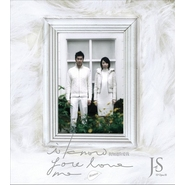

JS
============================

|  |  |
| :--: | :-- |
| [ JS](https://i.xiami.com/js) | **地区**: Taiwan, PRC 中国台湾 **风格**: 国语流行 Mandarin Pop, 华语唱作人 Chinese Singer-Songwriter **播放数**: 36632943 **粉丝数**: 25101 **评论数**: 669  |

## 档案

JS = Justin和Sophia， 哥哥——陈忠义(Justin) 和 妹妹——陈绮萱(Sophia) 
台湾实力派创作型兄妹组合 （目前为止已经帮助120多个明星创作歌曲，如：刘德华，孙燕姿，张智成、动力火车、张芸京、林心如、梁静茹、刘若英、光良、何耀珊、许慧欣、张韶涵、杨丞琳、唐禹哲、钟汉良、张信哲等等） 
1999年的GoGo&MeMe蜕变再起飞，哥哥“Justin”妹妹“Sophia”组成2004年最受瞩目创作二人组JS。 
JS的音乐专辑有如当初GOGO & MEME时的初衷--向木匠兄妹看齐一般，有别于主流音乐市场的“物语式清流”，以哥哥陈忠义的丰富词曲创作，搭配妹妹陈绮萱的中音域嗓音与歌唱技巧。 
JUSTIN 
姓名：陈忠义 
英文名：Justin 
籍贯：辽宁盖平 
生日：1977年2月6日 
生肖：龙 
星座：水瓶座 
血型：O型 
身高：187cm 
体重：75kg 
学历：高雄师范大学美术系 
喜爱的运动：游泳、网球 
喜爱的食物：苹果、鳕鱼 
喜爱的饮料：优酪乳 
喜爱的动物：西伯利亚雪撬犬 
喜欢的书：伤心咖啡店之歌 
喜欢的颜色：普鲁士蓝 
回家做的事：听ICRT(Easy one hundred)、计算机绘图 
最快乐的事：发现怪怪的CD(到唱片行探险) 
最讨厌的事：上课 
最大的享受：和其它狂人聊音乐 
最难忘的事：1993年在美国参加青少年夏令营得到才艺大赛冠军 
最感激的人：高中导师 
最崇拜的艺人：David Foster 
最满意自己的部份：笑容 
最大的愿望：让所有地球人听到我的歌 
演出经验：学校96,97年民歌演唱会、学校96,97年西洋歌曲大赛 
SOPHIA 
姓名：陈绮萱 
英文名：Sophia 
籍贯：辽宁盖平 
生日：1980年7月26日 
生肖：猴 
星座：狮子座 
血型：O型 
身高：175cm 
体重：58kg 
学历：世新大学广电系 
喜爱的运动：游泳 
喜爱的食物：麦克鸡块 
喜爱的饮料：苹果汁、奶茶 
喜爱的动物：狗 
喜欢的书： 今天也要用心过生活 
喜欢的颜色：蓝,粉红 
回家做的事：看电视、睡觉、写日记 
最快乐的事：唱歌 
最讨厌的事：被误会 
最感激的人：妈妈 
最大的愿望：大家喜欢唱我的歌 
演出经验：无MTV新声卡位战创作组第一名 
经历： 
1999年，千禧年前夕，当时华语乐坛还一片兴盛气息，新人辈出百花齐放，有一对身高高人一等的兄妹-陈忠义与陈绮萱，挟著「MTV新声卡位战」创作组第一名的荣耀，以「GoGo&MeMe」为团名，推出了第一张专辑「Say Forever」。一首专辑同名曲Say Forever传唱至今，每年圣诞节更成为电台的必播曲--「我一个人不孤单/想念的人才孤单…」，清新的嗓音动人的旋律在在令人回味不已，只是，这对兄妹发完这张专辑之后，到哪里去了？时空拉回到2000年，场景是日本，他们与当时所属的唱片公司的大批工作人员，正在拍摄第二张专辑的封面与MV。工作尚未完成，工作人员却接到台湾公司打去的电话------公司人事改组，在日本的整组工作人员全部遭到解雇，专辑于是被搁置……… 
从没想过会发生这种事。他们只是两个爱音乐的大孩子，从没想到作音乐还会遇到「人事改组」这个名词。回到台湾之后，第二张专辑的发片遥遥无期，公司的其他艺人陆续发片，却好像没有人再想到他们。直到他们死心不想再等，鼓起勇气向公司提出提早解约换取自由身的要求。之后哥哥陈忠义专心于自己的美术系学业，进入师大美术研究所攻读硕士（今年已毕业），并且埋头努力创作，间或接一些电玩配乐或广告配乐的案子；妹妹陈绮萱一样努力于世新广电的学业，并且担任哥哥的DEMO歌手，哥哥接的电玩案子广告案子，妹妹也帮忙演唱以及担任配音员，并且也接一些老师同学的影片后期的CASE。 
音乐的梦还在心里不断诱惑著他们，但是曾经遇到的打击却也让他们踌躇起来。那段孤绝地日子里，他们以为事情就这样结束了，原本忠义打算从此走入幕后，等研究所毕业后一边担任大学讲师一边写歌，而绮萱也准备朝往影片制作的路线走去。他们加盟华研，从GoGo&MeMe改名为JS。 
2006年3月，JS展开其独立创作之路，成立了音思拜耳音乐工作室（Inspire Music）。至今共发行了6张专辑和4张EP，目前会不定期地在音乐展演空间河岸留言举办小型演唱会。

## 专辑

| 名称 | 语种 | 唱片公司 | 发行时间 | 专辑类别 | 专辑风格 |
| :--: | :-- | :-- | :-- | :-- | :-- |
| [ 这就是爱](./albums/425553624.md) | 国语 | 音思拜耳音乐工作室 | 2015年03月06日 | EP, 单曲 | 国语流行 Mandarin Pop, 华语唱作人 Chinese Singer-Songwriter |
| [ 听见](./albums/508265.md) | 国语 | 音思拜耳音乐工作室 | 2012年05月03日 | 录音室专辑 | 国语流行 Mandarin Pop, 华语唱作人 Chinese Singer-Songwriter |
| [ Somewhere](./albums/327035.md) | 国语 | 亚神音乐 | 2009年05月19日 | EP, 单曲 | 国语流行 Mandarin Pop, 华语唱作人 Chinese Singer-Songwriter |
| [ The JS MomentsJS的创作故事集](./albums/312952.md) | 国语 | 亚神音乐 | 2009年01月07日 | 录音室专辑 | 国语流行 Mandarin Pop, 华语唱作人 Chinese Singer-Songwriter |
| [ 此生最美的风景](./albums/168433.md) | 国语 | 亚神音乐 | 2008年05月09日 | 录音室专辑 | 国语流行 Mandarin Pop, 华语唱作人 Chinese Singer-Songwriter |
| [ Bianco 我知道你爱我](./albums/14784.md) | 国语 | 音思拜耳音乐工作室 | 2007年02月17日 | EP, 单曲 | 国语流行 Mandarin Pop, 华语唱作人 Chinese Singer-Songwriter |
| [ Nero-Scream献给NANA迷的EP](./albums/14785.md) | 国语 | 音思拜耳音乐工作室 | 2006年11月30日 | EP, 单曲 | 国语流行 Mandarin Pop, 华语唱作人 Chinese Singer-Songwriter |
| [ Rosso苏菲亚的盛宴Sophias Luxury Feast](./albums/14786.md) | 国语 | 音思拜耳音乐工作室 | 2006年07月26日 | EP, 单曲 | 国语流行 Mandarin Pop, 华语唱作人 Chinese Singer-Songwriter |
| [ Forever And Ever](./albums/14629.md) | 国语 | 新力音乐 | 2004年10月22日 | 录音室专辑 | 国语流行 Mandarin Pop, 华语唱作人 Chinese Singer-Songwriter |
| [ 遇见未来](./albums/14787.md) | 国语 | 华研国际 | 2004年08月18日 | 录音室专辑 | 国语流行 Mandarin Pop, 华语唱作人 Chinese Singer-Songwriter, 中国风 China-Wave |
| [ Say Forever](./albums/14630.md) | 国语 | 新力音乐 | 1999年12月06日 | 录音室专辑 | 国语流行 Mandarin Pop, 华语唱作人 Chinese Singer-Songwriter |

## 评论

|  |  |  |
| :-- | :-- | :-- |
|  [虾米用户](https://emumo.xiami.com/u/1425416) RideOrDie 2020-10-17 12:22 赞(0) 踩(0) | 
这个组合倒闭了？
 |
|  [虾米用户](https://emumo.xiami.com/u/327799576)   2020-04-18 15:32 赞(0) 踩(0) | 
辽宁盖平是哪？
 |
|  [虾米用户](https://emumo.xiami.com/u/11235021) 纵贯线王菲熊光KOKIA... 2020-03-21 09:38 赞(0) 踩(0) | 
那么问题来了：JS会不会JS？
 |
|  [虾米用户](https://emumo.xiami.com/u/432140449)  2020-02-11 03:11 赞(0) 踩(0) | 
从《听见》喜欢你们
 |
|  [虾米用户](https://emumo.xiami.com/u/3140019) 天马行空 2020-01-19 01:48 赞(0) 踩(0) | 
话说，我笑起来也很治愈
 |
|  [虾米用户](https://emumo.xiami.com/u/3140019) 天马行空 2020-01-19 01:41 赞(0) 踩(0) | 
这个名字，应该会给我字典带来一种新的意义
 |
|  [虾米用户](https://emumo.xiami.com/u/3140019) 天马行空 2020-01-19 01:39 赞(0) 踩(0) | 
陈忠义
 |
|  [虾米用户](https://emumo.xiami.com/u/31616387) 浮生面具三千个，谁人与我... 2019-08-15 22:18 赞(2) 踩(0) | 
JS的歌，哥哥妹妹都很好看啊  有才，我小时候超喜欢的杀破狼，最近发现很好听的花与剑后改编成无双(刘菲唱)，都很好听啊！
 |
|  [虾米用户](https://emumo.xiami.com/u/48123434)  2019-08-12 13:35 赞(1) 踩(0) | 
我知道这个组合的时候他们已经叫JS了难道我不够老吗哈哈哈哈哈哈哈
 |
|  [虾米用户](https://emumo.xiami.com/u/201914014) 我还没想好要写什么... 2019-06-26 15:11 赞(1) 踩(0) | 
再不出新专辑 我要给你们寄刀片了哎
 |
| ⇒ |  [虾米用户](https://emumo.xiami.com/u/48123434)  2019-08-12 13:36 赞(0) 踩(0) | 
你是魔鬼吗哈哈哈哈哈哈哈
 |
|  [虾米用户](https://emumo.xiami.com/u/295848574) 我还没想好要写什么... 2019-05-25 09:46 赞(1) 踩(0) | 
好听 
 |
|  [虾米用户](https://emumo.xiami.com/u/1418202)  江山共老 2019-05-01 19:12 赞(0) 踩(0) | 
还有歌吗
 |
|  [虾米用户](https://emumo.xiami.com/u/407843904)  2019-04-16 23:40 赞(0) 踩(0) | 
超尚！超强！超酷！超前的纯情，纯真，纯心的音乐人！
 |
|  [虾米用户](https://emumo.xiami.com/u/340747529)  2019-03-14 20:07 赞(0) 踩(0) | 
一直找哥哥妹妹，原来换名字了 JS
 |
|  [虾米用户](https://emumo.xiami.com/u/357896600)  2019-03-02 01:30 赞(1) 踩(0) | 
剑圣我来抢野了
 |
|  [虾米用户](https://emumo.xiami.com/u/419018288) 喜欢音乐单纯，美好 2019-02-13 09:26 赞(2) 踩(0) | 
记得第一次在ChanelV听到你们的歌，MV是白色背景，介绍你们是兄妹，很多年过去了，还是喜欢你们的歌，《天空的颜色》从昨晚单曲循环了一夜，一大早又继续在听，励志，让纠结的我，释怀了许多。
 |
|  [虾米用户](https://emumo.xiami.com/u/355934856) 谢谢你虾米音乐 2019-01-07 13:32 赞(0) 踩(0) | 
新年快乐！
 |
|  [虾米用户](https://emumo.xiami.com/u/411218692) 祝世界继续热闹 2018-12-27 21:20 赞(0) 踩(0) | 
谢谢你们，希望你们能来无锡！！！！
 |
|  [虾米用户](https://emumo.xiami.com/u/346087991) 医路漫漫 音乐为伴 2018-12-02 09:00 赞(0) 踩(0) | 
我一个人不孤单 想一个人才孤单 我就是从这一句 开始听JS
 |
|  [虾米用户](https://emumo.xiami.com/u/14002893)  2018-11-27 11:11 赞(0) 踩(0) | 
记得 高中写作文 经常套用 天空的颜色 里面的歌词 每次作文必拿高分 哈哈哈哈哈哈哈哈
 |
|  [虾米用户](https://emumo.xiami.com/u/59048224)  2018-11-14 23:58 赞(1) 踩(0) | 
没想到他们的歌这么好听，以前都是之收藏其中的一两首，现在真的要粉他们了
 |
|  [虾米用户](https://emumo.xiami.com/u/271430889) 忘了爱(｡･㉨･｡)ﾉ♡... 2018-10-26 12:45 赞(3) 踩(0) | 
《杀破狼》是一首超好听的经典的歌曲，JS用轻声的低吟成功诠释了这首歌曲。辗转蛰伏的曲风将《仙剑奇侠传》中穿越时空的景象完美的展现在听众面前，逍遥御剑飞行，穿越时空拯救灵儿一幕幕仿佛在歌中重现。整首歌曲大气滂沱，高潮叠复，浓重的凄凉恣意疯长，古战场的壮阔苍凉、凄清孤绝一览无余，这首歌曲让人在无限的虚幻中意犹未尽……
 |
|  [虾米用户](https://emumo.xiami.com/u/378738299)  2018-09-26 01:55 赞(1) 踩(0) | 
大赞
 |
|  [虾米用户](https://emumo.xiami.com/u/151803814) 我还没想好要写什么... 2018-09-10 17:53 赞(2) 踩(0) | 
好喜欢你们，希望多出新歌！
 |
|  [虾米用户](https://emumo.xiami.com/u/34354882) 我还没想好要写什么... 2018-07-10 17:01 赞(7) 踩(0) | 
Javascript
 |
| ⇒ |  [虾米用户](https://emumo.xiami.com/u/379006493)  2018-08-12 19:51 赞(0) 踩(0) | 
前端必须脚本。
 |
|  [虾米用户](https://emumo.xiami.com/u/358238997)  2018-07-06 15:29 赞(0) 踩(0) | 
你们是哥哥妹妹吗？ say forever
 |
|  [虾米用户](https://emumo.xiami.com/u/272067422)  2018-07-06 10:36 赞(0) 踩(0) | 
 
 |
|  [虾米用户](https://emumo.xiami.com/u/8269111) 有了滑板鞋天黑都不怕 2018-05-22 16:35 赞(0) 踩(0) | 
差不多和王力宏一起出道吧 GGMM 哈哈 好想回到那个时候
 |
| ⇒ |  [虾米用户](https://emumo.xiami.com/u/4973560) 也好听如火如荼还让他 2018-07-11 14:10 赞(0) 踩(0) | 
力宏早多了吧
 |
| ⇒ |  [虾米用户](https://emumo.xiami.com/u/8269111) 有了滑板鞋天黑都不怕 2018-07-11 14:39 赞(0) 踩(0) | 
<q><b>梆硬说：</b></q>
 |
| ⇒ |  [虾米用户](https://emumo.xiami.com/u/4973560) 也好听如火如荼还让他 2018-07-18 13:23 赞(0) 踩(0) | 
<q><b>nonono说：</b></q>
 |
| ⇒ |  [虾米用户](https://emumo.xiami.com/u/346087991) 医路漫漫 音乐为伴 2018-12-02 09:04 赞(0) 踩(0) | 
<q><b>nonono说：</b></q>
 |
|  [虾米用户](https://emumo.xiami.com/u/40734342)  2018-05-17 22:45 赞(1) 踩(0) | 
很多人都是从仙剑开始认识你们，而我是非常小的时候就听见你们的歌，从此奠定我心中最佳的二人组。第一首是苏菲亚的愿望，真的超喜欢。后来组合比较火的是飞儿(更应该说是乐队吧)，感觉一个是太阳，一个是月亮。总之很高兴听见你们的歌，也很遗憾你们的个人创作脚步比较缓慢，希望还能听见月亮般温柔的歌吧。
 |
|  [虾米用户](https://emumo.xiami.com/u/201914014) 我还没想好要写什么... 2018-05-13 09:10 赞(0) 踩(0) | 
Sophia的声音比普通女生低哦，我男的都能唱的来。话说Sophia的酒窝很可爱呢
 |
|  [虾米用户](https://emumo.xiami.com/u/31246839) 我还没想好要写什么... 2018-05-02 01:56 赞(1) 踩(0) | 
希望听到新加坡电视剧《小娘惹》插曲《需要》。
 |
|  [虾米用户](https://emumo.xiami.com/u/90562022)  2018-03-26 14:33 赞(4) 踩(0) | 
JavaScript
 |
|  [虾米用户](https://emumo.xiami.com/u/334558874) 从你的火山屯路过 2018-03-20 16:36 赞(2) 踩(0) | 
哥哥是换脸了吗！完全认不出了
 |
|  [虾米用户](https://emumo.xiami.com/u/27755243) 我还没想好要写什么... 2018-01-02 04:38 赞(0) 踩(0) | 
这么棒的声音 为什么就是没红起来
 |
| ⇒ |  [虾米用户](https://emumo.xiami.com/u/339068135)  2018-02-22 18:52 赞(0) 踩(0) | 
是的，我也奇怪，但是他们的经典歌曲别人翻唱不出味道，不能超越
 |
|  [虾米用户](https://emumo.xiami.com/u/335023619)  2017-12-25 20:59 赞(0) 踩(0) | 

 |
|  [虾米用户](https://emumo.xiami.com/u/1418202)  江山共老 2017-12-23 23:31 赞(0) 踩(0) | 

 |
|  [虾米用户](https://emumo.xiami.com/u/45853477)   2017-12-13 17:33 赞(2) 踩(0) | 
从ggmm到JS，这对组合的质量始终如一！
 |
|  [虾米用户](https://emumo.xiami.com/u/21182456) 谁打捞我的尸体 谁看我的... 2017-12-13 16:31 赞(0) 踩(0) | 
好想听《现在的我们》&amp;hellip;&amp;hellip; 
 |
|  [虾米用户](https://emumo.xiami.com/u/113935922) 人生如逆旅，我亦是行人。 2017-12-04 21:46 赞(1) 踩(0) | 
JS-JanSport
 |
|  [虾米用户](https://emumo.xiami.com/u/52796682) 要是时光能返回我会对你说... 2017-11-23 15:05 赞(1) 踩(0) | 
一首杀破狼单曲听一天
 |
|  [虾米用户](https://emumo.xiami.com/u/332963286)  2017-11-15 13:21 赞(0) 踩(0) | 
。
 |
|  [虾米用户](https://emumo.xiami.com/u/310908478)  2017-11-10 12:44 赞(0) 踩(0) | 
gogo&amp;amp;meme
 |
|  [虾米用户](https://emumo.xiami.com/u/318395342)  2017-11-01 09:41 赞(0) 踩(0) | 
,,,,,,,,,,,,,,,,,,,,
 |
|  [虾米用户](https://emumo.xiami.com/u/191497299)  2017-10-27 23:31 赞(3) 踩(0) | 
初一买的FIR专辑不知为何附带了你的专辑做B面，从此我的初中生涯便刻上了你的印记。。。这么多年后，蓦然回首，你的歌曲依然回荡我心
 |
|  [虾米用户](https://emumo.xiami.com/u/96391776)  2017-10-05 00:50 赞(11) 踩(0) | 
有多少人还记得他们是以哥哥妹妹这个名字发的say forever！
 |
|  [虾米用户](https://emumo.xiami.com/u/24325936) 无忧无虑，向前游。。。 2017-10-04 10:11 赞(0) 踩(0) | 
花与剑
 |
|  [虾米用户](https://emumo.xiami.com/u/1271812) WX:Likejazzm... 2017-09-22 19:48 赞(3) 踩(0) | 
热门第一竟然不是杀破狼，不科学啊 
 |
|  [虾米用户](https://emumo.xiami.com/u/5569158)   2017-09-13 13:16 赞(1) 踩(0) | 
仙剑奇侠传~~~~杀破狼！
 |
|  [虾米用户](https://emumo.xiami.com/u/3854624)  2017-09-13 01:01 赞(2) 踩(0) | 
兩兄妹個子都好高！
 |
|  [虾米用户](https://emumo.xiami.com/u/280934749)  2017-09-08 09:32 赞(2) 踩(0) | 
这嗓音真的好特别，有治愈的魔力，唱什么样的歌都喜欢。
 |
|  [虾米用户](https://emumo.xiami.com/u/322946445) 我是最帅战神 2017-09-02 14:38 赞(1) 踩(0) | 
加油，JS
 |
|  [虾米用户](https://emumo.xiami.com/u/189221675) 金刚 2017-08-28 17:35 赞(1) 踩(0) | 
太漂亮
 |
|  [虾米用户](https://emumo.xiami.com/u/2928117) 你好 2017-08-18 20:48 赞(3) 踩(0) | 
JS非常棒，搞不懂为什么不红。
 |
|  [虾米用户](https://emumo.xiami.com/u/7008104)   2017-08-16 19:12 赞(43) 踩(0) | 
可能我的审美还停留在n年前的港台吧 近年被弄得很火的一塌糊涂的民谣大部分真的是不能多听 审美会被腐化
 |
|  [虾米用户](https://emumo.xiami.com/u/198245168) Fakeuphrosyn... 2017-08-09 18:43 赞(3) 踩(0) | 
殺破狼 永恆的經典
 |
|  [虾米用户](https://emumo.xiami.com/u/49303880) 我还没想好要写什么... 2017-08-05 19:57 赞(3) 踩(0) | 
forever
 |
|  [虾米用户](https://emumo.xiami.com/u/182741870) 我还没想好要写什么... 2017-07-29 12:59 赞(3) 踩(0) | 
记忆中的2005
 |
|  [虾米用户](https://emumo.xiami.com/u/265124414)  2017-07-27 21:18 赞(3) 踩(0) | 
一亿元的日落和我比想象中爱你超级喜欢    
 |
|  [虾米用户](https://emumo.xiami.com/u/80009588) she天下第一 2017-07-26 00:20 赞(1) 踩(0) | 
杀破狼早就听过了。。。虽然因为仙剑才火起来。。
 |
|  [虾米用户](https://emumo.xiami.com/u/273755607)  2017-07-15 01:38 赞(2) 踩(0) | 
say forever say forever  say forever  say forever  一首say forever一直听到现在，那时候还叫哥哥妹妹，这首歌还会一直听下去
 |
|  [虾米用户](https://emumo.xiami.com/u/282625272)  2017-07-14 15:57 赞(1) 踩(0) | 
不论多少年，依旧支持你们
 |
|  [虾米用户](https://emumo.xiami.com/u/252794383)  2017-07-02 23:18 赞(1) 踩(0) | 
他们都不是音乐专业的，如何创作？
 |
|  [虾米用户](https://emumo.xiami.com/u/303215253)  2017-06-20 08:56 赞(1) 踩(0) | 
永远支持
 |
|  [虾米用户](https://emumo.xiami.com/u/256089710)  2017-06-18 11:56 赞(1) 踩(0) | 
你好，JS,我叫吉松，我27岁，我喜欢仙剑1电视剧，喜欢你们的歌
 |
|  [虾米用户](https://emumo.xiami.com/u/301149542)  2017-06-11 23:34 赞(0) 踩(0) | 
这个男的很像方文山
 |
|  [虾米用户](https://emumo.xiami.com/u/286714488)  2017-06-07 09:22 赞(0) 踩(0) | 
为了仙一下载虾米
 |
|  [虾米用户](https://emumo.xiami.com/u/300539166)   2017-06-01 13:50 赞(0) 踩(0) | 
很好
 |
|  [虾米用户](https://emumo.xiami.com/u/3537843) 只听音乐 2017-05-22 15:48 赞(27) 踩(0) | 
最近才好奇杀破狼的JS，今天才发现我已经早就认识你们了，爱你们，让我找到了以前许多爱的旋律  
 |
|  [虾米用户](https://emumo.xiami.com/u/290275932)  2017-05-06 04:57 赞(3) 踩(0) | 
你们仙剑一的音乐从05年听到现在。
 |
|  [虾米用户](https://emumo.xiami.com/u/36223924) 我还没想好要写什么... 2017-05-03 08:57 赞(1) 踩(0) | 
一首相逢在梦中知道了陈绮萱，从此JS便成了我最爱的音乐人之一。
 |
|  [虾米用户](https://emumo.xiami.com/u/2531790)  2017-05-02 19:18 赞(0) 踩(0) | 
一直喜欢他们
 |
|  [虾米用户](https://emumo.xiami.com/u/281049783) 我还没想好要写什么... 2017-04-30 23:02 赞(1) 踩(0) | 
飞向札幌的班机抗拒地心引力，为了一首歌，后天就去北海道了。
 |
|  [虾米用户](https://emumo.xiami.com/u/37227200)  2017-04-27 20:56 赞(0) 踩(0) | 
很喜欢的声音
 |
|  [虾米用户](https://emumo.xiami.com/u/291019802)  2017-04-24 02:23 赞(0) 踩(0) | 
很喜欢你们的作品
 |
|  [虾米用户](https://emumo.xiami.com/u/66977974)  2017-04-23 22:20 赞(0) 踩(0) | 
很惊喜的组合！
 |
|  [虾米用户](https://emumo.xiami.com/u/38024667) 我还没想好要写什么... 2017-04-17 23:31 赞(0) 踩(0) | 
谢谢你带给我们回忆。 会一如既往的支持你们 
 |
|  [虾米用户](https://emumo.xiami.com/u/288713426)  2017-04-15 12:57 赞(1) 踩(0) | 
从回忆中享受过去音乐
 |
|  [虾米用户](https://emumo.xiami.com/u/287859885)  2017-04-12 16:39 赞(0) 踩(0) | 
从杀破狼走进你 
 |
|  [虾米用户](https://emumo.xiami.com/u/12747)  2017-04-08 23:30 赞(0) 踩(0) | 
让我重新回忆了一下我的大学生活。
 |
|  [虾米用户](https://emumo.xiami.com/u/285806413)  2017-04-04 23:03 赞(2) 踩(0) | 
杀破狼
 |
|  [虾米用户](https://emumo.xiami.com/u/7008104)   2017-04-03 16:44 赞(1) 踩(0) | 
词曲编制唱，每一个方面都是original，而且几乎每个方面都堪称 精致，每首出品都很惊艳。只是，不是每一个美好都能适时与时运相逢，获得期待之中或意料之外的璀璨，但仍无可怀疑地是真正绝美的孤芳。
 |
|  [虾米用户](https://emumo.xiami.com/u/207427602) 好好好好好好好 2017-04-02 20:13 赞(0) 踩(0) | 
say forever
 |
|  [虾米用户](https://emumo.xiami.com/u/280931169)  2017-04-02 14:02 赞(3) 踩(0) | 
厉害了，因为网易云里没有杀破狼，我就下载了虾米
 |
| ⇒ |  [虾米用户](https://emumo.xiami.com/u/288515006)  2017-05-14 21:48 赞(0) 踩(0) | 
加一
 |
|  [虾米用户](https://emumo.xiami.com/u/211599738)  2017-03-22 12:13 赞(0) 踩(0) | 
好
 |
|  [虾米用户](https://emumo.xiami.com/u/280094443)  2017-03-15 13:46 赞(0) 踩(0) | 
很喜欢这首歌
 |
|  [虾米用户](https://emumo.xiami.com/u/191495194)   2017-03-13 01:44 赞(0) 踩(0) | 
蔷薇的眼泪。js的歌总是在不经意的地方让你产生共鸣
 |
|  [虾米用户](https://emumo.xiami.com/u/193080507)  2017-03-02 22:12 赞(1) 踩(0) | 
好喜欢js的歌 
 |
|  [虾米用户](https://emumo.xiami.com/u/274023821) 苦苦挣扎 2017-02-28 20:19 赞(0) 踩(0) | 
声声慢
 |
|  [虾米用户](https://emumo.xiami.com/u/271249299)  2017-02-07 14:48 赞(3) 踩(0) | 
杀破狼，会一直支持下去的 
 |
|  [虾米用户](https://emumo.xiami.com/u/594145)   2017-02-06 23:31 赞(0) 踩(0) | 
很有画面感 很正能量 适合活动用或做背景乐
 |
|  [虾米用户](https://emumo.xiami.com/u/264283064) bye  2017-01-31 10:15 赞(0) 踩(0) | 
△
 |
|  [虾米用户](https://emumo.xiami.com/u/260167529) 爱音乐的疯子 2017-01-18 17:28 赞(1) 踩(0) | 
杀破狼太有记忆了
 |
|  [虾米用户](https://emumo.xiami.com/u/1602997)  2017-01-12 23:50 赞(1) 踩(0) | 
哥哥词曲很优美，妹妹唱歌很温暖，听JS的歌曲总感觉很幸福。
 |
|  [虾米用户](https://emumo.xiami.com/u/245760146) 无音乐不浪漫 2016-12-12 15:16 赞(2) 踩(0) | 
每当我站上起跑线总喜欢听SJ的杀破狼，她曾带给我无数荣耀，
 |
|  [虾米用户](https://emumo.xiami.com/u/245760146) 无音乐不浪漫 2016-12-12 15:13 赞(2) 踩(0) | 
我很喜欢JS一直的喜欢
 |
|  [虾米用户](https://emumo.xiami.com/u/245760146) 无音乐不浪漫 2016-12-12 15:12 赞(0) 踩(0) | 
音乐让我靠近你，音乐让我爱上我 
 |
|  [虾米用户](https://emumo.xiami.com/u/239290901) 站在世界的中心 2016-12-04 01:43 赞(2) 踩(0) | 
仙剑！
 |
|  [虾米用户](https://emumo.xiami.com/u/31800879)   2016-12-02 00:43 赞(1) 踩(0) | 
版本支离破碎  唉
 |
|  [虾米用户](https://emumo.xiami.com/u/7008104)   2016-10-31 20:40 赞(27) 踩(0) | 
内容已删除
 |
| ⇒ |  [虾米用户](https://emumo.xiami.com/u/48901166)  2016-11-20 21:36 赞(0) 踩(0) | 
火车和js定位就不是偶像路线，实力派多是在幕后给影视剧或者别的偶像写歌
 |
|  [虾米用户](https://emumo.xiami.com/u/109019164) 徒然求索，不如思止。 2016-10-30 17:40 赞(0) 踩(0) | 
多优秀的一只组合，同级pk爱乐团
 |
|  [虾米用户](https://emumo.xiami.com/u/226910531)  2016-09-16 12:45 赞(2) 踩(0) | 
多少年以来我一直记得杀破狼这首歌，现在来听感觉还是一样
 |
|  [虾米用户](https://emumo.xiami.com/u/74755418) I FOUND YOU！... 2016-08-31 21:09 赞(1) 踩(0) | 
仙剑那个？
 |
|  [虾米用户](https://emumo.xiami.com/u/38854379)  2016-08-18 21:56 赞(0) 踩(0) | 
触动灵魂的歌者
 |
|  [虾米用户](https://emumo.xiami.com/u/165094998) 听不清耳语最诚恳，看不见... 2016-08-01 12:22 赞(1) 踩(0) | 
第一个关注的你！因为你，有满满的回忆。
 |
|  [虾米用户](https://emumo.xiami.com/u/2373957) Greenie 2016-07-25 00:26 赞(2) 踩(0) | 
今天惊然发觉，唱杀破狼的JS一直坚持发唱片，而且歌都很好听！欣喜
 |
|  [虾米用户](https://emumo.xiami.com/u/43467170) 从今天开始我要陪到虾米末... 2016-07-16 14:15 赞(21) 踩(0) | 
即使JS已经很少出新歌了。但是我还记得。从那首杀破狼认识你们，从苏菲亚的愿望，凡尔赛玫瑰，飞向札幌的飞机，逆风飞行，爱情消失的夏天，天就快亮了等等等等爱上你们，从此生最美的风景记住你们一辈子。希望你们生活的很好，希望还能听到你们的新歌。
 |
|  [虾米用户](https://emumo.xiami.com/u/10791640) YOLO 2016-07-02 20:20 赞(4) 踩(0) | 
初中一好友推荐JS的歌，陪伴我走过了那段青春的岁月。好友早就去了澳洲了，也很久没联络，当年曾经喜欢过的女孩子也嫁人了，如今进入职场已有数年，再次听回JS，感慨时光荏苒。
 |
|  [虾米用户](https://emumo.xiami.com/u/186324531)  2016-06-08 19:16 赞(0) 踩(0) | 
喜欢JS,永远是你们最忠实的粉丝
 |
|  [虾米用户](https://emumo.xiami.com/u/7169443) 暂无签名~ 2016-05-28 01:03 赞(0) 踩(0) | 
从初中听到大学毕业到毕业之后两年了，隔一阵子就会翻出来听，还是有很多人听你们的歌哒～
 |
|  [虾米用户](https://emumo.xiami.com/u/50834537)   2016-05-17 10:55 赞(1) 踩(0) | 
第一次听到杀破狼的时候，觉得好像Ella的声音。
 |
|  [虾米用户](https://emumo.xiami.com/u/55332673)  2016-05-16 19:20 赞(0) 踩(0) | 
脱轨
 |
|  [虾米用户](https://emumo.xiami.com/u/55332673)  2016-05-16 19:19 赞(0) 踩(0) | 
坐一次飞向札幌的班机
 |
|  [虾米用户](https://emumo.xiami.com/u/25030964)  2016-05-12 21:36 赞(0) 踩(0) | 
换多少把手机。。都有你们的歌，能下载的确越来越少。。
 |
|  [虾米用户](https://emumo.xiami.com/u/9108784)  2016-05-10 22:12 赞(0) 踩(0) | 
苏菲亚的愿望为什么没有？
 |
|  [虾米用户](https://emumo.xiami.com/u/30402213)  2016-04-29 17:02 赞(0) 踩(0) | 
JS
 |
|  [虾米用户](https://emumo.xiami.com/u/30402213)  2016-04-29 16:54 赞(0) 踩(0) | 
好久没出新歌了喔！这样好的音乐人怎么感觉做音乐下去好难~~
 |
|  [虾米用户](https://emumo.xiami.com/u/97747450) 我还没想好要写什么... 2016-04-11 18:30 赞(0) 踩(0) | 
126
 |
|  [虾米用户](https://emumo.xiami.com/u/52368094) 是你变幽默还是我变快乐 2016-04-02 17:57 赞(1) 踩(0) | 
我比想象中爱你
 |
|  [虾米用户](https://emumo.xiami.com/u/52368094) 是你变幽默还是我变快乐 2016-04-02 17:57 赞(1) 踩(0) | 
杀破狼
 |
|  [虾米用户](https://emumo.xiami.com/u/52368094) 是你变幽默还是我变快乐 2016-04-02 17:56 赞(1) 踩(0) | 
喜欢
 |
|  [虾米用户](https://emumo.xiami.com/u/2754613)  2016-03-24 02:40 赞(1) 踩(0) | 
還有人知道星盒子嗎
 |
|  [虾米用户](https://emumo.xiami.com/u/775442) 唔好问点解 2016-03-23 22:56 赞(0) 踩(0) | 
求推荐几首
 |
|  [虾米用户](https://emumo.xiami.com/u/44761741)   2016-02-26 23:33 赞(0) 踩(0) | 
很喜欢
 |
|  [虾米用户](https://emumo.xiami.com/u/979409) 竟然用虾米这么这么久了 2016-01-23 22:20 赞(2) 踩(0) | 
专辑最爱当属遇见未来，当年最爱抄歌词，满满一本的歌词，第一首就是遇见未来，专辑总是不自觉的翻出来听听，声音很抓耳，天空的颜色更是单曲循环，时隔多年再翻出来听各种怀念
 |
|  [虾米用户](https://emumo.xiami.com/u/2670795)  2016-01-17 22:06 赞(1) 踩(0) | 
小時候買你們的卡帶，哥哥的創作每一首都好愛，還有妹妹獨特的聲音簡直天籟之音~
 |
|  [虾米用户](https://emumo.xiami.com/u/94170060)  2015-12-31 09:46 赞(2) 踩(0) | 
一首“杀破狼”认识了他们，喜欢杀破狼
 |
|  [虾米用户](https://emumo.xiami.com/u/2692818) 寻找幸运的人 2015-12-28 16:15 赞(0) 踩(0) | 
昙花
 |
|  [虾米用户](https://emumo.xiami.com/u/49068787) 你问我全世界哪里最美 我... 2015-11-30 00:11 赞(2) 踩(0) | 
我最喜欢的两张专辑都下架了！！
 |
|  [虾米用户](https://emumo.xiami.com/u/22997183)  2015-11-26 10:04 赞(0) 踩(0) | 
喜欢这对兄妹组合
 |
|  [虾米用户](https://emumo.xiami.com/u/76067776)  听自己爱听的音乐，做自... 2015-11-23 00:53 赞(1) 踩(0) | 
突然听到你们的声音，有一种耳朵醒了的感觉！喜欢你们没道理！
 |
|  [虾米用户](https://emumo.xiami.com/u/8070377) 爱雾瑞性维欧腐漏 2015-11-21 09:59 赞(1) 踩(0) | 
我比想象中爱你 俩人都好高啊 175 185打底
 |
|  [虾米用户](https://emumo.xiami.com/u/48075227)  2015-11-18 18:03 赞(0) 踩(0) | 
艺妓好听 然而这里没有
 |
|  [虾米用户](https://emumo.xiami.com/u/18652620) 脚踏实地 求真务实 2015-11-14 13:26 赞(0) 踩(0) | 
剑圣吗=。=
 |
| ⇒ |  [虾米用户](https://emumo.xiami.com/u/27939384) ego cogito 2015-11-20 18:07 赞(0) 踩(0) | 
blade master
 |
| ⇒ |  [虾米用户](https://emumo.xiami.com/u/18652620) 脚踏实地 求真务实 2015-11-20 18:34 赞(0) 踩(0) | 
<q><b>Metallism说：</b></q>
 |
| ⇒ |  [虾米用户](https://emumo.xiami.com/u/27939384) ego cogito 2015-11-20 19:02 赞(0) 踩(0) | 
<q><b>说：</b></q>
 |
| ⇒ |  [虾米用户](https://emumo.xiami.com/u/18652620) 脚踏实地 求真务实 2015-11-20 19:03 赞(0) 踩(0) | 
<q><b>Metallism说：</b></q>
 |
| ⇒ |  [虾米用户](https://emumo.xiami.com/u/27939384) ego cogito 2015-11-21 00:13 赞(0) 踩(0) | 
<q><b>说：</b></q>
 |
| ⇒ |  [虾米用户](https://emumo.xiami.com/u/12786242)  2016-01-19 14:17 赞(0) 踩(0) | 
头像好炫
 |
|  [虾米用户](https://emumo.xiami.com/u/62033964)  2015-10-23 01:36 赞(0) 踩(0) | 
節奏清晰舒服
 |
|  [虾米用户](https://emumo.xiami.com/u/8286705) freelyriding 2015-10-22 14:38 赞(0) 踩(0) | 
我是第500个！
 |
|  [虾米用户](https://emumo.xiami.com/u/8286705) freelyriding 2015-10-22 14:37 赞(0) 踩(0) | 
还差两条
 |
|  [虾米用户](https://emumo.xiami.com/u/8286705) freelyriding 2015-10-22 14:37 赞(0) 踩(0) | 
好赞！
 |
|  [虾米用户](https://emumo.xiami.com/u/1236335)  2015-09-27 00:04 赞(0) 踩(0) | 
歌好听
 |
|  [虾米用户](https://emumo.xiami.com/u/42910882)  2015-09-13 01:34 赞(0) 踩(0) | 
平行线，大学听到现在
 |
|  [虾米用户](https://emumo.xiami.com/u/1351405)  2015-09-08 00:30 赞(0) 踩(0) | 
好听~
 |
|  [虾米用户](https://emumo.xiami.com/u/3824934)  2015-08-15 13:29 赞(0) 踩(0) | 
:)
 |
|  [虾米用户](https://emumo.xiami.com/u/33323080)  2015-07-31 21:15 赞(0) 踩(0) | 
喜欢
 |
|  [虾米用户](https://emumo.xiami.com/u/21738) I can’t live... 2015-07-28 15:27 赞(2) 踩(0) | 
鲜有的兄妹组合，创作能力强，曲风优美动听
 |
|  [虾米用户](https://emumo.xiami.com/u/38640339) 我想好写什么了…… 2015-07-15 23:17 赞(0) 踩(0) | 

 |
|  [虾米用户](https://emumo.xiami.com/u/17277186) 暂无签名~ 2015-07-02 21:17 赞(0) 踩(0) | 
居然是兄妹啊，好暖
 |
|  [虾米用户](https://emumo.xiami.com/u/51665936) 子非鱼，安知鱼咋想的 2015-07-01 13:40 赞(0) 踩(0) | 
谁知道在哪里能找到JS唱的《相逢在梦中》，就是三国群英传4的ED，我找了好久好久
 |
| ⇒ |  [虾米用户](https://emumo.xiami.com/u/1147085) 且行且珍惜 2015-10-14 13:14 赞(0) 踩(0) | 
你去5nd看看
 |
|  [虾米用户](https://emumo.xiami.com/u/51860898)  2015-06-29 18:35 赞(0) 踩(0) | 
大爱
 |
|  [虾米用户](https://emumo.xiami.com/u/412059)  2015-06-24 15:53 赞(0) 踩(0) | 
很熟悉的歌，却一直不知道谁唱的。
 |
|  [虾米用户](https://emumo.xiami.com/u/1442946) 九华山 2015-06-02 19:34 赞(0) 踩(0) | 
陈绮萱的声音一听就爱上她了
 |
|  [虾米用户](https://emumo.xiami.com/u/45761244)  2015-05-27 12:22 赞(0) 踩(0) | 
平行线
 |
|  [虾米用户](https://emumo.xiami.com/u/7822597) 没有音乐，生命就没有价值... 2015-05-25 18:56 赞(0) 踩(0) | 
喜欢你们
 |
|  [虾米用户](https://emumo.xiami.com/u/36213581) 随缘 2015-05-18 20:44 赞(0) 踩(0) | 
jiushixihuan
 |
|  [虾米用户](https://emumo.xiami.com/u/5094576) 虾米再见，我要去网易云了... 2015-05-18 00:36 赞(0) 踩(0) | 
希望能一直走下去。
 |
|  [虾米用户](https://emumo.xiami.com/u/43318744)  2015-05-08 19:19 赞(0) 踩(0) | 
杀破狼原来是你们唱的 
 |
|  [虾米用户](https://emumo.xiami.com/u/166435) new music ne... 2015-05-06 11:54 赞(0) 踩(0) | 
。。哥哥长的好看！
 |
|  [虾米用户](https://emumo.xiami.com/u/37992594)  2015-05-04 21:58 赞(0) 踩(0) | 
喜欢他们，喜欢听他们的歌，总是可以和心里共鸣
 |
|  [虾米用户](https://emumo.xiami.com/u/1379186) 低调的收听者 2015-04-28 22:07 赞(0) 踩(0) | 
此生最美的风景，好歌啊
 |
|  [虾米用户](https://emumo.xiami.com/u/8511883)  2015-04-06 23:30 赞(1) 踩(0) | 
从中学时候开始喜欢sophia纯净的声音，后来还亲自教班里一个女生【天空的颜色】这首歌，过了这么多年，他们虽然一直很低调，但却一直有作品陪伴我。而且质量越来越高，难能可贵
 |
|  [虾米用户](https://emumo.xiami.com/u/9327494) http://www.x... 2015-04-03 08:17 赞(0) 踩(0) | 
杀破狼
 |
|  [虾米用户](https://emumo.xiami.com/u/44852752) 怀念失去祭奠拥有 2015-03-30 22:11 赞(0) 踩(0) | 
(⊙_⊙)
 |
|  [虾米用户](https://emumo.xiami.com/u/2161839)   2015-03-30 18:23 赞(0) 踩(0) | 

 |
|  [虾米用户](https://emumo.xiami.com/u/10185921) 虚度光阴～ 2015-03-23 02:08 赞(0) 踩(0) | 
敬告亲爱的 JS ： <a href="http://www.xiami.com/g/thread-926690?spm=0.0.0.0.c09gx5" target="_blank" rel="nofollow noreferrer noopener">http://www.xiami.com/g/thread-926690?spm=0.0.0.0.c09gx5</a> ✿✿✿✿✿✿✿✿✿✿✿✿✿✿✿✿✿✿✿✿✿✿✿✿✿✿✿ 恳求被重视！！
 |
|  [虾米用户](https://emumo.xiami.com/u/10064615) 签名中…… 2015-03-10 13:19 赞(1) 踩(0) | 
JS这个词从此在我心里变得那么美丽~ 不再是奸商~
 |
| ⇒ |  [虾米用户](https://emumo.xiami.com/u/47994889)  2015-03-10 23:30 赞(0) 踩(0) | 
哈哈哈哈哈怎么搞笑
 |
| ⇒ |  [虾米用户](https://emumo.xiami.com/u/10064615) 签名中…… 2015-03-11 10:21 赞(0) 踩(0) | 
<q><b>西贝姑娘JYZ说：</b></q>
 |
| ⇒ |  [虾米用户](https://emumo.xiami.com/u/11820365)  2015-03-15 03:01 赞(0) 踩(0) | 
为什么呢？
 |
| ⇒ |  [虾米用户](https://emumo.xiami.com/u/10064615) 签名中…… 2015-03-16 00:06 赞(0) 踩(0) | 
<q><b>Jen说：</b></q>
 |
| ⇒ |  [虾米用户](https://emumo.xiami.com/u/10185921) 虚度光阴～ 2015-03-23 02:07 赞(0) 踩(0) | 
<q><b>Mr__Charm说：</b></q>
 |
|  [虾米用户](https://emumo.xiami.com/u/13816404) 可爱的人难道不是我吗 2015-03-09 22:29 赞(0) 踩(0) | 
诸多偶然与巧合只是没有征兆性罢了 陈年旧事被提起还是内心翻腾了下。毕竟曾经美好过 藏心里就够了。世界太小 小到马路上遇到都不知道怎么打招呼 小到好不容易我才不困在同一个旧地方。_(:з)∠)_我也不知道自己在话唠什么 总之 祝好:)
 |
|  [虾米用户](https://emumo.xiami.com/u/13816404) 可爱的人难道不是我吗 2015-03-09 22:20 赞(1) 踩(0) | 
因为js我知道前任的虾米id了 但。柚子你要向前走:)
 |
|  [虾米用户](https://emumo.xiami.com/u/12491404) 晚安 2015-03-06 12:51 赞(1) 踩(0) | 
《也许有一天》，随时光流逝反复循环，无法自拔······
 |
| ⇒ |  [虾米用户](https://emumo.xiami.com/u/25949793) 我还没想好要写什么... 2015-04-21 14:07 赞(0) 踩(0) | 
我也超喜欢这首，每次听都是感慨。。。。。。
 |
|  [虾米用户](https://emumo.xiami.com/u/12491404) 晚安 2015-03-06 12:49 赞(0) 踩(0) | 
只要听到妹妹超脱的声线，整颗心都会平静下来，瞬间仿佛躺在天际······独一无二的JS。
 |
|  [虾米用户](https://emumo.xiami.com/u/10229546) 此生不爱 2015-03-02 18:40 赞(0) 踩(0) | 
花与剑来的....
 |
|  [虾米用户](https://emumo.xiami.com/u/2589004)  2015-03-02 17:23 赞(0) 踩(0) | 
JS么么哒，所有歌都回来了，太棒了 TAT
 |
|  [虾米用户](https://emumo.xiami.com/u/3719355)  2015-03-01 21:56 赞(0) 踩(0) | 
say forever,love you forever
 |
|  [虾米用户](https://emumo.xiami.com/u/7097746)   2015-03-01 15:35 赞(0) 踩(0) | 
wow
 |
|  [虾米用户](https://emumo.xiami.com/u/2928117) 你好 2015-02-27 19:49 赞(0) 踩(0) | 
JS  很棒 新年快乐
 |
|  [虾米用户](https://emumo.xiami.com/u/5473720) 帅气地展现自己的魅力。 2015-02-27 16:33 赞(0) 踩(0) | 
JS入驻虾米了！！
 |
|  [虾米用户](https://emumo.xiami.com/u/46247852)  2015-02-27 16:22 赞(0) 踩(0) | 
欢迎JS入驻虾米音乐人
 |
|  [虾米用户](https://emumo.xiami.com/u/47651463)  2015-02-27 16:14 赞(650) 踩(0) | 
我刚入驻了虾米音乐人，欢迎大家来我的个人主页，收听我的最新音乐
 |
| ⇒ |  [虾米用户](https://emumo.xiami.com/u/2775284) MyGraceland 2015-02-27 16:21 赞(0) 踩(0) | 
支持
 |
| ⇒ |  [虾米用户](https://emumo.xiami.com/u/73) 等风景都看透 谁陪我看细... 2015-02-27 16:41 赞(0) 踩(0) | 
欢迎哥哥妹妹！！！！
 |
| ⇒ |  [虾米用户](https://emumo.xiami.com/u/866560) 不要变 永远都不要变 2015-02-27 16:51 赞(0) 踩(0) | 
太赞了！！！欢迎~~~
 |
| ⇒ |  [虾米用户](https://emumo.xiami.com/u/7476530) ⊥∧ 2015-02-27 21:16 赞(0) 踩(0) | 
热烈欢迎
 |
| ⇒ |  [虾米用户](https://emumo.xiami.com/u/2253831) 我还没想好要写什么... 2015-02-28 01:50 赞(0) 踩(0) | 
已经入了白色情人节的门票了！！！
 |
| ⇒ |  [虾米用户](https://emumo.xiami.com/u/2252382) 不取于相, 如如不動 2015-02-28 13:05 赞(0) 踩(0) | 
HOHO！~ 太棒了！
 |
| ⇒ |  [虾米用户](https://emumo.xiami.com/u/1423825)  2015-02-28 15:49 赞(0) 踩(0) | 
耶！！！！！！
 |
| ⇒ |  [虾米用户](https://emumo.xiami.com/u/46247852)  2015-03-06 00:38 赞(0) 踩(0) | 
<q><b>流殇夕水说：</b></q>
 |
| ⇒ |  [虾米用户](https://emumo.xiami.com/u/3382248)  2015-05-23 16:57 赞(0) 踩(0) | 
真的很喜欢哥哥妹妹，希望哥哥妹妹多多来上海开live呀
 |
| ⇒ |  [虾米用户](https://emumo.xiami.com/u/46152431)  2015-07-20 21:16 赞(0) 踩(0) | 
喜欢你们，加油，期待你们的作品
 |
| ⇒ |  [虾米用户](https://emumo.xiami.com/u/46152431)  2015-07-20 21:16 赞(0) 踩(0) | 
喜欢你们，加油，期待你们的作品
 |
| ⇒ |  [虾米用户](https://emumo.xiami.com/u/46025760) 于2016年4月离开虾米 2015-10-04 05:18 赞(0) 踩(0) | 
赞赞赞，最萌的兄妹cp了！
 |
| ⇒ |  [虾米用户](https://emumo.xiami.com/u/22523684)  2015-11-07 21:14 赞(0) 踩(0) | 
杀破狼不能听了，你们入驻虾米这首歌的版权不能给吗？
 |
| ⇒ |  [虾米用户](https://emumo.xiami.com/u/81274754)  2015-11-08 22:13 赞(0) 踩(0) | 
杀破狼 这首歌怎么播放不了？怎么下架了？求上架！
 |
| ⇒ |  [虾米用户](https://emumo.xiami.com/u/7922143) 活着就是为了接触新事物~ 2016-01-13 13:07 赞(0) 踩(0) | 
杀破狼的前奏喜欢上了你们！赞 
 |
| ⇒ |  [虾米用户](https://emumo.xiami.com/u/37962804)  2016-05-06 19:07 赞(0) 踩(0) | 
加油↖(^ω^)↗
 |
| ⇒ |  [虾米用户](https://emumo.xiami.com/u/47964457)   2016-06-10 09:47 赞(0) 踩(0) | 
这首杀破狼陪了我很多年谢谢你们
 |
| ⇒ |  [虾米用户](https://emumo.xiami.com/u/122607844)  2016-08-03 22:28 赞(0) 踩(0) | 
你们的歌，陪伴我走过好多年，谢谢你们。
 |
| ⇒ |  [虾米用户](https://emumo.xiami.com/u/6155108)  2016-11-02 22:17 赞(0) 踩(0) | 
我只记得一个兄妹组合，小时候好火的，Carpenter兄妹。Yesterday Once More！现在你们是第二个非常好听的兄妹组合，希望细水长流，Say Forever！
 |
| ⇒ |  [虾米用户](https://emumo.xiami.com/u/99476268)   2017-01-18 21:00 赞(0) 踩(0) | 
老乡 辽宁人耶
 |
| ⇒ |  [虾米用户](https://emumo.xiami.com/u/271407483)  2017-02-12 01:47 赞(0) 踩(0) | 
支持
 |
| ⇒ |  [虾米用户](https://emumo.xiami.com/u/308295981) 开心就好 2017-07-22 19:31 赞(0) 踩(0) | 
有很多歌听不了 
 |
| ⇒ |  [虾米用户](https://emumo.xiami.com/u/285415172)  2017-08-09 21:34 赞(0) 踩(0) | 
因为仙剑喜欢你们的才华
 |
| ⇒ |  [虾米用户](https://emumo.xiami.com/u/142618956)   2017-10-18 13:12 赞(0) 踩(0) | 
好喜欢索菲亚 
 |
| ⇒ |  [虾米用户](https://emumo.xiami.com/u/266899391) 我还没想好要写什么... 2017-10-30 22:14 赞(0) 踩(0) | 
本人85的，从暖心的say forever认识你们，喜欢你们的旋律，勾起我的学生时代的美好回忆，每张专辑都买了，你们是华语乐坛的一股清流。。。。欢迎常来大陆开演唱会，到东北老家多看看。
 |
| ⇒ |  [虾米用户](https://emumo.xiami.com/u/1418202)  江山共老 2017-12-23 23:30 赞(0) 踩(0) | 
希望還會繼續出歌，陪伴青春的組合
 |
| ⇒ |  [虾米用户](https://emumo.xiami.com/u/301700782) 其实我也是有梦想的人，比... 2018-01-08 19:39 赞(0) 踩(0) | 
m支持喔
 |
| ⇒ |  [虾米用户](https://emumo.xiami.com/u/7097746)   2018-01-15 23:54 赞(0) 踩(0) | 
好喜欢你的声音
 |
| ⇒ |  [虾米用户](https://emumo.xiami.com/u/335480829) 丝瓜鞋，i G MA 2018-02-20 20:33 赞(0) 踩(0) | 
&lt;才华横溢[url=/u/47651463]@JS[/url] 必须给赞，做纯粹的音乐人，不忘初心&gt;&lt;47651463&gt;
 |
| ⇒ |  [虾米用户](https://emumo.xiami.com/u/339068135)  2018-02-22 18:49 赞(0) 踩(0) | 
你们的经典歌曲真是无人超越！！！
 |
| ⇒ |  [虾米用户](https://emumo.xiami.com/u/351427891)  2018-05-21 15:25 赞(0) 踩(0) | 
好久没有你们的消息了，很怀念带给我的那段日子
 |
| ⇒ |  [虾米用户](https://emumo.xiami.com/u/74290616) 对于自己就像是对于世界一... 2018-06-03 16:09 赞(0) 踩(0) | 
还是那个仙剑
 |
| ⇒ |  [虾米用户](https://emumo.xiami.com/u/358238997)  2018-07-06 15:31 赞(0) 踩(0) | 
你们是哥哥妹妹吗？ say forever       一直找哥哥妹妹找不到。原来是js，原谅我读书少
 |
| ⇒ |  [虾米用户](https://emumo.xiami.com/u/378478135)  2018-07-13 17:12 赞(0) 踩(0) | 
最爱你这首歌了，满满的回忆，时过境迁我还是好怀恋以前，开始回头也没意义了还得要继续走下去加油吧
 |
| ⇒ |  [虾米用户](https://emumo.xiami.com/u/283919655) 水一般的男子 2018-11-14 12:10 赞(0) 踩(0) | 
加油呀，超级喜欢杀破狼。。
 |
| ⇒ |  [虾米用户](https://emumo.xiami.com/u/377539664)  2019-06-13 10:24 赞(0) 踩(0) | 
<q><b>一杯白水说：</b></q>
 |
| ⇒ |  [虾米用户](https://emumo.xiami.com/u/104395674) 我还没想好要写什么... 2020-06-25 12:09 赞(0) 踩(0) | 
我喜欢哥哥，想跟他颠鸾倒凤
 |
|  [虾米用户](https://emumo.xiami.com/u/866560) 不要变 永远都不要变 2015-02-27 16:10 赞(0) 踩(0) | 
亮瞎我的眼！JS入驻虾米了！！那下架的歌曲能不能拿回啊？？=
 |
| ⇒ |  [虾米用户](https://emumo.xiami.com/u/73) 等风景都看透 谁陪我看细... 2015-02-27 16:42 赞(0) 踩(0) | 
再等两天 哈
 |
| ⇒ |  [虾米用户](https://emumo.xiami.com/u/866560) 不要变 永远都不要变 2015-02-27 16:51 赞(0) 踩(0) | 
<q><b>一衣说：</b></q>
 |
|  [虾米用户](https://emumo.xiami.com/u/670951) 边走边忘的人生... 2015-02-21 06:27 赞(0) 踩(0) | 
为什么没有天空的颜色这首歌！！！！
 |
| ⇒ |  [虾米用户](https://emumo.xiami.com/u/46247852)  2015-02-21 13:00 赞(0) 踩(0) | 
我也很喜欢这首歌，乐童网有天空的颜色mv哦 <a href="http://www.musikid.com/tour/366" target="_blank" rel="nofollow noreferrer noopener">http://www.musikid.com/tour/366</a>
 |
| ⇒ |  [虾米用户](https://emumo.xiami.com/u/2803524)   2015-03-06 18:30 赞(0) 踩(0) | 
现在有了，在「遇见未来」专辑里，记得当时买的卡带，看到网易音乐里有个评论说「当时让我听歌的人早丢了」，莫名戳中笑点-当年我让听歌的人也丢了！
 |
|  [虾米用户](https://emumo.xiami.com/u/3186537)  2015-02-15 23:59 赞(0) 踩(0) | 
加油↖(^ω^)↗ JS给过最多感动的《杀破狼》
 |
|  [虾米用户](https://emumo.xiami.com/u/4154583) 我还没想好要写什么... 2015-02-15 20:59 赞(1) 踩(0) | 
javascript。。。
 |
| ⇒ |  [虾米用户](https://emumo.xiami.com/u/1137473) 我还没想好要写什么... 2015-02-16 13:26 赞(0) 踩(0) | 
猿份啊。。。
 |
| ⇒ |  [虾米用户](https://emumo.xiami.com/u/4154583) 我还没想好要写什么... 2015-02-16 19:15 赞(0) 踩(0) | 
<q><b>天雨流芳说：</b></q>
 |
|  [虾米用户](https://emumo.xiami.com/u/2829623) 野蛮生长，不忘初心 2015-02-15 16:31 赞(0) 踩(0) | 
奸商
 |
|  [虾米用户](https://emumo.xiami.com/u/885752) 再见了。 一个墓碑 2015-02-15 10:15 赞(0) 踩(0) | 
杀破狼在哪？
 |
|  [虾米用户](https://emumo.xiami.com/u/13816404) 可爱的人难道不是我吗 2015-02-14 22:06 赞(0) 踩(0) | 
占个位置
 |
|  [虾米用户](https://emumo.xiami.com/u/10039447) 山谷裡的居民。 2015-02-14 18:19 赞(0) 踩(0) | 
还我杀破狼！
 |
|  [虾米用户](https://emumo.xiami.com/u/13992891)  2015-02-14 16:38 赞(0) 踩(0) | 
父辈是辽宁人么……在台湾长大的？……
 |
|  [虾米用户](https://emumo.xiami.com/u/672292) 不想只是过往，成吗 2015-02-14 15:28 赞(0) 踩(0) | 
再次出现真好，歌也不错
 |
|  [虾米用户](https://emumo.xiami.com/u/1043424) 输入签名… 2015-02-14 12:08 赞(3) 踩(0) | 
从一开始读作“奸商”现在都改不过来了....
 |
| ⇒ |  [虾米用户](https://emumo.xiami.com/u/499999)  2015-02-15 07:15 赞(0) 踩(0) | 
是啊，我也改不过来了…
 |
|  [虾米用户](https://emumo.xiami.com/u/362204)  2015-01-25 03:01 赞(0) 踩(0) | 
好听是挺好听的，但是唯一有点不满的是走日系风。。。
 |
| ⇒ |  [虾米用户](https://emumo.xiami.com/u/13977469)  2015-01-29 13:02 赞(0) 踩(0) | 
台湾人，偏好日系也正常
 |
|  [虾米用户](https://emumo.xiami.com/u/196915)  2015-01-21 01:25 赞(0) 踩(0) | 
为什么没有最远的位置
 |
|  [虾米用户](https://emumo.xiami.com/u/321360) Segmentation 2015-01-12 16:53 赞(3) 踩(0) | 
javascript乐队
 |
| ⇒ |  [虾米用户](https://emumo.xiami.com/u/2001959)  2015-01-14 21:45 赞(0) 踩(0) | 
这个必须点赞
 |
|  [虾米用户](https://emumo.xiami.com/u/3719355)  2015-01-06 16:21 赞(0) 踩(0) | 
我一个人不孤单，想一个人才孤单
 |
|  [虾米用户](https://emumo.xiami.com/u/3247458)  2014-12-26 22:23 赞(0) 踩(0) | 
杀破狼那首，听上去死去活来半天还不死似的
 |
|  [虾米用户](https://emumo.xiami.com/u/34315089)  2014-12-25 11:57 赞(0) 踩(0) | 
听到这首歌，你想到了什么。。。
 |
|  [虾米用户](https://emumo.xiami.com/u/1367115)  2014-12-20 16:09 赞(1) 踩(0) | 
JS Xmas 台湾实力派创作型兄妹组合JS 成军15年首度专场 邀您共度圣诞嚮宴  演出者：Justin &amp;amp; Sophia 哥哥陈忠义(Justin) 、妹妹陈琦萱(Sophia)   日期：2014/12/21（星期日） 时间：开场18:30 开演19:30  地点：MAO Livehouse Shanghai 上海市卢湾区重庆南路308号3F（近建国中路） （路线：地铁9号线打浦桥站、986、36、974、933、隧道八线、17、24 、730）  门票：（均含1杯免费饮料） 《预售》：双人套票：330元（两人）／单人票：180元／VIP：300元／现场票：250元
 |
| ⇒ |  [虾米用户](https://emumo.xiami.com/u/40222886) 夜晚落降 清晨启航 愿你... 2015-01-17 23:42 赞(0) 踩(0) | 
好想看 居然已经结束了
 |
| ⇒ |  [虾米用户](https://emumo.xiami.com/u/46247852)  2015-02-13 22:45 赞(0) 踩(0) | 
<q><b>JacksonMainDancer说：</b></q>
 |
|  [虾米用户](https://emumo.xiami.com/u/25516537)  2014-12-20 13:26 赞(0) 踩(0) | 
中国的乐童音乐家！！
 |
|  [虾米用户](https://emumo.xiami.com/u/13816404) 可爱的人难道不是我吗 2014-12-09 01:12 赞(0) 踩(0) | 
嗯不过 祝他安好。无论是不是他的梦 也不关我的事了。
 |
|  [虾米用户](https://emumo.xiami.com/u/13816404) 可爱的人难道不是我吗 2014-12-09 01:12 赞(1) 踩(0) | 
对了 他喜欢【飞向札幌的班机】 不知道他现在还有没有北海道的梦。
 |
|  [虾米用户](https://emumo.xiami.com/u/13816404) 可爱的人难道不是我吗 2014-12-09 01:10 赞(0) 踩(0) | 
是前任喜欢的组合。跟他讨论过【你是此生最美的风景】。
 |
|  [虾米用户](https://emumo.xiami.com/u/3803809) 人生得意须尽欢 2014-12-02 00:10 赞(0) 踩(0) | 
我喜欢兄妹档！
 |
|  [虾米用户](https://emumo.xiami.com/u/44221817)  2014-11-29 20:08 赞(0) 踩(0) | 
杀破狼，花与剑，还有专辑预见未来！
 |
|  [虾米用户](https://emumo.xiami.com/u/24984416)  2014-11-28 15:07 赞(0) 踩(0) | 
第一次听JS都是05还是06年的事了，还是借的同学的卡带，放在随身听里翻来覆去听了无数遍。后来他们但凡出新专，都会立刻去听，不管歌曲质量，声音还是一如往昔。现在他们终于有表演了，我却没办法去现场看，不开心(￣^￣)ゞ。
 |
|  [虾米用户](https://emumo.xiami.com/u/38799510) QQ音乐 ID 雪千寻，... 2014-11-26 20:11 赞(0) 踩(0) | 
竟然没有&lt;我比想象中爱你&gt;，这不科学~
 |
|  [虾米用户](https://emumo.xiami.com/u/1029601) 带我去远方 2014-11-20 23:33 赞(0) 踩(0) | 
大一那年暗恋一个人，那时总会听JS的那首 我比想象中爱你。
 |
|  [虾米用户](https://emumo.xiami.com/u/6462936)  2014-11-19 11:30 赞(0) 踩(0) | 
有人去看现场嘛？
 |
| ⇒ |  [虾米用户](https://emumo.xiami.com/u/1147085) 且行且珍惜 2014-11-19 18:36 赞(0) 踩(0) | 
有！
 |
| ⇒ |  [虾米用户](https://emumo.xiami.com/u/1147085) 且行且珍惜 2014-11-21 20:10 赞(0) 踩(0) | 
<q><b>嚣落说：</b></q>
 |
| ⇒ |  [虾米用户](https://emumo.xiami.com/u/6462936)  2014-11-21 21:01 赞(0) 踩(0) | 
<q><b>独爱年年说：</b></q>
 |
| ⇒ |  [虾米用户](https://emumo.xiami.com/u/6462936)  2017-10-28 00:16 赞(0) 踩(0) | 
<q><b>独爱年年说：</b></q>
 |
|  [虾米用户](https://emumo.xiami.com/u/43360290)  2014-11-15 17:50 赞(0) 踩(0) | 
让我想起最爱的仙一
 |
|  [虾米用户](https://emumo.xiami.com/u/6592758)  2014-11-09 08:18 赞(0) 踩(0) | 
******
 |
|  [虾米用户](https://emumo.xiami.com/u/166435) new music ne... 2014-10-28 17:52 赞(0) 踩(0) | 
哥哥好好看~
 |
|  [虾米用户](https://emumo.xiami.com/u/42574133)  2014-10-15 18:22 赞(0) 踩(0) | 
JS 2014/12/21要到上海开唱了！！消息来自哥哥微博^ ^
 |
| ⇒ |  [虾米用户](https://emumo.xiami.com/u/37393964) hongsick 2014-11-08 13:53 赞(0) 踩(0) | 
在哪
 |
| ⇒ |  [虾米用户](https://emumo.xiami.com/u/6462936)  2014-11-21 21:02 赞(0) 踩(0) | 
<q><b>Pinocchio说：</b></q>
 |
|  [虾米用户](https://emumo.xiami.com/u/40175465) 原来我非不快乐，只我一人... 2014-09-26 20:27 赞(0) 踩(0) | 
居然没有杀破狼
 |
| ⇒ |  [虾米用户](https://emumo.xiami.com/u/1612404) 我有时看不了你们的回复 2014-10-05 18:25 赞(0) 踩(0) | 
杀破狼被版权了
 |
|  [虾米用户](https://emumo.xiami.com/u/5094576) 虾米再见，我要去网易云了... 2014-09-26 16:09 赞(0) 踩(0) | 
很喜欢的组合。
 |
|  [虾米用户](https://emumo.xiami.com/u/11844716)   2014-09-10 15:16 赞(0) 踩(0) | 
满满都是回忆。
 |
|  [虾米用户](https://emumo.xiami.com/u/16210941)  2014-08-22 20:17 赞(0) 踩(0) | 
没有看见遇见未来这张专辑……
 |
|  [虾米用户](https://emumo.xiami.com/u/18415236) 任他们多漂亮，未及我矜贵... 2014-08-13 16:46 赞(0) 踩(0) | 
JS是一个兄妹型创作组合，默默喜欢了他们十年。喜欢他们用舒服的声音唱着倔强的歌，总是能在他们的歌曲里面听到心痛的味道，味道是一个能够让人回想和联想到很多画面的东西。最近总是会不经意在某个街角闻到一些好像特别又熟悉而且是有画面的味道，不论好坏。就这么轻易地被它勾起很久远的在记忆里的画面
 |
|  [虾米用户](https://emumo.xiami.com/u/18415236) 任他们多漂亮，未及我矜贵... 2014-08-13 16:31 赞(0) 踩(0) | 
噢噢噢噢
 |
|  [虾米用户](https://emumo.xiami.com/u/3765954) 装下那片湖 2014-07-19 21:28 赞(0) 踩(0) | 
更为认真，更专注，相比大多数大陆的流行歌手。
 |
|  [虾米用户](https://emumo.xiami.com/u/3765954) 装下那片湖 2014-07-19 21:26 赞(1) 踩(0) | 
我对台湾的歌手乐团和音乐的第一印象很好，所以，看着大陆的流行歌手和台湾的流行歌手，我总是优先选择台湾的，可喜的是，总是有惊喜。
 |
|  [虾米用户](https://emumo.xiami.com/u/1496265) 笑骂由你，我自为之 2014-07-13 21:04 赞(0) 踩(0) | 
“你是此生最美的风景”，大一接触这首歌，但是只是觉得旋律不错，现在想来更多的是大学时代的单纯和无知。
 |
|  [虾米用户](https://emumo.xiami.com/u/6462936)  2014-07-06 00:59 赞(0) 踩(0) | 
最经典的歌都没了 可惜听不到苏菲亚的愿望
 |
|  [虾米用户](https://emumo.xiami.com/u/38550334) 你会因为他的一条朋友圈 ... 2014-06-29 02:09 赞(0) 踩(0) | 
杀破狼呢？
 |
|  [虾米用户](https://emumo.xiami.com/u/12773413) nekki 2014-06-27 15:46 赞(0) 踩(0) | 
yaya
 |
|  [虾米用户](https://emumo.xiami.com/u/11931664)  2014-06-20 10:50 赞(0) 踩(0) | 
怎么找不到杀破狼！！！！！
 |
| ⇒ |  [虾米用户](https://emumo.xiami.com/u/11503131) 若喜爱，请买碟。 2014-07-05 03:14 赞(0) 踩(0) | 
版权
 |
|  [虾米用户](https://emumo.xiami.com/u/36115730) 谁说那片血海能带走昨日的... 2014-06-15 21:14 赞(0) 踩(0) | 
支持！力挺！虽然只听过一首歌....
 |
|  [虾米用户](https://emumo.xiami.com/u/2326867) 耳朵太尖 2014-06-08 17:22 赞(0) 踩(0) | 
哈哈哈，当年奸商奸商地叫他们~怀念~
 |
|  [虾米用户](https://emumo.xiami.com/u/7853832)  2014-06-07 17:46 赞(0) 踩(0) | 
初中很喜欢他们 MTV老是放 天空的颜色等等
 |
|  [虾米用户](https://emumo.xiami.com/u/24363182)  2014-06-07 10:53 赞(0) 踩(0) | 
日系风格的音乐和声音，还有台湾的纯情和浪漫。喜欢自由和旅行
 |
|  [虾米用户](https://emumo.xiami.com/u/597569) 何必故作姿态 2014-06-04 23:41 赞(0) 踩(0) | 
台湾的Moumoon
 |
|  [虾米用户](https://emumo.xiami.com/u/22158465) 音乐的节奏代表了什么 2014-05-31 18:10 赞(0) 踩(0) | 
非常耐听，没什么道理
 |
|  [虾米用户](https://emumo.xiami.com/u/4926807) 你会变成这样都是我害的 2014-05-29 21:03 赞(0) 踩(0) | 
没人提《白鹤》吗，初中的时候很喜欢这首 ，有段时间听声音分不清JS和F.I.R
 |
|  [虾米用户](https://emumo.xiami.com/u/8274954) 秋天推翻了潜意识 2014-05-28 12:52 赞(0) 踩(0) | 
浓浓的j-pop啊，还蛮喜欢这个组合的，记得以前飞儿乐团的盗版CD里面总有他们的歌，希望继续哦，继续发唱片。
 |
| ⇒ |  [虾米用户](https://emumo.xiami.com/u/11333177)   2014-09-02 00:50 赞(0) 踩(0) | 
哈哈哈我也有那张盗版碟
 |
|  [虾米用户](https://emumo.xiami.com/u/33341526)  2014-05-04 20:41 赞(0) 踩(0) | 
太清新阳光的曲风了，能闻到太阳里微尘的味道
 |
|  [虾米用户](https://emumo.xiami.com/u/644618) 暂无签名~ 2014-04-27 14:38 赞(0) 踩(0) | 
听到陈绮萱的声音瞬间很想哭 很久没这种感受了 好像从天堂一下被拉到地面上真实
 |
|  [虾米用户](https://emumo.xiami.com/u/3080279)  2014-04-23 17:57 赞(0) 踩(0) | 
是不是小清新
 |
|  [虾米用户](https://emumo.xiami.com/u/9327494) http://www.x... 2014-03-22 22:15 赞(0) 踩(0) | 
杀破狼
 |
|  [虾米用户](https://emumo.xiami.com/u/16142827)  2014-03-19 13:08 赞(0) 踩(0) | 
sixteen days
 |
|  [虾米用户](https://emumo.xiami.com/u/16142827)  2014-03-19 12:49 赞(0) 踩(0) | 
真的很有才~真的就是喜欢~
 |
|  [虾米用户](https://emumo.xiami.com/u/8364606) never stop s... 2014-03-15 17:49 赞(0) 踩(0) | 
感觉Justin声音有点像蓝奕邦
 |
|  [虾米用户](https://emumo.xiami.com/u/8111102) 浮光背道而驰，长满白发。 2014-02-24 23:08 赞(0) 踩(0) | 
我还真不知道他们也叫做哥哥妹妹……
 |
|  [虾米用户](https://emumo.xiami.com/u/7460176) 눈_눈 2014-02-23 23:00 赞(1) 踩(0) | 
现在看到JS 首先想的是剑圣
 |
| ⇒ |  [虾米用户](https://emumo.xiami.com/u/2809061) Dragon★Ball 2014-04-22 00:30 赞(0) 踩(0) | 
我的剑就是你的剑！
 |
| ⇒ |  [虾米用户](https://emumo.xiami.com/u/38883647) ㅤ 2014-09-23 14:38 赞(0) 踩(0) | 
哈哈哈我也是
 |
|  [虾米用户](https://emumo.xiami.com/u/15445194)  2014-02-22 22:02 赞(0) 踩(0) | 
大学时候听的杀破狼，一首歌，穿越的意境。
 |
|  [虾米用户](https://emumo.xiami.com/u/15378674) 你懷念的，我緬懷的。 2014-02-10 10:59 赞(0) 踩(0) | 
杀破狼的节奏
 |
|  [虾米用户](https://emumo.xiami.com/u/16579100)  2014-02-09 03:16 赞(0) 踩(0) | 
因為Scream! 和Dreamer是最本人喜歡的歌
 |
|  [虾米用户](https://emumo.xiami.com/u/11159124) 今生都是第一次。 2014-01-16 14:56 赞(1) 踩(0) | 
Sophia的声线细腻却不够狂放，于是很多中板以上的歌经过她的诠释，便显得力道不够。当然，把所有歌都唱出同一种味道的这一点上，Sophia还是远远不及歌坛新天后田馥甄的。
 |
| ⇒ |  [虾米用户](https://emumo.xiami.com/u/920293)  2014-03-18 18:59 赞(0) 踩(0) | 
哈哈哈哈hebe唱歌不能听
 |
|  [虾米用户](https://emumo.xiami.com/u/1029601) 带我去远方 2013-12-06 13:10 赞(0) 踩(0) | 
好喜欢
 |
|  [虾米用户](https://emumo.xiami.com/u/5586709)  2013-12-05 17:55 赞(0) 踩(0) | 
ha
 |
|  [虾米用户](https://emumo.xiami.com/u/320897) 音乐无国界，分享无境界 2013-12-05 16:17 赞(1) 踩(0) | 
《遇见未来》这个专辑下架了~ 不然原版的杀破狼一定在Top10，也许是因为那张专辑的唱片公司问题吧！
 |
|  [虾米用户](https://emumo.xiami.com/u/868277)  2013-12-04 10:38 赞(0) 踩(0) | 
杀破狼是我高中的回忆。。。难得放假就可以回家看了
 |
|  [虾米用户](https://emumo.xiami.com/u/1949345) Skong(司空) 2013-12-02 19:27 赞(0) 踩(0) | 
给热门排行跪了，前十居然没有杀破狼和花与剑。
 |
| ⇒ |  [虾米用户](https://emumo.xiami.com/u/1471688)  2013-12-08 22:05 赞(0) 踩(0) | 
嗯嗯，我觉得杀破狼毫无疑问是最赞的，神曲啊
 |
| ⇒ |  [虾米用户](https://emumo.xiami.com/u/1479224) 野火燎原 2014-01-29 11:10 赞(0) 踩(0) | 
因为专辑下架了。。。
 |
|  [虾米用户](https://emumo.xiami.com/u/12996076) 我还没想好要写什么... 2013-11-17 16:00 赞(0) 踩(0) | 
犹记得那年的仙剑和杀破狼
 |
|  [虾米用户](https://emumo.xiami.com/u/2836612) FEEL IT 2013-11-11 20:07 赞(0) 踩(0) | 
找不到花与剑……T^T
 |
|  [虾米用户](https://emumo.xiami.com/u/3007369) 谢谢。 2013-11-08 11:49 赞(0) 踩(0) | 
从小就喜欢的。
 |
|  [虾米用户](https://emumo.xiami.com/u/5162094) 天下没有免费的音乐。 2013-09-23 21:07 赞(0) 踩(0) | 
低调的有才华的艺人
 |
|  [虾米用户](https://emumo.xiami.com/u/4109302)  2013-09-19 22:45 赞(0) 踩(0) | 
say forever~
 |
|  [虾米用户](https://emumo.xiami.com/u/15279486)  2013-08-21 23:02 赞(0) 踩(0) | 
一直坚持到现在的原创组合不容易啊
 |
|  [虾米用户](https://emumo.xiami.com/u/2362700) 夢裡的糖絲做衣裳。 2013-08-06 11:23 赞(0) 踩(0) | 
我們如果不曾分離 我不會發現 最後回到原地 還是最愛你 你是此生最美的風景 <a href="http://emumo.xiami.com/u/782757" target="_blank" rel="nofollow" name_card="782757">@Yvonne C.</a> 謝謝毛豆姐姐(✿´▽｀✿)
 |
| ⇒ |  [虾米用户](https://emumo.xiami.com/u/782757) LESS IS MORE 2013-08-06 11:45 赞(0) 踩(0) | 
哈哈 ，这都被你找到哦！！
 |
|  [虾米用户](https://emumo.xiami.com/u/12491404) 晚安 2013-08-04 11:49 赞(1) 踩(0) | 
从容 温暖 真实 随性
 |
|  [虾米用户](https://emumo.xiami.com/u/510285)  2013-07-30 17:50 赞(1) 踩(0) | 
唉，绮萱当了妈妈，不知道什么时候才能再听到他们的声音呢？
 |
|  [虾米用户](https://emumo.xiami.com/u/17305947)  2013-07-15 00:56 赞(0) 踩(0) | 
以为没有人在听他们的歌了，
 |
|  [虾米用户](https://emumo.xiami.com/u/6554938)  2013-06-18 18:09 赞(0) 踩(0) | 
久违了，我的高中经常哼的一个人不孤单
 |
|  [虾米用户](https://emumo.xiami.com/u/9697816)  2013-06-18 12:33 赞(0) 踩(0) | 
电视剧歌手
 |
|  [虾米用户](https://emumo.xiami.com/u/3664254) 看我的唐诗剑法 2013-06-15 11:19 赞(0) 踩(0) | 
写的歌都不错
 |
| ⇒ |  [虾米用户](https://emumo.xiami.com/u/9003931) 千淘万漉虽辛苦 2013-07-24 20:01 赞(0) 踩(0) | 
陈忠义是个好音乐人。
 |
|  [虾米用户](https://emumo.xiami.com/u/1279129)  2013-06-11 19:33 赞(0) 踩(0) | 
JS
 |
|  [虾米用户](https://emumo.xiami.com/u/2068975)  2013-06-10 22:08 赞(1) 踩(0) | 
原来学生时代听的这么多歌都是JS的啊，今天才知道。。。陪伴了我的大学时光，很怀念~
 |
|  [虾米用户](https://emumo.xiami.com/u/8329421) 时光不及你眉眼 2013-05-30 22:10 赞(0) 踩(0) | 
1
 |
|  [虾米用户](https://emumo.xiami.com/u/15439414) 在音乐里重新发现生活 2013-05-26 13:57 赞(140) 踩(0) | 
从杀破狼走进你~
 |
|  [虾米用户](https://emumo.xiami.com/u/1182761) 松任谷由实的迷弟 2013-05-25 14:04 赞(1) 踩(0) | 
其实对你们一直都是脑残粉。
 |
|  [虾米用户](https://emumo.xiami.com/u/13851145) to be 2013-05-21 17:52 赞(0) 踩(0) | 
干净，清新
 |
|  [虾米用户](https://emumo.xiami.com/u/10606834) 生如蚁而美如神 2013-05-11 18:57 赞(0) 踩(0) | 
小清新
 |
|  [虾米用户](https://emumo.xiami.com/u/2928117) 你好 2013-05-11 14:48 赞(0) 踩(0) | 
很多年前 有个男孩  告诉我  say forever 很好听
 |
|  [虾米用户](https://emumo.xiami.com/u/7180259)  2013-05-08 15:15 赞(0) 踩(0) | 
岁月静好，娴适淡雅，平和的感动。希望收获一份像歌曲一样干净的爱情。
 |
|  [虾米用户](https://emumo.xiami.com/u/2466542)  2013-05-03 23:35 赞(1) 踩(0) | 
真心不错的组合 还有歌曲都很好。可是没火……哎
 |
| ⇒ |  [虾米用户](https://emumo.xiami.com/u/13927906) 路漫漫其修远吾将上下而其... 2013-05-15 12:16 赞(0) 踩(0) | 
火了就不清新了
 |
|  [虾米用户](https://emumo.xiami.com/u/9347525)  2013-04-29 17:50 赞(0) 踩(0) | 
123
 |
|  [虾米用户](https://emumo.xiami.com/u/2351903) 你可知我从此居无定所。 2013-04-28 09:30 赞(0) 踩(0) | 
真的不错
 |
|  [虾米用户](https://emumo.xiami.com/u/1394962) 少年，嫁我。 2013-04-26 18:15 赞(55) 踩(0) | 
一直在找比较JPOP的中文歌，在网上找了半天，好多人推荐JS，听了几首，的确很JPOP &amp;gt;0&amp;lt;
 |
| ⇒ |  [虾米用户](https://emumo.xiami.com/u/9003931) 千淘万漉虽辛苦 2013-05-10 13:35 赞(0) 踩(0) | 
。
 |
| ⇒ |  [虾米用户](https://emumo.xiami.com/u/5799312)  2013-05-30 23:29 赞(0) 踩(0) | 
对。。他们的风格就很jpop 算算还是我开始听了js 才接触就jpop的。。。
 |
|  [虾米用户](https://emumo.xiami.com/u/7008104)   2013-04-24 22:37 赞(16) 踩(0) | 
也许是我最爱的组合了 听09年以前的他们会觉得很安心 但后来的发展仿佛火车开到了别的轨道 不似曾经了……但曾经这个组合带给我的真的很多 我回忆着他们的曾经期待着他们的未来 无论台前幕后
 |
|  [虾米用户](https://emumo.xiami.com/u/10231881) 天天UP~~!~~ 2013-04-24 03:11 赞(0) 踩(0) | 
从哥哥妹妹到JS一直用心~
 |
|  [虾米用户](https://emumo.xiami.com/u/7870570)  2013-04-21 14:23 赞(1) 踩(0) | 
听杀破狼的时候还真不知道js居然是这样的组合= =
 |
|  [虾米用户](https://emumo.xiami.com/u/193077)  2013-04-19 11:42 赞(0) 踩(0) | 
Say Forever这首音乐是不是很熟悉？送给孤单与不孤单的朋友。
 |
|  [虾米用户](https://emumo.xiami.com/u/13312849)  2013-04-18 20:23 赞(0) 踩(0) | 
很特别的男女组合
 |
|  [虾米用户](https://emumo.xiami.com/u/13973498) 被阳光琳的好舒服，，。。 2013-04-16 19:45 赞(0) 踩(0) | 
哥哥妹妹，，，
 |
|  [虾米用户](https://emumo.xiami.com/u/13927906) 路漫漫其修远吾将上下而其... 2013-04-16 11:42 赞(0) 踩(0) | 
清新淡雅
 |
|  [虾米用户](https://emumo.xiami.com/u/738457)  2013-04-15 11:06 赞(0) 踩(0) | 
不知道在哪听来的，从昨天到今早脑子就一直一直单曲循环。
 |
|  [虾米用户](https://emumo.xiami.com/u/5772425)  2013-04-08 23:02 赞(0) 踩(0) | 
女声完全是我的菜！
 |
|  [虾米用户](https://emumo.xiami.com/u/5888557)  2013-03-31 14:55 赞(0) 踩(0) | 
好听
 |
|  [虾米用户](https://emumo.xiami.com/u/1639443)  2013-03-26 20:17 赞(0) 踩(0) | 
听了一个夏天的歌！
 |
|  [虾米用户](https://emumo.xiami.com/u/1932079)  2013-03-25 00:16 赞(0) 踩(0) | 
很久很久以前就喜欢~~
 |
|  [虾米用户](https://emumo.xiami.com/u/7024856)  2013-03-23 01:06 赞(0) 踩(0) | 
好听！最近KTV必点哈哈哈、
 |
|  [虾米用户](https://emumo.xiami.com/u/13608579) 大爱粤语歌 2013-03-20 17:42 赞(0) 踩(0) | 
喜欢不需要理由。。
 |
|  [虾米用户](https://emumo.xiami.com/u/13414935) Angel 2013-03-20 16:39 赞(0) 踩(0) | 
good
 |
|  [虾米用户](https://emumo.xiami.com/u/13442306) 鲶鱼 2013-03-09 20:16 赞(0) 踩(0) | 
喜欢那首“我比想象中爱你”
 |
|  [虾米用户](https://emumo.xiami.com/u/3555914) 最幸运是真心换真心 2013-03-08 21:04 赞(0) 踩(0) | 
我比想象中爱你。。。
 |
|  [虾米用户](https://emumo.xiami.com/u/5659880)  2013-03-08 16:08 赞(0) 踩(0) | 
前十居然没有Sofia的愿望。。这不科学
 |
|  [虾米用户](https://emumo.xiami.com/u/13408798)  2013-03-06 21:59 赞(0) 踩(0) | 
好久以前很喜欢，就继续喜欢吧
 |
|  [虾米用户](https://emumo.xiami.com/u/11684809)  2013-03-06 18:05 赞(0) 踩(0) | 
大爱
 |
|  [虾米用户](https://emumo.xiami.com/u/4719258) I wanna be 2013-03-05 18:15 赞(0) 踩(0) | 
才发现竟没有收藏他们
 |
|  [虾米用户](https://emumo.xiami.com/u/8605785) 这家伙很聪明什么也没留下... 2013-03-04 14:54 赞(1) 踩(0) | 
看成J8了~
 |
|  [虾米用户](https://emumo.xiami.com/u/8859500) vx:thejesusa... 2013-03-02 17:29 赞(0) 踩(0) | 
贡献了一首ktv曲目
 |
|  [虾米用户](https://emumo.xiami.com/u/12474893) 这个世界就像是不停流动的... 2013-02-22 15:47 赞(0) 踩(0) | 
真诚
 |
|  [虾米用户](https://emumo.xiami.com/u/10923918)  2013-02-15 12:12 赞(0) 踩(0) | 
好听
 |
|  [虾米用户](https://emumo.xiami.com/u/10203735) 音乐伴我行 2013-02-03 22:53 赞(0) 踩(0) | 
像校园一阵风
 |
|  [虾米用户](https://emumo.xiami.com/u/6987591)  2013-02-01 19:47 赞(0) 踩(0) | 
最爱JS，从未变过。
 |
|  [虾米用户](https://emumo.xiami.com/u/12708777) 留声机 2013-01-27 11:38 赞(0) 踩(0) | 
特别清晰的声音。百灵鸟
 |
|  [虾米用户](https://emumo.xiami.com/u/6952337)  2013-01-20 14:20 赞(0) 踩(0) | 
现代感很强。
 |
|  [虾米用户](https://emumo.xiami.com/u/6462517)  2013-01-18 12:50 赞(0) 踩(0) | 
喜欢就是喜欢
 |
|  [虾米用户](https://emumo.xiami.com/u/10229546) 此生不爱 2013-01-16 01:07 赞(0) 踩(0) | 
从仙剑开始的感情~
 |
|  [虾米用户](https://emumo.xiami.com/u/10164472)  2013-01-10 23:20 赞(0) 踩(0) | 
感觉声线好清新啊~~
 |
|  [虾米用户](https://emumo.xiami.com/u/12010677) TL 2013-01-07 13:27 赞(0) 踩(0) | 
Simple and true music
 |
|  [虾米用户](https://emumo.xiami.com/u/4159123)  2013-01-04 15:11 赞(0) 踩(0) | 
JS
 |
|  [虾米用户](https://emumo.xiami.com/u/597569) 何必故作姿态 2013-01-01 22:31 赞(1) 踩(0) | 
台湾的乐队感觉就是来感
 |
|  [虾米用户](https://emumo.xiami.com/u/6005918) 网易云账号同名：pans... 2012-12-30 14:35 赞(0) 踩(0) | 
女声很暖
 |
|  [虾米用户](https://emumo.xiami.com/u/2460296) 行到水窮處 坐看云起時 2012-12-27 21:23 赞(0) 踩(0) | 
特异独行的歌手组合
 |
|  [虾米用户](https://emumo.xiami.com/u/626275)  2012-12-18 14:21 赞(0) 踩(0) | 
籍贯竟然是辽宁 ^ ^ 亲切
 |
|  [虾米用户](https://emumo.xiami.com/u/11972096)   2012-12-17 17:16 赞(0) 踩(0) | 
听js的作品比较踏实，不浮躁。
 |
|  [虾米用户](https://emumo.xiami.com/u/11572308) 哈姆哈姆……米书绳姆？ 2012-12-10 16:37 赞(0) 踩(0) | 
支持有想法的乐队！
 |
|  [虾米用户](https://emumo.xiami.com/u/4603660)  2012-12-10 07:05 赞(0) 踩(0) | 
又开始听回这么多年最喜欢的组合 可惜好像他们都很沉寂了
 |
|  [虾米用户](https://emumo.xiami.com/u/8864811)  2012-12-02 10:53 赞(0) 踩(0) | 
。
 |
|  [虾米用户](https://emumo.xiami.com/u/11735972)  2012-12-01 13:50 赞(0) 踩(0) | 
风格美。
 |
|  [虾米用户](https://emumo.xiami.com/u/9164861)  2012-11-30 10:00 赞(0) 踩(0) | 
很温暖，声音似乎有画面感
 |
|  [虾米用户](https://emumo.xiami.com/u/740936)  2012-11-22 15:33 赞(0) 踩(0) | 
杀破狼呢？
 |
|  [虾米用户](https://emumo.xiami.com/u/3606998)   2012-11-11 17:11 赞(0) 踩(0) | 
好听~~~
 |
|  [虾米用户](https://emumo.xiami.com/u/9010739)  2012-11-11 12:33 赞(0) 踩(0) | 
JS
 |
|  [虾米用户](https://emumo.xiami.com/u/9974667)  2012-11-10 00:26 赞(0) 踩(0) | 
唉 再也不想听了 （cuz it makes me sad ）
 |
|  [虾米用户](https://emumo.xiami.com/u/11401981)  2012-11-09 08:55 赞(0) 踩(0) | 
好聽
 |
|  [虾米用户](https://emumo.xiami.com/u/11401898)  2012-11-08 14:10 赞(0) 踩(0) | 
擁有風格的創作
 |
|  [虾米用户](https://emumo.xiami.com/u/5899276) 不慎升级，即日起账号弃用 2012-11-03 03:12 赞(0) 踩(0) | 
高中时不小心买错了卡带，于是借此结识了JS，那种淡淡的，温暖的感觉，至今仍有清晰的回忆。虽然我总是把那个年代形容得无比晦暗，但那的确是段好时光。 也许他们的音乐，就是能让人想起心底深处那些温暖的，宁静的回忆吧
 |
|  [虾米用户](https://emumo.xiami.com/u/10867375)  2012-11-01 15:28 赞(0) 踩(0) | 
哈哈
 |
|  [虾米用户](https://emumo.xiami.com/u/6760290)  2012-10-19 08:59 赞(0) 踩(0) | 
第一次听到他们的歌是say forever,那是自己还年轻，听着听着就哭了。竟然还没反应过来他们就是js，时过境迁，再次听到心里依旧澎湃。清澈的声音，总是能让人找到一丝安静
 |
|  [虾米用户](https://emumo.xiami.com/u/5659880)  2012-10-16 16:35 赞(0) 踩(0) | 
好听的声音和永不停歇创作 就是JS的灵魂所在
 |
|  [虾米用户](https://emumo.xiami.com/u/6340830) Made in xi a... 2012-10-11 12:30 赞(0) 踩(0) | 
Say Forever 初中的时候听哭过... 当年好嫩..
 |
|  [虾米用户](https://emumo.xiami.com/u/7973237) 思想总转向希望 2012-10-11 11:17 赞(0) 踩(0) | 
用光芒温暖风景，用音乐抚慰伤口。经过的地方是怎样的风景，是怎样的雨水和风，有怎样的人，度过怎样的生活···能够让生活远去的，是心灵，能够让人远去的是时光···
 |
|  [虾米用户](https://emumo.xiami.com/u/3709390) 暂无签名~ 2012-10-07 00:33 赞(0) 踩(0) | 
你是此生最美的风景~
 |
|  [虾米用户](https://emumo.xiami.com/u/2016769)  2012-10-02 18:01 赞(0) 踩(0) | 
一直想不通他们为什么不红啊，为嘛啊
 |
| ⇒ |  [虾米用户](https://emumo.xiami.com/u/15991072) 暂无签名~ 2013-12-20 23:58 赞(0) 踩(0) | 
因为大众的眼光是渣渣
 |
|  [虾米用户](https://emumo.xiami.com/u/9389870)  2012-09-24 16:40 赞(0) 踩(0) | 
这个组合的名字真是碉堡了！（还有CSS，HTML么？
 |
|  [虾米用户](https://emumo.xiami.com/u/769567)  2012-09-13 20:05 赞(0) 踩(0) | 
很知性的音乐
 |
|  [虾米用户](https://emumo.xiami.com/u/6904999)  2012-09-04 11:14 赞(0) 踩(0) | 
高一时，“失误”买到他们的卡带，音乐和声音都不错，同样也是一种记忆。
 |
|  [虾米用户](https://emumo.xiami.com/u/9743445)  2012-09-04 09:19 赞(0) 踩(0) | 
蛮不错的
 |
|  [虾米用户](https://emumo.xiami.com/u/7024856)  2012-08-15 22:16 赞(0) 踩(0) | 
你是此生最美的风景。
 |
|  [虾米用户](https://emumo.xiami.com/u/7412849)  2012-07-24 14:18 赞(0) 踩(0) | 
她和我一样喜欢吃苹果！
 |
|  [虾米用户](https://emumo.xiami.com/u/4770029)  2012-07-22 17:00 赞(0) 踩(0) | 
清澈
 |
|  [虾米用户](https://emumo.xiami.com/u/8329421) 时光不及你眉眼 2012-07-02 22:21 赞(0) 踩(0) | 
+1
 |
|  [虾米用户](https://emumo.xiami.com/u/1228859)  2012-06-19 21:26 赞(0) 踩(0) | 
干净的女声
 |
|  [虾米用户](https://emumo.xiami.com/u/4771470) 暂无签名~ 2012-06-17 20:42 赞(0) 踩(0) | 
歌曲和声音很舒服很治愈
 |
|  [虾米用户](https://emumo.xiami.com/u/5914537) 加油，努力学习 2012-06-13 20:25 赞(0) 踩(0) | 
喜欢主唱的声音
 |
|  [虾米用户](https://emumo.xiami.com/u/3408926)  2012-06-06 22:14 赞(0) 踩(0) | 
干净
 |
|  [虾米用户](https://emumo.xiami.com/u/3408926)  2012-06-06 22:13 赞(0) 踩(0) | 
独特
 |
|  [虾米用户](https://emumo.xiami.com/u/654117) 暂无签名~ 2012-06-06 02:26 赞(0) 踩(0) | 
创作團體
 |
|  [虾米用户](https://emumo.xiami.com/u/3490210) ♥ 女孩與機器人 2012-06-05 16:17 赞(0) 踩(0) | 
♥,
 |
|  [虾米用户](https://emumo.xiami.com/u/624376) 玩着做音乐 2012-06-05 09:33 赞(0) 踩(0) | 
风格不错
 |
|  [虾米用户](https://emumo.xiami.com/u/9315375)  2012-05-29 11:46 赞(0) 踩(0) | 
感觉
 |
|  [虾米用户](https://emumo.xiami.com/u/6844123)   2012-05-28 22:25 赞(0) 踩(0) | 
独特
 |
|  [虾米用户](https://emumo.xiami.com/u/6555576)  2012-05-27 13:14 赞(0) 踩(0) | 
谢谢陪伴！
 |
|  [虾米用户](https://emumo.xiami.com/u/5138644)  2012-05-23 23:40 赞(0) 踩(0) | 
special，clean
 |
|  [虾米用户](https://emumo.xiami.com/u/2671433)  2012-05-22 17:13 赞(0) 踩(0) | 
喜欢JS,是喜欢台湾的一个理由
 |
|  [虾米用户](https://emumo.xiami.com/u/9067596)  2012-05-21 13:52 赞(0) 踩(0) | 
声音刻进心底。
 |
|  [虾米用户](https://emumo.xiami.com/u/9234717)  2012-05-20 21:15 赞(0) 踩(0) | 
尔哈
 |
|  [虾米用户](https://emumo.xiami.com/u/1993947)  2012-05-17 22:59 赞(0) 踩(0) | 
gogo and meme
 |
|  [虾米用户](https://emumo.xiami.com/u/9121323)  2012-05-16 12:05 赞(0) 踩(0) | 
js从不让人失望
 |
|  [虾米用户](https://emumo.xiami.com/u/2593056)  2012-05-16 11:35 赞(0) 踩(0) | 
超喜欢这个声音 有爆发力又不刺耳
 |
|  [虾米用户](https://emumo.xiami.com/u/612347)  2012-05-11 09:31 赞(0) 踩(0) | 
清新
 |
|  [虾米用户](https://emumo.xiami.com/u/3469629) 我爱呆呆杨～biu!!!... 2012-05-10 14:51 赞(0) 踩(0) | 
最爱JS
 |
|  [虾米用户](https://emumo.xiami.com/u/6531027) 我是一颗芹菜，泡在音乐里... 2012-05-10 11:27 赞(0) 踩(0) | 
听听看 感觉还不错
 |
|  [虾米用户](https://emumo.xiami.com/u/7180259)  2012-05-10 10:55 赞(0) 踩(0) | 
干净，美好，温暖~
 |
|  [虾米用户](https://emumo.xiami.com/u/8899555) 生亦何欢，死亦何苦 2012-05-09 16:30 赞(0) 踩(0) | 
Say Forever ...
 |
|  [虾米用户](https://emumo.xiami.com/u/8909132)  2012-05-09 08:55 赞(0) 踩(0) | 
回忆跟着这旋律缓缓流动
 |
|  [虾米用户](https://emumo.xiami.com/u/930315) 你若安好，便是晴天。 2012-05-08 17:29 赞(0) 踩(0) | 
知道JS的时候是在听仙剑一的杀破狼时，那时以为是一个人，之后才知道是个组合，嗯，很喜欢你们的歌，继续努力，支持你们！！！
 |
|  [虾米用户](https://emumo.xiami.com/u/3866116)  2012-05-08 14:14 赞(1) 踩(0) | 
我还以为是两个程序员的JavaScript组合呢……
 |
| ⇒ |  [虾米用户](https://emumo.xiami.com/u/303368)  2012-05-09 23:50 赞(0) 踩(0) | 
哈哈哈，你太逗了。
 |
|  [虾米用户](https://emumo.xiami.com/u/2687985)  2012-05-08 13:26 赞(0) 踩(0) | 
简单
 |
|  [虾米用户](https://emumo.xiami.com/u/8622242) 无奈你我牵过手，没绳索。 2012-05-07 20:47 赞(0) 踩(0) | 
原来是这样~好怀念的仙剑
 |
|  [虾米用户](https://emumo.xiami.com/u/230382) 趁还来得及文艺 2012-05-07 11:37 赞(0) 踩(0) | 
Sophia的声音让人听着很舒服
 |
|  [虾米用户](https://emumo.xiami.com/u/8900742)  2012-05-06 18:52 赞(0) 踩(0) | 
杀破狼  仙剑1
 |
|  [虾米用户](https://emumo.xiami.com/u/580358)  2012-05-06 00:50 赞(0) 踩(0) | 
bullshit
 |
|  [虾米用户](https://emumo.xiami.com/u/9089702)  2012-05-06 00:01 赞(0) 踩(0) | 
好听呸
 |
|  [虾米用户](https://emumo.xiami.com/u/3328441)  2012-05-05 23:01 赞(0) 踩(0) | 
非常好听
 |
|  [虾米用户](https://emumo.xiami.com/u/3535060)  2012-05-05 22:14 赞(0) 踩(0) | 
好听的音乐，必须分享。
 |
|  [虾米用户](https://emumo.xiami.com/u/2680903) 心还年轻 2012-05-05 21:52 赞(0) 踩(0) | 
js，为什么没有324，歌非常好听啊
 |
|  [虾米用户](https://emumo.xiami.com/u/8780652) 随遇而安 2012-05-05 14:26 赞(0) 踩(0) | 
为什么粉丝那么少的呢。。。出了新歌又回到大众视线中了，希望他们能尝试电子迷幻忧郁系，总觉得适合啊
 |
|  [虾米用户](https://emumo.xiami.com/u/4214080)  2012-05-05 00:10 赞(0) 踩(0) | 
清新的力量，不哗众取宠
 |
|  [虾米用户](https://emumo.xiami.com/u/4997575)  2012-05-04 20:02 赞(0) 踩(0) | 
声音和旋律都很好。
 |
|  [虾米用户](https://emumo.xiami.com/u/8145179)  2012-05-04 11:17 赞(0) 踩(0) | 
干净 纯粹的声音
 |
|  [虾米用户](https://emumo.xiami.com/u/2441546) 语言的尽头是音乐 2012-05-04 09:08 赞(1) 踩(0) | 
从仙剑1认识
 |
|  [虾米用户](https://emumo.xiami.com/u/484578)  2012-05-04 02:14 赞(0) 踩(0) | 
治愈系
 |
|  [虾米用户](https://emumo.xiami.com/u/8926139)  2012-05-03 23:29 赞(0) 踩(0) | 
..
 |
|  [虾米用户](https://emumo.xiami.com/u/3154440)  2012-05-03 21:10 赞(0) 踩(0) | 
哥哥妹妹
 |
|  [虾米用户](https://emumo.xiami.com/u/9058448)  2012-05-03 20:42 赞(0) 踩(0) | 
喜欢他们的声音
 |
|  [虾米用户](https://emumo.xiami.com/u/8547961)  2012-05-03 13:28 赞(0) 踩(0) | 
好喜欢JS
 |
|  [虾米用户](https://emumo.xiami.com/u/356590)  2012-05-03 13:05 赞(1) 踩(0) | 
08年之后就再也没有关注，今天新专辑还是那么亲切
 |
|  [虾米用户](https://emumo.xiami.com/u/5799782)  2012-05-03 12:46 赞(0) 踩(0) | 
js
 |
|  [虾米用户](https://emumo.xiami.com/u/9051946)  2012-05-03 11:32 赞(0) 踩(0) | 
因为仙剑
 |
|  [虾米用户](https://emumo.xiami.com/u/7155858)  2012-05-01 10:48 赞(0) 踩(0) | 
干净
 |
|  [虾米用户](https://emumo.xiami.com/u/1700554) 用心良苦 2012-04-20 01:59 赞(0) 踩(0) | 
不名所以
 |
|  [虾米用户](https://emumo.xiami.com/u/8908407)  2012-04-19 23:48 赞(0) 踩(0) | 
初中时候的1部分记忆
 |
|  [虾米用户](https://emumo.xiami.com/u/8923200)  2012-04-19 22:02 赞(0) 踩(0) | 
sayf0rever今天听来依旧有感觉
 |
|  [虾米用户](https://emumo.xiami.com/u/7777843) 暂无签名~ 2012-04-17 02:33 赞(0) 踩(0) | 
JS
 |
|  [虾米用户](https://emumo.xiami.com/u/7113381)  2012-04-12 18:28 赞(0) 踩(0) | 
JS
 |
|  [虾米用户](https://emumo.xiami.com/u/87706)  2012-04-01 13:59 赞(0) 踩(0) | 
最爱
 |
|  [虾米用户](https://emumo.xiami.com/u/4478572)  2012-03-31 23:28 赞(0) 踩(0) | 
当初那一首&amp;lt;也许有一天&amp;gt;,秒杀...
 |
|  [虾米用户](https://emumo.xiami.com/u/1876022)  2012-03-30 14:48 赞(0) 踩(0) | 
SAY FOREVER
 |
|  [虾米用户](https://emumo.xiami.com/u/3887189)  2012-03-29 09:38 赞(0) 踩(0) | 
warm of voice
 |
|  [虾米用户](https://emumo.xiami.com/u/245085)  2012-02-28 22:56 赞(0) 踩(0) | 
是从杀破狼开始的
 |
|  [虾米用户](https://emumo.xiami.com/u/8185303) 人生若只如初见。 2012-02-25 22:45 赞(0) 踩(0) | 
喜欢的声音。
 |
|  [虾米用户](https://emumo.xiami.com/u/8085729)   2012-02-20 21:36 赞(0) 踩(0) | 
令人感动的声音、风格和传递出的情感，百听不厌《杀破狼》。
 |
|  [虾米用户](https://emumo.xiami.com/u/8053718)  2012-02-17 14:02 赞(0) 踩(0) | 
很有才华的哥哥，声线舒服的妹妹。
 |
|  [虾米用户](https://emumo.xiami.com/u/7727113)  2012-01-21 19:05 赞(0) 踩(0) | 
讚
 |
|  [虾米用户](https://emumo.xiami.com/u/1029601) 带我去远方 2012-01-14 23:03 赞(0) 踩(0) | 
听到你们的歌声，会让我想起大学温暖的片段。
 |
|  [虾米用户](https://emumo.xiami.com/u/7324720)  2012-01-13 15:29 赞(0) 踩(0) | 
好聽
 |
|  [虾米用户](https://emumo.xiami.com/u/261616)   2012-01-04 21:01 赞(0) 踩(0) | 
很喜欢的组合，GoGO&amp;amp;amp;MeMe
 |
|  [虾米用户](https://emumo.xiami.com/u/7539232)  2012-01-04 15:25 赞(0) 踩(0) | 
say forever 最初的清澈和最清澈的沧桑
 |
|  [虾米用户](https://emumo.xiami.com/u/7312343)  2011-12-24 12:25 赞(0) 踩(0) | 
温暖的声音！从05年第一次听就爱到现在
 |
|  [虾米用户](https://emumo.xiami.com/u/1109335)  2011-12-24 00:25 赞(0) 踩(0) | 
新专辑新专辑，什么时候？
 |
|  [虾米用户](https://emumo.xiami.com/u/608939)  2011-12-22 13:50 赞(0) 踩(0) | 
他們應該這正子會發新專輯喔 這是他們的新歌 其實我們都孤單 超好聽的蠟!!!!! <a href="http://www.youtube.com/watch?feature=player_embedded&amp;amp;v=vWYpV9-zGgg" target="_blank" rel="nofollow noreferrer noopener">http://www.youtube.com/watch?feature=player_embedded&amp;amp;v=vWYpV9-zGgg</a>
 |
|  [虾米用户](https://emumo.xiami.com/u/6831469)   2011-12-22 00:45 赞(0) 踩(0) | 
小清新
 |
|  [虾米用户](https://emumo.xiami.com/u/4191092)  2011-12-20 17:08 赞(0) 踩(0) | 
火车厢一列列经过了隧道
 |
|  [虾米用户](https://emumo.xiami.com/u/6646092)  2011-12-10 00:05 赞(0) 踩(0) | 
妹妹声音耐听
 |
|  [虾米用户](https://emumo.xiami.com/u/1945408)  2011-12-09 10:00 赞(0) 踩(0) | 
好久没有听到他们的新歌了······
 |
|  [虾米用户](https://emumo.xiami.com/u/7092239)  2011-12-07 19:42 赞(0) 踩(0) | 
声音
 |
|  [虾米用户](https://emumo.xiami.com/u/3295211)  2011-12-07 14:25 赞(0) 踩(0) | 
好听
 |
|  [虾米用户](https://emumo.xiami.com/u/853577) 另一天 2011-12-06 10:11 赞(0) 踩(0) | 
认识他们还是叫做哥哥妹妹那时候
 |
|  [虾米用户](https://emumo.xiami.com/u/1398544) 回到原点。H.L 2011-12-04 15:11 赞(0) 踩(0) | 
我比想象中爱你。
 |
|  [虾米用户](https://emumo.xiami.com/u/6790136)  2011-11-30 06:55 赞(0) 踩(0) | 
加油!!
 |
|  [虾米用户](https://emumo.xiami.com/u/4804) 签~啊名~啊~签了个名 2011-11-28 11:40 赞(0) 踩(0) | 
大学时候买的唯一一张非主流派
 |
|  [虾米用户](https://emumo.xiami.com/u/6759889)  2011-11-14 20:14 赞(0) 踩(0) | 
JS
 |
|  [虾米用户](https://emumo.xiami.com/u/608939)  2011-11-11 13:15 赞(0) 踩(0) | 
JS這次新書的新歌喔 我們都孤單 <a href="http://www.youtube.com/watch?v=vWYpV9-zGgg" target="_blank" rel="nofollow noreferrer noopener">http://www.youtube.com/watch?v=vWYpV9-zGgg</a>
 |
|  [虾米用户](https://emumo.xiami.com/u/608939)  2011-11-11 13:14 赞(0) 踩(0) | 
JS這次新書的新歌喔 我們都孤單 <a href="http://www.youtube.com/watch?v=vWYpV9-zGgg" target="_blank" rel="nofollow noreferrer noopener">http://www.youtube.com/watch?v=vWYpV9-zGgg</a>
 |
|  [虾米用户](https://emumo.xiami.com/u/1458469)  2011-11-10 13:30 赞(0) 踩(0) | 
js，yes
 |
|  [虾米用户](https://emumo.xiami.com/u/6634822) go along…be ... 2011-11-08 21:51 赞(0) 踩(0) | 
i
 |
|  [虾米用户](https://emumo.xiami.com/u/5900088)  2011-11-08 16:02 赞(0) 踩(0) | 
好久以前就喜欢他们了，歌声很清～
 |
|  [虾米用户](https://emumo.xiami.com/u/6285530)  2011-10-17 21:40 赞(0) 踩(0) | 
这张专辑好好听哦
 |
|  [虾米用户](https://emumo.xiami.com/u/3416460)  2011-10-12 10:16 赞(0) 踩(0) | 
淡淡的很美好~
 |
|  [虾米用户](https://emumo.xiami.com/u/4053622)  2011-09-25 23:23 赞(0) 踩(0) | 
喜欢妹妹的声音。。。
 |
|  [虾米用户](https://emumo.xiami.com/u/4523591)  2011-09-05 13:19 赞(0) 踩(0) | 
你是世上最美的风景！！
 |
| ⇒ |  [虾米用户](https://emumo.xiami.com/u/1495255) 时间是炸弹 2011-09-16 21:15 赞(0) 踩(0) | 
鼓掌！~
 |
|  [虾米用户](https://emumo.xiami.com/u/3423948)  2011-09-05 11:39 赞(0) 踩(0) | 
喜欢
 |
|  [虾米用户](https://emumo.xiami.com/u/4469188)  2011-09-01 10:09 赞(0) 踩(0) | 
??
 |
|  [虾米用户](https://emumo.xiami.com/u/1097787)  2011-08-31 18:20 赞(0) 踩(0) | 
喜欢
 |
|  [虾米用户](https://emumo.xiami.com/u/5531649)   2011-08-27 15:07 赞(0) 踩(0) | 
很喜歡。。。
 |
|  [虾米用户](https://emumo.xiami.com/u/3496718) idle space 2011-08-24 13:19 赞(0) 踩(0) | 
隐藏的好声音
 |
|  [虾米用户](https://emumo.xiami.com/u/5535191)  2011-08-22 23:58 赞(0) 踩(0) | 
有摇滚风格的中国女歌手
 |
|  [虾米用户](https://emumo.xiami.com/u/1481373)  2011-08-22 19:52 赞(0) 踩(0) | 
一直在寻找清新得像郭静的组合
 |
|  [虾米用户](https://emumo.xiami.com/u/2800514)  2011-08-20 23:26 赞(0) 踩(0) | 
还是最爱的组合
 |
|  [虾米用户](https://emumo.xiami.com/u/5188324)  2011-08-17 21:41 赞(0) 踩(0) | 
狠干淨的声音~~~
 |
|  [虾米用户](https://emumo.xiami.com/u/1619362)  2011-08-10 22:26 赞(0) 踩(0) | 
会认识他们是因为《仙剑》的杀破浪。很喜欢啊。
 |
|  [虾米用户](https://emumo.xiami.com/u/3012938) Smoke some 2011-08-09 14:32 赞(0) 踩(0) | 
一直都很喜欢，很温柔很有赶脚。
 |
|  [虾米用户](https://emumo.xiami.com/u/5013209)  2011-08-09 13:21 赞(0) 踩(0) | 
******
 |
|  [虾米用户](https://emumo.xiami.com/u/388069)   2011-08-08 18:33 赞(0) 踩(0) | 
声音很有味道
 |
|  [虾米用户](https://emumo.xiami.com/u/4811600)  2011-08-01 21:50 赞(0) 踩(0) | 
以前很喜欢的温暖风格~现在又开始怀旧了~
 |
|  [虾米用户](https://emumo.xiami.com/u/906801)  2011-07-28 14:14 赞(0) 踩(0) | 
喜欢他们歌淡淡的叙事风格
 |
|  [虾米用户](https://emumo.xiami.com/u/2472672)  2011-07-21 22:46 赞(0) 踩(0) | 
安静\'
 |
|  [虾米用户](https://emumo.xiami.com/u/4772704) VIVA 2011-07-21 11:06 赞(0) 踩(0) | 
小浪慢
 |
|  [虾米用户](https://emumo.xiami.com/u/1493294)  2011-07-20 01:48 赞(0) 踩(0) | 
很老的组合了哦。。
 |
|  [虾米用户](https://emumo.xiami.com/u/4190474)  2011-07-15 21:08 赞(0) 踩(0) | 
喵的……哥哥长丑了貌似 他们前期的音乐好好听！
 |
|  [虾米用户](https://emumo.xiami.com/u/4190474)  2011-07-15 21:06 赞(0) 踩(0) | 
有爱的两人组合~
 |
|  [虾米用户](https://emumo.xiami.com/u/4709138)  2011-07-03 21:56 赞(0) 踩(0) | 
艾拉
 |
|  [虾米用户](https://emumo.xiami.com/u/374450) GAME MAKER！！ 2011-07-01 13:34 赞(0) 踩(0) | 
你是此生最美的风景……
 |
|  [虾米用户](https://emumo.xiami.com/u/1963622)  2011-06-29 10:59 赞(0) 踩(0) | 
好音乐
 |
|  [虾米用户](https://emumo.xiami.com/u/852305) 我还没想好要写什么... 2011-06-26 17:02 赞(0) 踩(0) | 
为什么不出专辑了、
 |
|  [虾米用户](https://emumo.xiami.com/u/1504637)  2011-06-25 15:44 赞(0) 踩(0) | 
JS，留下了，最一开始，出错的回忆
 |
|  [虾米用户](https://emumo.xiami.com/u/3648260)  2011-06-23 05:31 赞(0) 踩(0) | 
清新
 |
|  [虾米用户](https://emumo.xiami.com/u/4305729)  2011-06-17 22:14 赞(0) 踩(0) | 
~。~
 |
|  [虾米用户](https://emumo.xiami.com/u/2781286)  2011-06-16 20:05 赞(0) 踩(0) | 
:))
 |
|  [虾米用户](https://emumo.xiami.com/u/1662181)  2011-06-08 04:40 赞(0) 踩(0) | 
電台推薦
 |
|  [虾米用户](https://emumo.xiami.com/u/1742527)  2011-06-06 22:46 赞(0) 踩(0) | 
哥哥妹妹
 |
|  [虾米用户](https://emumo.xiami.com/u/4046489)   2011-06-06 16:43 赞(0) 踩(0) | 
淡淡的
 |
|  [虾米用户](https://emumo.xiami.com/u/4194276)  2011-06-06 10:52 赞(0) 踩(0) | 
喜欢JS好几年了，从杀破狼开始~~~
 |
|  [虾米用户](https://emumo.xiami.com/u/2768059)  2011-06-03 03:36 赞(0) 踩(0) | 
温柔，清新
 |
|  [虾米用户](https://emumo.xiami.com/u/4150609)  2011-06-02 21:51 赞(0) 踩(0) | 
最温暖的抒情，打动我的灵魂。
 |
|  [虾米用户](https://emumo.xiami.com/u/3339439)   2011-05-31 23:10 赞(0) 踩(0) | 
bs
 |
|  [虾米用户](https://emumo.xiami.com/u/911040)  2011-05-30 14:42 赞(0) 踩(0) | 
大爱~小清新~
 |
|  [虾米用户](https://emumo.xiami.com/u/4119067)  2011-05-30 12:48 赞(0) 踩(0) | 
喜欢他们的say forever 那个时候还是哥哥妹妹吧，虽然不是很红，但是一直很喜欢
 |
|  [虾米用户](https://emumo.xiami.com/u/108915)  2011-05-29 17:46 赞(0) 踩(0) | 
好奇妙的组合，好温馨的组合
 |
|  [虾米用户](https://emumo.xiami.com/u/373970)  2011-05-29 03:49 赞(0) 踩(0) | 
好听
 |
|  [虾米用户](https://emumo.xiami.com/u/3943557)  2011-05-27 23:38 赞(0) 踩(0) | 
兄妹的默契
 |
|  [虾米用户](https://emumo.xiami.com/u/895969)  2011-05-26 12:50 赞(0) 踩(0) | 
有年轻的时候的爱情，这种感觉好久没有了，现在在人已经不像原来那样相信爱情了。感动少了是因为大家都在试试看而已。。
 |
|  [虾米用户](https://emumo.xiami.com/u/895969)  2011-05-26 12:44 赞(0) 踩(0) | 
喜欢是因为有回忆 有时候听起来就像自己曾经的日记，那些被记忆和时间升华的爱情。。。
 |
|  [虾米用户](https://emumo.xiami.com/u/2253386)   2011-05-25 22:37 赞(0) 踩(0) | 
之前是给歌手做小样，歌手唱，后来渐渐自己出了专辑，挺支持她们的，感觉很舒服
 |
|  [虾米用户](https://emumo.xiami.com/u/4052743)  2011-05-25 08:24 赞(0) 踩(0) | 
好听。。。。。
 |
|  [虾米用户](https://emumo.xiami.com/u/1383051)  2011-05-24 05:01 赞(0) 踩(0) | 
是我喜欢的节奏
 |
|  [虾米用户](https://emumo.xiami.com/u/1504485) 暂无签名~ 2011-05-22 00:37 赞(0) 踩(0) | 
总有好听的歌等待发现
 |
|  [虾米用户](https://emumo.xiami.com/u/3215829)  2011-05-21 11:27 赞(0) 踩(0) | 
js对我意义深远。。你是我此生最美的风景，每个旋律都很悠~~~~
 |
|  [虾米用户](https://emumo.xiami.com/u/2175538)  2011-05-21 00:00 赞(0) 踩(0) | 
温暖又清新的旋律
 |
|  [虾米用户](https://emumo.xiami.com/u/546816)  2011-05-18 21:50 赞(0) 踩(0) | 
二人组和也可以做的很好
 |
|  [虾米用户](https://emumo.xiami.com/u/546816)  2011-05-18 21:47 赞(0) 踩(0) | 
嗨，坐在巷口的那对男女
 |
|  [虾米用户](https://emumo.xiami.com/u/888808)  2011-05-18 19:41 赞(0) 踩(0) | 
声音有金属质感，非常好听，可惜没多久就消失了
 |
|  [虾米用户](https://emumo.xiami.com/u/650450)  2011-05-15 18:27 赞(0) 踩(0) | 
期待新专辑啊
 |
|  [虾米用户](https://emumo.xiami.com/u/3246698)  2011-05-14 13:38 赞(0) 踩(0) | 
很清新
 |
|  [虾米用户](https://emumo.xiami.com/u/3928192)  2011-05-13 21:39 赞(0) 踩(0) | 
那时候的“哥哥妹妹”很不错，呵呵
 |
|  [虾米用户](https://emumo.xiami.com/u/3221215)  2011-05-11 22:03 赞(0) 踩(0) | 
很喜欢这种小清新的歌曲，支持。
 |
|  [虾米用户](https://emumo.xiami.com/u/3865787)  2011-05-09 20:08 赞(0) 踩(0) | 
ed
 |
|  [虾米用户](https://emumo.xiami.com/u/3863439)  2011-05-07 16:17 赞(0) 踩(0) | 
因为喜欢咯，所以收藏，嘿嘿
 |
|  [虾米用户](https://emumo.xiami.com/u/2508721) 如你看到的这般平凡。 2011-05-03 23:44 赞(0) 踩(0) | 
你是此生最美的风景。
 |
|  [虾米用户](https://emumo.xiami.com/u/3813158)   2011-05-02 22:58 赞(0) 踩(0) | 
清新的感觉
 |
|  [虾米用户](https://emumo.xiami.com/u/2197367) 你走了真好 不然总担心你... 2011-05-01 20:55 赞(0) 踩(0) | 
喜欢
 |
|  [虾米用户](https://emumo.xiami.com/u/1623974)   2011-04-30 11:35 赞(0) 踩(0) | 
喜欢他们的歌~！
 |
|  [虾米用户](https://emumo.xiami.com/u/155947) 一期一会 2011-04-27 14:57 赞(0) 踩(0) | 
前端攻城师表示是js都喜欢
 |
|  [虾米用户](https://emumo.xiami.com/u/3085762)  2011-04-25 11:43 赞(0) 踩(0) | 
爱
 |
|  [虾米用户](https://emumo.xiami.com/u/3529055)  2011-04-21 15:34 赞(0) 踩(0) | 
很不错的组合！
 |
|  [虾米用户](https://emumo.xiami.com/u/3655346)  2011-04-19 10:53 赞(0) 踩(0) | 
因为哥哥妹妹的歌很清纯~喜欢
 |
|  [虾米用户](https://emumo.xiami.com/u/3103586)  2011-04-17 18:46 赞(0) 踩(0) | 
感觉很不错。
 |
|  [虾米用户](https://emumo.xiami.com/u/722865)   2011-04-17 17:49 赞(0) 踩(0) | 
我心中最美的组合！永远的！
 |
|  [虾米用户](https://emumo.xiami.com/u/106622)  2011-04-17 15:24 赞(0) 踩(0) | 
好听的声音
 |
|  [虾米用户](https://emumo.xiami.com/u/3581464)  2011-04-17 12:52 赞(0) 踩(0) | 
ss
 |
|  [虾米用户](https://emumo.xiami.com/u/3079795)  2011-04-15 16:56 赞(0) 踩(0) | 
很好
 |
|  [虾米用户](https://emumo.xiami.com/u/3345512)  2011-04-14 10:35 赞(1) 踩(0) | 
很特别的兄妹组合，淡淡的略带沙哑的歌声，就好像朋友在耳边轻轻的哼唱声，让人觉得亲切和欢喜
 |
|  [虾米用户](https://emumo.xiami.com/u/3549760)  2011-04-10 07:13 赞(0) 踩(0) | 
经典~杀破狼
 |
|  [虾米用户](https://emumo.xiami.com/u/494966)  2011-04-09 13:19 赞(0) 踩(0) | 
独立音乐~
 |
|  [虾米用户](https://emumo.xiami.com/u/3526897)  2011-04-08 20:23 赞(0) 踩(0) | 
安抚人心
 |
|  [虾米用户](https://emumo.xiami.com/u/797562)  2011-04-08 18:50 赞(0) 踩(0) | 
******
 |
|  [虾米用户](https://emumo.xiami.com/u/3514352)  2011-04-07 19:36 赞(0) 踩(0) | 
第一次听JS是仙剑，买了他们在大陆发行的第一张专辑。到现在都记得的是永远简单而又那么温暖的歌词。不论是《天空原来的颜色》还是《预见未来》，都让人想起最美好的曾经
 |
|  [虾米用户](https://emumo.xiami.com/u/3514352)  2011-04-07 19:34 赞(0) 踩(0) | 
JS，一直以来都是那么美好的曲调和温馨的感受。 最近常常想起的是《预见未来》，在经历过那段繁复的情感后，我依旧为听到这样的一首歌而对生活充满期待——遇见你让告别的爱，像为了等你。
 |
|  [虾米用户](https://emumo.xiami.com/u/2996338)  2011-04-06 23:18 赞(0) 踩(0) | 
对上眼了~
 |
|  [虾米用户](https://emumo.xiami.com/u/1104956)  2011-04-01 19:39 赞(0) 踩(0) | 
喜欢JS
 |
|  [虾米用户](https://emumo.xiami.com/u/1104956)  2011-03-31 20:36 赞(0) 踩(0) | 
喜欢，很有才华
 |
|  [虾米用户](https://emumo.xiami.com/u/3170568)  2011-03-30 19:32 赞(0) 踩(0) | 
此生最美的風景~
 |
|  [虾米用户](https://emumo.xiami.com/u/2533130)  2011-03-30 10:55 赞(0) 踩(0) | 
我最中意的组合。
 |
|  [虾米用户](https://emumo.xiami.com/u/3335802)  2011-03-29 17:00 赞(0) 踩(0) | 
喜欢索菲亚的声音，喜欢婉转清新的曲风!浮躁的情绪，在她歌声里慢慢沉淀下来！
 |
|  [虾米用户](https://emumo.xiami.com/u/3335802)  2011-03-29 16:59 赞(0) 踩(0) | 
很喜欢索菲亚的声音，沉沉磁性让人很舒服，曲风也是异样的清新，不俗套，很喜欢 ！
 |
|  [虾米用户](https://emumo.xiami.com/u/2449722)  2011-03-29 14:24 赞(0) 踩(0) | 
声音很透彻
 |
|  [虾米用户](https://emumo.xiami.com/u/844819) Fly me to th... 2011-03-29 11:07 赞(0) 踩(0) | 
我很迷恋你的特别，有种哲学家的特别……
 |
|  [虾米用户](https://emumo.xiami.com/u/2720528)  2011-03-27 07:40 赞(0) 踩(0) | 
恩....
 |
|  [虾米用户](https://emumo.xiami.com/u/1052461) @blinK4sy- 2011-03-26 13:38 赞(0) 踩(0) | 
特质.
 |
|  [虾米用户](https://emumo.xiami.com/u/2737939)  2011-03-26 00:51 赞(0) 踩(0) | 
喜欢她的声音
 |
|  [虾米用户](https://emumo.xiami.com/u/3221215)  2011-03-25 22:37 赞(0) 踩(0) | 
女生主唱
 |
|  [虾米用户](https://emumo.xiami.com/u/3346764) 淡淡的忧伤 2011-03-25 15:26 赞(0) 踩(0) | 
一直都喜欢js
 |
|  [虾米用户](https://emumo.xiami.com/u/2932212)  2011-03-22 18:52 赞(0) 踩(0) | 
杀.破.狼
 |
|  [虾米用户](https://emumo.xiami.com/u/3307436)  2011-03-22 10:34 赞(0) 踩(0) | 
有质感的声音
 |
|  [虾米用户](https://emumo.xiami.com/u/3306550)  2011-03-22 08:53 赞(0) 踩(0) | 
好听。
 |
|  [虾米用户](https://emumo.xiami.com/u/68062)  2011-03-21 06:13 赞(0) 踩(0) | 
恩？为什么没有杀破狼呢？
 |
|  [虾米用户](https://emumo.xiami.com/u/3292150)  2011-03-21 04:11 赞(0) 踩(0) | 
love it....
 |
|  [虾米用户](https://emumo.xiami.com/u/3221023)  2011-03-19 21:27 赞(0) 踩(0) | 
嗓音很好，很舒服
 |
|  [虾米用户](https://emumo.xiami.com/u/3265744)  2011-03-19 14:14 赞(0) 踩(0) | 
让人惊叹的声线，动感有爱，充满情绪
 |
|  [虾米用户](https://emumo.xiami.com/u/153258)  2011-03-17 19:20 赞(0) 踩(0) | 
GG&amp;amp;MM
 |
|  [虾米用户](https://emumo.xiami.com/u/2476636)  2011-03-17 00:12 赞(0) 踩(0) | 
蛮喜欢他们的歌的
 |
|  [虾米用户](https://emumo.xiami.com/u/3194186)  2011-03-13 19:10 赞(0) 踩(0) | 
雪隅独喑
 |
|  [虾米用户](https://emumo.xiami.com/u/2115565) 音乐已然成为灵魂的一部分 2011-03-12 03:24 赞(0) 踩(0) | 
就是因为歌好听所以喜欢！
 |
|  [虾米用户](https://emumo.xiami.com/u/853394)  2011-03-09 17:48 赞(0) 踩(0) | 
干净的声音，好听的歌
 |
|  [虾米用户](https://emumo.xiami.com/u/1496265) 笑骂由你，我自为之 2011-03-08 23:24 赞(0) 踩(0) | 
成长中有JS的印迹...
 |
|  [虾米用户](https://emumo.xiami.com/u/3128137)  2011-03-08 20:18 赞(0) 踩(0) | 
因为也许有一天
 |
|  [虾米用户](https://emumo.xiami.com/u/1266707) \'晚安\'是梦的保护伞 2011-03-04 23:47 赞(0) 踩(0) | 
群殴你关心 清新的感觉.
 |
|  [虾米用户](https://emumo.xiami.com/u/1117880)  2011-03-03 12:58 赞(0) 踩(0) | 
还不错！
 |
|  [虾米用户](https://emumo.xiami.com/u/2921666)  2011-03-02 12:48 赞(0) 踩(0) | 
一股清流，百聽不厭。
 |
|  [虾米用户](https://emumo.xiami.com/u/2045871)  2011-03-02 09:00 赞(0) 踩(0) | 
天空的颜色，最纯净！
 |
|  [虾米用户](https://emumo.xiami.com/u/3029959)  2011-03-01 13:56 赞(0) 踩(0) | 
14年前喜欢他们的一首歌，一直没变，一直在听，say forever
 |
|  [虾米用户](https://emumo.xiami.com/u/2961738)  2011-02-24 19:51 赞(0) 踩(0) | 
心灵的旅行
 |
|  [虾米用户](https://emumo.xiami.com/u/16229) 十七岁女生的温柔 2011-02-24 14:32 赞(0) 踩(0) | 
某个夏天。
 |
|  [虾米用户](https://emumo.xiami.com/u/355865) Let it go, l... 2011-02-24 14:21 赞(0) 踩(0) | 
是不是叫陈忠义？
 |
|  [虾米用户](https://emumo.xiami.com/u/2869340)  2011-02-16 23:15 赞(0) 踩(0) | 
我喜欢，可惜很久都没出新专辑了
 |
|  [虾米用户](https://emumo.xiami.com/u/1547761)  2011-02-15 23:04 赞(0) 踩(0) | 
蘇菲亞的願望
 |
|  [虾米用户](https://emumo.xiami.com/u/196704)  2011-02-14 18:50 赞(0) 踩(0) | 
一上网就看到这么欢乐的文章，兄弟我不禁虎躯一震。我以前现在将来都不认识作者自插双目，扶墙而出
 |
|  [虾米用户](https://emumo.xiami.com/u/2821237)  2011-02-13 01:26 赞(0) 踩(0) | 
一直以来都很努力 很喜欢
 |
|  [虾米用户](https://emumo.xiami.com/u/2801999) 经常失踪的酱油瓶 2011-02-11 13:53 赞(0) 踩(0) | 
大爱JS
 |
|  [虾米用户](https://emumo.xiami.com/u/2780368)  2011-02-10 01:17 赞(0) 踩(0) | 
js
 |
|  [虾米用户](https://emumo.xiami.com/u/2182537)   2011-02-10 00:44 赞(0) 踩(0) | 
就是喜欢
 |
|  [虾米用户](https://emumo.xiami.com/u/2772933) 穿帆布鞋是一种生活态度 2011-02-09 16:28 赞(0) 踩(0) | 
飞向札幌的班机
 |
|  [虾米用户](https://emumo.xiami.com/u/2267826) 万物皆有裂痕，那是光照进... 2011-02-08 20:08 赞(0) 踩(0) | 
原创~！
 |
|  [虾米用户](https://emumo.xiami.com/u/425957)  2011-02-08 15:08 赞(0) 踩(0) | 
好听歌
 |
|  [虾米用户](https://emumo.xiami.com/u/2762176)  2011-02-07 21:25 赞(0) 踩(0) | 
最爱！
 |
|  [虾米用户](https://emumo.xiami.com/u/2716075) 暂无签名~ 2011-02-05 22:07 赞(0) 踩(0) | 
故事
 |
|  [虾米用户](https://emumo.xiami.com/u/2660692) 乐,逃避 2011-02-01 22:12 赞(0) 踩(0) | 
最爱··JS耶耶！
 |
|  [虾米用户](https://emumo.xiami.com/u/2702476)  2011-02-01 17:05 赞(0) 踩(0) | 
舒服···
 |
|  [虾米用户](https://emumo.xiami.com/u/2624441)  2011-01-31 15:53 赞(0) 踩(0) | 
小清新神马的最喜欢了
 |
|  [虾米用户](https://emumo.xiami.com/u/2632123)  2011-01-26 22:18 赞(0) 踩(0) | 
圣诞里的回忆
 |
|  [虾米用户](https://emumo.xiami.com/u/2597290)  2011-01-24 11:07 赞(0) 踩(0) | 
感觉他们一路走来很不容易，最喜欢白鹤
 |
|  [虾米用户](https://emumo.xiami.com/u/2561778)  2011-01-23 05:05 赞(0) 踩(0) | 
董彤
 |
|  [虾米用户](https://emumo.xiami.com/u/2446048)  2011-01-22 23:46 赞(0) 踩(0) | 
JS
 |
|  [虾米用户](https://emumo.xiami.com/u/2099763)  2011-01-16 13:58 赞(0) 踩(0) | 
好清新的兄妹~~喜欢好久啦~
 |
|  [虾米用户](https://emumo.xiami.com/u/1251539)  2011-01-15 20:10 赞(0) 踩(0) | 
最喜欢天空的颜色。
 |
|  [虾米用户](https://emumo.xiami.com/u/644567)  2011-01-13 15:00 赞(0) 踩(0) | 
多么令人心动的包容，温柔，和爱……
 |
|  [虾米用户](https://emumo.xiami.com/u/2086957) 暂无签名~ 2011-01-08 15:33 赞(0) 踩(0) | 
很干净的声音~
 |
|  [虾米用户](https://emumo.xiami.com/u/1422523)  2010-12-31 09:13 赞(0) 踩(0) | 
太愛啦
 |
|  [虾米用户](https://emumo.xiami.com/u/1602997)  2010-12-14 20:47 赞(0) 踩(0) | 
JS赶快出新专辑吧
 |
|  [虾米用户](https://emumo.xiami.com/u/338562)  2010-12-14 11:46 赞(0) 踩(0) | 
JS 加油！
 |
|  [虾米用户](https://emumo.xiami.com/u/1495255) 时间是炸弹 2010-11-22 16:38 赞(0) 踩(0) | 
我永远の大爱~~~加油↖(^ω^)↗永远支持你！心中のJS   最棒！(～ o ～)~
 |
|  [虾米用户](https://emumo.xiami.com/u/1805704)  2010-11-01 21:24 赞(0) 踩(0) | 
还差一张《Forever And Ever》，那张专辑里的《不想和你在一起》很好听~
 |
|  [虾米用户](https://emumo.xiami.com/u/157601)  2010-07-27 17:48 赞(0) 踩(0) | 
很乾淨的聲音。
 |
|  [虾米用户](https://emumo.xiami.com/u/790828)  2010-06-17 12:37 赞(0) 踩(0) | 
由心而发的声音~~~~
 |
|  [虾米用户](https://emumo.xiami.com/u/892282)  2010-06-08 16:55 赞(0) 踩(0) | 
不错哒~
 |
|  [虾米用户](https://emumo.xiami.com/u/667155)  2010-06-06 16:09 赞(0) 踩(0) | 
超爱 苏菲亚 很有内涵滴
 |
|  [虾米用户](https://emumo.xiami.com/u/338562)  2010-05-10 17:30 赞(0) 踩(0) | 
低调的兄妹。呵呵。
 |
|  [虾米用户](https://emumo.xiami.com/u/436059) 我还没想好要写什么... 2010-02-19 12:32 赞(0) 踩(0) | 
JS妹妹的歌都喜欢，嗓音太好了
 |
|  [虾米用户](https://emumo.xiami.com/u/338562)  2010-01-13 17:03 赞(0) 踩(0) | 
阿桑生前的好友~
 |
|  [虾米用户](https://emumo.xiami.com/u/338562)  2009-12-14 21:57 赞(0) 踩(0) | 
有才的兄妹俩~
 |
|  [虾米用户](https://emumo.xiami.com/u/303990)  2009-12-05 16:32 赞(0) 踩(0) | 
最爱杀破狼~~~~~~
 |
