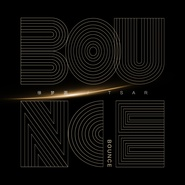

BOUNCE
============================

|  |  |
| :--: | :-- |
| [ BOUNCE](https://emumo.xiami.com/album/2103763876) | **艺人**: [徐梦圆](../index.md) **语种**: 纯音乐 **唱片公司**: 独立发行 **发行时间**: 2018年05月24日 **专辑类别**: EP, 单曲 **专辑风格**:  **播放数**: 767 **收藏数**: 3 **评论数**: 1  |

## 简介

徐梦圆和TASR合作的一首Future Bounce。又一次和TSAR合作，很厉害的一位制作人，这是第一次尝试future bounce风格，希望大家喜欢。

## 曲目

## 评论

|  |  |  |
| :-- | :-- | :-- |
|  [虾米用户](https://emumo.xiami.com/u/379149713) 吃货一枚 鉴定完毕 吼吼 2018-08-28 22:33 赞(1) 踩(0) | 
版权 等了这么久还是木有  说实话我想给虾米寄刀片耶
 |
