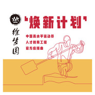

焕新计划
============================

|  |  |
| :--: | :-- |
| [ 焕新计划](https://emumo.xiami.com/album/2105761873) | **艺人**: [徐梦圆](../index.md) **语种**: 国语 **唱片公司**: 麦爱文化 **发行时间**: 2019年10月08日 **专辑类别**: EP, 单曲 **专辑风格**:  **播放数**: 11 **收藏数**: 1 **评论数**: 0  |

## 简介

“焕新计划”是我为一项公益教育项目创作的同名应援曲，“焕新计划”针对国家体育总局管理下的高水平运动员的个人可持续发展与职业转型发展的系列性教育支持计划。祝愿我们可爱可敬的运动员们，在退役后，能够找到新的方向，继续发光发热！

## 曲目

## 评论

