徐梦圆
============================

|  |  |
| :--: | :-- |
| [ 徐梦圆](https://i.xiami.com/xmy) | **地区**: China 中国大陆 **风格**: 独立流行 Indie Pop, 国语流行 Mandarin Pop, 日本动漫游戏 Japanese ACG **播放数**: 15432797 **粉丝数**: 21125 **评论数**: 518  |

## 档案

姓名：徐梦圆 生日：1992.10.22 星座：天秤座 毕业于北京现代音乐研修学院录音艺术专业。 从事游戏配乐以及电影配乐工作。 目前职业：由乐音乐工坊-音乐制作人 公司网站：www.youlefm.com

## 专辑

| 名称 | 语种 | 唱片公司 | 发行时间 | 专辑类别 | 专辑风格 |
| :--: | :-- | :-- | :-- | :-- | :-- |
| [ Feels (feat.傅如乔)](./albums/5022383650.md) | 其他 | 看见音乐 (上海) | 2021年01月08日 | EP, 单曲 | 流行 Pop |
| [ 声名大燥《球球大作战》潮流派对主题曲](./albums/5021146620.md) | 国语 | 看见文娱 | 2020年07月23日 | EP, 单曲 | 电子乐 Electronica |
| [ BALL《球球大作战》潮流电音专辑](./albums/5021064979.md) | 纯音乐 | 看见文娱 | 2020年07月08日 | EP, 单曲 | 电子乐 Electronica |
| [ Feels](./albums/5020931131.md) | 纯音乐 | 看见音乐 (上海) | 2020年06月21日 | EP, 单曲 | 电子舞曲 EDM / Electronic Dance Music |
| [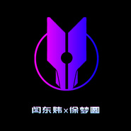 Chaos ( 国风Remix .徐梦圆/闫东炜）](./albums/2108382057.md) | 纯音乐 | HIFIVE | 2020年04月22日 | EP, 单曲 | 电子 Electronic |
| [ CHINA-复苏](./albums/2108303045.md) | 国语 | 麦爱文化 | 2020年04月08日 | EP, 单曲 | 电音流行 Electropop |
| [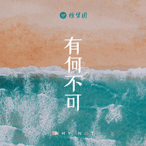 有何不可](./albums/2108285939.md) | 国语 | 麦爱文化 | 2020年03月27日 | EP, 单曲 |  |
| [ 有点喜欢你](./albums/2108301088.md) | 国语 | 麦爱文化 | 2020年03月22日 | EP, 单曲 | 新世纪音乐 New Age |
| [ CHINA-新春](./albums/2105650929.md) | 国语 | 麦爱文化 | 2019年12月25日 | 录音室专辑 |  |
| [ 恋爱海滩](./albums/2105761844.md) | 国语 | 麦爱文化 | 2019年12月04日 | EP, 单曲 |  |
| [ 你](./albums/2105733816.md) | 国语 | 麦爱文化 | 2019年11月19日 | EP, 单曲 |  |
| [ 竞燃《火箭联盟》首张国风电音专辑](./albums/2105346467.md) | 纯音乐 | 腾讯 | 2019年10月18日 | EP, 单曲 |  |
| [ 焕新计划](./albums/2105761873.md) | 国语 | 麦爱文化 | 2019年10月08日 | EP, 单曲 |  |
| [ Post Malone (feat. RANI) [徐梦圆冯提莫合作版]](./albums/2105296922.md) | 英语 | Spinnin' Remixes | 2019年09月26日 | EP, 单曲 |  |
| [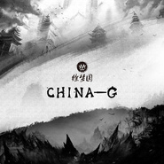 China-G](./albums/2105761874.md) | 国语 | 麦爱文化 | 2019年06月06日 | EP, 单曲 |  |
| [ 无期徒刑](./albums/2105761875.md) | 国语 | 麦爱文化 | 2019年05月11日 | EP, 单曲 |  |
| [ 跨越星弧](./albums/2104664150.md) | 纯音乐 | 独立发行 | 2019年03月12日 | EP, 单曲 | 电子乐 Electronica |
| [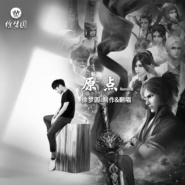 原点](./albums/2104650439.md) | 国语 | 独立发行 | 2019年03月07日 | EP, 单曲 | 电子乐 Electronica |
| [ Daybreak](./albums/2104486643.md) | 纯音乐 | 独立发行 | 2019年01月17日 | EP, 单曲 | 电子 Electronic |
| [ China-L](./albums/2104372114.md) | 纯音乐 | 独立发行 | 2018年12月14日 | EP, 单曲 | 电子乐 Electronica, 中国风 China-Wave |
| [ Drunk](./albums/2104362088.md) | 英语 | 麦爱文化 | 2018年12月09日 | EP, 单曲 | 独立流行 Indie Pop |
| [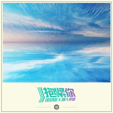 抱紧你](./albums/2104290586.md) | 国语 | 独立发行 | 2018年11月28日 | EP, 单曲 | 国语流行 Mandarin Pop |
| [ 棠梨煎雪](./albums/2105765852.md) | 国语 | 麦爱文化 | 2018年09月10日 | EP, 单曲 |  |
| [ China-E](./albums/2103946997.md) | 纯音乐 | 独立发行 | 2018年08月24日 | EP, 单曲 | 电子 Electronic |
| [ 暴鸡韦神](./albums/2103940275.md) | 国语 | 麦爱文化 | 2018年08月22日 | EP, 单曲 | 国语流行 Mandarin Pop |
| [ Five](./albums/2103763870.md) | 纯音乐 | 麦爱文化 | 2018年06月27日 | EP, 单曲 | 游戏配乐 Video Game Music |
| [ BOUNCE](./albums/2103763876.md) | 纯音乐 | 独立发行 | 2018年05月24日 | EP, 单曲 |  |
| [ China-C](./albums/2103763891.md) | 纯音乐 | 独立发行 | 2018年04月25日 | EP, 单曲 | 中国风 China-Wave |
| [ 徐梦圆 同名专辑](./albums/2103603930.md) | 国语 | 麦爱文化 | 2018年03月08日 | 录音室专辑 |  |
| [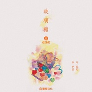 玻璃糖](./albums/2103562263.md) | 国语 | 麦爱文化 | 2018年02月27日 | EP, 单曲 | 电子 Electronic, 未来贝斯 Future Bass |
| [ Heartbeat](./albums/2102973802.md) | 纯音乐 | 独立发行 | 2017年12月14日 | EP, 单曲 | 独立电子乐 Indietronica |
| [ Bilibili x Shanghai](./albums/2102960271.md) | 纯音乐 | 麦爱文化 | 2017年11月27日 | EP, 单曲 | 电子 Electronic, 中国风 China-Wave |
| [ KINGSMAN](./albums/2102878058.md) | 英语 | 麦爱文化 | 2017年10月25日 | EP, 单曲 |  |
| [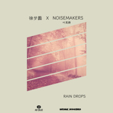 Rain Drops](./albums/2102862346.md) | 国语 | 麦爱文化 | 2017年09月23日 | EP, 单曲 |  |
| [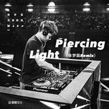 Piercing Light](./albums/2102851327.md) | 国语 | 独立发行 | 2017年09月05日 | EP, 单曲 | 独立电子乐 Indietronica |
| [ Galaxy](./albums/2102815620.md) | 纯音乐 | 独立发行 | 2017年08月18日 | EP, 单曲 | 独立电子乐 Indietronica |
| [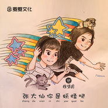 张大仙你是妖怪吧](./albums/2102812137.md) | 国语 | 独立发行 | 2017年08月11日 | EP, 单曲 | 浩室舞曲 House |
| [ China-U](./albums/2102802746.md) | 纯音乐 | 麦爱文化 | 2017年07月26日 | EP, 单曲 | 电子 Electronic, 中国风 China-Wave |
| [ All Smile](./albums/2102776741.md) | 纯音乐 | 麦爱文化 | 2017年07月04日 | EP, 单曲 |  |
| [ Candy Girl](./albums/2102763631.md) | 国语 | 麦爱文化 | 2017年06月12日 | EP, 单曲 | 独立电子乐 Indietronica |
| [ China-X(Extended Mix)](./albums/2105765854.md) | 国语 | 独立发行 | 2017年05月07日 | 现场专辑 |  |
| [ U And Me](./albums/2102742335.md) | 国语 | 独立发行 | 2017年05月04日 | EP, 单曲 |  |
| [ China-O](./albums/2105765853.md) | 国语 | 麦爱文化 | 2017年03月17日 | EP, 单曲 |  |
| [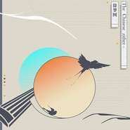 The Chinese zither](./albums/2102688955.md) | 国语 | 独立发行 | 2017年02月04日 | EP, 单曲 | 电子 Electronic, 中国风 China-Wave |
| [ change](./albums/2102872015.md) | 纯音乐 | 独立发行 | 2015年12月13日 | 合集, 杂锦 |  |
| [ 月圆，笙起](./albums/2100231496.md) | 国语 | 独立发行 | 2015年11月02日 | EP, 单曲 | 国语流行 Mandarin Pop, 中国风 China-Wave, 古风 GuFeng Music |
| [ 3D-E电](./albums/2100175745.md) | 其他 | 独立发行 | 2015年08月07日 | EP, 单曲 | 独立电子乐 Indietronica |
| [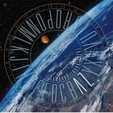 AliEz核爆神曲（指尖跃动钢琴版）](./albums/1837757441.md) | 粤语 | 独立发行 | 2015年07月25日 | EP, 单曲 | 轻音乐 Easy Listening |
| [ 清凉一夏](./albums/1737551691.md) | 国语 | 独立发行 | 2015年07月22日 | EP, 单曲 | 轻音乐 Easy Listening |
| [ 夏之秋](./albums/1437390632.md) | 国语 | 独立发行 | 2015年07月20日 | EP, 单曲 | 国语流行 Mandarin Pop |
| [ Hello girl](./albums/436250494.md) | 国语 | 独立发行 | 2015年07月07日 | EP, 单曲 | 国语流行 Mandarin Pop |
| [ 未来](./albums/133580109.md) | 其他 | 独立发行 | 2015年06月06日 | EP, 单曲 | 独立电子乐 Indietronica |
| [ 有的人](./albums/1733415095.md) | 国语 | 独立发行 | 2015年06月04日 | EP, 单曲 | 国语流行 Mandarin Pop |
| [ Just Love](./albums/732555090.md) | 国语 | 独立发行 | 2015年05月25日 | EP, 单曲 | 欧美流行 Western Pop, 美国传统民谣 American Folk |
| [ 静](./albums/1429931163.md) | 其他 | 独立发行 | 2015年04月25日 | EP, 单曲 | 轻音乐 Easy Listening |
| [ 一枝独秀](./albums/29874579.md) | 国语 | 独立发行 | 2015年04月24日 | EP, 单曲 | 中国风 China-Wave |
| [ 动漫电子风2](./albums/1129325522.md) | 其他 | 独立发行 | 2015年04月18日 | EP, 单曲 | 轻音乐 Easy Listening |
| [ Love动漫](./albums/628424164.md) | 其他 | 独立发行 | 2015年04月07日 | EP, 单曲 | 轻音乐 Easy Listening, 中国风 China-Wave |

## 评论

|  |  |  |
| :-- | :-- | :-- |
|  [虾米用户](https://emumo.xiami.com/u/358104299) 悲观的唯心存在现实解构虚... 2020-12-22 04:39 赞(0) 踩(0) | 
19048
 |
|  [虾米用户](https://emumo.xiami.com/u/251988)  2020-12-17 16:42 赞(0) 踩(0) | 
这都没版权，我看虾米是药丸了
 |
|  [虾米用户](https://emumo.xiami.com/u/2796166) 最爱莫文蔚..... 2020-06-22 02:12 赞(1) 踩(0) | 
加油~~~~
 |
|  [虾米用户](https://emumo.xiami.com/u/429732797) *面对懒惰的你充满了决心 2020-06-13 18:29 赞(4) 踩(0) | 
抄了7odu的歌不少 旋律都没变哦(&amp;acute;-&amp;omega;-`)服了
 |
| ⇒ |  [虾米用户](https://emumo.xiami.com/u/442329230) 我还没想好要写什么... 2020-11-02 21:25 赞(0) 踩(0) | 
我笑了 没学过法律还是咋？ 抄袭在曲谱相似70％以上才算抄袭
 |
|  [虾米用户](https://emumo.xiami.com/u/409298409) C4D渲染师 bigro... 2020-06-03 19:19 赞(2) 踩(0) | 
咱别说圆哥抄袭，这在英语上叫copy，在语文上叫借鉴，生物学上叫克隆                            所以你想多了
 |
|  [虾米用户](https://emumo.xiami.com/u/61834250)  2020-05-10 01:02 赞(1) 踩(0) | 
抄袭鬼才
 |
|  [虾米用户](https://emumo.xiami.com/u/311954558) 交个朋友呗❤ 2020-05-03 13:36 赞(0) 踩(0) | 
古风里参电音，不喜欢
 |
|  [虾米用户](https://emumo.xiami.com/u/354342987) 我想和你一起看B-612... 2020-03-14 14:06 赞(2) 踩(0) | 
撞曲就撞曲吧&amp;hellip;&amp;hellip;但是你这个商化也太严重了吧 根本不是两年前的圆哥了&amp;hellip;&amp;hellip;
 |
|  [虾米用户](https://emumo.xiami.com/u/306361985) 喧嚣不难 难的是保持沉默 2020-03-08 01:34 赞(3) 踩(0) | 
早上我还在佩服他呢，评论区来转转，震惊啊。
 |
|  [虾米用户](https://emumo.xiami.com/u/434989387)  2020-02-25 10:01 赞(2) 踩(0) | 
是很喜欢。之前是在楚乔传的花絮里听到你的音乐。古风的感觉也很纯粹，也小清新。但是最重要的是加入了活泼的曲调。感觉把古风乐器带出一个新台阶。听了很久一直没腻味。现在用于看书用。一听就很喜悦。不吵也不俗气。 特别棒棒哒
 |
|  [虾米用户](https://emumo.xiami.com/u/2433939) 我还没想好要写什么... 2020-02-20 06:28 赞(3) 踩(0) | 
抄袭
 |
|  [虾米用户](https://emumo.xiami.com/u/38579613)  2020-01-14 08:39 赞(3) 踩(0) | 
就算是抄，人家也抄出了特色啊！他能物尽其用，你行你上啊。
 |
| ⇒ |  [虾米用户](https://emumo.xiami.com/u/189489072) 始于1248的梦  2020-05-05 08:30 赞(0) 踩(0) | 
流批 抄袭还抄得理直气壮
 |
|  [虾米用户](https://emumo.xiami.com/u/303643854) 此生无憾入MC！ 2019-10-09 23:12 赞(2) 踩(0) | 
抄了7odu的歌不少，旋律都没变哦(´-ω-`)服了
 |
| ⇒ |  [虾米用户](https://emumo.xiami.com/u/410077879) 。 2019-12-18 03:49 赞(0) 踩(0) | 
谁抄谁的说不准
 |
| ⇒ |  [虾米用户](https://emumo.xiami.com/u/303643854) 此生无憾入MC！ 2020-02-03 16:54 赞(0) 踩(0) | 
<q><b>忘了名字说：</b></q>
 |
| ⇒ |  [虾米用户](https://emumo.xiami.com/u/410077879) 。 2020-02-03 20:43 赞(0) 踩(0) | 
<q><b>_Blacksheep_说：</b></q>
 |
|  [虾米用户](https://emumo.xiami.com/u/21748173)  2019-09-15 23:43 赞(1) 踩(0) | 
多上传，圆哥
 |
|  [虾米用户](https://emumo.xiami.com/u/283040611) 不忘初心，方得始终。 2019-09-14 16:29 赞(1) 踩(0) | 
徐梦圆，在你的心中一定拥有一片干净、纯洁而又美好的世界，不然怎会创造出仿若天籁的音乐。好希望你能看到啊，加油，加油，加油。   
 |
|  [虾米用户](https://emumo.xiami.com/u/420831355) 音乐制作人，DJ，努力中 2019-08-29 22:22 赞(1) 踩(0) | 
内容已删除
 |
| ⇒ |  [虾米用户](https://emumo.xiami.com/u/410077879) 。 2019-12-18 03:50 赞(0) 踩(0) | 
你们这群人看到不喜欢的东西一定要差一嘴吗
 |
|  [虾米用户](https://emumo.xiami.com/u/313007434)  2019-08-17 12:25 赞(0) 踩(0) | 
China-p，这首歌是第一个把我听哭的曲，委屈和不幸都忘了，后来生活好了，苦尽甘来吧
 |
|  [虾米用户](https://emumo.xiami.com/u/340986269)   2019-08-09 22:33 赞(0) 踩(0) | 
中国电音之光
 |
| ⇒ |  [虾米用户](https://emumo.xiami.com/u/420831355) 音乐制作人，DJ，努力中 2019-08-29 22:22 赞(0) 踩(0) | 
是电音鬼裁
 |
|  [虾米用户](https://emumo.xiami.com/u/7282474) 我没有结巴，只是在缓冲 2019-07-31 15:22 赞(4) 踩(0) | 
中国不需要抄袭！！！
 |
|  [虾米用户](https://emumo.xiami.com/u/45925586)  2019-07-30 15:15 赞(0) 踩(0) | 

 |
|  [虾米用户](https://emumo.xiami.com/u/404026779)  2019-07-04 22:48 赞(0) 踩(0) | 
好
 |
|  [虾米用户](https://emumo.xiami.com/u/255050849) 挚爱HP/我的世界，为H... 2019-06-08 15:06 赞(0) 踩(0) | 
梦圆大大牛逼逼
 |
|  [虾米用户](https://emumo.xiami.com/u/205516505)  2019-06-07 10:49 赞(2) 踩(0) | 
新作《China-G》 最爱的风格未来贝斯+中国风 6月6隔壁云首发 6.21全网上线 （托腮）
 |
|  [虾米用户](https://emumo.xiami.com/u/369631839) 我还没想好要写什么... 2019-05-24 19:11 赞(0) 踩(0) | 
图片集怎么没有一张相片
 |
|  [虾米用户](https://emumo.xiami.com/u/373048447)  2019-05-14 22:09 赞(0) 踩(0) | 
我喜欢你的每一首歌
 |
|  [虾米用户](https://emumo.xiami.com/u/347665895)  2019-05-11 08:39 赞(0) 踩(0) | 
多放几首歌上来呗
 |
|  [虾米用户](https://emumo.xiami.com/u/341184650) 长风破浪会有时，直挂云帆... 2019-04-08 16:32 赞(1) 踩(0) | 
内容已删除
 |
| ⇒ |  [虾米用户](https://emumo.xiami.com/u/268178465) hello world 2019-08-02 09:36 赞(0) 踩(0) | 
？
 |
| ⇒ |  [虾米用户](https://emumo.xiami.com/u/303643854) 此生无憾入MC！ 2019-10-09 23:19 赞(0) 踩(0) | 
那个……这可不是谣言，只不过锤的人少而已，看着徐梦圆之前的音乐把这些掩埋了而已，那个抄袭旋律变都没变，然后徐梦圆又把一些争议大的歌给删了，看看就令人发指╮(￣▽￣)╭徐梦圆也是个人才，当时锤的风大的时候徐梦圆还发了微博道歉之后徐梦圆就很少发原创了哦
 |
|  [虾米用户](https://emumo.xiami.com/u/315950236) 共亿 2019-04-07 09:10 赞(1) 踩(0) | 
电音第一人？Howie Lee了解一下
 |
| ⇒ |  [虾米用户](https://emumo.xiami.com/u/352791368)  2019-05-06 16:23 赞(0) 踩(0) | 
徐梦圆是中国电音第一人，上过明日之子，是主持人亲口说的，没有争议。你说的什么lee我都没听说过，呵呵
 |
| ⇒ |  [虾米用户](https://emumo.xiami.com/u/315950236) 共亿 2019-05-09 19:31 赞(0) 踩(0) | 
<q><b>Suspicious说：</b></q>
 |
| ⇒ |  [虾米用户](https://emumo.xiami.com/u/315950236) 共亿 2019-05-09 19:32 赞(0) 踩(0) | 
<q><b>Suspicious说：</b></q>
 |
| ⇒ |  [虾米用户](https://emumo.xiami.com/u/420831355) 音乐制作人，DJ，努力中 2019-08-29 22:23 赞(0) 踩(0) | 
<q><b>Suspicious说：</b></q>
 |
| ⇒ |  [虾米用户](https://emumo.xiami.com/u/255050849) 挚爱HP/我的世界，为H... 2019-11-03 19:52 赞(0) 踩(0) | 
<q><b>Dylan王嘉源说：</b></q>
 |
| ⇒ |  [虾米用户](https://emumo.xiami.com/u/420831355) 音乐制作人，DJ，努力中 2019-11-03 20:31 赞(0) 踩(0) | 
<q><b>SteveMC说：</b></q>
 |
|  [虾米用户](https://emumo.xiami.com/u/415131965)  2019-04-06 20:34 赞(2) 踩(0) | 
我来了，之前听过你刚开始发型的曲子一阵，虽然批评过，诟病过，但是现在做的越来越好来支持一下，。人都有成长，你却有努力和才华，祝贺！
 |
|  [虾米用户](https://emumo.xiami.com/u/530490) 音乐不说谎。 2019-04-03 16:11 赞(1) 踩(0) | 
节奏感爆了
 |
|  [虾米用户](https://emumo.xiami.com/u/268361859)  2019-03-25 14:31 赞(2) 踩(0) | 
高质量电音。 
 |
|  [虾米用户](https://emumo.xiami.com/u/361037631)  2019-03-24 14:35 赞(0) 踩(0) | 
******
 |
|  [虾米用户](https://emumo.xiami.com/u/5754855)   2019-03-14 21:39 赞(1) 踩(0) | 
几乎把所有作品都听了一遍，得出一个结论：大徐出品，必属精品！梦圆出手，必能圆梦！
 |
|  [虾米用户](https://emumo.xiami.com/u/401541389) 专注听歌 2019-03-12 22:19 赞(0) 踩(0) | 
只为在虾米多看你两眼
 |
|  [虾米用户](https://emumo.xiami.com/u/233517630) 新兰诶！！ 2019-03-10 16:00 赞(0) 踩(0) | 
我的天！！！梦圆和我生日同一天！！ ( ͡° ͜ʖ ͡°)•ॢ！！
 |
| ⇒ |  [虾米用户](https://emumo.xiami.com/u/268178465) hello world 2019-08-02 09:37 赞(0) 踩(0) | 
哇我好羡慕恭喜你啊 
 |
|  [虾米用户](https://emumo.xiami.com/u/416287764) 天下第一可爱 2019-03-10 12:51 赞(1) 踩(0) | 
中国电音第一人
 |
|  [虾米用户](https://emumo.xiami.com/u/361839699) 淋漓尽致见怪不怪美不胜收... 2019-02-14 12:56 赞(3) 踩(0) | 
圆哥啊，作为海外留学狗，我们在国外可以用的国产音乐软件就只有虾米了，能在虾米上多投一些歌吗，好多china系列的歌都听不到啊…………朋友们顶我上去让圆哥看到好吗，拜托拜托
 |
|  [虾米用户](https://emumo.xiami.com/u/292822686) 爱过 2019-02-06 04:02 赞(0) 踩(0) | 
<a href="http://emumo.xiami.com/u/47573663" target="_blank" rel="nofollow" name_card="47573663">@徐梦圆 </a>听见你的音乐就会开心 
 |
|  [虾米用户](https://emumo.xiami.com/u/205516505)  2019-02-03 14:46 赞(0) 踩(0) | 
希望您继续认真的做音乐，徐老师
 |
|  [虾米用户](https://emumo.xiami.com/u/310068209) 戳爷霉霉〔碧丽〕(新晋女... 2019-01-17 13:18 赞(3) 踩(0) | 
不管怎么样，我喜欢这种电音，啊啊啊啊中国电音崛起吧！！！！国外的最喜欢Alan walker！！！！！
 |
|  [虾米用户](https://emumo.xiami.com/u/405297075)  2019-01-10 18:57 赞(1) 踩(0) | 
中国电音第一人？
 |
| ⇒ |  [虾米用户](https://emumo.xiami.com/u/12165599) 融入音乐的灵魂，从来不曾... 2019-03-07 17:17 赞(0) 踩(0) | 
不，还有好位个也不错
 |
|  [虾米用户](https://emumo.xiami.com/u/358049921) 时间宛若流水 玫瑰的颜色... 2018-12-30 22:07 赞(1) 踩(0) | 
破站报到_(:з」∠)_疯狂暗示
 |
| ⇒ |  [虾米用户](https://emumo.xiami.com/u/335999338)  2019-02-08 00:05 赞(0) 踩(0) | 
爱死这个小破站了Ｏ(≧▽≦)Ｏ 。
 |
|  [虾米用户](https://emumo.xiami.com/u/12254045)  2018-12-30 20:28 赞(26) 踩(0) | 
徐裁缝你好 徐裁缝再见
 |
|  [虾米用户](https://emumo.xiami.com/u/45505931)  2018-12-29 12:54 赞(1) 踩(0) | 
高产音乐人，感谢这么多好旋律，好曲子。加油！我是450条，O(&amp;cap;_&amp;cap;)O哈哈~
 |
|  [虾米用户](https://emumo.xiami.com/u/405005839) 纯音乐是我一生的挚爱。 2018-12-28 21:23 赞(0) 踩(0) | 
大爱徐梦圆
 |
|  [虾米用户](https://emumo.xiami.com/u/283751351)  2018-12-24 14:10 赞(6) 踩(0) | 
现在搞原创的又有多少啊，无非是相互借鉴
 |
|  [虾米用户](https://emumo.xiami.com/u/203457273) 帅......爆了 2018-12-19 09:08 赞(14) 踩(0) | 
撞曲鬼才
 |
|  [虾米用户](https://emumo.xiami.com/u/248657073)  2018-12-18 20:16 赞(0) 踩(0) | 
不错，可以
 |
|  [虾米用户](https://emumo.xiami.com/u/407365224) 自古红白出cp 2018-12-09 10:09 赞(0) 踩(0) | 
各位大神们，问一下勒，徐哥会啥乐器呐~
 |
| ⇒ |  [虾米用户](https://emumo.xiami.com/u/278699619) 感谢有你虾米再见！ 2019-02-06 04:42 赞(0) 踩(0) | 
剪刀，缝纫机。
 |
| ⇒ |  [虾米用户](https://emumo.xiami.com/u/377166800) I want to br... 2019-03-01 22:10 赞(0) 踩(0) | 
橡胶锤
 |
|  [虾米用户](https://emumo.xiami.com/u/48372333) q   14397168... 2018-12-01 20:31 赞(1) 踩(0) | 
欢迎大家收藏精选集虾米歌单 | 徐梦圆作品（部分） <a href="https://www.xiami.com/collect/265225764" target="_blank" rel="nofollow noreferrer noopener">https://www.xiami.com/collect/265225764</a> (分享自@虾米音乐)
 |
|  [虾米用户](https://emumo.xiami.com/u/48372333) q   14397168... 2018-12-01 20:29 赞(6) 踩(0) | 
说是抄袭，实际上很多调调如果你听起来相似是不能判为抄袭的，唯一判断抄袭只能靠扒谱。
 |
| ⇒ |  [虾米用户](https://emumo.xiami.com/u/268178465) hello world 2019-01-05 23:51 赞(0) 踩(0) | 
也是 但那个talk me hand 被阿徐 参考 了 即为china
 |
|  [虾米用户](https://emumo.xiami.com/u/348562452) WHO TOUCHED ... 2018-11-29 19:56 赞(30) 踩(0) | 
可真是个撞曲小天才呢
 |
|  [虾米用户](https://emumo.xiami.com/u/265509081) 风就该自由，要什么归宿 2018-11-24 16:40 赞(1) 踩(0) | 
哇塞塞，不经意间听到的《China》系列，然后又听了梦圆大大跟双笙小姐姐合唱的几首歌，彻底入了电音的坑
 |
| ⇒ |  [虾米用户](https://emumo.xiami.com/u/407945124)  2018-11-26 17:05 赞(0) 踩(0) | 
别这么说，我在电音的坑里越爬                                                                                                      越深了
 |
| ⇒ |  [虾米用户](https://emumo.xiami.com/u/407030032) 你喜欢我吗？ 2019-01-22 15:02 赞(0) 踩(0) | 
嗷嗷我也是，大爱双笙和徐梦圆呐
 |
|  [虾米用户](https://emumo.xiami.com/u/229359060) 请睁开你的大眼，看清说话 2018-11-14 00:26 赞(0) 踩(0) | 
China-Z  Arealy
 |
|  [虾米用户](https://emumo.xiami.com/u/400283322) 不要皱着眉头，生活总会变... 2018-11-11 21:35 赞(0) 踩(0) | 
不错不错，大我整五岁
 |
|  [虾米用户](https://emumo.xiami.com/u/929370) 我还没想好要写什么... 2018-11-09 00:02 赞(44) 踩(0) | 
又一个抄袭。。
 |
| ⇒ |  [虾米用户](https://emumo.xiami.com/u/410077879) 。 2019-12-18 03:49 赞(0) 踩(0) | 
抄袭？
 |
| ⇒ |  [虾米用户](https://emumo.xiami.com/u/351829211) 清风过，琴之一曲落逍遥。... 2020-01-01 13:36 赞(0) 踩(0) | 
说抄袭，你有证据吗⚆_⚆？
 |
| ⇒ |  [虾米用户](https://emumo.xiami.com/u/280864742) (｡･ω･｡)ﾉ♡ 2020-01-10 02:01 赞(0) 踩(0) | 
<q><b>墨笙说：</b></q>
 |
| ⇒ |  [虾米用户](https://emumo.xiami.com/u/280864742) (｡･ω･｡)ﾉ♡ 2020-01-10 02:02 赞(0) 踩(0) | 
<q><b>忘了名字说：</b></q>
 |
| ⇒ |  [虾米用户](https://emumo.xiami.com/u/410077879) 。 2020-01-10 13:59 赞(0) 踩(0) | 
<q><b>我是谁说：</b></q>
 |
| ⇒ |  [虾米用户](https://emumo.xiami.com/u/280864742) (｡･ω･｡)ﾉ♡ 2020-01-10 20:59 赞(0) 踩(0) | 
<q><b>忘了名字说：</b></q>
 |
| ⇒ |  [虾米用户](https://emumo.xiami.com/u/410077879) 。 2020-01-11 00:15 赞(0) 踩(0) | 
<q><b>我是谁说：</b></q>
 |
| ⇒ |  [虾米用户](https://emumo.xiami.com/u/280864742) (｡･ω･｡)ﾉ♡ 2020-01-11 00:26 赞(0) 踩(0) | 
<q><b>忘了名字说：</b></q>
 |
| ⇒ |  [虾米用户](https://emumo.xiami.com/u/280864742) (｡･ω･｡)ﾉ♡ 2020-01-11 00:28 赞(0) 踩(0) | 
<q><b>忘了名字说：</b></q>
 |
| ⇒ |  [虾米用户](https://emumo.xiami.com/u/280864742) (｡･ω･｡)ﾉ♡ 2020-01-11 00:29 赞(0) 踩(0) | 
<q><b>忘了名字说：</b></q>
 |
| ⇒ |  [虾米用户](https://emumo.xiami.com/u/410077879) 。 2020-01-11 00:38 赞(0) 踩(0) | 
<q><b>我是谁说：</b></q>
 |
|  [虾米用户](https://emumo.xiami.com/u/4723814) 我还没想好要写什么... 2018-11-06 15:11 赞(3) 踩(0) | 
其实最开始的China系列真的超级开心 因为觉得这中国电音有了自己的样子 但是现在真的 Shame on you 桑心
 |
|  [虾米用户](https://emumo.xiami.com/u/27482995) 喜欢老猫、V系、遥久、各... 2018-11-04 12:24 赞(41) 踩(0) | 
抄袭大神
 |
|  [虾米用户](https://emumo.xiami.com/u/251038538)  2018-11-03 22:58 赞(11) 踩(0) | 
徐裁缝。。。
 |
|  [虾米用户](https://emumo.xiami.com/u/35088835) 仿生人会梦见电子羊嘛 2018-11-03 08:17 赞(6) 踩(0) | 
撞曲奇侠
 |
|  [虾米用户](https://emumo.xiami.com/u/325205625)  2018-11-03 06:35 赞(0) 踩(0) | 
虾米音乐很棒！为了音乐以服务！我感谢虾米！对于版权不重要～重要的是来点新曲！
 |
|  [虾米用户](https://emumo.xiami.com/u/404200284) 保持冷漠 适度撒娇 不动... 2018-11-01 22:03 赞(0) 踩(0) | 
挺喜欢你的
 |
|  [虾米用户](https://emumo.xiami.com/u/71989728) 再见啦 2018-11-01 14:55 赞(4) 踩(0) | 
其实撞曲的歌名字改为原曲名加一个xmy remix就是好东西了
 |
|  [虾米用户](https://emumo.xiami.com/u/303643854) 此生无憾入MC！ 2018-10-27 22:45 赞(3) 踩(0) | 
抄袭风波又来了……
 |
|  [虾米用户](https://emumo.xiami.com/u/346225404)  2018-10-24 15:18 赞(0) 踩(0) | 
太好听
 |
|  [虾米用户](https://emumo.xiami.com/u/45000211)  2018-10-21 16:46 赞(2) 踩(0) | 
哈哈  撞曲天才
 |
|  [虾米用户](https://emumo.xiami.com/u/335812646) 帐号已注销 2018-10-20 09:48 赞(7) 踩(0) | 
电音鬼裁
 |
|  [虾米用户](https://emumo.xiami.com/u/73984034) only 2018-10-16 11:51 赞(4) 踩(0) | 
抄袭的辣鸡
 |
| ⇒ |  [虾米用户](https://emumo.xiami.com/u/320282589)  2018-10-19 20:02 赞(0) 踩(0) | 
？？？
 |
|  [虾米用户](https://emumo.xiami.com/u/47736446) 上传了最后一首 2018-10-12 18:31 赞(35) 踩(0) | 
好一个中华古风电子音乐先锋
 |
|  [虾米用户](https://emumo.xiami.com/u/196977) 我的心里有一扇门，开门的 2018-09-13 10:18 赞(0) 踩(0) | 
没想到是师弟，同一所学校毕业哦
 |
|  [虾米用户](https://emumo.xiami.com/u/34575899) (｡•̀ᴗ-)✧ 2018-09-08 14:36 赞(16) 踩(0) | 
虾米不考虑买齐china系列嘛~~~哭唧唧~~~
 |
|  [虾米用户](https://emumo.xiami.com/u/379971437)  2018-09-08 13:03 赞(0) 踩(0) | 
支持你
 |
|  [虾米用户](https://emumo.xiami.com/u/346581622) 喜欢听电音，不要怪我。 2018-09-04 19:12 赞(3) 踩(0) | 
徐梦圆就是把古风元素和电音琴一起组合起来。 像他这种古风电音的话再配上人唱，神作。 肯定好听
 |
|  [虾米用户](https://emumo.xiami.com/u/4400366) 再也不见 2018-08-27 23:56 赞(0) 踩(0) | 
囍
 |
|  [虾米用户](https://emumo.xiami.com/u/327700199) 永loveV家，TS 2018-08-25 18:49 赞(4) 踩(0) | 
我一直以为徐梦圆是女的。。。。。
 |
|  [虾米用户](https://emumo.xiami.com/u/401559057) 我的世界万岁，抄袭我大M... 2018-08-20 17:07 赞(1) 踩(0) | 
大徐最棒了^o^中国电音之王
 |
|  [虾米用户](https://emumo.xiami.com/u/218980036) 虾米音乐forever 2018-08-12 12:18 赞(3) 踩(0) | 
坐等china-p
 |
|  [虾米用户](https://emumo.xiami.com/u/202167798) 既然不能在一起，命运为什... 2018-08-10 02:30 赞(1) 踩(0) | 
刚刚看了下某云专辑一共103张，虾米30张，某Q音乐104张，或许粉丝少，歌曲评价少吧。
 |
|  [虾米用户](https://emumo.xiami.com/u/378717064)  2018-08-07 12:28 赞(1) 踩(0) | 
china-P，虾米一搜，没有版权，放弃虾米，网易搜狗，一搜真有，单曲循环，不知几遍，我大圆哥，放弃虾米，悲哉！
 |
|  [虾米用户](https://emumo.xiami.com/u/40587864)   2018-08-05 21:15 赞(0) 踩(0) | 
大神
 |
|  [虾米用户](https://emumo.xiami.com/u/202151434) 没有，我就是听歌的。 2018-08-04 00:16 赞(0) 踩(0) | 
梦圆老哥加油啊
 |
|  [虾米用户](https://emumo.xiami.com/u/4755365)  2018-08-01 19:03 赞(0) 踩(0) | 
哈哈 ，就服你
 |
|  [虾米用户](https://emumo.xiami.com/u/2321818) ❌〰️❌看到名字是不是想... 2018-08-01 13:01 赞(0) 踩(0) | 
圆哥  什么时候更新你的虾米啊 你微博老有新歌爆出 就是不更新这里
 |
|  [虾米用户](https://emumo.xiami.com/u/263200489) 生活多无趣，唯有音乐入我... 2018-07-18 11:15 赞(1) 踩(0) | 
第400个
 |
|  [虾米用户](https://emumo.xiami.com/u/348315058) 新欢在收藏，旧爱在歌单 2018-07-10 22:18 赞(0) 踩(0) | 
想火想疯了
 |
|  [虾米用户](https://emumo.xiami.com/u/187127744) 带上耳机  世界与我无关 2018-07-05 18:15 赞(0) 踩(0) | 
小姐姐加油 
 |
| ⇒ |  [虾米用户](https://emumo.xiami.com/u/330836626) 这个人不懒，什么也没写 2018-07-07 08:19 赞(0) 踩(0) | 
小姐姐？你是魔鬼吧
 |
|  [虾米用户](https://emumo.xiami.com/u/206758094) 滚回去听歌 2018-07-02 21:07 赞(0) 踩(0) | 
加油
 |
|  [虾米用户](https://emumo.xiami.com/u/38875385) 期盼明月期盼朝阳期盼春风... 2018-07-01 00:39 赞(0) 踩(0) | 
所以你是去了明日之子吗
 |
|  [虾米用户](https://emumo.xiami.com/u/49002758) 没事儿听听音乐，挺好。 2018-06-30 09:40 赞(0) 踩(0) | 
想听藏，这首歌。快快上呀！
 |
|  [虾米用户](https://emumo.xiami.com/u/254915390) 修身养性 2018-06-29 12:57 赞(0) 踩(0) | 
六批
 |
|  [虾米用户](https://emumo.xiami.com/u/1658342) 我还没想好要写什么... 2018-06-25 21:03 赞(0) 踩(0) | 
打卡打卡
 |
|  [虾米用户](https://emumo.xiami.com/u/228549670) 麻烦不要杠我 浪费时间 ... 2018-06-21 12:18 赞(1) 踩(0) | 
第五人格的five什么时候发呀www
 |
|  [虾米用户](https://emumo.xiami.com/u/218980036) 虾米音乐forever 2018-06-19 22:44 赞(0) 踩(0) | 
啥时候出china-p啊
 |
|  [虾米用户](https://emumo.xiami.com/u/375487521)  2018-06-18 12:28 赞(0) 踩(0) | 
徐梦圆，你是最棒的，为中国的电音增光添彩！永远爱你！
 |
|  [虾米用户](https://emumo.xiami.com/u/351542213)  2018-06-17 23:05 赞(2) 踩(0) | 
虾米是我用过的最好的音乐软件！！什么都能听
 |
| ⇒ |  [虾米用户](https://emumo.xiami.com/u/376192886)  2018-06-21 00:17 赞(0) 踩(0) | 
还给VIP这是最赞的
 |
|  [虾米用户](https://emumo.xiami.com/u/196305576) (๑•̀ㅂ•́)و✧ 2018-06-03 11:23 赞(2) 踩(0) | 
微妙的感觉
 |
|  [虾米用户](https://emumo.xiami.com/u/46805434) 我这条命是音乐给的 2018-05-31 11:35 赞(1) 踩(0) | 
虽然不是ky（不要打我ww）还有A叔也是啊&amp;hellip;&amp;hellip;超久不在虾米更新我要死了
 |
|  [虾米用户](https://emumo.xiami.com/u/309752495)  2018-05-30 08:20 赞(13) 踩(0) | 
你好，可否谈下版权购买问题。15803858316 YouTube 中国 区 Hank
 |
|  [虾米用户](https://emumo.xiami.com/u/42185440)  2018-05-11 00:14 赞(3) 踩(0) | 
期待能把其他China系列的也上传到虾米上～
 |
|  [虾米用户](https://emumo.xiami.com/u/296021698) 春菜白瑾 2018-05-07 23:40 赞(0) 踩(0) | 
很喜欢你的歌，加油
 |
|  [虾米用户](https://emumo.xiami.com/u/110414820)   2018-05-06 17:48 赞(1) 踩(0) | 
圆哥什么时候能做两个关于火影忍者的电音，燃一点的
 |
|  [虾米用户](https://emumo.xiami.com/u/326165803) 我还没想好要写什么... 2018-04-29 02:00 赞(1) 踩(0) | 
为什么艺人照片都没有
 |
|  [虾米用户](https://emumo.xiami.com/u/221348806)  2018-04-23 18:49 赞(0) 踩(0) | 
请教圆哥，为啥在虾米上没有China-P呀？
 |
|  [虾米用户](https://emumo.xiami.com/u/317582902) 这家伙很聪明什么也没留下... 2018-04-17 09:32 赞(1) 踩(0) | 
好好好好好good
 |
|  [虾米用户](https://emumo.xiami.com/u/328198045) 虾米音乐，我全部回忆的储... 2018-04-15 13:42 赞(0) 踩(0) | 
玻璃糖也是徐梦圆作曲
 |
|  [虾米用户](https://emumo.xiami.com/u/338975473)  2018-04-13 22:49 赞(0) 踩(0) | 
噗嗤说云村抄虾米数据库笑死
 |
|  [虾米用户](https://emumo.xiami.com/u/276337515) 不一样的你 2018-04-12 21:59 赞(0) 踩(0) | 
支持中国第一人
 |
|  [虾米用户](https://emumo.xiami.com/u/51781784) 你曾经脑袋里有屎！ 2018-04-07 18:38 赞(1) 踩(0) | 
渐渐喜欢上你的风格
 |
|  [虾米用户](https://emumo.xiami.com/u/353085891)  2018-03-20 00:15 赞(0) 踩(0) | 
内容已删除
 |
| ⇒ |  [虾米用户](https://emumo.xiami.com/u/353085891)  2018-03-20 00:17 赞(0) 踩(0) | 
唉，也许在云村粉丝多吧。122w&amp;mdash;1.1w
 |
|  [虾米用户](https://emumo.xiami.com/u/44552891) 我永远喜欢honeywo... 2018-03-03 14:55 赞(4) 踩(0) | 
虾米今天给我推荐了徐梦圆的歌啊啊啊啊啊❤️
 |
|  [虾米用户](https://emumo.xiami.com/u/350152242)  2018-02-26 19:19 赞(1) 踩(0) | 
为毛听不到藏  很郁闷
 |
|  [虾米用户](https://emumo.xiami.com/u/38500782)  2018-02-23 09:34 赞(4) 踩(0) | 
希望中国市场环境别饿死徐大这样的人，留给音乐创作人一丝光明
 |
|  [虾米用户](https://emumo.xiami.com/u/11919579) 始于初见，止于终老 2018-02-20 00:48 赞(1) 踩(0) | 
虾米的版权太少了，企鹅音乐上徐梦圆的歌曲数量是虾米的两倍，很多好听的想分享都没有。
 |
|  [虾米用户](https://emumo.xiami.com/u/341854072)  2018-02-14 18:16 赞(2) 踩(0) | 
老江湖。。
 |
|  [虾米用户](https://emumo.xiami.com/u/348330732)  2018-02-07 22:25 赞(3) 踩(0) | 
唉，China系列的歌好多没有啊。。。失望 
 |
|  [虾米用户](https://emumo.xiami.com/u/317235595)  2018-01-12 19:51 赞(3) 踩(0) | 
小哥哥的电音真的很给兔国长脸啊 
 |
|  [虾米用户](https://emumo.xiami.com/u/187659917)  2018-01-08 13:51 赞(2) 踩(0) | 
不输国外 小哥哥超级棒啊
 |
|  [虾米用户](https://emumo.xiami.com/u/335394753)  2017-12-19 09:21 赞(1) 踩(0) | 
圆哥上传点歌呗
 |
|  [虾米用户](https://emumo.xiami.com/u/48909893) 黑暗 2017-12-06 14:07 赞(0) 踩(0) | 
圆哥不上传歌曲，咱也没办法上传
 |
|  [虾米用户](https://emumo.xiami.com/u/44565735) 人生是一方通行 2017-11-28 22:26 赞(57) 踩(0) | 
一个死循环 在云村传作品得到的回应多 来虾米传发现听的人很少 于是越来越注重网易云那边的运营 然后虾米这边越来越冷清 最后音乐人转战wwy弃虾米 (&amp;deg;̥̥̥̥̥̥̥̥&amp;omega;&amp;deg;̥̥̥̥̥̥̥̥ԅ) 或者有的根本就不入驻虾米音乐人! 心痛2017...怕是要一直心痛到2117...哭
 |
| ⇒ |  [虾米用户](https://emumo.xiami.com/u/2085965) lost  memory... 2017-12-10 18:19 赞(0) 踩(0) | 
然而虾米推多了又会有人BB，真是没办法
 |
|  [虾米用户](https://emumo.xiami.com/u/184660159) ～～世人皆佛～～ 2017-11-26 21:50 赞(11) 踩(0) | 
小子！为中国争口气！搞点你认为好的音乐出来！最好是轻电音哦！加油！加油！加油！
 |
|  [虾米用户](https://emumo.xiami.com/u/31709801) 还活着，真的是太好了..... 2017-11-26 17:33 赞(0) 踩(0) | 
没办法，虾米音乐人的曲子只能由本人上传，圆哥不来虾米也没办法。
 |
|  [虾米用户](https://emumo.xiami.com/u/45394570) (•ؔʶ̷ ˡ̲̮我 很... 2017-11-19 05:50 赞(0) 踩(0) | 
漏配
 |
|  [虾米用户](https://emumo.xiami.com/u/321222446) 音乐我的SK2 2017-11-07 23:58 赞(1) 踩(0) | 
加油！实验电音靠你了
 |
|  [虾米用户](https://emumo.xiami.com/u/32191441) 豆瓣音乐人小站： 2017-11-06 11:16 赞(1) 踩(0) | 
一路追着大仙直播找到这里。。。。
 |
| ⇒ |  [虾米用户](https://emumo.xiami.com/u/335394753)  2017-12-19 09:21 赞(0) 踩(0) | 
同，哈哈哈哈哈骚
 |
|  [虾米用户](https://emumo.xiami.com/u/50193213)  2017-11-04 01:45 赞(0) 踩(0) | 
我想和你学习电音
 |
|  [虾米用户](https://emumo.xiami.com/u/44565735) 人生是一方通行 2017-11-02 08:22 赞(1) 踩(0) | 
（悄咪咪的求上架CHINAP和A和PDD）_(•̀ω•́ 」∠)_
 |
|  [虾米用户](https://emumo.xiami.com/u/50764540) Lets party !... 2017-10-27 23:54 赞(1) 踩(0) | 
大大 跪求收下我的膝盖
 |
|  [虾米用户](https://emumo.xiami.com/u/9078578) 我还没想好要写什么... 2017-10-27 23:53 赞(0) 踩(0) | 
游戏视频里听到的china-p
 |
|  [虾米用户](https://emumo.xiami.com/u/2535446)  2017-10-27 10:28 赞(0) 踩(0) | 
爱过 
 |
|  [虾米用户](https://emumo.xiami.com/u/44565735) 人生是一方通行 2017-10-21 13:50 赞(0) 踩(0) | 
圆哥也在虾米发一下新歌呀T.T
 |
|  [虾米用户](https://emumo.xiami.com/u/256536186) 卖萌打滚求关注(๑•́ ... 2017-10-14 00:01 赞(1) 踩(0) | 
为什么change不上传到虾米 ，还要我自己上传专辑信息 
 |
| ⇒ |  [虾米用户](https://emumo.xiami.com/u/31709801) 还活着，真的是太好了..... 2017-10-15 07:45 赞(0) 踩(0) | 
老哥怎么上传？
 |
| ⇒ |  [虾米用户](https://emumo.xiami.com/u/256536186) 卖萌打滚求关注(๑•́ ... 2017-10-15 14:34 赞(0) 踩(0) | 
<q><b>腐人说：</b></q>
 |
|  [虾米用户](https://emumo.xiami.com/u/320765539) This guy is ... 2017-10-12 05:41 赞(0) 踩(0) | 
求china系列呀 在英国只有虾米能用了
 |
| ⇒ |  [虾米用户](https://emumo.xiami.com/u/259166982)  2018-03-23 13:15 赞(0) 踩(0) | 
为啥啊？
 |
|  [虾米用户](https://emumo.xiami.com/u/12221090) 逍遥于天地而心意自得 2017-10-10 01:23 赞(0) 踩(0) | 
赞
 |
|  [虾米用户](https://emumo.xiami.com/u/300515607) ❤️❤️❤️ 2017-10-04 15:32 赞(2) 踩(0) | 
超级喜欢这种将中国文化融入音乐的音乐人，第一次听到徐梦圆的歌是China-X，当时感觉超级好听，现在也超爱啊。我敬佩文化的传播者
 |
|  [虾米用户](https://emumo.xiami.com/u/300515607) ❤️❤️❤️ 2017-10-03 10:59 赞(0) 踩(0) | 
超级喜欢China-X
 |
|  [虾米用户](https://emumo.xiami.com/u/260455902) My QQnumer：3... 2017-09-30 18:33 赞(3) 踩(0) | 
求各位虾米listen友 不要问圆哥是不是女的了，圆哥就是一个堂堂正正的男子汉
 |
|  [虾米用户](https://emumo.xiami.com/u/260455902) My QQnumer：3... 2017-09-30 18:31 赞(0) 踩(0) | 
QQ为3259682136的我想听Chana-X 打王者更加有劲儿了 I Live in ZheJiang 最后说一句话 我爱你，圆哥   
 |
|  [虾米用户](https://emumo.xiami.com/u/31709801) 还活着，真的是太好了..... 2017-09-21 23:44 赞(0) 踩(0) | 
哎，对哦，话说圆哥你是不是瞧不起我们大虾米用户啊？我们不肯花钱听你的音乐？我们愿意花钱下载啊！
 |
|  [虾米用户](https://emumo.xiami.com/u/34708545) 逛够了世界跌进了春风 2017-09-20 22:26 赞(0) 踩(0) | 
china系列最喜欢china-p这首歌了，可惜冇的
 |
|  [虾米用户](https://emumo.xiami.com/u/325351260)  2017-09-17 16:28 赞(1) 踩(0) | 
网易大军路过＋1
 |
|  [虾米用户](https://emumo.xiami.com/u/325041817)  2017-09-14 22:38 赞(0) 踩(0) | 
可以多发点歌曲吗 
 |
|  [虾米用户](https://emumo.xiami.com/u/44565735) 人生是一方通行 2017-09-14 10:19 赞(0) 踩(0) | 
想听ChinaAPX想听PDD(&amp;acute;._.｀)
 |
|  [虾米用户](https://emumo.xiami.com/u/44565735) 人生是一方通行 2017-09-14 10:11 赞(1) 踩(0) | 
哈哈哈哈评论这里可以看到圆哥（头痛）头像
 |
|  [虾米用户](https://emumo.xiami.com/u/42292252) 流水今日，明月前身 2017-09-11 11:46 赞(0) 踩(0) | 
驰放而已，惊奇有限
 |
|  [虾米用户](https://emumo.xiami.com/u/209859510) 我还没想好要写什么... 2017-09-08 12:48 赞(0) 踩(0) | 
这音乐  不把它串起来
 |
|  [虾米用户](https://emumo.xiami.com/u/25994536)  2017-09-08 09:07 赞(0) 踩(0) | 
我现在就想嫁给徐梦圆
 |
| ⇒ |  [虾米用户](https://emumo.xiami.com/u/301623185) 如果你不爱这片土地，这片... 2017-09-24 13:56 赞(0) 踩(0) | 
徐梦圆不是女的吗
 |
|  [虾米用户](https://emumo.xiami.com/u/172184556)  2017-09-06 07:45 赞(0) 踩(0) | 
没有xp
 |
|  [虾米用户](https://emumo.xiami.com/u/322846629) 我还没想好要写什么... 2017-09-01 23:51 赞(0) 踩(0) | 
打call打call ! ! !
 |
|  [虾米用户](https://emumo.xiami.com/u/321612430)  2017-08-28 09:31 赞(0) 踩(0) | 
最爱圆哥的歌
 |
|  [虾米用户](https://emumo.xiami.com/u/38526744) 且珍惜 2017-08-23 18:23 赞(0) 踩(0) | 
China-X
 |
|  [虾米用户](https://emumo.xiami.com/u/206110434)  2017-08-23 12:50 赞(0) 踩(0) | 
微博是啥？找不到
 |
|  [虾米用户](https://emumo.xiami.com/u/251608817) ~zZ 2017-08-23 00:13 赞(0) 踩(0) | 
真好听真有趣
 |
|  [虾米用户](https://emumo.xiami.com/u/315819312)  2017-08-21 13:21 赞(2) 踩(0) | 
92年的&amp;middot;&amp;middot;&amp;middot;&amp;middot;&amp;middot;卧槽刚刚知道
 |
|  [虾米用户](https://emumo.xiami.com/u/18906977)  2017-08-20 18:23 赞(1) 踩(0) | 
电音做成这样的中国风真的当浮一大白，过瘾。
 |
|  [虾米用户](https://emumo.xiami.com/u/18906977)  2017-08-20 18:21 赞(1) 踩(0) | 
特意去网易打赏。大概是我最贵的打赏了。能做真正的好的音乐不容易。谢谢你，让我听到了今天单曲循环的歌曲
 |
|  [虾米用户](https://emumo.xiami.com/u/260720550)  2017-08-19 19:14 赞(4) 踩(0) | 
徐&amp;hellip;&amp;hellip;徐梦圆&amp;hellip;&amp;hellip;是&amp;hellip;&amp;hellip;是&amp;hellip;&amp;hellip;男的！？   
 |
| ⇒ |  [虾米用户](https://emumo.xiami.com/u/85243444) 一切都好也还好 2017-08-21 14:27 赞(0) 踩(0) | 
我一直以为他是女的 
 |
| ⇒ |  [虾米用户](https://emumo.xiami.com/u/169283262) (´▽｀)ノ♪ 2017-08-21 22:17 赞(0) 踩(0) | 
男的！？！
 |
| ⇒ |  [虾米用户](https://emumo.xiami.com/u/260720550)  2017-08-23 21:39 赞(0) 踩(0) | 
<q><b>slice说：</b></q>
 |
| ⇒ |  [虾米用户](https://emumo.xiami.com/u/26455408) 骑着哈雷放着AC/DC 2018-07-19 20:18 赞(0) 踩(0) | 
对，我也以为是女的
 |
|  [虾米用户](https://emumo.xiami.com/u/101768042)  2017-08-18 09:50 赞(0) 踩(0) | 
圆哥实在有才
 |
|  [虾米用户](https://emumo.xiami.com/u/319993444)  2017-08-17 23:54 赞(0) 踩(0) | 
china系列呢 
 |
|  [虾米用户](https://emumo.xiami.com/u/318181659)  2017-08-13 16:27 赞(0) 踩(0) | 
平静
 |
|  [虾米用户](https://emumo.xiami.com/u/282045122) 嘟嘟嘟～滴滴滴～ 2017-08-12 23:30 赞(0) 踩(0) | 
棒棒哒！加油哦～四处圈粉中
 |
|  [虾米用户](https://emumo.xiami.com/u/12577095) 这家伙很聪明，留下的东西... 2017-08-10 12:28 赞(0) 踩(0) | 
才5000多粉？？？？？想给你买粉！！！！
 |
|  [虾米用户](https://emumo.xiami.com/u/59074716)   2017-08-09 16:12 赞(1) 踩(0) | 
徐梦圆的歌特别适合做我想象中的中国首部最卖座音乐电影配乐哈哈哈，  
 |
|  [虾米用户](https://emumo.xiami.com/u/255342361)  2017-08-07 16:52 赞(0) 踩(0) | 
穿梭在云村了虾米里，只为听圆圆的歌
 |
|  [虾米用户](https://emumo.xiami.com/u/311517016)  2017-07-30 01:28 赞(0) 踩(0) | 
惊呆了
 |
| ⇒ |  [虾米用户](https://emumo.xiami.com/u/292958684)  2017-08-03 13:09 赞(0) 踩(0) | 
o
 |
|  [虾米用户](https://emumo.xiami.com/u/7886034)  2017-07-28 19:00 赞(0) 踩(0) | 
******
 |
|  [虾米用户](https://emumo.xiami.com/u/102488866) 想要一个很大的水晶球 2017-07-28 17:45 赞(0) 踩(0) | 
－
 |
|  [虾米用户](https://emumo.xiami.com/u/288824464)  2017-07-28 16:07 赞(64) 踩(0) | 
虾米大大没有其他音乐软件坑，同样的点赞 
 |
| ⇒ |  [虾米用户](https://emumo.xiami.com/u/184495424) 衣不如新，人不如旧 2017-10-07 23:00 赞(0) 踩(0) | 
说说我今天的辛酸泪，今天看央视的某节目，听到了一小段背景音乐，觉得非常好听，寻思着要找到他，网页上版的卡的要死找到截段不好识别，无奈下载了央视app，终于用虾米的听歌识曲识了n遍无果，无奈用微信摇一摇还真是找到了china&amp;mdash;p，回过头来搜，特么的虾米没有版权，真希望虾米可以把其他版权搞过来，讲真虾米用久了，不想从其他地方跳来跳去。
 |
| ⇒ |  [虾米用户](https://emumo.xiami.com/u/288824464)  2018-12-02 07:58 赞(0) 踩(0) | 
<q><b>希望Hope说：</b></q>
 |
|  [虾米用户](https://emumo.xiami.com/u/313968823)   2017-07-28 12:10 赞(445) 踩(0) | 
圆哥啊，作为海外留学狗，我们在国外可以用的国产音乐软件就只有虾米了，能在虾米上多投一些歌吗，好多china系列的歌都听不到啊&amp;hellip;&amp;hellip;&amp;hellip;&amp;hellip;朋友们顶我上去让圆哥看到好吗，拜托拜托
 |
| ⇒ |  [虾米用户](https://emumo.xiami.com/u/294366673)  2017-08-04 21:00 赞(0) 踩(0) | 
海外 我也在海外 但是我可以教你 这么拿酷狗听歌没有权限
 |
| ⇒ |  [虾米用户](https://emumo.xiami.com/u/289924729) 没签名,别看了 2017-08-11 12:54 赞(0) 踩(0) | 
<q><b>那个呀说：</b></q>
 |
| ⇒ |  [虾米用户](https://emumo.xiami.com/u/286507372) Make that mo... 2017-08-28 06:53 赞(0) 踩(0) | 
同留学党啊。。听歌这事上真的是一把鼻涕一把泪
 |
| ⇒ |  [虾米用户](https://emumo.xiami.com/u/251501503) 私たち、輝きたい！ 2017-09-18 22:47 赞(0) 踩(0) | 
海外党可以去B站听啊
 |
| ⇒ |  [虾米用户](https://emumo.xiami.com/u/334382655)  2017-11-18 09:34 赞(0) 踩(0) | 
你别说海外了，我在香港也是啊，QQ也听不了，要郁闷死啊
 |
| ⇒ |  [虾米用户](https://emumo.xiami.com/u/92901360)  2017-12-05 22:17 赞(0) 踩(0) | 
你也可以试试网易云，原来在美国留学的时候就用虾米和网易云，圆哥的歌网易云都有。但我不知道现在能行不 
 |
| ⇒ |  [虾米用户](https://emumo.xiami.com/u/284923183)  2017-12-31 11:00 赞(0) 踩(0) | 
网易云可以听他的歌，徐梦圆在网易云好多粉丝
 |
| ⇒ |  [虾米用户](https://emumo.xiami.com/u/329266715)  2018-01-09 19:49 赞(0) 踩(0) | 
泰国曼谷报告
 |
| ⇒ |  [虾米用户](https://emumo.xiami.com/u/54728729) 虾米再见 2018-01-10 10:53 赞(0) 踩(0) | 
<q><b>东坡夜饮归说：</b></q>
 |
| ⇒ |  [虾米用户](https://emumo.xiami.com/u/344093499) 一个爱吃辣的广东人。 2018-01-16 13:24 赞(0) 踩(0) | 
网易云可以听，我关注了呢
 |
| ⇒ |  [虾米用户](https://emumo.xiami.com/u/337402323) 我还没想好要写什么... 2018-02-09 11:39 赞(0) 踩(0) | 
<q><b>小茗哎i说：</b></q>
 |
| ⇒ |  [虾米用户](https://emumo.xiami.com/u/265239138) Lets just da... 2018-03-02 21:56 赞(0) 踩(0) | 
我也是 
 |
| ⇒ |  [虾米用户](https://emumo.xiami.com/u/282085487) 愿你是能披荆斩刺的女英雄... 2018-05-18 13:51 赞(0) 踩(0) | 
日本东京报道，听歌真的好累，各种听歌app下完又删，心累
 |
| ⇒ |  [虾米用户](https://emumo.xiami.com/u/334487705) 你不懂无法更新的苦 2018-06-25 18:45 赞(0) 踩(0) | 
电脑网易云
 |
| ⇒ |  [虾米用户](https://emumo.xiami.com/u/360951576) 虾米音乐，你，走了要回来... 2018-07-18 08:26 赞(0) 踩(0) | 
同感啊！
 |
| ⇒ |  [虾米用户](https://emumo.xiami.com/u/26371599)   2018-08-24 22:20 赞(0) 踩(0) | 
<q><b>SanJunipero说：</b></q>
 |
| ⇒ |  [虾米用户](https://emumo.xiami.com/u/195720275)   2018-11-28 13:27 赞(0) 踩(0) | 
徐裁缝
 |
| ⇒ |  [虾米用户](https://emumo.xiami.com/u/329803785) 冬日暖阳都无法融化的苹果... 2018-12-08 18:06 赞(0) 踩(0) | 
嗯嗯，我也是。
 |
|  [虾米用户](https://emumo.xiami.com/u/309834323) 无 2017-07-24 21:46 赞(0) 踩(0) | 
可惜呀，只能上某云了 
 |
|  [虾米用户](https://emumo.xiami.com/u/31777842) 生活打我，我打生活。 2017-07-21 23:42 赞(2) 踩(0) | 
China系没有上线&amp;hellip; 好喜欢这一专
 |
|  [虾米用户](https://emumo.xiami.com/u/311657085) 这，好难 2017-07-19 21:43 赞(0) 踩(0) | 
   
 |
|  [虾米用户](https://emumo.xiami.com/u/247406539)  2017-07-18 22:47 赞(0) 踩(0) | 
网易大军空降
 |
|  [虾米用户](https://emumo.xiami.com/u/261748551)  2017-07-18 15:12 赞(0) 踩(0) | 
中国电音最吊
 |
|  [虾米用户](https://emumo.xiami.com/u/9327494) http://www.x... 2017-07-13 21:41 赞(0) 踩(0) | 
All Smile
 |
|  [虾米用户](https://emumo.xiami.com/u/5691092) 爱生活 爱音乐 爱影视 2017-07-13 19:20 赞(0) 踩(0) | 
很厉害啊，新曲好赞的。
 |
|  [虾米用户](https://emumo.xiami.com/u/304901691)   2017-07-12 17:07 赞(2) 踩(0) | 
喜欢你的电音，中国版艾伦沃克 
 |
| ⇒ |  [虾米用户](https://emumo.xiami.com/u/16706052) Preparing... 2017-07-29 18:37 赞(0) 踩(0) | 
这个比较........不敢苟同
 |
|  [虾米用户](https://emumo.xiami.com/u/32590023) 杂口味 2017-07-11 16:29 赞(0) 踩(0) | 
转去网易一年逃回来的，不要放弃虾米啊。
 |
|  [虾米用户](https://emumo.xiami.com/u/42725114) ThistheshitI... 2017-07-09 16:53 赞(0) 踩(0) | 

 |
|  [虾米用户](https://emumo.xiami.com/u/52056952) 人生即是到來、相遇、陪伴... 2017-07-09 16:17 赞(0) 踩(0) | 
₆⁶₆
 |
|  [虾米用户](https://emumo.xiami.com/u/8706909) 心烦意躁的时候别说话 2017-07-08 11:57 赞(0) 踩(0) | 
很喜欢你的电音 
 |
|  [虾米用户](https://emumo.xiami.com/u/260458143)  2017-07-06 21:42 赞(1) 踩(0) | 
中国thefatrat
 |
|  [虾米用户](https://emumo.xiami.com/u/309342701)  2017-07-04 08:20 赞(0) 踩(0) | 
   
 |
|  [虾米用户](https://emumo.xiami.com/u/309342701)  2017-07-04 08:20 赞(0) 踩(0) | 
  . . . . . . . . . . . . .
 |
|  [虾米用户](https://emumo.xiami.com/u/309342701)  2017-07-04 08:19 赞(0) 踩(0) | 

 |
|  [虾米用户](https://emumo.xiami.com/u/6476562) 就让记忆全部留在这里， 2017-07-03 13:10 赞(1) 踩(0) | 
就是喜欢。咋了？
 |
|  [虾米用户](https://emumo.xiami.com/u/6138496) lotus eater 2017-07-02 23:03 赞(0) 踩(0) | 
求个china-x
 |
|  [虾米用户](https://emumo.xiami.com/u/7351988)   2017-06-30 05:41 赞(1) 踩(0) | 
有才. 
 |
|  [虾米用户](https://emumo.xiami.com/u/44694230) 作曲 2017-06-28 22:43 赞(1) 踩(0) | 

 |
|  [虾米用户](https://emumo.xiami.com/u/196879070) 钟大的笑 2017-06-25 00:13 赞(0) 踩(0) | 
好像初音啊！
 |
|  [虾米用户](https://emumo.xiami.com/u/293945926)  2017-06-19 08:23 赞(2) 踩(0) | 
一直喜欢你的音乐，加油！国内的电音需要你这样的人才，说真的&amp;hellip;
 |
|  [虾米用户](https://emumo.xiami.com/u/3028278) 这个家伙很聪明，什么也没... 2017-06-17 23:20 赞(1) 踩(0) | 
哇，好多首，感觉很好的音乐。Candy Girl,Run.....都能棒。梦圆有才！真音乐！
 |
|  [虾米用户](https://emumo.xiami.com/u/3028278) 这个家伙很聪明，什么也没... 2017-06-17 21:32 赞(1) 踩(0) | 
好听！
 |
|  [虾米用户](https://emumo.xiami.com/u/189011)   2017-06-15 15:00 赞(1) 踩(0) | 
好听
 |
|  [虾米用户](https://emumo.xiami.com/u/35758) 乾杯 []~（￣▽￣）~... 2017-06-14 17:31 赞(0) 踩(0) | 
小学同学路过&amp;hellip;&amp;hellip;
 |
|  [虾米用户](https://emumo.xiami.com/u/47615671) ٩(ˊvˋ*)و 2017-06-13 21:18 赞(1) 踩(0) | 
终于发现圆哥！！开森！！！
 |
|  [虾米用户](https://emumo.xiami.com/u/264283064) bye  2017-05-29 19:20 赞(0) 踩(0) | 
△
 |
|  [虾米用户](https://emumo.xiami.com/u/50696009)  2017-05-26 19:40 赞(0) 踩(0) | 
为什么没有ChinaX呢
 |
|  [虾米用户](https://emumo.xiami.com/u/3556002) wubba lubba 2017-05-17 15:06 赞(1) 踩(0) | 
啊 为什么没有China字母那张...
 |
|  [虾米用户](https://emumo.xiami.com/u/3556002) wubba lubba 2017-05-17 15:05 赞(0) 踩(0) | 
天。竟然在虾米上搜到你了
 |
|  [虾米用户](https://emumo.xiami.com/u/257907772)  2017-05-15 22:18 赞(1) 踩(0) | 
中国7obe
 |
|  [虾米用户](https://emumo.xiami.com/u/75731216)  2017-05-12 09:51 赞(0) 踩(0) | 
color-X 3D~  这首我已经付费了，怎么还是下载不了啊，等了一天也不行啊
 |
|  [虾米用户](https://emumo.xiami.com/u/292486961)  2017-05-08 21:09 赞(4) 踩(0) | 
哈哈哈，在这里居然发现你呢～～没猜错，应该就是你咯～～高中同学你好～继续加油喔～～真棒，你依然热爱音乐，坚持音乐～～     
 |
|  [虾米用户](https://emumo.xiami.com/u/5045815) 终有一天猫狗双全 2017-05-06 23:03 赞(2) 踩(0) | 
我不懂，为什么现在都跑到网易去了。虾米还是有人的啊。
 |
| ⇒ |  [虾米用户](https://emumo.xiami.com/u/98049046) 一个疯子。 2017-06-13 23:18 赞(0) 踩(0) | 
因为网易是电音的世界啊
 |
|  [虾米用户](https://emumo.xiami.com/u/1658342) 我还没想好要写什么... 2017-05-06 19:37 赞(0) 踩(0) | 
⚆_⚆
 |
|  [虾米用户](https://emumo.xiami.com/u/247381685)  2017-05-06 19:34 赞(0) 踩(0) | 
为何不说男女
 |
| ⇒ |  [虾米用户](https://emumo.xiami.com/u/98049046) 一个疯子。 2017-06-13 23:18 赞(0) 踩(0) | 
是可爱的男生 
 |
| ⇒ |  [虾米用户](https://emumo.xiami.com/u/247381685)  2017-06-17 11:24 赞(0) 踩(0) | 
<q><b>NitricAcid-D说：</b></q>
 |
|  [虾米用户](https://emumo.xiami.com/u/7797443) / / 2017-05-05 09:04 赞(0) 踩(0) | 
哎哎，心酸
 |
|  [虾米用户](https://emumo.xiami.com/u/201187278) 一路狂奔 至死方休 2017-05-04 21:01 赞(0) 踩(0) | 
   
 |
|  [虾米用户](https://emumo.xiami.com/u/280947848)  2017-05-04 08:10 赞(0) 踩(0) | 
背景音很好听
 |
|  [虾米用户](https://emumo.xiami.com/u/44565735) 人生是一方通行 2017-05-04 01:31 赞(3) 踩(0) | 
既然圆哥发新歌了那我弱弱的提一个请求? 我想在虾米听PDD和CHINA!!! 当然全部的歌更好啦哈哈哈 (ˊo̶̶̷ᴗo̶̶̷`)
 |
|  [虾米用户](https://emumo.xiami.com/u/187659917)  2017-04-27 11:58 赞(0) 踩(0) | 
这里没有china-x 等等吗。。。啊。。又要多下载另一个音乐软件了。。
 |
| ⇒ |  [虾米用户](https://emumo.xiami.com/u/291883060) 于你于我是何等的悲凉 2017-05-26 08:21 赞(0) 踩(0) | 
为了听到更多，多下一个又何妨
 |
|  [虾米用户](https://emumo.xiami.com/u/238452566)  2017-04-23 15:29 赞(0) 踩(0) | 
    
 |
|  [虾米用户](https://emumo.xiami.com/u/238452566)  2017-04-23 15:29 赞(0) 踩(0) | 
要钱才能下载
 |
|  [虾米用户](https://emumo.xiami.com/u/290457071)  2017-04-22 02:36 赞(0) 踩(0) | 
我爱圆圆
 |
|  [虾米用户](https://emumo.xiami.com/u/267532072)  2017-04-17 23:58 赞(0) 踩(0) | 
无意中听到了，就爱上了这种感觉。 
 |
|  [虾米用户](https://emumo.xiami.com/u/5880385) 阿N 2017-04-17 09:37 赞(2) 踩(0) | 
想在虾米听China系列！
 |
|  [虾米用户](https://emumo.xiami.com/u/289138270) 资深:HardDance... 2017-04-16 21:35 赞(0) 踩(0) | 
圆哥在云音乐可是一发评论就上热评的大佬啊 
 |
|  [虾米用户](https://emumo.xiami.com/u/288341206) 小想sama 2017-04-14 10:55 赞(0) 踩(0) | 
飞过来看圆哥
 |
|  [虾米用户](https://emumo.xiami.com/u/279428935)  2017-04-13 20:31 赞(0) 踩(0) | 

 |
|  [虾米用户](https://emumo.xiami.com/u/44565735) 人生是一方通行 2017-04-10 11:33 赞(1) 踩(0) | 
想在虾米听China系列啊啊啊⁽⁽ƪ(ᵕ᷄≀ ̠˘᷅ )ʃ⁾⁾
 |
|  [虾米用户](https://emumo.xiami.com/u/3835924)  2017-04-08 20:51 赞(2) 踩(0) | 
这哥们的china系列木有了
 |
|  [虾米用户](https://emumo.xiami.com/u/266839326)  2017-04-08 14:41 赞(0) 踩(0) | 
很不错的音乐，圆哥加油！ 
 |
|  [虾米用户](https://emumo.xiami.com/u/9468163) 我还没想好要写什么... 2017-04-08 01:14 赞(0) 踩(0) | 
厉害，中国EDM还是有人的顶一个
 |
|  [虾米用户](https://emumo.xiami.com/u/226681462)  2017-04-02 15:28 赞(1) 踩(0) | 
喜欢圆叔但没法粉二笙怎么办 
 |
|  [虾米用户](https://emumo.xiami.com/u/16852456) 理想是御用配乐师(/ω＼... 2017-04-02 13:35 赞(0) 踩(0) | 
很赞
 |
|  [虾米用户](https://emumo.xiami.com/u/32986129)   2017-03-25 18:56 赞(0) 踩(0) | 
加油w
 |
|  [虾米用户](https://emumo.xiami.com/u/13242344) TO BE NO.1 2017-03-23 01:42 赞(1) 踩(0) | 
在虾米听到圆哥的歌了，很nice，手机上就用着虾米和网易云
 |
|  [虾米用户](https://emumo.xiami.com/u/193287879) 换个头像不奇怪啊！ 2017-03-12 17:28 赞(2) 踩(0) | 
PDD呢！！！
 |
|  [虾米用户](https://emumo.xiami.com/u/187887774) 多一份努力  少一点后悔 2017-03-12 14:55 赞(1) 踩(0) | 
朋友推荐过来的.很好听啊.
 |
|  [虾米用户](https://emumo.xiami.com/u/44565735) 人生是一方通行 2017-03-12 08:48 赞(1) 踩(0) | 
虾米你尽管没版权 脱粉圆哥算我输_(:з」&amp;ang;)_
 |
|  [虾米用户](https://emumo.xiami.com/u/32266060) 凡所有相皆是虚妄 2017-02-27 20:17 赞(2) 踩(0) | 
没有China系列这根本就是一个假徐梦圆
 |
| ⇒ |  [虾米用户](https://emumo.xiami.com/u/124997226)  2017-03-09 01:00 赞(0) 踩(0) | 
对，我就没找到China系列，这绝对是个假梦圆
 |
| ⇒ |  [虾米用户](https://emumo.xiami.com/u/32266060) 凡所有相皆是虚妄 2017-03-09 01:06 赞(0) 踩(0) | 
<q><b>飘啊飘……说：</b></q>
 |
|  [虾米用户](https://emumo.xiami.com/u/179362028)  2017-02-26 19:17 赞(0) 踩(0) | 
本来计划激活了vip想下《中二也要弹钢琴》&amp;hellip;&amp;hellip;然而，没有
 |
|  [虾米用户](https://emumo.xiami.com/u/196563821)  2017-02-22 23:13 赞(0) 踩(0) | 
浑厚有力
 |
|  [虾米用户](https://emumo.xiami.com/u/245161754)  2017-02-17 02:39 赞(2) 踩(0) | 
没有China  溜了溜了
 |
|  [虾米用户](https://emumo.xiami.com/u/47949755)  2017-02-16 23:44 赞(0) 踩(0) | 
没什么没有我最爱的PDP
 |
|  [虾米用户](https://emumo.xiami.com/u/200936634) 日行千里，足不出户 2017-02-14 19:01 赞(1) 踩(0) | 
圆哥不来虾米了？   
 |
|  [虾米用户](https://emumo.xiami.com/u/200936634) 日行千里，足不出户 2017-02-14 19:00 赞(1) 踩(0) | 
我要听China系列
 |
|  [虾米用户](https://emumo.xiami.com/u/4744259) 喜欢萌的事物 WeCha... 2017-02-12 21:57 赞(1) 踩(0) | 
China-X hello kugou～
 |
|  [虾米用户](https://emumo.xiami.com/u/4744259) 喜欢萌的事物 WeCha... 2017-02-12 21:53 赞(3) 踩(0) | 
没有China-X么？好吧，筋斗云我们走！
 |
|  [虾米用户](https://emumo.xiami.com/u/11634615) (´･ω･`) 2017-02-11 03:44 赞(1) 踩(0) | 
园哥园哥，我想听China-X  ヾ(≧∪≦*)ノ〃
 |
|  [虾米用户](https://emumo.xiami.com/u/193287879) 换个头像不奇怪啊！ 2017-02-06 09:25 赞(0) 踩(0) | 
园哥！我想听你那首PDD
 |
|  [虾米用户](https://emumo.xiami.com/u/270528966)  2017-02-03 22:15 赞(1) 踩(0) | 
网易云上来过
 |
|  [虾米用户](https://emumo.xiami.com/u/48372333) q   14397168... 2017-02-02 13:25 赞(0) 踩(0) | 
还是去网易好了
 |
|  [虾米用户](https://emumo.xiami.com/u/12675245) 正義的夥伴 2017-01-31 12:52 赞(3) 踩(0) | 
难道我坚持虾米是错误的吗？
 |
| ⇒ |  [虾米用户](https://emumo.xiami.com/u/264302136) 所爱之人，在心中 2017-05-04 22:13 赞(0) 踩(0) | 
你可能遇到了一个假的虾米
 |
|  [虾米用户](https://emumo.xiami.com/u/267739816) (ಡωಡ)hiahiah... 2017-01-25 23:34 赞(71) 踩(0) | 
网易大军路过
 |
| ⇒ |  [虾米用户](https://emumo.xiami.com/u/290457071)  2017-04-22 02:36 赞(0) 踩(0) | 
哎
 |
| ⇒ |  [虾米用户](https://emumo.xiami.com/u/186208191)   2017-08-23 16:15 赞(0) 踩(0) | 
竟然有人。。。
 |
| ⇒ |  [虾米用户](https://emumo.xiami.com/u/186208191)   2017-08-23 16:15 赞(0) 踩(0) | 
唉！？
 |
| ⇒ |  [虾米用户](https://emumo.xiami.com/u/186208191)   2017-08-23 16:15 赞(0) 踩(0) | 
这，，太巧。。
 |
| ⇒ |  [虾米用户](https://emumo.xiami.com/u/325351260)  2017-09-17 16:28 赞(0) 踩(0) | 
网易加一
 |
| ⇒ |  [虾米用户](https://emumo.xiami.com/u/325541512)  2017-09-23 08:55 赞(0) 踩(0) | 
+1
 |
| ⇒ |  [虾米用户](https://emumo.xiami.com/u/49815742)  2017-10-30 19:20 赞(0) 踩(0) | 
某云刚开始运营时是抄虾米乐库的，现在。。。唉。。。
 |
| ⇒ |  [虾米用户](https://emumo.xiami.com/u/61103520) 要做一個溫柔的人 2017-11-13 12:13 赞(0) 踩(0) | 
没错
 |
| ⇒ |  [虾米用户](https://emumo.xiami.com/u/347320918)  2018-02-11 04:02 赞(0) 踩(0) | 
+1
 |
|  [虾米用户](https://emumo.xiami.com/u/11634615) (´･ω･`) 2017-01-19 03:12 赞(0) 踩(0) | 
(。•́︿•̀。)
 |
|  [虾米用户](https://emumo.xiami.com/u/177936224)  2017-01-13 16:44 赞(1) 踩(0) | 
中国电音的系列啥时候上虾米啊~
 |
|  [虾米用户](https://emumo.xiami.com/u/260602208)  2017-01-09 14:11 赞(1) 踩(0) | 
为什么不上传这就是中国？
 |
|  [虾米用户](https://emumo.xiami.com/u/260338183)  2017-01-08 11:03 赞(1) 踩(0) | 
去云村找你
 |
|  [虾米用户](https://emumo.xiami.com/u/783808) 夏夜，霓虹灯照亮的天际，... 2017-01-06 22:35 赞(0) 踩(0) | 
好清新呀，好久没来虾米了
 |
|  [虾米用户](https://emumo.xiami.com/u/96776610)  2017-01-05 22:48 赞(0) 踩(0) | 
溜了溜了溜了。
 |
|  [虾米用户](https://emumo.xiami.com/u/258121823)  2016-12-30 21:19 赞(0) 踩(0) | 
                    
 |
|  [虾米用户](https://emumo.xiami.com/u/50688086) 一生很短少有圆满 2016-12-22 00:24 赞(1) 踩(0) | 
中国风电音呢！可等死我了
 |
|  [虾米用户](https://emumo.xiami.com/u/48565170) 网易和虾米结合起来更好用... 2016-12-17 22:23 赞(1) 踩(0) | 
虾米明明也很好用……
 |
| ⇒ |  [虾米用户](https://emumo.xiami.com/u/40365737) 遇见了 2017-01-29 18:33 赞(0) 踩(0) | 
我从某云回来了。虾米的日推更懂我
 |
| ⇒ |  [虾米用户](https://emumo.xiami.com/u/46775360) ⸝⸝⸝⸝◟̆◞̆♡ 2017-02-01 14:00 赞(0) 踩(0) | 
<q><b>旅路说：</b></q>
 |
|  [虾米用户](https://emumo.xiami.com/u/8210910)   2016-12-11 11:16 赞(0) 踩(0) | 
好听
 |
|  [虾米用户](https://emumo.xiami.com/u/50494750) 虾米加油 2016-12-04 11:23 赞(0) 踩(0) | 
只混网易不玩虾米
 |
|  [虾米用户](https://emumo.xiami.com/u/51586444) ‍再見 2016-11-27 21:14 赞(1) 踩(0) | 
可惜圆哥不来虾米啊
 |
|  [虾米用户](https://emumo.xiami.com/u/226602702)  2016-11-19 08:33 赞(0) 踩(0) | 
好听
 |
|  [虾米用户](https://emumo.xiami.com/u/46474076) 知可子 2016-11-06 22:30 赞(1) 踩(0) | 
圆叔虾米也跟上节奏 
 |
|  [虾米用户](https://emumo.xiami.com/u/212371672) 对方不想和你说话，并向你... 2016-09-16 16:06 赞(1) 踩(0) | 
还以为你不来这里，感动
 |
|  [虾米用户](https://emumo.xiami.com/u/222595531)   2016-09-14 22:27 赞(1) 踩(0) | 
233
 |
|  [虾米用户](https://emumo.xiami.com/u/10895405) …… 2016-09-12 22:08 赞(1) 踩(0) | 
china house
 |
|  [虾米用户](https://emumo.xiami.com/u/5106725) 我还没想好要写什么... 2016-08-29 22:23 赞(1) 踩(0) | 
只能去云村听China-X了
 |
| ⇒ |  [虾米用户](https://emumo.xiami.com/u/126908116)  2016-11-11 09:26 赞(0) 踩(0) | 
请问是哪里
 |
| ⇒ |  [虾米用户](https://emumo.xiami.com/u/5106725) 我还没想好要写什么... 2016-11-11 13:30 赞(0) 踩(0) | 
<q><b>Dllfey说：</b></q>
 |
|  [虾米用户](https://emumo.xiami.com/u/39753845)   2016-08-17 21:17 赞(125) 踩(0) | 
圆叔是放弃虾米了吗，只能上某云了  
 |
| ⇒ |  [虾米用户](https://emumo.xiami.com/u/45905603) меньше говор... 2017-01-12 23:01 赞(0) 踩(0) | 
看来是的
 |
| ⇒ |  [虾米用户](https://emumo.xiami.com/u/188196406) 喜歡獨單 2017-01-28 10:26 赞(0) 踩(0) | 
某云上可以得到更多粉丝和支持，
 |
| ⇒ |  [虾米用户](https://emumo.xiami.com/u/114678706) 我还没想好要写什么... 2017-01-31 02:28 赞(0) 踩(0) | 
呜呜呜
 |
| ⇒ |  [虾米用户](https://emumo.xiami.com/u/265239138) Lets just da... 2018-03-02 22:04 赞(0) 踩(0) | 
wish he could come back
 |
| ⇒ |  [虾米用户](https://emumo.xiami.com/u/376192886)  2018-06-21 00:16 赞(0) 踩(0) | 
<q><b>獨單说：</b></q>
 |
|  [虾米用户](https://emumo.xiami.com/u/42855010) 暂无签名~ 2016-08-13 01:15 赞(14) 踩(0) | 
从b站龙队的视频过来的，哈哈
 |
|  [虾米用户](https://emumo.xiami.com/u/208624374) 萌凯源和沈氏夫夫的渺小一... 2016-08-10 18:18 赞(1) 踩(0) | 
3D的歌曲简直是太棒了！
 |
|  [虾米用户](https://emumo.xiami.com/u/50394498) 我还没想好要写什么... 2016-08-03 19:09 赞(0) 踩(0) | 
怎么还不更新 
 |
|  [虾米用户](https://emumo.xiami.com/u/82451)  2016-07-30 17:05 赞(0) 踩(0) | 
好听
 |
|  [虾米用户](https://emumo.xiami.com/u/33757554) 大概迷路了 2016-07-21 22:12 赞(0) 踩(0) | 
这里不更新了吗？
 |
|  [虾米用户](https://emumo.xiami.com/u/88768096)  2016-07-13 09:51 赞(1) 踩(0) | 
从b站杀过来
 |
|  [虾米用户](https://emumo.xiami.com/u/8574534) Jubeat Plus 2016-07-10 14:57 赞(0) 踩(0) | 
很厉害！~
 |
|  [虾米用户](https://emumo.xiami.com/u/76297378)   2016-07-06 10:59 赞(0) 踩(0) | 
求china系列啊啊啊啊啊
 |
|  [虾米用户](https://emumo.xiami.com/u/23101778)  2016-07-04 18:30 赞(0) 踩(0) | 
牛逼
 |
|  [虾米用户](https://emumo.xiami.com/u/9326504)  2016-07-03 22:02 赞(0) 踩(0) | 
虾米没收录 E 专辑啊，但是网易上有。我在网易上听到了，里面有几首挺不错的
 |
|  [虾米用户](https://emumo.xiami.com/u/34009093) (灬ºωº灬)♡ 2016-07-03 08:54 赞(0) 踩(0) | 
超喜欢！
 |
|  [虾米用户](https://emumo.xiami.com/u/11037520) 强迫症 2016-07-01 22:26 赞(0) 踩(0) | 
国产音乐人
 |
|  [虾米用户](https://emumo.xiami.com/u/8022395)  2016-06-24 20:38 赞(0) 踩(0) | 
非常喜欢《China-Y》透出来的逍遥自得，细听就如是一幅中国水墨画，灵动又写意。 希望在这边也能听到。
 |
|  [虾米用户](https://emumo.xiami.com/u/11839390)  2016-06-20 02:12 赞(1) 踩(0) | 
同求China系列！p太好听了
 |
|  [虾米用户](https://emumo.xiami.com/u/48211350) 已弃虾米，勿扰 2016-06-19 11:46 赞(1) 踩(0) | 
网易看见爱约炮的徐梦圆来秀智商，现在虾米又看到，真倒胃口
 |
|  [虾米用户](https://emumo.xiami.com/u/4128705) 永远不要习惯！ 2016-06-17 21:14 赞(1) 踩(0) | 
我是从b站来找China-P的可惜木有( ▼-▼ )
 |
|  [虾米用户](https://emumo.xiami.com/u/174361766)  2016-06-10 07:39 赞(0) 踩(0) | 
就是喜欢这个调调
 |
|  [虾米用户](https://emumo.xiami.com/u/10055270) 若不曾坎与坷，然不解爱与... 2016-06-09 04:44 赞(0) 踩(0) | 
感恩让我顺利起飞…
 |
|  [虾米用户](https://emumo.xiami.com/u/9028760) 豆瓣见 spotify ... 2016-06-04 10:38 赞(0) 踩(0) | 
⚗！
 |
|  [虾米用户](https://emumo.xiami.com/u/50394498) 我还没想好要写什么... 2016-05-30 18:45 赞(0) 踩(0) | 
不同的曲子，都喜欢~
 |
|  [虾米用户](https://emumo.xiami.com/u/14091078) 我还没想好要写什么... 2016-05-29 18:38 赞(1) 踩(0) | 
一曲 color-X 3D路转粉
 |
|  [虾米用户](https://emumo.xiami.com/u/6891793) 音乐是灵魂，有音乐即拥有... 2016-05-14 09:23 赞(0) 踩(0) | 
不够还是网易云那边跟新频繁啊
 |
|  [虾米用户](https://emumo.xiami.com/u/6891793) 音乐是灵魂，有音乐即拥有... 2016-05-14 09:22 赞(0) 踩(0) | 
原来也发虾米
 |
|  [虾米用户](https://emumo.xiami.com/u/104465722)  2016-05-07 22:55 赞(0) 踩(0) | 
今天偶然听到china 系列  特别是Y   瞬间荡涤心中无限苦闷  找到片刻的宁静..
 |
|  [虾米用户](https://emumo.xiami.com/u/162558174)  2016-05-06 11:53 赞(0) 踩(0) | 
喜欢啊~喜欢啊~~
 |
|  [虾米用户](https://emumo.xiami.com/u/52057416)  2016-05-02 23:17 赞(0) 踩(0) | 
一听钟情~就是这么简单！
 |
|  [虾米用户](https://emumo.xiami.com/u/1879190)  2016-04-28 22:37 赞(0) 踩(0) | 
为何没有采茶纪！
 |
|  [虾米用户](https://emumo.xiami.com/u/460345)  2016-04-21 22:17 赞(0) 踩(0) | 
color-X 3D真是太美妙了！！
 |
|  [虾米用户](https://emumo.xiami.com/u/10981755)   2016-04-20 01:34 赞(0) 踩(0) | 
求cd再上架！太好听了想花钱支持一下！！！淘宝搜不到
 |
|  [虾米用户](https://emumo.xiami.com/u/94562728)  2016-04-19 23:17 赞(0) 踩(0) | 
谢谢你的音乐给我带来的快乐
 |
|  [虾米用户](https://emumo.xiami.com/u/5557961)   2016-04-06 17:44 赞(0) 踩(0) | 
竟然是男孩纸
 |
|  [虾米用户](https://emumo.xiami.com/u/49199125) … 2016-04-03 00:17 赞(0) 踩(0) | 
圆圆 我爱你 
 |
|  [虾米用户](https://emumo.xiami.com/u/38513563)   2016-03-30 15:16 赞(0) 踩(0) | 
渣渣
 |
|  [虾米用户](https://emumo.xiami.com/u/63173110) 爱生活爱子鸳 2016-03-28 16:40 赞(0) 踩(0) | 
很早以前在网上听过你的歌  一直关注到现在  真棒  加油
 |
|  [虾米用户](https://emumo.xiami.com/u/7347497) hi there ;) 2016-03-23 21:17 赞(0) 踩(0) | 
没有chinaX啊啊啊啊啊，可惜了
 |
|  [虾米用户](https://emumo.xiami.com/u/14013592) 友人集 2016-03-23 14:30 赞(0) 踩(0) | 
EDM Haters
 |
|  [虾米用户](https://emumo.xiami.com/u/10452524) 跟着音乐脚步走 2016-03-19 15:35 赞(0) 踩(0) | 
带感环绕
 |
|  [虾米用户](https://emumo.xiami.com/u/122536702)  2016-03-18 23:41 赞(0) 踩(0) | 
酷
 |
|  [虾米用户](https://emumo.xiami.com/u/48996101) 나도 쓸모가 있을껄 2016-03-16 09:24 赞(0) 踩(0) | 
加油
 |
|  [虾米用户](https://emumo.xiami.com/u/123684612)  2016-03-16 01:12 赞(1) 踩(0) | 
翻山越岭来找你
 |
|  [虾米用户](https://emumo.xiami.com/u/122866988)  2016-03-13 16:31 赞(0) 踩(0) | 
安大厦
 |
|  [虾米用户](https://emumo.xiami.com/u/29700105) disconnected... 2016-03-13 15:14 赞(0) 踩(0) | 
不错的
 |
|  [虾米用户](https://emumo.xiami.com/u/50696402) 山水有清音。 2016-03-08 21:03 赞(0) 踩(0) | 
为什么没有china—x  
 |
|  [虾米用户](https://emumo.xiami.com/u/72176334) 西安教练，我想打篮球 2016-03-06 10:23 赞(0) 踩(0) | 
支持
 |
|  [虾米用户](https://emumo.xiami.com/u/14265718) wx:osakarock... 2016-02-27 18:56 赞(0) 踩(0) | 
大写的棒
 |
|  [虾米用户](https://emumo.xiami.com/u/106139418)  2016-02-01 23:30 赞(0) 踩(0) | 
特别棒！加油！ 
 |
|  [虾米用户](https://emumo.xiami.com/u/915808) 人所做的一切都是为了愉悦... 2016-01-31 03:05 赞(0) 踩(0) | 
b站过来，支持一个！感觉有点tobu的味道，不错，希望能听到你更多好的电音作品。
 |
|  [虾米用户](https://emumo.xiami.com/u/105130584)   2016-01-30 17:50 赞(0) 踩(0) | 
我想问一下 西游记电子改编版怎么下载 
 |
|  [虾米用户](https://emumo.xiami.com/u/48965766) 没啥好说的 2016-01-30 14:56 赞(0) 踩(0) | 
中国的希望，维持！
 |
|  [虾米用户](https://emumo.xiami.com/u/72672758)  2016-01-28 23:47 赞(0) 踩(0) | 
有一天你会圆梦的！
 |
|  [虾米用户](https://emumo.xiami.com/u/2748097) 希望永远是夏天 2016-01-27 22:37 赞(1) 踩(0) | 
感觉《color-x 3D》这首和TheFatRat的《windfall》的一部B部分很像欸(～￣▽￣)→))*￣▽￣*)o
 |
|  [虾米用户](https://emumo.xiami.com/u/25859655)  2016-01-21 19:02 赞(0) 踩(0) | 
3D
 |
|  [虾米用户](https://emumo.xiami.com/u/54630596) Producer/DJ 2016-01-20 01:23 赞(0) 踩(0) | 
我爱徐叔叔
 |
|  [虾米用户](https://emumo.xiami.com/u/32482425) Loneliness i... 2016-01-19 21:44 赞(0) 踩(0) | 
徹底迷上你的音樂了！！
 |
|  [虾米用户](https://emumo.xiami.com/u/46462595) 停留是刹那    转身即... 2016-01-19 17:55 赞(0) 踩(0) | 
加油↖(^ω^)↗
 |
|  [虾米用户](https://emumo.xiami.com/u/101280230)  2016-01-19 00:46 赞(0) 踩(0) | 
支持，B站难民被置顶吸引来的Hi~ o(*￣▽￣*)ブ
 |
|  [虾米用户](https://emumo.xiami.com/u/36278737) 啦啦啦  啦啦  啦啦啦 2016-01-19 00:05 赞(0) 踩(0) | 
hua
 |
|  [虾米用户](https://emumo.xiami.com/u/30909976)  2016-01-18 20:17 赞(0) 踩(0) | 
没什么好说的，就你啦
 |
|  [虾米用户](https://emumo.xiami.com/u/50716796)  2016-01-18 18:25 赞(0) 踩(0) | 
顶个，支持！
 |
|  [虾米用户](https://emumo.xiami.com/u/94793112)  2015-12-26 21:21 赞(0) 踩(0) | 
这里跟echo回声怎么不同步发啊？
 |
|  [虾米用户](https://emumo.xiami.com/u/48334114) 睡你麻痹起来嗨！！！ 2015-12-18 00:09 赞(1) 踩(0) | 
你就是中国Tobu 。。。。
 |
|  [虾米用户](https://emumo.xiami.com/u/91131162)  2015-12-13 13:04 赞(0) 踩(0) | 
顶一个
 |
|  [虾米用户](https://emumo.xiami.com/u/25674441)  2015-12-06 17:29 赞(0) 踩(0) | 
喜欢
 |
|  [虾米用户](https://emumo.xiami.com/u/43429664) tobu的曲子听了真的很... 2015-11-30 23:57 赞(0) 踩(0) | 
支持支持
 |
|  [虾米用户](https://emumo.xiami.com/u/76298890)  2015-11-27 21:20 赞(0) 踩(0) | 
加油
 |
|  [虾米用户](https://emumo.xiami.com/u/73143470) V. 2015-11-23 22:39 赞(1) 踩(0) | 
梦园哥哥，求出新歌
 |
|  [虾米用户](https://emumo.xiami.com/u/84891698)  2015-11-20 18:52 赞(0) 踩(0) | 
支持你们
 |
|  [虾米用户](https://emumo.xiami.com/u/80643340)  2015-11-16 22:15 赞(0) 踩(0) | 

 |
|  [虾米用户](https://emumo.xiami.com/u/7703874)  2015-11-14 21:35 赞(0) 踩(0) | 
你的音乐都好棒！！！！！！！！！！！！！！！！！！！！！！！！！！！！！！ ！！！！！！！！！！
 |
|  [虾米用户](https://emumo.xiami.com/u/48997658) 我很聪明什么都没留下..... 2015-11-14 19:34 赞(1) 踩(0) | 
恭喜登陆乐动～
 |
|  [虾米用户](https://emumo.xiami.com/u/76328966)   2015-11-08 19:59 赞(0) 踩(0) | 
好听
 |
|  [虾米用户](https://emumo.xiami.com/u/12897845) 让我再看你一眼从南到北 2015-11-06 09:09 赞(0) 踩(0) | 
118808364这快手号是本人么●▽●
 |
|  [虾米用户](https://emumo.xiami.com/u/78498300)  2015-11-02 00:58 赞(0) 踩(0) | 
啊啊啊
 |
|  [虾米用户](https://emumo.xiami.com/u/7660567)  2015-11-01 19:05 赞(0) 踩(0) | 
cool cool圆圆
 |
|  [虾米用户](https://emumo.xiami.com/u/73599486)   2015-10-29 11:44 赞(0) 踩(0) | 
爱你！！！！
 |
|  [虾米用户](https://emumo.xiami.com/u/76736988)  2015-10-26 12:49 赞(0) 踩(0) | 
很喜欢呦～其实电子与钢琴结合我也有在echo推介，但不像你是原创的呢，赞一个 
 |
|  [虾米用户](https://emumo.xiami.com/u/71981534)  2015-10-06 00:27 赞(0) 踩(0) | 
加油↖(^ω^)↗
 |
|  [虾米用户](https://emumo.xiami.com/u/71743400)  2015-10-05 02:00 赞(0) 踩(0) | 
把骑士的征途也发表把梦园哥哥
 |
| ⇒ |  [虾米用户](https://emumo.xiami.com/u/47573663) 音乐和旅行，一生的追求 2015-10-05 15:25 赞(0) 踩(0) | 
发了的啊
 |
|  [虾米用户](https://emumo.xiami.com/u/70787098)  2015-10-01 15:29 赞(0) 踩(0) | 
请问echo回声里面那首，精灵脚尖还没有上传到虾米咩？好喜欢那首。准备用她来编一只芭蕾舞了
 |
|  [虾米用户](https://emumo.xiami.com/u/44066714)  2015-09-30 00:10 赞(0) 踩(0) | 
大爱梦圆！
 |
|  [虾米用户](https://emumo.xiami.com/u/51665833) page 2015-09-25 13:46 赞(0) 踩(0) | 
请问有微博吗
 |
| ⇒ |  [虾米用户](https://emumo.xiami.com/u/47573663) 音乐和旅行，一生的追求 2015-09-25 14:00 赞(0) 踩(0) | 
有的，ID也是这个
 |
| ⇒ |  [虾米用户](https://emumo.xiami.com/u/51665833) page 2015-09-25 18:45 赞(0) 踩(0) | 
<q><b>徐梦圆说：</b></q>
 |
|  [虾米用户](https://emumo.xiami.com/u/32288678) 彩月 2015-09-25 12:53 赞(0) 踩(0) | 
支持…的同时希望能看下Ray of moonlight - RYO这歌能不能发
 |
|  [虾米用户](https://emumo.xiami.com/u/11229204) sada 2015-09-19 14:32 赞(0) 踩(0) | 
天哪，居然如此对胃口 
 |
|  [虾米用户](https://emumo.xiami.com/u/43979499) 送鱼 2015-09-17 12:32 赞(1) 踩(0) | 
可不可以用你的歌填词阿，准备学校艺体节想用 太喜欢summer了！
 |
| ⇒ |  [虾米用户](https://emumo.xiami.com/u/47573663) 音乐和旅行，一生的追求 2015-09-17 14:59 赞(0) 踩(0) | 
summer我自己都填词发过了  = =天秤座之歌 没听过么
 |
| ⇒ |  [虾米用户](https://emumo.xiami.com/u/43979499) 送鱼 2015-09-17 16:07 赞(0) 踩(0) | 
<q><b>徐梦圆说：</b></q>
 |
| ⇒ |  [虾米用户](https://emumo.xiami.com/u/43979499) 送鱼 2015-09-17 16:08 赞(0) 踩(0) | 
<q><b>徐梦圆说：</b></q>
 |
| ⇒ |  [虾米用户](https://emumo.xiami.com/u/47573663) 音乐和旅行，一生的追求 2015-09-17 16:08 赞(0) 踩(0) | 
<q><b>搅了深夜梦说：</b></q>
 |
|  [虾米用户](https://emumo.xiami.com/u/45877428) 顺风的路程，逆反的人生 2015-09-14 18:52 赞(1) 踩(0) | 
徐梦圆，非常支持你，让你爱的音乐走下去
 |
|  [虾米用户](https://emumo.xiami.com/u/46738019)  2015-09-11 18:53 赞(5) 踩(0) | 
好听，，是在回声听到的，然后专门下载虾米过来支持你 
 |
|  [虾米用户](https://emumo.xiami.com/u/46738019)  2015-09-11 18:53 赞(3) 踩(0) | 
好听，，是在回声听到的，然后专门下载虾米过来支持你 
 |
|  [虾米用户](https://emumo.xiami.com/u/62800236)  2015-09-10 11:31 赞(0) 踩(0) | 
听了这首color-x才知道还有这样的音乐挺符合我的。
 |
|  [虾米用户](https://emumo.xiami.com/u/62800236)  2015-09-10 11:31 赞(1) 踩(0) | 
听了这首color-x才知道还有这样的音乐挺符合我的。
 |
|  [虾米用户](https://emumo.xiami.com/u/62194720)  2015-09-09 10:39 赞(1) 踩(0) | 
听了回声专门找过来的
 |
|  [虾米用户](https://emumo.xiami.com/u/61490914)  2015-09-06 17:55 赞(1) 踩(0) | 
特地注册账号找过来的，
 |
|  [虾米用户](https://emumo.xiami.com/u/48675963)  2015-09-05 21:39 赞(0) 踩(0) | 
加油！
 |
|  [虾米用户](https://emumo.xiami.com/u/41094388) 暂无签名~ 2015-08-26 05:13 赞(0) 踩(0) | 
喜欢没理由
 |
|  [虾米用户](https://emumo.xiami.com/u/32164525)  2015-08-24 15:35 赞(0) 踩(0) | 
同龄，好厉害！我却还什么都不会。。。
 |
|  [虾米用户](https://emumo.xiami.com/u/9901030)  2015-08-23 22:43 赞(0) 踩(0) | 
..i  like
 |
|  [虾米用户](https://emumo.xiami.com/u/55334264)   2015-08-22 02:52 赞(0) 踩(0) | 
加油啊歌曲好棒，从echo到虾米再到微博哈哈哈哈哈哈哈
 |
| ⇒ |  [虾米用户](https://emumo.xiami.com/u/47573663) 音乐和旅行，一生的追求 2015-08-22 10:40 赞(0) 踩(0) | 
谢谢你哦
 |
|  [虾米用户](https://emumo.xiami.com/u/52228297)  2015-08-18 02:13 赞(0) 踩(0) | 
你做的歌曲简直棒呆了  加油 
 |
|  [虾米用户](https://emumo.xiami.com/u/44073839)  2015-08-16 22:15 赞(0) 踩(0) | 
我是专程从echo来下载这首歌的
 |
|  [虾米用户](https://emumo.xiami.com/u/44073839)  2015-08-16 22:15 赞(0) 踩(0) | 
我是专程从echo来下载这首歌的
 |
| ⇒ |  [虾米用户](https://emumo.xiami.com/u/59680476)  2015-08-31 18:52 赞(0) 踩(0) | 
可以分享给我吗   QQ   百度云都可以
 |
| ⇒ |  [虾米用户](https://emumo.xiami.com/u/44073839)  2015-08-31 22:48 赞(0) 踩(0) | 
<q><b>祖上姓唐说：</b></q>
 |
|  [虾米用户](https://emumo.xiami.com/u/55139822)  2015-08-15 21:39 赞(0) 踩(0) | 
加油加油↖(^ω^)↗
 |
|  [虾米用户](https://emumo.xiami.com/u/52227368)  2015-08-15 18:16 赞(0) 踩(0) | 
大部分都是我喜欢听的。。 很不错
 |
|  [虾米用户](https://emumo.xiami.com/u/54599367) 终于 2015-08-15 15:59 赞(0) 踩(0) | 
很喜欢你的歌   加油啊
 |
|  [虾米用户](https://emumo.xiami.com/u/55139822)  2015-08-13 16:20 赞(0) 踩(0) | 
真的
 |
| ⇒ |  [虾米用户](https://emumo.xiami.com/u/47573663) 音乐和旅行，一生的追求 2015-08-13 16:53 赞(0) 踩(0) | 
谢谢
 |
| ⇒ |  [虾米用户](https://emumo.xiami.com/u/55139822)  2015-08-14 14:32 赞(0) 踩(0) | 
<q><b>徐梦圆说：</b></q>
 |
| ⇒ |  [虾米用户](https://emumo.xiami.com/u/47573663) 音乐和旅行，一生的追求 2015-08-14 17:54 赞(0) 踩(0) | 
<q><b>颖子...说：</b></q>
 |
| ⇒ |  [虾米用户](https://emumo.xiami.com/u/55139822)  2015-08-15 15:17 赞(0) 踩(0) | 
<q><b>徐梦圆说：</b></q>
 |
|  [虾米用户](https://emumo.xiami.com/u/55139822)  2015-08-13 12:19 赞(0) 踩(0) | 
好喜欢你 嘿嘿
 |
|  [虾米用户](https://emumo.xiami.com/u/38946841)  2015-08-13 10:53 赞(0) 踩(0) | 
求关注
 |
|  [虾米用户](https://emumo.xiami.com/u/54746073)   2015-08-12 23:27 赞(0) 踩(0) | 
加油！
 |
|  [虾米用户](https://emumo.xiami.com/u/6289914)  2015-08-12 11:41 赞(0) 踩(0) | 
不错...............
 |
|  [虾米用户](https://emumo.xiami.com/u/54978981) 只喜欢第一感觉喜欢的音乐 2015-08-10 23:46 赞(0) 踩(0) | 
真的很不错
 |
|  [虾米用户](https://emumo.xiami.com/u/54823340)  2015-08-09 00:13 赞(0) 踩(0) | 
音乐特赞，期待新的3D电子
 |
|  [虾米用户](https://emumo.xiami.com/u/54823340)  2015-08-09 00:13 赞(0) 踩(0) | 
音乐特赞，期待新的3D电子
 |
|  [虾米用户](https://emumo.xiami.com/u/49882282)  2015-08-03 18:10 赞(0) 踩(0) | 
音乐很棒。有我喜欢的电子和中国风。加油！
 |
|  [虾米用户](https://emumo.xiami.com/u/54248529)  2015-08-02 08:41 赞(0) 踩(0) | 
声线独特，有功底，百听不厌  
 |
|  [虾米用户](https://emumo.xiami.com/u/54159160)  2015-08-01 11:45 赞(0) 踩(0) | 
加油，祝你成功
 |
|  [虾米用户](https://emumo.xiami.com/u/54159160)  2015-08-01 11:45 赞(0) 踩(0) | 
你妈我见过了，  她推荐我听的，我也挺喜欢唱歌的
 |
|  [虾米用户](https://emumo.xiami.com/u/53611416)  2015-07-29 14:14 赞(0) 踩(0) | 
百听不厌 
 |
|  [虾米用户](https://emumo.xiami.com/u/53710644)  2015-07-28 22:00 赞(1) 踩(0) | 
不愧是黄老师的娃啊
 |
|  [虾米用户](https://emumo.xiami.com/u/53682177)  2015-07-28 10:26 赞(0) 踩(0) | 
我是冲着你来的，来支持你 
 |
|  [虾米用户](https://emumo.xiami.com/u/40138145)  2015-07-27 21:13 赞(1) 踩(0) | 
暖w
 |
|  [虾米用户](https://emumo.xiami.com/u/50379785)  2015-05-27 22:01 赞(1) 踩(0) | 
超喜欢你的LikeSunshine 
 |
| ⇒ |  [虾米用户](https://emumo.xiami.com/u/47573663) 音乐和旅行，一生的追求 2015-05-28 22:37 赞(0) 踩(0) | 
=。=3Q 3Q
 |
| ⇒ |  [虾米用户](https://emumo.xiami.com/u/50379785)  2015-05-28 22:42 赞(0) 踩(0) | 
<q><b>徐梦圆说：</b></q>
 |
| ⇒ |  [虾米用户](https://emumo.xiami.com/u/47573663) 音乐和旅行，一生的追求 2015-05-28 22:42 赞(0) 踩(0) | 
<q><b>嘿萌叔说：</b></q>
 |
| ⇒ |  [虾米用户](https://emumo.xiami.com/u/57346014)  2015-08-30 16:57 赞(0) 踩(0) | 
<q><b>徐梦圆说：</b></q>
 |
| ⇒ |  [虾米用户](https://emumo.xiami.com/u/57346014)  2015-08-30 16:57 赞(0) 踩(0) | 
<q><b>徐梦圆说：</b></q>
 |
|  [虾米用户](https://emumo.xiami.com/u/19763043) 我还没想好要写什么... 2015-05-27 20:25 赞(1) 踩(0) | 

 |
|  [虾米用户](https://emumo.xiami.com/u/19763043) 我还没想好要写什么... 2015-05-27 20:24 赞(1) 踩(0) | 
加油哦，很喜欢你的声音 
 |
| ⇒ |  [虾米用户](https://emumo.xiami.com/u/47573663) 音乐和旅行，一生的追求 2015-05-27 21:25 赞(0) 踩(0) | 
感谢感谢啦
 |
|  [虾米用户](https://emumo.xiami.com/u/44580969) 但始终也知道只有你对我最... 2015-05-24 23:44 赞(1) 踩(0) | 
不错
 |
|  [虾米用户](https://emumo.xiami.com/u/44726832) 暂无签名~ 2015-05-07 21:58 赞(0) 踩(0) | 
看好你。支持你。 
 |
|  [虾米用户](https://emumo.xiami.com/u/49609448)  2015-04-26 23:52 赞(0) 踩(0) | 
来支持你 
 |
|  [虾米用户](https://emumo.xiami.com/u/13194141) 看到的给我来个联络方式。... 2015-04-22 12:31 赞(0) 踩(0) | 
恩，看好你。
 |
|  [虾米用户](https://emumo.xiami.com/u/34585968) 暂无签名~ 2015-04-19 14:35 赞(0) 踩(0) | 
加油
 |
| ⇒ |  [虾米用户](https://emumo.xiami.com/u/47573663) 音乐和旅行，一生的追求 2015-04-19 20:26 赞(0) 踩(0) | 
谢谢~
 |
|  [虾米用户](https://emumo.xiami.com/u/49265264)  2015-04-16 14:50 赞(0) 踩(0) | 
西游记那个不是说虾米可以下载mp3么 没找到 
 |
| ⇒ |  [虾米用户](https://emumo.xiami.com/u/47573663) 音乐和旅行，一生的追求 2015-04-16 17:56 赞(0) 踩(0) | 
有的哦 只不过不是专辑里面 所有歌曲里面有
 |
|  [虾米用户](https://emumo.xiami.com/u/49234437)  2015-04-15 15:33 赞(0) 踩(0) | 
哈喽，为什么没有西游记改编和管弦电子科幻呢！
 |
| ⇒ |  [虾米用户](https://emumo.xiami.com/u/47573663) 音乐和旅行，一生的追求 2015-05-04 18:59 赞(0) 踩(0) | 
有的哦 西游记上传了  电子科幻的以后也会上传
 |
|  [虾米用户](https://emumo.xiami.com/u/8679835)  2015-04-14 22:20 赞(0) 踩(0) | 
赞
 |
| ⇒ |  [虾米用户](https://emumo.xiami.com/u/47573663) 音乐和旅行，一生的追求 2015-04-16 17:56 赞(0) 踩(0) | 
谢谢支持！我会继续努力
 |
|  [虾米用户](https://emumo.xiami.com/u/49118281)  2015-04-11 21:09 赞(1) 踩(0) | 
因为好听，因为努力
 |
|  [虾米用户](https://emumo.xiami.com/u/49118281)  2015-04-11 21:09 赞(1) 踩(0) | 
因为好听，因为努力
 |
|  [虾米用户](https://emumo.xiami.com/u/41495306) 我喜欢你认真的样子 2015-04-10 20:26 赞(0) 踩(0) | 
寄生兽的曲风也很赞
 |
| ⇒ |  [虾米用户](https://emumo.xiami.com/u/47573663) 音乐和旅行，一生的追求 2015-04-13 20:13 赞(0) 踩(0) | 
谢谢
 |
|  [虾米用户](https://emumo.xiami.com/u/47573663) 音乐和旅行，一生的追求 2015-04-09 22:14 赞(0) 踩(0) | 
我刚入驻了虾米音乐人，欢迎大家来我的个人主页，收听我的最新音乐
 |
|  [虾米用户](https://emumo.xiami.com/u/17325774) let the drum... 2015-04-09 09:17 赞(0) 踩(0) | 
hi
 |
| ⇒ |  [虾米用户](https://emumo.xiami.com/u/47573663) 音乐和旅行，一生的追求 2015-04-09 22:14 赞(0) 踩(0) | 
hello 谢谢支持哦~
 |
|  [虾米用户](https://emumo.xiami.com/u/8964699)   2015-04-08 22:51 赞(0) 踩(0) | 
hello
 |
| ⇒ |  [虾米用户](https://emumo.xiami.com/u/47573663) 音乐和旅行，一生的追求 2015-04-09 22:15 赞(0) 踩(0) | 
哈哈-，-谢谢支持
 |
