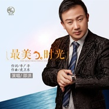

最美的时光
============================

|  |  |
| :--: | :-- |
| [ 最美的时光](https://emumo.xiami.com/album/2103747540) | **艺人**: [邵洪](../index.md) **语种**: 国语 **唱片公司**: 视星国际 **发行时间**: 2018年06月12日 **专辑类别**: EP, 单曲 **专辑风格**:  **播放数**: 4687 **收藏数**: 1 **评论数**: 0  |

## 简介

著名歌手邵洪联合著名作词家李广平和作曲家虎卫东量身打造新单曲《最美的时光》，邵洪称：每首作品都认真对待，力求完美，给每个听众最美的听觉享受，任何时候不都松懈对作品的要求。不降低标准，是对听众最高地回报。以往邵洪多首单曲不但得到了歌迷的支持，也受到乐评人的肯定和称赞。  
  
一首歌就是一个故事，《最美的时光》带给歌迷最美爱情故事，每个瞬间都像是电影片段一样，无论何时品味都耐人寻味，因为看遍了人世间沧桑，所以那些时光显得弥足珍贵，因为那段时光有你，更显得无可取代。这首歌曲或许会成为你上班路上、劳累加班、闲暇时光中一种美好的点缀。  
  
一首好的作品能让你在歌曲中听到自己的故事，喜怒哀乐都藏在内心中，通过歌曲细细品尝自己的温暖心事。邵洪也表示：希望歌迷每个时光都能有好的音乐相伴，歌迷的喜爱，也是自己一直以来创作的动力和灵感源泉，珍惜每一次与歌迷交流的机会，希望每位听自己歌曲的歌迷都能感受到幸福。  
  
歌曲《最美的时光》，或许能陪伴歌迷度过每一段“最美的时光”，这是歌曲的魅力也是每位依旧在音乐上坚持给大众好作品的创作人的期许，期望用好的作品不辜负歌迷的支持和鼓励。

## 曲目

## 评论

|  |  |  |  |
| :-- | :-- | :-- | :-- |
