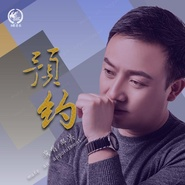

邵洪
============================

|  |  |
| :--: | :-- |
| [ 邵洪](https://i.xiami.com/shaohong) | **播放数**: 4254652 **粉丝数**: 134 **评论数**: 8 **地区**: China 中国大陆 **风格**: 浩室舞曲 House  |

## 档案

生日：1976-06-25 
代表作品：《让爱》、《放开手》、《妈妈 我等了二十年》 
国籍：中国 
出生地：文山 
简介：邵洪，出生于云南。以一首《让爱》作品走进大众视野，步入华语乐坛。2015年发行单曲《放开手》，2015年发行《妈妈我等了二十年》。

## 专辑

| 名称 | 语种 | 唱片公司 | 发行时间 | 专辑类别 | 专辑风格 |
| :--: | :-- | :-- | :-- | :-- | :-- |
| [ 以你为名的歌](./albums/5020779247.md) | 国语 | 八歌文化 | 2020年05月29日 | EP, 单曲 | 国语流行 Mandarin Pop |
| [ 义无反顾](./albums/2108289885.md) | 国语 | 八歌文化 | 2020年04月07日 | EP, 单曲 | 国语流行 Mandarin Pop |
| [ 安心的倚靠](./albums/2105583893.md) | 国语 | 八歌文化 | 2019年12月13日 | EP, 单曲 | 国语流行 Mandarin Pop |
| [ 请放爱一条生路](./albums/2105258140.md) | 国语 | 峰晟无限 | 2019年09月19日 | EP, 单曲 |  |
| [ 空城](./albums/2104823581.md) | 国语 | 峰晟无限 | 2019年04月28日 | EP, 单曲 |  |
| [ 火了](./albums/2104721547.md) | 国语 | 峰晟无限 | 2019年03月27日 | EP, 单曲 | 国语流行 Mandarin Pop |
| [ 绝口不提曾爱过你](./albums/2104261414.md) | 国语 | 视星文化 | 2018年11月13日 | EP, 单曲 | 国语流行 Mandarin Pop |
| [ Star](./albums/2103917298.md) | 英语 |  | 2018年08月07日 | EP, 单曲 |  |
| [ 明星](./albums/2103797415.md) | 国语 | 视星国际 | 2018年07月12日 | EP, 单曲 |  |
| [ 最美的时光](./albums/2103747540.md) | 国语 | 视星国际 | 2018年06月12日 | EP, 单曲 |  |
| [ 做最好的自己](./albums/2103649369.md) | 国语 | 视星国际 | 2018年03月28日 | EP, 单曲 |  |
| [ 你不在我身边](./albums/2103511746.md) | 国语 | 视星国际文化 | 2018年01月29日 | EP, 单曲 |  |
| [ 预约](./albums/2102859703.md) | 国语 | 视星国际 | 2017年09月15日 | EP, 单曲 |  |
| [ 死都不怕](./albums/2102813661.md) | 国语 | 独立发行 | 2017年08月14日 | EP, 单曲 |  |
| [ 路过幸福错过爱](./albums/2102748061.md) | 国语 | 八歌文化 | 2017年05月15日 | EP, 单曲 |  |
| [ 妈妈你辛苦了](./albums/2102733509.md) | 国语 | 独立发行 | 2017年04月17日 | EP, 单曲 |  |
| [ 秀场姑娘](./albums/2102719040.md) | 国语 | 视星国际 | 2017年03月22日 | EP, 单曲 |  |
| [ 木棉飞花](./albums/2102695019.md) | 国语 | 八哥文化 | 2017年02月16日 | EP, 单曲 |  |
| [ 错过你是我的错](./albums/2102681763.md) | 国语 | 视星国际 | 2017年01月18日 | EP, 单曲 |  |
| [ 爱要有你才幸福](./albums/2102673204.md) | 国语 |  | 2016年12月28日 | EP, 单曲 |  |
| [ 寒号鸟](./albums/2102655843.md) | 国语 |  | 2016年11月23日 | EP, 单曲 |  |
| [ 爱如沙](./albums/2102413508.md) | 国语 | 魔音文化 | 2016年10月26日 | EP, 单曲 |  |
| [ 妈妈 我等了二十年](./albums/1730710501.md) | 国语 | 凤凰涅盘 | 2015年04月29日 | EP, 单曲 |  |
| [ 放开手](./albums/926160175.md) | 国语 | 凤凰涅盘 | 2015年03月11日 | EP, 单曲 |  |
| [ 让爱](./albums/1084314034.md) | 国语 | 志航文化 | 2013年11月08日 | EP, 单曲 |  |

## 评论

|  |  |  |  |
| :-- | :-- | :-- | :-- |
|  [虾米用户](https://emumo.xiami.com/u/41729274) All I see wi... 2019-11-25 04:13 赞(4) 踩(0) | 
这厮的水军在全民k歌烦死人了艹
 |
| ⇒ |  [虾米用户](https://emumo.xiami.com/u/420658561)  2020-07-19 19:35 赞(0) 踩(0) | 
真的。。。。。？还有人评论叫我唱这个，我唱了很久现在脸都麻了。。。。。
 |
|  [虾米用户](https://emumo.xiami.com/u/127495730) 完美形态 2018-05-16 16:55 赞(0) 踩(0) | 
令人震惊的House风格！
 |
|  [虾米用户](https://emumo.xiami.com/u/32482661) 选曲DJ 2018-03-30 08:06 赞(0) 踩(0) | 
有一句唱的刚柔并进吸引了我。
 |
|  [虾米用户](https://emumo.xiami.com/u/271169707) 找个爱人的啊 2018-02-21 10:55 赞(1) 踩(0) | 
你好棒哒好听
 |
|  [虾米用户](https://emumo.xiami.com/u/293692544) 你敢给我说话吗？我咬你 2017-12-24 10:48 赞(1) 踩(0) | 
好听
 |
|  [虾米用户](https://emumo.xiami.com/u/16640704) 心若向阳 想要多美好  ... 2017-01-31 11:00 赞(1) 踩(0) | 
他的歌 不是很熟悉  但是制作人 潘协庆（潘美辰的哥哥）的作品 我很喜欢，所谓爱屋及乌，应该也不会差吧
 |
|  [虾米用户](https://emumo.xiami.com/u/16640704) 心若向阳 想要多美好  ... 2017-01-31 11:00 赞(1) 踩(0) | 
他的歌 不是很熟悉  但是制作人 潘协庆（潘美辰的哥哥）的作品 我很喜欢，所谓爱屋及乌，应该也不会差吧
 |
