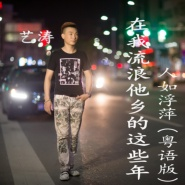

艺涛
============================

|  |  |
| :--: | :-- |
| [ 艺涛](https://i.xiami.com/geshouyitao) | **地区**: China 中国大陆 **风格**: 电子 Electronic, 流行 Pop, 国语流行 Mandarin Pop, 粤语流行 Cantopop, 流行舞曲 Dance-Pop **播放数**: 22750707 **粉丝数**: 2483 **评论数**: 65  |

## 档案

艺涛，原名：黄啟贵，重庆荣昌人，内地流行音乐男歌手。成名曲：《夜色》（注：《夜色》改编自李贞贤《可疑的男人》，代表作：《家驹》《梦回故乡》《中国V5》《战狼战狼》《为了荣耀》《天天吉祥》《怎么会这样》《兄弟一起向前冲》《摇滚战士黄家驹》《谁欠了谁的地老天荒》等。 
广东省佛山皇盈唱片 
工作邀约联系 
艺人经纪：周晓 
电话：13802483552（来电敬请注明虾米音乐看到） 
敬请关注 
艺涛新浪微博 ：歌手艺涛 
艺涛快手号：geshouyitao 
艺涛公众微信号：yitao-music 
┋姓名┋：黄啟贵 
┋艺名┋：艺涛 
┋籍贯┋：重庆 
┋生日┋：4月6日 
┋身高┋：174 
┋体重┋：60KG 
┋血型┋：O型 
┋语言┋：国语/粤语 
┋爱好┋：唱歌，旅游，数码控 
┋最喜欢的地方┋：桂林 
┋最喜欢的颜色┋：白色/黑色/红色 
┋最喜欢的食物┋：水煮鱼 清蒸鱼 
┋最喜欢的电影┋：动作电影/喜剧电影 
┋最喜欢男歌手┋：BEYOND 许冠杰 任贤齐 
┋最喜欢女歌手┋：陈慧娴 
┋最喜欢做的事┋：唱歌 旅游 骑自行车 
┋最喜欢的音乐┋：ROCK POP RNB 
┋最难忘的经历┋：第一次上舞台的时候 
┋最想感谢的人┋：父母 
┋对你影响最大的人：黄家驹 
┋人生格言：心有多大！舞台就有多大！ 
不能最好！就求更好！ 
┋最大的愿望：能够一世都有舞台和音乐相伴！！ 
┋艺涛中华演出网歌曲博客：

## 专辑

| 名称 | 语种 | 唱片公司 | 发行时间 | 专辑类别 | 专辑风格 |
| :--: | :-- | :-- | :-- | :-- | :-- |
| [ 人如浮萍](./albums/2108286409.md) | 国语 | 禾信科技 | 2019年11月01日 | EP, 单曲 | 国语流行 Mandarin Pop |
| [ 人如浮萍《在我流浪他乡的这些年》粤语版](./albums/2104996246.md) | 粤语 | 禾信科技 | 2019年07月12日 | EP, 单曲 | 国语流行 Mandarin Pop, 粤语流行 Cantopop, 流行舞曲 Dance-Pop |
| [ 2019艺涛舞曲DJcandy版精选串烧大碟](./albums/2104974321.md) | 粤语 | 禾信科技 | 2019年07月06日 | EP, 单曲 | 国语流行 Mandarin Pop, 粤语流行 Cantopop, 流行舞曲 Dance-Pop |
| [ 艺涛2019新歌+老歌精选国语DJcandy版舞曲串烧大碟](./albums/2104751678.md) | 国语 | 禾信科技 | 2019年04月05日 | EP, 单曲 | 流行舞曲 Dance-Pop |
| [ 在我流浪他乡的这些年 (串烧大碟)](./albums/2108295153.md) | 国语 | 禾信科技 | 2019年04月05日 | EP, 单曲 | 国语流行 Mandarin Pop |
| [ 《在我流浪他乡的这些年》2019新歌+老歌国语精选DJcandy版舞曲串烧大碟](./albums/2104751672.md) | 国语 | 禾信科技 | 2019年04月05日 | EP, 单曲 | 流行舞曲 Dance-Pop |
| [ 在我流浪他乡的这些年《人如浮萍》国语版](./albums/2104611231.md) | 国语 | 禾信科技 | 2019年02月21日 | EP, 单曲 | 流行 Pop, 国语流行 Mandarin Pop, 流行舞曲 Dance-Pop |
| [ 你好2019](./albums/2104588419.md) | 国语 | 禾信科技 | 2019年02月09日 | EP, 单曲 | 流行 Pop, 国语流行 Mandarin Pop |
| [ 你好2019](./albums/5021153865.md) | 国语 | 禾信科技 | 2019年02月09日 | EP, 单曲 | 国语流行 Mandarin Pop |
| [ 加班加班](./albums/2104433328.md) | 粤语 | 禾信科技 | 2018年12月30日 | EP, 单曲 | 流行摇滚 Pop Rock |
| [ 加班加班](./albums/5021186726.md) | 国语 | 禾信科技 | 2018年12月30日 | EP, 单曲 | 国语流行 Mandarin Pop |
| [ 两只小鸟](./albums/2104170985.md) | 国语 | 可心文化 | 2018年05月08日 | EP, 单曲 | 流行 Pop, 国语流行 Mandarin Pop, 流行舞曲 Dance-Pop |
| [ 天天吉祥](./albums/2104170940.md) | 国语 | 可心文化 | 2018年01月30日 | EP, 单曲 | 流行 Pop, 国语流行 Mandarin Pop, 流行舞曲 Dance-Pop |
| [ 为了荣耀（舞曲版）](./albums/2104170906.md) | 国语 | 可心文化 | 2017年11月27日 | EP, 单曲 | 流行 Pop, 国语流行 Mandarin Pop, 流行舞曲 Dance-Pop |
| [ 梦回故乡（粤语版）](./albums/2104170830.md) | 粤语 | 英蔓唱片 | 2017年09月27日 | EP, 单曲 | 流行 Pop, 粤语流行 Cantopop, 流行舞曲 Dance-Pop |
| [ 战狼战狼追赶一生国语版](./albums/2104170778.md) | 国语 | 可心文化 | 2017年08月12日 | EP, 单曲 | 流行摇滚 Pop Rock, 流行舞曲 Dance-Pop |
| [ 夜战 (粤语版)](./albums/2102752947.md) | 粤语 | 星艺源唱片 | 2017年05月17日 | EP, 单曲 | 粤语流行 Cantopop |
| [ 兄弟一起向前冲](./albums/2104173904.md) | 国语 | 可心文化 | 2017年04月13日 | EP, 单曲 | 国语流行 Mandarin Pop, 流行舞曲 Dance-Pop |
| [ 兄弟一起向前冲](./albums/2102731355.md) | 国语 | 可心文化 | 2017年04月13日 | EP, 单曲 |  |
| [ 谁欠了谁的地老天荒](./albums/2102714510.md) | 国语 | 可心文化 | 2017年03月17日 | EP, 单曲 |  |
| [ 中国V5](./albums/2102695045.md) | 国语 | 可心文化 | 2017年02月17日 | EP, 单曲 |  |
| [ 为了荣耀For Honor](./albums/2102681341.md) | 国语 | 皇盈唱片 | 2017年01月08日 | EP, 单曲 |  |
| [ 怎么会这样](./albums/2102662008.md) | 国语 | 可心文化 | 2016年12月06日 | EP, 单曲 |  |
| [ 夜战](./albums/2100365372.md) | 国语 | 星途音乐 | 2016年06月18日 | EP, 单曲 |  |
| [ 摇滚战士黄家驹](./albums/2100365371.md) | 国语 | 皇盈演出有限公司 | 2016年06月08日 | EP, 单曲 |  |
| [ 《夜色》艺涛独唱版DJcandy_remix](./albums/2100280634.md) | 粤语 | 独立发行 | 2016年02月20日 | EP, 单曲 | 流行舞曲 Dance-Pop, 粤语流行 Cantopop, 电音流行 Electropop |
| [ 《越爱越精彩》舞曲版DJcandy_remix](./albums/2100274476.md) | 国语 | 皇盈演出有限公司 | 2016年02月14日 | EP, 单曲 | 流行舞曲 Dance-Pop, 国语流行 Mandarin Pop, 电音流行 Electropop |
| [ 《喜气洋洋》新年快乐版DJcandy_remix](./albums/2100273550.md) | 国语 | 皇盈演出有限公司 | 2016年02月09日 | EP, 单曲 | 流行舞曲 Dance-Pop, 国语流行 Mandarin Pop, 电音流行 Electropop |
| [ 《喜气洋洋》新年快乐版](./albums/2100272892.md) | 国语 | 皇盈演出有限公司 | 2016年02月07日 | 录音室专辑 | 青少年流行 Teen Pop, 传统流行 Traditional Pop, 国语流行 Mandarin Pop |
| [ 越爱越精彩](./albums/2100272600.md) | 国语 | 皇盈演出有限公司 | 2016年02月06日 | EP, 单曲 | 国语流行 Mandarin Pop, 电音流行 Electropop, 华语唱作人 Chinese Singer-Songwriter |
| [ 红红火火陈哲-红红火火](./albums/2100272870.md) | 国语 | 独立发行 | 2016年02月06日 | EP, 单曲 | 国语流行 Mandarin Pop |
| [ 《夜色》艺涛独唱版](./albums/2100272154.md) | 粤语 | 独立发行 | 2016年02月05日 | 录音室专辑 | 流行舞曲 Dance-Pop, 粤语流行 Cantopop, 电音流行 Electropop |
| [ 梦回故乡舞曲版](./albums/2100260954.md) | 国语 | 皇盈演出有限公司 | 2016年01月15日 | EP, 单曲 | 流行舞曲 Dance-Pop, 国语流行 Mandarin Pop, 电音流行 Electropop |
| [ 梦回故乡](./albums/2100253454.md) | 国语 | 皇盈演出有限公司 | 2016年01月01日 | EP, 单曲 | 青少年流行 Teen Pop, 传统流行 Traditional Pop, 国语流行 Mandarin Pop |
| [ 远方诱惑](./albums/2100186928.md) | 国语 | 皇盈演出有限公司 | 2015年09月01日 | EP, 单曲 |  |
| [ 家驹](./albums/1837209267.md) | 粤语 | 皇盈演出有限公司 | 2015年06月30日 | EP, 单曲 | 粤语流行 Cantopop |
| [ 不是我不爱你](./albums/633267399.md) | 国语 | 皇盈演出有限公司 | 2015年06月03日 | EP, 单曲 |  |
| [ 喜气洋洋开心过年](./albums/421599882.md) | 国语 | 独立发行 | 2015年01月18日 | EP, 单曲 | 国语流行 Mandarin Pop, 粤语流行 Cantopop |
| [ 夜色](./albums/1321599375.md) | 粤语 | 独立发行 | 2014年10月27日 | EP, 单曲 | 流行舞曲 Dance-Pop, 国语流行 Mandarin Pop, 粤语流行 Cantopop |
| [ 爱情大实话](./albums/1688921650.md) | 国语 | 皇盈唱片 | 2014年01月01日 | EP, 单曲 | 流行说唱 Pop Rap, 节奏布鲁斯 Rhythm & Blues, 国语流行 Mandarin Pop |
| [ 爱情&理想](./albums/388921326.md) | 国语 | 皇盈唱片 | 2013年11月11日 | 录音室专辑 | 流行说唱 Pop Rap, 国语流行 Mandarin Pop, 粤语流行 Cantopop, 电音流行 Electropop |
| [ 失恋三部曲](./albums/1788918478.md) | 国语 | 皇盈唱片 | 2012年07月18日 | EP, 单曲 | 流行舞曲 Dance-Pop, 国语流行 Mandarin Pop |

## 评论

|  |  |  |
| :-- | :-- | :-- |
|  [虾米用户](https://emumo.xiami.com/u/358104299) 悲观的唯心存在现实解构虚... 2021-01-07 05:48 赞(1) 踩(0) | 
45821
 |
|  [虾米用户](https://emumo.xiami.com/u/356338580)  2019-12-24 16:03 赞(0) 踩(0) | 
内容已删除
 |
| ⇒ |  [虾米用户](https://emumo.xiami.com/u/356338580)  2019-12-24 16:04 赞(0) 踩(0) | 
一下q了我星二一二一一
 |
|  [虾米用户](https://emumo.xiami.com/u/402895561)  2019-04-09 20:49 赞(0) 踩(0) | 
      
 |
|  [虾米用户](https://emumo.xiami.com/u/293692544) 你敢给我说话吗？我咬你 2019-03-02 05:21 赞(1) 踩(0) | 
好听
 |
|  [虾米用户](https://emumo.xiami.com/u/293692544) 你敢给我说话吗？我咬你 2019-01-02 20:08 赞(1) 踩(0) | 
好听
 |
|  [虾米用户](https://emumo.xiami.com/u/293692544) 你敢给我说话吗？我咬你 2018-12-30 22:02 赞(1) 踩(0) | 
好听
 |
|  [虾米用户](https://emumo.xiami.com/u/253524510) blue gray 2018-10-23 14:04 赞(2) 踩(0) | 
简介一开始就那么重的商业味
 |
|  [虾米用户](https://emumo.xiami.com/u/332469092)  2017-11-02 06:11 赞(1) 踩(0) | 
好
 |
|  [虾米用户](https://emumo.xiami.com/u/310079905) 凭什么你安慰别人起来头头... 2017-10-01 21:38 赞(1) 踩(0) | 
人气好底。
 |
|  [虾米用户](https://emumo.xiami.com/u/310888991)  2017-08-14 12:43 赞(1) 踩(0) | 
加个QQ嘛
 |
|  [虾米用户](https://emumo.xiami.com/u/310888991)  2017-08-14 12:42 赞(1) 踩(0) | 
艺涛唱的歌最霸气
 |
|  [虾米用户](https://emumo.xiami.com/u/253204150)  2017-05-10 20:47 赞(1) 踩(0) | 
真好听
 |
|  [虾米用户](https://emumo.xiami.com/u/258353603)  2017-04-18 13:27 赞(1) 踩(0) | 
很有感觉
 |
|  [虾米用户](https://emumo.xiami.com/u/250618224)  2017-04-07 10:53 赞(0) 踩(0) | 
老铁双击666
 |
|  [虾米用户](https://emumo.xiami.com/u/286090822) 开心(∩_∩)每一天。 2017-04-04 20:57 赞(0) 踩(0) | 
这嗓音
 |
|  [虾米用户](https://emumo.xiami.com/u/166992144)  2017-03-30 15:39 赞(1) 踩(0) | 
普通话和粤语都不标准
 |
|  [虾米用户](https://emumo.xiami.com/u/283186899)  2017-03-26 12:15 赞(0) 踩(0) | 
双击，666
 |
|  [虾米用户](https://emumo.xiami.com/u/283186899)  2017-03-26 12:15 赞(0) 踩(0) | 
好听
 |
|  [虾米用户](https://emumo.xiami.com/u/245645921)  2017-02-14 09:58 赞(1) 踩(0) | 
夜色很好听
 |
|  [虾米用户](https://emumo.xiami.com/u/263313799)   2017-01-24 13:09 赞(2) 踩(0) | 
刷粉➕
 |
|  [虾米用户](https://emumo.xiami.com/u/243456698) 没事，多听听音乐 2016-12-17 20:27 赞(2) 踩(0) | 
大重庆的人啊。顶一个 
 |
|  [虾米用户](https://emumo.xiami.com/u/253273769)  2016-12-15 06:11 赞(1) 踩(0) | 
come on
 |
|  [虾米用户](https://emumo.xiami.com/u/212122988)  2016-11-29 23:34 赞(0) 踩(0) | 
夜色怎的
 |
| ⇒ |  [虾米用户](https://emumo.xiami.com/u/272487195)  2017-02-11 20:48 赞(0) 踩(0) | 
塑胶红包中
 |
|  [虾米用户](https://emumo.xiami.com/u/231698241)  2016-10-01 02:35 赞(0) 踩(0) | 
这粤语………………
 |
|  [虾米用户](https://emumo.xiami.com/u/231698241)  2016-10-01 02:34 赞(1) 踩(0) | 
艺涛这粤语我也是醉了
 |
|  [虾米用户](https://emumo.xiami.com/u/226179286)  2016-09-14 17:13 赞(0) 踩(0) | 
很好
 |
|  [虾米用户](https://emumo.xiami.com/u/124071972) 山海风光无限 我的心里只... 2016-09-09 13:10 赞(2) 踩(0) | 
典型的两广长相
 |
|  [虾米用户](https://emumo.xiami.com/u/212787645)  2016-08-14 12:02 赞(0) 踩(0) | 
66666666666666
 |
|  [虾米用户](https://emumo.xiami.com/u/212787645)  2016-08-14 12:01 赞(0) 踩(0) | 
6666666
 |
|  [虾米用户](https://emumo.xiami.com/u/139029176)  2016-06-17 11:00 赞(0) 踩(0) | 
唉
 |
|  [虾米用户](https://emumo.xiami.com/u/179153096)  2016-06-01 16:13 赞(0) 踩(0) | 
不错，很棒
 |
|  [虾米用户](https://emumo.xiami.com/u/131958828)  2016-04-21 11:07 赞(0) 踩(0) | 
夜色。。。。。。6666
 |
|  [虾米用户](https://emumo.xiami.com/u/28786816)  2016-03-04 04:10 赞(0) 踩(0) | 
马上都能见到你了   
 |
|  [虾米用户](https://emumo.xiami.com/u/2644274) 从虾米一路走来，留下了许... 2016-02-17 20:33 赞(1) 踩(0) | 
土嗨
 |
|  [虾米用户](https://emumo.xiami.com/u/2644274) 从虾米一路走来，留下了许... 2016-02-17 20:24 赞(0) 踩(0) | 
前排
 |
|  [虾米用户](https://emumo.xiami.com/u/59559118) wei……xin……號:... 2016-02-04 13:54 赞(0) 踩(0) | 
。。。。。。。。。。。。。。。。。。。。 。。。。。。。。。。。。。。。。。。。。 。。。。。。。。。。。。。。。。。。。。 。。。。。。。。。。。。。。。。。。。。 。。。。。。。。。。。。。。。。。。。。 。。。。。。。。。。。。。。。。。。。。 。。。。。。。。。。。。。。。。。。。。 。。。。。。。。。。。。。。。。。。。。 。。。。。。。。。。。。。。。。。。。。 。。。。。。。。。。。。。。。。。。。。 。。。。。。。。。。。。。。。。。。。。 。。。。。。。。。。。。。。。。。。。。 。。。。。。。。。。。。。。。。。。。。 。。。。。。。。。。。。。。。。。。。。 。。。。。。。。。。。。。。。。。。。。
 |
|  [虾米用户](https://emumo.xiami.com/u/52127742) 呼。啦啦啦，啦啦啦， 2016-01-13 14:27 赞(0) 踩(0) | 

 |
|  [虾米用户](https://emumo.xiami.com/u/50109532) 我还没想好要写什么... 2016-01-07 14:03 赞(1) 踩(0) | 
你们是最牛逼的......
 |
|  [虾米用户](https://emumo.xiami.com/u/12255767) 我还没想好要写什么... 2016-01-06 19:58 赞(0) 踩(0) | 
火钳刘明
 |
|  [虾米用户](https://emumo.xiami.com/u/3553319)  2016-01-05 19:38 赞(1) 踩(0) | 
有无人都觉得部分歌词白话发音唔准啊？
 |
| ⇒ |  [虾米用户](https://emumo.xiami.com/u/61304158) 永别了，虾米，感你陪伴了... 2016-07-13 03:24 赞(0) 踩(0) | 
系呀，外馬佬系锦嘎啦。
 |
|  [虾米用户](https://emumo.xiami.com/u/92321746)   2016-01-05 15:35 赞(0) 踩(0) | 
火钳刘明
 |
|  [虾米用户](https://emumo.xiami.com/u/68595978)  2016-01-05 11:21 赞(1) 踩(0) | 
呢首歌还鬼死犀利
 |
|  [虾米用户](https://emumo.xiami.com/u/11168706)  2016-01-04 23:54 赞(0) 踩(0) | 
 
 |
|  [虾米用户](https://emumo.xiami.com/u/91470804)  2016-01-01 18:57 赞(0) 踩(0) | 
这个不错
 |
|  [虾米用户](https://emumo.xiami.com/u/18314357) 肆叁贰 2016-01-01 05:03 赞(1) 踩(0) | 
无敌
 |
|  [虾米用户](https://emumo.xiami.com/u/10944859) ‏‏‏‏‏‏‏‏ 2015-12-31 15:55 赞(0) 踩(0) | 
  
 |
|  [虾米用户](https://emumo.xiami.com/u/49583873)   2015-12-30 15:26 赞(4) 踩(0) | 
夜色牛逼
 |
|  [虾米用户](https://emumo.xiami.com/u/2584929)  2015-12-30 12:08 赞(0) 踩(0) | 
签个到
 |
|  [虾米用户](https://emumo.xiami.com/u/12636942)  2015-12-29 20:49 赞(0) 踩(0) | 
hhhhhhhhhh
 |
|  [虾米用户](https://emumo.xiami.com/u/11300256)  2015-12-29 16:07 赞(1) 踩(0) | 
这几天群里好多人在恶搞《夜色》，挺high的
 |
|  [虾米用户](https://emumo.xiami.com/u/35554454) Bluso说唱团体  宣... 2015-12-29 09:07 赞(0) 踩(0) | 
火前留名
 |
|  [虾米用户](https://emumo.xiami.com/u/1988060) Electrow 2015-12-29 08:26 赞(0) 踩(0) | 

 |
|  [虾米用户](https://emumo.xiami.com/u/37771349) 我还没想好要写什么... 2015-11-25 06:09 赞(0) 踩(0) | 
夜色很好
 |
|  [虾米用户](https://emumo.xiami.com/u/48660900)  2015-11-05 20:38 赞(0) 踩(0) | 
一起high起来！！！
 |
|  [虾米用户](https://emumo.xiami.com/u/55507932)  2015-09-18 19:22 赞(0) 踩(0) | 
夜色很好
 |
|  [虾米用户](https://emumo.xiami.com/u/53040074)  2015-07-26 18:33 赞(0) 踩(0) | 
夜色很好
 |
|  [虾米用户](https://emumo.xiami.com/u/52837499)  2015-07-22 13:46 赞(0) 踩(0) | 
我喜欢你的音乐 
 |
|  [虾米用户](https://emumo.xiami.com/u/52837499)  2015-07-22 13:46 赞(0) 踩(0) | 
我喜欢你的音乐 
 |
|  [虾米用户](https://emumo.xiami.com/u/9122690) 寻找它......... 2015-01-22 14:54 赞(0) 踩(0) | 
夜色不错
 |
|  [虾米用户](https://emumo.xiami.com/u/31076578) 新歌：不甘心由天做主、在... 2014-01-05 18:09 赞(57) 踩(0) | 
我刚入驻了虾米音乐人，欢迎大家来我的个人主页，收听我的最新音乐
 |
| ⇒ |  [虾米用户](https://emumo.xiami.com/u/2696028) 再见，虾米 2016-01-02 10:13 赞(0) 踩(0) | 
很好很强大！
 |
| ⇒ |  [虾米用户](https://emumo.xiami.com/u/264042957)  2017-01-19 14:50 赞(0) 踩(0) | 
好
 |
| ⇒ |  [虾米用户](https://emumo.xiami.com/u/317872671) 让我一回头就找到出路 2017-12-21 21:52 赞(0) 踩(0) | 
  
 |
