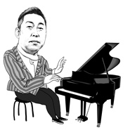

葛顺
============================

|  |  |
| :--: | :-- |
| [ 葛顺](https://i.xiami.com/gershon) | **播放数**: 5887373 **粉丝数**: 699 **评论数**: 42 **地区**: China 中国大陆 **风格**: 现代古典 Modern Classical, 国语流行 Mandarin Pop  |

## 档案

《葛顺·梦钢琴》教学法创始人，《葛顺·梦钢琴》系列丛书作者，原创音乐人，制作人。

## 专辑

| 名称 | 语种 | 唱片公司 | 发行时间 | 专辑类别 | 专辑风格 |
| :--: | :-- | :-- | :-- | :-- | :-- |
| [ 但愿人长久](./albums/2102400775.md) | 其他 |  | 2016年09月14日 | 录音室专辑 |  |
| [ 大鱼·梦钢琴《大鱼海棠》动画电影印象曲、主题曲-钢琴纯音乐](./albums/2100378072.md) | 其他 | 独立发行 | 2016年08月08日 | EP, 单曲 |  |
| [ 葛顺·梦钢琴浪漫原音](./albums/91529692.md) | 其他 | 独立发行 | 2012年11月18日 | 录音室专辑 | 器乐流行 Instrumental Pop |

## 评论

|  |  |  |  |
| :-- | :-- | :-- | :-- |
|  [虾米用户](https://emumo.xiami.com/u/432448322) 我还没想好要写什么... 2021-01-28 01:33 赞(0) 踩(0) | 
你好，虾米下架了。请问你转换到哪个平台呢？
 |
|  [虾米用户](https://emumo.xiami.com/u/433259238) 朝着音悦的方向！ 2020-05-14 08:52 赞(0) 踩(0) | 
重头再来！
 |
|  [虾米用户](https://emumo.xiami.com/u/300335620) 活的灑脫就是自在～ 2020-05-01 01:40 赞(0) 踩(0) | 
あなたの曲の風が好き頑張れ!
 |
|  [虾米用户](https://emumo.xiami.com/u/371046921)  2020-04-05 09:49 赞(2) 踩(0) | 
成功的钢琴演奏有两种类型，一种是展示技巧，而另一种是洗涤心灵。作为一个外行，这种洗涤灵魂的声音更打动震撼我。期待葛老师更多的演奏！
 |
|  [虾米用户](https://emumo.xiami.com/u/432448322) 我还没想好要写什么... 2020-03-04 01:17 赞(2) 踩(0) | 
你好 请问可以弹奏一首秋天的童话电影里面的别了秋天这首歌吗？万分感谢
 |
| ⇒ |  [虾米用户](https://emumo.xiami.com/u/32083474) 葛顺 2020-04-08 10:35 赞(0) 踩(0) | 
《别了秋天》找到了（吕方演唱），很喜欢，等我练几天，录好了就传上来，特别的献给你Jens正善 
 |
| ⇒ |  [虾米用户](https://emumo.xiami.com/u/432448322) 我还没想好要写什么... 2021-01-28 01:34 赞(0) 踩(0) | 
<q><b>葛顺说：</b></q>
 |
|  [虾米用户](https://emumo.xiami.com/u/426513187) 音乐是桥梁 2019-11-19 13:25 赞(2) 踩(0) | 
您的琴声抒情大方，节奏明快清新淡雅，赋有深深的感悟情怀，动人的旋律将音乐爱好者带入美妙的境界中，令人舒心愉悦地沉浸在那甜美优雅的乐声中。
 |
|  [虾米用户](https://emumo.xiami.com/u/351134673) 音乐美化生活 2019-09-07 15:17 赞(1) 踩(0) | 
很不错啊
 |
|  [虾米用户](https://emumo.xiami.com/u/334573074) 如果天空是黑暗的，那就摸... 2019-07-03 17:48 赞(2) 踩(0) | 
首首精彩，加油！
 |
|  [虾米用户](https://emumo.xiami.com/u/361037631)  2019-03-31 08:52 赞(1) 踩(0) | 
******
 |
|  [虾米用户](https://emumo.xiami.com/u/5662265)  2019-03-25 07:15 赞(2) 踩(0) | 
手法很棒，缺个人作品
 |
|  [虾米用户](https://emumo.xiami.com/u/361287195) 暖暖的幸福(^o^)o甜... 2019-03-24 18:28 赞(2) 踩(0) | 
（   ）
 |
|  [虾米用户](https://emumo.xiami.com/u/87827600) 山水两相忘，日月无瓜葛；... 2019-03-03 01:10 赞(3) 踩(0) | 
对于艺术始终要遵循最简单且最挑剔的感觉，就是源于自然，只有这样才有可能长久的深入人心，时刻回味。如果一首好的曲子不能被演奏家演绎出乐曲所传达的独特语言，也就无法称之为经典佳作，这是自古以来一直遵循的艺术理念传承。
 |
|  [虾米用户](https://emumo.xiami.com/u/87827600) 山水两相忘，日月无瓜葛；... 2019-03-03 00:56 赞(8) 踩(0) | 
中国能有葛老师这样的钢琴演奏家真的很不容易，其实说句实话，当年朗朗和李云迪的演奏都不太能从心底里深刻打动我，我承认很多像我一样抱着挑剔的欣赏水准去要求，但世界上优秀的钢琴演奏家不胜枚举，我们与世界的艺术差异需要逐渐缩减。并不是他们的水准有问题，而是从根本上缺乏自然感觉。这几年当吴牧野崭露头角出现在公众面前的时候，我发现听了他的演奏愿意从内心去接受，从当年的理查德·克莱德曼先生到今天的吴牧野我感觉他们的风格有同样优雅自然的特性，我想即使历经时间的改变，我对于乐曲的内心感受依然没有改变，这在一定程度上更加坚定的证明我在音乐道路上所受到的指引与教育是不曾有任何改变的，如若不然，就不会是今天的状态了。
 |
| ⇒ |  [虾米用户](https://emumo.xiami.com/u/426513187) 音乐是桥梁 2019-11-19 13:34 赞(0) 踩(0) | 
赞赏你的评论！每个作曲家风格迥异，同样演绎其作品的音乐家表现手法更是各怀绝技。
 |
|  [虾米用户](https://emumo.xiami.com/u/324879742)   2019-03-02 05:42 赞(1) 踩(0) | 
.
 |
|  [虾米用户](https://emumo.xiami.com/u/362756652)  2019-01-05 21:32 赞(1) 踩(0) | 
挺好，繼續。
 |
|  [虾米用户](https://emumo.xiami.com/u/347572268)  2018-06-05 23:07 赞(0) 踩(0) | 
实在太好听的钢琴曲了，喜欢你的原创！
 |
|  [虾米用户](https://emumo.xiami.com/u/9387408)  2018-04-28 19:08 赞(0) 踩(0) | 
叶塞尼亚
 |
|  [虾米用户](https://emumo.xiami.com/u/9387408)  2018-04-28 19:00 赞(1) 踩(0) | 
最动听版本
 |
|  [虾米用户](https://emumo.xiami.com/u/265815260)  2018-04-08 23:53 赞(1) 踩(0) | 
老师你弹得很棒加油！
 |
|  [虾米用户](https://emumo.xiami.com/u/247389779)   2018-03-15 19:57 赞(2) 踩(0) | 
葛老师加油，很喜欢你的风格！
 |
|  [虾米用户](https://emumo.xiami.com/u/320384187)  2017-09-21 14:58 赞(2) 踩(0) | 
葛老师的钢琴曲好小清新
 |
|  [虾米用户](https://emumo.xiami.com/u/10707847)  2017-05-27 22:07 赞(0) 踩(0) | 
赞
 |
|  [虾米用户](https://emumo.xiami.com/u/9003931) 千淘万漉虽辛苦 2017-05-24 07:36 赞(1) 踩(0) | 
OK！
 |
|  [虾米用户](https://emumo.xiami.com/u/87079266) 爱音乐。 2017-03-15 23:25 赞(4) 踩(0) | 
原创不是他，是石进
 |
|  [虾米用户](https://emumo.xiami.com/u/111922862)  2016-02-08 21:42 赞(3) 踩(0) | 
朋友在妊娠反应强烈的时候听到葛老师的钢琴曲，特别喜欢，忍痛割爱把葛老师的光碟送给她，据说每天定时胎教，现在那可爱的宝贝喜乐的不行，人见人爱！期待葛老师新碟面世！
 |
|  [虾米用户](https://emumo.xiami.com/u/49402947)  2015-10-08 07:24 赞(3) 踩(0) | 
好东西！天空之城你是演绎了最好的！包括郭燕钢琴版。是那清华状元才女轰动中国的演讲及背景音乐使我在这知道了你。你一定会大大成功的葛顺，加油！盼早出多出作品！
 |
| ⇒ |  [虾米用户](https://emumo.xiami.com/u/87827600) 山水两相忘，日月无瓜葛；... 2019-03-03 01:16 赞(0) 踩(0) | 
前面讲的都很好，唯有最后一点不能认同，也最要不得。所有精益求精的作品如此深入人心是因为恰当的时机，精妙的演绎与对细节的良好把握，越是精品越需要细扣，越不能多多益善，只有屈指可数的才是令人回味珍惜的佳作！
 |
|  [虾米用户](https://emumo.xiami.com/u/47074673) Vouloir, c'e... 2015-08-23 08:12 赞(1) 踩(0) | 
赞 
 |
|  [虾米用户](https://emumo.xiami.com/u/10051957) 遨游乐海，展翅飞翔 2015-01-08 00:10 赞(2) 踩(0) | 
喜欢你的音乐电台，一千个祝福送给你！期待更多i更美的音乐出现在你的专辑里。
 |
|  [虾米用户](https://emumo.xiami.com/u/8007181) 凡音而起，由人心生也.。 2014-09-03 10:45 赞(1) 踩(0) | 
希望 听到更多原创作品~~不错！！！
 |
|  [虾米用户](https://emumo.xiami.com/u/26622172)  2014-07-31 11:26 赞(1) 踩(0) | 
无意间闯进来，钢琴曲很好听
 |
|  [虾米用户](https://emumo.xiami.com/u/840126)  2014-06-13 19:01 赞(2) 踩(0) | 
音乐不错~~~~O(∩_∩)O谢谢~~~~期待~~~~·
 |
|  [虾米用户](https://emumo.xiami.com/u/840126)  2014-06-13 18:59 赞(3) 踩(0) | 
好音乐都是灵魂不可或缺的元素、喜欢一直播放下去~~~~~~~
 |
|  [虾米用户](https://emumo.xiami.com/u/11643877) 姑且听之 2014-05-05 11:11 赞(3) 踩(0) | 
～～顶一个
 |
|  [虾米用户](https://emumo.xiami.com/u/32083474) 葛顺 2014-01-24 10:07 赞(29) 踩(0) | 
我刚入驻了虾米音乐人，欢迎大家来我的个人主页，收听我的最新音乐
 |
| ⇒ |  [虾米用户](https://emumo.xiami.com/u/359295940) 你可以不帅，但总有人爱 2018-07-07 11:08 赞(0) 踩(0) | 
你好，超爱你
 |
| ⇒ |  [虾米用户](https://emumo.xiami.com/u/283919655) 水一般的男子 2018-07-22 16:20 赞(0) 踩(0) | 
想问下，夜的钢琴曲不是石进老师的作品吗
 |
| ⇒ |  [虾米用户](https://emumo.xiami.com/u/87827600) 山水两相忘，日月无瓜葛；... 2019-03-03 00:59 赞(0) 踩(0) | 
<q><b>一杯白水说：</b></q>
 |
| ⇒ |  [虾米用户](https://emumo.xiami.com/u/429464570)  2020-06-05 09:12 赞(0) 踩(0) | 
您好！您的演奏的几个曲目，都非常喜欢，好听。
 |
