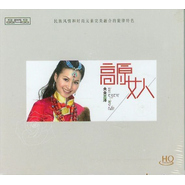

央金兰泽
============================

|  |  |
| :--: | :-- |
| [ 央金兰泽](https://i.xiami.com/yj) | **地区**: China 中国大陆 **风格**: 西藏传统乐 Tibetan Traditional Music **播放数**: 12959257 **粉丝数**: 5119 **评论数**: 230  |

## 档案

小档案 
■生日 2月12日 
■星座 水瓶座 
■性格 双重多变,可以独处,可以群聊,有时很拉风,有时很郁闷. 
■爱好 唱歌 看电视 
■最敬仰的歌手 亚东 张惠妹 
■最喜欢的人 父母, 兄姊, 小侄 
■最受影响的人 扎西多杰 才仁巴桑 
■最遗憾的事 起步较晚 错失良机 
■最厌恶的事 被人冤枉 
小简介 
扎根雪域高原的藏族女孩央金兰泽的歌舞"缘" 
春光明媚的三月的某个下午，那位叫央金兰泽的藏族女孩，带着一路风尘和一份雪域阳光般健康而率真的灿烂微笑，款款诉说着在生命与艺术、土地与情感、追索与梦想之间她那些美丽动人的心情故事。在昨天与今天、预言与现实、偶然与必然、有意与无意中，一种被叫做“缘”的东西，以它令人费解而又妙不可言的诱人POSE，始终飘摇在央金兰泽目光所及的前行道路上，成为她生命沿途中一道奇异景致。 
大约是2005年下半年某个阳光和煦的时节，在西宁市人潮涌动充斥着流行歌曲的嘈杂街市上，人们突然惊喜地听到，一首旋律优美曲调悠扬的歌曲正从一间间临街的音像店铺中飘然飞出。歌声如一泓永不止歇的涓涓春水，又宛若一匹世间罕有的精美的丝质哈达,婉转低回，轻舞飞扬。质朴凝炼的歌词表达，深情隽永的真情流露，使整首歌曲在低吟浅唱中又觉舒展奔放，舒放旷达处不失深沉内敛，更有女歌者收放自如略带沙哑的磁性嗓音，越发将歌曲演绎得张驰有度，酣畅淋漓，瞬间便捕获了人们的耳膜和心灵。 
歌曲中将民族风情和时尚元素完美融合的旋律特色，尤其是歌者独特的音色声线，让许多人起初都误认为这是藏族歌坛的当红女唱将琼雪卓玛带给歌迷的又一全新力作。直到更多的人们在装帧精美的歌碟封套上终于发现一个依然美丽却又全然陌生的名字——央金兰泽，这个名字连同那首叫《遇上你是我的缘》的歌曲从此不胫而走，声传遐迩——在璨若星河的藏族流行歌坛上，又一颗明艳夺目的新星正在冉冉飞升。 
■装在行囊中的梦 
这首让央金兰泽赖以成名的歌曲名字也仿佛成了一句谶语，让她年轻的艺术生命从一开始就注定要与“缘”有不结之缘。央金兰泽出生在被誉为“歌舞之乡”的青海省玉树藏族自治州结古镇，藏乡古老神奇的神山圣水，瑰丽绝伦的藏族歌舞风情，使小央金从小就饱受濡染滋养。再加上父亲在玉树州歌舞团工作，母亲还曾是西北民院舞蹈系早期“小八路”班的演员，姐姐也在州歌舞团拉小提琴，浓厚的家庭艺术氛围赋于小央金良好的歌舞禀赋。她从小就性格开朗活泼，喜欢唱歌跳舞，天生拥有一副清亮纯净的嗓音。上中学的时候，老师总喜欢挑选她担当学校各项文艺比赛中的领唱重任，这也许是她与艺术的最早结缘。生命的伏笔从来是不动声色，初中毕业那年，恰好省艺校来玉树招生，从小就钟爱音乐艺术的小央金一直都很羡慕姐姐，非常渴望也像姐姐一样，能拉一手又酷又美的小提琴。在姐姐的建议和鼓励下，小央金最终以白丁的身份满怀憧憬地去应考省艺校。相比小提琴的音色中过于感伤忧郁的情感诉求，她发现自己可能更偏爱那种轻灵欢快、富有节奏韵律的民族器乐，似乎更接近自己跳脱明朗的性格，便毅然选择了扬琴专业。从此，随缘自适的小央金在艺术道路上蹒跚起步，不期然间又结下了一段四载难忘的“琴”缘“琴”意。 
回看央金兰泽后来在声乐方面的异军突起，似乎与她最初的选择相为背离。实际上，通过规范严格的四年器乐专业学习，不仅使她的耳力听音等基本素质得到了有效的锻炼，打下了坚实的基础，更让她学会了如何能准确深入地去感悟和把握一件音乐作品所要传达的思想情感及精神内涵，这种在艺术上最难能可贵的沉淀与修持，恰恰是时下太浮躁的歌坛中大多数浮躁张扬的歌手先天性缺钙的痼疾硬伤。央金兰泽却在无觉中越此玄关，打通任督二脉，谁又不能说是天设奇缘？有缘无缘之间，因果的主客互转始终暗合在她生命链条上的首尾两端。 
艺校毕业后，央金兰泽又回到了家乡，在玉树州歌舞团任扬琴专职演奏员，开始投入到忙碌而丰富多彩的演出活动中去，大量的舞台实践使央金兰泽能有更多的机会展示她多方面的艺术才华。央金兰泽性出天然，从来喜欢作自己喜欢的事，不会因为专业的分野或世俗的陈见而作茧自缚，自设樊篱。在频繁的演出活动中，她会经常即兴登台献声，惟妙惟肖地翻版模唱那英、张惠妹等流行歌手的曲风，还时不时客串一把主持。随着年龄的增长，她的嗓音变化更趋于浑厚成熟，别具性感魅力， 
也许此时，除了漂泊不定无忧无虑的业务演出，这个青春自我的女孩还无法掌控扑朔迷离的未来，不知道自己某一天究竟会以怎样的一种姿态去打开那份装在行囊中的梦想。 
■守望在路上的歌 
这期间，她经常随团辗转各地巡演，多次参加青藏川滇联合举办的康巴艺术节和青海电视台藏历春节晚会的演出，曾在2002年和2004年先后参加了“环青海湖国际公路自行车赛”的演出活动，并演唱了环湖赛的主题曲《青海湖放歌》。作为玉树州歌舞团团长、《妈妈的羊皮袄》的创作者扎西多杰和首唱此曲的藏区资深音乐人才仁巴桑两位老师，很早就注意到央金兰泽独具个性的音色特质和纯熟细腻的歌曲表现力，都十分看好这个浑金璞玉般需要雕琢的藏族女孩。他们时常勉励和支持央金在歌唱领域方面有所尝试，并尽其所能提供更多的演出机会，给予热情的提携和帮助。此时，神秘的命运之神正如传说中那株披满七彩祥光的菩提神树一样，静静地迎候在央金兰泽必经的路口。 
2004年8月，才仁巴桑和玉树著名的诗人、词作者昂旺文章共同给一位朋友的妹妹谱写了一首新歌。后来由于发生变故，后续工作暂被搁浅，而那首新作也被才仁巴桑老师束之高阁，沉压箱底。一直都非常喜欢这首歌的央金兰泽倍觉惋惜，她真不甘让这首歌就此湮灭人间，心底总有一种拥有它的强烈渴望。与她有同样心结的几位本团的业余歌手也极力怂恿她去争取这首作品。才仁巴桑老师被他们的真诚和执著所感动，爽快地表示同意授权的意向。志在必得的央金却苦于资金匮乏，情急中只好求助周围亲友，想方设法借钱筹资。家人和朋友非但对她的这种冒险之举毫无责怪，反而纷纷解囊相助，尤其哥哥更是为她东奔西跑，不遗余力。也许是精诚所至，也许是缘缘相扣，最终还是才仁巴桑的那位朋友一番古道热肠，欣然答应全权转让给央金兰泽演唱这首歌。 
惊喜之余，央金兰泽也无暇细细品味这番山重水复柳暗花明之后的机缘偶合，所有的事态似乎已变得水到渠成。经过两个月紧张的试唱训练，央金兰泽正式进入成都龙韵文化传播公司的录音棚录音。随即，在为期六个半月的四川九寨沟演出过程中，她在静静地等待漫长的后期制作。 
2005年6月，一张新鲜出炉的歌碟首次在玉树悄然面市，而其中那首让央金兰泽投入太多心血和情感的倾心之作，也作为冠名歌碟的主打曲目，首度在家乡的高天厚土之间初啼清音——这就是那首后来在全国广为传唱，被网上誉为“孤独的牧羊女的天籁之作”的《遇上你是我的缘》。歌碟中同时收入央金兰泽主唱的另外两首曲目《我愿》《迎酒欢歌》，及“黑鹰组合”演唱的共十三首曲目，几乎全是才仁巴桑倾力操刀打造的金歌金曲。有趣的是，正当这首好评如潮的歌开始一曲风行,甚至朋友们的祝贺开始纷至沓来时，远在四川的央金却全然不知。直到2005年11月的某一天，漫步在西宁街头的央金兰泽首次聆听到自己的歌声，她的耳朵才被真切地告知这一成功的喜讯，所有的守望和感动在这一刹那变得真实而又可以触摸。 
■相逢在生命中的缘 
《遇上你是我的缘》以其朴素深情的创作风格，加之央金兰泽感性时尚的风情韵味，使得词、曲、歌浑然一体，动人心弦，广受人们的喜爱，并在短时间内迅速飙升为2006年初歌坛流行榜TOP-HOP热门歌曲，网上点播下载率急剧攀升，各大音像门店更是爆销热卖。央金兰泽和这首歌的彼此等待直到最终相遇，让她领悟到等待有时候也是一种弥足珍贵的品格。正如后来才仁巴桑老师一语中的而又满含寓意地对她说：“这首歌本来就是你的！” 
一跃成为歌坛新锐之星的央金兰泽，很快便出现在第十二届全国歌手电视大奖赛青海赛区的比赛现场。多年以前她曾因因信心不足，饮恨退场。而此番头顶着当红歌手的热力光环，再度去参加这类高手如云层层遴选的残酷比赛，又不免使她患得患失，倍感压力，她甚至一度萌生打退堂鼓的想法。幸好扎西多杰老师的一番谆谆劝勉，让她不再轻言放弃。央金兰泽已无意输赢，她只想通过这一充满机遇放飞梦想的平台，更好地展示和认识自我，去学习更多的东西，在实战中打拼出一名歌手的真正舞台。凭着松弛的心态和出色的唱功，央金兰泽一路过关斩将，径直杀入最后的决赛直播现场。当一曲《遇上你是我的缘》熟悉的旋律回荡在演播大厅的时候，现场的观众掌声四起，最终以超强的人气和绝佳的优势轻取97.79的高分，一举夺魁。 
也许有过曾经的挫败和太久的等待，面对突如其来的成功和荣耀，虽为歌坛新贵的她却已多了几许沉稳低调，少了一些张扬和浮躁。对已经得到和正在期许的东西，就更为懂得去珍爱和坚持。央金说她是一个有缘的人，也是一个信缘惜福的人。本民族信仰中的宗教情结尤其给她这种虔敬不渝的执着信念。她认为成功固然要靠努力，更要靠机遇，有所付出，也就有所回报。她珍视和爱戴周围所有与她今生有缘的师友和亲人，言辞间尤其感谢扎西多杰和才仁巴桑两位老师，给于她艺术生命中莫大的教诲和栽培，视为毕生的伯乐和恩师。 
谈及未来的发展，央金兰泽表示依然会“声器”兼修，继续扎根雪域高原、家乡玉树，利用自身的专业所长，全力向外界推介宣传“歌舞之乡”的藏族艺术，以回报乡梓父老。针对目前藏族音乐创作繁荣背后的良莠不齐的现状和音像市场上一哄而上的“光盘热”，她始终坚持认为，应该在民族风情和流行风尚之间尝试寻觅到更好的创作途径。同时，她还爆料近期又在精心投入一首新歌的编创工作，准备下一步着力打造自身的品牌作品，有望在不久的将来发行个人全新专辑。为广大热爱她的歌迷奉献出更多更美的歌曲精品。无论是歌迷还是央金本人，又会在彼此的翘首期盼中期待更大的惊喜。 
不失搞怪的央金兰泽最后套用一句“大话式”的经典语汇,结束了此次因“缘”而作的采访：“既然这都是上天安排的，上天安排的最大嘛，那么就让我开始这段缘分吧！”——所谓等待，是歌坛江湖中的潮汐与沉浮？还是生命大道上的否泰与顺逆？当一切的等待不在是等待的时候，缘份的天空上一片风和日丽,祥云飞荡，我们以最美丽的妙音女神的名义为央金兰泽祈福，预祝她在即将登程赴京的终极PK中再创佳绩，让心中那朵深藏已久的梦想之花，最终绽放出雪莲一般的美丽和芬芳。（

## 专辑

| 名称 | 语种 | 唱片公司 | 发行时间 | 专辑类别 | 专辑风格 |
| :--: | :-- | :-- | :-- | :-- | :-- |
| [ 月亮把情歌带向远方](./albums/5021842138.md) | 国语 | 独立发行 | 2020年11月03日 | EP, 单曲 | 流行 Pop |
| [ 我的希望和明天](./albums/2105839664.md) | 国语 | 独立发行 | 2020年02月09日 | EP, 单曲 | 流行 Pop |
| [ 加油武汉](./albums/2105807301.md) | 国语 | 独立发行 | 2020年02月02日 | EP, 单曲 | 流行 Pop |
| [ 爷爷奶奶ཨ་ཡས་ཨ་མྱེ།](./albums/2105781048.md) | 藏语 | 独立发行 | 2020年01月26日 | EP, 单曲 | 西藏传统乐 Tibetan Traditional Music |
| [ 深情的爱人](./albums/2105438976.md) | 国语 | 独立发行 | 2019年11月14日 | EP, 单曲 |  |
| [ 幸福的家园幸福的家园](./albums/2105155171.md) | 藏语 |  | 2019年08月08日 | 录音室专辑 | 民族融合新世纪 Ethnic Fusion New Age |
| [ 幸福的方向](./albums/610853230.md) | 国语 | 火烈鸟文化 | 2014年08月25日 | 录音室专辑 | 国语流行 Mandarin Pop |
| [ 幸福的歌](./albums/496309.md) | 国语 | 火烈鸟文化 | 2012年02月15日 | 录音室专辑 | 中国传统民歌 Chinese Traditional Folk |
| [ 援青之路援青之路](./albums/2105233795.md) | 国语 |  | 2010年09月10日 | EP, 单曲 | 国语流行 Mandarin Pop |
| [ 高原女人](./albums/421955.md) | 国语 | 爱琴海文化 | 2010年01月01日 | 录音室专辑 | 中国传统民歌 Chinese Traditional Folk |

## 评论

|  |  |  |
| :-- | :-- | :-- |
|  [虾米用户](https://emumo.xiami.com/u/376885395)  2020-06-09 23:14 赞(0) 踩(0) | 
为什么吓米音乐里没有您唱的遇上你是我的缘这首歌
 |
|  [虾米用户](https://emumo.xiami.com/u/376885395)  2020-06-09 23:07 赞(0) 踩(0) | 
遇上你是我的缘在2006年听了这首歌那个时候听这首歌真的很好听，歌声又甜美
 |
|  [虾米用户](https://emumo.xiami.com/u/305220717) 虾米配茶 2020-04-22 02:32 赞(0) 踩(0) | 
央金跟我一样 水瓶座
 |
|  [虾米用户](https://emumo.xiami.com/u/340626232) 江山留胜迹 我辈复登临 2020-04-05 11:35 赞(0) 踩(0) | 
最好经营理念是用最好的做免费，宣传扩大影响力有了，然后就事业壮大了，急功近利不行。
 |
|  [虾米用户](https://emumo.xiami.com/u/340626232) 江山留胜迹 我辈复登临 2020-04-05 11:33 赞(0) 踩(0) | 
央金兰泽与央金是同一个人吗？
 |
| ⇒ |  [虾米用户](https://emumo.xiami.com/u/434985420)  2020-04-16 21:50 赞(0) 踩(0) | 
不是，央金声音清脆，央金兰泽声音有点吵哑。
 |
|  [虾米用户](https://emumo.xiami.com/u/251052155) 开心每一天 2020-03-27 06:54 赞(0) 踩(0) | 
遇上你是我的缘怎么下载不了
 |
|  [虾米用户](https://emumo.xiami.com/u/364486776) 更喜欢纯音乐 2020-02-13 16:14 赞(0) 踩(0) | 
真正有担当的音乐人   
 |
|  [虾米用户](https://emumo.xiami.com/u/428120168)  2020-02-05 15:37 赞(0) 踩(0) | 
你是善良人们永恒的爱，兰泽女神！<a href="http://emumo.xiami.com/u/39944582" target="_blank" rel="nofollow" name_card="39944582">@央金兰泽</a>
 |
|  [虾米用户](https://emumo.xiami.com/u/272017031) 清静以为天下正。谦虚，随... 2019-11-29 11:29 赞(0) 踩(0) | 
喜欢的歌手！
 |
|  [虾米用户](https://emumo.xiami.com/u/409144116) 音乐是我生活中不可或缺的... 2019-09-15 20:23 赞(0) 踩(0) | 
怎么“遇上你是我的缘”在虾米音乐里没有啊？
 |
|  [虾米用户](https://emumo.xiami.com/u/350566712)  2019-06-05 19:44 赞(0) 踩(0) | 
当时《精彩音乐会》一直播她唱的《遇上你是我的缘》不怎么播阿鲁阿卓唱的版本了，真的感觉很失望。
 |
|  [虾米用户](https://emumo.xiami.com/u/351698160)  2019-05-13 00:32 赞(0) 踩(0) | 
真的很喜爱你的歌，并因歌敬重你，纯朴文静如无暇美玉！期待你更好更多的作品！
 |
|  [虾米用户](https://emumo.xiami.com/u/293692544) 你敢给我说话吗？我咬你 2019-03-23 05:18 赞(1) 踩(0) | 
好听
 |
|  [虾米用户](https://emumo.xiami.com/u/293692544) 你敢给我说话吗？我咬你 2019-03-15 17:33 赞(1) 踩(0) | 
好
 |
|  [虾米用户](https://emumo.xiami.com/u/379303755) 我的爱天上来 2019-03-01 16:49 赞(1) 踩(0) | 
我还收藏了好几盘CD，我是你的忠实粉丝
 |
|  [虾米用户](https://emumo.xiami.com/u/406278559) 面对我前面的人群，我得穿... 2018-11-04 14:33 赞(1) 踩(0) | 
歌唱得好听，人也漂亮。
 |
|  [虾米用户](https://emumo.xiami.com/u/309019335) 6061140610 獅... 2018-10-21 08:39 赞(1) 踩(0) | 
很高興看到聽到少數民族出了明日之星。我知道你必定善於演唱家鄉歌曲，我鼓勵你奮力.向上飛，必把自己很於此，因為西藏，青海人口不多，唱片銷路不夠，既然你己稍有成積，便不要浪費難得的機會。不過外面世界很復雜，千萬凡事謹慎。祝成功！
 |
|  [虾米用户](https://emumo.xiami.com/u/278839374)  2018-09-22 17:40 赞(1) 踩(0) | 
热情咏唱，深情绽放爱，来自心灵！
 |
|  [虾米用户](https://emumo.xiami.com/u/252844805) 得不到的永远在骚动，被偏... 2018-09-21 10:09 赞(1) 踩(0) | 
 
 |
|  [虾米用户](https://emumo.xiami.com/u/230803304) 三观正又爱国的成都宝藏男... 2018-08-07 10:12 赞(2) 踩(0) | 
最美天籁就是生命中甘甜的清泉滋润着心田
 |
|  [虾米用户](https://emumo.xiami.com/u/376461832)  2018-06-26 11:11 赞(1) 踩(0) | 
央金兰泽的歌，我爱听
 |
|  [虾米用户](https://emumo.xiami.com/u/25801637)  2018-06-20 20:08 赞(2) 踩(0) | 
遇上你是我的缘卖给谁了？05年底我把它编录进ktv系统开头曲，让每个来唱k的所有人都第一时间听到这首歌
 |
|  [虾米用户](https://emumo.xiami.com/u/339446935)  2018-05-10 08:29 赞(2) 踩(0) | 
从听第一首《遇上你是我的缘》就喜欢上了央金兰泽的歌，
 |
|  [虾米用户](https://emumo.xiami.com/u/365051885)  2018-05-09 14:15 赞(2) 踩(0) | 
人美歌也美值的欣赏,我百听不厌.
 |
|  [虾米用户](https://emumo.xiami.com/u/44075281) MMOWEN 2018-05-06 13:17 赞(3) 踩(0) | 
1
 |
|  [虾米用户](https://emumo.xiami.com/u/278904389) 我的今生今世只为音乐而存... 2018-04-25 06:50 赞(3) 踩(0) | 
我水瓶座，2月11。时而多愁善感，时而侃侃而谈。
 |
|  [虾米用户](https://emumo.xiami.com/u/11519169) 550G 2018-04-21 18:48 赞(3) 踩(0) | 
非常好听，欣赏你的嗓音和唱功！
 |
|  [虾米用户](https://emumo.xiami.com/u/334459687) 青春一经典当便永不可再赎 2018-03-15 04:42 赞(9) 踩(0) | 
08年一个人第一次出去求学，那一年都是在听央金老师的《遇上你是我的缘》，《我愿》，《爱琴海》，正好有藏族同学，周末上自习都是用mp4放这些歌，将近十年了，现在离家更远更远，xiaban
 |
|  [虾米用户](https://emumo.xiami.com/u/346585588)  2018-02-06 13:35 赞(3) 踩(0) | 
谢谢你让我听到了这么动听的歌曲
 |
|  [虾米用户](https://emumo.xiami.com/u/276727717)  2017-12-27 11:37 赞(3) 踩(0) | 
好听
 |
|  [虾米用户](https://emumo.xiami.com/u/231049161) 金秋华 2017-11-23 19:21 赞(4) 踩(0) | 
歌声圆润甜美，那真实情感倾心，久久回荡在脑海心田里。谢谢远方的您！
 |
|  [虾米用户](https://emumo.xiami.com/u/333912943)  2017-11-20 22:14 赞(3) 踩(0) | 
好喜欢你的歌，苍桑，高亢，甜美。和雪域一样的纯净。
 |
|  [虾米用户](https://emumo.xiami.com/u/323992058)  2017-11-18 17:41 赞(4) 踩(0) | 
 
 |
|  [虾米用户](https://emumo.xiami.com/u/318881248)  2017-10-29 07:26 赞(2) 踩(0) | 
第一次听“遇上你是我的缘”就喜欢上了，央金兰泽的声音就是与众不同，有那么一种磁性与甜美，吸引了不少听众，听着她的歌就是一种享受，让人忘却所有烦恼。
 |
|  [虾米用户](https://emumo.xiami.com/u/293692544) 你敢给我说话吗？我咬你 2017-10-18 23:51 赞(1) 踩(0) | 
挺好听的
 |
|  [虾米用户](https://emumo.xiami.com/u/298948030) 中國詩音樂電影创始人作曲... 2017-10-17 22:03 赞(1) 踩(0) | 
你好
 |
|  [虾米用户](https://emumo.xiami.com/u/303796178)  2017-10-12 12:18 赞(2) 踩(0) | 
那年大雪纷飞从草原离别回到故乡，再没有机会回去，火车上遇上你是我的缘伴着我到家，到家后听着认识了桑吉草，听说她也认识你，兰泽
 |
|  [虾米用户](https://emumo.xiami.com/u/324170380) 音乐能够抚平伤过人的心☪... 2017-10-01 00:17 赞(2) 踩(0) | 
人美歌甜,让人放松心情。
 |
|  [虾米用户](https://emumo.xiami.com/u/325226531)  2017-09-16 19:01 赞(3) 踩(0) | 
你是我最美的遇见，真的好感人
 |
|  [虾米用户](https://emumo.xiami.com/u/299933278) 品诗寻茶，闲听雅音 2017-08-20 16:28 赞(3) 踩(0) | 
央金兰泽是雪域妙音菩萨，心净喜乐，永远的女神&amp;hellip;
 |
|  [虾米用户](https://emumo.xiami.com/u/319238520)  2017-08-14 06:11 赞(1) 踩(0) | 
good
 |
|  [虾米用户](https://emumo.xiami.com/u/301235969)  2017-08-11 19:08 赞(1) 踩(0) | 
女声,纯净天籟！,
 |
|  [虾米用户](https://emumo.xiami.com/u/313841009) “世界在我腳下，我是我心... 2017-07-21 16:10 赞(2) 踩(0) | 
美麗的西藏姑娘，好聽，我在台北聽  
 |
|  [虾米用户](https://emumo.xiami.com/u/300071169)  2017-07-06 18:20 赞(2) 踩(0) | 
歌很美，继续加油，出好作品。
 |
|  [虾米用户](https://emumo.xiami.com/u/308323297) 美丽草原我的家 2017-06-30 05:41 赞(1) 踩(0) | 
好听
 |
|  [虾米用户](https://emumo.xiami.com/u/300127603)  2017-06-05 08:21 赞(1) 踩(0) | 
我非常珍惜你歌！百听不厌啊！
 |
|  [虾米用户](https://emumo.xiami.com/u/300078619) 江上往来春雨过，浪花沧翠... 2017-06-02 05:49 赞(1) 踩(0) | 
你好，唱很好听啊
 |
|  [虾米用户](https://emumo.xiami.com/u/38914985) 我还没想好要写什么... 2017-05-23 15:27 赞(1) 踩(0) | 
h
 |
|  [虾米用户](https://emumo.xiami.com/u/111061906)   2017-05-05 06:09 赞(1) 踩(0) | 
遏见你是我的缘
 |
|  [虾米用户](https://emumo.xiami.com/u/287037879)  2017-04-08 09:11 赞(1) 踩(0) | 
美声
 |
|  [虾米用户](https://emumo.xiami.com/u/281495183)  2017-04-04 23:04 赞(2) 踩(0) | 
我一直比较喜欢央金兰泽的歌，很好听。
 |
|  [虾米用户](https://emumo.xiami.com/u/283828044) 九曲黄河浪里沙，人生前途... 2017-03-31 10:37 赞(1) 踩(0) | 
你好，你美丽的歌声我永远下去。
 |
|  [虾米用户](https://emumo.xiami.com/u/283828044) 九曲黄河浪里沙，人生前途... 2017-03-28 05:42 赞(1) 踩(0) | 
我喜欢听守望是你的歌，太感动人了。
 |
|  [虾米用户](https://emumo.xiami.com/u/224735358)   2017-03-25 14:42 赞(1) 踩(0) | 
好喜欢那首爱情海
 |
|  [虾米用户](https://emumo.xiami.com/u/21569131)  2017-03-04 06:43 赞(1) 踩(0) | 
你和我的生日，性格都好像。也是水瓶座的？ 
 |
|  [虾米用户](https://emumo.xiami.com/u/254982479)  2017-02-25 20:49 赞(1) 踩(0) | 
最近有你的新歌吗？
 |
|  [虾米用户](https://emumo.xiami.com/u/273985412)  2017-02-17 15:17 赞(1) 踩(0) | 
她最好的歌是你是我一生最美的遇见。用心在唱，天籁之音，最高境界。听了很多遍，感动了无数次。
 |
|  [虾米用户](https://emumo.xiami.com/u/10810112) 暂无签名~ 2017-02-09 17:26 赞(2) 踩(0) | 
你的歌很好听！
 |
|  [虾米用户](https://emumo.xiami.com/u/266010412)  2017-01-23 05:50 赞(2) 踩(0) | 
遇上你是我的 缘
 |
|  [虾米用户](https://emumo.xiami.com/u/205901452)  2017-01-15 00:32 赞(2) 踩(0) | 
玛德！成名最好听的那几首都不给下
 |
|  [虾米用户](https://emumo.xiami.com/u/39875921)  2016-12-18 21:27 赞(1) 踩(0) | 
   
 |
|  [虾米用户](https://emumo.xiami.com/u/45089253)  2016-12-08 19:59 赞(1) 踩(0) | 
她的很美
 |
|  [虾米用户](https://emumo.xiami.com/u/243704527)  2016-11-07 15:11 赞(2) 踩(0) | 
我喜欢歌
 |
|  [虾米用户](https://emumo.xiami.com/u/185479815)  2016-10-30 12:46 赞(0) 踩(0) | 
她的歌声很和我的味口浪漫
 |
|  [虾米用户](https://emumo.xiami.com/u/103659178) 永远宠爱哥哥 2016-10-10 21:42 赞(0) 踩(0) | 
最喜欢她的遇上你是我的缘，可惜听不了了   
 |
|  [虾米用户](https://emumo.xiami.com/u/85879270)  2016-10-04 16:24 赞(0) 踩(0) | 
地球母亲那首歌很好听
 |
|  [虾米用户](https://emumo.xiami.com/u/1857312) 我还没想好要写什么... 2016-06-19 23:29 赞(0) 踩(0) | 
虽然听不懂藏语，但是这个嗓音太喜欢了！！！  : )
 |
|  [虾米用户](https://emumo.xiami.com/u/1857312) 我还没想好要写什么... 2016-06-19 23:28 赞(0) 踩(0) | 
太喜欢这个嗓音了:）
 |
|  [虾米用户](https://emumo.xiami.com/u/174705024)  2016-05-20 18:48 赞(0) 踩(0) | 
我每次心烦意乱时听到你央金的歌烦躁不安的心一下子舒畅了很多，
 |
|  [虾米用户](https://emumo.xiami.com/u/119195196) 爱藏歌 2016-03-01 22:53 赞(0) 踩(0) | 
བོད་པའི་སྤོབས་པ་
 |
|  [虾米用户](https://emumo.xiami.com/u/39080801) 虚无缥缈 2015-12-30 01:49 赞(2) 踩(0) | 
吐字清晰、纯净、深情，……
 |
|  [虾米用户](https://emumo.xiami.com/u/32374520)  2015-12-28 16:46 赞(0) 踩(0) | 
央金兰泽
 |
|  [虾米用户](https://emumo.xiami.com/u/91318156)  2015-12-13 21:27 赞(0) 踩(0) | 
咱玉树的骄傲
 |
|  [虾米用户](https://emumo.xiami.com/u/82315608)  2015-11-12 15:44 赞(2) 踩(0) | 
好喜欢她的声音，人也漂亮，
 |
|  [虾米用户](https://emumo.xiami.com/u/82315608)  2015-11-12 15:43 赞(3) 踩(0) | 
好喜欢她的声音，人更漂亮，
 |
| ⇒ |  [虾米用户](https://emumo.xiami.com/u/266010412)  2017-01-23 05:51 赞(0) 踩(0) | 
遇上你是我的缘
 |
|  [虾米用户](https://emumo.xiami.com/u/55269769)  2015-10-28 21:28 赞(3) 踩(0) | 
朴素与纯善
 |
|  [虾米用户](https://emumo.xiami.com/u/51649136)  2015-10-14 07:27 赞(2) 踩(0) | 
好听
 |
|  [虾米用户](https://emumo.xiami.com/u/8337431) 以乐会友 2015-10-07 19:03 赞(21) 踩(0) | 
青海出才女，央金和德旺乾姆同为本人最喜欢的两位藏族女歌手 1940527,2278,134
 |
|  [虾米用户](https://emumo.xiami.com/u/43051970)  2015-10-02 16:42 赞(2) 踩(0) | 
希望有机会能合作！
 |
| ⇒ |  [虾米用户](https://emumo.xiami.com/u/39944582) 我还没想好要写什么... 2015-10-07 01:19 赞(0) 踩(0) | 
谢谢
 |
| ⇒ |  [虾米用户](https://emumo.xiami.com/u/43051970)  2015-10-14 18:52 赞(0) 踩(0) | 
<q><b>央金兰泽说：</b></q>
 |
|  [虾米用户](https://emumo.xiami.com/u/43051970)  2015-10-02 15:05 赞(3) 踩(0) | 
天籁之音，真心喜欢！
 |
|  [虾米用户](https://emumo.xiami.com/u/69085588)  2015-09-24 23:31 赞(0) 踩(0) | 
现在又有哪些好玩好听的歌
 |
|  [虾米用户](https://emumo.xiami.com/u/47639688)  2015-09-15 21:43 赞(0) 踩(0) | 
好听
 |
|  [虾米用户](https://emumo.xiami.com/u/51651536)   2015-08-18 19:18 赞(1) 踩(0) | 
央金的歌是我08，09年的记忆，听她的歌就想起那两年的点点滴滴
 |
|  [虾米用户](https://emumo.xiami.com/u/47954775)  2015-07-13 22:48 赞(1) 踩(0) | 
央金，加油！
 |
|  [虾米用户](https://emumo.xiami.com/u/52403508)  2015-07-10 22:31 赞(2) 踩(0) | 
太好听了，我喜欢她歌声。
 |
|  [虾米用户](https://emumo.xiami.com/u/5659721)  2015-07-02 19:07 赞(1) 踩(0) | 
好听
 |
|  [虾米用户](https://emumo.xiami.com/u/47954775)  2015-06-27 13:34 赞(2) 踩(0) | 
好好听
 |
|  [虾米用户](https://emumo.xiami.com/u/48910312) ང་ཡི་འཇིག་རྟ... 2015-04-14 11:32 赞(1) 踩(0) | 
好
 |
|  [虾米用户](https://emumo.xiami.com/u/47988419)  2015-03-18 08:59 赞(1) 踩(0) | 
她的歌声很有点纯的甜味
 |
|  [虾米用户](https://emumo.xiami.com/u/47042330) maojiwu 2015-02-10 12:56 赞(0) 踩(0) | 
草原歌曲。
 |
|  [虾米用户](https://emumo.xiami.com/u/30061856)  2015-02-03 22:01 赞(0) 踩(0) | 
来，一起开始这趟音乐的旅程吧！
 |
|  [虾米用户](https://emumo.xiami.com/u/30061856)  2015-02-03 22:00 赞(0) 踩(0) | 
来，一起开始这趟音乐的旅程吧！
 |
|  [虾米用户](https://emumo.xiami.com/u/3510038) 海天之恋 2015-01-25 20:38 赞(0) 踩(0) | 
高原女人mv里 兰泽半侧面唱歌的样子感觉好像一个男明星唱歌的样子啊 想了半晌 对 就是谢霆锋！～
 |
|  [虾米用户](https://emumo.xiami.com/u/1572001)  2015-01-21 13:42 赞(0) 踩(0) | 
嘻嘻
 |
|  [虾米用户](https://emumo.xiami.com/u/44551220)  2015-01-12 01:32 赞(0) 踩(0) | 
喜欢民歌红枫湖
 |
|  [虾米用户](https://emumo.xiami.com/u/45516746)  2015-01-01 11:01 赞(0) 踩(0) | 
不好意思来晚了，刚刚才听到这么好听的歌、祝央金在新的一年里，越走越美丽！
 |
|  [虾米用户](https://emumo.xiami.com/u/45249452)  2014-12-24 19:37 赞(0) 踩(0) | 
我们一家人都特别喜欢央金兰泽的歌，而且她人也特别好，永远支持央金！
 |
|  [虾米用户](https://emumo.xiami.com/u/32031632)  2014-12-23 15:44 赞(0) 踩(0) | 
顶起来！
 |
|  [虾米用户](https://emumo.xiami.com/u/32031632)  2014-12-14 19:43 赞(0) 踩(0) | 
顶起来！
 |
|  [虾米用户](https://emumo.xiami.com/u/12567556) 我还没想好要写什么... 2014-12-02 09:05 赞(0) 踩(0) | 
不可抗拒的声音，那音准、节奏、激情，都是一流的。
 |
|  [虾米用户](https://emumo.xiami.com/u/12567556) 我还没想好要写什么... 2014-12-02 08:51 赞(0) 踩(0) | 
顶
 |
|  [虾米用户](https://emumo.xiami.com/u/32031632)  2014-11-30 15:06 赞(0) 踩(0) | 
顶起来！
 |
|  [虾米用户](https://emumo.xiami.com/u/11333892) 刺青缘纹身 2014-11-04 17:27 赞(0) 踩(0) | 

 |
|  [虾米用户](https://emumo.xiami.com/u/13552)  2014-09-16 15:21 赞(0) 踩(0) | 
爱琴海
 |
|  [虾米用户](https://emumo.xiami.com/u/39944582) 我还没想好要写什么... 2014-09-15 15:28 赞(125) 踩(0) | 
我刚入驻了虾米音乐人，欢迎大家来我的个人主页，收听我的最新音乐
 |
| ⇒ |  [虾米用户](https://emumo.xiami.com/u/42743564)  2014-10-19 14:13 赞(0) 踩(0) | 
nice
 |
| ⇒ |  [虾米用户](https://emumo.xiami.com/u/8337431) 以乐会友 2014-12-04 04:28 赞(0) 踩(0) | 
太好了，声音很有特色，一直都喜欢.
 |
| ⇒ |  [虾米用户](https://emumo.xiami.com/u/41022255)   2015-04-07 13:50 赞(0) 踩(0) | 
.
 |
| ⇒ |  [虾米用户](https://emumo.xiami.com/u/23178830)  2015-07-14 17:58 赞(0) 踩(0) | 
好听
 |
| ⇒ |  [虾米用户](https://emumo.xiami.com/u/23178830)  2015-07-14 17:58 赞(0) 踩(0) | 
好听
 |
| ⇒ |  [虾米用户](https://emumo.xiami.com/u/69085588)  2015-09-24 23:29 赞(0) 踩(0) | 

 |
| ⇒ |  [虾米用户](https://emumo.xiami.com/u/174705024)  2016-05-20 18:52 赞(0) 踩(0) | 
你的歌声陪我漂泊他乡，你是我永远爱，希望能听到你的新歌
 |
| ⇒ |  [虾米用户](https://emumo.xiami.com/u/266296715)  2017-01-28 22:00 赞(0) 踩(0) | 
● 最初关注到你，因为你的《遇见你是我的缘》，很入心的一首歌。喜欢央金兰泽你的歌曲，可能源于内心深处对蓝天白云，对自由呼吸的渴望，这与现实生活的压抑与无趣有关。内心深处，无限向往自由，广袤，可以高亢着一展歌喉的西部高原或草地，于是对于《高原蓝》或《高原红》有着与生俱来的情愫，亲切，身心能得以解放，惠及毛孔与血液中的任意细胞...谢谢并祝福你，央金！（心灵之声）   
 |
| ⇒ |  [虾米用户](https://emumo.xiami.com/u/266010412)  2017-02-02 17:02 赞(0) 踩(0) | 
于上你是我的缘
 |
| ⇒ |  [虾米用户](https://emumo.xiami.com/u/5642099) 我还没想好要写什么... 2017-04-24 23:54 赞(0) 踩(0) | 
我喜欢听《玉树,不要悲伤哭泣》，但虾米找不到。
 |
| ⇒ |  [虾米用户](https://emumo.xiami.com/u/292580574)  2017-04-30 11:38 赞(0) 踩(0) | 
hi
 |
| ⇒ |  [虾米用户](https://emumo.xiami.com/u/293785723) yixang 2017-05-07 12:08 赞(0) 踩(0) | 
又是羊羔花盛开的季节这首歌真好听，百听不厌，谢谢你给了我精神上的动力。
 |
| ⇒ |  [虾米用户](https://emumo.xiami.com/u/238817439) / 2017-06-11 11:28 赞(0) 踩(0) | 
我很喜欢你的歌，心情很差时听听会有好很很多
 |
| ⇒ |  [虾米用户](https://emumo.xiami.com/u/306809292)  2017-08-20 17:14 赞(0) 踩(0) | 
加油，漂亮的女神，小时候就开始听你的 遇上你是我的缘 ，现在已经22岁了，还是很喜欢你的歌
 |
| ⇒ |  [虾米用户](https://emumo.xiami.com/u/30735467)  2017-10-27 23:45 赞(0) 踩(0) | 
妹子微信。认识下
 |
| ⇒ |  [虾米用户](https://emumo.xiami.com/u/308195880) 乐悦悦乐 2018-03-27 22:23 赞(0) 踩(0) | 
喜欢你的声音，不能自己
 |
| ⇒ |  [虾米用户](https://emumo.xiami.com/u/25801637)  2018-04-07 23:06 赞(0) 踩(0) | 
遇上你是我的缘！刚出唱我就把它设置进KTV机顶盒开机第一首歌，50个房间一样！问是否都是一个人唱？
 |
| ⇒ |  [虾米用户](https://emumo.xiami.com/u/287815306)  2018-04-13 14:49 赞(0) 踩(0) | 
喜欢
 |
| ⇒ |  [虾米用户](https://emumo.xiami.com/u/366379376)  2018-06-22 03:19 赞(0) 踩(0) | 
真心喜欢你的歌！希望更多人关注你这有唱功有实力的唱将！
 |
| ⇒ |  [虾米用户](https://emumo.xiami.com/u/420366507)  2019-03-03 23:54 赞(0) 踩(0) | 
很喜欢你的歌，希望能听到你的新歌，曾经的梦里遇见过你
 |
| ⇒ |  [虾米用户](https://emumo.xiami.com/u/314548295)  2019-04-04 01:52 赞(0) 踩(0) | 
喜欢你的歌 
 |
| ⇒ |  [虾米用户](https://emumo.xiami.com/u/351698160)  2019-08-01 23:26 赞(0) 踩(0) | 
你好，我最喜欢最尊敬的歌手之一央金兰泽！我很喜爱你的歌。说实话，不是我偏激偏心，除了老一辈艺术家，我对如今污浊不堪负能量满满的整个娱乐演艺圈是极为反感和否定的，当然也有许多保持清正高洁的艺人，但令我欣喜的是以你为代表的藏族蒙族等少数民族歌手艺人是一股清流，正气。如你，索朗旺姆，亚东，央金，等都是用心用真情歌唱，是为人民服务的，但依然不能令我改变的是不看好娱乐圈，那些人（更多的是我们汉族的）为了出名，为了名和利，做人做事没了底线，靠出奇，搞怪，炒作…无所不用其极！都是为人民币和名气（不论好坏）服务的！我是你的粉丝支持者，愿你坚定自己的道路风格，不断推出更好的新作品，永葆艺术青春！
 |
|  [虾米用户](https://emumo.xiami.com/u/37551725)  2014-09-02 21:06 赞(0) 踩(0) | 
喜欢
 |
|  [虾米用户](https://emumo.xiami.com/u/2692840)  2014-07-03 13:53 赞(0) 踩(0) | 
美丽的声音美丽的女人
 |
|  [虾米用户](https://emumo.xiami.com/u/38505905) 暂无签名~ 2014-06-27 16:35 赞(0) 踩(0) | 
就像藏歌会上说的。央金的歌后劲大。加油
 |
|  [虾米用户](https://emumo.xiami.com/u/37162117)  2014-06-01 23:15 赞(0) 踩(0) | 
喜欢那种有氧纯美的歌声
 |
|  [虾米用户](https://emumo.xiami.com/u/3859901)  2014-04-30 14:51 赞(0) 踩(0) | 
好听的声音
 |
|  [虾米用户](https://emumo.xiami.com/u/7909558)  2014-04-29 08:40 赞(0) 踩(0) | 
good
 |
|  [虾米用户](https://emumo.xiami.com/u/30468187) 是你给了我无尽的力量 2014-04-19 02:25 赞(0) 踩(0) | 
喜欢
 |
|  [虾米用户](https://emumo.xiami.com/u/31426118)  2014-03-11 08:22 赞(0) 踩(0) | 
音质优美
 |
|  [虾米用户](https://emumo.xiami.com/u/33694719)  2014-03-07 15:45 赞(0) 踩(0) | 
最爱听她的歌！
 |
|  [虾米用户](https://emumo.xiami.com/u/32935565) 开心每一天 2014-03-02 10:51 赞(0) 踩(0) | 
喜欢
 |
|  [虾米用户](https://emumo.xiami.com/u/15828620)   2014-01-28 16:32 赞(0) 踩(0) | 
喜欢她的歌
 |
|  [虾米用户](https://emumo.xiami.com/u/8701155)  2014-01-05 17:47 赞(0) 踩(0) | 
藏语
 |
|  [虾米用户](https://emumo.xiami.com/u/7219454)  2014-01-03 22:31 赞(0) 踩(0) | 
好听
 |
|  [虾米用户](https://emumo.xiami.com/u/22783994)  2013-12-11 10:35 赞(0) 踩(0) | 
欣赏
 |
|  [虾米用户](https://emumo.xiami.com/u/14968270)  2013-11-22 09:35 赞(0) 踩(0) | 
音质优美
 |
|  [虾米用户](https://emumo.xiami.com/u/28147688) 土豪金 2013-11-21 21:40 赞(0) 踩(0) | 
好听
 |
|  [虾米用户](https://emumo.xiami.com/u/23214107) 我思故我在 2013-09-28 13:06 赞(0) 踩(0) | 
深入心灵
 |
|  [虾米用户](https://emumo.xiami.com/u/19202024)  2013-08-31 17:04 赞(0) 踩(0) | 
央金
 |
|  [虾米用户](https://emumo.xiami.com/u/20763009)  2013-08-31 14:00 赞(0) 踩(0) | 
喜欢听她的歌曲。
 |
|  [虾米用户](https://emumo.xiami.com/u/8833142) 妹妹是大美女 2013-05-31 17:49 赞(0) 踩(0) | 
我最喜欢爱的思恋这首歌。
 |
|  [虾米用户](https://emumo.xiami.com/u/13441493) 勇者无敌 2013-05-27 00:02 赞(0) 踩(0) | 
ok
 |
|  [虾米用户](https://emumo.xiami.com/u/15402680) 我还没想好要写什么... 2013-05-25 17:05 赞(0) 踩(0) | 
民族,
 |
|  [虾米用户](https://emumo.xiami.com/u/7355323)  2013-05-22 18:29 赞(0) 踩(0) | 
。，。，
 |
|  [虾米用户](https://emumo.xiami.com/u/13842518)  2013-04-23 18:21 赞(0) 踩(0) | 
名族
 |
|  [虾米用户](https://emumo.xiami.com/u/6652575) mbz2006 2013-04-16 22:10 赞(0) 踩(0) | 
ok
 |
|  [虾米用户](https://emumo.xiami.com/u/630760) 感谢11年来的陪伴，我爱... 2013-03-27 18:25 赞(0) 踩(0) | 
耳朵喜欢
 |
|  [虾米用户](https://emumo.xiami.com/u/13629944)  2013-03-22 10:27 赞(0) 踩(0) | 
喜欢她的歌声里那种空旷的感觉和深情
 |
|  [虾米用户](https://emumo.xiami.com/u/13414935) Angel 2013-03-15 15:14 赞(0) 踩(0) | 
good
 |
|  [虾米用户](https://emumo.xiami.com/u/10631976)  2013-03-15 10:04 赞(0) 踩(0) | 
喜欢
 |
|  [虾米用户](https://emumo.xiami.com/u/4790408)  2013-03-06 13:58 赞(0) 踩(0) | 
藏族之花
 |
|  [虾米用户](https://emumo.xiami.com/u/4198987)  2013-03-03 11:25 赞(0) 踩(0) | 
央金兰泽
 |
|  [虾米用户](https://emumo.xiami.com/u/4370575) No es bombón 2013-03-01 16:41 赞(0) 踩(0) | 
她不是弹扬琴出身的么……怎么歌里不发挥一下扬琴特长……
 |
|  [虾米用户](https://emumo.xiami.com/u/12567556) 我还没想好要写什么... 2013-02-27 09:19 赞(0) 踩(0) | 
旋律优美、朴实、动人
 |
|  [虾米用户](https://emumo.xiami.com/u/10435106) 听靓歌 2013-02-17 02:26 赞(0) 踩(0) | 
不错。
 |
|  [虾米用户](https://emumo.xiami.com/u/12884398)  2013-02-11 19:37 赞(0) 踩(0) | 
喜欢她的歌声里那种空旷的感觉和深情
 |
|  [虾米用户](https://emumo.xiami.com/u/2589737)  2012-12-28 17:18 赞(0) 踩(0) | 
喜欢
 |
|  [虾米用户](https://emumo.xiami.com/u/2589737)  2012-12-24 20:52 赞(0) 踩(0) | 
喜欢她
 |
|  [虾米用户](https://emumo.xiami.com/u/10515595)  2012-12-17 16:10 赞(0) 踩(0) | 
喜欢
 |
|  [虾米用户](https://emumo.xiami.com/u/1287117)  2012-12-09 10:57 赞(0) 踩(0) | 
央金兰泽
 |
|  [虾米用户](https://emumo.xiami.com/u/11766305)  2012-12-03 04:44 赞(0) 踩(0) | 
好听
 |
|  [虾米用户](https://emumo.xiami.com/u/11341168) Love 2012-11-04 00:45 赞(0) 踩(0) | 
受爱人影响
 |
|  [虾米用户](https://emumo.xiami.com/u/7098817)  2012-10-22 14:14 赞(0) 踩(0) | 
喜欢
 |
|  [虾米用户](https://emumo.xiami.com/u/3635966) 哥不是迷 只是传说 2012-10-20 13:06 赞(1) 踩(0) | 
好听
 |
|  [虾米用户](https://emumo.xiami.com/u/10475578)  2012-10-06 08:51 赞(0) 踩(0) | 
她的歌很耐听的。
 |
|  [虾米用户](https://emumo.xiami.com/u/10770928)  2012-09-24 19:27 赞(0) 踩(0) | 
唱得好！词、也好。曲
 |
|  [虾米用户](https://emumo.xiami.com/u/6229958) 音乐天下最美的东西 2012-09-21 17:04 赞(0) 踩(0) | 
1
 |
|  [虾米用户](https://emumo.xiami.com/u/9852048)  2012-09-16 09:26 赞(0) 踩(0) | 
越聽越好聽，幾乎全收了，好啊！央金兰泽。
 |
|  [虾米用户](https://emumo.xiami.com/u/8433848) 前方，总会有路。 2012-09-09 17:20 赞(0) 踩(0) | 
歌曲好听
 |
|  [虾米用户](https://emumo.xiami.com/u/9240207) 音乐是调理心灵的神药 2012-08-21 07:53 赞(0) 踩(0) | 
好听的歌
 |
|  [虾米用户](https://emumo.xiami.com/u/12067)  2012-08-20 11:31 赞(0) 踩(0) | 
央金兰泽
 |
|  [虾米用户](https://emumo.xiami.com/u/5011296)  2012-08-08 20:31 赞(0) 踩(0) | 
不一样的声音
 |
|  [虾米用户](https://emumo.xiami.com/u/3227832)  2012-05-25 16:07 赞(2) 踩(0) | 
她的声音如天山溶化的雪水，清洁无染，汇入溪流清澈透亮地流淌....
 |
|  [虾米用户](https://emumo.xiami.com/u/4711606)  2012-05-14 15:41 赞(0) 踩(0) | 
央金，遇上你是我的缘
 |
|  [虾米用户](https://emumo.xiami.com/u/3635966) 哥不是迷 只是传说 2012-05-13 14:29 赞(0) 踩(0) | 
好听
 |
|  [虾米用户](https://emumo.xiami.com/u/8981188)  2012-04-24 22:47 赞(0) 踩(0) | 
好听的歌
 |
|  [虾米用户](https://emumo.xiami.com/u/3674279) 暂无签名~ 2012-04-17 21:06 赞(0) 踩(0) | 
央金兰泽
 |
|  [虾米用户](https://emumo.xiami.com/u/7714761)  2012-04-17 06:51 赞(0) 踩(0) | 
很好听
 |
|  [虾米用户](https://emumo.xiami.com/u/6498829)  2012-04-11 17:00 赞(0) 踩(0) | 
喜欢
 |
|  [虾米用户](https://emumo.xiami.com/u/8715239)  2012-04-10 10:28 赞(0) 踩(0) | 
感覺對了就是喜歡
 |
|  [虾米用户](https://emumo.xiami.com/u/8802234)  2012-04-09 14:58 赞(0) 踩(0) | 
纯净
 |
|  [虾米用户](https://emumo.xiami.com/u/8652672)   2012-03-29 23:04 赞(0) 踩(0) | 
喜欢这个风格
 |
|  [虾米用户](https://emumo.xiami.com/u/8479484)  2012-03-18 10:26 赞(0) 踩(0) | 
华美纯净的民族音乐
 |
|  [虾米用户](https://emumo.xiami.com/u/7298734)  2012-03-08 09:26 赞(0) 踩(0) | 
好听
 |
|  [虾米用户](https://emumo.xiami.com/u/6752619)  2012-03-02 23:01 赞(0) 踩(0) | 
很喜欢
 |
|  [虾米用户](https://emumo.xiami.com/u/1593702)  2012-01-18 19:10 赞(0) 踩(0) | 
真让人陶醉
 |
|  [虾米用户](https://emumo.xiami.com/u/7510092)  2012-01-02 12:24 赞(0) 踩(0) | 
欣赏
 |
|  [虾米用户](https://emumo.xiami.com/u/7390350)  2011-12-25 00:02 赞(0) 踩(0) | 
好听
 |
|  [虾米用户](https://emumo.xiami.com/u/7332629)  2011-12-20 23:15 赞(0) 踩(0) | 
确实好听
 |
|  [虾米用户](https://emumo.xiami.com/u/5582322)  2011-12-12 02:34 赞(0) 踩(0) | 
遇上你是我的缘，爱的思念，爱情海。迷人的歌！！！
 |
|  [虾米用户](https://emumo.xiami.com/u/7198752)  2011-12-11 16:34 赞(0) 踩(0) | 
好
 |
|  [虾米用户](https://emumo.xiami.com/u/7150117)  2011-12-09 16:11 赞(0) 踩(0) | 
好听
 |
|  [虾米用户](https://emumo.xiami.com/u/7158748)  2011-12-08 22:14 赞(1) 踩(0) | 
有种声音只有真懂的人才能欣赏
 |
|  [虾米用户](https://emumo.xiami.com/u/5582322)  2011-12-08 01:33 赞(0) 踩(0) | 
好听好听真好听！
 |
|  [虾米用户](https://emumo.xiami.com/u/6203852)  2011-11-15 20:42 赞(0) 踩(0) | 
我愿，真好听
 |
|  [虾米用户](https://emumo.xiami.com/u/6643430)  2011-11-10 10:07 赞(0) 踩(0) | 
轻松自如
 |
|  [虾米用户](https://emumo.xiami.com/u/6529133)  2011-11-04 10:54 赞(0) 踩(0) | 
天籁之音
 |
|  [虾米用户](https://emumo.xiami.com/u/6290191)  2011-10-24 00:02 赞(0) 踩(0) | 
喜欢
 |
|  [虾米用户](https://emumo.xiami.com/u/6207141)  2011-10-13 17:06 赞(0) 踩(0) | 
有味道
 |
|  [虾米用户](https://emumo.xiami.com/u/5880711)  2011-10-09 11:08 赞(0) 踩(0) | 
好听
 |
|  [虾米用户](https://emumo.xiami.com/u/6061268) 青丝柳黛流光舞，玉人如画... 2011-10-08 20:36 赞(0) 踩(0) | 
那一年，去往丽江，认识央金兰泽。永远的美好，永恒的情深。
 |
|  [虾米用户](https://emumo.xiami.com/u/6074401)  2011-10-06 19:52 赞(0) 踩(0) | 
喜欢
 |
|  [虾米用户](https://emumo.xiami.com/u/1337273)  2011-10-05 21:56 赞(0) 踩(0) | 
悠远
 |
|  [虾米用户](https://emumo.xiami.com/u/684227)  2011-09-30 10:33 赞(0) 踩(0) | 
一见林中客
 |
|  [虾米用户](https://emumo.xiami.com/u/5938971)  2011-09-28 14:14 赞(0) 踩(0) | 
喜欢
 |
|  [虾米用户](https://emumo.xiami.com/u/5919180)  2011-09-21 22:44 赞(0) 踩(0) | 
爱琴海，幽谷芝兰
 |
|  [虾米用户](https://emumo.xiami.com/u/5916620)  2011-09-21 19:45 赞(0) 踩(0) | 
藏歌好听
 |
|  [虾米用户](https://emumo.xiami.com/u/5868523)  2011-09-18 10:59 赞(0) 踩(0) | 
很喜欢爱琴海这首歌
 |
|  [虾米用户](https://emumo.xiami.com/u/5790987)  2011-09-12 09:39 赞(0) 踩(0) | 
好听
 |
|  [虾米用户](https://emumo.xiami.com/u/5610104)  2011-09-08 16:38 赞(0) 踩(0) | 
声音像高原一样深远
 |
|  [虾米用户](https://emumo.xiami.com/u/5743013)  2011-09-08 01:56 赞(0) 踩(0) | 
xihuan
 |
|  [虾米用户](https://emumo.xiami.com/u/5531354)  2011-09-06 20:43 赞(0) 踩(0) | 
爱
 |
|  [虾米用户](https://emumo.xiami.com/u/5607508)  2011-08-28 14:28 赞(0) 踩(0) | 
喜欢她的声音
 |
|  [虾米用户](https://emumo.xiami.com/u/5531211)  2011-08-22 22:15 赞(0) 踩(0) | 
高原之音
 |
|  [虾米用户](https://emumo.xiami.com/u/2914449)  2011-08-12 16:59 赞(0) 踩(0) | 
透明清沏
 |
|  [虾米用户](https://emumo.xiami.com/u/5065329)  2011-07-30 01:09 赞(0) 踩(0) | 
喜欢
 |
|  [虾米用户](https://emumo.xiami.com/u/652670)  2011-07-29 20:56 赞(1) 踩(0) | 
风格泼辣，演唱技巧超群，非常喜欢。
 |
|  [虾米用户](https://emumo.xiami.com/u/3965650)  2011-05-17 05:21 赞(0) 踩(0) | 
声音很美
 |
|  [虾米用户](https://emumo.xiami.com/u/2873406)  2011-05-09 21:50 赞(0) 踩(0) | 
央金兰泽，中国当代著名青年女歌手。出生于青海省玉树藏族自治州结古镇，现为玉树州歌舞团专职扬琴演奏员。央金兰泽性出天然，从来喜欢作自己喜欢的事，不会因为专业的分野或世俗的陈见而作茧自缚，自设樊篱。
 |
|  [虾米用户](https://emumo.xiami.com/u/1665541)  2011-01-23 19:35 赞(0) 踩(0) | 
偶然听到，觉得民族歌手唱的还不错
 |
