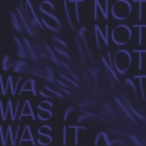
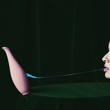
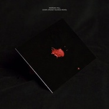
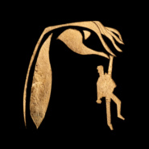
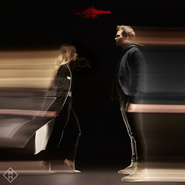
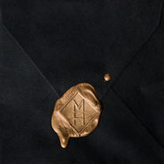
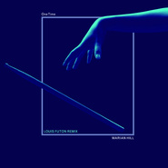
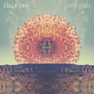

Marian Hill
============================

|  |  |
| :--: | :-- |
| [ Marian Hill](https://i.xiami.com/marianhillchina) | **地区**: United States of America 美国 **风格**: 电子 Electronic, 独立电子乐 Indietronica, 另类节奏布鲁斯 Alternative R&B **播放数**: 17107042 **粉丝数**: 8964 **评论数**: 236  |

## 档案

美国新晋独立音乐组合Marian Hill，成员为 Jeremy Lloyd 和 Samantha Gongol. 
Marian Hill is an American songwriting duo from Philadelphia consisting of production artist Jeremy Lloyd (music/lyrics/production) 和 Samantha Gongol (music/lyrics/vocals).Their name comes from two characters, Marian Paroo and Harold Hill, from the musical The Music Man. 
The group released their debut EP, Play, in 2013, which featured improvisational jazz musician Steve Davit. Two years later, they announced the availability of another EP, Sway. The New York Times published a review of the duo after the release of Play, comparing them to other well-known electronic and R&B-influenced groups.They made their television debut on The Late Late Show with James Corden in September 2015. A track that appears on both EPs, "One Time", entered the top 40 on US alternative radio in December 2015.The duo released four singles throughout 2016, leading up to their debut album; Act One. 
On January 14, 2017, Apple debuted their iPhone 7 + AirPods – Stroll commercial during the Atlanta Falcons and Seattle Seahawks playoff game. The commercial featured Lil Buck gravity dancing to "Down". 
On April 7, 2017, the duo released an extended version of their debut album Act One titled Act One (The Complete Collection). This version features all songs from Act One, as well as "Sway", "Back to Me", a single featuring Lauren Jauregui, and a feature from Detroit rapper Big Sean.

## 专辑

| 名称 | 语种 | 唱片公司 | 发行时间 | 专辑类别 | 专辑风格 |
| :--: | :-- | :-- | :-- | :-- | :-- |
| [ like u do (clear eyes remix)](./albums/5020653582.md) | 英语 |  | 2020年05月20日 | EP, 单曲 |  |
| [ was it not](./albums/2105906019.md) | 英语 |  | 2020年02月12日 | EP, 单曲 | 欧美流行 Western Pop |
| [ Unusual](./albums/2103635315.md) | 英语 | Republic Records | 2018年05月11日 | 录音室专辑 | 独立电子乐 Indietronica |
| [ Wish You Would](./albums/2103680665.md) | 英语 | Republic Records | 2018年04月13日 | EP, 单曲 |  |
| [ Differently](./albums/2103631046.md) | 英语 | Republic Records | 2018年03月23日 | EP, 单曲 | 电子 Electronic |
| [ Subtle Thing](./albums/2103522276.md) | 英语 | Republic Records | 2018年02月09日 | EP, 单曲 | 电子 Electronic, 独立电子乐 Indietronica, 陷阱舞曲 Trap |
| [ Down (Franky Rizardo Remix)](./albums/2102747687.md) | 英语 | Republic Records | 2017年05月02日 | EP, 单曲 |  |
| [ Down](./albums/2102731298.md) | 英语 | Republic Records | 2017年04月07日 | EP, 单曲 | 独立电子乐 Indietronica, 陷阱舞曲 Trap |
| [ Back to Me](./albums/2102661589.md) | 英语 | Republic Records | 2016年12月09日 | EP, 单曲 | 电子 Electronic |
| [ ACT ONE](./albums/2100308594.md) | 英语 | Republic Records | 2016年06月24日 | 录音室专辑 | 独立电子乐 Indietronica |
| [ Mistaken](./albums/664982290.md) | 其他 | Universal Music | 2016年06月02日 | 录音室专辑 | 电子 Electronic |
| [ I Know Why](./albums/1262561427.md) | 其他 | Universal Music | 2016年05月06日 | 录音室专辑 |  |
| [ I Want You](./albums/260142577.md) | 其他 | Universal Music | 2016年04月08日 | 录音室专辑 |  |
| [ Down](./albums/1957118957.md) | 英语 | Universal Music | 2016年03月04日 | EP, 单曲 | 另类摇滚 Alternative Rock |
| [ One Time](./albums/1755863632.md) | 其他 | Universal Music | 2016年02月12日 | 录音室专辑 | 电子 Electronic, 独立电子乐 Indietronica, 合成器流行 Synthpop |
| [ Jem And The Holograms](./albums/845926641.md) | 其他 | Universal Music | 2015年10月23日 | 录音室专辑 |  |
| [ Live from Philadelphia](./albums/243034885.md) | 英语 | Republic Records | 2015年09月25日 | 现场专辑 |  |
| [ One Time (Aquilo Remix)](./albums/740010811.md) | 其他 | Universal Music | 2015年08月21日 | EP, 单曲 |  |
| [ Sway](./albums/224160166.md) | 英语 | Republic Records | 2015年02月17日 | 录音室专辑 | 电子 Electronic |
| [ Breathe Into Me](./albums/1824199690.md) | 其他 | Universal Music | 2015年02月17日 | EP, 单曲 | 电子 Electronic |
| [ Lips / Got It](./albums/914044299.md) | 英语 | B3SCI Records | 2014年12月02日 | EP, 单曲 |  |
| [ Sweet Ophelia (Marian Hill Remix)](./albums/925007309.md) | 英语 | Self-Released | 2014年04月01日 | EP, 单曲 |  |
| [ Play](./albums/1196935141.md) | 英语 | Marian Hill | 2014年03月04日 | EP, 单曲 | 电子 Electronic |
| [ Carissimi: Eight Cantatas](./albums/2102647866.md) | 英语 | DEP | 2014年01月01日 | 录音室专辑 |  |

## 评论

|  |  |  |
| :-- | :-- | :-- |
|  [虾米用户](https://emumo.xiami.com/u/315760891)  2020-12-11 21:47 赞(0) 踩(0) | 
人美歌甜，音域很广。 我粉了，你们随意 
 |
|  [虾米用户](https://emumo.xiami.com/u/340903899) 我还没想好要写什么... 2020-09-25 16:42 赞(0) 踩(0) | 
这
 |
|  [虾米用户](https://emumo.xiami.com/u/16020545) 只此一生，必须热情 2020-07-14 20:40 赞(0) 踩(0) | 
真棒
 |
|  [虾米用户](https://emumo.xiami.com/u/11046808) 暗河里涌动 2020-05-19 18:53 赞(0) 踩(0) | 
挺完美的
 |
|  [虾米用户](https://emumo.xiami.com/u/116417238)   2020-04-13 17:26 赞(0) 踩(0) | 
好听
 |
|  [虾米用户](https://emumo.xiami.com/u/52399377) 其他歌不再有耐心听 2020-03-20 14:33 赞(0) 踩(0) | 
可
 |
|  [虾米用户](https://emumo.xiami.com/u/6325568) 聽音樂看人 2019-12-27 14:13 赞(0) 踩(0) | 

 |
|  [虾米用户](https://emumo.xiami.com/u/432129884) 感谢遇见，无憾再见 2019-12-22 01:12 赞(2) 踩(0) | 
这姐妹儿也太太太酷啦！我好爱！！！
 |
|  [虾米用户](https://emumo.xiami.com/u/37043100) 愿地狱也有音乐。 2019-12-16 10:03 赞(0) 踩(0) | 
犹如飞～
 |
|  [虾米用户](https://emumo.xiami.com/u/34039) 好舍不得这里 2019-12-06 18:30 赞(1) 踩(0) | 
like u do
 |
|  [虾米用户](https://emumo.xiami.com/u/21748173)  2019-09-17 23:53 赞(0) 踩(0) | 
音乐听得让我感觉到这是一个音频怪物
 |
|  [虾米用户](https://emumo.xiami.com/u/211179855) 万物皆有裂痕，那是光照进... 2019-08-28 14:27 赞(0) 踩(0) | 
宝藏女孩了
 |
|  [虾米用户](https://emumo.xiami.com/u/13994454) 我还没想好要写什么... 2019-07-11 11:05 赞(0) 踩(0) | 
封面很很喜欢玩儿手啊～～～
 |
|  [虾米用户](https://emumo.xiami.com/u/423956226) 我还没想好要写什么 2019-06-08 15:42 赞(2) 踩(0) | 
这个人我饭定了
 |
|  [虾米用户](https://emumo.xiami.com/u/228843687) 懒惰统治人间 2019-05-09 13:47 赞(0) 踩(0) | 

 |
|  [虾米用户](https://emumo.xiami.com/u/64634706) 尽管出走别折返 2019-05-05 11:09 赞(0) 踩(0) | 
给跪
 |
|  [虾米用户](https://emumo.xiami.com/u/276944698) 不要自我设限..... 2019-03-22 23:38 赞(2) 踩(0) | 

 |
|  [虾米用户](https://emumo.xiami.com/u/52056952) 人生即是到來、相遇、陪伴... 2019-03-22 15:48 赞(2) 踩(0) | 
♥
 |
| ⇒ |  [虾米用户](https://emumo.xiami.com/u/43894588) …… 2019-04-03 22:17 赞(0) 踩(0) | 
为什么你的头像能动
 |
|  [虾米用户](https://emumo.xiami.com/u/10832139) VIIII 2019-02-12 17:16 赞(1) 踩(0) | 
.•.
 |
|  [虾米用户](https://emumo.xiami.com/u/321182228)   2019-02-08 01:07 赞(3) 踩(0) | 
太太太太太好听了，不经意间骚上天
 |
|  [虾米用户](https://emumo.xiami.com/u/190758692)    遇到喜欢的歌就一定... 2019-01-30 15:20 赞(0) 踩(0) | 
啊啊啊啊我的妈
 |
|  [虾米用户](https://emumo.xiami.com/u/310086867) 一个无奈的无赖 2018-11-23 16:21 赞(0) 踩(0) | 

 |
|  [虾米用户](https://emumo.xiami.com/u/40614954) 劝君逆水跃江头，劝君顺水... 2018-11-16 22:04 赞(0) 踩(0) | 
Я вас люблю авось сейчас
 |
|  [虾米用户](https://emumo.xiami.com/u/55094882) ｉｄ９１ｏｍｏ＞Ｉ  2018-10-10 14:08 赞(0) 踩(0) | 
❤️
 |
|  [虾米用户](https://emumo.xiami.com/u/36792730) xxx 2018-09-21 18:46 赞(0) 踩(0) | 
挖宝 专辑封面都好喜欢
 |
|  [虾米用户](https://emumo.xiami.com/u/318132) 抠啦 2018-08-10 08:33 赞(3) 踩(0) | 
昨晚北京演出超级赞，爱死你的声音和扭动了
 |
|  [虾米用户](https://emumo.xiami.com/u/54537050) 我还没想好要写什么... 2018-08-01 08:48 赞(0) 踩(0) | 
上海见嘞:~]
 |
|  [虾米用户](https://emumo.xiami.com/u/1115247) @Nebula_7293 2018-07-27 20:42 赞(0) 踩(0) | 
／
 |
|  [虾米用户](https://emumo.xiami.com/u/247768284) The day I di... 2018-07-14 09:22 赞(0) 踩(0) | 
悉尼七月25有没有去看的人？  
 |
| ⇒ |  [虾米用户](https://emumo.xiami.com/u/247768284) The day I di... 2018-07-26 21:08 赞(0) 踩(0) | 
写错了八月！七月是jamesbay
 |
|  [虾米用户](https://emumo.xiami.com/u/10811234) Love Mucic 2018-06-24 09:22 赞(0) 踩(0) | 
赞
 |
|  [虾米用户](https://emumo.xiami.com/u/73790620)  2018-06-22 19:37 赞(0) 踩(0) | 
加一波关注
 |
|  [虾米用户](https://emumo.xiami.com/u/2831675) 情痴 情呆 行怪 言狂 2018-06-22 16:04 赞(48) 踩(0) | 
Marian Hill中国首演 8.9    北京/Beijing    糖果三层/Tango Live     出时间    20:30 8.10    上海/Shanghai    摩登/Modernsky Lab    演出时间    20:30 学生票 280 / 预售 330 / 现场 400
 |
| ⇒ |  [虾米用户](https://emumo.xiami.com/u/11354729) 发生了什么 2018-07-31 02:27 赞(0) 踩(0) | 
coming sh
 |
| ⇒ |  [虾米用户](https://emumo.xiami.com/u/352734766) Yo! 2018-08-27 23:05 赞(0) 踩(0) | 
完美错过 哭
 |
| ⇒ |  [虾米用户](https://emumo.xiami.com/u/318132) 抠啦 2018-10-21 08:35 赞(0) 踩(0) | 
<q><b>...........说：</b></q>
 |
|  [虾米用户](https://emumo.xiami.com/u/52737072) . 2018-06-14 12:32 赞(0) 踩(0) | 
极简主义 
 |
|  [虾米用户](https://emumo.xiami.com/u/117527814) 没有更多内容了。 2018-06-12 17:57 赞(0) 踩(0) | 
&amp;Uuml;
 |
|  [虾米用户](https://emumo.xiami.com/u/307925926)  2018-06-01 21:12 赞(0) 踩(0) | 
风格❤
 |
|  [虾米用户](https://emumo.xiami.com/u/354686611) 不知道看到这句话的人此刻... 2018-05-22 13:29 赞(2) 踩(0) | 
意外发现，惊喜
 |
|  [虾米用户](https://emumo.xiami.com/u/34182751) 再见了朋友们 我们网易云... 2018-05-15 00:52 赞(0) 踩(0) | 
Wyy过来了
 |
|  [虾米用户](https://emumo.xiami.com/u/1320669) ツ 2018-04-15 18:17 赞(0) 踩(0) | 
0.0
 |
|  [虾米用户](https://emumo.xiami.com/u/44108647) 睡一夜歌单全灰 2018-04-14 13:43 赞(1) 踩(0) | 
这脖子
 |
|  [虾米用户](https://emumo.xiami.com/u/23534686) o 2018-04-01 18:20 赞(0) 踩(0) | 
o
 |
|  [虾米用户](https://emumo.xiami.com/u/68577338) 思君如思乡 2018-03-29 19:39 赞(0) 踩(0) | 

 |
|  [虾米用户](https://emumo.xiami.com/u/324879742)   2018-03-29 05:51 赞(1) 踩(0) | 
❤️
 |
|  [虾米用户](https://emumo.xiami.com/u/17700103) 我还没想好要写什么... 2018-03-27 14:49 赞(0) 踩(0) | 
哈哈哈哈一直以为MH是个女歌手 直到看了简介才知道是个组合
 |
|  [虾米用户](https://emumo.xiami.com/u/3583995) 一個人的戰爭 2018-03-23 07:17 赞(0) 踩(0) | 
.
 |
|  [虾米用户](https://emumo.xiami.com/u/295235233) 听个歌要什么签名﹌O﹌ 2018-03-15 23:13 赞(0) 踩(0) | 
由lovit爱上到play关注
 |
|  [虾米用户](https://emumo.xiami.com/u/12400141) 你的孤单虽败犹荣 2018-03-03 20:52 赞(0) 踩(0) | 

 |
|  [虾米用户](https://emumo.xiami.com/u/302564180) koc 2018-03-01 23:18 赞(1) 踩(0) | 
我妈问我为什么突然跳舞
 |
|  [虾米用户](https://emumo.xiami.com/u/201391232) 最快的方法是先抱抱 2018-02-23 04:29 赞(0) 踩(0) | 
彡
 |
|  [虾米用户](https://emumo.xiami.com/u/258462427)        生而為人我... 2018-02-10 23:50 赞(1) 踩(0) | 
I like the style too much.
 |
|  [虾米用户](https://emumo.xiami.com/u/189131880) yolo！！！ 2018-02-04 16:23 赞(4) 踩(0) | 
好多首爱听的歌直到今天才发现都是MH的歌！！！有缘！！简直被这种风格迷住了！！   
 |
| ⇒ |  [虾米用户](https://emumo.xiami.com/u/96933918) 不快乐天使 2018-02-05 23:04 赞(0) 踩(0) | 
我也是！！今天才发现好多喜欢的都是她的！！！
 |
| ⇒ |  [虾米用户](https://emumo.xiami.com/u/27403655)  2018-04-01 19:43 赞(0) 踩(0) | 
同感 
 |
|  [虾米用户](https://emumo.xiami.com/u/18333792) 我还没想好要写什么... 2018-02-01 15:18 赞(0) 踩(0) | 

 |
|  [虾米用户](https://emumo.xiami.com/u/73638642) 再见了各位 我永远爱虾米... 2018-01-14 21:58 赞(0) 踩(0) | 

 |
|  [虾米用户](https://emumo.xiami.com/u/2418238) weibo: @尤米口 2017-12-06 10:48 赞(0) 踩(0) | 
♡⃛
 |
|  [虾米用户](https://emumo.xiami.com/u/335347783) 智者向内寻求力量。 2017-11-20 21:56 赞(0) 踩(0) | 
第一次听到的是他们的one time 真的太有感觉 歌红人不红
 |
|  [虾米用户](https://emumo.xiami.com/u/271905397)  2017-10-28 00:13 赞(2) 踩(0) | 
真心是因为苹果广告，真心喜欢她的节奏！很舒服！
 |
|  [虾米用户](https://emumo.xiami.com/u/73488962)   2017-10-11 23:54 赞(0) 踩(0) | 
好平静的节奏感，好像午休后看到阳光的慵懒
 |
|  [虾米用户](https://emumo.xiami.com/u/1990456) 请你看见我 2017-09-25 14:16 赞(0) 踩(0) | 
好棒~~~
 |
|  [虾米用户](https://emumo.xiami.com/u/55316266) 沉迷声色 2017-09-08 15:45 赞(4) 踩(0) | 
声线太吸粉 至少我是被吸过来了 
 |
|  [虾米用户](https://emumo.xiami.com/u/22444238) 邱比官方虾米 2017-09-05 21:53 赞(1) 踩(0) | 
Get
 |
|  [虾米用户](https://emumo.xiami.com/u/1712133)  2017-08-18 15:58 赞(3) 踩(0) | 
我的心跳现在就是这个节奏
 |
|  [虾米用户](https://emumo.xiami.com/u/270654195) 一个有趣的灵魂却没有好看... 2017-07-12 11:20 赞(1) 踩(0) | 
虾米也玩收费的把戏了 
 |
|  [虾米用户](https://emumo.xiami.com/u/12310229)  2017-06-21 23:47 赞(0) 踩(0) | 

 |
|  [虾米用户](https://emumo.xiami.com/u/206707719)  2017-05-31 22:23 赞(1) 踩(0) | 
好看，就是胸太小了
 |
|  [虾米用户](https://emumo.xiami.com/u/32349133) On the day t... 2017-05-30 21:25 赞(0) 踩(0) | 
抖腿抖腿
 |
|  [虾米用户](https://emumo.xiami.com/u/11405259) 你去不了的远方，我把故事... 2017-05-24 18:59 赞(1) 踩(0) | 
好多小黄歌
 |
|  [虾米用户](https://emumo.xiami.com/u/10129425) 看不到看不到 2017-05-19 15:40 赞(1) 踩(0) | 
被广告歌吸引
 |
|  [虾米用户](https://emumo.xiami.com/u/266342317) 怪阿姨 2017-05-18 13:52 赞(3) 踩(0) | 
和我一样喜欢这种节奏感很强又很怪很好听的歌的赞我
 |
|  [虾米用户](https://emumo.xiami.com/u/45485152) Wubba lubba ... 2017-05-18 12:04 赞(0) 踩(0) | 
:)
 |
|  [虾米用户](https://emumo.xiami.com/u/190882030) 入土为安 2017-05-18 09:23 赞(0) 踩(0) | 
我和她都喜欢的一个歌手
 |
|  [虾米用户](https://emumo.xiami.com/u/39676110) Abel Tesfaye 2017-05-14 13:21 赞(0) 踩(0) | 
-
 |
|  [虾米用户](https://emumo.xiami.com/u/262252261) 严肃人士 2017-05-14 09:46 赞(3) 踩(0) | 
此人的歌都有毒。。我中毒了
 |
|  [虾米用户](https://emumo.xiami.com/u/256870829)  2017-05-11 22:42 赞(1) 踩(0) | 
好好听，虽然听不懂 
 |
|  [虾米用户](https://emumo.xiami.com/u/42810132) Aprés l'amou... 2017-05-07 18:23 赞(1) 踩(0) | 
何厚铧
 |
|  [虾米用户](https://emumo.xiami.com/u/49265597) 我还没想好要写什么... 2017-04-23 15:56 赞(0) 踩(0) | 
。
 |
|  [虾米用户](https://emumo.xiami.com/u/49640493) 网易云SAINTDONT... 2017-04-15 23:47 赞(0) 踩(0) | 

 |
|  [虾米用户](https://emumo.xiami.com/u/6761779) 儿孙们都忙，而我却天天都... 2017-04-08 10:31 赞(1) 踩(0) | 
跳针姐
 |
|  [虾米用户](https://emumo.xiami.com/u/2888769)  2017-04-01 13:30 赞(0) 踩(0) | 
hi
 |
|  [虾米用户](https://emumo.xiami.com/u/202762133) 伊甸园 2017-03-26 10:49 赞(0) 踩(0) | 

 |
|  [虾米用户](https://emumo.xiami.com/u/68055520)   2017-03-26 07:40 赞(0) 踩(0) | 

 |
|  [虾米用户](https://emumo.xiami.com/u/187482197)  2017-03-21 19:57 赞(0) 踩(0) | 
iphone广告
 |
|  [虾米用户](https://emumo.xiami.com/u/39968630) Harder,bette... 2017-03-19 13:07 赞(0) 踩(0) | 
哇哇哇 好可爱
 |
|  [虾米用户](https://emumo.xiami.com/u/41752187)  2017-03-17 11:03 赞(1) 踩(0) | 
头次看广告还看上瘾了，就来了
 |
|  [虾米用户](https://emumo.xiami.com/u/156056836) 我还没想好要写什么... 2017-03-15 00:13 赞(0) 踩(0) | 

 |
|  [虾米用户](https://emumo.xiami.com/u/8094169)  2017-03-12 10:35 赞(1) 踩(0) | 
大Jazz小味道 少风格 lalala love it
 |
|  [虾米用户](https://emumo.xiami.com/u/8094169)  2017-03-12 10:30 赞(3) 踩(0) | 
我是看了广告来了 有 jazz味道    
 |
|  [虾米用户](https://emumo.xiami.com/u/260547706)   2017-03-12 00:14 赞(0) 踩(0) | 
xih
 |
|  [虾米用户](https://emumo.xiami.com/u/1150682)  2017-03-03 10:18 赞(0) 踩(0) | 
喜欢他们 甭棒～
 |
|  [虾米用户](https://emumo.xiami.com/u/18412060) v15175288880 2017-02-27 19:36 赞(0) 踩(0) | 
.
 |
|  [虾米用户](https://emumo.xiami.com/u/1192824) （づ￣3￣）づ╭❤～ 2017-02-27 09:22 赞(3) 踩(0) | 
I have an iPod~Are you down d- d- down d- d- down d- d- down down down  被广告安利来的小伙伴来报个到吧~
 |
|  [虾米用户](https://emumo.xiami.com/u/1155429)  2017-02-26 13:27 赞(0) 踩(0) | 
喜欢
 |
|  [虾米用户](https://emumo.xiami.com/u/1270619)  2017-02-25 09:30 赞(31) 踩(0) | 
多少人是看了广告来的
 |
| ⇒ |  [虾米用户](https://emumo.xiami.com/u/261722106)  2017-03-11 23:34 赞(0) 踩(0) | 
蘋果廣告嗎？
 |
| ⇒ |  [虾米用户](https://emumo.xiami.com/u/272803186)  2017-04-06 22:22 赞(0) 踩(0) | 
我
 |
| ⇒ |  [虾米用户](https://emumo.xiami.com/u/260365517) 我啊哈哈哈哈哈哈哈哈哈 2017-04-08 20:28 赞(0) 踩(0) | 
<q><b>Divkface说：</b></q>
 |
|  [虾米用户](https://emumo.xiami.com/u/49845996) 我还没想好要写什么... 2017-02-24 23:38 赞(0) 踩(0) | 
＋
 |
|  [虾米用户](https://emumo.xiami.com/u/92236) 我还没想好要写什么... 2017-02-23 20:53 赞(1) 踩(0) | 
只怪广告拍的太好了
 |
|  [虾米用户](https://emumo.xiami.com/u/5848254) 网易云音乐（之后可能会开... 2017-02-23 13:35 赞(0) 踩(0) | 
xixixi
 |
|  [虾米用户](https://emumo.xiami.com/u/9717528) 但行好事 莫问前程 2017-02-22 22:38 赞(2) 踩(0) | 
反正我是看了广告摸进来听的
 |
|  [虾米用户](https://emumo.xiami.com/u/17146554) weibo：@L1RRO... 2017-02-16 20:54 赞(0) 踩(0) | 
ᶉ
 |
|  [虾米用户](https://emumo.xiami.com/u/99586286) 歌单停滞在2017 2017-02-16 09:41 赞(0) 踩(0) | 
好方  最近各种群转他们的歌
 |
|  [虾米用户](https://emumo.xiami.com/u/5787391) 没有梦想，何必远方。 2017-02-12 20:11 赞(0) 踩(0) | 
来势凶猛
 |
|  [虾米用户](https://emumo.xiami.com/u/44492954) ... 2017-02-10 18:20 赞(0) 踩(0) | 
MH的歌一听就知道是她的
 |
|  [虾米用户](https://emumo.xiami.com/u/191628315)  2017-02-09 22:57 赞(1) 踩(0) | 
又开始相信音乐了？
 |
|  [虾米用户](https://emumo.xiami.com/u/33552517) 偏好、 2017-02-07 12:42 赞(0) 踩(0) | 
〰
 |
|  [虾米用户](https://emumo.xiami.com/u/264283064) bye  2017-01-30 23:57 赞(0) 踩(0) | 
△
 |
|  [虾米用户](https://emumo.xiami.com/u/47434225)  be in silen... 2017-01-30 08:14 赞(0) 踩(0) | 
太喜欢
 |
|  [虾米用户](https://emumo.xiami.com/u/20683607) 白昼之光，岂知夜色之深。 2017-01-25 18:10 赞(0) 踩(0) | 
起飞
 |
|  [虾米用户](https://emumo.xiami.com/u/7339667) 嗯，好的。 2017-01-25 04:48 赞(0) 踩(0) | 
AMAZING!
 |
|  [虾米用户](https://emumo.xiami.com/u/6654069) mutherfacker... 2017-01-23 01:34 赞(0) 踩(0) | 
可以
 |
|  [虾米用户](https://emumo.xiami.com/u/2800265) Let me Loop ... 2017-01-19 17:44 赞(0) 踩(0) | 
节奏感？
 |
|  [虾米用户](https://emumo.xiami.com/u/263315550)  2017-01-18 22:21 赞(0) 踩(0) | 
厉害了！好听！好听！好听！ 重要事三遍……
 |
|  [虾米用户](https://emumo.xiami.com/u/3619853)   2017-01-15 14:55 赞(0) 踩(0) | 
m
 |
|  [虾米用户](https://emumo.xiami.com/u/228475868) Meh 2017-01-14 12:55 赞(0) 踩(0) | 
太好了
 |
|  [虾米用户](https://emumo.xiami.com/u/10310498)   2017-01-08 03:44 赞(0) 踩(0) | 
✌️
 |
|  [虾米用户](https://emumo.xiami.com/u/124013612)   2017-01-07 12:13 赞(0) 踩(0) | 
比吃了糖还甜
 |
|  [虾米用户](https://emumo.xiami.com/u/55505219) 坚强的岛民 2017-01-01 11:26 赞(0) 踩(0) | 
性感到流血
 |
|  [虾米用户](https://emumo.xiami.com/u/1171396) 以前办不到的事情，未来也... 2016-12-17 22:12 赞(0) 踩(0) | 
0,0
 |
|  [虾米用户](https://emumo.xiami.com/u/2523233) 太热 2016-12-07 15:35 赞(1) 踩(0) | 
美国音乐创作组合Philadelphia成员Marian Hill与美国流行女子组合Fifth Harmony成员Lauren Jauregui合作，二人合作的新单曲将在近期发布。
 |
|  [虾米用户](https://emumo.xiami.com/u/2782231) :-( 2016-12-07 09:35 赞(0) 踩(0) | 
从我伦那儿来的ᕕ(ᐛ)ᕗ
 |
|  [虾米用户](https://emumo.xiami.com/u/3442087) Dust To Dust 2016-12-03 16:29 赞(0) 踩(0) | 
m
 |
|  [虾米用户](https://emumo.xiami.com/u/185347006) 我还没想好要写什么... 2016-11-18 16:31 赞(0) 踩(0) | 
挚爱
 |
|  [虾米用户](https://emumo.xiami.com/u/3664827) 没见过咪咪酱么~~~ 2016-11-15 19:08 赞(0) 踩(0) | 
灵魂出窍吧~
 |
|  [虾米用户](https://emumo.xiami.com/u/32748502) 二七 + 狗儒 的 连体... 2016-10-27 14:23 赞(0) 踩(0) | 
迟到的打卡 10.13扭腰场 webster前排蹦迪get
 |
|  [虾米用户](https://emumo.xiami.com/u/85148548)  2016-09-21 23:48 赞(0) 踩(0) | 
cool
 |
|  [虾米用户](https://emumo.xiami.com/u/13521200)  2016-09-21 23:41 赞(0) 踩(0) | 
留名
 |
|  [虾米用户](https://emumo.xiami.com/u/50642130) 很软 2016-09-19 12:28 赞(0) 踩(0) | 
cute
 |
|  [虾米用户](https://emumo.xiami.com/u/687080) 私人空间 2016-09-18 16:45 赞(0) 踩(0) | 
曼妙诱惑的的声线
 |
|  [虾米用户](https://emumo.xiami.com/u/878) 饭在锅里，我在床上。 2016-09-14 17:18 赞(0) 踩(0) | 
妙，骚骚
 |
|  [虾米用户](https://emumo.xiami.com/u/73857918) 在黎明之前 2016-09-10 17:56 赞(0) 踩(0) | 
Lips的感觉很曼妙
 |
|  [虾米用户](https://emumo.xiami.com/u/7819028) 人丑家穷学历低 2016-08-16 10:51 赞(2) 踩(0) | 
戴上耳机被强奸
 |
|  [虾米用户](https://emumo.xiami.com/u/43547593) ♡ 2016-08-10 18:44 赞(0) 踩(0) | 
⅋
 |
|  [虾米用户](https://emumo.xiami.com/u/197479926)   2016-08-04 15:33 赞(0) 踩(0) | 
这节奏适合打bbox
 |
|  [虾米用户](https://emumo.xiami.com/u/99586286) 歌单停滞在2017 2016-07-31 19:24 赞(0) 踩(0) | 
在
 |
|  [虾米用户](https://emumo.xiami.com/u/49215622) Ƒ ŗ o z e n 2016-07-29 23:24 赞(0) 踩(0) | 
飞您mother！
 |
|  [虾米用户](https://emumo.xiami.com/u/35714790)  2016-07-02 02:18 赞(0) 踩(0) | 
leo在天上  ✲ﾟ｡.(✿╹◡╹)ﾉ☆.｡₀:*ﾟ✲ﾟ*:₀｡
 |
|  [虾米用户](https://emumo.xiami.com/u/45282209) 我还没想好要写什么... 2016-06-26 06:59 赞(0) 踩(0) | 
"This is what the future of pop sounds like."
 |
|  [虾米用户](https://emumo.xiami.com/u/50812128) _ 2016-06-24 11:22 赞(0) 踩(0) | 
#
 |
|  [虾米用户](https://emumo.xiami.com/u/7951384) 我还没想好要写什么... 2016-06-20 23:26 赞(0) 踩(0) | 

 |
|  [虾米用户](https://emumo.xiami.com/u/53558421) I’m fucking ... 2016-06-19 20:37 赞(0) 踩(0) | 
喜欢
 |
|  [虾米用户](https://emumo.xiami.com/u/47028637) 我还没想好要写什么... 2016-06-03 21:25 赞(0) 踩(0) | 
  
 |
|  [虾米用户](https://emumo.xiami.com/u/4365181) Flyman 2016-05-31 18:12 赞(16) 踩(0) | 
飞到裤衩都跟不上了   
 |
|  [虾米用户](https://emumo.xiami.com/u/37797684) 我还没想好要写什么... 2016-05-15 21:29 赞(0) 踩(0) | 
se   xy
 |
|  [虾米用户](https://emumo.xiami.com/u/9513422) 虾米歌单迁徙到网易☁️:... 2016-05-12 07:09 赞(0) 踩(0) | 
Back again
 |
|  [虾米用户](https://emumo.xiami.com/u/42695089) vb：吴浣甜甜 2016-05-09 23:56 赞(0) 踩(0) | 
。
 |
|  [虾米用户](https://emumo.xiami.com/u/99586286) 歌单停滞在2017 2016-04-20 18:25 赞(0) 踩(0) | 
此
 |
|  [虾米用户](https://emumo.xiami.com/u/49734359) Never Say Go... 2016-04-11 10:21 赞(0) 踩(0) | 
3
 |
|  [虾米用户](https://emumo.xiami.com/u/1217103)   2016-03-27 21:38 赞(0) 踩(0) | 
狗姐的bgm不错听
 |
|  [虾米用户](https://emumo.xiami.com/u/2763753) The best is ... 2016-03-24 22:20 赞(0) 踩(0) | 
马克～
 |
|  [虾米用户](https://emumo.xiami.com/u/42661055) ✨ 2016-03-18 13:02 赞(0) 踩(0) | 
❁
 |
| ⇒ |  [虾米用户](https://emumo.xiami.com/u/9028760) 豆瓣见 spotify ... 2016-05-03 12:30 赞(0) 踩(0) | 
⚗
 |
|  [虾米用户](https://emumo.xiami.com/u/68040676)  2016-03-15 17:02 赞(0) 踩(0) | 
很飞
 |
|  [虾米用户](https://emumo.xiami.com/u/3583995) 一個人的戰爭 2016-03-14 12:51 赞(0) 踩(0) | 

 |
|  [虾米用户](https://emumo.xiami.com/u/45621221) 卸载状态。 2016-03-12 23:42 赞(0) 踩(0) | 
=
 |
|  [虾米用户](https://emumo.xiami.com/u/140911) endless 2016-03-09 22:33 赞(0) 踩(0) | 

 |
|  [虾米用户](https://emumo.xiami.com/u/36514939) 她留着超酷的短发 网易云... 2016-02-15 18:21 赞(0) 踩(0) | 
☃
 |
|  [虾米用户](https://emumo.xiami.com/u/50827100)  2016-02-10 09:41 赞(0) 踩(0) | 
超级喜欢
 |
|  [虾米用户](https://emumo.xiami.com/u/10944859) ‏‏‏‏‏‏‏‏ 2016-02-07 15:22 赞(0) 踩(0) | 

 |
|  [虾米用户](https://emumo.xiami.com/u/52536056) (◉ω◉υ)⁼³₌₃悄咪... 2016-02-02 18:22 赞(1) 踩(0) | 
吸吸∠( ᐛ 」∠)＿
 |
|  [虾米用户](https://emumo.xiami.com/u/36972275) Instagram.co... 2016-01-22 12:28 赞(1) 踩(0) | 
每首都喜欢
 |
|  [虾米用户](https://emumo.xiami.com/u/42100089) 能安静听个歌就很好 2016-01-20 18:57 赞(0) 踩(0) | 
可以的
 |
|  [虾米用户](https://emumo.xiami.com/u/8970340) 小石头 2016-01-20 12:44 赞(0) 踩(0) | 
太棒了真的
 |
|  [虾米用户](https://emumo.xiami.com/u/9410208)  2016-01-11 22:04 赞(0) 踩(0) | 
不得了
 |
|  [虾米用户](https://emumo.xiami.com/u/12554850) ///404  Weib... 2016-01-11 03:07 赞(0) 踩(0) | 

 |
|  [虾米用户](https://emumo.xiami.com/u/12549663)  2016-01-05 14:07 赞(0) 踩(0) | 
微电影
 |
|  [虾米用户](https://emumo.xiami.com/u/45888620) Wanna hook u... 2016-01-02 21:52 赞(0) 踩(0) | 
嘿嘿。
 |
|  [虾米用户](https://emumo.xiami.com/u/14091078) 我还没想好要写什么... 2015-12-22 23:38 赞(0) 踩(0) | 
屌
 |
|  [虾米用户](https://emumo.xiami.com/u/36208991)   2015-12-20 14:31 赞(0) 踩(0) | 
๑
 |
|  [虾米用户](https://emumo.xiami.com/u/9027473) ☻ 2015-12-10 00:13 赞(0) 踩(0) | 
☻
 |
|  [虾米用户](https://emumo.xiami.com/u/46045053) 音乐放纵灵魂 2015-11-22 21:25 赞(1) 踩(0) | 
这编曲也是屌的不行
 |
|  [虾米用户](https://emumo.xiami.com/u/46045053) 音乐放纵灵魂 2015-11-22 21:22 赞(0) 踩(0) | 
挑逗的声音，直击内心的低音鼓，简直不行了
 |
|  [虾米用户](https://emumo.xiami.com/u/16396509)  2015-11-03 11:10 赞(0) 踩(0) | 
⚫
 |
|  [虾米用户](https://emumo.xiami.com/u/8226204) ≡ 2015-11-01 14:03 赞(0) 踩(0) | 
这么多专辑 也就反复那几首歌
 |
|  [虾米用户](https://emumo.xiami.com/u/46515715) 00s 2015-11-01 02:52 赞(0) 踩(0) | 
Ø
 |
|  [虾米用户](https://emumo.xiami.com/u/45959701) ‍ ‍ 2015-10-22 00:41 赞(0) 踩(0) | 

 |
|  [虾米用户](https://emumo.xiami.com/u/3906745) …之前虾米用的好好突然歌... 2015-10-17 00:18 赞(0) 踩(0) | 
騷寶寶
 |
|  [虾米用户](https://emumo.xiami.com/u/73660220)  2015-10-14 18:59 赞(0) 踩(0) | 
超爱！！！
 |
|  [虾米用户](https://emumo.xiami.com/u/22456876) 失眠是因为睡前戴上了耳机 2015-09-28 01:06 赞(0) 踩(0) | 

 |
|  [虾米用户](https://emumo.xiami.com/u/14539607) weibo：PeachM... 2015-09-27 23:16 赞(0) 踩(0) | 
就这骚气我耳朵说它会怀孕
 |
|  [虾米用户](https://emumo.xiami.com/u/7987083) 404 Not Foun... 2015-09-20 01:34 赞(1) 踩(0) | 
这个婆娘不得了，我是说真的。
 |
|  [虾米用户](https://emumo.xiami.com/u/49232623) 抠耳大汉 2015-09-11 20:34 赞(0) 踩(0) | 
nice
 |
|  [虾米用户](https://emumo.xiami.com/u/45603400) PURR-FECT. 2015-09-01 13:49 赞(0) 踩(0) | 

 |
|  [虾米用户](https://emumo.xiami.com/u/17305789)   2015-08-29 16:52 赞(0) 踩(0) | 
哦哟~
 |
|  [虾米用户](https://emumo.xiami.com/u/28529835) wechat：13306... 2015-08-28 13:25 赞(0) 踩(0) | 
♻️ Ｘ99
 |
|  [虾米用户](https://emumo.xiami.com/u/2505436)  2015-07-20 23:14 赞(0) 踩(0) | 
擦
 |
|  [虾米用户](https://emumo.xiami.com/u/45015627) 民谣与爵士不能舍弃 2015-06-27 22:29 赞(0) 踩(0) | 
Love u Marian .great voicr
 |
| ⇒ |  [虾米用户](https://emumo.xiami.com/u/3288456) MIXMIXMIX!!! 2015-08-25 11:54 赞(0) 踩(0) | 
准备托福的人看到你头像很心塞。。。。。。。。。。。。。。。
 |
|  [虾米用户](https://emumo.xiami.com/u/26354438) 归于尘土 融于世俗 2015-06-26 11:38 赞(0) 踩(0) | 
love it!!!!
 |
|  [虾米用户](https://emumo.xiami.com/u/2347643)  2015-06-17 11:24 赞(0) 踩(0) | 
ssssssssssssss
 |
|  [虾米用户](https://emumo.xiami.com/u/5490437) 女士优先 2015-06-16 17:12 赞(0) 踩(0) | 
编曲太骚了  嗓子太骚了  好像又硬了
 |
|  [虾米用户](https://emumo.xiami.com/u/5490437) 女士优先 2015-06-16 17:08 赞(1) 踩(0) | 
编曲太牛逼  不要不要的   又硬了
 |
|  [虾米用户](https://emumo.xiami.com/u/5490437) 女士优先 2015-06-16 17:07 赞(1) 踩(0) | 
听硬了
 |
|  [虾米用户](https://emumo.xiami.com/u/7994519) +++++ 2015-06-11 11:55 赞(0) 踩(0) | 
有被惊喜到。
 |
|  [虾米用户](https://emumo.xiami.com/u/38640339) 我想好写什么了…… 2015-06-10 12:31 赞(0) 踩(0) | 

 |
|  [虾米用户](https://emumo.xiami.com/u/2723994)   2015-06-08 17:38 赞(0) 踩(0) | 
赞赞赞!!!!!
 |
|  [虾米用户](https://emumo.xiami.com/u/836115) 电子日当舞，蹦迪至入土 2015-06-05 11:44 赞(0) 踩(0) | 
有点惊艳
 |
|  [虾米用户](https://emumo.xiami.com/u/6548494) shhhhhh 2015-06-04 15:21 赞(0) 踩(0) | 
补留
 |
|  [虾米用户](https://emumo.xiami.com/u/12562992) 我还没想好要写什么... 2015-06-03 06:28 赞(0) 踩(0) | 
uhhhh so sexy
 |
|  [虾米用户](https://emumo.xiami.com/u/11917054) 『常年卧底医院并乔装成医... 2015-06-01 20:04 赞(0) 踩(0) | 
i lean forward to the next crazy venture beneath the skies
 |
|  [虾米用户](https://emumo.xiami.com/u/13991927) Ins::MIKOCYC... 2015-06-01 10:50 赞(0) 踩(0) | 
31
 |
|  [虾米用户](https://emumo.xiami.com/u/661758)  2015-05-29 10:04 赞(0) 踩(0) | 
慵懒骄傲
 |
|  [虾米用户](https://emumo.xiami.com/u/1065533) a world with... 2015-05-28 18:55 赞(0) 踩(0) | 
witch house
 |
|  [虾米用户](https://emumo.xiami.com/u/33381539) 你干嘛看我。？ 2015-05-26 10:34 赞(0) 踩(0) | 
超适合编舞啊
 |
|  [虾米用户](https://emumo.xiami.com/u/1775538)  2015-05-25 22:04 赞(0) 踩(0) | 
配乐
 |
|  [虾米用户](https://emumo.xiami.com/u/41746518)  2015-05-10 00:28 赞(0) 踩(0) | 
这是副局座的第二人生么哈哈哈哈哈！
 |
|  [虾米用户](https://emumo.xiami.com/u/7322777) ∮ 2015-05-02 02:53 赞(0) 踩(0) | 
收
 |
|  [虾米用户](https://emumo.xiami.com/u/19962510) 我还没想好要写什么... 2015-04-21 16:48 赞(1) 踩(0) | 
电子迷幻小爵士的感觉，一只优雅轻巧的猫。
 |
|  [虾米用户](https://emumo.xiami.com/u/19962510) 我还没想好要写什么... 2015-04-21 16:46 赞(0) 踩(0) | 
电子迷幻小爵士的感觉，优雅轻巧
 |
|  [虾米用户](https://emumo.xiami.com/u/6500137)  2015-04-21 10:58 赞(0) 踩(0) | 
.
 |
|  [虾米用户](https://emumo.xiami.com/u/4839907) 不让我听音乐就是要我的命 2015-04-17 21:32 赞(71) 踩(0) | 
这种风格的音乐太少了
 |
|  [虾米用户](https://emumo.xiami.com/u/19619564) Bossy sassy ... 2015-04-17 20:29 赞(0) 踩(0) | 
一直好奇这名字和希尔副局什么关系
 |
|  [虾米用户](https://emumo.xiami.com/u/16308694) keine Einfüh... 2015-04-11 01:03 赞(0) 踩(0) | 
棒棒棒
 |
|  [虾米用户](https://emumo.xiami.com/u/8856820) 野生的 2015-03-29 18:50 赞(0) 踩(0) | 
☨
 |
|  [虾米用户](https://emumo.xiami.com/u/9412733) 雪人☃ 2015-03-05 14:03 赞(0) 踩(0) | 
<a href="http://dujour.com/culture/marian-hill-band-interview/" target="_blank" rel="nofollow noreferrer noopener">http://dujour.com/culture/marian-hill-band-interview/</a>
 |
|  [虾米用户](https://emumo.xiami.com/u/1046022) 大爱V A 2015-02-24 18:32 赞(0) 踩(0) | 
大爱电子月，尤其是带点蓝调的感觉
 |
|  [虾米用户](https://emumo.xiami.com/u/5537592) 喵^_^ 2015-02-24 15:52 赞(0) 踩(0) | 
喜欢这种调调
 |
|  [虾米用户](https://emumo.xiami.com/u/2749246) 和平中寸步难行 2015-02-22 14:00 赞(0) 踩(0) | 
+1
 |
|  [虾米用户](https://emumo.xiami.com/u/9412733) 雪人☃ 2015-02-16 09:29 赞(0) 踩(0) | 
不错哦
 |
|  [虾米用户](https://emumo.xiami.com/u/820250) 裸吻鱼 2015-02-13 20:39 赞(0) 踩(0) | 
&amp;lt;3
 |
|  [虾米用户](https://emumo.xiami.com/u/1903770) unknown plea... 2015-01-29 21:28 赞(0) 踩(0) | 
1
 |
|  [虾米用户](https://emumo.xiami.com/u/24123398) // 2014-12-19 17:32 赞(0) 踩(0) | 
‼️
 |
|  [虾米用户](https://emumo.xiami.com/u/44284714) HOT. 2014-12-06 23:41 赞(0) 踩(0) | 
很新鲜
 |
|  [虾米用户](https://emumo.xiami.com/u/8226204) ≡ 2014-11-09 14:37 赞(0) 踩(0) | 
<a href="http://emumo.xiami.com/u/7510020" target="_blank" rel="nofollow" name_card="7510020">@Lee</a>  听着好好玩..
 |
|  [虾米用户](https://emumo.xiami.com/u/35984292) 灵魂再现 2014-10-25 09:23 赞(0) 踩(0) | 
词儿新鲜，beat上瘾，声音好听，怎么办
 |
| ⇒ |  [虾米用户](https://emumo.xiami.com/u/44284714) HOT. 2014-12-06 23:41 赞(0) 踩(0) | 
狠狠爱
 |
|  [虾米用户](https://emumo.xiami.com/u/33111891)  2014-10-18 20:53 赞(0) 踩(0) | 
挺喜欢的啦
 |
|  [虾米用户](https://emumo.xiami.com/u/10417095) 听客 2014-10-17 14:21 赞(0) 踩(0) | 
Got it <a href="https://soundcloud.com/marianhill/got-it" target="_blank" rel="nofollow noreferrer noopener">https://soundcloud.com/marianhill/got-it</a>
 |
|  [虾米用户](https://emumo.xiami.com/u/582418)  2014-07-29 22:42 赞(0) 踩(0) | 
。。
 |
|  [虾米用户](https://emumo.xiami.com/u/6955290) 就 2014-07-26 17:28 赞(0) 踩(0) | 
噗
 |
|  [虾米用户](https://emumo.xiami.com/u/10970617) 补补艺人资料 听听小众独... 2014-04-14 18:13 赞(0) 踩(0) | 
还不错
 |
