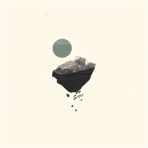
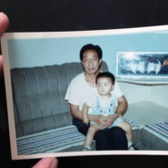

柳爽
============================

|  |  |
| :--: | :-- |
| [ 柳爽](https://i.xiami.com/leon1030) | **播放数**: 4024408 **粉丝数**: 1604 **评论数**: 86 **地区**: China 中国大陆 **风格**: 独立民谣 Indie Folk, 民谣流行 Folk Pop  |

## 档案

独立音乐人，毕业于中国人民公安大学，以创作型民谣的音乐形式表现警校生活及个人情感。代表作有《高米店南》、《末班车》、《姥爷》等。

## 专辑

| 名称 | 语种 | 唱片公司 | 发行时间 | 专辑类别 | 专辑风格 |
| :--: | :-- | :-- | :-- | :-- | :-- |
| [ 陈逸伦的解放西](./albums/5020995936.md) | 国语 | 众乐纪 | 2020年07月01日 | EP, 单曲 | 国语流行 Mandarin Pop |
| [ 1st.星球](./albums/5020868122.md) | 国语 | 众乐纪 | 2020年06月15日 | EP, 单曲 | 国语流行 Mandarin Pop |
| [ 1st.星球](./albums/5020798208.md) | 国语 |  | 2020年05月31日 | 录音室专辑 |  |
| [ 夏日回音](./albums/2105376583.md) | 国语 | 众乐纪 | 2019年10月29日 | EP, 单曲 |  |
| [ 如影](./albums/2104823747.md) | 国语 | 夫吹万不同 | 2019年06月26日 | EP, 单曲 | 国语流行 Mandarin Pop |
| [ 生长](./albums/2104824153.md) | 国语 | 众乐纪 | 2019年04月28日 | 录音室专辑 |  |
| [ 姥爷](./albums/2104824156.md) | 国语 | 众乐纪 | 2019年04月28日 | EP, 单曲 |  |
| [ 发小](./albums/2104824155.md) | 国语 | 众乐纪 | 2019年04月28日 | EP, 单曲 |  |
| [ 众乐纪肆·光怪陆离](./albums/2104317515.md) | 国语 | 众乐纪 | 2018年12月04日 | 合集, 杂锦 |  |
| [ 杀死里昂](./albums/2103466328.md) | 国语 | 看见音乐 (上海) | 2018年01月03日 | EP, 单曲 |  |
| [ 末班车](./albums/2102815013.md) | 国语 | 看见音乐 (上海) | 2017年08月17日 | EP, 单曲 | 独立民谣 Indie Folk |
| [ 莫妮卡](./albums/2102773079.md) | 国语 | 看见音乐 (上海) | 2017年06月28日 | EP, 单曲 | 独立民谣 Indie Folk |
| [ 不能没有一把琴 Demo选](./albums/2102403922.md) | 国语 | 独立发行 | 2016年10月01日 | 精选集 |  |
| [ 新疆怎么你了](./albums/2029754540.md) | 国语 | 独立发行 | 2014年03月04日 | EP, 单曲 |  |

## 评论

|  |  |  |  |
| :-- | :-- | :-- | :-- |
|  [虾米用户](https://emumo.xiami.com/u/442518224)  2020-09-08 18:29 赞(0) 踩(0) | 

 |
|  [虾米用户](https://emumo.xiami.com/u/2796166) 最爱莫文蔚..... 2020-08-24 00:13 赞(1) 踩(0) | 
加油呀~ 不错哦~~~
 |
|  [虾米用户](https://emumo.xiami.com/u/376635590) 有时欢喜，有时悲。 2020-06-14 22:58 赞(0) 踩(0) | 
这哥真厉害！
 |
|  [虾米用户](https://emumo.xiami.com/u/179468556) 我还没想好要写什么... 2020-02-28 23:28 赞(0) 踩(0) | 
要怎么形容对歌曲的喜爱呢，比如九岁的妹妹在睡前强烈要求跟唱一遍夏日回音再睡。 
 |
|  [虾米用户](https://emumo.xiami.com/u/358104299) 悲观的唯心存在现实解构虚... 2019-07-12 07:32 赞(1) 踩(0) | 
Sbggjg474
 |
|  [虾米用户](https://emumo.xiami.com/u/372180221)  2019-07-07 10:45 赞(0) 踩(0) | 
师兄，师兄好
 |
|  [虾米用户](https://emumo.xiami.com/u/58272288) 15107244914 2019-05-28 23:14 赞(0) 踩(0) | 
好看
 |
|  [虾米用户](https://emumo.xiami.com/u/21861952) what if I lo... 2019-05-18 23:08 赞(0) 踩(0) | 
真的歌手，唱的歌都很容易感人身心，希望有个人能温暖你后半生
 |
|  [虾米用户](https://emumo.xiami.com/u/3812784)  2019-05-07 12:54 赞(0) 踩(0) | 
歌好听，就是照片过于耿直引起不适。。。
 |
|  [虾米用户](https://emumo.xiami.com/u/38617164) 落瓣飘絮不再缀，古道新亭... 2019-04-29 12:37 赞(1) 踩(0) | 
世上就是有那种人，笑起来特好看 好温暖
 |
|  [虾米用户](https://emumo.xiami.com/u/421716490)  2019-03-23 18:12 赞(6) 踩(0) | 
都特别好听！但《高米店南》真的太喜欢了 希望听着这首歌，我也能更努力朝自己想去的地方前进 
 |
|  [虾米用户](https://emumo.xiami.com/u/222481912)  2019-03-10 17:12 赞(2) 踩(0) | 
小宝藏啊
 |
|  [虾米用户](https://emumo.xiami.com/u/337041676)  2019-02-19 16:25 赞(0) 踩(0) | 
最近这几天单曲循环了很多很多遍啊，百听不厌，喜欢喜欢
 |
|  [虾米用户](https://emumo.xiami.com/u/287814118)  2018-12-29 14:33 赞(0) 踩(0) | 
歌曲真的太喜欢了，人帅有才气   
 |
|  [虾米用户](https://emumo.xiami.com/u/287814118)  2018-12-29 14:30 赞(0) 踩(0) | 
太帅了
 |
|  [虾米用户](https://emumo.xiami.com/u/317303315)  2018-12-05 13:24 赞(2) 踩(0) | 
窗外的风景没有你美
 |
|  [虾米用户](https://emumo.xiami.com/u/247282077)  2018-12-04 09:11 赞(2) 踩(0) | 
这是什么神仙
 |
|  [虾米用户](https://emumo.xiami.com/u/125859918)   2018-11-30 22:25 赞(6) 踩(0) | 
好帥！要是gay 就好了   
 |
|  [虾米用户](https://emumo.xiami.com/u/236502999)  2018-11-24 09:02 赞(2) 踩(0) | 
支持下
 |
|  [虾米用户](https://emumo.xiami.com/u/304372176)  2018-11-06 18:38 赞(1) 踩(0) | 
大器晚成没有吗？
 |
|  [虾米用户](https://emumo.xiami.com/u/32684000) 听音乐是一件很快乐的事 2018-10-23 09:47 赞(1) 踩(0) | 
发现一个宝 
 |
|  [虾米用户](https://emumo.xiami.com/u/307115714) 七月的风，八月的雨，卑微... 2018-10-13 00:12 赞(11) 踩(0) | 
真的觉得莫妮卡好好听
 |
|  [虾米用户](https://emumo.xiami.com/u/13006748) 每天不同的一首歌不同的心 2018-10-02 12:29 赞(1) 踩(0) | 
无限循环是认可❤
 |
|  [虾米用户](https://emumo.xiami.com/u/83591380) 哼一首淡淡的歌。 2018-09-18 22:26 赞(0) 踩(0) | 
哇这么浪漫的兵哥哥
 |
|  [虾米用户](https://emumo.xiami.com/u/250377592)  2018-09-12 23:17 赞(0) 踩(0) | 
出新歌呀~大佬
 |
|  [虾米用户](https://emumo.xiami.com/u/361004016)  2018-08-27 00:09 赞(3) 踩(0) | 
好听(ง &amp;bull;̀_&amp;bull;́)ง
 |
|  [虾米用户](https://emumo.xiami.com/u/317946118)  2018-08-13 14:57 赞(1) 踩(0) | 
非常好听，支持你加油
 |
|  [虾米用户](https://emumo.xiami.com/u/285049473) 剛拿起酒杯想和你碰杯 才... 2018-07-05 01:07 赞(0) 踩(0) | 
~~
 |
|  [虾米用户](https://emumo.xiami.com/u/346002784) 我还没想好要写什么... 2018-07-02 23:45 赞(1) 踩(0) | 
是温暖又治愈的声音 是你了
 |
|  [虾米用户](https://emumo.xiami.com/u/318132) 抠啦 2018-06-08 19:33 赞(1) 踩(0) | 
今晚就可以看到帅哥你的演出啦 
 |
| ⇒ |  [虾米用户](https://emumo.xiami.com/u/355370369) 遥不可及的喜欢 2018-06-10 15:25 赞(0) 踩(0) | 
啊？！在哪
 |
| ⇒ |  [虾米用户](https://emumo.xiami.com/u/318132) 抠啦 2018-06-13 15:57 赞(0) 踩(0) | 
<q><b>算了吧说：</b></q>
 |
| ⇒ |  [虾米用户](https://emumo.xiami.com/u/355370369) 遥不可及的喜欢 2018-06-17 00:19 赞(0) 踩(0) | 
<q><b>正小守说：</b></q>
 |
|  [虾米用户](https://emumo.xiami.com/u/3478606) 我还没想好要写什么... 2018-05-21 12:15 赞(5) 踩(0) | 
看到照片！！突然一惊。 还记得当年的校内 人人网吗 后来你就告别了
 |
|  [虾米用户](https://emumo.xiami.com/u/243114169) 我还没想好要写什么... 2018-05-13 10:04 赞(3) 踩(0) | 
第一首听的莫妮卡，疯狂地入迷了，陪伴了我从三月到五月这几个月烦躁的心，莫名地有种安心的感觉，谢谢你这么真挚的音乐跟歌词&amp;hellip;&amp;hellip;
 |
|  [虾米用户](https://emumo.xiami.com/u/4841157)   2018-05-02 22:39 赞(1) 踩(0) | 
啥时候上面包与海？
 |
|  [虾米用户](https://emumo.xiami.com/u/289881058)  2018-04-30 23:43 赞(3) 踩(0) | 
喜欢  面包与海
 |
|  [虾米用户](https://emumo.xiami.com/u/264150036) eɪ 2018-04-23 14:36 赞(19) 踩(0) | 
考了我想去的大学唱了我喜欢的民谣
 |
|  [虾米用户](https://emumo.xiami.com/u/2235880)   2018-04-15 09:20 赞(2) 踩(0) | 
你的《莫妮卡》、《末班车》、《高米店南》都是我非常喜欢的歌！你的旋律很美，末班车的故事性很强，期待你下一个新作品！
 |
|  [虾米用户](https://emumo.xiami.com/u/339175869) 把简单的事情做好就是不简... 2018-04-10 21:37 赞(1) 踩(0) | 
这歌曲风很不错
 |
|  [虾米用户](https://emumo.xiami.com/u/44968584) 也许人都太胆小了，胆小到... 2018-04-10 17:57 赞(19) 踩(0) | 
太帅了。怎么可以是警察还唱歌那么好
 |
|  [虾米用户](https://emumo.xiami.com/u/4164188) 我还没想好要写什么... 2018-04-08 10:33 赞(2) 踩(0) | 
已沉迷得走火入魔
 |
|  [虾米用户](https://emumo.xiami.com/u/355370369) 遥不可及的喜欢 2018-03-30 06:20 赞(1) 踩(0) | 
看到这么多人和我一样喜欢你，就很安心
 |
|  [虾米用户](https://emumo.xiami.com/u/221880622) 愿我常驻光明里。 2018-03-19 13:58 赞(2) 踩(0) | 
入坑了，歌超好听
 |
|  [虾米用户](https://emumo.xiami.com/u/49777043) 我喜欢翻冰箱 2018-03-18 23:20 赞(0) 踩(0) | 
表白
 |
|  [虾米用户](https://emumo.xiami.com/u/250377592)  2018-03-15 23:05 赞(4) 踩(0) | 
怕了你了，快点出新歌吧，，，算了算了你平安康健就好
 |
|  [虾米用户](https://emumo.xiami.com/u/310800110) 人生若只如初见…… 2018-03-15 20:22 赞(1) 踩(0) | 
好久没有动过心了 
 |
|  [虾米用户](https://emumo.xiami.com/u/323703247)  2018-02-10 14:49 赞(0) 踩(0) | 
帅
 |
|  [虾米用户](https://emumo.xiami.com/u/338833490)  2018-02-08 18:11 赞(0) 踩(0) | 
喜欢
 |
|  [虾米用户](https://emumo.xiami.com/u/314808632) 不及你 2018-02-08 10:14 赞(1) 踩(0) | 
为莫妮卡打call
 |
|  [虾米用户](https://emumo.xiami.com/u/51850646) 我好帅 2018-01-29 04:05 赞(0) 踩(0) | 
ok。喜欢。
 |
|  [虾米用户](https://emumo.xiami.com/u/346405305)  2018-01-26 12:36 赞(0) 踩(0) | 
爱音乐的警察男神
 |
|  [虾米用户](https://emumo.xiami.com/u/336000325)  2017-11-18 12:10 赞(2) 踩(0) | 
为高米店南和莫妮卡打call～
 |
|  [虾米用户](https://emumo.xiami.com/u/332236506)  2017-10-29 13:49 赞(2) 踩(0) | 
很喜欢你阿，可是为什么虾米这里关注你的这么少呢，嗯慢慢来嘛，真的是超级喜欢你，声音很棒，加油
 |
|  [虾米用户](https://emumo.xiami.com/u/332236506)  2017-10-29 13:48 赞(2) 踩(0) | 
超好听阿，声音很暖，为什么虾米这里关注你的这么少，嗯慢慢来，你很棒阿真的很喜欢你呢
 |
|  [虾米用户](https://emumo.xiami.com/u/327642308)  2017-10-01 02:33 赞(1) 踩(0) | 
关注你，不止是因为我们名字很相似，更多是被你的音乐所感染
 |
|  [虾米用户](https://emumo.xiami.com/u/10930964)  2017-09-28 14:35 赞(2) 踩(0) | 
喜欢你，你的外形，你的声音，你的风格！
 |
|  [虾米用户](https://emumo.xiami.com/u/298083441)  2017-07-29 23:25 赞(0) 踩(0) | 
莫妮卡一把吉他加一只手鼓就已经足够了，改的太多反而没了意境
 |
|  [虾米用户](https://emumo.xiami.com/u/125052644)   2017-07-09 22:48 赞(3) 踩(0) | 
声音太犯规啦莫妮卡很有feel☺️
 |
|  [虾米用户](https://emumo.xiami.com/u/48924668)   2017-07-04 01:13 赞(0) 踩(0) | 

 |
|  [虾米用户](https://emumo.xiami.com/u/83736930)  2017-07-01 20:31 赞(3) 踩(0) | 
声音这么好听 还是这么好大学毕业了 真厉害
 |
|  [虾米用户](https://emumo.xiami.com/u/24851949)  2017-06-30 15:24 赞(0) 踩(0) | 
加油
 |
|  [虾米用户](https://emumo.xiami.com/u/24851949)  2017-06-30 15:23 赞(0) 踩(0) | 
喜欢你的声音好好听
 |
|  [虾米用户](https://emumo.xiami.com/u/295725990)  2017-06-30 11:39 赞(0) 踩(0) | 
喜欢你的歌，更喜欢你
 |
|  [虾米用户](https://emumo.xiami.com/u/50474203)   2017-06-07 18:07 赞(0) 踩(0) | 
虾米能不能拿到版权..
 |
|  [虾米用户](https://emumo.xiami.com/u/50474203)   2017-06-07 16:13 赞(0) 踩(0) | 
等你！加油
 |
|  [虾米用户](https://emumo.xiami.com/u/300316856)  2017-05-29 23:33 赞(0) 踩(0) | 
期待新版的末班车！！！
 |
|  [虾米用户](https://emumo.xiami.com/u/209881580)  2017-05-14 01:37 赞(0) 踩(0) | 
期待你的新歌 很喜欢
 |
|  [虾米用户](https://emumo.xiami.com/u/282883731)  2017-05-13 07:16 赞(1) 踩(0) | 
刚在知乎上看到这个骗炮渣，来看看是何许人也&amp;hellip;&amp;hellip;
 |
| ⇒ |  [虾米用户](https://emumo.xiami.com/u/9772553) I'm not the ... 2018-01-23 00:10 赞(0) 踩(0) | 
骗炮？
 |
|  [虾米用户](https://emumo.xiami.com/u/9052514)  2017-05-12 09:15 赞(1) 踩(0) | 
声音很干净
 |
|  [虾米用户](https://emumo.xiami.com/u/11304264) 爱民谣也爱摇滚、喜欢疯狂... 2017-04-16 23:33 赞(1) 踩(0) | 
突然想起来 和我朋友一个学校 听他提起过你 我说那天在酒球会听你说名字那么耳熟
 |
|  [虾米用户](https://emumo.xiami.com/u/44132236) 比起好好告别 人们更擅长... 2017-02-16 14:38 赞(2) 踩(0) | 
羊肉串手抓饭酸奶提子大盘鸡 新疆很好吃的
 |
|  [虾米用户](https://emumo.xiami.com/u/265784104) 你像我暗淡青春里的一颗星... 2017-01-21 20:14 赞(0) 踩(0) | 
我来听高米店南，然后就没然后了
 |
|  [虾米用户](https://emumo.xiami.com/u/257325473)  2016-12-27 12:22 赞(0) 踩(0) | 

 |
|  [虾米用户](https://emumo.xiami.com/u/242608318)   2016-11-11 13:13 赞(0) 踩(0) | 
我想听莫妮卡 
 |
|  [虾米用户](https://emumo.xiami.com/u/16135450)  2016-10-20 20:54 赞(0) 踩(0) | 
csb921
 |
|  [虾米用户](https://emumo.xiami.com/u/42972028) 我还没想好要写什么... 2015-11-17 22:39 赞(0) 踩(0) | 
怎么只有一首呀
 |
|  [虾米用户](https://emumo.xiami.com/u/59754468)  2015-08-31 21:45 赞(0) 踩(0) | 
爽哥，怎么不更新了呢～
 |
|  [虾米用户](https://emumo.xiami.com/u/42360028)  2015-06-20 21:05 赞(0) 踩(0) | 

 |
|  [虾米用户](https://emumo.xiami.com/u/35531688) 暂无签名~ 2015-05-26 21:08 赞(0) 踩(0) | 
加油！
 |
|  [虾米用户](https://emumo.xiami.com/u/49720735) ❥ 不会一直这样 2015-05-03 23:29 赞(0) 踩(0) | 
男神加油。
 |
|  [虾米用户](https://emumo.xiami.com/u/49306504)  2015-04-25 07:36 赞(0) 踩(0) | 
棒棒哒!唱的好好！！ 
 |
|  [虾米用户](https://emumo.xiami.com/u/47165784)  2015-04-24 19:42 赞(1) 踩(0) | 
新疆 
 |
|  [虾米用户](https://emumo.xiami.com/u/37892423) 我还没想好要写什么... 2015-04-24 17:59 赞(1) 踩(0) | 
虾米你要给力一点，我当你死忠粉这么久了 
 |
|  [虾米用户](https://emumo.xiami.com/u/37892423) 我还没想好要写什么... 2015-04-24 17:59 赞(0) 踩(0) | 
没有歌啊
 |
