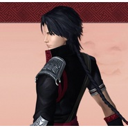

小鱼萝莉
============================

|  |  |
| :--: | :-- |
| [ 小鱼萝莉](https://i.xiami.com/pavane) | **播放数**: 2994961 **粉丝数**: 460 **评论数**: 24 **地区**: United Kingdom 英国 **风格**: 国语流行 Mandarin Pop, 中国风 China-Wave  |

## 档案

小鱼萝莉 
能力：作词、作曲 
乐队：鸾凤鸣原创音乐团队 
星座：Taurus 
喜欢的歌手：Xandria, 张韶涵, 蔡琴, 周杰伦, Owl City, S.H.E,小曲儿 
喜欢的作曲：Maurice Ravel, Dorothy Buchanan, 只有影子 
喜欢的书：欧阳修集, Master of the Game, 嫌疑犯X的献身, 论语

## 专辑

| 名称 | 语种 | 唱片公司 | 发行时间 | 专辑类别 | 专辑风格 |
| :--: | :-- | :-- | :-- | :-- | :-- |
| [ 云巅长歌](./albums/2102700773.md) | 国语 | 鸾凤鸣原创音乐 | 2017年02月26日 | EP, 单曲 |  |
| [ 曲终人未散](./albums/5022410203.md) | 国语 |  | 2017年01月10日 | 录音室专辑 |  |
| [ 画江湖之不良人](./albums/5022379400.md) | 国语 |  | 2017年01月10日 | 录音室专辑 |  |
| [ 古剑奇谭同人歌](./albums/5022402125.md) | 国语 |  | 2017年01月06日 | 录音室专辑 |  |
| [ 鸾凤鸣原创](./albums/5022393620.md) | 国语 |  | 2016年11月23日 | 录音室专辑 |  |
| [ 逐浪飞花](./albums/2100230556.md) | 国语 | 独立发行 | 2015年10月25日 | EP, 单曲 | 中国风 China-Wave |
| [ 一别经年·祭屠苏苏陌如词](./albums/2100206570.md) | 国语 | 独立发行 | 2015年09月02日 | EP, 单曲 | 国语流行 Mandarin Pop |
| [ 但求苍天怜一顾欧阳少恭](./albums/2100206550.md) | 国语 | 独立发行 | 2015年07月01日 | EP, 单曲 | 国语流行 Mandarin Pop |
| [ 相思红豆生南国](./albums/2100206554.md) | 国语 | 独立发行 | 2015年04月02日 | EP, 单曲 | 国语流行 Mandarin Pop |
| [ 不贰](./albums/1213708424.md) | 国语 | 独立发行 | 2014年09月15日 | 录音室专辑 | 国语流行 Mandarin Pop, 粤语流行 Cantopop, 中国风 China-Wave |
| [ 于归](./albums/423256763.md) | 国语 | 独立发行 | 2014年07月15日 | EP, 单曲 | 国语流行 Mandarin Pop |
| [ 五时景鸾凤鸣五周年纪念专辑](./albums/522539353.md) | 国语 | 独立发行 | 2014年05月08日 | 合集, 杂锦 | 国语流行 Mandarin Pop, 中国风 China-Wave |
| [ 一身诗意千寻瀑](./albums/2100207592.md) | 国语 | 独立发行 | 2013年09月05日 | EP, 单曲 | 国语流行 Mandarin Pop |
| [ 小鱼萝莉作词](./albums/5022384757.md) | 国语 |  | 2013年07月18日 | EP, 单曲 |  |
| [ 琼觞/花容天下](./albums/2100206324.md) | 国语 | 鸾凤鸣原创音乐 | 2012年11月11日 | EP, 单曲 | 国语流行 Mandarin Pop, 中国风 China-Wave |
| [ 同归·剑网三（明教×纯阳）](./albums/2100207588.md) | 国语 | 独立发行 | 2012年09月20日 | EP, 单曲 | 古风 GuFeng Music |

## 评论

|  |  |  |  |
| :-- | :-- | :-- | :-- |
|  [虾米用户](https://emumo.xiami.com/u/279136218)  2020-04-23 14:44 赞(0) 踩(0) | 
声音很像杨丞琳
 |
|  [虾米用户](https://emumo.xiami.com/u/103051420) 人生中最好的一天，一生多... 2020-01-18 03:38 赞(0) 踩(0) | 
下载的贰婶歌匹配到这，几次了
 |
|  [虾米用户](https://emumo.xiami.com/u/281457015)  2019-12-10 04:12 赞(0) 踩(0) | 
这不是贰婶声音嘛
 |
|  [虾米用户](https://emumo.xiami.com/u/428235557)  2019-08-26 23:07 赞(0) 踩(0) | 
好
 |
|  [虾米用户](https://emumo.xiami.com/u/287840129)  2019-02-16 23:06 赞(1) 踩(0) | 
直在关注你 我很喜欢手机铃声就是  相思
 |
|  [虾米用户](https://emumo.xiami.com/u/403740979)  2018-09-11 02:37 赞(1) 踩(0) | 
就喜欢你写的词嗨呀，一首一身诗意千寻瀑听了三个周了
 |
|  [虾米用户](https://emumo.xiami.com/u/306065331) 幸福开始有人选 2018-08-07 21:31 赞(0) 踩(0) | 
秋天不回来，祝愿外地的人二十四节气中的立秋都幸福快乐！  
 |
|  [虾米用户](https://emumo.xiami.com/u/277152993) 啦啦啦 2018-06-28 13:25 赞(0) 踩(0) | 
加油 唱的不错
 |
|  [虾米用户](https://emumo.xiami.com/u/362956913)  2018-05-28 22:29 赞(0) 踩(0) | 
好听，置顶。
 |
|  [虾米用户](https://emumo.xiami.com/u/265017383)  2018-01-30 09:46 赞(0) 踩(0) | 
网易云难民前来报道
 |
| ⇒ |  [虾米用户](https://emumo.xiami.com/u/262674962)  2018-07-29 20:34 赞(0) 踩(0) | 
大佬能告诉我贰婶与小鱼萝莉有什么关系吗？ 
 |
|  [虾米用户](https://emumo.xiami.com/u/24796540)  2017-10-27 23:00 赞(0) 踩(0) | 
诶，最近小鱼美人在这边突然活跃起来了诶，鸾凤鸣也是！是打算在这边也认真更新了嘛？棒棒哒( •̀∀•́ )，对了小鱼美人，《但求苍天怜一顾》能求那张图片嘛，好清晰QAQ，东篱大人差不多一年没来了。
 |
|  [虾米用户](https://emumo.xiami.com/u/314033652)   2017-07-31 18:18 赞(0) 踩(0) | 
我没话说，来混而已
 |
|  [虾米用户](https://emumo.xiami.com/u/305695755)  2017-06-19 06:51 赞(0) 踩(0) | 
难听，还是不才唱的好听
 |
| ⇒ |  [虾米用户](https://emumo.xiami.com/u/14347948)  2018-02-16 23:46 赞(0) 踩(0) | 
小鱼萝莉是词作者。你喜欢不才的翻唱无可非议，小鱼的我觉得很有感情很细腻。不才把&amp;ldquo;藤蔓wan&amp;rdquo;唱成了&amp;ldquo;藤蔓man&amp;rdquo;，&amp;ldquo;艳羡&amp;rdquo;唱成了&amp;ldquo;羡艳&amp;rdquo;，也可以说是唱错误了。
 |
|  [虾米用户](https://emumo.xiami.com/u/31616387) 浮生面具三千个，谁人与我... 2017-05-04 19:15 赞(0) 踩(0) | 
[Reply@随风]我也是嘿嘿
 |
|  [虾米用户](https://emumo.xiami.com/u/262674962)  2017-04-30 19:29 赞(1) 踩(0) | 
石楠这首歌是不贰唱的，为什么写着小鱼萝莉的名字？
 |
| ⇒ |  [虾米用户](https://emumo.xiami.com/u/10438167) 虾米猜越来越不准了，江湖... 2018-01-10 01:27 赞(0) 踩(0) | 
应该也参与了制作，作词作曲什么的~
 |
|  [虾米用户](https://emumo.xiami.com/u/246465866) 宁不知倾国与倾城？佳人难... 2017-02-25 10:55 赞(0) 踩(0) | 
稀饭！咬字萌萌哒～
 |
|  [虾米用户](https://emumo.xiami.com/u/96539190)  2016-02-28 08:47 赞(0) 踩(0) | 

 |
|  [虾米用户](https://emumo.xiami.com/u/16719116) 潮起潮落，聚散随风 2015-10-11 09:48 赞(1) 踩(0) | 
很喜欢小鱼的词~
 |
|  [虾米用户](https://emumo.xiami.com/u/47098213) 遊戲頻道 2015-10-05 19:48 赞(0) 踩(0) | 
心疼
 |
|  [虾米用户](https://emumo.xiami.com/u/6911799) 准时 准点 准赢！！！ 2015-04-03 10:31 赞(0) 踩(0) | 
求旅人梦，谢谢～
 |
|  [虾米用户](https://emumo.xiami.com/u/44199993)  2015-01-24 11:41 赞(0) 踩(0) | 
鱼妈嗷呜
 |
