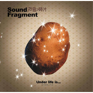

优美的低于生活under life is......
============================

|  |  |
| :--: | :-- |
| [ 优美的低于生活under life is......](https://emumo.xiami.com/album/15324) | **艺人**: [声音碎片](../index.md) **语种**: 国语 **唱片公司**: BadHead **发行时间**: 2005年07月01日 **专辑类别**: 录音室专辑 **专辑风格**: 摇滚 Rock & Roll **播放数**: 4116489 **收藏数**: 3309 **评论数**: 171  |

## 简介

  
《优美的低于生活》：声音碎片乐队继《世界是噪音的花园》三年后又一力作，褪去内心的浮躁，灵魂从生活中汲取，积蓄成真实的力量，融在音乐的形式里，蔓延着极致的优美。此专辑奠定了声音碎片的摇滚班霸地位。  
  
⊙忠实于优美的生活  
  
《优美的低于生活》，在这张唱片中，声音碎片更像个反省生活的诗人，这种内省的智慧甚至闪耀着超越音乐本身的野心。  
  
开篇即是专辑同名曲《优美的低于生活》，风琴的音色忠实于生活，朴实无华的在每个段落间从容的行进。从容和坦然才是令生活微笑的真谛，纵然，很多时候我们只是些悲观的灵魂。  
  
《在流失之外》，单就对音乐本身的期许而言，键盘的音色、力度与人声的配合并不尽如人意，我们甚至可以通过其他部分的出色存在，窥见整部作品应该达到的完美。在这样的遗憾里，我更愿意把歌词看作一个独立的诗篇，其中流露的智慧拥有根植于生活的力量。“再多的鸟群也不能在天空里留下痕迹，时光一定会遗忘城市、人群和鲜花。”“事物们在寂静中一点点遗忘着自身，它们用一种永恒的姿势面对着大海，就连街道也在前行或转弯中找到了方向。”“他们都在流失之外，……，沉默指引永恒之声。”没有谁能够具象地拥有那些美好或者普通的事物，最终不会随生命离开的，是你面对它的姿态、你心灵纯粹时疼痛颤抖的体验、你甘愿付出或者放弃时候的珍贵所得。  
  
在《向外》中，一大段低回过后声音碎片开始重复“我只能不停不停的向外”，然而这种被迫的“向外”却表现得如同之后失真吉他纷乱的节奏一般焦躁不安，间隔出现的键盘持续高音牵动紧张的神经线。同样的传达在《通过愤怒之门》中再次呈现。不同的是，这一次他们试解释一个让自己主动走到生活面前的理由。于是，箱琴的节奏期盼而又不安的跳动起来，主音吉他明亮的音色些许刻意地描述着外面宽广的道路和春天。“假如你在路上遇见了陌生人，告诉他你是一颗新鲜的种子”，键盘滴落的每一个音符流露出内心无法掩饰而又极力回避的敏感。紧随而来的吉他 Solo 力冲淡这脆弱，等你通过愤怒之门，沿着路跳舞吧。  
  
如果说《优美的低于生活》是专辑中最懂得享受生活的曲目，那么《在时代华美的盛宴上》则用一种真正有力的态度通往这种美好。安静的开篇中，分解和弦雕琢出美好的落寞，偶尔由键盘演奏出的灿烂短暂得令人晕眩，就像给世界涂满水性颜料，虚假的华丽在一场大雨过后都将不复存在。人群凌乱浮躁，茫然地目睹美好的流失，而看似的美好事实上却一贫如洗、不值一提。在空虚的盛宴旁边，保持向内的坚定生长，最终纯粹的溶化在优美的生活里。  
  
与上一张专辑《世界是噪音的花园》相比，声音碎片在音乐上表现出更浓的独立倾向，逐渐摆脱其他乐队的影响。生活态度的进化从根本上推动着他们在音乐上的成熟，那些不完美被我们纵容，因为他们忠实于生活。我们的不完美也被生活纵容着，因为我们忠实于生活。  
  
⊙专辑点评  
  
黄雯：温暖身体的那一点光：关于声音碎片新唱片  
  
那个秋天，第一次听到“声音碎片”的音乐开始，已过去好几年了。那是在三里屯南街还没拆迁，一个人声鼎沸、灯火通明的夜晚，在一家即将搬迁的叫“火狐狸”的酒吧里看到的。这间酒吧的装饰和布置相当俗气，是上班族和“大哥大”消费的地盘，却意外的搞了一场摇滚乐的演出，多少显得有些滑稽。  
  
可我的确被打动了，被那优美而高贵的音乐，还有他们身上执着的气质所打动，尽管这音乐凸显在这个不合时宜的舞台上，心中有着说不出的滋味。这年头有才华，能十二分投入并执着去做一件事的人太少了，况且这个行业始终处在社会的边缘角落，很多时候，你尽管执着、努力，结果依然收效甚微，有许多人开始抱怨了，退避了、倒下了。时间就如一个沙漏，筛除的总是大多数糟粕，他们也许打着时髦艺术的华丽幌子，滥竽充数着招摇撞骗，或者一时冲动假执着一阵子，可用不了多久就扛不动这面另类的大旗，软弱着俯首称降了。  
  
最终遗留下来的是几颗优良的沙粒，别小看这几颗沙粒，他们是由外部冷漠环境和自身内在修养一起打磨而成，外表看起来平实、朴素的毫不打眼，随便把他们扔在一处角落，也没有几个人能想起它来。可你无意中从此经过，总能感觉到身旁有一点光芒在闪现，那点光若隐若现的，象萤火虫的尾灯，你知道它很难燃成灼热的火焰。你可以不太在乎，甚至也可以去遗忘，但它总是在那里，悄悄的发着光，温暖你内心那一小块遗留地。他们待在原处，不急不躁，安安静静的发着光，每个经过的人，它都能往人的内心深处移置一点光，时间久了，那点光在你的心中慢慢扩大，直到点燃你体内所有的灯芯，让四射的光芒燃亮你身体里的每个角落。  
  
是的，声音碎片的音乐和他们的执着，总会让我对他们产生这样的意象，这也是这些年来同他们浅浅淡淡交往，亲眼目睹了他们的音乐创作态后所感触到的。我不知道他们的第一张唱片买得如何，这似乎不是很重要了，因为音乐本身早已根置在他们的身体里，不释放出旋律，他们会闷死的。为此，我毫不怀疑他们最近出的第二张唱片的质量水准，这一点我确信无疑，因为这般真挚、敏感、全情投入的人，不可能做出低劣作品的。  
  
这张名为《优美的低于生活 (Under Life Is…)》的唱片一拿到手，便爱不释手，当然有一个原因是当天晚上下暴雨，我是从老远打车去发布现场的。令人惊喜的是，从唱片的第一首曲子开始到最后，一直都没让我失望。与第一张唱片《世界是噪音的花园》相比，这张唱片从整体调子上，沉郁晦暗味道淡了许多，加入了明朗、轻快、清透的音质元素，使作品显得饱满而丰富。如果说第一张由于阴郁的情绪释放，略显单调、平面的话，这张唱片的丰富和多元，使得整个作品立体起来。除了比以往更突显音乐生命力的印象之外，还能感受到一丝轻松“玩”音乐的趣味，这很不易。这群极端敏感、从骨子里发散着阴郁气质的人，居然开始“玩”起来了，这趣味同每个段落杂糅的合情合理，骨肉相贴，你能感到音乐这样做，不是减损，而是增色。  
  
同以往一样，旋律依然那样优美，在此基础上添加各种元素。时而风琴旋律的提携，时而键盘的各种仿真琴声的加入，加上主唱马玉龙那乐感十足的唱的配合，很快就能把听者带入感性境界。动听的音符围绕着，形成长时间假寐的小磁场。由他们带领着，你会不由自主的跟随。只有人的内心足够丰富，才能做出多元的音乐来。你可以安静，也可以躁动，还可以随时舞蹈，你能从这样的音乐里体会一种自由，一种可以这样，也可以那样的自在。  
  
这张唱片里的每一首曲子都是用心了的，没有半点敷衍之嫌。《优美的低于生活》一开头键盘单独上阵，欢快的旋律立即确定了整首曲子的基调，是附着在阴郁上空里一颗闪亮、欢乐的星；《在流逝之外》由口琴奏出一段凄暗的忧怨，那旋律就如凝固在上空，你低头俯看，一切都在身下流逝而去，不间断的低喃独语，只等着最后爆发时刻的来临，这是由重复、铺垫、积累，寻找爆破点的音乐结构，其结果是淋漓尽致的释放；《在时代华美的盛宴》出色点在歌曲的后半部，键盘的仿真音质和贝斯低沉的节奏配合，旋律之上不失厚重感，到高潮部分，加入吉他一段快乐的 Solo，就如亲临一次华美盛宴的现场。快结束之前，遗留贝斯的节奏，而参加盛宴的全体人们，起身鼓掌欢送；《不合时宜的忧伤》是一个人静静的自我安慰；《向外》是阴郁内心不断附加之后必须走向外部的经历；《烟灰》是由低沉贝斯声带来的颓废和堕落感；《赞歌》、《从现在开始》……  
  
倾听每首歌曲，你都能感受到不同，它们独立成章，各自生存，相互间偶有牵连，却彼此不受影响。每首曲子要表达的意境清楚而直接，张弛有度，这是训练有素的结果。一种情绪表达之后，接下来的一定是符合听者舒适的另一种情绪的到来，每段音乐结构完整，框架上大气而结实，在细节上又不失细腻柔情，此种听觉享受，在原创音乐群里是不多见的。  
  
两个极端(平静和狂躁)都有涉略，最后是和声并进，制造欲罢不能的官能快感，不能停止，这也是为什么他们每次现场演出时，一首歌能进行很长的时间，有时能到 10 分钟才结束。而每一个听者，包括他们在内，都愿意沉浸在一种情绪里，不舍得出来。  
  
这音乐是需要你有一颗成熟的心去倾听的，你必须要有内在，必须有内在的丰富性才能领略它的美感，否则你只能肤浅的失去它，失去这样的体验。这也注定他们的音乐只能吸引少数听者，可这少数人一旦喜欢，就是坚定、长期的热爱。内敛、敏感的创作者，往往对现实世界容易产生自卑心理的，这一点他们也没逃过，可这样的人却能真正的坚守音乐，使它纯正真挚，不会偏倚，能时刻守着内在的航标，不让创造精神流于虚华和空乏。  
  
他们依然在路上，尽管已经出了第二张唱片，可我知道他们还有更完美的留在以后，因为有可塑性的未来，所以我很坚信他们的生命力，这样的群体和声音是要受到保护的，保护这样的“光源”是一个听者的责任。  
  
⊙关于声音碎片 Sound Fragment  
  
“声音碎片”是自 2000 年以来发展势头猛进的一支乐队，2001 年来京发展，主唱马玉龙的加入，直接提升了乐队歌词创作和现场演出的魅力。其曲风忧郁低调唯美，极富律动感及可听性，正式发表的第一支单曲《狂欢》被收录于《摩登天空4》合辑。  
  
有人说“声音碎片”乐队是“中国的 Radiohead”，可能从某种角度来讲这是对他们极大的褒扬，作为北京另类音乐新贵的“声音碎片”极有可能会引领一种崭新的音乐潮流。  
  
《优美的低于生活》：声音碎片乐队继《世界是噪音的花园》三年后又一力作，褪去内心的浮躁，灵魂从生活中汲取，积蓄成真实的力量，融在音乐的形式里，蔓延着极致的优美。此专辑奠定了声音碎片的摇滚班霸地位。 

## 曲目

- [优美的低于生活](./15324/fMbz74aab.md)
- [通过愤怒之门](./15324/okt4f5280.md)
- [在流逝之外](./15324/fMb16f231.md)
- [在时代华美的盛宴上](./15324/9jcG43b41.md)
- [不合时宜的忧伤](./15324/fMb3debcc.md)
- [向外](./15324/okt8ec3d8.md)
- [烟灰](./15324/jYk7f6876.md)
- [赞歌](./15324/fMb65dd0b.md)
- [从现在开始](./15324/oktBf7e2b.md)
- [再轻松一些](./15324/jYkAdbc02.md)

## 评论

|  |  |  |  |
| :-- | :-- | :-- | :-- |
|  [虾米用户](https://emumo.xiami.com/u/2029485) 我还没想好要写什么... 2020-02-17 02:43 赞(0) 踩(0) | 
太好听了！
 |
|  [虾米用户](https://emumo.xiami.com/u/356740228)  2019-04-29 18:09 赞(0) 踩(0) | 
好听呀！
 |
|  [虾米用户](https://emumo.xiami.com/u/9492026)  2019-01-31 15:41 赞(0) 踩(0) | 
 
 |
|  [虾米用户](https://emumo.xiami.com/u/344577419)  2019-01-19 22:58 赞(0) 踩(0) | 
鼓手差点
 |
|  [虾米用户](https://emumo.xiami.com/u/43492923) 行到水穷我才开始害怕，夕... 2018-03-07 17:52 赞(0) 踩(0) | 
嗯哼
 |
|  [虾米用户](https://emumo.xiami.com/u/1101442) 我还没想好要写什么... 2018-01-06 11:03 赞(0) 踩(0) | 
为什么不能整张专辑的歌曲都播放出？感觉现在都和阴谋或者某敏感词有关似的，否则实在没法明白为什么整张专辑会被拆分播放 
 |
|  [虾米用户](https://emumo.xiami.com/u/36846920)  2017-12-04 23:19 赞(0) 踩(0) | 
完美！
 |
|  [虾米用户](https://emumo.xiami.com/u/681448) 你应该是一棵树，或者一条... 2017-11-05 23:13 赞(0) 踩(0) | 
   
 |
|  [虾米用户](https://emumo.xiami.com/u/10028400) 我还没想好要写什么... 2017-10-06 23:07 赞(2) 踩(0) | 
可以听了
 |
|  [虾米用户](https://emumo.xiami.com/u/11638875) 阳光小正太皮皮 2017-07-21 11:49 赞(1) 踩(0) | 
我是一颗闪闪发光的土豆
 |
|  [虾米用户](https://emumo.xiami.com/u/16337726)  2017-06-05 16:03 赞(0) 踩(0) | 
)
 |
|  [虾米用户](https://emumo.xiami.com/u/48748810) ‌一眼望去，精致的面容很... 2017-01-25 16:28 赞(2) 踩(0) | 
这个专辑太质量了
 |
|  [虾米用户](https://emumo.xiami.com/u/12360657)  2016-12-21 15:33 赞(0) 踩(0) | 
bz
 |
|  [虾米用户](https://emumo.xiami.com/u/64389162) 自在而在 自然而然 2016-10-05 08:51 赞(0) 踩(0) | 
歌呢
 |
|  [虾米用户](https://emumo.xiami.com/u/16719187)  2016-08-21 07:26 赞(0) 踩(0) | 
八月 北方后面的国家
 |
|  [虾米用户](https://emumo.xiami.com/u/298789)   2016-08-12 18:29 赞(4) 踩(0) | 
2005年，在一个小镇上念着高中，16 岁，不常进网吧的我因为和朋友压马路过了宿舍的时间于是进了网吧，不习惯网吧的环境，就看着大家在很投入的聊着qq，网吧里四处都响着滴滴的qq的声音，实在没有兴致百无聊懒，在天天音乐上按歌手名字找音乐听，不想听一直在听的音乐了，当时是怎么想的，反正想法很复杂，因为某个很复杂的原因（大概可能是因为乐队的名字和专辑的名字），点开了声音碎片，听了这张专辑，当时就觉得好喜欢，听了一晚上，我现在在想（我当时就听这么屌的歌，可是还是没有男朋友啊）这么多年，依然独来独往，那个陪我压马路的带我进网吧的男生，已不怀念了啊，相爱吧，终有一散的人们。
 |
|  [虾米用户](https://emumo.xiami.com/u/1131684)  2016-05-28 01:47 赞(0) 踩(0) | 
点开推送的十几首上新，唯一存活的是这首《优美的低于生活》，啧啧，你们赢了。
 |
|  [虾米用户](https://emumo.xiami.com/u/11502880) 我一个人吃饭旅行到处走。 2016-05-18 21:45 赞(0) 踩(0) | 
05年的专辑今年才听到，好音乐需要挖掘啊。
 |
|  [虾米用户](https://emumo.xiami.com/u/5035845) 暂无签名~ 2016-04-23 07:00 赞(0) 踩(0) | 
每一句歌词，都苦涩地低语，主歌到了，把自己又放逐给了这无边的没有方向的夜。你们进步了很多很多。
 |
|  [虾米用户](https://emumo.xiami.com/u/4199891)  2016-02-23 10:54 赞(0) 踩(0) | 
封面是个土豆嘛？
 |
|  [虾米用户](https://emumo.xiami.com/u/3008426)  2016-02-12 18:31 赞(0) 踩(0) | 
果然经典
 |
|  [虾米用户](https://emumo.xiami.com/u/3008426)  2016-02-12 10:50 赞(0) 踩(0) | 
果然正点
 |
|  [虾米用户](https://emumo.xiami.com/u/6044227) 人生如戏，戏如人生…… 2016-01-24 18:54 赞(1) 踩(0) | 
太晚听到了，请问哪里能买全声音碎片的三张专辑？
 |
| ⇒ |  [虾米用户](https://emumo.xiami.com/u/6673817)  2016-05-29 18:12 赞(0) 踩(0) | 
我也有此想法
 |
| ⇒ |  [虾米用户](https://emumo.xiami.com/u/36846920)  2017-11-12 21:25 赞(0) 踩(0) | 
淘宝，货已不多，昨天刚买了。
 |
|  [虾米用户](https://emumo.xiami.com/u/6044227) 人生如戏，戏如人生…… 2016-01-24 17:03 赞(0) 踩(0) | 
我尽然是第一次听到他们的歌，昨天第一次听《优美的低于生活》，然后就收不住了，听完了他们所有的歌……我一般很少听摇滚类的歌曲，但是声音碎片的歌，让我竟有种狂热……曲也好，词也好，首首被击重某根神经，唱到内心处，又或被催泪！内心深处的话，似乎都在他们的歌里都能找到，顺流而下，就这样我屈服于生活。
 |
|  [虾米用户](https://emumo.xiami.com/u/13056856) 没有 2015-09-09 20:35 赞(0) 踩(0) | 
低调
 |
|  [虾米用户](https://emumo.xiami.com/u/13056856) 没有 2015-09-09 20:35 赞(0) 踩(0) | 
低调
 |
|  [虾米用户](https://emumo.xiami.com/u/36615674) 我要自由 2015-09-07 22:28 赞(0) 踩(0) | 
随着列车的轨迹，离开 
 |
|  [虾米用户](https://emumo.xiami.com/u/5806141)  2015-07-27 00:50 赞(2) 踩(0) | 
当年买过 一堆 国内摇滚..我不喜欢这张 很难听
 |
|  [虾米用户](https://emumo.xiami.com/u/12375897)  2015-05-30 11:01 赞(1) 踩(0) | 
前奏和间奏，好听过歌本身，词比较灰，听了几首，感觉词比曲稍强。《低于生活》和《从现在开始》这两首还不错，有个性的东西就值得被推荐。
 |
|  [虾米用户](https://emumo.xiami.com/u/36499917)  2015-05-01 23:30 赞(1) 踩(0) | 
最美不过土豆
 |
|  [虾米用户](https://emumo.xiami.com/u/11122886)  2015-04-25 00:09 赞(1) 踩(0) | 
生活中只有一种英雄主义，那就是在认清生活真相之后，依然热爱生活。（罗曼•罗兰）
 |
|  [虾米用户](https://emumo.xiami.com/u/30207241) 只有肤浅的感情才能表达 2014-12-25 19:29 赞(0) 踩(0) | 
歌词歌词 狂好都
 |
|  [虾米用户](https://emumo.xiami.com/u/6120823)  2014-11-09 15:38 赞(1) 踩(0) | 
好美的名字
 |
|  [虾米用户](https://emumo.xiami.com/u/41822037) 暂无签名~ 2014-09-30 10:29 赞(1) 踩(0) | 
分享生活各中真谛
 |
|  [虾米用户](https://emumo.xiami.com/u/1453136) hi, there 2014-09-25 01:22 赞(4) 踩(0) | 
乐评写得好叼
 |
|  [虾米用户](https://emumo.xiami.com/u/41526232)  2014-09-24 21:38 赞(1) 踩(0) | 
声音碎片摇滚？天籁
 |
|  [虾米用户](https://emumo.xiami.com/u/1126146) 我还没想好要写什么... 2014-08-12 03:53 赞(7) 踩(0) | 
相爱吧，终有一散的人们。
 |
|  [虾米用户](https://emumo.xiami.com/u/1911134)  2014-08-11 13:02 赞(0) 踩(0) | 
土豆加毁图秀秀？？
 |
|  [虾米用户](https://emumo.xiami.com/u/12492198) 我还没想好要写什么... 2014-08-08 13:29 赞(0) 踩(0) | 
封面是个土豆吗
 |
|  [虾米用户](https://emumo.xiami.com/u/6545705) ooooo……在于不不不 2014-07-12 13:56 赞(0) 踩(0) | 
l都怀念找zadjsb
 |
|  [虾米用户](https://emumo.xiami.com/u/38712118)  2014-07-04 23:08 赞(0) 踩(0) | 
f读写
 |
| ⇒ |  [虾米用户](https://emumo.xiami.com/u/6545705) ooooo……在于不不不 2014-07-12 13:55 赞(0) 踩(0) | 
nggpmzlccr
 |
|  [虾米用户](https://emumo.xiami.com/u/24673715)  2014-07-02 20:44 赞(0) 踩(0) | 
一声抓住一颗心
 |
|  [虾米用户](https://emumo.xiami.com/u/11968494) . 2014-06-27 12:53 赞(0) 踩(0) | 
.
 |
|  [虾米用户](https://emumo.xiami.com/u/3681820)  2014-06-19 15:30 赞(0) 踩(0) | 

 |
|  [虾米用户](https://emumo.xiami.com/u/3586298) 音乐无处不在 2014-06-08 19:05 赞(1) 踩(0) | 
我喜欢声音碎片的音乐，但是我非常讨厌主唱的音色！一个好的歌曲就被主唱垃圾的声音给糟蹋了！唱还不如不唱！你是我最讨厌的乐队主唱！没有之一！
 |
| ⇒ |  [虾米用户](https://emumo.xiami.com/u/63597)  2014-06-09 12:56 赞(0) 踩(0) | 
哈哈
 |
| ⇒ |  [虾米用户](https://emumo.xiami.com/u/35527658) 秉烛夜游 2014-07-04 00:34 赞(0) 踩(0) | 
对!
 |
| ⇒ |  [虾米用户](https://emumo.xiami.com/u/850997) An Earth Ody... 2014-08-12 14:35 赞(0) 踩(0) | 
听听pk14和左小祖咒
 |
| ⇒ |  [虾米用户](https://emumo.xiami.com/u/36846920)  2017-11-12 21:27 赞(0) 踩(0) | 
这么有特点的声音居然不喜欢，果然是萝卜白菜各有所爱。
 |
|  [虾米用户](https://emumo.xiami.com/u/35869122) 暂无签名~ 2014-06-08 04:50 赞(0) 踩(0) | 
只有有经历的人会爱上你们 四年前上海小酒吧听了你们现场 感动无比 尤其是马老师用我快没水的水笔给我的亲笔签名 我到现在还记得 乐队开场前你低调的坐在角落调着吉他轻唱 歌声和人一样亲切浪漫
 |
|  [虾米用户](https://emumo.xiami.com/u/7690103) 在音乐的海洋里尽情奔跑 2014-06-06 13:20 赞(0) 踩(0) | 
很不错啊。。。
 |
|  [虾米用户](https://emumo.xiami.com/u/7844658)  2014-05-18 11:22 赞(0) 踩(0) | 
「只有内心远过空旷」
 |
|  [虾米用户](https://emumo.xiami.com/u/32299493)  2014-05-10 21:45 赞(0) 踩(0) | 
「只有内心远过空旷」
 |
|  [虾米用户](https://emumo.xiami.com/u/4925220) 捂住我这双贪婪的耳朵! 2014-05-01 13:03 赞(0) 踩(0) | 
火卫二封面还是土豆。。。
 |
| ⇒ |  [虾米用户](https://emumo.xiami.com/u/6373063) 为爱而  2014-05-05 21:04 赞(0) 踩(0) | 
是土豆第一看到封面觉得太葛了这乐队
 |
|  [虾米用户](https://emumo.xiami.com/u/21362915) Thinking abo... 2014-04-07 15:02 赞(0) 踩(0) | 
收到CD作为礼物~
 |
|  [虾米用户](https://emumo.xiami.com/u/722051) П 2014-03-27 23:45 赞(0) 踩(0) | 
《烟灰》就像北岛那句话“那时我们有梦，关于文学，关于爱情，关于穿越世界的旅行。如今我们深夜饮酒，杯子碰到一起，都是梦破碎的声音。”浮躁没有了，沉寂下来的是无法夸夸其谈的抑郁。
 |
|  [虾米用户](https://emumo.xiami.com/u/18264248) Ancean 2014-03-24 18:38 赞(0) 踩(0) | 
安静的田野
 |
|  [虾米用户](https://emumo.xiami.com/u/1609946) 一即一切 2014-03-12 07:08 赞(0) 踩(0) | 
心 境不二
 |
|  [虾米用户](https://emumo.xiami.com/u/33908087)  2014-03-11 19:26 赞(0) 踩(0) | 
一个伟大的乐队，电子声乐做到了极致。好听
 |
|  [虾米用户](https://emumo.xiami.com/u/21878340) 陈主任 2014-03-07 17:52 赞(0) 踩(0) | 
碎片
 |
|  [虾米用户](https://emumo.xiami.com/u/8337431) 以乐会友 2014-01-25 04:20 赞(0) 踩(0) | 
声音碎片671585,1370,99
 |
|  [虾米用户](https://emumo.xiami.com/u/12547061) a slice of 2014-01-24 10:18 赞(0) 踩(0) | 
封好美！
 |
|  [虾米用户](https://emumo.xiami.com/u/10810564) 暂无签名~ 2014-01-11 19:05 赞(0) 踩(0) | 
就是喜欢 舒服！
 |
|  [虾米用户](https://emumo.xiami.com/u/5579547) 我还没想好要写什么... 2014-01-08 17:03 赞(0) 踩(0) | 
只有内心远过空旷
 |
|  [虾米用户](https://emumo.xiami.com/u/11891813)  2013-12-24 16:33 赞(0) 踩(0) | 
还不错啊
 |
|  [虾米用户](https://emumo.xiami.com/u/30358835) 暂无签名~ 2013-12-24 12:46 赞(0) 踩(0) | 
在流逝之外
 |
|  [虾米用户](https://emumo.xiami.com/u/28439395)  2013-11-26 11:30 赞(0) 踩(0) | 
很好听 很朴实优美  有意境的一首歌曲 推荐给大家
 |
|  [虾米用户](https://emumo.xiami.com/u/7594972) 一切烦恼都是因为听歌太少 2013-11-11 12:26 赞(0) 踩(0) | 
聲音碎片不大紅大紫的原因？——馬玉龍太胖，他擠不出門去，然後從來就沒有人聽說過他們。
 |
| ⇒ |  [虾米用户](https://emumo.xiami.com/u/25415239)   2014-10-05 23:04 赞(0) 踩(0) | 
。。。。2333333333
 |
|  [虾米用户](https://emumo.xiami.com/u/887775) 蓝小妞 2013-11-08 08:49 赞(0) 踩(0) | 
华丽 悲伤 低沉 优雅，平和旋律中流露止不住地伤 ，却又能抚平伤的皱褶。
 |
|  [虾米用户](https://emumo.xiami.com/u/10836546) 好奇心，害死猫~ 2013-11-02 17:10 赞(0) 踩(0) | 
0101
 |
|  [虾米用户](https://emumo.xiami.com/u/7630216)  2013-10-29 11:01 赞(0) 踩(0) | 
优美的低于生活
 |
|  [虾米用户](https://emumo.xiami.com/u/22224341)  2013-10-18 15:53 赞(0) 踩(0) | 
优美的低于生活。一直循环循环........
 |
|  [虾米用户](https://emumo.xiami.com/u/19254393)  2013-09-23 16:02 赞(0) 踩(0) | 
喜欢
 |
|  [虾米用户](https://emumo.xiami.com/u/5385854)  2013-09-20 15:10 赞(0) 踩(0) | 
很棒！这样的摇滚也很好听！
 |
|  [虾米用户](https://emumo.xiami.com/u/3977969) 我还没想好要写什么... 2013-09-11 23:32 赞(0) 踩(0) | 
@秋天的羊麦
 |
|  [虾米用户](https://emumo.xiami.com/u/289057)  2013-08-26 09:56 赞(0) 踩(0) | 
老歌，突然听明白了
 |
|  [虾米用户](https://emumo.xiami.com/u/3014021)  2013-08-24 10:49 赞(0) 踩(0) | 
幽美的中式摇滚。
 |
|  [虾米用户](https://emumo.xiami.com/u/229644)  2013-08-23 13:08 赞(0) 踩(0) | 
声音碎片
 |
|  [虾米用户](https://emumo.xiami.com/u/4208941)  2013-08-03 14:14 赞(0) 踩(0) | 
值得循环播放！赞！
 |
|  [虾米用户](https://emumo.xiami.com/u/6331728)  2013-07-28 11:53 赞(22) 踩(0) | 
在现实中，想找到一个喜欢声音碎片的人都难。看到网上有这么多人喜欢，真的很惊喜，原来我也不是小众的那一个啊！
 |
| ⇒ |  [虾米用户](https://emumo.xiami.com/u/858726) 其实…我是个演员！ 2019-03-24 06:14 赞(0) 踩(0) | 
真的很少，我认识的就我一个，曾今有幸给他们吉他手修过琴，哈哈哈
 |
| ⇒ |  [虾米用户](https://emumo.xiami.com/u/6331728)  2019-03-27 20:29 赞(0) 踩(0) | 
<q><b>zouxulike说：</b></q>
 |
|  [虾米用户](https://emumo.xiami.com/u/5724120) 愿安好… 2013-07-16 13:42 赞(0) 踩(0) | 
微博上看到朋友的推荐，真的很喜欢。。
 |
|  [虾米用户](https://emumo.xiami.com/u/10435106) 听靓歌 2013-07-04 01:46 赞(0) 踩(0) | 
不错.
 |
|  [虾米用户](https://emumo.xiami.com/u/1577874) 我还没想好要写什么... 2013-07-01 13:52 赞(0) 踩(0) | 
优雅高于生命
 |
|  [虾米用户](https://emumo.xiami.com/u/4316930) -- 烟花不堪剪 2013-06-05 22:08 赞(1) 踩(0) | 
他们的歌竟然不是10分！ 太过分！
 |
|  [虾米用户](https://emumo.xiami.com/u/11961549)  2013-05-03 18:45 赞(0) 踩(0) | 
浸入灵魂！
 |
|  [虾米用户](https://emumo.xiami.com/u/9537839) 一定要吃水果 2013-05-01 22:35 赞(0) 踩(0) | 
这张我很喜欢@派大星我们去抓水母吧_
 |
|  [虾米用户](https://emumo.xiami.com/u/1453136) hi, there 2013-04-29 14:13 赞(0) 踩(0) | 
很喜欢第一首
 |
|  [虾米用户](https://emumo.xiami.com/u/4788608) 世界太小，無處可滾。 2013-04-19 16:39 赞(0) 踩(0) | 
這種歌，不捨得公放。
 |
|  [虾米用户](https://emumo.xiami.com/u/423315)  2013-04-01 13:47 赞(0) 踩(0) | 
哇我居然有这张CD- -
 |
|  [虾米用户](https://emumo.xiami.com/u/12746678) 夕阳沉入黑暗之中 2013-03-26 17:10 赞(0) 踩(0) | 
喜欢
 |
|  [虾米用户](https://emumo.xiami.com/u/4263925)  2013-03-24 19:42 赞(0) 踩(0) | 
赞歌的弦乐太在了
 |
|  [虾米用户](https://emumo.xiami.com/u/1162636)  2013-03-19 09:39 赞(0) 踩(0) | 
好
 |
|  [虾米用户](https://emumo.xiami.com/u/8114485)  2013-03-12 15:55 赞(0) 踩(0) | 
就是喜欢
 |
|  [虾米用户](https://emumo.xiami.com/u/3356360) 我本乖巧 2013-02-28 23:24 赞(0) 踩(0) | 
把春天给你,把花朵给你把夏日的深远也给你把过去给你,把现在给你把未知的幸福全给你
 |
|  [虾米用户](https://emumo.xiami.com/u/2921187)  2013-01-14 13:09 赞(0) 踩(0) | 
同名单曲的前奏部分很好听。
 |
|  [虾米用户](https://emumo.xiami.com/u/11514710)  2013-01-09 14:04 赞(0) 踩(0) | 
还未听过，先收着
 |
|  [虾米用户](https://emumo.xiami.com/u/2393294) 和彭彭一起加油! 2012-12-30 17:32 赞(0) 踩(0) | 
才听了两首 最喜欢他的“依依呀呀”段落
 |
|  [虾米用户](https://emumo.xiami.com/u/1246149)  2012-12-19 20:28 赞(0) 踩(0) | 
忠实于优美的生活
 |
|  [虾米用户](https://emumo.xiami.com/u/8025499)  2012-12-11 13:38 赞(0) 踩(0) | 
getTitleDefinitionByName
 |
|  [虾米用户](https://emumo.xiami.com/u/6740535)  2012-12-06 11:07 赞(0) 踩(0) | 
直抵心底的音乐
 |
|  [虾米用户](https://emumo.xiami.com/u/6740535)  2012-12-06 11:06 赞(0) 踩(0) | 
直抵心底的音乐
 |
|  [虾米用户](https://emumo.xiami.com/u/3333020) peace is lie 2012-12-04 23:20 赞(0) 踩(0) | 
中国摇滚,支持一个吧.
 |
|  [虾米用户](https://emumo.xiami.com/u/11011215) 挣扎在伪艺术的长河 2012-10-11 11:17 赞(0) 踩(0) | 
一直优美的低于生活！
 |
|  [虾米用户](https://emumo.xiami.com/u/321445)  2012-10-05 08:58 赞(0) 踩(0) | 
声音碎片
 |
|  [虾米用户](https://emumo.xiami.com/u/10829632)  2012-09-28 06:25 赞(0) 踩(0) | 
前奏
 |
|  [虾米用户](https://emumo.xiami.com/u/8265251) 暂无签名~ 2012-08-13 23:40 赞(0) 踩(0) | 
优美的低于生活
 |
|  [虾米用户](https://emumo.xiami.com/u/1264323) 不要惊慌 2012-08-12 00:10 赞(0) 踩(0) | 
好听
 |
|  [虾米用户](https://emumo.xiami.com/u/3768263)  2012-07-07 19:49 赞(0) 踩(0) | 
喜欢歌词~
 |
|  [虾米用户](https://emumo.xiami.com/u/9131611) 听爱听的、想听的声音。 2012-07-04 16:07 赞(0) 踩(0) | 
随性而不随意。
 |
|  [虾米用户](https://emumo.xiami.com/u/47165) 有你陪伴我快乐 2012-06-25 23:03 赞(0) 踩(0) | 
欣赏
 |
|  [虾米用户](https://emumo.xiami.com/u/9544507)  2012-06-25 19:24 赞(0) 踩(0) | 
wo要了
 |
|  [虾米用户](https://emumo.xiami.com/u/145845)  2012-06-21 12:06 赞(0) 踩(0) | 
成长，懂~
 |
|  [虾米用户](https://emumo.xiami.com/u/1020922) 让我看下签名是显示在哪儿 2012-06-21 10:07 赞(0) 踩(0) | 
好好听！~
 |
|  [虾米用户](https://emumo.xiami.com/u/2885704) 莫纵己欲莫言人非 2012-06-05 01:05 赞(0) 踩(0) | 
仍旧伴随些许故事的专辑。
 |
|  [虾米用户](https://emumo.xiami.com/u/5674184) 我还没想好要写什么... 2012-05-18 09:36 赞(0) 踩(0) | 
有点英伦摇滚的味道，还不错
 |
|  [虾米用户](https://emumo.xiami.com/u/3110397)  2012-05-15 16:45 赞(0) 踩(0) | 
名字很棒
 |
|  [虾米用户](https://emumo.xiami.com/u/3110397)  2012-05-15 16:45 赞(0) 踩(0) | 
名字很棒
 |
|  [虾米用户](https://emumo.xiami.com/u/4831375)  2012-05-05 16:53 赞(0) 踩(0) | 
就像跳动的福音书
 |
|  [虾米用户](https://emumo.xiami.com/u/604774)   2012-04-30 04:21 赞(0) 踩(0) | 
喜欢风琴~~草原辽阔感~~电钢琴声音又轻盈，很点睛！
 |
|  [虾米用户](https://emumo.xiami.com/u/5829803) 不悖 2012-04-16 23:05 赞(0) 踩(0) | 
声音碎片不需要解释。。。就一个字，美！
 |
|  [虾米用户](https://emumo.xiami.com/u/7562645)   2012-04-15 09:51 赞(0) 踩(0) | 
优美的地狱生活
 |
|  [虾米用户](https://emumo.xiami.com/u/2648838)  2012-04-12 21:37 赞(0) 踩(0) | 
喜欢
 |
|  [虾米用户](https://emumo.xiami.com/u/812392) q音网易搜央央小月，酷g... 2012-04-12 10:21 赞(0) 踩(0) | 
一早回顾这个，意境真好呀，闪人。。。
 |
|  [虾米用户](https://emumo.xiami.com/u/6060489) 犹如珠穆朗玛峰顶的信号塔... 2012-03-31 10:14 赞(0) 踩(0) | 
同步
 |
|  [虾米用户](https://emumo.xiami.com/u/2909834)  2012-03-20 18:42 赞(0) 踩(0) | 
有radiohead的感觉
 |
| ⇒ |  [虾米用户](https://emumo.xiami.com/u/1644769)  2014-03-07 00:46 赞(0) 踩(0) | 
的确跟Radiohead的风格很像
 |
|  [虾米用户](https://emumo.xiami.com/u/8305985)  2012-03-05 16:31 赞(0) 踩(0) | 
优美的低于生活 ，里面的歌词很美，诗人气质的忧伤空灵气息 扑面而来，特别是风琴的前奏，大气轻灵，适合一个人在路上的状态
 |
|  [虾米用户](https://emumo.xiami.com/u/5394303) 时间是个好东西 2012-01-18 22:20 赞(0) 踩(0) | 
哎，好的永远是地下。他们很不容易。
 |
|  [虾米用户](https://emumo.xiami.com/u/3125779)  2012-01-01 21:35 赞(0) 踩(0) | 
地下的，才是最好的。
 |
|  [虾米用户](https://emumo.xiami.com/u/2736994)  2011-12-03 21:41 赞(0) 踩(0) | 
期待12月17日晚成都小酒馆的演出！
 |
|  [虾米用户](https://emumo.xiami.com/u/3735338)  2011-12-02 12:44 赞(0) 踩(0) | 
這張蠻經典
 |
|  [虾米用户](https://emumo.xiami.com/u/599326) 永远年轻，永远热泪盈眶~ 2011-11-09 00:59 赞(0) 踩(0) | 
优美的低于生活，我突然的明白了这句话的意思——
 |
|  [虾米用户](https://emumo.xiami.com/u/6185957)  2011-10-31 23:40 赞(0) 踩(0) | 
优美大气的音乐
 |
|  [虾米用户](https://emumo.xiami.com/u/2895838)  2011-09-19 20:28 赞(0) 踩(0) | 
喜欢旅行的时候听~
 |
|  [虾米用户](https://emumo.xiami.com/u/63597)  2011-09-12 00:27 赞(0) 踩(0) | 
拾碎——2011声音碎片十周年全国巡演拾碎<a href="http://www.douban.com/event/14436228/" target="_blank" rel="nofollow noreferrer noopener">http://www.douban.com/event/14436228/</a>
 |
|  [虾米用户](https://emumo.xiami.com/u/1518197)  2011-08-20 21:39 赞(0) 踩(0) | 
喧嚣中一股强劲的哀伤
 |
|  [虾米用户](https://emumo.xiami.com/u/599326) 永远年轻，永远热泪盈眶~ 2011-07-19 08:34 赞(0) 踩(0) | 
忧郁、清澈、唯美。。。
 |
|  [虾米用户](https://emumo.xiami.com/u/3255139)  2011-07-15 23:13 赞(0) 踩(0) | 
感觉
 |
|  [虾米用户](https://emumo.xiami.com/u/2336)  2011-07-04 00:13 赞(0) 踩(0) | 
鼓手是我的朋友，不错的一张专辑~
 |
|  [虾米用户](https://emumo.xiami.com/u/2336)  2011-07-04 00:11 赞(0) 踩(0) | 
鼓手是我的朋友~不错的专辑~
 |
|  [虾米用户](https://emumo.xiami.com/u/3111553)  2011-06-18 08:11 赞(0) 踩(0) | 
难过的人儿听来很带感…越来越难过啊喂！TT TT
 |
|  [虾米用户](https://emumo.xiami.com/u/4240080)  2011-06-10 21:16 赞(0) 踩(0) | 
喜欢没道理
 |
|  [虾米用户](https://emumo.xiami.com/u/3782469)  2011-05-01 10:31 赞(0) 踩(0) | 
只有内心远于空旷
 |
|  [虾米用户](https://emumo.xiami.com/u/3519977)  2011-04-18 18:50 赞(0) 踩(0) | 
真实的声音 来自生命
 |
|  [虾米用户](https://emumo.xiami.com/u/2809277)  2011-04-18 17:17 赞(0) 踩(0) | 
听了一下，感觉还不错
 |
|  [虾米用户](https://emumo.xiami.com/u/403850)  2011-04-14 15:03 赞(0) 踩(0) | 
歌词真NB
 |
|  [虾米用户](https://emumo.xiami.com/u/873420)  2011-03-25 00:51 赞(0) 踩(0) | 
很有趣，喜欢它的前奏，和那种轻松随意的感觉~！
 |
|  [虾米用户](https://emumo.xiami.com/u/794501)  2011-03-03 19:48 赞(0) 踩(0) | 
......声音碎片更像个反省生活的诗人，这种内省的智慧甚至闪耀着超越音乐本身的野心。 开篇即是专辑同名曲《优美的低于生活》，风琴的音色忠实于生活，朴实无华的在每个段落间从容的行进。从容和坦然才是令生活微笑的真谛，纵然，很多时候我们只是些悲观的灵魂。
 |
| ⇒ |  [虾米用户](https://emumo.xiami.com/u/35869122) 暂无签名~ 2014-06-08 04:52 赞(0) 踩(0) | 
yeah
 |
|  [虾米用户](https://emumo.xiami.com/u/651403) 虾米住在我心里。 2011-02-22 01:34 赞(0) 踩(0) | 
这才是生活
 |
|  [虾米用户](https://emumo.xiami.com/u/651403) 虾米住在我心里。 2011-02-22 01:34 赞(0) 踩(0) | 
豁然开朗
 |
|  [虾米用户](https://emumo.xiami.com/u/2602081) 如果有一天 我变了 变得... 2011-01-25 12:32 赞(0) 踩(0) | 
紧闭你的双眼   倾听
 |
|  [虾米用户](https://emumo.xiami.com/u/2372428)  2011-01-12 13:30 赞(0) 踩(0) | 
歌词有味
 |
|  [虾米用户](https://emumo.xiami.com/u/188458) 遗忘是唯一的背叛与原谅。 2010-10-16 01:20 赞(0) 踩(0) | 
优美的低于生活和别的差距也太大了吧， 旋律上有很大的原因。
 |
|  [虾米用户](https://emumo.xiami.com/u/1217156)  2010-08-11 13:28 赞(0) 踩(0) | 
他们的歌像是在低沉的呐喊一样，听的人想痛快淋漓的唱出来
 |
|  [虾米用户](https://emumo.xiami.com/u/838521)  2010-05-20 23:19 赞(0) 踩(0) | 
赣哥~~希望你一路走好~
 |
|  [虾米用户](https://emumo.xiami.com/u/656678)  2010-05-06 14:23 赞(0) 踩(0) | 
很喜欢他的歌，特喜欢
 |
|  [虾米用户](https://emumo.xiami.com/u/107748)  2009-11-27 14:38 赞(0) 踩(0) | 
错过了上次在上海的现场，不知道什么时候还来，一定去看。
 |
|  [虾米用户](https://emumo.xiami.com/u/89666)  2009-05-07 08:27 赞(0) 踩(0) | 
低于生活 思考生活
 |
|  [虾米用户](https://emumo.xiami.com/u/110833)  2009-04-10 20:22 赞(0) 踩(0) | 
五味杂陈，很人生
 |
|  [虾米用户](https://emumo.xiami.com/u/58466)   2009-03-11 21:30 赞(0) 踩(0) | 
还有这样的乐团,大陆的!同志们,顶下!!
 |
| ⇒ |  [虾米用户](https://emumo.xiami.com/u/29) 耍中偶得 2009-03-12 10:24 赞(0) 踩(0) | 
马上就要开始巡演了。
 |
| ⇒ |  [虾米用户](https://emumo.xiami.com/u/58466)   2009-03-12 17:13 赞(0) 踩(0) | 
<q><b>唐喜乐说：</b></q>
 |
| ⇒ |  [虾米用户](https://emumo.xiami.com/u/906956)  2011-01-25 03:21 赞(0) 踩(0) | 
好乐队很多！是你没发现
 |
