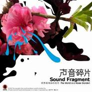

世界是噪音的花园the world is a noise garden
============================

|  |  |
| :--: | :-- |
| [ 世界是噪音的花园the world is a noise garden](https://emumo.xiami.com/album/15325) | **艺人**: [声音碎片](../index.md) **语种**: 国语 **唱片公司**: BadHead **发行时间**: 2002年08月01日 **专辑类别**: 录音室专辑 **专辑风格**: 摇滚 Rock & Roll **播放数**: 214798 **收藏数**: 1236 **评论数**: 64  |

## 简介

  
很久没有看到过如此迷人而又迷离的专辑封面了。这是声音碎片乐队的《世界是噪音的花园》。  
  
这是一支由落魄诗人、三流医生和人民美术教师所构成的乐队，所以他们常在营造一种有诗歌，有医治，有画面的氛围。而在聆听时候达到的沉浸，往往将被聆听者自身隐含着的自恋所深深陶醉。  
  
每一件乐器的演奏，每一个音符的构成，及被充当成乐器的主唱嗓音，在这张专辑中均得到最大程度的放大，其中所蕴涵的细腻与精致应该得到最由衷的赞美。忧郁低调唯美的曲风，强烈的律动感与可听性，丰富而巧妙的音乐编配，以及充满妄想与内省的歌词，无不犹如一把锈迹斑驳的刀，在你用来试图去解剖了别人的时候而把自己的心脏剖开——病态的不是音乐本身。无力狂欢之时的躲藏，只能让你已经暗淡的情绪，更暗。  
  
如同他们专辑的题记:噪音来自哪里？花园意味什么？将声音肢解之后，碎片形成世界。世界成为花园，噪音的花园。嗓音的构成，与心跳频率始终一致。  
  
乐队对于专辑名称含义的解释为，“花园是美好的，它代表了生活中美丽那一面，但实际上生活远没有那么单纯，它充满了噪音、不安、紧张和不和谐。”  
  
面对有关地下乐队发专辑即是招安的说法，声音碎片表示，“作为乐队应该靠演出来满足生活的需求，但是周围的环境都不算太好，即便你签约出唱片，基本上还是原来那种生活状态……实际上创作音乐只是因为心里面有不安的情绪，然后表达出来，说白了就这么简单。……实际上当初选择做音乐，就是因为厌倦了当时的生活。”  
  
到底声音的碎片有多么的不安？到底噪音的花园有多么的妖娆？去感受《世界是噪音的花园》。 

## 曲目

- [自欺](./15325/fMbo84bdb.md)
- [平衡](./15325/jYkrcce8e.md)
- [妄想狂](./15325/fMbq848dd.md)
- [狂欢](./15325/jYktb6468.md)
- [这一刻](./15325/jYkub3e70.md)
- [所有人都必须这样吗](./15325/w8B127a5b.md)
- [从内部成熟](./15325/fMbu64dae.md)
- [请不要关我的灯](./15325/w8B32994a.md)
- [投降](./15325/jYkyb0bea.md)
- [秘密路线](./15325/fMbx57cd7.md)
- [世界是噪音的花园](./15325/fMby54eca.md)

## 评论

|  |  |  |
| :-- | :-- | :-- |
|  [虾米用户](https://emumo.xiami.com/u/13330998) 偏激与善良同行，魔鬼与天... 2020-07-29 02:04 赞(0) 踩(0) | 
迷
 |
|  [虾米用户](https://emumo.xiami.com/u/314981794) 这家伙很聪明什么也没留下... 2018-08-03 19:26 赞(0) 踩(0) | 
为什么最好的都听不了
 |
|  [虾米用户](https://emumo.xiami.com/u/2502354) 不实验 2018-05-25 00:29 赞(1) 踩(0) | 
声音碎片首张专辑挺棒挺艺术，虽然后来专辑更悦耳易被大众接受
 |
|  [虾米用户](https://emumo.xiami.com/u/8873048) 迷幻南方摇滚蓝调自赏仙音... 2018-04-03 00:08 赞(0) 踩(0) | 
还是喜欢这张，就是喜欢阴暗唯美。MUMA，废墟，在别处&amp;hellip;&amp;hellip;
 |
|  [虾米用户](https://emumo.xiami.com/u/43492923) 行到水穷我才开始害怕，夕... 2017-11-15 11:16 赞(0) 踩(0) | 
&amp;phi;
 |
|  [虾米用户](https://emumo.xiami.com/u/14437329) 让一让，母牛们,生命短暂... 2017-06-11 19:46 赞(0) 踩(0) | 
这是声碎最好的一张专辑
 |
|  [虾米用户](https://emumo.xiami.com/u/35188131)  2017-04-28 12:40 赞(0) 踩(0) | 
虾米还剩啥版权？
 |
|  [虾米用户](https://emumo.xiami.com/u/8094301) Bye bye wx n... 2016-12-11 13:32 赞(1) 踩(0) | 
最喜欢这张
 |
|  [虾米用户](https://emumo.xiami.com/u/2279444) 爱在左，同情在右。 2016-11-15 15:22 赞(0) 踩(0) | 
有那么一丢丢木马
 |
|  [虾米用户](https://emumo.xiami.com/u/11638875) 阳光小正太皮皮 2016-02-03 20:41 赞(0) 踩(0) | 
只能安慰自己长大之后才能欣赏这张碟  
 |
|  [虾米用户](https://emumo.xiami.com/u/5935790)  2015-12-03 17:07 赞(0) 踩(0) | 
乐队去哪了？专辑去哪了？
 |
|  [虾米用户](https://emumo.xiami.com/u/2029879) 已转移阵地并回归离线模式... 2015-10-14 22:10 赞(0) 踩(0) | 
怎么感觉demo比专辑的混音更有韵味……
 |
|  [虾米用户](https://emumo.xiami.com/u/8583712) 上传反动、色情等照片将导... 2015-03-29 23:24 赞(0) 踩(0) | 
Orz
 |
|  [虾米用户](https://emumo.xiami.com/u/45328718) 暂无签名~ 2015-03-17 00:41 赞(1) 踩(0) | 
彝族有几位大师级的诗人和音乐人，而马玉龙横跨音乐诗歌两个领域，并且是绝对的大师！说穿了中国的摇滚乐顶尖的都是少数民族，比如崔健，比如马玉龙等！
 |
| ⇒ |  [虾米用户](https://emumo.xiami.com/u/449354) 我还没想好要写什么... 2015-04-04 10:07 赞(0) 踩(0) | 
太片面了吧
 |
| ⇒ |  [虾米用户](https://emumo.xiami.com/u/312179) 潜入深蓝，放肆幻听 2015-04-21 21:39 赞(0) 踩(0) | 
以民族定性也太草率了。中国摇滚乐总共有多少少数民族？
 |
|  [虾米用户](https://emumo.xiami.com/u/8815767) 鱼腥草  2015-03-11 17:02 赞(0) 踩(0) | 
声碎
 |
|  [虾米用户](https://emumo.xiami.com/u/491519) 我还没想好要写什么... 2015-02-01 14:42 赞(0) 踩(0) | 
王赣
 |
|  [虾米用户](https://emumo.xiami.com/u/71890)   2015-01-18 03:41 赞(1) 踩(0) | 
王赣的鼓
 |
|  [虾米用户](https://emumo.xiami.com/u/2224643) Just be cool 2014-08-09 19:51 赞(1) 踩(0) | 
学长好
 |
|  [虾米用户](https://emumo.xiami.com/u/35178601)   2014-07-03 12:56 赞(0) 踩(0) | 
世界是噪音的花园
 |
| ⇒ |  [虾米用户](https://emumo.xiami.com/u/1453136) hi, there 2014-09-25 01:24 赞(0) 踩(0) | 
嗯，头像不错
 |
|  [虾米用户](https://emumo.xiami.com/u/4160754)   2014-04-20 21:31 赞(1) 踩(0) | 
时间给你一把锈刀，你试图用来解剖别人。
 |
|  [虾米用户](https://emumo.xiami.com/u/27847144) 暂无签名~ 2014-03-15 17:21 赞(1) 踩(0) | 
春眠不觉晓，处处问题不少，我的生活越来越热闹，没有时间弹琴看书，没有时间来享受孤独。怀念我喜欢声音碎片的那段时光。
 |
| ⇒ |  [虾米用户](https://emumo.xiami.com/u/8608802)  2014-03-16 11:22 赞(0) 踩(0) | 
这是郝云的歌词, 怎么放入碎片来了...
 |
| ⇒ |  [虾米用户](https://emumo.xiami.com/u/8222387) 人艰不拆 2014-06-07 22:11 赞(0) 踩(0) | 
你这到底听的谁………
 |
|  [虾米用户](https://emumo.xiami.com/u/8337431) 以乐会友 2014-01-25 08:04 赞(0) 踩(0) | 
国产独立另类迷幻人声后摇 71310,558,38
 |
|  [虾米用户](https://emumo.xiami.com/u/10093583) Zoomgoal 2014-01-18 13:58 赞(0) 踩(0) | 
世界是噪音的花园
 |
|  [虾米用户](https://emumo.xiami.com/u/10786093)  2014-01-10 12:45 赞(0) 踩(0) | 
中国（大陆）摇滚30年 我听过的唱片中所喜爱的前99张碟之 No30 （非主流类）
 |
|  [虾米用户](https://emumo.xiami.com/u/10239093)  2014-01-07 10:18 赞(0) 踩(0) | 
半拍，半百，蓝色的，兰花的紫色，听不清的，仿佛旋律外的节奏，若及，若不离，朦胧的，看不明，听不清，窃窃私语的暴风雪。
 |
|  [虾米用户](https://emumo.xiami.com/u/5923404)  2013-12-12 11:34 赞(0) 踩(0) | 
碎片还是碎片！
 |
|  [虾米用户](https://emumo.xiami.com/u/1425012)  2013-11-02 11:27 赞(1) 踩(0) | 
一种情绪吧。感官世界，我靠声音而活
 |
|  [虾米用户](https://emumo.xiami.com/u/141415) 我还没想好要写什么... 2013-08-22 10:53 赞(0) 踩(0) | 
十年后
 |
|  [虾米用户](https://emumo.xiami.com/u/11669175) Yui.S 2013-08-05 14:12 赞(0) 踩(0) | 
精神都要崩溃。。
 |
|  [虾米用户](https://emumo.xiami.com/u/4316930) -- 烟花不堪剪 2013-06-05 22:05 赞(1) 踩(0) | 
这张真是神品。再也不会有。
 |
|  [虾米用户](https://emumo.xiami.com/u/15830714) 养自己的肉！ 2013-06-04 19:49 赞(0) 踩(0) | 
好
 |
|  [虾米用户](https://emumo.xiami.com/u/1453136) hi, there 2013-04-29 14:28 赞(0) 踩(0) | 
朋友推荐的，哈哈，喜欢。
 |
|  [虾米用户](https://emumo.xiami.com/u/2417893)  2013-04-17 17:10 赞(0) 踩(0) | 
心情
 |
|  [虾米用户](https://emumo.xiami.com/u/8114485)  2013-03-12 15:57 赞(0) 踩(0) | 
还是喜欢
 |
|  [虾米用户](https://emumo.xiami.com/u/10142145)  2013-03-02 23:26 赞(0) 踩(0) | 
这张专辑是难得的佳作，青春何尝不是这样的。
 |
|  [虾米用户](https://emumo.xiami.com/u/8866319) 暂无签名~ 2013-01-15 23:59 赞(0) 踩(0) | 
确实像噪音的花园，但好几首歌词完全写出了我的心声~！
 |
|  [虾米用户](https://emumo.xiami.com/u/10786093)  2012-12-28 09:21 赞(0) 踩(0) | 
还是偏爱声音碎片的这张专辑 音乐营造出的氛围阴湿 朦胧而凄美 马玉龙的痴声吟唱里 有自恋 有自闭和伤愁 此后两张专辑的音乐则趋于明朗 稳健 。。。那份令男人落泪的情感变淡 迷雾似乎散开了
 |
|  [虾米用户](https://emumo.xiami.com/u/11011215) 挣扎在伪艺术的长河 2012-10-11 17:33 赞(0) 踩(0) | 
声音碎片
 |
|  [虾米用户](https://emumo.xiami.com/u/3398967)  2012-10-02 18:58 赞(0) 踩(0) | 
封面太美，先收了
 |
|  [虾米用户](https://emumo.xiami.com/u/660998)  2012-09-07 23:55 赞(0) 踩(0) | 
很让人忧伤的旋律，深入心底····
 |
|  [虾米用户](https://emumo.xiami.com/u/9537839) 一定要吃水果 2012-07-23 13:10 赞(0) 踩(0) | 
这一张不是很喜欢，音如其名，噪音的花园。
 |
|  [虾米用户](https://emumo.xiami.com/u/5829803) 不悖 2012-04-16 22:21 赞(0) 踩(0) | 
声音碎片的专辑一直那么美
 |
|  [虾米用户](https://emumo.xiami.com/u/2648838)  2012-04-12 21:37 赞(0) 踩(0) | 
喜欢
 |
|  [虾米用户](https://emumo.xiami.com/u/6218709)  2012-02-28 18:42 赞(0) 踩(0) | 
他们要来郑州了。
 |
|  [虾米用户](https://emumo.xiami.com/u/169922)  2012-01-18 22:25 赞(0) 踩(0) | 
意想不到的，喜欢
 |
|  [虾米用户](https://emumo.xiami.com/u/1325191)  2011-11-19 20:16 赞(0) 踩(0) | 
听着旋律 就陶醉了
 |
|  [虾米用户](https://emumo.xiami.com/u/2895838)  2011-09-19 20:28 赞(0) 踩(0) | 
喜欢旅行的时候听~
 |
|  [虾米用户](https://emumo.xiami.com/u/63597)  2011-09-12 00:26 赞(0) 踩(0) | 
拾碎——2011声音碎片十周年全国巡演拾碎——<a href="http://www.douban.com/event/14436228/" target="_blank" rel="nofollow noreferrer noopener">http://www.douban.com/event/14436228/</a>
 |
|  [虾米用户](https://emumo.xiami.com/u/5521162)  2011-08-23 23:05 赞(0) 踩(0) | 
我要听一整张专辑
 |
|  [虾米用户](https://emumo.xiami.com/u/360003)   2011-08-22 01:24 赞(0) 踩(0) | 
没理由。
 |
|  [虾米用户](https://emumo.xiami.com/u/1091078)  2011-08-11 10:45 赞(0) 踩(0) | 
这张专辑最好
 |
|  [虾米用户](https://emumo.xiami.com/u/3255139)  2011-07-15 23:12 赞(0) 踩(0) | 
感觉
 |
|  [虾米用户](https://emumo.xiami.com/u/3111817)  2011-06-10 19:08 赞(0) 踩(0) | 
到底声音的碎片有多么的不安？到底噪音的花园有多么的妖娆？去感受《世界是噪音的花园》。
 |
|  [虾米用户](https://emumo.xiami.com/u/1405373)  2011-06-08 21:26 赞(0) 踩(0) | 
喜欢
 |
|  [虾米用户](https://emumo.xiami.com/u/1190277)  2010-08-23 09:17 赞(0) 踩(0) | 
刚才听第一遍感觉是shoegazing，现在听第二遍觉得更像悲核。。看大家都说它是摇滚额，不过觉得和国外后摇貌似还是有不太一样的地方的，乐器旋律里没有那样密织的低噪。。。
 |
|  [虾米用户](https://emumo.xiami.com/u/1303701)  2010-08-11 21:54 赞(0) 踩(0) | 
以为中国摇滚死了  现在听了觉得还是有生命力
 |
|  [虾米用户](https://emumo.xiami.com/u/676512) ¤電波星¤ 2010-06-01 21:12 赞(0) 踩(0) | 
希望如Radiohead这样伟大的乐队越多越好
 |
|  [虾米用户](https://emumo.xiami.com/u/49319) 暂无签名~ 2009-04-10 19:20 赞(0) 踩(0) | 
乍一听受Radiohead影响还真不小，到处都是他们的影子。有点刻意模仿的感觉，尤其是主唱的长唱腔。
 |
|  [虾米用户](https://emumo.xiami.com/u/58364)  2009-03-11 09:16 赞(0) 踩(0) | 
不错的另类音乐精选辑  声音碎片我买国几张CD 都挺不错的  建议你听听!
 |
