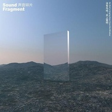

没有鸟鸣，关上窗吧
============================

|  |  |
| :--: | :-- |
| [ 没有鸟鸣，关上窗吧](https://emumo.xiami.com/album/2103061830) | **艺人**: [声音碎片](../index.md) **语种**: 国语 **唱片公司**: 摩登天空, Anderson Music, LLC **发行时间**: 2019年05月01日 **专辑类别**: 录音室专辑 **专辑风格**: 柔顺爵士 Smooth Jazz **播放数**: 3705 **收藏数**: 166 **评论数**: 55  |

## 简介

摩登天空簽約樂隊聲音碎片的第四張錄音室專輯。專輯於2018年10月完成錄音，2019年3月完成後期制作。這是上壹張專輯發表十年之後，聲音碎片的首度發聲，從三十而立到四十不惑，樂隊把對生活的體悟和心境的變化寫進作品裡，是小視角到大視角的轉變。專輯秉承了聲音碎片的旋律美學與抒情範式，也有著更新的突破，從結構到編曲，呈現出壹個煥然壹新的“後光芒時代”的聲音碎片。

## 曲目

- [神遊](./2103061830/mTwgUE856c2.md)
- [致我的迷茫兄弟MV](./2103061830/b1sEYCJ42669.md)
- [伊斯特伍德](./2103061830/xOhfJqc7664.md)
- [送流水](./2103061830/xOhfJrba633.md)
- [九月行歌](./2103061830/bqxTZOm3894a.md)
- [望星空](./2103061830/b1sEYCN3e791.md)
- [小涼山](./2103061830/mTwgUK95995.md)
- [不惑之年](./2103061830/mTwgUL75f2a.md)
- [少年遊](./2103061830/mTwgUM6cc76.md)
- [送馬玉華到2011年](./2103061830/mTwgUN91f34.md)

## 评论

|  |  |  |
| :-- | :-- | :-- |
|  [虾米用户](https://emumo.xiami.com/u/410823091)  2020-10-19 18:35 赞(0) 踩(0) | 
这个分类就很迷 顺柔爵士？
 |
|  [虾米用户](https://emumo.xiami.com/u/43226013) 有个性 不签名 2020-09-05 10:21 赞(0) 踩(0) | 
与你分享我的耳朵
 |
|  [虾米用户](https://emumo.xiami.com/u/212356465) 庸人罢了 2020-07-21 09:30 赞(0) 踩(0) | 
突然多了两首？
 |
|  [虾米用户](https://emumo.xiami.com/u/424405993)  2020-05-14 21:56 赞(0) 踩(0) | 
我等着版权
 |
|  [虾米用户](https://emumo.xiami.com/u/1382058) 我还没想好要写什么... 2020-01-22 20:57 赞(4) 踩(0) | 
又没版权。虾米以前支持独立音乐啊。就因为这才用你。拿了阿里的钱后，声音碎片这种都听不到了！为啥要这样，已经很多灰掉了，版权根本没在谈，cd又没设备听。
 |
|  [虾米用户](https://emumo.xiami.com/u/39204279) I love Grung... 2019-12-23 13:32 赞(1) 踩(0) | 
海外的连vpn还是听不了为啥？？
 |
| ⇒ |  [虾米用户](https://emumo.xiami.com/u/56311564) 风吹过云影似梦 2020-01-30 12:05 赞(0) 踩(0) | 
因为根本就没有
 |
|  [虾米用户](https://emumo.xiami.com/u/8180627)  2019-10-28 00:57 赞(0) 踩(0) | 
十一年磨一剑，太好听了
 |
|  [虾米用户](https://emumo.xiami.com/u/43492923) 行到水穷我才开始害怕，夕... 2019-10-22 20:26 赞(0) 踩(0) | 
◇
 |
|  [虾米用户](https://emumo.xiami.com/u/212356465) 庸人罢了 2019-09-23 18:45 赞(1) 踩(0) | 
神专，听醉了…… 诗意，优美而有深度。可能同是小地方高原人的原因，我听他们的歌特别感动，因为我听得到一些共通的东西，就像其中一首歌—《致我的迷茫兄弟》所说，在时代夹缝中的高原人。
 |
|  [虾米用户](https://emumo.xiami.com/u/8192862) 诗人和先知。vchat:... 2019-09-04 13:26 赞(1) 踩(0) | 
我也就还能听个五百年的样子。
 |
|  [虾米用户](https://emumo.xiami.com/u/6417086) 这里，只有聆听。 2019-08-12 23:58 赞(1) 踩(0) | 
年少时不明白为什么优美的要低于生活？ 流水啊，别回头，岁月啊，慢些走， 致所有迷茫的人到中年&nbsp; 愁房子，车子，票子，孩子
 |
|  [虾米用户](https://emumo.xiami.com/u/27654923) 不值一提 2019-08-04 12:19 赞(0) 踩(0) | 
不能听，怎么搞的
 |
|  [虾米用户](https://emumo.xiami.com/u/427956607) 终于活成了自己曾经讨厌的... 2019-07-31 02:36 赞(3) 踩(0) | 
中国最有诗人气息的乐队
 |
|  [虾米用户](https://emumo.xiami.com/u/2791514) 此处禁言 2019-07-02 13:03 赞(3) 踩(0) | 
大家好，我的名字叫：收藏了哪首歌哪首歌就会被下架的魔咒。   谢谢大家！
 |
|  [虾米用户](https://emumo.xiami.com/u/2254916) 攀谈&声量&天象 of ... 2019-06-27 23:00 赞(1) 踩(0) | 
很早就听说声碎，说实话没太多关注，无意间听到新砖，彻底被震住了，惊叹如今内地小众乐队的制作水准！
 |
|  [虾米用户](https://emumo.xiami.com/u/43714694) WeChat：96529... 2019-06-26 16:54 赞(0) 踩(0) | 
吱/音
 |
|  [虾米用户](https://emumo.xiami.com/u/329731951) 如何才能嫁给一把大提 或... 2019-06-23 10:31 赞(0) 踩(0) | 
apple store可听喔大家
 |
| ⇒ |  [虾米用户](https://emumo.xiami.com/u/270879773) … 2019-07-01 14:26 赞(0) 踩(0) | 
请问怎么听
 |
| ⇒ |  [虾米用户](https://emumo.xiami.com/u/329731951) 如何才能嫁给一把大提 或... 2019-07-04 09:12 赞(0) 踩(0) | 
<q><b>yoshii说：</b></q>
 |
| ⇒ |  [虾米用户](https://emumo.xiami.com/u/270879773) … 2019-07-05 09:29 赞(0) 踩(0) | 
<q><b>YogaWhite说：</b></q>
 |
| ⇒ |  [虾米用户](https://emumo.xiami.com/u/329731951) 如何才能嫁给一把大提 或... 2019-07-07 12:55 赞(0) 踩(0) | 
<q><b>yoshii说：</b></q>
 |
| ⇒ |  [虾米用户](https://emumo.xiami.com/u/270879773) … 2019-07-08 00:12 赞(0) 踩(0) | 
<q><b>YogaWhite说：</b></q>
 |
| ⇒ |  [虾米用户](https://emumo.xiami.com/u/329731951) 如何才能嫁给一把大提 或... 2019-07-09 23:44 赞(0) 踩(0) | 
<q><b>yoshii说：</b></q>
 |
|  [虾米用户](https://emumo.xiami.com/u/36846920)  2019-06-18 22:18 赞(0) 踩(0) | 
好听！！！
 |
|  [虾米用户](https://emumo.xiami.com/u/36846920)  2019-06-18 21:46 赞(0) 踩(0) | 
专辑刚收到，音乐很美，可惜碟片有一个划痕，品控要加强啊，一如既往地支持你们，老马们，加油，9.7.武汉等你们！ 
 |
|  [虾米用户](https://emumo.xiami.com/u/14652349) 壹贰叁 肆伍陆 柒捌玖 2019-06-14 22:05 赞(1) 踩(0) | 
突然發現新專輯 然後發現木有版權© 黯然~ 
 |
|  [虾米用户](https://emumo.xiami.com/u/658405) 来自成都的平面设计师 2019-06-14 13:03 赞(11) 踩(0) | 
今天成都一早下着小雨，我把CD推进了车里的播放器（话说摩登天空的发货速度真TM慢，买了第三天才发货）。第一首《神游》，音乐响起，萨克斯风很抢镜，各种乱入，整体旋律我感觉有点晃和乱，倒是主唱马玉龙的声音一如既往把歌曲驾驭的游刃有余，歌词也是保持了水准，此时我暗暗肯定果然是听个情怀。跳转到第二首《致我的迷茫兄弟》，壮阔如史诗般的旋律一响起突然让我眼前一亮，马玉龙的人声从天而降，悠扬大气的吟唱让我身心舒展。开车平均30码的速度，听完了整张 整张专辑听下来真是久违了的感动和真诚。用心描绘如电影画面一般的境界甚是喜欢。真是让人沉得下心来听的好作品。在这个滥竽充数的当下，向这一群认认真真做音乐的人致敬！
 |
| ⇒ |  [虾米用户](https://emumo.xiami.com/u/13603829) 喜欢就行 2019-08-09 07:53 赞(0) 踩(0) | 
倒车的时候还是先暂停不要听了，容易撞上后面的车.....别问我怎么知道的..... 
 |
|  [虾米用户](https://emumo.xiami.com/u/12034054) ～ 2019-06-10 01:05 赞(1) 踩(0) | 
远在西南之南
 |
|  [虾米用户](https://emumo.xiami.com/u/179491) 因为相信，所以看见 2019-06-08 23:38 赞(1) 踩(0) | 
昨晚在摩登现场，你说下面的你们都会了，一丝无奈和失望。 台下要不是情侣，要不是伙伴，都正当年轻，正当要点强烈的节奏，强烈到冲击无聊迷茫的生活。 谁会理解中年文青的情感世界，和生活正面冲击过后，对人生的体会。 就像新专的题目一样，没有鸟鸣，关上窗吧。那就关上窗吧，和自己呆在一起很舒服！
 |
| ⇒ |  [虾米用户](https://emumo.xiami.com/u/12034054) ～ 2019-06-10 01:04 赞(0) 踩(0) | 
南京发生什么大事了 你们那么拘谨
 |
| ⇒ |  [虾米用户](https://emumo.xiami.com/u/179491) 因为相信，所以看见 2019-06-10 22:46 赞(0) 踩(0) | 
<q><b>某热气的NEET说：</b></q>
 |
|  [虾米用户](https://emumo.xiami.com/u/43816145) 品味是一个无底洞 2019-06-08 00:09 赞(0) 踩(0) | 
微信上看到，致我的迷茫兄弟的mv。很久违的感觉，也很爱那一段女声，然后 回来重温了声音碎片全部能听的歌 
 |
|  [虾米用户](https://emumo.xiami.com/u/658405) 来自成都的平面设计师 2019-06-03 22:30 赞(0) 踩(0) | 
你说？要怎么卖都行 我买我买
 |
| ⇒ |  [虾米用户](https://emumo.xiami.com/u/8180627)  2019-06-04 21:49 赞(0) 踩(0) | 
淘宝上摩登天空有卖的
 |
|  [虾米用户](https://emumo.xiami.com/u/8201669) 每一刻都是崭新的 2019-05-29 18:05 赞(0) 踩(0) | 
我都听上了哈哈
 |
|  [虾米用户](https://emumo.xiami.com/u/63597)  2019-05-29 10:43 赞(4) 踩(0) | 
声音碎片「遍地风流」2019全国巡演  6月7日 上海 Modernsky Lab  6月8日 南京 欧拉艺术空间  6月9日 无锡 活塞LiveHouse  6月12日 苏州 山丘咖啡  6月14日 杭州 酒球会  6月15日 宁波 灯塔音乐现场  6月16日 福州 唯美客 MAKER LIVE  6月19日 厦门 Real Live  6月21日 深圳 B10现场  6月22日 广州 TU凸空间
 |
| ⇒ |  [虾米用户](https://emumo.xiami.com/u/292888992) 是孤独也是自由 2019-05-31 21:32 赞(0) 踩(0) | 
在宁波现场等好啦
 |
| ⇒ |  [虾米用户](https://emumo.xiami.com/u/63597)  2019-06-02 10:32 赞(0) 踩(0) | 
好滴
 |
| ⇒ |  [虾米用户](https://emumo.xiami.com/u/36846920)  2019-06-11 21:43 赞(0) 踩(0) | 
<q><b>声音碎片说：</b></q>
 |
| ⇒ |  [虾米用户](https://emumo.xiami.com/u/2254916) 攀谈&声量&天象 of ... 2019-06-27 23:03 赞(0) 踩(0) | 
67上海，正好是我生日。只顾喝酒寻欢作乐，没留意到演出信息嘛滴好可惜。期待下次赶紧再来
 |
|  [虾米用户](https://emumo.xiami.com/u/3714518) 死人 2019-05-27 00:50 赞(0) 踩(0) | 
ヽ(ﾟ∀ﾟ)ﾉ
 |
|  [虾米用户](https://emumo.xiami.com/u/179491) 因为相信，所以看见 2019-05-22 22:44 赞(2) 踩(0) | 
能等来么虾米，为了你，我没有去下载QQ哦
 |
|  [虾米用户](https://emumo.xiami.com/u/10994142) 睡前梦游故事 2019-05-20 02:19 赞(0) 踩(0) | 
等
 |
|  [虾米用户](https://emumo.xiami.com/u/8620629) 我就是我 2019-05-18 11:17 赞(0) 踩(0) | 
数字专辑咋个买
 |
|  [虾米用户](https://emumo.xiami.com/u/10994142) 睡前梦游故事 2019-05-18 08:21 赞(0) 踩(0) | 
满心欢喜上来听，结果没有版权 
 |
|  [虾米用户](https://emumo.xiami.com/u/3583995) 一個人的戰爭 2019-05-18 03:56 赞(0) 踩(0) | 
.
 |
|  [虾米用户](https://emumo.xiami.com/u/221895799) 潜水艇司机 2019-05-17 10:07 赞(0) 踩(0) | 
等
 |
|  [虾米用户](https://emumo.xiami.com/u/1837761) 我还没想好要写什么... 2019-05-17 01:36 赞(0) 踩(0) | 
那我也等一个呗
 |
|  [虾米用户](https://emumo.xiami.com/u/54111810) 你看傻逼如此之多，让我们... 2019-05-17 01:33 赞(0) 踩(0) | 
同等
 |
|  [虾米用户](https://emumo.xiami.com/u/39694751) 沉醉不知处。 2019-05-17 00:54 赞(0) 踩(0) | 
等等等等
 |
|  [虾米用户](https://emumo.xiami.com/u/274414887)  2019-05-16 22:02 赞(0) 踩(0) | 
我等
 |
|  [虾米用户](https://emumo.xiami.com/u/9957551) 这家伙很傻什么也留不下。 2019-05-16 21:33 赞(0) 踩(0) | 
我也等
 |
|  [虾米用户](https://emumo.xiami.com/u/43932261) 难共鸣 2019-05-16 19:13 赞(0) 踩(0) | 
等
 |
