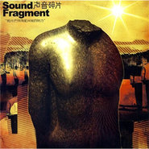

把光芒洒向更开阔的地方
============================

|  |  |
| :--: | :-- |
| [ 把光芒洒向更开阔的地方](https://emumo.xiami.com/album/297653) | **艺人**: [声音碎片](../index.md) **语种**: 国语 **唱片公司**: 摩登天空 **发行时间**: 2008年09月01日 **专辑类别**: 录音室专辑 **专辑风格**: 摇滚 Rock & Roll **播放数**: 6073092 **收藏数**: 4129 **评论数**: 238  |

## 简介

《把光芒洒向更开阔的地方》无论歌词还是音乐，都已远比首张专辑更加优秀。声音碎片乐队已一步步成为了近年来的最佳中文乐队，这张《把光芒洒向更开阔的地方》在一定程度上已经超越了摇滚乐，甚至超越了诗歌。音乐上，比以往更大气与好听，一贯的好歌词在这次更达到了一个新的境地，更为贴近内心，甚至有了一些能让人潸然泪下的桥段。应该讲这是近年来最好的一张中文摇滚乐专辑。

## 曲目

- [在一起MV](./297653/b9KTn1582f.md)
- [天边一朵云](./297653/b9KTob8b7b.md)
- [陌生城市的早晨](./297653/gt3f5492b2.md)
- [星光照亮你回家的路](./297653/cpIvAea26f.md)
- [把光芒洒向开阔之地](./297653/TN0X812c6.md)
- [黑白电影](./297653/TN0Y8287e.md)
- [骑手的悲伤之歌](./297653/b9KTtd2113.md)
- [顺流而下](./297653/b9KTuca75b.md)
- [幸运的人](./297653/TN1b4b5bd.md)
- [随意跳舞吧](./297653/TN1c8c573.md)
- [情歌而已MV](./297653/fD5Dt3dc86.md)

## 评论

|  |  |  |  |
| :-- | :-- | :-- | :-- |
|  [虾米用户](https://emumo.xiami.com/u/36846920)  2019-07-13 00:09 赞(0) 踩(0) | 
绝美的专辑！
 |
|  [虾米用户](https://emumo.xiami.com/u/356740228)  2019-04-29 16:18 赞(0) 踩(0) | 
好棒棒！满分满分！
 |
|  [虾米用户](https://emumo.xiami.com/u/8180627)  2019-03-17 21:43 赞(0) 踩(0) | 
我听爆，一整张听下来，像是一个完整的故事，像是一个轮回
 |
|  [虾米用户](https://emumo.xiami.com/u/226046528) 哟！ 2019-01-23 21:30 赞(1) 踩(0) | 
因为有这些音乐，才没觉得孤独会把人杀死吧
 |
|  [虾米用户](https://emumo.xiami.com/u/523113)  2018-04-12 15:11 赞(0) 踩(0) | 
Even spotify has this album...
 |
|  [虾米用户](https://emumo.xiami.com/u/43492923) 行到水穷我才开始害怕，夕... 2018-03-07 17:53 赞(1) 踩(0) | 
嗯哼
 |
|  [虾米用户](https://emumo.xiami.com/u/67909172)   2018-02-22 15:07 赞(0) 踩(0) | 
哈哈，出一张买一张。完全值得购买！
 |
|  [虾米用户](https://emumo.xiami.com/u/3049328)  2017-10-28 00:34 赞(0) 踩(0) | 
中午看到天边一朵云，他们的寻找像出走，像穷人把流浪就做自由
 |
|  [虾米用户](https://emumo.xiami.com/u/370254)  2017-10-28 00:18 赞(0) 踩(0) | 
不知为什么每次听声音碎片都会怀念起2000年时最初听到果味VC的那段日子~~~华丽丽的歌唱吧，忘乎所以的舞蹈；点起所有的蜡烛，捞起在魔障的深渊里无尽坠落的人，在这垂死的岁末……
 |
|  [虾米用户](https://emumo.xiami.com/u/15270473) 听到喜欢的歌 身体不跟着... 2017-05-20 10:52 赞(0) 踩(0) | 
-
 |
|  [虾米用户](https://emumo.xiami.com/u/92639882)  2016-10-18 01:08 赞(0) 踩(0) | 
厉害了
 |
|  [虾米用户](https://emumo.xiami.com/u/576232) 再简单一些… 2016-10-13 17:06 赞(3) 踩(0) | 
谁拥有资源谁就不是虾米。
 |
|  [虾米用户](https://emumo.xiami.com/u/64389162) 自在而在 自然而然 2016-10-05 08:50 赞(0) 踩(0) | 
歌呢？
 |
|  [虾米用户](https://emumo.xiami.com/u/44991093) Beautiful Bl... 2016-09-25 18:53 赞(1) 踩(0) | 
去网易原来是要在虾米下架
 |
| ⇒ |  [虾米用户](https://emumo.xiami.com/u/118150102) 20岁出头的苦日子 2017-02-12 19:08 赞(0) 踩(0) | 
厉害了！ 
 |
|  [虾米用户](https://emumo.xiami.com/u/5629479)  2016-05-19 19:43 赞(0) 踩(0) | 
陌生城市的早晨真的很美！！！词写的好好
 |
|  [虾米用户](https://emumo.xiami.com/u/587068) 我还没想好要写什么... 2016-05-18 21:31 赞(0) 踩(0) | 
天呐
 |
|  [虾米用户](https://emumo.xiami.com/u/13503593) 暂无签名~ 2016-04-28 13:47 赞(0) 踩(0) | 
惊艳
 |
|  [虾米用户](https://emumo.xiami.com/u/84230) 只身打马过草原 2016-04-20 20:58 赞(0) 踩(0) | 
美哭了。。。。。。。。。。。。。。。。。。。。。。。。。。。。。。。。。。。。。。。。。。。。
 |
|  [虾米用户](https://emumo.xiami.com/u/7709372)  2016-04-16 14:03 赞(0) 踩(0) | 
牛逼的音乐，我喜欢
 |
|  [虾米用户](https://emumo.xiami.com/u/11502880) 我一个人吃饭旅行到处走。 2016-03-23 16:38 赞(1) 踩(0) | 
陌生城市的早晨，前奏尤其好听，击中心里的感觉。
 |
|  [虾米用户](https://emumo.xiami.com/u/52556129)  2016-03-13 23:00 赞(0) 踩(0) | 
乐队在哪去了，什么时候出新专辑。
 |
|  [虾米用户](https://emumo.xiami.com/u/34645862) 寻找一生最喜欢的音乐 2016-03-12 16:41 赞(0) 踩(0) | 
我发现带声音俩字的乐团都挺厉害的，声音碎片，声音玩具，声音乐团（他们是流行音乐） 
 |
|  [虾米用户](https://emumo.xiami.com/u/32362730) 5はいいぞ~~ 2016-02-25 23:37 赞(0) 踩(0) | 
⁽* ¨̮ *⁾
 |
|  [虾米用户](https://emumo.xiami.com/u/99061) 是谁把我带到这里了 2016-01-29 23:24 赞(0) 踩(0) | 
不错而且耐听的专辑，給五星
 |
|  [虾米用户](https://emumo.xiami.com/u/6044227) 人生如戏，戏如人生…… 2016-01-24 18:49 赞(0) 踩(0) | 
太晚听到了，请问哪里能买全声音碎片的三张专辑？
 |
|  [虾米用户](https://emumo.xiami.com/u/2432475) love & peace... 2016-01-18 14:42 赞(0) 踩(0) | 
棒呆，边点头边哭是怎么说！！
 |
|  [虾米用户](https://emumo.xiami.com/u/2109049) 我的死亡們對生存局部誤解 2016-01-12 15:26 赞(0) 踩(0) | 
曲子的内部一致性很高哇，某些歌的某句可以无缝连接到另一首。
 |
|  [虾米用户](https://emumo.xiami.com/u/51615260) - 2016-01-05 17:26 赞(0) 踩(0) | 
=。=
 |
|  [虾米用户](https://emumo.xiami.com/u/40262320)  2016-01-02 11:22 赞(0) 踩(0) | 
异乡漂泊，昂扬、失落、孤独、自由、寂寞、辽阔、等等复杂而矛盾的心理，在这专辑里体现的淋漓尽致。
 |
|  [虾米用户](https://emumo.xiami.com/u/8094301) Bye bye wx n... 2015-12-25 09:31 赞(0) 踩(0) | 
一张真诚动人的国摇专辑
 |
|  [虾米用户](https://emumo.xiami.com/u/155947) 一期一会 2015-11-28 14:09 赞(1) 踩(0) | 
10年后听这张依然光芒四射！
 |
|  [虾米用户](https://emumo.xiami.com/u/39588717)   2015-11-18 18:16 赞(0) 踩(0) | 
安利～
 |
|  [虾米用户](https://emumo.xiami.com/u/9072248) 知音否？ 2015-10-19 08:25 赞(1) 踩(0) | 
老马是低调且真诚的。
 |
|  [虾米用户](https://emumo.xiami.com/u/35588170) 慢慢飞 2015-10-16 21:34 赞(0) 踩(0) | 
棒棒的！！
 |
|  [虾米用户](https://emumo.xiami.com/u/13195729) 用音乐连接世界 2015-09-14 09:50 赞(0) 踩(0) | 
惊艳
 |
|  [虾米用户](https://emumo.xiami.com/u/1011672) 虾米除了歌，其他都是垃圾 2015-09-09 21:54 赞(0) 踩(0) | 
喜欢这张
 |
|  [虾米用户](https://emumo.xiami.com/u/40277794)  2015-08-29 23:52 赞(1) 踩(0) | 
草，本来点开这张专辑挑喜欢名字的歌随便听听，结果下了整张专辑…
 |
|  [虾米用户](https://emumo.xiami.com/u/37098145) 这个家伙太蠢了不会留下什... 2015-06-21 16:11 赞(0) 踩(0) | 
wk
 |
|  [虾米用户](https://emumo.xiami.com/u/87508) 以梦为马。厚德载物。 2015-05-25 23:56 赞(0) 踩(0) | 
牛逼！惊！艳！
 |
|  [虾米用户](https://emumo.xiami.com/u/87508) 以梦为马。厚德载物。 2015-05-25 23:55 赞(0) 踩(0) | 
美得这么牛逼！惊！艳！
 |
|  [虾米用户](https://emumo.xiami.com/u/3688649)  2015-05-15 22:28 赞(0) 踩(0) | 
华丽的忧伤
 |
|  [虾米用户](https://emumo.xiami.com/u/1309392) 听听歌，装装逼。。。 2015-04-19 19:17 赞(0) 踩(0) | 
不错的乐队~~
 |
|  [虾米用户](https://emumo.xiami.com/u/40736857) 厉害厉害厉害 2015-04-14 17:50 赞(0) 踩(0) | 
乐队名怪怪的我觉得叫碎片比声音碎片更好
 |
|  [虾米用户](https://emumo.xiami.com/u/10462919) 去和昨天和解吧 2015-03-29 16:10 赞(0) 踩(0) | 
诗意的过去，无法复制的未来
 |
|  [虾米用户](https://emumo.xiami.com/u/10462919) 去和昨天和解吧 2015-03-29 16:10 赞(0) 踩(0) | 
诗意的过去，无法复制的未来
 |
|  [虾米用户](https://emumo.xiami.com/u/11769228)  2015-03-08 13:13 赞(3) 踩(0) | 
编曲和音色更新颖的后期许巍
 |
|  [虾米用户](https://emumo.xiami.com/u/45222353)  2015-01-18 19:36 赞(0) 踩(0) | 
陌生城市的早晨
 |
|  [虾米用户](https://emumo.xiami.com/u/9312500)  2014-12-30 20:33 赞(0) 踩(0) | 
很棒的专辑
 |
|  [虾米用户](https://emumo.xiami.com/u/5156143)   2014-12-11 11:49 赞(0) 踩(0) | 
发现的太晚，唉！！
 |
|  [虾米用户](https://emumo.xiami.com/u/8723445)  2014-11-23 16:48 赞(1) 踩(0) | 
能偶然听到这样的好音乐，幸福的泪奔，为之自豪。
 |
|  [虾米用户](https://emumo.xiami.com/u/11630546) 音乐走一生 2014-11-16 18:23 赞(0) 踩(0) | 
情歌而已
 |
|  [虾米用户](https://emumo.xiami.com/u/42939850)  2014-11-01 22:30 赞(0) 踩(0) | 
声音碎片。不能低估的实力！
 |
|  [虾米用户](https://emumo.xiami.com/u/38732339) 她是黯淡星。 2014-10-11 22:36 赞(1) 踩(0) | 
好喜欢，听哭了
 |
|  [虾米用户](https://emumo.xiami.com/u/13936356) 我还没想好要写什么... 2014-09-14 21:39 赞(0) 踩(0) | 
感谢你们带来这么美的声音
 |
|  [虾米用户](https://emumo.xiami.com/u/36613274)   2014-09-11 11:51 赞(0) 踩(0) | 
情歌而已
 |
|  [虾米用户](https://emumo.xiami.com/u/745483) pseudo-vegan 2014-09-08 20:08 赞(0) 踩(0) | 
好听，有点House的味道
 |
|  [虾米用户](https://emumo.xiami.com/u/17453250)  2014-09-01 20:25 赞(0) 踩(0) | 
太棒了！这才是华丽的低调
 |
|  [虾米用户](https://emumo.xiami.com/u/887775) 蓝小妞 2014-09-01 16:23 赞(0) 踩(0) | 
首先歌词意境很棒，其次主唱声线特别，旋律深入我心。
 |
|  [虾米用户](https://emumo.xiami.com/u/9301514) 独立唱作人 2014-08-28 14:23 赞(0) 踩(0) | 
原版天边一朵云太赞。
 |
|  [虾米用户](https://emumo.xiami.com/u/1675052) 暂无签名~ 2014-08-26 12:34 赞(0) 踩(0) | 
Radiohead无话可说
 |
|  [虾米用户](https://emumo.xiami.com/u/223201)  2014-08-23 11:01 赞(0) 踩(0) | 
寶貝楊乃文推薦聆聽的專輯。
 |
|  [虾米用户](https://emumo.xiami.com/u/14511481)  2014-08-16 16:32 赞(0) 踩(0) | 
期待新专辑
 |
|  [虾米用户](https://emumo.xiami.com/u/36571328)  2014-08-16 09:39 赞(0) 踩(0) | 
挺好听的
 |
|  [虾米用户](https://emumo.xiami.com/u/13354175) 眼泪眼屎，意守丹田，双腿... 2014-08-14 10:50 赞(0) 踩(0) | 
我必须给五星
 |
|  [虾米用户](https://emumo.xiami.com/u/3781923) 别拒绝上帝。 2014-08-11 19:35 赞(0) 踩(0) | 
旅行正合适
 |
|  [虾米用户](https://emumo.xiami.com/u/10004293) 摇滚 电子 2014-08-10 23:52 赞(0) 踩(0) | 
很不简单的创作
 |
|  [虾米用户](https://emumo.xiami.com/u/37076369)  2014-08-10 17:39 赞(0) 踩(0) | 
歌词太赞了
 |
|  [虾米用户](https://emumo.xiami.com/u/1168284)  2014-08-09 16:41 赞(0) 踩(0) | 
这张太赞了！
 |
|  [虾米用户](https://emumo.xiami.com/u/8590181) 同志仍需努力 2014-08-07 10:10 赞(0) 踩(0) | 
不合时宜的忧伤
 |
|  [虾米用户](https://emumo.xiami.com/u/416815)  2014-07-05 20:57 赞(0) 踩(0) | 
什么时候来武汉演出啊。。
 |
|  [虾米用户](https://emumo.xiami.com/u/5815744) 念念不忘必有回音 2014-07-02 19:22 赞(13) 踩(0) | 
一直在国外奔波寻找音乐，国内也有这么强大而又忧伤的乐队，实属不易啊~
 |
|  [虾米用户](https://emumo.xiami.com/u/5815744) 念念不忘必有回音 2014-07-02 19:21 赞(0) 踩(0) | 
大爱啊~
 |
|  [虾米用户](https://emumo.xiami.com/u/13355634)   2014-06-06 22:17 赞(0) 踩(0) | 
编曲歌词比旋律赞
 |
|  [虾米用户](https://emumo.xiami.com/u/1635742)  2014-06-05 17:37 赞(0) 踩(0) | 
没什么
 |
|  [虾米用户](https://emumo.xiami.com/u/3765954) 装下那片湖 2014-06-03 12:20 赞(40) 踩(0) | 
我会毫不犹豫给五星，在中国，这样的摇滚专辑真是太少太少，有这么一张，你真的要珍惜。
 |
| ⇒ |  [虾米用户](https://emumo.xiami.com/u/34512401) 孤情诗人 2014-06-04 00:59 赞(0) 踩(0) | 
yes
 |
|  [虾米用户](https://emumo.xiami.com/u/22816786)  2014-05-26 09:21 赞(0) 踩(0) | 
牛逼！
 |
|  [虾米用户](https://emumo.xiami.com/u/863234)  2014-05-23 12:07 赞(0) 踩(0) | 
就是挺喜欢的
 |
|  [虾米用户](https://emumo.xiami.com/u/7264359) For ever. 2014-05-17 19:24 赞(1) 踩(0) | 
据某乐评人说，这是一支在中国最被低估的乐队。严重同意。期待新作
 |
| ⇒ |  [虾米用户](https://emumo.xiami.com/u/5192721) 暂无签名~ 2014-09-10 23:47 赞(0) 踩(0) | 
是啊！这么多年也没有彻底红了  不过这样也好可以保持纯粹！
 |
| ⇒ |  [虾米用户](https://emumo.xiami.com/u/57561) 暂无签名~ 2014-10-06 15:59 赞(0) 踩(0) | 
<q><b>小哼666说：</b></q>
 |
|  [虾米用户](https://emumo.xiami.com/u/7499538) 我还没想好要写什么... 2014-05-07 12:13 赞(0) 踩(0) | 
还是不错的嘛
 |
|  [虾米用户](https://emumo.xiami.com/u/1376741)  2014-04-30 09:08 赞(0) 踩(0) | 
光芒肆意闪瞎了我的眼
 |
|  [虾米用户](https://emumo.xiami.com/u/2075045)  2014-04-23 13:05 赞(0) 踩(0) | 
。。。
 |
|  [虾米用户](https://emumo.xiami.com/u/13158773)  2014-04-14 17:39 赞(0) 踩(0) | 
相遇常有知音难有，且聆听且珍惜吧。
 |
|  [虾米用户](https://emumo.xiami.com/u/5463372)  2014-04-09 22:43 赞(0) 踩(0) | 
把光芒洒向更开阔的地方  好有爱啊  算的上大半张牛逼的专辑
 |
|  [虾米用户](https://emumo.xiami.com/u/11769223) 我还没想好要写什么... 2014-03-27 11:29 赞(0) 踩(0) | 
比较好的后现代摇滚，国产。
 |
|  [虾米用户](https://emumo.xiami.com/u/2680073)  2014-03-23 23:36 赞(0) 踩(0) | 
陌生城市的早晨
 |
|  [虾米用户](https://emumo.xiami.com/u/31312622) 画漫画听虾米 2014-03-14 22:53 赞(0) 踩(0) | 
好音乐
 |
|  [虾米用户](https://emumo.xiami.com/u/15246813) 我还没想好要写什么... 2014-02-07 09:43 赞(0) 踩(0) | 
情歌而已和陌生城市早晨不必说了，这次重听，顺流而下、黑白电影、天边一朵云是最大发现。每一首都几乎听到潸然。
 |
|  [虾米用户](https://emumo.xiami.com/u/24592107) 独角兽 2014-02-05 22:58 赞(0) 踩(0) | 
除了失去我们没有遗憾 词很讲究很美 超棒的碟……
 |
|  [虾米用户](https://emumo.xiami.com/u/8337431) 以乐会友 2014-01-25 04:23 赞(0) 踩(0) | 
声音碎片841060,1556,140
 |
|  [虾米用户](https://emumo.xiami.com/u/1086911) 这世间所有的盐 2014-01-17 13:37 赞(0) 踩(0) | 
碎片的精华
 |
|  [虾米用户](https://emumo.xiami.com/u/22849786) 我还没想好要写什么... 2013-12-12 10:42 赞(0) 踩(0) | 
好~
 |
|  [虾米用户](https://emumo.xiami.com/u/25884308)  2013-12-04 18:17 赞(1) 踩(0) | 
简历很炫的——“这是一支由彝族流浪诗人、山东三流神医、东北夜行骑士、西南原始摩登人、淄博长发小贝所建立的乐队，他们来自不同的地方，有着不同的经历，他们的音乐中从平静到狂躁、从孤独到幸福，从自恋自伤到纵情高歌，听者往往会将自身最隐秘的情感释放出来，进入一种宣泄状态！”
 |
|  [虾米用户](https://emumo.xiami.com/u/7618914)  2013-12-03 21:11 赞(0) 踩(0) | 
迷幻又诚恳的声音
 |
|  [虾米用户](https://emumo.xiami.com/u/51539) 冷暖自知 2013-12-01 13:17 赞(0) 踩(0) | 
这种时候 需要这种东西 来支撑自己
 |
|  [虾米用户](https://emumo.xiami.com/u/7422741) 我还没想好要写什么... 2013-11-19 18:22 赞(0) 踩(0) | 
这么丑的专辑封面是想表达啥？~
 |
|  [虾米用户](https://emumo.xiami.com/u/9306238) 一念清静，烈焰城池 2013-11-04 10:38 赞(1) 踩(0) | 
虽然很久没有听。但是声音碎片绝对是个不错的乐队
 |
|  [虾米用户](https://emumo.xiami.com/u/5092273)  2013-11-02 22:14 赞(0) 踩(0) | 
其实比那些故意装另类的小伙子们好，流行点儿更入耳，就像逃跑和布衣。
 |
|  [虾米用户](https://emumo.xiami.com/u/1336721)  2013-10-30 06:45 赞(0) 踩(0) | 
专辑封面难道是..........掉了头的兵马俑...?
 |
|  [虾米用户](https://emumo.xiami.com/u/7630216)  2013-10-29 10:57 赞(0) 踩(0) | 
百听不厌
 |
|  [虾米用户](https://emumo.xiami.com/u/12128912)  2013-10-22 22:33 赞(0) 踩(0) | 
跟自己很相似的音乐流动
 |
|  [虾米用户](https://emumo.xiami.com/u/3395900) 新年快乐 2013-10-20 14:49 赞(0) 踩(0) | 
飘逸的音乐风格
 |
|  [虾米用户](https://emumo.xiami.com/u/5912692) 我还没想好要写什么... 2013-10-19 22:56 赞(0) 踩(0) | 
如此丑爆的唱片封面  怎么回事。。
 |
|  [虾米用户](https://emumo.xiami.com/u/2820463)   2013-10-14 19:22 赞(0) 踩(0) | 
原创摇滚的希望
 |
|  [虾米用户](https://emumo.xiami.com/u/15949883) 神经质 2013-10-13 14:43 赞(0) 踩(0) | 
xi&amp;#039;huan
 |
| ⇒ |  [虾米用户](https://emumo.xiami.com/u/313938)  2014-06-04 20:58 赞(0) 踩(0) | 
陌生城市的早晨 迷失的自我的感
 |
|  [虾米用户](https://emumo.xiami.com/u/3433548)  2013-10-11 22:54 赞(0) 踩(0) | 
烦得要死。。今晚听这张
 |
|  [虾米用户](https://emumo.xiami.com/u/1577426)  2013-09-13 18:09 赞(0) 踩(0) | 
good
 |
|  [虾米用户](https://emumo.xiami.com/u/1820564) 方向比速度更重要 2013-09-10 10:49 赞(0) 踩(0) | 
v.v
 |
|  [虾米用户](https://emumo.xiami.com/u/15983686) 我是 V 2013-09-07 18:52 赞(0) 踩(0) | 
646
 |
|  [虾米用户](https://emumo.xiami.com/u/229644)  2013-08-23 13:08 赞(0) 踩(0) | 
声音碎片
 |
|  [虾米用户](https://emumo.xiami.com/u/1660721)  2013-06-28 14:30 赞(0) 踩(0) | 
把光芒洒向更开阔的地方，优雅地侵略。
 |
|  [虾米用户](https://emumo.xiami.com/u/16380795)  2013-06-26 17:00 赞(0) 踩(0) | 
诗歌一样的词，流水一样的曲，还有浮躁世界里没有的清凉轻吟。
 |
|  [虾米用户](https://emumo.xiami.com/u/16380795)  2013-06-26 15:53 赞(0) 踩(0) | 
陌生城市的早晨，有声音碎片，一切都充满诗意。
 |
|  [虾米用户](https://emumo.xiami.com/u/10647905) 音乐伴旅行 2013-06-24 10:12 赞(0) 踩(0) | 
开车时慢慢听来，很适合。
 |
|  [虾米用户](https://emumo.xiami.com/u/13186960)  2013-06-12 21:50 赞(0) 踩(0) | 
超赞 耐听
 |
|  [虾米用户](https://emumo.xiami.com/u/767612) 我还没想好要写什么... 2013-06-05 17:18 赞(0) 踩(0) | 
永远沉醉的美好记忆！
 |
|  [虾米用户](https://emumo.xiami.com/u/12834656)  2013-05-31 20:40 赞(4) 踩(0) | 
摇滚不一定要摇脑袋。
 |
|  [虾米用户](https://emumo.xiami.com/u/11668725)  2013-05-30 16:34 赞(0) 踩(0) | 
懒懒的颓废的声音，如果我们不分白天黑夜唱着情歌一路来看你，你如此回答情歌而已
 |
|  [虾米用户](https://emumo.xiami.com/u/2670694) stone addict 2013-05-22 17:25 赞(0) 踩(0) | 
喜欢⋯⋯一直很喜欢⋯⋯
 |
|  [虾米用户](https://emumo.xiami.com/u/640393)  2013-05-22 14:52 赞(0) 踩(0) | 
嘤嘤嘤嘤~
 |
|  [虾米用户](https://emumo.xiami.com/u/11071481)  2013-05-15 00:08 赞(0) 踩(0) | 
摇滚乐中的诗人！
 |
|  [虾米用户](https://emumo.xiami.com/u/11723842) 杨姐姐 2013-04-25 21:06 赞(0) 踩(0) | 
好听
 |
|  [虾米用户](https://emumo.xiami.com/u/2432243)  2013-03-25 18:43 赞(0) 踩(0) | 
”中国radiohead“最不radiohead的一张砖
 |
|  [虾米用户](https://emumo.xiami.com/u/4714087) 回归 2013-03-05 11:15 赞(0) 踩(0) | 
..
 |
|  [虾米用户](https://emumo.xiami.com/u/12941544) 我还没想好要写什么... 2013-02-07 22:50 赞(0) 踩(0) | 
美啊美啊
 |
|  [虾米用户](https://emumo.xiami.com/u/6844266) (╯°Д°）╯︵ /(.... 2013-02-07 11:29 赞(0) 踩(0) | 
优美地低于生活，因为世界是噪音的花园，一切不过情歌而已。幸运的人啊，在陌生城市的早晨，在一起顺流而下。
 |
|  [虾米用户](https://emumo.xiami.com/u/301536)   2013-01-30 04:38 赞(0) 踩(0) | 
除了勇气我一所有
 |
|  [虾米用户](https://emumo.xiami.com/u/3547020)  2013-01-13 23:14 赞(0) 踩(0) | 
主唱、歌词、乐器各个方面都没话说。那个鼓敲的，实在是太销魂了。
 |
|  [虾米用户](https://emumo.xiami.com/u/7659477)  2013-01-07 12:47 赞(0) 踩(0) | 
post rock~ brilliant
 |
|  [虾米用户](https://emumo.xiami.com/u/9240526) 小腿上长满猕猴桃 2013-01-03 23:22 赞(0) 踩(0) | 
情歌而已
 |
|  [虾米用户](https://emumo.xiami.com/u/8028353)  灵魂在摇摆！ 2012-12-30 17:44 赞(0) 踩(0) | 
.
 |
|  [虾米用户](https://emumo.xiami.com/u/2768484) good time 2012-12-26 19:17 赞(0) 踩(0) | 
情歌而已  如今我们不分白天黑夜唱着情歌来看你
 |
|  [虾米用户](https://emumo.xiami.com/u/9446647)  2012-12-21 13:45 赞(1) 踩(0) | 
感觉人声是伴奏。。
 |
|  [虾米用户](https://emumo.xiami.com/u/681604) 我还没想好要写什么... 2012-12-20 13:50 赞(0) 踩(0) | 
怎么觉得像MUSE.....
 |
|  [虾米用户](https://emumo.xiami.com/u/63597)  2012-12-19 18:18 赞(7) 踩(0) | 
末日来临前推荐下哈
 |
|  [虾米用户](https://emumo.xiami.com/u/9106437)  2012-12-07 14:37 赞(0) 踩(0) | 
带感
 |
|  [虾米用户](https://emumo.xiami.com/u/8147876) 有时，仅仅需要点音乐 2012-11-29 13:47 赞(0) 踩(0) | 
喜欢这个声音
 |
|  [虾米用户](https://emumo.xiami.com/u/8147876) 有时，仅仅需要点音乐 2012-11-29 13:47 赞(0) 踩(0) | 
好听
 |
|  [虾米用户](https://emumo.xiami.com/u/7566033)  2012-11-11 08:23 赞(0) 踩(0) | 
后摇
 |
|  [虾米用户](https://emumo.xiami.com/u/6612630)  2012-10-22 21:59 赞(0) 踩(0) | 
唱进了灵魂里
 |
|  [虾米用户](https://emumo.xiami.com/u/6169699) \\m/ 2012-10-19 12:53 赞(0) 踩(0) | 
可比那个痛痒的的团好多了
 |
|  [虾米用户](https://emumo.xiami.com/u/6169699) \\m/ 2012-10-19 09:09 赞(0) 踩(0) | 
还不错
 |
|  [虾米用户](https://emumo.xiami.com/u/11084315) 喵~ ＞▽＜ 2012-10-16 21:02 赞(0) 踩(0) | 
喵~ ＞▽＜
 |
|  [虾米用户](https://emumo.xiami.com/u/3467919) 渐入夏境 2012-10-12 18:52 赞(0) 踩(0) | 
喜欢多年了，高二时在电台认识的。
 |
|  [虾米用户](https://emumo.xiami.com/u/3467919) 渐入夏境 2012-10-12 18:52 赞(0) 踩(0) | 
喜欢多年了，高二时在电台认识的。
 |
|  [虾米用户](https://emumo.xiami.com/u/6971832)  2012-08-13 19:40 赞(0) 踩(0) | 
说是中国的radiohead
 |
| ⇒ |  [虾米用户](https://emumo.xiami.com/u/5806141)  2012-09-05 23:03 赞(0) 踩(0) | 
.....谁的说？
 |
| ⇒ |  [虾米用户](https://emumo.xiami.com/u/4066011) mizfit 2012-10-05 13:07 赞(0) 踩(0) | 
谁说的？
 |
|  [虾米用户](https://emumo.xiami.com/u/1801001)  2012-07-23 23:21 赞(0) 踩(0) | 
相遇是甜蜜的 ,相爱时完美的,如此而已
 |
|  [虾米用户](https://emumo.xiami.com/u/9681530)  2012-07-07 22:03 赞(0) 踩(0) | 
很棒的一个专辑······有理由喜欢
 |
|  [虾米用户](https://emumo.xiami.com/u/1307596)  2012-06-29 11:50 赞(0) 踩(0) | 
有不喜欢的理由么？！
 |
|  [虾米用户](https://emumo.xiami.com/u/1999156)  2012-05-11 18:55 赞(0) 踩(0) | 
光芒啊
 |
|  [虾米用户](https://emumo.xiami.com/u/5806141)  2012-04-26 18:11 赞(1) 踩(0) | 
果然还是很难听  仍然是 形式 大于内容
 |
| ⇒ |  [虾米用户](https://emumo.xiami.com/u/5463372)  2012-09-19 01:07 赞(0) 踩(0) | 
你这傻×  一天天的说什么那  真逗
 |
|  [虾米用户](https://emumo.xiami.com/u/5829803) 不悖 2012-04-16 23:51 赞(0) 踩(0) | 
也许是中国编曲最优秀的乐队。
 |
|  [虾米用户](https://emumo.xiami.com/u/2648838)  2012-04-12 21:36 赞(0) 踩(0) | 
喜欢
 |
|  [虾米用户](https://emumo.xiami.com/u/4883648)   2012-04-10 22:10 赞(0) 踩(0) | 
如果你还在仰望请回头一路狂奔把光芒洒向开阔的地方
 |
|  [虾米用户](https://emumo.xiami.com/u/1540513) 人生的低谷有时就是在积聚 2012-04-08 19:52 赞(0) 踩(0) | 
细细听,不错的专辑..声音碎片!
 |
|  [虾米用户](https://emumo.xiami.com/u/4788608) 世界太小，無處可滾。 2012-04-06 11:43 赞(0) 踩(0) | 
你接受不了謊言，卻能接受誰都說愛你。
 |
|  [虾米用户](https://emumo.xiami.com/u/2251126)  2012-03-28 23:15 赞(0) 踩(0) | 
安静的听~
 |
|  [虾米用户](https://emumo.xiami.com/u/8305412)  2012-03-23 15:42 赞(0) 踩(0) | 
曲不错，词嘛............
 |
|  [虾米用户](https://emumo.xiami.com/u/1669087) 暂无签名~ 2012-03-20 15:20 赞(0) 踩(0) | 
献给回忆。
 |
|  [虾米用户](https://emumo.xiami.com/u/7894725)  2012-03-19 04:58 赞(0) 踩(0) | 
仔细听会发现鼓手秦少建喜欢用滚奏，而且是单手滚奏，妙就妙在全都用的恰如其分，并不做作，这在全世界都不多见。
 |
|  [虾米用户](https://emumo.xiami.com/u/7894725)  2012-03-18 07:02 赞(0) 踩(0) | 
鼓手秦少建是中国最好的鼓手，在过零壹等多个乐队。中国鼓手比赛冠军。国外大型演出经验丰富。顶你！
 |
|  [虾米用户](https://emumo.xiami.com/u/8126672)  2012-03-04 14:11 赞(0) 踩(0) | 
听过两次现场，在上海育音堂那次非常不错
 |
|  [虾米用户](https://emumo.xiami.com/u/3776615)  2012-03-03 01:39 赞(0) 踩(0) | 
声音碎片
 |
|  [虾米用户](https://emumo.xiami.com/u/5051846)  2012-03-01 21:42 赞(0) 踩(0) | 
年轻好听！
 |
|  [虾米用户](https://emumo.xiami.com/u/6456069)  2012-02-27 17:49 赞(0) 踩(0) | 
中国现在最好的摇滚，没有之一
 |
|  [虾米用户](https://emumo.xiami.com/u/6555609)  2012-02-23 20:36 赞(0) 踩(0) | 
中国的Radiohead
 |
|  [虾米用户](https://emumo.xiami.com/u/6530732)  2012-02-10 10:39 赞(0) 踩(0) | 
一定不会失望啊。。。
 |
|  [虾米用户](https://emumo.xiami.com/u/1367320)  2012-02-09 14:45 赞(0) 踩(0) | 
情歌而已
 |
|  [虾米用户](https://emumo.xiami.com/u/7111610)  2012-02-05 13:20 赞(0) 踩(0) | 
清澈、铿锵的吉他声透析了主唱的忧郁，犹若病去抽丝；犹若初夏阳光般的温暖与爽朗……
 |
|  [虾米用户](https://emumo.xiami.com/u/1244648) ba nana 2012-01-08 01:13 赞(0) 踩(0) | 
陌生城市的早晨调子真的好，加班的时候放很攒！
 |
|  [虾米用户](https://emumo.xiami.com/u/7527664)  2012-01-04 21:25 赞(0) 踩(0) | 
忧郁的一塌糊涂~
 |
|  [虾米用户](https://emumo.xiami.com/u/1277550) 逗你玩 2011-12-23 00:04 赞(0) 踩(0) | 
诶呀 妈呀 严重的radiohead 痕迹。。
 |
|  [虾米用户](https://emumo.xiami.com/u/2874226)  2011-12-20 16:38 赞(0) 踩(0) | 
有品味有品味
 |
|  [虾米用户](https://emumo.xiami.com/u/4996952)  2011-12-03 10:09 赞(0) 踩(0) | 
把光芒洒向更开阔的地方
 |
|  [虾米用户](https://emumo.xiami.com/u/1818151)  2011-12-03 09:58 赞(0) 踩(0) | 
情歌而已，陌生城市的早晨，..............
 |
|  [虾米用户](https://emumo.xiami.com/u/1818151)  2011-12-03 09:57 赞(0) 踩(0) | 
声音碎片，英式摇滚，优美而开阔 。
 |
|  [虾米用户](https://emumo.xiami.com/u/867185) 羁放纵不爱自由 2011-11-23 23:40 赞(0) 踩(0) | 
一个舌头。
 |
|  [虾米用户](https://emumo.xiami.com/u/2941797)  2011-11-21 16:31 赞(0) 踩(0) | 
声音碎片，还用多说什么呢
 |
|  [虾米用户](https://emumo.xiami.com/u/6803935)  2011-11-16 13:54 赞(0) 踩(0) | 
中国最好的英式摇滚。。。
 |
|  [虾米用户](https://emumo.xiami.com/u/2005458)  2011-11-07 16:45 赞(0) 踩(0) | 
油画一幅，送给你们。
 |
|  [虾米用户](https://emumo.xiami.com/u/4358843)  2011-11-02 16:20 赞(0) 踩(0) | 
深邃
 |
|  [虾米用户](https://emumo.xiami.com/u/6553063) 以冷静的头脑面对狂热世界 2011-11-01 20:28 赞(0) 踩(0) | 
情歌而已
 |
|  [虾米用户](https://emumo.xiami.com/u/6553063) 以冷静的头脑面对狂热世界 2011-11-01 20:25 赞(0) 踩(0) | 
优美而开阔
 |
|  [虾米用户](https://emumo.xiami.com/u/6341605)  2011-10-23 15:39 赞(0) 踩(0) | 
温暖的新专辑
 |
|  [虾米用户](https://emumo.xiami.com/u/2895838)  2011-09-19 20:28 赞(0) 踩(0) | 
喜欢旅行的时候听~
 |
|  [虾米用户](https://emumo.xiami.com/u/63597)  2011-09-12 00:27 赞(0) 踩(0) | 
拾碎——2011声音碎片十周年全国巡演拾碎<a href="http://www.douban.com/event/14436228/" target="_blank" rel="nofollow noreferrer noopener">http://www.douban.com/event/14436228/</a>
 |
|  [虾米用户](https://emumo.xiami.com/u/794169) 我还没想好要写什么... 2011-07-22 12:41 赞(0) 踩(0) | 
骄傲=，=
 |
|  [虾米用户](https://emumo.xiami.com/u/794169) 我还没想好要写什么... 2011-07-21 18:55 赞(0) 踩(0) | 
知道自己想的是什么。告诉你。
 |
|  [虾米用户](https://emumo.xiami.com/u/3255139)  2011-07-15 23:14 赞(0) 踩(0) | 
感觉
 |
|  [虾米用户](https://emumo.xiami.com/u/315166)  2011-07-05 11:38 赞(0) 踩(0) | 
贴切的乐队名字，声音碎片
 |
|  [虾米用户](https://emumo.xiami.com/u/3111817)  2011-06-10 19:06 赞(0) 踩(0) | 
音乐上，比以往更大气与好听，一贯的好歌词在这次更达到了一个新的境地，更为贴近内心，甚至有了一些能让人潸然泪下的桥段。应该讲这是近年来最好的一张中文摇滚乐专辑。
 |
|  [虾米用户](https://emumo.xiami.com/u/963243)  2011-06-07 13:21 赞(0) 踩(0) | 
手机上试听下
 |
|  [虾米用户](https://emumo.xiami.com/u/805352) 我还没想好要写什么... 2011-06-03 18:39 赞(0) 踩(0) | 
国产RH。
 |
|  [虾米用户](https://emumo.xiami.com/u/189342)  2011-06-02 16:11 赞(0) 踩(0) | 
老少皆宜
 |
|  [虾米用户](https://emumo.xiami.com/u/3865591)  2011-05-22 18:27 赞(0) 踩(0) | 
一直喜欢！
 |
|  [虾米用户](https://emumo.xiami.com/u/1287671)  2011-05-12 18:03 赞(0) 踩(0) | 
现场很棒，大爱~
 |
|  [虾米用户](https://emumo.xiami.com/u/1935258)  2011-04-10 12:23 赞(0) 踩(0) | 
情歌而已，超赞！！！！！！！！！！！！！
 |
|  [虾米用户](https://emumo.xiami.com/u/3139215)  2011-03-11 18:43 赞(0) 踩(0) | 
最爱的一张专辑
 |
|  [虾米用户](https://emumo.xiami.com/u/2979411)  2011-02-27 19:58 赞(0) 踩(0) | 
在一起、、、呵呵
 |
|  [虾米用户](https://emumo.xiami.com/u/558689) 冰冷的热烈 2011-02-13 14:31 赞(0) 踩(0) | 
这张专辑是声音碎片当前最好的。
 |
|  [虾米用户](https://emumo.xiami.com/u/2770089) 变态佬 2011-02-08 17:38 赞(0) 踩(0) | 
喜欢
 |
|  [虾米用户](https://emumo.xiami.com/u/203711)  2011-01-25 15:37 赞(0) 踩(0) | 
！
 |
|  [虾米用户](https://emumo.xiami.com/u/2412) 一二三四五s七八九十一二 2011-01-18 16:30 赞(0) 踩(0) | 
啦啦啦
 |
|  [虾米用户](https://emumo.xiami.com/u/1033995)  2011-01-14 14:18 赞(0) 踩(0) | 
喜欢
 |
|  [虾米用户](https://emumo.xiami.com/u/1203825)  2010-11-17 15:47 赞(0) 踩(0) | 
深刻的碎片
 |
|  [虾米用户](https://emumo.xiami.com/u/343055)  2010-08-24 21:56 赞(0) 踩(0) | 
成长的太明亮了
 |
|  [虾米用户](https://emumo.xiami.com/u/965392)  2010-07-11 21:22 赞(0) 踩(0) | 
迷上声音碎片了，可去了很多地方，音像店，网络，找不到能买到的地方。。。
 |
| ⇒ |  [虾米用户](https://emumo.xiami.com/u/745722) 落花雨燕人独立，谁之锦时... 2010-11-09 01:34 赞(0) 踩(0) | 
这虾米可以下载撒！！呵呵！！
 |
|  [虾米用户](https://emumo.xiami.com/u/1123653) 还要多久 2010-07-03 20:50 赞(0) 踩(0) | 
音乐有点像Radiohead的啊 有点雷同
 |
| ⇒ |  [虾米用户](https://emumo.xiami.com/u/3617168) 一个品味越听越差的人 2011-04-21 12:34 赞(0) 踩(0) | 
唱法和旋律都很像～
 |
|  [虾米用户](https://emumo.xiami.com/u/249963) 谈恋爱不如追星。 2009-11-03 21:57 赞(0) 踩(0) | 
一直无法接受封面
 |
| ⇒ |  [虾米用户](https://emumo.xiami.com/u/359848)  2010-05-05 13:45 赞(0) 踩(0) | 
+1，这张封面我觉得特别难看
 |
| ⇒ |  [虾米用户](https://emumo.xiami.com/u/494066)  2011-02-16 19:54 赞(0) 踩(0) | 
+2
 |
|  [虾米用户](https://emumo.xiami.com/u/87) bong 2009-10-21 18:08 赞(0) 踩(0) | 
内容已删除
 |
| ⇒ |  [虾米用户](https://emumo.xiami.com/u/166489)  2009-10-29 08:55 赞(0) 踩(0) | 
这个。。。。
 |
|  [虾米用户](https://emumo.xiami.com/u/418055)  2009-10-02 19:12 赞(0) 踩(0) | 
什么时候再来长沙，
 |
|  [虾米用户](https://emumo.xiami.com/u/89194)  2009-05-06 14:35 赞(0) 踩(0) | 
在vox的现场太棒了
 |
|  [虾米用户](https://emumo.xiami.com/u/128179)  2009-04-21 10:58 赞(0) 踩(0) | 
乐效挺好~但是怎么听了第一首的时候感觉歌手的舌头撸不直捏~ 舌头肿了？~嘿嘿~
 |
|  [虾米用户](https://emumo.xiami.com/u/74288)  2009-04-20 00:07 赞(0) 踩(0) | 
马老师是歌手，更是诗人，每一首歌都那么好听，乐队的所有成员都很棒！
 |
|  [虾米用户](https://emumo.xiami.com/u/74288)  2009-04-19 23:56 赞(0) 踩(0) | 
刚听演出回来，现场更好听。。。
 |
|  [虾米用户](https://emumo.xiami.com/u/72362)  2009-04-19 21:57 赞(0) 踩(0) | 
好听，我喜欢！！
 |
|  [虾米用户](https://emumo.xiami.com/u/48171) Are u talkin... 2009-04-12 18:14 赞(0) 踩(0) | 
流畅的旋律
 |
|  [虾米用户](https://emumo.xiami.com/u/8578)  2009-04-12 14:58 赞(0) 踩(0) | 
其曲风忧郁低调唯美，极富律动感及可听性
 |
|  [虾米用户](https://emumo.xiami.com/u/4530)  2009-04-11 02:06 赞(0) 踩(0) | 
今晚去现场听。
 |
|  [虾米用户](https://emumo.xiami.com/u/101355)  2009-04-01 21:26 赞(0) 踩(0) | 
如诗的音乐。这张专辑总体来说很棒，算08年摇滚圈里做的比较高品质的一张了。
 |
|  [虾米用户](https://emumo.xiami.com/u/76884)  2009-03-23 13:41 赞(0) 踩(0) | 
******
 |
|  [虾米用户](https://emumo.xiami.com/u/88028)  2009-03-22 19:51 赞(0) 踩(0) | 
现场很不错
 |
|  [虾米用户](https://emumo.xiami.com/u/4062)  2009-03-19 16:07 赞(0) 踩(0) | 
去不了了55555555
 |
|  [虾米用户](https://emumo.xiami.com/u/77577)  2009-03-14 14:00 赞(0) 踩(0) | 
太爽了。。开阔，瑰丽，好听。。期待4月3号的广州现场。。有没有虾米一起去呢？？
 |
|  [虾米用户](https://emumo.xiami.com/u/6577)  2008-11-26 13:29 赞(0) 踩(0) | 
好吧，在把这张专辑听了一天之后，我必须收回我的话。现在对这张专辑的评价只有四个字，王之光芒
 |
|  [虾米用户](https://emumo.xiami.com/u/356)  2008-11-26 10:08 赞(0) 踩(0) | 
不错的乐队，就是主唱嗓音条件不好? 恰好相反．
 |
|  [虾米用户](https://emumo.xiami.com/u/6577)  2008-11-24 17:10 赞(0) 踩(0) | 
不错的乐队，就是主唱嗓音条件不好
 |
