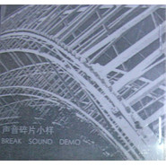

声音碎片小样
============================

|  |  |
| :--: | :-- |
| [ 声音碎片小样](https://emumo.xiami.com/album/360395) | **艺人**: [声音碎片](../index.md) **语种**: 国语 **唱片公司**: 独立发行 **发行时间**: 2000年02月01日 **专辑类别**: 录音室专辑 **专辑风格**: 摇滚 Rock & Roll **播放数**: 108348 **收藏数**: 634 **评论数**: 56  |

## 简介

 ！

## 曲目

- [这一刻 (Demo)](./360395/xLpFy4bdf81.md)
- [妄想狂 (Demo)](./360395/xLpFy5d7390.md)
- [自欺 (Demo)](./360395/xLpFy6af188.md)
- [秘密路线 (Demo)](./360395/mQ4G9X6decf.md)
- [从内部成熟 (Demo)](./360395/b1pN8sc430f1.md)
- [上当 (Demo)](./360395/bqvc93355b7e.md)
- [狂欢 (Demo)](./360395/mQ4GAa8d362.md)
- [世界是噪音的花园 (Demo)](./360395/bf0rAEV32351.md)

## 评论

|  |  |  |
| :-- | :-- | :-- |
|  [虾米用户](https://emumo.xiami.com/u/3583995) 一個人的戰爭 2020-08-25 23:38 赞(0) 踩(0) | 
.
 |
|  [虾米用户](https://emumo.xiami.com/u/33143018) drink up bab... 2020-04-14 09:01 赞(0) 踩(0) | 
现在 2020了...
 |
|  [虾米用户](https://emumo.xiami.com/u/375076091)  2019-06-02 14:16 赞(0) 踩(0) | 
有种打动人心的感觉
 |
|  [虾米用户](https://emumo.xiami.com/u/8873048) 迷幻南方摇滚蓝调自赏仙音... 2018-04-03 00:07 赞(0) 踩(0) | 
这一张的水准和份量完完全全是专辑
 |
|  [虾米用户](https://emumo.xiami.com/u/131555) 我还没想好要写什么... 2018-03-29 12:58 赞(0) 踩(0) | 
这张 太 牛逼 了！
 |
|  [虾米用户](https://emumo.xiami.com/u/43492923) 行到水穷我才开始害怕，夕... 2018-03-07 17:52 赞(0) 踩(0) | 
□
 |
|  [虾米用户](https://emumo.xiami.com/u/296771550) 慢性喉炎。 2018-02-24 21:32 赞(1) 踩(0) | 
已经发行18年了。
 |
|  [虾米用户](https://emumo.xiami.com/u/16876753) 食草 2018-01-05 23:41 赞(0) 踩(0) | 
无聊军队
 |
|  [虾米用户](https://emumo.xiami.com/u/90102934) 叶底藏花 2016-09-11 17:25 赞(0) 踩(0) | 
竟然有这张！
 |
|  [虾米用户](https://emumo.xiami.com/u/30800139) 我在低俗与高雅间活的很尴... 2016-03-29 17:42 赞(0) 踩(0) | 
。
 |
|  [虾米用户](https://emumo.xiami.com/u/6215042) 欢迎关注同名音乐公众号 2015-12-27 09:18 赞(0) 踩(0) | 
radiohead
 |
|  [虾米用户](https://emumo.xiami.com/u/42740176)  2015-04-23 01:24 赞(0) 踩(0) | 
虾米居然有这张demo唱片。我只能说太屌了。我心中最重要的乐队。
 |
|  [虾米用户](https://emumo.xiami.com/u/45328718) 暂无签名~ 2015-03-17 00:50 赞(2) 踩(0) | 
以前的马玉龙是跟现在的“彝人制造”一起的，从这几年发的几张唱片来看，离开彝人制造是马玉龙最正确的选择。也是摇谜的一大幸事！
 |
|  [虾米用户](https://emumo.xiami.com/u/930927)  2014-10-31 10:21 赞(0) 踩(0) | 
很特别的感觉
 |
|  [虾米用户](https://emumo.xiami.com/u/529050) 人间不值得，幸好有音乐。 2014-08-11 07:43 赞(0) 踩(0) | 
狂欢和噪音花园这小样的版本比专辑更好。
 |
|  [虾米用户](https://emumo.xiami.com/u/529050) 人间不值得，幸好有音乐。 2014-08-11 07:42 赞(0) 踩(0) | 
因为你只是噪音花园中的陌路人。
 |
|  [虾米用户](https://emumo.xiami.com/u/2940446) 一株旺盛生长的植物 2014-07-25 11:48 赞(0) 踩(0) | 
这唱腔。。。。难以接受。。。。
 |
|  [虾米用户](https://emumo.xiami.com/u/32334006) 自己去想 我懒得写了 2014-02-28 14:25 赞(0) 踩(0) | 
专辑介绍是写的是什么
 |
|  [虾米用户](https://emumo.xiami.com/u/9306238) 一念清静，烈焰城池 2014-02-09 17:53 赞(0) 踩(0) | 
这一张专辑还没收藏嘛，期待他们来厦门！
 |
|  [虾米用户](https://emumo.xiami.com/u/19417985)  2013-10-19 23:00 赞(0) 踩(0) | 
..
 |
|  [虾米用户](https://emumo.xiami.com/u/13123605)  2013-10-17 23:01 赞(0) 踩(0) | 
xiaoyang
 |
|  [虾米用户](https://emumo.xiami.com/u/1214474)  2013-09-09 21:37 赞(0) 踩(0) | 
专辑介绍不对，谁说主唱最开始不是马玉龙。
 |
|  [虾米用户](https://emumo.xiami.com/u/7669059)  2013-07-17 22:35 赞(4) 踩(0) | 
radiohead
 |
|  [虾米用户](https://emumo.xiami.com/u/2277864)  2013-07-13 18:17 赞(0) 踩(0) | 
这张是马玉龙唱的，歌词也是他写的，很明显。。。之前第一张小样乐队名字还是“药用植物研究所”，主唱是曹操的哥曹草——后来组了暗夜公爵那个
 |
|  [虾米用户](https://emumo.xiami.com/u/767612) 我还没想好要写什么... 2013-06-10 20:48 赞(0) 踩(0) | 
明显是马玉龙年轻时的声音
 |
|  [虾米用户](https://emumo.xiami.com/u/7586641)   2013-06-01 18:11 赞(0) 踩(0) | 
压抑
 |
|  [虾米用户](https://emumo.xiami.com/u/1246149)  2013-04-29 19:58 赞(0) 踩(0) | 
“小样”
 |
|  [虾米用户](https://emumo.xiami.com/u/548916)  2013-04-25 22:06 赞(1) 踩(0) | 
声音像碎片一样被生活一哄而散，我们急着跑，就忘记了飞。
 |
|  [虾米用户](https://emumo.xiami.com/u/9098773)  2013-04-20 00:58 赞(0) 踩(0) | 
这个空间的残响，声音世界里的同路人。
 |
|  [虾米用户](https://emumo.xiami.com/u/9098773)  2013-04-20 00:58 赞(0) 踩(0) | 
这个空间的残响，声音世界里的同路人。
 |
|  [虾米用户](https://emumo.xiami.com/u/9098773)  2013-04-20 00:58 赞(0) 踩(0) | 
这个空间的残响，声音世界里的同路人。
 |
|  [虾米用户](https://emumo.xiami.com/u/131555) 我还没想好要写什么... 2013-04-19 15:32 赞(1) 踩(0) | 
介绍能再专业点吗？主唱不是马玉龙是谁？！
 |
|  [虾米用户](https://emumo.xiami.com/u/3169477)  2013-03-05 23:14 赞(0) 踩(0) | 
相逢又再恨晚
 |
|  [虾米用户](https://emumo.xiami.com/u/4268757) 我也不知道，在你向往的日... 2012-12-27 12:31 赞(1) 踩(0) | 
这张 屌爆了！
 |
|  [虾米用户](https://emumo.xiami.com/u/9) 不来都得死 2012-12-27 10:59 赞(0) 踩(0) | 
我靠，这张牛了
 |
|  [虾米用户](https://emumo.xiami.com/u/654083)  2012-11-23 14:33 赞(0) 踩(0) | 
我对小样都比较敏感
 |
|  [虾米用户](https://emumo.xiami.com/u/11323725)  2012-11-19 23:16 赞(0) 踩(0) | 
yond for you
 |
|  [虾米用户](https://emumo.xiami.com/u/11011215) 挣扎在伪艺术的长河 2012-10-11 15:52 赞(0) 踩(0) | 
诗一样的音乐家！
 |
|  [虾米用户](https://emumo.xiami.com/u/2857581)  2012-08-11 22:38 赞(0) 踩(0) | 
介绍有错误，当时主唱就是马玉龙。
 |
|  [虾米用户](https://emumo.xiami.com/u/2648838)  2012-04-12 21:38 赞(0) 踩(0) | 
喜欢
 |
|  [虾米用户](https://emumo.xiami.com/u/6060489) 犹如珠穆朗玛峰顶的信号塔... 2012-03-31 10:15 赞(0) 踩(0) | 
同步
 |
|  [虾米用户](https://emumo.xiami.com/u/4278153)  2012-02-14 15:44 赞(14) 踩(0) | 
假如你也平躺着自己，大颗大颗的流着眼泪，你就会明白我的喜欢
 |
| ⇒ |  [虾米用户](https://emumo.xiami.com/u/6673817)  2016-05-29 17:59 赞(0) 踩(0) | 
当初的你，为何这么伤感？
 |
|  [虾米用户](https://emumo.xiami.com/u/3504106)  2012-01-03 23:45 赞(0) 踩(0) | 
小样。更暗。
 |
|  [虾米用户](https://emumo.xiami.com/u/478527) 好想跟衣服在洗衣机里滚 2011-09-01 15:53 赞(0) 踩(0) | 
怎么那么悲哀啊
 |
|  [虾米用户](https://emumo.xiami.com/u/5393958) 我还没想好要写什么... 2011-08-19 17:37 赞(1) 踩(0) | 
开心的时候听会郁闷 灰的有点矫情 非得这样仇大苦深吗   好吧 我依然爱听
 |
|  [虾米用户](https://emumo.xiami.com/u/72098) 有一天 我要开一家名叫开... 2011-07-31 07:37 赞(0) 踩(0) | 
穿梭在车水马龙的城市，置身于冰冷的石头森林。盲目的寻找，冰冷的死去。更暗，更暗，更暗……
 |
|  [虾米用户](https://emumo.xiami.com/u/3255139)  2011-07-15 23:12 赞(0) 踩(0) | 
感觉
 |
|  [虾米用户](https://emumo.xiami.com/u/3000502)  2011-03-22 13:51 赞(0) 踩(0) | 
犀利
 |
|  [虾米用户](https://emumo.xiami.com/u/2939694)  2011-02-22 21:04 赞(0) 踩(0) | 
我爱声碎~~老王老王~~
 |
|  [虾米用户](https://emumo.xiami.com/u/2939694)  2011-02-22 20:55 赞(0) 踩(0) | 
我爱老王！！一直在找这个最初的~
 |
|  [虾米用户](https://emumo.xiami.com/u/2602081) 如果有一天 我变了 变得... 2011-01-25 12:33 赞(0) 踩(0) | 
梦想的道路
 |
|  [虾米用户](https://emumo.xiami.com/u/843907) 一次平凡的旅行 2010-04-30 04:41 赞(0) 踩(0) | 
大爱
 |
|  [虾米用户](https://emumo.xiami.com/u/840966)  2010-04-28 23:15 赞(0) 踩(0) | 
谁有无损格式的？
 |
| ⇒ |  [虾米用户](https://emumo.xiami.com/u/3504106)  2012-01-03 23:46 赞(0) 踩(0) | 
去  重型碟包  什么都有
 |
|  [虾米用户](https://emumo.xiami.com/u/397187) 多种类型性格色彩文化 2010-04-26 10:00 赞(0) 踩(0) | 
这种东西很难得的谢谢分享 1.阴暗沉闷与幽怨 2.感觉很奇怪，开场的前奏很吸引人，流行摇滚的节奏，但是带给我的 却是一片吵杂灰色，若加些重金属吉他音色进去可能会给人以高潮的兴奋
 |
