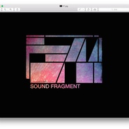

声音碎片
============================

|  |  |
| :--: | :-- |
| [ 声音碎片](https://i.xiami.com/shengyinsuipian) | **地区**: China 中国大陆 **风格**: 摇滚 Rock & Roll **播放数**: 14548579 **粉丝数**: 46543 **评论数**: 1200  |

## 档案

高手不一定是张扬的，他们大概是国内知名摇滚乐队中最低调的一支队伍：他们的歌，初听时似乎简单而直率，细听又发觉复杂而宏伟，音乐安详、沉稳、深刻，他们就是——声音碎片。 
2002年《世界是噪音的花园》；2005年《优美的低于生活》；2008年《把光芒洒向更开阔的地方》，声音碎片的三张唱片步步为营，坚定地表达并塑造着忧伤和壮丽之美，他们不善言辞，将思想与生活的感悟融于音乐创作中，用歌声表达生命、死亡、爱和失去。 
成军10年的声音碎片，低调、疯狂、唯美、用歌声触摸每一个坚强或脆弱的心灵。

## 专辑

| 名称 | 语种 | 唱片公司 | 发行时间 | 专辑类别 | 专辑风格 |
| :--: | :-- | :-- | :-- | :-- | :-- |
| [ 没有鸟鸣，关上窗吧](./albums/2103061830.md) | 国语 | 摩登天空, Anderson Music, LLC | 2019年05月01日 | 录音室专辑 | 柔顺爵士 Smooth Jazz |
| [ 拾碎声音碎片十年现场 / Ten Years](./albums/577051931.md) | 国语 | 独立发行 | 2013年08月21日 | 现场专辑 | 摇滚 Rock & Roll |
| [ 把光芒洒向更开阔的地方](./albums/297653.md) | 国语 | 摩登天空 | 2008年09月01日 | 录音室专辑 | 摇滚 Rock & Roll |
| [ 优美的低于生活under life is......](./albums/15324.md) | 国语 | BadHead | 2005年07月01日 | 录音室专辑 | 摇滚 Rock & Roll |
| [ 世界是噪音的花园the world is a noise garden](./albums/15325.md) | 国语 | BadHead | 2002年08月01日 | 录音室专辑 | 摇滚 Rock & Roll |
| [ 声音碎片小样](./albums/360395.md) | 国语 | 独立发行 | 2000年02月01日 | 录音室专辑 | 摇滚 Rock & Roll |

## 评论

|  |  |  |
| :-- | :-- | :-- |
|  [虾米用户](https://emumo.xiami.com/u/3291786)  2020-12-29 11:13 赞(0) 踩(0) | 
一般而已
 |
|  [虾米用户](https://emumo.xiami.com/u/406374087) 命运咬了我一口，我把它当... 2020-11-09 11:31 赞(1) 踩(0) | 
声音碎片的现场真的很好！10月7日重庆大渡口万达广场草莓音乐节体验了！一首&amp;ldquo;情歌而已&amp;rdquo;真的很好！
 |
| ⇒ |  [虾米用户](https://emumo.xiami.com/u/31287332) It's me,Sapp... 2020-11-11 17:53 赞(0) 踩(0) | 
他们那天唱了情歌而已的吗
 |
| ⇒ |  [虾米用户](https://emumo.xiami.com/u/406374087) 命运咬了我一口，我把它当... 2020-12-24 07:26 赞(0) 踩(0) | 
<q><b>Sapphire说：</b></q>
 |
| ⇒ |  [虾米用户](https://emumo.xiami.com/u/406374087) 命运咬了我一口，我把它当... 2020-12-24 07:37 赞(0) 踩(0) | 
<q><b>Sapphire说：</b></q>
 |
|  [虾米用户](https://emumo.xiami.com/u/7090203) I‘m not 2020-11-07 23:27 赞(1) 踩(0) | 
今天重庆草莓音乐节，第一次听声音碎片的现场，去之前蛮激动的，到了现场更激动，因为我很清楚这次就是为&amp;ldquo;声音碎片&amp;rdquo;而来，果然没让我失望，妥妥的一个赞。特别是对鼓手印象特别深刻，鼓点清脆洪亮加流畅！
 |
|  [虾米用户](https://emumo.xiami.com/u/49905125)  2020-11-07 17:28 赞(0) 踩(0) | 
2020.11.6 北京糖果
 |
|  [虾米用户](https://emumo.xiami.com/u/261221140)  2020-09-20 19:49 赞(1) 踩(0) | 
11.28 大理站 约不约
 |
|  [虾米用户](https://emumo.xiami.com/u/45796166)  2020-08-20 21:41 赞(2) 踩(0) | 
好想看到声碎去乐夏
 |
| ⇒ |  [虾米用户](https://emumo.xiami.com/u/88129534)  2020-09-02 12:14 赞(0) 踩(0) | 
+1&amp;hellip;但是感觉声碎的现场好像不大行
 |
|  [虾米用户](https://emumo.xiami.com/u/2024517) 潮流易逝，风格永存。 2020-08-04 13:15 赞(0) 踩(0) | 

 |
|  [虾米用户](https://emumo.xiami.com/u/103494594) 当车声隆隆，梦开始阵痛 2020-04-08 14:22 赞(1) 踩(0) | 
只想问下，《西南之南》什么时候出？   
 |
|  [虾米用户](https://emumo.xiami.com/u/48156160) 我还没想好要写什么... 2020-02-18 09:36 赞(0) 踩(0) | 

 |
|  [虾米用户](https://emumo.xiami.com/u/25572659)   2020-02-07 10:58 赞(0) 踩(0) | 
新专 
 |
|  [虾米用户](https://emumo.xiami.com/u/134147446)   2019-12-20 08:33 赞(0) 踩(0) | 
今天天气不好
 |
|  [虾米用户](https://emumo.xiami.com/u/260992790) I'll Be Your... 2019-11-28 07:14 赞(0) 踩(0) | 
无意刷到了声玩的一席 有这样一条评论 本来觉得这期有点水，演讲者什么都没说，听完才感觉，其实他什么都说了，全都在他的歌里。
 |
|  [虾米用户](https://emumo.xiami.com/u/44235667)   2019-10-20 10:05 赞(2) 踩(0) | 
去乐队的夏天啊！
 |
|  [虾米用户](https://emumo.xiami.com/u/10643094) 要加组织的朋友发站内信 2019-10-08 20:50 赞(0) 踩(0) | 
好
 |
|  [虾米用户](https://emumo.xiami.com/u/3057399) 朝闻道，夕死可矣。 2019-07-20 16:47 赞(0) 踩(0) | 
抖腿专用~
 |
|  [虾米用户](https://emumo.xiami.com/u/313998537) 一个人 是不完整的 2019-07-16 14:14 赞(0) 踩(0) | 
长沙见
 |
|  [虾米用户](https://emumo.xiami.com/u/405087319) 你我还活着 宇宙没大事 2019-07-10 12:39 赞(0) 踩(0) | 
曾经我们不分白天黑夜唱着情歌做着爱
 |
|  [虾米用户](https://emumo.xiami.com/u/329731951) 如何才能嫁给一把大提 或... 2019-06-23 10:28 赞(0) 踩(0) | 
你们太棒了！！在apple music上听到了你们！！特地来留言！！很喜欢！太开心啦！能听到这样的歌！！
 |
|  [虾米用户](https://emumo.xiami.com/u/292888992) 是孤独也是自由 2019-06-15 23:01 赞(0) 踩(0) | 
宁波一直8.30
 |
|  [虾米用户](https://emumo.xiami.com/u/9306238) 一念清静，烈焰城池 2019-06-06 12:57 赞(0) 踩(0) | 
一下子就过去好多年，再来听，每一首都是熟悉的旋律，熟悉的好听 
 |
|  [虾米用户](https://emumo.xiami.com/u/1680086) 文艺而穷酸的小布尔乔亚 2019-05-15 10:13 赞(11) 踩(0) | 
看来是拿不到更多版权了，曾经打败天下无敌手的虾米也就这意思了。虽然现在有很多平台可以听到自己想要的音乐，但看到虾米如此还是有些遗憾。看了一下评论区还是7年前的留言。好听的音乐就这么被虾米平台渐渐遗忘。
 |
|  [虾米用户](https://emumo.xiami.com/u/51491983) 我还没想好要写什么... 2019-05-12 19:28 赞(1) 踩(0) | 
可以出现场版嘛
 |
|  [虾米用户](https://emumo.xiami.com/u/9972139) -Welcome to ... 2019-05-07 17:29 赞(2) 踩(0) | 
声音碎片「遍地风流」2019全国巡演 6月7日 上海 Modernsky Lab 6月8日 南京 欧拉艺术空间 6月9日 无锡 活塞LiveHouse 6月12日 苏州 山丘咖啡 6月14日 杭州 酒球会 6月15日 宁波 灯塔音乐现场 6月16日 福州 唯美客 MAKER LIVE 6月19日 厦门 Real Live 6月21日 深圳 B10现场 6月22日 广州 TU凸空间
 |
| ⇒ |  [虾米用户](https://emumo.xiami.com/u/10025972) 白天没心肺废物 夜晚怅惘... 2019-05-16 17:31 赞(0) 踩(0) | 
没有北京
 |
|  [虾米用户](https://emumo.xiami.com/u/358104299) 悲观的唯心存在现实解构虚... 2019-04-23 23:15 赞(1) 踩(0) | 
10820
 |
|  [虾米用户](https://emumo.xiami.com/u/374780766) 銀河的子民 2019-04-17 20:58 赞(1) 踩(0) | 
无敌！！！
 |
|  [虾米用户](https://emumo.xiami.com/u/212535552)  2019-02-24 00:52 赞(1) 踩(0) | 
很好的曲子，怎么不出新曲子
 |
| ⇒ |  [虾米用户](https://emumo.xiami.com/u/63597)  2019-02-25 16:55 赞(0) 踩(0) | 
关注一下微博动态 新歌目前只能QQ可以听到
 |
|  [虾米用户](https://emumo.xiami.com/u/23846557) 心有寂静之地 2019-01-23 17:58 赞(1) 踩(0) | 
最后那段互动想到了波西米亚狂想曲里的Queen：诶哦～～
 |
| ⇒ |  [虾米用户](https://emumo.xiami.com/u/2163646) 江湖再会 2019-01-25 00:19 赞(0) 踩(0) | 
对
 |
|  [虾米用户](https://emumo.xiami.com/u/17374601) 我还没想好要写什么... 2019-01-07 08:21 赞(1) 踩(0) | 
记得第一次听声音碎片的歌感觉就是被惊艳到了！非常棒的乐队！
 |
|  [虾米用户](https://emumo.xiami.com/u/50171518) 此号报销 2019-01-06 22:16 赞(0) 踩(0) | 
M
 |
|  [虾米用户](https://emumo.xiami.com/u/13691875) 谁的感叹 偶然合拍 2018-11-11 16:36 赞(1) 踩(0) | 
虾米<a href="http://emumo.xiami.com/u/11111371" target="_blank" rel="nofollow" name_card="11111371">@虾小宝 </a>请把最新那首单曲买回来～！『致我的迷茫兄弟』在其他平台也是买，你们快去吧
 |
|  [虾米用户](https://emumo.xiami.com/u/257100846)  2018-11-06 13:46 赞(3) 踩(0) | 
有时候突然觉得音乐就是一个人的信仰，或者他信念的提现，我听这样的歌，骨子里我就是这样的人。
 |
|  [虾米用户](https://emumo.xiami.com/u/93525646) 相爱吧，终有一散的人们！... 2018-11-05 10:40 赞(1) 踩(0) | 
想进声音碎片群大家一起交流的朋友私信我  
 |
|  [虾米用户](https://emumo.xiami.com/u/93525646) 相爱吧，终有一散的人们！... 2018-11-05 10:38 赞(0) 踩(0) | 
温馨提示：想要进声音碎片官方群的朋友加群主的微信lao-weiwei或者群管理微信hyn_daniel，乐队活动都会第一时间在群里公布，等你哦
 |
|  [虾米用户](https://emumo.xiami.com/u/93525646) 相爱吧，终有一散的人们！... 2018-11-05 10:31 赞(1) 踩(0) | 
温馨提示：想要进声音碎片官方群的朋友加群主的微信lao-weiwei或者群管理微信hyn_daniel，乐队活动都会第一时间在群里公布，谢谢！
 |
|  [虾米用户](https://emumo.xiami.com/u/9725504) 千江有水千江月，万里无云... 2018-11-02 20:42 赞(0) 踩(0) | 
今年上海周边会有专场吗 只有北京有吗
 |
| ⇒ |  [虾米用户](https://emumo.xiami.com/u/63597)  2018-11-02 23:35 赞(0) 踩(0) | 
今年只有北京啦
 |
| ⇒ |  [虾米用户](https://emumo.xiami.com/u/179491) 因为相信，所以看见 2019-04-07 07:57 赞(0) 踩(0) | 
6.7 MODERNSKYLAB 上海
 |
|  [虾米用户](https://emumo.xiami.com/u/47494497) 李志、陈升，“虾米也没有... 2018-11-02 15:49 赞(0) 踩(0) | 
发新专了！！快上！！
 |
|  [虾米用户](https://emumo.xiami.com/u/33509127) 我们错过了这个晚霞 2018-11-02 11:12 赞(0) 踩(0) | 
高中开始听，现在我已大学毕业一两年了。我很喜欢这些。
 |
|  [虾米用户](https://emumo.xiami.com/u/3566813) 菩萨，祝您身体健康！34... 2018-10-26 14:55 赞(0) 踩(0) | 
多数时候来来回回才发现，竟没有关注，好吧，出新专一定买。
 |
| ⇒ |  [虾米用户](https://emumo.xiami.com/u/63597)  2018-10-26 16:47 赞(0) 踩(0) | 
马上
 |
|  [虾米用户](https://emumo.xiami.com/u/48748810) ‌一眼望去，精致的面容很... 2018-09-28 23:53 赞(1) 踩(0) | 
太可惜了 怀念还能听唱片的日子 声音唱片这么牛逼  真可惜没有大火
 |
|  [虾米用户](https://emumo.xiami.com/u/375721956) 我还没想好要写什么...... 2018-09-08 12:21 赞(0) 踩(0) | 
灰常好听 
 |
|  [虾米用户](https://emumo.xiami.com/u/44991093) Beautiful Bl... 2018-06-18 18:38 赞(0) 踩(0) | 
低于生活
 |
|  [虾米用户](https://emumo.xiami.com/u/956662) 祭…毕竟什么都逃不过时间 2018-05-22 18:49 赞(3) 踩(0) | 
对于声音碎片，以前是喜欢，草莓现场之后是爱
 |
|  [虾米用户](https://emumo.xiami.com/u/304059273) Back to Dece... 2018-05-20 06:34 赞(2) 踩(0) | 
前鼓手王赣是我弟弟以前的架子鼓老师，但是没学几年，老师就因病去世了，挺可惜的，那时候他刚和他女朋友结婚，我忘了是准备结婚还是已经结了，我那时太小记不清了，他老婆那时候哭的眼睛都肿了，看着太难受了刚听了好几首，真的是属于他们那个年代的疯狂，respect！
 |
|  [虾米用户](https://emumo.xiami.com/u/324768942) B b b b ba d... 2018-05-18 09:34 赞(1) 踩(0) | 
发现你们了
 |
|  [虾米用户](https://emumo.xiami.com/u/5704024) 你怎样信仰，你就怎样生活 2018-05-16 23:11 赞(1) 踩(0) | 
等你们的黄金时代+1
 |
|  [虾米用户](https://emumo.xiami.com/u/20177386) 感谢一切美好的遇见❤️ 2018-04-24 01:26 赞(0) 踩(0) | 
情歌而已
 |
|  [虾米用户](https://emumo.xiami.com/u/48124705) 无差别便不成世界 2018-04-13 17:09 赞(0) 踩(0) | 
太叼了！
 |
|  [虾米用户](https://emumo.xiami.com/u/330538643) 不要回头，回头是土 2018-03-31 18:56 赞(2) 踩(0) | 
可是，简介里写的最低调的，最低调的难道不是腰吗
 |
|  [虾米用户](https://emumo.xiami.com/u/43492923) 行到水穷我才开始害怕，夕... 2018-03-07 17:56 赞(0) 踩(0) | 
&amp;phi;
 |
|  [虾米用户](https://emumo.xiami.com/u/2425440) 静听松风寒 2018-03-02 20:30 赞(0) 踩(0) | 
歌太少
 |
|  [虾米用户](https://emumo.xiami.com/u/10183109) 我一直假装自己是个学霸… 2018-02-20 20:43 赞(0) 踩(0) | 
没差 我们有现场
 |
|  [虾米用户](https://emumo.xiami.com/u/36691185) 天王盖地虎朋克操金属 2018-01-29 19:21 赞(0) 踩(0) | 
真&amp;middot;老艺术家
 |
|  [虾米用户](https://emumo.xiami.com/u/51918530)  2018-01-11 14:56 赞(2) 踩(0) | 
老马 等你们的黄金时代 耶耶耶
 |
|  [虾米用户](https://emumo.xiami.com/u/2791514) 此处禁言 2018-01-09 08:55 赞(1) 踩(0) | 
请问18年 在西北五省有演出吗
 |
|  [虾米用户](https://emumo.xiami.com/u/2958995)  2018-01-01 02:57 赞(0) 踩(0) | 
不出新歌的你们是怎么火起来的没太明白 
 |
|  [虾米用户](https://emumo.xiami.com/u/36846920)  2017-12-04 23:29 赞(0) 踩(0) | 
一口气买了3张专辑，这一周都在听，什么时候出新专啊？有来武汉的计划吗？
 |
| ⇒ |  [虾米用户](https://emumo.xiami.com/u/334486772) 借来寄托# 2018-08-10 21:05 赞(0) 踩(0) | 
快要出新专辑了，再等等
 |
|  [虾米用户](https://emumo.xiami.com/u/681448) 你应该是一棵树，或者一条... 2017-11-05 23:13 赞(0) 踩(0) | 
   
 |
|  [虾米用户](https://emumo.xiami.com/u/9066420) 我还没想好要写什么... 2017-10-30 10:18 赞(0) 踩(0) | 
曾经我们不分白天黑夜 唱着情歌一路来看你 你如此回答 TMD情歌而已  P.S:这前面加个"TMD"我觉得效果会更好嘻嘻。
 |
|  [虾米用户](https://emumo.xiami.com/u/3341688)  2017-10-30 10:07 赞(0) 踩(0) | 
以为马爷是个柔情大汉，胡须长发什么的，昨日一见。。。。能不卖萌么！不过昨天真心过瘾，一整天看下声音碎片气氛最好。加油~~
 |
|  [虾米用户](https://emumo.xiami.com/u/3877320)  2017-10-29 15:05 赞(1) 踩(0) | 
12年
 |
|  [虾米用户](https://emumo.xiami.com/u/6373063) 为爱而  2017-10-27 23:24 赞(3) 踩(0) | 
主唱马老师啊你的风格让人想起Muse的半粒米，不过你写的词能爆他们菊一万遍。你让我相信，只有唱出来那瞬间诗才活着。 做脑残粉也要做你的脑残粉，跟你合影这事我现在都还没回过神来。
 |
| ⇒ |  [虾米用户](https://emumo.xiami.com/u/4811886) 夕阳爱好者。 2019-05-18 00:54 赞(0) 踩(0) | 
词确实比马吱吱的要好
 |
|  [虾米用户](https://emumo.xiami.com/u/10028400) 我还没想好要写什么... 2017-09-25 07:17 赞(0) 踩(0) | 
嗯&amp;hellip;
 |
|  [虾米用户](https://emumo.xiami.com/u/324929597) 我不是人在旅途，我只是生... 2017-09-15 17:56 赞(1) 踩(0) | 
唯一一次见马老师，是去年西昌湿地音乐节，我优美的晒了一天
 |
|  [虾米用户](https://emumo.xiami.com/u/127810718)  2017-09-13 14:38 赞(1) 踩(0) | 
优美地低于生活
 |
|  [虾米用户](https://emumo.xiami.com/u/193452248) 六千毫升的蓝。 2017-08-18 00:18 赞(0) 踩(0) | 
很奇怪，这个乐队让我想起万青
 |
|  [虾米用户](https://emumo.xiami.com/u/91752958)   2017-08-15 12:42 赞(2) 踩(0) | 
真没听说过这乐队，真强，太强，还是那么多年前写的歌。
 |
|  [虾米用户](https://emumo.xiami.com/u/42875952) 你的心河 2017-08-01 16:59 赞(2) 踩(0) | 
牛逼
 |
|  [虾米用户](https://emumo.xiami.com/u/1081299) 我还没想好要写什么... 2017-05-21 10:03 赞(15) 踩(0) | 
咱能换张高大上点的照片嘛
 |
|  [虾米用户](https://emumo.xiami.com/u/19360239)  2017-05-03 19:32 赞(1) 踩(0) | 
哎，版权害死人
 |
|  [虾米用户](https://emumo.xiami.com/u/4131849) 网易云：非人類兔子Agy... 2017-01-31 00:49 赞(2) 踩(0) | 
陌生城市的早晨
 |
|  [虾米用户](https://emumo.xiami.com/u/52523579) 我还没想好要写什么... 2017-01-22 19:55 赞(2) 踩(0) | 
马叔爱你
 |
|  [虾米用户](https://emumo.xiami.com/u/54775025) 左边第三根肋骨往里三寸的... 2017-01-12 17:59 赞(1) 踩(0) | 
好听～好听～好听～
 |
|  [虾米用户](https://emumo.xiami.com/u/54775025) 左边第三根肋骨往里三寸的... 2017-01-12 17:58 赞(2) 踩(0) | 
一直在听歌从来没看过mv   那天突然想起来看了一下mv才发现原来主唱是个胖纸～ 哈哈
 |
|  [虾米用户](https://emumo.xiami.com/u/77630102) 视之不见，听之不闻，搏之... 2016-10-22 19:10 赞(2) 踩(0) | 
虾米真完犊子，啥都不能听了
 |
|  [虾米用户](https://emumo.xiami.com/u/13691875) 谁的感叹 偶然合拍 2016-10-07 21:42 赞(0) 踩(0) | 
还是没巡演吗今年
 |
|  [虾米用户](https://emumo.xiami.com/u/44991093) Beautiful Bl... 2016-09-25 18:53 赞(0) 踩(0) | 
去网易原来是要在虾米下架
 |
|  [虾米用户](https://emumo.xiami.com/u/51965605) … 2016-09-25 02:21 赞(4) 踩(0) | 
曾经虾米独占   到现在的一片灰
 |
|  [虾米用户](https://emumo.xiami.com/u/2279444) 爱在左，同情在右。 2016-09-18 13:39 赞(0) 踩(0) | 
何时能有新作品......
 |
|  [虾米用户](https://emumo.xiami.com/u/3826067) œœœœœœ 2016-09-04 15:48 赞(0) 踩(0) | 
尼玛！~~~下架了
 |
|  [虾米用户](https://emumo.xiami.com/u/4276552)  2016-09-03 19:32 赞(0) 踩(0) | 
几天前还在听，今天来就没了 
 |
|  [虾米用户](https://emumo.xiami.com/u/5538767)   2016-08-28 07:49 赞(1) 踩(0) | 
马玉龙你为什么那么久不出新专！！！
 |
|  [虾米用户](https://emumo.xiami.com/u/35261672) Brand New Da... 2016-08-22 21:59 赞(0) 踩(0) | 
国内摇滚之惊叹
 |
|  [虾米用户](https://emumo.xiami.com/u/201391232) 最快的方法是先抱抱 2016-08-18 11:32 赞(0) 踩(0) | 

 |
|  [虾米用户](https://emumo.xiami.com/u/18213759)  2016-08-12 03:28 赞(1) 踩(0) | 
现场确实不错
 |
|  [虾米用户](https://emumo.xiami.com/u/4815647) 暂无签名~ 2016-08-05 02:37 赞(4) 踩(0) | 
他们的歌词都有着一种，甜蜜的负荷
 |
|  [虾米用户](https://emumo.xiami.com/u/52810648) 認真點 2016-08-03 16:23 赞(3) 踩(0) | 
愿意为声碎付费
 |
|  [虾米用户](https://emumo.xiami.com/u/588121) 我还没想好要写什么... 2016-08-01 17:25 赞(6) 踩(0) | 
昨天魔马现场感觉很好啊
 |
| ⇒ |  [虾米用户](https://emumo.xiami.com/u/5586779) be nice,be c... 2016-08-03 11:23 赞(0) 踩(0) | 
真的很好
 |
| ⇒ |  [虾米用户](https://emumo.xiami.com/u/588121) 我还没想好要写什么... 2016-08-03 11:49 赞(0) 踩(0) | 
<q><b>Finaaally说：</b></q>
 |
| ⇒ |  [虾米用户](https://emumo.xiami.com/u/5586779) be nice,be c... 2016-08-03 16:30 赞(0) 踩(0) | 
<q><b>叶公瑾说：</b></q>
 |
| ⇒ |  [虾米用户](https://emumo.xiami.com/u/51918530)  2018-01-11 14:55 赞(0) 踩(0) | 
我老马最棒 
 |
|  [虾米用户](https://emumo.xiami.com/u/56741942) 我尽量不装逼，不与人撕逼 2016-07-29 10:37 赞(0) 踩(0) | 
心情低落的时候就好听声碎，心情舒畅了也来听听，已经离不开这声音了 
 |
|  [虾米用户](https://emumo.xiami.com/u/27857090) 有朝一日 2016-07-27 17:32 赞(0) 踩(0) | 
在这里
 |
|  [虾米用户](https://emumo.xiami.com/u/6331728)  2016-07-16 22:33 赞(0) 踩(0) | 
离《把光芒洒向更开阔的地方》已将近8年。你们在哪里？真的希望你们还在音乐里。也许不期而遇，就遇到了你们新砖上线。我从学生变成正在工作的人，虽然还没拿到工资，但如果你们出新砖，我一定买一张~
 |
|  [虾米用户](https://emumo.xiami.com/u/6331728)  2016-07-16 22:29 赞(0) 踩(0) | 
真的好希望能出新作品
 |
|  [虾米用户](https://emumo.xiami.com/u/50342917) 太平记将于11月底进行乐... 2016-07-10 22:31 赞(0) 踩(0) | 
能不能发薪砖啦
 |
|  [虾米用户](https://emumo.xiami.com/u/588121) 我还没想好要写什么... 2016-07-01 22:48 赞(0) 踩(0) | 
柳州，等你
 |
| ⇒ |  [虾米用户](https://emumo.xiami.com/u/4412959) fresh steame... 2016-07-07 10:21 赞(0) 踩(0) | 
几时?
 |
| ⇒ |  [虾米用户](https://emumo.xiami.com/u/588121) 我还没想好要写什么... 2016-07-10 11:15 赞(0) 踩(0) | 
<q><b>新鮮饅頭说：</b></q>
 |
| ⇒ |  [虾米用户](https://emumo.xiami.com/u/4412959) fresh steame... 2016-07-10 22:58 赞(0) 踩(0) | 
<q><b>叶公瑾说：</b></q>
 |
| ⇒ |  [虾米用户](https://emumo.xiami.com/u/588121) 我还没想好要写什么... 2016-07-11 11:18 赞(0) 踩(0) | 
<q><b>新鮮饅頭说：</b></q>
 |
| ⇒ |  [虾米用户](https://emumo.xiami.com/u/4412959) fresh steame... 2016-07-13 02:57 赞(0) 踩(0) | 
<q><b>叶公瑾说：</b></q>
 |
|  [虾米用户](https://emumo.xiami.com/u/29542085) 暂无签名~ 2016-06-27 04:24 赞(0) 踩(0) | 
2014年！有幸见过他们乐队成员，非常低调的乐队！那时候好不知道他们是什么人，只是非常热爱音乐！离开以后看了MV草莓音乐节才知道！声音碎片！后悔没有留影
 |
|  [虾米用户](https://emumo.xiami.com/u/48592224)     Prove Th... 2016-06-26 14:21 赞(0) 踩(0) | 
除了勇气我们一无所有除了失去我们没有遗憾
 |
|  [虾米用户](https://emumo.xiami.com/u/416815)  2016-06-19 19:01 赞(2) 踩(0) | 
2007-2016，毕业到现在一晃这么多年过去了，回想起这些年，身边的人来来往往，感兴趣的事物闪亮又暗淡，似乎只有声音碎片的声音陪我最久....
 |
|  [虾米用户](https://emumo.xiami.com/u/49905125)  2016-06-08 21:25 赞(0) 踩(0) | 
柳州见
 |
|  [虾米用户](https://emumo.xiami.com/u/69878036) 我还没想好要写什么... 2016-06-07 00:44 赞(0) 踩(0) | 
一定要看一次你们的现场！
 |
|  [虾米用户](https://emumo.xiami.com/u/11638875) 阳光小正太皮皮 2016-06-02 13:04 赞(1) 踩(0) | 
还不出新专办巡演 真是太让人着急了！
 |
|  [虾米用户](https://emumo.xiami.com/u/11638875) 阳光小正太皮皮 2016-06-01 13:00 赞(0) 踩(0) | 
全部付费 无语
 |
|  [虾米用户](https://emumo.xiami.com/u/3566813) 菩萨，祝您身体健康！34... 2016-05-30 23:24 赞(0) 踩(0) | 
等待新砖   
 |
|  [虾米用户](https://emumo.xiami.com/u/43435061) Ax 2016-05-25 17:59 赞(0) 踩(0) | 
我就这样 我还不止这样。
 |
|  [虾米用户](https://emumo.xiami.com/u/9397721) 伊丽莎白 素贞 2016-05-25 15:09 赞(0) 踩(0) | 
低调到简介里没有看到啥信息
 |
|  [虾米用户](https://emumo.xiami.com/u/5770554)   2016-05-22 19:20 赞(0) 踩(0) | 
什么时候广州
 |
|  [虾米用户](https://emumo.xiami.com/u/20316094)  2016-05-14 23:47 赞(0) 踩(0) | 
求武汉
 |
|  [虾米用户](https://emumo.xiami.com/u/36770110) 蘋藻攸陈飨祭 2016-05-09 12:39 赞(0) 踩(0) | 
衰老的变形着歌唱/单纯的盲目地跳舞/狡猾的陌生人鼓起掌/只有你还躲在暗处
 |
|  [虾米用户](https://emumo.xiami.com/u/79994618)  2016-04-26 10:04 赞(2) 踩(0) | 
欢迎大家加入声音碎片歌迷微信群，因群人数已破百无法直接扫描二维码入群，有意者请私信我 
 |
|  [虾米用户](https://emumo.xiami.com/u/13691875) 谁的感叹 偶然合拍 2016-04-20 19:21 赞(1) 踩(0) | 
去年武汉站取消，我耿耿于怀 
 |
| ⇒ |  [虾米用户](https://emumo.xiami.com/u/152781330)  2016-04-26 22:01 赞(0) 踩(0) | 
我也是。票都买好的 退的时候都哭了
 |
| ⇒ |  [虾米用户](https://emumo.xiami.com/u/43435061) Ax 2016-05-25 18:00 赞(0) 踩(0) | 
下次来约上我
 |
|  [虾米用户](https://emumo.xiami.com/u/6055686)  2016-04-20 14:58 赞(0) 踩(0) | 
什么时候才有专场演出啊！！！！！
 |
|  [虾米用户](https://emumo.xiami.com/u/36057872) 网易/BC: Breat... 2016-04-20 10:22 赞(0) 踩(0) | 
~
 |
|  [虾米用户](https://emumo.xiami.com/u/5604294)   2016-04-15 12:51 赞(1) 踩(0) | 
别说了 快来昆明
 |
| ⇒ |  [虾米用户](https://emumo.xiami.com/u/34357809) 我还没想好要写什么... 2018-05-07 18:16 赞(0) 踩(0) | 
去年夏天来了 五百里
 |
| ⇒ |  [虾米用户](https://emumo.xiami.com/u/5604294)   2019-07-21 14:12 赞(0) 踩(0) | 
<q><b>同學文晖说：</b></q>
 |
|  [虾米用户](https://emumo.xiami.com/u/3698835)   2016-04-10 01:23 赞(4) 踩(0) | 
怎么这么好听  像攒着一股劲 想要放在对的事情上面 你们给我力量 
 |
|  [虾米用户](https://emumo.xiami.com/u/49474059) 听的明白么你 2016-04-08 23:14 赞(1) 踩(0) | 
我觉得你们才算我的摇滚启蒙
 |
|  [虾米用户](https://emumo.xiami.com/u/48211350) 已弃虾米，勿扰 2016-04-05 19:58 赞(0) 踩(0) | 
呼叫声音玩具
 |
|  [虾米用户](https://emumo.xiami.com/u/379435)  2016-03-29 17:39 赞(0) 踩(0) | 
从来不用刻意想起，永远也不会忘记
 |
|  [虾米用户](https://emumo.xiami.com/u/6044227) 人生如戏，戏如人生…… 2016-03-25 17:42 赞(1) 踩(0) | 
随性，自在。
 |
|  [虾米用户](https://emumo.xiami.com/u/64585360)  2016-03-08 15:51 赞(0) 踩(0) | 
就是喜欢
 |
|  [虾米用户](https://emumo.xiami.com/u/45966761) 我还没想好要写什么... 2016-03-06 23:39 赞(0) 踩(0) | 
舒服
 |
|  [虾米用户](https://emumo.xiami.com/u/113624396)  2016-02-13 19:23 赞(0) 踩(0) | 
看了简介，注意是“知名”乐队中最低调。 
 |
|  [虾米用户](https://emumo.xiami.com/u/55048906) 你文渊妹妹 2016-02-01 19:06 赞(1) 踩(0) | 
迷人
 |
|  [虾米用户](https://emumo.xiami.com/u/6299800) 我还没想好要写什么... 2016-01-27 03:10 赞(0) 踩(0) | 
始终欠一个现场
 |
|  [虾米用户](https://emumo.xiami.com/u/29404973)  基本不太用了 2016-01-26 01:26 赞(2) 踩(0) | 
能来成都吗！
 |
|  [虾米用户](https://emumo.xiami.com/u/4745934)  2016-01-25 21:39 赞(3) 踩(0) | 
是怎么做到每首歌的伴奏都这么美的
 |
|  [虾米用户](https://emumo.xiami.com/u/6044227) 人生如戏，戏如人生…… 2016-01-23 23:08 赞(4) 踩(0) | 
为什么听着他们的歌，总有种想痛快淋漓的哭一场的感觉呢……
 |
|  [虾米用户](https://emumo.xiami.com/u/33662882)  2016-01-20 07:05 赞(1) 踩(0) | 
情歌而已
 |
|  [虾米用户](https://emumo.xiami.com/u/72596592) 哈喽 0.0 2016-01-05 09:22 赞(0) 踩(0) | 
声音碎片
 |
|  [虾米用户](https://emumo.xiami.com/u/33009066) 豬小小 2016-01-04 10:25 赞(0) 踩(0) | 
love
 |
|  [虾米用户](https://emumo.xiami.com/u/658953) 世界核平 2016-01-02 12:23 赞(0) 踩(0) | 
...
 |
|  [虾米用户](https://emumo.xiami.com/u/7903669)  2015-12-19 23:02 赞(4) 踩(0) | 
今天在南京被燥哭了
 |
| ⇒ |  [虾米用户](https://emumo.xiami.com/u/6215042) 欢迎关注同名音乐公众号 2015-12-28 00:13 赞(0) 踩(0) | 
看成了提手旁
 |
| ⇒ |  [虾米用户](https://emumo.xiami.com/u/7903669)  2015-12-28 00:13 赞(0) 踩(0) | 
<q><b>JohnnyZhu说：</b></q>
 |
| ⇒ |  [虾米用户](https://emumo.xiami.com/u/9963086) 忘东往西忘不掉你 2015-12-28 18:25 赞(0) 踩(0) | 
<q><b>JohnnyZhu说：</b></q>
 |
| ⇒ |  [虾米用户](https://emumo.xiami.com/u/9066420) 我还没想好要写什么... 2016-01-31 12:39 赞(0) 踩(0) | 
<q><b>JohnnyZhu说：</b></q>
 |
| ⇒ |  [虾米用户](https://emumo.xiami.com/u/6215042) 欢迎关注同名音乐公众号 2016-01-31 12:57 赞(0) 踩(0) | 
<q><b>将死之灵淹以巴比伦说：</b></q>
 |
| ⇒ |  [虾米用户](https://emumo.xiami.com/u/48211350) 已弃虾米，勿扰 2016-04-05 20:00 赞(0) 踩(0) | 
<q><b>JohnnyZhu说：</b></q>
 |
|  [虾米用户](https://emumo.xiami.com/u/11638875) 阳光小正太皮皮 2015-12-19 17:21 赞(0) 踩(0) | 
QAQ什么时候来重庆 不来我也跳江  
 |
| ⇒ |  [虾米用户](https://emumo.xiami.com/u/34965090) 爱好：喜欢板命 2015-12-27 23:43 赞(0) 踩(0) | 
滋雌跳江
 |
|  [虾米用户](https://emumo.xiami.com/u/11219163)  2015-12-19 14:48 赞(1) 踩(0) | 
福州来吗
 |
|  [虾米用户](https://emumo.xiami.com/u/9167200) 光的深处. 2015-12-18 20:04 赞(0) 踩(0) | 
什么时候来西安@声音碎片
 |
| ⇒ |  [虾米用户](https://emumo.xiami.com/u/21123481)  2016-04-15 21:29 赞(0) 踩(0) | 
世园音乐节会不会
 |
|  [虾米用户](https://emumo.xiami.com/u/107748)  2015-12-15 22:42 赞(0) 踩(0) | 
到底啥时候来上海啊
 |
|  [虾米用户](https://emumo.xiami.com/u/14437329) 让一让，母牛们,生命短暂... 2015-12-15 17:31 赞(0) 踩(0) | 
问一下，南京站确定取消了？看到现在大麦还有售票信息。正准备周六去南京，请告诉一下是不是南京站确实取消了，想买票去看了。
 |
| ⇒ |  [虾米用户](https://emumo.xiami.com/u/63597)  2015-12-15 23:00 赞(0) 踩(0) | 
没有取消啊
 |
|  [虾米用户](https://emumo.xiami.com/u/1725513)  2015-12-12 21:36 赞(1) 踩(0) | 
声碎是目前最想看到的现场，期待北京见，要多办演出啊啊啊，歌迷都饿死了
 |
| ⇒ |  [虾米用户](https://emumo.xiami.com/u/63597)  2015-12-12 23:16 赞(0) 踩(0) | 
那啥北京刚演出完
 |
| ⇒ |  [虾米用户](https://emumo.xiami.com/u/1725513)  2015-12-14 14:14 赞(0) 踩(0) | 
<q><b>声音碎片说：</b></q>
 |
|  [虾米用户](https://emumo.xiami.com/u/13939044) 再见了虾米 2015-12-08 15:37 赞(1) 踩(0) | 
很多歌真的好听 但是主唱。。。真的让我爽到不能呼吸
 |
|  [虾米用户](https://emumo.xiami.com/u/36057790)   2015-12-07 10:17 赞(0) 踩(0) | 
歌词真好。浮躁的世间偶尔难得的一丝恬静
 |
|  [虾米用户](https://emumo.xiami.com/u/5131963) expecting ra... 2015-12-06 16:23 赞(0) 踩(0) | 
所以南京12/19照常？
 |
| ⇒ |  [虾米用户](https://emumo.xiami.com/u/63597)  2015-12-06 21:37 赞(0) 踩(0) | 
正常
 |
| ⇒ |  [虾米用户](https://emumo.xiami.com/u/5131963) expecting ra... 2015-12-07 08:28 赞(0) 踩(0) | 
<q><b>声音碎片说：</b></q>
 |
|  [虾米用户](https://emumo.xiami.com/u/4996952)  2015-12-05 13:09 赞(0) 踩(0) | 
什么时候来广州呢TT
 |
| ⇒ |  [虾米用户](https://emumo.xiami.com/u/63597)  2015-12-06 12:00 赞(0) 踩(0) | 
明年春天
 |
| ⇒ |  [虾米用户](https://emumo.xiami.com/u/4996952)  2015-12-06 20:37 赞(0) 踩(0) | 
<q><b>声音碎片说：</b></q>
 |
| ⇒ |  [虾米用户](https://emumo.xiami.com/u/8192862) 诗人和先知。vchat:... 2015-12-08 16:57 赞(0) 踩(0) | 
<q><b>声音碎片说：</b></q>
 |
|  [虾米用户](https://emumo.xiami.com/u/27140247)  2015-12-04 14:26 赞(0) 踩(0) | 
IZombie Season2
 |
|  [虾米用户](https://emumo.xiami.com/u/508481) 不要认为自己没有用 2015-12-03 23:58 赞(0) 踩(0) | 
虽然理解，但是说实话树音乐很不靠谱，今年计划在上海办的某音乐节说什么因为国庆阅兵取消了，在上海体育馆办的剧场演出票务兑换不在体育馆门口等而是在华亭宾馆咖啡厅等。这种服务态度真是醉了。
 |
| ⇒ |  [虾米用户](https://emumo.xiami.com/u/10243033) 牛油會飛 2015-12-09 10:08 赞(0) 踩(0) | 
我人已经飞来长沙结果被告知延期至明年，，哎
 |
|  [虾米用户](https://emumo.xiami.com/u/6331728)  2015-12-03 21:08 赞(0) 踩(0) | 
为什么好久没有新作品了？求新作品。。。看好你们啊，特别喜欢你们！
 |
|  [虾米用户](https://emumo.xiami.com/u/1673693) 把夜晚染黑。 2015-12-03 14:13 赞(0) 踩(0) | 
为什么长沙的取消了！
 |
|  [虾米用户](https://emumo.xiami.com/u/48874735) 这家伙很笨什么也没留下… 2015-12-02 13:11 赞(0) 踩(0) | 
武汉TUT
 |
| ⇒ |  [虾米用户](https://emumo.xiami.com/u/1453136) hi, there 2015-12-03 01:16 赞(0) 踩(0) | 
武汉TUT
 |
| ⇒ |  [虾米用户](https://emumo.xiami.com/u/48874735) 这家伙很笨什么也没留下… 2015-12-03 11:48 赞(0) 踩(0) | 
<q><b>hallo说：</b></q>
 |
|  [虾米用户](https://emumo.xiami.com/u/1217671) 纯良笔直好少年 2015-12-01 16:08 赞(0) 踩(0) | 
我盼了一个月你们又不来了(PД`q。)•。&amp;#039;゜只有出新专辑才能缓解我的哀痛了！
 |
|  [虾米用户](https://emumo.xiami.com/u/3335513)  2015-12-01 13:28 赞(0) 踩(0) | 
为什么长沙的取消了！不开心(｡•́︿•̀｡)
 |
|  [虾米用户](https://emumo.xiami.com/u/7903669)  2015-11-29 12:14 赞(0) 踩(0) | 
南京等你们
 |
|  [虾米用户](https://emumo.xiami.com/u/6081457)   2015-11-27 23:42 赞(0) 踩(0) | 
等！新！砖！
 |
|  [虾米用户](https://emumo.xiami.com/u/5939564)  2015-11-27 21:04 赞(1) 踩(0) | 
北京世纪剧院
 |
|  [虾米用户](https://emumo.xiami.com/u/44025838) Sweet soul w... 2015-11-27 19:20 赞(2) 踩(0) | 
我在世纪剧场(ฅ&amp;gt;ω&amp;lt;*ฅ)
 |
|  [虾米用户](https://emumo.xiami.com/u/13743891)  2015-11-21 22:39 赞(0) 踩(0) | 
为什么会选这张图做封面呢？不太合乐队的风格，是吧？可以的话换个封面吧，好好照张帅的！
 |
|  [虾米用户](https://emumo.xiami.com/u/6533545)  2015-11-20 14:11 赞(0) 踩(0) | 
为什么不来广州……
 |
|  [虾米用户](https://emumo.xiami.com/u/39588717)   2015-11-18 18:15 赞(0) 踩(0) | 
安利～
 |
|  [虾米用户](https://emumo.xiami.com/u/1412260)  很有个性，不需签名…… 2015-11-11 21:10 赞(0) 踩(0) | 
来南昌来南昌来南昌来南昌来南昌来南昌
 |
|  [虾米用户](https://emumo.xiami.com/u/2149328)  2015-11-11 13:46 赞(0) 踩(0) | 
就是喜欢
 |
|  [虾米用户](https://emumo.xiami.com/u/142500)  2015-11-10 21:28 赞(2) 踩(0) | 
hey 上次巡演 我爱的人陪我去买你们的票 如今过去快五年了 这次你们还会去成都吧？我会独自去买票  然后面带微笑的 最先倒下 只是我已不再年少啊
 |
|  [虾米用户](https://emumo.xiami.com/u/69337518)  2015-11-09 12:28 赞(0) 踩(0) | 
武汉！！哈哈，还是剧院
 |
| ⇒ |  [虾米用户](https://emumo.xiami.com/u/63597)  2015-11-09 17:19 赞(0) 踩(0) | 
来呀
 |
| ⇒ |  [虾米用户](https://emumo.xiami.com/u/246887) 音乐是一种想象 2015-11-11 20:20 赞(0) 踩(0) | 
<q><b>声音碎片说：</b></q>
 |
|  [虾米用户](https://emumo.xiami.com/u/9907901)  2015-11-09 03:39 赞(2) 踩(0) | 
陌生城市的早晨 爱到不行
 |
|  [虾米用户](https://emumo.xiami.com/u/35783) 身体给雨，灵魂给风。 2015-11-07 09:37 赞(0) 踩(0) | 
曲有些单调，每一句的结尾几乎都一样。 模式太固定了。
 |
|  [虾米用户](https://emumo.xiami.com/u/5604294)   2015-11-04 11:22 赞(0) 踩(0) | 
居然没有昆明 好伤心
 |
|  [虾米用户](https://emumo.xiami.com/u/48162474)  2015-11-02 16:28 赞(0) 踩(0) | 
爱上旋律
 |
|  [虾米用户](https://emumo.xiami.com/u/68345040)   2015-11-01 14:53 赞(0) 踩(0) | 
前奏惊艳
 |
|  [虾米用户](https://emumo.xiami.com/u/4353208)   2015-10-30 21:52 赞(0) 踩(0) | 
啊啊，为啥不来成都 好桑心~~~~~~~~~
 |
| ⇒ |  [虾米用户](https://emumo.xiami.com/u/456685)   2015-11-05 17:44 赞(0) 踩(0) | 
不要伤心 我们成都还有声音玩具
 |
| ⇒ |  [虾米用户](https://emumo.xiami.com/u/4353208)   2015-11-05 19:06 赞(0) 踩(0) | 
<q><b>BACON$）说：</b></q>
 |
| ⇒ |  [虾米用户](https://emumo.xiami.com/u/456685)   2015-11-05 19:17 赞(0) 踩(0) | 
<q><b>Filocke02说：</b></q>
 |
| ⇒ |  [虾米用户](https://emumo.xiami.com/u/4353208)   2015-11-05 19:19 赞(0) 踩(0) | 
<q><b>BACON$）说：</b></q>
 |
| ⇒ |  [虾米用户](https://emumo.xiami.com/u/456685)   2015-11-05 19:33 赞(0) 踩(0) | 
<q><b>Filocke02说：</b></q>
 |
| ⇒ |  [虾米用户](https://emumo.xiami.com/u/4996952)  2015-11-06 13:28 赞(0) 踩(0) | 
<q><b>Filocke02说：</b></q>
 |
|  [虾米用户](https://emumo.xiami.com/u/706942)   2015-10-30 17:20 赞(0) 踩(0) | 
没有重庆呀。。。。。。。。
 |
|  [虾米用户](https://emumo.xiami.com/u/11638875) 阳光小正太皮皮 2015-10-30 17:17 赞(0) 踩(0) | 
求你们来重庆！！！！！！！！
 |
|  [虾米用户](https://emumo.xiami.com/u/7987622) 暂无签名~ 2015-10-30 17:02 赞(0) 踩(0) | 
999+！
 |
|  [虾米用户](https://emumo.xiami.com/u/7987622) 暂无签名~ 2015-10-30 17:01 赞(0) 踩(0) | 
999！
 |
|  [虾米用户](https://emumo.xiami.com/u/107748)  2015-10-30 13:44 赞(0) 踩(0) | 
你们的新歌在哪里啊在哪里
 |
|  [虾米用户](https://emumo.xiami.com/u/358992) 优美地低于生活 2015-10-25 11:08 赞(0) 踩(0) | 
为了“声音碎片”回到了虾米 只是虾米的音质真叫人……
 |
|  [虾米用户](https://emumo.xiami.com/u/757170)  2015-10-23 15:20 赞(1) 踩(0) | 
声音碎片和巴奈，是两个极度喜欢却又不敢一直听的声音
 |
|  [虾米用户](https://emumo.xiami.com/u/8192862) 诗人和先知。vchat:... 2015-10-22 18:22 赞(1) 踩(0) | 
声音碎片乐队 “大地惊雷——树生长的声音”全国剧场巡演首批城市公布： 12.5 武汉 12.11 长沙 12.19 南京  这是意味着有第二批城市？ 如果第二批城市没有广州我要去跳珠江！！立帖为证！！
 |
|  [虾米用户](https://emumo.xiami.com/u/13691875) 谁的感叹 偶然合拍 2015-10-19 10:30 赞(1) 踩(0) | 
声碎要做巡演了，注意关注哟
 |
| ⇒ |  [虾米用户](https://emumo.xiami.com/u/49777724)  2015-10-19 13:36 赞(0) 踩(0) | 
什么时候
 |
|  [虾米用户](https://emumo.xiami.com/u/24814862) - 2015-10-18 21:02 赞(0) 踩(0) | 
很想找到同类。  希望我们在生活中失去的，都能从后摇滚中找回来。 在做后摇推荐微博，仅此而已。  欢迎关注。 Weibo ID : 后摇狗VALON_
 |
|  [虾米用户](https://emumo.xiami.com/u/52087380) 快乐每一天！ 2015-10-09 19:10 赞(0) 踩(0) | 
感觉不错，多出些好歌！加油！
 |
|  [虾米用户](https://emumo.xiami.com/u/8943891) 你咋那么可爱？ 2015-10-07 14:37 赞(0) 踩(0) | 
有一种要听到新砖的预感。。。请告诉我这不是错觉
 |
| ⇒ |  [虾米用户](https://emumo.xiami.com/u/12690979)  2015-10-07 15:32 赞(0) 踩(0) | 
这不是错觉
 |
| ⇒ |  [虾米用户](https://emumo.xiami.com/u/8943891) 你咋那么可爱？ 2015-10-07 15:53 赞(0) 踩(0) | 
<q><b>农村包围城市说：</b></q>
 |
| ⇒ |  [虾米用户](https://emumo.xiami.com/u/12690979)  2015-10-07 21:57 赞(0) 踩(0) | 
<q><b>అవును说：</b></q>
 |
| ⇒ |  [虾米用户](https://emumo.xiami.com/u/8943891) 你咋那么可爱？ 2015-10-08 14:15 赞(0) 踩(0) | 
<q><b>农村包围城市说：</b></q>
 |
|  [虾米用户](https://emumo.xiami.com/u/242935)  2015-10-05 23:15 赞(0) 踩(0) | 
没解散吧 怎么没动静了呢
 |
|  [虾米用户](https://emumo.xiami.com/u/50739341)   2015-10-04 22:38 赞(3) 踩(0) | 
用了虾米才知道这么多不为人知优秀的乐队：刺猬、丢火车、山人乐队，声音碎片……他们没红，却红了掏粪男孩，真是日了
 |
|  [虾米用户](https://emumo.xiami.com/u/41008536)  2015-09-21 11:36 赞(1) 踩(0) | 
他们曲子编的都挺有新意的，听着轻快而又忧伤，混合的很干净，主唱声音确实是碎片
 |
|  [虾米用户](https://emumo.xiami.com/u/8323365) PinkFloyd骨粉儿 2015-09-16 18:38 赞(4) 踩(0) | 
第一次遇到这样的一个乐队，主唱声音比较稀烂，但是反而毫无违和感且听起来很爽。真实日了狗了
 |
|  [虾米用户](https://emumo.xiami.com/u/6743850) 我还没想好要写什么... 2015-09-03 16:31 赞(0) 踩(0) | 
用简单的旋律 去演绎富有灵性的音乐...
 |
|  [虾米用户](https://emumo.xiami.com/u/34253885) m~man 2015-08-28 17:17 赞(0) 踩(0) | 
淡淡的摇滚，听着很舒心！
 |
|  [虾米用户](https://emumo.xiami.com/u/3811479)  2015-08-23 14:00 赞(0) 踩(0) | 
hjhj
 |
|  [虾米用户](https://emumo.xiami.com/u/342492)  2015-08-15 09:21 赞(2) 踩(0) | 
为什么前奏都这么醉人呢。。。
 |
|  [虾米用户](https://emumo.xiami.com/u/40143805) 再次回归虾米，感动多于回... 2015-08-08 16:22 赞(1) 踩(0) | 
唱着情歌一路来看你
 |
|  [虾米用户](https://emumo.xiami.com/u/15847217) 喜欢听歌的孩子都不会太坏 2015-08-07 13:35 赞(0) 踩(0) | 
唱着情歌一路来看你，歌者有意，听着无心，情歌而已。
 |
|  [虾米用户](https://emumo.xiami.com/u/12458361) 签个毛啊 2015-08-04 10:20 赞(1) 踩(0) | 
好乐队，不多说，多出好作品吧！
 |
|  [虾米用户](https://emumo.xiami.com/u/51918530)  2015-08-01 20:03 赞(14) 踩(0) | 
声碎和树音乐签约。今年有新专辑。魔马也有他们。真的 激动的都哭了。
 |
|  [虾米用户](https://emumo.xiami.com/u/8055524)  2015-07-31 15:37 赞(2) 踩(0) | 
记得12年坐火车来成都，早晨车过秦巴峡谷，峡谷上空飘着薄雾，眼前的一切对我而言崭新又陌生，那时耳机里刚好响着陌生城市的早晨。。。
 |
|  [虾米用户](https://emumo.xiami.com/u/18317107)  2015-07-28 13:41 赞(0) 踩(0) | 
优美的低于生活
 |
|  [虾米用户](https://emumo.xiami.com/u/4254996)  2015-07-24 14:35 赞(0) 踩(0) | 
摇滚
 |
|  [虾米用户](https://emumo.xiami.com/u/671311)  2015-07-21 10:16 赞(1) 踩(0) | 
有点摇滚版李志的意思
 |
|  [虾米用户](https://emumo.xiami.com/u/16876753) 食草 2015-07-16 17:13 赞(0) 踩(0) | 
声碎啊
 |
|  [虾米用户](https://emumo.xiami.com/u/27344342)   2015-07-10 01:56 赞(1) 踩(0) | 
作品听得出认真的态度，但这么多照片就没正经好好拍的，感觉有点心酸
 |
|  [虾米用户](https://emumo.xiami.com/u/3969526)  2015-07-09 13:25 赞(1) 踩(0) | 
去年可是一路听着这首歌去非洲找男友的，自己都要被自己感动了。哈哈哈，太矫情
 |
| ⇒ |  [虾米用户](https://emumo.xiami.com/u/51918530)  2015-08-01 20:04 赞(0) 踩(0) | 
厉害哟 哈哈哈
 |
|  [虾米用户](https://emumo.xiami.com/u/38907728)   2015-07-07 23:33 赞(0) 踩(0) | 
感觉融合了很多风格，有人能给分析下吗？
 |
|  [虾米用户](https://emumo.xiami.com/u/8652507)   2015-07-07 20:26 赞(0) 踩(0) | 
已经喜欢很久。
 |
|  [虾米用户](https://emumo.xiami.com/u/11638875) 阳光小正太皮皮 2015-07-04 18:49 赞(0) 踩(0) | 
暑假了 你们出新专好吗？你们再办巡演好吗？
 |
|  [虾米用户](https://emumo.xiami.com/u/51918530)  2015-06-30 21:11 赞(3) 踩(0) | 
出去旅行两个月 一路上北上  湖南 重庆 陕西 甘肃 北京 青海 新疆 一直都是坐票 坐十几个甚至几十个小时 白天黑夜都听着这首歌 后来 听着这首歌 就像回到那两个月一样 说不出的感觉 。
 |
|  [虾米用户](https://emumo.xiami.com/u/3086214)  2015-06-27 16:11 赞(0) 踩(0) | 
、
 |
|  [虾米用户](https://emumo.xiami.com/u/6331728)  2015-06-18 23:42 赞(0) 踩(0) | 
什么时候出新专辑呢？我等着。。。
 |
|  [虾米用户](https://emumo.xiami.com/u/14341858)  2015-06-15 10:04 赞(0) 踩(0) | 
未来两个月有他们的演出吗？好想听现场啊
 |
|  [虾米用户](https://emumo.xiami.com/u/9072248) 知音否？ 2015-06-14 00:09 赞(0) 踩(0) | 
东方的thirteen senses！
 |
|  [虾米用户](https://emumo.xiami.com/u/9127105)   2015-05-27 23:25 赞(0) 踩(0) | 
以深深爱上这个乐队了
 |
|  [虾米用户](https://emumo.xiami.com/u/8969791) 最怕生命的生死病痛，也最... 2015-05-24 20:58 赞(0) 踩(0) | 
yeah  yeah  yeah
 |
|  [虾米用户](https://emumo.xiami.com/u/641523) 过期老鼠药 2015-05-20 04:33 赞(1) 踩(0) | 
流逝之外，情歌而已··············
 |
|  [虾米用户](https://emumo.xiami.com/u/6644969) 我还没想好要写什么... 2015-05-19 06:47 赞(0) 踩(0) | 
此处
 |
|  [虾米用户](https://emumo.xiami.com/u/40753839)  2015-05-14 20:24 赞(0) 踩(0) | 
啊啊啊啊啊啊啊啊啊啊啊！我在天台！
 |
|  [虾米用户](https://emumo.xiami.com/u/1528966) 此时此地。 2015-05-13 11:43 赞(0) 踩(0) | 
鸟儿飞过夜空
 |
|  [虾米用户](https://emumo.xiami.com/u/4291905) 朝闻道，夕死可矣 2015-05-07 15:27 赞(0) 踩(0) | 
好喜欢，好欢喜
 |
|  [虾米用户](https://emumo.xiami.com/u/6813122) 活在艺术的梦里 2015-05-07 12:21 赞(1) 踩(0) | 
内容已删除
 |
| ⇒ |  [虾米用户](https://emumo.xiami.com/u/3300536) 喜欢睡觉因为梦里什么都有 2015-06-14 12:10 赞(0) 踩(0) | 
因为你活在梦里
 |
|  [虾米用户](https://emumo.xiami.com/u/6813122) 活在艺术的梦里 2015-05-07 12:19 赞(2) 踩(0) | 
正经做音乐的人们   少数没有背叛自我的人
 |
|  [虾米用户](https://emumo.xiami.com/u/19310903)  2015-05-06 14:26 赞(0) 踩(0) | 
感觉广东很少有人听...
 |
| ⇒ |  [虾米用户](https://emumo.xiami.com/u/8094301) Bye bye wx n... 2015-06-03 10:13 赞(0) 踩(0) | 
你说说广东本地人除了陈奕迅张敬轩五月天这些，还会听什么。与北方的音乐完全分割。
 |
| ⇒ |  [虾米用户](https://emumo.xiami.com/u/4334947)  2015-06-07 09:48 赞(0) 踩(0) | 
<q><b>小太阳说：</b></q>
 |
| ⇒ |  [虾米用户](https://emumo.xiami.com/u/8094301) Bye bye wx n... 2015-06-07 11:03 赞(0) 踩(0) | 
<q><b>paulin仔说：</b></q>
 |
| ⇒ |  [虾米用户](https://emumo.xiami.com/u/9072248) 知音否？ 2015-06-13 11:50 赞(0) 踩(0) | 
<q><b>小太阳说：</b></q>
 |
| ⇒ |  [虾米用户](https://emumo.xiami.com/u/3765954) 装下那片湖 2015-08-20 09:54 赞(0) 踩(0) | 
<q><b>小太阳说：</b></q>
 |
| ⇒ |  [虾米用户](https://emumo.xiami.com/u/8094301) Bye bye wx n... 2015-08-21 10:17 赞(0) 踩(0) | 
<q><b>lovesite**说：</b></q>
 |
|  [虾米用户](https://emumo.xiami.com/u/19327050)  2015-05-03 02:59 赞(1) 踩(0) | 
稀罕的音乐，第一次听已经爱上。
 |
|  [虾米用户](https://emumo.xiami.com/u/9281390)  2015-04-25 23:32 赞(1) 踩(0) | 
水费电费斯蒂芬斯蒂芬斯蒂芬但是
 |
|  [虾米用户](https://emumo.xiami.com/u/9295999) 身上没有钱 心里没有诗 2015-04-24 23:51 赞(4) 踩(0) | 
声音碎片和声音玩具有啥关系
 |
|  [虾米用户](https://emumo.xiami.com/u/522983)  2015-04-23 11:43 赞(0) 踩(0) | 
技术流 柔美 有意境
 |
|  [虾米用户](https://emumo.xiami.com/u/522983)  2015-04-23 11:43 赞(0) 踩(0) | 
技术流 柔美 有意境
 |
|  [虾米用户](https://emumo.xiami.com/u/19310903)  2015-04-23 00:57 赞(0) 踩(0) | 
感觉还好...
 |
|  [虾米用户](https://emumo.xiami.com/u/13704947) 豆瓣见：无悲渊。 2015-04-22 18:11 赞(0) 踩(0) | 
只听过《把光芒洒向更开阔的地方》，现在正好把其他的也补了。
 |
|  [虾米用户](https://emumo.xiami.com/u/40574199) 有机控 喜欢一切美的东西 2015-04-17 15:01 赞(0) 踩(0) | 
旋律真的很美很耐听~
 |
|  [虾米用户](https://emumo.xiami.com/u/40574199) 有机控 喜欢一切美的东西 2015-04-17 14:12 赞(0) 踩(0) | 
优美的低于生活
 |
|  [虾米用户](https://emumo.xiami.com/u/7813555) fukc you. 2015-04-16 16:59 赞(0) 踩(0) | 
编曲特有心思。
 |
|  [虾米用户](https://emumo.xiami.com/u/8323365) PinkFloyd骨粉儿 2015-04-14 23:02 赞(0) 踩(0) | 
今天虾米推荐终于推荐到对口味的了！！
 |
|  [虾米用户](https://emumo.xiami.com/u/2078537)  2015-04-14 18:54 赞(0) 踩(0) | 
javascript:void(0);
 |
|  [虾米用户](https://emumo.xiami.com/u/40736857) 厉害厉害厉害 2015-04-14 11:14 赞(0) 踩(0) | 
相见恨晚   
 |
|  [虾米用户](https://emumo.xiami.com/u/17330254) 我还没想好要写什么... 2015-03-24 10:07 赞(1) 踩(0) | 
好詩
 |
|  [虾米用户](https://emumo.xiami.com/u/634400)  2015-03-19 13:22 赞(0) 踩(0) | 
move on
 |
|  [虾米用户](https://emumo.xiami.com/u/48115808)  2015-03-14 11:57 赞(0) 踩(0) | 
现场感觉更好
 |
|  [虾米用户](https://emumo.xiami.com/u/26555349)   2015-03-12 01:14 赞(0) 踩(0) | 
抑郁
 |
|  [虾米用户](https://emumo.xiami.com/u/877352) 我还没想好要写什么... 2015-03-10 01:13 赞(0) 踩(0) | 
新专什么时候出呀···
 |
|  [虾米用户](https://emumo.xiami.com/u/4845837)   2015-03-06 00:41 赞(0) 踩(0) | 
淡淡的忧伤
 |
|  [虾米用户](https://emumo.xiami.com/u/16074688)  2015-03-05 21:46 赞(0) 踩(0) | 
在荔枝fm：听着摇滚去跑步 铭语辙先生的电台第16期里听到的
 |
|  [虾米用户](https://emumo.xiami.com/u/47720427)  2015-03-05 15:24 赞(0) 踩(0) | 
把自己的名字都起为优美的低于生活，可见我多么喜欢他们
 |
|  [虾米用户](https://emumo.xiami.com/u/43587949) 音乐是美好的药 2015-03-04 14:25 赞(1) 踩(0) | 
我不知道好音乐的标准 只是听他们的歌会抑制不住的流泪
 |
|  [虾米用户](https://emumo.xiami.com/u/12225557)  2015-02-28 10:57 赞(0) 踩(0) | 
很棒，但不喜欢低音贝斯，总是轰轰轰的
 |
|  [虾米用户](https://emumo.xiami.com/u/3566813) 菩萨，祝您身体健康！34... 2015-02-24 19:37 赞(0) 踩(0) | 
我记得收藏了啦！
 |
|  [虾米用户](https://emumo.xiami.com/u/10000250) 巧了 2015-02-20 00:40 赞(0) 踩(0) | 
2015，乙未
 |
|  [虾米用户](https://emumo.xiami.com/u/46869909)   2015-02-10 18:44 赞(0) 踩(0) | 
好
 |
|  [虾米用户](https://emumo.xiami.com/u/38884221) 暂无签名~ 2015-02-10 17:21 赞(0) 踩(0) | 
不错不错~
 |
|  [虾米用户](https://emumo.xiami.com/u/45585901) - 2015-02-06 21:39 赞(0) 踩(0) | 
-
 |
|  [虾米用户](https://emumo.xiami.com/u/759691) 摇 2015-02-06 11:29 赞(1) 踩(0) | 
初听时似乎简单而直率，细听又发觉复杂而宏伟，音乐安详、沉稳、深刻
 |
|  [虾米用户](https://emumo.xiami.com/u/13898071) 暂无签名~ 2015-02-05 22:51 赞(0) 踩(0) | 
相爱吧 终有一散的人们…
 |
|  [虾米用户](https://emumo.xiami.com/u/4261281)  2015-02-05 13:00 赞(0) 踩(0) | 
张扬的不一定是高手高手一定是张扬的
 |
| ⇒ |  [虾米用户](https://emumo.xiami.com/u/23894756)   2015-02-20 11:58 赞(0) 踩(0) | 
大师是低调的
 |
|  [虾米用户](https://emumo.xiami.com/u/43991431) die-hard par... 2015-02-01 12:42 赞(0) 踩(0) | 
很不错，风格很喜欢
 |
|  [虾米用户](https://emumo.xiami.com/u/18227046)  2015-01-31 18:04 赞(0) 踩(0) | 
很好听！！
 |
|  [虾米用户](https://emumo.xiami.com/u/44866328) 无需 2015-01-27 15:41 赞(0) 踩(0) | 
有故事的歌
 |
|  [虾米用户](https://emumo.xiami.com/u/16456403) 我还没想好要写什么... 2015-01-22 11:39 赞(1) 踩(0) | 
相爱吧，中有一散的人们 你们失去的不过是童贞
 |
|  [虾米用户](https://emumo.xiami.com/u/4912368)  2015-01-18 22:56 赞(0) 踩(0) | 
我觉得国内最好的摇滚乐队，没有之一。 词曲都不能再棒，可惜太低调。
 |
|  [虾米用户](https://emumo.xiami.com/u/8548568) 暂无签名~ 2015-01-14 15:55 赞(0) 踩(0) | 
不错哦，仿佛又发现了好东西
 |
|  [虾米用户](https://emumo.xiami.com/u/45238572)  2015-01-13 14:39 赞(0) 踩(0) | 
感觉对了
 |
|  [虾米用户](https://emumo.xiami.com/u/43746477) 听音乐心情好。 2015-01-11 13:31 赞(0) 踩(0) | 
大气、超绝。
 |
|  [虾米用户](https://emumo.xiami.com/u/31873884) 一休哥！休息下！休息下 2015-01-05 17:05 赞(0) 踩(0) | 
国内最喜欢的摇滚乐队没有之一
 |
|  [虾米用户](https://emumo.xiami.com/u/39932813) 暂无签名~ 2015-01-04 23:43 赞(0) 踩(0) | 
！！
 |
|  [虾米用户](https://emumo.xiami.com/u/1323753) 宅在家里什么都会。 2015-01-04 11:43 赞(0) 踩(0) | 
嗓子一下想到汪峰
 |
| ⇒ |  [虾米用户](https://emumo.xiami.com/u/51918530)  2015-06-30 22:18 赞(0) 踩(0) | 
跟汪峰完全不同的感觉
 |
|  [虾米用户](https://emumo.xiami.com/u/8833102) 伟❤️375882267 2014-12-25 01:17 赞(0) 踩(0) | 
这里的歌真好听                       圣诞快乐  ！！！
 |
| ⇒ |  [虾米用户](https://emumo.xiami.com/u/1730251)  2015-01-02 21:59 赞(0) 踩(0) | 
又是你
 |
|  [虾米用户](https://emumo.xiami.com/u/39608215) 哔哩哔哩 2014-12-17 12:06 赞(0) 踩(0) | 
不错，有温度
 |
|  [虾米用户](https://emumo.xiami.com/u/44807511) 江畔何年初见月，江月何年... 2014-12-16 17:46 赞(0) 踩(0) | 
舒服的歌
 |
|  [虾米用户](https://emumo.xiami.com/u/29249838) Wechat:david... 2014-12-14 11:27 赞(0) 踩(0) | 
我觉得你们每张专辑取的名字都特好听
 |
|  [虾米用户](https://emumo.xiami.com/u/7219370) 当妮走了 2014-12-11 08:47 赞(0) 踩(0) | 
3 陌生城市的早晨!!!
 |
|  [虾米用户](https://emumo.xiami.com/u/6081457)   2014-12-01 12:55 赞(0) 踩(0) | 
快出新砖
 |
|  [虾米用户](https://emumo.xiami.com/u/7352569) 平淡的沉默 2014-11-25 11:52 赞(0) 踩(0) | 
诗意的摇滚乐队
 |
|  [虾米用户](https://emumo.xiami.com/u/43657835)  2014-11-24 21:14 赞(0) 踩(0) | 
喜欢
 |
|  [虾米用户](https://emumo.xiami.com/u/9610822)  2014-11-15 23:01 赞(0) 踩(0) | 
新气象
 |
|  [虾米用户](https://emumo.xiami.com/u/40721549) 給我滑回去 2014-11-13 22:03 赞(0) 踩(0) | 
感觉在草莓………
 |
|  [虾米用户](https://emumo.xiami.com/u/41187220)  2014-11-13 17:06 赞(0) 踩(0) | 
和奶奶一起晒太阳    把光芒洒向更关阔的地方， 这是充满青春的声音 love it
 |
|  [虾米用户](https://emumo.xiami.com/u/6055686)  2014-10-31 18:48 赞(12) 踩(0) | 
去看你们演出的前一天晚上在你们的微博留言说：”希望明天能听到星光照亮你回家的路“。没想到第二天你们唱的第一首歌就是星光。听你们歌那么久，那天是我第一次看你们现场，我站在第一排，听见马玉龙唱”背叛过得人们收起翅膀“泪水就止不住下流。不管是巧合是偶然，你们让我更愿意相信，即使这是个一拥抱就会背叛的世界但他依然是美好的。美好得就如同初三第一次听到你们歌脑海里浮现的大同世界一样。
 |
| ⇒ |  [虾米用户](https://emumo.xiami.com/u/8094301) Bye bye wx n... 2014-11-17 20:17 赞(0) 踩(0) | 
很美好
 |
|  [虾米用户](https://emumo.xiami.com/u/9278405) SpaceOddity 2014-10-29 22:16 赞(0) 踩(0) | 
你妹
 |
|  [虾米用户](https://emumo.xiami.com/u/37005658)  2014-10-26 13:02 赞(0) 踩(0) | 
歌词棒～
 |
|  [虾米用户](https://emumo.xiami.com/u/7804810) 生活，我们可以更美好 2014-10-25 21:42 赞(0) 踩(0) | 
这封面，哈哈
 |
|  [虾米用户](https://emumo.xiami.com/u/5050696) 暂无签名~ 2014-10-22 23:22 赞(0) 踩(0) | 
现场实在是……
 |
|  [虾米用户](https://emumo.xiami.com/u/7590007) rock heart 2014-10-22 17:30 赞(0) 踩(0) | 
瞬间被吸引
 |
|  [虾米用户](https://emumo.xiami.com/u/6424575)  2014-10-20 06:04 赞(0) 踩(0) | 
优美的低于生活
 |
|  [虾米用户](https://emumo.xiami.com/u/7815569) 自作多情，自作无情 2014-10-19 08:36 赞(0) 踩(0) | 
难得的光听歌喜欢上的乐队，被优美的低于生活抓住的
 |
|  [虾米用户](https://emumo.xiami.com/u/42093155)  2014-10-12 22:34 赞(0) 踩(0) | 
nice
 |
|  [虾米用户](https://emumo.xiami.com/u/34025425) 我还没想好要写什么... 2014-10-05 17:19 赞(0) 踩(0) | 
喜欢声碎
 |
|  [虾米用户](https://emumo.xiami.com/u/30893096) Lifelover 2014-09-30 22:30 赞(1) 踩(0) | 
赞的一逼
 |
|  [虾米用户](https://emumo.xiami.com/u/341531) 一根心弦.  的颤抖 2014-09-30 22:11 赞(0) 踩(0) | 
低调的霸气
 |
|  [虾米用户](https://emumo.xiami.com/u/23353020) 音乐能净化灵魂 2014-09-26 14:34 赞(0) 踩(0) | 
很难在国内找到这种调调！纯粹中带点激昂！
 |
|  [虾米用户](https://emumo.xiami.com/u/752597)  2014-09-21 01:55 赞(0) 踩(0) | 
声碎现场比唱片更好
 |
| ⇒ |  [虾米用户](https://emumo.xiami.com/u/8564798) 我还没想好要写什么... 2014-09-22 13:37 赞(0) 踩(0) | 
这么牛掰
 |
| ⇒ |  [虾米用户](https://emumo.xiami.com/u/752597)  2014-09-24 07:39 赞(0) 踩(0) | 
<q><b>Siqi说：</b></q>
 |
|  [虾米用户](https://emumo.xiami.com/u/40464323) Seizeyourday 2014-09-20 12:24 赞(0) 踩(0) | 
My love.
 |
|  [虾米用户](https://emumo.xiami.com/u/40632444) 聆风 2014-09-18 18:47 赞(0) 踩(0) | 
另一种摇滚
 |
|  [虾米用户](https://emumo.xiami.com/u/1917883) 为了音乐为了摇滚，来一发 2014-09-13 22:40 赞(0) 踩(0) | 
声音碎片
 |
|  [虾米用户](https://emumo.xiami.com/u/5192721) 暂无签名~ 2014-09-10 23:28 赞(15) 踩(0) | 
最喜欢的国内乐队  曾经把他们推荐给外教 外教说像radiohead  我不否认 摇滚乐本来就是外国传来的  像某个乐队并不算什么大事  他们至少还有自己的东西 不像有的乐队连歌词都是英文  声音碎片真的是真诚的  这点可以听出来
 |
| ⇒ |  [虾米用户](https://emumo.xiami.com/u/30282427)  2014-09-21 09:46 赞(0) 踩(0) | 
歌词英文怎么了？
 |
| ⇒ |  [虾米用户](https://emumo.xiami.com/u/5192721) 暂无签名~ 2014-09-21 20:54 赞(0) 踩(0) | 
<q><b>亦久亦旧。说：</b></q>
 |
| ⇒ |  [虾米用户](https://emumo.xiami.com/u/5192721) 暂无签名~ 2014-09-21 20:55 赞(0) 踩(0) | 
<q><b>亦久亦旧。说：</b></q>
 |
| ⇒ |  [虾米用户](https://emumo.xiami.com/u/30282427)  2014-09-28 20:43 赞(0) 踩(0) | 
<q><b>小哼666说：</b></q>
 |
| ⇒ |  [虾米用户](https://emumo.xiami.com/u/5192721) 暂无签名~ 2014-09-29 07:41 赞(0) 踩(0) | 
<q><b>亦久亦旧。说：</b></q>
 |
| ⇒ |  [虾米用户](https://emumo.xiami.com/u/30282427)  2014-10-12 13:05 赞(0) 踩(0) | 
<q><b>小哼666说：</b></q>
 |
| ⇒ |  [虾米用户](https://emumo.xiami.com/u/5192721) 暂无签名~ 2014-10-12 13:07 赞(0) 踩(0) | 
<q><b>亦久亦旧。说：</b></q>
 |
| ⇒ |  [虾米用户](https://emumo.xiami.com/u/30282427)  2014-10-12 15:08 赞(0) 踩(0) | 
<q><b>小哼666说：</b></q>
 |
| ⇒ |  [虾米用户](https://emumo.xiami.com/u/238522612) Bold young a... 2017-07-05 16:56 赞(0) 踩(0) | 
<q><b>亦久亦旧。说：</b></q>
 |
| ⇒ |  [虾米用户](https://emumo.xiami.com/u/50522869) 我还没想好要写什么... 2017-08-20 10:58 赞(0) 踩(0) | 
<q><b>marspagé说：</b></q>
 |
| ⇒ |  [虾米用户](https://emumo.xiami.com/u/8135538)  2017-10-02 15:19 赞(0) 踩(0) | 
<q><b>marspagé说：</b></q>
 |
| ⇒ |  [虾米用户](https://emumo.xiami.com/u/5192721) 暂无签名~ 2017-10-27 23:25 赞(0) 踩(0) | 
<q><b>亦久亦旧。说：</b></q>
 |
| ⇒ |  [虾米用户](https://emumo.xiami.com/u/4743091) 有趣的灵魂，终会相遇。 2017-11-15 18:49 赞(0) 踩(0) | 
三年前的问题，你不分白天黑夜一路唱着情歌来看他，希望三年后的他一定不要回答说情歌而已，原谅我是戏精。三年后的他还是那个他
 |
| ⇒ |  [虾米用户](https://emumo.xiami.com/u/36846920)  2017-12-04 23:27 赞(0) 踩(0) | 
完全可以在一起 
 |
| ⇒ |  [虾米用户](https://emumo.xiami.com/u/40514665) 我还没想好要写什么... 2018-03-17 21:01 赞(0) 踩(0) | 
他们就是中国的radiohead
 |
|  [虾米用户](https://emumo.xiami.com/u/7981563) 一半怪环境，一半怪自己。... 2014-09-09 00:31 赞(2) 踩(0) | 
我读书少，看你们这样吵很费解也。
 |
|  [虾米用户](https://emumo.xiami.com/u/650147) 我还没想好要写什么... 2014-09-06 13:48 赞(1) 踩(0) | 
内容已删除
 |
| ⇒ |  [虾米用户](https://emumo.xiami.com/u/6792908) stateofdecay 2014-09-07 09:48 赞(0) 踩(0) | 
woyeshi
 |
|  [虾米用户](https://emumo.xiami.com/u/40819078) 还不是得活着、、、 2014-09-04 04:20 赞(0) 踩(0) | 
声音碎片
 |
|  [虾米用户](https://emumo.xiami.com/u/8083852)  2014-08-28 16:18 赞(0) 踩(0) | 
太阳部落的一朵云 和声音的天边一朵云  求科普
 |
|  [虾米用户](https://emumo.xiami.com/u/9301514) 独立唱作人 2014-08-28 14:23 赞(0) 踩(0) | 
抓人灵魂，太赞。
 |
|  [虾米用户](https://emumo.xiami.com/u/3521420)  2014-08-23 19:02 赞(0) 踩(0) | 
浅吟低唱~
 |
|  [虾米用户](https://emumo.xiami.com/u/2478601)  2014-08-20 01:02 赞(0) 踩(0) | 
就是Radiohea的走狗，其中三首歌简直就是Radiohead的山寨版，垃圾。
 |
| ⇒ |  [虾米用户](https://emumo.xiami.com/u/8583712) 上传反动、色情等照片将导... 2014-08-22 19:53 赞(0) 踩(0) | 
照你这说广播头的狗地球上多了，音乐上有个术语叫 influenced by，艺术大致也都是这么流变的
 |
|  [虾米用户](https://emumo.xiami.com/u/715923)   2014-08-18 22:07 赞(0) 踩(0) | 
现场渣？ 呵呵 您去听过现场吗我就想问这个
 |
| ⇒ |  [虾米用户](https://emumo.xiami.com/u/9142155) 郝虾米 未知生物是敏感词 2014-08-20 00:13 赞(0) 踩(0) | 
前年的草莓音乐节不知道你在哪
 |
| ⇒ |  [虾米用户](https://emumo.xiami.com/u/3256844) 恩斯波肯 多姆 2014-08-20 00:53 赞(0) 踩(0) | 
<q><b>未知生物说：</b></q>
 |
|  [虾米用户](https://emumo.xiami.com/u/8816961)  2014-08-15 13:13 赞(0) 踩(0) | 
逃跑？别逗了
 |
|  [虾米用户](https://emumo.xiami.com/u/12359647)  2014-08-15 07:21 赞(2) 踩(0) | 
有些人真尼玛矫情，毁这个毁那个的，你口中的小众文青这些符号早就变味了，还自己一个人在那比比就是为了突出自己早八辈子听过这歌了，看我多么牛逼多么有眼光，孰不知反而就是你们这些人毁了这些好音乐
 |
|  [虾米用户](https://emumo.xiami.com/u/2919958)  2014-08-14 21:34 赞(1) 踩(0) | 
幸好新裤子乐队还没毁
 |
|  [虾米用户](https://emumo.xiami.com/u/9086974) 你真好 2014-08-14 19:29 赞(0) 踩(0) | 
第一次听 曲子真是不错呀 就是主唱…
 |
|  [虾米用户](https://emumo.xiami.com/u/1280363)  2014-08-14 11:06 赞(0) 踩(0) | 
第一秒就喜欢上了
 |
|  [虾米用户](https://emumo.xiami.com/u/275850)  2014-08-13 18:42 赞(0) 踩(0) | 
……就感觉一群熊孩子跑到我小花园然后说这啥玩意啊，这么搓，不好吃…… 求求好声音去翻汪老师的歌多好。选秀歌手也未必红，那都是命和商业运作。但是一群熊孩子跑到苦逼，自恋的文艺青年的小花园里乱咆哮就和八国联军火烧圆明园一样啊。求放过，这里有100块去听郭书瑶别客气啊！
 |
|  [虾米用户](https://emumo.xiami.com/u/8302397)  2014-08-13 18:05 赞(0) 踩(0) | 
看了评论才知道声音不算是音乐的一部分？:)，我听的歌少你不要骗我。
 |
|  [虾米用户](https://emumo.xiami.com/u/9142155) 郝虾米 未知生物是敏感词 2014-08-13 16:34 赞(1) 踩(0) | 
内容已删除
 |
| ⇒ |  [虾米用户](https://emumo.xiami.com/u/14044953)   2014-09-30 23:59 赞(0) 踩(0) | 
去找找情歌而已的现场听听看。你要不喜欢那也没办法了。
 |
| ⇒ |  [虾米用户](https://emumo.xiami.com/u/9142155) 郝虾米 未知生物是敏感词 2014-10-01 14:19 赞(0) 踩(0) | 
<q><b>烧锅炉的老大爷说：</b></q>
 |
|  [虾米用户](https://emumo.xiami.com/u/39437241) 来大床上睡会儿吧 2014-08-13 02:36 赞(0) 踩(0) | 
声碎低调奢华
 |
|  [虾米用户](https://emumo.xiami.com/u/2300275) 我还没想好要写什么... 2014-08-12 19:54 赞(0) 踩(0) | 
千万别变成淘宝计划
 |
|  [虾米用户](https://emumo.xiami.com/u/4863565) 挤出一丝力气 2014-08-12 18:37 赞(0) 踩(0) | 
我去，听了这么久才发现没收藏，想啥呢我
 |
|  [虾米用户](https://emumo.xiami.com/u/1569351)  2014-08-12 02:51 赞(0) 踩(0) | 
你说“在一起”多好的歌，被唱成这样，唉唉，捉急。
 |
|  [虾米用户](https://emumo.xiami.com/u/1569351)  2014-08-12 02:51 赞(2) 踩(0) | 
主音的嗓音完全驾驭不了，声音都被音乐淹没掉了。唱英伦没有个穿心的嗓音怎么行。  换个人来翻唱立马就走心了。  换、主、音、可、以、吗！
 |
| ⇒ |  [虾米用户](https://emumo.xiami.com/u/36060622) 暂无签名~ 2014-08-15 00:00 赞(0) 踩(0) | 
首先，我告诉你，乐队里没有 主音 这个词，只有主唱和主音吉他，声音碎片这只乐队的灵魂就在主唱 马玉龙 作词作曲基本上都是他完成的，你说换人简直荒谬，你说他的嗓音驾驭不了，是你对歌曲的理解程度不够，他的声音是捉襟见肘的，费力地歌唱，也只有他能够将声音碎片演绎到如此境地
 |
| ⇒ |  [虾米用户](https://emumo.xiami.com/u/23417620) 没有 2014-08-15 00:47 赞(0) 踩(0) | 
把、你、妈、换、一、个、可、以、吗？
 |
| ⇒ |  [虾米用户](https://emumo.xiami.com/u/427365)   2014-08-15 11:08 赞(0) 踩(0) | 
<q><b>未知生物说：</b></q>
 |
| ⇒ |  [虾米用户](https://emumo.xiami.com/u/4336883) 少年。 2014-08-15 11:12 赞(0) 踩(0) | 
我去，看你听那些歌，哪来的英伦穿透？
 |
| ⇒ |  [虾米用户](https://emumo.xiami.com/u/10440220) 暂无签名~ 2014-08-18 16:40 赞(0) 踩(0) | 
<q><b>未知生物说：</b></q>
 |
| ⇒ |  [虾米用户](https://emumo.xiami.com/u/3916516) 成为自己 2014-09-07 15:33 赞(0) 踩(0) | 
主音？你是想说主唱吧。主音一般指主音吉他手。声碎主唱很好，是整个乐队的灵魂。单从他嗓音来讲和他们做的音乐是完全融在一起的。
 |
|  [虾米用户](https://emumo.xiami.com/u/3781923) 别拒绝上帝。 2014-08-11 19:38 赞(0) 踩(0) | 
英伦
 |
|  [虾米用户](https://emumo.xiami.com/u/7264359) For ever. 2014-08-11 16:41 赞(1) 踩(0) | 
好的歌曲无论多久都会被挖掘出来。继好声音之后，低调且富有诗一样歌词的声音碎片会大方光彩。我觉得。
 |
| ⇒ |  [虾米用户](https://emumo.xiami.com/u/8816961)  2014-08-15 13:14 赞(0) 踩(0) | 
顶，顶每一个字
 |
|  [虾米用户](https://emumo.xiami.com/u/494634)  2014-08-11 15:56 赞(0) 踩(0) | 
声音碎片自己抄的就可以啊。。
 |
| ⇒ |  [虾米用户](https://emumo.xiami.com/u/25590032) 咩啊 2014-08-14 17:22 赞(0) 踩(0) | 
声碎炒谁了？
 |
| ⇒ |  [虾米用户](https://emumo.xiami.com/u/494634)  2014-08-14 17:58 赞(0) 踩(0) | 
<q><b>你傻我不跟你说说：</b></q>
 |
| ⇒ |  [虾米用户](https://emumo.xiami.com/u/494634)  2014-08-14 17:59 赞(0) 踩(0) | 
<q><b>你傻我不跟你说说：</b></q>
 |
| ⇒ |  [虾米用户](https://emumo.xiami.com/u/25590032) 咩啊 2014-08-14 19:09 赞(0) 踩(0) | 
<q><b>Jinn说：</b></q>
 |
| ⇒ |  [虾米用户](https://emumo.xiami.com/u/494634)  2014-08-14 19:20 赞(0) 踩(0) | 
<q><b>你傻我不跟你说说：</b></q>
 |
| ⇒ |  [虾米用户](https://emumo.xiami.com/u/6050210)   2014-08-16 05:58 赞(0) 踩(0) | 
<q><b>Jinn说：</b></q>
 |
|  [虾米用户](https://emumo.xiami.com/u/34791106) 暂无签名~ 2014-08-11 02:36 赞(0) 踩(0) | 
真的不想爆粗口，好声音的那个你们有问过原唱吗，私自改动歌曲名称，你们算什么歌手！力挺碎片
 |
| ⇒ |  [虾米用户](https://emumo.xiami.com/u/8816961)  2014-08-15 13:14 赞(0) 踩(0) | 
问过了
 |
| ⇒ |  [虾米用户](https://emumo.xiami.com/u/8918992)  2014-09-10 16:12 赞(0) 踩(0) | 
<q><b>宁叔说：</b></q>
 |
|  [虾米用户](https://emumo.xiami.com/u/18579335)  2014-08-10 23:31 赞(2) 踩(0) | 
主唱的带入感一般，旋律真心不错
 |
| ⇒ |  [虾米用户](https://emumo.xiami.com/u/1569351)  2014-08-12 02:43 赞(0) 踩(0) | 
can&amp;#039;t agree more
 |
|  [虾米用户](https://emumo.xiami.com/u/607980) 我还没想好要写什么... 2014-08-10 17:19 赞(0) 踩(0) | 
那时候听了好些歌
 |
| ⇒ |  [虾米用户](https://emumo.xiami.com/u/9142155) 郝虾米 未知生物是敏感词 2014-08-20 00:27 赞(0) 踩(0) | 
那都能看见你是不
 |
| ⇒ |  [虾米用户](https://emumo.xiami.com/u/607980) 我还没想好要写什么... 2014-08-20 09:07 赞(0) 踩(0) | 
<q><b>未知生物说：</b></q>
 |
|  [虾米用户](https://emumo.xiami.com/u/2224643) Just be cool 2014-08-09 21:34 赞(0) 踩(0) | 
学长好！
 |
|  [虾米用户](https://emumo.xiami.com/u/36140817) 我还没想好要写什么... 2014-08-09 16:49 赞(0) 踩(0) | 
原唱最牛 最爱声音碎片
 |
|  [虾米用户](https://emumo.xiami.com/u/12860581) xia'mi我回来啦 2014-08-09 15:07 赞(0) 踩(0) | 
内容已删除
 |
| ⇒ |  [虾米用户](https://emumo.xiami.com/u/2982338) 我多想和你一样臭不要脸 2014-08-10 09:39 赞(0) 踩(0) | 
法律不健全，很多领域都这样...
 |
|  [虾米用户](https://emumo.xiami.com/u/3799199)  2014-08-09 14:14 赞(0) 踩(0) | 
好声音那选手其实也唱得听好听
 |
|  [虾米用户](https://emumo.xiami.com/u/25590032) 咩啊 2014-08-09 06:32 赞(2) 踩(0) | 
昨晚好声音学员演唱了一朵云，居然没人追原唱，这不太科学。
 |
| ⇒ |  [虾米用户](https://emumo.xiami.com/u/1013235)  2014-08-09 11:15 赞(0) 踩(0) | 
因为翻唱的很差强人意
 |
|  [虾米用户](https://emumo.xiami.com/u/10669434)  2014-08-08 22:39 赞(0) 踩(0) | 
~
 |
|  [虾米用户](https://emumo.xiami.com/u/32141588) ！！！ 2014-08-08 09:33 赞(0) 踩(0) | 
~
 |
|  [虾米用户](https://emumo.xiami.com/u/20147189) 嘘 2014-08-05 16:47 赞(0) 踩(0) | 
你猜。
 |
|  [虾米用户](https://emumo.xiami.com/u/1461388) 我害怕你们的到来 2014-08-04 11:33 赞(0) 踩(0) | 
昨天只为了你们去了音乐节，听到了情歌而已，我觉得那天满场我是最开心的。
 |
|  [虾米用户](https://emumo.xiami.com/u/7808883) 音乐。 2014-07-23 11:45 赞(2) 踩(0) | 
创作才华被严重低估
 |
|  [虾米用户](https://emumo.xiami.com/u/7264359) For ever. 2014-07-19 16:56 赞(2) 踩(0) | 
国内最被低估的一个乐队
 |
| ⇒ |  [虾米用户](https://emumo.xiami.com/u/3916516) 成为自己 2014-09-07 15:41 赞(0) 踩(0) | 
最不至于，你是基于什么来判断。因为听得人少？知道的人少？声碎在全国巡演时别的地方我不清楚，武汉Vox 三四百人绝对有。凡是喜欢他们的都觉得很优秀。被谁低估了？
 |
| ⇒ |  [虾米用户](https://emumo.xiami.com/u/7264359) For ever. 2014-09-09 11:41 赞(0) 踩(0) | 
<q><b>antitheism说：</b></q>
 |
|  [虾米用户](https://emumo.xiami.com/u/1394262) LESS IS MORE 2014-07-19 01:10 赞(0) 踩(0) | 
好，是真好，戳我痛点上，至少目前为止
 |
|  [虾米用户](https://emumo.xiami.com/u/36761080)  2014-07-16 18:52 赞(1) 踩(0) | 
--
 |
|  [虾米用户](https://emumo.xiami.com/u/2523035) “賜我夢境 還賜我很快就... 2014-07-13 18:56 赞(1) 踩(0) | 
出差的时候听  陌生城市的早晨  好赞~~~~~
 |
|  [虾米用户](https://emumo.xiami.com/u/4777714) 老摇滚挖掘工 2014-07-12 20:43 赞(1) 踩(0) | 
相爱吧 终有一散的人们 你失去的不过是童贞 ————这句是不是叫“优美的寻找骨肉皮”？
 |
|  [虾米用户](https://emumo.xiami.com/u/18011416) 宁静致远~ 2014-07-06 11:44 赞(1) 踩(0) | 
把歌声还给声音碎片····
 |
|  [虾米用户](https://emumo.xiami.com/u/5130492)  2014-07-05 16:42 赞(1) 踩(0) | 
优美的低于生活
 |
|  [虾米用户](https://emumo.xiami.com/u/32095649) 音乐不要停 2014-06-29 13:17 赞(1) 踩(0) | 
情歌而已
 |
|  [虾米用户](https://emumo.xiami.com/u/20432093) 听美好的歌，过愉快的生活 2014-06-27 00:03 赞(0) 踩(0) | 
有个性，很欢快，写实
 |
|  [虾米用户](https://emumo.xiami.com/u/1124003)  2014-06-22 08:31 赞(0) 踩(0) | 
音乐不错，歌词也不错，可惜了主唱的声音没有什么特点；三点都不错的中国乐队太少了，可惜
 |
|  [虾米用户](https://emumo.xiami.com/u/35578430) 永远年轻永远球迷兴眼 2014-06-21 09:10 赞(0) 踩(0) | 
一切都还美好哈哈
 |
|  [虾米用户](https://emumo.xiami.com/u/3681820)  2014-06-19 15:29 赞(0) 踩(0) | 

 |
|  [虾米用户](https://emumo.xiami.com/u/3169477)  2014-06-18 15:00 赞(0) 踩(0) | 
活
 |
|  [虾米用户](https://emumo.xiami.com/u/10174411)  2014-06-17 19:12 赞(0) 踩(0) | 
wtf！
 |
|  [虾米用户](https://emumo.xiami.com/u/7845176)  2014-06-12 21:37 赞(0) 踩(0) | 
情歌而已。。。。。充满了回忆，沙哑的嗓音带着淡淡的忧伤，与时而又很清朗的声音相交替，现实与回忆，阐述与动容，压抑与情不自禁流露的悲伤。这感情，演绎的恰到好处。
 |
|  [虾米用户](https://emumo.xiami.com/u/34269714) 低头闻香 2014-06-09 13:39 赞(0) 踩(0) | 
有种澎湃的感觉
 |
|  [虾米用户](https://emumo.xiami.com/u/220208) 浮生 2014-06-02 13:37 赞(0) 踩(0) | 
你们看这图像，有感木有，大学时
 |
|  [虾米用户](https://emumo.xiami.com/u/3765954) 装下那片湖 2014-06-02 09:09 赞(0) 踩(0) | 
不错，喜欢。
 |
|  [虾米用户](https://emumo.xiami.com/u/32663898) 都是一个样 2014-05-31 15:11 赞(0) 踩(0) | 
所噶
 |
|  [虾米用户](https://emumo.xiami.com/u/464) 不喜欢爵士，谁和我一样 2014-05-30 18:21 赞(0) 踩(0) | 
《拾碎》正版下载、并直接支持乐队： <a href="http://shengyinsuipian.milepub.cn/" target="_blank" rel="nofollow noreferrer noopener">http://shengyinsuipian.milepub.cn/</a>
 |
|  [虾米用户](https://emumo.xiami.com/u/37026539) 精  神  洁  癖 2014-05-26 23:43 赞(0) 踩(0) | 
优美的低于生活
 |
|  [虾米用户](https://emumo.xiami.com/u/6055686)  2014-05-24 12:36 赞(0) 踩(0) | 
真的好想看声碎现场 一直没机会 伤心= =
 |
| ⇒ |  [虾米用户](https://emumo.xiami.com/u/7056029) 再 见 2014-05-27 22:11 赞(0) 踩(0) | 
三天迷笛都去着，喜欢的都辣么晚，都木有等到，同伤心==
 |
|  [虾米用户](https://emumo.xiami.com/u/7437408)  2014-05-24 09:39 赞(0) 踩(0) | 
对自然和生活的诠释
 |
|  [虾米用户](https://emumo.xiami.com/u/8253669)   2014-05-22 11:35 赞(0) 踩(0) | 
现场极其牛逼
 |
| ⇒ |  [虾米用户](https://emumo.xiami.com/u/3749751) 白天是夜晚的仆从 2014-06-02 15:30 赞(0) 踩(0) | 
猜到了～····好向往阿！！！
 |
|  [虾米用户](https://emumo.xiami.com/u/8253669)   2014-05-22 11:34 赞(0) 踩(0) | 
当时在MIDI听到我都疯了
 |
|  [虾米用户](https://emumo.xiami.com/u/11968494) . 2014-05-21 13:32 赞(0) 踩(0) | 
.
 |
|  [虾米用户](https://emumo.xiami.com/u/11511093) 我还没想好要写什么... 2014-05-20 13:59 赞(0) 踩(0) | 
听进去就会爱上他们
 |
|  [虾米用户](https://emumo.xiami.com/u/11511093) 我还没想好要写什么... 2014-05-20 13:56 赞(0) 踩(0) | 
对！低调但是万分牛逼！！！大赞！
 |
|  [虾米用户](https://emumo.xiami.com/u/3248243) 暂无签名~ 2014-05-18 15:26 赞(0) 踩(0) | 
旋律简单直接 继续吧
 |
|  [虾米用户](https://emumo.xiami.com/u/586489)  2014-05-14 22:38 赞(0) 踩(0) | 
年幼时
 |
|  [虾米用户](https://emumo.xiami.com/u/883301) 矛盾便是答案 2014-05-12 14:35 赞(0) 踩(0) | 
来广州吧，南京也行。
 |
|  [虾米用户](https://emumo.xiami.com/u/10422695) 在音乐中寻找爱 2014-05-09 23:56 赞(0) 踩(0) | 
爱死这口琴的节奏了！
 |
|  [虾米用户](https://emumo.xiami.com/u/33603987) 音为悦，听。 2014-05-08 18:58 赞(0) 踩(0) | 
like
 |
|  [虾米用户](https://emumo.xiami.com/u/955047) 0.2秒的幸福 2014-05-08 16:46 赞(0) 踩(0) | 
今年迷笛听着的~~~~超级棒~~~~~原来怎么没发现呢
 |
|  [虾米用户](https://emumo.xiami.com/u/785216)  2014-05-07 20:30 赞(0) 踩(0) | 
诗意般的情调
 |
|  [虾米用户](https://emumo.xiami.com/u/35783) 身体给雨，灵魂给风。 2014-05-04 13:57 赞(0) 踩(0) | 
最简单的形容，就是：好听。
 |
|  [虾米用户](https://emumo.xiami.com/u/5663310)  2014-05-03 23:10 赞(2) 踩(0) | 
今天迷笛终于现场听到了声音碎片，低调但是牛逼
 |
|  [虾米用户](https://emumo.xiami.com/u/1376741)  2014-04-30 09:03 赞(0) 踩(0) | 
低调的魅惑。
 |
|  [虾米用户](https://emumo.xiami.com/u/25550027) 我还没想好要写什么... 2014-04-28 13:53 赞(0) 踩(0) | 
声音很叼
 |
|  [虾米用户](https://emumo.xiami.com/u/35698412) 水霧 2014-04-28 02:33 赞(0) 踩(0) | 
轻快的前奏 马上想到黄昏时的微风
 |
|  [虾米用户](https://emumo.xiami.com/u/22122241) 缘定三生.缘尽一世 2014-04-26 20:04 赞(0) 踩(0) | 
好听
 |
|  [虾米用户](https://emumo.xiami.com/u/5470345) 人生天地间，忽如远行客。 2014-04-25 16:35 赞(0) 踩(0) | 
喜欢前奏 ~
 |
|  [虾米用户](https://emumo.xiami.com/u/6373063) 为爱而  2014-04-25 15:29 赞(4) 踩(0) | 
越听越自闭，越听越自闭！
 |
|  [虾米用户](https://emumo.xiami.com/u/8384826) 再见，虾米，谢谢！ 2014-04-22 22:29 赞(0) 踩(0) | 
很喜欢，又是偶然听到的乐队，有个性，旋律也很耐听
 |
|  [虾米用户](https://emumo.xiami.com/u/11942184)  2014-04-21 15:37 赞(0) 踩(0) | 
比较喜欢欠揍，后面感觉太阴郁
 |
|  [虾米用户](https://emumo.xiami.com/u/84250)   2014-04-20 06:45 赞(0) 踩(0) | 
惊为天人！
 |
|  [虾米用户](https://emumo.xiami.com/u/8791886) 此时此刻 2014-04-17 10:56 赞(0) 踩(0) | 
摇滚加旋律 赞
 |
|  [虾米用户](https://emumo.xiami.com/u/35295119)  2014-04-13 11:23 赞(0) 踩(0) | 
喜欢有流行元素的Rock歌
 |
|  [虾米用户](https://emumo.xiami.com/u/15445366)  2014-04-13 08:45 赞(1) 踩(0) | 
感觉主唱的嗓子和痛仰的挺像。
 |
| ⇒ |  [虾米用户](https://emumo.xiami.com/u/8384826) 再见，虾米，谢谢！ 2014-04-22 22:24 赞(0) 踩(0) | 
还有低苦艾的也是
 |
|  [虾米用户](https://emumo.xiami.com/u/10972823) 去学习，去思考，去反叛 2014-04-12 12:44 赞(1) 踩(0) | 
前奏美如画
 |
|  [虾米用户](https://emumo.xiami.com/u/31608105) 人心是不待风吹而自落的花 2014-04-11 13:08 赞(0) 踩(0) | 
不错///
 |
|  [虾米用户](https://emumo.xiami.com/u/779540)  2014-04-09 20:52 赞(0) 踩(0) | 
好好好，好忧伤的声音。
 |
|  [虾米用户](https://emumo.xiami.com/u/691109)  2014-04-02 15:57 赞(0) 踩(0) | 
有Radiohead和Muse感觉.是我的菜.
 |
|  [虾米用户](https://emumo.xiami.com/u/7248680) 音乐 2014-04-02 09:32 赞(0) 踩(0) | 
听就听嘛，无知的你还评什么啊.那么好的旋律！
 |
|  [虾米用户](https://emumo.xiami.com/u/12780912) 什么是签名？ 2014-03-30 21:03 赞(0) 踩(0) | 
顺流而下，把梦做完
 |
|  [虾米用户](https://emumo.xiami.com/u/34378264)  2014-03-28 23:01 赞(1) 踩(0) | 
平静的深刻的摇滚
 |
|  [虾米用户](https://emumo.xiami.com/u/3743437)  2014-03-25 22:08 赞(1) 踩(0) | 
好听
 |
|  [虾米用户](https://emumo.xiami.com/u/9934794)   2014-03-20 13:13 赞(2) 踩(0) | 
不给下载时闹那样 求黑客
 |
|  [虾米用户](https://emumo.xiami.com/u/15369060)  2014-03-16 21:37 赞(0) 踩(0) | 
意外的发现，有惊喜！
 |
|  [虾米用户](https://emumo.xiami.com/u/33239454) - 2014-03-11 11:12 赞(0) 踩(0) | 
喜欢他们的歌，用心之作
 |
|  [虾米用户](https://emumo.xiami.com/u/2041087) 请叫我土星二叔 2014-03-11 09:25 赞(4) 踩(0) | 
主唱不开口唱，，我还觉得，，哎呀，，这又是一支不错的 后摇音乐乐队。。主唱你能闭嘴么，，你是这么好音乐里面 唯一的 污点！
 |
|  [虾米用户](https://emumo.xiami.com/u/5892716) 公众号：poorjiax... 2014-03-05 16:43 赞(1) 踩(0) | 
情歌而已真难听，土。
 |
| ⇒ |  [虾米用户](https://emumo.xiami.com/u/5196996) Truelovewait... 2014-03-09 13:54 赞(0) 踩(0) | 
接地气
 |
|  [虾米用户](https://emumo.xiami.com/u/9036326) meiming 2014-02-22 13:27 赞(0) 踩(0) | 
每一首歌名都很吸引人
 |
|  [虾米用户](https://emumo.xiami.com/u/793096)  2014-02-11 13:13 赞(0) 踩(0) | 
123
 |
|  [虾米用户](https://emumo.xiami.com/u/793096)  2014-02-11 13:13 赞(0) 踩(0) | 
.
 |
|  [虾米用户](https://emumo.xiami.com/u/572626) 不能让好的被埋没，也不能... 2014-02-08 14:18 赞(3) 踩(0) | 
中国乐队的音乐咋都一个味儿呢，就像网络歌曲都一个调调。
 |
| ⇒ |  [虾米用户](https://emumo.xiami.com/u/10847313) Ki 2014-02-10 21:35 赞(0) 踩(0) | 
那是因为你没真正听过中国摇滚乐
 |
| ⇒ |  [虾米用户](https://emumo.xiami.com/u/572626) 不能让好的被埋没，也不能... 2014-02-10 21:37 赞(0) 踩(0) | 
<q><b>帕吉说：</b></q>
 |
| ⇒ |  [虾米用户](https://emumo.xiami.com/u/10847313) Ki 2014-02-11 17:30 赞(0) 踩(0) | 
<q><b>诗人二胖子（腐烂）说：</b></q>
 |
| ⇒ |  [虾米用户](https://emumo.xiami.com/u/572626) 不能让好的被埋没，也不能... 2014-02-11 17:39 赞(0) 踩(0) | 
<q><b>帕吉说：</b></q>
 |
| ⇒ |  [虾米用户](https://emumo.xiami.com/u/10847313) Ki 2014-02-11 17:41 赞(0) 踩(0) | 
<q><b>诗人二胖子（腐烂）说：</b></q>
 |
| ⇒ |  [虾米用户](https://emumo.xiami.com/u/572626) 不能让好的被埋没，也不能... 2014-02-11 17:44 赞(0) 踩(0) | 
<q><b>帕吉说：</b></q>
 |
| ⇒ |  [虾米用户](https://emumo.xiami.com/u/10847313) Ki 2014-02-11 18:08 赞(0) 踩(0) | 
<q><b>诗人二胖子（腐烂）说：</b></q>
 |
| ⇒ |  [虾米用户](https://emumo.xiami.com/u/572626) 不能让好的被埋没，也不能... 2014-02-11 18:09 赞(0) 踩(0) | 
<q><b>帕吉说：</b></q>
 |
| ⇒ |  [虾米用户](https://emumo.xiami.com/u/10847313) Ki 2014-02-11 20:40 赞(0) 踩(0) | 
<q><b>诗人二胖子（腐烂）说：</b></q>
 |
| ⇒ |  [虾米用户](https://emumo.xiami.com/u/1549065) 不怀旧 不接受批评 2014-03-10 14:50 赞(0) 踩(0) | 
请举例说明好么 中国乐队您都听遍了么 话说得如此武断
 |
| ⇒ |  [虾米用户](https://emumo.xiami.com/u/572626) 不能让好的被埋没，也不能... 2014-03-10 17:50 赞(0) 踩(0) | 
<q><b>全程满意说：</b></q>
 |
| ⇒ |  [虾米用户](https://emumo.xiami.com/u/8787746) 4 2014-03-16 23:51 赞(0) 踩(0) | 
你说话怎么这么酸呢？你又买过多少唱片？你周围又多少人买过他们的唱片？在网上听歌给他们赚了多少钱？多少人贴钱给你听歌。人家一分钱没赚，还唱歌给你听够有骨气了
 |
| ⇒ |  [虾米用户](https://emumo.xiami.com/u/572626) 不能让好的被埋没，也不能... 2014-03-17 08:44 赞(0) 踩(0) | 
<q><b>方城说：</b></q>
 |
| ⇒ |  [虾米用户](https://emumo.xiami.com/u/839516)  2014-03-20 17:06 赞(0) 踩(0) | 
<q><b>诗人二胖子（腐烂）说：</b></q>
 |
| ⇒ |  [虾米用户](https://emumo.xiami.com/u/572626) 不能让好的被埋没，也不能... 2014-03-20 17:36 赞(0) 踩(0) | 
<q><b>大逃说：</b></q>
 |
| ⇒ |  [虾米用户](https://emumo.xiami.com/u/839516)  2014-03-21 11:15 赞(0) 踩(0) | 
<q><b>诗人二胖子（腐烂）说：</b></q>
 |
| ⇒ |  [虾米用户](https://emumo.xiami.com/u/572626) 不能让好的被埋没，也不能... 2014-03-21 11:44 赞(0) 踩(0) | 
<q><b>大逃说：</b></q>
 |
| ⇒ |  [虾米用户](https://emumo.xiami.com/u/1949345) Skong(司空) 2014-03-25 01:23 赞(0) 踩(0) | 
<q><b>诗人二胖子（腐烂）说：</b></q>
 |
| ⇒ |  [虾米用户](https://emumo.xiami.com/u/572626) 不能让好的被埋没，也不能... 2014-03-25 08:24 赞(0) 踩(0) | 
<q><b>Skong说：</b></q>
 |
| ⇒ |  [虾米用户](https://emumo.xiami.com/u/1949345) Skong(司空) 2014-03-25 12:14 赞(0) 踩(0) | 
<q><b>诗人二胖子（腐烂）说：</b></q>
 |
| ⇒ |  [虾米用户](https://emumo.xiami.com/u/1949345) Skong(司空) 2014-03-25 12:50 赞(0) 踩(0) | 
<q><b>说：</b></q>
 |
| ⇒ |  [虾米用户](https://emumo.xiami.com/u/572626) 不能让好的被埋没，也不能... 2014-03-25 14:37 赞(0) 踩(0) | 
<q><b>说：</b></q>
 |
| ⇒ |  [虾米用户](https://emumo.xiami.com/u/572626) 不能让好的被埋没，也不能... 2014-03-25 14:59 赞(0) 踩(0) | 
<q><b>说：</b></q>
 |
| ⇒ |  [虾米用户](https://emumo.xiami.com/u/1087928) 我还没想好要写什么... 2014-04-18 15:17 赞(0) 踩(0) | 
<q><b>诗人二胖子（腐烂）说：</b></q>
 |
| ⇒ |  [虾米用户](https://emumo.xiami.com/u/572626) 不能让好的被埋没，也不能... 2014-04-18 15:55 赞(0) 踩(0) | 
<q><b>海皮威尔说：</b></q>
 |
| ⇒ |  [虾米用户](https://emumo.xiami.com/u/21218091) 我还没想好要写什么... 2014-07-22 10:04 赞(0) 踩(0) | 
<q><b>诗人二胖子（腐烂）说：</b></q>
 |
| ⇒ |  [虾米用户](https://emumo.xiami.com/u/6050210)   2014-08-16 06:21 赞(0) 踩(0) | 
<q><b>诗人二胖子（腐烂）说：</b></q>
 |
| ⇒ |  [虾米用户](https://emumo.xiami.com/u/572626) 不能让好的被埋没，也不能... 2014-08-16 11:11 赞(0) 踩(0) | 
<q><b>异/~斑~说：</b></q>
 |
|  [虾米用户](https://emumo.xiami.com/u/8123188)  2014-02-03 20:43 赞(0) 踩(0) | 
低调的摇滚实力派乐队
 |
|  [虾米用户](https://emumo.xiami.com/u/11401997)   2014-01-29 15:05 赞(0) 踩(0) | 
妈蛋 太好听了 &amp;gt;_&amp;lt;
 |
|  [虾米用户](https://emumo.xiami.com/u/4999714) 菜鸟听音乐 2014-01-29 03:48 赞(0) 踩(0) | 
正能量的赶脚
 |
|  [虾米用户](https://emumo.xiami.com/u/888543) 细雨骑驴入剑门 2014-01-25 22:41 赞(0) 踩(0) | 
《从现在开始》没进热听。。。
 |
|  [虾米用户](https://emumo.xiami.com/u/3521629)  2014-01-24 09:34 赞(0) 踩(0) | 
含蓄 忧郁 梦幻 不忍直视。。。
 |
|  [虾米用户](https://emumo.xiami.com/u/7248680) 音乐 2014-01-23 21:49 赞(0) 踩(0) | 
还能说什么.儿子听着就会随着旋律搬动.旋律词编曲都特棒.国内的原创就需要这样的.坚持就是胜利！
 |
|  [虾米用户](https://emumo.xiami.com/u/4787503) All we are i... 2014-01-23 15:04 赞(0) 踩(0) | 
在一瞬间被触动
 |
|  [虾米用户](https://emumo.xiami.com/u/5007427) 暂无签名~ 2014-01-23 10:47 赞(0) 踩(0) | 
推一个
 |
|  [虾米用户](https://emumo.xiami.com/u/28185706)  2014-01-21 11:45 赞(1) 踩(0) | 
如乐队名字一样。声音就像一点点的碎片一样。总体感觉很低调。歌词却直插心底直接捅到心里最脆弱的角落。可以让人听的落泪的歌曲
 |
|  [虾米用户](https://emumo.xiami.com/u/9142155) 郝虾米 未知生物是敏感词 2014-01-19 23:20 赞(0) 踩(0) | 
歌都不错的  就是现场有点吃力
 |
|  [虾米用户](https://emumo.xiami.com/u/27844638) 我会想念这伟大世界的乌有... 2014-01-14 17:13 赞(0) 踩(0) | 
一直收藏着却听得太晚，我失去太多
 |
|  [虾米用户](https://emumo.xiami.com/u/5691092) 爱生活 爱音乐 爱影视 2014-01-13 18:57 赞(0) 踩(0) | 
现在大爱国团。
 |
|  [虾米用户](https://emumo.xiami.com/u/3852503) Revive! 2014-01-13 18:20 赞(0) 踩(0) | 
编曲很棒，我的菜~期待更经精彩的作品~~
 |
|  [虾米用户](https://emumo.xiami.com/u/31342189) 飞去南方。 2014-01-09 17:48 赞(0) 踩(0) | 
单纯的低于生活。
 |
|  [虾米用户](https://emumo.xiami.com/u/888543) 细雨骑驴入剑门 2014-01-08 22:31 赞(0) 踩(0) | 
最好听的难道不是《从现在开始》吗？竟然都没有排进前十。。。
 |
|  [虾米用户](https://emumo.xiami.com/u/6679076)  2014-01-08 21:51 赞(0) 踩(0) | 
居然一直不知道有这么一个乐队！
 |
|  [虾米用户](https://emumo.xiami.com/u/27780514) 可以食无肉，不可居无乐。 2014-01-08 16:04 赞(0) 踩(0) | 
就是超喜欢！没有理由！！！！
 |
|  [虾米用户](https://emumo.xiami.com/u/1905401)  2014-01-08 00:42 赞(0) 踩(0) | 
听听
 |
|  [虾米用户](https://emumo.xiami.com/u/27833058)  2014-01-07 09:47 赞(0) 踩(0) | 
声音碎片
 |
|  [虾米用户](https://emumo.xiami.com/u/6109433)  2014-01-03 16:53 赞(0) 踩(0) | 
ff
 |
|  [虾米用户](https://emumo.xiami.com/u/11058426)  2013-12-31 13:59 赞(0) 踩(0) | 
不错，有田园般的清新
 |
|  [虾米用户](https://emumo.xiami.com/u/3688800)  2013-12-30 08:41 赞(0) 踩(0) | 
曲子还不错，就是不知道歌唱的什么
 |
|  [虾米用户](https://emumo.xiami.com/u/4329194) ♬❦❧♬ 2013-12-28 07:49 赞(1) 踩(0) | 
如此简单的元素，却绵绵不绝地创造出如此深幽、如此壮阔、如此感人、如此千变万化的乐境。
 |
|  [虾米用户](https://emumo.xiami.com/u/2167366)  2013-12-27 17:13 赞(0) 踩(0) | 
每一首都好听
 |
|  [虾米用户](https://emumo.xiami.com/u/17601536) ！ 2013-12-27 13:30 赞(0) 踩(0) | 
~
 |
|  [虾米用户](https://emumo.xiami.com/u/29711598) 唐维 2013-12-24 16:40 赞(0) 踩(0) | 
最喜欢
 |
|  [虾米用户](https://emumo.xiami.com/u/26526457) 滕州二中91 2013-12-24 16:38 赞(0) 踩(0) | 
现实
 |
|  [虾米用户](https://emumo.xiami.com/u/1291859)   2013-12-22 17:13 赞(0) 踩(0) | 
前奏都很棒啊，如果有伴奏版的就好了
 |
|  [虾米用户](https://emumo.xiami.com/u/172106)  2013-12-16 10:11 赞(0) 踩(0) | 
音乐碎片
 |
|  [虾米用户](https://emumo.xiami.com/u/12788734) F.A.C.T 2013-12-15 14:24 赞(0) 踩(0) | 
彩色的　慢慢會黑白 就像點燃一根香煙 既已開始就要結束他 記住那些閃亮段落 我只能對你說 相遇是甜蜜的 相愛是完美的 如此而已  所以　再來一次 我們需要　完美一些 所以　再來一次 我們需要　完美一些 ============== 這歌詞刺得人鮮血直流。
 |
|  [虾米用户](https://emumo.xiami.com/u/1607798) 两耳不闻窗外事，一心只蹦... 2013-12-14 21:34 赞(0) 踩(0) | 
今晚主菜！
 |
|  [虾米用户](https://emumo.xiami.com/u/17340195)  2013-12-13 13:12 赞(0) 踩(0) | 
赞
 |
|  [虾米用户](https://emumo.xiami.com/u/893999)  2013-12-11 15:48 赞(0) 踩(0) | 
nice!
 |
|  [虾米用户](https://emumo.xiami.com/u/151979)   2013-12-09 17:24 赞(0) 踩(0) | 
推荐again
 |
|  [虾米用户](https://emumo.xiami.com/u/9004292)  2013-12-03 14:30 赞(0) 踩(0) | 
211242
 |
|  [虾米用户](https://emumo.xiami.com/u/1742593)  2013-11-29 14:36 赞(0) 踩(0) | 
声音碎片预言了我们的未来——优美的在大街上熔化
 |
|  [虾米用户](https://emumo.xiami.com/u/3291786)  2013-11-29 11:02 赞(0) 踩(0) | 
键盘是亮点
 |
|  [虾米用户](https://emumo.xiami.com/u/2764638)  2013-11-29 08:54 赞(0) 踩(0) | 
听见优美的低于生活的前奏，就喜欢了！
 |
|  [虾米用户](https://emumo.xiami.com/u/9238280) 麻烦你 请放这张CD 2013-11-25 11:13 赞(0) 踩(0) | 
声音像四魂之玉碎片 四散而相连 急剧地 集聚 我喜欢这种联系 人性的绝现
 |
|  [虾米用户](https://emumo.xiami.com/u/13699324)  2013-11-24 22:04 赞(0) 踩(0) | 
低调
 |
|  [虾米用户](https://emumo.xiami.com/u/11603508)  2013-11-22 13:15 赞(0) 踩(0) | 
活着，就是一种修行，深与浅，全靠自己。是人，就无法免俗，有悲伤，有胆怯，有逃避。百转千回，千回百转，末世荒凉。心，累了，倦了。这个悲伤的冬天，我来这里寻找微弱的阳光。繁杂人世，你可怕了？
 |
|  [虾米用户](https://emumo.xiami.com/u/8703355) Hei,MUSIC! 2013-11-19 00:08 赞(1) 踩(0) | 
第一次听到的声音
 |
|  [虾米用户](https://emumo.xiami.com/u/10786093)  2013-11-18 08:08 赞(97) 踩(0) | 
[声音碎片]气质上比较接近90年代的英式非主流 一来是音乐的抒情性强 有唯美主义倾向 二来作品介于严肃与流行音乐之间 这般干净 流畅而都市气息浓重的歌 容易打动听众的心 乐队挺有商业前途的 目前看 要比许巍好些（没把摇滚当产业 重复唱着甜摇滚） 个人最偏爱[世界是噪音的花园] 因为喜好阴郁 厚重 个性化强 或者根源（地下）点的音乐。。。年纪大了 听不惯浅薄通俗的音乐
 |
| ⇒ |  [虾米用户](https://emumo.xiami.com/u/4412959) fresh steame... 2014-01-28 01:24 赞(0) 踩(0) | 
哦。
 |
| ⇒ |  [虾米用户](https://emumo.xiami.com/u/3749751) 白天是夜晚的仆从 2014-06-02 15:34 赞(0) 踩(0) | 
哥～·你能谦虚点麽~..给大家留点生存空间吧· ^_^
 |
|  [虾米用户](https://emumo.xiami.com/u/10701239) 宝贝，像这里永恒的阳光。 2013-11-17 18:08 赞(0) 踩(0) | 
i喜欢
 |
|  [虾米用户](https://emumo.xiami.com/u/11603508)  2013-11-13 13:29 赞(0) 踩(0) | 
高手
 |
|  [虾米用户](https://emumo.xiami.com/u/11052844) 哇。 2013-11-13 10:13 赞(0) 踩(0) | 
精彩的情感与歌词
 |
|  [虾米用户](https://emumo.xiami.com/u/11299385) 原来自己也不了解 2013-11-12 17:05 赞(0) 踩(0) | 
优美的，低于生活
 |
|  [虾米用户](https://emumo.xiami.com/u/4771754)  2013-11-11 16:34 赞(0) 踩(0) | 
喜欢老大叔~
 |
|  [虾米用户](https://emumo.xiami.com/u/2530278) 喜乐者 2013-11-09 11:18 赞(0) 踩(0) | 
有味道
 |
|  [虾米用户](https://emumo.xiami.com/u/26333022) 赶在霓虹遍满城市前。 2013-11-08 16:51 赞(0) 踩(0) | 
声音碎片
 |
|  [虾米用户](https://emumo.xiami.com/u/697600) breath 2013-11-06 12:52 赞(0) 踩(0) | 
我找到了喜欢的，来专场吧
 |
|  [虾米用户](https://emumo.xiami.com/u/5414668)  2013-11-05 22:59 赞(0) 踩(0) | 
优美的低于生活  是几年前小四出的音乐小说里面的一首 好像叫 北风后面的国家 的歌。怪不得看见声音碎片这个名字就觉得好熟悉！加油呀！情歌而已 很好听！
 |
|  [虾米用户](https://emumo.xiami.com/u/25125563) 伪文艺真汉子的酒窝君 2013-11-03 19:18 赞(0) 踩(0) | 
哈哈哈哈
 |
|  [虾米用户](https://emumo.xiami.com/u/409961) 是我是我还是我 2013-11-03 17:36 赞(0) 踩(0) | 
不喜欢太清醒的声音，他们正好！
 |
|  [虾米用户](https://emumo.xiami.com/u/5161292) 不能安于现状。 2013-11-01 18:38 赞(0) 踩(0) | 
中国~
 |
|  [虾米用户](https://emumo.xiami.com/u/5161292) 不能安于现状。 2013-11-01 18:37 赞(0) 踩(0) | 
当你闭上了眼睛，风暴来自你的心。当你转身想离开，去路多空旷。
 |
|  [虾米用户](https://emumo.xiami.com/u/1336721)  2013-10-30 06:40 赞(0) 踩(0) | 
耳目一新~~！
 |
|  [虾米用户](https://emumo.xiami.com/u/13782251) 7！ 2013-10-29 18:13 赞(0) 踩(0) | 
、
 |
|  [虾米用户](https://emumo.xiami.com/u/13806467)  2013-10-29 13:59 赞(0) 踩(0) | 
陌生城市的早晨
 |
|  [虾米用户](https://emumo.xiami.com/u/4033233)  2013-10-26 13:52 赞(0) 踩(0) | 
8
 |
|  [虾米用户](https://emumo.xiami.com/u/25271000)  2013-10-24 18:18 赞(0) 踩(0) | 
NICE
 |
|  [虾米用户](https://emumo.xiami.com/u/9940441) 小草 2013-10-24 09:26 赞(0) 踩(0) | 
好听的音乐　没有歌词　是不是不完美啊　求歌词啊　《拾碎》专辑
 |
|  [虾米用户](https://emumo.xiami.com/u/10941751) 哼哼哈嘿 2013-10-20 22:08 赞(0) 踩(0) | 
没什么原因，喜欢到伤！
 |
|  [虾米用户](https://emumo.xiami.com/u/8935751) COBHC 2013-10-20 09:11 赞(0) 踩(0) | 
...
 |
|  [虾米用户](https://emumo.xiami.com/u/16264768)  2013-10-19 21:59 赞(0) 踩(0) | 
偶尔换下口味
 |
|  [虾米用户](https://emumo.xiami.com/u/6176166) +++原始星芒+++ 2013-10-18 16:50 赞(0) 踩(0) | 
低调忧伤壮丽的歌词
 |
|  [虾米用户](https://emumo.xiami.com/u/9350604)  2013-10-17 22:21 赞(0) 踩(0) | 
又发现了一只给人惊喜瑰丽的乐队！
 |
|  [虾米用户](https://emumo.xiami.com/u/2884471)  2013-10-17 14:12 赞(0) 踩(0) | 
不作
 |
|  [虾米用户](https://emumo.xiami.com/u/6204101) 我相信## 2013-10-15 11:59 赞(0) 踩(0) | 
声音碎片
 |
|  [虾米用户](https://emumo.xiami.com/u/12783086) 我还没想好要写什么... 2013-10-14 14:15 赞(0) 踩(0) | 
。
 |
|  [虾米用户](https://emumo.xiami.com/u/249236)  2013-10-14 10:20 赞(0) 踩(0) | 
优美的低于生活
 |
|  [虾米用户](https://emumo.xiami.com/u/1675240) 游离 2013-10-09 22:33 赞(0) 踩(0) | 
没有
 |
|  [虾米用户](https://emumo.xiami.com/u/24043265)  2013-10-09 15:52 赞(0) 踩(0) | 
学习
 |
|  [虾米用户](https://emumo.xiami.com/u/751504) ， 2013-10-06 16:09 赞(0) 踩(0) | 
陌生城市的早晨~百听不厌
 |
|  [虾米用户](https://emumo.xiami.com/u/1384536) 感谢拥有耳朵去听song 2013-10-04 16:02 赞(0) 踩(0) | 
比较喜欢声音碎片的声音。来听他们自己的声音
 |
|  [虾米用户](https://emumo.xiami.com/u/8385185) 我庆幸音乐陪我长大 2013-10-03 08:57 赞(0) 踩(0) | 
支持中国原创音乐
 |
|  [虾米用户](https://emumo.xiami.com/u/13179302) 来自安徽合肥的声音 2013-09-30 17:10 赞(0) 踩(0) | 
大家好，我是一个新人，大家可以试听的我的demo，新人求罩~
 |
|  [虾米用户](https://emumo.xiami.com/u/20397849) 我想她应该会懂得如何睡梦... 2013-09-29 19:05 赞(0) 踩(0) | 
好听~~~
 |
|  [虾米用户](https://emumo.xiami.com/u/15871718) 已婚大兒童 2013-09-29 08:31 赞(0) 踩(0) | 
优美的地狱生活
 |
|  [虾米用户](https://emumo.xiami.com/u/10020802) 我还没想好要写什么... 2013-09-26 22:39 赞(1) 踩(0) | 
唱出别人 的  痛。
 |
|  [虾米用户](https://emumo.xiami.com/u/500716) JamesChan 2013-09-26 19:58 赞(0) 踩(0) | 
声音不错，旋律无甚亮点
 |
|  [虾米用户](https://emumo.xiami.com/u/20732789)  2013-09-26 05:19 赞(0) 踩(0) | 
忧郁
 |
|  [虾米用户](https://emumo.xiami.com/u/13670800)  2013-09-24 21:58 赞(0) 踩(0) | 
充满磁性的嗓音
 |
|  [虾米用户](https://emumo.xiami.com/u/846827)  2013-09-24 14:56 赞(0) 踩(0) | 
看在我辛苦打坐的份上，回一个呗~
 |
| ⇒ |  [虾米用户](https://emumo.xiami.com/u/5465578) 要常回来听听初中时听的歌... 2013-10-05 22:49 赞(0) 踩(0) | 
已回复
 |
| ⇒ |  [虾米用户](https://emumo.xiami.com/u/19308380)  2013-11-05 00:21 赞(0) 踩(0) | 
呗
 |
|  [虾米用户](https://emumo.xiami.com/u/21135932)  2013-09-23 22:11 赞(0) 踩(0) | 
gd
 |
|  [虾米用户](https://emumo.xiami.com/u/19308380)  2013-09-17 11:33 赞(1) 踩(0) | 
优美的低于生活
 |
|  [虾米用户](https://emumo.xiami.com/u/16085977) 向往你！ 2013-09-15 20:16 赞(0) 踩(0) | 
声音碎片
 |
|  [虾米用户](https://emumo.xiami.com/u/11860844) 暂无签名~ 2013-09-12 13:27 赞(0) 踩(0) | 
很好听
 |
|  [虾米用户](https://emumo.xiami.com/u/15353598)  2013-09-12 10:43 赞(0) 踩(0) | 
淡
 |
|  [虾米用户](https://emumo.xiami.com/u/5105646)  2013-09-11 20:39 赞(0) 踩(0) | 
中国摇滚
 |
|  [虾米用户](https://emumo.xiami.com/u/21029737)  2013-09-10 19:01 赞(0) 踩(0) | 
jvjkb
 |
|  [虾米用户](https://emumo.xiami.com/u/1820564) 方向比速度更重要 2013-09-10 10:50 赞(0) 踩(0) | 
v.v
 |
|  [虾米用户](https://emumo.xiami.com/u/9066346) 我希望聆听的每一首歌都有... 2013-09-06 19:11 赞(0) 踩(0) | 
生日快乐哦~~~~
 |
|  [虾米用户](https://emumo.xiami.com/u/7322777) ∮ 2013-09-02 00:36 赞(0) 踩(0) | 
浙江大帥哥       37°2 收藏并分享艺人
 |
|  [虾米用户](https://emumo.xiami.com/u/20871879)  2013-09-01 17:30 赞(0) 踩(0) | 
。
 |
|  [虾米用户](https://emumo.xiami.com/u/16025428) 90年代我不抽烟爱看蓝天 2013-08-31 23:33 赞(1) 踩(0) | 
主唱略带神经质的唱腔在某一瞬间爆发力像是金色的小宇宙，心脏像老式圆筒炸开爆米花一般，在前一段感动无法消逝逐步消化的过程里，第二段情绪就开始牵扯右边的眉毛了。心里话，这算是一种独立摇滚的风格，掺杂了一些民谣的唯美细腻，像一边缅怀一边点头，眼角的光何时会灭了去。可能我的品位不够档次，只被优美的低于生活而感动，就是想不停去反复回味那段马伊。。。非常非常动人。还得加一句，前奏让我回到90年代大部分希望的田野没有在商品经济扭曲的现实之前。 谢谢这首歌的诞生，真心祝福乐队再出这样的歌曲。他们告诉我抽烟不好戒烟这对你很好，想法很美，我还喝酒。
 |
|  [虾米用户](https://emumo.xiami.com/u/5980444) 早起蟲兒可恥鳥 2013-08-30 10:41 赞(0) 踩(0) | 
今天去占个位 明晚 俺们在一起 让星光照亮俺回家的路
 |
|  [虾米用户](https://emumo.xiami.com/u/20239224)  2013-08-25 17:28 赞(0) 踩(0) | 
不知道
 |
|  [虾米用户](https://emumo.xiami.com/u/7560909)  2013-08-25 11:58 赞(0) 踩(0) | 
很棒
 |
|  [虾米用户](https://emumo.xiami.com/u/9900820)  2013-08-25 00:09 赞(0) 踩(0) | 
不错诶！！！！我一直以为国内摇滚就是汪峰派的，幸好不是，这个非常有自己的个性。有点british-pop的感觉
 |
|  [虾米用户](https://emumo.xiami.com/u/16931871)  2013-08-23 11:02 赞(0) 踩(0) | 
喜欢不需要理由
 |
|  [虾米用户](https://emumo.xiami.com/u/9535910) 两只狗 2013-08-22 14:27 赞(0) 踩(0) | 
冒个泡
 |
|  [虾米用户](https://emumo.xiami.com/u/107060)  2013-08-22 13:13 赞(1) 踩(0) | 
轻轻摇摆，仿佛整个人都跳脱这格子间一般，轻盈的几乎要飞起来一般。
 |
|  [虾米用户](https://emumo.xiami.com/u/130091)  2013-08-22 08:35 赞(0) 踩(0) | 
感性
 |
|  [虾米用户](https://emumo.xiami.com/u/8991415) 以为奋力的奔向远方，其实... 2013-08-21 21:56 赞(0) 踩(0) | 
音乐丰富而有节奏感，初听就很喜欢，用一种欢快唱着有关悲伤、颓废，很不错
 |
|  [虾米用户](https://emumo.xiami.com/u/7032035)  2013-08-21 09:35 赞(0) 踩(0) | 
坐等大叔们的新歌~~~嘿嘿嘿。。。
 |
|  [虾米用户](https://emumo.xiami.com/u/6775979) 我还没想好要写什么... 2013-08-18 17:38 赞(0) 踩(0) | 
月底来杭州哦~
 |
|  [虾米用户](https://emumo.xiami.com/u/10278400)  2013-08-16 11:01 赞(0) 踩(0) | 
这是流连在寻常巷陌的人，对审过的全部向往，犹如笃定的清白，不容栽赃。
 |
|  [虾米用户](https://emumo.xiami.com/u/6688475)   2013-08-15 20:43 赞(0) 踩(0) | 
不是要出专辑吗 等着呢？！1！
 |
|  [虾米用户](https://emumo.xiami.com/u/11122507)  2013-08-14 13:38 赞(0) 踩(0) | 
不错不错
 |
|  [虾米用户](https://emumo.xiami.com/u/10311762) Someone.. 2013-08-10 14:48 赞(0) 踩(0) | 
MMM
 |
|  [虾米用户](https://emumo.xiami.com/u/10311762) Someone.. 2013-08-10 14:48 赞(0) 踩(0) | 
MMM
 |
|  [虾米用户](https://emumo.xiami.com/u/18174738)  2013-08-05 19:04 赞(0) 踩(0) | 
new
 |
|  [虾米用户](https://emumo.xiami.com/u/7049564) 一杯长岛下肚 2013-08-05 14:09 赞(140) 踩(0) | 
曾经我们不分白天黑夜 唱着情歌一路来看你 你如此回答 情歌而已  这句听着百感交集
 |
| ⇒ |  [虾米用户](https://emumo.xiami.com/u/51918530)  2015-06-30 21:11 赞(0) 踩(0) | 
我和你一样。qq的个人说明都是这几句歌词。
 |
| ⇒ |  [虾米用户](https://emumo.xiami.com/u/47925033) 生无可恋而已 2015-11-02 21:09 赞(0) 踩(0) | 

 |
| ⇒ |  [虾米用户](https://emumo.xiami.com/u/811593)  2015-12-03 04:28 赞(0) 踩(0) | 
你听错了，是听着情歌一路来干你
 |
| ⇒ |  [虾米用户](https://emumo.xiami.com/u/362944044)  2018-12-10 18:07 赞(0) 踩(0) | 
<q><b>心魔说：</b></q>
 |
|  [虾米用户](https://emumo.xiami.com/u/8594099)  2013-08-05 12:17 赞(0) 踩(0) | 
声音、旋律
 |
|  [虾米用户](https://emumo.xiami.com/u/18272025)  2013-07-31 11:28 赞(0) 踩(0) | 
情感细腻，深入人心
 |
|  [虾米用户](https://emumo.xiami.com/u/12284703) 志不同不相为谋 2013-07-30 10:25 赞(0) 踩(0) | 
只要内心远过空旷
 |
|  [虾米用户](https://emumo.xiami.com/u/1080627) 我还没想好要写什么... 2013-07-27 04:51 赞(0) 踩(0) | 
<a href="http://www.xiami.com/group/thread-detail/tid/482056?spm=0.0.0.0.krxzIo" target="_blank" rel="nofollow noreferrer noopener">http://www.xiami.com/group/thread-detail/tid/482056?spm=0.0.0.0.krxzIo</a> 专场主题：中国后摇 专场时间： 北京时间7月27日早晨七点开始，结束时间看大家的兴致~ 场地链接：当灵魂得到孤独的救赎 Post Universe <a href="http://loop.xiami.com/room/22154" target="_blank" rel="nofollow noreferrer noopener">http://loop.xiami.com/room/22154</a> 音乐范围：中国大陆，台湾，港澳......
 |
|  [虾米用户](https://emumo.xiami.com/u/1080627) 我还没想好要写什么... 2013-07-27 04:50 赞(0) 踩(0) | 
❤
 |
|  [虾米用户](https://emumo.xiami.com/u/4043410) 唯夜色浪漫 2013-07-26 22:02 赞(0) 踩(0) | 
可听性很高，值得推荐！
 |
|  [虾米用户](https://emumo.xiami.com/u/4043410) 唯夜色浪漫 2013-07-26 22:01 赞(0) 踩(0) | 
很好，很赞！
 |
|  [虾米用户](https://emumo.xiami.com/u/837016) 醉笑陪君三万场 不诉离伤 2013-07-26 20:44 赞(0) 踩(0) | 
其实我准备说说木马的，很早之前下了个木马在旅游卫视的视频，现在不知道弄到哪去了！
 |
|  [虾米用户](https://emumo.xiami.com/u/2588222) 生命与民谣，同在路上。 2013-07-26 11:21 赞(0) 踩(0) | 
不错，顶一个！！
 |
|  [虾米用户](https://emumo.xiami.com/u/3570254)  2013-07-26 10:10 赞(0) 踩(0) | 
感觉很特别
 |
|  [虾米用户](https://emumo.xiami.com/u/2066122) 穷逼VIP 2013-07-26 04:55 赞(0) 踩(0) | 
额 看上面的图片上 抱的神器啊\(^o^)/
 |
|  [虾米用户](https://emumo.xiami.com/u/11636819) 听歌的时候最快乐 2013-07-26 00:15 赞(0) 踩(0) | 
好期待碎片能再出一支像陌生城市的早晨那样的单曲啊
 |
|  [虾米用户](https://emumo.xiami.com/u/2770583)  2013-07-25 20:18 赞(0) 踩(0) | 
把歌词什么修改下，光这个配乐，，跟欧美主流差不多水准了。。
 |
|  [虾米用户](https://emumo.xiami.com/u/2770583)  2013-07-25 20:17 赞(0) 踩(0) | 
话说乐队鼓手挺厉害的，我感觉跟快到CP的水准了。。调子真的挺好的。。。
 |
|  [虾米用户](https://emumo.xiami.com/u/2770583)  2013-07-25 20:15 赞(1) 踩(0) | 
曲子很好，主唱嗓子很好，和声也好， 歌词也好...可是全部配起来感觉到差了一截，还是差点火候吧。。做成一首歌的时候倒普通了。。。
 |
| ⇒ |  [虾米用户](https://emumo.xiami.com/u/1461388) 我害怕你们的到来 2013-08-08 14:50 赞(0) 踩(0) | 
不装逼能死
 |
|  [虾米用户](https://emumo.xiami.com/u/1589196) Monster 2013-07-24 13:21 赞(0) 踩(0) | 
声音碎片
 |
| ⇒ |  [虾米用户](https://emumo.xiami.com/u/6462095) 火星男人 2013-07-25 17:36 赞(0) 踩(0) | 
!!!!!!!你怎么出现了。。。
 |
| ⇒ |  [虾米用户](https://emumo.xiami.com/u/6462095) 火星男人 2013-07-25 17:37 赞(0) 踩(0) | 
听听竟然看到你，我去
 |
|  [虾米用户](https://emumo.xiami.com/u/3307815)  2013-07-20 08:20 赞(0) 踩(0) | 
新专辑泪
 |
| ⇒ |  [虾米用户](https://emumo.xiami.com/u/63597)  2013-07-24 01:09 赞(0) 踩(0) | 
值得等
 |
|  [虾米用户](https://emumo.xiami.com/u/448934) 最多12个字符 2013-07-18 22:23 赞(0) 踩(0) | 
说好的新专辑了
 |
|  [虾米用户](https://emumo.xiami.com/u/856551) 虾米活下去 用户指责什么... 2013-07-16 23:34 赞(0) 踩(0) | 
恭喜入驻
 |
|  [虾米用户](https://emumo.xiami.com/u/2522564)  2013-07-16 22:00 赞(0) 踩(0) | 
喜欢你们的歌儿~~加油~~
 |
|  [虾米用户](https://emumo.xiami.com/u/5721676) 瀑瀑是最棒的！ 2013-07-16 19:41 赞(0) 踩(0) | 
等你们很久了。
 |
|  [虾米用户](https://emumo.xiami.com/u/8137155) 乐海曼不 2013-07-16 13:41 赞(0) 踩(0) | 
诗意的，忧伤的，壮阔的。
 |
|  [虾米用户](https://emumo.xiami.com/u/9333011)  2013-07-16 10:34 赞(0) 踩(0) | 
要是主唱帅一点 估计果儿比反光镜都多 收果王
 |
| ⇒ |  [虾米用户](https://emumo.xiami.com/u/63597)  2013-07-16 14:01 赞(0) 踩(0) | 
实力派吗
 |
| ⇒ |  [虾米用户](https://emumo.xiami.com/u/987294) 暂无签名~ 2013-07-16 19:37 赞(0) 踩(0) | 
<q><b>声音碎片说：</b></q>
 |
|  [虾米用户](https://emumo.xiami.com/u/463807) 所有真实的人生，皆是相遇 2013-07-16 09:38 赞(0) 踩(0) | 
我在虾米等你们很久了
 |
|  [虾米用户](https://emumo.xiami.com/u/2312881)  2013-07-15 23:53 赞(0) 踩(0) | 
喜欢声音碎片多年，他们的每一个现场我都会争取去看，最远的一次是从广州到北京，门票100块不到，来回花了近两千。  喜欢他们的歌词，旋律，以及气质，不是脑残粉，对乐队个人不关注，就是喜欢他们的音乐。他们的音乐就适合安静地聆听，印象中看他们现场的乐迷都是很安静。  另外，很关键的是，他们一直是专心做音乐，越来越成熟、超脱，不像有的乐队一直是在坚持，在死撑。真希望他们越做越好。
 |
|  [虾米用户](https://emumo.xiami.com/u/4316930) -- 烟花不堪剪 2013-07-15 22:33 赞(0) 踩(0) | 
不说别的！新专拿来！！！！
 |
|  [虾米用户](https://emumo.xiami.com/u/2759713)  2013-07-15 21:31 赞(0) 踩(0) | 
马真的很开心你能在这里，时间过的真快，但话语却变的很无趣，好兄弟啥也不说了，很感谢你的音乐这么多年一直陪着我。珍重吧，平安是福。我的体会送给你。
 |
|  [虾米用户](https://emumo.xiami.com/u/2759713)  2013-07-15 21:13 赞(0) 踩(0) | 
把歌声还给夜晚 把道路还给尽头 把果实还给种子 把飞翔还给天空 剩下的,让它们美好 从容的埋藏得更深 最后让这纷乱的一切 都单纯的低于生活 只有内心远过空旷 梦到了丰饶的草原 相爱吧,终有一散的人们 你失去的不过是童贞 等时光用尽了青春 你早已优美的在大街上溶化 只有内心远过空旷 梦到了丰饶的草原 只有内心远过空旷 梦到了丰饶的草原
 |
|  [虾米用户](https://emumo.xiami.com/u/1032346) 水远山长 2013-07-15 21:10 赞(0) 踩(0) | 
虾米真是。。。成长的好快。。
 |
|  [虾米用户](https://emumo.xiami.com/u/5855162)  2013-07-15 20:31 赞(0) 踩(0) | 
优美的低于生活~~~~
 |
|  [虾米用户](https://emumo.xiami.com/u/4831375)  2013-07-15 20:22 赞(0) 踩(0) | 
哇好酷
 |
|  [虾米用户](https://emumo.xiami.com/u/1333134)  2013-07-15 20:22 赞(0) 踩(0) | 
赶快出新专辑吧，五年啦，望穿秋水啊，我都快成孩子他爹啦！！！！！！
 |
| ⇒ |  [虾米用户](https://emumo.xiami.com/u/63597)  2013-07-15 22:17 赞(0) 踩(0) | 
值得你等
 |
| ⇒ |  [虾米用户](https://emumo.xiami.com/u/2393294) 和彭彭一起加油! 2013-07-15 23:02 赞(0) 踩(0) | 
<q><b>声音碎片说：</b></q>
 |
| ⇒ |  [虾米用户](https://emumo.xiami.com/u/1333134)  2013-07-16 19:41 赞(0) 踩(0) | 
<q><b>声音碎片说：</b></q>
 |
|  [虾米用户](https://emumo.xiami.com/u/18298) 暂无签名~ 2013-07-15 17:40 赞(0) 踩(0) | 
欢迎
 |
|  [虾米用户](https://emumo.xiami.com/u/1479224) 野火燎原 2013-07-15 16:43 赞(1) 踩(0) | 
欢迎入住！！
 |
|  [虾米用户](https://emumo.xiami.com/u/1200713) 暂无签名~ 2013-07-15 16:11 赞(0) 踩(0) | 
呦呵~~入驻！
 |
|  [虾米用户](https://emumo.xiami.com/u/11970559) 音乐有生命。 2013-07-15 15:12 赞(0) 踩(0) | 
真心的欢迎。。。 激动，感动，舞动（呃。。。）。。。  每首作品都是如此耐听。。。耳朵/心灵何其有幸！！！
 |
|  [虾米用户](https://emumo.xiami.com/u/812392) 【封面控】毛驴牌❤小众好... 2013-07-15 14:20 赞(0) 踩(0) | 
come on
 |
|  [虾米用户](https://emumo.xiami.com/u/102094) 我也假装自己是一个机器 2013-07-15 14:07 赞(0) 踩(0) | 
欢迎啊
 |
|  [虾米用户](https://emumo.xiami.com/u/73) 等风景都看透 谁陪我看细... 2013-07-15 13:58 赞(0) 踩(0) | 
欢迎声音碎片！！！
 |
|  [虾米用户](https://emumo.xiami.com/u/79)   2013-07-15 13:56 赞(0) 踩(0) | 
啊啊啊
 |
|  [虾米用户](https://emumo.xiami.com/u/987294) 暂无签名~ 2013-07-15 12:59 赞(1) 踩(0) | 
使劲儿下歌才是硬道理·
 |
|  [虾米用户](https://emumo.xiami.com/u/1381909)  2013-07-15 12:23 赞(0) 踩(0) | 
回句话？
 |
| ⇒ |  [虾米用户](https://emumo.xiami.com/u/63597)  2013-07-15 22:18 赞(0) 踩(0) | 
来了
 |
| ⇒ |  [虾米用户](https://emumo.xiami.com/u/1381909)  2013-07-16 08:32 赞(0) 踩(0) | 
<q><b>声音碎片说：</b></q>
 |
|  [虾米用户](https://emumo.xiami.com/u/1071917)  2013-07-15 11:54 赞(0) 踩(0) | 
虾米是越来越好了
 |
|  [虾米用户](https://emumo.xiami.com/u/7316425) ThinkBig 2013-07-15 11:50 赞(0) 踩(0) | 
赞赞赞！！！
 |
|  [虾米用户](https://emumo.xiami.com/u/1107840)  2013-07-15 11:11 赞(0) 踩(0) | 
发来贺电
 |
|  [虾米用户](https://emumo.xiami.com/u/5645199) 我还没想好要写什么... 2013-07-15 11:07 赞(0) 踩(0) | 
欢迎啊！！！鸡冻啊！！
 |
|  [虾米用户](https://emumo.xiami.com/u/353) 强迫症确诊 2013-07-15 11:06 赞(0) 踩(0) | 
热烈欢迎！求上传DEMO
 |
|  [虾米用户](https://emumo.xiami.com/u/1461388) 我害怕你们的到来 2013-07-15 11:02 赞(0) 踩(0) | 
欢迎入驻！
 |
|  [虾米用户](https://emumo.xiami.com/u/5) 三男一狗 2013-07-15 10:56 赞(0) 踩(0) | 
声碎来音乐人了！！
 |
|  [虾米用户](https://emumo.xiami.com/u/13921199)  2013-07-15 10:56 赞(0) 踩(0) | 
欢迎 欢迎~~
 |
|  [虾米用户](https://emumo.xiami.com/u/11749475)  2013-07-14 11:06 赞(0) 踩(0) | 
老男人的歌一向是好的
 |
|  [虾米用户](https://emumo.xiami.com/u/1242192)  2013-07-13 21:13 赞(0) 踩(0) | 
好久没有新东西了  不开心
 |
|  [虾米用户](https://emumo.xiami.com/u/1481684)  2013-07-12 20:47 赞(0) 踩(0) | 
需要仔细听。
 |
|  [虾米用户](https://emumo.xiami.com/u/816626) Nothing spec... 2013-07-09 18:16 赞(0) 踩(0) | 
居然有条留言被删了！。。。
 |
|  [虾米用户](https://emumo.xiami.com/u/816626) Nothing spec... 2013-07-09 18:16 赞(0) 踩(0) | 
我是来听前奏的=  =
 |
|  [虾米用户](https://emumo.xiami.com/u/816626) Nothing spec... 2013-07-09 18:04 赞(0) 踩(0) | 
优美的低于生活  的伴奏和郭敬明 迷藏 专辑里的  八月：北风后面的国家 的伴奏 调调一模一样  = =
 |
|  [虾米用户](https://emumo.xiami.com/u/4957902)   2013-07-09 14:14 赞(0) 踩(0) | 
哈哈哈哈，李蜀黍~~~~！
 |
| ⇒ |  [虾米用户](https://emumo.xiami.com/u/63597)  2013-07-10 22:33 赞(0) 踩(0) | 
哈哈看到裂
 |
|  [虾米用户](https://emumo.xiami.com/u/10892972)  2013-07-09 14:07 赞(0) 踩(0) | 
我一直知道 我早晚有一天会爱上他们..
 |
|  [虾米用户](https://emumo.xiami.com/u/14044953)   2013-07-05 10:42 赞(1) 踩(0) | 
我觉得是中国目前最好的摇滚乐队。
 |
|  [虾米用户](https://emumo.xiami.com/u/14044953)   2013-07-05 10:40 赞(0) 踩(0) | 
感谢这样的乐队。
 |
|  [虾米用户](https://emumo.xiami.com/u/10435106) 听靓歌 2013-07-04 01:46 赞(0) 踩(0) | 
不错.
 |
|  [虾米用户](https://emumo.xiami.com/u/1461388) 我害怕你们的到来 2013-07-02 13:33 赞(0) 踩(0) | 
带旋律的诗歌
 |
|  [虾米用户](https://emumo.xiami.com/u/1657284)  2013-07-01 10:45 赞(0) 踩(0) | 
我有多久不听国内摇滚 今天偶尔进来 耳朵亮了 喜欢的发自内心的 唯美悠远 主唱嗓音具有磁性
 |
|  [虾米用户](https://emumo.xiami.com/u/4953072)  2013-06-30 11:16 赞(0) 踩(0) | 
主唱的长相很声音有反差萌。
 |
|  [虾米用户](https://emumo.xiami.com/u/9888409) 红旗下的蛋 2013-06-26 17:41 赞(0) 踩(0) | 
赞！！！！
 |
|  [虾米用户](https://emumo.xiami.com/u/13034654)  2013-06-23 16:39 赞(0) 踩(0) | 
谁说中国没摇滚
 |
|  [虾米用户](https://emumo.xiami.com/u/7513104)  2013-06-21 08:41 赞(0) 踩(0) | 
在流逝之外
 |
|  [虾米用户](https://emumo.xiami.com/u/16088429)  2013-06-20 17:46 赞(0) 踩(0) | 
一直喜欢
 |
|  [虾米用户](https://emumo.xiami.com/u/5436161)  2013-06-14 20:53 赞(0) 踩(0) | 
赞！
 |
|  [虾米用户](https://emumo.xiami.com/u/13087734)  2013-06-14 13:23 赞(0) 踩(0) | 
有劲！
 |
|  [虾米用户](https://emumo.xiami.com/u/15856093)  2013-06-14 00:06 赞(0) 踩(0) | 
每一首歌的歌词 都是那么那么美的诗。
 |
|  [虾米用户](https://emumo.xiami.com/u/10801811) 甲鱼甲鱼 2013-06-13 14:56 赞(0) 踩(0) | 
有人形容他们是摇滚界的诗人，我不否认有点意思
 |
|  [虾米用户](https://emumo.xiami.com/u/5794466)   2013-06-10 02:38 赞(0) 踩(0) | 
心碎
 |
|  [虾米用户](https://emumo.xiami.com/u/11191785)  2013-06-08 19:56 赞(0) 踩(0) | 
就是喜欢
 |
|  [虾米用户](https://emumo.xiami.com/u/695549) atomake 2013-06-02 17:22 赞(0) 踩(0) | 
真的挺好听的
 |
|  [虾米用户](https://emumo.xiami.com/u/493268)  2013-06-01 21:18 赞(0) 踩(0) | 
听了他们，不知道怎么描述，总之，太是我的菜！~
 |
|  [虾米用户](https://emumo.xiami.com/u/15498774)  2013-05-31 19:53 赞(0) 踩(0) | 
好听
 |
|  [虾米用户](https://emumo.xiami.com/u/11042500)  2013-05-31 15:29 赞(0) 踩(0) | 
声音很不错，音乐很不错，慢慢听
 |
|  [虾米用户](https://emumo.xiami.com/u/2759713)  2013-05-30 22:42 赞(0) 踩(0) | 
我只想在这样的音乐里自由的飞
 |
|  [虾米用户](https://emumo.xiami.com/u/2759713)  2013-05-30 22:37 赞(0) 踩(0) | 
不要问我从哪里来？也不要问我到哪里去？我只是一捧黄土。
 |
|  [虾米用户](https://emumo.xiami.com/u/1587492) 暂无签名~ 2013-05-30 16:37 赞(0) 踩(0) | 
“优美的低于生活。”生活在低处。
 |
|  [虾米用户](https://emumo.xiami.com/u/13998727) 每到变幻时，便知时光去。 2013-05-29 12:50 赞(0) 踩(0) | 
很有感觉
 |
|  [虾米用户](https://emumo.xiami.com/u/3491301)  2013-05-27 23:31 赞(0) 踩(0) | 
1
 |
|  [虾米用户](https://emumo.xiami.com/u/3491301)  2013-05-27 23:29 赞(0) 踩(0) | 
1
 |
|  [虾米用户](https://emumo.xiami.com/u/10720762)   2013-05-27 15:33 赞(0) 踩(0) | 
回到了大学的自己
 |
|  [虾米用户](https://emumo.xiami.com/u/14006547)  2013-05-27 00:04 赞(0) 踩(0) | 
优美的低于生活 情歌而已
 |
|  [虾米用户](https://emumo.xiami.com/u/11888819) red 2013-05-22 17:42 赞(0) 踩(0) | 
“声音碎片”是自去年以来发展势头猛进的一支乐队，2001年来京发展，主唱马玉龙的加入，直接提升了乐队歌词创作和现场演出的魅力。其曲风忧郁低调唯美，极富律动感及可听性，正式发表的第一支单曲《狂欢》被收录于《摩登天空4》合辑。
 |
|  [虾米用户](https://emumo.xiami.com/u/3964569) 把一件事情做到极致 2013-05-22 16:47 赞(0) 踩(0) | 
常听到，好听
 |
|  [虾米用户](https://emumo.xiami.com/u/15284319)  2013-05-15 22:52 赞(1) 踩(0) | 
情歌而已
 |
|  [虾米用户](https://emumo.xiami.com/u/9721356)  2013-05-15 13:38 赞(0) 踩(0) | 
Random Access Memories
 |
|  [虾米用户](https://emumo.xiami.com/u/1988454) 101010 2013-05-12 14:11 赞(0) 踩(0) | 
中国的radiohead.....额
 |
|  [虾米用户](https://emumo.xiami.com/u/934563)  2013-05-10 11:42 赞(0) 踩(0) | 
就是喜欢而已
 |
|  [虾米用户](https://emumo.xiami.com/u/5848254) 网易云音乐（之后可能会开... 2013-05-08 16:26 赞(0) 踩(0) | 
草莓本来算好时间去看的，最后由于草莓舞台那边延时了没时间去爱舞台！我操！
 |
| ⇒ |  [虾米用户](https://emumo.xiami.com/u/4393940) 嘿！ 2013-05-15 22:18 赞(0) 踩(0) | 
是的！！另外体力是硬伤！
 |
| ⇒ |  [虾米用户](https://emumo.xiami.com/u/5848254) 网易云音乐（之后可能会开... 2013-05-15 22:21 赞(0) 踩(0) | 
<q><b>日光说：</b></q>
 |
| ⇒ |  [虾米用户](https://emumo.xiami.com/u/7803203)   2013-05-17 20:31 赞(0) 踩(0) | 
我草莓结束去爱舞台发现全空了！！
 |
| ⇒ |  [虾米用户](https://emumo.xiami.com/u/5848254) 网易云音乐（之后可能会开... 2013-05-17 20:57 赞(0) 踩(0) | 
<q><b>Jessa说：</b></q>
 |
| ⇒ |  [虾米用户](https://emumo.xiami.com/u/7803203)   2013-05-17 21:24 赞(0) 踩(0) | 
<q><b>Hui说：</b></q>
 |
| ⇒ |  [虾米用户](https://emumo.xiami.com/u/5848254) 网易云音乐（之后可能会开... 2013-05-17 21:26 赞(0) 踩(0) | 
<q><b>Jessa说：</b></q>
 |
| ⇒ |  [虾米用户](https://emumo.xiami.com/u/7803203)   2013-05-18 23:55 赞(0) 踩(0) | 
<q><b>Hui说：</b></q>
 |
| ⇒ |  [虾米用户](https://emumo.xiami.com/u/5848254) 网易云音乐（之后可能会开... 2013-05-19 17:38 赞(0) 踩(0) | 
<q><b>Jessa说：</b></q>
 |
|  [虾米用户](https://emumo.xiami.com/u/3876212)  2013-05-02 20:16 赞(1) 踩(0) | 
上海草莓太幸福！
 |
|  [虾米用户](https://emumo.xiami.com/u/347238) 一只真诚爱民谣的大叔！ 2013-05-02 12:39 赞(0) 踩(0) | 
马老师年轻的时候好萌啊
 |
|  [虾米用户](https://emumo.xiami.com/u/1662142) 说句话太难了 2013-05-02 01:19 赞(0) 踩(0) | 
推一个后摇
 |
|  [虾米用户](https://emumo.xiami.com/u/1662142) 说句话太难了 2013-05-02 01:06 赞(0) 踩(0) | 
墙裂推荐了↗
 |
|  [虾米用户](https://emumo.xiami.com/u/13603829) 喜欢就行 2013-04-30 22:03 赞(0) 踩(0) | 
就是好听。
 |
|  [虾米用户](https://emumo.xiami.com/u/5576294)  2013-04-27 23:53 赞(0) 踩(0) | 
有种迷离之感，恍如梦境一般
 |
|  [虾米用户](https://emumo.xiami.com/u/8337431) 以乐会友 2013-04-19 15:17 赞(0) 踩(0) | 
中国需要更多这样的乐队。
 |
|  [虾米用户](https://emumo.xiami.com/u/686623) back to the ... 2013-04-18 16:47 赞(0) 踩(0) | 
听的第一支国内乐队。
 |
|  [虾米用户](https://emumo.xiami.com/u/681448) 你应该是一棵树，或者一条... 2013-04-17 13:01 赞(0) 踩(0) | 
bucuo
 |
|  [虾米用户](https://emumo.xiami.com/u/13454564)  2013-04-13 15:14 赞(0) 踩(0) | 
现在才知道这个乐队，拙计
 |
|  [虾米用户](https://emumo.xiami.com/u/10971033) 人总是费心爱着消失的一切 2013-04-12 12:52 赞(0) 踩(0) | 
除了勇气我们一无所有
 |
|  [虾米用户](https://emumo.xiami.com/u/1342333)   2013-04-12 10:27 赞(0) 踩(0) | 
情歌而已
 |
|  [虾米用户](https://emumo.xiami.com/u/8705953) 我还没想好要写什么... 2013-04-11 22:28 赞(0) 踩(0) | 
正是现在自己喜欢的  看完书 跑完步 回来消遣
 |
|  [虾米用户](https://emumo.xiami.com/u/9306238) 一念清静，烈焰城池 2013-04-11 15:38 赞(0) 踩(0) | 
喜欢，一如喜欢你。
 |
|  [虾米用户](https://emumo.xiami.com/u/4237498) 弹性，力度，流动，神秘感 2013-04-11 10:10 赞(0) 踩(0) | 
是《在时代华美的盛宴上》太美，还是我太矫情，坐在重庆到杭州的火车上，听到“这么美好”有飙泪的冲动，，，，
 |
|  [虾米用户](https://emumo.xiami.com/u/13836194) 音乐与诗与灵魂 2013-04-06 08:34 赞(0) 踩(0) | 
把过去给你，把现在给你，把未知的幸福全给你
 |
|  [虾米用户](https://emumo.xiami.com/u/13784570) SO BAD 2013-04-02 21:51 赞(0) 踩(0) | 
喜欢
 |
|  [虾米用户](https://emumo.xiami.com/u/4237498) 弹性，力度，流动，神秘感 2013-04-01 20:05 赞(0) 踩(0) | 
总体感觉就是拿人声当做乐器的后摇，，，，
 |
|  [虾米用户](https://emumo.xiami.com/u/423315)  2013-04-01 13:48 赞(0) 踩(0) | 
大学时候的记忆
 |
|  [虾米用户](https://emumo.xiami.com/u/12615283) 我说自由你咋还没发芽呢 2013-03-31 19:54 赞(0) 踩(0) | 
相爱吧，终有一散的人们 你失去的不过是童贞 等时光用尽了青春 你早已优美的在大街上溶化
 |
|  [虾米用户](https://emumo.xiami.com/u/1067306) 12字还要什么签名档 2013-03-26 17:00 赞(0) 踩(0) | 
我们多偶然 我们微不足道 向晨光挥手 向落日祈祷 一生比朝露还轻 在一起 在一起 用热爱温暖现实 早上去喝茶 下午去漫步 仰望漫天的星光 在一起 在一起 双手握紧现在 什么叫幸福 已不重要 只要我们在一起 什么叫完美 已不重要 只要我们在一起
 |
|  [虾米用户](https://emumo.xiami.com/u/5811141)  2013-03-22 15:24 赞(0) 踩(0) | 
了解下
 |
|  [虾米用户](https://emumo.xiami.com/u/5734314)  2013-03-20 20:42 赞(0) 踩(0) | 
饿~~还不出新曲儿
 |
|  [虾米用户](https://emumo.xiami.com/u/245042) Thanks for b... 2013-03-20 12:40 赞(0) 踩(0) | 
什么时候新砖 什么时候新砖！！！！
 |
|  [虾米用户](https://emumo.xiami.com/u/3646614) 我还没想好要写什么... 2013-03-20 09:43 赞(0) 踩(0) | 
伙计们，本周五北京专场有去的吗？
 |
|  [虾米用户](https://emumo.xiami.com/u/11479282)  2013-03-20 08:12 赞(0) 踩(0) | 
挺好听，旋律很好
 |
|  [虾米用户](https://emumo.xiami.com/u/12860581) xia'mi我回来啦 2013-03-19 13:39 赞(0) 踩(0) | 
曾经我不分白天黑夜唱着情歌一路来看你。
 |
|  [虾米用户](https://emumo.xiami.com/u/1968701) 带着耳机一起fun、 2013-03-18 17:40 赞(0) 踩(0) | 
自由的鸟儿，
 |
|  [虾米用户](https://emumo.xiami.com/u/13229135)  2013-03-17 07:19 赞(0) 踩(0) | 
嗯
 |
|  [虾米用户](https://emumo.xiami.com/u/6497415) 山有起伏 2013-03-13 14:02 赞(0) 踩(0) | 
他们是一群思想者，思考着自己，思考着人生，并用音乐思考着。
 |
|  [虾米用户](https://emumo.xiami.com/u/118489)  2013-03-12 16:56 赞(1) 踩(0) | 
最爱这种旋律优美安静的或者装深沉的乐队了
 |
|  [虾米用户](https://emumo.xiami.com/u/13281334) 小朋友 2013-03-12 14:44 赞(0) 踩(0) | 
独立 民谣
 |
|  [虾米用户](https://emumo.xiami.com/u/10965167)  2013-03-06 11:09 赞(0) 踩(0) | 
不错 喜欢
 |
|  [虾米用户](https://emumo.xiami.com/u/3467919) 渐入夏境 2013-03-05 17:22 赞(0) 踩(0) | 
高中最爱的摇滚乐队
 |
|  [虾米用户](https://emumo.xiami.com/u/4714087) 回归 2013-03-05 11:15 赞(0) 踩(0) | 
..
 |
|  [虾米用户](https://emumo.xiami.com/u/13374117)  2013-03-04 19:56 赞(0) 踩(0) | 
听了《陌生城市的早晨》就喜欢上这个乐队了，喜欢，真的！
 |
|  [虾米用户](https://emumo.xiami.com/u/12461099)  2013-03-01 18:15 赞(0) 踩(0) | 
我曾优美的低于生活
 |
|  [虾米用户](https://emumo.xiami.com/u/6331728)  2013-02-22 21:29 赞(0) 踩(0) | 
很美，很震惊！ 但是怎么唱的和给出的歌词总对不上呢？我在别处也没有搜到正确的歌词。
 |
|  [虾米用户](https://emumo.xiami.com/u/7348767)  2013-02-22 10:12 赞(1) 踩(0) | 
靠感情生活的人永遠是悲傷的。
 |
|  [虾米用户](https://emumo.xiami.com/u/8250248)  2013-02-21 10:03 赞(0) 踩(0) | 
喜欢他们的歌词~！温暖有希望
 |
|  [虾米用户](https://emumo.xiami.com/u/13143495) terry 2013-02-20 18:45 赞(0) 踩(0) | 
很喜欢！标注
 |
|  [虾米用户](https://emumo.xiami.com/u/2114500)  2013-02-20 18:05 赞(1) 踩(0) | 
3月，声音碎片将参加由splitworks主办的的《觉》音乐+艺术节，尽请期待！  【北京】 日期：3月22日 时间：20:30 地点：愚公移山 地址：张自忠路3-2号  【上海】 日期：3月9日 时间：14:30-16:30 地点：Mao Livehouse 地址：上海 卢湾区 卢湾区重庆南路308号3F，近建国中路  《觉》音乐+艺术节官网：<a href="http://www.juefestival.com" target="_blank" rel="nofollow noreferrer noopener">http://www.juefestival.com</a> Split Works官网：<a href="http://www.spli-t.com" target="_blank" rel="nofollow noreferrer noopener">http://www.spli-t.com</a>
 |
|  [虾米用户](https://emumo.xiami.com/u/13130488)  2013-02-19 21:20 赞(0) 踩(0) | 
歌词讲的啥啊 乱套了
 |
|  [虾米用户](https://emumo.xiami.com/u/640007)  2013-02-15 10:46 赞(0) 踩(0) | 
歌曲名字怎么都这么长
 |
|  [虾米用户](https://emumo.xiami.com/u/8583680) 听见了 2013-02-11 02:07 赞(0) 踩(0) | 
缓慢的药磙 真的是情感而已么么么么么么么么
 |
|  [虾米用户](https://emumo.xiami.com/u/12539511) 映照虚无之镜 2013-02-06 11:22 赞(0) 踩(0) | 
在时光灰烬里跋涉的吟游诗人。
 |
|  [虾米用户](https://emumo.xiami.com/u/11770720)  2013-02-05 20:57 赞(0) 踩(0) | 
好听，有感觉。
 |
|  [虾米用户](https://emumo.xiami.com/u/6331728)  2013-02-04 19:18 赞(0) 踩(0) | 
声音很美，很沧桑！
 |
|  [虾米用户](https://emumo.xiami.com/u/12690139)  2013-01-25 17:17 赞(0) 踩(0) | 
还行
 |
|  [虾米用户](https://emumo.xiami.com/u/7839055) 暂无签名~ 2013-01-21 09:45 赞(0) 踩(0) | 
喜欢乐队这个名字“声音碎片”生活就是不断拼接的片段，声音的碎片带着游离一片片撞向心房。喜欢主唱马玉龙的声音。
 |
|  [虾米用户](https://emumo.xiami.com/u/5814666)  2013-01-18 22:10 赞(0) 踩(0) | 
好爱
 |
|  [虾米用户](https://emumo.xiami.com/u/8866319) 暂无签名~ 2013-01-15 16:53 赞(0) 踩(0) | 
不错啊~~旋律真的很动听~！
 |
|  [虾米用户](https://emumo.xiami.com/u/1642621) 幻想依旧伟大。 2013-01-11 10:21 赞(0) 踩(0) | 
痛苦的信仰
 |
|  [虾米用户](https://emumo.xiami.com/u/11234947)  2013-01-06 20:21 赞(0) 踩(0) | 
有味道
 |
|  [虾米用户](https://emumo.xiami.com/u/673539)  2013-01-04 20:32 赞(0) 踩(0) | 
中国的Radiohead
 |
|  [虾米用户](https://emumo.xiami.com/u/3047954) Fade to DiE 2013-01-02 00:19 赞(0) 踩(0) | 
Radiohead的味道
 |
|  [虾米用户](https://emumo.xiami.com/u/2393294) 和彭彭一起加油! 2013-01-01 19:18 赞(0) 踩(0) | 
还没听完...暂时只能说..曲调很好听很好听...
 |
|  [虾米用户](https://emumo.xiami.com/u/1152101)  2013-01-01 16:18 赞(0) 踩(0) | 
旋律非常棒，独立摇滚。
 |
|  [虾米用户](https://emumo.xiami.com/u/1062683) the wild one... 2012-12-29 10:51 赞(0) 踩(0) | 
中国的Radiohead
 |
|  [虾米用户](https://emumo.xiami.com/u/4268757) 我也不知道，在你向往的日... 2012-12-27 12:43 赞(0) 踩(0) | 
一朵云的一生 抓不住另一朵云 像穷人把流浪叫做自由
 |
|  [虾米用户](https://emumo.xiami.com/u/10741604) 啊哈哈 2012-12-20 17:19 赞(1) 踩(0) | 
优美的低于生活
 |
|  [虾米用户](https://emumo.xiami.com/u/2578370)   2012-12-17 19:37 赞(0) 踩(0) | 
有些英伦的味道。。。不错的国产摇滚
 |
|  [虾米用户](https://emumo.xiami.com/u/1429752)  2012-12-16 01:16 赞(0) 踩(0) | 
最爱情歌而已  淡淡的回忆 重重的青春，
 |
|  [虾米用户](https://emumo.xiami.com/u/11903695)  2012-12-15 20:18 赞(0) 踩(0) | 
优美的低于生活
 |
|  [虾米用户](https://emumo.xiami.com/u/11803841) 回家 马上回家 2012-12-05 22:07 赞(0) 踩(0) | 
听听看
 |
|  [虾米用户](https://emumo.xiami.com/u/10529420) kall 2012-11-29 17:01 赞(0) 踩(0) | 
很有感觉
 |
|  [虾米用户](https://emumo.xiami.com/u/11641161) 做个有文化的流氓 2012-11-25 20:01 赞(0) 踩(0) | 
游吟诗人
 |
|  [虾米用户](https://emumo.xiami.com/u/11641161) 做个有文化的流氓 2012-11-25 20:00 赞(0) 踩(0) | 
游吟诗人
 |
|  [虾米用户](https://emumo.xiami.com/u/812392) 【封面控】毛驴牌❤小众好... 2012-11-20 22:26 赞(0) 踩(0) | 
我想起了一个风格表达，优美系摇滚！
 |
|  [虾米用户](https://emumo.xiami.com/u/10815792) 我爱音乐 2012-11-20 15:09 赞(0) 踩(0) | 
优美的低于生活
 |
|  [虾米用户](https://emumo.xiami.com/u/5734314)  2012-11-16 23:40 赞(0) 踩(0) | 
万青和碎片竟然还没下架:-D
 |
|  [虾米用户](https://emumo.xiami.com/u/179209) 亡国奴 2012-11-13 17:03 赞(0) 踩(0) | 
声音碎片,
 |
|  [虾米用户](https://emumo.xiami.com/u/179209) 亡国奴 2012-11-13 17:02 赞(0) 踩(0) | 
声音碎片,
 |
|  [虾米用户](https://emumo.xiami.com/u/11419394) 德玛西亚 2012-11-09 19:21 赞(0) 踩(0) | 
好听
 |
|  [虾米用户](https://emumo.xiami.com/u/3028716)  2012-11-06 17:24 赞(0) 踩(0) | 
好
 |
|  [虾米用户](https://emumo.xiami.com/u/5830612)  2012-10-31 15:55 赞(0) 踩(0) | 
bass line 挺好
 |
|  [虾米用户](https://emumo.xiami.com/u/497383)  2012-10-30 10:50 赞(0) 踩(0) | 
就是这个调调
 |
|  [虾米用户](https://emumo.xiami.com/u/9111804)  2012-10-29 22:04 赞(0) 踩(0) | 
很美好的乐队
 |
|  [虾米用户](https://emumo.xiami.com/u/10080489) MNS 2012-10-27 20:48 赞(0) 踩(0) | 
MUSIC NEVER SLEEPS
 |
|  [虾米用户](https://emumo.xiami.com/u/8590181) 同志仍需努力 2012-10-27 17:15 赞(0) 踩(0) | 
优美的低于生活
 |
|  [虾米用户](https://emumo.xiami.com/u/9044431)  2012-10-27 11:56 赞(0) 踩(0) | 
遇到天命了！！
 |
|  [虾米用户](https://emumo.xiami.com/u/7566033)  2012-10-23 22:20 赞(0) 踩(0) | 
非主流好声音
 |
|  [虾米用户](https://emumo.xiami.com/u/2048411) 自由骑士 2012-10-22 17:39 赞(0) 踩(0) | 
我的孤独是一座花园
 |
|  [虾米用户](https://emumo.xiami.com/u/3877759) 行 2012-10-21 23:45 赞(0) 踩(0) | 
算什么风格呢？New Wave还是Post-Punk。
 |
|  [虾米用户](https://emumo.xiami.com/u/6153239)  2012-10-19 22:19 赞(0) 踩(0) | 
歌词太柔软阿 刚听 挺好的
 |
|  [虾米用户](https://emumo.xiami.com/u/6153239)  2012-10-19 22:18 赞(0) 踩(0) | 
歌词有点矫情阿 刚听 挺好的
 |
|  [虾米用户](https://emumo.xiami.com/u/9109930)  2012-10-15 23:26 赞(0) 踩(0) | 
城市灵魂
 |
|  [虾米用户](https://emumo.xiami.com/u/9109930)  2012-10-15 23:23 赞(0) 踩(0) | 
太棒了！
 |
|  [虾米用户](https://emumo.xiami.com/u/2562121)  2012-10-15 09:35 赞(0) 踩(0) | 
小众、真实
 |
|  [虾米用户](https://emumo.xiami.com/u/5912071)  2012-10-11 07:52 赞(0) 踩(0) | 
无论什么时候听都有种很爽的感觉
 |
|  [虾米用户](https://emumo.xiami.com/u/7581361)  2012-10-09 13:52 赞(0) 踩(0) | 
曲不错。
 |
|  [虾米用户](https://emumo.xiami.com/u/10949545)  2012-10-06 15:23 赞(0) 踩(0) | 
喜欢
 |
|  [虾米用户](https://emumo.xiami.com/u/4937185) 不吃饭不会死的后摇星人 2012-10-05 02:29 赞(0) 踩(0) | 
比曲风更打动人心的是他们的歌词
 |
|  [虾米用户](https://emumo.xiami.com/u/5750979)  2012-09-28 17:00 赞(0) 踩(0) | 
看过一次现场,很棒.唱到心灵深处的歌曲....
 |
|  [虾米用户](https://emumo.xiami.com/u/2675406) 暂无签名~ 2012-09-27 05:53 赞(0) 踩(0) | 
略有点说教...没什么反思....
 |
|  [虾米用户](https://emumo.xiami.com/u/1631250)   2012-09-26 11:13 赞(1) 踩(0) | 
中国的Radiohead ，这是谁讲的？！倒是很有鲍家街33 的遗风。窦唯是中国的Radiohead ，我倒是赞同.....
 |
|  [虾米用户](https://emumo.xiami.com/u/9383602)  2012-09-22 11:36 赞(0) 踩(0) | 
马玉龙和我的校友
 |
|  [虾米用户](https://emumo.xiami.com/u/9728096)  2012-09-22 10:26 赞(0) 踩(0) | 
独特音乐，独特的心灵历程……
 |
|  [虾米用户](https://emumo.xiami.com/u/31010) 且行且珍惜 2012-09-21 09:37 赞(0) 踩(0) | 
虽然声音玩具碎片什么的 总把名字搞错 但是声音碎片这张也是精品
 |
|  [虾米用户](https://emumo.xiami.com/u/3028183) 那些你我所不能到达的，就... 2012-09-19 18:54 赞(0) 踩(0) | 
中国的Radiohead
 |
|  [虾米用户](https://emumo.xiami.com/u/7235462)  2012-09-18 22:41 赞(0) 踩(0) | 
感觉有点像鲍家街33
 |
|  [虾米用户](https://emumo.xiami.com/u/637797)  2012-09-15 18:04 赞(0) 踩(0) | 
超好听！
 |
|  [虾米用户](https://emumo.xiami.com/u/2376132)  2012-09-15 11:18 赞(0) 踩(0) | 
中国的Radiohead
 |
|  [虾米用户](https://emumo.xiami.com/u/1642290) 我差点以为我就86年的 2012-09-14 17:22 赞(0) 踩(0) | 
娜伊
 |
|  [虾米用户](https://emumo.xiami.com/u/4786901)  2012-09-14 08:00 赞(0) 踩(0) | 
第一次听真的没感觉。。。这是第二次。我喜欢上了。
 |
|  [虾米用户](https://emumo.xiami.com/u/998219)  2012-09-09 01:02 赞(0) 踩(0) | 
喜欢
 |
|  [虾米用户](https://emumo.xiami.com/u/140583) Website:lain... 2012-09-08 23:01 赞(0) 踩(0) | 
哎哟，歌词~
 |
|  [虾米用户](https://emumo.xiami.com/u/7248186)  2012-09-04 18:31 赞(0) 踩(0) | 
刚在迷笛音乐节上看了声音碎片的表演，很不错！
 |
|  [虾米用户](https://emumo.xiami.com/u/5190650) 她是黯淡星 2012-09-02 17:18 赞(0) 踩(0) | 
犹豫低调唯美
 |
|  [虾米用户](https://emumo.xiami.com/u/8796775) 我还没想好要写什么... 2012-09-01 13:35 赞(0) 踩(0) | 
情歌而已
 |
|  [虾米用户](https://emumo.xiami.com/u/8796775) 我还没想好要写什么... 2012-09-01 12:31 赞(0) 踩(0) | 
情歌而已~~~
 |
|  [虾米用户](https://emumo.xiami.com/u/4254240) 多大的事，都是浮云 2012-08-26 09:21 赞(0) 踩(0) | 
低沉 忧郁
 |
|  [虾米用户](https://emumo.xiami.com/u/547418)   2012-08-23 17:58 赞(0) 踩(0) | 
喜欢
 |
|  [虾米用户](https://emumo.xiami.com/u/3855445) 闲观花落坐看云起 2012-08-19 20:40 赞(0) 踩(0) | 
苦涩的空灵
 |
|  [虾米用户](https://emumo.xiami.com/u/1848672)  2012-08-14 22:50 赞(0) 踩(0) | 
喜欢
 |
|  [虾米用户](https://emumo.xiami.com/u/9483232)  2012-08-14 21:51 赞(0) 踩(0) | 
好
 |
|  [虾米用户](https://emumo.xiami.com/u/7973237) 思想总转向希望 2012-08-11 21:56 赞(0) 踩(0) | 
黑夜，把音乐还给歌者，把石头还给远方，把风还给希望。城市层层叠起欲望和繁芜，疼痛的声音，是人类生存的证据。破碎的土地承受混沌无边，龟裂的手掌触摸黑白电影。
 |
|  [虾米用户](https://emumo.xiami.com/u/396490) 如果毫无畏惧，你会怎么做... 2012-08-03 18:55 赞(0) 踩(0) | 
是诗，是尖锐的摇滚诗！
 |
|  [虾米用户](https://emumo.xiami.com/u/9911415)  2012-07-29 12:57 赞(0) 踩(0) | 
慢摇，我喜欢的风格
 |
|  [虾米用户](https://emumo.xiami.com/u/920970)  2012-07-28 16:16 赞(0) 踩(0) | 
在李志的跨年音乐会上第一次听到他们的歌，很喜欢
 |
|  [虾米用户](https://emumo.xiami.com/u/2248366)  2012-07-27 12:38 赞(0) 踩(0) | 
优美的低于生活，平时唯一买过的正版碟……惭愧地飘走。
 |
|  [虾米用户](https://emumo.xiami.com/u/1801001)  2012-07-23 23:18 赞(0) 踩(0) | 
除了勇气 我们一无所有 生命过客没有名字 唯有城市接近不朽
 |
|  [虾米用户](https://emumo.xiami.com/u/1542604)  2012-07-23 02:49 赞(0) 踩(0) | 
有点radiohead 味道
 |
|  [虾米用户](https://emumo.xiami.com/u/9911299)  2012-07-22 13:19 赞(0) 踩(0) | 
安静的躁动。
 |
|  [虾米用户](https://emumo.xiami.com/u/709685)  2012-07-19 15:39 赞(0) 踩(0) | 
适合在旅途中，摇下车窗，迎着风，听着低于生活的优美
 |
|  [虾米用户](https://emumo.xiami.com/u/3345212)  2012-07-17 16:08 赞(0) 踩(0) | 
一朵云
 |
|  [虾米用户](https://emumo.xiami.com/u/6211515)  2012-07-13 19:17 赞(0) 踩(0) | 
悠扬的旅行风~~~~~
 |
|  [虾米用户](https://emumo.xiami.com/u/9746621)  2012-07-13 10:39 赞(0) 踩(0) | 
忧郁的摇滚
 |
|  [虾米用户](https://emumo.xiami.com/u/3949246)  2012-07-09 00:40 赞(0) 踩(0) | 
感觉不错啊
 |
|  [虾米用户](https://emumo.xiami.com/u/6076922) 我还没想好要写什么... 2012-07-07 21:56 赞(1) 踩(0) | 
诗人
 |
|  [虾米用户](https://emumo.xiami.com/u/8094301) Bye bye wx n... 2012-07-06 21:09 赞(0) 踩(0) | 
听优美的低于生活  哭了
 |
|  [虾米用户](https://emumo.xiami.com/u/865860)  2012-07-06 13:15 赞(0) 踩(0) | 
清新
 |
|  [虾米用户](https://emumo.xiami.com/u/3914937)  2012-07-05 11:09 赞(1) 踩(0) | 
看来这几天要光听这些人的了。。。
 |
|  [虾米用户](https://emumo.xiami.com/u/8446883) 我还没想好要写什么... 2012-06-29 02:44 赞(0) 踩(0) | 
让我回到高二时听木马的情境
 |
|  [虾米用户](https://emumo.xiami.com/u/6888011) 商业摄影师| 制片人 2012-06-25 22:56 赞(0) 踩(0) | 
喜欢的。触动的。
 |
|  [虾米用户](https://emumo.xiami.com/u/691109)  2012-06-22 10:49 赞(0) 踩(0) | 
中国的Radiohead
 |
|  [虾米用户](https://emumo.xiami.com/u/2329787)  2012-06-19 21:26 赞(0) 踩(0) | 
（¯﹃¯）
 |
|  [虾米用户](https://emumo.xiami.com/u/3110397)  2012-06-14 22:18 赞(0) 踩(0) | 
歌词牛叉。
 |
|  [虾米用户](https://emumo.xiami.com/u/8995451)   2012-06-14 15:41 赞(0) 踩(0) | 
声音是一堆碎片，从垃圾场里飞扬而出
 |
|  [虾米用户](https://emumo.xiami.com/u/9230045) 一次不忠百次不用 2012-05-27 07:33 赞(153) 踩(0) | 
其曲风忧郁低调唯美极富律动感及可听性
 |
|  [虾米用户](https://emumo.xiami.com/u/5778152) 一首歌的背后都会有千万个... 2012-05-20 22:36 赞(0) 踩(0) | 
唱的声音太小，被乐器埋没了
 |
|  [虾米用户](https://emumo.xiami.com/u/3415309)  2012-05-20 10:44 赞(0) 踩(0) | 
让人醉了。。。
 |
|  [虾米用户](https://emumo.xiami.com/u/9085412)  2012-05-19 15:02 赞(0) 踩(0) | 
自由的声音。
 |
|  [虾米用户](https://emumo.xiami.com/u/7856722)   2012-05-14 09:47 赞(0) 踩(0) | 
永远默默支持中国摇滚
 |
|  [虾米用户](https://emumo.xiami.com/u/3699677) 请投食 2012-05-11 11:37 赞(0) 踩(0) | 
这个大爱 干净纯粹
 |
|  [虾米用户](https://emumo.xiami.com/u/9128165)  2012-05-11 05:20 赞(0) 踩(0) | 
超酷的
 |
|  [虾米用户](https://emumo.xiami.com/u/7203105) 我不能悲伤地坐在你身旁 2012-05-05 23:38 赞(0) 踩(0) | 
摇滚
 |
|  [虾米用户](https://emumo.xiami.com/u/7610981) 虾米不会走 2012-05-05 21:58 赞(0) 踩(0) | 
我一路马路走来，为你。可惜路上花儿不逢春天，你将我的幻想全撕成碎片。
 |
|  [虾米用户](https://emumo.xiami.com/u/4831375)  2012-05-05 17:14 赞(0) 踩(0) | 
游离在这个世界之外，我很高兴------偶然从缝隙里看到他们--------就像看到另一个自己一样惊奇。 看到他们现在都不年轻，而作为听众，我只能感动。
 |
|  [虾米用户](https://emumo.xiami.com/u/1737268) 我还没想好要写什么... 2012-05-03 10:34 赞(0) 踩(0) | 
舒服的声音干净 只有这样的童年是每个人都渴望永恒的
 |
|  [虾米用户](https://emumo.xiami.com/u/5689806)  2012-05-02 00:31 赞(0) 踩(0) | 
我一定是聋了，第一次听时竟然觉得没感觉，，回过来听才觉得大有爱啊！！
 |
| ⇒ |  [虾米用户](https://emumo.xiami.com/u/3528100)  2012-05-09 19:14 赞(0) 踩(0) | 
我也是啊，哈哈~~
 |
| ⇒ |  [虾米用户](https://emumo.xiami.com/u/6139765) 杂食党 2012-12-07 11:58 赞(0) 踩(0) | 
我也是的~~
 |
|  [虾米用户](https://emumo.xiami.com/u/9033665)  2012-04-30 10:35 赞(0) 踩(0) | 
還不錯不1樣的感覺
 |
|  [虾米用户](https://emumo.xiami.com/u/3381651)  2012-04-28 13:06 赞(0) 踩(0) | 
主唱的声音非常好听，喜欢这个乐队
 |
|  [虾米用户](https://emumo.xiami.com/u/2078874)  2012-04-27 11:35 赞(0) 踩(0) | 
虽然唱歌还有点弱且自信不够，但是感觉很好~
 |
|  [虾米用户](https://emumo.xiami.com/u/4442196)  2012-04-26 15:15 赞(0) 踩(0) | 
音乐和他们的名字相辅相成
 |
|  [虾米用户](https://emumo.xiami.com/u/344702)  2012-04-25 15:44 赞(0) 踩(0) | 
优美的低于生活
 |
|  [虾米用户](https://emumo.xiami.com/u/7713074) རྡོ་རྗེ་ཚེ་ར 2012-04-25 15:24 赞(0) 踩(0) | 
悬乎。
 |
|  [虾米用户](https://emumo.xiami.com/u/1770518)  2012-04-25 09:23 赞(0) 踩(0) | 
爱
 |
|  [虾米用户](https://emumo.xiami.com/u/8796775) 我还没想好要写什么... 2012-04-22 08:30 赞(0) 踩(0) | 
曾经我们不分白天黑夜，唱着情歌一路来看你
 |
|  [虾米用户](https://emumo.xiami.com/u/2107409)  2012-04-19 16:36 赞(0) 踩(0) | 
中国也有乐队
 |
|  [虾米用户](https://emumo.xiami.com/u/1259825) 爱音乐爱生活 2012-04-19 11:47 赞(0) 踩(0) | 
好听。。。
 |
|  [虾米用户](https://emumo.xiami.com/u/5829803) 不悖 2012-04-16 21:17 赞(0) 踩(0) | 
极美，极华丽，极动听。
 |
|  [虾米用户](https://emumo.xiami.com/u/2631787) 暂无签名~ 2012-04-14 23:03 赞(0) 踩(0) | 
天边一朵云
 |
|  [虾米用户](https://emumo.xiami.com/u/8761968)  2012-04-09 10:30 赞(0) 踩(0) | 
很好听
 |
|  [虾米用户](https://emumo.xiami.com/u/8764119) 音乐找到共鸣 2012-04-08 13:47 赞(0) 踩(0) | 
感觉
 |
|  [虾米用户](https://emumo.xiami.com/u/681448) 你应该是一棵树，或者一条... 2012-04-03 16:38 赞(0) 踩(0) | 
悦 耳 。
 |
|  [虾米用户](https://emumo.xiami.com/u/2742052)   2012-03-31 12:55 赞(0) 踩(0) | 
优美的低于生活
 |
|  [虾米用户](https://emumo.xiami.com/u/6060489) 犹如珠穆朗玛峰顶的信号塔... 2012-03-30 07:33 赞(0) 踩(0) | 
碎片的裂缝，能穿透
 |
|  [虾米用户](https://emumo.xiami.com/u/3995868) 我还没想好要写什么... 2012-03-28 21:11 赞(0) 踩(0) | 
情歌而已
 |
|  [虾米用户](https://emumo.xiami.com/u/6705699)  2012-03-24 13:00 赞(0) 踩(0) | 
一路的情歌，我爱你。
 |
|  [虾米用户](https://emumo.xiami.com/u/140583) Website:lain... 2012-03-22 20:26 赞(0) 踩(0) | 
原来歌词这么好
 |
|  [虾米用户](https://emumo.xiami.com/u/1861124)  2012-03-21 19:38 赞(0) 踩(0) | 
文艺摇滚~~
 |
|  [虾米用户](https://emumo.xiami.com/u/8396618)  2012-03-16 15:26 赞(0) 踩(0) | 
ROCK
 |
|  [虾米用户](https://emumo.xiami.com/u/8396618)  2012-03-15 10:37 赞(0) 踩(0) | 
ROCK
 |
|  [虾米用户](https://emumo.xiami.com/u/4739803)  2012-03-14 11:40 赞(0) 踩(0) | 
一见如故
 |
|  [虾米用户](https://emumo.xiami.com/u/1918017)  2012-03-13 19:22 赞(0) 踩(0) | 
没别的，好听是我选择所有音乐的唯一标准
 |
|  [虾米用户](https://emumo.xiami.com/u/2668619) 我还没想好要写什么... 2012-03-12 12:41 赞(0) 踩(0) | 
这个乐队我喜欢，太激烈的摇滚受不了
 |
|  [虾米用户](https://emumo.xiami.com/u/856551) 虾米活下去 用户指责什么... 2012-03-11 21:34 赞(0) 踩(0) | 
不错的
 |
|  [虾米用户](https://emumo.xiami.com/u/8322785)   2012-03-08 23:35 赞(0) 踩(0) | 
优美的低于生活
 |
|  [虾米用户](https://emumo.xiami.com/u/1673693) 把夜晚染黑。 2012-03-08 21:32 赞(0) 踩(0) | 
啊哈哈，带感，带感！主唱那低沉的声音肿么就能在果么重节奏里凸显咧？啦啦啦啦啦啦啦啦啦啦....
 |
|  [虾米用户](https://emumo.xiami.com/u/879108)  2012-03-08 14:20 赞(0) 踩(0) | 
因为听过等待
 |
|  [虾米用户](https://emumo.xiami.com/u/1814564)  2012-03-07 18:00 赞(0) 踩(0) | 
后来
 |
|  [虾米用户](https://emumo.xiami.com/u/1902220)  2012-03-07 15:38 赞(0) 踩(0) | 
my favourite band in china!
 |
|  [虾米用户](https://emumo.xiami.com/u/801712)  2012-03-07 10:51 赞(0) 踩(0) | 
一日一夜
 |
|  [虾米用户](https://emumo.xiami.com/u/7018168)  2012-03-05 22:01 赞(0) 踩(0) | 
草莓节认识的乐队！一见如故！
 |
|  [虾米用户](https://emumo.xiami.com/u/3307815)  2012-03-05 05:13 赞(0) 踩(0) | 
什么时候出新专辑啊？
 |
|  [虾米用户](https://emumo.xiami.com/u/7558673)  2012-03-04 21:50 赞(0) 踩(0) | 
随性，黑色
 |
|  [虾米用户](https://emumo.xiami.com/u/5862093) 我还没想好要写什么... 2012-03-04 19:02 赞(0) 踩(0) | 
对老男人完全没有抵抗力。
 |
|  [虾米用户](https://emumo.xiami.com/u/3873720)  2012-03-04 13:51 赞(0) 踩(0) | 
无需理由
 |
|  [虾米用户](https://emumo.xiami.com/u/4351316)  2012-03-03 10:15 赞(0) 踩(0) | 
声音碎片
 |
|  [虾米用户](https://emumo.xiami.com/u/5457937)  2012-03-01 15:58 赞(0) 踩(0) | 
喜欢
 |
|  [虾米用户](https://emumo.xiami.com/u/5194404)  2012-03-01 13:34 赞(0) 踩(0) | 
优美的低于生活  ，赞！
 |
|  [虾米用户](https://emumo.xiami.com/u/164621)  2012-02-26 14:13 赞(0) 踩(0) | 
情歌而已
 |
|  [虾米用户](https://emumo.xiami.com/u/8179565)  2012-02-25 19:13 赞(0) 踩(0) | 
因为爱
 |
|  [虾米用户](https://emumo.xiami.com/u/3090336)  2012-02-25 17:14 赞(0) 踩(0) | 
不一样的感觉。。。。。
 |
|  [虾米用户](https://emumo.xiami.com/u/7929705)  2012-02-24 11:34 赞(0) 踩(0) | 
╭(╯^╰)╮神马时候出新专辑嘛嘛嘛
 |
|  [虾米用户](https://emumo.xiami.com/u/100723)  2012-02-24 00:30 赞(0) 踩(0) | 
找到了
 |
|  [虾米用户](https://emumo.xiami.com/u/5360760)  2012-02-21 16:34 赞(0) 踩(0) | 
打动心灵。
 |
|  [虾米用户](https://emumo.xiami.com/u/3087759)  2012-02-20 18:43 赞(0) 踩(0) | 
曲风忧郁低调唯美
 |
|  [虾米用户](https://emumo.xiami.com/u/716233) 漂亮包裹酸酸甜甜又健康 2012-02-14 17:48 赞(0) 踩(0) | 
优美的低于生活
 |
|  [虾米用户](https://emumo.xiami.com/u/1367320)  2012-02-09 14:47 赞(0) 踩(0) | 
身份
 |
|  [虾米用户](https://emumo.xiami.com/u/3408189) 只有你想不到的音乐没我猜... 2012-02-08 09:41 赞(0) 踩(0) | 
haoi
 |
|  [虾米用户](https://emumo.xiami.com/u/7211158) 我们的世界不能没有音乐！ 2012-02-07 23:22 赞(0) 踩(0) | 
tingtin~~~~!
 |
|  [虾米用户](https://emumo.xiami.com/u/4926807) 你会变成这样都是我害的 2012-02-07 13:12 赞(0) 踩(0) | 
经典太多
 |
|  [虾米用户](https://emumo.xiami.com/u/4926807) 你会变成这样都是我害的 2012-02-07 13:12 赞(0) 踩(0) | 
太多经典了
 |
|  [虾米用户](https://emumo.xiami.com/u/6231170) 相爱吧，终有一散的人们 2012-01-26 23:14 赞(0) 踩(0) | 
歌写的好，唱的也好
 |
|  [虾米用户](https://emumo.xiami.com/u/7722340)  2012-01-21 18:10 赞(0) 踩(0) | 
迷幻
 |
|  [虾米用户](https://emumo.xiami.com/u/2630905)  2012-01-16 16:22 赞(0) 踩(0) | 
中国很好的清纯摇滚
 |
|  [虾米用户](https://emumo.xiami.com/u/1851745)  2012-01-16 13:08 赞(0) 踩(0) | 
一直很喜歡，說不出爲什麽！就是不搓
 |
|  [虾米用户](https://emumo.xiami.com/u/532661) 不要停止我的音乐 2012-01-12 21:11 赞(0) 踩(0) | 
现场键盘手帅得让人不忍注视啊&amp;gt;&amp;lt;
 |
|  [虾米用户](https://emumo.xiami.com/u/3381403)  2012-01-11 21:37 赞(0) 踩(0) | 
特别的声音
 |
|  [虾米用户](https://emumo.xiami.com/u/3237373)  2012-01-11 09:23 赞(0) 踩(0) | 
末日前想听你们的歌~
 |
|  [虾米用户](https://emumo.xiami.com/u/410751)  2012-01-09 21:37 赞(0) 踩(0) | 
。。。。名字
 |
|  [虾米用户](https://emumo.xiami.com/u/1333213)  2012-01-06 13:15 赞(0) 踩(0) | 
等到时光用尽了青春 你早已优美的在大街上融化 只要我们在一起过  ——一个城市之后 我们刻意丢掉了声音 唯有晨光 新鲜如初  ——所有的召唤都来自最初 只是不被看到 在时代华美的盛宴上 人群凌乱如草 那面带微笑的少年 只是回答 情歌而已  春天远去的消息竟让我们泪如雨下 所以再来一次 像一朵云 一朵云 拾起声音的碎片 而已
 |
|  [虾米用户](https://emumo.xiami.com/u/1333213)  2012-01-06 13:13 赞(0) 踩(0) | 
等到时光用尽了青春 你早已优美的在大街上融化 只要我们在一起过  ——一个城市之后 我们刻意丢掉了声音 唯有晨光 新鲜如初  ——所有的召唤都来自最初 只是不被看到 在时代华美的盛宴上 人群凌乱如草 那面带微笑的少年 只是回答 情歌而已  春天远去的消息竟让我们泪如雨下 所以再来一次 像一朵云 一朵云 拾起声音的碎片 而已
 |
|  [虾米用户](https://emumo.xiami.com/u/7120591)  2012-01-03 15:25 赞(0) 踩(0) | 
“声音碎片”找到很好听的声音，给娃听，TA表示很喜爱~一直用踢动来和我互动。好困了，午安也好，晚安也好。安~~
 |
| ⇒ |  [虾米用户](https://emumo.xiami.com/u/987294) 暂无签名~ 2012-01-25 16:02 赞(0) 踩(0) | 
这么神·····
 |
|  [虾米用户](https://emumo.xiami.com/u/2049466) xxxxx 2012-01-03 12:33 赞(0) 踩(0) | 
声碎有键盘手吗？李志跨年时候看到明明是有的啊。
 |
|  [虾米用户](https://emumo.xiami.com/u/4757851)  2012-01-02 23:43 赞(0) 踩(0) | 
喜欢
 |
|  [虾米用户](https://emumo.xiami.com/u/2816412) 音乐才是我的脉搏。 2012-01-02 16:12 赞(0) 踩(0) | 
曲风忧郁低调唯美，极富律动感及可听性。
 |
|  [虾米用户](https://emumo.xiami.com/u/6650317)  2011-12-24 00:10 赞(0) 踩(0) | 
好歌,好词,真实的感觉
 |
|  [虾米用户](https://emumo.xiami.com/u/7358132)   2011-12-22 17:57 赞(0) 踩(0) | 
我爱你
 |
|  [虾米用户](https://emumo.xiami.com/u/1702895)  2011-12-21 10:32 赞(0) 踩(0) | 
有特色的声音
 |
|  [虾米用户](https://emumo.xiami.com/u/7268221)  2011-12-20 14:31 赞(0) 踩(0) | 
喜欢秘密的爱
 |
| ⇒ |  [虾米用户](https://emumo.xiami.com/u/1948245) be ur queenb 2011-12-22 08:16 赞(0) 踩(0) | 
那是声音玩具
 |
|  [虾米用户](https://emumo.xiami.com/u/5118920)  2011-12-20 10:42 赞(0) 踩(0) | 
很不错
 |
|  [虾米用户](https://emumo.xiami.com/u/3649538)  2011-12-17 01:32 赞(0) 踩(0) | 
明天谁跟我去声碎啊 他们的歌真的很好听啊 。。。。。。
 |
|  [虾米用户](https://emumo.xiami.com/u/3222463)  2011-12-16 16:33 赞(0) 踩(0) | 
特别喜欢这个乐队
 |
|  [虾米用户](https://emumo.xiami.com/u/7215545) 暂无签名 2011-12-16 09:12 赞(0) 踩(0) | 
情歌而已~
 |
|  [虾米用户](https://emumo.xiami.com/u/893250)  2011-12-14 20:03 赞(0) 踩(0) | 
声音碎片，情歌而已。
 |
|  [虾米用户](https://emumo.xiami.com/u/469851) 这世间，唯有梦想和好姑娘... 2011-12-14 16:15 赞(0) 踩(0) | 
...
 |
|  [虾米用户](https://emumo.xiami.com/u/5980717)  2011-12-13 14:57 赞(0) 踩(0) | 
非常不错的专辑
 |
|  [虾米用户](https://emumo.xiami.com/u/396490) 如果毫无畏惧，你会怎么做... 2011-12-10 19:42 赞(0) 踩(0) | 
摇滚诗
 |
|  [虾米用户](https://emumo.xiami.com/u/277269)  2011-12-09 10:40 赞(0) 踩(0) | 
很牛逼很牛逼......14号武汉VOX见...
 |
|  [虾米用户](https://emumo.xiami.com/u/1351738) 一切都是没有结局的开始 2011-12-08 14:52 赞(0) 踩(0) | 
低于生活，高于优雅
 |
|  [虾米用户](https://emumo.xiami.com/u/2009106)  2011-12-04 16:29 赞(0) 踩(0) | 
好久没听了。初中时候买《世界是噪音的花园》那张专辑的时候是多喜欢《妄想狂》这首歌啊
 |
|  [虾米用户](https://emumo.xiami.com/u/5563088) 我还没想好要写什么... 2011-12-01 00:34 赞(0) 踩(0) | 
TOT爱上声碎了。。。。。。
 |
|  [虾米用户](https://emumo.xiami.com/u/658098)  2011-11-29 11:44 赞(0) 踩(0) | 
好感
 |
|  [虾米用户](https://emumo.xiami.com/u/4730765)  2011-11-29 11:23 赞(0) 踩(0) | 
干净
 |
|  [虾米用户](https://emumo.xiami.com/u/7013483)  2011-11-29 11:21 赞(0) 踩(0) | 
.
 |
|  [虾米用户](https://emumo.xiami.com/u/2051452)  2011-11-28 23:06 赞(0) 踩(0) | 
待喜欢
 |
|  [虾米用户](https://emumo.xiami.com/u/5158054) 大不同 2011-11-28 21:59 赞(0) 踩(0) | 
打动我的歌词
 |
|  [虾米用户](https://emumo.xiami.com/u/7005345)  2011-11-28 19:26 赞(0) 踩(0) | 
新
 |
|  [虾米用户](https://emumo.xiami.com/u/4747178)  2011-11-28 15:57 赞(0) 踩(0) | 
声音碎片
 |
|  [虾米用户](https://emumo.xiami.com/u/4469240) 我还没想好要写什么... 2011-11-28 10:47 赞(0) 踩(0) | 
“相爱吧，终有一散的人，你们失去的，不过是童贞。”——《优美的低于生活》
 |
|  [虾米用户](https://emumo.xiami.com/u/5511059)   2011-11-26 00:25 赞(0) 踩(0) | 
从优美的低于生活扩展开来，发现这么多好听的歌，不得不收藏了。加油！就到成名时刻！
 |
|  [虾米用户](https://emumo.xiami.com/u/594441) 上升音乐人，不像个大人。 2011-11-24 14:53 赞(0) 踩(0) | 
你生命总有些时间段是可以给这群小青年的，他们忧伤，优雅，优秀。他们把诗句谱写成歌，又把歌唱成了小诗。很棒。
 |
|  [虾米用户](https://emumo.xiami.com/u/4240907)  2011-11-23 00:32 赞(0) 踩(0) | 
今晚适合声音碎片。整夜。
 |
|  [虾米用户](https://emumo.xiami.com/u/3117316) 把伞祝东风，且共从容 2011-11-22 02:36 赞(0) 踩(0) | 
这张转，精华在陌生城市的早晨
 |
|  [虾米用户](https://emumo.xiami.com/u/6408248)  2011-11-21 12:16 赞(0) 踩(0) | 
低沉，深沉
 |
|  [虾米用户](https://emumo.xiami.com/u/6215754)  2011-11-20 15:40 赞(0) 踩(0) | 
很久就听过这首优美的低于生活，却对他们不熟悉。。。
 |
|  [虾米用户](https://emumo.xiami.com/u/5933411) 我才不是后摇狗 2011-11-19 14:04 赞(0) 踩(0) | 
12月17日巡演成都站，看来小酒馆会有很多人咯。@Beck_H 要不要去？他们的歌词写的像诗诶~
 |
|  [虾米用户](https://emumo.xiami.com/u/5933411) 我才不是后摇狗 2011-11-19 13:42 赞(0) 踩(0) | 
曾经我们不分黑夜，唱着情歌一路来看你。12月17日，成都小酒馆，
 |
|  [虾米用户](https://emumo.xiami.com/u/5834220)  2011-11-17 19:00 赞(0) 踩(0) | 
Vioce clip
 |
|  [虾米用户](https://emumo.xiami.com/u/6654401)  2011-11-13 23:11 赞(0) 踩(0) | 
世界是噪音的花园
 |
|  [虾米用户](https://emumo.xiami.com/u/3212215)  2011-11-12 07:17 赞(0) 踩(0) | 
情歌而已 情歌而已 情歌而已    唉
 |
|  [虾米用户](https://emumo.xiami.com/u/1495255) 时间是炸弹 2011-11-11 19:24 赞(0) 踩(0) | 
旋律还算过得去 我认为主唱那唱法太老土了 所以我不喜欢
 |
|  [虾米用户](https://emumo.xiami.com/u/469851) 这世间，唯有梦想和好姑娘... 2011-11-09 16:15 赞(0) 踩(0) | 
...
 |
|  [虾米用户](https://emumo.xiami.com/u/3168699)  2011-11-09 15:23 赞(0) 踩(0) | 
碎了
 |
|  [虾米用户](https://emumo.xiami.com/u/6163621)  2011-11-05 22:50 赞(0) 踩(0) | 
美得没的说
 |
|  [虾米用户](https://emumo.xiami.com/u/1553118)  2011-11-05 15:40 赞(0) 踩(0) | 
音乐做得不错，但是要说是像RH，那真是压根儿不沾边~
 |
|  [虾米用户](https://emumo.xiami.com/u/855004)  2011-11-04 22:48 赞(0) 踩(0) | 
要来长沙演出了，偏偏我又不在长沙了
 |
|  [虾米用户](https://emumo.xiami.com/u/6553063) 以冷静的头脑面对狂热世界 2011-11-01 20:30 赞(0) 踩(0) | 
首首都很喜欢，只可惜创作力不够旺盛
 |
|  [虾米用户](https://emumo.xiami.com/u/6553063) 以冷静的头脑面对狂热世界 2011-11-01 18:55 赞(0) 踩(0) | 
很喜欢这种节奏
 |
|  [虾米用户](https://emumo.xiami.com/u/4241477)  2011-11-01 16:47 赞(0) 踩(0) | 
d
 |
|  [虾米用户](https://emumo.xiami.com/u/6303665)  2011-10-25 20:48 赞(0) 踩(0) | 
慢生活
 |
|  [虾米用户](https://emumo.xiami.com/u/6248499) 天地蜉蝣，沧海一粟 2011-10-25 15:46 赞(0) 踩(0) | 
优美的跳动
 |
|  [虾米用户](https://emumo.xiami.com/u/5855162)  2011-10-24 21:00 赞(0) 踩(0) | 
第一首听到的是，优美的低于生活吧，觉得歌词写得真好~
 |
|  [虾米用户](https://emumo.xiami.com/u/595867) 我还没想好要写什么... 2011-10-23 01:11 赞(0) 踩(0) | 
live归来
 |
|  [虾米用户](https://emumo.xiami.com/u/6273921)  2011-10-16 11:02 赞(0) 踩(0) | 
声音
 |
|  [虾米用户](https://emumo.xiami.com/u/5548070)  2011-10-13 23:04 赞(0) 踩(0) | 
喜欢这调调儿
 |
|  [虾米用户](https://emumo.xiami.com/u/2789201) 听歌是一种幸福 2011-10-12 21:43 赞(0) 踩(0) | 
声音
 |
|  [虾米用户](https://emumo.xiami.com/u/2029654)  2011-10-09 16:27 赞(0) 踩(0) | 
很喜欢，桑桑又略略！~
 |
|  [虾米用户](https://emumo.xiami.com/u/5716753)  2011-10-08 20:51 赞(0) 踩(0) | 
喜欢4
 |
|  [虾米用户](https://emumo.xiami.com/u/2844388)  2011-10-08 16:16 赞(0) 踩(0) | 
虽然不喜欢那劲头 但是大叔们着实很棒
 |
|  [虾米用户](https://emumo.xiami.com/u/1217224)  2011-10-05 22:25 赞(0) 踩(0) | 
好听
 |
|  [虾米用户](https://emumo.xiami.com/u/4998734)  2011-09-26 11:38 赞(0) 踩(0) | 
倘能优美的地狱生活，在流逝之外。。。
 |
|  [虾米用户](https://emumo.xiami.com/u/5946487)  2011-09-23 22:03 赞(0) 踩(0) | 
不知道 喜欢而已
 |
|  [虾米用户](https://emumo.xiami.com/u/3740808)   2011-09-22 10:44 赞(0) 踩(0) | 
好喜欢主唱的声音！！！！！！！！
 |
|  [虾米用户](https://emumo.xiami.com/u/3396785)  2011-09-19 10:45 赞(0) 踩(0) | 
“声音碎片”是自去年以来发展势头猛进的一支乐队，2001年来京发展，主唱马玉龙的加入，直接提升了乐队歌词创作和现场演出的魅力。
 |
|  [虾米用户](https://emumo.xiami.com/u/4184301)  2011-09-18 14:39 赞(0) 踩(0) | 
空中帐篷
 |
|  [虾米用户](https://emumo.xiami.com/u/949307)  2011-09-18 03:59 赞(0) 踩(0) | 
像RH一样迷人的乐队
 |
|  [虾米用户](https://emumo.xiami.com/u/155947) 一期一会 2011-09-17 11:09 赞(0) 踩(0) | 
现场还不错吧，贝斯手小帅小腼腆
 |
|  [虾米用户](https://emumo.xiami.com/u/1437130)  2011-09-14 22:59 赞(0) 踩(0) | 
听听
 |
|  [虾米用户](https://emumo.xiami.com/u/1437130)  2011-09-14 22:59 赞(0) 踩(0) | 
听听．．．
 |
|  [虾米用户](https://emumo.xiami.com/u/1718146) 我还没想好要写什么... 2011-09-12 15:27 赞(0) 踩(0) | 
诗人。
 |
|  [虾米用户](https://emumo.xiami.com/u/349415) 拖沓天王 2011-09-09 20:58 赞(0) 踩(0) | 
国产山寨Radiohead哦亲！ 超值哦亲！
 |
|  [虾米用户](https://emumo.xiami.com/u/1274209) 我还没想好要写什么... 2011-09-04 10:41 赞(0) 踩(0) | 
理想之下生活之上
 |
|  [虾米用户](https://emumo.xiami.com/u/3531256) 倾听一切 2011-09-02 11:03 赞(0) 踩(0) | 
情歌而已！
 |
|  [虾米用户](https://emumo.xiami.com/u/302404)  2011-09-01 12:48 赞(0) 踩(0) | 
声音好，歌词好，好音乐
 |
|  [虾米用户](https://emumo.xiami.com/u/2542193)  2011-08-30 15:19 赞(0) 踩(0) | 
声音碎片
 |
|  [虾米用户](https://emumo.xiami.com/u/4063373)  2011-08-28 23:32 赞(0) 踩(0) | 
旋律，歌词
 |
|  [虾米用户](https://emumo.xiami.com/u/4709685)  2011-08-24 23:15 赞(0) 踩(0) | 
Radiohead
 |
|  [虾米用户](https://emumo.xiami.com/u/1859757)  2011-08-23 13:36 赞(0) 踩(0) | 
中国摇滚
 |
|  [虾米用户](https://emumo.xiami.com/u/806189) 外奔放／內保守／偏執狂 2011-08-18 03:17 赞(0) 踩(0) | 
经过一个村庄之后 我们突然失去了语言 经过一座城市之后 我们刻意丢弃了声音 ... ...
 |
|  [虾米用户](https://emumo.xiami.com/u/5408227)   2011-08-16 20:26 赞(0) 踩(0) | 
。
 |
|  [虾米用户](https://emumo.xiami.com/u/4750206)  2011-08-15 20:44 赞(0) 踩(0) | 
只是喜欢那颓废而敏感的男主唱的声音
 |
|  [虾米用户](https://emumo.xiami.com/u/1109457)  2011-08-13 14:13 赞(0) 踩(0) | 
碎片
 |
|  [虾米用户](https://emumo.xiami.com/u/1676141)  2011-08-10 03:33 赞(0) 踩(0) | 
Q_Q大蒜儿..
 |
|  [虾米用户](https://emumo.xiami.com/u/1091078)  2011-08-09 08:49 赞(0) 踩(0) | 
太tm好听了，这才是有中国味道的音乐
 |
|  [虾米用户](https://emumo.xiami.com/u/5159182)  2011-08-06 18:03 赞(0) 踩(0) | 
游吟诗人
 |
|  [虾米用户](https://emumo.xiami.com/u/5146985)  2011-08-05 18:51 赞(0) 踩(0) | 
听到光芒，泪水如潮
 |
|  [虾米用户](https://emumo.xiami.com/u/4852424)  2011-08-04 12:52 赞(0) 踩(0) | 
旋律好听
 |
|  [虾米用户](https://emumo.xiami.com/u/4164108)  2011-08-01 17:08 赞(0) 踩(0) | 
旋律好听
 |
|  [虾米用户](https://emumo.xiami.com/u/72098) 有一天 我要开一家名叫开... 2011-07-31 07:46 赞(0) 踩(0) | 
喜欢，还TM要什么理由吗？
 |
|  [虾米用户](https://emumo.xiami.com/u/2673577)   2011-07-25 23:06 赞(0) 踩(0) | 
很老牌的地下乐队，作品越来越好了
 |
|  [虾米用户](https://emumo.xiami.com/u/4511518)   2011-07-22 22:44 赞(0) 踩(0) | 
歌词尤其好。
 |
|  [虾米用户](https://emumo.xiami.com/u/4912002) 知黑守白 2011-07-20 22:56 赞(0) 踩(0) | 
声音碎片
 |
|  [虾米用户](https://emumo.xiami.com/u/57925)  2011-07-13 12:21 赞(0) 踩(0) | 
优雅的高于生活
 |
|  [虾米用户](https://emumo.xiami.com/u/4783939)  2011-07-11 18:10 赞(0) 踩(0) | 
的确销魂
 |
|  [虾米用户](https://emumo.xiami.com/u/521706)  2011-07-09 11:02 赞(0) 踩(0) | 
love no reason
 |
|  [虾米用户](https://emumo.xiami.com/u/3388598)  2011-07-07 23:11 赞(0) 踩(0) | 
支持国产
 |
|  [虾米用户](https://emumo.xiami.com/u/4746152) 音乐只供我们活下去/音乐... 2011-07-05 20:20 赞(0) 踩(0) | 
l啦啦啦
 |
|  [虾米用户](https://emumo.xiami.com/u/3713165)  2011-06-30 00:41 赞(0) 踩(0) | 
··
 |
|  [虾米用户](https://emumo.xiami.com/u/2502074)  2011-06-28 20:37 赞(0) 踩(0) | 
又一个销魂的声音~
 |
|  [虾米用户](https://emumo.xiami.com/u/1613361) 存在 2011-06-27 20:20 赞(0) 踩(0) | 
这个有！
 |
|  [虾米用户](https://emumo.xiami.com/u/3936282) 要死一起死 2011-06-16 20:17 赞(0) 踩(0) | 
中国的摇滚大多都很朴实  喜欢这个乐队
 |
|  [虾米用户](https://emumo.xiami.com/u/3540616)  2011-06-16 14:21 赞(0) 踩(0) | 
喜欢这个鼓声
 |
|  [虾米用户](https://emumo.xiami.com/u/1954504)  2011-06-16 12:01 赞(0) 踩(0) | 
吉他和鼓很正
 |
|  [虾米用户](https://emumo.xiami.com/u/4220206)  2011-06-15 22:22 赞(0) 踩(0) | 
没听过！
 |
|  [虾米用户](https://emumo.xiami.com/u/3001646)  2011-06-15 14:00 赞(0) 踩(0) | 
诗一般的歌词，是在说自己，又在说别人？声音碎片？不，是生活碎片，已经死无葬身之地
 |
|  [虾米用户](https://emumo.xiami.com/u/2279260)  2011-06-15 13:19 赞(0) 踩(0) | 
现场很好~~~希望多来杭州噢~~~
 |
|  [虾米用户](https://emumo.xiami.com/u/3221785)  2011-06-14 14:53 赞(0) 踩(0) | 
恩 第一次听 不错
 |
|  [虾米用户](https://emumo.xiami.com/u/4239155)  2011-06-10 15:14 赞(0) 踩(0) | 
我操～
 |
|  [虾米用户](https://emumo.xiami.com/u/3378834) 我还没想好要写什么... 2011-06-09 18:20 赞(0) 踩(0) | 
内地很不错的摇滚
 |
|  [虾米用户](https://emumo.xiami.com/u/3307815)  2011-06-08 20:00 赞(0) 踩(0) | 
什么时候能出新专辑啊？
 |
|  [虾米用户](https://emumo.xiami.com/u/1098660) 好玩的才刚刚开始！ 2011-06-07 19:50 赞(0) 踩(0) | 
相爱吧 终有一散的人们 你失去的不过是童贞 等时光用尽了青春 你早已优美地在大街上融化
 |
|  [虾米用户](https://emumo.xiami.com/u/4192721)  2011-06-07 17:16 赞(0) 踩(0) | 
·喜欢你的声音·
 |
|  [虾米用户](https://emumo.xiami.com/u/4192721)  2011-06-07 17:16 赞(0) 踩(0) | 
喜欢主唱的声线 他们很有实力·
 |
|  [虾米用户](https://emumo.xiami.com/u/4204949)   2011-06-07 11:38 赞(0) 踩(0) | 
纪念你
 |
|  [虾米用户](https://emumo.xiami.com/u/53205) 岁月只是岁月，铡刀终归落... 2011-06-03 10:51 赞(0) 踩(0) | 
没什么，喜欢就是喜欢，喜欢需要理由吗
 |
|  [虾米用户](https://emumo.xiami.com/u/2631266)  2011-05-29 04:34 赞(0) 踩(0) | 
還不錯
 |
|  [虾米用户](https://emumo.xiami.com/u/2949483)  2011-05-23 16:31 赞(0) 踩(0) | 
声音碎片
 |
|  [虾米用户](https://emumo.xiami.com/u/313812) 时间偷走一切，它不偷懒。 2011-05-18 15:22 赞(0) 踩(0) | 
相爱吧，终有一散的人们。
 |
|  [虾米用户](https://emumo.xiami.com/u/3841675)  2011-05-16 11:02 赞(0) 踩(0) | 
低低流淌的音线，有种不同的感觉~·
 |
|  [虾米用户](https://emumo.xiami.com/u/1092913) 等待是一生最初苍老 2011-05-15 03:21 赞(0) 踩(0) | 
很爱很爱
 |
|  [虾米用户](https://emumo.xiami.com/u/3160493)  2011-05-07 21:52 赞(0) 踩(0) | 
这是诗
 |
|  [虾米用户](https://emumo.xiami.com/u/1036356)   2011-05-07 02:48 赞(0) 踩(0) | 
迷幻摇滚 唯美 低调 忧郁 有RH、PF、CP的感觉
 |
|  [虾米用户](https://emumo.xiami.com/u/665580)   2011-05-05 14:08 赞(0) 踩(0) | 
摇滚上路了...
 |
|  [虾米用户](https://emumo.xiami.com/u/1092913) 等待是一生最初苍老 2011-05-05 00:35 赞(0) 踩(0) | 
击中灵魂恩
 |
|  [虾米用户](https://emumo.xiami.com/u/3146502)  2011-05-04 21:57 赞(0) 踩(0) | 
说不上印象深刻 但是有几首还不错
 |
|  [虾米用户](https://emumo.xiami.com/u/829604)  2011-05-04 19:08 赞(0) 踩(0) | 
调和词，感觉
 |
|  [虾米用户](https://emumo.xiami.com/u/3769677)  2011-05-03 21:46 赞(0) 踩(0) | 
喜欢有时真的不需要理由，喜欢就是喜欢了！
 |
|  [虾米用户](https://emumo.xiami.com/u/3802345)  2011-05-03 13:20 赞(0) 踩(0) | 
1
 |
|  [虾米用户](https://emumo.xiami.com/u/713926) 嘘！ 2011-05-02 13:21 赞(0) 踩(0) | 
诗
 |
|  [虾米用户](https://emumo.xiami.com/u/3085762)  2011-04-25 13:54 赞(0) 踩(0) | 
爽
 |
|  [虾米用户](https://emumo.xiami.com/u/1698845)  2011-04-25 11:05 赞(0) 踩(0) | 
真是低调唯美啊！
 |
|  [虾米用户](https://emumo.xiami.com/u/3671043)  2011-04-23 10:24 赞(0) 踩(0) | 
碎片
 |
|  [虾米用户](https://emumo.xiami.com/u/3654828) 生为征服 2011-04-23 09:40 赞(0) 踩(0) | 
惊艳
 |
|  [虾米用户](https://emumo.xiami.com/u/3654828) 生为征服 2011-04-23 09:39 赞(0) 踩(0) | 
好听
 |
|  [虾米用户](https://emumo.xiami.com/u/3205477) 菩提本无树 明镜亦非台 2011-04-22 17:43 赞(0) 踩(0) | 
曲风忧郁低调唯美，极富律动感及可听性。
 |
|  [虾米用户](https://emumo.xiami.com/u/430687)  2011-04-15 18:26 赞(0) 踩(0) | 
hee
 |
|  [虾米用户](https://emumo.xiami.com/u/339459) 社交恐惧症 2011-04-15 14:07 赞(0) 踩(0) | 
很美的歌。
 |
|  [虾米用户](https://emumo.xiami.com/u/339459) 社交恐惧症 2011-04-15 14:07 赞(0) 踩(0) | 
诗人
 |
|  [虾米用户](https://emumo.xiami.com/u/3286618)  2011-04-13 22:16 赞(0) 踩(0) | 
很喜欢
 |
|  [虾米用户](https://emumo.xiami.com/u/1586919)  2011-04-11 23:24 赞(0) 踩(0) | 
游离
 |
|  [虾米用户](https://emumo.xiami.com/u/1534005)  2011-04-08 10:49 赞(0) 踩(0) | 
如果我们不分白天黑夜
 |
|  [虾米用户](https://emumo.xiami.com/u/179280)  2011-04-03 13:55 赞(0) 踩(0) | 
优美的低于生活。
 |
|  [虾米用户](https://emumo.xiami.com/u/2002970) 系紧鞋带听远处歌唱… 2011-03-23 22:07 赞(0) 踩(0) | 
声音碎片
 |
|  [虾米用户](https://emumo.xiami.com/u/1181924)  2011-03-22 19:10 赞(0) 踩(0) | 
my love
 |
|  [虾米用户](https://emumo.xiami.com/u/3303790)  2011-03-21 22:59 赞(0) 踩(0) | 
低调的富有诗意的精品
 |
|  [虾米用户](https://emumo.xiami.com/u/3242405)  2011-03-20 21:29 赞(0) 踩(0) | 
好听
 |
|  [虾米用户](https://emumo.xiami.com/u/2828306)  2011-03-13 23:23 赞(0) 踩(0) | 
情歌而已。
 |
|  [虾米用户](https://emumo.xiami.com/u/2979411)  2011-03-07 01:25 赞(0) 踩(0) | 
。。。。。。。。。。
 |
|  [虾米用户](https://emumo.xiami.com/u/3039074)  2011-03-05 11:50 赞(0) 踩(0) | 
难得的好乐队！有感觉的词！
 |
|  [虾米用户](https://emumo.xiami.com/u/1903185)  2011-03-04 20:36 赞(0) 踩(0) | 
搞
 |
|  [虾米用户](https://emumo.xiami.com/u/571492) 暂无签名~ 2011-03-03 00:00 赞(0) 踩(0) | 
诗一般的。
 |
|  [虾米用户](https://emumo.xiami.com/u/3047390)  2011-03-02 21:00 赞(0) 踩(0) | 
喜欢声音碎片的《秘密的爱》。
 |
| ⇒ |  [虾米用户](https://emumo.xiami.com/u/2815370)   2011-03-06 12:51 赞(0) 踩(0) | 
那个不是声音碎片的歌，是声音玩具
 |
| ⇒ |  [虾米用户](https://emumo.xiami.com/u/3047390)  2011-09-14 21:44 赞(0) 踩(0) | 
<q><b>Zelda说：</b></q>
 |
|  [虾米用户](https://emumo.xiami.com/u/2979411)  2011-03-01 19:15 赞(0) 踩(0) | 
.......
 |
|  [虾米用户](https://emumo.xiami.com/u/2979411)  2011-03-01 19:15 赞(0) 踩(0) | 
.....
 |
|  [虾米用户](https://emumo.xiami.com/u/1195618)   2011-03-01 00:55 赞(0) 踩(0) | 
joey...
 |
|  [虾米用户](https://emumo.xiami.com/u/1900720)  2011-02-26 09:18 赞(0) 踩(0) | 
声音碎片
 |
|  [虾米用户](https://emumo.xiami.com/u/2264412) 此时正是修行时 2011-02-17 20:56 赞(0) 踩(0) | 
就喜欢
 |
|  [虾米用户](https://emumo.xiami.com/u/2837088)  2011-02-16 20:10 赞(0) 踩(0) | 
你会喜欢的
 |
|  [虾米用户](https://emumo.xiami.com/u/1141007)  2011-02-16 14:24 赞(0) 踩(0) | 
明亮的颓废
 |
|  [虾米用户](https://emumo.xiami.com/u/196704)  2011-02-14 19:09 赞(0) 踩(0) | 
一上网就看到这么欢乐的文章，兄弟我不禁虎躯一震。我以前现在将来都不认识作者自插双目，扶墙而出
 |
|  [虾米用户](https://emumo.xiami.com/u/657987)  2011-02-13 23:16 赞(0) 踩(0) | 
感觉
 |
|  [虾米用户](https://emumo.xiami.com/u/2709705) ただ抱きしめる .. 2011-02-08 19:51 赞(0) 踩(0) | 
独立摇滚
 |
|  [虾米用户](https://emumo.xiami.com/u/2218683)  2011-02-07 22:28 赞(0) 踩(0) | 
好听
 |
|  [虾米用户](https://emumo.xiami.com/u/92451) 暂无签名~ 2011-02-06 19:46 赞(0) 踩(0) | 
好听~~~本来是想随便听听的，很意外
 |
|  [虾米用户](https://emumo.xiami.com/u/2744010)  2011-02-06 10:33 赞(0) 踩(0) | 
在时代华美的盛宴上，人群凌乱如草，不懂向内生长，看起来却如此美好......声音碎片，低调的华丽
 |
|  [虾米用户](https://emumo.xiami.com/u/2054516)  2011-02-04 03:55 赞(0) 踩(0) | 
The music piece sounds really nice, but not original enough from my perspective. Still tracing some kind of pattern. No offfense.
 |
|  [虾米用户](https://emumo.xiami.com/u/2632417)  2011-01-30 11:40 赞(0) 踩(0) | 
还好~~
 |
|  [虾米用户](https://emumo.xiami.com/u/2592821) 这家伙很懒 2011-01-28 21:05 赞(0) 踩(0) | 
还行
 |
|  [虾米用户](https://emumo.xiami.com/u/2516787)  2011-01-25 23:08 赞(0) 踩(0) | 
说实在的   不是中国的歌不给力 是没有给力的人挺这么给力的歌！
 |
| ⇒ |  [虾米用户](https://emumo.xiami.com/u/1156476) 四体不勤，五谷不分 2011-02-14 14:09 赞(0) 踩(0) | 
正解！
 |
| ⇒ |  [虾米用户](https://emumo.xiami.com/u/2516787)  2011-04-30 01:43 赞(0) 踩(0) | 
<q><b>Badlullaby说：</b></q>
 |
|  [虾米用户](https://emumo.xiami.com/u/1329127) 你要一輪太陽和幻想 2011-01-24 19:39 赞(0) 踩(0) | 
nice
 |
|  [虾米用户](https://emumo.xiami.com/u/1329127) 你要一輪太陽和幻想 2011-01-24 19:38 赞(0) 踩(0) | 
yo nice
 |
|  [虾米用户](https://emumo.xiami.com/u/2553622) 桥都坚固 隧道都光明 2011-01-21 23:46 赞(0) 踩(0) | 
喜欢还用说什么呢
 |
|  [虾米用户](https://emumo.xiami.com/u/670416)  2011-01-19 17:32 赞(0) 踩(0) | 
低吟 浅唱
 |
|  [虾米用户](https://emumo.xiami.com/u/670416)  2011-01-19 17:31 赞(0) 踩(0) | 
我喜欢
 |
|  [虾米用户](https://emumo.xiami.com/u/691063)  2011-01-16 06:38 赞(0) 踩(0) | 
不需要用任何言语来形容声音碎片对我的意义了......
 |
|  [虾米用户](https://emumo.xiami.com/u/906956)  2011-01-11 19:24 赞(0) 踩(0) | 
国内的这些个乐队啥时候才能拍拍MV 让我们也能在KTV吼吼
 |
|  [虾米用户](https://emumo.xiami.com/u/669650)  2011-01-10 21:58 赞(0) 踩(0) | 
因为时间对头
 |
|  [虾米用户](https://emumo.xiami.com/u/1650690)  2011-01-10 14:25 赞(0) 踩(0) | 
很少听民谣   不是很懂   但是我觉得他们音乐给我的感觉很好~~很喜欢~~
 |
|  [虾米用户](https://emumo.xiami.com/u/2436986)  2011-01-09 10:39 赞(0) 踩(0) | 
有思想
 |
|  [虾米用户](https://emumo.xiami.com/u/987294) 暂无签名~ 2010-11-08 16:37 赞(0) 踩(0) | 
我操。。 才知道主唱是咱淄博的。！！！ 咱淄博牛人越来越多了。。
 |
| ⇒ |  [虾米用户](https://emumo.xiami.com/u/1099052) 如果无论哪样都不如这样呢... 2010-11-09 13:29 赞(0) 踩(0) | 
瞎扯什么  你再查查
 |
| ⇒ |  [虾米用户](https://emumo.xiami.com/u/987294) 暂无签名~ 2010-11-09 13:35 赞(0) 踩(0) | 
<q><b>JEERSIN说：</b></q>
 |
| ⇒ |  [虾米用户](https://emumo.xiami.com/u/1099052) 如果无论哪样都不如这样呢... 2010-11-10 10:06 赞(0) 踩(0) | 
<q><b>大大大大大大大说：</b></q>
 |
| ⇒ |  [虾米用户](https://emumo.xiami.com/u/987294) 暂无签名~ 2010-11-10 17:29 赞(0) 踩(0) | 
<q><b>JEERSIN说：</b></q>
 |
| ⇒ |  [虾米用户](https://emumo.xiami.com/u/2269300)  2011-01-21 21:02 赞(0) 踩(0) | 
<q><b>JEERSIN说：</b></q>
 |
|  [虾米用户](https://emumo.xiami.com/u/774036) 我曾经露宿过dust_2... 2010-10-24 02:26 赞(0) 踩(0) | 
爱死他们的那首   天边一朵云
 |
|  [虾米用户](https://emumo.xiami.com/u/987294) 暂无签名~ 2010-10-11 05:04 赞(0) 踩(0) | 
把光芒撒向开阔之地。。
 |
|  [虾米用户](https://emumo.xiami.com/u/581075) 永远微笑 2010-09-24 22:03 赞(0) 踩(0) | 
喜欢情歌而已
 |
|  [虾米用户](https://emumo.xiami.com/u/866525) 最好的时光才刚刚开始！≥... 2010-09-24 15:41 赞(0) 踩(0) | 
这几天阴雨。。。还是来这里好待。。。。
 |
|  [虾米用户](https://emumo.xiami.com/u/1294314) 我还没想好要写什么... 2010-08-29 01:51 赞(0) 踩(0) | 
一直觉得他们很棒。。
 |
|  [虾米用户](https://emumo.xiami.com/u/1294314) 我还没想好要写什么... 2010-08-29 01:50 赞(0) 踩(0) | 
想起，初三的自己。。
 |
|  [虾米用户](https://emumo.xiami.com/u/295890)  2010-07-30 16:14 赞(0) 踩(0) | 
在虾米转了一圈 只有见到碎片像见到藏在心里多年的朋友一样 牛逼的乐队
 |
|  [虾米用户](https://emumo.xiami.com/u/1035196) 我还没想好要写什么... 2010-06-27 18:37 赞(0) 踩(0) | 
真喜欢这只乐队的说。。。。
 |
|  [虾米用户](https://emumo.xiami.com/u/978693)  2010-06-25 03:45 赞(0) 踩(0) | 
国内居然有这么牛的乐队...太棒了！！！
 |
|  [虾米用户](https://emumo.xiami.com/u/1050034)  2010-06-20 08:22 赞(0) 踩(0) | 
声音碎片，不同的声音喔
 |
|  [虾米用户](https://emumo.xiami.com/u/958175)  2010-06-02 20:05 赞(0) 踩(0) | 
爽
 |
|  [虾米用户](https://emumo.xiami.com/u/707020)  2010-05-28 16:47 赞(0) 踩(0) | 
貌似又点第2个鲍家街的感觉！！
 |
|  [虾米用户](https://emumo.xiami.com/u/905550)  2010-05-21 01:55 赞(0) 踩(0) | 
从雪山音乐节以后，一直在关注着，越来越哲学，越来越诗意
 |
| ⇒ |  [虾米用户](https://emumo.xiami.com/u/1137886)  2010-09-20 15:48 赞(0) 踩(0) | 
同意，“相爱吧 终有一散的人们，你失去的不过是童贞..”听到这一句时，我的心一下子在瞬间都化了，久久玩味不已
 |
|  [虾米用户](https://emumo.xiami.com/u/13049)  2010-05-19 17:31 赞(0) 踩(0) | 
王赣走好
 |
|  [虾米用户](https://emumo.xiami.com/u/15) 吃嘛嘛香 2010-05-13 17:00 赞(0) 踩(0) | 
《把光芒洒向更开阔的地方》确实有高度，08年第一次听就震到了。
 |
|  [虾米用户](https://emumo.xiami.com/u/865503)  2010-05-09 10:44 赞(0) 踩(0) | 
有点木马的味道
 |
|  [虾米用户](https://emumo.xiami.com/u/246887) 音乐是一种想象 2010-02-25 13:59 赞(0) 踩(0) | 
厉害了
 |
|  [虾米用户](https://emumo.xiami.com/u/246887) 音乐是一种想象 2010-02-02 19:20 赞(0) 踩(0) | 
原来华语现在还是有摇滚的
 |
| ⇒ |  [虾米用户](https://emumo.xiami.com/u/859938)  2010-05-06 19:40 赞(0) 踩(0) | 
额其实还~有不少呢！只不过大~都没宣传！
 |
|  [虾米用户](https://emumo.xiami.com/u/414287)  2009-11-28 12:24 赞(0) 踩(0) | 
很惊艳。听惯了英文，现在听他们的中文，歌词很不错，电吉他的感觉非常飚扬。
 |
|  [虾米用户](https://emumo.xiami.com/u/413521)  2009-10-06 11:52 赞(0) 踩(0) | 
很有感觉。
 |
|  [虾米用户](https://emumo.xiami.com/u/418055)  2009-10-02 18:34 赞(0) 踩(0) | 
什么时候来长沙
 |
|  [虾米用户](https://emumo.xiami.com/u/298745)  2009-07-30 00:16 赞(0) 踩(0) | 
个人感觉专辑一张比一张牛逼
 |
|  [虾米用户](https://emumo.xiami.com/u/90715)  2009-04-02 20:55 赞(0) 踩(0) | 
预备明天晚上去看
 |
|  [虾米用户](https://emumo.xiami.com/u/101287)  2009-04-01 20:33 赞(0) 踩(0) | 
以前常听日韩欧美的 前一年就开始听国内网络歌手的音乐 比如是许嵩 最近表妹CANDY介绍就来虾米 就发现了声音碎片的音乐 很不错
 |
| ⇒ |  [虾米用户](https://emumo.xiami.com/u/325422)  2010-02-12 13:59 赞(0) 踩(0) | 
日韩都听
 |
| ⇒ |  [虾米用户](https://emumo.xiami.com/u/859938)  2010-05-06 19:38 赞(0) 踩(0) | 
其实那都有好作品！要去寻找！
 |
|  [虾米用户](https://emumo.xiami.com/u/7926)  2009-03-25 22:21 赞(0) 踩(0) | 
3月20日去听了现场演出，太棒了！
 |
| ⇒ |  [虾米用户](https://emumo.xiami.com/u/722575)  2010-03-19 06:41 赞(0) 踩(0) | 
很想去现场!声碎的歌适合在酒吧寂寞地听.
 |
