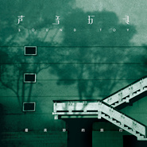

最美妙的旅行
============================

|  |  |
| :--: | :-- |
| [ 最美妙的旅行](https://emumo.xiami.com/album/15326) | **艺人**: [声音玩具](../index.md) **语种**: 国语 **唱片公司**: 独立发行 **发行时间**: 2003年12月01日 **专辑类别**: 录音室专辑 **专辑风格**: 独立摇滚 Indie Rock **播放数**: 5381825 **收藏数**: 7432 **评论数**: 395  |

## 简介

实体购买
 

&nbsp;
 

<a href="https://item.taobao.com/item.htm?spm=a1z10.5-c.w4002-11834690208.43.l8PkSY&amp;id=40043341848" target="_blank" rel="nofollow noreferrer noopener">https://item.taobao.com/item.htm?spm=a1z10.5-c.w4002-11834690208.43.l8PkSY&amp;id=40043341848</a>

## 曲目

- [星期天大街](./15326/fMbf6b6c0.md)
- [爱玲](./15326/oktk1ceed.md)
- [未来MV](./15326/fMbh53b6d.md)
- [秘密的爱](./15326/fMbi6654d.md)
- [不朽](./15326/oktnf82ee.md)
- [完美的一天](./15326/9jcy43802.md)
- [青春](./15326/fMbl8f7d8.md)
- [奇迹](./15326/jYkoa3242.md)
- [Sleeper](./15326/fMbn88752.md)
- [伟大说谎者](./15326/U5W6a02c5c5.md)

## 评论

|  |  |  |  |
| :-- | :-- | :-- | :-- |
|  [虾米用户](https://emumo.xiami.com/u/11342946) TROVATORE. 2021-01-05 12:59 赞(0) 踩(0) | 
再见，十七八九。
 |
|  [虾米用户](https://emumo.xiami.com/u/37120099) The fucking ... 2020-12-27 10:15 赞(0) 踩(0) | 
美妙，能享受这么美好的音乐，太幸福了
 |
|  [虾米用户](https://emumo.xiami.com/u/379912005) 感谢虾米，永远记得。 2020-11-19 00:05 赞(0) 踩(0) | 
曾经的❤️
 |
|  [虾米用户](https://emumo.xiami.com/u/379912005) 感谢虾米，永远记得。 2020-11-19 00:04 赞(0) 踩(0) | 
曾经该如何听
 |
|  [虾米用户](https://emumo.xiami.com/u/120955278) 我还没想好要写什么... 2020-09-23 23:07 赞(0) 踩(0) | 
带我回到第一次听的2010年。
 |
|  [虾米用户](https://emumo.xiami.com/u/117081878) 我还没想好要写什么... 2020-09-15 00:24 赞(0) 踩(0) | 
好听
 |
|  [虾米用户](https://emumo.xiami.com/u/42665848) 我还没想好要写什么... 2020-09-03 20:05 赞(0) 踩(0) | 
试听
 |
|  [虾米用户](https://emumo.xiami.com/u/36303608) 有情有义又是无米之炊，潮... 2020-08-23 18:04 赞(0) 踩(0) | 
听了十年了，没有怎样
 |
|  [虾米用户](https://emumo.xiami.com/u/295880868)  2020-08-23 13:26 赞(2) 踩(0) | 
为啥要钱了
 |
|  [虾米用户](https://emumo.xiami.com/u/182518428)  2020-08-16 16:35 赞(0) 踩(0) | 
每首歌都有水平
 |
|  [虾米用户](https://emumo.xiami.com/u/41171313) 我还没想好要写什么... 2020-08-16 09:56 赞(0) 踩(0) | 
不喜欢改版
 |
|  [虾米用户](https://emumo.xiami.com/u/349791943) 这家伙很聪明什么也没留下... 2020-08-16 01:39 赞(0) 踩(0) | 
不是独家了 
 |
|  [虾米用户](https://emumo.xiami.com/u/46978588)  2020-08-15 16:33 赞(0) 踩(0) | 
留在豆瓣电台里很多年了，慢慢遗忘在青春的过往里…熟悉的声音，思绪倒回…
 |
|  [虾米用户](https://emumo.xiami.com/u/2613440)  2020-08-15 13:22 赞(0) 踩(0) | 
这张经典到无以复加果然无损，音质赞到爆～
 |
|  [虾米用户](https://emumo.xiami.com/u/336677317) 有缘再会了朋友们 2020-08-15 11:39 赞(0) 踩(0) | 
虾米懂事
 |
|  [虾米用户](https://emumo.xiami.com/u/18151836) 孤獨又兇 2020-08-15 07:51 赞(0) 踩(0) | 
给我活！
 |
|  [虾米用户](https://emumo.xiami.com/u/442059625)  2020-08-15 01:23 赞(0) 踩(0) | 
dr
 |
|  [虾米用户](https://emumo.xiami.com/u/8094301) Bye bye wx n... 2020-08-13 12:27 赞(0) 踩(0) | 
整张专辑就是个巨大的催泪弹
 |
|  [虾米用户](https://emumo.xiami.com/u/30445354) 这么近 那么远 2020-08-12 18:34 赞(1) 踩(0) | 
这居然是十七年前的专辑！我居然才听到呜呜呜
 |
|  [虾米用户](https://emumo.xiami.com/u/96296322)  2020-08-12 00:29 赞(0) 踩(0) | 
.
 |
|  [虾米用户](https://emumo.xiami.com/u/88566138)   2020-08-11 23:10 赞(0) 踩(0) | 
出世即巅峰
 |
|  [虾米用户](https://emumo.xiami.com/u/427171048) 我还没想好要写什么... 2020-08-11 20:26 赞(0) 踩(0) | 
太爱了
 |
|  [虾米用户](https://emumo.xiami.com/u/37061462) 看看未来给你什么礼物 2020-08-11 17:15 赞(1) 踩(0) | 
我最爱的国药专辑之一
 |
|  [虾米用户](https://emumo.xiami.com/u/11010575)   2020-08-10 16:46 赞(0) 踩(0) | 
好听！！！！！
 |
|  [虾米用户](https://emumo.xiami.com/u/104427600)  2020-08-10 08:24 赞(0) 踩(0) | 
虾米就是为了这个砖下的，8年前初中就在听，现在大学都快毕业了还在听。
 |
|  [虾米用户](https://emumo.xiami.com/u/4914791) 这家伙很美丽，什么都没有... 2020-08-09 00:10 赞(48) 踩(0) | 
气的我又来听专辑了 
 |
| ⇒ |  [虾米用户](https://emumo.xiami.com/u/19584685) 歹歹歹。。。 2020-08-09 10:31 赞(0) 踩(0) | 
一样，握手。
 |
| ⇒ |  [虾米用户](https://emumo.xiami.com/u/2591791) To be a bett... 2020-08-09 21:55 赞(0) 踩(0) | 
同气过来了
 |
| ⇒ |  [虾米用户](https://emumo.xiami.com/u/11010575)   2020-08-10 16:46 赞(0) 踩(0) | 
我也！！！
 |
| ⇒ |  [虾米用户](https://emumo.xiami.com/u/3878310) 我还没想好要写什么... 2020-08-15 13:31 赞(0) 踩(0) | 
投票的只喜欢动次打次
 |
|  [虾米用户](https://emumo.xiami.com/u/335849930)  2020-08-08 10:50 赞(2) 踩(0) | 
10分，不能再多了，总分有限
 |
|  [虾米用户](https://emumo.xiami.com/u/415142428)  2020-07-27 23:37 赞(0) 踩(0) | 
阴郁 自赏
 |
|  [虾米用户](https://emumo.xiami.com/u/1947346) 我收藏的音乐真的很正 2020-07-27 16:05 赞(0) 踩(0) | 
这张专真的太好听了，听多少年都不腻。
 |
|  [虾米用户](https://emumo.xiami.com/u/45586040) Nothing 2020-05-31 02:32 赞(0) 踩(0) | 
人性之复杂是没法定义的你以为他爱你他也说他永远爱你可他变了的那天你痛不欲生人的贪欲无穷尽 爱自己是最好的选择因为他/她们都爱好好爱自己的人
 |
|  [虾米用户](https://emumo.xiami.com/u/4749874) ., 2020-05-25 12:45 赞(0) 踩(0) | 
一段没有办法超越的懵懂青春，美妙旅程
 |
|  [虾米用户](https://emumo.xiami.com/u/48895134) 直内方外 2020-04-10 19:47 赞(0) 踩(0) | 
好专 
 |
|  [虾米用户](https://emumo.xiami.com/u/441346614)  2020-03-12 19:19 赞(0) 踩(0) | 
居然才听到
 |
|  [虾米用户](https://emumo.xiami.com/u/441147192)  2020-03-05 22:01 赞(0) 踩(0) | 
快二十年了
 |
|  [虾米用户](https://emumo.xiami.com/u/337000987) 我真的还没想好要写什么.... 2020-02-04 21:14 赞(3) 踩(0) | 
完美
 |
|  [虾米用户](https://emumo.xiami.com/u/74019960)  2020-01-31 02:19 赞(4) 踩(0) | 
说多了都是废话。这张专辑连乐队自己可能都觉得无法逾越了吧
 |
|  [虾米用户](https://emumo.xiami.com/u/1262288)  2020-01-19 08:40 赞(0) 踩(0) | 
音乐一起，瞬间回到十年前的成都……
 |
|  [虾米用户](https://emumo.xiami.com/u/419513052)  2020-01-18 23:53 赞(0) 踩(0) | 
非常喜欢的一张专辑。
 |
|  [虾米用户](https://emumo.xiami.com/u/406452721)  2020-01-06 12:41 赞(0) 踩(0) | 
无比迷人，勾魂摄魄
 |
|  [虾米用户](https://emumo.xiami.com/u/2792)  2019-10-26 18:24 赞(0) 踩(0) | 
近几年听的最多的专辑
 |
|  [虾米用户](https://emumo.xiami.com/u/425407803)  2019-10-09 16:16 赞(0) 踩(0) | 
不需要太多解释
 |
|  [虾米用户](https://emumo.xiami.com/u/726043) 就不换头像 2019-08-31 17:40 赞(0) 踩(0) | 
和几年前 感觉不大一样了
 |
|  [虾米用户](https://emumo.xiami.com/u/227156288) 完全无能为力 2019-08-21 15:58 赞(0) 踩(0) | 
真的听了10年了 
 |
|  [虾米用户](https://emumo.xiami.com/u/320960215) 我还没想好要写什么... 2019-08-17 21:20 赞(0) 踩(0) | 
惊喜！
 |
|  [虾米用户](https://emumo.xiami.com/u/26035611) 我还没想好要写什么... 2019-07-30 11:18 赞(0) 踩(0) | 

 |
|  [虾米用户](https://emumo.xiami.com/u/118076584) yo 2019-07-12 15:28 赞(0) 踩(0) | 
哭了
 |
|  [虾米用户](https://emumo.xiami.com/u/57231736)  2019-07-06 08:07 赞(0) 踩(0) | 
他们的编曲是声音的延续声音和编曲是一个大的整体
 |
|  [虾米用户](https://emumo.xiami.com/u/336688257)  2019-07-04 21:54 赞(0) 踩(0) | 
艾玲，还是艾玲，简直是太优秀了。
 |
|  [虾米用户](https://emumo.xiami.com/u/50497365)  2019-06-27 21:32 赞(0) 踩(0) | 
完美
 |
|  [虾米用户](https://emumo.xiami.com/u/426018631) 我还没想好要写什么... 2019-06-24 20:07 赞(0) 踩(0) | 
最喜欢的中文专辑之一
 |
|  [虾米用户](https://emumo.xiami.com/u/57231736)  2019-06-12 03:37 赞(0) 踩(0) | 
摇滚诗人属于在凌晨两三点都听不困的
 |
|  [虾米用户](https://emumo.xiami.com/u/57231736)  2019-06-12 03:19 赞(0) 踩(0) | 
天哪国内有这样的音乐
 |
|  [虾米用户](https://emumo.xiami.com/u/288010003) 我还没想好要写什么... 2019-05-26 01:04 赞(1) 踩(0) | 
十年前千年循环 后来发现听不了了 今天发现能听激动的一笔 依旧会千年循环 爱玲 秘密的爱 星期天大街 那个满心都是爱和恨的年代那个甜蜜又痛苦的年代 要又浮现在眼前
 |
|  [虾米用户](https://emumo.xiami.com/u/285252958) 一个人也是一支队伍 2019-05-25 18:47 赞(0) 踩(0) | 
领先当时的平均水平一大截
 |
|  [虾米用户](https://emumo.xiami.com/u/234165626) 我正等着你 反驳我 2019-05-19 22:04 赞(0) 踩(0) | 
前卫 戳心 颓而有质感 像2000目的抛光砂纸 细腻又不完全光滑
 |
|  [虾米用户](https://emumo.xiami.com/u/306116365) ⠀⠀⠀ 2019-05-09 10:35 赞(0) 踩(0) | 
）
 |
|  [虾米用户](https://emumo.xiami.com/u/355450599) 只要用力挥动双臂，也许就... 2019-05-03 23:18 赞(0) 踩(0) | 
声音碎片都出专辑也准备巡演了，声音玩具啥时候才搞起来啊……
 |
|  [虾米用户](https://emumo.xiami.com/u/423632102)  2019-04-30 20:56 赞(0) 踩(0) | 
听了十年啦
 |
|  [虾米用户](https://emumo.xiami.com/u/343065041)  2019-03-31 10:46 赞(1) 踩(0) | 
     
 |
|  [虾米用户](https://emumo.xiami.com/u/40705828) 用无限适用于 未来的方法 2019-03-09 12:25 赞(3) 踩(0) | 
我赋予了太多意义给这张专辑 太疼了
 |
|  [虾米用户](https://emumo.xiami.com/u/420533588) 喜欢胡凯的郭小姐要努力成... 2019-03-08 14:10 赞(0) 踩(0) | 
这么好的音乐我居然才听到
 |
|  [虾米用户](https://emumo.xiami.com/u/374868459) 梦里的大象很轻 2019-02-14 01:06 赞(1) 踩(0) | 
明月夜 短松岗
 |
|  [虾米用户](https://emumo.xiami.com/u/314208) 000 2019-01-10 01:48 赞(0) 踩(0) | 
第一次看你的现场在北京，cd咖啡酒吧，一个万圣节的晚上，有秋虫，有你们，还有谁，忘了。一直演出到凌晨。我独自走到345支线总站，坐第一班回昌平的汽车。爱，时间过得好快啊，仿佛那时候的我不是我。我多久没看演出了？爱玲，是你的狗吗？
 |
|  [虾米用户](https://emumo.xiami.com/u/490724) 流量听歌大户/ auto... 2019-01-06 10:22 赞(1) 踩(0) | 
十六年啦
 |
|  [虾米用户](https://emumo.xiami.com/u/379071230)  2018-12-27 18:31 赞(1) 踩(0) | 
封面太美了
 |
|  [虾米用户](https://emumo.xiami.com/u/11749246)  2018-11-23 09:47 赞(0) 踩(0) | 
后摇？前摇吧
 |
|  [虾米用户](https://emumo.xiami.com/u/18704162) 狗女孩 2018-10-14 21:19 赞(2) 踩(0) | 

 |
|  [虾米用户](https://emumo.xiami.com/u/21004002) 我想和你虚度时光 2018-09-01 07:31 赞(2) 踩(0) | 
很久没听，恍如隔世
 |
|  [虾米用户](https://emumo.xiami.com/u/210122493) 我想沉没在你身上，狭窄的... 2018-07-05 09:40 赞(2) 踩(0) | 
为自己无法心动的衰老而感觉到可惜
 |
|  [虾米用户](https://emumo.xiami.com/u/242643828) 不是摇滚女孩 2018-05-03 17:26 赞(1) 踩(0) | 
说不出来 但不知道下一张这么对我胃口的专辑什么时候才能找到，毕竟时隔十几年我才碰到它
 |
|  [虾米用户](https://emumo.xiami.com/u/1507572) 沉默吧··· 2018-04-28 12:55 赞(3) 踩(0) | 
这张专辑里的几首歌，是唯一能和 万能青年旅店 媲美的&amp;middot;&amp;middot;&amp;middot;&amp;middot;非常情绪，虽然不是社会性的，但真的有代表性&amp;middot;&amp;middot;气质！！
 |
|  [虾米用户](https://emumo.xiami.com/u/260667492)  2018-03-26 22:56 赞(1) 踩(0) | 
这该是国摇最佳之一了吧！
 |
| ⇒ |  [虾米用户](https://emumo.xiami.com/u/49394099) 我还没想好要写什么... 2018-11-23 23:22 赞(0) 踩(0) | 
没有之一
 |
|  [虾米用户](https://emumo.xiami.com/u/34271220) 我还没想好要写什么... 2018-03-13 12:17 赞(1) 踩(0) | 
太好了
 |
|  [虾米用户](https://emumo.xiami.com/u/43492923) 行到水穷我才开始害怕，夕... 2018-03-07 17:55 赞(1) 踩(0) | 
嗯哼
 |
|  [虾米用户](https://emumo.xiami.com/u/44849581) 我灵魂有的烈火超过你所能... 2018-02-01 19:02 赞(1) 踩(0) | 
最喜欢的还是这张
 |
|  [虾米用户](https://emumo.xiami.com/u/74019960)  2017-12-27 01:24 赞(0) 踩(0) | 
这是一张收藏很久很久，却不太敢经常听的唱片。
 |
|  [虾米用户](https://emumo.xiami.com/u/50248651)   2017-12-13 19:21 赞(0) 踩(0) | 
为了这本专辑安装了虾米
 |
|  [虾米用户](https://emumo.xiami.com/u/43492923) 行到水穷我才开始害怕，夕... 2017-12-12 04:30 赞(1) 踩(0) | 
棒
 |
|  [虾米用户](https://emumo.xiami.com/u/1351775) 会发光的虫子。 2017-10-27 23:19 赞(0) 踩(0) | 
很久没有听着风格的歌曲了，还是喜欢。最近做稀奇古怪的梦，没法醒。好不容易醒了，后来就心安理得地活着。
 |
|  [虾米用户](https://emumo.xiami.com/u/10028400) 我还没想好要写什么... 2017-10-06 23:09 赞(2) 踩(0) | 

 |
|  [虾米用户](https://emumo.xiami.com/u/15270473) 听到喜欢的歌 身体不跟着... 2017-09-22 13:44 赞(0) 踩(0) | 
-
 |
|  [虾米用户](https://emumo.xiami.com/u/13279293) 我还没想好要写什么... 2017-08-19 02:10 赞(2) 踩(0) | 
今年二十二岁 第一次听这张专还是十年前
 |
|  [虾米用户](https://emumo.xiami.com/u/9618921)  2017-07-09 16:04 赞(0) 踩(0) | 
太棒！
 |
|  [虾米用户](https://emumo.xiami.com/u/48535964) 唯美食与美景与美金不可辜... 2017-04-26 02:14 赞(13) 踩(0) | 
秘密的爱，听了十多年
 |
|  [虾米用户](https://emumo.xiami.com/u/44845167)  2017-04-21 12:24 赞(23) 踩(0) | 
为了声音玩具安装了虾米
 |
|  [虾米用户](https://emumo.xiami.com/u/5748560)  2017-03-28 17:51 赞(0) 踩(0) | 
最美妙的旅行
 |
|  [虾米用户](https://emumo.xiami.com/u/271717371) 请嫑再来骚扰我 2017-03-28 11:54 赞(0) 踩(0) | 
来看看从前非非的自己
 |
|  [虾米用户](https://emumo.xiami.com/u/44735860) 我是哈士奇，我喂自己袋盐... 2017-03-20 02:25 赞(0) 踩(0) | 
美妙
 |
|  [虾米用户](https://emumo.xiami.com/u/40930084)   2017-02-26 16:19 赞(14) 踩(0) | 
那時候我十三四歲，人生中第一次在livehouse看表演就是聲玩。那時候我們總在放學的路上唱這首歌，說著關於以後的願景，看不到希望的期許。我們都沒有想到能夠離開那座長大的小城，甚至在遙遠的異鄉得到有生以來最多的肯定。我不知道下一個十年我們會在哪裡，還會不會回去，但是寶貝，希望有一天我們真的能成為當年遙不可及的那個自己。
 |
|  [虾米用户](https://emumo.xiami.com/u/9134247) 音乐，给了我们阅读和品味... 2017-02-15 22:53 赞(1) 踩(0) | 
十年了，我还是忘不了第一听着这歌时的迷茫，那年，我高中毕业
 |
|  [虾米用户](https://emumo.xiami.com/u/47927551)  2017-01-11 00:33 赞(0) 踩(0) | 
全砖很优秀！
 |
|  [虾米用户](https://emumo.xiami.com/u/1041731) 暂无签名~ 2016-11-05 21:44 赞(0) 踩(0) | 
唤醒所有感官
 |
|  [虾米用户](https://emumo.xiami.com/u/1041731) 暂无签名~ 2016-11-05 21:43 赞(0) 踩(0) | 
这张专辑最妙之处，在于能够唤起所有的感官。回忆，成长，选择。
 |
|  [虾米用户](https://emumo.xiami.com/u/220208) 浮生 2016-09-27 09:23 赞(0) 踩(0) | 
03年的，干的漂亮
 |
|  [虾米用户](https://emumo.xiami.com/u/194627009) 原谅我这一生不羁放纵爱自... 2016-09-22 13:27 赞(1) 踩(0) | 
十二年前，我在大学听到了这首歌。十二年后，我再次听到，还是一样的令我沉迷…… 是啊，这样就十二年过去了……
 |
|  [虾米用户](https://emumo.xiami.com/u/48860276) 埋葬干净 2016-08-26 01:19 赞(1) 踩(0) | 
沉郁，带给我们更多的思考
 |
|  [虾米用户](https://emumo.xiami.com/u/30031542) 花花世界 什么都爱 2016-06-28 09:49 赞(0) 踩(0) | 
私以为这张最好听
 |
|  [虾米用户](https://emumo.xiami.com/u/166764176)   2016-05-28 22:12 赞(0) 踩(0) | 
03年。。和时代潮流接上了轨★★★★★
 |
|  [虾米用户](https://emumo.xiami.com/u/12730895) 不要离开！ 2016-05-09 23:39 赞(2) 踩(0) | 
刚才听了一首挺烂的歌，赶紧来洗洗耳朵
 |
|  [虾米用户](https://emumo.xiami.com/u/8094301) Bye bye wx n... 2016-04-19 10:26 赞(14) 踩(0) | 
内容已删除
 |
| ⇒ |  [虾米用户](https://emumo.xiami.com/u/48860276) 埋葬干净 2016-08-26 01:19 赞(0) 踩(0) | 
说的太对
 |
|  [虾米用户](https://emumo.xiami.com/u/7360372) 有趣就好 2016-04-06 01:16 赞(2) 踩(0) | 
十二年了耶，依然吊炸天，怎么没早点听到 ，要中毒了
 |
| ⇒ |  [虾米用户](https://emumo.xiami.com/u/12730895) 不要离开！ 2016-05-09 23:40 赞(0) 踩(0) | 
我也是去年才听到这个，简直相见恨晚
 |
| ⇒ |  [虾米用户](https://emumo.xiami.com/u/194627009) 原谅我这一生不羁放纵爱自... 2016-09-22 13:25 赞(0) 踩(0) | 
我十二年前就听到了，在大学的时候   
 |
| ⇒ |  [虾米用户](https://emumo.xiami.com/u/7360372) 有趣就好 2016-09-22 18:08 赞(0) 踩(0) | 
<q><b>WilL.说：</b></q>
 |
|  [虾米用户](https://emumo.xiami.com/u/5068728)  2016-02-01 21:50 赞(1) 踩(0) | 
10年了，旋律还在，可青春呢？
 |
|  [虾米用户](https://emumo.xiami.com/u/31873884) 一休哥！休息下！休息下 2016-01-08 21:40 赞(0) 踩(0) | 
这段时间有歌陪伴
 |
|  [虾米用户](https://emumo.xiami.com/u/2095699) 你总是喜欢这样吗？ 2016-01-07 22:57 赞(0) 踩(0) | 
03年的专辑现在还带加歌的。。。
 |
|  [虾米用户](https://emumo.xiami.com/u/10962) 我还没想好要写什么... 2016-01-07 19:11 赞(1) 踩(0) | 
还是喜欢最老的这张。
 |
|  [虾米用户](https://emumo.xiami.com/u/1461388) 我害怕你们的到来 2016-01-04 11:04 赞(1) 踩(0) | 
多了几首
 |
|  [虾米用户](https://emumo.xiami.com/u/548259) INFP/OKAY 2016-01-04 01:51 赞(1) 踩(0) | 
这是一张慢热而深沉的专辑。
 |
|  [虾米用户](https://emumo.xiami.com/u/9619198) 蛋疼君~ 2016-01-02 00:30 赞(1) 踩(0) | 
啥意思？这是下架了又回来了？
 |
|  [虾米用户](https://emumo.xiami.com/u/35006107) 我还没想好要写什么... 2016-01-01 15:26 赞(0) 踩(0) | 
➕
 |
|  [虾米用户](https://emumo.xiami.com/u/5167973) 昨晚发了一个最近现场演的... 2015-12-31 22:16 赞(3) 踩(0) | 
什么鬼，还带加歌的
 |
|  [虾米用户](https://emumo.xiami.com/u/5887178)  2015-12-31 21:33 赞(0) 踩(0) | 
终于加上了
 |
|  [虾米用户](https://emumo.xiami.com/u/7792043)  2015-12-31 21:32 赞(0) 踩(0) | 
...意义不明
 |
|  [虾米用户](https://emumo.xiami.com/u/4911883) 如果你也爱Eason 2015-12-31 21:28 赞(2) 踩(0) | 
啊新年礼物是多了一首最伟大的说谎者 
 |
|  [虾米用户](https://emumo.xiami.com/u/1693816)  2015-12-31 21:19 赞(1) 踩(0) | 
03年发行的专辑 现在还带加歌的?
 |
|  [虾米用户](https://emumo.xiami.com/u/2880776) 呜哇呜哇 2015-12-22 19:24 赞(3) 踩(0) | 
还是这张好听，新的太娘炮了还没意思
 |
|  [虾米用户](https://emumo.xiami.com/u/42268240) 虽然有些低沉，但绝对不是... 2015-12-19 10:09 赞(1) 踩(0) | 
迷幻摇滚
 |
|  [虾米用户](https://emumo.xiami.com/u/358992) 优美地低于生活 2015-11-29 11:46 赞(0) 踩(0) | 
还是这张好听
 |
|  [虾米用户](https://emumo.xiami.com/u/69337518)  2015-11-09 12:18 赞(0) 踩(0) | 
真的，10年多了都
 |
|  [虾米用户](https://emumo.xiami.com/u/1577426)  2015-11-02 01:16 赞(0) 踩(0) | 
ok
 |
|  [虾米用户](https://emumo.xiami.com/u/15489958) 无 2015-10-22 12:19 赞(0) 踩(0) | 
这是一张demo专辑？
 |
| ⇒ |  [虾米用户](https://emumo.xiami.com/u/47812704) 没有人了解我 我自己也不... 2015-11-05 21:19 赞(0) 踩(0) | 
其实不算是demo，只是并未正式出版发行.
 |
|  [虾米用户](https://emumo.xiami.com/u/5947385) 戴耳机聋 摘眼镜瞎 2015-10-19 22:27 赞(1) 踩(0) | 
还是 新专辑更让我喜欢些
 |
| ⇒ |  [虾米用户](https://emumo.xiami.com/u/12730895) 不要离开！ 2015-12-15 22:56 赞(0) 踩(0) | 
我也觉得。但是看到这么多人都在回忆啊说这张是经典什么新专辑没这么好了，都觉得，难道是我肤浅？
 |
|  [虾米用户](https://emumo.xiami.com/u/3269318)  2015-10-03 20:16 赞(0) 踩(0) | 
pink f 致敬的吧，不然，好听贵好听！
 |
|  [虾米用户](https://emumo.xiami.com/u/5529745) 不听不看不说 2015-09-23 15:19 赞(0) 踩(0) | 
：-）
 |
|  [虾米用户](https://emumo.xiami.com/u/30650493)  2015-09-06 23:23 赞(0) 踩(0) | 
有生之年系列
 |
|  [虾米用户](https://emumo.xiami.com/u/40124694)  2015-09-01 11:02 赞(4) 踩(0) | 
FLAC无损资源已更新：<a href="http://www.162wp.com/yinle/2015-09-01/25187.html" target="_blank" rel="nofollow noreferrer noopener">http://www.162wp.com/yinle/2015-09-01/25187.html</a>
 |
| ⇒ |  [虾米用户](https://emumo.xiami.com/u/574314)  2015-10-20 22:21 赞(0) 踩(0) | 

 |
|  [虾米用户](https://emumo.xiami.com/u/7755299)  2015-08-26 12:32 赞(0) 踩(0) | 
杀马特
 |
|  [虾米用户](https://emumo.xiami.com/u/7755299)  2015-08-26 12:32 赞(0) 踩(0) | 
杀马特
 |
|  [虾米用户](https://emumo.xiami.com/u/29569)  2015-08-17 15:30 赞(0) 踩(0) | 
我们走不了多远也所知甚浅但这不leng阻止我奔向你身边
 |
|  [虾米用户](https://emumo.xiami.com/u/15329404) 如果再见不能红着眼，是否... 2015-07-29 18:28 赞(0) 踩(0) | 
时隔三年多再刷当年伴爷孤独地带着四级卷子穿梭游走于各个空闲教室的专辑
 |
|  [虾米用户](https://emumo.xiami.com/u/99364) 我还没想好要写什么... 2015-07-17 18:07 赞(1) 踩(0) | 
碉堡
 |
|  [虾米用户](https://emumo.xiami.com/u/9837393) 如果没有 痛苦  快乐 ... 2015-07-13 12:38 赞(0) 踩(0) | 
无需多说
 |
|  [虾米用户](https://emumo.xiami.com/u/36319648) 学识使人坚毅 2015-06-25 22:39 赞(1) 踩(0) | 
有些歌总能让我们思考一些什么，而正是如此我们也会愿意去喜欢，那种有人生的味道。
 |
|  [虾米用户](https://emumo.xiami.com/u/15861219) 我还没想好要写什么... 2015-05-27 01:03 赞(0) 踩(0) | 
还是喜欢这张
 |
|  [虾米用户](https://emumo.xiami.com/u/44025838) Sweet soul w... 2015-05-24 10:43 赞(0) 踩(0) | 

 |
|  [虾米用户](https://emumo.xiami.com/u/5844243)  2015-05-16 10:16 赞(2) 踩(0) | 
被分类成后摇的是因为不朽这一首
 |
|  [虾米用户](https://emumo.xiami.com/u/2427346) 这里没有答案 2015-05-11 17:26 赞(0) 踩(0) | 
发誓一定要买碟收藏
 |
|  [虾米用户](https://emumo.xiami.com/u/32387391)  2015-05-05 00:52 赞(0) 踩(0) | 
嗯 果然还是更喜欢这张
 |
|  [虾米用户](https://emumo.xiami.com/u/2104186)  2015-05-04 19:57 赞(2) 踩(0) | 
确实如一人所言过的那样 挺“大孩子”的
 |
|  [虾米用户](https://emumo.xiami.com/u/5657731) 在音乐面前语言很苍白 2015-04-28 07:32 赞(0) 踩(0) | 
03年还没摇到后面的时候就开始后摇了
 |
|  [虾米用户](https://emumo.xiami.com/u/7792043)  2015-04-26 20:33 赞(0) 踩(0) | 
哇。出现在“我的订阅”中的后摇分类里面了
 |
|  [虾米用户](https://emumo.xiami.com/u/2893508)  2015-04-24 22:49 赞(1) 踩(0) | 
这是我听过的国内最好的独立音乐，没有之一！
 |
|  [虾米用户](https://emumo.xiami.com/u/8131169)   2015-04-22 21:16 赞(0) 踩(0) | 
lisalisalisa
 |
|  [虾米用户](https://emumo.xiami.com/u/5418577)  2015-04-22 15:30 赞(0) 踩(0) | 
后摇
 |
|  [虾米用户](https://emumo.xiami.com/u/6092353) 喵。 2015-04-22 11:50 赞(1) 踩(0) | 
大学的夜晚
 |
|  [虾米用户](https://emumo.xiami.com/u/23535893)  2015-04-02 13:03 赞(0) 踩(0) | 
喜欢这张
 |
|  [虾米用户](https://emumo.xiami.com/u/33832870) 在我的FAL面前都毫无意... 2015-03-24 12:59 赞(0) 踩(0) | 
听BGM来了
 |
|  [虾米用户](https://emumo.xiami.com/u/26472673) 在认真消遣。 2015-03-21 23:46 赞(1) 踩(0) | 
颓废的调调 很爱。
 |
|  [虾米用户](https://emumo.xiami.com/u/9585575) 友川かずき脑残粉 2015-02-28 03:53 赞(1) 踩(0) | 
《未来》是这张的最佳
 |
|  [虾米用户](https://emumo.xiami.com/u/47204343)   2015-02-12 02:03 赞(0) 踩(0) | 
03年只听过他们对艾玲。一直很喜欢这首，当时很难下载歌，百度资源太少。现在可以收藏了
 |
| ⇒ |  [虾米用户](https://emumo.xiami.com/u/13925215)  2017-01-28 19:06 赞(0) 踩(0) | 
“他们对艾玲”？什么歌？
 |
| ⇒ |  [虾米用户](https://emumo.xiami.com/u/2442713) 再见可爱的小虾米 2017-12-18 23:28 赞(0) 踩(0) | 
<q><b>leo说：</b></q>
 |
|  [虾米用户](https://emumo.xiami.com/u/29850957)  2015-02-03 01:23 赞(0) 踩(0) | 
摇得优雅华丽，滚出细腻的轨迹
 |
|  [虾米用户](https://emumo.xiami.com/u/3730078)  2015-01-17 17:41 赞(0) 踩(0) | 
喜欢
 |
|  [虾米用户](https://emumo.xiami.com/u/780817)  2014-12-26 09:38 赞(1) 踩(0) | 
虽然是张好专，但是为毛被列入后摇！！
 |
|  [虾米用户](https://emumo.xiami.com/u/3051248)   2014-12-19 01:40 赞(0) 踩(0) | 
秘密的爱 在哪听过在哪听过 就是想不起来了 而且当年还不断循环 就是想不起来了
 |
|  [虾米用户](https://emumo.xiami.com/u/10811234) Love Mucic 2014-12-12 07:17 赞(0) 踩(0) | 
赞
 |
|  [虾米用户](https://emumo.xiami.com/u/959976)  2014-11-16 14:44 赞(0) 踩(0) | 
这不是后摇吧？但&amp;lt;秘密的爱&amp;gt;和&amp;lt;艾玲&amp;gt;都曾听的好难过，不重温了。好乐队！存在心里就好。
 |
|  [虾米用户](https://emumo.xiami.com/u/35477848)  2014-11-12 19:13 赞(0) 踩(0) | 
好听。这个调调好。
 |
|  [虾米用户](https://emumo.xiami.com/u/8323837)   2014-10-27 23:00 赞(0) 踩(0) | 
秘密的爱 异国情调
 |
|  [虾米用户](https://emumo.xiami.com/u/6252084) all things d... 2014-10-14 10:53 赞(0) 踩(0) | 
最美妙的旅行有点像paranoid android似的
 |
|  [虾米用户](https://emumo.xiami.com/u/7433899) 暂无签名~ 2014-10-12 08:09 赞(0) 踩(0) | 
神仙永远是出现一次就让人刻骨铭心。
 |
|  [虾米用户](https://emumo.xiami.com/u/32318894) 暂无签名~ 2014-08-31 00:17 赞(0) 踩(0) | 
小翅膀怎么木有啊
 |
|  [虾米用户](https://emumo.xiami.com/u/9303613) 在人间已是癫 2014-08-15 09:13 赞(0) 踩(0) | 
太奇葩了 很长一段时间这张碟在虾米不见了 现在又出来了
 |
|  [虾米用户](https://emumo.xiami.com/u/16567907)  2014-08-14 23:24 赞(0) 踩(0) | 
这···这是03年的碟？
 |
|  [虾米用户](https://emumo.xiami.com/u/39855351) 暂无签名~ 2014-08-09 19:44 赞(0) 踩(0) | 
11年前的一张专辑，还好现在发现了它！
 |
|  [虾米用户](https://emumo.xiami.com/u/155947) 一期一会 2014-08-08 23:32 赞(0) 踩(0) | 
说再见吧，我们毕竟有过最美好的旅行
 |
|  [虾米用户](https://emumo.xiami.com/u/3218371) 搞 2014-08-06 22:51 赞(0) 踩(0) | 
新歌怎么和radiohead一模一样啊
 |
|  [虾米用户](https://emumo.xiami.com/u/6628770)  2014-08-02 17:01 赞(0) 踩(0) | 
一遍听《秘密的爱》一遍翻看渡边淳一的《失乐园》别有一番滋味
 |
|  [虾米用户](https://emumo.xiami.com/u/10447688)  2014-07-26 13:10 赞(0) 踩(0) | 
很想写一首《星期天的大街》那样的诗，抒发一下周末躺在床上听挖掘机打钻声与邻居家剁菜声的颓废慵懒；很想写一首《艾玲》那样的诗，说不定讲不准多远的未来能送给她；很想写一首《秘密的爱》那样的诗，诡异却又将少年内心的阴暗奏响。
 |
| ⇒ |  [虾米用户](https://emumo.xiami.com/u/3964715) 暂无签名~ 2014-09-08 22:29 赞(0) 踩(0) | 
真好
 |
|  [虾米用户](https://emumo.xiami.com/u/412437)  2014-07-22 00:12 赞(37) 踩(0) | 
哪里后摇了。
 |
| ⇒ |  [虾米用户](https://emumo.xiami.com/u/420064) 我还没想好要写什么... 2015-10-31 00:32 赞(0) 踩(0) | 
他们刚出这些歌的时候 后摇还没有今天这么类型化 因为有像“不朽”这类的作品因此被归类为后摇 今天再看 会觉得不可思议
 |
| ⇒ |  [虾米用户](https://emumo.xiami.com/u/412437)  2015-11-03 05:01 赞(0) 踩(0) | 
<q><b>baibai说：</b></q>
 |
|  [虾米用户](https://emumo.xiami.com/u/5493286) 。 2014-07-21 12:39 赞(0) 踩(0) | 
十一年了，神作不解释
 |
|  [虾米用户](https://emumo.xiami.com/u/2090496)  2014-07-16 17:52 赞(0) 踩(0) | 
怀念。
 |
|  [虾米用户](https://emumo.xiami.com/u/11446884) New York MoM... 2014-05-14 22:21 赞(0) 踩(0) | 
就记得以前听过，找了好久了，激动啊 终于找到你了！
 |
|  [虾米用户](https://emumo.xiami.com/u/5666662)  2014-05-13 09:38 赞(0) 踩(0) | 
好熟悉的声音，和朴树的风格与声音有点像
 |
|  [虾米用户](https://emumo.xiami.com/u/64828)   2014-05-09 17:23 赞(0) 踩(0) | 
这音乐 好熟悉。
 |
|  [虾米用户](https://emumo.xiami.com/u/2187542)  2014-05-08 13:56 赞(0) 踩(0) | 
他们的迷笛现场看了 垃圾！
 |
| ⇒ |  [虾米用户](https://emumo.xiami.com/u/35041309) 烦忧无门，惟人自扰。 2014-06-02 15:31 赞(0) 踩(0) | 
他们在小舞台很不错，但是音乐节。。。
 |
| ⇒ |  [虾米用户](https://emumo.xiami.com/u/12128912)  2014-12-20 16:34 赞(0) 踩(0) | 
他们不适合空旷场地。只是不适合。
 |
|  [虾米用户](https://emumo.xiami.com/u/3576411)  2014-05-05 18:13 赞(0) 踩(0) | 
聽聲音玩具的時候總是有一股莫名的悸動，晦暗的外表下是暗流洶湧，就像火山被壓抑著等待著再不經意的瞬間爆發。能感受到這股力量從耳朵直指心靈。這種有點病態的狂熱讓人簡直像抓起一個人就擁在懷裡至死。
 |
|  [虾米用户](https://emumo.xiami.com/u/8724170)  2014-04-27 10:38 赞(0) 踩(0) | 
今天终于能去看到他们的现场了，再来复习一遍
 |
| ⇒ |  [虾米用户](https://emumo.xiami.com/u/3576411)  2014-05-05 18:14 赞(0) 踩(0) | 
現場在哪呀？
 |
| ⇒ |  [虾米用户](https://emumo.xiami.com/u/8724170)  2014-05-05 21:30 赞(0) 踩(0) | 
<q><b>shawwin说：</b></q>
 |
|  [虾米用户](https://emumo.xiami.com/u/35908619)  2014-04-27 01:26 赞(0) 踩(0) | 
多少这种风格独立  成熟  深爱在许多人心中的歌者  为什么不能在主流传媒：电视中展现风采？
 |
| ⇒ |  [虾米用户](https://emumo.xiami.com/u/3576411)  2014-05-05 18:14 赞(0) 踩(0) | 
主流偏向的是直接的表達。沒事，咱愛聽好好買cd支持他們就行了。
 |
|  [虾米用户](https://emumo.xiami.com/u/3452490) Sapere aude 2014-04-11 02:28 赞(0) 踩(0) | 
我以为我在单曲循环。。。
 |
|  [虾米用户](https://emumo.xiami.com/u/12504955)  2014-03-26 13:49 赞(0) 踩(0) | 
啊~！大学！
 |
|  [虾米用户](https://emumo.xiami.com/u/1491064) 电音 后摇 迷幻 民谣 2014-03-26 09:01 赞(1) 踩(0) | 
秘密的爱里面的小提琴 听得真是揪心 前奏一想起来的时候 总有点恍惚的感觉
 |
|  [虾米用户](https://emumo.xiami.com/u/1609946) 一即一切 2014-03-11 08:39 赞(0) 踩(0) | 
心 境不二
 |
|  [虾米用户](https://emumo.xiami.com/u/3715322) 1979 2014-03-04 13:24 赞(0) 踩(0) | 
生活里的诗人
 |
|  [虾米用户](https://emumo.xiami.com/u/10435106) 听靓歌 2014-03-04 02:20 赞(0) 踩(0) | 
不错.
 |
|  [虾米用户](https://emumo.xiami.com/u/28376336)   2014-02-24 22:44 赞(87) 踩(0) | 
内容已删除
 |
| ⇒ |  [虾米用户](https://emumo.xiami.com/u/32182798)  2014-03-11 00:20 赞(0) 踩(0) | 
那时我也在成都
 |
| ⇒ |  [虾米用户](https://emumo.xiami.com/u/3576411)  2014-05-05 18:15 赞(0) 踩(0) | 
笑尿了哈哈哈
 |
| ⇒ |  [虾米用户](https://emumo.xiami.com/u/2211497) ✘貪✔痛 生就孤独 2015-03-02 00:06 赞(0) 踩(0) | 
自以为很艺术
 |
| ⇒ |  [虾米用户](https://emumo.xiami.com/u/70207868)  2016-06-14 13:41 赞(0) 踩(0) | 
已经举报！等喝茶吧·兄弟伙！
 |
| ⇒ |  [虾米用户](https://emumo.xiami.com/u/70207868)  2016-08-06 23:49 赞(0) 踩(0) | 
<q><b>说：</b></q>
 |
|  [虾米用户](https://emumo.xiami.com/u/8635478) 换个地方思考 2014-02-22 22:51 赞(0) 踩(0) | 
有点意思
 |
|  [虾米用户](https://emumo.xiami.com/u/19524510) ty 2014-02-21 23:30 赞(0) 踩(0) | 
每次要说什么，必须说什么？ 我就是直觉喜欢，虾米网你们想听什么？？？
 |
|  [虾米用户](https://emumo.xiami.com/u/17310370)  2014-02-16 03:00 赞(0) 踩(0) | 
二十四岁的夜晚 原来我那么普通 关于青春 也所知甚浅
 |
|  [虾米用户](https://emumo.xiami.com/u/7697312)  2014-02-11 01:45 赞(0) 踩(0) | 
沉迷了
 |
|  [虾米用户](https://emumo.xiami.com/u/1427784) 我还没想好要写什么... 2014-02-10 19:01 赞(1) 踩(0) | 
倒是很像the cure
 |
|  [虾米用户](https://emumo.xiami.com/u/8279196) 人间激霸 2014-01-17 17:01 赞(0) 踩(0) | 
希望能在小酒馆看见你们
 |
|  [虾米用户](https://emumo.xiami.com/u/5099665)   2014-01-16 21:02 赞(1) 踩(0) | 
爱是昂贵的。
 |
|  [虾米用户](https://emumo.xiami.com/u/6466040)  2014-01-05 13:05 赞(0) 踩(0) | 
经典至极，无限循环。成都骄傲。英伦后摇，颓废迷幻。
 |
|  [虾米用户](https://emumo.xiami.com/u/5398540) 民歌警察出警中 2013-11-17 16:18 赞(0) 踩(0) | 
还是很喜欢国内世纪初文艺青年们那有点酸气的土摇啊。。。
 |
|  [虾米用户](https://emumo.xiami.com/u/3465063)  2013-11-14 02:16 赞(0) 踩(0) | 
还不错   有象征主义的感觉  颓废的声音 颓废的青春   对味
 |
|  [虾米用户](https://emumo.xiami.com/u/3597209) 网易云: 人该有故乡的善... 2013-11-11 12:00 赞(1) 踩(0) | 
又特么一张死
 |
| ⇒ |  [虾米用户](https://emumo.xiami.com/u/14016518) 所有言语黯淡之时，音乐会... 2014-01-20 00:48 赞(0) 踩(0) | 
今年会发新专辑
 |
| ⇒ |  [虾米用户](https://emumo.xiami.com/u/5559848)  2014-03-23 21:59 赞(0) 踩(0) | 
<q><b>虚言失语说：</b></q>
 |
| ⇒ |  [虾米用户](https://emumo.xiami.com/u/14016518) 所有言语黯淡之时，音乐会... 2014-04-13 20:10 赞(0) 踩(0) | 
<q><b>luochenhuan说：</b></q>
 |
| ⇒ |  [虾米用户](https://emumo.xiami.com/u/3695896)  2014-05-04 02:10 赞(0) 踩(0) | 
<q><b>虚言失语说：</b></q>
 |
| ⇒ |  [虾米用户](https://emumo.xiami.com/u/14016518) 所有言语黯淡之时，音乐会... 2014-06-03 21:36 赞(0) 踩(0) | 
<q><b>漆猫黑说：</b></q>
 |
|  [虾米用户](https://emumo.xiami.com/u/55800) 用耳朵倾听生活 2013-11-09 16:03 赞(0) 踩(0) | 
秘密的爱的前奏好像《加州旅馆》难道没有人有同感吗？！！！！
 |
| ⇒ |  [虾米用户](https://emumo.xiami.com/u/31748121)  2014-10-31 23:35 赞(0) 踩(0) | 
有那么一丢丢
 |
|  [虾米用户](https://emumo.xiami.com/u/1503428)  2013-10-16 21:07 赞(0) 踩(0) | 
很好听的专辑，据说未正式发表，很难买到
 |
|  [虾米用户](https://emumo.xiami.com/u/13211799) 依旧容易踌躇 2013-10-16 05:18 赞(1) 踩(0) | 
全世界最喜欢的一首歌曲在这张专辑里，永远听不腻！~
 |
| ⇒ |  [虾米用户](https://emumo.xiami.com/u/344610) 浪打浪啊来浪啊 2013-12-03 19:20 赞(0) 踩(0) | 
哪一首？
 |
|  [虾米用户](https://emumo.xiami.com/u/6546636)  2013-10-14 19:38 赞(0) 踩(0) | 
《艾玲》当年听到它的时候，身体有种毛孔血脉扩展的感觉，真是来自身体本能的一种反应，自此这么多年之后再也没试过。深刻的想念那种赶脚。
 |
|  [虾米用户](https://emumo.xiami.com/u/23835914)  2013-10-06 21:43 赞(0) 踩(0) | 
旋律可以
 |
|  [虾米用户](https://emumo.xiami.com/u/1568903)  2013-09-06 11:00 赞(1) 踩(0) | 
星期天的大街、艾玲、不朽、秘密的爱这几首歌反复听无数遍了
 |
|  [虾米用户](https://emumo.xiami.com/u/8574017)  2013-08-31 12:40 赞(0) 踩(0) | 
还是老的好啊
 |
|  [虾米用户](https://emumo.xiami.com/u/14189968)  2013-08-25 00:45 赞(0) 踩(0) | 
酷。
 |
|  [虾米用户](https://emumo.xiami.com/u/2197367) 你走了真好 不然总担心你... 2013-08-15 14:14 赞(1) 踩(0) | 
听这张专辑是需要勇气的 秘密的爱 爱玲 不朽 我们走不了多远 也所知甚浅 但这不能阻止我奔向你身边
 |
| ⇒ |  [虾米用户](https://emumo.xiami.com/u/11866117) OK,OK. 2014-06-02 14:34 赞(0) 踩(0) | 
我们走不了多远 也所知甚浅 但这不能阻止我奔向你身边
 |
|  [虾米用户](https://emumo.xiami.com/u/7623143)  2013-08-11 17:14 赞(0) 踩(0) | 
不朽
 |
|  [虾米用户](https://emumo.xiami.com/u/9333076) 暂无签名~ 2013-07-31 19:40 赞(0) 踩(0) | 
无心插柳结识博彩多学的区老头，遂声音男神走下神坛。依然喜欢《艾玲》，虾米没有收录第二名《清塘荷韵》。纪念我的大学时代。
 |
|  [虾米用户](https://emumo.xiami.com/u/8408612)  2013-07-30 14:21 赞(0) 踩(0) | 
难得的音乐和声音
 |
|  [虾米用户](https://emumo.xiami.com/u/127190)  2013-07-28 21:45 赞(0) 踩(0) | 
被@Myhardcandy 害得听了一晚上！感觉青春又找回了那么一点儿~！太怀念他们~
 |
|  [虾米用户](https://emumo.xiami.com/u/2655865) 做我的音乐海盗 2013-07-28 00:12 赞(0) 踩(0) | 
小众音乐总有小众音乐的乐处，精致，同时也精彩。旋律的魅力就在于此，不会被遗忘，也不会过时。多年以后还能随口哼唱着那些精彩的副歌。感觉就如一哥们说的，没喝，却醉的很厉害。
 |
|  [虾米用户](https://emumo.xiami.com/u/13330863) 我还没想好要写什么... 2013-07-19 14:00 赞(0) 踩(0) | 
非常精致。
 |
|  [虾米用户](https://emumo.xiami.com/u/8674674) 最多12个字符。 2013-06-19 10:57 赞(1) 踩(0) | 
艾玲
 |
|  [虾米用户](https://emumo.xiami.com/u/694847)  2013-06-06 15:56 赞(0) 踩(0) | 
good sound
 |
|  [虾米用户](https://emumo.xiami.com/u/2961623) 如欲相见 我在各种悲喜交... 2013-05-13 15:37 赞(0) 踩(0) | 
@小红花-副团长牙买加华侨
 |
|  [虾米用户](https://emumo.xiami.com/u/7261112) 你..好吗 2013-04-30 11:06 赞(0) 踩(0) | 
这声音的确玩得很精彩
 |
|  [虾米用户](https://emumo.xiami.com/u/2305715)   2013-04-26 16:09 赞(0) 踩(0) | 
秘密的爱。我不曾心碎，但也在这个阳光明媚的下午失控，我已不再那么年轻，也不再那么热情，你现在爱着的人啊，是否是那个多少个十年后的少年。。。。他是否依然那么年轻，是否依然那么热情。。。和你在一起，我已经把什么都已忘记。。。。
 |
|  [虾米用户](https://emumo.xiami.com/u/7261112) 你..好吗 2013-04-24 18:58 赞(0) 踩(0) | 
cool
 |
|  [虾米用户](https://emumo.xiami.com/u/5514319)   2013-04-23 14:07 赞(1) 踩(0) | 
几年后再听，仍然是那时候的感觉
 |
|  [虾米用户](https://emumo.xiami.com/u/2961623) 如欲相见 我在各种悲喜交... 2013-04-14 12:30 赞(0) 踩(0) | 
@小红花-副团长牙买加华侨
 |
|  [虾米用户](https://emumo.xiami.com/u/5721676) 瀑瀑是最棒的！ 2013-04-14 11:46 赞(0) 踩(0) | 
不要这么玩我。。。 我要被冲散了
 |
| ⇒ |  [虾米用户](https://emumo.xiami.com/u/829375) 我还没想好要写什么... 2015-06-18 23:56 赞(0) 踩(0) | 
周末要來港了。。終於T___T
 |
| ⇒ |  [虾米用户](https://emumo.xiami.com/u/5721676) 瀑瀑是最棒的！ 2015-06-19 00:59 赞(0) 踩(0) | 
<q><b>这.家伙很懒你知嗎说：</b></q>
 |
|  [虾米用户](https://emumo.xiami.com/u/4788608) 世界太小，無處可滾。 2013-04-06 03:46 赞(0) 踩(0) | 
大晚上的，不想聽那些需要費勁聽歌詞的歌。
 |
|  [虾米用户](https://emumo.xiami.com/u/7239990)   2013-03-29 09:29 赞(0) 踩(0) | 
无数次的，碎梦般的，回想。
 |
|  [虾米用户](https://emumo.xiami.com/u/7989986)  2013-03-23 11:34 赞(1) 踩(0) | 
第一首歌 星期天的大街 Pink Floyd - Breathe In The Air ～
 |
|  [虾米用户](https://emumo.xiami.com/u/739586) 左右咖啡，右手爵士 2013-03-20 20:43 赞(0) 踩(0) | 
楼下下，没喝就醉，没哭都是泪！！期待看声玩的现场啊！！
 |
|  [虾米用户](https://emumo.xiami.com/u/1586843)  2013-03-15 16:32 赞(0) 踩(0) | 
永远定格的好。
 |
|  [虾米用户](https://emumo.xiami.com/u/3445971)  2013-03-12 10:46 赞(1) 踩(0) | 
这张专辑太经典了，每次听都揪心，没喝就醉，没哭都是泪
 |
|  [虾米用户](https://emumo.xiami.com/u/7957217)  2013-03-08 20:35 赞(54) 踩(0) | 
很多年了IPOD里仍有这张 他们的歌儿喜欢的不多 艾玲 星期天大街  秘密的爱 这三首应该被铭记 我想 还是忘不了几年前 还是个高中生的时候 在坚果听了一晚欧爷的声音 没喝 却醉得厉害
 |
| ⇒ |  [虾米用户](https://emumo.xiami.com/u/5806141)  2014-06-28 14:49 赞(0) 踩(0) | 
他们那一年去过 坚果？
 |
| ⇒ |  [虾米用户](https://emumo.xiami.com/u/5806141)  2014-07-25 18:20 赞(0) 踩(0) | 
<q><b>说：</b></q>
 |
| ⇒ |  [虾米用户](https://emumo.xiami.com/u/5806141)  2014-07-25 18:25 赞(0) 踩(0) | 
<q><b>说：</b></q>
 |
| ⇒ |  [虾米用户](https://emumo.xiami.com/u/50592759) 噫 2016-03-13 09:10 赞(0) 踩(0) | 
最爱的也是这三首
 |
|  [虾米用户](https://emumo.xiami.com/u/821)  2013-03-02 19:16 赞(0) 踩(0) | 
晚安，秘密的爱。
 |
|  [虾米用户](https://emumo.xiami.com/u/613632) 诸行无常 诸漏皆苦 诸法... 2013-03-02 13:02 赞(2) 踩(0) | 
李志和声音玩具比。。。呵呵呵，觉得是对声音玩具的侮辱
 |
|  [虾米用户](https://emumo.xiami.com/u/8898377) 你说呢 反正我不知道 2013-01-07 13:06 赞(0) 踩(0) | 
从脑子里翻出来的，还是那么好听。
 |
|  [虾米用户](https://emumo.xiami.com/u/5171617)  2012-12-19 14:42 赞(0) 踩(0) | 
动中有静，起中有伏，如果去南京听得是李志，去重庆，听声音玩具。
 |
|  [虾米用户](https://emumo.xiami.com/u/11085924) 村庄还好 2012-12-12 14:35 赞(0) 踩(0) | 
声音玩具
 |
|  [虾米用户](https://emumo.xiami.com/u/11224963)  2012-12-04 21:15 赞(0) 踩(0) | 
旅行。。。
 |
|  [虾米用户](https://emumo.xiami.com/u/738508)   2012-12-03 06:52 赞(0) 踩(0) | 
中国味道
 |
|  [虾米用户](https://emumo.xiami.com/u/9580964)  2012-11-26 00:07 赞(0) 踩(0) | 
又是一记回忆弹是今天一天的心情 开始怀旧是已不再那么年轻
 |
|  [虾米用户](https://emumo.xiami.com/u/487080)  2012-11-14 22:16 赞(0) 踩(0) | 
小翅膀多经典  居然没有
 |
|  [虾米用户](https://emumo.xiami.com/u/2972280) 让生活平静的流 2012-11-09 15:32 赞(0) 踩(0) | 
%%
 |
|  [虾米用户](https://emumo.xiami.com/u/1493800)  2012-11-01 22:29 赞(0) 踩(0) | 
文艺气息
 |
|  [虾米用户](https://emumo.xiami.com/u/285347) 穿行于冬季的巴登夏日 2012-10-22 22:23 赞(0) 踩(0) | 
原来没有收藏过这张....从初中开始听到了现在 .....
 |
|  [虾米用户](https://emumo.xiami.com/u/493556)  2012-09-03 19:45 赞(0) 踩(0) | 
虽然不是很喜欢唱腔的慵懒，但极具氛围的音乐吸引了我。
 |
|  [虾米用户](https://emumo.xiami.com/u/3334120) 远方的亲人哟 听我唱一支... 2012-09-02 14:33 赞(0) 踩(0) | 
Je l\'aime si longtemps que....
 |
|  [虾米用户](https://emumo.xiami.com/u/10322316)  2012-08-24 17:32 赞(0) 踩(0) | 
雨天的忧郁
 |
|  [虾米用户](https://emumo.xiami.com/u/862661)  2012-08-08 14:12 赞(0) 踩(0) | 
艺术气息有时候根本用不着渲染
 |
|  [虾米用户](https://emumo.xiami.com/u/3166249)  2012-08-06 17:31 赞(0) 踩(0) | 
好听
 |
|  [虾米用户](https://emumo.xiami.com/u/1539515) 我还没想好要写什么... 2012-08-05 11:52 赞(0) 踩(0) | 
多么复杂的爱情。
 |
|  [虾米用户](https://emumo.xiami.com/u/5737827)  2012-07-29 15:07 赞(0) 踩(0) | 
声音玩具~嘿嘿
 |
|  [虾米用户](https://emumo.xiami.com/u/9844494) 走遍城市的每个角落 2012-07-17 11:43 赞(0) 踩(0) | 
会把自己迷失在里面
 |
|  [虾米用户](https://emumo.xiami.com/u/1366913) 如你信我。 2012-07-12 15:51 赞(0) 踩(0) | 
很喜欢。可以拖到手机/MP4里面不断循环不断循环的歌子。
 |
|  [虾米用户](https://emumo.xiami.com/u/3730078)  2012-07-05 16:24 赞(0) 踩(0) | 
低语时刻。。。。
 |
|  [虾米用户](https://emumo.xiami.com/u/4842465)  2012-06-15 11:01 赞(0) 踩(0) | 
循环播放
 |
|  [虾米用户](https://emumo.xiami.com/u/4163460)  2012-05-05 19:31 赞(0) 踩(0) | 
轻松
 |
|  [虾米用户](https://emumo.xiami.com/u/5581927) 我还没想好要写什么... 2012-05-02 11:25 赞(0) 踩(0) | 
上海草莓音乐节听到现场，低调内省，默然沉溺，恍惚间被带到精神后花园
 |
|  [虾米用户](https://emumo.xiami.com/u/1226184) The best u e... 2012-04-19 22:54 赞(0) 踩(0) | 
看着歌词半夜听。。这次都泪目了好么。。两个月去听两次我也要当脑残粉QAQ
 |
|  [虾米用户](https://emumo.xiami.com/u/5025914)  2012-04-12 16:15 赞(0) 踩(0) | 
很有感觉的后摇和迷幻
 |
|  [虾米用户](https://emumo.xiami.com/u/1477158) http://weibo... 2012-04-11 13:14 赞(0) 踩(0) | 
不朽，good
 |
|  [虾米用户](https://emumo.xiami.com/u/8604012) 。。。。 2012-04-09 03:46 赞(0) 踩(0) | 
同感，过了很久再翻出来听依然是那样的好听
 |
|  [虾米用户](https://emumo.xiami.com/u/249684)  2012-04-06 00:09 赞(0) 踩(0) | 
殺杠
 |
|  [虾米用户](https://emumo.xiami.com/u/5964013)  2012-04-01 17:24 赞(1) 踩(0) | 
艾玲
 |
|  [虾米用户](https://emumo.xiami.com/u/8119692) karuna 2012-03-30 13:57 赞(0) 踩(0) | 
yy见。
 |
|  [虾米用户](https://emumo.xiami.com/u/5478670)   2012-03-14 21:42 赞(0) 踩(0) | 
亲爱的谁会永远爱你我们爱的人永远只是自己爱着那样一颗永不安定的心啊那是什么样的爱情 又是什么样的甜蜜自私贪婪的索取 以爱的名义
 |
|  [虾米用户](https://emumo.xiami.com/u/7270055)  2012-03-08 21:31 赞(0) 踩(0) | 
电声不错
 |
|  [虾米用户](https://emumo.xiami.com/u/7806963)  2012-03-07 09:36 赞(0) 踩(0) | 
....
 |
|  [虾米用户](https://emumo.xiami.com/u/8126672)  2012-03-04 14:09 赞(0) 踩(0) | 
骑着黑色骏马的诗人
 |
|  [虾米用户](https://emumo.xiami.com/u/7511950) too bright 2012-03-03 14:12 赞(0) 踩(0) | 
听了冯安然的话听音乐要听整张的，而且不能打乱顺序，因为这很可能就讲述了一个荒诞的故事
 |
|  [虾米用户](https://emumo.xiami.com/u/5025914)  2012-02-29 20:35 赞(0) 踩(0) | 
小清新，艺术摇滚，期待小酒馆演出
 |
|  [虾米用户](https://emumo.xiami.com/u/5737555)  2012-02-28 14:58 赞(0) 踩(0) | 
我和我亲爱的最爱的声音
 |
|  [虾米用户](https://emumo.xiami.com/u/5948366) 终于沦为沉默的帮凶。 2012-02-27 23:21 赞(0) 踩(0) | 
好！
 |
|  [虾米用户](https://emumo.xiami.com/u/5014130) 我們走不了多遠 也所知甚... 2012-02-22 15:19 赞(0) 踩(0) | 
还是这张后摇对味~
 |
|  [虾米用户](https://emumo.xiami.com/u/3290980)  2012-02-21 00:07 赞(0) 踩(0) | 
迷星期天的大街
 |
|  [虾米用户](https://emumo.xiami.com/u/1781763)  2012-02-12 01:16 赞(0) 踩(0) | 
我听完这盘就睡觉
 |
|  [虾米用户](https://emumo.xiami.com/u/1500590) 所爱隔山海 山海亦可平 2012-02-11 22:34 赞(0) 踩(0) | 
十年前听 感觉好听 十年后重听 依然好听
 |
|  [虾米用户](https://emumo.xiami.com/u/3674179)  2012-02-01 14:08 赞(0) 踩(0) | 
灵魂之曲
 |
|  [虾米用户](https://emumo.xiami.com/u/5445174)  2012-01-08 10:12 赞(0) 踩(0) | 
一张专辑走天下，基础后摇必备。
 |
|  [虾米用户](https://emumo.xiami.com/u/2384397) 走了 2011-12-27 10:30 赞(0) 踩(0) | 
这张当年听了好多遍。。。。。
 |
|  [虾米用户](https://emumo.xiami.com/u/2240300)  2011-12-23 10:20 赞(0) 踩(0) | 
大爱~
 |
|  [虾米用户](https://emumo.xiami.com/u/7351270)  2011-12-22 02:12 赞(0) 踩(0) | 
还行
 |
|  [虾米用户](https://emumo.xiami.com/u/4239260)  2011-12-14 12:48 赞(0) 踩(0) | 
一辈子都听不腻.
 |
|  [虾米用户](https://emumo.xiami.com/u/329908)  2011-12-09 10:09 赞(0) 踩(0) | 
很有自己的风格
 |
|  [虾米用户](https://emumo.xiami.com/u/1350640)  2011-12-04 09:23 赞(0) 踩(0) | 
艾玲
 |
|  [虾米用户](https://emumo.xiami.com/u/6004391)  2011-12-01 18:42 赞(0) 踩(0) | 
后摇
 |
|  [虾米用户](https://emumo.xiami.com/u/829375) 我还没想好要写什么... 2011-11-26 23:47 赞(0) 踩(0) | 
07北京迷笛時朋友買下的一張~
 |
|  [虾米用户](https://emumo.xiami.com/u/4374614) 活着就好 2011-11-26 09:36 赞(0) 踩(0) | 
好听
 |
|  [虾米用户](https://emumo.xiami.com/u/6703403)  2011-11-23 11:21 赞(0) 踩(0) | 
嚯哈哈哈哈哈
 |
|  [虾米用户](https://emumo.xiami.com/u/4147518)  2011-11-17 12:02 赞(0) 踩(0) | 
一如既往 &amp;amp;quot;玩具“的声音
 |
|  [虾米用户](https://emumo.xiami.com/u/5118173)  2011-11-12 17:30 赞(0) 踩(0) | 
只有这一张专辑，不齐全，差很多啊。
 |
|  [虾米用户](https://emumo.xiami.com/u/5118173)  2011-11-12 17:26 赞(0) 踩(0) | 
迷幻优美
 |
|  [虾米用户](https://emumo.xiami.com/u/34537)  2011-10-30 23:24 赞(0) 踩(0) | 
听了现场演唱~~挺不错的
 |
|  [虾米用户](https://emumo.xiami.com/u/4002086)  2011-10-25 18:43 赞(0) 踩(0) | 
Good!
 |
|  [虾米用户](https://emumo.xiami.com/u/4782406)  2011-10-12 09:49 赞(0) 踩(0) | 
温柔如水
 |
|  [虾米用户](https://emumo.xiami.com/u/1348962)  2011-10-08 22:36 赞(0) 踩(0) | 
爱玲
 |
|  [虾米用户](https://emumo.xiami.com/u/2286381) 碰見你就知道自己到底是不... 2011-09-13 23:42 赞(0) 踩(0) | 
@不带入21世纪，推荐給儿子听滴乐队～～
 |
|  [虾米用户](https://emumo.xiami.com/u/988389) 有一个让人伤心的地方！ 2011-09-08 23:17 赞(0) 踩(0) | 
我勒个去的，棒啊！
 |
|  [虾米用户](https://emumo.xiami.com/u/5737518)  2011-09-07 15:00 赞(0) 踩(0) | 
好
 |
|  [虾米用户](https://emumo.xiami.com/u/3912239)  2011-09-06 19:35 赞(0) 踩(0) | 
让人失控的音线
 |
| ⇒ |  [虾米用户](https://emumo.xiami.com/u/6133524)  2011-10-06 15:49 赞(0) 踩(0) | 
在长江草莓音乐节上一下就被吸引了。现场真的很震撼。
 |
|  [虾米用户](https://emumo.xiami.com/u/3912239)  2011-09-06 19:19 赞(0) 踩(0) | 
因为一个乐队，为此决定，此生一定要去一趟成都。
 |
|  [虾米用户](https://emumo.xiami.com/u/427263) Kiki癌晚期 拒绝治疗 2011-08-25 02:03 赞(0) 踩(0) | 
必备
 |
|  [虾米用户](https://emumo.xiami.com/u/3985520)  2011-08-20 12:17 赞(0) 踩(0) | 
震撼
 |
|  [虾米用户](https://emumo.xiami.com/u/249963) 谈恋爱不如追星。 2011-08-11 22:28 赞(0) 踩(0) | 
我躺过的一双好鞋子，秘密的青春迷失。
 |
|  [虾米用户](https://emumo.xiami.com/u/4998734)  2011-08-09 00:52 赞(0) 踩(0) | 
呵呵，羡慕我吧。刚听过现场（八月六日日照海洋迷笛音乐节宋舞台）而且有现场版的《艾玲》！！
 |
|  [虾米用户](https://emumo.xiami.com/u/5164157)  2011-08-08 14:41 赞(0) 踩(0) | 
想看现场啊
 |
|  [虾米用户](https://emumo.xiami.com/u/5164157)  2011-08-08 14:40 赞(0) 踩(0) | 
就是喜欢
 |
|  [虾米用户](https://emumo.xiami.com/u/5047339)  2011-07-28 17:57 赞(0) 踩(0) | 
很爽！
 |
|  [虾米用户](https://emumo.xiami.com/u/191458) 无相自在 2011-07-28 15:04 赞(0) 踩(0) | 
声玩
 |
|  [虾米用户](https://emumo.xiami.com/u/4858873)  2011-07-28 12:52 赞(0) 踩(0) | 
看过他们在2011年永远年轻新年摇滚音乐会上的演出，不错。
 |
|  [虾米用户](https://emumo.xiami.com/u/3255139)  2011-07-15 22:42 赞(1) 踩(0) | 
感觉
 |
|  [虾米用户](https://emumo.xiami.com/u/250868) 追憶似水年華 2011-07-14 17:25 赞(0) 踩(0) | 
情绪释放无疑。
 |
|  [虾米用户](https://emumo.xiami.com/u/1281499)  2011-07-06 13:34 赞(0) 踩(0) | 
听见他们的声音总能让我激动一小会儿
 |
|  [虾米用户](https://emumo.xiami.com/u/837095) 这个家伙很懒，要你管～ 2011-06-27 12:41 赞(0) 踩(0) | 
可以听很久很久的专辑 不会厌烦 最喜欢艾玲
 |
|  [虾米用户](https://emumo.xiami.com/u/839613)  2011-06-25 13:03 赞(0) 踩(0) | 
艾玲，我爱你。
 |
|  [虾米用户](https://emumo.xiami.com/u/1122268)  2011-06-25 01:01 赞(0) 踩(0) | 
今天去看你们的演出了，很棒
 |
|  [虾米用户](https://emumo.xiami.com/u/299122)   2011-06-22 01:28 赞(0) 踩(0) | 
不仅仅只是一段美妙的旅行。。
 |
|  [虾米用户](https://emumo.xiami.com/u/3121844)  2011-06-20 14:39 赞(0) 踩(0) | 
明天你依旧在我身旁（2007DEMO）  这首歌下载 哪位有  找不到  豆瓣里是有试听 我想下载下来
 |
|  [虾米用户](https://emumo.xiami.com/u/4351316)  2011-06-20 00:08 赞(0) 踩(0) | 
好久没听··
 |
|  [虾米用户](https://emumo.xiami.com/u/4351316)  2011-06-20 00:07 赞(0) 踩(0) | 
怀念
 |
|  [虾米用户](https://emumo.xiami.com/u/2269208)  2011-06-15 11:55 赞(0) 踩(0) | 
十年之后的一天，他给我描绘的那样精彩，让我迷醉，低声轻唱。来吧，我们一起上路！
 |
|  [虾米用户](https://emumo.xiami.com/u/1624065)   2011-06-11 12:17 赞(0) 踩(0) | 
声音玩具 错过了你们几天前上海的现场。时隔多年，你们仍在继续 还记得第一次听《I LOVE YOU&amp;amp;gt; 真的感觉到直白后含蓄的甜蜜蜜
 |
|  [虾米用户](https://emumo.xiami.com/u/4060729)  2011-06-08 23:28 赞(0) 踩(0) | 
艾玲、秘密的爱、不朽的经典
 |
|  [虾米用户](https://emumo.xiami.com/u/997412)  2011-06-06 20:34 赞(0) 踩(0) | 
声玩，相当有深度的后摇乐队～
 |
|  [虾米用户](https://emumo.xiami.com/u/919766) 拥抱未知 2011-06-05 14:35 赞(0) 踩(0) | 
声音玩具乐队上海专场时间：2011年6月6日（周一）21:00地址：上海 卢湾区 重庆南路308号（近建国中路）3F MAO Livehouse嘉宾：New Vector , LuLu入场券：RMB80（预定）/RMB100（现场）豆瓣链接：<a href="http://www.douban.com/event/13955884/" target="_blank" rel="nofollow noreferrer noopener">http://www.douban.com/event/13955884/</a>
 |
|  [虾米用户](https://emumo.xiami.com/u/4074359)  2011-05-30 23:59 赞(0) 踩(0) | 
颓
 |
|  [虾米用户](https://emumo.xiami.com/u/4045580)  2011-05-30 22:07 赞(0) 踩(0) | 
喜欢喜欢喜欢了很多年·············
 |
|  [虾米用户](https://emumo.xiami.com/u/2362494) 欲速则不达。 2011-05-30 03:47 赞(0) 踩(0) | 
很美妙的一张音乐，适合在夜深人静的夜里一个人欣赏的摇滚。不需要思考太多问题，缓慢优雅的甜美音色会让你爱不释手的。
 |
|  [虾米用户](https://emumo.xiami.com/u/3488117)  2011-05-21 21:49 赞(0) 踩(0) | 
年轻的忧郁，很煽情！
 |
|  [虾米用户](https://emumo.xiami.com/u/36418)  2011-05-15 15:05 赞(0) 踩(0) | 
没说的，好听，声音的旅行
 |
|  [虾米用户](https://emumo.xiami.com/u/3252687)  2011-05-09 12:00 赞(0) 踩(0) | 
绝对是最美妙的旅行
 |
|  [虾米用户](https://emumo.xiami.com/u/492599) 我还没想好要写什么... 2011-04-30 20:24 赞(0) 踩(0) | 
喜欢年轻无力忧郁颓废的声音
 |
| ⇒ |  [虾米用户](https://emumo.xiami.com/u/3488117)  2011-05-21 21:47 赞(0) 踩(0) | 
正是这种感觉！
 |
|  [虾米用户](https://emumo.xiami.com/u/2817435)  2011-04-26 11:31 赞(0) 踩(0) | 
慵懒
 |
|  [虾米用户](https://emumo.xiami.com/u/2759713)  2011-04-21 11:54 赞(0) 踩(0) | 
温暖感动
 |
|  [虾米用户](https://emumo.xiami.com/u/3408193)  2011-04-16 01:39 赞(0) 踩(0) | 
某些段落直击心灵
 |
|  [虾米用户](https://emumo.xiami.com/u/3595148)  2011-04-14 17:59 赞(0) 踩(0) | 
就是喜欢
 |
|  [虾米用户](https://emumo.xiami.com/u/2045375) 迷样タピオカ¤电波星¤ 2011-04-09 14:17 赞(0) 踩(0) | 
声音玩具和甜梅号是近来华语乐坛最让人惊喜的后摇滚之声。也许后摇滚这个泛化的概念并不足以准确界定声音玩具的特征，因为他们会在长达11分钟的漫长器乐演奏(后半部分有少许人声)中表达出后摇滚绵长的结构特征
 |
|  [虾米用户](https://emumo.xiami.com/u/3350674)  2011-03-28 14:04 赞(0) 踩(0) | 
最美妙的旅行
 |
|  [虾米用户](https://emumo.xiami.com/u/2062485) 深夜的沿海公路配音乐 2011-03-16 10:20 赞(0) 踩(0) | 
嗯，不错。
 |
|  [虾米用户](https://emumo.xiami.com/u/478527) 好想跟衣服在洗衣机里滚 2011-03-16 00:27 赞(0) 踩(0) | 
很棒的一张
 |
|  [虾米用户](https://emumo.xiami.com/u/895648) 看山是山，见水是水 2011-03-15 10:54 赞(0) 踩(0) | 
小**，那是经典之作，呵呵，听得不多
 |
|  [虾米用户](https://emumo.xiami.com/u/2326999)  2011-02-27 20:31 赞(0) 踩(0) | 
喜欢这个调调~
 |
|  [虾米用户](https://emumo.xiami.com/u/2945256)  2011-02-24 00:23 赞(0) 踩(0) | 
-
 |
|  [虾米用户](https://emumo.xiami.com/u/1477158) http://weibo... 2011-02-21 17:23 赞(0) 踩(0) | 
那首“不朽”不错
 |
| ⇒ |  [虾米用户](https://emumo.xiami.com/u/3354009)  2011-04-21 01:22 赞(0) 踩(0) | 
听过清歌吗？
 |
| ⇒ |  [虾米用户](https://emumo.xiami.com/u/1477158) http://weibo... 2011-05-05 12:55 赞(0) 踩(0) | 
<q><b>烽烟说：</b></q>
 |
|  [虾米用户](https://emumo.xiami.com/u/2247639)  2011-02-17 17:50 赞(0) 踩(0) | 
&amp;lt;不朽&amp;gt;压抑到窒息 却深深爱着这压抑我们轻浮的生命多需要这份重量感
 |
|  [虾米用户](https://emumo.xiami.com/u/2518912)  2011-02-13 22:56 赞(0) 踩(0) | 
不行，得再分享下，我的心在奔泪
 |
|  [虾米用户](https://emumo.xiami.com/u/2518912)  2011-02-13 22:49 赞(0) 踩(0) | 
让人感动一下的大陆后摇。。。
 |
|  [虾米用户](https://emumo.xiami.com/u/2518912)  2011-02-13 21:48 赞(0) 踩(0) | 
很爱后摇。。中。。。
 |
|  [虾米用户](https://emumo.xiami.com/u/2778928)  2011-02-10 15:16 赞(0) 踩(0) | 
秘密的爱。
 |
|  [虾米用户](https://emumo.xiami.com/u/2653105)  2011-01-28 12:43 赞(0) 踩(0) | 
殇
 |
|  [虾米用户](https://emumo.xiami.com/u/808616)  2011-01-25 15:46 赞(0) 踩(0) | 
下不下来。为什么。。
 |
|  [虾米用户](https://emumo.xiami.com/u/2238989)  2010-12-21 12:00 赞(0) 踩(0) | 
怎么只有这一盘啊，超郁闷！！！
 |
| ⇒ |  [虾米用户](https://emumo.xiami.com/u/1576603)  2011-02-20 17:41 赞(0) 踩(0) | 
还有其他的
 |
|  [虾米用户](https://emumo.xiami.com/u/160902)  2010-10-10 22:42 赞(1) 踩(0) | 
窝里烧了一大盆红烧排骨，自己舀碗饭捡点菜吃，吃完欧波套衣服就骑着自行车出去了，这是我十四年前在成都和他待在一起的最深的印象。
 |
| ⇒ |  [虾米用户](https://emumo.xiami.com/u/1951947) 我还没想好要写什么... 2010-11-18 14:11 赞(0) 踩(0) | 
突然好想哭
 |
| ⇒ |  [虾米用户](https://emumo.xiami.com/u/16876753) 食草 2017-12-16 00:20 赞(0) 踩(0) | 
3个7年了
 |
|  [虾米用户](https://emumo.xiami.com/u/450387)  2010-06-26 11:39 赞(1) 踩(0) | 
不是太后
 |
|  [虾米用户](https://emumo.xiami.com/u/895648) 看山是山，见水是水 2010-06-23 16:08 赞(1) 踩(0) | 
没有小翅膀？那个经典！
 |
|  [虾米用户](https://emumo.xiami.com/u/500870)  2009-11-27 18:47 赞(2) 踩(0) | 
秘密的爱-大爱
 |
