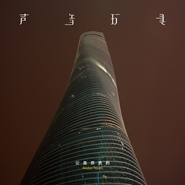

爱是昂贵的
============================

|  |  |
| :--: | :-- |
| [ 爱是昂贵的](https://emumo.xiami.com/album/1625015966) | **艺人**: [声音玩具](../index.md) **语种**: 国语 **唱片公司**: 虾米音乐人 **发行时间**: 2015年04月22日 **专辑类别**: 录音室专辑 **专辑风格**: 独立摇滚 Indie Rock **播放数**: 9901725 **收藏数**: 8444 **评论数**: 947  |

## 简介

实体购买：<a href="https://item.taobao.com/item.htm?spm=a1z10.5-c.w4002-11834690208.31.l8PkSY&amp;id=44995701108" target="_blank" rel="nofollow noreferrer noopener">https://item.taobao.com/item.htm?spm=a1z10.5-c.w4002-11834690208.31.l8PkSY&amp;id=44995701108</a>

  声音玩具到2015已经成立16年了，距离上一张《妙的旅行》已有12年了，如果这是一个人的话，一轮的回转多多少少也投上了宿命的影子。    回首昨日，一如少年的旅程，但终有也会知道选择也意味着放弃，那甜蜜的每一次，列着长长的队伍黑夜般无边无际！将这些场景转化成文字并尝试着赋予它诗意，再谱以旋律，也许人们这样就愿意相信那一切似乎不会消失的和爱流逝的速度一样快，更不会在时间中泥足深陷！    沉默，沉默又沉默，直到音乐再次响起，那些真实中无法释怀的种种再一次以美好的一面浮现在动人的一曲上，这也许就是我们能想到和过去告别最you雅的方式。    声音玩具2015新专辑《爱是昂贵的》  虾米音乐人寻光计划出品  围绕专辑的《Midas Touch》巡演之旅6月即将开启      / 明天你依旧在我身旁    时空飞逝 年华老去，我们也许无力前行  但是你我都能知道 那是wei一的方向  只有一件事最重要的明天你依旧  在我身旁    也许这是一首最不声音玩具的歌，也许这又是一首最声音玩具的歌，可又有什么关系呢，喜欢就loop，不喜欢三秒后就跳过，或者觉得凑合就点个赞！歌者与听众又何尝不是一场永无休止的战斗，不是吗？但对于一种无法用坚持来表述的音乐和积极的人生态度来说，重要的是明天你依旧在我身旁。      /和那些人一样    妈妈对我说 爱情是用任何语言任何诗篇无法描绘的喜悦啊！  她用了一生的时间也未能 未能找到它  妈妈对我说 打动你心扉的歌声决非来自我手中弹拨的吉他  就象汹涌的河流决非来自雪山和冰川的融化  和那些人一样 你到底为谁而歌唱？    这首歌像秋日余晖温暖，无力而感伤。  包含了声音玩具这十年来的追寻和坚持。  黑夜虽漫长，可黎明终究会来临的啊。  坚强的信念无法用时间用热情衡量。  只要再坚持五分钟，就可以感受到那温暖。      /声音玩具 一场等待十年的美妙旅行    1999年成军的声音玩具是成都最ju有代表性的乐队之一，也是中国独立摇滚乐的代表乐队。  乐队沉默而低调，一直潜心于自己的音乐。  2003年发布的《妙的旅行》只是DEMO，从未正式发行。  《和那些人一样》是乐队张正式专辑的支单曲。  这次，除了这张全新的专辑以外，《妙的旅行》也会出正式的录音室版本，作为对歌迷的回报。    对于姗姗来迟的这张唱片，与其说兴奋不如说终于可以卸下包袱轻装前行的轻松。  对于音乐最有魅力的意义无外乎创造，不停的表达才是常态。  所以这张唱片对于声音玩具来说只是一个开始，一个新时代的来临！      /一场青春和一张被爱了10年的DEMO    对于很多80后来说，  声音玩具的那张《妙的旅行》是和校园时代夏天爬满教学楼外墙的爬山虎联系在一起的，  也是和整天混迹地下音乐论坛却难得能看上一场演出的青春时代联系在一起的。    《妙的旅行》作为一张demo，  在网络平台和推广渠道远没有现在发达的10年前，  依然成为了独立乐迷心中一个时代的象征。  当《不朽》那长达5分多钟的前奏响起时，  当《青春》中的哼唱开始时，  那个时常莫名满心忧愁的青春期又回到了我们体内。  音乐的通感真奇妙，如此便是十年。      /一个初衷和无法被定义的声音玩具    就像他们自己说的那样：声音玩具的音乐总是难以被这样或那样的定义。人们已经习惯用转瞬即逝的背影或者一个刹那的侧面来记忆那些美好的事物，但这种观察和欣赏的方式也许并不能够完整的了解声音玩具的音乐。后摇？艺术摇滚？声音玩具都不这么认为。可是不得不说，这都是对于乐队作品优质旋律和诗意歌词从另一个角度的肯定。但对于乐队来说，精致的旋律和歌词，都只是通往人的内心的方式。他们做的音乐“很难用假象来欺骗”，因为都是从心而发的产物。    乐队的气质是内敛的，这种向内沉淀的趋势似乎也解释了乐队这些年的低调沉静。  这样的声音玩具让我们等待了十年，终于他们回来了。  欧波说：我们根本没有什么好总结的，因为我们还没做什么东西，这其实是一个新的开始。

制作名单：  所有词曲 All Songs &amp; Lyrics 欧珈源  编曲 Arrangement 声音玩具  主唱Lead Vocal 欧珈源  吉他 Guitar 李哲 龚鹤龄 欧珈源  贝斯Bass 胡凯  鼓和打击乐Drum&amp; Percussion 黄景（曲目 1 2 3 4 6 7 8 9 ）  鼓Drum 王咏 (曲目5 )  键盘Keyboard 何思诺 （曲目5）/ 欧珈源（曲目7 8 ）  采样及音效Sample &amp; Effect 欧珈源  人声和声编写Background Vocals Arrangement 欧珈源  和声Background Vocals龚鹤龄、王运湃、胡凯、李哲、王咏、李静、初一、冉语、黄景、蔡鸣 叶楠  特邀女声 Guest Vocal黄晶  录音棚 Recording Studio：乐声音频录音棚  乐器录音Instruments Recording： 丘勇胜 欧珈源  人声录音 Vocal Recording王昕 叶楠 虞志勇  混音 Mixing：郭敬刚  母带棚 Mastering Studio 韩冬母带工作室  母带 Mastering韩冬  制作人Producer 欧珈源    出品 Published – 虾米音乐人 i.xiami.com 、声音玩具 SoundToy  监制 Chief Executive Officer–朱七 Seven Zhu  总统筹 Chief Operating Director–赵宗 Zong Zhao  音乐人统筹 Artist Supervisor – 李唐甲子 Tangjiazi Li  企划统筹 Marketing Supervisor –声音玩具 SoundToy  线上推广 Online Promoting – 林初霞 Lingo Lin  线上推广支持 Online Promoting Support – 朱琪芳 Qifang Zhu、陈皓 Howie Chen  媒体推广 Media Supervisor – 闫超 Fieldy Yan  专辑文案 Copywriter –欧珈源 Jiayuan Ou  法务支持 Legal Support – 苏嫚 Susan Su 鹏阅 Pei Feng  财务支持 Financial Support – 符文 Chao Kong 杨杨 Yang Yang 希米 Ximi 夏郅 Xiazhi  视觉总监 Art Director – 詹盼 Pan  平面设计 Graphic Designer –詹盼Pan、 九零 90  平面摄影 Photographer –Harauld Sextus  生产管理 Production Management – 郭诚 Cheng Guo  唱片发行 Record Publishing – 独音唱片 Indie Music Store 北京市西城区鼓楼西大街17号 010-64022692    总出品：虾米音乐 Xiami.com  总出品人：王皓 Jeff Wang  发行时间 Release Date – 2015.4  P &amp; C – 虾米音乐人 i.xiami.com  唱片编号 Record Number – XA-010

 

## 曲目

- [最美妙的旅行](./1625015966/mQPwKa6503a.md)
- [生命](./1625015966/mQPwKb8b29c.md)
- [和那些人一样](./1625015966/xL995pcc7a4.md)
- [请问哪里才能买到晶体管收音机](./1625015966/mQPwKc583b3.md)
- [明天你依旧在我身旁](./1625015966/8GvbW0f1382.md)
- [抚琴小夜曲](./1625015966/xLAv8D9d9bd.md)
- [你是无可替代](./1625015966/xLAv8Na4423.md)
- [星航者发现号](./1625015966/xLAv8Oc5278.md)
- [时间](./1625015966/mQPwKp6524e.md)

## 评论

|  |  |  |  |
| :-- | :-- | :-- | :-- |
|  [虾米用户](https://emumo.xiami.com/u/266199006)  2021-01-15 17:47 赞(0) 踩(0) | 
下载虾米就是为了听着张专辑。在这里留下一条评论吧，纪念这段其实不算长的时间。对了，这张专真挺不错的
 |
|  [虾米用户](https://emumo.xiami.com/u/11960217) 少年心气疾 2020-11-30 09:57 赞(0) 踩(0) | 
声玩牛逼，虾米牛逼！
 |
|  [虾米用户](https://emumo.xiami.com/u/425791419) 我只会蒸蛋. 2020-11-10 17:04 赞(0) 踩(0) | 

 |
|  [虾米用户](https://emumo.xiami.com/u/409394265) 我还没想好要写什么... 2020-11-02 21:44 赞(0) 踩(0) | 
超喜欢这张！
 |
|  [虾米用户](https://emumo.xiami.com/u/49334418) ～ 2020-10-24 18:11 赞(0) 踩(0) | 
～
 |
|  [虾米用户](https://emumo.xiami.com/u/120955278) 我还没想好要写什么... 2020-09-23 23:06 赞(0) 踩(0) | 
这张后来静静地一首一首一遍遍耐心地听，才听出它的好。
 |
|  [虾米用户](https://emumo.xiami.com/u/410537424)  2020-09-10 21:05 赞(0) 踩(0) | 
( ˘ω˘ )つ
 |
|  [虾米用户](https://emumo.xiami.com/u/444464737) 我还没想好要写什么... 2020-09-03 08:20 赞(0) 踩(0) | 
唯一一个几乎每首歌都喜欢听的乐队
 |
|  [虾米用户](https://emumo.xiami.com/u/32067336) ◾️ 向无穷空间  做时... 2020-08-27 11:41 赞(0) 踩(0) | 
这是什么建筑？
 |
| ⇒ |  [虾米用户](https://emumo.xiami.com/u/3256844) 恩斯波肯 多姆 2020-10-21 05:39 赞(0) 踩(0) | 
上海中心
 |
|  [虾米用户](https://emumo.xiami.com/u/334374735) 脑子有问题 2020-08-22 17:27 赞(0) 踩(0) | 
听多了会觉得，其实欧珈源也是一个感情丰富的人，只不过就是编曲转折太多了，很多人听起来不连贯，但是能听喜欢听的人会觉得回味无穷。爱是昂贵的，我想这句话从各方面来讲都是对的，跟这张专辑的气质也很相符，其实我老是觉得欧珈源的才华并没有那么出众，这些歌说的都是很普通的事情，但是某一个瞬间我意识到，大多数人包括我的生活也就是这样，平淡无奇，再波澜起伏也跳不出什么带花的舞，带着这种想法去看，其实欧珈源做得很好了，艺术不就是来源于生活高于生活吗，能让我想起很多事情，能让我有来由的感动，就很好了
 |
|  [虾米用户](https://emumo.xiami.com/u/14578705) 这家伙很聪明，什么都没留... 2020-08-13 18:03 赞(0) 踩(0) | 
全部都回来了
 |
|  [虾米用户](https://emumo.xiami.com/u/8094301) Bye bye wx n... 2020-08-13 12:26 赞(0) 踩(0) | 
属于越听越好听
 |
|  [虾米用户](https://emumo.xiami.com/u/44849251) 我还没想好要写什么... 2020-08-12 13:46 赞(0) 踩(0) | 
虾米小编能不能把介绍文字编辑好了再发在首页？不分段挤一堆这样真的好吗？
 |
|  [虾米用户](https://emumo.xiami.com/u/96296322)  2020-08-12 13:35 赞(0) 踩(0) | 
.
 |
|  [虾米用户](https://emumo.xiami.com/u/427171048) 我还没想好要写什么... 2020-08-12 11:20 赞(0) 踩(0) | 
非常喜欢的一张专辑
 |
|  [虾米用户](https://emumo.xiami.com/u/2677168)  2020-08-12 10:50 赞(0) 踩(0) | 
清新、绵厚、悠长
 |
|  [虾米用户](https://emumo.xiami.com/u/38918617) 你相信我，我相信你 2020-08-12 07:51 赞(0) 踩(0) | 
为什么不是无损
 |
|  [虾米用户](https://emumo.xiami.com/u/38736645)  2020-08-11 16:00 赞(0) 踩(0) | 
真的好
 |
|  [虾米用户](https://emumo.xiami.com/u/420471162)  2020-08-09 15:33 赞(1) 踩(0) | 
封面是不是帝都那座大肠楼？
 |
| ⇒ |  [虾米用户](https://emumo.xiami.com/u/3256844) 恩斯波肯 多姆 2020-10-21 05:39 赞(0) 踩(0) | 
是上海中心
 |
|  [虾米用户](https://emumo.xiami.com/u/276112556) 我真的没想好要写什么(ﾟ... 2020-08-03 00:21 赞(0) 踩(0) | 
火钳刘明
 |
|  [虾米用户](https://emumo.xiami.com/u/4904339)  2020-07-17 21:01 赞(1) 踩(0) | 
你可以成为国安队里的金泰延 
 |
|  [虾米用户](https://emumo.xiami.com/u/401474215)  2020-06-09 07:47 赞(0) 踩(0) | 
好听
 |
|  [虾米用户](https://emumo.xiami.com/u/18222628)  2020-06-05 23:17 赞(1) 踩(0) | 
细腻
 |
|  [虾米用户](https://emumo.xiami.com/u/431385203)  2020-05-31 16:18 赞(3) 踩(0) | 
为了听这个专辑，专门下载了虾米音乐
 |
| ⇒ |  [虾米用户](https://emumo.xiami.com/u/444375754)  2020-08-02 16:53 赞(0) 踩(0) | 
太巧了，我也是因为声音玩具下了虾米
 |
|  [虾米用户](https://emumo.xiami.com/u/27225582) 我还没想好要写什么... 2020-05-10 11:50 赞(0) 踩(0) | 
神专
 |
|  [虾米用户](https://emumo.xiami.com/u/285252958) 一个人也是一支队伍 2020-05-09 23:55 赞(0) 踩(0) | 
太棒了太棒了太棒了太棒了太棒了太棒了太棒了太棒了太棒了太棒了太棒了太棒了太棒了太棒了太棒了太棒了
 |
|  [虾米用户](https://emumo.xiami.com/u/13279293) 我还没想好要写什么... 2020-05-06 01:33 赞(0) 踩(0) | 
我真好爱好爱好爱想要循环一百遍 
 |
|  [虾米用户](https://emumo.xiami.com/u/288042377) 1123581321 2020-04-22 18:26 赞(1) 踩(0) | 
如听仙乐耳暂明
 |
|  [虾米用户](https://emumo.xiami.com/u/4197702) 真假如一  如一一致 2020-03-28 13:00 赞(0) 踩(0) | 
可以反复听的专辑之一
 |
|  [虾米用户](https://emumo.xiami.com/u/199620881) 爱着的人 在你怀中 2020-02-23 14:49 赞(0) 踩(0) | 
支持
 |
|  [虾米用户](https://emumo.xiami.com/u/404569192)  2020-01-03 21:11 赞(0) 踩(0) | 
太好听了
 |
|  [虾米用户](https://emumo.xiami.com/u/51654428)   2019-11-21 18:33 赞(0) 踩(0) | 
牛逼
 |
|  [虾米用户](https://emumo.xiami.com/u/43492923) 行到水穷我才开始害怕，夕... 2019-10-26 15:46 赞(1) 踩(0) | 
-
 |
|  [虾米用户](https://emumo.xiami.com/u/7440330) 微醺 2019-10-21 17:31 赞(0) 踩(0) | 
对胃口
 |
|  [虾米用户](https://emumo.xiami.com/u/189030460) No Regrets  ... 2019-10-10 21:23 赞(0) 踩(0) | 
这张实在是太好了
 |
|  [虾米用户](https://emumo.xiami.com/u/425407803)  2019-10-09 16:17 赞(0) 踩(0) | 
不需要太多解释
 |
|  [虾米用户](https://emumo.xiami.com/u/13842060) 音乐与文字 2019-09-24 21:13 赞(0) 踩(0) | 
艺术品
 |
|  [虾米用户](https://emumo.xiami.com/u/926931)  2019-09-16 09:02 赞(1) 踩(0) | 
昨天第一次看声玩的现场。上海mao木马联合声玩木马的调音把声音玩具衬托出了一个新的高度。声玩的现场，绝对是国际水准了。
 |
| ⇒ |  [虾米用户](https://emumo.xiami.com/u/11464083) always awake 2019-10-13 01:54 赞(0) 踩(0) | 
哎错过了 羡慕
 |
| ⇒ |  [虾米用户](https://emumo.xiami.com/u/926931)  2020-02-22 11:40 赞(0) 踩(0) | 
<q><b>ng说：</b></q>
 |
|  [虾米用户](https://emumo.xiami.com/u/20316094)  2019-09-07 19:54 赞(1) 踩(0) | 
中奖了，送的这张带签名专辑，15号我来了 
 |
|  [虾米用户](https://emumo.xiami.com/u/49518506) 谢谢世界谢谢主 2019-08-21 01:50 赞(0) 踩(0) | 
特别好
 |
|  [虾米用户](https://emumo.xiami.com/u/312474289)  2019-08-17 00:02 赞(0) 踩(0) | 
心目中第二张神专
 |
|  [虾米用户](https://emumo.xiami.com/u/426018631) 我还没想好要写什么... 2019-08-05 20:42 赞(0) 踩(0) | 
专辑封面谁知道是哪里啊
 |
| ⇒ |  [虾米用户](https://emumo.xiami.com/u/193415384)  2019-08-30 07:36 赞(0) 踩(0) | 
上海中心大厦
 |
| ⇒ |  [虾米用户](https://emumo.xiami.com/u/426018631) 我还没想好要写什么... 2019-09-05 23:23 赞(0) 踩(0) | 
好的，我以为在成都呢 有机会去看看～
 |
|  [虾米用户](https://emumo.xiami.com/u/5731206)   2019-07-29 07:34 赞(0) 踩(0) | 
生命爱了
 |
|  [虾米用户](https://emumo.xiami.com/u/263415794) 我是VIP，你打我啊 2019-07-27 23:08 赞(0) 踩(0) | 
我就想知道是谁打的一分。？？？
 |
|  [虾米用户](https://emumo.xiami.com/u/25032013) 旋转，跳跃哦，他感到，连... 2019-07-21 11:50 赞(0) 踩(0) | 
哦我的宝藏
 |
|  [虾米用户](https://emumo.xiami.com/u/426018631) 我还没想好要写什么... 2019-06-20 01:35 赞(0) 踩(0) | 
编曲歌词旋律都都太美好了
 |
|  [虾米用户](https://emumo.xiami.com/u/57231736)  2019-06-12 02:44 赞(1) 踩(0) | 
声音在国内乐队属于高质
 |
|  [虾米用户](https://emumo.xiami.com/u/31277956) Oops! Sorry  2019-05-24 22:30 赞(0) 踩(0) | 
有生之年系列
 |
|  [虾米用户](https://emumo.xiami.com/u/342075420) 我宇宙公司贾总，我秘书辞... 2019-05-21 21:54 赞(0) 踩(0) | 
可以
 |
|  [虾米用户](https://emumo.xiami.com/u/292038858) 我还没想好要写什么... 2019-05-17 23:37 赞(1) 踩(0) | 
欧老师是种星星的人
 |
|  [虾米用户](https://emumo.xiami.com/u/298484062) 我还没想好要写什么... 2019-05-12 21:09 赞(0) 踩(0) | 
经典
 |
|  [虾米用户](https://emumo.xiami.com/u/43647805)  2019-05-05 08:24 赞(0) 踩(0) | 
挺遗憾的，2019 才听到声音玩具。时间这首歌是我心头最爱。
 |
|  [虾米用户](https://emumo.xiami.com/u/274855815) 我还没想好要写什么... 2019-05-03 11:22 赞(0) 踩(0) | 
是我产生共振
 |
|  [虾米用户](https://emumo.xiami.com/u/420533588) 喜欢胡凯的郭小姐要努力成... 2019-03-26 12:37 赞(0) 踩(0) | 
相见恨晚
 |
|  [虾米用户](https://emumo.xiami.com/u/2903754) 我还没想好要写什么... 2019-03-11 02:48 赞(0) 踩(0) | 
牛逼
 |
|  [虾米用户](https://emumo.xiami.com/u/260992790) I'll Be Your... 2019-02-17 22:21 赞(1) 踩(0) | 
我爱声玩
 |
|  [虾米用户](https://emumo.xiami.com/u/39686671)  2019-02-13 15:48 赞(1) 踩(0) | 
想念声玩的现场
 |
|  [虾米用户](https://emumo.xiami.com/u/415749762)  2019-02-04 13:56 赞(1) 踩(0) | 
神专中的神专
 |
|  [虾米用户](https://emumo.xiami.com/u/244545672) 音乐是一种记忆，更是一种... 2019-02-02 07:15 赞(3) 踩(0) | 
人有三样东西是无法隐瞒的：咳嗽、贫穷和爱，你想隐瞒，却欲盖弥彰。人有三样东西是不该挥霍的：身体、金钱和爱，你想挥霍，却得不偿失。人有三样东西是无法挽留的：生命、时间和爱，你想挽留，却渐行渐远。你有三样东西是不该回忆的：灾难、死亡和爱，你想回忆，却苦不堪言。 ​​​
 |
|  [虾米用户](https://emumo.xiami.com/u/331433380)  2019-01-29 09:05 赞(1) 踩(0) | 
越老越爱
 |
|  [虾米用户](https://emumo.xiami.com/u/37678017) 无摇滚，不青春！ 2019-01-20 12:23 赞(0) 踩(0) | 
5年快过去了。很快就可以在网易云听到。。。
 |
|  [虾米用户](https://emumo.xiami.com/u/302711) 最多12个字符。 2019-01-14 17:49 赞(0) 踩(0) | 
越老越爱
 |
|  [虾米用户](https://emumo.xiami.com/u/43492923) 行到水穷我才开始害怕，夕... 2018-11-14 15:59 赞(0) 踩(0) | 
▽
 |
|  [虾米用户](https://emumo.xiami.com/u/6115544) 恋恋风尘 2018-08-07 04:19 赞(0) 踩(0) | 
这应该是对时间，空间，生命，亲情，爱情等等宏大议题作出深刻思考的牛逼专辑了，大半夜，自己总是很感性，喜欢这个专辑对于这些议题的思考，代入感很强，曲目的编排也很有深意，所有的一切，终归在时间面前，探寻其意义已显得不再重要。love&amp;amp;peace 
 |
|  [虾米用户](https://emumo.xiami.com/u/36938932) 倒霉的小伙子比洞還潮濕的... 2018-07-04 09:35 赞(1) 踩(0) | 
晶體管收音機是昂貴的
 |
|  [虾米用户](https://emumo.xiami.com/u/10244710)  2018-04-08 10:06 赞(0) 踩(0) | 
简直太好了
 |
|  [虾米用户](https://emumo.xiami.com/u/10213118)  2018-04-06 15:05 赞(1) 踩(0) | 
是吧 又要约会 又要开房 还要买贵重的礼物 一年365天都可以变成纪念日 还要把整颗心完完整整交出去 太昂贵惹
 |
| ⇒ |  [虾米用户](https://emumo.xiami.com/u/112454584) 多情司马 2018-05-03 10:33 赞(0) 踩(0) | 
嘻嘻
 |
| ⇒ |  [虾米用户](https://emumo.xiami.com/u/112454584) 多情司马 2018-10-02 11:14 赞(0) 踩(0) | 
看来我对你是真爱
 |
| ⇒ |  [虾米用户](https://emumo.xiami.com/u/10213118)  2018-10-02 18:18 赞(0) 踩(0) | 
<q><b>姿七八郎说：</b></q>
 |
|  [虾米用户](https://emumo.xiami.com/u/14016518) 所有言语黯淡之时，音乐会... 2018-03-29 19:24 赞(0) 踩(0) | 

 |
|  [虾米用户](https://emumo.xiami.com/u/260667492)  2018-03-27 01:18 赞(0) 踩(0) | 
欧珈源回来了
 |
|  [虾米用户](https://emumo.xiami.com/u/13279293) 我还没想好要写什么... 2018-01-30 23:05 赞(0) 踩(0) | 
完全听不腻
 |
|  [虾米用户](https://emumo.xiami.com/u/36736925) 我还没想好要写什么... 2018-01-27 00:22 赞(0) 踩(0) | 
★
 |
|  [虾米用户](https://emumo.xiami.com/u/15270473) 听到喜欢的歌 身体不跟着... 2017-12-31 13:33 赞(0) 踩(0) | 
-
 |
|  [虾米用户](https://emumo.xiami.com/u/82893668) 我还没想好要写什么... 2017-12-24 12:12 赞(0) 踩(0) | 
感觉这个封面缺少了一点艺术感，也没有第一张的文艺感
 |
| ⇒ |  [虾米用户](https://emumo.xiami.com/u/54491602) 这家伙很聪明什么也没留下... 2018-03-13 16:31 赞(0) 踩(0) | 
詹老师设计的哈哈哈哈 
 |
|  [虾米用户](https://emumo.xiami.com/u/339001740)  2017-12-23 20:55 赞(0) 踩(0) | 
有幸
 |
|  [虾米用户](https://emumo.xiami.com/u/334319923) 快去招人喜欢 2017-12-06 13:07 赞(1) 踩(0) | 
不得不说这张专辑是要服的
 |
|  [虾米用户](https://emumo.xiami.com/u/334319923) 快去招人喜欢 2017-11-16 13:16 赞(0) 踩(0) | 
真是太好听
 |
|  [虾米用户](https://emumo.xiami.com/u/25794889) 停用！↓↓↓遗言 2017-11-15 22:54 赞(0) 踩(0) | 
时间晶体管收音机最耐听
 |
|  [虾米用户](https://emumo.xiami.com/u/5806141)  2017-10-28 00:45 赞(4) 踩(0) | 
旋律很漂亮 做到这一点很不容易~大多数乐队都是流于形式~！胡编乱造旋律，一窝蜂配器乱七八糟完全是噪音 加上是是而非看似哲理实际狗屁不通的歌词~还好 声音玩具不是这样....虽然我也不喜欢他们、
 |
|  [虾米用户](https://emumo.xiami.com/u/13768064)  2017-10-28 00:03 赞(0) 踩(0) | 
近期很喜欢的两组艺人，前后推出新作，太幸福。跑步不会孤单了！！！！
 |
|  [虾米用户](https://emumo.xiami.com/u/13768064)  2017-10-28 00:03 赞(0) 踩(0) | 
近期很喜欢的两组艺人，前后推出新作，太幸福。跑步不会孤单了！！！！
 |
|  [虾米用户](https://emumo.xiami.com/u/32387391)  2017-10-28 00:02 赞(2) 踩(0) | 
去年迷笛现场 冒着雨和泥看的 当时抱着很大期望 但事实证明那是我看过的最差的现场之一… 现场唱的大部分是新歌 但对比起最美妙的旅行即一砖里的作品完全没有吸引力 可以说是配上他特长的车祸现场一点都不抓耳。 现场还唱了一首我应该是听得耳朵生茧的一砖里的歌 忘记是艾玲还是什么了 但是当时在现场愣是得靠歌词来分辨这是哪首歌…别说跑不跑调不在乎…对歌曲来说旋律一直都是最重要的之一。 至于首砖的质量 那是我到现在花三十还是二十块钱买到的最值的全新未拆封正版专辑 也是我在车上最喜欢听的专辑之一。 这张并没有第一张的歌那么抓住我的心了， 即使是十二年…
 |
|  [虾米用户](https://emumo.xiami.com/u/37045091) 你底眼睛看见这一场火灾，... 2017-10-27 22:57 赞(0) 踩(0) | 
2015年4月22日 未见然 心腐烂
 |
|  [虾米用户](https://emumo.xiami.com/u/15270473) 听到喜欢的歌 身体不跟着... 2017-09-22 14:33 赞(0) 踩(0) | 
-.
 |
|  [虾米用户](https://emumo.xiami.com/u/285329269)   2017-09-22 00:23 赞(0) 踩(0) | 
没爱上的时候买了碟 过后很久才爱上
 |
|  [虾米用户](https://emumo.xiami.com/u/39426701)  2017-08-17 20:28 赞(0) 踩(0) | 
能否直接给个整张专辑的购买渠道，一首一首真的麻烦 
 |
|  [虾米用户](https://emumo.xiami.com/u/85928852) 穷极一生 追求快乐 2017-07-15 00:06 赞(0) 踩(0) | 
  
 |
|  [虾米用户](https://emumo.xiami.com/u/20428211) 这家伙很玻璃心 2017-05-01 19:17 赞(0) 踩(0) | 
所以付费购买入口在哪里&amp;hellip;&amp;hellip;
 |
|  [虾米用户](https://emumo.xiami.com/u/264309776)   2017-04-26 12:17 赞(0) 踩(0) | 
声音玩具明天北京见！
 |
|  [虾米用户](https://emumo.xiami.com/u/38495278) ❄️梁晓雪❄️ 2017-04-21 17:17 赞(0) 踩(0) | 
词看得我入迷 被这个声音吸引了。
 |
|  [虾米用户](https://emumo.xiami.com/u/124627406) 贵州承宣布政使司龙场九驿... 2017-04-17 13:38 赞(0) 踩(0) | 
为什么听的我想睡觉？  
 |
|  [虾米用户](https://emumo.xiami.com/u/44359625)   2017-03-30 17:41 赞(0) 踩(0) | 
嘿~
 |
|  [虾米用户](https://emumo.xiami.com/u/3494804)  2017-03-27 08:39 赞(4) 踩(0) | 
汕头大学迷笛听到 生命 live 只差落泪
 |
|  [虾米用户](https://emumo.xiami.com/u/124639652)  2017-03-16 12:39 赞(0) 踩(0) | 

 |
|  [虾米用户](https://emumo.xiami.com/u/184353032) 某大学乐队吉他手 2017-03-13 19:59 赞(0) 踩(0) | 
每首都好听 不过现场真的是录音室版不能比的
 |
|  [虾米用户](https://emumo.xiami.com/u/3516744)   2017-03-03 11:29 赞(0) 踩(0) | 
9分没问题 厉害的不得了
 |
|  [虾米用户](https://emumo.xiami.com/u/43649827) 追求 拿青春换富有 2017-02-05 01:02 赞(0) 踩(0) | 
他们专辑 虾米要购买 可是购买链接呢
 |
| ⇒ |  [虾米用户](https://emumo.xiami.com/u/23442708) be cool 2017-02-11 14:29 赞(0) 踩(0) | 
只能一首首买吗 这不手都点抽了。虾米做付费还是太敷衍
 |
|  [虾米用户](https://emumo.xiami.com/u/25794889) 停用！↓↓↓遗言 2017-01-17 21:29 赞(0) 踩(0) | 
早就下载了上传云音乐个人云盘，
 |
|  [虾米用户](https://emumo.xiami.com/u/257310632)  2017-01-12 16:58 赞(2) 踩(0) | 
為了聽聲玩專門下載蝦米，什麼時候能上網易雲
 |
| ⇒ |  [虾米用户](https://emumo.xiami.com/u/20251213) 所有沧桑，独自承受 2017-02-02 00:04 赞(0) 踩(0) | 
已买碟
 |
|  [虾米用户](https://emumo.xiami.com/u/560528) 我还没想好要写什么... 2016-12-26 12:24 赞(0) 踩(0) | 
我死了
 |
|  [虾米用户](https://emumo.xiami.com/u/358992) 优美地低于生活 2016-12-08 18:43 赞(0) 踩(0) | 
为什么这张专辑那么“声音碎片”？？
 |
| ⇒ |  [虾米用户](https://emumo.xiami.com/u/14507569)   2016-12-08 19:24 赞(0) 踩(0) | 
我也觉得
 |
|  [虾米用户](https://emumo.xiami.com/u/47194969) 只要凝眸相视 命运便会水... 2016-12-04 01:57 赞(1) 踩(0) | 
“青春是昂贵的 只有爱配得上它”
 |
|  [虾米用户](https://emumo.xiami.com/u/170029324)  2016-11-16 12:33 赞(2) 踩(0) | 
就不能打包付费下载吗？或者买整个专辑，好麻烦的。
 |
|  [虾米用户](https://emumo.xiami.com/u/15293562) how desperat... 2016-11-07 16:42 赞(1) 踩(0) | 
12年过去了 臆想症还是没有治好
 |
|  [虾米用户](https://emumo.xiami.com/u/240604717)  2016-10-29 02:46 赞(2) 踩(0) | 
总是对第一眼无爱的东西坚决地不去了解，现在才知道错过了多少。。。
 |
|  [虾米用户](https://emumo.xiami.com/u/13626358) 我还没想好要写什么... 2016-10-17 14:17 赞(0) 踩(0) | 
说点什么呢？
 |
|  [虾米用户](https://emumo.xiami.com/u/44830503) hurts instea... 2016-10-16 23:17 赞(2) 踩(0) | 
爱是昂贵的，所以声玩这张专辑全部是要收费的。。。。
 |
|  [虾米用户](https://emumo.xiami.com/u/1428483)  2016-10-09 09:43 赞(0) 踩(0) | 
所有歌曲都需单独付费购买后才可下载，可是在哪里购买啊？怎么都没说啊？？？HELP！！！难道直接买实体专辑？？
 |
| ⇒ |  [虾米用户](https://emumo.xiami.com/u/189286503) 谢谢虾米 2016-10-15 04:10 赞(0) 踩(0) | 
呃… 我试了点整专是会出现你说的这种问题。但是点单曲可以购买，要么你就一首一首的买好了 
 |
|  [虾米用户](https://emumo.xiami.com/u/10094114) 哦 2016-10-06 18:17 赞(2) 踩(0) | 
声音玩具带着这张新专辑做Midas Touch巡演的时候，我还跟他们说更喜欢老专辑一点。现在后悔了，其实新专辑更有魅力。
 |
|  [虾米用户](https://emumo.xiami.com/u/225290134)  2016-10-04 22:35 赞(0) 踩(0) | 
好听
 |
|  [虾米用户](https://emumo.xiami.com/u/11511630)  2016-09-18 12:06 赞(2) 踩(0) | 
至爱的一张专辑，超越了前作的迷幻摇滚经典。迷醉在旋律无法自拔
 |
|  [虾米用户](https://emumo.xiami.com/u/36897148) 私信➕v请备注 2016-09-13 15:10 赞(0) 踩(0) | 
相比较第一张明显阳光了许多
 |
|  [虾米用户](https://emumo.xiami.com/u/213027752) 宇宙裡有什麼不是暫時。 2016-08-17 13:46 赞(4) 踩(0) | 
感觉作曲和编曲太牛逼了导致我觉得vocal反而显得多余，尤其是最喜欢《生命》的后半段逐层递进到最后爆发的那种壮丽感真是不要太屌，去年第一次听的时候我简直头皮都是麻的。另外我是真心觉得vocal变成无语义哼鸣会更好，声玩这个水平已经完全可以靠器乐来表达一切，语义对他们反而是一种束缚。
 |
| ⇒ |  [虾米用户](https://emumo.xiami.com/u/203075)  2016-09-16 23:01 赞(0) 踩(0) | 
也许，嗯，我没有任何贬低的意思，你可以去听听一些欧美大神乐队的纯器乐后摇，估计你会更喜欢的XD……声玩的很多歌就很有后摇的味道
 |
| ⇒ |  [虾米用户](https://emumo.xiami.com/u/312179) 潜入深蓝，放肆幻听 2017-02-26 21:23 赞(0) 踩(0) | 
看了声玩的这张专辑的巡演现场，离老欧一米的距离。其实有些歌他的声音已经算是乐器的一部分了，比如生命。感觉他们编曲很后摇，三个吉他的编曲太美了。你最后一句说的正是窦唯在幻听那张专辑开始做的事。
 |
| ⇒ |  [虾米用户](https://emumo.xiami.com/u/20316094)  2017-03-18 17:59 赞(0) 踩(0) | 
<q><b>sober说：</b></q>
 |
| ⇒ |  [虾米用户](https://emumo.xiami.com/u/283772857)   2017-03-28 14:30 赞(0) 踩(0) | 
<q><b>终究是numb说：</b></q>
 |
| ⇒ |  [虾米用户](https://emumo.xiami.com/u/20316094)  2017-03-28 15:02 赞(0) 踩(0) | 
<q><b>may2faye说：</b></q>
 |
|  [虾米用户](https://emumo.xiami.com/u/162325270) 经过云的时候我吞下一大口 2016-08-04 12:59 赞(0) 踩(0) | 
很棒的专辑，起床一直听。今微博清了好多话唠清静许多。很不情愿切了冬瓜，手上的薄茧被水泡起了一层。专辑很棒。
 |
|  [虾米用户](https://emumo.xiami.com/u/25794889) 停用！↓↓↓遗言 2016-07-20 23:22 赞(1) 踩(0) | 
刚开始听声玩时下载了这个专辑的全部歌曲，时不时的会随机播放到，慢慢的迷上了《时间》和《请问哪里才能买到晶体管收音机》，晚安！
 |
|  [虾米用户](https://emumo.xiami.com/u/12730895) 不要离开！ 2016-06-05 12:16 赞(0) 踩(0) | 
太昂贵
 |
|  [虾米用户](https://emumo.xiami.com/u/139908408)  2016-06-01 01:59 赞(0) 踩(0) | 
我想，用我的D100听肯定很赞 
 |
| ⇒ |  [虾米用户](https://emumo.xiami.com/u/3404636)   2018-03-22 22:15 赞(0) 踩(0) | 
我是非Dsd不下载
 |
|  [虾米用户](https://emumo.xiami.com/u/178176686)  2016-05-24 11:38 赞(0) 踩(0) | 
不的不说,这音乐 好像你家死人了~
 |
|  [虾米用户](https://emumo.xiami.com/u/4718206) Hey you 2016-05-20 23:16 赞(0) 踩(0) | 
之前一直不知道为什么大叔和姐姐这么喜欢这张专辑，这几天忽然明白了 除了爱 还有什么是最昂贵的呢？
 |
|  [虾米用户](https://emumo.xiami.com/u/169692370)  2016-05-14 21:48 赞(0) 踩(0) | 
很好
 |
|  [虾米用户](https://emumo.xiami.com/u/1915273)  2016-05-09 23:12 赞(0) 踩(0) | 
路转粉，这张太流弊
 |
|  [虾米用户](https://emumo.xiami.com/u/12730895) 不要离开！ 2016-05-05 23:19 赞(0) 踩(0) | 
明天
 |
|  [虾米用户](https://emumo.xiami.com/u/3474070)  2016-04-27 00:59 赞(4) 踩(0) | 
新专辑让我对声音玩具的爱也上升到新高度，从青涩青春的对艾玲秘密的爱到如今更加成熟和他们一样最美妙的旅行，也正是我们成长所经历的从苦涩懵懂青春到若有所悟包容的爱。生命里遇见你们真好啊
 |
|  [虾米用户](https://emumo.xiami.com/u/10857184)  2016-03-23 23:04 赞(0) 踩(0) | 
“爱是昂贵的。”我真的特别地，喜欢这句话。我们歌唱生活中最平常的点点滴滴，过去的现在的以及以后可能发生的，这些都是我们最昂贵的，也是最宝贵的东西。
 |
|  [虾米用户](https://emumo.xiami.com/u/6814847) 迷而忘返，自是归途 2016-03-22 23:27 赞(0) 踩(0) | 

 |
|  [虾米用户](https://emumo.xiami.com/u/2279444) 爱在左，同情在右。 2016-03-21 11:26 赞(1) 踩(0) | 
这封面是不是上海中心大厦
 |
|  [虾米用户](https://emumo.xiami.com/u/805933) 二熊把我的推荐系统搞迷糊... 2016-03-17 14:36 赞(1) 踩(0) | 
技术略屌，却也让有些歌词显得小气了。
 |
|  [虾米用户](https://emumo.xiami.com/u/886551)  2016-03-16 16:47 赞(0) 踩(0) | 
相比第一张，制作更精美，完整度更高
 |
|  [虾米用户](https://emumo.xiami.com/u/119291546)  2016-03-07 08:38 赞(0) 踩(0) | 
咋也搞上后摇了？
 |
|  [虾米用户](https://emumo.xiami.com/u/16007134)  2016-03-02 15:22 赞(0) 踩(0) | 
听着听着感动得就要流下泪了。
 |
|  [虾米用户](https://emumo.xiami.com/u/6358336) 我还没想好要写什么... 2016-02-11 23:49 赞(0) 踩(0) | 
封面的上海中心代表的是阳具吗
 |
|  [虾米用户](https://emumo.xiami.com/u/9671087)   2016-02-10 14:20 赞(0) 踩(0) | 
这张太太太太棒了
 |
|  [虾米用户](https://emumo.xiami.com/u/38663581) see you 2016-01-28 05:56 赞(0) 踩(0) | 
为什么瞥一眼在印象里留下的分明是 爱是免费的这五个字？？？？为什么？？？？？？？？？
 |
|  [虾米用户](https://emumo.xiami.com/u/103549418) 愿所有善意都是好运❤️ 2016-01-27 12:42 赞(0) 踩(0) | 
你是否能看清
 |
|  [虾米用户](https://emumo.xiami.com/u/43369141)  2016-01-21 00:30 赞(1) 踩(0) | 
这周末估计要火了
 |
|  [虾米用户](https://emumo.xiami.com/u/37678017) 无摇滚，不青春！ 2016-01-20 23:22 赞(2) 踩(0) | 
虾米独家，从制作到发行 一条龙的，网易、腾讯能做到不？阿里连个授权都不给你们！这种 一旦量大的话，很可怕。阿里确实懂得储备未来的经典。
 |
|  [虾米用户](https://emumo.xiami.com/u/250378) 我还没想好要写什么... 2016-01-20 20:02 赞(1) 踩(0) | 
还是原来的旋律好
 |
|  [虾米用户](https://emumo.xiami.com/u/8905510) 嚯！ 2016-01-20 11:25 赞(0) 踩(0) | 
越听越有味道。
 |
|  [虾米用户](https://emumo.xiami.com/u/8293666)  2016-01-06 21:48 赞(0) 踩(0) | 
好专辑，好乐队，我又后知后觉了
 |
|  [虾米用户](https://emumo.xiami.com/u/6643814)  2016-01-06 00:29 赞(0) 踩(0) | 
那场夜雪很应景❄️❄️
 |
|  [虾米用户](https://emumo.xiami.com/u/5689806)  2016-01-05 16:32 赞(0) 踩(0) | 
这张砖有点像90年代深情流派的流行歌。。连唱腔都变了。。
 |
|  [虾米用户](https://emumo.xiami.com/u/13679138)  2015-12-31 13:25 赞(0) 踩(0) | 
声音玩具好听，我喜欢《生命》，“生命一旦被赋予，便有灵魂跟随，灵魂不会背弃你，除非你自己放弃”……
 |
|  [虾米用户](https://emumo.xiami.com/u/48014753) 失去了是痛苦_得到了是无... 2015-12-28 01:21 赞(0) 踩(0) | 
声玩专辑总时长好长啊~不仅好听还很划算~
 |
|  [虾米用户](https://emumo.xiami.com/u/49162748)  2015-12-26 00:57 赞(1) 踩(0) | 
祝福今天在13club 现场的那对新人，也希望声玩越来越棒。
 |
|  [虾米用户](https://emumo.xiami.com/u/89329118)  2015-12-22 21:56 赞(0) 踩(0) | 
太好听
 |
|  [虾米用户](https://emumo.xiami.com/u/31277956) Oops! Sorry  2015-12-22 18:07 赞(0) 踩(0) | 
有生之年
 |
|  [虾米用户](https://emumo.xiami.com/u/31369472)  2015-12-22 15:32 赞(1) 踩(0) | 
整张专辑，循环了半年了。
 |
| ⇒ |  [虾米用户](https://emumo.xiami.com/u/10825322) @Bside1 2016-02-04 04:20 赞(0) 踩(0) | 
同
 |
|  [虾米用户](https://emumo.xiami.com/u/50153562) 我还没想好要写什么... 2015-12-21 01:47 赞(0) 踩(0) | 
最后的时间 旋律上与第一首最美妙的旅行有呼应，让整张专辑成为一个完美整体，是的 新砖在作曲 编曲 作词上也许不如老砖，但它是真诚的，这就足以打动人
 |
|  [虾米用户](https://emumo.xiami.com/u/2815764)  2015-12-17 15:04 赞(1) 踩(0) | 
前两天北京回广州的航班上，发生了一件让我大写后悔的事。两个独立音乐人坐在我前面，气质很特别，可我盯着他们偷偷看了很久竟没认出来他们就是声音玩具，一个就是主唱欧珈源，另一个应该是合唱和吉他手龚鹤龄，对他们的音乐我早已崇拜得五体投地，但是我向来关注音乐多于关注音乐人的长相...然而在今年刚刚结束的华语音乐媒体大奖颁奖礼上看见声音玩具全员时，我才明白：哇咔咔，我是有多缺心眼地错过了偶像。。。
 |
|  [虾米用户](https://emumo.xiami.com/u/3803809) 人生得意须尽欢 2015-12-16 22:35 赞(0) 踩(0) | 
封面是上海中心么
 |
| ⇒ |  [虾米用户](https://emumo.xiami.com/u/12730895) 不要离开！ 2015-12-16 23:00 赞(0) 踩(0) | 
我认了好久才认出来。。。
 |
| ⇒ |  [虾米用户](https://emumo.xiami.com/u/3803809) 人生得意须尽欢 2015-12-18 09:53 赞(0) 踩(0) | 
<q><b>李二黑说：</b></q>
 |
| ⇒ |  [虾米用户](https://emumo.xiami.com/u/12730895) 不要离开！ 2015-12-19 21:44 赞(0) 踩(0) | 
<q><b>吃了个粽说：</b></q>
 |
| ⇒ |  [虾米用户](https://emumo.xiami.com/u/3803809) 人生得意须尽欢 2015-12-20 00:24 赞(0) 踩(0) | 
<q><b>李二黑说：</b></q>
 |
| ⇒ |  [虾米用户](https://emumo.xiami.com/u/12730895) 不要离开！ 2015-12-20 22:49 赞(0) 踩(0) | 
<q><b>吃了个粽说：</b></q>
 |
| ⇒ |  [虾米用户](https://emumo.xiami.com/u/80497432)  2015-12-21 18:36 赞(0) 踩(0) | 
<q><b>吃了个粽说：</b></q>
 |
| ⇒ |  [虾米用户](https://emumo.xiami.com/u/3803809) 人生得意须尽欢 2015-12-21 20:08 赞(0) 踩(0) | 
<q><b>李二黑说：</b></q>
 |
| ⇒ |  [虾米用户](https://emumo.xiami.com/u/4911883) 如果你也爱Eason 2015-12-27 21:01 赞(0) 踩(0) | 
是
 |
| ⇒ |  [虾米用户](https://emumo.xiami.com/u/12730895) 不要离开！ 2016-01-06 00:13 赞(0) 踩(0) | 
<q><b>闹海说：</b></q>
 |
|  [虾米用户](https://emumo.xiami.com/u/12730895) 不要离开！ 2015-12-15 22:51 赞(0) 踩(0) | 
我好肤浅。
 |
|  [虾米用户](https://emumo.xiami.com/u/24938154)  2015-12-14 03:28 赞(0) 踩(0) | 
刚刚从网易云过来的 呼呼 以后播放器要多下几个了咯
 |
|  [虾米用户](https://emumo.xiami.com/u/9702711) 暂无签名~ 2015-12-13 02:43 赞(3) 踩(0) | 
2015板砖大赢家。。。火前留名
 |
|  [虾米用户](https://emumo.xiami.com/u/1384536) 感谢拥有耳朵去听song 2015-12-13 01:31 赞(8) 踩(0) | 
迷笛2015最佳专辑 最佳乐队 最佳男歌手 最佳单曲
 |
|  [虾米用户](https://emumo.xiami.com/u/88379500) 在悠远的天空下无为地活着 2015-12-04 13:15 赞(0) 踩(0) | 
封面不喜欢T_T
 |
| ⇒ |  [虾米用户](https://emumo.xiami.com/u/12730895) 不要离开！ 2015-12-05 01:35 赞(0) 踩(0) | 
詹盼做的
 |
|  [虾米用户](https://emumo.xiami.com/u/2208174) 暂无签名~ 2015-11-30 10:23 赞(1) 踩(0) | 
2015.11.29 长沙46，现场看得很感慨，老乐队就是老乐队，现场调音极佳，最后一首《明天你依旧在我声旁》听到眼眶湿“时空飞逝年华老去 我们也许无力前行但是你我都能知道 那是唯一的方向只有一件事最重要的 明天你依旧 在我身旁 ”对声音玩具的期待，就像老欧自己说的， 后会有期
 |
| ⇒ |  [虾米用户](https://emumo.xiami.com/u/2815764)  2015-12-17 15:05 赞(0) 踩(0) | 
真的非常非常喜欢这一首，也才听了现场，从一开始就很戳心，眼泪一下就出来了
 |
|  [虾米用户](https://emumo.xiami.com/u/358992) 优美地低于生活 2015-11-29 11:26 赞(1) 踩(0) | 
新专辑太像声音碎片了，搞得我好几次专门看看歌手，生怕自己是不是听错了。。。。。
 |
| ⇒ |  [虾米用户](https://emumo.xiami.com/u/80497432)  2015-12-21 18:38 赞(0) 踩(0) | 
噗....
 |
|  [虾米用户](https://emumo.xiami.com/u/46227477) 喜欢美剧日剧，各种音乐 2015-11-28 13:24 赞(0) 踩(0) | 
感觉这张专辑有更宽容成熟的世界观，不知道是不是岁月让大家都有了改变。比上一张专辑更吸引我。昨天去了武汉现场，现场效果是mp3无法比拟的。买了签售的cd，因为现场听到了过往青春岁月的感动。没有唱老歌我很支持.12年前的心情和回忆就让它过去吧，我们应该活在现在。
 |
|  [虾米用户](https://emumo.xiami.com/u/27459828)  2015-11-28 12:51 赞(0) 踩(0) | 
挺不错
 |
|  [虾米用户](https://emumo.xiami.com/u/51933333)   2015-11-26 23:23 赞(0) 踩(0) | 
呼～好好睡觉好好吃饭漂漂亮亮健健康康
 |
|  [虾米用户](https://emumo.xiami.com/u/85123980)  2015-11-24 11:49 赞(0) 踩(0) | 
心出发
 |
|  [虾米用户](https://emumo.xiami.com/u/16063042)  2015-11-18 23:08 赞(0) 踩(0) | 
声音玩具当初是朋克么
 |
|  [虾米用户](https://emumo.xiami.com/u/2098023) 有时天晴有时雨 2015-11-15 12:52 赞(0) 踩(0) | 
原来封面是詹盼盼做的…
 |
|  [虾米用户](https://emumo.xiami.com/u/9758921)  2015-11-12 13:47 赞(0) 踩(0) | 
一般。
 |
|  [虾米用户](https://emumo.xiami.com/u/843367)  2015-11-05 01:00 赞(0) 踩(0) | 
配器还是2003年那个感觉，欧波的声音却比《最美妙的旅行》里清楚了许多。但是，要是能去掉人声就太好了。
 |
|  [虾米用户](https://emumo.xiami.com/u/9583451) 无知者 2015-11-02 19:53 赞(0) 踩(0) | 
有米有长春去哈尔滨场的~
 |
|  [虾米用户](https://emumo.xiami.com/u/6042489) 是哪帮阉党从我的兜里偷走... 2015-11-02 13:13 赞(0) 踩(0) | 
现场唱的跟cd上一样！
 |
|  [虾米用户](https://emumo.xiami.com/u/4548027) 自我取悦 2015-10-31 21:11 赞(0) 踩(0) | 
现场见
 |
|  [虾米用户](https://emumo.xiami.com/u/14640512) 独立摇滚及其他 2015-10-28 09:07 赞(0) 踩(0) | 
到底怎么给专辑评分
 |
|  [虾米用户](https://emumo.xiami.com/u/8131169)   2015-10-27 16:00 赞(0) 踩(0) | 
有生之年系列 曾经沧桑系列 我们都老了系列
 |
|  [虾米用户](https://emumo.xiami.com/u/7663231)  2015-10-27 13:35 赞(1) 踩(0) | 
如果是在这一张专辑遇见声音玩具，大概无法那么吸引我。
 |
|  [虾米用户](https://emumo.xiami.com/u/7663231)  2015-10-27 13:32 赞(0) 踩(0) | 
和上一张风格不同了
 |
|  [虾米用户](https://emumo.xiami.com/u/694628) 世界以痛吻我 要我报之以... 2015-10-23 13:47 赞(0) 踩(0) | 
拼凑堆积的难听旋律和完全没法打动我的歌词。。。
 |
|  [虾米用户](https://emumo.xiami.com/u/75094324) 我不介意她爱吃内脏 喜欢... 2015-10-21 12:26 赞(0) 踩(0) | 
上海站有没有去的朋友？求同往。
 |
|  [虾米用户](https://emumo.xiami.com/u/42611150)  2015-10-21 04:08 赞(0) 踩(0) | 
❤️
 |
|  [虾米用户](https://emumo.xiami.com/u/74505258) 醒来就是从梦中往外跳伞 2015-10-20 00:15 赞(0) 踩(0) | 
声音玩具正式意义上的第一张专辑……
 |
|  [虾米用户](https://emumo.xiami.com/u/1583639)   2015-10-19 17:30 赞(0) 踩(0) | 
最近很爱的一张
 |
|  [虾米用户](https://emumo.xiami.com/u/10812448)   2015-10-11 17:31 赞(0) 踩(0) | 
会是今年看的最后一场live :)
 |
|  [虾米用户](https://emumo.xiami.com/u/42144937) 我还没想好要写什么... 2015-09-28 10:04 赞(0) 踩(0) | 
没缓过神来，推荐。
 |
|  [虾米用户](https://emumo.xiami.com/u/10238117) 时光不染 回忆不淡 2015-09-25 20:29 赞(1) 踩(0) | 
爱是这个世界上最甜美的东西。为了让懵懂的人们无法轻易得到它，于是世界把它藏了起来。这或许就是“爱是昂贵的”的最好解释。现在的这个世界，我们逐渐迷失了通往爱的途径，所以爱也越来越弥足珍贵。这些，大概是玩具最想说的。
 |
|  [虾米用户](https://emumo.xiami.com/u/14825832)  2015-09-19 19:39 赞(0) 踩(0) | 
大爱
 |
|  [虾米用户](https://emumo.xiami.com/u/45933425) 暂无签名~ 2015-09-16 19:04 赞(1) 踩(0) | 
封面是詹盼设计的…？
 |
| ⇒ |  [虾米用户](https://emumo.xiami.com/u/49826126) 一笔雕凿的朋克青年。 2015-10-13 13:53 赞(0) 踩(0) | 
是啊 看詹盼微博发了原片。这俩都太喜欢了
 |
|  [虾米用户](https://emumo.xiami.com/u/8556678) 蓝天永远在白云之上 2015-09-14 20:31 赞(0) 踩(0) | 
爱是昂贵的，但却是可以拥有的，明天你依旧在我身旁。
 |
|  [虾米用户](https://emumo.xiami.com/u/1581061)  2015-09-11 16:10 赞(0) 踩(0) | 
封面照片挺好的  声音玩具那几个字的排版和字体选择真心丑爆了！！！
 |
|  [虾米用户](https://emumo.xiami.com/u/11038058)   2015-08-31 10:06 赞(1) 踩(0) | 
昨天昆明站，有幸站在第一排靠中间的位置，听到“时空飞逝，年华老去，我们也许无力前行，但是你我都知道，那是唯一的方向”这句真是快哭出来。（在现场才发现原来李哲这么好看！
 |
|  [虾米用户](https://emumo.xiami.com/u/182939)  2015-08-31 00:13 赞(0) 踩(0) | 
昆明站，Maolivehouse刚回，来看歌词的，上一次的现场，是早在2010年，上海育音堂，时光飞逝啊，年华老去，只有一件事最重要，希望你们明天依旧吧
 |
|  [虾米用户](https://emumo.xiami.com/u/48154048)  2015-08-20 20:45 赞(2) 踩(0) | 
年度最佳专辑1
 |
|  [虾米用户](https://emumo.xiami.com/u/1009204) 如歌 2015-08-15 00:33 赞(0) 踩(0) | 
不再那么晦涩 成熟了吧 能温暖我 可以继续去爱了！
 |
|  [虾米用户](https://emumo.xiami.com/u/38450884) 。 2015-08-05 16:30 赞(2) 踩(0) | 
很喜欢，当时分不清声碎和声玩，现在看了俩乐队的照片，都是那么丑，依然分不清。
 |
| ⇒ |  [虾米用户](https://emumo.xiami.com/u/9091968) 远山笑你滚滚去 2015-08-13 09:06 赞(0) 踩(0) | 
哈哈哈
 |
| ⇒ |  [虾米用户](https://emumo.xiami.com/u/11038058)   2015-08-30 14:11 赞(0) 踩(0) | 
有没有必要在专辑和每首歌下都留一遍？
 |
|  [虾米用户](https://emumo.xiami.com/u/836992)  2015-08-05 14:14 赞(0) 踩(0) | 
还是没有最伟大的说谎者
 |
|  [虾米用户](https://emumo.xiami.com/u/53754444)   2015-07-29 15:00 赞(1) 踩(0) | 
声音玩具，你永远在我们身旁
 |
|  [虾米用户](https://emumo.xiami.com/u/9406218) 要有树的沉静和花的狂放 2015-07-23 14:15 赞(1) 踩(0) | 
和苏的唱法好像
 |
|  [虾米用户](https://emumo.xiami.com/u/8900929) 我还没想好要写什么... 2015-07-13 22:48 赞(2) 踩(0) | 
看到“打蛋器”点进来。
 |
|  [虾米用户](https://emumo.xiami.com/u/282646) 用音乐治疗我自己 2015-07-13 13:59 赞(1) 踩(0) | 
终于有晶体管收音机了呀！
 |
|  [虾米用户](https://emumo.xiami.com/u/1560591) 我还没想好要写什么... 2015-07-12 16:25 赞(0) 踩(0) | 
超级耐听
 |
|  [虾米用户](https://emumo.xiami.com/u/1924082)  2015-07-09 14:43 赞(1) 踩(0) | 
以前的版本到底在哪听啊
 |
|  [虾米用户](https://emumo.xiami.com/u/231323)  2015-07-07 13:50 赞(1) 踩(0) | 
ai
 |
|  [虾米用户](https://emumo.xiami.com/u/42777)  2015-07-07 03:00 赞(1) 踩(0) | 
《月亮上的男人》还是没有…………
 |
|  [虾米用户](https://emumo.xiami.com/u/42777)  2015-07-07 02:09 赞(2) 踩(0) | 
最美妙的旅行没以前的版本好听
 |
|  [虾米用户](https://emumo.xiami.com/u/2701600) 谢谢虾米，再见 2015-07-02 00:13 赞(3) 踩(0) | 
真的很耐听，越听越有感觉了
 |
|  [虾米用户](https://emumo.xiami.com/u/40674496) 暂无签名~ 2015-06-28 15:29 赞(0) 踩(0) | 
几个看着特别不像玩音乐的男人，颜值也不高，怎么歌这么好听呢！
 |
|  [虾米用户](https://emumo.xiami.com/u/6105220) 我还没想好要写什么... 2015-06-25 21:57 赞(0) 踩(0) | 

 |
|  [虾米用户](https://emumo.xiami.com/u/23122474) 膏肓 2015-06-22 10:59 赞(0) 踩(0) | 
不好听
 |
|  [虾米用户](https://emumo.xiami.com/u/50696455)   2015-06-17 23:17 赞(0) 踩(0) | 
周五啊。
 |
|  [虾米用户](https://emumo.xiami.com/u/113376)  2015-06-16 18:22 赞(0) 踩(0) | 
初中时候好爱，在MP3每天听。。。11年过去了，随着试听量增加，，表示这张真的很一般，不懂评论里扯编曲好说这是国内一流水准的是怎么想的。。。。。远远不如海朋森今年那张。勿喷，个人看法，仅供参考。偶像总是一个个倒去，现在大陆还能让我记住的只有哪吒，JOYSIDE，苍蝇和崔健。
 |
|  [虾米用户](https://emumo.xiami.com/u/267467)  2015-06-15 14:57 赞(1) 踩(0) | 
越听越有味道，总体比第一张要棒。属于慢热型的专辑。
 |
|  [虾米用户](https://emumo.xiami.com/u/39981389) 思念徘徊，袅袅千里 2015-06-14 21:56 赞(0) 踩(0) | 
在落网上接触到了后摇，一下子就喜欢上了，感觉这种风格听起来很温馨，还带点伤感，喜欢后摇。
 |
|  [虾米用户](https://emumo.xiami.com/u/41904517)  2015-06-14 14:38 赞(0) 踩(0) | 
新歌好听
 |
|  [虾米用户](https://emumo.xiami.com/u/3815293) baby Jesus s... 2015-06-14 14:26 赞(0) 踩(0) | 
词大于曲…
 |
|  [虾米用户](https://emumo.xiami.com/u/43369141)  2015-06-14 09:15 赞(0) 踩(0) | 
特别耐听
 |
|  [虾米用户](https://emumo.xiami.com/u/1688934) 自由鼓捣人。 2015-06-12 10:10 赞(0) 踩(0) | 
杭州见
 |
|  [虾米用户](https://emumo.xiami.com/u/43729100) 虾米 2015-06-11 11:22 赞(0) 踩(0) | 
不懂说这张渣的人是什么心态，你真的能听出来哪里渣吗？
 |
|  [虾米用户](https://emumo.xiami.com/u/28376336)   2015-06-11 01:53 赞(0) 踩(0) | 
欧波、、、终于新专了、、、又想起多年前和他喝夜酒的时间
 |
|  [虾米用户](https://emumo.xiami.com/u/43823221)  2015-06-10 21:42 赞(0) 踩(0) | 
星航者发现号 
 |
|  [虾米用户](https://emumo.xiami.com/u/9436112)   2015-06-09 16:39 赞(0) 踩(0) | 
歌词很棒。每首歌都特别长，基本没有记忆点……
 |
|  [虾米用户](https://emumo.xiami.com/u/44393472)   2015-06-09 00:01 赞(0) 踩(0) | 
广州站
 |
| ⇒ |  [虾米用户](https://emumo.xiami.com/u/25149304) Fin 2015-06-21 19:15 赞(0) 踩(0) | 
来啦
 |
| ⇒ |  [虾米用户](https://emumo.xiami.com/u/25149304) Fin 2015-06-21 19:15 赞(0) 踩(0) | 
来啦
 |
| ⇒ |  [虾米用户](https://emumo.xiami.com/u/44393472)   2015-06-21 19:33 赞(0) 踩(0) | 
<q><b>泽明明说：</b></q>
 |
| ⇒ |  [虾米用户](https://emumo.xiami.com/u/25149304) Fin 2015-06-21 20:03 赞(0) 踩(0) | 
<q><b>池子说：</b></q>
 |
| ⇒ |  [虾米用户](https://emumo.xiami.com/u/44393472)   2015-06-22 00:23 赞(0) 踩(0) | 
<q><b>泽明明说：</b></q>
 |
| ⇒ |  [虾米用户](https://emumo.xiami.com/u/25149304) Fin 2015-06-22 00:50 赞(0) 踩(0) | 
<q><b>池子说：</b></q>
 |
| ⇒ |  [虾米用户](https://emumo.xiami.com/u/44393472)   2015-06-22 01:58 赞(0) 踩(0) | 
<q><b>泽明明说：</b></q>
 |
|  [虾米用户](https://emumo.xiami.com/u/3537563) 暂无签名~ 2015-06-08 12:55 赞(0) 踩(0) | 
刚过去的李志巡演听说请了声玩，看评论很多人觉得听大段的旋律很没劲，我却好想看一场声玩，不知现场是否也会让我泪流满面。今生肯定要有一场去听声玩的旅行，期待
 |
| ⇒ |  [虾米用户](https://emumo.xiami.com/u/13268956) qingqingqing 2015-06-08 21:42 赞(0) 踩(0) | 
me too
 |
| ⇒ |  [虾米用户](https://emumo.xiami.com/u/482881) 不愿散曲的未央歌 到后来... 2015-06-10 22:44 赞(0) 踩(0) | 
李志的粉丝有很多不懂音乐而觉得李志很牛逼，即使李志自己说了自己资质平平……那天我也在现场，声玩挺好的，很多人在玩手机。
 |
| ⇒ |  [虾米用户](https://emumo.xiami.com/u/43729100) 虾米 2015-06-11 11:22 赞(0) 踩(0) | 
我明天去看哦O(∩_∩)O
 |
| ⇒ |  [虾米用户](https://emumo.xiami.com/u/15332715) 我还没想好要写什么... 2015-06-14 17:11 赞(0) 踩(0) | 
已听完杭州场 
 |
|  [虾米用户](https://emumo.xiami.com/u/12217882) 卒然临之而不惊，无故加之... 2015-06-07 22:46 赞(0) 踩(0) | 
6.10扬州livehouse
 |
|  [虾米用户](https://emumo.xiami.com/u/21344216)  2015-06-06 11:37 赞(0) 踩(0) | 
厦门见
 |
|  [虾米用户](https://emumo.xiami.com/u/3316137)  2015-06-03 20:24 赞(1) 踩(0) | 
6.17 厦门专场
 |
|  [虾米用户](https://emumo.xiami.com/u/4715251) 愿屁屁在喵星开开心心还有... 2015-06-02 09:12 赞(0) 踩(0) | 
6.14 warelivehouse
 |
|  [虾米用户](https://emumo.xiami.com/u/644981)  2015-05-31 16:44 赞(0) 踩(0) | 
地下音乐不好听
 |
|  [虾米用户](https://emumo.xiami.com/u/37666559) 目前只是未来变成过去的时... 2015-05-30 09:36 赞(0) 踩(0) | 
虽然我听到allen  二千  不知名后摇  但还是觉得 很赞。
 |
|  [虾米用户](https://emumo.xiami.com/u/16971619) 固执的7-11 2015-05-28 17:03 赞(0) 踩(0) | 
wow
 |
|  [虾米用户](https://emumo.xiami.com/u/10042646)  2015-05-27 11:18 赞(0) 踩(0) | 
别具匠心的一张专辑啊，细致耐听！
 |
|  [虾米用户](https://emumo.xiami.com/u/976489)  2015-05-27 10:53 赞(0) 踩(0) | 
深圳B10六月的演出啊
 |
|  [虾米用户](https://emumo.xiami.com/u/9372715) 孤独的人听后摇。 2015-05-26 15:49 赞(0) 踩(0) | 
6月17厦门专场的冒个泡
 |
|  [虾米用户](https://emumo.xiami.com/u/3728515)  2015-05-26 14:48 赞(0) 踩(0) | 
等了12年后终于出了新专
 |
|  [虾米用户](https://emumo.xiami.com/u/470447)  2015-05-24 21:31 赞(2) 踩(0) | 
这张大概能听一整年。
 |
| ⇒ |  [虾米用户](https://emumo.xiami.com/u/44279235) 但愿我能化作夜 2015-05-24 23:48 赞(0) 踩(0) | 
嗯
 |
|  [虾米用户](https://emumo.xiami.com/u/44023080)  2015-05-23 16:06 赞(0) 踩(0) | 
独立 男声
 |
|  [虾米用户](https://emumo.xiami.com/u/33261728) 最自己想做的事，做好自己... 2015-05-23 00:13 赞(0) 踩(0) | 
我觉得很耐听
 |
|  [虾米用户](https://emumo.xiami.com/u/11798035)  我们一起奔跑吧 2015-05-22 01:28 赞(0) 踩(0) | 
很好听，今年最好的专辑
 |
|  [虾米用户](https://emumo.xiami.com/u/8337431) 以乐会友 2015-05-22 00:00 赞(0) 踩(0) | 
声音玩具的爱是昂贵的1023532,3297,579
 |
|  [虾米用户](https://emumo.xiami.com/u/5398540) 民歌警察出警中 2015-05-21 19:16 赞(0) 踩(0) | 
前阵子都不是仅虾币的。。提前下了整张真是蛮幸运的。。
 |
|  [虾米用户](https://emumo.xiami.com/u/32295908)  2015-05-21 17:46 赞(0) 踩(0) | 
声音玩具的音乐，如上一张一样质量很高
 |
|  [虾米用户](https://emumo.xiami.com/u/32295908)  2015-05-21 17:46 赞(0) 踩(0) | 
声音玩具的音乐，如上一张一样质量很高
 |
|  [虾米用户](https://emumo.xiami.com/u/11395610) 暂无签名~ 2015-05-21 11:59 赞(2) 踩(0) | 
不能更装系列
 |
|  [虾米用户](https://emumo.xiami.com/u/24327434) 做自己 2015-05-20 16:44 赞(0) 踩(0) | 
有点意思
 |
|  [虾米用户](https://emumo.xiami.com/u/6169141) 是吗 2015-05-20 15:37 赞(0) 踩(0) | 
只有一件事最重要的 
 |
|  [虾米用户](https://emumo.xiami.com/u/5604492) ‪‪♬✧訂閱號：Morn... 2015-05-20 13:03 赞(0) 踩(0) | 
喜欢
 |
|  [虾米用户](https://emumo.xiami.com/u/47389716)  2015-05-19 23:32 赞(0) 踩(0) | 
10
 |
|  [虾米用户](https://emumo.xiami.com/u/5099701)  2015-05-19 23:25 赞(0) 踩(0) | 
xnm
 |
|  [虾米用户](https://emumo.xiami.com/u/43524712)  2015-05-19 20:59 赞(0) 踩(0) | 
因为喜欢
 |
|  [虾米用户](https://emumo.xiami.com/u/43524712)  2015-05-19 20:58 赞(0) 踩(0) | 
好听
 |
|  [虾米用户](https://emumo.xiami.com/u/7685124)  2015-05-19 11:10 赞(0) 踩(0) | 
赏心悦目！
 |
|  [虾米用户](https://emumo.xiami.com/u/50171996) 生活就是吃喝玩乐➕勤劳勇... 2015-05-19 00:14 赞(0) 踩(0) | 
爱是昂贵的。
 |
|  [虾米用户](https://emumo.xiami.com/u/16968946)  2015-05-18 14:07 赞(0) 踩(0) | 
喜欢
 |
|  [虾米用户](https://emumo.xiami.com/u/6631359)  2015-05-17 14:10 赞(0) 踩(0) | 
更厉害了
 |
|  [虾米用户](https://emumo.xiami.com/u/296069) 暂无签名~ 2015-05-15 21:40 赞(0) 踩(0) | 
收了
 |
|  [虾米用户](https://emumo.xiami.com/u/892809)  2015-05-14 03:25 赞(0) 踩(0) | 
很久以前采访时主唱说出一张就够了  没想到那么久才新砖
 |
|  [虾米用户](https://emumo.xiami.com/u/145811) 我喜欢你是寂静的 2015-05-11 23:26 赞(0) 踩(0) | 
这么多年过去了，牛逼！依然！
 |
|  [虾米用户](https://emumo.xiami.com/u/2427346) 这里没有答案 2015-05-11 17:01 赞(0) 踩(0) | 
不知道后摇是什么，只是觉得太喜欢！
 |
|  [虾米用户](https://emumo.xiami.com/u/8339795) 我还没想好要写什么... 2015-05-09 17:12 赞(0) 踩(0) | 
12年的等待  终于啊  嗯  味没变
 |
|  [虾米用户](https://emumo.xiami.com/u/1844) 农夫 山泉 有点田 2015-05-07 21:56 赞(0) 踩(0) | 
生命与时间，还有旅行
 |
|  [虾米用户](https://emumo.xiami.com/u/36057872) 网易/BC: Breat... 2015-05-07 13:21 赞(0) 踩(0) | 
生命
 |
|  [虾米用户](https://emumo.xiami.com/u/13450908) 听歌不是写作文 埋藏起来... 2015-05-06 23:47 赞(0) 踩(0) | 
终于终于出来了
 |
|  [虾米用户](https://emumo.xiami.com/u/16579136) 相遇总是猝不及防，而离别... 2015-05-06 01:00 赞(0) 踩(0) | 
      
 |
|  [虾米用户](https://emumo.xiami.com/u/49831613) 追随个性，奔放人生 2015-05-05 11:25 赞(0) 踩(0) | 
老歌
 |
|  [虾米用户](https://emumo.xiami.com/u/54518)  2015-05-05 07:53 赞(0) 踩(0) | 
上
 |
|  [虾米用户](https://emumo.xiami.com/u/2104186)  2015-05-04 22:45 赞(2) 踩(0) | 
我为什么觉得主唱声音反老还童了？好像更自在随心了
 |
|  [虾米用户](https://emumo.xiami.com/u/2104186)  2015-05-04 22:44 赞(0) 踩(0) | 
这封面天空的颜色 挺压抑的啊 哈哈 我其实最喜欢抚琴小夜曲
 |
|  [虾米用户](https://emumo.xiami.com/u/46834913)  2015-05-04 19:35 赞(0) 踩(0) | 
带着希望远离吧！
 |
| ⇒ |  [虾米用户](https://emumo.xiami.com/u/49310222)  2015-05-07 11:40 赞(0) 踩(0) | 
啊啊
 |
|  [虾米用户](https://emumo.xiami.com/u/739735) 向着夕阳奔跑吧，少年！ 2015-05-04 14:23 赞(1) 踩(0) | 
花了十几年终到整专。像是一个30岁眉眼舒展的男子。不是好或不好。只是明白我们爱着的歌手也会长大变老死去，灵魂也会跟着走快走慢。现在这个阶段，恰是柔软。
 |
|  [虾米用户](https://emumo.xiami.com/u/939885) 我还没想好要写什么... 2015-05-04 13:02 赞(1) 踩(0) | 
老实说，估计是老歌听多了，这张的旋律真的不如以前。歌词还是一如既往又多又晦涩，感觉老头想表达的东西实在太多，但是区区几首歌完全装不完。另外给黄大师的鼓点加一万个赞。
 |
|  [虾米用户](https://emumo.xiami.com/u/1674246) 何必一切都需要意义。 2015-05-01 23:57 赞(0) 踩(0) | 
封面和曲风都美爆，最喜欢《最美妙的旅行》《你是无可替代》两首
 |
|  [虾米用户](https://emumo.xiami.com/u/11038058)   2015-05-01 10:48 赞(0) 踩(0) | 
前两天看到虾米首页的推荐了，没发现是声音玩具。。
 |
|  [虾米用户](https://emumo.xiami.com/u/49505898)  2015-04-30 21:09 赞(0) 踩(0) | 
想想一个人的十年
 |
|  [虾米用户](https://emumo.xiami.com/u/722202) 大家人海无名里 2015-04-30 17:06 赞(0) 踩(0) | 
。
 |
|  [虾米用户](https://emumo.xiami.com/u/10791239)  2015-04-30 08:43 赞(0) 踩(0) | 
喜欢
 |
|  [虾米用户](https://emumo.xiami.com/u/2962420)  2015-04-30 02:14 赞(0) 踩(0) | 
终于出了
 |
|  [虾米用户](https://emumo.xiami.com/u/1234741) 我还没想好要写什么... 2015-04-30 01:35 赞(0) 踩(0) | 
我 操！十 二 年 后 声 音 玩 具 出 新 专 辑 了！！！
 |
|  [虾米用户](https://emumo.xiami.com/u/284231)  2015-04-29 22:34 赞(0) 踩(0) | 
卧槽诈尸了我确定我没有看错？！！
 |
|  [虾米用户](https://emumo.xiami.com/u/18424)  2015-04-29 19:33 赞(0) 踩(0) | 
每日刷屏
 |
|  [虾米用户](https://emumo.xiami.com/u/9484106)  2015-04-29 19:15 赞(2) 踩(0) | 
QAQ下一张专辑我要听录音室版的晚安国王
 |
|  [虾米用户](https://emumo.xiami.com/u/44873574) 走开。 2015-04-29 16:58 赞(3) 踩(0) | 
新专辑真的 很平庸  封面也丑毙
 |
|  [虾米用户](https://emumo.xiami.com/u/16255463) @Revolution9... 2015-04-29 01:22 赞(1) 踩(0) | 
从不知道声音玩具有那么受欢迎
 |
|  [虾米用户](https://emumo.xiami.com/u/13018317) polka dots 2015-04-28 22:43 赞(0) 踩(0) | 
@师父
 |
|  [虾米用户](https://emumo.xiami.com/u/9) 不来都得死 2015-04-28 17:28 赞(22) 踩(0) | 
按照惯例，下一张专辑第一首歌是爱是昂贵的
 |
| ⇒ |  [虾米用户](https://emumo.xiami.com/u/222677042)  2017-08-11 16:35 赞(0) 踩(0) | 
哈哈哈 就服你
 |
|  [虾米用户](https://emumo.xiami.com/u/1929787) 让一部分非洲大人富起来，... 2015-04-28 16:21 赞(0) 踩(0) | 
怎么没给我推送！！！好听！！！！！！！！！！！！！！！
 |
|  [虾米用户](https://emumo.xiami.com/u/1521014)  2015-04-28 14:33 赞(0) 踩(0) | 
因为是声音玩具
 |
|  [虾米用户](https://emumo.xiami.com/u/7875495)   2015-04-28 14:20 赞(0) 踩(0) | 
念念不忘，终有回响。
 |
|  [虾米用户](https://emumo.xiami.com/u/40721549) 給我滑回去 2015-04-28 12:56 赞(0) 踩(0) | 
有点海龟先生
 |
|  [虾米用户](https://emumo.xiami.com/u/7435054)  2015-04-28 10:42 赞(0) 踩(0) | 
精彩的曲调和演奏如欲望幻想一样迸发出各种多姿多彩的风格变化，而歌词和演唱就像战栗脆弱的现实一样总是跟不上节奏。
 |
|  [虾米用户](https://emumo.xiami.com/u/3253546) 我弹你唱你说我听 2015-04-28 10:21 赞(0) 踩(0) | 
杜喆凝,我回来了,杜喆凝,我回不来了我们也是十年，不是吗
 |
|  [虾米用户](https://emumo.xiami.com/u/1480728) lets begin 2015-04-28 08:50 赞(0) 踩(0) | 
如何与时间和解
 |
|  [虾米用户](https://emumo.xiami.com/u/38766045) 再见虾米 再见素未谋面的... 2015-04-28 08:50 赞(0) 踩(0) | 
《艾玲》听了几年  终于等到今天
 |
|  [虾米用户](https://emumo.xiami.com/u/8653532)  2015-04-28 01:54 赞(0) 踩(0) | 
推荐《生命》
 |
|  [虾米用户](https://emumo.xiami.com/u/43970352)  2015-04-28 00:38 赞(1) 踩(0) | 
当真十年磨一剑
 |
|  [虾米用户](https://emumo.xiami.com/u/35231062)   2015-04-27 23:22 赞(0) 踩(0) | 
想听现场
 |
|  [虾米用户](https://emumo.xiami.com/u/9767947) 暂无签名~ 2015-04-27 18:39 赞(0) 踩(0) | 
没有我的城市
 |
|  [虾米用户](https://emumo.xiami.com/u/10811322) 我还没想好要写什么... 2015-04-27 18:09 赞(0) 踩(0) | 
一柱擎天的封面 
 |
|  [虾米用户](https://emumo.xiami.com/u/308103)  2015-04-27 14:19 赞(0) 踩(0) | 
声音玩具，新专辑《爱是昂贵》
 |
|  [虾米用户](https://emumo.xiami.com/u/3605284) 我还没想好要写什么... 2015-04-27 13:27 赞(0) 踩(0) | 
！
 |
|  [虾米用户](https://emumo.xiami.com/u/199796) 我还没想好要写什么... 2015-04-27 12:50 赞(1) 踩(0) | 
声音玩具明亮了
 |
|  [虾米用户](https://emumo.xiami.com/u/6124854) 暂无签名~ 2015-04-27 08:17 赞(0) 踩(0) | 
等了整整12年！太幸运了，快哭了！
 |
|  [虾米用户](https://emumo.xiami.com/u/6124854) 暂无签名~ 2015-04-27 08:16 赞(0) 踩(0) | 
等了整整12年！！！！都要感动的哭了！！！
 |
|  [虾米用户](https://emumo.xiami.com/u/5700043) 嗯 2015-04-26 22:50 赞(0) 踩(0) | 
在这个浮躁的社会这种音乐很难被人理解 当然脑残粉所谓的自己理解无非是在给自己貌似和别人不一样的品味找借口 其实耳朵和脑子都是有问题
 |
| ⇒ |  [虾米用户](https://emumo.xiami.com/u/415332)  2015-04-28 05:46 赞(0) 踩(0) | 
说得真好。作品好坏才是评判标准。实在听不来。
 |
|  [虾米用户](https://emumo.xiami.com/u/5700043) 嗯 2015-04-26 22:49 赞(3) 踩(0) | 
这专辑搞的时间太长了 但是旋律上真的好听的不多
 |
| ⇒ |  [虾米用户](https://emumo.xiami.com/u/40305429)  2015-05-23 00:07 赞(0) 踩(0) | 
和《 最美妙的旅行》 比，这张就是渣。主唱换了吗，变声了？
 |
| ⇒ |  [虾米用户](https://emumo.xiami.com/u/5700043) 嗯 2015-05-23 01:57 赞(0) 踩(0) | 
<q><b>隐形的光环说：</b></q>
 |
| ⇒ |  [虾米用户](https://emumo.xiami.com/u/8794883)   2015-05-30 23:33 赞(0) 踩(0) | 
<q><b>隐形的光环说：</b></q>
 |
|  [虾米用户](https://emumo.xiami.com/u/8361293) 这里空白太小，我写不下了... 2015-04-26 22:23 赞(1) 踩(0) | 
明天你依旧在我身旁，和那些人一样，请问哪里才能买到晶体管收音机，星航者发现号。好喜欢他们断句和咬字，听完有买实体唱片的冲动！
 |
|  [虾米用户](https://emumo.xiami.com/u/6393363)  2015-04-26 19:33 赞(3) 踩(0) | 
居然没有《我的城市》。。。<a href="http://www.tudou.com/programs/view/sez5Envub4A/?resourceId=0_06_02_99" target="_blank" rel="nofollow noreferrer noopener">http://www.tudou.com/programs/view/sez5Envub4A/?resourceId=0_06_02_99</a> 这个版本很棒
 |
| ⇒ |  [虾米用户](https://emumo.xiami.com/u/1128215) 我还没想好要写什么... 2015-04-26 23:09 赞(0) 踩(0) | 
最喜欢我的城市
 |
|  [虾米用户](https://emumo.xiami.com/u/10176426)  2015-04-26 18:45 赞(0) 踩(0) | 
！
 |
|  [虾米用户](https://emumo.xiami.com/u/36860155) 音乐是精神食粮 不同心情... 2015-04-26 16:44 赞(0) 踩(0) | 
新的感觉，更好听了。
 |
|  [虾米用户](https://emumo.xiami.com/u/47823285)  2015-04-26 14:02 赞(1) 踩(0) | 
去年在香格里拉，我认为唱片《相见恨晚》将是当年最好的，今天我依然这样认为。这张《爱是昂贵的》，好不好？说不清了，但应该会是我今年最喜欢的吧。
 |
|  [虾米用户](https://emumo.xiami.com/u/3958740)  2015-04-26 13:20 赞(0) 踩(0) | 
巡演6月开启
 |
|  [虾米用户](https://emumo.xiami.com/u/2149401)  2015-04-26 11:08 赞(0) 踩(0) | 
居然没有《爱是昂贵的》和《我的城市》 T T
 |
|  [虾米用户](https://emumo.xiami.com/u/11222625) 暂无签名~ 2015-04-26 07:28 赞(0) 踩(0) | 
好像是前年现场听就有了里面的一些歌  明天你依旧在我身边真好听 感觉就是时间和上次现场听改了很多地方
 |
|  [虾米用户](https://emumo.xiami.com/u/3164745) 我还没想好要写什么... 2015-04-26 06:55 赞(1) 踩(0) | 
有了晶体管收音机，那么小翅膀呢 
 |
|  [虾米用户](https://emumo.xiami.com/u/1485697)  2015-04-26 00:04 赞(0) 踩(0) | 
根本停不下来   
 |
|  [虾米用户](https://emumo.xiami.com/u/11761284) 听歌只听丢菜卡” 2015-04-25 23:49 赞(0) 踩(0) | 
真难听
 |
|  [虾米用户](https://emumo.xiami.com/u/1485697)  2015-04-25 23:25 赞(0) 踩(0) | 
听着这声音，好像依然年轻激动不已无法言表
 |
|  [虾米用户](https://emumo.xiami.com/u/36809844) “好被风吹走” 2015-04-25 20:00 赞(0) 踩(0) | 
16年。
 |
|  [虾米用户](https://emumo.xiami.com/u/11960217) 少年心气疾 2015-04-25 13:02 赞(0) 踩(0) | 
追！巡！演！
 |
|  [虾米用户](https://emumo.xiami.com/u/555614) 这家伙很懒很聪明，什么都... 2015-04-25 12:26 赞(0) 踩(0) | 
就这样了把
 |
|  [虾米用户](https://emumo.xiami.com/u/10520271)  2015-04-25 11:48 赞(0) 踩(0) | 
第一首歌抄hard fi 太明显了！
 |
|  [虾米用户](https://emumo.xiami.com/u/4831375)  2015-04-25 11:29 赞(0) 踩(0) | 
独属声玩的怀旧式的关于寂寞关于青春的青涩少年渐渐消失了，虽然他潮湿阴暗，却也纯朴真实
 |
|  [虾米用户](https://emumo.xiami.com/u/28775397) 希望走得更远 2015-04-25 09:35 赞(0) 踩(0) | 
cool   中文
 |
|  [虾米用户](https://emumo.xiami.com/u/36058835) 深入贯彻不留遗憾四字方针 2015-04-25 09:21 赞(0) 踩(0) | 
棒。
 |
|  [虾米用户](https://emumo.xiami.com/u/41663319) 我还没想好要写什么... 2015-04-25 08:21 赞(0) 踩(0) | 
封面是 Shanghai Center？
 |
| ⇒ |  [虾米用户](https://emumo.xiami.com/u/9554240) 暂无签名~ 2015-04-25 22:30 赞(0) 踩(0) | 
马岩松设计的梦露大厦，在加拿大。
 |
| ⇒ |  [虾米用户](https://emumo.xiami.com/u/1833431)  2015-05-21 11:52 赞(0) 踩(0) | 
<q><b>Fun说：</b></q>
 |
|  [虾米用户](https://emumo.xiami.com/u/6850411) 我疯哒 2015-04-25 08:06 赞(0) 踩(0) | 
棒哭
 |
|  [虾米用户](https://emumo.xiami.com/u/12005690)  2015-04-25 02:59 赞(0) 踩(0) | 
还没听完。先给个满分。
 |
|  [虾米用户](https://emumo.xiami.com/u/46866538)  2015-04-25 02:28 赞(0) 踩(0) | 
爱是昂贵的
 |
|  [虾米用户](https://emumo.xiami.com/u/8094215)  2015-04-24 23:46 赞(0) 踩(0) | 
过！节！了！！！
 |
|  [虾米用户](https://emumo.xiami.com/u/8094215)  2015-04-24 23:41 赞(0) 踩(0) | 
过！节！了！！！
 |
|  [虾米用户](https://emumo.xiami.com/u/25233674) like a rolli... 2015-04-24 23:33 赞(0) 踩(0) | 
我生日出新专!
 |
| ⇒ |  [虾米用户](https://emumo.xiami.com/u/312179) 潜入深蓝，放肆幻听 2015-04-25 22:40 赞(0) 踩(0) | 
和声玩一起祝你生日快乐。
 |
| ⇒ |  [虾米用户](https://emumo.xiami.com/u/25233674) like a rolli... 2015-04-26 12:10 赞(0) 踩(0) | 
<q><b>sober说：</b></q>
 |
|  [虾米用户](https://emumo.xiami.com/u/3566813) 菩萨，祝您身体健康！34... 2015-04-24 23:13 赞(0) 踩(0) | 
跑回来想再加一句，听第二遍发现真是诚意之作，怎么说呢，第二遍使用魅族Pro听的，一下觉得真好，应该打9分，可是只有五颗星没办法啦！
 |
| ⇒ |  [虾米用户](https://emumo.xiami.com/u/5167973) 昨晚发了一个最近现场演的... 2015-04-25 00:34 赞(0) 踩(0) | 
好一个广告
 |
| ⇒ |  [虾米用户](https://emumo.xiami.com/u/3566813) 菩萨，祝您身体健康！34... 2015-04-25 07:32 赞(0) 踩(0) | 
<q><b>香蕉周刊说：</b></q>
 |
|  [虾米用户](https://emumo.xiami.com/u/13960755) 是片刻组成永恒呢 2015-04-24 22:33 赞(0) 踩(0) | 
喜欢喜欢喜欢
 |
|  [虾米用户](https://emumo.xiami.com/u/49538687)  2015-04-24 21:48 赞(0) 踩(0) | 
对口
 |
|  [虾米用户](https://emumo.xiami.com/u/9235301)  2015-04-24 21:19 赞(0) 踩(0) | 
喜欢
 |
|  [虾米用户](https://emumo.xiami.com/u/8279196) 人间激霸 2015-04-24 21:03 赞(1) 踩(0) | 
詹盼做的封面设计 比起音乐 志国真的更适合做设计。【跑题啦
 |
|  [虾米用户](https://emumo.xiami.com/u/8584700)  2015-04-24 20:38 赞(0) 踩(0) | 

 |
|  [虾米用户](https://emumo.xiami.com/u/36287668)  2015-04-24 19:06 赞(0) 踩(0) | 
喜极而泣
 |
|  [虾米用户](https://emumo.xiami.com/u/548916)  2015-04-24 16:49 赞(3) 踩(0) | 
作为不是脑残粉的我，真的不喜欢这张专辑。十二年的光阴，挺让人失望的。通篇的唇齿音，喜欢非唱成“四一”欢。。。穿行非唱成穿“四一赢”。还是怀念艾铃和秘密的爱，阴郁却华丽，像一篇被苦艾浸泡过的诗，娓娓道来。。。。
 |
| ⇒ |  [虾米用户](https://emumo.xiami.com/u/1291126) 网易云：Sparkleh... 2015-04-25 00:52 赞(0) 踩(0) | 
有些东西都是片面的 他不是为我们某一个个体而歌唱
 |
| ⇒ |  [虾米用户](https://emumo.xiami.com/u/555614) 这家伙很懒很聪明，什么都... 2015-04-25 12:23 赞(0) 踩(0) | 
听歌的人已经变了，唱歌的还是那样
 |
|  [虾米用户](https://emumo.xiami.com/u/3378042) 勉业路首席左后卫。 2015-04-24 16:44 赞(0) 踩(0) | 
还记得你对我说无论世界怎么变我们依旧会记得第一次感动的那首歌资深脑残粉表示得知声玩出专辑的这一下午，工作都没法好好干了。专辑中所有的歌在现场都演过，所以那些说等了12年失望的装逼犯真的大可不必。还有最喜欢之一的《小翅膀》没在收录，是想留给下一张吗，凑不要脸的
 |
|  [虾米用户](https://emumo.xiami.com/u/5586944)  2015-04-24 16:12 赞(0) 踩(0) | 
我日吗终于！！！！！！！！！！！！！！！！！
 |
|  [虾米用户](https://emumo.xiami.com/u/1777121) 春暖花开，让我们四处相见... 2015-04-24 14:58 赞(0) 踩(0) | 
等到新专辑了。
 |
|  [虾米用户](https://emumo.xiami.com/u/25374939)  2015-04-24 14:50 赞(0) 踩(0) | 
我等了12年
 |
|  [虾米用户](https://emumo.xiami.com/u/446413)  2015-04-24 14:25 赞(0) 踩(0) | 
后摇音色，柔美唱腔
 |
|  [虾米用户](https://emumo.xiami.com/u/5962250)   2015-04-24 12:00 赞(0) 踩(0) | 
封面是
 |
| ⇒ |  [虾米用户](https://emumo.xiami.com/u/32367817) 发现自己 2015-04-24 17:27 赞(0) 踩(0) | 
Shanghai Tower
 |
|  [虾米用户](https://emumo.xiami.com/u/759691) 摇 2015-04-24 11:43 赞(0) 踩(0) | 
对胃口
 |
|  [虾米用户](https://emumo.xiami.com/u/759691) 摇 2015-04-24 11:43 赞(0) 踩(0) | 
对胃口
 |
|  [虾米用户](https://emumo.xiami.com/u/2043376) 我还没想好要写什么... 2015-04-24 10:48 赞(2) 踩(0) | 
慢工也不一定出细活 等了12年的新专还真让人失望透顶
 |
|  [虾米用户](https://emumo.xiami.com/u/49518868)  2015-04-24 10:31 赞(0) 踩(0) | 
喜欢
 |
|  [虾米用户](https://emumo.xiami.com/u/49518506) 谢谢世界谢谢主 2015-04-24 10:21 赞(0) 踩(0) | 
支持声玩
 |
|  [虾米用户](https://emumo.xiami.com/u/9372715) 孤独的人听后摇。 2015-04-24 09:39 赞(0) 踩(0) | 
时间。
 |
|  [虾米用户](https://emumo.xiami.com/u/34486127) 誓言总是那么地遥不可言。 2015-04-24 09:09 赞(0) 踩(0) | 
赞
 |
|  [虾米用户](https://emumo.xiami.com/u/9360045)   2015-04-24 06:06 赞(0) 踩(0) | 
封面是我大魔都的那个通天大柱吗！！
 |
|  [虾米用户](https://emumo.xiami.com/u/659436) 我还没想好要写什么... 2015-04-24 04:49 赞(0) 踩(0) | 
这。。换主唱了？？
 |
|  [虾米用户](https://emumo.xiami.com/u/12151815) 可爱又迷人的反派角色 2015-04-24 03:23 赞(0) 踩(0) | 
最美妙的旅行终于了
 |
|  [虾米用户](https://emumo.xiami.com/u/19060315) abc、you and ... 2015-04-24 02:00 赞(0) 踩(0) | 
感触颇深 一时间发现自己也已老去…
 |
|  [虾米用户](https://emumo.xiami.com/u/7829793) Whisper_chac... 2015-04-24 00:54 赞(0) 踩(0) | 
激动得。。。。星航者发现号从几年前看现场就特别喜欢 。。一直等到现在
 |
|  [虾米用户](https://emumo.xiami.com/u/2036774)   2015-04-24 00:47 赞(1) 踩(0) | 
感觉好像声音碎片。。。
 |
|  [虾米用户](https://emumo.xiami.com/u/2411139)  2015-04-24 00:12 赞(0) 踩(0) | 
终于回来了，那么多年，期待在昆明见到欧哥……
 |
|  [虾米用户](https://emumo.xiami.com/u/653080) 复古后现代乡村非主流 2015-04-23 23:59 赞(0) 踩(0) | 
有生之年。
 |
|  [虾米用户](https://emumo.xiami.com/u/5398540) 民歌警察出警中 2015-04-23 23:58 赞(0) 踩(0) | 
肯定会来成都吧。。
 |
|  [虾米用户](https://emumo.xiami.com/u/48825310)  2015-04-23 23:47 赞(3) 踩(0) | 
巡演来重庆吧！
 |
|  [虾米用户](https://emumo.xiami.com/u/850168) 微信号buzai_myc 2015-04-23 23:25 赞(0) 踩(0) | 
今天上午我路过了专辑封面+_+此乃本次出差最大收获
 |
| ⇒ |  [虾米用户](https://emumo.xiami.com/u/2803895)  2015-04-24 02:33 赞(0) 踩(0) | 
是哪里啊
 |
| ⇒ |  [虾米用户](https://emumo.xiami.com/u/850168) 微信号buzai_myc 2015-04-24 08:36 赞(0) 踩(0) | 
<q><b>greenwall说：</b></q>
 |
| ⇒ |  [虾米用户](https://emumo.xiami.com/u/2803895)  2015-04-26 00:50 赞(0) 踩(0) | 
<q><b>异域说：</b></q>
 |
| ⇒ |  [虾米用户](https://emumo.xiami.com/u/2803895)  2015-05-01 00:18 赞(0) 踩(0) | 
<q><b>异域说：</b></q>
 |
| ⇒ |  [虾米用户](https://emumo.xiami.com/u/850168) 微信号buzai_myc 2015-05-01 00:23 赞(0) 踩(0) | 
<q><b>greenwall说：</b></q>
 |
|  [虾米用户](https://emumo.xiami.com/u/9413993)  2015-04-23 23:24 赞(0) 踩(0) | 
初恋
 |
|  [虾米用户](https://emumo.xiami.com/u/19310903)  2015-04-23 23:12 赞(0) 踩(0) | 
喜欢明天依旧
 |
|  [虾米用户](https://emumo.xiami.com/u/19310903)  2015-04-23 23:11 赞(0) 踩(0) | 
原来明天你依旧在我身旁还有其他版本的额，居然在网易听到的是和谭维维合唱的...
 |
|  [虾米用户](https://emumo.xiami.com/u/4290422)  2015-04-23 23:08 赞(0) 踩(0) | 
你的爱 @77不在上海
 |
|  [虾米用户](https://emumo.xiami.com/u/31276491) 我还没想好要写什么... 2015-04-23 22:40 赞(0) 踩(0) | 
新专很喜欢
 |
|  [虾米用户](https://emumo.xiami.com/u/31276491) 我还没想好要写什么... 2015-04-23 22:40 赞(0) 踩(0) | 
新专很喜欢
 |
|  [虾米用户](https://emumo.xiami.com/u/3980205)  2015-04-23 22:35 赞(0) 踩(0) | 
像是这个年纪的乐队，沉稳老练有底蕴，拿得出各式各样的风格，然后默默玩起了器乐。
 |
|  [虾米用户](https://emumo.xiami.com/u/5543468)  2015-04-23 22:34 赞(0) 踩(0) | 
第一次听到声玩时，我才大二，现在都大叔了。
 |
|  [虾米用户](https://emumo.xiami.com/u/43884551)  2015-04-23 22:24 赞(0) 踩(0) | 
赞，大爱！
 |
|  [虾米用户](https://emumo.xiami.com/u/23961909) 呵呵呵 2015-04-23 22:16 赞(0) 踩(0) | 
时隔多年 我不再年轻 也不再热情 ....... 听...晚安
 |
|  [虾米用户](https://emumo.xiami.com/u/18389573) be my funera... 2015-04-23 22:02 赞(0) 踩(0) | 
啊
 |
|  [虾米用户](https://emumo.xiami.com/u/2961623) 如欲相见 我在各种悲喜交... 2015-04-23 21:40 赞(0) 踩(0) | 
这是一个什么样的日子 声音玩具的回归 还有燕池的出现 喜极而泣
 |
|  [虾米用户](https://emumo.xiami.com/u/312179) 潜入深蓝，放肆幻听 2015-04-23 21:30 赞(0) 踩(0) | 
伟大的乐队最后都会变成后摇吧？！
 |
|  [虾米用户](https://emumo.xiami.com/u/1250039) 一个善于自毁前程的人。 2015-04-23 21:28 赞(2) 踩(0) | 
酒醉以后，抱着佩索阿的恍然录，想着远方一个不属于我的女人，听着这张专辑，想大哭一场。
 |
| ⇒ |  [虾米用户](https://emumo.xiami.com/u/312179) 潜入深蓝，放肆幻听 2015-04-23 21:30 赞(0) 踩(0) | 
你的签名好像说的是我。
 |
| ⇒ |  [虾米用户](https://emumo.xiami.com/u/5099665)   2015-04-24 14:38 赞(0) 踩(0) | 
多年没看佩索阿 韩少功版的？
 |
| ⇒ |  [虾米用户](https://emumo.xiami.com/u/1250039) 一个善于自毁前程的人。 2015-04-25 11:26 赞(0) 踩(0) | 
<q><b>Gotanwine说：</b></q>
 |
| ⇒ |  [虾米用户](https://emumo.xiami.com/u/5099665)   2015-04-28 11:13 赞(0) 踩(0) | 
<q><b>反山说：</b></q>
 |
|  [虾米用户](https://emumo.xiami.com/u/2467904)  2015-04-23 21:23 赞(0) 踩(0) | 
不算你们出第一张的时间，单说从我知道有这样一个乐队存在开始，到现在八年，妈的八年你说我们为什么不能平静，第一张砖听到可以倒着背
 |
|  [虾米用户](https://emumo.xiami.com/u/312179) 潜入深蓝，放肆幻听 2015-04-23 21:10 赞(0) 踩(0) | 
听过前段时间放出来的两首歌，就很期待这张专辑。终于出来了。对封面表示没看懂。
 |
|  [虾米用户](https://emumo.xiami.com/u/713877)  2015-04-23 19:13 赞(0) 踩(0) | 
这个乐队是在上海吗？封面不是打蛋器吗
 |
| ⇒ |  [虾米用户](https://emumo.xiami.com/u/1589167)  2015-04-24 09:01 赞(0) 踩(0) | 
成都乐队
 |
| ⇒ |  [虾米用户](https://emumo.xiami.com/u/39195428) 永远年轻永远热泪盈眶…… 2015-05-04 10:14 赞(0) 踩(0) | 
成都
 |
|  [虾米用户](https://emumo.xiami.com/u/45621221) 卸载状态。 2015-04-23 18:23 赞(3) 踩(0) | 
连打飞机的心情都没有 一星。
 |
|  [虾米用户](https://emumo.xiami.com/u/2645856)  2015-04-23 18:05 赞(0) 踩(0) | 
顶一个。第一次听他们还是初中呢。
 |
|  [虾米用户](https://emumo.xiami.com/u/1296716)   2015-04-23 17:46 赞(0) 踩(0) | 
哟西！！！终于出专辑了
 |
|  [虾米用户](https://emumo.xiami.com/u/1893275)  2015-04-23 17:17 赞(0) 踩(0) | 
明天你依旧在我身旁
 |
|  [虾米用户](https://emumo.xiami.com/u/3172703)  2015-04-23 17:12 赞(0) 踩(0) | 
地方口音太重 
 |
|  [虾米用户](https://emumo.xiami.com/u/2029485) 我还没想好要写什么... 2015-04-23 17:00 赞(0) 踩(0) | 
想听小翅膀
 |
| ⇒ |  [虾米用户](https://emumo.xiami.com/u/49504064) 清澈明净，淡泊平和 2015-04-23 19:31 赞(0) 踩(0) | 
握爪 
 |
|  [虾米用户](https://emumo.xiami.com/u/43475154)   2015-04-23 16:53 赞(1) 踩(0) | 
今年最佳！！毫无疑问！！@声音玩具乐队
 |
|  [虾米用户](https://emumo.xiami.com/u/1131626)  2015-04-23 16:42 赞(0) 踩(0) | 
终于等到了！
 |
|  [虾米用户](https://emumo.xiami.com/u/1131626)  2015-04-23 16:39 赞(0) 踩(0) | 
终于等到了！
 |
|  [虾米用户](https://emumo.xiami.com/u/17937380) 你才文艺你全小区都文艺 2015-04-23 16:28 赞(9) 踩(0) | 
十二年前，我的MP3容量是128MB，跟朋友借来拷了一张《最美妙的旅行》以后放不了几首多余的歌曲。后来买到了CD，一直没有拆。这十年里，我在看书，我在玩游戏，我在恋爱，我在工作，还是会有那些熟悉的声音作为背景。我从来没有详细了解过声音玩具，更没有想过有朝一日能听到新专辑。意外，却非常让人感慨。
 |
|  [虾米用户](https://emumo.xiami.com/u/9536293)   2015-04-23 16:16 赞(0) 踩(0) | 
好爱那首生命！
 |
|  [虾米用户](https://emumo.xiami.com/u/9385981)   2015-04-23 16:15 赞(1) 踩(0) | 
好砖
 |
|  [虾米用户](https://emumo.xiami.com/u/14175377) Heart filthy... 2015-04-23 16:09 赞(0) 踩(0) | 
封面上是广州塔吗？
 |
| ⇒ |  [虾米用户](https://emumo.xiami.com/u/1612404) 我有时看不了你们的回复 2015-04-23 20:09 赞(0) 踩(0) | 
你家广州塔长这样？
 |
|  [虾米用户](https://emumo.xiami.com/u/20147189) 嘘 2015-04-23 16:02 赞(0) 踩(0) | 
！！！
 |
|  [虾米用户](https://emumo.xiami.com/u/1576815) 행복해야해 2015-04-23 15:56 赞(0) 踩(0) | 
好有感觉。
 |
|  [虾米用户](https://emumo.xiami.com/u/47838037)  2015-04-23 15:50 赞(0) 踩(0) | 
把晚安国王整出来，40多分钟也嫌弃短啊，，，，
 |
|  [虾米用户](https://emumo.xiami.com/u/909434)  2015-04-23 15:45 赞(0) 踩(0) | 
生命 后摇啊，不过好听
 |
|  [虾米用户](https://emumo.xiami.com/u/5997849)  2015-04-23 15:43 赞(0) 踩(0) | 
除了想死基本上没有别的了。距离当年的晚安国王数万光年！
 |
|  [虾米用户](https://emumo.xiami.com/u/909434)  2015-04-23 15:40 赞(0) 踩(0) | 
不错
 |
|  [虾米用户](https://emumo.xiami.com/u/909434)  2015-04-23 15:40 赞(0) 踩(0) | 
不错
 |
|  [虾米用户](https://emumo.xiami.com/u/11410713) 没有签名。 2015-04-23 15:19 赞(0) 踩(0) | 
好喜欢这个封面
 |
|  [虾米用户](https://emumo.xiami.com/u/49497143)  2015-04-23 15:01 赞(0) 踩(0) | 
如果想听比较像流行歌结构的，推荐〈明天你依旧在我身旁〉。如果想听类似portishead阴冷潮湿的推荐〈你是无可替代〉
 |
|  [虾米用户](https://emumo.xiami.com/u/49497143)  2015-04-23 15:00 赞(0) 踩(0) | 
怎一个“长”字了得！ 
 |
|  [虾米用户](https://emumo.xiami.com/u/39697) 我相信，在那片森林里，即... 2015-04-23 14:59 赞(0) 踩(0) | 
久等了、
 |
|  [虾米用户](https://emumo.xiami.com/u/10729015)  2015-04-23 14:51 赞(0) 踩(0) | 
每首都很棒，貌似最喜欢时间，还需要把专辑多听几遍。
 |
|  [虾米用户](https://emumo.xiami.com/u/27292269)  2015-04-23 14:31 赞(0) 踩(0) | 
哎哟，不错哦
 |
|  [虾米用户](https://emumo.xiami.com/u/30493) 偏爱重型音乐 2015-04-23 14:28 赞(0) 踩(0) | 
请问哪里才能买到晶体管收音机 棒极了
 |
|  [虾米用户](https://emumo.xiami.com/u/9475720)  2015-04-23 14:17 赞(0) 踩(0) | 
真心一般般
 |
|  [虾米用户](https://emumo.xiami.com/u/1291126) 网易云：Sparkleh... 2015-04-23 14:16 赞(0) 踩(0) | 
童话般的史诗巨作 唯美且充满希望
 |
| ⇒ |  [虾米用户](https://emumo.xiami.com/u/36057872) 网易/BC: Breat... 2015-04-23 16:57 赞(0) 踩(0) | 
看到头像想起pale saints和kinky love
 |
| ⇒ |  [虾米用户](https://emumo.xiami.com/u/1291126) 网易云：Sparkleh... 2015-04-23 16:59 赞(0) 踩(0) | 
<q><b>扎扎~说：</b></q>
 |
| ⇒ |  [虾米用户](https://emumo.xiami.com/u/36057872) 网易/BC: Breat... 2015-04-23 17:00 赞(0) 踩(0) | 
<q><b>闪马说：</b></q>
 |
| ⇒ |  [虾米用户](https://emumo.xiami.com/u/1291126) 网易云：Sparkleh... 2015-04-23 17:00 赞(0) 踩(0) | 
<q><b>扎扎~说：</b></q>
 |
| ⇒ |  [虾米用户](https://emumo.xiami.com/u/36057872) 网易/BC: Breat... 2015-04-23 17:02 赞(0) 踩(0) | 
<q><b>闪马说：</b></q>
 |
| ⇒ |  [虾米用户](https://emumo.xiami.com/u/1291126) 网易云：Sparkleh... 2015-04-23 17:02 赞(0) 踩(0) | 
<q><b>扎扎~说：</b></q>
 |
| ⇒ |  [虾米用户](https://emumo.xiami.com/u/1291126) 网易云：Sparkleh... 2015-04-23 17:03 赞(0) 踩(0) | 
<q><b>扎扎~说：</b></q>
 |
| ⇒ |  [虾米用户](https://emumo.xiami.com/u/36057872) 网易/BC: Breat... 2015-04-23 17:04 赞(0) 踩(0) | 
<q><b>闪马说：</b></q>
 |
| ⇒ |  [虾米用户](https://emumo.xiami.com/u/1291126) 网易云：Sparkleh... 2015-04-23 17:05 赞(0) 踩(0) | 
<q><b>扎扎~说：</b></q>
 |
| ⇒ |  [虾米用户](https://emumo.xiami.com/u/36057872) 网易/BC: Breat... 2015-04-23 17:06 赞(0) 踩(0) | 
<q><b>闪马说：</b></q>
 |
|  [虾米用户](https://emumo.xiami.com/u/2029485) 我还没想好要写什么... 2015-04-23 13:38 赞(0) 踩(0) | 
巡演来重庆吧！
 |
|  [虾米用户](https://emumo.xiami.com/u/2277883)   2015-04-23 13:34 赞(2) 踩(0) | 
咦？那是上海中心？
 |
|  [虾米用户](https://emumo.xiami.com/u/15843848) 。 2015-04-23 13:27 赞(0) 踩(0) | 
喵喵咩咩
 |
|  [虾米用户](https://emumo.xiami.com/u/15843848) 。 2015-04-23 13:26 赞(0) 踩(0) | 
  
 |
|  [虾米用户](https://emumo.xiami.com/u/13847514)  2015-04-23 13:24 赞(0) 踩(0) | 
看月色如何映红你的脸 明天你依旧在我身旁
 |
|  [虾米用户](https://emumo.xiami.com/u/31461747)  2015-04-23 13:13 赞(0) 踩(0) | 
Drunk is beautiful. Love is expensive.
 |
| ⇒ |  [虾米用户](https://emumo.xiami.com/u/13202857) 甜蜜暴徒 2015-04-23 13:43 赞(0) 踩(0) | 
请问是哪里的歌词
 |
|  [虾米用户](https://emumo.xiami.com/u/9628318)   2015-04-23 12:48 赞(0) 踩(0) | 
谢谢虾米
 |
|  [虾米用户](https://emumo.xiami.com/u/48776661)  2015-04-23 12:46 赞(0) 踩(0) | 
干得好！7.2
 |
|  [虾米用户](https://emumo.xiami.com/u/9415781)  2015-04-23 12:44 赞(0) 踩(0) | 
这是一个人的话，一轮的回转多多少少也投上了宿命的影子。
 |
|  [虾米用户](https://emumo.xiami.com/u/508924)  2015-04-23 12:32 赞(1) 踩(0) | 
这个专辑封面真是。。。有同样想吐槽的么。。。
 |
| ⇒ |  [虾米用户](https://emumo.xiami.com/u/4003169)  2015-04-23 14:01 赞(0) 踩(0) | 
太尼玛随便了……哪天路过手机拍的吧……
 |
|  [虾米用户](https://emumo.xiami.com/u/46742944)  2015-04-23 11:21 赞(0) 踩(0) | 
空灵
 |
|  [虾米用户](https://emumo.xiami.com/u/9672768)  2015-04-23 11:19 赞(0) 踩(0) | 
整张都！好听！每一首歌都好喜欢，但是深夜听容易郁闷呢。
 |
|  [虾米用户](https://emumo.xiami.com/u/9672768)  2015-04-23 11:19 赞(0) 踩(0) | 
整张都！好听！每一首歌都好喜欢，但是深夜听容易郁闷呢。
 |
|  [虾米用户](https://emumo.xiami.com/u/14122371) 音乐唱作人 阿见，唱片旧... 2015-04-23 11:15 赞(0) 踩(0) | 
这是我们的青春
 |
|  [虾米用户](https://emumo.xiami.com/u/13080214) fly me to …… 2015-04-23 11:04 赞(0) 踩(0) | 
不知道该用怎样的赞誉之词来推荐！声玩终于来了！
 |
|  [虾米用户](https://emumo.xiami.com/u/13080214) fly me to …… 2015-04-23 10:54 赞(0) 踩(0) | 
不知道该用怎样的赞誉之词来推荐！声玩终于来了！
 |
|  [虾米用户](https://emumo.xiami.com/u/6688475)   2015-04-23 10:53 赞(0) 踩(0) | 
歌曲都很持久 不浮躁
 |
|  [虾米用户](https://emumo.xiami.com/u/6938501)  2015-04-23 10:46 赞(0) 踩(0) | 
依旧惊艳！两张都是金典呀！！
 |
|  [虾米用户](https://emumo.xiami.com/u/13080214) fly me to …… 2015-04-23 10:32 赞(0) 踩(0) | 
有生之年！！声玩你终于……
 |
|  [虾米用户](https://emumo.xiami.com/u/792) 两个星座 遥望夜空 2015-04-23 10:24 赞(0) 踩(0) | 
是我看错了么！
 |
|  [虾米用户](https://emumo.xiami.com/u/34214237) 我还没想好要写什么... 2015-04-23 10:21 赞(0) 踩(0) | 
明天你依旧
 |
|  [虾米用户](https://emumo.xiami.com/u/4061573)  2015-04-23 10:17 赞(0) 踩(0) | 
好听 灵魂得以安放
 |
|  [虾米用户](https://emumo.xiami.com/u/49429150)  2015-04-23 10:15 赞(0) 踩(0) | 
耳朵一新
 |
|  [虾米用户](https://emumo.xiami.com/u/5373279)  2015-04-23 10:10 赞(0) 踩(0) | 
上一张专辑听了10年，一直牢固的在ipod里。稳重而动情，充满灵性的乐队。新专吉他的角色更重了，bass律动一如既往好。
 |
|  [虾米用户](https://emumo.xiami.com/u/7244543)  2015-04-23 09:50 赞(1) 踩(0) | 
声音玩具是搞建筑的！
 |
| ⇒ |  [虾米用户](https://emumo.xiami.com/u/1649789) 我还没想好要写什么... 2015-04-23 10:31 赞(0) 踩(0) | 
没错
 |
|  [虾米用户](https://emumo.xiami.com/u/12034309) 一直在一起 2015-04-23 09:36 赞(0) 踩(0) | 
终于发专辑了！！！！！最喜欢的乐队啊！！！棒棒棒      
 |
|  [虾米用户](https://emumo.xiami.com/u/23819283) 我还没想好要写什么... 2015-04-23 09:24 赞(0) 踩(0) | 
为什么我才知道！
 |
|  [虾米用户](https://emumo.xiami.com/u/461445)  2015-04-23 09:24 赞(0) 踩(0) | 
喵~
 |
|  [虾米用户](https://emumo.xiami.com/u/39709334)  2015-04-23 09:23 赞(0) 踩(0) | 
咦，这封面不是象征着钱的上海中心么？
 |
| ⇒ |  [虾米用户](https://emumo.xiami.com/u/12128912)  2015-04-23 10:25 赞(0) 踩(0) | 
对哦……
 |
|  [虾米用户](https://emumo.xiami.com/u/5493286) 。 2015-04-23 08:59 赞(0) 踩(0) | 
其实很多歌以前也常能听到啦
 |
|  [虾米用户](https://emumo.xiami.com/u/33113721) 你是世上的奇女子呀 我就... 2015-04-23 08:57 赞(0) 踩(0) | 
收实体 
 |
|  [虾米用户](https://emumo.xiami.com/u/5493286) 。 2015-04-23 08:52 赞(0) 踩(0) | 
哈哈总算出了迷之感动
 |
|  [虾米用户](https://emumo.xiami.com/u/8943891) 你咋那么可爱？ 2015-04-23 08:45 赞(4) 踩(0) | 
某一刻，突然发觉，这么多听友是带着深沉的爱活在虾米星球的
 |
|  [虾米用户](https://emumo.xiami.com/u/30650493)  2015-04-23 08:45 赞(0) 踩(0) | 
终于发了，我要哭了，欧老师····
 |
|  [虾米用户](https://emumo.xiami.com/u/416815)  2015-04-23 08:33 赞(0) 踩(0) | 
等你们好久了，期待来武汉巡演
 |
|  [虾米用户](https://emumo.xiami.com/u/1493800)  2015-04-23 08:18 赞(0) 踩(0) | 
终于等到了
 |
|  [虾米用户](https://emumo.xiami.com/u/349509)  2015-04-23 08:13 赞(0) 踩(0) | 
唯一不喜歡詹盼這個封面設計⋯
 |
|  [虾米用户](https://emumo.xiami.com/u/2637562)  2015-04-23 07:49 赞(2) 踩(0) | 
终于等到整专。艾玲和青春一听十年，始终是DEMO。等来的首专，像是一个30岁眉眼舒展的男子。不是好或不好。只是明白我们爱着的歌手也会长大变老死去，灵魂也会跟着走快走慢。现在这个阶段，恰是柔软。
 |
|  [虾米用户](https://emumo.xiami.com/u/155947) 一期一会 2015-04-23 07:19 赞(33) 踩(0) | 
发布时间，我生日那，最好的生日礼物 (＾Ｕ＾)ノ
 |
| ⇒ |  [虾米用户](https://emumo.xiami.com/u/28852500) 音乐真太好 2015-04-26 22:08 赞(0) 踩(0) | 
哈哈 缘分 我也是这天生日
 |
| ⇒ |  [虾米用户](https://emumo.xiami.com/u/4799680)  2016-12-30 00:40 赞(0) 踩(0) | 
哟，白羊还是金牛？
 |
|  [虾米用户](https://emumo.xiami.com/u/14341858)  2015-04-23 07:11 赞(0) 踩(0) | 
喵喵喵～汪汪汪～
 |
|  [虾米用户](https://emumo.xiami.com/u/8619958)   2015-04-23 06:15 赞(0) 踩(0) | 
雪上加霜的诱惑
 |
|  [虾米用户](https://emumo.xiami.com/u/249466)  2015-04-23 04:28 赞(0) 踩(0) | 
有生之年啊！
 |
|  [虾米用户](https://emumo.xiami.com/u/49019260) Formulate in... 2015-04-23 02:08 赞(1) 踩(0) | 
我只想问巡演好久开始，这么多存货
 |
|  [虾米用户](https://emumo.xiami.com/u/11565835) 看来你品味也不怎么样 2015-04-23 01:59 赞(0) 踩(0) | 
洋气
 |
|  [虾米用户](https://emumo.xiami.com/u/3764691) 在时间沙漏里的另一边 2015-04-23 01:34 赞(0) 踩(0) | 
终究是时间
 |
|  [虾米用户](https://emumo.xiami.com/u/723040)  2015-04-23 01:09 赞(0) 踩(0) | 
03年后，终见新专。听到《明天你依旧在我身旁》开场那几声“哦~~哦~~”就醉了，我说的是真的醉，不是我也是醉了的醉。嗯，我说这么多，也是醉了。
 |
|  [虾米用户](https://emumo.xiami.com/u/642190)  2015-04-23 00:38 赞(1) 踩(0) | 
恨所有的xi、xia、xian、xiang、xing、xie、xu、xue、xuan、xun，恨这个“x”；爱每首歌熟悉优美的和弦。
 |
|  [虾米用户](https://emumo.xiami.com/u/49486078) 少年去游荡，中年想掘藏，... 2015-04-23 00:29 赞(2) 踩(0) | 
沉溺在这样的音乐中，枯燥也可以成为丰富，落魄也可以成为华丽，黑夜也可以成为希望，碎片也可以成为宝物，弱小也可以化为力量，衰老也可以成为永恒，重复也可以成为新路，恨也可以变为爱。
 |
| ⇒ |  [虾米用户](https://emumo.xiami.com/u/2667796)   2015-04-23 00:51 赞(0) 踩(0) | 
我要是本尊看到你的留言，我觉得我会开心死的
 |
|  [虾米用户](https://emumo.xiami.com/u/41058402)  2015-04-23 00:19 赞(0) 踩(0) | 
好好听
 |
|  [虾米用户](https://emumo.xiami.com/u/830068) 嘻嘻 2015-04-23 00:17 赞(0) 踩(0) | 
一直以来最想看的乐队之一 刚上大学就跑去看 也是人生第二次现场 欧叔叔说浪费了太多时间要抓紧时间（我都还记得）就这么被骗了7年 点开这张专辑 也多是以前听过的 但欧叔叔是传奇 这些歌就够爱一辈子了
 |
|  [虾米用户](https://emumo.xiami.com/u/1220462) 看看这个世界 2015-04-23 00:15 赞(0) 踩(0) | 
总是有人一语中的，上一张真的是太经典了
 |
|  [虾米用户](https://emumo.xiami.com/u/8714507) 我还没想好要写什么... 2015-04-23 00:10 赞(0) 踩(0) | 
留名！
 |
|  [虾米用户](https://emumo.xiami.com/u/2572531) 仿佛水消失在水中 2015-04-23 00:05 赞(2) 踩(0) | 
三年前声玩巡演，爱是昂贵的。隔了三年，出了同名录音室专辑。必须把三年前的日志再翻出来 TvT <a href="http://www.douban.com/note/205582149/" target="_blank" rel="nofollow noreferrer noopener">http://www.douban.com/note/205582149/</a>
 |
| ⇒ |  [虾米用户](https://emumo.xiami.com/u/8094301) Bye bye wx n... 2015-04-23 00:19 赞(0) 踩(0) | 
北京人在广州吗？
 |
| ⇒ |  [虾米用户](https://emumo.xiami.com/u/2572531) 仿佛水消失在水中 2015-04-23 12:16 赞(0) 踩(0) | 
<q><b>小太阳说：</b></q>
 |
| ⇒ |  [虾米用户](https://emumo.xiami.com/u/8094301) Bye bye wx n... 2015-04-23 21:09 赞(0) 踩(0) | 
<q><b>陈清扬说：</b></q>
 |
|  [虾米用户](https://emumo.xiami.com/u/988962)   2015-04-22 23:56 赞(0) 踩(0) | 
十年磨一见 
 |
|  [虾米用户](https://emumo.xiami.com/u/32908727)  2015-04-22 23:45 赞(0) 踩(0) | 
音乐玩具
 |
|  [虾米用户](https://emumo.xiami.com/u/7916)  2015-04-22 23:45 赞(0) 踩(0) | 
等了好久
 |
|  [虾米用户](https://emumo.xiami.com/u/41017493)   2015-04-22 23:44 赞(1) 踩(0) | 
我实话我一听就头晕 尤其那首放肆的爱  我的天 晕死了
 |
| ⇒ |  [虾米用户](https://emumo.xiami.com/u/31447396) 有趣且痛苦 2015-04-23 00:05 赞(0) 踩(0) | 
放肆的爱？你是想说秘密的爱么-_-||
 |
| ⇒ |  [虾米用户](https://emumo.xiami.com/u/41017493)   2015-04-23 00:09 赞(0) 踩(0) | 
<q><b>上汤肥蘑菇说：</b></q>
 |
|  [虾米用户](https://emumo.xiami.com/u/4580099)  2015-04-22 23:36 赞(0) 踩(0) | 
有生之年系列
 |
|  [虾米用户](https://emumo.xiami.com/u/134697)  2015-04-22 23:30 赞(0) 踩(0) | 
这张曲风结合了好多喜欢。
 |
|  [虾米用户](https://emumo.xiami.com/u/7510656) LXC 2015-04-22 23:19 赞(0) 踩(0) | 
经典 不解释 除非你    不会听
 |
|  [虾米用户](https://emumo.xiami.com/u/3242167)   2015-04-22 23:15 赞(0) 踩(0) | 
和那些人一样 最赞
 |
|  [虾米用户](https://emumo.xiami.com/u/951418) 一切过往，皆为序章。 2015-04-22 23:12 赞(0) 踩(0) | 
旅途巴士 一粒沙子
 |
| ⇒ |  [虾米用户](https://emumo.xiami.com/u/951418) 一切过往，皆为序章。 2019-04-19 03:22 赞(0) 踩(0) | 
三年，
 |
|  [虾米用户](https://emumo.xiami.com/u/10462919) 去和昨天和解吧 2015-04-22 23:06 赞(0) 踩(0) | 
等了三年终于到来
 |
|  [虾米用户](https://emumo.xiami.com/u/7345510) 我真的喜欢吃虾 2015-04-22 23:00 赞(3) 踩(0) | 
&amp;quot;  老人们点着了烟优雅地穿行在孩子们黄金的岁月里 &amp;quot;           这句话是我到目前为止听过的对老年的最优雅的描述
 |
|  [虾米用户](https://emumo.xiami.com/u/812392) q音网易搜央央小月，酷g... 2015-04-22 22:55 赞(0) 踩(0) | 
爱是昂贵的  音乐亦是无价之宝#午夜乐行#◕‿◕✿ 终于等到专辑
 |
|  [虾米用户](https://emumo.xiami.com/u/12282709)  2015-04-22 22:55 赞(0) 踩(0) | 
有生之年系列
 |
|  [虾米用户](https://emumo.xiami.com/u/1383972) 世事如歌，而我偏爱这一首 2015-04-22 22:52 赞(1) 踩(0) | 
有生之年等到第二张，一定要看你们的现场
 |
|  [虾米用户](https://emumo.xiami.com/u/1383972) 世事如歌，而我偏爱这一首 2015-04-22 22:50 赞(2) 踩(0) | 
下张专辑是不是里面有一首歌叫爱是昂贵的呢 
 |
|  [虾米用户](https://emumo.xiami.com/u/824071)  2015-04-22 22:45 赞(0) 踩(0) | 
天 果然是這個名稱
 |
|  [虾米用户](https://emumo.xiami.com/u/14184493) 音乐拯救灵魂 2015-04-22 22:39 赞(0) 踩(0) | 
蓝色的声音
 |
|  [虾米用户](https://emumo.xiami.com/u/45452770) 在流逝之外 2015-04-22 22:34 赞(0) 踩(0) | 
星航者发现号，散发出银蓝色的冷光！
 |
|  [虾米用户](https://emumo.xiami.com/u/10055365) 这个家伙很聪明，什么都没... 2015-04-22 22:22 赞(0) 踩(0) | 
新专辑！
 |
|  [虾米用户](https://emumo.xiami.com/u/11865664)   2015-04-22 22:19 赞(0) 踩(0) | 
爱是昂贵的 吻了我的价值观
 |
|  [虾米用户](https://emumo.xiami.com/u/11865664)   2015-04-22 22:18 赞(0) 踩(0) | 
爱是昂贵的 吻了我的价值观 吻了
 |
|  [虾米用户](https://emumo.xiami.com/u/9494463)  2015-04-22 22:18 赞(0) 踩(0) | 
【爱是昂贵的】所以得到就好好保管吧
 |
|  [虾米用户](https://emumo.xiami.com/u/11865664)   2015-04-22 22:16 赞(0) 踩(0) | 
爱是昂贵的 好符合我的价值观
 |
|  [虾米用户](https://emumo.xiami.com/u/10433529) 伪摇 2015-04-22 22:12 赞(0) 踩(0) | 
久违了
 |
|  [虾米用户](https://emumo.xiami.com/u/3634452)  2015-04-22 22:08 赞(0) 踩(0) | 
哦？终于不用只听《艾玲》和《星期天大街》了？
 |
|  [虾米用户](https://emumo.xiami.com/u/4800502)   2015-04-22 22:01 赞(0) 踩(0) | 
12年！
 |
|  [虾米用户](https://emumo.xiami.com/u/33687536) 暂无签名~ 2015-04-22 21:59 赞(0) 踩(0) | 
不好听来打我，讲真。
 |
|  [虾米用户](https://emumo.xiami.com/u/2966131) 我还没想好要写什么... 2015-04-22 21:57 赞(0) 踩(0) | 
四川台的扭曲大楼…
 |
|  [虾米用户](https://emumo.xiami.com/u/17188826) be fabulous 2015-04-22 21:56 赞(0) 踩(0) | 
十二年磨一剑
 |
|  [虾米用户](https://emumo.xiami.com/u/889975)   2015-04-22 21:53 赞(0) 踩(0) | 
我天
 |
|  [虾米用户](https://emumo.xiami.com/u/1565804)  2015-04-22 21:45 赞(0) 踩(0) | 
卧槽声音玩具出新专了！！十二年啊啊啊！！！我的大学时光！！！
 |
|  [虾米用户](https://emumo.xiami.com/u/953251) 生生不息的呼吸 2015-04-22 21:44 赞(0) 踩(0) | 
并不惊讶的美妙，惊讶的是十年之后的声音玩具还能这么美妙。强推，怒推，使劲儿推。
 |
|  [虾米用户](https://emumo.xiami.com/u/31447396) 有趣且痛苦 2015-04-22 21:44 赞(0) 踩(0) | 
有生之年！！
 |
|  [虾米用户](https://emumo.xiami.com/u/296069) 暂无签名~ 2015-04-22 21:38 赞(0) 踩(0) | 
终于全了吗？终于等到了
 |
|  [虾米用户](https://emumo.xiami.com/u/24860739)  2015-04-22 21:36 赞(0) 踩(0) | 
天呐!今晚凌晨果断听起！
 |
|  [虾米用户](https://emumo.xiami.com/u/24860739)  2015-04-22 21:35 赞(0) 踩(0) | 
！
 |
|  [虾米用户](https://emumo.xiami.com/u/1159039) ▲▲▲Rock 2015-04-22 21:30 赞(1) 踩(0) | 
不听直接给五星好吗 
 |
|  [虾米用户](https://emumo.xiami.com/u/22448096)  2015-04-22 21:30 赞(0) 踩(0) | 
愿意再等十二年
 |
|  [虾米用户](https://emumo.xiami.com/u/22448096)  2015-04-22 21:30 赞(0) 踩(0) | 
十二年
 |
|  [虾米用户](https://emumo.xiami.com/u/420064) 我还没想好要写什么... 2015-04-22 21:27 赞(0) 踩(0) | 
一次发一整张专辑 真是良心企业
 |
|  [虾米用户](https://emumo.xiami.com/u/1586544)  2015-04-22 21:25 赞(0) 踩(0) | 
哪只耳朵听出后摇了？你全家都后摇！
 |
|  [虾米用户](https://emumo.xiami.com/u/2803895)  2015-04-22 21:22 赞(0) 踩(0) | 
这年头这么认真做摇滚乐的乐队不多了
 |
|  [虾米用户](https://emumo.xiami.com/u/14065) 人生并不甜~ 2015-04-22 21:01 赞(0) 踩(0) | 
献给洛丽的花依旧是最好的那张
 |
|  [虾米用户](https://emumo.xiami.com/u/33514232) 喜欢来这里找我喜欢的 2015-04-22 20:52 赞(0) 踩(0) | 
体会着音符，不过感觉如果安不下心听不下去
 |
|  [虾米用户](https://emumo.xiami.com/u/636149)   2015-04-22 20:50 赞(0) 踩(0) | 
十二年，艾玲都十二年了！！
 |
| ⇒ |  [虾米用户](https://emumo.xiami.com/u/617716)  2015-04-22 21:50 赞(0) 踩(0) | 
艾玲根本不是这个乐队的好不好
 |
| ⇒ |  [虾米用户](https://emumo.xiami.com/u/617716)  2015-04-22 21:54 赞(0) 踩(0) | 
回错人了 请忽略我。。。
 |
| ⇒ |  [虾米用户](https://emumo.xiami.com/u/34977065) 中国梦，我的梦 2015-04-22 22:36 赞(0) 踩(0) | 
<q><b>天鹅绒金矿说：</b></q>
 |
| ⇒ |  [虾米用户](https://emumo.xiami.com/u/5043742) 舞飞扬，思过往 2015-04-22 23:23 赞(0) 踩(0) | 
<q><b>天鹅绒金矿说：</b></q>
 |
| ⇒ |  [虾米用户](https://emumo.xiami.com/u/31447396) 有趣且痛苦 2015-04-23 00:06 赞(0) 踩(0) | 
<q><b>天鹅绒金矿说：</b></q>
 |
| ⇒ |  [虾米用户](https://emumo.xiami.com/u/8445361)  2015-04-23 01:19 赞(0) 踩(0) | 
<q><b>天鹅绒金矿说：</b></q>
 |
|  [虾米用户](https://emumo.xiami.com/u/8131169)   2015-04-22 20:43 赞(0) 踩(0) | 
他们说这是有生之年系列。哎
 |
|  [虾米用户](https://emumo.xiami.com/u/8131169)   2015-04-22 20:39 赞(0) 踩(0) | 
啊啊啊啊啊！
 |
|  [虾米用户](https://emumo.xiami.com/u/40853588) 失眠的夜晚，离不开佩伯军... 2015-04-22 20:35 赞(1) 踩(0) | 
声音玩具是后摇乐队？加了一些后摇元素就叫后摇乐队？天呐，后摇是个多么适合装逼的词
 |
|  [虾米用户](https://emumo.xiami.com/u/46906788) 乞讨者的口袋 仅仅泛白 2015-04-22 20:33 赞(0) 踩(0) | 
想象一个人的十二年是怎样
 |
|  [虾米用户](https://emumo.xiami.com/u/1166809)  2015-04-22 20:33 赞(0) 踩(0) | 
终于出了……十二年
 |
|  [虾米用户](https://emumo.xiami.com/u/7697312)  2015-04-22 20:21 赞(0) 踩(0) | 
赞赞赞
 |
|  [虾米用户](https://emumo.xiami.com/u/3572995)  2015-04-22 20:16 赞(0) 踩(0) | 
妈呀！终于出新专啦！还有我最爱的请问哪里能买到晶体管收音机！！！
 |
|  [虾米用户](https://emumo.xiami.com/u/9045951) Electronic M... 2015-04-22 20:08 赞(0) 踩(0) | 
封面设计的用的大厦是 上海淫 棍吗
 |
|  [虾米用户](https://emumo.xiami.com/u/7987622) 暂无签名~ 2015-04-22 19:50 赞(0) 踩(0) | 
首张吗？
 |
|  [虾米用户](https://emumo.xiami.com/u/10952712) 耶 2015-04-22 19:45 赞(0) 踩(0) | 
封面有意思！！！！！！！！
 |
|  [虾米用户](https://emumo.xiami.com/u/7206504) 一天两包中南海 2015-04-22 19:29 赞(0) 踩(0) | 
终于出新专了
 |
|  [虾米用户](https://emumo.xiami.com/u/710750) 当断不断 必受其乱 2015-04-22 19:28 赞(1) 踩(0) | 
12年 声玩用自己的行动验证自己的那句歌词【青春的人儿啊 想想一个人的十年会怎样 足够让许多选择发生许多人事来来往往】
 |
|  [虾米用户](https://emumo.xiami.com/u/1528332)  2015-04-22 19:22 赞(0) 踩(0) | 
好听
 |
|  [虾米用户](https://emumo.xiami.com/u/23399783) 时间能过慢一点 2015-04-22 19:13 赞(0) 踩(0) | 
ding
 |
|  [虾米用户](https://emumo.xiami.com/u/32835569) 别固执到问一切为何 2015-04-22 19:06 赞(0) 踩(0) | 
伟大说谎者，我的城市也好听
 |
|  [虾米用户](https://emumo.xiami.com/u/49475602)   2015-04-22 19:06 赞(1) 踩(0) | 
再坚持最后的五分钟就能感觉到那温暖啊！这五分钟走了十二年，才迎来了一张新的录音室专辑。别和那些人一样，带着希望远离吧！和那些人一样，带着音乐巡演吧！
 |
|  [虾米用户](https://emumo.xiami.com/u/151527) 我还没想好要写什么... 2015-04-22 19:01 赞(0) 踩(0) | 
封面是瓶起子吗
 |
| ⇒ |  [虾米用户](https://emumo.xiami.com/u/5861786)   2015-04-22 19:52 赞(0) 踩(0) | 
一栋撬起路面井盖的楼瓶子
 |
| ⇒ |  [虾米用户](https://emumo.xiami.com/u/641152) Room Full of... 2015-04-22 23:43 赞(0) 踩(0) | 
卧槽，这世界真的没法儿过了。。。。
 |
|  [虾米用户](https://emumo.xiami.com/u/4451813) 我还没想好要写什么... 2015-04-22 19:00 赞(0) 踩(0) | 
算不上很出色，但感觉还可以，可能是他们对于我来说少了一些情怀吧
 |
|  [虾米用户](https://emumo.xiami.com/u/158071)   2015-04-22 19:00 赞(0) 踩(0) | 
好听极了
 |
|  [虾米用户](https://emumo.xiami.com/u/47875279) 似是而非或是世事可畏 2015-04-22 18:51 赞(1) 踩(0) | 
跪求巡演到临沂爱死你们了
 |
|  [虾米用户](https://emumo.xiami.com/u/7942430) 我听这首歌的时候最爱你 2015-04-22 18:25 赞(0) 踩(0) | 
12年了…哎
 |
|  [虾米用户](https://emumo.xiami.com/u/44393472)   2015-04-22 18:11 赞(0) 踩(0) | 
真爱
 |
|  [虾米用户](https://emumo.xiami.com/u/13704947) 豆瓣见：无悲渊。 2015-04-22 18:07 赞(0) 踩(0) | 
终于赶上了，热泪盈眶（我只是说说而已，没真哭，队友你看到这别又酸我
 |
|  [虾米用户](https://emumo.xiami.com/u/5096815) Oh No 2015-04-22 17:50 赞(0) 踩(0) | 
等到了！！求巡演到广州！！
 |
|  [虾米用户](https://emumo.xiami.com/u/94663)  2015-04-22 17:48 赞(1) 踩(0) | 
只有一件事是最重要的 明天你依旧在我身旁。。
 |
|  [虾米用户](https://emumo.xiami.com/u/7748702)  2015-04-22 17:43 赞(1) 踩(0) | 
想象一个人的十年会怎样
 |
|  [虾米用户](https://emumo.xiami.com/u/46869909)   2015-04-22 17:39 赞(0) 踩(0) | 
封面！
 |
|  [虾米用户](https://emumo.xiami.com/u/10585236)  2015-04-22 17:31 赞(0) 踩(0) | 
终于等到啦！！
 |
|  [虾米用户](https://emumo.xiami.com/u/518983)  2015-04-22 17:14 赞(0) 踩(0) | 
听了一下午，又想了一下午
 |
|  [虾米用户](https://emumo.xiami.com/u/47203363)  2015-04-22 17:06 赞(0) 踩(0) | 
12年啊！！！
 |
|  [虾米用户](https://emumo.xiami.com/u/13816404) 可爱的人难道不是我吗 2015-04-22 17:03 赞(0) 踩(0) | 
。
 |
|  [虾米用户](https://emumo.xiami.com/u/13115727) @Lascivious 2015-04-22 17:00 赞(0) 踩(0) | 
惹！
 |
|  [虾米用户](https://emumo.xiami.com/u/881774)  2015-04-22 16:36 赞(0) 踩(0) | 
！！
 |
|  [虾米用户](https://emumo.xiami.com/u/1322537)  2015-04-22 16:27 赞(0) 踩(0) | 
巡演一定得来西安啊。。。。
 |
|  [虾米用户](https://emumo.xiami.com/u/4768791)  2015-04-22 16:07 赞(0) 踩(0) | 
这封面建筑不是上海中心嘛，哈哈，神器
 |
|  [虾米用户](https://emumo.xiami.com/u/45541069)   2015-04-22 16:07 赞(0) 踩(0) | 
！
 |
|  [虾米用户](https://emumo.xiami.com/u/19251521)  2015-04-22 16:05 赞(1) 踩(0) | 
有爱，有你…… 
 |
|  [虾米用户](https://emumo.xiami.com/u/10917365) 啊哈 2015-04-22 15:57 赞(0) 踩(0) | 
终于出了唉
 |
|  [虾米用户](https://emumo.xiami.com/u/36057872) 网易/BC: Breat... 2015-04-22 15:44 赞(2) 踩(0) | 
声玩碉堡了π_π12年
 |
| ⇒ |  [虾米用户](https://emumo.xiami.com/u/13816404) 可爱的人难道不是我吗 2015-04-22 17:03 赞(0) 踩(0) | 
......我好想骂人！！
 |
| ⇒ |  [虾米用户](https://emumo.xiami.com/u/36057872) 网易/BC: Breat... 2015-04-22 17:19 赞(0) 踩(0) | 
<q><b>我不是柚子。说：</b></q>
 |
| ⇒ |  [虾米用户](https://emumo.xiami.com/u/13816404) 可爱的人难道不是我吗 2015-04-22 23:20 赞(0) 踩(0) | 
<q><b>扎扎~说：</b></q>
 |
| ⇒ |  [虾米用户](https://emumo.xiami.com/u/13816404) 可爱的人难道不是我吗 2015-04-22 23:20 赞(0) 踩(0) | 
<q><b>扎扎~说：</b></q>
 |
| ⇒ |  [虾米用户](https://emumo.xiami.com/u/36057872) 网易/BC: Breat... 2015-04-22 23:36 赞(0) 踩(0) | 
<q><b>我不是柚子。说：</b></q>
 |
|  [虾米用户](https://emumo.xiami.com/u/36057872) 网易/BC: Breat... 2015-04-22 15:44 赞(0) 踩(0) | 
碉堡了
 |
|  [虾米用户](https://emumo.xiami.com/u/560540) 勇敢的好姑娘永垂不朽 2015-04-22 15:42 赞(0) 踩(0) | 
大象的鼻子，老长老长
 |
|  [虾米用户](https://emumo.xiami.com/u/1657590)  2015-04-22 15:36 赞(0) 踩(0) | 
又再见到你，除了哭不知道还能干什么
 |
| ⇒ |  [虾米用户](https://emumo.xiami.com/u/111336) 十万个凭什么 2015-04-22 17:52 赞(0) 踩(0) | 
减肥~
 |
|  [虾米用户](https://emumo.xiami.com/u/37375750)   2015-04-22 15:29 赞(0) 踩(0) | 
没有新歌
 |
|  [虾米用户](https://emumo.xiami.com/u/8346626) 悲伤地哼着愉快的小调~ 2015-04-22 15:26 赞(0) 踩(0) | 
专辑名不错，track3不错，之前有单独出过EP，也许我是听习惯了？有一两首后摇味道依然在，但是整体很一般。
 |
|  [虾米用户](https://emumo.xiami.com/u/1606361)  2015-04-22 15:26 赞(0) 踩(0) | 
谁能告诉我封面的是啥楼- -
 |
| ⇒ |  [虾米用户](https://emumo.xiami.com/u/13269751) 发现更多有趣的事情！ 2015-04-22 16:43 赞(0) 踩(0) | 
上海中心
 |
|  [虾米用户](https://emumo.xiami.com/u/3169477)  2015-04-22 15:22 赞(1) 踩(0) | 
如題 :)
 |
|  [虾米用户](https://emumo.xiami.com/u/5043742) 舞飞扬，思过往 2015-04-22 15:18 赞(1) 踩(0) | 
泣血力荐
 |
|  [虾米用户](https://emumo.xiami.com/u/5043742) 舞飞扬，思过往 2015-04-22 15:18 赞(0) 踩(0) | 
听哭了
 |
|  [虾米用户](https://emumo.xiami.com/u/5043742) 舞飞扬，思过往 2015-04-22 15:08 赞(0) 踩(0) | 
终于等来了，没别的可说的
 |
|  [虾米用户](https://emumo.xiami.com/u/5043742) 舞飞扬，思过往 2015-04-22 15:08 赞(0) 踩(0) | 
终于等来了，没别的可说的
 |
|  [虾米用户](https://emumo.xiami.com/u/10211094) 音乐是最好的伴侣 2015-04-22 15:05 赞(0) 踩(0) | 
将近12年啊，终于出来了！！！
 |
|  [虾米用户](https://emumo.xiami.com/u/42740176)  2015-04-22 15:02 赞(0) 踩(0) | 
值得推荐！一晃12年…
 |
|  [虾米用户](https://emumo.xiami.com/u/1635454)  2015-04-22 14:58 赞(0) 踩(0) | 
从没有想过一个人的十年的会怎样，欧波却用了12年。是否多久没有回忆过，青春那些醉人的时刻。
 |
|  [虾米用户](https://emumo.xiami.com/u/21443438) 这家伙很聪明什么也没留下... 2015-04-22 14:58 赞(0) 踩(0) | 
终于出了。
 |
|  [虾米用户](https://emumo.xiami.com/u/2544633) 这个世界，需要胖子。 2015-04-22 14:56 赞(0) 踩(0) | 
这封面是上海中心大厦吗。。。
 |
|  [虾米用户](https://emumo.xiami.com/u/5114413)  2015-04-22 14:48 赞(0) 踩(0) | 

 |
|  [虾米用户](https://emumo.xiami.com/u/2066725)   2015-04-22 14:46 赞(0) 踩(0) | 
十多年了 声玩依然是最爱
 |
|  [虾米用户](https://emumo.xiami.com/u/8943891) 你咋那么可爱？ 2015-04-22 14:44 赞(0) 踩(0) | 
覀L覀
 |
|  [虾米用户](https://emumo.xiami.com/u/3218302)   2015-04-22 14:41 赞(0) 踩(0) | 
声音玩具终于出新专了。 听起来！
 |
|  [虾米用户](https://emumo.xiami.com/u/7661454) 为宝我的爱 2015-04-22 14:40 赞(0) 踩(0) | 
封面一柱擎天啊
 |
|  [虾米用户](https://emumo.xiami.com/u/7661454) 为宝我的爱 2015-04-22 14:39 赞(0) 踩(0) | 
我还记得不朽
 |
| ⇒ |  [虾米用户](https://emumo.xiami.com/u/943796) 有劲儿使不完 2015-04-22 21:09 赞(0) 踩(0) | 
我也很喜欢不朽！
 |
|  [虾米用户](https://emumo.xiami.com/u/42406163) Hey 2015-04-22 14:34 赞(0) 踩(0) | 
师傅（师父）乐队新作
 |
|  [虾米用户](https://emumo.xiami.com/u/33078) soul 2015-04-22 14:31 赞(0) 踩(0) | 
占不了前排了
 |
|  [虾米用户](https://emumo.xiami.com/u/6092353) 喵。 2015-04-22 14:30 赞(0) 踩(0) | 
等了好久，听哭。
 |
|  [虾米用户](https://emumo.xiami.com/u/42406163) Hey 2015-04-22 14:29 赞(0) 踩(0) | 
！
 |
|  [虾米用户](https://emumo.xiami.com/u/38557) 蹩脚的贝司手，瞎搞吉他~ 2015-04-22 14:23 赞(0) 踩(0) | 
从高中开始听的国内乐队，也是一直喜欢的为数不多的国内乐队。新专辑。四月是个新专辑的月份。声音玩具的歌词和旋律永远那么好。
 |
|  [虾米用户](https://emumo.xiami.com/u/4263925)  2015-04-22 14:16 赞(0) 踩(0) | 
寻光计划的logo吗
 |
|  [虾米用户](https://emumo.xiami.com/u/11342946) TROVATORE. 2015-04-22 14:08 赞(0) 踩(0) | 
有生之年！
 |
|  [虾米用户](https://emumo.xiami.com/u/5173120)  2015-04-22 14:07 赞(0) 踩(0) | 
mark
 |
|  [虾米用户](https://emumo.xiami.com/u/1169015) 我还没想好要写什么... 2015-04-22 14:06 赞(0) 踩(0) | 
有生之年ˊ_&amp;gt;ˋ
 |
|  [虾米用户](https://emumo.xiami.com/u/8668457)  2015-04-22 14:05 赞(0) 踩(0) | 
秘密的爱入坑，有其它3首左右喜欢的，可是其他实在是没感觉了....有生之年+1
 |
|  [虾米用户](https://emumo.xiami.com/u/73) 等风景都看透 谁陪我看细... 2015-04-22 13:58 赞(0) 踩(0) | 
终于来了！
 |
|  [虾米用户](https://emumo.xiami.com/u/1031) asca.lu 2015-04-22 13:43 赞(1) 踩(0) | 
最近寻光计划真是棒棒哒！
 |
|  [虾米用户](https://emumo.xiami.com/u/29153996) cold crush. 2015-04-22 13:41 赞(0) 踩(0) | 
！
 |
|  [虾米用户](https://emumo.xiami.com/u/44809892) 喵～ 2015-04-22 13:38 赞(0) 踩(0) | 
终于等到了 
 |
|  [虾米用户](https://emumo.xiami.com/u/9) 不来都得死 2015-04-22 13:34 赞(0) 踩(0) | 
啊啊啊啊啊，终于来了啊！！！声音玩具！！！
 |
|  [虾米用户](https://emumo.xiami.com/u/12128912)  2015-04-22 13:33 赞(0) 踩(0) | 
&amp;quot;有生之年系列...&amp;quot;
 |
|  [虾米用户](https://emumo.xiami.com/u/9288193) 2020年弃用虾米，20... 2015-04-22 13:31 赞(0) 踩(0) | 
来啦
 |
|  [虾米用户](https://emumo.xiami.com/u/1836603)  2015-04-22 13:30 赞(1) 踩(0) | 
等了三年多 终于等到了发这张专辑了！当时现场看完演出 还在网上找到视频 然后提取音频切成一个一个的 多少个日日夜夜在欧波的“黑夜虽然漫长，可黎明终究会来临的啊 也许再坚持最后的五分钟就可以感觉到那温暖啊 别和那些人一样 带着希望远离吧”的歌声中撑下去 不过“时间”跟现场的有变化啊 更喜欢现场版的 爱是昂贵的歌词写的那么美怎么没有发 是结局太悲惨了 不符合这张专辑治愈系的主题吗？
 |
| ⇒ |  [虾米用户](https://emumo.xiami.com/u/5554875)  2015-04-22 15:56 赞(0) 踩(0) | 
视频转音频+1...
 |
| ⇒ |  [虾米用户](https://emumo.xiami.com/u/1836603)  2015-04-22 21:17 赞(0) 踩(0) | 
<q><b>henrylee说：</b></q>
 |
|  [虾米用户](https://emumo.xiami.com/u/7322777) ∮ 2015-04-22 13:28 赞(0) 踩(0) | 
收
 |
|  [虾米用户](https://emumo.xiami.com/u/14122371) 音乐唱作人 阿见，唱片旧... 2015-04-22 13:26 赞(0) 踩(0) | 
我爱的乐队，中国的，没有之一
 |
|  [虾米用户](https://emumo.xiami.com/u/11132816) 撒 2015-04-22 13:11 赞(0) 踩(0) | 
来啦
 |
|  [虾米用户](https://emumo.xiami.com/u/13245720) 点击编辑 2015-04-22 13:09 赞(0) 踩(0) | 
需要速速拥有
 |
|  [虾米用户](https://emumo.xiami.com/u/13245720) 点击编辑 2015-04-22 13:07 赞(0) 踩(0) | 
天哪
 |
|  [虾米用户](https://emumo.xiami.com/u/1834558) 不一定 2015-04-22 13:06 赞(0) 踩(0) | 
所以这栋楼是哪里？
 |
|  [虾米用户](https://emumo.xiami.com/u/48358604) 投生中…… 2015-04-22 13:06 赞(0) 踩(0) | 
出来了 
 |
|  [虾米用户](https://emumo.xiami.com/u/3724941) 我还没想好要写什么... 2015-04-22 13:02 赞(0) 踩(0) | 
！！！
 |
|  [虾米用户](https://emumo.xiami.com/u/33113721) 你是世上的奇女子呀 我就... 2015-04-22 13:01 赞(0) 踩(0) | 
刚说完就发了[带墨镜笑]
 |
|  [虾米用户](https://emumo.xiami.com/u/23366583) 逗逼摇滚文艺女青年 2015-04-22 13:00 赞(0) 踩(0) | 
终于等到你
 |
|  [虾米用户](https://emumo.xiami.com/u/15422043)   2015-04-22 13:00 赞(0) 踩(0) | 
啊啊啊啊声音玩具出新专辑了
 |
|  [虾米用户](https://emumo.xiami.com/u/38785228)   2015-04-22 13:00 赞(0) 踩(0) | 
怎么没有我的城市
 |
|  [虾米用户](https://emumo.xiami.com/u/15900712) Sick 2015-04-22 13:00 赞(0) 踩(0) | 
！
 |
|  [虾米用户](https://emumo.xiami.com/u/3068199) 我还没想好要写什么... 2015-04-22 12:57 赞(0) 踩(0) | 
10几年啦 等了
 |
|  [虾米用户](https://emumo.xiami.com/u/203227) 在隔壁云村活动，这里只剩... 2015-04-22 12:54 赞(0) 踩(0) | 
出了
 |
|  [虾米用户](https://emumo.xiami.com/u/2961623) 如欲相见 我在各种悲喜交... 2015-04-21 09:50 赞(0) 踩(0) | 
必须分享
 |
|  [虾米用户](https://emumo.xiami.com/u/1844) 农夫 山泉 有点田 2015-04-20 21:18 赞(0) 踩(0) | 
好英式好青春啊
 |
|  [虾米用户](https://emumo.xiami.com/u/15873819)  2015-04-14 21:50 赞(0) 踩(0) | 
足足十年
 |
|  [虾米用户](https://emumo.xiami.com/u/43452854) 爱音乐，爱生活 2015-04-13 20:02 赞(0) 踩(0) | 
＠声音玩具
 |
|  [虾米用户](https://emumo.xiami.com/u/1493800)  2015-04-13 10:10 赞(0) 踩(0) | 
放专辑吧 等不及了
 |
|  [虾米用户](https://emumo.xiami.com/u/2090953)  2015-04-11 23:12 赞(0) 踩(0) | 
真不及十年前
 |
|  [虾米用户](https://emumo.xiami.com/u/6136524) Lust for lif... 2015-04-10 15:09 赞(0) 踩(0) | 
终于新专拉^^
 |
|  [虾米用户](https://emumo.xiami.com/u/6068569) 音乐人生 2015-04-10 08:59 赞(0) 踩(0) | 
节奏喜欢
 |
|  [虾米用户](https://emumo.xiami.com/u/49057919)  2015-04-09 23:05 赞(0) 踩(0) | 
送给洛丽件的花 爱这首
 |
|  [虾米用户](https://emumo.xiami.com/u/9957731) すばらしい！ 2015-04-09 22:10 赞(0) 踩(0) | 
封面可是云南的花海？
 |
|  [虾米用户](https://emumo.xiami.com/u/39932813) 暂无签名~ 2015-04-09 15:27 赞(0) 踩(0) | 
耐你们
 |
|  [虾米用户](https://emumo.xiami.com/u/16579136) 相遇总是猝不及防，而离别... 2015-04-08 09:36 赞(0) 踩(0) | 
只有一件事！明天依旧，声玩依旧…… 
 |
|  [虾米用户](https://emumo.xiami.com/u/13078185) 暂无签名~ 2015-04-08 08:45 赞(0) 踩(0) | 

 |
|  [虾米用户](https://emumo.xiami.com/u/33407440)  2015-04-07 19:29 赞(0) 踩(0) | 
不错。不过明天没老版本有感觉。
 |
|  [虾米用户](https://emumo.xiami.com/u/14016518) 所有言语黯淡之时，音乐会... 2015-04-04 23:03 赞(0) 踩(0) | 
怎么只有两首歌
 |
|  [虾米用户](https://emumo.xiami.com/u/10530777) 奇异空间 2015-04-04 22:53 赞(0) 踩(0) | 
声玩的歌词都挺诗意的
 |
|  [虾米用户](https://emumo.xiami.com/u/6507607) 请把我的尸体埋在音乐里。 2015-04-04 21:40 赞(0) 踩(0) | 
等了那么久新砖有点失望
 |
| ⇒ |  [虾米用户](https://emumo.xiami.com/u/4268757) 我也不知道，在你向往的日... 2015-04-04 22:45 赞(0) 踩(0) | 
没以前有感觉，虽然以前音质差
 |
|  [虾米用户](https://emumo.xiami.com/u/10309029) 我很聪明，什么也没留下。 2015-04-04 15:58 赞(0) 踩(0) | 
多少年了才发一张专辑...
 |
|  [虾米用户](https://emumo.xiami.com/u/3335039)  2015-04-03 22:26 赞(0) 踩(0) | 
只有一件事最重要的
 |
|  [虾米用户](https://emumo.xiami.com/u/32835569) 别固执到问一切为何 2015-04-03 20:03 赞(0) 踩(0) | 
+我的城市？
 |
|  [虾米用户](https://emumo.xiami.com/u/1197688) 我还没想好要写什么... 2015-04-03 19:20 赞(0) 踩(0) | 
好听
 |
|  [虾米用户](https://emumo.xiami.com/u/33113721) 你是世上的奇女子呀 我就... 2015-04-03 19:20 赞(0) 踩(0) | 
挺好的 歌词 真诚
 |
|  [虾米用户](https://emumo.xiami.com/u/13001719) 最难得，是诚意 2015-04-03 19:16 赞(0) 踩(0) | 
明天又换了啊
 |
|  [虾米用户](https://emumo.xiami.com/u/7829793) Whisper_chac... 2015-04-03 13:44 赞(0) 踩(0) | 
星航者发现号呢
 |
|  [虾米用户](https://emumo.xiami.com/u/3933648)  2015-04-03 09:16 赞(1) 踩(0) | 
太骚了，没点能耐还真不敢听声音玩具的歌，不然“嗷”一声冒鼻血就倒了
 |
|  [虾米用户](https://emumo.xiami.com/u/3871745) 一个人就一个人 2015-04-03 02:22 赞(0) 踩(0) | 
lll
 |
|  [虾米用户](https://emumo.xiami.com/u/15422043)   2015-04-03 01:57 赞(0) 踩(0) | 
中国的后摇
 |
|  [虾米用户](https://emumo.xiami.com/u/279412) 我还没想好要写什么... 2015-04-02 23:45 赞(0) 踩(0) | 
風格變了啊。。
 |
|  [虾米用户](https://emumo.xiami.com/u/158348) 无个性 不签名！ 2015-04-02 23:39 赞(0) 踩(0) | 
千唤万唤始出来！
 |
|  [虾米用户](https://emumo.xiami.com/u/2857420) 昨天晚上我梦见你 2015-04-02 20:32 赞(0) 踩(0) | 
等新专辑等得好辛苦
 |
|  [虾米用户](https://emumo.xiami.com/u/5493286) 。 2015-04-02 19:43 赞(0) 踩(0) | 
o_O真够等的
 |
|  [虾米用户](https://emumo.xiami.com/u/16101843) 我还没想好要写什么... 2015-04-02 18:38 赞(0) 踩(0) | 
推新了。老师单曲一早上男孩别哭的声音还在耳边，小翅膀的感觉还有，喜欢
 |
|  [虾米用户](https://emumo.xiami.com/u/16101843) 我还没想好要写什么... 2015-04-02 18:35 赞(0) 踩(0) | 
推新了。老师单曲一早上男孩别哭的声音还在耳边，小翅膀的感觉还在，喜欢
 |
|  [虾米用户](https://emumo.xiami.com/u/586061)  2015-04-02 17:09 赞(0) 踩(0) | 
不能自已
 |
|  [虾米用户](https://emumo.xiami.com/u/5096815) Oh No 2015-04-02 16:52 赞(0) 踩(0) | 
哥们儿什么时候会办巡演呀！！
 |
| ⇒ |  [虾米用户](https://emumo.xiami.com/u/594142)   2015-04-02 18:55 赞(0) 踩(0) | 
今年6月巡演，敬请期待。
 |
|  [虾米用户](https://emumo.xiami.com/u/9438103) 我还没想好要写什么... 2015-04-02 16:45 赞(0) 踩(0) | 
明天你是否依然爱我？？
 |
|  [虾米用户](https://emumo.xiami.com/u/1843053) 冢中枯骨燃成灰 2015-04-02 15:30 赞(0) 踩(0) | 
新出的这首还不错。和那些人一样都没live版好听
 |
|  [虾米用户](https://emumo.xiami.com/u/4400366) 再也不见 2015-04-02 14:37 赞(0) 踩(0) | 
。
 |
|  [虾米用户](https://emumo.xiami.com/u/1618810) 毙 2015-04-02 14:24 赞(0) 踩(0) | 
啊啊啊~
 |
|  [虾米用户](https://emumo.xiami.com/u/3883414)  2015-04-02 14:01 赞(0) 踩(0) | 
终于出乐队独唱的明天你依旧在我身旁了 还是觉得他们的音乐不错
 |
|  [虾米用户](https://emumo.xiami.com/u/2763641)  2015-04-02 13:55 赞(0) 踩(0) | 
比十年前的作品逊色很多，感觉找不到方向了
 |
|  [虾米用户](https://emumo.xiami.com/u/2572531) 仿佛水消失在水中 2015-04-02 13:52 赞(0) 踩(0) | 
就是喜欢欧珈源的声音
 |
|  [虾米用户](https://emumo.xiami.com/u/5689806)  2015-04-02 13:43 赞(0) 踩(0) | 
怎么成流行歌乐队了啊
 |
|  [虾米用户](https://emumo.xiami.com/u/16255463) @Revolution9... 2015-04-02 13:41 赞(0) 踩(0) | 
。
 |
| ⇒ |  [虾米用户](https://emumo.xiami.com/u/1929787) 让一部分非洲大人富起来，... 2015-04-02 16:23 赞(0) 踩(0) | 
头像很春光
 |
|  [虾米用户](https://emumo.xiami.com/u/15381100) 人生就是场即兴表演 2015-04-02 13:20 赞(0) 踩(0) | 
第二首感觉不错
 |
|  [虾米用户](https://emumo.xiami.com/u/10811234) Love Mucic 2015-04-02 13:15 赞(0) 踩(0) | 
很一般
 |
|  [虾米用户](https://emumo.xiami.com/u/23535893)  2015-04-02 13:02 赞(0) 踩(0) | 
不喜欢了
 |
|  [虾米用户](https://emumo.xiami.com/u/44809892) 喵～ 2015-04-02 12:47 赞(0) 踩(0) | 
只求  爱是昂贵的 ⊙ω⊙
 |
|  [虾米用户](https://emumo.xiami.com/u/42406163) Hey 2015-04-02 12:36 赞(0) 踩(0) | 
:-)
 |
|  [虾米用户](https://emumo.xiami.com/u/7792043)  2015-04-02 12:32 赞(0) 踩(0) | 
post-rock or riot
 |
|  [虾米用户](https://emumo.xiami.com/u/8131169)   2015-04-02 12:31 赞(0) 踩(0) | 
敢不敢一次多发几首
 |
|  [虾米用户](https://emumo.xiami.com/u/3699372) and youare y... 2015-04-02 12:27 赞(0) 踩(0) | 
虾米推的，不是太喜欢，但是听第二次比第一次感觉好，词不喜欢
 |
|  [虾米用户](https://emumo.xiami.com/u/3131897)  2015-04-02 12:27 赞(0) 踩(0) | 
依然比较那首 清塘荷韵  可惜都没收录
 |
|  [虾米用户](https://emumo.xiami.com/u/15900712) Sick 2015-04-02 12:23 赞(0) 踩(0) | 
牛逼
 |
|  [虾米用户](https://emumo.xiami.com/u/1461388) 我害怕你们的到来 2015-04-02 12:19 赞(0) 踩(0) | 
来晚了
 |
|  [虾米用户](https://emumo.xiami.com/u/155947) 一期一会 2015-04-02 12:17 赞(0) 踩(0) | 
居然已经有这么多人辣…
 |
|  [虾米用户](https://emumo.xiami.com/u/9245932)  2015-04-02 10:54 赞(1) 踩(0) | 
别蛋逼了，这已经不是那个声音玩具了。
 |
|  [虾米用户](https://emumo.xiami.com/u/8244559)  2015-04-02 10:43 赞(0) 踩(0) | 
******
 |
|  [虾米用户](https://emumo.xiami.com/u/6133937) Crazy girl ，... 2015-03-31 14:52 赞(0) 踩(0) | 
竟然是同一个主唱！！
 |
|  [虾米用户](https://emumo.xiami.com/u/12011017) 那你呢 2015-03-27 12:02 赞(0) 踩(0) | 
感谢，感谢
 |
|  [虾米用户](https://emumo.xiami.com/u/8926888)   2015-03-23 12:05 赞(0) 踩(0) | 
有生之年系列+2
 |
|  [虾米用户](https://emumo.xiami.com/u/13061204) Dusk Lover 2015-03-16 13:03 赞(0) 踩(0) | 
为什么不太喜欢后面那部分器乐…
 |
|  [虾米用户](https://emumo.xiami.com/u/1013235)  2015-03-15 18:18 赞(0) 踩(0) | 
不好听
 |
|  [虾米用户](https://emumo.xiami.com/u/543400)  2015-03-13 09:09 赞(0) 踩(0) | 
我喜欢的早春，有点冷，有点湿，好听
 |
|  [虾米用户](https://emumo.xiami.com/u/829375) 我还没想好要写什么... 2015-03-11 19:00 赞(0) 踩(0) | 
喜歡器樂部份!
 |
|  [虾米用户](https://emumo.xiami.com/u/18475632) 天堂 地狱 皆在人间 2015-03-11 18:18 赞(0) 踩(0) | 
终于
 |
|  [虾米用户](https://emumo.xiami.com/u/2763641)  2015-03-10 14:29 赞(0) 踩(0) | 
等了这么多年终于有首新歌了
 |
|  [虾米用户](https://emumo.xiami.com/u/1197688) 我还没想好要写什么... 2015-03-09 08:00 赞(0) 踩(0) | 
好听
 |
|  [虾米用户](https://emumo.xiami.com/u/446413)  2015-03-08 14:33 赞(0) 踩(0) | 
听到毛骨悚然
 |
|  [虾米用户](https://emumo.xiami.com/u/199709) 星光撒在酒杯里，喝下去，... 2015-03-06 16:33 赞(0) 踩(0) | 
声音比十年前还年轻。
 |
|  [虾米用户](https://emumo.xiami.com/u/658405) 来自成都的平面设计师 2015-03-05 10:38 赞(1) 踩(0) | 
这是老作品吧？跟之前的差别不大，注入的情感和旋律一如既往。歌曲的雕琢能抓耳朵，浮躁的大环境下可以听听的歌。也就只是听听。在我的感官里声玩缺少成为旗帜或者经典的气质。始终感觉还是地下味太浓。
 |
|  [虾米用户](https://emumo.xiami.com/u/47838037)  2015-03-05 00:17 赞(0) 踩(0) | 
有生之年
 |
|  [虾米用户](https://emumo.xiami.com/u/2759032) 步履不停快半拍 2015-03-04 22:23 赞(0) 踩(0) | 
怎么有一种听中国好歌曲的感觉
 |
| ⇒ |  [虾米用户](https://emumo.xiami.com/u/7562645)   2015-04-02 10:57 赞(0) 踩(0) | 
苏运莹既听感
 |
|  [虾米用户](https://emumo.xiami.com/u/44809892) 喵～ 2015-03-04 19:29 赞(0) 踩(0) | 
太好听了～
 |
|  [虾米用户](https://emumo.xiami.com/u/478527) 好想跟衣服在洗衣机里滚 2015-03-04 14:00 赞(0) 踩(0) | 
可
 |
|  [虾米用户](https://emumo.xiami.com/u/15294131) 如果我无法爱你，那么抱歉 2015-03-04 10:34 赞(0) 踩(0) | 
真好听
 |
|  [虾米用户](https://emumo.xiami.com/u/752707) Hola 2015-03-03 13:21 赞(0) 踩(0) | 
封面也棒
 |
|  [虾米用户](https://emumo.xiami.com/u/11398520) 内修。 2015-03-02 11:40 赞(0) 踩(0) | 
妈妈对我说……
 |
|  [虾米用户](https://emumo.xiami.com/u/4243402) 没有低到尘埃的种子，不开... 2015-03-02 10:54 赞(0) 踩(0) | 
听听
 |
|  [虾米用户](https://emumo.xiami.com/u/8346626) 悲伤地哼着愉快的小调~ 2015-03-02 09:37 赞(0) 踩(0) | 
瞧瞧后半段给你美的~
 |
|  [虾米用户](https://emumo.xiami.com/u/25871445) 我还没想好要写什么... 2015-03-02 07:19 赞(0) 踩(0) | 
走后摇了吗...
 |
|  [虾米用户](https://emumo.xiami.com/u/812392) q音网易搜央央小月，酷g... 2015-03-02 00:23 赞(0) 踩(0) | 
long time no see wa ~
 |
|  [虾米用户](https://emumo.xiami.com/u/46284980) 谢谢你让我成为了我 2015-03-01 23:52 赞(0) 踩(0) | 
我运气真好，两个月前喜欢上他们现在就出新歌了，没有等待~
 |
| ⇒ |  [虾米用户](https://emumo.xiami.com/u/6682251) 笃定，当我的时光告磬；离... 2015-03-02 17:02 赞(0) 踩(0) | 
这可不是新歌08年现场专辑里收录的一首歌而已
 |
| ⇒ |  [虾米用户](https://emumo.xiami.com/u/46284980) 谢谢你让我成为了我 2015-03-02 17:16 赞(0) 踩(0) | 
<q><b>上梁说：</b></q>
 |
|  [虾米用户](https://emumo.xiami.com/u/2857420) 昨天晚上我梦见你 2015-03-01 23:34 赞(0) 踩(0) | 
终于等到了......喜！极！而！泣！两分半钟之后简直醉人TAT 小欧的唱腔销魂妥妥的❤ 声音玩具一直是心头爱~~~❤
 |
|  [虾米用户](https://emumo.xiami.com/u/12097603)  2015-03-01 23:24 赞(0) 踩(0) | 
感觉就是后摇啊！耐听~
 |
|  [虾米用户](https://emumo.xiami.com/u/2109049) 我的死亡們對生存局部誤解 2015-03-01 23:22 赞(0) 踩(0) | 
再来再来一盘~
 |
|  [虾米用户](https://emumo.xiami.com/u/31447396) 有趣且痛苦 2015-03-01 23:21 赞(0) 踩(0) | 
终于等到你们
 |
|  [虾米用户](https://emumo.xiami.com/u/9304141) 呵呵 2015-03-01 22:57 赞(0) 踩(0) | 
跟十年前的东西多少有点不一样，否则这十年不白活了？！我觉得很棒。
 |
|  [虾米用户](https://emumo.xiami.com/u/2734715) Then he went... 2015-03-01 22:37 赞(0) 踩(0) | 
经常在演出里看到声玩表演比较新的作品之前都会做些铺垫，希望大家不要固执于早期老歌，希望大家多分点精力来聆听新歌，每次唱完大家还是又开始点老歌。这样要求乐队，那回去听cd啊
 |
|  [虾米用户](https://emumo.xiami.com/u/2734715) Then he went... 2015-03-01 22:35 赞(1) 踩(0) | 
爱玲、秘密的爱这些老歌确实都是经典到乐迷心底的好音乐，但他们已经是上一张专辑的成果了，是那个时间那个地方里声音玩具精神世界的展示，没必要处处念念叨叨。每个乐队都在成长，都在跟环境、跟自己的遭遇发生互动，用早期的经典来作为恒久的标杆，只能成为自娱自乐。
 |
|  [虾米用户](https://emumo.xiami.com/u/84230) 只身打马过草原 2015-03-01 19:15 赞(0) 踩(0) | 
很后摇
 |
|  [虾米用户](https://emumo.xiami.com/u/34307)  2015-03-01 17:55 赞(0) 踩(0) | 
终于又冒出声音了
 |
|  [虾米用户](https://emumo.xiami.com/u/32952634) 此刻天空一片空旷 '自我... 2015-03-01 17:55 赞(0) 踩(0) | 
这主唱换了吗
 |
|  [虾米用户](https://emumo.xiami.com/u/40266440)  2015-03-01 17:34 赞(1) 踩(0) | 
欧叔的声音居然变清亮了，第一遍时还不太适应。。。编曲太赞！七年前接触他们，上大学后如愿以偿到小酒馆看了现场，每首歌都满是回忆。期待声玩的新歌新专辑
 |
|  [虾米用户](https://emumo.xiami.com/u/2549294)  2015-03-01 15:04 赞(0) 踩(0) | 
……无言以答
 |
|  [虾米用户](https://emumo.xiami.com/u/33423743) 暂无签名~ 2015-03-01 11:38 赞(2) 踩(0) | 
确定没有换主唱吗？这声音根本衬不出这支乐队应有的气质和感觉好吗。。。#听众有意见#
 |
|  [虾米用户](https://emumo.xiami.com/u/9914833) partial 2015-03-01 10:50 赞(1) 踩(0) | 
喜欢这感觉
 |
|  [虾米用户](https://emumo.xiami.com/u/47717495)   2015-03-01 10:39 赞(1) 踩(0) | 

 |
|  [虾米用户](https://emumo.xiami.com/u/35686385)  2015-03-01 10:09 赞(6) 踩(0) | 
喜欢伴奏，很有后摇的感觉，如果声玩玩后摇我很支持的
 |
| ⇒ |  [虾米用户](https://emumo.xiami.com/u/127597)  2015-03-01 19:35 赞(0) 踩(0) | 
声玩不是一直都是后摇么
 |
| ⇒ |  [虾米用户](https://emumo.xiami.com/u/2211497) ✘貪✔痛 生就孤独 2015-03-02 00:04 赞(0) 踩(0) | 
就是后摇
 |
| ⇒ |  [虾米用户](https://emumo.xiami.com/u/1289085)  2015-03-02 16:55 赞(0) 踩(0) | 
本就是后摇
 |
| ⇒ |  [虾米用户](https://emumo.xiami.com/u/1523)  2015-04-02 11:18 赞(0) 踩(0) | 
声玩不一直都是后摇么。
 |
| ⇒ |  [虾米用户](https://emumo.xiami.com/u/271166) punk 2015-04-22 15:19 赞(0) 踩(0) | 
就是后摇乐队啊
 |
|  [虾米用户](https://emumo.xiami.com/u/31759666) 不玩啦 2015-03-01 07:30 赞(1) 踩(0) | 
还是比较喜欢这个乐团的
 |
|  [虾米用户](https://emumo.xiami.com/u/1017492)  2015-03-01 02:21 赞(1) 踩(0) | 
这不是那个和声音碎片一起做李志嘉宾的乐队吗 主唱有点受不了 其他还好
 |
|  [虾米用户](https://emumo.xiami.com/u/46406381)  2015-03-01 00:25 赞(1) 踩(0) | 
哎…晚节不保了…可惜了。
 |
|  [虾米用户](https://emumo.xiami.com/u/34570804)  2015-02-28 23:19 赞(1) 踩(0) | 
突然从首页看到声音玩具，激动得赶紧点开听！呃，还不如做成纯音乐，主唱的声音不出来会不会更好？也不是说这首歌不好，只是我似乎还是更怀念秘密的爱，艾铃等等等等
 |
|  [虾米用户](https://emumo.xiami.com/u/6647576) 桃之夭夭 2015-02-28 22:14 赞(1) 踩(0) | 
啊。。有点娘炮。。明明一直很喜欢这个乐队的啊
 |
|  [虾米用户](https://emumo.xiami.com/u/6598787)  2015-02-28 20:22 赞(0) 踩(0) | 
有点像《阿根廷别为我哭泣》
 |
|  [虾米用户](https://emumo.xiami.com/u/45667348) 努力加餐饭。 2015-02-28 20:10 赞(0) 踩(0) | 
青春的人儿啊 想想一个人的十年会怎样
 |
|  [虾米用户](https://emumo.xiami.com/u/806011)  2015-02-28 17:41 赞(0) 踩(0) | 
怪怪地
 |
|  [虾米用户](https://emumo.xiami.com/u/44465444)  2015-02-28 17:40 赞(1) 踩(0) | 
封面是不是詹盼
 |
|  [虾米用户](https://emumo.xiami.com/u/2727912)  2015-02-28 17:23 赞(1) 踩(0) | 
好娘炮的感觉，还是滚回去听糙糙的老版。。
 |
|  [虾米用户](https://emumo.xiami.com/u/630945)  2015-02-28 15:29 赞(0) 踩(0) | 
好听！必须五星！
 |
|  [虾米用户](https://emumo.xiami.com/u/630945)  2015-02-28 15:27 赞(1) 踩(0) | 
好听！为什么不是五星？
 |
|  [虾米用户](https://emumo.xiami.com/u/12105582) 如果可以在音乐里溺毙 2015-02-28 15:21 赞(0) 踩(0) | 
妈妈说在坚持一下吧，别和那些人一样。
 |
|  [虾米用户](https://emumo.xiami.com/u/12504955)  2015-02-28 15:20 赞(0) 踩(0) | 
这首歌有点小失望，但怎么说也只是一首歌，还想听听别的试试。
 |
|  [虾米用户](https://emumo.xiami.com/u/13080214) fly me to …… 2015-02-28 13:55 赞(0) 踩(0) | 
有生之年系列QAQ
 |
|  [虾米用户](https://emumo.xiami.com/u/13080214) fly me to …… 2015-02-28 13:53 赞(0) 踩(0) | 
要哭了 终于来了
 |
|  [虾米用户](https://emumo.xiami.com/u/5725230)  2015-02-28 11:38 赞(0) 踩(0) | 
换主唱了？
 |
|  [虾米用户](https://emumo.xiami.com/u/5201198)  2015-02-28 11:35 赞(0) 踩(0) | 
为什么感觉比几年前现场听的版本差了好多，主唱的声音魅力绝对比现场折损了一半啊！但是还是一首特别牛逼的歌，挺你们！！！
 |
|  [虾米用户](https://emumo.xiami.com/u/7602446)  2015-02-28 11:20 赞(0) 踩(0) | 
有点激动的感觉
 |
|  [虾米用户](https://emumo.xiami.com/u/16255463) @Revolution9... 2015-02-28 10:40 赞(0) 踩(0) | 
:)
 |
|  [虾米用户](https://emumo.xiami.com/u/5034427) 人生若有精彩，便是与你相... 2015-02-28 10:01 赞(0) 踩(0) | 
偶然听到，伴奏不错～99楼在此
 |
|  [虾米用户](https://emumo.xiami.com/u/166582)  2015-02-28 09:43 赞(2) 踩(0) | 
新专请一定要收录《我的城市》啊
 |
| ⇒ |  [虾米用户](https://emumo.xiami.com/u/10382616) 暂无签名~ 2015-02-28 10:23 赞(0) 踩(0) | 
是啊，我也非常喜歡這首歌
 |
|  [虾米用户](https://emumo.xiami.com/u/2186110) 亚芒 2015-02-28 08:56 赞(0) 踩(0) | 
音色编曲录音真棒~现场肯定更爽~
 |
|  [虾米用户](https://emumo.xiami.com/u/249466)  2015-02-28 05:28 赞(0) 踩(0) | 
出张专辑吧，这么多年了
 |
|  [虾米用户](https://emumo.xiami.com/u/10894709) 不喜欢摇滚乐 2015-02-28 02:19 赞(0) 踩(0) | 
大爱声玩欧耶
 |
|  [虾米用户](https://emumo.xiami.com/u/163208) Give No Fuck 2015-02-28 02:09 赞(0) 踩(0) | 
吉他部分很不错
 |
|  [虾米用户](https://emumo.xiami.com/u/5977146)   2015-02-28 00:39 赞(0) 踩(0) | 
封面真是好看
 |
|  [虾米用户](https://emumo.xiami.com/u/1334590) ins:nowst 2015-02-28 00:08 赞(0) 踩(0) | 
喜欢的音乐不等于时常听，反而害怕听到。听到便会有无数画面、情节毫不介意堆满脑中，更怕想起太多，不自主抓起啤酒，不自觉打开窗户寻觅某个夏夜的往来。
 |
| ⇒ |  [虾米用户](https://emumo.xiami.com/u/42136446) 稀薄，虚幻却又无可置疑的... 2015-02-28 04:27 赞(0) 踩(0) | 
嗯嗯嗯嗯嗯
 |
| ⇒ |  [虾米用户](https://emumo.xiami.com/u/35883177) 我让你大开眼界，你绞尽脑... 2015-03-01 00:04 赞(0) 踩(0) | 
同感
 |
|  [虾米用户](https://emumo.xiami.com/u/2502959) you are what... 2015-02-28 00:04 赞(0) 踩(0) | 
我以为我看错了，竟然真的添加了新歌。资源太少了，这样就很好。喜欢欧的声音
 |
|  [虾米用户](https://emumo.xiami.com/u/31210188)  2015-02-27 23:31 赞(0) 踩(0) | 
快出新专辑吧
 |
|  [虾米用户](https://emumo.xiami.com/u/155947) 一期一会 2015-02-27 22:32 赞(0) 踩(0) | 
你和他们不一样
 |
| ⇒ |  [虾米用户](https://emumo.xiami.com/u/46647) 我还没想好要写什么... 2015-02-28 20:53 赞(0) 踩(0) | 
不一样哪儿
 |
| ⇒ |  [虾米用户](https://emumo.xiami.com/u/155947) 一期一会 2015-03-01 00:58 赞(0) 踩(0) | 
<q><b>ki说：</b></q>
 |
|  [虾米用户](https://emumo.xiami.com/u/1041731) 暂无签名~ 2015-02-27 22:15 赞(0) 踩(0) | 
成熟了不少
 |
|  [虾米用户](https://emumo.xiami.com/u/10811234) Love Mucic 2015-02-27 21:32 赞(0) 踩(0) | 
还是编曲赞
 |
|  [虾米用户](https://emumo.xiami.com/u/5398540) 民歌警察出警中 2015-02-27 21:22 赞(0) 踩(0) | 
天。。猛然在首页瞥到啊！！
 |
|  [虾米用户](https://emumo.xiami.com/u/37006989) 010 2015-02-27 21:19 赞(0) 踩(0) | 
终于等到
 |
|  [虾米用户](https://emumo.xiami.com/u/7510656) LXC 2015-02-27 21:11 赞(0) 踩(0) | 
能不能多发个歌曲啊===去参加一些音乐类的节目吧。。。把你们的人气提起来。。。。。不然时间会遗忘你们的。。。。。。。
 |
|  [虾米用户](https://emumo.xiami.com/u/21443716)  2015-02-27 21:02 赞(0) 踩(0) | 
好听
 |
|  [虾米用户](https://emumo.xiami.com/u/7353715)  2015-02-27 20:47 赞(1) 踩(0) | 
难道没人知道这是《献给洛丽的花》里的一首歌么，只不过重录了
 |
| ⇒ |  [虾米用户](https://emumo.xiami.com/u/2727912)  2015-02-28 01:33 赞(0) 踩(0) | 
重新编曲啊。还是喜欢老版的。。
 |
|  [虾米用户](https://emumo.xiami.com/u/9378804) 活成狗 2015-02-27 20:34 赞(0) 踩(0) | 
.
 |
|  [虾米用户](https://emumo.xiami.com/u/850168) 微信号buzai_myc 2015-02-27 20:32 赞(0) 踩(0) | 
好吧，只能勉强挤进前100名评论+_+
 |
|  [虾米用户](https://emumo.xiami.com/u/8962968) 暂无签名~ 2015-02-27 19:51 赞(0) 踩(0) | 
十二年后的少年依旧记忆潮湿
 |
|  [虾米用户](https://emumo.xiami.com/u/3695896)  2015-02-27 19:51 赞(0) 踩(0) | 
终于等到了！！！！！！！！！！！！！！！！！！！！！！！！！！！
 |
|  [虾米用户](https://emumo.xiami.com/u/14767862) 我还没想好要写什么... 2015-02-27 19:40 赞(0) 踩(0) | 
竟然等到了声音玩具的新歌！反复听艾玲和秘密的爱多少年了都。还是很动听呢。
 |
|  [虾米用户](https://emumo.xiami.com/u/2063741) 我还没想好要写什么... 2015-02-27 19:32 赞(0) 踩(0) | 
我来听新编曲solo的
 |
|  [虾米用户](https://emumo.xiami.com/u/11265612)  2015-02-27 19:12 赞(0) 踩(0) | 
简直爆炸了！十二年啊
 |
|  [虾米用户](https://emumo.xiami.com/u/7792043)  2015-02-27 18:41 赞(0) 踩(0) | 
开心
 |
|  [虾米用户](https://emumo.xiami.com/u/607317)  2015-02-27 17:59 赞(0) 踩(0) | 
天！竟然出新歌了！OMGOMG！
 |
|  [虾米用户](https://emumo.xiami.com/u/4573) 静水深流，不生不灭。 2015-02-27 17:56 赞(0) 踩(0) | 
终于。看来新专不远矣。
 |
|  [虾米用户](https://emumo.xiami.com/u/6309840)  2015-02-27 17:47 赞(0) 踩(0) | 
等的都是为怀旧，但热爱或许已经改变。
 |
|  [虾米用户](https://emumo.xiami.com/u/11342946) TROVATORE. 2015-02-27 17:43 赞(0) 踩(0) | 
终于他妈出新歌了！！！
 |
|  [虾米用户](https://emumo.xiami.com/u/1844) 农夫 山泉 有点田 2015-02-27 17:40 赞(0) 踩(0) | 
好英式好悦耳惹。可是是不是换主唱了。。。
 |
|  [虾米用户](https://emumo.xiami.com/u/2279101)  2015-02-27 17:32 赞(0) 踩(0) | 
嚎叫一声
 |
|  [虾米用户](https://emumo.xiami.com/u/36673521) a shi sou r ... 2015-02-27 17:30 赞(0) 踩(0) | 
竟然出新了QAQ
 |
|  [虾米用户](https://emumo.xiami.com/u/111411)  2015-02-27 17:25 赞(0) 踩(0) | 
恭喜 占座
 |
|  [虾米用户](https://emumo.xiami.com/u/416548)  2015-02-27 17:03 赞(0) 踩(0) | 
终于等到
 |
|  [虾米用户](https://emumo.xiami.com/u/644457)  2015-02-27 17:01 赞(0) 踩(0) | 
在有生之年竟然能.......!!!!!
 |
|  [虾米用户](https://emumo.xiami.com/u/5854347) 神遊 丷  有感° 2015-02-27 16:59 赞(0) 踩(0) | 
Wow~
 |
|  [虾米用户](https://emumo.xiami.com/u/9548548) 暂无签名~ 2015-02-27 16:59 赞(0) 踩(0) | 
终于！！！
 |
|  [虾米用户](https://emumo.xiami.com/u/15161469) 有些人很懒，这家伙也是。 2015-02-27 16:54 赞(0) 踩(0) | 
不说都没发现，两张专辑竟然时隔12年。
 |
|  [虾米用户](https://emumo.xiami.com/u/13001719) 最难得，是诚意 2015-02-27 16:51 赞(0) 踩(0) | 
跟清塘荷韵好像
 |
| ⇒ |  [虾米用户](https://emumo.xiami.com/u/416917) 我还没想好要写什么... 2015-02-27 19:16 赞(0) 踩(0) | 
同意！
 |
|  [虾米用户](https://emumo.xiami.com/u/38579405)  2015-02-27 16:49 赞(0) 踩(0) | 
已阅！
 |
|  [虾米用户](https://emumo.xiami.com/u/1373102)  2015-02-27 16:41 赞(0) 踩(0) | 
大家的手真快
 |
|  [虾米用户](https://emumo.xiami.com/u/34977065) 中国梦，我的梦 2015-02-27 16:33 赞(1) 踩(0) | 
第一眼把混音看成郭敬明 定睛一看看成郭德纲 shenmegui…
 |
| ⇒ |  [虾米用户](https://emumo.xiami.com/u/17199566) The Mountain... 2015-02-27 20:12 赞(0) 踩(0) | 
哈哈哈哈哈哈哈哈哈哈
 |
|  [虾米用户](https://emumo.xiami.com/u/7894104) 走水路的人 2015-02-27 16:30 赞(0) 踩(0) | 
赶快上新专辑的其他歌吧
 |
|  [虾米用户](https://emumo.xiami.com/u/8244559)  2015-02-27 16:28 赞(0) 踩(0) | 
******
 |
|  [虾米用户](https://emumo.xiami.com/u/3803809) 人生得意须尽欢 2015-02-27 16:20 赞(0) 踩(0) | 
！！！！！！！！！！！！！！终于出了
 |
|  [虾米用户](https://emumo.xiami.com/u/5700043) 嗯 2015-02-27 16:17 赞(0) 踩(0) | 
创作和编曲都很优秀 不过主唱的唱功音色音域有些捉急 以至于大段的器乐演奏似乎更有味道。。。 之前和谭维维合作的作品比原唱更出彩。。。
 |
|  [虾米用户](https://emumo.xiami.com/u/866962)  2015-02-27 15:51 赞(0) 踩(0) | 
Duang～～变得好清新～～
 |
|  [虾米用户](https://emumo.xiami.com/u/3553558) 安静吧，若不呐喊。 2015-02-27 15:44 赞(0) 踩(0) | 
我想听修订版
 |
|  [虾米用户](https://emumo.xiami.com/u/883842) 在时间的长河里游手好闲 2015-02-27 15:44 赞(0) 踩(0) | 
已阅！！！！！怎么变嫩了！？！
 |
|  [虾米用户](https://emumo.xiami.com/u/45094974) 走在阳光路上的聆听者=￣... 2015-02-27 15:34 赞(0) 踩(0) | 
喜欢(^_^)(^_^)
 |
|  [虾米用户](https://emumo.xiami.com/u/1359572)   2015-02-27 15:17 赞(0) 踩(0) | 
为什么不能分享！！！
 |
|  [虾米用户](https://emumo.xiami.com/u/881774)  2015-02-27 15:16 赞(0) 踩(0) | 
听到好激动，来厦门吧，再一次！
 |
|  [虾米用户](https://emumo.xiami.com/u/45452770) 在流逝之外 2015-02-27 15:15 赞(0) 踩(0) | 
哦耶，有点鸡冻
 |
|  [虾米用户](https://emumo.xiami.com/u/47645359)  2015-02-27 15:13 赞(0) 踩(0) | 
不错，抢个沙发，想要做往上套包间只的有说明！
 |
|  [虾米用户](https://emumo.xiami.com/u/13475595)  2015-02-27 15:12 赞(0) 踩(0) | 
很轻，很悠扬，感觉挺好~
 |
|  [虾米用户](https://emumo.xiami.com/u/111336) 十万个凭什么 2015-02-27 15:10 赞(1) 踩(0) | 
等了着许多年，等的我孩儿他妈，都换了好几茬了。
 |
|  [虾米用户](https://emumo.xiami.com/u/21344216)  2015-02-27 15:08 赞(0) 踩(0) | 
来厦门吧！
 |
|  [虾米用户](https://emumo.xiami.com/u/40531878) 暂无签名~ 2015-02-27 15:07 赞(0) 踩(0) | 
这算有生之年吗？吓我一大跳!
 |
|  [虾米用户](https://emumo.xiami.com/u/3139672) 我还没想好要写什么... 2015-02-27 15:07 赞(0) 踩(0) | 
啊啊啊啊啊啊啊啊啊
 |
|  [虾米用户](https://emumo.xiami.com/u/15337234)  2015-02-27 14:53 赞(0) 踩(0) | 
天啊噜我没看错吧。。。
 |
|  [虾米用户](https://emumo.xiami.com/u/8943891) 你咋那么可爱？ 2015-02-27 14:51 赞(0) 踩(0) | 
！！！
 |
|  [虾米用户](https://emumo.xiami.com/u/11960217) 少年心气疾 2015-02-27 14:50 赞(0) 踩(0) | 
我竟然都排到31楼了！又是一年！
 |
|  [虾米用户](https://emumo.xiami.com/u/286248) 怕屁 2015-02-27 14:49 赞(0) 踩(0) | 
天哪噜
 |
|  [虾米用户](https://emumo.xiami.com/u/2386236) intothevoid 2015-02-27 14:35 赞(0) 踩(0) | 
无数次燃烧无数个世纪的流浪 依旧未能靠近它
 |
|  [虾米用户](https://emumo.xiami.com/u/35904030)  2015-02-27 14:31 赞(0) 踩(0) | 
十二年一个轮回
 |
|  [虾米用户](https://emumo.xiami.com/u/860474)   2015-02-27 14:31 赞(149) 踩(0) | 
有生之年系列....
 |
| ⇒ |  [虾米用户](https://emumo.xiami.com/u/821)  2015-04-23 11:13 赞(0) 踩(0) | 
好奇这个系列其他还有哪些...
 |
| ⇒ |  [虾米用户](https://emumo.xiami.com/u/886551)  2018-01-21 21:09 赞(0) 踩(0) | 
<q><b>curelin说：</b></q>
 |
|  [虾米用户](https://emumo.xiami.com/u/8302397)  2015-02-27 14:29 赞(0) 踩(0) | 
激动得..！！......！！！！
 |
|  [虾米用户](https://emumo.xiami.com/u/12798417)  2015-02-27 14:26 赞(0) 踩(0) | 
没有小翅膀好听
 |
|  [虾米用户](https://emumo.xiami.com/u/828229)  2015-02-27 14:23 赞(0) 踩(0) | 
！
 |
|  [虾米用户](https://emumo.xiami.com/u/23535893)  2015-02-27 14:23 赞(0) 踩(0) | 
居然
 |
|  [虾米用户](https://emumo.xiami.com/u/2568181)  2015-02-27 14:20 赞(0) 踩(0) | 
和那些人不一样的，无法不爱。
 |
|  [虾米用户](https://emumo.xiami.com/u/4118923)   2015-02-27 14:19 赞(0) 踩(0) | 
来了
 |
|  [虾米用户](https://emumo.xiami.com/u/1618810) 毙 2015-02-27 14:16 赞(0) 踩(0) | 
这个。。。。
 |
|  [虾米用户](https://emumo.xiami.com/u/13816972) 每天都要有正能量！！ 2015-02-27 14:14 赞(0) 踩(0) | 
新歌等了好久…
 |
|  [虾米用户](https://emumo.xiami.com/u/36057872) 网易/BC: Breat... 2015-02-27 14:13 赞(0) 踩(0) | 
不是沙发π_π
 |
|  [虾米用户](https://emumo.xiami.com/u/36964839) 暂无签名~ 2015-02-27 14:06 赞(0) 踩(0) | 
不是沙发！！！
 |
|  [虾米用户](https://emumo.xiami.com/u/10102350)  2015-02-27 14:02 赞(0) 踩(0) | 
来了！！！
 |
|  [虾米用户](https://emumo.xiami.com/u/42406163) Hey 2015-02-27 14:02 赞(0) 踩(0) | 
不是沙发…
 |
|  [虾米用户](https://emumo.xiami.com/u/156175) May your hea... 2015-02-27 14:01 赞(24) 踩(0) | 
天啦噜！duang！
 |
| ⇒ |  [虾米用户](https://emumo.xiami.com/u/49310222)  2015-05-07 11:39 赞(0) 踩(0) | 
啊
 |
|  [虾米用户](https://emumo.xiami.com/u/5493286) 。 2015-02-27 14:01 赞(0) 踩(0) | 
沙发
 |
|  [虾米用户](https://emumo.xiami.com/u/856411) 你好，再见 2015-02-27 13:59 赞(0) 踩(0) | 
等太久……
 |
|  [虾米用户](https://emumo.xiami.com/u/2544633) 这个世界，需要胖子。 2015-02-27 13:56 赞(1) 踩(0) | 
。。。。。。
 |
|  [虾米用户](https://emumo.xiami.com/u/594142)   2015-02-27 13:55 赞(0) 踩(0) | 

 |
| ⇒ |  [虾米用户](https://emumo.xiami.com/u/5043742) 舞飞扬，思过往 2015-02-27 13:59 赞(0) 踩(0) | 
幸会幸会
 |
| ⇒ |  [虾米用户](https://emumo.xiami.com/u/594142)   2015-02-27 14:00 赞(0) 踩(0) | 
<q><b>药师说：</b></q>
 |
|  [虾米用户](https://emumo.xiami.com/u/33938563) 这个世界有太多的挚爱蒙尘... 2015-02-27 13:51 赞(0) 踩(0) | 
听
 |
|  [虾米用户](https://emumo.xiami.com/u/36100852) 使黑色的光芒遍布我的心脏... 2015-02-27 13:51 赞(0) 踩(0) | 
顶！
 |
|  [虾米用户](https://emumo.xiami.com/u/13644004) 时间多的激动不已 2015-02-27 13:51 赞(0) 踩(0) | 
说好的我是沙发呢
 |
|  [虾米用户](https://emumo.xiami.com/u/34296572) 花开花落 自有时 2015-02-27 13:51 赞(0) 踩(0) | 
天哪
 |
|  [虾米用户](https://emumo.xiami.com/u/9) 不来都得死 2015-02-27 13:51 赞(0) 踩(0) | 
第一个！
 |
|  [虾米用户](https://emumo.xiami.com/u/9284050)  2015-02-27 13:51 赞(0) 踩(0) | 
声玩！我等了你们多少年了！
 |
|  [虾米用户](https://emumo.xiami.com/u/871412) 最多12个字符。 2015-02-27 13:51 赞(1) 踩(0) | 
没有沙发不科学。
 |
| ⇒ |  [虾米用户](https://emumo.xiami.com/u/1730251)  2015-02-27 20:43 赞(0) 踩(0) | 
蹭一下沙发
 |
