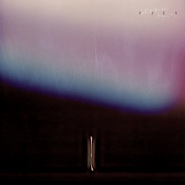

没有人能够比我们更接近对方
============================

|  |  |
| :--: | :-- |
| [ 没有人能够比我们更接近对方](https://emumo.xiami.com/album/5021239047) | **艺人**: [声音玩具](../index.md) **语种**: 国语 **唱片公司**: 草台回声 **发行时间**: 2020年08月09日 **专辑类别**: EP, 单曲 **专辑风格**: 国语流行 Mandarin Pop, 独立流行 Indie Pop **播放数**: 813382 **收藏数**: 176 **评论数**: 82  |

## 简介

声音玩具《没有人能够比我们更接近对方》

 

一首歌的时间，仿佛年华已然老去

无数次的旅程，我们只为回到自己

星空下的麦田，沉默的人传递香烟苦茶，聆听雨点与呼吸，雷声与叹息，在梦境的边缘，一切归于寂静，那个迷途的年轻人，独自飞向太空，汇入群星闪耀的夜空，回到自己。

 

很难简单定义这是一首关于爱情主题，听起来它更像一次向内自我的旅行，如声音玩具一直以来的作品那样，貌似模糊宏观的状态却又落在微处，某些句子总能莫名刺痛难以言明的感知，歌词的思维是非线性跳跃的，却又在内部隐秘的关联，具象的香烟苦茶到梦境的边缘，一点点出离，直到“舷窗外的余晖”让人突然意识到，思想已飞向太空。珈源善于建构出意识流一般的场景，那些沉默着传递抽烟的人们，雨点打落肩上，远处雷声轰鸣，暗喻着旅程中短暂的停留，让人想起塔可夫斯基的《潜行者》诗意而极富隐喻的长镜头。温暖的呼吸，悠扬的琴声，麦田星河的中央，时间与空间的交错，紧紧相拥的“我们”可能已超出一般意义的爱情意象，可能更像是“回到自己”。

 

再说到音乐本身，似乎很久没有听到如此动人的Band song，不疾不徐，层层推进，简单，感人，且余味悠长，迷幻的滑棒吉他像时间的丝绒划过皮肤，带听者让人重返70，90年代那些乐队黄金时代。

 

 

 

 

年青时写过几首真正关于爱情的歌 后来就再也没有关于这个主题纯粹的冲动了 就跟我从不喜欢看这类的书籍和电影一样 也可能是当初写过了 没给自己留点余地。这次这首新歌可能也会被归为爱情歌曲 但我的理解中就算是那个甜蜜和忧伤的画面也是发生在宇宙的尺度之下——欧珈源

 

 

 

单曲封面继续延续声音玩具与当代艺术家的合作计划，这次特别获得当代艺术家蒋鹏奕的热情赠予，使用其系列作品《自迹》中的一幅，这张安静神秘让人浮想的摄影作品来自于艺术家蒋鹏奕用宝丽来相机的一次拍摄，当我们打开这幅作品，播放着这首《没有人能够比我们更接近对方》，感受到一种莫名的链接与契合。

 

 

蒋鹏奕1977 年生于湖南省沅江市，毕业于中国美术学院，现工作生活于北京。目前作品主要以摄影、录像为媒介，通过制造超现实的景观以及对景物的微妙叙述，呈现出个体生命的内外障碍与疑惑。

 

所获的奖项包括：2020 伦敦BarTur摄影奖、2011 年意大利维罗纳博览（ArtVerona2011）的Aletti 摄影奖、2010 年法兴银行中国艺术奖评委会大奖及2009 年首届三影堂摄影奖所颁的美国特尼基金会奖。2012年更获邀参与赫尔辛基摄影双年展，及被提名Prix Pictet世界环保摄影奖。其作品被众多国际私人与公共机构收藏。

 

 

 

 

 

 

## 曲目

- [没有人能够比我们更接近对方](./5021239047/9cEo6q1ddb1.md)

## 评论

|  |  |  |  |
| :-- | :-- | :-- | :-- |
|  [虾米用户](https://emumo.xiami.com/u/364067) 小猫去钓鱼 打死也不糊 2020-12-12 23:00 赞(0) 踩(0) | 
非常不错的风格
 |
|  [虾米用户](https://emumo.xiami.com/u/34648070) 听歌的人最无情 2020-11-02 02:12 赞(0) 踩(0) | 
最好的声玩
 |
|  [虾米用户](https://emumo.xiami.com/u/272223239) 爱是昂贵的 2020-10-29 10:36 赞(0) 踩(0) | 
动人
 |
|  [虾米用户](https://emumo.xiami.com/u/36952815) music & life 2020-10-22 23:48 赞(0) 踩(0) | 
有谁知道封面是什么吗
 |
| ⇒ |  [虾米用户](https://emumo.xiami.com/u/369999770) 我到蝦米來聽歌 來清淨 2020-11-25 14:15 赞(0) 踩(0) | 
专辑简介里有
 |
|  [虾米用户](https://emumo.xiami.com/u/277702688) 我还没想好要写什么... 2020-09-28 12:51 赞(0) 踩(0) | 
这么有深度的歌曲，是现在人缺少了解的，是个遗憾
 |
|  [虾米用户](https://emumo.xiami.com/u/630980)  2020-09-08 06:33 赞(0) 踩(0) | 
这首歌就应该挣一个亿
 |
|  [虾米用户](https://emumo.xiami.com/u/630980)  2020-09-08 06:31 赞(1) 踩(0) | 
精品
 |
|  [虾米用户](https://emumo.xiami.com/u/418889331) 我还没想好要写什么... 2020-09-02 13:08 赞(0) 踩(0) | 
．．，…
 |
|  [虾米用户](https://emumo.xiami.com/u/39461567) E daí? 2020-08-26 08:53 赞(1) 踩(0) | 
嗯
 |
|  [虾米用户](https://emumo.xiami.com/u/311706794) 喜欢小狐狸❤❤ 2020-08-23 15:32 赞(1) 踩(0) | 

 |
|  [虾米用户](https://emumo.xiami.com/u/77440)  2020-08-21 08:36 赞(1) 踩(0) | 
我的妈妈 也太好听了
 |
|  [虾米用户](https://emumo.xiami.com/u/7874823) 不再沉溺，做个温暖别人的... 2020-08-19 16:41 赞(0) 踩(0) | 
乘风破浪结束以后，李斯丹妮和绮绮子的意难忘。
 |
|  [虾米用户](https://emumo.xiami.com/u/2524336) 忠于理想，面对现实 2020-08-19 01:43 赞(1) 踩(0) | 
舒服
 |
|  [虾米用户](https://emumo.xiami.com/u/422199070)  2020-08-18 19:57 赞(0) 踩(0) | 
挺好
 |
|  [虾米用户](https://emumo.xiami.com/u/145593378) 切 2020-08-16 10:19 赞(0) 踩(0) | 
我好爱他说“余晖下坠”他这么唱的时候我的整个人也跟着他的声音一起下坠了。
 |
|  [虾米用户](https://emumo.xiami.com/u/5760003)  2020-08-15 12:10 赞(0) 踩(0) | 
极致浪漫
 |
|  [虾米用户](https://emumo.xiami.com/u/1168284)  2020-08-14 18:44 赞(0) 踩(0) | 
必须
 |
|  [虾米用户](https://emumo.xiami.com/u/281910423)  2020-08-14 09:36 赞(1) 踩(0) | 
可以无限循环的一首歌
 |
|  [虾米用户](https://emumo.xiami.com/u/12219276) 我还没想好要写什么... 2020-08-14 01:01 赞(0) 踩(0) | 
循环循环！！
 |
|  [虾米用户](https://emumo.xiami.com/u/336698551) 我还没想好要写什么... 2020-08-13 23:38 赞(1) 踩(0) | 
词好，安排巡演吧。
 |
|  [虾米用户](https://emumo.xiami.com/u/290388499) 我为音乐而生…邂逅音乐邂... 2020-08-13 23:27 赞(1) 踩(0) | 
听着声音玩具的新歌-没有人能够比我们更接近对方。歌曲里的忧伤有一种诚恳真挚的美丽。就像刀子划过心口一道爱的疤。听到这样的一首歌，在今天的生日里。感觉藏在内心深处的一件一件心事被轻轻地剥开。听着这样的一首歌，瑟瑟发抖的灵魂，牵肠挂肚的爱情和那个爱而不得的人，通通都坠入声音玩具的音乐世界中吧…
 |
|  [虾米用户](https://emumo.xiami.com/u/50497365)  2020-08-13 21:56 赞(0) 踩(0) | 
特别好!
 |
|  [虾米用户](https://emumo.xiami.com/u/5731206)   2020-08-12 21:01 赞(1) 踩(0) | 
新专辑必须实体支持
 |
|  [虾米用户](https://emumo.xiami.com/u/427171048) 我还没想好要写什么... 2020-08-12 16:58 赞(0) 踩(0) | 
娓娓道来，最好的声玩
 |
|  [虾米用户](https://emumo.xiami.com/u/235052329) 我还没想好要写什么... 2020-08-12 14:10 赞(0) 踩(0) | 
一首旧爱
 |
|  [虾米用户](https://emumo.xiami.com/u/12219276) 我还没想好要写什么... 2020-08-11 21:23 赞(0) 踩(0) | 
太美妙了太美妙了
 |
|  [虾米用户](https://emumo.xiami.com/u/8388413) 耳朵被音乐塞满 幸福满满... 2020-08-11 20:56 赞(0) 踩(0) | 
越听越爱
 |
|  [虾米用户](https://emumo.xiami.com/u/376858973) 我还没想好要写什么... 2020-08-11 20:43 赞(0) 踩(0) | 
可以连接的宇宙
 |
|  [虾米用户](https://emumo.xiami.com/u/444498470)  2020-08-11 16:36 赞(0) 踩(0) | 
爱声玩
 |
|  [虾米用户](https://emumo.xiami.com/u/442526457) 我还没想好要写什么... 2020-08-11 15:46 赞(0) 踩(0) | 
艺术家孤独的前奏
 |
|  [虾米用户](https://emumo.xiami.com/u/46274339) 无神而且宿命/厌世却又纵... 2020-08-11 13:49 赞(0) 踩(0) | 
特有氛围感
 |
|  [虾米用户](https://emumo.xiami.com/u/440123239) 时间改变不了的是现在。 2020-08-11 09:53 赞(0) 踩(0) | 
何处寻得心中的共鸣。
 |
|  [虾米用户](https://emumo.xiami.com/u/378089770) 走下去 2020-08-11 09:20 赞(0) 踩(0) | 
绝对质量保证！像之前的每首歌一样，越是反复听越是不能自拔！
 |
|  [虾米用户](https://emumo.xiami.com/u/38905856) 心想事成 2020-08-10 23:22 赞(0) 踩(0) | 
开场很舒服
 |
|  [虾米用户](https://emumo.xiami.com/u/43649827) 追求 拿青春换富有 2020-08-10 21:43 赞(0) 踩(0) | 

 |
|  [虾米用户](https://emumo.xiami.com/u/253043616)  2020-08-10 17:00 赞(0) 踩(0) | 
我飞起来了
 |
|  [虾米用户](https://emumo.xiami.com/u/7412920)   2020-08-10 15:30 赞(0) 踩(0) | 
想打下100分给你们。
 |
|  [虾米用户](https://emumo.xiami.com/u/307254872) 妈妈一起飞吧，妈妈一起摇... 2020-08-10 14:35 赞(0) 踩(0) | 
满分，没有异议
 |
|  [虾米用户](https://emumo.xiami.com/u/45382108) 这里的山路十八弯 2020-08-10 10:42 赞(0) 踩(0) | 
新粉报道
 |
|  [虾米用户](https://emumo.xiami.com/u/46796729) 你好 末日 2020-08-10 09:00 赞(0) 踩(0) | 
一如既往的好听。内容丰富。时长感人。
 |
|  [虾米用户](https://emumo.xiami.com/u/1259073) 线段 2020-08-10 08:56 赞(0) 踩(0) | 
循环中
 |
|  [虾米用户](https://emumo.xiami.com/u/18039883) aha 2020-08-10 08:38 赞(0) 踩(0) | 
旷辽的星河，具象的浪漫，太美了。
 |
|  [虾米用户](https://emumo.xiami.com/u/1240316) 我还没想好要写什么... 2020-08-10 05:19 赞(0) 踩(0) | 
旋律很美 喜欢6min以上的歌 适合深夜磕
 |
|  [虾米用户](https://emumo.xiami.com/u/9374733) 诚心祝福你 捱得到新天地 2020-08-10 03:23 赞(0) 踩(0) | 
比起吵闹，沉醉在自己的漩涡里更舒适
 |
|  [虾米用户](https://emumo.xiami.com/u/409245937) 行将就木 双木成林 2020-08-10 00:22 赞(0) 踩(0) | 
前奏真挺好，人声出来就不想分享了…
 |
|  [虾米用户](https://emumo.xiami.com/u/190301254) 路过的风景，有没有人为你... 2020-08-09 23:49 赞(1) 踩(0) | 
总会有一个声音，听到的时候就会想起一个人，那个刻在心底的人，MS，我想你了。
 |
|  [虾米用户](https://emumo.xiami.com/u/12568597) 哒哒嘀哒嘀嘀哒 2020-08-09 23:37 赞(0) 踩(0) | 
时空旷渺 星辰大海 群山起伏 百转千回 俯首低语 情意绵长 回首过往 情歌悠扬
 |
|  [虾米用户](https://emumo.xiami.com/u/226081577) 人生总要有点喜欢的事情吧... 2020-08-09 23:23 赞(1) 踩(0) | 
声玩值得等待！
 |
|  [虾米用户](https://emumo.xiami.com/u/9405877) 明天你依旧在我身旁 2020-08-09 22:32 赞(0) 踩(0) | 
终于等来了！这个夏天完整了！
 |
|  [虾米用户](https://emumo.xiami.com/u/342872939)  2020-08-09 22:02 赞(0) 踩(0) | 
终于出现了！
 |
|  [虾米用户](https://emumo.xiami.com/u/45231)  2020-08-09 21:22 赞(0) 踩(0) | 
这就是声玩
 |
|  [虾米用户](https://emumo.xiami.com/u/32067336) ◾️ 向无穷空间  做时... 2020-08-09 20:40 赞(0) 踩(0) | 
一份温 暖
 |
|  [虾米用户](https://emumo.xiami.com/u/43920182)  2020-08-09 19:33 赞(0) 踩(0) | 
就喜欢声玩歌词里那种娓娓道来的魅力
 |
|  [虾米用户](https://emumo.xiami.com/u/45918442)  2020-08-09 19:20 赞(0) 踩(0) | 
好听！
 |
|  [虾米用户](https://emumo.xiami.com/u/49748006) Fly me to th... 2020-08-09 18:43 赞(0) 踩(0) | 
；）
 |
|  [虾米用户](https://emumo.xiami.com/u/17079879)  蚂蚁蚂蚁蚂蚁蚂蚁蝗虫的... 2020-08-09 18:13 赞(0) 踩(0) | 
精致、华丽、丰满！只一句歌词及背面的乐器就够你陶醉半天的
 |
|  [虾米用户](https://emumo.xiami.com/u/13012891) Musicneverce... 2020-08-09 16:52 赞(0) 踩(0) | 
声音玩具是轻柔的，充满想象力的，如果音乐有色彩，声音玩具是高阶的灰色系。我觉得他们可以走的更远。所以4星。
 |
|  [虾米用户](https://emumo.xiami.com/u/160178954) nothing's ev... 2020-08-09 16:06 赞(1) 踩(0) | 
声音玩具的音乐是有门槛的
 |
| ⇒ |  [虾米用户](https://emumo.xiami.com/u/332135001) 滚，别打扰我。 2020-08-10 15:51 赞(0) 踩(0) | 
我觉得声玩的歌真的没有门槛，但不知道为什么大众评审的分这么低。我听他们的歌十多年了，从来没觉得有门槛，第一次听就喜欢上了
 |
| ⇒ |  [虾米用户](https://emumo.xiami.com/u/160178954) nothing's ev... 2020-08-10 16:06 赞(0) 踩(0) | 
<q><b>阿一说：</b></q>
 |
|  [虾米用户](https://emumo.xiami.com/u/6232273) 一个有艺术气质的混子。 2020-08-09 16:00 赞(0) 踩(0) | 
接近你，这个夏天
 |
|  [虾米用户](https://emumo.xiami.com/u/11093) 一场修行。 2020-08-09 15:55 赞(0) 踩(0) | 
美丽而忧伤
 |
|  [虾米用户](https://emumo.xiami.com/u/38876793)   2020-08-09 15:42 赞(0) 踩(0) | 
声玩牛逼
 |
|  [虾米用户](https://emumo.xiami.com/u/613632) 诸行无常 诸漏皆苦 诸法... 2020-08-09 15:23 赞(2) 踩(0) | 
还是原来的味道，更加成熟，思考更加深刻。
 |
|  [虾米用户](https://emumo.xiami.com/u/35040873) 一团元气 2020-08-09 14:34 赞(0) 踩(0) | 
星河和麦田都是我喜欢的意象
 |
|  [虾米用户](https://emumo.xiami.com/u/409225556)  2020-08-09 14:17 赞(0) 踩(0) | 
完美
 |
|  [虾米用户](https://emumo.xiami.com/u/347352104)  2020-08-09 14:12 赞(0) 踩(0) | 
:/
 |
|  [虾米用户](https://emumo.xiami.com/u/2394793)   2020-08-09 14:05 赞(0) 踩(0) | 
太难等了，好听
 |
|  [虾米用户](https://emumo.xiami.com/u/4415169)    ✘ 2020-08-09 13:53 赞(0) 踩(0) | 
昨晚的乐夏即兴很好听今天睡醒就送上了新歌
 |
|  [虾米用户](https://emumo.xiami.com/u/2847661) 我爱摇滚乐 2020-08-09 13:52 赞(0) 踩(0) | 
真好
 |
|  [虾米用户](https://emumo.xiami.com/u/40651018) 唯爱音乐 2020-08-09 13:32 赞(0) 踩(0) | 
wow
 |
|  [虾米用户](https://emumo.xiami.com/u/377721082)  2020-08-09 13:24 赞(0) 踩(0) | 
依旧是歌词深刻，旋律动人。
 |
|  [虾米用户](https://emumo.xiami.com/u/38661467)   2020-08-09 12:46 赞(0) 踩(0) | 
、
 |
|  [虾米用户](https://emumo.xiami.com/u/11832530)   2020-08-09 12:35 赞(0) 踩(0) | 
过年了
 |
|  [虾米用户](https://emumo.xiami.com/u/5756577)   2020-08-09 12:32 赞(1) 踩(0) | 
万年出一首的新歌，等得太不容易了
 |
|  [虾米用户](https://emumo.xiami.com/u/270879773) … 2020-08-09 12:19 赞(1) 踩(0) | 
iiiiiiii
 |
|  [虾米用户](https://emumo.xiami.com/u/444170479)  2020-08-09 12:13 赞(1) 踩(0) | 
还是那个诗意，浪漫的声玩
 |
|  [虾米用户](https://emumo.xiami.com/u/3553665) We can be He... 2020-08-09 12:12 赞(1) 踩(0) | 
♡
 |
|  [虾米用户](https://emumo.xiami.com/u/223672657) 向我发誓 2020-08-09 12:08 赞(2) 踩(0) | 
浪漫玩具
 |
|  [虾米用户](https://emumo.xiami.com/u/123262020) 保护我 来骗我吧。 2020-08-09 12:07 赞(2) 踩(0) | 
时隔几年我最喜欢的声玩终于发新歌了。期待他们的巡演！这张新专辑也会是日后夜晚里陪伴我的吧
 |
|  [虾米用户](https://emumo.xiami.com/u/10012893) Enjoy while ... 2020-08-09 12:05 赞(1) 踩(0) | 
精致，严谨，优雅，忧郁，还是我爱的那个声玩
 |
