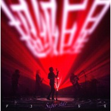

超级巨星
============================

|  |  |
| :--: | :-- |
| [ 超级巨星](https://emumo.xiami.com/album/5021313452) | **艺人**: [声音玩具](../index.md) **语种**: 国语 **唱片公司**: 草台回声 **发行时间**: 2020年08月21日 **专辑类别**: EP, 单曲 **专辑风格**: 国语流行 Mandarin Pop **播放数**: 92484 **收藏数**: 28 **评论数**: 26  |

## 简介

词的第一句是在PK舞台上写的,虽然我只是一个三流的rockstar ，但谁的心里没有住着一个超级巨星，无论台上台下戏里戏外，有时让你骄傲有时让你厌恶。

 写这首歌动机很简单，就像我二十几岁时那么直接,如果你们能喜欢当然最好，毕竟我已经厌倦了让人失望的担心，音乐对于我和乐队来说也可以是轻松愉快的游戏 。

 

 欧珈源

 

## 曲目

- [超级巨星](./5021313452/bfMWGpv305fd.md)

## 评论

|  |  |  |  |
| :-- | :-- | :-- | :-- |
|  [虾米用户](https://emumo.xiami.com/u/409394265) 我还没想好要写什么... 2020-11-02 21:43 赞(0) 踩(0) | 
声玩牛逼！
 |
|  [虾米用户](https://emumo.xiami.com/u/343943209)   2020-09-23 13:38 赞(0) 踩(0) | 
声玩就是我的超级巨星
 |
|  [虾米用户](https://emumo.xiami.com/u/209083673) 当我还年轻 你却是幽灵 2020-09-01 14:35 赞(0) 踩(0) | 
一首感觉不够，又感觉一首够了
 |
|  [虾米用户](https://emumo.xiami.com/u/5525589)   2020-08-26 05:02 赞(0) 踩(0) | 
啊
 |
|  [虾米用户](https://emumo.xiami.com/u/253043616)  2020-08-25 20:57 赞(0) 踩(0) | 
不错不错
 |
|  [虾米用户](https://emumo.xiami.com/u/431519334) 最后要的都是自由 2020-08-24 14:55 赞(0) 踩(0) | 
老朋友一往无前每年进步一点点但还是你自己
 |
|  [虾米用户](https://emumo.xiami.com/u/311706794) 喜欢小狐狸❤❤ 2020-08-23 15:31 赞(0) 踩(0) | 

 |
|  [虾米用户](https://emumo.xiami.com/u/50497365)  2020-08-22 23:31 赞(0) 踩(0) | 
好听，但不如上一首新歌出彩
 |
|  [虾米用户](https://emumo.xiami.com/u/269245130) 喜欢一样事情就拼了命去做... 2020-08-22 20:37 赞(1) 踩(0) | 
欧哥成功晋升为RAPER哈哈
 |
|  [虾米用户](https://emumo.xiami.com/u/11969859) 别逃跑 2020-08-22 13:54 赞(3) 踩(0) | 
&amp;ldquo;毕竟我已厌倦了让人失望的担心&amp;rdquo;。哈哈哈哈喜欢这句话。自己喜欢就好！
 |
|  [虾米用户](https://emumo.xiami.com/u/25977681) 你来吧 互通有无，你走吧... 2020-08-22 13:26 赞(0) 踩(0) | 
依然耐听
 |
|  [虾米用户](https://emumo.xiami.com/u/61841308) no about 2020-08-22 08:37 赞(0) 踩(0) | 
终于发了  天天等
 |
|  [虾米用户](https://emumo.xiami.com/u/96188886) 我还没想好要写什么... 2020-08-21 21:32 赞(3) 踩(0) | 
不得不说这个乐队出专的速度快了很多…不得不说看起来风格似乎更加“流行”，更加快节奏，更加能快速地吸引到人…不得不说从这个角度上，虽然乐夏很差劲…但是感觉乐夏的刺激看起来真的很催人反思啊……不管怎么样，我始终支持声音玩具…加油啊，您嘞
 |
|  [虾米用户](https://emumo.xiami.com/u/278465147)  2020-08-21 19:49 赞(0) 踩(0) | 
喜欢他们的改变
 |
|  [虾米用户](https://emumo.xiami.com/u/49895220) 一念静心花开遍世界 2020-08-21 16:06 赞(0) 踩(0) | 
喜欢这个节奏
 |
|  [虾米用户](https://emumo.xiami.com/u/226081577) 人生总要有点喜欢的事情吧... 2020-08-21 14:25 赞(1) 踩(0) | 
懂你们的人依然在，不用在乎那些人
 |
|  [虾米用户](https://emumo.xiami.com/u/444477337)  2020-08-21 14:14 赞(0) 踩(0) | 
有点不一样了
 |
|  [虾米用户](https://emumo.xiami.com/u/334687732)  2020-08-21 14:00 赞(1) 踩(0) | 
一般，有些流行，与前几支单曲不能比
 |
|  [虾米用户](https://emumo.xiami.com/u/31246259) 人间冲浪 2020-08-21 13:23 赞(0) 踩(0) | 
哇！新歌！
 |
|  [虾米用户](https://emumo.xiami.com/u/1313807) 我还没想好要写什么... 2020-08-21 13:06 赞(0) 踩(0) | 
欧老师淦啊！
 |
|  [虾米用户](https://emumo.xiami.com/u/10012893) Enjoy while ... 2020-08-21 12:41 赞(0) 踩(0) | 
声玩请继续走下去，在自己的路上
 |
|  [虾米用户](https://emumo.xiami.com/u/4197702) 真假如一  如一一致 2020-08-21 12:35 赞(0) 踩(0) | 
一年两只新歌，知足了
 |
|  [虾米用户](https://emumo.xiami.com/u/5471019)  2020-08-21 12:12 赞(0) 踩(0) | 
沙发️
 |
| ⇒ |  [虾米用户](https://emumo.xiami.com/u/241242679) 音乐给了我力量，给了我活... 2020-08-21 12:33 赞(0) 踩(0) | 
来，给我挪个位 
 |
|  [虾米用户](https://emumo.xiami.com/u/49748006) Fly me to th... 2020-08-21 12:06 赞(0) 踩(0) | 
❤️
 |
|  [虾米用户](https://emumo.xiami.com/u/427208425) 听歌而已 2020-08-21 12:05 赞(1) 踩(0) | 
1
 |
