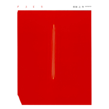
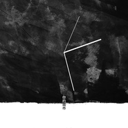
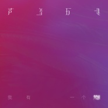
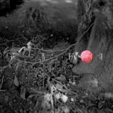

声音玩具
============================

|  |  |
| :--: | :-- |
| [<br>声音玩具](https://i.xiami.com/soundtoy) | **地区**: China 中国大陆<br>**风格**: 独立摇滚 Indie Rock<br>**播放数**: 108348668<br>**粉丝数**: 33049<br>**评论数**: 862<br> |

## 档案

<div>
音乐 只是我们爱的一种方式    声音玩具的音乐总是难以被这样或那样的定义， 相对于那些风格化的乐队来说过于多元化的音乐元素则是声音玩具乐队音乐难于被归类的重要原因，人们已经习惯用转瞬即逝的背影或者一个刹那的侧面来记忆那些美好的事物，但这种观察和欣赏的方式也许并不能够完整的了解声音玩具的音乐。如果他们有幸和听众一起成长，再如果他们的音乐有幸和听众在热烈的现场交流，那么如同我们感怀着人性的复杂 人们也许将看到另一种鲜活的音乐及生活的态度。 声音玩具乐队由主唱吉他手及词曲作者欧珈源于1999年创建于四川成都，现正式成员：吉他手：许屹，吉他手：李哲；贝司手：胡凯；鼓手：王咏。
</div>

## 专辑

| 名称 | 语种 | 唱片公司 | 发行时间 | 专辑类别 | 专辑风格 |
| :--: | :-- | :-- | :-- | :-- | :-- |
| [<br>时间之外](./albums/5022016188.md) | 国语 | 草台回声 | 2020年11月25日 | EP, 单曲 | 独立摇滚 Indie Rock, 前卫摇滚 Progressive Rock |
| [<br>超级巨星](./albums/5021313452.md) | 国语 | 草台回声 | 2020年08月21日 | EP, 单曲 | 国语流行 Mandarin Pop |
| [<br>没有人能够比我们更接近对方](./albums/5021239047.md) | 国语 | 草台回声 | 2020年08月09日 | EP, 单曲 | 国语流行 Mandarin Pop, 独立流行 Indie Pop |
| [<br>你的城市](./albums/2103675027.md) | 国语 | 草台回声 | 2018年04月10日 | EP, 单曲 | 独立摇滚 Indie Rock |
| [<br>我有一个梦想I Have A Dream](./albums/2102814949.md) | 国语 | 草台回响, StreetVoice | 2017年08月17日 | EP, 单曲 | 独立摇滚 Indie Rock |
| [<br>小翅膀](./albums/2102677856.md) | 国语 | 独立发行 | 2017年01月10日 | EP, 单曲 |  |
| [<br>爱是昂贵的](./albums/1625015966.md) | 国语 | 虾米音乐人 | 2015年04月22日 | 录音室专辑 | 独立摇滚 Indie Rock |
| [<br>最美妙的旅行](./albums/15326.md) | 国语 | 独立发行 | 2003年12月01日 | 录音室专辑 | 独立摇滚 Indie Rock |

## 评论

|  |  |  |
| :-- | :-- | :-- |
| <br>[虾米用户](https://emumo.xiami.com/u/358104299)<br>悲观的唯心存在现实解构虚...<br>2020-12-16 07:41<br>赞(0) 踩(0) | <div>43182</div> |
| <br>[虾米用户](https://emumo.xiami.com/u/11099680)<br>心若浮沉，浅笑安然。<br>2020-12-07 19:53<br>赞(0) 踩(0) | <div>好听的歌真的能把人听醉，谢谢</div> |
| <br>[虾米用户](https://emumo.xiami.com/u/4892193)<br>dampson<br>2020-11-29 11:28<br>赞(0) 踩(0) | <div>爱是昂贵的 封面上翻译成midas touch 点石成金的悲剧 妙不可言</div> |
| <br>[虾米用户](https://emumo.xiami.com/u/36428987)<br>我还没想好要写什么...<br>2020-11-27 01:50<br>赞(0) 踩(0) | <div>帥得不行</div> |
| <br>[虾米用户](https://emumo.xiami.com/u/6839234)<br><br>2020-09-27 10:02<br>赞(1) 踩(0) | <div>最近在不知道听什么的时候总想听声玩<br>欧师说他喜欢在成都生活，<br>在哪里他的所有感官都打开了。<br>我理解他这句话，并更有意识的在生活中打开自己的感官。<br>听声玩，是一种孤独的感觉，但又获得了陪伴。</div> |
| <br>[虾米用户](https://emumo.xiami.com/u/342038768)<br>pucikaka don...<br>2020-09-21 23:32<br>赞(1) 踩(0) | <div>爱了</div> |
| <br>[虾米用户](https://emumo.xiami.com/u/4953704)<br>听歌不是病，不想治。<br>2020-09-11 13:22<br>赞(1) 踩(0) | <div>日谈公园带我来的<br>跑步听爱上了</div> |
| <br>[虾米用户](https://emumo.xiami.com/u/169259438)<br>我还没想好要写什么...<br>2020-09-03 01:21<br>赞(2) 踩(0) | <div>只有爱才能让我生存。</div> |
| <br>[虾米用户](https://emumo.xiami.com/u/169259438)<br>我还没想好要写什么...<br>2020-09-03 01:19<br>赞(0) 踩(0) | <div>爱上了</div> |
| <br>[虾米用户](https://emumo.xiami.com/u/15251406)<br><br>2020-09-01 13:39<br>赞(0) 踩(0) | <div>我心中的Hot5。乐队的夏天现场的观众太浮躁了</div> |
| <br>[虾米用户](https://emumo.xiami.com/u/36897148)<br>私信➕v请备注<br>2020-08-25 20:08<br>赞(0) 踩(0) | <div>诗歌一样的歌词</div> |
| <br>[虾米用户](https://emumo.xiami.com/u/376517)<br>我还没想好要写什么...<br>2020-08-23 17:17<br>赞(0) 踩(0) | <div>旋律有点像周杰伦的某首歌。</div> |
| <br>[虾米用户](https://emumo.xiami.com/u/431133381)<br><br>2020-08-22 09:52<br>赞(0) 踩(0) | <div>j v..vfvbu</div> |
| ⇒ | <br>[虾米用户](https://emumo.xiami.com/u/431133381)<br><br>2020-08-22 09:54<br>赞(0) 踩(0) | <div>8</div> |
| <br>[虾米用户](https://emumo.xiami.com/u/16015170)<br><br>2020-08-21 11:21<br>赞(0) 踩(0) | <div>好爱啊啊啊啊啊</div> |
| <br>[虾米用户](https://emumo.xiami.com/u/1690545)<br>去你妈的！<br>2020-08-19 16:34<br>赞(2) 踩(0) | <div>乐夏今年请的一堆烂乐队，而且还能进级，超级斩 之类的都是什么鬼东西。居然福禄寿 能淘汰声音碎片。福禄寿就是个 以前 黑鸭子合唱团一样的东西。也能和这种乐队比？</div> |
| ⇒ | <br>[虾米用户](https://emumo.xiami.com/u/427171048)<br>我还没想好要写什么...<br>2020-09-03 15:54<br>赞(0) 踩(0) | <div>&amp;hellip;&amp;hellip;玩具，碎片是另一支</div> |
| <br>[虾米用户](https://emumo.xiami.com/u/342038768)<br>pucikaka don...<br>2020-08-15 11:04<br>赞(1) 踩(0) | <div>加油(／≧&amp;omega;＼)</div> |
| <br>[虾米用户](https://emumo.xiami.com/u/343149190)<br>细沙击窗<br>2020-08-12 15:34<br>赞(2) 踩(0) | <div>无语 乐夏淘汰了 谁说的是对的 声音玩具听需要门槛的 那么好的乐队也需要好的听众啊</div> |
| <br>[虾米用户](https://emumo.xiami.com/u/427208425)<br>听歌而已<br>2020-08-11 13:22<br>赞(3) 踩(0) | <div>是月夏不配声音玩具</div> |
| <br>[虾米用户](https://emumo.xiami.com/u/36615674)<br>我要自由<br>2020-08-09 13:32<br>赞(3) 踩(0) | <div>乐夏选《你的城市》估计就进了，声音玩具可能也知道，不过现在说这些也没有用了。声音玩具依然很棒，依然喜欢。</div> |
| <br>[虾米用户](https://emumo.xiami.com/u/5525589)<br> <br>2020-08-09 11:17<br>赞(11) 踩(0) | <div>乐夏不用看了，不尊重音乐 有什么必要在演出中间剪些些对话</div> |
| <br>[虾米用户](https://emumo.xiami.com/u/372991589)<br>开始自闭(＝)<br>2020-08-09 04:37<br>赞(4) 踩(0) | <div>没进也挺好的，哈哈。<br>本来就选了死亡之组。<br>舞台留给其他乐队，我们还有我们的碰杯。<br>反正，<br>明天我们依旧在你身旁。</div> |
| <br>[虾米用户](https://emumo.xiami.com/u/79640408)<br>我期待人生艳丽<br>2020-08-09 04:09<br>赞(2) 踩(0) | <div>想给没投票的人一拳！</div> |
| <br>[虾米用户](https://emumo.xiami.com/u/633573)<br>沉默如迷的呼吸。L。金基...<br>2020-08-09 00:10<br>赞(43) 踩(0) | <div>乐夏二季第一轮居然淘汰？...<br>大众乐迷都特么聋的么</div> |
| ⇒ | <br>[虾米用户](https://emumo.xiami.com/u/11464083)<br>always awake<br>2020-08-11 22:14<br>赞(0) 踩(0) | <div>不仅聋还瞎</div> |
| ⇒ | <br>[虾米用户](https://emumo.xiami.com/u/1690545)<br>去你妈的！<br>2020-08-19 16:26<br>赞(0) 踩(0) | <div><q><b>ng说：</b></q></div> |
| ⇒ | <br>[虾米用户](https://emumo.xiami.com/u/277762737)<br>吧啦吧啦<br>2020-09-22 12:54<br>赞(0) 踩(0) | <div><q><b>胳膊挤掉了说：</b></q></div> |
| <br>[虾米用户](https://emumo.xiami.com/u/49748006)<br>Fly me to th...<br>2020-08-08 23:23<br>赞(2) 踩(0) | <div>开启巡演吧(o^^o)</div> |
| <br>[虾米用户](https://emumo.xiami.com/u/42132051)<br> <br>2020-07-29 14:42<br>赞(0) 踩(0) | <div>油腻了呢</div> |
| ⇒ | <br>[虾米用户](https://emumo.xiami.com/u/377721082)<br><br>2020-08-09 04:12<br>赞(0) 踩(0) | <div>理解不了就讽刺可还行？</div> |
| <br>[虾米用户](https://emumo.xiami.com/u/423409840)<br><br>2020-07-26 05:58<br>赞(12) 踩(0) | <div>乐夏2水平最高的乐队之一，我心中绝对的hot5，虽然我觉得第一轮应该过不了。</div> |
| ⇒ | <br>[虾米用户](https://emumo.xiami.com/u/123262020)<br>保护我 来骗我吧。<br>2020-07-31 01:07<br>赞(0) 踩(0) | <div>今天还没有播，但是我看网传他们好像第一轮确实没过。遗憾一点点。</div> |
| ⇒ | <br>[虾米用户](https://emumo.xiami.com/u/3714518)<br>死人<br>2020-08-03 01:26<br>赞(0) 踩(0) | <div><q><b>坚说：</b></q></div> |
| ⇒ | <br>[虾米用户](https://emumo.xiami.com/u/432711255)<br>事未竟，情长留，与君再觥...<br>2020-08-23 18:56<br>赞(0) 踩(0) | <div>e</div> |
| <br>[虾米用户](https://emumo.xiami.com/u/911960)<br>浮生若梦，一晌贪欢...<br>2020-07-15 19:58<br>赞(0) 踩(0) | <div>喜欢这种风格的音乐&amp;hellip;.</div> |
| <br>[虾米用户](https://emumo.xiami.com/u/7874823)<br>不再沉溺，做个温暖别人的...<br>2020-07-15 09:08<br>赞(1) 踩(0) | <div>乐队的秋天，冲鸭！</div> |
| <br>[虾米用户](https://emumo.xiami.com/u/7440615)<br>我还没想好要写什么...<br>2020-07-15 01:06<br>赞(0) 踩(0) | <div>错过去年的上海站，希望今年还能有机会！</div> |
| <br>[虾米用户](https://emumo.xiami.com/u/49748006)<br>Fly me to th...<br>2020-07-14 21:05<br>赞(0) 踩(0) | <div>去啦去啦！</div> |
| <br>[虾米用户](https://emumo.xiami.com/u/428474196)<br><br>2020-05-28 22:19<br>赞(0) 踩(0) | <div>新专辑新专辑！</div> |
| <br>[虾米用户](https://emumo.xiami.com/u/13968227)<br>曲线属于上帝<br>2020-05-11 07:51<br>赞(0) 踩(0) | <div>好听，音乐层次非常丰富 </div> |
| <br>[虾米用户](https://emumo.xiami.com/u/4911883)<br>如果你也爱Eason<br>2020-03-29 08:39<br>赞(1) 踩(0) | <div>新专啥时候呀</div> |
| <br>[虾米用户](https://emumo.xiami.com/u/47448401)<br>别喝了<br>2020-03-16 23:49<br>赞(0) 踩(0) | <div>快巡演吧快巡演吧快巡演吧</div> |
| <br>[虾米用户](https://emumo.xiami.com/u/360548903)<br>睡眠是一种真理，谁也无法...<br>2020-01-10 13:55<br>赞(0) 踩(0) | <div>我怎么觉得是灰色系的水木年华</div> |
| ⇒ | <br>[虾米用户](https://emumo.xiami.com/u/401474215)<br><br>2020-05-13 07:30<br>赞(0) 踩(0) | <div>这两音乐风格和表达方式差别太大多了吧</div> |
| ⇒ | <br>[虾米用户](https://emumo.xiami.com/u/2551272)<br>起初的轰烈 都没有差别<br>2020-08-09 02:10<br>赞(0) 踩(0) | <div>您可能听歌比较少吧</div> |
| <br>[虾米用户](https://emumo.xiami.com/u/434146744)<br><br>2019-12-29 09:53<br>赞(0) 踩(0) | <div>I$$##/#</div> |
| <br>[虾米用户](https://emumo.xiami.com/u/46856099)<br>ゆらゆら<br>2019-12-28 12:23<br>赞(0) 踩(0) | <div>擦干眼泪吧 采束百合花</div> |
| <br>[虾米用户](https://emumo.xiami.com/u/367760056)<br><br>2019-12-08 11:40<br>赞(0) 踩(0) | <div>给大家带来好音乐，我们应该感谢你们。</div> |
| <br>[虾米用户](https://emumo.xiami.com/u/69307508)<br>雀跃的人在河边骑脚踏车，...<br>2019-10-19 10:21<br>赞(7) 踩(0) | <div>第三张专辑快发布了，新专辑巡演也请在我明年出国前安排上拜托了！！！</div> |
| <br>[虾米用户](https://emumo.xiami.com/u/11464083)<br>always awake<br>2019-10-13 01:12<br>赞(0) 踩(0) | <div>哎错过了今年的上海站 下一次不知道什么时候</div> |
| <br>[虾米用户](https://emumo.xiami.com/u/16936488)<br>我还没想好要写什么...<br>2019-09-12 15:34<br>赞(1) 踩(0) | <div>欧波真是又感性又性感</div> |
| <br>[虾米用户](https://emumo.xiami.com/u/1154949)<br>我想在虾米找个男朋友啊<br>2019-08-26 08:33<br>赞(2) 踩(0) | <div>来深圳</div> |
| <br>[虾米用户](https://emumo.xiami.com/u/35040873)<br>一团元气<br>2019-08-23 15:56<br>赞(0) 踩(0) | <div>什么时候来北京啊，哭哭</div> |
| <br>[虾米用户](https://emumo.xiami.com/u/412806333)<br>我还没想好要写什么...<br>2019-08-17 17:21<br>赞(0) 踩(0) | <div>玄武湖边的奔跑者</div> |
| <br>[虾米用户](https://emumo.xiami.com/u/411805180)<br><br>2019-08-17 02:46<br>赞(9) 踩(0) | <div>热评想听声完出后摇那个 真的无聊</div> |
| ⇒ | <br>[虾米用户](https://emumo.xiami.com/u/412806333)<br>我还没想好要写什么...<br>2019-08-17 17:21<br>赞(0) 踩(0) | <div>赞同</div> |
| <br>[虾米用户](https://emumo.xiami.com/u/260992790)<br>I'll Be Your...<br>2019-08-09 04:52<br>赞(6) 踩(0) | <div>主观认为国内最好的乐队</div> |
| ⇒ | <br>[虾米用户](https://emumo.xiami.com/u/112614810)<br>然后呢，一起走吧<br>2019-08-27 23:37<br>赞(0) 踩(0) | <div>我认为是五月天，谢谢。</div> |
| ⇒ | <br>[虾米用户](https://emumo.xiami.com/u/3461076)<br><br>2020-02-25 19:19<br>赞(0) 踩(0) | <div><q><b>Maydayの温柔说：</b></q></div> |
| ⇒ | <br>[虾米用户](https://emumo.xiami.com/u/7874823)<br>不再沉溺，做个温暖别人的...<br>2020-07-15 09:10<br>赞(0) 踩(0) | <div>最好不最好无所谓，咱们是最有文化内涵，音乐素养最高的乐队 </div> |
| ⇒ | <br>[虾米用户](https://emumo.xiami.com/u/290977065)<br>伪摇狂热爱好者<br>2020-07-19 19:35<br>赞(0) 踩(0) | <div>。评论内位认为是五月天也没啥可嘲⑧<br>不是主观感受吗  就算喜欢上再多乐队  接触再多风格的所谓&amp;ldquo;摇滚&amp;rdquo; 我也觉得五月天是最吊的啊  没必要 真没必要。虽然在这条评论下评论其他乐队的确有些不妥。</div> |
| ⇒ | <br>[虾米用户](https://emumo.xiami.com/u/45918442)<br><br>2020-08-09 13:28<br>赞(0) 踩(0) | <div><q><b>Maydayの温柔说：</b></q></div> |
| ⇒ | <br>[虾米用户](https://emumo.xiami.com/u/259726666)<br> <br>2020-08-18 20:07<br>赞(0) 踩(0) | <div><q><b>说：</b></q></div> |
| <br>[虾米用户](https://emumo.xiami.com/u/42963872)<br>我还没想好要写什么...<br>2019-07-20 23:16<br>赞(0) 踩(0) | <div>-</div> |
| <br>[虾米用户](https://emumo.xiami.com/u/358104299)<br>悲观的唯心存在现实解构虚...<br>2019-06-14 13:42<br>赞(0) 踩(0) | <div>11514</div> |
| <br>[虾米用户](https://emumo.xiami.com/u/57231736)<br><br>2019-06-12 03:15<br>赞(0) 踩(0) | <div>一听就爱上</div> |
| <br>[虾米用户](https://emumo.xiami.com/u/57231736)<br><br>2019-06-12 02:52<br>赞(0) 踩(0) | <div>太棒了，声音很完美</div> |
| <br>[虾米用户](https://emumo.xiami.com/u/881774)<br><br>2019-01-31 21:50<br>赞(0) 踩(0) | <div>今年来厦门吧！</div> |
| <br>[虾米用户](https://emumo.xiami.com/u/9229744)<br>judge me<br>2019-01-29 16:05<br>赞(0) 踩(0) | <div>啥子时候回内江演一哈嘛！</div> |
| <br>[虾米用户](https://emumo.xiami.com/u/124125762)<br>没有。<br>2019-01-17 09:45<br>赞(0) 踩(0) | <div>大爱。</div> |
| <br>[虾米用户](https://emumo.xiami.com/u/50171518)<br>此号报销<br>2019-01-06 22:16<br>赞(0) 踩(0) | <div>M</div> |
| <br>[虾米用户](https://emumo.xiami.com/u/219335160)<br>为音乐而亡<br>2018-12-06 08:22<br>赞(0) 踩(0) | <div>最近时间的声音玩具的现场是什么时候啊！！</div> |
| <br>[虾米用户](https://emumo.xiami.com/u/344390938)<br><br>2018-11-30 00:08<br>赞(0) 踩(0) | <div>宝藏</div> |
| <br>[虾米用户](https://emumo.xiami.com/u/4911883)<br>如果你也爱Eason<br>2018-10-28 21:49<br>赞(0) 踩(0) | <div>新传不知道何时</div> |
| <br>[虾米用户](https://emumo.xiami.com/u/403625136)<br>我以神的姿态闪耀在这美的...<br>2018-09-08 19:14<br>赞(0) 踩(0) | <div>药饵无征怪梦频 且加碳 围炉闲话胎动</div> |
| <br>[虾米用户](https://emumo.xiami.com/u/49191752)<br><br>2018-09-03 10:40<br>赞(0) 踩(0) | <div>我最喜欢的在四川的乐队了</div> |
| <br>[虾米用户](https://emumo.xiami.com/u/24870512)<br>执着的爱我所爱<br>2018-07-14 18:14<br>赞(3) 踩(0) | <div>想想好像也是03年开始听声音玩具的，总觉得欧哥声音里带着一股寂寞的冷漠，即华丽有疼痛的感觉无人可及。15年过去了，已为人母，声音玩具依然刚刚好</div> |
| <br>[虾米用户](https://emumo.xiami.com/u/31277956)<br>Oops! Sorry <br>2018-06-13 18:21<br>赞(0) 踩(0) | <div>人到中年反而不温柔了啊</div> |
| <br>[虾米用户](https://emumo.xiami.com/u/11570281)<br>How to destr...<br>2018-05-24 18:30<br>赞(4) 踩(0) | <div>唯一听的国内音乐人，还记得高中在小酒馆泡的时候他们还叫朝圣者的背叛，这一晃就是20年了</div> |
| <br>[虾米用户](https://emumo.xiami.com/u/42843421)<br>Just for you<br>2018-05-06 19:45<br>赞(3) 踩(0) | <div>好想听听声玩的现场</div> |
| ⇒ | <br>[虾米用户](https://emumo.xiami.com/u/31277956)<br>Oops! Sorry <br>2018-06-13 18:21<br>赞(0) 踩(0) | <div>有幸在汕大遇见</div> |
| ⇒ | <br>[虾米用户](https://emumo.xiami.com/u/219335160)<br>为音乐而亡<br>2018-12-06 08:40<br>赞(0) 踩(0) | <div>最近什么时候有啊！</div> |
| <br>[虾米用户](https://emumo.xiami.com/u/20177386)<br>感谢一切美好的遇见❤️<br>2018-04-24 01:29<br>赞(0) 踩(0) | <div></div> |
| <br>[虾米用户](https://emumo.xiami.com/u/121910914)<br>我想好好睡个觉<br>2018-04-21 04:32<br>赞(0) 踩(0) | <div>1</div> |
| <br>[虾米用户](https://emumo.xiami.com/u/135336798)<br><br>2018-04-10 06:47<br>赞(52) 踩(0) | <div>我女朋友不喜欢声音玩具，哎，很无奈，看来只有换一个女朋友了！！！！！</div> |
| <br>[虾米用户](https://emumo.xiami.com/u/14016518)<br>所有言语黯淡之时，音乐会...<br>2018-03-29 11:52<br>赞(0) 踩(0) | <div>明晚见 </div> |
| <br>[虾米用户](https://emumo.xiami.com/u/266142364)<br><br>2018-02-03 22:37<br>赞(0) 踩(0) | <div>一直好奇，演出经常五个人，而介绍总是四个人</div> |
| <br>[虾米用户](https://emumo.xiami.com/u/34307)<br><br>2018-01-14 10:52<br>赞(0) 踩(0) | <div>月亮上的男人什么时候出？</div> |
| <br>[虾米用户](https://emumo.xiami.com/u/10472562)<br><br>2018-01-13 15:29<br>赞(1) 踩(0) | <div>想听现场啦，什么时候巡演？</div> |
| <br>[虾米用户](https://emumo.xiami.com/u/51690671)<br>Love music.<br>2017-12-08 07:26<br>赞(0) 踩(0) | <div>腿直真好</div> |
| <br>[虾米用户](https://emumo.xiami.com/u/3714518)<br>死人<br>2017-11-25 20:42<br>赞(0) 踩(0) | <div>有生之年系列</div> |
| <br>[虾米用户](https://emumo.xiami.com/u/12568597)<br>哒哒嘀哒嘀嘀哒<br>2017-11-23 21:03<br>赞(7) 踩(0) | <div>第一次看你们的现场还是个刚毕业的学生 如今眼看三两年就奔四的人了 现在大闺女正在和我躺在床上听你们的歌</div> |
| ⇒ | <br>[虾米用户](https://emumo.xiami.com/u/39188163)<br>Midas Touch<br>2017-11-27 20:03<br>赞(0) 踩(0) | <div></div> |
| <br>[虾米用户](https://emumo.xiami.com/u/6525802)<br>前无通路，后无归途<br>2017-11-09 08:12<br>赞(0) 踩(0) | <div>中国乐队 </div> |
| <br>[虾米用户](https://emumo.xiami.com/u/8094301)<br>Bye bye wx n...<br>2017-11-08 19:07<br>赞(0) 踩(0) | <div>明天看电视</div> |
| ⇒ | <br>[虾米用户](https://emumo.xiami.com/u/20316094)<br><br>2017-11-09 17:45<br>赞(0) 踩(0) | <div>这期没声玩了</div> |
| ⇒ | <br>[虾米用户](https://emumo.xiami.com/u/49748006)<br>Fly me to th...<br>2017-11-10 07:54<br>赞(0) 踩(0) | <div><q><b>终究是numb说：</b></q></div> |
| ⇒ | <br>[虾米用户](https://emumo.xiami.com/u/97115346)<br>我还没想好要写什么...<br>2019-08-06 20:51<br>赞(0) 踩(0) | <div><q><b>乔班尼说：</b></q></div> |
| ⇒ | <br>[虾米用户](https://emumo.xiami.com/u/49748006)<br>Fly me to th...<br>2019-08-06 21:03<br>赞(0) 踩(0) | <div><q><b>姚全错说：</b></q></div> |
| <br>[虾米用户](https://emumo.xiami.com/u/49654259)<br>这家伙很懒，其实也不是特...<br>2017-10-28 00:01<br>赞(0) 踩(0) | <div>哈哈 重庆场听了小翅膀  满足了  以后有机会还会去听现场的，棒呆！</div> |
| <br>[虾米用户](https://emumo.xiami.com/u/8668457)<br><br>2017-10-27 23:59<br>赞(0) 踩(0) | <div>非常喜欢你们的音乐。第一次听是别的歌手贴吧里有人推荐 秘密的爱    简直惊为天人。希望你们能赚好多好多钱，然后好好玩音乐</div> |
| <br>[虾米用户](https://emumo.xiami.com/u/3871290)<br>I got it<br>2017-10-27 23:37<br>赞(2) 踩(0) | <div>昨天在沈阳刚看了现场，鼓手好厉害啊!但愿以后能在武汉和重庆常看到你们！</div> |
| <br>[虾米用户](https://emumo.xiami.com/u/10028400)<br>我还没想好要写什么...<br>2017-10-06 23:01<br>赞(0) 踩(0) | <div>晚安</div> |
| <br>[虾米用户](https://emumo.xiami.com/u/226898283)<br>说说你吧<br>2017-10-06 12:19<br>赞(0) 踩(0) | <div>现场很好</div> |
| <br>[虾米用户](https://emumo.xiami.com/u/92924832)<br> <br>2017-09-09 18:00<br>赞(2) 踩(0) | <div>现在正在听现场呀 好棒 </div> |
| <br>[虾米用户](https://emumo.xiami.com/u/38883178)<br>“”<br>2017-08-30 16:20<br>赞(0) 踩(0) | <div>7</div> |
| <br>[虾米用户](https://emumo.xiami.com/u/223713606)<br><br>2017-08-26 21:02<br>赞(1) 踩(0) | <div>今天才无意听到，感觉很吃惊！久违了的好东西啊！</div> |
| <br>[虾米用户](https://emumo.xiami.com/u/223713606)<br><br>2017-08-26 21:01<br>赞(1) 踩(0) | <div>高贵的，神秘的，忧郁的，冷峻的，但却华丽的！</div> |
| <br>[虾米用户](https://emumo.xiami.com/u/14265718)<br>wx:osakarock...<br>2017-08-19 00:09<br>赞(0) 踩(0) | <div></div> |
| <br>[虾米用户](https://emumo.xiami.com/u/7620119)<br><br>2017-08-17 14:04<br>赞(2) 踩(0) | <div>听了新歌我想劝劝老欧，不要变强强好吗，谢谢。</div> |
| <br>[虾米用户](https://emumo.xiami.com/u/7264942)<br><br>2017-08-14 19:01<br>赞(0) 踩(0) | <div>第一张专辑听起来还有点腻的感觉 新歌简直太棒了</div> |
| <br>[虾米用户](https://emumo.xiami.com/u/20316094)<br><br>2017-08-10 13:41<br>赞(3) 踩(0) | <div>想找个喜欢声玩的女朋友</div> |
| ⇒ | <br>[虾米用户](https://emumo.xiami.com/u/1707738)<br><br>2017-08-12 14:48<br>赞(0) 踩(0) | <div>永不生厌的爱着他</div> |
| ⇒ | <br>[虾米用户](https://emumo.xiami.com/u/20316094)<br><br>2017-08-14 00:37<br>赞(0) 踩(0) | <div><q><b>seezier说：</b></q></div> |
| ⇒ | <br>[虾米用户](https://emumo.xiami.com/u/12730895)<br>不要离开！<br>2017-08-18 00:52<br>赞(0) 踩(0) | <div>祝好运，我男朋友不喜欢声玩</div> |
| ⇒ | <br>[虾米用户](https://emumo.xiami.com/u/12730895)<br>不要离开！<br>2018-03-13 01:59<br>赞(0) 踩(0) | <div><q><b>李二黑说：</b></q></div> |
| ⇒ | <br>[虾米用户](https://emumo.xiami.com/u/306397541)<br>我不配得到自由<br>2018-11-11 11:19<br>赞(0) 踩(0) | <div><q><b>李二黑说：</b></q></div> |
| ⇒ | <br>[虾米用户](https://emumo.xiami.com/u/418904643)<br><br>2019-04-05 17:40<br>赞(0) 踩(0) | <div><q><b>李二黑说：</b></q></div> |
| <br>[虾米用户](https://emumo.xiami.com/u/85928852)<br>穷极一生 追求快乐<br>2017-07-15 00:05<br>赞(0) 踩(0) | <div>  </div> |
| <br>[虾米用户](https://emumo.xiami.com/u/38883178)<br>“”<br>2017-07-14 02:08<br>赞(0) 踩(0) | <div>7</div> |
| <br>[虾米用户](https://emumo.xiami.com/u/15504457)<br><br>2017-06-16 22:40<br>赞(2) 踩(0) | <div>為什麼我今天才開始循環聲音玩具</div> |
| <br>[虾米用户](https://emumo.xiami.com/u/6883358)<br>没有理想的人不伤心<br>2017-06-07 09:23<br>赞(15) 踩(0) | <div>03年听到现在 不再那么年轻 也不再那么热情。</div> |
| <br>[虾米用户](https://emumo.xiami.com/u/257765050)<br>听音乐使我快乐！<br>2017-05-10 23:24<br>赞(0) 踩(0) | <div></div> |
| <br>[虾米用户](https://emumo.xiami.com/u/291199404)<br><br>2017-04-24 21:32<br>赞(0) 踩(0) | <div>小翅膀</div> |
| <br>[虾米用户](https://emumo.xiami.com/u/34799914)<br>我还没想好要写什么...<br>2017-04-21 12:02<br>赞(0) 踩(0) | <div>没什么比这更耐听了吧</div> |
| <br>[虾米用户](https://emumo.xiami.com/u/12730895)<br>不要离开！<br>2017-04-13 12:59<br>赞(2) 踩(0) | <div>太湖迷笛！去不成</div> |
| <br>[虾米用户](https://emumo.xiami.com/u/226081577)<br>人生总要有点喜欢的事情吧...<br>2017-04-13 07:07<br>赞(1) 踩(0) | <div>五一太湖迷笛，期待呀</div> |
| <br>[虾米用户](https://emumo.xiami.com/u/32549553)<br> <br>2017-04-13 00:52<br>赞(2) 踩(0) | <div>太湖迷笛 声音玩具</div> |
| <br>[虾米用户](https://emumo.xiami.com/u/4442318)<br>唱後搖給你聽～～嗞～～<br>2017-04-12 23:12<br>赞(0) 踩(0) | <div>肇庆还是广州啊 误导人</div> |
| <br>[虾米用户](https://emumo.xiami.com/u/13521200)<br><br>2017-04-05 23:08<br>赞(0) 踩(0) | <div>留名</div> |
| <br>[虾米用户](https://emumo.xiami.com/u/264925480)<br><br>2017-04-05 21:57<br>赞(0) 踩(0) | <div>想听现场 </div> |
| <br>[虾米用户](https://emumo.xiami.com/u/88915440)<br><br>2017-03-05 16:55<br>赞(0) 踩(0) | <div>除了万青没有最爱了</div> |
| <br>[虾米用户](https://emumo.xiami.com/u/48730522)<br>.....<br>2017-02-20 22:38<br>赞(22) 踩(0) | <div>内容已删除</div> |
| ⇒ | <br>[虾米用户](https://emumo.xiami.com/u/9530447)<br>再见了，朋友们<br>2017-08-17 13:19<br>赞(0) 踩(0) | <div>有一股无形的力量驱使着我给你点了赞！</div> |
| ⇒ | <br>[虾米用户](https://emumo.xiami.com/u/48730522)<br>.....<br>2017-08-17 13:21<br>赞(0) 踩(0) | <div><q><b>就是这个光说：</b></q></div> |
| ⇒ | <br>[虾米用户](https://emumo.xiami.com/u/9530447)<br>再见了，朋友们<br>2017-08-17 13:38<br>赞(0) 踩(0) | <div><q><b>FLEGIAS说：</b></q></div> |
| ⇒ | <br>[虾米用户](https://emumo.xiami.com/u/298468363)<br>时间<br>2017-08-21 11:15<br>赞(0) 踩(0) | <div>厉害了</div> |
| ⇒ | <br>[虾米用户](https://emumo.xiami.com/u/302127937)<br><br>2018-01-01 19:24<br>赞(0) 踩(0) | <div>看到浪味儿仙给你点个赞</div> |
| ⇒ | <br>[虾米用户](https://emumo.xiami.com/u/48730522)<br>.....<br>2018-01-02 02:48<br>赞(0) 踩(0) | <div><q><b>油泼脑神经说：</b></q></div> |
| <br>[虾米用户](https://emumo.xiami.com/u/165330418)<br><br>2017-02-20 21:23<br>赞(1) 踩(0) | <div>我听到了美！！！！美的让人窒息！！！！</div> |
| <br>[虾米用户](https://emumo.xiami.com/u/85928852)<br>穷极一生 追求快乐<br>2017-02-18 16:51<br>赞(0) 踩(0) | <div>  </div> |
| <br>[虾米用户](https://emumo.xiami.com/u/829978)<br>我还没想好要写什么...<br>2017-02-08 10:58<br>赞(0) 踩(0) | <div>赵雷都红了....</div> |
| ⇒ | <br>[虾米用户](https://emumo.xiami.com/u/20316094)<br><br>2017-03-18 17:52<br>赞(0) 踩(0) | <div>追求不一样</div> |
| <br>[虾米用户](https://emumo.xiami.com/u/267794693)<br>younyuyeg<br>2017-01-31 13:47<br>赞(0) 踩(0) | <div>感觉伴奏很好听</div> |
| <br>[虾米用户](https://emumo.xiami.com/u/943576)<br><br>2017-01-22 08:54<br>赞(0) 踩(0) | <div>好听</div> |
| <br>[虾米用户](https://emumo.xiami.com/u/263086004)<br>call medavid<br>2017-01-19 12:31<br>赞(0) 踩(0) | <div>qqqqqqqqqqqqqqqqqqqqqqq</div> |
| <br>[虾米用户](https://emumo.xiami.com/u/3921783)<br><br>2017-01-18 22:00<br>赞(0) 踩(0) | <div>星期天的大街模仿PINK FLOYD</div> |
| <br>[虾米用户](https://emumo.xiami.com/u/245684150)<br><br>2017-01-17 17:18<br>赞(0) 踩(0) | <div> </div> |
| <br>[虾米用户](https://emumo.xiami.com/u/11281761)<br>世界是我的牡蛎<br>2017-01-17 12:21<br>赞(0) 踩(0) | <div></div> |
| <br>[虾米用户](https://emumo.xiami.com/u/625295)<br><br>2017-01-10 22:54<br>赞(0) 踩(0) | <div>  </div> |
| <br>[虾米用户](https://emumo.xiami.com/u/314018)<br><br>2017-01-09 23:47<br>赞(1) 踩(0) | <div>我想听献给洛丽的花</div> |
| ⇒ | <br>[虾米用户](https://emumo.xiami.com/u/54987852)<br>我还没想好要写什么...<br>2017-01-17 20:47<br>赞(0) 踩(0) | <div>豆瓣fm</div> |
| ⇒ | <br>[虾米用户](https://emumo.xiami.com/u/296069)<br>暂无签名~<br>2017-03-29 14:53<br>赞(0) 踩(0) | <div>去电驴下</div> |
| <br>[虾米用户](https://emumo.xiami.com/u/238281256)<br><br>2016-12-25 00:19<br>赞(4) 踩(0) | <div>只能用高级来形容</div> |
| <br>[虾米用户](https://emumo.xiami.com/u/588121)<br>我还没想好要写什么...<br>2016-12-08 20:02<br>赞(3) 踩(0) | <div>从来没听过 一直觉得这种队没什么好听的，听了10首果然 创作都非常没有营养 弃之</div> |
| <br>[虾米用户](https://emumo.xiami.com/u/10251165)<br>下首歌可能会下雨❤️<br>2016-11-22 19:50<br>赞(0) 踩(0) | <div>❤️</div> |
| <br>[虾米用户](https://emumo.xiami.com/u/48797230)<br>我还没想好要写什么...<br>2016-11-19 22:51<br>赞(1) 踩(0) | <div>什么时候来深圳呢</div> |
| ⇒ | <br>[虾米用户](https://emumo.xiami.com/u/594142)<br> <br>2016-11-29 09:58<br>赞(0) 踩(0) | <div>2017 1 1 深圳跨年迷笛</div> |
| ⇒ | <br>[虾米用户](https://emumo.xiami.com/u/34672791)<br>我还没想好要写什么...<br>2016-12-20 12:29<br>赞(0) 踩(0) | <div>跨年迷笛就有 来来来一起玩</div> |
| <br>[虾米用户](https://emumo.xiami.com/u/40239953)<br> <br>2016-11-07 05:40<br>赞(0) 踩(0) | <div>迷笛牛逼。声玩牛逼</div> |
| <br>[虾米用户](https://emumo.xiami.com/u/34213880)<br><br>2016-10-27 21:01<br>赞(0) 踩(0) | <div>每一首歌都有惊喜</div> |
| <br>[虾米用户](https://emumo.xiami.com/u/34213880)<br><br>2016-10-27 21:01<br>赞(0) 踩(0) | <div>每一首歌都有惊喜</div> |
| <br>[虾米用户](https://emumo.xiami.com/u/39821398)<br>乘凉<br>2016-10-06 00:51<br>赞(1) 踩(0) | <div>谢谢 今晚的四首歌 </div> |
| ⇒ | <br>[虾米用户](https://emumo.xiami.com/u/4712478)<br> <br>2016-10-08 02:08<br>赞(0) 踩(0) | <div>最后那首是什么？</div> |
| <br>[虾米用户](https://emumo.xiami.com/u/11603315)<br>K-indie | 靓橙...<br>2016-09-17 15:15<br>赞(3) 踩(0) | <div>昨晚太惊艳我了，腾龙洞迷笛好酷</div> |
| ⇒ | <br>[虾米用户](https://emumo.xiami.com/u/53754444)<br> <br>2016-09-20 00:57<br>赞(0) 踩(0) | <div>欢迎来到真正的音乐圈</div> |
| ⇒ | <br>[虾米用户](https://emumo.xiami.com/u/20316094)<br><br>2017-03-18 17:53<br>赞(0) 踩(0) | <div>五一再见！惊艳！</div> |
| <br>[虾米用户](https://emumo.xiami.com/u/774208)<br>我还没想好要写什么...<br>2016-09-02 15:45<br>赞(2) 踩(0) | <div>声音玩具10月5日于上海简单生活节演出！<br><br>10月4-6日 上海世博公园 简单生活节<br><br>刘若英、陈绮贞、郑秀文、张震岳、徐佳莹、朴树、李荣浩、许巍、李志、老狼、窦靖童、陈粒、王若琳、赵雷、苏慧伦、陶晶莹、关淑怡、梁博、韦礼安、Faye飞、邱比、陈珊妮 feat 蔡健雅、MATZKA feat A-Lin、魏如萱 feat 马頔、杨乃文 feat 高旗、HUSH feat 阿肆、草东没有派对、万能青年旅店、逃跑计划、好妹妹、旅行团、果味VC、Hello Nico、声音玩具……众星云集！<br><br>微博：@简单生活节上海 <a href="http://weibo.com/simplelifeshanghai" target="_blank" rel="nofollow noreferrer noopener">http://weibo.com/simplelifeshanghai</a></div> |
| <br>[虾米用户](https://emumo.xiami.com/u/12730895)<br>不要离开！<br>2016-07-26 11:55<br>赞(3) 踩(0) | <div>能和欧珈源坐在一个茶馆里面对面聊一下午的天是我的人生理想之一。</div> |
| <br>[虾米用户](https://emumo.xiami.com/u/11570281)<br>How to destr...<br>2016-07-10 23:39<br>赞(2) 踩(0) | <div>我才记得十多年前他们叫朝圣者的背叛</div> |
| <br>[虾米用户](https://emumo.xiami.com/u/3623060)<br> <br>2016-07-08 05:51<br>赞(3) 踩(0) | <div>哈哈哈哈，我在开始收费之前全下载了，我好英明  </div> |
| ⇒ | <br>[虾米用户](https://emumo.xiami.com/u/7712721)<br> <br>2016-09-13 11:16<br>赞(0) 踩(0) | <div>可以分享吗？</div> |
| <br>[虾米用户](https://emumo.xiami.com/u/163687578)<br><br>2016-05-07 16:42<br>赞(0) 踩(0) | <div>怎么看歌词啊</div> |
| <br>[虾米用户](https://emumo.xiami.com/u/41940420)<br>这就是个丧尸的世界<br>2016-05-04 13:38<br>赞(20) 踩(0) | <div>那天晚上在火车站充了一块钱的电，一路从苏州听到上海，火车晚点了，到上海已经3点半。当七点多我下地铁时，耳机里已经没有了音乐。七点行人车辆都还不多，我匆忙回了家，刷了鞋上的泥土倒头就睡。后来我的鞋丢了，耳机也坏了！</div> |
| <br>[虾米用户](https://emumo.xiami.com/u/12730895)<br>不要离开！<br>2016-05-03 23:36<br>赞(11) 踩(0) | <div>内容已删除</div> |
| ⇒ | <br>[虾米用户](https://emumo.xiami.com/u/49646258)<br>爱是昂贵的。<br>2016-07-18 08:22<br>赞(0) 踩(0) | <div>欧叔值得 </div> |
| ⇒ | <br>[虾米用户](https://emumo.xiami.com/u/12730895)<br>不要离开！<br>2016-07-18 15:15<br>赞(0) 踩(0) | <div><q><b>seven小沙说：</b></q></div> |
| <br>[虾米用户](https://emumo.xiami.com/u/12730895)<br>不要离开！<br>2016-05-03 23:32<br>赞(1) 踩(0) | <div>没去迷笛，在土豆上看了全程视频，感觉对声玩的爱又加深了一点了。深蓝色衬衫牛仔裤的欧珈源，明天你依旧在我身旁。</div> |
| <br>[虾米用户](https://emumo.xiami.com/u/44057600)<br> <br>2016-05-02 16:51<br>赞(0) 踩(0) | <div>还是最喜欢声玩</div> |
| <br>[虾米用户](https://emumo.xiami.com/u/2523233)<br>太热<br>2016-04-29 13:05<br>赞(1) 踩(0) | <div>明天迷笛吼</div> |
| <br>[虾米用户](https://emumo.xiami.com/u/34961561)<br>我希望音乐没有间隙 我不...<br>2016-04-16 21:06<br>赞(1) 踩(0) | <div>还是听歌吧 这世界太闹心了</div> |
| <br>[虾米用户](https://emumo.xiami.com/u/31277956)<br>Oops! Sorry <br>2016-04-05 08:46<br>赞(1) 踩(0) | <div>現在才發現愛上的只是歐叔的聲音</div> |
| ⇒ | <br>[虾米用户](https://emumo.xiami.com/u/12730895)<br>不要离开！<br>2016-05-03 23:34<br>赞(0) 踩(0) | <div>我以前以为我只是喜欢欧叔的声音。</div> |
| <br>[虾米用户](https://emumo.xiami.com/u/40541383)<br><br>2016-04-04 23:19<br>赞(0) 踩(0) | <div>成都出发，有没有一起去迷笛看声玩的小伙伴？</div> |
| <br>[虾米用户](https://emumo.xiami.com/u/46370843)<br><br>2016-04-02 10:51<br>赞(0) 踩(0) | <div>14迷笛现场被这首歌感动QvQ</div> |
| <br>[虾米用户](https://emumo.xiami.com/u/48860276)<br>埋葬干净<br>2016-03-29 19:55<br>赞(0) 踩(0) | <div>对爱揭示的如此刻骨</div> |
| <br>[虾米用户](https://emumo.xiami.com/u/4415503)<br><br>2016-03-24 23:50<br>赞(0) 踩(0) | <div>好庆幸自己能看到他们的现场</div> |
| <br>[虾米用户](https://emumo.xiami.com/u/1426854)<br>scientist<br>2016-03-23 18:07<br>赞(0) 踩(0) | <div>我疯狂的想念 那首不属于我的 《我的城市》</div> |
| <br>[虾米用户](https://emumo.xiami.com/u/43173766)<br>算了我放下了   再会吧...<br>2016-03-19 15:26<br>赞(0) 踩(0) | <div>负能量</div> |
| <br>[虾米用户](https://emumo.xiami.com/u/124327048)<br>坐看云起<br>2016-03-18 17:42<br>赞(0) 踩(0) | <div>一听就是声音玩具</div> |
| <br>[虾米用户](https://emumo.xiami.com/u/8969038)<br><br>2016-03-18 13:30<br>赞(0) 踩(0) | <div>分享一个乐队。</div> |
| <br>[虾米用户](https://emumo.xiami.com/u/14245139)<br>我还没想好要写什么...<br>2016-02-24 22:23<br>赞(0) 踩(0) | <div>为什么没有献给罗莉的花</div> |
| ⇒ | <br>[虾米用户](https://emumo.xiami.com/u/54987852)<br>我还没想好要写什么...<br>2016-09-05 15:18<br>赞(0) 踩(0) | <div>豆瓣有</div> |
| <br>[虾米用户](https://emumo.xiami.com/u/53174155)<br>我看你看着我<br>2016-02-19 12:55<br>赞(0) 踩(0) | <div>一听就爱上了</div> |
| <br>[虾米用户](https://emumo.xiami.com/u/37326976)<br>只要音药<br>2016-02-19 00:15<br>赞(0) 踩(0) | <div> </div> |
| <br>[虾米用户](https://emumo.xiami.com/u/112338908)<br>Tender<br>2016-02-11 17:41<br>赞(0) 踩(0) | <div>前面是666 </div> |
| <br>[虾米用户](https://emumo.xiami.com/u/97188604)<br>像一朵雪莲盛开<br>2016-01-28 21:10<br>赞(1) 踩(0) | <div>我错过了他们今年的巡演</div> |
| <br>[虾米用户](https://emumo.xiami.com/u/29404973)<br> 基本不太用了<br>2016-01-26 01:25<br>赞(0) 踩(0) | <div>欧哥的声音真性感</div> |
| <br>[虾米用户](https://emumo.xiami.com/u/3402153)<br><br>2016-01-24 16:52<br>赞(0) 踩(0) | <div>这是花房姑娘的一句歌词吗？呵呵</div> |
| <br>[虾米用户](https://emumo.xiami.com/u/31277956)<br>Oops! Sorry <br>2016-01-07 10:30<br>赞(0) 踩(0) | <div>這張專輯更用心啊，更精品</div> |
| <br>[虾米用户](https://emumo.xiami.com/u/5689806)<br><br>2016-01-05 16:23<br>赞(0) 踩(0) | <div>还是比较喜欢第一张</div> |
| <br>[虾米用户](https://emumo.xiami.com/u/1426854)<br>scientist<br>2016-01-02 00:39<br>赞(0) 踩(0) | <div>最喜欢我的城市 真希望你们可以出一个录音室版</div> |
| <br>[虾米用户](https://emumo.xiami.com/u/41130285)<br>…<br>2015-12-29 13:03<br>赞(0) 踩(0) | <div>爱是昂贵的</div> |
| <br>[虾米用户](https://emumo.xiami.com/u/7867684)<br>我还没想好要写什么...<br>2015-12-27 17:45<br>赞(0) 踩(0) | <div>现场还要多棒！北京的看完出来还下雪了，脑补下画面感！</div> |
| <br>[虾米用户](https://emumo.xiami.com/u/1250039)<br>一个善于自毁前程的人。<br>2015-12-27 00:00<br>赞(2) 踩(0) | <div>北京——现场太有张力了，老歌新歌都演了，其实据我看，新歌更复杂更深刻，老歌单纯点。</div> |
| <br>[虾米用户](https://emumo.xiami.com/u/6176166)<br>+++原始星芒+++<br>2015-12-26 00:41<br>赞(2) 踩(0) | <div>天津场已阅，兴奋兴奋！现场求婚和小翅膀太感动了，祝幸福！</div> |
| <br>[虾米用户](https://emumo.xiami.com/u/1203194)<br><br>2015-12-25 17:21<br>赞(1) 踩(0) | <div>那首不朽一下子就抓住我了</div> |
| <br>[虾米用户](https://emumo.xiami.com/u/31277956)<br>Oops! Sorry <br>2015-12-21 08:54<br>赞(1) 踩(0) | <div>為什麼說不如第一張專輯，明顯好了很多啊，就像腰的相見恨晚的改變</div> |
| <br>[虾米用户](https://emumo.xiami.com/u/12730895)<br>不要离开！<br>2015-12-20 23:27<br>赞(2) 踩(0) | <div>等以后上了大学就可以去看演出了，呆在这个农村城市撒子都没求得</div> |
| <br>[虾米用户](https://emumo.xiami.com/u/12730895)<br>不要离开！<br>2015-12-20 23:26<br>赞(0) 踩(0) | <div>在心里排个名，第一晶体管收音机，第二青春，第三抚琴小夜曲</div> |
| <br>[虾米用户](https://emumo.xiami.com/u/866962)<br><br>2015-12-20 00:12<br>赞(2) 踩(0) | <div>差点没在底下跟到哭……</div> |
| <br>[虾米用户](https://emumo.xiami.com/u/37592735)<br>青春像花永远开在心里<br>2015-12-20 00:03<br>赞(1) 踩(0) | <div>小酒馆签到加一</div> |
| <br>[虾米用户](https://emumo.xiami.com/u/949939)<br><br>2015-12-19 23:47<br>赞(2) 踩(0) | <div>最大的遗憾是今天没在现场听到《秘密的爱》，成都小酒馆签到</div> |
| <br>[虾米用户](https://emumo.xiami.com/u/8714507)<br>我还没想好要写什么...<br>2015-12-19 23:45<br>赞(2) 踩(0) | <div>牛了个大逼，小酒馆空间签到！</div> |
| <br>[虾米用户](https://emumo.xiami.com/u/12730895)<br>不要离开！<br>2015-12-19 23:02<br>赞(0) 踩(0) | <div>本来说今天晚上回家看个电影就睡觉，结果静静地听了三个多小时声玩的歌，啥子都没做。。</div> |
| <br>[虾米用户](https://emumo.xiami.com/u/49024854)<br><br>2015-12-19 18:05<br>赞(0) 踩(0) | <div>今晚小酒馆的票便宜出两张 有要的吗</div> |
| <br>[虾米用户](https://emumo.xiami.com/u/19500344)<br>Poser<br>2015-12-19 17:56<br>赞(0) 踩(0) | <div>看了现场才感觉到确实越来越流行化了</div> |
| <br>[虾米用户](https://emumo.xiami.com/u/46647)<br>我还没想好要写什么...<br>2015-12-17 11:06<br>赞(0) 踩(0) | <div>忽视了南方听众的感受</div> |
| <br>[虾米用户](https://emumo.xiami.com/u/12730895)<br>不要离开！<br>2015-12-15 22:53<br>赞(0) 踩(0) | <div>等我高中毕业，一定去听你们现场！</div> |
| <br>[虾米用户](https://emumo.xiami.com/u/17413363)<br>：（<br>2015-12-14 11:38<br>赞(1) 踩(0) | <div>封面设计是詹盼</div> |
| <br>[虾米用户](https://emumo.xiami.com/u/10012893)<br>Enjoy while ...<br>2015-12-10 19:27<br>赞(2) 踩(0) | <div>最喜欢的乐队</div> |
| <br>[虾米用户](https://emumo.xiami.com/u/33319953)<br><br>2015-12-10 14:19<br>赞(0) 踩(0) | <div>美妙的吉他</div> |
| <br>[虾米用户](https://emumo.xiami.com/u/12730895)<br>不要离开！<br>2015-12-09 23:48<br>赞(0) 踩(0) | <div>我以后也要当一个像欧老师一样的人！</div> |
| <br>[虾米用户](https://emumo.xiami.com/u/3702830)<br>一片自由的乐土<br>2015-12-08 10:53<br>赞(2) 踩(0) | <div>歌詞比爛大街民謠強太多 要是主唱發音稍微清晰一點會更好吧</div> |
| <br>[虾米用户](https://emumo.xiami.com/u/16377579)<br> <br>2015-11-29 13:44<br>赞(0) 踩(0) | <div>现场原声还原度简直了！个人心中十佳现场之一！</div> |
| <br>[虾米用户](https://emumo.xiami.com/u/996277)<br>‏‏<br>2015-11-27 22:27<br>赞(0) 踩(0) | <div>老欧 我票买啦啊啦啦啦</div> |
| <br>[虾米用户](https://emumo.xiami.com/u/4894804)<br> <br>2015-11-21 23:24<br>赞(4) 踩(0) | <div>强烈要求在武汉场演小翅膀</div> |
| ⇒ | <br>[虾米用户](https://emumo.xiami.com/u/51957189)<br>我还没想好要写什么...<br>2015-11-26 23:11<br>赞(0) 踩(0) | <div>明天见</div> |
| ⇒ | <br>[虾米用户](https://emumo.xiami.com/u/4211228)<br><br>2015-11-28 02:53<br>赞(0) 踩(0) | <div>有有有有有</div> |
| ⇒ | <br>[虾米用户](https://emumo.xiami.com/u/2718342)<br>我決定快樂起來 我今天就...<br>2015-11-30 23:06<br>赞(0) 踩(0) | <div>结果昨晚长沙场真演了</div> |
| <br>[虾米用户](https://emumo.xiami.com/u/4766422)<br>优秀3D技工。<br>2015-11-19 10:34<br>赞(2) 踩(0) | <div>不如巡演 加一场 广州的~<br>你们意下如何~~~~~</div> |
| <br>[虾米用户](https://emumo.xiami.com/u/153331)<br>都怪宇宙<br>2015-11-18 19:17<br>赞(0) 踩(0) | <div>承包王咏！</div> |
| <br>[虾米用户](https://emumo.xiami.com/u/625136)<br>虾米陪我的第十个年头啦<br>2015-11-16 15:27<br>赞(1) 踩(0) | <div>胡凯~~~~~~~~~~~~~</div> |
| <br>[虾米用户](https://emumo.xiami.com/u/312179)<br>潜入深蓝，放肆幻听<br>2015-11-15 09:33<br>赞(0) 踩(0) | <div>昨晚看了沈阳现场，现场感觉比专辑好听。就是没唱你依旧在我身旁。有点遗憾。</div> |
| <br>[虾米用户](https://emumo.xiami.com/u/40429605)<br> <br>2015-11-06 15:30<br>赞(1) 踩(0) | <div>《秘密的爱》和《艾玲》就到头了。现场应该也不会唱这两首。毕竟和声和配乐都变了～质朴多于文采就流于粗俗，文采多于质朴就流于虚伪、浮夸。留在第一盘的意向多好～你却毁了这恰到好处的一切～</div> |
| ⇒ | <br>[虾米用户](https://emumo.xiami.com/u/1009204)<br>如歌<br>2015-11-07 17:28<br>赞(0) 踩(0) | <div>我却觉得第二张的格局很大 时间 星航者发现号 都能让人想到很远</div> |
| ⇒ | <br>[虾米用户](https://emumo.xiami.com/u/40429605)<br> <br>2015-11-08 01:03<br>赞(0) 踩(0) | <div><q><b>葵夏说：</b></q></div> |
| ⇒ | <br>[虾米用户](https://emumo.xiami.com/u/1009204)<br>如歌<br>2015-11-10 19:37<br>赞(0) 踩(0) | <div><q><b>大现说：</b></q></div> |
| <br>[虾米用户](https://emumo.xiami.com/u/23232358)<br>爱我就像爱太阳。<br>2015-10-28 11:32<br>赞(2) 踩(0) | <div>12.26北京愚公移山有小伙伴么！！！</div> |
| ⇒ | <br>[虾米用户](https://emumo.xiami.com/u/308845)<br>axelzx.com<br>2015-11-12 08:07<br>赞(0) 踩(0) | <div>去！约！</div> |
| ⇒ | <br>[虾米用户](https://emumo.xiami.com/u/3287023)<br><br>2015-12-22 21:09<br>赞(0) 踩(0) | <div>有 跟姐们儿一起去 好希望唱秘密的爱和艾玲 说实话有点小担心....</div> |
| ⇒ | <br>[虾米用户](https://emumo.xiami.com/u/23232358)<br>爱我就像爱太阳。<br>2015-12-27 20:16<br>赞(0) 踩(0) | <div><q><b>Delilah说：</b></q></div> |
| ⇒ | <br>[虾米用户](https://emumo.xiami.com/u/23232358)<br>爱我就像爱太阳。<br>2015-12-27 20:16<br>赞(0) 踩(0) | <div><q><b>Delilah说：</b></q></div> |
| <br>[虾米用户](https://emumo.xiami.com/u/7800081)<br>我还没想好要写什么...<br>2015-10-28 03:58<br>赞(1) 踩(0) | <div>卧槽我居然一直没关注你们 </div> |
| <br>[虾米用户](https://emumo.xiami.com/u/29074330)<br>吃货 懒蛋 坏脾气<br>2015-10-27 11:49<br>赞(1) 踩(0) | <div>11月11号济南！面基求约起！回复我！勾搭我！</div> |
| ⇒ | <br>[虾米用户](https://emumo.xiami.com/u/4857694)<br> <br>2015-11-05 18:58<br>赞(0) 踩(0) | <div>做志愿者？</div> |
| ⇒ | <br>[虾米用户](https://emumo.xiami.com/u/72977672)<br><br>2015-11-06 11:17<br>赞(0) 踩(0) | <div>约约…</div> |
| <br>[虾米用户](https://emumo.xiami.com/u/1752963)<br>Music Heaven<br>2015-10-24 01:05<br>赞(0) 踩(0) | <div>编曲超赞，有格调的原创Indie Rock音乐～</div> |
| <br>[虾米用户](https://emumo.xiami.com/u/4098317)<br>来吧甜蜜的死亡<br>2015-10-22 18:02<br>赞(1) 踩(0) | <div>大陆pink floyd</div> |
| ⇒ | <br>[虾米用户](https://emumo.xiami.com/u/821)<br><br>2015-10-26 23:49<br>赞(0) 踩(0) | <div>仅限《晚安国王》</div> |
| ⇒ | <br>[虾米用户](https://emumo.xiami.com/u/4098317)<br>来吧甜蜜的死亡<br>2015-10-26 23:52<br>赞(0) 踩(0) | <div><q><b>curelin说：</b></q></div> |
| <br>[虾米用户](https://emumo.xiami.com/u/314018)<br><br>2015-10-18 20:53<br>赞(0) 踩(0) | <div>献给洛丽的花没有吗..</div> |
| <br>[虾米用户](https://emumo.xiami.com/u/6176166)<br>+++原始星芒+++<br>2015-10-17 15:10<br>赞(0) 踩(0) | <div>巡演再开太高兴了！！12月25天津，有约的吗？！O▽O可回复我~</div> |
| <br>[虾米用户](https://emumo.xiami.com/u/41360287)<br>暂无签名~<br>2015-10-13 19:14<br>赞(0) 踩(0) | <div>歌唱得好好儿的开什么旅馆 </div> |
| ⇒ | <br>[虾米用户](https://emumo.xiami.com/u/25794889)<br>停用！↓↓↓遗言<br>2015-12-15 13:09<br>赞(0) 踩(0) | <div>万能青年么？ </div> |
| <br>[虾米用户](https://emumo.xiami.com/u/73196138)<br><br>2015-10-13 18:10<br>赞(0) 踩(0) | <div>0832发来贺电</div> |
| <br>[虾米用户](https://emumo.xiami.com/u/2688076)<br><br>2015-10-09 18:19<br>赞(0) 踩(0) | <div></div> |
| <br>[虾米用户](https://emumo.xiami.com/u/2291547)<br> <br>2015-09-23 16:55<br>赞(0) 踩(0) | <div>看好声音玩具～耶</div> |
| <br>[虾米用户](https://emumo.xiami.com/u/47210919)<br>ᛉ<br>2015-09-09 22:32<br>赞(0) 踩(0) | <div>扎扎哈迪出来了？</div> |
| <br>[虾米用户](https://emumo.xiami.com/u/50210473)<br>激流冲击，我的信仰!<br>2015-09-09 19:06<br>赞(1) 踩(0) | <div>听说这主唱连四分音符是啥都不知道，还能写歌，真心佩服</div> |
| ⇒ | <br>[虾米用户](https://emumo.xiami.com/u/13317477)<br><br>2015-10-26 00:27<br>赞(0) 踩(0) | <div>啊？</div> |
| <br>[虾米用户](https://emumo.xiami.com/u/50210473)<br>激流冲击，我的信仰!<br>2015-09-09 19:06<br>赞(0) 踩(0) | <div>听说这主唱连四分音符是啥都不知道，还能写歌，真心佩服</div> |
| <br>[虾米用户](https://emumo.xiami.com/u/50210473)<br>激流冲击，我的信仰!<br>2015-09-09 19:06<br>赞(0) 踩(0) | <div>听说这主唱连四分音符是啥都不知道，还能写歌，真心佩服</div> |
| ⇒ | <br>[虾米用户](https://emumo.xiami.com/u/30650493)<br><br>2015-09-18 22:20<br>赞(0) 踩(0) | <div>十多年前的事情了…还在提……</div> |
| <br>[虾米用户](https://emumo.xiami.com/u/45226274)<br>我还没想好要写什么...<br>2015-09-08 12:05<br>赞(1) 踩(0) | <div>其实本没有小众不小众这种说法，乐队成员志同道合，做出彼此都满意的音乐，难道会有乐队一开始就想着“我要成为小众乐队”这种可笑的说法，只是受众较少的时候，听的人自然就少。现在就是不知道哪里冒出来一堆文艺青年，吵嚷着自己是小众，什么东西都要bb。（不喜勿喷）</div> |
| <br>[虾米用户](https://emumo.xiami.com/u/9151131)<br>我还没想好要写什么...<br>2015-08-31 20:39<br>赞(0) 踩(0) | <div>昨晚在昆明看了声玩现场，无法用语言形容，赞</div> |
| ⇒ | <br>[虾米用户](https://emumo.xiami.com/u/30650493)<br><br>2015-09-18 22:21<br>赞(0) 踩(0) | <div>我也是！</div> |
| ⇒ | <br>[虾米用户](https://emumo.xiami.com/u/9151131)<br>我还没想好要写什么...<br>2015-09-20 12:08<br>赞(0) 踩(0) | <div><q><b>李小序说：</b></q></div> |
| ⇒ | <br>[虾米用户](https://emumo.xiami.com/u/39821398)<br>乘凉<br>2015-10-05 22:59<br>赞(0) 踩(0) | <div> 我那天开学了，简直错过那天，再等几年</div> |
| ⇒ | <br>[虾米用户](https://emumo.xiami.com/u/9151131)<br>我还没想好要写什么...<br>2015-10-07 23:10<br>赞(0) 踩(0) | <div><q><b>阿吉说：</b></q></div> |
| ⇒ | <br>[虾米用户](https://emumo.xiami.com/u/30650493)<br><br>2015-10-11 22:31<br>赞(0) 踩(0) | <div><q><b>自毁三观说：</b></q></div> |
| ⇒ | <br>[虾米用户](https://emumo.xiami.com/u/39821398)<br>乘凉<br>2016-01-09 20:34<br>赞(0) 踩(0) | <div><q><b>自毁三观说：</b></q></div> |
| ⇒ | <br>[虾米用户](https://emumo.xiami.com/u/41845620)<br>我们乘坐的飞船都无法返回<br>2016-02-06 11:03<br>赞(0) 踩(0) | <div><q><b>阿吉说：</b></q></div> |
| ⇒ | <br>[虾米用户](https://emumo.xiami.com/u/39821398)<br>乘凉<br>2016-02-06 11:11<br>赞(0) 踩(0) | <div><q><b>大柚子圆又圆说：</b></q></div> |
| ⇒ | <br>[虾米用户](https://emumo.xiami.com/u/9151131)<br>我还没想好要写什么...<br>2017-10-30 09:56<br>赞(0) 踩(0) | <div><q><b>阿吉说：</b></q></div> |
| <br>[虾米用户](https://emumo.xiami.com/u/17156106)<br>负面的负面<br>2015-08-29 03:52<br>赞(0) 踩(0) | <div>失望</div> |
| <br>[虾米用户](https://emumo.xiami.com/u/37861174)<br>psycho<br>2015-08-23 17:54<br>赞(0) 踩(0) | <div>。</div> |
| <br>[虾米用户](https://emumo.xiami.com/u/44393472)<br> <br>2015-08-07 02:03<br>赞(0) 踩(0) | <div>“待到繁华落尽希望还会相聚,执手言说此去经年的消息。然后我们依然再次这样分离,悲伤与过往,不知与谁讲。”</div> |
| <br>[虾米用户](https://emumo.xiami.com/u/30983284)<br>会有一个绚烂的人    ...<br>2015-08-06 23:31<br>赞(0) 踩(0) | <div>回复楼上：哦。</div> |
| <br>[虾米用户](https://emumo.xiami.com/u/9906320)<br><br>2015-08-05 23:11<br>赞(5) 踩(0) | <div>现在的声玩是有多差！都不好意说自己以前喜欢他们的第一张专辑，也不敢想象那居然是他们的专辑。应该这样说，现在的声玩跟以往阵容已经完全不一样，除了那个连声音都变了的主唱，早就物是人非了。真不知道第一张是怎么做出来的。十年来了，出的这个第二章是个什么东西，出名了赚钱了，但是，但是，做的到底是什么！！????震惊！之前还看到对英国trip-hop的一些比较好的运用，虽没有神韵，但是模仿的还是不错，歌词也挺好，现在这个是个什么！？？？果断取消关注！</div> |
| ⇒ | <br>[虾米用户](https://emumo.xiami.com/u/3149763)<br> <br>2015-08-18 22:21<br>赞(0) 踩(0) | <div>口水的不行，我tm还以为换主唱了</div> |
| ⇒ | <br>[虾米用户](https://emumo.xiami.com/u/40429605)<br> <br>2015-11-06 15:31<br>赞(0) 踩(0) | <div>第二张真的好难听～</div> |
| <br>[虾米用户](https://emumo.xiami.com/u/9151131)<br>我还没想好要写什么...<br>2015-08-04 22:06<br>赞(0) 踩(0) | <div>昆明8月30日，期待</div> |
| <br>[虾米用户](https://emumo.xiami.com/u/2718342)<br>我決定快樂起來 我今天就...<br>2015-08-03 18:27<br>赞(1) 踩(0) | <div>千禧年之前一年诞生的乐团。</div> |
| <br>[虾米用户](https://emumo.xiami.com/u/5901521)<br>B型血的前奏<br>2015-07-22 12:56<br>赞(1) 踩(0) | <div>Touched my heart 独立 坚定</div> |
| <br>[虾米用户](https://emumo.xiami.com/u/30983284)<br>会有一个绚烂的人    ...<br>2015-07-16 20:11<br>赞(2) 踩(0) | <div>谁有他们的各种现场版？</div> |
| <br>[虾米用户](https://emumo.xiami.com/u/52018292)<br>Grow up<br>2015-07-16 10:45<br>赞(1) 踩(0) | <div>无法定义的</div> |
| <br>[虾米用户](https://emumo.xiami.com/u/7848857)<br><br>2015-07-12 23:41<br>赞(1) 踩(0) | <div>好希望我的城市有mp3版的～</div> |
| <br>[虾米用户](https://emumo.xiami.com/u/1724743)<br><br>2015-07-06 10:43<br>赞(1) 踩(0) | <div>第一次听是从《爱是昂贵的》这张专辑开始，里面的每一首歌都那么棒。</div> |
| <br>[虾米用户](https://emumo.xiami.com/u/52165977)<br><br>2015-07-06 01:47<br>赞(2) 踩(0) | <div>精致 优雅 就是声玩 </div> |
| <br>[虾米用户](https://emumo.xiami.com/u/1322537)<br><br>2015-06-29 16:54<br>赞(3) 踩(0) | <div>哦哦哦哦哦第一轮巡演结束了吧快来西安吧快来西安吧快来西安吧。。。。</div> |
| ⇒ | <br>[虾米用户](https://emumo.xiami.com/u/27490798)<br>我还没想好要写什么...<br>2015-09-16 23:40<br>赞(0) 踩(0) | <div>真要来了</div> |
| ⇒ | <br>[虾米用户](https://emumo.xiami.com/u/23635743)<br>酸<br>2015-10-23 00:20<br>赞(0) 踩(0) | <div>来了哈哈哈 十月三十约起~</div> |
| ⇒ | <br>[虾米用户](https://emumo.xiami.com/u/1322537)<br><br>2015-10-23 19:24<br>赞(0) 踩(0) | <div><q><b>啊!橘说：</b></q></div> |
| ⇒ | <br>[虾米用户](https://emumo.xiami.com/u/23635743)<br>酸<br>2015-10-23 19:27<br>赞(0) 踩(0) | <div><q><b>摩可圈圈说：</b></q></div> |
| ⇒ | <br>[虾米用户](https://emumo.xiami.com/u/11916818)<br>暂无签名~<br>2015-10-29 19:08<br>赞(0) 踩(0) | <div>西安+1</div> |
| <br>[虾米用户](https://emumo.xiami.com/u/12628645)<br>感动自己<br>2015-06-26 10:14<br>赞(1) 踩(0) | <div>毕业了，一定要去见见真人。</div> |
| <br>[虾米用户](https://emumo.xiami.com/u/44393472)<br> <br>2015-06-24 09:28<br>赞(2) 踩(0) | <div>然后我们明天依然再次分离</div> |
| <br>[虾米用户](https://emumo.xiami.com/u/8556678)<br>蓝天永远在白云之上<br>2015-06-22 11:56<br>赞(2) 踩(0) | <div>一直很期待现场，昨夜的余温未灭，欧珈源在现场还能这样唱，而且更加震撼。谢谢相伴！</div> |
| <br>[虾米用户](https://emumo.xiami.com/u/17228415)<br>.<br>2015-06-21 23:33<br>赞(1) 踩(0) | <div>这真的是 22号刚好回来就有开 有缘还是没缘啊</div> |
| <br>[虾米用户](https://emumo.xiami.com/u/86220)<br>晚安 梦到我<br>2015-06-21 08:23<br>赞(1) 踩(0) | <div>夏至惠州见~</div> |
| <br>[虾米用户](https://emumo.xiami.com/u/5918159)<br><br>2015-06-20 14:37<br>赞(1) 踩(0) | <div>送我束玫瑰吧，哪怕已经枯萎</div> |
| <br>[虾米用户](https://emumo.xiami.com/u/2229698)<br> <br>2015-06-18 00:52<br>赞(0) 踩(0) | <div>起源很赞</div> |
| <br>[虾米用户](https://emumo.xiami.com/u/8714507)<br>我还没想好要写什么...<br>2015-06-18 00:34<br>赞(1) 踩(0) | <div>身为成都的乐队巡演居然没有成都！！！</div> |
| ⇒ | <br>[虾米用户](https://emumo.xiami.com/u/45535345)<br><br>2015-06-20 13:25<br>赞(0) 踩(0) | <div>在成都演了一场的</div> |
| ⇒ | <br>[虾米用户](https://emumo.xiami.com/u/8714507)<br>我还没想好要写什么...<br>2015-06-22 20:33<br>赞(0) 踩(0) | <div><q><b>fl说：</b></q></div> |
| ⇒ | <br>[虾米用户](https://emumo.xiami.com/u/8714507)<br>我还没想好要写什么...<br>2015-06-22 20:33<br>赞(0) 踩(0) | <div><q><b>fl说：</b></q></div> |
| <br>[虾米用户](https://emumo.xiami.com/u/1501473)<br>虾米要告别我们了，虽然遗...<br>2015-06-15 09:39<br>赞(0) 踩(0) | <div>现场真的很棒，现场会唱些专辑里没有的歌，找不到哪里能听，好忧伤！</div> |
| ⇒ | <br>[虾米用户](https://emumo.xiami.com/u/39188163)<br>Midas Touch<br>2015-06-16 14:26<br>赞(0) 踩(0) | <div>会收录在下一张专辑</div> |
| <br>[虾米用户](https://emumo.xiami.com/u/111411)<br><br>2015-06-14 00:41<br>赞(0) 踩(0) | <div>杭州站太棒了 虽然没有秘密的爱和艾玲 但也很知足了 还了12年的愿</div> |
| <br>[虾米用户](https://emumo.xiami.com/u/13078605)<br>中途半端<br>2015-06-14 00:32<br>赞(0) 踩(0) | <div>安可是星期天的大街</div> |
| <br>[虾米用户](https://emumo.xiami.com/u/1688934)<br>自由鼓捣人。<br>2015-06-12 10:11<br>赞(0) 踩(0) | <div>杭州见</div> |
| <br>[虾米用户](https://emumo.xiami.com/u/8302397)<br><br>2015-06-12 03:56<br>赞(0) 踩(0) | <div>微博音乐人上删得只剩明天你依旧在我身边，喊我以后上哪去听原版的时间？</div> |
| <br>[虾米用户](https://emumo.xiami.com/u/6867621)<br><br>2015-06-11 23:59<br>赞(0) 踩(0) | <div>6月21日，广州飞livehouse</div> |
| ⇒ | <br>[虾米用户](https://emumo.xiami.com/u/4839891)<br><br>2015-06-18 14:37<br>赞(0) 踩(0) | <div>6月21号来广州？在什么地方？</div> |
| ⇒ | <br>[虾米用户](https://emumo.xiami.com/u/594142)<br> <br>2015-06-19 09:07<br>赞(0) 踩(0) | <div><q><b>牛牛说：</b></q></div> |
| ⇒ | <br>[虾米用户](https://emumo.xiami.com/u/6867621)<br><br>2015-06-19 22:28<br>赞(0) 踩(0) | <div><q><b>牛牛说：</b></q></div> |
| ⇒ | <br>[虾米用户](https://emumo.xiami.com/u/10842370)<br><br>2015-06-20 12:49<br>赞(0) 踩(0) | <div><q><b>牛牛说：</b></q></div> |
| ⇒ | <br>[虾米用户](https://emumo.xiami.com/u/883301)<br>矛盾便是答案<br>2015-06-20 17:39<br>赞(0) 踩(0) | <div><q><b>bluecircle说：</b></q></div> |
| ⇒ | <br>[虾米用户](https://emumo.xiami.com/u/10842370)<br><br>2015-06-20 22:44<br>赞(0) 踩(0) | <div><q><b>顺源说：</b></q></div> |
| ⇒ | <br>[虾米用户](https://emumo.xiami.com/u/883301)<br>矛盾便是答案<br>2015-06-21 00:04<br>赞(0) 踩(0) | <div><q><b>bluecircle说：</b></q></div> |
| <br>[虾米用户](https://emumo.xiami.com/u/482881)<br>不愿散曲的未央歌 到后来...<br>2015-06-10 22:41<br>赞(0) 踩(0) | <div>主唱为什么要改名字 </div> |
| ⇒ | <br>[虾米用户](https://emumo.xiami.com/u/1953819)<br> <br>2015-06-16 14:54<br>赞(0) 踩(0) | <div>就好似纹身一样的意义</div> |
| <br>[虾米用户](https://emumo.xiami.com/u/13001719)<br>最难得，是诚意<br>2015-06-10 12:15<br>赞(0) 踩(0) | <div>扬州见</div> |
| ⇒ | <br>[虾米用户](https://emumo.xiami.com/u/5099665)<br> <br>2015-07-10 16:36<br>赞(0) 踩(0) | <div>广州人 扬州听？</div> |
| <br>[虾米用户](https://emumo.xiami.com/u/1322537)<br><br>2015-06-09 15:35<br>赞(1) 踩(0) | <div>555专辑还挺良心价的。。。来西安巡演才要买你们专辑啊混蛋_(:з」∠)_</div> |
| ⇒ | <br>[虾米用户](https://emumo.xiami.com/u/883301)<br>矛盾便是答案<br>2017-10-28 00:01<br>赞(0) 踩(0) | <div>对  西安有很多朋友在翘首以盼</div> |
| <br>[虾米用户](https://emumo.xiami.com/u/5901521)<br>B型血的前奏<br>2015-06-07 03:11<br>赞(2) 踩(0) | <div>在现场听不清，不过在虾米里听很舒服</div> |
| <br>[虾米用户](https://emumo.xiami.com/u/45091606)<br><br>2015-06-06 22:59<br>赞(0) 踩(0) | <div>合肥见</div> |
| <br>[虾米用户](https://emumo.xiami.com/u/13245720)<br>点击编辑<br>2015-06-03 12:11<br>赞(0) 踩(0) | <div>合肥见</div> |
| <br>[虾米用户](https://emumo.xiami.com/u/25794889)<br>停用！↓↓↓遗言<br>2015-06-03 10:03<br>赞(3) 踩(0) | <div>希望虾米能详细介绍下声音玩具，从组建到现在。<br>昨天看了两个帖子，说主唱的负面新闻，不知真假，还为此而失眠了。今早起来转念一想，我喜欢的是歌曲中的诗一样的声音，就像是一部好的文学作品，你不必去管现实中作者是什么样的人，你在乎的只是他写的故事。不是么？</div> |
| <br>[虾米用户](https://emumo.xiami.com/u/25794889)<br>停用！↓↓↓遗言<br>2015-06-02 23:29<br>赞(0) 踩(0) | <div>最近迷声音玩具</div> |
| <br>[虾米用户](https://emumo.xiami.com/u/47425000)<br>明天依然<br>2015-05-29 00:10<br>赞(0) 踩(0) | <div>明天你依旧在我身边....chengdu</div> |
| <br>[虾米用户](https://emumo.xiami.com/u/30983284)<br>会有一个绚烂的人    ...<br>2015-05-25 20:53<br>赞(0) 踩(0) | <div>特别喜欢突出鼓的乐队。</div> |
| <br>[虾米用户](https://emumo.xiami.com/u/32405529)<br>我还没想好要写什么...<br>2015-05-25 10:04<br>赞(0) 踩(0) | <div>明天你依旧在我身旁</div> |
| <br>[虾米用户](https://emumo.xiami.com/u/12266325)<br>暂无签名~<br>2015-05-22 15:35<br>赞(1) 踩(0) | <div>不错 ，牛掰 。民间高手</div> |
| <br>[虾米用户](https://emumo.xiami.com/u/8337431)<br>以乐会友<br>2015-05-22 03:10<br>赞(1) 踩(0) | <div>玩的就是声音<br>2555648,15668,517</div> |
| <br>[虾米用户](https://emumo.xiami.com/u/8602598)<br>In Burges<br>2015-05-20 10:17<br>赞(0) 踩(0) | <div>sound is just a toy</div> |
| <br>[虾米用户](https://emumo.xiami.com/u/11993480)<br><br>2015-05-19 23:08<br>赞(0) 踩(0) | <div>秘密的爱, 前奏好像卷福里的音乐.</div> |
| ⇒ | <br>[虾米用户](https://emumo.xiami.com/u/8768505)<br>I <br>2015-05-30 00:24<br>赞(0) 踩(0) | <div>我也觉得</div> |
| <br>[虾米用户](https://emumo.xiami.com/u/5887178)<br><br>2015-05-19 19:16<br>赞(0) 踩(0) | <div>为什么不来昆明呢！！！！</div> |
| <br>[虾米用户](https://emumo.xiami.com/u/35418950)<br><br>2015-05-12 02:18<br>赞(0) 踩(0) | <div>前奏很喜欢</div> |
| <br>[虾米用户](https://emumo.xiami.com/u/2427346)<br>这里没有答案<br>2015-05-11 17:15<br>赞(0) 踩(0) | <div>一定是共鸣效应导致发生了太喜欢反应</div> |
| <br>[虾米用户](https://emumo.xiami.com/u/866962)<br><br>2015-05-11 10:06<br>赞(0) 踩(0) | <div>咋没成都啊…</div> |
| <br>[虾米用户](https://emumo.xiami.com/u/1493800)<br><br>2015-05-10 20:38<br>赞(1) 踩(0) | <div>这是要先南方后北方啊</div> |
| <br>[虾米用户](https://emumo.xiami.com/u/13644004)<br>时间多的激动不已<br>2015-05-10 14:21<br>赞(0) 踩(0) | <div>巡演了诶</div> |
| <br>[虾米用户](https://emumo.xiami.com/u/8302397)<br><br>2015-05-10 13:02<br>赞(0) 踩(0) | <div>把巡演信息由上至下看了3遍就在想欧波是要去全国转一圈才回到成都唱吗T_T</div> |
| <br>[虾米用户](https://emumo.xiami.com/u/27805252)<br><br>2015-05-05 14:10<br>赞(0) 踩(0) | <div>广州</div> |
| <br>[虾米用户](https://emumo.xiami.com/u/1493800)<br><br>2015-05-04 21:11<br>赞(0) 踩(0) | <div>等巡演</div> |
| <br>[虾米用户](https://emumo.xiami.com/u/11342946)<br>TROVATORE.<br>2015-05-01 19:44<br>赞(0) 踩(0) | <div>巡演 天津等你们</div> |
| <br>[虾米用户](https://emumo.xiami.com/u/17188826)<br>be fabulous<br>2015-05-01 17:09<br>赞(1) 踩(0) | <div>发声咬字越来越像陈羽凡了</div> |
| <br>[虾米用户](https://emumo.xiami.com/u/8156350)<br>谨代表农业的灵魂<br>2015-04-30 18:35<br>赞(0) 踩(0) | <div>头像怎么变成巨根了？？？</div> |
| <br>[虾米用户](https://emumo.xiami.com/u/722202)<br>大家人海无名里<br>2015-04-30 18:03<br>赞(1) 踩(0) | <div>哈。成都的乐队真的永远都这么阴柔硬气。</div> |
| <br>[虾米用户](https://emumo.xiami.com/u/23219011)<br> <br>2015-04-30 01:33<br>赞(1) 踩(0) | <div>《秘密的爱》是我和她的开始，《最美妙的旅行》是我和她的结束</div> |
| <br>[虾米用户](https://emumo.xiami.com/u/19310903)<br><br>2015-04-28 03:24<br>赞(0) 踩(0) | <div>喜欢明天你依旧在我身旁</div> |
| <br>[虾米用户](https://emumo.xiami.com/u/11260475)<br><br>2015-04-27 22:18<br>赞(0) 踩(0) | <div>最喜欢《星期天的大街》了。</div> |
| <br>[虾米用户](https://emumo.xiami.com/u/7590508)<br><br>2015-04-27 19:23<br>赞(0) 踩(0) | <div>巡演，在丽江等你们吧。</div> |
| <br>[虾米用户](https://emumo.xiami.com/u/5736081)<br>自私贪婪的索取 以爱的名...<br>2015-04-27 18:24<br>赞(0) 踩(0) | <div>巡演早点来啊！</div> |
| <br>[虾米用户](https://emumo.xiami.com/u/28775397)<br>希望走得更远<br>2015-04-27 12:48<br>赞(0) 踩(0) | <div>cool</div> |
| <br>[虾米用户](https://emumo.xiami.com/u/36860155)<br>音乐是精神食粮 不同心情...<br>2015-04-26 16:43<br>赞(0) 踩(0) | <div>新的感觉，更好听了</div> |
| <br>[虾米用户](https://emumo.xiami.com/u/36860155)<br>音乐是精神食粮 不同心情...<br>2015-04-26 16:43<br>赞(0) 踩(0) | <div>新的感觉，更好听了</div> |
| <br>[虾米用户](https://emumo.xiami.com/u/3531256)<br>倾听一切<br>2015-04-26 16:20<br>赞(0) 踩(0) | <div>有生之年，声音玩具。鼓掌！</div> |
| <br>[虾米用户](https://emumo.xiami.com/u/8564798)<br>我还没想好要写什么...<br>2015-04-26 10:41<br>赞(0) 踩(0) | <div>想不到他们居然出专辑了。。。</div> |
| <br>[虾米用户](https://emumo.xiami.com/u/10250354)<br>无声<br>2015-04-26 01:25<br>赞(2) 踩(0) | <div>秘密的爱，无可替代，单曲循环中。不朽也很好听，感觉都是在黑暗里安静的绝望着。<br>每每听到后半段都会让我想，快来高音吧嘶吼吧！但还是没有破壳而出的感觉…<br>恩，听多了有点点压抑。</div> |
| <br>[虾米用户](https://emumo.xiami.com/u/2429663)<br>混世魔王 紧张之星<br>2015-04-25 20:45<br>赞(1) 踩(0) | <div>巡演请来长沙。拜托了。。。</div> |
| <br>[虾米用户](https://emumo.xiami.com/u/2029485)<br>我还没想好要写什么...<br>2015-04-24 21:47<br>赞(2) 踩(0) | <div>来重庆吧</div> |
| <br>[虾米用户](https://emumo.xiami.com/u/924518)<br>Starfall of ...<br>2015-04-24 08:51<br>赞(2) 踩(0) | <div>打眼一看还以为声音碎片出新砖了，听了一会发现不对。。。果断收藏</div> |
| <br>[虾米用户](https://emumo.xiami.com/u/9281390)<br><br>2015-04-23 17:27<br>赞(0) 踩(0) | <div>的撒旦撒打算打算的个地方股份的</div> |
| <br>[虾米用户](https://emumo.xiami.com/u/1348124)<br><br>2015-04-23 16:27<br>赞(0) 踩(0) | <div>某楼人有病吧……</div> |
| <br>[虾米用户](https://emumo.xiami.com/u/759691)<br>摇<br>2015-04-23 14:14<br>赞(0) 踩(0) | <div>indie rock</div> |
| <br>[虾米用户](https://emumo.xiami.com/u/532155)<br>我还没想好要写什么...<br>2015-04-23 01:23<br>赞(1) 踩(0) | <div>..</div> |
| <br>[虾米用户](https://emumo.xiami.com/u/9837393)<br>如果没有 痛苦  快乐 ...<br>2015-04-23 01:17<br>赞(0) 踩(0) | <div>最爱</div> |
| <br>[虾米用户](https://emumo.xiami.com/u/155947)<br>一期一会<br>2015-04-22 22:08<br>赞(0) 踩(0) | <div>楼！下！高！能！ ↓↓↓</div> |
| ⇒ | <br>[虾米用户](https://emumo.xiami.com/u/13704947)<br>豆瓣见：无悲渊。<br>2015-04-26 00:43<br>赞(0) 踩(0) | <div>你说我？！</div> |
| ⇒ | <br>[虾米用户](https://emumo.xiami.com/u/155947)<br>一期一会<br>2015-04-27 09:04<br>赞(0) 踩(0) | <div><q><b>Loveholic说：</b></q></div> |
| ⇒ | <br>[虾米用户](https://emumo.xiami.com/u/13704947)<br>豆瓣见：无悲渊。<br>2015-04-27 10:54<br>赞(0) 踩(0) | <div><q><b>Topfun说：</b></q></div> |
| <br>[虾米用户](https://emumo.xiami.com/u/13704947)<br>豆瓣见：无悲渊。<br>2015-04-22 18:16<br>赞(26) 踩(0) | <div>想！听！声！玩！出！后！摇！<br>想！听！声！玩！出！后！摇！<br>想！听！声！玩！出！后！摇！（重要的事情说三遍）</div> |
| ⇒ | <br>[虾米用户](https://emumo.xiami.com/u/6204824)<br>我抽了你的筋，看你还害人...<br>2015-04-25 20:23<br>赞(0) 踩(0) | <div>把人声去掉就后摇了。。</div> |
| ⇒ | <br>[虾米用户](https://emumo.xiami.com/u/13704947)<br>豆瓣见：无悲渊。<br>2015-04-26 00:42<br>赞(0) 踩(0) | <div><q><b>快乐的乐_Joe说：</b></q></div> |
| <br>[虾米用户](https://emumo.xiami.com/u/13704947)<br>豆瓣见：无悲渊。<br>2015-04-22 18:09<br>赞(0) 踩(0) | <div>巡演会有厦门吧会有吧会有吧，没有就翻脸！</div> |
| ⇒ | <br>[虾米用户](https://emumo.xiami.com/u/9372715)<br>孤独的人听后摇。<br>2015-05-28 23:36<br>赞(0) 踩(0) | <div>REAL LIVE门票一出立马入了，可惜还要等上一段时间。</div> |
| <br>[虾米用户](https://emumo.xiami.com/u/7537429)<br>我还没想好要写什么...<br>2015-04-22 16:32<br>赞(3) 踩(0) | <div>打眼一看还以为声音碎片出新砖了，听了一会发现不对。。。果断关了</div> |
| <br>[虾米用户](https://emumo.xiami.com/u/7792043)<br><br>2015-04-22 15:17<br>赞(2) 踩(0) | <div>巡演请务必考虑南京</div> |
| <br>[虾米用户](https://emumo.xiami.com/u/8302397)<br><br>2015-04-22 14:54<br>赞(2) 踩(0) | <div>巡演请务必挑在小酒馆6月的某个星期天</div> |
| <br>[虾米用户](https://emumo.xiami.com/u/8943891)<br>你咋那么可爱？<br>2015-04-22 14:44<br>赞(0) 踩(0) | <div>覀L覀</div> |
| <br>[虾米用户](https://emumo.xiami.com/u/30983284)<br>会有一个绚烂的人    ...<br>2015-04-22 14:12<br>赞(2) 踩(0) | <div>欧珈源的声音太细腻。如针如线，有走在每一根微笑的神经。</div> |
| <br>[虾米用户](https://emumo.xiami.com/u/9225632)<br>城市就像森林，我们都是猎<br>2015-04-22 13:48<br>赞(0) 踩(0) | <div>新砖旋律太美了</div> |
| <br>[虾米用户](https://emumo.xiami.com/u/8131169)<br> <br>2015-04-16 22:24<br>赞(0) 踩(0) | <div>等新专！</div> |
| <br>[虾米用户](https://emumo.xiami.com/u/44809892)<br>喵～<br>2015-04-16 18:52<br>赞(0) 踩(0) | <div>等啊等(≧▽≦)<br>这是一条没有记忆的小尾巴。。。。。</div> |
| <br>[虾米用户](https://emumo.xiami.com/u/1518062)<br>今日はちょっと 人生とい...<br>2015-04-16 15:14<br>赞(0) 踩(0) | <div>ヾ(≧へ≦)〃[嗯!]</div> |
| <br>[虾米用户](https://emumo.xiami.com/u/13471266)<br>平生欢<br>2015-04-16 01:35<br>赞(0) 踩(0) | <div>新专辑等了半个月了！</div> |
| <br>[虾米用户](https://emumo.xiami.com/u/299922)<br><br>2015-04-15 21:43<br>赞(0) 踩(0) | <div>爱是奢侈品我消受不起，想起了逼哥</div> |
| <br>[虾米用户](https://emumo.xiami.com/u/1843053)<br>冢中枯骨燃成灰<br>2015-04-15 17:27<br>赞(0) 踩(0) | <div>最伟大的说谎者，清塘荷韵。最爱啊。刚刚去新浪微博音乐人那里听了下，感觉没在SONGTASTE那里听到的好听。果然声玩还是LIVE版听着有味道</div> |
| <br>[虾米用户](https://emumo.xiami.com/u/3749751)<br>白天是夜晚的仆从<br>2015-04-15 05:05<br>赞(0) 踩(0) | <div>不朽~·</div> |
| <br>[虾米用户](https://emumo.xiami.com/u/312179)<br>潜入深蓝，放肆幻听<br>2015-04-08 21:44<br>赞(0) 踩(0) | <div>说实话，新砖这两道歌让我想起了声音碎片。</div> |
| <br>[虾米用户](https://emumo.xiami.com/u/418601)<br>他的声音是春药，身体是色...<br>2015-04-05 02:15<br>赞(0) 踩(0) | <div>欧波和阿信已分不清！！！！！！</div> |
| <br>[虾米用户](https://emumo.xiami.com/u/16255463)<br>@Revolution9...<br>2015-04-02 13:42<br>赞(0) 踩(0) | <div>不朽</div> |
| <br>[虾米用户](https://emumo.xiami.com/u/5689806)<br><br>2015-04-02 13:40<br>赞(0) 踩(0) | <div>个人喜欢的就只有最美妙的旅行这张专辑了，后面的包括献给洛丽的花那一批未收录的，都没什么感觉。</div> |
| <br>[虾米用户](https://emumo.xiami.com/u/40506729)<br>  <br>2015-03-28 10:20<br>赞(0) 踩(0) | <div>加油～好歌</div> |
| <br>[虾米用户](https://emumo.xiami.com/u/23867922)<br>汪汪汪<br>2015-03-25 17:31<br>赞(0) 踩(0) | <div>我记得当初给一个游戏角色我起的名字就叫声音玩具，现在那游戏货币膨胀了600倍以上没法玩了。。4年前吧</div> |
| <br>[虾米用户](https://emumo.xiami.com/u/19505152)<br>在最美的音乐停留<br>2015-03-22 10:03<br>赞(0) 踩(0) | <div>第一次听声音玩具的歌曲是《艾玲》，从配乐到歌词到意境无不喜欢，在我的离线歌曲里保存了好几年，也推荐给了别的朋友</div> |
| ⇒ | <br>[虾米用户](https://emumo.xiami.com/u/17283247)<br>暂无签名~<br>2015-03-24 19:46<br>赞(0) 踩(0) | <div>没错，我也是第一首听的艾玲，然后发现其他的都曲调类似</div> |
| <br>[虾米用户](https://emumo.xiami.com/u/3881561)<br><br>2015-03-19 10:32<br>赞(0) 踩(0) | <div>流畅</div> |
| <br>[虾米用户](https://emumo.xiami.com/u/18614661)<br>2013.11.26<br>2015-03-18 19:47<br>赞(0) 踩(0) | <div>美。</div> |
| <br>[虾米用户](https://emumo.xiami.com/u/47521374)<br>暂无签名~<br>2015-03-05 23:52<br>赞(0) 踩(0) | <div>麻痹主场这是什么声线，没事改名感冒</div> |
| <br>[虾米用户](https://emumo.xiami.com/u/1986325)<br><br>2015-03-02 12:59<br>赞(0) 踩(0) | <div>新专辑要能做晶体管还有月亮上的男人就好了，想起自己 17 岁的时候跟爱的姑娘每天单曲循环月亮上的男人猜你到底唱了什么。然后没日没夜的争论「嘿」完了之后到底应该是「多久没有回忆过」还是「愉快的人啊」。</div> |
| <br>[虾米用户](https://emumo.xiami.com/u/35686385)<br><br>2015-03-01 10:06<br>赞(0) 踩(0) | <div>想听你们玩器乐演奏</div> |
| <br>[虾米用户](https://emumo.xiami.com/u/7705677)<br> <br>2015-02-28 04:32<br>赞(0) 踩(0) | <div>发布的新歌就像穿进心里，点进来才发现就是骑手悲伤之歌的乐队。你好，重相遇。加油哦～在新的时光里..</div> |
| ⇒ | <br>[虾米用户](https://emumo.xiami.com/u/33490373)<br><br>2015-04-08 08:39<br>赞(0) 踩(0) | <div>那个是声音碎片</div> |
| <br>[虾米用户](https://emumo.xiami.com/u/821)<br><br>2015-02-27 21:30<br>赞(1) 踩(0) | <div>《晚安国王》才是真正的声音玩具，又有几个人懂呢。前无古人后无来者的音乐史诗——已成绝唱。<a href="http://www.56.com/u80/v_MzAwNzE3ODE.html" target="_blank" rel="nofollow noreferrer noopener">http://www.56.com/u80/v_MzAwNzE3ODE.html</a></div> |
| <br>[虾米用户](https://emumo.xiami.com/u/8943891)<br>你咋那么可爱？<br>2015-02-27 14:56<br>赞(0) 踩(0) | <div>上一张专居然是十二年前出的。。。</div> |
| <br>[虾米用户](https://emumo.xiami.com/u/6313445)<br>我现在讨厌要死不活的音乐...<br>2015-02-14 01:11<br>赞(0) 踩(0) | <div>解散了？？？</div> |
| ⇒ | <br>[虾米用户](https://emumo.xiami.com/u/594142)<br> <br>2015-02-24 11:01<br>赞(0) 踩(0) | <div>没有啊！ 今年发新专辑 全国巡演走起来。</div> |
| <br>[虾米用户](https://emumo.xiami.com/u/607317)<br><br>2015-01-28 19:36<br>赞(0) 踩(0) | <div>只有一张专辑其实也蛮好的对吧</div> |
| ⇒ | <br>[虾米用户](https://emumo.xiami.com/u/607317)<br><br>2015-02-27 18:00<br>赞(0) 踩(0) | <div>好的吧 一个月前还说只有一张专辑蛮好的。。。竟然还没解散！！</div> |
| <br>[虾米用户](https://emumo.xiami.com/u/29427413)<br>Mon amour<br>2015-01-14 19:02<br>赞(1) 踩(0) | <div>艾玲真棒</div> |
| <br>[虾米用户](https://emumo.xiami.com/u/35865371)<br><br>2015-01-07 23:05<br>赞(0) 踩(0) | <div>跟聲音碎片什麼關係…</div> |
| ⇒ | <br>[虾米用户](https://emumo.xiami.com/u/47521374)<br>暂无签名~<br>2015-03-05 23:51<br>赞(0) 踩(0) | <div>同志</div> |
| <br>[虾米用户](https://emumo.xiami.com/u/39932813)<br>暂无签名~<br>2015-01-04 23:47<br>赞(0) 踩(0) | <div>！！</div> |
| <br>[虾米用户](https://emumo.xiami.com/u/25233674)<br>like a rolli...<br>2014-12-31 15:14<br>赞(0) 踩(0) | <div>今晚见～</div> |
| <br>[虾米用户](https://emumo.xiami.com/u/1317745)<br>limitless<br>2014-12-13 17:30<br>赞(1) 踩(0) | <div>有种gay gay的吟唱感</div> |
| <br>[虾米用户](https://emumo.xiami.com/u/43856667)<br>住在我心里孤独的/孤独的...<br>2014-12-01 21:25<br>赞(1) 踩(0) | <div>朝圣者的背叛</div> |
| ⇒ | <br>[虾米用户](https://emumo.xiami.com/u/3464187)<br><br>2015-01-14 15:27<br>赞(0) 踩(0) | <div>还有人记得这个名字，多少年了！</div> |
| <br>[虾米用户](https://emumo.xiami.com/u/345122)<br>我还没想好要写什么...<br>2014-11-18 13:45<br>赞(0) 踩(0) | <div>这个寻光集，唱的版本好奇怪，跟现场感觉差好多。。。更喜欢随便唱的那种</div> |
| <br>[虾米用户](https://emumo.xiami.com/u/36231567)<br>Thanks & Bye<br>2014-11-14 21:14<br>赞(0) 踩(0) | <div>每首歌的旋律都很好</div> |
| <br>[虾米用户](https://emumo.xiami.com/u/5099665)<br> <br>2014-11-13 16:12<br>赞(1) 踩(0) | <div>声音玩具微博音乐人试听地址：<br><br><a href="http://music.weibo.com/soundtoy2011" target="_blank" rel="nofollow noreferrer noopener">http://music.weibo.com/soundtoy2011</a><br><br>1 明天你依旧在我身旁 15633次播放<br>2 抚琴小夜曲 24000次播放<br>3 生命 21555次播放<br>4 时间 23284次播放<br>5 清塘荷韵 32734次播放<br>6 伟大说谎者 26981次播放</div> |
| <br>[虾米用户](https://emumo.xiami.com/u/33457836)<br> <br>2014-11-08 11:01<br>赞(0) 踩(0) | <div>-</div> |
| <br>[虾米用户](https://emumo.xiami.com/u/153098)<br><br>2014-11-06 09:24<br>赞(0) 踩(0) | <div>念大学的时候知道的。这么多年了……</div> |
| <br>[虾米用户](https://emumo.xiami.com/u/25374939)<br><br>2014-10-29 16:17<br>赞(0) 踩(0) | <div>挚爱</div> |
| <br>[虾米用户](https://emumo.xiami.com/u/11259253)<br>听靓歌<br>2014-10-27 17:56<br>赞(0) 踩(0) | <div>不错。</div> |
| <br>[虾米用户](https://emumo.xiami.com/u/20951596)<br>我还没想好要写什么...<br>2014-10-27 11:17<br>赞(0) 踩(0) | <div>求昨晚返场的后摇！</div> |
| <br>[虾米用户](https://emumo.xiami.com/u/243446)<br><br>2014-10-13 21:19<br>赞(0) 踩(0) | <div>没有小翅膀？</div> |
| <br>[虾米用户](https://emumo.xiami.com/u/3521420)<br><br>2014-10-04 18:37<br>赞(0) 踩(0) | <div>现场太棒</div> |
| <br>[虾米用户](https://emumo.xiami.com/u/26362137)<br><br>2014-10-03 19:22<br>赞(0) 踩(0) | <div>加油</div> |
| <br>[虾米用户](https://emumo.xiami.com/u/41718841)<br>我还没想好要写什么...<br>2014-09-26 21:01<br>赞(0) 踩(0) | <div>喜欢秘密的爱</div> |
| <br>[虾米用户](https://emumo.xiami.com/u/11317737)<br><br>2014-09-25 02:09<br>赞(0) 踩(0) | <div>摇滚海报<a href="http://postpunk.taobao.com" target="_blank" rel="nofollow noreferrer noopener">http://postpunk.taobao.com</a></div> |
| <br>[虾米用户](https://emumo.xiami.com/u/10410094)<br><br>2014-09-22 17:44<br>赞(0) 踩(0) | <div>这是真好听，不是某声音那种。哈哈哈哈。</div> |
| <br>[虾米用户](https://emumo.xiami.com/u/15789327)<br> <br>2014-09-16 13:05<br>赞(0) 踩(0) | <div>多少年了还是只有一张砖集，唉</div> |
| ⇒ | <br>[虾米用户](https://emumo.xiami.com/u/9600255)<br>清心<br>2014-09-29 16:59<br>赞(0) 踩(0) | <div>他们是重新出道的，以前的也有很多专辑，都删了</div> |
| ⇒ | <br>[虾米用户](https://emumo.xiami.com/u/3068199)<br>我还没想好要写什么...<br>2014-10-02 23:21<br>赞(0) 踩(0) | <div><q><b>Tincte说：</b></q></div> |
| <br>[虾米用户](https://emumo.xiami.com/u/220208)<br>浮生<br>2014-09-08 02:18<br>赞(0) 踩(0) | <div>喜欢不朽</div> |
| <br>[虾米用户](https://emumo.xiami.com/u/3446538)<br> <br>2014-08-09 18:49<br>赞(2) 踩(0) | <div>你们那首荷塘月色 为什么从来没有正大光明地在音乐应用里出现过</div> |
| ⇒ | <br>[虾米用户](https://emumo.xiami.com/u/634611)<br><br>2014-08-12 10:03<br>赞(0) 踩(0) | <div>小翅膀好像也没有。我的城市 也没有。。。</div> |
| ⇒ | <br>[虾米用户](https://emumo.xiami.com/u/634611)<br><br>2014-08-12 10:05<br>赞(0) 踩(0) | <div>大哥那首歌叫 清塘荷韵<br>荷塘月色是凤凰传奇的。</div> |
| ⇒ | <br>[虾米用户](https://emumo.xiami.com/u/3446538)<br> <br>2014-08-23 14:42<br>赞(0) 踩(0) | <div><q><b>柯西莫说：</b></q></div> |
| <br>[虾米用户](https://emumo.xiami.com/u/821)<br><br>2014-08-08 22:20<br>赞(0) 踩(0) | <div>《晚安国王》 史诗级的长篇曲 独一无二 无人能及</div> |
| <br>[虾米用户](https://emumo.xiami.com/u/8302397)<br><br>2014-08-08 12:52<br>赞(0) 踩(0) | <div>4.27那晚第一次看你们演出，根本忘不了 *sobbing*</div> |
| <br>[虾米用户](https://emumo.xiami.com/u/1886864)<br>Where words ...<br>2014-08-08 11:13<br>赞(0) 踩(0) | <div>要回来了嘛？！！！</div> |
| <br>[虾米用户](https://emumo.xiami.com/u/1197493)<br>我想我还听的太少<br>2014-08-08 00:55<br>赞(0) 踩(0) | <div>秘密的爱最好听~</div> |
| <br>[虾米用户](https://emumo.xiami.com/u/10755105)<br>暂无签名~<br>2014-08-07 20:08<br>赞(0) 踩(0) | <div>十年后，我不再年轻。可遇见了你</div> |
| <br>[虾米用户](https://emumo.xiami.com/u/9419945)<br>你听见了吗？<br>2014-08-07 12:01<br>赞(0) 踩(0) | <div>看过演出后一直忘不了，太舒服了。</div> |
| <br>[虾米用户](https://emumo.xiami.com/u/9419945)<br>你听见了吗？<br>2014-08-07 12:01<br>赞(0) 踩(0) | <div>为数不多喜欢的国内乐队</div> |
| <br>[虾米用户](https://emumo.xiami.com/u/6039848)<br>suck<br>2014-08-07 00:02<br>赞(0) 踩(0) | <div>十年啊…</div> |
| <br>[虾米用户](https://emumo.xiami.com/u/2537009)<br>seamlesswave<br>2014-08-04 22:37<br>赞(0) 踩(0) | <div>新歌呢 这么多新歌一首不放！！！</div> |
| <br>[虾米用户](https://emumo.xiami.com/u/3101921)<br>Boléro <br>2014-08-02 23:29<br>赞(0) 踩(0) | <div>很好，快出新专辑我来做专题。</div> |
| <br>[虾米用户](https://emumo.xiami.com/u/4440355)<br><br>2014-08-01 22:27<br>赞(0) 踩(0) | <div>声音玩具</div> |
| <br>[虾米用户](https://emumo.xiami.com/u/8580352)<br><br>2014-07-31 14:07<br>赞(0) 踩(0) | <div>没有《最美妙的旅行》这首歌？</div> |
| <br>[虾米用户](https://emumo.xiami.com/u/3722040)<br>一期一会，会者定离<br>2014-07-27 20:41<br>赞(0) 踩(0) | <div>寻光集过来的，很怕整个集都是民谣·······虽然最后并不是，但是的确声玩很亮眼</div> |
| ⇒ | <br>[虾米用户](https://emumo.xiami.com/u/5665898)<br><br>2014-08-04 17:34<br>赞(0) 踩(0) | <div>能参加这场葬礼是你我的幸福，就这一句我就不能自拔了。</div> |
| <br>[虾米用户](https://emumo.xiami.com/u/31447396)<br>有趣且痛苦<br>2014-07-24 23:53<br>赞(0) 踩(0) | <div>声玩入驻？真的要发新&amp;#039;专了么～什么时候再在小酒馆唱一次呢</div> |
| <br>[虾米用户](https://emumo.xiami.com/u/25233674)<br>like a rolli...<br>2014-07-24 13:59<br>赞(0) 踩(0) | <div>支持本土乐队 有很多歌不错</div> |
| <br>[虾米用户](https://emumo.xiami.com/u/1569351)<br><br>2014-07-22 13:39<br>赞(0) 踩(0) | <div>从虾米的《寻光集》找过来的。即便是在寻光集精选的一帮乐队里面，也太突出、太耀眼了。睁不开眼睛。</div> |
| <br>[虾米用户](https://emumo.xiami.com/u/8753715)<br>我还没想好要写什么...<br>2014-07-21 19:35<br>赞(0) 踩(0) | <div>音乐是记录爱的一种方式。</div> |
| <br>[虾米用户](https://emumo.xiami.com/u/5493286)<br>。<br>2014-07-21 12:37<br>赞(0) 踩(0) | <div>期待新专辑的发行！期待延续上一张的神话</div> |
| <br>[虾米用户](https://emumo.xiami.com/u/156175)<br>May your hea...<br>2014-07-21 10:06<br>赞(0) 踩(0) | <div>入驻了？ 过来say hi～</div> |
| <br>[虾米用户](https://emumo.xiami.com/u/234418)<br><br>2014-07-21 08:35<br>赞(0) 踩(0) | <div>爱你</div> |
| <br>[虾米用户](https://emumo.xiami.com/u/65654)<br>略<br>2014-07-21 05:53<br>赞(0) 踩(0) | <div>我擦声玩这不是要出新作的节奏吧，不要勾引人的期待啊混蛋</div> |
| ⇒ | <br>[虾米用户](https://emumo.xiami.com/u/5043742)<br>舞飞扬，思过往<br>2014-08-24 15:31<br>赞(0) 踩(0) | <div>是，这次是真的，年内必然出</div> |
| <br>[虾米用户](https://emumo.xiami.com/u/5887178)<br><br>2014-07-21 00:17<br>赞(0) 踩(0) | <div>新专辑有指望了？</div> |
| <br>[虾米用户](https://emumo.xiami.com/u/8302397)<br><br>2014-07-21 00:13<br>赞(0) 踩(0) | <div>是发新专的节奏吗？幸福来的太突然(Д゜; )</div> |
| <br>[虾米用户](https://emumo.xiami.com/u/7202885)<br>不能救我，只能爱我。<br>2014-07-20 23:46<br>赞(0) 踩(0) | <div>人生中看的第一个酒吧现场就是你们的！我美好的十二岁呀！加油！</div> |
| <br>[虾米用户](https://emumo.xiami.com/u/39188163)<br>Midas Touch<br>2014-07-20 23:39<br>赞(442) 踩(0) | <div>我刚入驻了虾米音乐人，欢迎大家来我的个人主页，收听我的最新音乐</div> |
| ⇒ | <br>[虾米用户](https://emumo.xiami.com/u/3046)<br>Love Fighter<br>2014-07-20 23:39<br>赞(0) 踩(0) | <div>这是新专辑终于要来了的节奏了吗！！！！</div> |
| ⇒ | <br>[虾米用户](https://emumo.xiami.com/u/4335954)<br> <br>2014-07-20 23:45<br>赞(0) 踩(0) | <div>（：</div> |
| ⇒ | <br>[虾米用户](https://emumo.xiami.com/u/17043246)<br><br>2015-12-30 09:57<br>赞(0) 踩(0) | <div>hi</div> |
| ⇒ | <br>[虾米用户](https://emumo.xiami.com/u/89512026)<br> <br>2016-01-31 10:15<br>赞(0) 踩(0) | <div>惊艳</div> |
| ⇒ | <br>[虾米用户](https://emumo.xiami.com/u/143608002)<br><br>2016-07-25 13:16<br>赞(0) 踩(0) | <div>《时间》的律动速度，就是秒针的速度，难道是巧合？！</div> |
| ⇒ | <br>[虾米用户](https://emumo.xiami.com/u/297091004)<br><br>2017-05-18 23:40<br>赞(0) 踩(0) | <div>你是我的 </div> |
| ⇒ | <br>[虾米用户](https://emumo.xiami.com/u/31277956)<br>Oops! Sorry <br>2018-06-13 18:20<br>赞(0) 踩(0) | <div><q><b>陈池说：</b></q></div> |
| ⇒ | <br>[虾米用户](https://emumo.xiami.com/u/376363366)<br><br>2018-09-20 17:55<br>赞(0) 踩(0) | <div><q><b>OPPO说：</b></q></div> |
| ⇒ | <br>[虾米用户](https://emumo.xiami.com/u/376363366)<br><br>2018-09-20 17:56<br>赞(0) 踩(0) | <div>观后感｡◕‿◕｡</div> |
| <br>[虾米用户](https://emumo.xiami.com/u/12039910)<br>Oh, shit !<br>2014-07-17 22:13<br>赞(0) 踩(0) | <div>这是我最爱的乐队，整个青春期都在他们的音乐陪伴之中度过，有买过CD，也听过他们的现场，默默支持。最遗憾是当年他们在小酒馆的专场巡演没有能够到场。<br>年纪长了一些，不关注摇滚有些年了，今天听到朴树的新歌《平凡之路》，不知道为何就想到了他们。声玩，这么些年，你们在哪里？你们还好吗？</div> |
| <br>[虾米用户](https://emumo.xiami.com/u/38477352)<br><br>2014-07-02 12:01<br>赞(0) 踩(0) | <div>因为声音</div> |
| <br>[虾米用户](https://emumo.xiami.com/u/4831375)<br><br>2014-06-28 12:08<br>赞(0) 踩(0) | <div>敏感少年心</div> |
| <br>[虾米用户](https://emumo.xiami.com/u/10539667)<br>I want a per...<br>2014-06-19 07:29<br>赞(0) 踩(0) | <div>这个乐队的路也太坎坷了.......</div> |
| ⇒ | <br>[虾米用户](https://emumo.xiami.com/u/11530261)<br>感谢我的掌纹有你经过<br>2014-11-28 23:14<br>赞(0) 踩(0) | <div>为什么这样说</div> |
| ⇒ | <br>[虾米用户](https://emumo.xiami.com/u/10539667)<br>I want a per...<br>2015-01-23 12:30<br>赞(0) 踩(0) | <div><q><b>樹说：</b></q></div> |
| <br>[虾米用户](https://emumo.xiami.com/u/37362215)<br><br>2014-06-13 21:24<br>赞(0) 踩(0) | <div>后摇</div> |
| <br>[虾米用户](https://emumo.xiami.com/u/7709322)<br>不如你来？<br>2014-06-04 21:44<br>赞(0) 踩(0) | <div>草莓听万青去了，来这里补补</div> |
| <br>[虾米用户](https://emumo.xiami.com/u/6958676)<br><br>2014-05-23 02:21<br>赞(0) 踩(0) | <div>好久不听了，重新来听听。前奏很抓人。</div> |
| <br>[虾米用户](https://emumo.xiami.com/u/3364463)<br>暂无签名~<br>2014-05-15 03:38<br>赞(1) 踩(0) | <div>那艺人档案谁写的。。。简直像小说一样 太有文采了哈哈</div> |
| ⇒ | <br>[虾米用户](https://emumo.xiami.com/u/6053498)<br>丢<br>2014-06-08 12:19<br>赞(0) 踩(0) | <div>小说名字《关于排练房的故事》</div> |
| <br>[虾米用户](https://emumo.xiami.com/u/3256886)<br><br>2014-05-13 21:15<br>赞(0) 踩(0) | <div>学校广播电台里也有一档名为“声音玩具”的节目~</div> |
| <br>[虾米用户](https://emumo.xiami.com/u/785216)<br><br>2014-05-07 20:29<br>赞(0) 踩(0) | <div>小情调</div> |
| <br>[虾米用户](https://emumo.xiami.com/u/9065885)<br>音乐是惊喜<br>2014-05-06 14:06<br>赞(0) 踩(0) | <div>乐队名字.....</div> |
| <br>[虾米用户](https://emumo.xiami.com/u/4240907)<br><br>2014-05-05 19:45<br>赞(0) 踩(0) | <div>share</div> |
| <br>[虾米用户](https://emumo.xiami.com/u/4240907)<br><br>2014-05-05 19:45<br>赞(0) 踩(0) | <div>声玩。</div> |
| <br>[虾米用户](https://emumo.xiami.com/u/314018)<br><br>2014-05-04 04:46<br>赞(0) 踩(0) | <div>献给洛丽的花呢? 怎么好多没有</div> |
| <br>[虾米用户](https://emumo.xiami.com/u/32139362)<br><br>2014-05-03 14:55<br>赞(0) 踩(0) | <div>也是在迷笛听到的！</div> |
| <br>[虾米用户](https://emumo.xiami.com/u/11306457)<br><br>2014-04-25 11:27<br>赞(0) 踩(0) | <div>棒棒棒！！！不会被时间冲淡，虽然我才开始喜欢，而有些人已经喜欢很久了，但是感觉从什么时候开始喜欢他们的音乐都不算晚，因为没有年代感</div> |
| <br>[虾米用户](https://emumo.xiami.com/u/2064140)<br>我还没想好要写什么...<br>2014-04-18 20:39<br>赞(3) 踩(0) | <div>很多年没听，突然发现秘爱前奏跟神探夏洛克主题音乐很像，超前意识啊！</div> |
| ⇒ | <br>[虾米用户](https://emumo.xiami.com/u/1513369)<br><br>2014-04-29 14:07<br>赞(0) 踩(0) | <div>我開始聽前奏也以為是哪個！聽到後來才發現是這歌</div> |
| ⇒ | <br>[虾米用户](https://emumo.xiami.com/u/4240907)<br><br>2014-05-05 19:45<br>赞(0) 踩(0) | <div>确实好像啊！</div> |
| <br>[虾米用户](https://emumo.xiami.com/u/156175)<br>May your hea...<br>2014-04-08 16:23<br>赞(0) 踩(0) | <div><a href="http://music.douban.com/subject/3775942/" target="_blank" rel="nofollow noreferrer noopener">http://music.douban.com/subject/3775942/</a>  这张bootleg 啥时候能出正式专辑，唉……</div> |
| ⇒ | <br>[虾米用户](https://emumo.xiami.com/u/1688934)<br>自由鼓捣人。<br>2017-10-27 23:26<br>赞(0) 踩(0) | <div>最近看到码哥你真频繁啊</div> |
| <br>[虾米用户](https://emumo.xiami.com/u/21362915)<br>Thinking abo...<br>2014-04-07 15:09<br>赞(0) 踩(0) | <div>影响最佳</div> |
| <br>[虾米用户](https://emumo.xiami.com/u/2793798)<br>天天向上<br>2014-04-01 11:51<br>赞(0) 踩(0) | <div>好棒！！！！！！！！！！！！！</div> |
| <br>[虾米用户](https://emumo.xiami.com/u/6549505)<br><br>2014-03-25 14:25<br>赞(0) 踩(0) | <div>秘密的爱和星期天大街是大学一段时间的最爱</div> |
| <br>[虾米用户](https://emumo.xiami.com/u/688768)<br>the world's ...<br>2014-03-14 12:43<br>赞(0) 踩(0) | <div>朝圣者的背叛</div> |
| <br>[虾米用户](https://emumo.xiami.com/u/15306839)<br>#<br>2014-03-02 12:50<br>赞(1) 踩(0) | <div>初知声音玩具，是在高二那时买的《踮脚张望的时光》，声音玩具-艾玲 我分不清哪个是歌手，哪个是歌名。当时听不懂的，现在开始懂了。</div> |
| <br>[虾米用户](https://emumo.xiami.com/u/808820)<br><br>2014-02-25 17:50<br>赞(0) 踩(0) | <div>brit-pop</div> |
| <br>[虾米用户](https://emumo.xiami.com/u/2259478)<br><br>2014-02-19 14:55<br>赞(0) 踩(0) | <div>最伟大的说谎者</div> |
| <br>[虾米用户](https://emumo.xiami.com/u/13080214)<br>fly me to ……<br>2014-02-14 12:03<br>赞(0) 踩(0) | <div>最喜欢明天你依旧在我身边，当然是声玩独唱的版本，唉 那么好的歌好少地方能听到</div> |
| <br>[虾米用户](https://emumo.xiami.com/u/3933648)<br><br>2014-02-07 23:04<br>赞(1) 踩(0) | <div>声音玩具的编曲真是精妙呀，增一分嫌多，减一分嫌少</div> |
| <br>[虾米用户](https://emumo.xiami.com/u/2763594)<br><br>2014-01-18 12:09<br>赞(0) 踩(0) | <div>今年上半年就会出新专辑了</div> |
| ⇒ | <br>[虾米用户](https://emumo.xiami.com/u/13080214)<br>fly me to ……<br>2014-02-14 12:03<br>赞(0) 踩(0) | <div>真的吗！！坐等巡演</div> |
| ⇒ | <br>[虾米用户](https://emumo.xiami.com/u/2763594)<br><br>2014-02-15 09:45<br>赞(0) 踩(0) | <div><q><b>短发子泡泡酱说：</b></q></div> |
| ⇒ | <br>[虾米用户](https://emumo.xiami.com/u/249466)<br><br>2014-03-19 04:10<br>赞(0) 踩(0) | <div>坐等新专，等了一年又一年……</div> |
| ⇒ | <br>[虾米用户](https://emumo.xiami.com/u/2763594)<br><br>2014-05-30 19:45<br>赞(0) 踩(0) | <div><q><b>说：</b></q></div> |
| <br>[虾米用户](https://emumo.xiami.com/u/8319011)<br>我还没想好要写什么...<br>2013-12-23 00:10<br>赞(0) 踩(0) | <div>中国的大师了，你懂的</div> |
| <br>[虾米用户](https://emumo.xiami.com/u/18404200)<br><br>2013-12-15 23:57<br>赞(0) 踩(0) | <div>加油！你们会更好的！</div> |
| <br>[虾米用户](https://emumo.xiami.com/u/360904)<br>心中的瓦尔登湖<br>2013-11-26 08:38<br>赞(0) 踩(0) | <div>有一首最喜欢的叫抚琴小夜曲，可惜这上面没有，风格还是很不错的，也有诗人般的才华横溢</div> |
| <br>[虾米用户](https://emumo.xiami.com/u/7479862)<br><br>2013-11-14 07:39<br>赞(82) 踩(0) | <div>虾米上什么时候才能有时间....我觉得他们的歌里我最喜欢的就是时间了...12年上海草莓音乐节上偶然听到一次 被秒了.....&amp;quot;终究是时间 终究是时间 终究会肃穆的站在终点 弹指之间 拨弄琴弦 让我从青春少年到如今&amp;quot;</div> |
| ⇒ | <br>[虾米用户](https://emumo.xiami.com/u/164727)<br>暂无签名~<br>2013-11-29 22:15<br>赞(0) 踩(0) | <div><a href="http://weibo.com/p/10151501_100036099" target="_blank" rel="nofollow noreferrer noopener">http://weibo.com/p/10151501_100036099</a> 微博上有哈 现场</div> |
| ⇒ | <br>[虾米用户](https://emumo.xiami.com/u/7479862)<br><br>2013-12-01 05:51<br>赞(0) 踩(0) | <div><q><b>系统退步说：</b></q></div> |
| ⇒ | <br>[虾米用户](https://emumo.xiami.com/u/1220462)<br>看看这个世界<br>2014-10-25 21:25<br>赞(0) 踩(0) | <div>微博音乐人有，只有现场版的，应该没有录音版的，<a href="http://music.weibo.com/t/i/100036099.html" target="_blank" rel="nofollow noreferrer noopener">http://music.weibo.com/t/i/100036099.html</a></div> |
| ⇒ | <br>[虾米用户](https://emumo.xiami.com/u/296864)<br>我是你，我是他，我是它，...<br>2014-12-24 02:19<br>赞(0) 踩(0) | <div>有链接么，听听看</div> |
| ⇒ | <br>[虾米用户](https://emumo.xiami.com/u/44773879)<br> <br>2015-02-28 13:35<br>赞(0) 踩(0) | <div>他们新浪音乐人上面有时间，我也最喜欢时间</div> |
| ⇒ | <br>[虾米用户](https://emumo.xiami.com/u/43469284)<br><br>2015-04-22 21:04<br>赞(0) 踩(0) | <div>现在来了 </div> |
| ⇒ | <br>[虾米用户](https://emumo.xiami.com/u/3531256)<br>倾听一切<br>2015-04-27 13:12<br>赞(0) 踩(0) | <div>哈哈，有了。</div> |
| ⇒ | <br>[虾米用户](https://emumo.xiami.com/u/7309423)<br>再见<br>2017-07-29 15:21<br>赞(0) 踩(0) | <div>孟总发呆的样子很像九眼桥天桥上贴膜的师傅，特别是抽着烟嚼着河南话说要去成都找xiao姐的时候</div> |
| ⇒ | <br>[虾米用户](https://emumo.xiami.com/u/413588280)<br>这个世界太复杂，而我只想...<br>2020-08-10 13:13<br>赞(0) 踩(0) | <div>@六年前&amp;hellip;</div> |
| <br>[虾米用户](https://emumo.xiami.com/u/2577439)<br>我还没想好要写什么...<br>2013-10-24 16:15<br>赞(0) 踩(0) | <div>别比了好么。。看过声音碎片的现场你就知道什么叫垃圾了</div> |
| ⇒ | <br>[虾米用户](https://emumo.xiami.com/u/360904)<br>心中的瓦尔登湖<br>2013-11-26 08:36<br>赞(0) 踩(0) | <div>去听听拾碎吧，不同风格的乐队虽然没有可比性，但是声音碎片被叫做垃圾就有点过分了</div> |
| ⇒ | <br>[虾米用户](https://emumo.xiami.com/u/2577439)<br>我还没想好要写什么...<br>2013-11-26 17:36<br>赞(0) 踩(0) | <div><q><b>小怪说：</b></q></div> |
| ⇒ | <br>[虾米用户](https://emumo.xiami.com/u/360904)<br>心中的瓦尔登湖<br>2013-11-29 17:26<br>赞(0) 踩(0) | <div><q><b>邪恶猪排博士说：</b></q></div> |
| ⇒ | <br>[虾米用户](https://emumo.xiami.com/u/1586)<br>暂无签名~<br>2014-08-09 20:03<br>赞(0) 踩(0) | <div><q><b>邪恶猪排博士说：</b></q></div> |
| ⇒ | <br>[虾米用户](https://emumo.xiami.com/u/2577439)<br>我还没想好要写什么...<br>2014-08-14 22:02<br>赞(0) 踩(0) | <div><q><b>清茶藏秋说：</b></q></div> |
| <br>[虾米用户](https://emumo.xiami.com/u/5478852)<br><br>2013-10-21 17:41<br>赞(0) 踩(0) | <div>果断扔到垃圾箱....</div> |
| <br>[虾米用户](https://emumo.xiami.com/u/607980)<br>我还没想好要写什么...<br>2013-10-20 08:43<br>赞(42) 踩(0) | <div>晚安国王，小翅膀，月亮上的男人，最伟大的说谎者<a href="http://www.songtaste.com/album/14569" target="_blank" rel="nofollow noreferrer noopener">http://www.songtaste.com/album/14569</a></div> |
| <br>[虾米用户](https://emumo.xiami.com/u/607980)<br>我还没想好要写什么...<br>2013-10-20 08:40<br>赞(1) 踩(0) | <div>晚安国王，小翅膀，月亮上的男人，最伟大的说谎者，有这些歌就好了</div> |
| ⇒ | <br>[虾米用户](https://emumo.xiami.com/u/8933635)<br><br>2014-06-14 22:47<br>赞(0) 踩(0) | <div>同意，相当喜欢小翅膀和最伟大的说谎者啊。</div> |
| <br>[虾米用户](https://emumo.xiami.com/u/6546636)<br><br>2013-10-14 19:20<br>赞(2) 踩(0) | <div>若干年前爱上了，还专门让四川的盆友帮忙买，还记那种如获至宝的赶脚，没想到这是唯一的专辑了。</div> |
| <br>[虾米用户](https://emumo.xiami.com/u/10485458)<br>吾辈是猫，然有所洁癖有所...<br>2013-10-06 12:31<br>赞(1) 踩(0) | <div>现在好喜欢这个乐队！</div> |
| <br>[虾米用户](https://emumo.xiami.com/u/18737937)<br><br>2013-10-05 03:27<br>赞(0) 踩(0) | <div>喜欢</div> |
| <br>[虾米用户](https://emumo.xiami.com/u/5992744)<br><br>2013-10-04 15:44<br>赞(0) 踩(0) | <div>乘着落日带你去收割庄稼</div> |
| <br>[虾米用户](https://emumo.xiami.com/u/9777922)<br>金属米<br>2013-09-20 09:56<br>赞(0) 踩(0) | <div>不错 好听</div> |
| <br>[虾米用户](https://emumo.xiami.com/u/5105646)<br><br>2013-09-11 21:47<br>赞(0) 踩(0) | <div>中国摇滚</div> |
| <br>[虾米用户](https://emumo.xiami.com/u/8156350)<br>谨代表农业的灵魂<br>2013-09-03 19:19<br>赞(0) 踩(0) | <div>妹子们更喜欢《秘密的爱》，男生则可能更多的喜欢《艾玲》吧</div> |
| <br>[虾米用户](https://emumo.xiami.com/u/8574017)<br><br>2013-08-31 12:40<br>赞(0) 踩(0) | <div>只是很有感觉罢了</div> |
| <br>[虾米用户](https://emumo.xiami.com/u/2197367)<br>你走了真好 不然总担心你...<br>2013-08-15 14:19<br>赞(0) 踩(0) | <div>听这张专辑是需要勇气的 秘密的爱 爱玲 不朽 我们走不了多远 也所知甚浅 但这不能阻止我奔向你身边</div> |
| <br>[虾米用户](https://emumo.xiami.com/u/3575839)<br>我还没想好要写什么...<br>2013-07-29 22:34<br>赞(0) 踩(0) | <div>张北好让人失望啊</div> |
| <br>[虾米用户](https://emumo.xiami.com/u/6313445)<br>我现在讨厌要死不活的音乐...<br>2013-07-11 16:27<br>赞(0) 踩(0) | <div>听过李哲老师的公开课，他好有亲和力。。过来跟我说话啊！！！当时就是紧张思密达！！！</div> |
| <br>[虾米用户](https://emumo.xiami.com/u/2384397)<br>走了<br>2013-06-29 14:13<br>赞(0) 踩(0) | <div>想不到 有一天我把你们从收藏里面移除<br>再也想不起那些时光的模样<br>恨我吗？<br>我比你更恨我自己现在这个样子</div> |
| <br>[虾米用户](https://emumo.xiami.com/u/1098577)<br><br>2013-06-13 15:09<br>赞(0) 踩(0) | <div>独立</div> |
| <br>[虾米用户](https://emumo.xiami.com/u/14006547)<br><br>2013-06-09 22:56<br>赞(0) 踩(0) | <div>很耐听的，旋律和歌词。</div> |
| <br>[虾米用户](https://emumo.xiami.com/u/7479862)<br><br>2013-06-03 22:15<br>赞(1) 踩(0) | <div>其实我最喜欢的是 &amp;lt;时间&amp;gt;。。。。虽然这里没有。。。。那首歌当初现场听了一次就沦陷了。。。。</div> |
| ⇒ | <br>[虾米用户](https://emumo.xiami.com/u/44773879)<br> <br>2015-02-28 13:36<br>赞(0) 踩(0) | <div>他们新浪音乐人里面有，我也最喜欢</div> |
| <br>[虾米用户](https://emumo.xiami.com/u/1000925)<br>其实我是那谁谁谁。<br>2013-06-01 22:57<br>赞(0) 踩(0) | <div>虎牙我想你。。。。=3=</div> |
| <br>[虾米用户](https://emumo.xiami.com/u/13998727)<br>每到变幻时，便知时光去。<br>2013-05-29 12:50<br>赞(0) 踩(0) | <div>没听过</div> |
| <br>[虾米用户](https://emumo.xiami.com/u/349378)<br>南山何其悲,鬼雨洒空草<br>2013-05-28 17:25<br>赞(0) 踩(0) | <div><a href="http://www.yaogun.com/artist/chengdu/soundtoy.htm" target="_blank" rel="nofollow noreferrer noopener">http://www.yaogun.com/artist/chengdu/soundtoy.htm</a></div> |
| <br>[虾米用户](https://emumo.xiami.com/u/13176539)<br><br>2013-05-19 11:07<br>赞(0) 踩(0) | <div>親愛得誰會永遠愛你</div> |
| <br>[虾米用户](https://emumo.xiami.com/u/9676864)<br><br>2013-05-16 15:46<br>赞(0) 踩(0) | <div>像是模糊了的张浅潜。</div> |
| <br>[虾米用户](https://emumo.xiami.com/u/7547269)<br>春梦了无痕<br>2013-05-14 21:40<br>赞(0) 踩(0) | <div>诗人</div> |
| <br>[虾米用户](https://emumo.xiami.com/u/8534240)<br>拥抱一份温暖！<br>2013-05-05 15:22<br>赞(0) 踩(0) | <div>很特别</div> |
| <br>[虾米用户](https://emumo.xiami.com/u/2104677)<br>我还没想好要写什么...<br>2013-05-01 02:43<br>赞(0) 踩(0) | <div>他们现在怎么了 去哪里了</div> |
| <br>[虾米用户](https://emumo.xiami.com/u/7261112)<br>你..好吗<br>2013-04-24 18:53<br>赞(0) 踩(0) | <div>声音是巨大的玩具</div> |
| <br>[虾米用户](https://emumo.xiami.com/u/4741112)<br> <br>2013-04-13 16:36<br>赞(0) 踩(0) | <div>最伟大的说谎者 小翅膀 最爱的两首</div> |
| ⇒ | <br>[虾米用户](https://emumo.xiami.com/u/3108584)<br>をすにばば<br>2013-05-06 11:19<br>赞(0) 踩(0) | <div>呵呵</div> |
| <br>[虾米用户](https://emumo.xiami.com/u/4741112)<br> <br>2013-04-13 16:35<br>赞(0) 踩(0) | <div>没有 献给洛丽的花</div> |
| <br>[虾米用户](https://emumo.xiami.com/u/3046)<br>Love Fighter<br>2013-04-10 16:18<br>赞(1) 踩(0) | <div>声音玩具有一种魔力，为青春、爱情、时光镀上一层光的魔力，每个触碰到他们的人，都会被蛊惑，而欧波正是那散发迷人气质的魔法师。</div> |
| <br>[虾米用户](https://emumo.xiami.com/u/9335093)<br><br>2013-04-03 10:43<br>赞(0) 踩(0) | <div>春风沉醉的夜晚就这么来临</div> |
| <br>[虾米用户](https://emumo.xiami.com/u/9621291)<br><br>2013-03-28 13:29<br>赞(0) 踩(0) | <div>青春</div> |
| <br>[虾米用户](https://emumo.xiami.com/u/11425095)<br><br>2013-03-27 23:55<br>赞(0) 踩(0) | <div>这是一种...秘密的爱.......</div> |
| <br>[虾米用户](https://emumo.xiami.com/u/28421)<br><br>2013-03-22 22:18<br>赞(0) 踩(0) | <div>为什么 没有   《明天你依旧在我身旁》《小翅膀》等</div> |
| <br>[虾米用户](https://emumo.xiami.com/u/1013587)<br><br>2013-03-13 17:32<br>赞(1) 踩(0) | <div>聲玩果然在我這裡變成了治癒系～近來又開始反復循環～居然聽到淚流滿面。。。。</div> |
| <br>[虾米用户](https://emumo.xiami.com/u/12851201)<br> <br>2013-03-13 09:47<br>赞(0) 踩(0) | <div>和好朋友一起在麻糖听过LIVE，气氛不错</div> |
| <br>[虾米用户](https://emumo.xiami.com/u/2863100)<br>前尘湮灭,化作乌有.<br>2013-03-12 19:39<br>赞(0) 踩(0) | <div>青春的人儿啊~</div> |
| <br>[虾米用户](https://emumo.xiami.com/u/3445971)<br><br>2013-03-12 10:44<br>赞(0) 踩(0) | <div>高中时候每首歌都会哼哼</div> |
| <br>[虾米用户](https://emumo.xiami.com/u/13281334)<br>小朋友<br>2013-03-01 18:53<br>赞(0) 踩(0) | <div>诉说故事的歌 低沉 不张扬</div> |
| <br>[虾米用户](https://emumo.xiami.com/u/608496)<br><br>2013-02-25 10:54<br>赞(0) 踩(0) | <div>多年前听没这种感觉的,现在听感觉还不错</div> |
| <br>[虾米用户](https://emumo.xiami.com/u/999755)<br>一念消除，万般放下<br>2013-02-24 12:19<br>赞(0) 踩(0) | <div>要理由吗，不用了吧？</div> |
| <br>[虾米用户](https://emumo.xiami.com/u/10894709)<br>不喜欢摇滚乐<br>2013-02-11 19:14<br>赞(0) 踩(0) | <div>秘密的爱</div> |
| <br>[虾米用户](https://emumo.xiami.com/u/8662295)<br>哈哈哈哈哈哈哈<br>2013-02-06 07:41<br>赞(0) 踩(0) | <div>好的</div> |
| <br>[虾米用户](https://emumo.xiami.com/u/11257043)<br><br>2013-02-05 17:29<br>赞(0) 踩(0) | <div>秘密的爱</div> |
| <br>[虾米用户](https://emumo.xiami.com/u/7868702)<br><br>2013-02-05 08:34<br>赞(0) 踩(0) | <div>只为了那个冬天</div> |
| <br>[虾米用户](https://emumo.xiami.com/u/12505308)<br><br>2013-01-19 01:28<br>赞(1) 踩(0) | <div>喜欢的歌曲不多，不过艾玲、晚安国王，应该被铭记</div> |
| <br>[虾米用户](https://emumo.xiami.com/u/3885772)<br> <br>2013-01-18 20:56<br>赞(0) 踩(0) | <div>有人和我说像平克弗洛伊德 我就听了星期天大街 感觉不像</div> |
| <br>[虾米用户](https://emumo.xiami.com/u/660968)<br>一起去狗带<br>2013-01-15 20:17<br>赞(0) 踩(0) | <div><a href="http://bbs.tianya.cn/post-music-62546-1.shtml" target="_blank" rel="nofollow noreferrer noopener">http://bbs.tianya.cn/post-music-62546-1.shtml</a></div> |
| <br>[虾米用户](https://emumo.xiami.com/u/2674929)<br>正宫蜀葵，其实是一丈红。<br>2013-01-06 22:26<br>赞(17) 踩(0) | <div>有个叫声音碎片的更赞！</div> |
| ⇒ | <br>[虾米用户](https://emumo.xiami.com/u/886551)<br><br>2013-01-15 16:11<br>赞(0) 踩(0) | <div>去碎片页面上说吧，就在隔壁。</div> |
| ⇒ | <br>[虾米用户](https://emumo.xiami.com/u/3576635)<br><br>2013-04-14 19:52<br>赞(0) 踩(0) | <div>那么土的Le队``````</div> |
| ⇒ | <br>[虾米用户](https://emumo.xiami.com/u/5431530)<br><br>2013-04-25 23:41<br>赞(0) 踩(0) | <div>扯淡,声音玩具歌词就甩出声音碎片几条街</div> |
| ⇒ | <br>[虾米用户](https://emumo.xiami.com/u/29569)<br><br>2013-05-07 19:53<br>赞(0) 踩(0) | <div>说也很赞可以，我觉得声音玩具是更赞的那个，哈哈</div> |
| ⇒ | <br>[虾米用户](https://emumo.xiami.com/u/202941)<br><br>2013-05-20 23:52<br>赞(0) 踩(0) | <div>屌丝</div> |
| ⇒ | <br>[虾米用户](https://emumo.xiami.com/u/6960727)<br>我还没想好要写什么...<br>2013-06-15 04:32<br>赞(0) 踩(0) | <div>声音碎片的情歌而已 最喜欢     声音玩具 秘密的爱 秒杀我</div> |
| ⇒ | <br>[虾米用户](https://emumo.xiami.com/u/979909)<br><br>2013-08-13 17:48<br>赞(0) 踩(0) | <div>都棒  不过我对碎片更偏爱些</div> |
| ⇒ | <br>[虾米用户](https://emumo.xiami.com/u/11031160)<br>昔日如梦。<br>2013-11-17 14:26<br>赞(0) 踩(0) | <div>你到底懂不懂欣赏啊，，声音碎片的能跟声玩比？？</div> |
| ⇒ | <br>[虾米用户](https://emumo.xiami.com/u/13080214)<br>fly me to ……<br>2014-02-14 12:01<br>赞(0) 踩(0) | <div>这有啥可比的，而且也没觉得更赞</div> |
| ⇒ | <br>[虾米用户](https://emumo.xiami.com/u/8933635)<br><br>2014-06-14 22:49<br>赞(0) 踩(0) | <div><q><b>矜持说：</b></q></div> |
| <br>[虾米用户](https://emumo.xiami.com/u/4476589)<br> <br>2012-12-19 20:24<br>赞(1) 踩(0) | <div>小翅膀</div> |
| ⇒ | <br>[虾米用户](https://emumo.xiami.com/u/3698568)<br><br>2013-01-25 16:09<br>赞(0) 踩(0) | <div>我也很喜欢 小翅膀 哪里可以下载下来啊</div> |
| <br>[虾米用户](https://emumo.xiami.com/u/1924082)<br><br>2012-12-19 14:19<br>赞(0) 踩(0) | <div>sleeper太难听了。</div> |
| <br>[虾米用户](https://emumo.xiami.com/u/1638563)<br><br>2012-12-17 14:40<br>赞(0) 踩(0) | <div>说实话，专辑根本没有凸显出这支乐队的特点，现场感觉棒多了</div> |
| <br>[虾米用户](https://emumo.xiami.com/u/2388241)<br><br>2012-12-16 21:58<br>赞(0) 踩(0) | <div>为什么《送给洛丽的花》不出专辑的</div> |
| <br>[虾米用户](https://emumo.xiami.com/u/11962371)<br><br>2012-12-16 20:29<br>赞(0) 踩(0) | <div>好听</div> |
| <br>[虾米用户](https://emumo.xiami.com/u/11959194)<br> <br>2012-12-16 17:05<br>赞(0) 踩(0) | <div>艺术家手笔</div> |
| <br>[虾米用户](https://emumo.xiami.com/u/11903873)<br><br>2012-12-12 22:32<br>赞(0) 踩(0) | <div>其实  送给洛莉的花  最好听</div> |
| <br>[虾米用户](https://emumo.xiami.com/u/478527)<br>好想跟衣服在洗衣机里滚<br>2012-12-09 14:41<br>赞(0) 踩(0) | <div>需要新砖呀</div> |
| <br>[虾米用户](https://emumo.xiami.com/u/2363866)<br><br>2012-12-03 22:28<br>赞(0) 踩(0) | <div>欧波   我喜欢你</div> |
| <br>[虾米用户](https://emumo.xiami.com/u/4735498)<br>我还没想好要写什么...<br>2012-12-01 17:33<br>赞(0) 踩(0) | <div>不朽  引入一种无人能及的寂寥 走向灭亡后重生</div> |
| ⇒ | <br>[虾米用户](https://emumo.xiami.com/u/3425849)<br>无所事事的这件事<br>2012-12-09 18:59<br>赞(0) 踩(0) | <div>最爱的一首</div> |
| ⇒ | <br>[虾米用户](https://emumo.xiami.com/u/12423644)<br><br>2013-02-01 20:24<br>赞(0) 踩(0) | <div><q><b>Let’s 9songs说：</b></q></div> |
| <br>[虾米用户](https://emumo.xiami.com/u/8357532)<br><br>2012-11-22 12:58<br>赞(0) 踩(0) | <div>独一无二。</div> |
| <br>[虾米用户](https://emumo.xiami.com/u/179209)<br>亡国奴<br>2012-11-13 17:01<br>赞(0) 踩(0) | <div>声音玩具，好听。</div> |
| <br>[虾米用户](https://emumo.xiami.com/u/3695746)<br><br>2012-11-06 23:12<br>赞(0) 踩(0) | <div>爱</div> |
| <br>[虾米用户](https://emumo.xiami.com/u/2670207)<br> <br>2012-11-04 11:36<br>赞(0) 踩(0) | <div>我以为艾玲会比较受欢迎呢 原来是秘密的爱啊</div> |
| <br>[虾米用户](https://emumo.xiami.com/u/2670207)<br> <br>2012-11-04 11:35<br>赞(0) 踩(0) | <div>这就是所谓的昙花一现吧 不论这朵花凋谢了多久现在又是如何摸样 我始终记得它盛开的那一瞬间多么美丽 足够让声音玩具一直存在的美丽了</div> |
| <br>[虾米用户](https://emumo.xiami.com/u/8468047)<br>-<br>2012-10-29 19:44<br>赞(0) 踩(0) | <div>低沉的声线</div> |
| <br>[虾米用户](https://emumo.xiami.com/u/2048411)<br>自由骑士<br>2012-10-22 17:46<br>赞(0) 踩(0) | <div>独一无二</div> |
| <br>[虾米用户](https://emumo.xiami.com/u/9767947)<br>暂无签名~<br>2012-10-18 09:56<br>赞(0) 踩(0) | <div>回来了</div> |
| <br>[虾米用户](https://emumo.xiami.com/u/11011215)<br>挣扎在伪艺术的长河<br>2012-10-12 10:10<br>赞(0) 踩(0) | <div>声音玩具</div> |
| <br>[虾米用户](https://emumo.xiami.com/u/1895303)<br>我还没想好要写什么...<br>2012-10-10 17:46<br>赞(0) 踩(0) | <div>全没</div> |
| ⇒ | <br>[虾米用户](https://emumo.xiami.com/u/5454320)<br><br>2012-10-11 23:05<br>赞(0) 踩(0) | <div>回来了。</div> |
| ⇒ | <br>[虾米用户](https://emumo.xiami.com/u/1895303)<br>我还没想好要写什么...<br>2012-10-11 23:13<br>赞(0) 踩(0) | <div><q><b>潘3萌说：</b></q></div> |
| <br>[虾米用户](https://emumo.xiami.com/u/5158054)<br>大不同<br>2012-10-04 19:34<br>赞(0) 踩(0) | <div>汗死了 他们的歌也没了</div> |
| <br>[虾米用户](https://emumo.xiami.com/u/435846)<br><br>2012-09-23 15:00<br>赞(0) 踩(0) | <div>至少放个专辑列表嘛</div> |
| <br>[虾米用户](https://emumo.xiami.com/u/2568311)<br>Let you down<br>2012-09-23 10:12<br>赞(0) 踩(0) | <div>为什么没有歌曲</div> |
| <br>[虾米用户](https://emumo.xiami.com/u/907699)<br>To never gro...<br>2012-09-15 10:03<br>赞(0) 踩(0) | <div>R.I.P</div> |
| <br>[虾米用户](https://emumo.xiami.com/u/1113346)<br>你曾怀疑，别忧郁我们终将...<br>2012-09-14 13:04<br>赞(0) 踩(0) | <div>R.I.P</div> |
| <br>[虾米用户](https://emumo.xiami.com/u/1546360)<br>就是如此清新脱俗<br>2012-09-10 17:32<br>赞(0) 踩(0) | <div>又下架了. 安息吧</div> |
| <br>[虾米用户](https://emumo.xiami.com/u/4260829)<br><br>2012-09-09 15:46<br>赞(0) 踩(0) | <div>哎</div> |
| <br>[虾米用户](https://emumo.xiami.com/u/46647)<br>我还没想好要写什么...<br>2012-08-28 11:13<br>赞(0) 踩(0) | <div>等新专~ps：欧珈源，你在台上骚爆了！！</div> |
| <br>[虾米用户](https://emumo.xiami.com/u/8741599)<br> <br>2012-08-25 08:20<br>赞(0) 踩(0) | <div>每次听都会难受的歌，没有之一。</div> |
| <br>[虾米用户](https://emumo.xiami.com/u/547418)<br> <br>2012-08-23 17:58<br>赞(0) 踩(0) | <div>xihuan</div> |
| <br>[虾米用户](https://emumo.xiami.com/u/4254240)<br>多大的事，都是浮云<br>2012-08-22 15:15<br>赞(0) 踩(0) | <div>令人沉醉的迷幻</div> |
| <br>[虾米用户](https://emumo.xiami.com/u/6623972)<br><br>2012-08-19 19:30<br>赞(0) 踩(0) | <div>这个曲调有些像木玛的阴暗面了，真的很好听，又找到的一个合口味的乐队了~</div> |
| <br>[虾米用户](https://emumo.xiami.com/u/6246556)<br><br>2012-08-16 17:38<br>赞(0) 踩(0) | <div>永远的“艾玲”~~</div> |
| <br>[虾米用户](https://emumo.xiami.com/u/1224304)<br>Wooop<br>2012-08-16 16:31<br>赞(0) 踩(0) | <div>主唱的声音好销魂</div> |
| <br>[虾米用户](https://emumo.xiami.com/u/7973237)<br>思想总转向希望<br>2012-08-11 22:05<br>赞(1) 踩(0) | <div>音乐是秘密的爱，是声音的玩具，是灵魂的马匹，是奇迹的火光。幽深的水，源自思想的盲目，断裂的方向，源自希望的盲目。残废的色彩隐隐作痛，沉迷的歌者寂寞安魂。</div> |
| <br>[虾米用户](https://emumo.xiami.com/u/9844494)<br>走遍城市的每个角落<br>2012-07-17 11:50<br>赞(0) 踩(0) | <div>深入灵魂</div> |
| <br>[虾米用户](https://emumo.xiami.com/u/1000925)<br>其实我是那谁谁谁。<br>2012-07-11 03:55<br>赞(0) 踩(0) | <div>好想听时间.......等了太久了...........</div> |
| <br>[虾米用户](https://emumo.xiami.com/u/3949246)<br><br>2012-07-09 00:41<br>赞(0) 踩(0) | <div>和声音玩具差不多，感觉是同类型的</div> |
| ⇒ | <br>[虾米用户](https://emumo.xiami.com/u/2458396)<br> <br>2012-07-25 14:42<br>赞(0) 踩(0) | <div>哥。这就是声音玩具啊。你说的是声音碎片？？？</div> |
| ⇒ | <br>[虾米用户](https://emumo.xiami.com/u/1036070)<br><br>2012-08-04 22:53<br>赞(0) 踩(0) | <div><q><b>T说：</b></q></div> |
| ⇒ | <br>[虾米用户](https://emumo.xiami.com/u/3949246)<br><br>2012-09-03 05:18<br>赞(0) 踩(0) | <div><q><b>T说：</b></q></div> |
| <br>[虾米用户](https://emumo.xiami.com/u/8446883)<br>我还没想好要写什么...<br>2012-06-29 02:42<br>赞(0) 踩(0) | <div>星期天大街</div> |
| <br>[虾米用户](https://emumo.xiami.com/u/5158054)<br>大不同<br>2012-06-24 10:51<br>赞(0) 踩(0) | <div>靡靡 忧郁的声音  就像我此时的心境</div> |
| <br>[虾米用户](https://emumo.xiami.com/u/911535)<br><br>2012-06-18 21:03<br>赞(0) 踩(0) | <div>没有新专辑？</div> |
| <br>[虾米用户](https://emumo.xiami.com/u/3264709)<br><br>2012-06-11 23:17<br>赞(0) 踩(0) | <div>一支还不错的国内乐队</div> |
| <br>[虾米用户](https://emumo.xiami.com/u/7886000)<br><br>2012-05-16 23:36<br>赞(0) 踩(0) | <div>秘密的爱。</div> |
| <br>[虾米用户](https://emumo.xiami.com/u/9128165)<br><br>2012-05-11 05:21<br>赞(0) 踩(0) | <div>3</div> |
| <br>[虾米用户](https://emumo.xiami.com/u/5552161)<br>ALL GOOD<br>2012-04-25 22:23<br>赞(0) 踩(0) | <div>鼓好弱啊</div> |
| <br>[虾米用户](https://emumo.xiami.com/u/4851630)<br><br>2012-04-25 18:14<br>赞(0) 踩(0) | <div>试着听听</div> |
| <br>[虾米用户](https://emumo.xiami.com/u/7713074)<br>རྡོ་རྗེ་ཚེ་ར<br>2012-04-25 15:27<br>赞(0) 踩(0) | <div>悬乎。</div> |
| <br>[虾米用户](https://emumo.xiami.com/u/317410)<br><br>2012-04-22 10:01<br>赞(0) 踩(0) | <div>其实很有主流的潜质。</div> |
| <br>[虾米用户](https://emumo.xiami.com/u/6935542)<br><br>2012-04-12 18:30<br>赞(0) 踩(0) | <div>不朽~！</div> |
| <br>[虾米用户](https://emumo.xiami.com/u/1160114)<br>我慢慢的一步一步走<br>2012-04-10 12:28<br>赞(0) 踩(0) | <div>很不错！！！</div> |
| <br>[虾米用户](https://emumo.xiami.com/u/803003)<br><br>2012-04-06 20:29<br>赞(0) 踩(0) | <div>声音玩具！！！！！！！！</div> |
| <br>[虾米用户](https://emumo.xiami.com/u/8203255)<br><br>2012-04-06 11:25<br>赞(0) 踩(0) | <div>有点说不出的感伤和感动， 于是就喜欢上了</div> |
| <br>[虾米用户](https://emumo.xiami.com/u/2400266)<br><br>2012-04-02 10:59<br>赞(0) 踩(0) | <div>聽過現場的，不一樣</div> |
| <br>[虾米用户](https://emumo.xiami.com/u/8163869)<br>中国病人<br>2012-03-27 10:50<br>赞(0) 踩(0) | <div>我觉得很有些许巍早期的感觉。</div> |
| ⇒ | <br>[虾米用户](https://emumo.xiami.com/u/3455190)<br><br>2015-01-29 15:23<br>赞(0) 踩(0) | <div>为了给你点个“弱”我专门登了下账号- -</div> |
| <br>[虾米用户](https://emumo.xiami.com/u/5027320)<br><br>2012-03-25 16:30<br>赞(0) 踩(0) | <div>声音玩具</div> |
| <br>[虾米用户](https://emumo.xiami.com/u/6060489)<br>犹如珠穆朗玛峰顶的信号塔...<br>2012-03-25 00:06<br>赞(0) 踩(0) | <div>头一次听</div> |
| <br>[虾米用户](https://emumo.xiami.com/u/8357532)<br><br>2012-03-23 23:26<br>赞(0) 踩(0) | <div>想忍一个礼拜不分享音乐。可是，唉。- -虽然尾音一直用同样的方式处理，可是我还是很受用。而且。听这首歌有一种感受，和听“漩涡”一样的感受，可是我不能说出来是一种想被抚摸的感受。</div> |
| <br>[虾米用户](https://emumo.xiami.com/u/746395)<br><br>2012-03-22 10:54<br>赞(0) 踩(0) | <div>大陆</div> |
| <br>[虾米用户](https://emumo.xiami.com/u/1000925)<br>其实我是那谁谁谁。<br>2012-03-18 15:47<br>赞(0) 踩(0) | <div>昨晚~超爱~！！期待下一次~广州见~</div> |
| <br>[虾米用户](https://emumo.xiami.com/u/8354678)<br><br>2012-03-16 21:55<br>赞(0) 踩(0) | <div>色调喜欢~</div> |
| <br>[虾米用户](https://emumo.xiami.com/u/835837)<br>我们准备着深深地领受，两<br>2012-03-13 23:24<br>赞(0) 踩(0) | <div>3月16日 声音玩具乐队“爱是昂贵的”2012全国巡演广州站@TU凸空间<a href="http://www.douban.com/event/15750495/" target="_blank" rel="nofollow noreferrer noopener">http://www.douban.com/event/15750495/</a></div> |
| <br>[虾米用户](https://emumo.xiami.com/u/3787892)<br>黃辐射電死人<br>2012-03-12 19:08<br>赞(0) 踩(0) | <div>听到现场了好喜欢啊！！！：）</div> |
| <br>[虾米用户](https://emumo.xiami.com/u/4268757)<br>我也不知道，在你向往的日...<br>2012-03-11 12:19<br>赞(0) 踩(0) | <div>献给洛丽的花 专辑呢！！！跑哪去啦！！？？？？</div> |
| ⇒ | <br>[虾米用户](https://emumo.xiami.com/u/166582)<br><br>2012-03-21 17:13<br>赞(0) 踩(0) | <div>这首歌没有正式发行过。</div> |
| <br>[虾米用户](https://emumo.xiami.com/u/1168122)<br><br>2012-03-08 11:11<br>赞(0) 踩(0) | <div>新专辑呢~~</div> |
| <br>[虾米用户](https://emumo.xiami.com/u/4421227)<br>我想去遠方，有你在的遠方<br>2012-03-06 13:07<br>赞(0) 踩(0) | <div>马上就可以听到现场了～期待～</div> |
| ⇒ | <br>[虾米用户](https://emumo.xiami.com/u/6891623)<br><br>2012-03-13 22:04<br>赞(0) 踩(0) | <div>现场见</div> |
| <br>[虾米用户](https://emumo.xiami.com/u/489972)<br><br>2012-03-06 12:28<br>赞(0) 踩(0) | <div>现场好多歌也唱了好多年了，收吧收吧再发一张吧，我不想再听各种live低音质版本了。</div> |
| <br>[虾米用户](https://emumo.xiami.com/u/355041)<br><br>2012-03-03 09:27<br>赞(0) 踩(0) | <div>内地的乐队总是靠一两张专辑过日子</div> |
| <br>[虾米用户](https://emumo.xiami.com/u/8179565)<br><br>2012-02-25 19:54<br>赞(0) 踩(0) | <div>因为爱</div> |
| <br>[虾米用户](https://emumo.xiami.com/u/5014130)<br>我們走不了多遠 也所知甚...<br>2012-02-22 15:26<br>赞(0) 踩(0) | <div>唉~想着发布献给洛莉的花，只有小翅膀审核通过了的............</div> |
| <br>[虾米用户](https://emumo.xiami.com/u/1076283)<br>神经偏执的音乐妄想者…<br>2012-02-19 20:33<br>赞(0) 踩(0) | <div>永远的秘密的爱。</div> |
| <br>[虾米用户](https://emumo.xiami.com/u/47019)<br><br>2012-02-09 20:59<br>赞(0) 踩(0) | <div>全国巡演要开始咯！！！！！！！</div> |
| <br>[虾米用户](https://emumo.xiami.com/u/5689806)<br><br>2012-02-05 20:46<br>赞(0) 踩(0) | <div>出砖好慢···等好久好久了</div> |
| <br>[虾米用户](https://emumo.xiami.com/u/1799677)<br>entertain me...<br>2012-01-31 02:38<br>赞(0) 踩(0) | <div>星期天的大街</div> |
| <br>[虾米用户](https://emumo.xiami.com/u/7080872)<br><br>2012-01-24 14:45<br>赞(0) 踩(0) | <div>很少有能让我静下来聆听的中国摇滚</div> |
| <br>[虾米用户](https://emumo.xiami.com/u/6170369)<br><br>2012-01-17 01:34<br>赞(0) 踩(0) | <div>晚安</div> |
| <br>[虾米用户](https://emumo.xiami.com/u/594895)<br>糊涂亦是明白<br>2012-01-07 21:17<br>赞(0) 踩(0) | <div>不朽</div> |
| <br>[虾米用户](https://emumo.xiami.com/u/6935542)<br><br>2011-12-27 14:54<br>赞(0) 踩(0) | <div>不朽 相当有意境 ~</div> |
| <br>[虾米用户](https://emumo.xiami.com/u/4016898)<br><br>2011-12-23 20:23<br>赞(0) 踩(0) | <div>不朽</div> |
| <br>[虾米用户](https://emumo.xiami.com/u/2200683)<br><br>2011-12-23 15:38<br>赞(0) 踩(0) | <div>朝圣者的背叛</div> |
| <br>[虾米用户](https://emumo.xiami.com/u/3527270)<br><br>2011-12-20 23:52<br>赞(0) 踩(0) | <div>有pink floyd 的影子</div> |
| <br>[虾米用户](https://emumo.xiami.com/u/7111610)<br><br>2011-12-19 18:03<br>赞(0) 踩(0) | <div>《不朽》这首大气！凄美！</div> |
| <br>[虾米用户](https://emumo.xiami.com/u/4384889)<br><br>2011-12-15 18:10<br>赞(0) 踩(0) | <div>很喜欢他们现场的感觉，那种自我沉醉，音乐融在他们的骨骼中</div> |
| <br>[虾米用户](https://emumo.xiami.com/u/469851)<br>这世间，唯有梦想和好姑娘...<br>2011-12-14 16:18<br>赞(0) 踩(0) | <div>...</div> |
| <br>[虾米用户](https://emumo.xiami.com/u/6799931)<br><br>2011-12-11 22:16<br>赞(0) 踩(0) | <div>旋律文字</div> |
| <br>[虾米用户](https://emumo.xiami.com/u/886551)<br><br>2011-12-08 10:00<br>赞(0) 踩(0) | <div>也打算一张专辑吃遍天了么。</div> |
| <br>[虾米用户](https://emumo.xiami.com/u/3814003)<br><br>2011-12-07 11:14<br>赞(0) 踩(0) | <div>你是谁？你从哪里来？你要到哪里去？</div> |
| <br>[虾米用户](https://emumo.xiami.com/u/2388241)<br><br>2011-12-05 11:31<br>赞(0) 踩(0) | <div>hehe</div> |
| <br>[虾米用户](https://emumo.xiami.com/u/1790382)<br><br>2011-12-03 11:01<br>赞(0) 踩(0) | <div>给力后摇</div> |
| <br>[虾米用户](https://emumo.xiami.com/u/6742146)<br><br>2011-11-19 19:25<br>赞(0) 踩(0) | <div>喜欢 没啥说的</div> |
| <br>[虾米用户](https://emumo.xiami.com/u/5118173)<br><br>2011-11-16 10:39<br>赞(0) 踩(0) | <div>《献给洛丽的花》，怎么没有呢</div> |
| <br>[虾米用户](https://emumo.xiami.com/u/503357)<br><br>2011-11-15 22:27<br>赞(0) 踩(0) | <div>hao</div> |
| <br>[虾米用户](https://emumo.xiami.com/u/231323)<br><br>2011-11-15 02:42<br>赞(0) 踩(0) | <div>liubi</div> |
| <br>[虾米用户](https://emumo.xiami.com/u/6163621)<br><br>2011-11-05 22:51<br>赞(0) 踩(0) | <div>让我有了要了解这群人的冲动，别的算什么...</div> |
| <br>[虾米用户](https://emumo.xiami.com/u/2166613)<br><br>2011-11-04 21:47<br>赞(0) 踩(0) | <div>啊啊啊啊啊</div> |
| <br>[虾米用户](https://emumo.xiami.com/u/243446)<br><br>2011-11-02 13:08<br>赞(0) 踩(0) | <div>还是喜欢小翅膀</div> |
| <br>[虾米用户](https://emumo.xiami.com/u/886551)<br><br>2011-11-01 15:34<br>赞(0) 踩(0) | <div>貌似喜欢艾玲的人比较多啊，为什么秘密的爱是试听第一...</div> |
| <br>[虾米用户](https://emumo.xiami.com/u/6377569)<br><br>2011-10-24 17:11<br>赞(0) 踩(0) | <div>喜歡咯</div> |
| <br>[虾米用户](https://emumo.xiami.com/u/1844)<br>农夫 山泉 有点田<br>2011-10-11 19:52<br>赞(0) 踩(0) | <div>主唱现场能量太惊人了</div> |
| <br>[虾米用户](https://emumo.xiami.com/u/479840)<br><br>2011-10-05 22:21<br>赞(0) 踩(0) | <div>只因为声音</div> |
| <br>[虾米用户](https://emumo.xiami.com/u/76180)<br><br>2011-10-05 20:09<br>赞(0) 踩(0) | <div>zuiai</div> |
| <br>[虾米用户](https://emumo.xiami.com/u/2188493)<br><br>2011-09-28 20:51<br>赞(0) 踩(0) | <div>很爱</div> |
| <br>[虾米用户](https://emumo.xiami.com/u/3964877)<br><br>2011-09-26 23:14<br>赞(0) 踩(0) | <div>好喜欢呀~~~~~</div> |
| <br>[虾米用户](https://emumo.xiami.com/u/2533816)<br>我还没想好要写什么...<br>2011-09-26 17:19<br>赞(0) 踩(0) | <div>青春的人儿啊，想想一个人的十年会怎样。坚持了十年了，不容易~~！</div> |
| <br>[虾米用户](https://emumo.xiami.com/u/5758000)<br><br>2011-09-23 23:40<br>赞(0) 踩(0) | <div>爱玲 秘密的爱 星期天的大街···</div> |
| <br>[虾米用户](https://emumo.xiami.com/u/4835604)<br><br>2011-09-22 07:25<br>赞(0) 踩(0) | <div>是内地摇滚就要顶~</div> |
| <br>[虾米用户](https://emumo.xiami.com/u/4082110)<br><br>2011-09-21 23:17<br>赞(0) 踩(0) | <div>声音玩具~</div> |
| <br>[虾米用户](https://emumo.xiami.com/u/625295)<br><br>2011-09-19 10:42<br>赞(0) 踩(0) | <div>lz</div> |
| <br>[虾米用户](https://emumo.xiami.com/u/5740912)<br><br>2011-09-08 11:15<br>赞(0) 踩(0) | <div>以前听就感觉很舒服  现再来听 又有一小些别样的灵动</div> |
| <br>[虾米用户](https://emumo.xiami.com/u/3920871)<br><br>2011-09-03 17:23<br>赞(0) 踩(0) | <div>感觉对了</div> |
| <br>[虾米用户](https://emumo.xiami.com/u/5688074)<br><br>2011-09-03 17:04<br>赞(0) 踩(0) | <div>颓废的诗 阳光与夜</div> |
| <br>[虾米用户](https://emumo.xiami.com/u/4750206)<br><br>2011-09-03 00:36<br>赞(0) 踩(0) | <div>喜欢声玩只凭一首艾玲即可何况不朽。</div> |
| <br>[虾米用户](https://emumo.xiami.com/u/155947)<br>一期一会<br>2011-08-25 00:11<br>赞(0) 踩(0) | <div>大家一起来玩声音吧</div> |
| <br>[虾米用户](https://emumo.xiami.com/u/5554875)<br><br>2011-08-24 18:36<br>赞(0) 踩(0) | <div>02</div> |
| <br>[虾米用户](https://emumo.xiami.com/u/5526229)<br>暂无签名~<br>2011-08-22 12:46<br>赞(0) 踩(0) | <div>艾玲。</div> |
| <br>[虾米用户](https://emumo.xiami.com/u/5007877)<br>我还没想好要写什么...<br>2011-08-10 15:42<br>赞(0) 踩(0) | <div>中国摇滚</div> |
| <br>[虾米用户](https://emumo.xiami.com/u/3700101)<br><br>2011-08-08 17:34<br>赞(0) 踩(0) | <div>艾玲太好听了！！！</div> |
| <br>[虾米用户](https://emumo.xiami.com/u/5164157)<br><br>2011-08-07 02:16<br>赞(0) 踩(0) | <div>就是喜欢</div> |
| <br>[虾米用户](https://emumo.xiami.com/u/2568181)<br><br>2011-08-05 21:56<br>赞(0) 踩(0) | <div>秘密的爱。。。</div> |
| <br>[虾米用户](https://emumo.xiami.com/u/2568181)<br><br>2011-08-05 21:55<br>赞(0) 踩(0) | <div>秘密的爱。。。</div> |
| <br>[虾米用户](https://emumo.xiami.com/u/5047339)<br><br>2011-08-04 16:04<br>赞(0) 踩(0) | <div>无需多说，听吧。。。</div> |
| <br>[虾米用户](https://emumo.xiami.com/u/3497770)<br><br>2011-08-03 23:36<br>赞(0) 踩(0) | <div>最喜欢的中国乐队</div> |
| <br>[虾米用户](https://emumo.xiami.com/u/4339975)<br><br>2011-08-01 21:25<br>赞(0) 踩(0) | <div>不再需要說太多</div> |
| <br>[虾米用户](https://emumo.xiami.com/u/4316488)<br><br>2011-07-30 19:08<br>赞(0) 踩(0) | <div>很享受</div> |
| <br>[虾米用户](https://emumo.xiami.com/u/3077970)<br><br>2011-07-27 08:17<br>赞(0) 踩(0) | <div>从他们的艾玲开始。认真的孩子容易绝望，所以把自己埋在爱里。</div> |
| <br>[虾米用户](https://emumo.xiami.com/u/1628715)<br>呆B<br>2011-07-26 11:23<br>赞(0) 踩(0) | <div>秘密的爱  一抹法式香吻</div> |
| <br>[虾米用户](https://emumo.xiami.com/u/1485697)<br><br>2011-07-25 04:50<br>赞(0) 踩(0) | <div>最爱</div> |
| <br>[虾米用户](https://emumo.xiami.com/u/16041)<br><br>2011-07-21 16:04<br>赞(0) 踩(0) | <div>60年代的音乐是他们共同的最爱，潮流时尚与他们无关，彼此互爱，没有荣誉的渴望，没有对金钱的执着</div> |
| <br>[虾米用户](https://emumo.xiami.com/u/842563)<br>失我虾米音，使我耳畔无颜...<br>2011-07-19 22:21<br>赞(0) 踩(0) | <div>比木马忧郁比声碎深情..带着校园民谣式的纯情和后摇的震撼华丽登场的一支优秀而低调的乐队..</div> |
| <br>[虾米用户](https://emumo.xiami.com/u/842563)<br>失我虾米音，使我耳畔无颜...<br>2011-07-19 22:19<br>赞(0) 踩(0) | <div>超喜欢</div> |
| <br>[虾米用户](https://emumo.xiami.com/u/4912002)<br>知黑守白<br>2011-07-19 20:06<br>赞(0) 踩(0) | <div>声音玩具</div> |
| <br>[虾米用户](https://emumo.xiami.com/u/634749)<br><br>2011-07-19 03:17<br>赞(0) 踩(0) | <div>很虎很低调</div> |
| <br>[虾米用户](https://emumo.xiami.com/u/1460293)<br><br>2011-07-18 11:58<br>赞(0) 踩(0) | <div>很好听。</div> |
| <br>[虾米用户](https://emumo.xiami.com/u/1053577)<br>我未曾珍惜的，我不再拥有...<br>2011-07-10 21:27<br>赞(0) 踩(0) | <div>优秀的乐队</div> |
| <br>[虾米用户](https://emumo.xiami.com/u/4793802)<br><br>2011-07-10 06:34<br>赞(0) 踩(0) | <div>秘密的爱  我听过他们的第一首歌</div> |
| <br>[虾米用户](https://emumo.xiami.com/u/3504106)<br><br>2011-07-04 18:50<br>赞(0) 踩(0) | <div>歌词不错。声音碎片和木玛也很喜欢。有点新古典诗人的感觉。</div> |
| <br>[虾米用户](https://emumo.xiami.com/u/4728941)<br><br>2011-07-04 00:05<br>赞(0) 踩(0) | <div>爱玲爱玲爱玲爱玲</div> |
| <br>[虾米用户](https://emumo.xiami.com/u/1657490)<br><br>2011-06-27 23:33<br>赞(0) 踩(0) | <div>有些回忆。</div> |
| <br>[虾米用户](https://emumo.xiami.com/u/839613)<br><br>2011-06-25 13:05<br>赞(0) 踩(0) | <div>希望有机会听到他们的现场。</div> |
| <br>[虾米用户](https://emumo.xiami.com/u/1992489)<br>Metal !!!<br>2011-06-21 14:41<br>赞(0) 踩(0) | <div>成都本土摇滚，不容易</div> |
| <br>[虾米用户](https://emumo.xiami.com/u/936830)<br><br>2011-06-20 15:30<br>赞(0) 踩(0) | <div>好听~~</div> |
| <br>[虾米用户](https://emumo.xiami.com/u/4016629)<br> <br>2011-06-17 14:02<br>赞(0) 踩(0) | <div>西湖音乐节。看了现场版。</div> |
| <br>[虾米用户](https://emumo.xiami.com/u/4150128)<br><br>2011-06-14 10:01<br>赞(0) 踩(0) | <div>这就是内心的调调</div> |
| <br>[虾米用户](https://emumo.xiami.com/u/2279260)<br><br>2011-06-11 23:35<br>赞(0) 踩(0) | <div>我看演出啦~唱的歌太少啦~~~~我还没听过瘾声音玩具就下去啦~</div> |
| <br>[虾米用户](https://emumo.xiami.com/u/2459)<br>Nia?<br>2011-06-10 16:45<br>赞(0) 踩(0) | <div>音乐节就看看他们和万能，我是土摇，请的几个外国乐队没听过</div> |
| <br>[虾米用户](https://emumo.xiami.com/u/850168)<br>微信号buzai_myc<br>2011-06-08 09:35<br>赞(0) 踩(0) | <div>已经无话可说</div> |
| <br>[虾米用户](https://emumo.xiami.com/u/3444265)<br> Trap sucks<br>2011-06-07 21:42<br>赞(0) 踩(0) | <div>为什么没有最美妙的旅行这首歌</div> |
| ⇒ | <br>[虾米用户](https://emumo.xiami.com/u/2952558)<br><br>2011-06-11 10:55<br>赞(0) 踩(0) | <div>.......</div> |
| ⇒ | <br>[虾米用户](https://emumo.xiami.com/u/3444265)<br> Trap sucks<br>2011-06-11 14:16<br>赞(0) 踩(0) | <div><q><b>打不死也说说：</b></q></div> |
| ⇒ | <br>[虾米用户](https://emumo.xiami.com/u/1552297)<br><br>2011-09-21 22:29<br>赞(0) 踩(0) | <div>最美妙的旅行是专辑名字好吗亲，不是歌名</div> |
| ⇒ | <br>[虾米用户](https://emumo.xiami.com/u/3444265)<br> Trap sucks<br>2011-09-23 20:37<br>赞(0) 踩(0) | <div><q><b>僧河说：</b></q></div> |
| <br>[虾米用户](https://emumo.xiami.com/u/4164463)<br><br>2011-06-05 12:18<br>赞(0) 踩(0) | <div>1</div> |
| <br>[虾米用户](https://emumo.xiami.com/u/1972182)<br><br>2011-06-04 22:34<br>赞(0) 踩(0) | <div>纯粹</div> |
| <br>[虾米用户](https://emumo.xiami.com/u/1972182)<br><br>2011-06-04 22:33<br>赞(0) 踩(0) | <div>纯粹</div> |
| <br>[虾米用户](https://emumo.xiami.com/u/3592704)<br><br>2011-05-31 15:34<br>赞(0) 踩(0) | <div>邪性的摇滚 来吧 我的心脏需要这样</div> |
| <br>[虾米用户](https://emumo.xiami.com/u/4045580)<br><br>2011-05-31 10:53<br>赞(0) 踩(0) | <div>我要去看演出！</div> |
| <br>[虾米用户](https://emumo.xiami.com/u/4002786)<br><br>2011-05-31 06:45<br>赞(0) 踩(0) | <div>未来将走向何方何方何方何方方方方方方……</div> |
| <br>[虾米用户](https://emumo.xiami.com/u/4074359)<br><br>2011-05-30 23:21<br>赞(0) 踩(0) | <div>听说终于要出第二张了。</div> |
| <br>[虾米用户](https://emumo.xiami.com/u/4119694)<br><br>2011-05-30 15:13<br>赞(0) 踩(0) | <div>风格</div> |
| <br>[虾米用户](https://emumo.xiami.com/u/1231287)<br>唯除一生所系<br>2011-05-21 19:51<br>赞(0) 踩(0) | <div>很有缘分的乐队</div> |
| <br>[虾米用户](https://emumo.xiami.com/u/2496576)<br>music foreve...<br>2011-05-21 14:19<br>赞(0) 踩(0) | <div>坚持摇滚的艺人</div> |
| <br>[虾米用户](https://emumo.xiami.com/u/3646860)<br> <br>2011-05-18 23:42<br>赞(0) 踩(0) | <div>一般</div> |
| <br>[虾米用户](https://emumo.xiami.com/u/1387868)<br><br>2011-05-18 15:31<br>赞(0) 踩(0) | <div>平静</div> |
| <br>[虾米用户](https://emumo.xiami.com/u/1217897)<br><br>2011-05-16 18:21<br>赞(0) 踩(0) | <div>动听</div> |
| <br>[虾米用户](https://emumo.xiami.com/u/2888100)<br><br>2011-05-15 22:34<br>赞(0) 踩(0) | <div>最让人惊喜的后摇滚之声</div> |
| <br>[虾米用户](https://emumo.xiami.com/u/1134191)<br><br>2011-05-15 21:12<br>赞(0) 踩(0) | <div>没理由</div> |
| <br>[虾米用户](https://emumo.xiami.com/u/2889420)<br><br>2011-05-13 19:55<br>赞(0) 踩(0) | <div>有点英伦呀</div> |
| <br>[虾米用户](https://emumo.xiami.com/u/3722259)<br><br>2011-05-12 17:22<br>赞(0) 踩(0) | <div>爱玲</div> |
| <br>[虾米用户](https://emumo.xiami.com/u/3146502)<br><br>2011-05-04 22:08<br>赞(0) 踩(0) | <div>缓慢的 摇摆的 随意的 简单的 有节奏的 舒缓的 有待挖掘的。just enjoy it....</div> |
| <br>[虾米用户](https://emumo.xiami.com/u/42826)<br>我还没想好要写什么...<br>2011-05-04 19:57<br>赞(0) 踩(0) | <div>我挚爱的声玩居然一直没有收藏？！擦！！</div> |
| <br>[虾米用户](https://emumo.xiami.com/u/3802345)<br><br>2011-05-03 16:18<br>赞(0) 踩(0) | <div>1</div> |
| <br>[虾米用户](https://emumo.xiami.com/u/3172740)<br><br>2011-04-30 09:42<br>赞(0) 踩(0) | <div>有感觉</div> |
| <br>[虾米用户](https://emumo.xiami.com/u/2635064)<br>好好活着<br>2011-04-28 18:16<br>赞(0) 踩(0) | <div>大爱！</div> |
| <br>[虾米用户](https://emumo.xiami.com/u/3764807)<br><br>2011-04-28 14:04<br>赞(0) 踩(0) | <div>平静的声音</div> |
| <br>[虾米用户](https://emumo.xiami.com/u/1504065)<br>我还没想好要写什么...<br>2011-04-28 10:54<br>赞(0) 踩(0) | <div>5.21！成都小酒馆！</div> |
| ⇒ | <br>[虾米用户](https://emumo.xiami.com/u/3466281)<br><br>2011-04-29 22:16<br>赞(0) 踩(0) | <div>靠谱么？</div> |
| ⇒ | <br>[虾米用户](https://emumo.xiami.com/u/3357347)<br><br>2011-05-02 15:08<br>赞(0) 踩(0) | <div><q><b>Maxime说：</b></q></div> |
| <br>[虾米用户](https://emumo.xiami.com/u/2942800)<br><br>2011-04-28 10:42<br>赞(0) 踩(0) | <div>zEBRA</div> |
| <br>[虾米用户](https://emumo.xiami.com/u/2142945)<br><br>2011-04-22 20:01<br>赞(0) 踩(0) | <div>亲爱的谁会永远爱你<br>我们爱的人永远只是自己</div> |
| <br>[虾米用户](https://emumo.xiami.com/u/129713)<br><br>2011-04-21 20:10<br>赞(0) 踩(0) | <div>有谁像你唱的出沧桑</div> |
| <br>[虾米用户](https://emumo.xiami.com/u/3652510)<br><br>2011-04-19 11:48<br>赞(0) 踩(0) | <div>节奏 声音。</div> |
| <br>[虾米用户](https://emumo.xiami.com/u/567768)<br>受伤护士<br>2011-04-18 23:58<br>赞(0) 踩(0) | <div>亲爱的谁会永远爱你<br>我们爱的人永远只是自己</div> |
| <br>[虾米用户](https://emumo.xiami.com/u/339459)<br>社交恐惧症<br>2011-04-16 13:09<br>赞(0) 踩(0) | <div>秘密的爱</div> |
| <br>[虾米用户](https://emumo.xiami.com/u/655757)<br><br>2011-04-14 23:36<br>赞(0) 踩(0) | <div>爱着那样一颗永不安定的心啊</div> |
| <br>[虾米用户](https://emumo.xiami.com/u/3286618)<br><br>2011-04-13 22:17<br>赞(0) 踩(0) | <div>非常喜欢</div> |
| <br>[虾米用户](https://emumo.xiami.com/u/1036356)<br> <br>2011-04-08 18:11<br>赞(0) 踩(0) | <div>艺术摇滚 人文、诗意、低调</div> |
| <br>[虾米用户](https://emumo.xiami.com/u/1207907)<br>心依旧<br>2011-04-05 14:33<br>赞(0) 踩(0) | <div>要听听的</div> |
| <br>[虾米用户](https://emumo.xiami.com/u/2104496)<br><br>2011-04-05 14:16<br>赞(0) 踩(0) | <div>还没听  觉得应该有自己喜欢的</div> |
| <br>[虾米用户](https://emumo.xiami.com/u/179280)<br><br>2011-04-04 10:01<br>赞(0) 踩(0) | <div>在民谣网认识了向日葵QIQI，流浪的燕子。可能他们说了，我就听了。</div> |
| <br>[虾米用户](https://emumo.xiami.com/u/1308137)<br><br>2011-04-01 04:11<br>赞(0) 踩(0) | <div>年轻时候的回忆呀.....</div> |
| <br>[虾米用户](https://emumo.xiami.com/u/3264342)<br><br>2011-03-21 22:44<br>赞(0) 踩(0) | <div>专辑质量太次，我不是说音乐品质，音乐很完美，但是CD听了几次就卡得不能听了。</div> |
| <br>[虾米用户](https://emumo.xiami.com/u/1197493)<br>我想我还听的太少<br>2011-03-19 13:25<br>赞(0) 踩(0) | <div>棒啊  坐等新砖</div> |
| <br>[虾米用户](https://emumo.xiami.com/u/478527)<br>好想跟衣服在洗衣机里滚<br>2011-03-16 00:30<br>赞(0) 踩(0) | <div>亲爱的无论你做什么，也无法让我再次相信</div> |
| <br>[虾米用户](https://emumo.xiami.com/u/2827292)<br>少女E<br>2011-03-10 10:54<br>赞(0) 踩(0) | <div>青春啊什么的都是梦想啊</div> |
| <br>[虾米用户](https://emumo.xiami.com/u/2979411)<br><br>2011-03-07 01:25<br>赞(0) 踩(0) | <div>。。。。。。。。。。。。。</div> |
| <br>[虾米用户](https://emumo.xiami.com/u/2195582)<br>心花怒放，开到荼蘼。<br>2011-03-04 11:24<br>赞(0) 踩(0) | <div>悦耳~</div> |
| <br>[虾米用户](https://emumo.xiami.com/u/510459)<br><br>2011-03-03 11:30<br>赞(0) 踩(0) | <div>么么</div> |
| <br>[虾米用户](https://emumo.xiami.com/u/2105791)<br><br>2011-02-25 20:48<br>赞(0) 踩(0) | <div>关注</div> |
| <br>[虾米用户](https://emumo.xiami.com/u/1342560)<br><br>2011-02-25 10:37<br>赞(0) 踩(0) | <div>有视觉效果的音乐</div> |
| <br>[虾米用户](https://emumo.xiami.com/u/2279260)<br><br>2011-02-25 10:32<br>赞(0) 踩(0) | <div>艾玲</div> |
| <br>[虾米用户](https://emumo.xiami.com/u/2654182)<br><br>2011-02-23 12:08<br>赞(0) 踩(0) | <div>!</div> |
| <br>[虾米用户](https://emumo.xiami.com/u/2901665)<br><br>2011-02-19 23:12<br>赞(0) 踩(0) | <div>很喜欢不朽~</div> |
| <br>[虾米用户](https://emumo.xiami.com/u/2476450)<br>身死人手为天下笑者<br>2011-02-19 13:34<br>赞(0) 踩(0) | <div>你们都说啥呢</div> |
| <br>[虾米用户](https://emumo.xiami.com/u/1147767)<br><br>2011-02-17 13:06<br>赞(0) 踩(0) | <div>秘密的爱</div> |
| <br>[虾米用户](https://emumo.xiami.com/u/196704)<br><br>2011-02-14 19:09<br>赞(0) 踩(0) | <div>一上网就看到这么欢乐的文章，兄弟我不禁虎躯一震。我以前现在将来都不认识作者自插双目，扶墙而出</div> |
| <br>[虾米用户](https://emumo.xiami.com/u/93528)<br> <br>2011-02-12 12:49<br>赞(0) 踩(0) | <div>挺舒服</div> |
| <br>[虾米用户](https://emumo.xiami.com/u/2812252)<br><br>2011-02-12 11:53<br>赞(0) 踩(0) | <div>好玩具</div> |
| <br>[虾米用户](https://emumo.xiami.com/u/1900720)<br><br>2011-02-08 19:40<br>赞(0) 踩(0) | <div>声音玩具</div> |
| <br>[虾米用户](https://emumo.xiami.com/u/2745576)<br>答案在风中飘荡~~<br>2011-02-07 19:35<br>赞(0) 踩(0) | <div>“我们会幸福的拥有一个宝贝~~~~~让他叫着我妈妈叫着你爸爸~~~”只听了几遍，《爱玲》的旋律不断盘旋脑际。。“声音玩具”！不错。。</div> |
| <br>[虾米用户](https://emumo.xiami.com/u/1025256)<br><br>2011-02-07 00:08<br>赞(0) 踩(0) | <div>《星期天的大街》声音玩具。。nice</div> |
| <br>[虾米用户](https://emumo.xiami.com/u/193847)<br><br>2011-02-05 14:37<br>赞(0) 踩(0) | <div>好听</div> |
| <br>[虾米用户](https://emumo.xiami.com/u/2689564)<br><br>2011-02-03 22:15<br>赞(0) 踩(0) | <div>假如声音没有了玩具 那这个世界会是什么样的呢</div> |
| <br>[虾米用户](https://emumo.xiami.com/u/373145)<br><br>2011-01-29 20:56<br>赞(0) 踩(0) | <div>当李志和声音碎片碰撞之后，声音变成了玩具</div> |
| <br>[虾米用户](https://emumo.xiami.com/u/2553622)<br>桥都坚固 隧道都光明<br>2011-01-21 23:47<br>赞(0) 踩(0) | <div>同碎片</div> |
| <br>[虾米用户](https://emumo.xiami.com/u/397803)<br>暂无签名~<br>2011-01-16 13:56<br>赞(0) 踩(0) | <div>好听得嘛～～为啥子只有一张嘛～期待新的音乐</div> |
| <br>[虾米用户](https://emumo.xiami.com/u/2452831)<br><br>2011-01-11 14:23<br>赞(0) 踩(0) | <div>他们的歌 一次一次让我感动</div> |
| <br>[虾米用户](https://emumo.xiami.com/u/906060)<br><br>2011-01-10 16:58<br>赞(0) 踩(0) | <div>~个性&amp;amp;异世界~</div> |
| <br>[虾米用户](https://emumo.xiami.com/u/1679725)<br><br>2011-01-08 12:14<br>赞(0) 踩(0) | <div>不是听说他们解散了吗，求解</div> |
| ⇒ | <br>[虾米用户](https://emumo.xiami.com/u/1629551)<br>いつの日か誰かがこの道を<br>2011-01-10 01:52<br>赞(0) 踩(0) | <div>没有呀~新专辑年后出。</div> |
| <br>[虾米用户](https://emumo.xiami.com/u/796735)<br><br>2010-12-10 22:21<br>赞(0) 踩(0) | <div>好喜欢《爱玲》，也是最欣赏的一个我们成都乐队~<br>会一直期待你们的新专辑！</div> |
| <br>[虾米用户](https://emumo.xiami.com/u/220719)<br>自知不自見，自愛不自貴<br>2010-11-29 10:55<br>赞(0) 踩(0) | <div>為什麼？你們的新專輯還沒出來？？？</div> |
| <br>[虾米用户](https://emumo.xiami.com/u/1020194)<br> <br>2010-11-13 02:25<br>赞(0) 踩(0) | <div>喜欢。</div> |
| <br>[虾米用户](https://emumo.xiami.com/u/1166697)<br><br>2010-11-09 22:01<br>赞(0) 踩(0) | <div>好棒！！！！！！！！！</div> |
| <br>[虾米用户](https://emumo.xiami.com/u/478527)<br>好想跟衣服在洗衣机里滚<br>2010-10-14 13:53<br>赞(0) 踩(0) | <div>我去不了小酒馆 想哭</div> |
| <br>[虾米用户](https://emumo.xiami.com/u/987294)<br>暂无签名~<br>2010-10-11 04:58<br>赞(0) 踩(0) | <div>牛逼。。</div> |
| <br>[虾米用户](https://emumo.xiami.com/u/1393166)<br><br>2010-09-11 01:21<br>赞(0) 踩(0) | <div>是艾玲还是爱玲？</div> |
| ⇒ | <br>[虾米用户](https://emumo.xiami.com/u/1951947)<br>我还没想好要写什么...<br>2010-11-18 14:09<br>赞(0) 踩(0) | <div>艾玲</div> |
| ⇒ | <br>[虾米用户](https://emumo.xiami.com/u/1393166)<br><br>2010-11-18 18:38<br>赞(0) 踩(0) | <div><q><b>zx_ro说：</b></q></div> |
| <br>[虾米用户](https://emumo.xiami.com/u/1178699)<br>暂无签名~<br>2010-09-08 21:36<br>赞(0) 踩(0) | <div>17号小酒馆不插电 哦也</div> |
| <br>[虾米用户](https://emumo.xiami.com/u/1294314)<br>我还没想好要写什么...<br>2010-08-29 01:42<br>赞(0) 踩(0) | <div>大爱。。</div> |
| <br>[虾米用户](https://emumo.xiami.com/u/684222)<br>只有偶然相遇触碰了心里<br>2010-07-09 10:24<br>赞(0) 踩(0) | <div>毕业有空去小酒馆看他们。</div> |
| <br>[虾米用户](https://emumo.xiami.com/u/1022889)<br><br>2010-07-02 21:49<br>赞(0) 踩(0) | <div>嗯。不错</div> |
| <br>[虾米用户](https://emumo.xiami.com/u/585652)<br><br>2010-06-23 17:12<br>赞(0) 踩(0) | <div>如果说有什么音乐能瞬间降低我的血压，就是声音玩具了</div> |
| <br>[虾米用户](https://emumo.xiami.com/u/435122)<br><br>2010-06-16 18:28<br>赞(0) 踩(0) | <div>欧波呀欧波！！你还活着嘛！！！！TTATT</div> |
| <br>[虾米用户](https://emumo.xiami.com/u/183521)<br><br>2010-05-21 20:52<br>赞(0) 踩(0) | <div>欧波，他写了几首好歌</div> |
| <br>[虾米用户](https://emumo.xiami.com/u/14065)<br>人生并不甜~<br>2010-03-13 16:38<br>赞(0) 踩(0) | <div>比起最美妙的旅行 更喜欢 献给洛丽的花 这张</div> |
| <br>[虾米用户](https://emumo.xiami.com/u/572852)<br><br>2009-12-13 23:37<br>赞(0) 踩(0) | <div>痛苦他们为什么还不出新的官方歌曲。。。。好久没来北京了又！！！</div> |
| ⇒ | <br>[虾米用户](https://emumo.xiami.com/u/249963)<br>谈恋爱不如追星。<br>2010-02-04 14:51<br>赞(0) 踩(0) | <div>好久？ 他们去年5月刚刚去北京吃过草莓啊。</div> |
| ⇒ | <br>[虾米用户](https://emumo.xiami.com/u/572852)<br><br>2010-02-19 12:18<br>赞(0) 踩(0) | <div><q><b>艾迪说：</b></q></div> |
| ⇒ | <br>[虾米用户](https://emumo.xiami.com/u/249963)<br>谈恋爱不如追星。<br>2010-02-19 12:52<br>赞(0) 踩(0) | <div><q><b>深深说：</b></q></div> |
| ⇒ | <br>[虾米用户](https://emumo.xiami.com/u/572852)<br><br>2010-02-24 17:42<br>赞(0) 踩(0) | <div><q><b>艾迪说：</b></q></div> |
| ⇒ | <br>[虾米用户](https://emumo.xiami.com/u/249963)<br>谈恋爱不如追星。<br>2010-02-24 20:32<br>赞(0) 踩(0) | <div><q><b>深深说：</b></q></div> |
| ⇒ | <br>[虾米用户](https://emumo.xiami.com/u/1393166)<br><br>2017-12-18 14:54<br>赞(0) 踩(0) | <div><q><b>艾迪说：</b></q></div> |
| <br>[虾米用户](https://emumo.xiami.com/u/249963)<br>谈恋爱不如追星。<br>2009-11-22 21:31<br>赞(0) 踩(0) | <div>MY SAVIOR.</div> |
| <br>[虾米用户](https://emumo.xiami.com/u/102182)<br>最近我常常陷入回忆，每个...<br>2009-11-03 21:18<br>赞(0) 踩(0) | <div>纯</div> |
| <br>[虾米用户](https://emumo.xiami.com/u/308023)<br>荒野大嫖客<br>2009-11-03 13:42<br>赞(0) 踩(0) | <div>同下。</div> |
| <br>[虾米用户](https://emumo.xiami.com/u/308023)<br>荒野大嫖客<br>2009-11-03 13:42<br>赞(0) 踩(0) | <div>同下。</div> |
| <br>[虾米用户](https://emumo.xiami.com/u/434593)<br>你贵姓阿！<br>2009-10-22 16:45<br>赞(0) 踩(0) | <div>最美妙的旅行 是我听过最好听的专辑之一...</div> |
| <br>[虾米用户](https://emumo.xiami.com/u/318339)<br>节奏前奏伴奏<br>2009-08-13 17:45<br>赞(0) 踩(0) | <div>秘密</div> |
| <br>[虾米用户](https://emumo.xiami.com/u/253701)<br> <br>2009-07-15 00:18<br>赞(0) 踩(0) | <div>六七年了 還是覺得好聽...經典啊</div> |
| <br>[虾米用户](https://emumo.xiami.com/u/7607)<br>我还没想好要写什么...<br>2009-05-15 15:25<br>赞(0) 踩(0) | <div>长期以来 认可是真的很好听</div> |
| <br>[虾米用户](https://emumo.xiami.com/u/55952)<br><br>2009-02-23 03:59<br>赞(1) 踩(0) | <div>一直以来，觉得真的很好听</div> |
| <br>[虾米用户](https://emumo.xiami.com/u/2953)<br>Madao<br>2009-02-18 15:45<br>赞(1) 踩(0) | <div>很久以后  发现真的很好听</div> |
