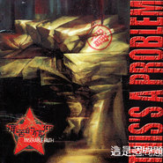

这是个问题this is a problem
============================

|  |  |
| :--: | :-- |
| [ 这是个问题this is a problem](https://emumo.xiami.com/album/15557) | **艺人**: [痛仰乐队](../index.md) **语种**: 国语 **唱片公司**: 京文唱片 **发行时间**: 2000年12月01日 **专辑类别**: 录音室专辑 **专辑风格**: 摇滚 Rock & Roll **播放数**: 996224 **收藏数**: 286 **评论数**: 294  |

## 简介

痛苦的信仰由主唱高虎、吉他李豫川、吉他田然、吉他麒麟、贝司张静、鼓手张冰、鼓手迟功伟组成，是一支极具代表性和独特性的说唱金属乐队。不管是早期凶猛直接的rap-core，还是现在把rap-metal工业化、政治化的延长，其鲜明的风格早已深入人心。“哪里有压迫哪里就有反抗”和“你的热血哪去了”等歌词也早已变成了“愤怒青年”们的宣言。

 有人说痛苦的信仰的作品有很强的政治色彩，但无可争辩的是他们作品中的批判性和斗争性，这种批判性和斗争性并不一定非得来自政治方面，同时也来自他们对社会的一种责任感和对自身生存的一种完善。因此，痛苦的信仰独特的气质使他们有了一种精神，一种敢于直面一切的精神，一种不仅敢于直面一切而且敢于向一切不公正挥拳的精神，一种不仅敢于直面一切向一切不公正挥拳而且在斗争中决不做那种所谓的“战略性转移“的精神。

 2001年5月痛苦的信仰签约嚎叫唱片，9月19日推出首张专辑《这是个问题》。在专辑画册开头我们看到一段源自唐朝首张专辑的文案：“谢谢你对痛苦的信仰以及中国新音乐的支持。我们相信，当你在听这张新专辑的同时，你也参与了一个时代的开始。”

 这段文字来，今天我们把乐队名字换一下，没想到是如此贴切，岁月不会让一项伟大的事业失去新血。不同的是今天的痛苦的信仰更加坚决。专辑中的11首歌，其中“哪里有压迫哪里就有反抗”、“这是个问题”、“复制者”是几乎每场演出必演的曲目。有些歌的歌词的精练到了只有口号的地步，但是给人的冲击与力量是强大的。

 他们觉得世界上太多不平等、不公正的事物，“这是个问题”，他们有的是沸腾的热血，他们认为：生活不能“象个婊子”，“哪里有压迫哪里就有反抗”！他们要用音乐表达他们“真实的邪念”，那就是：在“中国特色下”的“自由的边缘”、“愤怒”的呐喊：“这是个幌子” ；呐喊：“复制者”“让位”……我们“万岁”！

## 曲目

- [真实的邪念](./15557/jlWwce475.md)

## 评论

|  |  |  |
| :-- | :-- | :-- |
|  [虾米用户](https://emumo.xiami.com/u/446053098)  2020-11-19 12:52 赞(0) 踩(0) | 
谁有下载的资源 能否分享下？之前听过但没有下载 现在竟然就剩一首了 
 |
| ⇒ |  [虾米用户](https://emumo.xiami.com/u/425870267)   2021-01-10 07:16 赞(0) 踩(0) | 
<a href="https://sacdr.net/t-20290-1-1.html" target="_blank" rel="nofollow noreferrer noopener">https://sacdr.net/t-20290-1-1.html</a>  这个链接亲测可以，就是要注册论坛 密码记得两个都试一下
 |
|  [虾米用户](https://emumo.xiami.com/u/347593069) 双脚踩灯泡，胸口碎大石。 2020-10-25 19:51 赞(0) 踩(0) | 
你的热血哪去了
 |
|  [虾米用户](https://emumo.xiami.com/u/407048114) 我还没想好要写什么... 2020-09-29 00:59 赞(0) 踩(0) | 
愤怒没喽
 |
|  [虾米用户](https://emumo.xiami.com/u/973149)  2020-09-18 02:31 赞(1) 踩(0) | 
其他呢？？
 |
|  [虾米用户](https://emumo.xiami.com/u/292226553) 奈何橋上嘆奈何…… 2020-08-26 10:18 赞(1) 踩(0) | 
这张专辑0分，给2分都给高了，可惜打不了0分，可惜可惜！
 |
|  [虾米用户](https://emumo.xiami.com/u/442911259) 好德如好色 2020-08-06 08:46 赞(0) 踩(0) | 
豆瓣已经把这是个问题屏蔽了
 |
|  [虾米用户](https://emumo.xiami.com/u/8913191) Fuuck off 2020-06-24 21:42 赞(0) 踩(0) | 
买专辑才是硬道理
 |
|  [虾米用户](https://emumo.xiami.com/u/401928458)  2020-06-09 12:51 赞(0) 踩(0) | 
it's a process everyone must go through that the heart goes numb as the body
 |
|  [虾米用户](https://emumo.xiami.com/u/356863965)  2020-06-03 18:28 赞(0) 踩(0) | 
就两泡了？
 |
|  [虾米用户](https://emumo.xiami.com/u/416076750)  2020-05-03 00:41 赞(0) 踩(0) | 
好有工业金属的味道
 |
|  [虾米用户](https://emumo.xiami.com/u/413280693) 你方唱罢我登场，有口气就... 2020-04-29 09:57 赞(0) 踩(0) | 
我就是阴奉阳违的花招 我就是图穷匕现的伎俩
 |
|  [虾米用户](https://emumo.xiami.com/u/9327987) as u r 2020-04-27 09:29 赞(1) 踩(0) | 
这张专辑CD我叔叔十五年前买来给我听。当时觉得我擦真带劲，时过境迁一切都变得慵懒起来
 |
|  [虾米用户](https://emumo.xiami.com/u/9610721) brutal 2020-04-17 14:41 赞(0) 踩(0) | 
这才是你们啊
 |
|  [虾米用户](https://emumo.xiami.com/u/132589) 七八点 2020-02-07 17:06 赞(0) 踩(0) | 
其他歌呢？？？？
 |
|  [虾米用户](https://emumo.xiami.com/u/23651848)  2020-02-03 18:22 赞(0) 踩(0) | 
李豫川牛逼！
 |
|  [虾米用户](https://emumo.xiami.com/u/2771222) 当个疯子好过当台机器。 2020-02-03 07:54 赞(0) 踩(0) | 
回来了？
 |
|  [虾米用户](https://emumo.xiami.com/u/123246788) Music is my ... 2020-01-08 07:35 赞(1) 踩(0) | 
封面有个“赠”字！[带墨镜笑]
 |
|  [虾米用户](https://emumo.xiami.com/u/221397)  2019-12-22 10:24 赞(4) 踩(0) | 
一只烧鸡，最后端上来两个爪子
 |
|  [虾米用户](https://emumo.xiami.com/u/47733905) 这个世界本来就有很多事情... 2019-12-19 23:47 赞(56) 踩(0) | 
01 哪时有有压迫哪里就有反抗 02 愤怒 03 像个婊子 04 复制者 05 万岁 06 这是个问题 07 中国特色 08 真实的邪念 09 让位 10 自由的边缘 11 幌子
 |
| ⇒ |  [虾米用户](https://emumo.xiami.com/u/45259053) 我还没想好要写什么... 2020-03-06 01:19 赞(0) 踩(0) | 
第一首歌找了很久，请问哪里有？
 |
| ⇒ |  [虾米用户](https://emumo.xiami.com/u/47733905) 这个世界本来就有很多事情... 2020-03-09 01:33 赞(0) 踩(0) | 
<q><b>daisy_yu730说：</b></q>
 |
| ⇒ |  [虾米用户](https://emumo.xiami.com/u/432611617) 我还没想好要写什么... 2020-03-17 18:02 赞(0) 踩(0) | 
<q><b>、阿文先森说：</b></q>
 |
| ⇒ |  [虾米用户](https://emumo.xiami.com/u/427793428)  2020-03-19 20:45 赞(0) 踩(0) | 
<q><b>、阿文先森说：</b></q>
 |
| ⇒ |  [虾米用户](https://emumo.xiami.com/u/215006852)   2020-03-25 20:25 赞(0) 踩(0) | 
<q><b>、阿文先森说：</b></q>
 |
| ⇒ |  [虾米用户](https://emumo.xiami.com/u/441768601)  2020-03-27 17:00 赞(0) 踩(0) | 
<q><b>、阿文先森说：</b></q>
 |
| ⇒ |  [虾米用户](https://emumo.xiami.com/u/332075655)  2020-03-28 10:58 赞(0) 踩(0) | 
<q><b>郭富城（菏泽分城）说：</b></q>
 |
| ⇒ |  [虾米用户](https://emumo.xiami.com/u/315950058)  2020-07-07 03:06 赞(0) 踩(0) | 
牛逼&amp;hellip;
 |
| ⇒ |  [虾米用户](https://emumo.xiami.com/u/441962587)  2020-08-05 09:26 赞(0) 踩(0) | 
兄弟有存吗
 |
| ⇒ |  [虾米用户](https://emumo.xiami.com/u/43643886) 什么乱七八糟 2020-08-17 21:47 赞(0) 踩(0) | 
这些都是痛仰的作品吗，
 |
| ⇒ |  [虾米用户](https://emumo.xiami.com/u/7912875)  2020-09-12 06:03 赞(0) 踩(0) | 
<q><b>lianglianglm说：</b></q>
 |
|  [虾米用户](https://emumo.xiami.com/u/404140297) Nu-metal Alt... 2019-10-24 00:17 赞(0) 踩(0) | 
呜呜来晚了能不能再传一次啊
 |
|  [虾米用户](https://emumo.xiami.com/u/10987604) 用虾米看电影棒棒嗒 2019-09-04 13:21 赞(13) 踩(0) | 
和谐的只剩两首了
 |
| ⇒ |  [虾米用户](https://emumo.xiami.com/u/221397)  2020-08-12 18:42 赞(0) 踩(0) | 
这也太明显了点吧
 |
| ⇒ |  [虾米用户](https://emumo.xiami.com/u/41693350) Law and Orde... 2020-09-25 20:49 赞(0) 踩(0) | 
现在剩一首了 
 |
|  [虾米用户](https://emumo.xiami.com/u/198519174)  2019-08-25 11:03 赞(3) 踩(0) | 
什么都没有了，结束吧，不要愤怒了
 |
|  [虾米用户](https://emumo.xiami.com/u/37748422) 金属粉儿&程序员 2019-08-17 22:42 赞(0) 踩(0) | 
重新回归！！
 |
|  [虾米用户](https://emumo.xiami.com/u/7252458) 作为一个靓仔我已经习惯了... 2019-08-15 13:01 赞(0) 踩(0) | 
制作差了点其他都很好
 |
|  [虾米用户](https://emumo.xiami.com/u/19409755) 什么都听点儿 2019-08-14 10:55 赞(3) 踩(0) | 
直到今天这张专辑还留着，我想我以后要少骂虾米了
 |
|  [虾米用户](https://emumo.xiami.com/u/14835360)  2019-08-13 22:41 赞(0) 踩(0) | 
赶紧下载
 |
|  [虾米用户](https://emumo.xiami.com/u/428574887)  2019-08-13 11:41 赞(0) 踩(0) | 
我在想，是不是不小心下成《今日青年》了。
 |
|  [虾米用户](https://emumo.xiami.com/u/32984575)  2019-08-13 00:57 赞(4) 踩(0) | 
where is 复制者？
 |
| ⇒ |  [虾米用户](https://emumo.xiami.com/u/32984575)  2019-08-19 21:09 赞(0) 踩(0) | 
复制者也回来了！
 |
|  [虾米用户](https://emumo.xiami.com/u/32984575)  2019-08-12 23:36 赞(2) 踩(0) | 
虾米选择了逆风飞翔？
 |
|  [虾米用户](https://emumo.xiami.com/u/32984575)  2019-08-12 23:18 赞(3) 踩(0) | 
！！！！又上架了！！！！！！
 |
|  [虾米用户](https://emumo.xiami.com/u/257337206) ～怂了～ 2019-08-12 15:36 赞(2) 踩(0) | 
我凑！又上架了，赶紧下啊
 |
|  [虾米用户](https://emumo.xiami.com/u/6634921)  2019-08-11 23:20 赞(2) 踩(0) | 
哈哈当年刚出就买的磁带京文嚎叫泵
 |
|  [虾米用户](https://emumo.xiami.com/u/259804264)  2019-08-11 19:33 赞(2) 踩(0) | 
赶快下载
 |
|  [虾米用户](https://emumo.xiami.com/u/13993456) 我还没想好要写什么... 2019-08-11 14:03 赞(4) 踩(0) | 
卧槽 上架了？？
 |
|  [虾米用户](https://emumo.xiami.com/u/11408387)  2017-10-28 00:41 赞(3) 踩(0) | 
你很难想象一个乐队经过了十几年，还像2000年这张砖一样如此自由与愤怒地歌唱。时过境迁，乐队在成长。不变的是我们心里的伪装的愤怒。心里想要寻求痛快宣泄的情感。但这些，都不该是摇滚所要带给你的成长……
 |
|  [虾米用户](https://emumo.xiami.com/u/40692795)  2017-10-28 00:01 赞(3) 踩(0) | 
确实恶心了#中国之星# 拿人家炒作了两个星期，既然让人家上了，又不给播？@崔健 老师，你怎么看？@痛仰乐队 不要停止我的音乐！
 |
|  [虾米用户](https://emumo.xiami.com/u/34270523)  2017-10-27 23:50 赞(3) 踩(0) | 
曾经的“痛苦的信仰”与现在的“痛仰”，确实是两支乐队，两支非常牛逼的乐队，唉，国内找不出这样的第二支了……《哪里有压迫，哪里就有反抗》的原版在此专辑里！
 |
|  [虾米用户](https://emumo.xiami.com/u/6015266)  2017-10-27 23:35 赞(0) 踩(0) | 
楼下的话好像偶以前男朋友也讲过 HOHO 哪里有压迫哪里就有反抗 不过我还是比较喜欢痛仰后期的作品 虽然很多人都说没有早期的好
 |
|  [虾米用户](https://emumo.xiami.com/u/1569233)   2017-01-07 16:21 赞(2) 踩(0) | 
不远的一天，你听着听着听着就被水表工敲门。
 |
|  [虾米用户](https://emumo.xiami.com/u/40872947) 不善言谈 却爱跟对味er... 2016-10-30 21:58 赞(2) 踩(0) | 
这个才叫痛仰
 |
|  [虾米用户](https://emumo.xiami.com/u/17775717) 啾啾~\(≥▽≤)/~ 2016-10-17 09:17 赞(0) 踩(0) | 
再听这张其实还蛮不错的 
 |
|  [虾米用户](https://emumo.xiami.com/u/7398069) 希望你可以陪风林猫猫一起... 2016-09-19 22:48 赞(3) 踩(0) | 
当年买磁带的时候，因为封面上那个赠字，我还说是不是店主无良来的，直到看了虾米的封面。。。
 |
|  [虾米用户](https://emumo.xiami.com/u/47530381) k  2016-06-05 01:07 赞(0) 踩(0) | 
fucking
 |
|  [虾米用户](https://emumo.xiami.com/u/4008006)  2016-02-21 18:47 赞(4) 踩(0) | 
第一次看痛痒现场之后就开始不喜欢他们，政治说教乐队
 |
|  [虾米用户](https://emumo.xiami.com/u/42480839) 暂无签名~ 2016-01-31 23:46 赞(0) 踩(0) | 
这就是受了rage against the machine 的影响
 |
|  [虾米用户](https://emumo.xiami.com/u/51629968)   2016-01-08 00:47 赞(0) 踩(0) | 
返回头再听 竟然都是自己的故事
 |
|  [虾米用户](https://emumo.xiami.com/u/13060161) Only the end... 2015-12-28 13:09 赞(0) 踩(0) | 
这张好厉害的样子，先收了~
 |
|  [虾米用户](https://emumo.xiami.com/u/53626987) 我也可以是触手可及的温暖... 2015-12-27 00:50 赞(3) 踩(0) | 
我不同意这是痛仰最好的专辑，这只能是痛仰最好的专辑之一。
 |
|  [虾米用户](https://emumo.xiami.com/u/11195766) 马丽彼 2015-12-26 10:27 赞(0) 踩(0) | 
赠是什么意思
 |
|  [虾米用户](https://emumo.xiami.com/u/79633254) 183cm 75kg 2015-12-21 16:31 赞(0) 踩(0) | 
无病呻吟 生硬。第一感觉。
 |
|  [虾米用户](https://emumo.xiami.com/u/42477579)  2015-12-21 14:42 赞(2) 踩(0) | 
说唱形式的痛仰更为出色
 |
|  [虾米用户](https://emumo.xiami.com/u/40237262) 不忘初心 2015-12-21 11:05 赞(3) 踩(0) | 
听痛仰 必须得听第一张专辑 风格跟后面几张截然不同 原来这才是最初的痛仰
 |
|  [虾米用户](https://emumo.xiami.com/u/34270523)  2015-12-20 23:38 赞(0) 踩(0) | 
哪里有压迫，哪里就有反抗
 |
|  [虾米用户](https://emumo.xiami.com/u/15814764) 风之语 轻轻听…… 2015-12-20 22:52 赞(0) 踩(0) | 
好
 |
|  [虾米用户](https://emumo.xiami.com/u/40237262) 不忘初心 2015-12-20 22:36 赞(0) 踩(0) | 
挺好 不要改变
 |
|  [虾米用户](https://emumo.xiami.com/u/12538860) 摇滚起来! 2015-12-20 11:21 赞(0) 踩(0) | 
哪里有压迫，哪里就有反抗
 |
|  [虾米用户](https://emumo.xiami.com/u/49981040)  2015-12-20 01:07 赞(0) 踩(0) | 
日一下 舒服
 |
|  [虾米用户](https://emumo.xiami.com/u/13719981)  2015-12-19 22:51 赞(0) 踩(0) | 
痛仰只有这一张专辑值得打五星
 |
|  [虾米用户](https://emumo.xiami.com/u/38927916)   2015-12-19 16:17 赞(3) 踩(0) | 
内容已删除
 |
| ⇒ |  [虾米用户](https://emumo.xiami.com/u/47530381) k  2016-06-05 01:08 赞(0) 踩(0) | 
fuckin
 |
|  [虾米用户](https://emumo.xiami.com/u/5537677)  2015-11-17 01:37 赞(1) 踩(0) | 
都说他流行了 其实真想过吗 别说的跟圣人似的 这张专辑歌词真的很不错
 |
|  [虾米用户](https://emumo.xiami.com/u/5962250)   2015-10-22 12:33 赞(0) 踩(0) | 
吉他riffs!
 |
|  [虾米用户](https://emumo.xiami.com/u/392416)  2015-09-02 12:27 赞(0) 踩(0) | 
重温，热血再次沸腾。
 |
|  [虾米用户](https://emumo.xiami.com/u/8292385) 呵。 2015-08-11 22:27 赞(0) 踩(0) | 
舌头的歌啊…
 |
|  [虾米用户](https://emumo.xiami.com/u/39934313) 邦乐爱好 2015-08-05 02:58 赞(2) 踩(0) | 
像个硬汉，而现在真是娘娘腔
 |
|  [虾米用户](https://emumo.xiami.com/u/3972169)  2015-07-10 16:40 赞(12) 踩(0) | 
唱的不好，词也无感，属于无病呻吟的模板。 摇滚有批评的传统，但是需要有真实的社会现实作为基础，无病呻吟或者臆断都属于精神分裂类型，做出的音乐必然小众中的小众。
 |
| ⇒ |  [虾米用户](https://emumo.xiami.com/u/41434542)   2015-07-12 07:32 赞(0) 踩(0) | 
…对你无语
 |
| ⇒ |  [虾米用户](https://emumo.xiami.com/u/13030698) 暂无签名~ 2015-07-13 20:58 赞(0) 踩(0) | 
你还是仔细听听这张专辑，再做评论吧！
 |
| ⇒ |  [虾米用户](https://emumo.xiami.com/u/6732420)   2015-08-07 17:51 赞(0) 踩(0) | 
那只是你根本没看到社会现实
 |
| ⇒ |  [虾米用户](https://emumo.xiami.com/u/37678017) 无摇滚，不青春！ 2015-09-25 12:54 赞(0) 踩(0) | 
那你知不知道什么叫硬核？没听过硬核的，也来评论。。。
 |
| ⇒ |  [虾米用户](https://emumo.xiami.com/u/403057815) 一块骄傲的用于娱乐的苹果... 2019-09-08 19:06 赞(0) 踩(0) | 
这种瞎抬杠的也能上热评......
 |
| ⇒ |  [虾米用户](https://emumo.xiami.com/u/130682318) 很高兴认识你。 2020-03-19 22:06 赞(0) 踩(0) | 
<q><b>江河说：</b></q>
 |
|  [虾米用户](https://emumo.xiami.com/u/43988547) 一念起，万水千山。一念灭... 2015-07-10 15:00 赞(1) 踩(0) | 
这张绝了
 |
|  [虾米用户](https://emumo.xiami.com/u/51680872)  2015-06-24 23:58 赞(8) 踩(0) | 
痛仰和痛苦的信仰是两个乐队！！！
 |
|  [虾米用户](https://emumo.xiami.com/u/2386251)  2015-06-17 11:15 赞(2) 踩(0) | 
15年成都草莓音乐节的压轴曲，我们躺在远远的营地坡坡上跟着一声一声地唱。小伙伴们纷纷表示这个才是痛仰原本的样子。
 |
|  [虾米用户](https://emumo.xiami.com/u/563562) How we roll 2015-05-30 10:36 赞(17) 踩(0) | 
痛仰不走小清新，下场不比军械所好
 |
| ⇒ |  [虾米用户](https://emumo.xiami.com/u/3919140) 在我这，你总会找到那个最... 2015-08-11 23:04 赞(0) 踩(0) | 
太大实话了  
 |
|  [虾米用户](https://emumo.xiami.com/u/12022185) ... 2015-05-14 20:37 赞(35) 踩(0) | 
就不该往南方开
 |
|  [虾米用户](https://emumo.xiami.com/u/29651171) 噢！reggae 2015-05-09 00:27 赞(2) 踩(0) | 
你的热血哪儿去了！
 |
| ⇒ |  [虾米用户](https://emumo.xiami.com/u/41434542)   2015-07-12 07:33 赞(0) 踩(0) | 
他们成熟了
 |
|  [虾米用户](https://emumo.xiami.com/u/29651171) 噢！reggae 2015-05-09 00:25 赞(0) 踩(0) | 
痛苦的信仰！那些年后的痛痒！
 |
|  [虾米用户](https://emumo.xiami.com/u/33570603)  2015-04-22 13:46 赞(0) 踩(0) | 
新钱
 |
|  [虾米用户](https://emumo.xiami.com/u/39932813) 暂无签名~ 2015-03-22 14:22 赞(0) 踩(0) | 
！
 |
|  [虾米用户](https://emumo.xiami.com/u/387403) 不吃胡萝卜 2015-03-03 20:15 赞(0) 踩(0) | 
201
 |
|  [虾米用户](https://emumo.xiami.com/u/2433146) 海纳百川   无欲则刚… 2015-02-22 22:30 赞(0) 踩(0) | 
赞赞赞...
 |
|  [虾米用户](https://emumo.xiami.com/u/15511136) 理性的思维构筑感性的内心 2015-01-28 16:10 赞(1) 踩(0) | 
这张好金属
 |
|  [虾米用户](https://emumo.xiami.com/u/40060137) 这家伙很傻逼什么也没留下... 2015-01-26 15:32 赞(3) 踩(0) | 
妈的，热血沸腾
 |
|  [虾米用户](https://emumo.xiami.com/u/1730251)  2015-01-18 12:08 赞(1) 踩(0) | 
昨天在创意园20块淘了这张磁带
 |
|  [虾米用户](https://emumo.xiami.com/u/39764547) busy but laz... 2015-01-01 14:37 赞(14) 踩(0) | 
摇滚与流行的区别在于摇滚是用来表达情绪的，而流行是是用来消遣的。 他们变了并不是他们不再摇滚了，而是心境变了，本质并未改变。
 |
|  [虾米用户](https://emumo.xiami.com/u/8767968) 残酷死亡金属爱好者 2014-12-28 02:24 赞(1) 踩(0) | 
很经典
 |
|  [虾米用户](https://emumo.xiami.com/u/36845641) 寻找路 2014-12-11 11:36 赞(0) 踩(0) | 
找不回曾经的痛仰了。他们现在才是最痛苦的
 |
| ⇒ |  [虾米用户](https://emumo.xiami.com/u/15489958) 无 2014-12-22 17:45 赞(0) 踩(0) | 
武汉的放克们
 |
|  [虾米用户](https://emumo.xiami.com/u/5167973) 昨晚发了一个最近现场演的... 2014-12-07 23:27 赞(0) 踩(0) | 
就这张
 |
|  [虾米用户](https://emumo.xiami.com/u/1663551) 我还没想好要写什么... 2014-12-01 13:11 赞(1) 踩(0) | 
是么 真的么
 |
|  [虾米用户](https://emumo.xiami.com/u/2651914)  2014-11-24 23:01 赞(1) 踩(0) | 
到最后，还是痛苦的低下了曾经昂起的头。
 |
|  [虾米用户](https://emumo.xiami.com/u/34688888) 我还没想好要写什么... 2014-11-06 23:18 赞(1) 踩(0) | 
一个字，就是干
 |
|  [虾米用户](https://emumo.xiami.com/u/6772364) ROCK IS NOT ... 2014-11-06 14:47 赞(34) 踩(0) | 
从一个硬核摇滚乐队变成流行音乐组合！人民路上无数伪摇唱着再见杰克约炮多少刚刚踏入喜欢摇滚乐的姑娘们！负分，滚粗！
 |
|  [虾米用户](https://emumo.xiami.com/u/26237326) 让我们面对现实，让我们忠... 2014-11-05 15:20 赞(2) 踩(0) | 
真怀念念书时啊！痛仰的这盘磁带还是从文斌那盘母带扒下来的，用随身听一遍一遍的播放……2000年，打口带，看电影，通俗歌曲，我爱摇滚乐……真是痛快的日子啊……现在35了，偶尔还是会听听魔岩三杰，唐朝，超载，QUEEN，the cure，R.E.M……还有痛仰……但是早没有当年的热血啦啦啦啦啦啦啦啦啦啦啦啦啦啦……
 |
|  [虾米用户](https://emumo.xiami.com/u/2966131) 我还没想好要写什么... 2014-10-14 11:15 赞(2) 踩(0) | 
这里好多听歌的 比唱歌的想的还多
 |
|  [虾米用户](https://emumo.xiami.com/u/7836862)   2014-10-07 19:51 赞(0) 踩(0) | 
最初的痛仰，愤青的呐喊。
 |
|  [虾米用户](https://emumo.xiami.com/u/38601270)  2014-10-05 22:40 赞(0) 踩(0) | 
再造个玩金属的痛仰
 |
|  [虾米用户](https://emumo.xiami.com/u/7031762) 电影厨房食物烹制采样～A... 2014-09-19 11:50 赞(2) 踩(0) | 
关注苏格兰公投~
 |
|  [虾米用户](https://emumo.xiami.com/u/6750806) 音药贩子，各种psy音药... 2014-08-18 13:10 赞(0) 踩(0) | 
可惜一路往南方开
 |
|  [虾米用户](https://emumo.xiami.com/u/5953181) 然而并没有什么好说 2014-08-04 20:38 赞(0) 踩(0) | 
只希望他们演出能多唱唱这张里的歌。
 |
| ⇒ |  [虾米用户](https://emumo.xiami.com/u/47584708)   2015-05-31 09:26 赞(0) 踩(0) | 
心境不可能老是一样，活了那么多年对音乐永远只是一个见解那不是太没有进步了？
 |
|  [虾米用户](https://emumo.xiami.com/u/32167400) 我不会把你吃掉，只是含在... 2014-08-01 21:44 赞(0) 踩(0) | 
软了
 |
|  [虾米用户](https://emumo.xiami.com/u/1265200) 精神病人欢乐多 2014-07-26 14:14 赞(0) 踩(0) | 
复制者   看出版日期是舌头先出的，是翻唱舌头的歌吗？
 |
| ⇒ |  [虾米用户](https://emumo.xiami.com/u/5898164)  2014-07-30 23:07 赞(0) 踩(0) | 
是的
 |
| ⇒ |  [虾米用户](https://emumo.xiami.com/u/41693350) Law and Orde... 2014-11-10 09:03 赞(0) 踩(0) | 
是的。
 |
|  [虾米用户](https://emumo.xiami.com/u/36653432) 青春都喂了狗 2014-07-07 13:15 赞(0) 踩(0) | 
hao  ting
 |
|  [虾米用户](https://emumo.xiami.com/u/36957952) 暂无签名~ 2014-06-20 23:07 赞(0) 踩(0) | 
我还是喜欢这个时候坚硬的 真实粗糙的痛仰!
 |
|  [虾米用户](https://emumo.xiami.com/u/30653092) 严格来说，我只是喜欢流行... 2014-05-30 10:25 赞(0) 踩(0) | 
拳头早就发酵成为棉花糖
 |
|  [虾米用户](https://emumo.xiami.com/u/20097049)   2014-05-22 13:53 赞(0) 踩(0) | 
不是很喜欢这张...
 |
|  [虾米用户](https://emumo.xiami.com/u/34478714)  2014-05-16 11:13 赞(0) 踩(0) | 
老大，老冷在这
 |
|  [虾米用户](https://emumo.xiami.com/u/36524152)  2014-05-13 12:37 赞(0) 踩(0) | 
就是喜欢
 |
|  [虾米用户](https://emumo.xiami.com/u/1087928) 我还没想好要写什么... 2014-05-08 13:44 赞(0) 踩(0) | 
你的热血哪去了？
 |
| ⇒ |  [虾米用户](https://emumo.xiami.com/u/4093376) 似水流年的前后 2014-06-04 19:26 赞(0) 踩(0) | 
<q><b>说：</b></q>
 |
| ⇒ |  [虾米用户](https://emumo.xiami.com/u/4093376) 似水流年的前后 2014-08-16 19:52 赞(0) 踩(0) | 
<q><b>说：</b></q>
 |
|  [虾米用户](https://emumo.xiami.com/u/11932346) 這個世界為什麼那麼邪惡呢 2014-05-02 22:53 赞(0) 踩(0) | 
最原始的愤怒 最好的痛仰
 |
|  [虾米用户](https://emumo.xiami.com/u/4160754)   2014-04-23 23:23 赞(0) 踩(0) | 
炫酷
 |
|  [虾米用户](https://emumo.xiami.com/u/6648641)  2014-04-19 15:46 赞(0) 踩(0) | 
吼的还挺像linkin park那个主唱的！
 |
|  [虾米用户](https://emumo.xiami.com/u/35501540)  2014-04-18 16:48 赞(0) 踩(0) | 
痛苦的信仰乐队2000年参加承德市摇滚新世纪演出特别好，有激情，欢迎来承德摇滚。演出。
 |
|  [虾米用户](https://emumo.xiami.com/u/2869785)  2014-04-18 12:19 赞(0) 踩(0) | 
这才是痛仰最棒的一张EP
 |
|  [虾米用户](https://emumo.xiami.com/u/10048621) 我还没想好要写什么... 2014-04-15 21:47 赞(1) 踩(0) | 
专辑封面竟然放上来一张写着“赠”的图片=_=
 |
|  [虾米用户](https://emumo.xiami.com/u/14334442) 我还没想好要写什么... 2014-04-10 23:54 赞(1) 踩(0) | 
这时的痛仰音乐简单有力，情绪简单直接，但后期的变化显然是一个正常人的成长变化，还是值得人欣赏的，说句粗话，年轻时是交配冲动，成熟后享受性的过程与交流，老了动不了了沉淀的是感情和心境，你不能要求他们花甲之时还在台上翻滚，摇滚的不仅是肉体。
 |
|  [虾米用户](https://emumo.xiami.com/u/20244605)   2014-03-30 08:59 赞(0) 踩(0) | 
这是痛仰
 |
|  [虾米用户](https://emumo.xiami.com/u/31200667) 男人可以丑，但不能丑陋。 2014-03-25 20:28 赞(0) 踩(0) | 
好
 |
|  [虾米用户](https://emumo.xiami.com/u/30162221) 东北没有听摇滚的人？ 2014-03-20 15:54 赞(63) 踩(0) | 
这张专辑之后的痛仰真的是不痛不痒，虽然好像比之前更加火了，但我还是真心没法欣赏他们的新歌
 |
| ⇒ |  [虾米用户](https://emumo.xiami.com/u/412376189)  2019-08-15 14:14 赞(0) 踩(0) | 
只能说明你还没有成长，愿你现在的生活令你满意，并能一切安好。
 |
|  [虾米用户](https://emumo.xiami.com/u/24807049) 我无处不在 2014-03-14 09:35 赞(0) 踩(0) | 
闲来听听
 |
|  [虾米用户](https://emumo.xiami.com/u/361477)  2014-02-25 21:32 赞(0) 踩(0) | 
其实这张砖听起来更带感儿，不是说现在的不好
 |
|  [虾米用户](https://emumo.xiami.com/u/7549769) 网易和咪咕用户名一样，都... 2014-02-14 18:06 赞(0) 踩(0) | 
某些人或某些組織似乎會給他們貼上“憤青”的標籤，不過，他們的熱血和才氣不可否認~
 |
|  [虾米用户](https://emumo.xiami.com/u/7549769) 网易和咪咕用户名一样，都... 2014-02-14 17:57 赞(0) 踩(0) | 
這專輯有點意思~
 |
|  [虾米用户](https://emumo.xiami.com/u/2214127)  2014-02-13 15:12 赞(0) 踩(0) | 
痛仰以前原来是这样的。。
 |
|  [虾米用户](https://emumo.xiami.com/u/10345865) 广告位招商 2014-01-29 21:02 赞(0) 踩(0) | 
让位
 |
|  [虾米用户](https://emumo.xiami.com/u/29055373) 他人给混乱以秩序 我给秩... 2013-12-25 15:29 赞(0) 踩(0) | 
最初的信仰
 |
|  [虾米用户](https://emumo.xiami.com/u/30485199) 语虚何以言之 2013-12-25 15:03 赞(1) 踩(0) | 
去看看现场     那种燃烧的激情，让你无法记起曾经，那曾经的痛苦与欢乐，愤怒中原本有的无的迸发而出，感受是一种享受，超脱突破固有的灵魂死海，温柔的谈话，友好的举杯共饮，愤怒敬请的舞台，他们是导演，他们是编剧，他们是小三儿，这不是贬低，在哪里没有你的过去没有曾经。
 |
|  [虾米用户](https://emumo.xiami.com/u/16679691) 暂无签名~ 2013-12-07 04:53 赞(0) 踩(0) | 
愤怒
 |
|  [虾米用户](https://emumo.xiami.com/u/3575839) 我还没想好要写什么... 2013-10-26 17:32 赞(2) 踩(0) | 
只有这张专辑有Rage Against the Machine的样
 |
|  [虾米用户](https://emumo.xiami.com/u/583786)  2013-10-09 11:04 赞(1) 踩(0) | 
转型了吗？本质上我觉得没有，对生活对人生对社会的思考从来没有停止，反而更加细腻。
 |
| ⇒ |  [虾米用户](https://emumo.xiami.com/u/27684693)  2014-04-09 06:13 赞(0) 踩(0) | 
******
 |
|  [虾米用户](https://emumo.xiami.com/u/22981616)  2013-10-05 16:56 赞(71) 踩(0) | 
13年前，声音的愤怒，13年后，愿爱无忧。或许面对如此世界，我们终会明白，唯有宽容。那些躁动的青春，不满的嘶吼，愤怒的质疑，最后都会化成一句温暖的愿爱无忧。
 |
| ⇒ |  [虾米用户](https://emumo.xiami.com/u/420442)  2013-11-17 22:52 赞(0) 踩(0) | 
说的太对了，这就是成熟了
 |
| ⇒ |  [虾米用户](https://emumo.xiami.com/u/27684693)  2014-04-09 06:15 赞(0) 踩(0) | 
******
 |
|  [虾米用户](https://emumo.xiami.com/u/9794672) 户外、旅行、骑行、大自然 2013-09-29 13:22 赞(0) 踩(0) | 
热血。。。
 |
|  [虾米用户](https://emumo.xiami.com/u/1662559) 哈哈哈哈哈哈哈 2013-07-24 10:33 赞(0) 踩(0) | 
曾经的热血青年
 |
|  [虾米用户](https://emumo.xiami.com/u/16623128)  2013-06-30 23:27 赞(0) 踩(0) | 
还不错啊.........
 |
|  [虾米用户](https://emumo.xiami.com/u/3954261)  2013-06-23 01:24 赞(0) 踩(0) | 
不知不觉，凌晨一点了。痛仰的第一张专辑，咆哮的金属乐！底层人民的发泄，出身贫苦，但永远年轻，永远热泪盈眶！牛逼,燥起来！
 |
|  [虾米用户](https://emumo.xiami.com/u/6956904) 定西 2013-05-05 18:07 赞(0) 踩(0) | 
衣钵
 |
|  [虾米用户](https://emumo.xiami.com/u/12072505) 毒药 2013-04-16 00:03 赞(0) 踩(0) | 
初期，还是愤怒的，，，，
 |
|  [虾米用户](https://emumo.xiami.com/u/1746372) 我懷疑你懷疑我不懷好意 2013-03-20 12:42 赞(0) 踩(0) | 
这张听了十年还是很喜欢
 |
| ⇒ |  [虾米用户](https://emumo.xiami.com/u/13030698) 暂无签名~ 2015-07-13 21:00 赞(0) 踩(0) | 
这个社会十年了还是没有改变。(╯﹏╰)
 |
|  [虾米用户](https://emumo.xiami.com/u/3345212)  2013-03-14 21:07 赞(0) 踩(0) | 
怎么哪里有压迫的  歌词给改了  不对了
 |
|  [虾米用户](https://emumo.xiami.com/u/4242669) P.S.T.H.Z 2013-02-20 00:47 赞(0) 踩(0) | 
相对现在的商业他们没有压迫却缺少反抗
 |
|  [虾米用户](https://emumo.xiami.com/u/7272436) ...... 2013-02-18 20:28 赞(0) 踩(0) | 
哪里有压迫哪里就有反抗
 |
|  [虾米用户](https://emumo.xiami.com/u/12927524)  2013-02-07 11:52 赞(0) 踩(0) | 
不需要理由
 |
|  [虾米用户](https://emumo.xiami.com/u/6147200)  2013-02-03 10:06 赞(0) 踩(0) | 
爱金属，无信仰
 |
|  [虾米用户](https://emumo.xiami.com/u/7494366)  2013-01-19 20:26 赞(0) 踩(0) | 
说唱金属
 |
|  [虾米用户](https://emumo.xiami.com/u/337168)  2013-01-17 20:38 赞(0) 踩(0) | 
哪里有压迫哪里就有反抗！
 |
|  [虾米用户](https://emumo.xiami.com/u/5765675)  2013-01-14 09:20 赞(1) 踩(0) | 
这张专辑之后就变得不痛不痒了……
 |
| ⇒ |  [虾米用户](https://emumo.xiami.com/u/2863542) 目前不搞音乐，只被音乐搞 2013-02-01 13:08 赞(0) 踩(0) | 
大炮也可以藏在花丛中
 |
|  [虾米用户](https://emumo.xiami.com/u/864362) 我还没想好要写什么... 2012-12-31 14:49 赞(0) 踩(0) | 
相！见！恨！晚！
 |
|  [虾米用户](https://emumo.xiami.com/u/7414676)  2012-12-23 17:57 赞(0) 踩(0) | 
痛苦的信仰
 |
|  [虾米用户](https://emumo.xiami.com/u/11929864)  2012-12-14 21:21 赞(0) 踩(0) | 
哪里有压迫，哪里就有反抗！
 |
|  [虾米用户](https://emumo.xiami.com/u/5045797)  2012-11-15 18:54 赞(0) 踩(0) | 
上学时从富二代哥们PS3上听到的，霸占他的索尼MP3半个月，哈哈~~ 纪念求学时的歌！
 |
| ⇒ |  [虾米用户](https://emumo.xiami.com/u/46762641)  2015-03-07 18:03 赞(0) 踩(0) | 
富二代
 |
|  [虾米用户](https://emumo.xiami.com/u/809612)  2012-10-22 03:46 赞(0) 踩(0) | 
早期硬核
 |
|  [虾米用户](https://emumo.xiami.com/u/10032322)  2012-07-31 09:09 赞(0) 踩(0) | 
崔健之后中国摇滚的又一思想家
 |
| ⇒ |  [虾米用户](https://emumo.xiami.com/u/2190629) 喝不净醉人春酒 2012-09-15 17:22 赞(0) 踩(0) | 
听歌能别扣帽子吗
 |
| ⇒ |  [虾米用户](https://emumo.xiami.com/u/3445267)  2012-09-22 15:09 赞(0) 踩(0) | 
<q><b>aiyinaluwan说：</b></q>
 |
| ⇒ |  [虾米用户](https://emumo.xiami.com/u/1144010) 在微博再见吧：LZYxL... 2012-10-16 20:17 赞(0) 踩(0) | 
<q><b>aiyinaluwan说：</b></q>
 |
| ⇒ |  [虾米用户](https://emumo.xiami.com/u/2190629) 喝不净醉人春酒 2012-10-16 23:04 赞(0) 踩(0) | 
<q><b>老李说：</b></q>
 |
| ⇒ |  [虾米用户](https://emumo.xiami.com/u/8318418)  2012-10-23 19:15 赞(0) 踩(0) | 
<q><b>aiyinaluwan说：</b></q>
 |
| ⇒ |  [虾米用户](https://emumo.xiami.com/u/2190629) 喝不净醉人春酒 2012-10-23 21:33 赞(0) 踩(0) | 
<q><b>linktohellen说：</b></q>
 |
| ⇒ |  [虾米用户](https://emumo.xiami.com/u/321360) Segmentation 2013-01-09 23:13 赞(0) 踩(0) | 
<q><b>aiyinaluwan说：</b></q>
 |
| ⇒ |  [虾米用户](https://emumo.xiami.com/u/1582817) 若收藏精选集已删除，请用... 2013-01-27 16:09 赞(0) 踩(0) | 
小孩儿，跑过^_^……
 |
| ⇒ |  [虾米用户](https://emumo.xiami.com/u/46762641)  2015-05-03 16:56 赞(0) 踩(0) | 
乱扣什么帽子
 |
|  [虾米用户](https://emumo.xiami.com/u/5564528)  2012-07-21 10:29 赞(0) 踩(0) | 
最近一直循环播放
 |
|  [虾米用户](https://emumo.xiami.com/u/9853990)  2012-07-17 23:18 赞(0) 踩(0) | 
自从去年桂林山水摇滚之夜认识痛仰，从此喜欢不可收拾
 |
|  [虾米用户](https://emumo.xiami.com/u/9221860)  2012-05-19 18:01 赞(45) 踩(0) | 
信仰生来痛苦不要忘了自己的热血
 |
|  [虾米用户](https://emumo.xiami.com/u/7726997)  2012-05-01 23:35 赞(0) 踩(0) | 
今天的迷笛，痛仰发挥了今年最好的状态，一支真正属于现场的乐队
 |
|  [虾米用户](https://emumo.xiami.com/u/829156) 一夕成环 夕夕都成玦 2012-05-01 12:53 赞(0) 踩(0) | 
期待痛仰，期待6月成都大爱音乐节。啦啦啦
 |
|  [虾米用户](https://emumo.xiami.com/u/6098024)  2012-04-25 00:04 赞(0) 踩(0) | 
******
 |
|  [虾米用户](https://emumo.xiami.com/u/8857649)  2012-04-21 22:42 赞(0) 踩(0) | 
如此热血又如此伤感
 |
|  [虾米用户](https://emumo.xiami.com/u/4788608) 世界太小，無處可滾。 2012-04-17 23:43 赞(0) 踩(0) | 
強迫癥。
 |
|  [虾米用户](https://emumo.xiami.com/u/2648838)  2012-04-12 21:40 赞(0) 踩(0) | 
喜欢
 |
|  [虾米用户](https://emumo.xiami.com/u/7346991)  2012-03-23 20:14 赞(1) 踩(0) | 
国内乐队一般都是第一张很好的
 |
| ⇒ |  [虾米用户](https://emumo.xiami.com/u/6860975) 吾不能变心以从俗兮 2012-04-03 19:55 赞(0) 踩(0) | 
嗯，看产生的背景吧，不在于第一张。
 |
| ⇒ |  [虾米用户](https://emumo.xiami.com/u/246887) 音乐是一种想象 2012-05-25 08:51 赞(0) 踩(0) | 
<q><b>Kyle涯铭说：</b></q>
 |
|  [虾米用户](https://emumo.xiami.com/u/7593439)  2012-03-21 14:20 赞(0) 踩(0) | 
摇滚
 |
|  [虾米用户](https://emumo.xiami.com/u/8500792)  2012-03-21 14:07 赞(0) 踩(0) | 
铁拳担道义，热血写青春。中国的ratm，前无古人，后无来者。痛苦的信仰！
 |
|  [虾米用户](https://emumo.xiami.com/u/6070800)  2012-03-18 18:45 赞(0) 踩(0) | 
、、、、、、、、、、、、、、、、、、、、、、、、、、、、、、、、、、、、、、、、、、、、、、、、、、、、、、、、、、、、、、、、、、、、、、、、、、、、、、、、、、、、、、、、、、、、、、、、
 |
|  [虾米用户](https://emumo.xiami.com/u/8333925)  2012-03-07 17:32 赞(0) 踩(0) | 
发发
 |
|  [虾米用户](https://emumo.xiami.com/u/6553063) 以冷静的头脑面对狂热世界 2012-02-21 15:57 赞(0) 踩(0) | 
一个时代的标记
 |
|  [虾米用户](https://emumo.xiami.com/u/1408473)  2012-02-06 15:07 赞(0) 踩(0) | 
这张是最喜欢的
 |
|  [虾米用户](https://emumo.xiami.com/u/7906101) 花花花花花花京院。 2012-02-05 14:49 赞(0) 踩(0) | 
愤怒
 |
|  [虾米用户](https://emumo.xiami.com/u/774926) 音乐爱人 2012-02-01 16:07 赞(0) 踩(0) | 
啊啊啊啊啊啊啊啊啊啊
 |
|  [虾米用户](https://emumo.xiami.com/u/611767)  2012-01-21 23:28 赞(0) 踩(0) | 
当年最喜欢的乐队…
 |
|  [虾米用户](https://emumo.xiami.com/u/5257159)  2012-01-14 11:41 赞(0) 踩(0) | 
你的热血哪去了？
 |
| ⇒ |  [虾米用户](https://emumo.xiami.com/u/3364930)  2012-01-15 16:37 赞(0) 踩(0) | 
一直都在
 |
|  [虾米用户](https://emumo.xiami.com/u/5257159)  2012-01-14 11:41 赞(0) 踩(0) | 
你的热血哪去了？
 |
|  [虾米用户](https://emumo.xiami.com/u/5257159)  2012-01-14 11:41 赞(0) 踩(0) | 
你的热血哪去了？
 |
|  [虾米用户](https://emumo.xiami.com/u/5257159)  2012-01-14 11:41 赞(0) 踩(0) | 
你的热血哪去了？
 |
|  [虾米用户](https://emumo.xiami.com/u/5257159)  2012-01-14 11:41 赞(0) 踩(0) | 
你的热血哪去了？
 |
|  [虾米用户](https://emumo.xiami.com/u/5257159)  2012-01-14 11:41 赞(0) 踩(0) | 
你的热血哪去了？
 |
|  [虾米用户](https://emumo.xiami.com/u/5257159)  2012-01-14 11:40 赞(0) 踩(0) | 
你的热血哪去了？
 |
|  [虾米用户](https://emumo.xiami.com/u/5257159)  2012-01-14 11:40 赞(0) 踩(0) | 
你的热血哪去了？
 |
|  [虾米用户](https://emumo.xiami.com/u/5257159)  2012-01-14 11:40 赞(0) 踩(0) | 
你的热血哪去了？
 |
|  [虾米用户](https://emumo.xiami.com/u/5257159)  2012-01-14 11:40 赞(0) 踩(0) | 
你的热血哪去了？
 |
|  [虾米用户](https://emumo.xiami.com/u/5257159)  2012-01-14 11:40 赞(0) 踩(0) | 
你的热血哪去了？
 |
|  [虾米用户](https://emumo.xiami.com/u/2519257)  2012-01-13 11:29 赞(0) 踩(0) | 
在痛仰还是metal时代。
 |
|  [虾米用户](https://emumo.xiami.com/u/7604309)  2012-01-09 20:26 赞(0) 踩(0) | 
我很喜欢他们
 |
|  [虾米用户](https://emumo.xiami.com/u/7433504)  2011-12-28 04:19 赞(0) 踩(0) | 
还念   奠
 |
|  [虾米用户](https://emumo.xiami.com/u/7393169)  2011-12-25 10:05 赞(0) 踩(0) | 
國產的Rage Against The Machine
 |
| ⇒ |  [虾米用户](https://emumo.xiami.com/u/662329)  2011-12-29 20:13 赞(0) 踩(0) | 
绝对不是，你去听听T9
 |
| ⇒ |  [虾米用户](https://emumo.xiami.com/u/7393169)  2011-12-30 11:26 赞(0) 踩(0) | 
<q><b>疯客说：</b></q>
 |
| ⇒ |  [虾米用户](https://emumo.xiami.com/u/7393169)  2011-12-30 11:27 赞(0) 踩(0) | 
<q><b>疯客说：</b></q>
 |
|  [虾米用户](https://emumo.xiami.com/u/7111610)  2011-12-19 14:11 赞(0) 踩(0) | 
生猛少年
 |
|  [虾米用户](https://emumo.xiami.com/u/2305177)  2011-12-15 15:03 赞(0) 踩(0) | 
你的热血哪去了
 |
|  [虾米用户](https://emumo.xiami.com/u/2305177)  2011-12-15 15:03 赞(0) 踩(0) | 
你的热血哪去了？
 |
|  [虾米用户](https://emumo.xiami.com/u/5895036)  2011-12-09 08:29 赞(0) 踩(0) | 
太棒了
 |
|  [虾米用户](https://emumo.xiami.com/u/179136)  2011-11-21 17:05 赞(0) 踩(0) | 
最早时期的痛仰。。。。
 |
|  [虾米用户](https://emumo.xiami.com/u/179136)  2011-11-21 17:04 赞(0) 踩(0) | 
最早的痛仰
 |
|  [虾米用户](https://emumo.xiami.com/u/1224409) 人生就是做梦 2011-11-12 11:57 赞(0) 踩(0) | 
有点 感觉！
 |
|  [虾米用户](https://emumo.xiami.com/u/42809)  2011-11-02 17:55 赞(0) 踩(0) | 
痛苦的信仰。 真怀念！
 |
|  [虾米用户](https://emumo.xiami.com/u/1682332) 寻找 2011-10-29 19:54 赞(0) 踩(0) | 
不知道该如何评论，还是喜欢原来的痛仰，时光一去不复返
 |
|  [虾米用户](https://emumo.xiami.com/u/4177809)  2011-10-23 23:22 赞(0) 踩(0) | 
我的自由是被发了芽的！
 |
|  [虾米用户](https://emumo.xiami.com/u/4311876)  2011-10-22 00:39 赞(0) 踩(0) | 
不
 |
|  [虾米用户](https://emumo.xiami.com/u/4358597) 我还没想好要写什么... 2011-09-16 18:06 赞(0) 踩(0) | 
那里有压迫那里就有反抗
 |
|  [虾米用户](https://emumo.xiami.com/u/5580996)  2011-09-15 09:37 赞(0) 踩(0) | 
好听
 |
|  [虾米用户](https://emumo.xiami.com/u/155947) 一期一会 2011-09-09 15:22 赞(0) 踩(0) | 
2B || ! 2B, this is the Q .
 |
|  [虾米用户](https://emumo.xiami.com/u/5487272)  2011-08-26 17:44 赞(0) 踩(0) | 
痛仰早期硬核
 |
|  [虾米用户](https://emumo.xiami.com/u/1423059)  2011-08-23 20:11 赞(0) 踩(0) | 
这张专辑是绝笔
 |
|  [虾米用户](https://emumo.xiami.com/u/1655388) 你好，再见 2011-08-21 00:51 赞(0) 踩(0) | 
这是个问题
 |
|  [虾米用户](https://emumo.xiami.com/u/5087987)  2011-08-19 22:53 赞(0) 踩(0) | 
这个问题！！
 |
|  [虾米用户](https://emumo.xiami.com/u/5087987)  2011-08-19 22:49 赞(0) 踩(0) | 
再也没听过痛苦的信仰这样的作品
 |
|  [虾米用户](https://emumo.xiami.com/u/3504106)  2011-08-18 20:09 赞(0) 踩(0) | 
这是个问题
 |
|  [虾米用户](https://emumo.xiami.com/u/1378738)  2011-08-17 21:11 赞(0) 踩(0) | 
摇滚
 |
|  [虾米用户](https://emumo.xiami.com/u/1589761)  2011-08-03 13:07 赞(0) 踩(0) | 
为什么在虾米下不到《操蛋的社会》
 |
|  [虾米用户](https://emumo.xiami.com/u/3178600) 我没有你们想要的。 2011-07-27 17:00 赞(0) 踩(0) | 
仰起的高昂的头颅，就算下一秒在地上，我依然坚持我的信仰。
 |
|  [虾米用户](https://emumo.xiami.com/u/4819639) 感谢遇见的你们 2011-07-26 14:47 赞(0) 踩(0) | 
这是个问题啊
 |
|  [虾米用户](https://emumo.xiami.com/u/3741074)  2011-06-30 19:58 赞(0) 踩(0) | 
热血
 |
|  [虾米用户](https://emumo.xiami.com/u/806724)  2011-06-20 17:09 赞(0) 踩(0) | 
就听过这一张所以也只喜欢这一张
 |
|  [虾米用户](https://emumo.xiami.com/u/3973291)  2011-06-17 20:12 赞(0) 踩(0) | 
再苦痛的生活也无法阻止我们仰起高傲的头颅。
 |
|  [虾米用户](https://emumo.xiami.com/u/4232013)  2011-06-15 20:06 赞(0) 踩(0) | 
痛苦的信仰，好样的
 |
|  [虾米用户](https://emumo.xiami.com/u/4113899)  2011-06-14 00:15 赞(0) 踩(0) | 
就是喜欢
 |
|  [虾米用户](https://emumo.xiami.com/u/1047199)  2011-06-13 21:16 赞(0) 踩(0) | 
优秀至极
 |
|  [虾米用户](https://emumo.xiami.com/u/3205477) 菩提本无树 明镜亦非台 2011-06-03 13:26 赞(0) 踩(0) | 
痛苦的信仰由主唱高虎、吉他李豫川、吉他田然、吉他麒麟、贝司张静、鼓手张冰、鼓手迟功伟组成，是一支极具代表性和独特性的说唱金属乐队。不管是早期凶猛直接的rap-core，还是现在把rap-metal工业化、政治化的延长，其鲜明的风格早已深入人心。
 |
|  [虾米用户](https://emumo.xiami.com/u/3468208)   2011-05-27 22:01 赞(0) 踩(0) | 
很愤怒
 |
|  [虾米用户](https://emumo.xiami.com/u/933522)  2011-05-15 08:40 赞(0) 踩(0) | 
爽爆了~双击它双贝司就是给力@！
 |
|  [虾米用户](https://emumo.xiami.com/u/1742593)  2011-05-11 02:32 赞(0) 踩(0) | 
怎么说呢，转型后的痛仰让更多人接受，在我看来中国只有摇滚乐，没有摇滚
 |
|  [虾米用户](https://emumo.xiami.com/u/3875067) 希望迟迟不来，苦死了等的 2011-05-08 14:54 赞(0) 踩(0) | 
旗帜、
 |
|  [虾米用户](https://emumo.xiami.com/u/3803249)  2011-05-06 20:04 赞(0) 踩(0) | 
我倒是喜欢转型后的痛仰一点
 |
|  [虾米用户](https://emumo.xiami.com/u/3471036) 暂无签名~ 2011-04-19 19:19 赞(0) 踩(0) | 
这是个问题.....
 |
|  [虾米用户](https://emumo.xiami.com/u/1272348)  2011-03-31 16:38 赞(0) 踩(0) | 
作者无聊的BC工作，听着“哪里有压迫哪里就有反抗”还真是过瘾啊！
 |
|  [虾米用户](https://emumo.xiami.com/u/3406783)  2011-03-29 22:09 赞(0) 踩(0) | 
像个**
 |
|  [虾米用户](https://emumo.xiami.com/u/3296142)  2011-03-21 16:51 赞(0) 踩(0) | 
就是喜欢。。
 |
|  [虾米用户](https://emumo.xiami.com/u/3251606) 仰望星空，脚踏实地 2011-03-18 14:31 赞(0) 踩(0) | 
极具张力的
 |
|  [虾米用户](https://emumo.xiami.com/u/3116881)  2011-03-17 09:52 赞(0) 踩(0) | 
愤怒的力量
 |
|  [虾米用户](https://emumo.xiami.com/u/3173700)  2011-03-15 02:10 赞(0) 踩(0) | 
哪里有压迫 哪里就有反抗
 |
|  [虾米用户](https://emumo.xiami.com/u/2306444) 见证虾米起家式… 2011-03-12 01:14 赞(0) 踩(0) | 
哪里有压迫哪里就有反抗 是这张最经典的！
 |
|  [虾米用户](https://emumo.xiami.com/u/2796562)  2011-02-12 23:27 赞(0) 踩(0) | 
只因这个问题
 |
|  [虾米用户](https://emumo.xiami.com/u/2386932) 一群酒 2011-01-11 03:51 赞(0) 踩(0) | 
喜欢，带感，有爱。
 |
|  [虾米用户](https://emumo.xiami.com/u/240217) 我还没想好要写什么... 2010-12-22 10:29 赞(0) 踩(0) | 
还是从前的带劲。。。。。。。
 |
|  [虾米用户](https://emumo.xiami.com/u/1487658)  2010-09-12 10:49 赞(0) 踩(0) | 
这首怎么贴不到空间去昂。  P3 格式呢？
 |
|  [虾米用户](https://emumo.xiami.com/u/1075867)  2010-06-24 14:26 赞(0) 踩(0) | 
看迷笛哪里有压迫哪里就有反抗这首最爽
 |
|  [虾米用户](https://emumo.xiami.com/u/955990)  2010-06-06 16:21 赞(0) 踩(0) | 
巨爱这一张啊  很有力量  感觉比AK的还有力量
 |
|  [虾米用户](https://emumo.xiami.com/u/867255)  2010-05-10 09:54 赞(0) 踩(0) | 
还是喜欢这张~~~~~~
 |
|  [虾米用户](https://emumo.xiami.com/u/518498)  2010-05-04 17:22 赞(0) 踩(0) | 
- -。  以前的外向 变成现在的闷骚  我发现好多的最终都这样，，
 |
| ⇒ |  [虾米用户](https://emumo.xiami.com/u/3798769)  2011-05-16 15:28 赞(0) 踩(0) | 
我觉得和年纪有关系吧。年纪大了。一些东西就看得开了。就会慢慢趋于平和吧。也许还是在坚持自己的信仰，但是表达的方式会改变吧，呵呵。愤怒还是属于年轻人的，呵呵。
 |
|  [虾米用户](https://emumo.xiami.com/u/774518)  2010-04-03 14:59 赞(0) 踩(0) | 
现在的痛仰其实更有力量了
 |
| ⇒ |  [虾米用户](https://emumo.xiami.com/u/2306444) 见证虾米起家式… 2011-03-12 01:18 赞(0) 踩(0) | 
是的。现在的痛苦的信仰更加成熟了。
 |
|  [虾米用户](https://emumo.xiami.com/u/443932) 暂无签名~ 2010-03-17 12:04 赞(0) 踩(0) | 
回头再听这张痛痒太让人激动了
 |
|  [虾米用户](https://emumo.xiami.com/u/564766)  2009-12-10 15:26 赞(0) 踩(0) | 
狠就一个字，很久说一次
 |
| ⇒ |  [虾米用户](https://emumo.xiami.com/u/599173)  2010-02-12 20:35 赞(0) 踩(0) | 
******
 |
|  [虾米用户](https://emumo.xiami.com/u/15866) 一来虾米就快乐(✪▽✪) 2009-11-30 12:27 赞(0) 踩(0) | 
正！
 |
|  [虾米用户](https://emumo.xiami.com/u/308023) 荒野大嫖客 2009-11-13 07:57 赞(0) 踩(0) | 
这是个问题代表了中国最牛逼的硬核说唱
 |
|  [虾米用户](https://emumo.xiami.com/u/165868)  2009-10-27 14:27 赞(0) 踩(0) | 
再造一百个痛苦的信仰
 |
|  [虾米用户](https://emumo.xiami.com/u/320145)  2009-10-19 18:55 赞(0) 踩(0) | 
大爱这一张
 |
|  [虾米用户](https://emumo.xiami.com/u/15866) 一来虾米就快乐(✪▽✪) 2009-07-20 10:18 赞(0) 踩(0) | 
这个专辑太棒了，，，，
 |
