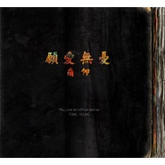

愿爱无忧May Love Be Without Worries
============================

|  |  |
| :--: | :-- |
| [ 愿爱无忧May Love Be Without Worries](https://emumo.xiami.com/album/1706138344) | **艺人**: [痛仰乐队](../index.md) **语种**: 国语 **唱片公司**: 独立发行 **发行时间**: 2014年08月12日 **专辑类别**: 录音室专辑 **专辑风格**: 独立摇滚 Indie Rock **播放数**: 9228446 **收藏数**: 9142 **评论数**: 1345  |

## 简介

IIIIIIIIIIIIIIIIIIIIIIIIIIIIIIIIIIIIIIIII虾米音乐人·独家首发IIIIIIIIIIIIIIIIIIIIIIIIIIIIIIIIIIIIIIII  
专辑购买地址&gt;&gt;<a href="http://item.taobao.com/item.htm?id=40273252574&amp;spm=a310v.4.88.1" target="_blank" rel="nofollow noreferrer noopener">http://item.taobao.com/item.htm?id=40273252574&amp;spm=a310v.4.88.1</a>  
  
这支乐队，死磕的时候被扛成大旗，试图和解时又被错认成楷模，时至今日，在竞相催眠的时代里，却偏偏把自己酿成了水，变成了充盈剔透的精神透镜。而你我这些微光，则决定着透镜反射的颜色，决定着精神所能投射出的强度。  
  
新专辑的诞生，更像是一次再造的过程，沉吟着要在这泥沙俱下的漩涡里，去见证本真。那些曾经重要的，谁又敢说不再重要，越过那些态度与立场的陷阱，我们所听到的，是他们全无修饰的坦诚，和隐而不发的力量。你的，我的，他们的，所有变成碎片的梦，在专辑中被一片片拼起来，越来越清晰。我们散射着的光芒，通过他们的音乐，被反射回来，让我们自己照耀彼此，再次尝试着，去消融黑暗，聚拢希望。就让这庞然广大的泥沼之地，这荒谬与疯狂之乡，永无可能把我们吞没殆尽。  
  
  
  
  
关于痛仰——  
  
风格： 独立摇滚   
主唱: 高虎    
吉它: 田然 、 宋捷    
贝司: 张静    
鼓手：大伟    
经纪人/手风琴：齐静    
  
乐队成立于1999年北京。至今共出版五张专辑及EP,最新专辑将在2014年8月推出。乐队的作品大都取材于成员们多年来在路上的各种真实体感，足迹遍布国内外大小近千个角落，从不同文化中挖掘出共源，汲取音乐灵感，坚持用独我的态度打造出至真至情的旋律。 在众多歌迷心目中，“痛仰“的音乐带给大家更多的是精神推动力。鼓励年轻人用勇敢、自我、真诚、率真的精神面对生活。至此也成为中国摇滚乐中坚力量和最具票房号召力的精神领袖。    
  
  

## 曲目

- [引子Intro](./1706138344/mQMdk86203f.md)
- [扎西德勒Tashi-delek](./1706138344/xL6Scvb5b80.md)
- [哈利路亚Hallelujah](./1706138344/mQLZZF587df.md)
- [夏天Summer](./1706138344/xL7bZpa161a.md)
- [戴着镣铐起舞Dancing In Chains](./1706138344/xL7bZMaecaa.md)
- [汪洋中的一条船A Boat Floating In the Ocean](./1706138344/xL7bZsbf918.md)
- [太阳照常升起The Sun Always Rises](./1706138344/xL7bZGdb28d.md)
- [野歌A Wild Song](./1706138344/xL6Q5m9d168.md)
- [美丽新世界A Beautiful New World](./1706138344/b1qeTLn3d922.md)
- [两个人的假期Holidays For Two](./1706138344/8GsaNQef027.md)
- [思疆调Ditty Of Xinjiang Memories](./1706138344/mQMdk95c7da.md)
- [愿爱无忧MVMay Love be Without worries](./1706138344/mQ9PSm9084a.md)

## 评论

|  |  |  |
| :-- | :-- | :-- |
|  [虾米用户](https://emumo.xiami.com/u/48090365) 救世主的死亡，即为天启！ 2020-07-20 03:43 赞(1) 踩(0) | 
每首歌要是只有最后一分钟就最合我胃口
 |
|  [虾米用户](https://emumo.xiami.com/u/434313431)  2020-04-08 01:45 赞(1) 踩(0) | 
过去的痛仰已死去，现在的痛仰让人接收不了，
 |
|  [虾米用户](https://emumo.xiami.com/u/3721475) ABCDEFGFUCK 2020-02-29 00:03 赞(1) 踩(0) | 
高质量专辑
 |
|  [虾米用户](https://emumo.xiami.com/u/431233352)   2019-11-04 23:11 赞(1) 踩(0) | 
他与世界和解了啊
 |
|  [虾米用户](https://emumo.xiami.com/u/33670588)  2019-09-21 16:04 赞(0) 踩(0) | 
愿爱无忧这首歌太棒了，音乐的底、情感的底铺的太完美了，没实力很难驾驭……专辑其它歌曲不表态，但这首主打在新专辑年前足以称王。
 |
|  [虾米用户](https://emumo.xiami.com/u/306065234) We are who w... 2019-09-20 04:35 赞(0) 踩(0) | 
7.9分？不对吧
 |
|  [虾米用户](https://emumo.xiami.com/u/406967093) 我还没想好要写什么... 2019-08-28 22:19 赞(0) 踩(0) | 
听歌就听歌嘛，爱听就多听。哪儿那么多废话。
 |
|  [虾米用户](https://emumo.xiami.com/u/329579283)  2019-07-28 10:24 赞(0) 踩(0) | 
专门来听宋捷弹吉他的
 |
|  [虾米用户](https://emumo.xiami.com/u/47448978) 今晚月色真美 2019-06-02 01:56 赞(0) 踩(0) | 
爱与和平
 |
|  [虾米用户](https://emumo.xiami.com/u/43950647) …… 2019-05-28 08:07 赞(0) 踩(0) | 
行星消失的夜空呢
 |
|  [虾米用户](https://emumo.xiami.com/u/96296322)  2019-03-01 21:26 赞(0) 踩(0) | 
.
 |
|  [虾米用户](https://emumo.xiami.com/u/46928860)  人生似草木 一世如一秋 2018-10-09 14:57 赞(0) 踩(0) | 
独家首发个鬼 版权呢&amp;hellip;还我版权啊！！！
 |
| ⇒ |  [虾米用户](https://emumo.xiami.com/u/96296322)  2019-03-01 02:44 赞(0) 踩(0) | 
归来！
 |
| ⇒ |  [虾米用户](https://emumo.xiami.com/u/46928860)  人生似草木 一世如一秋 2019-03-01 09:14 赞(0) 踩(0) | 
<q><b>Solarie说：</b></q>
 |
|  [虾米用户](https://emumo.xiami.com/u/379161284)  2018-07-20 13:44 赞(0) 踩(0) | 
******
 |
|  [虾米用户](https://emumo.xiami.com/u/3418777) 再见了 2018-04-25 01:45 赞(7) 踩(0) | 
行星消失的夜空 去哪里呢？旅游了吗
 |
| ⇒ |  [虾米用户](https://emumo.xiami.com/u/9445406) 瑞典H.E.A.T.QQ... 2019-12-16 21:13 赞(0) 踩(0) | 
消失了 
 |
|  [虾米用户](https://emumo.xiami.com/u/253246615)   2018-01-30 18:15 赞(0) 踩(0) | 
明明整张专辑制作都很精良&amp;hellip;&amp;hellip;为什么哀声那么多
 |
|  [虾米用户](https://emumo.xiami.com/u/4911910) 优美的低于生活 2017-12-18 13:20 赞(4) 踩(0) | 
问：对于虾米你们新歌发布的一些评论：巅峰已过，歌难听，江郎才尽等，大伙怎么看待？ 张静：巅峰？！我更喜欢阳光大道。 宋捷：人们有表达自我不同意见的权利，你见过什么样的场面是所有人举手通过的？ 大伟：每个人都有权利表达自己的心声！这并非是件坏事，继续做好自己，做好音乐。 高虎：说明观众口味提高了，只听三首歌就可以评价一张专辑。
 |
|  [虾米用户](https://emumo.xiami.com/u/7388008)  2017-12-17 10:11 赞(0) 踩(0) | 
很喜欢这张！
 |
|  [虾米用户](https://emumo.xiami.com/u/11699776) 这个世界好安静…… 2017-10-30 10:18 赞(0) 踩(0) | 
面对《愿爱无忧》我惊慌失措了，原来痛仰是“大家”的，是“世界”的，不应该只是《这是个问题》那拨人的，我定下神来想了想，带着属于我的感动，热血，还是离开让我无法适从的“大家，世界”！无论如何还是要感谢痛仰在2000年带给所有那个时代所有人的力量！再祝福一下痛仰能在全民摇滚的时代潮流中幸福的“愿爱无忧”！
 |
|  [虾米用户](https://emumo.xiami.com/u/7006218)  2017-10-30 10:18 赞(1) 踩(0) | 
痛苦的信仰也长大了。而成长也确实是一个不断被锤骟的过程。在人生如此艰难的路上让“太阳照常升起”，还要对世界说“扎西德勒”，这需要多大的power。除了暴怒的”哪里有压迫哪里就有反抗“之外，勇士的另一面是要让爱无忧，痛苦并一直信仰。自由边缘漫游也罢，这是个问题质疑也罢，能戴着镣铐起舞都是好样的。
 |
|  [虾米用户](https://emumo.xiami.com/u/10806797) 暂无签名~ 2017-10-30 10:18 赞(0) 踩(0) | 
其实上次北京迷笛看他们压轴就已经很无感了。听了这专辑更是无力透了。不是说非要躁，可这专辑真不知道高虎在搞什么！简直是自嗨！
 |
|  [虾米用户](https://emumo.xiami.com/u/10170844)  2017-10-30 10:17 赞(0) 踩(0) | 
制作最精良的一张，虽没有带来太多惊喜，但也没失望，稳步上升
 |
|  [虾米用户](https://emumo.xiami.com/u/2651405)  2017-10-30 10:17 赞(2) 踩(0) | 
什么花臂就得玩金属的狗屎逻辑，真正的音乐是乐者通过音乐表达自己思想，而不是去讨好听众，我们有表达自己观点的权力，但我们没有权力让他们为我们自己写歌，我到是觉得痛仰的歌从死磕到超然是内心成长的一种真实写照，一辈子只会死磕的人才是真正的low,你们鄙视一切却一无所长。还有，我也很爱金属，真正的金属不是长发花臂甩头，金属不是那样浅薄，很多所谓的金属党与酒鬼和磕药者无异
 |
|  [虾米用户](https://emumo.xiami.com/u/39131946)   2017-10-30 10:17 赞(0) 踩(0) | 
有些喷子永远活在昨天，不喜欢高虎又没拿把枪对着你脑袋瓜子说，不听闭了你。不能体会到第一张专辑到现在的这张专辑高虎和他们的小伙伴艰苦的心理路程，我不言论你的错，只能说明你现在还是痛。没仰起来。
 |
|  [虾米用户](https://emumo.xiami.com/u/11221608) 最爱民谣！ 2017-10-28 00:15 赞(1) 踩(0) | 
太阳照常升起是海明威的话，以海明威为代表的是迷惘的一代，出现在垮掉派之前。这代人的主旨仿佛是不懈追求积极与光明，其实自己内心也不知道所谓光明在何方。希望可以对理解歌曲有帮助。
 |
|  [虾米用户](https://emumo.xiami.com/u/24882923)  2017-10-28 00:07 赞(0) 踩(0) | 
很用心，篇幅和段落也越做越长，元素还可以更宽泛些，我觉得。音色没的说，很棒。唯一我觉得美中不足是，曲风和之前人们印象中的痛仰可能有所改观，我个人还是喜欢听那个更根源化，更自然的痛仰。当然痛仰这张专辑更专业了，更流行了，更适合跳舞了。很棒，祝，新专大卖！
 |
|  [虾米用户](https://emumo.xiami.com/u/8547900) 帅 2017-10-28 00:03 赞(0) 踩(0) | 
无聊又听了一点，痛仰无论是变成什么样，只要耐听，就值得支持。如果要从狼变成蝴蝶，变成雄鹰，变成鲨鱼，变成海豚，变成传教士，僧人，道士，魔术师，都好。可不要变成毛毛虫，蚊子，苍蝇，变成神棍，骗子，传销大师。这张专辑或许是一个蛹，中间亮点，优美的编曲旋律很多。中间缺点，恶俗的编曲旋律也很多。希望痛仰能多做做减法，去掉一些繁杂却不好听的恶俗，留下真和美。还有歌词真的比较差。不过有改变才有进步，希望痛仰能变成美好的，或凶猛的而不是半吊子敷衍
 |
|  [虾米用户](https://emumo.xiami.com/u/41297062)  2017-10-27 23:59 赞(0) 踩(0) | 
很棒的专辑啊，我很喜欢，越来越温柔贴近人心，很温暖
 |
|  [虾米用户](https://emumo.xiami.com/u/253069113)  2017-10-27 23:37 赞(3) 踩(0) | 
我喜欢这样的痛仰，歌伴奏都很有特点，单独放都很好听，而且这样的摇滚不吵闹，很精致很平和，谁说摇滚一定要瞎几把吼，配乐吵得耳聋才算好听？我很爱这张专辑
 |
|  [虾米用户](https://emumo.xiami.com/u/7006218)  2017-10-27 23:32 赞(3) 踩(0) | 
痛苦的信仰也长大了。而成长就是一个不断被锤骟的过程。在人生如此艰难的路上让“太阳照常升起”，还要对世界说“扎西德勒”，这需要多大的power。除了暴怒的”哪里有压迫哪里就有反抗“之外，勇士的另一面是要让爱无忧，痛苦并一直信仰。自由边缘也罢，这是个问题也好，能戴着镣铐起舞都是好样的。
 |
|  [虾米用户](https://emumo.xiami.com/u/6878563) 生年不满百，常怀千岁忧 2017-10-27 23:26 赞(0) 踩(0) | 
新砖有何不好？大抵都他ma跑太快了。。痛仰从来不是那种快餐娱乐的乐队，不能听出味道就别听吧，本就是小众，没指望谁来都喜欢。顺便的。。夏天 大爱！！！！
 |
|  [虾米用户](https://emumo.xiami.com/u/1393420) 似是遥远往事，白云在天上... 2017-10-27 23:08 赞(1) 踩(0) | 
词：普通二本本科文学系专业的大一大二生，诗歌老师布置一个月20首诗歌的作业。 曲：凤凰传奇未发布EP。
 |
|  [虾米用户](https://emumo.xiami.com/u/10981812)  2017-10-27 23:08 赞(0) 踩(0) | 
太棒了！！！！！高虎牛逼！！！！！！！！
 |
|  [虾米用户](https://emumo.xiami.com/u/816611)  2017-10-27 23:08 赞(4) 踩(0) | 
第一首扎西德勒，第二首就来哈利路亚，我很质疑他们的宗教信仰       ╭(╯^╰)╮
 |
|  [虾米用户](https://emumo.xiami.com/u/1828555) Omnivore 2017-10-27 23:08 赞(0) 踩(0) | 
看评论贬多于褒，我觉得批评的多是处于荷尔蒙分泌旺盛，沉迷以前那个按照KORN一比一开模的痛仰的小愤青吧。万物都会变，人随着年纪的增长，回过头审视自己，也会有很多改变。就好比红辣椒当年出《Californication》的时候，很多乐迷都说太流性一个道理。岁月总会沉淀出平淡的东西，看你懂不懂欣赏!
 |
| ⇒ |  [虾米用户](https://emumo.xiami.com/u/12329827) 我还没想好要写什么... 2018-04-19 08:43 赞(0) 踩(0) | 
還差兩首 無量天尊 阿彌陀佛
 |
|  [虾米用户](https://emumo.xiami.com/u/39716649) 暂无签名~ 2017-10-27 23:08 赞(1) 踩(0) | 
这么多年，由张狂青年变成了稳重大叔，痛仰，时间让人成长，这个过程有点痛，但这一路都在坚持自己的信仰。愿三太子的旗帜依旧飘扬。摇滚不死。不管你唱什么样的歌，只要旋律响起，我总能听到你的态度。
 |
|  [虾米用户](https://emumo.xiami.com/u/11891813)  2017-10-27 23:06 赞(0) 踩(0) | 
不得不说，比起痛仰前两张专辑，这张专辑简直就是烂爆了。。
 |
|  [虾米用户](https://emumo.xiami.com/u/39131946)   2017-10-27 23:06 赞(0) 踩(0) | 
痛仰不再痛，可能很多虾友不喜欢这张专辑，不论好与坏，他们不是不热血了，而是他们需要去寻找尝试其他，找到突破口，给我门不一样的一面，无止境的学习，才是正道，不是每张专辑都是完美的，
 |
|  [虾米用户](https://emumo.xiami.com/u/430520) 一个未能免俗的人。 2017-10-27 23:06 赞(0) 踩(0) | 
学乖了，再也不会哪里有压迫哪里就有反抗，可见，名利面前世人未能免俗，一支地下乐队音乐做成如此，博流行～～
 |
|  [虾米用户](https://emumo.xiami.com/u/36420300) 我还没想好要写什么... 2017-10-27 23:03 赞(1) 踩(0) | 
我也不希望痛仰一直愤怒，都什么年代了，他们现在有家有室有朋友有阅历未来只会更美好…愤怒个jb
 |
|  [虾米用户](https://emumo.xiami.com/u/4242669) P.S.T.H.Z 2017-10-27 23:03 赞(0) 踩(0) | 
《愿爱无忧》？摆一摆手又说再见再见分别又像昨天，莎菲娜莎菲娜只有我才懂得你珍贵？ 除了炒冷饭还会什么？除了哪吒就只会葫芦娃。傻屌
 |
|  [虾米用户](https://emumo.xiami.com/u/16446873)  2017-10-27 23:03 赞(1) 踩(0) | 
如果他们为了娱乐你们继续炒冷饭，做所谓你们喜欢的音乐，那才是懦夫的行为呢。 每一次革新前行势必颠覆旧的认知叫人一时无所适从。
 |
|  [虾米用户](https://emumo.xiami.com/u/282847263) 独孤地徘徊着，每一个角落... 2017-05-28 19:50 赞(0) 踩(0) | 
还过得去吧 
 |
|  [虾米用户](https://emumo.xiami.com/u/15270473) 听到喜欢的歌 身体不跟着... 2017-05-21 18:39 赞(0) 踩(0) | 
_
 |
|  [虾米用户](https://emumo.xiami.com/u/15270473) 听到喜欢的歌 身体不跟着... 2017-05-21 17:08 赞(0) 踩(0) | 
-
 |
|  [虾米用户](https://emumo.xiami.com/u/35658691) 身行万里半天下 2017-03-29 01:23 赞(0) 踩(0) | 
3
 |
|  [虾米用户](https://emumo.xiami.com/u/194331466) BridgeOverTr... 2016-12-09 07:54 赞(1) 踩(0) | 
独立摇滚（Indie Rock），独立摇滚脱胎于80年代的地下摇滚和另类音乐，它强调乐队需要不受干扰地按照自己的思想制作音乐。独立摇滚崇尚朋克乐的“DIY”精神，具有极度鲜明的个性特色，因此很少被主流音乐所接受。同时它又借鉴了各个乐种的特色，在90年代衍生出许多风格迥异的分支。坚持自己的观点和见解就是独立摇滚的精髓所在。    而现在的tongyong还有曾经的miserablefaith的坚持吗？我相信还是有的，只是已经“被岁月磨平了棱角”。
 |
|  [虾米用户](https://emumo.xiami.com/u/1038207)  2016-11-24 23:16 赞(0) 踩(0) | 
野歌。。。相当不错！！！
 |
|  [虾米用户](https://emumo.xiami.com/u/10358271)  2016-11-11 16:30 赞(1) 踩(0) | 
无痛人流.愿爱无忧...
 |
|  [虾米用户](https://emumo.xiami.com/u/6177066)  2016-10-14 10:48 赞(1) 踩(0) | 
痛仰最好的一张，我认为是《这是个问题》，这张第二
 |
|  [虾米用户](https://emumo.xiami.com/u/3402153)  2016-09-18 16:11 赞(0) 踩(0) | 
从来没听过痛仰的歌，第二次来听，像极了luna sea
 |
|  [虾米用户](https://emumo.xiami.com/u/3402153)  2016-09-18 16:03 赞(0) 踩(0) | 
你们都不听配乐吗？只听唱歌的我建议去听帕瓦罗蒂
 |
|  [虾米用户](https://emumo.xiami.com/u/43456866) 我还没想好要写什么... 2016-09-16 16:44 赞(1) 踩(0) | 
整张专辑好像就这两首歌，一首思疆调一首其他
 |
|  [虾米用户](https://emumo.xiami.com/u/125798650) 一只特立独行的猪 2016-07-13 22:47 赞(0) 踩(0) | 
愿爱无忧
 |
|  [虾米用户](https://emumo.xiami.com/u/3402153)  2016-07-07 14:14 赞(0) 踩(0) | 
对于听歌从来不听歌词只听乐器的来说，这专辑还不错，从来没听过痛痒的歌，虽然国内音乐节也一直去，但是感觉现场水准和国外你还是差一些，可能中国的调音师和场地都不行吧，哈哈。
 |
|  [虾米用户](https://emumo.xiami.com/u/33578199) 我超疯 2016-05-28 13:25 赞(0) 踩(0) | 
我就喜欢这张专辑，不管你们说什么！我就是喜欢！！我爱痛仰！我爱痛仰！我爱痛仰！！！
 |
|  [虾米用户](https://emumo.xiami.com/u/164487652) 别说来日方长 2016-05-26 20:27 赞(0) 踩(0) | 
热爱， 所以 我们  应当 学会 包容！！！！！！
 |
|  [虾米用户](https://emumo.xiami.com/u/1277380)  2016-05-08 18:39 赞(0) 踩(0) | 
这是个变化的痛仰，乐队不再是那么愤怒了，旋律与节奏掌控的越来越流畅动听了，才听完行星消失的夜空。
 |
|  [虾米用户](https://emumo.xiami.com/u/137659572)  2016-04-09 10:22 赞(1) 踩(0) | 
不错的
 |
|  [虾米用户](https://emumo.xiami.com/u/1589108) fuck offffff... 2016-03-13 03:03 赞(3) 踩(0) | 
觉得他们不燥了，就多听听燥的乐队，听的乐队多了，你会觉得他们以前的歌是垃圾，根本不值一听，除了枯燥乏味的乱吼和混乱的节奏型以外没有任何可以听的，但是，这张专辑却还原痛仰最真实的一面…回归自我是最好的选择…
 |
| ⇒ |  [虾米用户](https://emumo.xiami.com/u/5903523)   2016-05-23 01:43 赞(0) 踩(0) | 
我也觉得痛仰在不要停止我的音乐之前的专辑是垃圾。他们根本就不是搞金属的料。
 |
|  [虾米用户](https://emumo.xiami.com/u/43060669)   2016-02-27 05:32 赞(15) 踩(0) | 
一点都不失望，这张专辑让人觉得幸福。
 |
|  [虾米用户](https://emumo.xiami.com/u/33525840)  2016-02-21 15:02 赞(4) 踩(0) | 
从最早的朋克 到重金  再到核  到死金  黑金  再到后摇  这种顺序听下去  这张专辑确实没什么问题  时间的流逝  心态也会发生转变  从表面 到骨子里  思想其实并没变
 |
|  [虾米用户](https://emumo.xiami.com/u/9910798) 暂无签名~ 2016-02-12 11:44 赞(3) 踩(0) | 
我能理解被亮的最多的那个哥们儿，我也是一开始听的时候听不惯。不过后来偶然看了对高虎做音乐访谈的文章之后觉得一下就想通了。 高虎说，可能有人20年之后才会听懂这张专，我觉得这话不假，如果十来岁或者20出头的年轻人的话，他们会说垃圾，但三十来岁的时候，他们会发现是自己年轻气盛时没听懂。 我偶然看到了高虎那访谈的文章，乐队最低谷濒临分开时，那段时间高虎就靠 Bob Marley的雷鬼的里的温暖和爱从堕落颓废里爬起来。所以在音乐上大的转变自然而然，这张专更是比以前的专更明显的大量的雷鬼成分。哈利路亚这首，豆瓣上那个版本和专辑里雷鬼风格的版本，我本来更喜欢豆瓣版本，听多了之后就开始听出雷鬼的温暖和妙处。
 |
|  [虾米用户](https://emumo.xiami.com/u/2666030)   2016-01-15 17:43 赞(1) 踩(0) | 
玩旋律咱干不过流行，还是老老实实玩中国硬核吧
 |
|  [虾米用户](https://emumo.xiami.com/u/334983) 行到水穷处，坐看云起时！ 2016-01-06 22:54 赞(0) 踩(0) | 
最早听的西湖！很不错！没想到现在火了
 |
|  [虾米用户](https://emumo.xiami.com/u/47386595) 暂无签名~ 2015-12-30 12:21 赞(0) 踩(0) | 
这痛痒想表达什么，又痛又痒岂不矛盾
 |
|  [虾米用户](https://emumo.xiami.com/u/8427348) 暂无签名~ 2015-12-26 23:52 赞(2) 踩(0) | 
超赞的一张专辑！ 超越了以往，走在了当下！愿愛無忧！愿全天下的人愛無忧！
 |
|  [虾米用户](https://emumo.xiami.com/u/43825089)  2015-12-26 14:19 赞(1) 踩(0) | 
愿爱无忧。
 |
|  [虾米用户](https://emumo.xiami.com/u/1250039) 一个善于自毁前程的人。 2015-12-24 17:54 赞(2) 踩(0) | 
痛仰老歌迷，三年前还在现场高喊过高虎牛逼。但现在觉得高虎成了摇滚商人。虽然我沉静了很久再听，感觉稍好一点，但还是不能喜欢这张，不断的抄袭自己重复自己，歌词和旋律缺乏诚实，十来首歌像一首歌，歌词太差。
 |
|  [虾米用户](https://emumo.xiami.com/u/3631785)  2015-12-24 15:47 赞(0) 踩(0) | 
愿我之爱无忧
 |
|  [虾米用户](https://emumo.xiami.com/u/589764) The 1st cut ... 2015-12-22 21:18 赞(0) 踩(0) | 
哪里有压迫，哪里就可以谈恋爱
 |
|  [虾米用户](https://emumo.xiami.com/u/81824358)  2015-12-16 23:52 赞(3) 踩(0) | 
除了编曲大同小异，剩下都一个味
 |
|  [虾米用户](https://emumo.xiami.com/u/782027) 成长中的后摇新势力 2015-12-09 13:42 赞(2) 踩(0) | 
对待喜欢或曾经喜欢的艺人要有包容的心态，一张专辑不可能满足所有乐迷。喜欢就继续听，不喜欢就找其他符合自己口味的音乐听，实在没有就自己组个乐队，就这么简单。 我自己觉得这张专辑的编曲太牛逼了。
 |
|  [虾米用户](https://emumo.xiami.com/u/4152578)  2015-11-24 16:23 赞(1) 踩(0) | 
你丫的热血哪去了？
 |
|  [虾米用户](https://emumo.xiami.com/u/1170362)  2015-11-04 14:06 赞(0) 踩(0) | 
听三遍...真是严苛啊
 |
|  [虾米用户](https://emumo.xiami.com/u/41069621) 跳波自相溅，白鹭惊复下。 2015-10-27 20:17 赞(0) 踩(0) | 
其他听说的都不管  我喜欢
 |
|  [虾米用户](https://emumo.xiami.com/u/8231373)  2015-10-24 13:57 赞(0) 踩(0) | 
痛，痛啊！
 |
|  [虾米用户](https://emumo.xiami.com/u/17360917)  2015-10-12 10:42 赞(3) 踩(0) | 
当你连听3遍以后，才会发现痛仰的音乐有多吸引人
 |
|  [虾米用户](https://emumo.xiami.com/u/71837590)  2015-10-05 14:08 赞(0) 踩(0) | 
嗨
 |
|  [虾米用户](https://emumo.xiami.com/u/28470605)  2015-09-27 23:15 赞(0) 踩(0) | 
两个版本都喜欢
 |
|  [虾米用户](https://emumo.xiami.com/u/49231105) 夜幕覆盖华北平原，青春四... 2015-09-17 12:58 赞(3) 踩(0) | 
本来满怀激动的下载下来，结果听了一遍就删了，评论里那句“按以前水平一星期就能做出来”真的是完美表达
 |
| ⇒ |  [虾米用户](https://emumo.xiami.com/u/7809994) 云 2015-10-20 11:36 赞(0) 踩(0) | 
就是骗脑残粉钱的
 |
|  [虾米用户](https://emumo.xiami.com/u/5430) 对于世道，我和槐树上的蝉... 2015-09-07 17:50 赞(0) 踩(0) | 
挺好听的
 |
|  [虾米用户](https://emumo.xiami.com/u/13747781) 我爱雷鬼 世界音乐，飞行... 2015-08-25 11:04 赞(0) 踩(0) | 
内容已删除
 |
| ⇒ |  [虾米用户](https://emumo.xiami.com/u/9108845) 跳动Reggae 2015-11-01 01:40 赞(0) 踩(0) | 
典型的痛痒脑残粉   
 |
| ⇒ |  [虾米用户](https://emumo.xiami.com/u/8432255) 老马一生粉，法号大表哥 2015-12-21 22:11 赞(0) 踩(0) | 
<q><b>吴子河说：</b></q>
 |
|  [虾米用户](https://emumo.xiami.com/u/13747781) 我爱雷鬼 世界音乐，飞行... 2015-08-25 11:04 赞(0) 踩(0) | 
内容已删除
 |
| ⇒ |  [虾米用户](https://emumo.xiami.com/u/61548288)  2015-10-03 19:16 赞(0) 踩(0) | 
赞同，痛仰在最自然状态下创作出来的就是最好的
 |
|  [虾米用户](https://emumo.xiami.com/u/7809994) 云 2015-08-11 11:17 赞(2) 踩(0) | 
内容已删除
 |
| ⇒ |  [虾米用户](https://emumo.xiami.com/u/8547900) 帅 2015-08-16 06:46 赞(0) 踩(0) | 
听了五遍，暂时同意你的话，再忍着听一遍
 |
| ⇒ |  [虾米用户](https://emumo.xiami.com/u/8547900) 帅 2015-08-16 07:05 赞(0) 踩(0) | 
又听了一遍，抛开意识形态的东西来说，我发现每首歌感觉都有个共同点。咋一听前半分钟还可以，后面突然就是屎。总的说来，每首都只有四分之一可听，四分之三恶俗还难听
 |
| ⇒ |  [虾米用户](https://emumo.xiami.com/u/7809994) 云 2015-08-16 17:00 赞(0) 踩(0) | 
<q><b>dimlgq说：</b></q>
 |
|  [虾米用户](https://emumo.xiami.com/u/6644605) 我还没想好要写什么... 2015-08-10 16:29 赞(2) 踩(0) | 
这么难听的土摇你们是怎么听的下去的 ？
 |
|  [虾米用户](https://emumo.xiami.com/u/42689661) 唱歌给自己听 2015-08-07 10:51 赞(0) 踩(0) | 
喜欢就是喜欢
 |
|  [虾米用户](https://emumo.xiami.com/u/1593791) 我还没想好要写什么... 2015-08-06 21:40 赞(1) 踩(0) | 
做爵士你真的太高估中国乐队了。 爵士不是科班出来的根本做不了。
 |
| ⇒ |  [虾米用户](https://emumo.xiami.com/u/13747781) 我爱雷鬼 世界音乐，飞行... 2015-08-25 11:06 赞(0) 踩(0) | 
就你这种，觉得痛仰是爵士，搞逼笑，我告诉你，你那些爵士老子高中就听烂了，但还是菜
 |
| ⇒ |  [虾米用户](https://emumo.xiami.com/u/1593791) 我还没想好要写什么... 2015-08-25 11:50 赞(0) 踩(0) | 
<q><b>陈瀚霖的demo说：</b></q>
 |
| ⇒ |  [虾米用户](https://emumo.xiami.com/u/8432255) 老马一生粉，法号大表哥 2015-12-21 22:10 赞(0) 踩(0) | 
<q><b>木樨 花红说：</b></q>
 |
|  [虾米用户](https://emumo.xiami.com/u/13048549) 回应大地的召唤 2015-08-04 18:03 赞(0) 踩(0) | 
听了好久才第一次看歌词。。。结果发现一点都对不上，怪怪的
 |
|  [虾米用户](https://emumo.xiami.com/u/6699474)  2015-08-01 23:26 赞(1) 踩(0) | 
大爱   没理由
 |
|  [虾米用户](https://emumo.xiami.com/u/19712363) 我还没想好要写什么... 2015-07-31 23:45 赞(0) 踩(0) | 
.
 |
|  [虾米用户](https://emumo.xiami.com/u/1851285) Cirnellë 2015-07-30 19:42 赞(3) 踩(0) | 
说实话这张专刚上我第一次听完全部的时候心里是这样的：“WTF…”现在再来听，心里是这样的：“我之前一定是脑袋被门夹了吧，这么好听的专居然被我扔一边了…”超喜欢！就这样！ end of the story.
 |
|  [虾米用户](https://emumo.xiami.com/u/5496714)   2015-07-28 18:07 赞(1) 踩(0) | 
痛苦的信仰《愿爱无忧》唱片，入选本DJ挑选的年度华语唱片之一。当你对生活感到失望的时候听听呢只唱片，能量马上回归，音乐会带给你力量去维持你有信仰的态度。
 |
|  [虾米用户](https://emumo.xiami.com/u/2701239) 民谣异教黑金属 2015-07-25 09:48 赞(0) 踩(0) | 
还没TM汪峰好听
 |
|  [虾米用户](https://emumo.xiami.com/u/2701239) 民谣异教黑金属 2015-07-25 09:27 赞(0) 踩(0) | 
不好听，没意思，不知道有些人是听音乐还是看乐队
 |
|  [虾米用户](https://emumo.xiami.com/u/5800966) Comedy biaaa... 2015-07-21 15:32 赞(0) 踩(0) | 
catch不到
 |
|  [虾米用户](https://emumo.xiami.com/u/14610888)  2015-07-21 08:24 赞(0) 踩(0) | 
不错还是那么喜欢
 |
|  [虾米用户](https://emumo.xiami.com/u/29846343) 来撩 2015-07-06 16:28 赞(0) 踩(0) | 
。。。。。。。。。。。。。。。。
 |
|  [虾米用户](https://emumo.xiami.com/u/2224550) 再见 我会想你的 2015-07-03 21:11 赞(3) 踩(0) | 
最看不过去那种听完就说“痛仰变了不是以前的痛仰了”这种人。音乐是做自己的喜欢的，不是为乐迎合别人口味做的。再说，人的一生都是会变的，会由青涩愤怒暴躁变的成熟理性宽容。这都是很正常的，这也正是人类的魅力。从愤怒的哪吒到双手合十的哪吒再到这张愿爱无忧，我觉得痛仰还是以前的痛仰。
 |
|  [虾米用户](https://emumo.xiami.com/u/50006560) 春天等花开，夏天等风来，... 2015-06-18 19:05 赞(2) 踩(0) | 
痛仰这专辑首首合胃口
 |
| ⇒ |  [虾米用户](https://emumo.xiami.com/u/45764637)  2015-07-28 02:24 赞(0) 踩(0) | 
对
 |
| ⇒ |  [虾米用户](https://emumo.xiami.com/u/45764637)  2015-07-28 02:24 赞(0) 踩(0) | 
对
 |
|  [虾米用户](https://emumo.xiami.com/u/5903523)   2015-06-15 01:36 赞(0) 踩(0) | 
美丽新世界这首最入耳的歌居然还是改编别人的
 |
|  [虾米用户](https://emumo.xiami.com/u/5903523)   2015-06-15 01:23 赞(0) 踩(0) | 
痛仰俨然已经成为旅途和远方的代言人了 
 |
|  [虾米用户](https://emumo.xiami.com/u/39779833) 一首翘盼，一扇窗 2015-06-06 21:20 赞(1) 踩(0) | 
沉淀了，很重，就像抵抗生活的心还在，可是选择了宽容
 |
|  [虾米用户](https://emumo.xiami.com/u/39779833) 一首翘盼，一扇窗 2015-06-06 21:20 赞(0) 踩(0) | 
沉淀了，很重，就像抵抗生活的心还在，可是选择了宽容
 |
|  [虾米用户](https://emumo.xiami.com/u/47131997)  2015-06-03 06:27 赞(3) 踩(0) | 
这歌词写得真能骗钱。。。副歌： 一直往南方开。。。重复好几遍 萨菲娜。。。重复好几遍 扎西德勒。。。重复好几遍 出了早期愤青，就是目前的敷衍，写不出内涵和深度的东西来。曲风也大众通俗了好多呀。
 |
|  [虾米用户](https://emumo.xiami.com/u/47386595) 暂无签名~ 2015-05-23 12:50 赞(0) 踩(0) | 
痛痒
 |
|  [虾米用户](https://emumo.xiami.com/u/11666773)  2015-05-22 22:00 赞(0) 踩(0) | 
去四川九寨沟一路上放的都是这张专辑，现在一听就能产生同感呢！！！
 |
|  [虾米用户](https://emumo.xiami.com/u/10117161) 想不出忘得掉 2015-05-11 15:48 赞(2) 踩(0) | 
不管什么风格的音乐 摇滚是一种精神
 |
|  [虾米用户](https://emumo.xiami.com/u/8339795) 我还没想好要写什么... 2015-05-09 17:14 赞(1) 踩(0) | 
挺好的一盘专辑  怎么差评那么多呢 ！？
 |
|  [虾米用户](https://emumo.xiami.com/u/1348602) 我还没想好要写什么... 2015-05-09 16:49 赞(1) 踩(0) | 
难听不要紧，一直没进步就不好了
 |
|  [虾米用户](https://emumo.xiami.com/u/9484106)  2015-05-04 22:40 赞(1) 踩(0) | 
吐了，不用听看歌名就受不了那股扑面而来的屌丝村炮土逼气息...
 |
|  [虾米用户](https://emumo.xiami.com/u/4093537)  2015-04-29 00:56 赞(0) 踩(0) | 
早点睡 安
 |
|  [虾米用户](https://emumo.xiami.com/u/41434542)   2015-04-24 21:26 赞(1) 踩(0) | 
真受不了有的人曲风一遍就说不行不行，你们在埋怨什么？在我心里是成熟了
 |
|  [虾米用户](https://emumo.xiami.com/u/6410254) 微博：唉哟炜 2015-04-23 22:16 赞(3) 踩(0) | 
看样子去西藏还真能净化心灵？音乐越来越成熟了
 |
|  [虾米用户](https://emumo.xiami.com/u/46130375)   2015-04-20 10:03 赞(1) 踩(0) | 
大爱，没有理由，虽然较先前的专辑有些变化，但是这样的变化有他的美好~~
 |
|  [虾米用户](https://emumo.xiami.com/u/45535345)  2015-04-18 23:17 赞(3) 踩(0) | 
听了也快半年了还是难听唉
 |
|  [虾米用户](https://emumo.xiami.com/u/4709383)  2015-04-06 16:45 赞(1) 踩(0) | 
写文章老是静不下来，像以往一样打开虾米找首无限循环的调，找一下午安心了~~扎西德勒
 |
|  [虾米用户](https://emumo.xiami.com/u/32212687) 暂无签名~ 2015-04-05 12:49 赞(4) 踩(0) | 
屎一样的新专辑，歌词也是low B。难听
 |
|  [虾米用户](https://emumo.xiami.com/u/48597357)   2015-03-29 14:51 赞(0) 踩(0) | 
这才是摇滚的灵魂
 |
|  [虾米用户](https://emumo.xiami.com/u/9972139) -Welcome to ... 2015-03-28 20:08 赞(0) 踩(0) | 
今晚广州SDlive house 带着镣铐起舞
 |
|  [虾米用户](https://emumo.xiami.com/u/47281180)  2015-03-26 13:15 赞(0) 踩(0) | 
我觉得这张专辑更上了一层楼！非常好我喜欢！痛仰加油！
 |
|  [虾米用户](https://emumo.xiami.com/u/27776183) 听着生活 2015-03-18 14:34 赞(1) 踩(0) | 
无痛不痒，歌词无语。
 |
|  [虾米用户](https://emumo.xiami.com/u/9286704) A lo lejos..... 2015-03-15 00:41 赞(0) 踩(0) | 
风格没变，但是还是有灵性的东西飘出来
 |
|  [虾米用户](https://emumo.xiami.com/u/1674211) 用心去聆听，去感受…… 2015-03-01 21:34 赞(1) 踩(0) | 
虽然没有以前的专辑好了 但还是比很多乐队强太多
 |
|  [虾米用户](https://emumo.xiami.com/u/4015748)  2015-02-24 23:15 赞(0) 踩(0) | 
每多听一遍，好感就会增加一点。器乐方面做得很用心
 |
| ⇒ |  [虾米用户](https://emumo.xiami.com/u/18458565) 任性妄为，不可一世。 2015-03-13 15:05 赞(0) 踩(0) | 
同感。
 |
|  [虾米用户](https://emumo.xiami.com/u/5569630)  2015-02-21 19:25 赞(0) 踩(0) | 
来吧来吧来吧 来吧来吧来 啊来吧 来吧来吧 来吧来吧来吧 来吧来吧来 啊来吧 来吧来吧 来吧来吧来吧 来吧来吧来
 |
|  [虾米用户](https://emumo.xiami.com/u/41003918) 除非你是我   才可与我... 2015-02-13 17:30 赞(0) 踩(0) | 
愿爱再无忧
 |
|  [虾米用户](https://emumo.xiami.com/u/47031660)  2015-02-07 11:28 赞(1) 踩(0) | 
日哟好难听，艹
 |
|  [虾米用户](https://emumo.xiami.com/u/10931949) 一万个不理解也终归是因为... 2015-02-06 12:20 赞(0) 踩(0) | 
难道只有我一个人觉得前奏就可以燃吗
 |
| ⇒ |  [虾米用户](https://emumo.xiami.com/u/35613078)   2015-02-22 13:42 赞(0) 踩(0) | 
难道只有我一人觉得只有前奏可以听吗
 |
| ⇒ |  [虾米用户](https://emumo.xiami.com/u/10931949) 一万个不理解也终归是因为... 2015-02-23 00:06 赞(0) 踩(0) | 
<q><b>未知生物说：</b></q>
 |
| ⇒ |  [虾米用户](https://emumo.xiami.com/u/35613078)   2015-02-23 00:08 赞(0) 踩(0) | 
<q><b>我是一只小柚子说：</b></q>
 |
| ⇒ |  [虾米用户](https://emumo.xiami.com/u/10931949) 一万个不理解也终归是因为... 2015-02-23 00:19 赞(0) 踩(0) | 
<q><b>未知生物说：</b></q>
 |
| ⇒ |  [虾米用户](https://emumo.xiami.com/u/35613078)   2015-02-23 00:20 赞(0) 踩(0) | 
<q><b>我是一只小柚子说：</b></q>
 |
| ⇒ |  [虾米用户](https://emumo.xiami.com/u/4263925)  2015-03-28 15:03 赞(0) 踩(0) | 
<q><b>未知生物说：</b></q>
 |
|  [虾米用户](https://emumo.xiami.com/u/12908654) ✨极致的人生✨ 2015-02-06 09:46 赞(1) 踩(0) | 
觉得每首歌的副歌都是把歌名反复唱好几遍......
 |
|  [虾米用户](https://emumo.xiami.com/u/8910560)  2015-02-05 14:03 赞(2) 踩(0) | 
不好听  有点像口水音乐
 |
| ⇒ |  [虾米用户](https://emumo.xiami.com/u/47031660)  2015-02-07 11:29 赞(0) 踩(0) | 
嗯嗯
 |
|  [虾米用户](https://emumo.xiami.com/u/1246136)  2015-02-02 15:58 赞(0) 踩(0) | 
就听过公路之歌，今天再一听怎么变rasta了
 |
|  [虾米用户](https://emumo.xiami.com/u/43124918) 我还没想好要写什么... 2015-01-22 15:46 赞(0) 踩(0) | 
一张不如一张
 |
|  [虾米用户](https://emumo.xiami.com/u/7049564) 一杯长岛下肚 2015-01-16 11:44 赞(1) 踩(0) | 
多年痛仰粉，真的很喜欢这张。
 |
|  [虾米用户](https://emumo.xiami.com/u/4259222) 莲花 2015-01-15 10:26 赞(1) 踩(0) | 
为了专辑名也要给四星
 |
|  [虾米用户](https://emumo.xiami.com/u/4259222) 莲花 2015-01-15 10:26 赞(1) 踩(0) | 
为了专辑名也要给四星
 |
|  [虾米用户](https://emumo.xiami.com/u/240217) 我还没想好要写什么... 2015-01-12 23:00 赞(0) 踩(0) | 
为什么每首歌都是一样的…
 |
|  [虾米用户](https://emumo.xiami.com/u/240217) 我还没想好要写什么... 2015-01-12 22:50 赞(0) 踩(0) | 
已经不是从前的痛痒了……
 |
|  [虾米用户](https://emumo.xiami.com/u/37824722)  2015-01-06 19:16 赞(0) 踩(0) | 
喜欢很多年了，这次的改版是要逆天。
 |
|  [虾米用户](https://emumo.xiami.com/u/667092)   2015-01-01 23:30 赞(0) 踩(0) | 
循环了两天了，喜欢。
 |
|  [虾米用户](https://emumo.xiami.com/u/667092)   2014-12-31 15:35 赞(0) 踩(0) | 
愿爱无忧。
 |
|  [虾米用户](https://emumo.xiami.com/u/667092)   2014-12-31 13:56 赞(0) 踩(0) | 
你看，总要有做脑残粉的时候。
 |
|  [虾米用户](https://emumo.xiami.com/u/2606798)  2014-12-30 15:51 赞(0) 踩(0) | 
什么东西？千篇一律！难听 不过适合跳舞 不适合听
 |
| ⇒ |  [虾米用户](https://emumo.xiami.com/u/37824722)  2015-01-06 19:16 赞(0) 踩(0) | 
谁特么脑子抽了拿摇滚乐队跳舞。呵呵
 |
| ⇒ |  [虾米用户](https://emumo.xiami.com/u/2606798)  2015-01-12 00:22 赞(0) 踩(0) | 
<q><b>尼古拉斯_很忙说：</b></q>
 |
| ⇒ |  [虾米用户](https://emumo.xiami.com/u/37824722)  2015-01-14 20:52 赞(0) 踩(0) | 
<q><b>未知生物说：</b></q>
 |
| ⇒ |  [虾米用户](https://emumo.xiami.com/u/1730251)  2015-01-24 16:15 赞(0) 踩(0) | 
很明显的跟了国际流行的风，Daft Punk、Michael Jackson、菲董新专辑都是明显的这种放克吉他，迪斯科的鼓点
 |
|  [虾米用户](https://emumo.xiami.com/u/35501540)  2014-12-26 21:54 赞(0) 踩(0) | 
哪里有压迫哪里就有反抗
 |
|  [虾米用户](https://emumo.xiami.com/u/15516179) 爱噪音，爱摇滚 2014-12-20 16:02 赞(0) 踩(0) | 
单曲循环，细细品味
 |
|  [虾米用户](https://emumo.xiami.com/u/35742206) 密宗修行者 2014-12-14 20:52 赞(0) 踩(0) | 
第一次听没感觉，第二次就朗朗上口，轻松，愉快，高效～还是我爱的痛仰
 |
|  [虾米用户](https://emumo.xiami.com/u/44812495)  2014-12-13 14:28 赞(0) 踩(0) | 
！！！！！！！
 |
|  [虾米用户](https://emumo.xiami.com/u/44714687)  2014-12-12 00:08 赞(0) 踩(0) | 
痛仰的音乐越来越立体丰富了，从来都做自己，这就是痛仰！新专辑，“家西德勒”让人舞动，“美丽新世界”太让人感动，那天在vox大家都合唱“我们会在一起漫步”，喜欢！！！
 |
|  [虾米用户](https://emumo.xiami.com/u/32824512) 阴凉潮湿晦暗 回到无人洞... 2014-12-11 23:25 赞(0) 踩(0) | 
人总是会变会长大会成熟的 前几天演出结束找高虎他们要签名时仔细看了看高虎 其实很帅但也老了一些 大伟也快要当爸爸了呢 愿爱再无忧 痛仰永远牛逼
 |
|  [虾米用户](https://emumo.xiami.com/u/44503318)  2014-12-11 05:13 赞(0) 踩(0) | 
绝对牛逼
 |
|  [虾米用户](https://emumo.xiami.com/u/44603850)  2014-12-09 11:13 赞(0) 踩(0) | 
这专真不行一变就扔
 |
|  [虾米用户](https://emumo.xiami.com/u/15404482) 婊子无情..戏子无义.. 2014-12-08 10:38 赞(0) 踩(0) | 
我在想，这样的现场还值得去吗？今晚武汉，去不去呢？
 |
|  [虾米用户](https://emumo.xiami.com/u/10170296) 生于90年代 2014-12-04 23:22 赞(0) 踩(0) | 
无聊
 |
|  [虾米用户](https://emumo.xiami.com/u/15489958) 无 2014-11-30 22:36 赞(0) 踩(0) | 
为什么没一首硬核
 |
|  [虾米用户](https://emumo.xiami.com/u/473006) 我还没想好要写什么... 2014-11-30 22:23 赞(0) 踩(0) | 
现场很帅气
 |
|  [虾米用户](https://emumo.xiami.com/u/98275) 2B一直向前追！ 2014-11-30 15:32 赞(0) 踩(0) | 
客观的说这张有几首在调调上是一样的，变化不大，有的词莫名其妙不知道再说什么。不过哈利路亚和太阳照常升起还是比较完整的作品的。
 |
|  [虾米用户](https://emumo.xiami.com/u/38626334) 可能 或许 大概 是个好... 2014-11-29 02:32 赞(0) 踩(0) | 
痛仰你好痛仰再见
 |
|  [虾米用户](https://emumo.xiami.com/u/36303608) 有情有义又是无米之炊，潮... 2014-11-28 14:13 赞(0) 踩(0) | 
有几首歌越听越像刀郎
 |
|  [虾米用户](https://emumo.xiami.com/u/38659793) 我们的耳朵越来越不自由 2014-11-27 23:01 赞(0) 踩(0) | 
痛仰最终变得 不痛不痒
 |
|  [虾米用户](https://emumo.xiami.com/u/1000022)  2014-11-26 09:40 赞(0) 踩(0) | 
好听
 |
|  [虾米用户](https://emumo.xiami.com/u/20739975)   2014-11-23 08:15 赞(0) 踩(0) | 
今晚郑州见
 |
| ⇒ |  [虾米用户](https://emumo.xiami.com/u/943263) 在燃烧着的生命里转 2014-11-24 13:02 赞(0) 踩(0) | 

 |
| ⇒ |  [虾米用户](https://emumo.xiami.com/u/20739975)   2014-11-24 13:12 赞(0) 踩(0) | 
<q><b>大空翼说：</b></q>
 |
|  [虾米用户](https://emumo.xiami.com/u/443932) 暂无签名~ 2014-11-22 22:31 赞(0) 踩(0) | 
不过昨天成都站我还是去看了，买了新专和鼓棒，还是支持吧，这么多年了虎哥过得好就行了，至少他们给过我感动和躁动。没有悬念的，老歌一出全场都嗨翻了，全场唱西湖，最后一班列车，哪里有痛苦哪里就有反抗的时候，我也恍惚觉得，这是年轻的痛仰和年轻的我，全身湿透的我，紧紧抱着她，在躁动中我也想抓住点什么，关于青春和爱情。
 |
|  [虾米用户](https://emumo.xiami.com/u/443932) 暂无签名~ 2014-11-22 22:24 赞(0) 踩(0) | 
愿爱无忧DEMO多好听啊！这点在主观上有点小失望，还好吧我觉得这张，05/06年开始听痛仰，一直没断过，所以这些年他们的变化都是挺清楚的，刚开始确实挺不适应，变化有点大毕竟，不过自己慢慢也成长了，慢慢也就理解和接受了，而且还是喜欢，不知道是我麻木了还是痛仰和我都麻木了，不过我觉得，真格的，他们早就不能和硬核挂钩了，这是在调侃么！？
 |
|  [虾米用户](https://emumo.xiami.com/u/3977502) 中音毒患癌晚期者…… 2014-11-22 09:59 赞(0) 踩(0) | 
新專輯大愛！！！！願愛無憂
 |
|  [虾米用户](https://emumo.xiami.com/u/4219122) Mortal Soul. 2014-11-21 11:48 赞(0) 踩(0) | 
还以为不出新砖了。。才发现有。。→_→。。
 |
|  [虾米用户](https://emumo.xiami.com/u/11082510) 烟雾弥漫 我们都在Fun 2014-11-19 13:39 赞(0) 踩(0) | 
求今晚昆明的票
 |
|  [虾米用户](https://emumo.xiami.com/u/10983664) Jah love! 2014-11-19 13:14 赞(0) 踩(0) | 
Good
 |
|  [虾米用户](https://emumo.xiami.com/u/22505938)  2014-11-17 19:57 赞(0) 踩(0) | 
越听越有味道了
 |
|  [虾米用户](https://emumo.xiami.com/u/34397556) 暂无签名~ 2014-11-16 23:35 赞(0) 踩(0) | 
牛逼！
 |
|  [虾米用户](https://emumo.xiami.com/u/43307757) 。 2014-11-15 14:41 赞(0) 踩(0) | 
昨天晚上才听完现场，真的嗨爆了
 |
| ⇒ |  [虾米用户](https://emumo.xiami.com/u/41384199) 傻比当道 2014-11-16 02:34 赞(0) 踩(0) | 
你是新疆的
 |
| ⇒ |  [虾米用户](https://emumo.xiami.com/u/43307757) 。 2014-11-16 02:49 赞(0) 踩(0) | 
<q><b>kmbaijin说：</b></q>
 |
|  [虾米用户](https://emumo.xiami.com/u/39958865)   2014-11-15 11:21 赞(0) 踩(0) | 
单曲循环 扎西德勒 愿爱无忧 细细品味
 |
|  [虾米用户](https://emumo.xiami.com/u/3941948) 我们都老了 2014-11-14 10:51 赞(0) 踩(0) | 
带着一种苏俄歌曲的味道，社会主义青年对自由浪漫主义的追求
 |
| ⇒ |  [虾米用户](https://emumo.xiami.com/u/43307757) 。 2014-11-15 14:44 赞(0) 踩(0) | 
全场呐喊，，牛逼
 |
| ⇒ |  [虾米用户](https://emumo.xiami.com/u/3941948) 我们都老了 2014-11-15 20:48 赞(0) 踩(0) | 
<q><b>得不到的最怀念说：</b></q>
 |
|  [虾米用户](https://emumo.xiami.com/u/34202200)   2014-11-13 22:38 赞(0) 踩(0) | 
这张专辑确实不怎么样。
 |
|  [虾米用户](https://emumo.xiami.com/u/2041159) 想吃肉夹馍。 2014-11-10 19:28 赞(1) 踩(0) | 
扎西得咧是个什么鬼 难听的要死
 |
|  [虾米用户](https://emumo.xiami.com/u/43257942) 暂无签名~ 2014-11-10 11:03 赞(0) 踩(0) | 
乐器和人声的音色整得很好，不多见的好音乐。弄个好点的耳机或音箱，音乐不是听个响就可以了，这里面的层次非常丰富。
 |
|  [虾米用户](https://emumo.xiami.com/u/41693350) Law and Orde... 2014-11-10 08:52 赞(1) 踩(0) | 
不得不说，痛仰在走下坡路。向五月天看齐并不是件容易的事，很可能结局就是三不沾，而导致在慌乱轻浮的音符中迷失了自己，而台下却是当初你们最厌恶的人。你们的热血哪儿去了！？
 |
| ⇒ |  [虾米用户](https://emumo.xiami.com/u/35217985) 暂无签名~ 2014-11-11 11:45 赞(0) 踩(0) | 
嗯，说的很对。高虎曾说，把自己喜欢的一件事，坚持做到最后真的没有那么容易。
 |
| ⇒ |  [虾米用户](https://emumo.xiami.com/u/7626763) 暂无签名~ 2014-11-24 23:45 赞(0) 踩(0) | 
赞 拍拍拍 此痛仰非彼痛仰 那个巡演后面的粉红系爱心真不知道是肿么了
 |
|  [虾米用户](https://emumo.xiami.com/u/24826347) 我还没想好要写什么... 2014-11-07 23:30 赞(0) 踩(0) | 
这是味道啊……无忧 无忧
 |
|  [虾米用户](https://emumo.xiami.com/u/4851087) bold as love 2014-11-05 00:41 赞(0) 踩(0) | 
雷鬼乐不需要歌词 不把他当摇滚 想必就好接受很多
 |
|  [虾米用户](https://emumo.xiami.com/u/2602047) 我是一座岛屿，被流水一样... 2014-10-31 02:24 赞(1) 踩(0) | 
一直热爱痛仰乐队，这么多年从未厌倦痛仰的经典歌曲，想听音乐的时候，听的都是那些。新专让失望的不是音乐，而是歌词。并非歌迷们总愿意看到你们呐喊、痛苦、迷茫……的样子，歌迷们乐意尝试不同的音乐风格，却不喜欢没有斟酌过的歌词。而未经推敲的歌词，总让人觉得不那么负责任。隐喻或是意境也是要用文学艺术来表达才更美，普通的文字不能给予美的感受（比如哈利路亚的歌词），歌词也是文学的体现，想要充分表达出内心所想，不仅需要对生活的积累，还要把那些生活体验积淀成美好的词句表达出来。个人拙见，支持痛仰，愿痛仰永远陪伴爱你们的人！加油！
 |
| ⇒ |  [虾米用户](https://emumo.xiami.com/u/5537677)  2014-11-01 00:24 赞(0) 踩(0) | 
一首歌只是歌词么？
 |
| ⇒ |  [虾米用户](https://emumo.xiami.com/u/2602047) 我是一座岛屿，被流水一样... 2014-11-01 13:33 赞(0) 踩(0) | 
<q><b>Nevermind说：</b></q>
 |
|  [虾米用户](https://emumo.xiami.com/u/41906869)   2014-10-28 16:38 赞(0) 踩(0) | 
下午看书无意看到痛痒然后看到有新专辑放着听了前面听着一般听到《美丽的新世界》我觉得很好听好亲切听着就是不一样的味道 后来突然觉得很像哈萨克族的一首民歌小时候老妈经常听老妈唱 感觉痛痒能写出来这样的歌很棒啊 然后听到后面一首《思疆～》结果solo是冬不拉弹的 也是哈萨克族的民族乐器 不知道编曲是怎么编的
 |
|  [虾米用户](https://emumo.xiami.com/u/8861196)   2014-10-27 17:56 赞(0) 踩(0) | 
还是喜欢愤怒的哪吒
 |
|  [虾米用户](https://emumo.xiami.com/u/36897148) 私信➕v请备注 2014-10-23 14:00 赞(2) 踩(0) | 
这回就缺一个《阿弥陀佛》了
 |
| ⇒ |  [虾米用户](https://emumo.xiami.com/u/11437404) ？ 2014-11-10 19:05 赞(0) 踩(0) | 
哈哈
 |
| ⇒ |  [虾米用户](https://emumo.xiami.com/u/699637) yep 2017-10-28 00:00 赞(0) 踩(0) | 
哈哈 阿弥陀佛 这张卖得好才对得起东家啊
 |
|  [虾米用户](https://emumo.xiami.com/u/5050696) 暂无签名~ 2014-10-22 23:38 赞(0) 踩(0) | 
谁能告诉我这是什么玩意
 |
|  [虾米用户](https://emumo.xiami.com/u/1395747)  2014-10-22 17:12 赞(1) 踩(0) | 
缺钱了吧，又可以全国巡演了吧。
 |
|  [虾米用户](https://emumo.xiami.com/u/33354663) 生活不要有那么多的纠结 2014-10-22 14:29 赞(0) 踩(0) | 
说真的 这次没有在豆瓣上面发的好听。哈利路亚怪怪的
 |
|  [虾米用户](https://emumo.xiami.com/u/998991)  2014-10-22 11:16 赞(0) 踩(0) | 
愿爱无忧？干脆叫“吊蛋精光”算了...
 |
|  [虾米用户](https://emumo.xiami.com/u/6424575)  2014-10-20 05:50 赞(0) 踩(0) | 
哈利路亚
 |
|  [虾米用户](https://emumo.xiami.com/u/11308390) 暂无签名~ 2014-10-20 02:01 赞(0) 踩(0) | 
大部分的词都不行 实话实说
 |
|  [虾米用户](https://emumo.xiami.com/u/42726089) not your bit... 2014-10-19 23:22 赞(0) 踩(0) | 
总觉得这张有点地方有点俗气。不知道是词还是旋律上 个人感觉〜
 |
| ⇒ |  [虾米用户](https://emumo.xiami.com/u/2602047) 我是一座岛屿，被流水一样... 2014-10-31 01:49 赞(0) 踩(0) | 
歌词是硬伤
 |
|  [虾米用户](https://emumo.xiami.com/u/1748977)  2014-10-17 15:43 赞(0) 踩(0) | 
喜欢！
 |
|  [虾米用户](https://emumo.xiami.com/u/4218168)  2014-10-15 16:38 赞(0) 踩(0) | 
很对胃口
 |
|  [虾米用户](https://emumo.xiami.com/u/42272875)  2014-10-14 20:22 赞(0) 踩(0) | 
没原来的好听
 |
|  [虾米用户](https://emumo.xiami.com/u/10399458) 我夹着尾巴逃跑了 2014-10-12 15:45 赞(0) 踩(0) | 
坐到一列奔跑的火车上，火车在变旧，我们在老去。 变与不变，我们没发现。老了与没老，日后也许才看得到。可是，我喜欢，其他又能怎样呢。 不要停止我的音乐，我要走在我的路上， 一直往南方开！！！
 |
|  [虾米用户](https://emumo.xiami.com/u/5801545)  2014-10-10 13:28 赞(0) 踩(0) | 
不燥的痛仰已多年。喜欢他们已多年。赞这一张， 可惜的是以前乐视降噪不插电版本的愿爱无忧被覆盖。听不到了。
 |
| ⇒ |  [虾米用户](https://emumo.xiami.com/u/10399458) 我夹着尾巴逃跑了 2014-10-12 15:45 赞(0) 踩(0) | 
我 有整个不插电的MP3 版本
 |
| ⇒ |  [虾米用户](https://emumo.xiami.com/u/10399458) 我夹着尾巴逃跑了 2014-10-12 15:50 赞(0) 踩(0) | 
1.52小时
 |
| ⇒ |  [虾米用户](https://emumo.xiami.com/u/37439585) ？ 2014-10-19 23:28 赞(0) 踩(0) | 
<q><b>我叫刘六流说：</b></q>
 |
| ⇒ |  [虾米用户](https://emumo.xiami.com/u/10399458) 我夹着尾巴逃跑了 2014-11-01 09:05 赞(0) 踩(0) | 
<q><b>大坝爱你说：</b></q>
 |
| ⇒ |  [虾米用户](https://emumo.xiami.com/u/37439585) ？ 2014-11-07 13:14 赞(0) 踩(0) | 
<q><b>我叫刘六流说：</b></q>
 |
| ⇒ |  [虾米用户](https://emumo.xiami.com/u/43820242)   2014-11-21 00:11 赞(0) 踩(0) | 
<q><b>我叫刘六流说：</b></q>
 |
| ⇒ |  [虾米用户](https://emumo.xiami.com/u/43820242)   2014-11-21 00:13 赞(0) 踩(0) | 
<q><b>说：</b></q>
 |
| ⇒ |  [虾米用户](https://emumo.xiami.com/u/10399458) 我夹着尾巴逃跑了 2014-11-22 17:31 赞(0) 踩(0) | 
<q><b>Charlie_nik说：</b></q>
 |
|  [虾米用户](https://emumo.xiami.com/u/37306161)  2014-10-08 23:16 赞(0) 踩(0) | 
新歌都很棒。对于音乐理解有自己的看法。一种成长和思想蜕变吧。   顶。  成熟
 |
|  [虾米用户](https://emumo.xiami.com/u/6061329) 我是个库尔特英雄 2014-10-08 21:06 赞(0) 踩(0) | 
之前只听了几首就评论新砖没有新东西的做法实在是太独断了。虽然对于他们想传达的东西我还是不明所以，不过单论曲子实在是很棒的音乐。
 |
| ⇒ |  [虾米用户](https://emumo.xiami.com/u/2863542) 目前不搞音乐，只被音乐搞 2014-10-16 17:11 赞(0) 踩(0) | 
谢谢，像你这样的人太少了
 |
|  [虾米用户](https://emumo.xiami.com/u/12366844) 五音不全安静听歌 2014-10-07 00:53 赞(0) 踩(0) | 
第一次听现场走神了，在唱愿爱无忧的时候，大概唱了三首歌了吧--
 |
|  [虾米用户](https://emumo.xiami.com/u/11451919)  2014-10-06 00:21 赞(0) 踩(0) | 
睡吧！
 |
|  [虾米用户](https://emumo.xiami.com/u/5892716) 公众号：poorjiax... 2014-10-05 13:36 赞(0) 踩(0) | 
牛逼。
 |
|  [虾米用户](https://emumo.xiami.com/u/27055094) 瞅啥呢 歌 2014-10-05 12:52 赞(0) 踩(0) | 
更加坚定了以后少看痛仰Live的决心 这一星给我明智的省下了追他们的路费
 |
|  [虾米用户](https://emumo.xiami.com/u/38549953) 那天是你用一块红布 蒙住... 2014-10-05 10:22 赞(0) 踩(0) | 
願無歲月可回頭♡
 |
|  [虾米用户](https://emumo.xiami.com/u/6398308) haohaoqiao 2014-10-04 21:42 赞(0) 踩(0) | 
高虎作曲还行，歌词越写越退步。
 |
|  [虾米用户](https://emumo.xiami.com/u/39854080) oh me 2014-10-04 00:43 赞(0) 踩(0) | 
摇滚可以多种方式来表达，痛苦的信仰音乐越来越成熟。
 |
|  [虾米用户](https://emumo.xiami.com/u/10530777) 奇异空间 2014-10-03 11:54 赞(0) 踩(0) | 
前半生要恨，后半生要爱
 |
|  [虾米用户](https://emumo.xiami.com/u/9445406) 瑞典H.E.A.T.QQ... 2014-10-03 09:40 赞(0) 踩(0) | 
这张专辑挺棒的
 |
|  [虾米用户](https://emumo.xiami.com/u/4359188) 我开心你随意 2014-09-29 23:07 赞(0) 踩(0) | 
痛不要再痛 ，爱会无忧。
 |
| ⇒ |  [虾米用户](https://emumo.xiami.com/u/13235517) 暂无签名~ 2014-10-07 11:12 赞(0) 踩(0) | 
很棒
 |
|  [虾米用户](https://emumo.xiami.com/u/38709678) 什么是摇滚 2014-09-29 22:58 赞(2) 踩(0) | 
只想说第一遍听觉得听不下去，等你再回来听，你会觉得这专辑做的太牛逼了
 |
| ⇒ |  [虾米用户](https://emumo.xiami.com/u/8862875) 不忘初心 2014-10-24 05:09 赞(0) 踩(0) | 
非常同意！第一遍听想 这什么玩意儿阿 过了几天再听却觉得非常棒 可以整张专辑循环听一整天的那种
 |
|  [虾米用户](https://emumo.xiami.com/u/1433109) 听到的世界 2014-09-27 21:19 赞(0) 踩(0) | 
这是一张越听越有劲的专辑！
 |
|  [虾米用户](https://emumo.xiami.com/u/186746) 呸！ 2014-09-27 12:17 赞(0) 踩(0) | 
愤怒的回归 牛B的痛仰
 |
|  [虾米用户](https://emumo.xiami.com/u/8427348) 暂无签名~ 2014-09-27 00:17 赞(0) 踩(0) | 
痛苦的信仰一点都不痛苦！找到了大愛，不再痛苦，心中只有愛，喜悦，阳光，智慧，愿愛无忧！大家的，全世界的信仰！
 |
| ⇒ |  [虾米用户](https://emumo.xiami.com/u/32922161)  2014-09-29 18:05 赞(0) 踩(0) | 
万 ，
 |
|  [虾米用户](https://emumo.xiami.com/u/3971265)  2014-09-26 08:51 赞(0) 踩(0) | 
听MP3时没看名，以为是韩语的。
 |
| ⇒ |  [虾米用户](https://emumo.xiami.com/u/532333) braid 2014-10-13 13:14 赞(0) 踩(0) | 
Haha
 |
|  [虾米用户](https://emumo.xiami.com/u/7001503) 转战网易云了，拜拜虾米。 2014-09-25 12:45 赞(0) 踩(0) | 
昨天才听《不》今天就跑来听这张专辑的人当然会觉得弱，而当年一路跟上来的人却都是懂的
 |
|  [虾米用户](https://emumo.xiami.com/u/140387)  2014-09-24 17:47 赞(0) 踩(0) | 
有没人觉得上面两篇长文乐评都是软文？包括回帖的人都是同样的那两个。。= = 行文的手法也非常一致。
 |
|  [虾米用户](https://emumo.xiami.com/u/746706)  2014-09-23 18:57 赞(0) 踩(0) | 
痛仰的音乐适合二三线城市文艺青年和北漂群体
 |
|  [虾米用户](https://emumo.xiami.com/u/8970766) Stay young 2014-09-23 17:08 赞(0) 踩(0) | 
这张属于那种越听越好听的，第一次听上去可能没有“不要停止我的音乐”的那种惊艳，但绝对是超凡脱俗的。
 |
|  [虾米用户](https://emumo.xiami.com/u/13099223)  2014-09-23 01:43 赞(1) 踩(0) | 
第一遍听会不习惯多听几次发现很好听！
 |
|  [虾米用户](https://emumo.xiami.com/u/5958056)  2014-09-20 11:47 赞(0) 踩(0) | 
负分
 |
|  [虾米用户](https://emumo.xiami.com/u/35042472)  2014-09-20 04:49 赞(0) 踩(0) | 
好好感受
 |
|  [虾米用户](https://emumo.xiami.com/u/34271220) 我还没想好要写什么... 2014-09-18 20:04 赞(0) 踩(0) | 
爱爱！
 |
|  [虾米用户](https://emumo.xiami.com/u/812392) 【封面控】毛驴牌❤小众好... 2014-09-18 10:23 赞(0) 踩(0) | 
听这张专辑好多次都没有发表过任何评论，之前也看到很多喷子的评论！→_→这张专辑给我最大的感受就是内心的描绘透过旋律音符率性的表达，集大爱之所愿，看着和之前痛仰不径而同，其实每个人包括乐队每个阶段都会有所成长，我喜欢之前的痛仰，也喜欢这个阶段的痛仰，更多沉淀更多表达。
 |
|  [虾米用户](https://emumo.xiami.com/u/41328539)  2014-09-17 14:22 赞(0) 踩(0) | 
没听过。
 |
|  [虾米用户](https://emumo.xiami.com/u/31165037) 暂无签名~ 2014-09-16 22:54 赞(0) 踩(0) | 
太喜欢这张专辑的编曲！！！好听
 |
|  [虾米用户](https://emumo.xiami.com/u/37750597) 可惜时代错 时代乱 没陪... 2014-09-16 19:47 赞(0) 踩(0) | 
喜欢一直都是~
 |
|  [虾米用户](https://emumo.xiami.com/u/41016196)  2014-09-15 23:02 赞(0) 踩(0) | 
很难听但我买正版了，还上张的债
 |
| ⇒ |  [虾米用户](https://emumo.xiami.com/u/35042472)  2014-09-20 04:47 赞(0) 踩(0) | 
你懂音乐吗？
 |
| ⇒ |  [虾米用户](https://emumo.xiami.com/u/41016196)  2014-12-21 23:39 赞(0) 踩(0) | 
<q><b>匿者—floyd说：</b></q>
 |
|  [虾米用户](https://emumo.xiami.com/u/11484762) 你开心我随意 2014-09-14 15:50 赞(0) 踩(0) | 
一听就知道是痛仰的歌，愿爱无忧有一点点英伦还是迷幻的味道。。。本来3星，加一颗星给愿爱无忧的这点点变化~
 |
|  [虾米用户](https://emumo.xiami.com/u/25456368) 因 2014-09-14 15:11 赞(0) 踩(0) | 
痛痒的音乐让人心醉
 |
|  [虾米用户](https://emumo.xiami.com/u/16893793)  2014-09-11 15:29 赞(0) 踩(0) | 
还是那么好听
 |
|  [虾米用户](https://emumo.xiami.com/u/30587954)  2014-09-10 16:13 赞(0) 踩(0) | 
那些说这张专辑烂的人，麻烦你们做出一张这样的专辑。
 |
| ⇒ |  [虾米用户](https://emumo.xiami.com/u/609488) 何当共剪 2014-09-21 13:19 赞(0) 踩(0) | 
哈哈哈这种评论最白痴不过了
 |
| ⇒ |  [虾米用户](https://emumo.xiami.com/u/9445406) 瑞典H.E.A.T.QQ... 2014-10-06 09:33 赞(0) 踩(0) | 
是的，他们没有评论的资格
 |
|  [虾米用户](https://emumo.xiami.com/u/1602816) 我还没想好要写什么... 2014-09-10 00:05 赞(0) 踩(0) | 
翔一样
 |
|  [虾米用户](https://emumo.xiami.com/u/40291145)  2014-09-09 21:41 赞(0) 踩(0) | 
赞
 |
|  [虾米用户](https://emumo.xiami.com/u/39543108)  2014-09-09 01:46 赞(3) 踩(0) | 
第一遍听新专辑，那感觉和当时听反光镜《我们的歌》那张碟感觉一样，有些失望，但我还是有空会听听，听了几遍，突然觉得不是摇滚乐队都死了，是现在人的心太浮躁。太少人会静下来慢慢品味音乐，让大家最快接受的大概是电吉他和架子鼓一起打击出来的快感吧。可那就是摇滚乐的一切么，我觉得不是。我们凭什么要求他们一直像十四年前那样怒吼呢。摇滚等于发泄吗？我觉得不是，至少不全是发泄。我觉得摇滚是表达，一种很直接的表达。表达思想，表达渴望，表达呼吁，表达情感，而不是通过咒骂社会来表现高尚逼格的工具。摇滚的含义不该狭隘，而该包容。曾经的痛仰让我热血沸腾，如今的他们我愿意细细的聆听。个人拙见，评论限三百字，不能写太多
 |
| ⇒ |  [虾米用户](https://emumo.xiami.com/u/12663304)  2014-09-18 21:11 赞(0) 踩(0) | 
同感～
 |
| ⇒ |  [虾米用户](https://emumo.xiami.com/u/1931531) 阴云密布的夜空依旧有光明... 2014-09-25 12:39 赞(0) 踩(0) | 
赞，说的真好
 |
| ⇒ |  [虾米用户](https://emumo.xiami.com/u/39543108)  2014-09-25 12:58 赞(0) 踩(0) | 
<q><b>こ失落感说：</b></q>
 |
|  [虾米用户](https://emumo.xiami.com/u/4007876)  2014-09-07 20:19 赞(0) 踩(0) | 
哎，听到一半就点叉了，好不容易出张新碟却听不下去
 |
|  [虾米用户](https://emumo.xiami.com/u/11644581) 我不了解摇滚，但我爱迷笛 2014-09-07 16:11 赞(0) 踩(0) | 
有几首歌DEMO比正式版好听，虽然风格变了，但也不是不能接受，只是更爱从前。
 |
|  [虾米用户](https://emumo.xiami.com/u/3964715) 暂无签名~ 2014-09-07 16:10 赞(0) 踩(0) | 
很好…很不错
 |
|  [虾米用户](https://emumo.xiami.com/u/81818)  2014-09-07 00:28 赞(0) 踩(0) | 
痛仰白白了您呐~！我去听万青了！(^_^)╯
 |
| ⇒ |  [虾米用户](https://emumo.xiami.com/u/246720) 感谢一路陪伴，2Ever... 2014-09-07 22:52 赞(0) 踩(0) | 
京腔的画面感233333
 |
|  [虾米用户](https://emumo.xiami.com/u/7478216)  2014-09-05 15:09 赞(0) 踩(0) | 
愿草叶无忧
 |
|  [虾米用户](https://emumo.xiami.com/u/1631108)  2014-09-05 00:42 赞(0) 踩(0) | 
摇滚是阳光下的礼物，不单单是醉酒夜晚的痛苦
 |
|  [虾米用户](https://emumo.xiami.com/u/13505998)  2014-09-05 00:27 赞(0) 踩(0) | 
大学那会有首 最后一班列车印象很深
 |
|  [虾米用户](https://emumo.xiami.com/u/3977902) 虽然不用这个号了，但是几... 2014-09-04 14:03 赞(0) 踩(0) | 
不觉得什么扎西得勒什么哈利路亚很豆比吗？！搞什么啊他们
 |
|  [虾米用户](https://emumo.xiami.com/u/34534297) 我还没想好要写什么... 2014-09-04 13:05 赞(0) 踩(0) | 
喜欢《夏天》，个人觉得《带着镣铐起舞》和《汪洋中的一条船》没有原来的DEMO好听…
 |
|  [虾米用户](https://emumo.xiami.com/u/37325396) 生命不息 音乐不死 2014-09-04 00:34 赞(0) 踩(0) | 
(๑•ั็ω•็ั๑)
 |
|  [虾米用户](https://emumo.xiami.com/u/877337) 相识在冬季，离别在冬季， 2014-09-03 17:36 赞(0) 踩(0) | 
哔U 哔U 哔U
 |
|  [虾米用户](https://emumo.xiami.com/u/3264457) 我装饰了谁的梦？ 2014-09-02 23:49 赞(0) 踩(0) | 
和《不要停止我的音乐》差远了
 |
|  [虾米用户](https://emumo.xiami.com/u/2291765) 无音乐吾宁死。 2014-09-02 21:14 赞(2) 踩(0) | 
各种人真是太好笑了，任何东西都有流变的过程，你住砖瓦房了，硬仗着保护的名义让别人住茅草房，你从18长到28了，要求别人永远用18的思维思考，嘿！说的就是你们。不喜欢出门左转，没人拉着。
 |
|  [虾米用户](https://emumo.xiami.com/u/31859102) 暂无签名~ 2014-09-02 00:03 赞(0) 踩(0) | 
好听！好听！越来越有味道:-(
 |
|  [虾米用户](https://emumo.xiami.com/u/38972323) 我的灵魂是一朵散发着特别... 2014-09-01 15:12 赞(0) 踩(0) | 
留下个痕迹，说不定某人有天会看到
 |
|  [虾米用户](https://emumo.xiami.com/u/222721) 一个在当地较为英俊的男子 2014-08-31 20:43 赞(0) 踩(0) | 
要不是编曲不同，我还以为都是一首歌.........
 |
|  [虾米用户](https://emumo.xiami.com/u/16446873)  2014-08-31 18:26 赞(1) 踩(0) | 
为什么现在的网络，只要有人严肃讨论一件事的时候，某些人就要发笑，俨然他们就站在潇洒不羁的制高点上，不做思考的以屌丝、脑残粉等各种自以为潮的名号自居，一飘而过留下一地包装袋和空饮料瓶……
 |
| ⇒ |  [虾米用户](https://emumo.xiami.com/u/6154701) 暂无签名~ 2014-09-17 20:30 赞(0) 踩(0) | 
赞一个
 |
|  [虾米用户](https://emumo.xiami.com/u/7325178)  2014-08-31 16:30 赞(0) 踩(0) | 
这张专辑里最喜欢美丽新世界。其他的感觉一般，不够惊艳。我还是觉得他们的再见 杰克，公路之歌，西湖太经典了，估计很难超越了！
 |
|  [虾米用户](https://emumo.xiami.com/u/39916212) 大龄摇滚屌丝 2014-08-31 16:24 赞(1) 踩(0) | 
这么多行内砖家！(⊙_⊙)让我这脑残粉情何以堪，，，
 |
|  [虾米用户](https://emumo.xiami.com/u/39800597)  2014-08-31 15:43 赞(0) 踩(0) | 
支持痛仰，支持痛仰的改变，无条件支持，我也是一个孩子的爸爸，我很喜欢现在专辑，为了爱，为了家，热爱生活是好事，再见吧，杰克，让我们欢乐一些。
 |
|  [虾米用户](https://emumo.xiami.com/u/39872902)  2014-08-31 10:05 赞(0) 踩(0) | 
爱你们
 |
|  [虾米用户](https://emumo.xiami.com/u/37101329) 不治病 2014-08-31 00:37 赞(0) 踩(0) | 
愿爱无忧的伴奏可以唱为你唱首歌，萨菲娜，萨菲娜，，，，
 |
|  [虾米用户](https://emumo.xiami.com/u/16446873)  2014-08-30 20:03 赞(0) 踩(0) | 
一个乐队创作一个专辑，他们就拥有了这音乐，对于这音乐他们不需要更多。 你欣赏这音乐，你就拥有了这音乐，你欣赏，对此你不需要更多。 我们和他人都各取所需。
 |
| ⇒ |  [虾米用户](https://emumo.xiami.com/u/39800597)  2014-08-31 15:40 赞(0) 踩(0) | 
支持痛仰 支持痛仰的改变，无条件支持，我也是一个孩子爸爸，我很喜欢现在专辑，为了爱，为了家，热爱生活是好事。再见吧，杰克，让我们欢乐一些。
 |
|  [虾米用户](https://emumo.xiami.com/u/4395139)   2014-08-30 13:47 赞(0) 踩(0) | 
妈的愿爱无忧demo版那么好听！这正式版就跟阳痿猥琐男一样…！
 |
|  [虾米用户](https://emumo.xiami.com/u/9259766)  2014-08-30 11:55 赞(0) 踩(0) | 
摇滚生命
 |
|  [虾米用户](https://emumo.xiami.com/u/7693312)  2014-08-30 08:47 赞(0) 踩(0) | 
旋律
 |
|  [虾米用户](https://emumo.xiami.com/u/140866) 我还没想好要写什么... 2014-08-29 21:42 赞(0) 踩(0) | 
真的 DEMO 好听很多 不知道为什么正式版这样了.....
 |
|  [虾米用户](https://emumo.xiami.com/u/3847461)  2014-08-28 01:29 赞(0) 踩(0) | 
喜欢便没有理由
 |
|  [虾米用户](https://emumo.xiami.com/u/4107376) MGL 2014-08-27 22:42 赞(2) 踩(0) | 
这张专辑真是在搞笑呢！！
 |
|  [虾米用户](https://emumo.xiami.com/u/541237)  2014-08-27 06:07 赞(0) 踩(0) | 
曾经就是 做着长途车听着痛仰在米帝跑江湖的
 |
|  [虾米用户](https://emumo.xiami.com/u/32374852) 是开始还是结束都难 2014-08-26 15:35 赞(0) 踩(0) | 
风格变了，只是我喜欢的是声音
 |
|  [虾米用户](https://emumo.xiami.com/u/32374852) 是开始还是结束都难 2014-08-26 15:35 赞(0) 踩(0) | 
越听越有感觉
 |
|  [虾米用户](https://emumo.xiami.com/u/13433150) 我还没想好要写什么... 2014-08-25 10:19 赞(0) 踩(0) | 
跟不能停止我的音乐一样一样的。。。
 |
|  [虾米用户](https://emumo.xiami.com/u/3285917)  2014-08-25 07:27 赞(0) 踩(0) | 
整体感觉花了些心思，不过整张专辑都在不断的副歌口水……顿时感觉有点煞笔
 |
|  [虾米用户](https://emumo.xiami.com/u/9976753)  2014-08-24 20:06 赞(0) 踩(0) | 
难听得一逼
 |
|  [虾米用户](https://emumo.xiami.com/u/10355777) CAO 2014-08-23 15:55 赞(0) 踩(0) | 
听了愿爱无忧 相比比头几个星期刚放出几首歌的时候有了不同的看法 我果然是脑残粉……
 |
| ⇒ |  [虾米用户](https://emumo.xiami.com/u/31193526)  2014-08-24 01:04 赞(0) 踩(0) | 
同志
 |
|  [虾米用户](https://emumo.xiami.com/u/18099583) 。 2014-08-23 12:45 赞(0) 踩(0) | 
一个个都搞得自己很懂的样子
 |
|  [虾米用户](https://emumo.xiami.com/u/12543177) No Music No ... 2014-08-23 10:34 赞(0) 踩(0) | 
我觉得挺不错的啊
 |
|  [虾米用户](https://emumo.xiami.com/u/12543177) No Music No ... 2014-08-23 10:25 赞(0) 踩(0) | 
好激动 又出新的了
 |
|  [虾米用户](https://emumo.xiami.com/u/33574251)  2014-08-23 00:46 赞(0) 踩(0) | 
直男变弯了。
 |
|  [虾米用户](https://emumo.xiami.com/u/2651914)  2014-08-23 00:03 赞(0) 踩(0) | 
“即使是痛苦也不能低下仰起的头”还对得起这个名么？改名吧，求别坑了。就好像窦唯人家可以叫“不一定”“不一样”符合音乐风格，窦唯要是还叫黑豹那肯定效果和你们一样感觉萌萌哒！金属战士变成牛蒡男了。跑小火车好玩吗？我今天在车里还听了张合集，你们丫当时是这样唱的”你的热血哪去了“声嘶力竭的嘿哟我操！
 |
|  [虾米用户](https://emumo.xiami.com/u/2651914)  2014-08-22 23:47 赞(0) 踩(0) | 
关于痛仰——  风格： 独立摇滚  再见！！！我听舌头去了。
 |
| ⇒ |  [虾米用户](https://emumo.xiami.com/u/26179302) 要有光 2014-08-26 00:09 赞(0) 踩(0) | 
哈哈
 |
| ⇒ |  [虾米用户](https://emumo.xiami.com/u/2651914)  2014-08-26 00:23 赞(0) 踩(0) | 
<q><b>夹的心-gv g说：</b></q>
 |
| ⇒ |  [虾米用户](https://emumo.xiami.com/u/15996002) kickass 2014-08-28 21:39 赞(0) 踩(0) | 
<q><b>张小虎说：</b></q>
 |
|  [虾米用户](https://emumo.xiami.com/u/9755063)   2014-08-22 20:15 赞(0) 踩(0) | 
一种在路上的感觉。 我很喜欢 - -· 不会有人骂我吧。 并且无限循环。
 |
|  [虾米用户](https://emumo.xiami.com/u/6620886) 我那不叫有毛病，我那叫变... 2014-08-22 16:32 赞(0) 踩(0) | 
给《太阳照常升起》满分。编曲水平，演奏水平，这张专辑确实很到位，做自己的音乐就够了，痛仰也有这个资本。
 |
|  [虾米用户](https://emumo.xiami.com/u/1742487)  2014-08-22 14:43 赞(3) 踩(0) | 
无痛人流，愿爱无忧
 |
|  [虾米用户](https://emumo.xiami.com/u/839539)  2014-08-21 16:30 赞(0) 踩(0) | 
还是去听左小祖咒了
 |
|  [虾米用户](https://emumo.xiami.com/u/16491298) 嘻哈 2014-08-21 10:07 赞(0) 踩(0) | 
独立音乐人就要做自己喜欢的音乐而不是迎合大众
 |
|  [虾米用户](https://emumo.xiami.com/u/29671749)  2014-08-20 15:47 赞(0) 踩(0) | 
做自己的音乐，就是最开心的事，你我皆过客，能听到，是缘分，不喜欢，就去找自己喜欢的事情去。。。
 |
|  [虾米用户](https://emumo.xiami.com/u/34700346)  2014-08-20 09:20 赞(0) 踩(0) | 
反正我听着挺好的
 |
|  [虾米用户](https://emumo.xiami.com/u/5616715) 楠 2014-08-19 19:11 赞(0) 踩(0) | 
痛仰
 |
|  [虾米用户](https://emumo.xiami.com/u/101907)  2014-08-19 15:21 赞(0) 踩(0) | 
终于发新专了！！
 |
|  [虾米用户](https://emumo.xiami.com/u/37887903)  2014-08-19 13:11 赞(0) 踩(0) | 
7.几才应该是这张专辑真实水平  ┏┛┻━━━┛┻┓ ┃　　　　　　　┃ ┃　　　━　　　┃ ┃　┳┛　┗┳　┃ ┃　　　　　　　┃ ┃　　　┻　　　┃ ┃　　　　　　　┃ ┗━┓　　　┏━┛ ┃　　　┃ ┃　　　┃ ┃　　　┗━━━┓ ┃　　　　　　　┣┓ ┃　　　　　　　┏┛ ┗┓┓┏━┳┓┏┛
 |
| ⇒ |  [虾米用户](https://emumo.xiami.com/u/5785704)  2014-08-19 19:57 赞(0) 踩(0) | 
还真是到处都有你
 |
| ⇒ |  [虾米用户](https://emumo.xiami.com/u/37887903)  2014-08-19 20:20 赞(0) 踩(0) | 
<q><b>艾米粒说：</b></q>
 |
|  [虾米用户](https://emumo.xiami.com/u/40151388)  2014-08-19 12:54 赞(0) 踩(0) | 
青春气息浓烈
 |
|  [虾米用户](https://emumo.xiami.com/u/1192824) （づ￣3￣）づ╭❤～ 2014-08-19 03:40 赞(0) 踩(0) | 
更加多元，少了愤怒多了关爱之心
 |
|  [虾米用户](https://emumo.xiami.com/u/1131080) post+metal 2014-08-19 01:27 赞(0) 踩(0) | 
要坚持听完
 |
|  [虾米用户](https://emumo.xiami.com/u/1593791) 我还没想好要写什么... 2014-08-19 01:23 赞(0) 踩(0) | 
编曲太复杂了 都不像乐队了
 |
| ⇒ |  [虾米用户](https://emumo.xiami.com/u/2651914)  2014-08-22 23:49 赞(0) 踩(0) | 
卧槽！不带你这么黑痛痒的哈!
 |
| ⇒ |  [虾米用户](https://emumo.xiami.com/u/1593791) 我还没想好要写什么... 2014-08-23 00:20 赞(0) 踩(0) | 
<q><b>张小虎说：</b></q>
 |
|  [虾米用户](https://emumo.xiami.com/u/6432207)  2014-08-19 01:14 赞(1) 踩(0) | 
编曲还是有想法的 但是没啥新意 歌词太俗套了 扒开了一样套路的副歌 呜啦啦啦啦啦重复一百遍 对一个所谓的国内大牌乐队ska和funk玩成这样真是只能说没啥突破 别拿风格说事这张打6分（5分给编曲） 对了 要是音乐节喊口号 直接负分滚粗
 |
|  [虾米用户](https://emumo.xiami.com/u/2174002) 大家好才是真的好 2014-08-18 19:49 赞(0) 踩(0) | 
不错  很好 喜好
 |
|  [虾米用户](https://emumo.xiami.com/u/7478216)  2014-08-18 18:24 赞(1) 踩(0) | 
如果你把痛仰添加到你布满其它歌曲的表单里，如果你只是为了燥，却没能聆听每一句歌词的含义和音符在哪个频道，如果你没能听懂，那么差评和批评都是必然的，我再强调一遍个人观点，这张专辑让我跪倒，真是太棒了！
 |
|  [虾米用户](https://emumo.xiami.com/u/4789102) 我还没想好要写什么... 2014-08-18 15:31 赞(0) 踩(0) | 
改唱民谣了？ 感觉大家都有点安于现状的感觉了...
 |
| ⇒ |  [虾米用户](https://emumo.xiami.com/u/18867045) 暂无签名~ 2014-08-24 01:14 赞(0) 踩(0) | 
- -这叫雷（lei）鬼（gui）
 |
| ⇒ |  [虾米用户](https://emumo.xiami.com/u/1631108)  2014-09-05 00:34 赞(0) 踩(0) | 
安于现状是一种至死才知的最美状态
 |
|  [虾米用户](https://emumo.xiami.com/u/499374) 狗日的还盗我号！ 2014-08-18 14:27 赞(0) 踩(0) | 
就感觉脑子里边空洞洞的没什么东西了。简单的拼凑，仅此而已。
 |
|  [虾米用户](https://emumo.xiami.com/u/2693187)   2014-08-18 14:17 赞(0) 踩(0) | 
痛痒啊痛痒！！！现在不痛不痒！！！怎么越做越难听！！！越来越落俗套！！！！真的是！！！完全听不下去！！！！再见！！！
 |
|  [虾米用户](https://emumo.xiami.com/u/37887903)  2014-08-18 12:55 赞(2) 踩(0) | 
7.几才应该是这张专辑真实水平  ┏┛┻━━━┛┻┓ ┃　　　　　　　┃ ┃　　　━　　　┃ ┃　┳┛　┗┳　┃ ┃　　　　　　　┃ ┃　　　┻　　　┃ ┃　　　　　　　┃ ┗━┓　　　┏━┛ ┃　　　┃ ┃　　　┃ ┃　　　┗━━━┓ ┃　　　　　　　┣┓ ┃　　　　　　　┏┛ ┗┓┓┏━┳┓┏┛
 |
| ⇒ |  [虾米用户](https://emumo.xiami.com/u/25925020) 我正孤獨 通過自己行星上... 2014-08-29 09:33 赞(0) 踩(0) | 
大根番薯的大根？
 |
|  [虾米用户](https://emumo.xiami.com/u/10797586) Mr.Y 2014-08-18 11:06 赞(0) 踩(0) | 
出新咯！
 |
|  [虾米用户](https://emumo.xiami.com/u/5629152)  2014-08-18 10:59 赞(0) 踩(0) | 
愿爱无忧怎么有现场版好听
 |
|  [虾米用户](https://emumo.xiami.com/u/40114551)  2014-08-18 10:53 赞(0) 踩(0) | 
说不好听得 都是不懂生活得小屁孩子吧？？？？
 |
| ⇒ |  [虾米用户](https://emumo.xiami.com/u/308023) 荒野大嫖客 2014-08-18 15:58 赞(0) 踩(0) | 
<q><b>穿过骨头抚摸你说：</b></q>
 |
| ⇒ |  [虾米用户](https://emumo.xiami.com/u/3461076)  2014-08-19 18:02 赞(0) 踩(0) | 
<q><b>穿过骨头抚摸你说：</b></q>
 |
| ⇒ |  [虾米用户](https://emumo.xiami.com/u/1833079) 我还没想好要写什么... 2017-10-30 10:17 赞(0) 踩(0) | 
娃娃，等你长大了你就知道，音乐这么主观的东西，每个人都有自己的好恶，这张专辑确实是乏善可陈，不要停止他们的音乐以后，他们已经开始炒冷饭了，一招鲜吃遍天，跑音乐节的这帮货已经被富足的生活洗涤的没有了动力
 |
|  [虾米用户](https://emumo.xiami.com/u/609488) 何当共剪 2014-08-18 09:51 赞(0) 踩(0) | 
感觉每首歌都差不多，副歌都是一直往南方开那种的一个劲重复一句话。。。看到下面都再说失望，不过我觉得那些说失望的人，当时候在现在还是会兴高采烈的开着小火车的。
 |
| ⇒ |  [虾米用户](https://emumo.xiami.com/u/39039296)   2014-08-18 12:15 赞(0) 踩(0) | 
我也觉得 一句来吧来吧就带过去了
 |
|  [虾米用户](https://emumo.xiami.com/u/9667021) 愿始终不疑真心。 2014-08-18 08:34 赞(0) 踩(0) | 
整个还挺呼应专辑名的 个人感觉多听几遍会好一点
 |
|  [虾米用户](https://emumo.xiami.com/u/839539)  2014-08-18 08:32 赞(0) 踩(0) | 
新专辑 不好听 一点感觉都没有了
 |
|  [虾米用户](https://emumo.xiami.com/u/3246607)   2014-08-18 08:15 赞(0) 踩(0) | 
新砖无感，再见
 |
|  [虾米用户](https://emumo.xiami.com/u/12329827) 我还没想好要写什么... 2014-08-17 22:48 赞(0) 踩(0) | 
差评
 |
|  [虾米用户](https://emumo.xiami.com/u/866781) 慢慢急，不要来。 2014-08-17 22:34 赞(0) 踩(0) | 
中午才和某个人说现在觉得很商业了，回来还是屁颠屁颠的听了。这大概就是……回忆的力量吧……
 |
|  [虾米用户](https://emumo.xiami.com/u/5473032)  2014-08-17 22:27 赞(0) 踩(0) | 
虽然安静的听听也挺不错的，不过还是更喜欢《不要停止我的音乐》
 |
|  [虾米用户](https://emumo.xiami.com/u/12230374) Pinkfloydzh，... 2014-08-17 22:06 赞(0) 踩(0) | 
还好啦。。。。。。。。。。。。。。。。。。。。
 |
|  [虾米用户](https://emumo.xiami.com/u/37225533) 死摇狗 2014-08-17 21:09 赞(0) 踩(0) | 
变味了
 |
|  [虾米用户](https://emumo.xiami.com/u/260853) 少听音乐多上火 2014-08-17 21:08 赞(0) 踩(0) | 
突然就海龟先生和马赛克了，相对于以前深受广大网民喜爱的农金风格，现在的改变要好很多
 |
|  [虾米用户](https://emumo.xiami.com/u/320387) 赐我爱上你的力量 2014-08-17 19:45 赞(0) 踩(0) | 
昏昏欲睡的一张专辑啊。
 |
|  [虾米用户](https://emumo.xiami.com/u/3059043)   2014-08-17 18:58 赞(2) 踩(0) | 
其实专辑还少了两首歌 叫阿弥陀佛 还有无量天尊
 |
| ⇒ |  [虾米用户](https://emumo.xiami.com/u/320387) 赐我爱上你的力量 2014-08-20 12:23 赞(0) 踩(0) | 
难道收了哈利路亚，还要再收阿弥陀佛嘛？
 |
| ⇒ |  [虾米用户](https://emumo.xiami.com/u/3059043)   2014-08-20 18:50 赞(0) 踩(0) | 
<q><b>LAWSXXX说：</b></q>
 |
|  [虾米用户](https://emumo.xiami.com/u/947031)  2014-08-17 17:19 赞(1) 踩(0) | 
毕竟大花臂以及那一头长发都不便宜。
 |
|  [虾米用户](https://emumo.xiami.com/u/7384327)  2014-08-17 15:51 赞(1) 踩(0) | 
超喜欢，超好听
 |
|  [虾米用户](https://emumo.xiami.com/u/7834587) 我还没想好要写什么... 2014-08-17 15:06 赞(0) 踩(0) | 
终于动手点了点痛仰了，得承认，确实很有现场感很震撼
 |
|  [虾米用户](https://emumo.xiami.com/u/39591047)  2014-08-17 13:34 赞(0) 踩(0) | 
幸福的信仰哈哈哈哈
 |
|  [虾米用户](https://emumo.xiami.com/u/20386987) 我还没想好要写什么... 2014-08-17 13:10 赞(1) 踩(0) | 
为什么能有人可以把他们现在的作品，跟有钱了扯上关系。。。
 |
|  [虾米用户](https://emumo.xiami.com/u/6425307)  2014-08-17 12:42 赞(2) 踩(0) | 
现在这音乐风格和内容 可以考虑更换乐队名字了，幸福的信仰
 |
|  [虾米用户](https://emumo.xiami.com/u/3244138)  2014-08-17 11:19 赞(0) 踩(0) | 
歌词都是什么呀 再也找不回原来的感觉了
 |
| ⇒ |  [虾米用户](https://emumo.xiami.com/u/6425307)  2014-08-17 12:41 赞(0) 踩(0) | 
同感
 |
|  [虾米用户](https://emumo.xiami.com/u/2332621) SELF. 2014-08-17 11:02 赞(0) 踩(0) | 
歌词歌名挺好的
 |
|  [虾米用户](https://emumo.xiami.com/u/28291455) 2019不自闭 2014-08-17 09:24 赞(0) 踩(0) | 
喜欢摇滚，欢迎加群364311717，本群不设限，无考核，欢迎加入。
 |
|  [虾米用户](https://emumo.xiami.com/u/49958) 只有神能批判我 2014-08-17 08:03 赞(1) 踩(0) | 
只能说最后你们赢得了现实！也输给了现实！有钱了也自然就这样。
 |
|  [虾米用户](https://emumo.xiami.com/u/40073919)  2014-08-17 01:15 赞(0) 踩(0) | 
大爱痛仰
 |
|  [虾米用户](https://emumo.xiami.com/u/40073113) 听到摇滚 整个人就会疯狂... 2014-08-17 00:20 赞(0) 踩(0) | 
真心没啥意思！有点对痛痒听够了！现在新专辑把每首都听一遍！都是听到副歌就不听了！没啥意思！不好听
 |
|  [虾米用户](https://emumo.xiami.com/u/9825035) 暂无签名~ 2014-08-17 00:11 赞(2) 踩(0) | 
假装严肃的low逼乐队，十年前就不听了。
 |
| ⇒ |  [虾米用户](https://emumo.xiami.com/u/320387) 赐我爱上你的力量 2014-08-20 12:24 赞(0) 踩(0) | 
你都不听了你骂什么骂
 |
|  [虾米用户](https://emumo.xiami.com/u/13790481) 隐形人 2014-08-16 23:50 赞(2) 踩(0) | 
听一首删一首的节奏。。
 |
| ⇒ |  [虾米用户](https://emumo.xiami.com/u/3342890) 音乐是传送门 2014-08-17 13:38 赞(0) 踩(0) | 
这么夸张？
 |
| ⇒ |  [虾米用户](https://emumo.xiami.com/u/81818)  2014-09-07 00:30 赞(0) 踩(0) | 
我还真是不由自主的听一半删一首
 |
|  [虾米用户](https://emumo.xiami.com/u/10889386) 死在声音中 2014-08-16 23:37 赞(0) 踩(0) | 
因为某个人，听这张专辑听到想哭是怎么回事
 |
|  [虾米用户](https://emumo.xiami.com/u/30291094)  2014-08-16 22:31 赞(0) 踩(0) | 
我还真不太喜欢公路之歌再见杰克那种，我就喜欢野歌安阳西湖这样的。
 |
|  [虾米用户](https://emumo.xiami.com/u/11032366)  2014-08-16 22:08 赞(0) 踩(0) | 
试听第一首就爱上了，素不知这个乐队已经成立15年了。。。唉
 |
|  [虾米用户](https://emumo.xiami.com/u/10903315) 偶尔回来 2014-08-16 20:55 赞(0) 踩(0) | 
太阳照常升起应该叫the sun also rises
 |
|  [虾米用户](https://emumo.xiami.com/u/4078903)  2014-08-16 19:43 赞(0) 踩(0) | 
呜呜呜~~~扎西德勒
 |
|  [虾米用户](https://emumo.xiami.com/u/8854264) Hypocrite. 2014-08-16 18:58 赞(0) 踩(0) | 
只是制作音乐和面对生活的心态变了，变得更平和更从容了。可能对于死粉来说这张专辑没有原来的激烈会失望，但其实客观一些来说听上去还不赖
 |
|  [虾米用户](https://emumo.xiami.com/u/1410546)  2014-08-16 18:38 赞(1) 踩(0) | 
土不堪言
 |
|  [虾米用户](https://emumo.xiami.com/u/27665629)  2014-08-16 18:10 赞(0) 踩(0) | 
怎么越来越差了 …
 |
|  [虾米用户](https://emumo.xiami.com/u/13693529)  2014-08-16 17:18 赞(0) 踩(0) | 
整张专辑听完好郁闷。。。愤青不愤怒了，躁不起来了，整个大转型，从开头的引子，扎西德勒，哈利路亚到最后的愿爱无忧。。。一个一个跟怨妇吟唱一般 也就行星消失的夜空有些调调。。估计心境变了感受就不一样了从反抗到享受也是种蜕变《不要停止我的音乐》不痛不痒九月天高人浮躁。。。
 |
|  [虾米用户](https://emumo.xiami.com/u/1345253) 暂无签名~ 2014-08-16 17:07 赞(0) 踩(0) | 
我从来不乐评的，主要是太气愤，如有什么别的冒犯，请见谅，太日 气啦
 |
|  [虾米用户](https://emumo.xiami.com/u/1345253) 暂无签名~ 2014-08-16 17:05 赞(0) 踩(0) | 
你们一副玩新金的样子，满身纹身花臂，5弦贝斯，却给我们听这些东西，不知道你们是怎么想的，以前听你们的歌真的感动，现在，太村了，还野狼的胸脯，擦，高虎你多读读书吧，把你们的意向做的深一点，太村了，娄！！！失望，对不起你那两条花臂，再造一个马克思！！唉，你们现在和以前你们那个小胖胡鼓手没什么区别了，夜空中最亮的星啊，美丽新世界，能不能哲学点，你们那么好的平台，请好好做自己想发出的声音，别她妈做的和逃跑计划娘娘腔一样。
 |
|  [虾米用户](https://emumo.xiami.com/u/31147730)  2014-08-16 16:36 赞(0) 踩(0) | 
没意思
 |
|  [虾米用户](https://emumo.xiami.com/u/13697145) 啦啦啦 2014-08-16 16:29 赞(0) 踩(0) | 
我只能说没以前的感觉了，也许这才对了
 |
|  [虾米用户](https://emumo.xiami.com/u/404688) 真的什么都留不下 2014-08-16 14:04 赞(0) 踩(0) | 
够难听
 |
|  [虾米用户](https://emumo.xiami.com/u/6848724)   2014-08-16 13:56 赞(0) 踩(0) | 
听完《愿爱无忧》，我立刻去买了一盘《不要停止我的音乐》
 |
| ⇒ |  [虾米用户](https://emumo.xiami.com/u/12682048) 摇滚 2014-08-16 15:59 赞(0) 踩(0) | 
。。。。。。不痛不痒是吧
 |
| ⇒ |  [虾米用户](https://emumo.xiami.com/u/6848724)   2014-08-16 17:41 赞(0) 踩(0) | 
<q><b>第二信卬说：</b></q>
 |
|  [虾米用户](https://emumo.xiami.com/u/19212553)  2014-08-16 12:20 赞(0) 踩(0) | 
好听
 |
|  [虾米用户](https://emumo.xiami.com/u/19212553)  2014-08-16 12:20 赞(0) 踩(0) | 
好听
 |
|  [虾米用户](https://emumo.xiami.com/u/4263925)  2014-08-16 11:20 赞(0) 踩(0) | 
觉得引子掉渣天的只有我一个？
 |
|  [虾米用户](https://emumo.xiami.com/u/38536258) keep moving. 2014-08-16 11:17 赞(0) 踩(0) | 
不错
 |
|  [虾米用户](https://emumo.xiami.com/u/2218550)  2014-08-16 11:01 赞(1) 踩(0) | 
痛仰音乐还成啊，主唱太他妈水了，本来音乐亢奋起来了，主唱一开嗓直接萎了…操
 |
|  [虾米用户](https://emumo.xiami.com/u/8769866) 哀家最近患有太后懒 2014-08-16 10:58 赞(0) 踩(0) | 
挺好听的呀！→_→就是我不会再听第二遍。
 |
|  [虾米用户](https://emumo.xiami.com/u/3023206)  2014-08-16 10:49 赞(3) 踩(0) | 
有个扎西德勒，有个哈利路亚，我觉得应该加一个阿弥陀佛就完整了
 |
| ⇒ |  [虾米用户](https://emumo.xiami.com/u/2497847)  2014-08-17 10:39 赞(0) 踩(0) | 
哈哈哈
 |
| ⇒ |  [虾米用户](https://emumo.xiami.com/u/3342890) 音乐是传送门 2014-08-17 13:42 赞(0) 踩(0) | 
有意思！
 |
|  [虾米用户](https://emumo.xiami.com/u/4770172)  2014-08-16 10:48 赞(0) 踩(0) | 
回头写个乐评吧
 |
|  [虾米用户](https://emumo.xiami.com/u/37733621)  2014-08-16 08:52 赞(0) 踩(0) | 
挺用心的独立啊，原来金属也做的不咋地，这张有点味道
 |
|  [虾米用户](https://emumo.xiami.com/u/5555127) im a realist 2014-08-16 08:24 赞(0) 踩(0) | 
不错！
 |
|  [虾米用户](https://emumo.xiami.com/u/21989300) 喜欢听歌 2014-08-16 02:15 赞(0) 踩(0) | 
每首歌都有它的意义！
 |
|  [虾米用户](https://emumo.xiami.com/u/40042237)  2014-08-16 00:26 赞(1) 踩(0) | 
愿爱无忧
 |
|  [虾米用户](https://emumo.xiami.com/u/719995) 事出有音 2014-08-16 00:23 赞(1) 踩(0) | 
现在大家都不爱喝鸡汤，没办法
 |
| ⇒ |  [虾米用户](https://emumo.xiami.com/u/5555127) im a realist 2014-08-16 08:25 赞(0) 踩(0) | 
我爱喝，况且这不是鸡汤
 |
| ⇒ |  [虾米用户](https://emumo.xiami.com/u/719995) 事出有音 2014-08-16 08:25 赞(0) 踩(0) | 
<q><b>初尔落说：</b></q>
 |
|  [虾米用户](https://emumo.xiami.com/u/37887903)  2014-08-15 23:53 赞(2) 踩(0) | 
内容已删除
 |
| ⇒ |  [虾米用户](https://emumo.xiami.com/u/2218550)  2014-08-16 11:05 赞(0) 踩(0) | 
哈哈
 |
|  [虾米用户](https://emumo.xiami.com/u/36896644)  2014-08-15 22:53 赞(1) 踩(0) | 
和躁不躁没关系，就是难听
 |
|  [虾米用户](https://emumo.xiami.com/u/10819314) 细细打磨耳朵。 2014-08-15 21:37 赞(0) 踩(0) | 
是在忙新专所以《寻光集》里就放上去一首老歌么？ 可是怎么感觉这新专逼格略高欣赏不来呢？
 |
|  [虾米用户](https://emumo.xiami.com/u/34967619) 暂无签名~ 2014-08-15 21:37 赞(0) 踩(0) | 
态度没有你可以玩旋律，旋律没有你可以玩意境，但高虎你玩的是哪出？  2/5
 |
| ⇒ |  [虾米用户](https://emumo.xiami.com/u/6431554)  2014-08-16 11:38 赞(0) 踩(0) | 
。oh god
 |
|  [虾米用户](https://emumo.xiami.com/u/2351108)  2014-08-15 20:04 赞(0) 踩(0) | 
愿， 不过是愿而已
 |
|  [虾米用户](https://emumo.xiami.com/u/31708973) 暂无签名~ 2014-08-15 18:54 赞(0) 踩(0) | 
完全听不清楚
 |
|  [虾米用户](https://emumo.xiami.com/u/31036173) yolo 2014-08-15 18:53 赞(0) 踩(0) | 
哎……
 |
|  [虾米用户](https://emumo.xiami.com/u/6061758) 你的微笑，慌乱了我的青春... 2014-08-15 18:50 赞(0) 踩(0) | 
听了新专。。看到有人说Jambo是东非语你好的意思。平凡之路里也出来这句词。
 |
|  [虾米用户](https://emumo.xiami.com/u/6061758) 你的微笑，慌乱了我的青春... 2014-08-15 18:43 赞(0) 踩(0) | 
哪吒开始不愤怒了。。以前叫痛苦的信仰，现在曲风变的这么大，不如把乐队名字也改了吧？忧伤的生活简称忧活咋样？
 |
| ⇒ |  [虾米用户](https://emumo.xiami.com/u/320387) 赐我爱上你的力量 2014-08-20 12:48 赞(0) 踩(0) | 
是改了啊，不叫痛苦的信仰了。直接叫痛仰，英文名都改了。
 |
|  [虾米用户](https://emumo.xiami.com/u/6061758) 你的微笑，慌乱了我的青春... 2014-08-15 18:31 赞(0) 踩(0) | 
不插电的好作品
 |
|  [虾米用户](https://emumo.xiami.com/u/40032657)  2014-08-15 18:21 赞(0) 踩(0) | 
没理由
 |
|  [虾米用户](https://emumo.xiami.com/u/37887903)  2014-08-15 16:49 赞(0) 踩(0) | 
┏┛┻━━━┛┻┓ ┃　　　　　　　┃ ┃　　　━　　　┃ ┃　┳┛　┗┳　┃ ┃　　　　　　　┃ ┃　　　┻　　　┃ ┃　　　　　　　┃ ┗━┓　　　┏━┛ ┃　　　┃ ┃　　　┃ ┃　　　┗━━━┓ ┃　　　　　　　┣┓ ┃　　　　　　　┏┛ ┗┓┓┏━┳┓┏┛
 |
|  [虾米用户](https://emumo.xiami.com/u/8188238) 一生不变的情感。 2014-08-15 16:30 赞(0) 踩(0) | 
得了吧，就只是在重复自己以前的东西而已，何况还一点都不好听。
 |
|  [虾米用户](https://emumo.xiami.com/u/9310790)  2014-08-15 15:24 赞(0) 踩(0) | 
终于等来了！
 |
|  [虾米用户](https://emumo.xiami.com/u/40016393)  2014-08-15 15:24 赞(0) 踩(0) | 
...
 |
|  [虾米用户](https://emumo.xiami.com/u/3418124)  2014-08-15 14:59 赞(0) 踩(0) | 
新专辑不对我胃口，很是失望
 |
|  [虾米用户](https://emumo.xiami.com/u/1322276)  2014-08-15 14:52 赞(1) 踩(0) | 
避孕套推广专辑名……可以开玩笑吧～
 |
|  [虾米用户](https://emumo.xiami.com/u/8149192)  2014-08-15 14:47 赞(0) 踩(0) | 
引子和思疆调
 |
|  [虾米用户](https://emumo.xiami.com/u/1840451)  2014-08-15 14:01 赞(0) 踩(0) | 
痛仰一贯的曲风，但是感觉歌普遍不怎么出彩
 |
|  [虾米用户](https://emumo.xiami.com/u/36310354)  2014-08-15 13:51 赞(0) 踩(0) | 
******
 |
|  [虾米用户](https://emumo.xiami.com/u/40024796)  2014-08-15 13:15 赞(0) 踩(0) | 
痛仰时隔4年再度发行新专辑！
 |
|  [虾米用户](https://emumo.xiami.com/u/2194763) 谁都希望当初遇见的那个人... 2014-08-15 13:02 赞(0) 踩(0) | 
激动不已
 |
|  [虾米用户](https://emumo.xiami.com/u/453040) 战斗至死！ 2014-08-15 12:46 赞(1) 踩(0) | 
再动听的歌也会使人厌倦，我不介意一些声音忽然变得舒服~
 |
|  [虾米用户](https://emumo.xiami.com/u/2794341) 万能青年 2014-08-15 11:06 赞(1) 踩(0) | 
创作环境变了，心态变了，作品当然也变了 从反抗生活，到试着去理解生活，现在的完全享受生活 可你的大部分歌迷还没有达到你们的境界，没有你们那么随性 一直在路上 你们整日游走在各地大好风景创作出来的赞歌，当然是我们这些还没有驾驭生活的人所不能体会的
 |
| ⇒ |  [虾米用户](https://emumo.xiami.com/u/39942462)  2014-08-15 18:37 赞(0) 踩(0) | 
我觉得可能是他们一直在路上的原因，这张专辑在用词和思维方式上都是一个全新的角度，有脱胎换骨的感觉。
 |
| ⇒ |  [虾米用户](https://emumo.xiami.com/u/49958) 只有神能批判我 2014-08-16 21:05 赞(0) 踩(0) | 
很有道理
 |
|  [虾米用户](https://emumo.xiami.com/u/39956426) 暂无签名~ 2014-08-15 09:49 赞(0) 踩(0) | 
很好听啊，我喜欢
 |
|  [虾米用户](https://emumo.xiami.com/u/547986)  2014-08-15 09:32 赞(0) 踩(0) | 
六字真言
 |
|  [虾米用户](https://emumo.xiami.com/u/37235683) 暂无签名~ 2014-08-15 08:39 赞(0) 踩(0) | 
渐渐能听懂他们的歌，海边的风，伍斯托克的梦，孩子你要的是自由还是幸福。
 |
|  [虾米用户](https://emumo.xiami.com/u/3163854)  2014-08-15 07:03 赞(0) 踩(0) | 
唯一的亮点就是《夏天》的编riff和solo，都能保持这个水平就好了，高虎的声音还是那样软绵绵
 |
|  [虾米用户](https://emumo.xiami.com/u/3163854)  2014-08-15 06:56 赞(0) 踩(0) | 
旋律太偏流行了，唉，摇滚的深度啊
 |
|  [虾米用户](https://emumo.xiami.com/u/38502872) 0Oo 2014-08-15 04:26 赞(0) 踩(0) | 
身体是精神借住的容器，我们在这个居所里经历拉扯、极致、爆发、隐忍、毁灭、修复、重生、禅定。  虽然我也很不听痛仰，但看到了中国老牌乐队出新专辑还是来听听，个人觉得是不错，但是看到一些喷子说的话，实在不敢恭维，请喷子们领略下第一句话，别在拿他们第一张专辑说事，我就不信你玩金属可以玩一辈子。
 |
| ⇒ |  [虾米用户](https://emumo.xiami.com/u/6061758) 你的微笑，慌乱了我的青春... 2014-08-15 18:30 赞(0) 踩(0) | 
还真有玩金属玩一辈子的，且很多。。
 |
| ⇒ |  [虾米用户](https://emumo.xiami.com/u/38502872) 0Oo 2014-09-01 20:35 赞(0) 踩(0) | 
<q><b>小骨说：</b></q>
 |
|  [虾米用户](https://emumo.xiami.com/u/1262288)  2014-08-15 01:32 赞(0) 踩(0) | 
这张专辑感动人的地方不在于旋律和节奏，而在于愈发成熟与博大的精神和情怀
 |
|  [虾米用户](https://emumo.xiami.com/u/3187139) 哦？ 2014-08-15 00:43 赞(1) 踩(0) | 
小弟肤浅，真陪不了大伙儿了。
 |
|  [虾米用户](https://emumo.xiami.com/u/37887903)  2014-08-15 00:40 赞(0) 踩(0) | 
录音前。。请把嘴里的萝卜吐掉  ┏┛┻━━━┛┻┓ ┃　　　　　　　┃ ┃　　　━　　　┃ ┃　┳┛　┗┳　┃ ┃　　　　　　　┃ ┃　　　┻　　　┃ ┃　　　　　　　┃ ┗━┓　　　┏━┛ ┃　　　┃ ┃　　　┃ ┃　　　┗━━━┓ ┃　　　　　　　┣┓ ┃　　　　　　　┏┛ ┗┓┓┏━┳┓┏┛
 |
|  [虾米用户](https://emumo.xiami.com/u/37066830) But this is ... 2014-08-15 00:03 赞(0) 踩(0) | 
这也叫乐队？
 |
|  [虾米用户](https://emumo.xiami.com/u/37066830) But this is ... 2014-08-15 00:02 赞(0) 踩(0) | 
内容已删除
 |
| ⇒ |  [虾米用户](https://emumo.xiami.com/u/6061758) 你的微笑，慌乱了我的青春... 2014-08-15 18:40 赞(0) 踩(0) | 
你配？
 |
|  [虾米用户](https://emumo.xiami.com/u/31791810)  2014-08-14 23:58 赞(0) 踩(0) | 
痛仰新专辑，能感受到他们的蜕变,很棒。不知道你听了吗，一起在路上，安好
 |
|  [虾米用户](https://emumo.xiami.com/u/33566388)   2014-08-14 23:45 赞(0) 踩(0) | 
哈利路亚之前的版本不是挺好听的，这个版本不好听
 |
|  [虾米用户](https://emumo.xiami.com/u/26393498) 没想到合适的 2014-08-14 22:50 赞(0) 踩(0) | 
很棒！
 |
|  [虾米用户](https://emumo.xiami.com/u/39646005) strong 2014-08-14 22:37 赞(0) 踩(0) | 
这种调子轻松爽快。好!
 |
|  [虾米用户](https://emumo.xiami.com/u/39646005) strong 2014-08-14 22:36 赞(0) 踩(0) | 
很喜欢
 |
|  [虾米用户](https://emumo.xiami.com/u/2864226)  2014-08-14 22:36 赞(0) 踩(0) | 
有力量和思想的声音，值得一听
 |
|  [虾米用户](https://emumo.xiami.com/u/9722135)  2014-08-14 22:31 赞(0) 踩(0) | 
相比起以前的专辑，这张专辑倒是给我了一种乐队蜕变了的感觉。
 |
|  [虾米用户](https://emumo.xiami.com/u/7784248)  2014-08-14 22:31 赞(0) 踩(0) | 
痛仰终于崛起了！等这一天已经太久了
 |
|  [虾米用户](https://emumo.xiami.com/u/6360295)  2014-08-14 22:26 赞(0) 踩(0) | 
编曲真棒，越来越阳光了，挺好，呵呵，复制者去哪了
 |
| ⇒ |  [虾米用户](https://emumo.xiami.com/u/7784248)  2014-08-14 22:32 赞(0) 踩(0) | 
还在舌头那里
 |
|  [虾米用户](https://emumo.xiami.com/u/6661598)  2014-08-14 22:19 赞(0) 踩(0) | 
nice 适合开车旅途听
 |
|  [虾米用户](https://emumo.xiami.com/u/1931531) 阴云密布的夜空依旧有光明... 2014-08-14 22:18 赞(0) 踩(0) | 
用心聆听
 |
|  [虾米用户](https://emumo.xiami.com/u/1931531) 阴云密布的夜空依旧有光明... 2014-08-14 22:16 赞(0) 踩(0) | 
耐听，好听，非常成熟的专辑
 |
|  [虾米用户](https://emumo.xiami.com/u/4156488)  2014-08-14 21:35 赞(0) 踩(0) | 
痛仰在不断地成熟，他们的歌是在表达自己，而不是适应某些人的品位。你们喜欢痛仰是因为以前的他们和你们一起狂躁一起喊操。现在的他们已经蜕变了，你们的磁场不同了而已。
 |
|  [虾米用户](https://emumo.xiami.com/u/1129100) 暂无签名~ 2014-08-14 21:31 赞(0) 踩(0) | 
吉他手练了段时间的funk，然后这张专辑就出现了~
 |
| ⇒ |  [虾米用户](https://emumo.xiami.com/u/39548315)  2014-08-14 21:59 赞(0) 踩(0) | 
r   ， 两
 |
| ⇒ |  [虾米用户](https://emumo.xiami.com/u/7784248)  2014-08-14 22:30 赞(0) 踩(0) | 
其实我倒觉得进步最大的是贝斯手
 |
| ⇒ |  [虾米用户](https://emumo.xiami.com/u/1129100) 暂无签名~ 2014-08-15 10:36 赞(0) 踩(0) | 
<q><b>yunosquality说：</b></q>
 |
| ⇒ |  [虾米用户](https://emumo.xiami.com/u/1129100) 暂无签名~ 2014-08-15 10:40 赞(0) 踩(0) | 
<q><b>vv说：</b></q>
 |
|  [虾米用户](https://emumo.xiami.com/u/16499335) Orcinus Orca 2014-08-14 21:29 赞(0) 踩(0) | 
太多的借口。再也找不到公路之歌的感觉。多了些失望。我爱的人愿你们音乐之路顺畅。
 |
|  [虾米用户](https://emumo.xiami.com/u/874501) 心系鎏金，从未离开。 2014-08-14 21:09 赞(0) 踩(0) | 
听了几遍下来，夏天这歌写的最好
 |
|  [虾米用户](https://emumo.xiami.com/u/2609533)  2014-08-14 21:03 赞(0) 踩(0) | 
洗去愤怒不代表没有态度。
 |
| ⇒ |  [虾米用户](https://emumo.xiami.com/u/36512208) 别说 2014-08-16 01:31 赞(0) 踩(0) | 
对！
 |
|  [虾米用户](https://emumo.xiami.com/u/719995) 事出有音 2014-08-14 20:54 赞(0) 踩(0) | 
坚持自己并不是缺失感同身受能力的借口
 |
|  [虾米用户](https://emumo.xiami.com/u/19400499)  2014-08-14 20:54 赞(0) 踩(0) | 
什么屌玩意。乱七八糟。
 |
|  [虾米用户](https://emumo.xiami.com/u/13123294)  2014-08-14 20:05 赞(0) 踩(0) | 
内容已删除
 |
| ⇒ |  [虾米用户](https://emumo.xiami.com/u/12682048) 摇滚 2014-08-15 01:38 赞(0) 踩(0) | 
没有阳痿，只是进化了，有的人没有跟上步伐，看不到而已。
 |
| ⇒ |  [虾米用户](https://emumo.xiami.com/u/2651914)  2014-08-22 23:55 赞(0) 踩(0) | 
<q><b>第二信卬说：</b></q>
 |
|  [虾米用户](https://emumo.xiami.com/u/17729962)  2014-08-14 20:05 赞(0) 踩(0) | 
谢谢你
 |
|  [虾米用户](https://emumo.xiami.com/u/13123294)  2014-08-14 20:01 赞(0) 踩(0) | 
痛痒，又痛苦，又阳痿！由原来的猛男变老头！
 |
|  [虾米用户](https://emumo.xiami.com/u/36231569) 我还没想好要写什么... 2014-08-14 18:56 赞(0) 踩(0) | 
太喜欢这张专辑了!太棒了
 |
|  [虾米用户](https://emumo.xiami.com/u/4283260)  2014-08-14 18:32 赞(0) 踩(0) | 
录音听起来成本不高 挺流行 我们这环境靠音乐养家糊口人格得多扭曲
 |
|  [虾米用户](https://emumo.xiami.com/u/360332) 只身打马过草原... 2014-08-14 17:29 赞(2) 踩(0) | 
支持痛仰！！  ps: 一直索取不懂呵护的人，是卑微的
 |
|  [虾米用户](https://emumo.xiami.com/u/5075935)   2014-08-14 17:01 赞(0) 踩(0) | 
最早在豆瓣音乐人听哒！等了好久终于发了
 |
|  [虾米用户](https://emumo.xiami.com/u/9768346) 物JB反。 2014-08-14 16:22 赞(0) 踩(0) | 
真心不错啊！！
 |
|  [虾米用户](https://emumo.xiami.com/u/3353076)  2014-08-14 16:20 赞(0) 踩(0) | 
高兴就来 不爽就走
 |
|  [虾米用户](https://emumo.xiami.com/u/5595836) 死循环 2014-08-14 15:57 赞(0) 踩(0) | 
民谣和雷鬼唱的挺好啊虎哥
 |
|  [虾米用户](https://emumo.xiami.com/u/32313537) H e y  , y o... 2014-08-14 15:55 赞(0) 踩(0) | 
即使苦痛，也无法阻止我们仰起的头颅。
 |
|  [虾米用户](https://emumo.xiami.com/u/3246914)  2014-08-14 15:21 赞(1) 踩(0) | 
高虎的天赋，一两句歌词就能带领现场观众 撸十分钟
 |
| ⇒ |  [虾米用户](https://emumo.xiami.com/u/31193526)  2014-08-14 15:25 赞(0) 踩(0) | 
他不去唱朋克真特么可惜了
 |
|  [虾米用户](https://emumo.xiami.com/u/5398540) 民歌警察出警中 2014-08-14 14:42 赞(0) 踩(0) | 
这张风格很西部民谣的感觉啊。。
 |
|  [虾米用户](https://emumo.xiami.com/u/8296)  2014-08-14 14:38 赞(0) 踩(0) | 
土摇土摇土摇土摇土摇土摇土摇土摇土摇土摇
 |
|  [虾米用户](https://emumo.xiami.com/u/39998060)  2014-08-14 14:12 赞(0) 踩(0) | 
顺应一切，开拓、聆听…
 |
|  [虾米用户](https://emumo.xiami.com/u/10530777) 奇异空间 2014-08-14 14:10 赞(0) 踩(0) | 
土摇入门乐队，由粉渐转黑。五一长江迷笛下面骂声一片高虎还是自娱自乐一样的完成了演出，看的我颇多感慨。也许痛仰现在更大气了吧
 |
|  [虾米用户](https://emumo.xiami.com/u/10155330) I'm what I l... 2014-08-14 13:57 赞(0) 踩(0) | 
听完。无亮点。。。
 |
|  [虾米用户](https://emumo.xiami.com/u/32374852) 是开始还是结束都难 2014-08-14 13:31 赞(0) 踩(0) | 
大BOOS在注视着你
 |
|  [虾米用户](https://emumo.xiami.com/u/20892274)   2014-08-14 13:06 赞(0) 踩(0) | 
在路上的一支乐队！
 |
|  [虾米用户](https://emumo.xiami.com/u/36655779) 爱你，爱音乐 2014-08-14 12:53 赞(0) 踩(0) | 
编曲一直很赞
 |
|  [虾米用户](https://emumo.xiami.com/u/36655779) 爱你，爱音乐 2014-08-14 12:52 赞(0) 踩(0) | 
朋友的发音是盆友，baby的发音是背败，哈哈哈，痛仰风
 |
| ⇒ |  [虾米用户](https://emumo.xiami.com/u/3246914)  2014-08-14 15:22 赞(0) 踩(0) | 
这叫痛仰小语种
 |
| ⇒ |  [虾米用户](https://emumo.xiami.com/u/36655779) 爱你，爱音乐 2014-08-14 15:26 赞(0) 踩(0) | 
<q><b>rax405说：</b></q>
 |
| ⇒ |  [虾米用户](https://emumo.xiami.com/u/141613) LO-FI life 2014-08-14 16:06 赞(0) 踩(0) | 
<q><b>rax405说：</b></q>
 |
|  [虾米用户](https://emumo.xiami.com/u/1452164)  2014-08-14 12:43 赞(0) 踩(0) | 
编曲其实都可以
 |
|  [虾米用户](https://emumo.xiami.com/u/24037392) 我还没想好要写什么... 2014-08-14 12:29 赞(0) 踩(0) | 
必须赞好的么
 |
|  [虾米用户](https://emumo.xiami.com/u/29381522) 怀念那个囯摇的黄金时代。 2014-08-14 12:02 赞(0) 踩(0) | 
扎西得嘞~
 |
|  [虾米用户](https://emumo.xiami.com/u/12133539) 暂无签名~ 2014-08-14 11:58 赞(0) 踩(0) | 
痛仰转型以后我一直都久久没能接收，不过这张专辑我觉得超好
 |
|  [虾米用户](https://emumo.xiami.com/u/11475767)  2014-08-14 11:47 赞(0) 踩(0) | 
太他妈难听了！！
 |
|  [虾米用户](https://emumo.xiami.com/u/4572)  2014-08-14 11:37 赞(0) 踩(0) | 
完整版出。
 |
|  [虾米用户](https://emumo.xiami.com/u/1662555) 哦 2014-08-14 11:15 赞(1) 踩(0) | 
内容已删除
 |
| ⇒ |  [虾米用户](https://emumo.xiami.com/u/25590032) 咩啊 2014-08-14 11:52 赞(0) 踩(0) | 
此高虎非彼高虎。
 |
| ⇒ |  [虾米用户](https://emumo.xiami.com/u/1662555) 哦 2014-08-14 18:56 赞(0) 踩(0) | 
<q><b>你傻我不跟你说说：</b></q>
 |
|  [虾米用户](https://emumo.xiami.com/u/2311010)  2014-08-14 11:08 赞(0) 踩(0) | 
刚刚打开虾米就看到了，一定要天天上虾米，哈哈
 |
|  [虾米用户](https://emumo.xiami.com/u/23442708) be cool 2014-08-14 10:53 赞(0) 踩(0) | 
我这么喜欢高虎的声音 但是这张真是有点。。。
 |
|  [虾米用户](https://emumo.xiami.com/u/9563138) 暂无签名~ 2014-08-14 10:47 赞(0) 踩(0) | 
慢慢品味吧 反正上张专辑已经被唱烂了 痛仰起码不像其他中国老牌乐队 拿着老歌唱来唱去 还是不错的
 |
|  [虾米用户](https://emumo.xiami.com/u/211439) 啊啊啊啊 啊啊 啊啊啊 2014-08-14 09:48 赞(1) 踩(0) | 
音乐元素更加丰富了，不敢妄下评论，因为这是一张可以细细品味的专辑
 |
|  [虾米用户](https://emumo.xiami.com/u/2599051)  2014-08-14 09:46 赞(0) 踩(0) | 
痛仰脑残粉，每一张都有态度
 |
|  [虾米用户](https://emumo.xiami.com/u/17190983) 已下架 2014-08-14 09:14 赞(1) 踩(0) | 
来看一大堆玻璃心摇青文青= )
 |
|  [虾米用户](https://emumo.xiami.com/u/13609985) 暂无签名~ 2014-08-14 09:04 赞(0) 踩(0) | 
热爱未减
 |
|  [虾米用户](https://emumo.xiami.com/u/13442567) 纯粹的浮躁 2014-08-14 08:53 赞(0) 踩(0) | 
一张关于信仰的专辑    我信仰的什么时候才能看得清
 |
|  [虾米用户](https://emumo.xiami.com/u/1784025)  2014-08-14 08:36 赞(1) 踩(0) | 
有些音乐听一次两次真听不出什么来，由于社会的原因决定了现在的人就喜欢快速浏览，浏览一切，走马观花。 听个一首两首一句两句就直接给出一个结论。九月天高人浮躁。
 |
|  [虾米用户](https://emumo.xiami.com/u/38255674) 修炼，修炼。 2014-08-14 08:17 赞(0) 踩(0) | 
@时代封子
 |
|  [虾米用户](https://emumo.xiami.com/u/282272)  2014-08-14 08:15 赞(0) 踩(0) | 
民族,好听！！
 |
|  [虾米用户](https://emumo.xiami.com/u/874501) 心系鎏金，从未离开。 2014-08-14 08:09 赞(1) 踩(0) | 
我发现这张虽然一开始听觉得没有上一张好听，但几遍下来绝对比上一张耐听
 |
|  [虾米用户](https://emumo.xiami.com/u/32694549)  2014-08-14 08:05 赞(0) 踩(0) | 
感觉这张专辑异域风格老多了哈哈哈
 |
|  [虾米用户](https://emumo.xiami.com/u/2066122) 穷逼VIP 2014-08-14 06:50 赞(0) 踩(0) | 
如果爱请深爱，不爱请滚开o(︶︿︶)o
 |
|  [虾米用户](https://emumo.xiami.com/u/18867045) 暂无签名~ 2014-08-14 04:38 赞(0) 踩(0) | 
只要会听就好听。喷子
 |
|  [虾米用户](https://emumo.xiami.com/u/35285451) Towards Arct... 2014-08-14 03:21 赞(0) 踩(0) | 
就想说一句 痛仰牛逼！
 |
|  [虾米用户](https://emumo.xiami.com/u/428434) Scihâyêtze 2014-08-14 01:05 赞(0) 踩(0) | 
终于不往南方开了。。。
 |
|  [虾米用户](https://emumo.xiami.com/u/8883365) 乌云背后的幸福线 2014-08-14 00:51 赞(0) 踩(0) | 
不错，最爱还是盛开…
 |
|  [虾米用户](https://emumo.xiami.com/u/25590032) 咩啊 2014-08-14 00:19 赞(0) 踩(0) | 
这专辑终于少了复读机功能了。论曲调还是很痛仰的。
 |
| ⇒ |  [虾米用户](https://emumo.xiami.com/u/25590032) 咩啊 2014-08-14 00:22 赞(0) 踩(0) | 
得说是少了点儿，很多首还是有的。就是爱这样！
 |
|  [虾米用户](https://emumo.xiami.com/u/3223728) 爱生活，爱音乐 2014-08-13 23:42 赞(0) 踩(0) | 
新专辑依然制作优良，曲风上自己更喜欢了！！
 |
|  [虾米用户](https://emumo.xiami.com/u/29766359) 一切执念皆幻象 2014-08-13 23:30 赞(0) 踩(0) | 
不要停止我的音乐和盛开那张是我心头挚爱！没法 只要主唱嗓子在我就必须得摇滚！！！！阿哈哈
 |
|  [虾米用户](https://emumo.xiami.com/u/36252935)  2014-08-13 23:15 赞(0) 踩(0) | 
依然痛仰！
 |
|  [虾米用户](https://emumo.xiami.com/u/15416230) Yoyo everybo... 2014-08-13 23:14 赞(0) 踩(0) | 
早期的风格更喜欢一点:D
 |
| ⇒ |  [虾米用户](https://emumo.xiami.com/u/9563138) 暂无签名~ 2014-08-14 10:46 赞(0) 踩(0) | 
早期是硬核咯
 |
| ⇒ |  [虾米用户](https://emumo.xiami.com/u/15416230) Yoyo everybo... 2014-08-15 23:08 赞(0) 踩(0) | 
<q><b>烂姆苏苏说：</b></q>
 |
| ⇒ |  [虾米用户](https://emumo.xiami.com/u/17206200) 暂无签名~ 2014-08-15 23:33 赞(0) 踩(0) | 
<q><b>Josh Pooper说：</b></q>
 |
| ⇒ |  [虾米用户](https://emumo.xiami.com/u/9563138) 暂无签名~ 2014-08-19 01:20 赞(0) 踩(0) | 
<q><b>Josh Pooper说：</b></q>
 |
| ⇒ |  [虾米用户](https://emumo.xiami.com/u/15416230) Yoyo everybo... 2014-08-23 22:10 赞(0) 踩(0) | 
<q><b>烂姆苏苏说：</b></q>
 |
|  [虾米用户](https://emumo.xiami.com/u/141613) LO-FI life 2014-08-13 22:49 赞(1) 踩(0) | 
你们真没觉得 扎西德勒 和 哈利路亚 两首歌挨着 有奇妙的笑点么 哈哈哈哈哈哈哈哈哈
 |
| ⇒ |  [虾米用户](https://emumo.xiami.com/u/29766359) 一切执念皆幻象 2014-08-13 23:24 赞(0) 踩(0) | 
有！
 |
| ⇒ |  [虾米用户](https://emumo.xiami.com/u/1999112) 岁月是你们之间 2014-08-14 10:46 赞(0) 踩(0) | 
对！！！我已经一个人傻笑好久了哈哈哈哈哈哈哈哈哈哈哈！！！！
 |
| ⇒ |  [虾米用户](https://emumo.xiami.com/u/28175011)  2014-08-30 01:18 赞(0) 踩(0) | 
p b k
 |
|  [虾米用户](https://emumo.xiami.com/u/745542) 不告而别 2014-08-13 22:39 赞(0) 踩(0) | 
加入口琴和手风琴回到了前苏联的感觉，让人浮想联翩。
 |
| ⇒ |  [虾米用户](https://emumo.xiami.com/u/11545906)  2014-08-14 13:28 赞(0) 踩(0) | 
哪首歌？
 |
| ⇒ |  [虾米用户](https://emumo.xiami.com/u/745542) 不告而别 2014-08-14 22:26 赞(0) 踩(0) | 
<q><b>格诺说：</b></q>
 |
| ⇒ |  [虾米用户](https://emumo.xiami.com/u/745542) 不告而别 2014-09-01 09:05 赞(0) 踩(0) | 
<q><b>格诺说：</b></q>
 |
|  [虾米用户](https://emumo.xiami.com/u/874501) 心系鎏金，从未离开。 2014-08-13 22:17 赞(0) 踩(0) | 
夏天，这歌写的不错
 |
|  [虾米用户](https://emumo.xiami.com/u/4400366) 再也不见 2014-08-13 21:52 赞(0) 踩(0) | 
淡淡的忧伤
 |
|  [虾米用户](https://emumo.xiami.com/u/26404498) 暂无签名~ 2014-08-13 21:20 赞(0) 踩(0) | 
目前国摇的老大哥嘛 喊牛逼就行了
 |
|  [虾米用户](https://emumo.xiami.com/u/4777594) 我还没想好要写什么... 2014-08-13 21:11 赞(0) 踩(0) | 
不错，有感觉，估计因人而异吧
 |
|  [虾米用户](https://emumo.xiami.com/u/3067860) 我喜欢你是寂静的 2014-08-13 21:10 赞(0) 踩(0) | 
就像《扎西德勒》里面所唱： 行也匆匆 心事也重重 都会消散在这坎坷的旅途 具有民谣和诗人气质的摇滚才是中国的摇滚
 |
|  [虾米用户](https://emumo.xiami.com/u/5907047) 8==D 2014-08-13 20:49 赞(0) 踩(0) | 
得
 |
|  [虾米用户](https://emumo.xiami.com/u/7471738) 1901 2014-08-13 20:30 赞(0) 踩(0) | 
喜欢哈利路亚，依旧支持痛仰
 |
|  [虾米用户](https://emumo.xiami.com/u/33704402) 啊 2014-08-13 20:05 赞(0) 踩(0) | 
还是赶紧把阴蒂摇滚的标签挂下去吧…。一张比一张流行。我没什么文化，但我听了想起了汪峰。solo做得不错。想念首砖的音墙。
 |
|  [虾米用户](https://emumo.xiami.com/u/973055) 人生固然有芳华，卻也不过... 2014-08-13 19:27 赞(0) 踩(0) | 
神马玩意， 失望。
 |
|  [虾米用户](https://emumo.xiami.com/u/15282267)  2014-08-13 19:15 赞(0) 踩(0) | 
美丽新世界有感觉！~
 |
|  [虾米用户](https://emumo.xiami.com/u/7189037)   2014-08-13 19:14 赞(0) 踩(0) | 
昨天发行！痛仰这张还真不错
 |
|  [虾米用户](https://emumo.xiami.com/u/39672653) 我爱佳❤️！！！ 2014-08-13 18:58 赞(0) 踩(0) | 
痛仰真的成熟了许多，听曲风不是那种大噪大落的感觉了，给人更多的感觉是自由，放荡不羁的空旷感。十年 十五年…痛仰一路走来，告诉我们要永远年轻！永远热泪盈眶！
 |
|  [虾米用户](https://emumo.xiami.com/u/7112052) 人生就像一条寂静的长河 2014-08-13 18:55 赞(0) 踩(0) | 
四年的蜕变 每个阶段各有使命 支持痛仰
 |
|  [虾米用户](https://emumo.xiami.com/u/275850)  2014-08-13 18:54 赞(0) 踩(0) | 
嗯……专辑里的歌很有可能会成为选秀歌手的新宠。谁都会长大。去看现场超美
 |
|  [虾米用户](https://emumo.xiami.com/u/33838864) 第一天 我存在 2014-08-13 17:49 赞(0) 踩(0) | 
我喜欢这个节奏！你们黑你们的吧～～～
 |
|  [虾米用户](https://emumo.xiami.com/u/39972444) 我还没想好要写什么... 2014-08-13 16:33 赞(0) 踩(0) | 
希望我今天能把四十多个表格整明白。。。。无力吐槽了。。。。
 |
|  [虾米用户](https://emumo.xiami.com/u/12805345) 暂无签名~ 2014-08-13 16:10 赞(0) 踩(0) | 
该专辑由国内知名复读机品牌赞助出版…
 |
| ⇒ |  [虾米用户](https://emumo.xiami.com/u/2261831)  2014-08-18 11:19 赞(0) 踩(0) | 
牛B
 |
|  [虾米用户](https://emumo.xiami.com/u/35783) 身体给雨，灵魂给风。 2014-08-13 15:40 赞(0) 踩(0) | 
这个咬字听得我浑身不自在。
 |
|  [虾米用户](https://emumo.xiami.com/u/31863472) …… 2014-08-13 15:27 赞(0) 踩(0) | 
太棒了！
 |
|  [虾米用户](https://emumo.xiami.com/u/24746968)  2014-08-13 15:05 赞(0) 踩(0) | 
那马斯得，也不应该少啊
 |
|  [虾米用户](https://emumo.xiami.com/u/1833079) 我还没想好要写什么... 2014-08-13 14:19 赞(2) 踩(0) | 
痛仰新歌里有《哈利路亚》、《扎西德勒》，再整一首《萨瓦迪卡》吧
 |
| ⇒ |  [虾米用户](https://emumo.xiami.com/u/33431046) 非著名业余贝斯手 2014-08-13 19:51 赞(0) 踩(0) | 
还真有首萨瓦迪卡
 |
| ⇒ |  [虾米用户](https://emumo.xiami.com/u/3246914)  2014-08-14 15:26 赞(0) 踩(0) | 
<q><b>神奇的肉粽说：</b></q>
 |
|  [虾米用户](https://emumo.xiami.com/u/34356729) 我还没想好要写什么... 2014-08-13 14:11 赞(0) 踩(0) | 
我给你挠挠？
 |
| ⇒ |  [虾米用户](https://emumo.xiami.com/u/6342392)  2014-08-13 15:09 赞(0) 踩(0) | 
不痛不痒吗
 |
|  [虾米用户](https://emumo.xiami.com/u/3649680) 没了音乐.生命有何意义 2014-08-13 14:00 赞(2) 踩(0) | 
说实话。至于这张新碟。乐曲的编曲和每个人员的用心状态，的确在国内全是顶尖乐队了。
 |
| ⇒ |  [虾米用户](https://emumo.xiami.com/u/3246914)  2014-08-14 15:27 赞(0) 踩(0) | 
无论合不合胃口，用心这倒是真的
 |
|  [虾米用户](https://emumo.xiami.com/u/2232023)  2014-08-13 13:44 赞(0) 踩(0) | 
从不要停止我们的音乐就开始喜欢痛仰，最爱的本土乐队，超极喜欢他们音乐里面的手风琴和鼓
 |
|  [虾米用户](https://emumo.xiami.com/u/1214783) \.m/ 2014-08-13 13:33 赞(0) 踩(0) | 
关于风格的改变，在哈利路呀的歌词里写得很清楚：再动听的歌，也会使人厌倦。我不介意一些歌忽然变得舒服。
 |
|  [虾米用户](https://emumo.xiami.com/u/39945602)   2014-08-13 13:04 赞(0) 踩(0) | 
没人逼着你需要你塞着耳机听你不喜欢你音乐 悄悄绕道走开就好 不需要发表你带着粪便味道的言论
 |
| ⇒ |  [虾米用户](https://emumo.xiami.com/u/32209634) 暂无签名~ 2014-08-13 16:04 赞(0) 踩(0) | 
你的名字是什么意思
 |
|  [虾米用户](https://emumo.xiami.com/u/9830419) 我还没想好要写什么... 2014-08-13 12:58 赞(1) 踩(0) | 
这年头真是听众的逼格越来越高了...............喜欢就听，不喜欢就不听，都别在这叨逼叨
 |
|  [虾米用户](https://emumo.xiami.com/u/10006344) 我还没想好要写什么... 2014-08-13 12:40 赞(2) 踩(0) | 
态度和立场都是陷阱 就当第一张专辑没有存在过 就能听现在的痛仰了 第一张专辑 说实话 一点也不好听
 |
|  [虾米用户](https://emumo.xiami.com/u/30974904) 我还没想好要写什么... 2014-08-13 12:14 赞(0) 踩(0) | 
15年  痛仰    全新专辑《愿爱无忧》
 |
|  [虾米用户](https://emumo.xiami.com/u/16456403) 我还没想好要写什么... 2014-08-13 11:56 赞(0) 踩(0) | 
觉得《太阳照常升起》很好听啊
 |
|  [虾米用户](https://emumo.xiami.com/u/812392) 【封面控】毛驴牌❤小众好... 2014-08-13 11:22 赞(0) 踩(0) | 
终于发布全辑了！
 |
|  [虾米用户](https://emumo.xiami.com/u/2156826)  2014-08-13 11:20 赞(0) 踩(0) | 
这是。。。。出新专辑了么。。。
 |
|  [虾米用户](https://emumo.xiami.com/u/7284022)  2014-08-13 11:09 赞(0) 踩(0) | 
好像吐槽就能显得自己逼格高似的
 |
| ⇒ |  [虾米用户](https://emumo.xiami.com/u/18243027) Kommunismus! 2014-08-13 11:15 赞(0) 踩(0) | 
不是好像
 |
|  [虾米用户](https://emumo.xiami.com/u/10288768)  2014-08-13 10:53 赞(0) 踩(0) | 
心疼这种改变。
 |
|  [虾米用户](https://emumo.xiami.com/u/6623586)  2014-08-13 10:52 赞(0) 踩(0) | 
愿爱无忧
 |
|  [虾米用户](https://emumo.xiami.com/u/10469620)  2014-08-13 10:10 赞(0) 踩(0) | 
当做BGM放了一遍新砖没怎么听进去……就为了去年暑假听到的凌晨排练版愿爱无忧，转一发
 |
|  [虾米用户](https://emumo.xiami.com/u/18243027) Kommunismus! 2014-08-13 10:10 赞(1) 踩(0) | 
内容已删除
 |
| ⇒ |  [虾米用户](https://emumo.xiami.com/u/3851702) 爱我就给我看你的播放列表 2014-08-13 11:12 赞(0) 踩(0) | 
粤语的错了，粤语不说’几把’，说‘len’
 |
| ⇒ |  [虾米用户](https://emumo.xiami.com/u/773393) GALAXY 2014-08-13 12:09 赞(0) 踩(0) | 
<q><b>royhui说：</b></q>
 |
| ⇒ |  [虾米用户](https://emumo.xiami.com/u/4277042) 不是非要飘扬。 2014-08-13 15:38 赞(0) 踩(0) | 
哈哈。
 |
|  [虾米用户](https://emumo.xiami.com/u/4715251) 愿屁屁在喵星开开心心还有... 2014-08-13 09:41 赞(1) 踩(0) | 
痛痒痛痒，这砖不痛不痒啊
 |
|  [虾米用户](https://emumo.xiami.com/u/9384567) SHOHOKU 2014-08-13 09:24 赞(1) 踩(0) | 
名字好听，歌曲不怎样
 |
|  [虾米用户](https://emumo.xiami.com/u/23819283) 我还没想好要写什么... 2014-08-13 09:12 赞(0) 踩(0) | 
..
 |
|  [虾米用户](https://emumo.xiami.com/u/39798499) 暂无签名~ 2014-08-13 08:56 赞(1) 踩(0) | 
愿爱无忧  改的好难听
 |
| ⇒ |  [虾米用户](https://emumo.xiami.com/u/37812631)  2014-08-13 10:07 赞(0) 踩(0) | 
以前的不耐听
 |
| ⇒ |  [虾米用户](https://emumo.xiami.com/u/39798499) 暂无签名~ 2014-08-13 22:54 赞(0) 踩(0) | 
<q><b>陈晖_说：</b></q>
 |
|  [虾米用户](https://emumo.xiami.com/u/7112052) 人生就像一条寂静的长河 2014-08-13 08:38 赞(0) 踩(0) | 
痛仰的蜕变让我想起了许巍
 |
|  [虾米用户](https://emumo.xiami.com/u/10510415) 大出血的猪 2014-08-13 08:31 赞(0) 踩(0) | 
看了这么多评论后还是决定自己听一下，不错啊，至于黑成这样吗
 |
|  [虾米用户](https://emumo.xiami.com/u/36275719)  2014-08-13 07:51 赞(0) 踩(0) | 
曲风改变，精神不变，一直是那个痛仰。
 |
|  [虾米用户](https://emumo.xiami.com/u/6977807)  2014-08-13 05:05 赞(0) 踩(0) | 
看到扎西德勒下面跟着的是哈利路亚的时候，我顿时感到了一种博大的胸怀...... 简直同一个世界同一个梦想
 |
| ⇒ |  [虾米用户](https://emumo.xiami.com/u/18243027) Kommunismus! 2014-08-13 10:12 赞(0) 踩(0) | 
你这是黑吧233333333
 |
| ⇒ |  [虾米用户](https://emumo.xiami.com/u/6977807)  2014-08-14 05:00 赞(0) 踩(0) | 
<q><b>红祸说：</b></q>
 |
|  [虾米用户](https://emumo.xiami.com/u/11112422)  2014-08-13 04:43 赞(0) 踩(0) | 
哇哇哇哇~终于愿爱无忧了
 |
|  [虾米用户](https://emumo.xiami.com/u/11010688) 我还没想好要写什么... 2014-08-13 04:19 赞(2) 踩(0) | 
看到很多老歌迷對這張專輯評論一般，覺得找不到以前的感覺了。其實等待一個自己喜歡的樂隊出新專輯的過程就像是談一場異地戀。見不到的時候無比想念，但真正見到了卻發現對方變了不少，甚至變得讓人無法適應了。這本身也沒什麼。就當是把這個關心的人從新認識一遍吧！
 |
|  [虾米用户](https://emumo.xiami.com/u/10000250) 巧了 2014-08-13 03:32 赞(0) 踩(0) | 
我发现做不到客观的评价，痛仰对我更多的是回忆和情怀。
 |
|  [虾米用户](https://emumo.xiami.com/u/555086) 密集 2014-08-13 02:42 赞(0) 踩(0) | 
竞相催眠的时代不痛不痒
 |
|  [虾米用户](https://emumo.xiami.com/u/31169793) 暂无签名~ 2014-08-13 01:17 赞(2) 踩(0) | 
怎么一到副歌就开启复读机模式??!!
 |
|  [虾米用户](https://emumo.xiami.com/u/39439642) 宿醉清晨。 2014-08-13 01:11 赞(0) 踩(0) | 
放鸽子的人会得到宽恕吗？？？哈哈哈哈哈哈 这句歌词够我笑一年了
 |
|  [虾米用户](https://emumo.xiami.com/u/8293666)  2014-08-13 00:49 赞(2) 踩(0) | 
编曲偏布鲁斯化，的确已经跟硬摇搭不上关系了，不过也从没规定说乐队不能换风格是吧？可是这旋律确实是不上耳啊，听了几首好像就扎西德勒有点印象……
 |
|  [虾米用户](https://emumo.xiami.com/u/22919572) sunshine 2014-08-13 00:19 赞(0) 踩(0) | 
miserable faith
 |
|  [虾米用户](https://emumo.xiami.com/u/806521) 我有我自我。。 2014-08-13 00:13 赞(0) 踩(0) | 
看到评论褒贬不一，不过，无论如何，总是让人看到了成长、成熟的转变，整体感觉很舒服，我想，这就足够了。。
 |
|  [虾米用户](https://emumo.xiami.com/u/17751160)   2014-08-13 00:07 赞(0) 踩(0) | 
好多人吐槽呢，随便听听，放松心情，更趋于缓和，乐队的状态在改变，只是在诉说不同的小众呢喃。愿爱无忧，不再是激进的不，也不再是内爆的压迫，更不是大合唱般的杰克，是在旷野，在了无一人的草原，与孤独自怜完全不同的坚毅，给你注入股澎湃的力量。
 |
| ⇒ |  [虾米用户](https://emumo.xiami.com/u/34742870)  2014-08-13 01:03 赞(0) 踩(0) | 
ds流害了一代人
 |
|  [虾米用户](https://emumo.xiami.com/u/1017492)  2014-08-13 00:00 赞(0) 踩(0) | 
不得不说 我喜欢哈利路亚副歌的编曲 小东西敲得真好听
 |
|  [虾米用户](https://emumo.xiami.com/u/8205305) 我还没想好要写什么... 2014-08-12 23:52 赞(1) 踩(0) | 
打入KTV榜单指日可待
 |
|  [虾米用户](https://emumo.xiami.com/u/5828777)  2014-08-12 23:50 赞(0) 踩(0) | 
草莓百分百里那段demo终于成了，但是有点失望呢
 |
|  [虾米用户](https://emumo.xiami.com/u/2986733)   2014-08-12 23:45 赞(2) 踩(0) | 
他又多读了一本书。
 |
| ⇒ |  [虾米用户](https://emumo.xiami.com/u/1262288)  2014-08-13 00:41 赞(0) 踩(0) | 
哈哈~
 |
| ⇒ |  [虾米用户](https://emumo.xiami.com/u/2986733)   2014-08-13 09:06 赞(0) 踩(0) | 
<q><b>metalcolin说：</b></q>
 |
|  [虾米用户](https://emumo.xiami.com/u/1075872) … 2014-08-12 23:40 赞(0) 踩(0) | 
有那么一点失望，不痛不痒。
 |
|  [虾米用户](https://emumo.xiami.com/u/4362194) 我还没想好要写什么... 2014-08-12 23:26 赞(0) 踩(0) | 
一直在蜕变，一直在创造历史。
 |
|  [虾米用户](https://emumo.xiami.com/u/6708370)  2014-08-12 23:15 赞(0) 踩(0) | 
相当一般，完全copy上一张风格！没有啥进步的感觉，旋律也是一般啊！有点失望！
 |
|  [虾米用户](https://emumo.xiami.com/u/39378076) 心随音动。 2014-08-12 23:14 赞(0) 踩(0) | 
说实话，对这张专辑有点失望
 |
|  [虾米用户](https://emumo.xiami.com/u/14767862) 我还没想好要写什么... 2014-08-12 23:10 赞(0) 踩(0) | 
抱着找亮点而不是挑刺的心态听完整张专辑，不得不说，真不好听啊--听完没一首有记忆点的，全都一个调调。最有印象的是那首纯口哨的思疆调，不用听到一直重复的某一句歌词了！
 |
|  [虾米用户](https://emumo.xiami.com/u/1844) 农夫 山泉 有点田 2014-08-12 23:10 赞(0) 踩(0) | 
不躁了。但总感觉在重复上上一张。
 |
|  [虾米用户](https://emumo.xiami.com/u/2846318)  2014-08-12 23:10 赞(0) 踩(0) | 
哪吒终于复活了，改变其实挺好的，少了愤怒的躁动，更偏于成熟#痛仰乐队#
 |
| ⇒ |  [虾米用户](https://emumo.xiami.com/u/7112052) 人生就像一条寂静的长河 2014-08-13 08:38 赞(0) 踩(0) | 
点赞
 |
|  [虾米用户](https://emumo.xiami.com/u/5612995)  2014-08-12 23:02 赞(0) 踩(0) | 
喜欢愿爱无忧
 |
|  [虾米用户](https://emumo.xiami.com/u/1393420) 似是遥远往事，白云在天上... 2014-08-12 23:00 赞(1) 踩(0) | 
最近逼格主流，还是得《平凡之路》。这张，有一种少女的大姨妈即将要来的千万思绪各种小九九，不一会儿，少女大哭，妈妈递来一张防侧漏加厚型的，少女露出了会心一笑。——广告词来了！！！！！！！！“放心你我他，愿爱无忧。” 便缓缓流入也不漏型或测漏型。：）
 |
|  [虾米用户](https://emumo.xiami.com/u/14505533) 清醒梦 2014-08-12 22:56 赞(0) 踩(0) | 
真巧，半年没听痛仰，就刚才听了两首，回家电脑一开居然出新专辑了。
 |
|  [虾米用户](https://emumo.xiami.com/u/26150947)             ... 2014-08-12 22:55 赞(0) 踩(0) | 
偷偷听了，感觉痛仰现在也是越来越荡。
 |
|  [虾米用户](https://emumo.xiami.com/u/2408453)  2014-08-12 22:47 赞(0) 踩(0) | 
唱的什么不重要，有这个声音和这个旋律就够了
 |
|  [虾米用户](https://emumo.xiami.com/u/20401076)  2014-08-12 22:32 赞(0) 踩(0) | 
成长的转变,内涵的沉淀
 |
|  [虾米用户](https://emumo.xiami.com/u/6233065)  2014-08-12 22:30 赞(0) 踩(0) | 
痛仰新专辑终于发行了，大家关注一下
 |
|  [虾米用户](https://emumo.xiami.com/u/2572835)  2014-08-12 22:28 赞(7) 踩(0) | 
内容已删除
 |
| ⇒ |  [虾米用户](https://emumo.xiami.com/u/3567750)  2014-08-12 23:26 赞(0) 踩(0) | 
哈哈 酷！
 |
|  [虾米用户](https://emumo.xiami.com/u/14039127)  2014-08-12 22:14 赞(0) 踩(0) | 
不错呦
 |
|  [虾米用户](https://emumo.xiami.com/u/3425353)  2014-08-12 22:10 赞(1) 踩(0) | 
太阳照常升起  一口气 听了十遍  \(0^◇^0)/ 特别是最后的掌声    鸡动！
 |
|  [虾米用户](https://emumo.xiami.com/u/39439642) 宿醉清晨。 2014-08-12 22:08 赞(2) 踩(0) | 
感觉痛仰是想把旋律做得好听又带有边藏色彩，以表现出他们继续在路上的精神走到了西藏。但是只能说，整张专辑最能体现唐古拉风情的只是不断重复的扎西德勒你是我的朋友，旋律也实在没有多好听。个人感觉，不如还是唱不吧。
 |
| ⇒ |  [虾米用户](https://emumo.xiami.com/u/2844242) 搏命CC 2014-08-14 12:21 赞(0) 踩(0) | 
你的评论是最到点子上的！！
 |
|  [虾米用户](https://emumo.xiami.com/u/10812448)   2014-08-12 22:03 赞(2) 踩(0) | 
没有谁能够永远处于巅峰，走向死亡而已。也没有谁会一成不变，我们都在变。国摇在死，但不是死在痛仰变了，而是在于为什么痛仰之后没有人了，为什么这么多年了我们还是只能拿痛仰说事，大家都吐槽的迷笛压轴也是一样。如果愤怒的力量需要表达，那谁来代替痛仰
 |
|  [虾米用户](https://emumo.xiami.com/u/39032994) 听自己喜欢的音乐 2014-08-12 21:59 赞(0) 踩(0) | 
喜欢
 |
|  [虾米用户](https://emumo.xiami.com/u/6233065)  2014-08-12 21:43 赞(0) 踩(0) | 
一直在关注痛仰，关注中国摇滚
 |
|  [虾米用户](https://emumo.xiami.com/u/408249)  2014-08-12 21:35 赞(0) 踩(0) | 
编曲没话说，歌词不怎么懂。。。
 |
|  [虾米用户](https://emumo.xiami.com/u/7478216)  2014-08-12 21:32 赞(0) 踩(0) | 
痛仰牛逼，这张绝对有对中国音乐重新定义的感觉！
 |
| ⇒ |  [虾米用户](https://emumo.xiami.com/u/970681)  2014-08-12 21:35 赞(0) 踩(0) | 
不能再同意更多
 |
|  [虾米用户](https://emumo.xiami.com/u/24178373) Jb 2014-08-12 21:29 赞(0) 踩(0) | 
好怀念第一届上海迷笛时的痛仰，现场气氛多牛逼啊！之后虽然年年来却越来越让人失望，今年五一尤甚。十一的长江迷笛还看痛仰吗？
 |
|  [虾米用户](https://emumo.xiami.com/u/21879023)  2014-08-12 21:13 赞(0) 踩(0) | 
欧~扎西德勒
 |
|  [虾米用户](https://emumo.xiami.com/u/39861830) 暂无签名~ 2014-08-12 21:11 赞(0) 踩(0) | 
听着舒服就成
 |
|  [虾米用户](https://emumo.xiami.com/u/3475124) 还是喜欢虾米~~~~ 2014-08-12 20:55 赞(0) 踩(0) | 
都不知道痛仰是谁，瞎起什么哄。。。
 |
|  [虾米用户](https://emumo.xiami.com/u/573642) 常不在线请留言 2014-08-12 20:41 赞(0) 踩(0) | 
我就是痛仰的脑残粉。跟着这个乐队成长。在我已经躁不起来时，他们也转变了。给我脑残下去的理由。
 |
|  [虾米用户](https://emumo.xiami.com/u/1515750)  2014-08-12 20:19 赞(0) 踩(0) | 
好  赞
 |
|  [虾米用户](https://emumo.xiami.com/u/37887903)  2014-08-12 20:06 赞(0) 踩(0) | 
唱歌前。。。吐掉嘴里的萝卜
 |
| ⇒ |  [虾米用户](https://emumo.xiami.com/u/3246914)  2014-08-14 15:32 赞(0) 踩(0) | 
太幽默了
 |
|  [虾米用户](https://emumo.xiami.com/u/37887903)  2014-08-12 20:06 赞(0) 踩(0) | 
要是痛仰的高虎被抓了 。。。新闻就说“知名乐队痛仰主唱高虎被抓” 不然谁知道痛仰是谁啊！！！！！！！！！！！！！！  不然谁知道痛仰是谁啊！！！！！！！！！！！！！！  不然谁知道痛仰是谁啊！！！！！！！！！！！！！！
 |
|  [虾米用户](https://emumo.xiami.com/u/506656) 总要做点没有意义的事 2014-08-12 19:49 赞(1) 踩(0) | 
我对这张完全没哟任何感觉，你们消费了我。
 |
|  [虾米用户](https://emumo.xiami.com/u/8641482)  2014-08-12 19:48 赞(0) 踩(0) | 
来试下痛仰的新专~~
 |
|  [虾米用户](https://emumo.xiami.com/u/11157326) 原諒我不羈放縱愛自由 2014-08-12 19:46 赞(0) 踩(0) | 
無憂為愛，痛癢十五年～
 |
|  [虾米用户](https://emumo.xiami.com/u/593750)  2014-08-12 19:35 赞(0) 踩(0) | 
新专辑
 |
|  [虾米用户](https://emumo.xiami.com/u/2286781) 暴戾之巅 回眸一笑 2014-08-12 19:33 赞(0) 踩(0) | 
基本已经双脚离地，脱离人间
 |
|  [虾米用户](https://emumo.xiami.com/u/37593904)   2014-08-12 19:32 赞(0) 踩(0) | 
听说高虎吸毒被抓了 过来支持一下
 |
| ⇒ |  [虾米用户](https://emumo.xiami.com/u/39885301)   2014-08-12 19:55 赞(0) 踩(0) | 
演员高虎…
 |
| ⇒ |  [虾米用户](https://emumo.xiami.com/u/2523233) 太热 2014-08-12 19:57 赞(0) 踩(0) | 
哈哈哈哈。。。
 |
| ⇒ |  [虾米用户](https://emumo.xiami.com/u/37593904)   2014-08-12 20:01 赞(0) 踩(0) | 
<q><b>东东咚楠说：</b></q>
 |
| ⇒ |  [虾米用户](https://emumo.xiami.com/u/39885301)   2014-08-12 20:02 赞(0) 踩(0) | 
<q><b>克莱因蓝说：</b></q>
 |
| ⇒ |  [虾米用户](https://emumo.xiami.com/u/37593904)   2014-08-12 20:04 赞(0) 踩(0) | 
<q><b>东东咚楠说：</b></q>
 |
|  [虾米用户](https://emumo.xiami.com/u/2436234) 心如浮云常自在，意似流水... 2014-08-12 19:14 赞(0) 踩(0) | 
其实还是蛮好听的。。。只是没有以前那种摇滚的愤怒，无奈，压抑的感觉了0-0这是准备往小清新的方向进发咩。调子神马的还是蛮不错的0-0
 |
|  [虾米用户](https://emumo.xiami.com/u/30922316)  2014-08-12 19:14 赞(0) 踩(0) | 
没什么新意啊......被野狼洗脑
 |
|  [虾米用户](https://emumo.xiami.com/u/987294) 暂无签名~ 2014-08-12 19:09 赞(0) 踩(0) | 
对，就是这样，现在开始啃老本吧。。。
 |
|  [虾米用户](https://emumo.xiami.com/u/30403352) 欲达西天，细嚼慢咽。 2014-08-12 19:02 赞(0) 踩(0) | 
以前终场曲往往是《生命中最美丽的一天》，看来以后就要变成《愿爱无忧》了。
 |
|  [虾米用户](https://emumo.xiami.com/u/13007850)   2014-08-12 19:01 赞(0) 踩(0) | 
有创新总是好的
 |
|  [虾米用户](https://emumo.xiami.com/u/13007850)   2014-08-12 19:00 赞(0) 踩(0) | 
评价都是两面性啊
 |
|  [虾米用户](https://emumo.xiami.com/u/6425307)  2014-08-12 18:50 赞(0) 踩(0) | 
哪个摇滚乐队一直在保持愤怒？请告诉我？
 |
| ⇒ |  [虾米用户](https://emumo.xiami.com/u/2286781) 暴戾之巅 回眸一笑 2014-08-12 19:29 赞(0) 踩(0) | 
与人
 |
| ⇒ |  [虾米用户](https://emumo.xiami.com/u/816630) Hard Rock, H... 2014-08-13 05:25 赞(0) 踩(0) | 
活结
 |
|  [虾米用户](https://emumo.xiami.com/u/2521344) Jet Stream. 2014-08-12 18:31 赞(0) 踩(0) | 
送你一首野歌
 |
|  [虾米用户](https://emumo.xiami.com/u/2521344) Jet Stream. 2014-08-12 18:30 赞(0) 踩(0) | 
痛仰，还有什么好说的呢？
 |
|  [虾米用户](https://emumo.xiami.com/u/37887903)  2014-08-12 18:15 赞(0) 踩(0) | 
唱歌前。。。吐掉嘴里的萝卜
 |
|  [虾米用户](https://emumo.xiami.com/u/37887903)  2014-08-12 17:38 赞(0) 踩(0) | 
痛仰你现在的每首歌都一个调调了？？？？？？？？？？？？？？？？ 整张专辑也就行星消失的夜空可以听。。。。。。   《不要停止我的音乐》 才是你们的顶峰。。。。。。。。。。。  那么。。是时候该停止你们的音乐了
 |
| ⇒ |  [虾米用户](https://emumo.xiami.com/u/27739065)  2017-10-27 23:08 赞(0) 踩(0) | 
夏天 两个人的假期 哈里路亚这些不是歌阿 你只能说你的欣赏水平只有那点 听不来其他的 别觉得自己不喜欢其他人都不喜欢
 |
|  [虾米用户](https://emumo.xiami.com/u/3686677) Z-MUSIC王梓 2014-08-12 17:35 赞(0) 踩(0) | 
挺有意思 从金属乐到独立摇滚乐  MIX N MASTER做的不错
 |
|  [虾米用户](https://emumo.xiami.com/u/4863565) 挤出一丝力气 2014-08-12 17:34 赞(0) 踩(0) | 
支持！
 |
|  [虾米用户](https://emumo.xiami.com/u/34357092)  2014-08-12 17:31 赞(0) 踩(0) | 
思疆调多好听啊
 |
|  [虾米用户](https://emumo.xiami.com/u/6727445) 温暖难以到达我的内心 2014-08-12 17:17 赞(0) 踩(0) | 
野歌百听不腻
 |
|  [虾米用户](https://emumo.xiami.com/u/843297) 我还没想好要写什么... 2014-08-12 17:11 赞(0) 踩(0) | 
浮泛
 |
|  [虾米用户](https://emumo.xiami.com/u/6197419)  2014-08-12 16:31 赞(1) 踩(0) | 
完了完了，整张专辑只喜欢 野歌。其他感觉都不好听。
 |
|  [虾米用户](https://emumo.xiami.com/u/13617494) 我还没想好要写什么... 2014-08-12 16:23 赞(0) 踩(0) | 
不好听了，老是那几个类似的调调，然后歌词不停重复，很失望
 |
|  [虾米用户](https://emumo.xiami.com/u/37960751) 等等 2014-08-12 16:16 赞(0) 踩(0) | 
愿一切美好。
 |
|  [虾米用户](https://emumo.xiami.com/u/38760991) Noisy 2014-08-12 16:12 赞(0) 踩(0) | 
不断前行的苦行僧才令人尊敬，迷惘痛苦里挣扎涅槃后的信仰。
 |
|  [虾米用户](https://emumo.xiami.com/u/3331696) On my way!On... 2014-08-12 16:10 赞(1) 踩(0) | 
高虎去旅游回来，心都奔国外的风景去了！写的都变得异国风情了！都是中东、非洲和战斗民族的味儿，看来下回去欧洲了说不定又搞上欧洲民谣小调，吹上苏格兰风笛了！
 |
| ⇒ |  [虾米用户](https://emumo.xiami.com/u/15456897) 我还没想好要写什么... 2014-08-12 16:22 赞(0) 踩(0) | 
哈哈 是呢
 |
| ⇒ |  [虾米用户](https://emumo.xiami.com/u/1388196) 为何在雨伞外独行 2014-08-12 19:04 赞(0) 踩(0) | 
<q><b>Corwin说：</b></q>
 |
|  [虾米用户](https://emumo.xiami.com/u/1110019) life on Mars 2014-08-12 15:56 赞(0) 踩(0) | 
我觉得，不好听。
 |
|  [虾米用户](https://emumo.xiami.com/u/658405) 来自成都的平面设计师 2014-08-12 15:45 赞(0) 踩(0) | 
不知咋的，有点烦痛仰现在这种小情小调的东西了~！整张听来感觉审美疲劳阿~！
 |
|  [虾米用户](https://emumo.xiami.com/u/34357092)  2014-08-12 15:39 赞(0) 踩(0) | 
没失望，只是换了个感觉，但感觉很好。适合旅途行走时听听。汪洋中的一条船，高虎爱你没错。
 |
|  [虾米用户](https://emumo.xiami.com/u/10981812)  2014-08-12 15:33 赞(0) 踩(0) | 
高虎牛逼！！！要火！！！！！！！！！！
 |
| ⇒ |  [虾米用户](https://emumo.xiami.com/u/15941052)  2014-08-12 18:34 赞(0) 踩(0) | 
<q><b>说：</b></q>
 |
|  [虾米用户](https://emumo.xiami.com/u/39938105)  2014-08-12 15:33 赞(0) 踩(0) | 
终于啊！
 |
|  [虾米用户](https://emumo.xiami.com/u/2641247) 音乐如水 2014-08-12 15:31 赞(0) 踩(0) | 
越来越有点布鲁斯的感觉了嘛.
 |
|  [虾米用户](https://emumo.xiami.com/u/2135956)  2014-08-12 15:28 赞(0) 踩(0) | 
喜欢~
 |
|  [虾米用户](https://emumo.xiami.com/u/957647) 简单生活 2014-08-12 15:28 赞(0) 踩(0) | 
回家慢慢听！
 |
|  [虾米用户](https://emumo.xiami.com/u/15270405) 牙满想着没牙 2014-08-12 14:54 赞(0) 踩(0) | 
越听还是越有感觉
 |
|  [虾米用户](https://emumo.xiami.com/u/10706398) 2012-9-24 2014-08-12 14:42 赞(0) 踩(0) | 
还行，但也听不出太大差别
 |
|  [虾米用户](https://emumo.xiami.com/u/12905467) 暂无签名~ 2014-08-12 14:30 赞(0) 踩(0) | 
哪吒来了。
 |
|  [虾米用户](https://emumo.xiami.com/u/39131946)   2014-08-12 14:26 赞(0) 踩(0) | 
失望死了，高虎你能认真创作不，
 |
|  [虾米用户](https://emumo.xiami.com/u/11550506) 好音乐喜欢分享 2014-08-12 14:12 赞(0) 踩(0) | 
个人比较喜欢之前豆瓣上放的五首Demo
 |
| ⇒ |  [虾米用户](https://emumo.xiami.com/u/5796106)  2014-08-12 17:01 赞(0) 踩(0) | 
现在还有吗？
 |
| ⇒ |  [虾米用户](https://emumo.xiami.com/u/24178373) Jb 2014-08-12 21:19 赞(0) 踩(0) | 
同意！
 |
| ⇒ |  [虾米用户](https://emumo.xiami.com/u/11532230)  2014-08-13 17:35 赞(0) 踩(0) | 
我也同意！
 |
| ⇒ |  [虾米用户](https://emumo.xiami.com/u/13065053)  2014-08-14 00:16 赞(0) 踩(0) | 
<q><b>乌尼尔说：</b></q>
 |
| ⇒ |  [虾米用户](https://emumo.xiami.com/u/5796106)  2014-08-17 21:17 赞(0) 踩(0) | 
<q><b>B5听音乐说：</b></q>
 |
|  [虾米用户](https://emumo.xiami.com/u/39466104)  2014-08-12 14:07 赞(0) 踩(0) | 
棒
 |
|  [虾米用户](https://emumo.xiami.com/u/16935258) 我还没想好要写什么... 2014-08-12 14:05 赞(0) 踩(0) | 
痛仰的歌都听过来了 一直期待新歌 nice
 |
|  [虾米用户](https://emumo.xiami.com/u/37887903)  2014-08-12 14:00 赞(0) 踩(0) | 
词曲 高虎。。旋律重复性太高 唱歌时，请把嘴里的萝卜吐掉    。。。
 |
| ⇒ |  [虾米用户](https://emumo.xiami.com/u/8090997)  2014-08-12 15:07 赞(0) 踩(0) | 
回去老老实实听你的韩庚去
 |
|  [虾米用户](https://emumo.xiami.com/u/18867045) 暂无签名~ 2014-08-12 13:59 赞(0) 踩(0) | 
恭祝痛仰新专大卖。
 |
|  [虾米用户](https://emumo.xiami.com/u/37887903)  2014-08-12 13:57 赞(2) 踩(0) | 
痛仰你现在的每首歌都一个调调了？？？？？？？？？？？？？？？？ 整张专辑也就行星消失的夜空可以听。。。。。。   《不要停止我的音乐》 才是你们的顶峰。。。。。。。。。。。  那么。。是时候该停止你们的音乐了
 |
| ⇒ |  [虾米用户](https://emumo.xiami.com/u/39064035)  2014-08-12 14:38 赞(0) 踩(0) | 
实在太萎。
 |
|  [虾米用户](https://emumo.xiami.com/u/6851209) 因为生命存在失望 所以我... 2014-08-12 13:56 赞(0) 踩(0) | 
太短太短……
 |
|  [虾米用户](https://emumo.xiami.com/u/6851209) 因为生命存在失望 所以我... 2014-08-12 13:56 赞(0) 踩(0) | 
太阳照常升起……
 |
|  [虾米用户](https://emumo.xiami.com/u/29065032)  2014-08-12 13:54 赞(0) 踩(0) | 
整张专辑连着听下来，没有太大的情感起伏，但听得其实很舒服。不过很多里的歌词重复率有些高，并且感觉不适合在音乐节上唱。
 |
| ⇒ |  [虾米用户](https://emumo.xiami.com/u/37887903)  2014-08-12 13:55 赞(0) 踩(0) | 
旋律相似？
 |
|  [虾米用户](https://emumo.xiami.com/u/18867045) 暂无签名~ 2014-08-12 13:52 赞(0) 踩(0) | 
黑夜不过是两个人的假期。
 |
|  [虾米用户](https://emumo.xiami.com/u/13226699) 以梦为马 2014-08-12 13:48 赞(0) 踩(0) | 
憋了四年，风格大变啊？！不过要是出新专辑就该巡演了吧，来成都吧！
 |
|  [虾米用户](https://emumo.xiami.com/u/3329204)  2014-08-12 13:34 赞(0) 踩(0) | 
扎西德勒后面跟着哈利路亚
 |
|  [虾米用户](https://emumo.xiami.com/u/2224356) 酒和远方… 2014-08-12 13:14 赞(1) 踩(0) | 
最炫民族风！
 |
| ⇒ |  [虾米用户](https://emumo.xiami.com/u/1736735)   2014-08-12 13:36 赞(0) 踩(0) | 
哈哈哈哈
 |
|  [虾米用户](https://emumo.xiami.com/u/2033645)   2014-08-12 13:02 赞(0) 踩(0) | 
coooooooool！！！
 |
|  [虾米用户](https://emumo.xiami.com/u/34339123) 他从黑暗中生还。 2014-08-12 12:46 赞(0) 踩(0) | 
戴着镣铐起舞
 |
|  [虾米用户](https://emumo.xiami.com/u/782027) 成长中的后摇新势力 2014-08-12 12:40 赞(0) 踩(0) | 
多元化了，更自由了！
 |
|  [虾米用户](https://emumo.xiami.com/u/1736735)   2014-08-12 12:40 赞(4) 踩(0) | 
痛仰牌复读机
 |
| ⇒ |  [虾米用户](https://emumo.xiami.com/u/2224356) 酒和远方… 2014-08-12 13:14 赞(0) 踩(0) | 
哈哈 哈哈
 |
| ⇒ |  [虾米用户](https://emumo.xiami.com/u/10729067) 做1个不客气的旁观者 2014-08-12 13:36 赞(0) 踩(0) | 
哈哈哈
 |
| ⇒ |  [虾米用户](https://emumo.xiami.com/u/10729067) 做1个不客气的旁观者 2014-08-12 13:41 赞(0) 踩(0) | 
咦 你在门虫抛狗群里吗
 |
| ⇒ |  [虾米用户](https://emumo.xiami.com/u/1736735)   2014-08-12 13:43 赞(0) 踩(0) | 
<q><b>没有幽默感说：</b></q>
 |
|  [虾米用户](https://emumo.xiami.com/u/19462503) 内部装修中…… 2014-08-12 12:39 赞(1) 踩(0) | 
“四年全新力作，王者震撼回归”给虾米跪了，求不黑
 |
| ⇒ |  [虾米用户](https://emumo.xiami.com/u/11321299) 我还没想好要写什么... 2014-08-12 13:42 赞(0) 踩(0) | 
我真是无数回在评论看到你
 |
| ⇒ |  [虾米用户](https://emumo.xiami.com/u/19462503) 内部装修中…… 2014-08-12 14:43 赞(0) 踩(0) | 
<q><b>姑娘酸不酸说：</b></q>
 |
|  [虾米用户](https://emumo.xiami.com/u/18292318) ɧơɬ ɠıཞƖ ᒼᑋᐡ... 2014-08-12 12:36 赞(0) 踩(0) | 

 |
|  [虾米用户](https://emumo.xiami.com/u/3860837) \m/ 2014-08-12 12:30 赞(0) 踩(0) | 
太有诚意了这张专辑
 |
|  [虾米用户](https://emumo.xiami.com/u/7187855)  2014-08-12 12:29 赞(0) 踩(0) | 
平和
 |
|  [虾米用户](https://emumo.xiami.com/u/7187855)  2014-08-12 12:23 赞(0) 踩(0) | 
酷
 |
|  [虾米用户](https://emumo.xiami.com/u/29651171) 噢！reggae 2014-08-12 12:13 赞(0) 踩(0) | 
正版cd都不买。不支持正版，何谈喜欢痛仰，何谈怎么怎么，更无需再这里乱评论！
 |
| ⇒ |  [虾米用户](https://emumo.xiami.com/u/37887903)  2014-08-12 13:56 赞(0) 踩(0) | 
你的逻辑“不花钱的不许评论”屌爆了
 |
| ⇒ |  [虾米用户](https://emumo.xiami.com/u/29651171) 噢！reggae 2014-08-12 14:51 赞(0) 踩(0) | 
<q><b>臺灣藝人大根说：</b></q>
 |
|  [虾米用户](https://emumo.xiami.com/u/16117510)  2014-08-12 12:03 赞(0) 踩(0) | 
行星消失的夜空前奏很舒服
 |
| ⇒ |  [虾米用户](https://emumo.xiami.com/u/29065032)  2014-08-12 13:52 赞(0) 踩(0) | 
同感～
 |
|  [虾米用户](https://emumo.xiami.com/u/7151350) 做好事不签名！ 2014-08-12 11:54 赞(0) 踩(0) | 
歌曲歌词好坏不说，就是田的然弹的吉他段子没得说！
 |
|  [虾米用户](https://emumo.xiami.com/u/6565017) 如果全世界都对你恶语相加... 2014-08-12 11:52 赞(0) 踩(0) | 
从豆瓣音乐人就等着新专辑 反正我觉得很好
 |
|  [虾米用户](https://emumo.xiami.com/u/596988)  2014-08-12 11:42 赞(0) 踩(0) | 
怎么说，我不太懂音乐上专业的东西，但是真不太喜欢这区风，调调基本都一个style，没什么特别的旋律吸引我，唱词呢，主唱要不天生就是这种范，要不就是“作”想表现的不一样，嘴里好象含这“萝卜”，刻意去太多处理了……听不懂
 |
|  [虾米用户](https://emumo.xiami.com/u/4262763)  2014-08-12 11:39 赞(0) 踩(0) | 
痛仰新专辑
 |
|  [虾米用户](https://emumo.xiami.com/u/39826501)  2014-08-12 11:29 赞(0) 踩(0) | 
nice！
 |
|  [虾米用户](https://emumo.xiami.com/u/12365074) 一个很奇怪的家伙 2014-08-12 11:29 赞(0) 踩(0) | 
只是对我胃口而已
 |
|  [虾米用户](https://emumo.xiami.com/u/12365074) 一个很奇怪的家伙 2014-08-12 11:27 赞(0) 踩(0) | 
痛仰新作，或许有的人觉得这张专辑并没有以前痛仰的住哪及那么优秀。但是我觉得这张专辑很对我胃口...
 |
|  [虾米用户](https://emumo.xiami.com/u/35450610)   2014-08-12 11:18 赞(0) 踩(0) | 
戴着镣铐起舞！
 |
|  [虾米用户](https://emumo.xiami.com/u/252732) dada 2014-08-12 11:14 赞(1) 踩(0) | 
空洞的歌词，不知所云的表达，原本真实存在痛仰已经没了。
 |
| ⇒ |  [虾米用户](https://emumo.xiami.com/u/596988)  2014-08-12 11:33 赞(0) 踩(0) | 
赞同
 |
|  [虾米用户](https://emumo.xiami.com/u/39145587)  2014-08-12 11:07 赞(0) 踩(0) | 
期待下一张专辑有没听过的
 |
|  [虾米用户](https://emumo.xiami.com/u/1634596)  2014-08-12 11:07 赞(0) 踩(0) | 
哼哼唧唧 不痛不痒
 |
|  [虾米用户](https://emumo.xiami.com/u/30598724) 我还没想好要写什么... 2014-08-12 11:06 赞(0) 踩(0) | 
从这是个问题到让我欢乐一点不要停止我的音乐再到现在的愿爱无忧，其实答案一直都在，只不过过程必不可少，感谢痛仰。
 |
|  [虾米用户](https://emumo.xiami.com/u/39145587)  2014-08-12 11:06 赞(0) 踩(0) | 
有些歌早听过了为什么
 |
|  [虾米用户](https://emumo.xiami.com/u/4357298) i'd rather h... 2014-08-12 11:05 赞(0) 踩(0) | 
痛仰新专
 |
|  [虾米用户](https://emumo.xiami.com/u/39529069)  2014-08-12 11:04 赞(0) 踩(0) | 
这写的什么煎饼！
 |
|  [虾米用户](https://emumo.xiami.com/u/323083)  2014-08-12 10:55 赞(0) 踩(0) | 
碰巧赶到新专辑首发，支持下还算较好的编曲，和依旧捉急的声音...
 |
|  [虾米用户](https://emumo.xiami.com/u/38784826) 生活的苦难终究会变成礼物 2014-08-12 10:51 赞(0) 踩(0) | 
无限循环野歌~
 |
|  [虾米用户](https://emumo.xiami.com/u/15786041)  2014-08-12 10:47 赞(1) 踩(0) | 
有些调调改得不是很好，比之前的版本差很多，愿爱无忧就是典型
 |
|  [虾米用户](https://emumo.xiami.com/u/24185880)  2014-08-12 10:41 赞(0) 踩(0) | 
永远支持！
 |
|  [虾米用户](https://emumo.xiami.com/u/384947)   2014-08-12 10:39 赞(0) 踩(0) | 
每首都听了，也看了评论，感觉还是有以前的影子，只是没有一首让我播放第二遍的。我的水平享受不了这张专辑！音乐没有对错，只有好听和不好听，期待他们下一张专辑！
 |
|  [虾米用户](https://emumo.xiami.com/u/13365196) 音乐是盾。 2014-08-12 10:38 赞(0) 踩(0) | 
好~~~~   试听中~~~
 |
|  [虾米用户](https://emumo.xiami.com/u/9202609) 永无止境 2014-08-12 10:32 赞(0) 踩(0) | 
痛仰新专～
 |
|  [虾米用户](https://emumo.xiami.com/u/9218901)  2014-08-12 10:32 赞(0) 踩(0) | 
不好听
 |
|  [虾米用户](https://emumo.xiami.com/u/33637922) 暂无签名~ 2014-08-12 10:32 赞(0) 踩(0) | 
一如既往的支持！
 |
|  [虾米用户](https://emumo.xiami.com/u/39798499) 暂无签名~ 2014-08-12 09:55 赞(0) 踩(0) | 
似乎更新完了
 |
|  [虾米用户](https://emumo.xiami.com/u/12178778) 永远年轻 2014-08-12 07:56 赞(0) 踩(0) | 
其他几首呢
 |
|  [虾米用户](https://emumo.xiami.com/u/12178778) 永远年轻 2014-08-12 07:56 赞(0) 踩(0) | 
还是无首啊
 |
|  [虾米用户](https://emumo.xiami.com/u/39709729) 音乐这东西，总在最孤独的... 2014-08-12 03:36 赞(0) 踩(0) | 
這幾年，一直聽痛仰的歌。前些年，熱血憤青，不聽幾首躁歌總覺得壓力無處釋放。隨著年齡增長，經歷的事情多了，思考的深度夠了，人是慢慢會變的平和而有力量的。就像青澀的麥穗總是仰著頭顱，而成熟的麥穗總是垂下頭顱，因為有分量，所以懂得謙卑。 音樂是會隨著人的經歷變的，痛仰的音樂精髓沒有變，編曲也更加豐富，歌詞稍差，但總體還是不錯的。有些音樂不是聽一邊就能定論的。
 |
| ⇒ |  [虾米用户](https://emumo.xiami.com/u/6155031)  2014-08-12 08:09 赞(0) 踩(0) | 
同意
 |
| ⇒ |  [虾米用户](https://emumo.xiami.com/u/30598724) 我还没想好要写什么... 2014-08-12 09:43 赞(0) 踩(0) | 
赞
 |
|  [虾米用户](https://emumo.xiami.com/u/1869182)  2014-08-12 00:02 赞(0) 踩(0) | 
内容已删除
 |
| ⇒ |  [虾米用户](https://emumo.xiami.com/u/32316640) 今生最爱孙以沫 2014-08-12 10:06 赞(0) 踩(0) | 
打架啊
 |
|  [虾米用户](https://emumo.xiami.com/u/15489958) 无 2014-08-11 23:07 赞(0) 踩(0) | 
没劲了
 |
|  [虾米用户](https://emumo.xiami.com/u/12251903) 请用特有的旋律淫亵我吧 2014-08-11 19:09 赞(1) 踩(0) | 
已经收到专辑，等索尼机到货循环听后评论。那些只听了去年不插电其中的几首现场的先不要说话了，求你了！
 |
|  [虾米用户](https://emumo.xiami.com/u/39342467) Take care 2014-08-11 18:21 赞(0) 踩(0) | 
又一次被击中，柔软而有力量。
 |
|  [虾米用户](https://emumo.xiami.com/u/1544049) 避难所 2014-08-11 18:19 赞(0) 踩(0) | 
说不好的是觉得他们不再符合你的期望，但为什么要符合？反而觉得从外转内是一种质变。平淡是表面的，而听不懂平淡是你的问题。
 |
|  [虾米用户](https://emumo.xiami.com/u/15923284)   2014-08-11 17:07 赞(0) 踩(0) | 
其实吧，所谓的风格变没有变，是因人而异，有人觉得一成不变不好，有人觉得变了不像以前那样。至少这几首歌的编曲丰富度比以前好了很多，乐器的组合变化增加了整首丰富性。
 |
|  [虾米用户](https://emumo.xiami.com/u/6909678)  2014-08-11 16:49 赞(0) 踩(0) | 
咋说呢。。。只能说以前的卖的少，现在的卖的应该会多些。变化好坏不评论，呵呵。
 |
|  [虾米用户](https://emumo.xiami.com/u/4721273)  2014-08-11 14:05 赞(2) 踩(0) | 
从第一张听到现在，那时候我还在读书，我很喜欢痛仰的变化，没有好坏，只有心情，大家都在变吧。
 |
|  [虾米用户](https://emumo.xiami.com/u/1978625)  2014-08-11 13:58 赞(0) 踩(0) | 
听了一遍和不要停止我的音乐那张专辑过于相像了，总有一种不要停止我的音乐那张专辑的cd2的感觉
 |
|  [虾米用户](https://emumo.xiami.com/u/8977187) 土嗨／狗窝精神 2014-08-11 13:05 赞(0) 踩(0) | 
新砖头。。。。。。。。。。12号。明天。- -。
 |
|  [虾米用户](https://emumo.xiami.com/u/5008019)  2014-08-11 11:10 赞(1) 踩(0) | 
我不懂人家有点改变，你们就开喷，请问是你变了还是别人变了，这世界万事万物都在变化，不喜欢不听就是了，不至于说人家不如以前之类的话，你又比以前变好了多少？但愿你也是变得更好了！
 |
| ⇒ |  [虾米用户](https://emumo.xiami.com/u/5003108) 两只耳朵一张嘴，少说多听 2014-08-11 13:56 赞(0) 踩(0) | 
严重同意！
 |
|  [虾米用户](https://emumo.xiami.com/u/5493286) 。 2014-08-11 10:39 赞(1) 踩(0) | 
...........还是不错的
 |
|  [虾米用户](https://emumo.xiami.com/u/133052) hi 2014-08-11 10:10 赞(1) 踩(0) | 
我蛮喜欢痛仰现在的风格的。音乐是随着他们的成长而变化的。
 |
| ⇒ |  [虾米用户](https://emumo.xiami.com/u/5008019)  2014-08-11 11:12 赞(0) 踩(0) | 
说得真好！
 |
|  [虾米用户](https://emumo.xiami.com/u/26571510) 入戏出戏  2014-08-11 09:31 赞(0) 踩(0) | 
无感~
 |
|  [虾米用户](https://emumo.xiami.com/u/23819283) 我还没想好要写什么... 2014-08-11 09:10 赞(0) 踩(0) | 
这张专辑·  不好说
 |
|  [虾米用户](https://emumo.xiami.com/u/23819283) 我还没想好要写什么... 2014-08-11 09:09 赞(0) 踩(0) | 
！
 |
|  [虾米用户](https://emumo.xiami.com/u/39852588) 暂无签名~ 2014-08-11 07:58 赞(0) 踩(0) | 
最爱痛仰
 |
|  [虾米用户](https://emumo.xiami.com/u/12780796) 聆听…… 2014-08-11 06:38 赞(1) 踩(0) | 
俄罗斯把你怎么了……就这么爱上手风琴了么……
 |
| ⇒ |  [虾米用户](https://emumo.xiami.com/u/4020769) 血性高潮 2014-08-11 09:59 赞(0) 踩(0) | 
应该是噗精把他怎么了...
 |
|  [虾米用户](https://emumo.xiami.com/u/12780796) 聆听…… 2014-08-11 06:36 赞(0) 踩(0) | 
美丽新世界中，行星消失的夜空下，无论是扎西德勒还是哈利路亚，我们一路野歌……
 |
|  [虾米用户](https://emumo.xiami.com/u/15963682)   2014-08-11 03:27 赞(0) 踩(0) | 
歌不錯呀 , 為啥這麼多人說不咋地？
 |
|  [虾米用户](https://emumo.xiami.com/u/27769769) 牛头角青年 2014-08-11 02:51 赞(0) 踩(0) | 
May love be without worries?
 |
|  [虾米用户](https://emumo.xiami.com/u/2602047) 我是一座岛屿，被流水一样... 2014-08-10 23:14 赞(0) 踩(0) | 
歌词是硬伤，心爱的还是以前几首老歌。我苦苦的练琴，梦想能给痛仰伴奏，而痛仰的音乐特别棒，恰恰缺少精致并真实的歌词，现在的歌词只有真实，我的理想变化了，我想帮忙填词，我是中文硕士，很想为痛仰效劳…妈的，这不是招聘哈…
 |
| ⇒ |  [虾米用户](https://emumo.xiami.com/u/972432) 扑热息痛 2014-08-11 00:09 赞(0) 踩(0) | 
哈哈哈哈，很可爱
 |
|  [虾米用户](https://emumo.xiami.com/u/9799610) H&D 2014-08-10 20:56 赞(0) 踩(0) | 
不咋好听啊、、、各种空耳。野哥还可以
 |
|  [虾米用户](https://emumo.xiami.com/u/8946950) 灌不饱的耳朵 2014-08-10 18:00 赞(0) 踩(0) | 
这是关于各种宗教信仰的集么？大概我也只是对歌名的兴趣大于歌曲，好听的还是那几首老歌。
 |
|  [虾米用户](https://emumo.xiami.com/u/19331990) 噢！乖 2014-08-10 17:38 赞(0) 踩(0) | 
美丽新世界
 |
|  [虾米用户](https://emumo.xiami.com/u/384752)  2014-08-10 17:04 赞(0) 踩(0) | 
可能是我的耳机比较渣吧...............
 |
|  [虾米用户](https://emumo.xiami.com/u/2022341) 懶似精靈。。。。 2014-08-10 15:40 赞(1) 踩(0) | 
在走，在变。但终有一个契合点。只是方式不同。
 |
|  [虾米用户](https://emumo.xiami.com/u/39874934)  2014-08-10 14:10 赞(2) 踩(0) | 
人在走，心在变！
 |
|  [虾米用户](https://emumo.xiami.com/u/7773331)  2014-08-10 13:42 赞(0) 踩(0) | 
每次打开虾米都满怀期待的打开以公开的歌曲听，但没欲望听第二遍
 |
|  [虾米用户](https://emumo.xiami.com/u/12720654)  2014-08-10 13:15 赞(0) 踩(0) | 
（转）每个人每个乐队都会变。不要用以前的老眼光来看新专辑。我觉得早先的痛仰就是反抗的精神 用呐喊唤醒人们。如今痛仰用另外一种形式雷鬼或是偏黑人音乐的方式来述说。没有哪个好哪个不好。我觉得现在同样是在追求心灵上的解放 不管是哈利路亚也好 扎西特勒也好 听每首歌都能想象出一张唯美而且自由的画面 心灵上能完全自由地跳到音乐世界里飞翔。我觉得这才是精神上的完全自由。如果你的心能被痛仰带到一个新的世界 你能感受到完全的自由的话 你才是真是听懂了痛仰 如果你还只停留在呐喊与金属当中 那说明你的先入观彻底地掩盖了新专的光芒 所以请端正态度之后在欣赏痛仰。
 |
| ⇒ |  [虾米用户](https://emumo.xiami.com/u/5164434) 通过音乐抵达灵魂！ 2014-08-10 18:37 赞(0) 踩(0) | 
说的不错哥们儿
 |
| ⇒ |  [虾米用户](https://emumo.xiami.com/u/5164434) 通过音乐抵达灵魂！ 2014-08-10 18:40 赞(0) 踩(0) | 
你这段话是在哪转的？
 |
| ⇒ |  [虾米用户](https://emumo.xiami.com/u/34357092)  2014-08-10 23:44 赞(0) 踩(0) | 
是的，自由。
 |
| ⇒ |  [虾米用户](https://emumo.xiami.com/u/37306161)  2014-08-11 03:06 赞(0) 踩(0) | 
说得好。表示赞同
 |
| ⇒ |  [虾米用户](https://emumo.xiami.com/u/36059265)   2014-08-11 11:09 赞(0) 踩(0) | 
<q><b>伤花怒放说：</b></q>
 |
| ⇒ |  [虾米用户](https://emumo.xiami.com/u/12720654)  2014-08-12 11:18 赞(0) 踩(0) | 
<q><b>伤花怒放说：</b></q>
 |
|  [虾米用户](https://emumo.xiami.com/u/12720654)  2014-08-10 13:14 赞(0) 踩(0) | 
想象出一张唯美而且自由的画面 心灵能完全自由地跳到音乐世界里飞翔。这才是精神上的完全自由。如果你的心能被痛仰带到一个新的世界 你能感受到完全的自由的话 你才是真是听懂了痛仰 如果你还只停留在呐喊与金属当中 那说明你的先入观彻底地掩盖了新专的光芒 所以端正态度之后在欣赏痛仰。
 |
|  [虾米用户](https://emumo.xiami.com/u/31110738) ：） 2014-08-10 13:03 赞(0) 踩(0) | 
刀郎 可以安心了
 |
| ⇒ |  [虾米用户](https://emumo.xiami.com/u/972432) 扑热息痛 2014-08-11 00:10 赞(0) 踩(0) | 
哈哈哈棒！
 |
| ⇒ |  [虾米用户](https://emumo.xiami.com/u/31110738) ：） 2014-08-11 16:45 赞(0) 踩(0) | 
<q><b>巴比妥酸盐说：</b></q>
 |
|  [虾米用户](https://emumo.xiami.com/u/1303085)  2014-08-10 13:00 赞(1) 踩(0) | 
野歌  还真不错.蛮耐听的 不过,专辑好贵啊,
 |
|  [虾米用户](https://emumo.xiami.com/u/6376202) 音乐和文学，都是我的粮食 2014-08-10 12:31 赞(0) 踩(0) | 
感觉一般。
 |
|  [虾米用户](https://emumo.xiami.com/u/11947190) 俺是耕田die！ 2014-08-10 12:25 赞(0) 踩(0) | 
毕竟国内
 |
|  [虾米用户](https://emumo.xiami.com/u/782508) 公众号：失控的王国 2014-08-10 12:23 赞(0) 踩(0) | 
还是听不了
 |
|  [虾米用户](https://emumo.xiami.com/u/39845092) 暂无签名~ 2014-08-10 09:25 赞(0) 踩(0) | 
操，布鲁斯？
 |
| ⇒ |  [虾米用户](https://emumo.xiami.com/u/892809)  2014-08-10 17:05 赞(0) 踩(0) | 
+雷鬼....
 |
|  [虾米用户](https://emumo.xiami.com/u/39431817)  2014-08-09 21:43 赞(0) 踩(0) | 
什么都不想说 我永远喜欢痛仰
 |
|  [虾米用户](https://emumo.xiami.com/u/8286909)  2014-08-09 21:02 赞(0) 踩(0) | 
落幕了
 |
|  [虾米用户](https://emumo.xiami.com/u/5579622) 生命不息 摇滚不止 2014-08-09 20:00 赞(0) 踩(0) | 
喜欢这调调
 |
|  [虾米用户](https://emumo.xiami.com/u/39854590)  2014-08-09 19:17 赞(0) 踩(0) | 
喜欢
 |
|  [虾米用户](https://emumo.xiami.com/u/39811478) 呼吸有温度 2014-08-09 17:50 赞(0) 踩(0) | 
美丽新世界
 |
|  [虾米用户](https://emumo.xiami.com/u/39850794)  2014-08-09 16:57 赞(0) 踩(0) | 
真心不绝的这张专辑差，痛仰的心境层次又升华了，越听越好听。。喜欢痛仰的总是喜欢，不喜欢你们这样造，你们家人知道吗?
 |
|  [虾米用户](https://emumo.xiami.com/u/23407084) 姑娘老去，混蛋常在。 2014-08-09 16:49 赞(0) 踩(0) | 
不要说什么信仰啦自由的。。。
 |
|  [虾米用户](https://emumo.xiami.com/u/23407084) 姑娘老去，混蛋常在。 2014-08-09 16:47 赞(0) 踩(0) | 
一介粗人，发现看不懂痛仰的歌词了，想表达的什么个意思
 |
|  [虾米用户](https://emumo.xiami.com/u/752597)  2014-08-09 14:50 赞(0) 踩(0) | 
内容已删除
 |
| ⇒ |  [虾米用户](https://emumo.xiami.com/u/4497180) 感同身受 2014-08-10 09:10 赞(0) 踩(0) | 
少年有点偏激吧，流行歌又不是全都不好，不能一棒子打死吧~
 |
|  [虾米用户](https://emumo.xiami.com/u/3889652) 暂无签名~ 2014-08-09 14:00 赞(0) 踩(0) | 
痛苦的信仰
 |
|  [虾米用户](https://emumo.xiami.com/u/39844940)  2014-08-09 13:32 赞(0) 踩(0) | 
行星消失的夜空。听前奏solo吓死我了。。。。特别像再见杰克的某点
 |
|  [虾米用户](https://emumo.xiami.com/u/39844940)  2014-08-09 13:30 赞(0) 踩(0) | 
原爱无忧。爱高虎
 |
|  [虾米用户](https://emumo.xiami.com/u/28376336)   2014-08-09 12:49 赞(0) 踩(0) | 
真差！！！烂到家了！马勒！你好歹学许魏吗！再不济可以学汪峰吗！
 |
| ⇒ |  [虾米用户](https://emumo.xiami.com/u/752597)  2014-08-09 14:48 赞(0) 踩(0) | 
山炮
 |
|  [虾米用户](https://emumo.xiami.com/u/5774103)  2014-08-09 12:03 赞(0) 踩(0) | 
下面评论的不痛不痒真是太到位了
 |
|  [虾米用户](https://emumo.xiami.com/u/5779794)  2014-08-09 11:41 赞(0) 踩(0) | 
痛痒啊，还是找个人专门给你们写词吧，思想这东西不跟人的年纪走。
 |
| ⇒ |  [虾米用户](https://emumo.xiami.com/u/5779794)  2014-08-09 11:42 赞(0) 踩(0) | 
到最后真就成了不痛不痒了
 |
|  [虾米用户](https://emumo.xiami.com/u/6895720)   2014-08-09 10:31 赞(0) 踩(0) | 
你没发现吗？我们老了的同时痛仰也老了，岁月不饶人。时间磨碎了痛仰的反叛。但我们还是追随… 个人认为《扎西德勒》谱曲不错，歌词没有深度。
 |
|  [虾米用户](https://emumo.xiami.com/u/29320875) 消失在夜色里 2014-08-09 00:16 赞(0) 踩(0) | 
不是任何人都为当初的你停留，你在变，所有人都在变，你走了好远，发现身后的他不在了，于是你说他变了…
 |
|  [虾米用户](https://emumo.xiami.com/u/39288680)  2014-08-08 23:42 赞(0) 踩(0) | 
好专辑  ，天天循环播放 ， 一如既往地支持 ！
 |
|  [虾米用户](https://emumo.xiami.com/u/39288680)  2014-08-08 23:41 赞(0) 踩(0) | 
开始听有点不习惯，越听越加有味道 ！！
 |
|  [虾米用户](https://emumo.xiami.com/u/24178373) Jb 2014-08-08 23:30 赞(0) 踩(0) | 
不痛不痒，就这样吧
 |
|  [虾米用户](https://emumo.xiami.com/u/5027681) 无Fuck说 2014-08-08 22:47 赞(0) 踩(0) | 
这个产量应该是精品的啊。。。
 |
|  [虾米用户](https://emumo.xiami.com/u/9520985) 搬家了 2014-08-08 21:51 赞(2) 踩(0) | 
愿爱无忧…是在给避孕套做广告吗？
 |
|  [虾米用户](https://emumo.xiami.com/u/13943655)   2014-08-08 21:35 赞(0) 踩(0) | 
差评
 |
|  [虾米用户](https://emumo.xiami.com/u/18867045) 暂无签名~ 2014-08-08 20:03 赞(0) 踩(0) | 
摇滚 要听灵魂！
 |
|  [虾米用户](https://emumo.xiami.com/u/7815411)  2014-08-08 18:42 赞(0) 踩(0) | 
牛逼
 |
|  [虾米用户](https://emumo.xiami.com/u/4426358)  2014-08-08 18:12 赞(0) 踩(0) | 
你们听歌要听歌词呀，没什么东西是一尘不变的
 |
|  [虾米用户](https://emumo.xiami.com/u/27055094) 瞅啥呢 歌 2014-08-08 18:05 赞(0) 踩(0) | 
希望这张专辑里的歌不要出现在以后痛仰的现场...
 |
|  [虾米用户](https://emumo.xiami.com/u/6410254) 微博：唉哟炜 2014-08-08 17:31 赞(0) 踩(0) | 
豆瓣上几首demo没放进去？
 |
|  [虾米用户](https://emumo.xiami.com/u/25465592)   2014-08-08 17:16 赞(3) 踩(0) | 
对于这样一个永不进步却被一堆人捧臭脚的乐队 我无话可说 中国就是这样
 |
| ⇒ |  [虾米用户](https://emumo.xiami.com/u/1747392) 我还没想好要写什么... 2014-08-09 10:33 赞(0) 踩(0) | 
他们的地位是哪里有压迫哪里就有反抗挣来的，歌迷确实靠西湖挣来的
 |
| ⇒ |  [虾米用户](https://emumo.xiami.com/u/25465592)   2014-08-09 14:21 赞(0) 踩(0) | 
<q><b>张豪。。。。说：</b></q>
 |
| ⇒ |  [虾米用户](https://emumo.xiami.com/u/1747392) 我还没想好要写什么... 2014-08-21 19:19 赞(0) 踩(0) | 
<q><b>❤Jackass说：</b></q>
 |
|  [虾米用户](https://emumo.xiami.com/u/18867045) 暂无签名~ 2014-08-08 15:55 赞(0) 踩(0) | 
只有五首？
 |
|  [虾米用户](https://emumo.xiami.com/u/6794209) 暂无签名~ 2014-08-08 15:51 赞(0) 踩(0) | 
高虎老了  對世界的看法也變了  想就俄羅斯小調跳舞呢
 |
|  [虾米用户](https://emumo.xiami.com/u/39811478) 呼吸有温度 2014-08-08 15:35 赞(0) 踩(0) | 
喝了一口随身酒
 |
|  [虾米用户](https://emumo.xiami.com/u/20892274)   2014-08-08 15:19 赞(0) 踩(0) | 
痛仰在经历自己生命中的苦与乐，人没有不变的，你不要指望任何一个人永远是你喜欢的模样，恰恰你需要从中体会那种美好的改变，那种对人生诚恳、对美好向往、对自然返璞的改变，摇滚乐永远是独立而自由的，随着你口味来，那就不是摇滚了。
 |
| ⇒ |  [虾米用户](https://emumo.xiami.com/u/2261831)  2014-08-09 00:02 赞(0) 踩(0) | 
支持你！
 |
|  [虾米用户](https://emumo.xiami.com/u/20054400) 红黄绿 2014-08-08 13:54 赞(0) 踩(0) | 
我觉得随什么音乐尝试改变都是正常的也是必要的 觉得不够激进不够摇滚不够怎么了不对味了 有时候只是自己把他框太死了既然会来听会来关注 我觉得没必要搞得很不能接受一样 还有一些为了黑而黑的 我觉得你们要学会尊重学会至少听完一遍再发言
 |
| ⇒ |  [虾米用户](https://emumo.xiami.com/u/25465592)   2014-08-08 17:19 赞(0) 踩(0) | 
问题是听半首就听不下去了实在太难听了哈哈
 |
|  [虾米用户](https://emumo.xiami.com/u/9172387) 我还没想好要写什么... 2014-08-08 13:44 赞(1) 踩(0) | 
痛苦的信仰和痛仰是两支乐队，大家不要搞混淆哦～
 |
|  [虾米用户](https://emumo.xiami.com/u/14765)   2014-08-08 13:06 赞(0) 踩(0) | 
不，好，听
 |
|  [虾米用户](https://emumo.xiami.com/u/38520382)  2014-08-08 12:42 赞(0) 踩(0) | 
别糟践自己了，改风格也不是这么个改法吧，不知道的以为是山人的专辑呢
 |
| ⇒ |  [虾米用户](https://emumo.xiami.com/u/6302641) 热爱音乐，热爱生活 2014-08-10 09:55 赞(0) 踩(0) | 
山人的专辑？？你咋想的
 |
| ⇒ |  [虾米用户](https://emumo.xiami.com/u/38520382)  2014-08-13 10:08 赞(0) 踩(0) | 
<q><b>匡爷说：</b></q>
 |
| ⇒ |  [虾米用户](https://emumo.xiami.com/u/719995) 事出有音 2014-08-14 21:17 赞(0) 踩(0) | 
<q><b>玩偶菩提说：</b></q>
 |
|  [虾米用户](https://emumo.xiami.com/u/965806)  2014-08-08 11:51 赞(0) 踩(0) | 
挺好的..
 |
|  [虾米用户](https://emumo.xiami.com/u/5055979) 师傅！ 2014-08-08 11:38 赞(0) 踩(0) | 
差评！记得当年在迷笛大礼堂，你嫌弃我们这些学弟学妹不够噪，太腼腆。今儿我还给你。不是我记仇，是，歌真不咋地....
 |
| ⇒ |  [虾米用户](https://emumo.xiami.com/u/25465592)   2014-08-08 17:19 赞(0) 踩(0) | 
相当不咋地 他们一贯这样  没水平却有地位  没办法  国内大多数乐迷审美就这样了 可以说是没审美吧 要不然他们也不能这么火
 |
|  [虾米用户](https://emumo.xiami.com/u/39811097) 大力哥的奇迹 2014-08-08 11:09 赞(0) 踩(0) | 
确定不是刀郎？
 |
|  [虾米用户](https://emumo.xiami.com/u/172902)   2014-08-08 10:39 赞(0) 踩(0) | 
不好听 差评
 |
| ⇒ |  [虾米用户](https://emumo.xiami.com/u/39287802) 暂无签名~ 2014-08-10 13:30 赞(0) 踩(0) | 
55555，你
 |
| ⇒ |  [虾米用户](https://emumo.xiami.com/u/172902)   2014-08-11 11:09 赞(0) 踩(0) | 
<q><b>saberlau8210说：</b></q>
 |
|  [虾米用户](https://emumo.xiami.com/u/29249838) Wechat:david... 2014-08-08 10:39 赞(0) 踩(0) | 
评论真好看hhhhhh
 |
|  [虾米用户](https://emumo.xiami.com/u/39809104)  2014-08-08 10:08 赞(0) 踩(0) | 
,,
 |
|  [虾米用户](https://emumo.xiami.com/u/36059265)   2014-08-08 09:57 赞(2) 踩(0) | 
内容已删除
 |
| ⇒ |  [虾米用户](https://emumo.xiami.com/u/12720654)  2014-08-10 13:12 赞(0) 踩(0) | 
taizanle
 |
| ⇒ |  [虾米用户](https://emumo.xiami.com/u/36059265)   2014-08-10 13:50 赞(0) 踩(0) | 
<q><b>伪摇青年儿说：</b></q>
 |
|  [虾米用户](https://emumo.xiami.com/u/3725334) 暂无签名~ 2014-08-08 09:54 赞(0) 踩(0) | 
哈利路亚还没豆瓣的DEMO好听，虽然我很喜欢雷鬼，但还是不愿意看到痛仰走上这条路，怀念。。。。。
 |
| ⇒ |  [虾米用户](https://emumo.xiami.com/u/9749063)  2014-08-08 13:39 赞(0) 踩(0) | 
同感
 |
|  [虾米用户](https://emumo.xiami.com/u/14935436)  2014-08-08 09:50 赞(0) 踩(0) | 
雷了个鬼，摇了不滚了。
 |
|  [虾米用户](https://emumo.xiami.com/u/1273481)  2014-08-08 09:30 赞(0) 踩(0) | 
不全吧
 |
|  [虾米用户](https://emumo.xiami.com/u/10359517)  2014-08-08 09:27 赞(0) 踩(0) | 
从愤世到接受。很正常。只是词真心没有前两张让人觉得背脊过电一样好啊
 |
|  [虾米用户](https://emumo.xiami.com/u/31193526)  2014-08-08 09:26 赞(0) 踩(0) | 
不管其他负面评论如何，我只想说比过去的任何一张都好。很对味！
 |
|  [虾米用户](https://emumo.xiami.com/u/32141588) ！！！ 2014-08-08 09:24 赞(0) 踩(0) | 
终于发了！
 |
|  [虾米用户](https://emumo.xiami.com/u/14420661) u r btf 2014-08-08 09:08 赞(0) 踩(0) | 
#愿爱无忧# 干净美丽，不必多言。
 |
|  [虾米用户](https://emumo.xiami.com/u/15977971)   2014-08-08 08:27 赞(0) 踩(0) | 
今日全网首发新专
 |
|  [虾米用户](https://emumo.xiami.com/u/229001)  2014-08-08 08:25 赞(0) 踩(0) | 
愿爱无忧--杜蕾斯
 |
|  [虾米用户](https://emumo.xiami.com/u/8004798)  2014-08-08 08:24 赞(0) 踩(0) | 
哈里路亚里的歌词已经回答各位了
 |
|  [虾米用户](https://emumo.xiami.com/u/777545) _(:зゝ∠)_ 2014-08-08 03:39 赞(0) 踩(0) | 
男：痛？ 女：痒~
 |
|  [虾米用户](https://emumo.xiami.com/u/8309184)  2014-08-08 03:06 赞(0) 踩(0) | 
哦也，评论比歌词不知屌多少了……
 |
|  [虾米用户](https://emumo.xiami.com/u/38550885)  2014-08-08 01:55 赞(0) 踩(0) | 
我觉得还不错啊...为什么批评的声音那么多 是防护罩越来越厚免疫力越来越好越来越难以触及心灵 还是痛仰真的变了？
 |
|  [虾米用户](https://emumo.xiami.com/u/1515378) 你是我的梦想。 2014-08-08 01:39 赞(0) 踩(0) | 
我喜欢看评论
 |
|  [虾米用户](https://emumo.xiami.com/u/36059187)    你的情怀。 2014-08-08 01:15 赞(0) 踩(0) | 
痛痒9月20号来西安唱老歌吧！
 |
|  [虾米用户](https://emumo.xiami.com/u/11523839)  2014-08-08 01:14 赞(0) 踩(0) | 
什么东西啊。。
 |
|  [虾米用户](https://emumo.xiami.com/u/4233247)  2014-08-08 01:12 赞(0) 踩(0) | 
音乐伴我眠
 |
|  [虾米用户](https://emumo.xiami.com/u/37930553)  2014-08-08 00:29 赞(0) 踩(0) | 
野歌
 |
|  [虾米用户](https://emumo.xiami.com/u/9378718) 巨师、相当于三个特师、二... 2014-08-07 23:26 赞(0) 踩(0) | 
无语、大型娘炮、midi的时候给哪吒画上眼影口红、穿花裙子！旁友们、摇滚起来
 |
|  [虾米用户](https://emumo.xiami.com/u/3157469) 青马大桥 2014-08-07 22:48 赞(0) 踩(0) | 
08年后的痛痒 可算发个正式的专辑了
 |
|  [虾米用户](https://emumo.xiami.com/u/2263229)  2014-08-07 22:47 赞(1) 踩(0) | 
歌手写歌不是为了迎合所有人，时间在走，你在变，歌手也在变，我们没理由要求人家不变给你写出当年的感觉，也不可能。听着爽，你很幸运，就赞一个。不对胃口，也不会让你听出病，反而让你知道你自己是什么胃口，要知道感恩。 倘若歌手就此退出乐坛，再也没有他的歌，你会不会有那么点惋惜，想知道他的下一首歌是什么样？ 最好的永远是在以后。。。
 |
| ⇒ |  [虾米用户](https://emumo.xiami.com/u/36059265)   2014-08-08 09:41 赞(0) 踩(0) | 
赞！
 |
|  [虾米用户](https://emumo.xiami.com/u/343055)  2014-08-07 22:44 赞(2) 踩(0) | 
听到《美丽新世界》，确定还没出的几首也不会再想听了，刀郎，原来你在这里
 |
|  [虾米用户](https://emumo.xiami.com/u/14053878)   2014-08-07 22:42 赞(0) 踩(0) | 
rock star 去哪了
 |
|  [虾米用户](https://emumo.xiami.com/u/39182334)  2014-08-07 22:24 赞(0) 踩(0) | 
风格虽有所改变，还是很好，痛仰心灵又净化了
 |
|  [虾米用户](https://emumo.xiami.com/u/1812759)  2014-08-07 22:23 赞(0) 踩(0) | 
痛仰的新砖着实不对我的胃口……
 |
|  [虾米用户](https://emumo.xiami.com/u/4329943) 口味很杂。  顺耳就行，... 2014-08-07 22:13 赞(1) 踩(0) | 
换个乐队名绝对不会有这人气。音乐真的一般般。
 |
| ⇒ |  [虾米用户](https://emumo.xiami.com/u/13954480) 刁民。 2014-08-08 01:53 赞(0) 踩(0) | 
早期其实很赞的。。后来不知道他们怎么了-_-
 |
|  [虾米用户](https://emumo.xiami.com/u/39800286)  2014-08-07 21:53 赞(0) 踩(0) | 
这是一张标准的独立音乐专辑INDIEROCK让我一下子想起COLDPLAY痛仰挺强的每张专辑都不一样风格正如高虎所说一直希望做融合的音乐这会是一张小众的独立音乐非常适合北京这种城市不过我不喜欢痛苦信仰只有做硬核是最出彩的这张专辑挑着听吧这是一张标准的独立音乐专辑INDIEROCK，让我一下子想起COLDPLAY。痛仰挺强的每张专辑都不一样风格，正如高虎所说一直希望做融合的音。
 |
|  [虾米用户](https://emumo.xiami.com/u/2541091) 啊，我是一坨无人知晓的屎 2014-08-07 20:59 赞(0) 踩(0) | 
............................................................ ............................................................ ......................说完了
 |
|  [虾米用户](https://emumo.xiami.com/u/16267487) Unicorn ♞ 2014-08-07 20:48 赞(0) 踩(0) | 
都不记得多久再也没听过痛仰了 我他妈还是喜欢像个**
 |
|  [虾米用户](https://emumo.xiami.com/u/10860336) 暂无签名~ 2014-08-07 20:36 赞(0) 踩(0) | 
卧了个大槽！
 |
|  [虾米用户](https://emumo.xiami.com/u/9799795) 喷子 2014-08-07 19:02 赞(0) 踩(0) | 
说实话痛仰已经无法超越西湖、公路之歌那张专辑了。。之后出的所有歌曲都有之前的调子，编曲不论怎样改变都有过去的影子。让我们这些最开始的拥㯐无法忍受。
 |
| ⇒ |  [虾米用户](https://emumo.xiami.com/u/25731681) 我爱洪一萍 2014-08-07 19:11 赞(0) 踩(0) | 
说的对
 |
| ⇒ |  [虾米用户](https://emumo.xiami.com/u/9799795) 喷子 2014-08-07 19:12 赞(0) 踩(0) | 
<q><b>宝宝chENNG说：</b></q>
 |
|  [虾米用户](https://emumo.xiami.com/u/15890117) 是颗牙。 2014-08-07 18:47 赞(0) 踩(0) | 
哎。
 |
|  [虾米用户](https://emumo.xiami.com/u/1291024)  2014-08-07 17:45 赞(0) 踩(0) | 
听哭了，太惨了！几个猴子涂着口红穿着花裙子唱的吧？痛仰不但超越了自己，简直是超越了人类！！！五星级推荐，没说的
 |
| ⇒ |  [虾米用户](https://emumo.xiami.com/u/37887903)  2014-08-07 20:06 赞(0) 踩(0) | 
差不多行了
 |
|  [虾米用户](https://emumo.xiami.com/u/3468846) 暂无签名~ 2014-08-07 15:26 赞(0) 踩(0) | 
今天7號，專輯時間寫的8號
 |
| ⇒ |  [虾米用户](https://emumo.xiami.com/u/8590181) 同志仍需努力 2014-08-07 15:48 赞(0) 踩(0) | 
哈哈！
 |
|  [虾米用户](https://emumo.xiami.com/u/38732339) 她是黯淡星。 2014-08-07 14:53 赞(0) 踩(0) | 
尊重内心，随性而为，这样就够了。喜欢或不喜欢又是另一回事了。至少痛仰很真实很真诚。爱的就是这种随性真实。
 |
|  [虾米用户](https://emumo.xiami.com/u/5955249)  2014-08-07 14:40 赞(0) 踩(0) | 
应该是我不喜欢雷鬼 不是歌不好听
 |
| ⇒ |  [虾米用户](https://emumo.xiami.com/u/37887903)  2014-08-07 20:06 赞(0) 踩(0) | 
痛仰是雷鬼风？？？？
 |
|  [虾米用户](https://emumo.xiami.com/u/13625517) 只有音乐才是我的解药！ 2014-08-07 13:39 赞(0) 踩(0) | 
扎西德勒上传错了吧？
 |
|  [虾米用户](https://emumo.xiami.com/u/855320)  2014-08-07 12:49 赞(0) 踩(0) | 
意料之中，雷鬼的温暖路线看来是一条不归路了！还是很有诚意的作品，期待！
 |
|  [虾米用户](https://emumo.xiami.com/u/4362247) 我还没想好要写什么... 2014-08-07 12:44 赞(0) 踩(0) | 
哈里路亚怎么新编成这个样子
 |
|  [虾米用户](https://emumo.xiami.com/u/37887903)  2014-08-07 12:17 赞(0) 踩(0) | 
痛仰最近的作品就行星消失的夜空和改编版的公路之歌还能听！！！！！！！！ 痛仰最近的作品就行星消失的夜空和改编版的公路之歌还能听！！！！！！！！ 痛仰最近的作品就行星消失的夜空和改编版的公路之歌还能听！！！！！！！！ 痛仰最近的作品就行星消失的夜空和改编版的公路之歌还能听！！！！！！！！
 |
|  [虾米用户](https://emumo.xiami.com/u/7880557)   2014-08-07 11:52 赞(0) 踩(0) | 
这个版本的哈利路亚，好红辣椒的感觉！！！
 |
|  [虾米用户](https://emumo.xiami.com/u/607980) 我还没想好要写什么... 2014-08-07 11:46 赞(0) 踩(0) | 
这专辑名总是让我乱想。。。。。。。。让 爱 无 忧。。。
 |
| ⇒ |  [虾米用户](https://emumo.xiami.com/u/638095) █▅▃▅█ 2014-08-07 13:05 赞(0) 踩(0) | 
你不是一個人在想歪...
 |
| ⇒ |  [虾米用户](https://emumo.xiami.com/u/607980) 我还没想好要写什么... 2014-08-07 15:47 赞(0) 踩(0) | 
<q><b>▃▅█▅▃说：</b></q>
 |
| ⇒ |  [虾米用户](https://emumo.xiami.com/u/13954480) 刁民。 2014-08-08 01:59 赞(0) 踩(0) | 
哈哈哈哈哈哈不能说再多！
 |
|  [虾米用户](https://emumo.xiami.com/u/1869182)  2014-08-07 11:29 赞(0) 踩(0) | 
他以前的歌也没少复读机啊，只是你们不喜欢现在的复读机而已
 |
| ⇒ |  [虾米用户](https://emumo.xiami.com/u/3489002) 暂无签名~ 2014-08-10 17:48 赞(0) 踩(0) | 
同意。。以前的歌也很多都差不多的调调
 |
|  [虾米用户](https://emumo.xiami.com/u/39293544) 我还没想好要写什么... 2014-08-07 11:27 赞(0) 踩(0) | 
都会支持
 |
|  [虾米用户](https://emumo.xiami.com/u/1869182)  2014-08-07 11:26 赞(0) 踩(0) | 
谁还没有过高潮和低潮
 |
|  [虾米用户](https://emumo.xiami.com/u/653329) 清澈高远 清澈高远 永不... 2014-08-07 11:25 赞(0) 踩(0) | 
jkhhjk
 |
|  [虾米用户](https://emumo.xiami.com/u/1869182)  2014-08-07 11:24 赞(0) 踩(0) | 
音乐还是认真在做的，只是巅峰期已过而已
 |
|  [虾米用户](https://emumo.xiami.com/u/31530234) Wasted,Exist... 2014-08-07 11:21 赞(0) 踩(0) | 
还是那句话，痛仰你们的热血哪去了
 |
|  [虾米用户](https://emumo.xiami.com/u/2124557)  2014-08-07 11:18 赞(0) 踩(0) | 
整张专辑正如专辑名称一样  愿爱无忧  愤怒不是永恒的  唯有爱
 |
| ⇒ |  [虾米用户](https://emumo.xiami.com/u/38520382)  2014-08-08 12:46 赞(0) 踩(0) | 
痛仰也忘了大家爱他们的原因....就是他们的热血
 |
|  [虾米用户](https://emumo.xiami.com/u/11644581) 我不了解摇滚，但我爱迷笛 2014-08-07 09:52 赞(1) 踩(0) | 
虎哥，醒醒
 |
| ⇒ |  [虾米用户](https://emumo.xiami.com/u/3601481) 我是吃艺术这碗软饭的。 2017-12-18 21:04 赞(0) 踩(0) | 
醒不了了，还中风了，口齿不清。 对于几年来拿出这么差的作品，歌迷只能呵呵了，我记得有个成语叫“江郎才尽”，没办法，有些东西不沉淀、不沉浸怎么能出来呢。。。
 |
|  [虾米用户](https://emumo.xiami.com/u/586281)  2014-08-07 09:50 赞(0) 踩(0) | 
惊喜！
 |
|  [虾米用户](https://emumo.xiami.com/u/1080350)  2014-08-07 09:30 赞(1) 踩(0) | 
录音质量明显上升，音乐水平明显下降 。
 |
| ⇒ |  [虾米用户](https://emumo.xiami.com/u/3601481) 我是吃艺术这碗软饭的。 2014-08-07 11:03 赞(0) 踩(0) | 
宁可音质粗糙，也不愿这样糟蹋耳朵。
 |
|  [虾米用户](https://emumo.xiami.com/u/10972823) 去学习，去思考，去反叛 2014-08-07 08:58 赞(3) 踩(0) | 
不是所有人永远都不知疲倦的革命。 有人对韩寒的新电影不满意，有人对朴树的新歌不满意，其实大家只是对自己不满意。 毕竟凡人终有一死，玩自己的票不可耻。
 |
| ⇒ |  [虾米用户](https://emumo.xiami.com/u/36059187)    你的情怀。 2014-08-08 01:15 赞(0) 踩(0) | 
说的对
 |
|  [虾米用户](https://emumo.xiami.com/u/21743552) 乘喷射机离去 2014-08-07 08:56 赞(0) 踩(0) | 
只对野歌有感。
 |
|  [虾米用户](https://emumo.xiami.com/u/10499065)  2014-08-07 08:24 赞(0) 踩(0) | 
不痛不痒 开启复读机模式…
 |
|  [虾米用户](https://emumo.xiami.com/u/3799199)  2014-08-07 08:15 赞(0) 踩(0) | 
很适合开车时聆听，加速度与轻快旋律完美结合
 |
|  [虾米用户](https://emumo.xiami.com/u/3799199)  2014-08-07 08:11 赞(0) 踩(0) | 
编曲新颖大气，曲风轻快活跃，非常好！
 |
|  [虾米用户](https://emumo.xiami.com/u/3468208)   2014-08-07 04:03 赞(2) 踩(0) | 
你们改名吧，直接叫复读机乐队多体面！
 |
|  [虾米用户](https://emumo.xiami.com/u/39348399) 暂无签名~ 2014-08-07 01:40 赞(0) 踩(0) | 
五年前的硬核摇滚佼佼者 五年后沉淀更多 新碟好听
 |
|  [虾米用户](https://emumo.xiami.com/u/656467) 专注狗血二十年 2014-08-07 01:17 赞(0) 踩(0) | 
T T虎哥，醒醒
 |
|  [虾米用户](https://emumo.xiami.com/u/825946) 80后大叔 2014-08-07 00:55 赞(0) 踩(0) | 
完蛋，听了N遍，愣是找不对感觉。好吧。我放弃这张砖了。后面即将推出的几首就不报希望了。后会有期。
 |
|  [虾米用户](https://emumo.xiami.com/u/28249588) 来自1998 2014-08-07 00:48 赞(0) 踩(0) | 
不行我得翻demo洗洗耳
 |
|  [虾米用户](https://emumo.xiami.com/u/28249588) 来自1998 2014-08-07 00:46 赞(1) 踩(0) | 
哈里路亚实在是失望。原来多有感觉啊。现在听得难过死了。时间改变的太多了。
 |
|  [虾米用户](https://emumo.xiami.com/u/37824725)  2014-08-06 23:48 赞(1) 踩(0) | 
这乐队当初要是没取这么个装逼非主流的名字 现在根本不会有人听。
 |
|  [虾米用户](https://emumo.xiami.com/u/7901509) 我不求深刻，只求简单 2014-08-06 23:42 赞(0) 踩(0) | 
让我为你唱首歌的范儿去哪里了。。
 |
|  [虾米用户](https://emumo.xiami.com/u/37766540)  2014-08-06 23:30 赞(0) 踩(0) | 
评论很有意思
 |
|  [虾米用户](https://emumo.xiami.com/u/16064931) 。 2014-08-06 22:57 赞(1) 踩(0) | 
我认为痛仰没必要出这张专辑刷存在感
 |
|  [虾米用户](https://emumo.xiami.com/u/10637) 音乐唱作人 2014-08-06 22:47 赞(0) 踩(0) | 
野歌！
 |
|  [虾米用户](https://emumo.xiami.com/u/30808378)  2014-08-06 22:16 赞(0) 踩(0) | 
风格有些快节奏。什么时候会听到新专~
 |
|  [虾米用户](https://emumo.xiami.com/u/39131946)   2014-08-06 21:43 赞(0) 踩(0) | 
痛苦的最新专辑   曲风和旋律大爱
 |
|  [虾米用户](https://emumo.xiami.com/u/2893622)  2014-08-06 21:38 赞(0) 踩(0) | 
没少研究淘宝计划
 |
| ⇒ |  [虾米用户](https://emumo.xiami.com/u/355041)  2014-08-06 22:07 赞(0) 踩(0) | 
个人觉得淘宝计划也很不错  他们有些更偏英伦些   淘宝唱歌娘们听的  痛仰更有深度 无论编曲 作曲 歌词
 |
|  [虾米用户](https://emumo.xiami.com/u/2376508)   2014-08-06 21:36 赞(1) 踩(0) | 
歌词，旋律，伴奏统统开启复读机模式…………这样很省事对么？
 |
|  [虾米用户](https://emumo.xiami.com/u/1525932) 暂无签名~ 2014-08-06 21:28 赞(0) 踩(0) | 
不得不说，不好听啊。
 |
|  [虾米用户](https://emumo.xiami.com/u/4292846) 没有音乐会犯病 2014-08-06 21:23 赞(0) 踩(0) | 
还是喜欢原来的哈利路亚～
 |
|  [虾米用户](https://emumo.xiami.com/u/3830773) I'm with u 2014-08-06 20:42 赞(0) 踩(0) | 
愿爱无忧。
 |
|  [虾米用户](https://emumo.xiami.com/u/37887903)  2014-08-06 20:39 赞(0) 踩(0) | 
CD 80略贵。。。 行星消失的夜空好听！！！！！！！！！！ 其他的。。。。真是欣赏不来！！！！！！！！！！
 |
|  [虾米用户](https://emumo.xiami.com/u/6986510)  2014-08-06 20:31 赞(0) 踩(0) | 
烂歌
 |
|  [虾米用户](https://emumo.xiami.com/u/39733662)  2014-08-06 20:27 赞(0) 踩(0) | 
喜欢
 |
|  [虾米用户](https://emumo.xiami.com/u/596169)  2014-08-06 19:53 赞(0) 踩(0) | 
不错的选择
 |
|  [虾米用户](https://emumo.xiami.com/u/155947) 一期一会 2014-08-06 19:51 赞(0) 踩(0) | 
痛仰和乐童，两个哪吒终于在一起啦
 |
|  [虾米用户](https://emumo.xiami.com/u/15422043)   2014-08-06 19:45 赞(0) 踩(0) | 
真是想再说一次 就听了哈利路亚 就没有接着听下去的欲望了
 |
|  [虾米用户](https://emumo.xiami.com/u/15422043)   2014-08-06 19:44 赞(0) 踩(0) | 
哈利路亚真是不痛不痒啊
 |
|  [虾米用户](https://emumo.xiami.com/u/19462503) 内部装修中…… 2014-08-06 19:43 赞(0) 踩(0) | 
就这样吧
 |
|  [虾米用户](https://emumo.xiami.com/u/31193526)  2014-08-06 19:43 赞(0) 踩(0) | 
听过这张专辑你会更喜欢痛仰！
 |
| ⇒ |  [虾米用户](https://emumo.xiami.com/u/37887903)  2014-08-06 20:39 赞(0) 踩(0) | 
。。。。过了
 |
|  [虾米用户](https://emumo.xiami.com/u/1451505)  2014-08-06 19:29 赞(0) 踩(0) | 
编曲有突破，旋律这块，动机基本上从以前的歌里都能抠出来，歌词和之前的唱片比，感觉基本降了一个档次。
 |
| ⇒ |  [虾米用户](https://emumo.xiami.com/u/22725646)  2014-08-06 19:48 赞(0) 踩(0) | 
哪个老谢？摇滚教父谢天笑？
 |
|  [虾米用户](https://emumo.xiami.com/u/6169141) 是吗 2014-08-06 18:59 赞(0) 踩(0) | 
就合适在音乐节上唱
 |
|  [虾米用户](https://emumo.xiami.com/u/39762251)   2014-08-06 18:57 赞(0) 踩(0) | 
行星消失的夜空 单曲循环中
 |
|  [虾米用户](https://emumo.xiami.com/u/36303608) 有情有义又是无米之炊，潮... 2014-08-06 18:56 赞(2) 踩(0) | 
越来越像刀郎了……
 |
| ⇒ |  [虾米用户](https://emumo.xiami.com/u/825946) 80后大叔 2014-08-07 00:45 赞(0) 踩(0) | 
同感！失望呐。没点野性。唉，除了编曲还行。。找不到亮点了。
 |
|  [虾米用户](https://emumo.xiami.com/u/37887903)  2014-08-06 18:54 赞(0) 踩(0) | 
CD 80略贵。。。 行星消失的夜空好听！！！！！！！！！！ 其他的。。。。真是欣赏不来！！！！！！！！！！
 |
|  [虾米用户](https://emumo.xiami.com/u/37325396) 生命不息 音乐不死 2014-08-06 18:48 赞(0) 踩(0) | 
(๑•ั็ω•็ั๑)
 |
|  [虾米用户](https://emumo.xiami.com/u/10108249) i'm still lo... 2014-08-06 18:41 赞(0) 踩(0) | 
说实在的歌曲的主旋律写的真不怎么样
 |
|  [虾米用户](https://emumo.xiami.com/u/31149525) 耶诞快乐. 2014-08-06 18:17 赞(0) 踩(0) | 
嗯 不要愿爱无忧 我要愿你无忧
 |
|  [虾米用户](https://emumo.xiami.com/u/7809994) 云 2014-08-06 16:50 赞(0) 踩(0) | 
重复强迫症
 |
|  [虾米用户](https://emumo.xiami.com/u/153420)  2014-08-06 16:28 赞(0) 踩(0) | 
不错~很特别的节奏
 |
|  [虾米用户](https://emumo.xiami.com/u/31193526)  2014-08-06 16:26 赞(0) 踩(0) | 
编曲太牛逼了！ 无限循环中
 |
| ⇒ |  [虾米用户](https://emumo.xiami.com/u/36331266)  2014-08-06 22:03 赞(0) 踩(0) | 
那一首最好听阿。
 |
|  [虾米用户](https://emumo.xiami.com/u/5482499) 太空。 2014-08-06 16:11 赞(0) 踩(0) | 
盛开已足够
 |
|  [虾米用户](https://emumo.xiami.com/u/547986)  2014-08-06 14:22 赞(0) 踩(0) | 
终于终于出专辑了，依旧的空灵有禅境。摇滚在远方，在天边，在雪山草地荒漠，寻找雪莲花的路上，高虎在修炼。
 |
|  [虾米用户](https://emumo.xiami.com/u/98275) 2B一直向前追！ 2014-08-06 13:13 赞(0) 踩(0) | 
盛开和停止音乐太经典已无法超越
 |
|  [虾米用户](https://emumo.xiami.com/u/874501) 心系鎏金，从未离开。 2014-08-06 12:27 赞(0) 踩(0) | 
怎么说，他们的歌不耐听，老谢的专辑到现在我没一张听腻，但他们以前的我已不在想放入CD机。
 |
|  [虾米用户](https://emumo.xiami.com/u/8093273)  2014-08-06 11:56 赞(0) 踩(0) | 
新专辑的风格越来越喜欢了！
 |
|  [虾米用户](https://emumo.xiami.com/u/10812448)   2014-08-06 11:53 赞(0) 踩(0) | 
新编曲很夏天诶  很适合开小火车  ：）
 |
|  [虾米用户](https://emumo.xiami.com/u/10812448)   2014-08-06 11:51 赞(0) 踩(0) | 
很适合夏天听诶
 |
|  [虾米用户](https://emumo.xiami.com/u/308507) にゃ～にゃ～にゃ～ 2014-08-06 10:58 赞(0) 踩(0) | 
我喜欢本来的哈利路亚。。。
 |
|  [虾米用户](https://emumo.xiami.com/u/6807)  2014-08-06 10:36 赞(0) 踩(0) | 
我好像能听懂~编曲太用心~
 |
|  [虾米用户](https://emumo.xiami.com/u/23819283) 我还没想好要写什么... 2014-08-06 08:30 赞(0) 踩(0) | 
希望夏天跟太阳照常升起不要给失望啊···期待夏天
 |
|  [虾米用户](https://emumo.xiami.com/u/2086702)  2014-08-06 08:24 赞(0) 踩(0) | 
怎么才四首歌？
 |
|  [虾米用户](https://emumo.xiami.com/u/3685708)  2014-08-06 01:19 赞(0) 踩(0) | 
又变了，哈利路亚。
 |
|  [虾米用户](https://emumo.xiami.com/u/11420900) erase me 2014-08-06 00:12 赞(0) 踩(0) | 
痛仰开始民族风了。。
 |
|  [虾米用户](https://emumo.xiami.com/u/32946685)  2014-08-05 23:21 赞(0) 踩(0) | 
行星消失的夜空前奏吉他会不会有点干啊，或者单调。还是为了后面的pop旋律故意综合一样
 |
|  [虾米用户](https://emumo.xiami.com/u/1017492)  2014-08-05 21:46 赞(1) 踩(0) | 
虽然很难超越经典 但是还是可以听出些许的新意 编曲也更丰满了 还是一张上乘之作 肯定能满足很多人不同的听觉需要
 |
| ⇒ |  [虾米用户](https://emumo.xiami.com/u/32946685)  2014-08-05 23:15 赞(0) 踩(0) | 
我觉得不一定，还是需要时间考验吧
 |
| ⇒ |  [虾米用户](https://emumo.xiami.com/u/1017492)  2014-08-05 23:34 赞(0) 踩(0) | 
<q><b>白说：</b></q>
 |
|  [虾米用户](https://emumo.xiami.com/u/1017492)  2014-08-05 21:39 赞(0) 踩(0) | 
行星消失的夜空很好听呀
 |
|  [虾米用户](https://emumo.xiami.com/u/4504) 微胖界翘楚~ 2014-08-05 21:14 赞(0) 踩(0) | 
野狼的胸脯 吓尿了
 |
|  [虾米用户](https://emumo.xiami.com/u/25448581) Without you,... 2014-08-05 21:13 赞(0) 踩(0) | 
只能说 很有痛仰的风格，但是打包票火不起来。。。属于给铁粉听的歌
 |
|  [虾米用户](https://emumo.xiami.com/u/17453250)  2014-08-05 21:05 赞(0) 踩(0) | 
没有公路之歌那么一击即中了！但或许这是全新的痛仰，多听几遍还是比较有感觉的，需要时间的验证！
 |
|  [虾米用户](https://emumo.xiami.com/u/8301666) 我还没想好要写什么... 2014-08-05 21:01 赞(0) 踩(0) | 
词儿真特么美cry了。
 |
|  [虾米用户](https://emumo.xiami.com/u/193398)  2014-08-05 21:01 赞(0) 踩(0) | 
我觉得前面的作品还好.现在的作品.越来越差了
 |
|  [虾米用户](https://emumo.xiami.com/u/5032733)  2014-08-05 20:44 赞(1) 踩(0) | 
******
 |
|  [虾米用户](https://emumo.xiami.com/u/39729104)  2014-08-05 18:50 赞(0) 踩(0) | 
好奇
 |
|  [虾米用户](https://emumo.xiami.com/u/26753594)  2014-08-05 17:27 赞(0) 踩(0) | 
期待！
 |
|  [虾米用户](https://emumo.xiami.com/u/39597253)  2014-08-05 16:59 赞(125) 踩(0) | 
最开始大家都躁，发现生活中有许多不公和操蛋的事儿…过了几年，有思想的人们开始冷静，虽然不公的还是不公，操蛋的还是操蛋，但他们通过改变视角，改变态度，去影响那些听他们歌的人，温暖歌迷们，使人们充满希望和力量！他们一直在路上！而有些思想水平本身就很低的乐队还在不停不停地躁，没水平地躁，把“躁”当作摇滚的标志，他们用香烟和啤酒掩埋自己的生活，带给自己和歌迷的只有无解的绝望… 我爱痛仰！痛仰一直在路上！
 |
| ⇒ |  [虾米用户](https://emumo.xiami.com/u/7453178) 想你时你在闹海 2014-08-05 20:42 赞(0) 踩(0) | 
赞一个！
 |
| ⇒ |  [虾米用户](https://emumo.xiami.com/u/36059265)   2014-08-06 00:43 赞(0) 踩(0) | 
赞！
 |
| ⇒ |  [虾米用户](https://emumo.xiami.com/u/430520) 一个未能免俗的人。 2014-08-07 08:31 赞(0) 踩(0) | 
虽然呐喊不是摇滚的唯一，缺少呐喊的摇滚也是美中不足，呐喊已命中注定～～中国摇滚普遍偏软，当初冷血第一张专辑一推出，立刻躁遍全国，它让人们见识中国硬摇滚了～～
 |
| ⇒ |  [虾米用户](https://emumo.xiami.com/u/720365)  2014-08-15 22:43 赞(0) 踩(0) | 
呵呵
 |
| ⇒ |  [虾米用户](https://emumo.xiami.com/u/2651914)  2014-08-22 23:45 赞(0) 踩(0) | 
不公还是不公，操蛋还是操蛋。改变视角，改变态度，让听他们歌的人去幻想，去意淫，然后充满希望的活在操蛋和意淫中并且获得力量。
 |
| ⇒ |  [虾米用户](https://emumo.xiami.com/u/50685160)   2015-08-01 12:52 赞(0) 踩(0) | 
呵呵
 |
| ⇒ |  [虾米用户](https://emumo.xiami.com/u/50877398) 我还没想好要写什么... 2018-06-04 14:48 赞(0) 踩(0) | 
流行就流行了还找什么冠冕堂皇的理由？
 |
|  [虾米用户](https://emumo.xiami.com/u/8164842) peace 2014-08-05 16:54 赞(0) 踩(0) | 
我觉得挺好的，喜欢的就听，不喜欢就拉倒，犯不上谁跟谁急，痛仰也没必要去迎合谁，爱干嘛干嘛。
 |
|  [虾米用户](https://emumo.xiami.com/u/8385945) same here 2014-08-05 13:26 赞(0) 踩(0) | 
不是不好，就是不上瘾···
 |
|  [虾米用户](https://emumo.xiami.com/u/39246308) 请摇滚起来 2014-08-04 23:19 赞(0) 踩(0) | 
小清新？难道就是嘶叫不停才是摇滚，摇滚更多的是态度。随着成长都有这一步，许巍后期的还有完美生活那种奔放的吗？人家做音乐不是迎合听众，而是做自己。
 |
|  [虾米用户](https://emumo.xiami.com/u/39701374)  2014-08-04 20:51 赞(0) 踩(0) | 
好听
 |
|  [虾米用户](https://emumo.xiami.com/u/9526546) 没有自救会的世界 2014-08-04 13:11 赞(0) 踩(0) | 
吞音王～
 |
|  [虾米用户](https://emumo.xiami.com/u/1109450) 枷于终雪，见皆黄粱 2014-08-04 10:52 赞(0) 踩(0) | 
《行星消失的夜空》是谁写的歌词，歌名和歌词有毛联系啊！我建议把歌名改成《躲藏》，歌词中“行星消失的夜空”改成“人群消失的世界”。
 |
|  [虾米用户](https://emumo.xiami.com/u/1089905) 即使苦痛也不能低下高昴的... 2014-08-03 10:37 赞(0) 踩(0) | 
喜欢 野歌
 |
|  [虾米用户](https://emumo.xiami.com/u/32167400) 我不会把你吃掉，只是含在... 2014-08-03 10:18 赞(0) 踩(0) | 
太小清新了吧
 |
|  [虾米用户](https://emumo.xiami.com/u/30891901) 风干的岁月，永恒的止殇。 2014-08-01 13:29 赞(0) 踩(0) | 
新专辑，可以听听
 |
|  [虾米用户](https://emumo.xiami.com/u/36897148) 私信➕v请备注 2014-08-01 02:33 赞(1) 踩(0) | 
这附点和切分用的
 |
|  [虾米用户](https://emumo.xiami.com/u/4899500) 我还没想好要写什么... 2014-07-31 20:47 赞(0) 踩(0) | 
录的真好，高大上了
 |
|  [虾米用户](https://emumo.xiami.com/u/11339348)  2014-07-31 20:42 赞(0) 踩(0) | 
不同的风格，不同的尝试。这点很好。一直热爱痛仰
 |
|  [虾米用户](https://emumo.xiami.com/u/32946685)  2014-07-31 13:21 赞(1) 踩(0) | 
最最最讨厌听到人们对于伪摇真摇争论不休的人，怪不得被别人说听摇滚的都是装逼
 |
|  [虾米用户](https://emumo.xiami.com/u/6851209) 因为生命存在失望 所以我... 2014-07-31 12:33 赞(0) 踩(0) | 
下次可以一下更新两首……
 |
|  [虾米用户](https://emumo.xiami.com/u/790888)  2014-07-31 08:48 赞(0) 踩(0) | 
痛仰  2014   比期待值高一些
 |
|  [虾米用户](https://emumo.xiami.com/u/2291765) 无音乐吾宁死。 2014-07-31 00:08 赞(0) 踩(0) | 
自己从18岁长到28岁，却希望安妮宝贝和痛仰和韩寒和小四永远不变，什么逻辑？云南怎么了？云南的乐器你听过几样？云南的音乐你听过多少？你们以为只有发表出来的那些吗？来！来我们单位给你听听80年代老专家用双脚走出来录下来的音乐！
 |
| ⇒ |  [虾米用户](https://emumo.xiami.com/u/16011108)   2014-08-01 01:40 赞(0) 踩(0) | 
赞！zan
 |
|  [虾米用户](https://emumo.xiami.com/u/15374748) 网易叫子弹房里的机器人 2014-07-30 23:59 赞(0) 踩(0) | 
怎么跟公路差不多，第一首歌
 |
|  [虾米用户](https://emumo.xiami.com/u/6282333) 你的白彩衣在路上很美… 2014-07-30 23:13 赞(0) 踩(0) | 
好听…生命的记录 灵魂来做铺路石
 |
|  [虾米用户](https://emumo.xiami.com/u/7138479) 无事生非 2014-07-30 22:30 赞(0) 踩(0) | 
感觉每首都是《为你唱首歌》。。。。。一模一样的调，听了前面都能哼出后面的调调。。。。。可能是我不懂音乐品位低吧
 |
|  [虾米用户](https://emumo.xiami.com/u/308023) 荒野大嫖客 2014-07-30 21:52 赞(1) 踩(0) | 
我期待的是我喜欢和仰慕的这群人在发出他们想要发出的【真实】声音，这是【基本】。  至于是否【迎合】你我耳朵里的【期望】，这不是第一位，但我感觉这些歌太他妈【好听】了。
 |
| ⇒ |  [虾米用户](https://emumo.xiami.com/u/15977971)   2014-08-03 03:49 赞(0) 踩(0) | 
活捉痛仰吧吧主一只哈哈
 |
|  [虾米用户](https://emumo.xiami.com/u/12764060) Look hot. Be... 2014-07-30 19:32 赞(0) 踩(0) | 
差评！！
 |
|  [虾米用户](https://emumo.xiami.com/u/37887903)  2014-07-30 13:34 赞(1) 踩(0) | 
我们非常遗憾的发现。。。。。痛仰的粉丝和脑残粉越来越接近了
 |
| ⇒ |  [虾米用户](https://emumo.xiami.com/u/752597)  2014-07-31 11:28 赞(0) 踩(0) | 
你一个王心凌的粉丝怎么也来对痛仰指手划脚，挺有意思的，哈哈哈。
 |
| ⇒ |  [虾米用户](https://emumo.xiami.com/u/32946685)  2014-07-31 13:19 赞(0) 踩(0) | 
<q><b>民院路708号说：</b></q>
 |
| ⇒ |  [虾米用户](https://emumo.xiami.com/u/752597)  2014-07-31 15:18 赞(0) 踩(0) | 
<q><b>白说：</b></q>
 |
| ⇒ |  [虾米用户](https://emumo.xiami.com/u/32946685)  2014-07-31 21:28 赞(0) 踩(0) | 
<q><b>民院路708号说：</b></q>
 |
| ⇒ |  [虾米用户](https://emumo.xiami.com/u/752597)  2014-07-31 21:56 赞(0) 踩(0) | 
<q><b>说：</b></q>
 |
| ⇒ |  [虾米用户](https://emumo.xiami.com/u/752597)  2014-07-31 22:51 赞(0) 踩(0) | 
<q><b>白说：</b></q>
 |
| ⇒ |  [虾米用户](https://emumo.xiami.com/u/33815761)  2014-08-08 08:40 赞(0) 踩(0) | 
<q><b>民院路708号说：</b></q>
 |
| ⇒ |  [虾米用户](https://emumo.xiami.com/u/32946685)  2017-10-27 23:04 赞(0) 踩(0) | 
<q><b>民院路708号说：</b></q>
 |
|  [虾米用户](https://emumo.xiami.com/u/324955) ☮ 2014-07-30 13:31 赞(1) 踩(0) | 
没特点 不看名字都不知道谁唱的
 |
|  [虾米用户](https://emumo.xiami.com/u/343055)  2014-07-30 12:56 赞(1) 踩(0) | 
越来越民谣甚至小清新化了，大家期待度很高，目前出来的《野歌》《扎西德勒》两首歌，实话说确实不能令人满意，软绵绵的，歌词也有点理解无能，现在不是歌舞升平的社会并不是没东西可写，没有摇滚的核，算独立小清新歌曲吧，现在才出来两首，整专的评价还是等全部曲目都出来再说吧。翻看前面有评论说痛仰在云南待久了，哥们太犀利！
 |
|  [虾米用户](https://emumo.xiami.com/u/10355777) CAO 2014-07-30 12:31 赞(1) 踩(0) | 
痛仰→喜仰
 |
|  [虾米用户](https://emumo.xiami.com/u/38969229)  2014-07-30 08:00 赞(1) 踩(0) | 
听了一下  感觉一般般   还是比较喜欢以前的
 |
|  [虾米用户](https://emumo.xiami.com/u/1587692) 海德格尔在中国 2014-07-29 23:29 赞(3) 踩(0) | 
拿钱滚
 |
|  [虾米用户](https://emumo.xiami.com/u/1017492)  2014-07-29 21:39 赞(2) 踩(0) | 
打五星的兄弟们只能说 你们的友情分给的太高了
 |
|  [虾米用户](https://emumo.xiami.com/u/34537107) 暂无签名~ 2014-07-29 21:14 赞(0) 踩(0) | 
有种江郎才尽的感觉。。。哎。。。
 |
| ⇒ |  [虾米用户](https://emumo.xiami.com/u/32946685)  2014-07-31 09:25 赞(0) 踩(0) | 
…等待时间考验吧
 |
|  [虾米用户](https://emumo.xiami.com/u/34425550)  2014-07-29 19:40 赞(0) 踩(0) | 
这张真是萌萌哒
 |
|  [虾米用户](https://emumo.xiami.com/u/34344951) No.52 2014-07-29 17:37 赞(0) 踩(0) | 
音乐就是对生活的领悟和创作，别因为别个风格不合适你的口味，就在哪里喷…觉得难听的不听就罢～何况才两首曲目，完整的东西还没出来，喷子们，no zuo no die～爱听什么听什么去
 |
|  [虾米用户](https://emumo.xiami.com/u/23819283) 我还没想好要写什么... 2014-07-29 08:56 赞(0) 踩(0) | 
我觉得野歌很好   为什么这么多人说不好呢
 |
|  [虾米用户](https://emumo.xiami.com/u/430520) 一个未能免俗的人。 2014-07-29 08:00 赞(0) 踩(0) | 
谢天笑没逃过，痛仰也未能免俗！
 |
|  [虾米用户](https://emumo.xiami.com/u/478527) 好想跟衣服在洗衣机里滚 2014-07-29 00:16 赞(0) 踩(0) | 
一声叹息
 |
|  [虾米用户](https://emumo.xiami.com/u/7173789) 我已没有山一样的体魄 我... 2014-07-28 23:38 赞(0) 踩(0) | 
感觉痛仰在云南待久了
 |
| ⇒ |  [虾米用户](https://emumo.xiami.com/u/23897082)  2014-07-30 08:19 赞(0) 踩(0) | 
有道理！
 |
| ⇒ |  [虾米用户](https://emumo.xiami.com/u/19083197)  2014-08-01 00:47 赞(0) 踩(0) | 
正解！哈哈！也挺好的，听着喜庆…
 |
| ⇒ |  [虾米用户](https://emumo.xiami.com/u/965806)  2014-08-06 10:58 赞(0) 踩(0) | 
哈哈..我说咋听着这么像我妈跳舞用的...
 |
|  [虾米用户](https://emumo.xiami.com/u/3187139) 哦？ 2014-07-28 22:51 赞(0) 踩(0) | 
勉强说 凑合
 |
|  [虾米用户](https://emumo.xiami.com/u/15299263)  2014-07-28 19:05 赞(0) 踩(0) | 
蛮好的…
 |
|  [虾米用户](https://emumo.xiami.com/u/1398214)  2014-07-28 18:59 赞(0) 踩(0) | 
哎，叹气一声
 |
|  [虾米用户](https://emumo.xiami.com/u/6851209) 因为生命存在失望 所以我... 2014-07-28 18:18 赞(0) 踩(0) | 
…………
 |
|  [虾米用户](https://emumo.xiami.com/u/1017492)  2014-07-28 17:29 赞(0) 踩(0) | 
真想说一句 就算你们坚持自己的风格 不被市场同化是件好事 可能不能旋律的重复度不要这么高 我能理解为痛仰已经江郎才尽了吗
 |
|  [虾米用户](https://emumo.xiami.com/u/3468208)   2014-07-28 17:16 赞(0) 踩(0) | 
不敢评价，怕痛仰粉丝骂我
 |
|  [虾米用户](https://emumo.xiami.com/u/3601481) 我是吃艺术这碗软饭的。 2014-07-28 15:50 赞(1) 踩(0) | 
四年没出新专辑，听《扎西德勒》感觉高虎中风更严重了，口齿更不清了，出不了优秀作品这几年尽想着吃喝玩乐了？？？？
 |
|  [虾米用户](https://emumo.xiami.com/u/3562722) ~ 2014-07-28 14:40 赞(0) 踩(0) | 
李兵是谁？
 |
| ⇒ |  [虾米用户](https://emumo.xiami.com/u/3562722) ~ 2014-07-31 00:28 赞(0) 踩(0) | 
原来是森吉梅朵学校的校长
 |
|  [虾米用户](https://emumo.xiami.com/u/14197758)  2014-07-28 14:39 赞(0) 踩(0) | 
骂自己爹娘的都有，何况一个乐队。表达情感何必指向个体。
 |
|  [虾米用户](https://emumo.xiami.com/u/33318625) 暂无签名~ 2014-07-28 13:17 赞(0) 踩(0) | 
每每听痛仰歌都要看评论，喜闻乐见的感觉。（骂人的肯定是逗比）
 |
|  [虾米用户](https://emumo.xiami.com/u/5134206) REGGAE 2014-07-28 12:45 赞(0) 踩(0) | 
不错
 |
|  [虾米用户](https://emumo.xiami.com/u/39439642) 宿醉清晨。 2014-07-28 12:44 赞(1) 踩(0) | 
高活佛和刀郎乐队的新专辑
 |
| ⇒ |  [虾米用户](https://emumo.xiami.com/u/4315880)   2014-08-06 19:43 赞(0) 踩(0) | 
有点刀郎啊哈哈哈哈哈
 |
|  [虾米用户](https://emumo.xiami.com/u/51470)  2014-07-28 12:43 赞(0) 踩(0) | 
oh wow rockstar.......
 |
|  [虾米用户](https://emumo.xiami.com/u/1322537)  2014-07-28 12:29 赞(0) 踩(0) | 
太爱看评论了。。
 |
|  [虾米用户](https://emumo.xiami.com/u/9257070) 我还没想好要写什么... 2014-07-28 11:28 赞(4) 踩(0) | 
只怪生活太好，离广场舞只有一步之遥
 |
|  [虾米用户](https://emumo.xiami.com/u/7437508)  2014-07-28 11:26 赞(2) 踩(0) | 
刀郎在丽江打着手鼓唱着豁妹儿的歌。
 |
|  [虾米用户](https://emumo.xiami.com/u/37887903)  2014-07-28 10:46 赞(0) 踩(0) | 
楼下，呵呵
 |
|  [虾米用户](https://emumo.xiami.com/u/315665)  2014-07-28 09:52 赞(0) 踩(0) | 
很多痛仰迷说不喜欢新歌的，应该是没听懂，我感觉很好听。虽然现在没有完整的专辑，但是听完以后，有种返璞归真，辽阔舒畅的感觉。后来看了一下新专辑曲目，果然是融入了藏獒故乡的原始元素。  不喜欢的请点击关闭页面。 对于那些装逼犯，假装文艺青年，自由主义，摇滚万岁。可实际上，最炫才是你们的钟爱，只是不想承认而已。对你们只有一个字，滚。
 |
| ⇒ |  [虾米用户](https://emumo.xiami.com/u/7437508)  2014-07-28 11:29 赞(0) 踩(0) | 
我操，刀郎也返璞归真，辽阔舒畅，相比痛仰，刀郎更他妈的藏獒。
 |
| ⇒ |  [虾米用户](https://emumo.xiami.com/u/9257070) 我还没想好要写什么... 2014-07-28 11:35 赞(0) 踩(0) | 
有种真爱叫做 边骂边听不离不弃。你可以去医院看看瘫痪病者旁边的家属就是这种心情。
 |
|  [虾米用户](https://emumo.xiami.com/u/13981119) Morning Coll... 2014-07-28 08:29 赞(0) 踩(0) | 
刀郎.....
 |
|  [虾米用户](https://emumo.xiami.com/u/13048328) 暂无签名~ 2014-07-28 08:12 赞(0) 踩(0) | 
野歌前奏
 |
|  [虾米用户](https://emumo.xiami.com/u/36420300) 我还没想好要写什么... 2014-07-28 00:11 赞(0) 踩(0) | 
做你们想做的音乐，唱你们想唱的旋律，不卑不亢走在路上。评论里的谩骂收敛一下吧。平庸与否，时间会给出答案。
 |
|  [虾米用户](https://emumo.xiami.com/u/27399622)  2014-07-27 23:24 赞(0) 踩(0) | 
@MRzhang1027@嘿啪变朋克
 |
|  [虾米用户](https://emumo.xiami.com/u/3992005)  2014-07-27 22:30 赞(1) 踩(0) | 
这两首歌相比，个人更喜欢第二首 扎西德勒， 尤其是2:50到3:18之间的间奏,特别3:05之后那一段，太过瘾了！
 |
| ⇒ |  [虾米用户](https://emumo.xiami.com/u/1047701) 再见虾米 2014-07-27 23:21 赞(0) 踩(0) | 
同意
 |
|  [虾米用户](https://emumo.xiami.com/u/2348522)  2014-07-27 21:59 赞(0) 踩(0) | 
笑而不语
 |
|  [虾米用户](https://emumo.xiami.com/u/4722060)  2014-07-27 21:00 赞(0) 踩(0) | 
其实还好啦 不过评论太逗 
 |
| ⇒ |  [虾米用户](https://emumo.xiami.com/u/14341858)  2014-07-27 23:47 赞(0) 踩(0) | 
对啊 每次在各种集子的评论里看骂战真的笑坏我了
 |
| ⇒ |  [虾米用户](https://emumo.xiami.com/u/37887903)  2014-07-28 10:40 赞(0) 踩(0) | 
<q><b>ZoeA说：</b></q>
 |
| ⇒ |  [虾米用户](https://emumo.xiami.com/u/14341858)  2014-07-28 10:42 赞(0) 踩(0) | 
<q><b>臺灣藝人大根说：</b></q>
 |
| ⇒ |  [虾米用户](https://emumo.xiami.com/u/34425550)  2014-07-29 19:41 赞(0) 踩(0) | 
<q><b>臺灣藝人大根说：</b></q>
 |
| ⇒ |  [虾米用户](https://emumo.xiami.com/u/37887903)  2014-07-29 20:36 赞(0) 踩(0) | 
<q><b>朋友说：</b></q>
 |
|  [虾米用户](https://emumo.xiami.com/u/699637) yep 2014-07-27 19:16 赞(0) 踩(0) | 
刀郎啥时候开始玩雷鬼了啊。 只能盒盒了
 |
| ⇒ |  [虾米用户](https://emumo.xiami.com/u/31110738) ：） 2014-07-28 07:21 赞(0) 踩(0) | 
看到笑了
 |
| ⇒ |  [虾米用户](https://emumo.xiami.com/u/699637) yep 2014-07-28 14:43 赞(0) 踩(0) | 
<q><b>低気圧乙女说：</b></q>
 |
|  [虾米用户](https://emumo.xiami.com/u/48171) Are u talkin... 2014-07-27 19:05 赞(0) 踩(0) | 
不好听
 |
|  [虾米用户](https://emumo.xiami.com/u/2792786)  2014-07-27 18:10 赞(0) 踩(0) | 
音乐很不错，为什么不把歌词写好一点？！
 |
|  [虾米用户](https://emumo.xiami.com/u/25268295)  2014-07-27 17:14 赞(0) 踩(0) | 
对不起..我也想到了夜郎的胸脯....
 |
| ⇒ |  [虾米用户](https://emumo.xiami.com/u/36057157)   2014-07-27 23:28 赞(0) 踩(0) | 
我是直接听成夜狼的性福了……感冒耳朵也不好使了
 |
|  [虾米用户](https://emumo.xiami.com/u/1014240) 岁月不知人间多少的忧伤，... 2014-07-27 17:07 赞(0) 踩(0) | 
《野歌》这编曲跟《甩葱歌》似的......
 |
|  [虾米用户](https://emumo.xiami.com/u/6607525) 再见 2014-07-27 14:43 赞(0) 踩(0) | 
扎西德勒
 |
|  [虾米用户](https://emumo.xiami.com/u/11656199)  2014-07-27 14:11 赞(0) 踩(0) | 
对于《野歌》，我认为虽然没以前的公路之歌啊、空城啊等这些歌曲好听、上口，但是我不以此而鄙薄自己喜欢的乐队，我相信这些新歌是他们游历西藏后最真诚的感受，乐队正在尝试不同的东西，这是一个成熟的乐队应有的素养。我依旧热爱着这只乐队，因为他们是唯一的———痛苦 的 信仰！
 |
|  [虾米用户](https://emumo.xiami.com/u/37172144)   2014-07-27 13:56 赞(0) 踩(0) | 
歌是用来感受的很好听的歌你去听听现场就不会这样子
 |
| ⇒ |  [虾米用户](https://emumo.xiami.com/u/17680362)  2014-07-28 08:25 赞(0) 踩(0) | 
同意，这首歌的感觉很好
 |
|  [虾米用户](https://emumo.xiami.com/u/39407339)  2014-07-27 13:41 赞(0) 踩(0) | 
很好听，这节奏非常爽，歌词也值得细品，这张音乐性比以前还强~~有种飘渺的感觉，但是很欢乐！！
 |
|  [虾米用户](https://emumo.xiami.com/u/3063982)  2014-07-27 12:38 赞(2) 踩(0) | 
哎呀 还以为是“夜郎的胸脯…夜郎的胸脯…”告诉我不是一个人
 |
|  [虾米用户](https://emumo.xiami.com/u/32374852) 是开始还是结束都难 2014-07-27 11:48 赞(1) 踩(0) | 
有些人喜欢的只是痛仰的部分，愤怒的喧嚣，迷惑的理想。听过所有的歌一路走来，这么认真，真诚的音乐让我感动了很多次，音乐是思想的产物，思想随着延续的生命变化，音乐是情感的表达
 |
| ⇒ |  [虾米用户](https://emumo.xiami.com/u/37172144)   2014-07-27 13:57 赞(0) 踩(0) | 
我赞成
 |
|  [虾米用户](https://emumo.xiami.com/u/1512674) 玩您 2014-07-27 11:22 赞(0) 踩(0) | 
天天喊着迷笛、音乐、自由的人怎么会给一首歌“难听”这样的评价呢？这本身就特别不自由特别不摇滚。摇滚乐从来没有流行乐动听过。
 |
| ⇒ |  [虾米用户](https://emumo.xiami.com/u/37887903)  2014-07-27 14:49 赞(0) 踩(0) | 
摇滚乐从来没有流行乐动听过。  FANGPI
 |
| ⇒ |  [虾米用户](https://emumo.xiami.com/u/27380566)  2014-07-27 18:52 赞(0) 踩(0) | 
<q><b>臺灣藝人大根说：</b></q>
 |
|  [虾米用户](https://emumo.xiami.com/u/37887903)  2014-07-27 11:13 赞(0) 踩(0) | 
难听至极！！！！！！！！！！！！！！！！！！！！！！！！！！！！！！ ！！！！！！！！！！！！！！！！！！！！！！！！！！！！！！ ！！！！！！！！！！！！！！！！！！！！！！！！！！！！！！ ！！！！！！！！！！！！！！！！！！！！！！！！！！！！！！ ！！！！！！！！！！！！！！！！！！！！！！！！！！！！！
 |
|  [虾米用户](https://emumo.xiami.com/u/570511) 一支来自北方的奇怪乐队 2014-07-27 11:04 赞(0) 踩(0) | 
歌曲没出完 不做评价。。。期待完整曲目
 |
|  [虾米用户](https://emumo.xiami.com/u/35322075)  2014-07-27 09:47 赞(0) 踩(0) | 
不喜欢可以批评，骂人就是没素质了，你不喜欢不代表别人不喜欢
 |
| ⇒ |  [虾米用户](https://emumo.xiami.com/u/37887903)  2014-07-27 11:14 赞(0) 踩(0) | 
这歌是难听！！！！！！！！！！！！公认的！！！！！！！你痛仰的粉丝要是再敢对说难听的网友谩骂，老子骂到你抱着你爹妈哭，专治你们这群！！！！！！！！！！！！只许说好的？说不好你们就骂？
 |
| ⇒ |  [虾米用户](https://emumo.xiami.com/u/35322075)  2014-07-27 11:39 赞(0) 踩(0) | 
<q><b>臺灣藝人大根说：</b></q>
 |
| ⇒ |  [虾米用户](https://emumo.xiami.com/u/35322075)  2014-07-27 16:35 赞(0) 踩(0) | 
<q><b>说：</b></q>
 |
|  [虾米用户](https://emumo.xiami.com/u/23006)   2014-07-27 09:26 赞(0) 踩(0) | 
我们希望这是可以经得起时间考验的作品！ 懂痛仰的应该也会这么想吧！ 至少很多好东西都是值得推敲的！
 |
|  [虾米用户](https://emumo.xiami.com/u/782779) 内柔外刚屎壳螂 2014-07-27 09:03 赞(2) 踩(0) | 
《野歌》是痛仰在音乐道路上的一座里程碑，它成功重新定义了痛仰以往的二流乐队形象，让痛仰终于成为一支三流乐队。
 |
|  [虾米用户](https://emumo.xiami.com/u/782779) 内柔外刚屎壳螂 2014-07-27 08:58 赞(0) 踩(0) | 
觉得自己找到了这歌试听量如此之高的真相。
 |
|  [虾米用户](https://emumo.xiami.com/u/33318625) 暂无签名~ 2014-07-27 08:50 赞(0) 踩(0) | 
本来只是抱着听歌的念头的，看到评论我呵呵了……每次都这样π_π
 |
|  [虾米用户](https://emumo.xiami.com/u/5779794)  2014-07-27 07:30 赞(0) 踩(0) | 
噗，野狼的胸脯是怎么个意思，一有新歌还是期待一下，仅此而已了！
 |
|  [虾米用户](https://emumo.xiami.com/u/16499335) Orcinus Orca 2014-07-27 01:13 赞(1) 踩(0) | 
小众不是做不出好音乐的借口。
 |
| ⇒ |  [虾米用户](https://emumo.xiami.com/u/3929418)  2014-07-27 05:35 赞(0) 踩(0) | 
严重同意
 |
| ⇒ |  [虾米用户](https://emumo.xiami.com/u/2289196)  2014-07-27 10:33 赞(0) 踩(0) | 
严重同意+1
 |
|  [虾米用户](https://emumo.xiami.com/u/16499335) Orcinus Orca 2014-07-27 01:13 赞(0) 踩(0) | 
完了。no can no bb.................
 |
|  [虾米用户](https://emumo.xiami.com/u/632448)  2014-07-27 00:35 赞(0) 踩(0) | 
鉴于虾米没有WP客户端，所以请不要给我推广你那所谓的安装APP，送VIP的广告，OK！
 |
| ⇒ |  [虾米用户](https://emumo.xiami.com/u/10598624) 勇敢面对一切。 2014-07-27 07:28 赞(0) 踩(0) | 
严重赞同
 |
|  [虾米用户](https://emumo.xiami.com/u/37887903)  2014-07-27 00:27 赞(0) 踩(0) | 
难听至极！！！！！！！！！！！！！！！！！！！！！！！！！！！！！！ ！！！！！！！！！！！！！！！！！！！！！！！！！！！！！！ ！！！！！！！！！！！！！！！！！！！！！！！！！！！！！！ ！！！！！！！！！！！！！！！！！！！！！！！！！！！！！！ ！！！！！！！！！！！！！！！！！！！！！！！！！！！！！
 |
| ⇒ |  [虾米用户](https://emumo.xiami.com/u/8560264) 山有扶苏，隰有荷华。不见... 2014-07-28 15:00 赞(0) 踩(0) | 
难听就不要听，你这么做还真给老北京的丢脸，你真是北京城的啊，真是皇城根底下出来的？您逗去吧！
 |
| ⇒ |  [虾米用户](https://emumo.xiami.com/u/8560264) 山有扶苏，隰有荷华。不见... 2014-07-29 08:01 赞(0) 踩(0) | 
<q><b>说：</b></q>
 |
| ⇒ |  [虾米用户](https://emumo.xiami.com/u/37887903)  2014-07-29 08:34 赞(0) 踩(0) | 
<q><b>禾乃元稚说：</b></q>
 |
| ⇒ |  [虾米用户](https://emumo.xiami.com/u/8560264) 山有扶苏，隰有荷华。不见... 2014-07-29 08:45 赞(0) 踩(0) | 
<q><b>臺灣藝人大根说：</b></q>
 |
| ⇒ |  [虾米用户](https://emumo.xiami.com/u/36231569) 我还没想好要写什么... 2014-07-30 13:02 赞(0) 踩(0) | 
<q><b>说：</b></q>
 |
|  [虾米用户](https://emumo.xiami.com/u/2935784)  2014-07-27 00:19 赞(0) 踩(0) | 
一只野狼在蓝天下的树林里奔跑，它非常安静，但并不缓慢，像火焰光芒般照耀着前路，那些神在指引的艰险前路，因为有了野狼的追逐，竟也变得宽阔蔚蓝。痛仰这首新歌简直太合我胃口！梦想这词儿，怎么唱都不腻，何况，它还有这么可爱的野狼！
 |
|  [虾米用户](https://emumo.xiami.com/u/724459) 嗯。 2014-07-26 23:16 赞(0) 踩(0) | 
为啥我满脑子都是野狼的胸毛呢...
 |
|  [虾米用户](https://emumo.xiami.com/u/8150447)   2014-07-26 23:11 赞(0) 踩(0) | 
好 听
 |
|  [虾米用户](https://emumo.xiami.com/u/38732339) 她是黯淡星。 2014-07-26 23:02 赞(0) 踩(0) | 
很好听，期待新砖的每首歌
 |
|  [虾米用户](https://emumo.xiami.com/u/32664358)  2014-07-26 22:37 赞(0) 踩(0) | 
很喜欢这首歌
 |
|  [虾米用户](https://emumo.xiami.com/u/6738501)  2014-07-26 21:18 赞(0) 踩(0) | 
被洗脑 听多还得劲！
 |
|  [虾米用户](https://emumo.xiami.com/u/2759713)  2014-07-26 20:04 赞(0) 踩(0) | 
不管怎样，至少在我心里我会赞一个，也许改变让很多人不喜欢，说些自己无关痛仰的话，但真实我想一定在。至少真实做自己喜欢的音乐就很棒。
 |
| ⇒ |  [虾米用户](https://emumo.xiami.com/u/37552579)   2014-07-26 20:17 赞(0) 踩(0) | 
痛仰乐队之前是痛苦信仰乐队
 |
|  [虾米用户](https://emumo.xiami.com/u/4122610)  2014-07-26 19:32 赞(0) 踩(0) | 
高虎基本就这样了。
 |
|  [虾米用户](https://emumo.xiami.com/u/2350006)  2014-07-26 18:39 赞(0) 踩(0) | 
出新专了总感觉适合在路上听的痛仰 任何路上
 |
|  [虾米用户](https://emumo.xiami.com/u/1894732)  2014-07-26 16:08 赞(0) 踩(0) | 
痛仰以后是不是就这种风格了
 |
|  [虾米用户](https://emumo.xiami.com/u/34005637)  2014-07-26 15:37 赞(0) 踩(0) | 
好
 |
|  [虾米用户](https://emumo.xiami.com/u/31693021) 噪起来 2014-07-26 13:39 赞(0) 踩(0) | 
你们丫不懂歌，别**瞎**说！
 |
|  [虾米用户](https://emumo.xiami.com/u/12112492) Nu. Metal 2014-07-26 13:39 赞(0) 踩(0) | 
未来是不是编曲里不带点合成器就会显得比较low！！！好听！
 |
|  [虾米用户](https://emumo.xiami.com/u/11082510) 烟雾弥漫 我们都在Fun 2014-07-26 13:10 赞(0) 踩(0) | 
循环循环再循环
 |
| ⇒ |  [虾米用户](https://emumo.xiami.com/u/4006588) 沉默的加速~~~ 2014-07-26 14:35 赞(0) 踩(0) | 
“连复段”。
 |
| ⇒ |  [虾米用户](https://emumo.xiami.com/u/11082510) 烟雾弥漫 我们都在Fun 2014-07-26 19:32 赞(0) 踩(0) | 
<q><b>吉他哥哥说：</b></q>
 |
| ⇒ |  [虾米用户](https://emumo.xiami.com/u/4006588) 沉默的加速~~~ 2014-07-27 02:18 赞(0) 踩(0) | 
<q><b>你的情路5号说：</b></q>
 |
| ⇒ |  [虾米用户](https://emumo.xiami.com/u/11082510) 烟雾弥漫 我们都在Fun 2014-07-27 12:47 赞(0) 踩(0) | 
<q><b>吉他哥哥说：</b></q>
 |
| ⇒ |  [虾米用户](https://emumo.xiami.com/u/4315880)   2014-08-06 19:46 赞(0) 踩(0) | 
<q><b>你的情路5号说：</b></q>
 |
| ⇒ |  [虾米用户](https://emumo.xiami.com/u/11082510) 烟雾弥漫 我们都在Fun 2014-08-08 18:13 赞(0) 踩(0) | 
<q><b>肉丸说：</b></q>
 |
|  [虾米用户](https://emumo.xiami.com/u/1209028)  2014-07-26 12:20 赞(0) 踩(0) | 
风格变了
 |
|  [虾米用户](https://emumo.xiami.com/u/12278558)  2014-07-26 11:12 赞(26) 踩(0) | 
他们完全可以，有能力做出几首满足大众期待的“口水歌”，“愤怒歌”，“发泄歌” 但我觉得他们在做自己愿意做的事，表达自己真的愿意表达的一切，这点就好可贵了吧？
 |
| ⇒ |  [虾米用户](https://emumo.xiami.com/u/3601481) 我是吃艺术这碗软饭的。 2014-07-28 15:59 赞(0) 踩(0) | 
您说的对，广场舞大妈跳广场舞跳high，这也是做自己愿意做的，这点也很可贵。
 |
| ⇒ |  [虾米用户](https://emumo.xiami.com/u/12278558)  2014-07-28 16:54 赞(0) 踩(0) | 
<q><b>文子菩萨说：</b></q>
 |
| ⇒ |  [虾米用户](https://emumo.xiami.com/u/3210084) 我还没想好要写什么... 2014-07-29 11:06 赞(0) 踩(0) | 
在我看来这几首就是口水歌
 |
| ⇒ |  [虾米用户](https://emumo.xiami.com/u/12278558)  2014-07-30 14:12 赞(0) 踩(0) | 
<q><b>右腿骨折过说：</b></q>
 |
|  [虾米用户](https://emumo.xiami.com/u/1386954) 僵尸世界大战 2014-07-26 11:00 赞(0) 踩(0) | 
唉
 |
|  [虾米用户](https://emumo.xiami.com/u/790888)  2014-07-26 10:10 赞(0) 踩(0) | 
其实觉得风格多少有变化。但是无论变化结果如何改变本身就是好的嘛。比期待值高！
 |
|  [虾米用户](https://emumo.xiami.com/u/405975)   2014-07-26 10:02 赞(0) 踩(0) | 
ヾ(◍&amp;#039;౪`◍)ﾉﾞ
 |
|  [虾米用户](https://emumo.xiami.com/u/36200619) 水深则流缓，语迟则人贵 2014-07-26 09:54 赞(0) 踩(0) | 
愿爱无忧，喜欢你们
 |
|  [虾米用户](https://emumo.xiami.com/u/36200619) 水深则流缓，语迟则人贵 2014-07-26 09:53 赞(0) 踩(0) | 
还是喜欢之前的经典，期待更有灵性，动力的歌曲，保持自己的风格，爱高虎，爱痛仰
 |
|  [虾米用户](https://emumo.xiami.com/u/35224202) 暂无签名~ 2014-07-26 09:25 赞(2) 踩(0) | 
说实话  这首真是不太喜欢
 |
|  [虾米用户](https://emumo.xiami.com/u/15284428) (´･_･`) 2014-07-26 07:28 赞(0) 踩(0) | 
歌词真有意思，空耳听的时候一直以为是我的路很烂。
 |
| ⇒ |  [虾米用户](https://emumo.xiami.com/u/32946685)  2014-07-26 17:56 赞(0) 踩(0) | 
哈哈
 |
|  [虾米用户](https://emumo.xiami.com/u/2290639) 熊叔的熊叔 2014-07-26 04:38 赞(0) 踩(0) | 
因為公路之歌。
 |
|  [虾米用户](https://emumo.xiami.com/u/5538767)   2014-07-26 00:33 赞(0) 踩(0) | 
呵呵了！
 |
|  [虾米用户](https://emumo.xiami.com/u/437466) 文不能测字武不能防身 2014-07-25 23:32 赞(0) 踩(0) | 
歌词有点抽象(￢_￢)
 |
|  [虾米用户](https://emumo.xiami.com/u/39225509) 暂无签名~ 2014-07-25 22:42 赞(0) 踩(0) | 
越听越好听
 |
|  [虾米用户](https://emumo.xiami.com/u/1218409)  2014-07-25 22:40 赞(0) 踩(0) | 
我喜欢痛仰，但说实话，现在他们做的音乐真是不痛不痒。
 |
|  [虾米用户](https://emumo.xiami.com/u/1784025)  2014-07-25 22:24 赞(0) 踩(0) | 
我个人认为，不能只是因为赞的多就可以上热门评论，这些带有自己主观的简短的毫无意义的评价，不论是好或坏都不应该上热门评论。
 |
|  [虾米用户](https://emumo.xiami.com/u/13425627) 哒哒哒 2014-07-25 22:16 赞(0) 踩(0) | 
新歌啊，等太久了，多听几遍才知道好不好
 |
|  [虾米用户](https://emumo.xiami.com/u/29127461) 你来人间一趟 2014-07-25 21:52 赞(0) 踩(0) | 
单曲循环中
 |
|  [虾米用户](https://emumo.xiami.com/u/29127461) 你来人间一趟 2014-07-25 21:52 赞(0) 踩(0) | 
单曲循环中
 |
|  [虾米用户](https://emumo.xiami.com/u/557160) 我拥有的都是侥幸 2014-07-25 20:16 赞(0) 踩(0) | 
雷鬼+电子的意思？
 |
|  [虾米用户](https://emumo.xiami.com/u/8017185)   2014-07-25 20:13 赞(1) 踩(0) | 
这首歌就像你们说的那样更为小众不易传唱，还是喜欢安阳，西湖，公路之歌那样的好旋律，或是像第一张那样燥一点的歌曲！不知道痛仰是不是彻底转型了走清新路线！不过还是期待新专辑还是会继续关注继续支持你们...（新专辑如果是这封面不好看）
 |
| ⇒ |  [虾米用户](https://emumo.xiami.com/u/18867045) 暂无签名~ 2014-07-26 16:18 赞(0) 踩(0) | 
无商业化，这才是摇滚，不懂？
 |
| ⇒ |  [虾米用户](https://emumo.xiami.com/u/8017185)   2014-07-26 19:08 赞(0) 踩(0) | 
<q><b>悸.说：</b></q>
 |
|  [虾米用户](https://emumo.xiami.com/u/5903523)   2014-07-25 19:22 赞(0) 踩(0) | 
高虎写的曲子还是那么不动听
 |
|  [虾米用户](https://emumo.xiami.com/u/36646226) 粉丝多也许是我有魅力吧 2014-07-25 19:00 赞(1) 踩(0) | 
信仰生来痛苦不要忘了自己的热血 要么就改叫小清新的信仰  清仰乐队.
 |
|  [虾米用户](https://emumo.xiami.com/u/36646226) 粉丝多也许是我有魅力吧 2014-07-25 19:00 赞(0) 踩(0) | 
不好听。。。。。。。。。。但还是期待新专辑   .
 |
|  [虾米用户](https://emumo.xiami.com/u/19462503) 内部装修中…… 2014-07-25 18:04 赞(0) 踩(0) | 
终于要出了！好鸡冻，期待整张。
 |
|  [虾米用户](https://emumo.xiami.com/u/1568042) 不信抬头看，苍天绕过谁 2014-07-25 17:57 赞(242) 踩(0) | 
不好意思，我没品位，我觉得就这样，一点都不觉得好听 没想到一条评论引来大家赞啊弱啊的各种议论，其实我也是痛仰的粉，只是有点脑残，偏执过去，新专辑不对我胃口，有点失望而已
 |
| ⇒ |  [虾米用户](https://emumo.xiami.com/u/39299216)  2014-07-31 22:30 赞(0) 踩(0) | 
看你 头像就知道品味了
 |
| ⇒ |  [虾米用户](https://emumo.xiami.com/u/1568042) 不信抬头看，苍天绕过谁 2014-07-31 22:59 赞(0) 踩(0) | 
<q><b>截轮的3333说：</b></q>
 |
| ⇒ |  [虾米用户](https://emumo.xiami.com/u/5746403)  2014-08-04 19:08 赞(0) 踩(0) | 
不好听没人让你听
 |
| ⇒ |  [虾米用户](https://emumo.xiami.com/u/7984339)  2014-08-12 12:27 赞(0) 踩(0) | 
忙着参加各种音乐节，全国巡演. 要赚钱养家, 哪里还有时间静心创作. 理解万岁. 期望太高就有失望. 我也是痛仰的粉，新专辑不对我胃口，有点失望而已 &amp;lt;顶&amp;gt;
 |
| ⇒ |  [虾米用户](https://emumo.xiami.com/u/2572835)  2014-08-12 22:25 赞(0) 踩(0) | 
那你希望的是继续狂躁么？
 |
| ⇒ |  [虾米用户](https://emumo.xiami.com/u/1568042) 不信抬头看，苍天绕过谁 2014-08-12 23:03 赞(0) 踩(0) | 
<q><b>123说：</b></q>
 |
| ⇒ |  [虾米用户](https://emumo.xiami.com/u/246720) 感谢一路陪伴，2Ever... 2014-08-16 02:48 赞(0) 踩(0) | 
首先男高音你好，其次有点还行，不比以前。
 |
| ⇒ |  [虾米用户](https://emumo.xiami.com/u/3342890) 音乐是传送门 2014-08-17 13:49 赞(0) 踩(0) | 
<q><b>电动李双江说：</b></q>
 |
| ⇒ |  [虾米用户](https://emumo.xiami.com/u/1568042) 不信抬头看，苍天绕过谁 2014-08-17 20:44 赞(0) 踩(0) | 
<q><b>余安719说：</b></q>
 |
| ⇒ |  [虾米用户](https://emumo.xiami.com/u/7789590) 独立，民谣，电子 2014-08-18 06:53 赞(0) 踩(0) | 
<q><b>昵称说：</b></q>
 |
| ⇒ |  [虾米用户](https://emumo.xiami.com/u/4068735) 我还没想好要写什么... 2014-10-02 22:05 赞(0) 踩(0) | 
你是真心没有好好听，这次真心好听
 |
| ⇒ |  [虾米用户](https://emumo.xiami.com/u/112702914)  2016-02-22 11:41 赞(0) 踩(0) | 
他新专辑比较雷鬼…可能跟你之前一直听他们的摇滚不太一样…所以风格不太能被你接受…但是…我觉得是他们最棒的一张专辑…哈哈…
 |
| ⇒ |  [虾米用户](https://emumo.xiami.com/u/38864036)   2016-07-23 12:31 赞(0) 踩(0) | 
请看你下面的评论
 |
| ⇒ |  [虾米用户](https://emumo.xiami.com/u/40981031)  独立摇滚 2017-12-23 12:43 赞(0) 踩(0) | 
你不适合靠近音乐 请滚开
 |
| ⇒ |  [虾米用户](https://emumo.xiami.com/u/293536551)  2019-04-21 19:21 赞(0) 踩(0) | 
四年后的你，再听听，什么感觉？
 |
|  [虾米用户](https://emumo.xiami.com/u/27224237) 永远在寻找能唤醒我耳朵的... 2014-07-25 17:03 赞(0) 踩(0) | 
\^O^/
 |
|  [虾米用户](https://emumo.xiami.com/u/32070994) 我还没想好要写什么... 2014-07-25 16:03 赞(1) 踩(0) | 
其实吧，爱听听，不听拉倒，真不多你一个。
 |
|  [虾米用户](https://emumo.xiami.com/u/5356)   2014-07-25 15:54 赞(0) 踩(0) | 
捂嘴捂着嘴巴 冰渣煞是好看 上面冻住的 冻住的野狼 野狼的眼睛 眼睛很蓝  写的倒是很少女情怀嘛
 |
|  [虾米用户](https://emumo.xiami.com/u/36828540) 我还没想好要写什么... 2014-07-25 15:22 赞(1) 踩(0) | 
那个曾经的《不》去哪了？
 |
|  [虾米用户](https://emumo.xiami.com/u/51539) 冷暖自知 2014-07-25 15:12 赞(2) 踩(0) | 
这编曲已经没有任何创意了 看来是江郎才尽 只能吃老本了
 |
|  [虾米用户](https://emumo.xiami.com/u/4911910) 优美的低于生活 2014-07-25 15:09 赞(1) 踩(0) | 
你们的愤怒与热血呢？妹的，跟着有毛线的关系啊！
 |
|  [虾米用户](https://emumo.xiami.com/u/1250039) 一个善于自毁前程的人。 2014-07-25 15:03 赞(1) 踩(0) | 
忍不住说，歌词糟糕，音乐想求变，但是搞得跟流行一样。不是说流行不好，但是也不能无病呻吟吧。 我没有体会到真诚。不明白为什么一只写出《再见杰克》《西湖》的乐队，现在能允许自己这样的作品出来。 本来我还对新专辑抱点希望，现在，粉转黑了。
 |
| ⇒ |  [虾米用户](https://emumo.xiami.com/u/699637) yep 2014-07-28 10:18 赞(0) 踩(0) | 
同感，豆瓣上听了些demo, 戴着镣铐起舞 还可以
 |
| ⇒ |  [虾米用户](https://emumo.xiami.com/u/1250039) 一个善于自毁前程的人。 2014-07-28 10:33 赞(0) 踩(0) | 
<q><b>bingmujun说：</b></q>
 |
|  [虾米用户](https://emumo.xiami.com/u/1306103)  2014-07-25 15:00 赞(0) 踩(0) | 
曲比词好，唱比曲好。
 |
|  [虾米用户](https://emumo.xiami.com/u/36319648) 学识使人坚毅 2014-07-25 14:52 赞(0) 踩(0) | 
虽然不是很懂，很有味道！
 |
|  [虾米用户](https://emumo.xiami.com/u/8812600)  2014-07-25 14:44 赞(0) 踩(0) | 
封面做得好窦仙儿
 |
| ⇒ |  [虾米用户](https://emumo.xiami.com/u/5806141)  2014-07-25 17:30 赞(0) 踩(0) | 
哈哈~！窦仙儿~
 |
|  [虾米用户](https://emumo.xiami.com/u/33723516)   2014-07-25 14:35 赞(0) 踩(0) | 
原来是张ep
 |
|  [虾米用户](https://emumo.xiami.com/u/8467954)  2014-07-25 14:35 赞(0) 踩(0) | 
喜欢《真的需要》
 |
|  [虾米用户](https://emumo.xiami.com/u/5984451)   2014-07-25 14:32 赞(0) 踩(0) | 
野炮 =。=
 |
|  [虾米用户](https://emumo.xiami.com/u/561397)  2014-07-25 14:25 赞(0) 踩(0) | 
还要多难听？
 |
|  [虾米用户](https://emumo.xiami.com/u/37325396) 生命不息 音乐不死 2014-07-25 14:13 赞(0) 踩(0) | 
图片上是啥子吖
 |
|  [虾米用户](https://emumo.xiami.com/u/37325396) 生命不息 音乐不死 2014-07-25 14:12 赞(0) 踩(0) | 
但请不要停止我的音乐
 |
|  [虾米用户](https://emumo.xiami.com/u/531100)  2014-07-25 14:06 赞(0) 踩(0) | 
真难听，不管几耳朵，真的。
 |
| ⇒ |  [虾米用户](https://emumo.xiami.com/u/37325396) 生命不息 音乐不死 2014-07-25 14:11 赞(0) 踩(0) | 
同感
 |
|  [虾米用户](https://emumo.xiami.com/u/2759713)  2014-07-25 13:59 赞(0) 踩(0) | 
我和你们都不一样，我对痛仰乃至高虎有种特殊的感情。可能多年的朋友吧。他的音乐尽管别人一直有这样那样的评价，但在我心里。我知道。我喜欢他，我的兄弟。好的音乐只在你我心里。兄弟，我和你在一起。
 |
|  [虾米用户](https://emumo.xiami.com/u/928576) 　　　　　　　　　 2014-07-25 13:50 赞(0) 踩(0) | 
.
 |
|  [虾米用户](https://emumo.xiami.com/u/2033645)   2014-07-25 13:41 赞(0) 踩(0) | 
本来对于痛仰真的都审美疲劳了 前几张专辑都听的不想听了 但这新专一首歌就够抓耳了 各种元素雷鬼民乐应有尽有 好啊好啊期待啊
 |
|  [虾米用户](https://emumo.xiami.com/u/2033645)   2014-07-25 13:41 赞(0) 踩(0) | 
本来对于痛仰真的都审美疲劳了 前几张专辑都听的不想听了  但这新专一首歌就够抓耳了 各种元素雷鬼民乐应有尽有 好啊好啊期待啊
 |
|  [虾米用户](https://emumo.xiami.com/u/29792681)  2014-07-25 12:59 赞(0) 踩(0) | 
葫芦丝+雷鬼 很大胆的尝试 还不错
 |
|  [虾米用户](https://emumo.xiami.com/u/33612579) 大小王八是一炸........ 2014-07-25 12:57 赞(0) 踩(0) | 
听第一遍还不觉得这么样。后面觉得越来越好听！
 |
|  [虾米用户](https://emumo.xiami.com/u/8135236) 虚度 2014-07-25 12:04 赞(0) 踩(0) | 
有些reggae的意思 挺不错
 |
|  [虾米用户](https://emumo.xiami.com/u/11727508)  2014-07-25 11:57 赞(0) 踩(0) | 
豆瓣音乐人里面还有五首新歌
 |
|  [虾米用户](https://emumo.xiami.com/u/2043376) 我还没想好要写什么... 2014-07-25 11:43 赞(0) 踩(0) | 
第二眼好歌~
 |
|  [虾米用户](https://emumo.xiami.com/u/8244559)  2014-07-25 11:40 赞(0) 踩(0) | 
******
 |
|  [虾米用户](https://emumo.xiami.com/u/812392) 【封面控】毛驴牌❤小众好... 2014-07-25 11:39 赞(0) 踩(0) | 
哇擦咧！
 |
|  [虾米用户](https://emumo.xiami.com/u/8411207) 我没还好想写要什么… 2014-07-25 11:37 赞(0) 踩(0) | 
明显感觉制作升档次了呀
 |
|  [虾米用户](https://emumo.xiami.com/u/1869182)  2014-07-25 11:09 赞(0) 踩(0) | 
还不错的呢
 |
|  [虾米用户](https://emumo.xiami.com/u/3210084) 我还没想好要写什么... 2014-07-25 11:06 赞(0) 踩(0) | 
OMG! 太蓝了...  野狼的胸脯...
 |
|  [虾米用户](https://emumo.xiami.com/u/2332621) SELF. 2014-07-25 11:03 赞(1) 踩(0) | 
！
 |
|  [虾米用户](https://emumo.xiami.com/u/315665)  2014-07-25 11:01 赞(0) 踩(0) | 
这张是去新疆采集的灵感吗？大爱。
 |
|  [虾米用户](https://emumo.xiami.com/u/1636126) 我还没想好要写什么... 2014-07-25 11:00 赞(0) 踩(0) | 
一！首！！！
 |
|  [虾米用户](https://emumo.xiami.com/u/315665)  2014-07-25 10:55 赞(0) 踩(0) | 
牛逼。等得好辛酸，终于来了。
 |
|  [虾米用户](https://emumo.xiami.com/u/10778479) 一场    行色匆匆的 ... 2014-07-25 10:49 赞(0) 踩(0) | 
我超。
 |
|  [虾米用户](https://emumo.xiami.com/u/14143960) 天下大同 2014-07-25 10:48 赞(0) 踩(0) | 
这隔了几年了，终于来新专了。高虎你这个大婊哥
 |
|  [虾米用户](https://emumo.xiami.com/u/5008019)  2014-07-25 10:44 赞(0) 踩(0) | 
痛痒的淘宝网店在卖预售专辑
 |
|  [虾米用户](https://emumo.xiami.com/u/10469620)  2014-07-25 10:40 赞(0) 踩(0) | 
痛痒要出新专辑咯
 |
|  [虾米用户](https://emumo.xiami.com/u/8615179) 虾米是我最好的朋友，是我... 2014-07-25 10:09 赞(0) 踩(0) | 
哇
 |
|  [虾米用户](https://emumo.xiami.com/u/35127410) 越来越不摇滚的乐队，老浪... 2014-07-25 03:07 赞(79) 踩(0) | 
野歌  （词：李兵   曲：高虎 编曲：田然 宋捷 张静 大伟 齐静 孔鸿） 墨水的蓝颜色领我回家乡 流浪流浪继续走在山谷缝隙里 墨水的蓝颜色领我的手 我的神你化作野狼的胸脯   野狼的胸脯*2 在前方和右手冒着热气 野狼的胸脯*2 阳光从六个方向来到哦 野狼的胸脯*2 从地底冒出 野狼的胸脯*2 摇晃缀满珍珠  墨水的蓝颜色领我回家乡 吸吻野狼的胸脯我脚下踏着歌声 出口的路不长我们要小心 每一只耳朵上结出红果儿一枚  捂嘴捂着嘴巴*2 寒霜从指缝间漏出 捂嘴捂着嘴巴*2  冰渣煞是好看 上面冻住的  冻住的野狼 野狼的眼睛  眼睛很蓝 上面冻住的  冻住的野狼 野狼的眼睛  眼睛很蓝  我的
 |
| ⇒ |  [虾米用户](https://emumo.xiami.com/u/3256844) 恩斯波肯 多姆 2014-07-25 04:19 赞(0) 踩(0) | 
擦，专辑什么时候才会出现
 |
| ⇒ |  [虾米用户](https://emumo.xiami.com/u/2119676) 爱国摇，爱90年代 2014-07-25 14:45 赞(0) 踩(0) | 
男神！
 |
| ⇒ |  [虾米用户](https://emumo.xiami.com/u/313594)  2014-07-26 19:48 赞(0) 踩(0) | 
手风琴叫什么名字啊？
 |
| ⇒ |  [虾米用户](https://emumo.xiami.com/u/35125432) 但请不要停止我的音乐 2014-07-26 21:08 赞(0) 踩(0) | 
<q><b>ytxrk说：</b></q>
 |
| ⇒ |  [虾米用户](https://emumo.xiami.com/u/23819283) 我还没想好要写什么... 2014-07-28 09:41 赞(0) 踩(0) | 
野歌  太喜欢！
 |
| ⇒ |  [虾米用户](https://emumo.xiami.com/u/313594)  2014-07-28 10:12 赞(0) 踩(0) | 
<q><b>揪揪头发说：</b></q>
 |
| ⇒ |  [虾米用户](https://emumo.xiami.com/u/53626987) 我也可以是触手可及的温暖... 2015-12-05 23:08 赞(0) 踩(0) | 
成熟就是将愤怒藏进骨头里。
 |
|  [虾米用户](https://emumo.xiami.com/u/11727508)  2014-07-25 00:30 赞(0) 踩(0) | 
痛仰，，恍如回到一一年那个秋天了
 |
|  [虾米用户](https://emumo.xiami.com/u/14194881) Lady Wawa 2014-07-24 23:50 赞(0) 踩(0) | 
愿爱无忧
 |
|  [虾米用户](https://emumo.xiami.com/u/4805569) 在败坏之前肆意吞咽甜美 2014-07-24 20:14 赞(0) 踩(0) | 
没有歌词只能空耳了。。。野狼的幸福？
 |
|  [虾米用户](https://emumo.xiami.com/u/1386954) 僵尸世界大战 2014-07-24 18:28 赞(0) 踩(0) | 
等就好久
 |
|  [虾米用户](https://emumo.xiami.com/u/10269927) 诶呀我说命运呐~ 2014-07-24 17:51 赞(0) 踩(0) | 
既是突破又是回归。很喜欢这种风格。
 |
|  [虾米用户](https://emumo.xiami.com/u/6851209) 因为生命存在失望 所以我... 2014-07-24 14:50 赞(0) 踩(0) | 
求歌词啊
 |
|  [虾米用户](https://emumo.xiami.com/u/10534549) 嗯... 2014-07-24 13:04 赞(0) 踩(0) | 
就一首啊- -
 |
|  [虾米用户](https://emumo.xiami.com/u/6807)  2014-07-24 13:01 赞(0) 踩(0) | 
等
 |
|  [虾米用户](https://emumo.xiami.com/u/680775) 14k 2014-07-24 12:39 赞(0) 踩(0) | 
还是ep啊
 |
|  [虾米用户](https://emumo.xiami.com/u/39293544) 我还没想好要写什么... 2014-07-24 12:03 赞(0) 踩(0) | 
等了好久了
 |
|  [虾米用户](https://emumo.xiami.com/u/3057399) 朝闻道，夕死可矣。 2014-07-24 11:12 赞(0) 踩(0) | 
啧啧啧~
 |
|  [虾米用户](https://emumo.xiami.com/u/7256402) 勐卡佤族母语 2014-07-24 11:12 赞(0) 踩(0) | 
歌声飞跃大自然，平静。
 |
|  [虾米用户](https://emumo.xiami.com/u/32387391)  2014-07-24 10:58 赞(0) 踩(0) | 
.
 |
|  [虾米用户](https://emumo.xiami.com/u/7031762) 电影厨房食物烹制采样～A... 2014-07-24 10:51 赞(0) 踩(0) | 
新专辑终于是要出了，野歌的编曲里都开始加葫芦丝还是笛子了，愈发有趣儿啦~流浪流浪走在山谷的缝隙
 |
|  [虾米用户](https://emumo.xiami.com/u/12476111) 让我们紧紧依靠在一起 2014-07-24 10:02 赞(0) 踩(0) | 
痛仰的歌，编曲一直都很不错。
 |
|  [虾米用户](https://emumo.xiami.com/u/315665)  2014-07-24 09:57 赞(0) 踩(0) | 
乃们抢得太快了
 |
|  [虾米用户](https://emumo.xiami.com/u/3562722) ~ 2014-07-24 09:42 赞(0) 踩(0) | 
终于要出新专辑了，强烈关注！
 |
|  [虾米用户](https://emumo.xiami.com/u/38774035)  2014-07-24 09:36 赞(0) 踩(0) | 
早上打开虾米就看见了新专辑发布，一听野歌的开头就被彻底吸引了。非常悠扬，很赞！
 |
|  [虾米用户](https://emumo.xiami.com/u/15941052)  2014-07-24 09:25 赞(0) 踩(0) | 
葫芦丝很赞
 |
|  [虾米用户](https://emumo.xiami.com/u/3900187) 音乐世界里最自由 2014-07-24 09:11 赞(0) 踩(0) | 
久等的新砖
 |
|  [虾米用户](https://emumo.xiami.com/u/10547354)  2014-07-24 09:10 赞(0) 踩(0) | 
新砖已顶，求速度！！
 |
|  [虾米用户](https://emumo.xiami.com/u/23819283) 我还没想好要写什么... 2014-07-24 09:07 赞(0) 踩(0) | 
等了好久了！！！！大早晨  看到这消息   快出吧
 |
|  [虾米用户](https://emumo.xiami.com/u/819805) 我们点起火把，烧死爱情。 2014-07-24 08:59 赞(0) 踩(0) | 
牛逼！
 |
|  [虾米用户](https://emumo.xiami.com/u/6851209) 因为生命存在失望 所以我... 2014-07-24 08:52 赞(0) 踩(0) | 
终于要出了……
 |
|  [虾米用户](https://emumo.xiami.com/u/10122546) 当你启程前往伊萨卡，但愿... 2014-07-24 08:38 赞(0) 踩(0) | 
感觉棒棒哒
 |
|  [虾米用户](https://emumo.xiami.com/u/2066472) 扛过、撑过、拼过、奔过… 2014-07-24 07:37 赞(0) 踩(0) | 
快出全，快上市。
 |
|  [虾米用户](https://emumo.xiami.com/u/4952634) 暂无签名~ 2014-07-24 07:32 赞(0) 踩(0) | 
1
 |
|  [虾米用户](https://emumo.xiami.com/u/3529429) 他们的脸色，像我一样 2014-07-24 05:44 赞(0) 踩(0) | 
新专辑的歌儿在去年保利演出的时候就全听过了哇哈哈
 |
| ⇒ |  [虾米用户](https://emumo.xiami.com/u/8164842) peace 2014-07-24 08:32 赞(0) 踩(0) | 
有几首没有演 大部分演过了
 |
| ⇒ |  [虾米用户](https://emumo.xiami.com/u/3529429) 他们的脸色，像我一样 2014-07-24 09:35 赞(0) 踩(0) | 
<q><b>screampistol说：</b></q>
 |
|  [虾米用户](https://emumo.xiami.com/u/6334221)  2014-07-24 02:46 赞(0) 踩(0) | 
沙发？
 |
|  [虾米用户](https://emumo.xiami.com/u/11007560)   2014-07-24 02:13 赞(0) 踩(0) | 
留给
 |
