痛仰乐队
============================

|  |  |
| :--: | :-- |
| [<br>痛仰乐队](https://i.xiami.com/miserablefaith) | **地区**: China 中国大陆<br>**风格**: 档案：<br>**播放数**: 166665665<br>**粉丝数**: 103745<br>**评论数**: 2468<br> |

## 档案

<div>
风格：独立摇滚<br>
主唱：高虎<br>
吉它：宋捷<br>
贝司：张静<br>
鼓手：大伟<br>
成立于1999年的痛仰乐队（Miserable Faith）是当下中国享有最高声誉的摇滚乐队之一。
</div>

## 专辑

| 名称 | 语种 | 唱片公司 | 发行时间 | 专辑类别 | 专辑风格 |
| :--: | :-- | :-- | :-- | :-- | :-- |
| [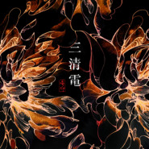<br>三清电](./albums/5022182285.md) | 国语 | 音驰文化 | 2020年12月14日 | EP, 单曲 | 摇滚 Rock & Roll, 电子乐 Electronica |
| [<br>未来的路纪录片《棒！少年》推广曲](./albums/5022141909.md) | 国语 | 奔跑怪物 | 2020年12月11日 | EP, 单曲 | 国语流行 Mandarin Pop |
| [<br>阳光总在风雨后](./albums/5021467495.md) | 国语 | 奔跑怪物 | 2020年09月21日 | EP, 单曲 | 摇滚 Rock & Roll, 电影原声 Film Score, 国语流行 Mandarin Pop |
| [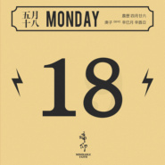<br>米店 (周一呆猫)](./albums/5020618794.md) | 国语 | 音驰文化 | 2020年05月18日 | EP, 单曲 | 国语流行 Mandarin Pop |
| [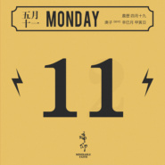<br>纯洁 (周一呆猫)](./albums/5020547448.md) | 国语 | 音驰文化 | 2020年05月11日 | EP, 单曲 | 国语流行 Mandarin Pop |
| [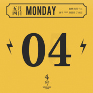<br>猫甜 (周一呆猫)](./albums/2108414017.md) | 国语 | 音驰文化 | 2020年05月04日 | EP, 单曲 | 国语流行 Mandarin Pop |
| [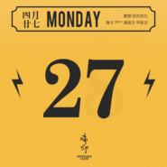<br>霞光 (周一呆猫)](./albums/2108377110.md) | 国语 | 音驰文化 | 2020年04月27日 | EP, 单曲 | 国语流行 Mandarin Pop |
| [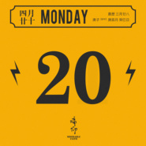<br>自由吧电台 (周一呆猫)](./albums/2108383024.md) | 国语 | 音驰文化 | 2020年04月20日 | EP, 单曲 | 国语流行 Mandarin Pop |
| [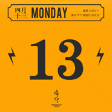<br>我骑着时光 (周一呆猫)](./albums/2108353008.md) | 国语 | 音驰文化 | 2020年04月13日 | EP, 单曲 | 国语流行 Mandarin Pop |
| [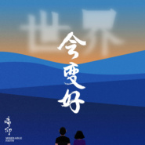<br>世界会变好（居家呆猫）](./albums/2108298020.md) | 国语 | 音驰文化 | 2020年04月03日 | EP, 单曲 | 国语流行 Mandarin Pop |
| [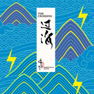<br>过海](./albums/2105584842.md) | 国语 | 独立发行 | 2019年12月16日 | 录音室专辑 | 电子乐 Electronica |
| [<br>弯道人生电影《吹哨人》推广曲](./albums/2105536469.md) | 国语 | 奔跑怪物 | 2019年11月28日 | EP, 单曲 | 电影原声 Film Score, 国语流行 Mandarin Pop |
| [<br>Nightlife](./albums/2105430794.md) | 纯音乐 | 独立发行 | 2019年11月12日 | EP, 单曲 |  |
| [<br>Ethereal](./albums/2105367601.md) | 纯音乐 | 音驰文化 | 2019年10月24日 | EP, 单曲 |  |
| [<br>Highland](./albums/2105367603.md) | 纯音乐 | 音驰文化 | 2019年10月24日 | EP, 单曲 |  |
| [<br>痛仰乐队英国现场](./albums/2103827980.md) | 国语 | 摩登天空 | 2018年07月20日 | 现场专辑 | 独立摇滚 Indie Rock |
| [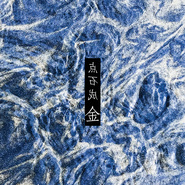<br>点石成金](./albums/2103810669.md) | 国语 | 独立发行 | 2018年07月17日 | EP, 单曲 | 雷鬼 Reggae |
| [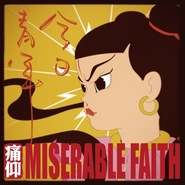<br>今日青年The Youngster](./albums/2102651348.md) | 国语 | 摩登天空 | 2017年01月09日 | 录音室专辑 | 摇滚 Rock & Roll |
| [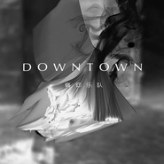<br>Downtown](./albums/2100393201.md) | 国语 | 太合音乐 | 2016年10月10日 | EP, 单曲 |  |
| [<br>午夜芭蕾](./albums/2100391073.md) | 国语 | 华宇世博 | 2016年09月22日 | EP, 单曲 |  |
| [<br>愿爱无忧May Love Be Without Worries](./albums/1706138344.md) | 国语 | 独立发行 | 2014年08月12日 | 录音室专辑 | 独立摇滚 Indie Rock |
| [<br>盛开](./albums/379232.md) | 国语 | 音驰文化 | 2010年05月04日 | EP, 单曲 | 摇滚 Rock & Roll |
| [<br>改变你的生活](./albums/334129.md) | 国语 | 不插店 | 2009年06月19日 | 现场专辑 | 摇滚 Rock & Roll |
| [<br>不要停止我的音乐](./albums/303041.md) | 国语 | 音驰文化 | 2008年09月30日 | 录音室专辑 | 摇滚 Rock & Roll |
| [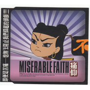<br>不](./albums/308904.md) | 国语 | 独立发行 | 2006年02月18日 | EP, 单曲 | 摇滚 Rock & Roll |
| [<br>这是个问题this is a problem](./albums/15557.md) | 国语 | 京文唱片 | 2000年12月01日 | 录音室专辑 | 摇滚 Rock & Roll |

## 评论

|  |  |  |
| :-- | :-- | :-- |
| <br>[虾米用户](https://emumo.xiami.com/u/12306228)<br>Sing My Soul...<br>2021-01-22 14:45<br>赞(0) 踩(0) | <div>2468</div> |
| <br>[虾米用户](https://emumo.xiami.com/u/10852377)<br>我还没想好要写什么...<br>2020-12-22 21:11<br>赞(0) 踩(0) | <div>感谢痛仰00年那张专，让我从胡时期跟风黑党，进阶为自己带脑子思考，最后选择跟随党。<br>现在大四，已经是一名正式党员了 </div> |
| <br>[虾米用户](https://emumo.xiami.com/u/358104299)<br>悲观的唯心存在现实解构虚...<br>2020-12-16 07:17<br>赞(0) 踩(0) | <div>42166</div> |
| <br>[虾米用户](https://emumo.xiami.com/u/443094630)<br>虾米，再见<br>2020-09-25 01:32<br>赞(0) 踩(0) | <div>哈哈</div> |
| <br>[虾米用户](https://emumo.xiami.com/u/276944698)<br>不要自我设限.....<br>2020-09-21 10:59<br>赞(1) 踩(0) | <div>♐️♐️♐️</div> |
| <br>[虾米用户](https://emumo.xiami.com/u/6629415)<br>=。=<br>2020-08-05 15:35<br>赞(1) 踩(0) | <div>我爱痛仰！！！！！！！！！！！！！！！！！！！！<br>！！</div> |
| <br>[虾米用户](https://emumo.xiami.com/u/379162683)<br>我想要记住你们，我想要你...<br>2020-07-25 08:22<br>赞(1) 踩(0) | <div>✧*｡</div> |
| <br>[虾米用户](https://emumo.xiami.com/u/409565386)<br>Cool bananas<br>2020-06-11 19:05<br>赞(2) 踩(0) | <div>求在成都开演唱会，我车贴都买好了，摇大旗啥的有需要就招呼！</div> |
| ⇒ | <br>[虾米用户](https://emumo.xiami.com/u/282134535)<br><br>2020-07-12 13:42<br>赞(0) 踩(0) | <div>摇起来</div> |
| <br>[虾米用户](https://emumo.xiami.com/u/420650317)<br><br>2020-06-03 13:35<br>赞(1) 踩(0) | <div>只說音樂的。爱 </div> |
| <br>[虾米用户](https://emumo.xiami.com/u/38644191)<br> <br>2020-05-30 17:15<br>赞(1) 踩(0) | <div>很喜欢坚持20年来做的歌曲，而且眼睛还都是有光的。</div> |
| <br>[虾米用户](https://emumo.xiami.com/u/190668796)<br><br>2020-05-27 12:36<br>赞(4) 踩(0) | <div>不会写歌，就别过家家，忍不住说肚子里没有货</div> |
| <br>[虾米用户](https://emumo.xiami.com/u/40651018)<br>唯爱音乐<br>2020-05-18 13:11<br>赞(1) 踩(0) | <div>自从ktv没开过门以后，痛仰的呆猫就高产似那啥了。史无前例！</div> |
| <br>[虾米用户](https://emumo.xiami.com/u/407606842)<br>鱼缸里的彩虹，只有鱼看不...<br>2020-04-04 13:55<br>赞(1) 踩(0) | <div>新歌在哪？</div> |
| <br>[虾米用户](https://emumo.xiami.com/u/10983386)<br>瘦子 朝夕奔梦<br>2020-03-01 00:29<br>赞(1) 踩(0) | <div>就因为宋捷的吉他，能弹出这音色的吉他手，怎么可能像他们说的乐队和弦都不稳，没有音乐素质的情况。幺儿么</div> |
| <br>[虾米用户](https://emumo.xiami.com/u/411520385)<br><br>2020-02-21 11:43<br>赞(1) 踩(0) | <div>痛痒给我的感觉就是反抗，无论是哪吒的死，还是各专辑，都是反抗和斗争。</div> |
| <br>[虾米用户](https://emumo.xiami.com/u/215744642)<br>I've eaten a...<br>2020-02-14 02:38<br>赞(2) 踩(0) | <div>痛仰的歌应该从下往上听。</div> |
| <br>[虾米用户](https://emumo.xiami.com/u/281841125)<br><br>2020-01-26 20:41<br>赞(1) 踩(0) | <div>致敬痛仰乐队   </div> |
| <br>[虾米用户](https://emumo.xiami.com/u/301391720)<br><br>2020-01-26 17:48<br>赞(3) 踩(0) | <div>因为给武汉捐款才了解这个乐队，以后就支持正能量有爱心的艺人！德是第一位</div> |
| <br>[虾米用户](https://emumo.xiami.com/u/43486707)<br>我们脚踏实地为你延续理想<br>2020-01-24 22:39<br>赞(2) 踩(0) | <div></div> |
| <br>[虾米用户](https://emumo.xiami.com/u/2657187)<br><br>2020-01-24 21:58<br>赞(50) 踩(0) | <div>刚看到消息说痛仰给武汉捐款100w 真心给痛仰点赞          </div> |
| ⇒ | <br>[虾米用户](https://emumo.xiami.com/u/380016678)<br>亲爱的，别离开。<br>2020-01-30 12:45<br>赞(0) 踩(0) | <div>牛逼就完了</div> |
| <br>[虾米用户](https://emumo.xiami.com/u/55763781)<br> ๑﹏๑ <br>2020-01-24 20:05<br>赞(4) 踩(0) | <div>痛仰牛逼一方有难八方支援</div> |
| <br>[虾米用户](https://emumo.xiami.com/u/266461620)<br>这家伙很懒，什么都没有留...<br>2020-01-24 19:13<br>赞(3) 踩(0) | <div>一方有难，八方支援，众志成城，感谢痛仰。</div> |
| <br>[虾米用户](https://emumo.xiami.com/u/3961475)<br> <br>2020-01-18 20:59<br>赞(0) 踩(0) | <div>一直往南方开</div> |
| <br>[虾米用户](https://emumo.xiami.com/u/429858388)<br><br>2019-12-11 07:38<br>赞(3) 踩(0) | <div>当口水歌听就行了 摇滚nngb啊 </div> |
| <br>[虾米用户](https://emumo.xiami.com/u/35723736)<br> <br>2019-12-01 20:53<br>赞(0) 踩(0) | <div>啥时候有演唱会？ </div> |
| <br>[虾米用户](https://emumo.xiami.com/u/19811780)<br>我不是摩羯座混蛋<br>2019-11-28 20:49<br>赞(0) 踩(0) | <div>喜欢转型的风格！太赞了</div> |
| <br>[虾米用户](https://emumo.xiami.com/u/297999609)<br>去克洛里吧<br>2019-11-27 14:26<br>赞(1) 踩(0) | <div>如果摇滚乐拒绝改变，那我们就是他的叛徒</div> |
| <br>[虾米用户](https://emumo.xiami.com/u/144132420)<br><br>2019-11-27 01:52<br>赞(0) 踩(0) | <div>******</div> |
| <br>[虾米用户](https://emumo.xiami.com/u/2796166)<br>最爱莫文蔚.....<br>2019-11-13 00:28<br>赞(1) 踩(0) | <div>加油~~~~</div> |
| <br>[虾米用户](https://emumo.xiami.com/u/866525)<br>最好的时光才刚刚开始！≥...<br>2019-10-27 22:28<br>赞(1) 踩(0) | <div>厦门草莓</div> |
| <br>[虾米用户](https://emumo.xiami.com/u/2798384)<br> <br>2019-08-27 14:50<br>赞(1) 踩(0) | <div>朋友都很喜欢这支大理乐队</div> |
| <br>[虾米用户](https://emumo.xiami.com/u/268901088)<br><br>2019-08-26 17:04<br>赞(0) 踩(0) | <div>不痛不痒 </div> |
| <br>[虾米用户](https://emumo.xiami.com/u/347776396)<br>勿施于人<br>2019-08-11 09:47<br>赞(0) 踩(0) | <div>Miserable Faith makes me perfect.</div> |
| <br>[虾米用户](https://emumo.xiami.com/u/192683443)<br><br>2019-08-11 09:01<br>赞(0) 踩(0) | <div>乐队可以参加音乐比赛啊！看看没有没有导师为你们转，请不要在唱公路之歌竞选。</div> |
| ⇒ | <br>[虾米用户](https://emumo.xiami.com/u/409365251)<br><br>2019-10-11 03:57<br>赞(0) 踩(0) | <div>你知道什么是乐队吗</div> |
| <br>[虾米用户](https://emumo.xiami.com/u/192683443)<br><br>2019-08-11 08:58<br>赞(4) 踩(0) | <div>已经是一个没有任何价值的乐队了，二十年了！能让大家朗朗上口的歌不超过三首。说实话就知道   一直往南方开…    感觉是没有什么精神的乐队   这个乐队最成功的做法就是把哪吒做了头像。好作品是真的少，能好好听下去的少之甚少，你们二十年干什么了。</div> |
| ⇒ | <br>[虾米用户](https://emumo.xiami.com/u/99346404)<br>Thanks a lot...<br>2019-08-17 19:49<br>赞(0) 踩(0) | <div>做一支乐队20几年，坚持的精神就是最大的价值，一个伟大的艺术家也不是每个作品都是经典。</div> |
| ⇒ | <br>[虾米用户](https://emumo.xiami.com/u/192683443)<br><br>2019-08-18 08:22<br>赞(0) 踩(0) | <div><q><b>Thanks……说：</b></q></div> |
| <br>[虾米用户](https://emumo.xiami.com/u/2279444)<br>爱在左，同情在右。<br>2019-08-10 13:17<br>赞(0) 踩(0) | <div>据透了，痛仰亚军，新裤子夺魁</div> |
| <br>[虾米用户](https://emumo.xiami.com/u/4340102)<br>我还没想好要写什么...<br>2019-08-10 11:58<br>赞(0) 踩(0) | <div>大IP</div> |
| <br>[虾米用户](https://emumo.xiami.com/u/125174170)<br>我还没想好要写什么...<br>2019-08-07 00:40<br>赞(0) 踩(0) | <div>今日青年嘞？这张专辑怎么没了</div> |
| <br>[虾米用户](https://emumo.xiami.com/u/116808764)<br>你要自己做自己的决定哦<br>2019-08-05 22:48<br>赞(0) 踩(0) | <div>你们是不是火了</div> |
| <br>[虾米用户](https://emumo.xiami.com/u/45359032)<br>我还没想好要写什么...<br>2019-08-04 00:20<br>赞(1) 踩(0) | <div>高虎的声线风格虽然不是我喜欢的 但是痛仰的编曲也太好听了吧…感觉做成类似后摇风格会更爱</div> |
| ⇒ | <br>[虾米用户](https://emumo.xiami.com/u/234547611)<br><br>2019-09-07 13:10<br>赞(0) 踩(0) | <div>编曲好听  高虎的声线也不是我喜欢的</div> |
| <br>[虾米用户](https://emumo.xiami.com/u/334842259)<br><br>2019-07-24 23:41<br>赞(0) 踩(0) | <div>有些人就是酸，转位和弦是啥都不懂，大横按都按不准，就瞎逼逼。先写出传唱度广的音乐再评论别人吧。</div> |
| ⇒ | <br>[虾米用户](https://emumo.xiami.com/u/220414754)<br>浪漫和梦想等于死亡<br>2020-01-24 15:43<br>赞(0) 踩(0) | <div>“乐评家都会写歌”</div> |
| <br>[虾米用户](https://emumo.xiami.com/u/610625)<br>暮雪朝霜，毋改英雄意气<br>2019-07-20 23:21<br>赞(1) 踩(0) | <div>《西湖》的前奏一出……我心中已是Winner!</div> |
| <br>[虾米用户](https://emumo.xiami.com/u/27104910)<br>难逃命运<br>2019-07-20 20:37<br>赞(0) 踩(0) | <div>我也是</div> |
| <br>[虾米用户](https://emumo.xiami.com/u/104620690)<br><br>2019-07-20 16:11<br>赞(0) 踩(0) | <div>可惜虾米没有 我愿意</div> |
| <br>[虾米用户](https://emumo.xiami.com/u/357179614)<br>。<br>2019-07-13 12:56<br>赞(1) 踩(0) | <div>初次见面！</div> |
| <br>[虾米用户](https://emumo.xiami.com/u/2742528)<br> <br>2019-07-10 19:32<br>赞(3) 踩(0) | <div>说实话 我一直很纳闷 这种乐队和薛之谦有什么区别？？？</div> |
| ⇒ | <br>[虾米用户](https://emumo.xiami.com/u/202299559)<br>Just listeni...<br>2019-07-25 00:30<br>赞(0) 踩(0) | <div>和薛之谦这种一味迎合市场口味的还是有区别</div> |
| ⇒ | <br>[虾米用户](https://emumo.xiami.com/u/99346404)<br>Thanks a lot...<br>2019-08-17 19:48<br>赞(0) 踩(0) | <div>就像你和无知的区别</div> |
| ⇒ | <br>[虾米用户](https://emumo.xiami.com/u/2742528)<br> <br>2019-08-25 02:18<br>赞(0) 踩(0) | <div><q><b>Thanks……说：</b></q></div> |
| <br>[虾米用户](https://emumo.xiami.com/u/258051465)<br><br>2019-07-03 16:52<br>赞(0) 踩(0) | <div>看了你们乐队的夏天的表演特别好希望一直这样保持初心</div> |
| <br>[虾米用户](https://emumo.xiami.com/u/42963872)<br>我还没想好要写什么...<br>2019-07-02 04:08<br>赞(0) 踩(0) | <div>.</div> |
| <br>[虾米用户](https://emumo.xiami.com/u/53737210)<br>哼哼哼<br>2019-06-28 00:52<br>赞(1) 踩(0) | <div>越来越装逼了</div> |
| <br>[虾米用户](https://emumo.xiami.com/u/134515924)<br>逆流的河。<br>2019-06-27 19:16<br>赞(1) 踩(0) | <div>《我愿意》果然在QQ那里，虾米你能不能有点出息，把版权抢回来  </div> |
| <br>[虾米用户](https://emumo.xiami.com/u/267377232)<br>死硬派金属党都是神经病。<br>2019-06-19 20:50<br>赞(0) 踩(0) | <div>为什么都说痛仰词不好，我反正很喜欢。反而是醒山的词显得造作。</div> |
| <br>[虾米用户](https://emumo.xiami.com/u/85229340)<br>信息一概不回<br>2019-06-19 16:36<br>赞(1) 踩(0) | <div>觉得英文摇滚没有所谓的“乡土气息”的人，可能只是因为你听不懂人家在唱啥。不能因为你的无知而导致大众审美的局限。</div> |
| <br>[虾米用户](https://emumo.xiami.com/u/26166944)<br>游走在社会边缘的神秘者<br>2019-06-19 04:06<br>赞(1) 踩(0) | <div>这尼玛也算摇滚？</div> |
| ⇒ | <br>[虾米用户](https://emumo.xiami.com/u/50877398)<br>我还没想好要写什么...<br>2019-07-13 03:53<br>赞(0) 踩(0) | <div>这可是中国摇滚之父崔健先生力推的摇滚乐队 怎么能不叫摇滚、你想想崔健何许人也？</div> |
| ⇒ | <br>[虾米用户](https://emumo.xiami.com/u/26805934)<br>对，是的<br>2019-07-24 11:16<br>赞(0) 踩(0) | <div><q><b>桀骜不驯说：</b></q></div> |
| ⇒ | <br>[虾米用户](https://emumo.xiami.com/u/50877398)<br>我还没想好要写什么...<br>2019-07-24 11:18<br>赞(0) 踩(0) | <div><q><b>刀犬犬说：</b></q></div> |
| ⇒ | <br>[虾米用户](https://emumo.xiami.com/u/50877398)<br>我还没想好要写什么...<br>2019-07-24 11:18<br>赞(0) 踩(0) | <div><q><b>刀犬犬说：</b></q></div> |
| ⇒ | <br>[虾米用户](https://emumo.xiami.com/u/26805934)<br>对，是的<br>2019-07-24 11:46<br>赞(0) 踩(0) | <div><q><b>桀骜不驯说：</b></q></div> |
| ⇒ | <br>[虾米用户](https://emumo.xiami.com/u/409365251)<br><br>2019-10-11 03:58<br>赞(0) 踩(0) | <div><q><b>刀犬犬说：</b></q></div> |
| ⇒ | <br>[虾米用户](https://emumo.xiami.com/u/26805934)<br>对，是的<br>2019-10-11 04:07<br>赞(0) 踩(0) | <div><q><b>tb69830345说：</b></q></div> |
| ⇒ | <br>[虾米用户](https://emumo.xiami.com/u/409365251)<br><br>2019-10-13 03:51<br>赞(0) 踩(0) | <div><q><b>刀犬犬说：</b></q></div> |
| ⇒ | <br>[虾米用户](https://emumo.xiami.com/u/26805934)<br>对，是的<br>2019-10-13 09:29<br>赞(0) 踩(0) | <div><q><b>tb69830345说：</b></q></div> |
| ⇒ | <br>[虾米用户](https://emumo.xiami.com/u/26805934)<br>对，是的<br>2019-10-13 09:45<br>赞(0) 踩(0) | <div><q><b>说：</b></q></div> |
| ⇒ | <br>[虾米用户](https://emumo.xiami.com/u/409365251)<br><br>2019-10-13 09:47<br>赞(0) 踩(0) | <div><q><b>刀犬犬说：</b></q></div> |
| <br>[虾米用户](https://emumo.xiami.com/u/425266516)<br><br>2019-06-17 23:30<br>赞(0) 踩(0) | <div>不装了，我是个假粉，摊牌了。</div> |
| <br>[虾米用户](https://emumo.xiami.com/u/64009570)<br>扯..............<br>2019-06-17 19:00<br>赞(1) 踩(0) | <div>即便是苦痛也无法阻止我们仰起的头颅！</div> |
| <br>[虾米用户](https://emumo.xiami.com/u/50823991)<br>我还没想好要写什么...<br>2019-06-16 22:44<br>赞(1) 踩(0) | <div>怎么就被黑了呢</div> |
| <br>[虾米用户](https://emumo.xiami.com/u/214506340)<br>不做万人迷 也不想离开这...<br>2019-06-16 18:28<br>赞(40) 踩(0) | <div>《我愿意》的前奏好听到我直接飙泪，今天也是虎哥的颜粉</div> |
| ⇒ | <br>[虾米用户](https://emumo.xiami.com/u/10572955)<br>我是无聊的人 你也不必有...<br>2020-10-21 20:01<br>赞(0) 踩(0) | <div>喜欢虎哥的颜 你就是我的好姐妹</div> |
| <br>[虾米用户](https://emumo.xiami.com/u/417096340)<br><br>2019-06-14 09:03<br>赞(1) 踩(0) | <div>不管什么乐风，感受在自己内心，即使穿着人字拖听着老鼠爱大米，也不妨碍摇滚才是真的摇滚，就像鲁迅留着板寸也是近代最摇滚的人之一，到处嘶吼的表达注定是最低级的愤怒，而愤怒源自你真正的弱小。</div> |
| <br>[虾米用户](https://emumo.xiami.com/u/31063445)<br><br>2019-06-10 19:17<br>赞(0) 踩(0) | <div>我真的受不了不停重复keywords，所以我每到后半首歌就切了，偏偏还老是要听</div> |
| <br>[虾米用户](https://emumo.xiami.com/u/43031293)<br>嗨皮嗨皮～～<br>2019-06-02 10:02<br>赞(0) 踩(0) | <div>我就想问下，下半年还有巡演吗？</div> |
| <br>[虾米用户](https://emumo.xiami.com/u/2373624)<br>我还没想好要写什么...<br>2019-06-02 00:48<br>赞(2) 踩(0) | <div>之前虾米推了好几遍痛仰。。但都听不下来，看了现场（其实是综艺）发现乐队很有台风，主唱的感觉也很酷，编曲演奏很棒（尤其吉他），但唯一败笔是主唱声音...不够辨识度，音域不宽，可能还有歌词发音问题，演唱和旋律总是搭不上，怎么说就感觉主唱声音很拖后腿.... 整体现场还是挺有感染力的，大概也因为这个适合去音乐节走红吧，但平时不会想听。。（个人看法而已，，）</div> |
| <br>[虾米用户](https://emumo.xiami.com/u/2373624)<br>我还没想好要写什么...<br>2019-06-01 23:59<br>赞(0) 踩(0) | <div>内容已删除</div> |
| ⇒ | <br>[虾米用户](https://emumo.xiami.com/u/11919434)<br>我还没想好要写什么...<br>2019-06-02 00:41<br>赞(0) 踩(0) | <div>你识嗨咩</div> |
| <br>[虾米用户](https://emumo.xiami.com/u/7398337)<br><br>2019-06-01 21:27<br>赞(0) 踩(0) | <div>这才是摇滚！</div> |
| <br>[虾米用户](https://emumo.xiami.com/u/339191478)<br> <br>2019-05-04 23:35<br>赞(0) 踩(0) | <div>;)</div> |
| <br>[虾米用户](https://emumo.xiami.com/u/12239508)<br>二脖子<br>2019-04-18 10:33<br>赞(0) 踩(0) | <div>第一张呢第一张呢！！！</div> |
| <br>[虾米用户](https://emumo.xiami.com/u/401928458)<br><br>2019-04-15 10:38<br>赞(0) 踩(0) | <div>听过第一张专，当时成员年纪不大，做出来东西挺浅薄的。</div> |
| <br>[虾米用户](https://emumo.xiami.com/u/123987172)<br> <br>2019-04-07 20:02<br>赞(0) 踩(0) | <div>歌多了</div> |
| <br>[虾米用户](https://emumo.xiami.com/u/259126840)<br><br>2019-03-27 14:50<br>赞(1) 踩(0) | <div>致敬凯鲁亚克，在路上，达摩流浪者，终于知道这个封面设计了，这不就是高高兴兴的达摩流浪者么？</div> |
| <br>[虾米用户](https://emumo.xiami.com/u/36891442)<br>我还没想好要写什么...<br>2019-03-17 07:38<br>赞(4) 踩(0) | <div>昨天梦到下雪天 在南京 凌晨 滑着滑雪板跟女朋友去看痛仰露天夜半演出 美好的所有都在一个梦里</div> |
| ⇒ | <br>[虾米用户](https://emumo.xiami.com/u/357315912)<br>1<br>2020-03-22 23:42<br>赞(0) 踩(0) | <div>好浪漫的梦</div> |
| <br>[虾米用户](https://emumo.xiami.com/u/154379396)<br>Acting   is ...<br>2019-03-03 08:09<br>赞(0) 踩(0) | <div>喜欢</div> |
| <br>[虾米用户](https://emumo.xiami.com/u/16621594)<br>爱<br>2019-02-28 08:28<br>赞(0) 踩(0) | <div>看了三月份行程都是好地方 真会选啊 看来天津要等到夏天来啦  </div> |
| <br>[虾米用户](https://emumo.xiami.com/u/352867671)<br><br>2019-02-15 11:37<br>赞(2) 踩(0) | <div>风评被害</div> |
| <br>[虾米用户](https://emumo.xiami.com/u/99038090)<br>my future   ...<br>2019-01-30 23:55<br>赞(0) 踩(0) | <div>真好，虽然注定要错过昆明的3月7号。但是我在大理等你们  </div> |
| <br>[虾米用户](https://emumo.xiami.com/u/412737451)<br><br>2019-01-24 22:47<br>赞(1) 踩(0) | <div>一转没有了</div> |
| <br>[虾米用户](https://emumo.xiami.com/u/267072725)<br><br>2019-01-17 10:03<br>赞(5) 踩(0) | <div>只有我觉得难听？？？</div> |
| ⇒ | <br>[虾米用户](https://emumo.xiami.com/u/11058444)<br>我还没想好要写什么...<br>2019-06-09 12:37<br>赞(0) 踩(0) | <div>是的。只有你觉得难听</div> |
| ⇒ | <br>[虾米用户](https://emumo.xiami.com/u/267072725)<br><br>2019-06-11 17:46<br>赞(0) 踩(0) | <div><q><b>Metaphor说：</b></q></div> |
| ⇒ | <br>[虾米用户](https://emumo.xiami.com/u/11058444)<br>我还没想好要写什么...<br>2019-06-25 09:01<br>赞(0) 踩(0) | <div>这年头，吃屎都有大把人点赞</div> |
| ⇒ | <br>[虾米用户](https://emumo.xiami.com/u/50877398)<br>我还没想好要写什么...<br>2019-07-13 03:49<br>赞(0) 踩(0) | <div><q><b>Metaphor说：</b></q></div> |
| <br>[虾米用户](https://emumo.xiami.com/u/49803315)<br>Dalifornia<br>2019-01-04 19:02<br>赞(0) 踩(0) | <div>什么时候有演出</div> |
| <br>[虾米用户](https://emumo.xiami.com/u/404577537)<br><br>2018-11-26 19:57<br>赞(0) 踩(0) | <div>让位让位呢 </div> |
| <br>[虾米用户](https://emumo.xiami.com/u/1371485)<br>Doge face ar...<br>2018-10-30 11:51<br>赞(3) 踩(0) | <div>我是今日青年，我选择爱你，痛仰。</div> |
| <br>[虾米用户](https://emumo.xiami.com/u/13313040)<br>再好的相机也只能记录最美...<br>2018-10-25 07:45<br>赞(1) 踩(0) | <div>少了好多</div> |
| <br>[虾米用户](https://emumo.xiami.com/u/375362129)<br>我就是不一样的烟火，哈哈...<br>2018-10-23 17:13<br>赞(0) 踩(0) | <div>名字</div> |
| <br>[虾米用户](https://emumo.xiami.com/u/252074331)<br> <br>2018-09-30 00:17<br>赞(3) 踩(0) | <div>今日青年那专辑不见了。我喜欢的四相，好梦</div> |
| <br>[虾米用户](https://emumo.xiami.com/u/4183717)<br>你，抬起头，感觉那月光<br>2018-09-28 22:59<br>赞(2) 踩(0) | <div>第一张专辑 直接消失了。。。</div> |
| <br>[虾米用户](https://emumo.xiami.com/u/293369659)<br>我还没想好要写什么...<br>2018-09-19 17:08<br>赞(0) 踩(0) | <div>Su#k</div> |
| <br>[虾米用户](https://emumo.xiami.com/u/139106968)<br>重金属，摇滚，爵士<br>2018-09-06 09:31<br>赞(0) 踩(0) | <div>什么时候来山西</div> |
| <br>[虾米用户](https://emumo.xiami.com/u/3941451)<br>能屈能伸可软可萌只攻不受<br>2018-08-04 11:19<br>赞(2) 踩(0) | <div>不思进取配不上你的热爱<br>反观另外一些团 不断的尝试开拓冒险哪怕犯错 进取 我会喝彩 并一路追随</div> |
| <br>[虾米用户](https://emumo.xiami.com/u/1601145)<br><br>2018-07-31 10:34<br>赞(2) 踩(0) | <div>听说你们是土摇之王</div> |
| <br>[虾米用户](https://emumo.xiami.com/u/362179237)<br>感谢上苍<br>2018-07-25 23:33<br>赞(0) 踩(0) | <div>变形金刚，合体吧</div> |
| <br>[虾米用户](https://emumo.xiami.com/u/2410440)<br>独立自主的选择独立自主！<br>2018-07-25 12:48<br>赞(3) 踩(0) | <div>几个天天幻想无恶不作的苦逼青年忽然假装憨厚朴素来讨生活，惨不忍睹啊，呵呵</div> |
| <br>[虾米用户](https://emumo.xiami.com/u/379559509)<br><br>2018-07-24 13:55<br>赞(0) 踩(0) | <div>可以</div> |
| <br>[虾米用户](https://emumo.xiami.com/u/52056952)<br>人生即是到來、相遇、陪伴...<br>2018-07-22 22:06<br>赞(0) 踩(0) | <div></div> |
| <br>[虾米用户](https://emumo.xiami.com/u/3570849)<br><br>2018-07-13 23:57<br>赞(1) 踩(0) | <div>痛仰NB给力！今晚现场非常开心！谢谢所有小伙伴～ </div> |
| <br>[虾米用户](https://emumo.xiami.com/u/68954378)<br><br>2018-07-12 11:36<br>赞(0) 踩(0) | <div>明晚郑州7，原价出一张预售啊朋友们！！！</div> |
| <br>[虾米用户](https://emumo.xiami.com/u/32824512)<br>阴凉潮湿晦暗 回到无人洞...<br>2018-07-10 00:33<br>赞(0) 踩(0) | <div>&amp;ldquo;点石成金&amp;rdquo;</div> |
| <br>[虾米用户](https://emumo.xiami.com/u/354536806)<br><br>2018-07-01 11:29<br>赞(1) 踩(0) | <div>喜欢痛仰，可能不是我这个80后该做的，但是真心没有能阻挡我对痛仰的热爱</div> |
| <br>[虾米用户](https://emumo.xiami.com/u/375370688)<br>Life is now <br>2018-06-22 21:54<br>赞(2) 踩(0) | <div>这个暑假<br>一路向西</div> |
| <br>[虾米用户](https://emumo.xiami.com/u/336605198)<br><br>2018-06-21 22:14<br>赞(2) 踩(0) | <div>就喜欢让有才华的人，赚个盆满钵满。</div> |
| <br>[虾米用户](https://emumo.xiami.com/u/85303836)<br>人生万万事，找我就没事~...<br>2018-06-20 13:06<br>赞(3) 踩(0) | <div>今日青年没了</div> |
| <br>[虾米用户](https://emumo.xiami.com/u/50389112)<br>暂无签名~<br>2018-06-19 20:20<br>赞(1) 踩(0) | <div>622秦皇岛有音乐节不来嘛 </div> |
| <br>[虾米用户](https://emumo.xiami.com/u/331715688)<br>上一秒化为碎片<br>2018-06-14 00:43<br>赞(4) 踩(0) | <div>不是？今日青年不见了？</div> |
| <br>[虾米用户](https://emumo.xiami.com/u/49959840)<br>无聊人<br>2018-06-08 02:08<br>赞(1) 踩(0) | <div>嘻</div> |
| <br>[虾米用户](https://emumo.xiami.com/u/354536806)<br><br>2018-05-23 14:59<br>赞(3) 踩(0) | <div>以前玩腾讯微博，还和张静互粉，后来忘记密码了 但是一直是痛仰的粉儿&amp;hellip;</div> |
| <br>[虾米用户](https://emumo.xiami.com/u/2300275)<br>我还没想好要写什么...<br>2018-05-21 23:04<br>赞(1) 踩(0) | <div>二十七号，武汉草莓见</div> |
| <br>[虾米用户](https://emumo.xiami.com/u/250384922)<br>输入签名...<br>2018-05-21 13:56<br>赞(1) 踩(0) | <div>5.19 上海红蓝 开小火车 爽的一批</div> |
| <br>[虾米用户](https://emumo.xiami.com/u/104096656)<br><br>2018-05-18 20:53<br>赞(0) 踩(0) | <div>什么时候来云南</div> |
| <br>[虾米用户](https://emumo.xiami.com/u/203259740)<br><br>2018-05-11 23:12<br>赞(1) 踩(0) | <div>今日青年</div> |
| <br>[虾米用户](https://emumo.xiami.com/u/1959541)<br>听音乐很幸福<br>2018-05-10 21:27<br>赞(0) 踩(0) | <div>为啥不来蜀国吃火锅？火锅不好吃么？！</div> |
| <br>[虾米用户](https://emumo.xiami.com/u/3548285)<br>没用过的词<br>2018-05-07 23:39<br>赞(0) 踩(0) | <div>等你们来北京</div> |
| <br>[虾米用户](https://emumo.xiami.com/u/285481031)<br><br>2018-05-05 15:11<br>赞(0) 踩(0) | <div>痛仰牛逼</div> |
| <br>[虾米用户](https://emumo.xiami.com/u/7186218)<br>再也不是我<br>2018-05-05 11:52<br>赞(3) 踩(0) | <div>啥时候来成都？？？？</div> |
| <br>[虾米用户](https://emumo.xiami.com/u/295408661)<br><br>2018-05-05 08:23<br>赞(2) 踩(0) | <div>五四青年节，我还说听一下今日青年。怎么没有了？</div> |
| <br>[虾米用户](https://emumo.xiami.com/u/317495909)<br>让该来的来 我们在这里等...<br>2018-05-01 21:39<br>赞(3) 踩(0) | <div>今日青年呢？</div> |
| <br>[虾米用户](https://emumo.xiami.com/u/20405429)<br> <br>2018-05-01 18:03<br>赞(0) 踩(0) | <div>你知道吗？为了你的牛逼的博卡拉、我去了博卡拉、晒成了黑炭....</div> |
| <br>[虾米用户](https://emumo.xiami.com/u/160428922)<br>江湖再见<br>2018-04-30 14:53<br>赞(4) 踩(0) | <div>虾米把今日青年下架了？</div> |
| <br>[虾米用户](https://emumo.xiami.com/u/1386954)<br>僵尸世界大战<br>2018-04-29 14:54<br>赞(1) 踩(0) | <div>卧槽！才发现这是个问题被河蟹了？？？</div> |
| <br>[虾米用户](https://emumo.xiami.com/u/2924774)<br>暂无签名~<br>2018-04-27 15:05<br>赞(0) 踩(0) | <div>为啥突然有版权的音乐，突然就没有了 </div> |
| <br>[虾米用户](https://emumo.xiami.com/u/20177386)<br>感谢一切美好的遇见❤️<br>2018-04-24 01:29<br>赞(0) 踩(0) | <div></div> |
| <br>[虾米用户](https://emumo.xiami.com/u/43484457)<br>操<br>2018-04-16 16:20<br>赞(1) 踩(0) | <div>现在痛仰粉丝都流行站桩了？哭</div> |
| <br>[虾米用户](https://emumo.xiami.com/u/271145342)<br>我还没想好要写什么...<br>2018-03-13 13:55<br>赞(3) 踩(0) | <div>哪里有压迫，哪里就有反抗！</div> |
| ⇒ | <br>[虾米用户](https://emumo.xiami.com/u/38805970)<br><br>2018-04-03 15:23<br>赞(0) 踩(0) | <div>再见到这句话，恍若隔世，年轻真好，哪里有压迫，哪里就有反抗O(&amp;cap;_&amp;cap;)O</div> |
| ⇒ | <br>[虾米用户](https://emumo.xiami.com/u/271145342)<br>我还没想好要写什么...<br>2018-04-04 15:48<br>赞(0) 踩(0) | <div><q><b>maomaosmelling说：</b></q></div> |
| <br>[虾米用户](https://emumo.xiami.com/u/43492923)<br>行到水穷我才开始害怕，夕...<br>2018-02-12 20:04<br>赞(1) 踩(0) | <div>嗯哼</div> |
| <br>[虾米用户](https://emumo.xiami.com/u/200809645)<br><br>2018-01-25 15:20<br>赞(0) 踩(0) | <div>嗨</div> |
| <br>[虾米用户](https://emumo.xiami.com/u/114968578)<br><br>2018-01-23 23:23<br>赞(1) 踩(0) | <div>第一张呢？？？？？</div> |
| <br>[虾米用户](https://emumo.xiami.com/u/1469748)<br><br>2018-01-08 12:05<br>赞(1) 踩(0) | <div>昨天广州草莓音乐节的过来打卡</div> |
| <br>[虾米用户](https://emumo.xiami.com/u/288637351)<br> <br>2017-12-21 21:51<br>赞(0) 踩(0) | <div>写了我们大理～</div> |
| <br>[虾米用户](https://emumo.xiami.com/u/35739992)<br> <br>2017-12-18 13:20<br>赞(0) 踩(0) | <div>不知道是江郎才尽了还是怎么了，总觉得痛仰回不去巅峰了，但是在音乐节的现场感染力没得说，太棒了</div> |
| <br>[虾米用户](https://emumo.xiami.com/u/19152275)<br>你只是个听众 而不是创造...<br>2017-11-30 21:17<br>赞(12) 踩(0) | <div>怎么有一张专辑不见了 ....慢慢的很多邓江湖时期能看到听到的都听不到了 温水煮青蛙</div> |
| ⇒ | <br>[虾米用户](https://emumo.xiami.com/u/134848328)<br>一起高呼Rock'n r...<br>2018-02-10 00:11<br>赞(0) 踩(0) | <div>少了个孙字</div> |
| <br>[虾米用户](https://emumo.xiami.com/u/2816412)<br>音乐才是我的脉搏。<br>2017-11-10 17:56<br>赞(5) 踩(0) | <div>我一直以来都很喜欢痛仰 说句实话 听录音棚专辑可以 现场真心像杀猪一般</div> |
| ⇒ | <br>[虾米用户](https://emumo.xiami.com/u/10936825)<br>I love music<br>2017-11-26 18:51<br>赞(0) 踩(0) | <div>呵呵</div> |
| <br>[虾米用户](https://emumo.xiami.com/u/681448)<br>你应该是一棵树，或者一条...<br>2017-11-05 23:16<br>赞(1) 踩(0) | <div>拉闸</div> |
| <br>[虾米用户](https://emumo.xiami.com/u/330801626)<br>碗碗的醉<br>2017-11-02 01:09<br>赞(0) 踩(0) | <div>喜欢</div> |
| <br>[虾米用户](https://emumo.xiami.com/u/1101908)<br><br>2017-10-28 00:24<br>赞(0) 踩(0) | <div>在北京的时候就喜欢很久了  总是追现场</div> |
| <br>[虾米用户](https://emumo.xiami.com/u/2263634)<br>动情着走调<br>2017-10-28 00:22<br>赞(1) 踩(0) | <div>他们赤裸裸的从痛苦的信仰变成了愉悦的生活.商业了,不纠结了,不愤怒了,但是痛苦后的平和吸引了我.....</div> |
| ⇒ | <br>[虾米用户](https://emumo.xiami.com/u/3415309)<br><br>2017-10-28 00:10<br>赞(0) 踩(0) | <div>顶个 喜欢和平之后的他们</div> |
| <br>[虾米用户](https://emumo.xiami.com/u/28185706)<br><br>2017-10-28 00:21<br>赞(1) 踩(0) | <div>和别人不同。我是后知后觉型的。先听了痛仰的歌曲然后喜欢上摇滚。然后才仔细听崔健唐朝黑豹一类早期摇滚音乐。中国的摇滚乐手能走到“地上”的比较少。还是处于比较小众的范畴。痛仰的音乐显得更年轻。</div> |
| <br>[虾米用户](https://emumo.xiami.com/u/17864349)<br><br>2017-10-28 00:16<br>赞(2) 踩(0) | <div>听完最早的那张《这是个问题》 我只想说，牛逼....6的不行<br>痛仰和痛苦的信仰，简直是两个乐队！！</div> |
| ⇒ | <br>[虾米用户](https://emumo.xiami.com/u/3037916)<br><br>2017-11-26 13:14<br>赞(0) 踩(0) | <div>现在的就是阉割了的京巴！</div> |
| <br>[虾米用户](https://emumo.xiami.com/u/36169085)<br>. . . <br>2017-10-28 00:00<br>赞(1) 踩(0) | <div>“众兄弟，自开战来，我等执枪，奔赴战场，血战八方，凭一身正气立于天地之间，凭一身傲骨笑看世态炎凉，只为誓守故土多娇!战至今日，得众将士高抬，委以先锋之职，吾得此重恩，诚惶诚恐，无以报效，亦以汝等为荣! 多说无言，只问： 谁愿与吾同往，再杀他个片甲不留。”</div> |
| <br>[虾米用户](https://emumo.xiami.com/u/33578199)<br>我超疯<br>2017-10-27 23:52<br>赞(1) 踩(0) | <div>最近太喜欢痛仰了</div> |
| <br>[虾米用户](https://emumo.xiami.com/u/3713514)<br>明天我会在哪只鞋子里？<br>2017-10-27 23:50<br>赞(1) 踩(0) | <div>听了下第一张，才知道他们为什么要选那首蠢蠢的简陋的开场曲上电视，让人以为他们是几个喊口号的呆子……别的更加过不了审。</div> |
| <br>[虾米用户](https://emumo.xiami.com/u/1730251)<br><br>2017-10-27 23:50<br>赞(0) 踩(0) | <div>我就想知道崔健下期节目会不会说话</div> |
| <br>[虾米用户](https://emumo.xiami.com/u/4372595)<br><br>2017-10-27 23:30<br>赞(0) 踩(0) | <div>从最早的专辑——这是我个问题，那时候我才进入大学，到后来的不要停止我的音乐，风格巨大的转变，公路之歌，到盛开。貌似这只乐队近几年一直来旅行啊。。哈哈！顶，痛苦的信仰</div> |
| <br>[虾米用户](https://emumo.xiami.com/u/6837269)<br><br>2017-10-27 23:25<br>赞(0) 踩(0) | <div>喜欢喜欢喜欢×·~~hoho最近大爱一直没完没了听.淡淡的躁动不羁啊·这么淡定的存在在这喧嚣的世界</div> |
| <br>[虾米用户](https://emumo.xiami.com/u/405779)<br><br>2017-10-27 23:21<br>赞(1) 踩(0) | <div>有多少人喜欢《这是个问题》，喜欢扭机的第一张专辑，虽然制作粗糙，但是那是些真实原始的东西，就像某个历史名人说过，艺术家只有在刚出名的时候的作品是最好的</div> |
| <br>[虾米用户](https://emumo.xiami.com/u/6686862)<br><br>2017-10-27 23:20<br>赞(1) 踩(0) | <div>一只很自由的乐队 他有着众多的歌迷 听了他们的歌我相信你也一定会喜欢的 他们就是 痛仰乐队 推荐的是 公路之歌 西湖 为你唱首歌 安阳 空城 空隙 再见杰克</div> |
| <br>[虾米用户](https://emumo.xiami.com/u/1217671)<br>纯良笔直好少年<br>2017-10-27 23:08<br>赞(1) 踩(0) | <div>吓尿了看到微博热门话题说高虎吸毒被抓 还好点进去发现是另一人_(:з」∠)_</div> |
| <br>[虾米用户](https://emumo.xiami.com/u/24711605)<br>于是转身向大海走去！<br>2017-10-07 22:20<br>赞(2) 踩(0) | <div>专辑被下架，不开心</div> |
| <br>[虾米用户](https://emumo.xiami.com/u/12730895)<br>不要离开！<br>2017-09-24 02:46<br>赞(0) 踩(0) | <div>这是我第一次在痛仰的场子里开火车，天津草莓</div> |
| <br>[虾米用户](https://emumo.xiami.com/u/4869044)<br>朋友们再见啦：），祝你们...<br>2017-09-23 19:48<br>赞(0) 踩(0) | <div>听说歌被删啦</div> |
| <br>[虾米用户](https://emumo.xiami.com/u/214345385)<br>人生至乐：忘我看书听音乐<br>2017-09-22 17:47<br>赞(0) 踩(0) | <div>一个夏日午后，下班回来，逗逗猫儿，煮上绿豆汤，做完俯卧撑，开花洒洗澡。。。一直放这歌儿，无限循环。。。</div> |
| <br>[虾米用户](https://emumo.xiami.com/u/809612)<br><br>2017-09-22 02:28<br>赞(1) 踩(0) | <div>这是个问题没啦，隔壁也没啦</div> |
| <br>[虾米用户](https://emumo.xiami.com/u/7307209)<br><br>2017-09-21 23:44<br>赞(1) 踩(0) | <div>第一张专辑呢</div> |
| <br>[虾米用户](https://emumo.xiami.com/u/194331466)<br>BridgeOverTr...<br>2017-09-20 18:53<br>赞(0) 踩(0) | <div>建议出个踩评论功能了，某些热评实在看不下去了。双标也是玩得贼6</div> |
| <br>[虾米用户](https://emumo.xiami.com/u/43053786)<br><br>2017-09-20 14:38<br>赞(0) 踩(0) | <div>既然那么痛苦，就别信仰了。</div> |
| <br>[虾米用户](https://emumo.xiami.com/u/43053786)<br><br>2017-09-20 14:18<br>赞(0) 踩(0) | <div>原谅我欣赏不了这么装逼的音乐   </div> |
| <br>[虾米用户](https://emumo.xiami.com/u/41693350)<br>Law and Orde...<br>2017-09-19 21:34<br>赞(0) 踩(0) | <div>《这是个问题》被和谐了。呵呵。</div> |
| <br>[虾米用户](https://emumo.xiami.com/u/54987852)<br>我还没想好要写什么...<br>2017-09-19 00:50<br>赞(0) 踩(0) | <div>下了多少</div> |
| <br>[虾米用户](https://emumo.xiami.com/u/48281385)<br>达娃不是喵<br>2017-09-06 18:06<br>赞(0) 踩(0) | <div>跪求签名CD</div> |
| <br>[虾米用户](https://emumo.xiami.com/u/23424682)<br>我还没想好要写什么...<br>2017-09-06 12:00<br>赞(0) 踩(0) | <div>☕️</div> |
| <br>[虾米用户](https://emumo.xiami.com/u/6413176)<br>是谁出的题这么的难，到处...<br>2017-09-04 23:17<br>赞(3) 踩(0) | <div>评论太脑残了，一切事物都准寻世俗伦理道德，那摇滚乐就永远不会诞生</div> |
| <br>[虾米用户](https://emumo.xiami.com/u/760031)<br>反正都是要独自死去<br>2017-08-29 10:59<br>赞(0) 踩(0) | <div>不硬核还玩什么摇滚？</div> |
| <br>[虾米用户](https://emumo.xiami.com/u/33773532)<br>Hypothermia....<br>2017-08-26 12:14<br>赞(0) 踩(0) | <div>被吞了多少歌...</div> |
| <br>[虾米用户](https://emumo.xiami.com/u/8583730)<br>我还没想好要写什么...<br>2017-08-22 03:55<br>赞(1) 踩(0) | <div>听过现场，主唱的小辫子好好漂亮</div> |
| <br>[虾米用户](https://emumo.xiami.com/u/313421425)<br>筚路蓝缕，以启山林<br>2017-08-15 13:16<br>赞(1) 踩(0) | <div>能好好听歌不议论人吗</div> |
| <br>[虾米用户](https://emumo.xiami.com/u/31737208)<br>我想和你虚度世界。<br>2017-07-28 22:55<br>赞(1) 踩(0) | <div>为什么没有第一张专辑 这是个问题</div> |
| <br>[虾米用户](https://emumo.xiami.com/u/314833349)<br><br>2017-07-28 03:52<br>赞(0) 踩(0) | <div>why not</div> |
| <br>[虾米用户](https://emumo.xiami.com/u/9445406)<br>瑞典H.E.A.T.QQ...<br>2017-07-27 12:02<br>赞(1) 踩(0) | <div>8.6太原见</div> |
| <br>[虾米用户](https://emumo.xiami.com/u/11502880)<br>我一个人吃饭旅行到处走。<br>2017-07-14 17:38<br>赞(0) 踩(0) | <div>怎么感觉越来越不痛不痒</div> |
| <br>[虾米用户](https://emumo.xiami.com/u/727575)<br>一个游戏美术设计师疯狂迷...<br>2017-07-13 02:23<br>赞(3) 踩(0) | <div>你们已经妥协了</div> |
| <br>[虾米用户](https://emumo.xiami.com/u/3506625)<br>偏爱类型：Rock N'...<br>2017-07-10 21:38<br>赞(0) 踩(0) | <div>有没有人出百城巡演西宁站演出票？？？</div> |
| <br>[虾米用户](https://emumo.xiami.com/u/3506625)<br>偏爱类型：Rock N'...<br>2017-07-10 21:37<br>赞(0) 踩(0) | <div>最近为了百城巡演之西宁又重温一遍！！！</div> |
| <br>[虾米用户](https://emumo.xiami.com/u/5537677)<br><br>2017-07-05 04:52<br>赞(0) 踩(0) | <div>第一张专辑呢？</div> |
| <br>[虾米用户](https://emumo.xiami.com/u/35758629)<br> <br>2017-06-26 01:35<br>赞(0) 踩(0) | <div>不插电&amp;hellip;&amp;hellip;</div> |
| <br>[虾米用户](https://emumo.xiami.com/u/33550560)<br> hate！<br>2017-06-21 00:37<br>赞(0) 踩(0) | <div>我们9.1广州见</div> |
| <br>[虾米用户](https://emumo.xiami.com/u/8191448)<br>相似度多少你才会开口<br>2017-06-17 23:23<br>赞(0) 踩(0) | <div>.</div> |
| <br>[虾米用户](https://emumo.xiami.com/u/260614946)<br> <br>2017-05-16 22:44<br>赞(0) 踩(0) | <div>痛仰7月1日南京见！</div> |
| ⇒ | <br>[虾米用户](https://emumo.xiami.com/u/49826126)<br>一笔雕凿的朋克青年。<br>2017-05-23 15:30<br>赞(0) 踩(0) | <div>欧拉见 </div> |
| <br>[虾米用户](https://emumo.xiami.com/u/7594778)<br>纯粹是首诗。<br>2017-05-16 22:06<br>赞(1) 踩(0) | <div>不痛不痒</div> |
| <br>[虾米用户](https://emumo.xiami.com/u/6656233)<br>杂食<br>2017-04-30 20:48<br>赞(3) 踩(0) | <div>我刚才看见我前面戴哪吒头巾的小妹妹正拿着手机百度痛仰，再前面三四个小年轻软绵绵的比着兰花指，听完再见杰克，我想着我这个打酱油的该走了。</div> |
| ⇒ | <br>[虾米用户](https://emumo.xiami.com/u/6656233)<br>杂食<br>2017-05-01 09:44<br>赞(0) 踩(0) | <div><q><b>说：</b></q></div> |
| <br>[虾米用户](https://emumo.xiami.com/u/6481887)<br>不困<br>2017-04-27 12:09<br>赞(0) 踩(0) | <div>上海草莓见❤️</div> |
| <br>[虾米用户](https://emumo.xiami.com/u/125555464)<br>一句话介绍<br>2017-04-26 13:51<br>赞(0) 踩(0) | <div>可以说是非常喜欢了</div> |
| <br>[虾米用户](https://emumo.xiami.com/u/2666030)<br> <br>2017-04-24 09:20<br>赞(0) 踩(0) | <div>田然在昏热症也弹过琴啊</div> |
| <br>[虾米用户](https://emumo.xiami.com/u/12360419)<br>此生再不错过……<br>2017-04-23 02:59<br>赞(0) 踩(0) | <div>和你一起看了痛仰现场演出，拉着你的手，我们紧紧相拥，从今日起，这些歌再听起来就是我们爱的回忆。</div> |
| <br>[虾米用户](https://emumo.xiami.com/u/3091770)<br><br>2017-04-18 19:59<br>赞(0) 踩(0) | <div>为什么没有第一张专辑？</div> |
| <br>[虾米用户](https://emumo.xiami.com/u/2888769)<br><br>2017-04-15 23:44<br>赞(0) 踩(0) | <div>你好，（TONG YOUNG）通州青年乐队 </div> |
| <br>[虾米用户](https://emumo.xiami.com/u/265518276)<br>只有音乐才是我的解药<br>2017-04-13 12:08<br>赞(0) 踩(0) | <div>好听</div> |
| <br>[虾米用户](https://emumo.xiami.com/u/10945479)<br>日和<br>2017-04-12 21:23<br>赞(0) 踩(0) | <div>人品down</div> |
| <br>[虾米用户](https://emumo.xiami.com/u/85398278)<br> <br>2017-04-09 18:14<br>赞(1) 踩(0) | <div>我想问的是，痛仰的第一张专辑在哪里。。。</div> |
| <br>[虾米用户](https://emumo.xiami.com/u/5967011)<br>练琴练琴练琴<br>2017-04-02 18:47<br>赞(0) 踩(0) | <div>出一张明晚中山站的票</div> |
| <br>[虾米用户](https://emumo.xiami.com/u/1658342)<br>我还没想好要写什么...<br>2017-04-02 01:53<br>赞(0) 踩(0) | <div></div> |
| <br>[虾米用户](https://emumo.xiami.com/u/47966209)<br>愿能做喜欢的事，爱喜欢的...<br>2017-03-29 16:44<br>赞(0) 踩(0) | <div>4月3中山站，顺德一个人开车有人一起的么</div> |
| ⇒ | <br>[虾米用户](https://emumo.xiami.com/u/80780068)<br>90后 pretty b...<br>2017-03-31 09:50<br>赞(0) 踩(0) | <div>有</div> |
| ⇒ | <br>[虾米用户](https://emumo.xiami.com/u/1658342)<br>我还没想好要写什么...<br>2017-04-02 01:54<br>赞(0) 踩(0) | <div>顺德哪里</div> |
| ⇒ | <br>[虾米用户](https://emumo.xiami.com/u/47966209)<br>愿能做喜欢的事，爱喜欢的...<br>2017-04-03 06:51<br>赞(0) 踩(0) | <div><q><b>陈先生陈先生说：</b></q></div> |
| ⇒ | <br>[虾米用户](https://emumo.xiami.com/u/47966209)<br>愿能做喜欢的事，爱喜欢的...<br>2017-04-03 06:51<br>赞(0) 踩(0) | <div><q><b>齊馬说：</b></q></div> |
| <br>[虾米用户](https://emumo.xiami.com/u/208252707)<br><br>2017-03-25 23:49<br>赞(0) 踩(0) | <div>有些歌又下架了</div> |
| <br>[虾米用户](https://emumo.xiami.com/u/282768252)<br><br>2017-03-25 10:19<br>赞(0) 踩(0) | <div>好听</div> |
| <br>[虾米用户](https://emumo.xiami.com/u/248407146)<br><br>2017-03-10 17:24<br>赞(0) 踩(0) | <div>痛仰是活的。我没说他们都是死的。</div> |
| <br>[虾米用户](https://emumo.xiami.com/u/230287278)<br>行而生活。<br>2017-03-06 12:40<br>赞(0) 踩(0) | <div>哪吒，还是那个哪吒。</div> |
| <br>[虾米用户](https://emumo.xiami.com/u/226953113)<br>林山人<br>2017-03-05 00:17<br>赞(0) 踩(0) | <div>不错，加油中国摇滚乐！加油痛仰！</div> |
| <br>[虾米用户](https://emumo.xiami.com/u/263897249)<br><br>2017-02-26 18:18<br>赞(0) 踩(0) | <div>                                                 66额也要3一回事色花3u二月712        [中国国</div> |
| <br>[虾米用户](https://emumo.xiami.com/u/13056856)<br>没有<br>2017-02-24 16:38<br>赞(0) 踩(0) | <div>每首歌都是那么好听，简直停不下来。</div> |
| <br>[虾米用户](https://emumo.xiami.com/u/2771222)<br>当个疯子好过当台机器。<br>2017-02-23 22:32<br>赞(0) 踩(0) | <div>这是个问题呢？</div> |
| <br>[虾米用户](https://emumo.xiami.com/u/9777779)<br>我梦见 我老了<br>2017-02-23 00:38<br>赞(1) 踩(0) | <div>一直往南方开 一直往南方开</div> |
| <br>[虾米用户](https://emumo.xiami.com/u/176992232)<br> <br>2017-02-18 20:28<br>赞(0) 踩(0) | <div>听不懂啊，大神</div> |
| <br>[虾米用户](https://emumo.xiami.com/u/5168071)<br>Keep walking<br>2017-02-09 20:59<br>赞(0) 踩(0) | <div>我在这</div> |
| <br>[虾米用户](https://emumo.xiami.com/u/54616049)<br> <br>2017-02-07 00:43<br>赞(2) 踩(0) | <div>长沙喜欢痛仰的能交个朋友吗</div> |
| ⇒ | <br>[虾米用户](https://emumo.xiami.com/u/268190113)<br><br>2017-02-25 01:15<br>赞(0) 踩(0) | <div>痛仰，宁乡</div> |
| <br>[虾米用户](https://emumo.xiami.com/u/134848328)<br>一起高呼Rock'n r...<br>2017-01-31 17:07<br>赞(0) 踩(0) | <div>这是个问题去哪了？</div> |
| <br>[虾米用户](https://emumo.xiami.com/u/264283064)<br>bye <br>2017-01-30 21:49<br>赞(0) 踩(0) | <div>△</div> |
| <br>[虾米用户](https://emumo.xiami.com/u/5885288)<br>意淫着有那么一天我能改变...<br>2017-01-24 03:31<br>赞(2) 踩(0) | <div>有人发现00年的专辑没有了吗</div> |
| ⇒ | <br>[虾米用户](https://emumo.xiami.com/u/134848328)<br>一起高呼Rock'n r...<br>2017-03-25 22:33<br>赞(0) 踩(0) | <div>没人</div> |
| <br>[虾米用户](https://emumo.xiami.com/u/1070165)<br>天凉好个秋<br>2017-01-23 20:19<br>赞(0) 踩(0) | <div>摇滚版块永远争吵不休，在这也一样。。。 </div> |
| <br>[虾米用户](https://emumo.xiami.com/u/52833754)<br>西藏，西藏！<br>2017-01-17 21:38<br>赞(0) 踩(0) | <div>痛仰音乐导航！</div> |
| <br>[虾米用户](https://emumo.xiami.com/u/88266612)<br> 晚风吹过..<br>2017-01-14 09:03<br>赞(0) 踩(0) | <div>键盘侠的救赎</div> |
| ⇒ | <br>[虾米用户](https://emumo.xiami.com/u/38471373)<br><br>2017-02-06 17:36<br>赞(0) 踩(0) | <div><q><b>说：</b></q></div> |
| ⇒ | <br>[虾米用户](https://emumo.xiami.com/u/38471373)<br><br>2017-02-07 16:54<br>赞(0) 踩(0) | <div><q><b>说：</b></q></div> |
| ⇒ | <br>[虾米用户](https://emumo.xiami.com/u/38471373)<br><br>2017-02-08 07:46<br>赞(0) 踩(0) | <div><q><b>说：</b></q></div> |
| <br>[虾米用户](https://emumo.xiami.com/u/253350253)<br><br>2017-01-13 14:04<br>赞(3) 踩(0) | <div>没想到虾米的键盘侠也挺多啊</div> |
| <br>[虾米用户](https://emumo.xiami.com/u/260611554)<br><br>2017-01-13 00:47<br>赞(6) 踩(0) | <div>有人说中国摇滚这不行那不行，那是你不懂中国每个乐手所要表达的东西！有人说国外如何如何，那是你也不懂外国人玩摇滚的心境！摇滚氛围文化差异就很大，但是你总得明白国人自有国人做出来的好！有人说吸这吸那，那是你不懂合法化跟去罪化区别的含义！摇滚特么就是很简单很纯粹很真实的东西，就是乐手创作出想要说的一些态度！这些东西我们得自己去听，非得挂嘴上一天扯犊子！把痛仰拿去跟黄家驹比的都有也是人才，摇滚是不是必须得特金属，还是得特硬核，摇滚态度里必须得炸得反抗呐喊争议质问？得了吧！我们特么就是听音乐的，永远别妄自菲薄给任何东西下定论！这特么走在路上，谁知道接下来又会怎样！</div> |
| ⇒ | <br>[虾米用户](https://emumo.xiami.com/u/188099915)<br><br>2017-01-13 17:55<br>赞(0) 踩(0) | <div><q><b>说：</b></q></div> |
| ⇒ | <br>[虾米用户](https://emumo.xiami.com/u/51779818)<br><br>2017-01-13 20:57<br>赞(0) 踩(0) | <div><q><b>说：</b></q></div> |
| ⇒ | <br>[虾米用户](https://emumo.xiami.com/u/260611554)<br><br>2017-01-14 11:20<br>赞(0) 踩(0) | <div><q><b>说：</b></q></div> |
| ⇒ | <br>[虾米用户](https://emumo.xiami.com/u/260611554)<br><br>2017-01-14 14:06<br>赞(0) 踩(0) | <div><q><b>说：</b></q></div> |
| <br>[虾米用户](https://emumo.xiami.com/u/5403739)<br>太阳在我心。<br>2017-01-11 22:07<br>赞(0) 踩(0) | <div>呵呵</div> |
| <br>[虾米用户](https://emumo.xiami.com/u/5592371)<br>哪路或多~~~<br>2017-01-10 14:46<br>赞(0) 踩(0) | <div>痛吗？痛！（大声）那你怎么不往后一仰呢。</div> |
| <br>[虾米用户](https://emumo.xiami.com/u/73857918)<br>在黎明之前<br>2017-01-09 23:02<br>赞(0) 踩(0) | <div>这个艺人简介是我见过的写得最真实又招粉的了</div> |
| <br>[虾米用户](https://emumo.xiami.com/u/260614946)<br> <br>2017-01-09 13:21<br>赞(0) 踩(0) | <div>痛仰的酒什么时候发型？</div> |
| <br>[虾米用户](https://emumo.xiami.com/u/13125189)<br><br>2017-01-09 11:26<br>赞(0) 踩(0) | <div>总之先听听看</div> |
| <br>[虾米用户](https://emumo.xiami.com/u/55115933)<br><br>2017-01-09 10:04<br>赞(3) 踩(0) | <div>说好的十点。</div> |
| <br>[虾米用户](https://emumo.xiami.com/u/260229551)<br>我非求酷力<br>2017-01-09 10:03<br>赞(0) 踩(0) | <div>说好的十点出嘞！！！！</div> |
| <br>[虾米用户](https://emumo.xiami.com/u/83766744)<br><br>2017-01-08 17:31<br>赞(10) 踩(0) | <div>好好吸 垃圾乐队</div> |
| <br>[虾米用户](https://emumo.xiami.com/u/71805640)<br>做一个梦<br>2016-12-28 01:18<br>赞(2) 踩(0) | <div>对痛痒的作品越来越没感觉了，倒回去听窦唯的作品</div> |
| <br>[虾米用户](https://emumo.xiami.com/u/47653360)<br><br>2016-12-27 13:24<br>赞(2) 踩(0) | <div>自己吃就是了，还希望所有人跟你一起吃？我喜欢痛仰的歌，我不喜欢痛仰</div> |
| <br>[虾米用户](https://emumo.xiami.com/u/5691521)<br>孤独是最大的敌人<br>2016-12-24 22:02<br>赞(53) 踩(0) | <div>音乐水平没学好，不良习惯倒是学的挺像……估计挺以为自己是个搞摇滚的。</div> |
| ⇒ | <br>[虾米用户](https://emumo.xiami.com/u/50877398)<br>我还没想好要写什么...<br>2018-06-04 14:45<br>赞(0) 踩(0) | <div>摇滚狗屁现在都快搞成流行了</div> |
| <br>[虾米用户](https://emumo.xiami.com/u/188307002)<br><br>2016-12-21 23:48<br>赞(1) 踩(0) | <div>怎么说呢，痛仰的摇滚作品还行，但就是没那种感觉。</div> |
| <br>[虾米用户](https://emumo.xiami.com/u/87828918)<br>你纵有家财万贯，也买不了...<br>2016-12-20 00:55<br>赞(3) 踩(0) | <div>爱听听，不听滚！</div> |
| <br>[虾米用户](https://emumo.xiami.com/u/8796422)<br>我还没想好要写什么...<br>2016-12-17 03:17<br>赞(4) 踩(0) | <div>哎 从高中开始就挺喜欢你们的歌的 做错事儿了就认错呗 还嘴硬 还“希望看到” 不过我一向分得开 喜欢歌是喜欢歌 不喜欢人是不喜欢人</div> |
| <br>[虾米用户](https://emumo.xiami.com/u/6651312)<br><br>2016-12-14 19:09<br>赞(12) 踩(0) | <div>过来把关注取消了</div> |
| <br>[虾米用户](https://emumo.xiami.com/u/11014492)<br>听歌就是听故事<br>2016-12-13 11:02<br>赞(77) 踩(0) | <div>内容已删除</div> |
| ⇒ | <br>[虾米用户](https://emumo.xiami.com/u/134848328)<br>一起高呼Rock'n r...<br>2017-06-04 23:06<br>赞(0) 踩(0) | <div>怎么这个破点评都上热评了  现在听众有点是非观吗？</div> |
| ⇒ | <br>[虾米用户](https://emumo.xiami.com/u/34479295)<br> <br>2017-06-14 00:16<br>赞(0) 踩(0) | <div>多大仇？</div> |
| ⇒ | <br>[虾米用户](https://emumo.xiami.com/u/74831554)<br>我还没想好要写什么...<br>2017-07-15 15:47<br>赞(0) 踩(0) | <div>同感&amp;hellip;&amp;hellip; 几首歌唱了十年</div> |
| ⇒ | <br>[虾米用户](https://emumo.xiami.com/u/93092514)<br>不求闻达于诸侯<br>2017-12-17 14:41<br>赞(0) 踩(0) | <div>支持吸毒是真的无法原谅，不管他们的音乐有多好!</div> |
| ⇒ | <br>[虾米用户](https://emumo.xiami.com/u/43484457)<br>操<br>2018-04-16 16:19<br>赞(0) 踩(0) | <div>你有病啊</div> |
| ⇒ | <br>[虾米用户](https://emumo.xiami.com/u/41040346)<br><br>2018-10-06 10:35<br>赞(0) 踩(0) | <div>6</div> |
| ⇒ | <br>[虾米用户](https://emumo.xiami.com/u/413345410)<br><br>2019-01-27 07:40<br>赞(0) 踩(0) | <div><q><b>夏天说：</b></q></div> |
| ⇒ | <br>[虾米用户](https://emumo.xiami.com/u/413345410)<br><br>2019-01-27 07:40<br>赞(0) 踩(0) | <div>是演戏的那个，不是这个唱歌的，无脑喷，</div> |
| ⇒ | <br>[虾米用户](https://emumo.xiami.com/u/93092514)<br>不求闻达于诸侯<br>2019-01-27 07:45<br>赞(0) 踩(0) | <div><q><b>渡说：</b></q></div> |
| ⇒ | <br>[虾米用户](https://emumo.xiami.com/u/413345410)<br><br>2019-01-27 07:46<br>赞(0) 踩(0) | <div><q><b>夏天说：</b></q></div> |
| ⇒ | <br>[虾米用户](https://emumo.xiami.com/u/93092514)<br>不求闻达于诸侯<br>2019-01-27 07:51<br>赞(0) 踩(0) | <div><q><b>渡说：</b></q></div> |
| <br>[虾米用户](https://emumo.xiami.com/u/8962828)<br><br>2016-12-13 10:57<br>赞(69) 踩(0) | <div>内容已删除</div> |
| ⇒ | <br>[虾米用户](https://emumo.xiami.com/u/51572936)<br>我还没想好要写什么...<br>2017-06-17 10:36<br>赞(0) 踩(0) | <div><q><b>说：</b></q></div> |
| ⇒ | <br>[虾米用户](https://emumo.xiami.com/u/51572936)<br>我还没想好要写什么...<br>2017-06-17 10:39<br>赞(0) 踩(0) | <div><q><b>说：</b></q></div> |
| ⇒ | <br>[虾米用户](https://emumo.xiami.com/u/34479295)<br> <br>2017-06-18 00:33<br>赞(0) 踩(0) | <div><q><b>bbz说：</b></q></div> |
| ⇒ | <br>[虾米用户](https://emumo.xiami.com/u/34479295)<br> <br>2017-06-18 00:34<br>赞(0) 踩(0) | <div><q><b>bbz说：</b></q></div> |
| ⇒ | <br>[虾米用户](https://emumo.xiami.com/u/10936825)<br>I love music<br>2017-11-26 18:50<br>赞(0) 踩(0) | <div>你看见他们抽了？好厉害啊，你是朝阳群众吧？</div> |
| ⇒ | <br>[虾米用户](https://emumo.xiami.com/u/332925490)<br>沉迷生活<br>2017-12-20 19:41<br>赞(0) 踩(0) | <div><q><b>seven旭说：</b></q></div> |
| ⇒ | <br>[虾米用户](https://emumo.xiami.com/u/28472572)<br><br>2018-02-03 22:17<br>赞(0) 踩(0) | <div>。</div> |
| <br>[虾米用户](https://emumo.xiami.com/u/11007004)<br>歌剧爱好者<br>2016-12-11 15:26<br>赞(0) 踩(0) | <div>田然出事了！</div> |
| <br>[虾米用户](https://emumo.xiami.com/u/11492054)<br> <br>2016-12-10 00:34<br>赞(1) 踩(0) | <div>竟然没有收藏过 </div> |
| <br>[虾米用户](https://emumo.xiami.com/u/212185504)<br>街边孩童嬉闹，抬眼花自笑<br>2016-11-22 15:13<br>赞(1) 踩(0) | <div>来济南吧！我能叫百号人去听！</div> |
| ⇒ | <br>[虾米用户](https://emumo.xiami.com/u/36778808)<br>目标之一<br>2016-11-24 13:26<br>赞(0) 踩(0) | <div>哈哈哈 很可以</div> |
| <br>[虾米用户](https://emumo.xiami.com/u/176258538)<br><br>2016-11-18 17:14<br>赞(1) 踩(0) | <div>路人表示看不懂为何这里这么乱 </div> |
| <br>[虾米用户](https://emumo.xiami.com/u/116362566)<br>银角大王<br>2016-11-09 09:46<br>赞(1) 踩(0) | <div></div> |
| <br>[虾米用户](https://emumo.xiami.com/u/8566739)<br>今晚打边炉啊<br>2016-11-07 00:08<br>赞(0) 踩(0) | <div>·</div> |
| <br>[虾米用户](https://emumo.xiami.com/u/205202370)<br>我还没想好要写什么...<br>2016-11-06 16:04<br>赞(1) 踩(0) | <div>我讨厌摇滚 我热爱摇滚乐</div> |
| <br>[虾米用户](https://emumo.xiami.com/u/103168082)<br> <br>2016-11-04 11:22<br>赞(0) 踩(0) | <div>后天绍兴见！有去的私信我哦杭州出发</div> |
| <br>[虾米用户](https://emumo.xiami.com/u/2343490)<br>我还没想好要写什么...<br>2016-10-20 23:21<br>赞(1) 踩(0) | <div>高虎越来越像个诗人了，词写的越来越好！</div> |
| ⇒ | <br>[虾米用户](https://emumo.xiami.com/u/2343490)<br>我还没想好要写什么...<br>2016-12-30 20:53<br>赞(0) 踩(0) | <div><q><b>说：</b></q></div> |
| <br>[虾米用户](https://emumo.xiami.com/u/14123312)<br>我还没想好要写什么...<br>2016-10-18 01:42<br>赞(1) 踩(0) | <div>你们就不关心吉他手田然去哪了吗</div> |
| <br>[虾米用户](https://emumo.xiami.com/u/13111760)<br>以梦为马，拥抱诗和远方。<br>2016-10-17 13:59<br>赞(0) 踩(0) | <div>看现场印象最深的是主唱一直说的“摇滚的孩子”，看到了摇滚的孩子的样子，大自在，大快活。</div> |
| <br>[虾米用户](https://emumo.xiami.com/u/55055018)<br> <br>2016-10-02 13:33<br>赞(3) 踩(0) | <div>晚上珠海见！</div> |
| <br>[虾米用户](https://emumo.xiami.com/u/92639882)<br><br>2016-09-20 00:41<br>赞(0) 踩(0) | <div>戾气好重……</div> |
| <br>[虾米用户](https://emumo.xiami.com/u/3402153)<br><br>2016-09-18 16:41<br>赞(26) 踩(0) | <div>只听了主页推荐的几首歌和14年的那张专辑。听摇滚二十年左右了，几乎听遍国内外大多数主流乐队，极端的和太古典的不太听。个人之见痛仰是不错得乐队，旋律和乐器演奏不算是最顶级炫技类，但是听得很多旋律没有太多抄袭的痕迹，乐器编曲的更像日本乐队类似luna sea这种，当然是借鉴人家的长处，主唱有点男方人的发音字外加北方民谣的唱腔，算是演绎的比较自然的，没有过分太多被西化的元素。我个人定义好的乐队，旋律的动听，乐器营造氛围。歌词的话其实是可以锦上添花的，但是其实我比较推荐咬文吐字不要太清晰的，毕竟中文的元音和辅音结合不太适合用来唱歌，英文歌曲在这方面是占很大优势的，关键要好听能让人有感觉 有联想甚至 达</div> |
| ⇒ | <br>[虾米用户](https://emumo.xiami.com/u/1812764)<br><br>2019-07-13 11:13<br>赞(0) 踩(0) | <div>新裤子主唱也像有鼻炎</div> |
| <br>[虾米用户](https://emumo.xiami.com/u/40612943)<br>可能吧你喜欢我<br>2016-09-13 09:59<br>赞(2) 踩(0) | <div>进来看评论看一群人撕逼也真是没意思 </div> |
| <br>[虾米用户](https://emumo.xiami.com/u/25855927)<br>生命因为有了音乐而伟大<br>2016-09-02 14:57<br>赞(0) 踩(0) | <div>老牌</div> |
| <br>[虾米用户](https://emumo.xiami.com/u/5778152)<br>一首歌的背后都会有千万个...<br>2016-08-26 01:36<br>赞(1) 踩(0) | <div>记得刚喜欢摇滚的时候前女友告诉我爱摇滚的人都是友爱的一群人</div> |
| ⇒ | <br>[虾米用户](https://emumo.xiami.com/u/3518232)<br>唯有音乐相伴，不再孤独启...<br>2016-08-27 14:26<br>赞(0) 踩(0) | <div>愤世嫉俗的一类一般都有颗纯朴的内心</div> |
| ⇒ | <br>[虾米用户](https://emumo.xiami.com/u/194331466)<br>BridgeOverTr...<br>2016-08-31 20:03<br>赞(0) 踩(0) | <div><q><b>lelevn说：</b></q></div> |
| <br>[虾米用户](https://emumo.xiami.com/u/41495555)<br>悲袭则惘，狂喜而然。<br>2016-08-25 10:56<br>赞(1) 踩(0) | <div>笑看一堆菜鸡互啄</div> |
| <br>[虾米用户](https://emumo.xiami.com/u/53558421)<br>I’m fucking ...<br>2016-08-19 01:55<br>赞(0) 踩(0) | <div>有好吵的嘛…</div> |
| <br>[虾米用户](https://emumo.xiami.com/u/42164095)<br> <br>2016-08-09 13:28<br>赞(0) 踩(0) | <div>住在北方的南方人表示一本满足</div> |
| <br>[虾米用户](https://emumo.xiami.com/u/208907608)<br><br>2016-08-04 18:04<br>赞(1) 踩(0) | <div>喜欢痛仰！掐来掐去有什么好玩的？喜欢beyond就去他们主页，喜欢痛仰就去痛仰主页，何必掐来起去？</div> |
| <br>[虾米用户](https://emumo.xiami.com/u/194331466)<br>BridgeOverTr...<br>2016-08-03 13:19<br>赞(0) 踩(0) | <div>beyond无脑粉又来秀智商下限了，人家Beatles比你不知道高到哪里去了</div> |
| <br>[虾米用户](https://emumo.xiami.com/u/50078294)<br>但问此生何归处，不过二两...<br>2016-07-30 01:14<br>赞(4) 踩(0) | <div>爱上痛仰只是一瞬间的事，只是一句一千万只太阳的光辉，一句万花筒点缀你炫目的瞳孔，以前听刘堃，如今被痛仰的抓的死死的，许多都是当下很难得的良心作品，后味很沉，看了很多评论，我觉得也没有关系，我更不想他们太快就火了像马頔和宋冬野一样，希望痛仰可以一直这么的特别。嗯，这很痛仰。</div> |
| <br>[虾米用户](https://emumo.xiami.com/u/204246695)<br>永远不可以1在乎他人的想...<br>2016-07-23 16:57<br>赞(0) 踩(0) | <div>求关注</div> |
| <br>[虾米用户](https://emumo.xiami.com/u/53541246)<br>，<br>2016-07-17 19:58<br>赞(0) 踩(0) | <div>最近实在太丧了可能今年还没看过痛仰现场的缘故吧</div> |
| <br>[虾米用户](https://emumo.xiami.com/u/48977488)<br> <br>2016-07-11 19:08<br>赞(1) 踩(0) | <div>痛仰歌的调调真棒</div> |
| <br>[虾米用户](https://emumo.xiami.com/u/50017584)<br>我到底有多爱金属<br>2016-07-07 17:41<br>赞(0) 踩(0) | <div>哎呀</div> |
| <br>[虾米用户](https://emumo.xiami.com/u/193840339)<br>我是正经在爱你<br>2016-07-06 16:05<br>赞(0) 踩(0) | <div>真好听</div> |
| <br>[虾米用户](https://emumo.xiami.com/u/54616049)<br> <br>2016-06-27 12:25<br>赞(1) 踩(0) | <div>我还以为能在这里看到很多草莓的朋友呢，结果一个人都没有</div> |
| <br>[虾米用户](https://emumo.xiami.com/u/41553078)<br><br>2016-06-20 23:59<br>赞(0) 踩(0) | <div>感觉要出  新歌 了</div> |
| <br>[虾米用户](https://emumo.xiami.com/u/10263780)<br>life is good<br>2016-06-12 15:48<br>赞(0) 踩(0) | <div>喜欢!入坑啦</div> |
| <br>[虾米用户](https://emumo.xiami.com/u/5687290)<br>願愛無憂<br>2016-05-27 23:02<br>赞(0) 踩(0) | <div>老乡</div> |
| <br>[虾米用户](https://emumo.xiami.com/u/167302484)<br><br>2016-05-22 20:25<br>赞(0) 踩(0) | <div>攒劲</div> |
| <br>[虾米用户](https://emumo.xiami.com/u/5618806)<br><br>2016-05-12 16:56<br>赞(12) 踩(0) | <div>有太多太多的人不懂痛仰了，好忧伤，不懂可以，但是请口下留德，谢谢</div> |
| <br>[虾米用户](https://emumo.xiami.com/u/50204355)<br>微博：诱甜-<br>2016-05-12 14:36<br>赞(0) 踩(0) | <div>嗷呜</div> |
| ⇒ | <br>[虾米用户](https://emumo.xiami.com/u/3518232)<br>唯有音乐相伴，不再孤独启...<br>2016-08-27 14:28<br>赞(0) 踩(0) | <div>嗷嗷嗷</div> |
| <br>[虾米用户](https://emumo.xiami.com/u/36426243)<br><br>2016-05-08 01:17<br>赞(0) 踩(0) | <div>今天优放认识了痛仰，嗨翻全场～太牛逼了</div> |
| <br>[虾米用户](https://emumo.xiami.com/u/99393384)<br><br>2016-05-02 00:43<br>赞(3) 踩(0) | <div>我觉得LOGO可能是哪吒，为了自由而反抗，却全是痛苦的信仰。</div> |
| <br>[虾米用户](https://emumo.xiami.com/u/104263042)<br>后摇<br>2016-04-29 11:28<br>赞(6) 踩(0) | <div>真的很垃圾</div> |
| ⇒ | <br>[虾米用户](https://emumo.xiami.com/u/164956094)<br><br>2016-05-08 21:54<br>赞(0) 踩(0) | <div>嗯哼</div> |
| <br>[虾米用户](https://emumo.xiami.com/u/117519670)<br><br>2016-04-27 20:06<br>赞(1) 踩(0) | <div>喜欢 纹身都纹痛仰的LOGO了 </div> |
| ⇒ | <br>[虾米用户](https://emumo.xiami.com/u/1394088)<br>世间智障合集<br>2016-07-14 12:03<br>赞(0) 踩(0) | <div>浑身是哪吒的感觉如何？</div> |
| <br>[虾米用户](https://emumo.xiami.com/u/7514635)<br><br>2016-04-25 17:17<br>赞(1) 踩(0) | <div>独立</div> |
| <br>[虾米用户](https://emumo.xiami.com/u/41757081)<br> <br>2016-04-17 12:08<br>赞(2) 踩(0) | <div>对对于他们这种停商业歌曲长大的人来说，他们永远不会懂什么才是真正摇滚精神，</div> |
| <br>[虾米用户](https://emumo.xiami.com/u/6045648)<br><br>2016-04-05 14:56<br>赞(6) 踩(0) | <div>唱的啥土鳖东西，也自称摇滚。</div> |
| ⇒ | <br>[虾米用户](https://emumo.xiami.com/u/134848328)<br>一起高呼Rock'n r...<br>2016-04-09 18:35<br>赞(0) 踩(0) | <div>不懂就不要乱说</div> |
| ⇒ | <br>[虾米用户](https://emumo.xiami.com/u/6304572)<br><br>2016-04-15 23:47<br>赞(0) 踩(0) | <div>所以你别听了</div> |
| ⇒ | <br>[虾米用户](https://emumo.xiami.com/u/41757081)<br> <br>2016-04-17 12:01<br>赞(0) 踩(0) | <div><q><b>大洋说：</b></q></div> |
| ⇒ | <br>[虾米用户](https://emumo.xiami.com/u/54406083)<br>春风十里 不及你<br>2016-04-25 21:50<br>赞(0) 踩(0) | <div>00后？你有bb的资格？</div> |
| ⇒ | <br>[虾米用户](https://emumo.xiami.com/u/48059729)<br>X<br>2016-04-29 05:49<br>赞(0) 踩(0) | <div>你还是听你的pop去吧</div> |
| ⇒ | <br>[虾米用户](https://emumo.xiami.com/u/47004349)<br> Free<br>2016-05-07 21:59<br>赞(0) 踩(0) | <div>所以请你滚</div> |
| ⇒ | <br>[虾米用户](https://emumo.xiami.com/u/134848328)<br>一起高呼Rock'n r...<br>2016-06-12 18:29<br>赞(0) 踩(0) | <div><q><b>Mk说：</b></q></div> |
| ⇒ | <br>[虾米用户](https://emumo.xiami.com/u/73656508)<br>--<br>2016-06-13 19:44<br>赞(0) 踩(0) | <div><q><b>Get lucky 说：</b></q></div> |
| ⇒ | <br>[虾米用户](https://emumo.xiami.com/u/43053786)<br><br>2017-09-20 14:22<br>赞(0) 踩(0) | <div>什么是那么的什么，什么是那么的什么，还有那啥那啥，我感觉那啥那啥，啊，就好像那啥那啥。初中语文老师说，这首歌，太那啥啦，哈哈哈哈。</div> |
| <br>[虾米用户](https://emumo.xiami.com/u/103045952)<br>东南西北<br>2016-04-03 01:25<br>赞(0) 踩(0) | <div>beyond和五月天的结合都说我们的歌曲</div> |
| <br>[虾米用户](https://emumo.xiami.com/u/103045952)<br>东南西北<br>2016-04-03 01:24<br>赞(0) 踩(0) | <div>痛仰  有机会我们一起燥一下</div> |
| <br>[虾米用户](https://emumo.xiami.com/u/29926485)<br>做一个懂得分享的鬼。<br>2016-03-27 19:34<br>赞(1) 踩(0) | <div>哪里有压迫！哪里就有反抗！</div> |
| <br>[虾米用户](https://emumo.xiami.com/u/6041455)<br><br>2016-03-16 15:32<br>赞(0) 踩(0) | <div>内容已删除</div> |
| ⇒ | <br>[虾米用户](https://emumo.xiami.com/u/3294164)<br> <br>2016-03-24 15:22<br>赞(0) 踩(0) | <div>节奏明快，过瘾，爽。</div> |
| ⇒ | <br>[虾米用户](https://emumo.xiami.com/u/34925383)<br><br>2016-05-23 14:50<br>赞(0) 踩(0) | <div>就像吃惯了甜的酸的吃一次辣的感觉，可能你很喜欢，也可能你受不了，借用家驹的一句歌词来解答你这句话：&amp;quot;缤纷色彩闪出的美丽,是因它没有分开每种色彩“。</div> |
| <br>[虾米用户](https://emumo.xiami.com/u/14391216)<br>好久不见<br>2016-03-13 18:12<br>赞(1) 踩(0) | <div>刚开始用虾米的时候发现痛仰我不痛不痒，时隔两年再听痛仰对自由有了向往。</div> |
| <br>[虾米用户](https://emumo.xiami.com/u/122141900)<br>用民谣来温暖每一颗孤独的...<br>2016-03-11 11:09<br>赞(0) 踩(0) | <div>痛仰乐队</div> |
| <br>[虾米用户](https://emumo.xiami.com/u/3935914)<br>你以为的，总是你以为<br>2016-03-07 20:51<br>赞(1) 踩(0) | <div>为什么不叫痛痒，痛地彻骨，还有空虚的痒要挠。可以少一点无病呻吟的味道，更糙更躁</div> |
| ⇒ | <br>[虾米用户](https://emumo.xiami.com/u/610892)<br>音乐如女王，故名舔音帝<br>2016-04-25 13:16<br>赞(0) 踩(0) | <div>因为全程是“痛苦的信仰”</div> |
| <br>[虾米用户](https://emumo.xiami.com/u/2279444)<br>爱在左，同情在右。<br>2016-03-02 17:36<br>赞(0) 踩(0) | <div>痛仰的词太丰富了，变化多端，让人捉摸不透...</div> |
| <br>[虾米用户](https://emumo.xiami.com/u/102585304)<br> <br>2016-02-16 20:37<br>赞(2) 踩(0) | <div>推荐 两个人的假期 好听疯了</div> |
| ⇒ | <br>[虾米用户](https://emumo.xiami.com/u/34961336)<br><br>2016-02-24 13:17<br>赞(0) 踩(0) | <div>并没好听疯</div> |
| <br>[虾米用户](https://emumo.xiami.com/u/9227242)<br>阳红进艺名阳五郎<br>2016-02-15 12:10<br>赞(0) 踩(0) | <div>喜欢</div> |
| <br>[虾米用户](https://emumo.xiami.com/u/9989080)<br><br>2016-02-03 22:34<br>赞(0) 踩(0) | <div>摇滚 独特</div> |
| <br>[虾米用户](https://emumo.xiami.com/u/6116439)<br><br>2016-02-01 20:19<br>赞(0) 踩(0) | <div></div> |
| <br>[虾米用户](https://emumo.xiami.com/u/27482631)<br>只要做你生命的鼓手就好<br>2016-02-01 10:20<br>赞(0) 踩(0) | <div>以前知道有个牛逼的 痛苦的信仰 当时年级轻轻听不懂 听不懂 公路之歌 的一直往南方开 听不出 西湖的留念 然而现在我懂了 于是我爱上了你</div> |
| <br>[虾米用户](https://emumo.xiami.com/u/49719929)<br>*******，****...<br>2016-01-26 00:55<br>赞(1) 踩(0) | <div>虽然不是新疆人，不过每次听思疆调都有种揪心得想哭的感觉</div> |
| <br>[虾米用户](https://emumo.xiami.com/u/54349625)<br><br>2016-01-19 19:37<br>赞(0) 踩(0) | <div>..</div> |
| <br>[虾米用户](https://emumo.xiami.com/u/12730895)<br>不要离开！<br>2016-01-12 22:41<br>赞(8) 踩(0) | <div>我们这里的一个演出上，一个乐队唱了为你唱首歌，是当天晚上第一支乐队，都是中学生，连唱了两首都没人嗨，只有我站在第一排，和主唱一起大声唱，结果他注意到我了，就转过来走向我，把麦拿过来让我唱了句，这感觉真好。而且通过这次我真的感觉到我们这个地方的人好low 啊，连痛仰的歌都没听过。。。</div> |
| ⇒ | <br>[虾米用户](https://emumo.xiami.com/u/43523623)<br>黏黏的舌头  发出金色的...<br>2016-01-15 21:35<br>赞(0) 踩(0) | <div>哪里的?</div> |
| ⇒ | <br>[虾米用户](https://emumo.xiami.com/u/12730895)<br>不要离开！<br>2016-01-16 17:52<br>赞(0) 踩(0) | <div><q><b>凉说：</b></q></div> |
| <br>[虾米用户](https://emumo.xiami.com/u/81027294)<br><br>2016-01-12 15:09<br>赞(0) 踩(0) | <div>这首歌听得我眼泪流不停<a href="http://www.xiami.com/play?ids=/song/playlist/id/1775408290/object_name/default/object_id/0#loaded" target="_blank" rel="nofollow noreferrer noopener">http://www.xiami.com/play?ids=/song/playlist/id/1775408290/object_name/default/object_id/0#loaded</a></div> |
| <br>[虾米用户](https://emumo.xiami.com/u/45143124)<br> <br>2016-01-09 03:33<br>赞(12) 踩(0) | <div>一个人会因为所经历的所看见的而做出改变 可能是因为年纪大了 可能是因为身边的人和事 还可能是昨晚操的姑娘是个处女 如果你一定要拿十几年前的痛仰来评价他们这几年的音乐 这不是给自己找膈应吗 我到觉得这几年的歌挺好的。以前逆风尿一丈 现在顺风滴鞋上 现在去音乐节你还会像十年前那么躁吗 日姑娘不靠伟哥就不错了 我就不信你手机里全是硬核。我不懂音乐也不懂摇滚 只是自己的一点看法 别喷我 我不经骂</div> |
| <br>[虾米用户](https://emumo.xiami.com/u/52591430)<br><br>2016-01-08 23:36<br>赞(0) 踩(0) | <div>不错哦！音乐喜欢就听！</div> |
| <br>[虾米用户](https://emumo.xiami.com/u/5419635)<br>他之所以会飞，是因为他把...<br>2016-01-08 16:27<br>赞(1) 踩(0) | <div>讨厌就是讨厌 要个毛理由 噢我说的是现在的痛仰 不是以前那个</div> |
| <br>[虾米用户](https://emumo.xiami.com/u/8548568)<br>暂无签名~<br>2016-01-04 16:47<br>赞(0) 踩(0) | <div>LIVEshow 让我更加觉得这个是实力派原创乐队</div> |
| <br>[虾米用户](https://emumo.xiami.com/u/36203222)<br>生活里没有音乐<br>2016-01-03 12:56<br>赞(0) 踩(0) | <div>不</div> |
| <br>[虾米用户](https://emumo.xiami.com/u/29926485)<br>做一个懂得分享的鬼。<br>2016-01-03 00:19<br>赞(0) 踩(0) | <div>“哪里有压迫，哪里就有反抗”<br><br>喊！！！</div> |
| <br>[虾米用户](https://emumo.xiami.com/u/42890598)<br>那麼…痛苦能自救嗎<br>2016-01-02 05:02<br>赞(1) 踩(0) | <div>这是我最爱的一支乐队</div> |
| <br>[虾米用户](https://emumo.xiami.com/u/46854854)<br><br>2016-01-01 15:18<br>赞(0) 踩(0) | <div>从李志到痛仰/哪都有人撕/哈哈</div> |
| <br>[虾米用户](https://emumo.xiami.com/u/46854854)<br><br>2016-01-01 15:18<br>赞(2) 踩(0) | <div>从李志到痛仰/哪都有人撕/哈哈</div> |
| <br>[虾米用户](https://emumo.xiami.com/u/37880504)<br>Tell me how ...<br>2016-01-01 11:52<br>赞(0) 踩(0) | <div>今晚见</div> |
| <br>[虾米用户](https://emumo.xiami.com/u/73738100)<br>一坨不需要发光的翔<br>2016-01-01 02:26<br>赞(0) 踩(0) | <div>虎哥加油痛仰加油国摇加油</div> |
| <br>[虾米用户](https://emumo.xiami.com/u/73738100)<br>一坨不需要发光的翔<br>2016-01-01 02:25<br>赞(0) 踩(0) | <div>不要在乎负面的声音</div> |
| <br>[虾米用户](https://emumo.xiami.com/u/4244381)<br><br>2015-12-29 14:17<br>赞(1) 踩(0) | <div>现在的痛仰真的他妈是“痛仰”了</div> |
| <br>[虾米用户](https://emumo.xiami.com/u/13060161)<br>Only the end...<br>2015-12-28 12:45<br>赞(0) 踩(0) | <div>总感觉中国之星选错歌了</div> |
| <br>[虾米用户](https://emumo.xiami.com/u/26922867)<br><br>2015-12-27 22:36<br>赞(0) 踩(0) | <div>什么中国之星节目,唱口水歌的歌手一直留在台上,痛仰<br>上去就被淘汰了,真是上电视只适合唱口水歌,独立音乐还是不适合上节目呀！</div> |
| ⇒ | <br>[虾米用户](https://emumo.xiami.com/u/517411)<br><br>2015-12-28 07:02<br>赞(0) 踩(0) | <div>我觉得从演唱和编曲上来讲都是因为技不如人才被淘汰的。至于创作，美丽新世界这歌的写作就是一个简单地和声小调，无论节奏，曲式，作词，作曲都是习作水平，毫无新意，更无艺术性，被淘汰纯属正常。通过这档节目，我发现这些地下乐队真是要提溜出来跟商业音乐练练，是不一定练得过的，至少痛仰，练不过。</div> |
| ⇒ | <br>[虾米用户](https://emumo.xiami.com/u/5611598)<br>☞☜<br>2015-12-28 11:08<br>赞(0) 踩(0) | <div><q><b>abniki说：</b></q></div> |
| ⇒ | <br>[虾米用户](https://emumo.xiami.com/u/39032994)<br>听自己喜欢的音乐<br>2015-12-29 10:43<br>赞(0) 踩(0) | <div><q><b>abniki说：</b></q></div> |
| ⇒ | <br>[虾米用户](https://emumo.xiami.com/u/50412489)<br> <br>2015-12-29 16:41<br>赞(0) 踩(0) | <div><q><b>abniki说：</b></q></div> |
| ⇒ | <br>[虾米用户](https://emumo.xiami.com/u/43354859)<br>暂无签名~<br>2016-01-25 15:05<br>赞(0) 踩(0) | <div>痛仰应该先唱公路之歌抢个位子先的哎 </div> |
| <br>[虾米用户](https://emumo.xiami.com/u/68257134)<br><br>2015-12-27 01:34<br>赞(4) 踩(0) | <div>讲道理的话，我从前很怕流行，但是现在我再从头听一遍痛仰，感觉早期的痛苦的信仰很愤怒，但是是为了愤怒而愤怒，他们不知道自己的目标是什么，他们只是裹挟在洪流中怒吼，生活不是一棵树，也不是一块石头，而是土壤，洪流可以摧毁树木打碎石头，但是对土壤却无可奈何。我很庆幸他们发现了生活的本质，开始融入生活，这样的痛仰会开始肥沃，开始长出美丽的花</div> |
| <br>[虾米用户](https://emumo.xiami.com/u/48084758)<br>写歌的人格分裂   公众...<br>2015-12-26 19:31<br>赞(0) 踩(0) | <div>流摇？</div> |
| <br>[虾米用户](https://emumo.xiami.com/u/600368)<br>群众的眼睛是雪亮的=喷子<br>2015-12-24 23:16<br>赞(1) 踩(0) | <div>要是痛仰能一直研究硬核说唱会不会更好？</div> |
| ⇒ | <br>[虾米用户](https://emumo.xiami.com/u/27684693)<br><br>2015-12-26 11:51<br>赞(0) 踩(0) | <div>******</div> |
| ⇒ | <br>[虾米用户](https://emumo.xiami.com/u/10686071)<br>crazy diamon...<br>2015-12-28 00:14<br>赞(0) 踩(0) | <div>不！</div> |
| <br>[虾米用户](https://emumo.xiami.com/u/589764)<br>The 1st cut ...<br>2015-12-22 21:16<br>赞(2) 踩(0) | <div>痛仰也早不是最初的痛仰</div> |
| <br>[虾米用户](https://emumo.xiami.com/u/81425400)<br>farewell<br>2015-12-22 14:07<br>赞(0) 踩(0) | <div>评论笑cry </div> |
| <br>[虾米用户](https://emumo.xiami.com/u/27684693)<br><br>2015-12-22 12:16<br>赞(0) 踩(0) | <div>******</div> |
| <br>[虾米用户](https://emumo.xiami.com/u/8432255)<br>老马一生粉，法号大表哥<br>2015-12-21 23:53<br>赞(0) 踩(0) | <div>这个时候一定要把气氛燥起来要我说的那么直白吗，我身边也有朋友是痛仰粉，不像你这样的痛仰粉，所以这么说你应该懂我说的你粉我就黑的意思吧</div> |
| ⇒ | <br>[虾米用户](https://emumo.xiami.com/u/8432255)<br>老马一生粉，法号大表哥<br>2015-12-22 00:07<br>赞(0) 踩(0) | <div><q><b>说：</b></q></div> |
| <br>[虾米用户](https://emumo.xiami.com/u/42477579)<br><br>2015-12-21 14:40<br>赞(0) 踩(0) | <div>虽然你们是排比句之王，不过还是喜欢你们</div> |
| <br>[虾米用户](https://emumo.xiami.com/u/7809994)<br>云<br>2015-12-21 11:05<br>赞(3) 踩(0) | <div>拿瘤压迫 拿瘤反抗 呵呵~~~我觉得很垃圾啊</div> |
| <br>[虾米用户](https://emumo.xiami.com/u/5007699)<br>我所有的美好回忆<br>2015-12-21 10:28<br>赞(6) 踩(0) | <div>剪掉了才时真正把痛仰捧红的原因。很典型的娱乐操作手段。不然为什么不去全剪了？ 你们也太小瞧了灿星节目组的心机了吧</div> |
| <br>[虾米用户](https://emumo.xiami.com/u/2640323)<br> <br>2015-12-21 09:25<br>赞(3) 踩(0) | <div>真是越来越受不了国人自称所谓的摇滚了 老祖宗的东西不多学学整天在这里这摇那滚的 痛仰不是神 请别戴高帽子！！！！他们就是为了钱 现在做音乐几个不为钱？这个社会不需要那些乱七八糟所谓的声音 管好自己就行了 别觉得几首歌就可以干嘛 接下来等着他们的歌烂大街吧 本来就不是多大的事 真是好笑 现在一点也不期待他们了 迷笛年年都有他们真是看都看烦了 听都听腻了 我可不想2016年整天活在 再见杰克 的日子里了</div> |
| <br>[虾米用户](https://emumo.xiami.com/u/2640323)<br> <br>2015-12-20 23:32<br>赞(1) 踩(0) | <div>致痛仰: you're gonna regret it.</div> |
| <br>[虾米用户](https://emumo.xiami.com/u/48437166)<br><br>2015-12-20 21:48<br>赞(1) 踩(0) | <div>其实习惯就好，全剪了也无所谓，该听到的人还是会听到，我是觉得现在的独立市场真的好多了，什么都要往好的方面看，独立市场越来越好喜欢的人才能走更多的食粮，何必浪费精力在这儿互喷呢，有时间多去弄点儿碟听听，多好[带墨镜笑]</div> |
| ⇒ | <br>[虾米用户](https://emumo.xiami.com/u/5594983)<br>何须执着春风十里<br>2015-12-29 23:24<br>赞(0) 踩(0) | <div>说的很中肯</div> |
| <br>[虾米用户](https://emumo.xiami.com/u/2279444)<br>爱在左，同情在右。<br>2015-12-20 21:38<br>赞(0) 踩(0) | <div>你知道，美中不足的是，难得一次机会上电四，应该邀上云蓬大哥Remix一首《中国孩子》的。</div> |
| <br>[虾米用户](https://emumo.xiami.com/u/857047)<br><br>2015-12-20 20:45<br>赞(0) 踩(0) | <div>到底唱了什么歌，没有人能剥夺大众热爱音乐，听歌和个人选择的自由</div> |
| <br>[虾米用户](https://emumo.xiami.com/u/1372817)<br>有音乐就没有世界、<br>2015-12-20 20:39<br>赞(0) 踩(0) | <div>在中国之星那段为撒被掐掉！</div> |
| <br>[虾米用户](https://emumo.xiami.com/u/12636942)<br><br>2015-12-20 20:22<br>赞(2) 踩(0) | <div>反抗是要死人的，你们敢死吗。我们的热血都凉了。现在的假愤愤就是在这个圈里搞钱玩女人。</div> |
| <br>[虾米用户](https://emumo.xiami.com/u/47317852)<br><br>2015-12-20 17:38<br>赞(0) 踩(0) | <div>至少有我们支持你，痛仰！</div> |
| <br>[虾米用户](https://emumo.xiami.com/u/8432255)<br>老马一生粉，法号大表哥<br>2015-12-20 16:13<br>赞(6) 踩(0) | <div>大概了解了下，痛仰自己作死，完毕。<br>顺便说一句，电视节目，just a show，滚青脑残粉别太高潮。</div> |
| ⇒ | <br>[虾米用户](https://emumo.xiami.com/u/8432255)<br>老马一生粉，法号大表哥<br>2015-12-20 17:53<br>赞(0) 踩(0) | <div><q><b>说：</b></q></div> |
| ⇒ | <br>[虾米用户](https://emumo.xiami.com/u/8432255)<br>老马一生粉，法号大表哥<br>2015-12-20 23:05<br>赞(0) 踩(0) | <div><q><b>说：</b></q></div> |
| ⇒ | <br>[虾米用户](https://emumo.xiami.com/u/2640323)<br> <br>2015-12-20 23:22<br>赞(0) 踩(0) | <div><q><b>说：</b></q></div> |
| ⇒ | <br>[虾米用户](https://emumo.xiami.com/u/2640323)<br> <br>2015-12-20 23:26<br>赞(0) 踩(0) | <div>i think so</div> |
| ⇒ | <br>[虾米用户](https://emumo.xiami.com/u/2640323)<br> <br>2015-12-20 23:52<br>赞(0) 踩(0) | <div><q><b>说：</b></q></div> |
| ⇒ | <br>[虾米用户](https://emumo.xiami.com/u/2640323)<br> <br>2015-12-20 23:54<br>赞(0) 踩(0) | <div><q><b>说：</b></q></div> |
| ⇒ | <br>[虾米用户](https://emumo.xiami.com/u/2640323)<br> <br>2015-12-20 23:55<br>赞(0) 踩(0) | <div><q><b>说：</b></q></div> |
| ⇒ | <br>[虾米用户](https://emumo.xiami.com/u/8432255)<br>老马一生粉，法号大表哥<br>2015-12-20 23:58<br>赞(0) 踩(0) | <div><q><b>BAKA说：</b></q></div> |
| ⇒ | <br>[虾米用户](https://emumo.xiami.com/u/2640323)<br> <br>2015-12-21 00:00<br>赞(0) 踩(0) | <div><q><b>摇摆的大表哥说：</b></q></div> |
| ⇒ | <br>[虾米用户](https://emumo.xiami.com/u/8432255)<br>老马一生粉，法号大表哥<br>2015-12-21 00:01<br>赞(0) 踩(0) | <div><q><b>BAKA说：</b></q></div> |
| ⇒ | <br>[虾米用户](https://emumo.xiami.com/u/2640323)<br> <br>2015-12-21 00:01<br>赞(0) 踩(0) | <div><q><b>摇摆的大表哥说：</b></q></div> |
| ⇒ | <br>[虾米用户](https://emumo.xiami.com/u/2640323)<br> <br>2015-12-21 00:02<br>赞(0) 踩(0) | <div><q><b>摇摆的大表哥说：</b></q></div> |
| ⇒ | <br>[虾米用户](https://emumo.xiami.com/u/8432255)<br>老马一生粉，法号大表哥<br>2015-12-21 00:02<br>赞(0) 踩(0) | <div><q><b>BAKA说：</b></q></div> |
| ⇒ | <br>[虾米用户](https://emumo.xiami.com/u/2640323)<br> <br>2015-12-21 00:04<br>赞(0) 踩(0) | <div><q><b>摇摆的大表哥说：</b></q></div> |
| ⇒ | <br>[虾米用户](https://emumo.xiami.com/u/8432255)<br>老马一生粉，法号大表哥<br>2015-12-21 00:04<br>赞(0) 踩(0) | <div><q><b>BAKA说：</b></q></div> |
| ⇒ | <br>[虾米用户](https://emumo.xiami.com/u/8432255)<br>老马一生粉，法号大表哥<br>2015-12-21 21:27<br>赞(0) 踩(0) | <div><q><b>说：</b></q></div> |
| ⇒ | <br>[虾米用户](https://emumo.xiami.com/u/8432255)<br>老马一生粉，法号大表哥<br>2015-12-21 21:55<br>赞(0) 踩(0) | <div><q><b>说：</b></q></div> |
| ⇒ | <br>[虾米用户](https://emumo.xiami.com/u/13048549)<br>回应大地的召唤<br>2015-12-22 00:11<br>赞(0) 踩(0) | <div><q><b>说：</b></q></div> |
| ⇒ | <br>[虾米用户](https://emumo.xiami.com/u/8432255)<br>老马一生粉，法号大表哥<br>2015-12-22 00:24<br>赞(0) 踩(0) | <div><q><b>梦人2250说：</b></q></div> |
| ⇒ | <br>[虾米用户](https://emumo.xiami.com/u/13048549)<br>回应大地的召唤<br>2015-12-22 00:28<br>赞(0) 踩(0) | <div><q><b>摇摆的大表哥说：</b></q></div> |
| ⇒ | <br>[虾米用户](https://emumo.xiami.com/u/8432255)<br>老马一生粉，法号大表哥<br>2017-10-27 23:50<br>赞(0) 踩(0) | <div><q><b>说：</b></q></div> |
| ⇒ | <br>[虾米用户](https://emumo.xiami.com/u/8432255)<br>老马一生粉，法号大表哥<br>2017-10-27 23:50<br>赞(0) 踩(0) | <div><q><b>说：</b></q></div> |
| <br>[虾米用户](https://emumo.xiami.com/u/39630806)<br><br>2015-12-20 15:35<br>赞(0) 踩(0) | <div>想看看评论里的 愤怒青年 都说了啥 </div> |
| <br>[虾米用户](https://emumo.xiami.com/u/10375782)<br>科学养猪  水稻杂交<br>2015-12-20 15:22<br>赞(0) 踩(0) | <div>操！！！！！！！！！！！！！！！待到秋来九月八，满城尽带黄金甲。</div> |
| <br>[虾米用户](https://emumo.xiami.com/u/1293322)<br> <br>2015-12-20 14:44<br>赞(0) 踩(0) | <div>这是个问题中有句词是你的热血哪去了，选这歌也是态度了.</div> |
| <br>[虾米用户](https://emumo.xiami.com/u/1568042)<br>不信抬头看，苍天绕过谁<br>2015-12-20 13:18<br>赞(0) 踩(0) | <div>我是不是应该说R.I.P 痛苦的信仰</div> |
| <br>[虾米用户](https://emumo.xiami.com/u/1984153)<br>Love never f...<br>2015-12-20 10:43<br>赞(2) 踩(0) | <div>期待了挺久，竟然就给番茄全剪了。<br>估计广电一听歌名就吓趴下了了吧</div> |
| <br>[虾米用户](https://emumo.xiami.com/u/47586473)<br>啊<br>2015-12-20 08:14<br>赞(0) 踩(0) | <div>愤青们适可而止   </div> |
| <br>[虾米用户](https://emumo.xiami.com/u/56112211)<br>认识的加吧<br>2015-12-20 01:37<br>赞(0) 踩(0) | <div>我喜欢痛仰很多年了！就是喜欢独立乐队的洒脱</div> |
| <br>[虾米用户](https://emumo.xiami.com/u/2279444)<br>爱在左，同情在右。<br>2015-12-20 01:11<br>赞(2) 踩(0) | <div>作为一个独立乐迷，即使不是痛仰的乐迷也看不下去了，什么吊节目，愚昧大众，蒙蔽国人双眼，部分中国人就这样病下去吧，早死早好，什么样的人做什么样的事，上天会看在眼里的。燥起来，痛仰！都滚他妈犊子去！</div> |
| <br>[虾米用户](https://emumo.xiami.com/u/49981040)<br><br>2015-12-20 01:07<br>赞(0) 踩(0) | <div>嘿嘿</div> |
| <br>[虾米用户](https://emumo.xiami.com/u/11909181)<br>怎么听音乐？<br>2015-12-20 00:45<br>赞(1) 踩(0) | <div>和朋友喝完酒，回家路上看见朋友圈说痛仰参加中国之星，回家打开电脑看，结果被删减，然后拿出10年痛仰来西安的巡演票，拍照发朋友圈，真想骂人！</div> |
| ⇒ | <br>[虾米用户](https://emumo.xiami.com/u/13048549)<br>回应大地的召唤<br>2015-12-20 08:09<br>赞(0) 踩(0) | <div>骂骂骂！！！</div> |
| <br>[虾米用户](https://emumo.xiami.com/u/76999716)<br><br>2015-12-19 22:44<br>赞(2) 踩(0) | <div>城里人听什么摇滚啊？</div> |
| <br>[虾米用户](https://emumo.xiami.com/u/3876222)<br>这就是生活<br>2015-12-19 22:13<br>赞(0) 踩(0) | <div>还是没让漏一把脸啊</div> |
| ⇒ | <br>[虾米用户](https://emumo.xiami.com/u/312179)<br>潜入深蓝，放肆幻听<br>2015-12-19 22:14<br>赞(0) 踩(0) | <div>是啊。期待好久了。</div> |
| ⇒ | <br>[虾米用户](https://emumo.xiami.com/u/49099400)<br>青春都喂了狗<br>2015-12-19 22:46<br>赞(0) 踩(0) | <div>歌选的确实过 主要还是怨节目组事先没和乐队没和广电沟通好</div> |
| <br>[虾米用户](https://emumo.xiami.com/u/3378834)<br>我还没想好要写什么...<br>2015-12-19 21:51<br>赞(1) 踩(0) | <div>东方卫视搞啥鬼？竟然没播放歌曲 啥意思</div> |
| ⇒ | <br>[虾米用户](https://emumo.xiami.com/u/36087638)<br>缩在无限大的包围圈里面<br>2015-12-19 21:52<br>赞(0) 踩(0) | <div>被压迫了</div> |
| <br>[虾米用户](https://emumo.xiami.com/u/36087638)<br>缩在无限大的包围圈里面<br>2015-12-19 21:29<br>赞(0) 踩(0) | <div>快出来 许志安带着摇滚在跳联欢晚会 我真是想反抗</div> |
| <br>[虾米用户](https://emumo.xiami.com/u/30027002)<br><br>2015-12-19 21:18<br>赞(0) 踩(0) | <div>坐等上电视</div> |
| <br>[虾米用户](https://emumo.xiami.com/u/90540968)<br>音乐陪伴在我路上<br>2015-12-11 13:02<br>赞(0) 踩(0) | <div>喜欢不需要理由</div> |
| <br>[虾米用户](https://emumo.xiami.com/u/8025945)<br>dIM<br>2015-12-08 12:09<br>赞(0) 踩(0) | <div>痛仰要去录中国之星了！买糕的 [惊讶]</div> |
| <br>[虾米用户](https://emumo.xiami.com/u/7375546)<br>敌视现实 虚构远方<br>2015-12-07 19:47<br>赞(0) 踩(0) | <div>黄渤玩摇滚</div> |
| <br>[虾米用户](https://emumo.xiami.com/u/83240126)<br><br>2015-12-04 17:53<br>赞(0) 踩(0) | <div>终于发现了自己最喜欢的乐队</div> |
| <br>[虾米用户](https://emumo.xiami.com/u/29335352)<br><br>2015-12-04 13:13<br>赞(0) 踩(0) | <div>我想问下痛仰乐队是所谓（痛苦的信仰）吗？印象好像是搞极端金属的吧</div> |
| ⇒ | <br>[虾米用户](https://emumo.xiami.com/u/44281463)<br>暂无签名~<br>2015-12-11 18:58<br>赞(0) 踩(0) | <div>原来是这个名字，不算极端</div> |
| <br>[虾米用户](https://emumo.xiami.com/u/3929418)<br><br>2015-11-29 19:35<br>赞(1) 踩(0) | <div>摇滚做不好听 再有情怀 再有精神 也没用 不能打动人心</div> |
| <br>[虾米用户](https://emumo.xiami.com/u/86892668)<br><br>2015-11-27 22:13<br>赞(0) 踩(0) | <div>坚持听完</div> |
| <br>[虾米用户](https://emumo.xiami.com/u/8767968)<br>残酷死亡金属爱好者<br>2015-11-25 01:23<br>赞(6) 踩(0) | <div>农民听的摇滚乐队</div> |
| ⇒ | <br>[虾米用户](https://emumo.xiami.com/u/53626987)<br>我也可以是触手可及的温暖...<br>2015-12-01 18:54<br>赞(0) 踩(0) | <div>说土摇的人都害怕自己被别人说土</div> |
| ⇒ | <br>[虾米用户](https://emumo.xiami.com/u/53626987)<br>我也可以是触手可及的温暖...<br>2015-12-20 02:10<br>赞(0) 踩(0) | <div>真不想骂你。</div> |
| <br>[虾米用户](https://emumo.xiami.com/u/82795996)<br>不造作的处女座教师<br>2015-11-17 16:25<br>赞(0) 踩(0) | <div>让人泪腺一紧的坚持。</div> |
| <br>[虾米用户](https://emumo.xiami.com/u/39131946)<br> <br>2015-11-12 20:13<br>赞(0) 踩(0) | <div>音乐无高低之分，自己喜欢就够了！</div> |
| <br>[虾米用户](https://emumo.xiami.com/u/51629818)<br><br>2015-11-11 22:34<br>赞(0) 踩(0) | <div>转让两张南方草莓的成人票微信934601695</div> |
| ⇒ | <br>[虾米用户](https://emumo.xiami.com/u/2933707)<br>Live my pace<br>2015-11-18 07:18<br>赞(0) 踩(0) | <div>有parental advisory内容？</div> |
| <br>[虾米用户](https://emumo.xiami.com/u/53965894)<br>take serious...<br>2015-11-11 17:40<br>赞(0) 踩(0) | <div>痛仰脑残粉！就是喜欢！真特么好听！</div> |
| <br>[虾米用户](https://emumo.xiami.com/u/10951122)<br><br>2015-11-11 01:27<br>赞(1) 踩(0) | <div>你问我怎么喜欢痛仰这种这么一般的乐队 我说他们现场很燥 真的很打动我 你说那你比较喜欢西湖吧 离别的时候哼唧了一路 就再也不与我联系</div> |
| <br>[虾米用户](https://emumo.xiami.com/u/7789812)<br>南方小胖<br>2015-11-09 13:46<br>赞(0) 踩(0) | <div>昨晚嗨到爆，后面的姐们和旁边的哥们都疯了。。。。</div> |
| <br>[虾米用户](https://emumo.xiami.com/u/460752)<br>我还没想好要写什么...<br>2015-11-08 10:19<br>赞(0) 踩(0) | <div>前卫艺术摇滚翻译组收人啦～<br>欢迎加入前卫艺术摇歌词研究舍，qq群号码：279065238<br>只要你有一颗热爱音乐的心！<br>只要你忠于艺术以及前卫摇滚！<br>只要你喜爱琢磨与推敲！<br>快快加入我们吧～无论是喜爱pink floyd、yes、kingcrimson、rush、gensis等7080年代大牌乐队<br>toto、styx流行前卫乐队 gentle giant、Van der graaf generator激进前卫摇滚 trffic、文艺复兴等传统及爵士乐队 或是喜欢雏鸟等老牌前卫<br>faust、Can等德国酸菜、意大利法国前卫<br>都请和我们一同翻译吧～将艺摇前摇的歌词诗意化，许我们一个美梦吧！</div> |
| <br>[虾米用户](https://emumo.xiami.com/u/47293971)<br>你说什么?_?<br>2015-11-07 23:15<br>赞(0) 踩(0) | <div>扎西德勒    </div> |
| <br>[虾米用户](https://emumo.xiami.com/u/47889090)<br><br>2015-10-24 23:11<br>赞(3) 踩(0) | <div>重庆草莓音乐节！我太矮了挤到太里面了什么都没看到！</div> |
| ⇒ | <br>[虾米用户](https://emumo.xiami.com/u/11042838)<br>我还没想好要写什么...<br>2015-10-25 22:14<br>赞(0) 踩(0) | <div>你在哪哈哈哈！</div> |
| ⇒ | <br>[虾米用户](https://emumo.xiami.com/u/11042838)<br>我还没想好要写什么...<br>2015-10-25 22:14<br>赞(0) 踩(0) | <div>你在哪哈哈哈！</div> |
| <br>[虾米用户](https://emumo.xiami.com/u/53626987)<br>我也可以是触手可及的温暖...<br>2015-10-21 11:08<br>赞(3) 踩(0) | <div>一看评论，发现，民谣又来摇滚圈拉人了，到底是谁给了你们勇气，去说痛仰是民谣。</div> |
| <br>[虾米用户](https://emumo.xiami.com/u/176099)<br><br>2015-10-20 22:04<br>赞(3) 踩(0) | <div>来成都吧来成都吧！！！！</div> |
| <br>[虾米用户](https://emumo.xiami.com/u/5063917)<br>这厮是个懒人。。。<br>2015-10-18 20:08<br>赞(0) 踩(0) | <div>喜欢就是喜欢</div> |
| <br>[虾米用户](https://emumo.xiami.com/u/20097049)<br> <br>2015-10-17 19:01<br>赞(0) 踩(0) | <div>miserable faith  它是个我平时不太想听的土摇 也是我最难过的时候的解药</div> |
| <br>[虾米用户](https://emumo.xiami.com/u/3424774)<br>为何我不是VIP<br>2015-10-11 00:43<br>赞(2) 踩(0) | <div>洛杉矶regent theater</div> |
| ⇒ | <br>[虾米用户](https://emumo.xiami.com/u/5962250)<br> <br>2015-10-11 00:45<br>赞(0) 踩(0) | <div>昨天第一首唱的是什么？</div> |
| <br>[虾米用户](https://emumo.xiami.com/u/15812499)<br>我还没想好要写什么...<br>2015-10-09 05:59<br>赞(1) 踩(0) | <div>请改名快乐的信仰</div> |
| ⇒ | <br>[虾米用户](https://emumo.xiami.com/u/13060161)<br>Only the end...<br>2015-12-28 13:38<br>赞(0) 踩(0) | <div>哈哈哈哈哈</div> |
| <br>[虾米用户](https://emumo.xiami.com/u/45514326)<br> <br>2015-10-06 20:28<br>赞(0) 踩(0) | <div>昨天又梦到你们了</div> |
| <br>[虾米用户](https://emumo.xiami.com/u/14046508)<br>妈，他打我！<br>2015-10-03 22:19<br>赞(0) 踩(0) | <div>听过现场，玩的很high~</div> |
| ⇒ | <br>[虾米用户](https://emumo.xiami.com/u/11042838)<br>我还没想好要写什么...<br>2015-10-25 22:15<br>赞(0) 踩(0) | <div>超high！</div> |
| ⇒ | <br>[虾米用户](https://emumo.xiami.com/u/11042838)<br>我还没想好要写什么...<br>2015-10-25 22:15<br>赞(0) 踩(0) | <div>超high！</div> |
| <br>[虾米用户](https://emumo.xiami.com/u/6410254)<br>微博：唉哟炜<br>2015-10-01 00:52<br>赞(0) 踩(0) | <div>南京森林音乐节很燥~</div> |
| <br>[虾米用户](https://emumo.xiami.com/u/50896902)<br><br>2015-09-30 19:25<br>赞(0) 踩(0) | <div>森林音乐节看完万青就被人群卡住了。。。没办法出去看痛仰。。。</div> |
| ⇒ | <br>[虾米用户](https://emumo.xiami.com/u/42385855)<br> <br>2015-10-03 09:35<br>赞(0) 踩(0) | <div>你是看许巍了吧……</div> |
| ⇒ | <br>[虾米用户](https://emumo.xiami.com/u/50896902)<br><br>2015-10-03 09:36<br>赞(0) 踩(0) | <div><q><b>Chennmb说：</b></q></div> |
| <br>[虾米用户](https://emumo.xiami.com/u/53019130)<br>你若安好便是晴天<br>2015-09-29 13:01<br>赞(0) 踩(0) | <div>唔~扎西德勒</div> |
| <br>[虾米用户](https://emumo.xiami.com/u/41540008)<br>未来在哪里 一起找<br>2015-09-28 08:57<br>赞(0) 踩(0) | <div>南京森林音乐节 只知道唱了为你唱首歌 博卡拉 扎西德勒 剩下的歌有人补充一下嘛？</div> |
| ⇒ | <br>[虾米用户](https://emumo.xiami.com/u/39632732)<br>让所有的理想成灰，让所有...<br>2015-09-28 11:07<br>赞(0) 踩(0) | <div>再见杰克</div> |
| ⇒ | <br>[虾米用户](https://emumo.xiami.com/u/39632732)<br>让所有的理想成灰，让所有...<br>2015-09-28 11:12<br>赞(0) 踩(0) | <div>还有哈利路亚和哪里有压迫哪里就有反抗，还有我也记不清了...太 high了……</div> |
| ⇒ | <br>[虾米用户](https://emumo.xiami.com/u/16293545)<br>fastbreaktra...<br>2015-09-28 14:17<br>赞(0) 踩(0) | <div>还有行星消失的夜空，愿爱无忧</div> |
| <br>[虾米用户](https://emumo.xiami.com/u/49825038)<br>妹妹你大胆的往前走啊 往...<br>2015-09-28 01:13<br>赞(0) 踩(0) | <div>南京森林音乐节路人转粉！！！</div> |
| <br>[虾米用户](https://emumo.xiami.com/u/49824092)<br><br>2015-09-27 11:46<br>赞(0) 踩(0) | <div>就是喜欢</div> |
| <br>[虾米用户](https://emumo.xiami.com/u/43782561)<br>如此清新有逼格<br>2015-09-27 00:39<br>赞(0) 踩(0) | <div>2015high 起來</div> |
| <br>[虾米用户](https://emumo.xiami.com/u/50148291)<br>蛰蛰蛰<br>2015-09-26 22:50<br>赞(0) 踩(0) | <div>即便是痛苦，也无法阻止我们仰起头颅。</div> |
| <br>[虾米用户](https://emumo.xiami.com/u/12344329)<br>荡气回肠是为了最美的平凡<br>2015-09-26 21:49<br>赞(6) 踩(0) | <div>我也不知道为什么中国的摇滚歌儿总散发着一股乡土气息。</div> |
| ⇒ | <br>[虾米用户](https://emumo.xiami.com/u/11484941)<br><br>2015-10-03 09:55<br>赞(0) 踩(0) | <div>深表赞同</div> |
| ⇒ | <br>[虾米用户](https://emumo.xiami.com/u/7133174)<br>我还没想好要写什么...<br>2015-10-05 15:39<br>赞(0) 踩(0) | <div>所以俗称土摇……</div> |
| ⇒ | <br>[虾米用户](https://emumo.xiami.com/u/16523924)<br> <br>2015-10-06 02:31<br>赞(0) 踩(0) | <div>土摇</div> |
| ⇒ | <br>[虾米用户](https://emumo.xiami.com/u/134848328)<br>一起高呼Rock'n r...<br>2018-12-20 19:36<br>赞(0) 踩(0) | <div>听少了</div> |
| <br>[虾米用户](https://emumo.xiami.com/u/6265974)<br>雁渡寒潭....<br>2015-09-23 16:05<br>赞(0) 踩(0) | <div>应该多些活动，</div> |
| <br>[虾米用户](https://emumo.xiami.com/u/33891784)<br>世间予我千万种欢喜全部遗...<br>2015-09-21 15:49<br>赞(2) 踩(0) | <div>以后男票必须也喜欢 痛仰  纯爷们儿</div> |
| <br>[虾米用户](https://emumo.xiami.com/u/41325511)<br>谁没有故事？<br>2015-09-20 23:59<br>赞(0) 踩(0) | <div>西安 谁去 组织一下呗</div> |
| <br>[虾米用户](https://emumo.xiami.com/u/46848306)<br>让一切自发吧<br>2015-09-18 13:47<br>赞(0) 踩(0) | <div>你的热血去哪了？这是问题</div> |
| <br>[虾米用户](https://emumo.xiami.com/u/35003335)<br><br>2015-09-16 03:19<br>赞(1) 踩(0) | <div>One More Shot（再来一发）是一支来自上海的95后新派女声金属核乐队，组建于2014年10月,就如同我们的乐队名一样没有什么思想和精神，有的只是年轻和冲动，主唱和吉他贝斯均为95后，预示着一股95后的年轻金属力量正在袭来,在经历了一系列的人员变动之后，于2月正式准备录制乐队第一张EP。<br><br>主唱/Vocal:阿楼<br>吉他/Lead Guitar:天龙<br>贝斯/Bass:曼森<br>鼓手/Drum:王远<br><br><br><br><br><br>豆瓣小站： <a href="http://site.douban.com/onemoreshot/" target="_blank" rel="nofollow noreferrer noopener">http://site.douban.com/onemoreshot/</a><br><br>新浪微薄： <a href="http://weibo.com/onemoreshot" target="_blank" rel="nofollow noreferrer noopener">http://weibo.com/onemoreshot</a></div> |
| <br>[虾米用户](https://emumo.xiami.com/u/2625575)<br>SAUCE CAT英短&...<br>2015-09-14 17:17<br>赞(3) 踩(0) | <div>痛苦的信仰。。。。=_=,,,,,,那还信仰个毛啊，抖M嗦</div> |
| <br>[虾米用户](https://emumo.xiami.com/u/64582950)<br>不要停止我的音乐<br>2015-09-14 11:04<br>赞(0) 踩(0) | <div>喜欢</div> |
| <br>[虾米用户](https://emumo.xiami.com/u/63507264)<br><br>2015-09-12 10:41<br>赞(0) 踩(0) | <div>武汉现场非常棒！</div> |
| <br>[虾米用户](https://emumo.xiami.com/u/5791261)<br><br>2015-09-08 10:30<br>赞(0) 踩(0) | <div>TOO YOUNG乐队？</div> |
| <br>[虾米用户](https://emumo.xiami.com/u/36486923)<br>点击编辑<br>2015-09-07 22:10<br>赞(0) 踩(0) | <div>不要停止我的音乐</div> |
| <br>[虾米用户](https://emumo.xiami.com/u/50654161)<br><br>2015-09-07 10:02<br>赞(0) 踩(0) | <div>我的痛仰</div> |
| <br>[虾米用户](https://emumo.xiami.com/u/37102806)<br>每天都要元气满满呢<br>2015-09-07 00:09<br>赞(0) 踩(0) | <div>1998 我进幼儿园了吧</div> |
| ⇒ | <br>[虾米用户](https://emumo.xiami.com/u/8675881)<br>Quid pro quo...<br>2015-09-17 19:34<br>赞(0) 踩(0) | <div>中班ing～</div> |
| <br>[虾米用户](https://emumo.xiami.com/u/47802002)<br>暂无签名~<br>2015-09-04 19:45<br>赞(0) 踩(0) | <div>1997i was born</div> |
| <br>[虾米用户](https://emumo.xiami.com/u/60858064)<br><br>2015-09-04 19:30<br>赞(0) 踩(0) | <div>ROCK</div> |
| <br>[虾米用户](https://emumo.xiami.com/u/12809702)<br> <br>2015-09-04 04:57<br>赞(0) 踩(0) | <div>1995</div> |
| <br>[虾米用户](https://emumo.xiami.com/u/35613078)<br> <br>2015-08-31 14:28<br>赞(0) 踩(0) | <div>中国嬉皮士的代表</div> |
| <br>[虾米用户](https://emumo.xiami.com/u/4756615)<br>我还没想好要写什么...<br>2015-08-30 20:17<br>赞(0) 踩(0) | <div>独立摇滚</div> |
| <br>[虾米用户](https://emumo.xiami.com/u/10575959)<br><br>2015-08-30 09:36<br>赞(1) 踩(0) | <div>最美丽的一天</div> |
| <br>[虾米用户](https://emumo.xiami.com/u/38752771)<br> <br>2015-08-29 23:46<br>赞(0) 踩(0) | <div>今天上海现场，我多久没有笑得这么快乐。</div> |
| <br>[虾米用户](https://emumo.xiami.com/u/13433150)<br>我还没想好要写什么...<br>2015-08-29 22:17<br>赞(0) 踩(0) | <div>今天在路上看到痛仰全国巡演的大巴，是不是你们</div> |
| <br>[虾米用户](https://emumo.xiami.com/u/3419417)<br><br>2015-08-29 22:10<br>赞(0) 踩(0) | <div>南京场 现场听愿爱无忧 再见杰克 扎西得勒 西湖 公路之歌 一串high翻的经典曲！！琵琶珠圆玉滑 bass性感滂湃 吉他高亢劲爆 还有敲打在心脏上的鼓点！摇滚巴士！下次再开过来！载我一起！   </div> |
| <br>[虾米用户](https://emumo.xiami.com/u/57350508)<br><br>2015-08-29 17:16<br>赞(0) 踩(0) | <div>喜欢声音和风格</div> |
| <br>[虾米用户](https://emumo.xiami.com/u/836056)<br>我还没想好要写什么...<br>2015-08-28 10:42<br>赞(0) 踩(0) | <div>安静的摇滚乐</div> |
| <br>[虾米用户](https://emumo.xiami.com/u/57851656)<br>-<br>2015-08-28 07:49<br>赞(2) 踩(0) | <div>高虎 我怎样才能嫁给你</div> |
| <br>[虾米用户](https://emumo.xiami.com/u/8946950)<br>灌不饱的耳朵<br>2015-08-27 14:30<br>赞(1) 踩(0) | <div>昨天听现场，全程跟唱，最后结束出去撸串，只觉得喉头辣的生疼。我永远忘不了那个夜晚，把所有桎梏抛开，就站在台边直勾勾的盯着高虎唱完全场，我爱痛仰，即使我仍痛苦却依旧信仰！</div> |
| <br>[虾米用户](https://emumo.xiami.com/u/8946950)<br>灌不饱的耳朵<br>2015-08-23 19:14<br>赞(0) 踩(0) | <div>哦也，26号去看痛仰现场咯！</div> |
| <br>[虾米用户](https://emumo.xiami.com/u/12277041)<br>迷幻，前卫，太空，爵士，<br>2015-08-18 17:53<br>赞(3) 踩(0) | <div>痛痒里的那个高虎还是矮虎的 你有什么资格代表广大pink乐迷的心声来发表言论，真正喜欢pink的乐迷会听你们写出的那些厕所音乐？真搞笑 好像你多明白似得</div> |
| ⇒ | <br>[虾米用户](https://emumo.xiami.com/u/5791261)<br><br>2015-08-18 18:12<br>赞(0) 踩(0) | <div>pink是啥</div> |
| ⇒ | <br>[虾米用户](https://emumo.xiami.com/u/50210473)<br>激流冲击，我的信仰!<br>2015-08-19 11:49<br>赞(0) 踩(0) | <div><q><b>未知艺术家说：</b></q></div> |
| ⇒ | <br>[虾米用户](https://emumo.xiami.com/u/50210473)<br>激流冲击，我的信仰!<br>2015-08-19 11:49<br>赞(0) 踩(0) | <div><q><b>未知艺术家说：</b></q></div> |
| ⇒ | <br>[虾米用户](https://emumo.xiami.com/u/48368508)<br>Stan is my s...<br>2015-08-20 11:45<br>赞(0) 踩(0) | <div><q><b>激流炸妈骑士说：</b></q></div> |
| <br>[虾米用户](https://emumo.xiami.com/u/5167973)<br>昨晚发了一个最近现场演的...<br>2015-08-18 16:03<br>赞(1) 踩(0) | <div>我打算组一个叫TONG SIMPLE</div> |
| <br>[虾米用户](https://emumo.xiami.com/u/47964271)<br> <br>2015-08-11 15:04<br>赞(0) 踩(0) | <div>啥玩意 儿</div> |
| <br>[虾米用户](https://emumo.xiami.com/u/42051925)<br>the beginnin...<br>2015-08-11 11:10<br>赞(0) 踩(0) | <div>八月十二号，青岛见~</div> |
| <br>[虾米用户](https://emumo.xiami.com/u/51957189)<br>我还没想好要写什么...<br>2015-08-10 23:58<br>赞(0) 踩(0) | <div>15号去临沂 </div> |
| <br>[虾米用户](https://emumo.xiami.com/u/51957189)<br>我还没想好要写什么...<br>2015-08-10 23:58<br>赞(3) 踩(0) | <div>复读摇滚的奠基乐队 曲子不错 词能有点深度就好了</div> |
| <br>[虾米用户](https://emumo.xiami.com/u/52252165)<br><br>2015-08-09 21:35<br>赞(0) 踩(0) | <div>嘎嘎嘎</div> |
| <br>[虾米用户](https://emumo.xiami.com/u/52252165)<br><br>2015-08-09 21:35<br>赞(0) 踩(0) | <div>嘎嘎嘎</div> |
| <br>[虾米用户](https://emumo.xiami.com/u/10039619)<br>我相信遗忘是一种美德<br>2015-08-07 16:15<br>赞(0) 踩(0) | <div>安阳.</div> |
| <br>[虾米用户](https://emumo.xiami.com/u/51617082)<br>都市印第安人<br>2015-07-29 23:29<br>赞(4) 踩(0) | <div>作为消费主义阴虱，所有的嬉皮、土摇、low逼都要被斩杀</div> |
| <br>[虾米用户](https://emumo.xiami.com/u/37732946)<br><br>2015-07-29 21:37<br>赞(0) 踩(0) | <div>******</div> |
| ⇒ | <br>[虾米用户](https://emumo.xiami.com/u/53012127)<br> <br>2015-07-30 18:36<br>赞(0) 踩(0) | <div>你是哪儿的</div> |
| ⇒ | <br>[虾米用户](https://emumo.xiami.com/u/37732946)<br><br>2015-07-30 20:50<br>赞(0) 踩(0) | <div><q><b>Null说：</b></q></div> |
| ⇒ | <br>[虾米用户](https://emumo.xiami.com/u/53012127)<br> <br>2015-07-31 13:54<br>赞(0) 踩(0) | <div><q><b>未知生物说：</b></q></div> |
| ⇒ | <br>[虾米用户](https://emumo.xiami.com/u/37732946)<br><br>2015-07-31 14:41<br>赞(0) 踩(0) | <div><q><b>Null说：</b></q></div> |
| ⇒ | <br>[虾米用户](https://emumo.xiami.com/u/53012127)<br> <br>2015-07-31 18:39<br>赞(0) 踩(0) | <div><q><b>未知生物说：</b></q></div> |
| <br>[虾米用户](https://emumo.xiami.com/u/43888261)<br><br>2015-07-29 10:41<br>赞(0) 踩(0) | <div>扎西德勒   </div> |
| <br>[虾米用户](https://emumo.xiami.com/u/45555313)<br>我还没想好要写什么...<br>2015-07-28 01:18<br>赞(0) 踩(0) | <div>在中国，原声吉他是万能的。这就是所谓的美丽？呜哈哈哈</div> |
| <br>[虾米用户](https://emumo.xiami.com/u/17284086)<br>The stars be...<br>2015-07-26 22:19<br>赞(1) 踩(0) | <div>刚在张北看完痛仰演出！！！转粉了！！！真牛逼！！！！</div> |
| ⇒ | <br>[虾米用户](https://emumo.xiami.com/u/24946655)<br><br>2015-07-28 12:21<br>赞(0) 踩(0) | <div>想去没钱 羡慕</div> |
| ⇒ | <br>[虾米用户](https://emumo.xiami.com/u/24946655)<br><br>2015-07-28 12:21<br>赞(0) 踩(0) | <div>想去没钱 羡慕</div> |
| ⇒ | <br>[虾米用户](https://emumo.xiami.com/u/24946655)<br><br>2015-07-28 12:21<br>赞(0) 踩(0) | <div>想去没钱 羡慕</div> |
| <br>[虾米用户](https://emumo.xiami.com/u/11221608)<br>最爱民谣！<br>2015-07-26 10:12<br>赞(4) 踩(0) | <div>民谣难道不好吗，非得是硬核才高大上？也许不是因为迎合大众而是自然的沉淀导致的风格转变呢。</div> |
| <br>[虾米用户](https://emumo.xiami.com/u/7987622)<br>暂无签名~<br>2015-07-25 20:27<br>赞(0) 踩(0) | <div>张北！</div> |
| <br>[虾米用户](https://emumo.xiami.com/u/7987622)<br>暂无签名~<br>2015-07-25 20:27<br>赞(1) 踩(0) | <div>张北！</div> |
| <br>[虾米用户](https://emumo.xiami.com/u/45267007)<br>停 止 想 象.<br>2015-07-25 15:45<br>赞(1) 踩(0) | <div>每次心情不好就点开痛仰一首一首的听，慵懒的积极的愤怒的温柔的都感受得到</div> |
| <br>[虾米用户](https://emumo.xiami.com/u/45267007)<br>停 止 想 象.<br>2015-07-25 15:45<br>赞(0) 踩(0) | <div>每次心情不好就点开痛仰一首一首的听，慵懒的积极的愤怒的温柔的都感受得到</div> |
| <br>[虾米用户](https://emumo.xiami.com/u/52926319)<br>我还没想好要写什么...<br>2015-07-23 19:13<br>赞(0) 踩(0) | <div>中国摇滚</div> |
| <br>[虾米用户](https://emumo.xiami.com/u/15756398)<br>我唱的更好<br>2015-07-20 22:32<br>赞(0) 踩(0) | <div>一直唱一直往南方开</div> |
| <br>[虾米用户](https://emumo.xiami.com/u/37182995)<br>少壮不努力，老了玩摇滚。<br>2015-07-17 22:11<br>赞(0) 踩(0) | <div>.</div> |
| <br>[虾米用户](https://emumo.xiami.com/u/12438942)<br>0.5毫米<br>2015-07-11 01:13<br>赞(0) 踩(0) | <div>梦想在痛仰的前方！</div> |
| <br>[虾米用户](https://emumo.xiami.com/u/39960962)<br> <br>2015-07-10 17:56<br>赞(1) 踩(0) | <div>高虎，我想做你的莎菲娜！</div> |
| <br>[虾米用户](https://emumo.xiami.com/u/3819662)<br><br>2015-07-02 21:32<br>赞(1) 踩(0) | <div>我的2009，2010，2011，2012以及我的北京。</div> |
| <br>[虾米用户](https://emumo.xiami.com/u/36536789)<br>深锁广寒宫殿<br>2015-07-02 00:28<br>赞(0) 踩(0) | <div>红红火火</div> |
| <br>[虾米用户](https://emumo.xiami.com/u/11550746)<br><br>2015-06-28 22:06<br>赞(0) 踩(0) | <div>看了现场，好激动</div> |
| ⇒ | <br>[虾米用户](https://emumo.xiami.com/u/10606725)<br>不停不听<br>2015-07-05 22:40<br>赞(0) 踩(0) | <div>贵阳迷笛音乐节吗，我也在~</div> |
| <br>[虾米用户](https://emumo.xiami.com/u/46863349)<br> <br>2015-06-28 15:34<br>赞(1) 踩(0) | <div>我还有热血沸腾的感觉，我还没完全被现实铜化。因为你们。 </div> |
| <br>[虾米用户](https://emumo.xiami.com/u/45267007)<br>停 止 想 象.<br>2015-06-28 14:38<br>赞(2) 踩(0) | <div>长沙你好，长沙再见</div> |
| <br>[虾米用户](https://emumo.xiami.com/u/45341226)<br><br>2015-06-27 16:24<br>赞(0) 踩(0) | <div>好的接受不好也要接受 而且他们一直在变好 给我们更多不一样的感觉</div> |
| <br>[虾米用户](https://emumo.xiami.com/u/3256844)<br>恩斯波肯 多姆<br>2015-06-27 03:49<br>赞(0) 踩(0) | <div>不能接受的是为什么不 没有上热门..</div> |
| <br>[虾米用户](https://emumo.xiami.com/u/1149044)<br>暂无签名~<br>2015-06-26 09:46<br>赞(6) 踩(0) | <div>迷笛五月天</div> |
| <br>[虾米用户](https://emumo.xiami.com/u/45277641)<br><br>2015-06-23 02:03<br>赞(12) 踩(0) | <div>摇滚的意义不在于躁不躁 为何要斥责沉淀下来的痛仰</div> |
| ⇒ | <br>[虾米用户](https://emumo.xiami.com/u/233299906)<br>摇滚不死<br>2018-08-03 13:30<br>赞(0) 踩(0) | <div>说得对</div> |
| <br>[虾米用户](https://emumo.xiami.com/u/10944499)<br><br>2015-06-23 01:51<br>赞(0) 踩(0) | <div>中国摇滚</div> |
| <br>[虾米用户](https://emumo.xiami.com/u/38919373)<br>我还没想好要写什么...<br>2015-06-21 22:22<br>赞(1) 踩(0) | <div>开火车的sb</div> |
| <br>[虾米用户](https://emumo.xiami.com/u/6868864)<br>一穷二白<br>2015-06-21 17:57<br>赞(0) 踩(0) | <div>越来越NT</div> |
| <br>[虾米用户](https://emumo.xiami.com/u/43182149)<br> <br>2015-06-21 09:54<br>赞(0) 踩(0) | <div>我想我早已忘了 生命最初的模样 在夜里轻轻歌唱 回忆是淡淡忧伤 安阳 安阳 别离的话不必多讲</div> |
| <br>[虾米用户](https://emumo.xiami.com/u/18622046)<br>初识变化<br>2015-06-21 01:22<br>赞(0) 踩(0) | <div>各人有各自的审美倾向，不过我觉得专辑从早到晚的变化就好像躁动的愤怒青年到迷人的中年大叔的成长过程，并不是说人家就一味商业化，就下滑了。</div> |
| <br>[虾米用户](https://emumo.xiami.com/u/43517392)<br>啊<br>2015-06-20 16:12<br>赞(0) 踩(0) | <div>张静呢JS？</div> |
| <br>[虾米用户](https://emumo.xiami.com/u/7733136)<br>自在如风.<br>2015-06-17 17:13<br>赞(1) 踩(0) | <div>1</div> |
| <br>[虾米用户](https://emumo.xiami.com/u/16876753)<br>食草<br>2015-06-17 12:56<br>赞(0) 踩(0) | <div>但是痛仰在向下走。</div> |
| <br>[虾米用户](https://emumo.xiami.com/u/46848306)<br>让一切自发吧<br>2015-06-17 08:57<br>赞(4) 踩(0) | <div>不摇不谣</div> |
| <br>[虾米用户](https://emumo.xiami.com/u/43291757)<br>我还没想好要写什么...<br>2015-06-15 01:11<br>赞(0) 踩(0) | <div>人气爆棚 在底下被挤窒息</div> |
| <br>[虾米用户](https://emumo.xiami.com/u/40256175)<br>她。<br>2015-06-10 22:14<br>赞(0) 踩(0) | <div>喜欢了好多年，我特么到底什么时候能听到现场</div> |
| ⇒ | <br>[虾米用户](https://emumo.xiami.com/u/3929418)<br><br>2015-06-12 00:49<br>赞(0) 踩(0) | <div>我怎么听不出好听来</div> |
| ⇒ | <br>[虾米用户](https://emumo.xiami.com/u/40256175)<br>她。<br>2015-06-12 02:08<br>赞(0) 踩(0) | <div><q><b>主嚎123说：</b></q></div> |
| ⇒ | <br>[虾米用户](https://emumo.xiami.com/u/886551)<br><br>2015-06-12 13:36<br>赞(0) 踩(0) | <div>痛仰的现场好多啊.想听还是能听到的</div> |
| ⇒ | <br>[虾米用户](https://emumo.xiami.com/u/40256175)<br>她。<br>2015-07-22 13:58<br>赞(0) 踩(0) | <div><q><b>three说：</b></q></div> |
| <br>[虾米用户](https://emumo.xiami.com/u/45385073)<br>爱虾米期待再相遇为新：t...<br>2015-06-09 17:20<br>赞(1) 踩(0) | <div>我们学校的小乐队举行的毕业演唱唱的全是痛仰乐队的歌 才发现他们的歌真的很好听</div> |
| <br>[虾米用户](https://emumo.xiami.com/u/47176561)<br>我可是个严肃的人呢<br>2015-06-08 21:19<br>赞(0) 踩(0) | <div>我们学校昨晚举办了草地音乐节，听到了好多痛痒乐队的歌，好激动</div> |
| ⇒ | <br>[虾米用户](https://emumo.xiami.com/u/50100873)<br>他跑啊跑啊，为的，是追上...<br>2015-06-08 23:00<br>赞(0) 踩(0) | <div>哈工大吗？</div> |
| ⇒ | <br>[虾米用户](https://emumo.xiami.com/u/40360820)<br><br>2015-06-09 13:21<br>赞(0) 踩(0) | <div>安财大</div> |
| <br>[虾米用户](https://emumo.xiami.com/u/50408522)<br>一段危险的旅途结束，我要...<br>2015-06-04 12:24<br>赞(1) 踩(0) | <div>就是他妈的爱你</div> |
| <br>[虾米用户](https://emumo.xiami.com/u/47340419)<br>暂无签名~<br>2015-06-03 13:53<br>赞(2) 踩(0) | <div>不痛不痒</div> |
| <br>[虾米用户](https://emumo.xiami.com/u/44008091)<br>再见明天<br>2015-06-01 21:21<br>赞(1) 踩(0) | <div>公路之歌 致痛仰</div> |
| <br>[虾米用户](https://emumo.xiami.com/u/4785162)<br><br>2015-06-01 13:18<br>赞(1) 踩(0) | <div>以前是不叫过痛苦的信仰，今天来看到痛仰总感觉有点奇怪。</div> |
| ⇒ | <br>[虾米用户](https://emumo.xiami.com/u/886551)<br><br>2015-06-12 13:37<br>赞(0) 踩(0) | <div>硬核转民谣之后就改叫痛仰了，现在的风格再叫痛苦的信仰也很奇怪。</div> |
| <br>[虾米用户](https://emumo.xiami.com/u/47780401)<br><br>2015-06-01 00:36<br>赞(0) 踩(0) | <div>听歌，喜欢就听不喜欢就不听，bbb的烦不烦</div> |
| <br>[虾米用户](https://emumo.xiami.com/u/7770012)<br><br>2015-05-29 11:11<br>赞(0) 踩(0) | <div>信仰</div> |
| <br>[虾米用户](https://emumo.xiami.com/u/50386403)<br>埋葬在音乐的海洋里<br>2015-05-28 10:12<br>赞(0) 踩(0) | <div>ROCK ROLL</div> |
| <br>[虾米用户](https://emumo.xiami.com/u/32429478)<br>我还没想好要写什么...<br>2015-05-27 23:00<br>赞(3) 踩(0) | <div>痛苦的信仰，是你的也是我的。</div> |
| <br>[虾米用户](https://emumo.xiami.com/u/49543589)<br> <br>2015-05-26 22:46<br>赞(0) 踩(0) | <div>听听</div> |
| <br>[虾米用户](https://emumo.xiami.com/u/1688279)<br>我们在等待<br>2015-05-25 16:45<br>赞(8) 踩(0) | <div>“痛仰已经变成了一个民谣乐队”<br>——液氧罐头张宇</div> |
| ⇒ | <br>[虾米用户](https://emumo.xiami.com/u/50877398)<br>我还没想好要写什么...<br>2020-09-23 10:03<br>赞(0) 踩(0) | <div>你是什么？</div> |
| <br>[虾米用户](https://emumo.xiami.com/u/2786861)<br> <br>2015-05-25 08:18<br>赞(1) 踩(0) | <div>哪里有压迫哪里就有投降。你的热血哪儿去了？你的热血哪儿去了？</div> |
| <br>[虾米用户](https://emumo.xiami.com/u/8989587)<br>绚烂至极归于平淡<br>2015-05-23 09:56<br>赞(0) 踩(0) | <div>还不错</div> |
| <br>[虾米用户](https://emumo.xiami.com/u/18721686)<br>我没个性，我不签名。<br>2015-05-18 10:51<br>赞(0) 踩(0) | <div>喜欢就喜欢，没有为什么。</div> |
| <br>[虾米用户](https://emumo.xiami.com/u/18721686)<br>我没个性，我不签名。<br>2015-05-18 10:26<br>赞(0) 踩(0) | <div>喜欢就喜欢，没有为什么。</div> |
| <br>[虾米用户](https://emumo.xiami.com/u/48596674)<br> <br>2015-05-16 14:26<br>赞(0) 踩(0) | <div>一直往南方开</div> |
| <br>[虾米用户](https://emumo.xiami.com/u/49826126)<br>一笔雕凿的朋克青年。<br>2015-05-15 15:32<br>赞(1) 踩(0) | <div>痛苦的信仰又何妨，5 1草莓还没缓过来，太赞了</div> |
| <br>[虾米用户](https://emumo.xiami.com/u/49825734)<br>即将逝去的青春<br>2015-05-13 14:23<br>赞(0) 踩(0) | <div>喜欢</div> |
| <br>[虾米用户](https://emumo.xiami.com/u/3855516)<br>我还没想好要写什么...<br>2015-05-11 21:56<br>赞(0) 踩(0) | <div>先把封面换了吧 </div> |
| <br>[虾米用户](https://emumo.xiami.com/u/12799238)<br><br>2015-05-11 21:18<br>赞(0) 踩(0) | <div>tong young</div> |
| <br>[虾米用户](https://emumo.xiami.com/u/45129749)<br><br>2015-05-08 16:44<br>赞(0) 踩(0) | <div>痛痒，痛仰～</div> |
| <br>[虾米用户](https://emumo.xiami.com/u/6530025)<br><br>2015-05-08 12:14<br>赞(7) 踩(0) | <div>先和这个世界宣战，然后学着与之和解。</div> |
| <br>[虾米用户](https://emumo.xiami.com/u/35608197)<br><br>2015-05-03 22:35<br>赞(2) 踩(0) | <div>记得Tookoo乐队的李小泉说过“ 每当我在音乐节演自己最喜欢的歌儿的时候，突然看见人群中飘出几个哪吒来.. 唉！中国的音乐节就是这样..” Tookoo估计是挺讨厌痛仰的..</div> |
| ⇒ | <br>[虾米用户](https://emumo.xiami.com/u/44994878)<br>哟<br>2015-05-03 23:32<br>赞(0) 踩(0) | <div>就是 不知道痛仰喜不喜欢释小龙</div> |
| <br>[虾米用户](https://emumo.xiami.com/u/49768024)<br><br>2015-05-02 19:12<br>赞(0) 踩(0) | <div>摇滚精神</div> |
| <br>[虾米用户](https://emumo.xiami.com/u/3147359)<br><br>2015-05-02 04:11<br>赞(0) 踩(0) | <div>5.1草莓，大家就是来自嗨的...首首大合唱</div> |
| <br>[虾米用户](https://emumo.xiami.com/u/43426476)<br>躁出一个世界<br>2015-04-29 20:56<br>赞(0) 踩(0) | <div>爱痛仰！</div> |
| <br>[虾米用户](https://emumo.xiami.com/u/49500150)<br>阳光、沙滩、海浪、仙人掌<br>2015-04-27 22:34<br>赞(0) 踩(0) | <div>1</div> |
| <br>[虾米用户](https://emumo.xiami.com/u/9352843)<br> <br>2015-04-27 11:38<br>赞(4) 踩(0) | <div>喜欢痛仰，曾经组的第一支乐队拍的第一首歌就是公路之歌，对他们有太深的感情，喜欢痛仰写在凤凰网的那句话：不要屈从世界扔给你的世界，本来不同，就做不同</div> |
| <br>[虾米用户](https://emumo.xiami.com/u/3334193)<br><br>2015-04-25 15:05<br>赞(0) 踩(0) | <div>嘻嘻</div> |
| <br>[虾米用户](https://emumo.xiami.com/u/9281390)<br><br>2015-04-16 20:45<br>赞(0) 踩(0) | <div>俄武器恶趣味和规范化规范化分</div> |
| <br>[虾米用户](https://emumo.xiami.com/u/43688666)<br>暂无签名~<br>2015-04-10 15:10<br>赞(0) 踩(0) | <div>牛逼，好听</div> |
| <br>[虾米用户](https://emumo.xiami.com/u/43177486)<br>戈多是谁?<br>2015-04-09 17:32<br>赞(0) 踩(0) | <div>Farewell,Jack Kerouac!</div> |
| <br>[虾米用户](https://emumo.xiami.com/u/47823311)<br><br>2015-04-02 20:28<br>赞(1) 踩(0) | <div>就问一句五一太湖迷笛来不来？</div> |
| ⇒ | <br>[虾米用户](https://emumo.xiami.com/u/23114648)<br>無藥就聽牙齦出血 旋轉保...<br>2015-04-27 11:10<br>赞(0) 踩(0) | <div>来来来</div> |
| ⇒ | <br>[虾米用户](https://emumo.xiami.com/u/47823311)<br><br>2015-04-27 14:44<br>赞(0) 踩(0) | <div><q><b>髒辮豆豆會滑板说：</b></q></div> |
| ⇒ | <br>[虾米用户](https://emumo.xiami.com/u/49846842)<br> <br>2015-05-05 22:34<br>赞(0) 踩(0) | <div><q><b>X说：</b></q></div> |
| ⇒ | <br>[虾米用户](https://emumo.xiami.com/u/49846842)<br> <br>2015-05-05 22:34<br>赞(0) 踩(0) | <div><q><b>X说：</b></q></div> |
| ⇒ | <br>[虾米用户](https://emumo.xiami.com/u/49846842)<br> <br>2015-05-05 22:34<br>赞(0) 踩(0) | <div><q><b>X说：</b></q></div> |
| <br>[虾米用户](https://emumo.xiami.com/u/32258906)<br><br>2015-04-02 13:57<br>赞(0) 踩(0) | <div>居然真的签了摩登，简直不能接受</div> |
| <br>[虾米用户](https://emumo.xiami.com/u/43171191)<br>暂无签名~<br>2015-03-30 12:51<br>赞(0) 踩(0) | <div>hu ge niu bi</div> |
| <br>[虾米用户](https://emumo.xiami.com/u/39827917)<br><br>2015-03-30 02:00<br>赞(1) 踩(0) | <div>广州场高潮停了表示遗憾啊</div> |
| <br>[虾米用户](https://emumo.xiami.com/u/4015583)<br>永遠的蝦米<br>2015-03-30 01:29<br>赞(1) 踩(0) | <div>三年了，又再次来到珠海，今晚嗨爆了，期待下次再会，一直往南方开！</div> |
| ⇒ | <br>[虾米用户](https://emumo.xiami.com/u/39916212)<br>大龄摇滚屌丝<br>2015-04-05 11:45<br>赞(0) 踩(0) | <div>几号啊？不是停了吗？</div> |
| ⇒ | <br>[虾米用户](https://emumo.xiami.com/u/38878571)<br>暂无签名~<br>2015-04-17 15:46<br>赞(0) 踩(0) | <div>什么时候珠海啊</div> |
| ⇒ | <br>[虾米用户](https://emumo.xiami.com/u/4015583)<br>永遠的蝦米<br>2015-04-17 21:30<br>赞(0) 踩(0) | <div><q><b>✿ROCKBABY Es说：</b></q></div> |
| <br>[虾米用户](https://emumo.xiami.com/u/43417830)<br>⍨<br>2015-03-29 21:15<br>赞(0) 踩(0) | <div>500路过</div> |
| <br>[虾米用户](https://emumo.xiami.com/u/43782827)<br>暂无签名~<br>2015-03-25 13:26<br>赞(0) 踩(0) | <div>昨天南宁专场嗨爆，不够瘾啊！！</div> |
| <br>[虾米用户](https://emumo.xiami.com/u/1622688)<br> <br>2015-03-22 14:44<br>赞(0) 踩(0) | <div>21号，厦门站嗨暴力</div> |
| <br>[虾米用户](https://emumo.xiami.com/u/45392100)<br><br>2015-03-21 12:31<br>赞(0) 踩(0) | <div>好喜欢</div> |
| <br>[虾米用户](https://emumo.xiami.com/u/43782827)<br>暂无签名~<br>2015-03-20 00:28<br>赞(0) 踩(0) | <div>324南宁等你们</div> |
| <br>[虾米用户](https://emumo.xiami.com/u/2562611)<br><br>2015-03-16 20:28<br>赞(0) 踩(0) | <div>18号温州，有同行咩？</div> |
| <br>[虾米用户](https://emumo.xiami.com/u/48196659)<br><br>2015-03-16 16:27<br>赞(0) 踩(0) | <div>喜欢</div> |
| <br>[虾米用户](https://emumo.xiami.com/u/31749205)<br><br>2015-03-12 13:30<br>赞(0) 踩(0) | <div>******</div> |
| <br>[虾米用户](https://emumo.xiami.com/u/3691135)<br><br>2015-03-11 19:10<br>赞(0) 踩(0) | <div>17号在杭州有人要去吗？搭伴同行吧 :)</div> |
| ⇒ | <br>[虾米用户](https://emumo.xiami.com/u/33539092)<br><br>2015-03-13 17:11<br>赞(0) 踩(0) | <div>啦啦啦，我去~~~但我在滨江诶</div> |
| ⇒ | <br>[虾米用户](https://emumo.xiami.com/u/3691135)<br><br>2015-03-13 23:31<br>赞(0) 踩(0) | <div><q><b>王瑞寅说：</b></q></div> |
| <br>[虾米用户](https://emumo.xiami.com/u/31113115)<br>☝<br>2015-03-11 17:14<br>赞(0) 踩(0) | <div>痛仰乐队15号在南通。   票已经买好</div> |
| ⇒ | <br>[虾米用户](https://emumo.xiami.com/u/2835108)<br>♪( ´▽｀)<br>2015-03-14 08:47<br>赞(0) 踩(0) | <div>同</div> |
| <br>[虾米用户](https://emumo.xiami.com/u/43252800)<br><br>2015-03-06 10:05<br>赞(1) 踩(0) | <div>只有我觉得主唱的声音太糊吗</div> |
| ⇒ | <br>[虾米用户](https://emumo.xiami.com/u/24256823)<br>寄生在音乐里<br>2015-03-14 12:26<br>赞(0) 踩(0) | <div>我也觉得主唱声音是乐队弱点</div> |
| ⇒ | <br>[虾米用户](https://emumo.xiami.com/u/46578578)<br>谢谢生命中所剩不多的情感<br>2015-03-16 00:00<br>赞(0) 踩(0) | <div><q><b>一人担两伞vip说：</b></q></div> |
| ⇒ | <br>[虾米用户](https://emumo.xiami.com/u/16645219)<br>偏执心（映客：17959...<br>2015-04-29 16:05<br>赞(0) 踩(0) | <div>我还觉得蛮好的，主唱声音</div> |
| ⇒ | <br>[虾米用户](https://emumo.xiami.com/u/36734325)<br>信仰？你在开玩笑吗？<br>2015-05-16 15:52<br>赞(0) 踩(0) | <div><q><b>一人担两伞vip说：</b></q></div> |
| <br>[虾米用户](https://emumo.xiami.com/u/40028126)<br> <br>2015-03-05 01:13<br>赞(0) 踩(0) | <div>吉他手走不出那个音色了吗？走不出了吗</div> |
| ⇒ | <br>[虾米用户](https://emumo.xiami.com/u/312179)<br>潜入深蓝，放肆幻听<br>2015-04-15 16:36<br>赞(0) 踩(0) | <div>同问</div> |
| <br>[虾米用户](https://emumo.xiami.com/u/16071194)<br>岁月浓淡总相宜   人生...<br>2015-03-02 11:32<br>赞(0) 踩(0) | <div>信仰不一定是痛苦的</div> |
| <br>[虾米用户](https://emumo.xiami.com/u/16071194)<br>岁月浓淡总相宜   人生...<br>2015-03-02 11:31<br>赞(0) 踩(0) | <div>3月27深圳演唱会小伙伴有一起的吗</div> |
| <br>[虾米用户](https://emumo.xiami.com/u/31869767)<br><br>2015-02-28 23:27<br>赞(3) 踩(0) | <div>痛仰 你的愤怒呢</div> |
| <br>[虾米用户](https://emumo.xiami.com/u/296069)<br>暂无签名~<br>2015-02-28 22:18<br>赞(0) 踩(0) | <div>13年前痛苦的信仰，扭曲的机器，傻傻分不清楚</div> |
| <br>[虾米用户](https://emumo.xiami.com/u/2119676)<br>爱国摇，爱90年代<br>2015-02-28 16:03<br>赞(0) 踩(0) | <div>第一次爱上国摇就因为你们，想想也快六年了，我也不是那个理想主义的中学生。不管以后还会不会像现在这样，热血沸腾的热爱摇滚乐，我会永远把你们记在心里的</div> |
| <br>[虾米用户](https://emumo.xiami.com/u/20097049)<br> <br>2015-02-28 10:37<br>赞(0) 踩(0) | <div>最喜欢不要停止我的音乐开始的 所有歌 开始走心的indie rock</div> |
| <br>[虾米用户](https://emumo.xiami.com/u/20097049)<br> <br>2015-02-28 10:35<br>赞(0) 踩(0) | <div>我爱痛仰</div> |
| <br>[虾米用户](https://emumo.xiami.com/u/13357372)<br>我还没想<br>2015-02-27 23:46<br>赞(0) 踩(0) | <div>黄渤牛逼</div> |
| <br>[虾米用户](https://emumo.xiami.com/u/32138097)<br>闭嘴了<br>2015-02-27 23:44<br>赞(3) 踩(0) | <div>黄渤牛逼</div> |
| <br>[虾米用户](https://emumo.xiami.com/u/10866087)<br>宁愿裸体也不穿皮草<br>2015-02-27 19:55<br>赞(0) 踩(0) | <div>最喜欢为你唱首歌</div> |
| <br>[虾米用户](https://emumo.xiami.com/u/2333599)<br>下次你路过，人间已无我。<br>2015-02-26 14:23<br>赞(0) 踩(0) | <div>广州来来来</div> |
| <br>[虾米用户](https://emumo.xiami.com/u/37972715)<br>灵玉蛇钻心，脾静壳钻精…<br>2015-02-22 23:00<br>赞(0) 踩(0) | <div>哪吒！</div> |
| <br>[虾米用户](https://emumo.xiami.com/u/26404498)<br>暂无签名~<br>2015-02-22 13:19<br>赞(0) 踩(0) | <div>身边的人看见了都喊葫芦娃</div> |
| <br>[虾米用户](https://emumo.xiami.com/u/43524978)<br>暂无签名~<br>2015-02-16 09:57<br>赞(0) 踩(0) | <div>防不胜防的头像</div> |
| <br>[虾米用户](https://emumo.xiami.com/u/37649543)<br><br>2015-02-16 01:19<br>赞(0) 踩(0) | <div>首推西湖</div> |
| <br>[虾米用户](https://emumo.xiami.com/u/6190155)<br>RoM<br>2015-02-12 07:39<br>赞(0) 踩(0) | <div>3月来方言最难懂的城市</div> |
| <br>[虾米用户](https://emumo.xiami.com/u/11164620)<br><br>2015-02-09 16:38<br>赞(3) 踩(0) | <div>喜欢主唱黄渤  唱歌的时候比拍电影更有男人味</div> |
| ⇒ | <br>[虾米用户](https://emumo.xiami.com/u/9899364)<br> <br>2015-02-10 18:25<br>赞(0) 踩(0) | <div>哈哈哈哈哈 太狠了</div> |
| <br>[虾米用户](https://emumo.xiami.com/u/478527)<br>好想跟衣服在洗衣机里滚<br>2015-02-09 09:20<br>赞(0) 踩(0) | <div>03月17日 周二 21:00-23:00<br>地点: 杭州 西湖区 万塘路262号万糖汇城市生活广场南楼2F<br>费用:  120元(预售)　150元(现场)<br>有同行的吗？？？约起来。</div> |
| ⇒ | <br>[虾米用户](https://emumo.xiami.com/u/7226845)<br>我还没想好要写什么...<br>2015-02-10 12:56<br>赞(0) 踩(0) | <div>在哪里看他们的演出计划呢？</div> |
| ⇒ | <br>[虾米用户](https://emumo.xiami.com/u/478527)<br>好想跟衣服在洗衣机里滚<br>2015-02-10 23:55<br>赞(0) 踩(0) | <div><q><b>一个西皮说：</b></q></div> |
| ⇒ | <br>[虾米用户](https://emumo.xiami.com/u/7226845)<br>我还没想好要写什么...<br>2015-02-12 13:31<br>赞(0) 踩(0) | <div><q><b>WIKI魏说：</b></q></div> |
| ⇒ | <br>[虾米用户](https://emumo.xiami.com/u/2915769)<br><br>2015-03-06 22:22<br>赞(0) 踩(0) | <div></div> |
| ⇒ | <br>[虾米用户](https://emumo.xiami.com/u/478527)<br>好想跟衣服在洗衣机里滚<br>2015-03-09 09:25<br>赞(0) 踩(0) | <div><q><b>王ge说：</b></q></div> |
| <br>[虾米用户](https://emumo.xiami.com/u/7339667)<br>嗯，好的。<br>2015-02-07 00:57<br>赞(0) 踩(0) | <div>歌好听，但是还是换头像吧。。。</div> |
| <br>[虾米用户](https://emumo.xiami.com/u/46959358)<br> <br>2015-02-05 13:00<br>赞(0) 踩(0) | <div>喜欢</div> |
| <br>[虾米用户](https://emumo.xiami.com/u/46205265)<br><br>2015-02-04 17:21<br>赞(0) 踩(0) | <div>就是喜欢，别问我为什么！</div> |
| <br>[虾米用户](https://emumo.xiami.com/u/46082616)<br>两个人在不同的地方<br>2015-02-04 00:35<br>赞(0) 踩(0) | <div>宋捷，有感</div> |
| <br>[虾米用户](https://emumo.xiami.com/u/4335954)<br> <br>2015-02-03 23:33<br>赞(0) 踩(0) | <div>呃。。有没有人打那个电话去骚扰他＝。＝</div> |
| <br>[虾米用户](https://emumo.xiami.com/u/3864610)<br><br>2015-02-03 16:11<br>赞(0) 踩(0) | <div>有一种独特的意味。</div> |
| <br>[虾米用户](https://emumo.xiami.com/u/19447811)<br>Uare the key...<br>2015-02-02 16:39<br>赞(0) 踩(0) | <div>平静中不乏爆发</div> |
| <br>[虾米用户](https://emumo.xiami.com/u/4324830)<br>没有烟味的白衬衫<br>2015-01-31 14:53<br>赞(0) 踩(0) | <div>通过介绍来的~~~不过有几首很好听</div> |
| <br>[虾米用户](https://emumo.xiami.com/u/550021)<br><br>2015-01-30 17:56<br>赞(0) 踩(0) | <div>听过最对味儿的国摇。</div> |
| <br>[虾米用户](https://emumo.xiami.com/u/1730251)<br><br>2015-01-30 17:36<br>赞(3) 踩(0) | <div>人红了，钱有了，有那么多粉丝支持着，做着喜欢做的事情了，歌曲越来越多人听了，大江南北都去过了，家庭幸福了。还有什么可愤怒的呢？</div> |
| ⇒ | <br>[虾米用户](https://emumo.xiami.com/u/47565515)<br><br>2015-02-24 20:34<br>赞(0) 踩(0) | <div>呵呵</div> |
| <br>[虾米用户](https://emumo.xiami.com/u/40460827)<br>肮脏的卡纳斯塔把泰菲鸭的...<br>2015-01-30 09:39<br>赞(0) 踩(0) | <div>黄渤出的专辑一张比一张好玩，有些听众老爷非要自我阉割“太流行了，还是早期更好（参考超载汪峰孙海英）”或者圣母附体自以为是“他们是为了生存，他们也很痛苦（参考黄家驹）什么的，其实亚萨西看得不少，虎躯一震也会忍不住看吧</div> |
| <br>[虾米用户](https://emumo.xiami.com/u/46568094)<br><br>2015-01-29 13:57<br>赞(0) 踩(0) | <div>真正的嗨歌!</div> |
| <br>[虾米用户](https://emumo.xiami.com/u/4773890)<br><br>2015-01-28 13:25<br>赞(3) 踩(0) | <div>虾米上痛仰乐队排名前十的热门歌曲竟然都是这般不痛不痒……</div> |
| <br>[虾米用户](https://emumo.xiami.com/u/10459721)<br>敏感易碎的男子<br>2015-01-27 22:34<br>赞(0) 踩(0) | <div>哪里有一直，哪里就有南方，哪里有一直，哪里就有南方，哪里有一直，哪里就有南方，哪里有一直，哪里就有南方，哪里有一直，哪里就有南方，哪里有一直，哪里就有南方，哪里有一直，哪里就有南方，哪里有一直，哪里就有南方，哪里有一直，哪里就有南方，哪里有一直，哪里就有南方，哪里有一直，哪里就有南方，哪里有一直，哪里就有南方，哪里有一直，哪里就有南方，哪里有一直，哪里就有南方，哪里有一直，哪里就有南方，哪里有一直，哪里就有南方，哪里有一直，哪里就有南方，哪里有一直，哪里就有南方，哪里有一直，哪里就有南方，哪里有一直，哪里就有南方，哪里有一直，哪里就有南方，哪里有一直，哪里就有南方，哪里有一直，哪里就有南方</div> |
| <br>[虾米用户](https://emumo.xiami.com/u/10459721)<br>敏感易碎的男子<br>2015-01-27 22:33<br>赞(0) 踩(0) | <div>愿爱无忧 愿爱无忧 愿爱无忧 愿爱无忧 愿爱无忧 愿爱无忧 愿爱无忧 愿爱无忧 愿爱无忧 愿爱无忧 愿爱无忧 愿爱无忧 愿爱无忧 愿爱无忧 愿爱无忧 愿爱无忧 愿爱无忧 愿爱无忧 愿爱无忧 愿爱无忧 愿爱无忧 愿爱无忧 愿爱无忧 愿爱无忧 愿爱无忧 愿爱无忧 愿爱无忧 愿爱无忧 愿爱无忧 愿爱无忧 愿爱无忧 愿爱无忧 愿爱无忧 愿爱无忧 愿爱无忧 愿爱无忧 愿爱无忧 愿爱无忧 愿爱无忧 愿爱无忧 愿爱无忧 愿爱无忧 愿爱无忧 愿爱无忧 愿爱无忧 愿爱无忧 愿爱无忧 愿爱无忧 愿爱无忧 愿爱无忧 愿爱无忧 愿爱无忧 愿爱无忧 愿爱无忧 愿爱无忧 愿爱无忧 愿爱无忧 愿爱无忧 愿爱无忧 愿爱无忧</div> |
| <br>[虾米用户](https://emumo.xiami.com/u/10459721)<br>敏感易碎的男子<br>2015-01-27 22:26<br>赞(0) 踩(0) | <div>一直往南方开，一直往南方开，一直往南方开，一直往南方开，一直往南方开，一直往南方开，一直往南方开，一直往南方开，一直往南方开，一直往南方开，一直往南方开，一直往南方开，一直往南方开，一直往南方开，一直往南方开，一直往南方开，一直往南方开，一直往南方开，一直往南方开，一直往南方开，一直往南方开，一直往南方开，一直往南方开，一直往南方开，一直往南方开，一直往南方开，一直往南方开，一直往南方开，一直往南方开，一直往南方开，一直往南方开，一直往南方开，一直往南方开，一直往南方开，一直往南方开，一直往南方开，一直往南方开，一直往南方开，一直往南方开，一直往南方开，一直往南方开，一直往南方开，一直往南方</div> |
| <br>[虾米用户](https://emumo.xiami.com/u/40060137)<br>这家伙很傻逼什么也没留下...<br>2015-01-26 15:33<br>赞(2) 踩(0) | <div>只喜欢第一张</div> |
| <br>[虾米用户](https://emumo.xiami.com/u/35972829)<br> <br>2015-01-26 01:23<br>赞(0) 踩(0) | <div>棒</div> |
| <br>[虾米用户](https://emumo.xiami.com/u/11055861)<br>= =<br>2015-01-24 21:41<br>赞(0) 踩(0) | <div>旋律氛围前卫新金属！！甩起来！！\M/</div> |
| <br>[虾米用户](https://emumo.xiami.com/u/594931)<br>趴间:巴尔鲁克歌舞厅<br>2015-01-23 18:14<br>赞(1) 踩(0) | <div>中国公路音乐盛典：<a href="http://v.pptv.com/show/iaayIBm7URILlY8s.html" target="_blank" rel="nofollow noreferrer noopener">http://v.pptv.com/show/iaayIBm7URILlY8s.html</a><br>音乐公路之旅预告片：<a href="http://www.vstars.cn/weidianying/1527.html" target="_blank" rel="nofollow noreferrer noopener">http://www.vstars.cn/weidianying/1527.html</a></div> |
| <br>[虾米用户](https://emumo.xiami.com/u/1679301)<br><br>2015-01-22 00:44<br>赞(1) 踩(0) | <div>土摇就是不过气！</div> |
| <br>[虾米用户](https://emumo.xiami.com/u/43827518)<br> <br>2015-01-17 20:06<br>赞(0) 踩(0) | <div>生命中最美丽的一天！</div> |
| <br>[虾米用户](https://emumo.xiami.com/u/45396980)<br>桃之妖妖  灼灼其华~<br>2015-01-16 21:29<br>赞(0) 踩(0) | <div>想听现场  一定要听~</div> |
| <br>[虾米用户](https://emumo.xiami.com/u/478527)<br>好想跟衣服在洗衣机里滚<br>2015-01-16 14:24<br>赞(0) 踩(0) | <div>幕后黑手到底是葫芦娃还是宝莲灯还是红孩儿还是哪吒还是还是还是...@Terrus<br>说不定是有妖气～</div> |
| <br>[虾米用户](https://emumo.xiami.com/u/30101229)<br><br>2015-01-15 23:08<br>赞(0) 踩(0) | <div>好听</div> |
| <br>[虾米用户](https://emumo.xiami.com/u/32213617)<br>永远痛仰，永远热泪盈眶<br>2015-01-15 09:56<br>赞(0) 踩(0) | <div>挚爱</div> |
| <br>[虾米用户](https://emumo.xiami.com/u/39788841)<br> .<br>2015-01-14 13:26<br>赞(0) 踩(0) | <div>棒棒哒</div> |
| <br>[虾米用户](https://emumo.xiami.com/u/35147287)<br><br>2015-01-13 15:52<br>赞(0) 踩(0) | <div>大学时在草莓音乐节上第一次听到他们的歌，很喜欢主唱的声音~</div> |
| <br>[虾米用户](https://emumo.xiami.com/u/37311514)<br><br>2015-01-13 15:09<br>赞(0) 踩(0) | <div>公路之歌有点受谢天笑的影响，一听就听到谢天笑的味道</div> |
| <br>[虾米用户](https://emumo.xiami.com/u/33896606)<br><br>2015-01-09 12:45<br>赞(0) 踩(0) | <div>静姐呢？静姐为什么去休养了，没有了静姐的手风琴还怎么继续现在的路....</div> |
| <br>[虾米用户](https://emumo.xiami.com/u/2977236)<br>我说的黑不是黑，你说的蓝...<br>2015-01-08 14:10<br>赞(0) 踩(0) | <div>好想去听一次现场</div> |
| <br>[虾米用户](https://emumo.xiami.com/u/25389544)<br><br>2015-01-08 13:25<br>赞(0) 踩(0) | <div>三年来一直不变的信仰。痛仰一直是不灭的灯</div> |
| <br>[虾米用户](https://emumo.xiami.com/u/25389544)<br><br>2015-01-08 13:24<br>赞(0) 踩(0) | <div>支持痛仰。一如既往！</div> |
| <br>[虾米用户](https://emumo.xiami.com/u/42176703)<br>走心<br>2015-01-08 10:58<br>赞(0) 踩(0) | <div>原谅我现在才知晓这个乐队。</div> |
| ⇒ | <br>[虾米用户](https://emumo.xiami.com/u/1720629)<br>音乐无偏见。<br>2015-01-09 15:29<br>赞(0) 踩(0) | <div>没错过就值得高兴了。</div> |
| <br>[虾米用户](https://emumo.xiami.com/u/937679)<br> <br>2015-01-08 04:30<br>赞(0) 踩(0) | <div>还记得那年北京迷笛音乐节，挤到了最前面，场面是那么的震撼，不单纯是乐迷的躁动……现场的感染还是很不一样的咯。忘记了是唱哪首歌的时候，大家都坐在地上了，但是有一对情侣吧，站在地上接吻，好陶醉哦(⊙o⊙)哦</div> |
| <br>[虾米用户](https://emumo.xiami.com/u/33502200)<br><br>2015-01-07 10:51<br>赞(0) 踩(0) | <div>不错</div> |
| <br>[虾米用户](https://emumo.xiami.com/u/9618834)<br>彪悍人生不解释<br>2015-01-07 10:42<br>赞(1) 踩(0) | <div>我在努力多多了解中国的摇滚乐队，淘一些好听的歌，发现一些有意思的人，很多牛逼的音乐与音乐人确实不错</div> |
| <br>[虾米用户](https://emumo.xiami.com/u/1670510)<br>职业黑<br>2015-01-04 18:02<br>赞(4) 踩(0) | <div>第一次认识痛仰是在两年前的音乐节，现场学会了“公路之歌”，跟着人山人海一起唱“一直难放开，一直难放开……”，回家听了他们的专辑后才发现唱错了。</div> |
| ⇒ | <br>[虾米用户](https://emumo.xiami.com/u/39707352)<br>(б∀б)摇滚小白 欢迎...<br>2015-02-12 22:58<br>赞(0) 踩(0) | <div>哈哈哈哈哈哈哈</div> |
| <br>[虾米用户](https://emumo.xiami.com/u/11488083)<br> <br>2015-01-04 00:34<br>赞(0) 踩(0) | <div>MIDI见识了现场 棒呆了</div> |
| <br>[虾米用户](https://emumo.xiami.com/u/32298013)<br> <br>2015-01-03 12:43<br>赞(0) 踩(0) | <div>就是他妈的这么冲</div> |
| <br>[虾米用户](https://emumo.xiami.com/u/11336740)<br>谁用乌云换日星<br>2015-01-03 01:38<br>赞(3) 踩(0) | <div>去了一次现场所有的歌都突然变得好听了</div> |
| ⇒ | <br>[虾米用户](https://emumo.xiami.com/u/1730251)<br><br>2015-01-03 18:45<br>赞(0) 踩(0) | <div>原本有一些觉得好普通，但是去过之后，都那么好听</div> |
| ⇒ | <br>[虾米用户](https://emumo.xiami.com/u/11336740)<br>谁用乌云换日星<br>2015-01-06 23:25<br>赞(0) 踩(0) | <div><q><b>未知生物说：</b></q></div> |
| ⇒ | <br>[虾米用户](https://emumo.xiami.com/u/458303)<br><br>2015-04-30 14:38<br>赞(0) 踩(0) | <div><q><b>未知生物说：</b></q></div> |
| <br>[虾米用户](https://emumo.xiami.com/u/45388358)<br> <br>2015-01-02 21:07<br>赞(0) 踩(0) | <div>梦想在路的前方。</div> |
| <br>[虾米用户](https://emumo.xiami.com/u/1730251)<br><br>2015-01-01 17:02<br>赞(1) 踩(0) | <div>跨年已嗨翻</div> |
| <br>[虾米用户](https://emumo.xiami.com/u/41130883)<br><br>2015-01-01 10:58<br>赞(1) 踩(0) | <div>梦想早他妈没了</div> |
| <br>[虾米用户](https://emumo.xiami.com/u/41975873)<br>do it<br>2014-12-30 19:50<br>赞(0) 踩(0) | <div>痛仰乐队</div> |
| <br>[虾米用户](https://emumo.xiami.com/u/4014511)<br>生活是彩色的，内心是灰色...<br>2014-12-29 13:59<br>赞(2) 踩(0) | <div>迷笛跨年见！</div> |
| <br>[虾米用户](https://emumo.xiami.com/u/45293556)<br> <br>2014-12-29 11:58<br>赞(0) 踩(0) | <div>痛仰</div> |
| <br>[虾米用户](https://emumo.xiami.com/u/11472409)<br><br>2014-12-29 11:35<br>赞(0) 踩(0) | <div>不知不觉中喜欢上了摇滚。好朋友说过的一句话触动到我了（摇滚的形式不重要，关键是摇滚表达的就是爱和宽容）痛仰是我喜欢的第一支摇滚乐队，赞！</div> |
| <br>[虾米用户](https://emumo.xiami.com/u/8833102)<br>伟❤️375882267<br>2014-12-25 01:00<br>赞(1) 踩(0) | <div>創作能量很強, 接地氣接得恰到好處. 繼續翻滾吧!!</div> |
| <br>[虾米用户](https://emumo.xiami.com/u/9238449)<br><br>2014-12-23 16:07<br>赞(0) 踩(0) | <div>在心底</div> |
| <br>[虾米用户](https://emumo.xiami.com/u/34001028)<br>我是一个努力的吉他手<br>2014-12-20 17:06<br>赞(4) 踩(0) | <div>真不知道这种乐队是怎么吹起来的，听着真没意思</div> |
| ⇒ | <br>[虾米用户](https://emumo.xiami.com/u/6104214)<br><br>2014-12-20 23:13<br>赞(0) 踩(0) | <div>你还不懂呢少年</div> |
| ⇒ | <br>[虾米用户](https://emumo.xiami.com/u/10082133)<br>别回复我了，你咋那么闲<br>2014-12-31 03:15<br>赞(0) 踩(0) | <div>真的很没意思</div> |
| <br>[虾米用户](https://emumo.xiami.com/u/6821822)<br><br>2014-12-18 09:36<br>赞(0) 踩(0) | <div>.</div> |
| <br>[虾米用户](https://emumo.xiami.com/u/6365215)<br><br>2014-12-15 22:29<br>赞(0) 踩(0) | <div>好久没听了，今晚听着听着又想来一发现场了，来昆明吧</div> |
| <br>[虾米用户](https://emumo.xiami.com/u/23421787)<br>暂时还没想好说什么鬼话<br>2014-12-15 01:53<br>赞(0) 踩(0) | <div>16号新乡 等你们！</div> |
| <br>[虾米用户](https://emumo.xiami.com/u/40618433)<br>我还没想好要写什么...<br>2014-12-14 20:36<br>赞(1) 踩(0) | <div>痛仰的发展历程就是一群男人的蜕变 不管是自杀的哪吒还是沉静的哪吒 亦或是洗尽铅华的愿爱无忧 都是在路上最好的证明 他们就是我们的杰克凯鲁亚克</div> |
| <br>[虾米用户](https://emumo.xiami.com/u/39444711)<br><br>2014-12-08 17:29<br>赞(0) 踩(0) | <div>什么时候来昆明演唱呢？</div> |
| ⇒ | <br>[虾米用户](https://emumo.xiami.com/u/1014632)<br><br>2014-12-28 21:21<br>赞(0) 踩(0) | <div>今年昆明已经两场了~</div> |
| <br>[虾米用户](https://emumo.xiami.com/u/43098385)<br>暂无签名~<br>2014-12-06 23:33<br>赞(0) 踩(0) | <div>昨晚青岛刚看完  太棒痛仰</div> |
| <br>[虾米用户](https://emumo.xiami.com/u/1663406)<br><br>2014-12-04 15:00<br>赞(0) 踩(0) | <div>太喜欢惹</div> |
| <br>[虾米用户](https://emumo.xiami.com/u/35778710)<br>耳机是第二命根儿<br>2014-12-04 09:47<br>赞(0) 踩(0) | <div>今晚！天津！！</div> |
| <br>[虾米用户](https://emumo.xiami.com/u/17893298)<br>Yhile<br>2014-12-03 11:40<br>赞(0) 踩(0) | <div>12.8Wuhan</div> |
| <br>[虾米用户](https://emumo.xiami.com/u/44179892)<br>词曲原创唱作歌手<br>2014-12-02 21:12<br>赞(0) 踩(0) | <div>we wil rock</div> |
| <br>[虾米用户](https://emumo.xiami.com/u/43627352)<br><br>2014-12-02 19:46<br>赞(0) 踩(0) | <div>太棒了</div> |
| <br>[虾米用户](https://emumo.xiami.com/u/3005306)<br><br>2014-12-01 14:34<br>赞(0) 踩(0) | <div>现场很棒哦！</div> |
| <br>[虾米用户](https://emumo.xiami.com/u/44257340)<br>暂无签名~<br>2014-11-30 17:18<br>赞(1) 踩(0) | <div>说句实话，新专辑做的挺好的，要仔细去听，就会听到很多内容，</div> |
| <br>[虾米用户](https://emumo.xiami.com/u/38800081)<br>因果流转的逗<br>2014-11-30 16:29<br>赞(0) 踩(0) | <div>12.8 武汉见</div> |
| <br>[虾米用户](https://emumo.xiami.com/u/752597)<br><br>2014-11-30 11:51<br>赞(0) 踩(0) | <div>昨晚北展演唱会</div> |
| <br>[虾米用户](https://emumo.xiami.com/u/44228970)<br><br>2014-11-29 22:04<br>赞(0) 踩(0) | <div>痛仰</div> |
| <br>[虾米用户](https://emumo.xiami.com/u/1284477)<br><br>2014-11-26 23:01<br>赞(0) 踩(0) | <div>安阳</div> |
| <br>[虾米用户](https://emumo.xiami.com/u/31218223)<br>音乐<br>2014-11-26 13:58<br>赞(0) 踩(0) | <div>饭饭推荐</div> |
| <br>[虾米用户](https://emumo.xiami.com/u/9540128)<br><br>2014-11-26 09:50<br>赞(0) 踩(0) | <div>always like it</div> |
| <br>[虾米用户](https://emumo.xiami.com/u/12263527)<br><br>2014-11-25 22:32<br>赞(0) 踩(0) | <div>兔子我爱你</div> |
| <br>[虾米用户](https://emumo.xiami.com/u/43657835)<br><br>2014-11-24 21:12<br>赞(0) 踩(0) | <div>bucuo</div> |
| <br>[虾米用户](https://emumo.xiami.com/u/25804004)<br>辉辉<br>2014-11-24 13:15<br>赞(0) 踩(0) | <div>高虎！你的热血哪儿去了！</div> |
| ⇒ | <br>[虾米用户](https://emumo.xiami.com/u/44257340)<br>暂无签名~<br>2014-11-30 17:17<br>赞(0) 踩(0) | <div>他的热血还在，仔细听，会发现，只不过换了一种表达方式！</div> |
| ⇒ | <br>[虾米用户](https://emumo.xiami.com/u/25804004)<br>辉辉<br>2014-11-30 19:21<br>赞(0) 踩(0) | <div><q><b>答案在脑中飘扬说：</b></q></div> |
| <br>[虾米用户](https://emumo.xiami.com/u/28885659)<br><br>2014-11-22 15:20<br>赞(0) 踩(0) | <div>美好的一晚！</div> |
| <br>[虾米用户](https://emumo.xiami.com/u/34350508)<br>我还没想好要写什么...<br>2014-11-21 10:31<br>赞(0) 踩(0) | <div>今晚见！！</div> |
| ⇒ | <br>[虾米用户](https://emumo.xiami.com/u/35347445)<br>暂无签名~<br>2014-11-23 21:16<br>赞(0) 踩(0) | <div>你是海大的？</div> |
| ⇒ | <br>[虾米用户](https://emumo.xiami.com/u/34350508)<br>我还没想好要写什么...<br>2014-11-23 22:35<br>赞(0) 踩(0) | <div><q><b>阿兴果说：</b></q></div> |
| ⇒ | <br>[虾米用户](https://emumo.xiami.com/u/35347445)<br>暂无签名~<br>2014-11-23 22:35<br>赞(0) 踩(0) | <div><q><b>依然范特西〜说：</b></q></div> |
| <br>[虾米用户](https://emumo.xiami.com/u/43365119)<br> <br>2014-11-20 21:52<br>赞(0) 踩(0) | <div>西湖</div> |
| <br>[虾米用户](https://emumo.xiami.com/u/19180939)<br>娜乌西卡安魂曲<br>2014-11-19 23:51<br>赞(0) 踩(0) | <div>今晚昆明很棒，谢谢。</div> |
| <br>[虾米用户](https://emumo.xiami.com/u/4762574)<br> <br>2014-11-18 00:42<br>赞(0) 踩(0) | <div>11.19昆明见</div> |
| ⇒ | <br>[虾米用户](https://emumo.xiami.com/u/4389072)<br>12个字符签不下...<br>2014-11-19 15:07<br>赞(0) 踩(0) | <div>啊忘记买票了....</div> |
| ⇒ | <br>[虾米用户](https://emumo.xiami.com/u/4869044)<br>朋友们再见啦：），祝你们...<br>2014-12-01 00:13<br>赞(0) 踩(0) | <div>水姐！！！</div> |
| ⇒ | <br>[虾米用户](https://emumo.xiami.com/u/4762574)<br> <br>2014-12-10 23:01<br>赞(0) 踩(0) | <div><q><b>脑体倒挂说：</b></q></div> |
| ⇒ | <br>[虾米用户](https://emumo.xiami.com/u/4869044)<br>朋友们再见啦：），祝你们...<br>2014-12-11 00:32<br>赞(0) 踩(0) | <div><q><b>onSiL说：</b></q></div> |
| ⇒ | <br>[虾米用户](https://emumo.xiami.com/u/4762574)<br> <br>2014-12-21 18:07<br>赞(0) 踩(0) | <div><q><b>脑体倒挂说：</b></q></div> |
| ⇒ | <br>[虾米用户](https://emumo.xiami.com/u/4869044)<br>朋友们再见啦：），祝你们...<br>2014-12-21 18:24<br>赞(0) 踩(0) | <div><q><b>onSiL说：</b></q></div> |
| ⇒ | <br>[虾米用户](https://emumo.xiami.com/u/4762574)<br> <br>2014-12-25 08:47<br>赞(0) 踩(0) | <div><q><b>脑体倒挂说：</b></q></div> |
| <br>[虾米用户](https://emumo.xiami.com/u/6729036)<br><br>2014-11-16 21:35<br>赞(0) 踩(0) | <div>11.29工体见</div> |
| ⇒ | <br>[虾米用户](https://emumo.xiami.com/u/947031)<br><br>2014-11-25 14:17<br>赞(0) 踩(0) | <div>大姐是北展吧。。。。。。别走错了</div> |
| ⇒ | <br>[虾米用户](https://emumo.xiami.com/u/6729036)<br><br>2014-12-01 09:24<br>赞(0) 踩(0) | <div><q><b>贾大发说：</b></q></div> |
| ⇒ | <br>[虾米用户](https://emumo.xiami.com/u/947031)<br><br>2014-12-01 12:54<br>赞(0) 踩(0) | <div><q><b>怪小怪说：</b></q></div> |
| <br>[虾米用户](https://emumo.xiami.com/u/37619766)<br>让不凡的心，尽享至美科技<br>2014-11-16 19:35<br>赞(0) 踩(0) | <div>痛仰</div> |
| <br>[虾米用户](https://emumo.xiami.com/u/9041454)<br>因对却缺失直觉而愿倍加坚...<br>2014-11-15 19:57<br>赞(0) 踩(0) | <div>再来乌鲁木齐，嗨到窒息</div> |
| <br>[虾米用户](https://emumo.xiami.com/u/40143805)<br>再次回归虾米，感动多于回...<br>2014-11-15 12:39<br>赞(0) 踩(0) | <div>欢迎来重庆大学城。。今晚。。相聚于重庆。</div> |
| <br>[虾米用户](https://emumo.xiami.com/u/37306161)<br><br>2014-11-15 01:54<br>赞(1) 踩(0) | <div>爽。 乌鲁木齐演出。爽歪歪</div> |
| <br>[虾米用户](https://emumo.xiami.com/u/496967)<br><br>2014-11-12 16:05<br>赞(1) 踩(0) | <div>一日，托塔天王李靖走进儿子哪吒的房间，看到墙上的画像，“原来你也是痛仰的粉儿？”</div> |
| ⇒ | <br>[虾米用户](https://emumo.xiami.com/u/32820966)<br>精神病人思维广<br>2014-11-26 22:46<br>赞(0) 踩(0) | <div>haha</div> |
| <br>[虾米用户](https://emumo.xiami.com/u/6362229)<br><br>2014-11-11 00:04<br>赞(0) 踩(0) | <div>18号蒙自见  嗷嗷嗷嗷</div> |
| <br>[虾米用户](https://emumo.xiami.com/u/33457836)<br> <br>2014-11-10 13:05<br>赞(0) 踩(0) | <div>-</div> |
| <br>[虾米用户](https://emumo.xiami.com/u/42893985)<br>硪似一条闲鱼<br>2014-11-09 15:33<br>赞(0) 踩(0) | <div>围观</div> |
| <br>[虾米用户](https://emumo.xiami.com/u/13928835)<br>fallinlovewi...<br>2014-11-08 14:02<br>赞(0) 踩(0) | <div>今晚大卫见！</div> |
| <br>[虾米用户](https://emumo.xiami.com/u/42023928)<br>喜欢养狗/不爱洗头<br>2014-11-08 12:31<br>赞(0) 踩(0) | <div>昨天方山太嗨</div> |
| ⇒ | <br>[虾米用户](https://emumo.xiami.com/u/27044083)<br>直到看见平凡，才是唯一的...<br>2014-11-08 21:42<br>赞(0) 踩(0) | <div>我们唱着国歌，又笑又闹</div> |
| ⇒ | <br>[虾米用户](https://emumo.xiami.com/u/36342776)<br>在不南不北的江边儿<br>2014-11-08 23:19<br>赞(0) 踩(0) | <div>有多嗨！没特么去。。。</div> |
| <br>[虾米用户](https://emumo.xiami.com/u/13063189)<br><br>2014-11-07 18:34<br>赞(0) 踩(0) | <div>原来厦大芙蓉隧道里那幅涂鸦就是贵乐队的logo……</div> |
| ⇒ | <br>[虾米用户](https://emumo.xiami.com/u/11917658)<br><br>2014-11-15 21:42<br>赞(0) 踩(0) | <div>今年去厦门   我走过时 也发现了     驻足了</div> |
| <br>[虾米用户](https://emumo.xiami.com/u/36022146)<br>愿爱无忧<br>2014-11-05 00:39<br>赞(0) 踩(0) | <div>乌鲁木齐见兄弟。</div> |
| <br>[虾米用户](https://emumo.xiami.com/u/42893985)<br>硪似一条闲鱼<br>2014-11-04 08:44<br>赞(0) 踩(0) | <div>11月9号，包头livehouse见！</div> |
| <br>[虾米用户](https://emumo.xiami.com/u/43307757)<br>。<br>2014-11-03 19:31<br>赞(0) 踩(0) | <div>我手机上只有九首歌，全是痛痒的，乌鲁木齐见！</div> |
| <br>[虾米用户](https://emumo.xiami.com/u/20725788)<br>原谅我一生不理放纵泪点低<br>2014-11-01 01:10<br>赞(0) 踩(0) | <div>够劲</div> |
| <br>[虾米用户](https://emumo.xiami.com/u/7677572)<br>在天山找我<br>2014-10-28 19:21<br>赞(0) 踩(0) | <div>乌鲁木齐见</div> |
| <br>[虾米用户](https://emumo.xiami.com/u/10330289)<br>暂无签名~<br>2014-10-28 13:14<br>赞(1) 踩(0) | <div>摇滚是一种信仰！</div> |
| ⇒ | <br>[虾米用户](https://emumo.xiami.com/u/42893985)<br>硪似一条闲鱼<br>2014-11-07 12:56<br>赞(0) 踩(0) | <div>态度</div> |
| <br>[虾米用户](https://emumo.xiami.com/u/34697601)<br><br>2014-10-28 03:37<br>赞(0) 踩(0) | <div>公路之歌</div> |
| <br>[虾米用户](https://emumo.xiami.com/u/36513768)<br> <br>2014-10-27 20:40<br>赞(0) 踩(0) | <div>超爱   为你唱首歌    公路之歌   还有好多好多啊</div> |
| <br>[虾米用户](https://emumo.xiami.com/u/36513768)<br> <br>2014-10-27 20:39<br>赞(0) 踩(0) | <div>11.14新疆urmuqi等你们     11.15生日    这算是最好的生日礼物了吧</div> |
| ⇒ | <br>[虾米用户](https://emumo.xiami.com/u/1437204)<br><br>2014-11-05 14:55<br>赞(0) 踩(0) | <div>我也11.15生日^_^</div> |
| <br>[虾米用户](https://emumo.xiami.com/u/42345350)<br><br>2014-10-27 17:02<br>赞(0) 踩(0) | <div>公路之歌，西湖</div> |
| <br>[虾米用户](https://emumo.xiami.com/u/581926)<br>涉世未深，岂敢阔论高谈，...<br>2014-10-25 13:41<br>赞(0) 踩(0) | <div>今晚，痛仰一回</div> |
| <br>[虾米用户](https://emumo.xiami.com/u/37434560)<br><br>2014-10-24 09:09<br>赞(1) 踩(0) | <div>昨晚的常州LiveHouse，巅！狂！燥！现场太赞！好久没这么释放了，大爱痛仰！</div> |
| ⇒ | <br>[虾米用户](https://emumo.xiami.com/u/4325934)<br> <br>2014-10-26 19:06<br>赞(0) 踩(0) | <div>最后一站啊</div> |
| <br>[虾米用户](https://emumo.xiami.com/u/42928331)<br><br>2014-10-23 15:33<br>赞(0) 踩(0) | <div>设么几把歌</div> |
| ⇒ | <br>[虾米用户](https://emumo.xiami.com/u/6435422)<br>我还没想好要写什么...<br>2014-10-25 21:07<br>赞(0) 踩(0) | <div>哈哈哈</div> |
| <br>[虾米用户](https://emumo.xiami.com/u/42124419)<br>愿陪我度高三<br>2014-10-22 15:54<br>赞(0) 踩(0) | <div>云南的摇滚人</div> |
| <br>[虾米用户](https://emumo.xiami.com/u/5851889)<br>外向的内向人<br>2014-10-22 00:58<br>赞(0) 踩(0) | <div>一直往南方开 今天到勒长沙站 很开心的一个晚上</div> |
| <br>[虾米用户](https://emumo.xiami.com/u/2765484)<br><br>2014-10-21 23:13<br>赞(0) 踩(0) | <div>公路！on the way......</div> |
| <br>[虾米用户](https://emumo.xiami.com/u/26117176)<br><br>2014-10-19 22:47<br>赞(0) 踩(0) | <div>梦想跟着车轮在滚动 一直在前进</div> |
| <br>[虾米用户](https://emumo.xiami.com/u/9612662)<br>说话好听 很照顾别人感受<br>2014-10-19 11:11<br>赞(3) 踩(0) | <div>我最爱的是&amp;lt;&amp;lt;生命中最美丽的一天&amp;gt;&amp;gt;,并且是老版本.因为老版本更真挚.记得08年第一次听到这首歌时，自己呆在那里眼里储着泪花不想让它下来.当时的我窘迫失落但又不停的挣扎,每天都在期待自己的努力能换来好的生活，所以这首歌在我耳朵旁响起的时候，我累积了很久的无奈都瞬间迸发了.加上当时的痛仰并没有太好的处境（当时我看过一篇文章说左右乐队演出结束各自开车回家,高虎却跟乐迷借钱打车,不知是否属实但我当时信了）所以我那时候觉得这么好的乐队这么好的作品怎么会如此处境,那些写不了歌无病呻吟的选秀歌手主流歌手却那么光鲜亮丽,是谁的问题！还好,如今环境在慢慢变好,我也在慢慢变的平和.感谢这一切。</div> |
| <br>[虾米用户](https://emumo.xiami.com/u/42591579)<br> <br>2014-10-16 08:42<br>赞(0) 踩(0) | <div>再见杰克</div> |
| <br>[虾米用户](https://emumo.xiami.com/u/10459721)<br>敏感易碎的男子<br>2014-10-15 22:52<br>赞(0) 踩(0) | <div>为何都是脑残评论？</div> |
| <br>[虾米用户](https://emumo.xiami.com/u/42539667)<br><br>2014-10-14 21:14<br>赞(0) 踩(0) | <div>...</div> |
| <br>[虾米用户](https://emumo.xiami.com/u/38616721)<br>平凡女子一枚<br>2014-10-12 17:18<br>赞(0) 踩(0) | <div>喜欢公路之歌但也喜欢不是一直躁一直说态度的痛仰。</div> |
| <br>[虾米用户](https://emumo.xiami.com/u/42416396)<br>蒙谁呢你吗咪哄<br>2014-10-12 10:49<br>赞(0) 踩(0) | <div>就是喜欢 不随便</div> |
| <br>[虾米用户](https://emumo.xiami.com/u/13123808)<br>一个朋克<br>2014-10-11 14:13<br>赞(0) 踩(0) | <div>好希望来常州看现场啊，草鸡喜欢！</div> |
| <br>[虾米用户](https://emumo.xiami.com/u/4349480)<br><br>2014-10-11 00:03<br>赞(0) 踩(0) | <div>痛苦的信仰！</div> |
| <br>[虾米用户](https://emumo.xiami.com/u/42159392)<br><br>2014-10-10 11:28<br>赞(0) 踩(0) | <div>痛仰来过我们这边演出</div> |
| <br>[虾米用户](https://emumo.xiami.com/u/3882789)<br><br>2014-10-10 01:16<br>赞(0) 踩(0) | <div>一大早只想听痛仰</div> |
| <br>[虾米用户](https://emumo.xiami.com/u/13442567)<br>纯粹的浮躁<br>2014-10-09 23:01<br>赞(0) 踩(0) | <div>最早喜爱的乐队</div> |
| <br>[虾米用户](https://emumo.xiami.com/u/13429052)<br>古<br>2014-10-09 19:24<br>赞(0) 踩(0) | <div>赞！反正我挺喜欢！！！</div> |
| <br>[虾米用户](https://emumo.xiami.com/u/39958865)<br> <br>2014-10-09 10:14<br>赞(0) 踩(0) | <div>硬核！</div> |
| <br>[虾米用户](https://emumo.xiami.com/u/10449199)<br> <br>2014-10-09 01:44<br>赞(3) 踩(0) | <div>摇不摇滚不重要，好音乐才重要。要想打动人心，不光要会揭露黑暗，更要紧的是歌唱爱，歌唱和平，给人力量。我相信这就是音乐的本质。</div> |
| ⇒ | <br>[虾米用户](https://emumo.xiami.com/u/40417669)<br><br>2014-10-26 12:49<br>赞(0) 踩(0) | <div>说的很好</div> |
| <br>[虾米用户](https://emumo.xiami.com/u/583786)<br><br>2014-10-09 00:56<br>赞(1) 踩(0) | <div>为什么国内老牌重型乐队到后来都开始玩儿思想玩儿民谣？<br><br>因为恨与嘲讽终究只是二流。</div> |
| <br>[虾米用户](https://emumo.xiami.com/u/28933394)<br>？<br>2014-10-07 21:06<br>赞(0) 踩(0) | <div>可带劲</div> |
| <br>[虾米用户](https://emumo.xiami.com/u/341073)<br>dream on<br>2014-10-03 22:28<br>赞(1) 踩(0) | <div>刚在无锡太湖音乐节听完现场，爽快！</div> |
| <br>[虾米用户](https://emumo.xiami.com/u/11644581)<br>我不了解摇滚，但我爱迷笛<br>2014-10-03 01:30<br>赞(0) 踩(0) | <div>长江迷笛好嗨！~哪里有压迫哪里就有反抗</div> |
| <br>[虾米用户](https://emumo.xiami.com/u/38547107)<br>“非”流行乐<br>2014-10-02 23:25<br>赞(0) 踩(0) | <div>刚才长江MIDI返场</div> |
| ⇒ | <br>[虾米用户](https://emumo.xiami.com/u/7279476)<br> <br>2014-10-02 23:52<br>赞(0) 踩(0) | <div>返场最后还嗨了一把</div> |
| ⇒ | <br>[虾米用户](https://emumo.xiami.com/u/38547107)<br>“非”流行乐<br>2017-10-28 00:18<br>赞(0) 踩(0) | <div><q><b>CultCultCult说：</b></q></div> |
| <br>[虾米用户](https://emumo.xiami.com/u/32820966)<br>精神病人思维广<br>2014-10-02 21:24<br>赞(2) 踩(0) | <div>因为喜欢痛仰所以去了安阳~</div> |
| ⇒ | <br>[虾米用户](https://emumo.xiami.com/u/11917658)<br><br>2014-11-15 21:44<br>赞(0) 踩(0) | <div>谁还有这样的勇气</div> |
| <br>[虾米用户](https://emumo.xiami.com/u/3675297)<br><br>2014-10-01 17:22<br>赞(0) 踩(0) | <div>痛并仰</div> |
| <br>[虾米用户](https://emumo.xiami.com/u/37094077)<br>Microparticl...<br>2014-09-30 12:43<br>赞(1) 踩(0) | <div>跟其它摇滚不一样的感觉，就是走了心。</div> |
| <br>[虾米用户](https://emumo.xiami.com/u/5905505)<br><br>2014-09-29 21:49<br>赞(0) 踩(0) | <div>蛮好听的</div> |
| <br>[虾米用户](https://emumo.xiami.com/u/41735065)<br>只有音乐才是我的解药<br>2014-09-28 09:42<br>赞(0) 踩(0) | <div>一直往南方开</div> |
| <br>[虾米用户](https://emumo.xiami.com/u/12111524)<br>love will te...<br>2014-09-28 01:17<br>赞(0) 踩(0) | <div>为什么国内老牌重型乐队到后来都开始玩儿思想玩儿民谣？</div> |
| ⇒ | <br>[虾米用户](https://emumo.xiami.com/u/2863542)<br>目前不搞音乐，只被音乐搞<br>2014-09-29 17:31<br>赞(0) 踩(0) | <div>可能是因为年龄，也可能是因为那些所谓愤怒原本就是没有根源的</div> |
| <br>[虾米用户](https://emumo.xiami.com/u/8648020)<br> <br>2014-09-26 22:29<br>赞(0) 踩(0) | <div>太湖迷笛见</div> |
| <br>[虾米用户](https://emumo.xiami.com/u/90033)<br>樂园<br>2014-09-22 11:45<br>赞(0) 踩(0) | <div>人人之痛 个人不受</div> |
| <br>[虾米用户](https://emumo.xiami.com/u/39388209)<br><br>2014-09-21 11:17<br>赞(0) 踩(0) | <div>黑独立音乐的人太多了 自己不会听就不要乱叫</div> |
| <br>[虾米用户](https://emumo.xiami.com/u/41082292)<br>我还没想好要写什么...<br>2014-09-20 18:45<br>赞(0) 踩(0) | <div>爱痛仰。。</div> |
| <br>[虾米用户](https://emumo.xiami.com/u/13552)<br><br>2014-09-13 17:56<br>赞(0) 踩(0) | <div>安阳、最后一班列车、生命中最美丽的一天、为你唱首歌、西湖、坚定的信念</div> |
| <br>[虾米用户](https://emumo.xiami.com/u/41098058)<br><br>2014-09-11 10:15<br>赞(0) 踩(0) | <div>。</div> |
| <br>[虾米用户](https://emumo.xiami.com/u/40910318)<br><br>2014-09-07 19:52<br>赞(0) 踩(0) | <div>没理由</div> |
| <br>[虾米用户](https://emumo.xiami.com/u/9735409)<br>林狈画虎兰<br>2014-09-07 15:58<br>赞(0) 踩(0) | <div>“虎哥”号子里面的《监狱风云》听说主演跟你同名？</div> |
| <br>[虾米用户](https://emumo.xiami.com/u/39261539)<br>玩不了   干脆让玩吧<br>2014-09-01 09:57<br>赞(0) 踩(0) | <div>.</div> |
| <br>[虾米用户](https://emumo.xiami.com/u/40593136)<br> <br>2014-08-30 21:38<br>赞(0) 踩(0) | <div>我想过去的自由</div> |
| <br>[虾米用户](https://emumo.xiami.com/u/1238229)<br><br>2014-08-29 21:48<br>赞(2) 踩(0) | <div>几年前已经跟大家说了，不要停止我的音乐，对吗？不可以让每个人去做自己喜欢的事儿吗？如果因为所谓的摇滚乐喜欢上人家，别人还曾给你带来过一些美好的回忆，你特别喜欢的话，那－不，不还在呢吗？去听好了。    如果安音乐来讲，这张新砖有什么问题？    我喜欢这种状态。老一样大家觉得没劲，不一样，觉得疏离，众口难调，不要停留，做自己喜欢的事儿，谁也管不着。</div> |
| ⇒ | <br>[虾米用户](https://emumo.xiami.com/u/11644581)<br>我不了解摇滚，但我爱迷笛<br>2014-10-03 01:33<br>赞(0) 踩(0) | <div>“这只是游戏在不在乎也没什么关系”</div> |
| <br>[虾米用户](https://emumo.xiami.com/u/9275771)<br><br>2014-08-26 12:57<br>赞(1) 踩(0) | <div>我能说新专辑不好听吗？</div> |
| <br>[虾米用户](https://emumo.xiami.com/u/3708232)<br>live half at...<br>2014-08-23 16:57<br>赞(0) 踩(0) | <div>乐队名字挺有意思的</div> |
| <br>[虾米用户](https://emumo.xiami.com/u/11256780)<br> <br>2014-08-23 14:10<br>赞(2) 踩(0) | <div>期待已久的哪吒乐队终于出新砖了</div> |
| <br>[虾米用户](https://emumo.xiami.com/u/40277261)<br><br>2014-08-22 22:51<br>赞(0) 踩(0) | <div>爱爱爱爱爱</div> |
| <br>[虾米用户](https://emumo.xiami.com/u/32728196)<br>我还没想好要写什么...<br>2014-08-22 18:34<br>赞(0) 踩(0) | <div>哈！</div> |
| <br>[虾米用户](https://emumo.xiami.com/u/10484460)<br><br>2014-08-21 16:56<br>赞(0) 踩(0) | <div>痛仰</div> |
| <br>[虾米用户](https://emumo.xiami.com/u/37887903)<br><br>2014-08-19 13:11<br>赞(2) 踩(0) | <div>内容已删除</div> |
| ⇒ | <br>[虾米用户](https://emumo.xiami.com/u/19462503)<br>内部装修中……<br>2014-09-11 17:02<br>赞(0) 踩(0) | <div>嘻嘻嘻嘻</div> |
| <br>[虾米用户](https://emumo.xiami.com/u/20097049)<br> <br>2014-08-19 12:44<br>赞(0) 踩(0) | <div>演员高虎</div> |
| <br>[虾米用户](https://emumo.xiami.com/u/35231407)<br><br>2014-08-19 09:42<br>赞(0) 踩(0) | <div>我是来看评论的</div> |
| <br>[虾米用户](https://emumo.xiami.com/u/40117717)<br>我还没想好要写什么...<br>2014-08-18 13:03<br>赞(0) 踩(0) | <div>最爱的乐队</div> |
| <br>[虾米用户](https://emumo.xiami.com/u/4514587)<br><br>2014-08-17 12:02<br>赞(2) 踩(0) | <div>我想问一下大家：他究竟是口齿不清，还是故意唱的口齿不清，就这种格调？反正我是从来听不懂他唱的是啥 ，非要搞成这样吗。</div> |
| ⇒ | <br>[虾米用户](https://emumo.xiami.com/u/12690194)<br>暂无签名~<br>2014-08-18 13:33<br>赞(0) 踩(0) | <div>那不叫口齿不清，是你听有些垃圾歌手的歌听得。</div> |
| ⇒ | <br>[虾米用户](https://emumo.xiami.com/u/35294334)<br><br>2014-08-26 02:00<br>赞(0) 踩(0) | <div>音乐，每个人理解不一样，或许你不喜欢而已，半夜听着，我觉得蛮好…凄凉的祝福，大龄而今，喜欢过你的，你喜欢过的女孩都结婚生子，愿爱无忧，美好祝福，或许你该去音乐节感受一下现场</div> |
| <br>[虾米用户](https://emumo.xiami.com/u/7148384)<br><br>2014-08-17 03:06<br>赞(0) 踩(0) | <div>哎呀哎呀发现这个乐队应该说是无意间的惊喜吧</div> |
| <br>[虾米用户](https://emumo.xiami.com/u/40070257)<br><br>2014-08-17 00:18<br>赞(0) 踩(0) | <div>感觉好正点</div> |
| <br>[虾米用户](https://emumo.xiami.com/u/7924184)<br>虾米有bug，暂时改用网...<br>2014-08-16 13:01<br>赞(2) 踩(0) | <div>作词，主唱的嗓音，这两点让我无法喜欢他们</div> |
| ⇒ | <br>[虾米用户](https://emumo.xiami.com/u/7924184)<br>虾米有bug，暂时改用网...<br>2014-08-16 22:30<br>赞(0) 踩(0) | <div><q><b>说：</b></q></div> |
| ⇒ | <br>[虾米用户](https://emumo.xiami.com/u/8666179)<br><br>2014-08-17 12:01<br>赞(0) 踩(0) | <div><q><b>耶斯列说：</b></q></div> |
| <br>[虾米用户](https://emumo.xiami.com/u/11445609)<br>成都 金属核乐队<br>2014-08-15 19:14<br>赞(0) 踩(0) | <div>土摇毕竟土摇，唉</div> |
| ⇒ | <br>[虾米用户](https://emumo.xiami.com/u/19462503)<br>内部装修中……<br>2014-09-11 17:09<br>赞(0) 踩(0) | <div>哈哈哈哈哈哈哈哈哈哈哈哈哈哈哈哈哈哈哈哈哈哈哈哈哈哈哈哈哈哈哈哈哈哈哈哈哈哈哈哈哈哈哈哈哈哈哈哈哈哈哈哈哈哈哈哈哈哈哈哈，咳咳</div> |
| <br>[虾米用户](https://emumo.xiami.com/u/37066830)<br>But this is ...<br>2014-08-15 00:04<br>赞(0) 踩(0) | <div>这也叫摇滚？别她妈侮辱摇滚了</div> |
| ⇒ | <br>[虾米用户](https://emumo.xiami.com/u/34487634)<br>暂无签名~<br>2014-08-15 10:44<br>赞(0) 踩(0) | <div>你懂毛啊</div> |
| ⇒ | <br>[虾米用户](https://emumo.xiami.com/u/37066830)<br>But this is ...<br>2014-08-16 17:05<br>赞(0) 踩(0) | <div><q><b>Psychopath说：</b></q></div> |
| ⇒ | <br>[虾米用户](https://emumo.xiami.com/u/11445609)<br>成都 金属核乐队<br>2014-09-11 19:37<br>赞(0) 踩(0) | <div><q><b>Psychopath说：</b></q></div> |
| <br>[虾米用户](https://emumo.xiami.com/u/188342)<br>暂无签名~<br>2014-08-14 23:30<br>赞(0) 踩(0) | <div>没血性了</div> |
| <br>[虾米用户](https://emumo.xiami.com/u/7124893)<br><br>2014-08-14 21:10<br>赞(0) 踩(0) | <div>痛仰</div> |
| <br>[虾米用户](https://emumo.xiami.com/u/3253051)<br> <br>2014-08-14 15:33<br>赞(0) 踩(0) | <div>喜欢编曲</div> |
| <br>[虾米用户](https://emumo.xiami.com/u/832734)<br><br>2014-08-14 10:09<br>赞(0) 踩(0) | <div>我还是喜欢第一张专辑</div> |
| <br>[虾米用户](https://emumo.xiami.com/u/317561)<br>一天早上，听见有人敲了敲...<br>2014-08-13 21:14<br>赞(0) 踩(0) | <div>记得不是叫“痛苦的信仰”吗？莫非被人们简称简称的还真简称成痛仰了？？这么没脾气怎么符合你摇滚的身份呢！</div> |
| ⇒ | <br>[虾米用户](https://emumo.xiami.com/u/11644581)<br>我不了解摇滚，但我爱迷笛<br>2014-10-03 01:46<br>赞(0) 踩(0) | <div>据虎哥说当年成立乐队的时候，他很喜欢一支瑞典的乐队——痛苦的爱，又说爱来爱去的太无聊了 就叫痛苦的信仰吧。后来改叫痛仰，一是圈子里人、歌迷熟悉叫着方便，二是因为06年前后被叫顺嘴（形成定式）之后，乐队在新EP《不》的唱片内页上印上了新的 Slogan—— 即便是苦痛，也无法阻止我们仰起的头颅。之后就一直称痛仰了。</div> |
| <br>[虾米用户](https://emumo.xiami.com/u/12939923)<br>XSWL Record<br>2014-08-13 17:45<br>赞(0) 踩(0) | <div>内容已删除</div> |
| ⇒ | <br>[虾米用户](https://emumo.xiami.com/u/631740)<br><br>2014-08-13 20:16<br>赞(0) 踩(0) | <div>那个是演员高虎，，，，是俩人</div> |
| ⇒ | <br>[虾米用户](https://emumo.xiami.com/u/317561)<br>一天早上，听见有人敲了敲...<br>2014-08-13 21:15<br>赞(0) 踩(0) | <div>什么时候？</div> |
| ⇒ | <br>[虾米用户](https://emumo.xiami.com/u/12939923)<br>XSWL Record<br>2014-08-14 20:44<br>赞(0) 踩(0) | <div><q><b>坐在岸邊的魚说：</b></q></div> |
| <br>[虾米用户](https://emumo.xiami.com/u/11968494)<br>.<br>2014-08-12 23:46<br>赞(0) 踩(0) | <div>.</div> |
| <br>[虾米用户](https://emumo.xiami.com/u/28133505)<br><br>2014-08-12 19:24<br>赞(0) 踩(0) | <div>缺乏一种与主题相配的戏剧性</div> |
| <br>[虾米用户](https://emumo.xiami.com/u/35224202)<br>暂无签名~<br>2014-08-12 13:29<br>赞(0) 踩(0) | <div>你们不够躁</div> |
| <br>[虾米用户](https://emumo.xiami.com/u/39288680)<br><br>2014-08-12 12:36<br>赞(0) 踩(0) | <div>好听  ，好听</div> |
| <br>[虾米用户](https://emumo.xiami.com/u/6425307)<br><br>2014-08-11 22:04<br>赞(1) 踩(0) | <div>越来越没劲 是我们不再需要力量了吗</div> |
| ⇒ | <br>[虾米用户](https://emumo.xiami.com/u/17354756)<br>A normal dea...<br>2014-08-12 14:25<br>赞(0) 踩(0) | <div>是他们不再苦逼了</div> |
| ⇒ | <br>[虾米用户](https://emumo.xiami.com/u/6425307)<br><br>2014-08-12 18:43<br>赞(0) 踩(0) | <div><q><b>Lynx_Lynx说：</b></q></div> |
| <br>[虾米用户](https://emumo.xiami.com/u/30706704)<br><br>2014-08-11 08:47<br>赞(37) 踩(0) | <div>据说有一次他们去拉萨，路上碰见了西域的刀郎,于是乎风格就变异了。</div> |
| ⇒ | <br>[虾米用户](https://emumo.xiami.com/u/188342)<br>暂无签名~<br>2014-08-14 23:30<br>赞(0) 踩(0) | <div>哈哈</div> |
| <br>[虾米用户](https://emumo.xiami.com/u/37306161)<br><br>2014-08-11 03:03<br>赞(0) 踩(0) | <div>随着时间增长。  想法创作思路都变了。  更豁达了。越来越成熟了。       挺不错的。乐观评价。</div> |
| <br>[虾米用户](https://emumo.xiami.com/u/6302793)<br>一点点吞噬自己<br>2014-08-10 12:22<br>赞(3) 踩(0) | <div>很客观的评价一下吧，挺无病呻吟的。现在生活里有这样那样的素材可供选择，少了灵魂，怎么听都是这么回事。</div> |
| ⇒ | <br>[虾米用户](https://emumo.xiami.com/u/2501230)<br>shine<br>2014-08-10 20:25<br>赞(0) 踩(0) | <div>where is your mind</div> |
| <br>[虾米用户](https://emumo.xiami.com/u/37225533)<br>死摇狗<br>2014-08-09 21:18<br>赞(3) 踩(0) | <div>新专简直不敢吐槽</div> |
| <br>[虾米用户](https://emumo.xiami.com/u/2383925)<br>独音唱片<br>2014-08-09 17:52<br>赞(0) 踩(0) | <div>【独音唱片】痛苦的信仰 痛仰乐队2014新专《愿爱无忧》正版现货：<a href="http://item.taobao.com/item.htm?spm=a1z10.5.w4002-730002641.23.SSYRln&amp;amp;id=40517536393" target="_blank" rel="nofollow noreferrer noopener">http://item.taobao.com/item.htm?spm=a1z10.5.w4002-730002641.23.SSYRln&amp;amp;id=40517536393</a></div> |
| <br>[虾米用户](https://emumo.xiami.com/u/39825210)<br><br>2014-08-08 19:13<br>赞(0) 踩(0) | <div>一直往南方开</div> |
| <br>[虾米用户](https://emumo.xiami.com/u/777545)<br>_(:зゝ∠)_<br>2014-08-08 03:40<br>赞(6) 踩(0) | <div>男：痛？<br>女：痒~</div> |
| ⇒ | <br>[虾米用户](https://emumo.xiami.com/u/32540212)<br><br>2014-09-26 17:00<br>赞(0) 踩(0) | <div>你是受吗？</div> |
| <br>[虾米用户](https://emumo.xiami.com/u/5533946)<br>hard candy<br>2014-08-07 12:28<br>赞(0) 踩(0) | <div>痛还是要仰着。。</div> |
| <br>[虾米用户](https://emumo.xiami.com/u/607980)<br>我还没想好要写什么...<br>2014-08-07 11:50<br>赞(0) 踩(0) | <div>现在的歌适合给我妈听。。。</div> |
| <br>[虾米用户](https://emumo.xiami.com/u/3505105)<br><br>2014-08-06 22:54<br>赞(0) 踩(0) | <div>痛，痒</div> |
| ⇒ | <br>[虾米用户](https://emumo.xiami.com/u/32540212)<br><br>2014-09-26 16:59<br>赞(0) 踩(0) | <div>尼玛痛了吧</div> |
| ⇒ | <br>[虾米用户](https://emumo.xiami.com/u/3505105)<br><br>2014-09-29 23:10<br>赞(0) 踩(0) | <div><q><b>垃圾食品说：</b></q></div> |
| ⇒ | <br>[虾米用户](https://emumo.xiami.com/u/3505105)<br><br>2014-10-18 22:21<br>赞(0) 踩(0) | <div><q><b>说：</b></q></div> |
| <br>[虾米用户](https://emumo.xiami.com/u/5286758)<br><br>2014-08-05 23:22<br>赞(0) 踩(0) | <div>痛仰</div> |
| <br>[虾米用户](https://emumo.xiami.com/u/39729104)<br><br>2014-08-05 18:31<br>赞(0) 踩(0) | <div>喜欢中国</div> |
| <br>[虾米用户](https://emumo.xiami.com/u/11776499)<br>弱我评论的人不得好死<br>2014-08-03 21:35<br>赞(5) 踩(0) | <div>内容已删除</div> |
| ⇒ | <br>[虾米用户](https://emumo.xiami.com/u/355041)<br><br>2014-08-04 11:33<br>赞(0) 踩(0) | <div>你媳妇喜欢高虎</div> |
| ⇒ | <br>[虾米用户](https://emumo.xiami.com/u/12690194)<br>暂无签名~<br>2014-08-04 13:21<br>赞(0) 踩(0) | <div>你媳妇喜欢高虎</div> |
| ⇒ | <br>[虾米用户](https://emumo.xiami.com/u/625967)<br>暂无签名~<br>2014-08-05 15:19<br>赞(0) 踩(0) | <div>你媳妇喜欢高虎</div> |
| ⇒ | <br>[虾米用户](https://emumo.xiami.com/u/20097049)<br> <br>2014-08-05 21:08<br>赞(0) 踩(0) | <div>你媳妇喜欢高虎</div> |
| ⇒ | <br>[虾米用户](https://emumo.xiami.com/u/599326)<br>永远年轻，永远热泪盈眶~<br>2014-08-06 18:11<br>赞(0) 踩(0) | <div>你媳妇喜欢高虎</div> |
| ⇒ | <br>[虾米用户](https://emumo.xiami.com/u/1829178)<br> <br>2014-08-06 18:45<br>赞(0) 踩(0) | <div>你媳妇喜欢高虎</div> |
| ⇒ | <br>[虾米用户](https://emumo.xiami.com/u/658542)<br>深悟幻境 独与道游<br>2014-08-07 03:34<br>赞(0) 踩(0) | <div>你媳妇喜欢高虎</div> |
| ⇒ | <br>[虾米用户](https://emumo.xiami.com/u/8797535)<br><br>2014-08-07 23:21<br>赞(0) 踩(0) | <div>你媳妇喜欢高虎</div> |
| ⇒ | <br>[虾米用户](https://emumo.xiami.com/u/31841414)<br><br>2014-08-12 19:40<br>赞(0) 踩(0) | <div>你媳妇喜欢高虎</div> |
| <br>[虾米用户](https://emumo.xiami.com/u/32167400)<br>我不会把你吃掉，只是含在...<br>2014-08-02 15:21<br>赞(0) 踩(0) | <div>痛仰现在算什么风格？</div> |
| ⇒ | <br>[虾米用户](https://emumo.xiami.com/u/12690194)<br>暂无签名~<br>2014-08-04 13:21<br>赞(0) 踩(0) | <div>独立摇滚</div> |
| ⇒ | <br>[虾米用户](https://emumo.xiami.com/u/11420900)<br>erase me<br>2014-08-06 00:13<br>赞(0) 踩(0) | <div>现在是最炫民族摇滚风</div> |
| <br>[虾米用户](https://emumo.xiami.com/u/28249588)<br>来自1998<br>2014-07-29 12:54<br>赞(0) 踩(0) | <div>真的只有我觉得扎西德勒和改变你的生活差不多吗</div> |
| <br>[虾米用户](https://emumo.xiami.com/u/446543)<br><br>2014-07-28 21:02<br>赞(0) 踩(0) | <div>想起他们一首歌的歌词：你的热血哪去了</div> |
| <br>[虾米用户](https://emumo.xiami.com/u/39407339)<br><br>2014-07-27 13:42<br>赞(0) 踩(0) | <div>自由，欢乐~再见杰克</div> |
| <br>[虾米用户](https://emumo.xiami.com/u/39288680)<br><br>2014-07-27 10:31<br>赞(0) 踩(0) | <div>期待新专辑</div> |
| <br>[虾米用户](https://emumo.xiami.com/u/22699103)<br><br>2014-07-26 11:37<br>赞(1) 踩(0) | <div>好听！去听过痛仰的现场演唱会，好疯狂啊！原来我也是个摇滚妞儿！</div> |
| <br>[虾米用户](https://emumo.xiami.com/u/33106821)<br>口口相传的爱情，真是荒谬...<br>2014-07-25 22:00<br>赞(0) 踩(0) | <div>耐听</div> |
| <br>[虾米用户](https://emumo.xiami.com/u/21392365)<br><br>2014-07-25 21:05<br>赞(0) 踩(0) | <div>无忧</div> |
| <br>[虾米用户](https://emumo.xiami.com/u/39292010)<br>cap ou pas c...<br>2014-07-25 15:17<br>赞(0) 踩(0) | <div>磁性。征服。歌词。旋律。</div> |
| <br>[虾米用户](https://emumo.xiami.com/u/16054313)<br>天呵<br>2014-07-24 16:12<br>赞(0) 踩(0) | <div>国内不多的好乐队</div> |
| <br>[虾米用户](https://emumo.xiami.com/u/5618806)<br><br>2014-07-24 15:45<br>赞(0) 踩(0) | <div>每次听都有不一样的感觉，陪伴生活中每一个不安的内心。</div> |
| <br>[虾米用户](https://emumo.xiami.com/u/34078432)<br>KISS &CRY <br>2014-07-23 12:15<br>赞(0) 踩(0) | <div>慢慢来</div> |
| <br>[虾米用户](https://emumo.xiami.com/u/10459721)<br>敏感易碎的男子<br>2014-07-22 18:50<br>赞(7) 踩(0) | <div>痛苦的机器！牛逼！！！！！！！！！！！！！！！！！！！！<br>！！！！！</div> |
| ⇒ | <br>[虾米用户](https://emumo.xiami.com/u/6921723)<br><br>2014-07-24 21:03<br>赞(0) 踩(0) | <div>你是说痛仰还是扭机？</div> |
| ⇒ | <br>[虾米用户](https://emumo.xiami.com/u/1325016)<br> <br>2014-07-25 22:16<br>赞(0) 踩(0) | <div><q><b>鼻涕成诗说：</b></q></div> |
| ⇒ | <br>[虾米用户](https://emumo.xiami.com/u/10459721)<br>敏感易碎的男子<br>2014-07-28 20:14<br>赞(0) 踩(0) | <div><q><b>鼻涕成诗说：</b></q></div> |
| <br>[虾米用户](https://emumo.xiami.com/u/39221879)<br>Leoc——Lee<br>2014-07-22 09:17<br>赞(0) 踩(0) | <div>大爱痛仰</div> |
| <br>[虾米用户](https://emumo.xiami.com/u/9015337)<br><br>2014-07-20 21:30<br>赞(0) 踩(0) | <div>摇滚</div> |
| <br>[虾米用户](https://emumo.xiami.com/u/30476234)<br>惨绿青年  你短发密且软...<br>2014-07-18 19:13<br>赞(0) 踩(0) | <div>每个人的梦都是一种痛苦的信仰，在我低落的时候遇见这些声音，以前给我慰藉现在同样感动</div> |
| <br>[虾米用户](https://emumo.xiami.com/u/523132)<br>Fitness<br>2014-07-18 17:21<br>赞(0) 踩(0) | <div>我了个。。。为毛弱我</div> |
| <br>[虾米用户](https://emumo.xiami.com/u/9281390)<br><br>2014-07-17 21:05<br>赞(0) 踩(0) | <div>sadsadgvdsfg</div> |
| <br>[虾米用户](https://emumo.xiami.com/u/523132)<br>Fitness<br>2014-07-17 17:03<br>赞(2) 踩(0) | <div>再见杰克  酒吧二楼的小哥坐在窗前唱的这首歌 我坐在酒吧外面的桥上一只盯着他唱完 得得瑟瑟的那样 完全被吸引  享受到了免费的音乐～老娘能知道为什么要弱我吗卧槽</div> |
| <br>[虾米用户](https://emumo.xiami.com/u/36761080)<br><br>2014-07-16 18:53<br>赞(0) 踩(0) | <div>--</div> |
| <br>[虾米用户](https://emumo.xiami.com/u/12985030)<br><br>2014-07-15 23:05<br>赞(0) 踩(0) | <div>无敌了~</div> |
| <br>[虾米用户](https://emumo.xiami.com/u/34195224)<br>whit the lig...<br>2014-07-12 20:37<br>赞(0) 踩(0) | <div>忠粉</div> |
| <br>[虾米用户](https://emumo.xiami.com/u/839387)<br><br>2014-07-09 13:21<br>赞(13) 踩(0) | <div>一直往 东莞开  一直往 东莞开  一直往 东莞开  一直往 东莞开</div> |
| ⇒ | <br>[虾米用户](https://emumo.xiami.com/u/12800136)<br>外在神经吃货内心细嗅蔷薇<br>2014-07-17 12:03<br>赞(0) 踩(0) | <div>哈哈哈哈...东莞之歌 么</div> |
| ⇒ | <br>[虾米用户](https://emumo.xiami.com/u/1325016)<br> <br>2014-07-25 22:17<br>赞(0) 踩(0) | <div><q><b>寂洛纪安说：</b></q></div> |
| <br>[虾米用户](https://emumo.xiami.com/u/35665268)<br>向阳花<br>2014-07-05 00:38<br>赞(1) 踩(0) | <div>单曲循环公路之歌无数遍 我爱摇滚</div> |
| <br>[虾米用户](https://emumo.xiami.com/u/15512451)<br><br>2014-07-04 03:52<br>赞(0) 踩(0) | <div>我爱摇滚</div> |
| <br>[虾米用户](https://emumo.xiami.com/u/2095699)<br>你总是喜欢这样吗？<br>2014-07-04 00:15<br>赞(12) 踩(0) | <div>到哪里都是“痛苦的信仰”，为什么在虾米上非得改成“痛仰樂隊”。</div> |
| ⇒ | <br>[虾米用户](https://emumo.xiami.com/u/355865)<br>Let it go, l...<br>2014-07-17 16:11<br>赞(0) 踩(0) | <div><a href="http://emumo.xiami.com/u/30705" target="_blank" rel="nofollow" name_card="30705">@beson</a> 乐队一定要用繁体么？</div> |
| ⇒ | <br>[虾米用户](https://emumo.xiami.com/u/39800597)<br><br>2014-08-07 22:18<br>赞(0) 踩(0) | <div>以前的痛苦的信仰改成痛仰了，多关注哈。</div> |
| <br>[虾米用户](https://emumo.xiami.com/u/25586251)<br><br>2014-07-01 22:32<br>赞(1) 踩(0) | <div>招安</div> |
| <br>[虾米用户](https://emumo.xiami.com/u/28351671)<br><br>2014-07-01 21:44<br>赞(0) 踩(0) | <div>好听</div> |
| <br>[虾米用户](https://emumo.xiami.com/u/38584844)<br><br>2014-06-30 11:48<br>赞(0) 踩(0) | <div>信仰  这是个问题</div> |
| <br>[虾米用户](https://emumo.xiami.com/u/10459721)<br>敏感易碎的男子<br>2014-06-27 22:53<br>赞(3) 踩(0) | <div>一装南方开一装南方开一装南方开一装南方开一装南方开一装南方开一装南方开一装南方开一装南方开一装南方开一装南方开一装南方开开开开开开个屌</div> |
| <br>[虾米用户](https://emumo.xiami.com/u/107479)<br>别闹。<br>2014-06-21 13:19<br>赞(0) 踩(0) | <div>快！更！新！</div> |
| <br>[虾米用户](https://emumo.xiami.com/u/37825811)<br><br>2014-06-21 00:10<br>赞(0) 踩(0) | <div>爱摇滚乐！</div> |
| <br>[虾米用户](https://emumo.xiami.com/u/37225533)<br>死摇狗<br>2014-06-19 13:29<br>赞(0) 踩(0) | <div>最爱的高虎  最爱的西湖  最爱的迷笛  最爱的痛仰</div> |
| <br>[虾米用户](https://emumo.xiami.com/u/34718415)<br><br>2014-06-15 16:45<br>赞(1) 踩(0) | <div>摇滚的精髓是低音</div> |
| <br>[虾米用户](https://emumo.xiami.com/u/10967448)<br>暂无签名~<br>2014-06-15 12:24<br>赞(0) 踩(0) | <div>摇滚，深沉的破喉咙。</div> |
| <br>[虾米用户](https://emumo.xiami.com/u/31525653)<br><br>2014-06-14 15:53<br>赞(8) 踩(0) | <div>槽我就笑了…把痛仰跟五月天比23333333有可比性么233333 人家五月天可是“亚洲第一天团呢！！！”比不起2333333</div> |
| ⇒ | <br>[虾米用户](https://emumo.xiami.com/u/36684807)<br>我还没想好要写什么...<br>2014-06-17 13:21<br>赞(0) 踩(0) | <div>第一天团？别恶心我了！别给你偶像招黑好吗？</div> |
| ⇒ | <br>[虾米用户](https://emumo.xiami.com/u/13653755)<br>一个胖子<br>2014-06-22 16:13<br>赞(0) 踩(0) | <div><q><b>north说：</b></q></div> |
| ⇒ | <br>[虾米用户](https://emumo.xiami.com/u/33675100)<br>哈哈哈<br>2014-06-26 00:29<br>赞(0) 踩(0) | <div><q><b>north说：</b></q></div> |
| ⇒ | <br>[虾米用户](https://emumo.xiami.com/u/93092514)<br>不求闻达于诸侯<br>2017-12-17 14:44<br>赞(0) 踩(0) | <div>请不要故意说反话黑别人，你的偏见和无知让我感到可笑</div> |
| <br>[虾米用户](https://emumo.xiami.com/u/11305673)<br><br>2014-06-13 13:59<br>赞(54) 踩(0) | <div>欣慰的是祖国的乐迷素质日益增高 这是极好的 就这些靠几首老歌混迹各大音乐节好几年仍然有一票子人支持的现象不知如何形容 是乐迷的慷慨纵容了懒惰还是歌曲的质量支持着所谓中国摇滚乐还是乐迷真的就那么容易满足么 八十年代的玩儿唱到九十年代直到今天 音乐人的定义果真如此简单 下面还在喊哪里有压迫 神奇的世界 素质都太高了 什么都能容忍的乐迷最可贵！如此安逸的音乐人更可贵！未来真是一片大好.</div> |
| ⇒ | <br>[虾米用户](https://emumo.xiami.com/u/32187093)<br><br>2014-07-01 17:41<br>赞(0) 踩(0) | <div>怒其不争，哀其不幸。</div> |
| ⇒ | <br>[虾米用户](https://emumo.xiami.com/u/34211573)<br>暂无签名~<br>2014-07-22 00:08<br>赞(0) 踩(0) | <div>起码每首都用心了 我觉得比写歌如流水的某些流行歌手好 而且每次现场的版本都有新的即兴 总有新鲜感 何况痛仰不是周杰伦 摇滚毕竟是小众 就和喷赵磊上好歌曲的一样 人都没有错 他们比那些包装出来的流行歌手不容易的多 站在他们的角度想一下问题 你觉得他们出歌少 你有买齐他们那少的可怜的专辑吗 物质上支持不了他们 为什么还要在网上喷</div> |
| ⇒ | <br>[虾米用户](https://emumo.xiami.com/u/3468208)<br> <br>2014-07-24 01:49<br>赞(0) 踩(0) | <div><q><b>马户飞行员说：</b></q></div> |
| ⇒ | <br>[虾米用户](https://emumo.xiami.com/u/39131946)<br> <br>2014-08-16 22:31<br>赞(0) 踩(0) | <div><q><b>马户飞行员说：</b></q></div> |
| ⇒ | <br>[虾米用户](https://emumo.xiami.com/u/436416410)<br>见人不见物，见世不见面<br>2020-06-17 09:14<br>赞(0) 踩(0) | <div>欣慰的是祖国的小学生素质日益增高，都会熟练使用标点符号，真好。说实话，要反驳你能找出一堆例子，梵高、莫奈等人的画，《论语》、《史记》等书。<br><br>恰恰是乐迷那么挑剔、不容易满足，才会选择痛仰、黑豹、唐朝、Beyond、纵贯线等乐队，才会选择林夕、黄霑、罗大佑等作词人，而不是一人我饮酒醉、海草舞、学猫叫，也不是纸短情长、一万个舍不得、盗将行等歌。<br>大家可以看到，哪怕是同一个乐队、同一个作者，作品质量也会参差不齐。</div> |
| <br>[虾米用户](https://emumo.xiami.com/u/19462503)<br>内部装修中……<br>2014-06-09 20:26<br>赞(3) 踩(0) | <div>捞了这么多年票，还没出新</div> |
| <br>[虾米用户](https://emumo.xiami.com/u/37384469)<br><br>2014-06-09 13:40<br>赞(0) 踩(0) | <div>有些随意，飘荡的错觉。</div> |
| <br>[虾米用户](https://emumo.xiami.com/u/26381576)<br>我情愿消灭了一切执念，冰...<br>2014-06-08 09:55<br>赞(0) 踩(0) | <div>声音。</div> |
| <br>[虾米用户](https://emumo.xiami.com/u/20458311)<br><br>2014-06-06 23:04<br>赞(0) 踩(0) | <div>最爱的还是《西湖》。</div> |
| <br>[虾米用户](https://emumo.xiami.com/u/16551745)<br>byebye｛wb/in...<br>2014-06-06 20:32<br>赞(0) 踩(0) | <div>•</div> |
| <br>[虾米用户](https://emumo.xiami.com/u/5230909)<br><br>2014-06-06 15:19<br>赞(4) 踩(0) | <div>希望他们能成为像五月天一样伟大的乐队</div> |
| ⇒ | <br>[虾米用户](https://emumo.xiami.com/u/19462503)<br>内部装修中……<br>2014-06-06 16:57<br>赞(0) 踩(0) | <div>嘻嘻嘻嘻，是在慢慢靠拢</div> |
| ⇒ | <br>[虾米用户](https://emumo.xiami.com/u/5230909)<br><br>2014-06-06 17:00<br>赞(0) 踩(0) | <div><q><b>素光馀景说：</b></q></div> |
| ⇒ | <br>[虾米用户](https://emumo.xiami.com/u/19462503)<br>内部装修中……<br>2014-06-06 17:06<br>赞(0) 踩(0) | <div><q><b>Radiobaby说：</b></q></div> |
| ⇒ | <br>[虾米用户](https://emumo.xiami.com/u/16551745)<br>byebye｛wb/in...<br>2014-06-06 20:32<br>赞(0) 踩(0) | <div>呵呵</div> |
| ⇒ | <br>[虾米用户](https://emumo.xiami.com/u/6407804)<br><br>2014-06-08 09:54<br>赞(0) 踩(0) | <div>乐团</div> |
| ⇒ | <br>[虾米用户](https://emumo.xiami.com/u/5230909)<br><br>2014-06-08 13:22<br>赞(0) 踩(0) | <div><q><b>先把药吃了说：</b></q></div> |
| ⇒ | <br>[虾米用户](https://emumo.xiami.com/u/6208121)<br>暂无签名~<br>2014-06-16 21:30<br>赞(0) 踩(0) | <div><q><b>Radiobaby说：</b></q></div> |
| ⇒ | <br>[虾米用户](https://emumo.xiami.com/u/33354840)<br><br>2014-06-26 23:33<br>赞(0) 踩(0) | <div>五月天挺好，但是痛仰和五月天是不能放在一起比较的</div> |
| ⇒ | <br>[虾米用户](https://emumo.xiami.com/u/5230909)<br><br>2014-06-27 13:53<br>赞(0) 踩(0) | <div><q><b>Adrian说：</b></q></div> |
| ⇒ | <br>[虾米用户](https://emumo.xiami.com/u/33354840)<br><br>2014-06-27 15:17<br>赞(0) 踩(0) | <div><q><b>Radiobaby说：</b></q></div> |
| ⇒ | <br>[虾米用户](https://emumo.xiami.com/u/32023521)<br>法**<br>2014-06-27 22:39<br>赞(0) 踩(0) | <div><q><b>Adrian说：</b></q></div> |
| ⇒ | <br>[虾米用户](https://emumo.xiami.com/u/32023521)<br>法**<br>2014-06-27 22:39<br>赞(0) 踩(0) | <div><q><b>Adrian说：</b></q></div> |
| ⇒ | <br>[虾米用户](https://emumo.xiami.com/u/7448064)<br><br>2014-07-01 22:52<br>赞(0) 踩(0) | <div><q><b>Radiobaby说：</b></q></div> |
| ⇒ | <br>[虾米用户](https://emumo.xiami.com/u/11649147)<br>真正的粉丝 即使我不放照...<br>2014-07-19 21:53<br>赞(0) 踩(0) | <div>我靠这货高端黑 哪都能看见你</div> |
| <br>[虾米用户](https://emumo.xiami.com/u/18738542)<br><br>2014-06-04 10:31<br>赞(0) 踩(0) | <div>进来看看你们</div> |
| <br>[虾米用户](https://emumo.xiami.com/u/2278977)<br>the owner of...<br>2014-06-03 19:38<br>赞(0) 踩(0) | <div>不是叫痛苦的信仰么……</div> |
| <br>[虾米用户](https://emumo.xiami.com/u/5414287)<br><br>2014-06-02 21:44<br>赞(0) 踩(0) | <div>马克</div> |
| <br>[虾米用户](https://emumo.xiami.com/u/35698412)<br>水霧<br>2014-06-02 20:48<br>赞(0) 踩(0) | <div>新歌还在录阿 7月出吧 豆瓣音乐人有新歌Demo</div> |
| <br>[虾米用户](https://emumo.xiami.com/u/220208)<br>浮生<br>2014-06-02 13:35<br>赞(0) 踩(0) | <div>新歌都没，虾米搞毛毛啊</div> |
| <br>[虾米用户](https://emumo.xiami.com/u/12253744)<br>他要这尘世中的上帝之国<br>2014-06-02 13:08<br>赞(0) 踩(0) | <div>听过&amp;lt;公路之歌&amp;gt;，血都是滚热的</div> |
| <br>[虾米用户](https://emumo.xiami.com/u/6874472)<br>ॐ मणिपद्मे ह...<br>2014-05-31 08:55<br>赞(0) 踩(0) | <div>有骨头的人才配做摇滚，支持痛仰。</div> |
| <br>[虾米用户](https://emumo.xiami.com/u/35761722)<br> crazy shit ...<br>2014-05-26 19:03<br>赞(0) 踩(0) | <div>。</div> |
| <br>[虾米用户](https://emumo.xiami.com/u/1373809)<br><br>2014-05-26 17:17<br>赞(0) 踩(0) | <div>rock</div> |
| <br>[虾米用户](https://emumo.xiami.com/u/298861)<br> <br>2014-05-22 18:23<br>赞(1) 踩(0) | <div>是谁说过，中国的摇滚已死。忘了吧，摇滚，一直都在。</div> |
| <br>[虾米用户](https://emumo.xiami.com/u/298861)<br> <br>2014-05-22 18:23<br>赞(1) 踩(0) | <div>是谁说过，中国的摇滚已死。忘了吧，摇滚，一直都在。</div> |
| <br>[虾米用户](https://emumo.xiami.com/u/298861)<br> <br>2014-05-22 18:22<br>赞(1) 踩(0) | <div>忘了吧，是谁说过，中国没有好的摇滚。摇滚，一直都在。</div> |
| <br>[虾米用户](https://emumo.xiami.com/u/3935914)<br>你以为的，总是你以为<br>2014-05-18 21:10<br>赞(0) 踩(0) | <div>抓猛了疼，挠轻了痒</div> |
| <br>[虾米用户](https://emumo.xiami.com/u/3657521)<br>Where is my ...<br>2014-05-18 10:43<br>赞(3) 踩(0) | <div>每次看成痛经樂隊</div> |
| ⇒ | <br>[虾米用户](https://emumo.xiami.com/u/36537043)<br>喔<br>2014-05-18 21:43<br>赞(0) 踩(0) | <div>赞</div> |
| ⇒ | <br>[虾米用户](https://emumo.xiami.com/u/4172466)<br>重口小清新一锅炖<br>2014-05-19 12:19<br>赞(0) 踩(0) | <div>你这。。。</div> |
| ⇒ | <br>[虾米用户](https://emumo.xiami.com/u/2286781)<br>暴戾之巅 回眸一笑<br>2014-05-24 20:58<br>赞(0) 踩(0) | <div><q><b>coco猪肉说：</b></q></div> |
| <br>[虾米用户](https://emumo.xiami.com/u/10612241)<br>啦啦啦<br>2014-05-17 22:13<br>赞(0) 踩(0) | <div>喜欢</div> |
| <br>[虾米用户](https://emumo.xiami.com/u/25389544)<br><br>2014-05-16 17:15<br>赞(0) 踩(0) | <div>一生热爱</div> |
| <br>[虾米用户](https://emumo.xiami.com/u/36628236)<br><br>2014-05-15 14:04<br>赞(0) 踩(0) | <div>很好啊</div> |
| <br>[虾米用户](https://emumo.xiami.com/u/4869044)<br>朋友们再见啦：），祝你们...<br>2014-05-14 17:11<br>赞(53) 踩(0) | <div>内容已删除</div> |
| ⇒ | <br>[虾米用户](https://emumo.xiami.com/u/19462503)<br>内部装修中……<br>2014-07-02 21:18<br>赞(0) 踩(0) | <div>往哪儿都是XX牛逼，XX牛逼，受不了。。。。</div> |
| ⇒ | <br>[虾米用户](https://emumo.xiami.com/u/50877398)<br>我还没想好要写什么...<br>2018-06-04 14:44<br>赞(0) 踩(0) | <div>的确搞得跟多牛逼似的 其实就是普普通通</div> |
| <br>[虾米用户](https://emumo.xiami.com/u/1736735)<br> <br>2014-05-11 16:20<br>赞(0) 踩(0) | <div>四大天王哈哈哈</div> |
| <br>[虾米用户](https://emumo.xiami.com/u/8779903)<br>懒惰<br>2014-05-10 12:32<br>赞(5) 踩(0) | <div>垃圾</div> |
| <br>[虾米用户](https://emumo.xiami.com/u/3878051)<br><br>2014-05-10 11:59<br>赞(0) 踩(0) | <div>我竟然没收藏 ——</div> |
| <br>[虾米用户](https://emumo.xiami.com/u/32070994)<br>我还没想好要写什么...<br>2014-05-10 00:43<br>赞(0) 踩(0) | <div>生命中最美丽的一天  每次听都特感人 有木有</div> |
| ⇒ | <br>[虾米用户](https://emumo.xiami.com/u/220208)<br>浮生<br>2014-06-02 13:36<br>赞(0) 踩(0) | <div>额，有</div> |
| <br>[虾米用户](https://emumo.xiami.com/u/2593417)<br>万事胜意<br>2014-05-09 17:26<br>赞(0) 踩(0) | <div>西湖就够了</div> |
| <br>[虾米用户](https://emumo.xiami.com/u/1024746)<br>灵魂不该屈服<br>2014-05-09 10:41<br>赞(0) 踩(0) | <div>一首西湖就够了</div> |
| <br>[虾米用户](https://emumo.xiami.com/u/6540129)<br>明日隔山岳，世事两茫茫<br>2014-05-08 23:37<br>赞(0) 踩(0) | <div>下次迷笛能多唱两首么。。</div> |
| <br>[虾米用户](https://emumo.xiami.com/u/1087928)<br>我还没想好要写什么...<br>2014-05-08 13:52<br>赞(0) 踩(0) | <div>你们的像个**最后写给了谁？ 呵呵</div> |
| <br>[虾米用户](https://emumo.xiami.com/u/6080264)<br>暂无签名~<br>2014-05-07 23:46<br>赞(0) 踩(0) | <div>不要停止我的音乐，愿爱无忧。。。</div> |
| <br>[虾米用户](https://emumo.xiami.com/u/3992005)<br><br>2014-05-05 21:24<br>赞(0) 踩(0) | <div>喜欢</div> |
| <br>[虾米用户](https://emumo.xiami.com/u/4762574)<br> <br>2014-05-05 19:59<br>赞(0) 踩(0) | <div>突然发现在旅途中开车听痛仰很有感觉</div> |
| <br>[虾米用户](https://emumo.xiami.com/u/36010647)<br>onlyone<br>2014-05-04 12:10<br>赞(0) 踩(0) | <div>我承认我也是 被哪吒吸引进来的</div> |
| <br>[虾米用户](https://emumo.xiami.com/u/10016400)<br>神猫<br>2014-05-04 11:43<br>赞(0) 踩(0) | <div>我承认是，哪吒把我吸引进来的</div> |
| <br>[虾米用户](https://emumo.xiami.com/u/25196177)<br> <br>2014-05-04 00:20<br>赞(0) 踩(0) | <div>没有语言</div> |
| <br>[虾米用户](https://emumo.xiami.com/u/15831289)<br>for fresh fe...<br>2014-05-03 10:21<br>赞(0) 踩(0) | <div>good</div> |
| <br>[虾米用户](https://emumo.xiami.com/u/15914657)<br>梦里有个梦<br>2014-05-02 14:01<br>赞(0) 踩(0) | <div>我是小哪吒，嘿嘿嘿。</div> |
| <br>[虾米用户](https://emumo.xiami.com/u/300550)<br> <br>2014-05-02 09:40<br>赞(0) 踩(0) | <div>l</div> |
| <br>[虾米用户](https://emumo.xiami.com/u/32309471)<br> <br>2014-04-28 17:13<br>赞(0) 踩(0) | <div>怎么听都不腻！</div> |
| <br>[虾米用户](https://emumo.xiami.com/u/35698412)<br>水霧<br>2014-04-28 02:30<br>赞(0) 踩(0) | <div>公路之歌 西湖 单曲循环不需要理由！</div> |
| ⇒ | <br>[虾米用户](https://emumo.xiami.com/u/36063605)<br>我爱摇滚<br>2014-05-01 14:59<br>赞(0) 踩(0) | <div>赞同，公路之歌</div> |
| <br>[虾米用户](https://emumo.xiami.com/u/6625647)<br>人形自走遗觉象幻灯机<br>2014-04-26 17:08<br>赞(0) 踩(0) | <div>怎么....这么........verrrrryyyyyyyyyyyy好听</div> |
| <br>[虾米用户](https://emumo.xiami.com/u/28003457)<br><br>2014-04-25 15:29<br>赞(0) 踩(0) | <div>我要走在我的路上</div> |
| <br>[虾米用户](https://emumo.xiami.com/u/1386954)<br>僵尸世界大战<br>2014-04-23 21:48<br>赞(0) 踩(0) | <div>头像谁画的？</div> |
| <br>[虾米用户](https://emumo.xiami.com/u/6087453)<br><br>2014-04-23 18:37<br>赞(1) 踩(0) | <div>来南方————上海、杭州或附近开一场演唱会吧！</div> |
| <br>[虾米用户](https://emumo.xiami.com/u/4237498)<br>弹性，力度，流动，神秘感<br>2014-04-21 21:52<br>赞(0) 踩(0) | <div>这封面和内容的对比总给人一种屎包金的赶脚，次叫我帮忙设计吧，哟西~</div> |
| <br>[虾米用户](https://emumo.xiami.com/u/32891241)<br>狗吃巧克力会死<br>2014-04-21 12:55<br>赞(0) 踩(0) | <div>沙发？</div> |
| <br>[虾米用户](https://emumo.xiami.com/u/6648641)<br><br>2014-04-19 22:28<br>赞(1) 踩(0) | <div>跑步听特带劲儿，不会太躁又不会太颓，一口气跑五圈！</div> |
| ⇒ | <br>[虾米用户](https://emumo.xiami.com/u/1929787)<br>让一部分非洲大人富起来，...<br>2014-04-21 21:11<br>赞(0) 踩(0) | <div>20米一圈</div> |
| ⇒ | <br>[虾米用户](https://emumo.xiami.com/u/6648641)<br><br>2014-04-21 22:28<br>赞(0) 踩(0) | <div><q><b>满目疮痍说：</b></q></div> |
| ⇒ | <br>[虾米用户](https://emumo.xiami.com/u/1929787)<br>让一部分非洲大人富起来，...<br>2014-04-22 08:31<br>赞(0) 踩(0) | <div><q><b>icebear说：</b></q></div> |
| ⇒ | <br>[虾米用户](https://emumo.xiami.com/u/6648641)<br><br>2014-04-24 01:23<br>赞(0) 踩(0) | <div><q><b>满目疮痍说：</b></q></div> |
| <br>[虾米用户](https://emumo.xiami.com/u/35317010)<br>伪文青，小烟枪，三杯倒<br>2014-04-18 17:51<br>赞(0) 踩(0) | <div>喜欢就是喜欢，要毛的理由</div> |
| <br>[虾米用户](https://emumo.xiami.com/u/625630)<br><br>2014-04-18 09:31<br>赞(0) 踩(0) | <div>温暖的声音</div> |
| <br>[虾米用户](https://emumo.xiami.com/u/7202061)<br>暂无签名~<br>2014-04-16 21:23<br>赞(0) 踩(0) | <div>94ai</div> |
| <br>[虾米用户](https://emumo.xiami.com/u/2863542)<br>目前不搞音乐，只被音乐搞<br>2014-04-15 18:26<br>赞(3) 踩(0) | <div>名字为啥改成繁体了？！</div> |
| <br>[虾米用户](https://emumo.xiami.com/u/3000325)<br><br>2014-04-14 12:02<br>赞(0) 踩(0) | <div>新砖什么时候出啊，上次不是在微博上说已经在筹备了么</div> |
| <br>[虾米用户](https://emumo.xiami.com/u/11156933)<br>你吖你，是自在如风的少年<br>2014-04-14 09:15<br>赞(0) 踩(0) | <div>一直往南方开！</div> |
| <br>[虾米用户](https://emumo.xiami.com/u/12686938)<br>活捉一只伪文青<br>2014-04-13 21:23<br>赞(0) 踩(0) | <div>哇入驻了耶。</div> |
| <br>[虾米用户](https://emumo.xiami.com/u/1123909)<br><br>2014-04-13 20:50<br>赞(0) 踩(0) | <div>入驻虾米之后最大的变化是名字改成繁体了。</div> |
| <br>[虾米用户](https://emumo.xiami.com/u/34486697)<br><br>2014-04-13 01:05<br>赞(0) 踩(0) | <div>一直往南方开一直往南方开</div> |
| <br>[虾米用户](https://emumo.xiami.com/u/10269927)<br>诶呀我说命运呐~<br>2014-04-12 14:41<br>赞(0) 踩(0) | <div>期待新砖！</div> |
| <br>[虾米用户](https://emumo.xiami.com/u/10448092)<br><br>2014-04-12 01:28<br>赞(0) 踩(0) | <div>哇入驻虾米了</div> |
| <br>[虾米用户](https://emumo.xiami.com/u/2026318)<br>rock<br>2014-04-11 17:04<br>赞(0) 踩(0) | <div>这是发新歌的节奏啊！</div> |
| <br>[虾米用户](https://emumo.xiami.com/u/3562722)<br>~<br>2014-04-11 14:13<br>赞(1) 踩(0) | <div>祝贺入驻虾米，快些带来新专吧！</div> |
| <br>[虾米用户](https://emumo.xiami.com/u/6014508)<br>别端着了，该荡起来了！<br>2014-04-11 13:31<br>赞(0) 踩(0) | <div>爱上你 没道理</div> |
| <br>[虾米用户](https://emumo.xiami.com/u/31608105)<br>人心是不待风吹而自落的花<br>2014-04-11 13:14<br>赞(0) 踩(0) | <div>哇哦！欢迎入驻、、、今年的迷笛还去吗、、</div> |
| <br>[虾米用户](https://emumo.xiami.com/u/154641)<br>然后青天在上，星日朗朗<br>2014-04-11 11:18<br>赞(0) 踩(0) | <div>欢迎</div> |
| <br>[虾米用户](https://emumo.xiami.com/u/591117)<br>我还没想好要写什么...<br>2014-04-11 10:28<br>赞(1) 踩(0) | <div>欢迎李天一乐队！</div> |
| ⇒ | <br>[虾米用户](https://emumo.xiami.com/u/19606022)<br>唯美和风控<br>2014-04-14 23:30<br>赞(0) 踩(0) | <div>李天一？弱弱的问一下，痛仰跟李天一有啥关系啊？</div> |
| ⇒ | <br>[虾米用户](https://emumo.xiami.com/u/591117)<br>我还没想好要写什么...<br>2014-04-15 09:49<br>赞(0) 踩(0) | <div><q><b>陈俊琪说：</b></q></div> |
| ⇒ | <br>[虾米用户](https://emumo.xiami.com/u/19606022)<br>唯美和风控<br>2014-04-15 11:46<br>赞(0) 踩(0) | <div><q><b>枪枪说：</b></q></div> |
| ⇒ | <br>[虾米用户](https://emumo.xiami.com/u/591117)<br>我还没想好要写什么...<br>2014-04-15 13:26<br>赞(0) 踩(0) | <div><q><b>陈俊琪说：</b></q></div> |
| ⇒ | <br>[虾米用户](https://emumo.xiami.com/u/4298941)<br> <br>2014-04-20 15:47<br>赞(0) 踩(0) | <div><q><b>枪枪说：</b></q></div> |
| <br>[虾米用户](https://emumo.xiami.com/u/4026809)<br>我一直在这里，等风，也等...<br>2014-04-11 10:20<br>赞(0) 踩(0) | <div>入驻恭喜~</div> |
| <br>[虾米用户](https://emumo.xiami.com/u/886551)<br><br>2014-04-11 09:15<br>赞(1) 踩(0) | <div>终于入驻了呀。欢迎欢迎</div> |
| <br>[虾米用户](https://emumo.xiami.com/u/35127410)<br>越来越不摇滚的乐队，老浪...<br>2014-04-11 03:54<br>赞(163) 踩(0) | <div>我刚入驻了虾米音乐人，欢迎大家来我的个人主页，收听我的最新音乐</div> |
| ⇒ | <br>[虾米用户](https://emumo.xiami.com/u/2617510)<br>secret stand<br>2014-04-11 08:48<br>赞(0) 踩(0) | <div>yoooooooooo~</div> |
| ⇒ | <br>[虾米用户](https://emumo.xiami.com/u/309975)<br><br>2014-04-11 09:07<br>赞(0) 踩(0) | <div>let`o</div> |
| ⇒ | <br>[虾米用户](https://emumo.xiami.com/u/7154903)<br>~~~~~~~~~~~~<br>2014-04-11 10:07<br>赞(0) 踩(0) | <div>快发最新作品吧</div> |
| ⇒ | <br>[虾米用户](https://emumo.xiami.com/u/315665)<br><br>2014-04-11 16:03<br>赞(0) 踩(0) | <div>千斤顶</div> |
| ⇒ | <br>[虾米用户](https://emumo.xiami.com/u/7825096)<br>好好看好好学<br>2014-04-14 00:46<br>赞(0) 踩(0) | <div>什么时候开到东北来</div> |
| ⇒ | <br>[虾米用户](https://emumo.xiami.com/u/5465578)<br>要常回来听听初中时听的歌...<br>2014-07-23 20:36<br>赞(0) 踩(0) | <div>不出新专辑了嘛~</div> |
| ⇒ | <br>[虾米用户](https://emumo.xiami.com/u/356909351)<br>好么又有人点赞介尼玛受的...<br>2018-08-05 23:21<br>赞(0) 踩(0) | <div>好想再听你们开口唱第一张专辑的那些歌，非典那年我从学校翻墙出去看你们演出，观众不多，每个人都戴着口罩，这个情景和当时你们演的那些歌契合度能打100分。</div> |
| ⇒ | <br>[虾米用户](https://emumo.xiami.com/u/3252388)<br>静<br>2019-03-03 20:15<br>赞(0) 踩(0) | <div>什么时候到东北来</div> |
| <br>[虾米用户](https://emumo.xiami.com/u/361477)<br><br>2014-04-11 01:16<br>赞(0) 踩(0) | <div>哟哟哟，欢迎入驻啊，快要发新碟子的节奏吗</div> |
| <br>[虾米用户](https://emumo.xiami.com/u/4926807)<br>你会变成这样都是我害的<br>2014-04-10 22:12<br>赞(0) 踩(0) | <div>欢迎！！！</div> |
| <br>[虾米用户](https://emumo.xiami.com/u/2095699)<br>你总是喜欢这样吗？<br>2014-04-10 22:12<br>赞(0) 踩(0) | <div>啊！来了！@@</div> |
| <br>[虾米用户](https://emumo.xiami.com/u/2398362)<br>  <br>2014-04-10 21:49<br>赞(4) 踩(0) | <div>不要停止我的音乐<br>都出了六年了，痛仰转变风格也六年了，还有人刚刚听，还有人在骂，还有人吐槽封面，还有人在说西湖前奏像周杰伦。。。。<br>在中国有几个人的歌出了六年还保持着这样活力？<br>也许新专辑会很垃圾，我都不希望他们再出新歌，我甚至希望他们解散，把一切就留在那，就在那年下着大雨的迷笛，就在西湖上我坐在船头上唱着《西湖》的夕阳下。<br>别跟我说什么是摇滚，我不懂，我只知道什么是好音乐。</div> |
| <br>[虾米用户](https://emumo.xiami.com/u/937679)<br> <br>2014-04-10 21:45<br>赞(0) 踩(0) | <div>欢迎入驻！</div> |
| <br>[虾米用户](https://emumo.xiami.com/u/3269814)<br>罄<br>2014-04-10 21:09<br>赞(0) 踩(0) | <div>欢迎呀</div> |
| <br>[虾米用户](https://emumo.xiami.com/u/20951596)<br>我还没想好要写什么...<br>2014-04-10 20:14<br>赞(0) 踩(0) | <div>欢迎入驻！！！</div> |
| <br>[虾米用户](https://emumo.xiami.com/u/2418786)<br>做个牛逼音乐人<br>2014-04-10 19:28<br>赞(0) 踩(0) | <div>来，说句话</div> |
| <br>[虾米用户](https://emumo.xiami.com/u/1946649)<br><br>2014-04-10 19:07<br>赞(15) 踩(0) | <div>您喜欢的痛痒乐队加入虾米音乐人啦，您下他们的歌儿要真金白银啦</div> |
| ⇒ | <br>[虾米用户](https://emumo.xiami.com/u/909565)<br><br>2014-04-10 19:57<br>赞(0) 踩(0) | <div>要如这般，真金白银给得直接，也算是给对真金白银有个好交代了~~~<br>欢迎入驻的说</div> |
| <br>[虾米用户](https://emumo.xiami.com/u/1537893)<br>69devil.com，...<br>2014-04-10 18:51<br>赞(0) 踩(0) | <div>糜弟操妹样样不能落！</div> |
| <br>[虾米用户](https://emumo.xiami.com/u/1292361)<br>道路崎嶇得我如此享受。<br>2014-04-10 18:50<br>赞(0) 踩(0) | <div>欢迎入驻！！！</div> |
| <br>[虾米用户](https://emumo.xiami.com/u/6088217)<br><br>2014-04-10 18:41<br>赞(0) 踩(0) | <div>欢迎 。。。</div> |
| <br>[虾米用户](https://emumo.xiami.com/u/9261161)<br>音乐里流动<br>2014-04-10 18:20<br>赞(0) 踩(0) | <div>Oh~莎菲娜~你终于来了~~~~~~~~~~~~</div> |
| <br>[虾米用户](https://emumo.xiami.com/u/3449737)<br>ww<br>2014-04-10 18:14<br>赞(0) 踩(0) | <div>终于来了……</div> |
| <br>[虾米用户](https://emumo.xiami.com/u/1386954)<br>僵尸世界大战<br>2014-04-10 18:06<br>赞(0) 踩(0) | <div>痛痒也入驻了，新专辑呢。。。。。</div> |
| <br>[虾米用户](https://emumo.xiami.com/u/812392)<br>【封面控】毛驴牌❤小众好...<br>2014-04-10 18:01<br>赞(0) 踩(0) | <div>强势围观</div> |
| <br>[虾米用户](https://emumo.xiami.com/u/880490)<br>其实我姓“曰”<br>2014-04-10 17:59<br>赞(0) 踩(0) | <div>欢迎！！！！</div> |
| <br>[虾米用户](https://emumo.xiami.com/u/12847192)<br>是你的摇滚永不死<br>2014-04-10 17:58<br>赞(0) 踩(0) | <div>欢迎入驻~~</div> |
| <br>[虾米用户](https://emumo.xiami.com/u/5737411)<br>rice maple<br>2014-04-10 17:58<br>赞(0) 踩(0) | <div>欢迎哈哈</div> |
| <br>[虾米用户](https://emumo.xiami.com/u/1251985)<br>Be profound,...<br>2014-04-10 17:46<br>赞(0) 踩(0) | <div>横竖都是妥协了  早进来多好</div> |
| <br>[虾米用户](https://emumo.xiami.com/u/3992862)<br><br>2014-04-10 17:30<br>赞(0) 踩(0) | <div>入住虾米旅店！！！！</div> |
| <br>[虾米用户](https://emumo.xiami.com/u/1709266)<br>建筑狗<br>2014-04-10 17:25<br>赞(0) 踩(0) | <div>！！！！！！</div> |
| <br>[虾米用户](https://emumo.xiami.com/u/141825)<br>drowned.<br>2014-04-10 17:24<br>赞(0) 踩(0) | <div>进驻了!!</div> |
| <br>[虾米用户](https://emumo.xiami.com/u/7984887)<br>做一个有情操情调情怀的男<br>2014-04-08 11:19<br>赞(0) 踩(0) | <div>好听</div> |
| <br>[虾米用户](https://emumo.xiami.com/u/11865342)<br><br>2014-04-05 00:26<br>赞(0) 踩(0) | <div>痛痒！</div> |
| <br>[虾米用户](https://emumo.xiami.com/u/4109933)<br><br>2014-04-01 11:50<br>赞(0) 踩(0) | <div>国内摇滚</div> |
| <br>[虾米用户](https://emumo.xiami.com/u/34675552)<br><br>2014-03-30 18:50<br>赞(0) 踩(0) | <div>温暖</div> |
| <br>[虾米用户](https://emumo.xiami.com/u/24807049)<br>我无处不在<br>2014-03-28 19:09<br>赞(0) 踩(0) | <div>太喜欢痛仰了，期待新作！！！</div> |
| <br>[虾米用户](https://emumo.xiami.com/u/6839234)<br><br>2014-03-28 10:48<br>赞(0) 踩(0) | <div>求新专!!</div> |
| <br>[虾米用户](https://emumo.xiami.com/u/4237498)<br>弹性，力度，流动，神秘感<br>2014-03-27 02:13<br>赞(0) 踩(0) | <div>这封面，这歌，屎包金子。</div> |
| <br>[虾米用户](https://emumo.xiami.com/u/315665)<br><br>2014-03-26 19:04<br>赞(0) 踩(0) | <div>求痛仰新专来一发</div> |
| <br>[虾米用户](https://emumo.xiami.com/u/26565458)<br><br>2014-03-20 10:56<br>赞(0) 踩(0) | <div>一直往南方开</div> |
| <br>[虾米用户](https://emumo.xiami.com/u/1857564)<br>暂无签名~<br>2014-03-17 12:30<br>赞(0) 踩(0) | <div>洗脑。。。</div> |
| <br>[虾米用户](https://emumo.xiami.com/u/9014528)<br>我还没想好要写什么...<br>2014-03-12 08:59<br>赞(0) 踩(0) | <div>还是因为那个摇滚青年儿</div> |
| <br>[虾米用户](https://emumo.xiami.com/u/15275321)<br>也没什么好听的。<br>2014-03-11 20:04<br>赞(0) 踩(0) | <div>从第一张到之后的华丽转变，我一直对你喜爱。</div> |
| <br>[虾米用户](https://emumo.xiami.com/u/33014028)<br><br>2014-03-11 16:31<br>赞(0) 踩(0) | <div>痛苦的信仰</div> |
| <br>[虾米用户](https://emumo.xiami.com/u/24084535)<br><br>2014-03-09 15:29<br>赞(0) 踩(0) | <div>好听</div> |
| <br>[虾米用户](https://emumo.xiami.com/u/12860581)<br>xia'mi我回来啦<br>2014-03-08 20:33<br>赞(0) 踩(0) | <div>时而又相远，时而又相连。</div> |
| <br>[虾米用户](https://emumo.xiami.com/u/21878340)<br>陈主任<br>2014-03-07 17:42<br>赞(0) 踩(0) | <div>疼痒</div> |
| <br>[虾米用户](https://emumo.xiami.com/u/10811015)<br><br>2014-03-03 18:52<br>赞(0) 踩(0) | <div>捧臭脚</div> |
| <br>[虾米用户](https://emumo.xiami.com/u/5058724)<br><br>2014-03-02 20:13<br>赞(0) 踩(0) | <div>喜欢</div> |
| <br>[虾米用户](https://emumo.xiami.com/u/8421217)<br>耶！吃早餐啦！<br>2014-03-02 18:39<br>赞(0) 踩(0) | <div>唱到心里了</div> |
| <br>[虾米用户](https://emumo.xiami.com/u/5571596)<br>jelifish-lee<br>2014-02-28 08:49<br>赞(0) 踩(0) | <div>suck</div> |
| <br>[虾米用户](https://emumo.xiami.com/u/7248680)<br>音乐<br>2014-02-25 12:36<br>赞(0) 踩(0) | <div>当年北上没有成功.长大成熟了思想和过去不一.愤怒厌世都没有了.现在的编曲更偏流行.旋律很好.不过这样也好能得到更多的朋友支持.痛痒你们坚持了也成功了.加油！</div> |
| <br>[虾米用户](https://emumo.xiami.com/u/13502502)<br><br>2014-02-25 12:24<br>赞(0) 踩(0) | <div>痛痒，无关风月</div> |
| <br>[虾米用户](https://emumo.xiami.com/u/6273414)<br><br>2014-02-25 12:03<br>赞(0) 踩(0) | <div>成了痛仰的脑残粉了，温暖的摇滚，每一首都百听不厌。</div> |
| <br>[虾米用户](https://emumo.xiami.com/u/93990)<br><br>2014-02-24 07:14<br>赞(0) 踩(0) | <div>一直向南开！</div> |
| <br>[虾米用户](https://emumo.xiami.com/u/5807941)<br><br>2014-02-22 06:55<br>赞(0) 踩(0) | <div>西湖</div> |
| <br>[虾米用户](https://emumo.xiami.com/u/5807941)<br><br>2014-02-22 06:54<br>赞(0) 踩(0) | <div>公路之歌</div> |
| <br>[虾米用户](https://emumo.xiami.com/u/595752)<br>我还没想好要写什么...<br>2014-02-19 14:54<br>赞(0) 踩(0) | <div>最土的土摇嘛</div> |
| <br>[虾米用户](https://emumo.xiami.com/u/32768530)<br><br>2014-02-14 20:22<br>赞(0) 踩(0) | <div>特色/</div> |
| <br>[虾米用户](https://emumo.xiami.com/u/126267)<br> <br>2014-02-09 22:55<br>赞(0) 踩(0) | <div>有爱的音乐~</div> |
| <br>[虾米用户](https://emumo.xiami.com/u/11216414)<br>我还有好多梦,怎么能放弃<br>2014-02-09 17:44<br>赞(0) 踩(0) | <div>随便说点什么</div> |
| <br>[虾米用户](https://emumo.xiami.com/u/572626)<br>不能让好的被埋没，也不能...<br>2014-02-08 14:21<br>赞(0) 踩(0) | <div>小清新啊，那么多乐队都一个味儿，保留一个就够了</div> |
| <br>[虾米用户](https://emumo.xiami.com/u/2860963)<br>690313618/No...<br>2014-02-06 23:42<br>赞(2) 踩(0) | <div>不好听</div> |
| ⇒ | <br>[虾米用户](https://emumo.xiami.com/u/5848254)<br>网易云音乐（之后可能会开...<br>2014-02-15 21:14<br>赞(0) 踩(0) | <div>。。。。。。。。。。。。。。。。。。。 →＿→‖</div> |
| ⇒ | <br>[虾米用户](https://emumo.xiami.com/u/8310531)<br>《甘家义庄》作者<br>2014-02-20 23:07<br>赞(0) 踩(0) | <div>你不觉得他们的编曲 特别赞吗！你仔细听听每首曲子的编曲 尤其是《西湖》那段 电吉他！你怎么可以这样说、再者说 硬摇 派都是歌词通俗易懂 旋律重复、至少 他们为中国的音乐摇滚乐作出了莫大的贡献！</div> |
| ⇒ | <br>[虾米用户](https://emumo.xiami.com/u/2860963)<br>690313618/No...<br>2014-02-22 02:03<br>赞(0) 踩(0) | <div><q><b>駺说：</b></q></div> |
| <br>[虾米用户](https://emumo.xiami.com/u/15445366)<br><br>2014-02-03 17:32<br>赞(1) 踩(0) | <div>主唱的现场和录音棚差太多了，伤感。。。</div> |
| <br>[虾米用户](https://emumo.xiami.com/u/14323617)<br> <br>2014-01-24 17:39<br>赞(0) 踩(0) | <div>说啥了 喜欢就是喜欢呀</div> |
| <br>[虾米用户](https://emumo.xiami.com/u/464570)<br>多少人活着却如同死猪<br>2014-01-20 20:56<br>赞(0) 踩(0) | <div>为什么喜欢，随便说点什么？...</div> |
| <br>[虾米用户](https://emumo.xiami.com/u/10982455)<br><br>2014-01-20 13:01<br>赞(0) 踩(0) | <div>没有人声会好些</div> |
| <br>[虾米用户](https://emumo.xiami.com/u/1587492)<br>暂无签名~<br>2014-01-18 08:26<br>赞(3) 踩(0) | <div>离别的话不用多讲。痛仰，当你来到我的小城市的时候，我还被塞在一片一片白色的试卷中……无知你。这般的后知后觉，希望你们以后还能再来。</div> |
| <br>[虾米用户](https://emumo.xiami.com/u/31718285)<br>unrealistic<br>2014-01-16 11:52<br>赞(1) 踩(0) | <div>仰起頭顱</div> |
| <br>[虾米用户](https://emumo.xiami.com/u/8289172)<br>我还没想好要写什么...<br>2014-01-14 16:32<br>赞(1) 踩(0) | <div>楼上上上上那个说的真是太传神了有木有。。。。。。比如西湖，，，，，，周杰伦啊 我去</div> |
| <br>[虾米用户](https://emumo.xiami.com/u/9764786)<br><br>2014-01-12 13:38<br>赞(0) 踩(0) | <div>就是喜欢</div> |
| <br>[虾米用户](https://emumo.xiami.com/u/11221879)<br>time comes a...<br>2014-01-11 00:27<br>赞(0) 踩(0) | <div>追寻梦想之路</div> |
| <br>[虾米用户](https://emumo.xiami.com/u/31342189)<br>飞去南方。<br>2014-01-09 17:49<br>赞(0) 踩(0) | <div>一直往南开。</div> |
| <br>[虾米用户](https://emumo.xiami.com/u/31218816)<br><br>2014-01-09 09:26<br>赞(1) 踩(0) | <div>我觉得封面做的太差了</div> |
| <br>[虾米用户](https://emumo.xiami.com/u/3393062)<br><br>2014-01-08 11:17<br>赞(0) 踩(0) | <div>一直往南方开，一直往南方开。坐在漠河回来的火车上，脑海盘旋这句歌，希望列车没有终点，只是向着南方，一直开一直开</div> |
| ⇒ | <br>[虾米用户](https://emumo.xiami.com/u/1394088)<br>世间智障合集<br>2014-01-09 11:21<br>赞(0) 踩(0) | <div>等你回去的时候，请无限循环一路向北。。。。</div> |
| ⇒ | <br>[虾米用户](https://emumo.xiami.com/u/3393062)<br><br>2014-01-09 14:59<br>赞(0) 踩(0) | <div><q><b>语麟霖说：</b></q></div> |
| ⇒ | <br>[虾米用户](https://emumo.xiami.com/u/1394088)<br>世间智障合集<br>2014-01-09 15:49<br>赞(0) 踩(0) | <div><q><b>独奏丹尼说：</b></q></div> |
| ⇒ | <br>[虾米用户](https://emumo.xiami.com/u/6303001)<br>斗鸡走马过一世<br>2014-04-09 23:53<br>赞(0) 踩(0) | <div><q><b>语麟霖说：</b></q></div> |
| ⇒ | <br>[虾米用户](https://emumo.xiami.com/u/3393062)<br><br>2014-05-09 13:16<br>赞(0) 踩(0) | <div><q><b>语麟霖说：</b></q></div> |
| <br>[虾米用户](https://emumo.xiami.com/u/11626474)<br><br>2014-01-07 18:22<br>赞(0) 踩(0) | <div>公路之歌</div> |
| <br>[虾米用户](https://emumo.xiami.com/u/1394088)<br>世间智障合集<br>2014-01-03 00:00<br>赞(1) 踩(0) | <div>说吧，和周杰伦是怎么回事</div> |
| <br>[虾米用户](https://emumo.xiami.com/u/8068216)<br><br>2014-01-01 11:37<br>赞(2) 踩(0) | <div>只因一首西湖</div> |
| ⇒ | <br>[虾米用户](https://emumo.xiami.com/u/4909754)<br><br>2014-01-06 10:48<br>赞(0) 踩(0) | <div>那首真的太好听了啊</div> |
| <br>[虾米用户](https://emumo.xiami.com/u/30848206)<br><br>2013-12-31 20:11<br>赞(0) 踩(0) | <div>J</div> |
| <br>[虾米用户](https://emumo.xiami.com/u/2486051)<br><br>2013-12-31 14:00<br>赞(0) 踩(0) | <div>我喜欢听生命中最美丽的一天！！</div> |
| ⇒ | <br>[虾米用户](https://emumo.xiami.com/u/3393062)<br><br>2014-01-08 11:19<br>赞(0) 踩(0) | <div>前奏就已经无法自拔</div> |
| ⇒ | <br>[虾米用户](https://emumo.xiami.com/u/5144558)<br><br>2014-01-08 14:18<br>赞(0) 踩(0) | <div>就是因为这首喜欢</div> |
| <br>[虾米用户](https://emumo.xiami.com/u/28880019)<br><br>2013-12-29 11:31<br>赞(0) 踩(0) | <div>喜欢再见杰克</div> |
| <br>[虾米用户](https://emumo.xiami.com/u/1883472)<br><br>2013-12-26 10:34<br>赞(0) 踩(0) | <div>还好没下架~</div> |
| <br>[虾米用户](https://emumo.xiami.com/u/29711598)<br>唐维<br>2013-12-25 20:18<br>赞(0) 踩(0) | <div>个合同号广发华福好规范化规范化突然回过</div> |
| <br>[虾米用户](https://emumo.xiami.com/u/29711598)<br>唐维<br>2013-12-24 16:41<br>赞(0) 踩(0) | <div>呵呵，哈哈</div> |
| <br>[虾米用户](https://emumo.xiami.com/u/7248680)<br>音乐<br>2013-12-22 21:27<br>赞(1) 踩(0) | <div>怎么老是听成你说难放开我难放开</div> |
| <br>[虾米用户](https://emumo.xiami.com/u/3529429)<br>他们的脸色，像我一样<br>2013-12-19 02:15<br>赞(1) 踩(0) | <div>我上次在现场听完他们的新歌儿以后，，痛苦地挠了挠痒痒。。。直到&amp;#039;不‘，’改变你的生活‘和‘杰克’开始，才找到感觉</div> |
| <br>[虾米用户](https://emumo.xiami.com/u/29784783)<br>低处穿巡<br>2013-12-17 17:29<br>赞(3) 踩(0) | <div>即使是苦痛，也无法阻止我们勃起的头颅。</div> |
| <br>[虾米用户](https://emumo.xiami.com/u/926832)<br><br>2013-12-14 17:03<br>赞(0) 踩(0) | <div>呵呵~</div> |
| <br>[虾米用户](https://emumo.xiami.com/u/1730040)<br>Take It Easy<br>2013-12-14 00:21<br>赞(0) 踩(0) | <div>痛仰跟硬核没有关系！</div> |
| <br>[虾米用户](https://emumo.xiami.com/u/6171336)<br>谢谢9年陪伴，你依然是我...<br>2013-12-13 01:10<br>赞(0) 踩(0) | <div>找到萨菲娜了吗</div> |
| <br>[虾米用户](https://emumo.xiami.com/u/24038235)<br><br>2013-12-12 14:34<br>赞(0) 踩(0) | <div>~</div> |
| <br>[虾米用户](https://emumo.xiami.com/u/364067)<br>小猫去钓鱼 打死也不糊<br>2013-12-05 12:34<br>赞(0) 踩(0) | <div>记录</div> |
| <br>[虾米用户](https://emumo.xiami.com/u/147299)<br><br>2013-12-02 17:49<br>赞(0) 踩(0) | <div>呵呵<br>即使是苦痛，也无法阻止我们勃起的头颅。</div> |
| <br>[虾米用户](https://emumo.xiami.com/u/26168516)<br>TTGFF168<br>2013-11-29 11:23<br>赞(0) 踩(0) | <div>新青年</div> |
| <br>[虾米用户](https://emumo.xiami.com/u/6037106)<br> <br>2013-11-26 23:34<br>赞(5) 踩(0) | <div>中国最具代表的硬核？摇滚味够了，核味何在？</div> |
| ⇒ | <br>[虾米用户](https://emumo.xiami.com/u/3344447)<br>海阔天空<br>2013-12-08 20:44<br>赞(0) 踩(0) | <div>最讨厌你这个调调。不服来辨。</div> |
| ⇒ | <br>[虾米用户](https://emumo.xiami.com/u/6037106)<br> <br>2013-12-08 21:09<br>赞(0) 踩(0) | <div><q><b>Captain说：</b></q></div> |
| ⇒ | <br>[虾米用户](https://emumo.xiami.com/u/3344447)<br>海阔天空<br>2013-12-08 22:07<br>赞(0) 踩(0) | <div><q><b>说：</b></q></div> |
| <br>[虾米用户](https://emumo.xiami.com/u/28346256)<br><br>2013-11-24 20:53<br>赞(0) 踩(0) | <div>就是喜欢</div> |
| <br>[虾米用户](https://emumo.xiami.com/u/721808)<br><br>2013-11-24 12:08<br>赞(0) 踩(0) | <div>支持本土摇滚</div> |
| <br>[虾米用户](https://emumo.xiami.com/u/9564792)<br><br>2013-11-21 21:50<br>赞(0) 踩(0) | <div>爱他们</div> |
| <br>[虾米用户](https://emumo.xiami.com/u/1226865)<br>爱音乐的人原本就该活简单<br>2013-11-19 05:27<br>赞(0) 踩(0) | <div>maxim nucci</div> |
| <br>[虾米用户](https://emumo.xiami.com/u/9749063)<br><br>2013-11-18 21:58<br>赞(1) 踩(0) | <div>迷笛标志</div> |
| <br>[虾米用户](https://emumo.xiami.com/u/11897273)<br> <br>2013-11-17 01:35<br>赞(0) 踩(0) | <div>屌！摇滚就该这样！</div> |
| <br>[虾米用户](https://emumo.xiami.com/u/11651393)<br><br>2013-11-16 07:23<br>赞(0) 踩(0) | <div>这还要说为啥。。说不出来</div> |
| <br>[虾米用户](https://emumo.xiami.com/u/6639493)<br><br>2013-11-12 02:55<br>赞(0) 踩(0) | <div>牛逼闪闪</div> |
| <br>[虾米用户](https://emumo.xiami.com/u/624376)<br>玩着做音乐<br>2013-11-11 20:54<br>赞(0) 踩(0) | <div>西湖的感觉很棒，回味无穷，真音乐，加油</div> |
| <br>[虾米用户](https://emumo.xiami.com/u/13818521)<br>浪荡绅士<br>2013-11-09 16:03<br>赞(0) 踩(0) | <div>`</div> |
| <br>[虾米用户](https://emumo.xiami.com/u/2002328)<br>渊缘远愿<br>2013-11-08 22:40<br>赞(0) 踩(0) | <div>哪吒</div> |
| <br>[虾米用户](https://emumo.xiami.com/u/1136399)<br><br>2013-11-08 15:52<br>赞(0) 踩(0) | <div>痛仰</div> |
| <br>[虾米用户](https://emumo.xiami.com/u/6342961)<br>菊次郎。<br>2013-11-07 14:34<br>赞(0) 踩(0) | <div>闭上眼睛，似乎就能，高高在上，不染凡尘。</div> |
| <br>[虾米用户](https://emumo.xiami.com/u/25125563)<br>伪文艺真汉子的酒窝君<br>2013-11-03 19:17<br>赞(0) 踩(0) | <div>西湖西湖 再见杰克</div> |
| <br>[虾米用户](https://emumo.xiami.com/u/5161292)<br>不能安于现状。<br>2013-11-01 18:39<br>赞(0) 踩(0) | <div>保持风格啊亲</div> |
| ⇒ | <br>[虾米用户](https://emumo.xiami.com/u/3344447)<br>海阔天空<br>2013-11-17 18:14<br>赞(0) 踩(0) | <div>如果你小时候吃饭喜欢吃土豆，长大后周围的人就要求你顿顿吃土豆，一餐没有土豆，就愤怒地说，你怎么变了，不是你自己了。难道不荒谬吗？人是要成长的，你太年轻。</div> |
| ⇒ | <br>[虾米用户](https://emumo.xiami.com/u/5161292)<br>不能安于现状。<br>2013-12-26 18:24<br>赞(0) 踩(0) | <div><q><b>Captain说：</b></q></div> |
| ⇒ | <br>[虾米用户](https://emumo.xiami.com/u/5161292)<br>不能安于现状。<br>2014-03-29 14:13<br>赞(0) 踩(0) | <div><q><b>说：</b></q></div> |
| ⇒ | <br>[虾米用户](https://emumo.xiami.com/u/3344447)<br>海阔天空<br>2014-03-29 15:40<br>赞(0) 踩(0) | <div><q><b>啤酒泡饭饭说：</b></q></div> |
| ⇒ | <br>[虾米用户](https://emumo.xiami.com/u/5161292)<br>不能安于现状。<br>2014-03-29 22:05<br>赞(0) 踩(0) | <div><q><b>Captain说：</b></q></div> |
| <br>[虾米用户](https://emumo.xiami.com/u/19036147)<br><br>2013-11-01 14:11<br>赞(0) 踩(0) | <div>必要条件</div> |
| <br>[虾米用户](https://emumo.xiami.com/u/2418786)<br>做个牛逼音乐人<br>2013-10-30 21:41<br>赞(2) 踩(0) | <div>我给他们的风格发明了个新名词：硬地摇滚，因为节奏像在水泥地上转</div> |
| ⇒ | <br>[虾米用户](https://emumo.xiami.com/u/6435422)<br>我还没想好要写什么...<br>2013-12-21 18:48<br>赞(0) 踩(0) | <div>不明觉厉</div> |
| <br>[虾米用户](https://emumo.xiami.com/u/25676999)<br><br>2013-10-29 23:13<br>赞(0) 踩(0) | <div>在路上</div> |
| <br>[虾米用户](https://emumo.xiami.com/u/25645806)<br><br>2013-10-29 19:05<br>赞(0) 踩(0) | <div>。</div> |
| <br>[虾米用户](https://emumo.xiami.com/u/30493)<br>偏爱重型音乐<br>2013-10-28 11:24<br>赞(0) 踩(0) | <div>痛仰新歌儿怎么没在虾米里面上传呢？《戴着镣铐起舞》 《两个人的假期》《 汪洋中的一条船》 《哈利路亚》 《夏天》</div> |
| <br>[虾米用户](https://emumo.xiami.com/u/2486051)<br><br>2013-10-27 22:19<br>赞(0) 踩(0) | <div>支持原创！</div> |
| <br>[虾米用户](https://emumo.xiami.com/u/8272082)<br><br>2013-10-24 18:41<br>赞(0) 踩(0) | <div>西湖</div> |
| <br>[虾米用户](https://emumo.xiami.com/u/7348767)<br><br>2013-10-21 22:47<br>赞(543) 踩(0) | <div>幕后黑手到底是葫芦娃还是宝莲灯还是红孩儿还是哪吒还是还是还是...</div> |
| ⇒ | <br>[虾米用户](https://emumo.xiami.com/u/5136675)<br><br>2014-04-10 19:33<br>赞(0) 踩(0) | <div>似乎是 哪吒闹海 里 哪吒自刎的图像吧？</div> |
| ⇒ | <br>[虾米用户](https://emumo.xiami.com/u/7348767)<br><br>2014-04-11 10:11<br>赞(0) 踩(0) | <div><q><b>痞小沫说：</b></q></div> |
| ⇒ | <br>[虾米用户](https://emumo.xiami.com/u/2345257)<br>我还没想好要写什么...<br>2014-04-17 20:24<br>赞(0) 踩(0) | <div>79年的哪吒闹海，可好看的动画片了！</div> |
| ⇒ | <br>[虾米用户](https://emumo.xiami.com/u/478527)<br>好想跟衣服在洗衣机里滚<br>2015-01-16 14:24<br>赞(0) 踩(0) | <div>幕后黑手到底是葫芦娃还是宝莲灯还是红孩儿还是哪吒还是还是还是...@Terrus<br>说不定是有妖气～</div> |
| ⇒ | <br>[虾米用户](https://emumo.xiami.com/u/40426011)<br><br>2015-01-26 15:11<br>赞(0) 踩(0) | <div>是蚂吒！</div> |
| ⇒ | <br>[虾米用户](https://emumo.xiami.com/u/14582030)<br><br>2015-07-05 08:23<br>赞(0) 踩(0) | <div>哪吒</div> |
| ⇒ | <br>[虾米用户](https://emumo.xiami.com/u/14582030)<br><br>2015-07-05 08:23<br>赞(0) 踩(0) | <div>哪吒</div> |
| ⇒ | <br>[虾米用户](https://emumo.xiami.com/u/5962250)<br> <br>2015-10-08 12:10<br>赞(0) 踩(0) | <div>哈哈哈哈 绝了</div> |
| ⇒ | <br>[虾米用户](https://emumo.xiami.com/u/5007699)<br>我所有的美好回忆<br>2015-12-21 10:31<br>赞(0) 踩(0) | <div>就不能是清风明月善财童子吗？</div> |
| ⇒ | <br>[虾米用户](https://emumo.xiami.com/u/161049716)<br><br>2016-05-05 15:02<br>赞(0) 踩(0) | <div>wlo</div> |
| ⇒ | <br>[虾米用户](https://emumo.xiami.com/u/197885817)<br>我还没想好要写什么...<br>2016-11-12 09:34<br>赞(0) 踩(0) | <div>是不愿屈服</div> |
| ⇒ | <br>[虾米用户](https://emumo.xiami.com/u/46457946)<br>后摇才摇。<br>2017-01-27 10:39<br>赞(0) 踩(0) | <div>哪吒哪吒哪吒</div> |
| ⇒ | <br>[虾米用户](https://emumo.xiami.com/u/189011039)<br> <br>2017-07-24 08:32<br>赞(0) 踩(0) | <div>还是穿开叉裤的骚年</div> |
| ⇒ | <br>[虾米用户](https://emumo.xiami.com/u/218423941)<br>永远年轻，永远热泪盈眶<br>2017-10-30 13:20<br>赞(0) 踩(0) | <div>是哪脱，金脱，木脱，哪脱的哪脱</div> |
| ⇒ | <br>[虾米用户](https://emumo.xiami.com/u/315142360)<br><br>2017-12-15 15:56<br>赞(0) 踩(0) | <div>取自哪吒东海旁拔剑自刎的情景。<br>痛仰，即使面对苦痛，也要仰起骄傲的头颅。</div> |
| ⇒ | <br>[虾米用户](https://emumo.xiami.com/u/349407031)<br><br>2018-03-29 07:35<br>赞(0) 踩(0) | <div>东方神娃</div> |
| ⇒ | <br>[虾米用户](https://emumo.xiami.com/u/544966)<br>醉生梦死<br>2020-03-13 10:41<br>赞(0) 踩(0) | <div>二郎神</div> |
| ⇒ | <br>[虾米用户](https://emumo.xiami.com/u/171109250)<br>我还没想好要写什么...<br>2020-04-03 12:10<br>赞(0) 踩(0) | <div>露娜打野</div> |
| <br>[虾米用户](https://emumo.xiami.com/u/16119626)<br>想当个放荡不羁的游侠浪荡...<br>2013-10-18 13:09<br>赞(0) 踩(0) | <div>主场太虎了 难得玩儿乐队还能这样</div> |
| <br>[虾米用户](https://emumo.xiami.com/u/12221607)<br>心灵<br>2013-10-14 17:10<br>赞(0) 踩(0) | <div>like</div> |
| <br>[虾米用户](https://emumo.xiami.com/u/24464167)<br><br>2013-10-14 14:38<br>赞(0) 踩(0) | <div>喜欢</div> |
| <br>[虾米用户](https://emumo.xiami.com/u/7348767)<br><br>2013-10-13 03:44<br>赞(4) 踩(0) | <div>你们揍我吧 我说怎么找不到镜子中...原来不是同一个乐队哈</div> |
| ⇒ | <br>[虾米用户](https://emumo.xiami.com/u/5167973)<br>昨晚发了一个最近现场演的...<br>2013-10-15 21:36<br>赞(0) 踩(0) | <div>我喜欢你的评论！</div> |
| ⇒ | <br>[虾米用户](https://emumo.xiami.com/u/9096292)<br><br>2013-10-21 01:59<br>赞(0) 踩(0) | <div>哥子 好幽默。</div> |
| ⇒ | <br>[虾米用户](https://emumo.xiami.com/u/9142155)<br>郝虾米 未知生物是敏感词<br>2013-10-24 16:34<br>赞(0) 踩(0) | <div>哈哈</div> |
| ⇒ | <br>[虾米用户](https://emumo.xiami.com/u/9749063)<br><br>2013-12-08 15:32<br>赞(0) 踩(0) | <div>都是5个字哈...</div> |
| <br>[虾米用户](https://emumo.xiami.com/u/14747594)<br>大音希声<br>2013-10-11 22:20<br>赞(0) 踩(0) | <div>一听第一首的前奏就很喜欢</div> |
| <br>[虾米用户](https://emumo.xiami.com/u/583786)<br><br>2013-10-09 11:01<br>赞(0) 踩(0) | <div>不！</div> |
| <br>[虾米用户](https://emumo.xiami.com/u/7179810)<br>音乐带我进入更广阔的天空<br>2013-10-08 15:30<br>赞(0) 踩(0) | <div>认识</div> |
| <br>[虾米用户](https://emumo.xiami.com/u/394070)<br><br>2013-10-05 18:29<br>赞(0) 踩(0) | <div>长江迷笛的现场，前半场抒情得不得了……</div> |
| <br>[虾米用户](https://emumo.xiami.com/u/1089488)<br>肉山<br>2013-10-05 14:55<br>赞(0) 踩(0) | <div>痛</div> |
| <br>[虾米用户](https://emumo.xiami.com/u/616481)<br><br>2013-10-04 18:36<br>赞(0) 踩(0) | <div>音乐风格轻松不激进，写实主义浪漫主义之间</div> |
| <br>[虾米用户](https://emumo.xiami.com/u/5981840)<br><br>2013-10-03 22:48<br>赞(1) 踩(0) | <div>很少有这样奔放的乐队了，一干的民谣不是神经病就是娘炮</div> |
| <br>[虾米用户](https://emumo.xiami.com/u/6892560)<br><br>2013-10-03 17:21<br>赞(0) 踩(0) | <div>呵呵~</div> |
| <br>[虾米用户](https://emumo.xiami.com/u/15871718)<br>已婚大兒童<br>2013-09-30 19:25<br>赞(0) 踩(0) | <div>一装往南方开</div> |
| <br>[虾米用户](https://emumo.xiami.com/u/23283105)<br><br>2013-09-29 10:51<br>赞(0) 踩(0) | <div>态度·</div> |
| <br>[虾米用户](https://emumo.xiami.com/u/12860581)<br>xia'mi我回来啦<br>2013-09-26 20:50<br>赞(1) 踩(0) | <div>你的信仰从来都无关痛仰。</div> |
| <br>[虾米用户](https://emumo.xiami.com/u/8093962)<br><br>2013-09-26 17:21<br>赞(0) 踩(0) | <div>啊就是喜欢呀</div> |
| <br>[虾米用户](https://emumo.xiami.com/u/2794341)<br>万能青年<br>2013-09-25 16:16<br>赞(3) 踩(0) | <div>哪吒自刎，一片绿洲变为荒漠，绿日化为红日。<br>铁风筝断了线，反光镜成了平光镜。<br>我的化学罗曼史成为历史，痛仰早已不疼不痒。<br>岁月会磨平我们的棱角，也会夺走我们最初的美好</div> |
| <br>[虾米用户](https://emumo.xiami.com/u/1486974)<br>激情男网友<br>2013-09-23 14:08<br>赞(1) 踩(0) | <div>再见杰克是我听过最烂的歌，第一次听到是在KTV里，我问他们怎么会喜欢这么烂的歌，一致答案就是节奏不错。。。我又仔细回想自己为什么会觉得公路之歌好听，结果也是节奏不错。。。</div> |
| <br>[虾米用户](https://emumo.xiami.com/u/5895241)<br><br>2013-09-19 14:57<br>赞(0) 踩(0) | <div>就是喜欢</div> |
| <br>[虾米用户](https://emumo.xiami.com/u/20046043)<br><br>2013-09-18 09:32<br>赞(0) 踩(0) | <div>一直往男方gay！</div> |
| <br>[虾米用户](https://emumo.xiami.com/u/14602327)<br>Lee-wr<br>2013-09-16 17:34<br>赞(0) 踩(0) | <div>声音很有魅力</div> |
| <br>[虾米用户](https://emumo.xiami.com/u/541277)<br><br>2013-09-16 13:43<br>赞(0) 踩(0) | <div>昨天西安，第一次现场</div> |
| <br>[虾米用户](https://emumo.xiami.com/u/14032550)<br>享受这一秒节奏<br>2013-09-16 13:09<br>赞(0) 踩(0) | <div>寻找那份信仰</div> |
| <br>[虾米用户](https://emumo.xiami.com/u/7201052)<br><br>2013-09-15 20:59<br>赞(0) 踩(0) | <div>摇滚</div> |
| <br>[虾米用户](https://emumo.xiami.com/u/10757362)<br>yyu<br>2013-09-15 20:55<br>赞(0) 踩(0) | <div>有味</div> |
| <br>[虾米用户](https://emumo.xiami.com/u/11874730)<br>沉舟侧畔 千帆过。<br>2013-09-14 15:36<br>赞(0) 踩(0) | <div>不是歌，是哲学</div> |
| <br>[虾米用户](https://emumo.xiami.com/u/50591)<br>FUCK！<br>2013-09-07 21:45<br>赞(0) 踩(0) | <div>有意境，有内涵，有态度。</div> |
| <br>[虾米用户](https://emumo.xiami.com/u/21238218)<br><br>2013-09-05 21:53<br>赞(0) 踩(0) | <div>仿佛叙事的流水~~</div> |
| <br>[虾米用户](https://emumo.xiami.com/u/4816399)<br><br>2013-09-05 14:00<br>赞(0) 踩(0) | <div>痛苦的信仰，也许只有深爱某种东西才会这样的做吧！喜欢就听听吧！</div> |
| <br>[虾米用户](https://emumo.xiami.com/u/1721605)<br><br>2013-09-05 13:09<br>赞(0) 踩(0) | <div>牛逼！牛逼！牛逼！~</div> |
| <br>[虾米用户](https://emumo.xiami.com/u/21126210)<br><br>2013-09-04 16:51<br>赞(0) 踩(0) | <div>痛仰</div> |
| <br>[虾米用户](https://emumo.xiami.com/u/15706687)<br>我还没想好要写什么...<br>2013-09-01 22:40<br>赞(0) 踩(0) | <div>安阳</div> |
| <br>[虾米用户](https://emumo.xiami.com/u/14103581)<br>多说无益，听吧。<br>2013-09-01 14:58<br>赞(0) 踩(0) | <div>够野！够泄愤！~</div> |
| <br>[虾米用户](https://emumo.xiami.com/u/2906964)<br>谁人懂我<br>2013-08-30 07:20<br>赞(0) 踩(0) | <div>好音乐 支持你们</div> |
| <br>[虾米用户](https://emumo.xiami.com/u/20225102)<br> <br>2013-08-28 13:46<br>赞(0) 踩(0) | <div>唤醒人们心底蛰伏已久的激情，赋予人们执着追寻梦想的信念。</div> |
| <br>[虾米用户](https://emumo.xiami.com/u/50591)<br>FUCK！<br>2013-08-22 20:59<br>赞(0) 踩(0) | <div>这个吉他很有感啊。</div> |
| <br>[虾米用户](https://emumo.xiami.com/u/2053966)<br>乱入大龄儿童<br>2013-08-21 10:05<br>赞(0) 踩(0) | <div>.</div> |
| <br>[虾米用户](https://emumo.xiami.com/u/3886489)<br><br>2013-08-20 18:53<br>赞(1) 踩(0) | <div><a href="http://item.taobao.com/item.htm?spm=a1z10.1.w4024-2492696117.1.QaTYc5&amp;amp;id=18984137176&amp;amp;scene=taobao_shop" target="_blank" rel="nofollow noreferrer noopener">http://item.taobao.com/item.htm?spm=a1z10.1.w4024-2492696117.1.QaTYc5&amp;amp;id=18984137176&amp;amp;scene=taobao_shop</a><br>设计师原创痛仰T恤！希望大家给力支持小众原创摇滚设计！</div> |
| <br>[虾米用户](https://emumo.xiami.com/u/503596)<br>害怕失去，便不再拥有<br>2013-08-20 17:31<br>赞(0) 踩(0) | <div>我的知音们~~</div> |
| <br>[虾米用户](https://emumo.xiami.com/u/19723061)<br><br>2013-08-20 14:40<br>赞(0) 踩(0) | <div>挚爱痛仰</div> |
| <br>[虾米用户](https://emumo.xiami.com/u/114159)<br><br>2013-08-19 18:33<br>赞(0) 踩(0) | <div>不错，吉他有点英伦的味道</div> |
| <br>[虾米用户](https://emumo.xiami.com/u/11999530)<br>音乐与贫富无关<br>2013-08-19 17:00<br>赞(0) 踩(0) | <div>吉他很细心</div> |
| <br>[虾米用户](https://emumo.xiami.com/u/6732696)<br><br>2013-08-18 14:19<br>赞(0) 踩(0) | <div>第一次听到公路之歌，被歌词震惊，有种一群疯子的感觉。时隔半年之后，每次听都更喜爱</div> |
| <br>[虾米用户](https://emumo.xiami.com/u/19378687)<br><br>2013-08-18 13:24<br>赞(0) 踩(0) | <div>45</div> |
| <br>[虾米用户](https://emumo.xiami.com/u/5776468)<br><br>2013-08-16 23:58<br>赞(0) 踩(0) | <div>苦</div> |
| <br>[虾米用户](https://emumo.xiami.com/u/13423238)<br><br>2013-08-16 12:00<br>赞(0) 踩(0) | <div>每个人懂会有这么一种</div> |
| <br>[虾米用户](https://emumo.xiami.com/u/9595943)<br> <br>2013-08-13 12:30<br>赞(0) 踩(0) | <div>傻肥娜~</div> |
| <br>[虾米用户](https://emumo.xiami.com/u/18986243)<br>束缚的自由<br>2013-08-11 00:49<br>赞(0) 踩(0) | <div>有味道</div> |
| <br>[虾米用户](https://emumo.xiami.com/u/18986243)<br>束缚的自由<br>2013-08-11 00:49<br>赞(0) 踩(0) | <div>有味道</div> |
| <br>[虾米用户](https://emumo.xiami.com/u/18965797)<br><br>2013-08-10 20:35<br>赞(0) 踩(0) | <div>.</div> |
| <br>[虾米用户](https://emumo.xiami.com/u/18965797)<br><br>2013-08-10 20:35<br>赞(0) 踩(0) | <div>.</div> |
| <br>[虾米用户](https://emumo.xiami.com/u/18832967)<br><br>2013-08-09 12:33<br>赞(0) 踩(0) | <div>不要停止我的音乐</div> |
| <br>[虾米用户](https://emumo.xiami.com/u/18832967)<br><br>2013-08-09 12:33<br>赞(0) 踩(0) | <div>不要停止我的音乐</div> |
| <br>[虾米用户](https://emumo.xiami.com/u/17601536)<br>！<br>2013-08-05 19:14<br>赞(2) 踩(0) | <div>萨菲娜万岁！</div> |
| <br>[虾米用户](https://emumo.xiami.com/u/2351514)<br><br>2013-08-04 11:27<br>赞(0) 踩(0) | <div>我要走在我的路上</div> |
| <br>[虾米用户](https://emumo.xiami.com/u/16271447)<br><br>2013-08-03 22:30<br>赞(0) 踩(0) | <div>痛苦的信仰。</div> |
| <br>[虾米用户](https://emumo.xiami.com/u/3541089)<br><br>2013-08-02 12:24<br>赞(0) 踩(0) | <div>痛苦的信仰</div> |
| <br>[虾米用户](https://emumo.xiami.com/u/18346737)<br><br>2013-08-01 18:10<br>赞(0) 踩(0) | <div>地上地下</div> |
| <br>[虾米用户](https://emumo.xiami.com/u/14436745)<br>故人不见隔繁花<br>2013-08-01 12:27<br>赞(0) 踩(0) | <div>哪吒~</div> |
| <br>[虾米用户](https://emumo.xiami.com/u/18065886)<br>MZL<br>2013-07-27 10:17<br>赞(0) 踩(0) | <div>痛仰</div> |
| <br>[虾米用户](https://emumo.xiami.com/u/2588222)<br>生命与民谣，同在路上。<br>2013-07-26 11:00<br>赞(0) 踩(0) | <div>的确不错！支持一下。</div> |
| <br>[虾米用户](https://emumo.xiami.com/u/1721605)<br><br>2013-07-25 22:40<br>赞(0) 踩(0) | <div>我有点着迷啦，痛仰！~加油！~</div> |
| <br>[虾米用户](https://emumo.xiami.com/u/2579178)<br>和你慢慢悠悠过这辈子<br>2013-07-24 22:33<br>赞(0) 踩(0) | <div>永远的回忆</div> |
| <br>[虾米用户](https://emumo.xiami.com/u/2891677)<br><br>2013-07-24 12:51<br>赞(0) 踩(0) | <div>.</div> |
| <br>[虾米用户](https://emumo.xiami.com/u/10441745)<br><br>2013-07-23 00:09<br>赞(0) 踩(0) | <div>像水一样的歌曲</div> |
| <br>[虾米用户](https://emumo.xiami.com/u/8366266)<br>过客<br>2013-07-22 18:14<br>赞(0) 踩(0) | <div>触及灵魂</div> |
| <br>[虾米用户](https://emumo.xiami.com/u/12309111)<br>指甲尖的瘙痒<br>2013-07-22 11:55<br>赞(0) 踩(0) | <div>No reason</div> |
| <br>[虾米用户](https://emumo.xiami.com/u/6787759)<br>云在山上，山在树里。<br>2013-07-21 18:02<br>赞(0) 踩(0) | <div>太喜欢高虎的声音</div> |
| <br>[虾米用户](https://emumo.xiami.com/u/17655601)<br><br>2013-07-20 17:56<br>赞(0) 踩(0) | <div>自由 有味道</div> |
| <br>[虾米用户](https://emumo.xiami.com/u/1684395)<br><br>2013-07-18 20:12<br>赞(0) 踩(0) | <div>喜欢手风琴和吉他的合奏</div> |
| <br>[虾米用户](https://emumo.xiami.com/u/17615106)<br>保佑!!<br>2013-07-18 16:52<br>赞(0) 踩(0) | <div>啊</div> |
| <br>[虾米用户](https://emumo.xiami.com/u/8337431)<br>以乐会友<br>2013-07-17 04:18<br>赞(0) 踩(0) | <div>国产摇滚<br>2696071,36788,1208</div> |
| <br>[虾米用户](https://emumo.xiami.com/u/8645352)<br><br>2013-07-17 03:32<br>赞(0) 踩(0) | <div>不知道</div> |
| <br>[虾米用户](https://emumo.xiami.com/u/17361700)<br>嘬牙花子乐队。<br>2013-07-16 05:08<br>赞(0) 踩(0) | <div>喜欢乐队之一</div> |
| <br>[虾米用户](https://emumo.xiami.com/u/8137155)<br>乐海曼不<br>2013-07-15 13:54<br>赞(0) 踩(0) | <div>Rock！</div> |
| <br>[虾米用户](https://emumo.xiami.com/u/7822241)<br>因为有音乐，这个世界不会...<br>2013-07-14 23:04<br>赞(0) 踩(0) | <div>爱你</div> |
| <br>[虾米用户](https://emumo.xiami.com/u/3400637)<br> <br>2013-07-13 19:53<br>赞(0) 踩(0) | <div>不要停止我的音乐</div> |
| <br>[虾米用户](https://emumo.xiami.com/u/10824802)<br>dig that<br>2013-07-13 14:43<br>赞(0) 踩(0) | <div>安阳 我就是安阳的</div> |
| <br>[虾米用户](https://emumo.xiami.com/u/12750310)<br><br>2013-07-11 23:46<br>赞(0) 踩(0) | <div>就算痛苦，也要仰起头颅</div> |
| <br>[虾米用户](https://emumo.xiami.com/u/7970789)<br><br>2013-07-10 19:30<br>赞(0) 踩(0) | <div>嘿杰克~</div> |
| ⇒ | <br>[虾米用户](https://emumo.xiami.com/u/2154638)<br>明心见性 遇见真的自己<br>2013-07-20 10:48<br>赞(0) 踩(0) | <div>你的签名</div> |
| <br>[虾米用户](https://emumo.xiami.com/u/460352)<br><br>2013-07-07 22:15<br>赞(0) 踩(0) | <div>小众类~</div> |
| <br>[虾米用户](https://emumo.xiami.com/u/4858312)<br>兽人永不为奴(●´ω｀●...<br>2013-07-07 17:17<br>赞(0) 踩(0) | <div>喜欢的嗓音。顶个</div> |
| <br>[虾米用户](https://emumo.xiami.com/u/11044238)<br><br>2013-07-05 21:25<br>赞(0) 踩(0) | <div>喜欢高虎的声音，痛苦中带着骄傲、自信。</div> |
| <br>[虾米用户](https://emumo.xiami.com/u/1514757)<br>暂无签名~<br>2013-07-05 13:26<br>赞(0) 踩(0) | <div>DEMO在哪里？？！！！求下载。。</div> |
| ⇒ | <br>[虾米用户](https://emumo.xiami.com/u/9749063)<br><br>2013-07-06 17:20<br>赞(0) 踩(0) | <div>豆瓣小站就有...</div> |
| <br>[虾米用户](https://emumo.xiami.com/u/2461501)<br><br>2013-07-05 06:58<br>赞(0) 踩(0) | <div>最近一直在听这套。。</div> |
| <br>[虾米用户](https://emumo.xiami.com/u/613119)<br><br>2013-07-03 17:11<br>赞(0) 踩(0) | <div>不错哟</div> |
| <br>[虾米用户](https://emumo.xiami.com/u/8674674)<br>最多12个字符。<br>2013-07-02 15:41<br>赞(0) 踩(0) | <div>痛，痒. 坚持~</div> |
| <br>[虾米用户](https://emumo.xiami.com/u/9749636)<br>不妥协直到变老！<br>2013-07-01 14:41<br>赞(0) 踩(0) | <div>痛苦的背后是沧桑，低吟的背后是倔强；信仰通过歌声流淌，自由透过旋律激荡；摇滚不朽，生命承上。</div> |
| <br>[虾米用户](https://emumo.xiami.com/u/9841008)<br><br>2013-06-30 21:41<br>赞(0) 踩(0) | <div>我怕。</div> |
| <br>[虾米用户](https://emumo.xiami.com/u/6396652)<br><br>2013-06-30 11:27<br>赞(1) 踩(0) | <div>请不要停止我的音乐...</div> |
| <br>[虾米用户](https://emumo.xiami.com/u/3298078)<br><br>2013-06-28 21:12<br>赞(2) 踩(0) | <div>先前不是屌丝的  是后来变成屌丝的~   麻痹  活不起了嘛~  要听众哒~  要钱哒~   尼玛毕  我还以为你们是几条汉子呢  骗了我 擦   你们最伤人心了  看看你们现在的样子   是不是自己照镜子就看见人民币啦? 就你们这个文化水平就别走感悟和文艺路线啦   好像悟到了什么的样子   努努力 做民族风吧 民族的才是世界的  加油  痛痒</div> |
| <br>[虾米用户](https://emumo.xiami.com/u/3187058)<br><br>2013-06-28 15:28<br>赞(0) 踩(0) | <div>一直很喜欢</div> |
| <br>[虾米用户](https://emumo.xiami.com/u/2030711)<br><br>2013-06-25 19:36<br>赞(0) 踩(0) | <div>找南无联系到这儿的，最近不是碰到一个歌手嘛！听听真正的音乐！</div> |
| <br>[虾米用户](https://emumo.xiami.com/u/13257207)<br>不愿活的过分实实在在。<br>2013-06-24 21:20<br>赞(0) 踩(0) | <div>永远热泪盈眶。</div> |
| <br>[虾米用户](https://emumo.xiami.com/u/4018116)<br><br>2013-06-21 21:57<br>赞(0) 踩(0) | <div>痛仰</div> |
| <br>[虾米用户](https://emumo.xiami.com/u/6375499)<br>指日可待 <br>2013-06-21 18:49<br>赞(0) 踩(0) | <div>调子太好听！</div> |
| <br>[虾米用户](https://emumo.xiami.com/u/7513104)<br><br>2013-06-21 08:43<br>赞(0) 踩(0) | <div>躁动</div> |
| <br>[虾米用户](https://emumo.xiami.com/u/4514587)<br><br>2013-06-19 18:15<br>赞(2) 踩(0) | <div>歌词 曲子都不错，就是唱的太垃圾，有些歌真的是含混不清，一个字也听不清，</div> |
| ⇒ | <br>[虾米用户](https://emumo.xiami.com/u/9142155)<br>郝虾米 未知生物是敏感词<br>2013-06-26 18:31<br>赞(0) 踩(0) | <div>我想给你230个弱好嘛</div> |
| ⇒ | <br>[虾米用户](https://emumo.xiami.com/u/4514587)<br><br>2017-12-18 14:39<br>赞(0) 踩(0) | <div><q><b>未知生物说：</b></q></div> |
| <br>[虾米用户](https://emumo.xiami.com/u/13998727)<br>每到变幻时，便知时光去。<br>2013-06-18 02:04<br>赞(0) 踩(0) | <div>支持土摇的话喜欢痛仰需要原因么？</div> |
| <br>[虾米用户](https://emumo.xiami.com/u/14157366)<br>终将化作一缕清风~<br>2013-06-15 15:22<br>赞(0) 踩(0) | <div>因为他们是 痛仰！~</div> |
| <br>[虾米用户](https://emumo.xiami.com/u/601555)<br><br>2013-06-15 06:41<br>赞(0) 踩(0) | <div>Super groupe.</div> |
| <br>[虾米用户](https://emumo.xiami.com/u/13936511)<br><br>2013-06-14 22:23<br>赞(0) 踩(0) | <div>heh e</div> |
| <br>[虾米用户](https://emumo.xiami.com/u/16006701)<br>心有猛虎，细嗅蔷薇。<br>2013-06-13 15:13<br>赞(0) 踩(0) | <div>公路之歌</div> |
| <br>[虾米用户](https://emumo.xiami.com/u/2448932)<br><br>2013-06-11 16:15<br>赞(0) 踩(0) | <div>大家喜欢主唱的风格和声音不。。</div> |
| ⇒ | <br>[虾米用户](https://emumo.xiami.com/u/4514587)<br><br>2013-06-19 18:15<br>赞(0) 踩(0) | <div>不喜欢声音 唱的一个字也听不清</div> |
| <br>[虾米用户](https://emumo.xiami.com/u/7667725)<br>暂无签名~<br>2013-06-11 12:10<br>赞(0) 踩(0) | <div>喜欢</div> |
| <br>[虾米用户](https://emumo.xiami.com/u/5794466)<br> <br>2013-06-10 02:38<br>赞(0) 踩(0) | <div>带感</div> |
| <br>[虾米用户](https://emumo.xiami.com/u/9292257)<br>暂无签名~<br>2013-06-09 22:30<br>赞(0) 踩(0) | <div>好</div> |
| <br>[虾米用户](https://emumo.xiami.com/u/10216508)<br>How could I ...<br>2013-06-09 15:19<br>赞(0) 踩(0) | <div>!!!</div> |
| <br>[虾米用户](https://emumo.xiami.com/u/11276693)<br>我还没想好要写什么...<br>2013-06-09 08:54<br>赞(0) 踩(0) | <div>棒</div> |
| <br>[虾米用户](https://emumo.xiami.com/u/5031841)<br><br>2013-06-08 14:48<br>赞(0) 踩(0) | <div>牛逼 现在不是小众了</div> |
| <br>[虾米用户](https://emumo.xiami.com/u/8796422)<br>我还没想好要写什么...<br>2013-06-05 02:30<br>赞(0) 踩(0) | <div>听到的第一首是《再见杰克》。昨天才知道原来杰克·开鲁亚克就是写《在路上》的人。</div> |
| <br>[虾米用户](https://emumo.xiami.com/u/3692990)<br><br>2013-06-04 11:34<br>赞(0) 踩(0) | <div>信仰&amp;amp;痛苦</div> |
| <br>[虾米用户](https://emumo.xiami.com/u/8913191)<br>Fuuck off<br>2013-06-02 11:43<br>赞(0) 踩(0) | <div>喜欢真不需要个理由.follow your heart</div> |
| <br>[虾米用户](https://emumo.xiami.com/u/4257216)<br><br>2013-05-31 11:28<br>赞(0) 踩(0) | <div>我想知道痛仰现场都有个开场曲，几乎都是同一首曲子，不知道哪里有得听，就是吉他加佛兰格效果的那一小段</div> |
| ⇒ | <br>[虾米用户](https://emumo.xiami.com/u/2710593)<br>In the Absen...<br>2013-06-01 23:14<br>赞(0) 踩(0) | <div>没有歌词能提供一下么？</div> |
| ⇒ | <br>[虾米用户](https://emumo.xiami.com/u/4257216)<br><br>2014-04-17 00:27<br>赞(0) 踩(0) | <div><q><b>Life Eternal说：</b></q></div> |
| <br>[虾米用户](https://emumo.xiami.com/u/2710593)<br>In the Absen...<br>2013-05-31 00:06<br>赞(4) 踩(0) | <div>痛仰豆瓣新歌DEMO链接，目前已有夏天和哈利路亚了：<a href="http://site.douban.com/miserablefaith/room/113912/" target="_blank" rel="nofollow noreferrer noopener">http://site.douban.com/miserablefaith/room/113912/</a></div> |
| ⇒ | <br>[虾米用户](https://emumo.xiami.com/u/20951596)<br>我还没想好要写什么...<br>2014-06-10 15:26<br>赞(0) 踩(0) | <div>要把这个顶上去给大家看到</div> |
| <br>[虾米用户](https://emumo.xiami.com/u/855730)<br><br>2013-05-29 07:55<br>赞(0) 踩(0) | <div>不为什么</div> |
| <br>[虾米用户](https://emumo.xiami.com/u/3765954)<br>装下那片湖<br>2013-05-28 20:58<br>赞(0) 踩(0) | <div>不要停止我的音乐，音乐已然成为我生命中很重要的一部分。</div> |
| <br>[虾米用户](https://emumo.xiami.com/u/9468073)<br>只是听<br>2013-05-28 12:42<br>赞(0) 踩(0) | <div>我生来忧伤</div> |
| <br>[虾米用户](https://emumo.xiami.com/u/15456835)<br><br>2013-05-27 15:06<br>赞(0) 踩(0) | <div>好听</div> |
| <br>[虾米用户](https://emumo.xiami.com/u/7490109)<br><br>2013-05-27 00:57<br>赞(0) 踩(0) | <div>安阳</div> |
| <br>[虾米用户](https://emumo.xiami.com/u/7205379)<br>joe<br>2013-05-26 21:54<br>赞(0) 踩(0) | <div>止不住的思绪传来此起彼伏/像是牧羊人在召唤</div> |
| <br>[虾米用户](https://emumo.xiami.com/u/3448615)<br><br>2013-05-26 10:33<br>赞(0) 踩(0) | <div>简单点吧</div> |
| <br>[虾米用户](https://emumo.xiami.com/u/9066673)<br><br>2013-05-25 09:15<br>赞(0) 踩(0) | <div>赞。</div> |
| <br>[虾米用户](https://emumo.xiami.com/u/2821049)<br>天真是一种罪<br>2013-05-23 20:59<br>赞(0) 踩(0) | <div>爱他们</div> |
| <br>[虾米用户](https://emumo.xiami.com/u/14017551)<br>哥的微笑·百度搜不到<br>2013-05-20 13:13<br>赞(0) 踩(0) | <div>oooo</div> |
| <br>[虾米用户](https://emumo.xiami.com/u/11076081)<br><br>2013-05-20 01:55<br>赞(0) 踩(0) | <div>搖滾</div> |
| <br>[虾米用户](https://emumo.xiami.com/u/8687810)<br><br>2013-05-19 14:09<br>赞(0) 踩(0) | <div>我喜欢痛仰 还用解释？</div> |
| <br>[虾米用户](https://emumo.xiami.com/u/1784025)<br><br>2013-05-19 01:19<br>赞(2) 踩(0) | <div>痛仰 逃跑 今晚最酷的两个团。。。。。</div> |
| ⇒ | <br>[虾米用户](https://emumo.xiami.com/u/2710593)<br>In the Absen...<br>2013-05-21 15:57<br>赞(0) 踩(0) | <div>呜 哈利路亚 如果明天真的来临！</div> |
| <br>[虾米用户](https://emumo.xiami.com/u/15283930)<br><br>2013-05-18 12:15<br>赞(0) 踩(0) | <div>摇滚迷入门级</div> |
| <br>[虾米用户](https://emumo.xiami.com/u/11168741)<br>来点音乐，多点激情<br>2013-05-15 10:47<br>赞(0) 踩(0) | <div>小民谣加小硬核</div> |
| <br>[虾米用户](https://emumo.xiami.com/u/13583593)<br><br>2013-05-14 23:52<br>赞(0) 踩(0) | <div>没有痛苦不成信仰。</div> |
| <br>[虾米用户](https://emumo.xiami.com/u/11071481)<br><br>2013-05-14 01:29<br>赞(0) 踩(0) | <div>主唱声音！</div> |
| <br>[虾米用户](https://emumo.xiami.com/u/9048190)<br><br>2013-05-13 18:02<br>赞(0) 踩(0) | <div>爱的就是这种 充满男人味道的声音。</div> |
| <br>[虾米用户](https://emumo.xiami.com/u/554280)<br><br>2013-05-11 13:13<br>赞(0) 踩(0) | <div>痛苦的信仰</div> |
| <br>[虾米用户](https://emumo.xiami.com/u/3910283)<br>基本款<br>2013-05-08 16:39<br>赞(0) 踩(0) | <div>失落的时候，我就会特别想听痛仰。</div> |
| <br>[虾米用户](https://emumo.xiami.com/u/10477064)<br> <br>2013-05-08 15:06<br>赞(0) 踩(0) | <div>因为喜欢</div> |
| <br>[虾米用户](https://emumo.xiami.com/u/2287842)<br><br>2013-05-08 11:13<br>赞(0) 踩(0) | <div>2013MIDI Memo</div> |
| <br>[虾米用户](https://emumo.xiami.com/u/3225093)<br><br>2013-05-06 18:45<br>赞(0) 踩(0) | <div>我不顾一切走在路上<br>就是为了来到你的身旁</div> |
| <br>[虾米用户](https://emumo.xiami.com/u/3763635)<br><br>2013-05-06 13:57<br>赞(0) 踩(0) | <div>迷笛大合唱你深深得体会到青春的热血，青春的骚动，摇滚不死。</div> |
| <br>[虾米用户](https://emumo.xiami.com/u/4354366)<br> my soul is ...<br>2013-05-06 09:59<br>赞(0) 踩(0) | <div>迷笛牛逼</div> |
| <br>[虾米用户](https://emumo.xiami.com/u/5796761)<br><br>2013-05-06 00:53<br>赞(0) 踩(0) | <div>这些人。。这个舞台。。这片蓝天。。这块草地。。这来去匆匆的青春。。和这座冷酷压抑的魔都。。用一幢幢写字楼囚禁了我们的青春。。</div> |
| <br>[虾米用户](https://emumo.xiami.com/u/5796761)<br><br>2013-05-06 00:51<br>赞(0) 踩(0) | <div>为什么听的想哭。。</div> |
| <br>[虾米用户](https://emumo.xiami.com/u/5796761)<br><br>2013-05-06 00:48<br>赞(0) 踩(0) | <div>2013上海迷笛。。痛仰依然牛逼。。</div> |
| <br>[虾米用户](https://emumo.xiami.com/u/14397211)<br><br>2013-05-05 23:28<br>赞(0) 踩(0) | <div>迷笛，迷死Rockman。摇滚是我最后的阵地，不要停止我的音乐。</div> |
| <br>[虾米用户](https://emumo.xiami.com/u/13641358)<br><br>2013-05-05 22:48<br>赞(0) 踩(0) | <div>嗯。。。</div> |
| <br>[虾米用户](https://emumo.xiami.com/u/14007854)<br>我给自己吹了一个巨大的泡...<br>2013-05-04 22:34<br>赞(0) 踩(0) | <div>明天的迷笛，他们第一首歌一定是再见杰克。多少年了，一直在圈钱，写点儿新歌不好么。</div> |
| ⇒ | <br>[虾米用户](https://emumo.xiami.com/u/3763635)<br><br>2013-05-06 13:54<br>赞(0) 踩(0) | <div>haha,你错了，第一首歌是生命中最美丽的一天。</div> |
| ⇒ | <br>[虾米用户](https://emumo.xiami.com/u/14007854)<br>我给自己吹了一个巨大的泡...<br>2013-05-06 18:38<br>赞(0) 踩(0) | <div><q><b>Notarloberti说：</b></q></div> |
| ⇒ | <br>[虾米用户](https://emumo.xiami.com/u/1879710)<br> <br>2013-05-08 11:37<br>赞(0) 踩(0) | <div><q><b>起名字什么的太费劲说：</b></q></div> |
| <br>[虾米用户](https://emumo.xiami.com/u/14043731)<br>有没有<br>2013-05-04 16:56<br>赞(1) 踩(0) | <div>大理洱海音乐节。。。听到你们。。。很开心</div> |
| <br>[虾米用户](https://emumo.xiami.com/u/10128334)<br><br>2013-05-03 21:42<br>赞(0) 踩(0) | <div>呐喊 呐喊 呐喊</div> |
| <br>[虾米用户](https://emumo.xiami.com/u/13425627)<br>哒哒哒<br>2013-05-03 12:52<br>赞(0) 踩(0) | <div>越爱越不想放手。</div> |
| <br>[虾米用户](https://emumo.xiami.com/u/11205562)<br>我17<br>2013-05-03 08:46<br>赞(0) 踩(0) | <div>就是很喜欢！！！</div> |
| <br>[虾米用户](https://emumo.xiami.com/u/357624)<br> <br>2013-05-02 20:17<br>赞(0) 踩(0) | <div>喜欢……</div> |
| <br>[虾米用户](https://emumo.xiami.com/u/9537839)<br>一定要吃水果<br>2013-05-01 22:33<br>赞(0) 踩(0) | <div>@派大星我们去抓水母吧_</div> |
| <br>[虾米用户](https://emumo.xiami.com/u/8953656)<br><br>2013-05-01 15:43<br>赞(0) 踩(0) | <div>听着就想起来了。怀念啊</div> |
| <br>[虾米用户](https://emumo.xiami.com/u/13603829)<br>喜欢就行<br>2013-04-30 22:03<br>赞(0) 踩(0) | <div>生命中最美丽的一天。</div> |
| <br>[虾米用户](https://emumo.xiami.com/u/8935751)<br>COBHC<br>2013-04-29 21:55<br>赞(2) 踩(0) | <div>中国人 就这个品味了(大部分)......</div> |
| <br>[虾米用户](https://emumo.xiami.com/u/6923843)<br><br>2013-04-29 15:45<br>赞(0) 踩(0) | <div>那就是信仰</div> |
| <br>[虾米用户](https://emumo.xiami.com/u/1904685)<br> <br>2013-04-29 13:30<br>赞(0) 踩(0) | <div>歌不错。不过专辑封面敢再丑点么？</div> |
| <br>[虾米用户](https://emumo.xiami.com/u/4280583)<br><br>2013-04-28 10:41<br>赞(0) 踩(0) | <div>时常想起大学时候记忆模糊，他们的有些歌可以带起一些清晰的片段。</div> |
| <br>[虾米用户](https://emumo.xiami.com/u/11440117)<br><br>2013-04-28 02:51<br>赞(0) 踩(0) | <div>为你唱首歌</div> |
| <br>[虾米用户](https://emumo.xiami.com/u/12330430)<br>The End.<br>2013-04-27 22:56<br>赞(0) 踩(0) | <div>歌不错，只是标志太抱歉了。。。</div> |
| ⇒ | <br>[虾米用户](https://emumo.xiami.com/u/361477)<br><br>2013-05-01 07:30<br>赞(0) 踩(0) | <div>标志你指的是logo吗，为什么用抱歉二字</div> |
| ⇒ | <br>[虾米用户](https://emumo.xiami.com/u/12330430)<br>The End.<br>2013-05-01 08:08<br>赞(0) 踩(0) | <div><q><b>X-Ken说：</b></q></div> |
| ⇒ | <br>[虾米用户](https://emumo.xiami.com/u/361477)<br><br>2013-05-02 00:22<br>赞(0) 踩(0) | <div><q><b>断断续续说：</b></q></div> |
| ⇒ | <br>[虾米用户](https://emumo.xiami.com/u/12330430)<br>The End.<br>2013-05-03 23:04<br>赞(0) 踩(0) | <div><q><b>X-Ken说：</b></q></div> |
| ⇒ | <br>[虾米用户](https://emumo.xiami.com/u/361477)<br><br>2017-10-30 10:07<br>赞(0) 踩(0) | <div><q><b>断断续续说：</b></q></div> |
| <br>[虾米用户](https://emumo.xiami.com/u/4045742)<br><br>2013-04-26 15:52<br>赞(0) 踩(0) | <div>没什么好说的</div> |
| <br>[虾米用户](https://emumo.xiami.com/u/11420900)<br>erase me<br>2013-04-26 15:02<br>赞(0) 踩(0) | <div>有两个痛仰</div> |
| <br>[虾米用户](https://emumo.xiami.com/u/13625515)<br><br>2013-04-26 14:54<br>赞(0) 踩(0) | <div>大爱痛仰</div> |
| <br>[虾米用户](https://emumo.xiami.com/u/6468215)<br><br>2013-04-26 12:31<br>赞(0) 踩(0) | <div>我错了，之前没有好好听你</div> |
| <br>[虾米用户](https://emumo.xiami.com/u/8219208)<br>歌吧，无论快乐悲伤。<br>2013-04-25 16:50<br>赞(0) 踩(0) | <div>就往南方开，就往南方开~~</div> |
| <br>[虾米用户](https://emumo.xiami.com/u/13661418)<br>没有文化的人不伤心<br>2013-04-23 18:04<br>赞(0) 踩(0) | <div>必须痛仰</div> |
| <br>[虾米用户](https://emumo.xiami.com/u/14014269)<br>不忘少年之志，不失赤子之<br>2013-04-20 19:19<br>赞(0) 踩(0) | <div>生活中的正能量之一</div> |
| <br>[虾米用户](https://emumo.xiami.com/u/13768632)<br><br>2013-04-20 17:45<br>赞(0) 踩(0) | <div>111</div> |
| <br>[虾米用户](https://emumo.xiami.com/u/2411885)<br><br>2013-04-19 13:11<br>赞(0) 踩(0) | <div>其实这乐队很不错的为什么我之前就听不进去呢……</div> |
| ⇒ | <br>[虾米用户](https://emumo.xiami.com/u/7539325)<br><br>2013-04-20 14:31<br>赞(0) 踩(0) | <div>之前你很单纯？</div> |
| ⇒ | <br>[虾米用户](https://emumo.xiami.com/u/2411885)<br><br>2013-04-20 17:50<br>赞(0) 踩(0) | <div><q><b>只是当时已惘然说：</b></q></div> |
| ⇒ | <br>[虾米用户](https://emumo.xiami.com/u/11575565)<br>来咬我呀<br>2013-04-21 20:43<br>赞(0) 踩(0) | <div><q><b>湖邊的卡夫卡说：</b></q></div> |
| <br>[虾米用户](https://emumo.xiami.com/u/10831932)<br><br>2013-04-17 23:32<br>赞(0) 踩(0) | <div>编曲极富想象力，好！</div> |
| <br>[虾米用户](https://emumo.xiami.com/u/11156933)<br>你吖你，是自在如风的少年<br>2013-04-17 12:51<br>赞(0) 踩(0) | <div>声音真舒服。。</div> |
| <br>[虾米用户](https://emumo.xiami.com/u/11605018)<br><br>2013-04-16 21:09<br>赞(0) 踩(0) | <div>mark  try this when i have my own time</div> |
| <br>[虾米用户](https://emumo.xiami.com/u/11420900)<br>erase me<br>2013-04-13 23:02<br>赞(0) 踩(0) | <div>为什么去迷笛，，为什么不来草莓..</div> |
| ⇒ | <br>[虾米用户](https://emumo.xiami.com/u/13438872)<br><br>2013-04-17 22:07<br>赞(0) 踩(0) | <div>草莓都伪摇呗</div> |
| ⇒ | <br>[虾米用户](https://emumo.xiami.com/u/11420900)<br>erase me<br>2013-04-17 22:39<br>赞(0) 踩(0) | <div><q><b>兔爷儿说：</b></q></div> |
| ⇒ | <br>[虾米用户](https://emumo.xiami.com/u/13368288)<br>Rootless<br>2013-04-23 10:38<br>赞(0) 踩(0) | <div><q><b>兔爷儿说：</b></q></div> |
| <br>[虾米用户](https://emumo.xiami.com/u/8329540)<br><br>2013-04-13 11:17<br>赞(0) 踩(0) | <div>音乐就是生活</div> |
| <br>[虾米用户](https://emumo.xiami.com/u/12423129)<br>身心自由<br>2013-04-12 11:22<br>赞(0) 踩(0) | <div>安阳安阳</div> |
| <br>[虾米用户](https://emumo.xiami.com/u/9172387)<br>我还没想好要写什么...<br>2013-04-11 23:43<br>赞(0) 踩(0) | <div>MD，</div> |
| <br>[虾米用户](https://emumo.xiami.com/u/6910822)<br><br>2013-04-10 21:26<br>赞(0) 踩(0) | <div>。。。。。。。。。。。。。。。。。。。。<br>。。。。。。。。。。。</div> |
| <br>[虾米用户](https://emumo.xiami.com/u/13121817)<br><br>2013-04-10 11:06<br>赞(0) 踩(0) | <div>aihao</div> |
| <br>[虾米用户](https://emumo.xiami.com/u/12425775)<br><br>2013-04-08 14:09<br>赞(0) 踩(0) | <div>没理由</div> |
| <br>[虾米用户](https://emumo.xiami.com/u/880891)<br>甩！起！来！！<br>2013-04-03 08:01<br>赞(0) 踩(0) | <div>老乐队了</div> |
| <br>[虾米用户](https://emumo.xiami.com/u/13784570)<br>SO BAD<br>2013-04-02 21:50<br>赞(0) 踩(0) | <div>喜欢</div> |
| <br>[虾米用户](https://emumo.xiami.com/u/7205237)<br><br>2013-04-02 20:18<br>赞(0) 踩(0) | <div>就是喜欢</div> |
| <br>[虾米用户](https://emumo.xiami.com/u/13775643)<br>仅仅给无聊的人生找点乐子<br>2013-04-01 22:30<br>赞(0) 踩(0) | <div>前期的作品感觉一般，从盛开开始喜欢上了痛仰</div> |
| <br>[虾米用户](https://emumo.xiami.com/u/12615283)<br>我说自由你咋还没发芽呢<br>2013-03-31 16:17<br>赞(0) 踩(0) | <div>不要停止我的音乐</div> |
| <br>[虾米用户](https://emumo.xiami.com/u/13507579)<br>尊重音乐带给我们的一切<br>2013-03-31 11:43<br>赞(0) 踩(0) | <div>支持中国摇滚乐</div> |
| <br>[虾米用户](https://emumo.xiami.com/u/12302395)<br><br>2013-03-30 17:35<br>赞(0) 踩(0) | <div>盛开</div> |
| <br>[虾米用户](https://emumo.xiami.com/u/11656199)<br><br>2013-03-30 10:52<br>赞(0) 踩(0) | <div>痛仰的转型算是成功的，喜欢其转型后的深沉。</div> |
| <br>[虾米用户](https://emumo.xiami.com/u/5899734)<br>On the Road<br>2013-03-28 16:27<br>赞(0) 踩(0) | <div>为你唱首歌！</div> |
| <br>[虾米用户](https://emumo.xiami.com/u/5899734)<br>On the Road<br>2013-03-28 16:20<br>赞(0) 踩(0) | <div>痛苦的信仰，唱给你的歌！~</div> |
| <br>[虾米用户](https://emumo.xiami.com/u/8282295)<br>还有什么能够盛开.<br>2013-03-26 21:46<br>赞(0) 踩(0) | <div>即便是苦痛,也无法阻止我仰起的头颅!</div> |
| <br>[虾米用户](https://emumo.xiami.com/u/9269616)<br>丢东西、捡东西<br>2013-03-26 14:51<br>赞(0) 踩(0) | <div>喜欢为你唱首歌</div> |
| <br>[虾米用户](https://emumo.xiami.com/u/12232443)<br>梦想到底在什么地方，是那...<br>2013-03-26 08:59<br>赞(0) 踩(0) | <div>梦想在什么地方，那么的令人向往。</div> |
| <br>[虾米用户](https://emumo.xiami.com/u/334057)<br>你的主题曲是什么<br>2013-03-26 01:05<br>赞(0) 踩(0) | <div>痛苦的信仰</div> |
| <br>[虾米用户](https://emumo.xiami.com/u/2198269)<br>是大厨-<br>2013-03-25 09:46<br>赞(0) 踩(0) | <div>摇滚都是屌丝逆袭的利器～</div> |
| <br>[虾米用户](https://emumo.xiami.com/u/13641764)<br>苦逼算天正<br>2013-03-23 11:24<br>赞(0) 踩(0) | <div>痛仰</div> |
| <br>[虾米用户](https://emumo.xiami.com/u/1846837)<br>我努力 我奋斗 我快乐<br>2013-03-21 22:31<br>赞(0) 踩(0) | <div>就  TMD  喜欢了</div> |
| <br>[虾米用户](https://emumo.xiami.com/u/681417)<br><br>2013-03-21 18:31<br>赞(0) 踩(0) | <div>虽然类似琵琶轮指的吉他演奏我不是很喜欢，但是有些歌还是很不多</div> |
| <br>[虾米用户](https://emumo.xiami.com/u/12077598)<br><br>2013-03-20 15:01<br>赞(0) 踩(0) | <div>说出来怕被喷呐  高虎的声音真心不好听</div> |
| ⇒ | <br>[虾米用户](https://emumo.xiami.com/u/6710112)<br><br>2013-03-27 19:22<br>赞(0) 踩(0) | <div>特别就好~左小那个破锣嗓不是照样唱出一片天地嘛</div> |
| <br>[虾米用户](https://emumo.xiami.com/u/10004321)<br>行到水穷处 坐看云起时<br>2013-03-18 02:44<br>赞(0) 踩(0) | <div>双手合十</div> |
| <br>[虾米用户](https://emumo.xiami.com/u/3480885)<br><br>2013-03-15 22:57<br>赞(0) 踩(0) | <div>听过现场，人挤爆了</div> |
| <br>[虾米用户](https://emumo.xiami.com/u/12243418)<br><br>2013-03-14 14:30<br>赞(0) 踩(0) | <div>my faith 哪里有压迫哪里就有反抗！</div> |
| <br>[虾米用户](https://emumo.xiami.com/u/9008677)<br><br>2013-03-13 12:45<br>赞(0) 踩(0) | <div>喜欢，就不再需要毛的理由……</div> |
| <br>[虾米用户](https://emumo.xiami.com/u/5182977)<br> <br>2013-03-12 17:56<br>赞(0) 踩(0) | <div>有梦想总是让人羡慕</div> |
| <br>[虾米用户](https://emumo.xiami.com/u/5388880)<br><br>2013-03-12 16:14<br>赞(0) 踩(0) | <div>西湖~~~~</div> |
| <br>[虾米用户](https://emumo.xiami.com/u/812392)<br>【封面控】毛驴牌❤小众好...<br>2013-03-09 20:00<br>赞(0) 踩(0) | <div>没歌听的时候，回味总是一种不错的选择，音乐节啊音乐节我何时才能赶上你的节奏！！！</div> |
| <br>[虾米用户](https://emumo.xiami.com/u/13427032)<br>飞行员 舒克<br>2013-03-08 16:54<br>赞(0) 踩(0) | <div>盛开 盛开 像一朵盛开的雪莲</div> |
| <br>[虾米用户](https://emumo.xiami.com/u/1887912)<br>没有个性<br>2013-03-07 17:38<br>赞(0) 踩(0) | <div>痛仰转型后很低调。。。嚎叫唱片唯一一个转型的乐队。。。。</div> |
| <br>[虾米用户](https://emumo.xiami.com/u/88740)<br><br>2013-03-06 17:35<br>赞(0) 踩(0) | <div>痛仰的转型基本是成功的，大部分歌迷都能接受。</div> |
| <br>[虾米用户](https://emumo.xiami.com/u/3448753)<br>Gu lu lu~~<br>2013-03-04 00:13<br>赞(0) 踩(0) | <div>啊小哪咤呀小哪吒！</div> |
| <br>[虾米用户](https://emumo.xiami.com/u/10386273)<br>摇啊摇<br>2013-03-02 22:43<br>赞(0) 踩(0) | <div>喜欢就是喜欢</div> |
| <br>[虾米用户](https://emumo.xiami.com/u/8038163)<br><br>2013-03-02 11:28<br>赞(0) 踩(0) | <div>喜欢虎哥</div> |
| <br>[虾米用户](https://emumo.xiami.com/u/12461099)<br><br>2013-03-01 18:13<br>赞(0) 踩(0) | <div>均衡即死亡，变化即常态。痛仰的变，乃是歌迷的福。</div> |
| <br>[虾米用户](https://emumo.xiami.com/u/13281334)<br>小朋友<br>2013-03-01 17:01<br>赞(0) 踩(0) | <div>摇滚</div> |
| <br>[虾米用户](https://emumo.xiami.com/u/1704201)<br><br>2013-02-28 10:29<br>赞(2) 踩(0) | <div>又痛又痒？冻疮么</div> |
| <br>[虾米用户](https://emumo.xiami.com/u/4412959)<br>fresh steame...<br>2013-02-27 14:17<br>赞(1) 踩(0) | <div>只喜歡西湖一曲。</div> |
| <br>[虾米用户](https://emumo.xiami.com/u/13146454)<br>好多鱼<br>2013-02-22 14:14<br>赞(0) 踩(0) | <div>再见杰克再见我的凯鲁亚克</div> |
| <br>[虾米用户](https://emumo.xiami.com/u/8448216)<br><br>2013-02-18 19:44<br>赞(0) 踩(0) | <div>老师推荐的</div> |
| <br>[虾米用户](https://emumo.xiami.com/u/9722800)<br>2013！！！<br>2013-02-17 10:26<br>赞(1) 踩(0) | <div>痛仰，在寂寞的夜里听，又痛又痒～～</div> |
| <br>[虾米用户](https://emumo.xiami.com/u/3714477)<br> <br>2013-02-16 20:32<br>赞(0) 踩(0) | <div>还不错哦</div> |
| <br>[虾米用户](https://emumo.xiami.com/u/4718328)<br>定静<br>2013-02-11 03:26<br>赞(0) 踩(0) | <div>听了痛仰，我不再相信一切，包括虚伪的自己！</div> |
| <br>[虾米用户](https://emumo.xiami.com/u/5148560)<br><br>2013-02-10 17:24<br>赞(0) 踩(0) | <div>你还能坚持多久在夹缝中求生存的一代？</div> |
| <br>[虾米用户](https://emumo.xiami.com/u/12962334)<br>心有不平事 拔剑落人头<br>2013-02-09 02:43<br>赞(0) 踩(0) | <div>good</div> |
| <br>[虾米用户](https://emumo.xiami.com/u/9447535)<br><br>2013-02-07 18:12<br>赞(0) 踩(0) | <div>喜欢的类型</div> |
| <br>[虾米用户](https://emumo.xiami.com/u/11544604)<br>媚南拼.依霸 控！<br>2013-02-07 17:25<br>赞(0) 踩(0) | <div>......</div> |
| <br>[虾米用户](https://emumo.xiami.com/u/12920049)<br>傻酷傻酷的我<br>2013-02-06 21:48<br>赞(0) 踩(0) | <div>很赞，爱上的是一种有思想</div> |
| <br>[虾米用户](https://emumo.xiami.com/u/12581761)<br><br>2013-02-05 22:01<br>赞(0) 踩(0) | <div>te</div> |
| <br>[虾米用户](https://emumo.xiami.com/u/12581761)<br><br>2013-02-05 21:59<br>赞(0) 踩(0) | <div>te bie</div> |
| <br>[虾米用户](https://emumo.xiami.com/u/12859904)<br><br>2013-02-03 19:27<br>赞(1) 踩(0) | <div>黄渤！！我爱黄渤！！</div> |
| <br>[虾米用户](https://emumo.xiami.com/u/12581761)<br><br>2013-02-03 12:48<br>赞(0) 踩(0) | <div>特别</div> |
| <br>[虾米用户](https://emumo.xiami.com/u/12776717)<br><br>2013-02-03 12:41<br>赞(0) 踩(0) | <div>牛逼</div> |
| <br>[虾米用户](https://emumo.xiami.com/u/4863565)<br>挤出一丝力气<br>2013-02-01 23:07<br>赞(0) 踩(0) | <div>为你唱首歌</div> |
| <br>[虾米用户](https://emumo.xiami.com/u/12802294)<br><br>2013-01-31 18:04<br>赞(0) 踩(0) | <div>rock</div> |
| <br>[虾米用户](https://emumo.xiami.com/u/12783779)<br><br>2013-01-30 17:03<br>赞(0) 踩(0) | <div>好听！</div> |
| <br>[虾米用户](https://emumo.xiami.com/u/12769150)<br><br>2013-01-29 21:56<br>赞(0) 踩(0) | <div>like</div> |
| <br>[虾米用户](https://emumo.xiami.com/u/2830748)<br>虽苦还望莫作<br>2013-01-28 18:47<br>赞(0) 踩(0) | <div>痛仰  大赞的名字</div> |
| <br>[虾米用户](https://emumo.xiami.com/u/7677301)<br><br>2013-01-27 14:39<br>赞(0) 踩(0) | <div>喜欢</div> |
| <br>[虾米用户](https://emumo.xiami.com/u/3012938)<br>Smoke some<br>2013-01-26 19:38<br>赞(0) 踩(0) | <div>让我为你唱首歌。</div> |
| <br>[虾米用户](https://emumo.xiami.com/u/12690139)<br><br>2013-01-25 16:51<br>赞(0) 踩(0) | <div>就喜欢啦</div> |
| <br>[虾米用户](https://emumo.xiami.com/u/10081666)<br><br>2013-01-24 22:00<br>赞(0) 踩(0) | <div>啥时候出新歌呢\&amp;quot;?</div> |
| <br>[虾米用户](https://emumo.xiami.com/u/12587661)<br><br>2013-01-24 11:55<br>赞(0) 踩(0) | <div>爱中国，更爱中国摇滚。因为有你们……别的不说，牛逼！——摇滚绅士</div> |
| <br>[虾米用户](https://emumo.xiami.com/u/12533679)<br><br>2013-01-22 23:59<br>赞(0) 踩(0) | <div>米有为什么 就是喜欢</div> |
| <br>[虾米用户](https://emumo.xiami.com/u/12582637)<br><br>2013-01-22 23:21<br>赞(0) 踩(0) | <div>最好听的是 最给力的 最喜欢的是 “不” 看播放量莫名其妙的少。。。愤慨脑残粉</div> |
| <br>[虾米用户](https://emumo.xiami.com/u/9481151)<br><br>2013-01-22 20:02<br>赞(0) 踩(0) | <div>中国摇滚</div> |
| <br>[虾米用户](https://emumo.xiami.com/u/3811479)<br><br>2013-01-22 11:38<br>赞(0) 踩(0) | <div>很不错</div> |
| <br>[虾米用户](https://emumo.xiami.com/u/6654248)<br><br>2013-01-18 13:28<br>赞(0) 踩(0) | <div>看得出来，用心在搞。。顶起！ 再也没有倒影的月亮~~ 西湖美翻了</div> |
| <br>[虾米用户](https://emumo.xiami.com/u/10674597)<br>花与花生<br>2013-01-17 17:59<br>赞(0) 踩(0) | <div>喜欢痛仰的音乐源于痛仰的现场，歇斯底里，恍然间……</div> |
| <br>[虾米用户](https://emumo.xiami.com/u/12456939)<br>空想者<br>2013-01-16 06:14<br>赞(0) 踩(0) | <div>民谣小调</div> |
| <br>[虾米用户](https://emumo.xiami.com/u/749146)<br><br>2013-01-15 22:20<br>赞(1) 踩(0) | <div>一直往南方开~一直往南方开~一直往南方开~一直往南方开~一直往南方开~一直往南方开~一直往南方开~一直往南方开~一直往南方开~一直往南方开~一直往南方开~一直往南方开~一直往南方开~一直往南方开~一直往南方开~一直往南方开~一直往南方开~一直往南方开~一直往南方开~一直往南方开~一直往南方开~一直往南方开~一直往南方开~一直往南方开~一直往南方开~一直往南方开~一直往南方开~一直往南方开~一直往南方开~一直往南方开~一直往南方开~一直往南方开~一直往南方开~一直往南方开~一直往南方开~一直往南方开~一直往南方开~一直往南方开~一直往南方开~一直往南方开~一直往南方开~一直往南方开~一直往南方开</div> |
| <br>[虾米用户](https://emumo.xiami.com/u/12229134)<br><br>2013-01-14 20:58<br>赞(1) 踩(0) | <div>愿爱无忧</div> |
| <br>[虾米用户](https://emumo.xiami.com/u/3531543)<br>❤언제나 힘이 돼 줄게...<br>2013-01-14 00:23<br>赞(0) 踩(0) | <div>为你唱首歌</div> |
| <br>[虾米用户](https://emumo.xiami.com/u/9498567)<br>你会觉得头像画的是个女生...<br>2013-01-13 21:12<br>赞(0) 踩(0) | <div>很喜欢西湖里的吉他弹出的琵琶的效果。。清澈宁静。。</div> |
| <br>[虾米用户](https://emumo.xiami.com/u/9498567)<br>你会觉得头像画的是个女生...<br>2013-01-13 21:10<br>赞(0) 踩(0) | <div>朴实直率的风格。配器也蛮大气的。。不错的乐队。。</div> |
| <br>[虾米用户](https://emumo.xiami.com/u/12370572)<br>真诚 想象力<br>2013-01-12 11:22<br>赞(0) 踩(0) | <div>真正用心做的音乐，真正内涵的音乐，中国的骄傲</div> |
| <br>[虾米用户](https://emumo.xiami.com/u/11324514)<br>虾米是个好地方。<br>2013-01-09 22:30<br>赞(0) 踩(0) | <div>他改变了我的生活</div> |
| <br>[虾米用户](https://emumo.xiami.com/u/12038996)<br>等<br>2013-01-08 22:59<br>赞(0) 踩(0) | <div>^^^^^^………………</div> |
| <br>[虾米用户](https://emumo.xiami.com/u/9997845)<br>lead the way<br>2013-01-08 10:59<br>赞(0) 踩(0) | <div>唱腔~~</div> |
| <br>[虾米用户](https://emumo.xiami.com/u/8986167)<br><br>2013-01-07 16:04<br>赞(0) 踩(0) | <div>怀念和他在一起的日子</div> |
| <br>[虾米用户](https://emumo.xiami.com/u/1235442)<br><br>2013-01-07 13:26<br>赞(0) 踩(0) | <div>相见恨晚，难得一见的国产乐队</div> |
| <br>[虾米用户](https://emumo.xiami.com/u/787588)<br><br>2013-01-06 22:39<br>赞(0) 踩(0) | <div>在路上</div> |
| <br>[虾米用户](https://emumo.xiami.com/u/6105275)<br><br>2013-01-05 17:50<br>赞(0) 踩(0) | <div>hah</div> |
| <br>[虾米用户](https://emumo.xiami.com/u/864362)<br>我还没想好要写什么...<br>2012-12-31 18:01<br>赞(2) 踩(0) | <div>想听现场！</div> |
| <br>[虾米用户](https://emumo.xiami.com/u/8077630)<br>好吧，听吧。<br>2012-12-31 16:39<br>赞(0) 踩(0) | <div>....</div> |
| <br>[虾米用户](https://emumo.xiami.com/u/12174442)<br><br>2012-12-30 13:37<br>赞(0) 踩(0) | <div>喜欢</div> |
| <br>[虾米用户](https://emumo.xiami.com/u/8314572)<br><br>2012-12-28 10:41<br>赞(0) 踩(0) | <div>为你唱首歌</div> |
| <br>[虾米用户](https://emumo.xiami.com/u/7801219)<br>我还没想好要写什么...<br>2012-12-27 22:22<br>赞(0) 踩(0) | <div>不解释</div> |
| <br>[虾米用户](https://emumo.xiami.com/u/10742567)<br>岂能尽如人意，但求无愧于...<br>2012-12-23 11:03<br>赞(0) 踩(0) | <div>what i never try</div> |
| <br>[虾米用户](https://emumo.xiami.com/u/12058786)<br><br>2012-12-23 09:41<br>赞(0) 踩(0) | <div>最喜欢</div> |
| <br>[虾米用户](https://emumo.xiami.com/u/850597)<br><br>2012-12-22 12:56<br>赞(0) 踩(0) | <div>盛开吧</div> |
| <br>[虾米用户](https://emumo.xiami.com/u/5942740)<br><br>2012-12-16 17:32<br>赞(0) 踩(0) | <div>打动内心</div> |
| <br>[虾米用户](https://emumo.xiami.com/u/11959194)<br> <br>2012-12-16 17:11<br>赞(0) 踩(0) | <div>喜欢后期。</div> |
| <br>[虾米用户](https://emumo.xiami.com/u/10742564)<br>疯了<br>2012-12-16 13:24<br>赞(0) 踩(0) | <div>中国地下摇滚，赞！</div> |
| <br>[虾米用户](https://emumo.xiami.com/u/6340103)<br>只想安静的听歌 学习 在...<br>2012-12-14 19:51<br>赞(0) 踩(0) | <div>痛苦信仰~！</div> |
| <br>[虾米用户](https://emumo.xiami.com/u/7235462)<br><br>2012-12-13 20:55<br>赞(0) 踩(0) | <div>好久不听痛仰了</div> |
| <br>[虾米用户](https://emumo.xiami.com/u/2902348)<br><br>2012-12-13 18:51<br>赞(0) 踩(0) | <div>痛并坚信!</div> |
| <br>[虾米用户](https://emumo.xiami.com/u/10788628)<br>猪猪<br>2012-12-13 11:06<br>赞(0) 踩(0) | <div>好听</div> |
| <br>[虾米用户](https://emumo.xiami.com/u/4237498)<br>弹性，力度，流动，神秘感<br>2012-12-12 23:09<br>赞(2) 踩(0) | <div>听多了不敢恭维的中国流行音乐，发现原来我们还有不错的摇滚可以听。美好得有点不真实，，，，，，</div> |
| <br>[虾米用户](https://emumo.xiami.com/u/8999584)<br><br>2012-12-12 15:18<br>赞(0) 踩(0) | <div>痛仰</div> |
| <br>[虾米用户](https://emumo.xiami.com/u/11885386)<br><br>2012-12-11 15:34<br>赞(0) 踩(0) | <div>虎哥是我梦中情人</div> |
| <br>[虾米用户](https://emumo.xiami.com/u/4237498)<br>弹性，力度，流动，神秘感<br>2012-12-07 12:41<br>赞(1) 踩(0) | <div>不是所有人都有勇气摇滚！</div> |
| <br>[虾米用户](https://emumo.xiami.com/u/11803841)<br>回家 马上回家<br>2012-12-05 22:08<br>赞(0) 踩(0) | <div>说点啥</div> |
| <br>[虾米用户](https://emumo.xiami.com/u/11803841)<br>回家 马上回家<br>2012-12-05 22:02<br>赞(0) 踩(0) | <div>我喜欢     虽然第一张太激进了</div> |
| <br>[虾米用户](https://emumo.xiami.com/u/11790522)<br><br>2012-12-04 21:59<br>赞(0) 踩(0) | <div>痛仰痛仰</div> |
| <br>[虾米用户](https://emumo.xiami.com/u/3726804)<br><br>2012-11-29 23:33<br>赞(0) 踩(0) | <div>! ! ! ! ! !</div> |
| <br>[虾米用户](https://emumo.xiami.com/u/11707562)<br>飞机飞过天空，天空之城！<br>2012-11-29 10:59<br>赞(0) 踩(0) | <div>“即便是苦痛，也无法阻止我们仰起的头颅”</div> |
| <br>[虾米用户](https://emumo.xiami.com/u/11559364)<br>虾米<br>2012-11-27 23:33<br>赞(0) 踩(0) | <div>。。。</div> |
| <br>[虾米用户](https://emumo.xiami.com/u/11581033)<br>哥是传说<br>2012-11-27 19:23<br>赞(0) 踩(0) | <div>痛苦的信仰,讽刺</div> |
| <br>[虾米用户](https://emumo.xiami.com/u/601419)<br>天空飘过5个字这都不叫事<br>2012-11-27 00:23<br>赞(0) 踩(0) | <div>为你唱首歌</div> |
| <br>[虾米用户](https://emumo.xiami.com/u/3625203)<br><br>2012-11-26 10:49<br>赞(0) 踩(0) | <div>好听~~~</div> |
| <br>[虾米用户](https://emumo.xiami.com/u/226065)<br><br>2012-11-25 21:03<br>赞(0) 踩(0) | <div>这世界，还有多少人有信仰呢？</div> |
| <br>[虾米用户](https://emumo.xiami.com/u/26528)<br><br>2012-11-21 11:00<br>赞(0) 踩(0) | <div>公路之歌</div> |
| <br>[虾米用户](https://emumo.xiami.com/u/8970766)<br>Stay young<br>2012-11-17 23:35<br>赞(1) 踩(0) | <div>即使是苦痛，也无法阻止我们扬起的头颅！！！！！！！！！！！！</div> |
| <br>[虾米用户](https://emumo.xiami.com/u/1557321)<br><br>2012-11-16 11:56<br>赞(0) 踩(0) | <div>一直往南方开。。。</div> |
| <br>[虾米用户](https://emumo.xiami.com/u/124718)<br>知耻而后勇，唯愿中华腾飞<br>2012-11-14 19:29<br>赞(0) 踩(0) | <div>NICE</div> |
| <br>[虾米用户](https://emumo.xiami.com/u/3414758)<br><br>2012-11-06 10:56<br>赞(0) 踩(0) | <div>喜欢就是喜欢 要个毛理由</div> |
| <br>[虾米用户](https://emumo.xiami.com/u/3655904)<br> <br>2012-11-03 23:58<br>赞(0) 踩(0) | <div>适合北漂。</div> |
| <br>[虾米用户](https://emumo.xiami.com/u/11161140)<br><br>2012-11-01 16:59<br>赞(252) 踩(0) | <div>喜欢就是喜欢 要个毛理由</div> |
| ⇒ | <br>[虾米用户](https://emumo.xiami.com/u/30085725)<br>暂无签名~<br>2015-08-01 20:34<br>赞(0) 踩(0) | <div>够直接</div> |
| ⇒ | <br>[虾米用户](https://emumo.xiami.com/u/2855144)<br>暂无签名~<br>2016-01-09 04:24<br>赞(0) 踩(0) | <div></div> |
| <br>[虾米用户](https://emumo.xiami.com/u/10797996)<br>听歌听歌听歌<br>2012-10-31 00:37<br>赞(0) 踩(0) | <div>有万青的滋味。。。</div> |
| <br>[虾米用户](https://emumo.xiami.com/u/11201384)<br>♡+:¡.¡❣LÛVЁ❣...<br>2012-10-28 23:27<br>赞(0) 踩(0) | <div>大爱</div> |
| <br>[虾米用户](https://emumo.xiami.com/u/2048411)<br>自由骑士<br>2012-10-23 22:43<br>赞(0) 踩(0) | <div>痛痒这几年在干什么</div> |
| <br>[虾米用户](https://emumo.xiami.com/u/11084315)<br>喵~ ＞▽＜<br>2012-10-23 21:51<br>赞(0) 踩(0) | <div>喜欢</div> |
| <br>[虾米用户](https://emumo.xiami.com/u/5804789)<br><br>2012-10-20 15:58<br>赞(1) 踩(0) | <div>请支持中国摇滚，虽然94年过去的，中国摇滚还会有春天的。</div> |
| <br>[虾米用户](https://emumo.xiami.com/u/4115131)<br><br>2012-10-16 08:58<br>赞(0) 踩(0) | <div>痛苦的信仰。流星虽然短暂，但它有太阳般的光辉</div> |
| <br>[虾米用户](https://emumo.xiami.com/u/7586307)<br><br>2012-10-14 18:02<br>赞(0) 踩(0) | <div>为你唱首歌！</div> |
| <br>[虾米用户](https://emumo.xiami.com/u/11048812)<br>无摇滚，不青春<br>2012-10-14 01:31<br>赞(0) 踩(0) | <div>无摇滚，不青春。</div> |
| <br>[虾米用户](https://emumo.xiami.com/u/3763635)<br><br>2012-10-13 11:56<br>赞(0) 踩(0) | <div>痛痒</div> |
| <br>[虾米用户](https://emumo.xiami.com/u/11032968)<br>理智上头 情感封闭<br>2012-10-12 23:30<br>赞(1) 踩(0) | <div>不痛不仰不青春。</div> |
| <br>[虾米用户](https://emumo.xiami.com/u/11032968)<br>理智上头 情感封闭<br>2012-10-12 23:27<br>赞(1) 踩(0) | <div>最美丽的一天 最后一班列车 一直往南方开。</div> |
| <br>[虾米用户](https://emumo.xiami.com/u/11011215)<br>挣扎在伪艺术的长河<br>2012-10-11 11:37<br>赞(0) 踩(0) | <div>痛苦的信仰！</div> |
| <br>[虾米用户](https://emumo.xiami.com/u/3587123)<br><br>2012-10-11 11:32<br>赞(0) 踩(0) | <div>单纯而感动。</div> |
| <br>[虾米用户](https://emumo.xiami.com/u/7064805)<br>12个字表达个毛线，搞什<br>2012-10-11 00:10<br>赞(0) 踩(0) | <div>真是辛苦的痛仰！</div> |
| <br>[虾米用户](https://emumo.xiami.com/u/549057)<br>我还没想好要写什么...<br>2012-10-10 13:55<br>赞(1) 踩(0) | <div>不得不说 痛苦的信仰 实在是单纯到感动的乐队。</div> |
| <br>[虾米用户](https://emumo.xiami.com/u/10063567)<br>暂无签名~<br>2012-10-06 21:06<br>赞(0) 踩(0) | <div>改变我的生活</div> |
| <br>[虾米用户](https://emumo.xiami.com/u/1993652)<br><br>2012-10-06 11:45<br>赞(0) 踩(0) | <div>带劲。</div> |
| <br>[虾米用户](https://emumo.xiami.com/u/1805711)<br> <br>2012-10-06 00:50<br>赞(0) 踩(0) | <div>痛撸的性痒</div> |
| <br>[虾米用户](https://emumo.xiami.com/u/10927606)<br>wwwrabbit<br>2012-10-04 21:38<br>赞(0) 踩(0) | <div>有思想的摇滚乐队</div> |
| <br>[虾米用户](https://emumo.xiami.com/u/6504401)<br>All dots wil...<br>2012-10-04 17:30<br>赞(0) 踩(0) | <div>就是喜歡。痛仰腦殘粉！</div> |
| <br>[虾米用户](https://emumo.xiami.com/u/10897091)<br><br>2012-10-02 16:26<br>赞(0) 踩(0) | <div>爱痛仰！</div> |
| <br>[虾米用户](https://emumo.xiami.com/u/8984624)<br><br>2012-09-30 09:58<br>赞(0) 踩(0) | <div>发现个问题  喜欢痛仰的女生大多漂亮啊   哈哈</div> |
| ⇒ | <br>[虾米用户](https://emumo.xiami.com/u/1141470)<br>赚大钱<br>2012-10-19 22:06<br>赞(0) 踩(0) | <div>真的假的</div> |
| <br>[虾米用户](https://emumo.xiami.com/u/8984624)<br><br>2012-09-30 09:56<br>赞(0) 踩(0) | <div>加痛仰迷啊    378117569</div> |
| <br>[虾米用户](https://emumo.xiami.com/u/10850684)<br>无忧无虑，便是极好！<br>2012-09-29 16:17<br>赞(0) 踩(0) | <div>有个性 有创新 有火爆</div> |
| <br>[虾米用户](https://emumo.xiami.com/u/10763434)<br><br>2012-09-25 22:46<br>赞(0) 踩(0) | <div>没</div> |
| <br>[虾米用户](https://emumo.xiami.com/u/6007539)<br><br>2012-09-25 22:42<br>赞(0) 踩(0) | <div>摇滚</div> |
| <br>[虾米用户](https://emumo.xiami.com/u/10390224)<br><br>2012-09-25 14:40<br>赞(0) 踩(0) | <div>9 23去看了现场 大爱痛仰</div> |
| <br>[虾米用户](https://emumo.xiami.com/u/7114285)<br><br>2012-09-25 10:55<br>赞(0) 踩(0) | <div>为嘛叫公车。。。</div> |
| <br>[虾米用户](https://emumo.xiami.com/u/10777058)<br><br>2012-09-24 21:01<br>赞(0) 踩(0) | <div>硬核</div> |
| <br>[虾米用户](https://emumo.xiami.com/u/10764070)<br><br>2012-09-24 00:06<br>赞(0) 踩(0) | <div>喜欢！</div> |
| <br>[虾米用户](https://emumo.xiami.com/u/829156)<br>一夕成环 夕夕都成玦<br>2012-09-22 22:10<br>赞(0) 踩(0) | <div>昨天看了巡演，好HIGH，脚都遭踩青了（泪奔），买了T去签名，和虎哥合影了……圆满。明年还会再见吗?</div> |
| <br>[虾米用户](https://emumo.xiami.com/u/1376342)<br><br>2012-09-21 00:18<br>赞(0) 踩(0) | <div>遇到好歌就下 免得以后河蟹</div> |
| <br>[虾米用户](https://emumo.xiami.com/u/7235462)<br><br>2012-09-20 23:12<br>赞(0) 踩(0) | <div>痛仰的现场今年看不到了，不爽</div> |
| <br>[虾米用户](https://emumo.xiami.com/u/2956343)<br>一固执的冰块<br>2012-09-20 12:06<br>赞(0) 踩(0) | <div>喜欢 公路之歌，看搭车日记听到的歌曲。</div> |
| <br>[虾米用户](https://emumo.xiami.com/u/2917044)<br>离回忆太近，离自由太远<br>2012-09-20 10:59<br>赞(0) 踩(0) | <div>痛苦的信仰</div> |
| <br>[虾米用户](https://emumo.xiami.com/u/10660952)<br>神探亨特卓<br>2012-09-20 10:10<br>赞(0) 踩(0) | <div>神探亨特卓飘过...</div> |
| <br>[虾米用户](https://emumo.xiami.com/u/8051025)<br><br>2012-09-19 10:48<br>赞(0) 踩(0) | <div>自由的声音</div> |
| <br>[虾米用户](https://emumo.xiami.com/u/10664943)<br><br>2012-09-18 21:54<br>赞(0) 踩(0) | <div>nicegitarplayer</div> |
| <br>[虾米用户](https://emumo.xiami.com/u/625875)<br>这家伙很聪明<br>2012-09-18 18:05<br>赞(0) 踩(0) | <div>族人的共鸣</div> |
| <br>[虾米用户](https://emumo.xiami.com/u/8707014)<br><br>2012-09-16 09:14<br>赞(0) 踩(0) | <div>随便</div> |
| <br>[虾米用户](https://emumo.xiami.com/u/7438661)<br>在一方，那一方。<br>2012-09-15 21:27<br>赞(0) 踩(0) | <div>吸引。</div> |
| <br>[虾米用户](https://emumo.xiami.com/u/8266274)<br><br>2012-09-15 16:35<br>赞(0) 踩(0) | <div>有个性</div> |
| <br>[虾米用户](https://emumo.xiami.com/u/7088099)<br>xixixi嘻嘻嘻<br>2012-09-15 00:54<br>赞(0) 踩(0) | <div>下星期去现场看了~</div> |
| <br>[虾米用户](https://emumo.xiami.com/u/5686883)<br>我还没想好要写什么...<br>2012-09-12 22:03<br>赞(0) 踩(0) | <div>再造一个 开心乐园 哈哈。。。。。。</div> |
| <br>[虾米用户](https://emumo.xiami.com/u/3959479)<br>记住你是熊无敌<br>2012-09-11 08:32<br>赞(0) 踩(0) | <div>梦想在什么地方，是那么令人向往。</div> |
| <br>[虾米用户](https://emumo.xiami.com/u/3837727)<br><br>2012-09-09 21:31<br>赞(0) 踩(0) | <div>walker.ζ(静寂。)2012-08-28 19:32 回复 举报 赞(0) 弱(3)<br>突然发现国内一些不知名的民谣和摇滚其实还不错。。<br><br><br>哥，你很闭塞。</div> |
| <br>[虾米用户](https://emumo.xiami.com/u/8232041)<br><br>2012-09-08 16:09<br>赞(0) 踩(0) | <div>有点意思~</div> |
| <br>[虾米用户](https://emumo.xiami.com/u/10530777)<br>奇异空间<br>2012-09-07 15:45<br>赞(0) 踩(0) | <div>永远年轻！</div> |
| <br>[虾米用户](https://emumo.xiami.com/u/2794174)<br>everything i...<br>2012-09-05 16:13<br>赞(0) 踩(0) | <div>痛苦的信仰</div> |
| <br>[虾米用户](https://emumo.xiami.com/u/2271011)<br><br>2012-09-03 00:02<br>赞(0) 踩(0) | <div>痛苦的信仰，又痛又痒</div> |
| <br>[虾米用户](https://emumo.xiami.com/u/782027)<br>成长中的后摇新势力<br>2012-09-02 19:29<br>赞(0) 踩(0) | <div>中国摇滚，必须支持</div> |
| <br>[虾米用户](https://emumo.xiami.com/u/9895131)<br><br>2012-09-01 23:49<br>赞(0) 踩(0) | <div>.</div> |
| <br>[虾米用户](https://emumo.xiami.com/u/10278979)<br>潮来潮去是什么都不为<br>2012-09-01 22:35<br>赞(0) 踩(0) | <div>Like</div> |
| <br>[虾米用户](https://emumo.xiami.com/u/10278979)<br>潮来潮去是什么都不为<br>2012-09-01 22:30<br>赞(0) 踩(0) | <div>就喜欢这个调调</div> |
| <br>[虾米用户](https://emumo.xiami.com/u/10110958)<br>山羊脑子刺猬心脏<br>2012-09-01 15:14<br>赞(0) 踩(0) | <div>hi，拥抱你的信仰。痛苦有怎样。</div> |
| <br>[虾米用户](https://emumo.xiami.com/u/8796775)<br>我还没想好要写什么...<br>2012-09-01 13:00<br>赞(0) 踩(0) | <div>好听~~</div> |
| <br>[虾米用户](https://emumo.xiami.com/u/2333624)<br>对十年的自己说，幸不辱命<br>2012-08-31 18:04<br>赞(0) 踩(0) | <div>寂静岭</div> |
| <br>[虾米用户](https://emumo.xiami.com/u/2971389)<br>幸福=效用／欲望<br>2012-08-30 16:52<br>赞(0) 踩(0) | <div>又痛又痒（仰）</div> |
| <br>[虾米用户](https://emumo.xiami.com/u/8510241)<br>聆听者<br>2012-08-28 23:32<br>赞(0) 踩(0) | <div>1</div> |
| <br>[虾米用户](https://emumo.xiami.com/u/9697497)<br>静寂。<br>2012-08-28 19:32<br>赞(0) 踩(0) | <div>突然发现国内一些不知名的民谣和摇滚其实还不错。。</div> |
| <br>[虾米用户](https://emumo.xiami.com/u/430520)<br>一个未能免俗的人。<br>2012-08-28 16:06<br>赞(0) 踩(0) | <div>痛仰,</div> |
| <br>[虾米用户](https://emumo.xiami.com/u/1857223)<br>飘扬的蘑菇··<br>2012-08-27 22:57<br>赞(0) 踩(0) | <div>ROCK！</div> |
| <br>[虾米用户](https://emumo.xiami.com/u/9272301)<br>我们不曾相遇<br>2012-08-27 10:25<br>赞(0) 踩(0) | <div>痛苦的信仰</div> |
| <br>[虾米用户](https://emumo.xiami.com/u/10353997)<br><br>2012-08-24 22:16<br>赞(0) 踩(0) | <div>痛仰</div> |
| <br>[虾米用户](https://emumo.xiami.com/u/2977748)<br><br>2012-08-24 19:39<br>赞(0) 踩(0) | <div>艹，忘收了</div> |
| <br>[虾米用户](https://emumo.xiami.com/u/7997332)<br><br>2012-08-23 08:53<br>赞(0) 踩(0) | <div>痛仰好样的</div> |
| <br>[虾米用户](https://emumo.xiami.com/u/10318399)<br>热爱摇滚<br>2012-08-22 12:08<br>赞(0) 踩(0) | <div>就是爱</div> |
| <br>[虾米用户](https://emumo.xiami.com/u/10308895)<br><br>2012-08-22 00:15<br>赞(0) 踩(0) | <div>大爱痛仰</div> |
| <br>[虾米用户](https://emumo.xiami.com/u/9604907)<br><br>2012-08-20 12:35<br>赞(0) 踩(0) | <div>张静加油</div> |
| <br>[虾米用户](https://emumo.xiami.com/u/9604907)<br><br>2012-08-20 12:35<br>赞(0) 踩(0) | <div>喜欢痛痒</div> |
| <br>[虾米用户](https://emumo.xiami.com/u/9604907)<br><br>2012-08-20 12:35<br>赞(0) 踩(0) | <div>贝斯手张静人很好~~</div> |
| <br>[虾米用户](https://emumo.xiami.com/u/175808)<br><br>2012-08-20 06:56<br>赞(0) 踩(0) | <div>有预感，来吧，来给我一个整版的删除！</div> |
| <br>[虾米用户](https://emumo.xiami.com/u/10093814)<br>有分拿喔<br>2012-08-19 21:21<br>赞(0) 踩(0) | <div>HI</div> |
| <br>[虾米用户](https://emumo.xiami.com/u/10006519)<br>秦老师脑残粉<br>2012-08-16 18:53<br>赞(0) 踩(0) | <div>就是喜欢</div> |
| <br>[虾米用户](https://emumo.xiami.com/u/10026171)<br><br>2012-08-16 13:48<br>赞(0) 踩(0) | <div>gg</div> |
| <br>[虾米用户](https://emumo.xiami.com/u/9182217)<br><br>2012-08-15 16:12<br>赞(0) 踩(0) | <div>@_明亮的黑眼睛_ 有没有你要的范儿？</div> |
| <br>[虾米用户](https://emumo.xiami.com/u/4454459)<br>音乐的世界很大，我慢慢听<br>2012-08-12 13:50<br>赞(0) 踩(0) | <div>自然而美好的音乐</div> |
| <br>[虾米用户](https://emumo.xiami.com/u/5869875)<br><br>2012-08-08 16:07<br>赞(0) 踩(0) | <div>旋律不错，就是听不清，可惜</div> |
| <br>[虾米用户](https://emumo.xiami.com/u/300550)<br> <br>2012-08-07 22:10<br>赞(0) 踩(0) | <div>痛仰的善举让人感动！</div> |
| <br>[虾米用户](https://emumo.xiami.com/u/9527396)<br><br>2012-08-07 20:05<br>赞(0) 踩(0) | <div>wordy</div> |
| <br>[虾米用户](https://emumo.xiami.com/u/7973237)<br>思想总转向希望<br>2012-08-06 21:41<br>赞(61) 踩(0) | <div>痛苦的精神，在音乐里孤独而崇高。看见死亡的信仰，看见道路的行者，看见生存的生命形态。文字，在音乐里长出骨头，思想，摇滚，怀念，痛苦。文艺还是瘟疫？有一声嘶吼，在夜色中有一种疼痛···而你愿意相信：破坏，光芒，欲望，叛逆，灵魂，愤怒，使命···</div> |
| ⇒ | <br>[虾米用户](https://emumo.xiami.com/u/5463372)<br><br>2012-09-23 12:22<br>赞(0) 踩(0) | <div>你说什么呢  我不太懂</div> |
| <br>[虾米用户](https://emumo.xiami.com/u/10094726)<br><br>2012-08-05 19:47<br>赞(0) 踩(0) | <div>很喜欢他们音乐的气氛</div> |
| <br>[虾米用户](https://emumo.xiami.com/u/10051478)<br><br>2012-08-05 19:05<br>赞(0) 踩(0) | <div>梦想在路的前方</div> |
| <br>[虾米用户](https://emumo.xiami.com/u/10093583)<br>Zoomgoal<br>2012-08-05 09:39<br>赞(0) 踩(0) | <div>痛仰 痛仰 痛仰！</div> |
| <br>[虾米用户](https://emumo.xiami.com/u/8579375)<br>暂无签名~<br>2012-08-01 20:41<br>赞(1) 踩(0) | <div>你喜欢，所以我喜欢。</div> |
| <br>[虾米用户](https://emumo.xiami.com/u/9940585)<br><br>2012-08-01 09:32<br>赞(0) 踩(0) | <div>yellow</div> |
| <br>[虾米用户](https://emumo.xiami.com/u/7379445)<br><br>2012-07-29 09:58<br>赞(0) 踩(0) | <div>痛痒</div> |
| <br>[虾米用户](https://emumo.xiami.com/u/7782974)<br>ttiti taste<br>2012-07-27 03:55<br>赞(0) 踩(0) | <div>喜欢</div> |
| <br>[虾米用户](https://emumo.xiami.com/u/9840338)<br>我还没想好要写什么...<br>2012-07-26 00:19<br>赞(0) 踩(0) | <div>痛仰</div> |
| <br>[虾米用户](https://emumo.xiami.com/u/9952062)<br><br>2012-07-25 12:31<br>赞(0) 踩(0) | <div>很喜欢</div> |
| <br>[虾米用户](https://emumo.xiami.com/u/5201449)<br><br>2012-07-23 18:02<br>赞(0) 踩(0) | <div>公路</div> |
| <br>[虾米用户](https://emumo.xiami.com/u/4807043)<br>世道浇漓<br>2012-07-23 15:13<br>赞(0) 踩(0) | <div>yaogun</div> |
| <br>[虾米用户](https://emumo.xiami.com/u/5411899)<br>茫茫黑夜漫游<br>2012-07-23 14:41<br>赞(0) 踩(0) | <div>喜欢</div> |
| <br>[虾米用户](https://emumo.xiami.com/u/7984603)<br>i need music...<br>2012-07-22 22:20<br>赞(0) 踩(0) | <div>&nbsp; 霸气而不失朴素与亲切，清醒却透着温暖和感性</div> |
| <br>[虾米用户](https://emumo.xiami.com/u/1463316)<br><br>2012-07-22 11:12<br>赞(0) 踩(0) | <div>我很庆幸自己没因这个搞笑矫情的名字而望而却步。最爱西湖。</div> |
| <br>[虾米用户](https://emumo.xiami.com/u/2460034)<br><br>2012-07-19 22:24<br>赞(0) 踩(0) | <div>我也喜欢听《痛仰》，尤其是《生命中最美丽的一天》</div> |
| <br>[虾米用户](https://emumo.xiami.com/u/461395)<br>没谁了<br>2012-07-18 16:07<br>赞(0) 踩(0) | <div>有什么好说的，不收藏都对不起这团名。</div> |
| <br>[虾米用户](https://emumo.xiami.com/u/9846951)<br><br>2012-07-17 14:35<br>赞(0) 踩(0) | <div>~</div> |
| <br>[虾米用户](https://emumo.xiami.com/u/2375635)<br>一匹死在南方的母马<br>2012-07-16 17:41<br>赞(1) 踩(0) | <div>别再埋怨什么了，13年了，热血早已泼洒无遗，给了过去的青春。<br>蜕变是一个过程，从青涩，躁动，到安定，到成熟。思考的事情总比躁动多了几分内在，如果你成长过，如果你也爱马利，请你说，愿爱无忧。</div> |
| <br>[虾米用户](https://emumo.xiami.com/u/9799610)<br>H&D<br>2012-07-16 10:43<br>赞(0) 踩(0) | <div>毫无理由</div> |
| <br>[虾米用户](https://emumo.xiami.com/u/6893175)<br><br>2012-07-13 15:18<br>赞(0) 踩(0) | <div>适合晚上开车听</div> |
| <br>[虾米用户](https://emumo.xiami.com/u/9728306)<br>GD ^GN<br>2012-07-11 23:36<br>赞(0) 踩(0) | <div>一直往南方开一直往南方开~</div> |
| <br>[虾米用户](https://emumo.xiami.com/u/5972934)<br><br>2012-07-11 21:52<br>赞(0) 踩(0) | <div>中国也有好摇滚——痛仰缺并不痛苦</div> |
| <br>[虾米用户](https://emumo.xiami.com/u/3548894)<br>活在马甲的世界里~<br>2012-07-10 12:33<br>赞(0) 踩(0) | <div>喜欢！</div> |
| <br>[虾米用户](https://emumo.xiami.com/u/3499643)<br>烦<br>2012-07-10 00:06<br>赞(0) 踩(0) | <div>迪安！</div> |
| <br>[虾米用户](https://emumo.xiami.com/u/2776472)<br>站<br>2012-07-10 00:01<br>赞(0) 踩(0) | <div>原来他们这么会做摇滚0 。0！</div> |
| <br>[虾米用户](https://emumo.xiami.com/u/9695104)<br><br>2012-07-05 09:01<br>赞(0) 踩(0) | <div>痛仰！大家都懂 哈哈！ 生命中最美好的一天</div> |
| <br>[虾米用户](https://emumo.xiami.com/u/275850)<br><br>2012-07-04 15:47<br>赞(0) 踩(0) | <div>哪吒唱《不》我最爱这首</div> |
| <br>[虾米用户](https://emumo.xiami.com/u/9299698)<br>生命中最美丽的一天<br>2012-06-29 14:02<br>赞(0) 踩(0) | <div>不要停止我的音乐.......</div> |
| <br>[虾米用户](https://emumo.xiami.com/u/6250921)<br><br>2012-06-29 11:57<br>赞(0) 踩(0) | <div>滚动的车轮滚动着年华</div> |
| <br>[虾米用户](https://emumo.xiami.com/u/8365425)<br><br>2012-06-28 19:49<br>赞(0) 踩(0) | <div>高虎！！！！！！！！！！</div> |
| <br>[虾米用户](https://emumo.xiami.com/u/9577447)<br>能力越大责任越大！<br>2012-06-25 23:55<br>赞(0) 踩(0) | <div>喜欢就喜欢，没有理由的。</div> |
| <br>[虾米用户](https://emumo.xiami.com/u/5608060)<br>永远年轻，永远热泪盈眶!<br>2012-06-22 17:31<br>赞(0) 踩(0) | <div>前排出售我的头像</div> |
| <br>[虾米用户](https://emumo.xiami.com/u/2204233)<br>生命是一次旅行<br>2012-06-21 15:04<br>赞(0) 踩(0) | <div>公路之歌</div> |
| <br>[虾米用户](https://emumo.xiami.com/u/337516)<br><br>2012-06-21 13:51<br>赞(0) 踩(0) | <div>多少年后多少东西还能继续。</div> |
| <br>[虾米用户](https://emumo.xiami.com/u/691109)<br><br>2012-06-20 12:16<br>赞(0) 踩(0) | <div>他们也喜欢公路文化</div> |
| <br>[虾米用户](https://emumo.xiami.com/u/3345212)<br><br>2012-06-19 12:53<br>赞(0) 踩(0) | <div>留着</div> |
| <br>[虾米用户](https://emumo.xiami.com/u/3345212)<br><br>2012-06-19 10:49<br>赞(0) 踩(0) | <div>留着</div> |
| <br>[虾米用户](https://emumo.xiami.com/u/5136360)<br><br>2012-06-18 14:00<br>赞(0) 踩(0) | <div>你的热血哪去了，你的热血哪去了，你的热血哪去了，你的热血哪去了，你的热血哪去了，你的热血哪去了，你的热血哪去了，你的热血哪去了，你的热血哪去了，你的热血哪去了，你的热血哪去了，你的热血哪去了，你的热血哪去了，你的热血哪去了，你的热血哪去了，你的热血哪去了，你的热血哪去了，你的热血哪去了，你的热血哪去了</div> |
| <br>[虾米用户](https://emumo.xiami.com/u/6808729)<br> <br>2012-06-12 16:40<br>赞(0) 踩(0) | <div>···怎么说·就是喜欢·</div> |
| <br>[虾米用户](https://emumo.xiami.com/u/6808729)<br> <br>2012-06-12 16:39<br>赞(0) 踩(0) | <div>可以让人积极向上的音乐</div> |
| <br>[虾米用户](https://emumo.xiami.com/u/9438076)<br><br>2012-06-10 22:26<br>赞(0) 踩(0) | <div>永远在路上......高虎！！！！牛逼！！！！！！</div> |
| <br>[虾米用户](https://emumo.xiami.com/u/603827)<br>www.xiamu.or...<br>2012-06-09 23:46<br>赞(0) 踩(0) | <div>just do！</div> |
| <br>[虾米用户](https://emumo.xiami.com/u/7261290)<br><br>2012-06-09 23:16<br>赞(0) 踩(0) | <div>歌灰常好听</div> |
| <br>[虾米用户](https://emumo.xiami.com/u/9415452)<br>三頭六臂<br>2012-06-08 17:51<br>赞(0) 踩(0) | <div>即便是苦痛也无法阻止我们仰起的头颅</div> |
| <br>[虾米用户](https://emumo.xiami.com/u/5158054)<br>大不同<br>2012-06-07 21:22<br>赞(0) 踩(0) | <div>人民路有我的好心情  现在人民路已经成了记忆</div> |
| ⇒ | <br>[虾米用户](https://emumo.xiami.com/u/2757327)<br>是不是该谢谢你提醒我<br>2012-06-08 16:47<br>赞(0) 踩(0) | <div>我的宝贝宝贝碾碾你小脸儿<br>人民路有我的好心情<br>嗒零嗒零嗒零嗒零谁的爸死了<br>王小姐你什么时候嫁呀</div> |
| ⇒ | <br>[虾米用户](https://emumo.xiami.com/u/152380)<br>一个脱离了高级趣味的人<br>2012-06-13 12:27<br>赞(0) 踩(0) | <div><q><b>黑帝是个宇航员说：</b></q></div> |
| <br>[虾米用户](https://emumo.xiami.com/u/7431238)<br><br>2012-06-04 11:54<br>赞(0) 踩(0) | <div>喜欢啊  带感啊</div> |
| <br>[虾米用户](https://emumo.xiami.com/u/559427)<br>你觉得恨，却离不开<br>2012-06-01 15:59<br>赞(0) 踩(0) | <div>第一张专辑爽！！！这是个问题！！！！！！！！！！！！！！</div> |
| <br>[虾米用户](https://emumo.xiami.com/u/296487)<br><br>2012-05-31 02:27<br>赞(1) 踩(0) | <div>毒瘤</div> |
| <br>[虾米用户](https://emumo.xiami.com/u/315665)<br><br>2012-05-28 21:32<br>赞(0) 踩(0) | <div>不经历痛苦怎么成为信仰</div> |
| <br>[虾米用户](https://emumo.xiami.com/u/2757327)<br>是不是该谢谢你提醒我<br>2012-05-27 14:08<br>赞(0) 踩(0) | <div>黄渤作为我国著名一线演员，不仅在影视界娱乐圈为广大人民群众提供喜闻乐见的电影，在音乐界，尤其是地下音乐，开创了国内新摇滚浪潮，成为grunge的领军人物。</div> |
| ⇒ | <br>[虾米用户](https://emumo.xiami.com/u/203043)<br><br>2012-06-01 14:59<br>赞(0) 踩(0) | <div>着和黄渤 有半毛钱关系</div> |
| ⇒ | <br>[虾米用户](https://emumo.xiami.com/u/1477158)<br>http://weibo...<br>2012-06-06 16:41<br>赞(0) 踩(0) | <div><q><b>Lietomes说：</b></q></div> |
| ⇒ | <br>[虾米用户](https://emumo.xiami.com/u/5821061)<br><br>2012-06-08 15:49<br>赞(0) 踩(0) | <div>黄渤不是演电影的么？？？</div> |
| ⇒ | <br>[虾米用户](https://emumo.xiami.com/u/2757327)<br>是不是该谢谢你提醒我<br>2012-06-22 17:31<br>赞(0) 踩(0) | <div><q><b>V1说：</b></q></div> |
| ⇒ | <br>[虾米用户](https://emumo.xiami.com/u/5821061)<br><br>2012-06-22 18:18<br>赞(0) 踩(0) | <div><q><b>黑帝是个宇航员说：</b></q></div> |
| ⇒ | <br>[虾米用户](https://emumo.xiami.com/u/8317289)<br>撒克儿<br>2012-07-09 17:31<br>赞(0) 踩(0) | <div>不禁也想起了海英。。。。</div> |
| <br>[虾米用户](https://emumo.xiami.com/u/9230045)<br>一次不忠百次不用<br>2012-05-27 07:35<br>赞(0) 踩(0) | <div>霸气而不失朴素与亲切</div> |
| <br>[虾米用户](https://emumo.xiami.com/u/8470317)<br>耳朵的记忆。<br>2012-05-26 22:00<br>赞(0) 踩(0) | <div>信仰在路上</div> |
| <br>[虾米用户](https://emumo.xiami.com/u/8272776)<br> <br>2012-05-26 13:29<br>赞(0) 踩(0) | <div>哟吼 就决定是你了.</div> |
| <br>[虾米用户](https://emumo.xiami.com/u/5708483)<br> <br>2012-05-25 22:47<br>赞(0) 踩(0) | <div>一听就爱上了...</div> |
| <br>[虾米用户](https://emumo.xiami.com/u/3980381)<br>噢！巴扎嘿！☆<br>2012-05-25 13:20<br>赞(0) 踩(0) | <div>一直往南方开</div> |
| <br>[虾米用户](https://emumo.xiami.com/u/6478588)<br><br>2012-05-25 09:52<br>赞(0) 踩(0) | <div>哪里有压迫，那里就有反抗！</div> |
| <br>[虾米用户](https://emumo.xiami.com/u/9269634)<br><br>2012-05-24 19:12<br>赞(0) 踩(0) | <div>没什么理由就是喜欢</div> |
| <br>[虾米用户](https://emumo.xiami.com/u/8602292)<br><br>2012-05-24 06:26<br>赞(0) 踩(0) | <div>没钱 没车 没房 听 痛苦的信仰</div> |
| <br>[虾米用户](https://emumo.xiami.com/u/4201985)<br> <br>2012-05-24 01:40<br>赞(0) 踩(0) | <div>告诉你我的最爱吧。</div> |
| <br>[虾米用户](https://emumo.xiami.com/u/1497544)<br><br>2012-05-23 22:45<br>赞(0) 踩(0) | <div>因为西湖音乐节</div> |
| <br>[虾米用户](https://emumo.xiami.com/u/683758)<br><br>2012-05-22 21:13<br>赞(1) 踩(0) | <div>主唱好帅 还有纹身</div> |
| <br>[虾米用户](https://emumo.xiami.com/u/6478588)<br><br>2012-05-22 10:33<br>赞(0) 踩(0) | <div>西湖音乐第一次接触痛仰，乐队还是蛮有内涵的！</div> |
| <br>[虾米用户](https://emumo.xiami.com/u/2864035)<br><br>2012-05-21 21:12<br>赞(0) 踩(0) | <div>不错啦！</div> |
| <br>[虾米用户](https://emumo.xiami.com/u/421230)<br> <br>2012-05-21 16:01<br>赞(0) 踩(0) | <div>现场太赞了</div> |
| <br>[虾米用户](https://emumo.xiami.com/u/2450964)<br>这是一个淫荡是世界<br>2012-05-21 13:53<br>赞(1) 踩(0) | <div>昨天西湖第一次听痛仰 啊，迷上了</div> |
| <br>[虾米用户](https://emumo.xiami.com/u/9093740)<br> <br>2012-05-19 18:16<br>赞(0) 踩(0) | <div>痛仰的自由</div> |
| <br>[虾米用户](https://emumo.xiami.com/u/611124)<br><br>2012-05-19 16:57<br>赞(0) 踩(0) | <div>cool....</div> |
| <br>[虾米用户](https://emumo.xiami.com/u/5821061)<br><br>2012-05-19 12:06<br>赞(0) 踩(0) | <div>流行味越来越浓</div> |
| <br>[虾米用户](https://emumo.xiami.com/u/3974378)<br>人是这样老去的，年代也是<br>2012-05-15 19:33<br>赞(0) 踩(0) | <div>痛仰....</div> |
| <br>[虾米用户](https://emumo.xiami.com/u/9140621)<br><br>2012-05-15 16:30<br>赞(0) 踩(0) | <div>请1直往南方开</div> |
| <br>[虾米用户](https://emumo.xiami.com/u/9168619)<br><br>2012-05-15 00:18<br>赞(0) 踩(0) | <div>3</div> |
| <br>[虾米用户](https://emumo.xiami.com/u/9131850)<br><br>2012-05-10 17:06<br>赞(0) 踩(0) | <div>让我欢乐1点</div> |
| <br>[虾米用户](https://emumo.xiami.com/u/4915069)<br><br>2012-05-09 18:13<br>赞(0) 踩(0) | <div>xihuan</div> |
| <br>[虾米用户](https://emumo.xiami.com/u/2392199)<br>爱老歌，爱金属，这就是我<br>2012-05-09 00:54<br>赞(0) 踩(0) | <div>痛苦的信仰</div> |
| <br>[虾米用户](https://emumo.xiami.com/u/2392199)<br>爱老歌，爱金属，这就是我<br>2012-05-09 00:53<br>赞(0) 踩(0) | <div>希望太子湾能听到公路之歌</div> |
| <br>[虾米用户](https://emumo.xiami.com/u/7126483)<br><br>2012-05-08 23:57<br>赞(0) 踩(0) | <div>痛苦的信仰 也要素履之往</div> |
| <br>[虾米用户](https://emumo.xiami.com/u/9109867)<br>生死阵<br>2012-05-08 01:05<br>赞(0) 踩(0) | <div>不解释</div> |
| <br>[虾米用户](https://emumo.xiami.com/u/9108275)<br>ZERO TO HERO<br>2012-05-07 22:26<br>赞(0) 踩(0) | <div>ty</div> |
| <br>[虾米用户](https://emumo.xiami.com/u/6338921)<br><br>2012-05-07 13:09<br>赞(0) 踩(0) | <div>hiahiahia~~~~</div> |
| <br>[虾米用户](https://emumo.xiami.com/u/8932039)<br> <br>2012-05-07 12:39<br>赞(0) 踩(0) | <div>喜欢从来不需要理由</div> |
| <br>[虾米用户](https://emumo.xiami.com/u/8924652)<br><br>2012-05-06 15:39<br>赞(0) 踩(0) | <div>没有无病呻吟</div> |
| <br>[虾米用户](https://emumo.xiami.com/u/7203105)<br>我不能悲伤地坐在你身旁<br>2012-05-05 23:39<br>赞(0) 踩(0) | <div>摇滚</div> |
| <br>[虾米用户](https://emumo.xiami.com/u/2469068)<br> <br>2012-05-05 15:14<br>赞(0) 踩(0) | <div>不痛不仰·······</div> |
| <br>[虾米用户](https://emumo.xiami.com/u/9051996)<br>北望意萧，浅唱徐行！<br>2012-05-05 14:27<br>赞(0) 踩(0) | <div>即便是苦痛也无法阻止我们仰起的头颅</div> |
| <br>[虾米用户](https://emumo.xiami.com/u/2464166)<br> <br>2012-05-05 08:33<br>赞(0) 踩(0) | <div>现在的痛仰定义在什么风格 我真的不知道了？ 硬核？</div> |
| <br>[虾米用户](https://emumo.xiami.com/u/5915224)<br><br>2012-05-04 18:12<br>赞(0) 踩(0) | <div>摇滚</div> |
| <br>[虾米用户](https://emumo.xiami.com/u/9069609)<br><br>2012-05-03 23:23<br>赞(0) 踩(0) | <div>痛仰痛仰</div> |
| <br>[虾米用户](https://emumo.xiami.com/u/9066609)<br><br>2012-05-03 18:31<br>赞(0) 踩(0) | <div>在路上</div> |
| <br>[虾米用户](https://emumo.xiami.com/u/6162989)<br><br>2012-05-03 17:29<br>赞(0) 踩(0) | <div>非常喜欢</div> |
| <br>[虾米用户](https://emumo.xiami.com/u/937679)<br> <br>2012-05-03 14:04<br>赞(0) 踩(0) | <div>2012年5月1日晚上北京迷笛最后压轴，真tm的爽爆了</div> |
| <br>[虾米用户](https://emumo.xiami.com/u/9059299)<br><br>2012-05-02 21:23<br>赞(0) 踩(0) | <div>梦想青春绽放</div> |
| <br>[虾米用户](https://emumo.xiami.com/u/3128038)<br><br>2012-05-02 14:57<br>赞(0) 踩(0) | <div>.....</div> |
| <br>[虾米用户](https://emumo.xiami.com/u/3454003)<br><br>2012-05-02 11:47<br>赞(0) 踩(0) | <div>喜欢，挺好</div> |
| <br>[虾米用户](https://emumo.xiami.com/u/2045054)<br><br>2012-05-01 23:05<br>赞(0) 踩(0) | <div>最近越来越爱独立音乐人的作品了。</div> |
| <br>[虾米用户](https://emumo.xiami.com/u/3763868)<br><br>2012-05-01 22:10<br>赞(0) 踩(0) | <div>喜欢就是喜欢，没有理由</div> |
| <br>[虾米用户](https://emumo.xiami.com/u/9036821)<br><br>2012-05-01 21:24<br>赞(0) 踩(0) | <div>1直往南方开啊1直难忘放不开啊</div> |
| <br>[虾米用户](https://emumo.xiami.com/u/530490)<br>音乐不说谎。<br>2012-05-01 11:47<br>赞(0) 踩(0) | <div>中国摇滚。</div> |
| <br>[虾米用户](https://emumo.xiami.com/u/9006703)<br><br>2012-04-30 17:25<br>赞(0) 踩(0) | <div>西湖</div> |
| <br>[虾米用户](https://emumo.xiami.com/u/43784)<br>有冰冷尖牙，也有温暖手心<br>2012-04-30 13:47<br>赞(0) 踩(0) | <div>萨菲娜，萨菲娜，只有我才懂得你珍贵</div> |
| <br>[虾米用户](https://emumo.xiami.com/u/664815)<br><br>2012-04-28 17:16<br>赞(0) 踩(0) | <div>公路之歌。。。。</div> |
| <br>[虾米用户](https://emumo.xiami.com/u/326016)<br><br>2012-04-28 10:07<br>赞(0) 踩(0) | <div>信仰</div> |
| <br>[虾米用户](https://emumo.xiami.com/u/1959133)<br><br>2012-04-26 09:36<br>赞(0) 踩(0) | <div>恣意随性却精彩的表达~</div> |
| <br>[虾米用户](https://emumo.xiami.com/u/532661)<br>不要停止我的音乐<br>2012-04-25 23:02<br>赞(0) 踩(0) | <div>听了心里那个痛痒</div> |
| <br>[虾米用户](https://emumo.xiami.com/u/7713074)<br>རྡོ་རྗེ་ཚེ་ར<br>2012-04-25 15:24<br>赞(0) 踩(0) | <div>悬乎。</div> |
| <br>[虾米用户](https://emumo.xiami.com/u/4627376)<br><br>2012-04-23 07:22<br>赞(0) 踩(0) | <div>喜欢听又不敢听 太多回忆</div> |
| <br>[虾米用户](https://emumo.xiami.com/u/387403)<br>不吃胡萝卜<br>2012-04-23 02:58<br>赞(0) 踩(0) | <div>gg</div> |
| <br>[虾米用户](https://emumo.xiami.com/u/8823577)<br><br>2012-04-22 23:08<br>赞(0) 踩(0) | <div>硬</div> |
| <br>[虾米用户](https://emumo.xiami.com/u/1062180)<br>余音绕梁<br>2012-04-22 00:01<br>赞(0) 踩(0) | <div>迷笛音乐节</div> |
| <br>[虾米用户](https://emumo.xiami.com/u/439196)<br>每天打鸡血的射鸡师<br>2012-04-20 11:22<br>赞(0) 踩(0) | <div>旋律不错的</div> |
| <br>[虾米用户](https://emumo.xiami.com/u/8893467)<br>PatrickYx<br>2012-04-20 07:50<br>赞(0) 踩(0) | <div>patr1ckyx</div> |
| <br>[虾米用户](https://emumo.xiami.com/u/3587955)<br>起死回生的男人<br>2012-04-19 20:16<br>赞(1) 踩(0) | <div>就像屎一样</div> |
| ⇒ | <br>[虾米用户](https://emumo.xiami.com/u/1949345)<br>Skong(司空)<br>2012-04-25 23:27<br>赞(0) 踩(0) | <div>就像你一样</div> |
| <br>[虾米用户](https://emumo.xiami.com/u/1396360)<br><br>2012-04-19 12:39<br>赞(0) 踩(0) | <div>不痛不仰！！！！</div> |
| <br>[虾米用户](https://emumo.xiami.com/u/6725562)<br>我还没想好要写什么...<br>2012-04-18 17:32<br>赞(0) 踩(0) | <div>就是喜欢</div> |
| <br>[虾米用户](https://emumo.xiami.com/u/366191)<br><br>2012-04-17 21:20<br>赞(0) 踩(0) | <div>这么好听带感的。。。我竟然现在才发现。。。</div> |
| <br>[虾米用户](https://emumo.xiami.com/u/6494642)<br><br>2012-04-16 21:10<br>赞(0) 踩(0) | <div>在路上的声音</div> |
| <br>[虾米用户](https://emumo.xiami.com/u/5737518)<br><br>2012-04-16 16:33<br>赞(0) 踩(0) | <div>\\m/</div> |
| <br>[虾米用户](https://emumo.xiami.com/u/681734)<br><br>2012-04-14 14:48<br>赞(0) 踩(0) | <div>一直在路上</div> |
| <br>[虾米用户](https://emumo.xiami.com/u/3236549)<br><br>2012-04-13 15:08<br>赞(0) 踩(0) | <div>到了现场真的不痛不痒</div> |
| <br>[虾米用户](https://emumo.xiami.com/u/478681)<br>自由是个神奇的玩意儿<br>2012-04-13 01:02<br>赞(0) 踩(0) | <div>牛逼</div> |
| <br>[虾米用户](https://emumo.xiami.com/u/408241)<br><br>2012-04-12 09:45<br>赞(0) 踩(0) | <div>痛苦，快乐</div> |
| <br>[虾米用户](https://emumo.xiami.com/u/5634666)<br>like it？<br>2012-04-11 10:10<br>赞(0) 踩(0) | <div>国内拿来听得乐队</div> |
| <br>[虾米用户](https://emumo.xiami.com/u/2064842)<br><br>2012-04-10 20:31<br>赞(0) 踩(0) | <div>有人喜欢，遂我也喜欢</div> |
| <br>[虾米用户](https://emumo.xiami.com/u/7576008)<br>從無始來，種種顛倒<br>2012-04-10 01:04<br>赞(0) 踩(0) | <div>中国新青年文化标杆—痛仰，最能代表中国硬核音乐水准的乐队，众多摇滚乐队中最具号召力的精神领袖。素来以苦行者的姿态，以“即便是苦痛，也无法阻止我们仰起的头颅”为行动信条，行走在音乐的路上，身体力行地撒播新文化、新音乐的火种，唤醒人们心底蛰伏已久的激情，赋予人们执着追寻梦想的信念。</div> |
| <br>[虾米用户](https://emumo.xiami.com/u/8266937)<br>你好<br>2012-04-09 13:33<br>赞(0) 踩(0) | <div>这世界让我们看不懂了；<br>这世界让我们不理解了<br>但我们还能看到葫芦娃（感谢虾友提示更正为哪吒）坚韧的眼神；<br>但我们还能听到坚持信仰的呐喊；<br>好吧，不要停止吧！<br>海明威说“这是个美好的世界，值得我为她奋斗”，至少我们应该同意后半句...<br>支持痛仰！</div> |
| ⇒ | <br>[虾米用户](https://emumo.xiami.com/u/152380)<br>一个脱离了高级趣味的人<br>2012-04-09 17:16<br>赞(0) 踩(0) | <div>那是哪吒好吗！亲！</div> |
| ⇒ | <br>[虾米用户](https://emumo.xiami.com/u/6808599)<br><br>2012-04-09 19:29<br>赞(0) 踩(0) | <div><q><b>非著名小清新歌手说：</b></q></div> |
| ⇒ | <br>[虾米用户](https://emumo.xiami.com/u/427365)<br> <br>2012-04-10 09:27<br>赞(0) 踩(0) | <div>笑疯了，，</div> |
| ⇒ | <br>[虾米用户](https://emumo.xiami.com/u/4143780)<br>Ewan ♥ M<br>2012-04-11 18:14<br>赞(0) 踩(0) | <div>我刚开始也以为是葫芦娃。。。</div> |
| ⇒ | <br>[虾米用户](https://emumo.xiami.com/u/8486130)<br><br>2012-04-12 17:23<br>赞(0) 踩(0) | <div>第一次在酒吧听他们演唱的时候。。。。也以为是葫芦娃。。。。</div> |
| <br>[虾米用户](https://emumo.xiami.com/u/6816934)<br><br>2012-04-09 11:21<br>赞(0) 踩(0) | <div>爱</div> |
| <br>[虾米用户](https://emumo.xiami.com/u/6821098)<br>盛放頹廢中那媚態<br>2012-04-06 00:15<br>赞(0) 踩(0) | <div>痛仰，心中的信仰</div> |
| <br>[虾米用户](https://emumo.xiami.com/u/4159123)<br><br>2012-04-04 09:59<br>赞(0) 踩(0) | <div>痛苦的信仰</div> |
| <br>[虾米用户](https://emumo.xiami.com/u/10795)<br>iaugust.cn<br>2012-04-03 14:19<br>赞(0) 踩(0) | <div>不错的队儿</div> |
| <br>[虾米用户](https://emumo.xiami.com/u/1238138)<br>夕暮。<br>2012-04-02 23:46<br>赞(1) 踩(0) | <div>男人刚刚看了乐队演出回来，恩，虽然我不爱摇滚，但是我爱手风琴==</div> |
| <br>[虾米用户](https://emumo.xiami.com/u/1238138)<br>夕暮。<br>2012-04-02 23:44<br>赞(0) 踩(0) | <div>男人刚看乐队演出回来==好吧音乐的魔力是很大的。。</div> |
| <br>[虾米用户](https://emumo.xiami.com/u/8664178)<br><br>2012-03-31 18:02<br>赞(0) 踩(0) | <div>中国的摇滚</div> |
| <br>[虾米用户](https://emumo.xiami.com/u/8396618)<br><br>2012-03-30 13:17<br>赞(0) 踩(0) | <div>ROCK</div> |
| <br>[虾米用户](https://emumo.xiami.com/u/3066528)<br><br>2012-03-30 00:16<br>赞(0) 踩(0) | <div>不是**请勿使用哪吒的头像 : )</div> |
| <br>[虾米用户](https://emumo.xiami.com/u/1094781)<br><br>2012-03-29 03:32<br>赞(0) 踩(0) | <div>硬核</div> |
| <br>[虾米用户](https://emumo.xiami.com/u/7238592)<br><br>2012-03-28 22:05<br>赞(0) 踩(0) | <div>就是这种感觉</div> |
| <br>[虾米用户](https://emumo.xiami.com/u/6911371)<br>我还没想好要写什么...<br>2012-03-27 23:05<br>赞(0) 踩(0) | <div>蛮。。。。。</div> |
| <br>[虾米用户](https://emumo.xiami.com/u/1328438)<br><br>2012-03-26 17:52<br>赞(0) 踩(0) | <div>我爱高虎</div> |
| <br>[虾米用户](https://emumo.xiami.com/u/6060489)<br>犹如珠穆朗玛峰顶的信号塔...<br>2012-03-24 23:58<br>赞(0) 踩(0) | <div>尝试</div> |
| <br>[虾米用户](https://emumo.xiami.com/u/8552871)<br><br>2012-03-23 11:35<br>赞(0) 踩(0) | <div>中国摇滚不易</div> |
| <br>[虾米用户](https://emumo.xiami.com/u/7460685)<br><br>2012-03-22 22:21<br>赞(0) 踩(0) | <div>硬核音乐</div> |
| <br>[虾米用户](https://emumo.xiami.com/u/2805042)<br>最近太冷了<br>2012-03-21 15:23<br>赞(0) 踩(0) | <div>我想我早已经忘了生命最初的模样夜里轻轻吟唱，回忆是淡淡的忧伤</div> |
| <br>[虾米用户](https://emumo.xiami.com/u/538246)<br>从一开始，从一而终<br>2012-03-21 14:20<br>赞(0) 踩(0) | <div>？</div> |
| <br>[虾米用户](https://emumo.xiami.com/u/2038525)<br><br>2012-03-21 10:19<br>赞(0) 踩(0) | <div>每个人都有一个痛苦的信仰</div> |
| <br>[虾米用户](https://emumo.xiami.com/u/2420295)<br><br>2012-03-19 21:49<br>赞(0) 踩(0) | <div>有东西~</div> |
| <br>[虾米用户](https://emumo.xiami.com/u/1861266)<br>THESLASHISME<br>2012-03-19 16:59<br>赞(0) 踩(0) | <div>最近很爱</div> |
| <br>[虾米用户](https://emumo.xiami.com/u/5432118)<br>我还没想好要写什么...<br>2012-03-19 11:07<br>赞(0) 踩(0) | <div>痛苦的信仰</div> |
| <br>[虾米用户](https://emumo.xiami.com/u/3683646)<br><br>2012-03-19 09:55<br>赞(0) 踩(0) | <div>痛苦也是一种信仰</div> |
| <br>[虾米用户](https://emumo.xiami.com/u/7690972)<br>最好的时光总都是被辜负的<br>2012-03-15 12:29<br>赞(1) 踩(0) | <div>哪吒还是葫芦娃，你一直没告诉我</div> |
| ⇒ | <br>[虾米用户](https://emumo.xiami.com/u/6839234)<br><br>2012-03-15 16:47<br>赞(0) 踩(0) | <div>哪吒，哪吒自杀</div> |
| <br>[虾米用户](https://emumo.xiami.com/u/7056846)<br><br>2012-03-15 00:20<br>赞(0) 踩(0) | <div>喜欢他们的摇滚</div> |
| <br>[虾米用户](https://emumo.xiami.com/u/8076507)<br><br>2012-03-14 22:26<br>赞(0) 踩(0) | <div>时间沉淀出来的歌曲 才是最耐听的</div> |
| <br>[虾米用户](https://emumo.xiami.com/u/5829803)<br>不悖<br>2012-03-11 19:23<br>赞(0) 踩(0) | <div>曾经中国最好的硬说乐队，现在中国一只非常优秀的民谣乐队。</div> |
| <br>[虾米用户](https://emumo.xiami.com/u/6083399)<br><br>2012-03-11 15:17<br>赞(0) 踩(0) | <div>就算不如意，如不如意，也终会过去。</div> |
| <br>[虾米用户](https://emumo.xiami.com/u/8085648)<br>Show off<br>2012-03-11 13:53<br>赞(0) 踩(0) | <div>那年我和女孩一起看你们的演唱会~呵呵</div> |
| <br>[虾米用户](https://emumo.xiami.com/u/8326557)<br><br>2012-03-07 00:39<br>赞(0) 踩(0) | <div>改变我的痛仰！  LOVE DALI！</div> |
| <br>[虾米用户](https://emumo.xiami.com/u/2423979)<br><br>2012-03-04 11:47<br>赞(0) 踩(0) | <div>痛痒</div> |
| <br>[虾米用户](https://emumo.xiami.com/u/4287361)<br><br>2012-03-03 12:59<br>赞(0) 踩(0) | <div>痛苦的信仰</div> |
| <br>[虾米用户](https://emumo.xiami.com/u/4351316)<br><br>2012-03-03 10:13<br>赞(0) 踩(0) | <div>痛苦的信仰</div> |
| <br>[虾米用户](https://emumo.xiami.com/u/1268358)<br><br>2012-03-02 19:50<br>赞(0) 踩(0) | <div>信仰是个什么东西</div> |
| <br>[虾米用户](https://emumo.xiami.com/u/340542)<br><br>2012-03-01 11:54<br>赞(0) 踩(0) | <div>这个时候更适合听痛仰。坚定的信念，改变你的生活，再见杰克，在路上，总之，不要停止我的音乐，总有一天会盛开。</div> |
| <br>[虾米用户](https://emumo.xiami.com/u/8240837)<br>暂无签名~<br>2012-03-01 10:34<br>赞(0) 踩(0) | <div>生命不止 音乐不息</div> |
| <br>[虾米用户](https://emumo.xiami.com/u/8162904)<br><br>2012-02-29 16:24<br>赞(0) 踩(0) | <div>好</div> |
| <br>[虾米用户](https://emumo.xiami.com/u/5158054)<br>大不同<br>2012-02-28 12:45<br>赞(0) 踩(0) | <div>最近才开始喜欢的 乐队  歌如其名</div> |
| <br>[虾米用户](https://emumo.xiami.com/u/8179565)<br><br>2012-02-25 19:12<br>赞(0) 踩(0) | <div>因为爱</div> |
| <br>[虾米用户](https://emumo.xiami.com/u/6336265)<br><br>2012-02-21 21:51<br>赞(0) 踩(0) | <div>痛仰 无敌</div> |
| <br>[虾米用户](https://emumo.xiami.com/u/7951391)<br>尘土<br>2012-02-21 16:16<br>赞(0) 踩(0) | <div>nice</div> |
| <br>[虾米用户](https://emumo.xiami.com/u/3604010)<br><br>2012-02-19 23:01<br>赞(0) 踩(0) | <div>我就喜欢</div> |
| <br>[虾米用户](https://emumo.xiami.com/u/6340830)<br>Made in xi a...<br>2012-02-17 21:47<br>赞(0) 踩(0) | <div>爱。</div> |
| <br>[虾米用户](https://emumo.xiami.com/u/3445913)<br><br>2012-02-17 16:33<br>赞(0) 踩(0) | <div>On The Road</div> |
| <br>[虾米用户](https://emumo.xiami.com/u/8080830)<br><br>2012-02-17 15:43<br>赞(0) 踩(0) | <div>不要 停止我的音乐</div> |
| <br>[虾米用户](https://emumo.xiami.com/u/1671884)<br><br>2012-02-16 16:19<br>赞(0) 踩(0) | <div>痛苦的信仰</div> |
| <br>[虾米用户](https://emumo.xiami.com/u/5777313)<br>活着就是为了折腾<br>2012-02-14 21:19<br>赞(0) 踩(0) | <div>梦想在什么地方，总是那么令人向往</div> |
| <br>[虾米用户](https://emumo.xiami.com/u/6425845)<br><br>2012-02-14 10:04<br>赞(0) 踩(0) | <div>如果你发现眼前生活并不是你想要，我希望咱们都有勇气重头再来，无关年龄，永远不会太晚了，没有时间的限制。</div> |
| <br>[虾米用户](https://emumo.xiami.com/u/935232)<br><br>2012-02-12 02:02<br>赞(0) 踩(0) | <div>大爱，唯一大爱</div> |
| <br>[虾米用户](https://emumo.xiami.com/u/699637)<br>yep<br>2012-02-11 09:48<br>赞(0) 踩(0) | <div>有些歌还可以</div> |
| <br>[虾米用户](https://emumo.xiami.com/u/1124875)<br><br>2012-02-10 13:15<br>赞(0) 踩(0) | <div>痛苦的信仰</div> |
| <br>[虾米用户](https://emumo.xiami.com/u/7943098)<br><br>2012-02-09 21:49<br>赞(0) 踩(0) | <div>霸气而不失朴素与亲切，清醒却透着温暖和感性。中国新青年文化标杆——痛仰，最能代表中国硬核音乐水准的乐队，众多摇滚乐队中最具号召力的精神领袖</div> |
| <br>[虾米用户](https://emumo.xiami.com/u/5119952)<br>听歌旅行<br>2012-02-09 13:51<br>赞(0) 踩(0) | <div>清新温暖的摇滚</div> |
| <br>[虾米用户](https://emumo.xiami.com/u/5064692)<br><br>2012-02-08 20:42<br>赞(0) 踩(0) | <div>试一下</div> |
| <br>[虾米用户](https://emumo.xiami.com/u/7471431)<br><br>2012-02-08 14:56<br>赞(0) 踩(0) | <div>风格可以</div> |
| <br>[虾米用户](https://emumo.xiami.com/u/4926807)<br>你会变成这样都是我害的<br>2012-02-07 13:13<br>赞(0) 踩(0) | <div>再见杰克</div> |
| <br>[虾米用户](https://emumo.xiami.com/u/7901072)<br><br>2012-02-07 13:09<br>赞(0) 踩(0) | <div>~~~~~~~~~~</div> |
| <br>[虾米用户](https://emumo.xiami.com/u/7526505)<br><br>2012-02-04 11:53<br>赞(0) 踩(0) | <div>压迫！反抗！</div> |
| <br>[虾米用户](https://emumo.xiami.com/u/3582759)<br><br>2012-02-03 14:20<br>赞(0) 踩(0) | <div>喜欢</div> |
| <br>[虾米用户](https://emumo.xiami.com/u/5975642)<br><br>2012-02-02 15:15<br>赞(0) 踩(0) | <div>就是喜欢</div> |
| <br>[虾米用户](https://emumo.xiami.com/u/7816774)<br>我还没想好要写什么...<br>2012-01-31 09:40<br>赞(0) 踩(0) | <div>出场费挺贵。</div> |
| <br>[虾米用户](https://emumo.xiami.com/u/1198886)<br>我还没想好要写什么...<br>2012-01-29 16:37<br>赞(0) 踩(0) | <div>！！！！！！</div> |
| <br>[虾米用户](https://emumo.xiami.com/u/1216024)<br> <br>2012-01-27 21:41<br>赞(0) 踩(0) | <div>西湖！！</div> |
| <br>[虾米用户](https://emumo.xiami.com/u/2724706)<br><br>2012-01-24 13:58<br>赞(0) 踩(0) | <div>好</div> |
| <br>[虾米用户](https://emumo.xiami.com/u/7778290)<br><br>2012-01-24 03:52<br>赞(0) 踩(0) | <div>就是因为这痛苦的信仰！</div> |
| <br>[虾米用户](https://emumo.xiami.com/u/7777328)<br><br>2012-01-23 23:57<br>赞(0) 踩(0) | <div>因为摇滚！</div> |
| <br>[虾米用户](https://emumo.xiami.com/u/3092458)<br>青春若是莫名的忧伤。<br>2012-01-21 14:45<br>赞(0) 踩(0) | <div>痛仰！！！</div> |
| <br>[虾米用户](https://emumo.xiami.com/u/296487)<br><br>2012-01-14 23:48<br>赞(0) 踩(0) | <div>无感</div> |
| <br>[虾米用户](https://emumo.xiami.com/u/5166931)<br><br>2012-01-13 13:11<br>赞(0) 踩(0) | <div>我喜欢盛开，美妙的旋律啊</div> |
| <br>[虾米用户](https://emumo.xiami.com/u/5602949)<br><br>2012-01-13 04:12<br>赞(0) 踩(0) | <div>卢博文</div> |
| <br>[虾米用户](https://emumo.xiami.com/u/2200683)<br><br>2012-01-11 17:30<br>赞(0) 踩(0) | <div>没藏你?</div> |
| <br>[虾米用户](https://emumo.xiami.com/u/7235462)<br><br>2012-01-10 21:39<br>赞(0) 踩(0) | <div>再见杰克，经典</div> |
| <br>[虾米用户](https://emumo.xiami.com/u/6844223)<br><br>2012-01-10 17:15<br>赞(0) 踩(0) | <div>迟总比不好</div> |
| <br>[虾米用户](https://emumo.xiami.com/u/2154638)<br>明心见性 遇见真的自己<br>2012-01-06 19:39<br>赞(0) 踩(0) | <div>一听见，只有沉默，这音乐像滚烫血液已流遍全身<br>但我想它至多是一部分、而非生活的全部<br>这时代给予的感觉，和我们对他的体验，<br>是任何声音、抑或文字，<br>所不能概括</div> |
| <br>[虾米用户](https://emumo.xiami.com/u/7331364)<br><br>2012-01-05 17:50<br>赞(0) 踩(0) | <div>共鸣</div> |
| <br>[虾米用户](https://emumo.xiami.com/u/718819)<br><br>2012-01-04 18:34<br>赞(0) 踩(0) | <div>喜欢这种感觉的音乐</div> |
| <br>[虾米用户](https://emumo.xiami.com/u/2287033)<br>岁月如歌<br>2012-01-04 17:07<br>赞(0) 踩(0) | <div>后知后觉的美丽</div> |
| <br>[虾米用户](https://emumo.xiami.com/u/5196803)<br><br>2012-01-03 11:09<br>赞(0) 踩(0) | <div>就是喜欢。</div> |
| <br>[虾米用户](https://emumo.xiami.com/u/2547186)<br>国内迷幻乐井喷发展 这么...<br>2012-01-03 10:49<br>赞(0) 踩(0) | <div>引起很多回忆。感伤遗憾浑浑噩噩蜡笔小新</div> |
| <br>[虾米用户](https://emumo.xiami.com/u/3442087)<br>Dust To Dust<br>2011-12-31 23:37<br>赞(0) 踩(0) | <div>喜欢这种略带伤感的曲风</div> |
| <br>[虾米用户](https://emumo.xiami.com/u/3106931)<br><br>2011-12-31 03:35<br>赞(0) 踩(0) | <div>南方开</div> |
| <br>[虾米用户](https://emumo.xiami.com/u/2816412)<br>音乐才是我的脉搏。<br>2011-12-30 13:12<br>赞(0) 踩(0) | <div>霸气而不失朴素与亲切.</div> |
| <br>[虾米用户](https://emumo.xiami.com/u/7027916)<br>暂无签名~<br>2011-12-30 11:26<br>赞(1) 踩(0) | <div>只能说····完全商业化了的一个乐队</div> |
| <br>[虾米用户](https://emumo.xiami.com/u/3383472)<br>活了三十年 喜欢到处走走...<br>2011-12-28 03:44<br>赞(0) 踩(0) | <div>吧飞</div> |
| <br>[虾米用户](https://emumo.xiami.com/u/7286525)<br><br>2011-12-27 14:38<br>赞(0) 踩(0) | <div>牛逼</div> |
| <br>[虾米用户](https://emumo.xiami.com/u/5900184)<br><br>2011-12-26 11:00<br>赞(0) 踩(0) | <div>想找些能打动人的音乐。</div> |
| <br>[虾米用户](https://emumo.xiami.com/u/4863214)<br><br>2011-12-25 17:11<br>赞(0) 踩(0) | <div>有意义</div> |
| <br>[虾米用户](https://emumo.xiami.com/u/7376319)<br> <br>2011-12-24 22:45<br>赞(0) 踩(0) | <div>改变你的生活  哼哼~~</div> |
| <br>[虾米用户](https://emumo.xiami.com/u/7143638)<br>暂无签名~<br>2011-12-24 19:04<br>赞(0) 踩(0) | <div>是否愤怒其实都好</div> |
| <br>[虾米用户](https://emumo.xiami.com/u/4016898)<br><br>2011-12-23 20:05<br>赞(0) 踩(0) | <div>一样痛苦的信仰着</div> |
| <br>[虾米用户](https://emumo.xiami.com/u/6349153)<br><br>2011-12-23 12:31<br>赞(0) 踩(0) | <div>从来没有勇气说再见，凯鲁亚克。</div> |
| <br>[虾米用户](https://emumo.xiami.com/u/6794407)<br><br>2011-12-22 13:35<br>赞(0) 踩(0) | <div>^  ^</div> |
| <br>[虾米用户](https://emumo.xiami.com/u/7334093)<br><br>2011-12-21 21:50<br>赞(0) 踩(0) | <div>无需多说 ~</div> |
| <br>[虾米用户](https://emumo.xiami.com/u/7320244)<br><br>2011-12-19 23:07<br>赞(0) 踩(0) | <div>马上就开往南方，滚动到深圳了！</div> |
| ⇒ | <br>[虾米用户](https://emumo.xiami.com/u/2896641)<br> <br>2011-12-20 19:25<br>赞(0) 踩(0) | <div>我也中了 = =  握爪</div> |
| ⇒ | <br>[虾米用户](https://emumo.xiami.com/u/7320244)<br><br>2011-12-20 20:14<br>赞(0) 踩(0) | <div><q><b>Lorelei说：</b></q></div> |
| <br>[虾米用户](https://emumo.xiami.com/u/5074881)<br><br>2011-12-19 13:15<br>赞(0) 踩(0) | <div>Powerful</div> |
| <br>[虾米用户](https://emumo.xiami.com/u/1517484)<br><br>2011-12-18 20:37<br>赞(0) 踩(0) | <div>滚动的车轮 滚动的年华</div> |
| <br>[虾米用户](https://emumo.xiami.com/u/7288053)<br><br>2011-12-17 23:05<br>赞(0) 踩(0) | <div>调调~~~~~~~~</div> |
| <br>[虾米用户](https://emumo.xiami.com/u/6438797)<br>暂无签名~<br>2011-12-17 21:12<br>赞(0) 踩(0) | <div>早起霸气，后期大气</div> |
| <br>[虾米用户](https://emumo.xiami.com/u/2821285)<br><br>2011-12-17 08:20<br>赞(0) 踩(0) | <div>梦想在什么地方</div> |
| <br>[虾米用户](https://emumo.xiami.com/u/5124663)<br><br>2011-12-16 21:35<br>赞(0) 踩(0) | <div>只有我才懂得你珍贵</div> |
| <br>[虾米用户](https://emumo.xiami.com/u/215940)<br><br>2011-12-16 13:42<br>赞(0) 踩(0) | <div>“我想为你唱首歌”···</div> |
| <br>[虾米用户](https://emumo.xiami.com/u/5848254)<br>网易云音乐（之后可能会开...<br>2011-12-16 10:15<br>赞(0) 踩(0) | <div>公路之歌</div> |
| <br>[虾米用户](https://emumo.xiami.com/u/3415309)<br><br>2011-12-13 15:26<br>赞(0) 踩(0) | <div>我想我已经忘了 生命最初的模样。。~~~</div> |
| <br>[虾米用户](https://emumo.xiami.com/u/7207982)<br><br>2011-12-12 10:32<br>赞(0) 踩(0) | <div>我需要痛仰</div> |
| <br>[虾米用户](https://emumo.xiami.com/u/7202699)<br><br>2011-12-11 21:18<br>赞(0) 踩(0) | <div>为了下载这些歌来的</div> |
| <br>[虾米用户](https://emumo.xiami.com/u/5134085)<br><br>2011-12-08 16:36<br>赞(0) 踩(0) | <div>痛苦</div> |
| <br>[虾米用户](https://emumo.xiami.com/u/2692000)<br>张诺文就是七堇<br>2011-12-07 22:44<br>赞(0) 踩(0) | <div>@白菜男</div> |
| <br>[虾米用户](https://emumo.xiami.com/u/5453256)<br><br>2011-12-07 20:37<br>赞(0) 踩(0) | <div>竟然忘记收藏了。。。</div> |
| <br>[虾米用户](https://emumo.xiami.com/u/3814003)<br><br>2011-12-05 13:07<br>赞(0) 踩(0) | <div>痛仰的存在有其特殊的含义</div> |
| <br>[虾米用户](https://emumo.xiami.com/u/832734)<br><br>2011-12-03 20:50<br>赞(0) 踩(0) | <div>为什么如此转变</div> |
| <br>[虾米用户](https://emumo.xiami.com/u/3104087)<br>怕世上游遍发觉没有此人<br>2011-12-03 10:26<br>赞(0) 踩(0) | <div>一直往南方开！</div> |
| <br>[虾米用户](https://emumo.xiami.com/u/791100)<br><br>2011-12-02 20:42<br>赞(0) 踩(0) | <div>哪吒</div> |
| <br>[虾米用户](https://emumo.xiami.com/u/7026100)<br><br>2011-11-30 00:08<br>赞(0) 踩(0) | <div>大爱</div> |
| <br>[虾米用户](https://emumo.xiami.com/u/7013483)<br><br>2011-11-29 10:28<br>赞(0) 踩(0) | <div>.</div> |
| <br>[虾米用户](https://emumo.xiami.com/u/4142106)<br><br>2011-11-29 09:37<br>赞(0) 踩(0) | <div>生命中最美丽的一天！好听！</div> |
| <br>[虾米用户](https://emumo.xiami.com/u/6771972)<br><br>2011-11-28 10:00<br>赞(0) 踩(0) | <div>n</div> |
| <br>[虾米用户](https://emumo.xiami.com/u/2890620)<br>一路狗屎<br>2011-11-27 22:23<br>赞(0) 踩(0) | <div>就是喜欢。</div> |
| <br>[虾米用户](https://emumo.xiami.com/u/6532122)<br><br>2011-11-27 21:25<br>赞(0) 踩(0) | <div>glzg &amp;amp;.&amp;amp;</div> |
| <br>[虾米用户](https://emumo.xiami.com/u/3440904)<br><br>2011-11-27 21:21<br>赞(0) 踩(0) | <div>大部分都下了 还说啥呢！</div> |
| <br>[虾米用户](https://emumo.xiami.com/u/6875223)<br>天气不错<br>2011-11-26 10:24<br>赞(0) 踩(0) | <div>喜欢</div> |
| <br>[虾米用户](https://emumo.xiami.com/u/3773244)<br><br>2011-11-26 09:57<br>赞(0) 踩(0) | <div>非常很好</div> |
| <br>[虾米用户](https://emumo.xiami.com/u/3539456)<br>我喜欢鲜肉！！！！<br>2011-11-25 10:51<br>赞(0) 踩(0) | <div>简单的音乐， 低沉的嗓音  喜欢</div> |
| <br>[虾米用户](https://emumo.xiami.com/u/6727992)<br><br>2011-11-24 21:28<br>赞(0) 踩(0) | <div>水一个</div> |
| <br>[虾米用户](https://emumo.xiami.com/u/4879384)<br>shut up<br>2011-11-24 14:47<br>赞(0) 踩(0) | <div>像一种毒品 我离不开</div> |
| <br>[虾米用户](https://emumo.xiami.com/u/4879384)<br>shut up<br>2011-11-24 14:46<br>赞(0) 踩(0) | <div>离不开痛仰</div> |
| <br>[虾米用户](https://emumo.xiami.com/u/4421922)<br><br>2011-11-21 23:05<br>赞(0) 踩(0) | <div>盛开吧！</div> |
| <br>[虾米用户](https://emumo.xiami.com/u/2400646)<br><br>2011-11-21 12:22<br>赞(0) 踩(0) | <div>不能没有</div> |
| <br>[虾米用户](https://emumo.xiami.com/u/5606044)<br><br>2011-11-19 10:26<br>赞(0) 踩(0) | <div>继续我的生活！</div> |
| <br>[虾米用户](https://emumo.xiami.com/u/6215754)<br><br>2011-11-18 22:56<br>赞(0) 踩(0) | <div>个性的音乐，总能打动人。。。</div> |
| <br>[虾米用户](https://emumo.xiami.com/u/5841658)<br><br>2011-11-18 09:44<br>赞(0) 踩(0) | <div>超喜欢扭机</div> |
| ⇒ | <br>[虾米用户](https://emumo.xiami.com/u/987294)<br>暂无签名~<br>2011-11-19 11:50<br>赞(0) 踩(0) | <div>超喜欢脑浊</div> |
| <br>[虾米用户](https://emumo.xiami.com/u/6826507)<br> <br>2011-11-17 21:00<br>赞(0) 踩(0) | <div>爱</div> |
| <br>[虾米用户](https://emumo.xiami.com/u/6675788)<br><br>2011-11-17 00:26<br>赞(0) 踩(0) | <div>.</div> |
| <br>[虾米用户](https://emumo.xiami.com/u/1367058)<br><br>2011-11-16 17:31<br>赞(0) 踩(0) | <div>不要理由</div> |
| <br>[虾米用户](https://emumo.xiami.com/u/3565410)<br><br>2011-11-16 13:47<br>赞(0) 踩(0) | <div>淡淡的不羁</div> |
| <br>[虾米用户](https://emumo.xiami.com/u/4157248)<br>但请不要停止我的音乐<br>2011-11-14 23:41<br>赞(0) 踩(0) | <div>痛仰吧</div> |
| <br>[虾米用户](https://emumo.xiami.com/u/5722877)<br> <br>2011-11-14 16:13<br>赞(0) 踩(0) | <div>痛仰</div> |
| <br>[虾米用户](https://emumo.xiami.com/u/6560659)<br><br>2011-11-13 16:26<br>赞(0) 踩(0) | <div>痛仰不必多讲</div> |
| <br>[虾米用户](https://emumo.xiami.com/u/3566187)<br><br>2011-11-13 01:08<br>赞(0) 踩(0) | <div>痛仰，给我自信给我力量的乐队！</div> |
| <br>[虾米用户](https://emumo.xiami.com/u/5034148)<br><br>2011-11-12 16:06<br>赞(0) 踩(0) | <div>x</div> |
| <br>[虾米用户](https://emumo.xiami.com/u/6702906)<br><br>2011-11-11 16:33<br>赞(0) 踩(0) | <div>痛苦的信仰,</div> |
| <br>[虾米用户](https://emumo.xiami.com/u/6727162)<br><br>2011-11-11 14:53<br>赞(0) 踩(0) | <div>痛仰</div> |
| <br>[虾米用户](https://emumo.xiami.com/u/6522338)<br><br>2011-11-10 19:55<br>赞(0) 踩(0) | <div>霸气 温暖 朴实</div> |
| <br>[虾米用户](https://emumo.xiami.com/u/6655768)<br> <br>2011-11-09 23:09<br>赞(0) 踩(0) | <div>很舒服的中国味道</div> |
| <br>[虾米用户](https://emumo.xiami.com/u/6684764)<br><br>2011-11-09 18:09<br>赞(0) 踩(0) | <div>痛仰</div> |
| <br>[虾米用户](https://emumo.xiami.com/u/6687018)<br><br>2011-11-09 17:59<br>赞(0) 踩(0) | <div>新藏线上一路听这一张专辑，给我走下去的勇气<br>痛苦的信仰，在路上</div> |
| ⇒ | <br>[虾米用户](https://emumo.xiami.com/u/3566187)<br><br>2011-11-13 01:09<br>赞(0) 踩(0) | <div>我也走新藏线了，我到了狮泉河就停了。我只一个人徒步搭车走的。我一路上就是靠着痛仰的歌曲坚持下来的。遇到了相同的人，很欣慰。</div> |
| ⇒ | <br>[虾米用户](https://emumo.xiami.com/u/6687018)<br><br>2011-11-17 22:26<br>赞(0) 踩(0) | <div><q><b>4578说：</b></q></div> |
| ⇒ | <br>[虾米用户](https://emumo.xiami.com/u/3566187)<br><br>2011-11-18 17:36<br>赞(0) 踩(0) | <div><q><b>煤小黑说：</b></q></div> |
| ⇒ | <br>[虾米用户](https://emumo.xiami.com/u/6687018)<br><br>2011-11-24 00:18<br>赞(0) 踩(0) | <div><q><b>4578说：</b></q></div> |
| ⇒ | <br>[虾米用户](https://emumo.xiami.com/u/3566187)<br><br>2011-11-25 00:48<br>赞(0) 踩(0) | <div><q><b>煤小黑说：</b></q></div> |
| <br>[虾米用户](https://emumo.xiami.com/u/5581371)<br><br>2011-11-09 16:20<br>赞(0) 踩(0) | <div>国内就是国内的，喜欢跟风的就听听</div> |
| <br>[虾米用户](https://emumo.xiami.com/u/469851)<br>这世间，唯有梦想和好姑娘...<br>2011-11-09 16:10<br>赞(0) 踩(0) | <div>...</div> |
| <br>[虾米用户](https://emumo.xiami.com/u/5506653)<br><br>2011-11-06 23:57<br>赞(0) 踩(0) | <div>想問問那個哪吒有何寓意</div> |
| <br>[虾米用户](https://emumo.xiami.com/u/3792794)<br><br>2011-11-06 21:32<br>赞(0) 踩(0) | <div>跟风咯。</div> |
| <br>[虾米用户](https://emumo.xiami.com/u/6536434)<br><br>2011-11-06 13:51<br>赞(0) 踩(0) | <div>痛仰，标志</div> |
| <br>[虾米用户](https://emumo.xiami.com/u/6638287)<br><br>2011-11-06 13:23<br>赞(0) 踩(0) | <div>yeah</div> |
| <br>[虾米用户](https://emumo.xiami.com/u/6103298)<br><br>2011-11-05 08:45<br>赞(0) 踩(0) | <div>众多摇滚乐队中最具号召力的精神领袖</div> |
| <br>[虾米用户](https://emumo.xiami.com/u/645218)<br>任性逍遥于有欲无欲之间<br>2011-11-03 16:25<br>赞(0) 踩(0) | <div>喜欢这个调调</div> |
| <br>[虾米用户](https://emumo.xiami.com/u/6582630)<br>微笑，挥手，再见。<br>2011-11-03 14:26<br>赞(0) 踩(0) | <div>同意楼下的！！</div> |
| <br>[虾米用户](https://emumo.xiami.com/u/6562005)<br>暂无签名~<br>2011-11-03 01:13<br>赞(1) 踩(0) | <div>地下就是地下，永远上不了台面，垃圾噪音</div> |
| ⇒ | <br>[虾米用户](https://emumo.xiami.com/u/3758923)<br>我还没想好要写什么...<br>2011-11-03 17:38<br>赞(0) 踩(0) | <div>艹</div> |
| <br>[虾米用户](https://emumo.xiami.com/u/3809011)<br><br>2011-11-02 00:13<br>赞(0) 踩(0) | <div>新的一种风格</div> |
| <br>[虾米用户](https://emumo.xiami.com/u/2978249)<br><br>2011-10-30 22:35<br>赞(0) 踩(0) | <div>痛仰的歌很好</div> |
| <br>[虾米用户](https://emumo.xiami.com/u/6019341)<br><br>2011-10-29 12:55<br>赞(0) 踩(0) | <div>即便这信仰是痛苦的，也要昂起我们骄傲的头颅。</div> |
| <br>[虾米用户](https://emumo.xiami.com/u/6303665)<br><br>2011-10-29 12:36<br>赞(0) 踩(0) | <div>大男人。</div> |
| <br>[虾米用户](https://emumo.xiami.com/u/787011)<br><br>2011-10-28 15:34<br>赞(0) 踩(0) | <div>复制者收录与|电影鸡毛一样飞|，孟京辉的眼光独|绝配！</div> |
| <br>[虾米用户](https://emumo.xiami.com/u/5690884)<br><br>2011-10-27 19:30<br>赞(0) 踩(0) | <div>公路之歌</div> |
| <br>[虾米用户](https://emumo.xiami.com/u/6461431)<br><br>2011-10-27 15:06<br>赞(0) 踩(0) | <div>就是喜欢~</div> |
| <br>[虾米用户](https://emumo.xiami.com/u/6409855)<br><br>2011-10-25 11:03<br>赞(0) 踩(0) | <div>the beat generation</div> |
| <br>[虾米用户](https://emumo.xiami.com/u/6182574)<br><br>2011-10-24 22:59<br>赞(0) 踩(0) | <div>我喜欢</div> |
| <br>[虾米用户](https://emumo.xiami.com/u/3375021)<br><br>2011-10-24 11:50<br>赞(0) 踩(0) | <div>风格</div> |
| <br>[虾米用户](https://emumo.xiami.com/u/5629122)<br><br>2011-10-23 00:13<br>赞(0) 踩(0) | <div>在那里找到真实的自己。</div> |
| <br>[虾米用户](https://emumo.xiami.com/u/4177809)<br><br>2011-10-22 22:27<br>赞(0) 踩(0) | <div>就是喜欢</div> |
| <br>[虾米用户](https://emumo.xiami.com/u/4199947)<br><br>2011-10-22 19:22<br>赞(0) 踩(0) | <div>******</div> |
| <br>[虾米用户](https://emumo.xiami.com/u/6137737)<br><br>2011-10-22 18:28<br>赞(0) 踩(0) | <div>久违的感觉</div> |
| <br>[虾米用户](https://emumo.xiami.com/u/2948636)<br>我还没想好要写什么...<br>2011-10-22 01:36<br>赞(0) 踩(0) | <div>收</div> |
| <br>[虾米用户](https://emumo.xiami.com/u/3818666)<br><br>2011-10-21 16:44<br>赞(0) 踩(0) | <div>一直在路上。。。</div> |
| <br>[虾米用户](https://emumo.xiami.com/u/6315230)<br><br>2011-10-20 23:12<br>赞(0) 踩(0) | <div>特喜欢《西湖》</div> |
| <br>[虾米用户](https://emumo.xiami.com/u/6000594)<br><br>2011-10-20 14:39<br>赞(0) 踩(0) | <div>喜欢就是喜欢</div> |
| <br>[虾米用户](https://emumo.xiami.com/u/6342125)<br><br>2011-10-20 12:13<br>赞(0) 踩(0) | <div>呵呵</div> |
| <br>[虾米用户](https://emumo.xiami.com/u/1044226)<br>一心一意是世上最温柔的力...<br>2011-10-20 10:50<br>赞(0) 踩(0) | <div>听盛开，迷上了。<br><br>声音，旋律，像一个初恋般的少年。</div> |
| <br>[虾米用户](https://emumo.xiami.com/u/3829442)<br>我还没想好要写什么...<br>2011-10-20 08:00<br>赞(0) 踩(0) | <div>呢喃小调 碎碎叨叨 说道白日里无从想无法说的小事儿 你看出其中体现的深意吗？....</div> |
| <br>[虾米用户](https://emumo.xiami.com/u/6314828)<br>暂无签名~<br>2011-10-18 18:28<br>赞(0) 踩(0) | <div>喜欢摇滚</div> |
| <br>[虾米用户](https://emumo.xiami.com/u/1182782)<br><br>2011-10-17 13:09<br>赞(0) 踩(0) | <div>很好的乐队~~~</div> |
| <br>[虾米用户](https://emumo.xiami.com/u/933522)<br><br>2011-10-17 12:09<br>赞(0) 踩(0) | <div>最见不得说那些“堕落变质”的人了。。。可不能人人都像窦儿啊。。。转变怎么了</div> |
| <br>[虾米用户](https://emumo.xiami.com/u/405779)<br><br>2011-10-17 10:32<br>赞(0) 踩(0) | <div>中国歌曲排行榜也就只能拿些流行歌曲打打榜，这些新歌还是痛仰吗？就像扭机的镜子中一样，在中国只有这些歌能红，无聊的中国乐坛，无聊的歌迷。</div> |
| <br>[虾米用户](https://emumo.xiami.com/u/6289222)<br><br>2011-10-16 22:55<br>赞(0) 踩(0) | <div>信仰就痛苦</div> |
| <br>[虾米用户](https://emumo.xiami.com/u/4801405)<br><br>2011-10-16 09:22<br>赞(0) 踩(0) | <div>如果现在不是最好，就从现在开始超越</div> |
| <br>[虾米用户](https://emumo.xiami.com/u/2107126)<br><br>2011-10-16 09:18<br>赞(0) 踩(0) | <div>沉迷了</div> |
| <br>[虾米用户](https://emumo.xiami.com/u/469851)<br>这世间，唯有梦想和好姑娘...<br>2011-10-15 18:45<br>赞(0) 踩(0) | <div>...</div> |
| <br>[虾米用户](https://emumo.xiami.com/u/3987547)<br> <br>2011-10-15 17:53<br>赞(0) 踩(0) | <div>摇滚</div> |
| <br>[虾米用户](https://emumo.xiami.com/u/3963342)<br><br>2011-10-15 11:55<br>赞(0) 踩(0) | <div>自由</div> |
| <br>[虾米用户](https://emumo.xiami.com/u/3040011)<br><br>2011-10-14 19:27<br>赞(0) 踩(0) | <div>很好听</div> |
| <br>[虾米用户](https://emumo.xiami.com/u/5956081)<br><br>2011-10-13 19:57<br>赞(0) 踩(0) | <div>牛！</div> |
| <br>[虾米用户](https://emumo.xiami.com/u/6229214)<br><br>2011-10-13 04:53<br>赞(0) 踩(0) | <div>力量 信念</div> |
| <br>[虾米用户](https://emumo.xiami.com/u/4804369)<br><br>2011-10-13 00:34<br>赞(0) 踩(0) | <div>喜欢</div> |
| <br>[虾米用户](https://emumo.xiami.com/u/6117666)<br><br>2011-10-11 20:44<br>赞(0) 踩(0) | <div>痛苦，梦晓。</div> |
| <br>[虾米用户](https://emumo.xiami.com/u/5004441)<br> <br>2011-10-11 20:40<br>赞(0) 踩(0) | <div>很好</div> |
| <br>[虾米用户](https://emumo.xiami.com/u/6202143)<br> <br>2011-10-11 10:19<br>赞(0) 踩(0) | <div>更加平实，更加生活</div> |
| <br>[虾米用户](https://emumo.xiami.com/u/1324976)<br>我是爱听歌但不会唱的过客<br>2011-10-10 13:22<br>赞(0) 踩(0) | <div>小众，为啥摇滚非是小众的呢？！</div> |
| ⇒ | <br>[虾米用户](https://emumo.xiami.com/u/36275)<br>萨满乐队采样<br>2011-10-11 12:36<br>赞(0) 踩(0) | <div>装逼青年抬高自身品位的手法而已</div> |
| ⇒ | <br>[虾米用户](https://emumo.xiami.com/u/36275)<br>萨满乐队采样<br>2011-10-14 23:40<br>赞(0) 踩(0) | <div><q><b>l_seven说：</b></q></div> |
| ⇒ | <br>[虾米用户](https://emumo.xiami.com/u/1324976)<br>我是爱听歌但不会唱的过客<br>2011-10-15 12:02<br>赞(0) 踩(0) | <div><q><b>TheSamans说：</b></q></div> |
| ⇒ | <br>[虾米用户](https://emumo.xiami.com/u/36275)<br>萨满乐队采样<br>2011-10-15 13:35<br>赞(0) 踩(0) | <div><q><b>l_seven说：</b></q></div> |
| ⇒ | <br>[虾米用户](https://emumo.xiami.com/u/1324976)<br>我是爱听歌但不会唱的过客<br>2017-10-28 00:09<br>赞(0) 踩(0) | <div><q><b>TheSamans说：</b></q></div> |
| <br>[虾米用户](https://emumo.xiami.com/u/1280262)<br><br>2011-10-09 21:31<br>赞(0) 踩(0) | <div>一直往南方开</div> |
| <br>[虾米用户](https://emumo.xiami.com/u/4356916)<br>赫然震怒日·万物化灰烬<br>2011-10-09 19:15<br>赞(0) 踩(0) | <div>让人听着无比舒畅的音符与嗓音</div> |
| <br>[虾米用户](https://emumo.xiami.com/u/1627978)<br><br>2011-10-09 10:31<br>赞(0) 踩(0) | <div>痛仰，你不会堕落吧</div> |
| <br>[虾米用户](https://emumo.xiami.com/u/1228371)<br>理科生的文艺<br>2011-10-09 08:39<br>赞(0) 踩(0) | <div>怎么早没发现到痛仰呢...捶地</div> |
| <br>[虾米用户](https://emumo.xiami.com/u/4017600)<br><br>2011-10-08 23:02<br>赞(0) 踩(0) | <div>重新激起我对摇滚的热情</div> |
| <br>[虾米用户](https://emumo.xiami.com/u/4777594)<br>我还没想好要写什么...<br>2011-10-08 09:37<br>赞(0) 踩(0) | <div>不废话 ，只管顶，这才叫生活，完美的感动</div> |
| <br>[虾米用户](https://emumo.xiami.com/u/401107)<br><br>2011-10-07 22:11<br>赞(0) 踩(0) | <div>迷笛音乐节的时候 一个 不 嗨动全场</div> |
| <br>[虾米用户](https://emumo.xiami.com/u/5103978)<br><br>2011-10-07 11:57<br>赞(0) 踩(0) | <div>一直被感动~~~</div> |
| <br>[虾米用户](https://emumo.xiami.com/u/5103978)<br><br>2011-10-07 11:54<br>赞(0) 踩(0) | <div>这么多年，一直被感动着~~~</div> |
| <br>[虾米用户](https://emumo.xiami.com/u/2771795)<br><br>2011-10-06 22:07<br>赞(0) 踩(0) | <div>爱死高虎了</div> |
| <br>[虾米用户](https://emumo.xiami.com/u/3467146)<br><br>2011-10-05 16:57<br>赞(0) 踩(0) | <div>最喜欢的.</div> |
| <br>[虾米用户](https://emumo.xiami.com/u/6092353)<br>喵。<br>2011-10-05 16:27<br>赞(0) 踩(0) | <div>我也不知道</div> |
| <br>[虾米用户](https://emumo.xiami.com/u/6077859)<br><br>2011-10-04 12:41<br>赞(0) 踩(0) | <div>不错，支持一个</div> |
| <br>[虾米用户](https://emumo.xiami.com/u/6047715)<br><br>2011-10-04 12:28<br>赞(0) 踩(0) | <div>^^</div> |
| <br>[虾米用户](https://emumo.xiami.com/u/3117389)<br><br>2011-10-04 10:41<br>赞(0) 踩(0) | <div>信仰</div> |
| <br>[虾米用户](https://emumo.xiami.com/u/5986698)<br> <br>2011-10-03 10:36<br>赞(0) 踩(0) | <div>加油</div> |
| <br>[虾米用户](https://emumo.xiami.com/u/5922713)<br><br>2011-10-02 21:12<br>赞(0) 踩(0) | <div>大爱！</div> |
| <br>[虾米用户](https://emumo.xiami.com/u/2836752)<br> <br>2011-10-02 19:51<br>赞(0) 踩(0) | <div>西湖好温暖。。</div> |
| <br>[虾米用户](https://emumo.xiami.com/u/1288867)<br>000999# 9016...<br>2011-10-02 13:32<br>赞(0) 踩(0) | <div>但请不要停止我的信仰</div> |
| <br>[虾米用户](https://emumo.xiami.com/u/4142885)<br>我还没想好要写什么...<br>2011-10-01 11:11<br>赞(0) 踩(0) | <div>共鸣的音乐</div> |
| <br>[虾米用户](https://emumo.xiami.com/u/4795887)<br><br>2011-10-01 10:38<br>赞(0) 踩(0) | <div>让我们一直痛苦的信仰着，他们的歌每次听到就会让我回到更自由的年代。</div> |
| <br>[虾米用户](https://emumo.xiami.com/u/6047715)<br><br>2011-09-30 16:37<br>赞(0) 踩(0) | <div>喜欢没道理~~</div> |
| <br>[虾米用户](https://emumo.xiami.com/u/597275)<br><br>2011-09-29 22:56<br>赞(1) 踩(0) | <div>我是来找炎亚纶的</div> |
| <br>[虾米用户](https://emumo.xiami.com/u/6030397)<br><br>2011-09-29 13:03<br>赞(0) 踩(0) | <div>喜欢一只乐队需要理由吗？</div> |
| <br>[虾米用户](https://emumo.xiami.com/u/6022173)<br><br>2011-09-28 23:05<br>赞(0) 踩(0) | <div>试手</div> |
| <br>[虾米用户](https://emumo.xiami.com/u/6015464)<br><br>2011-09-28 14:03<br>赞(0) 踩(0) | <div>no</div> |
| <br>[虾米用户](https://emumo.xiami.com/u/5994185)<br>Lucky Dog<br>2011-09-28 11:58<br>赞(0) 踩(0) | <div>痛仰挚爱</div> |
| <br>[虾米用户](https://emumo.xiami.com/u/115118)<br><br>2011-09-26 23:43<br>赞(0) 踩(0) | <div>歌听着有感觉<br>西湖好听</div> |
| <br>[虾米用户](https://emumo.xiami.com/u/1544489)<br><br>2011-09-25 20:27<br>赞(0) 踩(0) | <div>就是喜欢</div> |
| <br>[虾米用户](https://emumo.xiami.com/u/5630016)<br><br>2011-09-24 16:45<br>赞(0) 踩(0) | <div>最近两张专辑和以前风格变了！</div> |
| <br>[虾米用户](https://emumo.xiami.com/u/5839132)<br>为生活忙碌着！<br>2011-09-24 16:24<br>赞(0) 踩(0) | <div>一直在路上  永远都有痛仰</div> |
| <br>[虾米用户](https://emumo.xiami.com/u/5743070)<br><br>2011-09-24 12:30<br>赞(0) 踩(0) | <div>聆听</div> |
| <br>[虾米用户](https://emumo.xiami.com/u/4020917)<br><br>2011-09-23 18:29<br>赞(0) 踩(0) | <div>喜欢 西湖</div> |
| <br>[虾米用户](https://emumo.xiami.com/u/5732489)<br><br>2011-09-22 23:11<br>赞(0) 踩(0) | <div>喜欢他们的软歌</div> |
| <br>[虾米用户](https://emumo.xiami.com/u/5930002)<br><br>2011-09-22 21:44<br>赞(0) 踩(0) | <div>喜欢唱歌的那种调调儿，加油，青年们</div> |
| <br>[虾米用户](https://emumo.xiami.com/u/1491502)<br>马大力，出奇迹。<br>2011-09-22 12:10<br>赞(0) 踩(0) | <div>痛痒</div> |
| <br>[虾米用户](https://emumo.xiami.com/u/1025057)<br><br>2011-09-21 20:29<br>赞(0) 踩(0) | <div>苦逼的青年</div> |
| <br>[虾米用户](https://emumo.xiami.com/u/1371395)<br>viva<br>2011-09-21 19:20<br>赞(0) 踩(0) | <div>我喜欢两种 旋律好的 能引起共鸣的</div> |
| <br>[虾米用户](https://emumo.xiami.com/u/2286200)<br><br>2011-09-21 18:45<br>赞(0) 踩(0) | <div>独立</div> |
| <br>[虾米用户](https://emumo.xiami.com/u/2692373)<br>都是命运的棋子<br>2011-09-20 16:30<br>赞(0) 踩(0) | <div>听朋友说是国内相当不错的新金，过来听听，不咋的！</div> |
| ⇒ | <br>[虾米用户](https://emumo.xiami.com/u/5438251)<br><br>2011-09-30 01:20<br>赞(0) 踩(0) | <div>呵呵，拿痛仰当新金听，你和你同学真有品！</div> |
| ⇒ | <br>[虾米用户](https://emumo.xiami.com/u/2692373)<br>都是命运的棋子<br>2011-09-30 10:26<br>赞(0) 踩(0) | <div><q><b>爱新觉罗.David说：</b></q></div> |
| <br>[虾米用户](https://emumo.xiami.com/u/3682418)<br>我还没想好要写什么...<br>2011-09-18 17:45<br>赞(0) 踩(0) | <div>牛b</div> |
| <br>[虾米用户](https://emumo.xiami.com/u/207898)<br> <br>2011-09-17 15:29<br>赞(0) 踩(0) | <div>痛仰牛逼</div> |
| <br>[虾米用户](https://emumo.xiami.com/u/2089857)<br>我想描述一束光<br>2011-09-16 10:33<br>赞(0) 踩(0) | <div>生命中最美丽的一天</div> |
| <br>[虾米用户](https://emumo.xiami.com/u/849435)<br>双魚<br>2011-09-16 10:29<br>赞(0) 踩(0) | <div>这哥们儿装吗 没听过</div> |
| <br>[虾米用户](https://emumo.xiami.com/u/5834161)<br><br>2011-09-15 20:24<br>赞(0) 踩(0) | <div>,还行吧，，，，，也不是太喜欢</div> |
| <br>[虾米用户](https://emumo.xiami.com/u/5829665)<br><br>2011-09-15 09:13<br>赞(0) 踩(0) | <div>在摇滚中那种反抗与呐喊是我喜欢的</div> |
| <br>[虾米用户](https://emumo.xiami.com/u/3146080)<br><br>2011-09-14 22:24<br>赞(0) 踩(0) | <div>很不错</div> |
| <br>[虾米用户](https://emumo.xiami.com/u/5826721)<br><br>2011-09-14 22:17<br>赞(0) 踩(0) | <div>中国摇滚里独一无二的风格~~</div> |
| <br>[虾米用户](https://emumo.xiami.com/u/5826721)<br><br>2011-09-14 22:17<br>赞(0) 踩(0) | <div>近几年最喜欢的中国摇滚</div> |
| <br>[虾米用户](https://emumo.xiami.com/u/5413359)<br><br>2011-09-14 21:24<br>赞(0) 踩(0) | <div>好听</div> |
| <br>[虾米用户](https://emumo.xiami.com/u/4358597)<br>我还没想好要写什么...<br>2011-09-13 18:18<br>赞(0) 踩(0) | <div>信仰是个痛苦</div> |
| <br>[虾米用户](https://emumo.xiami.com/u/3400369)<br>on the road<br>2011-09-13 13:19<br>赞(0) 踩(0) | <div>盛开</div> |
| <br>[虾米用户](https://emumo.xiami.com/u/3400369)<br>on the road<br>2011-09-13 13:17<br>赞(0) 踩(0) | <div>nb的一群人，走着那边的道路</div> |
| <br>[虾米用户](https://emumo.xiami.com/u/3971062)<br>莫莫<br>2011-09-12 22:48<br>赞(0) 踩(0) | <div>公路之歌___的一直往南方开..把我稳稳抓住了</div> |
| <br>[虾米用户](https://emumo.xiami.com/u/2064596)<br><br>2011-09-12 13:06<br>赞(0) 踩(0) | <div>一直往南放开，一直往南放开，呼呼呼呼呼呼呼</div> |
| <br>[虾米用户](https://emumo.xiami.com/u/5752326)<br><br>2011-09-12 11:50<br>赞(0) 踩(0) | <div>这是个问题</div> |
| <br>[虾米用户](https://emumo.xiami.com/u/5744561)<br>活得简单快乐，感恩！<br>2011-09-12 03:29<br>赞(0) 踩(0) | <div>喜欢</div> |
| <br>[虾米用户](https://emumo.xiami.com/u/3963716)<br><br>2011-09-12 00:09<br>赞(0) 踩(0) | <div>为昨晚的美好我也留个念</div> |
| <br>[虾米用户](https://emumo.xiami.com/u/319077)<br><br>2011-09-11 22:26<br>赞(0) 踩(0) | <div>nothin i have, everything I can do.</div> |
| <br>[虾米用户](https://emumo.xiami.com/u/5002188)<br><br>2011-09-11 18:58<br>赞(0) 踩(0) | <div>~&amp;gt;.&amp;lt;~昨晚很美好！</div> |
| <br>[虾米用户](https://emumo.xiami.com/u/1643518)<br>长恨此身非我有 何时忘却...<br>2011-09-11 15:40<br>赞(0) 踩(0) | <div>昨晚热爆了</div> |
| ⇒ | <br>[虾米用户](https://emumo.xiami.com/u/80202)<br>LIKE A ROLLI...<br>2011-09-12 21:47<br>赞(0) 踩(0) | <div>上海站开火车的时候我的眼镜报废了……不过也值了</div> |
| ⇒ | <br>[虾米用户](https://emumo.xiami.com/u/1643518)<br>长恨此身非我有 何时忘却...<br>2011-09-13 16:06<br>赞(0) 踩(0) | <div><q><b>烟雨神说：</b></q></div> |
| <br>[虾米用户](https://emumo.xiami.com/u/5530004)<br> <br>2011-09-10 18:41<br>赞(0) 踩(0) | <div>一路向南</div> |
| <br>[虾米用户](https://emumo.xiami.com/u/155947)<br>一期一会<br>2011-09-10 14:35<br>赞(0) 踩(0) | <div>好吧，verycd被屏蔽了么，换个链接 http://**/UvGQe</div> |
| <br>[虾米用户](https://emumo.xiami.com/u/4004890)<br><br>2011-09-09 12:26<br>赞(0) 踩(0) | <div>梦想 在什么地方<br>总是那么令人向往<br>我不顾一切走在路上<br>就是为了来到你的身旁<br>梦想 在不在前方<br>今夜的星光分外明亮<br>我想着远方想着心上的姑娘<br>回头路已是那么漫长<br>一直往南方开<br>一直往南方开</div> |
| <br>[虾米用户](https://emumo.xiami.com/u/1060202)<br>暂无签名~<br>2011-09-09 09:32<br>赞(0) 踩(0) | <div>痛苦的信仰</div> |
| <br>[虾米用户](https://emumo.xiami.com/u/1060202)<br>暂无签名~<br>2011-09-09 09:32<br>赞(0) 踩(0) | <div>没理由，就是喜欢</div> |
| <br>[虾米用户](https://emumo.xiami.com/u/3591043)<br>我回来啦<br>2011-09-08 15:50<br>赞(0) 踩(0) | <div>支持下，痛苦的信仰</div> |
| <br>[虾米用户](https://emumo.xiami.com/u/691972)<br><br>2011-09-08 14:12<br>赞(0) 踩(0) | <div>晚上去看你们了！</div> |
| <br>[虾米用户](https://emumo.xiami.com/u/2980670)<br><br>2011-09-06 20:18<br>赞(0) 踩(0) | <div>.</div> |
| <br>[虾米用户](https://emumo.xiami.com/u/3993127)<br><br>2011-09-06 12:45<br>赞(0) 踩(0) | <div>梦想在路的前方</div> |
| <br>[虾米用户](https://emumo.xiami.com/u/1798115)<br>啊啊啊啊啊<br>2011-09-06 07:12<br>赞(0) 踩(0) | <div>以前聋了么</div> |
| <br>[虾米用户](https://emumo.xiami.com/u/5695157)<br> <br>2011-09-04 15:59<br>赞(0) 踩(0) | <div>喜欢这个调调······</div> |
| <br>[虾米用户](https://emumo.xiami.com/u/2442379)<br>在海外<br>2011-09-03 20:56<br>赞(0) 踩(0) | <div>不解释 ！！</div> |
| <br>[虾米用户](https://emumo.xiami.com/u/3727087)<br><br>2011-09-03 14:54<br>赞(1) 踩(0) | <div>找到了许巍的感觉</div> |
| ⇒ | <br>[虾米用户](https://emumo.xiami.com/u/987294)<br>暂无签名~<br>2011-09-06 21:01<br>赞(0) 踩(0) | <div>许巍？差远了，我是说，许巍比起痛仰差远了。。</div> |
| <br>[虾米用户](https://emumo.xiami.com/u/3310206)<br><br>2011-09-03 02:54<br>赞(0) 踩(0) | <div>不解释</div> |
| <br>[虾米用户](https://emumo.xiami.com/u/3310206)<br><br>2011-09-03 02:54<br>赞(0) 踩(0) | <div>用解释么？ 不用解释</div> |
| <br>[虾米用户](https://emumo.xiami.com/u/1461441)<br><br>2011-09-01 15:53<br>赞(0) 踩(0) | <div>好听</div> |
| <br>[虾米用户](https://emumo.xiami.com/u/3433937)<br><br>2011-09-01 12:13<br>赞(0) 踩(0) | <div>```</div> |
| <br>[虾米用户](https://emumo.xiami.com/u/3433937)<br><br>2011-09-01 12:12<br>赞(0) 踩(0) | <div>···</div> |
| <br>[虾米用户](https://emumo.xiami.com/u/4330236)<br><br>2011-08-31 19:54<br>赞(0) 踩(0) | <div>中国式</div> |
| <br>[虾米用户](https://emumo.xiami.com/u/3150189)<br><br>2011-08-31 18:46<br>赞(0) 踩(0) | <div>收了，就这样</div> |
| <br>[虾米用户](https://emumo.xiami.com/u/2889858)<br><br>2011-08-29 12:41<br>赞(0) 踩(0) | <div>猛</div> |
| <br>[虾米用户](https://emumo.xiami.com/u/327730)<br>北京厂牌/派对组织<br>2011-08-28 21:06<br>赞(0) 踩(0) | <div>一朋友很喜欢他们，在电视上看到过他们的live</div> |
| <br>[虾米用户](https://emumo.xiami.com/u/5601025)<br><br>2011-08-28 00:00<br>赞(0) 踩(0) | <div>喜欢</div> |
| <br>[虾米用户](https://emumo.xiami.com/u/2080315)<br><br>2011-08-27 01:10<br>赞(0) 踩(0) | <div>中国式硬核</div> |
| <br>[虾米用户](https://emumo.xiami.com/u/4112332)<br><br>2011-08-25 19:58<br>赞(0) 踩(0) | <div>名族的</div> |
| <br>[虾米用户](https://emumo.xiami.com/u/4861955)<br><br>2011-08-25 01:42<br>赞(0) 踩(0) | <div>\'痛苦的信仰\'</div> |
| <br>[虾米用户](https://emumo.xiami.com/u/5122375)<br><br>2011-08-24 13:01<br>赞(0) 踩(0) | <div>ROCK</div> |
| <br>[虾米用户](https://emumo.xiami.com/u/3428391)<br><br>2011-08-23 23:35<br>赞(0) 踩(0) | <div>9月3号济南班卓酒吧见。。。。</div> |
| <br>[虾米用户](https://emumo.xiami.com/u/5548540)<br><br>2011-08-23 23:13<br>赞(0) 踩(0) | <div>就是喜欢</div> |
| <br>[虾米用户](https://emumo.xiami.com/u/4000795)<br><br>2011-08-23 19:14<br>赞(0) 踩(0) | <div>虎哥~</div> |
| <br>[虾米用户](https://emumo.xiami.com/u/3675638)<br>这是一个漫长的白日梦<br>2011-08-22 22:04<br>赞(0) 踩(0) | <div>!</div> |
| <br>[虾米用户](https://emumo.xiami.com/u/817384)<br><br>2011-08-22 20:17<br>赞(0) 踩(0) | <div>音如其名</div> |
| <br>[虾米用户](https://emumo.xiami.com/u/5526229)<br>暂无签名~<br>2011-08-22 17:32<br>赞(0) 踩(0) | <div>又痛又痒的痛仰。</div> |
| <br>[虾米用户](https://emumo.xiami.com/u/2267042)<br><br>2011-08-22 16:24<br>赞(0) 踩(0) | <div>eee</div> |
| <br>[虾米用户](https://emumo.xiami.com/u/2153769)<br><br>2011-08-19 01:16<br>赞(0) 踩(0) | <div>我喜欢不喜欢关你屁事！</div> |
| <br>[虾米用户](https://emumo.xiami.com/u/3963716)<br><br>2011-08-17 20:44<br>赞(0) 踩(0) | <div>请问痛仰的 愿爱无忧 在哪张专辑里呢？</div> |
| ⇒ | <br>[虾米用户](https://emumo.xiami.com/u/1546255)<br><br>2011-08-19 11:50<br>赞(0) 踩(0) | <div>这个是新的单曲</div> |
| ⇒ | <br>[虾米用户](https://emumo.xiami.com/u/3963716)<br><br>2011-08-21 12:49<br>赞(0) 踩(0) | <div><q><b>monorail说：</b></q></div> |
| <br>[虾米用户](https://emumo.xiami.com/u/5430086)<br><br>2011-08-16 11:52<br>赞(0) 踩(0) | <div>nb</div> |
| <br>[虾米用户](https://emumo.xiami.com/u/5437428)<br><br>2011-08-15 22:52<br>赞(0) 踩(0) | <div>在路上</div> |
| <br>[虾米用户](https://emumo.xiami.com/u/5093679)<br>天下没有免费的音乐<br>2011-08-15 18:02<br>赞(0) 踩(0) | <div>成功转型！</div> |
| <br>[虾米用户](https://emumo.xiami.com/u/4070570)<br><br>2011-08-13 19:01<br>赞(0) 踩(0) | <div>三十</div> |
| <br>[虾米用户](https://emumo.xiami.com/u/2853694)<br><br>2011-08-13 15:10<br>赞(0) 踩(0) | <div>公路之歌</div> |
| <br>[虾米用户](https://emumo.xiami.com/u/1109457)<br><br>2011-08-13 14:14<br>赞(0) 踩(0) | <div>安阳</div> |
| <br>[虾米用户](https://emumo.xiami.com/u/1527841)<br>咻~~~~~~~~~~~<br>2011-08-13 13:41<br>赞(0) 踩(0) | <div>不，要相信自由！</div> |
| <br>[虾米用户](https://emumo.xiami.com/u/3202276)<br><br>2011-08-13 10:55<br>赞(0) 踩(0) | <div>爱高虎</div> |
| <br>[虾米用户](https://emumo.xiami.com/u/11242)<br><br>2011-08-13 03:38<br>赞(0) 踩(0) | <div>牛逼</div> |
| <br>[虾米用户](https://emumo.xiami.com/u/2973204)<br><br>2011-08-12 13:02<br>赞(0) 踩(0) | <div>鲍勃迪伦在巡演，痛痒在巡演，王菲在巡演，詹姆斯在巡演，我在家天天循环着想晚上吃什么。。。</div> |
| <br>[虾米用户](https://emumo.xiami.com/u/1647077)<br><br>2011-08-11 08:54<br>赞(0) 踩(0) | <div>因为爱所以爱?</div> |
| <br>[虾米用户](https://emumo.xiami.com/u/2537430)<br><br>2011-08-10 13:36<br>赞(0) 踩(0) | <div>中国摇滚\'</div> |
| <br>[虾米用户](https://emumo.xiami.com/u/777424)<br>是心让爱灿烂<br>2011-08-09 21:59<br>赞(0) 踩(0) | <div>铁托~</div> |
| <br>[虾米用户](https://emumo.xiami.com/u/987294)<br>暂无签名~<br>2011-08-09 20:36<br>赞(0) 踩(0) | <div>2011，迷笛，阴霾了一天的天空在痛仰唱歌的时候露出了笑脸，天边的晚霞映红了天空。。等演出结束，雨也就来了。。</div> |
| <br>[虾米用户](https://emumo.xiami.com/u/3115912)<br><br>2011-08-09 20:11<br>赞(0) 踩(0) | <div>喜欢</div> |
| <br>[虾米用户](https://emumo.xiami.com/u/5197458)<br><br>2011-08-09 19:25<br>赞(0) 踩(0) | <div>痛  仰！！！！！！！！！！！！！！！！！！！！<br>！！！！！！！！！！！！！！！！！！！！<br>！！！！！！！！！！！！！！！！！！！！<br>！！</div> |
| <br>[虾米用户](https://emumo.xiami.com/u/5191614)<br><br>2011-08-09 10:57<br>赞(0) 踩(0) | <div>痛仰！！</div> |
| <br>[虾米用户](https://emumo.xiami.com/u/1635914)<br>地上大老虎,江中小白龙.<br>2011-08-08 19:37<br>赞(0) 踩(0) | <div>有一年MIDI音乐节 下雨 机器设备 都被浇了没法启动.上万的观众不愿意离开,他们在台上 拿着吉他 扩音器...做了一次露天不插电的演出 那天很多人很感动.因为这是种精神,知道么,在中国热爱摇滚的人还在爱,很多年过去了.我们还是那么执着.我很荣幸亲自见证了这世界上最大的露天不插电... 什么也没能停止他们的音乐,还有我们向往自由的心.</div> |
| ⇒ | <br>[虾米用户](https://emumo.xiami.com/u/1061664)<br>别偷我能量了，我要捐爱心...<br>2011-08-09 21:17<br>赞(0) 踩(0) | <div>如果我在现场应该哭成面瘫了···</div> |
| ⇒ | <br>[虾米用户](https://emumo.xiami.com/u/1635914)<br>地上大老虎,江中小白龙.<br>2011-08-09 21:58<br>赞(0) 踩(0) | <div><q><b>潜水艇女司机说：</b></q></div> |
| <br>[虾米用户](https://emumo.xiami.com/u/4764043)<br><br>2011-08-08 19:07<br>赞(0) 踩(0) | <div>摇滚 痛仰</div> |
| <br>[虾米用户](https://emumo.xiami.com/u/3700101)<br><br>2011-08-08 17:31<br>赞(0) 踩(0) | <div>现场超棒！！！</div> |
| <br>[虾米用户](https://emumo.xiami.com/u/4384889)<br><br>2011-08-08 16:09<br>赞(0) 踩(0) | <div>高虎！</div> |
| <br>[虾米用户](https://emumo.xiami.com/u/5151358)<br><br>2011-08-08 03:05<br>赞(0) 踩(0) | <div>中国新青年文化标杆——痛仰，最能代表中国硬核音乐水准的乐队，众多摇滚乐队中最具号召力的精神领袖。</div> |
| <br>[虾米用户](https://emumo.xiami.com/u/3954772)<br><br>2011-08-07 22:53<br>赞(0) 踩(0) | <div>牛逼</div> |
| <br>[虾米用户](https://emumo.xiami.com/u/5058333)<br><br>2011-08-06 12:21<br>赞(0) 踩(0) | <div>即使痛苦也不能低下信仰的头颅</div> |
| <br>[虾米用户](https://emumo.xiami.com/u/5082554)<br><br>2011-08-06 12:06<br>赞(0) 踩(0) | <div>好</div> |
| <br>[虾米用户](https://emumo.xiami.com/u/1790800)<br>我还没想好要写什么...<br>2011-08-06 11:02<br>赞(0) 踩(0) | <div>永远草泥马，永远热泪盈眶！！！</div> |
| <br>[虾米用户](https://emumo.xiami.com/u/5150321)<br><br>2011-08-05 23:07<br>赞(0) 踩(0) | <div>勇敢面对</div> |
| <br>[虾米用户](https://emumo.xiami.com/u/3020720)<br><br>2011-08-05 20:30<br>赞(0) 踩(0) | <div>/</div> |
| <br>[虾米用户](https://emumo.xiami.com/u/4788267)<br><br>2011-08-05 10:12<br>赞(0) 踩(0) | <div>一直往南开</div> |
| <br>[虾米用户](https://emumo.xiami.com/u/4142018)<br><br>2011-08-03 15:06<br>赞(0) 踩(0) | <div>再见杰克</div> |
| <br>[虾米用户](https://emumo.xiami.com/u/2350055)<br>厌世梦<br>2011-08-02 16:12<br>赞(0) 踩(0) | <div>痛苦，得信仰</div> |
| <br>[虾米用户](https://emumo.xiami.com/u/3077246)<br>这世界的愤怒让我只能守护...<br>2011-08-02 13:14<br>赞(0) 踩(0) | <div>杂志有推存 还不错~</div> |
| <br>[虾米用户](https://emumo.xiami.com/u/4744222)<br> <br>2011-08-02 13:10<br>赞(0) 踩(0) | <div>变柔情了啊</div> |
| <br>[虾米用户](https://emumo.xiami.com/u/3639801)<br> <br>2011-08-01 01:52<br>赞(0) 踩(0) | <div>摇滚</div> |
| <br>[虾米用户](https://emumo.xiami.com/u/4305839)<br><br>2011-07-31 23:51<br>赞(0) 踩(0) | <div>痛并痒着。</div> |
| <br>[虾米用户](https://emumo.xiami.com/u/368050)<br><br>2011-07-31 17:31<br>赞(0) 踩(0) | <div>为了信仰，一直向南方开~</div> |
| <br>[虾米用户](https://emumo.xiami.com/u/5084127)<br><br>2011-07-31 17:00<br>赞(0) 踩(0) | <div>+</div> |
| <br>[虾米用户](https://emumo.xiami.com/u/4310842)<br><br>2011-07-30 22:33<br>赞(0) 踩(0) | <div>喜欢这风格</div> |
| <br>[虾米用户](https://emumo.xiami.com/u/4910364)<br><br>2011-07-28 18:19<br>赞(0) 踩(0) | <div>痛仰痛仰~</div> |
| <br>[虾米用户](https://emumo.xiami.com/u/1676141)<br><br>2011-07-28 13:48<br>赞(0) 踩(0) | <div>-口-好久没听了</div> |
| <br>[虾米用户](https://emumo.xiami.com/u/3178600)<br>我没有你们想要的。<br>2011-07-27 17:01<br>赞(0) 踩(0) | <div>中国地下</div> |
| <br>[虾米用户](https://emumo.xiami.com/u/5009062)<br><br>2011-07-27 01:40<br>赞(0) 踩(0) | <div>在草莓音乐节听到现场live后 就一直关注着 喜欢他们的不插电</div> |
| <br>[虾米用户](https://emumo.xiami.com/u/4219400)<br><br>2011-07-26 14:46<br>赞(0) 踩(0) | <div>一直往南开~~~~~~~~~~~~~~~~</div> |
| <br>[虾米用户](https://emumo.xiami.com/u/5011035)<br><br>2011-07-25 15:47<br>赞(0) 踩(0) | <div>大爱</div> |
| <br>[虾米用户](https://emumo.xiami.com/u/4977556)<br><br>2011-07-22 17:54<br>赞(0) 踩(0) | <div>最爱~~~</div> |
| <br>[虾米用户](https://emumo.xiami.com/u/1061664)<br>别偷我能量了，我要捐爱心...<br>2011-07-22 12:03<br>赞(0) 踩(0) | <div>八月七号迷笛见！！！！</div> |
| <br>[虾米用户](https://emumo.xiami.com/u/4010037)<br><br>2011-07-21 23:29<br>赞(0) 踩(0) | <div>一直往南方开</div> |
| <br>[虾米用户](https://emumo.xiami.com/u/525716)<br><br>2011-07-21 20:53<br>赞(0) 踩(0) | <div>安阳！</div> |
| <br>[虾米用户](https://emumo.xiami.com/u/1049042)<br><br>2011-07-21 20:35<br>赞(0) 踩(0) | <div>不痛不痒的痛痒</div> |
| <br>[虾米用户](https://emumo.xiami.com/u/4069734)<br>暂无签名~<br>2011-07-21 14:50<br>赞(0) 踩(0) | <div>猛一听还有点U2的感觉</div> |
| <br>[虾米用户](https://emumo.xiami.com/u/4786962)<br><br>2011-07-21 00:05<br>赞(0) 踩(0) | <div>曲风</div> |
| <br>[虾米用户](https://emumo.xiami.com/u/4896992)<br>有种你就去死啊你去死啊<br>2011-07-20 16:18<br>赞(0) 踩(0) | <div>一直往南方开。然后往西方开。一直开到成都去好不好。</div> |
| <br>[虾米用户](https://emumo.xiami.com/u/3532783)<br> <br>2011-07-19 23:30<br>赞(0) 踩(0) | <div>爱··</div> |
| <br>[虾米用户](https://emumo.xiami.com/u/4477693)<br><br>2011-07-18 15:04<br>赞(0) 踩(0) | <div>...</div> |
| <br>[虾米用户](https://emumo.xiami.com/u/2280478)<br><br>2011-07-16 13:10<br>赞(0) 踩(0) | <div>那段死磕摇滚的时光，是痛苦的信仰让我看到了一种可能性，他们的第一张专辑最牛逼！能直达真实的对岸，一种充沛的年轻力量在不断冲破极限！</div> |
| <br>[虾米用户](https://emumo.xiami.com/u/4858401)<br><br>2011-07-15 22:28<br>赞(0) 踩(0) | <div>为你唱首歌</div> |
| <br>[虾米用户](https://emumo.xiami.com/u/4857115)<br><br>2011-07-15 21:20<br>赞(0) 踩(0) | <div>一路向南</div> |
| <br>[虾米用户](https://emumo.xiami.com/u/4855024)<br><br>2011-07-15 15:06<br>赞(0) 踩(0) | <div>顶~~~`</div> |
| <br>[虾米用户](https://emumo.xiami.com/u/4079628)<br><br>2011-07-15 13:24<br>赞(0) 踩(0) | <div>迷</div> |
| <br>[虾米用户](https://emumo.xiami.com/u/252018)<br>恋上高海拔<br>2011-07-15 00:43<br>赞(0) 踩(0) | <div>从此无可救药的爱上你的音乐，但再也没有勇气去听。<br><br>再见，我挚爱的信永叔叔。</div> |
| <br>[虾米用户](https://emumo.xiami.com/u/4836401)<br><br>2011-07-14 01:15<br>赞(0) 踩(0) | <div>没有理由</div> |
| <br>[虾米用户](https://emumo.xiami.com/u/4793658)<br><br>2011-07-14 00:29<br>赞(0) 踩(0) | <div>即便是痛苦！</div> |
| <br>[虾米用户](https://emumo.xiami.com/u/477581)<br>哇！Amazing...<br>2011-07-12 19:14<br>赞(0) 踩(0) | <div>Yes</div> |
| <br>[虾米用户](https://emumo.xiami.com/u/4812159)<br><br>2011-07-12 14:07<br>赞(0) 踩(0) | <div>亲近  听着舒服</div> |
| <br>[虾米用户](https://emumo.xiami.com/u/3116414)<br><br>2011-07-12 12:42<br>赞(0) 踩(0) | <div>乐队素来以苦行者的姿态，以“即便是苦痛，也无法阻止我们仰起的头颅”为行动信条，行走在音乐的路上，身体力行地撒播新文化、新音乐的星星火种，唤醒人们心底蛰伏已久的激情，赋予人们执着追寻梦想的信念。</div> |
| <br>[虾米用户](https://emumo.xiami.com/u/4422037)<br><br>2011-07-09 18:49<br>赞(0) 踩(0) | <div>很抒情了，第一次不是很喜欢，多听听挺不错的了。</div> |
| <br>[虾米用户](https://emumo.xiami.com/u/1051849)<br><br>2011-07-09 16:28<br>赞(0) 踩(0) | <div>我最喜欢的中国乐队</div> |
| <br>[虾米用户](https://emumo.xiami.com/u/1093527)<br> <br>2011-07-07 22:02<br>赞(0) 踩(0) | <div>就是喜欢</div> |
| <br>[虾米用户](https://emumo.xiami.com/u/236053)<br>我还没想好要写什么...<br>2011-07-05 14:06<br>赞(0) 踩(0) | <div>感觉很好</div> |
| <br>[虾米用户](https://emumo.xiami.com/u/292992)<br><br>2011-07-05 12:50<br>赞(0) 踩(0) | <div>一直往拉萨开</div> |
| <br>[虾米用户](https://emumo.xiami.com/u/1314139)<br>我还没想好要写什么...<br>2011-07-04 21:48<br>赞(0) 踩(0) | <div>不要停止我的音乐</div> |
| <br>[虾米用户](https://emumo.xiami.com/u/4728941)<br><br>2011-07-03 23:54<br>赞(0) 踩(0) | <div>痛仰痛仰痛仰痛仰</div> |
| <br>[虾米用户](https://emumo.xiami.com/u/4716322)<br><br>2011-07-02 20:49<br>赞(0) 踩(0) | <div>喜欢</div> |
| <br>[虾米用户](https://emumo.xiami.com/u/4078746)<br><br>2011-07-01 15:41<br>赞(0) 踩(0) | <div>一种令人向往的感觉！</div> |
| <br>[虾米用户](https://emumo.xiami.com/u/2375635)<br>一匹死在南方的母马<br>2011-06-30 00:38<br>赞(0) 踩(0) | <div>感动</div> |
| <br>[虾米用户](https://emumo.xiami.com/u/4471005)<br><br>2011-06-28 14:44<br>赞(0) 踩(0) | <div>喜欢的就是痛苦中作乐...</div> |
| <br>[虾米用户](https://emumo.xiami.com/u/4416010)<br><br>2011-06-25 16:00<br>赞(0) 踩(0) | <div>就是喜欢</div> |
| <br>[虾米用户](https://emumo.xiami.com/u/3211562)<br><br>2011-06-25 05:02<br>赞(0) 踩(0) | <div>这不是那托么。</div> |
| <br>[虾米用户](https://emumo.xiami.com/u/1715638)<br>我还没想好要写什么...<br>2011-06-24 22:40<br>赞(0) 踩(0) | <div>没有为什么</div> |
| <br>[虾米用户](https://emumo.xiami.com/u/4401095)<br>Lf Struggle<br>2011-06-24 13:37<br>赞(0) 踩(0) | <div>痛仰牛逼</div> |
| <br>[虾米用户](https://emumo.xiami.com/u/4052174)<br><br>2011-06-22 10:08<br>赞(0) 踩(0) | <div>111</div> |
| <br>[虾米用户](https://emumo.xiami.com/u/955391)<br><br>2011-06-22 00:36<br>赞(0) 踩(0) | <div>在路上，永远年轻，永远热泪盈眶</div> |
| <br>[虾米用户](https://emumo.xiami.com/u/4253387)<br><br>2011-06-21 23:41<br>赞(0) 踩(0) | <div>喜欢！！</div> |
| <br>[虾米用户](https://emumo.xiami.com/u/4092391)<br><br>2011-06-21 23:13<br>赞(0) 踩(0) | <div>又重新找回大陆摇滚的感觉了 倍儿棒</div> |
| <br>[虾米用户](https://emumo.xiami.com/u/2482999)<br><br>2011-06-18 22:01<br>赞(0) 踩(0) | <div>无意冒犯！</div> |
| <br>[虾米用户](https://emumo.xiami.com/u/2482999)<br><br>2011-06-18 22:01<br>赞(0) 踩(0) | <div>呃，实在听不出有啥好听的</div> |
| <br>[虾米用户](https://emumo.xiami.com/u/311547)<br><br>2011-06-17 23:05<br>赞(0) 踩(0) | <div>痛！</div> |
| <br>[虾米用户](https://emumo.xiami.com/u/4317920)<br><br>2011-06-17 07:29<br>赞(0) 踩(0) | <div>听着专辑名就很拽，呵呵</div> |
| <br>[虾米用户](https://emumo.xiami.com/u/3758923)<br>我还没想好要写什么...<br>2011-06-16 17:22<br>赞(0) 踩(0) | <div>我终于可以自豪的说这是我们中国的摇滚！！！</div> |
| <br>[虾米用户](https://emumo.xiami.com/u/3758923)<br>我还没想好要写什么...<br>2011-06-16 16:59<br>赞(0) 踩(0) | <div>痛苦的信仰</div> |
| <br>[虾米用户](https://emumo.xiami.com/u/3462615)<br>人生无非诗酒茶/ 公众号...<br>2011-06-16 15:58<br>赞(0) 踩(0) | <div>痛仰， ！不需理由</div> |
| <br>[虾米用户](https://emumo.xiami.com/u/2316424)<br><br>2011-06-16 13:53<br>赞(0) 踩(0) | <div>just loved 。no explain~</div> |
| <br>[虾米用户](https://emumo.xiami.com/u/1644168)<br> <br>2011-06-15 19:16<br>赞(0) 踩(0) | <div>居然忘了收藏，哈哈~~~<br>中国最好的现场，有木有！！！！</div> |
| <br>[虾米用户](https://emumo.xiami.com/u/4110995)<br><br>2011-06-15 13:20<br>赞(0) 踩(0) | <div>高虎老了我才喜欢的痛苦的信仰。。。</div> |
| <br>[虾米用户](https://emumo.xiami.com/u/1553212)<br>暂无签名~<br>2011-06-14 23:43<br>赞(0) 踩(0) | <div>好好干音乐呀！希望别被这混沌的世界污染啦！</div> |
| <br>[虾米用户](https://emumo.xiami.com/u/4290670)<br>Azagthoth<br>2011-06-14 19:18<br>赞(0) 踩(0) | <div>痛仰！ 必须的！</div> |
| <br>[虾米用户](https://emumo.xiami.com/u/4113899)<br><br>2011-06-14 00:21<br>赞(0) 踩(0) | <div>就是喜欢</div> |
| <br>[虾米用户](https://emumo.xiami.com/u/2304070)<br><br>2011-06-12 21:09<br>赞(0) 踩(0) | <div>就是喜欢，没有理由。</div> |
| <br>[虾米用户](https://emumo.xiami.com/u/300550)<br> <br>2011-06-12 15:04<br>赞(0) 踩(0) | <div>哪里有压迫哪里就有反抗<br>一句话<br>客观的诠释了摇滚的意义</div> |
| <br>[虾米用户](https://emumo.xiami.com/u/1354288)<br>都好 都爱 不买<br>2011-06-12 09:49<br>赞(0) 踩(0) | <div>老子喜欢你</div> |
| <br>[虾米用户](https://emumo.xiami.com/u/3840538)<br>知行合一<br>2011-06-11 10:13<br>赞(0) 踩(0) | <div>你们为什么不在丽江多待几天啊？想要个签名</div> |
| <br>[虾米用户](https://emumo.xiami.com/u/2720866)<br> <br>2011-06-11 00:43<br>赞(0) 踩(0) | <div>第一次听</div> |
| <br>[虾米用户](https://emumo.xiami.com/u/300550)<br> <br>2011-06-10 18:18<br>赞(0) 踩(0) | <div>新专辑很不错的！</div> |
| <br>[虾米用户](https://emumo.xiami.com/u/1203793)<br><br>2011-06-10 14:55<br>赞(0) 踩(0) | <div>只想对这个世界说句，操。</div> |
| <br>[虾米用户](https://emumo.xiami.com/u/3803249)<br><br>2011-06-10 00:04<br>赞(0) 踩(0) | <div>总要相信点什么是吧。</div> |
| <br>[虾米用户](https://emumo.xiami.com/u/3478467)<br><br>2011-06-08 21:40<br>赞(0) 踩(0) | <div>我没有信仰，会死吗？</div> |
| <br>[虾米用户](https://emumo.xiami.com/u/3087971)<br><br>2011-06-08 11:53<br>赞(0) 踩(0) | <div>听着他的声   很舒服</div> |
| <br>[虾米用户](https://emumo.xiami.com/u/2203696)<br><br>2011-06-07 12:26<br>赞(0) 踩(0) | <div>感人</div> |
| <br>[虾米用户](https://emumo.xiami.com/u/1293322)<br> <br>2011-06-05 11:57<br>赞(0) 踩(0) | <div>只有我最懂你珍贵！</div> |
| <br>[虾米用户](https://emumo.xiami.com/u/4096178)<br>让摇滚的声音响彻整个夜晚...<br>2011-06-05 10:42<br>赞(0) 踩(0) | <div>你的出现像彩虹一样灿烂！！！！</div> |
| <br>[虾米用户](https://emumo.xiami.com/u/209068)<br><br>2011-06-04 13:41<br>赞(0) 踩(0) | <div>现在中国 我最喜欢的乐队</div> |
| <br>[虾米用户](https://emumo.xiami.com/u/3049271)<br>最近我走的是复古风~<br>2011-06-04 12:02<br>赞(0) 踩(0) | <div>我们中国的摇滚</div> |
| <br>[虾米用户](https://emumo.xiami.com/u/3205477)<br>菩提本无树 明镜亦非台<br>2011-06-03 13:25<br>赞(0) 踩(0) | <div>霸气而不失朴素与亲切，清醒却透着温暖和感性。中国新青年文化标杆——痛仰，最能代表中国硬核音乐水准的乐队，众多摇滚乐队中最具号召力的精神领袖。</div> |
| <br>[虾米用户](https://emumo.xiami.com/u/1724649)<br><br>2011-06-02 23:59<br>赞(0) 踩(0) | <div>西湖</div> |
| <br>[虾米用户](https://emumo.xiami.com/u/3948313)<br>五十年鴻業，說與山鬼聽<br>2011-06-02 09:50<br>赞(0) 踩(0) | <div>禅意与摇滚</div> |
| <br>[虾米用户](https://emumo.xiami.com/u/4119694)<br><br>2011-05-30 15:32<br>赞(0) 踩(0) | <div>痛痒</div> |
| <br>[虾米用户](https://emumo.xiami.com/u/691267)<br>DialterM<br>2011-05-29 19:22<br>赞(0) 踩(0) | <div>我竟然现在才想起收藏，抽了。。。</div> |
| <br>[虾米用户](https://emumo.xiami.com/u/3632891)<br>幼稚鼓手。<br>2011-05-29 01:13<br>赞(0) 踩(0) | <div>痛苦的。信仰着。</div> |
| <br>[虾米用户](https://emumo.xiami.com/u/2508024)<br><br>2011-05-28 21:27<br>赞(0) 踩(0) | <div>就爱摇滚，最好摇起来。</div> |
| <br>[虾米用户](https://emumo.xiami.com/u/846942)<br>  潇洒自如<br>2011-05-28 10:17<br>赞(0) 踩(0) | <div>怎么能少了痛仰.</div> |
| <br>[虾米用户](https://emumo.xiami.com/u/3585692)<br><br>2011-05-27 18:35<br>赞(0) 踩(0) | <div>痛苦的信仰</div> |
| <br>[虾米用户](https://emumo.xiami.com/u/2445633)<br>桑尼要开米店！<br>2011-05-25 11:17<br>赞(0) 踩(0) | <div>有信仰就好~</div> |
| <br>[虾米用户](https://emumo.xiami.com/u/3941553)<br><br>2011-05-20 15:26<br>赞(0) 踩(0) | <div>咱也是见过高虎的~</div> |
| <br>[虾米用户](https://emumo.xiami.com/u/3995568)<br><br>2011-05-19 22:37<br>赞(0) 踩(0) | <div>还算可以，在中国！</div> |
| <br>[虾米用户](https://emumo.xiami.com/u/954352)<br><br>2011-05-18 18:32<br>赞(0) 踩(0) | <div>即使是苦痛，也无法阻止仰起我们的头颅。。。</div> |
| <br>[虾米用户](https://emumo.xiami.com/u/1404986)<br>完全感覚Dreamer<br>2011-05-18 10:25<br>赞(0) 踩(0) | <div>!!!</div> |
| <br>[虾米用户](https://emumo.xiami.com/u/1287417)<br>我还没想好要写什么...<br>2011-05-16 14:10<br>赞(0) 踩(0) | <div>恩，总有些时候需要这些歌~~</div> |
| <br>[虾米用户](https://emumo.xiami.com/u/3844446)<br><br>2011-05-16 12:42<br>赞(0) 踩(0) | <div>喜欢痛苦信仰的节奏</div> |
| <br>[虾米用户](https://emumo.xiami.com/u/3910095)<br>我还没想好要写什么...<br>2011-05-14 03:22<br>赞(0) 踩(0) | <div>中國地下</div> |
| <br>[虾米用户](https://emumo.xiami.com/u/3663741)<br><br>2011-05-13 21:43<br>赞(0) 踩(0) | <div>总有些时候，需要听听这些歌。。</div> |
| <br>[虾米用户](https://emumo.xiami.com/u/32116)<br><br>2011-05-12 19:11<br>赞(0) 踩(0) | <div>执着</div> |
| <br>[虾米用户](https://emumo.xiami.com/u/350630)<br><br>2011-05-12 13:55<br>赞(0) 踩(0) | <div>一定要听现场有木有！！！</div> |
| <br>[虾米用户](https://emumo.xiami.com/u/32484)<br><br>2011-05-12 11:05<br>赞(0) 踩(0) | <div>2011上海迷笛第一次接触痛仰  感觉这个乐队挺不错</div> |
| <br>[虾米用户](https://emumo.xiami.com/u/3334753)<br><br>2011-05-12 03:02<br>赞(0) 踩(0) | <div>好听的很</div> |
| <br>[虾米用户](https://emumo.xiami.com/u/1274209)<br>我还没想好要写什么...<br>2011-05-11 20:38<br>赞(0) 踩(0) | <div>搞不太懂痛仰这么火的原因，可能没有听过现场吧</div> |
| <br>[虾米用户](https://emumo.xiami.com/u/3894629)<br><br>2011-05-11 14:01<br>赞(0) 踩(0) | <div>安阳</div> |
| <br>[虾米用户](https://emumo.xiami.com/u/3820557)<br><br>2011-05-11 13:07<br>赞(0) 踩(0) | <div>好听</div> |
| <br>[虾米用户](https://emumo.xiami.com/u/2364764)<br> <br>2011-05-11 11:10<br>赞(0) 踩(0) | <div>别离的话不必多讲</div> |
| <br>[虾米用户](https://emumo.xiami.com/u/558365)<br><br>2011-05-10 16:29<br>赞(0) 踩(0) | <div>撕扯是最真的释放</div> |
| <br>[虾米用户](https://emumo.xiami.com/u/1337488)<br><br>2011-05-10 10:49<br>赞(0) 踩(0) | <div>话说迷笛的现场太带感鸟~</div> |
| <br>[虾米用户](https://emumo.xiami.com/u/38800)<br><br>2011-05-10 09:22<br>赞(0) 踩(0) | <div>痛仰现场真的太棒了！</div> |
| <br>[虾米用户](https://emumo.xiami.com/u/3891379)<br><br>2011-05-10 01:06<br>赞(0) 踩(0) | <div>从心底发出的声音</div> |
| <br>[虾米用户](https://emumo.xiami.com/u/3443161)<br><br>2011-05-09 23:27<br>赞(0) 踩(0) | <div>痛仰 唱片</div> |
| <br>[虾米用户](https://emumo.xiami.com/u/3275722)<br><br>2011-05-09 22:01<br>赞(0) 踩(0) | <div>但请不要停止我的音乐</div> |
| <br>[虾米用户](https://emumo.xiami.com/u/745687)<br>这家伙很笨<br>2011-05-09 20:01<br>赞(0) 踩(0) | <div>艹 看到熟人了！！没有人能停止你的音乐！！</div> |
| <br>[虾米用户](https://emumo.xiami.com/u/2328373)<br><br>2011-05-09 18:34<br>赞(0) 踩(0) | <div>喜欢MQQ喜欢痛仰</div> |
| <br>[虾米用户](https://emumo.xiami.com/u/2847879)<br><br>2011-05-09 17:31<br>赞(0) 踩(0) | <div>就是喜欢</div> |
| <br>[虾米用户](https://emumo.xiami.com/u/1389187)<br><br>2011-05-09 15:27<br>赞(0) 踩(0) | <div>中国摇滚现存第一还有异议吗</div> |
| <br>[虾米用户](https://emumo.xiami.com/u/2811656)<br><br>2011-05-09 10:51<br>赞(0) 踩(0) | <div>痛仰痛仰，不痛不仰</div> |
| <br>[虾米用户](https://emumo.xiami.com/u/3883414)<br><br>2011-05-09 10:47<br>赞(0) 踩(0) | <div>一直都热爱</div> |
| <br>[虾米用户](https://emumo.xiami.com/u/1957721)<br><br>2011-05-08 15:30<br>赞(0) 踩(0) | <div>分享是因为这声音符合我此时的心情</div> |
| <br>[虾米用户](https://emumo.xiami.com/u/1957721)<br><br>2011-05-08 15:28<br>赞(0) 踩(0) | <div>分享是因为这声音符合我此时的心情</div> |
| <br>[虾米用户](https://emumo.xiami.com/u/2136515)<br><br>2011-05-08 12:58<br>赞(0) 踩(0) | <div>哪里有压迫哪里就有反抗</div> |
| <br>[虾米用户](https://emumo.xiami.com/u/3776822)<br><br>2011-05-08 11:21<br>赞(0) 踩(0) | <div>感动。The night @ShangHai Midi Festival,love.</div> |
| <br>[虾米用户](https://emumo.xiami.com/u/617715)<br>荷尔蒙奴隶<br>2011-05-08 00:26<br>赞(0) 踩(0) | <div>高虎我爱你！就算有人说痛仰萎了，我都当那是放屁，挺痛仰到底！！</div> |
| <br>[虾米用户](https://emumo.xiami.com/u/1511941)<br><br>2011-05-07 13:06<br>赞(0) 踩(0) | <div>一直往南方开</div> |
| <br>[虾米用户](https://emumo.xiami.com/u/83709)<br><br>2011-05-06 16:19<br>赞(0) 踩(0) | <div>老朋友了</div> |
| <br>[虾米用户](https://emumo.xiami.com/u/2898033)<br><br>2011-05-06 13:28<br>赞(0) 踩(0) | <div>大爱痛仰</div> |
| <br>[虾米用户](https://emumo.xiami.com/u/2898033)<br><br>2011-05-06 13:26<br>赞(0) 踩(0) | <div>即便苦痛，也无法阻止我们仰起的头颅，爱痛仰</div> |
| <br>[虾米用户](https://emumo.xiami.com/u/461380)<br>いつでも勾搭欢迎<br>2011-05-05 13:40<br>赞(0) 踩(0) | <div>= =！為什麼是哪吒！</div> |
| <br>[虾米用户](https://emumo.xiami.com/u/2223562)<br>我啊，就是谦虚。<br>2011-05-04 13:09<br>赞(0) 踩(0) | <div>精品不断 浑身发痒</div> |
| <br>[虾米用户](https://emumo.xiami.com/u/2549843)<br>比你美多了<br>2011-05-03 23:37<br>赞(0) 踩(0) | <div>@夏_bL4cK</div> |
| <br>[虾米用户](https://emumo.xiami.com/u/3166328)<br><br>2011-05-02 23:31<br>赞(0) 踩(0) | <div>迷笛舞台上绝对的领导者，只可惜因为“有关部门”的干预，结束的太早了，没过足瘾啊……</div> |
| <br>[虾米用户](https://emumo.xiami.com/u/2367564)<br><br>2011-05-02 22:57<br>赞(0) 踩(0) | <div>忧伤</div> |
| <br>[虾米用户](https://emumo.xiami.com/u/3700334)<br><br>2011-05-02 19:48<br>赞(0) 踩(0) | <div>盛开,</div> |
| <br>[虾米用户](https://emumo.xiami.com/u/608496)<br><br>2011-05-02 10:52<br>赞(0) 踩(0) | <div>草莓现场感觉不错</div> |
| <br>[虾米用户](https://emumo.xiami.com/u/3803249)<br><br>2011-05-02 00:12<br>赞(0) 踩(0) | <div>生命中最美丽的一天</div> |
| <br>[虾米用户](https://emumo.xiami.com/u/3228833)<br><br>2011-04-30 11:54<br>赞(0) 踩(0) | <div>无</div> |
| <br>[虾米用户](https://emumo.xiami.com/u/3674209)<br><br>2011-04-28 17:47<br>赞(0) 踩(0) | <div>一见钟情需要理由吗？需要吗？需要吗？呸</div> |
| <br>[虾米用户](https://emumo.xiami.com/u/2400999)<br>minimoer<br>2011-04-28 17:21<br>赞(0) 踩(0) | <div>痛苦的信仰</div> |
| <br>[虾米用户](https://emumo.xiami.com/u/3643056)<br><br>2011-04-28 11:02<br>赞(0) 踩(0) | <div>即便苦痛，也无法阻止我们仰起的头颅</div> |
| <br>[虾米用户](https://emumo.xiami.com/u/3753844)<br>暂无签名~<br>2011-04-27 12:31<br>赞(0) 踩(0) | <div>支持痛仰 感受生活</div> |
| <br>[虾米用户](https://emumo.xiami.com/u/3553134)<br>咖啡一杯，作业一堆。<br>2011-04-24 22:32<br>赞(0) 踩(0) | <div>太好了、、</div> |
| <br>[虾米用户](https://emumo.xiami.com/u/1641166)<br><br>2011-04-24 14:50<br>赞(0) 踩(0) | <div>不错的</div> |
| <br>[虾米用户](https://emumo.xiami.com/u/3634830)<br><br>2011-04-22 12:49<br>赞(0) 踩(0) | <div>盛开。。盛开。。。</div> |
| <br>[虾米用户](https://emumo.xiami.com/u/1613626)<br>且行且珍惜<br>2011-04-21 22:16<br>赞(0) 踩(0) | <div>即便是苦痛，也无法阻止我们仰起的头颅</div> |
| <br>[虾米用户](https://emumo.xiami.com/u/1481797)<br>暂无签名~<br>2011-04-21 18:52<br>赞(0) 踩(0) | <div>公路之歌</div> |
| <br>[虾米用户](https://emumo.xiami.com/u/3589654)<br><br>2011-04-20 15:20<br>赞(0) 踩(0) | <div>听了一次现场就喜欢了，哈哈~</div> |
| <br>[虾米用户](https://emumo.xiami.com/u/3644324)<br><br>2011-04-17 21:26<br>赞(0) 踩(0) | <div>没有理由，离家的路上卧铺车厢，哭了</div> |
| <br>[虾米用户](https://emumo.xiami.com/u/3503505)<br><br>2011-04-17 19:47<br>赞(0) 踩(0) | <div>现场帅气</div> |
| <br>[虾米用户](https://emumo.xiami.com/u/3599685)<br><br>2011-04-16 18:35<br>赞(0) 踩(0) | <div>这是一个没有信仰的时代</div> |
| <br>[虾米用户](https://emumo.xiami.com/u/3625358)<br><br>2011-04-16 13:57<br>赞(0) 踩(0) | <div>就他妈的喜欢</div> |
| <br>[虾米用户](https://emumo.xiami.com/u/3185501)<br><br>2011-04-16 06:55<br>赞(0) 踩(0) | <div>不为什么</div> |
| <br>[虾米用户](https://emumo.xiami.com/u/798525)<br>所有坚强的脆弱的承担<br>2011-04-15 00:38<br>赞(0) 踩(0) | <div>有味道，民谣式的摇滚</div> |
| <br>[虾米用户](https://emumo.xiami.com/u/1142559)<br>暂无签名~<br>2011-04-14 13:32<br>赞(0) 踩(0) | <div>马克</div> |
| <br>[虾米用户](https://emumo.xiami.com/u/3601481)<br>我是吃艺术这碗软饭的。<br>2011-04-14 13:14<br>赞(0) 踩(0) | <div>喜欢他们中国风感觉的歌曲。。。</div> |
| <br>[虾米用户](https://emumo.xiami.com/u/394395)<br><br>2011-04-14 00:12<br>赞(0) 踩(0) | <div>痛苦的信仰，走向南方。</div> |
| <br>[虾米用户](https://emumo.xiami.com/u/2869377)<br><br>2011-04-13 21:55<br>赞(0) 踩(0) | <div>有味道的~~很纯粹的~~灵魂的。。。。</div> |
| <br>[虾米用户](https://emumo.xiami.com/u/3305586)<br>虾米君是我最爱的APP～<br>2011-04-13 13:45<br>赞(0) 踩(0) | <div>昨天看了他们的现场</div> |
| <br>[虾米用户](https://emumo.xiami.com/u/1652651)<br><br>2011-04-12 00:05<br>赞(0) 踩(0) | <div>我怎么能忘记你们</div> |
| <br>[虾米用户](https://emumo.xiami.com/u/165616)<br><br>2011-04-11 22:06<br>赞(0) 踩(0) | <div>~</div> |
| <br>[虾米用户](https://emumo.xiami.com/u/1974380)<br> <br>2011-04-11 21:55<br>赞(0) 踩(0) | <div>昨晚银川现场，太躁了~ forever young</div> |
| <br>[虾米用户](https://emumo.xiami.com/u/1722271)<br>暂无签名~<br>2011-04-10 15:00<br>赞(0) 踩(0) | <div>看过他们的现场，虽然当地琴行的设备不怎么样，但哥手的嗓音和台风都很棒，歌词也写的很赞！</div> |
| <br>[虾米用户](https://emumo.xiami.com/u/2183583)<br><br>2011-04-08 13:10<br>赞(0) 踩(0) | <div>公路之歌半夜听了会想奔跑啊 西湖安阳他妈太动人了啊</div> |
| <br>[虾米用户](https://emumo.xiami.com/u/2570548)<br><br>2011-04-07 17:34<br>赞(0) 踩(0) | <div>热泪</div> |
| <br>[虾米用户](https://emumo.xiami.com/u/155947)<br>一期一会<br>2011-04-07 15:20<br>赞(0) 踩(0) | <div>有信仰总是好的，即使它使你痛苦</div> |
| <br>[虾米用户](https://emumo.xiami.com/u/3497108)<br><br>2011-04-06 00:57<br>赞(0) 踩(0) | <div>痛快淋漓振奋人心的真实音乐！！</div> |
| <br>[虾米用户](https://emumo.xiami.com/u/179280)<br><br>2011-04-04 09:59<br>赞(0) 踩(0) | <div>08年夏天</div> |
| <br>[虾米用户](https://emumo.xiami.com/u/3421966)<br><br>2011-03-31 10:52<br>赞(0) 踩(0) | <div>首首都是经典</div> |
| <br>[虾米用户](https://emumo.xiami.com/u/3413388)<br><br>2011-03-30 15:29<br>赞(0) 踩(0) | <div>好好</div> |
| <br>[虾米用户](https://emumo.xiami.com/u/787914)<br>我还没想好要写什么...<br>2011-03-30 12:37<br>赞(0) 踩(0) | <div>hh</div> |
| <br>[虾米用户](https://emumo.xiami.com/u/3406783)<br><br>2011-03-29 22:01<br>赞(0) 踩(0) | <div>听到这张专辑的时候正在痛苦，心情无比契合</div> |
| <br>[虾米用户](https://emumo.xiami.com/u/2731983)<br> <br>2011-03-29 21:27<br>赞(0) 踩(0) | <div>有的音乐 让人无法忘怀</div> |
| <br>[虾米用户](https://emumo.xiami.com/u/1138240)<br><br>2011-03-29 18:44<br>赞(0) 踩(0) | <div>永远年轻<br>永远在路上<br>永远热泪盈眶</div> |
| <br>[虾米用户](https://emumo.xiami.com/u/398493)<br>我还没想好要写什么...<br>2011-03-29 11:36<br>赞(0) 踩(0) | <div>独自在家嗨……</div> |
| <br>[虾米用户](https://emumo.xiami.com/u/3038510)<br><br>2011-03-29 10:52<br>赞(0) 踩(0) | <div>在那个带着第三者约会的晚上，<br>我和你坐在车里听着你MP3里他们的歌。<br>借着窗外飞逝而过明明灭灭的街灯，<br>我看见你脸上无法捉摸的脆弱和期待交织的神情，<br>于是就决定了放弃拯救你这个孤独的孩子 。</div> |
| ⇒ | <br>[虾米用户](https://emumo.xiami.com/u/2092701)<br><br>2011-04-05 03:24<br>赞(0) 踩(0) | <div>不是一般的坏蛋！</div> |
| ⇒ | <br>[虾米用户](https://emumo.xiami.com/u/3038510)<br><br>2011-04-06 19:06<br>赞(0) 踩(0) | <div><q><b>老余说：</b></q></div> |
| ⇒ | <br>[虾米用户](https://emumo.xiami.com/u/2092701)<br><br>2011-04-06 19:50<br>赞(0) 踩(0) | <div><q><b>噢可爱的比猴子说：</b></q></div> |
| ⇒ | <br>[虾米用户](https://emumo.xiami.com/u/3038510)<br><br>2011-04-08 15:30<br>赞(0) 踩(0) | <div><q><b>老余说：</b></q></div> |
| <br>[虾米用户](https://emumo.xiami.com/u/3380071)<br><br>2011-03-28 13:01<br>赞(0) 踩(0) | <div>说什么呢。。</div> |
| <br>[虾米用户](https://emumo.xiami.com/u/2076386)<br><br>2011-03-28 12:46<br>赞(0) 踩(0) | <div>痛仰</div> |
| <br>[虾米用户](https://emumo.xiami.com/u/3201890)<br><br>2011-03-27 20:28<br>赞(0) 踩(0) | <div>..................</div> |
| <br>[虾米用户](https://emumo.xiami.com/u/1291523)<br> <br>2011-03-27 19:23<br>赞(0) 踩(0) | <div>巨爱啊</div> |
| <br>[虾米用户](https://emumo.xiami.com/u/1314480)<br><br>2011-03-27 18:42<br>赞(0) 踩(0) | <div>盛开，太温柔了</div> |
| <br>[虾米用户](https://emumo.xiami.com/u/3374930)<br>音乐是毒药<br>2011-03-27 15:56<br>赞(0) 踩(0) | <div>喜欢</div> |
| <br>[虾米用户](https://emumo.xiami.com/u/3374930)<br>音乐是毒药<br>2011-03-27 15:56<br>赞(0) 踩(0) | <div>头一次听  挺好听</div> |
| <br>[虾米用户](https://emumo.xiami.com/u/2811390)<br><br>2011-03-27 00:17<br>赞(0) 踩(0) | <div>牛逼不需要多说</div> |
| <br>[虾米用户](https://emumo.xiami.com/u/2926238)<br><br>2011-03-26 20:37<br>赞(0) 踩(0) | <div>再见杰克 播放不来</div> |
| <br>[虾米用户](https://emumo.xiami.com/u/3299383)<br><br>2011-03-26 12:21<br>赞(0) 踩(0) | <div>觉得 好</div> |
| <br>[虾米用户](https://emumo.xiami.com/u/794936)<br>我还没想好要写什么...<br>2011-03-25 19:20<br>赞(0) 踩(0) | <div>只安阳一首，我就收了你</div> |
| <br>[虾米用户](https://emumo.xiami.com/u/886551)<br><br>2011-03-25 18:18<br>赞(0) 踩(0) | <div>换头像了，哪吒</div> |
| <br>[虾米用户](https://emumo.xiami.com/u/1574250)<br>多下歌！<br>2011-03-25 13:54<br>赞(0) 踩(0) | <div>牛逼！！！！</div> |
| <br>[虾米用户](https://emumo.xiami.com/u/1073885)<br><br>2011-03-25 13:29<br>赞(0) 踩(0) | <div>赞，like</div> |
| <br>[虾米用户](https://emumo.xiami.com/u/194794)<br>R U tryin’2 ...<br>2011-03-24 13:48<br>赞(0) 踩(0) | <div>2011-03-24</div> |
| <br>[虾米用户](https://emumo.xiami.com/u/1748282)<br>Können Sie m...<br>2011-03-24 09:35<br>赞(0) 踩(0) | <div>不知道从哪里听出来是硬核的。。。。</div> |
| ⇒ | <br>[虾米用户](https://emumo.xiami.com/u/886551)<br><br>2011-03-25 18:17<br>赞(0) 踩(0) | <div>第一张专辑</div> |
| ⇒ | <br>[虾米用户](https://emumo.xiami.com/u/1748282)<br>Können Sie m...<br>2011-03-26 09:20<br>赞(0) 踩(0) | <div><q><b>three说：</b></q></div> |
| <br>[虾米用户](https://emumo.xiami.com/u/3299276)<br><br>2011-03-24 07:12<br>赞(0) 踩(0) | <div>bucuo</div> |
| <br>[虾米用户](https://emumo.xiami.com/u/989381)<br><br>2011-03-23 21:55<br>赞(0) 踩(0) | <div>一直往南方开，一直往南方开，一直往南方开，一直往南方开，一直往南方开，一直往南方开，一直往南方开，一直往南方开，一直往南方开，一直往南方开，一直往南方开，一直往南方开，一直往南方开，一直往南方开，一直往南方开，一直往南方开，一直往南方开，一直往南方开，一直往南方开，一直往南方开。</div> |
| <br>[虾米用户](https://emumo.xiami.com/u/3286618)<br><br>2011-03-23 21:33<br>赞(0) 踩(0) | <div>一直都喜欢</div> |
| <br>[虾米用户](https://emumo.xiami.com/u/2851968)<br><br>2011-03-23 15:43<br>赞(0) 踩(0) | <div>喜欢痛仰~~~~~~</div> |
| <br>[虾米用户](https://emumo.xiami.com/u/200119)<br><br>2011-03-23 12:36<br>赞(0) 踩(0) | <div>中国摇滚好乐队真不少的说。</div> |
| <br>[虾米用户](https://emumo.xiami.com/u/2666685)<br><br>2011-03-20 19:48<br>赞(0) 踩(0) | <div>好听</div> |
| <br>[虾米用户](https://emumo.xiami.com/u/3273172)<br>宇宙之外<br>2011-03-20 11:17<br>赞(0) 踩(0) | <div>摇滚至上</div> |
| <br>[虾米用户](https://emumo.xiami.com/u/283461)<br>我还没想好要写什么...<br>2011-03-19 18:55<br>赞(0) 踩(0) | <div>总是感到中国摇滚的衔接特别好，有自己的特点，我喜欢的张楚到痛苦的信仰，是我最爱的，很人文又很深刻，他们贡献着自己。。。。。。我爱你们2个</div> |
| <br>[虾米用户](https://emumo.xiami.com/u/3251606)<br>仰望星空，脚踏实地<br>2011-03-18 14:28<br>赞(0) 踩(0) | <div>盛开</div> |
| <br>[虾米用户](https://emumo.xiami.com/u/3068800)<br>我还没想好要写什么...<br>2011-03-15 11:38<br>赞(0) 踩(0) | <div>永远在路上</div> |
| <br>[虾米用户](https://emumo.xiami.com/u/37355)<br><br>2011-03-14 22:22<br>赞(0) 踩(0) | <div>有信仰，生命绽放的地方</div> |
| <br>[虾米用户](https://emumo.xiami.com/u/3146502)<br><br>2011-03-13 20:46<br>赞(0) 踩(0) | <div>痛苦的信仰 。 音乐不错，但是封面我真心觉得不好看哟</div> |
| <br>[虾米用户](https://emumo.xiami.com/u/1992489)<br>Metal !!!<br>2011-03-13 02:42<br>赞(0) 踩(0) | <div>果断要顶的！</div> |
| <br>[虾米用户](https://emumo.xiami.com/u/3108337)<br><br>2011-03-07 12:14<br>赞(0) 踩(0) | <div>再见，杰克。</div> |
| <br>[虾米用户](https://emumo.xiami.com/u/2979411)<br><br>2011-03-07 01:35<br>赞(0) 踩(0) | <div>。。。。。。。。。</div> |
| <br>[虾米用户](https://emumo.xiami.com/u/2979411)<br><br>2011-03-07 01:26<br>赞(0) 踩(0) | <div>。。。。。。。。。。。。</div> |
| <br>[虾米用户](https://emumo.xiami.com/u/2518912)<br><br>2011-03-06 23:07<br>赞(0) 踩(0) | <div>好吧。。。。。硬核</div> |
| <br>[虾米用户](https://emumo.xiami.com/u/2518912)<br><br>2011-03-06 23:05<br>赞(0) 踩(0) | <div>痛仰，最能代表中国硬核音乐水准的乐队，众多摇滚乐队中最具号召力的精神领袖。</div> |
| <br>[虾米用户](https://emumo.xiami.com/u/3101052)<br><br>2011-03-06 18:19<br>赞(0) 踩(0) | <div>法国</div> |
| <br>[虾米用户](https://emumo.xiami.com/u/283461)<br>我还没想好要写什么...<br>2011-03-06 13:03<br>赞(0) 踩(0) | <div>非常舒服的乐队，画画时就这样放着音乐</div> |
| <br>[虾米用户](https://emumo.xiami.com/u/283461)<br>我还没想好要写什么...<br>2011-03-06 12:39<br>赞(0) 踩(0) | <div>喜欢的感觉，好吧痛苦但坚定的信仰。你和我。</div> |
| <br>[虾米用户](https://emumo.xiami.com/u/283461)<br>我还没想好要写什么...<br>2011-03-06 12:37<br>赞(0) 踩(0) | <div>很不错</div> |
| <br>[虾米用户](https://emumo.xiami.com/u/1028317)<br>我还没想好要写什么...<br>2011-03-04 11:36<br>赞(0) 踩(0) | <div>好玩</div> |
| <br>[虾米用户](https://emumo.xiami.com/u/1275197)<br><br>2011-03-03 15:29<br>赞(0) 踩(0) | <div>痛苦的信仰</div> |
| <br>[虾米用户](https://emumo.xiami.com/u/2824257)<br><br>2011-03-03 09:13<br>赞(0) 踩(0) | <div>牛逼</div> |
| <br>[虾米用户](https://emumo.xiami.com/u/2853111)<br><br>2011-03-02 15:33<br>赞(0) 踩(0) | <div>玩什么都可以！</div> |
| <br>[虾米用户](https://emumo.xiami.com/u/2580454)<br><br>2011-03-01 16:17<br>赞(0) 踩(0) | <div>独立，反对盲从，精神</div> |
| <br>[虾米用户](https://emumo.xiami.com/u/3572)<br><br>2011-02-28 14:05<br>赞(0) 踩(0) | <div>最喜欢的乐队之一</div> |
| <br>[虾米用户](https://emumo.xiami.com/u/2731983)<br> <br>2011-02-27 14:09<br>赞(0) 踩(0) | <div>痛仰。就因为是痛仰</div> |
| <br>[虾米用户](https://emumo.xiami.com/u/2505374)<br> <br>2011-02-24 13:59<br>赞(0) 踩(0) | <div>摇滚，痛仰</div> |
| <br>[虾米用户](https://emumo.xiami.com/u/1905628)<br><br>2011-02-22 22:21<br>赞(0) 踩(0) | <div>在那个带着第三者约会的晚上<br>我和你坐在车里听着你MP3里他们的歌<br>借着窗外飞逝而过明明灭灭的街灯<br>我看见你脸上无法捉摸的脆弱和期待交织的神情<br>于是就决定了放弃拯救你这个孤独的孩子</div> |
| <br>[虾米用户](https://emumo.xiami.com/u/1905628)<br><br>2011-02-22 22:15<br>赞(0) 踩(0) | <div>在那个带着第三者约会的晚上<br>我和你坐在车里听着你MP3里他们的歌<br>借着窗外飞逝而过明明灭灭的街灯<br>我看见你脸上无法捉摸的脆弱和期待交织的神情<br>于是就决定了放弃拯救你这个孤独的孩子</div> |
| <br>[虾米用户](https://emumo.xiami.com/u/1013905)<br>S总是带着B<br>2011-02-21 12:13<br>赞(0) 踩(0) | <div>午后咖啡</div> |
| <br>[虾米用户](https://emumo.xiami.com/u/1682332)<br>寻找<br>2011-02-19 22:06<br>赞(0) 踩(0) | <div>非常帮的乐队，很喜欢高虎沙哑的声音</div> |
| <br>[虾米用户](https://emumo.xiami.com/u/2756529)<br> <br>2011-02-17 19:26<br>赞(0) 踩(0) | <div>痛苦<br>信仰<br>嘶哑</div> |
| <br>[虾米用户](https://emumo.xiami.com/u/2866193)<br> <br>2011-02-16 19:43<br>赞(0) 踩(0) | <div>牛逼.</div> |
| <br>[虾米用户](https://emumo.xiami.com/u/2866193)<br> <br>2011-02-16 19:20<br>赞(0) 踩(0) | <div>好听.</div> |
| <br>[虾米用户](https://emumo.xiami.com/u/2600309)<br><br>2011-02-15 10:18<br>赞(0) 踩(0) | <div>喜欢公路之歌</div> |
| <br>[虾米用户](https://emumo.xiami.com/u/196704)<br><br>2011-02-14 19:11<br>赞(0) 踩(0) | <div>一上网就看到这么欢乐的文章，兄弟我不禁虎躯一震。我以前现在将来都不认识作者自插双目，扶墙而出</div> |
| <br>[虾米用户](https://emumo.xiami.com/u/658023)<br><br>2011-02-13 23:57<br>赞(0) 踩(0) | <div>由YIYI推荐的乐队</div> |
| <br>[虾米用户](https://emumo.xiami.com/u/432758)<br> <br>2011-02-10 11:27<br>赞(0) 踩(0) | <div>大学时听过的乐队</div> |
| <br>[虾米用户](https://emumo.xiami.com/u/2717520)<br><br>2011-02-10 01:50<br>赞(0) 踩(0) | <div>只听过一首歌的乐队</div> |
| <br>[虾米用户](https://emumo.xiami.com/u/1824882)<br><br>2011-02-10 01:25<br>赞(0) 踩(0) | <div>虔誠. 我喜歡這樣的硬核,  旋轉硬核</div> |
| <br>[虾米用户](https://emumo.xiami.com/u/1900720)<br><br>2011-02-08 19:46<br>赞(0) 踩(0) | <div>痛苦的信仰</div> |
| <br>[虾米用户](https://emumo.xiami.com/u/2762784)<br>世界末日的狂欢<br>2011-02-07 21:40<br>赞(0) 踩(0) | <div>即便这信仰是痛苦的 我依然在路上</div> |
| <br>[虾米用户](https://emumo.xiami.com/u/2750149)<br><br>2011-02-07 19:48<br>赞(0) 踩(0) | <div>好听。。</div> |
| <br>[虾米用户](https://emumo.xiami.com/u/402)<br> <br>2011-02-07 14:32<br>赞(0) 踩(0) | <div>Metal</div> |
| <br>[虾米用户](https://emumo.xiami.com/u/1826866)<br>the shadow<br>2011-02-06 16:03<br>赞(0) 踩(0) | <div>从《不》到《不要停止我的音乐》。。。不容易呀~</div> |
| <br>[虾米用户](https://emumo.xiami.com/u/2673412)<br><br>2011-02-05 01:20<br>赞(0) 踩(0) | <div>生命中最美的一天</div> |
| <br>[虾米用户](https://emumo.xiami.com/u/1138240)<br><br>2011-02-01 20:32<br>赞(1) 踩(0) | <div>永远年轻<br>永远热泪盈眶<br>永远在路上！！！！！！！！！！</div> |
| <br>[虾米用户](https://emumo.xiami.com/u/2693997)<br>天之冥高水之景远<br>2011-01-31 18:03<br>赞(0) 踩(0) | <div>牛！</div> |
| <br>[虾米用户](https://emumo.xiami.com/u/1078476)<br><br>2011-01-31 10:28<br>赞(0) 踩(0) | <div>痛苦的信仰</div> |
| <br>[虾米用户](https://emumo.xiami.com/u/122466)<br>我还没想好要写什么...<br>2011-01-31 02:58<br>赞(0) 踩(0) | <div>不要停止我的音乐</div> |
| <br>[虾米用户](https://emumo.xiami.com/u/2642704)<br><br>2011-01-28 15:35<br>赞(0) 踩(0) | <div>春天什么时候来？我要盛开！</div> |
| <br>[虾米用户](https://emumo.xiami.com/u/2632417)<br><br>2011-01-28 13:46<br>赞(0) 踩(0) | <div>我是那么那么的喜欢你~~</div> |
| <br>[虾米用户](https://emumo.xiami.com/u/2605386)<br><br>2011-01-24 23:36<br>赞(0) 踩(0) | <div>牛逼</div> |
| <br>[虾米用户](https://emumo.xiami.com/u/2570530)<br><br>2011-01-24 15:24<br>赞(0) 踩(0) | <div>就是喜欢</div> |
| <br>[虾米用户](https://emumo.xiami.com/u/2553622)<br>桥都坚固 隧道都光明<br>2011-01-21 23:48<br>赞(0) 踩(0) | <div>生命中最美的一天</div> |
| <br>[虾米用户](https://emumo.xiami.com/u/2457012)<br><br>2011-01-20 01:57<br>赞(0) 踩(0) | <div>没有理由</div> |
| <br>[虾米用户](https://emumo.xiami.com/u/950348)<br><br>2011-01-19 22:05<br>赞(0) 踩(0) | <div>哈哈哈哈哈~~~~很好听，很不错。。</div> |
| <br>[虾米用户](https://emumo.xiami.com/u/2543983)<br><br>2011-01-19 15:55<br>赞(0) 踩(0) | <div>一直往南方开~</div> |
| <br>[虾米用户](https://emumo.xiami.com/u/717303)<br><br>2011-01-17 14:29<br>赞(0) 踩(0) | <div>不知道如何说，反正就是揪心。</div> |
| <br>[虾米用户](https://emumo.xiami.com/u/148391)<br><br>2011-01-17 06:39<br>赞(0) 踩(0) | <div>痛仰</div> |
| <br>[虾米用户](https://emumo.xiami.com/u/1024131)<br><br>2011-01-16 12:58<br>赞(0) 踩(0) | <div>不 &amp;lt;3</div> |
| <br>[虾米用户](https://emumo.xiami.com/u/1293322)<br> <br>2011-01-13 22:07<br>赞(0) 踩(0) | <div>第一次知道痛仰的时候，听到朋友赞不绝口NB啥的，于是好奇的来听听，说真的 我听第一次的时候，没有十分惊艳的感觉，当时只觉得这只是一个不错的中国乐队，但是继续听上几遍，才发现真的听到心里了。。。这是真真正正的摇滚精神！ 就是这种乐队 无论哪首歌都是觉得那么入耳！！！</div> |
| <br>[虾米用户](https://emumo.xiami.com/u/27142)<br><br>2011-01-13 17:58<br>赞(0) 踩(0) | <div>感情真挚</div> |
| ⇒ | <br>[虾米用户](https://emumo.xiami.com/u/1293322)<br> <br>2011-01-13 22:07<br>赞(0) 踩(0) | <div>的确。。。听到心里的歌</div> |
| <br>[虾米用户](https://emumo.xiami.com/u/2386932)<br>一群酒<br>2011-01-11 03:49<br>赞(0) 踩(0) | <div>喜欢，带感，有爱。</div> |
| <br>[虾米用户](https://emumo.xiami.com/u/2360903)<br><br>2011-01-01 18:48<br>赞(0) 踩(0) | <div>每次听痛仰心都揪揪了~~<br>有内涵啊~~</div> |
| <br>[虾米用户](https://emumo.xiami.com/u/844004)<br><br>2010-12-12 19:35<br>赞(0) 踩(0) | <div>大爱，最喜欢的中国乐队，支持高虎</div> |
| <br>[虾米用户](https://emumo.xiami.com/u/1922589)<br><br>2010-11-14 21:42<br>赞(0) 踩(0) | <div>人家外国的重型乐队  发几十张  都一个味道    中国的乐队怎么就这样   味道全部变了   难道是反商业  也用不着这样吧</div> |
| <br>[虾米用户](https://emumo.xiami.com/u/1265523)<br>及时行乐。<br>2010-11-01 20:32<br>赞(0) 踩(0) | <div>so man so rock</div> |
| <br>[虾米用户](https://emumo.xiami.com/u/453040)<br>战斗至死！<br>2010-10-22 23:27<br>赞(0) 踩(0) | <div>痛仰在迷笛无比强大。。</div> |
| <br>[虾米用户](https://emumo.xiami.com/u/743578)<br><br>2010-10-17 18:05<br>赞(0) 踩(0) | <div>太棒了</div> |
| <br>[虾米用户](https://emumo.xiami.com/u/1669087)<br>暂无签名~<br>2010-10-15 18:45<br>赞(0) 踩(0) | <div>中国内地乐队为数不多的知道自己什么时候该做什么的乐队，什么东西是该留住的，什么是该抛弃的。<br>摇滚不是一味地骂街、怒吼和反政府，他们知道什么是真正的摇滚精神，知道什么是生活的本质。</div> |
| <br>[虾米用户](https://emumo.xiami.com/u/987294)<br>暂无签名~<br>2010-10-11 05:04<br>赞(0) 踩(0) | <div>本人心中国内最牛逼的乐队。。</div> |
| <br>[虾米用户](https://emumo.xiami.com/u/64343)<br><br>2010-10-02 12:50<br>赞(0) 踩(0) | <div>好听是好听，但不知道怎么回事，听久了就觉得少点什么，是不是曲风太过于流行化后的问题呢，重复的曲调迂回来两次就会有点累。</div> |
| ⇒ | <br>[虾米用户](https://emumo.xiami.com/u/859159)<br><br>2010-10-04 17:20<br>赞(0) 踩(0) | <div>现场现场</div> |
| ⇒ | <br>[虾米用户](https://emumo.xiami.com/u/97031)<br><br>2010-12-26 19:33<br>赞(0) 踩(0) | <div><q><b>qiqi说：</b></q></div> |
| <br>[虾米用户](https://emumo.xiami.com/u/1388517)<br>我还没想好要写什么...<br>2010-09-24 02:11<br>赞(0) 踩(0) | <div>永远忘不了那一天 生命中最美丽的一天 武昌VOX</div> |
| <br>[虾米用户](https://emumo.xiami.com/u/1494243)<br><br>2010-09-13 12:28<br>赞(0) 踩(0) | <div>生命中最美丽的一天...</div> |
| <br>[虾米用户](https://emumo.xiami.com/u/960660)<br>你好，这里是牙买加<br>2010-09-10 14:03<br>赞(0) 踩(0) | <div>我想说的是 我不喜欢他们<br>我只喜欢扭曲的机器</div> |
| ⇒ | <br>[虾米用户](https://emumo.xiami.com/u/364521)<br> <br>2010-09-11 16:00<br>赞(0) 踩(0) | <div>我喜欢液氧罐头</div> |
| ⇒ | <br>[虾米用户](https://emumo.xiami.com/u/1517271)<br><br>2010-09-17 12:28<br>赞(0) 踩(0) | <div><q><b>爱学习123321说：</b></q></div> |
| ⇒ | <br>[虾米用户](https://emumo.xiami.com/u/806724)<br><br>2010-10-25 22:40<br>赞(0) 踩(0) | <div><q><b>葛雨辉卍rock说：</b></q></div> |
| ⇒ | <br>[虾米用户](https://emumo.xiami.com/u/1517271)<br><br>2010-10-29 22:20<br>赞(0) 踩(0) | <div><q><b>babe说：</b></q></div> |
| <br>[虾米用户](https://emumo.xiami.com/u/1174407)<br>我还没想好要写什么...<br>2010-09-10 12:07<br>赞(0) 踩(0) | <div>现场超级棒!!</div> |
| <br>[虾米用户](https://emumo.xiami.com/u/750545)<br><br>2010-09-05 20:42<br>赞(0) 踩(0) | <div>莎菲娜 莎菲娜~~~</div> |
| <br>[虾米用户](https://emumo.xiami.com/u/334816)<br>13号<br>2010-08-09 10:45<br>赞(0) 踩(0) | <div>是人都痛痒</div> |
| <br>[虾米用户](https://emumo.xiami.com/u/1254154)<br><br>2010-08-01 13:42<br>赞(0) 踩(0) | <div>顶起</div> |
| <br>[虾米用户](https://emumo.xiami.com/u/193398)<br><br>2010-07-28 11:51<br>赞(0) 踩(0) | <div>再见我的凯迪拉克</div> |
| ⇒ | <br>[虾米用户](https://emumo.xiami.com/u/385449)<br><br>2010-07-29 17:23<br>赞(0) 踩(0) | <div>噗嗤＝。＝</div> |
| ⇒ | <br>[虾米用户](https://emumo.xiami.com/u/6577)<br><br>2010-08-12 01:12<br>赞(0) 踩(0) | <div>凯迪拉克谁骑那玩意儿啊</div> |
| ⇒ | <br>[虾米用户](https://emumo.xiami.com/u/193398)<br><br>2010-08-12 01:32<br>赞(0) 踩(0) | <div><q><b>Travis说：</b></q></div> |
| ⇒ | <br>[虾米用户](https://emumo.xiami.com/u/325343)<br><br>2010-09-16 16:42<br>赞(0) 踩(0) | <div>凯鲁亚克吧？</div> |
| ⇒ | <br>[虾米用户](https://emumo.xiami.com/u/193398)<br><br>2010-09-16 21:06<br>赞(0) 踩(0) | <div><q><b>Kylie说：</b></q></div> |
| ⇒ | <br>[虾米用户](https://emumo.xiami.com/u/325343)<br><br>2010-09-17 17:10<br>赞(0) 踩(0) | <div><q><b>BT创口贴说：</b></q></div> |
| ⇒ | <br>[虾米用户](https://emumo.xiami.com/u/11047)<br><br>2010-09-17 20:10<br>赞(0) 踩(0) | <div>大哥你真有钱~</div> |
| ⇒ | <br>[虾米用户](https://emumo.xiami.com/u/193398)<br><br>2010-09-18 00:31<br>赞(0) 踩(0) | <div><q><b>杨摩说：</b></q></div> |
| ⇒ | <br>[虾米用户](https://emumo.xiami.com/u/6577)<br><br>2010-09-22 12:52<br>赞(0) 踩(0) | <div><q><b>Kylie说：</b></q></div> |
