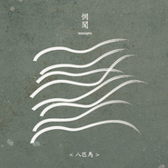

八匹马
============================

|  |  |
| :--: | :-- |
| [<br>八匹马](https://emumo.xiami.com/album/1401775015) | **艺人**: [惘闻](../index.md)<br>**语种**: 其他<br>**唱片公司**: New Noise<br>**发行时间**: 2014年06月03日<br>**专辑类别**: 录音室专辑<br>**专辑风格**: 后摇 Post-Rock<br>**播放数**: 1498599<br>**收藏数**: 5502<br>**评论数**: 526<br> |

## 简介

<div>
<p><span style="color: rgb(51, 153, 102);">IIIIIIIIIIIIIIIIIIIIIIIIIIIIIIIIIIIIIIIIIIIIIIIIIIIIIIIIIIIIIIIIIIIIIIIIIIII 虾米音乐人·独家首发 IIIIIIIIIIIIIIIIIIIIIIIIIIIIIIIIIIIIIIIIIIIIIIIIIIIIIIIIIIIIIIIIIIIIIIIIIIII</span><br><br>
惘闻《八匹马》中国巡演，敬请关注&gt;&gt;<a href="http://www.xiami.com/group/thread-detail/tid/906267" target="_blank" rel="nofollow noreferrer noopener">http://www.xiami.com/group/thread-detail/tid/906267</a> </p><br>
《八匹马》收录了惘闻最近三年内创作的八首作品，每首作品诞生之初所讲述的故事或者情景我几乎都没有了印象，不同于惘闻以往的创作方式，这次新唱片中的很多歌曲在录音过程中都经过了大幅的重新编排，甚至在后期过程中我们也加入了很多新的想法。<br>
《八匹马》的录制过程，充满了趣味。我们第一次放弃了进棚录音的概念，而是把所有的录音设备和乐器音箱都搬进了回声图书馆，一个奇妙的地方。我们花了大概10天左右的时间在这里录音，伴随着不明真相的图书馆读者和楼上的咖啡客，我们像极了一群行为艺术工作者，我们的录音过程像极了一个低级的行为艺术作品。整个录音过程我们并没有清场，图书馆以及楼梯上面的咖啡店都是在正常营业，所以如果你仔细听这张唱片，会听到很多环境声甚至人说话的声音。<br>
后期的混音制作，我们找了四个人混不同的歌曲，他们是Toman的Wouter, PK 14的杨海松，which park的老王以及同我们合作了上张唱片《0.7》的安基国。我们抛弃了所谓专辑歌曲的一致性，因为专辑收录的8首歌对我们自己来说本身也是差异性很大，所以我们决定干脆放大这种差异性。<br>
《八匹马》对于惘闻来言，是一个有意思的尝试， 它也是乐队十五年以来推出的第八张唱片。6月，我们会牵着八匹马穿行各地，带给你们一个奔腾的惘闻现场。<br>
<br><br>
——【惘闻自述】
</div>

## 曲目

- [北方向北Northern North](./1401775015/xL6rIL988bd.md)
- [大连天空Sky of Dalian](./1401775015/mQLsUm60236.md)
- [第八层地狱Eight Layer of Hell](./1401775015/xL6rINce630.md)
- [万佛朝宗Ten Thousand Buddhas](./1401775015/8Grq7yfe58b.md)
- [逃离母宇宙Escape from Mother Universe](./1401775015/8Grq7zf724d.md)
- [酒神经Dionysus](./1401775015/8Grq70e466b.md)
- [最后旅程MVThe Last Journey](./1401775015/xL6rIR96e43.md)
- [Welcome to UtopiaMV](./1401775015/b1qekCw3efd1.md)

## 评论

|  |  |  |  |
| :-- | :-- | :-- | :-- |
| <br>[虾米用户](https://emumo.xiami.com/u/254117235)<br>我还没想好要写什么...<br>2020-11-15 00:46<br>赞(2) 踩(0) | <div>其他平台居然不完整</div> |
| <br>[虾米用户](https://emumo.xiami.com/u/33497126)<br>暂无签名~<br>2020-08-03 18:39<br>赞(1) 踩(0) | <div>评分偏低，最少也要9.8分！</div> |
| <br>[虾米用户](https://emumo.xiami.com/u/94835410)<br><br>2020-07-30 23:17<br>赞(1) 踩(0) | <div>也许这是最好的惘闻</div> |
| <br>[虾米用户](https://emumo.xiami.com/u/440840078)<br>我还没想好要写什么...<br>2020-07-06 14:54<br>赞(0) 踩(0) | <div>谢谢</div> |
| <br>[虾米用户](https://emumo.xiami.com/u/251715155)<br>‏​‍‏‎‍‍‫‫⁠‌‪...<br>2020-07-04 23:47<br>赞(1) 踩(0) | <div>谢玉岗！谢玉岗！谢玉岗！</div> |
| <br>[虾米用户](https://emumo.xiami.com/u/251715155)<br>‏​‍‏‎‍‍‫‫⁠‌‪...<br>2020-07-04 23:46<br>赞(0) 踩(0) | <div></div> |
| <br>[虾米用户](https://emumo.xiami.com/u/79953784)<br>诚实是美好品德<br>2020-06-23 13:36<br>赞(6) 踩(0) | <div>只有这里还是 八匹马</div> |
| <br>[虾米用户](https://emumo.xiami.com/u/43808)<br><br>2020-05-26 22:36<br>赞(0) 踩(0) | <div>惘闻牛逼</div> |
| <br>[虾米用户](https://emumo.xiami.com/u/359739135)<br>PEACE&LOVE<br>2020-03-16 14:51<br>赞(2) 踩(0) | <div>虾米牛逼</div> |
| <br>[虾米用户](https://emumo.xiami.com/u/431248888)<br>野心勃勃的灯火，瞬间吞没...<br>2020-02-17 11:34<br>赞(0) 踩(0) | <div>9分往上，不太想给10分，最好的是不存在的，但么得选</div> |
| <br>[虾米用户](https://emumo.xiami.com/u/330256584)<br><br>2019-11-01 15:50<br>赞(0) 踩(0) | <div>想不到wyy已经变成六匹马的专在这里还是全的</div> |
| <br>[虾米用户](https://emumo.xiami.com/u/245525620)<br> <br>2019-10-12 19:24<br>赞(0) 踩(0) | <div>最爱这张专，求一张黑胶</div> |
| <br>[虾米用户](https://emumo.xiami.com/u/49905125)<br><br>2019-08-11 00:26<br>赞(0) 踩(0) | <div>惘闻巅峰之作，之前的0.7和之后的岁月鸿沟水之湄都不如这张专辑。。更重要的是这张专辑处在惘闻自身转型期内完成，风格上既有之前的专辑的痕迹（乌托邦），也能看到一点点向岁月鸿沟水之湄那种方向转变（北方以北，第八层地狱）</div> |
| <br>[虾米用户](https://emumo.xiami.com/u/427594109)<br>远远的远远远<br>2019-07-25 09:34<br>赞(0) 踩(0) | <div>今年或明年我一定要见到惘闻</div> |
| <br>[虾米用户](https://emumo.xiami.com/u/11029014)<br> （   救我又杀我<br>2019-07-17 08:52<br>赞(0) 踩(0) | <div>杨海崧混音的会是哪首呢</div> |
| <br>[虾米用户](https://emumo.xiami.com/u/48365841)<br>喜欢的东西好复杂<br>2019-06-17 20:50<br>赞(0) 踩(0) | <div>我在这儿</div> |
| <br>[虾米用户](https://emumo.xiami.com/u/362834536)<br><br>2019-06-11 13:37<br>赞(0) 踩(0) | <div>未来也一点要完整</div> |
| <br>[虾米用户](https://emumo.xiami.com/u/350020031)<br><br>2019-06-07 23:13<br>赞(1) 踩(0) | <div>才9.2分？是我耳朵有问题吗？</div> |
| <br>[虾米用户](https://emumo.xiami.com/u/66823378)<br><br>2019-05-09 10:00<br>赞(0) 踩(0) | <div></div> |
| <br>[虾米用户](https://emumo.xiami.com/u/227548133)<br>不管以后是什么样子，都不...<br>2019-04-08 23:33<br>赞(0) 踩(0) | <div>很不错的专辑，期待更新</div> |
| <br>[虾米用户](https://emumo.xiami.com/u/247022054)<br>Perplexe<br>2019-03-10 00:06<br>赞(0) 踩(0) | <div>Out of system experience by ultra knowledge and clairvoyance</div> |
| <br>[虾米用户](https://emumo.xiami.com/u/1285925)<br>舊日故事世代上演<br>2019-02-23 20:24<br>赞(0) 踩(0) | <div>我就来补打个分 为什么一定要评论</div> |
| <br>[虾米用户](https://emumo.xiami.com/u/375834090)<br><br>2019-02-18 20:39<br>赞(0) 踩(0) | <div>真的好</div> |
| <br>[虾米用户](https://emumo.xiami.com/u/73740960)<br><br>2019-01-04 10:09<br>赞(0) 踩(0) | <div>.</div> |
| <br>[虾米用户](https://emumo.xiami.com/u/42963872)<br>我还没想好要写什么...<br>2019-01-03 05:07<br>赞(0) 踩(0) | <div>-</div> |
| <br>[虾米用户](https://emumo.xiami.com/u/8023926)<br>无言<br>2018-09-29 06:45<br>赞(1) 踩(0) | <div>喜欢整张 </div> |
| <br>[虾米用户](https://emumo.xiami.com/u/9154037)<br>到水星散心去了。<br>2018-09-07 16:19<br>赞(0) 踩(0) | <div>Welcome to Utopia &amp;radic;</div> |
| <br>[虾米用户](https://emumo.xiami.com/u/1262288)<br><br>2018-08-16 23:08<br>赞(11) 踩(0) | <div>迄今为止最喜欢的一张惘闻的专辑，包括刚刚发行的《看不见的城市》</div> |
| <br>[虾米用户](https://emumo.xiami.com/u/285314398)<br>潮濕的大地<br>2018-07-22 13:35<br>赞(1) 踩(0) | <div>第五千個收藏，第五百個評論</div> |
| <br>[虾米用户](https://emumo.xiami.com/u/260838438)<br>surprise mot...<br>2018-07-10 02:31<br>赞(0) 踩(0) | <div>嗯</div> |
| <br>[虾米用户](https://emumo.xiami.com/u/36938932)<br>倒霉的小伙子比洞還潮濕的...<br>2018-06-27 09:37<br>赞(3) 踩(0) | <div>八匹馬這張說是神專不過份吧⋯⋯</div> |
| ⇒ | <br>[虾米用户](https://emumo.xiami.com/u/333839466)<br>我永远爱虾米<br>2018-06-28 01:04<br>赞(0) 踩(0) | <div>冇問題啊</div> |
| <br>[虾米用户](https://emumo.xiami.com/u/956662)<br>祭…毕竟什么都逃不过时间<br>2018-04-03 13:09<br>赞(1) 踩(0) | <div>可以打9.8分</div> |
| <br>[虾米用户](https://emumo.xiami.com/u/302127937)<br><br>2018-03-29 09:20<br>赞(0) 踩(0) | <div>五魁首六六六八匹马酒你喝</div> |
| <br>[虾米用户](https://emumo.xiami.com/u/3714518)<br>死人<br>2018-03-21 13:11<br>赞(0) 踩(0) | <div>这砖赞</div> |
| <br>[虾米用户](https://emumo.xiami.com/u/19462503)<br>内部装修中……<br>2018-02-22 01:17<br>赞(15) 踩(0) | <div>我之前曾一度认为，沼泽和惘闻在伯仲之间，而从这张开始，惘闻便牢牢坐实国内post-rock头把交椅，他人只能望其项背。也是从这张开始，惘闻在我心里已经是一支世界级的乐队了。</div> |
| <br>[虾米用户](https://emumo.xiami.com/u/260123122)<br> <br>2018-01-26 23:33<br>赞(0) 踩(0) | <div>/</div> |
| <br>[虾米用户](https://emumo.xiami.com/u/204802482)<br><br>2017-11-14 08:03<br>赞(2) 踩(0) | <div>兜兜转转又回来听惘闻了</div> |
| <br>[虾米用户](https://emumo.xiami.com/u/8244559)<br><br>2017-10-27 23:24<br>赞(0) 踩(0) | <div>******</div> |
| <br>[虾米用户](https://emumo.xiami.com/u/7501395)<br> <br>2017-10-27 23:03<br>赞(0) 踩(0) | <div>国内后摇能做成这样也挺不错的万佛朝宗百听不厌还有四天也快来西安了期待现场</div> |
| <br>[虾米用户](https://emumo.xiami.com/u/24814862)<br>-<br>2017-10-27 22:58<br>赞(1) 踩(0) | <div>很想找到同类。希望我们在生活中失去的，都能从后摇滚中找回来。在做后摇推荐微博，仅此而已。欢迎关注。Weibo ID : 后摇狗VALON_</div> |
| <br>[虾米用户](https://emumo.xiami.com/u/1115247)<br>@Nebula_7293<br>2017-10-25 22:21<br>赞(0) 踩(0) | <div>/</div> |
| <br>[虾米用户](https://emumo.xiami.com/u/33071402)<br>I do not car...<br>2017-10-19 07:30<br>赞(0) 踩(0) | <div>十颗星</div> |
| <br>[虾米用户](https://emumo.xiami.com/u/16255463)<br>@Revolution9...<br>2017-09-25 15:26<br>赞(0) 踩(0) | <div>七月在大连把这张专反复听了很多遍。在火车站、十五库的海边、东港、海之韵的山路、旅顺的街头。一旦把属于自己的一些思忆加在音乐作品中，好像这一辈子就都很难忘记这个旋律了。</div> |
| <br>[虾米用户](https://emumo.xiami.com/u/300993023)<br>这家伙很聪明什么也没留下...<br>2017-06-12 12:01<br>赞(0) 踩(0) | <div>五魁首，666</div> |
| <br>[虾米用户](https://emumo.xiami.com/u/71078948)<br><br>2017-06-03 14:08<br>赞(0) 踩(0) | <div>果然是八匹马</div> |
| <br>[虾米用户](https://emumo.xiami.com/u/135786938)<br>好听的歌想让你也听听  ...<br>2017-05-02 09:54<br>赞(1) 踩(0) | <div>此生买的第一张实体CD，从北京带到大连又带回石家庄，最后旅程未完待续</div> |
| <br>[虾米用户](https://emumo.xiami.com/u/47943204)<br>蹉跎错 消磨过 最是光阴...<br>2017-05-01 00:26<br>赞(0) 踩(0) | <div>偏爱这张</div> |
| <br>[虾米用户](https://emumo.xiami.com/u/43714694)<br>WeChat：96529...<br>2017-03-20 22:23<br>赞(0) 踩(0) | <div>吱/音</div> |
| <br>[虾米用户](https://emumo.xiami.com/u/47139708)<br>我还没想好要写什么...<br>2017-03-17 03:39<br>赞(0) 踩(0) | <div>^</div> |
| <br>[虾米用户](https://emumo.xiami.com/u/587068)<br>我还没想好要写什么...<br>2017-01-20 10:54<br>赞(0) 踩(0) | <div>在这张专辑里面看到了越来越丰富真实的东西，从0到1</div> |
| <br>[虾米用户](https://emumo.xiami.com/u/33773532)<br>Hypothermia....<br>2017-01-02 10:43<br>赞(0) 踩(0) | <div>后期混音的声道安排也会出现这种问题  而且原始录音也不是分声道录入的  和吉他手站位是怎么扯的</div> |
| <br>[虾米用户](https://emumo.xiami.com/u/9894388)<br>没什么病<br>2016-06-14 23:09<br>赞(0) 踩(0) | <div>&amp;quot;最后旅程&amp;quot;就这么结束了?不靠谱啊!</div> |
| <br>[虾米用户](https://emumo.xiami.com/u/109019164)<br>徒然求索，不如思止。<br>2016-05-15 21:30<br>赞(0) 踩(0) | <div>这么用心的低音</div> |
| <br>[虾米用户](https://emumo.xiami.com/u/141956366)<br>。<br>2016-04-15 23:47<br>赞(0) 踩(0) | <div>这张很爱</div> |
| <br>[虾米用户](https://emumo.xiami.com/u/30617820)<br>窝列大窝列大哟<br>2016-04-13 16:28<br>赞(0) 踩(0) | <div>＝＝</div> |
| <br>[虾米用户](https://emumo.xiami.com/u/46799959)<br><br>2016-02-22 23:38<br>赞(0) 踩(0) | <div>八届十中全会。。。</div> |
| <br>[虾米用户](https://emumo.xiami.com/u/8094301)<br>Bye bye wx n...<br>2016-02-13 19:45<br>赞(0) 踩(0) | <div>听歌儿吧，多说一句都是废话。</div> |
| <br>[虾米用户](https://emumo.xiami.com/u/35328214)<br>朝生暮死，日复一日。没有...<br>2016-01-20 08:22<br>赞(1) 踩(0) | <div>实在酣畅淋漓</div> |
| <br>[虾米用户](https://emumo.xiami.com/u/85807214)<br><br>2016-01-08 19:48<br>赞(0) 踩(0) | <div>这张专辑居然有黑胶唱片</div> |
| <br>[虾米用户](https://emumo.xiami.com/u/34144253)<br><br>2016-01-08 16:47<br>赞(0) 踩(0) | <div>很喜欢这张专辑，里面的人声加深了我对语言美学的理解。</div> |
| <br>[虾米用户](https://emumo.xiami.com/u/27697515)<br>沉湎 在自我里<br>2015-12-23 19:30<br>赞(0) 踩(0) | <div>听闻是在图书馆录的么 哇</div> |
| <br>[虾米用户](https://emumo.xiami.com/u/38801880)<br> <br>2015-10-11 19:41<br>赞(0) 踩(0) | <div>^_^</div> |
| <br>[虾米用户](https://emumo.xiami.com/u/41471307)<br>焊上你的鼻孔<br>2015-09-28 00:23<br>赞(0) 踩(0) | <div>无聊就是无聊哪那么多废话。我感觉无聊还不行了么</div> |
| <br>[虾米用户](https://emumo.xiami.com/u/20071217)<br>.<br>2015-09-11 14:43<br>赞(1) 踩(0) | <div>后摇启蒙 听了一圈国外的再转头听 还是最好的</div> |
| <br>[虾米用户](https://emumo.xiami.com/u/35783)<br>身体给雨，灵魂给风。<br>2015-09-09 09:34<br>赞(1) 踩(0) | <div>封面很考究。</div> |
| <br>[虾米用户](https://emumo.xiami.com/u/4715251)<br>愿屁屁在喵星开开心心还有...<br>2015-08-25 16:33<br>赞(0) 踩(0) | <div>还是忍不住买张专辑收藏了</div> |
| <br>[虾米用户](https://emumo.xiami.com/u/13466991)<br><br>2015-08-07 09:57<br>赞(1) 踩(0) | <div>不理解那种声嘶力竭的叫喊，有种无病呻吟的感觉，去掉或许显得格调更高</div> |
| <br>[虾米用户](https://emumo.xiami.com/u/13466991)<br><br>2015-08-07 09:57<br>赞(0) 踩(0) | <div>不理解那种声嘶力竭的叫喊，有种无病呻吟的感觉，去掉或许显得格调更高</div> |
| ⇒ | <br>[虾米用户](https://emumo.xiami.com/u/36515273)<br>理想在我们手中<br>2016-09-15 09:51<br>赞(0) 踩(0) | <div>你没病 不代表别人没有痛苦</div> |
| <br>[虾米用户](https://emumo.xiami.com/u/13466991)<br><br>2015-08-07 09:57<br>赞(0) 踩(0) | <div>不理解那种声嘶力竭的叫喊，有种无病呻吟的感觉，去掉或许显得格调更高</div> |
| <br>[虾米用户](https://emumo.xiami.com/u/5800966)<br>Comedy biaaa...<br>2015-07-22 08:21<br>赞(0) 踩(0) | <div>内容已删除</div> |
| ⇒ | <br>[虾米用户](https://emumo.xiami.com/u/289770915)<br><br>2018-02-15 10:33<br>赞(0) 踩(0) | <div>我大巴的刮你耳光， 存在了， 合理吗？ 不懂别装。</div> |
| <br>[虾米用户](https://emumo.xiami.com/u/8305457)<br><br>2015-07-14 17:05<br>赞(0) 踩(0) | <div>3</div> |
| <br>[虾米用户](https://emumo.xiami.com/u/35492349)<br>平凡又没见过世面<br>2015-06-23 17:20<br>赞(0) 踩(0) | <div>:-)</div> |
| <br>[虾米用户](https://emumo.xiami.com/u/587068)<br>我还没想好要写什么...<br>2015-06-22 23:54<br>赞(0) 踩(0) | <div>有些人就喜欢抽离自身高于一切说教你，指点你，讽刺你。</div> |
| <br>[虾米用户](https://emumo.xiami.com/u/47495512)<br>我可想装的有文采了，可惜...<br>2015-06-16 01:39<br>赞(1) 踩(0) | <div>为毛第一条来个什么乐评？</div> |
| <br>[虾米用户](https://emumo.xiami.com/u/5657731)<br>在音乐面前语言很苍白<br>2015-06-03 15:23<br>赞(9) 踩(0) | <div>后摇专治痛经</div> |
| ⇒ | <br>[虾米用户](https://emumo.xiami.com/u/3765954)<br>装下那片湖<br>2015-08-20 17:16<br>赞(0) 踩(0) | <div>是吗？那是广大女人的福音啊。</div> |
| <br>[虾米用户](https://emumo.xiami.com/u/11038058)<br> <br>2015-05-24 10:36<br>赞(2) 踩(0) | <div>我也不知道为什么很久以前总以为惘闻是个重金属乐队。。。</div> |
| <br>[虾米用户](https://emumo.xiami.com/u/8862875)<br>不忘初心<br>2015-05-14 23:03<br>赞(0) 踩(0) | <div>2015最带劲的事儿就是听了惘闻的现场</div> |
| <br>[虾米用户](https://emumo.xiami.com/u/629527)<br><br>2015-03-27 20:06<br>赞(0) 踩(0) | <div>后摇</div> |
| <br>[虾米用户](https://emumo.xiami.com/u/9875106)<br><br>2015-02-16 15:36<br>赞(0) 踩(0) | <div>陷进去了，别让我出来。</div> |
| <br>[虾米用户](https://emumo.xiami.com/u/2701600)<br>谢谢虾米，再见<br>2015-02-06 14:51<br>赞(0) 踩(0) | <div>2014年最后悔的事之一就是错过了惘闻的巡演。。。</div> |
| ⇒ | <br>[虾米用户](https://emumo.xiami.com/u/11946980)<br>蓝调爵士金属 核 土摇都...<br>2015-02-12 09:01<br>赞(0) 踩(0) | <div>是的</div> |
| ⇒ | <br>[虾米用户](https://emumo.xiami.com/u/3145459)<br>后朋克<br>2015-02-23 21:06<br>赞(0) 踩(0) | <div>2014年最后悔的事之一就是2015才听惘闻</div> |
| <br>[虾米用户](https://emumo.xiami.com/u/43690995)<br>暂无签名~<br>2015-01-29 00:28<br>赞(1) 踩(0) | <div>这张之后中国后摇领军的地位应该无可争议了</div> |
| ⇒ | <br>[虾米用户](https://emumo.xiami.com/u/1144010)<br>在微博再见吧：LZYxL...<br>2015-03-09 16:06<br>赞(0) 踩(0) | <div>还是沼泽牛逼点：）。不过中国能拿来比的也不多啦</div> |
| ⇒ | <br>[虾米用户](https://emumo.xiami.com/u/19462503)<br>内部装修中……<br>2018-02-22 01:20<br>赞(0) 踩(0) | <div>深度同感</div> |
| <br>[虾米用户](https://emumo.xiami.com/u/6115544)<br>恋恋风尘<br>2015-01-05 10:55<br>赞(0) 踩(0) | <div>刚开始听的时候，觉得没有2012好听，但是音乐就是这样奇妙，越听越带感了，这个专辑有种奇妙的魔力，几乎是万能的，想睡觉的时候，可以催眠，觉得亢奋的时候，也能促进兴奋，无论是在路上，在车上，还是在看书，写字，真的都很好~！谢谢惘闻，感谢你们~！</div> |
| <br>[虾米用户](https://emumo.xiami.com/u/587068)<br>我还没想好要写什么...<br>2015-01-05 06:57<br>赞(1) 踩(0) | <div>这时我是含着眼泪醒过来的。突然就浮现了这个旋律。我也不想走，可必须要走，至少在我心里是这样的，必须和你告别，就像当初你的出现闯进我心一样。而这一次，同样头也不回，和解与告别，心存你的祝福，一个人上路。</div> |
| <br>[虾米用户](https://emumo.xiami.com/u/18238002)<br>ilove music....<br>2014-12-31 17:30<br>赞(0) 踩(0) | <div>惘闻2</div> |
| <br>[虾米用户](https://emumo.xiami.com/u/6139765)<br>杂食党<br>2014-12-08 23:01<br>赞(0) 踩(0) | <div>意外的挺不错</div> |
| <br>[虾米用户](https://emumo.xiami.com/u/3369578)<br>我还没想好要写什么...<br>2014-12-07 01:04<br>赞(4) 踩(0) | <div>酷的屌的都是速食，后摇不酷也不屌，这就是它的不同</div> |
| <br>[虾米用户](https://emumo.xiami.com/u/6634459)<br> <br>2014-11-25 12:18<br>赞(0) 踩(0) | <div>没想到这八匹马儿都挺喜欢的(╯з╰)</div> |
| <br>[虾米用户](https://emumo.xiami.com/u/29178832)<br>坚持音乐梦想<br>2014-11-21 11:55<br>赞(0) 踩(0) | <div>越发喜欢这个类型的音乐，虽然还不能完全明白要表达的含义，但音乐一出来总能融入其中。</div> |
| <br>[虾米用户](https://emumo.xiami.com/u/43411634)<br><br>2014-11-15 12:06<br>赞(0) 踩(0) | <div>罔闻的新作</div> |
| <br>[虾米用户](https://emumo.xiami.com/u/42938828)<br><br>2014-10-23 20:20<br>赞(0) 踩(0) | <div>为毛我稀罕的乐队最后都慢慢摒弃了人声？</div> |
| ⇒ | <br>[虾米用户](https://emumo.xiami.com/u/31063445)<br><br>2014-10-28 20:22<br>赞(0) 踩(0) | <div>你也稀罕窦唯么呜呜</div> |
| <br>[虾米用户](https://emumo.xiami.com/u/2229698)<br> <br>2014-09-15 00:14<br>赞(1) 踩(0) | <div>感谢来到厦门</div> |
| <br>[虾米用户](https://emumo.xiami.com/u/7591881)<br>空<br>2014-09-14 10:03<br>赞(0) 踩(0) | <div>路过留痕…</div> |
| <br>[虾米用户](https://emumo.xiami.com/u/4367283)<br><br>2014-09-13 01:42<br>赞(4) 踩(0) | <div>对这张专辑，不想有过多的评论。我只能说，玩后摇，就像画画一样，可以把自己内心深处最真实的一面表现出来.....人都是会变的，每一个时期都会有不一样的状态。对后摇，也许没有评论才是最好的评论，我是这样想的。就一直静静站在旁边，慢慢感受，才是对后摇最好的诠释.....</div> |
| <br>[虾米用户](https://emumo.xiami.com/u/773393)<br>GALAXY<br>2014-09-12 16:55<br>赞(0) 踩(0) | <div>今晚广州走起~~~~！！！</div> |
| <br>[虾米用户](https://emumo.xiami.com/u/13954004)<br>我还没想好要写什么...<br>2014-09-11 23:16<br>赞(0) 踩(0) | <div>三个月前第一次听的时候完完全全没有一点感觉 一直忽略了这只碟 然后今天再听一遍感觉完全不同了 完全是那种听优质新碟的震撼感.</div> |
| <br>[虾米用户](https://emumo.xiami.com/u/1153560)<br><br>2014-09-11 22:30<br>赞(0) 踩(0) | <div>要来厦门啦！！！</div> |
| <br>[虾米用户](https://emumo.xiami.com/u/194864)<br><br>2014-09-09 23:34<br>赞(0) 踩(0) | <div>现场几度哽咽</div> |
| <br>[虾米用户](https://emumo.xiami.com/u/25458293)<br>我遇到了我的绝无仅有，在...<br>2014-09-09 22:01<br>赞(0) 踩(0) | <div>明晚郑州！！！走起！！</div> |
| <br>[虾米用户](https://emumo.xiami.com/u/4262678)<br><br>2014-09-09 13:06<br>赞(0) 踩(0) | <div>周五广州！</div> |
| <br>[虾米用户](https://emumo.xiami.com/u/23361274)<br>前《Hit轻音乐》主编，...<br>2014-09-08 13:21<br>赞(0) 踩(0) | <div>今晚西安光圈，去的吼一声！</div> |
| ⇒ | <br>[虾米用户](https://emumo.xiami.com/u/13604783)<br>任何东西都会死的，只要你...<br>2014-09-09 01:49<br>赞(0) 踩(0) | <div>去了。吼吼吼</div> |
| ⇒ | <br>[虾米用户](https://emumo.xiami.com/u/161637)<br>暂无签名~<br>2014-09-09 11:52<br>赞(0) 踩(0) | <div>去了。</div> |
| <br>[虾米用户](https://emumo.xiami.com/u/40895235)<br>ppppp.<br>2014-09-07 22:33<br>赞(0) 踩(0) | <div>听不了现场啊，唉唉唉</div> |
| <br>[虾米用户](https://emumo.xiami.com/u/21082420)<br>多听多看<br>2014-09-06 17:18<br>赞(0) 踩(0) | <div>今天成都现场，期待</div> |
| <br>[虾米用户](https://emumo.xiami.com/u/19547977)<br>我躲进了自习室以期自救。<br>2014-09-06 12:20<br>赞(0) 踩(0) | <div>昨天重庆场，真是美呆了那现场</div> |
| <br>[虾米用户](https://emumo.xiami.com/u/34181026)<br><br>2014-09-05 20:37<br>赞(2) 踩(0) | <div>9月11巡演长沙走起！</div> |
| <br>[虾米用户](https://emumo.xiami.com/u/37914522)<br>Lifelover u<br>2014-09-05 15:37<br>赞(0) 踩(0) | <div>明晚成都</div> |
| <br>[虾米用户](https://emumo.xiami.com/u/36576635)<br>冰岛游客热带地区唯一指定...<br>2014-08-27 20:40<br>赞(0) 踩(0) | <div>民族即世界 后摇</div> |
| <br>[虾米用户](https://emumo.xiami.com/u/26179302)<br>要有光<br>2014-08-26 00:05<br>赞(0) 踩(0) | <div>要来广州了，</div> |
| <br>[虾米用户](https://emumo.xiami.com/u/2857420)<br>昨天晚上我梦见你<br>2014-08-25 09:56<br>赞(0) 踩(0) | <div>八匹马，七匹狼…</div> |
| <br>[虾米用户](https://emumo.xiami.com/u/2857420)<br>昨天晚上我梦见你<br>2014-08-25 08:37<br>赞(0) 踩(0) | <div>越来越国际范儿了</div> |
| <br>[虾米用户](https://emumo.xiami.com/u/5177713)<br>虾米已弃<br>2014-08-13 21:42<br>赞(0) 踩(0) | <div>相比我还是喜欢这张的风格</div> |
| <br>[虾米用户](https://emumo.xiami.com/u/10055365)<br>这个家伙很聪明，什么都没...<br>2014-08-09 14:10<br>赞(0) 踩(0) | <div>新专辑!</div> |
| <br>[虾米用户](https://emumo.xiami.com/u/16415125)<br>我们将死于自己热爱的事物<br>2014-08-06 21:49<br>赞(0) 踩(0) | <div>9.12惘闻乐队全新专辑《八匹马》首发巡演广州站；活动详情：<a href="http://t.cn/RvgrymQ" target="_blank" rel="nofollow noreferrer noopener">http://t.cn/RvgrymQ</a></div> |
| <br>[虾米用户](https://emumo.xiami.com/u/9601941)<br>暂无<br>2014-08-03 17:34<br>赞(0) 踩(0) | <div>不错。</div> |
| <br>[虾米用户](https://emumo.xiami.com/u/2138208)<br>its a long l...<br>2014-07-19 16:31<br>赞(0) 踩(0) | <div>大拇指！</div> |
| <br>[虾米用户](https://emumo.xiami.com/u/928576)<br>　　　　　　　　　<br>2014-07-16 22:56<br>赞(0) 踩(0) | <div>.</div> |
| <br>[虾米用户](https://emumo.xiami.com/u/546077)<br>我还没想好要写什么...<br>2014-07-12 05:03<br>赞(1) 踩(0) | <div>终于在这个困得要死的凌晨把这张给听了。各种不后悔那天没去听成现场。</div> |
| <br>[虾米用户](https://emumo.xiami.com/u/2029879)<br>已转移阵地并回归离线模式...<br>2014-07-05 18:48<br>赞(1) 踩(0) | <div>难道没有人发现《最后旅程》和《Welcome to Utopia》两首里吉他手的站位跟前面不一样？每次听到这两首都要把耳机左右声道调过来伤不起……</div> |
| ⇒ | <br>[虾米用户](https://emumo.xiami.com/u/4305961)<br><br>2016-08-31 03:18<br>赞(0) 踩(0) | <div>老大，你没事吧……这样显摆真的好么……</div> |
| <br>[虾米用户](https://emumo.xiami.com/u/24958309)<br> <br>2014-07-05 02:21<br>赞(0) 踩(0) | <div>后摇</div> |
| <br>[虾米用户](https://emumo.xiami.com/u/22307530)<br> <br>2014-07-03 21:09<br>赞(1) 踩(0) | <div>这张刚出时就有听，真心感觉不错，没有那么高的品味，就不敢鸡蛋挑刺，看到评论里批评的话真的很忧伤，因为就像之前的人说，毕竟你做不出这样的作品和大家分享。</div> |
| <br>[虾米用户](https://emumo.xiami.com/u/7833160)<br><br>2014-07-02 20:43<br>赞(0) 踩(0) | <div>喜欢他们的后摇</div> |
| <br>[虾米用户](https://emumo.xiami.com/u/3213147)<br><br>2014-06-30 10:43<br>赞(0) 踩(0) | <div>炒鸡棒呢</div> |
| <br>[虾米用户](https://emumo.xiami.com/u/1288720)<br>hi...我在广场等你<br>2014-06-29 20:06<br>赞(0) 踩(0) | <div>顶了再说</div> |
| <br>[虾米用户](https://emumo.xiami.com/u/38566097)<br><br>2014-06-29 17:49<br>赞(0) 踩(0) | <div>听后再说</div> |
| <br>[虾米用户](https://emumo.xiami.com/u/928576)<br>　　　　　　　　　<br>2014-06-29 13:08<br>赞(0) 踩(0) | <div>听得不知道评论什么。</div> |
| <br>[虾米用户](https://emumo.xiami.com/u/30623184)<br>事发的十九分钟<br>2014-06-26 22:21<br>赞(0) 踩(0) | <div>惘闻。</div> |
| <br>[虾米用户](https://emumo.xiami.com/u/5938138)<br>千处请千处降 爱河常做渡...<br>2014-06-26 15:59<br>赞(0) 踩(0) | <div>太棒</div> |
| <br>[虾米用户](https://emumo.xiami.com/u/16739877)<br>渡<br>2014-06-25 23:14<br>赞(0) 踩(0) | <div>第二天考试什么都没看就跑去看了 不虚此行(OvO)</div> |
| <br>[虾米用户](https://emumo.xiami.com/u/3276750)<br>yep<br>2014-06-24 23:30<br>赞(1) 踩(0) | <div>听这样的现场总是停不住幻想，好像不放任自己的思绪就辜负了音乐一样。这是一种需要不停脑补或者干脆睡着了继续催梦的音乐。。。星期六去</div> |
| <br>[虾米用户](https://emumo.xiami.com/u/8244559)<br><br>2014-06-24 10:43<br>赞(0) 踩(0) | <div>******</div> |
| <br>[虾米用户](https://emumo.xiami.com/u/5525589)<br> <br>2014-06-24 04:47<br>赞(0) 踩(0) | <div>Post-Rock居然玩出了Prog-Rock</div> |
| <br>[虾米用户](https://emumo.xiami.com/u/226361)<br>举杯邀明月<br>2014-06-22 14:25<br>赞(1) 踩(0) | <div>昨晚看了惘闻的现象，特别的棒！就像是一杯苦艾酒，入口迷幻浓烈下肚后荡气回肠，整场演出眼泪一直掉</div> |
| <br>[虾米用户](https://emumo.xiami.com/u/22916882)<br><br>2014-06-22 02:26<br>赞(0) 踩(0) | <div>有没有人看惘闻624的苏州演出。。</div> |
| <br>[虾米用户](https://emumo.xiami.com/u/8169731)<br>我还没想好要写什么...<br>2014-06-21 12:01<br>赞(0) 踩(0) | <div>昨晚还不错。。喜欢惘闻的人真不少。。</div> |
| <br>[虾米用户](https://emumo.xiami.com/u/20071217)<br>.<br>2014-06-21 10:27<br>赞(0) 踩(0) | <div>酒球会 要错过了</div> |
| <br>[虾米用户](https://emumo.xiami.com/u/3404636)<br> <br>2014-06-20 23:02<br>赞(0) 踩(0) | <div>求T裇衫  求网址</div> |
| <br>[虾米用户](https://emumo.xiami.com/u/5058803)<br>EnterTheVoid<br>2014-06-20 22:33<br>赞(0) 踩(0) | <div>無緣你們在上海的演出，因為那天我為了一個人，離開了這座城.</div> |
| ⇒ | <br>[虾米用户](https://emumo.xiami.com/u/981094)<br><br>2014-07-10 11:15<br>赞(0) 踩(0) | <div>不装逼能受伤？</div> |
| ⇒ | <br>[虾米用户](https://emumo.xiami.com/u/8662300)<br>白<br>2014-07-10 15:12<br>赞(0) 踩(0) | <div><q><b>二表说：</b></q></div> |
| ⇒ | <br>[虾米用户](https://emumo.xiami.com/u/5058803)<br>EnterTheVoid<br>2014-07-10 23:36<br>赞(0) 踩(0) | <div><q><b>二表说：</b></q></div> |
| <br>[虾米用户](https://emumo.xiami.com/u/2383925)<br>独音唱片<br>2014-06-20 15:34<br>赞(0) 踩(0) | <div>【独音唱片】惘闻乐队全体亲笔签名 2014新专 八匹马 正版现货！<a href="http://item.taobao.com/item.htm?spm=0.0.0.0.3jupzq&amp;amp;id=39632765968" target="_blank" rel="nofollow noreferrer noopener">http://item.taobao.com/item.htm?spm=0.0.0.0.3jupzq&amp;amp;id=39632765968</a></div> |
| ⇒ | <br>[虾米用户](https://emumo.xiami.com/u/225935)<br>SAY MY NAME<br>2014-06-22 20:09<br>赞(0) 踩(0) | <div>有T恤就好了</div> |
| <br>[虾米用户](https://emumo.xiami.com/u/2411506)<br><br>2014-06-20 14:06<br>赞(0) 踩(0) | <div>等9月巡演</div> |
| <br>[虾米用户](https://emumo.xiami.com/u/6628865)<br> <br>2014-06-19 21:17<br>赞(0) 踩(0) | <div>预热下，周六见！</div> |
| <br>[虾米用户](https://emumo.xiami.com/u/281643)<br>活下去没有希望<br>2014-06-19 09:08<br>赞(0) 踩(0) | <div>顶！</div> |
| <br>[虾米用户](https://emumo.xiami.com/u/5933411)<br>我才不是后摇狗<br>2014-06-19 03:16<br>赞(1) 踩(0) | <div>喜欢这个专辑封面。</div> |
| <br>[虾米用户](https://emumo.xiami.com/u/11468013)<br><br>2014-06-19 00:08<br>赞(0) 踩(0) | <div>惘闻竟然出新专辑了！</div> |
| <br>[虾米用户](https://emumo.xiami.com/u/24003)<br><br>2014-06-18 21:27<br>赞(0) 踩(0) | <div>:D 嘿嘿</div> |
| <br>[虾米用户](https://emumo.xiami.com/u/13669317)<br>语虚何以言之<br>2014-06-18 19:11<br>赞(0) 踩(0) | <div>听着音乐 看着周围的人 仿佛在看电影 每个人都有不同的故事 但故事又都是相似的</div> |
| <br>[虾米用户](https://emumo.xiami.com/u/9909251)<br>简单粗暴<br>2014-06-18 17:47<br>赞(0) 踩(0) | <div>愚公移山见</div> |
| <br>[虾米用户](https://emumo.xiami.com/u/5602842)<br>Les rois.<br>2014-06-18 17:03<br>赞(0) 踩(0) | <div>简直棒。</div> |
| <br>[虾米用户](https://emumo.xiami.com/u/5398540)<br>民歌警察出警中<br>2014-06-18 15:02<br>赞(0) 踩(0) | <div>额。。9月巡演啊。。。恐怕都开学了吧。。</div> |
| <br>[虾米用户](https://emumo.xiami.com/u/1832669)<br>感谢发布者们，感谢！<br>2014-06-18 14:39<br>赞(0) 踩(0) | <div>赞到飞起</div> |
| <br>[虾米用户](https://emumo.xiami.com/u/8374435)<br><br>2014-06-18 13:36<br>赞(0) 踩(0) | <div>这个太好了，太好了。太想和你们一起听。</div> |
| <br>[虾米用户](https://emumo.xiami.com/u/4314148)<br>NO贪 NO嗔 NO痴<br>2014-06-18 10:58<br>赞(0) 踩(0) | <div>第一首中间那段广播录音，好 PK14 的赶脚</div> |
| <br>[虾米用户](https://emumo.xiami.com/u/360924)<br> <br>2014-06-17 22:40<br>赞(0) 踩(0) | <div>最后十三个小时！</div> |
| <br>[虾米用户](https://emumo.xiami.com/u/3294014)<br>我还没想好要写什么...<br>2014-06-17 22:23<br>赞(1) 踩(0) | <div>觉得惘闻这张专辑主要的感觉就是困兽之斗 给我听得心潮澎湃要飙泪 惘闻所有专辑中最喜欢这张</div> |
| <br>[虾米用户](https://emumo.xiami.com/u/566082)<br>人生是一场修行，我是否可...<br>2014-06-17 21:28<br>赞(0) 踩(0) | <div>太棒的一张专辑</div> |
| <br>[虾米用户](https://emumo.xiami.com/u/8169731)<br>我还没想好要写什么...<br>2014-06-17 21:27<br>赞(0) 踩(0) | <div>这周五愚公移山走起。。。</div> |
| <br>[虾米用户](https://emumo.xiami.com/u/10853749)<br><br>2014-06-17 20:48<br>赞(0) 踩(0) | <div>可能是听不惯后摇或者今晚的耳朵听不惯后摇</div> |
| <br>[虾米用户](https://emumo.xiami.com/u/1844)<br>农夫 山泉 有点田<br>2014-06-16 20:15<br>赞(0) 踩(0) | <div>通勤路上耳机里昏昏欲睡，换到音箱就咂出味儿来了。</div> |
| <br>[虾米用户](https://emumo.xiami.com/u/265666)<br><br>2014-06-16 15:16<br>赞(0) 踩(0) | <div>应景~9月3号不见不散~</div> |
| ⇒ | <br>[虾米用户](https://emumo.xiami.com/u/368635)<br>积极努力的悲观主义者～<br>2014-06-18 16:15<br>赞(0) 踩(0) | <div>我也期待这首</div> |
| <br>[虾米用户](https://emumo.xiami.com/u/1644168)<br> <br>2014-06-15 23:42<br>赞(1) 踩(0) | <div>还是大连天空靠谱啊！！！</div> |
| <br>[虾米用户](https://emumo.xiami.com/u/7302593)<br>天人五衰<br>2014-06-15 11:11<br>赞(0) 踩(0) | <div>比从前任何一张都富有感情</div> |
| ⇒ | <br>[虾米用户](https://emumo.xiami.com/u/2977748)<br><br>2014-06-15 15:50<br>赞(0) 踩(0) | <div>同意。这张和L&amp;amp;R是我觉得惘闻最好的两张。那张被大多数人推崇的IV我反而没感觉……</div> |
| <br>[虾米用户](https://emumo.xiami.com/u/5618806)<br><br>2014-06-13 11:43<br>赞(0) 踩(0) | <div>牛逼，期待21号的杭州巡演</div> |
| <br>[虾米用户](https://emumo.xiami.com/u/37115287)<br><br>2014-06-12 02:49<br>赞(0) 踩(0) | <div>这些歌的名字都这是这么的，与众不同，一看到就有想听听的冲动。</div> |
| <br>[虾米用户](https://emumo.xiami.com/u/4066011)<br>mizfit<br>2014-06-11 23:37<br>赞(0) 踩(0) | <div>就算不再听后摇，也还在听惘闻</div> |
| <br>[虾米用户](https://emumo.xiami.com/u/37444741)<br><br>2014-06-11 22:22<br>赞(0) 踩(0) | <div>说不出来的感觉 心里很激动但是有很想哭</div> |
| <br>[虾米用户](https://emumo.xiami.com/u/3667173)<br>Aberystwyth<br>2014-06-11 21:28<br>赞(0) 踩(0) | <div>海外党忽然间就听不了了！靠！</div> |
| ⇒ | <br>[虾米用户](https://emumo.xiami.com/u/9142155)<br>郝虾米 未知生物是敏感词<br>2014-06-11 21:42<br>赞(0) 踩(0) | <div>办会员。。虾米前阵子看我使用记录正常 虾米停止海外服务  送我俩月会员  不办会员就去豆瓣</div> |
| ⇒ | <br>[虾米用户](https://emumo.xiami.com/u/3667173)<br>Aberystwyth<br>2014-06-12 00:55<br>赞(0) 踩(0) | <div><q><b>未知生物说：</b></q></div> |
| ⇒ | <br>[虾米用户](https://emumo.xiami.com/u/41369524)<br><br>2014-10-19 17:47<br>赞(0) 踩(0) | <div>貌似得冲会员</div> |
| <br>[虾米用户](https://emumo.xiami.com/u/35936511)<br>我错过了男神最帅的时候。<br>2014-06-11 19:54<br>赞(0) 踩(0) | <div>少见的时空感，飘逸与沉郁，激烈与低缓，虚渺与博大，华丽与肃穆，这种矛盾感充斥在每一段乐章里，十分震撼。</div> |
| ⇒ | <br>[虾米用户](https://emumo.xiami.com/u/2857420)<br>昨天晚上我梦见你<br>2014-08-25 08:37<br>赞(0) 踩(0) | <div>写得好</div> |
| <br>[虾米用户](https://emumo.xiami.com/u/37444741)<br><br>2014-06-11 17:15<br>赞(0) 踩(0) | <div>草鸡棒温柔</div> |
| <br>[虾米用户](https://emumo.xiami.com/u/10989835)<br>嘿！你好<br>2014-06-11 11:41<br>赞(0) 踩(0) | <div>音乐是有灵魂的当你感受到了它的深意，你会明白感受不到总是在批判，一切事物都在变包括你我，当你两年或十年后，你再翻出来听的时候可能你会觉得当时你没能理解是因为什么，不要老是批判，你只要做个聆听者去感受！因为你做不出这样的作品去跟大家分享！</div> |
| <br>[虾米用户](https://emumo.xiami.com/u/4362247)<br>我还没想好要写什么...<br>2014-06-11 00:34<br>赞(1) 踩(0) | <div>只是feng mian bu cuo</div> |
| <br>[虾米用户](https://emumo.xiami.com/u/33385349)<br>臭板儿是个傻逼。<br>2014-06-10 21:59<br>赞(0) 踩(0) | <div>硬盘里几十个G，这个逼装的。</div> |
| <br>[虾米用户](https://emumo.xiami.com/u/676496)<br><br>2014-06-10 21:42<br>赞(2) 踩(0) | <div>惘闻砸车污水塘时期最和我意 到L&amp;amp;R是个顶峰 即便0.7我都觉得能有4.5星 但八匹马我实在只能说 皇上的新装挺好看的。各位爷</div> |
| ⇒ | <br>[虾米用户](https://emumo.xiami.com/u/34876483)<br>我还没想好要写什么...<br>2014-06-12 17:38<br>赞(0) 踩(0) | <div>惘闻这样的乐队，创作不会迎合任何人</div> |
| <br>[虾米用户](https://emumo.xiami.com/u/24914218)<br>边走边听<br>2014-06-10 21:25<br>赞(0) 踩(0) | <div>再硬点！</div> |
| <br>[虾米用户](https://emumo.xiami.com/u/1734239)<br>Curiosity ma...<br>2014-06-10 17:53<br>赞(0) 踩(0) | <div>八条精子封面不能喜欢更多 北方向北神作膜拜 大连天空第五分钟也抽了 但其他曲儿留下印象的并不多 27号不出意外应该会去vox 怀旧党还是最爱rust insdeTUT</div> |
| <br>[虾米用户](https://emumo.xiami.com/u/6277353)<br>万物再美都殊途同归<br>2014-06-10 09:37<br>赞(0) 踩(0) | <div>3号出的碟现在才有空听，暂不评论，听完再说。#既然坏心情要给自己放假#</div> |
| <br>[虾米用户](https://emumo.xiami.com/u/14505533)<br>清醒梦<br>2014-06-09 23:01<br>赞(0) 踩(0) | <div>北方向北听的我头皮发麻，最后两分钟鸡皮疙瘩停不下来。28号VOX估计又是一个人去了~</div> |
| ⇒ | <br>[虾米用户](https://emumo.xiami.com/u/4915606)<br><br>2014-06-09 23:58<br>赞(0) 踩(0) | <div>你不是一个人</div> |
| ⇒ | <br>[虾米用户](https://emumo.xiami.com/u/5030143)<br><br>2014-06-16 15:12<br>赞(0) 踩(0) | <div><q><b>彼岸過迄说：</b></q></div> |
| <br>[虾米用户](https://emumo.xiami.com/u/10811234)<br>Love Mucic<br>2014-06-09 22:56<br>赞(1) 踩(0) | <div>真心感觉挺普通的一张砖 听完没什么记忆点 万佛朝宗算是砖里比较惘闻风格的作品了 感觉还是少了点动人心弦的那份情感吧 更注重氛围和旋律的表达 有些廉价了  不过 新元素的加入也算是小惊喜吧 听到了些许异域情怀 有些意思 专辑6.5分 相比之下还是更爱Miss Woman</div> |
| <br>[虾米用户](https://emumo.xiami.com/u/156974)<br><br>2014-06-09 22:39<br>赞(3) 踩(0) | <div>非常普通的一张 除了第二首 其他听完之后不想听第二遍 我只想给3星 但是看了这么多“真粉丝”不害臊的留言后 我觉得给2星也不为过</div> |
| ⇒ | <br>[虾米用户](https://emumo.xiami.com/u/8069745)<br><br>2014-06-15 08:31<br>赞(0) 踩(0) | <div>听说你是大勇。。。</div> |
| ⇒ | <br>[虾米用户](https://emumo.xiami.com/u/156974)<br><br>2014-06-15 11:05<br>赞(0) 踩(0) | <div><q><b>zjh说：</b></q></div> |
| ⇒ | <br>[虾米用户](https://emumo.xiami.com/u/478817)<br><br>2014-06-17 21:20<br>赞(0) 踩(0) | <div>听说你是大勇。。。</div> |
| <br>[虾米用户](https://emumo.xiami.com/u/3047347)<br><br>2014-06-09 15:08<br>赞(0) 踩(0) | <div>封面很赞</div> |
| <br>[虾米用户](https://emumo.xiami.com/u/1272650)<br><br>2014-06-09 14:51<br>赞(0) 踩(0) | <div>好！</div> |
| <br>[虾米用户](https://emumo.xiami.com/u/1272650)<br><br>2014-06-09 14:11<br>赞(0) 踩(0) | <div>真诚的点赞。</div> |
| <br>[虾米用户](https://emumo.xiami.com/u/1746372)<br>我懷疑你懷疑我不懷好意<br>2014-06-09 12:05<br>赞(1) 踩(0) | <div>脚断了，终于能躺在家安心听听这张专辑了，偶叶~</div> |
| ⇒ | <br>[虾米用户](https://emumo.xiami.com/u/9046544)<br><br>2014-06-09 16:42<br>赞(0) 踩(0) | <div>早日康复。。。。</div> |
| ⇒ | <br>[虾米用户](https://emumo.xiami.com/u/1746372)<br>我懷疑你懷疑我不懷好意<br>2014-06-09 17:33<br>赞(0) 踩(0) | <div><q><b>O(N!)说：</b></q></div> |
| ⇒ | <br>[虾米用户](https://emumo.xiami.com/u/9046544)<br><br>2014-06-10 02:03<br>赞(0) 踩(0) | <div><q><b>偏执狂夏说：</b></q></div> |
| <br>[虾米用户](https://emumo.xiami.com/u/7947205)<br><br>2014-06-08 23:46<br>赞(0) 踩(0) | <div>还是比较喜欢最后旅程 我是个怀旧的人 找到点以前专辑的影子</div> |
| <br>[虾米用户](https://emumo.xiami.com/u/17326367)<br>爱就是极快速的能量振动<br>2014-06-08 23:36<br>赞(0) 踩(0) | <div>很不错</div> |
| <br>[虾米用户](https://emumo.xiami.com/u/3365900)<br><br>2014-06-08 23:09<br>赞(0) 踩(0) | <div>这张沉静了很多</div> |
| <br>[虾米用户](https://emumo.xiami.com/u/522205)<br>一切很美，音為有你﹏<br>2014-06-08 20:43<br>赞(0) 踩(0) | <div>北方向北 有《寂静岭》的英伦迷幻金属的味道</div> |
| <br>[虾米用户](https://emumo.xiami.com/u/907765)<br>爱着一个爱跑步的人<br>2014-06-08 18:24<br>赞(0) 踩(0) | <div>10000000000000000000000000000000000000000000个赞！</div> |
| <br>[虾米用户](https://emumo.xiami.com/u/522205)<br>一切很美，音為有你﹏<br>2014-06-08 18:17<br>赞(0) 踩(0) | <div>很有想象的空间，有种吸引人的魔音在召唤我们那不安分的灵魂。。。</div> |
| <br>[虾米用户](https://emumo.xiami.com/u/12970638)<br>我还没想好要写什么...<br>2014-06-08 17:22<br>赞(0) 踩(0) | <div>歌名起的很后摇。。。</div> |
| <br>[虾米用户](https://emumo.xiami.com/u/2994924)<br><br>2014-06-08 14:53<br>赞(0) 踩(0) | <div>第一首听到了偶像蛤蟆的说唱。</div> |
| <br>[虾米用户](https://emumo.xiami.com/u/8305457)<br><br>2014-06-08 09:07<br>赞(0) 踩(0) | <div>太棒了</div> |
| <br>[虾米用户](https://emumo.xiami.com/u/15896553)<br>我还没想好要写什么...<br>2014-06-08 08:08<br>赞(0) 踩(0) | <div>惘闻的张力很强阿，不断给人新的感受。这张专辑最喜欢万佛朝宗和第八层地狱</div> |
| <br>[虾米用户](https://emumo.xiami.com/u/11711612)<br>评论区里装逼和傻逼太特么...<br>2014-06-07 21:49<br>赞(2) 踩(0) | <div>评论里逼格真高</div> |
| ⇒ | <br>[虾米用户](https://emumo.xiami.com/u/816538)<br>我还没想好要写什么...<br>2014-06-08 16:57<br>赞(0) 踩(0) | <div>是的！</div> |
| ⇒ | <br>[虾米用户](https://emumo.xiami.com/u/816538)<br>我还没想好要写什么...<br>2014-06-08 16:57<br>赞(0) 踩(0) | <div>是的</div> |
| ⇒ | <br>[虾米用户](https://emumo.xiami.com/u/11711612)<br>评论区里装逼和傻逼太特么...<br>2014-06-19 16:51<br>赞(0) 踩(0) | <div><q><b>拾月潇瑟说：</b></q></div> |
| <br>[虾米用户](https://emumo.xiami.com/u/12500408)<br>------------<br>2014-06-07 13:58<br>赞(0) 踩(0) | <div>不管怎样都得转一个呀 惘闻</div> |
| <br>[虾米用户](https://emumo.xiami.com/u/1369788)<br><br>2014-06-07 12:49<br>赞(0) 踩(0) | <div>27号VOX，希望还没走</div> |
| <br>[虾米用户](https://emumo.xiami.com/u/31536051)<br>我还没想好要写什么...<br>2014-06-06 23:09<br>赞(0) 踩(0) | <div>封面很棒！！</div> |
| <br>[虾米用户](https://emumo.xiami.com/u/8204882)<br>敏感症候群<br>2014-06-06 21:21<br>赞(0) 踩(0) | <div>砖封不错</div> |
| <br>[虾米用户](https://emumo.xiami.com/u/373760)<br><br>2014-06-06 14:48<br>赞(0) 踩(0) | <div>匆匆过了一遍，一如既往高质量！得找个时间细细感受。</div> |
| <br>[虾米用户](https://emumo.xiami.com/u/4778375)<br>又附三两声，如何好格调。<br>2014-06-06 13:08<br>赞(0) 踩(0) | <div>羚羊挂角 石入平湖</div> |
| <br>[虾米用户](https://emumo.xiami.com/u/3162204)<br> <br>2014-06-06 12:38<br>赞(0) 踩(0) | <div>寒毛颤栗</div> |
| <br>[虾米用户](https://emumo.xiami.com/u/5030143)<br><br>2014-06-06 09:28<br>赞(0) 踩(0) | <div>来了。。哈哈。有的听了</div> |
| <br>[虾米用户](https://emumo.xiami.com/u/3510038)<br>海天之恋<br>2014-06-06 01:36<br>赞(0) 踩(0) | <div>八根马毛</div> |
| <br>[虾米用户](https://emumo.xiami.com/u/9049062)<br>戏不够，烟来凑。<br>2014-06-06 01:31<br>赞(0) 踩(0) | <div>经得起喜欢</div> |
| <br>[虾米用户](https://emumo.xiami.com/u/13131008)<br><br>2014-06-06 00:45<br>赞(0) 踩(0) | <div>掩盖在音乐下的呐喊你听到了么？</div> |
| <br>[虾米用户](https://emumo.xiami.com/u/3536302)<br>网易云同名<br>2014-06-06 00:14<br>赞(0) 踩(0) | <div>这才是惘闻！！</div> |
| <br>[虾米用户](https://emumo.xiami.com/u/11906267)<br>再见虾米<br>2014-06-06 00:11<br>赞(0) 踩(0) | <div>A+</div> |
| <br>[虾米用户](https://emumo.xiami.com/u/16551745)<br>byebye｛wb/in...<br>2014-06-05 21:48<br>赞(0) 踩(0) | <div>•</div> |
| <br>[虾米用户](https://emumo.xiami.com/u/5811364)<br>不断推翻，不断重建<br>2014-06-05 19:54<br>赞(0) 踩(0) | <div>这张砖是惘闻的黑帝气质中国化。</div> |
| <br>[虾米用户](https://emumo.xiami.com/u/7239604)<br><br>2014-06-05 17:53<br>赞(1) 踩(0) | <div>小号不错~~~</div> |
| <br>[虾米用户](https://emumo.xiami.com/u/36424306)<br>每一次的大雨都为下一次<br>2014-06-05 15:46<br>赞(0) 踩(0) | <div>(￣▽￣)&amp;quot;。。。。</div> |
| <br>[虾米用户](https://emumo.xiami.com/u/11642356)<br> <br>2014-06-05 15:23<br>赞(0) 踩(0) | <div>看书时候不能听……（看评论大家好像很专业的样子。。。</div> |
| <br>[虾米用户](https://emumo.xiami.com/u/1512674)<br>玩您<br>2014-06-05 15:19<br>赞(0) 踩(0) | <div>热泪盈眶，这就是音乐的魅力。当然你听流行情歌也会哭，这是情感的原因，不是音乐的魅力。</div> |
| <br>[虾米用户](https://emumo.xiami.com/u/3764546)<br>你拥抱的并不也总是拥抱你<br>2014-06-05 15:18<br>赞(0) 踩(0) | <div>惘问！！！@叶鹏阿</div> |
| <br>[虾米用户](https://emumo.xiami.com/u/37251509)<br><br>2014-06-05 14:45<br>赞(0) 踩(0) | <div>除了break the cars ，污水塘，lonely god，乌托邦算是第四首能让我感觉到自己飞起来的歌，没想到排最后。</div> |
| <br>[虾米用户](https://emumo.xiami.com/u/37130982)<br>Electronicer<br>2014-06-05 14:37<br>赞(0) 踩(0) | <div>第一首前奏的时候一直loop太拖沓打算下一首，但鼓出来的时候发现还挺喜欢的，支持国产后摇。后摇得当BGM才带感，放到现场如果不是真粉估计没人会欣赏。</div> |
| ⇒ | <br>[虾米用户](https://emumo.xiami.com/u/6651312)<br><br>2014-06-06 08:24<br>赞(0) 踩(0) | <div>希望你能去听一下惘闻的现场。后摇真的不是只可以当背景音乐的。。</div> |
| ⇒ | <br>[虾米用户](https://emumo.xiami.com/u/37130982)<br>Electronicer<br>2014-06-06 11:02<br>赞(0) 踩(0) | <div><q><b>装,13,说：</b></q></div> |
| ⇒ | <br>[虾米用户](https://emumo.xiami.com/u/35041309)<br>烦忧无门，惟人自扰。<br>2014-06-06 13:14<br>赞(0) 踩(0) | <div><q><b>洛基亚说：</b></q></div> |
| ⇒ | <br>[虾米用户](https://emumo.xiami.com/u/37130982)<br>Electronicer<br>2014-06-06 13:33<br>赞(0) 踩(0) | <div><q><b>＇电扇＇惊魂说：</b></q></div> |
| ⇒ | <br>[虾米用户](https://emumo.xiami.com/u/478817)<br><br>2014-06-07 20:47<br>赞(0) 踩(0) | <div><q><b>＇电扇＇惊魂说：</b></q></div> |
| <br>[虾米用户](https://emumo.xiami.com/u/14024448)<br>我还没想好要写什么...<br>2014-06-05 12:16<br>赞(0) 踩(0) | <div>好听惨了，上次小酒馆看他们现场，都快哭了!</div> |
| <br>[虾米用户](https://emumo.xiami.com/u/14333598)<br>假装在北京<br>2014-06-05 11:31<br>赞(0) 踩(0) | <div>烂掉我孤注一掷拿去喂狗过去没有现在不是</div> |
| <br>[虾米用户](https://emumo.xiami.com/u/5413109)<br>我还没想好要写什么...<br>2014-06-05 10:31<br>赞(4) 踩(0) | <div>上张0.7，这张八匹马，下张会不会九阴真经？</div> |
| <br>[虾米用户](https://emumo.xiami.com/u/766222)<br><br>2014-06-05 10:26<br>赞(59) 踩(0) | <div>凡是要颠覆一种风格，总要先造成新的框架，总要先做意识形态方面的工作，摇滚阶级是这样，后摇滚阶级也是这样</div> |
| ⇒ | <br>[虾米用户](https://emumo.xiami.com/u/16551745)<br>byebye｛wb/in...<br>2014-06-05 21:49<br>赞(0) 踩(0) | <div>赞哈哈</div> |
| ⇒ | <br>[虾米用户](https://emumo.xiami.com/u/50812128)<br>网易finefrance...<br>2017-10-06 01:17<br>赞(0) 踩(0) | <div><q><b>LINML说：</b></q></div> |
| <br>[虾米用户](https://emumo.xiami.com/u/3092111)<br>走走停停<br>2014-06-05 09:55<br>赞(0) 踩(0) | <div>我爱死你们了。就这样。</div> |
| <br>[虾米用户](https://emumo.xiami.com/u/1220045)<br>眉中有只要说脏话的眼！<br>2014-06-05 09:50<br>赞(0) 踩(0) | <div>惘闻15年</div> |
| <br>[虾米用户](https://emumo.xiami.com/u/8069745)<br><br>2014-06-05 08:22<br>赞(0) 踩(0) | <div>0</div> |
| <br>[虾米用户](https://emumo.xiami.com/u/13604783)<br>任何东西都会死的，只要你...<br>2014-06-05 07:18<br>赞(0) 踩(0) | <div>今年夏天会来吗？！</div> |
| <br>[虾米用户](https://emumo.xiami.com/u/2563009)<br>♧<br>2014-06-05 00:50<br>赞(1) 踩(0) | <div>听完了整张，觉得最初不被看好的母宇宙特别好听，囧，惘闻的野心和想要突破都可以看得出，但真的歌就还好。乐队和歌迷一起成长，乐队成长路上也不是为了迎合乐迷喜好，再多听听看。</div> |
| ⇒ | <br>[虾米用户](https://emumo.xiami.com/u/478817)<br><br>2014-06-07 20:49<br>赞(0) 踩(0) | <div><q><b>说：</b></q></div> |
| ⇒ | <br>[虾米用户](https://emumo.xiami.com/u/726043)<br>就不换头像<br>2014-06-08 21:38<br>赞(0) 踩(0) | <div><q><b>小苦瓜说：</b></q></div> |
| <br>[虾米用户](https://emumo.xiami.com/u/3039728)<br>你幸福吗<br>2014-06-05 00:25<br>赞(0) 踩(0) | <div>看到封套我邪恶了</div> |
| <br>[虾米用户](https://emumo.xiami.com/u/34634885)<br>铜锣湾揸fit人<br>2014-06-05 00:21<br>赞(0) 踩(0) | <div>.</div> |
| <br>[虾米用户](https://emumo.xiami.com/u/1126943)<br><br>2014-06-05 00:12<br>赞(0) 踩(0) | <div>140605.。听这mp3的音质也只是感觉还行 还是等出了实体cd再说吧!&amp;lt;万佛朝宗&amp;gt;特别棒!:)。。</div> |
| <br>[虾米用户](https://emumo.xiami.com/u/155947)<br>一期一会<br>2014-06-04 23:49<br>赞(0) 踩(0) | <div>期待专场----------------------6.20 update专场很赞</div> |
| <br>[虾米用户](https://emumo.xiami.com/u/6378580)<br><br>2014-06-04 23:42<br>赞(4) 踩(0) | <div>到了北方，再向北，运囚车一路不停。罪恶重重的肉身终于不堪重负湮灭在大连天空下，堕入地狱。地狱之下，迎接他的不是审判，而是朝圣：背负罪恶之人不一定是嗜血恶魔，也可能是救世耶稣；饮尽污水之躯不一定是狂热侍僧，也可能是悲悯天下的不净王。我不入地狱，谁入地狱？凡人看不穿，万佛有泪。仁慈的人不属于这个罪恶的世界，再见母宇宙，卸下救世重担，去极乐仙境，举樽邀明月，一饮抒狂。本尊原为潇洒佛，不诉尘殇！了却凡尘千万事，洗盏更酌，阡陌尽处，旅程修满，步履所指，象牙塔，乌托邦。虽然惘闻自己说8支曲子差异性很大，但脑海中不自觉地勾勒出了一个完整的故事，主人公完成涅槃，逃离尘世，最终到达逍遥极乐的乌托邦。感觉就像惘闻15年一路的蜕变。无论别人怎么说，能自我满足与肯定，享受所做的，就够了。（我只是一个很喜欢惘闻的普通乐迷，不是乐评人，莫喷...）</div> |
| <br>[虾米用户](https://emumo.xiami.com/u/11621219)<br><br>2014-06-04 23:10<br>赞(0) 踩(0) | <div>棒</div> |
| <br>[虾米用户](https://emumo.xiami.com/u/10348901)<br>哈哈哈哈<br>2014-06-04 22:59<br>赞(2) 踩(0) | <div>对我这种金属狗转后摇狗的人来说，最怕小清新。而这张砖黑而不硬，杂而不脏，沉郁而不憋闷，冷血而不暴虐。。。总之，增一分太长，减一分太短，不多不少，老子受用了，受用就好！模仿森么的那是好声音干的事，山寨森么的那是整个中国都在干的事。说惘闻这回又模仿山寨了谁谁的你在逗我玩儿吗？</div> |
| ⇒ | <br>[虾米用户](https://emumo.xiami.com/u/631740)<br><br>2014-06-05 06:03<br>赞(0) 踩(0) | <div>哈哈哈对听得爽死老子才不管呢</div> |
| <br>[虾米用户](https://emumo.xiami.com/u/1248785)<br>这家伙很聪明。<br>2014-06-04 22:56<br>赞(0) 踩(0) | <div>东北后摇天团儿~</div> |
| ⇒ | <br>[虾米用户](https://emumo.xiami.com/u/9142155)<br>郝虾米 未知生物是敏感词<br>2014-06-08 09:34<br>赞(0) 踩(0) | <div>还有一支尼龙</div> |
| <br>[虾米用户](https://emumo.xiami.com/u/28283155)<br>.<br>2014-06-04 22:39<br>赞(0) 踩(0) | <div>国内也有这么棒的后摇诶</div> |
| <br>[虾米用户](https://emumo.xiami.com/u/1569233)<br> <br>2014-06-04 21:42<br>赞(0) 踩(0) | <div>封面很棒</div> |
| <br>[虾米用户](https://emumo.xiami.com/u/394070)<br><br>2014-06-04 21:40<br>赞(0) 踩(0) | <div>小号有万青的即视感</div> |
| <br>[虾米用户](https://emumo.xiami.com/u/10452382)<br> <br>2014-06-04 21:18<br>赞(0) 踩(0) | <div>停不下来</div> |
| <br>[虾米用户](https://emumo.xiami.com/u/11673967)<br>生活别过分的童话化。<br>2014-06-04 21:12<br>赞(0) 踩(0) | <div>逃离母宇宙。</div> |
| <br>[虾米用户](https://emumo.xiami.com/u/3097417)<br><br>2014-06-04 21:10<br>赞(1) 踩(0) | <div>听着的时候就觉得有这样的日子就够了，人总是不满足，总是走到山穷水尽无法回头时才想要停下里，我的害怕我的留念我的每一天，就在不停的流逝中分不清到底去向哪里，可是有耳边这些又不会担忧，年轻真好。</div> |
| <br>[虾米用户](https://emumo.xiami.com/u/8279196)<br>人间激霸<br>2014-06-04 20:32<br>赞(0) 踩(0) | <div>小号的政治定位 差点被打成右派</div> |
| <br>[虾米用户](https://emumo.xiami.com/u/4159521)<br><br>2014-06-04 20:20<br>赞(0) 踩(0) | <div>等我再认真听听。</div> |
| <br>[虾米用户](https://emumo.xiami.com/u/7205091)<br>胡同串子<br>2014-06-04 19:59<br>赞(0) 踩(0) | <div>有尼玛不听的理由吗？忒喜欢惘闻了!</div> |
| <br>[虾米用户](https://emumo.xiami.com/u/1628323)<br> <br>2014-06-04 19:45<br>赞(1) 踩(0) | <div>《八匹马》收录了惘闻最近三年内创作的八首作品，每首作品诞生之初所讲述的故事或者情景我几乎都没有了印象，不同于惘闻以往的创作方式，这次新唱片中的很多歌曲在录音过程中都经过了大幅的重新编排，甚至在后期过程中我们也加入了很多新的想法。</div> |
| <br>[虾米用户](https://emumo.xiami.com/u/530706)<br><br>2014-06-04 19:26<br>赞(1) 踩(0) | <div>同时向Envy和GY!BE进军，这次的野心是不是太大了点呢？一点都不像你们内敛的特点啊</div> |
| <br>[虾米用户](https://emumo.xiami.com/u/3674040)<br>post-rock<br>2014-06-04 18:03<br>赞(0) 踩(0) | <div>＋</div> |
| <br>[虾米用户](https://emumo.xiami.com/u/7991509)<br><br>2014-06-04 17:53<br>赞(0) 踩(0) | <div>我居然今天才发现。晚了晚了，不过有新专辑听真心开心！不错不错！</div> |
| <br>[虾米用户](https://emumo.xiami.com/u/3674040)<br>post-rock<br>2014-06-04 17:32<br>赞(0) 踩(0) | <div>＋</div> |
| <br>[虾米用户](https://emumo.xiami.com/u/10484379)<br>一花一世界<br>2014-06-04 17:16<br>赞(0) 踩(0) | <div>期待的到了 还是一样的欢喜 好听呀惘闻</div> |
| <br>[虾米用户](https://emumo.xiami.com/u/15681)<br> <br>2014-06-04 16:43<br>赞(0) 踩(0) | <div>小号太棒！虽然鼓和噪音墙有点盖过了，但还是很棒，加油么么哒！</div> |
| <br>[虾米用户](https://emumo.xiami.com/u/3621366)<br><br>2014-06-04 16:40<br>赞(0) 踩(0) | <div>新</div> |
| <br>[虾米用户](https://emumo.xiami.com/u/7543614)<br>Music best e...<br>2014-06-04 16:13<br>赞(0) 踩(0) | <div>评一星的那个人是闹哪样？？呵呵</div> |
| ⇒ | <br>[虾米用户](https://emumo.xiami.com/u/478817)<br><br>2014-06-07 20:50<br>赞(0) 踩(0) | <div>打一星估计是打给部分乐迷看的。有些人太傻比了。</div> |
| <br>[虾米用户](https://emumo.xiami.com/u/6061329)<br>我是个库尔特英雄<br>2014-06-04 15:32<br>赞(0) 踩(0) | <div>并无什么突破不代表并无什么改善，并无什么改善也并不意味着没有突破。</div> |
| <br>[虾米用户](https://emumo.xiami.com/u/51539)<br>冷暖自知<br>2014-06-04 14:52<br>赞(0) 踩(0) | <div>流淌</div> |
| <br>[虾米用户](https://emumo.xiami.com/u/2842812)<br><br>2014-06-04 14:37<br>赞(0) 踩(0) | <div>这样就8匹了啊！！</div> |
| <br>[虾米用户](https://emumo.xiami.com/u/58008)<br>我还没想好要写什么...<br>2014-06-04 14:10<br>赞(0) 踩(0) | <div>你猜 到底有几匹马</div> |
| <br>[虾米用户](https://emumo.xiami.com/u/633065)<br>一个儿子<br>2014-06-04 14:09<br>赞(0) 踩(0) | <div>整辑听了两遍，行云流水，漂亮的采样，最关键的是，并不是特别的沮丧。</div> |
| <br>[虾米用户](https://emumo.xiami.com/u/12853899)<br>地狱天堂尽在人间！！！<br>2014-06-04 13:50<br>赞(0) 踩(0) | <div>我怎么觉得这个专辑有那么几首歌好像是在模仿Envy的风格！嘶嚎那几首歌！有同学赞同吗～如果不知道Envy的同学可以去听听！</div> |
| ⇒ | <br>[虾米用户](https://emumo.xiami.com/u/765377)<br>世界原本就是你脑中的投影<br>2014-06-04 14:14<br>赞(0) 踩(0) | <div>其实嘶吼也并非是Envy的专利，很多德国后摇也常用嘶吼的方式。就像使用螺丝刀也不是老谢的专利一样~其实把自己的音乐产品做好就行了，好听就够了，管他是谁的风格呢对不对？</div> |
| ⇒ | <br>[虾米用户](https://emumo.xiami.com/u/4701034)<br><br>2014-06-04 20:32<br>赞(0) 踩(0) | <div>不知是不是模仿，但在听的时候的确冒出了“诶这和envy某些歌好像好像啊”的感觉~（本来记不起envy，还想问问弟弟有没有同感，记不记得那是啥乐队，直到看到你这条想起来了是envy-。-）</div> |
| ⇒ | <br>[虾米用户](https://emumo.xiami.com/u/12853899)<br>地狱天堂尽在人间！！！<br>2014-06-05 13:38<br>赞(0) 踩(0) | <div><q><b>魏特兰蒂斯说：</b></q></div> |
| ⇒ | <br>[虾米用户](https://emumo.xiami.com/u/12853899)<br>地狱天堂尽在人间！！！<br>2014-06-05 13:43<br>赞(0) 踩(0) | <div><q><b>jinnle说：</b></q></div> |
| <br>[虾米用户](https://emumo.xiami.com/u/7893945)<br><br>2014-06-04 13:47<br>赞(1) 踩(0) | <div>惘闻全国巡演！！！</div> |
| <br>[虾米用户](https://emumo.xiami.com/u/963987)<br>逃离吧。<br>2014-06-04 13:43<br>赞(1) 踩(0) | <div>你们都错了，下张叫《九筒》，哈哈哈哈</div> |
| <br>[虾米用户](https://emumo.xiami.com/u/4915606)<br><br>2014-06-04 13:29<br>赞(3) 踩(0) | <div>下一张专辑就来武汉录吧```名字都想好了，就叫《九头鸟》</div> |
| <br>[虾米用户](https://emumo.xiami.com/u/27140)<br>一个放荡不羁的ROCKE...<br>2014-06-04 12:46<br>赞(1) 踩(0) | <div>封面漂亮，简单抽象</div> |
| <br>[虾米用户](https://emumo.xiami.com/u/5955249)<br><br>2014-06-04 12:40<br>赞(0) 踩(0) | <div>喜欢封面</div> |
| <br>[虾米用户](https://emumo.xiami.com/u/8205127)<br><br>2014-06-04 12:21<br>赞(3) 踩(0) | <div>【巡演信息】6月20日 北京 愚公移山 ；6月21日 杭州 酒球会；6月22日 宁波 城门口 ；6月24日 苏州 Wave Live House ；6月25日 南京 61House ；6月26日 合肥 On the way；6月27日  武汉 Vox Live House ；6月28日 上海 Mao Live House</div> |
| ⇒ | <br>[虾米用户](https://emumo.xiami.com/u/4166635)<br>暂无签名~<br>2014-06-04 12:48<br>赞(0) 踩(0) | <div>赶脚下一张专辑会叫九纹龙</div> |
| <br>[虾米用户](https://emumo.xiami.com/u/689951)<br>我还没想好要写什么...<br>2014-06-04 12:15<br>赞(0) 踩(0) | <div>九月啊，我在深圳等你们。</div> |
| <br>[虾米用户](https://emumo.xiami.com/u/10706398)<br>2012-9-24<br>2014-06-04 11:58<br>赞(0) 踩(0) | <div>很多地方衔接的挺生硬的。。</div> |
| ⇒ | <br>[虾米用户](https://emumo.xiami.com/u/6641201)<br><br>2014-06-04 15:55<br>赞(0) 踩(0) | <div>我也觉得，北方向北那个奇怪的衔接。</div> |
| <br>[虾米用户](https://emumo.xiami.com/u/8180535)<br><br>2014-06-04 11:52<br>赞(0) 踩(0) | <div>九九归一~~~~~~~~~</div> |
| <br>[虾米用户](https://emumo.xiami.com/u/2924733)<br><br>2014-06-04 11:51<br>赞(0) 踩(0) | <div>来了～！</div> |
| <br>[虾米用户](https://emumo.xiami.com/u/2966131)<br>我还没想好要写什么...<br>2014-06-04 11:13<br>赞(1) 踩(0) | <div>上一张应该叫七匹狼</div> |
| <br>[虾米用户](https://emumo.xiami.com/u/5886612)<br><br>2014-06-04 11:11<br>赞(0) 踩(0) | <div>下一张专辑叫什么？九九八十一？</div> |
| <br>[虾米用户](https://emumo.xiami.com/u/163900)<br>我在网易云音乐<br>2014-06-04 10:55<br>赞(0) 踩(0) | <div>马年 第八张专辑 八匹马酒令   惘闻振奋腾飞的追求</div> |
| <br>[虾米用户](https://emumo.xiami.com/u/36013448)<br>潮湿<br>2014-06-04 10:26<br>赞(0) 踩(0) | <div>砸锅卖铁也要去现场...</div> |
| <br>[虾米用户](https://emumo.xiami.com/u/1401579)<br><br>2014-06-04 09:55<br>赞(0) 踩(0) | <div>精子。</div> |
| <br>[虾米用户](https://emumo.xiami.com/u/7937984)<br>？<br>2014-06-04 09:49<br>赞(0) 踩(0) | <div>八条曲线</div> |
| <br>[虾米用户](https://emumo.xiami.com/u/3663473)<br><br>2014-06-04 09:47<br>赞(0) 踩(0) | <div>一如既往的流畅</div> |
| <br>[虾米用户](https://emumo.xiami.com/u/8244559)<br><br>2014-06-04 09:46<br>赞(0) 踩(0) | <div>******</div> |
| ⇒ | <br>[虾米用户](https://emumo.xiami.com/u/3049124)<br><br>2014-06-04 11:48<br>赞(0) 踩(0) | <div>谁说的</div> |
| <br>[虾米用户](https://emumo.xiami.com/u/7988002)<br> <br>2014-06-04 09:46<br>赞(0) 踩(0) | <div>封面好看</div> |
| <br>[虾米用户](https://emumo.xiami.com/u/4805744)<br>我还没想好要写什么...<br>2014-06-04 09:33<br>赞(3) 踩(0) | <div>作为大连本土乐迷，跟随惘闻一路走来十五年，反而在听这张新专辑时没了那么多情感因素，客观讲惘闻依然保持着对新元素新风格的探索，乐器元素的应用也使旋律层次更厚，新加入的小号也圆润融合，但新专辑也不免编曲为了追求新风格而略显凌乱，也是自28天失眠日记以来最凌乱的一张，另外让我费解的就是人声的加入是十五年来最突兀的一次，不明其究，有时候风格需要探索，也需要承接，惘闻走了十五年有很多亮点是可以形成风格的，不要为了创新而创新就失去了当初开始的初心。</div> |
| ⇒ | <br>[虾米用户](https://emumo.xiami.com/u/765377)<br>世界原本就是你脑中的投影<br>2014-06-04 10:11<br>赞(0) 踩(0) | <div>同意。尤其最后一句。个人一直认为音乐这东西便于聆听即可，或者说爽了即可，刻意的装作很爽或者努力让别人爽并不是真的爽。这次Tortoise的到来，让听后摇的国人几乎个个都会说“现在的后摇已经模式化了”这种论调，也不知道他们才听了几百只后摇乐队了就敢轻易说出这种论调。个人觉得这样的话大家还不如直接去听七八十年代的实验音乐来的爽快。说穿了后摇只是一个词语而已，如果觉得妨碍了自己听音乐，不如把1994年以后的后摇都改叫“后后摇”得了，这样如果有人问一个乐手你玩什么风格的时候，他也不用装逼地说“我不认为我玩的是后摇”了，这样就不纠结了。如何爽真的是自己的事，也许老谢就觉得这样的人声唱法、这样的风格杂糅让他很爽，而不是为了让别人爽。</div> |
| ⇒ | <br>[虾米用户](https://emumo.xiami.com/u/33078)<br>soul<br>2014-06-04 11:12<br>赞(0) 踩(0) | <div><q><b>魏特兰蒂斯说：</b></q></div> |
| ⇒ | <br>[虾米用户](https://emumo.xiami.com/u/4805744)<br>我还没想好要写什么...<br>2014-06-04 14:01<br>赞(0) 踩(0) | <div><q><b>魏特兰蒂斯说：</b></q></div> |
| <br>[虾米用户](https://emumo.xiami.com/u/4909754)<br><br>2014-06-04 08:45<br>赞(0) 踩(0) | <div>八条精</div> |
| <br>[虾米用户](https://emumo.xiami.com/u/7783778)<br> <br>2014-06-04 08:40<br>赞(0) 踩(0) | <div>我咋觉得封面像 八条蛔虫</div> |
| ⇒ | <br>[虾米用户](https://emumo.xiami.com/u/267467)<br><br>2014-06-04 10:59<br>赞(0) 踩(0) | <div>看到你这 笑了 哈哈</div> |
| <br>[虾米用户](https://emumo.xiami.com/u/1375269)<br>吾识郁<br>2014-06-04 08:33<br>赞(0) 踩(0) | <div>我果然还不是脑残粉啊……</div> |
| <br>[虾米用户](https://emumo.xiami.com/u/4030324)<br><br>2014-06-04 08:22<br>赞(0) 踩(0) | <div>脑残粉 受死吧</div> |
| <br>[虾米用户](https://emumo.xiami.com/u/10042549)<br><br>2014-06-04 07:58<br>赞(0) 踩(0) | <div>期待的唱片</div> |
| <br>[虾米用户](https://emumo.xiami.com/u/363971)<br><br>2014-06-04 06:47<br>赞(0) 踩(0) | <div>虽然看他们的视频里有个长毛拉大锯挺倒胃口........</div> |
| <br>[虾米用户](https://emumo.xiami.com/u/3510038)<br>海天之恋<br>2014-06-04 04:05<br>赞(2) 踩(0) | <div>耳闻八匹马身穿七匹狼有责兮匹夫天下之兴亡</div> |
| <br>[虾米用户](https://emumo.xiami.com/u/6378580)<br><br>2014-06-04 02:55<br>赞(1) 踩(0) | <div>惘闻第8张。</div> |
| <br>[虾米用户](https://emumo.xiami.com/u/6378580)<br><br>2014-06-04 02:55<br>赞(0) 踩(0) | <div>需要理由么？</div> |
| <br>[虾米用户](https://emumo.xiami.com/u/1425344)<br>我还没想好要写什么...<br>2014-06-04 01:25<br>赞(0) 踩(0) | <div>能赶在我大学的末尾看第四次惘闻么</div> |
| <br>[虾米用户](https://emumo.xiami.com/u/1746626)<br><br>2014-06-04 00:57<br>赞(0) 踩(0) | <div>优秀</div> |
| <br>[虾米用户](https://emumo.xiami.com/u/10462919)<br>去和昨天和解吧<br>2014-06-04 00:52<br>赞(0) 踩(0) | <div>做音乐的本质是做到人心里，也许用某些所谓专业人士的角度来讲这张专辑缺乏某种状态，编曲或者构词上不够完美，但它必有其打动人心的地方，必有令人为之动情绪的段落。所以那些看起来很懂音乐爱谈技术的伪大师们，尽量闭上嘴吧。</div> |
| <br>[虾米用户](https://emumo.xiami.com/u/324314)<br><br>2014-06-04 00:21<br>赞(0) 踩(0) | <div>第一首就感觉被耳光乱入了= =...依旧很棒～巡演快来～</div> |
| <br>[虾米用户](https://emumo.xiami.com/u/1212067)<br>随缘素位  随遇而安<br>2014-06-04 00:03<br>赞(0) 踩(0) | <div>要忘记自己在做后摇啊亲</div> |
| <br>[虾米用户](https://emumo.xiami.com/u/1586544)<br><br>2014-06-03 23:58<br>赞(4) 踩(0) | <div>挺失望的，虽然加入了screamo，可是还是在模仿。编曲没有什么改进，还是简单的四和弦行进。有些地方还是生硬，感觉更像是元素的堆积，却没感受到融合性。当然可以看到他们在突破模式，可是一旦被后摇这个模式框住就很难突破了。所以不是说惘闻多么没有创造性，而是后摇是个再无聊再商业不过的音乐类型。</div> |
| ⇒ | <br>[虾米用户](https://emumo.xiami.com/u/10462919)<br>去和昨天和解吧<br>2014-06-04 00:49<br>赞(0) 踩(0) | <div>就他妈你懂的多</div> |
| ⇒ | <br>[虾米用户](https://emumo.xiami.com/u/1586544)<br><br>2014-06-04 00:50<br>赞(0) 踩(0) | <div><q><b>痛苦之王说：</b></q></div> |
| ⇒ | <br>[虾米用户](https://emumo.xiami.com/u/10462919)<br>去和昨天和解吧<br>2014-06-04 00:54<br>赞(0) 踩(0) | <div><q><b>187430说：</b></q></div> |
| ⇒ | <br>[虾米用户](https://emumo.xiami.com/u/1586544)<br><br>2014-06-04 00:55<br>赞(0) 踩(0) | <div><q><b>痛苦之王说：</b></q></div> |
| ⇒ | <br>[虾米用户](https://emumo.xiami.com/u/11453178)<br> <br>2014-06-04 10:58<br>赞(0) 踩(0) | <div>同意后摇已步入创作商业倾向，导致批量新晋乐手踏入后摇创作圈就以为自己是在搞实验搞前卫。确实惘闻这张有野心无节操。虾米上喷子多，乐兄无非一番见仁见智的听后感，我倒觉得是爱之深责之切。</div> |
| ⇒ | <br>[虾米用户](https://emumo.xiami.com/u/1586544)<br><br>2014-06-04 12:01<br>赞(0) 踩(0) | <div><q><b>麦呐说：</b></q></div> |
| ⇒ | <br>[虾米用户](https://emumo.xiami.com/u/11453178)<br> <br>2014-06-04 14:09<br>赞(0) 踩(0) | <div><q><b>187430说：</b></q></div> |
| ⇒ | <br>[虾米用户](https://emumo.xiami.com/u/2167035)<br><br>2014-06-06 14:28<br>赞(0) 踩(0) | <div>原来惘闻也算商业了，，好吧。</div> |
| ⇒ | <br>[虾米用户](https://emumo.xiami.com/u/1586544)<br><br>2014-06-06 19:12<br>赞(0) 踩(0) | <div><q><b>badliam说：</b></q></div> |
| ⇒ | <br>[虾米用户](https://emumo.xiami.com/u/9142155)<br>郝虾米 未知生物是敏感词<br>2014-06-08 09:37<br>赞(0) 踩(0) | <div><q><b>badliam说：</b></q></div> |
| ⇒ | <br>[虾米用户](https://emumo.xiami.com/u/478817)<br><br>2014-09-14 08:24<br>赞(0) 踩(0) | <div><q><b>未知生物说：</b></q></div> |
| <br>[虾米用户](https://emumo.xiami.com/u/931063)<br>静静生长<br>2014-06-03 23:48<br>赞(1) 踩(0) | <div>惘闻是支好队</div> |
| ⇒ | <br>[虾米用户](https://emumo.xiami.com/u/766384)<br>我还没想好要写什么...<br>2014-06-04 08:43<br>赞(0) 踩(0) | <div><q><b>说：</b></q></div> |
| <br>[虾米用户](https://emumo.xiami.com/u/316456)<br>2005<br>2014-06-03 23:48<br>赞(0) 踩(0) | <div>啊哈哈哈哈出了出了!!!</div> |
| <br>[虾米用户](https://emumo.xiami.com/u/1662790)<br><br>2014-06-03 23:41<br>赞(0) 踩(0) | <div>采样说了点啥，没听清</div> |
| <br>[虾米用户](https://emumo.xiami.com/u/3088828)<br>虾米是用来拓荒的宇宙飞船...<br>2014-06-03 23:39<br>赞(0) 踩(0) | <div>每首都不一样都好听哭了啊啊啊啊啊啊啊啊啊啊擦擦擦擦擦擦！</div> |
| <br>[虾米用户](https://emumo.xiami.com/u/11537193)<br> <br>2014-06-03 23:36<br>赞(0) 踩(0) | <div>封面有意思～</div> |
| <br>[虾米用户](https://emumo.xiami.com/u/1248785)<br>这家伙很聪明。<br>2014-06-03 23:21<br>赞(1) 踩(0) | <div>东北后摇天团！</div> |
| <br>[虾米用户](https://emumo.xiami.com/u/752707)<br>Hola<br>2014-06-03 23:20<br>赞(0) 踩(0) | <div>sei洪sei</div> |
| <br>[虾米用户](https://emumo.xiami.com/u/1447058)<br>已迁移至网易云，祝好——...<br>2014-06-03 23:07<br>赞(0) 踩(0) | <div>也许是惘闻最“诗人”的一张但是诗人也有分蹩不蹩脚 纯不纯粹的我希望惘闻是纯粹的</div> |
| <br>[虾米用户](https://emumo.xiami.com/u/23122474)<br>膏肓<br>2014-06-03 23:00<br>赞(0) 踩(0) | <div>诚意够，略生硬</div> |
| <br>[虾米用户](https://emumo.xiami.com/u/13482737)<br>一个喜欢后摇，古典音乐为...<br>2014-06-03 22:52<br>赞(0) 踩(0) | <div>静听即好~</div> |
| <br>[虾米用户](https://emumo.xiami.com/u/7464209)<br>暗夜妖娆<br>2014-06-03 22:43<br>赞(1) 踩(0) | <div>团结紧张，严肃活泼。</div> |
| <br>[虾米用户](https://emumo.xiami.com/u/286248)<br>怕屁<br>2014-06-03 22:36<br>赞(0) 踩(0) | <div>生硬的改变</div> |
| <br>[虾米用户](https://emumo.xiami.com/u/27678550)<br>（不太用）<br>2014-06-03 22:32<br>赞(0) 踩(0) | <div>2014.6.3 正好今日发行。封面的八匹马画得不错(...) 诶这张个人超喜欢 循环起来了。闭嘴听歌 缄默的造梦者们阿九月一起来遛马噜。</div> |
| <br>[虾米用户](https://emumo.xiami.com/u/27678550)<br>（不太用）<br>2014-06-03 22:26<br>赞(0) 踩(0) | <div>2014.6.3 诶今日发行。封面的八匹马画得不错(...) 这张个人超喜欢 循环起来了。闭嘴听歌 缄默的造梦者们阿九月来遛马噜。</div> |
| <br>[虾米用户](https://emumo.xiami.com/u/4451813)<br>我还没想好要写什么...<br>2014-06-03 22:23<br>赞(0) 踩(0) | <div>虽然我不太喜欢但还是支持原创</div> |
| <br>[虾米用户](https://emumo.xiami.com/u/1101940)<br><br>2014-06-03 22:13<br>赞(0) 踩(0) | <div>好期待巡演！上次现场还很难忘</div> |
| ⇒ | <br>[虾米用户](https://emumo.xiami.com/u/2739399)<br><br>2014-06-03 23:56<br>赞(0) 踩(0) | <div>是的！现场太棒了 有种被音乐吸进去的感觉 这次巡演一定去</div> |
| <br>[虾米用户](https://emumo.xiami.com/u/2627519)<br>啦啦啦<br>2014-06-03 22:12<br>赞(0) 踩(0) | <div>赞。逗比和严肃结合</div> |
| <br>[虾米用户](https://emumo.xiami.com/u/3531256)<br>倾听一切<br>2014-06-03 22:02<br>赞(0) 踩(0) | <div>听了一宿了。</div> |
| <br>[虾米用户](https://emumo.xiami.com/u/9767947)<br>暂无签名~<br>2014-06-03 21:52<br>赞(0) 踩(0) | <div>终于等到了</div> |
| <br>[虾米用户](https://emumo.xiami.com/u/9132571)<br>唯有爱、音乐与文字，不可...<br>2014-06-03 21:38<br>赞(0) 踩(0) | <div>可以感觉到进步</div> |
| <br>[虾米用户](https://emumo.xiami.com/u/2686381)<br>没有平凡的风景，只有荒芜...<br>2014-06-03 21:21<br>赞(0) 踩(0) | <div>置若惘闻。</div> |
| <br>[虾米用户](https://emumo.xiami.com/u/3416489)<br><br>2014-06-03 21:18<br>赞(0) 踩(0) | <div>封面上的八条线就是八匹马对嘛！！！</div> |
| <br>[虾米用户](https://emumo.xiami.com/u/5478972)<br>两个月亮<br>2014-06-03 21:14<br>赞(1) 踩(0) | <div>暂时没听到好听的</div> |
| <br>[虾米用户](https://emumo.xiami.com/u/36826405)<br><br>2014-06-03 21:14<br>赞(0) 踩(0) | <div>期待巡演</div> |
| <br>[虾米用户](https://emumo.xiami.com/u/226778)<br>叩问圣谛真义，胸中万语千...<br>2014-06-03 20:37<br>赞(0) 踩(0) | <div>去年也是六月。今年也是六月。不要对我这么好。我生日是在六月。哈哈哈.已分享已收藏已听烂。为何不？可惜不来昆明。</div> |
| <br>[虾米用户](https://emumo.xiami.com/u/2003179)<br>我不难过，我没有说谎。<br>2014-06-03 20:30<br>赞(109) 踩(0) | <div>明明是八匹精子。</div> |
| ⇒ | <br>[虾米用户](https://emumo.xiami.com/u/4760905)<br><br>2014-06-04 08:41<br>赞(0) 踩(0) | <div>“匹”这个量词在这里运用得很精当</div> |
| ⇒ | <br>[虾米用户](https://emumo.xiami.com/u/4165342)<br><br>2014-06-06 16:42<br>赞(0) 踩(0) | <div>哈哈哈哈哈哈哈哈哈哈哈哈，，，，，，，，，，</div> |
| ⇒ | <br>[虾米用户](https://emumo.xiami.com/u/4165342)<br><br>2014-06-20 16:49<br>赞(0) 踩(0) | <div>哈哈哈哈哈哈哈哈哈哈哈哈哈哈哈哈哈哈哈哈哈哈哈哈哈哈哈哈哈哈哈哈、、、、、、、、</div> |
| ⇒ | <br>[虾米用户](https://emumo.xiami.com/u/2003179)<br>我不难过，我没有说谎。<br>2014-06-20 17:06<br>赞(0) 踩(0) | <div><q><b>药春力强非说：</b></q></div> |
| ⇒ | <br>[虾米用户](https://emumo.xiami.com/u/2393607)<br><br>2016-07-08 23:22<br>赞(0) 踩(0) | <div>八匹马的童年</div> |
| <br>[虾米用户](https://emumo.xiami.com/u/10455485)<br>I’m here<br>2014-06-03 20:23<br>赞(0) 踩(0) | <div>我觉得好像比以前有趣一点</div> |
| <br>[虾米用户](https://emumo.xiami.com/u/4934634)<br><br>2014-06-03 20:20<br>赞(0) 踩(0) | <div>为什么巡演连大连都没有。。。</div> |
| <br>[虾米用户](https://emumo.xiami.com/u/33668476)<br>夏日已远，繁花将尽<br>2014-06-03 20:17<br>赞(1) 踩(0) | <div>八骏图！啊我的狗眼！！</div> |
| <br>[虾米用户](https://emumo.xiami.com/u/714546)<br> <br>2014-06-03 20:10<br>赞(0) 踩(0) | <div>还不错</div> |
| <br>[虾米用户](https://emumo.xiami.com/u/3256844)<br>恩斯波肯 多姆<br>2014-06-03 20:00<br>赞(0) 踩(0) | <div>等巡演</div> |
| <br>[虾米用户](https://emumo.xiami.com/u/1406878)<br>情难为<br>2014-06-03 19:53<br>赞(2) 踩(0) | <div>最后只有一个能到终点</div> |
| ⇒ | <br>[虾米用户](https://emumo.xiami.com/u/6642241)<br>never stop<br>2014-06-03 21:05<br>赞(0) 踩(0) | <div>哈哈</div> |
| <br>[虾米用户](https://emumo.xiami.com/u/6089981)<br><br>2014-06-03 19:53<br>赞(0) 踩(0) | <div>先分享了再说~</div> |
| <br>[虾米用户](https://emumo.xiami.com/u/4727415)<br>swallowyours...<br>2014-06-03 19:50<br>赞(0) 踩(0) | <div>倒三角形试听荷载与三角形基底剪力[风扇]</div> |
| <br>[虾米用户](https://emumo.xiami.com/u/7154254)<br>他人亦已歌<br>2014-06-03 19:43<br>赞(0) 踩(0) | <div>还是不错的</div> |
| <br>[虾米用户](https://emumo.xiami.com/u/773393)<br>GALAXY<br>2014-06-03 19:32<br>赞(0) 踩(0) | <div>。。康姆昂</div> |
| <br>[虾米用户](https://emumo.xiami.com/u/1074929)<br><br>2014-06-03 19:26<br>赞(0) 踩(0) | <div>Welcome to Utopia 是我再循环的！</div> |
| <br>[虾米用户](https://emumo.xiami.com/u/6612630)<br><br>2014-06-03 19:24<br>赞(0) 踩(0) | <div>封面这八匹马画得真不错</div> |
| ⇒ | <br>[虾米用户](https://emumo.xiami.com/u/972432)<br>扑热息痛<br>2014-06-03 20:03<br>赞(0) 踩(0) | <div>哈哈哈哈封面是八匹马？抽象派</div> |
| <br>[虾米用户](https://emumo.xiami.com/u/6612630)<br><br>2014-06-03 19:15<br>赞(0) 踩(0) | <div>奔走相告……</div> |
| <br>[虾米用户](https://emumo.xiami.com/u/1265261)<br> <br>2014-06-03 19:13<br>赞(0) 踩(0) | <div>终于更新了  撒花</div> |
| <br>[虾米用户](https://emumo.xiami.com/u/2759713)<br><br>2014-06-03 19:06<br>赞(0) 踩(0) | <div>听了这么多年音乐，到了现在真的觉得，话语的无力，只有音乐才是真实的。让我们在这近情享受惘闻带给我们的音乐之旅吧。</div> |
| <br>[虾米用户](https://emumo.xiami.com/u/59559)<br> <br>2014-06-03 19:04<br>赞(0) 踩(0) | <div>不怎么听后摇是因为不想让我那颗透明纯净的玻璃心变得分外多愁善感（难道日常的我矫情得还少嘛），但里头小号还是驱逐了这个雨后周二的惆怅～</div> |
| <br>[虾米用户](https://emumo.xiami.com/u/11371242)<br>分享也不会听的人 就分了...<br>2014-06-03 18:53<br>赞(0) 踩(0) | <div>- -</div> |
| <br>[虾米用户](https://emumo.xiami.com/u/4248953)<br>我还没想好要写什么...<br>2014-06-03 18:49<br>赞(0) 踩(0) | <div>高产又不失水准的优秀乐队</div> |
| <br>[虾米用户](https://emumo.xiami.com/u/8277916)<br>矢量操作<br>2014-06-03 18:39<br>赞(0) 踩(0) | <div>不管怎样还有惘闻等一批乐队在，我还是相信国内有后摇的。封面建议寻找当代新媒艺术家合作,Split开了好头hold住别崩－ －。加油，看好你们</div> |
| <br>[虾米用户](https://emumo.xiami.com/u/1411759)<br>你为什么一脸严肃<br>2014-06-03 18:23<br>赞(1) 踩(0) | <div>..</div> |
| <br>[虾米用户](https://emumo.xiami.com/u/6674166)<br><br>2014-06-03 18:18<br>赞(0) 踩(0) | <div>留名！！！！！</div> |
| ⇒ | <br>[虾米用户](https://emumo.xiami.com/u/7478679)<br>别打开我<br>2014-06-04 10:55<br>赞(0) 踩(0) | <div>阿里德都有侬。。。</div> |
| ⇒ | <br>[虾米用户](https://emumo.xiami.com/u/6674166)<br><br>2014-06-04 11:12<br>赞(0) 踩(0) | <div><q><b>Edennnnn说：</b></q></div> |
| <br>[虾米用户](https://emumo.xiami.com/u/5811364)<br>不断推翻，不断重建<br>2014-06-03 18:05<br>赞(0) 踩(0) | <div>特别喜欢小号的声音</div> |
| <br>[虾米用户](https://emumo.xiami.com/u/2606035)<br><br>2014-06-03 17:45<br>赞(0) 踩(0) | <div>奔走相告！</div> |
| <br>[虾米用户](https://emumo.xiami.com/u/6469550)<br><br>2014-06-03 17:38<br>赞(0) 踩(0) | <div>首发！好快！</div> |
| <br>[虾米用户](https://emumo.xiami.com/u/6937090)<br>飞进外太空~<br>2014-06-03 17:31<br>赞(0) 踩(0) | <div>惘闻的音乐又一次升华了！赞</div> |
| <br>[虾米用户](https://emumo.xiami.com/u/4030324)<br><br>2014-06-03 17:19<br>赞(0) 踩(0) | <div>封面……无力吐槽了</div> |
| <br>[虾米用户](https://emumo.xiami.com/u/3638775)<br><br>2014-06-03 17:06<br>赞(0) 踩(0) | <div>先收藏再说！！！</div> |
| <br>[虾米用户](https://emumo.xiami.com/u/48171)<br>Are u talkin...<br>2014-06-03 17:04<br>赞(0) 踩(0) | <div>巡演上次看还是0.7</div> |
| <br>[虾米用户](https://emumo.xiami.com/u/871407)<br>在审慎中垮塌<br>2014-06-03 17:00<br>赞(0) 踩(0) | <div>逃离母宇宙</div> |
| <br>[虾米用户](https://emumo.xiami.com/u/1214692)<br><br>2014-06-03 16:57<br>赞(1) 踩(0) | <div>创新有，动人无。</div> |
| <br>[虾米用户](https://emumo.xiami.com/u/8662300)<br>白<br>2014-06-03 16:51<br>赞(0) 踩(0) | <div>这么快!</div> |
| <br>[虾米用户](https://emumo.xiami.com/u/8814442)<br><br>2014-06-03 16:39<br>赞(0) 踩(0) | <div>乌托邦。佛。地狱。小号真心赞。和以前的作品变化蛮大的。</div> |
| <br>[虾米用户](https://emumo.xiami.com/u/86220)<br>晚安 梦到我<br>2014-06-03 16:38<br>赞(0) 踩(0) | <div>好不好听都罢我依然很支持你们毕竟是你们领我走进后摇这个美妙的世界的</div> |
| <br>[虾米用户](https://emumo.xiami.com/u/9446283)<br>'<br>2014-06-03 16:37<br>赞(0) 踩(0) | <div>nice</div> |
| <br>[虾米用户](https://emumo.xiami.com/u/765377)<br>世界原本就是你脑中的投影<br>2014-06-03 16:34<br>赞(185) 踩(0) | <div>存在即合理，坚持最可贵，希望惘闻真的能做到置若罔闻。</div> |
| ⇒ | <br>[虾米用户](https://emumo.xiami.com/u/3680060)<br>我还没想好要写什么...<br>2014-06-03 17:09<br>赞(0) 踩(0) | <div>前文是没错 不过国民的角度说的话 还是需要引导的 可能你周围人水平比较高吧</div> |
| ⇒ | <br>[虾米用户](https://emumo.xiami.com/u/765377)<br>世界原本就是你脑中的投影<br>2014-06-03 17:27<br>赞(0) 踩(0) | <div><q><b>wong说：</b></q></div> |
| ⇒ | <br>[虾米用户](https://emumo.xiami.com/u/3680060)<br>我还没想好要写什么...<br>2014-06-03 17:44<br>赞(0) 踩(0) | <div><q><b>魏特兰蒂斯说：</b></q></div> |
| ⇒ | <br>[虾米用户](https://emumo.xiami.com/u/765377)<br>世界原本就是你脑中的投影<br>2014-06-03 17:46<br>赞(0) 踩(0) | <div><q><b>wong说：</b></q></div> |
| ⇒ | <br>[虾米用户](https://emumo.xiami.com/u/3680060)<br>我还没想好要写什么...<br>2014-06-03 17:47<br>赞(0) 踩(0) | <div><q><b>魏特兰蒂斯说：</b></q></div> |
| ⇒ | <br>[虾米用户](https://emumo.xiami.com/u/765377)<br>世界原本就是你脑中的投影<br>2014-06-03 17:50<br>赞(0) 踩(0) | <div><q><b>wong说：</b></q></div> |
| ⇒ | <br>[虾米用户](https://emumo.xiami.com/u/2551200)<br>我还没想好要写什么...<br>2014-06-04 09:57<br>赞(0) 踩(0) | <div>我同意</div> |
| ⇒ | <br>[虾米用户](https://emumo.xiami.com/u/1586544)<br><br>2014-06-04 22:12<br>赞(0) 踩(0) | <div>没必要贴标签 后摇作为一种反框架的风格存在却被定义为一种风格 这本身就矛盾 何不把这标签撕了 当做独立音乐听就挺好的</div> |
| ⇒ | <br>[虾米用户](https://emumo.xiami.com/u/5021789)<br>双志今天很是伤心啊。<br>2014-06-07 15:44<br>赞(0) 踩(0) | <div>“古典音乐发展几百年可能都还是一个模式”，这句话是楼主听了很多古典音乐后说的还是臆断？虽然没听过古典音乐，下意识觉得这句话有些欠妥，于是冒昧问一下。</div> |
| ⇒ | <br>[虾米用户](https://emumo.xiami.com/u/765377)<br>世界原本就是你脑中的投影<br>2014-06-07 23:26<br>赞(0) 踩(0) | <div><q><b>aotinsean说：</b></q></div> |
| ⇒ | <br>[虾米用户](https://emumo.xiami.com/u/5021789)<br>双志今天很是伤心啊。<br>2014-06-08 00:12<br>赞(0) 踩(0) | <div><q><b>魏特兰蒂斯说：</b></q></div> |
| ⇒ | <br>[虾米用户](https://emumo.xiami.com/u/765377)<br>世界原本就是你脑中的投影<br>2014-06-08 00:20<br>赞(0) 踩(0) | <div><q><b>aotinsean说：</b></q></div> |
| ⇒ | <br>[虾米用户](https://emumo.xiami.com/u/36437695)<br><br>2014-06-09 00:36<br>赞(0) 踩(0) | <div><q><b>魏特兰蒂斯说：</b></q></div> |
| ⇒ | <br>[虾米用户](https://emumo.xiami.com/u/3765954)<br>装下那片湖<br>2015-08-20 17:15<br>赞(0) 踩(0) | <div>我有疑问，为什么你可以在评论区写那么多字，不是300封顶吗？</div> |
| ⇒ | <br>[虾米用户](https://emumo.xiami.com/u/35184143)<br>我还没想好要写什么...<br>2015-11-02 23:11<br>赞(0) 踩(0) | <div>辛苦了！！！就是喜欢听，仅此而已 </div> |
| ⇒ | <br>[虾米用户](https://emumo.xiami.com/u/428038)<br><br>2015-12-04 08:34<br>赞(0) 踩(0) | <div>从头到尾读完了，写的真好，看出来是的确用心写的。大概惘闻看到了也会很开心吧：）</div> |
| ⇒ | <br>[虾米用户](https://emumo.xiami.com/u/179438)<br><br>2017-10-28 00:21<br>赞(0) 踩(0) | <div>被粉丝被乐评捧的再恶心又有什么所谓，无非也是一种市场需求，不必非要得到自个的认同，只要能满足你的耳朵，什么框架构造都与你无关</div> |
| <br>[虾米用户](https://emumo.xiami.com/u/2581771)<br> <br>2014-06-03 16:30<br>赞(0) 踩(0) | <div>粗了。。。   很好听啊    8.8的评分是几个意思？</div> |
| <br>[虾米用户](https://emumo.xiami.com/u/3456363)<br><br>2014-06-03 16:19<br>赞(0) 踩(0) | <div>hellow</div> |
| <br>[虾米用户](https://emumo.xiami.com/u/37097197)<br><br>2014-06-03 16:19<br>赞(0) 踩(0) | <div>大连的天空里的小号好赞</div> |
| <br>[虾米用户](https://emumo.xiami.com/u/6668551)<br>沉迷<br>2014-06-03 16:17<br>赞(0) 踩(0) | <div>哟吼ᶘ ᵒᴥᵒᶅ</div> |
| <br>[虾米用户](https://emumo.xiami.com/u/2757327)<br>是不是该谢谢你提醒我<br>2014-06-03 16:12<br>赞(0) 踩(0) | <div>八只虫 or 八条拖曳的蝌蚪</div> |
| <br>[虾米用户](https://emumo.xiami.com/u/1663406)<br><br>2014-06-03 16:12<br>赞(0) 踩(0) | <div>第58条评论。</div> |
| <br>[虾米用户](https://emumo.xiami.com/u/3456044)<br>去体验、去感受、得灵犀、...<br>2014-06-03 16:03<br>赞(0) 踩(0) | <div>强势插入前100</div> |
| <br>[虾米用户](https://emumo.xiami.com/u/11265612)<br><br>2014-06-03 16:00<br>赞(0) 踩(0) | <div>怎么觉得一般般啊</div> |
| ⇒ | <br>[虾米用户](https://emumo.xiami.com/u/450722)<br>中年人徐二千<br>2014-06-03 16:02<br>赞(0) 踩(0) | <div>听完后几首再评论</div> |
| <br>[虾米用户](https://emumo.xiami.com/u/666000)<br>我会永远爱你，虾米的朋友...<br>2014-06-03 15:57<br>赞(0) 踩(0) | <div>终于出了</div> |
| <br>[虾米用户](https://emumo.xiami.com/u/2451585)<br><br>2014-06-03 15:55<br>赞(0) 踩(0) | <div>赞一个！！！</div> |
| <br>[虾米用户](https://emumo.xiami.com/u/2451585)<br><br>2014-06-03 15:53<br>赞(0) 踩(0) | <div>（＠￣ー￣＠）</div> |
| <br>[虾米用户](https://emumo.xiami.com/u/2847661)<br>我爱摇滚乐<br>2014-06-03 15:52<br>赞(0) 踩(0) | <div>哇</div> |
| <br>[虾米用户](https://emumo.xiami.com/u/726043)<br>就不换头像<br>2014-06-03 15:51<br>赞(0) 踩(0) | <div>~~</div> |
| <br>[虾米用户](https://emumo.xiami.com/u/937330)<br>麻木幼稚虚伪无聊任性冲动<br>2014-06-03 15:49<br>赞(0) 踩(0) | <div>不是吧！才来晚了几分钟就这么后排了！</div> |
| <br>[虾米用户](https://emumo.xiami.com/u/319156)<br>孤獨的自我認同<br>2014-06-03 15:45<br>赞(0) 踩(0) | <div>给一颗星的什么意思</div> |
| <br>[虾米用户](https://emumo.xiami.com/u/319156)<br>孤獨的自我認同<br>2014-06-03 15:44<br>赞(0) 踩(0) | <div>这速度也太快了本来还想等着上海live的时候听新歌现在就能听到了</div> |
| <br>[虾米用户](https://emumo.xiami.com/u/984691)<br><br>2014-06-03 15:44<br>赞(0) 踩(0) | <div>竟然这么多评论了么</div> |
| <br>[虾米用户](https://emumo.xiami.com/u/15306839)<br>#<br>2014-06-03 15:44<br>赞(0) 踩(0) | <div>最后一首，真柔软。</div> |
| <br>[虾米用户](https://emumo.xiami.com/u/4400366)<br>再也不见<br>2014-06-03 15:42<br>赞(0) 踩(0) | <div>赞一个</div> |
| <br>[虾米用户](https://emumo.xiami.com/u/34936363)<br>adios<br>2014-06-03 15:40<br>赞(0) 踩(0) | <div>哇偶~</div> |
| <br>[虾米用户](https://emumo.xiami.com/u/1542252)<br>剥纱涅夫<br>2014-06-03 15:39<br>赞(0) 踩(0) | <div>coolll</div> |
| <br>[虾米用户](https://emumo.xiami.com/u/125207)<br><br>2014-06-03 15:38<br>赞(0) 踩(0) | <div>。</div> |
| <br>[虾米用户](https://emumo.xiami.com/u/7345523)<br>翻滚的裙摆锯掉多余的腿<br>2014-06-03 15:34<br>赞(0) 踩(0) | <div>终于出了！</div> |
| <br>[虾米用户](https://emumo.xiami.com/u/3295272)<br><br>2014-06-03 15:29<br>赞(0) 踩(0) | <div>我来做华丽丽的！！！！！！！！！！！！！！！！！！！！！！！！！！！！！！！！！分割线</div> |
| <br>[虾米用户](https://emumo.xiami.com/u/3295272)<br><br>2014-06-03 15:28<br>赞(0) 踩(0) | <div>评论留言的比歌曲点击率要多 目前。。。。- -</div> |
| <br>[虾米用户](https://emumo.xiami.com/u/1424224)<br>无知就是幸福<br>2014-06-03 15:20<br>赞(0) 踩(0) | <div>卧槽，惘闻新专居然那么快就在虾米上发布了。爽！！！</div> |
| <br>[虾米用户](https://emumo.xiami.com/u/2224033)<br><br>2014-06-03 15:19<br>赞(0) 踩(0) | <div>哎呀妈^q^</div> |
| <br>[虾米用户](https://emumo.xiami.com/u/1594419)<br>我还没想好要写什么...<br>2014-06-03 15:19<br>赞(0) 踩(0) | <div>终于发了</div> |
| <br>[虾米用户](https://emumo.xiami.com/u/12766094)<br>傲娇的孤独患者。<br>2014-06-03 15:19<br>赞(0) 踩(0) | <div>~听完再发表</div> |
| <br>[虾米用户](https://emumo.xiami.com/u/164599)<br>打死我!我想死!<br>2014-06-03 15:19<br>赞(0) 踩(0) | <div>看曲名感觉口味略重啊</div> |
| ⇒ | <br>[虾米用户](https://emumo.xiami.com/u/86220)<br>晚安 梦到我<br>2014-06-03 16:20<br>赞(0) 踩(0) | <div>一听发现更重</div> |
| ⇒ | <br>[虾米用户](https://emumo.xiami.com/u/164599)<br>打死我!我想死!<br>2014-06-03 18:47<br>赞(0) 踩(0) | <div><q><b>汤头说：</b></q></div> |
| <br>[虾米用户](https://emumo.xiami.com/u/7685124)<br><br>2014-06-03 15:18<br>赞(1) 踩(0) | <div>第一首《北方以北》——听到第一首的第一个音符，心碎了......去年在杭州西湖音乐节的现场听到，领略着异域风情，被筑起的音墙环绕，此后心心念念地寻找，待到新砖发单曲，还在小心翼翼地等待......没想到第一时间，that&amp;#039;s it！</div> |
| <br>[虾米用户](https://emumo.xiami.com/u/30705)<br>我还没想好要写什么...<br>2014-06-03 15:14<br>赞(3) 踩(0) | <div>官方资源，无损压制<a href="http://emumo.xiami.com/u/4275776" target="_blank" rel="nofollow" name_card="4275776">@320K专门店</a></div> |
| <br>[虾米用户](https://emumo.xiami.com/u/11173709)<br>快来<br>2014-06-03 15:12<br>赞(0) 踩(0) | <div>哒哒哒哒哒︿(￣︶￣)︿</div> |
| <br>[虾米用户](https://emumo.xiami.com/u/15482416)<br><br>2014-06-03 15:12<br>赞(0) 踩(0) | <div>终于上线了妈蛋</div> |
| <br>[虾米用户](https://emumo.xiami.com/u/59223)<br>落之木然<br>2014-06-03 15:11<br>赞(0) 踩(0) | <div>太喜欢这张里面的小号了~太喜欢了！！</div> |
| ⇒ | <br>[虾米用户](https://emumo.xiami.com/u/12766094)<br>傲娇的孤独患者。<br>2014-06-03 15:19<br>赞(0) 踩(0) | <div>哪首最好听？</div> |
| ⇒ | <br>[虾米用户](https://emumo.xiami.com/u/59223)<br>落之木然<br>2014-06-03 15:20<br>赞(0) 踩(0) | <div><q><b>路小旅说：</b></q></div> |
| ⇒ | <br>[虾米用户](https://emumo.xiami.com/u/12766094)<br>傲娇的孤独患者。<br>2014-06-03 15:22<br>赞(0) 踩(0) | <div><q><b>Mu说：</b></q></div> |
| ⇒ | <br>[虾米用户](https://emumo.xiami.com/u/59223)<br>落之木然<br>2014-06-03 15:22<br>赞(0) 踩(0) | <div><q><b>路小旅说：</b></q></div> |
| ⇒ | <br>[虾米用户](https://emumo.xiami.com/u/12766094)<br>傲娇的孤独患者。<br>2014-06-03 15:23<br>赞(0) 踩(0) | <div><q><b>Mu说：</b></q></div> |
| ⇒ | <br>[虾米用户](https://emumo.xiami.com/u/59223)<br>落之木然<br>2014-06-03 15:24<br>赞(0) 踩(0) | <div><q><b>路小旅说：</b></q></div> |
| ⇒ | <br>[虾米用户](https://emumo.xiami.com/u/12766094)<br>傲娇的孤独患者。<br>2014-06-03 16:05<br>赞(0) 踩(0) | <div><q><b>Mu说：</b></q></div> |
| ⇒ | <br>[虾米用户](https://emumo.xiami.com/u/59223)<br>落之木然<br>2014-06-03 16:25<br>赞(0) 踩(0) | <div><q><b>路小旅说：</b></q></div> |
| ⇒ | <br>[虾米用户](https://emumo.xiami.com/u/12766094)<br>傲娇的孤独患者。<br>2014-06-03 16:37<br>赞(0) 踩(0) | <div><q><b>Mu说：</b></q></div> |
| <br>[虾米用户](https://emumo.xiami.com/u/7460176)<br>눈_눈<br>2014-06-03 15:11<br>赞(1) 踩(0) | <div>.</div> |
| <br>[虾米用户](https://emumo.xiami.com/u/7685124)<br><br>2014-06-03 15:10<br>赞(0) 踩(0) | <div>上班上到神经质一般的万念俱灰时，惘闻来了，一剂强心针</div> |
| <br>[虾米用户](https://emumo.xiami.com/u/7678885)<br><br>2014-06-03 15:09<br>赞(0) 踩(0) | <div>前排搞起！！</div> |
| <br>[虾米用户](https://emumo.xiami.com/u/23092729)<br><br>2014-06-03 15:09<br>赞(0) 踩(0) | <div>小马扎。</div> |
| <br>[虾米用户](https://emumo.xiami.com/u/27224237)<br>永远在寻找能唤醒我耳朵的...<br>2014-06-03 15:09<br>赞(0) 踩(0) | <div>歌名……啧啧啧啧……</div> |
| <br>[虾米用户](https://emumo.xiami.com/u/1907)<br>不走极端会死星人。<br>2014-06-03 15:08<br>赞(0) 踩(0) | <div>前排留名！</div> |
| <br>[虾米用户](https://emumo.xiami.com/u/7685124)<br><br>2014-06-03 15:08<br>赞(0) 踩(0) | <div>留名！！！！！！</div> |
| <br>[虾米用户](https://emumo.xiami.com/u/5044438)<br>今天白嘟出雙人曲了嗎？<br>2014-06-03 15:08<br>赞(0) 踩(0) | <div>其实封面不是八条龙吗ww</div> |
| <br>[虾米用户](https://emumo.xiami.com/u/3592527)<br><br>2014-06-03 15:06<br>赞(0) 踩(0) | <div>这么这么屌，为何我现在才知道？？？？</div> |
| <br>[虾米用户](https://emumo.xiami.com/u/1347772)<br>后摇载物。<br>2014-06-03 15:03<br>赞(0) 踩(0) | <div>。</div> |
| ⇒ | <br>[虾米用户](https://emumo.xiami.com/u/8069745)<br><br>2014-06-03 18:28<br>赞(0) 踩(0) | <div>猪肉美是干嘛的？</div> |
| ⇒ | <br>[虾米用户](https://emumo.xiami.com/u/1347772)<br>后摇载物。<br>2014-06-03 19:48<br>赞(0) 踩(0) | <div><q><b>zjh说：</b></q></div> |
| <br>[虾米用户](https://emumo.xiami.com/u/1332274)<br><br>2014-06-03 15:02<br>赞(0) 踩(0) | <div>曲名都很酷</div> |
| <br>[虾米用户](https://emumo.xiami.com/u/11731544)<br><br>2014-06-03 15:01<br>赞(0) 踩(0) | <div>so 开心啊！！！！！</div> |
| <br>[虾米用户](https://emumo.xiami.com/u/1828555)<br>Omnivore<br>2014-06-03 15:00<br>赞(0) 踩(0) | <div>么么嗒！！！！！！！！！！！！</div> |
| <br>[虾米用户](https://emumo.xiami.com/u/3732926)<br><br>2014-06-03 14:59<br>赞(0) 踩(0) | <div>太赞惘闻了！</div> |
| <br>[虾米用户](https://emumo.xiami.com/u/6098251)<br>雨水踩，涟漪泛泛。<br>2014-06-03 14:58<br>赞(0) 踩(0) | <div>！！！出新作了</div> |
| <br>[虾米用户](https://emumo.xiami.com/u/812392)<br>q音网易搜央央小月，酷g...<br>2014-06-03 14:57<br>赞(0) 踩(0) | <div>今日推荐。关键词：惘闻 新专辑 Post-rock 前排留名！</div> |
| <br>[虾米用户](https://emumo.xiami.com/u/450722)<br>中年人徐二千<br>2014-06-03 14:57<br>赞(1) 踩(0) | <div>小号子一出来 我裤子都脱了</div> |
| <br>[虾米用户](https://emumo.xiami.com/u/9156158)<br>心 月似钩三星挂<br>2014-06-03 14:56<br>赞(0) 踩(0) | <div>已预定，支持惘闻！</div> |
| <br>[虾米用户](https://emumo.xiami.com/u/635483)<br>白 瘦 漂亮 53257...<br>2014-06-03 14:56<br>赞(0) 踩(0) | <div>啧。</div> |
| ⇒ | <br>[虾米用户](https://emumo.xiami.com/u/8069745)<br><br>2014-06-03 18:28<br>赞(0) 踩(0) | <div>卤肉美是干嘛的？</div> |
| ⇒ | <br>[虾米用户](https://emumo.xiami.com/u/635483)<br>白 瘦 漂亮 53257...<br>2014-06-03 22:57<br>赞(0) 踩(0) | <div><q><b>zjh说：</b></q></div> |
| <br>[虾米用户](https://emumo.xiami.com/u/355865)<br>Let it go, l...<br>2014-06-03 14:55<br>赞(0) 踩(0) | <div>咦！出来了就！</div> |
| <br>[虾米用户](https://emumo.xiami.com/u/10286964)<br>━┳━　━┳━<br>2014-06-03 14:55<br>赞(0) 踩(0) | <div>前排！！</div> |
| ⇒ | <br>[虾米用户](https://emumo.xiami.com/u/6248831)<br>눈_눈<br>2014-06-03 17:51<br>赞(0) 踩(0) | <div>发现！！</div> |
| ⇒ | <br>[虾米用户](https://emumo.xiami.com/u/10286964)<br>━┳━　━┳━<br>2014-06-03 19:29<br>赞(0) 踩(0) | <div><q><b>小木頭の幻想说：</b></q></div> |
| <br>[虾米用户](https://emumo.xiami.com/u/9142155)<br>郝虾米 未知生物是敏感词<br>2014-06-03 14:55<br>赞(0) 踩(0) | <div>。。。</div> |
| <br>[虾米用户](https://emumo.xiami.com/u/59223)<br>落之木然<br>2014-06-03 14:54<br>赞(0) 踩(0) | <div>你们手脚真的快！！！！！地板都木有了</div> |
| <br>[虾米用户](https://emumo.xiami.com/u/773393)<br>GALAXY<br>2014-06-03 14:54<br>赞(0) 踩(0) | <div>。。康姆昂</div> |
| <br>[虾米用户](https://emumo.xiami.com/u/6460016)<br><br>2014-06-03 14:53<br>赞(0) 踩(0) | <div>...</div> |
| <br>[虾米用户](https://emumo.xiami.com/u/450722)<br>中年人徐二千<br>2014-06-03 14:52<br>赞(0) 踩(0) | <div>。。。</div> |
| <br>[虾米用户](https://emumo.xiami.com/u/6011838)<br><br>2014-06-03 14:51<br>赞(0) 踩(0) | <div>来</div> |
| <br>[虾米用户](https://emumo.xiami.com/u/2854547)<br>Cielo<br>2014-06-03 14:51<br>赞(0) 踩(0) | <div>...</div> |
