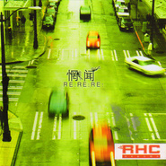

RE: RE: RE:
============================

|  |  |
| :--: | :-- |
| [ RE: RE: RE:](https://emumo.xiami.com/album/15575) | **艺人**: [惘闻](../index.md) **语种**: 国语 **唱片公司**: 嚎叫唱片 **发行时间**: 2005年12月01日 **专辑类别**: 录音室专辑 **专辑风格**: 摇滚 Rock & Roll, 后摇 Post-Rock **播放数**: 279772 **收藏数**: 923 **评论数**: 100  |

## 简介

中国后摇（POST ROCK）领军乐队 2006年全新抗鼎力作！  
水晶般的音符，悠然坠入迭翠的山谷....  
一如行进中车窗外的缓缓世界，寂静而斑斓，于无声之处，惘闻惊雷！  
  
惘闻成立于1999年的大连，这是由当时两个酷爱The Smashing Pumpkins的蹩脚吉他手发起的乐队，鼓手加入并为乐队带来了“惘闻”这个名字，当时的想法是：没有人知道，也不在意外界的看法。乐队于1999年自行录制第一张小样“动物世界”，之后，在不停的创作与演出过程中频繁的更换着乐手，2000年自行录制《凌水河》，2002年录制第三张小样《晦涩的阴阳之路》，同时乐队的风格也逐渐发生变化，逐渐抛弃了人声而朝着纯器乐的方向发展，并开始受到广泛关注，被认为是中国后摇滚和迷幻音乐的代表乐队之一。  
  
对惘闻音乐影响的乐队主要包括：  
Mogwai,  
Red Red Meat,  
Mono,  
Explosion in the Sky,  
Polvo, Tortois，GYBE等。  
 

## 曲目

- [劳动公园](./15575/eZQf7204f.md)
- [My Crime](./15575/8wRu3cc60.md)
- [隧道](./15575/nyii1ab16.md)
- [酒狂](./15575/eZQi88378.md)
- [圆周率](./15575/nyinfed4f.md)
- [最后的麻山](./15575/eZQh6fdd4.md)

## 评论

|  |  |  |
| :-- | :-- | :-- |
|  [虾米用户](https://emumo.xiami.com/u/121702052) 超脱 2020-09-24 11:00 赞(0) 踩(0) | 

 |
|  [虾米用户](https://emumo.xiami.com/u/440840078) 我还没想好要写什么... 2020-07-06 14:56 赞(0) 踩(0) | 
谢谢
 |
|  [虾米用户](https://emumo.xiami.com/u/355865) Let it go, l... 2020-03-28 19:30 赞(1) 踩(0) | 
【2020.3】曲目名称一直是正确的状态。但是曲目顺序简单调整了一下，以实体CD的音轨顺序进行调整。 错误曲目&amp;mdash;&amp;mdash;真实曲目&amp;mdash;&amp;mdash;时长 01 My Crlme&amp;mdash;&amp;mdash;劳动公园&amp;mdash;&amp;mdash; 10:02 02 隧道&amp;mdash;&amp;mdash;My Crime&amp;mdash;&amp;mdash; 06:49 03 劳动公园&amp;mdash;&amp;mdash;隧道&amp;mdash;&amp;mdash; 10:44 04 圆周率&amp;mdash;&amp;mdash;酒狂&amp;mdash;&amp;mdash; 08:07 05 最后的麻山&amp;mdash;&amp;mdash;圆周率&amp;mdash;&amp;mdash; 12:30 06 酒狂&amp;mdash;&amp;mdash;最后的麻山&amp;mdash;&amp;mdash; 08:22
 |
|  [虾米用户](https://emumo.xiami.com/u/119362758) 我还没想好要写什么... 2019-02-16 20:50 赞(0) 踩(0) | 
认真做音乐，
 |
|  [虾米用户](https://emumo.xiami.com/u/355865) Let it go, l... 2019-02-04 23:20 赞(3) 踩(0) | 
【2019.2 重新编辑】 根据<a href="https://zhuanlan.zhihu.com/p/38335052" target="_blank" rel="nofollow noreferrer noopener">https://zhuanlan.zhihu.com/p/38335052</a> 知乎的帖子以及多方查证，目前的曲名名称应该是彻底没毛病了。 需提醒各位，各大资料网站、流媒体网站的信息，都！是！错！的！
 |
|  [虾米用户](https://emumo.xiami.com/u/355865) Let it go, l... 2019-02-04 18:00 赞(0) 踩(0) | 
另外，如果按照置顶评论，bandcamp上的曲目名称似乎也写错了 <a href="https://wangwen.bandcamp.com/album/re-re-re" target="_blank" rel="nofollow noreferrer noopener">https://wangwen.bandcamp.com/album/re-re-re</a> 1. my crime 10:02 2. 隧道 06:49 3. 劳动公园 10:44 4. 圆周率 08:07 5. 酒狂 08:22 6. 最后的麻山 12:30
 |
|  [虾米用户](https://emumo.xiami.com/u/42963872) 我还没想好要写什么... 2019-01-03 05:08 赞(0) 踩(0) | 
-
 |
|  [虾米用户](https://emumo.xiami.com/u/43492923) 行到水穷我才开始害怕，夕... 2018-02-03 19:22 赞(0) 踩(0) | 
△
 |
|  [虾米用户](https://emumo.xiami.com/u/260123122)   2018-02-02 13:08 赞(0) 踩(0) | 
/
 |
|  [虾米用户](https://emumo.xiami.com/u/3556002) wubba lubba 2017-09-07 16:44 赞(0) 踩(0) | 
。
 |
|  [虾米用户](https://emumo.xiami.com/u/1820887) 与虾米共生死~~ 2017-07-12 20:33 赞(3) 踩(0) | 
惘聞有大量的未被收錄到專輯的曲目，比如在這張專輯成型之前，我還能記得的，有一首&amp;ldquo;28天后&amp;rdquo;，奇數拍子絕讚，還有一首&amp;ldquo;星海公園&amp;rdquo;，鼓用的爵士樂打法，非常有新意，但最後都沒有收到專輯里，很是遺憾，我一直都想再聽到這兩首~~
 |
| ⇒ |  [虾米用户](https://emumo.xiami.com/u/8098186) 音乐边界的拓展 2018-02-05 12:15 赞(0) 踩(0) | 
据说是录歌时硬盘烧了，二十八天后和星海公园就在丢失的歌曲里面，后来就再也没排过那些曲子了。
 |
|  [虾米用户](https://emumo.xiami.com/u/4131849) 网易云：非人類兔子Agy... 2016-05-25 13:28 赞(0) 踩(0) | 
/
 |
|  [虾米用户](https://emumo.xiami.com/u/8233768) 这家伙很潇洒什么也没留下... 2016-02-19 17:31 赞(0) 踩(0) | 

 |
|  [虾米用户](https://emumo.xiami.com/u/1142678) 不培养废物了。 2016-01-26 18:32 赞(0) 踩(0) | 
歌名其实都只是象征符号
 |
|  [虾米用户](https://emumo.xiami.com/u/5403324)  2015-12-01 10:46 赞(0) 踩(0) | 
整个人都不好了原来我最喜欢的隧道是my crime我还每次过隧道都会想到这首歌
 |
|  [虾米用户](https://emumo.xiami.com/u/38801880)   2015-10-11 19:37 赞(0) 踩(0) | 
^_^
 |
|  [虾米用户](https://emumo.xiami.com/u/40124694)  2015-08-24 16:48 赞(1) 踩(0) | 
APE无损资源已更新：<a href="http://www.162wp.com/yinle/2015-08-24/25006.html" target="_blank" rel="nofollow noreferrer noopener">http://www.162wp.com/yinle/2015-08-24/25006.html</a>
 |
|  [虾米用户](https://emumo.xiami.com/u/10695504)   2015-02-07 18:00 赞(1) 踩(0) | 
download <a href="http://weibo.com/5061412684/Ba2SCzCZK" target="_blank" rel="nofollow noreferrer noopener">http://weibo.com/5061412684/Ba2SCzCZK</a>
 |
|  [虾米用户](https://emumo.xiami.com/u/307883)   2014-12-06 10:37 赞(0) 踩(0) | 
据说有问题
 |
|  [虾米用户](https://emumo.xiami.com/u/35430704) 光阴归来  碾空白  染... 2014-11-22 17:05 赞(0) 踩(0) | 
想到了一些复杂的事，关于以后，感觉很闷，好像什么都做不到，又好像尽力的话一切皆有可能。查了一下午，将来还是未知，想到了《星级迷航》，墨非定律，预计两年可以完成的旅行，回来时同伴灰白的胡须，“时间”会告诉我们什么，究竟？
 |
|  [虾米用户](https://emumo.xiami.com/u/6291519)  2014-11-18 12:19 赞(0) 踩(0) | 
翻到张老专辑
 |
|  [虾米用户](https://emumo.xiami.com/u/4727415) swallowyours... 2014-09-11 23:14 赞(0) 踩(0) | 
就不能编辑对这曲目啊
 |
| ⇒ |  [虾米用户](https://emumo.xiami.com/u/355865) Let it go, l... 2019-02-04 17:45 赞(0) 踩(0) | 
编辑了。。。
 |
|  [虾米用户](https://emumo.xiami.com/u/25487838)  2014-07-20 23:40 赞(0) 踩(0) | 
想起在四川上学的日子。真好听！
 |
|  [虾米用户](https://emumo.xiami.com/u/19653424) 人生三原则 无相无念无住 2014-06-27 21:49 赞(0) 踩(0) | 
来自大地的声音#_#
 |
|  [虾米用户](https://emumo.xiami.com/u/34331831)  2014-04-10 13:24 赞(0) 踩(0) | 
个人认为后摇的歌曲创作是非常难的 形成自己的风格 让人记住 难上加难 我们学来了操控乐器的技术 却学不来操控心灵的技术 一群人邯郸学步 不觉自我为何物 何其悲壮
 |
|  [虾米用户](https://emumo.xiami.com/u/408789)  2014-03-25 18:51 赞(0) 踩(0) | 
给力的！
 |
|  [虾米用户](https://emumo.xiami.com/u/7958968) 爱丽丝谷 2014-01-01 14:40 赞(24) 踩(0) | 
封面抄袭。。。<a href="http://www.xiami.com/album/259897?spm=a1z1s.6659509.6856557.11.8UHNwP" target="_blank" rel="nofollow noreferrer noopener">http://www.xiami.com/album/259897?spm=a1z1s.6659509.6856557.11.8UHNwP</a>
 |
| ⇒ |  [虾米用户](https://emumo.xiami.com/u/6515158) weibo：杯砸_aer... 2014-01-07 17:39 赞(0) 踩(0) | 
我去，这也行= =
 |
| ⇒ |  [虾米用户](https://emumo.xiami.com/u/5543468)  2014-01-13 20:05 赞(0) 踩(0) | 
赤裸裸的抄袭啊
 |
| ⇒ |  [虾米用户](https://emumo.xiami.com/u/22849786) 我还没想好要写什么... 2014-01-16 14:30 赞(0) 踩(0) | 
抄袭了还P掉了辆车~
 |
| ⇒ |  [虾米用户](https://emumo.xiami.com/u/1285669)  2014-03-07 10:42 赞(0) 踩(0) | 
怪不得曲目第一首叫「My Crime」...
 |
| ⇒ |  [虾米用户](https://emumo.xiami.com/u/1192632)   2014-04-01 12:23 赞(0) 踩(0) | 
<q><b>黑色素眼袋说：</b></q>
 |
| ⇒ |  [虾米用户](https://emumo.xiami.com/u/22849786) 我还没想好要写什么... 2014-04-02 12:16 赞(0) 踩(0) | 
<q><b>lithium说：</b></q>
 |
| ⇒ |  [虾米用户](https://emumo.xiami.com/u/5044438) 今天白嘟出雙人曲了嗎？ 2014-05-28 12:53 赞(0) 踩(0) | 
我去还真只是p走了辆车。。。
 |
| ⇒ |  [虾米用户](https://emumo.xiami.com/u/31355651) 我还没想好要写什么... 2014-06-02 22:01 赞(0) 踩(0) | 
<q><b>橙橙橙说：</b></q>
 |
| ⇒ |  [虾米用户](https://emumo.xiami.com/u/13740776)   2017-06-02 00:48 赞(0) 踩(0) | 
我去 直接拿过来用了。。 这也太夸张了吧。。
 |
| ⇒ |  [虾米用户](https://emumo.xiami.com/u/2069608) 尋找志同道合的朋友…… 2018-09-01 05:36 赞(0) 踩(0) | 
這麼多年才知道。。。。。。。。。
 |
| ⇒ |  [虾米用户](https://emumo.xiami.com/u/1940847) 嘘であり、悪である。 2020-10-26 12:04 赞(0) 踩(0) | 
嚯&amp;hellip;&amp;hellip;&amp;hellip;
 |
|  [虾米用户](https://emumo.xiami.com/u/7685124)  2013-10-29 14:40 赞(0) 踩(0) | 
曲目对了吗？感觉my crime还是不对。。。
 |
| ⇒ |  [虾米用户](https://emumo.xiami.com/u/355865) Let it go, l... 2019-02-05 17:55 赞(0) 踩(0) | 
这次彻底没毛病了。2019.2
 |
|  [虾米用户](https://emumo.xiami.com/u/3874) 我还没想好要写什么... 2013-07-11 22:02 赞(0) 踩(0) | 
虾米根据我收藏了窦唯推荐给我这张，夏天听，心生凉意。金属声音却如溪水流过鹅卵石，有触摸到肌肤一样的温柔及惊讶。带我去某个神秘的地方吧。
 |
|  [虾米用户](https://emumo.xiami.com/u/11201350) . 2013-06-07 12:13 赞(0) 踩(0) | 
曲目没对吧。。“圆周率”那首明显就是“酒狂”的调子
 |
| ⇒ |  [虾米用户](https://emumo.xiami.com/u/355865) Let it go, l... 2013-10-22 11:36 赞(0) 踩(0) | 
确定吗？这张已经被修正过一次了。
 |
|  [虾米用户](https://emumo.xiami.com/u/141588) 活一场。 2013-03-26 13:09 赞(1) 踩(0) | 
曲目 请尽快改正！！！！！！！！！！！
 |
| ⇒ |  [虾米用户](https://emumo.xiami.com/u/355865) Let it go, l... 2013-10-22 11:36 赞(0) 踩(0) | 
已经修正了啊？
 |
| ⇒ |  [虾米用户](https://emumo.xiami.com/u/141588) 活一场。 2014-02-26 12:38 赞(0) 踩(0) | 
<q><b>Desperado说：</b></q>
 |
| ⇒ |  [虾米用户](https://emumo.xiami.com/u/355865) Let it go, l... 2014-02-26 14:08 赞(0) 踩(0) | 
<q><b>康活活说：</b></q>
 |
| ⇒ |  [虾米用户](https://emumo.xiami.com/u/141588) 活一场。 2014-02-28 13:10 赞(0) 踩(0) | 
<q><b>Desperado说：</b></q>
 |
| ⇒ |  [虾米用户](https://emumo.xiami.com/u/141588) 活一场。 2014-02-28 13:11 赞(0) 踩(0) | 
<q><b>Desperado说：</b></q>
 |
| ⇒ |  [虾米用户](https://emumo.xiami.com/u/355865) Let it go, l... 2014-02-28 13:13 赞(0) 踩(0) | 
<q><b>康活活说：</b></q>
 |
| ⇒ |  [虾米用户](https://emumo.xiami.com/u/6630660) 猜赢涂口红… 2014-02-28 14:14 赞(0) 踩(0) | 
<q><b>Desperado说：</b></q>
 |
| ⇒ |  [虾米用户](https://emumo.xiami.com/u/355865) Let it go, l... 2014-02-28 14:16 赞(0) 踩(0) | 
<q><b>哈哈哈哈哈哈哈哈哈哈哈皮说：</b></q>
 |
| ⇒ |  [虾米用户](https://emumo.xiami.com/u/48521532)  2019-02-04 03:32 赞(0) 踩(0) | 
<q><b>Desperado说：</b></q>
 |
| ⇒ |  [虾米用户](https://emumo.xiami.com/u/355865) Let it go, l... 2019-02-04 17:43 赞(0) 踩(0) | 
<q><b>nomoc说：</b></q>
 |
|  [虾米用户](https://emumo.xiami.com/u/7567328) 何以如此喧囂? 2012-12-11 20:49 赞(0) 踩(0) | 
終於恢復正常可以聽了 !
 |
|  [虾米用户](https://emumo.xiami.com/u/395083)  2012-11-26 13:42 赞(1) 踩(0) | 
曲目对了现在
 |
|  [虾米用户](https://emumo.xiami.com/u/6515158) weibo：杯砸_aer... 2012-11-26 12:11 赞(0) 踩(0) | 
曲目这回对了吧~弱弱的问一下~
 |
| ⇒ |  [虾米用户](https://emumo.xiami.com/u/355865) Let it go, l... 2014-02-26 14:28 赞(0) 踩(0) | 
aeris你是从国外的torrent上下载的FLAC吧？我发现目前的曲序跟那个torrent上的是一致的。但是似乎那个torrent好像是错的 (并且那个torrent上FLAC的音质也达不到无损音质，不知道是不是源盘频谱不佳)。。。有没有同学有原版碟啊，证明一下。。。。。<a href="http://emumo.xiami.com/u/6630660" target="_blank" rel="nofollow" name_card="6630660">@乱七∞糟</a>
 |
| ⇒ |  [虾米用户](https://emumo.xiami.com/u/6515158) weibo：杯砸_aer... 2014-02-26 16:00 赞(0) 踩(0) | 
<q><b>Desperado说：</b></q>
 |
| ⇒ |  [虾米用户](https://emumo.xiami.com/u/355865) Let it go, l... 2014-02-26 16:01 赞(0) 踩(0) | 
<q><b>aeris.W说：</b></q>
 |
|  [虾米用户](https://emumo.xiami.com/u/8433579) 我还没想好要写什么... 2012-06-28 23:45 赞(0) 踩(0) | 
画面感
 |
|  [虾米用户](https://emumo.xiami.com/u/2486624) Like a star 2012-06-16 23:25 赞(0) 踩(0) | 
很喜欢这一张的...
 |
|  [虾米用户](https://emumo.xiami.com/u/29) 耍中偶得 2012-03-11 21:47 赞(3) 踩(0) | 
顺序和曲目好像有问题。
 |
| ⇒ |  [虾米用户](https://emumo.xiami.com/u/7225293)  2012-08-10 08:47 赞(0) 踩(0) | 
My Crlme——劳动公园 隧道——My Crlme 劳动公园——隧道 圆周率——酒狂 最后的麻山——圆周率 酒狂——最后的麻山
 |
| ⇒ |  [虾米用户](https://emumo.xiami.com/u/355865) Let it go, l... 2015-09-05 22:54 赞(0) 踩(0) | 
唐姐，现在还有问题么？如果没问题请修改置顶评论。
 |
|  [虾米用户](https://emumo.xiami.com/u/4788608) 世界太小，無處可滾。 2012-03-01 10:31 赞(0) 踩(0) | 
專業一點行不行啊！
 |
|  [虾米用户](https://emumo.xiami.com/u/6585518)  2012-02-29 09:48 赞(0) 踩(0) | 
乱死了，本来知道顺序的................(＞﹏＜)
 |
|  [虾米用户](https://emumo.xiami.com/u/4362247) 我还没想好要写什么... 2012-02-24 21:51 赞(0) 踩(0) | 
怎么别的音乐网站歌名也串了？
 |
|  [虾米用户](https://emumo.xiami.com/u/4362247) 我还没想好要写什么... 2012-02-24 21:46 赞(0) 踩(0) | 
奇怪？圆周率怎么不是
 |
|  [虾米用户](https://emumo.xiami.com/u/2143315)   2012-02-18 18:41 赞(0) 踩(0) | 
great
 |
|  [虾米用户](https://emumo.xiami.com/u/6176970) 云村：栽树 2012-02-13 02:58 赞(0) 踩(0) | 
《圆周率》为什么和我听的不一样？
 |
|  [虾米用户](https://emumo.xiami.com/u/3761822)  2011-12-10 05:42 赞(0) 踩(0) | 
听一首歌像看了一场电影
 |
|  [虾米用户](https://emumo.xiami.com/u/28421)  2011-11-23 00:18 赞(0) 踩(0) | 
My Crlme 怎么是 酒狂的  调调   太不严谨了
 |
|  [虾米用户](https://emumo.xiami.com/u/531144) 我还没想好要写什么... 2011-11-19 23:45 赞(0) 踩(0) | 
歌名怎么串了……还是从正常变串……
 |
|  [虾米用户](https://emumo.xiami.com/u/815046)  2011-11-12 23:40 赞(0) 踩(0) | 
歌名错了吧 = =
 |
|  [虾米用户](https://emumo.xiami.com/u/906431)  2011-11-09 23:07 赞(0) 踩(0) | 
后摇
 |
|  [虾米用户](https://emumo.xiami.com/u/1712847)  2011-10-21 22:58 赞(0) 踩(0) | 
惘闻
 |
|  [虾米用户](https://emumo.xiami.com/u/6021993) 爱上层楼  2011-09-29 16:55 赞(0) 踩(0) | 
yarune
 |
|  [虾米用户](https://emumo.xiami.com/u/2068096) 消失的光年 2011-08-21 18:34 赞(0) 踩(0) | 
后摇
 |
|  [虾米用户](https://emumo.xiami.com/u/2068096) 消失的光年 2011-08-21 18:33 赞(0) 踩(0) | 
很有感的一张专辑，会有光影交织的流年感。
 |
|  [虾米用户](https://emumo.xiami.com/u/265666)  2011-08-07 21:38 赞(0) 踩(0) | 
第一次听到首曲“RE RE RE”就被镇住了，也在当时下决心要买一个好一点的耳机。
 |
|  [虾米用户](https://emumo.xiami.com/u/1101455) 暂无签名~ 2011-07-20 23:20 赞(13) 踩(0) | 
这张专辑的曲目都错了。  专辑曲目——实际曲目 My Crlme——劳动公园 隧道——My Crlme 劳动公园——隧道 圆周率——酒狂 最后的麻山——圆周率 酒狂——最后的麻山
 |
| ⇒ |  [虾米用户](https://emumo.xiami.com/u/4727415) swallowyours... 2012-06-18 14:31 赞(0) 踩(0) | 
你这个是对应专辑上的吗，被坑了...
 |
| ⇒ |  [虾米用户](https://emumo.xiami.com/u/5800966) Comedy biaaa... 2015-08-21 11:34 赞(0) 踩(0) | 
还是错的嘛
 |
| ⇒ |  [虾米用户](https://emumo.xiami.com/u/355865) Let it go, l... 2019-02-04 17:43 赞(0) 踩(0) | 
已修正了 2019.2
 |
| ⇒ |  [虾米用户](https://emumo.xiami.com/u/355865) Let it go, l... 2019-02-04 17:43 赞(0) 踩(0) | 
<q><b>Desperado说：</b></q>
 |
| ⇒ |  [虾米用户](https://emumo.xiami.com/u/355865) Let it go, l... 2019-02-05 00:35 赞(0) 踩(0) | 
错误曲目——真实曲目——时长 My Crlme——劳动公园—— 10:02 隧道——My Crime—— 06:49 劳动公园——隧道—— 10:44 圆周率——酒狂—— 08:07 最后的麻山——圆周率—— 12:30 酒狂——最后的麻山—— 08:22
 |
|  [虾米用户](https://emumo.xiami.com/u/4051783)  2011-07-20 21:12 赞(0) 踩(0) | 
很喜欢这个专辑的名字 Re：Re：Re
 |
|  [虾米用户](https://emumo.xiami.com/u/753500)  2011-07-11 01:59 赞(0) 踩(0) | 
&amp;lt;My Crlme&amp;gt; &amp;lt;隧道&amp;gt; &amp;lt;酒狂&amp;gt;
 |
|  [虾米用户](https://emumo.xiami.com/u/2476450) 身死人手为天下笑者 2011-07-07 23:46 赞(0) 踩(0) | 
这张专辑歌名全错了吧
 |
| ⇒ |  [虾米用户](https://emumo.xiami.com/u/7245410) 风里传来一丝丝屁味 2016-05-31 15:18 赞(0) 踩(0) | 
都是故事了
 |
| ⇒ |  [虾米用户](https://emumo.xiami.com/u/2476450) 身死人手为天下笑者 2016-05-31 15:20 赞(0) 踩(0) | 
<q><b>一瞬间起飞说：</b></q>
 |
|  [虾米用户](https://emumo.xiami.com/u/4140119)  2011-06-01 20:37 赞(0) 踩(0) | 
迷醉在隧道大段大段的连复段中。
 |
|  [虾米用户](https://emumo.xiami.com/u/3002888)   2011-03-04 16:22 赞(0) 踩(0) | 
隧道太棒了
 |
|  [虾米用户](https://emumo.xiami.com/u/476259) 我还没想好要写什么... 2010-01-26 19:29 赞(1) 踩(0) | 
呃 有没有帮我解释一下...<a href="http://www.xiami.com/album/259897" target="_blank" rel="nofollow noreferrer noopener">http://www.xiami.com/album/259897</a>
 |
| ⇒ |  [虾米用户](https://emumo.xiami.com/u/220719) 自知不自見，自愛不自貴 2010-11-21 20:30 赞(0) 踩(0) | 
不用解釋了，拿來主義嘛，，，，，只要不直接拿旋律和歌詞就別強求看了
 |
| ⇒ |  [虾米用户](https://emumo.xiami.com/u/476259) 我还没想好要写什么... 2010-11-22 01:07 赞(0) 踩(0) | 
<q><b>望月優说：</b></q>
 |
| ⇒ |  [虾米用户](https://emumo.xiami.com/u/1101455) 暂无签名~ 2011-07-20 23:21 赞(0) 踩(0) | 
以前有问人问过这个，好像是发行公司的问题。
 |
